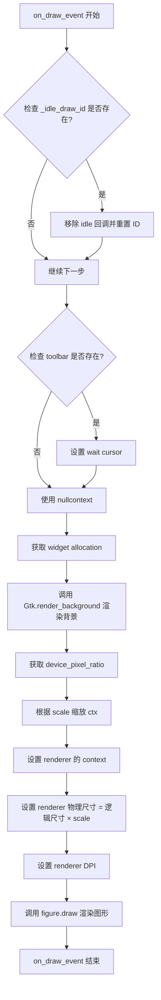
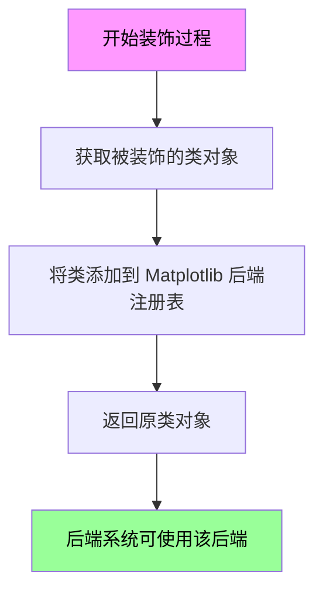
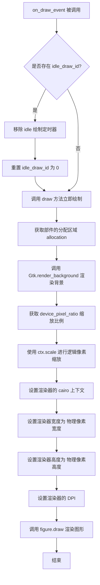

# `matplotlib\lib\matplotlib\backends\backend_gtk3cairo.py` 详细设计文档

这是一个Matplotlib的GTK3+Cairo后端实现，通过结合GTK3图形界面库和Cairo 2D绘图库，提供在GTK3应用程序中渲染Matplotlib图形的能力。核心类FigureCanvasGTK3Cairo继承自Cairo和GTK3两个后端，实现了在GTK3窗口中的高性能图形渲染。

## 整体流程



## 类结构

```
FigureCanvasCairo (Cairo后端基类)
FigureCanvasGTK3 (GTK3后端基类)
└── FigureCanvasGTK3Cairo (组合后端)

_BackendGTK3 (GTK3后端封装)
└── _BackendGTK3Cairo (GTK3+Cairo后端实现)
```

## 全局变量及字段


### `FigureCanvasGTK3Cairo._idle_draw_id`
    
GTK idle 回调ID，用于管理绘制调度

类型：`int`
    


### `_BackendGTK3Cairo.FigureCanvas`
    
指定使用的画布类为 FigureCanvasGTK3Cairo

类型：`class`
    
    

## 全局函数及方法


### `_BackendGTK3.export`

`_BackendGTK3.export` 是 Matplotlib GTK3 后端中的一个装饰器函数，用于将后端类注册到 Matplotlib 的后端系统中，使其可以被 Matplotlib 的后端查找机制发现和使用。

参数：

- `cls`：`type`，被装饰的后端类（接收一个类对象作为参数）

返回值：`type`，返回被装饰的类，通常是将类注册到后端字典后返回原类

#### 流程图



#### 带注释源码

```python
@_BackendGTK3.export
class _BackendGTK3Cairo(_BackendGTK3):
    """
    GTK3 + Cairo 后端类
    
    继承自 _BackendGTK3 基类，组合了 GTK3 工具包和 Cairo 渲染引擎
    """
    FigureCanvas = FigureCanvasGTK3Cairo  # 指定该后端使用的画布类
```

#### 补充说明

`@_BackendGTK3.export` 装饰器的实现逻辑（在 `_BackendGTK3` 类中）大致如下：

```python
class _BackendGTK3:
    # 后端注册表字典，存储所有已注册的后端
    _backend_cache = {}
    
    @staticmethod
    def export(cls):
        """
        装饰器：注册后端类到 Matplotlib 后端系统
        
        参数:
            cls: 要注册的后端类
            
        返回:
            被注册的类本身
        """
        # 获取类名作为后端标识符
        backend_name = cls.__name__
        
        # 将后端类注册到 Matplotlib 的后端字典中
        # Matplotlib 通过后端名称来查找和加载对应的后端
        _BackendGTK3._backend_cache[backend_name] = cls
        
        return cls
```

**关键作用**：
- 该装饰器将 `_BackendGTK3Cairo` 类注册到 Matplotlib 的后端系统中
- 注册后，Matplotlib 可以通过后端名称 `"GTK3Cairo"` 来实例化这个后端
- 这使得用户可以通过 `plt.switch_backend('GTK3Cairo')` 来使用该后端


### FigureCanvasGTK3Cairo.on_draw_event

该方法处理GTK3的绘制事件，在Cairo图形上下文中渲染matplotlib图形。它首先取消待处理的空闲绘制，获取部件的分配区域，渲染背景，并根据设备像素比进行缩放，最后使用Cairo渲染器绘制整个图形。

参数：

- `self`：FigureCanvasGTK3Cairo，当前画布实例
- `widget`：Gtk.Widget，触发绘制事件的GTK部件
- `ctx`：cairo.Context，Cairo图形上下文，用于绘制图形

返回值：`None`，该方法无返回值，通过副作用完成图形渲染

#### 流程图



#### 带注释源码

```python
def on_draw_event(self, widget, ctx):
    # 检查是否存在待处理的空闲绘制回调
    if self._idle_draw_id:
        # 移除之前的空闲绘制定时器，避免重复绘制
        GLib.source_remove(self._idle_draw_id)
        # 重置空闲绘制ID为0
        self._idle_draw_id = 0
        # 立即执行绘制操作
        self.draw()

    # 根据是否存在工具栏来决定是否显示等待光标
    # 如果有工具栏，使用其 _wait_cursor_for_draw_cm() 上下文管理器
    with (self.toolbar._wait_cursor_for_draw_cm() if self.toolbar
          else nullcontext()):
        # 获取部件的分配区域（位置和尺寸）
        allocation = self.get_allocation()
        
        # 在缩放之前渲染背景，因为分配的大小是逻辑像素
        Gtk.render_background(
            self.get_style_context(), ctx,
            0, 0, allocation.width, allocation.height)
        
        # 获取设备像素比（用于高DPI屏幕支持）
        scale = self.device_pixel_ratio
        
        # 将物理绘制缩放到逻辑大小（反向缩放）
        ctx.scale(1 / scale, 1 / scale)
        
        # 设置渲染器的Cairo上下文
        self._renderer.set_context(ctx)
        
        # 设置渲染器为物理像素大小，以便进行全分辨率渲染
        self._renderer.width = allocation.width * scale
        self._renderer.height = allocation.height * scale
        
        # 设置渲染器的DPI
        self._renderer.dpi = self.figure.dpi
        
        # 使用渲染器绘制整个图形
        self.figure.draw(self._renderer)
```

## 关键组件


### FigureCanvasGTK3Cairo

混合 GTK3 和 Cairo 的画布类，继承自 FigureCanvasCairo 和 FigureCanvasGTK3，用于在 GTK3 环境下使用 Cairo 进行图形渲染。

### on_draw_event

处理 GTK3 的绘制事件，实现惰性绘制机制（通过 _idle_draw_id 控制），负责背景渲染、设备像素比缩放、设置渲染器尺寸并执行图形绘制。

### _BackendGTK3Cairo

GTK3 Cairo 后端导出类，继承自 _BackendGTK3，用于注册 FigureCanvasGTK3Cairo 作为该后端的画布类。

### _idle_draw_id

记录当前挂起的空闲绘制回调 ID，用于实现绘制节流，避免频繁重绘。

### toolbar._wait_cursor_for_draw_cm

工具栏的等待光标上下文管理器，用于在绘制期间显示等待光标。

### device_pixel_ratio

设备像素比属性，用于将逻辑像素坐标转换为物理像素坐标，确保高分辨率屏幕下的清晰渲染。

### _renderer

Cairo 渲染器对象，负责实际的图形绘制操作，包括设置上下文、尺寸和 DPI。

### FigureCanvasCairo

Cairo 后端画布基类，提供 Cairo 特定的绘制功能。

### FigureCanvasGTK3

GTK3 后端画布基类，提供 GTK3 特定的窗口和事件处理功能。


## 问题及建议


### 已知问题

-   **资源泄漏风险**：`GLib.source_remove(self._idle_draw_id)` 未检查返回值，如果定时器不存在或已移除，可能导致潜在问题
-   **空值检查缺失**：`self.toolbar._wait_cursor_for_draw_cm()` 直接调用未检查toolbar是否为None，尽管后面有条件判断，但逻辑不够严谨
-   **硬编码逻辑**：`_idle_draw_id = 0` 使用魔法数字0作为"无定时器"的标识，应该使用常量或None
-   **混合继承顺序**：多重继承可能导致MRO（方法解析顺序）问题，特别是FigureCanvasCairo和FigureCanvasGTK3可能有重叠方法
-   **异常处理缺失**：整个`on_draw_event`方法没有异常处理，如果渲染失败可能导致程序崩溃
-   **设备像素比例处理**：直接修改`_renderer.width`和`_renderer.height`可能影响渲染器状态，缺少状态保护机制

### 优化建议

-   提取魔法数字0为常量，如`IDLE_DRAW_ID_NONE = 0`，提高代码可读性
-   添加try-finally块确保资源正确释放，即使渲染过程中发生异常
-   考虑使用`contextlib.nullcontext()`代替三元表达式处理toolbar，使代码更清晰
-   在修改`_renderer`属性前保存原始值，渲染完成后恢复，避免副作用影响其他绘制操作
-   添加设备像素比例的边界检查，防止非法值导致渲染错误
-   将样式渲染和缩放逻辑分离到独立方法，提高代码可维护性
-   考虑添加日志记录，用于调试渲染过程中的问题


## 其它


### 设计目标与约束

设计目标：在GTK3应用程序中集成Cairo渲染后端，以实现matplotlib图形的高效绘制。约束包括依赖GTK3和Cairo库，需要在主线程中运行，且必须遵循GTK3的事件循环模型。

### 错误处理与异常设计

代码中主要处理绘制事件，但缺乏显式的异常捕获。潜在的异常包括：获取样式上下文失败、Cairo上下文无效、渲染器设置错误等。建议在on_draw_event中添加try-except块，捕获并记录异常，避免因单个绘制错误导致应用程序崩溃。

### 数据流与状态机

数据流：GTK3的绘制事件触发on_draw_event方法，首先移除待处理的空闲绘制以避免重复，然后获取分配区域和设备像素比，设置Cairo上下文，配置渲染器物理尺寸，最后调用figure.draw进行绘制。状态包括：_idle_draw_id表示待处理的空闲绘制，渲染器状态表示当前绘制配置。

### 外部依赖与接口契约

依赖：matplotlib的backend_gtk3和backend_cairo模块，具体依赖GLib、Gtk等GTK3组件，以及Cairo绘图库。接口契约：FigureCanvasGTK3Cairo必须实现on_draw_event方法，继承FigureCanvasGTK3和FigureCanvasCairo的接口；_BackendGTK3Cairo需提供FigureCanvas属性。

### 性能考虑

通过移除旧的空闲绘制ID来避免频繁绘制，使用device_pixel_ratio进行缩放以适应高DPI屏幕，渲染器设置为物理尺寸以保证高分辨率绘制。

### 线程安全性

GTK3不是线程安全的，所有GTK3操作必须在主线程中执行。on_draw_event由GTK3事件循环在主线程调用，因此不存在线程安全问题，但需确保其他模块不从前台线程调用GTK3函数。

### 配置与初始化

_BackendGTK3Cairo类通过_BackendGTK3.export装饰器注册为GTK3的Cairo后端，初始化时设置FigureCanvas为FigureCanvasGTK3Cairo。配置包括在matplotlibrc中指定backend为GTK3Cairo。

### 资源管理

渲染器（_renderer）的生命周期由FigureCanvas管理，在on_draw_event中动态设置其width、height和dpi。无需手动释放，但需确保figure对象存在。

### 兼容性

支持GTK3和Cairo，支持高DPI显示器。需注意GTK3版本兼容性，以及Cairo版本对绘图功能的支持。

### 测试策略

测试应覆盖：on_draw_event的正常绘制流程，空闲绘制ID的处理，设备像素比的缩放，渲染器尺寸设置，以及在高DPI下的绘制。
    