# `matplotlib\lib\matplotlib\backends\backend_gtk4.py` 详细设计文档

这是 Matplotlib 库的 GTK4 后端实现，提供基于 GTK4 工具包的图形canvas组件、工具栏以及事件处理机制，用于在 GTK4 应用程序中渲染 Matplotlib 图表并处理用户交互（鼠标、键盘、缩放等）。

## 整体流程

```mermaid
graph TD
    A[应用启动] --> B[创建 FigureManagerGTK4]
    B --> C[创建 FigureCanvasGTK4]
    C --> D[初始化 Canvas 属性与 CSS]
    D --> E[注册 GTK 事件控制器 (Controllers)]
    E --> F{等待用户交互或系统事件}
    F -->|鼠标/键盘事件| G[触发 EventController 回调]
    G --> H[_mpl_coords 转换坐标]
    H --> I[创建 Matplotlib Event 对象 (MouseEvent/KeyEvent)]
    I --> J[Event._process() 分发事件]
    J --> K{是否有绘图请求?}
    K -->|是| L[draw_idle / queue_draw]
    L --> M[GTK 调度绘制 (_draw_func)]
    M --> N[on_draw_event / _post_draw]
    N --> F
    F -->|窗口调整| O[resize_event]
    O --> P[计算新尺寸 set_size_inches]
    P --> L
```

## 类结构

```
_BackendGTK (基类)
└── _BackendGTK4

_FigureManagerGTK (基类)
└── FigureManagerGTK4

_FigureCanvasGTK (基类)
└── FigureCanvasGTK4

_NavigationToolbar2GTK (基类)
└── NavigationToolbar2GTK4

ToolContainerBase (GTK接口)
└── ToolbarGTK4

backend_tools.SaveFigureBase
└── SaveFigureGTK4

backend_tools.ToolHelpBase
└── HelpGTK4

backend_tools.ToolCopyToClipboardBase
└── ToolCopyToClipboardGTK4
```

## 全局变量及字段


### `_GOBJECT_GE_3_47`
    
Boolean flag indicating whether the GObject library version is greater than or equal to 3.47.0

类型：`bool`
    


### `_GTK_GE_4_12`
    
Boolean flag indicating whether the GTK4 library version is greater than or equal to 4.12.0

类型：`bool`
    


### `gi_require_version`
    
Function imported from PyGObject to require specific versions of GTK modules

类型：`function`
    


### `mpl`
    
The matplotlib library module alias for accessing rcParams and other matplotlib utilities

类型：`module`
    


### `Gio`
    
GIO module from PyGObject providing desktop integration features like file handling and icons

类型：`module`
    


### `GLib`
    
GLib module from PyGObject providing main loop and idle callback functionality

类型：`module`
    


### `Gtk`
    
GTK4 widget toolkit module from PyGObject for building GUI components

类型：`module`
    


### `Gdk`
    
GDK module from PyGObject for graphics, input events, and window management

类型：`module`
    


### `GdkPixbuf`
    
GdkPixbuf module from PyGObject for image manipulation and clipboard operations

类型：`module`
    


### `FigureCanvasGTK4.required_interactive_framework`
    
String identifying the interactive framework (gtk4) required by this canvas

类型：`str`
    


### `FigureCanvasGTK4.supports_blit`
    
Boolean flag indicating whether blit operations are supported (False for GTK4)

类型：`bool`
    


### `FigureCanvasGTK4.manager_class`
    
Class property defining the figure manager class (FigureManagerGTK4) for this canvas

类型：`classproperty`
    


### `FigureCanvasGTK4._idle_draw_id`
    
Integer tracking the GLib idle callback ID for deferred drawing operations

类型：`int`
    


### `FigureCanvasGTK4._rubberband_rect`
    
Tuple storing the rubberband selection rectangle coordinates or None if not active

类型：`tuple | None`
    


### `NavigationToolbar2GTK4._gtk_ids`
    
Dictionary mapping toolbar button text labels to their GTK button widget instances

类型：`dict`
    


### `ToolbarGTK4._icon_extension`
    
String constant defining the icon file extension (-symbolic.svg) for toolbar icons

类型：`str`
    


### `ToolbarGTK4._tool_box`
    
GTK Box container widget holding all toolbar groups and buttons

类型：`Gtk.Box`
    


### `ToolbarGTK4._groups`
    
Dictionary mapping group names to their respective GTK Box containers

类型：`dict`
    


### `ToolbarGTK4._toolitems`
    
Dictionary mapping tool names to lists of (button, signal_handler) tuples

类型：`dict`
    


### `ToolbarGTK4._message`
    
GTK Label widget for displaying status messages in the toolbar

类型：`Gtk.Label`
    


### `FigureManagerGTK4._toolbar2_class`
    
Class reference to the legacy toolbar implementation (NavigationToolbar2GTK4)

类型：`type`
    


### `FigureManagerGTK4._toolmanager_toolbar_class`
    
Class reference to the modern toolbar implementation (ToolbarGTK4)

类型：`type`
    


### `_BackendGTK4.FigureCanvas`
    
Class reference to the FigureCanvasGTK4 class for this backend

类型：`type`
    


### `_BackendGTK4.FigureManager`
    
Class reference to the FigureManagerGTK4 class for this backend

类型：`type`
    
    

## 全局函数及方法


### `_BackendGTK4`

该类是 Matplotlib GTK4 后端的核心入口类，通过 `_BackendGTK.export` 装饰器导出，负责将 `FigureCanvasGTK4` 和 `FigureManagerGTK4` 绑定到后端系统中，使 Matplotlib 能够使用 GTK4 框架进行图形渲染和交互。

参数： 无（类定义不接受参数）

返回值：`type`，返回 `_BackendGTK4` 类本身，该类继承自 `_BackendGTK`，包含 `FigureCanvas` 和 `FigureManager` 类属性

#### 流程图

```mermaid
graph TD
    A[Matplotlib 后端加载] --> B[@_BackendGTK.export 装饰器]
    B --> C[实例化 _BackendGTK4 类]
    C --> D[设置 FigureCanvas = FigureCanvasGTK4]
    C --> E[设置 FigureManager = FigureManagerGTK4]
    D --> F[GTK4 后端就绪]
    E --> F
    F --> G[用户创建 Figure]
    G --> H[FigureManagerGTK4 管理窗口]
    H --> I[FigureCanvasGTK4 处理渲染和事件]
```

#### 带注释源码

```python
@_BackendGTK.export
class _BackendGTK4(_BackendGTK):
    """
    Matplotlib GTK4 后端入口类。
    
    该类通过装饰器注册到 Matplotlib 后端系统，
    关联 GTK4 特定的画布和管理器类。
    """
    
    # 绑定 GTK4 专用的画布类，负责图形渲染和 GTK 事件处理
    FigureCanvas = FigureCanvasGTK4
    
    # 绑定 GTK4 专用的管理器类，负责图形窗口的生命周期管理
    FigureManager = FigureManagerGTK4
```


### `backend_tools._register_tool_class`

该函数是 Matplotlib 后端工具系统的装饰器工厂函数，用于将自定义工具类注册到指定的后端画布类中，使工具管理器能够发现并实例化这些工具。

参数：

-  `canvas_class`：类型 `type`，需要注册工具的目标画布类（例如 `FigureCanvasGTK4`），该参数指定了工具将作用于哪个后端画布类型。

返回值：返回类型 `Callable[[type], type]`，返回一个装饰器函数，该装饰器接收工具类作为参数并将其注册到指定画布类的工具集合中，返回被装饰的工具类。

#### 流程图

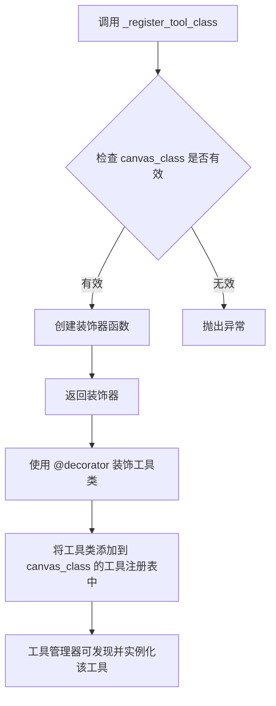

#### 带注释源码

```python
# 注意：此函数定义在 matplotlib.backend_tools 模块中，
# 以下是基于代码使用方式的推断实现

def _register_tool_class(canvas_class):
    """
    装饰器工厂：注册工具类到指定的后端画布类。
    
    Parameters
    ----------
    canvas_class : type
        目标画布类，例如 FigureCanvasGTK4
        
    Returns
    -------
    decorator : callable
        返回一个装饰器函数，用于装饰工具类
    """
    
    def decorator(tool_class):
        """
        实际装饰器：将工具类注册到画布类的工具集合中。
        
        Parameters
        ----------
        tool_class : type
            要注册的工具类，例如 SaveFigureGTK4
            
        Returns
        -------
        tool_class : type
            返回原始工具类（未修改）
        """
        # 将工具类添加到画布类的 _tool_classes 列表中
        # 这是一个内部注册机制，允许工具管理器发现可用的工具
        canvas_class._tool_classes = getattr(
            canvas_class, '_tool_classes', [])
        canvas_class._tool_classes.append(tool_class)
        return tool_class
    
    return decorator


# 使用示例（来自给定代码）：
@backend_tools._register_tool_class(FigureCanvasGTK4)
class SaveFigureGTK4(backend_tools.SaveFigureBase):
    """保存图形工具的 GTK4 后端实现"""
    def trigger(self, *args, **kwargs):
        NavigationToolbar2GTK4.save_figure(
            self._make_classic_style_pseudo_toolbar())


@backend_tools._register_tool_class(FigureCanvasGTK4)
class HelpGTK4(backend_tools.ToolHelpBase):
    """帮助工具的 GTK4 后端实现"""
    def _normalize_shortcut(self, key):
        # 将 Matplotlib 快捷键转换为 GTK+ 加速器标识符
        special = {
            'backspace': 'BackSpace',
            'pagedown': 'Page_Down',
            'pageup': 'Page_Up',
            'scroll_lock': 'Scroll_Lock',
        }
        parts = key.split('+')
        mods = ['<' + mod + '>' for mod in parts[:-1]]
        key = parts[-1]
        if key in special:
            key = special[key]
        elif len(key) > 1:
            key = key.capitalize()
        elif key.isupper():
            mods += ['<shift>']
        return ''.join(mods) + key

    def _is_valid_shortcut(self, key):
        # 检查快捷键是否有效（排除 cmd+ 和鼠标按钮）
        return 'cmd+' not in key and not key.startswith('MouseButton.')

    def trigger(self, *args):
        # 显示快捷键帮助窗口
        section = Gtk.ShortcutsSection()
        for name, tool in sorted(self.toolmanager.tools.items()):
            if not tool.description:
                continue
            group = Gtk.ShortcutsGroup()
            section.append(group)
            child = group.get_first_child()
            while child is not None:
                child.set_visible(False)
                child = child.get_next_sibling()
            shortcut = Gtk.ShortcutsShortcut(
                accelerator=' '.join(
                    self._normalize_shortcut(key)
                    for key in self.toolmanager.get_tool_keymap(name)
                    if self._is_valid_shortcut(key)),
                title=tool.name,
                subtitle=tool.description)
            group.append(shortcut)
        window = Gtk.ShortcutsWindow(
            title='Help',
            modal=True,
            transient_for=self._figure.canvas.get_root())
        window.set_child(section)
        window.show()


@backend_tools._register_tool_class(FigureCanvasGTK4)
class ToolCopyToClipboardGTK4(backend_tools.ToolCopyToClipboardBase):
    """复制到剪贴板工具的 GTK4 后端实现"""
    def trigger(self, *args, **kwargs):
        with io.BytesIO() as f:
            self.canvas.print_rgba(f)
            w, h = self.canvas.get_width_height()
            pb = GdkPixbuf.Pixbuf.new_from_data(
                f.getbuffer(),
                GdkPixbuf.Colorspace.RGB, True,
                8, w, h, w*4)
        clipboard = self.canvas.get_clipboard()
        clipboard.set(pb)
```


### FigureCanvasGTK4.__init__

该方法是FigureCanvasGTK4类的构造函数，负责初始化GTK4绘图画布，包括设置画布属性、注册事件处理器、配置手势控制器和样式化画布。

参数：
- `figure`：`matplotlib.figure.Figure | None`，可选参数，要关联到画布的matplotlib图形对象，默认为None

返回值：无（返回None）

#### 流程图

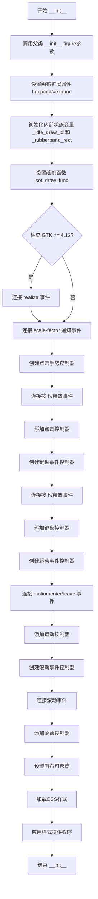

#### 带注释源码

```python
def __init__(self, figure=None):
    # 调用父类 FigureCanvasGTK 的初始化方法，传入 figure 参数
    # 这会设置 self.figure 等基础属性
    super().__init__(figure=figure)

    # 设置画布在水平方向可扩展
    self.set_hexpand(True)
    # 设置画布在垂直方向可扩展
    self.set_vexpand(True)

    # 初始化空闲绘制ID，用于节流绘制请求
    self._idle_draw_id = 0
    # 初始化橡皮筋矩形区域，None 表示当前无橡皮筋选择
    self._rubberband_rect = None

    # 设置 GTK 的绘制回调函数，当需要重绘时调用
    self.set_draw_func(self._draw_func)
    # 连接窗口大小调整事件到 resize_event 方法
    self.connect('resize', self.resize_event)
    
    # 根据 GTK 版本选择不同的事件处理方式
    if _GTK_GE_4_12:
        # GTK 4.12+ 使用 realize 事件监听缩放变化
        self.connect('realize', self._realize_event)
    else:
        # 旧版本使用 notify::scale-factor 信号
        self.connect('notify::scale-factor', self._update_device_pixel_ratio)

    # ========== 配置点击手势控制器 ==========
    # 创建点击手势识别器
    click = Gtk.GestureClick()
    # 设置按钮掩码为0，表示接收所有按钮的点击事件
    click.set_button(0)  # All buttons.
    # 连接按下事件
    click.connect('pressed', self.button_press_event)
    # 连接释放事件
    click.connect('released', self.button_release_event)
    # 将手势控制器添加到画布
    self.add_controller(click)

    # ========== 配置键盘事件控制器 ==========
    # 创建键盘事件控制器
    key = Gtk.EventControllerKey()
    # 连接按键按下事件
    key.connect('key-pressed', self.key_press_event)
    # 连接按键释放事件
    key.connect('key-released', self.key_release_event)
    # 将键盘控制器添加到画布
    self.add_controller(key)

    # ========== 配置鼠标运动事件控制器 ==========
    # 创建鼠标运动事件控制器
    motion = Gtk.EventControllerMotion()
    # 连接鼠标移动事件
    motion.connect('motion', self.motion_notify_event)
    # 连接鼠标进入画布事件
    motion.connect('enter', self.enter_notify_event)
    # 连接鼠标离开画布事件
    motion.connect('leave', self.leave_notify_event)
    # 将运动控制器添加到画布
    self.add_controller(motion)

    # ========== 配置鼠标滚动事件控制器 ==========
    # 创建垂直滚动控制器
    scroll = Gtk.EventControllerScroll.new(
        Gtk.EventControllerScrollFlags.VERTICAL)
    # 连接滚动事件
    scroll.connect('scroll', self.scroll_event)
    # 将滚动控制器添加到画布
    self.add_controller(scroll)

    # 设置画布可接收键盘焦点
    self.set_focusable(True)

    # ========== 配置 CSS 样式 ==========
    # 创建 CSS 提供程序
    css = Gtk.CssProvider()
    # 定义画布背景样式
    style = '.matplotlib-canvas { background-color: white; }'
    
    # 根据 GTK 版本选择不同的加载方式
    if Gtk.check_version(4, 9, 3) is None:
        # GTK 4.9.3+ 可以直接传递字符串
        css.load_from_data(style, -1)
    else:
        # 旧版本需要编码为字节
        css.load_from_data(style.encode('utf-8'))
    
    # 获取画布的样式上下文
    style_ctx = self.get_style_context()
    # 添加 CSS 提供程序，优先级为应用程序级
    style_ctx.add_provider(css, Gtk.STYLE_PROVIDER_PRIORITY_APPLICATION)
    # 添加自定义 CSS 类
    style_ctx.add_class("matplotlib-canvas")
```


### FigureCanvasGTK4.destroy

该方法为 GTK4 绘图画布的销毁回调，在画布被关闭时触发，用于发送 Matplotlib 的关闭事件以通知所有监听器该图形界面即将关闭。

参数：
- `self`：`FigureCanvasGTK4`，隐含的实例参数，表示当前调用该方法的画布对象本身

返回值：`None`，无返回值

#### 流程图

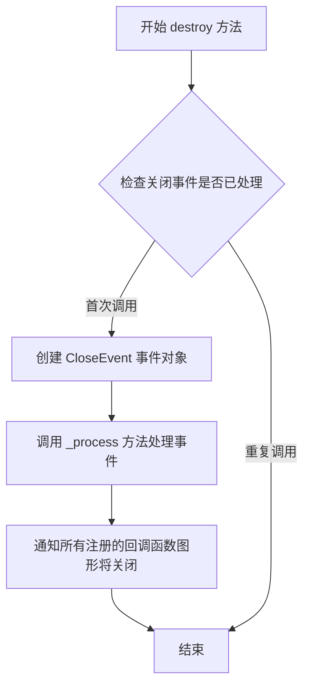

#### 带注释源码

```python
def destroy(self):
    """
    销毁画布时的回调函数。
    
    当 GTK4 画布组件被销毁时，GTK 会自动调用此方法。
    该方法创建一个 CloseEvent 事件并通过 _process() 方法
    通知所有注册的监听器（如 FigureManager）图形即将关闭，
    以便它们执行相应的清理工作（如关闭窗口、释放资源等）。
    """
    # 创建名称为 "close_event" 的关闭事件，事件源为当前画布 self
    # CloseEvent 是 matplotlib.backend_bases 中的事件类
    CloseEvent("close_event", self)._process()
    # _process() 方法会遍历并调用所有注册在该事件上的回调函数
```


### `FigureCanvasGTK4.set_cursor`

该方法用于设置GTK4绘图画布的鼠标光标样式。它将Matplotlib的光标名称转换为GTK的光标名称，然后调用GTK的set_cursor_from_name方法来实际设置光标。

参数：

- `cursor`：`str` 或 `matplotlib.backend_bases.Cursor`，Matplotlib定义的光标类型（如'crosshair', 'pointer', 'wait'等）

返回值：`None`，无返回值

#### 流程图

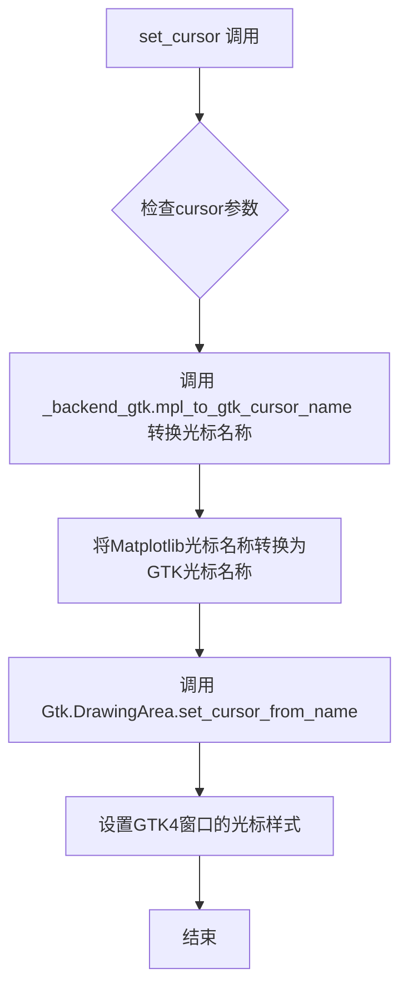

#### 带注释源码

```python
def set_cursor(self, cursor):
    """
    设置画布的鼠标光标样式。
    
    参数:
        cursor: Matplotlib定义的光标类型名称
               (如'crosshair', 'pointer', 'wait', 'arrow', 'ibeam', 
                'cross', 'move', 'left_ptr', 'grab', 'grabbing'等)
    """
    # docstring inherited - 继承自父类的文档字符串
    # 调用_backend_gtk模块的mpl_to_gtk_cursor_name函数
    # 将Matplotlib的光标名称转换为GTK4可识别的光标名称
    self.set_cursor_from_name(_backend_gtk.mpl_to_gtk_cursor_name(cursor))
    # set_cursor_from_name是Gtk.DrawingArea的方法
    # 用于设置GTKWidget的光标样式
```


### `FigureCanvasGTK4._mpl_coords`

该方法用于将GTK事件的坐标位置（或当前光标位置）转换为Matplotlib坐标系。由于GTK使用逻辑像素，而图形按物理像素渲染，因此需要先转换为物理像素，并对坐标原点进行校正。

参数：

- `xy`：`tuple[float, float] | None`，可选参数，要转换的GTK事件坐标位置。如果为`None`，则使用当前光标位置。默认值为`None`

返回值：`tuple[float, float]`，转换后的Matplotlib坐标，依次为x和y坐标（已考虑设备像素比，y坐标已翻转）

#### 流程图

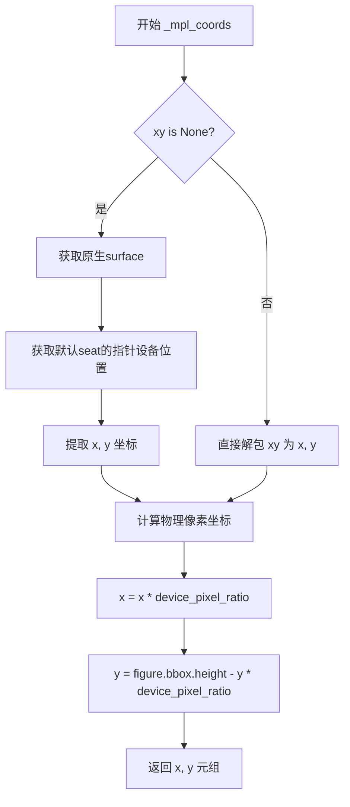

#### 带注释源码

```python
def _mpl_coords(self, xy=None):
    """
    Convert the *xy* position of a GTK event, or of the current cursor
    position if *xy* is None, to Matplotlib coordinates.

    GTK use logical pixels, but the figure is scaled to physical pixels for
    rendering.  Transform to physical pixels so that all of the down-stream
    transforms work as expected.

    Also, the origin is different and needs to be corrected.
    """
    # 判断是否传入了坐标，未传入则获取当前光标位置
    if xy is None:
        # 获取GTK原生surface对象
        surface = self.get_native().get_surface()
        # 获取显示器的默认输入设备的当前位置
        # 返回: (是否在surface内, x, y, 修饰键状态mask)
        is_over, x, y, mask = surface.get_device_position(
            self.get_display().get_default_seat().get_pointer())
    else:
        # 直接使用传入的坐标
        x, y = xy
    
    # 将x坐标从逻辑像素转换为物理像素
    # GTK使用逻辑像素，但图形渲染使用物理像素
    x = x * self.device_pixel_ratio
    
    # 翻转y坐标，使y=0为画布底部（GTK原点在左上角，Matplotlib在左下角）
    # 使用figure的边界框高度进行翻转
    y = self.figure.bbox.height - y * self.device_pixel_ratio
    
    # 返回转换后的Matplotlib坐标
    return x, y
```


### `FigureCanvasGTK4.scroll_event`

该方法负责处理 GTK4 的滚动事件，将其转换为 Matplotlib 的 `MouseEvent` 事件并分发到 Matplotlib 事件系统。

参数：

- `self`：`FigureCanvasGTK4`，Canvas 控件自身实例
- `controller`：`Gtk.EventControllerScroll`，触发滚动事件的 GTK 事件控制器对象
- `dx`：`float`，水平方向的滚动增量值
- `dy`：`float`，垂直方向的滚动增量值（用于确定滚动方向和步长）

返回值：`bool`，返回 `True` 表示事件已被成功处理，阻止事件继续传播

#### 流程图

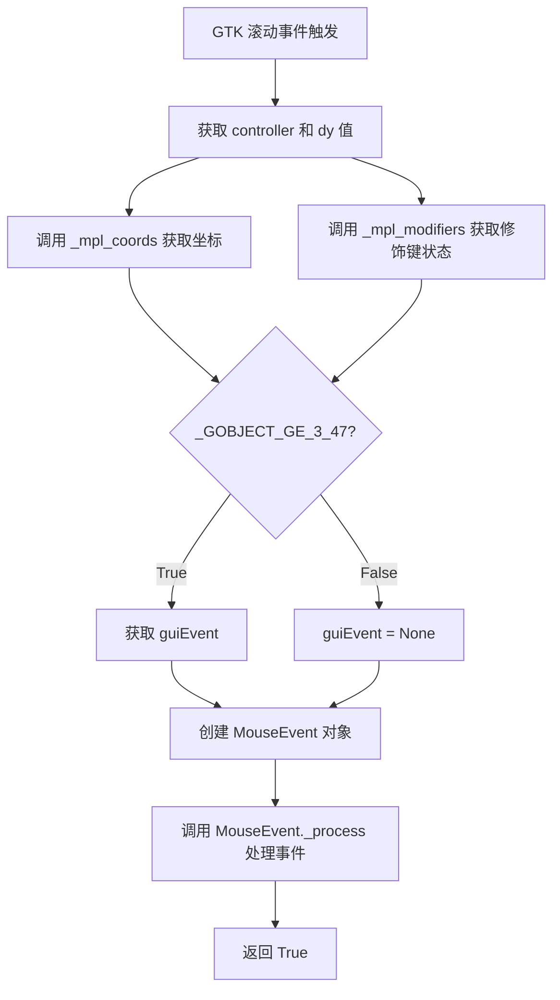

#### 带注释源码

```python
def scroll_event(self, controller, dx, dy):
    """
    处理 GTK4 滚动事件，将 GTK 事件转换为 Matplotlib MouseEvent。
    
    参数:
        controller: Gtk.EventControllerScroll - GTK 滚动事件控制器
        dx: float - 水平滚动增量
        dy: float - 垂直滚动增量（决定滚动方向和步长）
    返回:
        bool - 始终返回 True，表示事件已处理
    """
    # 使用 _mpl_coords 方法将 GTK 坐标转换为 Matplotlib 坐标
    # GTK 使用逻辑像素，Matplotlib 需要物理像素，且 Y 轴原点不同需要翻转
    MouseEvent(
        "scroll_event",              # 事件类型名称
        self,                        # 事件所属的 canvas
        *self._mpl_coords(),         # 解包获取 (x, y) 坐标
        step=dy,                     # 滚动步长，使用垂直滚动增量 dy
        modifiers=self._mpl_modifiers(controller),  # 键盘修饰键状态（如 Ctrl、Alt 等）
        guiEvent=controller.get_current_event() if _GOBJECT_GE_3_47 else None,  # 原始 GTK 事件对象（PyGObject >= 3.47 时）
    )._process()                     # 创建 MouseEvent 后立即调用 _process 分发到 Matplotlib 事件系统
    
    return True                      # 返回 True 表示事件已被处理，不再传递
```


### `FigureCanvasGTK4.button_press_event`

处理GTK4画布上的鼠标按钮按下事件，将GTK手势事件转换为Matplotlib的MouseEvent并传递给处理程序，最后获取焦点以确保后续键盘事件能够正确接收。

参数：

- `self`：FigureCanvasGTK4，当前画布实例（隐式参数）
- `controller`：`Gtk.GestureClick`，GTK手势点击控制器，包含当前点击事件的信息
- `n_press`：`int`，点击次数（连续点击次数）
- `x`：`float`，鼠标事件在画布上的x坐标（逻辑像素）
- `y`：`float`，鼠标事件在画布上的y坐标（逻辑像素）

返回值：`None`，无返回值（该方法通过副作用处理事件）

#### 流程图

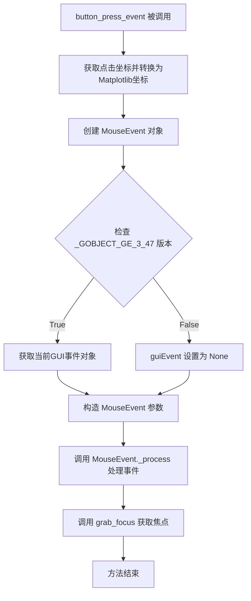

#### 带注释源码

```python
def button_press_event(self, controller, n_press, x, y):
    """
    处理GTK4画布上的鼠标按钮按下事件。
    
    Parameters
    ----------
    controller : Gtk.GestureClick
        GTK手势点击控制器，用于获取当前点击的按钮和修饰键状态。
    n_press : int
        连续点击次数（1=单击，2=双击，以此类推）。
    x : float
        鼠标事件相对于画布的x坐标（GTK逻辑像素）。
    y : float
        鼠标事件相对于画布的y坐标（GTK逻辑像素）。
    """
    # 使用 _mpl_coords 将GTK坐标转换为Matplotlib坐标系统
    # _mpl_coords 方法会处理设备像素比和Y轴翻转
    MouseEvent(
        "button_press_event",           # 事件类型名称
        self,                            # 画布实例
        *self._mpl_coords((x, y)),       # 解包转换后的坐标(x, y)
        controller.get_current_button(), # 获取当前按下的鼠标按钮
        modifiers=self._mpl_modifiers(controller), # 获取修饰键状态(Ctrl/Alt/Shift/Super)
        guiEvent=controller.get_current_event() if _GOBJECT_GE_3_47 else None,
        # 仅在GLib版本 >= 3.47时传递GUI事件对象，否则为None（向后兼容）
    )._process()  # 创建并处理MouseEvent，触发所有注册的回调函数
    
    # 获取焦点，确保后续的键盘事件能够发送到此画布
    self.grab_focus()
```


### `FigureCanvasGTK4.button_release_event`

处理GTK4画布上的鼠标按钮释放事件，将GTK事件转换为Matplotlib的MouseEvent并分发给相应的处理程序。

参数：

- `self`：`FigureCanvasGTK4`，FigureCanvasGTK4类的实例，表示GTK4绘图画布
- `controller`：`Gtk.GestureClick`，触发事件的手势控制器对象
- `n_press`：`int`，鼠标按钮被按下的次数（连续点击次数）
- `x`：`float`，鼠标释放时相对于画布的x坐标（逻辑像素）
- `y`：`float`，鼠标释放时相对于画布的y坐标（逻辑像素）

返回值：`None`，无返回值（方法内部通过MouseEvent._process()处理事件）

#### 流程图

```mermaid
flowchart TD
    A[button_release_event被调用] --> B[调用self._mpl_coords((x, y))]
    B --> C[将GTK坐标转换为Matplotlib坐标]
    C --> D[获取当前按钮: controller.get_current_button]
    E[获取修饰键状态: self._mpl_modifiers(controller)]
    D --> F[创建MouseEvent对象]
    E --> F
    F --> G[获取GUI事件: controller.get_current_event]
    G --> H[调用MouseEvent._process分发事件]
    H --> I[事件处理完成]
    
    style A fill:#f9f,color:#000
    style F fill:#9f9,color:#000
    style I fill:#9f9,color:#000
```

#### 带注释源码

```python
def button_release_event(self, controller, n_press, x, y):
    """
    处理GTK4画布上的鼠标按钮释放事件。
    
    当用户释放鼠标按钮时，此方法被调用。它将GTK的原生事件
    转换为Matplotlib的MouseEvent对象，并触发事件处理流程。
    
    参数:
        controller: Gtk.GestureClick - 触发此事件的手势控制器
        n_press: int - 按钮被按下的次数（用于检测双击等）
        x: float - 鼠标事件发生时的x坐标（逻辑像素）
        y: float - 鼠标事件发生时的y坐标（逻辑像素）
    """
    # 创建鼠标释放事件对象
    # 事件名称: "button_release_event"
    # self: 事件发生的画布
    # *self._mpl_coords((x, y)): 将GTK坐标转换为Matplotlib坐标系统
    # controller.get_current_button(): 获取释放的是哪个鼠标按钮
    # modifiers=self._mpl_modifiers(controller): 获取当前的修饰键状态（Ctrl, Alt, Shift等）
    # guiEvent: 可选的原生GUI事件对象（根据GObject版本决定是否包含）
    MouseEvent(
        "button_release_event", self, *self._mpl_coords((x, y)),
        controller.get_current_button(),
        modifiers=self._mpl_modifiers(controller),
        guiEvent=controller.get_current_event() if _GOBJECT_GE_3_47 else None,
    )._process()  # 调用_process方法触发事件分发到所有注册的回调函数
```


### `FigureCanvasGTK4.key_press_event`

该方法是 Matplotlib GTK4 后端的键盘按键事件处理核心。它负责接收 GTK 层传来的原始键盘事件（键值、键码、修饰符状态），将其转换为 Matplotlib 内部标准的 `KeyEvent` 对象，计算鼠标当前在画布上的坐标，并触发事件的派发流程。

参数：

- `controller`：`Gtk.EventControllerKey`，GTK 的事件控制器对象，承载了原始的 GTK 事件信息。
- `keyval`：`int`，GTK 的键值（Key value），代表具体按下的键。
- `keycode`：`int`，硬件键码（Key code）。
- `state`：`Gdk.ModifierType`，修饰键的状态位掩码（如 Ctrl、Shift、Alt 是否按下）。

返回值：`bool`，返回 `True` 表示该事件已被处理并阻止向上传递（Propagation）。

#### 流程图

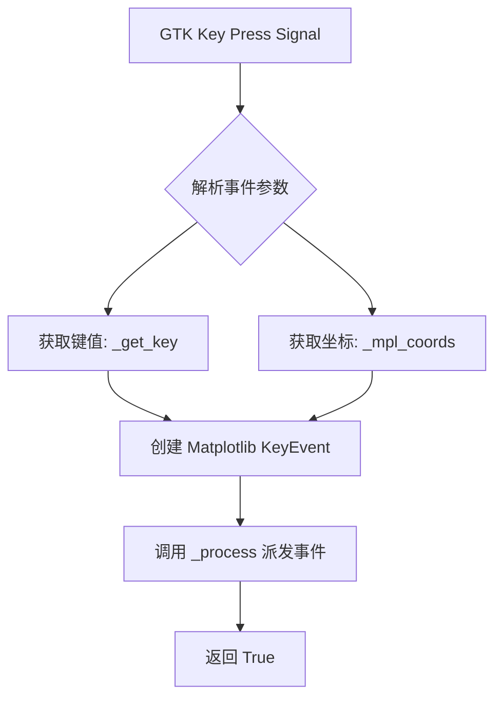

#### 带注释源码

```python
def key_press_event(self, controller, keyval, keycode, state):
    """
    处理 GTK4 的按键按下事件。
    
    参数:
        controller: Gtk.EventControllerKey，触发此事件的控制器。
        keyval: int，GDK 键值。
        keycode: int，硬件键码。
        state: Gdk.ModifierType，修饰键状态。
    """
    
    # 1. 获取原始 GTK 事件（如果 GLib 版本 >= 3.47），用于保留原生事件属性
    gui_event = controller.get_current_event() if _GOBJECT_GE_3_47 else None

    # 2. 将 GTK 的键信息转换为 Matplotlib 理解的键名（如 'ctrl+a', 'x'）
    key = self._get_key(keyval, keycode, state)
    
    # 3. 获取当前鼠标在画布上的坐标（转换为 Matplotlib 坐标系统）
    x, y = self._mpl_coords()

    # 4. 创建 Matplotlib 的 KeyEvent 对象
    #    'key_press_event': 事件名称
    #    self: 事件发生的画布
    #    key: 解析后的键名
    #    x, y: 鼠标位置
    #    guiEvent: 原始 GTK 事件
    event = KeyEvent(
        "key_press_event", self, key,
        x, y,
        guiEvent=gui_event,
    )
    
    # 5. 处理该事件，触发绑定的回调函数（如键盘快捷键处理）
    event._process()
    
    # 6. 返回 True 告知 GTK 该事件已处理，防止焦点转移等默认行为
    return True
```


### FigureCanvasGTK4.key_release_event

处理GTK4画布上的键盘按键释放事件，将 GTK 事件转换为 Matplotlib 的 KeyEvent 并进行处理。

参数：

- `controller`：`Gtk.EventControllerKey`，GTK 事件控制器对象，用于获取当前事件信息
- `keyval`：`int`，GTK 键值，表示释放的按键
- `keycode`：`int`，GTK 键码，物理按键代码
- `state`：`int`，修饰键状态标志位，表示同时按下的修饰键（Ctrl、Alt、Shift 等）

返回值：`bool`，返回 True 表示事件已被处理

#### 流程图

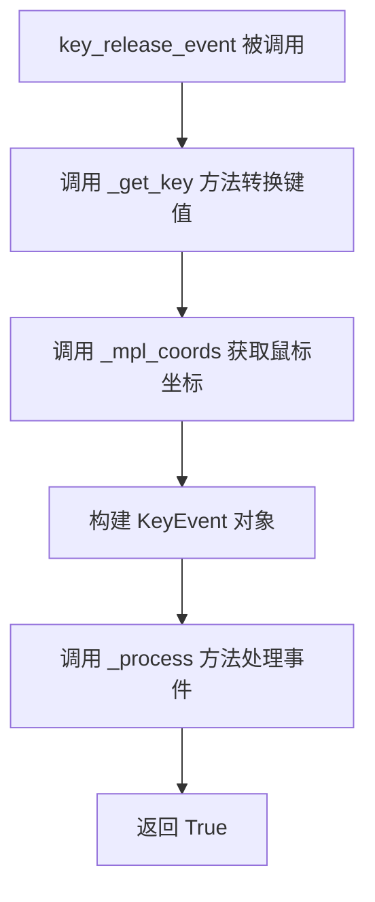

#### 带注释源码

```python
def key_release_event(self, controller, keyval, keycode, state):
    """
    处理键盘按键释放事件。
    
    参数:
        controller: GTK 事件控制器，包含当前事件信息
        keyval: GTK 键值，标识释放的具体按键
        keycode: GTK 键码，物理按键代码
        state: 修饰键状态，如 Ctrl、Alt、Shift 等
    
    返回:
        bool: 始终返回 True，表示事件已处理
    """
    # 使用 _get_key 方法将 GTK 键值转换为 Matplotlib 格式的键字符串
    # 结合修饰键状态，生成如 'ctrl+c' 这样的键名
    key = self._get_key(keyval, keycode, state)
    
    # 获取当前鼠标在画布上的坐标位置
    # _mpl_coords 方法会将 GTK 坐标转换为 Matplotlib 坐标
    x, y = self._mpl_coords()
    
    # 获取当前的 GUI 事件对象
    # 根据 GObject 版本选择不同的获取方式
    guiEvent = controller.get_current_event() if _GOBJECT_GE_3_47 else None
    
    # 创建 Matplotlib 的 KeyEvent 对象
    # 事件类型为 'key_release_event'
    # 包含键名、坐标和 GUI 事件信息
    event = KeyEvent(
        "key_release_event",  # 事件类型
        self,                  # 事件发送者（画布对象）
        key,                   # 转换后的键名
        x, y,                  # 鼠标坐标
        guiEvent=guiEvent      # 原始 GUI 事件
    )
    
    # 调用 _process 方法处理事件
    # 这会触发所有注册在该事件上的回调函数
    event._process()
    
    # 返回 True 表示事件已被成功处理
    # 阻止事件继续传播
    return True
```


### `FigureCanvasGTK4.motion_notify_event`

该方法处理GTK4画布上的鼠标移动事件，将GTK的鼠标移动事件转换为Matplotlib的MouseEvent对象，并通过调用`_process()`方法分发给注册的回调函数。

参数：

- `self`：`FigureCanvasGTK4`，FigureCanvasGTK4类的实例，代表GTK4的图形画布
- `controller`：`Gtk.EventControllerMotion`，GTK4的运动事件控制器，用于捕获鼠标移动事件
- `x`：`float`，鼠标事件在画布上的x坐标（来自GTK事件控制器）
- `y`：`float`，鼠标事件在画布上的y坐标（来自GTK事件控制器）

返回值：`None`，该方法没有返回值，只是创建并处理MouseEvent对象

#### 流程图

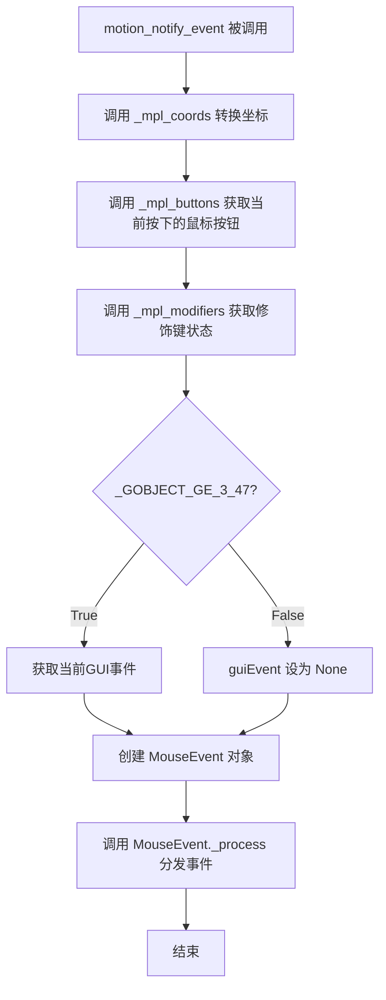

#### 带注释源码

```python
def motion_notify_event(self, controller, x, y):
    # 创建鼠标移动事件对象
    # 参数说明：
    # - "motion_notify_event": 事件类型标识
    # - self: 事件发生的画布对象
    # - *self._mpl_coords((x, y)): 将GTK坐标转换为Matplotlib坐标
    # - buttons: 当前按下的鼠标按钮集合
    # - modifiers: 当前按下的修饰键列表（ctrl, alt, shift等）
    # - guiEvent: 原始的GTK事件对象（如果GLib版本>=3.47）
    MouseEvent(
        "motion_notify_event", self, *self._mpl_coords((x, y)),
        buttons=self._mpl_buttons(controller),
        modifiers=self._mpl_modifiers(controller),
        guiEvent=controller.get_current_event() if _GOBJECT_GE_3_47 else None,
    )._process()
```


### `FigureCanvasGTK4.enter_notify_event`

处理鼠标进入绘图区域的事件，将GTK的进入事件转换为Matplotlib的LocationEvent并触发相应的处理流程。

参数：

- `self`：`FigureCanvasGTK4`，FigureCanvasGTK4类的实例本身
- `controller`：`Gtk.EventControllerMotion`，GTK的事件控制器，用于获取当前事件信息
- `x`：`float`，鼠标进入时的x坐标（逻辑像素坐标）
- `y`：`float`，鼠标进入时的y坐标（逻辑像素坐标）

返回值：`None`，无返回值（隐式返回None）

#### 流程图

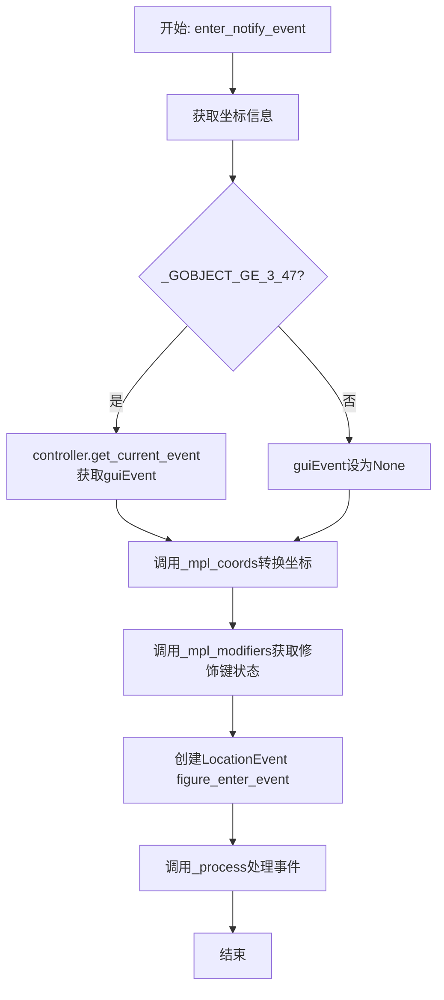

#### 带注释源码

```python
def enter_notify_event(self, controller, x, y):
    """
    处理鼠标进入绘图区域的事件。
    
    当鼠标指针进入GTK4绘图区域时，此方法被EventControllerMotion调用。
    它创建一个LocationEvent并通过Matplotlib的事件处理系统分发。
    
    参数:
        controller: Gtk.EventControllerMotion - GTK的事件控制器对象，
                    用于获取当前事件的状态信息
        x: float - 鼠标进入时的x坐标（逻辑像素）
        y: float - 鼠标进入时的y坐标（逻辑像素）
    """
    # 创建位置事件 "figure_enter_event"
    # 使用 _mpl_coords 将GTK坐标转换为Matplotlib坐标系统
    # 使用 _mpl_modifiers 获取当前修饰键（Ctrl、Alt、Shift等）的状态
    # 如果GLib对象版本 >= 3.47，则传递guiEvent以保留原始GTK事件信息
    LocationEvent(
        "figure_enter_event", self, *self._mpl_coords((x, y)),
        modifiers=self._mpl_modifiers(),
        guiEvent=controller.get_current_event() if _GOBJECT_GE_3_47 else None,
    )._process()
    # 注意：此方法没有显式返回值，隐式返回None
    # 这与leave_notify_event和motion_notify_event的处理方式一致
```


### `FigureCanvasGTK4.leave_notify_event`

该方法用于处理鼠标指针离开matplotlib画布区域时的事件。它会获取当前鼠标的位置和修饰键状态，并生成一个Matplotlib的 `LocationEvent`（类型为 `figure_leave_event`）来通知应用程序鼠标已离开绘图区。

参数：

- `controller`：`Gtk.EventControllerMotion`，GTK4的事件控制器，触发“leave”信号的对象。

返回值：`None`，该方法没有显式返回值，主要通过 `LocationEvent._process()` 产生副作用。

#### 流程图

```mermaid
graph TD
    A[开始: 鼠标离开画布] --> B[调用 self._mpl_coords]
    B --> C[获取当前鼠标坐标: surface.get_device_position]
    C --> D[调用 self._mpl_modifiers]
    D --> E[获取当前修饰键状态: surface.get_device_position]
    E --> F{检查 _GOBJECT_GE_3_47}
    F -- True --> G[获取 controller 的当前事件]
    F -- False --> H[guiEvent 置为 None]
    G --> I[创建 LocationEvent (figure_leave_event)]
    H --> I
    I --> J[调用 ._process() 处理事件]
    J --> K[结束]
```

#### 带注释源码

```python
def leave_notify_event(self, controller):
    """
    当鼠标指针离开FigureCanvasGTK4的绘图区域时调用。
    
    :param controller: Gtk.EventControllerMotion，触发该事件的GTK控制器。
    """
    # 使用 _mpl_coords() 获取当前的鼠标位置。
    # 注意：这里没有传递 (x, y) 参数，因此它会查询设备以获取当前的指针位置。
    # 这对于处理 'leave' 事件通常是必要的，因为某些GTK事件可能不携带最终的坐标。
    LocationEvent(
        "figure_leave_event", self, *self._mpl_coords(),
        # 获取当前的修饰键（Ctrl, Alt, Shift等）状态。
        modifiers=self._mpl_modifiers(),
        # 如果GObject版本较新，获取原始的GUI事件对象
        guiEvent=controller.get_current_event() if _GOBJECT_GE_3_47 else None,
    )._process() # 处理该事件，通知监听器
```


### `FigureCanvasGTK4.resize_event`

处理GTK4画布的调整大小事件，当用户调整窗口大小时更新Matplotlib图形尺寸并触发重绘。

参数：

- `area`：`Gdk.Rectangle`，GTK传递的包含新尺寸信息的区域对象
- `width`：`int`，画布的新宽度（以像素为单位）
- `height`：`int`，画布的新高度（以像素为单位）

返回值：`None`，无返回值（事件处理后自动完成图形尺寸更新和重绘）

#### 流程图

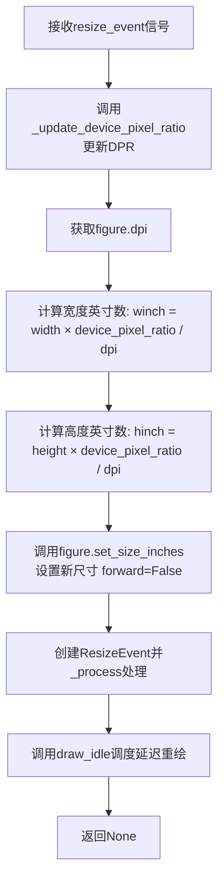

#### 带注释源码

```python
def resize_event(self, area, width, height):
    """
    处理GTK4画布的调整大小事件。
    
    参数:
        area: Gdk.Rectangle - GTK传递的区域信息（包含位置和尺寸）
        width: int - 画布新宽度（逻辑像素）
        height: int - 画布新高度（逻辑像素）
    """
    
    # 步骤1: 更新设备像素比例（DPR），处理高DPI显示器
    self._update_device_pixel_ratio()
    
    # 步骤2: 获取当前图形的DPI设置
    dpi = self.figure.dpi
    
    # 步骤3: 将像素尺寸转换为英寸尺寸
    # 公式: 英寸 = 像素 × 设备像素比例 / DPI
    winch = width * self.device_pixel_ratio / dpi
    hinch = height * self.device_pixel_ratio / dpi
    
    # 步骤4: 更新Matplotlib图形尺寸（forward=False表示不立即重绘）
    self.figure.set_size_inches(winch, hinch, forward=False)
    
    # 步骤5: 创建并处理Matplotlib的ResizeEvent事件
    # 通知图形已调整大小，触发相关的回调处理
    ResizeEvent("resize_event", self)._process()
    
    # 步骤6: 调度延迟重绘，在下一次GTK主循环空闲时执行
    # 使用draw_idle避免每次调整大小都立即重绘，提高性能
    self.draw_idle()
```


### `FigureCanvasGTK4._mpl_buttons`

该方法用于获取当前鼠标指针在画布上的按钮状态（按下状态），返回一个包含当前被按下按钮名称的集合。

参数：

- `controller`：`Gtk.EventController`，GTK事件控制器对象，用于获取当前事件信息

返回值：`Set[MouseButton]`，返回当前按下的鼠标按钮名称集合（如 `MouseButton.LEFT`、`MouseButton.MIDDLE`、`MouseButton.RIGHT` 等）

#### 流程图

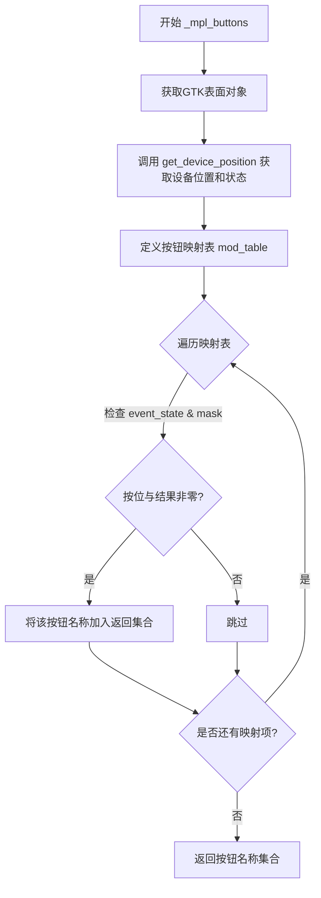

#### 带注释源码

```python
def _mpl_buttons(self, controller):
    # NOTE: This spews "Broken accounting of active state" warnings on
    # right click on macOS.
    # 获取GTK原生窗口的绘图表面
    surface = self.get_native().get_surface()
    # 获取设备位置信息：is_over表示是否在表面上方，x/y为坐标，event_state为设备状态掩码
    is_over, x, y, event_state = surface.get_device_position(
        self.get_display().get_default_seat().get_pointer())
    # NOTE: alternatively we could使用 controller.get_current_event_state()
    # 但对于 button_press/button_release 事件，这会报告事件*之前*的状态
    # 而上面的方法报告事件*之后*的状态
    
    # 定义鼠标按钮与GTK掩码的映射表
    mod_table = [
        (MouseButton.LEFT, Gdk.ModifierType.BUTTON1_MASK),
        (MouseButton.MIDDLE, Gdk.ModifierType.BUTTON2_MASK),
        (MouseButton.RIGHT, Gdk.ModifierType.BUTTON3_MASK),
        (MouseButton.BACK, Gdk.ModifierType.BUTTON4_MASK),
        (MouseButton.FORWARD, Gdk.ModifierType.BUTTON5_MASK),
    ]
    # 使用集合推导式，返回当前按下的按钮对应的MouseButton枚举值
    return {name for name, mask in mod_table if event_state & mask}
```


### FigureCanvasGTK4._mpl_modifiers

该方法用于获取当前交互事件中的键盘修饰键（如 Ctrl、Alt、Shift、Super）的状态。它通过检查 GTK 的修饰符标志位来生成一个包含活跃修饰键名称的列表。

参数：
-  `controller`：`Gtk.EventController` 或 `None`，触发事件的可选 GTK 事件控制器。如果为 `None`，则查询当前指针位置的修饰键状态。

返回值：`list[str]`，返回包含活跃修饰键名称的列表（例如 `['ctrl', 'shift']`）。

#### 流程图

```mermaid
flowchart TD
    A[Start _mpl_modifiers] --> B{controller is None?}
    B -- Yes --> C[Get native surface]
    C --> D[Get device position from surface]
    D --> E[Extract event_state]
    B -- No --> F[Get event_state from controller: controller.get_current_event_state]
    E --> G[Define mod_table: [ctrl, alt, shift, super]]
    F --> G
    G --> H[Iterate over mod_table]
    H --> I{event_state & mask != 0?}
    I -- Yes --> J[Add name to result list]
    J --> K[Next item in mod_table]
    I -- No --> K
    K --> L{mod_table exhausted?}
    L -- No --> H
    L -- Yes --> M[Return result list]
```

#### 带注释源码

```python
def _mpl_modifiers(self, controller=None):
    """
    获取当前活跃的键盘修饰键。

    参数:
        controller: GTK 事件控制器对象。如果为 None，则获取当前指针位置的修饰键状态。

    返回:
        包含活跃修饰键名称的列表 (例如 ["ctrl", "alt"])。
    """
    # 如果没有传入 controller，则需要手动查询当前指针的设备状态
    if controller is None:
        surface = self.get_native().get_surface()
        # 获取指针设备的位置和状态
        is_over, x, y, event_state = surface.get_device_position(
            self.get_display().get_default_seat().get_pointer())
    else:
        # 如果有 controller，直接从事件中获取状态
        event_state = controller.get_current_event_state()

    # 定义 Matplotlib 修饰键名称与 GTK 修饰符掩码的映射表
    mod_table = [
        ("ctrl", Gdk.ModifierType.CONTROL_MASK),
        ("alt", Gdk.ModifierType.ALT_MASK),
        ("shift", Gdk.ModifierType.SHIFT_MASK),
        ("super", Gdk.ModifierType.SUPER_MASK),
    ]
    # 列表推导式：遍历映射表，使用位与运算检查掩码是否被设置
    return [name for name, mask in mod_table if event_state & mask]
```


### FigureCanvasGTK4._get_key

该方法负责将GTK键事件的信息（键值、键码和修饰键状态）转换为Matplotlib内部使用的键名字符串格式（如"ctrl+c"、"alt+shift+a"等）。

参数：

- `keyval`：`int`，GTK的键值（keyval），表示具体按下的键
- `keycode`：`int`，GTK的键码（keycode），表示物理键的位置
- `state`：`int`，GTK的修饰键状态位掩码，表示同时按下的修饰键（ctrl、alt、shift、super等）

返回值：`str`，返回符合Matplotlib约定的键名字符串，格式为"修饰键1+修饰键2+...+主键"

#### 流程图

```mermaid
flowchart TD
    A[开始 _get_key] --> B[将 keyval 转换为 Unicode 字符 unikey]
    B --> C[调用 cbook._unikey_or_keysym_to_mplkey 转换为 Matplotlib 键名 key]
    C --> D[定义修饰键映射表 modifiers]
    D --> E{遍历修饰键检查条件}
    E --> F{mod_key != key?}
    F -->|是| G{state & mask != 0?}
    G -->|是| H{mod == 'shift' 且 unikey.isprintable()?}
    H -->|否| I[将该修饰键添加到 mods 列表]
    H -->|是| J[不添加该修饰键]
    G -->|否| J
    F -->|否| J
    E -->|遍历完成| K[返回 '+'.join([*mods, key])]
    I --> K
    J --> E
```

#### 带注释源码

```python
def _get_key(self, keyval, keycode, state):
    """
    将GTK键事件转换为Matplotlib格式的键名字符串。
    
    参数:
        keyval: GTK键值，表示具体按下的键
        keycode: GTK键码，表示物理键位置
        state: 修饰键状态位掩码
    
    返回:
        符合Matplotlib约定的键名字符串，如 "ctrl+c"
    """
    # 将GTK键值转换为Unicode字符
    # 例如: GDK_KEY_a -> 'a', GDK_KEY_Return -> '\n'
    unikey = chr(Gdk.keyval_to_unicode(keyval))
    
    # 使用cbook工具函数将Unicode字符或keysym转换为Matplotlib内部键名
    # 处理特殊键如功能键、方向键等
    key = cbook._unikey_or_keysym_to_mplkey(
        unikey,
        Gdk.keyval_name(keyval))
    
    # 定义修饰键的映射表：GTK掩码 -> Matplotlib名称
    modifiers = [
        ("ctrl", Gdk.ModifierType.CONTROL_MASK, "control"),
        ("alt", Gdk.ModifierType.ALT_MASK, "alt"),
        ("shift", Gdk.ModifierType.SHIFT_MASK, "shift"),
        ("super", Gdk.ModifierType.SUPER_MASK, "super"),
    ]
    
    # 筛选出当前按下的修饰键
    # 过滤条件:
    #   1. 修饰键名称与主键不同（避免 "shift+shift" 这种无效组合）
    #   2. 状态掩码中包含该修饰键
    #   3. 如果是shift键且主键是可打印字符，则不添加shift（因为shift已经体现在大小写中）
    mods = [
        mod for mod, mask, mod_key in modifiers
        if (mod_key != key and state & mask
            and not (mod == "shift" and unikey.isprintable()))]
    
    # 将修饰键和主键用 '+' 连接，形成如 "ctrl+alt+delete" 的格式
    return "+".join([*mods, key])
```


### `FigureCanvasGTK4._realize_event`

当 GTK4 画布部件被实现（realized）时触发此事件处理器，用于初始化设备像素比例的监控和更新机制。

参数：

- `obj`：`GObject`，GTK 信号传递的实现对象（通常是 `self` 本身）

返回值：`None`，无返回值，仅执行副作用操作

#### 流程图

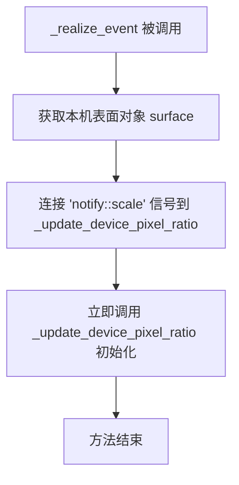

#### 带注释源码

```python
def _realize_event(self, obj):
    """
    GTK 'realize' 事件的回调函数。
    
    当 DrawingArea 部件被实现（即被添加到窗口并准备好渲染）时调用。
    此时可以安全地获取表面（surface）信息。
    """
    # 获取底层的 GDK 表面对象，用于监听其属性变化
    surface = self.get_native().get_surface()
    
    # 监听表面比例因子（scale factor）的变化，
    # 当显示比例改变时（如连接外接显示器）自动更新设备像素比
    surface.connect('notify::scale', self._update_device_pixel_ratio)
    
    # 立即执行一次设备像素比更新，确保初始化时状态正确
    self._update_device_pixel_ratio()
```


### FigureCanvasGTK4._update_device_pixel_ratio

该方法用于更新画布的设备像素比例（device pixel ratio），以支持高DPI（Retina）显示器。它会根据GTK版本获取缩放因子，并在比例变化时触发重绘。

参数：

- `*args`：可变位置参数，用于接收GTK信号传递的额外参数（通常为空）
- `**kwargs`：可变关键字参数，用于接收GTK信号传递的额外关键字参数（通常为空）

返回值：`None`，该方法通过副作用生效（更新内部状态并触发重绘）

#### 流程图

```mermaid
flowchart TD
    A[开始 _update_device_pixel_ratio] --> B{_GTK_GE_4_12?}
    B -- 是 --> C[获取surface的scale: self.get_native().get_surface().get_scale()]
    B -- 否 --> D[获取scale_factor: self.get_scale_factor()]
    C --> E{scale is not None?}
    D --> E
    E -- 否 --> F[断言失败 / 错误处理]
    E -- 是 --> G{_set_device_pixel_ratio(scale)?}
    G -- 是（比例发生变化） --> H[调用 self.draw() 触发重绘]
    G -- 否（比例未变化） --> I[结束]
    H --> I
```

#### 带注释源码

```python
def _update_device_pixel_ratio(self, *args, **kwargs):
    # 我们需要在混合分辨率显示器的情况下格外小心，当 device_pixel_ratio 发生变化时。
    # 这确保了高DPI显示器能够正确渲染图形。
    
    if _GTK_GE_4_12:
        # 对于GTK 4.12及以上版本，从surface获取scale
        # get_scale() 方法返回表面的缩放因子
        scale = self.get_native().get_surface().get_scale()
    else:
        # 对于GTK 4.12以下版本，使用get_scale_factor()方法
        # 这是一个较旧但兼容的获取缩放因子的方式
        scale = self.get_scale_factor()
    
    # 确保scale值有效（不为None）
    # 这是一个防御性编程检查，防止获取到无效的缩放值
    assert scale is not None
    
    # 尝试设置新的设备像素比例
    # _set_device_pixel_ratio方法会：
    # 1. 检查新值与当前值是否不同
    # 2. 如果不同则更新内部状态并返回True
    # 3. 如果相同则返回False
    if self._set_device_pixel_ratio(scale):
        # 只有当比例实际发生变化时才触发重绘
        # 这避免了不必要的重绘操作，提高了性能
        self.draw()
```


### `FigureCanvasGTK4._draw_rubberband`

该方法用于设置橡皮筋矩形（Rubberband Rectangle），即在交互式缩放或框选时显示的矩形选框，并将该矩形信息存储后触发画布重绘，以便在 `_post_draw` 中绘制对应的矩形框。

参数：

- `rect`：元组（tuple），表示橡皮筋矩形的坐标和尺寸，通常为 `(x0, y0, width, height)` 格式

返回值：`None`，无返回值

#### 流程图

```mermaid
flowchart TD
    A[开始: _draw_rubberband] --> B[将 rect 参数存储到 self._rubberband_rect]
    B --> C[调用 self.queue_draw 触发重绘]
    C --> D[结束]
    
    E[画布重绘时] --> F[调用 _post_draw 方法]
    F --> G{检查 self._rubberband_rect 是否为 None}
    G -->|是| H[直接返回，不绘制]
    G -->|否| I[获取设备像素比并计算实际坐标]
    I --> J[使用 cairo context 绘制橡皮筋矩形边框]
    J --> K[绘制黑色实线 + 白色虚线形成虚线效果]
```

#### 带注释源码

```python
def _draw_rubberband(self, rect):
    """
    设置橡皮筋矩形（rubberband）并触发画布重绘。
    
    Parameters
    ----------
    rect : tuple
        橡皮筋矩形的坐标和尺寸，通常为 (x0, y0, width, height) 格式。
        在 GTK4 后端中，该坐标通常基于物理像素。
    """
    # 将传入的矩形参数保存到实例变量中，供后续 _post_draw 方法使用
    self._rubberband_rect = rect
    
    # TODO: Only update the rubberband area.
    # 当前实现会重绘整个画布，更优化的做法是只重绘 rubberband 所在的区域
    # 以减少不必要的绘制开销
    self.queue_draw()
```


### FigureCanvasGTK4._draw_func

该方法是GTK4后端的绘图回调函数，负责在画布上触发绘图事件并绘制橡皮筋框（用于缩放等操作的选框）。

参数：

- `drawing_area`：`Gtk.DrawingArea`，GTK绘图区域组件，即画布本身
- `ctx`：`cairo.Context`，Cairo绘图上下文，用于执行绘图操作
- `width`：`int`，绘图区域的宽度（像素）
- `height`：`int`，绘图区域的高度（像素）

返回值：`None`，该方法不返回任何值

#### 流程图

```mermaid
flowchart TD
    A[_draw_func 被调用] --> B[调用 on_draw_event]
    B --> C{子类是否重写了 on_draw_event}
    C -->|是| D[执行子类绘图逻辑]
    C -->|否| E[pass - 空实现]
    D --> F[调用 _post_draw]
    E --> F
    F --> G[绘制橡皮筋框]
    G --> H[结束]
```

#### 带注释源码

```python
def _draw_func(self, drawing_area, ctx, width, height):
    """
    GTK4 绘图回调函数，由 GTK 框架在需要重绘时调用。
    
    参数:
        drawing_area: Gtk.DrawingArea，绘图区域组件
        ctx: cairo.Context，Cairo 绘图上下文
        width: int，绘图区域宽度
        height: int，绘图区域高度
    """
    # 调用 on_draw_event 触发实际的图形绘制
    # 该方法在 GTK4Agg 或 GTK4Cairo 后端中被重写以执行具体渲染
    self.on_draw_event(self, ctx)
    
    # 调用 _post_draw 绘制橡皮筋框（缩放框、选择框等）
    self._post_draw(self, ctx)
```


### `FigureCanvasGTK4._post_draw`

该方法负责在画布绘制周期的后期阶段，渲染交互式选择矩形（通常称为“橡皮筋”或缩放框）。它检查是否存在预定的 Rubberband 区域，如果存在，则使用 Cairo 绘图上下文在当前figure图像上方绘制一个带有黑白交替样式的矩形轮廓，以便用户在缩放或平移操作时能够直观地看到选区。

参数：

- `self`：隐式参数，指向 `FigureCanvasGTK4` 实例。
- `widget`：`Gtk.Widget`，触发绘制事件的 GTK 绘图区域组件（通常为 `DrawingArea`）。
- `ctx`：`cairo.Context`，Cairo 图形上下文，用于在画布表面执行矢量绘图指令。

返回值：`None`，该方法没有返回值，主要通过副作用（修改 ctx 指向的绘图表面）完成绘制。

#### 流程图

```mermaid
flowchart TD
    A[开始 _post_draw] --> B{self._rubberband_rect 是否存在?}
    B -- 否 --> C[直接返回，不绘制]
    B -- 是 --> D[计算坐标并除以 device_pixel_ratio 以还原逻辑像素]
    E[计算矩形右下角坐标 x1, y1] --> F[开始定义路径: move_to/line_to 连接四角]
    C --> Z[结束]
    F --> G[设置线条属性: 宽度1, 黑色, 实线]
    G --> H[stroke_preserve: 绘制黑色边框并保留路径]
    H --> I[设置线条属性: 白色, 虚线 dash=(3,3), offset=3]
    I --> J[stroke: 绘制白色边框]
    J --> Z
```

#### 带注释源码

```python
def _post_draw(self, widget, ctx):
    """
    Draw the rubberband (zoom box) after the main figure has been drawn.
    """
    # 1. 检查是否存在需要绘制的橡皮筋矩形区域
    # 如果没有进行缩放或平移的交互操作，此处通常为 None，直接退出
    if self._rubberband_rect is None:
        return

    # 设置线条样式参数
    lw = 1       # 线宽 (line width)
    dash = 3     # 虚线间隔

    # 2. 获取并转换坐标
    # _rubberband_rect 存储的是物理像素坐标，需要除以 device_pixel_ratio
    # 转换为逻辑坐标，以便与 Cairo 上下文坐标系匹配
    x0, y0, w, h = (dim / self.device_pixel_ratio
                    for dim in self._rubberband_rect)
    x1 = x0 + w
    y1 = y0 + h

    # 3. 绘制矩形路径
    # 使用 move_to 和 line_to 绘制出矩形的四条边
    # 这里的绘制顺序是为了避免虚线绘制时的“跳动”现象
    ctx.move_to(x0, y0)
    ctx.line_to(x0, y1)  # 左竖边
    ctx.move_to(x0, y0)
    ctx.line_to(x1, y0)  # 底横边
    ctx.move_to(x0, y1)
    ctx.line_to(x1, y1)  # 顶横边
    ctx.move_to(x1, y0)
    ctx.line_to(x1, y1)  # 右竖边

    # 4. 第一次描边：绘制黑色实线边框
    ctx.set_antialias(1)      # 开启抗锯齿
    ctx.set_line_width(lw)    # 设置线宽
    ctx.set_dash((dash, dash), 0) # 设置虚线模式 (长度3, 间隔3), 偏移0
    ctx.set_source_rgb(0, 0, 0)   # 黑色
    ctx.stroke_preserve()         # 描边并保留路径（为了下一次描边）

    # 5. 第二次描边：绘制白色虚线边框
    # 通过偏移虚线模式，使黑白线条交错，形成清晰的边界视觉效果
    ctx.set_dash((dash, dash), dash) # 设置偏移量为 dash
    ctx.set_source_rgb(1, 1, 1)      # 白色
    ctx.stroke()                     # 描边
```


### `FigureCanvasGTK4.on_draw_event`

该方法是 GTK4 绘图画布的绘图事件处理程序，作为一个可被 GTK4Agg 或 GTK4Cairo 后端覆盖的钩子存在，用于执行实际的图形渲染操作。

参数：

- `self`：`FigureCanvasGTK4`，隐式的实例自身参数
- `widget`：`Gtk.Widget`，触发绘图事件的 GTK 部件
- `ctx`：`Gdk.cairo_t`，GTK 的 Cairo 绘图上下文，用于在画布上进行图形绘制

返回值：`None`，该方法默认不执行任何操作（pass），具体渲染逻辑由子类实现

#### 流程图

```mermaid
flowchart TD
    A[on_draw_event 被调用] --> B{检查是否为子类重写}
    B -->|默认实现| C[直接返回 pass]
    B -->|子类重写| D[执行子类的绘图逻辑]
    C --> E[绘图事件处理结束]
    D --> E
```

#### 带注释源码

```python
def on_draw_event(self, widget, ctx):
    # to be overwritten by GTK4Agg or GTK4Cairo
    pass
```


### `FigureCanvasGTK4.draw`

该方法负责触发GTK4画布的重绘操作。它首先检查画布是否处于可绘制状态，若可绘制则通过GTK的事件队列请求重绘，以确保图形内容能够正确显示。

参数：

- `self`：`FigureCanvasGTK4`，隐式参数，指向当前画布实例本身

返回值：`None`，无返回值，仅执行副作用（触发重绘事件）

#### 流程图

```mermaid
flowchart TD
    A[开始 draw 方法] --> B{is_drawable?}
    B -->|True| C[queue_draw 请求重绘]
    B -->|False| D[不执行任何操作]
    C --> E[结束]
    D --> E
```

#### 带注释源码

```python
def draw(self):
    # docstring inherited
    # 检查当前画布是否处于可绘制状态
    # （例如窗口是否已显示、是否存在有效的图形表面等）
    if self.is_drawable():
        # 将绘制操作放入GTK的事件队列中
        # 这会触发_draw_func被调用，进而调用on_draw_event
        # 使用queue_draw而非直接绘制可以实现延迟绘制和批量更新
        self.queue_draw()
```

---

**附加说明**

- **设计目的**：该方法是Matplotlib后端接口的一部分，提供统一的绘图触发机制
- **与GTK交互**：`queue_draw()`是GTK的`Gtk.Widget`方法，会安排在下一个GTK主循环迭代中调用`_draw_func`
- **调用链**：用户调用`draw()` → `queue_draw()` → GTK主循环 → `_draw_func()` → `on_draw_event()`（由子类GTK4Agg/GTK4Cairo实现具体渲染）
- **潜在优化空间**：当前实现未处理重绘失败的情况，可以考虑添加错误回调或重试机制以提高健壮性


### `FigureCanvasGTK4.draw_idle`

该方法实现了GTK4画布的延迟绘制机制，通过GLib.idle_add注册一个空闲回调来触发绘制操作，并使用`_idle_draw_id`标志防止重复注册，确保在空闲时高效地重绘画布。

参数：

- `self`：`FigureCanvasGTK4` 实例，当前画布对象

返回值：`None`，无返回值

#### 流程图

```mermaid
flowchart TD
    A[开始 draw_idle] --> B{_idle_draw_id != 0?}
    B -->|是| C[直接返回]
    B -->|否| D[定义内部函数 idle_draw]
    D --> E[idle_draw 内部: 调用 self.draw]
    E --> F[设置 _idle_draw_id = 0]
    F --> G[返回 False]
    D --> H[调用 GLib.idle_add 注册 idle_draw]
    H --> I[设置 _idle_draw_id 为返回值]
    I --> J[结束]
    C --> J
```

#### 带注释源码

```python
def draw_idle(self):
    """
    该方法继承自基类，用于在空闲时触发画布重绘。
    它通过GLib.idle_add注册一个回调函数，该回调会在主循环空闲时执行。
    使用 _idle_draw_id 标志来防止重复注册多个空闲回调。
    """
    # docstring inherited
    # 检查是否已经有一个待处理的空闲绘制操作
    if self._idle_draw_id != 0:
        # 如果已有待处理操作，直接返回，不重复注册
        return
    
    # 定义内部空闲绘制回调函数
    def idle_draw(*args):
        """
        实际的绘制操作回调函数。
        当GLib主循环空闲时会被调用。
        """
        try:
            # 执行实际的绘制操作
            self.draw()
        finally:
            # 确保无论绘制是否成功，都重置标志
            self._idle_draw_id = 0
        # 返回False表示不再重复调用（一次性回调）
        return False
    
    # 使用GLib.idle_add注册空闲回调
    # 返回一个唯一的ID，用于后续可能的取消操作
    self._idle_draw_id = GLib.idle_add(idle_draw)
```


### `FigureCanvasGTK4.flush_events`

该方法用于强制 GTK4 后端处理所有待处理的 GUI 事件，确保在调用此方法时所有挂起的事件（如鼠标、键盘事件）都被立即处理完毕，从而实现同步刷新事件的效果。

参数： 无

返回值：`None`，无返回值

#### 流程图

```mermaid
flowchart TD
    A[开始 flush_events] --> B[获取默认的 GLib.MainContext]
    B --> C{context.pending() 有待处理事件?}
    C -->|是| D[调用 context.iteration(True) 处理一个事件]
    D --> C
    C -->|否| E[结束 flush_events]
```

#### 带注释源码

```python
def flush_events(self):
    # docstring inherited
    # 获取 GTK4 的默认主上下文（MainContext），用于管理事件循环
    context = GLib.MainContext.default()
    # 循环检查是否有待处理的事件，如果有则处理它们
    # pending() 返回是否有待处理的事件
    # iteration(True) 会阻塞直到处理完一个事件
    while context.pending():
        context.iteration(True)
```


### `NavigationToolbar2GTK4.__init__`

这是GTK4后端的导航工具栏初始化方法，负责创建工具栏UI、添加工具按钮（如图形保存、缩放、平移等）、设置消息显示区域，并调用父类初始化方法完成整个工具栏的构建。

参数：

- `canvas`：`FigureCanvasGTK4`，需要关联的画布对象，用于绑定工具栏与图形画布

返回值：`None`，该方法为构造函数，不返回任何值

#### 流程图

```mermaid
graph TD
    A[开始 __init__] --> B[调用 Gtk.Box.__init__ 初始化基类]
    B --> C[添加 toolbar CSS 类]
    C --> D[初始化 _gtk_ids 字典]
    D --> E{遍历 toolitems 工具项}
    E -->|text is None| F[添加分隔符 Gtk.Separator]
    F --> E
    E -->|text is not None| G[加载工具图标图像]
    G --> H{判断 callback 类型}
    H -->|zoom 或 pan| I[创建 ToggleButton 切换按钮]
    H -->|其他| J[创建 Button 普通按钮]
    I --> K[设置按钮子元素为图像]
    J --> K
    K --> L[添加 flat CSS 类]
    L --> M[添加 image-button CSS 类]
    M --> N[连接 clicked 信号到对应回调方法]
    N --> O[设置工具提示文本]
    O --> P[将按钮添加到工具栏]
    P --> E
    E --> Q{遍历完成?}
    Q -->|否| E
    Q -->|是| R[创建填充标签保证最小高度]
    R --> S[设置填充标签内容为两个空格]
    S --> T[设置填充标签水平扩展]
    T --> U[添加填充标签到工具栏]
    U --> V[创建消息标签用于显示状态]
    V --> W[设置消息标签右对齐]
    W --> X[添加消息标签到工具栏]
    X --> Y[调用父类 _NavigationToolbar2GTK.__init__]
    Y --> Z[结束]
```

#### 带注释源码

```python
def __init__(self, canvas):
    # 调用 Gtk.Box 基类的初始化方法
    # 设置为水平方向的盒子容器
    Gtk.Box.__init__(self)

    # 添加 'toolbar' CSS 类
    # 用于 GTK 主题系统中的样式匹配
    self.add_css_class('toolbar')

    # 初始化字典，用于存储 GTK 控件 ID 到按钮的映射
    # 键为工具项文本，值为对应的按钮对象
    self._gtk_ids = {}
    
    # 遍历工具栏配置项 (text, tooltip_text, image_file, callback)
    # self.toolitems 继承自父类 _NavigationToolbar2GTK
    for text, tooltip_text, image_file, callback in self.toolitems:
        # 如果 text 为 None，表示需要添加分隔符
        if text is None:
            self.append(Gk.Separator())
            continue
        
        # 根据 image_file 构造图标路径并创建 GTK 图像
        # 使用 cbook._get_data_path 获取 Matplotlib 数据路径
        # 图像格式为 symbolic.svg (GTK 符号图标)
        image = Gtk.Image.new_from_gicon(
            Gio.Icon.new_for_string(
                str(cbook._get_data_path('images',
                                         f'{image_file}-symbolic.svg'))))
        
        # 根据回调函数类型判断按钮类型
        # zoom 和 pan 需要切换按钮（保持激活状态）
        # 其他为普通按钮
        self._gtk_ids[text] = button = (
            Gtk.ToggleButton() if callback in ['zoom', 'pan'] else
            Gtk.Button())
        
        # 将图像设置为按钮的子元素
        button.set_child(image)
        
        # 添加 flat 样式类，去除按钮边框
        button.add_css_class('flat')
        
        # 添加 image-button 样式类，标识为图像按钮
        button.add_css_class('image-button')
        
        # 保存信号处理器 ID
        # 以便后续需要时能够阻塞（block）该处理器
        # 使用 getattr 获取类中对应的回调方法
        button._signal_handler = button.connect(
            'clicked', getattr(self, callback))
        
        # 设置工具提示文本
        button.set_tooltip_text(tooltip_text)
        
        # 将按钮添加到工具栏容器末尾
        self.append(button)

    # 创建填充标签项
    # 确保工具栏始终至少有两行文本高度
    # 否则当鼠标悬停在图像上时，画布会被重绘
    # 因为这些图像使用两行消息，会导致工具栏调整大小
    label = Gtk.Label()
    label.set_markup(
        '<small>\N{NO-BREAK SPACE}\n\N{NO-BREAK SPACE}</small>')
    # 设置水平扩展为 True，将真实消息推到右侧
    label.set_hexpand(True)
    self.append(label)

    # 创建消息标签，用于显示状态信息（如 "已保存"）
    self.message = Gtk.Label()
    # 设置右对齐方式
    self.message.set_justify(Gtk.Justification.RIGHT)
    self.append(self.message)

    # 调用父类 _NavigationToolbar2GTK 的初始化方法
    # 完成工具栏核心功能的初始化（如工具项绑定、事件处理等）
    _NavigationToolbar2GTK.__init__(self, canvas)
```


### `NavigationToolbar2GTK4.save_figure`

该方法是 Matplotlib GTK4 后端中的工具栏类方法，用于处理“保存图形”用户操作。它通过 GTK4 的原生文件选择对话框 (`Gtk.FileChooserNative`) 提示用户选择保存路径和文件格式，并在用户确认后调用底层的 `figure.savefig` 方法完成实际的文件写入。

参数：

- `self`：`NavigationToolbar2GTK4`，工具栏实例本身。
- `*args`：`任意类型 (Any)`，可变参数列表。通常用于接收 GTK 信号触发时传递的额外参数（例如按钮点击信号中的 widget 参数）。

返回值：`整数 (int)`，返回 `self.UNKNOWN_SAVED_STATUS`。该状态码表示调用此方法后，调用者无法立即得知文件是否成功保存（因为保存操作是异步通过对话框回调进行的）。

#### 流程图

```mermaid
flowchart TD
    A[用户触发保存操作] --> B[创建 Gtk.FileChooserNative]
    B --> C[配置对话框: 设置标题、模式]
    C --> D[添加文件过滤器: 'All files' + 支持的图形格式]
    D --> E[构建格式选择选项并设为默认]
    E --> F[设置初始文件夹和文件名]
    F --> G{连接 'response' 信号到回调}
    G --> H[显示对话框]
    H --> I[return UNKNOWN_SAVED_STATUS]
    
    subgraph callback [异步回调: on_response]
    J[用户选择保存并点击确认] --> K{检查响应类型 == ACCEPT?}
    K -- No --> L[销毁对话框，结束]
    K -- Yes --> M[获取文件对象和格式]
    M --> N[更新 rcParams['savefig.directory']]
    N --> O{尝试执行 figure.savefig}
    O -- Success --> P[销毁对话框]
    O -- Exception --> Q[创建错误消息对话框]
    Q --> R[显示错误]
    R --> P
    end
    
    I -.->|等待用户交互| J
```

#### 带注释源码

```python
def save_figure(self, *args):
    # 创建一个 GTK4 原生文件保存对话框
    # transient_for: 设置父窗口为当前画布的顶级窗口
    dialog = Gtk.FileChooserNative(
        title='Save the figure',
        transient_for=self.canvas.get_root(),
        action=Gtk.FileChooserAction.SAVE,
        modal=True)
    
    # 必须保持对对话框的引用，否则它会被垃圾回收并立即消失
    self._save_dialog = dialog  

    # 添加一个通用的 'All files' 过滤器
    ff = Gtk.FileFilter()
    ff.set_name('All files')
    ff.add_pattern('*')
    dialog.add_filter(ff)
    dialog.set_filter(ff)

    # 获取画布支持的 파일类型，并为其创建过滤器
    formats = []
    default_format = None
    for i, (name, fmts) in enumerate(
            self.canvas.get_supported_filetypes_grouped().items()):
        ff = Gtk.FileFilter()
        ff.set_name(name)
        for fmt in fmts:
            ff.add_pattern(f'*.{fmt}')
        dialog.add_filter(ff)
        formats.append(name)
        # 记录默认格式的索引
        if self.canvas.get_default_filetype() in fmts:
            default_format = i
            
    # 调整格式顺序，确保默认格式排在第一位
    formats = [formats[default_format], *formats[:default_format],
               *formats[default_format+1:]]
    
    # 添加格式选择的下拉菜单 (Choice)
    dialog.add_choice('format', 'File format', formats, formats)
    dialog.set_choice('format', formats[0])

    # 设置默认保存目录和文件名
    dialog.set_current_folder(Gio.File.new_for_path(
        os.path.expanduser(mpl.rcParams['savefig.directory'])))
    dialog.set_current_name(self.canvas.get_default_filename())

    # 定义响应回调函数，使用 functools.partial 绑定对话框对象
    @functools.partial(dialog.connect, 'response')
    def on_response(dialog, response):
        # 获取用户选择的文件对象
        file = dialog.get_file()
        # 获取用户选择的格式名称
        fmt = dialog.get_choice('format')
        # 获取格式对应的第一个文件扩展名
        fmt = self.canvas.get_supported_filetypes_grouped()[fmt][0]
        
        # 销毁对话框并清除引用
        dialog.destroy()
        self._save_dialog = None
        
        # 如果用户点击了取消 (或其他非 ACCEPT 响应)，则直接返回
        if response != Gtk.ResponseType.ACCEPT:
            return
            
        # 如果配置了保存目录（非空字符串），则更新 rcParams 以供下次使用
        if mpl.rcParams['savefig.directory']:
            parent = file.get_parent()
            mpl.rcParams['savefig.directory'] = parent.get_path()
            
        # 尝试保存文件
        try:
            self.canvas.figure.savefig(file.get_path(), format=fmt)
        except Exception as e:
            # 如果保存失败，弹出错误对话框
            msg = Gtk.MessageDialog(
                transient_for=self.canvas.get_root(),
                message_type=Gtk.MessageType.ERROR,
                buttons=Gtk.ButtonsType.OK, modal=True,
                text=str(e))
            msg.show()

    # 显示对话框
    dialog.show()
    
    # 返回未知状态，实际的保存结果由异步回调处理
    return self.UNKNOWN_SAVED_STATUS
```


### ToolbarGTK4.__init__

该方法是 GTK4 工具栏容器的初始化方法，继承自 ToolContainerBase 和 Gtk.Box，用于创建和管理 Matplotlib GTK4 后端的工具栏界面，包含工具按钮容器、分组和消息显示标签。

参数：

- `toolmanager`：`toolmanager`，ToolManager 实例，用于管理工具和触发工具事件

返回值：`None`，构造函数无返回值

#### 流程图

```mermaid
flowchart TD
    A[开始 __init__] --> B[调用 ToolContainerBase.__init__ 初始化基类]
    B --> C[调用 Gtk.Box.__init__ 初始化 GTK 盒子]
    C --> D[设置 orientation 为 HORIZONTAL]
    D --> E[创建 _tool_box 工具盒并添加到自身]
    E --> F[初始化 _groups 和 _toolitems 字典]
    F --> G[创建填充标签保证工具栏高度]
    G --> H[创建消息标签并添加到自身]
    I[结束 __init__]
```

#### 带注释源码

```python
def __init__(self, toolmanager):
    # 调用基类 ToolContainerBase 的初始化方法
    ToolContainerBase.__init__(self, toolmanager)
    # 调用 GTK Box 的初始化方法
    Gtk.Box.__init__(self)
    # 设置工具栏为水平方向
    self.set_property('orientation', Gtk.Orientation.HORIZONTAL)

    # Tool items are created later, but must appear before the message.
    # 创建工具盒容器，用于存放工具按钮
    self._tool_box = Gtk.Box()
    self.append(self._tool_box)
    # 初始化分组字典，键为组名，值为 Gtk.Box
    self._groups = {}
    # 初始化工具项字典，键为工具名，值为按钮和信号处理器列表
    self._toolitems = {}

    # This filler item ensures the toolbar is always at least two text
    # lines high. Otherwise the canvas gets redrawn as the mouse hovers
    # over images because those use two-line messages which resize the
    # toolbar.
    # 创建填充标签，确保工具栏至少有两行文本高度
    label = Gtk.Label()
    label.set_markup(
        '<small>\N{NO-BREAK SPACE}\n\N{NO-BREAK SPACE}</small>')
    label.set_hexpand(True)  # Push real message to the right.
    self.append(label)

    # 创建消息标签，用于显示工具栏状态信息
    self._message = Gtk.Label()
    self._message.set_justify(Gtk.Justification.RIGHT)
    self.append(self._message)
```


### `ToolbarGTK4.add_toolitem`

该方法用于向GTK4工具栏容器中添加一个工具项，根据toggle参数创建ToggleButton或普通Button，设置标签、图标、提示文本，并将其添加到指定的分组和位置中，同时保存按钮及其信号处理器以便后续操作。

参数：

- `name`：`str`，工具项的名称，用于标识和触发工具
- `group`：`str`，工具项所属的分组，用于在工具栏中组织相关工具
- `position`：`int | None`，工具项在分组中的位置，-1表示添加到末尾
- `image_file`：`str | None`，工具项图标的文件路径（GTK图标名称），None表示不显示图标
- `description`：`str`，工具项的描述信息，作为鼠标悬停时的提示文本
- `toggle`：`bool`，是否为切换按钮（ToggleButton），True用于可切换状态的工具如zoom/pan

返回值：`None`，该方法不返回任何值

#### 流程图

```mermaid
flowchart TD
    A[开始 add_toolitem] --> B{toggle?}
    B -->|True| C[创建 Gtk.ToggleButton]
    B -->|False| D[创建 Gtk.Button]
    C --> E[设置按钮标签为name]
    D --> E
    E --> F{image_file is not None?}
    F -->|Yes| G[创建 Gtk.Image 并设置为按钮子元素]
    F -->|No| H[跳过图标设置]
    G --> I
    H --> I
    I{position is None?}
    I -->|Yes| J[设置position = -1]
    I -->|No| K
    J --> K[调用 _add_button 添加按钮到分组]
    K --> L[连接clicked信号到_call_tool方法]
    L --> M[设置按钮提示文本为description]
    M --> N[在_toolitems字典中保存按钮和信号]
    N --> O[结束]
```

#### 带注释源码

```python
def add_toolitem(self, name, group, position, image_file, description,
                 toggle):
    """
    向工具栏添加工具项。
    
    参数:
        name: 工具项名称
        group: 所属分组
        position: 在分组中的位置
        image_file: 图标文件路径
        description: 描述信息
        toggle: 是否为切换按钮
    """
    # 根据toggle参数创建ToggleButton或普通Button
    if toggle:
        button = Gtk.ToggleButton()
    else:
        button = Gtk.Button()
    
    # 设置按钮显示的文本标签
    button.set_label(name)
    # 添加flat CSS类以移除按钮默认边框
    button.add_css_class('flat')

    # 如果提供了图标文件，则加载并设置图标
    if image_file is not None:
        image = Gtk.Image.new_from_gicon(
            Gio.Icon.new_for_string(image_file))
        button.set_child(image)
        button.add_css_class('image-button')

    # 如果未指定位置，默认添加到分组末尾
    if position is None:
        position = -1

    # 将按钮添加到指定的分组和位置
    self._add_button(button, group, position)
    
    # 连接点击信号到工具调用方法，传递工具名称
    signal = button.connect('clicked', self._call_tool, name)
    
    # 设置鼠标悬停时显示的提示文本
    button.set_tooltip_text(description)
    
    # 在_toolitems字典中保存按钮实例和信号处理器
    # 以便后续进行toggle_toolitem和remove_toolitem操作
    self._toolitems.setdefault(name, [])
    self._toolitems[name].append((button, signal))
```


### `ToolbarGTK4._find_child_at_position`

该方法是一个辅助函数，用于在工具栏的特定分组（Group）中根据位置索引查找对应的子组件（Widget）。它通过遍历该分组下的所有子组件，构建一个包含虚拟头节点（`None`）的列表，从而方便 `Gtk.Box.insert_child_after` 方法定位插入位置（例如，在最前面插入或在末尾追加）。

参数：

- `group`：`str`，工具栏分组的标识符（键），对应 `self._groups` 字典中的键。
- `position`：`int`，目标位置索引。`-1` 通常代表最后一个子元素，`0` 代表最前面（虚拟节点）。

返回值：`Gtk.Widget | None`，返回指定位置处的子组件。如果 `position` 为 0，则返回 `None`（表示容器的起始位置）。

#### 流程图

```mermaid
flowchart TD
    A([开始 _find_child_at_position]) --> B[初始化列表 children = [None]]
    B --> C[获取分组容器中的第一个子组件 child]
    C --> D{child 是否为空?}
    D -- 是 --> E[返回 children[position]]
    D -- 否 --> F[将 child 加入列表]
    F --> G[获取 child 的下一个兄弟组件]
    G --> C
    E --> H([结束])
```

#### 带注释源码

```python
def _find_child_at_position(self, group, position):
    """
    查找指定分组中特定位置处的子组件。

    参数:
        group (str): 分组名称，用于从 self._groups 获取对应的 Gtk.Box。
        position (int): 索引位置。由于 GTK 的插入逻辑通常基于 'sibling'，
                        我们构建一个包含 None（代表容器起始位置）的列表。
                        例如：position=-1 对应列表末尾，position=0 对应 None。

    返回:
        Gtk.Widget | None: 指定位置的子组件，如果索引超出范围或为 0 则返回 None。
    """
    # 初始化列表，并在开头放置 None。
    # 在 GTK 容器中，None 代表 "第一个位置之前"，这样可以统一处理插入逻辑。
    children = [None]
    
    # 获取该分组 Gtk.Box 中的第一个子组件
    child = self._groups[group].get_first_child()
    
    # 遍历该分组中的所有子组件
    while child is not None:
        children.append(child)
        child = child.get_next_sibling()
    
    # 返回指定位置的组件。
    # 如果 position 是 -1，这里会返回列表的最后一个元素（即当前的最后一个子组件）。
    # 如果 position 是 0，这里会返回列表的第一个元素（None），用于插入到最前面。
    return children[position]
```


### `ToolbarGTK4._add_button`

该方法负责将工具按钮添加到GTK4工具栏的指定分组和位置中，根据需要创建新的分组或分隔符，并确保按钮正确插入到工具栏的相应位置。

参数：

- `button`：`Gtk.Button`，要添加工具栏的按钮对象，可以是普通按钮或切换按钮
- `group`：`str`，工具按钮所属的分组标识符，用于将相关功能的按钮组织在一起
- `position`：`int`，按钮在分组中的位置索引，-1表示添加到末尾

返回值：`None`，该方法直接操作GTK组件，不返回任何值

#### 流程图

```mermaid
flowchart TD
    A[开始 _add_button] --> B{group 是否在 self._groups 中?}
    B -->|是| D[调用 insert_child_after 插入按钮]
    B -->|否| C{self._groups 是否为空?}
    C -->|否| E[调用 _add_separator 添加分隔符]
    C -->|是| F[创建新的 Gtk.Box 作为 group_box]
    E --> F
    F --> G[将 group_box 添加到 self._tool_box]
    G --> H[将 group_box 存入 self._groups[group]]
    H --> D
    D --> I[结束]
```

#### 带注释源码

```python
def _add_button(self, button, group, position):
    """
    将按钮添加到工具栏的指定分组和位置。
    
    参数:
        button: Gtk.Button - 要添加的按钮对象
        group: str - 分组名称
        position: int - 在分组中的位置索引
    """
    # 检查该分组是否已存在
    if group not in self._groups:
        # 如果已存在其他分组，先添加分隔符
        if self._groups:
            self._add_separator()
        
        # 创建新的分组容器
        group_box = Gtk.Box()
        
        # 将分组容器添加到工具栏
        self._tool_box.append(group_box)
        
        # 在字典中记录该分组
        self._groups[group] = group_box
    
    # 找到指定位置的前一个子元素，将按钮插入到其后
    self._groups[group].insert_child_after(
        button, self._find_child_at_position(group, position))
```


### ToolbarGTK4._call_tool

该方法是 GTK4 工具栏类的内部方法，作为 GTK 按钮点击事件的回调函数，用于将按钮点击事件转换为工具管理器的工具触发操作。

参数：

- `btn`：`Gtk.Button`，触发点击事件的 GTK 按钮对象
- `name`：`str`，要触发的工具名称，由工具管理器管理

返回值：`None`，无返回值（该方法直接调用 `trigger_tool` 触发工具）

#### 流程图

```mermaid
flowchart TD
    A[用户点击工具栏按钮] --> B{_call_tool 被调用}
    B --> C[获取工具名称 name]
    C --> D[调用 self.trigger_tool]
    D --> E[ToolContainerBase 触发对应工具]
    E --> F[工具执行其触发逻辑]
```

#### 带注释源码

```python
def _call_tool(self, btn, name):
    """
    工具栏按钮点击回调函数。
    
    此方法作为 GTK 按钮的 clicked 信号处理器，当用户点击工具栏按钮时，
    GTK 事件系统会调用此方法。它充当 GTK 事件层与 Matplotlib 工具管理层
    之间的桥梁，将按钮点击转换为工具触发。
    
    参数:
        btn: 触发点击事件的 Gtk.Button 对象
             (由 GTK 事件系统自动传递)
        name: str，要触发的工具名称
              (通过 button.connect 的第三个参数传递)
    
    返回:
        无返回值
    """
    # 调用父类 ToolContainerBase 的 trigger_tool 方法
    # 触发工具管理器中注册的工具
    self.trigger_tool(name)
```

#### 上下文使用说明

该方法在 `add_toolitem` 方法中被使用，连接按钮的点击信号：

```python
# 在 add_tooltool 方法中
signal = button.connect('clicked', self._call_tool, name)
```

这意味着：
1. 当用户点击工具栏按钮时，GTK 会触发 `clicked` 信号
2. GTK 自动将按钮对象作为第一个参数 (`btn`) 传递
3. `name` 参数通过 `connect` 方法的额外参数传递
4. `_call_tool` 方法接收这两个参数并调用 `trigger_tool` 执行工具逻辑


### `ToolbarGTK4.toggle_toolitem`

该方法用于切换工具栏中指定工具项的选中状态，通过阻塞信号、设置活跃状态、解除阻塞的流程来安全地更新工具按钮的切换状态。

参数：

- `name`：`str`，工具项的名称，用于在 `_toolitems` 字典中查找对应的工具按钮
- `toggled`：`bool`，目标切换状态，`True` 表示选中，`False` 表示取消选中

返回值：`None`，该方法无返回值

#### 流程图

```mermaid
flowchart TD
    A[开始 toggle_toolitem] --> B{检查 name 是否在 self._toolitems 中}
    B -->|否| C[直接返回]
    B -->|是| D[遍历 self._toolitems[name] 中的所有 toolitem 和 signal]
    D --> E[对每个 toolitem: 阻塞信号 handler_block]
    E --> F[设置工具按钮的活跃状态 set_active]
    F --> G[解除信号阻塞 handler_unblock]
    G --> H{是否还有更多 toolitem?}
    H -->|是| E
    H -->|否| I[结束]
```

#### 带注释源码

```python
def toggle_toolitem(self, name, toggled):
    """
    切换工具栏中指定工具项的选中状态。

    参数:
        name: str - 工具项的名称
        toggled: bool - 目标状态，True 为选中，False 为取消选中
    """
    # 检查该工具项名称是否存在于工具项字典中
    if name not in self._toolitems:
        return  # 如果不存在则直接返回，不做任何操作

    # 遍历该名称对应的所有工具按钮（通常只有一个）
    for toolitem, signal in self._toolitems[name]:
        # 阻塞该按钮的信号处理，防止触发额外的回调
        toolitem.handler_block(signal)
        # 设置按钮的活跃状态（选中/取消选中）
        toolitem.set_active(toggled)
        # 解除信号阻塞，恢复按钮的正常响应
        toolitem.handler_unblock(signal)
```


### `ToolbarGTK4.remove_toolitem`

该方法用于从GTK4工具栏中移除指定的工具项，通过从工具项字典中获取该名称对应的所有工具项按钮，并从对应的工具栏组中删除它们。

参数：

- `name`：`str`，要移除的工具项的名称

返回值：`None`，无返回值（方法直接修改对象状态）

#### 流程图

```mermaid
flowchart TD
    A[开始 remove_toolitem] --> B[从self._toolitems中pop获取name对应的工具项列表]
    B --> C{toolitems是否存在?}
    C -->|否| D[返回空列表, 循环不执行]
    C -->|是| E[遍历获取到的工具项列表]
    E --> F{当前工具项}
    F --> G[遍历所有工具栏组self._groups]
    G --> H{工具项是否在当前组中?}
    H -->|是| I[调用remove方法从组中删除该工具项]
    I --> G
    H -->|否| G
    G --> J{是否还有更多组?}
    J -->|是| G
    J -->|否| K{是否还有更多工具项?}
    K -->|是| F
    K -->|否| L[结束]
```

#### 带注释源码

```python
def remove_toolitem(self, name):
    """
    从工具栏中移除指定的工具项。

    参数:
        name: str, 要移除的工具项的名称

    返回值:
        None

    说明:
        该方法执行以下操作:
        1. 从self._toolitems字典中弹出(获取并删除)指定name的所有工具项
        2. 遍历这些工具项
        3. 在所有工具栏组(self._groups)中查找包含该工具项的组
        4. 从找到的组中移除该工具项
    """
    # 从self._toolitems中pop返回name对应的工具项列表，如果不存在返回空列表
    # pop操作会同时从字典中删除该键值对
    for toolitem, _signal in self._toolitems.pop(name, []):
        # 遍历所有工具栏组（每个group对应一个 Gtk.Box 容器）
        for group in self._groups:
            # 检查工具项是否存在于当前组中
            if toolitem in self._groups[group]:
                # 从GTK容器中移除该工具项widget
                self._groups[group].remove(toolitem)
```


### `ToolbarGTK4._add_separator`

该方法是 `ToolbarGTK4` 类的私有方法，用于在工具栏的分组之间添加垂直分隔符，以视觉化地区分不同的工具组。

参数：无（仅包含隐式参数 `self`）

返回值：`None`，该方法无返回值，仅执行副作用（将分隔符添加到工具箱容器中）

#### 流程图

```mermaid
flowchart TD
    A[开始 _add_separator] --> B[创建 Gtk.Separator 实例]
    B --> C[设置分隔符方向为 VERTICAL]
    C --> D[将分隔符添加到 _tool_box 容器]
    D --> E[结束]
```

#### 带注释源码

```python
def _add_separator(self):
    """
    在工具箱中添加一个垂直分隔符，用于视觉化区分不同的工具分组。
    此方法通常在添加新工具组之前调用，以确保各组之间有明显的边界。
    """
    # 创建一个 GTK 分割线部件
    sep = Gtk.Separator()
    # 设置分割线为垂直方向，以符合水平工具栏的布局
    sep.set_property("orientation", Gtk.Orientation.VERTICAL)
    # 将分割线添加到工具箱容器中显示
    self._tool_box.append(sep)
```


### `ToolbarGTK4.set_message`

该方法用于在GTK4工具栏中设置显示的消息文本，通过调用GTK的Label控件的set_label方法将传入的字符串显示在工具栏的消息区域。

参数：

- `s`：`str`，需要显示的消息文本内容

返回值：`None`，无返回值（该方法直接修改GTK控件的显示内容）

#### 流程图

```mermaid
flowchart TD
    A[开始设置消息] --> B{检查s是否为None}
    B -- 是 --> C[设置空字符串]
    B -- 否 --> D[直接使用s]
    C --> E[调用self._message.set_label]
    D --> E
    E --> F[结束]
```

#### 带注释源码

```python
def set_message(self, s):
    """
    设置工具栏显示的消息。
    
    参数:
        s: str, 要显示的消息文本
    """
    # 将传入的消息字符串s设置到GTK的Label控件上
    # self._message是在__init__方法中创建的Gtk.Label实例
    # set_label是GTK Label控件的标准方法，用于设置显示的文本
    self._message.set_label(s)
```


### `SaveFigureGTK4.trigger`

该方法是 GTK4 后端的保存图形工具的触发方法，通过创建伪工具栏并调用导航工具栏的保存方法来实现图形保存功能。

参数：

- `*args`：`可变位置参数`，传递给基础工具类的可变参数
- `**kwargs`：`可变关键字参数`，传递给基础工具类的可变关键字参数

返回值：`None`，无返回值，该方法通过副作用完成图形保存操作

#### 流程图

```mermaid
flowchart TD
    A[用户触发保存图形工具] --> B{检查参数}
    B --> C[调用 _make_classic_style_pseudo_toolbar]
    C --> D[创建类风格伪工具栏对象]
    D --> E[调用 NavigationToolbar2GTK4.save_figure]
    E --> F[显示 Gtk.FileChooserNative 对话框]
    F --> G{用户选择保存路径}
    G -->|取消| H[结束操作]
    G -->|确认| I[获取文件路径和格式]
    I --> J[调用 canvas.figure.savefig 保存文件]
    J --> K[显示错误对话框如果保存失败]
    K --> H
```

#### 带注释源码

```python
@backend_tools._register_tool_class(FigureCanvasGTK4)  # 注册为 FigureCanvasGTK4 的工具类
class SaveFigureGTK4(backend_tools.SaveFigureBase):
    """GTK4 后端的保存图形工具类，继承自 SaveFigureBase"""
    
    def trigger(self, *args, **kwargs):
        """
        触发保存图形操作
        
        该方法创建必要的工具栏上下文，然后调用 GTK4 导航工具栏的
        保存方法显示文件保存对话框并保存图形。
        
        参数:
            *args: 可变位置参数，传递给父类方法
            **kwargs: 可变关键字参数，传递给父类方法
        """
        # _make_classic_style_pseudo_toolbar() 继承自 SaveFigureBase
        # 用于创建一个模拟经典工具栏的对象，提供保存所需的上下文信息
        # 返回一个类似 NavigationToolbar2GTK4 的对象，但仅包含保存功能所需的方法
        NavigationToolbar2GTK4.save_figure(
            self._make_classic_style_pseudo_toolbar())
```


### `HelpGTK4._normalize_shortcut`

该方法负责将 Matplotlib 内部的按键表示形式（例如 `'ctrl+c'`, `'Page_Up'`）转换为 GTK4 界面所要求的加速器格式（例如 `'<ctrl>C'`, `'Page_Up'`），以便在帮助菜单中正确显示快捷键。

参数：

- `key`：`str`，Matplotlib 格式的按键字符串（例如 "ctrl+a", "BackSpace"）。

返回值：`str`，GTK+ 格式的加速器标识符字符串（例如 "<ctrl>A", "BackSpace"）。

#### 流程图

```mermaid
flowchart TD
    A([开始: key]) --> B{根据 '+' 分割字符串}
    B --> C[提取修饰键: parts[:-1]]
    C --> D[提取主键: parts[-1]]
    D --> E{主键是否在 special 映射表中?}
    E -->|是| F[将主键替换为映射值]
    E -->|否| G{主键长度 > 1?}
    F --> J[连接修饰键与主键]
    G -->|是| H[将主键首字母大写]
    G -->|否| I{主键是否为全大写?}
    H --> J
    I -->|是| K[添加 '<shift>' 到修饰键列表]
    I -->|否| L[保持主键不变]
    K --> J
    L --> J
    J --> M([返回: 规范化的GTK字符串])
```

#### 带注释源码

```python
def _normalize_shortcut(self, key):
    """
    Convert Matplotlib key presses to GTK+ accelerator identifiers.

    Related to `FigureCanvasGTK4._get_key`.
    """
    # 定义特殊按键的映射关系，将 Matplotlib 表示法转为 GTK 表示法
    special = {
        'backspace': 'BackSpace',
        'pagedown': 'Page_Down',
        'pageup': 'Page_Up',
        'scroll_lock': 'Scroll_Lock',
    }

    # 使用 '+' 分割按键字符串，例如 "ctrl+a" -> ["ctrl", "a"]
    parts = key.split('+')
    # 除了最后一个部分，其余都是修饰键（如 ctrl, alt），需要包裹在 < > 中
    mods = ['<' + mod + '>' for mod in parts[:-1]]
    # 最后一个部分是实际按键
    key = parts[-1]

    # 处理特殊按键（如 backspace）
    if key in special:
        key = special[key]
    # 处理多字符按键（如 escape, home），通常需要首字母大写
    elif len(key) > 1:
        key = key.capitalize()
    # 处理单字符大写的情况（如 'A'），GTK 需要显式添加 Shift 修饰符
    elif key.isupper():
        mods += ['<shift>']

    # 拼接修饰键和主键，形成最终的 GTK 加速器字符串
    return ''.join(mods) + key
```


### `HelpGTK4._is_valid_shortcut`

检查给定的快捷键是否为有效的、可显示的快捷键。

参数：

- `key`：`str`，需要验证的快捷键字符串

返回值：`bool`，如果快捷键有效（不包含 'cmd+' 且不是以 'MouseButton.' 开头）返回 True，否则返回 False

#### 流程图

```mermaid
flowchart TD
    A[开始 _is_valid_shortcut] --> B{key 中包含 'cmd+'?}
    B -- 是 --> C[返回 False]
    B -- 否 --> D{key 以 'MouseButton.' 开头?}
    D -- 是 --> C
    D -- 否 --> E[返回 True]
```

#### 带注释源码

```python
def _is_valid_shortcut(self, key):
    """
    Check for a valid shortcut to be displayed.

    - GTK will never send 'cmd+' (see `FigureCanvasGTK4._get_key`).
    - The shortcut window only shows keyboard shortcuts, not mouse buttons.
    """
    # 检查快捷键字符串中是否包含 'cmd+'
    # GTK 不会发送 'cmd+' 修饰符（参见 FigureCanvasGTK4._get_key）
    has_cmd = 'cmd+' not in key
    
    # 检查快捷键是否以 'MouseButton.' 开头
    # 快捷键窗口只显示键盘快捷键，不显示鼠标按钮
    is_mouse = key.startswith('MouseButton.')
    
    # 只有同时满足：不含 'cmd+' 且不是鼠标按钮时，才返回 True
    return has_cmd and not is_mouse
```


### `HelpGTK4.trigger`

**描述**：该方法是 GTK4 后端中“帮助”工具的触发器。它动态遍历当前 ToolManager 中的所有工具，获取其名称、描述和快捷键，过滤无效的快捷键（如鼠标按钮或 CMD 键），并将其格式化为 GTK 可识别的格式。最终生成一个模态的 `Gtk.ShortcutsWindow` 对话框，显示所有可用的键盘快捷键，帮助用户了解系统功能。

**参数**：

-  `self`：`HelpGTK4`，帮助工具类的实例，包含对 `toolmanager` 的引用。
-  `*args`：`Any`，可变参数列表，由工具基类触发时传入，当前实现中未使用。

**返回值**：`None`，该方法通过副作用（显示 GUI 窗口）生效，不返回任何值。

#### 流程图

```mermaid
graph TD
    A([Start Trigger]) --> B[创建 Gtk.ShortcutsSection]
    B --> C{遍历 sorted(self.toolmanager.tools)}
    C -->|每个工具 name, tool| D{检查 tool.description}
    D -->|无描述| C
    D -->|有描述| E[创建 Gtk.ShortcutsGroup]
    E --> F[隐藏 Group 标题 Children]
    E --> G[获取工具 Keymap]
    G --> H[遍历 Keymap]
    H --> I{调用 _is_valid_shortcut}
    I -->|无效| H
    I -->|有效| J[调用 _normalize_shortcut]
    J --> K[拼接 Accelerator 字符串]
    K --> L[创建 Gtk.ShortcutsShortcut]
    L --> M[将 Shortcut 添加到 Group]
    M --> C
    C -->|遍历结束| N[创建 Gtk.ShortcutsWindow]
    N --> O[设置模态父窗口为 Figure Canvas Root]
    O --> P[调用 window.show 显示窗口]
    P --> Z([End])
```

#### 带注释源码

```python
def trigger(self, *args):
    """
    显示包含所有工具快捷键的 ShortcutsWindow。
    """
    # 1. 创建快捷键分段（Section），用于容纳多个分组
    section = Gtk.ShortcutsSection()

    # 2. 遍历工具管理器中的所有工具
    for name, tool in sorted(self.toolmanager.tools.items()):
        # 跳过没有描述的工具（通常意味着没有可显示的功能）
        if not tool.description:
            continue

        # 3. 创建快捷键分组（Group）。GTK 会自动将不同组分为不同的列或页，
        # 这对于快捷键很多且很长的情况很有用。
        group = Gtk.ShortcutsGroup()
        section.append(group)

        # 这是一个 Hack，用于移除组标题，因为 Matplotlib 没有对工具进行分组命名。
        # 遍历组内的所有子元素并将其隐藏。
        child = group.get_first_child()
        while child is not None:
            child.set_visible(False)
            child = child.get_next_sibling()

        # 4. 处理快捷键
        # 获取该工具对应的快捷键列表
        keymap = self.toolmanager.get_tool_keymap(name)
        
        # 过滤并规范化快捷键字符串
        # filter: 移除 cmd+ 和鼠标按钮
        # map: 转换为 GTK 格式 (e.g., <Ctrl>P)
        accelerator_str = ' '.join(
            self._normalize_shortcut(key)
            for key in keymap
            if self._is_valid_shortcut(key)
        )

        # 5. 创建单个快捷键条目
        # title: 工具名称
        # subtitle: 工具描述/功能说明
        # accelerator: 格式化后的按键字符串
        shortcut = Gtk.ShortcutsShortcut(
            accelerator=accelerator_str,
            title=tool.name,
            subtitle=tool.description
        )
        
        # 将条目添加到组中
        group.append(shortcut)

    # 6. 创建顶层窗口
    window = Gtk.ShortcutsWindow(
        title='Help',
        modal=True,  # 模态窗口，锁定用户交互
        # transient_for: 设置父窗口为 Matplotlib 画布的顶层窗口
        transient_for=self._figure.canvas.get_root()
    )
    window.set_child(section)

    # 7. 显示窗口
    window.show()
```


### `ToolCopyToClipboardGTK4.trigger`

该方法是 GTK4 后端实现“复制到剪贴板”功能的入口点。它负责将当前 Matplotlib 画布上的图形渲染为 RGBA 像素数据，封装进 GdkPixbuf 对象中，并最终写入系统剪贴板，从而实现图像的复制。

#### 参数

- `self`：`ToolCopyToClipboardGTK4`，调用此方法的类实例。
- `*args`：`Any` (可变参数)，通常由工具管理器传入的位置参数，在此实现中未使用。
- `**kwargs`：`Any` (可变关键字参数)，通常由工具管理器传入的关键字参数，在此实现中未使用。

#### 返回值

- `None`：该方法执行副作用（修改剪贴板内容），不返回任何值。

#### 流程图

```mermaid
flowchart TD
    A([开始 trigger]) --> B[创建内存缓冲区 f: io.BytesIO]
    B --> C{调用 canvas.print_rgba}
    C --> D[将画布内容渲染为 RGBA 数据写入 f]
    D --> E[获取画布宽度 w 和高度 h]
    E --> F[调用 GdkPixbuf.new_from_data]
    F --> G[将原始字节数据转换为 Pixbuf 对象 pb]
    G --> H[获取系统剪贴板: canvas.get_clipboard]
    H --> I[执行剪贴板写入: clipboard.set(pb)]
    I --> J([结束])
```

#### 带注释源码

```python
@backend_tools._register_tool_class(FigureCanvasGTK4)
class ToolCopyToClipboardGTK4(backend_tools.ToolCopyToClipboardBase):
    def trigger(self, *args, **kwargs):
        # 创建一个内存中的字节流对象用于存储图像数据
        with io.BytesIO() as f:
            # 调用画布的 print_rgba 方法，将当前图形渲染为 RGBA 格式并写入缓冲区
            self.canvas.print_rgba(f)
            # 获取画布的像素宽度和高度
            w, h = self.canvas.get_width_height()
            # 从缓冲区数据创建 GdkPixbuf 对象
            # 参数解释：f.getbuffer() 获取原始数据，Colorspace.RGB 表示颜色空间，True 表示包含 Alpha 通道
            # 8 表示每个通道 8 位，w/h 是尺寸，w*4 是行 stride (每行字节数)
            pb = GdkPixbuf.Pixbuf.new_from_data(f.getbuffer(),
                                                GdkPixbuf.Colorspace.RGB, True,
                                                8, w, h, w*4)
        # 获取画布关联的剪贴板对象（通常是系统剪贴板）
        clipboard = self.canvas.get_clipboard()
        # 将生成的 Pixbuf 对象设置到剪贴板，完成复制操作
        clipboard.set(pb)
```

## 关键组件


### FigureCanvasGTK4

GTK4图形画布类，负责处理GTK4绘图区域的所有事件和渲染。继承自_FigureCanvasGTK和Gtk.DrawingArea，处理鼠标、键盘、滚轮等事件，并将GTK事件转换为Matplotlib事件。

### NavigationToolbar2GTK4

GTK4图形工具栏类，继承自_NavigationToolbar2GTK和Gtk.Box。提供图形交互工具按钮（缩放、平移、保存等），并实现文件保存对话框功能。

### ToolbarGTK4

GTK4工具容器类，继承自ToolContainerBase和Gtk.Box。用于管理工具项目（tool items），支持添加工具按钮、切换工具状态、移除工具等功能。

### SaveFigureGTK4

保存图形工具类，继承自backend_tools.SaveFigureBase。触发图形保存操作，调用NavigationToolbar2GTK4的保存方法。

### HelpGTK4

帮助工具类，继承自backend_tools.ToolHelpBase。显示快捷键帮助窗口，将Matplotlib快捷键转换为GTK+加速器标识符，并展示所有可用工具的快捷键。

### ToolCopyToClipboardGTK4

复制到剪贴板工具类，继承自backend_tools.ToolCopyToClipboardBase。将画布内容以RGBA格式复制到系统剪贴板。

### FigureManagerGTK4

图形管理器类，关联画布、工具栏和图形对象，管理图形窗口的生命周期和工具栏集成。

### _BackendGTK4

GTK4后端导出类，注册FigureCanvas和FigureManager类到Matplotlib后端系统。

### 事件处理机制

将GTK事件（鼠标、键盘、滚轮）转换为Matplotlib内部事件对象（MouseEvent、KeyEvent、LocationEvent等）的转换器。

### 设备像素比处理

_update_device_pixel_ratio方法处理高DPI显示器的缩放因子，确保在混合分辨率显示器上正确渲染。


## 问题及建议


### 已知问题

-   **重复的Surface获取逻辑**：`_mpl_buttons`和`_mpl_modifiers`方法中都包含获取surface设备位置的重复代码，可以提取为公共方法减少冗余
-   **版本兼容性代码分支过多**：代码中多处使用`_GTK_GE_4_12`和`_GOBJECT_GE_3_47`进行版本判断，导致实现逻辑分散，维护成本高
-   **硬编码的CSS样式**：背景色"white"在CSS中硬编码，如果需要主题支持需要修改代码
-   **`_update_device_pixel_ratio`的断言风险**：`assert scale is not None`在某些边缘情况下可能导致程序崩溃，应改为更温和的错误处理
-   **坐标转换逻辑复杂**：`_mpl_coords`方法涉及设备像素比转换、坐标翻转等操作，注释中提到"Transform to physical pixels so that all of the down-stream transforms work as expected"，表明可能存在潜在的平台兼容性问题
-   **橡皮筋绘制优化不足**：TODO注释"Only update the rubberband area"表明当前的`queue_draw()`会重绘整个画布，可以优化为局部重绘
-   **macOS兼容性问题**：代码注释提到"This spews 'Broken accounting of active state' warnings on right click on macOS"，说明存在平台特定的警告
-   **工具栏高度填充技巧**：使用硬编码的空格字符`<small>\N{NO-BREAK SPACE}\n\N{NO-BREAK SPACE}</small>`来保持工具栏高度是一个脆弱的设计，可能在不同GTK主题下失效

### 优化建议

-   提取`_mpl_buttons`和`_mpl_modifiers`中的公共surface获取逻辑到私有方法
-   考虑将版本特定的实现分离到独立的mixin或抽象类中，减少主类中的条件分支
-   将CSS样式和主题配置外部化到配置系统中
-   将`_update_device_pixel_ratio`中的assertion改为条件检查和降级处理
-   实现橡皮筋区域的局部重绘功能
-   将工具栏高度管理的实现方式改为更可靠的GTK布局容器方案

## 其它


### 设计目标与约束

本后端旨在为 Matplotlib 提供 GTK4 图形用户界面支持，实现跨平台的图形渲染和用户交互功能。设计目标包括：完整支持 GTK4 的事件系统、实现与现代 GTK 版本的兼容性、提供与传统 GTK 后端一致的用户体验。约束条件包括：要求 Python 环境安装 PyGObject 和 GTK4 库、依赖特定的 GTK4 版本（4.0 及以上）、仅支持支持 GTK4 的操作系统。

### 错误处理与异常设计

代码在导入阶段进行版本检查，使用 try-except 捕获 ImportError 和 ValueError，确保在版本不匹配时提供清晰的错误信息。GUI 操作中的异常主要通过 GTK 的消息对话框显示，如保存图形失败时弹出错误提示。事件处理方法（如 scroll_event、button_press_event 等）均返回 True 表示事件已处理。设备像素比更新失败时使用 assert 进行断言。

### 数据流与状态机

画布状态机包含以下状态：初始化状态（__init__）、就绪状态（is_drawable）、绘制状态（draw/draw_idle）、事件处理状态。数据流向：GTK 事件 → 事件控制器 → 坐标转换（_mpl_coords）→ Matplotlib 事件对象 → 事件处理器。绘制流程：GTK 绘制请求 → _draw_func → on_draw_event → _post_draw（绘制橡皮筋矩形）→ queue_draw。

### 外部依赖与接口契约

核心依赖包括：PyGObject（gi）、GTK4 库（Gtk、Gdk、GdkPixbuf、Gio、GLib）、Matplotlib 内部模块（matplotlib._api、backend_tools、cbook、backend_bases）。与 Matplotlib 的接口契约：FigureCanvasGTK4 继承 FigureCanvasGTK 和 Gtk.DrawingArea、实现 required_interactive_framework 类属性、提供 manager_class 类属性、遵循 backend_tools 工具注册机制。

### 性能考虑与优化空间

使用 GLib.idle_add 实现延迟绘制（draw_idle），避免频繁重绘。设备像素比变化时仅在真正改变时才触发重绘。橡皮筋矩形绘制使用 queue_draw 而非直接绘制。潜在优化点：_mpl_buttons 方法每次调用都获取设备位置，可考虑缓存；scroll_event 等频繁事件可考虑节流处理；CSS 样式加载可在类级别共享。

### 平台兼容性设计

通过版本检查实现兼容性：_GOBJECT_GE_3_47 检查 GObject 版本、_GTK_GE_4_12 检查 GTK4.12 支持。坐标系统处理考虑 GTK 逻辑像素与物理像素的差异。鼠标按钮映射支持 LEFT、MIDDLE、RIGHT、BACK、FORWARD 五种按钮。修饰键支持 ctrl、alt、shift、super 四种修饰符。

### 资源管理与生命周期

画布销毁时发送 CloseEvent。文件保存对话框使用 functools.partial 保持引用。工具栏按钮保存信号处理器 ID 以便动态阻塞。CSS 提供者在画布级别加载，样式上下文添加 "matplotlib-canvas" 类标识。

### 线程安全性

代码主要在 GTK 主线程运行，flush_events 处理主循环事件。GLib.idle_add 确保绘制在主线程执行。未发现跨线程直接调用，假设 GTK 应用模型下主线程处理所有 UI 操作。

### 配置与初始化流程

初始化流程：导入 GTK4 库 → 设置 CSS 样式 → 创建事件控制器（点击、键盘、鼠标移动、滚动）→ 连接事件处理器 → 设置焦点 → 配置设备像素比处理。工具栏初始化：创建工具项 → 添加占位符保持高度 → 连接信号处理器。

    