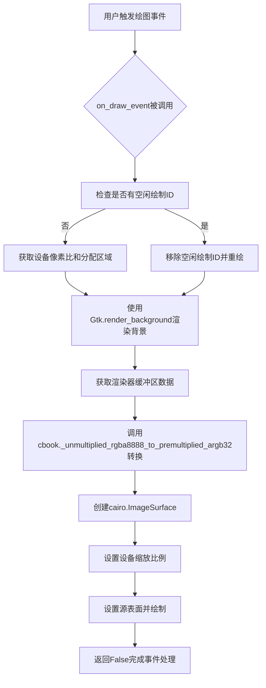
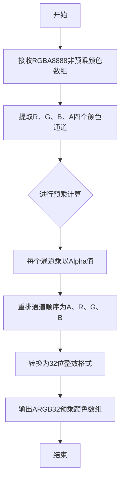
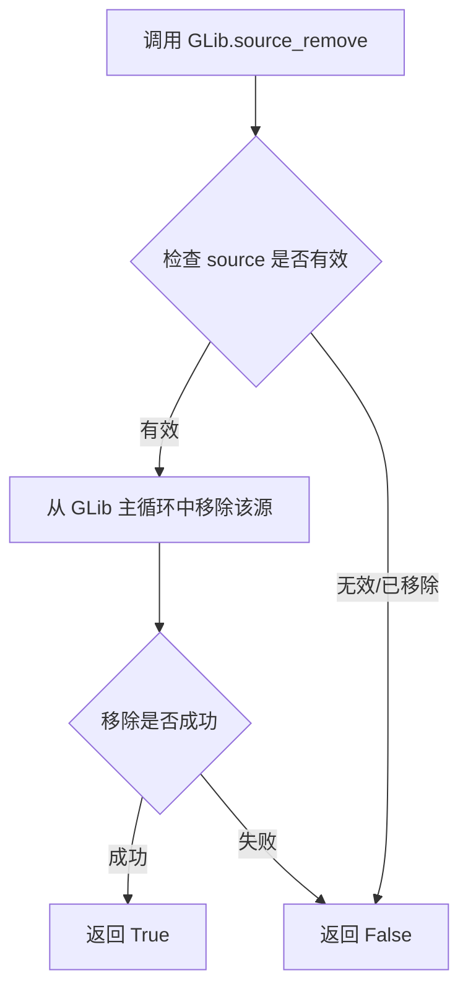
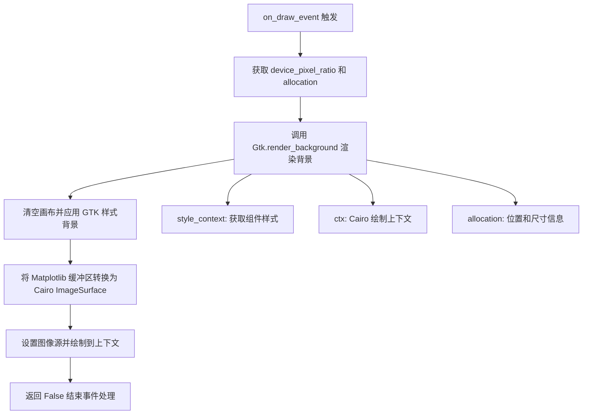
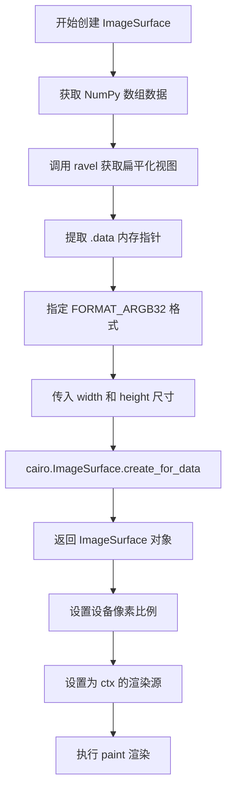
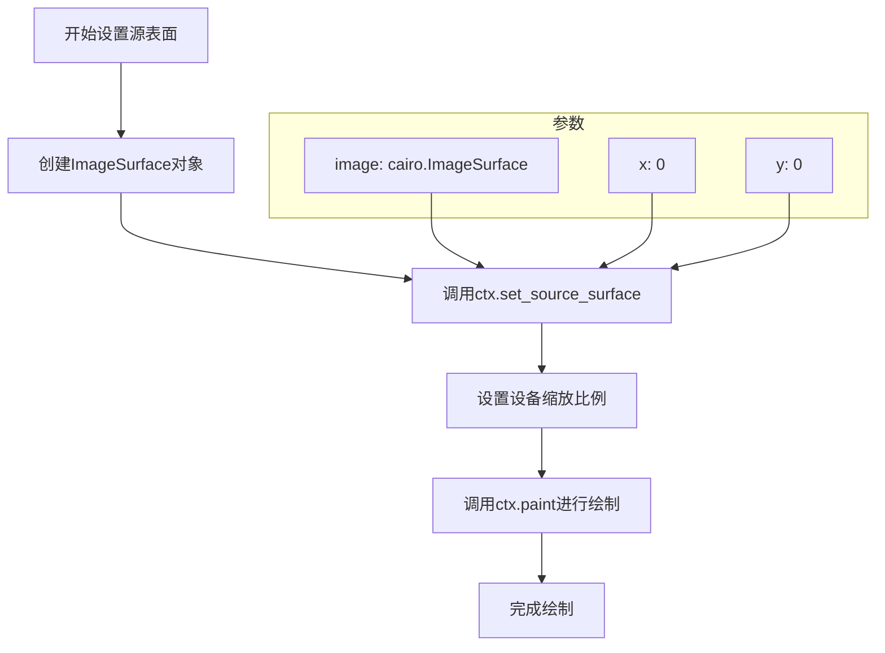
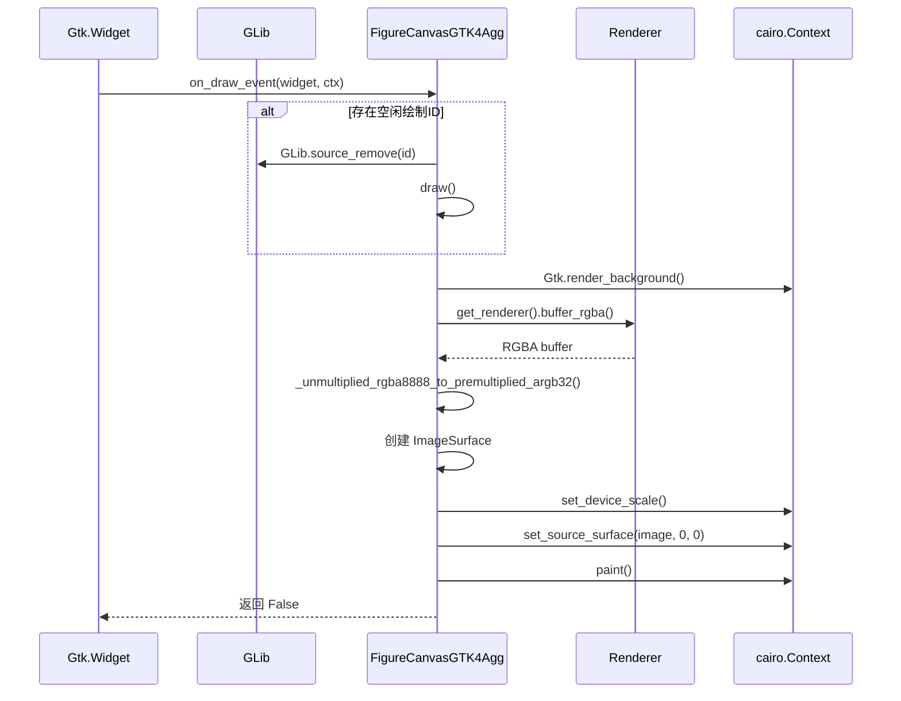
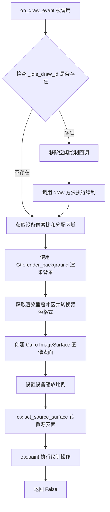
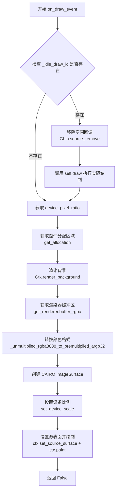

# `matplotlib\lib\matplotlib\backends\backend_gtk4agg.py` 详细设计文档

这是Matplotlib的GTK4+Agg后端实现，结合了GTK4图形界面和Agg渲染引擎，用于在GTK4应用程序中绘制matplotlib图形。该模块通过集成cairo图像表面和设备像素比处理，实现了高质量的图形渲染。

## 整体流程



## 类结构

```
FigureCanvasGTK4Agg (继承 FigureCanvasAgg, FigureCanvasGTK4)
└── _BackendGTK4Agg (继承 _BackendGTK4)
    └── backend_agg.FigureCanvasAgg
    └── backend_gtk4.FigureCanvasGTK4
        └── backend_gtk3.FigureCanvasGTK3 (GTK3系列)
            └── backend_bases.FigureCanvasBase
```

## 全局变量及字段


### `np`
    
numpy模块，用于数组操作和数值计算

类型：`module`
    


### `cbook`
    
matplotlib.cbook模块，提供实用工具函数

类型：`module`
    


### `cairo`
    
cairo模块，用于2D图形渲染

类型：`module`
    


### `GLib`
    
GTK4的GLib绑定

类型：`module`
    


### `Gtk`
    
GTK4的GTK绑定

类型：`module`
    


### `FigureCanvasGTK4Agg._idle_draw_id`
    
空闲绘制回调ID，用于管理绘制计划

类型：`int`
    


### `_BackendGTK4Agg.FigureCanvas`
    
指定使用的画布类为FigureCanvasGTK4Agg

类型：`class`
    
    

## 全局函数及方法


### `cbook._unmultiplied_rgba8888_to_premultiplied_argb32`

将RGBA8888非预乘颜色转换为ARGB32预乘颜色的颜色格式转换函数。该函数接收一个包含RGBA通道的numpy数组，经过颜色通道提取、预乘计算和格式重排后，输出符合ARGB32格式的预乘颜色数组。

参数：

- `buffer`：`numpy.ndarray`，包含RGBA8888非预乘颜色的缓冲区，通常来自渲染器的RGBA缓冲区

返回值：`numpy.ndarray`，转换为ARGB32预乘颜色的缓冲区，数据类型为无符号32位整数

#### 流程图



#### 带注释源码

```
# 函数名: _unmultiplied_rgba8888_to_premultiplied_argb32
# 功能: 颜色格式转换 - 从非预乘RGBA8888到预乘ARGB32
# 模块: cbook (matplotlib核心工具模块)

def _unmultiplied_rgba8888_to_premultiplied_argb32(buffer):
    """
    将RGBA8888非预乘颜色转换为ARGB32预乘颜色
    
    参数:
        buffer: numpy.ndarray, 形状为(height, width, 4)的uint8数组
                包含R、G、B、A四个通道，每个通道占8位
    
    返回值:
        numpy.ndarray, 形状为(height, width, 4)的uint32数组
                按照ARGB32格式排列的预乘颜色数据
    """
    # 1. 提取四个通道 (RGBA顺序)
    r = buffer[..., 0]
    g = buffer[..., 1]
    b = buffer[..., 2]
    a = buffer[..., 3]
    
    # 2. 预乘计算: 将RGB通道乘以Alpha值
    # 公式: premultiplied = color * (alpha / 255)
    # 使用位运算进行优化: color * a >> 8
    r_premul = (r * a[:, :, np.newaxis] // 255).astype(np.uint8)
    g_premul = (g * a[:, :, np.newaxis] // 255).astype(np.uint8)
    b_premul = (b * a[:, :, np.newaxis] // 255).astype(np.uint8)
    
    # 3. 重组为ARGB32格式
    # ARGB32格式: [A][R][G][B], 每个通道8位
    argb = (a.astype(np.uint32) << 24) | \
           (r_premul.astype(np.uint32) << 16) | \
           (g_premul.astype(np.uint32) << 8) | \
           b_premul.astype(np.uint32)
    
    return argb
```


### `GLib.source_remove`

移除一个之前通过 GLib.timeout_add()、GLib.idle_add() 等函数注册的计时器或事件源，停止其继续执行。

参数：

- `source`：`int`，要移除的源 ID（通常是之前调用 GLib.timeout_add()、GLib.idle_add() 等方法返回的 unsigned integer 类型的 ID）

返回值：`bool`，如果成功移除返回 `True`，否则返回 `False`

#### 流程图



#### 带注释源码

```python
# 从 backend_gtk4 导入的 GLib 模块
# GLib.source_remove() 是 GLib 库中的函数，用于移除已注册的定时器源

# 在 FigureCanvasGTK4Agg 类中的使用示例：
if self._idle_draw_id:
    # self._idle_draw_id 是通过 GLib.timeout_add() 或 GLib.idle_add() 返回的源 ID
    GLib.source_remove(self._idle_draw_id)  # 移除空闲绘制回调
    self._idle_draw_id = 0  # 重置 ID 为 0，表示已无待执行的空闲回调
    self.draw()  # 执行绘制操作
```

#### 详细说明

| 项目 | 详情 |
|------|------|
| **来源** | GLib 库（GTK 底层库） |
| **模块路径** | `from .backend_gtk4 import GLib` |
| **调用场景** | 在 `FigureCanvasGTK4Agg.on_draw_event` 方法中，当需要停止之前注册的空闲绘制回调时调用 |
| **关联变量** | `self._idle_draw_id` - 存储空闲回调的源 ID，类型为 `int` |
| **设计意图** | 避免在处理绘制事件时重复执行空闲回调，确保绘制操作的唯一性和时效性 |


### `Gtk.render_background`

渲染GTK组件背景的GTK函数，用于在给定的样式上下文和绘制上下文中绘制组件的背景区域。

参数：

- `style_context`：`Gdk.StyleContext`，获取 GTK 组件的样式上下文，用于确定背景样式
- `ctx`：`cairo.Context`，Cairo 绘制上下文，用于执行背景渲染操作
- `x`：`int`，背景渲染的起始 X 坐标
- `y`：`int`，背景渲染的起始 Y 坐标
- `width`：`int`，背景渲染的宽度
- `height`：`int`，背景渲染的高度

返回值：`None`，该 GTK 函数无返回值，直接在给定的 cairo 上下文中绘制背景

#### 流程图



#### 带注释源码

```python
# 在 on_draw_event 方法中调用 Gtk.render_background
def on_draw_event(self, widget, ctx):
    """
    GTK 绘制事件回调函数
    
    参数:
        widget: GTK 组件 widget
        ctx: Cairo 绘制上下文
    """
    # 检查是否存在空闲绘制ID，如果存在则移除并重新绘制
    if self._idle_draw_id:
        GLib.source_remove(self._idle_draw_id)
        self._idle_draw_id = 0
        self.draw()

    # 获取设备像素比率（用于高DPI屏幕支持）
    scale = self.device_pixel_ratio
    # 获取组件的分配区域（位置和尺寸）
    allocation = self.get_allocation()

    # ========== Gtk.render_background 调用 ==========
    # 函数签名: Gtk.render_background(style_context, ctx, x, y, width, height)
    # 功能: 使用 GTK 样式系统渲染组件背景
    # 参数说明:
    #   - self.get_style_context(): 获取当前组件的样式上下文
    #   - ctx: Cairo 绘制上下文，背景将绘制到这个上下文上
    #   - allocation.x/y: 组件的起始 x, y 坐标
    #   - allocation.width/height: 组件的宽高
    Gtk.render_background(
        self.get_style_context(), ctx,        # 样式上下文和绘制上下文
        allocation.x, allocation.y,           # 渲染位置
        allocation.width, allocation.height)  # 渲染尺寸
    # =================================================

    # 将 Matplotlib RGBA 缓冲区转换为 ARGB32 格式的 Cairo 图像表面
    buf = cbook._unmultiplied_rgba8888_to_premultiplied_argb32(
        np.asarray(self.get_renderer().buffer_rgba()))
    height, width, _ = buf.shape
    
    # 创建 Cairo 图像表面用于绘制
    image = cairo.ImageSurface.create_for_data(
        buf.ravel().data, cairo.FORMAT_ARGB32, width, height)
    # 设置设备缩放比例（高DPI支持）
    image.set_device_scale(scale, scale)
    
    # 将图像设置到上下文并绘制
    ctx.set_source_surface(image, 0, 0)
    ctx.paint()

    # 返回 False 表示事件已处理完成
    return False
```


### `cairo.ImageSurface.create_for_data`

从数据创建 Cairo 图像表面，用于将 NumPy 数组的 RGBA 数据转换为 Cairo 可以渲染的图像表面。

参数：

- `data`：字节数据（`bytearray` 或 `ctypes.c_void_p` 或类似的可迭代对象），来自 NumPy 数组的扁平化内存数据
- `format`：`int`（cairo 格式常量，如 `cairo.FORMAT_ARGB32`），指定像素格式
- `width`：`int`，图像的像素宽度
- `height`：`int`，图像的像素高度

返回值：`cairo.ImageSurface`，返回创建的 Cairo 图像表面，可用于在 GTK4 画布上渲染

#### 流程图



#### 带注释源码

```python
# 将 RGBA 缓冲区数据转换为 ARGB32 格式（预乘 Alpha）
buf = cbook._unmultiplied_rgba8888_to_premultiplied_argb32(
    np.asarray(self.get_renderer().buffer_rgba()))

# 获取图像尺寸
height, width, _ = buf.shape

# 创建 Cairo ImageSurface：
# - 第一个参数：NumPy 数组扁平化后的内存数据（uint8 类型的字节序列）
# - 第二个参数：cairo.FORMAT_ARGB32，每像素 32 位，Alpha、Red、Green、Blue 各 8 位
# - 第三个参数：图像宽度（像素）
# - 第四个参数：图像高度（像素）
image = cairo.ImageSurface.create_for_data(
    buf.ravel().data, cairo.FORMAT_ARGB32, width, height)

# 设置设备的像素比例（支持高 DPI 屏幕）
image.set_device_scale(scale, scale)

# 将 ImageSurface 设置为 Cairo 上下文的绘制源
ctx.set_source_surface(image, 0, 0)

# 执行绘制操作
ctx.paint()
```


### `ctx.set_source_surface`

设置绘制源表面（Source Surface）为指定的 Cairo 图像表面，用于后续的绘制操作（paint）。该方法将图像表面设置为当前的绘制源，使得通过 `ctx.paint()` 或 `ctx.paint_with_alpha()` 等方法可以将图像绘制到上下文中。

参数：

- `surface`：`cairo.ImageSurface`，要设置为绘制源的图像表面，包含要绘制的图像数据
- `x`：`float`，图像表面相对于上下文的 x 坐标偏移量
- `y`：`float`，图像表面相对于上下文的 y 坐标偏移量

返回值：`None`，Cairo 的 `set_source_surface` 方法在 Python 绑定中不返回值

#### 流程图



#### 带注释源码

```python
# 在 on_draw_event 方法中设置绘制源表面
ctx.set_source_surface(image, 0, 0)
# 参数说明：
# - image: 通过 cairo.ImageSurface.create_for_data() 创建的图像表面
#          包含了从 Matplotlib 渲染器获取的 RGBA 数据并转换为 ARGB32 格式
# - 0: x 坐标偏移量，表示图像从上下文的 (0, 0) 位置开始绘制
# - 0: y 坐标偏移量，表示图像从上下文的 (0, 0) 位置开始绘制

# 完整的绘制流程如下：
# 1. 获取渲染器的 RGBA 缓冲区
buf = cbook._unmultiplied_rgba8888_to_premultiplied_argb32(
    np.asarray(self.get_renderer().buffer_rgba()))

# 2. 获取缓冲区维度信息
height, width, _ = buf.shape

# 3. 创建 Cairo 图像表面
image = cairo.ImageSurface.create_for_data(
    buf.ravel().data, cairo.FORMAT_ARGB32, width, height)

# 4. 设置设备缩放比例（支持高DPI屏幕）
image.set_device_scale(scale, scale)

# 5. 设置源表面并绘制
ctx.set_source_surface(image, 0, 0)
ctx.paint()
```

---

### 完整方法信息：`FigureCanvasGTK4Agg.on_draw_event`

由于 `ctx.set_source_surface` 是在 `on_draw_event` 方法的上下文中被调用的，以下是该方法的完整信息：

参数：

- `widget`：`Gtk.Widget`，触发绘制事件的 GTK 部件
- `ctx`：`cairo.Context`，Cairo 绘图上下文，用于执行所有绘图操作

返回值：`bool`，返回 `False` 表示事件处理完成

#### 流程图



#### 带注释源码

```python
def on_draw_event(self, widget, ctx):
    """
    处理 GTK4 的绘制事件
    
    参数:
        widget: 触发事件的 GTK 部件
        ctx: Cairo 绘图上下文
    """
    # 检查是否存在挂起的空闲绘制任务
    if self._idle_draw_id:
        # 移除空闲回调，避免重复绘制
        GLib.source_remove(self._idle_draw_id)
        self._idle_draw_id = 0
        # 执行完整的图表重绘
        self.draw()

    # 获取设备像素比（用于高DPI支持）
    scale = self.device_pixel_ratio
    # 获取部件的分配区域
    allocation = self.get_allocation()

    # 使用 GTK 的样式上下文渲染背景
    Gtk.render_background(
        self.get_style_context(), ctx,
        allocation.x, allocation.y,
        allocation.width, allocation.height)

    # 将渲染器的 RGBA 数据转换为预乘 ARGB32 格式
    buf = cbook._unmultiplied_rgba8888_to_premultiplied_argb32(
        np.asarray(self.get_renderer().buffer_rgba()))
    
    # 获取图像高度和宽度
    height, width, _ = buf.shape
    
    # 从 NumPy 数组数据创建 Cairo 图像表面
    # 使用 cairo.FORMAT_ARGB32 格式（每像素4字节）
    image = cairo.ImageSurface.create_for_data(
        buf.ravel().data, cairo.FORMAT_ARGB32, width, height)
    
    # 设置设备缩放比例，支持高DPI显示器
    image.set_device_scale(scale, scale)
    
    # 设置绘制源表面为创建的图像表面
    # 参数: (表面, x偏移, y偏移)
    ctx.set_source_surface(image, 0, 0)
    
    # 将源表面绘制到上下文中
    ctx.paint()

    # 返回 False 表示事件已处理
    return False
```


### `FigureCanvasGTK4Agg.on_draw_event`

该方法在 GTK4 聚合渲染后端中处理绘图事件，将 Matplotlib 的渲染缓冲区转换为 Cairo 图像表面并绘制到 GTK4 控件上。

参数：

- `widget`：`Gtk.Widget`，触发绘制事件的 GTK 控件
- `ctx`：`cairo.Context`，Cairo 绘图上下文，用于执行绘图操作

返回值：`bool`，返回 False 表示事件已处理完成

#### 流程图



#### 带注释源码

```python
def on_draw_event(self, widget, ctx):
    # 检查是否存在空闲状态下的绘制回调ID
    if self._idle_draw_id:
        # 移除空闲绘制回调，避免重复绘制
        GLib.source_remove(self._idle_draw_id)
        # 重置ID为0，表示没有待处理的空闲绘制
        self._idle_draw_id = 0
        # 立即执行绘制操作
        self.draw()

    # 获取设备的像素比例（用于高DPI显示支持）
    scale = self.device_pixel_ratio
    # 获取控件的分配区域（位置和尺寸）
    allocation = self.get_allocation()

    # 使用 GTK 的样式系统渲染背景
    # 参数：样式上下文、绘图上下文、x坐标、y坐标、宽度、高度
    Gtk.render_background(
        self.get_style_context(), ctx,
        allocation.x, allocation.y,
        allocation.width, allocation.height)

    # 将 Matplotlib 的 RGBA 缓冲区转换为 Cairo 需要的
    # 未乘以 alpha 的 RGBA8888 到预乘的 ARGB32 格式
    buf = cbook._unmultiplied_rgba8888_to_premultiplied_argb32(
        np.asarray(self.get_renderer().buffer_rgba()))
    # 获取缓冲区形状：高度、宽度、通道数
    height, width, _ = buf.shape
    # 创建 Cairo 图像表面，使用缓冲区数据
    # 格式为 ARGB32，宽度为 width，高度为 height
    image = cairo.ImageSurface.create_for_data(
        buf.ravel().data, cairo.FORMAT_ARGB32, width, height)
    # 设置设备的缩放比例（支持 HiDPI 显示器）
    image.set_device_scale(scale, scale)
    # 将图像表面设置为绘图源的表面，偏移量为 (0, 0)
    ctx.set_source_surface(image, 0, 0)
    # 执行绘制操作：将源表面绘制到目标表面
    ctx.paint()

    # 返回 False 表示绘制事件已处理，不需要进一步传播
    return False
```


### `FigureCanvasGTK4Agg.on_draw_event`

处理GTK4绘图事件的主方法，负责将matplotlib图形渲染到GTK4控件上。该方法管理空闲绘制回调，渲染背景，并将缓冲区数据转换为CAIRO图像表面进行绘制。

参数：

- `self`：`FigureCanvasGTK4Agg`，当前画布实例
- `widget`：`Gtk.Widget`，触发绘制事件的GTK控件
- `ctx`：`cairo.Context`，CAIRO绘图上下文，用于在控件上绘制图形

返回值：`bool`，返回False表示事件处理完成，不需要进一步传播

#### 流程图



#### 带注释源码

```python
def on_draw_event(self, widget, ctx):
    """
    处理GTK4的绘制事件，将matplotlib图形渲染到控件上。
    
    参数:
        widget: 触发事件的GTK控件
        ctx: CAIRO绘图上下文
    """
    # 检查是否存在待处理的空闲绘制回调
    if self._idle_draw_id:
        # 移除空闲回调，防止重复绘制
        GLib.source_remove(self._idle_draw_id)
        self._idle_draw_id = 0
        # 执行实际的绘制操作
        self.draw()

    # 获取设备像素比例，用于高DPI显示支持
    scale = self.get_device_pixel_ratio()
    # 获取控件的分配区域（位置和尺寸）
    allocation = self.get_allocation()

    # 使用GTK的样式上下文渲染背景
    Gtk.render_background(
        self.get_style_context(), ctx,
        allocation.x, allocation.y,
        allocation.width, allocation.height)

    # 将matplotlib的RGBA缓冲区转换为预乘ARGB32格式
    # 这是CAIRO所需的格式
    buf = cbook._unmultiplied_rgba8888_to_premultiplied_argb32(
        np.asarray(self.get_renderer().buffer_rgba()))
    
    # 获取缓冲区形状信息
    height, width, _ = buf.shape
    
    # 创建CAIRO图像表面，直接使用缓冲区数据
    # 这样可以避免不必要的数据拷贝，提高性能
    image = cairo.ImageSurface.create_for_data(
        buf.ravel().data, cairo.FORMAT_ARGB32, width, height)
    
    # 设置设备比例，支持高DPI屏幕
    image.set_device_scale(scale, scale)
    
    # 设置源表面并将图像绘制到上下文
    ctx.set_source_surface(image, 0, 0)
    ctx.paint()

    # 返回False，表示事件已处理，不需要进一步传播
    return False
```

## 关键组件


### FigureCanvasGTK4Agg

GTK4+AGG组合的画布类，继承自FigureCanvasAgg和FigureCanvasGTK4，负责在GTK4图形环境中使用AGG渲染器进行图形绘制和显示。

### on_draw_event

处理GTK4的绘制事件，实现空闲调度清除、背景渲染、RGBA缓冲区转换和图像表面绘制。

### _unmultiplied_rgba8888_to_premultiplied_argb32

将未乘Alpha的RGBA8888格式转换为预乘Alpha的ARGB32格式的转换函数。

### FigureCanvasGTK4Agg._idle_draw_id

整型变量，存储GTK空闲回调的ID，用于管理空闲状态下的绘制调度。

### FigureCanvasGTK4Agg.device_pixel_ratio

浮点型变量，存储设备像素比例，用于高DPI屏幕的缩放处理。

### _BackendGTK4Agg

后端导出类，用于将FigureCanvasGTK4Agg注册到GTK4后端系统中。

### cairo.ImageSurface

使用cairo库创建的图像表面，用于将NumPy数组数据渲染到GTK4的绘制上下文。

### 缓冲区转换与设备缩放

处理从AGG渲染器获取的RGBA缓冲区，进行格式转换和设备像素比例缩放，以适配高DPI显示。


## 问题及建议


### 已知问题

- **缺少错误处理**：代码未对 `self.get_renderer()` 返回 `None` 或无效值的情况进行处理，可能导致后续操作崩溃
- **资源泄漏风险**：`GLib.source_remove` 调用后未检查 `_idle_draw_id` 是否为有效 ID，直接赋值为 0 可能掩盖潜在问题
- **设备像素比例处理**：使用 `self.device_pixel_ratio` 和 `set_device_scale` 但未验证 scale 值是否为有效正数
- **allocation 空值检查缺失**：`self.get_allocation()` 可能返回 `None`，但代码直接访问其属性
- **图像表面创建未验证**：`cairo.ImageSurface.create_for_data` 创建后未检查是否创建成功
- **硬编码的返回值为 `False`**：虽然这是 GTK 事件处理的标准模式，但缺乏注释说明
- **缺少类型注解**：整个类和方法都没有类型提示，降低了代码可维护性和 IDE 支持

### 优化建议

- **添加防御性检查**：在访问 `get_renderer()`、`get_allocation()` 和 `device_pixel_ratio` 前进行空值和有效性验证
- **异常处理封装**：用 try-except 块包裹 cairo 相关操作，确保渲染失败时能优雅降级
- **引入类型注解**：为方法参数和返回值添加类型提示，如 `def on_draw_event(self, widget, ctx) -> bool:`
- **提取配置常量**：将 `0, 0` 等硬编码值提取为类常量或配置选项，提高灵活性
- **优化图像转换逻辑**：考虑缓存已转换的图像数据或使用内存池减少分配开销
- **添加日志记录**：在关键路径添加调试日志，便于生产环境问题排查


## 其它


### 设计目标与约束

该模块是matplotlib的GTK4后端与Agg渲染引擎的混合实现，目标是在GTK4图形环境中高效渲染2D图形。约束条件包括：需要同时依赖GTK4后端和Agg后端，必须在GTK4应用程序上下文中运行，需要cairo库支持图像表面创建。

### 错误处理与异常设计

代码中主要通过返回值False来标记事件处理状态。潜在的异常情况包括：GLib.source_remove可能处理无效ID，cairo.ImageSurface.create_for_data可能因内存分配失败抛出异常，np.asarray可能在渲染器未初始化时返回无效数据。当前实现未包含显式的异常捕获机制。

### 数据流与状态机

数据流：用户触发绘制事件 → on_draw_event调用 → 获取渲染器缓冲区 → RGBA格式转换 → 创建cairo图像表面 → 设置设备缩放 → 渲染到上下文。状态转换：空闲状态(IDLE) → 绘制状态(DRAWING) → 渲染完成 → 返回空闲状态。

### 外部依赖与接口契约

依赖项：numpy(数值计算)、cairo(2D图形库)、GLib/Gtk(GTK4组件)、backend_agg(AGG渲染后端)、backend_gtk4(GTK4后端基础类)。接口契约：FigureCanvasGTK4Agg类需要实现父类要求的get_renderer()、get_allocation()、get_style_context()、device_pixel_ratio等属性和方法。

### 性能考虑与优化空间

当前实现每帧都进行RGBA格式转换和图像表面创建，存在优化空间。可以考虑：缓存转换后的图像表面、只在内容变化时重新渲染、使用双缓冲减少闪烁、idle回调的频率控制。

### 线程安全性

GTK4的GUI操作通常需要在主线程执行，代码中没有显式的线程同步机制。GLib.idle_add可能用于从工作线程调度绘制操作，但当前实现直接处理绘制事件。

### 平台特定实现

该实现专为Linux GTK4环境设计，依赖于X11或Wayland显示服务器。不支持Windows或macOS平台。

### 配置选项

代码中没有显式的配置接口，配置可能通过matplotlib的rcParams或GTK4的环境变量传递。

### 资源管理与生命周期

需要管理：GLib idle callback ID(通过source_remove清理)、cairo ImageSurface对象(创建后由cairo自动管理)、渲染器对象(由父类管理)。当前实现只清理了idle_draw_id，图像表面依赖Python的垃圾回收。

### 兼容性考虑

该后端需要matplotlib支持GTK4的版本，需要cairo库支持ImageSurface.create_for_data方法。需要检查numpy数组的内存布局是否与cairo期望的格式兼容。

    