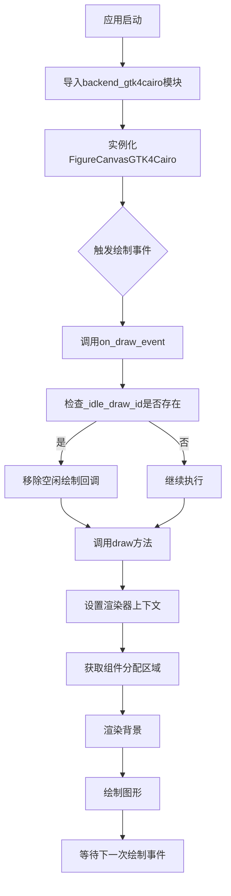
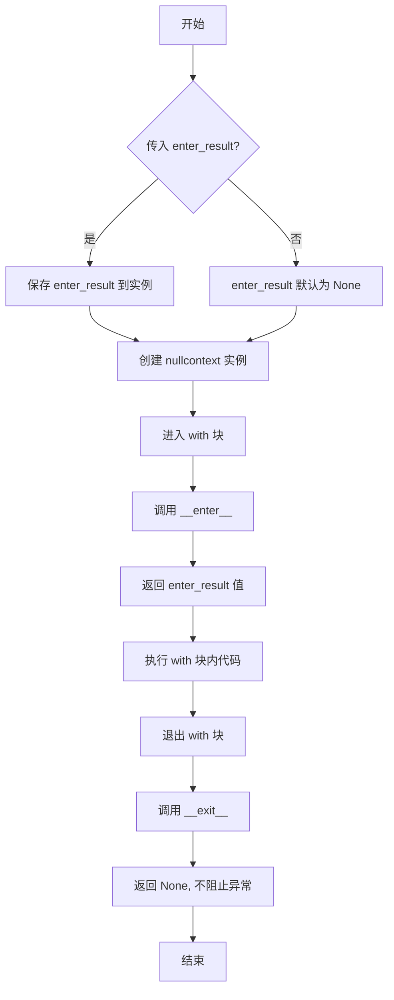
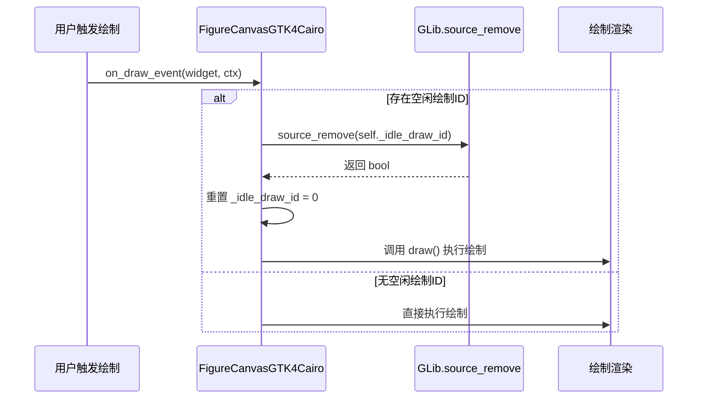
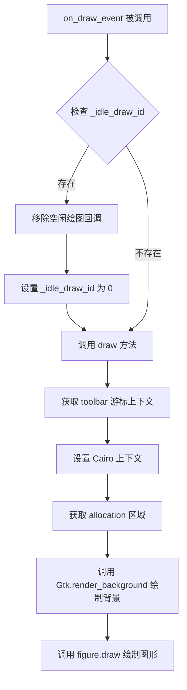
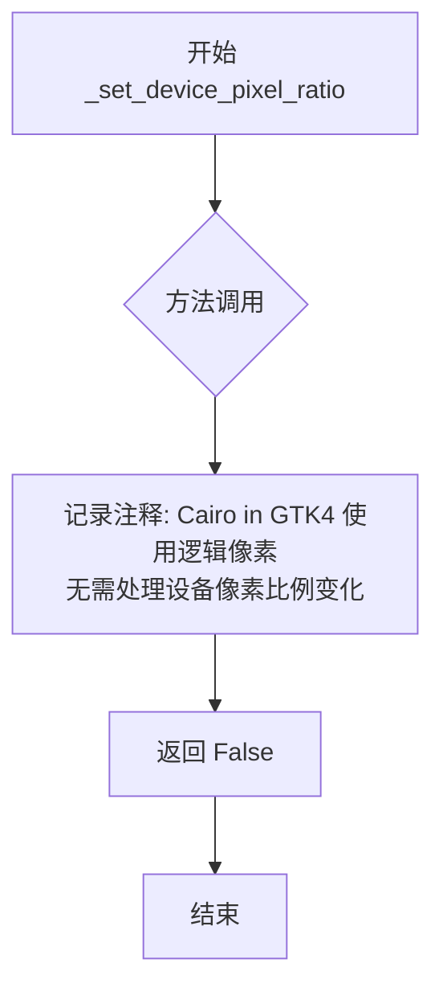
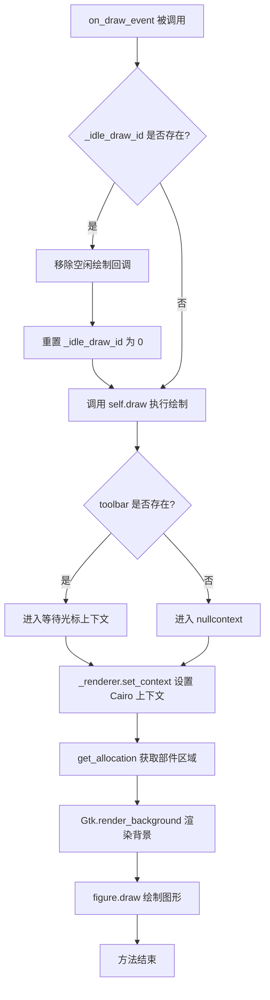

# `matplotlib\lib\matplotlib\backends\backend_gtk4cairo.py` 详细设计文档

该文件实现了GTK4与Cairo图形后端的集成，通过FigureCanvasGTK4Cairo类处理GTK4窗口中的图形渲染，并使用_set_device_pixel_ratio和on_draw_event方法管理设备像素比和绘制事件，同时通过装饰器导出_BackendGTK4Cairo后端类。

## 整体流程



## 类结构

```
FigureCanvasCairo (基类 - 来自backend_cairo)
FigureCanvasGTK4 (基类 - 来自backend_gtk4)
└── FigureCanvasGTK4Cairo (继承自两者)

_BackendGTK4 (基类 - 来自backend_gtk4)
└── _BackendGTK4Cairo (继承自前者)
```

## 全局变量及字段


### `_BackendGTK4Cairo.FigureCanvas`
    
GTK4 Cairo 后端使用的画布类，指定为 FigureCanvasGTK4Cairo 用于在该后端上进行图形渲染

类型：`type`
    
    

## 全局函数及方法


### `nullcontext`

`nullcontext` 是 Python 标准库 `contextlib` 模块中的一个上下文管理器类，用于在 `with` 语句中提供一个可选的上下文管理器。当条件满足时使用真实的上下文管理器，否则使用 `nullcontext` 作为空操作替代品。

参数：

- `enter_result`：任意类型，可选，默认为 `None`，表示进入上下文管理器时要返回的值。如果为 `None`，则 `__enter__` 返回 `None`。

返回值：`nullcontext` 实例，一个实现了上下文管理器协议的对象

#### 流程图



#### 带注释源码

```python
# 从 contextlib 模块导入 nullcontext 类
# 这是一个轻量级的上下文管理器，当不需要实际上下文管理时用作占位符
from contextlib import nullcontext


# nullcontext 的简化实现原理：
class nullcontext:
    """
    空上下文管理器。
    
    用法：
        with nullcontext() as cm:
            # 如果不传入参数，cm 为 None
            pass
            
        with nullcontext(value) as cm:
            # cm 将被赋值为 value
            pass
    """
    
    def __init__(self, enter_result=None):
        """
        初始化 nullcontext 实例。
        
        参数：
            enter_result: 任意类型，可选参数
                传递给 __enter__ 方法的返回值。默认为 None。
        """
        self.enter_result = enter_result
    
    def __enter__(self):
        """
        进入上下文管理器。
        
        返回值：
            返回构造时传入的 enter_result 值
        """
        return self.enter_result
    
    def __exit__(self, exc_type, exc_val, exc_tb):
        """
        退出上下文管理器。
        
        参数：
            exc_type: 异常类型，如果没有异常则为 None
            exc_val: 异常值，如果没有异常则为 None
            exc_tb: 异常回溯，如果没有异常则为 None
        
        返回值：
            始终返回 None（False），不阻止异常传播
        """
        return None


# 在代码中的实际使用场景：
# --------------------------------------------------
# from contextlib import nullcontext
# from .backend_gtk4 import GLib, Gtk, FigureCanvasGTK4, _BackendGTK4

class FigureCanvasGTK4Cairo(FigureCanvasCairo, FigureCanvasGTK4):
    def on_draw_event(self, widget, ctx):
        # 如果存在 toolbar，使用其 _wait_cursor_for_draw_cm() 上下文管理器
        # 否则使用 nullcontext() 作为空操作
        with (self.toolbar._wait_cursor_for_draw_cm() if self.toolbar
              else nullcontext()):
            # 在此处执行绘图操作
            # 如果 toolbar 存在，会显示等待光标
            # 如果 toolbar 不存在，nullcontext() 不做任何事情
            self._renderer.set_context(ctx)
            # ... 其他绘图代码
```


### `GLib.source_remove`

移除指定的 GLib 事件源（通常是超时或空闲回调），用于停止正在运行的定时器或空闲处理程序。

参数：

- `source_id`：`int`，要移除的 GLib 源的 ID（由 `GLib.idle_add()` 或 `GLib.timeout_add()` 返回）

返回值：`bool`，如果成功移除返回 `True`，否则返回 `False`

#### 流程图



#### 带注释源码

```python
def on_draw_event(self, widget, ctx):
    """
    处理 GTK4 的绘制事件
    
    参数:
        widget: 触发事件的 GTK 部件
        ctx: Cairo 绘图上下文
    """
    # 检查是否存在之前注册的空闲绘制回调
    if self._idle_draw_id:
        # 调用 GLib.source_remove 移除空闲回调源
        # 参数 self._idle_draw_id 是由 GLib.idle_add() 返回的源 ID
        # 返回值表示是否成功移除该源
        GLib.source_remove(self._idle_draw_id)
        
        # 重置空闲绘制 ID 为 0，表示没有待处理的空闲回调
        self._idle_draw_id = 0
        
        # 立即执行绘制操作（而非等待空闲回调）
        self.draw()

    # 处理工具栏光标（如果存在）
    with (self.toolbar._wait_cursor_for_draw_cm() if self.toolbar
          else nullcontext()):
        # 设置渲染器的 Cairo 上下文
        self._renderer.set_context(ctx)
        
        # 获取部件的分配区域
        allocation = self.get_allocation()
        
        # 渲染背景
        Gtk.render_background(
            self.get_style_context(), ctx,
            allocation.x, allocation.y,
            allocation.width, allocation.height)
        
        # 绘制图形
        self.figure.draw(self._renderer)
```

#### 补充说明

| 项目 | 说明 |
|------|------|
| **调用位置** | `FigureCanvasGTK4Cairo.on_draw_event` 方法 |
| **导入来源** | `from .backend_gtk4 import GLib` |
| **设计目的** | 在处理新的绘制事件时，取消之前注册的空闲绘制回调，避免重复绘制或绘制冲突 |
| **GTK4 行为变化** | GTK4 中移除了某些 GTK3 的绘图机制，改为使用 GLib 事件源管理空闲回调 |
| **潜在优化点** | 可考虑使用 `GLib.Source.remove()` 的面向对象接口替代整型 ID 方式 |


### `Gtk.render_background`

绘制 GTK 部件的背景区域，使用样式上下文和 Cairo 图形上下文在指定位置绘制背景。

参数：

- `context`：`Gtk.StyleContext`，通过 `self.get_style_context()` 获取的 GTK 样式上下文，用于确定背景样式
- `cr`：`cairo.Context`，Cairo 绘图上下文，用于执行绘图操作
- `x`：`int`，背景绘制区域的 X 坐标，从 `allocation.x` 获取
- `y`：`int`，背景绘制区域的 Y 坐标，从 `allocation.y` 获取
- `width`：`int`，背景绘制区域的宽度，从 `allocation.width` 获取
- `height`：`int`，背景绘制区域的高度，从 `allocation.height` 获取

返回值：`None`，该函数无返回值（GTK 渲染函数通常为 void 类型）

#### 流程图



#### 带注释源码

```python
def on_draw_event(self, widget, ctx):
    # 检查是否存在待处理的空闲绘图任务
    if self._idle_draw_id:
        # 移除已注册的空闲绘图回调，避免重复绘制
        GLib.source_remove(self._idle_draw_id)
        # 重置空闲绘图 ID
        self._idle_draw_id = 0
        # 立即执行绘制操作
        self.draw()

    # 获取工具栏的游标上下文管理器（如果存在工具栏）
    # 用于在绘制期间显示等待光标
    with (self.toolbar._wait_cursor_for_draw_cm() if self.toolbar
          else nullcontext()):
        # 设置当前 Cairo 绘图上下文到渲染器
        self._renderer.set_context(ctx)
        # 获取部件的分配区域（位置和尺寸）
        allocation = self.get_allocation()
        
        # 调用 GTK4 的 render_background 函数绘制背景
        # 参数依次为：样式上下文、Cairo 上下文、X坐标、Y坐标、宽度、高度
        # 该函数使用当前样式上下文定义的颜色和样式填充背景区域
        Gtk.render_background(
            self.get_style_context(), ctx,
            allocation.x, allocation.y,
            allocation.width, allocation.height)
        
        # 使用渲染器绘制 matplotlib 图形
        self.figure.draw(self._renderer)
```


### FigureCanvasGTK4Cairo._set_device_pixel_ratio

该方法是 GTK4 后端 Cairo 画布的设备像素比例设置方法。由于 Cairo 在 GTK4 中始终使用逻辑像素，因此该方法不需要执行任何操作来响应设备像素比例的变化，直接返回 False 表示无需后续处理。

参数：

- `self`：`FigureCanvasGTK4Cairo` 实例，隐式参数，表示调用该方法的画布对象本身
- `ratio`：`float` 或 `int`，设备像素比例值，表示屏幕的物理像素与逻辑像素之比

返回值：`bool`，返回 False，表示该方法未对设备像素比例变化进行处理，调用者无需执行额外的缩放操作

#### 流程图



#### 带注释源码

```python
def _set_device_pixel_ratio(self, ratio):
    # Cairo in GTK4 always uses logical pixels, so we don't need to do anything for
    # changes to the device pixel ratio.
    return False
```


### `FigureCanvasGTK4Cairo.on_draw_event`

处理 GTK4 下的 Cairo 绘制事件，负责清理待处理的空闲绘制、设置渲染器上下文、渲染背景，并调用 figure.draw 完成图形绘制。

参数：

- `widget`：`Gtk.Widget`，触发绘制事件的 GTK 部件
- `ctx`：`cairo.Context`，Cairo 图形上下文，用于绘制图形

返回值：`None`，无返回值（隐式返回 None）

#### 流程图



#### 带注释源码

```
def on_draw_event(self, widget, ctx):
    """
    处理 GTK4 的绘制事件。
    
    参数:
        widget: 触发绘制事件的 GTK 部件
        ctx: Cairo 图形上下文
    """
    # 检查是否存在待处理的空闲绘制回调
    if self._idle_draw_id:
        # 移除之前注册的空闲绘制回调，避免重复绘制
        GLib.source_remove(self._idle_draw_id)
        # 重置标识符
        self._idle_draw_id = 0
        # 立即执行绘制
        self.draw()

    # 根据是否存在工具栏选择上下文管理器
    # 如果有工具栏，使用等待光标上下文；否则使用空上下文
    with (self.toolbar._wait_cursor_for_draw_cm() if self.toolbar
          else nullcontext()):
        # 为渲染器设置当前的 Cairo 上下文
        self._renderer.set_context(ctx)
        # 获取部件的分配区域（位置和尺寸）
        allocation = self.get_allocation()
        # 使用 GTK 样式渲染背景
        Gtk.render_background(
            self.get_style_context(), ctx,
            allocation.x, allocation.y,
            allocation.width, allocation.height)
        # 调用 figure 的 draw 方法完成图形绘制
        self.figure.draw(self._renderer)
```


## 关键组件


### FigureCanvasGTK4Cairo

GTK4平台的Cairo图形后端画布类，继承自FigureCanvasCairo和FigureCanvasGTK4，负责在GTK4环境下使用Cairo渲染引擎绘制matplotlib图形。

### _BackendGTK4Cairo

GTK4平台的Cairo后端导出类，通过装饰器注册到matplotlib后端系统，将FigureCanvasGTK4Cairo设置为该后端使用的画布类。

### _set_device_pixel_ratio

设备像素比设置方法，由于Cairo在GTK4中始终使用逻辑像素，该方法直接返回False，无需进行设备像素比调整。

### on_draw_event

绘制事件处理方法，负责响应GTK4的绘制信号，执行实际的图形渲染工作，包括清理空闲绘制回调、设置渲染器上下文、渲染背景区域以及调用图形对象的绘制方法。


## 问题及建议


### 已知问题

-   **多重继承MRO风险**：`FigureCanvasGTK4Cairo`同时继承`FigureCanvasCairo`和`FigureCanvasGTK4`，可能导致方法解析顺序(MRO)冲突，尤其是当两个父类有同名方法时
-   **_idle_draw_id未显式初始化**：代码中使用`self._idle_draw_id`但未在当前类中看到初始化代码，依赖父类继承可能带来隐式耦合
-   **_set_device_pixel_ratio返回值语义不明确**：该方法始终返回`False`，但调用方如何使用这个返回值未在代码中体现，可能导致调用方逻辑失效
-   **空上下文管理器使用不当**：`toolbar._wait_cursor_for_draw_cm()`的结果直接传给`nullcontext()`参数，语法虽然正确但意图不清晰
-   **缺少draw()异常处理**：直接调用`self.draw()`和`self.figure.draw()`，若渲染过程中抛出异常可能导致GTK事件循环状态不一致

### 优化建议

-   在类`__init__`方法中显式初始化`_idle_draw_id = 0`，提高代码可读性和可维护性
-   为`_set_device_pixel_ratio`方法添加文档说明返回值含义，或重新设计返回值的用途
-   考虑使用`contextlib.nullcontext()`的标准用法：`with nullcontext() as cm:` 或直接重构条件表达式
-   添加try-except包装绘制逻辑，确保异常情况下也能正确清理`_idle_draw_id`
-   考虑使用组合而非继承来避免多重继承的复杂性，提高代码可测试性


## 其它


### 设计目标与约束

本后端旨在为Matplotlib提供GTK4与Cairo的集成渲染能力，核心目标是利用GTK4的窗口系统结合Cairo的2D图形渲染能力实现高性能图表绘制。设计约束包括：必须继承FigureCanvasCairo和FigureCanvasGTK4两个父类；Cairo在GTK4环境下始终使用逻辑像素，因此不需要处理设备像素比调整；必须通过_BackendGTK4.export装饰器导出后端以便Matplotlib识别。

### 错误处理与异常设计

代码中的错误处理主要体现在：_set_device_pixel_ratio方法返回False表示不处理设备像素比变化；on_draw_event中使用nullcontext()处理toolbar可能为None的情况；GLib.source_remove在移除定时器前检查_idle_draw_id的有效性。潜在异常包括：get_allocation()可能返回无效的allocation；get_style_context()可能返回None；figure或_renderer可能未正确初始化。

### 数据流与状态机

数据流：GTK事件系统触发on_draw_event → 检查是否有待处理的空闲绘制 → 调用draw()方法 → 获取Cairo上下文 → 获取GTK样式和分配信息 → 执行Cairo渲染 → 调用figure.draw()完成最终绘制。状态机包含：空闲状态（_idle_draw_id=0）、待绘制状态（_idle_draw_id!=0）、绘制中状态。

### 外部依赖与接口契约

外部依赖包括：GTK4库（Gtk、GLib、FigureCanvasGTK4）、Cairo渲染库（FigureCanvasCairo）、contextlib.nullcontext。接口契约要求：FigureCanvasGTK4Cairo必须实现on_draw_event(widget, ctx)方法接收GTK的绘制事件；_BackendGTK4Cairo必须提供FigureCanvas属性指向FigureCanvasGTK4Cairo类；_set_device_pixel_ratio必须返回布尔值。

### 性能考虑与优化空间

当前实现使用空闲回调（idle callback）来处理绘制请求，这种方式可以避免频繁的重绘但可能引入延迟。优化方向包括：可以考虑使用GLib.idle_add()替代当前的定时器方案；可以添加脏矩形（dirty rect）检测来减少不必要的全图重绘；可以为Cairo上下文设置缓存避免重复创建。

### 线程安全性

GTK4要求所有GUI操作必须在主线程中执行，代码中通过GLib.source_remove和draw()调用都在主线程的回调中执行，因此是线程安全的。但需要注意如果外部代码从其他线程调用绘制方法，需要使用GLib.idle_add()或GObject.idle_add()将调用调度到主线程。

### 平台兼容性

该后端仅支持GTK4平台，不兼容GTK3或更早版本。由于Cairo在GTK4中使用逻辑像素，不同DPI的显示器可能需要额外的缩放处理。当前代码对Windows和macOS平台不适用。

### 资源管理

代码中的资源管理主要依赖GTK4的自动内存管理：_idle_draw_id定时器资源在使用后通过GLib.source_remove释放；Cairo上下文由GTK管理；样式上下文通过get_style_context()获取。潜在的资源泄漏风险在于如果on_draw_event频繁调用但draw()执行缓慢，可能导致定时器堆积。

### 测试策略

建议测试用例包括：验证在不同DPI设置下的渲染正确性；验证窗口大小改变时的重绘行为；验证与其他GTK4组件（如toolbar）的集成；验证多窗口场景下的资源隔离；验证在极端窗口尺寸（最小化、最大化）下的稳定性。

    