# `matplotlib\lib\matplotlib\backends\backend_macosx.py` 详细设计文档

这是Matplotlib的macOS平台后端实现，通过集成Cocoa框架提供原生macOS图形渲染和交互功能，包括定时器管理、图形画布渲染、工具栏导航和窗口管理，支持在macOS系统上创建和显示matplotlib图形。

## 整体流程

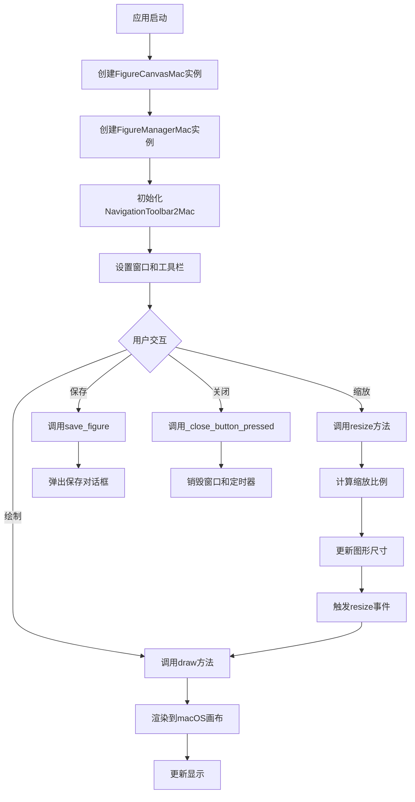

## 类结构

```
TimerBase (抽象基类)
└── TimerMac (macOS定时器实现)

FigureCanvasBase (抽象基类)
├── FigureCanvasAgg (AGG渲染器)
└── FigureCanvasMac (macOS画布实现)
    └── _macosx.FigureCanvas (ObjC实现)

NavigationToolbar2 (基类)
└── NavigationToolbar2Mac (macOS工具栏)

FigureManagerBase (基类)
└── FigureManagerMac (macOS图形管理器)
    └── _macosx.FigureManager (ObjC实现)

_Backend (后端基类)
└── _BackendMac (macOS后端导出类)
```

## 全局变量及字段


### `os`
    
Python standard library module for operating system interface

类型：`module`
    


### `mpl`
    
Matplotlib library main module alias

类型：`module`
    


### `_api`
    
Matplotlib internal API utilities module

类型：`module`
    


### `cbook`
    
Matplotlib common utilities and helper functions module

类型：`module`
    


### `Gcf`
    
Manages figure references and keeps track of all active figure managers

类型：`class`
    


### `_macosx`
    
macOS-specific native backend implementation module

类型：`module`
    


### `FigureCanvasAgg`
    
Canvas class using Anti-Grain Geometry (Agg) for rendering

类型：`class`
    


### `FigureCanvasBase`
    
Abstract base class for all figure canvas implementations

类型：`class`
    


### `FigureManagerBase`
    
Base class for managing figure windows and their lifecycle

类型：`class`
    


### `NavigationToolbar2`
    
Traditional 2D navigation toolbar with pan/zoom/zoom-to-rect buttons

类型：`class`
    


### `ResizeEvent`
    
Event class dispatched when figure canvas is resized

类型：`class`
    


### `TimerBase`
    
Abstract base class for timer implementations in matplotlib

类型：`class`
    


### `_allow_interrupt`
    
Context manager allowing SIGINT signal to interrupt blocking operations

类型：`function`
    


### `_Backend`
    
Backend export decorator class for registering matplotlib backends

类型：`class`
    


### `FigureCanvasMac._draw_pending`
    
Flag indicating whether a draw operation is pending and not yet executed

类型：`bool`
    


### `FigureCanvasMac._is_drawing`
    
Flag indicating whether a draw operation is currently in progress

类型：`bool`
    


### `FigureCanvasMac._timers`
    
Collection of active timer objects associated with this canvas

类型：`set`
    


### `FigureManagerMac._shown`
    
Flag indicating whether the figure window has been shown to the user

类型：`bool`
    
    

## 全局函数及方法


### `_allow_interrupt_macos`

该函数是一个上下文管理器，用于在 macOS 平台上允许通过发送 SIGINT 信号（Ctrl+C）来终止绘图。它通过调用 `_allow_interrupt` 函数，并结合 macOS 特定的 `_macosx.wake_on_fd_write` 和 `_macosx.stop` 来实现信号处理和中断功能。

参数：无

返回值：`contextmanager`，一个上下文管理器对象，用于在 `with` 语句中处理 SIGINT 信号的中断

#### 流程图

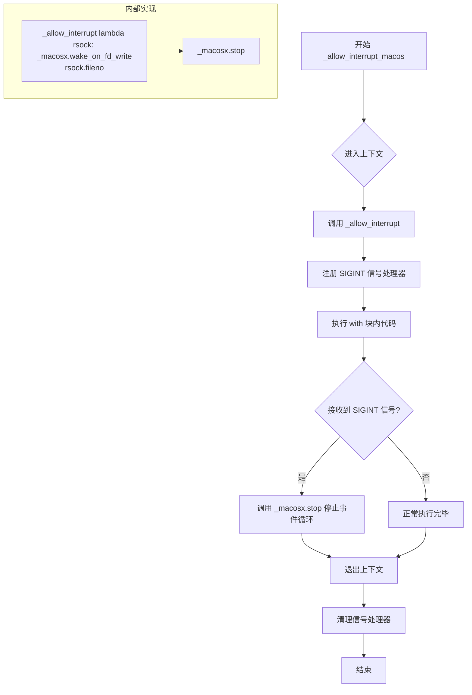

#### 带注释源码

```python
def _allow_interrupt_macos():
    """A context manager that allows terminating a plot by sending a SIGINT."""
    # 这是一个上下文管理器，用于在 macOS 上允许通过 Ctrl+C (SIGINT) 终止绘图
    # 它调用 _allow_interrupt 函数，传入两个关键参数：
    # 1. lambda 函数：用于唤醒文件描述符，使其可以响应中断信号
    # 2. _macosx.stop：macOS 特定的停止函数，用于停止事件循环
    return _allow_interrupt(
        lambda rsock: _macosx.wake_on_fd_write(rsock.fileno()), 
        _macosx.stop
    )
```

---

### 补充说明

#### 设计目标与约束

- **设计目标**：在 macOS 平台上提供可靠的信号中断机制，允许用户通过 Ctrl+C 终止阻塞的绘图操作
- **约束**：该函数仅适用于 macOS 平台，依赖 `_macosx` 模块提供的底层 C/ObjC 实现

#### 外部依赖与接口契约

| 依赖项 | 类型 | 描述 |
|--------|------|------|
| `_allow_interrupt` | 函数 | matplotlib 底层信号处理函数 |
| `_macosx.wake_on_fd_write` | 函数 | macOS 底层唤醒文件描述符的函数 |
| `_macosx.stop` | 函数 | macOS 底层停止事件循环的函数 |

#### 潜在技术债务与优化空间

1. **平台特定代码**：该函数与 macOS 平台紧密耦合，缺乏跨平台一致性
2. **错误处理缺失**：未对 `_macosx` 模块加载失败或函数调用异常进行处理
3. **上下文管理器嵌套**：在 `FigureCanvasMac.start_event_loop` 和 `FigureManagerMac.start_main_loop` 中重复使用，建议提取为类属性或模块级配置


### FigureCanvasMac.__init__

初始化 macOS 平台的 FigureCanvas 对象，设置绘图状态标志和计时器集合。

参数：

- `figure`：`~matplotlib.figure.Figure`，要绑定的 matplotlib 图形对象

返回值：`None`，该方法为构造函数，不返回任何值

#### 流程图

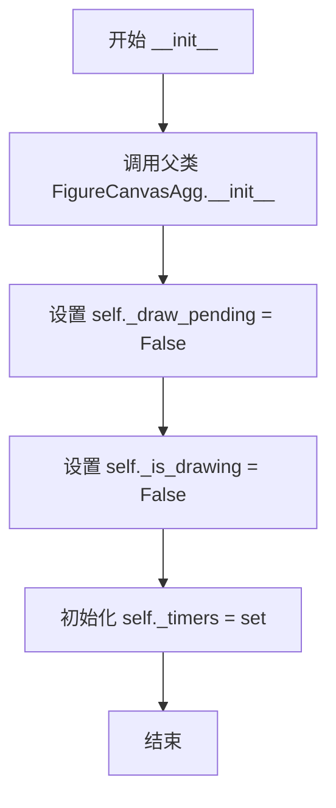

#### 带注释源码

```python
def __init__(self, figure):
    # 调用父类 FigureCanvasAgg 的初始化方法，绑定 figure 对象
    super().__init__(figure=figure)
    # 初始化绘制挂起标志，表示当前没有待处理的绘制请求
    self._draw_pending = False
    # 初始化绘制中标志，表示当前是否正在进行绘制操作
    self._is_drawing = False
    # 创建一个空集合，用于跟踪当前活跃的计时器
    # 用于避免内存泄漏，计时器不再使用时需要从中移除
    self._timers = set()
```


### `FigureCanvasMac.draw`

渲染 figure 并更新 macOS 平台下的 canvas。

参数：

- （无，仅含 `self` 隐式参数）

返回值：`None`，无返回值（该方法通过副作用更新图形界面）

#### 流程图

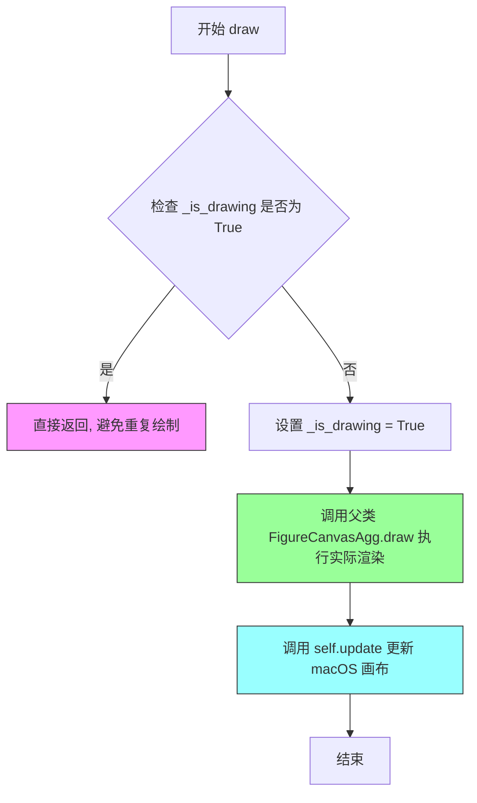

#### 带注释源码

```python
def draw(self):
    """Render the figure and update the macosx canvas."""
    # The renderer draw is done here; delaying causes problems with code
    # that uses the result of the draw() to update plot elements.
    
    # 检查是否正在进行绘制操作，如果是则直接返回，避免递归或重复绘制
    if self._is_drawing:
        return
    
    # 使用上下文管理器设置 _is_drawing 标志为 True，确保绘制过程原子性
    # 绘制完成后自动恢复原状态（即使发生异常）
    with cbook._setattr_cm(self, _is_drawing=True):
        # 调用父类 FigureCanvasAgg 的 draw 方法，执行实际的内容渲染
        # 渲染内容包括所有 Axes、Artists 等图形元素
        super().draw()
    
    # 调用 update 方法将渲染结果推送到 macOS 窗口进行显示
    # 这是与 macOS 原生图形系统交互的关键步骤
    self.update()
```


### FigureCanvasMac.draw_idle

这是一个延迟绘制优化方法，用于在macOS后端中优化绘图性能。该方法通过检查当前是否已有待处理的绘制请求或正在进行绘制，来避免重复的绘图操作；如果没有待处理绘制，则设置一个单次触发计时器，将实际绘制操作调度到事件循环中执行，从而实现绘制节流，减少不必要的渲染开销。

参数：

- `self`：FigureCanvasMac 实例，隐含的调用者参数，表示当前画布对象本身

返回值：`None`，该方法不返回任何值，仅通过副作用（设置计时器）来调度后续的绘制操作

#### 流程图

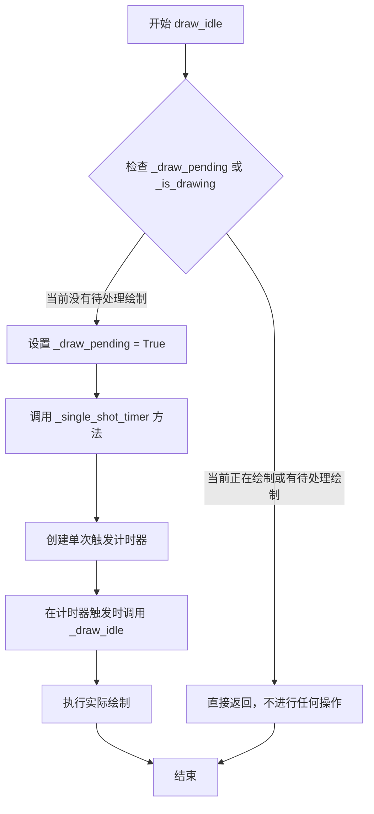

#### 带注释源码

```python
def draw_idle(self):
    # 继承自父类的文档字符串
    # docstring inherited
    
    # 检查是否存在待处理的绘制请求或当前正在进行绘制
    # 使用 getattr 安全地获取属性值，如果属性不存在则默认为 False
    if not (getattr(self, '_draw_pending', False) or
            getattr(self, '_is_drawing', False)):
        # 如果当前没有待处理绘制且没有正在绘制
        
        # 设置标志位，表示有一个绘制请求待处理
        # 这样可以防止在计时器触发前重复添加多个绘制请求
        self._draw_pending = True
        
        # 添加一个单次触发计时器到事件循环中
        # 该计时器会回调 Python 方法 _draw_idle 来执行实际的绘制
        # self._single_shot_timer(self._draw_idle)
        
        # 通过延迟到计时器触发时再绘制，可以实现以下优化：
        # 1. 在事件循环处理多个事件期间，累积多个绘制请求
        # 2. 只在事件循环空闲时执行一次绘制
        # 3. 避免每次状态改变都立即触发完整重绘，提高性能
```


### FigureCanvasMac._single_shot_timer

该方法用于在 macOS 平台上添加一个单次触发的定时器，将指定的回调函数注册到定时器中，并在定时器触发后自动清理定时器资源。

参数：

- `callback`：`function`，需要添加为单次触发定时器的回调函数

返回值：`None`，该方法没有返回值

#### 流程图

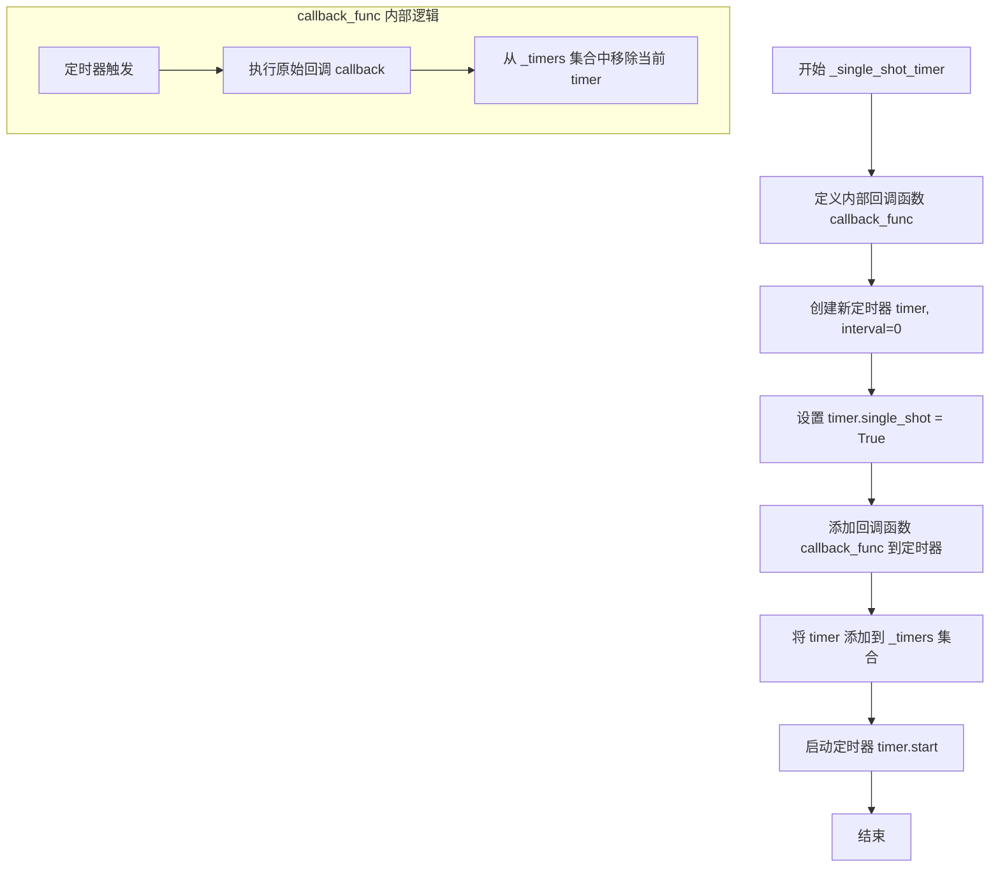

#### 带注释源码

```python
def _single_shot_timer(self, callback):
    """Add a single shot timer with the given callback"""
    # 定义内部回调函数，用于在定时器触发时执行原始回调并清理定时器
    def callback_func(callback, timer):
        callback()  # 执行传入的回调函数
        self._timers.remove(timer)  # 从定时器集合中移除该定时器，避免内存泄漏
    # 创建新定时器，interval=0 表示立即触发
    timer = self.new_timer(interval=0)
    timer.single_shot = True  # 设置为单次触发模式
    # 将回调函数及其参数添加到定时器
    timer.add_callback(callback_func, callback, timer)
    self._timers.add(timer)  # 将定时器添加到实例的定时器集合中跟踪
    timer.start()  # 启动定时器
```


### FigureCanvasMac._draw_idle

这是一个用于单次触发定时器的绘制方法，通过延迟绘制和状态标志来优化绘图性能，避免在事件循环中重复绘制。

参数：无显式参数（隐含self参数）

返回值：`None`，无返回值

#### 流程图

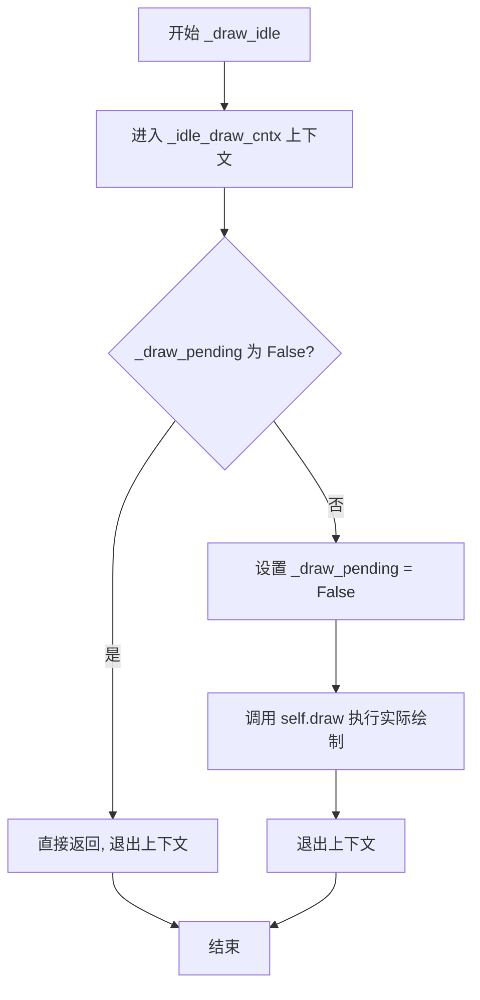

#### 带注释源码

```python
def _draw_idle(self):
    """
    Draw method for singleshot timer

    This draw method can be added to a singleshot timer, which can
    accumulate draws while the eventloop is spinning. This method will
    then only draw the first time and short-circuit the others.
    """
    # 进入空闲绘制上下文，可能用于设置相关的绘图状态
    with self._idle_draw_cntx():
        # 检查是否有待处理的绘制请求
        if not self._draw_pending:
            # 如果没有待处理请求，说明绘制已被其他调用处理，直接返回
            # Short-circuit because our draw request has already been
            # taken care of
            return
        # 清除待处理标志，防止重复绘制
        self._draw_pending = False
        # 执行实际的绘制操作
        self.draw()
```

---

**补充说明：**

- **参数说明**：该方法为实例方法，隐含参数`self`指向`FigureCanvasMac`实例
- **返回值说明**：无返回值（返回`None`）
- **设计目的**：通过`_draw_pending`标志位实现绘制请求的去重和合并，在事件循环频繁触发时只执行一次实际绘制，提升性能
- **调用关系**：该方法由`_single_shot_timer`创建的单次定时器回调触发


### FigureCanvasMac.blit

该方法是 macOS 平台下 Matplotlib 画布的 blit 优化绘制方法，通过调用父类方法完成指定区域的快速重绘，并触发视图更新。

参数：

- `self`：`FigureCanvasMac`，隐式的当前实例引用
- `bbox`：`Optional[~matplotlib.transforms.Bbox]` 或 `None`，需要重绘的边界框区域，传递给父类用于限定重绘范围，默认为 `None` 表示重绘整个画布

返回值：`None`，该方法无返回值

#### 流程图

```mermaid
flowchart TD
    A[blit 方法入口] --> B{检查 _is_drawing 标志}
    B -->|是| C[直接返回, 避免递归绘制]
    B -->|否| D[调用父类 blit 方法: super().blit(bbox)]
    D --> E[调用 self.update 触发视图刷新]
    E --> F[方法结束]
    
    style A fill:#f9f,stroke:#333
    style F fill:#9f9,stroke:#333
```

#### 带注释源码

```python
def blit(self, bbox=None):
    """
    使用 blit 技术重绘画布的指定区域。
    
    Parameters
    ----------
    bbox : Bbox or None, optional
        需要重绘的边界框区域。如果为 None，则重绘整个画布。
    """
    # 从父类继承的文档字符串
    # 调用父类 (FigureCanvasAgg) 的 blit 方法执行实际的重绘操作
    # blit 是一种优化技术,只重绘变化的区域而非整个画布
    super().blit(bbox)
    
    # 触发 macOS 视图更新,将重绘结果反映到屏幕上
    # 这会调用底层的 ObjC update 方法
    self.update()
```


### FigureCanvasMac.resize

处理macOS系统的窗口大小调整事件，将来自macOS的逻辑像素尺寸转换为matplotlib的英寸单位，更新Figure大小，并触发重绘事件。

参数：

- `width`：`float`，来自macOS的逻辑像素宽度值
- `height`：`float`，来自macOS的逻辑像素高度值

返回值：`None`，无返回值，仅执行副作用操作

#### 流程图

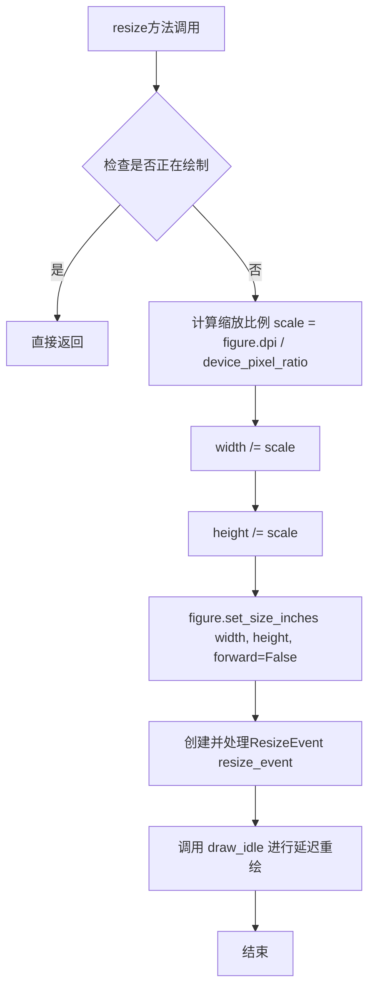

#### 带注释源码

```python
def resize(self, width, height):
    # Size from macOS is logical pixels, dpi is physical.
    # macOS提供的是逻辑像素（HiDPI/Retina），需要转换为物理像素
    scale = self.figure.dpi / self.device_pixel_ratio
    
    # 将逻辑像素转换为物理像素维度
    width /= scale
    height /= scale
    
    # 更新Figure的尺寸（以英寸为单位），forward=False表示不立即重绘
    self.figure.set_size_inches(width, height, forward=False)
    
    # 创建并触发ResizeEvent事件，通知所有监听器尺寸已改变
    ResizeEvent("resize_event", self)._process()
    
    # 调用draw_idle进行延迟重绘，合并多次重绘请求
    self.draw_idle()
```


### FigureCanvasMac.start_event_loop

该方法是macOS平台下FigureCanvas类的核心事件循环启动方法，负责在macOS图形界面中启动事件循环，并通过上下文管理器允许用户通过Ctrl+C信号中断绘图操作。

参数：

- `self`：FigureCanvasMac实例，隐式参数，表示当前画布对象
- `timeout`：`int`，默认值0，表示事件循环的超时时间（毫秒），0表示无超时限制

返回值：`None`，无返回值，该方法仅执行事件循环的启动逻辑

#### 流程图

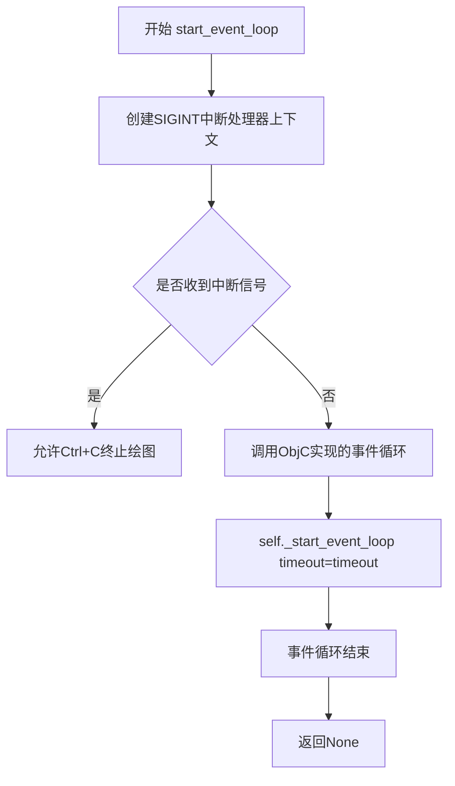

#### 带注释源码

```python
def start_event_loop(self, timeout=0):
    """
    启动macOS事件循环处理程序。
    
    该方法继承自FigureCanvasBase，设置了SIGINT处理器以允许通过
    CTRL-C终止绘图，并将事件循环启动委托给Objective-C实现。
    
    参数:
        timeout: int, optional
            事件循环超时时间（毫秒）。默认为0，表示无超时限制。
    """
    # 继承的docstring文档
    # docstring inherited
    
    # 设置SIGINT处理器以允许通过CTRL-C终止绘图
    # 这是一个上下文管理器，用于捕获系统中断信号
    with _allow_interrupt_macos():
        # 将事件循环启动转发到Objective-C实现
        # _start_event_loop是_macosx模块提供的原生实现
        self._start_event_loop(timeout=timeout)  # Forward to ObjC implementation.
```


### NavigationToolbar2Mac.__init__

这是 macOS 平台下 matplotlib 工具栏的初始化方法，负责构建绘图工具栏界面，加载工具栏图标资源，并同时初始化父类的相关功能。

参数：

- `canvas`：`FigureCanvasBase`，绑定的画布对象，用于处理工具栏交互事件

返回值：`None`，该方法为构造函数，不返回任何值

#### 流程图

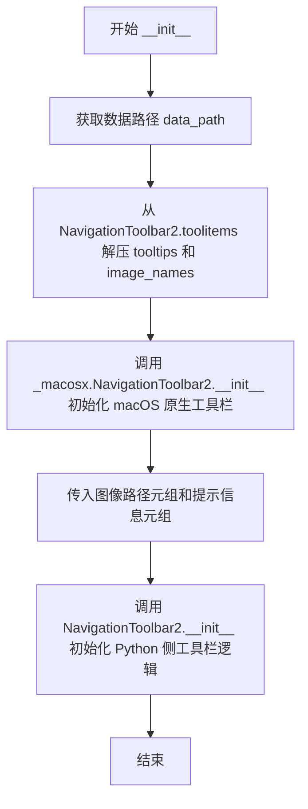

#### 带注释源码

```python
def __init__(self, canvas):
    # 获取 matplotlib 数据目录路径（包含工具栏图标等资源）
    data_path = cbook._get_data_path('images')
    
    # 从 NavigationToolbar2.toolitems 解压出所有工具项的元数据
    # toolitems 是一个包含 (name, tooltip, image, callback) 的元组列表
    # 这里取第二个元素 (tooltips) 和第三个元素 (image_names)
    _, tooltips, image_names, _ = zip(*NavigationToolbar2.toolitems)
    
    # 调用 macOS 原生 NavigationToolbar2 初始化
    # 构造图像文件完整路径：将数据路径与图像名拼接为 .pdf 格式
    # 过滤掉 image_names 为 None 的项
    _macosx.NavigationToolbar2.__init__(
        self, canvas,
        tuple(str(data_path / image_name) + ".pdf"
              for image_name in image_names if image_name is not None),
        # 过滤掉 tooltips 为 None 的项
        tuple(tooltip for tooltip in tooltips if tooltip is not None))
    
    # 调用 Python 侧 NavigationToolbar2 基类初始化
    # 完成工具栏业务逻辑的初始化（如工具项配置、事件绑定等）
    NavigationToolbar2.__init__(self, canvas)
```


### NavigationToolbar2Mac.draw_rubberband

该方法用于在macOS平台上绘制橡皮筋选择框（rubber band），通常在用户使用鼠标拖拽进行图形缩放或区域选择时显示可视化框。

参数：

- `self`：`NavigationToolbar2Mac`，隐式的实例本身
- `event`：`Event`，触发橡皮筋绘制的鼠标事件对象
- `x0`：`float`，橡皮筋框左上角的X坐标
- `y0`：`float`，橡皮筋框左上角的Y坐标
- `x1`：`float`，橡皮筋框右下角的X坐标
- `y1`：`float`，橡皮筋框右下角的Y坐标

返回值：`None`，无返回值，仅执行绘图操作

#### 流程图

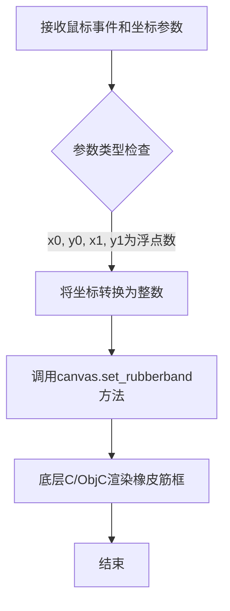

#### 带注释源码

```python
def draw_rubberband(self, event, x0, y0, x1, y1):
    """
    绘制橡皮筋选择框，用于可视化缩放或区域选择操作。
    
    Parameters
    ----------
    event : Event
        鼠标事件对象，包含触发该操作的原始事件信息
    x0 : float
        橡皮筋框左上角的X坐标（数据坐标）
    y0 : float
        橡皮筋框左上角的Y坐标（数据坐标）
    x1 : float
        橡皮筋框右下角的X坐标（数据坐标）
    y1 : float
        橡皮筋框右下角的Y坐标（数据坐标）
    """
    # 将浮点坐标转换为整数，因为底层Cocoa绘制需要整数像素坐标
    # set_rubberband是macOS后端特有的方法，负责在视图中绘制矩形选择框
    self.canvas.set_rubberband(int(x0), int(y0), int(x1), int(y1))
```


### `NavigationToolbar2Mac.remove_rubberband`

该方法用于移除图形视图中的橡皮筋选择框（rubberband），通常在用户完成区域选择后调用，以清除之前绘制的临时选区指示器。

参数：无

返回值：`None`，无返回值

#### 流程图

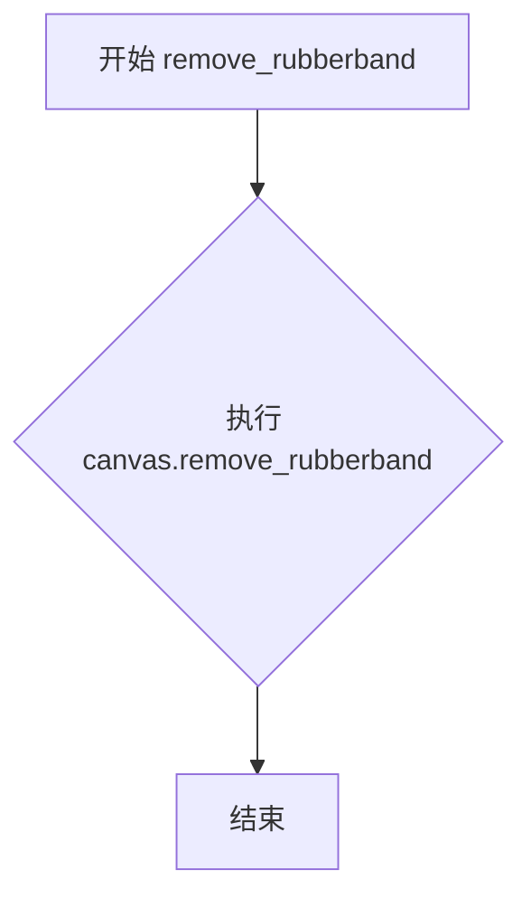

#### 带注释源码

```python
def remove_rubberband(self):
    """
    移除橡皮筋选择框。

    当用户完成区域选择或取消选择时，调用此方法
    清除之前通过 draw_rubberband 绘制的临时选区指示器。
    """
    self.canvas.remove_rubberband()  # 调用底层 canvas 对象的方法移除橡皮筋
```


### `NavigationToolbar2Mac.save_figure`

该方法是 macOS 平台下matplotlib GUI后端的工具栏保存功能实现，提供了原生的文件保存对话框，允许用户选择保存路径和文件名，并将当前图形保存为图像文件。

参数：

- `self`：隐式参数，类型为`NavigationToolbar2Mac`实例，表示工具栏对象本身
- `*args`：可变参数，类型为任意类型（可选参数），用于接收可能传递的额外参数，但在当前实现中未被使用

返回值：`Optional[str]`，返回保存的文件路径（字符串），如果用户取消保存操作则返回`None`

#### 流程图

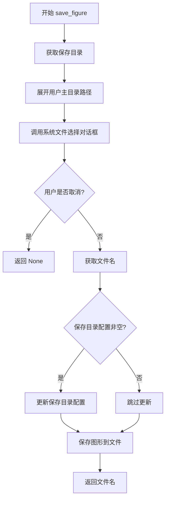

#### 带注释源码

```python
def save_figure(self, *args):
    """Save the current figure to a file using a native macOS file dialog."""
    # 获取保存目录配置，默认为用户主目录
    # expanduser将~展开为实际的用户主目录路径
    directory = os.path.expanduser(mpl.rcParams['savefig.directory'])
    
    # 调用macOS原生的文件保存对话框
    # 参数1: 对话框标题
    # 参数2: 默认目录
    # 参数3: 获取Canvas提供的默认文件名
    filename = _macosx.choose_save_file('Save the figure',
                                        directory,
                                        self.canvas.get_default_filename())
    
    # 如果用户点击取消按钮，filename为None，直接返回
    if filename is None:  # Cancel
        return
    
    # 保存目录配置供下次使用，除非为空字符串（表示使用当前工作目录）
    if mpl.rcParams['savefig.directory']:
        # 更新rcParams中的保存目录为当前文件所在目录
        mpl.rcParams['savefig.directory'] = os.path.dirname(filename)
    
    # 调用Canvas的figure对象的savefig方法保存图形
    self.canvas.figure.savefig(filename)
    
    # 返回保存的文件路径，供调用者使用
    return filename
```


### FigureManagerMac.__init__

这是 `FigureManagerMac` 类的初始化方法，负责在 macOS 平台上创建图形管理器实例，设置画布、图标、窗口模式，并处理交互式显示。

参数：

- `canvas`：`FigureCanvasBase`，macOS 平台上的图形画布对象
- `num`：`int`，图形的编号或标识符，用于管理多个图形窗口

返回值：`None`，该方法为构造函数，不返回任何值

#### 流程图

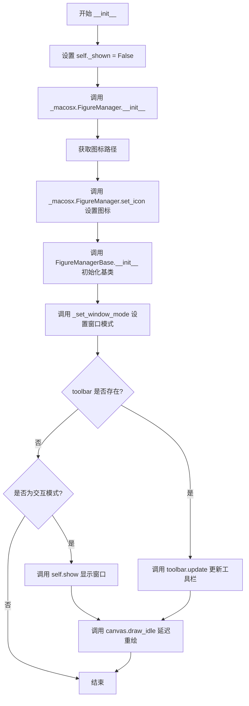

#### 带注释源码

```python
def __init__(self, canvas, num):
    """初始化 FigureManagerMac 实例。
    
    参数:
        canvas: FigureCanvasBase 实例，代表 macOS 上的图形画布
        num: int，图形的标识符，用于窗口管理
    """
    # 标记窗口尚未显示，用于控制 show() 方法的行为
    self._shown = False
    
    # 调用 macOS 原生 FigureManager 的初始化方法
    # 负责创建底层 ObjC 窗口对象
    _macosx.FigureManager.__init__(self, canvas)
    
    # 获取 matplotlib 内置图标的路径
    icon_path = str(cbook._get_data_path('images/matplotlib.pdf'))
    
    # 调用 macOS 原生方法设置窗口图标
    _macosx.FigureManager.set_icon(icon_path)
    
    # 调用基类 FigureManagerBase 的初始化方法
    # 负责设置画布、图形编号、工具栏等基础属性
    FigureManagerBase.__init__(self, canvas, num)
    
    # 从 rcParams 读取 macosx.window_mode 配置并设置窗口模式
    self._set_window_mode(mpl.rcParams["macosx.window_mode"])
    
    # 如果存在工具栏，则更新工具栏状态
    if self.toolbar is not None:
        self.toolbar.update()
    
    # 如果处于交互模式，则立即显示窗口并准备重绘
    if mpl.is_interactive():
        self.show()
        self.canvas.draw_idle()
```


### `FigureManagerMac._close_button_pressed`

当用户点击macOS窗口的关闭按钮时，此方法会被调用，负责清理图形资源并刷新事件队列。

参数：无（仅包含隐式参数`self`）

返回值：`None`，无返回值

#### 流程图

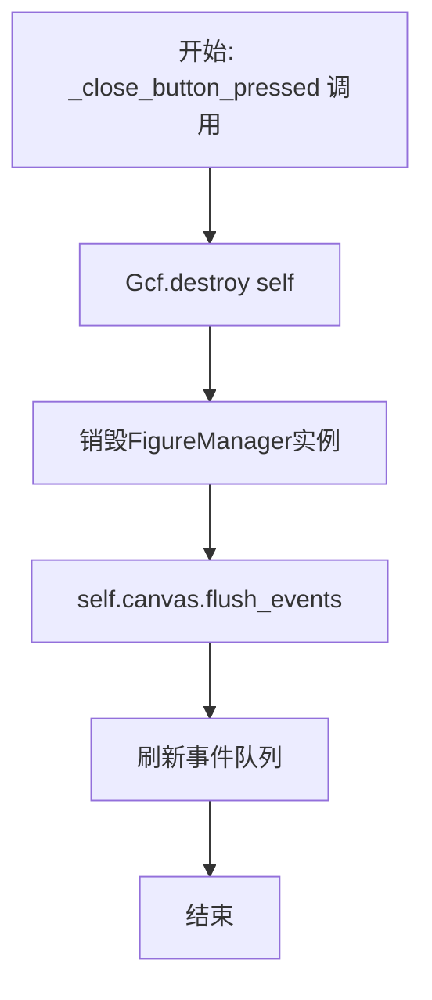

#### 带注释源码

```python
def _close_button_pressed(self):
    """
    当用户点击macOS窗口的关闭按钮时调用此方法。
    
    此方法负责：
    1. 从Gcf注册表中销毁当前图形管理器
    2. 刷新canvas的事件队列，确保所有待处理事件被处理
    """
    # 从全局图形注册表中销毁当前FigureManager实例
    # Gcf是一个管理所有活动图形实例的类
    Gcf.destroy(self)
    
    # 刷新canvas的事件队列，处理所有待处理的GUI事件
    # 这确保了在窗口关闭前所有事件都被正确处理
    self.canvas.flush_events()
```


### FigureManagerMac.destroy

该方法负责销毁 FigureManagerMac 实例，主要通过停止画布上所有待处理的计时器来防止内存泄漏，然后调用父类的 destroy 方法完成清理工作。

参数：無

返回值：`None`，无返回值描述

#### 流程图

```mermaid
flowchart TD
    A[开始 destroy] --> B{检查 canvas._timers 是否为空}
    B -->|否| C[从 _timers 集合中弹出一个 timer]
    C --> D[调用 timer.stop 停止计时器]
    D --> B
    B -->|是| E[调用 super().destroy]
    E --> F[结束 destroy]
```

#### 带注释源码

```python
def destroy(self):
    # We need to clear any pending timers that never fired, otherwise
    # we get a memory leak from the timer callbacks holding a reference
    # 遍历画布上所有仍然存活的计时器
    while self.canvas._timers:
        # 弹出并移除一个计时器
        timer = self.canvas._timers.pop()
        # 停止该计时器，防止其回调函数继续持有引用导致内存泄漏
        timer.stop()
    # 调用父类的 destroy 方法完成剩余的清理工作
    super().destroy()
```


### `FigureManagerMac.start_main_loop`

启动macOS后端的主事件循环，负责显示图形窗口并处理用户交互。

参数：

- `cls`：类方法的标准参数，表示类本身，无需显式传递

返回值：`None`，该方法不返回任何值

#### 流程图

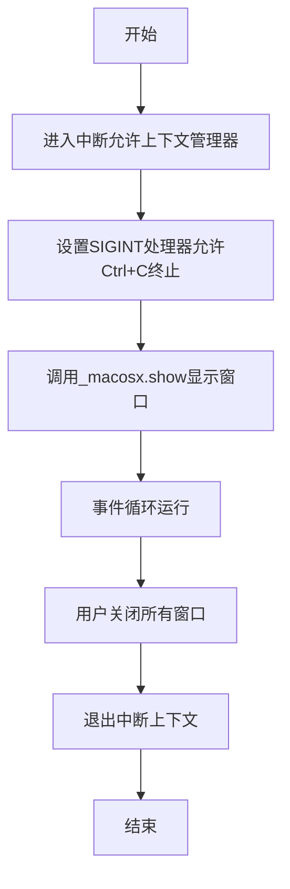

#### 带注释源码

```python
@classmethod
def start_main_loop(cls):
    # Set up a SIGINT handler to allow terminating a plot via CTRL-C.
    with _allow_interrupt_macos():
        _macosx.show()
```

#### 详细说明

该方法是macOS后端的入口点，主要功能如下：

1. **上下文管理**：使用`_allow_interrupt_macos()`上下文管理器，这是一个自定义的上下文管理器，允许用户通过发送SIGINT信号（Ctrl+C）来终止绘图程序。

2. **事件循环**：调用`_macosx.show()`启动macOS的图形显示事件循环，这将阻塞主线程直到用户关闭所有图形窗口。

3. **信号处理**：在事件循环运行期间，能够响应中断信号，这是交互式绘图中重要的功能，允许用户强制退出程序。

该方法在`@_Backend.export`装饰的`_BackendMac`类中被赋值给`mainloop`属性，作为后端的主循环入口点供matplotlib框架调用。


### FigureManagerMac.show

该方法负责在macOS平台上显示Figure窗口，如果Figure对象标记为过时(stale)则先重绘，然后调用平台特定的显示方法，最后根据配置决定是否将窗口置顶。

参数：

- `self`：隐式参数，FigureManagerMac实例，表示当前的管理器对象

返回值：`None`，无返回值描述

#### 流程图

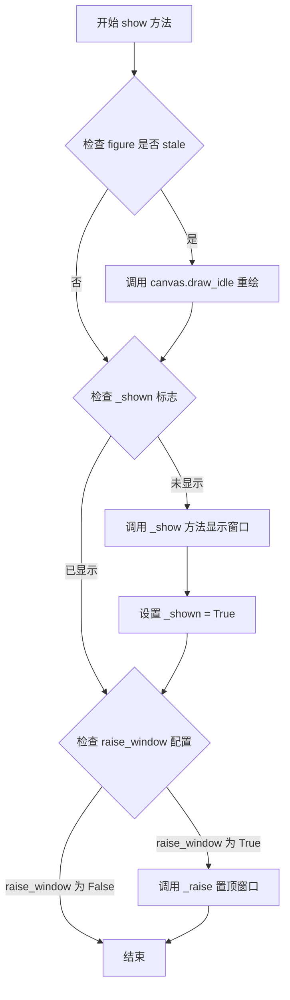

#### 带注释源码

```python
def show(self):
    """
    显示Figure窗口并根据配置置顶窗口。
    
    该方法执行以下操作：
    1. 如果Figure对象标记为stale（数据已更改需要重绘），则调用draw_idle进行延迟重绘
    2. 如果窗口尚未显示，调用平台特定的_show()方法显示窗口，并设置_shown标志
    3. 根据rcParams中的figure.raise_window配置决定是否将窗口置顶显示
    """
    # 检查figure是否需要重绘（stale表示数据已更改但尚未重绘）
    if self.canvas.figure.stale:
        # 调用延迟重绘，设置为空闲时重绘而非立即重绘
        self.canvas.draw_idle()
    
    # 检查窗口是否已经显示过
    if not self._shown:
        # 调用平台特定的显示方法（由macOS后端实现）
        self._show()
        # 标记窗口已显示，避免重复调用_show()
        self._shown = True
    
    # 检查是否需要将窗口置顶（根据matplotlib配置参数）
    if mpl.rcParams["figure.raise_window"]:
        # 调用平台特定的置顶窗口方法
        self._raise()
```

## 关键组件


### TimerMac

基于CFRunLoop的定时器实现，继承自_macosx.Timer和TimerBase的macOS定时器子类

### FigureCanvasMac

macOS平台画布实现，负责figure渲染、更新和事件处理，集成延迟绘制机制

### _single_shot_timer

单次定时器添加方法，通过回调函数在定时器触发后自动移除自身

### _draw_idle

延迟绘制方法，通过单次定时器累积绘制请求并仅执行首次绘制以优化性能

### resize

窗口尺寸调整方法，将macOS逻辑像素转换为matplotlib英寸单位并触发重绘

### NavigationToolbar2Mac

macOS平台的导航工具栏实现，提供橡皮筋选择和保存图形功能

### FigureManagerMac

图形管理器，处理图形显示、交互事件循环和窗口生命周期

### start_main_loop

主事件循环启动方法，通过SIGINT处理器允许CTRL-C中断绘图

### _BackendMac

matplotlib的macOS后端导出类，聚合画布、管理器和主循环实现

### _allow_interrupt_macos

上下文管理器，允许通过SIGINT信号终止绘图并唤醒文件描述符


## 问题及建议


### 已知问题

- **Timer清理机制不够健壮**：在`_single_shot_timer`中，通过callback_func移除timer，但如果callback执行过程中抛出异常，timer将无法从`_timers`集合中移除，导致内存泄漏
- **资源清理不完整**：`FigureManagerMac.destroy()`方法中使用`while`循环和`pop()`清理timers，如果在清理过程中发生异常，可能导致部分timer未被正确清理
- **硬编码路径问题**：图标路径`icon_path = str(cbook._get_data_path('images/matplotlib.pdf'))`使用硬编码路径字符串，降低了代码的可移植性
- **双重父类初始化**：`NavigationToolbar2Mac.__init__`中同时调用了`_macosx.NavigationToolbar2.__init__`和`NavigationToolbar2.__init__`，这种模式容易造成初始化逻辑混乱和维护困难
- **异常处理缺失**：`save_figure`方法中没有对文件保存过程中可能出现的异常（如磁盘空间不足、权限问题）进行捕获和处理
- **类型转换潜在风险**：`draw_rubberband`方法中对坐标参数使用`int()`强制转换，可能导致精度丢失
- **重复代码模式**：`start_event_loop`和`start_main_loop`中都使用了`_allow_interrupt_macos()`上下文管理器，违反了DRY原则

### 优化建议

- 为Timer清理添加try-except保护，确保即使callback执行失败也能正确移除timer
- 使用上下文管理器或try-finally确保资源清理的完整性
- 将硬编码路径改为配置项或通过参数传入
- 重构NavigationToolbar2Mac的初始化逻辑，使用单一父类初始化或通过组合模式简化
- 在save_figure等文件操作中添加异常处理，提供用户友好的错误提示
- 考虑使用round()代替int()进行坐标转换以保留精度
- 提取`_allow_interrupt_macos()`的使用到基类或混入类中，减少代码重复

## 其它


### 设计目标与约束

本后端专为macOS平台设计，提供原生Cocoa集成。设计目标包括：1）实现与matplotlib标准后端一致的API接口；2）利用macOS原生事件循环处理用户交互；3）支持SIGINT中断以允许CTRL+C终止绘图；4）确保在macOS上的图形渲染性能和用户体验。

### 错误处理与异常设计

代码中的错误处理主要体现在：1）_allow_interrupt_macos()上下文管理器处理SIGINT信号，允许用户中断阻塞的事件循环；2）draw()方法中使用_is_drawing标志防止重入绘制；3）draw_idle()中使用_draw_pending标志避免重复绘制请求；4）_single_shot_timer中通过timer.add_callback确保定时器回调被正确添加；5）FigureManagerMac.destroy()中显式停止并清理未触发的定时器以防止内存泄漏。

### 数据流与状态机

FigureCanvasMac的核心状态包括：_draw_pending（待绘制标志）、_is_drawing（正在绘制标志）、_timers（活动定时器集合）。状态转换：正常状态→draw_idle()被调用→设置_draw_pending=True→启动单次定时器→定时器触发→_draw_idle()执行→调用draw()→更新canvas。resize()方法处理物理像素到逻辑像素的转换，并触发ResizeEvent。

### 外部依赖与接口契约

主要依赖：1）_macosx模块 - 提供Cocoa绑定的原生实现（Timer、FigureCanvas、NavigationToolbar2、FigureManager、show等）；2）matplotlib.backend_bases模块 - 提供基础抽象类（_Backend、FigureCanvasBase、FigureManagerBase等）；3）matplotlib.cbook - 提供数据路径获取和上下文管理器；4）matplotlib._pylab_helpers.Gcf - 图形管理器工厂。接口契约：FigureCanvasMac需实现draw()、draw_idle()、blit()、resize()、start_event_loop()等方法；FigureManagerMac需实现destroy()、show()等方法。

### 性能考虑

代码通过draw_idle()和单次定时器机制实现延迟绘制，避免频繁重绘。_is_drawing标志防止重入，_draw_pending标志合并多次绘制请求。resize()中使用forward=False避免触发不必要的重新绘制。定时器使用single_shot模式减少事件循环开销。

### 线程安全性

代码主要在主线程运行，通过C级别的_macosx模块处理Cocoa事件。_timers集合的访问主要在主线程的定时器回调中进行，需要注意在destroy()中清理时的线程安全。

### 资源管理

FigureManagerMac.destroy()方法显式清理活动的定时器，防止内存泄漏。_single_shot_timer在回调执行后自动从_timers集合中移除定时器。图片资源（工具栏图标）通过cbook._get_data_path()获取。

### 平台特定考虑

代码专门针对macOS平台：1）required_interactive_framework = "macosx"标识；2）使用macOS原生坐标系处理resize（逻辑像素vs物理像素）；3）集成macOS原生文件选择器（_macosx.choose_save_file）；4）支持macOS窗口模式配置（macosx.window_mode）；5）支持figure.raise_window配置控制窗口前台显示。

### 测试考虑

测试应覆盖：1）多图形窗口管理；2）定时器创建和销毁；3）resize事件的正确处理；4）savefigure功能；5）交互式模式下的show()行为；6）窗口关闭和资源清理；7）SIGINT中断处理。

### 配置选项

代码使用matplotlib.rcParams配置项：1）savefig.directory - 默认保存目录；2）macosx.window_mode - 窗口模式；3）figure.raise_window - 图形显示后是否提升窗口；4）device_pixel_ratio - 设备像素比（在resize计算中使用）。

    