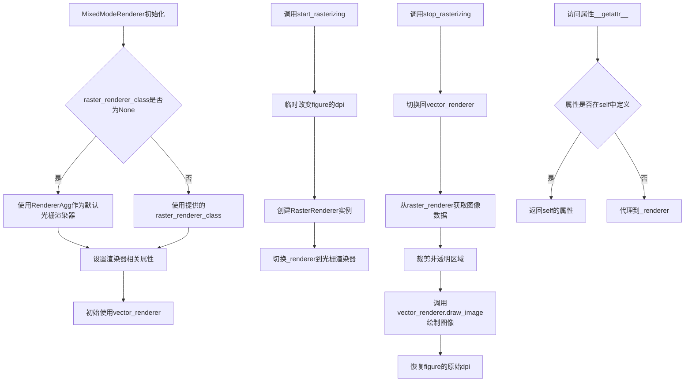
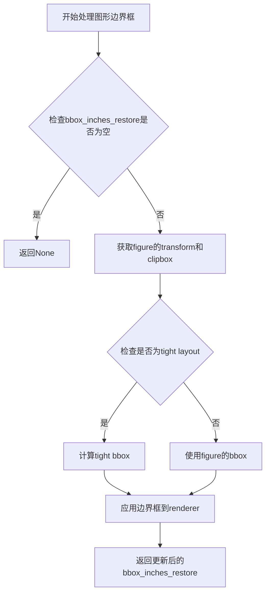
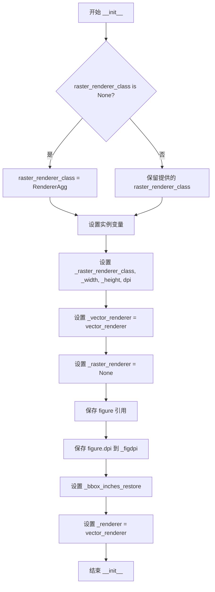
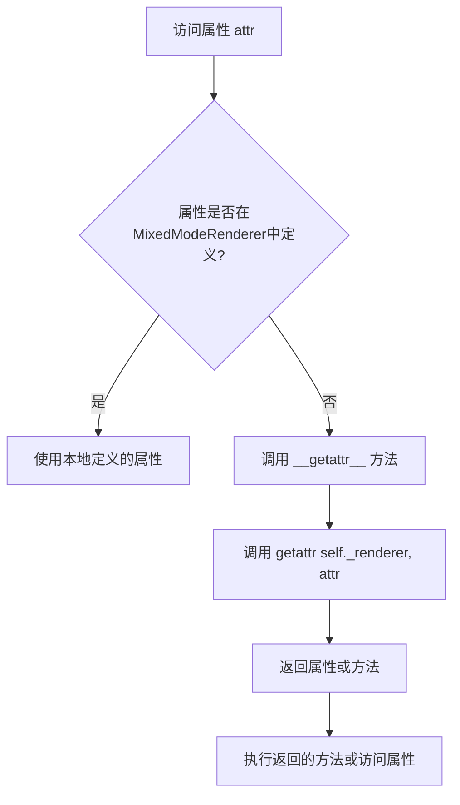
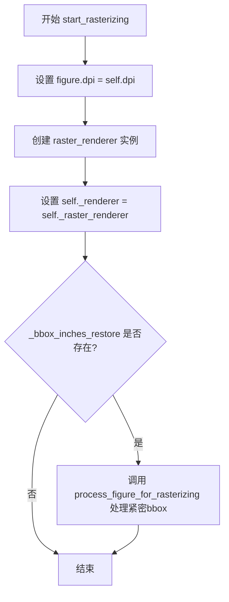

# `matplotlib\lib\matplotlib\backends\backend_mixed.py` 详细设计文档

MixedModeRenderer是一个混合模式渲染器类，用于在Matplotlib中实现矢量绘制和光栅绘制之间的动态切换，使得复杂的图形对象（如四边形网格）可以使用光栅化渲染，而其他对象继续使用矢量渲染，从而在保持可缩放性的同时处理复杂图形。

## 整体流程



## 类结构

```
MixedModeRenderer (混合模式渲染器)
```

## 全局变量及字段


### `MixedModeRenderer._raster_renderer_class`
    
光栅渲染器类，用于创建光栅渲染器实例

类型：`type`
    


### `MixedModeRenderer._width`
    
画布宽度，以逻辑单位表示

类型：`float`
    


### `MixedModeRenderer._height`
    
画布高度，以逻辑单位表示

类型：`float`
    


### `MixedModeRenderer.dpi`
    
设备像素比，用于确定光栅渲染的分辨率

类型：`float`
    


### `MixedModeRenderer._vector_renderer`
    
矢量渲染器实例，用于绘制矢量图形

类型：`RendererBase`
    


### `MixedModeRenderer._raster_renderer`
    
光栅渲染器实例，用于绘制光栅图像

类型：`RendererBase`
    


### `MixedModeRenderer.figure`
    
matplotlib图形对象，表示要渲染的图形

类型：`Figure`
    


### `MixedModeRenderer._figdpi`
    
图形原始DPI，保存以便于rasterization后恢复

类型：`float`
    


### `MixedModeRenderer._bbox_inches_restore`
    
紧密边界框恢复信息，用于处理tight_bbox

类型：`tuple`
    


### `MixedModeRenderer._renderer`
    
当前使用的渲染器，指向vector或raster渲染器

类型：`RendererBase`
    
    

## 全局函数及方法


### `process_figure_for_rasterizing`

该函数是从 `matplotlib._tight_bbox` 模块导入的，用于在栅格化过程中处理图形的边界框（bbox）。它根据渲染器的需要调整图形的边界框设置，确保在矢量渲染和栅格渲染之间切换时，图形的内容和边界框能够正确同步。

参数：

- `figure`：`~matplotlib.figure.Figure`，需要处理的图形实例
- `bbox_inches_restore`：元组或 None，当使用 tight bbox 时需要恢复的边界框信息
- `renderer`：`~matplotlib.backend_bases.RendererBase`，当前使用的渲染器实例
- `dpi`：（可选）`float`，图形的目标 DPI 值

返回值：元组，返回处理后的边界框信息（供后续恢复使用）

#### 流程图



#### 带注释源码

```
# 从matplotlib._tight_bbox导入的函数
# 该函数的具体实现未在当前代码文件中显示
# 仅在此MixedModeRenderer类中被调用

# 调用示例1 - 在start_rasterizing中:
r = process_figure_for_rasterizing(self.figure,
                                   self._bbox_inches_restore,
                                   self._raster_renderer)
# 用途: 在进入栅格化模式时，用栅格渲染器处理figure的边界框

# 调用示例2 - 在stop_rasterizing中:
r = process_figure_for_rasterizing(self.figure,
                                   self._bbox_inches_restore,
                                   self._vector_renderer,
                                   self._figdpi)
# 用途: 在退出栅格化模式时，用矢量渲染器处理figure的边界框，
#       并恢复到原始的DPI(_figdpi)
```


### `MixedModeRenderer.__init__`

该方法是 `MixedModeRenderer` 类的构造函数，负责初始化一个支持矢量/光栅混合渲染模式的渲染器实例。方法接收图形尺寸、DPI、矢量渲染器等关键参数，并设置内部状态以支持后续在矢量和光栅渲染模式之间切换。

参数：

- `figure`：`matplotlib.figure.Figure`，要渲染的图形实例
- `width`：`float`，画布的逻辑宽度（单位为逻辑单位）
- `height`：`float`，画布的逻辑高度（单位为逻辑单位）
- `dpi`：`float`，画布的分辨率（每英寸点数）
- `vector_renderer`：`matplotlib.backend_bases.RendererBase`，用于矢量绘图的渲染器实例
- `raster_renderer_class`：`matplotlib.backend_bases.RendererBase`，（可选）光栅渲染器类，默认为 `RendererAgg`
- `bbox_inches_restore`：`any`，（可选）用于恢复紧凑边界的配置，默认为 `None`

返回值：`None`，无返回值（`__init__` 方法）

#### 流程图



#### 带注释源码

```python
def __init__(self, figure, width, height, dpi, vector_renderer,
             raster_renderer_class=None,
             bbox_inches_restore=None):
    """
    Parameters
    ----------
    figure : `~matplotlib.figure.Figure`
        The figure instance.
    width : float
        The width of the canvas in logical units
    height : float
        The height of the canvas in logical units
    dpi : float
        The dpi of the canvas
    vector_renderer : `~matplotlib.backend_bases.RendererBase`
        An instance of a subclass of
        `~matplotlib.backend_bases.RendererBase` that will be used for the
        vector drawing.
    raster_renderer_class : `~matplotlib.backend_bases.RendererBase`
        The renderer class to use for the raster drawing.  If not provided,
        this will use the Agg backend (which is currently the only viable
        option anyway.)

    """
    # 如果未提供光栅渲染器类，则默认使用 RendererAgg（AGG 后端）
    if raster_renderer_class is None:
        raster_renderer_class = RendererAgg

    # 存储光栅渲染器类供后续使用
    self._raster_renderer_class = raster_renderer_class
    
    # 存储画布的逻辑尺寸
    self._width = width
    self._height = height
    
    # 存储 DPI
    self.dpi = dpi

    # 存储矢量渲染器实例
    self._vector_renderer = vector_renderer

    # 初始化光栅渲染器为 None，在 start_rasterizing 时创建
    self._raster_renderer = None

    # 保存图形引用，以便在光栅化前后修改图形的 DPI
    # 注释说明：虽然这段代码看起来不优雅，但目前找不到更好的解决方案
    self.figure = figure
    self._figdpi = figure.dpi  # 保存原始 DPI 以便后续恢复

    # 存储紧凑边界的恢复配置
    self._bbox_inches_restore = bbox_inches_restore

    # 默认使用矢量渲染器作为当前渲染器
    self._renderer = vector_renderer
```


### `MixedModeRenderer.__getattr__`

该方法是一个属性委托代理，当访问`MixedModeRenderer`实例上未定义的属性时，会自动将请求转发到底层的渲染器（`self._renderer`），从而实现透明委托，使混合模式渲染器能够使用矢量渲染器的所有方法。

参数：

- `attr`：`str`，要访问的属性名称（由Python的`__getattr__`机制自动传入）

返回值：任意类型，返回从`self._renderer`获取的对应属性或方法。

#### 流程图



#### 带注释源码

```
def __getattr__(self, attr):
    """
    代理访问未被重写的属性到底层渲染器。
    
    当访问MixedModeRenderer实例上不存在的属性时，
    Python会自动调用此方法，将请求转发给当前的渲染器
    (self._renderer，可能是矢量或栅格渲染器)。
    """
    # 代理所有未被重写的方法到底层渲染器
    # 已重写的方法可以直接调用self._renderer的方法，
    # 但不应缓存/存储方法（因为RendererAgg等渲染器会动态
    # 更改其方法以优化到C实现的代理）。
    return getattr(self._renderer, attr)
```


### `MixedModeRenderer.start_rasterizing`

进入“光栅”模式。在调用 `stop_rasterizing` 之前的所有后续绘图命令都将使用光栅后端进行绘制。该方法通过临时更改图形 DPI、创建光栅渲染器并处理紧密边界框来准备光栅化环境。

参数：

- 无（仅包含 `self` 隐式参数）

返回值：`None`，无返回值描述

#### 流程图



#### 带注释源码

```python
def start_rasterizing(self):
    """
    Enter "raster" mode.  All subsequent drawing commands (until
    `stop_rasterizing` is called) will be drawn with the raster backend.
    """
    # 临时更改图形的DPI，将figure.dpi设置为当前渲染器的dpi
    # 这是为了确保在光栅化过程中使用正确的分辨率
    self.figure.dpi = self.dpi

    # 创建光栅渲染器实例，尺寸由宽度、高度和dpi相乘得到
    # 这里将逻辑单位转换为像素单位
    self._raster_renderer = self._raster_renderer_class(
        self._width*self.dpi, self._height*self.dpi, self.dpi)
    
    # 将当前渲染器切换为新创建的光栅渲染器
    # 之后的所有绘图操作都将使用光栅后端
    self._renderer = self._raster_renderer

    # 如果使用了紧密边界框(tight bbox)功能
    # 需要为光栅化处理图形和边界框
    if self._bbox_inches_restore:  # when tight bbox is used
        # 处理图形以进行光栅化，返回更新后的边界框恢复信息
        r = process_figure_for_rasterizing(self.figure,
                                           self._bbox_inches_restore,
                                           self._raster_renderer)
        # 更新 bbox_inches_restore 以便后续使用
        self._bbox_inches_restore = r
```


### `MixedModeRenderer.stop_rasterizing`

该方法用于退出"光栅"模式，将光栅渲染期间绘制的图形复制回向量后端，通过 `draw_image` 将裁剪后的光栅图像绘制到向量渲染器上，并恢复图形的 DPI 设置。

参数：无（仅 `self`）

返回值：`None`，无返回值

#### 流程图

```mermaid
flowchart TD
    A[开始 stop_rasterizing] --> B[设置渲染器为向量渲染器<br/>self._renderer = self._vector_renderer]
    B --> C[计算高度<br/>height = self._height * self.dpi]
    C --> D[获取光栅渲染器的RGBA缓冲区<br/>img = np.asarray self._raster_renderer.buffer_rgba()]
    D --> E[获取非零像素切片<br/>slice_y, slice_x = cbook._get_nonzero_slices]
    E --> F[裁剪图像<br/>cropped_img = img[slice_y, slice_x]]
    F --> G{检查裁剪图像是否非空}
    G -->|是| H[创建图形上下文<br/>gc = self._renderer.new_gc]
    H --> I[计算图像位置和翻转]
    I --> J[调用draw_image绘制图像<br/>self._renderer.draw_image]
    G -->|否| K[跳过绘制]
    J --> L[清空光栅渲染器<br/>self._raster_renderer = None]
    L --> M[恢复图形DPI<br/>self.figure.dpi = self._figdpi]
    M --> N{检查bbox_inches_restore是否存在}
    N -->|是| O[处理figure光栅化<br/>process_figure_for_rasterizing]
    N -->|否| P[结束]
    O --> P
    K --> L
```

#### 带注释源码

```python
def stop_rasterizing(self):
    """
    Exit "raster" mode.  All of the drawing that was done since
    the last `start_rasterizing` call will be copied to the
    vector backend by calling draw_image.
    """

    # 将渲染器切换回向量渲染器，后续绘图操作将使用向量后端
    self._renderer = self._vector_renderer

    # 计算光栅图像的实际高度（逻辑单位 * DPI）
    height = self._height * self.dpi
    
    # 从光栅渲染器获取RGBA格式的图像缓冲区并转换为numpy数组
    img = np.asarray(self._raster_renderer.buffer_rgba())
    
    # 获取图像中非透明像素的区域切片（用于裁剪空白边距）
    slice_y, slice_x = cbook._get_nonzero_slices(img[..., 3])
    
    # 根据切片裁剪图像，只保留有实际内容的区域
    cropped_img = img[slice_y, slice_x]
    
    # 如果裁剪后的图像不为空，则将其绘制到向量渲染器
    if cropped_img.size:
        # 创建新的图形上下文（GraphicsContext）
        gc = self._renderer.new_gc()
        
        # TODO: If the mixedmode resolution differs from the figure's
        #       dpi, the image must be scaled (dpi->_figdpi). Not all
        #       backends support this.
        
        # 计算图像绘制位置：x坐标和y坐标（需要考虑DPI转换）
        # y坐标需要翻转（图像原点在左下角）
        self._renderer.draw_image(
            gc,
            slice_x.start * self._figdpi / self.dpi,           # x坐标（左边界）
            (height - slice_y.stop) * self._figdpi / self.dpi, # y坐标（上边界）
            cropped_img[::-1])                                 # 翻转图像（垂直方向）

    # 释放光栅渲染器，释放内存
    self._raster_renderer = None

    # 恢复图形的原始DPI设置（在start_rasterizing时临时修改过）
    self.figure.dpi = self._figdpi

    # 如果使用了tight bbox（紧凑边界框），需要重新处理figure
    if self._bbox_inches_restore:  # when tight bbox is used
        # 重新处理figure的光栅化，更新边界框信息
        r = process_figure_for_rasterizing(self.figure,
                                           self._bbox_inches_restore,
                                           self._vector_renderer,
                                           self._figdpi)
        self._bbox_inches_restore = r
```

## 关键组件


### MixedModeRenderer类
一个辅助类，用于实现在向量和光栅绘制之间切换的渲染器，例如PDF编写器，其中大多数对象使用PDF向量命令绘制，但某些复杂对象（如四边形网格）被光栅化并作为图像输出。

### __init__方法
初始化混合模式渲染器，接受figure、width、height、dpi、vector_renderer、raster_renderer_class和bbox_inches_restore参数，设置渲染器属性和图形dpi。

### __getattr__方法
代理所有未重写的方法到底层渲染器，以支持透明访问未定义方法。

### start_rasterizing方法
进入光栅模式，临时更改figure的dpi，创建光栅渲染器实例，并处理tight bbox。

### stop_rasterizing方法
退出光栅模式，将光栅图像裁剪并绘制到向量渲染器，恢复figure的dpi，并处理tight bbox。

### _raster_renderer_class属性
存储光栅渲染器类，默认为RendererAgg，用于创建光栅渲染器。

### _vector_renderer属性
存储向量渲染器实例，用于向量绘制模式。

### _raster_renderer属性
存储当前活动的光栅渲染器实例，在光栅化期间使用。

### figure属性
引用Figure实例，用于调整dpi和处理光栅化。

### dpi属性
每英寸点数，控制光栅图像的分辨率和输出大小。

### _bbox_inches_restore属性
存储tight bbox的恢复信息，用于光栅化前后的边界框处理。


## 问题及建议


### 已知问题

- **状态管理缺失**：类内部维护 `self._renderer` 在矢量/光栅渲染器之间切换，但没有任何状态检查机制。如果连续调用两次 `start_rasterizing()` 而不调用 `stop_rasterizing()`，会导致渲染器状态混乱和潜在的资源泄漏。
- **TODO 未完成**：代码中第95行存在 TODO 注释，指出当混合模式分辨率与 figure 的 DPI 不同时，图像必须进行缩放 (dpi->_figdpi)，但该功能尚未实现，这是已知的功能缺陷。
- **代理模式带来的调试困难**：`__getattr__` 方法将所有未定义的属性代理到底层的 `_renderer` 对象，虽然灵活但会导致 IDE 无法正确提示、调试时属性查找链路不透明，且可能隐藏真实的属性访问错误。
- **设计妥协的代码痕迹**：第60-61行注释明确指出 "Although this looks ugly, I couldn't find a better solution"，表明通过修改 figure.dpi 来控制渲染行为的方案并非最佳设计，只是当时的权宜之计。
- **资源管理不完善**：`stop_rasterizing` 方法中如果 `cropped_img.size` 为空（不存在非透明像素），`_raster_renderer` 会被置为 None，但若此前 `start_rasterizing` 失败或被中断，渲染器可能未正确初始化，导致后续状态不一致。
- **硬编码默认类**：第43行将 `RendererAgg` 作为默认光栅渲染器写死在代码中，限制了扩展性且与参数文档描述（"which is currently the only viable option anyway"）表明这是临时方案。

### 优化建议

- **添加状态机管理**：引入枚举或标志位（如 `_is_rasterizing`）来追踪当前渲染模式，在 `start_rasterizing` 和 `stop_rasterizing` 方法入口添加状态检查，防止非法状态转换并抛出明确的异常信息。
- **实现 TODO 中的 DPI 缩放功能**：完成图像从光栅分辨率到 figure 分辨率的缩放逻辑，确保在不同 DPI 配置下混合渲染的正确性。
- **使用策略模式重构**：将渲染器的切换逻辑抽象为策略模式，而非通过动态代理和运行时替换 `self._renderer` 引用，提高代码可读性和可维护性。
- **添加上下文管理器支持**：实现 `__enter__` 和 `__exit__` 方法（或使用 `@contextmanager`），使 `start_rasterizing`/`stop_rasterizing` 可以通过 `with` 语句调用，确保资源正确释放，即使发生异常也能恢复到矢量模式。
- **增强异常处理**：在 `start_rasterizing` 和 `stop_rasterizing` 中添加 try-finally 块，保证即使渲染过程中出现异常，figure.dpi 也能被正确恢复到原始值 `_figdpi`。
- **消除硬编码**：将默认光栅渲染器类提取为模块级常量或配置选项，便于未来扩展支持其他光栅后端。
- **补充文档字符串**：为类添加更详细的状态转换说明，明确说明矢量模式与光栅模式的切换时机、副作用以及调用前提条件。


## 其它


### 设计目标与约束

该类的设计目标是实现一个能在矢量渲染和光栅渲染之间灵活切换的混合渲染器，使得复杂的图形对象（如四边形网格）可以使用光栅化处理，而其他内容保持矢量形式输出，从而在文件大小和渲染质量之间取得平衡。约束条件包括：raster_renderer_class默认为RendererAgg，光栅化区域的DPI与图形DPI可能不一致时需要进行缩放处理，且在tight bbox模式下需要特殊处理。

### 错误处理与异常设计

该类主要依赖底层渲染器进行错误处理。关键风险点包括：raster_renderer_class为None时会使用默认的RendererAgg；_raster_renderer为None时调用buffer_rgba()可能引发异常；cropped_img为空时（size为0）会跳过draw_image调用；__getattr__代理模式可能导致属性访问时的隐蔽错误。建议添加对_raster_renderer状态的显式检查，以及对cropped_img尺寸的有效性验证。

### 数据流与状态机

该类包含两种主要状态：矢量模式（vector mode）和光栅模式（raster mode）。状态转换通过start_rasterizing()和stop_rasterizing()方法实现。数据流向：初始化时使用vector_renderer，进入光栅模式后创建raster_renderer并切换self._renderer引用，退出光栅模式时将光栅图像通过draw_image()方法绘制到矢量渲染器上，最终恢复矢量渲染器。状态转换时涉及figure.dpi的临时修改和恢复，以及_bbox_inches_restore的更新处理。

### 外部依赖与接口契约

主要外部依赖包括：numpy库（用于数组处理和图像裁剪）、matplotlib.cbook（用于_get_nonzero_slices获取非零像素切片）、backend_agg.RendererAgg（默认光栅渲染器类）、matplotlib._tight_bbox.process_figure_for_rasterizing（处理光栅化时的tight bbox）。接口契约要求：vector_renderer必须提供new_gc()和draw_image()方法；raster_renderer必须提供buffer_rgba()方法；figure对象必须具有dpi属性且可修改；所有渲染器对象必须支持属性代理访问。

### 性能考虑

性能关键点包括：每次调用start_rasterizing都会创建新的raster_renderer实例；stop_rasterizing中的图像裁剪操作（cbook._get_nonzero_slices）可能涉及较大数组；图像数据需要从raster_renderer复制到numpy数组；cropped_img[::-1]进行数组反转存在性能开销。优化建议包括：考虑缓存raster_renderer实例；图像裁剪和反转可以合并操作；针对大规模光栅区域可考虑使用内存映射。

### 安全性考虑

该代码主要涉及图像处理和渲染，安全性风险较低。潜在风险点包括：外部传入的vector_renderer和raster_renderer_class的可信度；figure对象的dpi属性被直接修改；_bbox_inches_restore参数的处理。建议对外部传入的渲染器实例进行基本验证，确保必要的接口方法存在。

### 并发和线程安全性

该类不包含显式的线程同步机制。在多线程环境下，figure.dpi的修改和恢复操作可能导致竞争条件；_raster_renderer和_renderer的状态管理在并发访问时可能出现问题。建议在多线程环境中使用时添加锁保护，或者为每个线程创建独立的渲染器实例。

### 配置和扩展性

扩展性设计包括：raster_renderer_class可通过构造函数参数自定义；__getattr__方法实现了透明的属性代理，支持扩展新的渲染方法；_bbox_inches_restore参数支持tight bbox功能的可选配置。进一步扩展方向：可以添加更多的渲染模式切换策略；可以支持自定义的图像后处理操作；可以添加渲染统计和性能监控功能。

### 兼容性考虑

该代码需要与matplotlib的各种后端兼容。兼容性要点包括：RendererAgg是当前唯一可用的光栅渲染器选项；process_figure_for_rasterizing函数的具体实现可能随版本变化；图像坐标系的处理（slice_y.stop与height的转换）需要与各后端保持一致。建议在文档中明确标注最低兼容的matplotlib版本，并提供版本特定的兼容性处理代码。

    