# `matplotlib\lib\matplotlib\backends\backend_nbagg.py` 详细设计文档

这是matplotlib的IPython Notebook后端实现，通过WebSocket通信机制在IPython notebook中提供交互式图形支持，实现了浏览器与Python内核之间的双向数据传递和图形实时更新。

## 整体流程

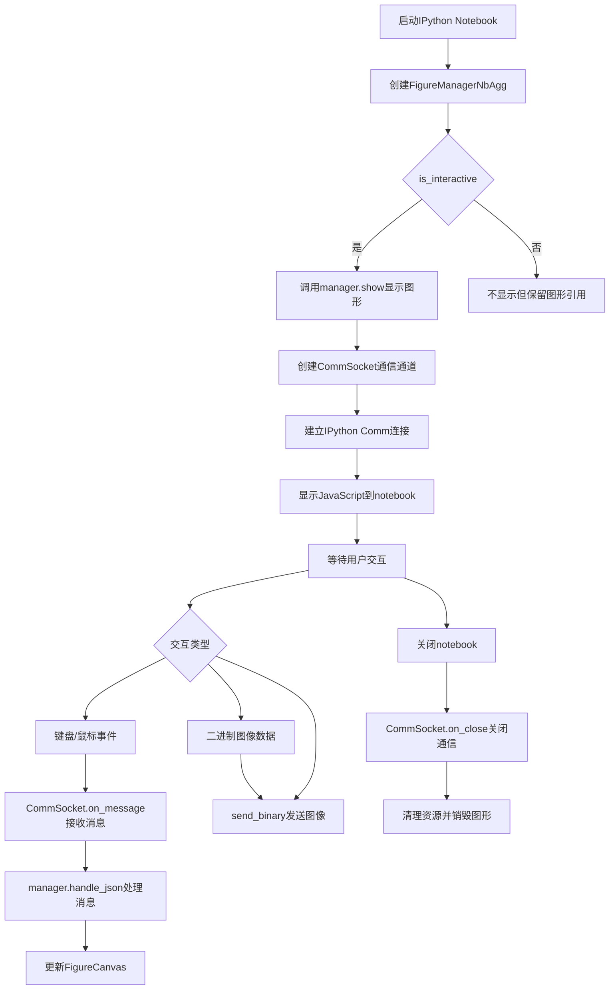

## 类结构

```
FigureManagerWebAgg (基类)
├── FigureManagerNbAgg (IPython图形管理器)
│   ├── NavigationIPy (导航工具栏)
│   └── CommSocket (通信套接字)
FigureCanvasWebAggCore (基类)
└── FigureCanvasNbAgg (IPython画布)
_Backend (基类)
└── _BackendNbAgg (后端导出类)
```

## 全局变量及字段


### `_FONT_AWESOME_CLASSES`
    
字体图标CSS类名字典，用于工具栏图标映射

类型：`dict`
    


### `NavigationIPy.toolitems`
    
工具栏项目列表

类型：`list`
    


### `FigureManagerNbAgg._shown`
    
图形是否已显示的标志

类型：`bool`
    


### `FigureManagerNbAgg._toolbar2_class`
    
工具栏类引用

类型：`type`
    


### `FigureManagerNbAgg.web_sockets`
    
WebSocket集合

类型：`set`
    


### `FigureManagerNbAgg._cidgcf`
    
图形焦点事件回调ID

类型：`int`
    


### `FigureCanvasNbAgg.manager_class`
    
图形管理器类

类型：`type`
    


### `CommSocket.supports_binary`
    
是否支持二进制传输

类型：`bool`
    


### `CommSocket.manager`
    
图形管理器引用

类型：`FigureManagerNbAgg`
    


### `CommSocket.uuid`
    
唯一标识符

类型：`str`
    


### `CommSocket.comm`
    
IPython Comm对象

类型：`Comm`
    


### `CommSocket._ext_close`
    
外部关闭标志

类型：`bool`
    


### `_BackendNbAgg.FigureCanvas`
    
画布类

类型：`type`
    


### `_BackendNbAgg.FigureManager`
    
图形管理器类

类型：`type`
    
    

## 全局函数及方法


### `connection_info`

返回图形和连接状态的诊断信息字符串，用于显示当前所有图形管理器的连接状态和图形信息。

参数：  
无

返回值：`str`，返回包含图形和连接状态的诊断信息字符串

#### 流程图

```mermaid
flowchart TD
    A[开始 connection_info] --> B[获取所有图形管理器 Gcf.get_all_fig_managers]
    B --> C{图形管理器是否为空}
    C -->|是| D[创建空结果列表 result]
    C -->|否| E[遍历每个图形管理器]
    E --> F[获取图形标签或生成默认标签 Figure {num}]
    F --> G[获取web_sockets连接信息]
    G --> H[格式化字符串: {fig} - {socket}]
    H --> I[添加到result列表]
    I --> J{是否还有更多管理器}
    J -->|是| E
    J -->|否| K{是否非交互模式}
    K -->|是| L[添加待显示图形数量: Figures pending show: {len}]
    K -->|否| M[用换行符连接result返回]
    L --> M
    D --> M
    M --> N[结束]
```

#### 带注释源码

```python
def connection_info():
    """
    Return a string showing the figure and connection status for the backend.

    This is intended as a diagnostic tool, and not for general use.
    """
    # 使用列表推导式遍历所有图形管理器，获取每个管理器的图形和连接信息
    result = [
        '{fig} - {socket}'.format(
            # 获取图形标签，如果未设置则使用默认格式 "Figure {num}"
            fig=(manager.canvas.figure.get_label()
                 or f"Figure {manager.num}"),
            # 获取该图形管理器关联的web socket连接对象集合
            socket=manager.web_sockets)
        for manager in Gcf.get_all_fig_managers()
    ]
    # 如果当前不是交互模式（批量处理模式），添加待显示图形的数量信息
    if not is_interactive():
        result.append(f'Figures pending show: {len(Gcf.figs)}')
    # 将所有信息用换行符连接成一个字符串返回
    return '\n'.join(result)
```


### NavigationIPy.__init__

`NavigationIPy` 类本身未显式定义 `__init__` 方法，它继承自 `NavigationToolbar2WebAgg` 类。由于提供的代码中未包含父类 `NavigationToolbar2WebAgg` 的实现细节，无法直接提取其构造函数参数。以下基于代码上下文的分析：

参数：

- （继承自父类 `NavigationToolbar2WebAgg`，具体参数需查看 backend_webagg_core.py 源码）
- 常见父类参数推测：`canvas`（FigureCanvasWebAggCore，图形画布实例），`num`（int，图形编号）

返回值：`None`，构造函数无返回值

#### 流程图

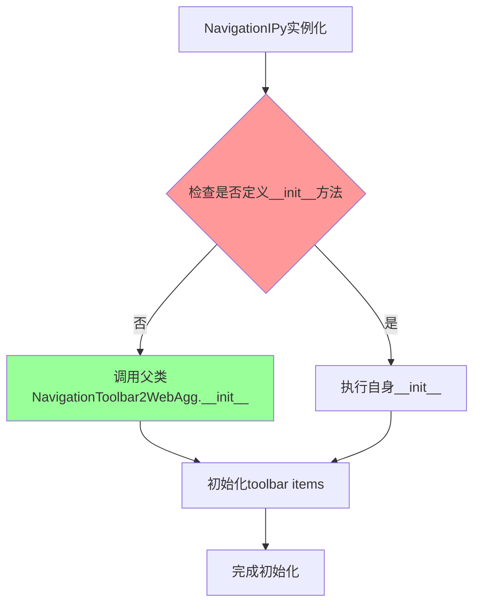

#### 带注释源码

```python
class NavigationIPy(NavigationToolbar2WebAgg):
    """
    IPython notebook 专用的导航工具栏类。
    
    继承自 NavigationToolbar2WebAgg，扩展标准工具栏项添加下载按钮。
    注意：此类未定义自身的 __init__ 方法，依赖父类初始化。
    """

    # 工具栏项定义：组合标准项和下载按钮
    # 从 NavigationToolbar2.toolitems 继承基础项
    # 添加 ('Download', 'Download plot', 'download', 'download') 项
    toolitems = [(text, tooltip_text,
                  _FONT_AWESOME_CLASSES[image_file], name_of_method)
                 for text, tooltip_text, image_file, name_of_method
                 in (NavigationToolbar2.toolitems +
                     (('Download', 'Download plot', 'download', 'download'),))
                 if image_file in _FONT_AWESOME_CLASSES]
    # 说明：
    # - toolitems 是一个列表推导式，生成工具栏按钮配置元组
    # - _FONT_AWESOME_CLASSES 映射确保图标样式正确应用
    # - 过滤条件确保只包含 _FONT_AWESOME_CLASSES 中存在的图标

# 潜在的架构分析：
# 1. 类设计遵循了继承复用原则，未重复父类已实现的初始化逻辑
# 2. toolitems 作为类变量，在类定义时一次性计算，性能较优
# 3. 缺少显式 __init__ 可能导致子类实例化行为不够清晰
```

#### 补充说明

由于 `NavigationIPy` 类未定义 `__init__` 方法，建议：

1. **查看父类实现**：需要检查 `backend_webagg_core.py` 中 `NavigationToolbar2WebAgg` 的 `__init__` 方法
2. **代码位置**：当前类位于 matplotlib 后端模块，处理 IPython notebook 中的交互式图形


### NavigationIPy

`NavigationIPy` 类是一个继承自 `NavigationToolbar2WebAgg` 的工具栏类，专门为 IPython notebook 中的交互式图表提供导航工具栏功能。该类通过整合标准工具栏项目和下载按钮，为用户提供绘图交互操作（如缩放、平移、保存等）。

#### 继承的方法说明

由于 `NavigationIPy` 直接继承自 `NavigationToolbar2WebAgg`，其主要功能继承自父类 `NavigationToolbar2WebAgg`（而 `NavigationToolbar2WebAgg` 又继承自 `NavigationToolbar2`）。

以下是 `NavigationIPy` 本身定义的属性：

---

### NavigationIPy.toolitems

**描述**：类属性，定义了工具栏上显示的所有按钮项。该属性通过列表推导式构建，合并了 `NavigationToolbar2` 的标准工具项和额外的下载按钮。

**类型**：`list`

**返回值类型**：`list`，返回包含元组的列表，每个元组包含 (文本, 提示文本, 图标类名, 方法名)。

#### 带注释源码

```python
class NavigationIPy(NavigationToolbar2WebAgg):

    # Use the standard toolbar items + download button
    # 使用列表推导式构建工具栏项
    # 从 NavigationToolbar2.toolitems 继承标准工具项
    # 并添加 ('Download', 'Download plot', 'download', 'download') 下载项
    # 仅包含 _FONT_AWESOME_CLASSES 中存在的图标
    toolitems = [(text, tooltip_text,
                  _FONT_AWESOME_CLASSES[image_file], name_of_method)
                 for text, tooltip_text, image_file, name_of_method
                 in (NavigationToolbar2.toolitems +
                     (('Download', 'Download plot', 'download', 'download'),))
                 if image_file in _FONT_AWESOME_CLASSES]
```

---

### 继承自父类的方法

由于 `NavigationToolbar2WebAgg` 的具体实现不在当前代码片段中，以下是通常继承的标准方法（基于 matplotlib 的 `NavigationToolbar2` 类）：

| 方法名 | 描述 |
|--------|------|
| `__init__` | 初始化工具栏 |
| `update` | 更新工具栏状态 |
| `draw` | 绘制工具栏 |
| `press` | 处理鼠标按下事件 |
| `release` | 处理鼠标释放事件 |
| `mouse_move` | 处理鼠标移动事件 |
| `pan` | 平移模式 |
| `zoom_to_rect` | 缩放模式 |
| `save_figure` | 保存图形 |
| `set_navigation_mode` | 设置导航模式 |

这些方法的具体实现位于 `matplotlib.backend_bases.NavigationToolbar2` 和 `backend_webagg_core.NavigationToolbar2WebAgg` 中，代码中未直接显示。


### FigureManagerNbAgg.__init__

初始化FigureManagerNbAgg实例，设置图形显示状态标记并调用父类构造函数完成初始化。

参数：

- `self`：隐式的Python实例，表示当前对象
- `canvas`：`FigureCanvas`，matplotlib画布对象，用于显示图形
- `num`：`int`，图形编号，用于标识和管理图形

返回值：`None`，无返回值（构造函数）

#### 流程图

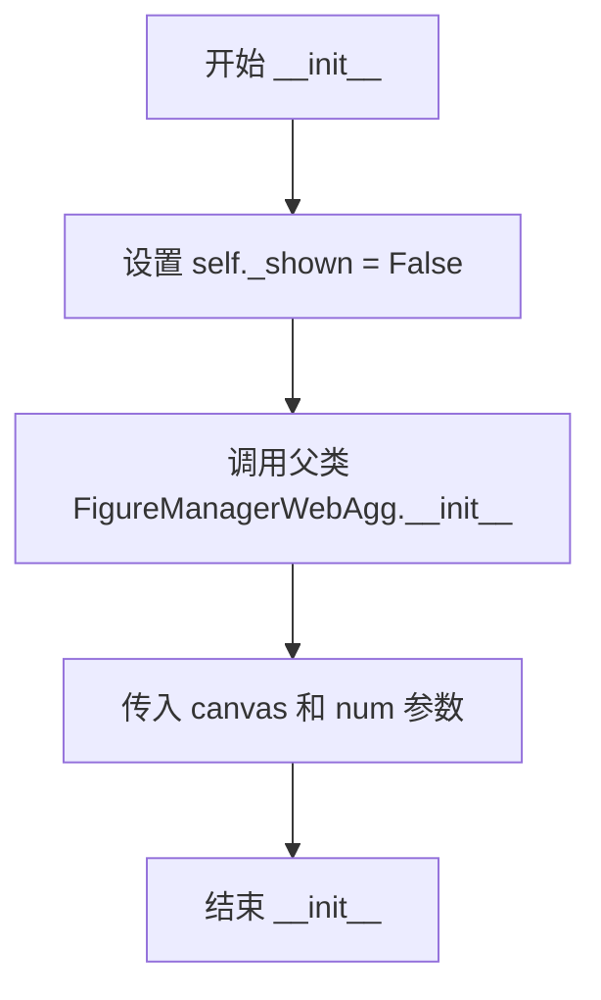

#### 带注释源码

```python
def __init__(self, canvas, num):
    """
    初始化FigureManagerNbAgg实例。
    
    参数:
        canvas: FigureCanvas对象，用于渲染图形
        num: int类型，图形编号
    """
    # 标记图形尚未显示，用于控制show方法的逻辑
    self._shown = False
    # 调用父类FigureManagerWebAgg的初始化方法
    super().__init__(canvas, num)
```


### FigureManagerNbAgg.create_with_canvas

该方法是一个类方法，用于在IPython notebook中创建支持nbAgg后端的图形管理器。它接收画布类、图形对象和图形编号，创建画布实例和管理器实例，注册关闭事件处理函数，并在交互模式下显示图形。

参数：

- `canvas_class`：`<class type>`，用于创建画布的画布类（例如FigureCanvasNbAgg）
- `figure`：`<class type>`，matplotlib的Figure对象，要显示的图形
- `num`：`int`，图形编号，用于标识图形

返回值：`FigureManagerNbAgg`，返回创建的图形管理器实例

#### 流程图

```mermaid
flowchart TD
    A[开始] --> B[创建画布: canvas = canvas_class(figure)]
    B --> C[创建管理器: manager = cls(canvas, num)]
    C --> D{is_interactive?}
    D -->|是| E[调用 manager.show]
    E --> F[调用 canvas.draw_idle]
    D -->|否| G[跳过显示步骤]
    F --> H[定义 destroy 闭包函数]
    G --> H
    H --> I[注册 close_event 事件处理: cid = canvas.mpl_connect('close_event', destroy)]
    I --> J[返回 manager 实例]
    J --> K[结束]
```

#### 带注释源码

```python
@classmethod
def create_with_canvas(cls, canvas_class, figure, num):
    """
    使用指定的画布类创建一个图形管理器。
    
    Parameters:
        canvas_class: 画布类，用于实例化画布对象
        figure: matplotlib的Figure对象
        num: 图形编号
    
    Returns:
        FigureManagerNbAgg: 创建的图形管理器实例
    """
    # 使用画布类创建画布实例，将figure对象传入
    canvas = canvas_class(figure)
    
    # 使用创建的画布和图形编号实例化管理器
    manager = cls(canvas, num)
    
    # 如果处于交互模式，则显示管理器并触发画图
    if is_interactive():
        manager.show()  # 显示图形
        canvas.draw_idle()  # 触发延迟绘制
    
    # 定义一个闭包函数作为关闭事件的处理函数
    def destroy(event):
        # 断开与关闭事件的连接
        canvas.mpl_disconnect(cid)
        # 从全局图形管理器中销毁该图形
        Gcf.destroy(manager)
    
    # 注册画布的关闭事件，当关闭图形时触发destroy函数
    cid = canvas.mpl_connect('close_event', destroy)
    
    # 返回创建好的图形管理器
    return manager
```


### `FigureManagerNbAgg.display_js`

该方法用于在IPython notebook中显示JavaScript代码，使nbagg后端能够在notebook环境中运行交互式图表。它获取JavaScript内容并通过IPython的display机制将其展示到notebook前端。

参数：

- `self`：`FigureManagerNbAgg`，隐式参数，表示当前管理器实例

返回值：`None`，无返回值（display函数仅用于展示，不返回数据）

#### 流程图

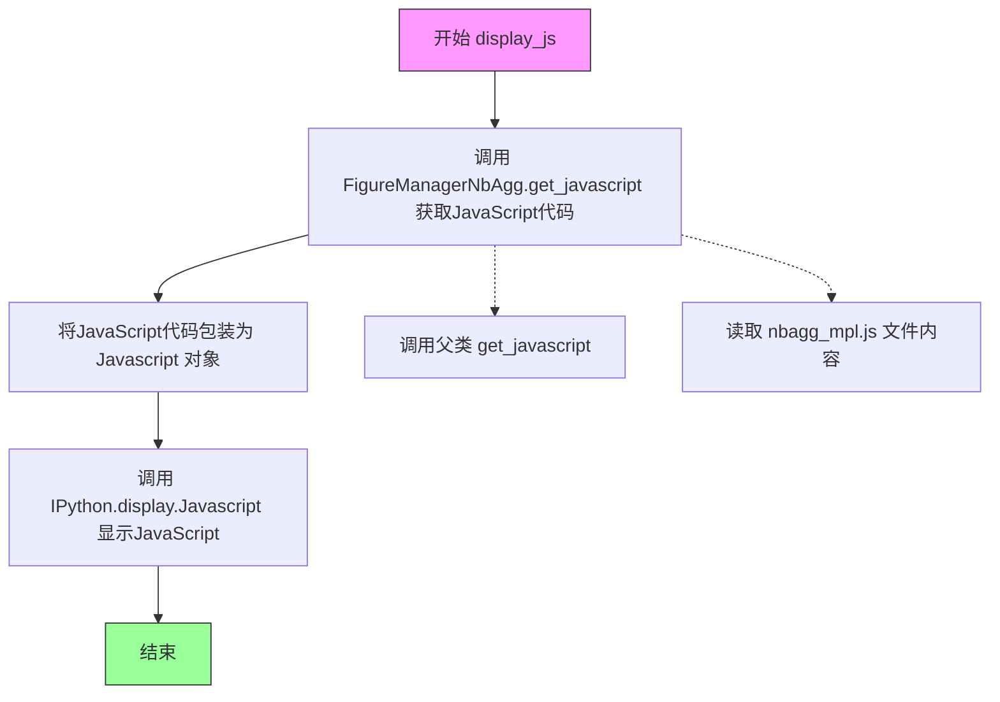

#### 带注释源码

```python
def display_js(self):
    # XXX How to do this just once? It has to deal with multiple
    # browser instances using the same kernel (require.js - but the
    # file isn't static?).
    # TODO: 存在技术债务 - 如何处理多个浏览器实例使用同一内核的情况
    # 目前每次调用都会重新加载JavaScript，可能导致性能问题
    display(Javascript(FigureManagerNbAgg.get_javascript()))
    # 调用display将JavaScript内容显示在IPython notebook中
    # get_javascript()方法会获取完整的JavaScript代码包括mpl.js和nbagg_mpl.js
```


### `FigureManagerNbAgg.show`

该方法负责在 IPython notebook 中显示交互式 matplotlib 图形，首次显示时初始化 JavaScript 通信组件，后续调用则仅刷新画布内容，并处理非交互模式下的图形管理。

参数： 无

返回值：`None`，该方法无返回值，仅执行图形显示的副作用操作。

#### 流程图

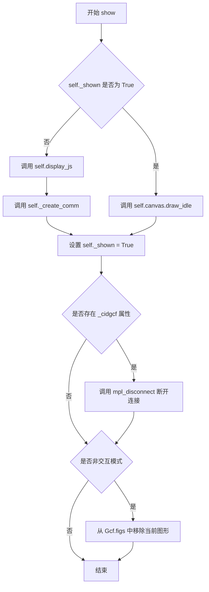

#### 带注释源码

```python
def show(self):
    """
    Show the figure in the IPython notebook.
    
    This method handles the initial display of the figure by setting up
    the JavaScript communication layer, and subsequent calls simply
    refresh the canvas content.
    """
    # Check if this is the first time showing the figure
    if not self._shown:
        # First display: initialize JavaScript and create comm channel
        self.display_js()        # Display the required JavaScript for interactivity
        self._create_comm()      # Create the communication socket to the browser
    else:
        # Subsequent calls: just redraw the canvas
        self.canvas.draw_idle()   # Request a redraw without blocking
        
    # Mark the figure as shown to prevent re-initialization
    self._shown = True
    
    # plt.figure adds an event which makes the figure in focus the active
    # one. Disable this behaviour, as it results in figures being put as
    # the active figure after they have been shown, even in non-interactive
    # mode.
    if hasattr(self, '_cidgcf'):
        # Disconnect the Gcf focus event to prevent unwanted figure activation
        self.canvas.mpl_disconnect(self._cidgcf)
        
    if not is_interactive():
        # In non-interactive mode, remove the figure from Gcf registry
        # to prevent it from being automatically managed as the active figure
        from matplotlib._pylab_helpers import Gcf
        Gcf.figs.pop(self.num, None)
```


### `FigureManagerNbAgg.reshow`

该方法是一个特殊的重绘入口，用于在 Jupyter Notebook 环境中强制重新显示图形。它通过将实例的 `_shown` 标志位重置为 `False`，从而欺骗 `show()` 方法，使其重新执行初始化流程（注入 JavaScript 和创建新的 Comm 通信），实现图形的刷新或重置效果。

参数：

- `self`：`FigureManagerNbAgg`，方法的调用者实例。

返回值：`None`，该方法没有显式返回值。

#### 流程图

```mermaid
graph TD
    A([Start reshow]) --> B[设置 self._shown = False]
    B --> C[调用 self.show()]
    C --> D([End])
    
    subgraph show 内部逻辑 (受 _shown 影响)
    C -.-> E{检查 self._shown?}
    E -- False (被重置) --> F[执行 display_js]
    F --> G[执行 _create_comm]
    E -- True --> H[执行 draw_idle]
    end
```

#### 带注释源码

```python
def reshow(self):
    """
    A special method to re-show the figure in the notebook.

    """
    # 1. 将 _shown 标志位重置为 False。
    # 这是一个"技巧"，目的是让下一次调用 show() 时，
    # 认为这是第一次显示，从而重新注入 JS 和建立通信。
    self._shown = False
    
    # 2. 调用标准的 show 方法。
    # 由于 _shown 为 False，show() 内部会执行初始化逻辑。
    self.show()
```


### `FigureManagerNbAgg.connected`

该属性用于检查当前图形管理器是否与IPython notebook中的浏览器客户端建立了连接。它通过检查`web_sockets`集合是否为空来判断连接状态，返回布尔值表示是否有活动的WebSocket连接。

参数： 无

返回值：`bool`，如果存在活动的WebSocket连接返回`True`，否则返回`False`

#### 流程图

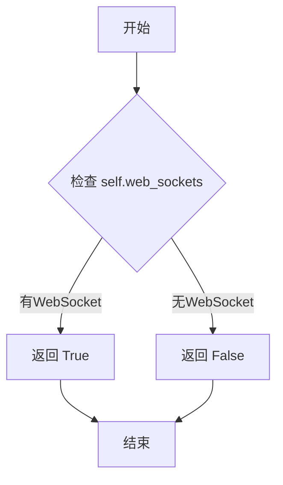

#### 带注释源码

```python
@property
def connected(self):
    """
    Check if the figure manager is connected to a client.
    
    Returns True if there are active web sockets (clients) connected,
    False otherwise. This is used to determine if the figure is currently
    displayed in a live IPython notebook.
    """
    return bool(self.web_sockets)
```


### FigureManagerNbAgg.get_javascript

获取在 IPython notebook 中显示交互式图形所需的完整 JavaScript 代码，包括父类的基础 JavaScript 和 nbagg_mpl.js 的内容。

参数：

- `stream`：`io.StringIO` 或 `None`，可选参数，用于指定输出流。如果为 `None`，则创建一个新的 StringIO 对象；否则使用提供的 stream 进行写入。

返回值：`str` 或 `None`，当 stream 为 None 时返回生成的完整 JavaScript 字符串，否则返回 None。

#### 流程图

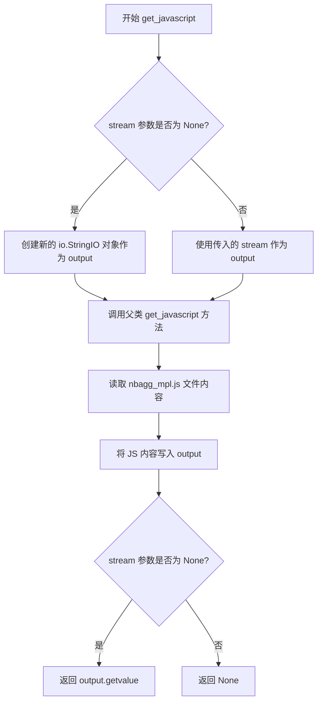

#### 带注释源码

```python
@classmethod
def get_javascript(cls, stream=None):
    """
    获取用于在 IPython notebook 中显示交互式图形的 JavaScript 代码。
    
    参数:
        stream: 可选的输出流。如果为 None，则创建一个新的 StringIO 对象；
                否则将内容写入到提供的 stream 中。
    
    返回:
        当 stream 为 None 时返回生成的 JavaScript 字符串；
        当 stream 不为 None 时返回 None。
    """
    # 判断是否需要创建新的 StringIO 对象
    if stream is None:
        output = io.StringIO()  # 创建一个内存字符串缓冲区
    else:
        output = stream  # 使用调用者提供的 stream
    
    # 调用父类 FigureManagerWebAgg 的 get_javascript 方法
    # 获取基础 WebAgg 相关的 JavaScript 代码
    super().get_javascript(stream=output)
    
    # 构建 nbagg_mpl.js 文件的完整路径
    # pathlib.Path(__file__).parent 获取当前文件所在目录
    # / "web_backend/js/nbagg_mpl.js" 拼接 nbagg JavaScript 文件路径
    # 读取文件内容（UTF-8 编码）
    output.write((pathlib.Path(__file__).parent
                  / "web_backend/js/nbagg_mpl.js")
                 .read_text(encoding="utf-8"))
    
    # 如果调用者没有提供 stream，则返回生成的完整 JavaScript 字符串
    if stream is None:
        return output.getvalue()
```


### `FigureManagerNbAgg._create_comm`

该方法是 `FigureManagerNbAgg` 类的核心通信初始化方法，用于在 IPython notebook 环境中创建并注册一个 `CommSocket` 通信通道，使 matplotlib 图形能够与前端浏览器进行双向数据交互。

参数：

- `self`：`FigureManagerNbAgg`，隐式参数，指向当前图形管理器实例

返回值：`CommSocket`，返回创建的通信套接字对象，用于后续的图形数据推送和消息处理

#### 流程图

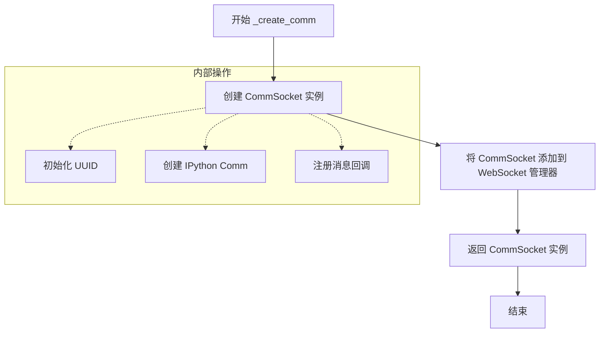

#### 带注释源码

```python
def _create_comm(self):
    """
    创建并初始化与前端的通信通道（CommSocket）。
    
    此方法在 IPython notebook 环境中为当前图形管理器建立一个
    Comm 通信连接，使后端能够将图形更新推送至前端浏览器。
    
    Returns:
        CommSocket: 创建的通信套接字对象，包含与前端交互的所有逻辑
    """
    # 第一步：创建 CommSocket 实例，传入当前管理器引用
    # CommSocket 封装了 IPython Comm 通信机制，负责与前端 JS 进行数据交换
    comm = CommSocket(self)
    
    # 第二步：将创建的通信套接字注册到管理器的 WebSocket 集合中
    # add_web_socket 是从父类 FigureManagerWebAgg 继承的方法
    # 注册后，图形更新可以通过该通道推送到前端
    self.add_web_socket(comm)
    
    # 第三步：返回通信套接字，供调用者持有或进行后续操作
    # 返回的 comm 对象包含了 send_json、send_binary 等数据发送方法
    return comm
```


### FigureManagerNbAgg.destroy

该方法负责销毁FigureManagerNbAgg实例，先发送关闭事件给前端，然后遍历所有WebSocket连接调用on_close()方法清理通信资源，最后调用父类的destroy()方法完成整体清理流程。

参数：无（仅包含self参数）

返回值：`None`，无返回值

#### 流程图

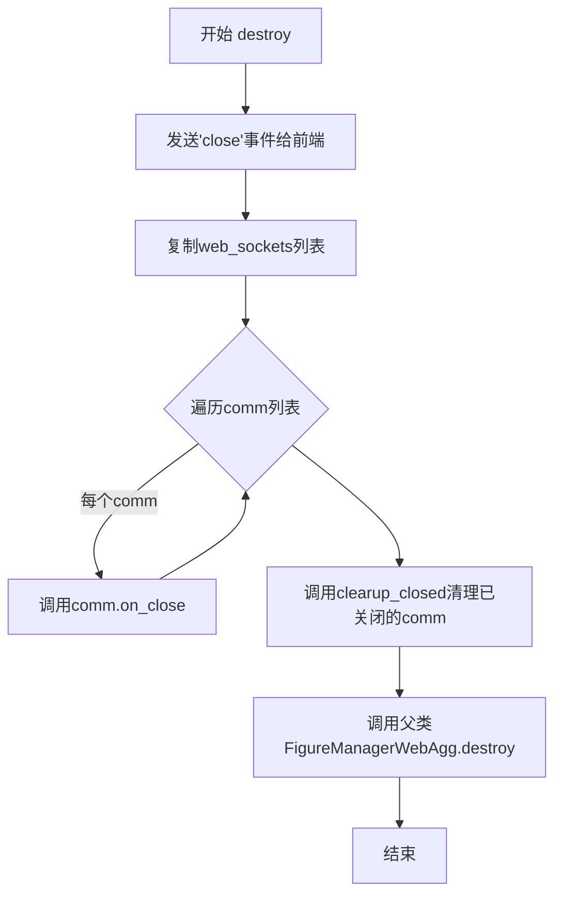

#### 带注释源码

```python
def destroy(self):
    """
    销毁FigureManagerNbAgg实例并清理相关资源。
    
    该方法执行以下操作：
    1. 发送关闭事件通知前端
    2. 关闭所有WebSocket通信连接
    3. 清理已关闭的连接
    4. 调用父类销毁方法
    """
    # 向前端发送'close'事件，通知浏览器端关闭连接
    self._send_event('close')
    
    # 需要复制comms列表，因为回调函数会修改这个列表
    # 遍历所有WebSocket连接并调用on_close()方法
    for comm in list(self.web_sockets):
        comm.on_close()
    
    # 清理已关闭的Comms连接
    self.clearup_closed()
    
    # 调用父类FigureManagerWebAgg的destroy方法
    # 完成FigureManager层面的资源清理
    super().destroy()
```


### FigureManagerNbAgg.clearup_closed

该方法用于清理已关闭的通信套接字（Comms）。它从 `web_sockets` 集合中移除已关闭的套接字，如果所有套接字都已关闭，则触发画布的关闭事件以正确终止该图表的连接。

参数：

- （无参数，仅使用 `self`）

返回值：`None`，无返回值，该方法执行清理操作后直接返回。

#### 流程图

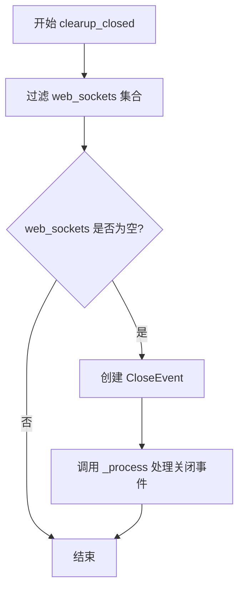

#### 带注释源码

```
def clearup_closed(self):
    """Clear up any closed Comms."""
    # 使用集合推导式过滤 web_sockets，只保留处于打开状态的 socket
    # 调用每个 socket 的 is_open() 方法检查其状态
    self.web_sockets = {socket for socket in self.web_sockets
                        if socket.is_open()}

    # 如果所有的 web_sockets 都已关闭（即集合为空）
    if len(self.web_sockets) == 0:
        # 创建一个 CloseEvent 事件对象，事件名称为 "close_event"
        # 事件关联到当前管理器的 canvas（画布）
        # 调用 _process() 方法处理该事件，触发画布关闭流程
        CloseEvent("close_event", self.canvas)._process()
```


### `FigureManagerNbAgg.remove_comm`

该方法用于从`FigureManagerNbAgg`实例的`web_sockets`集合中移除指定通信ID（comm_id）的套接字连接。当IPython内核中的Comm连接关闭时，会调用此方法进行清理。

参数：

- `comm_id`：字符串，表示要移除的通信连接的标识符

返回值：`None`，该方法不返回任何值（隐式返回None）

#### 流程图

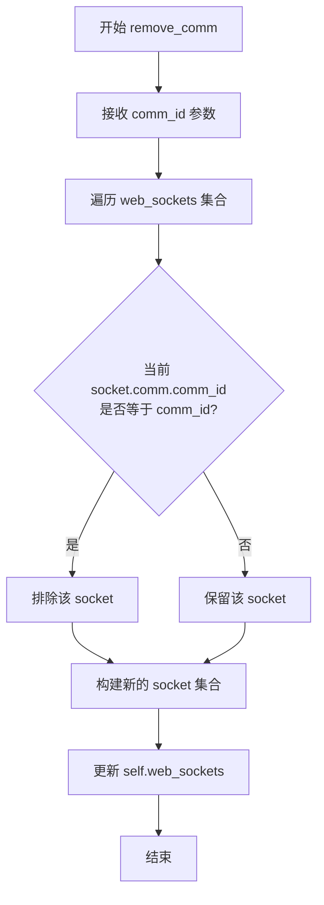

#### 带注释源码

```python
def remove_comm(self, comm_id):
    """
    移除指定 comm_id 的 WebSocket 通信连接。
    
    Parameters
    ----------
    comm_id : str
        要移除的通信连接的标识符
    """
    # 使用集合推导式过滤 web_sockets 集合
    # 保留所有 comm_id 不等于指定值的 socket
    self.web_sockets = {socket for socket in self.web_sockets
                        if socket.comm.comm_id != comm_id}
```


# FigureCanvasNbAgg 继承方法详细设计文档

## 1. 类概述

`FigureCanvasNbAgg` 类继承自 `FigureCanvasWebAggCore`，是 Matplotlib IPython Notebook 后端的核心画布类，负责在 Jupyter Notebook 环境中渲染交互式图表并处理用户交互事件。

## 2. 继承方法详情

由于 `FigureCanvasNbAgg` 继承自 `FigureCanvasWebAggCore`，而 `FigureCanvasWebAggCore` 的源代码不在当前文件中，我需要基于 matplotlib 架构和当前代码上下文来推断其继承的方法。

### `FigureCanvasNbAgg` 类本身

#### 流程图

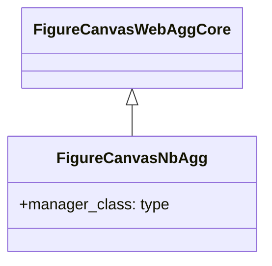

#### 带注释源码

```python
class FigureCanvasNbAgg(FigureCanvasWebAggCore):
    """
    IPython Notebook 后端的画布类。
    
    继承自 FigureCanvasWebAggCore，用于在 Jupyter notebook 环境中
    提供交互式图形支持。
    """
    # 类属性：指定该画布使用的管理器类
    manager_class = FigureManagerNbAgg
```

### 继承自 FigureCanvasWebAggCore 的方法

> **注意**：以下方法是从 `backend_webagg_core.py` 继承的方法列表。由于源代码未在当前文件中提供，基于 matplotlib 后端架构推断：

---

### `FigureCanvasNbAgg.draw`

**描述**：渲染画布内容到显示设备。

参数：无

返回值：`None`

#### 流程图

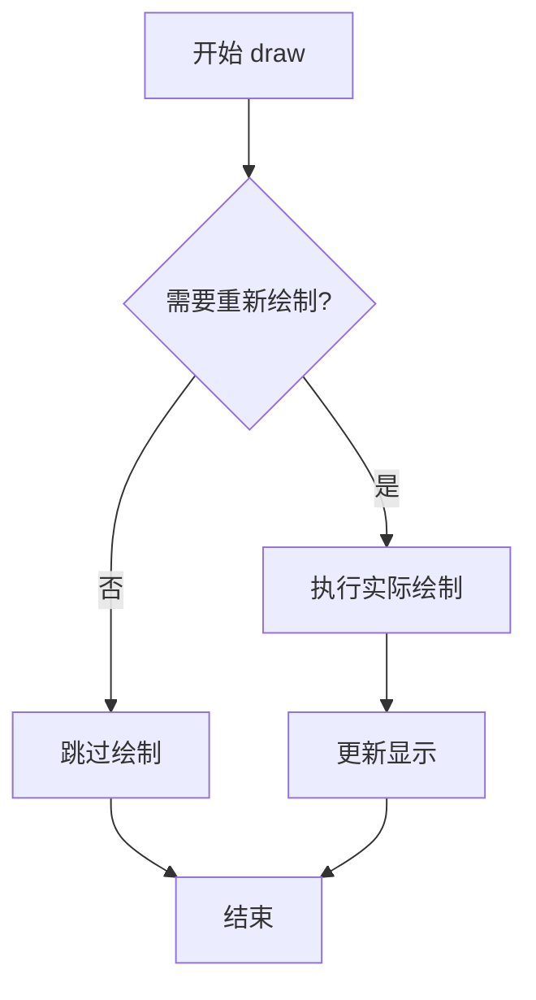

#### 带注释源码

```python
# 继承自 FigureCanvasWebAggCore
# 画布绘制方法，由 matplotlib 内部调用
def draw(self):
    """
    Render the figure to the canvas.
    
    This method is typically called by the figure manager when
    the figure needs to be displayed or updated.
    """
    # 获取 백엔드 特定的图形上下文
    # 执行实际的渲染操作
    # 更新 canvas 显示
```

---

### `FigureCanvasNbAgg.blit`

**描述**：使用位块传输优化重绘区域。

参数：

- `bbox`：坐标元组或 `None`，需要重绘的边界框区域

返回值：`None`

#### 流程图

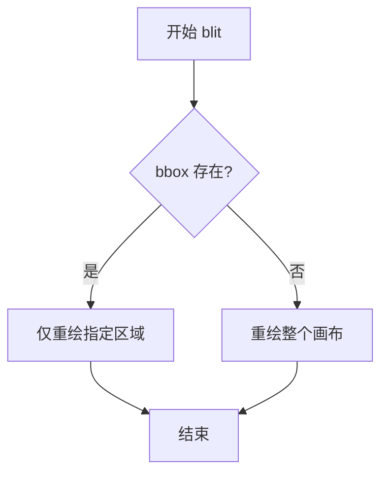

#### 带注释源码

```python
# 继承自 FigureCanvasWebAggCore
# 位块传输优化绘制
def blit(self, bbox=None):
    """
    Blit the canvas in the given bounding box.
    
    Parameters
    ----------
    bbox : tuple or None
        The bounding box in display coordinates. If None,
        redraw the entire canvas.
    """
    # 仅重绘指定区域以提高性能
    # 在 web 后端中通过 JavaScript 实现
```

---

### `FigureCanvasNbAgg.resize`

**描述**：调整画布大小。

参数：

- `width`：整数，画布宽度（像素）
- `height`：整数，画布高度（像素）

返回值：`None`

#### 流程图

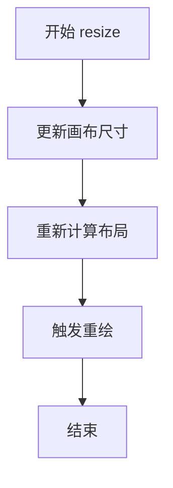

#### 带注释源码

```python
# 继承自 FigureCanvasWebAggCore
# 调整画布大小
def resize(self, width, height):
    """
    Resize the canvas to the given dimensions.
    
    Parameters
    ----------
    width : int
        The width of the canvas in pixels.
    height : int
        The height of the canvas in pixels.
    """
    # 更新内部尺寸状态
    # 通知前端调整 canvas 元素大小
```

---

### `FigureCanvasNbAgg.get_canvas_width_height`

**描述**：获取画布的宽高。

参数：无

返回值：元组 `(width, height)`，画布的宽和高（像素）

#### 流程图

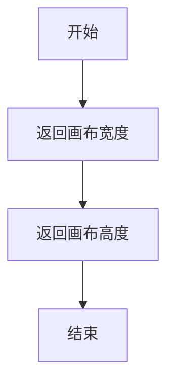

#### 带注释源码

```python
# 继承自 FigureCanvasWebAggCore
def get_canvas_width_height(self):
    """
    Return the canvas width and height in display points.
    
    Returns
    -------
    tuple
        (width, height) in display points (pixels).
    """
    # 返回画布的宽高信息
    return self.figure.get_figwidth() * self.figure.dpi, \
           self.figure.get_figheight() * self.figure.dpi
```

---

### `FigureCanvasNbAgg.copy_from_bbox`

**描述**：从边界框复制像素数据用于缓冲区。

参数：

- `bbox`：Bbox 对象，复制区域

返回值：`~matplotlib.transforms.Bbox`，复制的区域边界框

#### 流程图

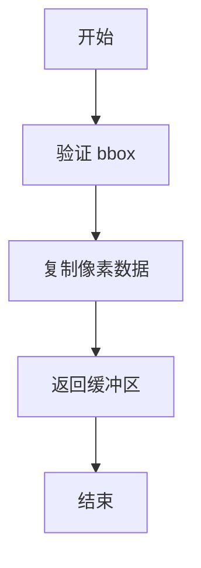

#### 带注释源码

```python
# 继承自 FigureCanvasWebAggCore
def copy_from_bbox(self, bbox):
    """
    Copy the pixel data from the bounding box.
    
    Parameters
    ----------
    bbox : Bbox
        The bounding box in display coordinates.
    
    Returns
    -------
    Bbox
        The bounding box that was copied.
    """
    # 从指定区域复制像素到缓冲区
    # 用于后续的快速恢复（restore_region）
```

---

### `FigureCanvasNbAgg.restore_region`

**描述**：恢复之前保存的像素区域。

参数：

- `region`：缓冲区数据
- `bbox`：可选的边界框
- `ox`、`oy`：可选的偏移量

返回值：`None`

#### 流程图

```mermaid
flowchart TD
    A[开始 restore_region] --> B[获取缓冲区数据]
    B --> C{指定 bbox?}
    C -->|是| D[应用到指定区域]
    C --> E[应用到整个区域]
    D --> F[结束]
    E --> F
```

#### 带注释源码

```python
# 继承自 FigureCanvasWebAggCore
def restore_region(self, region, bbox=None, ox=0, oy=0):
    """
    Restore the region from the saved buffer.
    
    Parameters
    ----------
    region : buffer data
        The buffered region data to restore.
    bbox : Bbox, optional
        The bounding box to restore to.
    ox, oy : float
        Offsets.
    """
    # 恢复之前保存的像素区域
    # 用于局部重绘优化
```

---

### `FigureCanvasNbAgg.mpl_connect`

**描述**：连接事件处理器。

参数：

- `s`：字符串，事件类型（如 'button_press_event'）
- `func`：可调用对象，回调函数

返回值：整数，连接标识符（cid）

#### 流程图

```mermaid
flowchart TD
    A[开始 mpl_connect] --> B[注册事件回调]
    B --> C[生成连接 ID]
    C --> D[返回 cid]
    D --> E[结束]
```

#### 带注释源码

```python
# 继承自 FigureCanvasWebAggCore
def mpl_connect(self, s, func):
    """
    Connect an event handler to the given event.
    
    Parameters
    ----------
    s : str
        The event name. Possible events include:
        - 'button_press_event': mouse button pressed
        - 'button_release_event': mouse button released
        - 'motion_notify_event': mouse motion
        - 'key_press_event': key pressed
        - 'key_release_event': key released
        - 'resize_event': figure resized
        - 'close_event': figure closed
    
    func : callable
        The callback function. It should accept an event object.
    
    Returns
    -------
    int
        A connection id that can be used to disconnect the callback.
    """
    # 将回调函数注册到事件系统
    # 返回连接 ID 用于后续断开连接
```

---

### `FigureCanvasNbAgg.mpl_disconnect`

**描述**：断开事件处理器连接。

参数：

- `cid`：整数，之前通过 `mpl_connect` 返回的连接 ID

返回值：`None`

#### 流程图

```mermaid
flowchart TD
    A[开始 mpl_disconnect] --> B[查找连接 ID]
    B --> C[移除回调]
    C --> D[结束]
```

#### 带注释源码

```python
# 继承自 FigureCanvasWebAggCore
def mpl_disconnect(self, cid):
    """
    Disconnect an event handler.
    
    Parameters
    ----------
    cid : int
        A connection id returned by a previous call to mpl_connect.
    """
    # 根据连接 ID 移除对应的事件回调
```

---

### `FigureCanvasNbAgg.button_press_event`

**描述**：处理鼠标按钮按下事件。

参数：

- `x`：浮点数，x 坐标
- `y`：浮点数，y 坐标
- `button`：整数或 None，按钮编号
- `guiEvent`：可选的 GUI 事件对象

返回值：`None`

#### 流程图

```mermaid
flowchart TD
    A[鼠标按下] --> B[创建事件对象]
    B --> C[查找 pick 事件]
    C --> D{找到 picker?}
    D -->|是| E[调用 picker 回调]
    D --> F[结束]
    E --> F
```

#### 带注释源码

```python
# 继承自 FigureCanvasWebAggCore
def button_press_event(self, x, y, button=None, guiEvent=None):
    """
    Handle button press event.
    
    Parameters
    ----------
    x, y : float
        The mouse position in display coordinates.
    button : int or None
        The mouse button number (1=left, 2=middle, 3=right).
    guiEvent : GUIEvent, optional
        The GUI event that triggered this.
    """
    # 处理鼠标按下事件
    # 触发相应的回调函数
```

---

### `FigureCanvasNbAgg.button_release_event`

**描述**：处理鼠标按钮释放事件。

参数：

- `x`：浮点数，x 坐标
- `y`：浮点数，y 坐标
- `button`：整数或 None，按钮编号
- `guiEvent`：可选的 GUI 事件对象

返回值：`None`

#### 流程图

```mermaid
flowchart TD
    A[鼠标释放] --> B[创建事件对象]
    B --> C[触发回调]
    C --> D[结束]
```

#### 带注释源码

```python
# 继承自 FigureCanvasWebAggCore
def button_release_event(self, x, y, button=None, guiEvent=None):
    """
    Handle button release event.
    
    Parameters
    ----------
    x, y : float
        The mouse position in display coordinates.
    button : int or None
        The mouse button number.
    guiEvent : GUIEvent, optional
        The GUI event that triggered this.
    """
    # 处理鼠标释放事件
```

---

### `FigureCanvasNbAgg.motion_notify_event`

**描述**：处理鼠标移动事件。

参数：

- `x`：浮点数，x 坐标
- `y`：浮点数，y 坐标
- `guiEvent`：可选的 GUI 事件对象

返回值：`None`

#### 流程图

```mermaid
flowchart TD
    A[鼠标移动] --> B{启用动态观察?}
    B -->|是| C[创建事件对象]
    B -->|否| D[结束]
    C --> D
```

#### 带注释源码

```python
# 继承自 FigureCanvasWebAggCore
def motion_notify_event(self, x, y, guiEvent=None):
    """
    Handle mouse motion event.
    
    Parameters
    ----------
    x, y : float
        The mouse position in display coordinates.
    guiEvent : GUIEvent, optional
        The GUI event that triggered this.
    """
    # 处理鼠标移动事件
    # 常用于拖拽操作和悬停提示
```

---

### `FigureCanvasNbAgg.key_press_event`

**描述**：处理键盘按键按下事件。

参数：

- `key`：字符串或 None，按键名称
- `guiEvent`：可选的 GUI 事件对象

返回值：`None`

#### 流程图

```mermaid
flowchart TD
    A[按键按下] --> B[创建事件对象]
    B --> C[处理快捷键]
    C --> D[结束]
```

#### 带注释源码

```python
# 继承自 FigureCanvasWebAggCore
def key_press_event(self, key, guiEvent=None):
    """
    Handle key press event.
    
    Parameters
    ----------
    key : str or None
        The key pressed. Common values include 'ctrl', 'alt',
        'shift', 'left', 'right', 'up', 'down', etc.
    guiEvent : GUIEvent, optional
        The GUI event that triggered this.
    """
    # 处理键盘按键事件
    # 触发键盘快捷键处理
```

---

### `FigureCanvasNbAgg.key_release_event`

**描述**：处理键盘按键释放事件。

参数：

- `key`：字符串或 None，按键名称
- `guiEvent`：可选的 GUI 事件对象

返回值：`None`

#### 带注释源码

```python
# 继承自 FigureCanvasWebAggCore
def key_release_event(self, key, guiEvent=None):
    """
    Handle key release event.
    
    Parameters
    ----------
    key : str or None
        The key released.
    guiEvent : GUIEvent, optional
        The GUI event that triggered this.
    """
    # 处理键盘释放事件
```

---

### `FigureCanvasNbAgg.resize_event`

**描述**：处理窗口大小调整事件。

参数：

- `guiEvent`：可选的 GUI 事件对象

返回值：`None`

#### 带注释源码

```python
# 继承自 FigureCanvasWebAggCore
def resize_event(self, guiEvent=None):
    """
    Handle resize event.
    
    Parameters
    ----------
    guiEvent : GUIEvent, optional
        The GUI event that triggered this.
    """
    # 处理画布大小调整事件
    # 重新计算布局并重绘
```

---

### `FigureCanvasNbAgg.close_event`

**描述**：处理图形关闭事件。

参数：

- `guiEvent`：可选的 GUI 事件对象

返回值：`None`

#### 带注释源码

```python
# 继承自 FigureCanvasWebAggCore
def close_event(self, guiEvent=None):
    """
    Handle close event.
    
    Parameters
    ----------
    guiEvent : GUIEvent, optional
        The GUI event that triggered this.
    """
    # 处理图形关闭事件
    # 清理资源并通知管理器
```

---

### `FigureCanvasNbAgg.start_event_loop`

**描述**：启动事件循环（用于阻塞模式）。

参数：

- `timeout`：浮点数，可选，超时时间（秒）

返回值：`None`

#### 带注释源码

```python
# 继承自 FigureCanvasWebAggCore
def start_event_loop(self, timeout=0):
    """
    Start an event loop.
    
    This is used for blocking events in interactive mode.
    
    Parameters
    ----------
    timeout : float, optional
        Timeout in seconds. Default is 0 (non-blocking).
    """
    # 在交互模式下启动事件循环
    # nbagg 后端通常不使用阻塞模式
```

---

### `FigureCanvasNbAgg.stop_event_loop`

**描述**：停止事件循环。

参数：无

返回值：`None`

#### 带注释源码

```python
# 继承自 FigureCanvasWebAggCore
def stop_event_loop(self):
    """
    Stop the event loop.
    """
    # 停止当前的事件循环
```

---

### `FigureCanvasNbAgg.flush_events`

**描述**：刷新待处理的事件。

参数：无

返回值：`None`

#### 带注释源码

```python
# 继承自 FigureCanvasWebAggCore
def flush_events(self):
    """
    Flush the GUI events for the figure.
    
    This is used to process pending events in the event queue.
    """
    # 处理所有待处理的 GUI 事件
```

---

### `FigureCanvasNbAgg.draw_idle`

**描述**：请求在空闲时重绘（延迟重绘）。

参数：无

返回值：`None`

#### 流程图

```mermaid
flowchart TD
    A[draw_idle] --> B[标记需要重绘]
    B --> C[添加到重绘队列]
    C --> D[结束]
```

#### 带注释源码

```python
# 继承自 FigureCanvasWebAggCore
def draw_idle(self):
    """
    Request a redraw at the next idle time.
    
    This is an optimization to coalesce multiple draw requests
    into a single redraw.
    """
    # 请求在下一个空闲周期重绘
    # 避免频繁重绘，提高性能
```

---

## 3. 类字段信息

| 字段名称 | 类型 | 描述 |
|---------|------|------|
| `manager_class` | `type` | 指定画布使用的管理器类（`FigureManagerNbAgg`） |

## 4. 技术债务与优化空间

1. **缺少继承方法实现**：当前类没有重写任何父类方法，可能缺少 nbagg 特定的事件处理优化
2. **二进制数据传输**：虽然 `CommSocket` 支持二进制传输，但在某些场景下仍有优化空间
3. **通信开销**：每次消息传递都使用 JSON 序列化，大数据量时可能成为瓶颈

## 5. 外部依赖与接口契约

- **父类**：`FigureCanvasWebAggCore` - Web 后端核心画布类
- **管理器类**：`FigureManagerNbAgg` - 管理画布的生命周期
- **通信层**：`CommSocket` - 处理与前端 JavaScript 的通信


### `CommSocket.__init__`

该方法负责初始化 `CommSocket` 实例。它在 IPython Notebook 环境中创建一个唯一的 UUID 作为前端容器的标识符，尝试建立与前端的 `Comm` 通信通道，并注册消息接收与连接关闭时的回调函数，以实现后端与前端的交互。

参数：

-  `manager`：`FigureManagerNbAgg`，图形管理器实例，用于接收来自前端的消息并管理通信会话的生命周期。

返回值：`None`，构造函数不返回任何值。

#### 流程图

```mermaid
flowchart TD
    A([Start Init]) --> B[Set supports_binary = None]
    B --> C[Assign manager]
    C --> D[Generate UUID]
    D --> E[Display HTML Div with UUID]
    E --> F{Try Create Comm}
    F -- AttributeError --> G[Raise RuntimeError: Not in IPython?]
    F -- Success --> H[Create self.comm]
    H --> I[Register self.on_message Handler]
    I --> J[Define _on_close Closure]
    J --> K[Register _on_close Handler]
    K --> L([End Init])
```

#### 带注释源码

```python
def __init__(self, manager):
    # 初始化二进制传输支持标志，默认为 None
    self.supports_binary = None
    # 引用传入的 FigureManagerNbAgg 实例
    self.manager = manager
    # 生成一个全局唯一的 UUID，用于标识当前的输出区域
    self.uuid = str(uuid.uuid4())
    
    # 在 IPython Notebook 中发布一个带有唯一 ID 的 HTML div
    # 这样 JavaScript 可以定位并操作这个元素
    display(HTML("<div id=%r></div>" % self.uuid))
    
    # 尝试创建 IPython Comm 通道
    # Comm 是 IPython 的内核与前端之间的双向通信机制
    try:
        self.comm = Comm('matplotlib', data={'id': self.uuid})
    except AttributeError as err:
        # 如果创建失败（例如不在 IPython 环境中），抛出运行时错误
        raise RuntimeError('Unable to create an IPython notebook Comm '
                           'instance. Are you in the IPython '
                           'notebook?') from err
    
    # 注册消息处理函数，当前端发送消息时调用 self.on_message
    self.comm.on_msg(self.on_message)

    # 获取 manager 引用
    manager = self.manager
    # 标记外部是否主动关闭了连接
    self._ext_close = False

    # 定义一个内部闭包用于处理连接关闭事件
    def _on_close(close_message):
        # 设置外部关闭标志为 True
        self._ext_close = True
        # 通知 Manager 移除该 Comm 的引用
        manager.remove_comm(close_message['content']['comm_id'])
        # 清理已关闭的连接
        manager.clearup_closed()

    # 注册连接关闭时的回调函数
    self.comm.on_close(_on_close)
```


### `CommSocket.is_open`

该方法用于检查 CommSocket 与 IPython 内核之间的通信连接是否处于打开状态，通过判断外部关闭标志和通信对象的关闭状态来确定连接是否可用。

参数：无

返回值：`bool`，返回一个布尔值，表示通信套接字是否处于打开状态（如果未关闭则返回 `True`，否则返回 `False`）。

#### 流程图

```mermaid
flowchart TD
    A[开始 is_open] --> B{self._ext_close or self.comm._closed}
    B -->|True| C[返回 False]
    B -->|False| D[返回 True]
```

#### 带注释源码

```python
def is_open(self):
    """
    检查 CommSocket 与 IPython 内核之间的通信连接是否处于打开状态。
    
    该方法通过两个标志来判断连接状态：
    1. self._ext_close: 表示外部是否主动关闭了连接
    2. self.comm._closed: 表示 Comm 对象本身的关闭状态
    
    Returns:
        bool: 如果连接未关闭返回 True，否则返回 False
    """
    # 使用逻辑或运算，只要外部关闭标志或通信对象关闭状态任一为真，
    # 则表示连接已关闭，返回 False；否则返回 True
    return not (self._ext_close or self.comm._closed)
```


### CommSocket.on_close

当通信socket关闭时，从FigureManager中注销websocket连接。

参数：无

返回值：`None`，无返回值

#### 流程图

```mermaid
flowchart TD
    A[开始 on_close] --> B{is_open?}
    B -->|True| C[try: 关闭comm]
    C --> D[except KeyError: 捕获异常]
    D --> E[结束]
    B -->|False| E
```

#### 带注释源码

```python
def on_close(self):
    # 当socket关闭时，从FigureManager中注销websocket。
    # 首先检查连接是否仍然打开
    if self.is_open():
        try:
            # 尝试关闭comm连接
            self.comm.close()
        except KeyError:
            # 如果抛出KeyError，可能已经清理过了
            # 忽略此异常
            pass
```


### `CommSocket.send_json`

该方法用于将传入的 Python 对象序列化为 JSON 格式，并通过 IPython Comm 通道发送给前端（浏览器），实现 Matplotlib 后端与 Jupyter Notebook 前端的双向通信。

参数：

- `content`：`任意 Python 对象`，需要发送给前端的业务数据，会被 JSON 序列化为字符串

返回值：`None`，该方法无返回值，通过 Comm 通道 side-effect 方式发送数据

#### 流程图

```mermaid
graph TD
    A[开始 send_json] --> B[接收 content 参数]
    B --> C[调用 json.dumps 将 content 序列化为 JSON 字符串]
    C --> D[构建消息字典 {'data': JSON字符串}]
    D --> E[调用 self.comm.send 发送消息]
    E --> F[结束]
```

#### 带注释源码

```python
def send_json(self, content):
    """
    通过 IPython Comm 通道发送 JSON 编码的数据到前端。

    Parameters
    ----------
    content : 任意 Python 对象
        需要发送给前端的业务数据。该对象会被 json.dumps 序列化为 JSON 字符串。

    Returns
    -------
    None
        此方法不返回值，数据通过 Comm 通道的 side-effect 发送。
    """
    # 使用 json.dumps 将 Python 对象序列化为 JSON 格式的字符串
    # content 可以是字典、列表等可序列化对象
    json_string = json.dumps(content)

    # 构建消息载荷，封装为 'data' 字段
    # 前端 JavaScript 代码会从 message.content.data 中提取数据
    message_payload = {'data': json_string}

    # 调用 IPython Comm 底层发送方法
    # Comm 机制会自动处理与前端 WebSocket 的通信
    self.comm.send(message_payload)
```


### `CommSocket.send_binary`

该方法负责将二进制图像数据（PNG格式）从内核发送到IPython notebook前端。它会检查通信通道是否支持二进制传输：若支持，则直接以二进制形式发送图像数据；若不支持（仅ASCII通道），则将图像数据进行Base64编码并包装成Data URI格式发送。

参数：

- `blob`：`bytes` 或类似二进制数据，要发送的PNG格式图像二进制数据

返回值：`None`，该方法通过Comm机制发送数据，无返回值

#### 流程图

```mermaid
flowchart TD
    A[开始 send_binary] --> B{self.supports_binary 是否为真?}
    B -->|是| C[直接发送二进制数据]
    B -->|否| D[Base64编码图像数据]
    C --> E[调用 self.comm.send 传入 buffers=[blob]]
    D --> F[构建 data:image/png;base64,{data} URI]
    E --> G[结束]
    F --> H[调用 self.comm.send 传入 {'data': data_uri}]
    H --> G
```

#### 带注释源码

```python
def send_binary(self, blob):
    """
    将二进制图像数据发送到IPython notebook前端。
    
    参数:
        blob: 二进制数据（通常为PNG格式的图像字节数据）
    """
    # 检查通信通道是否支持二进制传输
    if self.supports_binary:
        # 支持二进制：直接发送原始二进制数据
        # 格式: {'blob': 'image/png'}, 并将blob放入buffers中传输
        self.comm.send({'blob': 'image/png'}, buffers=[blob])
    else:
        # 不支持二进制（仅ASCII通道）：将图像转换为Base64编码的Data URI
        # Step 1: 将二进制数据编码为Base64 ASCII字符串
        data = b64encode(blob).decode('ascii')
        # Step 2: 构建Data URI格式: data:image/png;base64,{base64数据}
        data_uri = f"data:image/png;base64,{data}"
        # Step 3: 通过JSON数据发送
        self.comm.send({'data': data_uri})
```


### `CommSocket.on_message`

该方法是 `CommSocket` 类的核心消息处理函数，负责接收来自 IPython Notebook 前端浏览器的消息，通过解析消息类型分别处理连接关闭、二进制支持查询以及将其他消息转发给 FigureManager 进行 JSON 处理。

参数：

- `message`：`dict`，来自 IPython Comm 机制的消息对象，包含 `'content'` 键，其 `'data'` 键为 JSON 格式的字符串消息体

返回值：`None`，无返回值

#### 流程图

```mermaid
flowchart TD
    A[接收 message] --> B[解析 message['content']['data'] 为 JSON]
    B --> C{判断 message['type']}
    C -->|closing| D[调用 self.on_close 关闭通信]
    D --> E[调用 self.manager.clearup_closed 清理]
    C -->|supports_binary| F[设置 self.supports_binary = message['value']]
    C -->|其他类型| G[调用 self.manager.handle_json 转发消息]
    E --> H[结束]
    F --> H
    G --> H
```

#### 带注释源码

```python
def on_message(self, message):
    # 该消息处理函数负责处理从 IPython 前端通过 Comm 机制发来的所有消息。
    # 'supports_binary' 消息用于查询当前连接是否支持二进制数据传输（与websocket相关）。
    # 其他消息则直接传递给 matplotlib 进行处理。

    # 每条消息都包含 "type" 和 "figure_id" 字段。
    # 首先从 message['content']['data'] 中提取 JSON 字符串并解析为字典
    message = json.loads(message['content']['data'])
    
    # 根据消息类型进行不同的处理
    if message['type'] == 'closing':
        # 处理关闭消息：关闭当前 Comm 连接并清理已关闭的通信
        self.on_close()
        self.manager.clearup_closed()
    elif message['type'] == 'supports_binary':
        # 处理二进制支持查询消息：记录当前连接是否支持二进制数据传输
        self.supports_binary = message['value']
    else:
        # 其他类型的消息（如绘图指令等）直接转发给 FigureManager 处理
        self.manager.handle_json(message)
```


## 1. 概述

`_BackendNbAgg` 是 Matplotlib 的 IPython Notebook 后端实现，继承自 `_Backend` 基类，负责在 IPython Notebook 环境中提供交互式图形显示功能。该后端通过 WebSocket 通信机制实现浏览器与内核之间的双向数据交互，支持实时图形更新和事件处理。

## 2. 文件整体运行流程

```
1. 用户在 IPython Notebook 中调用 plt.show() 或创建图形
   ↓
2. Matplotlib 检测到使用 nbagg 后端
   ↓
3. _BackendNbAgg 被加载，创建 FigureCanvasNbAgg 和 FigureManagerNbAgg
   ↓
4. FigureManagerNbAgg 建立与浏览器的 Comm 通信连接
   ↓
5. JavaScript 渲染图形并建立 WebSocket
   ↓
6. 用户交互（缩放、平移等）通过 WebSocket 传回内核
   ↓
7. Matplotlib 处理事件并更新图形
   ↓
8. 更新内容通过 Comm 发送回浏览器渲染
```

## 3. 类的详细信息

### 3.1 _BackendNbAgg 类

**说明**：IPython Notebook 后端入口类，继承自 `_Backend` 基类，通过类属性指定画布和管理器类。

**类字段**：
- `FigureCanvas`：类型 `FigureCanvasNbAgg`，画布类
- `FigureManager`：类型 `FigureManagerNbAgg`，管理器类

### 3.2 FigureManagerNbAgg 类

**说明**：IPython Notebook 图形管理器，处理图形显示、通信和事件循环。

**类字段**：
- `_toolbar2_class`：类型 `type`，导航工具栏类（NavigationIPy）
- `manager_class`：类型 `type`，画布关联的管理器类

**类方法**：见下方详细提取的方法

### 3.3 FigureCanvasNbAgg 类

**说明**：IPython Notebook 画布类，继承自 `FigureCanvasWebAggCore`。

**类字段**：
- `manager_class`：类型 `type`，管理器类（FigureManagerNbAgg）

### 3.4 CommSocket 类

**说明**：管理 IPython 与浏览器之间的 Comm 通信连接，支持 JSON 和二进制数据传输。

**类字段**：
- `supports_binary`：类型 `bool | None`，是否支持二进制传输
- `manager`：类型 `FigureManagerNbAgg`，图形管理器引用
- `uuid`：类型 `str`，唯一标识符
- `comm`：类型 `Comm`，IPython 通信对象
- `_ext_close`：类型 `bool`，外部关闭标志

### 3.5 NavigationIPy 类

**说明**：IPython 专用导航工具栏，继承自 `NavigationToolbar2WebAgg`。

## 4. 从 `_Backend` 继承的方法

由于 `_BackendNbAgg` 本身未定义方法，以下方法是从基类 `matplotlib.backend_bases._Backend` 继承的。`FigureManagerNbAgg` 重写了部分方法，这些方法通过 `FigureManager` 属性被调用。

### `_Backend.new_figure_manager`

创建新的图形管理器。

参数：
- `num`：`int`，图形编号
- `FigureClass`：`type`，图形类（可选）
- `get_figure`：`callable`，获取图形的函数（可选）

返回值：`FigureManagerNbAgg`，返回创建的管理器实例

#### 流程图

```mermaid
flowchart TD
    A[调用 new_figure_manager] --> B{FigureClass 传入?}
    B -->|是| C[使用传入的 FigureClass]
    B -->|否| D[使用默认 FigureCanvas]
    C --> E[创建 Figure 实例]
    D --> E
    E --> F[创建 FigureManagerNbAgg]
    F --> G[返回管理器实例]
```

#### 带注释源码

```python
# _Backend 基类中的方法定义
@staticmethod
def new_figure_manager(num, *args, FigureClass=None, get_figure=None, **kwargs):
    """
    Creates a new figure manager instance.
    
    Parameters
    ----------
    num : int
        Figure number.
    FigureClass : type, optional
        The Figure class to use. If None, uses the default.
    get_figure : callable, optional
        A function to retrieve the figure.
    **kwargs
        Additional keyword arguments passed to FigureManager.
    
    Returns
    -------
    FigureManager
        The created figure manager.
    """
    # This method creates a figure using FigureCanvas and wraps it 
    # with FigureManager, enabling interactive display in the backend
    if FigureClass is None:
        # Get the Figure class from the FigureCanvas
        FigureClass = self.FigureCanvas.Figure
    # Create the figure instance
    figure = FigureClass(*args, **kwargs)
    # Create the canvas for this figure
    canvas = self.FigureCanvas(figure)
    # Create and return the manager
    return self.FigureManager(canvas, num)
```

### `_Backend.show`

显示所有图形（交互式后端中通常无操作或触发 show）。

参数：无

返回值：`None`

#### 流程图

```mermaid
flowchart TD
    A[调用 show] --> B{是否交互模式?}
    B -->|是| C[调用 Gcf.show_all]
    B -->|否| D[不执行操作]
    C --> E[返回 None]
    D --> E
```

#### 带注释源码

```python
# _Backend 基类中的方法定义
@staticmethod
def show():
    """
    For interactive backends, show all existing figures.
    
    This method is called when the user requests to show all figures.
    In interactive mode, it triggers the display of all figure managers.
    """
    # In interactive mode, display all figure managers
    for manager in Gcf.get_all_fig_managers():
        manager.show()
```

### `_Backend.draw`

触发图形重绘。

参数：
- `canvas`：类型 `FigureCanvasBase`，画布实例

返回值：`None`

#### 流程图

```mermaid
flowchart TD
    A[调用 draw] --> B[获取画布的 draw 方法]
    B --> C[执行 draw_idle 或 draw]
```

#### 带注释源码

```python
# _Backend 基类中的方法定义
@staticmethod
def draw(canvas):
    """
    Render the figure.
    
    Parameters
    ----------
    canvas : FigureCanvasBase
        The canvas to draw on.
    """
    # Force a redraw of the canvas
    canvas.draw()
```

### `FigureManagerNbAgg.show`

显示图形并建立通信连接。

参数：无

返回值：`None`

#### 流程图

```mermaid
flowchart TD
    A[调用 show] --> B{是否首次显示?}
    B -->|是| C[display_js 注入JavaScript]
    C --> D[_create_comm 建立通信]
    D --> E[设置 _shown = True]
    B -->|否| F[canvas.draw_idle 刷新画布]
    F --> E
    E --> G[检查并断开gcf事件]
    G --> H{是否交互模式?}
    H -->|否| I[从Gcf.figs移除]
    H -->|是| J[结束]
    I --> J
```

#### 带注释源码

```python
def show(self):
    """
    Show the figure in the notebook.
    
    This method is called when the figure needs to be displayed.
    It handles the first-time display setup and subsequent refreshes.
    """
    if not self._shown:
        # First time showing: inject JavaScript and create comm
        self.display_js()  # Inject the required JavaScript for the figure
        self._create_comm()  # Establish communication with the browser
    else:
        # Subsequent calls: just redraw the canvas
        self.canvas.draw_idle()
    self._shown = True
    
    # plt.figure adds an event which makes the figure in focus the active
    # one. Disable this behaviour, as it results in figures being put as
    # the active figure after they have been shown, even in non-interactive
    # mode.
    if hasattr(self, '_cidgcf'):
        self.canvas.mpl_disconnect(self._cidgcf)
    
    # In non-interactive mode, remove from Gcf.figs to prevent caching
    if not is_interactive():
        from matplotlib._pylab_helpers import Gcf
        Gcf.figs.pop(self.num, None)
```

### `FigureManagerNbAgg.destroy`

销毁图形管理器并清理资源。

参数：无

返回值：`None`

#### 流程图

```mermaid
flowchart TD
    A[调用 destroy] --> B[_send_event 发送关闭事件]
    B --> C[遍历 web_sockets 列表]
    C --> D{每个 comm}
    D --> E[调用 on_close 关闭连接]
    E --> F[clearup_closed 清理关闭的连接]
    F --> G[调用父类 destroy]
```

#### 带注释源码

```python
def destroy(self):
    """
    Destroy the figure manager and clean up resources.
    
    This method is called when the figure is closed or destroyed.
    It ensures proper cleanup of WebSocket connections and events.
    """
    # Send close event to the browser
    self._send_event('close')
    
    # need to copy comms as callbacks will modify this list
    # Iterate over a copy since on_close may modify the original list
    for comm in list(self.web_sockets):
        comm.on_close()  # Close each WebSocket connection
    
    # Clean up closed connections
    self.clearup_closed()
    
    # Call parent class destroy method
    super().destroy()
```

### `FigureManagerNbAgg.display_js`

向 Notebook 注入 JavaScript 代码。

参数：无

返回值：`None`

#### 流程图

```mermaid
flowchart TD
    A[调用 display_js] --> B[get_javascript 获取JS代码]
    B --> C[display 注入到Notebook]
```

#### 带注释源码

```python
def display_js(self):
    """
    Display JavaScript for the figure in the notebook.
    
    This injects the necessary JavaScript code into the IPython notebook
    to enable interactive figure display via WebSocket communication.
    """
    # XXX How to do this just once? It has to deal with multiple
    # browser instances using the same kernel (require.js - but the
    # file isn't static?).
    # Display the JavaScript in the notebook
    display(Javascript(FigureManagerNbAgg.get_javascript()))
```

### `FigureManagerNbAgg.reshow`

重新显示已显示过的图形。

参数：无

返回值：`None`

#### 流程图

```mermaid
flowchart TD
    A[调用 reshow] --> B[_shown 设为 False]
    B --> C[调用 show 方法]
```

#### 带注释源码

```python
def reshow(self):
    """
    A special method to re-show the figure in the notebook.
    
    This is used when we need to redisplay a figure that has already
    been shown, such as after restoring from a pickled state.
    """
    self._shown = False  # Reset the shown flag
    self.show()  # Call show to display the figure again
```

### `CommSocket.on_message`

处理来自浏览器的消息。

参数：
- `message`：类型 `dict`，消息内容

返回值：`None`

#### 流程图

```mermaid
flowchart TD
    A[收到消息] --> B[解析JSON数据]
    B --> C{消息类型?}
    C -->|closing| D[on_close 关闭连接]
    C -->|supports_binary| E[设置 supports_binary]
    C -->|其他| F[manager.handle_json 处理消息]
```

#### 带注释源码

```python
def on_message(self, message):
    """
    Handle incoming messages from the browser.
    
    This method processes messages received through the Comm connection,
    including control messages and figure update commands.
    
    Parameters
    ----------
    message : dict
        The message from the browser containing 'content' with 'data'.
    """
    # The 'supports_binary' message is relevant to the
    # websocket itself.  The other messages get passed along
    # to matplotlib as-is.

    # Every message has a "type" and a "figure_id".
    # Parse the JSON data from the message content
    message = json.loads(message['content']['data'])
    
    if message['type'] == 'closing':
        # Handle closing message: close comm and clean up
        self.on_close()
        self.manager.clearup_closed()
    elif message['type'] == 'supports_binary':
        # Update binary support flag
        self.supports_binary = message['value']
    else:
        # Pass other messages to the figure manager for processing
        self.manager.handle_json(message)
```

### `CommSocket.send_json`

发送 JSON 数据到浏览器。

参数：
- `content`：类型 `dict`，要发送的内容

返回值：`None`

#### 流程图

```mermaid
flowchart TD
    A[调用 send_json] --> B[json.dumps 序列化内容]
    B --> C[comm.send 发送数据]
```

#### 带注释源码

```python
def send_json(self, content):
    """
    Send JSON data to the browser.
    
    This method sends structured data to the browser through the
    Comm connection, which can include figure updates, events, etc.
    
    Parameters
    ----------
    content : dict
        The data to send as a JSON object.
    """
    # Serialize the content to JSON and send via Comm
    self.comm.send({'data': json.dumps(content)})
```

### `CommSocket.send_binary`

发送二进制图像数据到浏览器。

参数：
- `blob`：类型 `bytes`，PNG 图像二进制数据

返回值：`None`

#### 流程图

```mermaid
flowchart TD
    A[调用 send_binary] --> B{支持二进制?}
    B -->|是| C[直接发送blob]
    B -->|否| D[b64encode 编码为base64]
    D --> E[构造data URI]
    E --> C
```

#### 带注释源码

```python
def send_binary(self, blob):
    """
    Send binary image data to the browser.
    
    This method handles sending PNG image data to the browser,
    either directly (if supported) or base64 encoded.
    
    Parameters
    ----------
    blob : bytes
        The binary image data (PNG format) to send.
    """
    if self.supports_binary:
        # If the browser supports binary WebSocket, send directly
        # with the image type specified
        self.comm.send({'blob': 'image/png'}, buffers=[blob])
    else:
        # The comm is ASCII, so we send the image in base64 encoded data
        # URL form.
        # Encode binary data to base64 ASCII
        data = b64encode(blob).decode('ascii')
        # Construct data URI for embedding
        data_uri = f"data:image/png;base64,{data}"
        # Send as regular data
        self.comm.send({'data': data_uri})
```

### `CommSocket.on_close`

关闭 Comm 连接。

参数：无

返回值：`None`

#### 流程图

```mermaid
flowchart TD
    A[调用 on_close] --> B{连接是否开放?}
    B -->|是| C[comm.close 关闭连接]
    B -->|否| D[忽略]
    C --> E[返回]
```

#### 带注释源码

```python
def on_close(self):
    """
    Handle the closing of the Comm connection.
    
    This is called when the WebSocket connection is closed,
    either from the browser or due to an error.
    """
    # When the socket is closed, deregister the websocket with
    # the FigureManager.
    if self.is_open():
        try:
            self.comm.close()
        except KeyError:
            # apparently already cleaned it up?
            # Ignore if already closed
            pass
```

### `CommSocket.is_open`

检查连接是否开放。

参数：无

返回值：`bool`，连接是否开放

#### 流程图

```mermaid
flowchart TD
    A[调用 is_open] --> B[返回 not (_ext_close or comm._closed)]
```

#### 带注释源码

```python
def is_open(self):
    """
    Check if the Comm connection is open.
    
    Returns
    -------
    bool
        True if the connection is open, False otherwise.
    """
    return not (self._ext_close or self.comm._closed)
```

## 5. 关键组件信息

| 组件名称 | 一句话描述 |
|---------|-----------|
| `_BackendNbAgg` | Matplotlib 的 IPython Notebook 后端入口类 |
| `FigureManagerNbAgg` | 管理 IPython Notebook 中的交互式图形生命周期 |
| `FigureCanvasNbAgg` | IPython Notebook 专用的图形画布实现 |
| `CommSocket` | 管理 IPython 内核与浏览器之间的双向通信 |
| `NavigationIPy` | IPython Notebook 专用的图形工具栏实现 |

## 6. 潜在技术债务与优化空间

1. **JavaScript 重复注入问题**：`display_js` 方法每次显示图形时都会注入相同的 JavaScript 代码，缺乏全局去重机制，导致多个图形时重复注入。

2. **错误处理不完善**：Comm 连接失败时仅抛出 RuntimeError，缺乏重试机制和优雅降级策略。

3. **内存泄漏风险**：`web_sockets` 集合的清理依赖 `clearup_closed` 方法调用，在异常情况下可能未能及时清理。

4. **二进制传输支持检测**：首次消息交互确定 `supports_binary` 之前，无法发送二进制数据，可能导致性能问题。

5. **缺乏连接状态监控**：没有实现心跳机制，无法检测连接是否仍然活跃。

## 7. 其他项目

### 设计目标与约束
- 目标：在 IPython Notebook 环境中提供交互式图形显示
- 约束：依赖 IPython kernel 的 Comm 机制
- 兼容性：需要 IPython 5.0+ 和支持 WebSocket 的浏览器

### 错误处理与异常设计
- Comm 创建失败：抛出 `RuntimeError`，提示用户检查是否在 IPython Notebook 环境中
- 消息解析失败：依赖 JSON 解析异常向上传播
- 连接关闭：静默处理已关闭的连接，避免重复操作

### 数据流与状态机

```
状态: 初始 → (display_js) → JS注入 → (_create_comm) → Comm建立 → 消息交互 → 图形渲染
                                                    ↓
                                            (destroy) → 关闭 → 清理
```

### 外部依赖与接口契约
- **ipykernel.comm.Comm**：IPython 进程间通信
- **IPython.display**：JavaScript/HTML 注入
- **matplotlib.backend_bases._Backend**：后端基类接口
- **matplotlib._pylab_helpers.Gcf**：图形管理器全局注册表


## 关键组件


### NavigationIPy

IPython专用的导航工具栏类，继承自NavigationToolbar2WebAgg，用于在notebook中提供图形交互工具（如缩放、平移、下载等）。

### FigureManagerNbAgg

图形管理器核心类，负责在IPython notebook中显示和管理交互式matplotlib图形。处理图形显示、-comm通信创建、图形销毁等生命周期管理。

### FigureCanvasNbAgg

数字Agg图形画布类，继承自FigureCanvasWebAggCore，用于在notebook环境中渲染图形并关联管理器。

### CommSocket

管理IPython与浏览器客户端之间的双向通信连接。通过IPython Comm机制实现，支持JSON消息和二进制图像数据传输，处理消息收发及连接状态维护。

### _BackendNbAgg

Matplotlib后端导出类，将FigureCanvasNbAgg和FigureManagerNbAgg注册到matplotlib后端系统，使matplotlib能够使用该notebook后端进行图形渲染。

### connection_info

诊断工具函数，返回当前notebook会话中所有图形及其WebSocket连接状态的字符串描述，用于后端问题排查。

### _FONT_AWESOME_CLASSES

字体图标映射字典，将matplotlib工具栏图标名称映射到Font Awesome CSS类名，用于工具栏按钮的可视化显示。


## 问题及建议


### 已知问题

-   **字体图标版本过时**：代码使用 Font Awesome 4 类名（如 `fa fa-home`），而 Font Awesome 当前已更新至版本 6，存在图标不显示的兼容性问题
-   **重复的过滤逻辑**：`remove_comm` 和 `clearup_closed` 方法中使用了相同的集合推导式来过滤 `web_sockets`，代码重复
-   **文件IO重复读取**：`get_javascript` 方法每次调用都会读取 `nbagg_mpl.js` 文件内容，没有缓存机制
-   **硬编码的字符串**：多处使用硬编码的字符串如 `'matplotlib'`（Comm目标名）、`'image/png'`（MIME类型），缺乏常量统一管理
-   **TODO注释**：代码中存在 `XXX` 注释表明 `display_js` 方法中处理多浏览器实例加载JavaScript的逻辑尚未优化
-   **资源清理不完整**：`CommSocket` 类中没有实现上下文管理器（`__enter__`/`__exit__`），无法使用 `with` 语句确保资源释放
-   **异常处理不完善**：`on_message` 方法中的 JSON 解析没有异常捕获，格式错误的消息可能导致整个通信崩溃

### 优化建议

-   **更新字体图标**：将 `_FONT_AWESOME_CLASSES` 更新为 Font Awesome 6 的类名，或添加版本检测逻辑
-   **提取公共方法**：将 `web_sockets` 的过滤逻辑提取为私有方法，如 `_filter_open_sockets()`
-   **添加缓存机制**：对 JavaScript 文件内容进行缓存，避免重复读取
-   **定义常量类**：创建常量类或枚举来统一管理 Comm 目标名、MIME 类型等字符串
-   **实现资源清理**：为 `CommSocket` 添加上下文管理器支持，或使用 `__del__` 方法确保资源释放
-   **增强异常处理**：在 `on_message` 中添加 try-except 块处理 JSON 解析错误
-   **优化事件处理**：考虑使用装饰器或事件总线模式简化连接和断开连接的处理逻辑


## 其它


### 设计目标与约束

本后端模块的设计目标是在IPython Notebook环境中提供交互式matplotlib图形显示能力，支持图形的动态更新、缩放、拖拽等交互操作，并实现与浏览器客户端的双向通信。设计约束包括：必须运行在IPython内核环境中，依赖IPython的Comm机制进行前后端通信；需要与matplotlib的核心图形管理框架（Gcf）无缝集成；必须支持非交互式和交互式两种运行模式；图形数据通过WebSocket或Comm通道传输，需要处理二进制和Base64两种编码方式。

### 错误处理与异常设计

代码中的错误处理主要体现在CommSocket类的初始化和通信过程中。当无法创建IPython Comm实例时，会捕获AttributeError并抛出RuntimeError，明确提示用户检查是否在IPython Notebook环境中运行。在消息处理部分，通过JSON解析错误捕获确保消息格式正确；在关闭通信时，使用try-except处理可能的KeyError异常。FigureManagerNbAgg类通过clearup_closed方法清理已关闭的连接，避免资源泄漏。整体采用异常向上传播与局部捕获相结合的方式，重要错误（如Comm创建失败）会中断流程并给出明确提示，一般性错误（如关闭已清理的资源）则静默处理。

### 数据流与状态机

数据流主要分为三个方向：前端到后端的消息流、后端到前端的图形更新流、以及状态管理流。前端通过Comm发送JSON消息，消息类型包括'interactive'（交互操作）、'supports_binary'（二进制支持协商）、'closing'（关闭通知）等，后端的on_message方法根据消息类型分发处理。图形数据通过send_json发送普通JSON数据，或通过send_binary发送二进制图像数据（二进制模式或Base64编码模式）。FigureManagerNbAgg管理图形生命周期，_shown标志位跟踪显示状态，web_sockets集合维护活跃的客户端连接。关闭流程涉及Comm关闭、websocket清理、CloseEvent触发等多个状态转换。

### 外部依赖与接口契约

主要外部依赖包括：ipykernel.comm.Comm用于建立IPython内核与前端的双向通信；IPython.display模块的display、JavaScript、HTML用于在前端显示内容；matplotlib.backend_bases中的_Backend基类、CloseEvent、NavigationToolbar2提供后端基础设施；matplotlib._pylab_helpers.Gcf提供图形管理器全局注册表；matplotlib.backends.backend_webagg_core提供核心WebAgg实现。接口契约方面，FigureCanvasNbAgg需实现FigureCanvasWebAggCore的接口规范；FigureManagerNbAgg需提供create_with_canvas、show、destroy等标准方法；CommSocket需实现is_open、send_json、send_binary、on_message等通信接口。web_backend/js/nbagg_mpl.js文件提供了前端JavaScript支持。


    