# `matplotlib\lib\matplotlib\backends\backend_pdf.py` 详细设计文档

Matplotlib的PDF后端实现，负责将matplotlib图形渲染为符合PDF规范的文档，支持多页PDF、字体嵌入（Type-1和TrueType）、矢量图形、图像、光滑着色和透明度处理。

## 整体流程

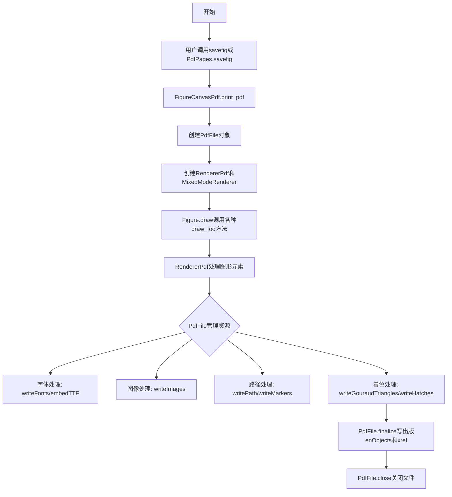

## 类结构

```
Reference (PDF引用对象)
Name (PDF名称对象)
Verbatim (PDF原始内容)
Op (PDF操作符枚举)
Stream (PDF流对象)
PdfFile (PDF文件核心类)
├── GraphicsContextPdf (图形状态管理)
├── RendererPdf (渲染器)
├── PdfPages (多页PDF包装)
└── FigureCanvasPdf (画布实现)
```

## 全局变量及字段


### `_log`
    
模块级日志记录器

类型：`logging.Logger`
    


### `_str_escapes`
    
字符串转义映射表，用于PDF字符串的特殊字符转义

类型：`dict`
    


### `Reference.id`
    
PDF对象的唯一标识符

类型：`int`
    


### `Name.name`
    
PDF名称对象的字节表示

类型：`bytes`
    


### `Verbatim._x`
    
原始PDF命令内容

类型：`bytes`
    


### `Stream.id`
    
流对象的ID

类型：`int`
    


### `Stream.len`
    
流长度的引用对象

类型：`Reference | None`
    


### `Stream.pdfFile`
    
所属的PdfFile对象

类型：`PdfFile`
    


### `Stream.file`
    
写入流的目标文件对象

类型：`IO[bytes] | BytesIO`
    


### `Stream.compressobj`
    
zlib压缩对象

类型：`zlib.compressobj | None`
    


### `Stream.extra`
    
流字典的额外键值对

类型：`dict`
    


### `Stream.pos`
    
流起始位置

类型：`int`
    


### `PdfFile._object_seq`
    
对象ID序列生成器

类型：`itertools.count`
    


### `PdfFile.xrefTable`
    
PDF交叉引用表

类型：`list`
    


### `PdfFile.rootObject`
    
PDF根对象引用

类型：`Reference`
    


### `PdfFile.pagesObject`
    
PDF页面对象引用

类型：`Reference`
    


### `PdfFile.pageList`
    
页面对象引用列表

类型：`list[Reference]`
    


### `PdfFile.fontObject`
    
字体对象引用

类型：`Reference`
    


### `PdfFile._fontNames`
    
字体文件名到内部名称的映射

类型：`dict[str, Name]`
    


### `PdfFile._dviFontInfo`
    
DVI字体信息字典

类型：`dict[Name, Any]`
    


### `PdfFile.alphaStates`
    
透明度状态映射

类型：`dict[tuple, tuple[Name, dict]]`
    


### `PdfFile._hatch_patterns`
    
阴影图案缓存

类型：`dict[tuple, Name]`
    


### `PdfFile.gouraudTriangles`
    
Gouraud三角形着色数据

类型：`list`
    


### `PdfFile._images`
    
图像缓存字典

类型：`dict[int, tuple]`
    


### `PdfFile.markers`
    
标记XObject缓存

类型：`dict`
    


### `PdfFile.paths`
    
路径集合列表

类型：`list`
    


### `PdfFile._annotations`
    
页面注释列表

类型：`list`
    


### `RendererPdf.file`
    
PDF文件对象

类型：`PdfFile`
    


### `RendererPdf.gc`
    
图形上下文实例

类型：`GraphicsContextPdf`
    


### `RendererPdf.image_dpi`
    
图像DPI设置

类型：`float`
    


### `GraphicsContextPdf._fillcolor`
    
当前填充颜色

类型：`tuple | None`
    


### `GraphicsContextPdf._effective_alphas`
    
有效透明度值（笔触和填充）

类型：`tuple[float, float]`
    


### `GraphicsContextPdf.file`
    
PDF文件对象引用

类型：`PdfFile`
    


### `GraphicsContextPdf.parent`
    
父图形上下文用于状态栈

类型：`GraphicsContextPdf | None`
    


### `PdfPages._filename`
    
输出PDF文件名

类型：`str | PathLike`
    


### `PdfPages._metadata`
    
PDF元数据字典

类型：`dict | None`
    


### `PdfPages._file`
    
PdfFile实例

类型：`PdfFile | None`
    
    

## 全局函数及方法


### `_fill`

将字符串序列合并为带换行的字节串，通过在字符串之间插入空格并智能换行以形成指定最大行长度的行。

参数：

- `strings`：`bytes`，需要合并的字符串（字节串）序列
- `linelen`：`int`，可选，默认 75，每行的最大字符数

返回值：`bytes`，合并后的带换行的字节串

#### 流程图

```mermaid
flowchart TD
    A[开始] --> B[初始化 currpos=0, lasti=0, result=[]]
    B --> C{遍历 strings 中的每个字符串 s}
    C -->|是| D[计算当前字符串长度 length = len(s)]
    D --> E{currpos + length < linelen?}
    E -->|是| F[currpos += length + 1, 继续下一个字符串]
    E -->|否| G[将 strings[lasti:i] 用空格连接加入 result]
    G --> H[更新 lasti = i]
    H --> I[currpos = length]
    I --> F
    F --> C
    C -->|遍历完成| J[将剩余 strings[lasti:] 用空格连接加入 result]
    J --> K[用换行符连接 result 中的所有部分]
    K --> L[返回最终结果]
```

#### 带注释源码

```python
def _fill(strings, linelen=75):
    """
    Make one string from sequence of strings, with whitespace in between.

    The whitespace is chosen to form lines of at most *linelen* characters,
    if possible.
    """
    # 当前行位置计数器
    currpos = 0
    # 上一段段的起始索引
    lasti = 0
    # 存储最终结果的列表
    result = []
    
    # 遍历字符串序列
    for i, s in enumerate(strings):
        length = len(s)  # 当前字符串的长度
        
        # 如果当前行加上这个字符串后不超过最大行长度
        if currpos + length < linelen:
            # 则累加位置（+1 是因为单词间需要一个空格）
            currpos += length + 1
        else:
            # 否则，将从 lasti 到 i 的字符串用空格连接并加入结果
            result.append(b' '.join(strings[lasti:i]))
            # 更新起始索引为当前索引
            lasti = i
            # 重置当前行位置为当前字符串长度
            currpos = length
    
    # 将最后一段字符串加入结果
    result.append(b' '.join(strings[lasti:]))
    
    # 用换行符连接所有部分并返回
    return b'\n'.join(result)
```


### `_create_pdf_info_dict`

该函数用于创建PDF文档的信息字典（infoDict），基于用户提供的元数据。它添加默认的Creator、Producer和CreationDate字段，并对用户提供的元数据进行验证，确保其键和类型符合PDF规范。

参数：

- `backend`：`str`，后端名称，用于生成Producer值
- `metadata`：`dict[str, Union[str, datetime, Name]]`，用户提供的元数据字典，包含符合PDF规范的文档信息

返回值：`dict[str, Union[str, datetime, Name]]`，验证后的元数据字典

#### 流程图

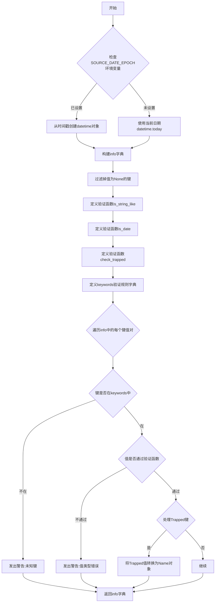

#### 带注释源码

```python
def _create_pdf_info_dict(backend, metadata):
    """
    Create a PDF infoDict based on user-supplied metadata.

    A default ``Creator``, ``Producer``, and ``CreationDate`` are added, though
    the user metadata may override it. The date may be the current time, or a
    time set by the ``SOURCE_DATE_EPOCH`` environment variable.

    Metadata is verified to have the correct keys and their expected types. Any
    unknown keys/types will raise a warning.

    Parameters
    ----------
    backend : str
        The name of the backend to use in the Producer value.

    metadata : dict[str, Union[str, datetime, Name]]
        A dictionary of metadata supplied by the user with information
        following the PDF specification, also defined in
        `~.backend_pdf.PdfPages` below.

        If any value is *None*, then the key will be removed. This can be used
        to remove any pre-defined values.

    Returns
    -------
    dict[str, Union[str, datetime, Name]]
        A validated dictionary of metadata.
    """

    # get source date from SOURCE_DATE_EPOCH, if set
    # See https://reproducible-builds.org/specs/source-date-epoch/
    source_date_epoch = os.getenv("SOURCE_DATE_EPOCH")
    if source_date_epoch:
        # 如果设置了SOURCE_DATE_EPOCH，则从该环境变量解析日期
        # 这用于可重现构建
        source_date = datetime.fromtimestamp(int(source_date_epoch), timezone.utc)
        source_date = source_date.replace(tzinfo=UTC)
    else:
        # 否则使用当前日期时间
        source_date = datetime.today()

    # 构建初始的info字典，包含默认值和用户提供的元数据
    # 使用**metadata让用户可以覆盖默认值
    info = {
        'Creator': f'Matplotlib v{mpl.__version__}, https://matplotlib.org',
        'Producer': f'Matplotlib {backend} backend v{mpl.__version__}',
        'CreationDate': source_date,
        **metadata
    }
    # 过滤掉值为None的键，允许用户删除预定义的值
    info = {k: v for (k, v) in info.items() if v is not None}

    # 定义验证函数：检查是否为字符串
    def is_string_like(x):
        return isinstance(x, str)
    is_string_like.text_for_warning = "an instance of str"

    # 定义验证函数：检查是否为datetime对象
    def is_date(x):
        return isinstance(x, datetime)
    is_date.text_for_warning = "an instance of datetime.datetime"

    # 定义验证函数：检查Trapped字段的值是否有效
    def check_trapped(x):
        if isinstance(x, Name):
            return x.name in (b'True', b'False', b'Unknown')
        else:
            return x in ('True', 'False', 'Unknown')
    check_trapped.text_for_warning = 'one of {"True", "False", "Unknown"}'

    # 定义允许的元数据键及其验证函数
    keywords = {
        'Title': is_string_like,
        'Author': is_string_like,
        'Subject': is_string_like,
        'Keywords': is_string_like,
        'Creator': is_string_like,
        'Producer': is_string_like,
        'CreationDate': is_date,
        'ModDate': is_date,
        'Trapped': check_trapped,
    }
    
    # 遍历info字典，验证每个键值对
    for k in info:
        if k not in keywords:
            # 未知键发出警告
            _api.warn_external(f'Unknown infodict keyword: {k!r}. '
                               f'Must be one of {set(keywords)!r}.')
        elif not keywords[k](info[k]):
            # 值类型不正确发出警告
            _api.warn_external(f'Bad value for infodict keyword {k}. '
                               f'Got {info[k]!r} which is not '
                               f'{keywords[k].text_for_warning}.')
    
    # 如果存在Trapped键，将其值转换为Name对象
    if 'Trapped' in info:
        info['Trapped'] = Name(info['Trapped'])

    return info
```


### `_datetime_to_pdf`

将 Python 的 `datetime` 对象转换为符合 PDF 规范的日期时间字符串。

参数：

- `d`：`datetime.datetime`，需要转换的 Python datetime 对象

返回值：`str`，PDF 格式的日期时间字符串（例如 `"D:20231015123000+08'00'"`）

#### 流程图

```mermaid
flowchart TD
    A[开始: 接收 datetime 对象 d] --> B[使用 strftime 格式化为 'D:YYYYMMDDHHMMSS']
    C[获取 UTC 偏移量 z = d.utcoffset()] --> D{z 是否为 None?}
    D -- 否 --> E[使用 z.seconds]
    D -- 是 --> F{time.daylight 是否为真?}
    F -- 是 --> G[使用 time.altzone]
    F -- 否 --> H[使用 time.timezone]
    E --> I{z == 0?}
    G --> I
    H --> I
    I -- 是 --> J[附加 'Z' 表示 UTC]
    I -- 否 --> K{z < 0?}
    K -- 是 --> L[附加 '+HH'MM' 格式的正偏移]
    K -- 否 --> M[附加 '-HH'MM' 格式的负偏移]
    J --> N[返回格式化字符串]
    L --> N
    M --> N
```

#### 带注释源码

```python
def _datetime_to_pdf(d):
    """
    Convert a datetime to a PDF string representing it.

    Used for PDF and PGF.
    """
    # 步骤1: 使用 strftime 将 datetime 格式化为 PDF 日期基本格式
    # 格式 'D:%Y%m%d%H%M%S' 生成如 "D:20231015123000" 的字符串
    r = d.strftime('D:%Y%m%d%H%M%S')
    
    # 步骤2: 获取 datetime 对象的 UTC 偏移量（时区信息）
    z = d.utcoffset()
    
    # 步骤3: 处理时区偏移
    if z is not None:
        # 如果 datetime 对象明确指定了时区，使用其秒数
        z = z.seconds
    else:
        # 如果 datetime 对象没有时区信息（naive datetime），
        # 使用系统本地时区设置
        if time.daylight:
            # 夏令时生效时使用 altzone
            z = time.altzone
        else:
            # 冬令时或不使用夏令时使用 timezone
            z = time.timezone
    
    # 步骤4: 根据时区偏移生成 PDF 时区后缀
    if z == 0:
        # UTC 时间（零偏移）用 'Z' 后缀表示
        r += 'Z'
    elif z < 0:
        # 负偏移（东八区等）格式化为 "+08'00'" 形式
        r += "+%02d'%02d'" % ((-z) // 3600, (-z) % 3600)
    else:
        # 正偏移（西时区）格式化为 "-05'30'" 形式
        r += "-%02d'%02d'" % (z // 3600, z % 3600)
    
    # 步骤5: 返回完整的 PDF 格式日期时间字符串
    return r
```


### `_calculate_quad_point_coordinates`

计算旋转矩形的四个顶点坐标，基于给定的宽度、高度和旋转角度，围绕指定的基准点进行旋转。

参数：

- `x`：`float`，矩形左下角的 x 坐标（旋转中心）
- `y`：`float`，矩形左下角的 y 坐标（旋转中心）
- `width`：`float`，矩形的宽度
- `height`：`float`，矩形的高度
- `angle`：`float`，旋转角度（度），默认为 0

返回值：`tuple`，包含四个坐标点的元组，格式为 `((x1,y1), (x2,y2), (x3,y3), (x4,y4))`，分别代表矩形的四个顶点（左下、右下、右上、左上）

#### 流程图

```mermaid
flowchart TD
    A[开始] --> B[将角度转换为弧度<br/>angle = math.radians -angle]
    B --> C[计算正弦和余弦值<br/>sin_angle = math.sin angle<br/>cos_angle = math.cos angle]
    C --> D[计算中间变量 a-f<br/>a = x + height * sin_angle<br/>b = y + height * cos_angle<br/>c = x + width * cos_angle + height * sin_angle<br/>d = y - width * sin_angle + height * cos_angle<br/>e = x + width * cos_angle<br/>f = y - width * sin_angle]
    D --> E[构建顶点坐标元组<br/>return ((x,y), (e,f), (c,d), (a,b))]
    E --> F[结束]
```

#### 带注释源码

```python
def _calculate_quad_point_coordinates(x, y, width, height, angle=0):
    """
    Calculate the coordinates of rectangle when rotated by angle around x, y
    
    通过旋转矩阵计算矩形绕指定点 (x, y) 旋转后的四个顶点坐标。
    使用二维旋转公式：
    x' = x * cos(θ) - y * sin(θ)
    y' = x * sin(θ) + y * cos(θ)
    
    Parameters
    ----------
    x : float
        矩形左下角的 x 坐标，作为旋转中心
    y : float
        矩形左下角的 y 坐标，作为旋转中心
    width : float
        矩形的宽度
    height : float
        矩形的高度
    angle : float, optional
        旋转角度（度），逆时针为正，默认值为 0
    
    Returns
    -------
    tuple
        包含四个 (x, y) 坐标点的元组
        ((x1, y1), (x2, y2), (x3, y3), (x4, y4))
        分别对应矩形旋转后的：左下、右下、右上、左上顶点
    """
    
    # 将角度转换为弧度，并取负值以实现逆时针旋转
    # PDF坐标系中 y 轴向上，负角度实现数学标准逆时针旋转
    angle = math.radians(-angle)
    
    # 计算旋转角的正弦和余弦值
    sin_angle = math.sin(angle)
    cos_angle = math.cos(angle)
    
    # 计算第一个顶点（原始左下角点）
    a = x + height * sin_angle
    b = y + height * cos_angle
    
    # 计算第二个顶点（原始右下角点）
    c = x + width * cos_angle + height * sin_angle
    d = y - width * sin_angle + height * cos_angle
    
    # 计算第三个顶点（原始右上角点）
    e = x + width * cos_angle
    f = y - width * sin_angle
    
    # 返回四个顶点坐标的元组
    # 顺序为：左下角 -> 右下角 -> 右上角 -> 左上角（逆时针）
    return ((x, y), (e, f), (c, d), (a, b))
```


### `_get_coordinates_of_block`

获取旋转矩形及其包围盒坐标。该函数根据给定的矩形参数（位置、尺寸和旋转角度）计算旋转后的矩形四个顶点坐标，同时计算出包围该旋转矩形的最小轴对齐包围盒。

参数：

- `x`：`float`，矩形原点的 X 坐标
- `y`：`float`，矩形原点的 Y 坐标
- `width`：`float`，矩形的宽度
- `height`：`float`，矩形的高度
- `angle`：`float`，旋转角度（度），默认为 0

返回值：`tuple`，返回一个元组，包含两个元素：
1. 旋转矩形的四个顶点坐标（展平为一维元组）
2. 包围盒坐标 `(min_x, min_y, max_x, max_y)`

#### 流程图

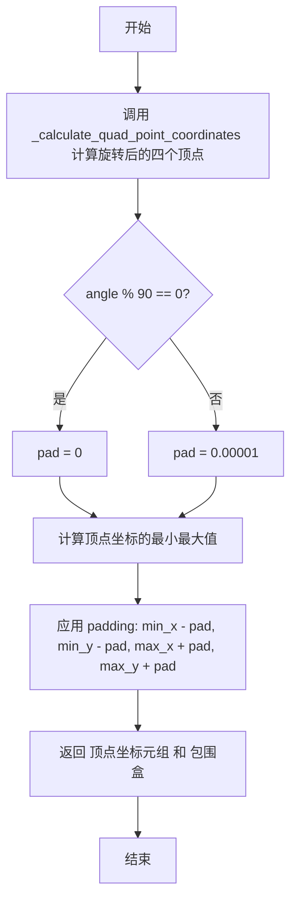

#### 带注释源码

```python
def _get_coordinates_of_block(x, y, width, height, angle=0):
    """
    Get the coordinates of rotated rectangle and rectangle that covers the
    rotated rectangle.
    """
    # 调用辅助函数计算旋转矩形的四个顶点坐标
    # 返回格式: ((x1,y1), (x2,y2), (x3,y3), (x4,y4))
    vertices = _calculate_quad_point_coordinates(x, y, width,
                                                 height, angle)

    # 查找矩形坐标的最小和最大值
    # 调整以使 QuadPoints 位于 Rect 内部
    # PDF 文档说明: 如果任意点位于 Rect 外部,QuadPoints 应被忽略
    # 但对于 Acrobat 来说,QuadPoints 位于 Rect 边界上就足够了

    # 根据角度是否垂直来确定 padding 值
    # 如果角度是90度的倍数,不需要padding(矩形未旋转)
    # 否则添加微小padding确保QuadPoints精确位于边界上
    pad = 0.00001 if angle % 90 else 0
    
    # 计算旋转后顶点的边界范围
    min_x = min(v[0] for v in vertices) - pad
    min_y = min(v[1] for v in vertices) - pad
    max_x = max(v[0] for v in vertices) + pad
    max_y = max(v[1] for v in vertices) + pad
    
    # 返回两个值:
    # 1. 展平为一维的四个顶点坐标元组 ((x1,y1,x2,y2,x3,y3,x4,y4) 格式)
    # 2. 包围盒坐标 (min_x, min_y, max_x, max_y)
    return (tuple(itertools.chain.from_iterable(vertices)),
            (min_x, min_y, max_x, max_y))
```


### `_get_link_annotation`

创建链接注释对象，用于在 PDF 文档中嵌入 URL 链接。

参数：

- `gc`：`GraphicsContextPdf`，图形上下文对象，用于获取 URL 信息（通过 `gc.get_url()`）
- `x`：`float`，链接区域的 x 坐标
- `y`：`float`，链接区域的 y 坐标
- `width`：`float`，链接区域的宽度
- `height`：`float`，链接区域的高度
- `angle`：`float`，可选参数，链接区域的旋转角度，默认为 0

返回值：`dict`，PDF 链接注释字典对象，包含类型、子类型、矩形边界、边框样式和 URI 动作；如果角度不是 90 度的倍数，还包含四边形点坐标。

#### 流程图

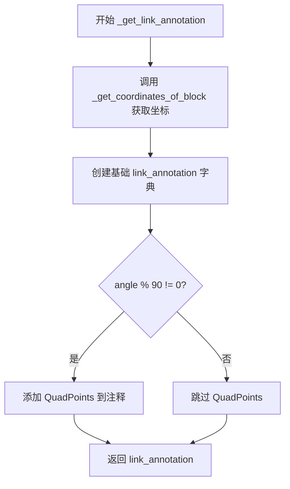

#### 带注释源码

```python
def _get_link_annotation(gc, x, y, width, height, angle=0):
    """
    Create a link annotation object for embedding URLs.
    
    Parameters
    ----------
    gc : GraphicsContextPdf
        Graphics context containing the URL information.
    x : float
        X-coordinate of the link area.
    y : float
        Y-coordinate of the link area.
    width : float
        Width of the link area.
    height : float
        Height of the link area.
    angle : float, optional
        Rotation angle of the link area in degrees. Default is 0.
    
    Returns
    -------
    dict
        A PDF link annotation dictionary containing:
        - Type: Name('Annot')
        - Subtype: Name('Link')
        - Rect: bounding rectangle coordinates
        - Border: border style [0, 0, 0]
        - A: action dictionary with URI scheme
        - QuadPoints: optional quadrilateral points if rotated
    """
    # 调用辅助函数获取旋转矩形的四边形点和边界矩形
    quadpoints, rect = _get_coordinates_of_block(x, y, width, height, angle)
    
    # 构建基础链接注释字典
    link_annotation = {
        'Type': Name('Annot'),       # PDF 注释对象类型
        'Subtype': Name('Link'),     # 链接子类型
        'Rect': rect,                 # 链接区域边界矩形
        'Border': [0, 0, 0],         # 边框样式 [水平, 垂直, 虚线]
        'A': {
            'S': Name('URI'),        # 动作为 URI 打开
            'URI': gc.get_url(),     # 从图形上下文获取 URL
        },
    }
    
    # 如果存在旋转（非 90 度倍数），添加 QuadPoints
    # QuadPoints 用于定义不规则形状的链接区域
    if angle % 90:
        # Add QuadPoints
        link_annotation['QuadPoints'] = quadpoints
    
    return link_annotation
```


### `pdfRepr`

将Python对象转换为PDF语法的字符串表示形式。

参数：

- `obj`：任意类型，需要转换为PDF表示的对象

返回值：`bytes`，返回PDF语法表示的字节串

#### 流程图

```mermaid
flowchart TD
    A[开始: pdfRepr] --> B{obj是否有pdfRepr方法?}
    B -->|是| C[调用obj.pdfRepr]
    B -->|否| D{obj是否为float/np.floating?}
    D -->|是| E{obj是否为有限数?}
    D -->|否| F{obj是否为bool?}
    E -->|否| G[抛出ValueError]
    E -->|是| H[转换为%.10f格式并去除尾随0]
    F -->|是| I[返回b'false'或b'true']
    F -->|否| J{obj是否为int/np.integer?}
    J -->|是| K[返回b'%d'格式]
    J -->|否| L{obj是否为str?}
    L -->|是| M{是否为ASCII字符串?}
    L -->|否| N{obj是否为bytes?}
    M -->|是| N
    M -->|否| O[添加BOM并编码为UTF-16BE后递归调用]
    N -->|是| P[用括号包裹并转义特殊字符]
    N -->|否| Q{obj是否为dict?}
    Q -->|是| R[构建PDF字典格式<<...>>]
    Q -->|否| S{obj是否为list/tuple?}
    S -->|是| T[构建PDF数组格式[]]
    S -->|否| U{obj是否为None?}
    U -->|是| V[返回b'null']
    U -->|否| W{obj是否为datetime?}
    W -->|是| X[转换为PDF日期格式后递归调用]
    W -->|否| Y{obj是否为BboxBase?}
    Y -->|是| Z[返回边界框的PDF表示]
    Y -->|否| AA[抛出TypeError]
    
    C --> AB[返回结果]
    H --> AB
    I --> AB
    K --> AB
    O --> AB
    P --> AB
    R --> AB
    T --> AB
    V --> AB
    X --> AB
    Z --> AB
    G --> AB
    AA --> AB
    AB[结束: 返回PDF表示的bytes]
```

#### 带注释源码

```python
def pdfRepr(obj):
    """Map Python objects to PDF syntax."""

    # 1. 如果对象有自己的pdfRepr方法，调用它
    #    这允许自定义类提供自己的PDF表示
    if hasattr(obj, 'pdfRepr'):
        return obj.pdfRepr()

    # 2. 浮点数处理
    #    PDF不支持指数表示法(如1.0e-10)，所以使用%.10f格式
    #    去除尾随的0和小数点以获得更简洁的表示
    elif isinstance(obj, (float, np.floating)):
        if not np.isfinite(obj):
            raise ValueError("Can only output finite numbers in PDF")
        r = b"%.10f" % obj
        return r.rstrip(b'0').rstrip(b'.')

    # 3. 布尔值处理
    #    必须在整数检查之前，因为isinstance(True, int)为True
    elif isinstance(obj, bool):
        return [b'false', b'true'][obj]

    # 4. 整数处理
    #    直接使用整数格式输出
    elif isinstance(obj, (int, np.integer)):
        return b"%d" % obj

    # 5. 字符串处理
    #    非ASCII字符串需要编码为UTF-16BE并添加字节顺序标记
    #    ASCII字符串直接使用ASCII编码
    elif isinstance(obj, str):
        return pdfRepr(obj.encode('ascii') if obj.isascii()
                       else codecs.BOM_UTF16_BE + obj.encode('UTF-16BE'))

    # 6. 字节串处理
    #    用括号包裹，并转义反斜杠、换行符、回车符和圆括号
    #    PDF中不平衡的圆括号必须转义
    elif isinstance(obj, bytes):
        return (
            b'(' +
            obj.decode('latin-1').translate(_str_escapes).encode('latin-1')
            + b')')

    # 7. 字典处理
    #    键必须是PDF名称对象(Name)，值可以是任意可表示的对象
    #    使用<< >>包裹，键值对之间用空格分隔
    elif isinstance(obj, dict):
        return _fill([
            b"<<",
            *[Name(k).pdfRepr() + b" " + pdfRepr(v) for k, v in obj.items()],
            b">>",
        ])

    # 8. 列表和元组处理
    #    使用PDF数组格式[ ]
    elif isinstance(obj, (list, tuple)):
        return _fill([b"[", *[pdfRepr(val) for val in obj], b"]"])

    # 9. None值处理
    #    PDF中的null关键字
    elif obj is None:
        return b'null'

    # 10. datetime对象处理
    #     转换为PDF日期字符串格式
    elif isinstance(obj, datetime):
        return pdfRepr(_datetime_to_pdf(obj))

    # 11. 边界框处理
    #     提取边界框的坐标值(bounds属性)
    elif isinstance(obj, BboxBase):
        return _fill([pdfRepr(val) for val in obj.bounds])

    # 12. 不支持的类型
    #     抛出类型错误异常
    else:
        raise TypeError(f"Don't know a PDF representation for {type(obj)} "
                        "objects")
```


### `_font_supports_glyph`

检查字体是否支持指定的字形（码点）。该函数根据字体类型（Type 3或Type 42）判断给定的字形是否可以在PDF中正确渲染。

参数：

- `fonttype`：`int`，字体类型，3表示Type 3字体，42表示Type 42（TrueType）字体
- `glyph`：`int`，要检查的Unicode码点（字形）

返回值：`bool`，如果字体支持该字形返回True，否则返回False

#### 流程图

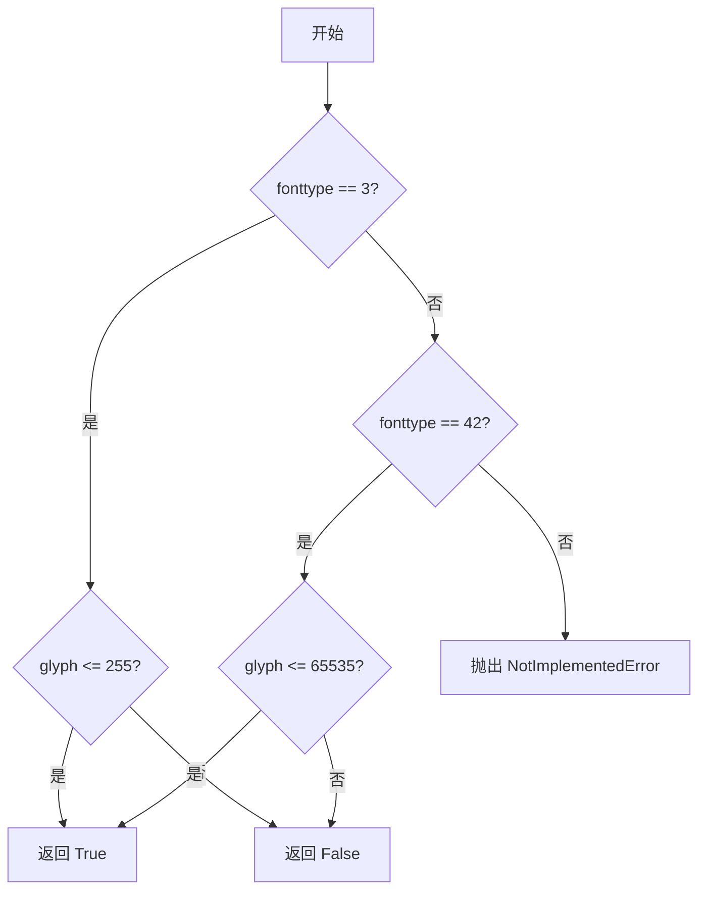

#### 带注释源码

```python
def _font_supports_glyph(fonttype, glyph):
    """
    Returns True if the font is able to provide codepoint *glyph* in a PDF.

    For a Type 3 font, this method returns True only for single-byte
    characters. For Type 42 fonts this method return True if the character is
    from the Basic Multilingual Plane.
    """
    # Type 3字体只支持单字节字符（ASCII 0-255）
    if fonttype == 3:
        return glyph <= 255
    # Type 42字体支持Unicode基本多语言平面（BMP）内的字符
    if fonttype == 42:
        return glyph <= 65535
    # 其他字体类型暂不支持
    raise NotImplementedError()
```


### `_get_pdf_charprocs`

获取PDF字符程序（Character Procedures），用于将TrueType字体的字形转换为PDF可用的字符程序（charprocs）格式。该函数读取指定字体文件和字形ID列表，提取每个字形的路径信息、边界框和字形名称，并将其转换为PDF文档中可以嵌入的字符程序字典。

参数：

- `font_path`：str 或 path-like，字体文件路径
- `glyph_ids`：list[int]，要处理的字形ID列表

返回值：dict[str, bytes]，返回字典，键为字形名称（glyph name），值为PDF字符程序字节数据

#### 流程图

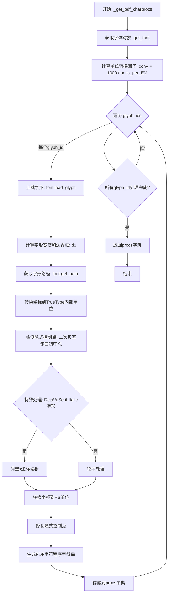

#### 带注释源码

```python
def _get_pdf_charprocs(font_path, glyph_ids):
    """
    获取PDF字符程序，将TrueType字形转换为PDF嵌入格式。
    
    Parameters
    ----------
    font_path : str or path-like
        字体文件路径
    glyph_ids : list of int
        要处理的字形ID列表
        
    Returns
    -------
    dict
        键为字形名称，值为PDF字符程序字节数据
    """
    # 获取字体对象，hinting_factor=1启用微调
    font = get_font(font_path, hinting_factor=1)
    
    # 计算从字体单位到PostScript单位（1/1000）的转换因子
    # PS单位是PDF中使用的标准单位
    conv = 1000 / font.units_per_EM  # Conversion to PS units (1/1000's).
    
    # 存储结果的字典
    procs = {}
    
    # 遍历每个字形ID
    for glyph_id in glyph_ids:
        # 使用NO_SCALE标志加载字形，获取原始坐标
        g = font.load_glyph(glyph_id, LoadFlags.NO_SCALE)
        
        # NOTE: We should be using round(), but instead use
        # "(x+.5).astype(int)" to keep backcompat with the old ttconv code
        # (this is different for negative x's).
        # 构建字形描述数组：[水平advance, 0, bbox左, bbox下, bbox右, bbox上]
        d1 = (np.array([g.horiAdvance, 0, *g.bbox]) * conv + .5).astype(int)
        
        # 获取字形的路径数据（顶点和控制点代码）
        v, c = font.get_path()
        
        # Back to TrueType's internal units (1/64's).
        # 转换回TrueType内部单位（1/64）
        v = (v * 64).astype(int)
        
        # Backcompat with old ttconv code: control points between two quads are
        # omitted if they are exactly at the midpoint between the control of
        # the quad before and the quad after, but ttconv used to interpolate
        # *after* conversion to PS units, causing floating point errors.  Here
        # we reproduce ttconv's logic, detecting these "implicit" points and
        # re-interpolating them.  Note that occasionally (e.g. with DejaVu Sans
        # glyph "0") a point detected as "implicit" is actually explicit, and
        # will thus be shifted by 1.
        # 兼容性处理：检测二次贝塞尔曲线之间被省略的隐式控制点
        # 找到所有二次贝塞尔曲线的控制点（代码为3）
        quads, = np.nonzero(c == 3)
        # 取每对控制点的第二个（曲线上的点）
        quads_on = quads[1::2]
        # 找到同时位于两条曲线中点的点（隐式点）
        quads_mid_on = np.array(
            sorted({*quads_on} & {*(quads - 1)} & {*(quads + 1)}), int)
        
        # 验证这些点是否真的是隐式的（即位于前后点的中点）
        implicit = quads_mid_on[
            (v[quads_mid_on]  # As above, use astype(int), not // division
             == ((v[quads_mid_on - 1] + v[quads_mid_on + 1]) / 2).astype(int))
            .all(axis=1)]
            
        # 特殊处理：DejaVuSerif-Italic字体的特定字形需要偏移
        if (font.postscript_name, glyph_id) in [
                ("DejaVuSerif-Italic", 77),  # j
                ("DejaVuSerif-Italic", 135),  # \AA
        ]:
            v[:, 0] -= 1  # Hard-coded backcompat (FreeType shifts glyph by 1).
            
        # 转换到PostScript单位
        v = (v * conv + .5).astype(int)  # As above re: truncation vs rounding.
        
        # 修复隐式控制点：重新计算中点位置
        v[implicit] = ((  # Fix implicit points; again, truncate.
            (v[implicit - 1] + v[implicit + 1]) / 2).astype(int))
            
        # 生成PDF字符程序字符串
        # 格式: "width 0 bbox_l bbox_b bbox_r bbox_t d1\n<path>f"
        procs[font.get_glyph_name(glyph_id)] = (
            " ".join(map(str, d1)).encode("ascii") + b" d1\n"
            + _path.convert_to_string(
                Path(v, c), None, None, False, None, -1,
                # no code for quad Beziers triggers auto-conversion to cubics.
                [b"m", b"l", b"", b"c", b"h"], True)
            + b"f")
            
    return procs
```


### Reference.__init__

初始化 PDF 引用对象，用于在 PDF 文件中创建对对象的引用。

参数：

- `id`：`int`，对象的唯一标识符，用于在 PDF 文件中引用该对象

返回值：`None`，`__init__` 方法不返回任何值

#### 流程图

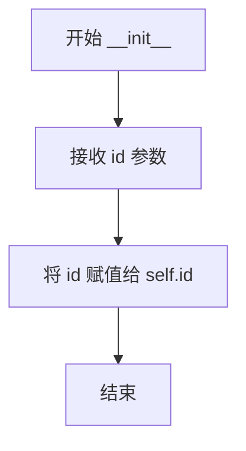

#### 带注释源码

```python
def __init__(self, id):
    """
    初始化 Reference 对象。

    Parameters
    ----------
    id : int
        PDF 对象的唯一标识符。
    """
    self.id = id  # 存储对象的 ID，后续用于生成 PDF 引用格式（如 "id 0 R"）
```


### `Reference.__repr__`

该方法是 `Reference` 类的字符串表示方法，用于生成该 PDF 引用对象的可读字符串描述，格式为 `<Reference %d>`，其中 `%d` 是对象的唯一标识符。

参数：
- （无额外参数，隐式参数 `self` 为 `Reference` 类型，表示该方法所属的实例对象）

返回值：`str`，返回该 Reference 对象的字符串表示，格式为 `<Reference %d>`，其中 `%d` 是对象的 `id` 属性，用于调试和日志输出。

#### 流程图

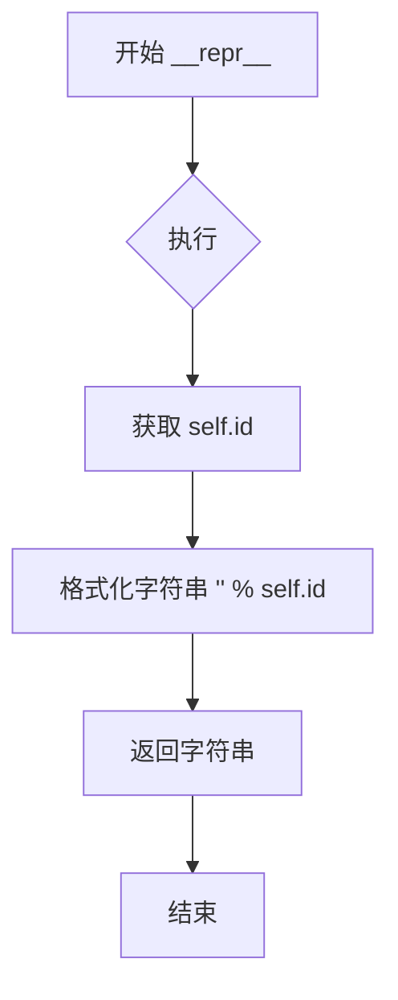

#### 带注释源码

```python
def __repr__(self):
    """
    返回该 Reference 对象的字符串表示形式。
    
    Returns
    -------
    str
        格式为 '<Reference %d>' 的字符串，其中 %d 是对象的唯一标识符。
    """
    return "<Reference %d>" % self.id
```


### Reference.pdfRepr

该方法是 `Reference` 类的实例方法，用于将 PDF 引用对象转换为 PDF 语法表示形式。PDF 引用对象由对象编号和生成号组成，通常格式为 "对象编号 0 R"，用于在 PDF 文档中引用其他对象。

参数：

- 无（仅包含隐式参数 `self`）

返回值：`bytes`，返回该引用对象的 PDF 语法表示，格式为 `b"%d 0 R" % self.id`

#### 流程图

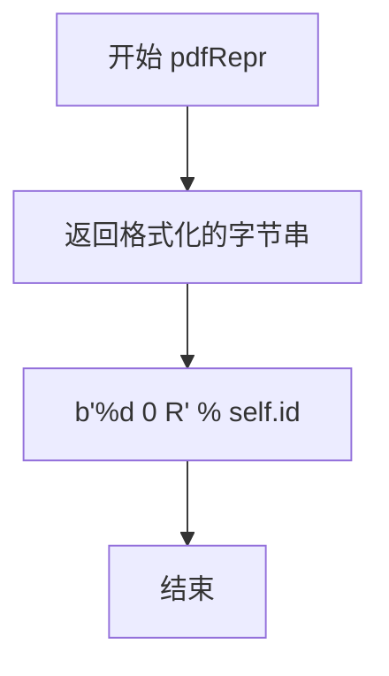

#### 带注释源码

```python
class Reference:
    """
    PDF reference object.

    Use PdfFile.reserveObject() to create References.
    """

    def __init__(self, id):
        self.id = id  # 整数类型，PDF 对象的唯一标识符

    def __repr__(self):
        return "<Reference %d>" % self.id

    def pdfRepr(self):
        """
        将引用对象转换为 PDF 语法表示。

        PDF 中的引用格式为 "对象编号 0 R"，其中：
        - 对象编号：PDF 对象的唯一标识符
        - 0：生成号（通常为 0）
        - R：引用关键字

        Returns:
            bytes: PDF 引用表示，如 b"5 0 R"
        """
        return b"%d 0 R" % self.id

    def write(self, contents, file):
        """
        将引用对象写入 PDF 文件。

        Parameters:
            contents: 要写入的对象内容
            file: PDF 文件对象（PdfFile 实例）
        """
        write = file.write
        write(b"%d 0 obj\n" % self.id)  # 写入对象头
        write(pdfRepr(contents))          # 写入对象内容
        write(b"\nendobj\n")             # 写入对象尾
```


### Reference.write

将PDF引用对象（Reference）写入PDF文件的指定位置，将对象内容以PDF语法格式输出到文件流中。

参数：

- `contents`：`任意可被pdfRepr处理的对象`，要写入PDF文件的内容对象，可以是字典、列表、字符串等任意支持pdfRepr序列化的Python对象
- `file`：文件对象（类似文件对象），用于写入的目标文件对象，通常是`PdfFile`实例本身或其`fh`属性（文件句柄）

返回值：无（`None`），该方法没有返回值，通过副作用直接将数据写入文件

#### 流程图

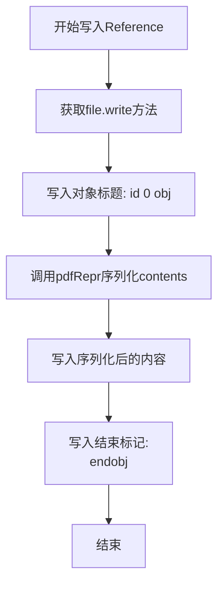

#### 带注释源码

```python
def write(self, contents, file):
    """
    将Reference对象写入PDF文件。

    Parameters
    ----------
    contents : 任意可序列化对象
        要写入PDF文件的内容，将通过pdfRepr转换为PDF语法。
    file : 文件对象
        目标文件对象，用于写入数据。

    Returns
    -------
    None
        没有返回值，通过副作用写入文件。
    """
    # 获取文件对象的write方法以提高调用效率（避免多次属性查找）
    write = file.write
    
    # 写入PDF对象头，格式为: "对象ID 0 obj\n"
    # PDF规范中，间接对象以"对象编号 0 R"引用，这里是对象定义的开头
    write(b"%d 0 obj\n" % self.id)
    
    # 将contents转换为PDF语法表示并写入
    # pdfRepr是本模块定义的函数，将Python对象转换为PDF语法
    write(pdfRepr(contents))
    
    # 写入对象结束标记
    write(b"\nendobj\n")
```


### `Name.__init__`

初始化 PDF 名称对象，处理不同类型的输入（Name 对象、字节串、字符串），并将特殊字符转换为十六进制表示。

参数：

- `name`：`Name | bytes | str`，要创建为 PDF 名称对象的值，可以是已存在的 Name 对象、字节串或字符串

返回值：`None`，无返回值（构造函数）

#### 流程图

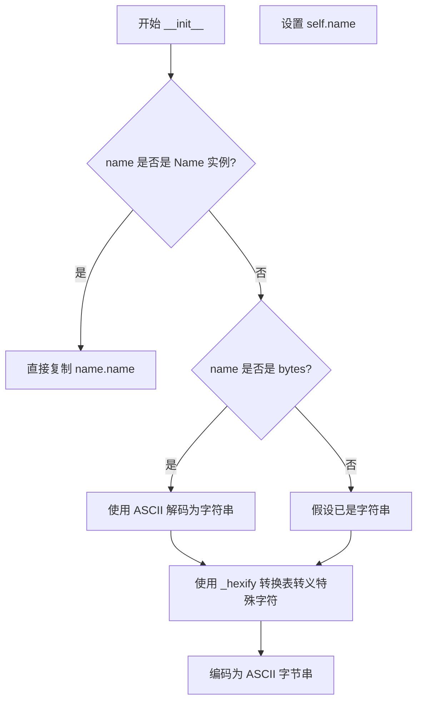

#### 带注释源码

```python
def __init__(self, name):
    """
    初始化 PDF 名称对象。

    Parameters
    ----------
    name : Name, bytes, or str
        要创建为 PDF 名称对象的值。
    """
    # 如果已经是 Name 对象，直接复制其 name 属性
    if isinstance(name, Name):
        self.name = name.name
    else:
        # 如果是字节串，使用 ASCII 解码为字符串
        if isinstance(name, bytes):
            name = name.decode('ascii')
        # 使用 _hexify 转换表将特殊字符转换为十六进制表示
        # _hexify 包含所有非可打印 ASCII 字符的十六进制转义
        # 例如: 空格(0x20) -> '#20', DEL(0x7F) -> '#7F'
        self.name = name.translate(self._hexify).encode('ascii')
```


### Name.__repr__

返回 PDF 名称对象的字符串表示形式，用于调试和日志输出。

参数：
- 无（仅包含隐式参数 `self`）

返回值：`str`，返回格式为 `<Name {name}>` 的字符串表示，其中 `{name}` 是名称对象的字节形式解码后的 ASCII 字符串。

#### 流程图

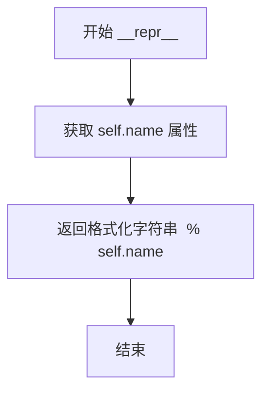

#### 带注释源码

```python
def __repr__(self):
    """
    返回 PDF 名称对象的字符串表示形式。
    
    该方法用于提供对象的可读字符串描述，主要用于调试输出和日志记录。
    返回的格式为 <Name {name}>，其中 {name} 是对象内部存储的名称字节数据。
    """
    return "<Name %s>" % self.name
```


### Name.__str__

将 PDF 名称对象转换为带斜杠前缀的字符串表示形式。

参数：

- `self`：`Name`，PDF 名称对象实例本身

返回值：`str`，PDF 名称对象的字符串表示，以 `/` 开头

#### 流程图

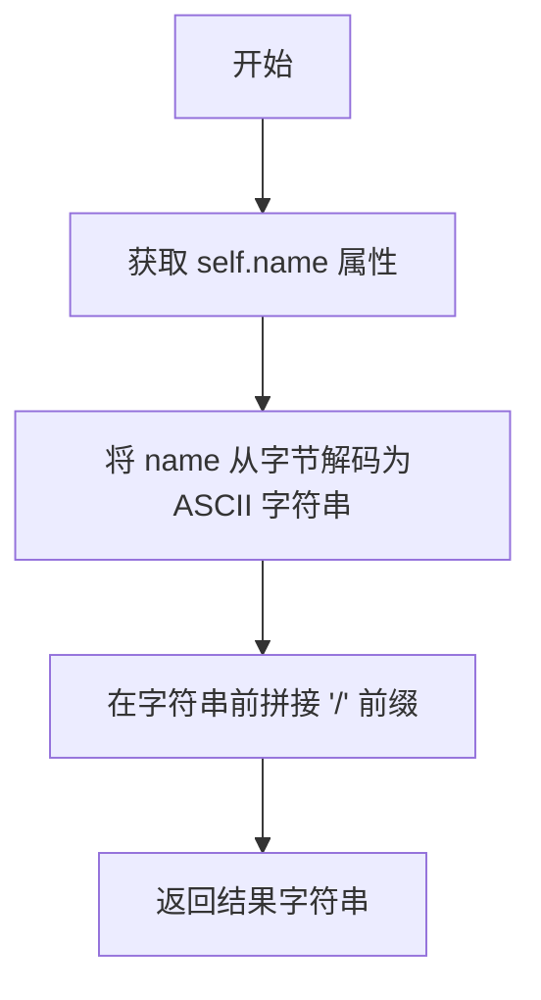

#### 带注释源码

```python
def __str__(self):
    """
    将 PDF 名称对象转换为字符串表示。

    返回 PDF 名称对象的字符串表示，格式为 '/name'。
    这是 PDF 规范中名称对象的字符串表现形式。

    Returns
    -------
    str
        PDF 名称对象的字符串表示，以 '/' 开头。
        例如，如果名称为 'Type'，则返回 '/Type'。
    """
    return '/' + self.name.decode('ascii')
```


### `Name.__eq__`

该方法用于比较两个`Name`对象是否相等，是Python魔术方法`__eq__`的实现，使得`Name`对象可以使用`==`运算符进行比较。

参数：

- `other`：`object`，与`Name`对象进行比较的其他对象

返回值：`bool`，如果两个对象都是`Name`实例且`name`属性相等则返回`True`，否则返回`False`

#### 流程图

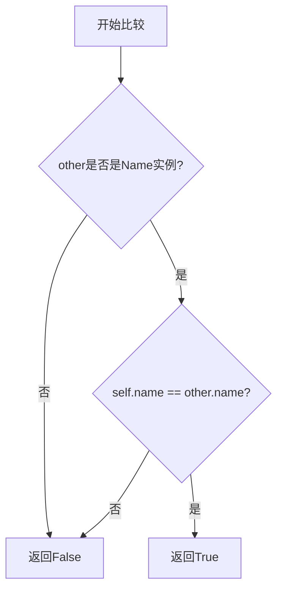

#### 带注释源码

```python
def __eq__(self, other):
    """
    比较两个Name对象是否相等。
    
    参数:
        other: 与当前Name对象进行比较的对象
        
    返回:
        bool: 如果other是Name类型且name属性相等返回True, 否则返回False
    """
    return isinstance(other, Name) and self.name == other.name
```


### Name.__lt__

实现 PDF 名称对象的Less Than（小于）比较操作，用于在排序操作中比较两个Name对象。

参数：

- `other`：`Name`，需要比较的另一个Name对象

返回值：`bool`，如果当前Name对象的名称小于other对象的名称返回True，否则返回False

#### 流程图

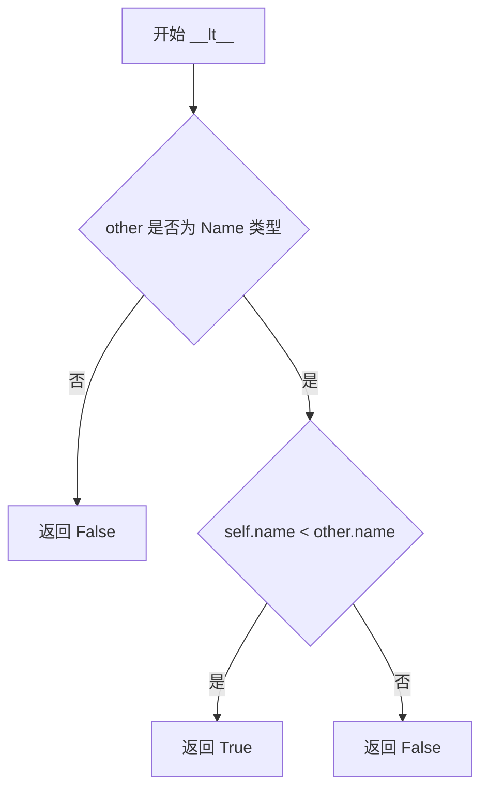

#### 带注释源码

```python
def __lt__(self, other):
    """
    Less-than comparison for PDF Name objects.
    
    This method is used by the @total_ordering decorator to provide
    all comparison operations (__le__, __gt__, __ge__) based on
    __eq__ and __lt__.
    
    Parameters
    ----------
    other : Name
        Another Name object to compare against.
    
    Returns
    -------
    bool
        True if self.name is less than other.name, False otherwise.
        Returns False if other is not a Name instance.
    """
    # First check if other is a Name instance
    # This ensures we don't try to compare with incompatible types
    return isinstance(other, Name) and self.name < other.name
```


### `Name.__hash__`

返回 PDF 名称对象的哈希值，使其可用于字典键和集合。

参数：

- `self`：`Name`，隐式参数，表示当前 Name 对象实例

返回值：`int`，返回 `self.name` 字节串的哈希值

#### 流程图

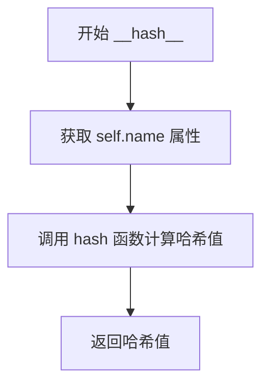

#### 带注释源码

```python
def __hash__(self):
    """
    返回 PDF 名称对象的哈希值。
    
    该方法使 Name 对象可以用作字典键和集合成员。
    哈希值基于内部的 name 字节串属性计算。
    """
    return hash(self.name)
```

#### 详细说明

该方法实现了 Python 的哈希协议，使 `Name` 类可以用于需要哈希值的场景（如字典键或集合成员）。由于 `Name` 类使用了 `@total_ordering` 装饰器，它会自动基于 `__eq__` 和 `__lt__` 方法生成其他比较方法。哈希值的计算直接委托给 `self.name`（一个 `bytes` 对象），这是合理的，因为两个相等的 `Name` 对象必然具有相同的 `name` 属性值。


### `pdfRepr`

将 Python 对象转换为 PDF 语法的表示形式，支持多种数据类型如数字、字符串、字典、列表等。

参数：

- `obj`：任意 Python 对象，要转换为 PDF 表示的对象

返回值：`bytes`，返回对象的 PDF 语法表示

#### 流程图

```mermaid
flowchart TD
    A[开始 pdfRepr] --> B{obj 是否有 pdfRepr 方法?}
    B -- 是 --> C[调用 obj.pdfRepr]
    B -- 否 --> D{obj 是 float/np.floating?}
    D -- 是 --> E{obj 是有限数?}
    E -- 否 --> F[抛出 ValueError]
    E -- 是 --> G[转换为固定精度浮点数]
    D -- 否 --> H{obj 是 bool?}
    H -- 是 --> I[返回 true/false]
    H -- 否 --> J{obj 是 int/np.integer?}
    J -- 是 --> K[返回整数]
    J -- 否 --> L{obj 是 str?}
    L -- 是 --> M{字符串是 ASCII?}
    M -- 是 --> N[ASCII 编码]
    M -- 否 --> O[UTF-16BE 编码 + BOM]
    L -- 否 --> P{obj 是 bytes?}
    P -- 是 --> Q[转义括号和反斜杠]
    P -- 否 --> R{obj 是 dict?}
    R -- 是 --> S[转换为 PDF 字典]
    R -- 否 --> T{obj 是 list/tuple?}
    T -- 是 --> U[转换为 PDF 列表]
    T -- 否 --> V{obj 是 None?}
    V -- 是 --> W[返回 null]
    V -- 否 --> X{obj 是 datetime?}
    X -- 是 --> Y[转换为 PDF 日期]
    X -- 否 --> Z{obj 是 BboxBase?}
    Z -- 是 --> AA[转换为边界数组]
    Z -- 否 --> AB[抛出 TypeError]
```

#### 带注释源码

```python
def pdfRepr(obj):
    """Map Python objects to PDF syntax."""

    # Some objects defined later have their own pdfRepr method.
    # 如果对象本身定义了 pdfRepr 方法（如 Reference、Name、Op 等类），
    # 则调用对象自身的 pdfRepr 方法进行转换
    if hasattr(obj, 'pdfRepr'):
        return obj.pdfRepr()

    # Floats. PDF does not have exponential notation (1.0e-10) so we
    # need to use %f with some precision.  Perhaps the precision
    # should adapt to the magnitude of the number?
    # 处理浮点数：PDF 不支持指数表示法 (1.0e-10)，
    # 需要使用 %f 并有一定精度。检查是否为有限数，无限数抛出异常
    elif isinstance(obj, (float, np.floating)):
        if not np.isfinite(obj):
            raise ValueError("Can only output finite numbers in PDF")
        r = b"%.10f" % obj
        return r.rstrip(b'0').rstrip(b'.')

    # Booleans. Needs to be tested before integers since
    # isinstance(True, int) is true.
    # 处理布尔值：需要在整数之前测试，因为 isinstance(True, int) 为 True
    elif isinstance(obj, bool):
        return [b'false', b'true'][obj]

    # Integers are written as such.
    # 处理整数：直接格式化为整数
    elif isinstance(obj, (int, np.integer)):
        return b"%d" % obj

    # Non-ASCII Unicode strings are encoded in UTF-16BE with byte-order mark.
    # 处理字符串：非 ASCII 字符串用 UTF-16BE 编码 + BOM 标记
    elif isinstance(obj, str):
        return pdfRepr(obj.encode('ascii') if obj.isascii()
                       else codecs.BOM_UTF16_BE + obj.encode('UTF-16BE'))

    # Strings are written in parentheses, with backslashes and parens
    # escaped. Actually balanced parens are allowed, but it is
    # simpler to escape them all. TODO: cut long strings into lines;
    # I believe there is some maximum line length in PDF.
    # Despite the extra decode/encode, translate is faster than regex.
    # 处理字节字符串：用括号包围，反斜杠和圆括号需要转义
    elif isinstance(obj, bytes):
        return (
            b'(' +
            obj.decode('latin-1').translate(_str_escapes).encode('latin-1')
            + b')')

    # Dictionaries. The keys must be PDF names, so if we find strings
    # there, we make Name objects from them. The values may be
    # anything, so the caller must ensure that PDF names are
    # represented as Name objects.
    # 处理字典：键必须是 PDF Name 对象，值可以是任意类型
    elif isinstance(obj, dict):
        return _fill([
            b"<<",
            *[Name(k).pdfRepr() + b" " + pdfRepr(v) for k, v in obj.items()],
            b">>",
        ])

    # Lists.
    # 处理列表和元组：转换为 PDF 数组
    elif isinstance(obj, (list, tuple)):
        return _fill([b"[", *[pdfRepr(val) for val in obj], b"]"])

    # The null keyword.
    # 处理 None：返回 PDF 的 null 关键字
    elif obj is None:
        return b'null'

    # A date.
    # 处理 datetime 对象：先转换为 PDF 日期格式字符串，再递归转换
    elif isinstance(obj, datetime):
        return pdfRepr(_datetime_to_pdf(obj))

    # A bounding box
    # 处理 BboxBase 对象：获取边界值并转换为数组
    elif isinstance(obj, BboxBase):
        return _fill([pdfRepr(val) for val in obj.bounds])

    else:
        raise TypeError(f"Don't know a PDF representation for {type(obj)} "
                        "objects")
```


### `Verbatim.pdfRepr`

将存储的原始 PDF 命令内容转换为 PDF 表示形式。

参数：

- （无额外参数，方法本身无参数）

返回值：`bytes`，返回存储的原始 PDF 命令内容，用于后续写入 PDF 文件。

#### 流程图

```mermaid
flowchart TD
    A[开始 pdfRepr] --> B{检查是否有自定义 pdfRepr 方法}
    B -->|无| C{检查是否为浮点数}
    C -->|否| D{检查是否为布尔值}
    D -->|否| E{检查是否为整数}
    E -->|否| F{检查是否为字符串}
    F -->|否| G{检查是否为字节}
    G -->|否| H{检查是否为字典}
    H -->|否| I{检查是否为列表/元组}
    I -->|否| J{检查是否为 None}
    J -->|否| K{检查是否为 datetime}
    K -->|否| L{检查是否为 BboxBase}
    L -->|否| M[抛出 TypeError]
    
    B -->|有| N[调用对象的 pdfRepr 方法]
    C -->|是| O[转换为有限精度浮点数字节]
    D -->|是| P[返回 'false' 或 'true' 字节]
    E -->|是| Q[返回整数字节表示]
    F -->|是| R[处理 ASCII 或 UTF-16BE 编码]
    G -->|是| S[用括号包裹并转义特殊字符]
    H -->|是| T[构建 PDF 字典语法]
    I -->|是| U[构建 PDF 列表语法]
    J -->|是| V[返回 'null' 字节]
    K -->|是| W[转换为 PDF 日期字符串]
    L -->|是| X[返回边界框值列表]
    
    O --> Y[结束]
    P --> Y
    Q --> Y
    R --> Y
    S --> Y
    T --> Y
    U --> Y
    V --> Y
    W --> Y
    X --> Y
    M --> Y
    N --> Y
```

#### 带注释源码

```python
class Verbatim:
    """Store verbatim PDF command content for later inclusion in the stream."""
    def __init__(self, x):
        # 初始化 Verbatim 对象，存储原始 PDF 命令内容
        # 参数 x: bytes 类型，要存储的原始 PDF 命令内容
        self._x = x

    def pdfRepr(self):
        """
        将存储的原始 PDF 命令内容转换为 PDF 表示形式。
        
        此方法直接返回存储的字节内容，不进行任何转换，
        因为这些内容已经是正确的 PDF 语法格式。
        
        返回值：
            bytes: 存储的原始 PDF 命令内容，用于后续写入 PDF 文件
        """
        return self._x
```


### Op.pdfRepr

该方法是 `Op` 类的实例方法，用于将 PDF 操作符枚举值转换为对应的 PDF 语法表示（字节字符串）。

参数：

- 无参数（该方法是实例方法，隐含接收 `self` 参数）

返回值：`bytes`，返回 PDF 操作符的字节字符串表示。

#### 流程图

```mermaid
flowchart TD
    A[开始] --> B{self 是 Op 枚举的实例}
    B -->|是| C[返回 self.value]
    C --> D[PDF 操作符字节码]
    D --> E[结束]
    
    style B fill:#f9f,stroke:#333
    style C fill:#9f9,stroke:#333
    style D fill:#ff9,stroke:#333
```

#### 带注释源码

```python
def pdfRepr(self):
    """
    将 Op 枚举值转换为 PDF 语法表示。
    
    PDF 操作符在 PDF 文件中以单字节或多字节形式表示，
    例如 'BT' 表示 begin_text，'q' 表示 gsave。
    此方法通过返回枚举的 value 属性来获取对应的字节表示。
    
    Returns
    -------
    bytes
        PDF 操作符的字节字符串表示，例如 b'BT', b'q', b'rg' 等。
    """
    return self.value
```

#### 补充说明

`Op` 类是 PDF 操作符的枚举定义，包含了 PDF 页面描述语言中的各种操作命令。这些操作符用于控制 PDF 的图形状态、文本渲染、路径绘制等。`pdfRepr` 方法是 PDF 对象表示协议的一部分，在 `pdfRepr` 函数（注意：顶层有一个同名的 `pdfRepr` 函数用于将 Python 对象转换为 PDF 语法）中，当遇到 `Op` 类型的对象时，会调用其 `pdfRepr` 方法来获取其 PDF 表示。

例如：
- `Op.fill_stroke.pdfRepr()` 返回 `b'B'`（填充并描边）
- `Op.setrgb_nonstroke.pdfRepr()` 返回 `b'rg'`（设置非描边颜色空间为 RGB）
- `Op.begin_text.pdfRepr()` 返回 `b'BT'`（开始文本对象）


### Op.paint_path

返回用于绘制路径的 PDF 操作符，根据填充和描边状态返回对应的 PDF 运算符。

参数：

- `fill`：`bool`，是否使用填充颜色填充路径
- `stroke`：`bool`，是否使用线条颜色描边路径的轮廓

返回值：`Op`，返回对应的 PDF 操作符（`Op.fill_stroke`、`Op.stroke`、`Op.fill` 或 `Op.endpath`）

#### 流程图

```mermaid
flowchart TD
    A[开始 paint_path] --> B{stroke 为真?}
    B -->|是| C{fill 为真?}
    B -->|否| D{fill 为真?}
    C -->|是| E[返回 fill_stroke]
    C -->|否| F[返回 stroke]
    D -->|是| G[返回 fill]
    D -->|否| H[返回 endpath]
    E --> I[结束]
    F --> I
    G --> I
    H --> I
```

#### 带注释源码

```python
@classmethod
def paint_path(cls, fill, stroke):
    """
    Return the PDF operator to paint a path.

    Parameters
    ----------
    fill : bool
        Fill the path with the fill color.
    stroke : bool
        Stroke the outline of the path with the line color.
    """
    # 根据 stroke 和 fill 的不同组合返回不同的 PDF 操作符
    if stroke:
        # 需要描边的情况下
        if fill:
            # 同时需要填充和描边，返回 fill_stroke 操作符
            return cls.fill_stroke
        else:
            # 仅需要描边，返回 stroke 操作符
            return cls.stroke
    else:
        # 不需要描边的情况下
        if fill:
            # 仅需要填充，返回 fill 操作符
            return cls.fill
        else:
            # 既不填充也不描边，返回 endpath 操作符
            return cls.endpath
```


### Stream.__init__

Stream 类的初始化方法，用于创建 PDF 流对象，管理流的头部信息、压缩和文件写入。

参数：

- `id`：`int`，流对象的 ID
- `len`：`Reference` 或 `None`，流长度的引用对象；为 None 时使用内存缓冲区
- `file`：`PdfFile`，底层写入流的目标对象
- `extra`：`dict` 或 `None`，包含在流头部中的额外键值对
- `png`：`dict` 或 `None`，PNG 编码数据的解码参数

返回值：`None`，构造函数无返回值

#### 流程图

```mermaid
flowchart TD
    A[开始 __init__] --> B[设置 self.id 和 self.len]
    B --> C[设置 self.pdfFile 和 self.file]
    C --> D{extra 是否为 None?}
    D -->|是| E[创建空字典]
    D -->|否| F[复制 extra 字典]
    E --> G{png 是否不为 None?}
    F --> G
    G -->|是| H[添加 Filter 和 DecodeParms]
    G -->|否| I[调用 recordXref 记录交叉引用]
    H --> I
    I --> J{启用压缩且无 PNG?}
    J -->|是| K[创建 zlib 压缩对象]
    J -->|否| L{len 是否为 None?}
    K --> L
    L -->|是| M[使用 BytesIO 内存缓冲区]
    L -->|否| N[写入流头部并记录位置]
    M --> O[结束 __init__]
    N --> O
```

#### 带注释源码

```python
def __init__(self, id, len, file, extra=None, png=None):
    """
    Parameters
    ----------
    id : int
        Object id of the stream.
    len : Reference or None
        An unused Reference object for the length of the stream;
        None means to use a memory buffer so the length can be inlined.
    file : PdfFile
        The underlying object to write the stream to.
    extra : dict from Name to anything, or None
        Extra key-value pairs to include in the stream header.
    png : dict or None
        If the data is already png encoded, the decode parameters.
    """
    self.id = id            # 对象 ID
    self.len = len          # 长度对象的引用
    self.pdfFile = file     # 保存 PdfFile 引用
    self.file = file.fh     # 实际写入的文件对象
    self.compressobj = None  # 压缩对象初始化为 None
    
    # 处理额外的字典参数
    if extra is None:
        self.extra = dict()   # 空字典
    else:
        self.extra = extra.copy()  # 复制传入的字典
    
    # 如果有 PNG 数据，添加 FlateDecode 过滤器
    if png is not None:
        self.extra.update({'Filter':      Name('FlateDecode'),
                           'DecodeParms': png})

    # 记录交叉引用表
    self.pdfFile.recordXref(self.id)
    
    # 如果启用压缩且没有 PNG 数据，则创建压缩对象
    if mpl.rcParams['pdf.compression'] and not png:
        self.compressobj = zlib.compressobj(
            mpl.rcParams['pdf.compression'])
    
    # 如果没有长度引用，使用内存缓冲区
    if self.len is None:
        self.file = BytesIO()
    else:
        # 否则写入流头部并记录位置
        self._writeHeader()
        self.pos = self.file.tell()
```


### Stream._writeHeader

该方法用于将PDF流对象的头部信息写入文件，包括对象ID、长度和压缩过滤器等。

参数： 该方法为实例方法，不包含显式参数，但使用以下实例属性：
- `self.id`：`int`，流对象的ID
- `self.len`：`Reference` 或 `None`，流长度的引用对象
- `self.file`：文件对象，流的输出目标
- `self.extra`：字典，流的其他额外参数

返回值：`无`（`None`），该方法不返回任何值，仅执行文件写入操作

#### 流程图

```mermaid
flowchart TD
    A[开始 _writeHeader] --> B[获取文件写入方法]
    B --> C[写入对象标识: id 0 obj]
    C --> D[设置字典: dict = self.extra]
    D --> E[添加长度键: dict['Length'] = self.len]
    E --> F{检查是否启用压缩?}
    F -->|是| G[添加过滤器: dict['Filter'] = Name('FlateDecode')]
    F -->|否| H[跳过添加过滤器]
    G --> I[写入字典表示: pdfRepr(dict)]
    H --> I
    I --> J[写入 stream 标记]
    J --> K[结束]
```

#### 带注释源码

```python
def _writeHeader(self):
    """
    Write the PDF stream header to the underlying file.
    
    This method writes the header portion of a PDF stream object,
    including the object ID, dictionary entries (such as Length
    and optional Filter for compression), and the stream keyword.
    """
    # 获取文件对象的write方法以便后续调用
    write = self.file.write
    
    # 写入PDF对象标识，格式为 "id 0 obj\n"
    write(b"%d 0 obj\n" % self.id)
    
    # 获取额外的字典条目
    dict = self.extra
    
    # 在字典中添加流的长度条目
    dict['Length'] = self.len
    
    # 如果启用了PDF压缩，则添加FlateDecode过滤器
    if mpl.rcParams['pdf.compression']:
        dict['Filter'] = Name('FlateDecode')

    # 使用pdfRepr将字典转换为PDF语法并写入文件
    write(pdfRepr(dict))
    
    # 写入 "stream\n" 表示流内容的开始
    write(b"\nstream\n")
```


### `Stream.end`

该方法用于结束并最终确定一个 PDF 流对象，将最终的流内容写入文件并更新流长度信息。

参数：

- `self`：`Stream` 对象本身的引用，无需显式传递

返回值：`None`，无返回值（该方法通过副作用完成操作）

#### 流程图

```mermaid
flowchart TD
    A[开始 end 方法] --> B[调用 self._flush 刷新压缩数据]
    B --> C{检查 self.len 是否为 None}
    
    C -->|是 - 使用内存缓冲区| D[获取 BytesIO 内容]
    D --> E[计算内容长度]
    E --> F[切换回原始 PDF 文件句柄 self.pdfFile.fh]
    F --> G[重新写入流头部]
    G --> H[写入流内容]
    H --> I[写入 'endstream' 和 'endobj' 标记]
    I --> J[结束]
    
    C -->|否 - 使用引用对象| K[计算流长度: tell - pos]
    K --> L[写入 'endstream' 和 'endobj' 标记]
    L --> M[通过 pdfFile.writeObject 写入长度对象]
    M --> J
```

#### 带注释源码

```python
def end(self):
    """
    Finalize stream.
    完成流并将最终数据写入PDF文件。
    """
    
    # 首先刷新压缩对象，確保所有压缩数据都已写入
    self._flush()
    
    # 判断流长度是否使用内存缓冲区（self.len为None表示长度未知，需动态计算）
    if self.len is None:
        # 情况1：长度未知，使用内存缓冲区
        
        # 获取内存缓冲区中的所有内容
        contents = self.file.getvalue()
        
        # 计算实际内容长度
        self.len = len(contents)
        
        # 切换回原始PDF文件句柄（之前为了缓冲使用了BytesIO）
        self.file = self.pdfFile.fh
        
        # 重新写入流头部（现在已知长度，可以写入正确的头信息）
        self._writeHeader()
        
        # 写入实际的流内容
        self.file.write(contents)
        
        # 写入PDF流结束标记：endstream表示流内容结束，endobj表示对象结束
        self.file.write(b"\nendstream\nendobj\n")
    else:
        # 情况2：长度已知，使用预留给长度对象的引用
        
        # 计算实际写入的流长度（当前位置减去开始位置）
        length = self.file.tell() - self.pos
        
        # 写入PDF流结束标记
        self.file.write(b"\nendstream\nendobj\n")
        
        # 更新流长度对象（将计算出的长度写入到预留的长度引用对象中）
        self.pdfFile.writeObject(self.len, length)
```


### `Stream.write`

该方法用于将数据写入 PDF 流对象，支持可选的压缩功能。

参数：

- `data`：`bytes` 或 `str`，要写入流的数据

返回值：`None`，该方法无返回值

#### 流程图

```mermaid
flowchart TD
    A[开始写入数据] --> B{compressobj是否存在?}
    B -->|是| C[使用compressobj.compress压缩数据]
    B -->|否| D[直接写入原始数据]
    C --> E[将压缩后的数据写入文件]
    D --> E
    E --> F[结束]
```

#### 带注释源码

```python
def write(self, data):
    """Write some data on the stream."""

    # 检查是否存在压缩对象
    if self.compressobj is None:
        # 如果没有压缩，直接将数据写入文件
        self.file.write(data)
    else:
        # 如果有压缩对象，先压缩数据再写入
        compressed = self.compressobj.compress(data)
        self.file.write(compressed)
```


### `Stream._flush`

该方法用于刷新 PDF 流中的压缩对象，将剩余的压缩数据写入文件并释放压缩对象资源。

参数：

- `self`：`Stream`，Stream 对象实例本身

返回值：`None`，无返回值，仅执行副作用

#### 流程图

```mermaid
flowchart TD
    A[开始 _flush] --> B{self.compressobj 是否为 None}
    B -->|否| C[调用 compressobj.flush 获取压缩数据]
    C --> D[将压缩数据写入文件]
    D --> E[将 compressobj 设为 None]
    B -->|是| F[直接返回]
    E --> F
    F --> G[结束]
```

#### 带注释源码

```python
def _flush(self):
    """
    Flush the compression object.

    当 PDF 流结束或需要刷新时，调用此方法将压缩缓冲区中
    剩余的数据全部写入文件，确保所有数据都被正确输出。
    """

    # 检查是否存在压缩对象（如果使用了压缩）
    if self.compressobj is not None:
        # 调用 zlib flush 方法，获取剩余的压缩数据
        # 这会强制将所有待压缩数据处理完毕
        compressed = self.compressobj.flush()
        
        # 将压缩后的数据写入 PDF 文件
        self.file.write(compressed)
        
        # 释放压缩对象，置为 None 表示已flush
        # 后续写入将不再使用压缩
        self.compressobj = None
```


### PdfFile.__init__

该方法是 `PdfFile` 类的构造函数，负责初始化 PDF 文件对象，包括打开文件、创建 PDF 文档结构、初始化各种资源对象（字体、图形状态、图案等）以及设置元数据。

参数：

- `filename`：`str` 或 `path-like` 或 `file-like`，输出目标；如果为字符串，则打开文件进行写入。
- `metadata`：`dict`，可选，信息字典对象（参见 PDF 参考部分 10.2.1“文档信息字典”），例如：`{'Creator': 'My software', 'Author': 'Me', 'Title': 'Awesome'}`。标准键包括 'Title'、'Author'、'Subject'、'Keywords'、'Creator'、'Producer'、'CreationDate'、'ModDate' 和 'Trapped'。'Creator'、'Producer' 和 'CreationDate' 已预定义，可通过设置为 `None` 来移除。

返回值：`None`，该方法为构造函数，不返回任何值。

#### 流程图

```mermaid
flowchart TD
    A[开始 __init__] --> B[调用父类初始化]
    B --> C[初始化对象序列生成器]
    C --> D[创建xref表,初始条目为[0, 65535, 'the zero object']]
    D --> E[处理文件参数: filename]
    E --> F{filename是文件对象还是路径?}
    F -->|路径或字符串| G[使用cbook.to_filehandle打开文件]
    F -->|文件对象| H[检查是否有tell方法]
    H -->|有tell方法| I[使用原文件对象,记录tell_base]
    H -->|无tell方法| J[创建BytesIO缓冲]
    G --> K[写入PDF文件头: %PDF-1.4]
    K --> L[写入二进制文件标记注释]
    L --> M[预留根对象和页面对象]
    M --> N[预留字体对象和扩展图形状态对象]
    N --> O[预留图案和着色对象]
    O --> P[创建资源字典并写入]
    P --> Q[初始化元数据信息字典]
    Q --> R[初始化字体名称映射和DVI字体信息]
    R --> S[初始化字符跟踪器]
    S --> T[初始化Alpha状态和软遮罩序列]
    T --> U[初始化图案和Gouraud三角形列表]
    U --> V[初始化图像和标记序列]
    V --> W[初始化路径列表和注释列表]
    W --> X[设置ProcSet列表]
    X --> Y[写入资源对象到PDF文件]
    Y --> Z[结束]
```

#### 带注释源码

```python
def __init__(self, filename, metadata=None):
    """
    Parameters
    ----------
    filename : str or path-like or file-like
        Output target; if a string, a file will be opened for writing.

    metadata : dict from strings to strings and dates
        Information dictionary object (see PDF reference section 10.2.1
        'Document Information Dictionary'), e.g.:
        ``{'Creator': 'My software', 'Author': 'Me', 'Title': 'Awesome'}``.

        The standard keys are 'Title', 'Author', 'Subject', 'Keywords',
        'Creator', 'Producer', 'CreationDate', 'ModDate', and
        'Trapped'. Values have been predefined for 'Creator', 'Producer'
        and 'CreationDate'. They can be removed by setting them to `None`.
    """
    # 调用父类构造函数
    super().__init__()

    # 初始化对象ID生成器，从1开始计数，用于reserveObject方法
    self._object_seq = itertools.count(1)  # consumed by reserveObject
    
    # 初始化交叉引用表，第一个条目是PDF的零对象
    self.xrefTable = [[0, 65535, 'the zero object']]
    
    # 标记是否传入了文件对象
    self.passed_in_file_object = False
    self.original_file_like = None  # 保存原始文件对象的引用
    
    # 用于计算文件偏移的基准位置
    self.tell_base = 0
    
    # 打开文件并获取文件句柄
    # return_opened=True返回(file_handle, opened)元组
    # opened为True表示新打开了文件，为False表示传入了已有文件对象
    fh, opened = cbook.to_filehandle(filename, "wb", return_opened=True)
    
    # 如果不是新打开的文件（传入了文件对象）
    if not opened:
        try:
            # 尝试获取文件当前位置作为基准
            self.tell_base = filename.tell()
        except OSError:
            # 如果文件对象不支持tell，创建内存缓冲区
            fh = BytesIO()
            self.original_file_like = filename
        else:
            # 使用传入的文件对象
            fh = filename
            self.passed_in_file_object = True

    # 保存文件句柄
    self.fh = fh
    
    # 当前流对象，用于写入页面内容等
    self.currentstream = None  # stream object to write to, if any
    
    # 写入PDF文件头，1.4是第一个支持透明度的版本
    fh.write(b"%PDF-1.4\n")
    
    # 写入一些二进制字符作为注释，使各种工具能够通过查看前几行来识别文件为二进制
    # (参见PDF参考第3.4.1节中的注释)
    fh.write(b"%\254\334 \253\272\n")

    # 预留根对象（Catalog）
    self.rootObject = self.reserveObject('root')
    # 预留页面对象（Pages）
    self.pagesObject = self.reserveObject('pages')
    # 初始化页面列表
    self.pageList = []
    # 预留字体对象
    self.fontObject = self.reserveObject('fonts')
    # 预留扩展图形状态对象
    self._extGStateObject = self.reserveObject('extended graphics states')
    # 预留图案（填充模式）对象
    self.hatchObject = self.reserveObject('tiling patterns')
    # 预留Gouraud三角形着色对象
    self.gouraudObject = self.reserveObject('Gouraud triangles')
    # 预留外部对象（XObject）对象
    self.XObjectObject = self.reserveObject('external objects')
    # 预留资源对象
    self.resourceObject = self.reserveObject('resources')

    # 创建PDF目录结构
    root = {'Type': Name('Catalog'),
            'Pages': self.pagesObject}
    self.writeObject(self.rootObject, root)

    # 创建并验证元数据信息字典
    self.infoDict = _create_pdf_info_dict('pdf', metadata or {})

    # 初始化内部字体序列生成器
    self._internal_font_seq = (Name(f'F{i}') for i in itertools.count(1))
    # 字体名称映射：文件名到内部字体名称
    self._fontNames = {}     # maps filenames to internal font names
    # DVI字体信息映射：PDF名称到DVI字体
    self._dviFontInfo = {}   # maps pdf names to dvifonts
    # 字符跟踪器，用于记录使用的字符
    self._character_tracker = _backend_pdf_ps.CharacterTracker()

    # Alpha状态映射：Alpha值到图形状态对象
    self.alphaStates = {}   # maps alpha values to graphics state objects
    # Alpha状态序列生成器
    self._alpha_state_seq = (Name(f'A{i}') for i in itertools.count(1))
    # 软遮罩状态字典
    self._soft_mask_states = {}
    # 软遮罩序列生成器
    self._soft_mask_seq = (Name(f'SM{i}') for i in itertools.count(1))
    # 软遮罩组列表
    self._soft_mask_groups = []
    # 填充图案字典
    self._hatch_patterns = {}
    # 填充图案序列生成器
    self._hatch_pattern_seq = (Name(f'H{i}') for i in itertools.count(1))
    # Gouraud三角形列表
    self.gouraudTriangles = []

    # 图像字典
    self._images = {}
    # 图像序列生成器
    self._image_seq = (Name(f'I{i}') for i in itertools.count(1))

    # 标记（Marker）字典
    self.markers = {}
    # 多字节字符过程字典
    self.multi_byte_charprocs = {}

    # 路径列表
    self.paths = []

    # 每页的注释列表。每个条目是一个元组，包含插入到页面对象的整体Annots对象引用，
    # 后面是实际注释的列表。
    self._annotations = []
    # 在创建页面之前添加的注释；主要用于newTextnote。
    self.pageAnnotations = []

    # PDF规范建议包含每个procset
    procsets = [Name(x) for x in "PDF Text ImageB ImageC ImageI".split()]

    # 写入资源字典。
    # 可能TODO：更通用的ExtGState（图形状态字典）、ColorSpace、Pattern、Shading、Properties
    resources = {'Font': self.fontObject,
                 'XObject': self.XObjectObject,
                 'ExtGState': self._extGStateObject,
                 'Pattern': self.hatchObject,
                 'Shading': self.gouraudObject,
                 'ProcSet': procsets}
    # 将资源对象写入PDF文件
    self.writeObject(self.resourceObject, resources)
```


### `PdfFile.newPage`

在 PDF 文件中创建新页面，设置页面尺寸、资源和内容流，并初始化图形上下文以匹配 Matplotlib 默认的图形状态。

参数：

- `width`：`float`，页面的宽度（以英寸为单位）
- `height`：`float`，页面的高度（以英寸为单位）

返回值：`None`，无返回值描述

#### 流程图

```mermaid
flowchart TD
    A[开始 newPage] --> B[结束当前流 endStream]
    B --> C[保存页面尺寸到实例变量]
    C --> D[预留页面内容对象 contentObject]
    D --> E[预留注释对象 annotsObject]
    E --> F[构建页面字典 thePage]
    F --> G[预留页面对象并写入文档]
    G --> H[将页面对象添加到页面列表]
    H --> I[记录注释引用和注释列表]
    I --> J[开始内容流]
    J --> K[设置图形状态: RGB颜色空间]
    K --> L[设置线条连接样式为圆形]
    L --> M[清空页面注释列表]
    M --> N[结束]
```

#### 带注释源码

```python
def newPage(self, width, height):
    """
    在PDF文件中创建新页面。
    
    参数:
        width: float, 页面宽度(英寸)
        height: float, 页面高度(英寸)
    """
    # 1. 结束当前页面流(如果有)
    self.endStream()

    # 2. 保存页面尺寸到实例变量，供后续渲染使用
    self.width, self.height = width, height
    
    # 3. 预留PDF对象ID用于页面内容
    contentObject = self.reserveObject('page contents')
    # 4. 预留PDF对象ID用于页面注释
    annotsObject = self.reserveObject('annotations')
    
    # 5. 构建页面字典，定义页面属性
    thePage = {
        'Type': Name('Page'),           # PDF页面类型
        'Parent': self.pagesObject,    # 父对象(页面树)
        'Resources': self.resourceObject,  # 资源字典
        # MediaBox定义页面大小，72 points = 1 inch
        'MediaBox': [0, 0, 72 * width, 72 * height],
        'Contents': contentObject,     # 页面内容流
        'Annots': annotsObject,        # 页面注释
    }
    
    # 6. 预留页面对象并写入PDF文档
    pageObject = self.reserveObject('page')
    self.writeObject(pageObject, thePage)
    
    # 7. 将页面对象加入页面列表(最终写入页面树)
    self.pageList.append(pageObject)
    # 8. 记录注释引用关系
    self._annotations.append((annotsObject, self.pageAnnotations))

    # 9. 开始内容流，准备写入页面图形内容
    self.beginStream(contentObject.id,
                     self.reserveObject('length of content stream'))
    
    # 10. 初始化PDF图形状态以匹配Matplotlib默认状态
    # 设置颜色空间为DeviceRGB(用于描边)
    self.output(Name('DeviceRGB'), Op.setcolorspace_stroke)
    # 设置颜色空间为DeviceRGB(用于填充)
    self.output(Name('DeviceRGB'), Op.setcolorspace_nonstroke)
    # 设置线条连接样式为圆形(miter为默认值，但round更美观)
    self.output(GraphicsContextPdf.joinstyles['round'], Op.setlinejoin)

    # 11. 清空注释列表，为下一页准备
    self.pageAnnotations = []
```


### `PdfFile.newTextnote`

创建一个新的文本注释（text annotation）并将其添加到当前页面的注释列表中，以便在 PDF 文档中显示文本批注。

参数：

- `text`：`str`，注释的文本内容
- `positionRect`：`list`，注释的位置和矩形区域，默认为 `[-100, -100, 0, 0]`（位于页面外部，打印时不可见）

返回值：`None`，该方法直接修改对象状态，不返回任何值

#### 流程图

```mermaid
flowchart TD
    A[开始 newTextnote] --> B{接收参数}
    B --> C[创建注释字典 theNote]
    C --> D{设置注释类型}
    D --> E[Type: Name('Annot')]
    D --> F[Subtype: Name('Text')]
    D --> G[Contents: text]
    D --> H[Rect: positionRect]
    E --> I[将 theNote 添加到 pageAnnotations 列表]
    I --> J[结束]
```

#### 带注释源码

```python
def newTextnote(self, text, positionRect=[-100, -100, 0, 0]):
    """
    创建新的文本注释并添加到页面注释列表中
    
    参数:
        text: 注释的文本内容
        positionRect: 注释的位置矩形 [x, y, width, height]
                     默认为 [-100, -100, 0, 0]，位于页面外部
    """
    # Create a new annotation of type text
    theNote = {
        'Type': Name('Annot'),       # PDF 注释对象类型
        'Subtype': Name('Text'),     # 文本注释子类型
        'Contents': text,           # 注释的文本内容
        'Rect': positionRect,        # 注释的位置和大小 [x, y, width, height]
    }
    # 将注释添加到当前页面的注释列表中
    # 这些注释将在页面创建时被写入 PDF
    self.pageAnnotations.append(theNote)
```


### `PdfFile._get_subset_prefix`

该方法是一个静态方法，用于为子集化字体生成前缀。根据PDF参考手册第5.5.3节（Font Subsets），子集化字体的名称前面需要加上六个大写字母作为前缀，后面再跟一个加号。

参数：

- `charset`：`Any (hashable)`，用于生成子集前缀的字符集（通常是字体字符映射的键集合）

返回值：`str`，返回一个由六个大写字母加上"+"号组成的前缀字符串

#### 流程图

```mermaid
flowchart TD
    A[开始] --> B[定义内部函数 toStr]
    B --> C[计算 charset 的哈希值]
    C --> D[对哈希值取模: hashed % ((sys.maxsize + 1) * 2)]
    D --> E[调用 toStr 将数值转换为 26 进制字符串]
    E --> F[截取前6个字符]
    F --> G[拼接 '+' 号]
    G --> H[返回前缀字符串]
    
    subgraph toStr 内部递归函数
        I{n < base} -->|是| J[返回 string.ascii_uppercase[n]]
        I -->|否| K[递归调用 toStr]
        K --> L[拼接 string.ascii_uppercase[n % base]]
    end
```

#### 带注释源码

```python
@staticmethod
def _get_subset_prefix(charset):
    """
    Get a prefix for a subsetted font name.

    The prefix is six uppercase letters followed by a plus sign;
    see PDF reference section 5.5.3 Font Subsets.
    """
    def toStr(n, base):
        """
        将非负整数 n 转换为指定 base 进制表示的字符串（使用大写字母）。
        
        参数:
            n: 非负整数
            base: 进制基数
            
        返回:
            base 进制表示的字符串
        """
        if n < base:
            # 如果 n 小于基数，直接返回对应的大写字母
            return string.ascii_uppercase[n]
        else:
            # 递归处理商和余数
            return (
                toStr(n // base, base) + string.ascii_uppercase[n % base]
            )

    # encode to string using base 26
    # 使用 26 进制编码（字母表只有 26 个大写字母）
    # 对哈希值进行取模，确保结果在可控范围内
    hashed = hash(charset) % ((sys.maxsize + 1) * 2)
    # 将哈希值转换为 26 进制字符串（使用大写字母 A-Z）
    prefix = toStr(hashed, 26)

    # get first 6 characters from prefix
    # 根据 PDF 规范，子集前缀需要 6 个字符
    # 例如: "ABCDEF+"
    return prefix[:6] + "+"
```


### `PdfFile._get_subsetted_psname`

该方法用于为子集化字体生成完整的PostScript名称，通过结合基于字符集的唯一前缀和原始字体名称，以满足PDF规范要求的字体子集命名约定。

参数：
- `ps_name`：字符串或`Name`对象，原始字体的PostScript名称
- `charmap`：字典，字体字符映射表，键为字符码点，值为字形索引

返回值：字符串，组合了子集前缀和原始PostScript名称的完整子集化字体名称

#### 流程图

```mermaid
flowchart TD
    A[_get_subsetted_psname 开始] --> B[提取 charmap 的键]
    B --> C[将键转换为 frozenset]
    C --> D[调用 _get_subset_prefix 方法]
    D --> E[基于 frozenset 生成哈希值]
    E --> F[将哈希值转换为 26 进制字符串]
    F --> G[取前6个字符并添加 + 号]
    G --> H[将前缀与 ps_name 连接]
    H --> I[返回完整名称]
```

#### 带注释源码

```python
@staticmethod
def _get_subsetted_psname(ps_name, charmap):
    """
    为子集化字体生成完整的PostScript名称。
    
    Parameters
    ----------
    ps_name : str or Name
        原始字体的PostScript名称。
    charmap : dict
        字体字符映射表，键为字符码点，值为字形索引。
        该映射表用于确定需要子集化的字符集。
    
    Returns
    -------
    str
        子集化后的完整PostScript名称，格式为 "XXXXXX+原始名称"。
        其中 XXXXXX 是基于字符集生成的6字符前缀。
    """
    # 调用静态方法 _get_subset_prefix，基于字符集键生成前缀
    # frozenset(charmap.keys()) 将字符映射的键转换为不可变集合
    # 这样可以确保对于相同的字符集总是生成相同的前缀
    return PdfFile._get_subset_prefix(frozenset(charmap.keys())) + ps_name
```


### PdfFile.finalize

该方法是PDF文件对象的最终化处理函数，负责将所有延迟写入的对象（如字体、图形状态、图像、标注等）写入PDF文件，并生成交叉引用表和文件尾， 完成PDF文档的最终构建。

#### 参数

- 无参数

#### 返回值

- `None`，无返回值，执行完成后直接结束

#### 流程图

```mermaid
flowchart TD
    A[开始 finalize] --> B[结束当前流: endStream]
    B --> C[写入注释: _write_annotations]
    C --> D[写入字体: writeFonts]
    D --> E[写入扩展图形状态: writeExtGSTates]
    E --> F[写入软遮罩组: _write_soft_mask_groups]
    F --> G[写入阴影填充: writeHatches]
    G --> H[写入Gouraud三角形: writeGouraudTriangles]
    H --> I[构建XObject字典]
    I --> J[合并images中的XObject]
    J --> K[合并markers中的XObject]
    K --> L[合并multi_byte_charprocs中的XObject]
    L --> M[合并paths中的XObject]
    M --> N[写入XObject对象]
    N --> O[写入图像: writeImages]
    O --> P[写入标记: writeMarkers]
    P --> Q[写入路径集合模板: writePathCollectionTemplates]
    Q --> R[写入页面对象]
    R --> S[写入信息字典: writeInfoDict]
    S --> T[写入交叉引用表: writeXref]
    T --> U[写入文件尾: writeTrailer]
    U --> V[结束]
```

#### 带注释源码

```python
def finalize(self):
    """
    Write out the various deferred objects and the pdf end matter.
    
    该方法是PdfFile类的核心方法之一，负责完成PDF文件的最终构建。
    它将之前累积的所有图形对象（如字体、图像、标注等）写入PDF文件，
    并生成必要的PDF结构（交叉引用表、文件尾等）。
    """
    
    # 1. 结束当前正在写入的流（如果有）
    self.endStream()
    
    # 2. 写入所有页面注释（annotations）
    self._write_annotations()
    
    # 3. 写入嵌入的字体信息
    self.writeFonts()
    
    # 4. 写入扩展图形状态（ExtGState），包含透明度等信息
    self.writeExtGSTates()
    
    # 5. 写入软遮罩组（soft mask groups），用于复杂的透明度效果
    self._write_soft_mask_groups()
    
    # 6. 写入阴影填充图案（hatch patterns）
    self.writeHatches()
    
    # 7. 写入Gouraud三角形着色（用于平滑颜色渐变）
    self.writeGouraudTriangles()
    
    # 8. 构建XObject字典，收集所有需要作为外部对象引用的图形元素
    xobjects = {
        name: ob for image, name, ob in self._images.values()}
    
    # 合并标记（markers）到XObject字典
    for tup in self.markers.values():
        xobjects[tup[0]] = tup[1]
    
    # 合并多字节字符过程（multi_byte_charprocs）到XObject字典
    for name, value in self.multi_byte_charprocs.items():
        xobjects[name] = value
    
    # 合并路径集合（paths）到XObject字典
    for name, path, trans, ob, join, cap, padding, filled, stroked \
            in self.paths:
        xobjects[name] = ob
    
    # 9. 将XObject字典写入PDF
    self.writeObject(self.XObjectObject, xobjects)
    
    # 10. 写入所有图像对象
    self.writeImages()
    
    # 11. 写入所有标记对象
    self.writeMarkers()
    
    # 12. 写入路径集合模板
    self.writePathCollectionTemplates()
    
    # 13. 写入页面对象（Pages），包含页面列表和页面计数
    self.writeObject(self.pagesObject,
                     {'Type': Name('Pages'),
                      'Kids': self.pageList,
                      'Count': len(self.pageList)})
    
    # 14. 写入信息字典（文档元数据）
    self.writeInfoDict()

    # 15. 最终化文件：写入交叉引用表
    self.writeXref()
    
    # 16. 写入文件尾（Trailer）
    self.writeTrailer()
```


### `PdfFile.close`

关闭PDF文件，刷新所有缓冲区并释放所有资源。

参数：

- 该方法无参数（除 `self` 隐式参数外）

返回值：`None`，无返回值（该方法执行完成后返回 Python 的 `None`）

#### 流程图

```mermaid
flowchart TD
    A[开始 close 方法] --> B{检查 passed_in_file_object 标志}
    B -->|True| C[调用 fh.flush 刷新文件句柄]
    B -->|False| D{检查 original_file_like 是否存在}
    D -->|存在| E[调用 original_file_like.write 写入内存中的内容]
    E --> F[调用 fh.close 关闭文件句柄]
    D -->|不存在| F
    C --> G[结束方法, 返回 None]
    F --> G
```

#### 带注释源码

```python
def close(self):
    """
    Flush all buffers and free all resources.
    """
    # 首先结束当前正在进行的流，确保所有待写入的内容都已写入
    self.endStream()
    
    # 检查是否传入了文件对象（即用户直接传入的文件句柄而非文件名）
    if self.passed_in_file_object:
        # 如果是传入的文件对象，只需要刷新缓冲区
        self.fh.flush()
    else:
        # 如果是文件名路径，则需要处理内存缓冲区
        if self.original_file_like is not None:
            # 如果原本传入的是类文件对象（如 BytesIO），将内存中的内容写入该对象
            self.original_file_like.write(self.fh.getvalue())
        # 关闭文件句柄
        self.fh.close()
```


### `PdfFile.write`

将数据写入 PDF 文件，如果当前存在活动流则写入流，否则直接写入文件句柄。

参数：

- `data`：`bytes`，要写入的二进制数据

返回值：`None`，该方法无返回值

#### 流程图

```mermaid
flowchart TD
    A[开始 write] --> B{判断 currentstream 是否为 None}
    B -->|是| C[直接写入文件句柄: self.fh.write(data)]
    B -->|否| D[写入当前流: self.currentstream.write(data)]
    C --> E[结束]
    D --> E
```

#### 带注释源码

```python
def write(self, data):
    """
    将数据写入 PDF 文件。
    
    如果当前有活动流（currentstream），则写入流中；
    否则直接写入底层的文件句柄。
    
    Parameters
    ----------
    data : bytes
        要写入的二进制数据
    """
    # 检查是否存在当前流
    if self.currentstream is None:
        # 没有活动流，直接写入底层文件句柄
        self.fh.write(data)
    else:
        # 存在活动流，写入流中（可能被压缩）
        self.currentstream.write(data)
```


### `PdfFile.output`

该方法接受任意数量的数据参数，将每个参数通过 `pdfRepr` 函数转换为 PDF 语法表示，使用 `_fill` 函数格式化后写入 PDF 文件，并在末尾添加换行符。

参数：

- `*data`：可变数量的位置参数（`Any`），需要输出到 PDF 的数据，支持任意 Python 对象（数值、字符串、列表、字典、PDF 对象等）

返回值：`None`，无返回值，仅执行文件写入操作

#### 流程图

```mermaid
flowchart TD
    A[开始 output 方法] --> B{检查 currentstream 状态}
    B -->|currentstream 存在| C[向当前流写入数据]
    B -->|currentstream 为 None| D[向文件句柄写入数据]
    
    C --> E[遍历 data 中的每个元素 x]
    D --> E
    
    E --> F[调用 pdfRepr(x) 转换为 PDF 表示]
    F --> G[收集所有 pdfRepr 结果到列表]
    G --> H[调用 _fill 格式化列表为行]
    H --> I[调用 self.write 写入格式化数据]
    I --> J[写入换行符 b'\n']
    J --> K[结束]
    
    style A fill:#f9f,stroke:#333
    style K fill:#9f9,stroke:#333
```

#### 带注释源码

```python
def output(self, *data):
    """
    将数据输出到 PDF 文件。

    Parameters
    ----------
    *data : tuple
        可变数量的位置参数，任意 Python 对象。
        每个对象会被转换为 PDF 语法表示。

    Returns
    -------
    None
        无返回值，直接写入文件。
    """
    # 步骤1: 使用列表推导式将每个数据元素转换为 PDF 表示形式
    # pdfRepr 函数负责将 Python 对象映射到 PDF 语法
    # 例如: 浮点数转换为字符串, 字符串用括号包围等
    pdf_repr_list = [pdfRepr(x) for x in data]
    
    # 步骤2: 使用 _fill 函数将多个 PDF 表示格式化为行
    # _fill 会将多个字符串合并为单行, 必要时添加换行符
    # 限制每行最大长度为 75 个字符
    filled_data = _fill(pdf_repr_list)
    
    # 步骤3: 调用 write 方法写入格式化后的数据
    # write 方法会根据 currentstream 是否为 None
    # 决定是写入到当前流还是直接写入文件句柄
    self.write(filled_data)
    
    # 步骤4: 写入换行符, 确保每个 output 调用占一行
    # 这是 PDF 语法格式化的需要
    self.write(b'\n')
```


### `PdfFile.beginStream`

开始一个新的 PDF 流（stream）对象，用于后续写入流内容。

参数：

- `id`：`int`，流对象的 ID，用于标识该流
- `len`：`Reference` 或 `None`，流长度的引用对象；为 `None` 时表示使用内存缓冲区，以便后续内联长度
- `extra`：`dict` 或 `None`，额外的键值对，用于包含在流头部字典中
- `png`：`dict` 或 `None`，如果数据已经 PNG 编码，这是解码参数（如 Filter 和 DecodeParms）

返回值：`None`，无返回值，仅创建 `Stream` 对象并设置为当前流

#### 流程图

```mermaid
flowchart TD
    A[开始 beginStream] --> B{检查 currentstream 是否为 None}
    B -->|是| C[创建新的 Stream 对象]
    B -->|否| D[断言失败, 抛出 AssertionError]
    C --> E[将 currentstream 设置为新创建的 Stream]
    F[结束 beginStream]
    E --> F
```

#### 带注释源码

```python
def beginStream(self, id, len, extra=None, png=None):
    """
    开始一个新的 PDF 流对象。
    
    Parameters
    ----------
    id : int
        流对象的 ID，用于在 PDF 文件中标识该流。
    len : Reference or None
        流长度的引用对象。如果为 None，则使用内存缓冲区，
        以便稍后可以内联长度而无需事先知道大小。
    extra : dict or None
        额外的键值对，用于包含在流头部字典中。
        例如，可以包含 /Type、/Subtype 等信息。
    png : dict or None
        如果数据已经 PNG 编码，这是解码参数。
        包含 'Predictor'、'Colors'、'Columns' 等信息。
        当提供此参数时，将自动设置 FlateDecode 过滤器。
    """
    # 断言确保当前没有活动流，避免嵌套流冲突
    assert self.currentstream is None
    
    # 创建新的 Stream 对象，并将其设置为当前流
    # Stream 类负责处理流的创建、压缩和写入
    self.currentstream = Stream(id, len, self, extra, png)
```


### `PdfFile.endStream`

该方法用于结束当前正在写入的 PDF 流，如果存在活动流则调用其 `end()` 方法并清除对当前流的引用。

参数：无需参数

返回值：`None`，无返回值

#### 流程图

```mermaid
flowchart TD
    A[开始 endStream] --> B{self.currentstream is not None?}
    B -->|否| C[直接返回]
    B -->|是| D[调用 self.currentstream.end]
    D --> E[设置 self.currentstream = None]
    C --> F[结束]
    E --> F
```

#### 带注释源码

```python
def endStream(self):
    """
    结束当前的 PDF 流。
    
    如果当前有正在写入的流（self.currentstream 不为 None），
    则调用该流的 end() 方法来完成流的写入，并清除对当前流的引用。
    当没有活动流时，此方法不做任何操作。
    """
    # 检查是否存在当前正在写入的流对象
    if self.currentstream is not None:
        # 调用 Stream 对象的 end() 方法完成流的写入
        self.currentstream.end()
        # 清除对当前流的引用，标记当前没有活动流
        self.currentstream = None
```


### `PdfFile.outputStream`

将数据作为 PDF 流输出到 PDF 文件中。该方法首先创建一个新的 PDF 流对象，写入指定的数据，然后关闭流。它是向 PDF 文件写入二进制数据（如字体文件、图像等）的主要方式。

参数：

- `ref`：`Reference`，PDF 对象引用，指定流所属的对象 ID
- `data`：`bytes`，要写入流中的二进制数据
- `extra`：`dict`，可选，关键字参数，包含额外的 PDF 流属性（如 `Length1`、`Length2` 等）

返回值：`None`，无返回值

#### 流程图

```mermaid
flowchart TD
    A[开始 outputStream] --> B[调用 beginStream 创建新流]
    B --> C{self.currentstream 是否存在?}
    C -->|是| D[写入数据到当前流: self.currentstream.write data]
    C -->|否| E[抛出异常: currentstream 冲突]
    D --> F[调用 endStream 关闭流]
    F --> G[结束]
    
    style B fill:#e1f5fe
    style D fill:#e1f5fe
    style F fill:#e1f5fe
```

#### 带注释源码

```python
def outputStream(self, ref, data, *, extra=None):
    """
    将数据作为 PDF 流输出到文件。
    
    Parameters
    ----------
    ref : Reference
        PDF 对象引用，用于标识流所属的对象。
    data : bytes
        要写入的二进制数据。
    extra : dict, optional
        额外的流属性字典，例如 {'Length1': ...} 用于字体文件。
    """
    # 1. 开始新的 PDF 流
    # 使用 ref.id 作为对象 ID，None 表示长度未知（稍后计算）
    # extra 参数可以指定流的额外属性（如压缩、过滤器等）
    self.beginStream(ref.id, None, extra)
    
    # 2. 将二进制数据写入当前流
    # 如果启用了压缩，数据会被自动压缩
    self.currentstream.write(data)
    
    # 3. 结束流
    # 这会：
    # - 刷新压缩缓冲区
    # - 计算并写入流的长度
    # - 写入流结束标记 (endstream/endobj)
    self.endStream()
```


### `PdfFile._write_annotations`

该方法负责将PDF文档中所有页面的注解（annotations）写入到PDF文件中。它遍历内部维护的注解列表，对每一对（注解对象引用，注解内容）调用`writeObject`方法将注解写入PDF结构。

参数：
- 无显式参数（仅使用`self`）

返回值：`None`，无返回值

#### 流程图

```mermaid
flowchart TD
    A[开始 _write_annotations] --> B{遍历 self._annotations}
    B -->|还有未处理项| C[取出当前项: annotsObject, annotations]
    C --> D[调用 self.writeObject]
    D --> E[写入注解对象到PDF]
    E --> B
    B -->|全部处理完毕| F[结束]
```

#### 带注释源码

```python
def _write_annotations(self):
    """
    将所有页面的注解写入PDF文件。
    
    该方法在PDF文档 finalize 阶段被调用，遍历之前收集的所有页面注解，
    并将它们作为PDF对象写入文档的交叉引用表。
    """
    # self._annotations 是一个列表，每个元素是一个元组 (annotsObject, annotations)
    # - annotsObject: 指向PDF注解列表对象的引用（用于交叉引用）
    # - annotations: 实际的注解内容列表（如链接注解、文本注解等）
    for annotsObject, annotations in self._annotations:
        # writeObject 方法会将注解对象写入PDF文件，并更新交叉引用表
        self.writeObject(annotsObject, annotations)
```


### `PdfFile.fontName`

该方法根据传入的 `fontprop`（字体属性或文件名）选择合适的字体，并返回在 PDF 中用于 `Op.selectfont` 的字体名称。它维护了一个字体名称映射表，避免重复注册相同的字体。

参数：

- `fontprop`：`str` 或 `FontProperties`，字体属性对象或字体文件路径字符串。如果是字符串，则直接作为字体文件名使用；如果是字体属性对象，则通过字体管理器查找对应的字体文件。

返回值：`Name`，返回的 PDF 字体名称对象，用于后续的字体选择操作。

#### 流程图

```mermaid
flowchart TD
    A["fontName(fontprop)"] --> B{fontprop 是字符串?}
    B -->|Yes| C["filenames = [fontprop]"]
    B -->|No| D{pdf.use14corefonts 配置}
    D -->|True| E["filenames = _find_fonts_by_props<br/>(fontext='afm')"]
    D -->|False| F["filenames = _find_fonts_by_props()"]
    C --> G["初始化 first_Fx = None"]
    E --> G
    F --> G
    G --> H{"遍历 filenames"}
    H -->|每次迭代| I{Fx = _fontNames.get(fname)}
    I --> J{Fx 是 None?}
    J -->|Yes| K["Fx = next(_internal_font_seq)<br/>_fontNames[fname] = Fx"]
    J -->|No| L["继续"]
    K --> M{first_Fx 是 None?}
    M -->|Yes| N["first_Fx = Fx"]
    M -->|No| H
    L --> H
    N --> H
    H -->|遍历完成| O["return first_Fx"]
```

#### 带注释源码

```python
def fontName(self, fontprop):
    """
    Select a font based on fontprop and return a name suitable for
    ``Op.selectfont``. If fontprop is a string, it will be interpreted
    as the filename of the font.
    """

    # 如果 fontprop 是字符串，直接作为字体文件名列表
    if isinstance(fontprop, str):
        filenames = [fontprop]
    # 如果配置使用 PDF 核心字体（14种），从 AFM 字体目录查找
    elif mpl.rcParams['pdf.use14corefonts']:
        filenames = _fontManager._find_fonts_by_props(
            fontprop, fontext='afm', directory=RendererPdf._afm_font_dir
        )
    # 否则，通过字体属性正常查找字体文件
    else:
        filenames = _fontManager._find_fonts_by_props(fontprop)
    
    # 用于存储第一个找到的字体名称（作为返回值）
    first_Fx = None
    
    # 遍历所有找到的字体文件名
    for fname in filenames:
        # 尝试从已注册的字体名称映射中获取
        Fx = self._fontNames.get(fname)
        
        # 记录第一个字体名称
        if not first_Fx:
            first_Fx = Fx
        
        # 如果该字体尚未注册
        if Fx is None:
            # 从内部序列获取下一个字体名称（如 F1, F2, ...）
            Fx = next(self._internal_font_seq)
            # 注册字体文件名到名称的映射
            self._fontNames[fname] = Fx
            _log.debug('Assigning font %s = %r', Fx, fname)
            # 同样记录第一个字体名称
            if not first_Fx:
                first_Fx = Fx

    # 返回第一个匹配的字体名称
    # 注意：find_fontsprop 的第一个值始终符合 findfont 的行为
    return first_Fx
```


### `PdfFile.dviFontName`

根据给定的 DVI 字体对象，返回一个适用于 `Op.selectfont` 的 PDF 字体名称。如果该字体尚未在内部注册（存储在 `_dviFontInfo` 中），则将其注册。

参数：

- `dvifont`：一个 DVI 字体对象（具体类型由 `dviread` 模块定义），包含 `texname` 属性，表示字体的 TeX 名称

返回值：`Name`，一个 PDF 名称对象，适用于在 PDF 中选择字体

#### 流程图

```mermaid
flowchart TD
    A[开始 dviFontName] --> B{检查 dvifont.texname}
    B --> C[创建 PDF 名称: NameF-{dvifont.texname}]
    D[记录日志: 分配字体]
    C --> D
    D --> E[将 dvifont 存入 _dviFontInfo 字典]
    E --> F[返回 PDF 名称对象 Name]
    F --> G[结束]
```

#### 带注释源码

```python
def dviFontName(self, dvifont):
    """
    Given a dvi font object, return a name suitable for Op.selectfont.

    Register the font internally (in ``_dviFontInfo``) if not yet registered.
    """
    # 将 dvi 字体的 TeX 名称解码为 ASCII 字符串，并加上 "F-" 前缀
    # 创建一个 PDF Name 对象，用于在 PDF 文档中标识该字体
    pdfname = Name(f"F-{dvifont.texname.decode('ascii')}")
    
    # 记录调试日志，显示分配的 PDF 字体名称和原始 TeX 字体名称
    _log.debug('Assigning font %s = %s (dvi)', pdfname, dvifont.texname)
    
    # 将 DVI 字体信息存储到内部字典中，以便后续写入 PDF 字体信息
    self._dviFontInfo[pdfname] = dvifont
    
    # 返回创建的 PDF 名称对象，供 Op.selectfont 使用
    return Name(pdfname)
```


### `PdfFile.writeFonts`

该方法负责将PDF文档中使用的所有字体写入PDF文件，包括DVI字体、AFM字体和TrueType字体，并根据字体类型调用相应的嵌入方法。

参数：无需参数

返回值：`None`，该方法直接写入PDF对象，不返回任何值

#### 流程图

```mermaid
flowchart TD
    A[开始 writeFonts] --> B[初始化空fonts字典]
    B --> C[遍历_sorted self._dviFontInfo.items]
    C --> D{还有DVI字体?}
    D -->|是| E[调用_embedTeXFont嵌入Type-1字体]
    E --> F[fonts[pdfname] = 嵌入结果]
    F --> C
    D -->|否| G[遍历_sorted self._fontNames]
    G --> H{还有字体?}
    H -->|是| I{检查文件名结尾}
    I -->|.afm| J[调用_write_afm_font写入AFM字体]
    I -->|其他| K{检查字符使用情况}
    K -->|有字符| L[调用embedTTF嵌入TrueType字体]
    K -->|无字符| M[跳过此字体]
    J --> N[fonts[Fx] = 写入结果]
    L --> O[fonts[Fx] = 嵌入结果]
    M --> G
    N --> G
    O --> G
    H -->|否| P[调用writeObject写入fontObject]
    P --> Q[结束]
```

#### 带注释源码

```python
def writeFonts(self):
    """
    Write all fonts used in the PDF document.
    
    This method processes and embeds all fonts that have been registered
    in the PDF file, including:
    - DVI fonts (Type-1 fonts from TeX)
    - AFM fonts (core PDF fonts)
    - TrueType fonts
    
    The method iterates through the internal font registries and calls
    appropriate embedding methods based on font type.
    """
    # Initialize dictionary to store font objects
    fonts = {}
    
    # Process DVI fonts (Type-1 fonts from TeX)
    # Sort alphabetically for consistent output
    for pdfname, dvifont in sorted(self._dviFontInfo.items()):
        _log.debug('Embedding Type-1 font %s from dvi.', dvifont.texname)
        # Embed the TeX font and store the resulting font object reference
        fonts[pdfname] = self._embedTeXFont(dvifont)
    
    # Process registered fonts (TrueType and AFM)
    for filename in sorted(self._fontNames):
        # Get the internal font name (Fx)
        Fx = self._fontNames[filename]
        _log.debug('Embedding font %s.', filename)
        
        if filename.endswith('.afm'):
            # Handle AFM fonts (14 core PDF fonts)
            # These don't need embedding as they're standard PDF fonts
            _log.debug('Writing AFM font.')
            fonts[Fx] = self._write_afm_font(filename)
        else:
            # Handle TrueType fonts
            # Only embed if characters from this font were actually used
            _log.debug('Writing TrueType font.')
            chars = self._character_tracker.used.get(filename)
            if chars:
                # Embed the TrueType font with only the used characters
                fonts[Fx] = self.embedTTF(filename, chars)
    
    # Write the complete font dictionary to the PDF
    # This creates the /Font entry in the PDF resources dictionary
    self.writeObject(self.fontObject, fonts)
```


### `PdfFile._write_afm_font`

该方法用于将 AFM（Adobe Font Metrics）字体文件写入 PDF 文档，创建一个 Type 1 字体字典对象并返回其引用。

参数：

- `self`：`PdfFile`，PdfFile 实例本身（隐式参数）
- `filename`：`str`，AFM 字体文件的路径

返回值：`Reference`，字体字典对象的 PDF 引用，用于在 PDF 中引用该字体

#### 流程图

```mermaid
flowchart TD
    A[开始] --> B[以二进制模式打开 AFM 文件]
    B --> C[使用 AFM 类读取字体度量]
    C --> D[获取字体名称 get_fontname]
    D --> E[构建字体字典 fontdict]
    E --> F[包含 Type: Font, Subtype: Type1, BaseFont, Encoding: WinAnsiEncoding]
    F --> G[调用 reserveObject 预留对象 ID]
    G --> H[调用 writeObject 写入字体字典到 PDF]
    H --> I[返回字体字典对象引用]
    I --> J[结束]
```

#### 带注释源码

```python
def _write_afm_font(self, filename):
    """
    Write an AFM (Adobe Font Metrics) font to the PDF file.
    
    This method is used for the 14 PDF core fonts which are built into
    every PDF viewer and don't need to be embedded in the document.
    
    Parameters
    ----------
    filename : str
        Path to the AFM font file.
    
    Returns
    -------
    Reference
        A reference to the font dictionary object that was written.
    """
    # 打开 AFM 文件并创建 AFM 字体对象
    # AFM 类来自 matplotlib._afm 模块，用于解析 AFM 字体度量文件
    with open(filename, 'rb') as fh:
        font = AFM(fh)
    
    # 获取字体名称，用于设置 BaseFont
    fontname = font.get_fontname()
    
    # 构建 PDF 字体字典
    # Type: 指示这是一个字体对象
    # Subtype: Type1 表示这是 Type 1 字体
    # BaseFont: 字体的 PostScript 名称
    # Encoding: WinAnsiEncoding 是标准的 PDF 编码方式
    fontdict = {'Type': Name('Font'),
                'Subtype': Name('Type1'),
                'BaseFont': Name(fontname),
                'Encoding': Name('WinAnsiEncoding')}
    
    # 预留一个对象 ID 用于字体字典
    fontdictObject = self.reserveObject('font dictionary')
    
    # 将字体字典写入 PDF 文件
    self.writeObject(fontdictObject, fontdict)
    
    # 返回字体字典对象的引用，供后续使用
    return fontdictObject
```


### `PdfFile._embedTeXFont`

该方法用于将 TeX Type1 字体嵌入到 PDF 文档中。它负责加载字体文件、应用编码和效果、创建字体的子集、生成字体描述符、计算字符宽度，并将完整的字体字典写入 PDF 文件。

参数：

- `dvifont`：`_type1font.Type1Font` 或类似对象，表示要嵌入的 TeX 字体对象

返回值：`Reference`，返回字体字典对象的引用，用于在 PDF 中引用该字体

#### 流程图

```mermaid
flowchart TD
    A[开始 _embedTeXFont] --> B[查找字体映射文件 pdftex.map]
    B --> C[获取 PS 字体信息]
    C --> D{检查字体文件是否存在?}
    D -->|否| E[抛出 ValueError 异常]
    D -->|是| F[创建字体字典对象]
    F --> G[加载 Type1 字体文件]
    G --> H{检查是否有自定义编码?}
    H -->|是| I[应用自定义编码]
    H -->|否| J{检查是否有字体效果?}
    I --> J
    J -->|是| K[应用字体效果]
    J -->|否| L[获取文档中使用的字符集]
    L --> M[创建字体子集]
    M --> N[设置 BaseFont 名称]
    N --> O[创建 Type1 字体描述符]
    O --> P[生成字体编码]
    P --> Q[计算字符宽度范围 FirstChar 和 LastChar]
    Q --> R[转换字符宽度为 PDF 单位]
    R --> S[创建宽度数组对象]
    S --> T[写入字体字典到 PDF]
    T --> U[返回字体字典引用]
```

#### 带注释源码

```python
def _embedTeXFont(self, dvifont):
    """
    Embed a TeX Type 1 font into the PDF document.
    
    This method handles the complete process of embedding a TeX font:
    1. Locates and loads the font file
    2. Applies encoding and effects
    3. Creates a subset containing only used characters
    4. Generates the font descriptor and width array
    5. Writes the complete font dictionary to the PDF
    """
    # 1. 查找字体映射文件，获取字体信息
    tex_font_map = dviread.PsfontsMap(dviread.find_tex_file('pdftex.map'))
    psfont = tex_font_map[dvifont.texname]
    
    # 2. 检查字体文件是否存在
    if psfont.filename is None:
        raise ValueError(
            "No usable font file found for {} (TeX: {}); "
            "the font may lack a Type-1 version"
            .format(psfont.psname, dvifont.texname))

    # 3. 创建字体字典对象（顶层对象）
    fontdictObject = self.reserveObject('font dictionary')
    fontdict = {
        'Type':      Name('Font'),
        'Subtype':   Name('Type1'),
    }

    # 4. 读取字体文件并应用编码和效果
    t1font = _type1font.Type1Font(psfont.filename)
    if psfont.encoding is not None:
        # 应用自定义编码
        t1font = t1font.with_encoding(
            {i: c for i, c in enumerate(dviread._parse_enc(psfont.encoding))}
        )
    if psfont.effects:
        # 应用字体效果（如 slant 或 extend）
        t1font = t1font.transform(psfont.effects)

    # 5. 缩减字体为文档中实际使用的字符子集
    chars = frozenset(self._character_tracker.used[dvifont.fname])
    t1font = t1font.subset(chars, self._get_subset_prefix(chars))
    
    # 6. 设置字体名称
    fontdict['BaseFont'] = Name(t1font.prop['FontName'])
    
    # 7. 创建字体描述符（写入字体数据作为副作用）
    fontdict['FontDescriptor'] = self.createType1Descriptor(t1font)
    
    # 8. 生成字体编码
    encoding = t1font.prop['Encoding']
    fontdict['Encoding'] = self._generate_encoding(encoding)
    
    # 9. 计算字符范围
    fc = fontdict['FirstChar'] = min(encoding.keys(), default=0)
    lc = fontdict['LastChar'] = max(encoding.keys(), default=255)
    
    # 10. 转换字符宽度（从 TeX 12.20 固定点到 1/1000 PDF 单位）
    font_metrics = dvifont._metrics
    widths = [(1000 * glyph_metrics.tex_width) >> 20
              if (glyph_metrics := font_metrics.get_metrics(char)) else 0
              for char in range(fc, lc + 1)]
    
    # 11. 写入宽度数组
    fontdict['Widths'] = widthsObject = self.reserveObject('glyph widths')
    self.writeObject(widthsObject, widths)
    
    # 12. 写入完整的字体字典
    self.writeObject(fontdictObject, fontdict)
    
    # 13. 返回字体字典引用
    return fontdictObject
```


### `PdfFile._generate_encoding`

该方法用于为Type 1字体生成PDF编码字典。它遍历字体编码映射，将不连续的代码点及其对应的字形名称记录到PDF的`Differences`数组中，以便PDF阅读器正确识别和使用字体中的字符。

参数：

- `encoding`：`dict[int, str]`，字体编码字典，键为字符代码点（整数），值为字形名称（字符串）

返回值：`dict`，包含PDF编码信息的字典，包含`Type`键（值为`Name('Encoding')`）和`Differences`键（值为代码点与字形名称的交替列表）

#### 流程图

```mermaid
flowchart TD
    A[开始] --> B[初始化 prev = -2, result = []]
    B --> C[对 encoding 按键排序并遍历]
    C --> D{当前代码点 != prev + 1?}
    D -->|是| E[将代码点添加到 result]
    E --> F[将字形名称转换为 Name 并添加到 result]
    D -->|否| F
    F --> G[更新 prev = 当前代码点]
    G --> H{还有更多项?}
    H -->|是| C
    H -->|否| I[构建返回字典]
    I --> J[返回包含 Type 和 Differences 的字典]
    J --> K[结束]
```

#### 带注释源码

```python
def _generate_encoding(self, encoding):
    """
    Generate a PDF encoding dictionary for a Type 1 font.

    This method creates the 'Encoding' dictionary entry required by PDF fonts.
    It handles non-contiguous character codes by inserting the code value
    directly into the Differences array whenever there's a gap.

    Parameters
    ----------
    encoding : dict[int, str]
        A dictionary mapping character codes (integers) to glyph names (strings).
        This is typically the encoding information from a Type 1 font.

    Returns
    -------
    dict
        A dictionary with 'Type' set to Name('Encoding') and 'Differences'
        containing a list that alternates between character codes and glyph names.
        The character codes are only included when they are not consecutive
        (i.e., when there's a gap in the encoding).
    """
    prev = -2  # Track the previous character code to detect gaps
    result = []  # Build the Differences array
    
    # Sort encoding items by character code to ensure proper ordering
    for code, name in sorted(encoding.items()):
        # If there's a gap in character codes, include the code itself
        # PDF uses this to mark the start of a new run of characters
        if code != prev + 1:
            result.append(code)
        
        # Add the glyph name (as a PDF Name object) for this code
        prev = code
        result.append(Name(name))
    
    # Return the complete PDF encoding dictionary
    return {
        'Type': Name('Encoding'),
        'Differences': result
    }
```


### PdfFile.createType1Descriptor

该方法用于创建并写入Type1字体的字体描述符（Font Descriptor）和字体文件（Font File），是PDF文件中嵌入Type1字体时必需的操作。它负责构建PDF字体描述符字典对象，设置字体的各种属性标志，并将字体的二进制内容写入PDF流。

参数：

- `self`：`PdfFile`，PDF文件对象实例，隐式参数，用于调用reserveObject、writeObject、outputStream等方法
- `t1font`：`Type1Font`，来自matplotlib._type1font模块的Type1字体对象，包含字体的属性信息（如FontName、FontBBox、ItalicAngle、isFixedPitch、Encoding等）
- `fontfile`：`str` 或 `None`，已废弃的参数，用于指定字体文件路径（3.11版本删除）

返回值：`Reference`，返回字体描述符对象的PDF引用，用于在字体字典中关联FontDescriptor

#### 流程图

```mermaid
flowchart TD
    A[开始创建Type1Descriptor] --> B[reserveObject创建fontdescObject]
    B --> C[reserveObject创建fontfileObject]
    C --> D[从t1font提取ItalicAngle和isFixedPitch]
    D --> E[构建flags标志位]
    E --> F[处理Encoding生成charset字符串]
    F --> G[构建descriptor字典]
    G --> H[writeObject写入descriptor]
    H --> I[outputStream写入fontfile]
    I --> J[返回fontdescObject引用]
```

#### 带注释源码

```python
@_api.delete_parameter("3.11", "fontfile")
def createType1Descriptor(self, t1font, fontfile=None):
    """
    Create and write the font descriptor and the font file of a Type-1 font.
    
    This method is responsible for:
    1. Creating PDF font descriptor object (contains font metadata)
    2. Creating PDF font file stream object (contains actual font binary)
    3. Writing both to the PDF file
    4. Returning the font descriptor reference
    """
    # 步骤1: 预留PDF对象 ID，用于后续写入字体描述符
    fontdescObject = self.reserveObject('font descriptor')
    # 步骤2: 预留PDF对象 ID，用于后续写入字体文件内容
    fontfileObject = self.reserveObject('font file')

    # 步骤3: 从Type1Font对象提取字体属性
    italic_angle = t1font.prop['ItalicAngle']  # 斜体角度
    fixed_pitch = t1font.prop['isFixedPitch']  # 是否等宽字体

    # 步骤4: 构建PDF字体描述符标志位
    # PDF规范中FontDescriptor的Flags字段为32位整数，每一位代表字体特性
    flags = 0
    # bit 0: 固定宽度 (FixedPitch)
    if fixed_pitch:
        flags |= 1 << 0
    # bit 1: 衬线字体 (Serif) - TODO: 暂未实现
    if 0:
        flags |= 1 << 1
    # bit 2: 符号字体 (Symbolic) - 大多数TeX字体是符号字体
    if 1:
        flags |= 1 << 2
    # bit 5: 非符号字体 (NonSymbolic)
    else:
        flags |= 1 << 5
    # bit 6: 斜体 (Italic)
    if italic_angle:
        flags |= 1 << 6
    # bit 16: 全大写 (AllCaps) - TODO
    if 0:
        flags |= 1 << 16
    # bit 17: 小型大写 (SmallCaps) - TODO
    if 0:
        flags |= 1 << 17
    # bit 18: 强制粗体 (ForceBold) - TODO
    if 0:
        flags |= 1 << 18

    # 步骤5: 从Encoding属性构建Charset字符串
    # Charset格式: /A/B/C... (按字母排序的glyph名称列表，不包含.notdef)
    encoding = t1font.prop['Encoding']
    charset = ''.join(
        sorted(
            f'/{c}' for c in encoding.values()
            if c != '.notdef'
        )
    )

    # 步骤6: 构建完整的字体描述符字典
    # 这是PDF规范中FontDescriptor对象的核心结构
    descriptor = {
        'Type':        Name('FontDescriptor'),  # 固定值，表示这是字体描述符
        'FontName':    Name(t1font.prop['FontName']),  # 字体PostScript名称
        'Flags':       flags,  # 之前计算的标志位
        'FontBBox':    t1font.prop['FontBBox'],  # 字体边界框 [xmin, ymin, xmax, ymax]
        'ItalicAngle': italic_angle,  # 斜体角度
        'Ascent':      t1font.prop['FontBBox'][3],  # 上升部，取自FontBBox的ymax
        'Descent':     t1font.prop['FontBBox'][1],  # 下降部，取自FontBBox的ymin
        'CapHeight':   1000,  # 大写字母高度 - TODO: 应从字体实际度量获取
        'XHeight':     500,   # x字母高度 - TODO: 应从字体实际度量获取
        'FontFile':    fontfileObject,  # 引用字体文件流对象
        'FontFamily':  t1font.prop['FamilyName'],  # 字体族名称
        'StemV':       50,  # 竖线粗细估计值 - TODO: 应从字体实际度量获取
        'CharSet':     charset,  # 字符集字符串
    }

    # 步骤7: 将字体描述符字典写入PDF文件
    # 这会创建PDF间接对象: "nn 0 obj ... endobj"
    self.writeObject(fontdescObject, descriptor)

    # 步骤8: 将Type1字体的二进制内容写入fontfileObject流
    # t1font.parts[:2] 包含字体的加密(encrypted)和解密(decrypted)部分
    # Length1/Length2/Length3 是PDF规范要求的字体文件部分长度
    self.outputStream(fontfileObject, b"".join(t1font.parts[:2]),
                      extra={'Length1': len(t1font.parts[0]),  # 加密部分长度
                             'Length2': len(t1font.parts[1]),  # 解密部分长度
                             'Length3': 0})  # 第3部分通常为0

    # 步骤9: 返回字体描述符引用，供字体字典中的FontDescriptor字段使用
    return fontdescObject
```


### `PdfFile.embedTTF`

嵌入TTF（TrueType）字体到PDF文档中，支持Type 3和Type 42两种字体格式，根据`pdf.fonttype`配置决定具体嵌入方式。

参数：

- `filename`：`str` 或 `path-like`，要嵌入的TTF字体文件路径
- `characters`：`set` 或 `frozenset`，文档中需要使用的字符集合

返回值：`Reference`，返回字体字典对象的引用，用于写入PDF资源字典

#### 流程图

```mermaid
flowchart TD
    A[开始 embedTTF] --> B[获取字体对象: get_font]
    B --> C[获取PDF字体类型: pdf.fonttype]
    C --> D{字体类型}
    D -->|Type 3| E[调用 embedTTFType3]
    D -->|Type 42| F[调用 embedTTFType42]
    
    subgraph 公共处理
        G[获取PostScript字体名: _get_subsetted_psname]
        G --> H[获取sfnt表: pclt, post]
        H --> I[计算字体标志位flags]
        I --> J[构建FontDescriptor字典]
    end
    
    G -.-> D
    
    E --> K[返回 fontdictObject]
    F --> L[返回 type0FontDictObject]
    
    subgraph embedTTFType3
        E1[创建Widths对象] --> E2[构建Type3字体字典]
        E2 --> E3[生成Differences数组]
        E3 --> E4[获取字符过程: _get_pdf_charprocs]
        E4 --> E5[处理单字节和多字节字符]
        E5 --> E6[写入所有对象]
    end
    
    subgraph embedTTFType42
        F1[创建CID字体字典]
        F1 --> F2[创建Type0字体字典]
        F2 --> F3[生成字体子集: get_glyphs_subset]
        F3 --> F4[构建W宽度数组]
        F4 --> F5[生成ToUnicode映射]
        F5 --> F6[处理不支持的字符为XObject]
        F6 --> F7[写入所有对象]
    end
```

#### 带注释源码

```python
def embedTTF(self, filename, characters):
    """Embed the TTF font from the named file into the document."""
    
    # 使用matplotlib的font_manager获取字体对象
    font = get_font(filename)
    
    # 从rcParams获取PDF字体类型配置（3=Type3, 42=Type42）
    fonttype = mpl.rcParams['pdf.fonttype']

    def cvt(length, upe=font.units_per_EM, nearest=True):
        """
        将字体坐标转换为PDF字形坐标
        
        Parameters:
            length: 字体设计单位长度
            upe: 字体单位每EM（默认font.units_per_EM）
            nearest: 是否四舍五入（否则用ceil/floor）
        """
        value = length / upe * 1000
        if nearest:
            return round(value)
        # 对于边界框，向零取整方式不同
        if value < 0:
            return math.floor(value)
        else:
            return math.ceil(value)

    def embedTTFType3(font, characters, descriptor):
        """
        Type 3字体嵌入的具体实现
        
        Type 3字体是一种可自定义的字体格式，所有字形都需要
        作为路径向量定义在PDF中
        """
        # 预留多个对象ID用于后续写入
        widthsObject = self.reserveObject('font widths')
        fontdescObject = self.reserveObject('font descriptor')
        fontdictObject = self.reserveObject('font dictionary')
        charprocsObject = self.reserveObject('character procs')
        
        differencesArray = []
        firstchar, lastchar = 0, 255
        bbox = [cvt(x, nearest=False) for x in font.bbox]

        # 构建Type 3字体字典
        fontdict = {
            'Type': Name('Font'),
            'BaseFont': ps_name,
            'FirstChar': firstchar,
            'LastChar': lastchar,
            'FontDescriptor': fontdescObject,
            'Subtype': Name('Type3'),
            'Name': descriptor['FontName'],
            'FontBBox': bbox,
            'FontMatrix': [.001, 0, 0, .001, 0, 0],
            'CharProcs': charprocsObject,
            'Encoding': {
                'Type': Name('Encoding'),
                'Differences': differencesArray},
            'Widths': widthsObject
        }

        from encodings import cp1252

        # 构建宽度数组
        def get_char_width(charcode):
            s = ord(cp1252.decoding_table[charcode])
            width = font.load_char(
                s, flags=LoadFlags.NO_SCALE | LoadFlags.NO_HINTING).horiAdvance
            return cvt(width)
        
        with warnings.catch_warnings():
            warnings.filterwarnings("ignore")
            widths = [get_char_width(charcode)
                      for charcode in range(firstchar, lastchar+1)]
        descriptor['MaxWidth'] = max(widths)

        # 构建差异数组，区分单字节和多字节字符
        glyph_ids = []
        differences = []
        multi_byte_chars = set()
        for c in characters:
            ccode = c
            gind = font.get_char_index(ccode)
            glyph_ids.append(gind)
            glyph_name = font.get_glyph_name(gind)
            if ccode <= 255:
                differences.append((ccode, glyph_name))
            else:
                multi_byte_chars.add(glyph_name)
        differences.sort()

        # 排序差异数组
        last_c = -2
        for c, name in differences:
            if c != last_c + 1:
                differencesArray.append(c)
            differencesArray.append(Name(name))
            last_c = c

        # 获取字符过程数据
        rawcharprocs = _get_pdf_charprocs(filename, glyph_ids)
        charprocs = {}
        for charname in sorted(rawcharprocs):
            stream = rawcharprocs[charname]
            charprocDict = {}
            # 多字节字符需要作为XObject处理
            if charname in multi_byte_chars:
                charprocDict = {'Type': Name('XObject'),
                                'Subtype': Name('Form'),
                                'BBox': bbox}
                # 移除边界框信息（xpdf/ghostscript不支持）
                stream = stream[stream.find(b"d1") + 2:]
            
            charprocObject = self.reserveObject('charProc')
            self.outputStream(charprocObject, stream, extra=charprocDict)

            # 分类存储：多字节->XObject，单字节->font
            if charname in multi_byte_chars:
                name = self._get_xobject_glyph_name(filename, charname)
                self.multi_byte_charprocs[name] = charprocObject
            else:
                charprocs[charname] = charprocObject

        # 写入所有对象
        self.writeObject(fontdictObject, fontdict)
        self.writeObject(fontdescObject, descriptor)
        self.writeObject(widthsObject, widths)
        self.writeObject(charprocsObject, charprocs)

        return fontdictObject

    def embedTTFType42(font, characters, descriptor):
        """
        Type 42字体嵌入的具体实现
        
        Type 42是TrueType字体的直接嵌入格式，包含完整的字体数据
        """
        # 预留对象
        fontdescObject = self.reserveObject('font descriptor')
        cidFontDictObject = self.reserveObject('CID font dictionary')
        type0FontDictObject = self.reserveObject('Type 0 font dictionary')
        cidToGidMapObject = self.reserveObject('CIDToGIDMap stream')
        fontfileObject = self.reserveObject('font file stream')
        wObject = self.reserveObject('Type 0 widths')
        toUnicodeMapObject = self.reserveObject('ToUnicode map')

        # 生成字体子集
        subset_str = "".join(chr(c) for c in characters)
        _log.debug("SUBSET %s characters: %s", filename, subset_str)
        with _backend_pdf_ps.get_glyphs_subset(filename, subset_str) as subset:
            fontdata = _backend_pdf_ps.font_as_file(subset)
        _log.debug(
            "SUBSET %s %d -> %d", filename,
            os.stat(filename).st_size, fontdata.getbuffer().nbytes
        )

        # 保存原始字体用于XObject
        full_font = font

        # 从子集重新加载字体
        font = FT2Font(fontdata)

        # 构建CID字体字典
        cidFontDict = {
            'Type': Name('Font'),
            'Subtype': Name('CIDFontType2'),
            'BaseFont': ps_name,
            'CIDSystemInfo': {
                'Registry': 'Adobe',
                'Ordering': 'Identity',
                'Supplement': 0},
            'FontDescriptor': fontdescObject,
            'W': wObject,
            'CIDToGIDMap': cidToGidMapObject
        }

        # 构建Type 0字体字典
        type0FontDict = {
            'Type': Name('Font'),
            'Subtype': Name('Type0'),
            'BaseFont': ps_name,
            'Encoding': Name('Identity-H'),
            'DescendantFonts': [cidFontDictObject],
            'ToUnicode': toUnicodeMapObject
        }

        # 写入字体文件流
        descriptor['FontFile2'] = fontfileObject
        self.outputStream(
            fontfileObject, fontdata.getvalue(),
            extra={'Length1': fontdata.getbuffer().nbytes})

        # 构建W数组、CIDToGIDMap和ToUnicode CMap
        cid_to_gid_map = ['\0'] * 65536
        widths = []
        max_ccode = 0
        for c in characters:
            ccode = c
            gind = font.get_char_index(ccode)
            glyph = font.load_char(ccode,
                                   flags=LoadFlags.NO_SCALE | LoadFlags.NO_HINTING)
            widths.append((ccode, cvt(glyph.horiAdvance)))
            if ccode < 65536:
                cid_to_gid_map[ccode] = chr(gind)
            max_ccode = max(ccode, max_ccode)
        widths.sort()
        cid_to_gid_map = cid_to_gid_map[:max_ccode + 1]

        # 压缩宽度数组
        last_ccode = -2
        w = []
        max_width = 0
        unicode_groups = []
        for ccode, width in widths:
            if ccode != last_ccode + 1:
                w.append(ccode)
                w.append([width])
                unicode_groups.append([ccode, ccode])
            else:
                w[-1].append(width)
                unicode_groups[-1][1] = ccode
            max_width = max(max_width, width)
            last_ccode = ccode

        # 构建Unicode映射
        unicode_bfrange = []
        for start, end in unicode_groups:
            if start > 65535:
                continue
            end = min(65535, end)
            unicode_bfrange.append(
                b"<%04x> <%04x> [%s]" %
                (start, end,
                 b" ".join(b"<%04x>" % x for x in range(start, end+1))))
        unicode_cmap = (self._identityToUnicodeCMap %
                        (len(unicode_groups), b"\n".join(unicode_bfrange)))

        # 添加不支持字符的XObject
        glyph_ids = []
        for ccode in characters:
            if not _font_supports_glyph(fonttype, ccode):
                gind = full_font.get_char_index(ccode)
                glyph_ids.append(gind)

        bbox = [cvt(x, nearest=False) for x in full_font.bbox]
        rawcharprocs = _get_pdf_charprocs(filename, glyph_ids)
        for charname in sorted(rawcharprocs):
            stream = rawcharprocs[charname]
            charprocDict = {'Type': Name('XObject'),
                            'Subtype': Name('Form'),
                            'BBox': bbox}
            stream = stream[stream.find(b"d1") + 2:]
            charprocObject = self.reserveObject('charProc')
            self.outputStream(charprocObject, stream, extra=charprocDict)

            name = self._get_xobject_glyph_name(filename, charname)
            self.multi_byte_charprocs[name] = charprocObject

        # 写入CIDToGIDMap流
        cid_to_gid_map = "".join(cid_to_gid_map).encode("utf-16be")
        self.outputStream(cidToGidMapObject, cid_to_gid_map)

        # 写入ToUnicode CMap
        self.outputStream(toUnicodeMapObject, unicode_cmap)

        descriptor['MaxWidth'] = max_width

        # 写入所有对象
        self.writeObject(cidFontDictObject, cidFontDict)
        self.writeObject(type0FontDictObject, type0FontDict)
        self.writeObject(fontdescObject, descriptor)
        self.writeObject(wObject, w)

        return type0FontDictObject

    # 主函数主体开始...
    
    # 生成子集化的PostScript字体名
    ps_name = self._get_subsetted_psname(
        font.postscript_name,
        font.get_charmap()
    )
    ps_name = ps_name.encode('ascii', 'replace')
    ps_name = Name(ps_name)
    
    # 获取字体表数据
    pclt = font.get_sfnt_table('pclt') or {'capHeight': 0, 'xHeight': 0}
    post = font.get_sfnt_table('post') or {'italicAngle': (0, 0)}
    ff = font.face_flags
    sf = font.style_flags

    # 计算字体标志位
    flags = 0
    symbolic = False
    if FaceFlags.FIXED_WIDTH in ff:
        flags |= 1 << 0
    if symbolic:
        flags |= 1 << 2
    else:
        flags |= 1 << 5
    if StyleFlags.ITALIC in sf:
        flags |= 1 << 6

    # 构建FontDescriptor
    descriptor = {
        'Type': Name('FontDescriptor'),
        'FontName': ps_name,
        'Flags': flags,
        'FontBBox': [cvt(x, nearest=False) for x in font.bbox],
        'Ascent': cvt(font.ascender, nearest=False),
        'Descent': cvt(font.descender, nearest=False),
        'CapHeight': cvt(pclt['capHeight'], nearest=False),
        'XHeight': cvt(pclt['xHeight']),
        'ItalicAngle': post['italicAngle'][1],
        'StemV': 0
    }

    # 根据字体类型选择嵌入方式
    if fonttype == 3:
        return embedTTFType3(font, characters, descriptor)
    elif fonttype == 42:
        return embedTTFType42(font, characters, descriptor)
```


### `PdfFile.alphaState`

该方法用于获取或创建与给定透明度值对应的PDF扩展图形状态（ExtGState）对象，返回该状态的名称，以便在PDF页面内容流中通过`setgstate`操作符设置透明度。

参数：

- `alpha`：`tuple`，一个包含两个元素的元组，表示透明度值，其中`alpha[0]`用于描边透明度（stroke），`alpha[1]`用于填充透明度（fill）

返回值：`Name`，返回PDF扩展图形状态对象的名称，用于在PDF内容流中引用该状态

#### 流程图

```mermaid
flowchart TD
    A[开始 alphaState] --> B{检查 alphaStates 字典}
    B -->|已存在该alpha值| C[返回已存储的状态名称]
    B -->|不存在| D[生成新的状态名称]
    D --> E[创建 ExtGState 字典]
    E --> F[设置 Type 为 ExtGState]
    F --> G[设置 CA 为 alpha[0], ca 为 alpha[1]]
    G --> H[将新状态存入 alphaStates 字典]
    H --> I[返回新状态的名称]
```

#### 带注释源码

```python
def alphaState(self, alpha):
    """Return name of an ExtGState that sets alpha to the given value."""

    # 首先检查是否已经存在该alpha值对应的状态
    # self.alphaStates 是一个字典，映射 alpha 值元组到 (Name, state_dict) 元组
    state = self.alphaStates.get(alpha, None)
    
    # 如果已存在，直接返回该状态的名称（第一个元素）
    if state is not None:
        return state[0]

    # 如果不存在，则需要创建新的扩展图形状态
    # 从序列生成器中获取下一个可用的状态名称
    name = next(self._alpha_state_seq)
    
    # 将新创建的扩展图形状态存入字典
    # alpha[0] 对应 CA（stroke/描边的透明度）
    # alpha[1] 对应 ca（fill/填充的透明度）
    self.alphaStates[alpha] = \
        (name, {'Type': Name('ExtGState'),
                'CA': alpha[0], 'ca': alpha[1]})
    
    # 返回新创建的状态名称，供PDF内容流使用
    return name
```


### `PdfFile._soft_mask_state`

该方法用于获取或创建与给定着色（shading）对应的软遮罩（soft mask）扩展图形状态（ExtGState）。它通过缓存机制避免重复创建相同的软遮罩状态，并在首次调用时创建对应的透明度组对象。

参数：

- `smask`：`Reference`，指向 DeviceGray 色彩空间中着色对象的引用，该着色器的亮度值将用作透明度通道。

返回值：`Name`，返回用于引用该软遮罩扩展图形状态的 PDF 名称。

#### 流程图

```mermaid
flowchart TD
    A[开始 _soft_mask_state] --> B{检查 _soft_mask_states 缓存中是否存在 smask}
    B -->|存在| C[返回缓存的 state[0]]
    B -->|不存在| D[生成新的 Name: next(_soft_mask_seq)]
    D --> E[reserveObject: 创建透明度组对象 groupOb]
    E --> F[构建 ExtGState 字典: Type=AIS=False<br/>SMask={Type=Mask, S=Luminosity, BC=[1], G=groupOb}]
    F --> G[将 state 加入 _soft_mask_states 缓存]
    G --> H[构建 XObject 字典: Type=XObject, Subtype=Form<br/>Group={S=Transparency, CS=DeviceGray}<br/>Resources={Shading={S=smask}}, BBox=[0,0,1,1]]
    H --> I[将 groupOb, XObject属性, content 加入 _soft_mask_groups]
    I --> J[返回新生成的 Name]
    C --> J
```

#### 带注释源码

```python
def _soft_mask_state(self, smask):
    """
    Return an ExtGState that sets the soft mask to the given shading.

    Parameters
    ----------
    smask : Reference
        Reference to a shading in DeviceGray color space, whose luminosity
        is to be used as the alpha channel.

    Returns
    -------
    Name
    """

    # 第一步：从缓存中查找是否已经存在该 smask 对应的软遮罩状态
    # _soft_mask_states 是一个字典，键为 smask (Reference)，值为 (Name, ExtGState字典)
    state = self._soft_mask_states.get(smask, None)
    
    # 如果缓存命中，直接返回已有的名称，避免重复创建
    if state is not None:
        return state[0]

    # 缓存未命中，需要创建新的软遮罩状态
    # 使用序列生成器获取唯一的名称标识符（如 SM1, SM2, ...）
    name = next(self._soft_mask_seq)
    
    # 预留一个对象用于存放透明度组（transparency group）
    # 这个对象将作为软遮罩的内容被引用
    groupOb = self.reserveObject('transparency group for soft mask')
    
    # 构建扩展图形状态字典，定义软遮罩的各种属性
    # Type: ExtGState 表示这是扩展图形状态对象
    # AIS: False 表示该状态不影响当前 Alpha 通道
    # SMask: 定义软遮罩的具体参数
    #   - Type: Mask 表示这是一个遮罩
    #   - S: Luminosity 表示使用亮度作为透明度来源
    #   - BC: [1] 背景色为白色（1.0）
    #   - G: groupOb 引用前面创建的透明度组对象
    self._soft_mask_states[smask] = (
        name,
        {
            'Type': Name('ExtGState'),
            'AIS': False,
            'SMask': {
                'Type': Name('Mask'),
                'S': Name('Luminosity'),
                'BC': [1],
                'G': groupOb
            }
        }
    )
    
    # 构建 XObject 字典，用于定义透明度组的具体内容
    # 这是一个 Form 类型的 XObject，包含：
    # - Type: XObject
    # - Subtype: Form 表单类型
    # - FormType: 1
    # - Group: 透明组定义，指定使用 DeviceGray 色彩空间
    # - Matrix: 恒等变换矩阵 [1, 0, 0, 1, 0, 0]
    # - Resources: 引用传入的 smask 着色器
    # - BBox: [0, 0, 1, 1] 定义边界框
    # 最后添加内容：使用 shading 运算符绘制着色器
    self._soft_mask_groups.append((
        groupOb,
        {
            'Type': Name('XObject'),
            'Subtype': Name('Form'),
            'FormType': 1,
            'Group': {
                'S': Name('Transparency'),
                'CS': Name('DeviceGray')
            },
            'Matrix': [1, 0, 0, 1, 0, 0],
            'Resources': {'Shading': {'S': smask}},
            'BBox': [0, 0, 1, 1]
        },
        [Name('S'), Op.shading]
    ))
    
    # 返回新创建的软遮罩状态名称，供外部调用者使用
    return name
```


### `PdfFile.writeExtGSTates`

该方法负责将所有累积的扩展图形状态（ExtGState）对象写入 PDF 文件，包括透明度状态和软掩码状态。这是 PDF 渲染过程中 finalize 阶段的关键步骤，确保所有图形状态定义被正确序列化为 PDF 对象。

参数：无

返回值：`None`

#### 流程图

```mermaid
flowchart TD
    A[开始 writeExtGSTates] --> B[获取 alphaStates 值列表]
    B --> C[获取 _soft_mask_states 值列表]
    C --> D[合并两个列表]
    D --> E[使用 dict 创建字典]
    E --> F[调用 writeObject 方法]
    F --> G[写入 _extGStateObject]
    G --> H[结束]
```

#### 带注释源码

```python
def writeExtGSTates(self):
    """
    将扩展图形状态对象写入 PDF 文件。
    
    该方法收集所有的透明度状态（alphaStates）和软掩码状态
    （_soft_mask_states），将它们合并为一个字典，然后写入到
    PDF 文件的扩展图形状态对象中。
    """
    # 使用 dict 构造函数合并两个状态字典
    # self.alphaStates: 存储所有 alpha 值对应的图形状态对象
    # self._soft_mask_states: 存储所有软掩码状态对象
    # 通过解包操作符 * 将两个字典的值（tuple: (Name, dict)）合并
    self.writeObject(
        self._extGStateObject,  # 预留给 ExtGState 的对象引用
        dict([  # 将合并的元组列表转换为字典
            *self.alphaStates.values(),  # 展开 alpha 状态值列表
            *self._soft_mask_states.values()  # 展开软掩码状态值列表
        ])
    )
```


### `PdfFile._write_soft_mask_groups`

该方法负责将所有预存的软遮罩组（soft mask groups）写入到 PDF 文件的流中，每个软遮罩组对应一个 PDF XObject（表单对象），用于实现透明度效果。

参数：

- 该方法无显式参数（除 `self` 外）

返回值：`None`，无返回值

#### 流程图

```mermaid
flowchart TD
    A[开始 _write_soft_mask_groups] --> B{遍历 _soft_mask_groups}
    B -->|还有元素| C[取出当前元素 ob, attributes, content]
    C --> D[调用 beginStream 创建 PDF 流]
    D --> E[调用 output 输出内容]
    E --> F[调用 endStream 结束流]
    F --> B
    B -->|遍历完成| G[结束]
```

#### 带注释源码

```python
def _write_soft_mask_groups(self):
    """
    Write all soft mask groups to the PDF file.
    
    This method iterates through the _soft_mask_groups list, which contains
    tuples of (object_reference, attributes, content). Each tuple represents
    a soft mask XObject that needs to be written to the PDF stream.
    """
    # 遍历所有预存的软遮罩组
    # 每个元素是一个三元组：(ob, attributes, content)
    # ob: Reference 对象，指向要写入的 PDF 对象
    # attributes: 字典，包含 PDF 流对象的属性（如 Type, Subtype, Group 等）
    # content: 列表，包含要写入的实际 PDF 操作命令
    for ob, attributes, content in self._soft_mask_groups:
        # 使用 beginStream 开始一个 PDF 流
        # 参数：对象ID, 长度（None表示动态计算）, 属性字典
        self.beginStream(ob.id, None, attributes)
        
        # 使用 output 方法输出内容
        # content 通常包含 PDF 操作符，如 [Name('S'), Op.shading]
        self.output(*content)
        
        # 结束当前流
        self.endStream()
```


### `PdfFile.hatchPattern`

该方法用于获取或创建PDF hatching图案（阴影线图案），根据给定的hatch样式（边缘颜色、填充颜色、图案类型和线宽）返回一个PDF Name对象。如果相同的hatch样式已经存在，则直接返回已有的pattern name；否则创建新的pattern并返回。

参数：

- `hatch_style`：`tuple`，包含四个元素 (edge, face, hatch, lw)，分别表示阴影线边缘颜色、填充颜色、图案类型和线宽

返回值：`Name`，返回PDF名称对象，用于引用hatching图案

#### 流程图

```mermaid
flowchart TD
    A[开始 hatchPattern] --> B[解包 hatch_style]
    B --> C{edge 是否为 None?}
    C -->|否| D[将 edge 转换为 tuple]
    C -->|是| E{face 是否为 None?}
    D --> E
    E -->|否| F[将 face 转换为 tuple]
    E -->|是| G[构造新的 hatch_style 元组]
    F --> G
    G --> H[从 _hatch_patterns 缓存中查找]
    H --> I{是否找到?}
    I -->|是| J[返回已存在的 pattern name]
    I -->|否| K[生成新的 pattern name]
    K --> L[存入缓存 _hatch_patterns]
    L --> J
```

#### 带注释源码

```python
def hatchPattern(self, hatch_style):
    """
    获取或创建与给定hatch样式关联的PDF pattern名称。
    
    Parameters
    ----------
    hatch_style : tuple
        包含 (edge, face, hatch, lw) 的元组：
        - edge: 阴影线边缘颜色 (RGB 元组或 None)
        - face: 填充颜色 (RGB 元组或 None)
        - hatch: 阴影线图案类型字符串 (如 '/'、'\\'、'|' 等)
        - lw: 线宽 (浮点数)
    
    Returns
    -------
    Name
        PDF 名称对象，用于在 PDF 中引用该 hatching pattern
    """
    # 颜色可能以 numpy 数组形式传入，无法直接用于字典键（不可哈希）
    edge, face, hatch, lw = hatch_style
    
    # 将 numpy 数组转换为 tuple 以便哈希
    if edge is not None:
        edge = tuple(edge)
    if face is not None:
        face = tuple(face)
    
    # 构造可哈希的 hatch_style 元组
    hatch_style = (edge, face, hatch, lw)

    # 从缓存中查找已存在的 pattern
    pattern = self._hatch_patterns.get(hatch_style, None)
    if pattern is not None:
        return pattern

    # 缓存未命中，创建新的 pattern 名称
    name = next(self._hatch_pattern_seq)
    self._hatch_patterns[hatch_style] = name
    return name
```

#### 相关类信息

**PdfFile 类（位于 backend_pdf.py）**

该类是 PDF 渲染后端的核心类，负责管理整个 PDF 文档的生成过程。

关键属性：

- `_hatch_patterns`：字典，缓存已创建的 hatching 样式，键为 (edge, face, hatch, lw) 元组，值为 Name 对象
- `_hatch_pattern_seq`：迭代器，用于生成唯一的 pattern 名称（如 H1, H2, H3...）
- `hatchObject`：PDF Pattern 资源对象的引用

#### 关键技术细节

1. **缓存机制**：使用字典缓存已创建的 hatching patterns，避免重复创建相同的图案
2. **可哈希处理**：将 numpy 数组转换为 tuple，确保可以用作字典键
3. **Lazy 初始化**：Pattern 实际写入 PDF 发生在 `writeHatches()` 方法中（在 finalization 阶段）

#### 潜在优化空间

1. **缓存键优化**：当前实现中，整个 hatch_style 元组作为键，如果大尺寸图像使用相同的 pattern 但不同缩放，可能无法复用
2. **Pattern 复用**：可以考虑更智能的 pattern 大小计算，以更好地复用已创建的 patterns
3. **线程安全**：多线程场景下可能存在竞态条件（虽然 matplotlib 通常在单线程环境使用）


### PdfFile.writeHatches

该方法用于将所有已定义的填充图案（hatch patterns）写入PDF文件。它遍历之前注册的所有填充图案，为每个图案创建PDF Pattern对象，设置图案的边界框、颜色和填充路径，并最终将所有图案写入PDF的资源字典中。

参数：无需参数（仅使用实例属性）

返回值：无返回值（None）

#### 流程图

```mermaid
flowchart TD
    A[开始 writeHatches] --> B[创建空 hatchDict 字典<br>sidelen = 72.0]
    B --> C{遍历 _hatch_patterns?}
    C -->|是| D[为当前图案预留对象]
    D --> E[构建图案资源 Procsets]
    E --> F[开始 Pattern 流<br>设置 PatternType=1, PaintType=1, TilingType=1<br>BBox, XStep, YStep, Matrix]
    F --> G[提取 stroke_rgb, fill_rgb, hatch, lw]
    G --> H[输出 stroke 颜色<br>Op.setrgb_stroke]
    H --> I{fill_rgb 不为 None?}
    I -->|是| J[输出 fill 颜色和矩形<br>Op.rectangle, Op.fill]
    I -->|否| K[继续]
    J --> K
    K --> L[输出 stroke 颜色用于后续<br>Op.setrgb_nonstroke]
    L --> M[输出线宽<br>Op.setlinewidth]
    M --> N[计算 hatch 路径<br>Path.hatch(hatch) + Affine2D().scale]
    N --> O[输出路径操作<br>Op.fill_stroke]
    O --> P[结束 Pattern 流]
    P --> C
    C -->|否| Q[将 hatchDict 写入<br>hatchObject]
    Q --> R[结束]
```

#### 带注释源码

```python
def writeHatches(self):
    """
    Write all defined hatch patterns to the PDF file.
    
    This method iterates through all registered hatch patterns in
    self._hatch_patterns, creates PDF Pattern objects for each, and
    writes them to the PDF resource dictionary.
    """
    # Dictionary to store pattern references
    hatchDict = dict()
    
    # Define the side length for the pattern tile (72 points = 1 inch)
    sidelen = 72.0
    
    # Iterate through all registered hatch patterns
    # Each hatch_style is a tuple: (edge_color, face_color, hatch_type, line_width)
    for hatch_style, name in self._hatch_patterns.items():
        # Reserve a PDF object ID for this hatch pattern
        ob = self.reserveObject('hatch pattern')
        
        # Store the reference in our dictionary
        hatchDict[name] = ob
        
        # Define the ProcSet resources required for the pattern
        res = {'Procsets':
               [Name(x) for x in "PDF Text ImageB ImageC ImageI".split()]}
        
        # Begin writing the Pattern stream
        # PatternType=1: Tiling pattern
        # PaintType=1: Uncolored tiling pattern
        # TilingType=1: Constant spacing
        # Matrix: Transform to match Agg coordinate system (origin at top-left)
        self.beginStream(
            ob.id, None,
            {'Type': Name('Pattern'),
             'PatternType': 1, 'PaintType': 1, 'TilingType': 1,
             'BBox': [0, 0, sidelen, sidelen],
             'XStep': sidelen, 'YStep': sidelen,
             'Resources': res,
             # Change origin to match Agg at top-left.
             'Matrix': [1, 0, 0, 1, 0, self.height * 72]})

        # Unpack the hatch style tuple
        stroke_rgb, fill_rgb, hatch, lw = hatch_style
        
        # Set the stroke color for the hatch lines
        self.output(stroke_rgb[0], stroke_rgb[1], stroke_rgb[2],
                    Op.setrgb_stroke)
        
        # If there's a fill color, draw a filled rectangle first
        if fill_rgb is not None:
            self.output(fill_rgb[0], fill_rgb[1], fill_rgb[2],
                        Op.setrgb_nonstroke,
                        0, 0, sidelen, sidelen, Op.rectangle,
                        Op.fill)
        
        # Set the stroke color for the pattern fill
        self.output(stroke_rgb[0], stroke_rgb[1], stroke_rgb[2],
                    Op.setrgb_nonstroke)

        # Set the line width for the hatch lines
        self.output(lw, Op.setlinewidth)

        # Generate the hatch path using matplotlib's Path.hatch
        # Scale it to the pattern tile size
        self.output(*self.pathOperations(
            Path.hatch(hatch),
            Affine2D().scale(sidelen),
            simplify=False))
        
        # Fill and stroke the hatch path
        self.output(Op.fill_stroke)

        # End the pattern stream
        self.endStream()
    
    # Write all hatch patterns to the PDF Pattern resource object
    self.writeObject(self.hatchObject, hatchDict)
```


### `PdfFile.addGouraudTriangles`

该方法用于向 PDF 文件中添加 Gourau d 三角形着色（一种基于顶点的颜色渐变着色），将三角形顶点坐标和对应的颜色信息存储到内部列表中，并返回用于引用该着色对象的 PDF 名称和对象引用。

参数：

- `points`：`np.ndarray`，三角形顶点，形状为 `(n, 3, 2)`，其中 `n` 是三角形数量，`3` 是每个三角形的顶点数，`2` 是 x 和 y 坐标。
- `colors`：`np.ndarray`，顶点颜色，形状为 `(n, 3, 1)` 或 `(n, 3, 4)`，与 `points` 类似，但最后一个维度是灰度值 `(gray,)` 或 RGBA `(r, g, b, alpha)`。

返回值：`Tuple[Name, Reference]`，返回一个元组，包含用于引用该 Gourau d 三角形着色的 PDF 名称（Name 对象）和对象引用（Reference 对象）。

#### 流程图

```mermaid
flowchart TD
    A[开始 addGouraudTriangles] --> B[生成唯一名称 Name]
    B --> C[使用 reserveObject 创建 PDF 对象引用]
    D[将 name, ob, points, colors 存入 gouraudTriangles 列表] --> E[返回 name 和 ob]
```

#### 带注释源码

```python
def addGouraudTriangles(self, points, colors):
    """
    Add a Gouraud triangle shading.

    Parameters
    ----------
    points : np.ndarray
        Triangle vertices, shape (n, 3, 2)
        where n = number of triangles, 3 = vertices, 2 = x, y.
    colors : np.ndarray
        Vertex colors, shape (n, 3, 1) or (n, 3, 4)
        as with points, but last dimension is either (gray,)
        or (r, g, b, alpha).

    Returns
    -------
    Name, Reference
    """
    # 根据当前 gouraudTriangles 列表的长度生成唯一的名称，如 GT0, GT1, GT2 等
    name = Name('GT%d' % len(self.gouraudTriangles))
    # 预留一个 PDF 对象用于存储此 Gouraud 三角形着色数据
    ob = self.reserveObject(f'Gouraud triangle {name}')
    # 将名称、对象引用、顶点数据和颜色数据保存到列表中，等待后续写入 PDF
    self.gouraudTriangles.append((name, ob, points, colors))
    # 返回名称和对象引用，供 RendererPdf.draw_gouraud_triangles 在绘制时使用
    return name, ob
```


### `PdfFile.writeGouraudTriangles`

该方法将之前通过`addGouraudTriangles`添加的Gouraud三角形着色（一种平滑过渡着色）写入PDF文档的着色字典中。它遍历所有待写入的Gouraud三角形，计算坐标范围，创建带压缩的PDF流对象，并将着色数据编码为PDF格式。

参数：无需显式参数（方法通过`self`访问实例状态）

返回值：`None`，该方法直接将Gouraud三角形着色写入PDF文件

#### 流程图

```mermaid
flowchart TD
    A[开始 writeGouraudTriangles] --> B[创建空gouraudDict字典]
    B --> C{遍历 self.gouraudTriangles}
    C -->|每条记录| D[将name映射到对象ob]
    D --> E[获取points和colors的shape]
    E --> F[重塑flat_points和flat_colors为二维数组]
    F --> G{检查colordim是否为4}
    G -->|是| H[剥离alpha通道, colordim=3]
    G -->|否| I[保持colordim不变]
    H --> J[计算points_min和points_max]
    I --> J
    J --> K[计算缩放因子factor]
    K --> L[使用beginStream开始PDF流]
    L --> M[创建streamarr结构化数组]
    M --> N[设置flags为0]
    N --> O[计算并写入points数据]
    O --> P[写入colors数据并乘以255]
    P --> Q[将streamarr写入PDF流]
    Q --> R[结束PDF流endStream]
    R --> C
    C -->|遍历完毕| S[将gouraudDict写入PDF对象]
    S --> T[结束]
```

#### 带注释源码

```python
def writeGouraudTriangles(self):
    """
    Write out the Gouraud triangle shading objects.
    
    This method processes all Gouraud triangles that were added via
    addGouraudTriangles() and writes them to the PDF file as shading
    objects (Type 4 Gouraud shading).
    """
    gouraudDict = dict()
    # Iterate through all stored Gouraud triangles
    for name, ob, points, colors in self.gouraudTriangles:
        # Add shading name -> object reference to dictionary
        gouraudDict[name] = ob
        
        # Get shapes: points is (n, 3, 2), colors is (n, 3, 1) or (n, 3, 4)
        shape = points.shape
        # Flatten points to (n*3, 2) for processing
        flat_points = points.reshape((shape[0] * shape[1], 2))
        # Get color dimension (1 for grayscale, 4 for RGBA)
        colordim = colors.shape[2]
        assert colordim in (1, 4)
        # Flatten colors similarly
        flat_colors = colors.reshape((shape[0] * shape[1], colordim))
        
        # If RGBA, strip the alpha channel for PDF shading
        if colordim == 4:
            # strip the alpha channel
            colordim = 3
        
        # Calculate coordinate bounds with padding (256 units)
        points_min = np.min(flat_points, axis=0) - (1 << 8)
        points_max = np.max(flat_points, axis=0) + (1 << 8)
        # Calculate factor to scale points to 32-bit range
        factor = 0xffffffff / (points_max - points_min)

        # Begin PDF stream for this shading object
        self.beginStream(
            ob.id, None,
            {'ShadingType': 4,        # Type 4 = Gouraud triangle shading
             'BitsPerCoordinate': 32, # 32-bit coordinates
             'BitsPerComponent': 8,  # 8-bit per color component
             'BitsPerFlag': 8,       # 8-bit flags
             'ColorSpace': Name(
                 'DeviceRGB' if colordim == 3 else 'DeviceGray'
             ),
             'AntiAlias': False,
             'Decode': ([points_min[0], points_max[0],
                         points_min[1], points_max[1]]
                        + [0, 1] * colordim),
             })

        # Create structured array for PDF stream data
        # Format: flags (1 byte) + points (2 x 4 bytes) + colors (colordim x 1 byte)
        streamarr = np.empty(
            (shape[0] * shape[1],),
            dtype=[('flags', 'u1'),
                   ('points', '>u4', (2,)),
                   ('colors', 'u1', (colordim,))])
        # Set all flags to 0 (coherence flag for triangle strips)
        streamarr['flags'] = 0
        # Scale points to fit in 32-bit range
        streamarr['points'] = (flat_points - points_min) * factor
        # Scale colors to 0-255 range
        streamarr['colors'] = flat_colors[:, :colordim] * 255.0

        # Write the binary stream data
        self.write(streamarr.tobytes())
        # End the stream
        self.endStream()
    
    # Write the shading dictionary to the PDF
    self.writeObject(self.gouraudObject, gouraudDict)
```


### PdfFile.imageObject

该方法用于获取或创建图像的PDF XObject引用，返回一个名称标识符，用于在PDF文档中引用图像资源。如果图像已存在，则直接返回已缓存的名称；否则创建新的图像对象并缓存。

参数：

- `image`：任意图像对象，需要在PDF中嵌入的图像对象

返回值：`Name`，图像XObject的名称标识符，用于后续在PDF页面中通过`Op.use_xobject`引用该图像

#### 流程图

```mermaid
flowchart TD
    A[开始] --> B{检查图像是否已存在于<br/>self._images字典中}
    B -->|是<br/>entry is not None| C[返回已缓存的名称<br/>entry[1]]
    B -->|否<br/>entry is None| D[生成新的图像名称<br/>nextself._image_seq]
    D --> E[预留PDF对象<br/>reserveObject]
    E --> F[将图像、名称和对象存入字典<br/>self._images[id(image)] = (image, name, ob)]
    F --> G[返回图像名称<br/>return name]
```

#### 带注释源码

```python
def imageObject(self, image):
    """Return name of an image XObject representing the given image."""

    # 尝试从缓存字典中获取已存在的图像条目
    # self._images使用图像对象的id作为键，存储(image, name, ob)三元组
    entry = self._images.get(id(image), None)
    if entry is not None:
        # 图像已存在，直接返回已缓存的名称
        return entry[1]

    # 图像不存在，需要创建新的图像XObject
    # 生成唯一的图像名称标识符（格式：I1, I2, I3...）
    name = next(self._image_seq)
    # 预留一个PDF对象ID用于存储图像数据
    ob = self.reserveObject(f'image {name}')
    # 将图像信息缓存到字典中，键为图像对象的id
    # 值是一个三元组：(原始图像对象, 名称, PDF对象引用)
    self._images[id(image)] = (image, name, ob)
    # 返回生成的图像名称，供PDF渲染使用
    return name
```


### PdfFile._unpack

该方法用于将图像数组解包为RGB数据（或灰度数据）和Alpha通道，以便后续写入PDF文件。

参数：

- `im`：numpy.ndarray，输入的图像数组，可以是二维（灰度）或三维（RGB/RGBA）数组

返回值：tuple，返回一个元组 `(data, alpha)`，其中 data 是形状为 `(height, width, 3)` 的RGB数组或 `(height, width, 1)` 的灰度数组，alpha 是形状为 `(height, width, 1)` 的Alpha通道数组或 None（当图像完全不透明时）

#### 流程图

```mermaid
flowchart TD
    A[开始: 输入图像数组 im] --> B{图像维度 == 2?}
    B -- 是 --> C[垂直翻转图像]
    C --> D[返回灰度图像, None]
    B -- 否 --> E[提取RGB通道 im[:, :, :3]]
    E --> F[转换为C顺序数组]
    F --> G{通道数 == 4?}
    G -- 是 --> H[提取Alpha通道]
    H --> I{Alpha全为255?}
    I -- 是 --> J[alpha = None]
    I -- 否 --> K[转换为C顺序数组]
    K --> L[返回RGB和Alpha]
    J --> L
    G -- 否 --> M[alpha = None]
    M --> L
    D --> N[结束]
    L --> N
```

#### 带注释源码

```python
def _unpack(self, im):
    """
    Unpack image array *im* into ``(data, alpha)``, which have shape
    ``(height, width, 3)`` (RGB) or ``(height, width, 1)`` (grayscale or
    alpha), except that alpha is None if the image is fully opaque.
    """
    # 垂直翻转图像，因为PDF坐标系统与图像数组的坐标系统不同
    im = im[::-1]
    
    # 如果是二维数组（灰度图像），直接返回，无需处理Alpha通道
    if im.ndim == 2:
        return im, None
    else:
        # 提取RGB三个通道，去除可能的第四个Alpha通道
        rgb = im[:, :, :3]
        # 转换为C顺序（行优先）的numpy数组，以符合PDF规范
        rgb = np.array(rgb, order='C')
        
        # PDF需要单独的Alpha通道图像
        if im.shape[2] == 4:
            # 提取Alpha通道并保持维度以便后续处理
            alpha = im[:, :, 3][..., None]
            # 如果所有Alpha值都是255（完全不透明），则不需要Alpha通道
            if np.all(alpha == 255):
                alpha = None
            else:
                # 转换为C顺序数组
                alpha = np.array(alpha, order='C')
        else:
            # 如果没有Alpha通道（3通道图像），则Alpha为None
            alpha = None
            
        return rgb, alpha
```


### `PdfFile._writePng`

将图像使用PNG格式写入PDF文件，使用PNG预测器和Flate压缩。

参数：
- `img`：`PIL.Image.Image`，需要写入PDF的图像对象

返回值：`Tuple[bytes, Optional[int], Optional[bytes]]`，返回元组包含：
- `png_data`：字节串，PNG的IDAT数据（压缩的图像数据）
- `bit_depth`：整数或None，PNG的位深度
- `palette`：字节串或None，PNG的调色板数据

#### 流程图

```mermaid
flowchart TD
    A[开始] --> B[创建BytesIO缓冲区]
    B --> C[将图像保存为PNG格式到缓冲区]
    C --> D[跳过PNG签名, 定位到第一个块]
    D --> E{读取块类型}
    E -->|IHDR| F[提取位深度]
    F --> D
    E -->|PLTE| G[提取调色板数据]
    G --> D
    E -->|IDAT| H[累积IDAT数据]
    H --> D
    E -->|IEND| I[结束循环]
    I --> J[返回png_data, bit_depth, palette]
    E -->|其他块| K[跳过该块]
    K --> D
```

#### 带注释源码

```python
def _writePng(self, img):
    """
    Write the image *img* into the pdf file using png
    predictors with Flate compression.
    """
    # 创建一个内存缓冲区用于存储PNG数据
    buffer = BytesIO()
    # 将PIL图像对象保存为PNG格式到缓冲区
    img.save(buffer, format="png")
    # 跳过PNG文件头（前8字节是PNG签名）
    buffer.seek(8)
    # 初始化变量
    png_data = b''
    bit_depth = palette = None
    # 循环遍历PNG的所有数据块
    while True:
        # 读取块长度（4字节）和类型（4字节）
        length, type = struct.unpack(b'!L4s', buffer.read(8))
        # 检查块类型是否是需要处理的关键块
        if type in [b'IHDR', b'PLTE', b'IDAT']:
            # 读取块数据
            data = buffer.read(length)
            # 验证数据长度是否正确，防止截断数据
            if len(data) != length:
                raise RuntimeError("truncated data")
            # IHDR块：提取位深度（第9字节）
            if type == b'IHDR':
                bit_depth = int(data[8])
            # PLTE块：提取调色板数据
            elif type == b'PLTE':
                palette = data
            # IDAT块：累积所有IDAT数据（可能多个IDAT块）
            elif type == b'IDAT':
                png_data += data
        # IEND块：PNG数据结束标志
        elif type == b'IEND':
            break
        else:
            # 跳过其他非关键块的数据
            buffer.seek(length, 1)
        # 跳过CRC校验和（4字节）
        buffer.seek(4, 1)
    # 返回提取的PNG数据和参数
    return png_data, bit_depth, palette
```


### PdfFile._writeImg

将图像数据写入PDF文件，支持灰度和RGB图像，并可选择性地应用PNG预测器压缩和软蒙版（alpha通道）。

参数：

- `self`：`PdfFile`，PDF文件对象
- `data`：`numpy.ndarray`，形状为`(height, width, 1)`（灰度）或`(height, width, 3)`（RGB）的图像数据
- `id`：`Reference`，PDF对象的引用ID，用于标识图像对象
- `smask`：`numpy.ndarray`或`None`，可选的软蒙版（alpha通道），形状为`(height, width, 1)`，默认为`None`

返回值：无（`None`），该方法直接将图像数据写入PDF流

#### 流程图

```mermaid
flowchart TD
    A[开始 _writeImg] --> B[获取图像尺寸: height, width, color_channels]
    B --> C{创建PDF对象字典}
    C --> D[设置Type为XObject, Subtype为Image]
    D --> E[设置Width, Height, ColorSpace, BitsPerComponent]
    E --> F{smask是否存在?}
    F -->|是| G[添加SMask到对象字典]
    F -->|否| H[继续]
    G --> I{是否启用PDF压缩?}
    H --> I
    I -->|是| J[处理压缩: squeeze单通道数据]
    I -->|否| K[设置png为None]
    J --> L[创建PNG预测器参数]
    L --> M{是否为3通道且颜色数≤256?}
    M -->|是| N[转换为索引颜色模式以减小文件大小]
    M -->|否| O[直接写入PNG数据]
    N --> O
    K --> P[开始写入流]
    O --> P
    P --> Q{png是否存在?}
    Q -->|是| R[写入压缩的PNG数据]
    Q -->|否| S[写入原始字节数据]
    R --> T[结束流]
    S --> T
    T --> U[结束]
```

#### 带注释源码

```python
def _writeImg(self, data, id, smask=None):
    """
    Write the image *data*, of shape ``(height, width, 1)`` (grayscale) or
    ``(height, width, 3)`` (RGB), as pdf object *id* and with the soft mask
    (alpha channel) *smask*, which should be either None or a ``(height,
    width, 1)`` array.
    """
    # 从数据数组中提取图像尺寸和颜色通道数
    height, width, color_channels = data.shape
    
    # 创建PDF图像对象的基本字典
    obj = {'Type': Name('XObject'),
           'Subtype': Name('Image'),
           'Width': width,
           'Height': height,
           # 根据通道数选择颜色空间：1通道为灰度，3通道为RGB
           'ColorSpace': Name({1: 'DeviceGray', 3: 'DeviceRGB'}[color_channels]),
           'BitsPerComponent': 8}
    
    # 如果提供了软蒙版（alpha通道），添加到对象字典中
    if smask:
        obj['SMask'] = smask
    
    # 检查是否启用PDF压缩
    if mpl.rcParams['pdf.compression']:
        # 对于单通道数据，压缩前移除最后一个维度
        if data.shape[-1] == 1:
            data = data.squeeze(axis=-1)
        
        # 配置PNG预测器参数用于Flate压缩
        png = {'Predictor': 10, 'Colors': color_channels, 'Columns': width}
        
        # 将numpy数组转换为PIL图像
        img = Image.fromarray(data)
        
        # 获取图像中的唯一颜色数
        img_colors = img.getcolors(maxcolors=256)
        
        # 如果是3通道图像且颜色数不超过256，优化为索引颜色模式
        if color_channels == 3 and img_colors is not None:
            # 转换为索引颜色可以显著减小文件大小
            num_colors = len(img_colors)
            
            # 从颜色元组构建调色板数组
            palette = np.array([comp for _, color in img_colors for comp in color],
                               dtype=np.uint8)
            
            # 将24位RGB打包成32位整数以便排序
            palette24 = ((palette[0::3].astype(np.uint32) << 16) |
                         (palette[1::3].astype(np.uint32) << 8) |
                         palette[2::3])
            
            # 同样打包图像数据
            rgb24 = ((data[:, :, 0].astype(np.uint32) << 16) |
                     (data[:, :, 1].astype(np.uint32) << 8) |
                     data[:, :, 2])
            
            # 计算每个像素在调色板中的索引
            indices = np.argsort(palette24).astype(np.uint8)
            rgb8 = indices[np.searchsorted(palette24, rgb24, sorter=indices)]
            
            # 创建索引颜色图像并设置调色板
            img = Image.fromarray(rgb8).convert("P")
            img.putpalette(palette)
            
            # 写入PNG数据
            png_data, bit_depth, palette = self._writePng(img)
            if bit_depth is None or palette is None:
                raise RuntimeError("invalid PNG header")
            
            # 裁剪调色板去除填充
            palette = palette[:num_colors * 3]
            
            # 更新对象字典为索引颜色空间
            obj['ColorSpace'] = [Name('Indexed'), Name('DeviceRGB'),
                                 num_colors - 1, palette]
            obj['BitsPerComponent'] = bit_depth
            png['Colors'] = 1
            png['BitsPerComponent'] = bit_depth
        else:
            # 直接写入PNG数据（灰度图像或颜色数超过256的RGB图像）
            png_data, _, _ = self._writePng(img)
    else:
        # 压缩未启用，不使用PNG预测器
        png = None
    
    # 开始写入PDF流
    self.beginStream(
        id,
        self.reserveObject('length of image stream'),
        obj,
        png=png
        )
    
    # 根据是否有PNG数据选择写入方式
    if png:
        # 写入压缩的PNG数据
        self.currentstream.write(png_data)
    else:
        # 写入原始图像字节数据
        self.currentstream.write(data.tobytes())
    
    # 结束流写入
    self.endStream()
```


### PdfFile.writeImages

将PDF文件中所有图像写入PDF流。该方法遍历已注册的图像，对每个图像进行解包处理，如果存在alpha通道（透明度信息），则创建软掩码（soft mask），然后将图像数据和可选的掩码写入PDF文件。

参数：
- （无额外参数，仅隐含self参数）

返回值：`None`，无返回值

#### 流程图

```mermaid
flowchart TD
    A[开始 writeImages] --> B{遍历 self._images}
    B -->|还有图像| C[获取图像数据 img, name, ob]
    C --> D[调用 self._unpack 解包图像]
    D --> E{alpha通道 adata 是否存在?}
    E -->|是| F[创建 smaskObject]
    F --> G[调用 self._writeImg 写入 alpha 数据]
    G --> H[调用 self._writeImg 写入图像数据]
    E -->|否| I[smaskObject 设为 None]
    I --> H
    H --> B
    B -->|遍历完成| J[结束]
```

#### 带注释源码

```python
def writeImages(self):
    """
    将所有已注册的图像写入PDF流。
    
    该方法处理PDF文件中所有图像，包括：
    1. 解包图像数据为RGB和alpha通道
    2. 为有透明度的图像创建软掩码(smask)
    3. 将图像数据写入PDF对象
    """
    # 遍历 _images 字典中的所有图像条目
    # 每条记录包含 (image对象, Name对象, Reference对象)
    for img, name, ob in self._images.values():
        # _unpack方法将图像解包为 (data, alpha) 元组
        # data: RGB或灰度图像数据，形状为 (height, width, 3) 或 (height, width, 1)
        # alpha: alpha通道数据，如果图像完全不透明则为None
        data, adata = self._unpack(img)
        
        # 检查是否存在alpha通道（透明度信息）
        if adata is not None:
            # 为alpha通道创建独立的PDF对象（软掩码）
            smaskObject = self.reserveObject("smask")
            # 将alpha数据写入smask对象
            self._writeImg(adata, smaskObject.id)
        else:
            # 图像不透明，无需软掩码
            smaskObject = None
        
        # 将主图像数据写入PDF对象，关联软掩码
        self._writeImg(data, ob.id, smaskObject)
```


### `PdfFile.markerObject`

该方法用于获取或创建表示给定路径的标记XObject（外部对象），通过缓存机制实现相同路径的标记共享，以优化PDF文件大小。

参数：

- `path`：`Path`，要创建标记的路径对象
- `trans`：`Transform`，应用于路径的变换矩阵
- `fill`：`bool`，是否填充标记
- `stroke`：`bool`，是否描边标记
- `lw`：`float`，线宽
- `joinstyle`：`str`，线条连接样式（如'miter', 'round', 'bevel'）
- `capstyle`：`str`，线条端点样式（如'butt', 'round', 'projecting'）

返回值：`Name`，返回标记XObject的名称，用于在PDF内容流中引用该对象

#### 流程图

```mermaid
flowchart TD
    A[开始 markerObject] --> B[调用 pathOperations 转换路径]
    B --> C[构建缓存键 key = (pathops, fill, stroke, joinstyle, capstyle)]
    D{检查 self.markers 中是否存在 key} -->|是| E[获取已存在的 result]
    D -->|否| F[创建新的 Name 对象 name = Name('M%d' % len)]
    F --> G[调用 reserveObject 预留对象 ID]
    G --> H[计算边界框 bbox = path.get_extents]
    H --> I[将 [name, ob, bbox, lw] 存入 self.markers]
    I --> J{result[-1] < lw?}
    J -->|是| K[更新 result[-1] = lw]
    J -->|否| L[使用已存在的 name]
    K --> M[返回 name]
    L --> M
    E --> M
```

#### 带注释源码

```python
def markerObject(self, path, trans, fill, stroke, lw, joinstyle,
                 capstyle):
    """Return name of a marker XObject representing the given path."""
    # self.markers 用于 markerObject, writeMarkers, close 方法:
    # 映射结构: (path operations, fill?, stroke?) -> [name, object reference, bounding box, linewidth]
    # 这使得不同的 draw_markers 调用可以共享 XObject：
    # 颜色等可以不同，但填充和描边的选择不能不同。
    # 需要一个包围所有 XObject 路径的边界框，
    # 但由于线宽可能不同，我们在 self.markers 中存储所有线宽的最大值。
    # close() 方法紧密耦合，因为它期望 self.markers 中每个值的前两个分量
    # 是名称和对象引用。
    
    # 使用 pathOperations 将路径转换为 PDF 操作
    pathops = self.pathOperations(path, trans, simplify=False)
    
    # 构建缓存键：包括路径操作、填充/描边状态、连接样式和端点样式
    key = (tuple(pathops), bool(fill), bool(stroke), joinstyle, capstyle)
    
    # 尝试从缓存中获取已存在的标记
    result = self.markers.get(key)
    if result is None:
        # 缓存未命中：创建新的标记对象
        name = Name('M%d' % len(self.markers))  # 生成唯一名称，如 M0, M1, ...
        ob = self.reserveObject('marker %d' % len(self.markers))  # 预留 PDF 对象 ID
        bbox = path.get_extents(trans)  # 计算变换后的边界框
        # 存储到缓存：[名称, 对象引用, 边界框, 线宽]
        self.markers[key] = [name, ob, bbox, lw]
    else:
        # 缓存命中：检查是否需要更新线宽（取最大值）
        if result[-1] < lw:
            result[-1] = lw
        name = result[0]  # 使用已存在的名称
    
    return name  # 返回标记 XObject 的名称
```


### PdfFile.writeMarkers

该方法将所有已收集的标记（markers）写入PDF文件，遍历标记字典，为每个标记创建PDF流对象，设置图形状态（线段连接样式和端点样式），输出路径操作，并使用适当的填充和描边绘制标记。

参数：
- 该方法无显式参数（隐式使用 `self`）

返回值：该方法无返回值（返回类型为 `None`）

#### 流程图

```mermaid
flowchart TD
    A[开始 writeMarkers] --> B{遍历 self.markers.items}
    B -->|还有未处理项| C[获取 pathops, fill, stroke, joinstyle, capstyle]
    C --> D[获取 name, ob, bbox, lw]
    D --> E[计算边界框 padding: bbox.padded lw * 5]
    E --> F[开始流: beginStream ob.id]
    F --> G[设置线段连接样式: output joinstyles joinstyle]
    G --> H[设置端点样式: output capstyles capstyle]
    H --> I[输出路径操作: output pathops]
    I --> J[绘制路径: paint_path fill, stroke]
    J --> K[结束流: endStream]
    K --> B
    B -->|处理完毕| L[结束]
```

#### 带注释源码

```python
def writeMarkers(self):
    """
    将所有标记（markers）写入PDF文件。
    
    该方法遍历self.markers字典中的每个标记条目，
    为每个标记创建PDF流对象并写入相应的图形命令。
    """
    for ((pathops, fill, stroke, joinstyle, capstyle),
         (name, ob, bbox, lw)) in self.markers.items():
        # bbox包裹了控制点的精确边界，因此半条线会出现在其外部。
        # 如果连接样式是miter且线条不平行于边缘，则线条会延伸得更远。
        # 根据PDF规范第8.4.3.5节，miter限制是miterLength/lineWidth，
        # 表52中的默认值是10。由于外部是miter长度的一半，
        # 计算得出以下padding值：
        bbox = bbox.padded(lw * 5)
        
        # 开始为该标记创建PDF流对象
        # ob是该标记对应的Reference对象
        self.beginStream(
            ob.id, None,
            {'Type': Name('XObject'), 'Subtype': Name('Form'),
             'BBox': list(bbox.extents)})
        
        # 设置线段连接样式（miter, round, bevel）
        self.output(GraphicsContextPdf.joinstyles[joinstyle],
                    Op.setlinejoin)
        
        # 设置线条端点样式（butt, round, projecting）
        self.output(GraphicsContextPdf.capstyles[capstyle], Op.setlinecap)
        
        # 输出路径操作命令（移动、画线、曲线等）
        self.output(*pathops)
        
        # 根据fill和stroke标志绘制路径
        self.output(Op.paint_path(fill, stroke))
        
        # 结束该标记的流对象
        self.endStream()
```


### `PdfFile.pathCollectionObject`

该方法用于在PDF文件中创建并返回一个路径集合（Path Collection）对象，将路径信息保存到内部列表中，供后续生成PDF时使用。

参数：

- `gc`：`GraphicsContextPdf`，图形上下文对象，用于获取路径的连接样式（joinstyle）和端点样式（capstyle）
- `path`：`Path`，matplotlib的路径对象，表示要绘制的路径
- `trans`：`Transform`，仿射变换对象，用于对路径进行坐标变换
- `padding`：`float`，路径的内边距，用于计算边界框
- `filled`：`bool`，指示路径是否需要填充
- `stroked`：`bool`，指示路径是否需要描边

返回值：`Name`，返回生成的路径集合对象的PDF名称（如"P0", "P1"等）

#### 流程图

```mermaid
flowchart TD
    A[开始 pathCollectionObject] --> B[生成唯一名称 Name]
    B --> C[reserveObject 预留PDF对象ID]
    C --> D[将路径信息加入self.paths列表]
    D --> E[获取gc的joinstyle和capstyle]
    E --> F[返回Name对象]
```

#### 带注释源码

```python
def pathCollectionObject(self, gc, path, trans, padding, filled, stroked):
    """
    创建路径集合对象并返回其PDF名称。
    
    Parameters
    ----------
    gc : GraphicsContextPdf
        图形上下文，用于获取连接样式和端点样式。
    path : Path
        matplotlib路径对象。
    trans : Transform
        应用于路径的仿射变换。
    padding : float
        边界框扩展边距。
    filled : bool
        路径是否填充。
    stroked : bool
        路径是否描边。
    
    Returns
    -------
    Name
        路径集合的PDF名称，用于后续引用。
    """
    # 生成唯一的PDF对象名称，格式为 "P0", "P1", "P2", ...
    name = Name('P%d' % len(self.paths))
    # 预留一个PDF对象ID，用于后续写入路径数据
    ob = self.reserveObject('path %d' % len(self.paths))
    # 将路径相关信息保存到paths列表中，供finalize阶段生成XObject
    # 包含：名称、路径对象、变换、对象引用、连接样式、端点样式、填充、描边标志
    self.paths.append(
        (name, path, trans, ob, gc.get_joinstyle(), gc.get_capstyle(),
         padding, filled, stroked))
    return name
```


### `PdfFile.writePathCollectionTemplates`

该方法用于将路径集合模板（Path Collection Templates）写入到 PDF 文件中。它遍历之前通过 `pathCollectionObject` 方法收集的所有路径，为每个路径创建一个 PDF Form XObject，并将路径操作、边框、线段连接样式和绘制方式等写入到 PDF 流中。

参数：  
无

返回值：`None`，无返回值（该方法直接写入 PDF 文件，不返回任何值）

#### 流程图

```mermaid
flowchart TD
    A[开始 writePathCollectionTemplates] --> B{遍历 self.paths}
    B -->|还有路径| C[获取路径信息: name, path, trans, ob, joinstyle, capstyle, padding, filled, stroked]
    C --> D[调用 pathOperations 获取路径操作]
    D --> E{检查边界框是否有限}
    E -->|是| F[使用 padded 边界框]
    E -->|否| G[设置 extents 为 0,0,0,0]
    F --> H[将边界框转为列表]
    G --> H
    H --> I[开始流: beginStream with XObject Form]
    I --> J[输出线段连接样式: joinstyles]
    J --> K[输出线段端点样式: capstyles]
    K --> L[输出路径操作: pathops]
    L --> M[输出绘制方式: paint_path]
    M --> N[结束流: endStream]
    N --> B
    B -->|遍历完成| O[结束]
```

#### 带注释源码

```python
def writePathCollectionTemplates(self):
    """
    将路径集合模板写入 PDF 文件。
    
    该方法遍历 self.paths 中所有之前收集的路径，为每个路径创建一个
    PDF Form XObject，并将路径的几何信息、样式属性和绘制指令写入到
    PDF 流中。
    """
    # 遍历所有收集的路径集合
    for (name, path, trans, ob, joinstyle, capstyle, padding, filled,
         stroked) in self.paths:
        
        # 使用 pathOperations 将路径对象转换为 PDF 操作命令
        pathops = self.pathOperations(path, trans, simplify=False)
        
        # 获取路径在变换后的边界框
        bbox = path.get_extents(trans)
        
        # 检查边界框坐标是否为有限值（处理可能的数值问题）
        if not np.all(np.isfinite(bbox.extents)):
            extents = [0, 0, 0, 0]  # 无效边界框使用零区域
        else:
            # 对边界框应用 padding（基于线宽）
            bbox = bbox.padded(padding)
            extents = list(bbox.extents)
        
        # 开始一个新的 PDF 流（XObject Form）
        self.beginStream(
            ob.id, None,  # 使用预留给该路径的对象引用
            {'Type': Name('XObject'), 'Subtype': Name('Form'),
             'BBox': extents})  # 设置表单的边界框
        
        # 输出线段连接样式（miter, round, bevel）
        self.output(GraphicsContextPdf.joinstyles[joinstyle],
                    Op.setlinejoin)
        
        # 输出线段端点样式（butt, round, projecting）
        self.output(GraphicsContextPdf.capstyles[capstyle], Op.setlinecap)
        
        # 输出路径操作命令（moveto, lineto, curveto, closepath）
        self.output(*pathops)
        
        # 输出路径绘制方式（填充、描边或两者）
        self.output(Op.paint_path(filled, stroked))
        
        # 结束当前流
        self.endStream()
```


### `PdfFile.pathOperations`

该方法是一个静态方法，用于将 Matplotlib 的路径对象转换为 PDF 操作命令序列，通过 `_path.convert_to_string` 函数将路径转换为 PDF 可用的字符串表示，并包装在 `Verbatim` 对象中返回。

参数：

- `path`：`Path`，需要转换的路径对象
- `transform`：`Affine2D` 或类似的仿射变换对象，应用于路径的变换矩阵
- `clip`：`tuple` 或 `None`，可选的裁剪区域，格式为 (x, y, width, height)
- `simplify`：`bool` 或 `None`，可选，是否简化路径
- `sketch`：`tuple` 或 `None`，可选，草图参数

返回值：`List[Verbatim]`，包含 PDF 路径操作命令的列表

#### 流程图

```mermaid
flowchart TD
    A[开始 pathOperations] --> B[调用 _path.convert_to_string]
    B --> C[传入 path, transform, clip, simplify, sketch]
    B --> D[传入参数: 6, 操作码列表]
    D --> E[将转换结果包装为 Verbatim 对象]
    E --> F[返回包含 Verbatim 的列表]
```

#### 带注释源码

```python
@staticmethod
def pathOperations(path, transform, clip=None, simplify=None, sketch=None):
    """
    将路径对象转换为 PDF 操作命令序列。
    
    这是一个静态方法，用于将 Matplotlib 的 Path 对象转换为 PDF 路径操作。
    它使用 _path.convert_to_string 函数进行实际转换，并将结果包装在
    Verbatim 对象中，以便后续写入 PDF 文件。
    
    Parameters
    ----------
    path : Path
        Matplotlib 路径对象，包含顶点和操作码
    transform : Affine2D
        仿射变换矩阵，用于对路径进行变换
    clip : tuple or None
        可选的裁剪矩形，格式为 (x, y, width, height)
    simplify : bool or None
        是否简化路径（移除冗余点）
    sketch : tuple or None
        可选的草图参数，用于手绘效果
        
    Returns
    -------
    List[Verbatim]
        包含单个 Verbatim 对象的列表，Verbatim 存储 PDF 命令字符串
    """
    # 调用 _path.convert_to_string 进行路径到 PDF 命令的转换
    # 参数说明：
    # - path: 路径对象
    # - transform: 变换矩阵
    # - clip: 裁剪区域
    # - simplify: 是否简化
    # - sketch: 草图参数
    # - 6: 曲线路径的精度
    # - [Op.moveto.value, Op.lineto.value, b'', Op.curveto.value, Op.closepath.value]:
    #   PDF 操作码列表，分别对应 moveto, lineto, 空操作, curveto, closepath
    # - True: 启用某些优化
    return [Verbatim(_path.convert_to_string(
        path, transform, clip, simplify, sketch,
        6,
        [Op.moveto.value, Op.lineto.value, b'', Op.curveto.value,
         Op.closepath.value],
        True))]
```


### PdfFile.writePath

该方法负责将Matplotlib的路径对象转换为PDF路径操作指令并写入PDF文件，支持裁剪和草图效果处理。

参数：

- `self`：PdfFile 类的实例引用
- `path`：`Path`，Matplotlib路径对象，包含要写入PDF的路径顶点和操作码
- `transform`：`Affine2D` 或类似变换对象应用于路径的变换矩阵
- `clip`：`bool`，可选，默认为False，是否对路径进行裁剪
- `sketch`：`tuple` 或 `None`，可选，默认为None，草图效果参数

返回值：`None`，无返回值

#### 流程图

```mermaid
flowchart TD
    A[writePath 被调用] --> B{clip 参数是否为真?}
    B -->|是| C[设置 clip 为页面尺寸<br/>simplify = path.should_simplify]
    B -->|否| D[clip = None<br/>simplify = False]
    C --> E[调用 pathOperations 转换路径为 PDF 命令]
    D --> E
    E --> F[调用 output 方法输出命令到 PDF]
    F --> G[方法结束]
```

#### 带注释源码

```python
def writePath(self, path, transform, clip=False, sketch=None):
    """
    将路径写入 PDF 文件。
    
    Parameters
    ----------
    path : matplotlib.path.Path
        要写入的路径对象，包含顶点和操作码
    transform : matplotlib.transforms.Affine2D
        应用于路径的仿射变换矩阵
    clip : bool, default: False
        是否对路径进行裁剪到页面边界
    sketch : tuple or None
        草图效果参数，传递给路径转换器
    """
    # 如果需要裁剪，设置裁剪矩形为整个页面尺寸
    if clip:
        # 页面尺寸转换为 PDF 坐标（72 points per inch）
        clip = (0.0, 0.0, self.width * 72, self.height * 72)
        # 使用路径的默认简化设置
        simplify = path.should_simplify
    else:
        # 不需要裁剪
        clip = None
        # 不进行路径简化
        simplify = False
    
    # 将路径转换为 PDF 操作命令
    # 调用静态方法 pathOperations 进行格式转换
    cmds = self.pathOperations(
        path, transform, 
        clip, 
        simplify=simplify,
        sketch=sketch
    )
    
    # 将转换后的命令输出到 PDF 文件
    # output 方法会处理填充和写入逻辑
    self.output(*cmds)
```

#### 关键组件信息

| 组件名称 | 一句话描述 |
|---------|-----------|
| PdfFile | PDF 文件对象，管理 PDF 文档的创建和写入 |
| Path | Matplotlib 路径对象，包含顶点和操作码 |
| pathOperations | 静态方法，将 Path 对象转换为 PDF 路径命令 |
| output | 将数据写入 PDF 文件或当前流 |

#### 潜在技术债务或优化空间

1. **硬编码的裁剪边界**：页面尺寸直接乘以72转换为PDF单位，缺乏对不同 DPI 设置的支持
2. **缺乏错误处理**：未对无效路径或变换进行验证
3. **路径简化逻辑**：简化决策依赖于 Path 对象的内部状态，可能导致不可预测的输出


### `PdfFile.reserveObject`

为 PDF 文档预留一个间接对象的 ID，用于后续写入对象时使用。该方法从对象序列生成器中获取下一个唯一 ID，并在交叉引用表中创建占位条目。

参数：

- `name`：`str`，对象名称，用于调试目的（当忘记使用 writeObject 打印对象时）

返回值：`Reference`，返回预留的对象引用

#### 流程图

```mermaid
flowchart TD
    A[开始 reserveObject] --> B[从 _object_seq 获取下一个ID]
    B --> C[向 xrefTable 添加新条目<br/>初始offset为None, generation为0]
    D[创建 Reference 对象<br/>使用获取的ID] --> E[返回 Reference 对象]
    C --> D
```

#### 带注释源码

```python
def reserveObject(self, name=''):
    """
    Reserve an ID for an indirect object.

    The name is used for debugging in case we forget to print out
    the object with writeObject.
    """
    # 从迭代器中获取下一个唯一对象ID
    id = next(self._object_seq)
    
    # 在交叉引用表中添加新条目
    # 初始offset为None（稍后在writeObject时设置）
    # generation为0，name用于调试
    self.xrefTable.append([None, 0, name])
    
    # 创建并返回Reference对象，供后续writeObject使用
    return Reference(id)
```


### `PdfFile.recordXref`

该方法用于记录 PDF 文件中对象的交叉引用（xref）表偏移量，将对象 ID 对应的文件位置写入 xref 表中，以便后续生成 PDF 的 xref 部分。

参数：

- `id`：`int`，对象的 ID，用于标识需要记录偏移量的 PDF 对象

返回值：`None`，无返回值，仅修改对象状态

#### 流程图

```mermaid
flowchart TD
    A[开始 recordXref] --> B[获取当前文件指针位置]
    B --> C{计算偏移量}
    C --> D[将偏移量写入 xrefTable]
    D --> E[结束 recordXref]
```

#### 带注释源码

```python
def recordXref(self, id):
    """
    记录对象的 xref 偏移量。
    
    参数:
        id: int, 对象的 ID，用于在 xref 表中定位
    """
    # 计算当前文件位置相对于基准位置的偏移量
    # self.fh.tell() 获取当前文件指针位置
    # self.tell_base 是文件的起始基准位置（支持文件对象传入时的偏移）
    self.xrefTable[id][0] = self.fh.tell() - self.tell_base
```


### `PdfFile.writeObject`

该方法是 PDF 文件对象的核心写入方法，负责将 Python 对象转换为 PDF 语法并写入文件，同时记录交叉引用表。

参数：

- `object`：`Reference`，PDF 对象的引用，包含对象 ID
- `contents`：`任意类型`，要写入的 PDF 对象内容，可以是字典、列表、字符串等任意可被 `pdfRepr` 处理的对象

返回值：`None`，无返回值

#### 流程图

```mermaid
flowchart TD
    A[开始 writeObject] --> B[调用 recordXref 记录对象位置]
    B --> C[调用 Reference.write 方法写入对象]
    C --> D[写入对象头: {id} 0 obj]
    E[将 contents 转换为 PDF 语法] --> F[写入转换后的内容]
    F --> G[写入对象尾: endobj]
    D --> E
    G --> H[结束]
```

#### 带注释源码

```python
def writeObject(self, object, contents):
    """
    将对象写入 PDF 文件。

    Parameters
    ----------
    object : Reference
        PDF 对象的引用，通过 reserveObject 方法创建。
    contents : 任意类型
        要写入的对象内容，会通过 pdfRepr 转换为 PDF 语法。

    Returns
    -------
    None
    """
    # 步骤1: 记录交叉引用
    # 在 xrefTable 中记录该对象在文件中的偏移位置
    # 以便后续生成交叉引用表
    self.recordXref(object.id)
    
    # 步骤2: 调用 Reference.write 方法完成实际写入
    # 该方法会将对象以 PDF 间接对象格式写入:
    # {id} 0 obj
    # <PDF representation of contents>
    # endobj
    object.write(contents, self)
```

#### 相关联的 `Reference.write` 方法源码

```python
class Reference:
    """PDF reference object."""
    
    def write(self, contents, file):
        """将间接对象写入文件"""
        write = file.write
        # 写入对象头，包含对象编号和生成号（0）
        write(b"%d 0 obj\n" % self.id)
        # 将 Python 对象转换为 PDF 语法表示
        write(pdfRepr(contents))
        # 写入对象结束标记
        write(b"\nendobj\n")
```


### `PdfFile.writeXref`

该方法用于将PDF文件的交叉引用表（xref table）写入文件，交叉引用表记录了PDF文档中每个对象的偏移位置，是PDF文件结构的重要组成部分。

参数：无需参数

返回值：`None`，无返回值

#### 流程图

```mermaid
flowchart TD
    A[开始 writeXref] --> B[计算起始偏移量: startxref = fh.tell - tell_base]
    B --> C[写入 'xref\n0 {len(xrefTable)}\n']
    D{遍历 xrefTable} -->|每个条目| E{检查 offset 是否为 None}
    E -->|是| F[抛出 AssertionError: 对象没有偏移量]
    E -->|否| G{判断是否为 'the zero object'}
    G -->|是| H[key = b'f' 表示对象被删除/空闲]
    G -->|否| I[key = b'n' 表示对象有效]
    H --> J[格式化输出: '%010d %05d %b \n']
    I --> J
    J --> K[写入文本到文件]
    K --> D
    D --> L[结束]
```

#### 带注释源码

```python
def writeXref(self):
    """
    Write out the xref table.
    
    交叉引用表(xref table)是PDF文件结构的核心组成部分，
    它记录了PDF文档中每个对象在文件中的字节偏移位置。
    PDF阅读器通过xref table可以快速定位任意对象。
    """
    # 计算文件起始偏移量
    # tell()返回当前文件指针位置，tell_base是文件打开时的基础偏移量
    # 用于处理文件对象被传入而非文件名的情况
    self.startxref = self.fh.tell() - self.tell_base
    
    # 写入xref表头
    # 'xref'是PDF交叉引用表的关键字
    # '0'表示第一个对象编号
    # len(xrefTable)是对象总数
    self.write(b"xref\n0 %d\n" % len(self.xrefTable))
    
    # 遍历整个xref表，为每个对象写入一条记录
    for i, (offset, generation, name) in enumerate(self.xrefTable):
        # 检查对象是否有有效的文件偏移量
        # 如果offset为None，说明该对象未被正确记录位置
        if offset is None:
            raise AssertionError(
                'No offset for object %d (%s)' % (i, name))
        else:
            # 确定对象状态标志
            # 'n' (new) 表示对象有效且在使用中
            # 'f' (free) 表示对象已被删除或空闲
            # 通常只有第一个条目(零对象)使用'f'标记
            key = b"f" if name == 'the zero object' else b"n"
            
            # 格式化xref表条目
            # %010d: 10位数字，左侧补零 - 对象在文件中的偏移量
            # %05d: 5位数字 - 对象版本号(generation)
            # %b: 对象状态标志 (n 或 f)
            text = b"%010d %05d %b \n" % (offset, generation, key)
            
            # 写入xref表条目到文件
            self.write(text)
```


### `PdfFile.writeInfoDict`

该方法将信息字典（info dictionary）写入PDF文件，用于存储PDF文档的元数据信息，如创建者、标题、作者等。它首先预留一个对象引用，然后通过`writeObject`方法将预先创建的信息字典写入文件。

参数：
- 无

返回值：无返回值（`None`）

#### 流程图

```mermaid
flowchart TD
    A[开始 writeInfoDict] --> B[调用 reserveObject 预留 'info' 对象]
    B --> C[将 infoObject 赋值给 self.infoObject]
    C --> D[调用 writeObject 写入 infoDict]
    D --> E[结束]
    
    B -.->|创建 Reference| F[reserveObject 方法]
    D -.->|使用 pdfRepr 转换| G[writeObject 方法]
    
    F -->|返回 Reference 对象| B
    G -->|写入 PDF 文件| H[输出流]
```

#### 带注释源码

```python
def writeInfoDict(self):
    """
    Write out the info dictionary, checking it for good form.
    
    将信息字典写入PDF文件，并确保其格式良好。
    信息字典包含PDF文档的元数据，如创建者、标题、作者等。
    """
    
    # 预留一个对象ID用于信息字典对象
    # reserveObject 创建一个新的 PDF 对象引用，用于间接引用
    self.infoObject = self.reserveObject('info')
    
    # 将信息字典写入PDF文件
    # writeObject 方法会将 contents (self.infoDict) 通过 pdfRepr 转换为 PDF 语法，
    # 然后写入文件，并记录交叉引用表 (xref table) 中的位置
    self.writeObject(self.infoObject, self.infoDict)
```


### `PdfFile.writeTrailer`

该方法负责写入PDF文件的trailer部分，包含对交叉引用表大小、根对象和信息字典的引用，并以`startxref`和`%%EOF`标记结束PDF文件。

参数：

- 无（仅包含 `self` 参数）

返回值：`None`，无返回值

#### 流程图

```mermaid
flowchart TD
    A[开始 writeTrailer] --> B[写入 'trailer\n' 标记]
    B --> C[构建 trailer 字典]
    C --> D[调用 pdfRepr 转换字典为PDF格式]
    D --> E[写入 Size: xref表长度]
    E --> F[写入 Root: 根对象引用]
    F --> G[写入 Info: 信息字典对象]
    G --> H[写入换行和 startxref]
    H --> I[写入 startxref 偏移量]
    I --> J[写入 '%%%%EOF' 文件结束标记]
    J --> K[结束]
```

#### 带注释源码

```python
def writeTrailer(self):
    """Write out the PDF trailer."""

    # 写入PDF trailer标记，标识 trailer 部分的开始
    self.write(b"trailer\n")
    
    # 构建 trailer 字典，包含：
    # - Size: 交叉引用表中的对象数量
    # - Root: 指向 PDF 文档根对象（Catalog）的引用
    # - Info: 指向文档信息字典的引用（包含标题、作者等元数据）
    self.write(pdfRepr(
        {'Size': len(self.xrefTable),
         'Root': self.rootObject,
         'Info': self.infoObject}))
    
    # Could add 'ID'  # PDF文件可以包含可选的ID字段，用于唯一标识文件
    
    # 写入 startxref 行，指示交叉引用表的偏移位置
    # 格式：startxref\n<偏移量>\n%%%%EOF
    self.write(b"\nstartxref\n%d\n%%%%EOF\n" % self.startxref)
```


### RendererPdf.__init__

该方法是 `RendererPdf` 类的构造函数，用于初始化 PDF 渲染器，接收文件对象、图像 DPI、高度和宽度参数，并设置图形上下文。

参数：

- `file`：`PdfFile`，PDF 文件对象，用于输出 PDF 内容
- `image_dpi`：`float`，图像 DPI（每英寸点数），用于计算图像缩放
- `height`：`float`，画布高度（以英寸为单位）
- `width`：`float`，画布宽度（以英寸为单位）

返回值：`None`，构造函数无返回值

#### 流程图

```mermaid
flowchart TD
    A[开始 __init__] --> B[调用父类 __init__ 初始化宽度和高度]
    B --> C[保存 file 参数到 self.file]
    C --> D[调用 self.new_gc 创建 GraphicsContextPdf]
    D --> E[保存 image_dpi 到 self.image_dpi]
    E --> F[结束 __init__]
```

#### 带注释源码

```python
def __init__(self, file, image_dpi, height, width):
    """
    初始化 PDF 渲染器。
    
    Parameters
    ----------
    file : PdfFile
        PDF 文件对象，负责低级别的 PDF 输出操作
    image_dpi : float
        图像渲染 DPI，用于控制图像的缩放比例
    height : float
        画布高度（英寸）
    width : float
        画布宽度（英寸）
    """
    # 调用父类 RendererPDFPSBase 的初始化方法
    # 设置画布的宽度和高度
    super().__init__(width, height)
    
    # 保存 PDF 文件对象引用，用于后续的渲染操作
    self.file = file
    
    # 创建新的图形上下文（GraphicsContextPdf）
    # 负责跟踪和管理当前的图形状态（颜色、线宽、填充等）
    self.gc = self.new_gc()
    
    # 保存图像 DPI，用于计算图像渲染时的缩放因子
    self.image_dpi = image_dpi
```


### RendererPdf.finalize

该方法是PDF渲染器的最终处理方法，通过调用GraphicsContextPdf的finalize方法来确保所有推送的图形状态都被正确弹出，并将最终的图形状态命令输出到PDF文件，完成整个渲染过程的收尾工作。

参数：

- （无参数）

返回值：`None`，无返回值描述

#### 流程图

```mermaid
flowchart TD
    A[开始 finalize] --> B[调用 self.gc.finalize]
    B --> C[获取图形状态命令列表]
    C --> D[调用 self.file.output 输出所有命令]
    D --> E[结束]
    
    subgraph GraphicsContextPdf.finalize
    B -.-> F[检查 self.parent 是否存在]
    F -->|是| G[弹出图形状态并添加到命令列表]
    G --> F
    F -->|否| H[返回命令列表]
    end
```

#### 带注释源码

```python
def finalize(self):
    """
    完成PDF渲染器的最终处理。
    
    此方法确保所有之前通过 push() 方法推送的图形状态
    都被正确弹出，并将最终的图形状态命令输出到PDF文件。
    """
    # 调用 GraphicsContextPdf 的 finalize 方法获取所有待输出的命令
    # 然后通过 file.output 将这些命令写入PDF文件
    self.file.output(*self.gc.finalize())
```


### `RendererPdf.check_gc`

该方法用于在绘制图形前检查并更新 PDF 图形状态，确保 GraphicsContext 的当前状态与 PDF 渲染器所需状态同步，处理填充颜色和透明度的更新，并通过 `delta` 方法输出必要的 PDF 操作命令。

参数：

- `self`：隐式参数，RendererPdf 实例本身
- `gc`：`GraphicsContextBase`，Matplotlib 的图形上下文对象，包含当前绘图状态（如颜色、线宽、透明度等）
- `fillcolor`：`tuple` 或 `None`，可选的填充颜色，默认为 None，用于指定路径的填充色

返回值：`None`，该方法直接操作 GraphicsContext 对象并输出 PDF 命令，无返回值

#### 流程图

```mermaid
flowchart TD
    A[开始 check_gc] --> B[保存原始填充色 orig_fill]
    B --> C[保存原始透明度 orig_alphas]
    C --> D[设置 gc._fillcolor 为 fillcolor]
    E{检查 gc.get_rgb 是否为 None}
    E -->|是| F[设置前景色为黑色半透明]
    E -->|否| G{检查 gc._forced_alpha}
    G -->|是| H[设置有效透明度为 gc._alpha]
    G -->|否| I{检查 fillcolor}
    I -->|None 或长度<4| J[设置透明度为 RGB Alpha 和 1.0]
    I -->|有效| K[设置透明度为 RGB Alpha 和 fillcolor Alpha]
    H --> L[计算 delta = self.gc.delta(gc)]
    J --> L
    K --> L
    L{检查 delta 是否存在}
    L -->|是| M[输出 delta 到 PDF 文件]
    L -->|否| N[恢复原始 gc 状态]
    M --> N
    N --> O[结束 check_gc]
```

#### 带注释源码

```python
def check_gc(self, gc, fillcolor=None):
    """
    检查并同步 GraphicsContext 与 PDF 渲染器状态。
    
    Parameters
    ----------
    gc : GraphicsContextBase
        Matplotlib 图形上下文，包含当前绘图状态
    fillcolor : tuple or None, optional
        指定的填充颜色，如果为 None 则使用 gc 的默认填充色
    """
    # 保存原始填充颜色，用于后续恢复
    orig_fill = getattr(gc, '_fillcolor', (0., 0., 0.))
    # 设置新的填充颜色
    gc._fillcolor = fillcolor

    # 保存原始有效透明度值
    orig_alphas = getattr(gc, '_effective_alphas', (1.0, 1.0))

    # 如果图形上下文没有设置前景色（RGB 为 None），
    # 设置一个黑色半透明的前景色
    # 线宽应为 0，除非受 rcParams 全局设置影响
    if gc.get_rgb() is None:
        gc.set_foreground((0, 0, 0, 0), isRGBA=True)

    # 根据不同情况设置有效透明度（stroke 和 fill）
    if gc._forced_alpha:
        # 如果强制设置了 alpha，使用该 alpha 值
        gc._effective_alphas = (gc._alpha, gc._alpha)
    elif fillcolor is None or len(fillcolor) < 4:
        # 如果没有指定填充颜色或不完整，使用 RGB 的 alpha 和 1.0
        gc._effective_alphas = (gc._rgb[3], 1.0)
    else:
        # 使用 RGB 的 alpha 和 fillcolor 的 alpha
        gc._effective_alphas = (gc._rgb[3], fillcolor[3])

    # 计算当前 gc 与渲染器内部 gc 的差异，返回需要输出的 PDF 命令
    delta = self.gc.delta(gc)
    # 如果有差异，输出到 PDF 文件
    if delta:
        self.file.output(*delta)

    # 恢复 gc 到原始状态，避免对后续绘制产生意外的副作用
    gc._fillcolor = orig_fill
    gc._effective_alphas = orig_alphas
```


### `RendererPdf.get_image_magnification`

该方法用于计算并返回图像的放大倍数，基于当前图像DPI与标准PDF分辨率（72 DPI）的比率，用于在绘制图像时进行尺寸转换。

参数：

- （无参数）

返回值：`float`，返回图像放大倍数，即 `self.image_dpi / 72.0` 的值，用于将图像像素尺寸转换为PDF坐标空间。

#### 流程图

```mermaid
flowchart TD
    A[开始] --> B[获取 self.image_dpi]
    B --> C[计算 image_dpi / 72.0]
    C --> D[返回放大倍数]
    D --> E[结束]
```

#### 带注释源码

```python
def get_image_magnification(self):
    """
    计算图像的放大倍数。

    该方法基于图像DPI与标准PDF分辨率（72 DPI）的比率来计算放大倍数。
    在PDF后端中，图像需要从图像DPI转换到PDF坐标系统（72 DPI），
    因此返回的放大倍数用于 draw_image 方法中调整图像尺寸。

    Parameters
    ----------
    无参数，直接使用实例的 image_dpi 属性。

    Returns
    -------
    float
        图像放大倍数，即 image_dpi / 72.0。
        例如：若 image_dpi 为 144，则返回 2.0，表示图像被放大2倍。
    """
    return self.image_dpi / 72.0
```


### `RendererPdf.draw_image`

绘制图像到 PDF 文档中。该方法接收图像数据和位置信息，将图像转换为 PDF XObject 并输出到 PDF 文件流中，支持可选的仿射变换。

参数：

- `gc`：`GraphicsContextBase`，图形上下文，用于获取渲染状态（如透明度、颜色等）
- `x`：`float`，图像左下角的 x 坐标（以 PDF 点为单位）
- `y`：`float`，图像左下角的 y 坐标（以 PDF 点为单位）
- `im`：`numpy.ndarray`，图像数据，形状为 (height, width, channels)，可以是灰度或 RGB
- `transform`：`Affine2D` 或 `None`，可选的仿射变换矩阵，用于对图像进行缩放、旋转等变换

返回值：`None`，该方法直接在 PDF 文件流中写入图像数据，无返回值

#### 流程图

```mermaid
flowchart TD
    A[开始 draw_image] --> B{检查图像尺寸}
    B -->|w==0 或 h==0| C[直接返回]
    B -->|否则| D{transform is None?}
    D -->|是| E[设置 gc 透明度为 1.0]
    D -->|否| F[调用 check_gc 检查图形状态]
    E --> F
    F --> G[计算图像实际尺寸: w = 72.0 * w / image_dpi, h = 72.0 * h / image_dpi]
    G --> H[获取图像 XObject 名称: imob = file.imageObject(im)]
    H --> I{transform is None?}
    I -->|是| J[输出 PDF 命令: gsave, concat_matrix, use_xobject, grestore]
    I -->|否| K[从 transform 获取 6 个参数 tr1-tr6]
    K --> L[输出 PDF 命令: gsave, concat_matrix x2, use_xobject, grestore]
    J --> M[结束]
    L --> M
```

#### 带注释源码

```python
def draw_image(self, gc, x, y, im, transform=None):
    # docstring inherited

    # 获取图像的高度和宽度
    h, w = im.shape[:2]
    
    # 如果图像尺寸为 0，则直接返回，不进行任何渲染
    if w == 0 or h == 0:
        return

    # 如果没有变换，则说明 alpha 已在之前应用过
    # 这里将透明度设置为 1.0 以避免重复应用透明度
    if transform is None:
        gc.set_alpha(1.0)

    # 检查并更新图形状态（如颜色、线宽、裁剪区域等）
    self.check_gc(gc)

    # 根据 DPI 将图像尺寸从像素转换为 PDF 点（1 inch = 72 points）
    w = 72.0 * w / self.image_dpi
    h = 72.0 * h / self.image_dpi

    # 获取图像的 PDF XObject 引用（可能涉及图像编码和压缩）
    imob = self.file.imageObject(im)

    # 根据是否有变换来输出不同的 PDF 命令
    if transform is None:
        # 无变换情况：直接使用图像尺寸和位置
        # Op.gsave: 保存当前图形状态
        # w, 0, 0, h, x, y: 缩放并平移图像
        # Op.concat_matrix: 应用变换矩阵
        # imob: 图像 XObject 名称
        # Op.use_xobject: 使用图像对象
        # Op.grestore: 恢复图形状态
        self.file.output(Op.gsave,
                         w, 0, 0, h, x, y, Op.concat_matrix,
                         imob, Op.use_xobject, Op.grestore)
    else:
        # 有变换情况：从变换矩阵中提取 6 个参数 (a, b, c, d, e, f)
        # 变换矩阵形式: [a b c d e f]，对应 PDF 的 [tr1 tr2 tr3 tr4 tr5 tr6]
        tr1, tr2, tr3, tr4, tr5, tr6 = transform.frozen().to_values()

        # 输出两次变换：先平移到目标位置，再应用用户提供的变换
        self.file.output(Op.gsave,
                         1, 0, 0, 1, x, y, Op.concat_matrix,
                         tr1, tr2, tr3, tr4, tr5, tr6, Op.concat_matrix,
                         imob, Op.use_xobject, Op.grestore)
```


### RendererPdf.draw_path

绘制单个路径到PDF文件。

参数：

- `gc`：`GraphicsContextPdf`，图形上下文，包含线条宽度、颜色、填充等绘制属性
- `path`：`Path`，要绘制的路径对象
- `transform`：`Affine2D`，应用到路径的仿射变换矩阵
- `rgbFace`：颜色值（tuple 或 None），路径的填充颜色，None表示不填充

返回值：`None`，无返回值

#### 流程图

```mermaid
flowchart TD
    A[开始 draw_path] --> B[调用 check_gc 检查图形状态]
    B --> C{rgbFace 是否为 None<br>且 hatch_path 为 None?}
    C -->|是| D[simplify=True]
    C -->|否| E[simplify=False]
    D --> F[调用 file.writePath 写入路径]
    E --> F
    F --> G[调用 gc.paint 获取绘制操作]
    G --> H[调用 file.output 输出绘制命令]
    H --> I[结束]
```

#### 带注释源码

```python
def draw_path(self, gc, path, transform, rgbFace=None):
    # docstring inherited
    # 检查并更新图形上下文状态，确保PDF图形状态与Matplotlib GC同步
    self.check_gc(gc, rgbFace)
    
    # 确定是否简化路径：当没有填充颜色且没有阴影路径时，可以简化路径
    simplify = rgbFace is None and gc.get_hatch_path() is None
    
    # 获取草图参数（如果存在）
    sketch_params = gc.get_sketch_params()
    
    # 将路径写入PDF文件，应用变换和简化选项
    self.file.writePath(
        path, transform,
        simplify,
        sketch_params)
    
    # 获取正确的PDF绘制操作（填充、描边或两者）
    # paint()方法根据fill和stroke状态返回对应的PDF操作符
    self.file.output(self.gc.paint())
```


### RendererPdf.draw_path_collection

该方法是 Matplotlib PDF 后端的核心优化方法，用于高效绘制大量相似的路径对象（如散点图中的标记）。通过检测路径集合的绘制参数是否一致，决定使用 PDF XObject 模板（可大幅减少 PDF 文件体积和渲染时间）还是回退到基类的逐个绘制方法。

参数：

- `gc`：`GraphicsContextBase`，图形上下文，包含当前渲染状态（颜色、线宽、线型等）
- `master_transform`：`Transform`，所有路径的主变换矩阵
- `paths`：`list[Path]`，要绘制的路径对象列表
- `all_transforms`：`list[Transform]` 或 None，每个路径对应的变换矩阵列表
- `offsets`：`array`，路径的偏移位置数组
- `offset_trans`：`Transform`，偏移量的变换
- `facecolors`：`array`，路径填充颜色数组
- `edgecolors`：`array`，路径边缘颜色数组
- `linewidths`：`array`，线宽数组
- `linestyles`：`array`，线型数组
- `antialiaseds`：`array`，抗锯齿标志数组
- `urls`：`list` 或 None，与路径关联的 URL 列表（用于 PDF 链接）
- `offset_position`：`str`，偏移位置模式（'data' 或 'figure'）
- `hatchcolors`：`array` 或 None，可选参数，阴影填充颜色数组

返回值：`None`，该方法直接在 PDF 文件中输出绘图指令，无返回值

#### 流程图

```mermaid
flowchart TD
    A[开始 draw_path_collection] --> B{facecolors 是否为空?}
    B -->|是| C[设置 filled=False<br/>检查 hatch 是否启用优化]
    B -->|否| D{所有 facecolors alpha 值相同?}
    D -->|是| E[filled = alpha != 0]
    D -->|否| F[can_do_optimization = False]
    C --> G{edgecolors 是否为空?}
    G -->|是| H[stroked = False]
    G -->|否| I{所有 linewidths 为 0?}
    I -->|是| J[stroked = False]
    I -->|否| K{所有 edgecolors alpha 相同?}
    K -->|是| L[stroked = alpha != 0]
    K -->|否| M[can_do_optimization = False]
    H --> N{可以进行优化?}
    J --> N
    L --> N
    F --> N
    M --> N
    N -->|否| O[调用 RendererBase.draw_path_collection 回退]
    N -->|是| P{优化收益计算:<br/>len_path + uses + 5 < len_path * uses?}
    P -->|否| O
    P -->|是| Q[获取 padding = max linewidths]
    Q --> R[遍历所有路径:<br/>调用 pathCollectionObject<br/>创建 XObject 模板]
    R --> S[构建 path_extent_map<br/>用于视口剔除]
    S --> T[推送图形状态 push gc]
    T --> U[遍历每个偏移位置和路径组合]
    U --> V{标记中心在画布内?}
    V -->|是| W[直接绘制标记]
    V -->|否| X{标记边界与画布相交?}
    X -->|是| W
    X -->|否| Y[跳过不绘制]
    W --> Z{还有更多标记?}
    Z -->|是| U
    Z -->|否| AA[弹出图形状态 pop gc]
    AA --> AB[结束]
    Y --> Z
    O --> AB
```

#### 带注释源码

```python
def draw_path_collection(self, gc, master_transform, paths, all_transforms,
                         offsets, offset_trans, facecolors, edgecolors,
                         linewidths, linestyles, antialiaseds, urls,
                         offset_position, *, hatchcolors=None):
    """
    绘制路径集合，支持优化模式使用 PDF XObject 模板。
    
    参数:
        gc: 图形上下文
        master_transform: 主变换矩阵
        paths: 路径对象列表
        all_transforms: 每个路径的变换矩阵
        offsets: 偏移位置数组
        offset_trans: 偏移变换
        facecolors: 填充颜色数组
        edgecolors: 边缘颜色数组
        linewidths: 线宽数组
        linestyles: 线型数组
        antialiaseds: 抗锯齿标志
        urls: URL 列表
        offset_position: 偏移位置模式
        hatchcolors: 可选的阴影颜色
    """
    # ========== 第一步：检查优化条件 ==========
    # 只有当所有路径的填充/描边属性一致时，才能复用 XObject 模板
    
    can_do_optimization = True  # 假设可以进行优化
    facecolors = np.asarray(facecolors)  # 转换为 numpy 数组
    edgecolors = np.asarray(edgecolors)

    if hatchcolors is None:
        hatchcolors = []

    # 检查是否有填充颜色
    if not len(facecolors):
        filled = False  # 无填充
        # 如果没有 hatch 图案，可以尝试优化
        can_do_optimization = not gc.get_hatch()
    else:
        # 检查所有填充颜色的 alpha 值是否一致
        if np.all(facecolors[:, 3] == facecolors[0, 3]):
            filled = facecolors[0, 3] != 0.0  # alpha 不为 0 则填充
        else:
            can_do_optimization = False  # alpha 不一致，不能优化

    # 检查是否有描边颜色
    if not len(edgecolors):
        stroked = False  # 无描边
    else:
        # 线宽全为 0 时不描边
        if np.all(np.asarray(linewidths) == 0.0):
            stroked = False
        # 检查描边颜色的 alpha 值是否一致
        elif np.all(edgecolors[:, 3] == edgecolors[0, 3]):
            stroked = edgecolors[0, 3] != 0.0
        else:
            can_do_optimization = False

    # ========== 第二步：计算优化收益 ==========
    # 收益公式：内联绘制成本 = len_path * uses_per_path
    #         XObject 成本 = len_path + 5 + uses_per_path
    # 只有当 XObject 成本更低时才使用优化
    
    len_path = len(paths[0].vertices) if len(paths) > 0 else 0
    uses_per_path = self._iter_collection_uses_per_path(
        paths, all_transforms, offsets, facecolors, edgecolors)
    should_do_optimization = \
        len_path + uses_per_path + 5 < len_path * uses_per_path

    # ========== 第三步：决策是否使用优化 ==========
    if (not can_do_optimization) or (not should_do_optimization):
        # 条件不满足，回退到基类的逐个绘制方法
        return RendererBase.draw_path_collection(
            self, gc, master_transform, paths, all_transforms,
            offsets, offset_trans, facecolors, edgecolors,
            linewidths, linestyles, antialiaseds, urls,
            offset_position, hatchcolors=hatchcolors)

    # ========== 第四步：创建 XObject 模板 ==========
    # 使用 pathCollectionObject 为每个唯一路径创建可复用的 PDF XObject
    
    padding = np.max(linewidths)  # 边界框膨胀量，考虑线宽
    path_codes = []  # 存储 XObject 名称
    path_extents = []  # 存储每个路径的边界框半宽半高
    
    for i, (path, transform) in enumerate(self._iter_collection_raw_paths(
            master_transform, paths, all_transforms)):
        # 创建路径集合对象，返回 PDF XObject 名称
        name = self.file.pathCollectionObject(
            gc, path, transform, padding, filled, stroked)
        path_codes.append(name)
        
        # 计算每个路径的边界框，用于视口剔除
        if len(path.vertices):
            bbox = path.get_extents(transform)
            path_extents.append((bbox.width / 2, bbox.height / 2))
        else:
            path_extents.append((0, 0))

    # 构建路径ID到边界的映射字典，加速查找
    path_extent_map = dict(zip(path_codes, path_extents))

    # ========== 第五步：绘制所有标记实例 ==========
    canvas_width = self.file.width * 72   # 画布宽度（PDF 坐标）
    canvas_height = self.file.height * 72  # 画布高度（PDF 坐标）

    output = self.file.output
    output(*self.gc.push())  # 保存图形状态
    lastx, lasty = 0, 0  # 记录上一个标记位置，用于相对定位
    
    # 遍历所有标记实例
    for xo, yo, path_id, gc0, rgbFace in self._iter_collection(
            gc, path_codes, offsets, offset_trans,
            facecolors, edgecolors, linewidths, linestyles,
            antialiaseds, urls, offset_position, hatchcolors=hatchcolors):

        # 优化：快速路径 - 标记中心在画布内直接绘制
        if 0 <= xo <= canvas_width and 0 <= yo <= canvas_height:
            self.check_gc(gc0, rgbFace)  # 检查并更新图形状态
            dx, dy = xo - lastx, yo - lasty  # 相对位移
            # 使用 concat_matrix + use_xobject 绘制标记
            output(1, 0, 0, 1, dx, dy, Op.concat_matrix, path_id,
                   Op.use_xobject)
            lastx, lasty = xo, yo
            continue

        # 慢速路径：标记在画布外，检查边界是否与画布相交
        extent_x, extent_y = path_extent_map[path_id]
        # 只在标记边界与画布完全不相交时跳过
        if not (-extent_x <= xo <= canvas_width + extent_x
                and -extent_y <= yo <= canvas_height + extent_y):
            continue  # 完全在画布外，跳过

        # 绘制部分可见的标记
        self.check_gc(gc0, rgbFace)
        dx, dy = xo - lastx, yo - lasty
        output(1, 0, 0, 1, dx, dy, Op.concat_matrix, path_id,
               Op.use_xobject)
        lastx, lasty = xo, yo
        
    output(*self.gc.pop())  # 恢复图形状态
```


### RendererPdf.draw_markers

该方法用于在PDF中绘制标记符号。它首先检查是否满足优化条件（标记路径长度与使用次数的乘积小于阈值），如果满足则回退到基类实现；否则使用PDF的XObject机制来高效地重复绘制标记，通过图形状态栈保存和恢复状态，并遍历路径线段计算坐标变换后输出标记。

参数：

- `gc`：`GraphicsContextBase`，图形上下文，包含线条宽度、颜色、填充等绘制属性
- `marker_path`：`Path`，标记的路径对象，定义了标记的形状
- `marker_trans`：`Transform`，标记路径的变换矩阵，用于定位和缩放标记
- `path`：`Path`，主路径对象，表示需要在哪些位置绘制标记
- `trans`：`Transform`，主路径的变换矩阵
- `rgbFace`：`rgba元组` 或 `None`，填充颜色，默认为None

返回值：`None`，无返回值，直接输出到PDF文件

#### 流程图

```mermaid
flowchart TD
    A[开始 draw_markers] --> B{检查优化条件}
    B -->|len_marker_path * uses < len_marker_path + uses + 5| C[调用基类 RendererBase.draw_markers]
    C --> D[返回]
    B -->|否则| E[调用 check_gc 检查图形状态]
    E --> F[获取 fill 和 stroke 状态]
    F --> G[调用 file.markerObject 获取标记XObject]
    G --> H[输出 Op.gsave 保存图形状态]
    H --> I[遍历 path 的所有线段]
    I --> J{线段是否有顶点}
    J -->|否| I
    J -->|是| K{顶点在画布内}
    K -->|否| I
    K -->是 --> L[计算 dx, dy 坐标差]
    L --> M[输出坐标变换和标记XObject]
    M --> I
    I --> N[输出 Op.grestore 恢复图形状态]
    N --> D
```

#### 带注释源码

```python
def draw_markers(self, gc, marker_path, marker_trans, path, trans,
                 rgbFace=None):
    # docstring inherited

    # 优化判断逻辑：与 draw_path_collection 相同的启发式方法
    # 如果重复绘制标记的开销小于定义XObject的开销，则不进行优化
    len_marker_path = len(marker_path)
    uses = len(path)
    if len_marker_path * uses < len_marker_path + uses + 5:
        # 回退到基类实现，逐个绘制标记
        RendererBase.draw_markers(self, gc, marker_path, marker_trans,
                                  path, trans, rgbFace)
        return

    # 检查并更新PDF图形状态（如颜色、线宽等）
    self.check_gc(gc, rgbFace)
    
    # 获取填充和描边状态
    fill = gc.fill(rgbFace)
    stroke = gc.stroke()

    # 获取文件输出对象
    output = self.file.output
    
    # 创建或获取标记的XObject（可重用的PDF对象）
    # 参数包括：标记路径、变换、填充状态、描边状态、线宽、连接样式、端点样式
    marker = self.file.markerObject(
        marker_path, marker_trans, fill, stroke, self.gc._linewidth,
        gc.get_joinstyle(), gc.get_capstyle())

    # 保存当前图形状态
    output(Op.gsave)
    
    # 记录上一个标记的位置，用于计算相对移动
    lastx, lasty = 0, 0
    
    # 遍历主路径的所有线段
    for vertices, code in path.iter_segments(
            trans,
            # 裁剪区域：画布的边界（单位转换为72 DPI）
            clip=(0, 0, self.file.width*72, self.file.height*72),
            simplify=False):
        # 检查线段是否有顶点
        if len(vertices):
            # 获取线段最后一个顶点（即端点）
            x, y = vertices[-2:]
            
            # 检查顶点是否在画布范围内
            if not (0 <= x <= self.file.width * 72
                    and 0 <= y <= self.file.height * 72):
                continue
            
            # 计算相对于上一个标记位置的位移
            dx, dy = x - lastx, y - lasty
            
            # 输出PDF操作：
            # 1. 变换矩阵（平移）
            # 2. 使用标记XObject
            output(1, 0, 0, 1, dx, dy, Op.concat_matrix,
                   marker, Op.use_xobject)
            
            # 更新上一个标记的位置
            lastx, lasty = x, y
    
    # 恢复图形状态
    output(Op.grestore)
```


### `RendererPdf.draw_gouraud_triangles`

该方法负责将Gouraud三角形着色（一种通过顶点颜色插值实现平滑渐变的效果）绘制到PDF文件中，支持灰度、RGB以及带透明度的颜色处理，并根据alpha值是否一致决定是否使用软蒙版。

参数：

- `gc`：`GraphicsContextPdf`，图形上下文，包含当前graphics state（如颜色、线宽、alpha等）
- `points`：`np.ndarray`，三角形顶点坐标，形状为 (n, 3, 2)，其中 n 为三角形数量，3 为每个三角形的顶点数，2 为 x, y 坐标
- `colors`：`np.ndarray`，顶点颜色数组，形状为 (n, 3, 1) 表示灰度或 (n, 3, 4) 表示 RGBA
- `trans`：`matplotlib.transforms.Transform`，应用于顶点坐标的仿射变换

返回值：`None`，该方法直接输出到PDF文件，不返回值

#### 流程图

```mermaid
flowchart TD
    A[开始 draw_gouraud_triangles] --> B{验证输入}
    B -->|points与colors长度不一致| Z[断言失败]
    B -->|points为空| C[直接返回]
    B -->|维度不匹配| Z
    B --> D[reshape points为点序列]
    D --> E[应用变换 trans.transform]
    E --> F[调用 file.addGouraudTriangles 添加着色]
    F --> G{colors通道数}
    G -->|1 灰度| H[设置alpha为1.0]
    G -->|4 RGBA| I{检查alpha是否一致}
    H --> J[check_gc并输出shading]
    I -->|一致| K[设置统一alpha值]
    I -->|不一致| L[创建软蒙版]
    K --> J
    L --> M[提取alpha通道]
    M --> N[addGouraudTriangles生成smask_ob]
    N --> O[获取_soft_mask_state]
    O --> P[使用gsave设置gstate后输出]
    P --> Q[grestore恢复状态]
    J --> R[结束]
    Q --> R
```

#### 带注释源码

```python
def draw_gouraud_triangles(self, gc, points, colors, trans):
    """
    Draw Gouraud triangles to the PDF backend.

    Parameters
    ----------
    gc : GraphicsContextPdf
        Graphics context for styling.
    points : np.ndarray
        Array of shape (n, 3, 2) giving triangle vertices.
    colors : np.ndarray
        Array of shape (n, 3, 1) for grayscale or (n, 3, 4) for RGBA.
    trans : matplotlib.transforms.Transform
        Affine transformation to apply to points.
    """
    # 验证输入一致性：points和colors数量必须匹配
    assert len(points) == len(colors)
    # 空数组直接返回，无需绘制
    if len(points) == 0:
        return
    
    # 验证points的形状：3维数组，第1维为三角形数量，第2维为3个顶点，第3维为2维坐标
    assert points.ndim == 3
    assert points.shape[1] == 3
    assert points.shape[2] == 2
    # 验证colors的形状：3维数组，第1维与points对应，第2维为3个顶点颜色，第3维为1灰度或4 RGBA
    assert colors.ndim == 3
    assert colors.shape[1] == 3
    assert colors.shape[2] in (1, 4)

    # 保存原始形状用于后续reshape恢复
    shape = points.shape
    # 将points从(n,3,2)展平为(n*3, 2)的二维点序列以便应用变换
    points = points.reshape((shape[0] * shape[1], 2))
    # 应用仿射变换（平移、旋转、缩放等）
    tpoints = trans.transform(points)
    # 恢复为(n,3,2)形状以符合addGouraudTriangles的输入要求
    tpoints = tpoints.reshape(shape)
    # 调用PdfFile添加Gouraud三角形着色，返回Name和Reference
    name, _ = self.file.addGouraudTriangles(tpoints, colors)
    output = self.file.output

    # 处理灰度颜色（单通道）
    if colors.shape[2] == 1:
        # grayscale: 灰度颜色不需要alpha混合，强制设为不透明
        gc.set_alpha(1.0)
        self.check_gc(gc)
        # 输出着色操作，使用shading operator渲染渐变
        output(name, Op.shading)
        return

    # 处理RGBA颜色（4通道）
    alpha = colors[0, 0, 3]  # 取第一个顶点的alpha值作为参考
    # 检查所有顶点的alpha是否都相同（使用np.allclose比较浮点数）
    if np.allclose(alpha, colors[:, :, 3]):
        # single alpha value: 统一alpha值可以直接设置graphics state
        gc.set_alpha(alpha)
        self.check_gc(gc)
        output(name, Op.shading)
    else:
        # varying alpha: alpha值不一致时需要使用soft mask实现透明效果
        # 提取alpha通道并添加新的维度以符合addGouraudTriangles的输入要求
        alpha = colors[:, :, 3][:, :, None]
        # 创建专门用于soft mask的Gouraud三角形对象
        _, smask_ob = self.file.addGouraudTriangles(tpoints, alpha)
        # 获取设置soft mask所需的graphics state
        gstate = self.file._soft_mask_state(smask_ob)
        # 使用gsave保存当前状态，设置soft mask gstate，输出着色，最后用grestore恢复
        output(Op.gsave, gstate, Op.setgstate,
               name, Op.shading,
               Op.grestore)
```


### RendererPdf._setup_textpos

设置文本在PDF渲染上下文中的位置和变换矩阵。该方法会根据是否有旋转角度来选择最优的PDF操作：若无需旋转，则使用位移操作（Td）相对于上一次位置进行优化；若存在旋转，则使用文本矩阵操作（Tm）进行绝对定位和旋转。

参数：

- `x`：`float`，目标文本的X坐标。
- `y`：`float`，目标文本的Y坐标。
- `angle`：`float`，文本的旋转角度（度）。
- `oldx`：`float`，上一次文本的X坐标（默认为0），用于计算相对位移。
- `oldy`：`float`，上一次文本的Y坐标（默认为0），用于计算相对位移。
- `oldangle`：`float`，上一次的旋转角度（默认为0），用于判断是否需要更新矩阵。

返回值：`None`，该方法不返回值，直接将PDF操作指令写入文件流。

#### 流程图

```mermaid
flowchart TD
    A[Start _setup_textpos] --> B{Check: angle == 0 AND oldangle == 0?}
    B -- Yes (Optimized Path) --> C[Calculate dx = x - oldx, dy = y - oldy]
    C --> D[Output Op.textpos with dx, dy]
    D --> E[End]
    B -- No (General Path) --> F[Convert angle to radians]
    F --> G[Calculate rotation matrix: cos, sin, -sin, cos]
    G --> H[Output Op.textmatrix with matrix, x, y]
    H --> I[Output Op.textpos with 0, 0]
    I --> E
```

#### 带注释源码

```python
def _setup_textpos(self, x, y, angle, oldx=0, oldy=0, oldangle=0):
    """
    设置文本位置。

    参数:
        x (float): 文本的 x 坐标。
        y (float): 文本的 y 坐标。
        angle (float): 旋转角度（度）。
        oldx (float): 上一个文本的 x 坐标。
        oldy (float): 上一个文本的 y 坐标。
        oldangle (float): 上一个文本的角度。
    """
    # 如果当前角度和历史角度都为0，说明没有旋转，此时可以使用简单的位移操作 (Td)。
    # 这种方式可以利用PDF的相对坐标机制，减少输出指令的数量。
    if angle == oldangle == 0:
        # 计算相对位移量
        self.file.output(x - oldx, y - oldy, Op.textpos)
    else:
        # 如果存在旋转，则需要使用文本矩阵 (Tm) 来实现绝对定位和旋转。
        # 将角度从度转换为弧度
        angle = math.radians(angle)
        # 计算旋转矩阵的四个分量 [cos, sin, -sin, cos]
        # 并传入目标坐标 x, y 实现位移
        self.file.output(math.cos(angle), math.sin(angle),
                         -math.sin(angle), math.cos(angle),
                         x, y, Op.textmatrix)
        # 在应用矩阵后，需要再次调用 textpos 将原点设置在 (0,0) 
        # 以便文本从矩阵变换后的 (x, y) 点开始绘制
        self.file.output(0, 0, Op.textpos)
```


### `RendererPdf.draw_mathtext`

该方法负责将数学文本（mathtext）渲染到 PDF 文档中，它首先解析数学文本表达式获取字形和矩形信息，然后通过 PDF 的文本操作符逐步绘制每个字形，处理字体选择、位置调整和旋转变换，最后绘制水平分隔线并恢复图形状态。

参数：

- `self`：`RendererPdf`，PDF 渲染器实例
- `gc`：`GraphicsContextPdf`，图形上下文，包含绘图状态（颜色、线宽等）
- `x`：`float`，文本渲染的 x 坐标位置
- `y`：`float`，文本渲染的 y 坐标位置
- `s`：`str`，要渲染的数学文本字符串
- `prop`：`matplotlib.font_manager.FontProperties`，字体属性对象
- `angle`：`float`，文本旋转角度（度）

返回值：`None`，该方法直接在 PDF 文件中输出渲染内容，无返回值

#### 流程图

```mermaid
flowchart TD
    A[开始绘制数学文本] --> B[调用mathtext_parser.parse解析文本]
    B --> C{检查gc是否有URL}
    C -->|是| D[添加链接注解]
    C -->|否| E[继续]
    D --> E
    E --> F[设置旋转角度的全局变换矩阵]
    F --> G[检查图形上下文gc]
    G --> H[初始化prev_font和oldx oldy]
    H --> I[开始文本块 BT]
    I --> J{遍历glyphs中的每个字形}
    J -->|处理支持的字符| K[设置文本位置]
    K --> L{检查字体是否变化}
    L -->|是| M[选择新字体 Tf]
    L -->|否| N[继续]
    M --> O[编码并显示字符 Tj]
    N --> O
    O --> J
    J -->|处理不支持的字符| P[添加到unsupported_chars列表]
    P --> J
    J --> Q[结束文本块 ET]
    Q --> R{unsupported_chars是否为空}
    R -->|否| S[为每个不支持的字符绘制XObject字形]
    R -->|是| T[继续]
    S --> T
    T --> U{遍历rects绘制水平线}
    U --> V[保存图形状态 gs]
    V --> W[绘制矩形 re]
    W --> X[填充矩形 f]
    X --> Y[恢复图形状态 grestore]
    Y --> U
    U --> Z[弹出全局变换 grestore]
    Z --> AA[结束]
```

#### 带注释源码

```python
def draw_mathtext(self, gc, x, y, s, prop, angle):
    """
    绘制数学文本到PDF文件中
    
    参数:
        gc: 图形上下文对象
        x, y: 文本位置坐标
        s: 数学文本字符串
        prop: 字体属性
        angle: 旋转角度(度)
    """
    # TODO: fix positioning and encoding
    # 解析数学文本表达式，获取宽度、高度、下降值、字形列表和矩形列表
    width, height, descent, glyphs, rects = \
        self._text2path.mathtext_parser.parse(s, 72, prop)

    # 如果图形上下文包含URL，添加链接注解
    if gc.get_url() is not None:
        self.file._annotations[-1][1].append(_get_link_annotation(
            gc, x, y, width, height, angle))

    # 获取PDF字体类型配置
    fonttype = mpl.rcParams['pdf.fonttype']

    # 设置全局变换矩阵用于整个数学表达式的旋转和平移
    a = math.radians(angle)  # 将角度转换为弧度
    self.file.output(Op.gsave)  # 保存当前图形状态
    # 应用旋转变换: cos(a) sin(a) -sin(a) cos(a) x y
    self.file.output(math.cos(a), math.sin(a),
                     -math.sin(a), math.cos(a),
                     x, y, Op.concat_matrix)

    # 检查并更新图形上下文状态
    self.check_gc(gc, gc._rgb)
    prev_font = None, None  # 记录上一个使用的字体
    oldx, oldy = 0, 0  # 记录上一个字符的位置
    unsupported_chars = []  # 存储不支持的字符

    # 开始文本块
    self.file.output(Op.begin_text)
    
    # 遍历所有字形
    for font, fontsize, num, ox, oy in glyphs:
        # 跟踪使用的字符以便后续嵌入字体
        self.file._character_tracker.track_glyph(font, num)
        fontname = font.fname
        
        # 检查字体是否支持该字符
        if not _font_supports_glyph(fonttype, num):
            # 不支持的字符(如Type3字体的多字节字符或Type42字体的BMP外字符)
            # 需要单独作为XObject发出
            unsupported_chars.append((font, fontsize, ox, oy, num))
        else:
            # 设置文本位置
            self._setup_textpos(ox, oy, 0, oldx, oldy)
            oldx, oldy = ox, oy
            
            # 如果字体变化，选择新字体
            if (fontname, fontsize) != prev_font:
                self.file.output(self.file.fontName(fontname), fontsize,
                                 Op.selectfont)
                prev_font = fontname, fontsize
            
            # 编码并显示字符
            self.file.output(self.encode_string(chr(num), fonttype),
                             Op.show)
    
    # 结束文本块
    self.file.output(Op.end_text)

    # 处理不支持的字符，绘制为XObject
    for font, fontsize, ox, oy, num in unsupported_chars:
        self._draw_xobject_glyph(
            font, fontsize, font.get_char_index(num), ox, oy)

    # 绘制数学布局中的水平线(矩形)
    for ox, oy, width, height in rects:
        self.file.output(Op.gsave, ox, oy, width, height,
                         Op.rectangle, Op.fill, Op.grestore)

    # 弹出全局变换矩阵，恢复图形状态
    self.file.output(Op.grestore)
```


### RendererPdf.draw_tex

该方法实现了Matplotlib PDF后端对TeX文本的渲染功能，通过调用TeX管理器生成DVI文件，解析DVI页面内容并将文本和图形元素转换为PDF操作指令，支持文本旋转、URL链接注解以及字距调整等高级排版功能。

参数：

- `gc`：`GraphicsContextBase`，图形上下文，包含当前绘图状态（如颜色、线宽等）
- `x`：`float`，文本渲染的X坐标起始位置
- `y`：`float`，文本渲染的Y坐标起始位置
- `s`：`str`，要渲染的TeX文本字符串
- `prop`：`matplotlib.font_manager.FontProperties`，字体属性对象，用于获取字体大小等信息
- `angle`：`float`，文本旋转角度（单位为度）
- `mtext`：`matplotlib.text.Text`，可选参数，默认值为None，原始文本对象（用于某些回调场景）

返回值：`None`，该方法直接向PDF文件输出渲染指令，不返回任何值

#### 流程图

```mermaid
flowchart TD
    A[开始 draw_tex] --> B[获取 TeX 管理器]
    B --> C[获取字体大小]
    C --> D[调用 make_dvi 生成 DVI 文件]
    D --> E[打开 DVI 文件读取页面]
    E --> F{检查是否有 URL 链接?}
    F -->|是| G[添加链接注解到注释列表]
    F -->|否| H[继续]
    G --> H
    H --> I[遍历页面文本元素构建 seq 列表]
    I --> J[合并连续相同 y 坐标的文本字符串]
    J --> K[创建文本变换矩阵]
    K --> L[检查并输出图形状态]
    L --> M[开始文本块 BT]
    M --> N{遍历 seq 元素}
    N -->|font 类型| O[输出字体选择指令]
    N -->|text 类型| P[计算变换坐标并输出文本]
    O --> N
    P --> N
    N --> Q[结束文本块 ET]
    Q --> R[创建新图形上下文绘制盒子元素]
    R --> S[遍历页面盒子绘制路径]
    S --> T[结束]
```

#### 带注释源码

```python
def draw_tex(self, gc, x, y, s, prop, angle, *, mtext=None):
    """
    渲染 TeX 文本到 PDF。

    该方法完成以下任务：
    1. 将 TeX 字符串转换为 DVI 格式
    2. 解析 DVI 页面获取文本和图形元素
    3. 处理字体和字符映射
    4. 生成 PDF 文本和图形操作指令
    """
    # docstring inherited
    # 获取 TeX 管理器用于生成 DVI 文件
    texmanager = self.get_texmanager()
    # 从字体属性获取字号（磅）
    fontsize = prop.get_size_in_points()
    # 调用 TeX 管理器生成 DVI 文件
    dvifile = texmanager.make_dvi(s, fontsize)
    # 以 72 DPI 打开 DVI 文件并读取第一页
    with dviread.Dvi(dvifile, 72) as dvi:
        page, = dvi

    # 如果图形上下文包含 URL，添加链接注解
    if gc.get_url() is not None:
        self.file._annotations[-1][1].append(_get_link_annotation(
            gc, x, y, page.width, page.height, angle))

    # 收集字体信息并为组合字符做准备
    # seq 列表包含字体和文本条目：
    # - 字体条目: ['font', pdfname, size]，pdfname 是 Name 对象
    # - 文本条目: ['text', x, y, glyphs, x+w]，glyphs 是字符列表
    oldfont, seq = None, []
    for x1, y1, dvifont, glyph, width in page.text:
        # 如果字体改变，添加新的字体条目
        if dvifont != oldfont:
            # 获取 PDF 字体名称
            pdfname = self.file.dviFontName(dvifont)
            # 添加字体条目到序列
            seq += [['font', pdfname, dvifont.size]]
            oldfont = dvifont
        # 添加文本条目，包含单字符和宽度信息
        seq += [['text', x1, y1, [bytes([glyph])], x1+width]]
        # 跟踪字符以用于字体子集化
        self.file._character_tracker.track(dvifont, chr(glyph))

    # 查找具有相同 y 坐标的连续文本字符串并合并
    # 合并为字符串和字距调整序列（如果字距小于0.1点则仅用一个字符串）
    i, curx, fontsize = 0, 0, None
    while i < len(seq)-1:
        elt, nxt = seq[i:i+2]
        if elt[0] == 'font':
            fontsize = elt[2]
        elif elt[0] == nxt[0] == 'text' and elt[2] == nxt[2]:
            # 计算偏移量
            offset = elt[4] - nxt[1]
            if abs(offset) < 0.1:
                # 偏移很小，合并字符
                elt[3][-1] += nxt[3][0]
                elt[4] += nxt[4]-nxt[1]
            else:
                # 添加字距调整
                elt[3] += [offset*1000.0/fontsize, nxt[3][0]]
                elt[4] = nxt[4]
            del seq[i+1]
            continue
        i += 1

    # 创建变换矩阵以将 DVI 内容映射到画布
    mytrans = Affine2D().rotate_deg(angle).translate(x, y)

    # 输出文本
    self.check_gc(gc, gc._rgb)
    # 开始 PDF 文本块
    self.file.output(Op.begin_text)
    curx, cury, oldx, oldy = 0, 0, 0, 0
    for elt in seq:
        if elt[0] == 'font':
            # 输出字体选择指令
            self.file.output(elt[1], elt[2], Op.selectfont)
        elif elt[0] == 'text':
            # 计算变换后的坐标
            curx, cury = mytrans.transform((elt[1], elt[2]))
            self._setup_textpos(curx, cury, angle, oldx, oldy)
            oldx, oldy = curx, cury
            if len(elt[3]) == 1:
                # 单字符，使用 show 指令
                self.file.output(elt[3][0], Op.show)
            else:
                # 多字符，使用带字距的 showkern 指令
                self.file.output(elt[3], Op.showkern)
        else:
            assert False
    # 结束 PDF 文本块
    self.file.output(Op.end_text)

    # 然后输出盒子元素（如根号的可变长度线条）
    boxgc = self.new_gc()
    boxgc.copy_properties(gc)
    boxgc.set_linewidth(0)
    pathops = [Path.MOVETO, Path.LINETO, Path.LINETO, Path.LINETO,
               Path.CLOSEPOLY]
    for x1, y1, h, w in page.boxes:
        # 创建盒子路径并绘制
        path = Path([[x1, y1], [x1+w, y1], [x1+w, y1+h], [x1, y1+h],
                     [0, 0]], pathops)
        self.draw_path(boxgc, path, mytrans, gc._rgb)
```


### RendererPdf.encode_string

该方法负责将字符串编码为PDF兼容的字节序列，根据字体类型选择不同的编码方式：Type 1或Type 3字体使用CP1252编码，其他字体类型使用UTF-16BE编码。

参数：

- `s`：`str`，要编码的字符串
- `fonttype`：`int`，字体类型，1表示Type 1字体，3表示Type 3字体，42表示Type 42字体

返回值：`bytes`，编码后的字节序列，用于PDF文本输出

#### 流程图

```mermaid
flowchart TD
    A[开始 encode_string] --> B{fonttype in (1, 3)?}
    B -->|是| C[使用 cp1252 编码<br/>s.encode('cp1252', 'replace')]
    B -->|否| D[使用 utf-16be 编码<br/>s.encode('utf-16be', 'replace')]
    C --> E[返回编码后的字节]
    D --> E
```

#### 带注释源码

```python
def encode_string(self, s, fonttype):
    """
    Encode a string for PDF text output.

    Parameters
    ----------
    s : str
        The string to encode.
    fonttype : int
        The font type: 1 (Type 1), 3 (Type 3), or 42 (Type 42).

    Returns
    -------
    bytes
        The encoded string in PDF-compatible format.
    """
    # 对于Type 1和Type 3字体，使用CP1252编码（Windows Latin-1）
    # 这些字体只能处理单字节字符
    if fonttype in (1, 3):
        return s.encode('cp1252', 'replace')
    
    # 对于其他字体类型（如Type 42 TrueType字体），使用UTF-16BE编码
    # UTF-16BE支持所有Unicode字符，包括多字节字符
    return s.encode('utf-16be', 'replace')
```


### RendererPdf.draw_text

该方法是Matplotlib PDF后端的核心文本渲染函数，负责将文本字符串绘制到PDF文档中。它支持普通文本和数学文本（MathText）两种模式，并处理Type 1和Type 42字体的嵌入，以及多字节字符和字距调整。

参数：

- `gc`：`GraphicsContextBase`，图形上下文，包含当前绘图状态（颜色、字体、线条宽度等）
- `x`：`float`，文本起始点的x坐标
- `y`：`float`，文本起始点的y坐标
- `s`：`str`，要绘制的文本字符串
- `prop`：`matplotlib.font_manager.FontProperties`，字体属性对象，包含字体名称、大小等
- `angle`：`float`，文本旋转角度（度）
- `ismath`：`bool`，是否将文本解析为MathText表达式，默认为False
- `mtext`：`matplotlib.text.Text`，原始文本对象（可选），用于额外的文本属性

返回值：`None`，该方法直接输出PDF命令到文件

#### 流程图

```mermaid
flowchart TD
    A[开始 draw_text] --> B{ismath 是否为 True}
    B -->|Yes| C[调用 draw_mathtext 渲染数学文本]
    B -->|No| D[调用 check_gc 检查图形状态]
    D --> E{是否使用 PDF 核心字体}
    E -->|Yes| F[获取 AFM 字体, fonttype=1]
    E -->|No| G[获取 TTf 字体并跟踪字符]
    F --> H{gc.get_url 是否有超链接}
    G --> H
    H -->|Yes| I[创建链接注释并添加到页面]
    H -->|No| J{fonttype 是否为 3 或 42}
    J -->|No| K[直接输出整个字符串]
    J -->|Yes| L[处理单字节和多字节字符分块]
    K --> M[输出文本定位和显示命令]
    L --> N[计算旋转和全局变换矩阵]
    N --> O[遍历字符块渲染单字节字符]
    O --> P[渲染多字节字符为XObject]
    P --> Q[恢复图形状态]
    M --> R[结束]
    I --> Q
    Q --> R
    C --> R
```

#### 带注释源码

```python
def draw_text(self, gc, x, y, s, prop, angle, ismath=False, mtext=None):
    # docstring inherited

    # TODO: combine consecutive texts into one BT/ET delimited section

    # 检查并更新图形上下文状态，确保与目标状态一致
    self.check_gc(gc, gc._rgb)
    
    # 如果是数学文本，调用专门的数学文本渲染方法
    if ismath:
        return self.draw_mathtext(gc, x, y, s, prop, angle)

    # 从字体属性获取字体大小（以点为单位）
    fontsize = prop.get_size_in_points()

    # 根据配置选择使用PDF核心字体（Type 1）或TrueType字体
    if mpl.rcParams['pdf.use14corefonts']:
        # 使用预置的14种PDF核心字体（无需嵌入）
        font = self._get_font_afm(prop)
        fonttype = 1
    else:
        # 使用TrueType字体，需要嵌入到PDF中
        font = self._get_font_ttf(prop)
        # 跟踪使用的字符，用于字体子集化
        self.file._character_tracker.track(font, s)
        fonttype = mpl.rcParams['pdf.fonttype']

    # 如果图形上下文包含URL，创建链接注释
    if gc.get_url() is not None:
        font.set_text(s)
        width, height = font.get_width_height()
        # 添加链接注释到当前页的注释列表
        self.file._annotations[-1][1].append(_get_link_annotation(
            gc, x, y, width / 64, height / 64, angle))

    # 如果字体类型不是3也不是42，直接输出整个字符串
    # 无需手动处理字距调整
    if fonttype not in [3, 42]:
        # 开始文本对象，选择字体，设置文本位置
        self.file.output(Op.begin_text,
                         self.file.fontName(prop), fontsize, Op.selectfont)
        self._setup_textpos(x, y, angle)
        # 编码字符串并输出显示命令，结束文本对象
        self.file.output(self.encode_string(s, fonttype),
                         Op.show, Op.end_text)

    # 当字体类型为3（Type 3）或42（Type 42）时，需要特殊处理：
    # - Type 3字体无法直接访问多字节字符
    # - 需要将字符分块处理以支持字距调整
    else:
        # 单字节字符块列表：(字体对象, 起始x坐标, [前一个字距调整, 字符, ...])
        singlebyte_chunks = []
        # 多字节字形列表：(字体对象, 起始x坐标, 字形索引)
        multibyte_glyphs = []
        prev_was_multibyte = True
        prev_font = font
        
        # 遍历文本布局，处理每个字符
        for item in _text_helpers.layout(s, font, kern_mode=Kerning.UNFITTED):
            # 检查字体是否支持该字符
            if _font_supports_glyph(fonttype, ord(item.char)):
                # 如果之前是多字节字符或字体改变，创建新的字符块
                if prev_was_multibyte or item.ft_object != prev_font:
                    singlebyte_chunks.append((item.ft_object, item.x, []))
                    prev_font = item.ft_object
                # 添加前一个字距调整值
                if item.prev_kern:
                    singlebyte_chunks[-1][2].append(item.prev_kern)
                # 添加当前字符
                singlebyte_chunks[-1][2].append(item.char)
                prev_was_multibyte = False
            else:
                # 不支持的字符（多字节或超出BMP）添加到多字节列表
                multibyte_glyphs.append((item.ft_object, item.x, item.glyph_idx))
                prev_was_multibyte = True
        
        # 执行旋转和全局平移作为单一的矩阵变换
        self.file.output(Op.gsave)  # 保存图形状态
        a = math.radians(angle)
        self.file.output(math.cos(a), math.sin(a),
                         -math.sin(a), math.cos(a),
                         x, y, Op.concat_matrix)
        
        # 发出所有单字节字符（在一个BT/ET组中）
        self.file.output(Op.begin_text)
        prev_start_x = 0
        for ft_object, start_x, kerns_or_chars in singlebyte_chunks:
            # 获取字体名称并选择该字体
            ft_name = self.file.fontName(ft_object.fname)
            self.file.output(ft_name, fontsize, Op.selectfont)
            # 设置文本位置
            self._setup_textpos(start_x, 0, 0, prev_start_x, 0, 0)
            # 输出字符和字距调整：
            # - float类型表示字距调整值，乘以1000/fontsize进行缩放
            # - 字符串类型表示要显示的字符，需要编码
            self.file.output(
                # 参考PDF规范"Text space details"中的1000/fontsize因子
                [-1000 * next(group) / fontsize if tp == float  # 字距调整
                 else self.encode_string("".join(group), fonttype)
                 for tp, group in itertools.groupby(kerns_or_chars, type)],
                Op.showkern)
            prev_start_x = start_x
        self.file.output(Op.end_text)
        
        # 然后逐个发出多字节字符
        for ft_object, start_x, glyph_idx in multibyte_glyphs:
            # 将多字节字符作为XObject绘制
            self._draw_xobject_glyph(
                ft_object, fontsize, glyph_idx, start_x, 0
            )
        self.file.output(Op.grestore)  # 恢复图形状态
```


### RendererPdf._draw_xobject_glyph

该方法用于在 PDF 中绘制多字节字符（作为 XObject）。当字体类型为 Type 3 或其他不支持直接编码的字符时，会调用此方法将字符作为外部对象（XObject）嵌入到 PDF 文档中。

参数：

- `font`：`FT2Font`，字体对象，用于获取字形名称
- `fontsize`：`float`，字形的大小（以磅为单位）
- `glyph_idx`：`int`，字形的索引标识符
- `x`：`float`，绘制位置的 X 坐标
- `y`：`float`，绘制位置的 Y 坐标

返回值：`None`，该方法直接在 PDF 文件中输出绘制命令

#### 流程图

```mermaid
flowchart TD
    A[开始 _draw_xobject_glyph] --> B[获取字形名称: font.get_glyph_name(glyph_idx)]
    B --> C[生成 XObject 名称: self.file._get_xobject_glyph_name]
    C --> D[保存图形状态: Op.gsave]
    D --> E[计算变换矩阵并设置坐标]
    E --> F[输出 XObject 引用: Name + Op.use_xobject]
    F --> G[恢复图形状态: Op.grestore]
    G --> H[结束]
```

#### 带注释源码

```python
def _draw_xobject_glyph(self, font, fontsize, glyph_idx, x, y):
    """
    Draw a multibyte character from a Type 3 font as an XObject.

    Parameters
    ----------
    font : FT2Font
        The font object containing the glyph.
    fontsize : float
        The font size in points.
    glyph_idx : int
        The glyph index in the font.
    x : float
        The x-coordinate for glyph placement.
    y : float
        The y-coordinate for glyph placement.
    """
    # Step 1: Get the glyph name from the font using the glyph index
    # This converts the numeric glyph index to a human-readable name
    glyph_name = font.get_glyph_name(glyph_idx)
    
    # Step 2: Generate a unique XObject name combining font filename and glyph name
    # This creates a namespaced identifier for the XObject in the PDF
    name = self.file._get_xobject_glyph_name(font.fname, glyph_name)
    
    # Step 3: Output PDF operators to draw the glyph as an XObject
    # - Op.gsave: Save the current graphics state
    # - Concatenate transformation matrix (scaling by fontsize/1000 and translating to x, y)
    # - Use the XObject with Op.use_xobject
    # - Op.grestore: Restore the previous graphics state
    self.file.output(
        Op.gsave,
        0.001 * fontsize, 0, 0, 0.001 * fontsize, x, y, Op.concat_matrix,
        Name(name), Op.use_xobject,
        Op.grestore,
    )
```


### RendererPdf.new_gc

该方法是 RendererPdf 类的成员方法，用于创建一个新的 GraphicsContextPdf（PDF 图形上下文）实例，以便在 PDF 渲染过程中管理图形状态（如颜色、线宽、字体等）。

参数：
- （无显式参数，隐含参数 `self` 表示 RendererPdf 实例本身）

返回值：`GraphicsContextPdf`，返回一个新创建的 PDF 图形上下文对象，用于处理绘图操作的状态管理。

#### 流程图

```mermaid
flowchart TD
    A[调用 RendererPdf.new_gc] --> B{创建 GraphicsContextPdf}
    B --> C[初始化 GraphicsContextPdf 实例]
    C --> D[设置默认填充颜色为黑色 (0.0, 0.0, 0.0)]
    D --> E[设置默认有效透明度为 (1.0, 1.0)]
    E --> F[关联当前 PDF 文件对象]
    F --> G[返回 GraphicsContextPdf 实例]
```

#### 带注释源码

```python
def new_gc(self):
    """
    创建并返回一个新的 PDF 图形上下文对象。

    此方法是 RendererBase 基类方法的实现，用于在 PDF 后端中
    创建与 PDF 渲染器关联的图形上下文。GraphicsContextPdf 负责
    跟踪和管理 PDF 文档的图形状态，包括：
    - 前景色和背景色
    - 线条宽度和样式
    - 填充颜色和透明度
    - 字体信息
    - 裁剪路径
    - 阴影图案等

    Returns
    -------
    GraphicsContextPdf
        新创建的 PDF 图形上下文实例，已初始化默认状态并关联到
        当前 PDF 文件对象，用于后续的绘图操作。

    See Also
    --------
    GraphicsContextPdf : PDF 图形上下文类，负责管理 PDF 图形状态。
    RendererBase.new_gc : 基类方法定义。
    """
    # docstring inherited
    return GraphicsContextPdf(self.file)
```


### GraphicsContextPdf.__init__

初始化 GraphicsContextPdf 对象，设置 PDF 图形上下文的初始状态，包括填充颜色、有效透明度、文件引用和父上下文。

参数：

- `file`：`PdfFile`，PDF 文件对象，用于输出 PDF 绘图命令

返回值：`None`，构造函数不返回任何值

#### 流程图

```mermaid
flowchart TD
    A[开始 __init__] --> B[调用父类 GraphicsContextBase.__init__]
    B --> C[设置 _fillcolor = (0.0, 0.0, 0.0)<br/>默认填充颜色为黑色]
    C --> D[设置 _effective_alphas = (1.0, 1.0)<br/>默认不透明度为完全不透明]
    D --> E[保存 file 引用<br/>用于后续 PDF 命令输出]
    E --> F[设置 parent = None<br/>初始无父图形状态]
    F --> G[结束初始化]
```

#### 带注释源码

```python
def __init__(self, file):
    """
    初始化 GraphicsContextPdf 对象。

    Parameters
    ----------
    file : PdfFile
        PDF 文件对象，用于输出 PDF 绘图命令。
    """
    # 调用父类 GraphicsContextBase 的初始化方法
    # 设置继承自父类的基本图形状态属性
    super().__init__()

    # 初始化填充颜色为黑色 (RGB: 0.0, 0.0, 0.0)
    # 这是 PDF 图形上下文的默认填充颜色
    self._fillcolor = (0.0, 0.0, 0.0)

    # 初始化有效透明度值为 (1.0, 1.0)
    # 第一个值用于描边透明度，第二个用于填充透明度
    # 默认值 1.0 表示完全不透明
    self._effective_alphas = (1.0, 1.0)

    # 保存对 PdfFile 对象的引用
    # 用于后续调用 alphaState()、hatchPattern() 等方法
    # 以及输出 PDF 命令到文件
    self.file = file

    # 初始化父图形上下文为 None
    # 用于图形状态栈的 push/pop 操作
    # 当调用 push() 时，会创建新的 GraphicsContextPdf 作为当前上下文的父级
    self.parent = None
```


### GraphicsContextPdf.__repr__

该方法是 `GraphicsContextPdf` 类的字符串表示方法，用于生成对象的可读字符串描述。它复制实例字典，排除 `file` 和 `parent` 引用后返回字典的字符串形式，以便于调试和日志输出。

参数：

- （无显式参数，隐含参数 `self`：实例本身）

返回值：`str`，返回对象的字符串表示形式。

#### 流程图

```mermaid
flowchart TD
    A[开始 __repr__] --> B[复制 self.__dict__ 到新字典 d]
    B --> C{检查 'file' 键是否存在}
    C -->|是| D[从字典 d 中删除 'file' 键]
    C -->|否| E{检查 'parent' 键是否存在}
    D --> E
    E -->|是| F[从字典 d 中删除 'parent' 键]
    E -->|否| G[返回 repr(d)]
    F --> G
    G --> H[结束]
```

#### 带注释源码

```python
def __repr__(self):
    """
    返回对象的字符串表示形式。
    
    该方法创建一个字典的副本，排除 'file' 和 'parent' 属性，
    因为这些引用可能包含大量数据或导致递归表示问题。
    """
    # 复制实例的所有属性到新字典
    d = dict(self.__dict__)
    
    # 删除 file 引用，避免打印可能的文件对象或造成循环引用
    del d['file']
    
    # 删除 parent 引用，避免打印父图形上下文对象
    del d['parent']
    
    # 返回字典的字符串表示形式
    return repr(d)
```


### GraphicsContextPdf.stroke

这是一个判断路径是否需要描边的方法。它测试各种禁用描边的条件，如果不满足这些条件，则路径应该被填充而非描边。

参数：
- 无

返回值：`bool`，表示路径是否需要描边（绘制轮廓）

#### 流程图

```mermaid
flowchart TD
    A[开始] --> B{_linewidth > 0?}
    B -->|否| C[返回 False]
    B -->|是| D{_alpha > 0?}
    D -->|否| C
    D -->|是| E{len(_rgb) <= 3 或 _rgb[3] != 0.0?}
    E -->|否| C
    E -->|是| F[返回 True]
```

#### 带注释源码

```python
def stroke(self):
    """
    Predicate: does the path need to be stroked (its outline drawn)?
    This tests for the various conditions that disable stroking
    the path, in which case it would presumably be filled.
    """
    # _linewidth > 0: in pdf a line of width 0 is drawn at minimum
    #   possible device width, but e.g., agg doesn't draw at all
    return (self._linewidth > 0 and self._alpha > 0 and
            (len(self._rgb) <= 3 or self._rgb[3] != 0.0))
```


### `GraphicsContextPdf.fill`

该方法是一个判定谓词，用于确定路径是否需要填充。它接受一个可选参数用于指定替代的填充颜色，在绘制标记时由 RendererPdf 调用。

参数：

- `*args`：可变长度参数列表，类型为 `tuple`，可选参数，用于指定替代的 `_fillcolor`。当需要为标记指定不同的填充颜色时使用此参数。如果为空，则使用 GraphicsContextPdf 实例自身的 `_fillcolor` 属性。

返回值：`bool`，返回 True 表示路径需要被填充，返回 False 表示路径不需要填充。判断逻辑基于当前是否设置了阴影样式（hatch）或者填充颜色存在且不透明。

#### 流程图

```mermaid
flowchart TD
    A[开始 fill 方法] --> B{args 是否有参数}
    B -- 是 --> C[使用 args[0] 作为填充颜色]
    B -- 否 --> D[使用 self._fillcolor 作为填充颜色]
    C --> E{是否存在阴影或<br/>填充颜色不为空}
    D --> E
    E -- 是 --> F{填充颜色长度≤3 或<br/>透明度分量不为0}
    F -- 是 --> G[返回 True]
    F -- 否 --> H[返回 False]
    E -- 否 --> H
```

#### 带注释源码

```python
def fill(self, *args):
    """
    Predicate: does the path need to be filled?

    An optional argument can be used to specify an alternative
    _fillcolor, as needed by RendererPdf.draw_markers.
    """
    # 检查是否传入了可选的填充颜色参数
    if len(args):
        # 如果传入了参数，使用第一个参数作为填充颜色
        _fillcolor = args[0]
    else:
        # 如果没有传入参数，使用实例自身的 _fillcolor 属性
        _fillcolor = self._fillcolor
    
    # 判断路径是否需要填充：
    # 1. 如果存在阴影样式（_hatch），则需要填充
    # 2. 或者填充颜色不为 None 且（颜色分量不超过3个 或者 第四个分量即透明度不为0）
    return (self._hatch or
            (_fillcolor is not None and
             (len(_fillcolor) <= 3 or _fillcolor[3] != 0.0)))
```


### GraphicsContextPdf.paint

该方法返回适当的 PDF 操作符，用于对路径进行描边、填充或同时进行描边和填充。它通过调用 `fill()` 和 `stroke()` 方法来判断路径是否需要填充或描边，然后利用 `Op.paint_path()` 枚举方法确定最终的绘制操作。

参数：无

返回值：`Op` 枚举类型，返回适合的 PDF 操作符（`fill_stroke`、`stroke`、`fill` 或 `endpath`）以绘制路径

#### 流程图

```mermaid
flowchart TD
    A[开始 paint] --> B[调用 fill 方法]
    B --> C{路径需要填充?}
    C -->|是| D[fill_result = True]
    C -->|否| E[fill_result = False]
    D --> G[调用 stroke 方法]
    E --> G
    G --> H{路径需要描边?}
    H -->|是| I[stroke_result = True]
    H -->|否| J[stroke_result = False]
    I --> K[调用 Op.paint_path]
    J --> K
    K --> L{同时填充和描边?}
    L -->|是| M[返回 fill_stroke 操作符]
    L -->|否| N{仅描边?}
    N -->|是| O[返回 stroke 操作符]
    N -->|否| P{仅填充?}
    P -->|是| Q[返回 fill 操作符]
    P -->|否| R[返回 endpath 操作符]
    M --> S[结束]
    O --> S
    Q --> S
    R --> S
```

#### 带注释源码

```python
def paint(self):
    """
    Return the appropriate pdf operator to cause the path to be
    stroked, filled, or both.
    """
    return Op.paint_path(self.fill(), self.stroke())
```

#### 相关依赖方法源码

```python
def stroke(self):
    """
    Predicate: does the path need to be stroked (its outline drawn)?
    This tests for the various conditions that disabling stroking
    the path, in which case it would presumably be filled.
    """
    # _linewidth > 0: in pdf a line of width 0 is drawn at minimum
    #   possible device width, but e.g., agg doesn't draw at all
    return (self._linewidth > 0 and self._alpha > 0 and
            (len(self._rgb) <= 3 or self._rgb[3] != 0.0))

def fill(self, *args):
    """
    Predicate: does the path need to be filled?

    An optional argument can be used to specify an alternative
    _fillcolor, as needed by RendererPdf.draw_markers.
    """
    if len(args):
        _fillcolor = args[0]
    else:
        _fillcolor = self._fillcolor
    return (self._hatch or
            (_fillcolor is not None and
             (len(_fillcolor) <= 3 or _fillcolor[3] != 0.0)))

@classmethod
def paint_path(cls, fill, stroke):
    """
    Return the PDF operator to paint a path.

    Parameters
    ----------
    fill : bool
        Fill the path with the fill color.
    stroke : bool
        Stroke the outline of the path with the line color.
    """
    if stroke:
        if fill:
            return cls.fill_stroke
        else:
            return cls.stroke
    else:
        if fill:
            return cls.fill
        else:
            return cls.endpath
```


### GraphicsContextPdf.capstyle_cmd

设置PDF的line cap（线帽）样式，将Matplotlib的cap style参数转换为PDF操作符。

参数：

- `style`：`str`，cap style参数，可选值为'butt'、'round'、'projecting'

返回值：`list`，返回包含capstyle数值和`Op.setlinecap`操作符的列表，用于修改PDF图形状态

#### 流程图

```mermaid
flowchart TD
    A[开始 capstyle_cmd] --> B{style参数}
    B -->|butt| C[capstyles['butt'] = 0]
    B -->|round| D[capstyles['round'] = 1]
    B -->|projecting| E[capstyles['projecting'] = 2]
    C --> F[返回 [0, Op.setlinecap]]
    D --> F
    E --> F
    F --> G[结束]
```

#### 带注释源码

```python
def capstyle_cmd(self, style):
    """
    设置PDF的line cap样式。
    
    Parameters
    ----------
    style : str
        线帽样式，可选值为 'butt', 'round', 'projecting'。
        - 'butt': 线条端点为方形，不超出线条终点
        - 'round': 线条端点为半圆形
        - 'projecting': 线条端点为方形，超出线条终点一半线宽
    
    Returns
    -------
    list
        包含两个元素的列表：
        - 第一个元素为capstyle对应的整数值（0、1或2）
        - 第二个元素为PDF操作符 Op.setlinecap，用于设置线条端点样式
    """
    # 从capstyles字典获取style对应的整数值
    # capstyles = {'butt': 0, 'round': 1, 'projecting': 2}
    # 然后与PDF操作符 Op.setlinecap 组合成列表返回
    return [self.capstyles[style], Op.setlinecap]
```


### `GraphicsContextPdf.joinstyle_cmd`

设置路径的连接样式（join style），返回用于修改 PDF 图形状态的命令。

参数：

- `style`：`str`，连接样式名称，如 'miter'、'round'、'bevel'

返回值：`list`，包含连接样式值和对应的 PDF 操作符的列表，用于设置线条连接方式

#### 流程图

```mermaid
flowchart TD
    A[开始 joinstyle_cmd] --> B{style in joinstyles?}
    B -->|Yes| C[获取 joinstyles[style] 值]
    B -->|No| D[抛出 KeyError]
    C --> E[返回 style 值和 Op.setlinejoin]
    E --> F[结束]
    D --> F
```

#### 带注释源码

```python
def joinstyle_cmd(self, style):
    """
    设置路径的连接样式。
    
    Parameters
    ----------
    style : str
        连接样式名称，'miter'、'round' 或 'bevel'
    
    Returns
    -------
    list
        包含样式值和 PDF 操作符 [style_value, Op.setlinejoin]
    """
    # joinstyles 类属性定义样式映射：
    # {'miter': 0, 'round': 1, 'bevel': 2}
    # 将样式名称转换为对应的整数值
    return [self.joinstyles[style], Op.setlinejoin]
```


### `GraphicsContextPdf.linewidth_cmd`

设置 PDF 文档中的线条宽度。

参数：

- `width`：`float`，线条宽度值，用于指定绘图中线条的粗细

返回值：`list`，返回一个包含线宽值和 PDF 操作符 `Op.setlinewidth` 的列表，用于在 PDF 输出中设置线条宽度

#### 流程图

```mermaid
graph LR
    A[开始] --> B[接收 width 参数]
    B --> C[返回列表 width, Op.setlinewidth]
    C --> D[结束]
```

#### 带注释源码

```python
def linewidth_cmd(self, width):
    """
    设置 PDF 线条宽度。
    
    Parameters
    ----------
    width : float
        线条宽度值
        
    Returns
    -------
    list
        包含线宽值和 PDF 操作符的列表
    """
    # 返回线宽值和对应的 PDF 操作符
    # Op.setlinewidth 是 PDF 操作符 'w'，用于设置当前线条宽度
    return [width, Op.setlinewidth]
```


### GraphicsContextPdf.dash_cmd

该方法用于生成设置PDF图形上下文中虚线模式的命令。它接收一个包含虚线偏移量和虚线模式的元组，将其转换为PDF的`setdash`操作符所需的格式。

参数：

- `dashes`：`tuple`，包含两个元素 `(offset, dash)` 的元组，其中 `offset` 是虚线起始偏移量，`dash` 是虚线模式列表（如 `[5, 3]` 表示5个单位实线后跟3个单位空白），如果为 `None` 则表示实线（无虚线）

返回值：`list`，返回包含 `[虚线模式列表, 偏移量, Op.setdash]` 的列表，用于输出到PDF文件

#### 流程图

```mermaid
graph TD
    A[开始 dash_cmd] --> B{检查 dashes 参数}
    B -->|dash 为 None| C[设置 dash=空列表, offset=0]
    B -->|dash 不为 None| D[保持原 dash 和 offset 不变]
    C --> E[将 dash 转换为列表]
    D --> E
    E --> F[返回 list(dash), offset, Op.setdash]
    F --> G[结束]
```

#### 带注释源码

```python
def dash_cmd(self, dashes):
    """
    生成设置虚线模式的PDF命令。
    
    Parameters
    ----------
    dashes : tuple
        包含 (offset, dash) 的元组。offset 是虚线起始偏移量，
        dash 是定义虚线模式的数字列表（如 [5, 3] 表示5个单位绘制，
        3个单位空白交替）。如果 dash 为 None，则生成实线（无虚线）。
    
    Returns
    -------
    list
        包含 [dash列表, offset, Op.setdash] 的列表，
        可直接输出到PDF流中。
    """
    # 从元组中解构出偏移量和虚线模式
    offset, dash = dashes
    
    # 如果 dash 为 None（未设置虚线），则设为空列表，偏移量设为0
    # 这样会生成实线（PDF中空数组表示实线）
    if dash is None:
        dash = []
        offset = 0
    
    # 将 dash 转换为列表（确保是可变列表），并与 offset 和操作符组合
    # Op.setdash 是 PDF 操作符，用于设置虚线模式
    return [list(dash), offset, Op.setdash]
```


### GraphicsContextPdf.alpha_cmd

该方法用于设置PDF图形上下文的透明度（alpha）状态，通过调用PdfFile的alphaState方法获取对应的扩展图形状态名称，并返回设置图形状态的PDF操作命令。

参数：

- `alpha`：浮点数或元组，表示透明度值（虽然参数在方法体中未直接使用，但作为GraphicsContextBase的状态属性之一被传入）
- `forced`：布尔值，表示是否强制使用特定的透明度值（同样未在方法体中直接使用）
- `effective_alphas`：元组或类似结构，包含有效透明度值，通常为(alpha_stroke, alpha_fill)格式，用于确定描边和填充的透明度

返回值：`list`，返回包含两个元素的列表：第一个元素是调用`self.file.alphaState(effective_alphas)`返回的Name对象（扩展图形状态名称），第二个元素是`Op.setgstate`操作符，用于在PDF中应用该图形状态。

#### 流程图

```mermaid
flowchart TD
    A[开始 alpha_cmd] --> B{检查 effective_alphas 是否已存在}
    B -->|已存在| C[直接返回已有的 alpha 状态名称]
    B -->|不存在| D[创建新的 alpha 状态名称]
    D --> E[构建扩展图形状态字典]
    E --> F[返回 [名称, Op.setgstate] 列表]
    C --> F
```

#### 带注释源码

```
def alpha_cmd(self, alpha, forced, effective_alphas):
    """
    设置PDF图形上下文的透明度状态。
    
    Parameters
    ----------
    alpha : 浮点数或元组
        透明度值，但在当前实现中未直接使用
    forced : 布尔值
        是否强制使用特定透明度，同样未直接使用
    effective_alphas : 元组
        有效的透明度值元组，如 (alpha_stroke, alpha_fill)
    
    Returns
    -------
    list
        包含 [alpha_state_name, Op.setgstate] 的列表
    """
    # 调用 file 对象的 alphaState 方法，传入 effective_alphas
    # 该方法会返回或创建一个扩展图形状态的 Name 对象
    name = self.file.alphaState(effective_alphas)
    
    # 返回包含状态名称和设置图形状态操作符的列表
    # Op.setgstate 会通知 PDF 解释器使用指定的扩展图形状态
    return [name, Op.setgstate]
```


### GraphicsContextPdf.hatch_cmd

该方法用于生成PDF图形状态中的阴影（hatching）命令，根据是否有阴影样式返回相应的PDF操作符列表，以设置图案填充或纯色填充。

参数：

- `hatch`：`str | None`，阴影样式标识符（如 '/'、'|'、'-'、'+'、'x'、'o'、'O'、'.'、'*'），None表示无阴影
- `hatch_color`：`tuple`，阴影线的RGB颜色值
- `hatch_linewidth`：`float`，阴影线的宽度

返回值：`list`，包含PDF操作符和参数的列表，用于修改PDF图形状态

#### 流程图

```mermaid
flowchart TD
    A[开始 hatch_cmd] --> B{hatch是否为None/空}
    B -->|是| C{_fillcolor是否为None}
    C -->|是| D[返回 DeviceRGB颜色空间设置]
    C -->|否| E[调用 fillcolor_cmd 设置填充色]
    B -->|否| F[构建阴影样式元组]
    F --> G[调用 file.hatchPattern 获取图案名称]
    G --> H[返回 Pattern颜色空间设置和图案]
    D --> I[结束]
    E --> I
    H --> I
```

#### 带注释源码

```python
def hatch_cmd(self, hatch, hatch_color, hatch_linewidth):
    """
    生成PDF阴影命令，根据是否有阴影返回不同的操作符列表。
    
    Parameters
    ----------
    hatch : str or None
        阴影样式标识符，如 '/'、'|'、'-'、'+'、'x'、'o'、'O'、'.'、'*'
    hatch_color : tuple
        阴影线的RGB颜色值，范围0-1
    hatch_linewidth : float
        阴影线的宽度
    
    Returns
    -------
    list
        包含PDF操作符和参数的列表，用于修改PDF图形状态
    """
    # 如果没有阴影样式
    if not hatch:
        # 检查是否有填充颜色可用
        if self._fillcolor is not None:
            # 使用填充颜色命令
            return self.fillcolor_cmd(self._fillcolor)
        else:
            # 没有填充颜色时，设置默认的DeviceRGB颜色空间（非描边）
            return [Name('DeviceRGB'), Op.setcolorspace_nonstroke]
    else:
        # 有阴影样式，构建阴影样式元组
        # 包含：阴影颜色、填充颜色、阴影样式、线宽
        hatch_style = (hatch_color, self._fillcolor, hatch, hatch_linewidth)
        # 从PdfFile获取或创建阴影图案对象
        name = self.file.hatchPattern(hatch_style)
        # 返回设置Pattern颜色空间的命令序列：
        # 1. 设置为Pattern颜色空间（非描边）
        # 2. 设置具体的图案（阴影）
        # 3. 应用图案颜色（非描边）
        return [Name('Pattern'), Op.setcolorspace_nonstroke,
                name, Op.setcolor_nonstroke]
```


### `GraphicsContextPdf.rgb_cmd`

此方法用于设置 PDF 图形上下文的描边颜色（stroke color）。它根据传入的 RGB 颜色值，判断是否为灰度颜色，然后生成相应的 PDF 操作指令。如果启用了颜色继承，则返回空列表；如果是灰度颜色（RGB 分量相等），则使用灰度操作符 `setgray_stroke`，否则使用 RGB 操作符 `setrgb_stroke`。

参数：

- `self`：`GraphicsContextPdf`，隐含的实例参数，代表当前的 PDF 图形上下文对象
- `rgb`：`tuple[float, float, float]` 或 `list[float]`，RGB 颜色值，三个分量分别为红、绿、蓝，范围通常在 0.0 到 1.0 之间

返回值：`list`，包含 PDF 操作符和参数的命令列表，用于设置描边颜色

#### 流程图

```mermaid
flowchart TD
    A[开始 rgb_cmd] --> B{检查 pdf.inheritcolor?}
    B -->|是| C[返回空列表]
    B -->|否| D{RGB三个分量相等?}
    D -->|是| E[返回 [灰度值, Op.setgray_stroke]]
    D -->|否| F[返回 [R, G, B, Op.setrgb_stroke]]
    C --> G[结束]
    E --> G
    F --> G
```

#### 带注释源码

```python
def rgb_cmd(self, rgb):
    """
    生成设置描边颜色的 PDF 命令。

    Parameters
    ----------
    rgb : tuple[float, float, float] or list[float]
        RGB 颜色值，三个分量分别为红、绿、蓝，范围在 0.0 到 1.0 之间。

    Returns
    -------
    list
        包含 PDF 操作符和参数的命令列表。
    """
    # 检查是否启用了颜色继承，如果启用则不设置颜色
    if mpl.rcParams['pdf.inheritcolor']:
        return []

    # 判断是否为灰度颜色（RGB 三个分量相等）
    if rgb[0] == rgb[1] == rgb[2]:
        # 灰度颜色使用 setgray_stroke 操作符
        return [rgb[0], Op.setgray_stroke]
    else:
        # RGB 颜色使用 setrgb_stroke 操作符
        return [*rgb[:3], Op.setrgb_stroke]
```


### GraphicsContextPdf.fillcolor_cmd

设置填充颜色的 PDF 渲染命令。根据输入的 RGB 颜色值，判断是灰度颜色还是 RGB 颜色，并返回对应的 PDF 操作符列表，用于在 PDF 中设置非描边（填充）颜色。

参数：

- `rgb`：tuple/list/None，颜色值，格式为 (r, g, b) 或 (r, g, b, a)，如果是 None 则表示使用继承颜色或无色。

返回值：`list`，包含 PDF 操作符和参数的列表。如果无需设置颜色（例如 inheritcolor 为真或 rgb 为 None），则返回空列表。

#### 流程图

```mermaid
flowchart TD
    A[开始 fillcolor_cmd] --> B{rgb is None or inheritcolor?}
    B -->|Yes| C[返回空列表 []]
    B -->|No| D{rgb[0] == rgb[1] == rgb[2]?}
    D -->|Yes| E[使用灰度颜色空间]
    D -->|No| F[使用RGB颜色空间]
    E --> G[返回 [rgb[0], Op.setgray_nonstroke]]
    F --> H[返回 [*rgb[:3], Op.setrgb_nonstroke]]
    C --> I[结束]
    G --> I
    H --> I
```

#### 带注释源码

```python
def fillcolor_cmd(self, rgb):
    """
    根据 RGB 值设置填充颜色。
    
    参数:
        rgb: 颜色值，可以是 None、(r, g, b) 或 (r, g, b, a)。
    
    返回:
        PDF 操作符列表，用于设置填充颜色。
    """
    # 检查是否需要设置颜色
    # 如果 rgb 为 None 或者配置中启用了 pdf.inheritcolor，则不显式设置颜色
    if rgb is None or mpl.rcParams['pdf.inheritcolor']:
        return []
    # 判断是否为灰度颜色（即 r == g == b）
    elif rgb[0] == rgb[1] == rgb[2]:
        # 灰度颜色使用 'g' 操作符 (setgray_nonstroke)
        return [rgb[0], Op.setgray_nonstroke]
    else:
        # RGB 颜色使用 'rg' 操作符 (setrgb_nonstroke)
        return [*rgb[:3], Op.setrgb_nonstroke]
```


### GraphicsContextPdf.push

该方法用于将当前PDF图形上下文的状态保存到状态栈中，创建一个新的GraphicsContextPdf对象作为当前状态的父节点，以便后续修改不会影响已保存的状态。

参数：无

返回值：`list`，返回一个包含PDF `gsave`（图形状态保存）操作符的列表，用于将当前图形状态压入PDF图形状态栈。

#### 流程图

```mermaid
graph TD
    A[开始 push] --> B[创建新的 GraphicsContextPdf 对象作为 parent]
    B --> C[复制当前对象的属性到新 parent]
    C --> D[设置新 parent 的 parent 属性]
    D --> E[将新 parent 设置为当前对象的 parent]
    E --> F[返回包含 Op.gsave 的列表]
    F --> G[结束]
```

#### 带注释源码

```python
def push(self):
    """
    将当前图形状态压入图形状态栈顶。
    
    创建一个新的 GraphicsContextPdf 对象作为当前状态的父节点，
    这样后续对图形状态的修改只会影响新创建的状态，而不会影响
    已保存的旧状态。在 PDF 中，这对应于 gsave 操作。
    """
    # 创建一个新的 GraphicsContextPdf 对象作为父节点
    # 这个新对象将保存当前的状态快照
    parent = GraphicsContextPdf(self.file)
    
    # 将当前对象的所有属性复制到新创建的父对象中
    # 包括线宽、颜色、填充色、线型等图形属性
    parent.copy_properties(self)
    
    # 将当前对象的父节点的父引用设置给新的父对象
    # 维护状态栈的层级关系
    parent.parent = self.parent
    
    # 将新创建的父对象设置为当前对象的 parent
    # 这样就形成了链式栈结构
    self.parent = parent
    
    # 返回 PDF 的 gsave 操作符
    # gsave 用于保存当前图形状态到 graphics state stack
    return [Op.gsave]
```


### GraphicsContextPdf.pop

该方法用于弹出图形状态栈，恢复到之前保存的图形状态。它通过复制父级图形上下文的属性到当前上下文，并更新父级引用来实现状态的恢复。最后返回一个包含 `Op.grestore` 操作符的列表，用于在 PDF 中执行图形状态恢复操作。

参数： （无）

返回值：`list`，返回一个包含单个 PDF 操作符 `Op.grestore` 的列表，用于通知 PDF 渲染器恢复图形状态。

#### 流程图

```mermaid
flowchart TD
    A[开始 pop 方法] --> B{检查 parent 是否存在}
    B -->|parent 为 None| C[抛出 AssertionError]
    B -->|parent 存在| D[复制父级属性到当前上下文]
    D --> E[更新 parent 引用为 parent.parent]
    E --> F[返回包含 Op.grestore 的列表]
    C --> F
```

#### 带注释源码

```python
def pop(self):
    """
    弹出图形状态栈，恢复到之前保存的图形状态。
    
    该方法执行以下操作：
    1. 断言确保当前图形上下文有父级状态可供恢复
    2. 将父级图形上下文的所有属性复制到当前上下文
    3. 更新父级引用为父级的父级（向上移动一级）
    4. 返回 PDF 操作符列表，包含 grestore 操作用于实际恢复图形状态
    """
    # 断言确保图形状态栈不为空（必须有父级状态）
    assert self.parent is not None
    
    # 将父级图形上下文的所有属性复制到当前对象
    # 包括：线宽、颜色、填充样式、裁剪区域等
    self.copy_properties(self.parent)
    
    # 将父级引用更新为祖父级，完成栈的弹出操作
    self.parent = self.parent.parent
    
    # 返回包含 Op.grestore 操作符的列表
    # Op.grestore 是 PDF 操作码，用于恢复之前保存的图形状态
    return [Op.grestore]
```


### `GraphicsContextPdf.clip_cmd`

#### 描述

`clip_cmd` 是 `GraphicsContextPdf` 类中的核心方法，负责管理 PDF 图形的裁剪状态（Clipping State）。它通过维护一个图形状态栈（Graphics State Stack）来实现裁剪区域的变更。当需要应用新的裁剪矩形或裁剪路径时，该方法会比较当前状态与目标状态，必要时弹出（pop）旧状态或压入（push）新状态，并生成相应的 PDF 操作码（如 `q`/`Q` 用于保存/恢复图形状态，`re`/`W` 用于矩形裁剪）。

#### 参数

- `cliprect`：tuple 或 None，目标裁剪矩形，格式为 `(x, y, width, height)`。如果为 None，则表示不应用矩形裁剪。
- `clippath`：`matplotlib.path.Path` 或 None，目标裁剪路径对象。如果为 None，则表示不应用路径裁剪。

#### 返回值

- `list`：返回一个包含 PDF 操作数和数据命令的列表（例如 `[x, y, w, h, Op.rectangle, Op.clip, Op.endpath, ...]`），这些命令将被写入 PDF 文件流。

#### 流程图

```mermaid
flowchart TD
    A[Start clip_cmd] --> B{当前裁剪状态 (self._cliprect, self._clippath) == 目标 (cliprect, clippath)?}
    B -- Yes --> C[返回空列表 cmds]
    B -- No --> D{父状态 self.parent 是否存在?}
    D -- Yes --> E[执行 pop() 命令]
    E --> B
    D -- No --> F[执行 push() 命令创建新状态]
    F --> G{当前矩形 != 目标矩形?}
    G -- Yes --> H[添加矩形裁剪命令: cliprect, Op.rectangle, Op.clip, Op.endpath]
    G -- No --> I{当前路径 != 目标路径?}
    I -- Yes --> J[获取变换后的路径]
    J --> K[添加路径裁剪命令: PdfFile.pathOperations + Op.clip + Op.endpath]
    I -- No --> L[End]
    H --> L
    K --> L
    L --> M[返回命令列表 cmds]
```

#### 带注释源码

```python
def clip_cmd(self, cliprect, clippath):
    """
    设置裁剪矩形。调用 pop() 和 push()。

    该方法负责维护 PDF 的图形状态栈。如果目标裁剪区域与当前区域不同，
    它会向上回溯（pop）图形状态，直到找到匹配的父状态，或者栈为空。
    然后，它会压入（push）一个新状态，并设置新的裁剪区域。
    """
    cmds = []

    # 1. 弹出阶段：如果当前裁剪状态与目标不符，且父状态存在，则不断弹出旧状态
    # (pop graphics state until we hit the right one or the stack is empty)
    while ((self._cliprect, self._clippath) != (cliprect, clippath)
            and self.parent is not None):
        cmds.extend(self.pop())

    # 2. 压入与设置阶段：如果状态仍不匹配（或栈已空），则建立新状态
    # (Unless we hit the right one, set the clip polygon)
    if ((self._cliprect, self._clippath) != (cliprect, clippath) or
            self.parent is None):
        # 压入新的图形状态（保存当前环境）
        cmds.extend(self.push())
        
        # 设置裁剪矩形
        if self._cliprect != cliprect:
            # PDF 命令：矩形 -> 裁剪 -> 结束路径
            cmds.extend([cliprect, Op.rectangle, Op.clip, Op.endpath])
        
        # 设置裁剪路径
        if self._clippath != clippath:
            # 获取变换后的 Path 对象
            path, affine = clippath.get_transformed_path_and_affine()
            # 将 Path 转换为 PDF 操作命令，并添加裁剪指令
            cmds.extend(
                PdfFile.pathOperations(path, affine, simplify=False) +
                [Op.clip, Op.endpath])
            
    return cmds
```

### 关键技术组件与设计分析

#### 1. 类信息：`GraphicsContextPdf`
继承自 `GraphicsContextBase`，是 Matplotlib PDF 后端的核心状态管理类。
- **核心职责**：封装 PDF 图形状态（颜色、线型、变换、裁剪），并提供生成对应 PDF 指令的“增量”（delta）方法。
- **状态管理**：使用链表结构（`self.parent`）维护图形状态的栈。

#### 2. 潜在的技术债务与优化空间

*   **状态匹配效率**：当前的 `while` 循环是线性搜索。如果图形状态栈非常深（例如在复杂图表中有大量嵌套裁剪），每次裁剪改变都可能需要遍历栈。虽然 PDF 浏览器的图形状态栈操作很快，但这是渲染器端的一个潜在瓶颈。理想情况下，可以使用字典或哈希表来缓存等价的状态对象，以便 O(1) 查找，但这会增加代码复杂度。
*   **裁剪路径的简化**：代码中调用了 `path.get_transformed_path_and_affine()` 和 `PdfFile.pathOperations`。路径转换和字符串化是一个相对昂贵的操作。如果裁剪路径非常复杂，生成的 PDF 文件体积会显著增大。

#### 3. 其它设计要点

*   **错误处理**：在 `pop()` 方法中有一个 `assert self.parent is not None`，这确保了不会在空栈上执行 pop 操作。如果 Matplotlib 逻辑出错导致状态不匹配，会抛出异常，这符合“fail-fast”原则。
*   **PDF 兼容性**：该方法严格遵循 PDF 规范。裁剪路径（Clipping Path）通过 `W`（clip）操作符生效，并且通常与 `n`（endpath）配合使用以清除路径数据，符合 PDF 参考手册的要求。
*   **增量更新（Delta）**：`clip_cmd` 通常不是直接被调用的，而是被 `delta` 方法遍历的 `commands` 元组之一。`delta` 方法会比较两个 `GraphicsContextPdf` 实例的属性差异，并调用对应的 `*_cmd` 方法生成差异指令，这是渲染器优化带宽的关键设计。


### GraphicsContextPdf.delta

该方法用于比较当前图形上下文与另一个图形上下文之间的差异，并返回将当前上下文转换为目标上下文所需的 PDF 命令列表。

参数：

- `other`：`GraphicsContextPdf`，要比较的目标图形上下文对象

返回值：`list`，包含将当前图形状态转换为目标状态所需的 PDF 操作命令列表

#### 流程图

```mermaid
flowchart TD
    A[开始 delta 方法] --> B[初始化空列表 cmds 和 fill_performed = False]
    B --> C{遍历 self.commands 中的每个命令}
    C -->|是| D[初始化 different = False]
    D --> E{遍历该命令的每个参数}
    E -->|是| F[获取 self 和 other 的参数值]
    F --> G{比较参数值是否不同}
    G -->|是| H[different = True 并跳出循环]
    G -->|否| I[继续下一个参数]
    E -->|否| J{检查 special 条件}
    J -->|hatch_cmd 且 fill_performed| K[different = True]
    J -->|否| L{different?}
    L -->|是| M[如果是 fillcolor_cmd, 设置 fill_performed = True]
    M --> N[获取 other 的所有参数值]
    N --> O[调用命令方法并将结果扩展到 cmds]
    O --> P[更新 self 的属性值]
    P --> C
    L -->|否| C
    C -->|否| Q[返回 cmds 列表]
```

#### 带注释源码

```python
def delta(self, other):
    """
    Copy properties of other into self and return PDF commands
    needed to transform *self* into *other*.
    """
    # 初始化用于存储 PDF 命令的列表
    cmds = []
    # 标记是否已经执行过填充色更新（用于处理阴影填充的特殊情况）
    fill_performed = False
    
    # 遍历所有预定义的命令（如裁剪、透明度、线宽、颜色等）
    for params, cmd in self.commands:
        different = False
        # 检查该命令的每个参数是否与目标不同
        for p in params:
            ours = getattr(self, p)       # 获取当前对象的参数值
            theirs = getattr(other, p)    # 获取目标对象的参数值
            try:
                # 处理 None 值的特殊情况
                if ours is None or theirs is None:
                    different = ours is not theirs
                else:
                    # 正常比较
                    different = bool(ours != theirs)
            except ValueError:
                # 处理 numpy 数组的比较（可能抛出 ValueError）
                ours = np.asarray(ours)
                theirs = np.asarray(theirs)
                different = (ours.shape != theirs.shape or
                             np.any(ours != theirs))
            # 如果发现不同，立即跳出内层循环
            if different:
                break

        # 如果同时更新了填充色，也需要更新阴影填充
        if cmd.__name__ == 'hatch_cmd' and fill_performed:
            different = True

        # 如果存在差异
        if different:
            # 记录是否执行了填充色命令
            if cmd.__name__ == 'fillcolor_cmd':
                fill_performed = True
            # 获取目标对象的所有参数值
            theirs = [getattr(other, p) for p in params]
            # 调用对应的命令方法生成 PDF 命令并添加到列表
            cmds.extend(cmd(self, *theirs))
            # 将目标对象的属性值复制到当前对象
            for p in params:
                setattr(self, p, getattr(other, p))
    
    # 返回生成的 PDF 命令列表
    return cmds
```


### `GraphicsContextPdf.copy_properties`

将另一个图形上下文对象的属性复制到当前对象中，包括从父类继承的属性以及该类特有的 `_fillcolor` 和 `_effective_alphas` 属性。

参数：

- `other`：`GraphicsContextBase`，源图形上下文对象，其属性将被复制到当前对象

返回值：`None`，无返回值（该方法直接修改对象状态）

#### 流程图

```mermaid
flowchart TD
    A[开始 copy_properties] --> B[调用父类 copy_properties 方法]
    B --> C[获取 other 的 _fillcolor 属性]
    C --> D{获取成功?}
    D -->|是| E[使用 other 的 _fillcolor]
    D -->|否| F[保留当前的 _fillcolor]
    E --> G[获取 other 的 _effective_alphas 属性]
    F --> G
    G --> H{获取成功?}
    H -->|是| I[使用 other 的 _effective_alphas]
    H -->|否| J[保留当前的 _effective_alphas]
    I --> K[设置当前对象的 _fillcolor]
    J --> K
    K --> L[设置当前对象的 _effective_alphas]
    L --> M[结束]
```

#### 带注释源码

```python
def copy_properties(self, other):
    """
    Copy properties of other into self.
    """
    # 调用父类 GraphicsContextBase 的 copy_properties 方法
    # 复制父类中定义的属性（如 _linewidth, _rgb, _alpha 等）
    super().copy_properties(other)
    
    # 获取源对象的 _fillcolor 属性
    # 如果源对象没有该属性，则保留当前对象的 _fillcolor
    fillcolor = getattr(other, '_fillcolor', self._fillcolor)
    
    # 获取源对象的 _effective_alphas 属性
    # 如果源对象没有该属性，则保留当前对象的 _effective_alphas
    effective_alphas = getattr(other, '_effective_alphas',
                               self._effective_alphas)
    
    # 将获取的属性值设置到当前对象
    self._fillcolor = fillcolor
    self._effective_alphas = effective_alphas
```


### GraphicsContextPdf.finalize

该方法是Matplotlib PDF后端中GraphicsContextPdf类的成员，用于确保所有推送的图形状态在PDF渲染完成后被正确弹出，生成相应的PDF图形状态恢复命令。

参数：

- 该方法无显式参数（self为隐式参数）

返回值：`list`，返回累积的PDF图形状态恢复命令列表

#### 流程图

```mermaid
flowchart TD
    A[开始 finalize] --> B{self.parent 是否为 None}
    B -->|否| C[执行 self.pop() 获取恢复命令]
    C --> D[将恢复命令添加到 cmds 列表]
    D --> B
    B -->|是| E[返回 cmds 命令列表]
    E --> F[结束]
```

#### 带注释源码

```python
def finalize(self):
    """
    Make sure every pushed graphics state is popped.
    """
    # 初始化命令列表，用于存储所有需要恢复图形状态的PDF命令
    cmds = []
    # 循环遍历直到没有父图形状态为止（即所有推送的状态都已弹出）
    while self.parent is not None:
        # 弹出当前图形状态，并将返回的PDF命令（如grestore）添加到列表中
        cmds.extend(self.pop())
    # 返回累积的所有图形状态恢复命令，这些命令将在PDF渲染结束时执行
    return cmds
```


### PdfPages.__init__

这是 PdfPages 类的构造函数，用于创建一个新的多页 PDF 文件对象。该方法初始化文件名、元数据和内部文件句柄，但不立即打开文件（延迟到第一次保存时）。

参数：

- `self`：`PdfPages`，Python 类的标准第一个参数，表示实例本身
- `filename`：`str | PathLike | file-like`， Plots 使用 `PdfPages.savefig` 将写入的文件位置。当第一次保存图形时文件被打开（覆盖任何同名旧文件）
- `keep_empty`：`bool | None`，已弃用参数，不起任何作用
- `metadata`：`dict | None`，可选的 PDF 文档信息字典，包含如 Creator、Author、Title 等标准键

返回值：`None`，构造函数无返回值

#### 流程图

```mermaid
flowchart TD
    A[开始 __init__] --> B[设置 self._filename = filename]
    B --> C[设置 self._metadata = metadata]
    C --> D[设置 self._file = None]
    E[结束 __init__]
```

#### 带注释源码

```python
@_api.delete_parameter("3.10", "keep_empty",
                       addendum="This parameter does nothing.")
def __init__(self, filename, keep_empty=None, metadata=None):
    """
    Create a new PdfPages object.

    Parameters
    ----------
    filename : str or path-like or file-like
        Plots using `PdfPages.savefig` will be written to a file at this location.
        The file is opened when a figure is saved for the first time (overwriting
        any older file with the same name).

    metadata : dict, optional
        Information dictionary object (see PDF reference section 10.2.1
        'Document Information Dictionary'), e.g.:
        ``{'Creator': 'My software', 'Author': 'Me', 'Title': 'Awesome'}``.

        The standard keys are 'Title', 'Author', 'Subject', 'Keywords',
        'Creator', 'Producer', 'CreationDate', 'ModDate', and
        'Trapped'. Values have been predefined for 'Creator', 'Producer'
        and 'CreationDate'. They can be removed by setting them to `None`.
    """
    # 存储文件名（可以是字符串、路径或文件对象）
    self._filename = filename
    # 存储元数据字典
    self._metadata = metadata
    # 初始化文件句柄为 None（延迟初始化，实际文件在第一次保存时打开）
    self._file = None
```


### `PdfPages.__enter__`

实现上下文管理协议的 `__enter__` 方法，用于在 `with` 语句中返回 `PdfPages` 实例本身，使对象能够支持上下文管理（如 `with PdfPages(...) as pdf:`），确保资源在使用后正确初始化。

参数：

- `self`：`PdfPages`，上下文管理器的实例本身

返回值：`PdfPages`，返回该实例，以便在 `with` 块中使用

#### 流程图

```mermaid
graph TD
    A[Start __enter__] --> B[Return self]
    B --> C[End: 返回 PdfPages 实例]
```

#### 带注释源码

```python
def __enter__(self):
    """
    进入上下文管理器时调用。

    该方法实现了 Python 的上下文管理协议（__enter__ 和 __exit__），
    使得 PdfPages 对象可以用于 'with' 语句。在 'with' 块开始时，
    此方法返回 self（即 PdfPages 实例），允许用户直接使用该对象
    进行操作，例如保存图形。

    Parameters
    ----------
    self : PdfPages
        PdfPages 类的实例对象。

    Returns
    -------
    PdfPages
        返回实例本身，以便在 'with' 语句的代码块中使用。
    """
    return self
```


### `PdfPages.__exit__`

该方法是 `PdfPages` 类的上下文管理器退出处理器，当退出 `with` 语句块时自动调用，用于确保 PDF 文件被正确关闭和资源被释放。

参数：

- `exc_type`：`type`，异常类型参数，当 with 块内发生异常时传入异常类型，否则为 None
- `exc_val`：`BaseException | None`，异常值参数，当 with 块内发生异常时传入异常实例，否则为 None
- `exc_tb`：`traceback | None`，异常回溯参数，当 with 块内发生异常时传入回溯对象，否则为 None

返回值：`None`，该方法不返回任何值，仅执行清理操作

#### 流程图

```mermaid
flowchart TD
    A[__exit__ 被调用] --> B{检查异常类型}
    B -->|有异常| C[忽略异常信息]
    B -->|无异常| C
    C --> D[调用 self.close]
    D --> E[结束方法]
    
    style A fill:#f9f,stroke:#333
    style D fill:#9f9,stroke:#333
    style E fill:#ddd,stroke:#333
```

#### 带注释源码

```python
def __exit__(self, exc_type, exc_val, exc_tb):
    """
    Context manager exit handler for PdfPages.
    
    This method is automatically called when exiting a 'with' statement.
    It ensures the PDF file is properly finalized and closed.
    
    Parameters
    ----------
    exc_type : type or None
        The exception type if an exception was raised in the with block,
        otherwise None.
    exc_val : BaseException or None
        The exception instance if an exception was raised in the with block,
        otherwise None.
    exc_tb : traceback or None
        The traceback if an exception was raised in the with block,
        otherwise None.
    """
    # 调用 close 方法进行清理工作
    # close 方法会调用 PdfFile.finalize() 和 PdfFile.close()
    # 来完成 PDF 文件的最终化并关闭文件句柄
    self.close()
```


### `PdfPages._ensure_file`

此方法是非公开的内部方法，用于延迟初始化底层的 `PdfFile` 对象。当用户首次保存图形或访问 PDF 元数据时，该方法会被调用，以确保 PDF 文件在真正需要时才被创建，避免不必要的文件操作。

参数：无

返回值：`PdfFile`，返回底层的 PDF 文件对象，确保文件已初始化

#### 流程图

```mermaid
flowchart TD
    A[开始 _ensure_file] --> B{self._file 是否为 None?}
    B -->|是| C[创建新的 PdfFile 对象]
    C --> D[使用 self._filename 和 self._metadata 初始化]
    D --> E[将新创建的 PdfFile 赋值给 self._file]
    E --> F[返回 self._file]
    B -->|否| F
    F --> G[结束]
```

#### 带注释源码

```python
def _ensure_file(self):
    """
    确保底层的 PDF 文件对象已被初始化。

    如果 self._file 为 None，则创建一个新的 PdfFile 对象（使用文件名和元数据），
    并将其赋值给 self._file。否则，直接返回已存在的 self._file。

    这种延迟初始化策略可以避免在创建 PdfPages 对象时立即打开文件，
    只有在实际需要写入内容时才创建文件。
    """
    # 检查是否已存在文件对象
    if self._file is None:
        # 首次调用时创建 PdfFile 对象
        # 参数:
        #   - self._filename: PDF 输出文件路径
        #   - metadata: PDF 元数据字典
        self._file = PdfFile(self._filename, metadata=self._metadata)  # init.
    
    # 返回初始化后的文件对象
    return self._file
```


### `PdfPages.close`

该方法用于关闭并完成PDF多页文档的写入操作，确保底层文件成为完整的PDF文件。它通过调用PdfFile的finalize方法写入延迟对象（如字体、图像等），然后关闭文件句柄并释放资源。

参数： 无

返回值：`None`，无返回值

#### 流程图

```mermaid
flowchart TD
    A[开始 close] --> B{self._file 是否为 None?}
    B -->|否| C[调用 self._file.finalize]
    C --> D[调用 self._file.close]
    D --> E[设置 self._file = None]
    B -->|是| F[直接返回]
    E --> G[结束]
    F --> G
```

#### 带注释源码

```python
def close(self):
    """
    Finalize this object, making the underlying file a complete
    PDF file.
    """
    # 检查文件对象是否存在（如果savefig从未被调用，_file可能为None）
    if self._file is not None:
        # 第一步：最终化PDF文件
        # 这会写入所有延迟对象：字体、图像、标注、图形状态等
        self._file.finalize()
        
        # 第二步：关闭底层文件句柄
        # 如果传入了文件对象，则刷新缓冲区；否则关闭文件
        self._file.close()
        
        # 第三步：释放文件对象引用
        # 设为None以表示PdfPages不再管理任何打开的文件
        self._file = None
```


### `PdfPages.infodict`

该方法返回 PDF 文件的元数据信息字典，允许用户查看或修改 PDF 文档信息字典（如标题、作者、创建日期等）。

参数：

- 无

返回值：`dict`，返回 PDF 文档的信息字典对象，包含标准的 PDF 元数据键值对（如 Creator、Producer、CreationDate 等）。

#### 流程图

```mermaid
flowchart TD
    A[调用 infodict] --> B{self._file 是否已初始化?}
    B -->|否| C[调用 _ensure_file 初始化 PdfFile]
    B -->|是| D[直接获取 self._file]
    C --> D
    D --> E[返回 self._file.infoDict]
    E --> F[用户获取或修改元数据字典]
```

#### 带注释源码

```python
def infodict(self):
    """
    Return a modifiable information dictionary object
    (see PDF reference section 10.2.1 'Document Information
    Dictionary').
    """
    # 调用 _ensure_file 确保 PdfFile 对象已初始化，然后返回其 infoDict 属性
    # infoDict 在 PdfFile.__init__ 中通过 _create_pdf_info_dict 创建
    # 包含 PDF 标准元数据：Creator, Producer, CreationDate, Title, Author 等
    return self._ensure_file().infoDict
```


### 1. 描述
`PdfPages.savefig` 是 Matplotlib PDF 后端的核心方法之一，用于将当前的 Figure（图表）对象保存为多页 PDF 文件中的新页面。

### 2. 文件的整体运行流程
该文件是 Matplotlib 的 PDF 后端实现。整体流程如下：
1.  用户通过 `PdfPages('output.pdf')` 创建多页 PDF 文档对象。
2.  创建 Figure 并绘制内容。
3.  调用 `pdf_pages.savefig(fig)` 保存当前 Figure。
4.  `PdfPages.savefig` 内部调用 `figure.savefig`，并强制指定使用 `pdf` 后端。
5.  `FigureCanvasPdf.print_pdf` 检测到目标是一个 `PdfPages` 实例，调用其内部的 `PdfFile` 对象来创建新页面（`newPage`）并写入渲染内容。
6.  最后用户调用 `pdf_pages.close()` 关闭文件，完成 PDF 结构（xref、trailer）的写入。

### 3. 类的详细信息
#### 类：PdfPages
**说明**：一个用于创建多页 PDF 文件的上下文管理器（Context Manager），它是 `PdfFile` 的轻量级包装器，用于简化 `plt.savefig` 的使用。

**字段**：
-   `_filename`：`str` 或 `file-like`，PDF 文件的输出路径或对象。
-   `_metadata`：`dict`，PDF 元数据（如作者、标题等）。
-   `_file`：`PdfFile or None`，底层的 PDF 文件操作对象，首次保存时延迟初始化。

**方法**：
-   `__init__`：初始化路径和元数据。
-   `savefig`：保存当前 Figure 到 PDF。
-   `close`：完成 PDF 文件写入并关闭文件句柄。

### 4. 方法详细信息：PdfPages.savefig

**参数**：
-   `figure`：`Figure` 或 `int` 或 `None`，默认值为 `None`（当前活跃的 Figure）。要保存的图表对象或图表索引。
-   `**kwargs`：任意关键字参数。这些参数会被转发给 `Figure.savefig` 方法。

**返回值**：`None`，无返回值。

**流程图**：

```mermaid
flowchart TD
    A[开始 savefig] --> B{figure 是 Figure 实例?}
    B -- 是 --> C[调用 figure.savefig]
    B -- 否 --> D{figure 是 None?}
    D -- 是 --> E[获取当前活跃的 Figure 管理器 Gcf.get_active]
    D -- 否 --> F[根据索引获取管理器 Gcf.get_fig_manager]
    E --> G[从管理器获取 Canvas 的 Figure]
    F --> G
    G --> H{管理器是否存在?}
    H -- 否 --> I[抛出 ValueError: No figure]
    H -- 是 --> C
    C --> J[figure.savefig 内部处理: 创建新页面 newPage]
    J --> K[渲染内容并写入流]
    K --> L[结束]
```

#### 带注释源码

```python
def savefig(self, figure=None, **kwargs):
    """
    Save a `.Figure` to this file as a new page.

    Any other keyword arguments are passed to `~.Figure.savefig`.

    Parameters
    ----------
    figure : `.Figure` or int, default: the active figure
        The figure, or index of the figure, that is saved to the file.
    """
    # 1. 参数校验与解析
    # 如果传入的 figure 不是 Figure 对象（可能是整数索引或 None）
    if not isinstance(figure, Figure):
        if figure is None:
            # 如果未指定，获取当前激活的 Figure 管理器
            manager = Gcf.get_active()
        else:
            # 如果是索引（如 1, 2），获取对应的管理器
            manager = Gcf.get_fig_manager(figure)
        
        # 如果管理器为空（如没有对应的图），抛出异常
        if manager is None:
            raise ValueError(f"No figure {figure}")
        
        # 从管理器中获取实际的 Figure 对象
        figure = manager.canvas.figure

    # 2. 委托给 Figure.savefig
    # 强制指定使用 'pdf' 后端，因为 PdfPages 与该后端紧密耦合。
    # 这里将 self (PdfPages 实例) 作为文件名参数传入，
    # FigureCanvasPdf.print_pdf 方法会识别它并调用 _ensure_file()。
    figure.savefig(self, format="pdf", backend="pdf", **kwargs)
```

### 5. 关键组件信息
-   **PdfFile**: 负责低层次的 PDF 语法操作（对象写入、字体嵌入、页面流控制）。`PdfPages` 是其高级接口。
-   **Gcf (Get Current Figure)**: Matplotlib 的内部管理器，用于查找活动窗口或指定索引的 Figure。
-   **FigureCanvasPdf**: 实际的画布类，其 `print_pdf` 方法执行了将 Figure 绘制到 PDF 的核心逻辑（创建 `RendererPdf`）。
-   **RendererPdf**: PDF 渲染器，将 Matplotlib 的绘图指令转换为 PDF 操作码。

### 6. 潜在的技术债务或优化空间
-   **紧耦合**: `savefig` 方法内部强制指定 `backend="pdf"`，这虽然保证了功能正确性，但使得 `PdfPages` 的行为依赖于特定的 Canvas 实现。如果未来后端架构变化，这里可能需要重构。
-   **Figure 解析逻辑**: 获取 Figure 的逻辑（检查类型、查询 Gcf）与 `matplotlib.pyplot.savefig` 中的逻辑有部分重复。虽然封装在类中方便使用，但也可以考虑提取为通用的 Figure 解析工具。
-   **延迟初始化**: `_file` (PdfFile) 仅在第一次保存时才打开。这很好，但如果第一次保存失败（例如权限错误），用户可能直到 `close()` 时才收到错误反馈。

### 7. 其它项目
-   **设计目标**: 提供一种类似 `plt.savefig` 的接口，但能够自动处理多页 PDF 的逻辑，无需用户手动管理文件句柄。
-   **错误处理**:
    -   如果传入的 `figure` 索引无效，`Gcf.get_fig_manager` 返回 `None`，会触发 `ValueError`。
    -   如果 `figure` 既不是 Figure 也不是有效索引，同样会触发错误。
-   **接口契约**: `PdfPages` 对象必须作为第一个参数传递给 `figure.savefig`，并且通常配合 `with` 语句使用以确保资源释放。


### `PdfPages.get_pagecount`

获取当前多页 PDF 文件的页数。

参数：

- （无参数，仅有隐式参数 `self`）

返回值：`int`，返回当前多页 PDF 文件中的页数。

#### 流程图

```mermaid
flowchart TD
    A[开始 get_pagecount] --> B{self._file 是否已初始化?}
    B -- 否 --> C[调用 self._file = PdfFile初始化]
    C --> D[返回 self._file 对象]
    B -- 是 --> D
    D --> E[获取 self._file.pageList 长度]
    E --> F[返回页数]
```

#### 带注释源码

```python
def get_pagecount(self):
    """Return the current number of pages in the multipage pdf file."""
    return len(self._ensure_file().pageList)
```

**完整上下文（包含依赖方法）：**

```python
def get_pagecount(self):
    """Return the current number of pages in the multipage pdf file."""
    # 调用 _ensure_file() 确保 PdfFile 对象已初始化
    # _ensure_file() 方法：如果 self._file 为 None，则创建新的 PdfFile 实例
    # 否则直接返回已存在的实例
    return len(self._ensure_file().pageList)
    # self._ensure_file() 返回 PdfFile 对象
    # .pageList 是 PdfFile 对象中存储所有页面引用的列表
    # len() 获取列表长度，即 PDF 文件的总页数
    # 返回整数值，表示 PDF 文档中的页面数量
```


### `PdfPages.attach_note`

添加一个文本注释到下一个要保存的页面。可选的`positionRect`参数指定注释在页面上的位置，默认放在页面外部以确保在打印输出中不可见。

参数：

- `text`：`str`，要添加的文本注释内容
- `positionRect`：`list`，指定新注释在页面上的位置坐标，格式为`[x_min, y_min, x_max, y_max]`，默认为`[-100, -100, 0, 0]`（页面外部）

返回值：`None`，无返回值

#### 流程图

```mermaid
flowchart TD
    A[开始 attach_note] --> B{self._file 是否已初始化}
    B -- 否 --> C[调用 _ensure_file 初始化 PdfFile]
    C --> D[调用 newTextnote 创建文本注释]
    B -- 是 --> D
    D --> E[将注释添加到 pageAnnotations 列表]
    E --> F[结束]
```

#### 带注释源码

```python
def attach_note(self, text, positionRect=[-100, -100, 0, 0]):
    """
    Add a new text note to the page to be saved next. The optional
    positionRect specifies the position of the new note on the
    page. It is outside the page per default to make sure it is
    invisible on printouts.
    """
    # 确保底层 PdfFile 对象已初始化，延迟加载机制
    self._ensure_file().newTextnote(text, positionRect)
```


### FigureCanvasPdf.get_default_filetype

该方法是 FigureCanvasPdf 类的一个简单实例方法，用于返回默认的文件类型标识符 'pdf'。

参数：

- （无参数）

返回值：`str`，返回默认的文件类型 "pdf"，表示该画布用于生成 PDF 格式的图形文件。

#### 流程图

```mermaid
flowchart TD
    A[开始] --> B[返回字符串 'pdf']
    B --> C[结束]
```

#### 带注释源码

```python
def get_default_filetype(self):
    """
    Get the default file type for this canvas.
    
    Returns
    -------
    str
        The default file type, which is 'pdf' for this canvas.
    """
    return 'pdf'
```


### FigureCanvasPdf.print_pdf

该方法是Matplotlib PDF后端的核心导出功能，负责将Figure对象渲染为PDF格式文件。它首先调整DPI为72以匹配PDF标准单位，创建PdfFile或复用PdfPages对象，然后通过MixedModeRenderer执行图形绘制，最后完成文件写入并关闭资源。

参数：

- `self`：FigureCanvasPdf实例，调用该方法的对象本身
- `filename`：str或PdfPages对象或file-like，目标输出文件路径或PdfPages多页PDF对象
- `bbox_inches_restore`：dict或None，可选参数，用于恢复bbox_inches状态的字典（用于交互式绘图）
- `metadata`：dict或None，可选参数，PDF文档元数据字典，包含如Creator、Author、Title等信息

返回值：`None`，该方法直接写入文件，不返回任何值

#### 流程图

```mermaid
flowchart TD
    A[开始print_pdf] --> B[保存原始DPI]
    B --> C[设置figure.dpi=72]
    C --> D[获取figure尺寸width, height]
    D --> E{filename是PdfPages?}
    E -->|是| F[调用filename._ensure_file获取file对象]
    E -->|否| G[创建新的PdfFile对象]
    F --> H
    G --> H
    H[调用file.newPage创建新页面]
    H --> I[创建MixedModeRenderer渲染器]
    I --> J[调用figure.draw执行绘制]
    J --> K[调用renderer.finalize]
    K --> L{filename是PdfPages?}
    L -->|是| M[调用file.endStream结束当前流]
    L -->|否| N[调用file.finalize完成PDF]
    M --> O[调用file.close关闭文件]
    N --> O
    O --> P[结束]
```

#### 带注释源码

```python
def print_pdf(self, filename, *,
              bbox_inches_restore=None, metadata=None):
    """
    Save the figure to a PDF file.

    Parameters
    ----------
    filename : str or path-like or file-like or PdfPages
        The file to save the figure to. If a PdfPages object is passed,
        the figure will be added as a new page to the PDF.
    bbox_inches_restore : dict or None
        A dictionary that can be used to restore the bbox_inches state
        after the drawing is done. This is used in interactive mode.
    metadata : dict or None
        A dictionary of metadata to include in the PDF file, such as
        'Creator', 'Author', 'Title', 'Subject', 'Keywords', etc.
    """
    
    # 保存原始DPI，后续可能需要恢复
    dpi = self.figure.dpi
    # PDF使用72 points per inch的标准单位，与PostScript相同
    # 这确保了PDF中的尺寸与物理单位一致
    self.figure.dpi = 72
    
    # 获取figure的尺寸（英寸）
    width, height = self.figure.get_size_inches()
    
    # 判断输入的filename类型：
    # 如果是PdfPages对象（多页PDF），则复用其内部文件对象
    # 否则创建新的PdfFile对象
    if isinstance(filename, PdfPages):
        file = filename._ensure_file()
    else:
        # 创建PdfFile对象时会写入PDF头部信息
        file = PdfFile(filename, metadata=metadata)
    
    try:
        # 创建新页面，设定页面尺寸
        file.newPage(width, height)
        
        # 创建混合模式渲染器
        # MixedModeRenderer用于处理不同层次的渲染需求
        renderer = MixedModeRenderer(
            self.figure, width, height, dpi,
            RendererPdf(file, dpi, height, width),
            bbox_inches_restore=bbox_inches_restore)
        
        # 执行figure的所有绘制操作
        self.figure.draw(renderer)
        
        # 完成渲染器的最终化操作
        renderer.finalize()
        
        # 如果不是PdfPages（单文件模式），则完成PDF文件的写入
        if not isinstance(filename, PdfPages):
            file.finalize()
    finally:
        # 确保资源被正确释放
        if isinstance(filename, PdfPages):  # 结束当前页的流
            file.endStream()
        else:            # 关闭文件句柄
            file.close()
```


### FigureCanvasPdf.draw

该方法重写了父类的 `draw` 方法，首先调用图形的 `draw_without_rendering()` 进行无渲染绘制，然后调用父类的 `draw` 方法执行完整的渲染流程。

参数：

- 该方法没有显式参数（`self` 为隐含参数）

返回值：`None`，调用父类 `FigureCanvasBase.draw` 的返回值（通常为 `None`）

#### 流程图

```mermaid
flowchart TD
    A[开始 draw] --> B{检查是否需要重新渲染}
    B -->|否| C[直接返回]
    B -->|是| D[调用 figure.draw_without_rendering]
    D --> E[调用 super.draw 即 FigureCanvasBase.draw]
    E --> F[结束]
```

#### 带注释源码

```python
def draw(self):
    """
    Render the figure using the renderer.

    This method is overridden to first call draw_without_rendering
    to ensure that all children are properly sized before rendering.
    """
    # 首先调用图形对象的无渲染绘制方法，该方法会计算布局
    # 和更新坐标轴，但不会实际绘制到设备
    self.figure.draw_without_rendering()
    
    # 调用父类的 draw 方法执行实际的渲染操作
    # 返回父类 draw 方法的返回值（通常为 None）
    return super().draw()
```

## 关键组件


### PdfFile

PDF文件对象，负责PDF文档的整体结构管理，包括页面管理、字体嵌入、图像处理、注解处理等核心功能。

### RendererPdf

PDF渲染器类，负责将Matplotlib图形元素转换为PDF命令，包含draw_image、draw_path、draw_text等绘制方法。

### GraphicsContextPdf

PDF图形上下文类，继承自GraphicsContextBase，管理PDF图形状态（颜色、线宽、填充、剪切等），提供状态变化的差异计算。

### Stream

PDF流对象类，用于写入压缩的PDF流数据，支持zlib压缩和PNG编码器。

### Reference

PDF引用对象类，用于创建PDF间接对象的引用，通过对象ID进行引用。

### Name

PDF名称对象类，处理PDF名称的编码和转义，实现名称的比较和哈希功能。

### Op

PDF操作符枚举类，定义了PDF文档中使用的各种绘图操作符（如填充、描边、文本等）。

### Verbatim

用于存储verbatim PDF命令内容的类，直接输出PDF命令而不经过pdfRepr处理。

### PdfPages

多页PDF文件管理类，提供创建和管理多页PDF文档的接口，支持保存多个图形到同一PDF文件。

### FigureCanvasPdf

PDF画布类，继承自FigureCanvasBase，处理PDF格式的图形输出和打印。

### pdfRepr

将Python对象映射为PDF语法的核心函数，支持浮点数、整数、字符串、字典、列表、日期、边界框等类型的转换。

### _create_pdf_info_dict

创建PDF信息字典的函数，基于用户提供的元数据生成标准的PDF文档信息字典。

### _get_pdf_charprocs

获取PDF字符过程的函数，从TTF字体中提取字形数据并转换为PDF格式。


## 问题及建议


### 已知问题

-   **硬编码的字体度量值**：CapHeight、XHeight和StemV被硬编码为1000、500和50，应该从实际字体文件中动态获取
-   **未实现的功能占位符**：代码中存在多个`if 0:`和`if 1:`的条件分支，用于TODO标记的serif、all caps、small caps、force bold等功能
-   **过时的API使用**：使用了多个deprecated属性如`fontNames`、`type1Descriptors`、`dviFontInfo`（3.11版本）和`hatchPatterns`（3.10版本）
-   **字体子集化前缀生成**：使用hash函数生成字体子集前缀可能存在哈希碰撞风险，且仅取前6个字符
-   **图像处理效率**：使用PIL进行图像处理和PNG编码，对于大量图像可能效率不高
-   **mathtext渲染不完整**：draw_mathtext方法中存在TODO注释指出定位和编码问题未完全解决
-   **文本绘制优化缺失**：draw_text方法中存在TODO注释指出未将连续文本合并到单个BT/ET块中
-   **Type3字体字形宽度的cp1252编码假设**：在embedTTFType3中使用cp1252编码表可能不适用于所有字体
-   **SVG后端特性缺失**：TODO注释提到draw_quad_mesh功能未实现
-   **字体支持不完整**：TODO注释提到TTF支持存在多个小问题，如无法确定字体是否为serif/sans-serif或symbolic/non-symbolic

### 优化建议

-   从字体文件实际度量中动态获取CapHeight、XHeight和StemV值，替换硬编码
-   实现或移除TODO占位符中的功能代码，避免死代码
-   清理deprecated属性和相关调用，或提供迁移路径
-   改进字体子集前缀生成算法，使用更可靠的唯一性保证方式
-   考虑使用更高效的图像处理库或原生PDF图像编码
-   实现文本连续绘制优化，减少BT/ET块数量以提高PDF文件紧凑性
-   修复mathtext的定位和编码问题，确保数学公式正确渲染
-   实现draw_quad_mesh方法以支持二次网格绘制
-   改进Type3字体的字符宽度计算逻辑，不依赖单一的编码表
-   增强字体检测逻辑，识别字体属性（serif/sans-serif, symbolic）


## 其它


### 设计目标与约束

本PDF后端的设计目标是作为Matplotlib的输出后端，将图形渲染为PDF格式文件。核心约束包括：支持PDF 1.4规范、支持Type 1和Type 42字体嵌入、支持14种PDF核心字体以减小文件体积、支持图像嵌入（PNG压缩）、支持透明度(alpha)通道、支持超链接注解、支持多页PDF输出。性能约束方面，通过XObject共享机制优化重复绘制操作，通过视口裁剪减少不必要的标记绘制。

### 错误处理与异常设计

代码采用Python标准异常机制进行错误处理。主要异常类型包括：`ValueError`用于处理无效参数（如无效元数据、字体文件缺失、无限浮点数输出）；`TypeError`用于类型不匹配场景；`RuntimeError`用于PNG数据截断等运行时错误。关键验证点包括：元数据键值类型检查（_create_pdf_info_dict函数）、字体支持检查（_font_supports_glyph函数）、图像尺寸有效性检查。警告机制通过_api.warn_external提示未知元数据键或错误类型。

### 数据流与状态机

PDF文件生成遵循以下状态转换流程：初始化PdfFile对象 → 写入PDF头部和交叉引用表 → 创建页面（newPage）→ 渲染内容到当前流 → 写入字体资源 → 写入扩展图形状态 → 写入填充图案 → 写入Gouraud三角形 → 写入图像XObject → 写入标记XObject → 写入路径集合模板 → 写入页面对象 → 写入信息字典 → 写入交叉引用表和尾部。GraphicsContextPdf维护图形状态栈（push/pop操作），包括裁剪区域、线宽、线型、填充色、描边色、透明度等状态。

### 外部依赖与接口契约

主要外部依赖包括：numpy（数值计算）、PIL/Pillow（图像处理）、zlib（压缩）、matplotlib核心库（_api、cbook、dviread等）。接口契约方面，PdfFile类提供output()方法输出PDF对象、write()方法写原始数据、reserveObject()预留对象ID；RendererPdf类实现绘图接口（draw_image、draw_path、draw_text等）；GraphicsContextPdf类实现图形状态管理接口。字体处理依赖ft2font模块的FT2Font类和_type1font模块的Type1Font类。

### 性能考虑与优化空间

代码包含多项性能优化：标记重用机制（markerObject/writeMarkers）避免重复定义相同标记；路径集合优化（pathCollectionObject）通过XObject共享相似路径；视口裁剪（canvas_width/canvas_height检查）跳过画布外的标记；图像调色板优化（_writeImg中将≤256色图像转为索引颜色）。潜在优化空间包括：字体子集化的计算开销可以进一步优化；Gouraud三角形着色当前逐个处理可批量处理；注解写入可以延迟到finalize阶段减少内存占用。

### PDF规范遵循

代码严格遵循PDF 1.4规范：使用FlateDecode压缩流和图像；支持DeviceRGB、DeviceGray颜色空间；支持Pattern着色用于填充图案；支持Shading着色用于Gouraud三角；支持ExtGState处理透明度；支持CID字体（Type 0、Type 2）支持Unicode字符。版本标记、交叉引用表格式、对象结构均符合PDF规范要求。字体编码使用WinAnsiEncoding（Type 1）和Identity-H（Type 0）。

### 配置选项

通过matplotlib.rcParams控制的行为包括：pdf.use14corefonts（使用14种核心字体）、pdf.fonttype（字体类型3或42）、pdf.compression（启用压缩）、pdf.inheritcolor（继承颜色）。环境变量SOURCE_DATE_EPOCH用于可重现构建，替代当前时间作为创建日期。

### 字体处理架构

字体处理是本模块最复杂的部分。Type 1字体通过_type1font模块解析并子集化；TrueType字体支持Type 3和Type 42两种嵌入方式。Type 3字体将字形作为路径（charprocs）嵌入；Type 42字体保留完整字体但可选子集化。字符映射通过CharacterTracker类跟踪使用的字符，生成ToUnicode CMap实现文本搜索功能。字体名称采用PDF规范要求的子集前缀（6个大写字母+加号）。

### 图像处理架构

图像处理流程：_unpack方法将图像数组解包为RGB数据和Alpha通道；_writeImg方法处理颜色空间转换（RGB/灰度/索引色）、PNG预测器压缩、调色板优化；writeImages方法管理图像XObject的创建和软遮罩（SMask）的关联。索引颜色转换通过统计唯一颜色数（≤256时）显著减小文件体积。

### 潜在技术债务

代码存在以下技术债务：TODO注释标记的未完成功能（字体编码、TTF serif/sans-serif检测、draw_quad_mesh）；硬编码值（如CapHeight=1000、XHeight=500、StemV=50）缺乏动态计算；部分函数体较长（如embedTTF）缺乏模块化拆分；deprecated属性（fontNames、type1Descriptors、dviFontInfo）维护了向后兼容但增加复杂度；部分异常处理使用assertion而非更明确的异常类型。

    