# `matplotlib\lib\matplotlib\backends\backend_pgf.py` 详细设计文档

Matplotlib的PGF后端实现，核心功能是将Matplotlib图形渲染为LaTeX/PGF命令，实现与LaTeX文档的无缝集成。支持生成PGF图片、PDF和PNG多种输出格式，通过LatexManager管理LaTeX进程进行文本度量计算，使用RendererPgf将绘图指令转换为PGF命令，并提供PdfPages类支持多页PDF文档生成。

## 整体流程

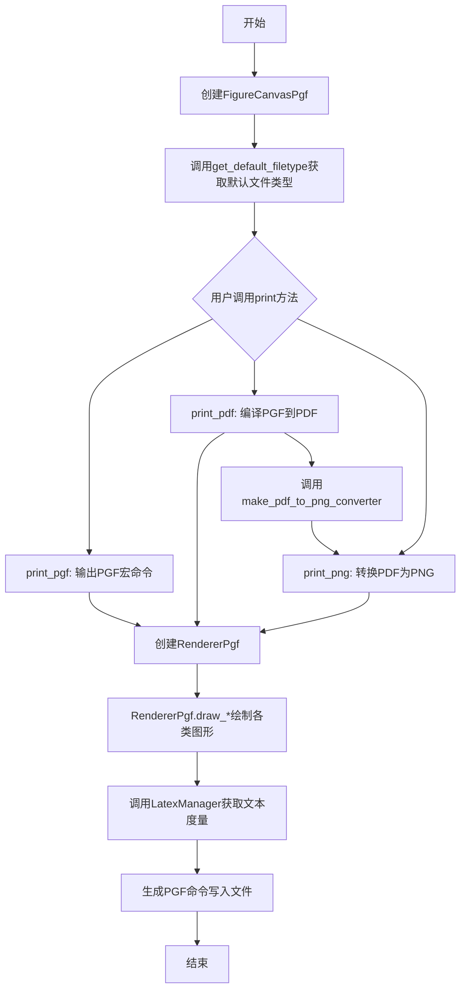

## 类结构

```
Exception
└── LatexError
object
└── LatexManager (LaTeX进程管理类)
matplotlib.backend_bases.RendererBase
└── RendererPgf (PGF渲染器)
matplotlib.backend_bases.FigureCanvasBase
└── FigureCanvasPgf (画布类)
matplotlib.backend_bases.FigureManagerBase
└── FigureManagerPgf (别名)
_Backend
└── _BackendPgf (后端导出类)
object
└── PdfPages (多页PDF管理类)
```

## 全局变量及字段


### `_DOCUMENTCLASS`
    
LaTeX document class declaration string

类型：`str`
    


### `latex_pt_to_in`
    
Conversion factor from LaTeX points to inches (1/72.27)

类型：`float`
    


### `latex_in_to_pt`
    
Conversion factor from inches to LaTeX points (72.27)

类型：`float`
    


### `mpl_pt_to_in`
    
Conversion factor from Matplotlib points to inches (1/72)

类型：`float`
    


### `mpl_in_to_pt`
    
Conversion factor from inches to Matplotlib points (72)

类型：`float`
    


### `_log`
    
Module-level logger for logging messages

类型：`logging.Logger`
    


### `LatexError.latex_output`
    
Captured LaTeX process output when error occurs

类型：`str`
    


### `LatexError.message`
    
Error message describing the LaTeX error

类型：`str`
    


### `LatexManager.latex`
    
LaTeX subprocess instance for text rendering

类型：`subprocess.Popen | None`
    


### `LatexManager._tmpdir`
    
Temporary directory context manager for LaTeX files

类型：`TemporaryDirectory`
    


### `LatexManager.tmpdir`
    
Path to the temporary directory for LaTeX execution

类型：`str`
    


### `LatexManager._finalize_tmpdir`
    
Finalizer for cleaning up temporary directory

类型：`weakref.finalize`
    


### `LatexManager._finalize_latex`
    
Finalizer for cleaning up LaTeX subprocess

类型：`weakref.finalize`
    


### `LatexManager._get_box_metrics`
    
Cached method for retrieving text box metrics from LaTeX

类型：`functools._lru_cache_wrapper`
    


### `RendererPgf.dpi`
    
Dots per inch of the figure being rendered

类型：`float`
    


### `RendererPgf.fh`
    
File handle for writing PGF drawing commands

类型：`file-like`
    


### `RendererPgf.figure`
    
Matplotlib Figure object being rendered

类型：`Figure`
    


### `RendererPgf.image_counter`
    
Counter for generating unique image filenames

类型：`int`
    


### `FigureCanvasPgf.filetypes`
    
Dictionary mapping file extensions to format descriptions

类型：`dict`
    


### `PdfPages._output_name`
    
Output filename for the PDF file

类型：`str | pathlib.Path`
    


### `PdfPages._n_figures`
    
Number of figures currently saved in the PDF

类型：`int`
    


### `PdfPages._metadata`
    
User-provided metadata for the PDF document

类型：`dict`
    


### `PdfPages._info_dict`
    
Processed PDF information dictionary for hyperref

类型：`dict`
    


### `PdfPages._file`
    
In-memory buffer for accumulating PDF content

类型：`BytesIO`
    
    

## 全局函数及方法


### `_get_preamble`

该函数用于根据 Matplotlib 的 rcParams 配置准备 LaTeX  preamble，包含字体设置、数学模式配置、KOMA 脚本包检测以及条件性字体加载等关键配置项。

参数： 无

返回值：`str`，返回配置好的 LaTeX preamble 字符串，用于后续的 LaTeX 文档编译。

#### 流程图

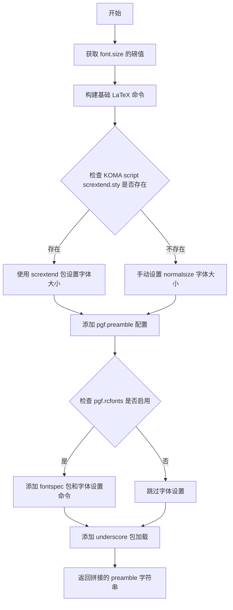

#### 带注释源码

```python
def _get_preamble():
    """
    Prepare a LaTeX preamble based on the rcParams configuration.
    
    该函数根据 Matplotlib 的 rcParams 配置生成 LaTeX 文档的导言区（preamble）内容。
    导言区包含字体设置、数学模式、页面布局等 LaTeX 编译所需的配置命令。
    """
    # 获取当前配置的字体大小（以磅为单位）
    # FontProperties 是 matplotlib 的字体属性类，用于处理字体大小转换
    font_size_pt = FontProperties(
        size=mpl.rcParams["font.size"]  # 从 rcParams 读取用户配置的 font.size
    ).get_size_in_points()  # 转换为磅值
    
    # 使用换行符将各个 LaTeX 命令拼接成一个完整的 preamble 字符串
    return "\n".join([
        # 移除 Matplotlib 的自定义命令 \mathdefault
        # \mathdefault 是 Matplotlib 在数学公式中使用的默认命令
        # 这里将其重新定义为恒等映射，避免与 LaTeX 标准数学命令冲突
        r"\def\mathdefault#1{#1}",
        
        # 为所有数学公式使用 displaystyle 样式
        # displaystyle 会使数学公式以显示模式渲染（更大、更易读）
        r"\everymath=\expandafter{\the\everymath\displaystyle}",
        
        # 设置字体大小以匹配 font.size 配置
        # 如果存在 KOMA 脚本的 scrextend.sty 包，则使用它来调整标准 LaTeX 字体命令
        # 否则只手动设置 \normalsize
        r"\IfFileExists{scrextend.sty}{",
        r"  \usepackage[fontsize=%fpt]{scrextend}" % font_size_pt,
        r"}{",
        # 手动设置 normalsize 字体大小，行距为字体大小的 1.2 倍
        r"  \renewcommand{\normalsize}{\fontsize{%f}{%f}\selectfont}"
        % (font_size_pt, 1.2 * font_size_pt),
        r"  \normalsize",
        r"}",
        
        # 允许用户通过 pgf.preamble 配置覆盖上述定义
        # 这是用户自定义 LaTeX 命令的入口点
        mpl.rcParams["pgf.preamble"],
        
        # 条件性添加 fontspec 包和字体设置命令（仅当 pgf.rcfonts 为 True 时）
        *([
            # 检查是否是非 pdfTeX 引擎（如 XeTeX、LuaTeX）
            r"\ifdefined\pdftexversion\else  % non-pdftex case.",
            r"  \usepackage{fontspec}",  # fontspec 包用于 OpenType 字体支持
        ] + [
            # 为 serif、sans-serif、monospace 三种字体族设置系统字体
            # 使用 fontspec 的\setmainfont、\setsansfont、\setmonofont 命令
            r"  \%s{%s}[Path=\detokenize{%s/}]"
            % (command, path.name, path.parent.as_posix())
            for command, path in zip(
                ["setmainfont", "setsansfont", "setmonofont"],
                [pathlib.Path(fm.findfont(family))
                 for family in ["serif", "sans\\-serif", "monospace"]]
            )
        ] + [r"\fi"] if mpl.rcParams["pgf.rcfonts"] else []),
        
        # 确保 underscore 包最后加载（处理下划线字符的特殊需求）
        # 文档说明此包必须最后加载
        mpl.texmanager._usepackage_if_not_loaded("underscore", option="strings"),
    ])
```


### `_tex_escape`

对文本进行必要的LaTeX转义处理，将Unicode减号符号替换为LaTeX命令，以避免在LaTeX文档中出现排版问题。

参数：

- `text`：`str`，需要进行LaTeX转义的文本字符串

返回值：`str`，转义后的文本字符串

#### 流程图

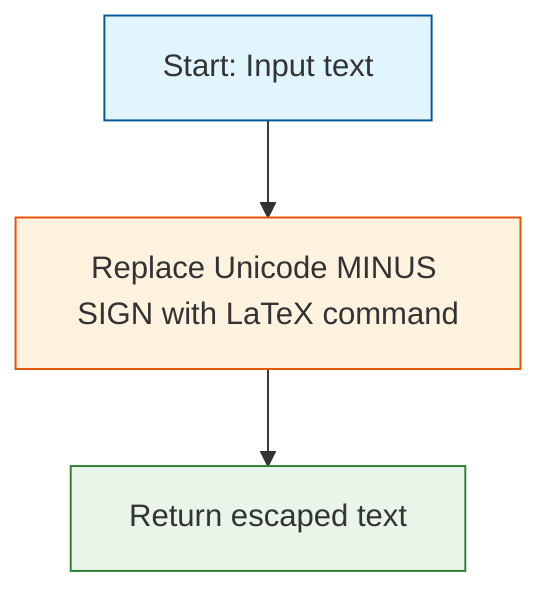

#### 带注释源码

```python
def _tex_escape(text):
    r"""
    Do some necessary and/or useful substitutions for texts to be included in
    LaTeX documents.
    
    这个函数执行必要的和/或有用的替换，以便文本可以包含在LaTeX文档中。
    具体来说，它将Unicode减号符号（U+2212）替换为LaTeX命令\@backslashcharensuremath{-}，
    因为标准的ASCII连字符在数学模式外可能不会正确显示。
    
    Parameters
    ----------
    text : str
        需要进行转义的文本字符串
    
    Returns
    -------
    str
        转义后的文本字符串，其中Unicode减号已被替换
    """
    return text.replace("\N{MINUS SIGN}", r"\ensuremath{-}")
```


### `_writeln`

`_writeln` 是一个全局辅助函数，用于向文件写入一行文本，并在行尾添加 `%` 符号和换行符，以防止 LaTeX 在行尾插入多余的空格。

参数：

- `fh`：文件对象，用于写入文本的目标文件（通常是一个打开的文件句柄）
- `line`：字符串，要写入文件的文本内容

返回值：`None`，该函数不返回任何值，仅执行写入操作

#### 流程图

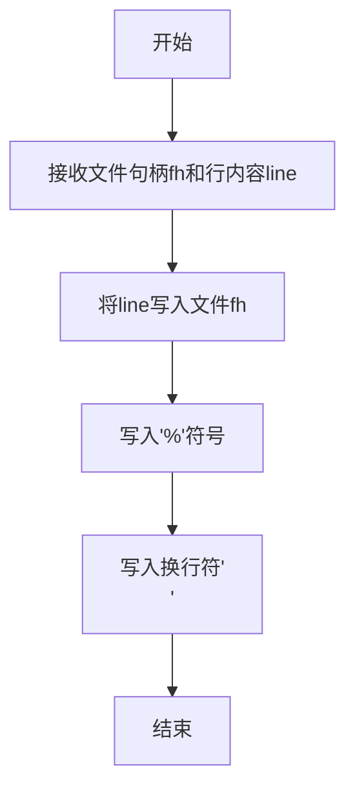

#### 带注释源码

```python
def _writeln(fh, line):
    # Ending lines with a % prevents TeX from inserting spurious spaces
    # (https://tex.stackexchange.com/questions/7453).
    # 在 LaTeX 中，行尾的空格可能被忽略或导致意外的输出。
    # 使用 % 符号可以注释掉行尾的空格，防止 LaTeX 插入多余的空格。
    # 参考: https://tex.stackexchange.com/questions/7453
    
    # 将传入的文本内容写入文件
    fh.write(line)
    
    # 写入 % 符号和换行符
    # % 符号在 LaTeX 中表示注释开始，
    # 这会注释掉行尾可能存在的空格，防止 TeX 插入伪空格
    fh.write("%\n")
```


### `_escape_and_apply_props`

该函数是Matplotlib PGF后端的文本渲染核心工具函数，用于将带有字体属性的字符串转换为可在LaTeX中正确渲染的TeX命令字符串，同时处理必要的字符转义。

参数：

- `s`：`str`，要渲染的字符串内容
- `prop`：`matplotlib.font_manager.FontProperties`，字体属性对象，包含字体家族、大小、样式、粗细等信息

返回值：`str`，返回生成的LaTeX/TeX格式化字符串，可直接在LaTeX文档中使用

#### 流程图

```mermaid
flowchart TD
    A[开始] --> B[初始化空命令列表]
    B --> C[获取字体家族属性]
    C --> D{家族是否在预定义映射中}
    D -->|是| E[添加对应LaTeX命令<br/>\rmfamily/\sffamily/\ttfamily]
    D -->|否| F{是否禁用rcfonts}
    F -->|是| G[添加\fontfamily{\familydefault}]
    F -->|否| H{字体是否在系统字体列表中}
    H -->|是| I[添加条件字体设置命令<br/>\setmainfont]
    H -->|否| J[记录警告日志<br/>忽略未知字体]
    E --> K[获取字体大小]
    G --> K
    I --> K
    J --> K
    K --> L[添加\fontsize命令]
    L --> M[获取字体样式<br/>normal/italic/oblique]
    M --> N[添加对应命令<br/>\itshape/\slshape]
    N --> O{检查字体粗细}
    O -->|是粗体| P[添加\bfseries命令]
    O -->|否| Q[添加\selectfont命令]
    P --> Q
    Q --> R[构建最终字符串<br/>包含^和%的catcode设置]
    R --> S[调用_tex_escape处理字符转义]
    S --> T[返回完整LaTeX字符串]
```

#### 带注释源码

```python
def _escape_and_apply_props(s, prop):
    """
    Generate a TeX string that renders string *s* with font properties *prop*,
    also applying any required escapes to *s*.
    """
    commands = []

    # 定义字体家族到LaTeX命令的映射
    families = {"serif": r"\rmfamily", "sans": r"\sffamily",
                "sans-serif": r"\sffamily", "monospace": r"\ttfamily"}
    # 获取字体的首选家族
    family = prop.get_family()[0]
    if family in families:
        # 标准家族直接添加对应命令
        commands.append(families[family])
    elif not mpl.rcParams["pgf.rcfonts"]:
        # 若禁用rcfonts，使用默认家族
        commands.append(r"\fontfamily{\familydefault}")
    elif any(font.name == family for font in fm.fontManager.ttflist):
        # 系统中存在的字体，使用fontspec设置
        commands.append(
            r"\ifdefined\pdftexversion\else\setmainfont{%s}\rmfamily\fi" % family)
    else:
        # 未知字体记录警告
        _log.warning("Ignoring unknown font: %s", family)

    # 获取字体大小（以磅为单位）
    size = prop.get_size_in_points()
    # 添加字号命令，设置基线距离为大小的1.2倍
    commands.append(r"\fontsize{%f}{%f}" % (size, size * 1.2))

    # 定义字体样式映射
    styles = {"normal": r"", "italic": r"\itshape", "oblique": r"\slshape"}
    # 添加字体样式命令
    commands.append(styles[prop.get_style()])

    # 定义粗体样式关键词列表
    boldstyles = ["semibold", "demibold", "demi", "bold", "heavy",
                  "extra bold", "black"]
    # 检查是否为粗体并添加相应命令
    if prop.get_weight() in boldstyles:
        commands.append(r"\bfseries")

    # 应用字体设置
    commands.append(r"\selectfont")
    
    # 构建最终字符串：
    # 1. 用{}包裹所有命令
    # 2. 将^设置为活动字符，定义其在数学/文本模式下的行为
    # 3. 将%设置为活动字符，允许在LaTeX中输出%符号
    # 4. 对字符串进行TeX转义处理
    return (
        "{"
        + "".join(commands)
        + r"\catcode`\^=\active\def^{\ifmmode\sp\else\^{}\fi}"
        # It should normally be enough to set the catcode of % to 12 ("normal
        # character"); this works on TeXLive 2021 but not on 2018, so we just
        # make it active too.
        + r"\catcode`\%=\active\def%{\%}"
        + _tex_escape(s)
        + "}"
    )
```


### `_metadata_to_str`

将元数据键值对转换为 hyperref 宏包可接受的字符串格式，用于 PDF 元信息字典的构建。

参数：

- `key`：`str`，元数据的键名（如 'Title', 'Author', 'Trapped' 等）
- `value`：任意类型，元数据的值（支持 datetime.datetime、枚举或其他可转字符串的对象）

返回值：`str`，返回格式化后的字符串，格式为 `key={value}`，其中花括号用于 LaTeX/hyperref 转义

#### 流程图

```mermaid
flowchart TD
    A[开始] --> B{value 是否为 datetime.datetime?}
    B -- 是 --> C[调用 _datetime_to_pdf 转换 value]
    C --> F
    B -- 否 --> D{key 是否为 'Trapped'?}
    D -- 是 --> E[取 value.name 并用 ASCII 解码]
    E --> F
    D -- 否 --> G[直接 str(value)]
    G --> F
    F[返回 f'{key}={{{value}}}'] --> H[结束]
```

#### 带注释源码

```python
def _metadata_to_str(key, value):
    """
    Convert metadata key/value to a form that hyperref accepts.

    该函数负责将 Matplotlib 的元数据键值对转换为 LaTeX hyperref 宏包
    可识别的字符串格式。不同的值类型需要不同的处理方式：
    - datetime 对象需要转为 PDF 日期格式
    - Trapped 字段需要特殊处理为 ASCII 编码
    - 其他类型直接转为字符串

    Parameters
    ----------
    key : str
        元数据的键名
    value : 任意类型
        元数据的值

    Returns
    -------
    str
        格式化后的字符串，格式为 'key={value}'
    """
    # 如果值是 datetime 对象，转换为 PDF 标准日期格式
    if isinstance(value, datetime.datetime):
        value = _datetime_to_pdf(value)
    # 如果键是 'Trapped'，需要特殊处理
    # PDF 规范中 Trapped 字段应为 'True'/'False'/'Unknown'
    # 这里的 value 可能是枚举类型，需要取其 name 属性并解码为 ASCII
    elif key == 'Trapped':
        value = value.name.decode('ascii')
    # 其他情况直接转换为字符串
    else:
        value = str(value)
    # 返回 hyperref 宏包接受的格式
    # 外层花括号用于 LaTeX 解析，内层花括号包含值本身
    return f'{key}={{{value}}}'
```


### `make_pdf_to_png_converter`

该函数返回一个用于将 PDF 文件转换为 PNG 文件的可调用函数。它首先尝试使用 `pdftocairo`（来自 poppler-utils）进行转换，如果不可用则回退到 Ghostscript (`gs`)，如果两者都不可用则抛出 RuntimeError。

参数： 无

返回值：`Callable[[str, str, int], bytes]`，返回一个接受 pdffile（PDF 文件路径）、pngfile（PNG 输出路径）和 dpi（图像分辨率）的 lambda 函数，返回子进程的输出字节。

#### 流程图

```mermaid
flowchart TD
    A[开始] --> B{检查 pdftocairo 是否可用}
    B -->|可用| C[返回使用 pdftocairo 的 lambda 函数]
    B -->|不可用| D{检查 gs (Ghostscript) 是否可用}
    D -->|可用| E[返回使用 gs 的 lambda 函数]
    D -->|不可用| F[抛出 RuntimeError: No suitable pdf to png renderer found.]
    C --> G[结束]
    E --> G
```

#### 带注释源码

```python
def make_pdf_to_png_converter():
    """
    返回一个将 PDF 文件转换为 PNG 文件的函数。
    该函数尝试使用 pdftocairo（优先）或 Ghostscript 作为后端。
    """
    # 第一次尝试：检查 pdftocairo 是否可用
    try:
        mpl._get_executable_info("pdftocairo")
    except mpl.ExecutableNotFoundError:
        # pdftocairo 不可用，pass 到下一个检查
        pass
    else:
        # pdftocairo 可用，返回使用 pdftocairo 的 lambda 函数
        # pdftocairo 是 poppler-utils 的一部分，转换质量较高
        return lambda pdffile, pngfile, dpi: subprocess.check_output(
            ["pdftocairo", "-singlefile", "-transp", "-png", "-r", "%d" % dpi,
             pdffile, os.path.splitext(pngfile)[0]],
            stderr=subprocess.STDOUT)
    
    # 第二次尝试：检查 Ghostscript (gs) 是否可用
    try:
        gs_info = mpl._get_executable_info("gs")
    except mpl.ExecutableNotFoundError:
        # gs 也不可用，pass
        pass
    else:
        # gs 可用，返回使用 gs 的 lambda 函数
        # 配置多个参数以优化 PNG 输出质量
        return lambda pdffile, pngfile, dpi: subprocess.check_output(
            [gs_info.executable,
             '-dQUIET', '-dSAFER', '-dBATCH', '-dNOPAUSE', '-dNOPROMPT',
             # 使用 CIEColor 以获得更准确的色彩
             '-dUseCIEColor', 
             # 使用 4 位采样以获得更平滑的文本和图形
             '-dTextAlphaBits=4',
             '-dGraphicsAlphaBits=4', 
             '-dDOINTERPOLATE',
             '-sDEVICE=pngalpha',  # 输出为带透明度的 PNG
             '-sOutputFile=%s' % pngfile,
             '-r%d' % dpi, pdffile],
            stderr=subprocess.STDOUT)
    
    # 如果两种工具都不可用，抛出运行时错误
    raise RuntimeError("No suitable pdf to png renderer found.")
```


### `_get_image_inclusion_command`

该函数用于检测当前LaTeX环境是否支持`\includegraphics`命令包含图片，通过实际执行测试命令来判断。如果支持则返回`\includegraphics`命令，否则返回备用的`\pgfimage`命令，从而确保在不同LaTeX配置下都能正确包含图片。

参数：

- （无参数）

返回值：`str`，返回LaTeX中包含图片的命令字符串，成功时为`\includegraphics`，失败时为`\pgfimage`

#### 流程图

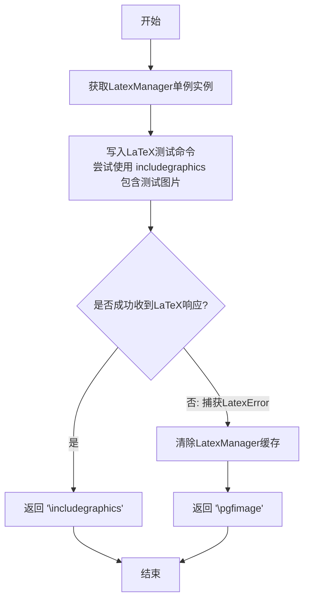

#### 带注释源码

```python
@functools.lru_cache(1)  # 使用LRU缓存确保函数只执行一次，结果被缓存
def _get_image_inclusion_command():
    """
    检测LaTeX是否支持 \includegraphics 命令，
    返回合适的图片包含命令。
    
    该函数通过实际执行LaTeX命令来测试环境兼容性，
    确保在不支持的情况下回退到 pgfimage。
    """
    # 获取LatexManager单例实例（如果LaTeX版本或配置变化会创建新实例）
    man = LatexManager._get_cached_or_new()
    
    # 构造测试用的LaTeX命令，尝试包含Matplotlib的图标图片
    # interpolate=true 表示对图片进行插值处理
    man._stdin_writeln(
        r"\includegraphics[interpolate=true]{%s}"
        # Don't mess with backslashes on Windows.
        # 使用as_posix()确保Windows路径分隔符正确处理
        % cbook._get_data_path("images/matplotlib.png").as_posix())
    
    try:
        # 等待LaTeX响应，如果成功说明支持该命令
        man._expect_prompt()
        # 返回标准的LaTeX图片包含命令
        return r"\includegraphics"
    except LatexError:
        # 如果LaTeX报错（如缺少graphicx包），说明不支持
        # Discard the broken manager.
        # 清除缓存，下次会创建新的LatexManager实例
        LatexManager._get_cached_or_new_impl.cache_clear()
        # 返回PGF兼容的图片包含命令作为后备方案
        return r"\pgfimage"
```


### `LatexError.__init__`

LatexError 类的初始化方法，用于创建一个包含错误信息和可选 LaTeX 输出的异常对象。

参数：

- `self`：隐式参数，Exception 实例本身
- `message`：`str`，错误消息内容
- `latex_output`：`str`，可选参数，默认为空字符串，存储 LaTeX 进程的输出信息

返回值：无（`None`），构造函数不返回值

#### 流程图

```mermaid
flowchart TD
    A[开始 __init__] --> B[调用 super().__init__message 设置基础异常消息]
    --> C[将 latex_output 参数存储到实例属性 self.latex_output]
    --> D[结束 __init__ 返回 None]
```

#### 带注释源码

```python
class LatexError(Exception):
    def __init__(self, message, latex_output=""):
        """
        初始化 LatexError 异常对象。

        Parameters
        ----------
        message : str
            错误消息，传递给基类 Exception 的构造函数。
        latex_output : str, optional
            LaTeX 进程的输出内容，默认为空字符串。
            当 LaTeX 命令执行失败时，这里会存储其标准输出/错误信息，
            以便调试时查看具体的 LaTeX 错误详情。
        """
        # 调用父类 Exception 的初始化方法
        # 设置异常的消息内容，存储在 self.args 元组中
        super().__init__(message)
        
        # 将 LaTeX 输出保存为实例属性
        # 这样在异常处理时可以通过 err.latex_output 访问完整的错误信息
        self.latex_output = latex_output
```


### `LatexError.__str__`

该方法用于将 LatexError 异常对象转换为字符串形式返回。当异常包含 LaTeX 输出内容时，会将该输出内容附加到错误消息后面，以便提供更详细的错误诊断信息。

参数：无（仅包含隐式参数 `self`）

返回值：`str`，返回异常的字符串表示形式

#### 流程图

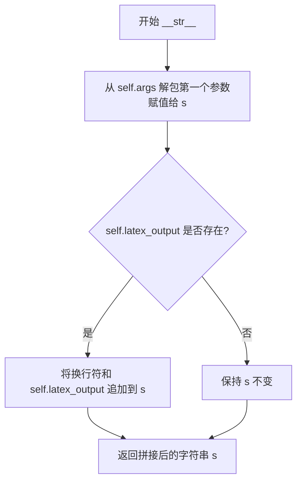

#### 带注释源码

```python
def __str__(self):
    """
    将 LatexError 异常转换为字符串表示。
    
    Returns:
        str: 包含错误消息和可选的 LaTeX 输出的字符串。
    """
    # 从父类 Exception 的 args 元组中解包第一个元素（即错误消息）
    s, = self.args
    
    # 检查是否存储了 LaTeX 输出内容
    if self.latex_output:
        # 如果存在 LaTeX 输出，则将其附加到错误消息后面
        # 使用换行符分隔，以便于阅读
        s += "\n" + self.latex_output
    
    # 返回拼接后的完整错误消息字符串
    return s
```


### `LatexManager._build_latex_header`

该方法是一个静态方法，用于构建 LaTeX 文档的头部内容，包含了文档类定义、TeX 程序信息注释、graphicx 宏包导入、获取预定义的 preamble 以及文档开始标记和后端查询启动标记，用于初始化 LaTeX 环境和缓存失效检测。

参数：

- 无参数

返回值：`str`，返回构建完成的 LaTeX 文档头部字符串，包含文档类、TeX 程序注释、graphicx 包、preamble 和文档环境开始标记。

#### 流程图

```mermaid
flowchart TD
    A[开始] --> B[定义 latex_header 列表]
    B --> C[添加 _DOCUMENTCLASS: \documentclass{article}]
    C --> D[添加 TeX 程序注释: % !TeX program = {texsystem}]
    D --> E[添加 graphicx 宏包: \usepackage{graphicx}]
    E --> F[调用 _get_preamble 获取 preamble 内容]
    F --> G[添加文档开始标记: \begin{document}]
    G --> H[添加后端查询标记: \typeout{pgf_backend_query_start}]
    H --> I[用换行符连接列表元素]
    I --> J[返回构建好的 LaTeX 头部字符串]
    J --> K[结束]
```

#### 带注释源码

```python
@staticmethod
def _build_latex_header():
    """
    构建 LaTeX 文档的头部内容，用于初始化 LaTeX 环境。
    
    该方法生成一个完整的 LaTeX 文档开头，包括：
    - 文档类声明
    - TeX 程序信息（用于缓存失效检测）
    - 必要的宏包导入
    - 自定义 preamble
    - 文档环境开始标记
    - 后端查询启动标记
    """
    # 初始化 latex_header 列表，依次添加各个部分
    latex_header = [
        _DOCUMENTCLASS,  # 添加文档类声明：\documentclass{article}
        
        # Include TeX program name as a comment for cache invalidation.
        # TeX does not allow this to be the first line.
        # 添加 TeX 程序注释，用于缓存失效检测（TeX 不允许注释作为第一行）
        rf"% !TeX program = {mpl.rcParams['pgf.texsystem']}",
        
        # Test whether \includegraphics supports interpolate option.
        # 导入 graphicx 宏包，用于插入图片
        r"\usepackage{graphicx}",
        
        # 调用 _get_preamble 获取基于 rcParams 配置的 preamble
        _get_preamble(),
        
        # 开始文档环境
        r"\begin{document}",
        
        # 输出特殊标记，用于后端查询开始
        r"\typeout{pgf_backend_query_start}",
    ]
    
    # 将列表中的所有元素用换行符连接成单一的字符串并返回
    return "\n".join(latex_header)
```


### LatexManager._get_cached_or_new

该方法是一个类方法，用于获取 LaTeX 管理器的缓存实例。当 LaTeX 头部配置和 TeX 系统未发生变化时，返回缓存的 LatexManager 实例；否则创建并返回新的实例。该方法利用 LRU 缓存机制避免重复创建 LaTeX 进程，从而提高性能。

参数：
- 无显式参数（隐式参数为 `cls`，代表 LatexManager 类本身）

返回值：`LatexManager`，返回 LaTeX 管理器的实例（可能是新创建的或缓存的）

#### 流程图

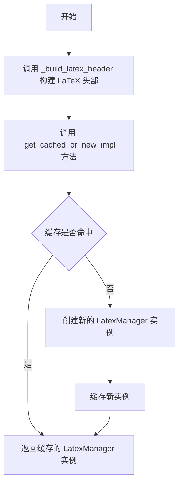

#### 带注释源码

```python
@classmethod
def _get_cached_or_new(cls):
    """
    Return the previous LatexManager if the header and tex system did not
    change, or a new instance otherwise.
    """
    # 构建 LaTeX 头部信息，包含文档类、TeX 程序信息、graphicx 包和前导配置
    # 头部信息作为缓存键，用于判断是否需要创建新的 LatexManager
    return cls._get_cached_or_new_impl(cls._build_latex_header())

@classmethod
@functools.lru_cache(1)
def _get_cached_or_new_impl(cls, header):  # Helper for _get_cached_or_new.
    """
    缓存实现方法，使用 LRU 缓存（最大缓存数为 1）来存储 LatexManager 实例。
    只有当 header 参数（LaTeX 头部）发生变化时，才会创建新实例。
    """
    return cls()  # 创建新的 LatexManager 实例

@staticmethod
def _build_latex_header():
    """
    构建 LaTeX 文档头部，包含以下内容：
    1. 文档类声明
    2. TeX 程序注释（用于缓存失效检测）
    3. graphicx 包导入
    4. LaTeX 前导配置（字体、字号等）
    5. 文档环境开始标记
    6. pgf 后端查询起始标记
    """
    latex_header = [
        _DOCUMENTCLASS,
        # 包含 TeX 程序名作为注释，用于缓存失效
        # TeX 不允许这成为第一行
        rf"% !TeX program = {mpl.rcParams['pgf.texsystem']}",
        # 测试 \includegraphics 是否支持 interpolate 选项
        r"\usepackage{graphicx}",
        _get_preamble(),
        r"\begin{document}",
        r"\typeout{pgf_backend_query_start}",
    ]
    return "\n".join(latex_header)
```


### `LatexManager._get_cached_or_new_impl`

该函数是 `LatexManager` 类的缓存辅助方法，利用 `lru_cache` 装饰器根据 LaTeX 头部配置是否变化来决定返回现有实例还是创建新实例，从而避免重复初始化 LaTeX 子进程。

参数：

- `cls`：`class`，隐式参数，当前类 `LatexManager` 本身
- `header`：`str`，用于构建 LaTeX 文档头部的字符串，包含文档类、字体设置、前导码等信息

返回值：`LatexManager`，返回一个新的或缓存的 `LatexManager` 实例

#### 流程图

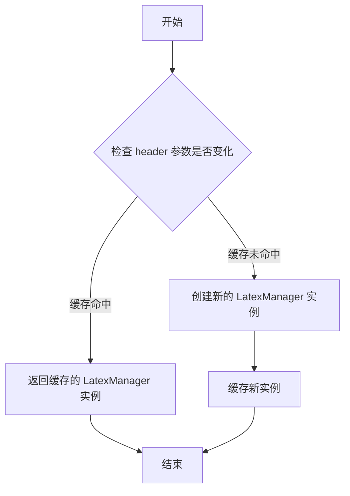

#### 带注释源码

```python
@classmethod
@functools.lru_cache(1)
def _get_cached_or_new_impl(cls, header):  # Helper for _get_cached_or_new.
    """
    返回一个新的 LatexManager 实例。
    由于使用了 @functools.lru_cache(1) 装饰器，
    只有当 header 参数发生变化时才会创建新实例；
    如果 header 未变，则返回缓存的实例。
    """
    return cls()
```


### `LatexManager._stdin_writeln`

该方法用于向 LaTeX 子进程的标准输入写入字符串，并在末尾添加换行符并刷新缓冲区，确保 LaTeX 进程能够及时处理输入。如果 LaTeX 进程尚未启动，该方法会先调用 `_setup_latex_process()` 初始化进程。

参数：

- `s`：`str`，要写入 LaTeX 进程的标准输入的字符串

返回值：`None`，无返回值

#### 流程图

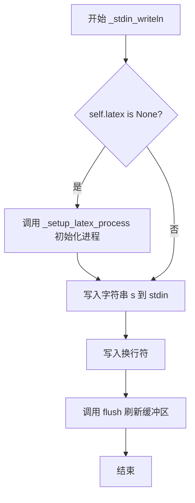

#### 带注释源码

```python
def _stdin_writeln(self, s):
    """
    向 LaTeX 进程的标准输入写入一行文本。
    
    参数
    ----------
    s : str
        要写入 LaTeX 进程的字符串。
    """
    # 检查 LaTeX 进程是否已启动，若未启动则先初始化
    if self.latex is None:
        self._setup_latex_process()
    
    # 将字符串写入 LaTeX 进程的标准输入
    self.latex.stdin.write(s)
    
    # 写入换行符，确保 LaTeX 将其作为一行处理
    self.latex.stdin.write("\n")
    
    # 刷新缓冲区，确保数据立即发送到 LaTeX 进程
    self.latex.stdin.flush()
```


### LatexManager._expect

该方法用于从 LaTeX 子进程的 stdout 持续读取字符，直到成功匹配到指定的字符串序列为止；若在读取过程中 LaTeX 进程意外终止，则抛出 LatexError 异常。此方法是 LatexManager 与 LaTeX 进程交互时的核心同步机制，确保在获取完整的响应内容后才进行后续处理。

参数：

- `s`：字符串（可迭代序列），需要匹配的预期输出字符串

返回值：字符串，返回从 LaTeX 进程读取的所有字符（包括最终的匹配字符串）

#### 流程图

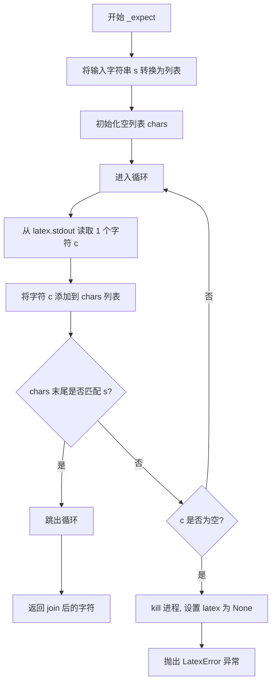

#### 带注释源码

```python
def _expect(self, s):
    """
    从 LaTeX 进程的 stdout 读取字符，直到匹配到指定的字符串序列。
    
    Parameters
    ----------
    s : str
        需要匹配的预期输出字符串序列。
    
    Returns
    -------
    str
        从 LaTeX 进程读取到的所有字符（包含最终匹配的字符串）。
    
    Raises
    ------
    LatexError
        如果在匹配成功前 LaTeX 进程意外终止。
    """
    # 将要匹配的字符串转换为列表，便于后续切片比较
    s = list(s)
    # 用于存储从 LaTeX 进程读取的所有字符
    chars = []
    # 持续读取直到匹配成功或进程终止
    while True:
        # 从 LaTeX 子进程的 stdout 读取单个字符
        c = self.latex.stdout.read(1)
        # 将读取的字符追加到字符列表中
        chars.append(c)
        # 检查字符列表的末尾是否与目标字符串 s 匹配
        # 使用切片 [-len(s):] 获取最后 len(s) 个字符进行比较
        if chars[-len(s):] == s:
            # 匹配成功，跳出循环
            break
        # 如果读取不到字符（即 c 为空字符串/空字节）
        if not c:
            # 终止 LaTeX 进程
            self.latex.kill()
            # 将 latex 引用置为 None
            self.latex = None
            # 抛出 LatexError 异常，包含已读取的所有字符信息
            raise LatexError("LaTeX process halted", "".join(chars))
    # 将读取的所有字符拼接成字符串并返回
    return "".join(chars)
```


### `LatexManager._expect_prompt`

该方法用于等待并读取 LaTeX 子进程的交互式提示符 "*"，以确认 LaTeX 已完成当前任务并准备好接收新的命令。它是 `_expect` 方法的简化封装，专门用于匹配 LaTeX 的标准提示符。

参数：

- 无显式参数（隐含参数 `self`：LatexManager 实例，表示当前 LaTeX 管理器对象）

返回值：`str`，返回从 LaTeX 进程读取的所有字符（包括换行符和提示符本身），如果 LaTeX 进程异常终止则抛出 `LatexError`。

#### 流程图

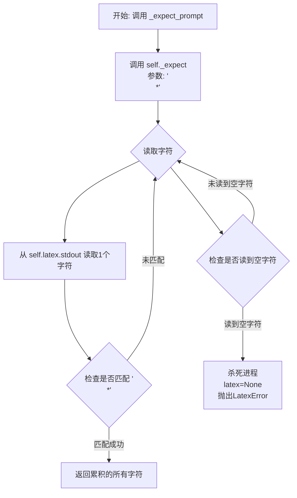

#### 带注释源码

```python
def _expect_prompt(self):
    """
    Expect the LaTeX prompt ('*') after a command.
    
    This method is a convenience wrapper around _expect that specifically
    waits for the LaTeX interactive prompt, which appears after LaTeX
    finishes processing a command and is ready for new input.
    The prompt in LaTeX typically appears as '*' on a new line.
    """
    # 调用内部的 _expect 方法，传入期望匹配的字符串 "\n*"
    # 这表示期望在读到换行符后跟星号时完成等待
    return self._expect("\n*")
```


### LatexManager.__init__

初始化 LaTeX 管理器，创建临时目录用于运行 LaTeX，设置 LaTeX 子进程并验证其启动，检查 LaTeX 配置是否正确，初始化实例级缓存。

参数：

- 该方法无显式参数（self 为隐式参数）

返回值：无返回值（`None`），仅执行初始化操作

#### 流程图

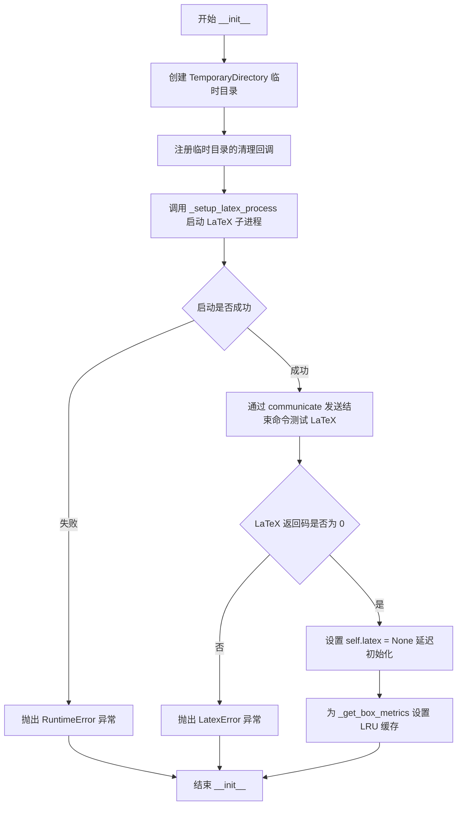

#### 带注释源码

```python
def __init__(self):
    """
    初始化 LatexManager 实例。
    
    1. 创建一个临时目录用于 LaTeX 进程运行
    2. 启动 LaTeX 子进程并验证其能正常启动
    3. 初始化实例级缓存用于文本度量计算
    """
    # 创建临时目录用于运行 latex，并注册自动清理回调
    # TemporaryDirectory 会在对象被垃圾回收时自动删除目录
    self._tmpdir = TemporaryDirectory()
    # 保存临时目录路径供后续使用
    self.tmpdir = self._tmpdir.name
    # 使用 weakref.finalize 注册临时目录的清理函数
    # 确保程序退出时临时目录会被正确删除
    self._finalize_tmpdir = weakref.finalize(self, self._tmpdir.cleanup)

    # 测试 LaTeX 配置，确保子进程能干净地启动
    # expect_reply=False 表示不等待 'pgf_backend_query_start' 响应
    self._setup_latex_process(expect_reply=False)
    # 发送一个简单的 LaTeX 命令来测试进程是否正常运行
    # \makeatletter\@@end 是 LaTeX 的一个结束标记
    stdout, stderr = self.latex.communicate("\n\\makeatletter\\@@end\n")
    
    # 检查 LaTeX 进程是否正常退出
    if self.latex.returncode != 0:
        # 如果返回码非零，说明 LaTeX 启动失败（可能是字体缺失或导言区错误）
        raise LatexError(
            f"LaTeX errored (probably missing font or error in preamble) "
            f"while processing the following input:\n"
            f"{self._build_latex_header()}",
            stdout)
    
    # 将 latex 设为 None，延迟到首次使用时再启动
    # 这样可以避免在不需要 LaTeX 时也启动进程
    self.latex = None
    
    # 为 _get_box_metrics 方法设置实例级 LRU 缓存
    # 这样在同一个实例中重复查询文本度量时可以复用结果
    self._get_box_metrics = functools.lru_cache(self._get_box_metrics)
```


### `LatexManager._setup_latex_process`

该方法负责初始化并启动 LaTeX 子进程，用于后续的文本排版和度量计算。它创建子进程、配置管道、设置进程终止时的清理逻辑，并可选地等待 LaTeX 初始化完成。

参数：

- `expect_reply`：`bool`，可选关键字参数，默认为 `True`。当设置为 `True` 时，方法会等待 LaTeX 进程输出特定的初始化完成标记（`pgf_backend_query_start`），以确认 LaTeX 已准备好接收命令。

返回值：`None`，该方法不返回任何值，仅执行副作用操作。

#### 流程图

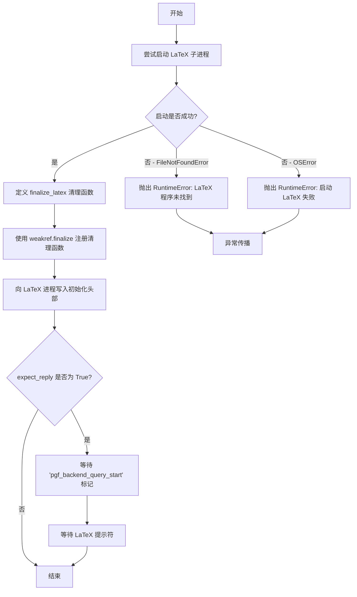

#### 带注释源码

```python
def _setup_latex_process(self, *, expect_reply=True):
    # 打开 LaTeX 进程用于实际工作；注册清理回调。
    # 在 Windows 上，必须确保子进程在删除其运行的临时目录之前已退出；
    # 为此，必须先 kill() 进程，然后与 wait() 或 communicate() 配合使用。
    try:
        # 使用 rcParams 中配置的 TeX 系统启动子进程
        # -halt-on-error 参数使 LaTeX 遇到错误时立即停止
        self.latex = subprocess.Popen(
            [mpl.rcParams["pgf.texsystem"], "-halt-on-error"],
            stdin=subprocess.PIPE, stdout=subprocess.PIPE,
            encoding="utf-8", cwd=self.tmpdir)
    except FileNotFoundError as err:
        # LaTeX 可执行文件未找到的异常处理
        raise RuntimeError(
            f"{mpl.rcParams['pgf.texsystem']!r} not found; install it or change "
            f"rcParams['pgf.texsystem'] to an available TeX implementation"
        ) from err
    except OSError as err:
        # 其他操作系统级别错误的异常处理
        raise RuntimeError(
            f"Error starting {mpl.rcParams['pgf.texsystem']!r}") from err

    # 定义 LaTeX 进程清理函数，确保进程被正确终止
    def finalize_latex(latex):
        latex.kill()
        try:
            # 等待进程完全退出并获取其输出
            latex.communicate()
        except RuntimeError:
            # 如果 communicate 失败，使用 wait 等待
            latex.wait()

    # 使用弱引用注册清理函数，在对象被销毁时自动调用
    # 这确保了即使发生异常，LaTeX 进程也会被正确清理
    self._finalize_latex = weakref.finalize(
        self, finalize_latex, self.latex)
    
    # 写入包含 'pgf_backend_query_start' 标记的 LaTeX 头部
    # 这个标记用于确认 LaTeX 已准备好
    self._stdin_writeln(self._build_latex_header())
    
    # 如果 expect_reply 为 True，则等待 LaTeX 输出确认标记
    if expect_reply:  # read until 'pgf_backend_query_start' token appears
        self._expect("*pgf_backend_query_start")
        self._expect_prompt()
```


### LatexManager.get_width_height_descent

获取文本在当前 LaTeX 环境下排版后的宽度、总高度和下降值（以 TeX 点为单位）。

参数：

- `text`：`str`，要排版的文本内容
- `prop`：`matplotlib.font_manager.FontProperties`，字体属性对象，用于指定文本的字体样式、大小等

返回值：`tuple[float, float, float]`，返回一个包含三个浮点数的元组，分别表示宽度(TeX pt)、总高度(TeX pt)和下降值(TeX pt)

#### 流程图

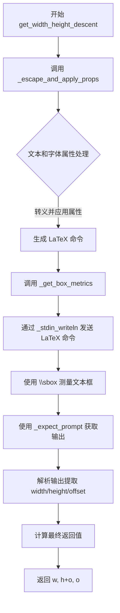

#### 带注释源码

```python
def get_width_height_descent(self, text, prop):
    """
    Get the width, total height, and descent (in TeX points) for a text
    typeset by the current LaTeX environment.
    """
    # 调用 _get_box_metrics 方法，传入经过转义和应用字体属性后的文本
    # _escape_and_apply_props 函数负责：
    # 1. 根据 prop 获取字体家族（serif/sans-serif/monospace）
    # 2. 设置字体大小
    # 3. 设置字体样式（正常/斜体/倾斜）
    # 4. 设置粗体
    # 5. 处理特殊字符（如 ^ 和 %）的 catcode
    # 6. 对文本进行必要的 TeX 转义
    return self._get_box_metrics(_escape_and_apply_props(text, prop))
```


### `LatexManager._get_box_metrics`

获取给定 LaTeX 命令在当前 LaTeX 环境下输出的宽度、总高度和下降值（以 TeX points 为单位）。

参数：

- `tex`：`str`，需要测量尺寸的 LaTeX 字符串（已转义并应用了字体属性）

返回值：`Tuple[float, float, float]`，返回一个包含三个浮点数的元组，分别是：
- 宽度（width）
- 总高度（height，从基线到顶部）
- 下降值（descent，从基线到底部）

#### 流程图

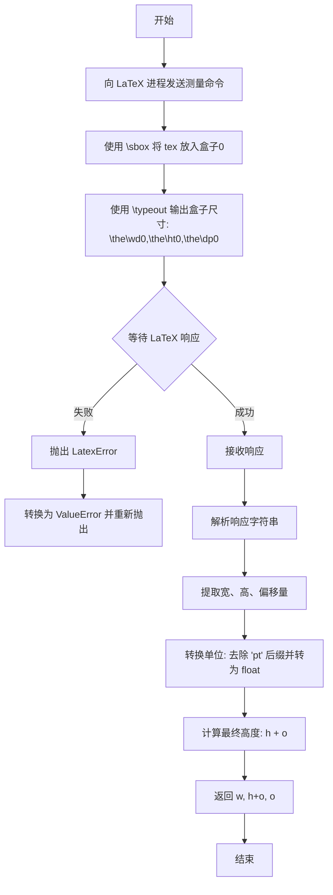

#### 带注释源码

```python
def _get_box_metrics(self, tex):
    """
    Get the width, total height and descent (in TeX points) for a TeX
    command's output in the current LaTeX environment.
    """
    # This method gets wrapped in __init__ for per-instance caching.
    # 通过 stdin 向 LaTeX 进程发送测量命令
    # 使用 \sbox 将 tex 放入盒子0，然后通过 \typeout 输出盒子尺寸
    # 注意：\sbox 不能处理其参数内的 catcode 赋值，
    # 所以需要在外部重复分配 "^" 和 "%" 的 catcode
    self._stdin_writeln(  # Send textbox to TeX & request metrics typeout.
        # \sbox doesn't handle catcode assignments inside its argument,
        # so repeat the assignment of the catcode of "^" and "%" outside.
        r"{\catcode`\^=\active\catcode`\%%=\active\sbox0{%s}"
        r"\typeout{\the\wd0,\the\ht0,\the\dp0}}"
        % tex)
    try:
        # 等待 LaTeX 进程返回提示符，表示命令执行完成
        answer = self._expect_prompt()
    except LatexError as err:
        # 如果 LaTeX 进程出错，包装成 ValueError 重新抛出
        # Here and below, use '{}' instead of {!r} to avoid doubling all
        # backslashes.
        raise ValueError("Error measuring {}\nLaTeX Output:\n{}"
                         .format(tex, err.latex_output)) from err
    try:
        # 从响应字符串中解析度量值
        # 最后一行是提示符，倒数第二行是 \typeout 产生的空行
        # 因此需要取倒数第三行
        # Parse metrics from the answer string.  Last line is prompt, and
        # next-to-last-line is blank line from \typeout.
        width, height, offset = answer.splitlines()[-3].split(",")
    except Exception as err:
        # 如果解析失败，抛出 ValueError
        raise ValueError("Error measuring {}\nLaTeX Output:\n{}"
                         .format(tex, answer)) from err
    # 转换数值：去除末尾的 'pt' 单位后缀
    w, h, o = float(width[:-2]), float(height[:-2]), float(offset[:-2])
    # LaTeX 返回的高度是从基线到顶部的距离
    # 而 Matplotlib 期望的高度是从底部到顶部的距离
    # 因此需要将高度和偏移量相加
    # The height returned from LaTeX goes from base to top;
    # the height Matplotlib expects goes from bottom to top.
    return w, h + o, o
```


### RendererPgf.__init__

该方法是 `RendererPgf` 类的构造函数，用于初始化 PGF 渲染器，将 Matplotlib 的绘图指令转换为 LaTeX pgfpicture 环境的文本命令。

参数：
- `figure`：`matplotlib.figure.Figure`，Matplotlib 图形对象，用于初始化高度、宽度和 dpi
- `fh`：file-like，绘图命令输出的文件句柄

返回值：`None`，构造函数无返回值（隐式返回 None）

#### 流程图

```mermaid
graph TD
    A[开始 __init__] --> B[调用 super().__init__ 初始化基类]
    B --> C[设置 self.dpi = figure.dpi]
    C --> D[设置 self.fh = fh]
    D --> E[设置 self.figure = figure]
    E --> F[设置 self.image_counter = 0]
    F --> G[结束 __init__]
```

#### 带注释源码

```python
def __init__(self, figure, fh):
    """
    Create a new PGF renderer that translates any drawing instruction
    into text commands to be interpreted in a latex pgfpicture environment.

    Attributes
    ----------
    figure : `~matplotlib.figure.Figure`
        Matplotlib figure to initialize height, width and dpi from.
    fh : file-like
        File handle for the output of the drawing commands.
    """

    # 调用父类 RendererBase 的初始化方法
    super().__init__()
    
    # 从 figure 对象获取 dpi（每英寸点数）并保存
    self.dpi = figure.dpi
    
    # 保存文件句柄，用于输出 PGF 绘图命令
    self.fh = fh
    
    # 保存对 figure 对象的引用
    self.figure = figure
    
    # 初始化图像计数器，用于为嵌入的raster图像生成唯一文件名
    self.image_counter = 0
```


### `RendererPgf.draw_markers`

该方法负责将matplotlib中的标记（markers）渲染为PGF/TikZ绘图命令，以便在LaTeX文档中绘制。它首先定义标记对象，然后遍历路径的每个顶点，在每个顶点位置应用该标记。

参数：

- `self`：`RendererPgf`，渲染器实例本身
- `gc`：`GraphicsContextBase`，图形上下文，包含线条宽度、颜色、剪裁等样式信息
- `marker_path`：`Path`，标记的路径对象，定义标记的几何形状
- `marker_trans`：`Transform`，应用于标记路径的变换矩阵
- `path`：`Path`，要绘制标记的路径，即数据点路径
- `trans`：`Transform`，应用于数据路径的变换矩阵
- `rgbFace`：`tuple` 或 `None`，填充颜色，RGB格式（r, g, b, a），如果为None则不填充

返回值：`None`，该方法无返回值，直接将PGF命令写入文件

#### 流程图

```mermaid
flowchart TD
    A[开始 draw_markers] --> B[写入 \begin{pgfscope}]
    B --> C[计算转换因子 f = 1.0 / dpi]
    C --> D[调用 _print_pgf_clip 应用剪裁]
    D --> E[调用 _print_pgf_path_styles 应用样式]
    E --> F[获取标记边界 bl, tr]
    F --> G[计算坐标 coords]
    G --> H[写入 \pgfsys@defobject 定义标记]
    H --> I[调用 _print_pgf_path 绘制标记路径]
    I --> J[调用 _pgf_path_draw 渲染标记]
    J --> K[写入标记定义结束]
    K --> L[计算最大坐标和剪裁区域]
    L --> M[遍历路径的每个顶点]
    M --> N{还有顶点?}
    N -->|是| O[计算当前点坐标]
    O --> P[写入 \begin{pgfscope}]
    P --> Q[写入变换命令]
    Q --> R[写入使用标记命令]
    R --> S[写入 \end{pgfscope}]
    S --> M
    N -->|否| T[写入 \end{pgfscope}]
    T --> U[结束]
```

#### 带注释源码

```python
def draw_markers(self, gc, marker_path, marker_trans, path, trans,
                 rgbFace=None):
    # docstring inherited

    # 开始一个PGF作用域，用于隔离标记绘制环境
    _writeln(self.fh, r"\begin{pgfscope}")

    # 将显示单位转换为英寸（PGF使用的单位）
    # f 是从显示坐标到英寸的转换因子
    f = 1. / self.dpi

    # 设置剪裁区域和样式
    self._print_pgf_clip(gc)  # 应用图形上下文的剪裁设置
    self._print_pgf_path_styles(gc, rgbFace)  # 应用线条颜色、宽度、填充等样式

    # 构建标记定义
    # 获取标记路径在变换后的边界框
    bl, tr = marker_path.get_extents(marker_trans).get_points()
    # 计算边界框坐标（转换为英寸）
    coords = bl[0] * f, bl[1] * f, tr[0] * f, tr[1] * f
    
    # 定义一个名为 currentmarker 的PGF对象
    # 该对象包含标记的边界框和绘制命令
    _writeln(self.fh,
             r"\pgfsys@defobject{currentmarker}"
             r"{\pgfqpoint{%fin}{%fin}}{\pgfqpoint{%fin}{%fin}}{" % coords)
    
    # 打印标记路径（使用 None 作为 gc，因为样式已在前面的 _print_pgf_path_styles 中设置）
    self._print_pgf_path(None, marker_path, marker_trans)
    
    # 绘制标记路径：根据线条宽度决定是否描边，根据 rgbFace 决定是否填充
    self._pgf_path_draw(stroke=gc.get_linewidth() != 0.0,
                        fill=rgbFace is not None)
    
    # 结束标记定义
    _writeln(self.fh, r"}")

    # 计算PGF支持的最大坐标值（LaTeX/PGF的限制）
    maxcoord = 16383 / 72.27 * self.dpi  # Max dimensions in LaTeX.
    # 设置剪裁区域为最大允许范围
    clip = (-maxcoord, -maxcoord, maxcoord, maxcoord)

    # 遍历路径的每个顶点，在每个顶点处绘制标记
    for point, code in path.iter_segments(trans, simplify=False,
                                          clip=clip):
        # 计算当前顶点的坐标（转换为英寸）
        x, y = point[0] * f, point[1] * f
        
        # 为每个标记实例创建新的作用域
        _writeln(self.fh, r"\begin{pgfscope}")
        
        # 将坐标原点移动到当前顶点位置
        _writeln(self.fh, r"\pgfsys@transformshift{%fin}{%fin}" % (x, y))
        
        # 使用之前定义的 currentmarker 对象
        _writeln(self.fh, r"\pgfsys@useobject{currentmarker}{}")
        
        # 结束标记实例的作用域
        _writeln(self.fh, r"\end{pgfscope}")

    # 结束整个标记绘制的作用域
    _writeln(self.fh, r"\end{pgfscope}")
```


### `RendererPgf.draw_path`

该方法是 Matplotlib PGF 后端的核心绘制方法，负责将图形路径转换为 PGF/TikZ 绘图指令，实现路径的描边、填充以及图案（hatching）效果的渲染。

参数：

- `gc`：`GraphicsContextBase`，图形上下文对象，包含线条宽度、颜色、裁剪区域、填充色、图案等样式信息
- `path`：`matplotlib.path.Path`，要绘制的几何路径
- `transform`：`matplotlib.transforms.Transform`，从数据坐标到显示坐标的变换矩阵
- `rgbFace`：`tuple` 或 `None`，路径填充颜色的 RGBA 值，None 表示不填充

返回值：`None`，该方法无返回值，直接将 PGF 代码写入文件句柄

#### 流程图

```mermaid
flowchart TD
    A[开始 draw_path] --> B[写入 pgfscope 开始标记]
    B --> C[调用 _print_pgf_clip 处理裁剪区域]
    C --> D[调用 _print_pgf_path_styles 设置路径样式]
    D --> E[调用 _print_pgf_path 构建路径几何数据]
    E --> F[调用 _pgf_path_draw 渲染路径描边和填充]
    F --> G[写入 pgfscope 结束标记]
    G --> H{检查是否有图案 gc.get_hatch}
    H -->|有图案| I[进入图案渲染分支]
    H -->|无图案| K[结束]
    
    I --> J[写入 pgfscope 开始标记]
    J --> L[再次设置路径样式]
    L --> M[组合裁剪和路径]
    M --> N[定义 currentpattern 对象]
    N --> O[计算路径边界框]
    O --> P[计算图案重复次数]
    P --> Q[循环平铺图案]
    Q --> R[写入 pgfscope 结束标记]
    R --> K
```

#### 带注释源码

```python
def draw_path(self, gc, path, transform, rgbFace=None):
    # docstring inherited
    # 写入 PGF 作用域开始标记，创建一个独立的 PGF 绘图环境
    _writeln(self.fh, r"\begin{pgfscope}")
    
    # 绘制路径：第一步 - 处理裁剪区域（矩形裁剪或路径裁剪）
    self._print_pgf_clip(gc)
    
    # 绘制路径：第二步 - 设置路径样式
    # 包括线宽、线帽样式、连接样式、虚线模式、填充色、描边色等
    self._print_pgf_path_styles(gc, rgbFace)
    
    # 绘制路径：第三步 - 构建 PGF 路径几何数据
    # 将 Matplotlib Path 转换为一系列 \pgfpathmoveto, \pgfpathlineto 等指令
    self._print_pgf_path(gc, path, transform, rgbFace)
    
    # 绘制路径：第四步 - 执行路径绘制
    # 根据是否填充和描边，生成 \pgfusepath{stroke} 或 \pgfusepath{fill} 等指令
    self._pgf_path_draw(stroke=gc.get_linewidth() != 0.0,
                        fill=rgbFace is not None)
    
    # 写入 PGF 作用域结束标记
    _writeln(self.fh, r"\end{pgfscope}")

    # 如果存在图案（hatch），在路径上叠加绘制图案
    if gc.get_hatch():
        # 再次开启 PGF 作用域用于图案绘制
        _writeln(self.fh, r"\begin{pgfscope}")
        
        # 重新设置路径样式（确保图案颜色正确）
        self._print_pgf_path_styles(gc, rgbFace)

        # 组合裁剪和路径用于图案裁剪
        self._print_pgf_clip(gc)
        self._print_pgf_path(gc, path, transform, rgbFace)
        # 应用裁剪，限制图案在路径范围内
        _writeln(self.fh, r"\pgfusepath{clip}")

        # 构建图案定义：创建一个 1x1 英寸的图案单元
        _writeln(self.fh,
                 r"\pgfsys@defobject{currentpattern}"
                 r"{\pgfqpoint{0in}{0in}}{\pgfqpoint{1in}{1in}}{")
        _writeln(self.fh, r"\begin{pgfscope}")
        # 定义 1x1 英寸的裁剪矩形
        _writeln(self.fh,
                 r"\pgfpathrectangle"
                 r"{\pgfqpoint{0in}{0in}}{\pgfqpoint{1in}{1in}}")
        _writeln(self.fh, r"\pgfusepath{clip}")
        # 获取图案路径并按 DPI 缩放后绘制
        scale = mpl.transforms.Affine2D().scale(self.dpi)
        self._print_pgf_path(None, gc.get_hatch_path(), scale)
        # 描边图案路径
        self._pgf_path_draw(stroke=True)
        _writeln(self.fh, r"\end{pgfscope}")
        _writeln(self.fh, r"}")
        
        # 计算图案重复次数以填满路径边界框
        f = 1. / self.dpi  # 从显示坐标转换为英寸
        # 获取路径在变换后的边界框
        (xmin, ymin), (xmax, ymax) = \
            path.get_extents(transform).get_points()
        # 转换为英寸单位
        xmin, xmax = f * xmin, f * xmax
        ymin, ymax = f * ymin, f * ymax
        # 计算水平和垂直方向需要的重复次数（向上取整）
        repx, repy = math.ceil(xmax - xmin), math.ceil(ymax - ymin)
        
        # 将图案平移到路径左下角起始位置
        _writeln(self.fh,
                 r"\pgfsys@transformshift{%fin}{%fin}" % (xmin, ymin))
        
        # 双重循环实现图案平铺
        for iy in range(repy):
            for ix in range(repx):
                # 在当前位置使用图案对象
                _writeln(self.fh, r"\pgfsys@useobject{currentpattern}{}")
                # 向右移动 1 英寸
                _writeln(self.fh, r"\pgfsys@transformshift{1in}{0in}")
            # 换行：左移 repx 英寸，回到行首，然后上移 1 英寸
            _writeln(self.fh, r"\pgfsys@transformshift{-%din}{0in}" % repx)
            _writeln(self.fh, r"\pgfsys@transformshift{0in}{1in}")

        # 写入 PGF 作用域结束标记
        _writeln(self.fh, r"\end{pgfscope}")
```


### `RendererPgf._print_pgf_clip`

该方法负责将图形上下文中的剪贴设置（剪贴矩形和剪贴路径）转换为对应的PGF绘图命令，用于在LaTeX的pgfpicture环境中定义剪贴区域。

参数：
- `gc`：`GraphicsContextBase`，图形上下文对象，用于获取剪贴矩形和剪贴路径信息

返回值：`None`，该方法无返回值，直接将PGF命令写入文件

#### 流程图

```mermaid
graph TD
A[开始] --> B[计算缩放因子 f = 1 / self.dpi]
B --> C{检查剪贴矩形 gc.get_clip_rectangle}
C -->|有| D[获取矩形边界点 p1, p2]
D --> E[计算宽度 w 和高度 h]
E --> F[计算坐标 coords = p1[0]*f, p1[1]*f, w*f, h*f]
F --> G[_writeln: 写入 \pgfpathrectangle 命令]
G --> H[_writeln: 写入 \pgfusepath{clip}]
C -->|无 或 已处理| I{检查剪贴路径 gc.get_clip_path}
I -->|有| J[获取 clippath 和 clippath_trans]
J --> K[_print_pgf_path: 绘制剪贴路径]
K --> L[_writeln: 写入 \pgfusepath{clip}]
I -->|无| M[结束]
H --> M
L --> M
```

#### 带注释源码

```python
def _print_pgf_clip(self, gc):
    """
    将图形上下文的剪贴设置转换为 PGF 剪贴命令
    
    参数:
        gc: GraphicsContextBase，用于获取剪贴矩形和剪贴路径信息
    """
    # 计算缩放因子，将显示坐标单位转换为英寸（PGF使用英寸单位）
    f = 1. / self.dpi
    
    # --- 处理剪贴矩形 ---
    # 检查图形上下文是否有剪贴矩形设置
    bbox = gc.get_clip_rectangle()
    if bbox:
        # 获取矩形的左下角(p1)和右上角(p2)坐标
        p1, p2 = bbox.get_points()
        # 计算矩形的宽度和高度
        w, h = p2 - p1
        # 将坐标转换为英寸单位
        coords = p1[0] * f, p1[1] * f, w * f, h * f
        
        # 写入 PGF 命令，定义一个矩形路径作为剪贴区域
        # \pgfpathrectangle 定义矩形路径，参数为左下角和右上角坐标
        _writeln(self.fh,
                 r"\pgfpathrectangle"
                 r"{\pgfqpoint{%fin}{%fin}}{\pgfqpoint{%fin}{%fin}}"
                 % coords)
        
        # 应用剪贴路径，使后续绘图仅在矩形区域内显示
        _writeln(self.fh, r"\pgfusepath{clip}")

    # --- 处理剪贴路径 ---
    # 检查图形上下文是否有自定义剪贴路径（比矩形更复杂的形状）
    clippath, clippath_trans = gc.get_clip_path()
    if clippath is not None:
        # 调用 _print_pgf_path 方法将路径转换为 PGF 命令
        self._print_pgf_path(gc, clippath, clippath_trans)
        
        # 应用剪贴路径，使后续绘图仅在路径定义的区域内显示
        _writeln(self.fh, r"\pgfusepath{clip}")
```


### `RendererPgf._print_pgf_path_styles`

该方法负责将图形上下文（GraphicsContext）的样式属性转换为对应的PGF/TikZ命令并输出到LaTeX文档，包括线条端点样式、连接样式、填充颜色、描边颜色、线宽、透明度以及虚线模式等。

参数：

- `self`：`RendererPgf`，RendererPgf类的实例本身
- `gc`：`GraphicsContextBase`，Matplotlib的图形上下文对象，包含当前的绘图状态（如颜色、线宽、线型等）
- `rgbFace`：`tuple` 或 `None`，填充颜色，RGB格式的元组，可能包含alpha通道；如果是None则表示没有填充

返回值：无（`None`），该方法直接向文件句柄写入PGF命令，不返回任何值

#### 流程图

```mermaid
flowchart TD
    A[开始] --> B[获取并写入cap style]
    B --> C[获取并写入join style]
    C --> D{检查是否有填充<br/>rgbFace is not None?}
    D -->|是| E[获取透明度信息]
    D -->|否| G[获取描边透明度]
    E --> F{forced_alpha?}
    F -->|是| H[统一设置fillopacity和strokeopacity]
    F -->|否| I[分别获取fillopacity和strokeopacity]
    H --> J[写入填充颜色定义和设置]
    I --> J
    J --> K{检查填充透明度<br/>fillopacity != 1.0?}
    K -->|是| L[写入填充透明度设置]
    K -->|否| M[计算线宽]
    L --> M
    M --> N[写入线宽设置]
    N --> O[获取并写入描边颜色]
    O --> P{描边透明度<br/>strokeopacity != 1.0?}
    P -->|是| Q[写入描边透明度设置]
    P -->|否| R[获取虚线样式]
    Q --> R
    R --> S{检查虚线列表<br/>dash_list is None?}
    S -->|是| T[写入空虚线设置<br/>实线]
    S -->|否| U[写入虚线偏移和列表]
    T --> V[结束]
    U --> V
```

#### 带注释源码

```python
def _print_pgf_path_styles(self, gc, rgbFace):
    """
    将图形上下文的样式属性转换为PGF命令并输出到文件。
    
    Parameters
    ----------
    gc : GraphicsContextBase
        Matplotlib图形上下文，包含当前绘图状态
    rgbFace : tuple or None
        填充颜色，RGB格式元组(r, g, b)或RGBA格式(r, g, b, a)
    """
    # cap style - 设置线条端点样式
    # butt: 方形端点，round: 圆形端点，projecting: 方形端点（超出终点）
    capstyles = {"butt": r"\pgfsetbuttcap",
                 "round": r"\pgfsetroundcap",
                 "projecting": r"\pgfsetrectcap"}
    _writeln(self.fh, capstyles[gc.get_capstyle()])

    # join style - 设置线条连接样式
    # miter: 尖角连接，round: 圆角连接，bevel: 斜角连接
    joinstyles = {"miter": r"\pgfsetmiterjoin",
                  "round": r"\pgfsetroundjoin",
                  "bevel": r"\pgfsetbeveljoin"}
    _writeln(self.fh, joinstyles[gc.get_joinstyle()])

    # filling - 处理填充颜色和透明度
    has_fill = rgbFace is not None

    # 获取透明度：优先使用forced_alpha，否则从RGB中获取
    if gc.get_forced_alpha():
        # 强制透明度设置：填充和描边使用相同的alpha值
        fillopacity = strokeopacity = gc.get_alpha()
    else:
        # 非强制透明度：从描边RGB中获取alpha值
        strokeopacity = gc.get_rgb()[3]
        # 填充透明度：如果有填充且包含alpha通道则使用，否则默认为1.0
        fillopacity = rgbFace[3] if has_fill and len(rgbFace) > 3 else 1.0

    # 写入填充颜色定义（仅当存在填充时）
    if has_fill:
        # 定义当前填充颜色为RGB
        _writeln(self.fh,
                 r"\definecolor{currentfill}{rgb}{%f,%f,%f}"
                 % tuple(rgbFace[:3]))
        # 设置填充颜色为之前定义的currentfill
        _writeln(self.fh, r"\pgfsetfillcolor{currentfill}")
    # 写入填充透明度（仅当透明度不为1.0时）
    if has_fill and fillopacity != 1.0:
        _writeln(self.fh, r"\pgfsetfillopacity{%f}" % fillopacity)

    # linewidth and color - 处理线宽和描边颜色
    # 将Matplotlib的点单位转换为LaTeX的点单位
    lw = gc.get_linewidth() * mpl_pt_to_in * latex_in_to_pt
    stroke_rgba = gc.get_rgb()
    # 设置线宽
    _writeln(self.fh, r"\pgfsetlinewidth{%fpt}" % lw)
    # 定义描边颜色
    _writeln(self.fh,
             r"\definecolor{currentstroke}{rgb}{%f,%f,%f}"
             % stroke_rgba[:3])
    # 设置描边颜色
    _writeln(self.fh, r"\pgfsetstrokecolor{currentstroke}")
    # 写入描边透明度（仅当不为1.0时）
    if strokeopacity != 1.0:
        _writeln(self.fh, r"\pgfsetstrokeopacity{%f}" % strokeopacity)

    # line style - 处理虚线样式
    # 获取虚线偏移量和虚线列表
    dash_offset, dash_list = gc.get_dashes()
    if dash_list is None:
        # 无虚线列表时，写入空虚线设置（即实线）
        _writeln(self.fh, r"\pgfsetdash{}{0pt}")
    else:
        # 有虚线时，写入虚线模式：每个虚线长度和偏移量
        _writeln(self.fh,
                 r"\pgfsetdash{%s}{%fpt}"
                 % ("".join(r"{%fpt}" % dash for dash in dash_list),
                    dash_offset))
```


### `RendererPgf._print_pgf_path`

该方法负责将 Matplotlib 的路径对象转换为 PGF/TikZ 路径绘制命令。它处理路径的各个段（ MOVETO、LINETO、CLOSEPOLY、CURVE3、CURVE4 ），并根据图形上下文的剪裁框和草图参数生成相应的 PGF 指令。

参数：

- `gc`：`GraphicsContextBase | None`，图形上下文对象，用于获取剪裁矩形和草图参数；若为 None 则忽略剪裁和装饰
- `path`：`Path`，Matplotlib 路径对象，包含要绘制的几何路径
- `transform`：`Transform`，坐标变换对象，用于将路径坐标转换为显示坐标
- `rgbFace`：`tuple | None`，填充颜色（RGBA 元组）；若为 None 则表示无填充，用于决定是否应用剪裁

返回值：`None`，该方法直接向文件写入 PGF 命令，不返回任何值

#### 流程图

```mermaid
flowchart TD
    A[开始 _print_pgf_path] --> B[计算转换因子 f = 1 / dpi]
    B --> C{检查 gc 是否存在}
    C -->|是| D[从 gc 获取剪裁矩形 bbox]
    C -->|否| E[设置 bbox = None]
    D --> F[计算最大坐标限制 maxcoord]
    E --> F
    F --> G{检查 bbox 存在且 rgbFace 为 None}
    G -->|是| H[计算实际剪裁区域 clip]
    G -->|否| I[设置 clip 为完整区域]
    H --> J[遍历路径段: path.iter_segments]
    I --> J
    J --> K{判断路径代码类型}
    K -->|MOVETO| L[生成 pgfpathmoveto 命令]
    K -->|CLOSEPOLY| M[生成 pgfpathclose 命令]
    K -->|LINETO| N[生成 pgfpathlineto 命令]
    K -->|CURVE3| O[生成 pgfpathquadraticcurveto 命令]
    K -->|CURVE4| P[生成 pgfpathcurveto 命令]
    L --> Q{是否还有更多段}
    M --> Q
    N --> Q
    O --> Q
    P --> Q
    Q -->|是| J
    Q -->|否| R{检查草图参数 sketch_params}
    R -->|存在| S[设置装饰参数: length, scale, randomness]
    R -->|不存在| T[结束]
    S --> U[加载 PGF 装饰模块]
    U --> V[写入装饰配置命令]
    V --> W[写入随机种子和路径装饰]
    W --> T
```

#### 带注释源码

```python
def _print_pgf_path(self, gc, path, transform, rgbFace=None):
    # 将显示坐标转换为英寸单位的转换因子
    f = 1. / self.dpi
    
    # 检查剪裁框 / 对于填充路径忽略剪裁
    # 从图形上下文获取剪裁矩形，如果 gc 为 None 则设为 None
    bbox = gc.get_clip_rectangle() if gc else None
    
    # LaTeX 中的最大坐标值（PGF 限制）
    maxcoord = 16383 / 72.27 * self.dpi
    
    # 如果存在剪裁矩形且没有填充（即只绘制轮廓）
    if bbox and (rgbFace is None):
        # 获取剪裁矩形的两个角点
        p1, p2 = bbox.get_points()
        # 计算实际剪裁区域，限制在最大坐标范围内
        clip = (max(p1[0], -maxcoord), max(p1[1], -maxcoord),
                min(p2[0], maxcoord), min(p2[1], maxcoord))
    else:
        # 使用完整的坐标范围（无剪裁）
        clip = (-maxcoord, -maxcoord, maxcoord, maxcoord)
    
    # 遍历路径的所有段（应用坐标变换和剪裁）
    for points, code in path.iter_segments(transform, clip=clip):
        # 根据路径命令类型生成相应的 PGF 命令
        if code == Path.MOVETO:
            # 移动到指定点（起始点）
            x, y = tuple(points)
            _writeln(self.fh,
                     r"\pgfpathmoveto{\pgfqpoint{%fin}{%fin}}" %
                     (f * x, f * y))
        elif code == Path.CLOSEPOLY:
            # 关闭当前路径
            _writeln(self.fh, r"\pgfpathclose")
        elif code == Path.LINETO:
            # 绘制直线到指定点
            x, y = tuple(points)
            _writeln(self.fh,
                     r"\pgfpathlineto{\pgfqpoint{%fin}{%fin}}" %
                     (f * x, f * y))
        elif code == Path.CURVE3:
            # 绘制二次贝塞尔曲线（控制点，终点）
            cx, cy, px, py = tuple(points)
            coords = cx * f, cy * f, px * f, py * f
            _writeln(self.fh,
                     r"\pgfpathquadraticcurveto"
                     r"{\pgfqpoint{%fin}{%fin}}{\pgfqpoint{%fin}{%fin}}"
                     % coords)
        elif code == Path.CURVE4:
            # 绘制三次贝塞尔曲线（两个控制点，终点）
            c1x, c1y, c2x, c2y, px, py = tuple(points)
            coords = c1x * f, c1y * f, c2x * f, c2y * f, px * f, py * f
            _writeln(self.fh,
                     r"\pgfpathcurveto"
                     r"{\pgfqpoint{%fin}{%fin}}"
                     r"{\pgfqpoint{%fin}{%fin}}"
                     r"{\pgfqpoint{%fin}{%fin}}"
                     % coords)

    # 应用 PGF 装饰器（草图效果）
    # 从图形上下文获取草图参数，如果 gc 为 None 则设为 None
    sketch_params = gc.get_sketch_params() if gc else None
    if sketch_params is not None:
        # 注意："length" 直接映射到 PGF API 的 "segment length"
        # PGF 使用 "amplitude" 传递 x 和 y 方向的组合偏差
        # 而 matplotlib 只沿着线条改变摆动的长度（"randomness" 和 "length" 参数）
        # 并使用单独的 "scale" 参数控制振幅
        # -> 使用 "randomness" 作为 PRNG 种子，使用户能够强制多个草图线条具有相同形状
        scale, length, randomness = sketch_params
        if scale is not None:
            # 使 matplotlib 和 PGF 渲染效果视觉上相似
            length *= 0.5
            scale *= 2
            # PGF 保证重复加载是空操作
            _writeln(self.fh, r"\usepgfmodule{decorations}")
            _writeln(self.fh, r"\usepgflibrary{decorations.pathmorphing}")
            _writeln(self.fh, r"\pgfkeys{/pgf/decoration/.cd, "
                     f"segment length = {(length * f):f}in, "
                     f"amplitude = {(scale * f):f}in}}")
            _writeln(self.fh, f"\\pgfmathsetseed{{{int(randomness)}}}")
            _writeln(self.fh, r"\pgfdecoratecurrentpath{random steps}")
```


### `RendererPgf._pgf_path_draw`

该方法根据传入的 `stroke` 和 `fill` 参数生成对应的 PGF 路径绘制命令，并将其写入文件句柄。

参数：

- `self`：`RendererPgf`，隐式参数，表示当前渲染器实例
- `stroke`：`bool`，可选，默认为 `True`，表示是否对路径进行描边
- `fill`：`bool`，可选，默认为 `False`，表示是否对路径进行填充

返回值：`None`，该方法无返回值，仅执行写操作

#### 流程图

```mermaid
graph TD
    A[开始] --> B{stroke == True?}
    B -->|是| C[actions.append&#40;'stroke'&#41;]
    B -->|否| D{fill == True?}
    C --> D
    D -->|是| E[actions.append&#40;'fill'&#41;]
    D -->|否| F[&#34;,&#34;.join&#40;actions&#41;]
    E --> F
    F --> G[_writeln&#40;self.fh, r&#34;\pgfusepath{...}&#34;&#41;]
    G --> H[结束]
```

#### 带注释源码

```python
def _pgf_path_draw(self, stroke=True, fill=False):
    """
    生成 PGF 路径绘制命令并写入文件。
    
    Parameters
    ----------
    stroke : bool, optional
        是否对路径进行描边（绘制轮廓线），默认为 True。
    fill : bool, optional
        是否对路径进行填充（填充内部区域），默认为 False。
    """
    # 初始化一个空列表，用于存储绘制动作
    actions = []
    
    # 如果需要描边，则将 'stroke' 添加到动作列表
    if stroke:
        actions.append("stroke")
    
    # 如果需要填充，则将 'fill' 添加到动作列表
    if fill:
        actions.append("fill")
    
    # 使用 PGF 的 \pgfusepath 命令将路径绘制出来
    # actions 列表中的元素用逗号连接，例如 "stroke,fill" 或 "stroke" 或 "fill"
    _writeln(self.fh, r"\pgfusepath{%s}" % ",".join(actions))
```


### RendererPgf.option_scale_image

该方法用于查询当前渲染器是否支持图像缩放功能。在 PGF 后端中，始终返回 `True`，表示渲染器能够处理缩放后的图像并将其正确渲染到 LaTeX/PGF 环境中。

参数：无（仅包含 `self` 隐式参数）

返回值：`bool`，返回 `True` 表示该渲染器支持图像缩放功能

#### 流程图

```mermaid
flowchart TD
    A[开始 option_scale_image] --> B{返回 True}
    B --> C[结束]
```

#### 带注释源码

```python
def option_scale_image(self):
    """
    查询渲染器是否支持图像缩放功能。
    继承自 RendererBase 类的文档字符串。
    
    该方法在 PGF 后端中始终返回 True，表示：
    - PGF 渲染器能够处理需要缩放的图像
    - 图像会先保存为 PNG 文件，然后通过 \\includegraphics 命令插入
    - 支持通过 transform 参数对图像进行缩放变换
    """
    # 返回 True 表示启用图像缩放支持
    return True
```


### RendererPgf.option_image_nocomposite

该方法用于确定在PGF渲染器中是否禁用图像复合功能，通过检查matplotlib的rcParams配置来实现。

参数：
- 无显式参数（隐式参数`self`为RendererPgf实例）

返回值：`bool`，返回`True`表示不进行图像复合，返回`False`表示允许图像复合

#### 流程图

```mermaid
flowchart TD
    A[开始] --> B[读取mpl.rcParams['image.composite_image']]
    B --> C{配置值为True?}
    C -->|是| D[返回False]
    C -->|否| E[返回True]
    D --> F[允许图像复合]
    E --> G[禁用图像复合]
```

#### 带注释源码

```python
def option_image_nocomposite(self):
    # docstring inherited
    # 从matplotlib的rcParams配置中获取image.composite_image的设置
    # 该配置控制是否在渲染图像时使用复合（composite）技术
    # 如果配置为True表示启用复合，则返回False表示不禁用复合
    # 如果配置为False表示禁用复合，则返回True表示不进行复合
    return not mpl.rcParams['image.composite_image']
```


### `RendererPgf.draw_image`

该方法负责将 matplotlib 的图像数据渲染为 PGF/TikZ 兼容的图像格式，通过将图像保存为 PNG 文件并生成相应的 PGF 图像引用指令，实现与 LaTeX 文档的集成。

参数：

- `gc`：`GraphicsContextBase`，图形上下文对象，包含剪贴板、线宽、颜色等绘图状态信息
- `x`：`float`，图像左下角在显示坐标系中的 x 坐标
- `y`：`float`，图像左下角在显示坐标系中的 y 坐标
- `im`：`ndarray`，图像数据数组，形状为 (height, width, channels)
- `transform`：`Transform` 或 `None`，可选的仿射变换矩阵，用于对图像进行缩放、旋转等变换

返回值：`None`，该方法直接写入文件，不返回任何值

#### 流程图

```mermaid
flowchart TD
    A[开始 draw_image] --> B{检查图像尺寸}
    B -->|w==0 或 h==0| C[直接返回]
    B --> D{检查输出文件路径是否存在}
    D -->|路径不存在| E[抛出 ValueError]
    D --> F[构建 PNG 文件路径]
    F --> G[将图像数组翻转并保存为 PNG]
    G --> H[递增 image_counter]
    H --> I[写入 pgfscope 开始标签]
    I --> J[写入剪贴路径]
    J --> K{判断 transform 是否为 None}
    K -->|是| L[计算位移并写入 transformshift]
    K -->|否| M[从 transform 提取矩阵值并写入 transformcm]
    L --> N[计算图像宽高]
    M --> O[设置宽高为1]
    N --> P[确定插值标志]
    O --> P
    P --> Q[写入 includegraphics 指令]
    Q --> R[写入 pgfscope 结束标签]
    R --> S[结束]
```

#### 带注释源码

```python
def draw_image(self, gc, x, y, im, transform=None):
    # docstring inherited
    # 获取图像的高度和宽度
    h, w = im.shape[:2]
    # 如果图像宽度或高度为0，则直接返回，不进行处理
    if w == 0 or h == 0:
        return

    # 检查文件句柄是否有有效的文件名路径
    # 如果是流式输出（没有文件路径），则抛出异常，因为 PGF 代码流式输出不支持光栅图形
    if not os.path.exists(getattr(self.fh, "name", "")):
        raise ValueError(
            "streamed pgf-code does not support raster graphics, consider "
            "using the pgf-to-pdf option")

    # 从文件句柄获取路径，构建 PNG 文件名
    # 使用 image_counter 确保每个图像有唯一文件名
    path = pathlib.Path(self.fh.name)
    fname_img = "%s-img%d.png" % (path.stem, self.image_counter)
    # 将图像数组垂直翻转（因为 PIL 和 PGF 的坐标系Y轴方向不同）
    # 然后保存为 PNG 文件到与输出文件相同的目录
    Image.fromarray(im[::-1]).save(path.parent / fname_img)
    # 计数器递增，为下一个图像准备
    self.image_counter += 1

    # 开始写入 PGF 图像引用代码
    # 写入 pgfscope 开始标签，建立一个独立的 PGF 作用域
    _writeln(self.fh, r"\begin{pgfscope}")
    # 输出剪贴路径，确保图像不会超出指定区域
    self._print_pgf_clip(gc)
    # 转换因子：从显示坐标转换为英寸（除以 DPI）
    f = 1. / self.dpi  # from display coords to inch
    # 根据是否有变换来处理图像的定位和缩放
    if transform is None:
        # 没有变换时，直接使用平移变换
        # 将图像从 (x, y) 位置开始绘制
        _writeln(self.fh,
                 r"\pgfsys@transformshift{%fin}{%fin}" % (x * f, y * f))
        # 计算图像的实际宽高（英寸）
        w, h = w * f, h * f
    else:
        # 有变换时，从变换矩阵中提取6个参数
        # a, b, c, d, e, f = transform.frozen().to_values()
        tr1, tr2, tr3, tr4, tr5, tr6 = transform.frozen().to_values()
        # 使用 2x3 变换矩阵进行变换（包含平移、旋转、缩放等）
        _writeln(self.fh,
                 r"\pgfsys@transformcm{%f}{%f}{%f}{%f}{%fin}{%fin}" %
                 (tr1 * f, tr2 * f, tr3 * f, tr4 * f,
                  (tr5 + x) * f, (tr6 + y) * f))
        # 宽高设为1，因为缩放已经包含在变换矩阵中
        w = h = 1  # scale is already included in the transform
    # 确定是否启用插值
    # 如果没有变换，则启用插值以获得更好的显示效果
    interp = str(transform is None).lower()  # interpolation in PDF reader
    # 写入图像包含命令，使用之前获取的图像包含命令
    # 设置左下角对齐、插值选项、宽高和文件名
    _writeln(self.fh,
             r"\pgftext[left,bottom]"
             r"{%s[interpolate=%s,width=%fin,height=%fin]{%s}}" %
             (_get_image_inclusion_command(),
              interp, w, h, fname_img))
    # 写入 pgfscope 结束标签
    _writeln(self.fh, r"\end{pgfscope}")
```


### `RendererPgf.draw_tex`

该方法是`RendererPgf`类用于在PGF画布上绘制TeX格式化文本的接口，通过调用`draw_text`方法并指定`ismath="TeX"`参数，使文本内容以LaTeX/TeX数学模式进行渲染。

参数：

- `gc`：`GraphicsContextBase`，图形上下文对象，包含线条宽度、颜色、裁剪区域等绘制属性
- `x`：`float`，文本绘制起点的x坐标（显示坐标系）
- `y`：`float`，文本绘制起点的y坐标（显示坐标系）
- `s`：`str`，要绘制的文本字符串
- `prop`：`FontProperties`，文本的字体属性（字体家族、大小、样式、粗细等）
- `angle`：`float`，文本的旋转角度（度）
- `mtext`：`optional[matplotlib.text.Text]`，Matplotlib文本对象，用于获取更精确的文本位置和对齐信息

返回值：`None`，该方法无返回值，通过副作用将PGF文本绘制命令写入输出文件

#### 流程图

```mermaid
flowchart TD
    A[开始 draw_tex] --> B{检查 mtext 参数}
    B -->|mtext存在且满足条件| C[获取文本单元坐标变换]
    B -->|否则| D[使用原始 x, y 坐标]
    C --> E[调用 draw_text 方法 ismath='TeX']
    D --> E
    E --> F[在 PGF 画布上渲染文本]
    F --> G[结束]
    
    style A fill:#e1f5fe
    style G fill:#e1f5fe
    style E fill:#fff3e0
```

#### 带注释源码

```python
def draw_tex(self, gc, x, y, s, prop, angle, *, mtext=None):
    """
    Draw TeX-formatted text on the PGF canvas.
    
    This method is a convenience wrapper around draw_text that forces
    the text to be rendered in TeX/math mode, allowing LaTeX commands
    and math expressions to be properly interpreted and displayed.
    
    Parameters
    ----------
    gc : GraphicsContextBase
        Graphics context containing stroke/fill properties.
    x : float
        X coordinate in display coordinates.
    y : float
        Y coordinate in display coordinates.
    s : str
        Text string to be rendered.
    prop : FontProperties
        Font properties for the text.
    angle : float
        Rotation angle in degrees.
    mtext : matplotlib.text.Text, optional
        Matplotlib text object for precise positioning.
    """
    # docstring inherited
    # Delegate to draw_text with ismath="TeX" to enable LaTeX math rendering
    self.draw_text(gc, x, y, s, prop, angle, ismath="TeX", mtext=mtext)
```


### `RendererPgf.draw_text`

该方法负责将文本绘制到 PGF (Portable Graphics Format) 画布上，将 Matplotlib 的文本渲染指令转换为 LaTeX/PGF 命令，包括处理字体属性、颜色、透明度、对齐方式和旋转等文本样式。

参数：

- `gc`：`GraphicsContextBase`，图形上下文对象，用于获取文本的颜色、透明度、剪切区域等渲染属性
- `x`：`float`，文本显示的 x 坐标（以显示坐标为单位）
- `y`：`float`，文本显示的 y 坐标（以显示坐标为单位）
- `s`：`str`，要绘制的文本字符串
- `prop`：`FontProperties`，字体属性对象，包含字体家族、大小、样式、粗细等字体规格
- `angle`：`float`，文本逆时针旋转角度（以度为单位）
- `ismath`：`bool`，是否将文本作为数学公式渲染，默认为 False
- `mtext`：`Text`，可选的 Matplotlib 文本对象，用于支持文本锚点定位和更精细的布局控制

返回值：`None`，该方法直接向文件句柄写入 PGF 指令，不返回任何值

#### 流程图

```mermaid
flowchart TD
    A[开始 draw_text] --> B[调用 _escape_and_apply_props 转义文本并应用字体属性]
    B --> C[写入 \\begin{pgfscope} 开启 PGF 作用域]
    C --> D[调用 _print_pgf_clip 处理剪切区域]
    D --> E[获取透明度 alpha]
    E --> F{alpha != 1.0?}
    F -->|是| G[写入 \\pgfsetfillopacity 和 \\pgfsetstrokeopacity 设置透明度]
    F -->|否| H[跳过透明度设置]
    G --> I
    H --> I[获取 RGB 颜色]
    I --> J[定义文本颜色 currentcolor]
    J --> K{是否有 mtext 对象且满足条件?}
    K -->|是| L[使用 mtext 的原始坐标并构建对齐参数]
    K -->|否| M[使用传入的 x, y 坐标并设置默认对齐 left, base]
    L --> N
    M --> N{angle != 0?}
    N --> O[添加旋转参数 rotate]
    N --> P[跳过旋转]
    O --> Q
    P --> Q[写入 \\pgftext 命令渲染文本]
    Q --> R[写入 \\end{pgfscope} 关闭 PGF 作用域]
    R --> S[结束]
```

#### 带注释源码

```python
def draw_text(self, gc, x, y, s, prop, angle, ismath=False, mtext=None):
    """
    在 PGF 画布上绘制文本。

    参数:
        gc: GraphicsContextBase, 图形上下文
        x: float, 文本 x 坐标
        y: float, 文本 y 坐标
        s: str, 文本字符串
        prop: FontProperties, 字体属性
        angle: float, 旋转角度
        ismath: bool, 是否数学模式
        mtext: Text, 可选的文本对象用于锚点定位
    """
    # 准备用于 TeX 的字符串：转义特殊字符并应用字体属性
    s = _escape_and_apply_props(s, prop)

    # 开启 PGF 作用域，用于隔离文本绘制环境
    _writeln(self.fh, r"\begin{pgfscope}")
    
    # 应用图形上下文的剪切设置
    self._print_pgf_clip(gc)

    # 获取透明度并设置
    alpha = gc.get_alpha()
    if alpha != 1.0:
        _writeln(self.fh, r"\pgfsetfillopacity{%f}" % alpha)
        _writeln(self.fh, r"\pgfsetstrokeopacity{%f}" % alpha)
    
    # 获取 RGB 颜色并设置为文本颜色
    rgb = tuple(gc.get_rgb())[:3]
    _writeln(self.fh, r"\definecolor{textcolor}{rgb}{%f,%f,%f}" % rgb)
    _writeln(self.fh, r"\pgfsetstrokecolor{textcolor}")
    _writeln(self.fh, r"\pgfsetfillcolor{textcolor}")
    # 在文本前添加颜色切换命令
    s = r"\color{textcolor}" + s

    dpi = self.figure.dpi
    text_args = []
    
    # 检查是否支持文本锚点：如果角度为0或锚点模式，且不是基线对齐
    if mtext and (
            (angle == 0 or
             mtext.get_rotation_mode() == "anchor") and
            mtext.get_verticalalignment() != "center_baseline"):
        # 如果文本锚点可以支持，获取原始坐标并添加对齐信息
        pos = mtext.get_unitless_position()
        x, y = mtext.get_transform().transform(pos)
        halign = {"left": "left", "right": "right", "center": ""}
        valign = {"top": "top", "bottom": "bottom",
                  "baseline": "base", "center": ""}
        text_args.extend([
            f"x={x/dpi:f}in",
            f"y={y/dpi:f}in",
            halign[mtext.get_horizontalalignment()],
            valign[mtext.get_verticalalignment()],
        ])
    else:
        # 否则使用 Matplotlib 提供的文本布局
        text_args.append(f"x={x/dpi:f}in, y={y/dpi:f}in, left, base")

    # 添加旋转参数
    if angle != 0:
        text_args.append("rotate=%f" % angle)

    # 写入最终的 PGF 文本渲染命令
    _writeln(self.fh, r"\pgftext[%s]{%s}" % (",".join(text_args), s))
    
    # 关闭 PGF 作用域
    _writeln(self.fh, r"\end{pgfscope}")
```


### `RendererPgf.get_text_width_height_descent`

该方法用于获取文本的宽度、总高度和下降量（descent），并将 LaTeX 点单位转换为显示单位。它通过调用 `LatexManager` 的 `get_width_height_descent` 方法来获取 LaTeX 渲染的文本度量信息，然后根据 Matplotlib 的 DPI 和点-英寸转换系数将其转换为显示坐标系的尺寸。

参数：

- `s`：`str`，要测量宽度的文本字符串
- `prop`：`matplotlib.font_manager.FontProperties`，字体属性对象，包含字体大小、样式等信息
- `ismath`：`bool`，是否将文本作为数学公式渲染（当前方法中未使用）

返回值：`Tuple[float, float, float]`，返回三元组 (宽度, 总高度, 下降量)，单位为显示坐标（英寸乘以 DPI）

#### 流程图

```mermaid
flowchart TD
    A[开始 get_text_width_height_descent] --> B[调用 LatexManager._get_cached_or_new 获取管理器实例]
    B --> C[调用管理器实例的 get_width_height_descent 方法, 传入文本 s 和字体属性 prop]
    C --> D[获取 LaTeX 点单位的宽度 w、高度 h、下降量 d]
    D --> E[计算转换因子 f = mpl_pt_to_in * self.dpi]
    E --> F[返回转换后的值: w*f, h*f, d*f]
    F --> G[结束]
```

#### 带注释源码

```python
def get_text_width_height_descent(self, s, prop, ismath):
    # docstring inherited
    # 从 LaTeX 获取文本度量信息（单位为 LaTeX 点），然后转换为显示单位
    
    # 获取 LaTeX 管理器的缓存实例或新建实例
    # 调用 LatexManager 的 get_width_height_descent 方法
    # 该方法会通过 LaTeX 渲染文本来获取准确的文本边界框度量
    w, h, d = (LatexManager._get_cached_or_new()
               .get_width_height_descent(s, prop))
    
    # TODO: 理论上应该使用 latex_pt_to_in 而不是 mpl_pt_to_in
    # 但使用 mpl_pt_to_in 会在文本周围留出更多空间
    # 而且 LaTeX 报告的边界框非常紧凑
    # mpl_pt_to_in = 1.0 / 72.0
    # latex_pt_to_in = 1.0 / 72.27
    
    # 计算从 LaTeX 点到显示单位的转换因子
    # self.dpi 是 Matplotlib figure 的每英寸点数
    f = mpl_pt_to_in * self.dpi
    
    # 将宽度、高度、下降量转换为显示单位并返回
    # 返回值单位为像素（因为 display units = inches * dpi）
    return w * f, h * f, d * f
```


### `RendererPgf.flipy`

该方法用于返回是否需要翻转Y轴的标志。在PGF后端中，坐标系统与LaTeX的坐标系一致（Y轴向上为正），因此不需要翻转Y轴，返回`False`。

参数：无

返回值：`bool`，返回`False`表示PGF渲染器不需要翻转Y轴坐标

#### 流程图

```mermaid
flowchart TD
    A[调用 flipy 方法] --> B{返回 False}
    B --> C[调用者根据返回值决定是否翻转Y轴]
```

#### 带注释源码

```python
def flipy(self):
    """
    Return whether y-axis should be flipped from display to device space.
    
    This method overrides the parent class method to indicate that
    PGF/TikZ coordinate system matches the display coordinate system
    (i.e., y increases upward), so no flipping is needed.
    """
    # docstring inherited
    return False
```


### RendererPgf.get_canvas_width_height

获取画布的宽度和高度（以像素为单位），通过将 matplotlib Figure 的物理尺寸（英寸）乘以 DPI（每英寸点数）来计算转换。

参数：

-  `self`：`RendererPgf`，隐含的实例参数，表示当前渲染器对象

返回值：`tuple[float, float]`，返回画布的宽度和高度，以像素为单位

#### 流程图

```mermaid
flowchart TD
    A[开始] --> B[获取 figure 宽度英寸]
    B --> C[获取 figure 高度英寸]
    C --> D[宽度乘以 dpi]
    C --> E[高度乘以 dpi]
    D --> F[返回元组]
    E --> F
```

#### 带注释源码

```python
def get_canvas_width_height(self):
    # docstring inherited
    # 从 figure 获取宽度（英寸）并乘以 dpi 得到像素宽度
    # 从 figure 获取高度（英寸）并乘以 dpi 得到像素高度
    # 返回 (宽度, 高度) 元组
    return (self.figure.get_figwidth() * self.dpi,
            self.figure.get_figheight() * self.dpi)
```


### `RendererPgf.points_to_pixels`

该方法用于将图形元素的长度单位从点（points）转换为像素（pixels），是Matplotlib渲染器在PGF后端中进行坐标转换的核心功能，确保绘图元素在不同DPI设置下能够正确渲染。

参数：

- `points`：`float` 或 `int`，需要转换的点数值（以磅为单位）

返回值：`float`，转换后的像素值

#### 流程图

```mermaid
flowchart TD
    A[输入: points] --> B[获取转换因子: mpl_pt_to_in]
    B --> C[获取设备DPI: self.dpi]
    C --> D[计算: points × mpl_pt_to_in × self.dpi]
    D --> E[输出: 像素值]
    
    subgraph 常量定义
    F[mpl_pt_to_in = 1.0 / 72.0]
    end
    
    subgraph 实例属性
    G[self.dpi = figure.dpi]
    end
```

#### 带注释源码

```python
def points_to_pixels(self, points):
    # docstring inherited
    # 参数 points: 需要转换的点数（points）
    # 返回值: 转换后的像素值
    
    # 转换公式：points * (1/72) * dpi
    # 1. points * mpl_pt_to_in：将点转换为英寸
    # 2. * self.dpi：将英寸转换为像素
    return points * mpl_pt_to_in * self.dpi
```

#### 详细说明

| 项目 | 说明 |
|------|------|
| **所属类** | `RendererPgf` |
| **方法类型** | 实例方法 |
| **调用场景** | 在PGF后端渲染过程中，将文本、线条等元素的尺寸从点单位转换为像素单位 |
| **转换原理** | 点→英寸→像素的两步转换，72 points = 1 inch 是印刷行业标准 |
| **依赖变量** | `mpl_pt_to_in`（模块级常量，值为 1/72）、`self.dpi`（从figure获取的DPI值） |


### `FigureCanvasPgf.get_default_filetype`

获取当前画布的默认文件类型。在 PGF 后端中，默认文件类型为 PDF。

参数：
- 无显式参数（`self` 为隐式参数，表示 `FigureCanvasPgf` 实例）

返回值：`str`，返回默认文件类型 `'pdf'`

#### 流程图

```mermaid
flowchart TD
    A[开始] --> B[返回字符串 'pdf']
    B --> C[结束]
```

#### 带注释源码

```python
def get_default_filetype(self):
    """
    获取默认的文件类型。

    Returns
    -------
    str
        默认文件类型，为 'pdf'。
    """
    return 'pdf'
```


### FigureCanvasPgf._print_pgf_to_fh

该方法用于将matplotlib图形渲染为PGF（PGF/TikZ）代码输出到文件句柄，以便在LaTeX文档中直接包含和编译。它构建PGF图片环境，使用MixedModeRenderer进行图形绘制，并输出必要的LaTeX包和设置信息。

参数：

- `self`：FigureCanvasPgf，类实例本身
- `fh`：file-like object，用于输出PGF代码的文件对象
- `bbox_inches_restore`：dict 或 None（关键字参数），用于在渲染后恢复边框设置

返回值：`None`，该方法直接将PGF代码写入文件句柄，不返回任何值

#### 流程图

```mermaid
flowchart TD
    A[开始 _print_pgf_to_fh] --> B[构建 header_text 注释说明]
    B --> C[构建 header_info_preamble 包含预amble信息]
    C --> D[获取图形尺寸和DPI: w, h, dpi]
    D --> E[写入 header_text 到文件]
    E --> F[写入 header_info_preamble 到文件]
    F --> G[写入 \begingroup]
    G --> H[写入 \makeatletter]
    H --> I[写入 \begin{pgfpicture}]
    I --> J[创建矩形路径作为边界框]
    J --> K[创建 MixedModeRenderer]
    K --> L[调用 figure.draw 渲染图形]
    L --> M[写入 \end{pgfpicture}]
    M --> N[写入 \makeatother]
    N --> O[写入 \endgroup]
    O --> P[结束]
```

#### 带注释源码

```python
def _print_pgf_to_fh(self, fh, *, bbox_inches_restore=None):
    """
    将图形渲染为PGF代码并写入文件句柄
    
    参数:
        fh: 文件句柄，用于写入PGF代码
        bbox_inches_restore: 可选的边框恢复字典
    """
    
    # 定义文件头注释，说明如何将生成的PGF文件包含到LaTeX文档中
    header_text = """%% Creator: Matplotlib, PGF backend
%%
%% To include the figure in your LaTeX document, write
%%   \\input{<filename>.pgf}
%%
%% Make sure the required packages are loaded in your preamble
%%   \\usepackage{pgf}
%%
%% Also ensure that all the required font packages are loaded; for instance,
%% the lmodern package is sometimes necessary when using math font.
%%   \\usepackage{lmodern}
%%
%% Figures using additional raster images can only be included by \\input if
%% they are in the same directory as the main LaTeX file. For loading figures
%% from other directories you can use the `import` package
%%   \\usepackage{import}
%%
%% and then include the figures with
%%   \\import{<path to file>}{<filename>.pgf}
%%
"""

    # 追加后端使用的预amble作为注释，用于调试目的
    header_info_preamble = ["%% Matplotlib used the following preamble"]
    for line in _get_preamble().splitlines():
        header_info_preamble.append("%%   " + line)
    header_info_preamble.append("%%")
    header_info_preamble = "\n".join(header_info_preamble)

    # 获取图形尺寸（英寸）和DPI
    w, h = self.figure.get_figwidth(), self.figure.get_figheight()
    dpi = self.figure.dpi

    # 写入PGF文件头和预amble信息
    fh.write(header_text)
    fh.write(header_info_preamble)
    fh.write("\n")
    
    # 开始PGF图片环境
    _writeln(fh, r"\begingroup")
    _writeln(fh, r"\makeatletter")
    _writeln(fh, r"\begin{pgfpicture}")
    
    # 创建矩形路径定义图形边界框
    _writeln(fh,
             r"\pgfpathrectangle{\pgfpointorigin}{\pgfqpoint{%fin}{%fin}}"
             % (w, h))
    _writeln(fh, r"\pgfusepath{use as bounding box, clip}")
    
    # 创建混合模式渲染器进行实际图形绘制
    renderer = MixedModeRenderer(self.figure, w, h, dpi,
                                 RendererPgf(self.figure, fh),
                                 bbox_inches_restore=bbox_inches_restore)
    # 执行图形绘制
    self.figure.draw(renderer)

    # 结束PGF图片环境
    _writeln(fh, r"\end{pgfpicture}")
    _writeln(fh, r"\makeatother")
    _writeln(fh, r"\endgroup")
```


### FigureCanvasPgf.print_pgf

该方法是将 Matplotlib 图形输出为 PGF 宏命令的核心函数，用于生成可被 LaTeX 文档直接包含的 PGF 图片代码，支持矢量格式输出以保证文档中的图形质量。

参数：

- `fname_or_fh`：str 或 file-like，输出目标，可以是文件路径或文件句柄
- `**kwargs`：dict，其他关键字参数，将传递给内部的 `_print_pgf_to_fh` 方法

返回值：`None`，无返回值，该方法直接写入文件

#### 流程图

```mermaid
flowchart TD
    A[开始 print_pgf] --> B{判断 fname_or_fh 类型}
    B -->|文件路径| C[使用 cbook.open_file_cm 打开文件]
    B -->|文件句柄| D[直接使用传入的文件句柄]
    C --> E{检查是否需要 unicode 编码}
    D --> E
    E -->|需要编码| F[用 codecs.getwriter 包装为 utf-8 写入器]
    E -->|不需要| G[直接使用原文件对象]
    F --> H[调用 _print_pgf_to_fh 方法]
    G --> H
    H --> I[写入 PGF 头部信息]
    I --> J[创建 pgfpicture 环境]
    J --> K[使用 MixedModeRenderer 渲染图形]
    K --> L[结束 pgfpicture 环境]
    L --> M[结束写入并关闭文件]
    M --> N[返回 None]
```

#### 带注释源码

```python
def print_pgf(self, fname_or_fh, **kwargs):
    """
    Output pgf macros for drawing the figure so it can be included and
    rendered in latex documents.
    """
    # 使用 cbook.open_file_cm 打开文件，支持文件路径或文件句柄
    # encoding="utf-8" 确保输出编码为 UTF-8
    with cbook.open_file_cm(fname_or_fh, "w", encoding="utf-8") as file:
        # 检查文件是否需要 unicode 编码处理
        # 某些文件对象可能不支持 unicode 写入
        if not cbook.file_requires_unicode(file):
            # 如果不支持，使用 codecs.getwriter 包装为 UTF-8 写入器
            file = codecs.getwriter("utf-8")(file)
        # 调用内部方法执行实际的 PGF 输出逻辑
        # **kwargs 允许传递额外参数如 bbox_inches_restore 等
        self._print_pgf_to_fh(file, **kwargs)
```


### `FigureCanvasPgf.print_pdf`

该方法利用 LaTeX 将 PGF 生成的图形编译为 PDF 文件，是 Matplotlib PGF 后端的核心导出功能，支持通过 `savefig()` 方法将图形保存为 PDF 格式。

参数：

- `fname_or_fh`：`str`、`pathlib.Path` 或 file-like object`，目标 PDF 文件路径或文件句柄
- `metadata`：`dict`，可选，PDF 元数据字典（如 Creator、Author 等）
- `**kwargs`：可变关键字参数，传递给底层 `print_pgf` 方法的额外参数

返回值：`None`，该方法直接写入文件，不返回任何内容

#### 流程图

```mermaid
flowchart TD
    A[开始 print_pdf] --> B[获取图形尺寸 w, h]
    B --> C[创建 PDF 信息字典]
    C --> D[创建临时目录 tmpdir]
    D --> E[调用 print_pgf 生成 figure.pgf]
    E --> F[构建 LaTeX 文档字符串]
    F --> G[写入 figure.tex 文件]
    G --> H[执行 LaTeX 编译命令]
    H --> I{编译成功?}
    I -->|是| J[打开生成的 figure.pdf]
    J --> K[复制 PDF 内容到目标文件]
    K --> L[结束]
    I -->|否| M[抛出 RuntimeError]
```

#### 带注释源码

```python
def print_pdf(self, fname_or_fh, *, metadata=None, **kwargs):
    """Use LaTeX to compile a pgf generated figure to pdf."""
    # 获取当前图形的尺寸（英寸）
    w, h = self.figure.get_size_inches()

    # 创建 PDF 信息字典，用于 PDF 元数据
    info_dict = _create_pdf_info_dict('pgf', metadata or {})
    # 将元数据转换为 hyperref 接受的字符串格式
    pdfinfo = ','.join(
        _metadata_to_str(k, v) for k, v in info_dict.items())

    # 使用临时目录存放中间文件（PGF、LaTeX、PDF）
    with TemporaryDirectory() as tmpdir:
        tmppath = pathlib.Path(tmpdir)
        # 第一步：调用 print_pgf 生成 PGF 图形代码
        self.print_pgf(tmppath / "figure.pgf", **kwargs)
        # 第二步：构建完整的 LaTeX 文档
        (tmppath / "figure.tex").write_text(
            "\n".join([
                _DOCUMENTCLASS,
                r"\usepackage[pdfinfo={%s}]{hyperref}" % pdfinfo,
                r"\usepackage[papersize={%fin,%fin}, margin=0in]{geometry}"
                % (w, h),
                r"\usepackage{pgf}",
                _get_preamble(),
                r"\begin{document}",
                r"\centering",
                r"\input{figure.pgf}",
                r"\end{document}",
            ]), encoding="utf-8")
        # 获取配置的 LaTeX 命令（默认为 pdflatex）
        texcommand = mpl.rcParams["pgf.texsystem"]
        # 第三步：执行 LaTeX 编译
        cbook._check_and_log_subprocess(
            [texcommand, "-interaction=nonstopmode", "-halt-on-error",
             "figure.tex"], _log, cwd=tmpdir)
        # 第四步：将生成的 PDF 复制到目标位置
        with ((tmppath / "figure.pdf").open("rb") as orig,
              cbook.open_file_cm(fname_or_fh, "wb") as dest):
            shutil.copyfileobj(orig, dest)  # copy file contents to target
```


### FigureCanvasPgf.print_png

该方法使用 LaTeX 将 PGF 图形编译为 PDF，然后使用外部工具（pdftocairo 或 Ghostscript）将 PDF 转换为 PNG 格式并输出。

参数：
- `fname_or_fh`：str 或 file-like，目标输出文件路径或文件句柄，用于保存生成的 PNG 数据。
- `**kwargs`：可变关键字参数，会传递给 `print_pdf` 方法，用于控制 PDF 生成过程中的选项（如 metadata、bbox_inches 等）。

返回值：`None`，该方法直接写入文件，不返回任何内容。

#### 流程图

```mermaid
flowchart TD
    A[开始 print_png] --> B[调用 make_pdf_to_png_converter 获取转换器]
    B --> C{创建临时目录}
    C --> D[构建临时路径 tmppath]
    D --> E[设置 pdf_path = tmppath/figure.pdf]
    E --> F[设置 png_path = tmppath/figure.png]
    F --> G[调用 self.print_pdf 生成 PDF]
    G --> H[使用转换器将 PDF 转为 PNG]
    H --> I[以二进制模式打开目标文件 fname_or_fh]
    I --> J[将 PNG 内容拷贝到目标文件]
    J --> K[结束]
```

#### 带注释源码

```python
def print_png(self, fname_or_fh, **kwargs):
    """Use LaTeX to compile a pgf figure to pdf and convert it to png."""
    # 获取 PDF 转 PNG 的转换函数
    # 优先使用 pdftocairo（如可用），否则使用 Ghostscript
    converter = make_pdf_to_png_converter()
    
    # 创建临时目录用于存放中间文件（PDF 和 PNG）
    with TemporaryDirectory() as tmpdir:
        # 构建临时文件路径对象
        tmppath = pathlib.Path(tmpdir)
        
        # 定义临时 PDF 和 PNG 文件路径
        pdf_path = tmppath / "figure.pdf"
        png_path = tmppath / "figure.png"
        
        # 第一步：先调用 print_pdf 方法生成 PDF 文件
        # kwargs 允许调用者传递额外的参数如 metadata、bbox_inches 等
        self.print_pdf(pdf_path, **kwargs)
        
        # 第二步：使用外部工具将 PDF 转换为 PNG
        # 转换时使用图形的 DPI 设置
        converter(pdf_path, png_path, dpi=self.figure.dpi)
        
        # 第三步：将生成的 PNG 文件内容拷贝到目标位置
        # 以二进制读模式打开 PNG，二进制写模式打开目标文件
        with (png_path.open("rb") as orig,
              cbook.open_file_cm(fname_or_fh, "wb") as dest):
            # 使用 shutil 将 PNG 数据流式拷贝到目标文件
            shutil.copyfileobj(orig, dest)  # copy file contents to target
```


### `FigureCanvasPgf.get_renderer`

获取用于渲染图形的 PGF 渲染器实例。

参数：  
无

返回值：`RendererPgf`，返回 PGF 后端的渲染器实例，用于将 Matplotlib 图形渲染为 PGF/LaTeX 命令。

#### 流程图

```mermaid
flowchart TD
    A[开始 get_renderer] --> B{检查渲染器是否存在}
    B -->|是| C[返回现有渲染器]
    B -->|否| D[创建新的 RendererPgf 实例]
    D --> E[设置 figure 和 fh=None]
    C --> F[结束]
    E --> F
```

#### 带注释源码

```python
def get_renderer(self):
    """
    获取用于渲染图形的 PGF 渲染器。

    该方法创建一个 RendererPgf 实例，用于将 Matplotlib 图形
    转换为 PGF/TikZ 命令，以便在 LaTeX 文档中渲染。

    Parameters
    ----------
    无参数 - 方法从类属性获取必要的上下文信息

    Returns
    -------
    RendererPgf
        PGF 后端的渲染器实例，负责将图形元素转换为 PGF 命令

    Notes
    -----
    - fh 参数设为 None，因为 PGF 输出是流式的
    - 渲染器会将所有绘图指令转换为 LaTeX PGF 代码
    - 每个图形操作都会调用此方法获取渲染器
    """
    return RendererPgf(self.figure, None)
```


### FigureCanvasPgf.draw

该方法首先调用 `figure.draw_without_rendering()` 使 figure 进行无渲染绘制，然后调用父类的 `draw()` 方法完成实际的渲染绘制操作。

参数：无

返回值：`Any`，返回父类 `FigureCanvasBase.draw()` 的返回值

#### 流程图

```mermaid
flowchart TD
    A[开始 draw] --> B[调用 figure.draw_without_rendering]
    B --> C[调用 super().draw]
    C --> D[返回结果]
```

#### 带注释源码

```python
def draw(self):
    """
    Draw the figure using the renderer.

    This method first calls draw_without_rendering() on the figure
    to perform any necessary calculations/updates without actually
    rendering, then calls the parent class's draw() method to
    complete the rendering process.
    """
    # First, perform any figure-level updates without rendering
    # This calculates things like tight_layout, constrained_layout, etc.
    self.figure.draw_without_rendering()
    
    # Then call the parent class's draw method to perform actual rendering
    # The parent class is FigureCanvasBase
    return super().draw()
```


### `PdfPages.__init__`

该方法是 `PdfPages` 类的构造函数，用于初始化一个多页 PDF 文件对象。它接收文件名和可选的元数据字典作为参数，创建一个用于写入 PDF 内容的内存缓冲区，并准备必要的元信息。

参数：

- `filename`：`str or path-like`，指定输出 PDF 文件的路径，任何同名旧文件都会被覆盖
- `metadata`：`dict or None`，可选参数，用于设置 PDF 文档信息字典（如创建者、作者、标题等），默认为 `None`

返回值：`None`，构造函数不返回任何值

#### 流程图

```mermaid
flowchart TD
    A[开始 __init__] --> B[接收 filename 和 metadata 参数]
    B --> C[将 filename 赋值给 self._output_name]
    C --> D[将 self._n_figures 初始化为 0]
    D --> E[复制 metadata 字典到 self._metadata]
    E --> F[调用 _create_pdf_info_dict 生成 PDF 信息字典]
    F --> G[创建 BytesIO 对象并赋值给 self._file]
    G --> H[结束 __init__]
```

#### 带注释源码

```python
def __init__(self, filename, *, metadata=None):
    """
    Create a new PdfPages object.

    Parameters
    ----------
    filename : str or path-like
        Plots using `PdfPages.savefig` will be written to a file at this
        location. Any older file with the same name is overwritten.

    metadata : dict, optional
        Information dictionary object (see PDF reference section 10.2.1
        'Document Information Dictionary'), e.g.:
        ``{'Creator': 'My software', 'Author': 'Me', 'Title': 'Awesome'}``.

        The standard keys are 'Title', 'Author', 'Subject', 'Keywords',
        'Creator', 'Producer', 'CreationDate', 'ModDate', and
        'Trapped'. Values have been predefined for 'Creator', 'Producer'
        and 'CreationDate'. They can be removed by setting them to `None`.

        Note that some versions of LaTeX engines may ignore the 'Producer'
        key and set it to themselves.
    """
    # 保存输出文件名，用于后续保存 PDF 文件
    self._output_name = filename
    # 初始化已保存的图形数量为 0
    self._n_figures = 0
    # 复制元数据字典，避免修改原始字典
    self._metadata = (metadata or {}).copy()
    # 根据元数据创建 PDF 信息字典，包含标准的 PDF 元信息字段
    self._info_dict = _create_pdf_info_dict('pgf', self._metadata)
    # 创建内存缓冲区，用于临时存储生成的 LaTeX/PGF 代码
    self._file = BytesIO()
```


### `PdfPages._write_header`

该方法负责写入PDF文件的LaTeX头部信息，包括文档类、必要的宏包、页面尺寸设置以及LaTeX preamble，为后续页面内容的LaTeX编译做准备。

参数：
- `width_inches`：`float`，PDF页面的宽度，单位为英寸
- `height_inches`：`float`，PDF页面的高度，单位为英寸

返回值：`None`，该方法无返回值，直接将编码后的LaTeX头部写入内部文件对象

#### 流程图

```mermaid
flowchart TD
    A[开始写入PDF头部] --> B[构建pdfinfo字符串]
    B --> C[组合LaTeX头部各部分]
    C --> D[文档类: article]
    C --> E[hyperref宏包 with pdfinfo]
    C --> F[geometry宏包 with 纸张尺寸]
    C --> G[pgf宏包]
    C --> H[调用_get_preamble获取 preamble]
    C --> I[设置段落缩进为0]
    C --> J[开始document环境]
    K[将LaTeX头部编码为UTF-8]
    D --> K
    E --> K
    F --> K
    G --> K
    H --> K
    I --> K
    J --> K
    K --> L[写入self._file文件对象]
    L --> M[结束]
```

#### 带注释源码

```python
def _write_header(self, width_inches, height_inches):
    """
    写入PDF文件的LaTeX头部信息。
    
    Parameters
    ----------
    width_inches : float
        PDF页面的宽度，单位英寸
    height_inches : float
        PDF页面的高度，单位英寸
    """
    # 将元数据字典转换为PDF信息字符串
    # _metadata_to_str 将键值对转换为 'Key={Value}' 格式
    pdfinfo = ','.join(
        _metadata_to_str(k, v) for k, v in self._info_dict.items())
    
    # 构建完整的LaTeX头部
    latex_header = "\n".join([
        _DOCUMENTCLASS,  # \documentclass{article}
        
        # hyperref宏包，用于创建PDF超链接和元数据
        r"\usepackage[pdfinfo={%s}]{hyperref}" % pdfinfo,
        
        # geometry宏包，设置纸张大小和页边距
        r"\usepackage[papersize={%fin,%fin}, margin=0in]{geometry}"
        % (width_inches, height_inches),
        
        # pgf宏包，用于创建图形
        r"\usepackage{pgf}",
        
        # 获取预定义的LaTeX preamble（字体设置等）
        _get_preamble(),
        
        # 设置段落缩进为0
        r"\setlength{\parindent}{0pt}",
        
        # 开始document环境
        r"\begin{document}%",
    ])
    
    # 将LaTeX头部写入内部BytesIO文件对象
    # 编码为UTF-8以支持各种字符
    self._file.write(latex_header.encode('utf-8'))
```


### `PdfPages.__enter__`

实现上下文管理器协议的入口方法，使 `PdfPages` 对象能够与 Python 的 `with` 语句配合使用。当进入 `with` 代码块时，该方法被调用并返回 `PdfPages` 实例本身，以便在 `with` 语句中使用。

参数：无（除 `self` 外无其他参数）

返回值：`PdfPages`，返回 `PdfPages` 实例本身，使得 `with` 语句中的 `as` 变量能够引用该对象

#### 流程图

```mermaid
flowchart TD
    A[开始 __enter__] --> B{检查初始化状态}
    B -->|正常| C[返回 self]
    C --> D[结束]
    
    style A fill:#e1f5fe
    style C fill:#c8e6c9
    style D fill:#ffcdd2
```

#### 带注释源码

```python
def __enter__(self):
    """
    进入上下文管理器时被调用。
    
    该方法是 Python 上下文管理器协议的一部分，允许使用 'with' 语句
    来管理 PdfPages 对象的生命周期。当执行 'with PdfPages(...) as pdf:'
    时，__enter__ 方法会被自动调用。
    
    Returns
    -------
    PdfPages
        返回 PdfPages 实例本身 (self)，使得 with 语句的 'as' 变量
        能够指向该 PdfPages 对象，从而可以调用 savefig 等方法。
        
    Examples
    --------
    >>> with PdfPages('output.pdf') as pdf:
    ...     fig = plt.figure()
    ...     pdf.savefig(fig)
    """
    return self
```

#### 补充说明

该方法是 Python 上下文管理协议（Context Manager Protocol）的核心组成部分，配合 `__exit__` 方法共同工作：

- **`__enter__`**: 在进入 `with` 块时调用，返回值绑定到 `with` 语句的 `as` 部分
- **`__exit__`**: 在离开 `with` 块时调用，无论是否发生异常都会执行，负责调用 `close()` 方法清理资源

这种设计确保了 PDF 文件能够在使用完毕后正确关闭并生成最终输出，即使在处理过程中发生异常也能保证资源被正确释放。


### `PdfPages.__exit__`

该方法实现了 Python 的上下文管理器协议 (`__exit__`)，确保在离开 `with` 语句代码块时，无论是否发生异常，都会调用 `self.close()` 来完成 PDF 文件的最终写入、LaTeX 编译（如有页面）以及文件流的关闭操作。

参数：

- `exc_type`：`type` | `None`，如果在 `with` 块中发生了异常，则为异常的类型；否则为 `None`。
- `exc_val`：`BaseException` | `None`，如果在 `with` 块中发生了异常，则为异常的实例；否则为 `None`。
- `exc_tb`：`traceback` | `None`，如果在 `with` 块中发生了异常，则为异常的traceback对象；否则为 `None`。

返回值：`None`，该方法不返回值，用于结束上下文管理器。

#### 流程图

```mermaid
graph TD
    A[Start __exit__] --> B{调用 self.close}
    B --> C[结束方法, 返回 None]
```

#### 带注释源码

```python
def __exit__(self, exc_type, exc_val, exc_tb):
    """
    退出上下文管理器。

    参数:
        exc_type: 异常类型，如果无异常则为 None。
        exc_val: 异常值，如果无异常则为 None。
        exc_tb: 异常回溯，如果无异常则为 None。
    """
    # 调用 close 方法来确保 PDF 文件被正确关闭和写入。
    # close 方法内部会处理写入结束标记、执行 LaTeX 编译以及关闭文件句柄。
    self.close()
```


### `PdfPages.close`

关闭并最终完成多页 PDF 文件的创建，如果有任何页面则运行 LaTeX 编译生成最终的 PDF 文件。

参数： 无

返回值：`None`，无返回值描述

#### 流程图

```mermaid
flowchart TD
    A[开始 close] --> B{self._n_figures > 0?}
    B -->|是| C[调用 self._run_latex 运行 LaTeX 编译]
    B -->|否| D[跳过 LaTeX 编译]
    C --> E[关闭文件: self._file.close]
    D --> E
    E --> F[结束]
```

#### 带注释源码

```python
def close(self):
    """
    Finalize this object, running LaTeX in a temporary directory
    and moving the final pdf file to *filename*.
    """
    # 写入 LaTeX 文档结束标记
    self._file.write(rb'\end{document}\n')
    
    # 检查是否有页面需要处理
    if self._n_figures > 0:
        # 如果有页面，运行 LaTeX 编译生成最终的 PDF 文件
        self._run_latex()
    
    # 关闭内部文件对象，释放资源
    self._file.close()
```


### `PdfPages._run_latex`

该方法负责将累积的 LaTeX 源代码写入临时文件，调用外部 LaTeX 编译器进行编译生成 PDF 文件，并将最终生成的 PDF 文件移动到指定的输出位置。

参数：

- 该方法无显式参数，仅使用实例属性 `self`

返回值：`None`，该方法直接操作文件系统完成编译，不返回任何值

#### 流程图

```mermaid
flowchart TD
    A[开始执行 _run_latex] --> B[获取 LaTeX 命令配置<br/>mpl.rcParams['pgf.texsystem']]
    B --> C[创建临时工作目录]
    C --> D[创建 tex 源文件路径<br/>pdf_pages.tex]
    D --> E[将内存中的 LaTeX 源码写入文件]
    E --> F[调用 LaTeX 编译器执行编译<br/>texcommand -interaction=nonstopmode<br/>-halt-on-error pdf_pages.tex]
    F --> G{编译是否成功}
    G -->|成功| H[移动生成的 PDF 文件<br/>从临时目录到输出位置]
    G -->|失败| I[抛出异常<br/>由 cbook._check_and_log_subprocess 处理]
    H --> I1[结束]
    I --> I1
```

#### 带注释源码

```python
def _run_latex(self):
    """
    运行 LaTeX 编译器将累积的 TeX 源码编译为最终的 PDF 文件。
    
    该方法执行以下步骤：
    1. 从 rcParams 获取配置的 TeX 系统命令
    2. 创建临时目录用于 LaTeX 编译
    3. 将内存中的 TeX 源码写入临时文件
    4. 调用 LaTeX 编译器执行编译
    5. 将生成的 PDF 文件移动到用户指定的输出位置
    """
    # 从 matplotlib 配置中获取用户指定的 LaTeX 编译程序
    # 默认值通常为 'pdflatex' 或 'xelatex' 等
    texcommand = mpl.rcParams["pgf.texsystem"]
    
    # 创建临时目录，编译完成后自动清理
    with TemporaryDirectory() as tmpdir:
        # 构建临时 TeX 源文件完整路径
        tex_source = pathlib.Path(tmpdir, "pdf_pages.tex")
        
        # 将 PdfPages 内部存储的 LaTeX 源码（字节形式）写入文件
        # self._file 是 BytesIO 对象，存储了多页 PDF 的完整 TeX 代码
        tex_source.write_bytes(self._file.getvalue())
        
        # 调用 cbook 工具函数执行子进程，运行 LaTeX 编译器
        # -interaction=nonstopmode: 交互式模式，遇到错误不停顿
        # -halt-on-error: 遇到错误立即停止
        # cwd=tmpdir: 在临时目录中执行，保持工作目录整洁
        cbook._check_and_log_subprocess(
            [texcommand, "-interaction=nonstopmode", "-halt-on-error",
             tex_source],
            _log, cwd=tmpdir)
        
        # 编译成功后，将生成的 PDF 文件从临时目录移动到最终输出位置
        # LaTeX 编译输出与源文件同名，仅后缀从 .tex 变为 .pdf
        shutil.move(tex_source.with_suffix(".pdf"), self._output_name)
```

---

#### 关键组件信息

| 组件名称 | 一句话描述 |
|---------|-----------|
| `PdfPages` | 多页 PDF 文件管理类，使用 PGF 后端生成可嵌入 LaTeX 的图形 |
| `_file` | BytesIO 内存缓冲区，存储累积的 LaTeX 源码 |
| `_output_name` | 最终输出的 PDF 文件路径 |
| `mpl.rcParams["pgf.texsystem"]` | Matplotlib 配置项，指定用于编译的 LaTeX 程序 |

#### 潜在技术债务与优化空间

1. **缺少编译失败的具体错误处理**：当 LaTeX 编译失败时，错误信息可能不够友好，仅通过 `cbook._check_and_log_subprocess` 抛出的异常传播
2. **临时文件清理依赖上下文管理器**：如果编译过程中发生异常导致提前退出，临时目录的清理依赖于 Python 的垃圾回收机制
3. **同步阻塞调用**：使用同步方式调用 LaTeX 编译器，大型文档编译时间较长时会阻塞主线程
4. **无法自定义编译参数**：用户无法通过 API 自定义 LaTeX 编译选项（如指定不同的编译器参数或多次编译以生成目录）

#### 其他项目说明

- **设计目标**：将 Matplotlib 生成的多个图形合并为一个多页 PDF 文件，生成的 PDF 可直接通过 `\input{}` 嵌入到 LaTeX 文档中
- **错误处理**：LaTeX 编译失败时，异常由 `_check_and_log_subprocess` 向上传播，调用者需自行处理
- **外部依赖**：依赖系统中已安装的 LaTeX 发行版（如 TeX Live、MiKTeX），且该发行版需支持 PDF 输出
- **数据流**：图形数据 → PGF 指令 → TeX 源码（内存）→ TeX 文件（临时目录）→ PDF 文件（最终输出）


### PdfPages.savefig

保存一个 `.Figure` 到该文件作为新页面。任何其他关键字参数都会传递给 `~.Figure.savefig`。

参数：

- `figure`：`.Figure` 或 int，默认：活动 figure，要保存的 figure，或 figure 的索引
- `**kwargs`：关键字参数，传递给 `~.Figure.savefig`

返回值：`None`，无返回值，将 figure 保存到 PDF 文件

#### 流程图

```mermaid
flowchart TD
    A[开始 savefig] --> B{figure 是否是 Figure 实例?}
    B -->|是| C[直接使用 figure]
    B -->|否| D{figure 是否为 None?}
    D -->|是| E[获取活动管理器 Gcf.get_active]
    D -->|否| F[获取指定 figure 的管理器 Gcf.get_fig_manager]
    E --> G{管理器是否存在?}
    F --> G
    G -->|否| H[抛出 ValueError]
    G -->|是| I[从管理器获取 figure]
    C --> J[获取 figure 尺寸 get_size_inches]
    I --> J
    J --> K{是否为第一个 figure?}
    K -->|是| L[调用 _write_header 写入 PDF 头部]
    K -->|否| M[写入新页面和页面大小设置]
    L --> N[调用 figure.savefig 保存 figure]
    M --> N
    N --> O[增加 _n_figures 计数]
    O --> P[结束]
```

#### 带注释源码

```python
def savefig(self, figure=None, **kwargs):
    """
    Save a `.Figure` to this file as a new page.

    Any other keyword arguments are passed to `~.Figure.savefig`.

    Parameters
    ----------
    figure : `.Figure` or int, default: the active figure
        The figure, or index of the figure, that is saved to the file.
    """
    # 如果 figure 不是 Figure 实例，需要获取 figure 对象
    if not isinstance(figure, Figure):
        if figure is None:
            # 获取当前活动 figure 的管理器
            manager = Gcf.get_active()
        else:
            # 获取指定索引的 figure 管理器
            manager = Gcf.get_fig_manager(figure)
        # 如果没有找到对应的管理器，抛出异常
        if manager is None:
            raise ValueError(f"No figure {figure}")
        # 从管理器获取实际的 Figure 对象
        figure = manager.canvas.figure

    # 获取 figure 的宽度和高度（英寸）
    width, height = figure.get_size_inches()
    
    # 如果是第一个 figure，需要写入 PDF 头部信息
    if self._n_figures == 0:
        self._write_header(width, height)
    else:
        # 否则写入新页面指令和页面尺寸设置
        # LaTeX 中使用 \pdfpagewidth/\pdfpageheight 或 \pagewidth/\pageheight
        self._file.write(
            rb'\newpage'
            rb'\ifdefined\pdfpagewidth\pdfpagewidth\else\pagewidth\fi=%fin'
            rb'\ifdefined\pdfpageheight\pdfpageheight\else\pageheight\fi=%fin'
            b'%%\n' % (width, height)
        )
    
    # 调用 figure 的 savefig 方法，将内容写入 PGF 格式
    figure.savefig(self._file, format="pgf", backend="pgf", **kwargs)
    
    # 增加已保存的 figure 计数
    self._n_figures += 1
```


### `PdfPages.get_pagecount`

获取多页面 PDF 文件的当前页数。

参数：

- （无参数，仅有隐式参数 `self`）

返回值：`int`，返回多页面 PDF 文件中的当前页数。

#### 流程图

```mermaid
flowchart TD
    A[开始 get_pagecount] --> B[返回 self._n_figures]
    B --> C[结束]
```

#### 带注释源码

```python
def get_pagecount(self):
    """Return the current number of pages in the multipage pdf file."""
    return self._n_figures
```

## 关键组件


### LatexManager

负责管理LaTeX子进程，用于获取文本元素的度量信息（宽度、高度、深度）。通过与LaTeX进程交互，将文本发送给LaTeX排版并解析返回的度量数据，支持缓存机制以提高性能。

### RendererPgf

PGF渲染器核心类，继承自RendererBase。负责将matplotlib的所有绘图指令转换为PGF/TikZ命令，包括绘制路径、标记、图像、文本、剪贴板等操作，并处理图形样式、颜色、填充等属性。

### FigureCanvasPgf

画布类，继承自FigureCanvasBase。负责输出PGF图形到文件，支持多种输出格式（PGF、PDF、PNG），处理文件操作和LaTeX编译流程。

### PdfPages

多页PDF文件管理类，支持将多个matplotlib图形保存到单个PDF文件中。通过LaTeX编译生成PDF，处理页面尺寸和元数据。

### _get_preamble

准备LaTeX文档前导码的函数，根据rcParams配置设置字体、数学模式、PGF包参数等，确保生成的LaTeX代码与用户配置一致。

### _escape_and_apply_props

将文本字符串转换为带字体属性（字体族、大小、样式、粗细）的LaTeX命令序列，同时处理必要的特殊字符转义。

### make_pdf_to_png_converter

工厂函数，返回将PDF转换为PNG的函数。优先使用pdftocairo，备选使用Ghostscript，确保在系统中没有合适工具时抛出明确错误。

### RendererPgf.draw_markers

绘制标记（marker）的核心方法，将matplotlib的标记路径转换为PGF对象定义，通过循环处理路径的每个顶点，支持剪贴和样式设置。

### RendererPgf.draw_path

绘制路径的主要方法，处理路径绘制、填充、描边以及阴影图案（hatch pattern）的渲染，将所有图形元素转换为对应的PGF命令。

### FigureCanvasPgf.print_pdf

使用LaTeX编译PGF代码生成PDF的核心方法，创建临时目录，写入LaTeX源文件，执行编译并将结果复制到目标位置。

### LatexError

LaTeX执行错误异常类，存储错误消息和LaTeX进程的输出，用于在LaTeX处理失败时提供详细的调试信息。

### _get_image_inclusion_command

获取PGF图像包含命令的缓存函数，测试LaTeX是否支持`\includegraphics`命令，根据结果返回`\includegraphics`或`\pgfimage`。


## 问题及建议


### 已知问题

-   `LatexManager.__init__` 中对 `_get_box_metrics` 方法使用 `functools.lru_cache` 进行实例级缓存存在问题——实例方法会将 `self` 作为缓存键的一部分，导致每个实例只能缓存一个文本的度量值，无法正确实现per-instance缓存
-   `RendererPgf.get_text_width_height_descent` 方法中存在 TODO 注释指出应使用 `latex_pt_to_in` 而非 `mpl_pt_to_in`，但代码中使用了后者，可能导致文本周围的间距计算不够精确
-   `PdfPages` 类在处理多页 PDF 时，使用 `write_bytes` 写入二进制数据时可能存在编码问题，特别是在跨平台使用时
-   错误处理不够健壮：`_expect` 方法中捕获异常后直接 kill 子进程，可能导致临时文件句柄未释放
-   `make_pdf_to_png_converter` 多次尝试不同的转换工具（pdftocairo、gs），但每次失败后没有缓存结果，导致重复的系统调用开销

### 优化建议

-   将 `LatexManager._get_box_metrics` 的缓存改为显式的实例字典缓存或使用弱引用缓存，避免 `functools.lru_cache` 在实例方法上的误用
-   修复 TODO 中提到的单位转换问题，使用 `latex_pt_to_in` 替代 `mpl_pt_to_in` 以提高文本度量精度
-   将 `make_pdf_to_png_converter` 的结果进行缓存（使用 `@functools.lru_cache`），避免每次转换时重复检测可用的 PDF 渲染工具
-   增加更详细的错误信息，特别是在 LaTeX 编译失败时，提供更多上下文帮助用户定位问题
-   对 `TemporaryDirectory` 的使用添加更完善的异常处理，确保临时目录在异常情况下也能被正确清理
-   考虑将 `_get_preamble()` 的结果缓存起来，因为 preamble 基于 rcParams，在同一进程内通常不会变化
-   在 `RendererPgf.draw_image` 中，当前实现每次都保存 PNG 文件到磁盘再引用，可以考虑使用内存缓冲区减少 I/O 操作（针对小图像）


## 其它


### 设计目标与约束

本PGF后端的设计目标是使Matplotlib能够生成与LaTeX文档完美集成的矢量图形，支持直接输出PGF代码、编译为PDF以及导出为PNG格式。主要约束包括：必须依赖外部LaTeX发行版（pdflatex、xelatex或lualatex），仅支持LaTeX支持的字体，不支持实时流式传输的栅格图形，且图形渲染精度受LaTeX数学模式限制。

### 错误处理与异常设计

主要异常类为LatexError，继承自Exception，用于捕获LaTeX进程执行错误并携带LaTeX输出信息。LatexManager在初始化时测试LaTeX环境，若缺少字体或preamble错误则抛出LatexError。_get_box_metrics方法在解析LaTeX返回的度量数据失败时抛出ValueError。make_pdf_to_png_converter在找不到合适的PDF转PNG工具（pdftocairo或gs）时抛出RuntimeError。文件操作相关错误（FileNotFoundError、OSError）会被捕获并转换为更友好的RuntimeError提示。

### 数据流与状态机

数据流主要分为三个阶段：准备阶段（LatexManager初始化、字体查找、preamble生成）、渲染阶段（FigureCanvasPgf创建RendererPgf、将Matplotlib图形元素转换为PGF命令）和输出阶段（输出PGF代码、调用LaTeX编译或转换PNG）。LatexManager具有内部状态机：初始状态→进程启动→等待prompt→命令执行→等待prompt→进程终止。RendererPgf处理图形时维护clipping和path样式状态，draw_path和draw_markers方法内部使用pgfscope进行状态隔离。

### 外部依赖与接口契约

外部依赖包括：PIL（Python Imaging Library）用于图像保存，subprocess用于调用外部LaTeX进程，tempfile用于创建临时目录，pathlib和shutil用于文件操作。接口契约方面：RendererPgf必须实现RendererBase定义的所有抽象方法（draw_markers、draw_path、draw_text等），FigureCanvasPgf必须继承FigureCanvasBase并实现print_pgf、print_pdf、print_png方法。LatexManager通过get_width_height_descent提供文本度量服务，返回值单位为TeX点。make_pdf_to_png_converter返回的函数签名为(pdffile, pngfile, dpi)。

### 配置文件与参数

关键rcParams配置项包括：pgf.texsystem（指定LaTeX命令，默认pdflatex）、pgf.preamble（自定义LaTeX preamble）、pgf.rcfonts（是否自动配置字体，默认为True）、font.size（全局字体大小，影响LaTeX preamble中的字号设置）、image.composite_image（控制图像合成方式）、pgf.to_pdf（控制是否使用pdftex编译）。临时文件清理通过weakref.finalize机制确保进程终止后自动删除。

### 性能考虑

LatexManager使用lru_cache缓存实例，避免重复启动LaTeX进程。_get_box_metrics方法在每个LatexManager实例中通过lru_cache缓存文本度量结果。RendererPgf中图像保存为临时PNG文件而非内存操作，减少内存压力。draw_markers使用对象定义（pgfsys@defobject）复用marker，减少重复PGF代码。最大坐标限制为16383/72.27*dpi，防止超出LaTeX能力范围。

### 安全性考虑

LaTeX进程使用subprocess.Popen以管道方式通信，-dSAFER选项防止恶意命令执行。临时目录在进程异常时通过weakref.finalize保证清理。文件路径处理使用pathlib而非字符串拼接，避免路径注入风险。communicate调用设置stderr=subprocess.STDOUT捕获错误输出。

### 兼容性考虑

支持多种LaTeX引擎（pdflatex、xelatex、luatex），通过pgf.texsystem配置。字体配置尝试使用fontspec包（非pdftex引擎）或默认配置。PGF代码尽量使用通用命令，兼容不同版本的PGF/TikZ。图像包含命令根据环境选择\includesvg或\pgfimage。Windows路径处理使用as_posix()避免反斜杠问题。

### 测试策略

测试应覆盖：LatexManager初始化（检测LaTeX环境可用性）、文本度量准确性（与已知值比较）、PGF代码生成正确性（正则匹配关键命令）、PDF编译成功性、PNG转换功能、异常情况处理（缺少LaTeX、字体错误等）、多页面PDF生成（PdfPages类）。建议使用pytest框架，配合已知答案测试（golden test）验证输出PGF代码结构。

### 使用示例

```python
import matplotlib.pyplot as plt

# 基础用法：保存为PGF代码
fig, ax = plt.subplots()
ax.plot([1, 2, 3], [1, 4, 9])
ax.set_xlabel('X axis')
ax.set_ylabel('Y axis')
fig.savefig('output.pgf')

# 保存为PDF（自动调用LaTeX编译）
fig.savefig('output.pdf')

# 保存为PNG
fig.savefig('output.png')

# 多页面PDF
from matplotlib.backends.backend_pgf import PdfPages
with PdfPages('multi.pdf') as pdf:
    pdf.savefig(fig1)
    pdf.savefig(fig2)
```


    