# `matplotlib\lib\matplotlib\backends\backend_ps.py` 详细设计文档

Matplotlib的PostScript后端，用于生成PostScript(.ps)和Encapsulated PostScript(.eps)格式的图形输出文件，支持字体子集化、图形混合渲染和PDF distillers优化。

## 整体流程

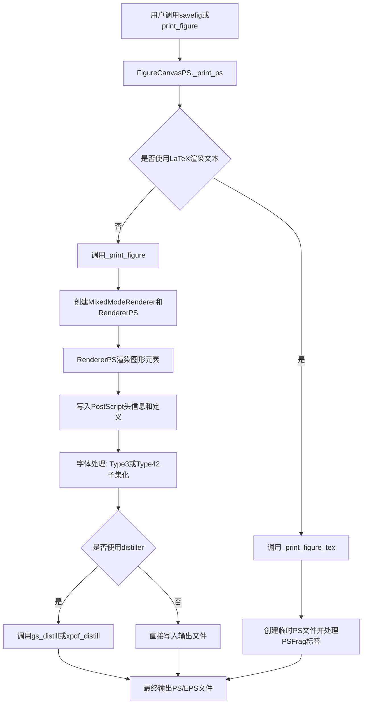

## 类结构

```
_Backend (抽象基类)
└── _BackendPS

RendererBase (抽象基类)
└── RendererPS (继承自_backend_pdf_ps.RendererPDFPSBase)

FigureCanvasBase (抽象基类)
└── FigureCanvasPS

FigureManagerBase (抽象基类)
└── FigureManagerPS (别名)

Enum
└── _Orientation (portrait/landscape)
```

## 全局变量及字段


### `_log`
    
模块日志记录器，用于记录后端运行时的日志信息

类型：`logging.Logger`
    


### `debugPS`
    
PostScript调试标志，控制是否输出调试信息到PS文件

类型：`bool`
    


### `papersize`
    
纸张尺寸字典，包含各种标准纸张尺寸如letter、legal、a4等的宽高数据

类型：`dict`
    


### `_psDefs`
    
PostScript定义字典内容列表，包含matplotlib绘图原语和常用缩写的PS代码定义

类型：`list`
    


### `RendererPS._pswriter`
    
PostScript输出写入器，用于缓存生成的PostScript代码

类型：`StringIO`
    


### `RendererPS.color`
    
当前颜色状态，存储最近一次设置的RGB颜色值

类型：`tuple`
    


### `RendererPS.linewidth`
    
当前线宽，存储最近一次设置的线条宽度

类型：`float`
    


### `RendererPS.linejoin`
    
当前线段连接样式，存储线条转角类型(miter/round/bevel)

类型：`int`
    


### `RendererPS.linecap`
    
当前线段端点样式，存储线条端点类型(butt/round/projecting)

类型：`int`
    


### `RendererPS.linedash`
    
当前虚线模式，存储虚线图案的偏移量和线段序列

类型：`tuple`
    


### `RendererPS.fontname`
    
当前字体名，存储最近一次设置的PostScript字体名称

类型：`str`
    


### `RendererPS.fontsize`
    
当前字体大小，存储最近一次设置的字体大小

类型：`float`
    


### `RendererPS._hatches`
    
缓存的填充图案，存储已创建的填充样式名称以避免重复定义

类型：`dict`
    


### `RendererPS.image_magnification`
    
图像放大倍数，用于控制图像的缩放比例

类型：`float`
    


### `RendererPS._clip_paths`
    
缓存的裁剪路径，存储已定义的裁剪区域以复用

类型：`dict`
    


### `RendererPS._path_collection_id`
    
路径集合ID计数器，用于生成唯一的路径集合名称

类型：`int`
    


### `RendererPS._character_tracker`
    
字符使用跟踪器，跟踪文档中使用的字体字符以进行字体子集化

类型：`_backend_pdf_ps.CharacterTracker`
    


### `RendererPS._logwarn_once`
    
单次警告日志缓存，确保警告信息只输出一次

类型：`functools.cache`
    


### `RendererPS.imagedpi`
    
图像DPI设置，控制图像的分辨率

类型：`int`
    


### `RendererPS.textcnt`
    
psfrag计数器，用于生成唯一的psfrag标记名称

类型：`int`
    


### `RendererPS.psfrag`
    
psfrag标签列表，存储需要由LaTeX替换的文本标签

类型：`list`
    


### `_Orientation.portrait`
    
纵向模式，表示页面为纵向布局

类型：`Enum`
    


### `_Orientation.landscape`
    
横向模式，表示页面为横向布局

类型：`Enum`
    


### `FigureCanvasPS.fixed_dpi`
    
固定DPI为72，PostScript后端使用固定的72 DPI

类型：`int`
    


### `FigureCanvasPS.filetypes`
    
支持的文件类型字典，映射文件扩展名到描述性名称

类型：`dict`
    


### `_BackendPS.backend_version`
    
后端版本'Level II'，标识PostScript语言级别

类型：`str`
    


### `_BackendPS.FigureCanvas`
    
绑定FigureCanvasPS，指定后端使用的画布类

类型：`class`
    
    

## 全局函数及方法


### `_nums_to_str`

该函数是一个工具函数，用于将数字转换为格式化字符串，主要用于PostScript后端生成图形命令。它接受任意数量的数字参数，将每个数字格式化为固定小数位的字符串（保留3位小数但去除尾部零），并使用指定分隔符连接成最终字符串。

参数：

- `*args`：可变数量的数字参数（`int` 或 `float`），需要转换为字符串的数字
- `sep`：字符串类型，默认值为空格`' '`，用于连接各数字字符串的分隔符

返回值：`str`，返回格式化后的数字字符串，多个数字用分隔符连接

#### 流程图

```mermaid
flowchart TD
    A[开始] --> B{args中是否有参数}
    B -->|否| C[返回空字符串'']
    B -->|是| D[遍历args中的每个arg]
    D --> E[将arg格式化为1.3f格式<br/>例如: 1.0 → '1.000', 1.234 → '1.234']
    E --> F[去除尾部零: rstrip('0')<br/>例如: '1.000' → '1.']
    F --> G[去除尾部点: rstrip('.')<br/>例如: '1.' → '1']
    G --> H[将处理后的字符串加入生成器]
    H --> I{是否还有更多arg}
    I -->|是| D
    I -->|否| J[用sep连接所有字符串]
    J --> K[返回最终字符串]
```

#### 带注释源码

```python
def _nums_to_str(*args, sep=" "):
    """
    将数字转换为格式化字符串，用于PostScript输出。
    
    Parameters
    ----------
    *args : int or float
        要转换的数字，可接收任意数量
    sep : str, optional
        分隔符，默认为空格' '
    
    Returns
    -------
    str
        格式化后的数字字符串，多个数字用sep连接
    """
    # 使用生成器表达式逐个处理每个参数
    # f"{arg:1.3f}" 格式说明：
    #   1: 最小宽度为1（通常不会产生额外填充）
    #   .3: 保留3位小数
    #   f: 固定小数点表示法
    # 例如：1.0 → '1.000', 1.234 → '1.234', 1.200 → '1.200'
    #
    # .rstrip("0") 去除尾部零
    # 例如：'1.000' → '1.', '1.200' → '1.2'
    #
    # .rstrip(".") 去除尾部点（如果零被去除后剩下点）
    # 例如：'1.' → '1', '1.2' 保持不变
    #
    # 最后用sep连接所有字符串
    return sep.join(f"{arg:1.3f}".rstrip("0").rstrip(".") for arg in args)
```


### `_move_path_to_path_or_stream`

将文件内容从源路径移动到目标路径或文件流。当目标为文件流时，直接复制内容；当目标为路径时，移动文件（仅复制文件内容，不复制元数据）。

参数：

- `src`：`str | os.PathLike`，源文件路径
- `dst`：`str | os.PathLike | file-like object`，目标路径或文件流对象

返回值：`None`，无返回值（该函数执行文件移动/复制操作，无返回值）

#### 流程图

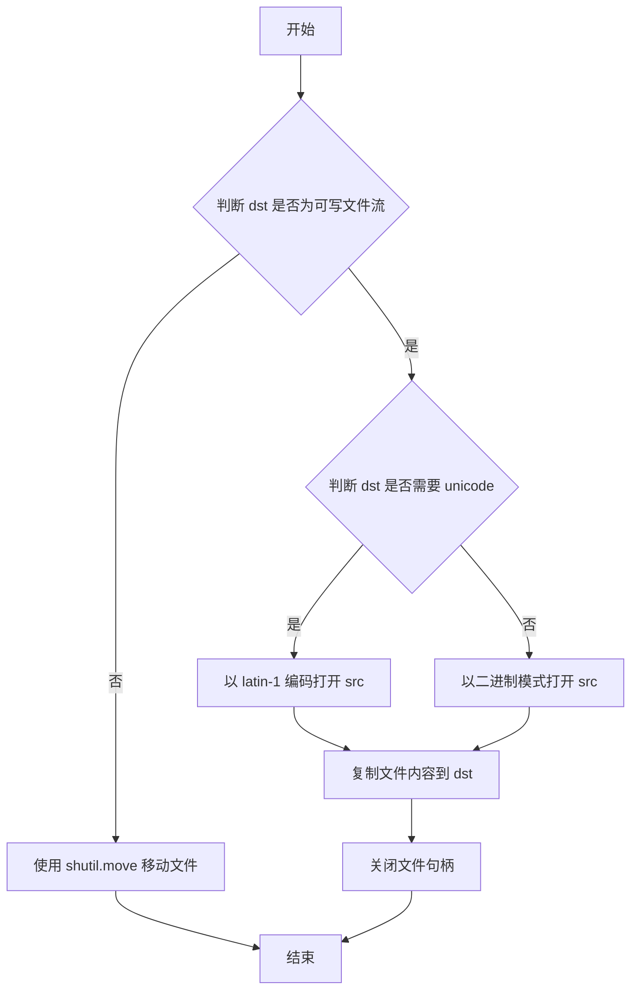

#### 带注释源码

```python
def _move_path_to_path_or_stream(src, dst):
    """
    Move the contents of file at *src* to path-or-filelike *dst*.

    If *dst* is a path, the metadata of *src* are *not* copied.
    """
    # 判断目标是否为可写的文件流对象
    if is_writable_file_like(dst):
        # 根据目标文件流是否需要 unicode 决定源文件的打开模式
        # 如果需要 unicode，使用 latin-1 编码打开；否则使用二进制模式
        fh = (open(src, encoding='latin-1')
              if file_requires_unicode(dst)
              else open(src, 'rb'))
        # 使用上下文管理器确保文件正确关闭
        with fh:
            # 将源文件内容复制到目标文件流
            shutil.copyfileobj(fh, dst)
    else:
        # 目标为路径，使用 shutil.move 移动文件
        # copy_function=shutil.copyfile 表示仅复制文件内容，不复制元数据
        shutil.move(src, dst, copy_function=shutil.copyfile)
```


### `_font_to_ps_type3(font_path, chars)`

将指定字符子集从TrueType字体转换为PostScript Type 3格式字体，返回可在PostScript文件中直接嵌入使用的字体定义字符串。

参数：
- `font_path`：`path-like`，要转换的字体文件路径
- `chars`：`str`，要包含在子集字体中的字符集合

返回值：`str`，PostScript Type 3字体的完整字符串表示，可直接嵌入PS文件

#### 流程图

```mermaid
flowchart TD
    A[开始 _font_to_ps_type3] --> B[加载字体: get_font font_path]
    B --> C[获取字符Glyph IDs: font.get_char_index for each char]
    C --> D[构建Preamble<br/>%!PS-Adobe-3.0 Resource-Font<br/>FontName/FontMatrix/FontBBox/etc.]
    D --> E{遍历glyph_ids}
    E -->|每个glyph| F[加载Glyph: font.load_glyph]
    F --> G[获取Path数据: font.get_path]
    G --> H[转换为PostScript路径<br/>_path.convert_to_string]
    H --> I[构建Glyph定义<br/>/glyph_name{bbox} sc ... ce]
    I --> E
    E -->|完成| J[构建Postamble<br/>BuildGlyph/BuildChar定义]
    J --> K[拼接: preamble + entries + postamble]
    K --> L[返回Type 3字体字符串]
```

#### 带注释源码

```python
def _font_to_ps_type3(font_path, chars):
    """
    Subset *chars* from the font at *font_path* into a Type 3 font.

    Parameters
    ----------
    font_path : path-like
        Path to the font to be subsetted.
    chars : str
        The characters to include in the subsetted font.

    Returns
    -------
    str
        The string representation of a Type 3 font, which can be included
        verbatim into a PostScript file.
    """
    # 步骤1: 使用matplotlib的字体加载器加载TrueType/OpenType字体
    # hinting_factor=1 启用微调以获得更好的渲染效果
    font = get_font(font_path, hinting_factor=1)
    
    # 步骤2: 获取每个字符对应的glyph索引
    # glyph索引是字体内部用于标识每个字符的唯一编号
    glyph_ids = [font.get_char_index(c) for c in chars]

    # 步骤3: 构建Type 3字体的Preamble（头部定义）
    # 包含PostScript字体字典所需的各种元数据
    preamble = """\
%!PS-Adobe-3.0 Resource-Font
%%Creator: Converted from TrueType to Type 3 by Matplotlib.
10 dict begin
/FontName /{font_name} def
/PaintType 0 def
/FontMatrix [{inv_units_per_em} 0 0 {inv_units_per_em} 0 0] def
/FontBBox [{bbox}] def
/FontType 3 def
/Encoding [{encoding}] def
/CharStrings {num_glyphs} dict dup begin
/.notdef 0 def
""".format(
    # 字体的PostScript名称（如 Helvetica-Bold）
    font_name=font.postscript_name,
    # 字体单位到EM的倒数，用于坐标变换（EM通常为1000或2048）
    inv_units_per_em=1 / font.units_per_EM,
    # 字体的边界框 [xMin, yMin, xMax, yMax]
    bbox=" ".join(map(str, font.bbox)),
    # 编码数组，将字符映射到glyph名称
    encoding=" ".join(f"/{font.get_glyph_name(glyph_id)}"
                      for glyph_id in glyph_ids),
    # CharStrings字典中的条目数（包含.notdef）
    num_glyphs=len(glyph_ids) + 1)

    # 步骤4: 构建Postamble（尾部定义）
    # 包含BuildGlyph和BuildChar过程，用于实际绘制字符
    postamble = """
end readonly def

/BuildGlyph {
 exch begin
 CharStrings exch
 2 copy known not {pop /.notdef} if
 true 3 1 roll get exec
 end
} _d

/BuildChar {
 1 index /Encoding get exch get
 1 index /BuildGlyph get exec
} _d

FontName currentdict end definefont pop
"""

    # 步骤5: 遍历每个glyph，加载并转换为PostScript路径命令
    entries = []
    for glyph_id in glyph_ids:
        # 加载单个glyph，NO_SCALE保持原始坐标
        g = font.load_glyph(glyph_id, LoadFlags.NO_SCALE)
        
        # 获取字形的轮廓路径数据
        # v: 顶点坐标数组, c: 顶点类型数组（move/line/curve/close）
        v, c = font.get_path()
        
        # 构建单个字符的PostScript定义
        # 格式: /GlyphName { bbox setcachedevice path_commands } _d
        entries.append(
            "/%(name)s{%(bbox)s sc\n" % {
                "name": font.get_glyph_name(glyph_id),
                # bbox: [advanceWidth, 0, xMin, yMin, xMax, yMax]
                "bbox": " ".join(map(str, [g.horiAdvance, 0, *g.bbox])),
            }
            # 将路径数据转换为PostScript路径字符串
            # 乘以64转换回TrueType内部单位（1/64点）
            # 自动将二次贝塞尔曲线转换为三次贝塞尔
            + _path.convert_to_string(
                Path(v * 64, c), None, None, False, None, 0,
                # m=moveto, l=lineto, 空=quad Bezier(转cubic), c=curveto, 空=closepoly
                [b"m", b"l", b"", b"c", b""], True).decode("ascii")
            + "ce} _d"  # ce = closepath + eofill
        )

    # 步骤6: 组装最终字符串并返回
    # 结构: Preamble + 所有Glyph定义 + Postamble
    return preamble + "\n".join(entries) + postamble
```


### `_font_to_ps_type42`

将指定字体文件中的字符子集转换为PostScript Type 42字体格式，并写入到给定的文件对象中。该函数是Matplotlib PostScript后端的核心组成部分，用于生成嵌入PostScript文档的字体数据。

参数：

- `font_path`：`path-like`，要转换的字体文件路径
- `chars`：`str`，需要包含在子集字体中的字符
- `fh`：`file-like`，写入Type 42字体数据的文件对象

返回值：无（通过`fh`参数直接写入）

#### 流程图

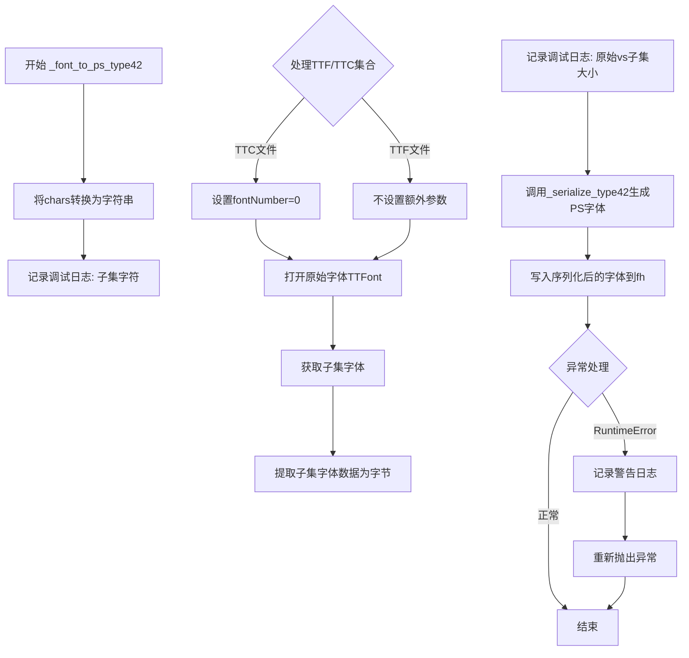

#### 带注释源码

```
def _font_to_ps_type42(font_path, chars, fh):
    """
    Subset *chars* from the font at *font_path* into a Type 42 font at *fh*.

    Parameters
    ----------
    font_path : path-like
        Path to the font to be subsetted.
    chars : str
        The characters to include in the subsetted font.
    fh : file-like
        Where to write the font.
    """
    # 将字符列表转换为字符串 (chars可能是整数列表)
    subset_str = ''.join(chr(c) for c in chars)
    _log.debug("SUBSET %s characters: %s", font_path, subset_str)
    
    try:
        kw = {}
        # TTC (TrueType Collection) 文件处理
        # 目前只支持从集合中加载第一个字体
        # https://github.com/matplotlib/matplotlib/issues/3135#issuecomment-571085541
        if font_path.endswith('.ttc'):
            kw['fontNumber'] = 0
        
        # 使用上下文管理器打开原始字体和子集字体
        with (fontTools.ttLib.TTFont(font_path, **kw) as font,
              _backend_pdf_ps.get_glyphs_subset(font_path, subset_str) as subset):
            # 将子集字体提取为原始TTF字节数据
            fontdata = _backend_pdf_ps.font_as_file(subset).getvalue()
            _log.debug(
                "SUBSET %s %d -> %d", font_path, os.stat(font_path).st_size,
                len(fontdata)
            )
            # 序列化Type 42字体并写入输出文件
            fh.write(_serialize_type42(font, subset, fontdata))
    except RuntimeError:
        # 字体不支持时记录警告并重新抛出异常
        _log.warning(
            "The PostScript backend does not currently support the selected font (%s).",
            font_path)
        raise
```


### `_serialize_type42`

该函数负责将字体对象序列化为 PostScript Type-42 格式的字符串表示，用于在 PostScript 输出中嵌入字体子集。

参数：

- `font`：`fontTools.ttLib.ttFont.TTFont`，原始字体对象
- `subset`：`fontTools.ttLib.ttFont.TTFont`，子集字体对象
- `fontdata`：`bytes`，TTF 格式的原始字体数据

返回值：`str`，Type-42 格式化的字体字符串

#### 流程图

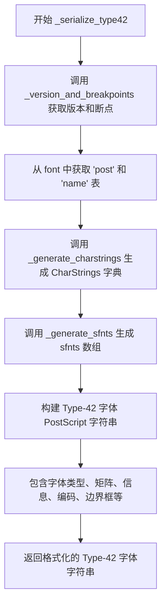

#### 带注释源码

```python
def _serialize_type42(font, subset, fontdata):
    """
    Output a PostScript Type-42 format representation of font

    Parameters
    ----------
    font : fontTools.ttLib.ttFont.TTFont
        The original font object
    subset : fontTools.ttLib.ttFont.TTFont
        The subset font object
    fontdata : bytes
        The raw font data in TTF format

    Returns
    -------
    str
        The Type-42 formatted font
    """
    # 从原始字体的 loca 表和原始字体数据获取版本号和分界点
    version, breakpoints = _version_and_breakpoints(font.get('loca'), fontdata)
    # 获取 post 表，包含斜体角度和固定间距等字体信息
    post = font['post']
    # 获取 name 表，包含字体名称信息
    name = font['name']
    # 生成 CharStrings 字典，定义字体中的所有字形
    chars = _generate_charstrings(subset)
    # 生成 sfnts 数组，包含字体数据的十六进制表示
    sfnts = _generate_sfnts(fontdata, subset, breakpoints)
    # 使用 textwrap.dedent 去除缩进，生成完整的 Type-42 字体定义
    return textwrap.dedent(f"""
        %%!PS-TrueTypeFont-{version[0]}.{version[1]}-{font['head'].fontRevision:.7f}
        10 dict begin
        /FontType 42 def
        /FontMatrix [1 0 0 1 0 0] def
        /FontName /{name.getDebugName(6)} def
        /FontInfo 7 dict dup begin
        /FullName ({name.getDebugName(4)}) def
        /FamilyName ({name.getDebugName(1)}) def
        /Version ({name.getDebugName(5)}) def
        /ItalicAngle {post.italicAngle} def
        /isFixedPitch {'true' if post.isFixedPitch else 'false'} def
        /UnderlinePosition {post.underlinePosition} def
        /UnderlineThickness {post.underlineThickness} def
        end readonly def
        /Encoding StandardEncoding def
        /FontBBox [{_nums_to_str(*_bounds(font))}] def
        /PaintType 0 def
        /CIDMap 0 def
        {chars}
        {sfnts}
        FontName currentdict end definefont pop
        """)
```


### `_version_and_breakpoints`

该函数用于读取字体的版本号并确定 sfnts（PostScript 字体子集）断点。当 TrueType 字体文件被写入为 Type 42 字体时，需要将其拆分为不超过 65535 字节的子字符串，这些子字符串必须在字体表边界或 glyf 表中的字形边界开始。该函数确定所有可能的断点，由调用者负责执行拆分操作。

参数：

- `loca`：`fontTools.ttLib._l_o_c_a.table__loca` 或 `None`，字体的 loca 表（如果可用）
- `fontdata`：`bytes`，字体的原始数据

返回值：`tuple[tuple[int, int], list[int]]`，返回包含两个元素的元组：
- 第一个元素是版本号元组 `(主版本号, 副版本号)`
- 第二个元素是断点列表，是 fontdata 中偏移量的排序列表；如果 loca 不可用，则仅为表边界

#### 流程图

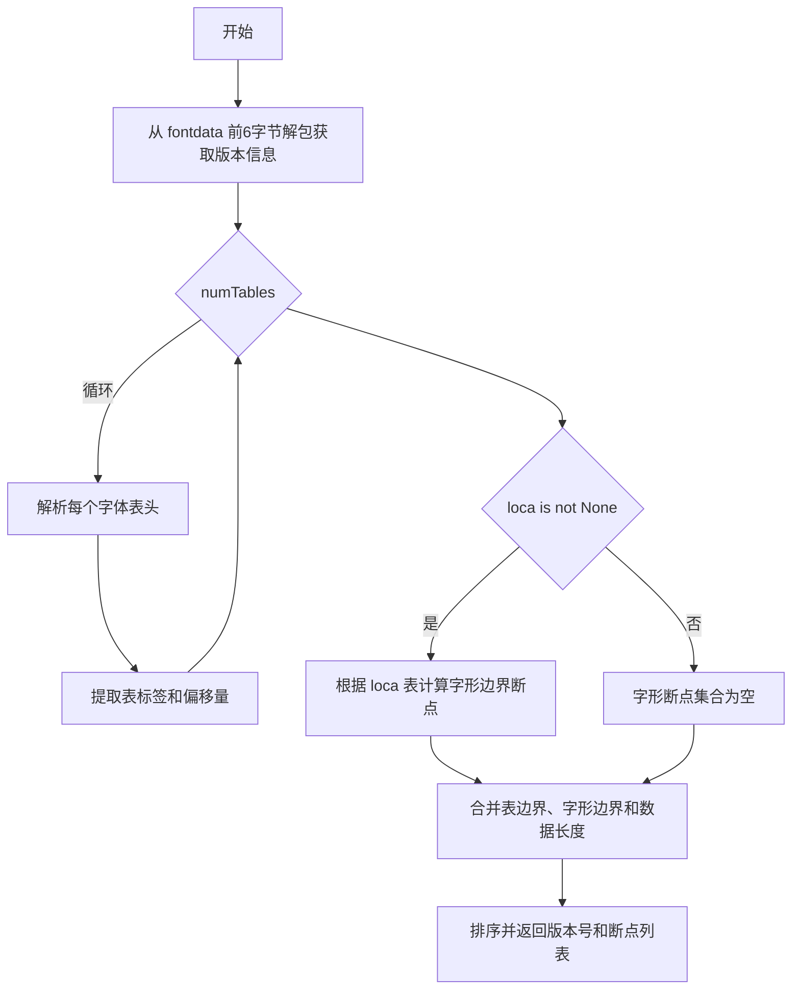

#### 带注释源码

```python
def _version_and_breakpoints(loca, fontdata):
    """
    Read the version number of the font and determine sfnts breakpoints.

    当 TrueType 字体文件被写入为 Type 42 字体时，需要拆分为
    不超过 65535 字节的子字符串。这些子字符串必须在字体表边界
    或 glyf 表中的字形边界开始。此函数确定所有可能的断点，
    由调用者负责执行拆分操作。

    Parameters
    ----------
    loca : fontTools.ttLib._l_o_c_a.table__l_o_c_a or None
        字体的 loca 表（如果可用）
    fontdata : bytes
        字体的原始数据

    Returns
    -------
    version : tuple[int, int]
        主版本号和副版本号组成的2元组
    breakpoints : list[int]
        fontdata 中偏移量的排序列表；如果 loca 不可用，
        则仅为表边界
    """
    # 从字体数据的前6字节解析版本号和表数量
    # '>3h' 表示大端序（>）读取3个有符号短整数（16位）
    # 格式: v1(主版本), v2(副版本), numTables(字体表数量)
    v1, v2, numTables = struct.unpack('>3h', fontdata[:6])
    version = (v1, v2)

    # 字典存储字体表信息: {表标签: 偏移量}
    tables = {}
    
    # 遍历所有字体表头
    # 每个表头占16字节: tag(4字节) + 校验和(4字节) + 偏移量(4字节) + 长度(4字节)
    for i in range(numTables):
        # 解析单个表头
        # '>4sIII': 4字节字符串 + 3个无符号整数（大端序）
        tag, _, offset, _ = struct.unpack('>4sIII', fontdata[12 + i*16:12 + (i+1)*16])
        # 将表标签从字节转换为ASCII字符串并存储偏移量
        tables[tag.decode('ascii')] = offset

    # 根据 loca 表计算字形边界作为断点
    if loca is not None:
        # loca.locations 包含每个字形的偏移量
        # 计算相对于 glyf 表起始位置的偏移
        # 使用除最后一个外的所有位置作为断点（最后一个是字形结束位置）
        glyf_breakpoints = {tables['glyf'] + offset for offset in loca.locations[:-1]}
    else:
        # 如果没有 loca 表，字形断点集合为空
        glyf_breakpoints = set()

    # 合并所有断点：表起始偏移 + 字形边界偏移 + 数据总长度（作为结束标记）
    # 使用集合去重，然后排序
    breakpoints = sorted({*tables.values(), *glyf_breakpoints, len(fontdata)})

    return version, breakpoints
```


### `_bounds`

计算字体的边界框，遍历字体中所有字形并计算它们的组合边界框，作为辅助函数用于生成PostScript Type-42字体格式。

参数：

- `font`：`fontTools.ttLib.ttFont.TTFont`，字体对象

返回值：`tuple`，返回 `(xMin, yMin, xMax, yMax)` 格式的组合边界框，如果无法计算则返回 `(0, 0, 0, 0)`

#### 流程图

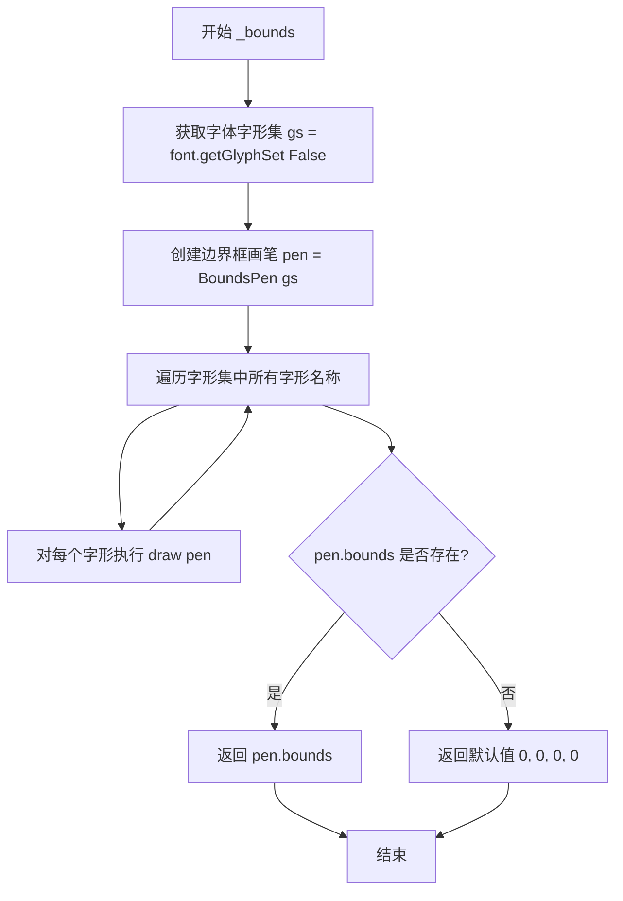

#### 带注释源码

```
def _bounds(font):
    """
    Compute the font bounding box, as if all glyphs were written
    at the same start position.

    Helper function for _font_to_ps_type42.

    Parameters
    ----------
    font : fontTools.ttLib.ttFont.TTFont
        The font

    Returns
    -------
    tuple
        (xMin, yMin, xMax, yMax) of the combined bounding box
        of all the glyphs in the font
    """
    # 获取字体的字形集，参数False表示不加载 glyph 数据
    gs = font.getGlyphSet(False)
    
    # 创建 BoundsPen 用于计算边界框
    pen = fontTools.pens.boundsPen.BoundsPen(gs)
    
    # 遍历字形集中的每个字形
    for name in gs.keys():
        # 将字形绘制到 BoundsPen 以累积边界信息
        gs[name].draw(pen)
    
    # 返回计算得到的边界框，如果为 None 则返回默认值
    return pen.bounds or (0, 0, 0, 0)
```


### `_generate_charstrings`

该函数用于将字体字形转换为PostScript CharStrings字典定义，是`_font_to_ps_type42`函数的辅助函数，负责生成Type 42字体定义中的CharStrings部分。

参数：

- `font`：`fontTools.ttLib.ttFont.TTFont`，字体对象

返回值：`str`，PostScript格式的CharStrings字典定义字符串

#### 流程图

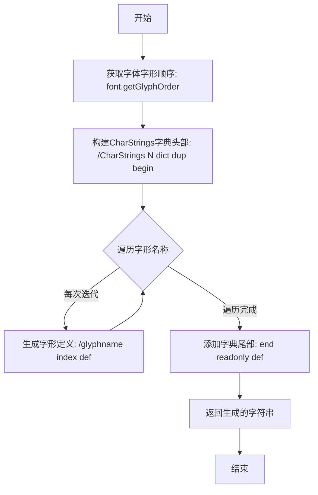

#### 带注释源码

```python
def _generate_charstrings(font):
    """
    Transform font glyphs into CharStrings

    Helper function for _font_to_ps_type42.

    Parameters
    ----------
    font : fontTools.ttLib.ttFont.TTFont
        The font

    Returns
    -------
    str
        A definition of the CharStrings dictionary in PostScript
    """
    # 获取字体中所有字形的顺序列表
    go = font.getGlyphOrder()
    
    # 初始化字符串，构建CharStrings字典头部
    # 格式: /CharStrings {数量} dict dup begin
    s = f'/CharStrings {len(go)} dict dup begin\n'
    
    # 遍历每个字形名称，为其创建PostScript定义
    # 格式: /glyphname {index} def
    for i, name in enumerate(go):
        s += f'/{name} {i} def\n'
    
    # 添加字典尾部，结束字典定义并设置为只读
    s += 'end readonly def'
    
    # 返回生成的完整CharStrings定义字符串
    return s
```


### `_generate_sfnts(fontdata, font, breakpoints)`

将字体原始数据转换为 PostScript sfnts 数组格式（用于 Type 42 字体定义）。

参数：

- `fontdata`：`bytes`，字体的原始二进制数据（TTF/OTF 格式）
- `font`：`fontTools.ttLib.ttFont.TTFont`，fontTools 字体对象（本函数未直接使用，仅作为接口一致性保留）
- `breakpoints`：`list[int]`，已排序的可能断点偏移量列表（表边界或字形边界位置）

返回值：`str`，PostScript sfnts 数组，包含十六进制编码的字体数据片段

#### 流程图

```mermaid
flowchart TD
    A[开始] --> B[初始化字符串 s = '/sfnts[']
    B --> C[pos = 0]
    C --> D{pos < len(fontdata)?}
    D -- 是 --> E[i = bisect.bisect_left<br/>breakpoints, pos + 65534]
    E --> F[newpos = breakpoints[i-1]]
    F --> G{newpos <= pos?}
    G -- 是 --> H[newpos = breakpoints[-1]<br/>接受较大字符串]
    G -- 否 --> I[跳过]
    H --> J[s += '<fontdata[pos:newpos].hex()>00'<br/>追加NUL终止符]
    I --> J
    J --> K[pos = newpos]
    K --> D
    D -- 否 --> L[s += ']def']
    L --> M[return 每100字符换行的格式化字符串]
    M --> N[结束]
```

#### 带注释源码

```python
def _generate_sfnts(fontdata, font, breakpoints):
    """
    Transform font data into PostScript sfnts format.

    Helper function for _font_to_ps_type42.

    Parameters
    ----------
    fontdata : bytes
        The raw data of the font
    font : fontTools.ttLib.ttFont.TTFont
        The fontTools font object
    breakpoints : list
        Sorted offsets of possible breakpoints

    Returns
    -------
    str
        The sfnts array for the font definition, consisting
        of hex-encoded strings in PostScript format
    """
    s = '/sfnts['                                  # 初始化 sfnts 数组声明
    pos = 0                                         # 当前位置指针
    while pos < len(fontdata):                      # 遍历整个字体数据
        # 使用二分查找找到不超过 pos+65534 的最大断点
        # 65534 是 PostScript 字符串字面量的最大长度限制（2字节长度字段）
        i = bisect.bisect_left(breakpoints, pos + 65534)
        newpos = breakpoints[i-1]                   # 获取该断点位置
        if newpos <= pos:                           # 边界情况：无法在限制内分割
            # 强制使用最大断点（文件末尾），接受超长字符串
            newpos = breakpoints[-1]
        # 将该片段转换为十六进制并追加 NUL 终止符（PostScript 要求）
        s += f'<{fontdata[pos:newpos].hex()}00>'
        pos = newpos                                 # 更新位置指针
    s += ']def'                                     # 结束 sfnts 数组定义
    # 将长字符串按每行100字符换行，保持输出美观
    return '\n'.join(s[i:i+100] for i in range(0, len(s), 100))
```


### `_log_if_debug_on`

该函数是一个调试日志装饰器工厂，用于包装 `RendererPS` 类的方法。当全局标志 `debugPS` 被设置为 `True` 时，被装饰的方法在执行前会向 PostScript 输出流写入一条包含方法名的注释，以便于调试和追踪方法的调用顺序。

参数：

- `meth`：`Callable`，需要被装饰的 `RendererPS` 类的方法

返回值：`Callable`，返回一个新的包装函数（装饰器），该装饰器接受 `self` 和任意位置参数/关键字参数

#### 流程图

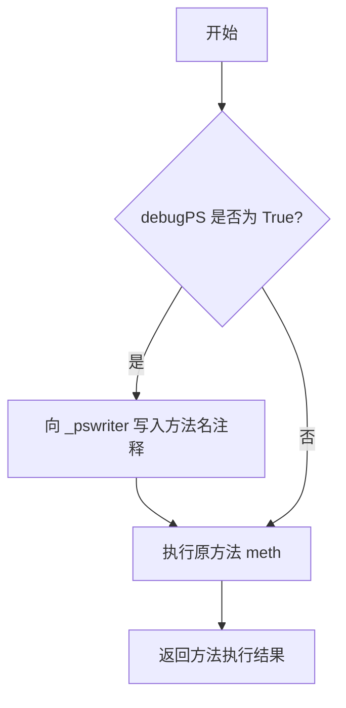

#### 带注释源码

```python
def _log_if_debug_on(meth):
    """
    Wrap `RendererPS` method *meth* to emit a PS comment with the method name,
    if the global flag `debugPS` is set.
    
    这是一个装饰器工厂，接收一个 RendererPS 的方法作为参数，
    返回一个包装后的方法。当全局变量 debugPS 为 True 时，
    会在方法执行前向 PostScript 输出流写入方法名的注释。
    
    Parameters
    ----------
    meth : Callable
        RendererPS 类的方法，需要被装饰的方法
    
    Returns
    -------
    Callable
        装饰器函数，用于包装原方法
    """
    # 使用 functools.wraps 装饰器来保留原方法元数据（如 __name__, __doc__ 等）
    @functools.wraps(meth)
    def wrapper(self, *args, **kwargs):
        # 检查全局调试标志是否为 True
        if debugPS:
            # 向 PostScript 输出流写入方法名注释（以 % 开头为 PS 注释）
            self._pswriter.write(f"% {meth.__name__}\n")
        # 调用原始方法，传入 self 和所有参数
        return meth(self, *args, **kwargs)

    return wrapper
```


### `_convert_psfrags`

该函数是Matplotlib PostScript后端的核心组件，负责在启用LaTeX渲染时将PostScript文件中的PSFrag标签转换为实际的文本内容。它通过生成包含PSFrag命令的LaTeX文档，使用TexManager调用LaTeX引擎处理，最后通过dvips生成包含转换后文本的PostScript文件，并检测输出是否需要旋转。

参数：

- `tmppath`：`str` 或 `pathlib.Path`，临时PostScript文件的路径，该文件包含PSFrag标记
- `psfrags`：`list`，PSFrag标签列表，每个标签定义了文本在图形中的位置和格式
- `paper_width`：`float` 或 `int`，纸张宽度（英寸）
- `paper_height`：`float` 或 `int`，纸张高度（英寸）
- `orientation`：`str`，页面方向，值为 `'portrait'` 或 `'landscape'`

返回值：`bool`，如果生成的PostScript文件处于横向模式（Landscape）则返回 `True`，否则返回 `False`

#### 流程图

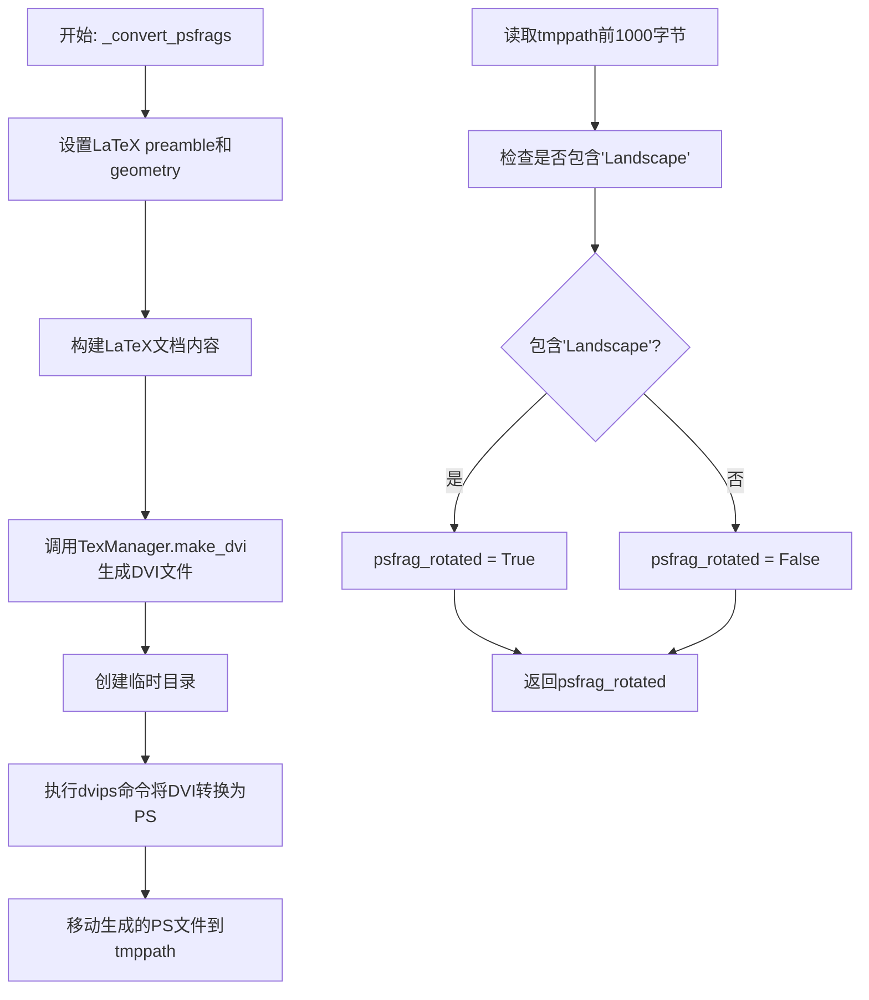

#### 带注释源码

```python
def _convert_psfrags(tmppath, psfrags, paper_width, paper_height, orientation):
    """
    When we want to use the LaTeX backend with postscript, we write PSFrag tags
    to a temporary postscript file, each one marking a position for LaTeX to
    render some text. convert_psfrags generates a LaTeX document containing the
    commands to convert those tags to text. LaTeX/dvips produces the postscript
    file that includes the actual text.
    """
    # 1. 配置LaTeX环境：添加color、graphicx、psfrag包和页面几何参数
    # 这些包是PSFrag工作所必需的，geometry设置纸张大小以匹配输出
    with mpl.rc_context({
            "text.latex.preamble":
            mpl.rcParams["text.latex.preamble"] +
            mpl.texmanager._usepackage_if_not_loaded("color") +
            mpl.texmanager._usepackage_if_not_loaded("graphicx") +
            mpl.texmanager._usepackage_if_not_loaded("psfrag") +
            r"\geometry{papersize={%(width)sin,%(height)sin},margin=0in}"
            % {"width": paper_width, "height": paper_height}
    }):
        # 2. 生成LaTeX文档：创建figure环境，包含PSFrag命令和图形
        # PSFrag命令指定每个标记的替换文本，angle处理旋转
        dvifile = TexManager().make_dvi(
            "\n"
            r"\begin{figure}""\n"
            r"  \centering\leavevmode""\n"
            r"  %(psfrags)s""\n"
            r"  \includegraphics*[angle=%(angle)s]{%(epsfile)s}""\n"
            r"\end{figure}"
            % {
                "psfrags": "\n".join(psfrags),
                "angle": 90 if orientation == 'landscape' else 0,
                "epsfile": tmppath.resolve().as_posix(),
            },
            fontsize=10)  # tex's default fontsize.

    # 3. 使用dvips将DVI转换为PostScript
    # 创建临时目录用于中间文件，dvips生成PS文件替换原始临时PS文件
    with TemporaryDirectory() as tmpdir:
        psfile = os.path.join(tmpdir, "tmp.ps")
        cbook._check_and_log_subprocess(
            ['dvips', '-q', '-R0', '-o', psfile, dvifile], _log)
        shutil.move(psfile, tmppath)

    # 4. 检测输出方向：检查生成的PS文件是否为横向模式
    # 某些figure尺寸（如a5: 8.3in x 5.8in）会导致LaTeX/dvips生成横向输出
    # 这会影响最终的边界框计算，需要在后续pstoeps步骤中修正
    with open(tmppath) as fh:
        psfrag_rotated = "Landscape" in fh.read(1000)
    return psfrag_rotated
```


### `_try_distill`

尝试蒸馏PS文件，如果蒸馏工具（如ghostscript或xpdf）不可用，则捕获异常并记录警告，保证主流程不受影响。

参数：

- `func`：`Callable`，用于执行蒸馏操作的可调用函数（如`gs_distill`或`xpdf_distill`）
- `tmppath`：`pathlib.Path` 或 `str`，临时PostScript文件的路径
- `*args`：`Any`，可变位置参数，传递给`func`函数
- `**kwargs`：`Any`，可变关键字参数，传递给`func`函数

返回值：`None`，该函数没有返回值

#### 流程图

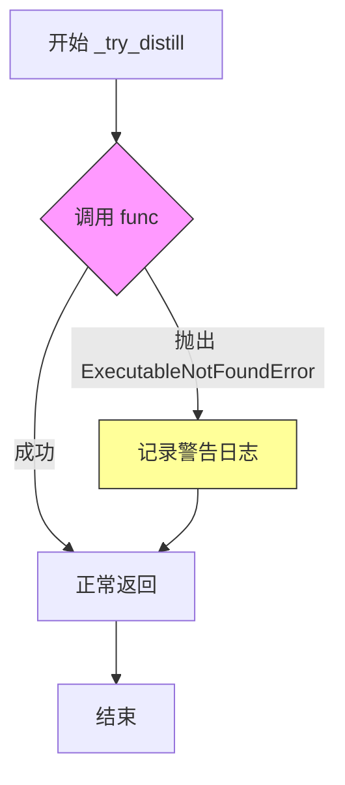

#### 带注释源码

```python
def _try_distill(func, tmppath, *args, **kwargs):
    """
    尝试蒸馏PS文件，如果蒸馏工具不可用则记录警告。
    
    Parameters
    ----------
    func : callable
        用于执行蒸馏操作的可调用函数，如 gs_distill 或 xpdf_distill。
    tmppath : path-like
        临时PostScript文件的路径。
    *args : tuple
        可变位置参数，传递给 func 函数。
    **kwargs : dict
        可变关键字参数，传递给 func 函数。
    """
    try:
        # 将tmppath转换为字符串后调用蒸馏函数
        func(str(tmppath), *args, **kwargs)
    except mpl.ExecutableNotFoundError as exc:
        # 捕获可执行文件未找到异常，记录警告后继续执行
        _log.warning("%s.  Distillation step skipped.", exc)
```


### `gs_distill`

使用 Ghostscript 的 pswrite 或 epswrite 设备对 PostScript 文件进行蒸馏，生成更小的文件并移除非法的封装 PostScript 操作符。输出为低级内容，将文本转换为轮廓。

参数：

- `tmpfile`：`str`，临时文件路径，要蒸馏的 PostScript 文件路径
- `eps`：`bool`，是否为封装 PostScript (EPS) 格式，默认为 False
- `ptype`：`str`，纸张尺寸类型（如 'letter', 'legal', 'a4' 等），默认为 'letter'
- `bbox`：`tuple` 或 `None`，边界框坐标 (left, bottom, right, top)，用于指定 EPS 裁剪区域或自定义纸张大小，默认为 None
- `rotated`：`bool`，是否旋转输出（用于横向模式），默认为 False

返回值：`None`，该函数直接修改 tmpfile 指向的文件，不返回值

#### 流程图

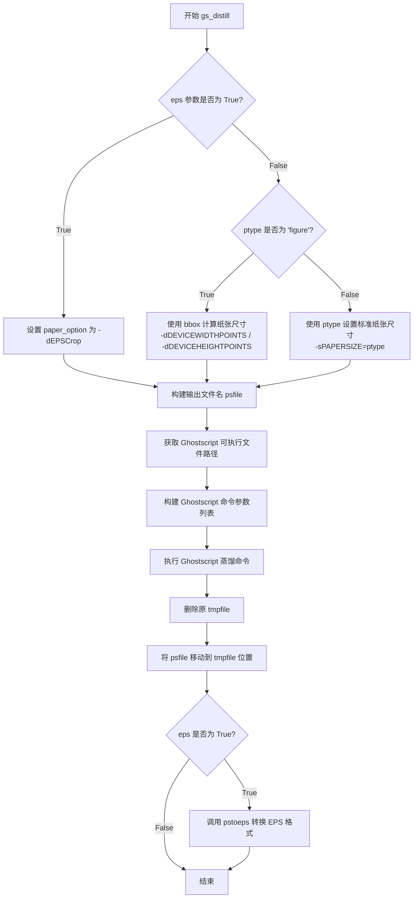

#### 带注释源码

```python
def gs_distill(tmpfile, eps=False, ptype='letter', bbox=None, rotated=False):
    """
    Use ghostscript's pswrite or epswrite device to distill a file.
    This yields smaller files without illegal encapsulated postscript
    operators. The output is low-level, converting text to outlines.
    """
    # 根据 eps 标志和纸张类型设置 Ghostscript 的纸张选项
    if eps:
        # EPS 模式：启用 EPS 裁剪
        paper_option = ["-dEPSCrop"]
    elif ptype == "figure":
        # 自定义图纸尺寸模式：使用 bbox 的右上角坐标作为纸张尺寸
        # bbox 的左下角位于 (0, 0)，因此右上角对应纸张尺寸
        paper_option = [f"-dDEVICEWIDTHPOINTS={bbox[2]}",
                        f"-dDEVICEHEIGHTPOINTS={bbox[3]}"]
    else:
        # 标准纸张尺寸模式：使用预定义的纸张大小
        paper_option = [f"-sPAPERSIZE={ptype}"]

    # 构建输出文件名：原文件名 + .ps 后缀
    psfile = tmpfile + '.ps'
    # 获取蒸馏分辨率设置
    dpi = mpl.rcParams['ps.distiller.res']

    # 执行 Ghostscript 蒸馏命令
    # 参数说明：
    # -dBATCH: 批处理模式，执行完自动退出
    # -dNOPAUSE: 不暂停等待用户输入
    # -r%d: 分辨率设置
    # -sDEVICE=ps2write: 使用 PostScript Level 2 写入设备
    cbook._check_and_log_subprocess(
        [mpl._get_executable_info("gs").executable,
         "-dBATCH", "-dNOPAUSE", "-r%d" % dpi, "-sDEVICE=ps2write",
         *paper_option, f"-sOutputFile={psfile}", tmpfile],
        _log)

    # 清理临时文件：删除原文件，将输出文件移回原位置
    os.remove(tmpfile)
    shutil.move(psfile, tmpfile)

    # 注意：虽然希望上述步骤保留原始边界框，但某些情况下可能丢失
    # 对于这些情况，可以在 pstoeps 步骤中恢复原始边界框

    # 对于 EPS 格式，某些版本的 Ghostscript 可能导致边界框不正确
    # 目前暂不为 EPS 调整边界框
    if eps:
        pstoeps(tmpfile, bbox, rotated=rotated)
```


### `xpdf_distill`

使用 Ghostscript 的 ps2pdf 和 xpdf/poppler 的 pdftops 对 PostScript 文件进行蒸馏，生成更小且不含非法封裝 PostScript 操作符的文件。此蒸馏器为首选方式，能生成高级 PostScript 输出并将文本视为文本。

参数：

- `tmpfile`：`str`，输入的临时 PostScript 文件路径
- `eps`：`bool`，是否生成 EPS（Encapsulated PostScript）格式，默认为 `False`
- `ptype`：`str`，纸张尺寸类型（如 'letter', 'a4', 'figure' 等），默认为 'letter'
- `bbox`：`tuple` 或 `None`，边界框信息 (l, b, r, t)，当 ptype='figure' 时用于设置纸张大小
- `rotated`：`bool`，是否需要旋转，用于处理横向输出，默认为 `False`

返回值：`None`，该函数直接修改输入文件，不返回任何值

#### 流程图

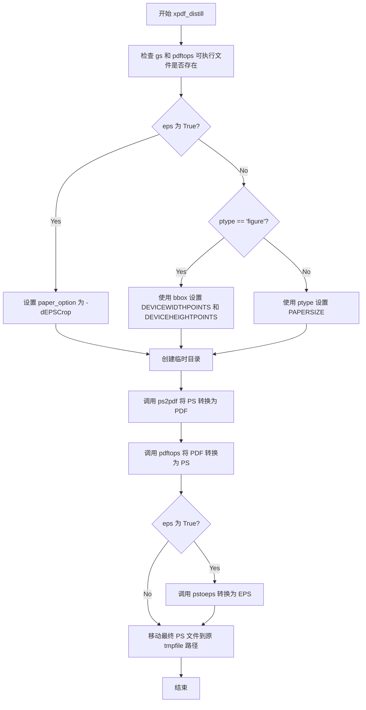

#### 带注释源码

```python
def xpdf_distill(tmpfile, eps=False, ptype='letter', bbox=None, rotated=False):
    """
    Use ghostscript's ps2pdf and xpdf's/poppler's pdftops to distill a file.
    This yields smaller files without illegal encapsulated postscript
    operators. This distiller is preferred, generating high-level postscript
    output that treats text as text.
    """
    # 检查 ps2pdf (来自 ghostscript) 和 pdftops (来自 xpdf/poppler) 是否可用
    # 如果不存在会抛出 ExecutableNotFoundError 异常
    mpl._get_executable_info("gs")  # Effectively checks for ps2pdf.
    mpl._get_executable_info("pdftops")

    # 根据参数设置纸张选项
    if eps:
        # EPS 格式需要裁剪到 bounding box
        paper_option = ["-dEPSCrop"]
    elif ptype == "figure":
        # figure 类型使用 bbox 的尺寸作为纸张大小
        # bbox 的左下角在 (0, 0)，因此右上角对应纸张尺寸
        paper_option = [f"-dDEVICEWIDTHPOINTS#{bbox[2]}",
                        f"-dDEVICEHEIGHTPOINTS#{bbox[3]}"]
    else:
        # 使用标准纸张尺寸如 letter, legal, a4 等
        paper_option = [f"-sPAPERSIZE#{ptype}"]

    # 创建临时目录用于中间文件处理
    with TemporaryDirectory() as tmpdir:
        tmppdf = pathlib.Path(tmpdir, "tmp.pdf")
        tmpps = pathlib.Path(tmpdir, "tmp.ps")
        
        # 使用 # 代替 = 传递参数，以保持 Windows 兼容性
        # (参考: https://ghostscript.com/doc/9.56.1/Use.htm#MS_Windows)
        
        # 第一步：使用 ps2pdf 将 PostScript 转换为 PDF
        # -dAutoFilterColorImages#false: 禁用彩色图像自动过滤
        # -dAutoFilterGrayImages#false: 禁用灰度图像自动过滤
        # -sAutoRotatePages#None: 不自动旋转页面
        # -sGrayImageFilter#FlateEncode: 使用 FlateEncode 压缩灰度图像
        # -sColorImageFilter#FlateEncode: 使用 FlateEncode 压缩彩色图像
        cbook._check_and_log_subprocess(
            ["ps2pdf",
             "-dAutoFilterColorImages#false",
             "-dAutoFilterGrayImages#false",
             "-sAutoRotatePages#None",
             "-sGrayImageFilter#FlateEncode",
             "-sColorImageFilter#FlateEncode",
             *paper_option,
             tmpfile, tmppdf], _log)
        
        # 第二步：使用 pdftops 将 PDF 转换回 PostScript
        # -paper match: 自动匹配纸张大小
        # -level3: 使用 PostScript Level 3 输出
        cbook._check_and_log_subprocess(
            ["pdftops", "-paper", "match", "-level3", tmppdf, tmpps], _log)
        
        # 将最终 PS 文件移动回原 tmpfile 路径
        shutil.move(tmpps, tmpfile)
    
    # 如果需要 EPS 格式，调用 pstoeps 进行最终转换
    if eps:
        pstoeps(tmpfile)
```


### `_get_bbox_header`

该函数接收一个边界框坐标元组（左、下、右、上），返回符合PostScript文档规范的BoundingBox头信息字符串，包含整数格式和 高分辨率浮点格式两种表示。

参数：

- `lbrt`：`tuple`，边界框坐标元组，格式为 (left, bottom, right, top)，分别表示左、下、右、上的坐标值

返回值：`str`，返回PostScript文档的BoundingBox头信息，包含整数BoundingBox和高分辨率HiResBoundingBox两行文本

#### 流程图

```mermaid
flowchart TD
    A[开始] --> B[接收参数 lbrt = (l, b, r, t)]
    B --> C[解包元组: l, b, r, t = lbrt]
    C --> D[生成整数BoundingBox字符串]
    D --> E[生成高分辨率HiResBoundingBox字符串]
    E --> F[拼接两行字符串并返回]
    F --> G[结束]
```

#### 带注释源码

```python
def _get_bbox_header(lbrt):
    """
    Return a PostScript header string for bounding box *lbrt*=(l, b, r, t).
    
    Parameters
    ----------
    lbrt : tuple
        A tuple of (left, bottom, right, top) coordinates representing
        the bounding box in PostScript point units (1/72 inch).
    
    Returns
    -------
    str
        A PostScript header string containing two lines:
        1. %%BoundingBox with integer values (using ceil for right and top)
        2. %%HiResBoundingBox with floating-point values (6 decimal places)
    """
    # 解包边界框的四个坐标值
    l, b, r, t = lbrt
    
    # 返回格式化的PostScript头信息字符串
    # %%BoundingBox: 使用int()和math.ceil()将坐标转换为整数
    # %%HiResBoundingBox: 使用%.6f保留6位小数的高精度坐标
    return (f"%%BoundingBox: {int(l)} {int(b)} {math.ceil(r)} {math.ceil(t)}\n"
            f"%%HiResBoundingBox: {l:.6f} {b:.6f} {r:.6f} {t:.6f}")
```


### `_get_rotate_command(lbrt)`

该函数根据传入的边界框坐标生成对应的 PostScript 90度旋转命令，用于在 EPS 文件转换过程中处理需要旋转的情况。

参数：

- `lbrt`：tuple/list，包含四个浮点数 (l, b, r, t)，分别表示边界框的左、下、右、上坐标

返回值：str，返回生成的 PostScript 旋转命令字符串，包括平移和旋转操作

#### 流程图

```mermaid
flowchart TD
    A[开始] --> B[接收参数 lbrt = (l, b, r, t)]
    B --> C[解包: l, b, r, t = lbrt]
    C --> D[计算平移距离: l+r]
    D --> E[生成 PostScript 命令字符串]
    E --> F[格式: {l+r:.2f} {0:.2f} translate\n90 rotate]
    F --> G[返回命令字符串]
    G --> H[结束]
```

#### 带注释源码

```python
def _get_rotate_command(lbrt):
    """
    Return a PostScript 90° rotation command for bounding box *lbrt*=(l, b, r, t).
    
    Parameters
    ----------
    lbrt : tuple
        A sequence of (left, bottom, right, top) coordinates representing
        the bounding box that needs to be rotated.
    
    Returns
    -------
    str
        A PostScript command string that performs a 90° rotation.
        The command translates the coordinate system to the right edge
        of the bounding box, then rotates it 90 degrees counter-clockwise.
    """
    # 解包边界框坐标
    l, b, r, t = lbrt
    
    # 生成 PostScript 命令：
    # 1. translate: 将原点平移到 (l+r, 0) 位置，即原边界框的右边缘
    # 2. rotate: 围绕新原点旋转 90 度
    # 使用 .2f 格式确保输出两位小数
    return f"{l+r:.2f} {0:.2f} translate\n90 rotate"
```


### `pstoeps`

该函数用于将 PostScript (.ps) 文件转换为 Encapsulated PostScript (.eps) 文件，支持通过 bbox 参数指定输出 EPS 文件的边界框，并可根据 rotated 参数决定是否旋转输出。

参数：

- `tmpfile`：`str`，输入的 PostScript 文件路径
- `bbox`：`tuple` 或 `None`，可选参数，用于指定 EPS 文件的边界框 (l, b, r, t)，若为 None 则使用原始边界框
- `rotated`：`bool`，可选参数，表示输出 EPS 文件是否需要旋转（当 LaTeX+dvips 生成横向文件时为 True）

返回值：`None`，该函数直接修改文件，不返回任何值

#### 流程图

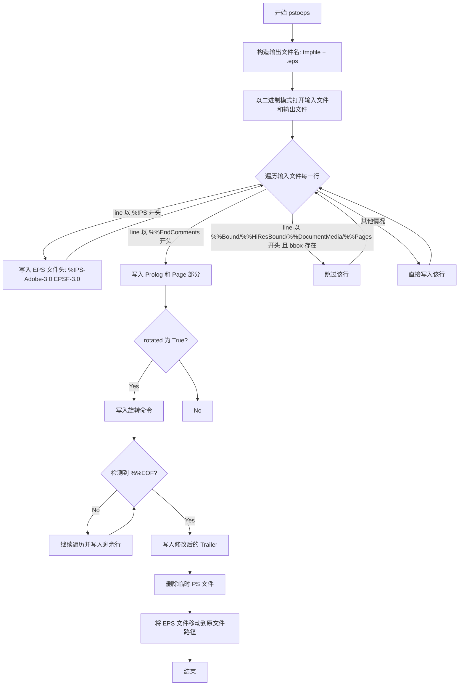

#### 带注释源码

```python
def pstoeps(tmpfile, bbox=None, rotated=False):
    """
    Convert the postscript to encapsulated postscript.  The bbox of
    the eps file will be replaced with the given *bbox* argument. If
    None, original bbox will be used.
    """

    # 构造输出 EPS 文件路径：在原文件后加 .eps 后缀
    epsfile = tmpfile + '.eps'
    # 以二进制模式打开输入 PS 文件和输出 EPS 文件
    with open(epsfile, 'wb') as epsh, open(tmpfile, 'rb') as tmph:
        write = epsh.write  # 缓存写入方法以提高效率
        
        # === 第一部分：修改文件头 ===
        for line in tmph:
            if line.startswith(b'%!PS'):
                # 写入 EPS 文件标识头
                write(b"%!PS-Adobe-3.0 EPSF-3.0\n")
                # 如果提供了 bbox，写入自定义边界框
                if bbox:
                    write(_get_bbox_header(bbox).encode('ascii') + b'\n')
            elif line.startswith(b'%%EndComments'):
                # 在 EndComments 后插入 EPS 必需的 Prolog 部分
                write(line)
                write(b'%%BeginProlog\n'
                      b'save\n'              # 保存图形状态
                      b'countdictstack\n'    # 记录字典栈深度
                      b'mark\n'              # 标记以便后续清理
                      b'newpath\n'           # 定义新路径
                      b'/showpage {} def\n'  # 重定义 showpage 为空操作
                      b'/setpagedevice {pop} def\n'  # 重定义 setpagedevice
                      b'%%EndProlog\n'
                      b'%%Page 1 1\n')
                # 如果需要旋转（处理 landscape 模式），写入旋转命令
                if rotated:  # The output eps file need to be rotated.
                    write(_get_rotate_command(bbox).encode('ascii') + b'\n')
                break  # 头部分处理完成，退出循环
            # 如果提供了 bbox，跳过原有的边界框和页面相关注释
            elif bbox and line.startswith((b'%%Bound', b'%%HiResBound',
                                           b'%%DocumentMedia', b'%%Pages')):
                pass
            else:
                # 其他头信息直接复制
                write(line)
        
        # === 第二部分：修改文件尾 ===
        # 继续遍历剩余内容，处理 Trailer 部分
        for line in tmph:
            if line.startswith(b'%%EOF'):
                # 写入修改后的 Trailer：清理标记、恢复图形状态
                write(b'cleartomark\n'
                      b'countdictstack\n'
                      b'exch sub { end } repeat\n'
                      b'restore\n'
                      b'showpage\n'
                      b'%%EOF\n')
            elif line.startswith(b'%%PageBoundingBox'):
                # 跳过 PageBoundingBox，由 Prolog 中的 bbox 替代
                pass
            else:
                # 其他内容直接复制
                write(line)

    # 清理临时 PS 文件
    os.remove(tmpfile)
    # 将生成的 EPS 文件重命名为原始文件名（覆盖原 PS 文件）
    shutil.move(epsfile, tmpfile)
```


### `RendererPS.__init__`

该方法是 `RendererPS` 类的构造函数，负责初始化 PostScript 渲染器的核心状态，包括输出流、图形状态变量、裁剪路径、字符追踪器等，为后续的图形绘制操作做好准备。

参数：

- `width`：`float`，画布宽度（以英寸为单位）
- `height`：`float`，画布高度（以英寸为单位）
- `pswriter`：`TextIOBase` 或类似文件对象，用于写入生成的 PostScript 代码
- `imagedpi`：`int`，图像 DPI 值，默认为 72，用于计算图像放大倍数

返回值：`None`，该方法仅初始化实例状态，无返回值

#### 流程图

```mermaid
flowchart TD
    A[开始 __init__] --> B[调用父类 RendererPDFPSBase.__init__ width height]
    B --> C[保存 pswriter 到 self._pswriter]
    D{text.usetex 是否启用?}
    D -->|是| E[初始化 self.textcnt = 0]
    D -->|否| F[跳过 textcnt 初始化]
    E --> G[初始化 self.psfrag = []]
    F --> H[保存 imagedpi]
    H --> I[初始化图形状态变量: color/linewidth/linejoin/linecap/linedash/fontname/fontsize]
    I --> J[初始化 self._hatches = {}]
    J --> K[计算 self.image_magnification = imagedpi / 72]
    K --> L[初始化 self._clip_paths = {}]
    L --> M[初始化 self._path_collection_id = 0]
    M --> N[创建 CharacterTracker 实例]
    N --> O[缓存 _log.warning 函数]
    O --> P[结束 __init__]
```

#### 带注释源码

```python
def __init__(self, width, height, pswriter, imagedpi=72):
    """
    初始化 RendererPS 实例。

    Parameters
    ----------
    width : float
        画布宽度（英寸）。
    height : float
        画布高度（英寸）。
    pswriter : file-like
        用于写入 PostScript 输出的文件对象。
    imagedpi : int, optional
        图像 DPI，默认为 72。用于生成高分辨率图像并在嵌入前缩放。
    """
    # 调用父类 RendererPDFPSBase 的初始化方法
    # 设置基本的渲染器尺寸信息
    super().__init__(width, height)

    # 保存 PostScript 输出写入器
    # 所有生成的 PostScript 命令都将写入此对象
    self._pswriter = pswriter

    # 检查是否启用 LaTeX 文本模式
    # 如果启用，需要跟踪 psfrag 标签用于后续的 LaTeX 处理
    if mpl.rcParams['text.usetex']:
        self.textcnt = 0      # psfrag 标签计数器
        self.psfrag = []      # 存储 psfrag 标签列表

    # 保存图像 DPI 并计算图像放大倍数
    # PostScript 本身与 DPI 无关，但需要告知图像代码 DPI 以生成高分辨率图像
    self.imagedpi = imagedpi

    # 初始化当前渲染器状态为 None（未初始化状态）
    # 这些变量用于跟踪当前的图形状态，避免写入冗余的 PostScript 命令
    self.color = None         # 当前颜色 (r, g, b) 元组
    self.linewidth = None    # 当前线宽
    self.linejoin = None     # 当前线段连接样式
    self.linecap = None      # 当前线段端点样式
    self.linedash = None     # 当前虚线模式 (offset, sequence)
    self.fontname = None     # 当前字体名称
    self.fontsize = None     # 当前字体大小

    # 存储已创建的填充图案（hatches）的字典
    # 键为 hatch 样式字符串，值为对应的 PostScript 图案名称
    self._hatches = {}

    # 计算图像放大倍数，用于 draw_image 方法
    # 默认 72 DPI 时放大倍数为 1.0
    self.image_magnification = imagedpi / 72

    # 存储自定义裁剪路径的字典
    # 键为 (Path, transform_id) 元组，值为对应的 PostScript 裁剪命令名称
    self._clip_paths = {}

    # 路径集合的唯一标识符计数器
    # 用于为每个路径集合生成唯一的 PostScript 定义名称
    self._path_collection_id = 0

    # 创建字符追踪器，用于跟踪已使用的字体和字符
    # 在生成输出文件时用于嵌入字体子集
    self._character_tracker = _backend_pdf_ps.CharacterTracker()

    # 缓存日志警告函数，避免重复输出相同的警告信息
    # 使用 functools.cache 确保每个唯一消息只记录一次
    self._logwarn_once = functools.cache(_log.warning)
```


### RendererPS._is_transparent

判断给定的RGB或RGBA颜色值是否表示完全透明。

参数：

- `rgb_or_rgba`：tuple 或 list，RGB颜色（3元素）或RGBA颜色（4元素），其中RGB范围为0-1，Alpha通道0表示完全透明，1表示完全不透明

返回值：`bool`，如果颜色完全透明返回True，否则返回False

#### 流程图

```mermaid
flowchart TD
    A[开始] --> B{rgb_or_rgba is None?}
    B -->|Yes| C[返回 True]
    B -->|No| D{len == 4?}
    D -->|Yes| E{rgb_or_rgba[3] == 0?}
    D -->|No| F[返回 False]
    E -->|Yes| G[返回 True]
    E -->|No| H{rgb_or_rgba[3] != 1?}
    H -->|Yes| I[输出警告: 不支持半透明]
    H -->|No| F
    I --> F
```

#### 带注释源码

```python
def _is_transparent(self, rgb_or_rgba):
    """
    判断颜色是否完全透明。
    
    PostScript后端不支持透明度处理：
    - 完全透明(alpha=0)返回True
    - 完全不透明(alpha=1)返回False
    - 半透明(alpha在0-1之间)输出警告并返回False
    - RGB(无alpha通道)返回False
    - None返回True(与rgbFace语义一致)
    """
    # 如果颜色为None，认为是透明的(符合rgbFace语义)
    if rgb_or_rgba is None:
        return True  # Consistent with rgbFace semantics.
    # 检查是否为RGBA格式(4元素)
    elif len(rgb_or_rgba) == 4:
        # Alpha通道为0表示完全透明
        if rgb_or_rgba[3] == 0:
            return True
        # Alpha通道不为1表示半透明，PostScript不支持
        if rgb_or_rgba[3] != 1:
            self._logwarn_once(
                "The PostScript backend does not support transparency; "
                "partially transparent artists will be rendered opaque.")
        return False
    else:  # len() == 3.
        # RGB格式没有alpha通道，默认不透明
        return False
```


### `RendererPS.set_color`

该方法用于设置 PostScript 渲染器的绘图颜色。如果颜色与当前颜色不同，则向 PostScript 输出流写入相应的颜色设置命令（setgray 或 setrgbcolor），并根据 `store` 参数决定是否更新内部颜色状态。

参数：

- `r`：`float`，红色分量，值范围 0.0 到 1.0
- `g`：`float`，绿色分量，值范围 0.0 到 1.0
- `b`：`float`，蓝色分量，值范围 0.0 到 1.0
- `store`：`bool`，是否将新颜色存储到渲染器的内部状态中，默认为 True

返回值：`None`，该方法无返回值

#### 流程图

```mermaid
flowchart TD
    A[开始 set_color] --> B{检查颜色是否变化}
    B -->|颜色与当前相同| C[直接返回]
    B -->|颜色不同| D{判断是否为灰度颜色}
    D -->|r == g == b| E[写入 setgray 命令]
    D -->|非灰度| F[写入 setrgbcolor 命令]
    E --> G{store 参数?}
    F --> G
    G -->|True| H[更新 self.color 状态]
    G -->|False| I[不更新状态]
    H --> J[结束]
    C --> J
    I --> J
```

#### 带注释源码

```python
def set_color(self, r, g, b, store=True):
    """
    设置绘图颜色
    
    参数:
        r: float, 红色分量 (0.0-1.0)
        g: float, 绿色分量 (0.0-1.0)
        b: float, 蓝色分量 (0.0-1.0)
        store: bool, 是否保存颜色状态
    """
    # 检查传入的颜色是否与当前颜色相同，避免重复写入相同的 PostScript 命令
    if (r, g, b) != self.color:
        # 判断是否为灰度颜色（RGB三分量相等时使用 setgray 命令更高效）
        if r == g == b:
            # 写入灰度设置命令："{r} setgray\n"
            self._pswriter.write(f"{_nums_to_str(r)} setgray\n")
        else:
            # 写入 RGB 颜色设置命令："{r} {g} {b} setrgbcolor\n"
            self._pswriter.write(f"{_nums_to_str(r, g, b)} setrgbcolor\n")
        
        # 如果 store 为 True，则将新颜色保存到渲染器状态中
        # 这样后续可以通过比较来避免重复设置相同的颜色
        if store:
            self.color = (r, g, b)
```


### `RendererPS.set_linewidth`

设置绘图的线宽（linewidth）。如果新线宽与当前线宽不同，则将线宽写入 PostScript 输出流，并根据 `store` 参数决定是否更新渲染器内部的线宽状态。

参数：

- `linewidth`：数值（float），要设置的线宽值
- `store`：布尔（bool），是否将线宽保存到渲染器状态，默认为 `True`

返回值：`None`，无返回值

#### 流程图

```mermaid
flowchart TD
    A[开始 set_linewidth] --> B{linewidth != self.linewidth?}
    B -->|是| C[写入 PostScript: setlinewidth]
    B -->|否| D{store == True?}
    C --> D
    D -->|是| E[更新 self.linewidth = linewidth]
    D -->|否| F[结束]
    E --> F
```

#### 带注释源码

```python
def set_linewidth(self, linewidth, store=True):
    """
    设置线条宽度。

    Parameters
    ----------
    linewidth : float
        要设置的线宽值。
    store : bool, optional
        是否将线宽保存到渲染器状态，默认为 True。
    """
    # 将线宽转换为 float 类型，确保数值一致性
    linewidth = float(linewidth)
    
    # 仅当新线宽与当前线宽不同时才执行写入操作
    if linewidth != self.linewidth:
        # 写入 PostScript 命令设置线宽
        self._pswriter.write(f"{_nums_to_str(linewidth)} setlinewidth\n")
        
        # 如果 store 为 True，则更新内部状态
        if store:
            self.linewidth = linewidth
```


### `RendererPS.set_linejoin`

设置路径绘制时的线条连接样式（miter、round 或 bevel）。

参数：

- `linejoin`：字符串或整数，线条连接样式，可选值为 `'miter'`、`'round'`、`'bevel'` 或对应的整数值 `0`、`1`、`2`
- `store`：布尔值，默认为 `True`，是否将新值存储到实例状态中

返回值：`None`，无返回值

#### 流程图

```mermaid
flowchart TD
    A[开始] --> B{linejoin != self.linejoin?}
    B -->|是| C[调用 _linejoin_cmd 生成 PS 命令]
    C --> D[写入 _pswriter]
    B -->|否| E[结束]
    D --> F{store == True?}
    F -->|是| G[self.linejoin = linejoin]
    F -->|否| E
    G --> E
```

#### 带注释源码

```python
@staticmethod
def _linejoin_cmd(linejoin):
    """
    将 linejoin 参数转换为对应的 PostScript setlinejoin 命令。
    
    支持字符串形式的样式名称和整数值（为向后兼容）。
    
    Parameters
    ----------
    linejoin : str or int
        连接样式：'miter'(0), 'round'(1), 'bevel'(2)
    
    Returns
    -------
    str
        格式化的 PostScript 命令，如 "0 setlinejoin\n"
    """
    # Support for directly passing integer values is for backcompat.
    # 将字符串映射为整数，并同时支持直接的整数值
    linejoin = {'miter': 0, 'round': 1, 'bevel': 2, 0: 0, 1: 1, 2: 2}[
        linejoin]
    return f"{linejoin:d} setlinejoin\n"


def set_linejoin(self, linejoin, store=True):
    """
    设置线条连接样式。
    
    仅当新值与当前值不同时才写入 PostScript 命令，避免冗余输出。
    
    Parameters
    ----------
    linejoin : str or int
        连接样式：'miter'、'round'、'bevel' 或 0、1、2
    store : bool, default True
        是否将新值存储到实例变量 self.linejoin 中
    """
    # 只有当值发生变化时才执行写入操作
    if linejoin != self.linejoin:
        # 写入 PostScript 命令设置线条连接样式
        self._pswriter.write(self._linejoin_cmd(linejoin))
        # 如果 store 为 True，更新实例状态
        if store:
            self.linejoin = linejoin
```


### `RendererPS.set_linecap`

设置线条端点样式（line cap style），用于控制线条终点的绘制方式。

参数：

- `linecap`：str 或 int，线条端点样式，可选值为 `'butt'`（平头）、`'round'`（圆头）、`'projecting'`（方头），或对应的整数值 0、1、2
- `store`：bool（默认为 True），是否将当前样式存储到实例属性中

返回值：无（None），该方法通过副作用（写入 PostScript 命令）生效

#### 流程图

```mermaid
flowchart TD
    A[开始 set_linecap] --> B{linecap 与 self.linecap 是否不同?}
    B -->|是| C[调用 _linecap_cmd 生成 PS 命令]
    C --> D[将 PS 命令写入 _pswriter]
    E{store 为 True?} --> D
    E -->|是| F[更新 self.linecap 属性]
    B -->|否| G[直接返回，不做任何操作]
    D --> F
    F --> H[结束]
    G --> H
```

#### 带注释源码

```python
@staticmethod
def _linecap_cmd(linecap):
    """
    将 linecap 参数转换为对应的 PostScript setlinecap 命令。
    
    Parameters
    ----------
    linecap : str or int
        线条端点样式，字符串可为 'butt', 'round', 'projecting'，
        整数可为 0, 1, 2（为了向后兼容支持直接传整数）。
    
    Returns
    -------
    str
        生成的 PostScript 命令字符串，如 "0 setlinecap\n"
    """
    # Support for directly passing integer values is for backcompat.
    # 支持直接传入整数值的向后兼容性处理
    linecap = {'butt': 0, 'round': 1, 'projecting': 2, 0: 0, 1: 1, 2: 2}[
        linecap]
    return f"{linecap:d} setlinecap\n"


def set_linecap(self, linecap, store=True):
    """
    设置线条端点样式（line cap style）。
    
    当 linecap 值发生变化时，向 PostScript 输出流写入对应的
    setlinecap 命令，并可选地更新实例属性以记录当前状态。
    
    Parameters
    ----------
    linecap : str or int
        线条端点样式，'butt'（平头）、'round'（圆头）、'projecting'（方头）
    store : bool, optional
        是否将新的 linecap 值存储到 self.linecap 属性中，默认为 True。
        设为 False 时仅输出命令但不更新内部状态，常用于临时样式变更。
    
    Returns
    -------
    None
        无返回值，结果通过写入 PostScript 命令到 _pswriter 产生。
    """
    # 只有当新值与当前值不同时才执行操作，避免重复写入相同的 PS 命令
    if linecap != self.linecap:
        # 生成对应的 PostScript 命令并写入输出流
        self._pswriter.write(self._linecap_cmd(linecap))
        # 根据 store 参数决定是否更新实例属性
        if store:
            self.linecap = linecap
```


### `RendererPS.set_linedash`

设置绘制线条的虚线模式（dash pattern），用于控制后续线条的虚线样式。

参数：

- `offset`：`float`，虚线图案的起始偏移量，表示开始绘制虚线时跳过多少单位
- `seq`：`tuple` 或 `list`，虚线图案序列，指定交替的实线段和空白段长度（例如 `[5, 3]` 表示 5 个单位实线、3 个单位空白）
- `store`：`bool`，默认为 `True`，是否将当前设置存储到渲染器状态中以避免重复输出

返回值：`None`，无返回值

#### 流程图

```mermaid
flowchart TD
    A[开始 set_linedash] --> B{store=True?}
    B -->|是| C{self.linedash 不为 None?}
    B -->|否| D[跳过状态存储]
    C -->|是| E{seq 等于旧序列 且 offset 等于旧偏移?}
    C -->|否| F[生成 PostScript setdash 命令]
    E -->|是| G[直接返回，不重复设置]
    E -->|否| F
    F --> H{seq 不为 None 且长度大于 0?}
    H -->|是| I["输出: [<seq>] <offset> setdash"]
    H -->|否| J["输出: [] 0 setdash"]
    I --> K[存储状态: self.linedash = (offset, seq)]
    J --> K
    D --> K
    G --> L[结束]
    K --> L
```

#### 带注释源码

```python
def set_linedash(self, offset, seq, store=True):
    """
    设置线条的虚线模式。

    Parameters
    ----------
    offset : float
        虚线图案的起始偏移量。
    seq : tuple or list
        虚线图案序列，指定实线和空白的交替长度。
    store : bool, default True
        是否将设置存储到渲染器状态中。
    """
    # 如果启用了状态存储，先检查当前设置是否与新设置相同
    # 这样可以避免重复输出相同的 PostScript 命令
    if self.linedash is not None:
        oldo, oldseq = self.linedash
        # 使用 numpy 的数组比较确保序列值完全一致
        if np.array_equal(seq, oldseq) and oldo == offset:
            return  # 设置未变化，直接返回

    # 根据是否有有效的虚线序列生成对应的 PostScript 命令
    # setdash 命令格式: [<pattern>] <offset> setdash
    # 空序列 [] 表示实线（无虚线）
    if seq is not None and len(seq):
        self._pswriter.write(
            f"[{_nums_to_str(*seq)}] {_nums_to_str(offset)} setdash\n"
        )
    else:
        # seq 为空或 None 时，重置为实线
        self._pswriter.write("[] 0 setdash\n")

    # 如果 store 为 True，将当前设置保存到状态中
    # 这样后续可以通过比较避免重复设置
    if store:
        self.linedash = (offset, seq)
```


### RendererPS.set_font

该方法用于设置 PostScript 渲染器的当前字体，将字体选择命令写入 PostScript 输出流，并根据 `store` 参数决定是否将字体设置存储到渲染器状态中。

参数：

- `fontname`：`str`，字体名称，用于指定要使用的 PostScript 字体
- `fontsize`：`float`，字体大小（以磅为单位）
- `store`：`bool`，默认为 `True`，指示是否将字体设置存储到渲染器的内部状态中

返回值：`None`，该方法无返回值，仅执行副作用（写入 PostScript 命令和更新内部状态）

#### 流程图

```mermaid
flowchart TD
    A[开始 set_font] --> B{检查字体是否变化}
    B -->|fontname 或 fontsize 与缓存不同| C[写入 PostScript 命令]
    B -->|fontname 和 fontsize 均未变化| D[直接返回]
    C --> E{store 参数为 True?}
    E -->|是| F[更新 self.fontname 和 self.fontsize]
    E -->|否| G[不更新内部状态]
    D --> H[结束]
    F --> H
    G --> H
```

#### 带注释源码

```python
def set_font(self, fontname, fontsize, store=True):
    """
    设置当前使用的字体。
    
    参数:
        fontname: 字体名称字符串
        fontsize: 字体大小（浮点数）
        store: 是否将字体设置存储到渲染器状态中
    """
    # 检查传入的字体名和大小是否与当前缓存的字体设置不同
    if (fontname, fontsize) != (self.fontname, self.fontsize):
        # 将 PostScript 字体选择命令写入输出流
        # 格式: /FontName Size selectfont
        self._pswriter.write(f"/{fontname} {fontsize:1.3f} selectfont\n")
        # 如果 store 为 True，则更新渲染器内部的字体状态缓存
        if store:
            self.fontname = fontname
            self.fontsize = fontsize
```


### RendererPS.create_hatch

该方法用于在 PostScript 后端中创建填充图案（Hatching Pattern）。它检查缓存中是否已存在相同样式的图案，如有则直接返回；否则创建新的 PostScript 图案定义，输出相应的 PostScript 代码，并将其缓存以供后续使用。

参数：

- `hatch`：`str`，填充样式标识符（如 '/'、'\\'、'|' 等），用于指定图案的线条方向和样式
- `linewidth`：`float`，填充图案的线条宽度，决定图案线条的粗细

返回值：`str`，返回创建的 PostScript 图案名称（如 "H0"、"H1" 等），用于后续设置填充样式

#### 流程图

```mermaid
flowchart TD
    A[开始 create_hatch] --> B{检查缓存: hatch 是否在 _hatches 中}
    B -->|是| C[返回已缓存的图案名称]
    B -->|否| D[生成新图案名称: H + 当前缓存数量]
    D --> E[计算页面高度: pageheight = height * 72]
    D --> F[构建 PostScript 图案定义]
    F --> G[写入 PostScript 代码到 _pswriter]
    G --> H[将图案存入缓存: _hatches[hatch] = name]
    H --> I[返回新创建的图案名称]
    C --> I
```

#### 带注释源码

```python
def create_hatch(self, hatch, linewidth):
    # 定义图案瓦片的边长（72 points = 1 inch）
    sidelen = 72
    
    # 缓存命中检查：如果该样式已创建过，直接返回已有的图案名称
    if hatch in self._hatches:
        return self._hatches[hatch]
    
    # 生成唯一的图案名称（"H0", "H1", "H2", ...）
    name = 'H%d' % len(self._hatches)
    
    # 计算页面高度（转换为 points 单位）
    pageheight = self.height * 72
    
    # 写入 PostScript 图案定义代码
    # PatternType 1: 填充图案
    # PaintType 2: 彩色图案（使用当前颜色）
    # TilingType 2: 允许不规则形状的图案砖块
    # BBox: 图案单元的边界框 [0, 0, sidelen, sidelen]
    # XStep/YStep: 图案重复的间距
    # PaintProc: 图案的绘制过程（设置线宽、转换路径、填充和描边）
    self._pswriter.write(f"""\
  << /PatternType 1
     /PaintType 2
     /TilingType 2
     /BBox[0 0 {sidelen:d} {sidelen:d}]
     /XStep {sidelen:d}
     /YStep {sidelen:d}

     /PaintProc {{
        pop
        {linewidth:g} setlinewidth
{self._convert_path(Path.hatch(hatch), Affine2D().scale(sidelen), simplify=False)}
        gsave
        fill
        grestore
        stroke
     }} bind
   >>
   matrix
   0 {pageheight:g} translate
   makepattern
   /{name} exch def
""")
    
    # 将新创建的图案存入缓存字典，以便后续复用
    self._hatches[hatch] = name
    
    # 返回 PostScript 图案名称，供 fill 命令使用
    return name
```


### RendererPS.get_image_magnification

获取图像放大倍数，用于在绘制图像时调整图像分辨率与其它艺术家的比例。

参数：

- （无参数，仅包含 self）

返回值：`float`，返回图像放大倍数因子，该因子用于 `draw_image` 方法中，以便后端可以以与其它艺术家不同的分辨率处理图像。

#### 流程图

```mermaid
flowchart TD
    A[开始] --> B[返回 self.image_magnification]
    B --> C[结束]
```

#### 带注释源码

```python
def get_image_magnification(self):
    """
    Get the factor by which to magnify images passed to draw_image.
    Allows a backend to have images at a different resolution to other
    artists.
    """
    # 直接返回实例变量 image_magnification
    # 该值在 __init__ 中被设置为 imagedpi / 72
    # 用于在 draw_image 方法中缩放图像尺寸
    return self.image_magnification
```


### `RendererPS._convert_path`

该方法负责将 Matplotlib 的几何路径对象（`Path`）转换为 PostScript 语言中的路径绘制指令字符串（如 `moveto`, `lineto`, `curveto`）。它处理路径的坐标变换、视口裁剪以及路径简化，并将底层的 C++ 扩展调用结果解码为 Python 字符串返回给渲染器。

参数：

- `path`：`Path`，要转换的 Matplotlib 路径对象。
- `transform`：`Transform`，应用到路径顶点上的仿射变换（如缩放、平移、旋转）。
- `clip`：`bool`，是否对路径进行裁剪。如果为 `True`，则根据画布尺寸计算裁剪矩形。
- `simplify`：`bool | None`，是否启用路径简化。如果为 `None`，则使用路径自身的 `should_simplify` 属性。

返回值：`str`，包含 PostScript 路径操作符（如 `m`, `l`, `c`, `cl`）的字符串。

#### 流程图

```mermaid
flowchart TD
    A[开始 _convert_path] --> B{clip 参数是否为真?}
    B -- 是 --> C[计算裁剪矩形: (0, 0, width\*72, height\*72)]
    B -- 否 --> D[设 clip 为 None]
    C --> E[调用 _path.convert_to_string]
    D --> E
    E --> F[传入参数: path, transform, clip, simplify, 6, 操作码列表, True]
    F --> G[获取字节流结果]
    G --> H[解码为 ASCII 字符串]
    H --> I[返回 PostScript 路径字符串]
```

#### 带注释源码

```python
def _convert_path(self, path, transform, clip=False, simplify=None):
    """
    将 Path 对象转换为 PostScript 路径字符串。

    参数:
        path: matplotlib.path.Path, 要绘制的路径。
        transform: matplotlib.transforms.Transform, 坐标变换矩阵。
        clip: bool, 是否裁剪到画布大小。
        simplify: bool or None, 是否简化路径。

    返回:
        str: PostScript 路径数据。
    """
    # 处理裁剪参数：如果启用裁剪，则根据画布尺寸计算裁剪框；
    # 否则传递给底层函数的 clip 参数为 None。
    if clip:
        # 这里的 72 是为了将英寸单位转换为点（points），因为 Matplotlib 内部使用英寸
        clip = (0.0, 0.0, self.width * 72.0, self.height * 72.0)
    else:
        clip = None
    
    # 调用 matplotlib 的 C 扩展 _path.convert_to_string 进行高效的路径序列化
    # 参数 6 表示坐标精度为小数点后 6 位
    # [b"m", b"l", b"", b"c", b"cl"] 定义了从 Matplotlib 路径代码到 PostScript 操作码的映射
    # True 表示允许插值（interpolate）
    return _path.convert_to_string(
        path, transform, clip, simplify, None,
        6, [b"m", b"l", b"", b"c", b"cl"], True).decode("ascii")
```


### `RendererPS._get_clip_cmd`

获取图形上下文的裁剪区域，并生成对应的 PostScript 裁剪命令。如果裁剪区域是矩形，使用 `rectclip`；如果是复杂路径，则创建自定义裁剪命令并缓存。

参数：

- `gc`：`GraphicsContextBase`，图形上下文对象，包含裁剪矩形和裁剪路径信息

返回值：`str`，生成的 PostScript 裁剪命令字符串

#### 流程图

```mermaid
flowchart TD
    A[开始] --> B{获取裁剪矩形}
    B -->|有矩形| C[生成 rectclip 命令]
    B -->|无矩形| D{获取裁剪路径}
    C --> D
    D -->|有路径| E{检查缓存}
    D -->|无路径| H[返回空字符串]
    E -->|已缓存| F[使用缓存的命令名]
    E -->|未缓存| G[创建新命令并缓存]
    F --> I[追加裁剪命令]
    G --> I
    I --> J[返回裁剪命令字符串]
    H --> J
```

#### 带注释源码

```python
def _get_clip_cmd(self, gc):
    """
    获取图形上下文的裁剪命令
    
    参数:
        gc: 图形上下文对象，包含裁剪信息
    返回:
        生成的 PostScript 裁剪命令字符串
    """
    clip = []  # 存储裁剪命令的列表
    
    # 获取裁剪矩形
    rect = gc.get_clip_rectangle()
    if rect is not None:
        # 如果存在裁剪矩形，生成 rectclip 命令
        # 使用 _nums_to_str 将坐标和尺寸转换为字符串
        clip.append(f"{_nums_to_str(*rect.p0, *rect.size)} rectclip\n")
    
    # 获取裁剪路径和变换
    path, trf = gc.get_clip_path()
    if path is not None:
        # 使用路径和变换的 id 作为缓存键
        key = (path, id(trf))
        
        # 尝试从缓存中获取自定义裁剪命令
        custom_clip_cmd = self._clip_paths.get(key)
        if custom_clip_cmd is None:
            # 如果没有缓存，生成新的命令名
            custom_clip_cmd = "c%d" % len(self._clip_paths)
            
            # 写入自定义裁剪命令定义到 PostScript 输出
            # 包含路径转换、clip 操作和 newpath
            self._pswriter.write(f"""\
/{custom_clip_cmd} {{
{self._convert_path(path, trf, simplify=False)}
clip
newpath
}} bind def
""")
            # 将新命令存入缓存
            self._clip_paths[key] = custom_clip_cmd
        
        # 追加裁剪命令引用
        clip.append(f"{custom_clip_cmd}\n")
    
    # 将所有裁剪命令连接成字符串返回
    return "".join(clip)
```


### RendererPS.draw_image

该方法用于在PostScript画布上绘制图像。它接收图形上下文、坐标位置、图像数据和一个可选的变换矩阵，然后将图像转换为PostScript命令并写入输出流。

参数：

- `gc`：`GraphicsContextBase`，图形上下文，包含绘制状态（如颜色、裁剪区域等）
- `x`：`float`，图像绘制位置的x坐标
- `y`：`float`，图像绘制位置的y坐标
- `im`：`numpy.ndarray`，图像数据，形状为（高度，宽度，通道数）的NumPy数组
- `transform`：`Affine2D` 或 `None`，可选的仿射变换矩阵，用于对图像进行变换

返回值：`None`，该方法不返回任何值，直接将PostScript渲染命令写入输出流

#### 流程图

```mermaid
flowchart TD
    A[开始 draw_image] --> B[获取图像尺寸: h, w]
    B --> C[设置PostScript命令: false 3 colorimage]
    C --> D[垂直翻转图像数据: im[::-1, :, :3]]
    D --> E[将数据转换为十六进制字符串]
    E --> F{transform 是否为 None?}
    F -->|是| G[使用默认单位矩阵, 计算缩放比例]
    F -->|否| H[从transform获取矩阵, 缩放比例设为1.0]
    G --> I[构建PostScript图像命令]
    H --> I
    I --> J[写入gsave保存图形状态]
    J --> K[获取并写入裁剪命令]
    K --> L[写入平移和变换矩阵]
    L --> M[写入缩放比例]
    M --> N[写入图像数据]
    N --> O[写入grestore恢复图形状态]
    O --> P[结束]
```

#### 带注释源码

```python
@_log_if_debug_on
def draw_image(self, gc, x, y, im, transform=None):
    # docstring inherited

    # 获取图像的高度和宽度（取形状的前两个维度）
    h, w = im.shape[:2]
    
    # 设置PostScript图像命令：false表示不使用彩色掩码，3表示三色通道
    imagecmd = "false 3 colorimage"
    
    # 垂直翻转图像数据（PostScript坐标系Y轴向上，需要翻转）
    data = im[::-1, :, :3]  # Vertically flipped rgb values.
    
    # 将图像数据转换为十六进制字符串，每64字节换行（限制行宽128字符）
    hexdata = data.tobytes().hex("\n", -64)  # Linewrap to 128 chars.

    # 处理变换矩阵：如果没有提供变换，使用默认单位矩阵并计算缩放
    if transform is None:
        matrix = "1 0 0 1 0 0"  # 默认单位矩阵
        # 根据图像放大倍数计算缩放比例
        xscale = w / self.image_magnification
        yscale = h / self.image_magnification
    else:
        # 从transform对象获取仿射变换矩阵的6个值
        matrix = " ".join(map(str, transform.frozen().to_values()))
        xscale = 1.0
        yscale = 1.0

    # 写入完整的PostScript图像渲染命令
    self._pswriter.write(f"""\
gsave
{self._get_clip_cmd(gc)}
{x:g} {y:g} translate
[{matrix}] concat
{xscale:g} {yscale:g} scale
/DataString {w:d} string def
{w:d} {h:d} 8 [ {w:d} 0 0 -{h:d} 0 {h:d} ]
{{
currentfile DataString readhexstring pop
}} bind {imagecmd}
{hexdata}
grestore
""")
```


### RendererPS.draw_path

该函数是 Matplotlib PostScript 后端的核心绘制方法之一，负责将路径对象转换为 PostScript 命令序列并渲染到输出。它通过判断路径是否需要简化（基于填充颜色和阴影路径），调用路径转换方法生成 PostScript 字符串，最后委托给 `_draw_ps` 完成实际的图形状态设置和绘制。

参数：

- `gc`：`GraphicsContextBase`，图形上下文，包含线宽、颜色、线型等绘制属性
- `path`：`Path`，要绘制的路径对象，包含顶点和操作码
- `transform`：`Transform`，应用于路径的变换矩阵（如平移、旋转、缩放）
- `rgbFace`：`tuple` 或 `None`，可选的填充颜色，默认为 None（无填充）

返回值：`None`，该方法直接写入 PostScript 输出流，不返回任何值

#### 流程图

```mermaid
flowchart TD
    A[开始 draw_path] --> B{rgbFace is None<br/>且 gc.get_hatch_path() is None}
    B -->|True| C[simplify = path.should_simplify]
    B -->|False| D[simplify = False]
    C --> E[调用 _convert_path 转换路径]
    D --> E
    E --> F[生成 PostScript 字符串 ps]
    F --> G[调用 _draw_ps 方法]
    G --> H[设置图形状态: 线宽/线型/颜色]
    H --> I[应用剪裁路径]
    I --> J[写入路径 PostScript]
    J --> K{rgbFace 存在?}
    K -->|True| L[设置填充颜色并填充]
    K -->|False| M{需要描边?}
    M -->|True| N[描边路径]
    M -->|False| O{需要阴影?}
    O -->|True| P[应用阴影填充]
    O -->|False| Q[恢复图形状态]
    L --> Q
    N --> Q
    P --> Q
    Q --> R[结束]
```

#### 带注释源码

```python
@_log_if_debug_on
def draw_path(self, gc, path, transform, rgbFace=None):
    # docstring inherited
    
    # 判断是否可以简化路径：
    # 只有当没有填充颜色(rgbFace is None)且没有阴影路径(hatch)时，
    # 才能对路径进行简化处理，这样可以减少输出的 PostScript 命令数量
    clip = rgbFace is None and gc.get_hatch_path() is None
    
    # 根据 clip 标志和路径本身的 should_simplify 属性决定是否简化
    simplify = path.should_simplify and clip
    
    # 将 matplotlib 路径对象转换为 PostScript 字符串表示
    # _convert_path 会处理顶点坐标变换、路径命令生成等
    ps = self._convert_path(path, transform, clip=clip, simplify=simplify)
    
    # 调用内部方法完成实际的绘制：设置颜色、线型、填充、描边等
    self._draw_ps(ps, gc, rgbFace)
```


### RendererPS.draw_markers

该方法负责在PostScript渲染器中绘制标记（markers），它将标记路径转换为PostScript命令，并根据提供的变换和颜色信息在目标路径的各个位置渲染标记。

参数：

- `self`：`RendererPS`，渲染器实例本身
- `gc`：`GraphicsContextBase`，图形上下文，包含线条宽度、颜色、样式等信息
- `marker_path`：`Path`，标记的路径对象，定义标记的几何形状
- `marker_trans`：`Transform`，标记路径的变换矩阵，用于定位和缩放标记
- `path`：`Path`，目标路径，即要在其上绘制标记的路径（如散点图的数据点）
- `trans`：`Transform`，目标路径的变换矩阵
- `rgbFace`：`tuple` 或 `None`，填充颜色，RGB或RGBA元组，None表示透明

返回值：`None`，该方法直接在PostScript输出流中写入内容，无返回值

#### 流程图

```mermaid
flowchart TD
    A[开始 draw_markers] --> B{rgbFace是否透明?}
    B -->|是| C[ps_color = None]
    B -->|否| D{颜色是灰度?}
    D -->|是| E[使用 setgray]
    D -->|否| F[使用 setrgbcolor]
    C --> G[初始化 ps_cmd 列表]
    E --> G
    F --> G
    G --> H[获取线条宽度和透明度]
    H --> I{需要描边?}
    I -->|是| J[添加 setlinewidth]
    J --> K[添加 setlinejoin 和 setlinecap]
    K --> L[转换标记路径为PS命令]
    I -->|否| L
    L --> M{rgbFace存在?}
    M -->|是| N{需要描边?}
    N -->|是| O[添加 gsave]
    O --> P[添加填充命令]
    P --> Q[添加 grestore]
    N -->|否| R[添加填充命令]
    M -->|否| S{需要描边?}
    S -->|是| T[添加 stroke]
    S -->|否| U[添加 grestore 结束定义]
    Q --> U
    R --> U
    T --> U
    U --> V[遍历路径的所有线段]
    V --> W{有线段数据?}
    W -->|是| X[提取端点坐标]
    X --> Y[添加标记位置命令]
    Y --> V
    W -->|否| Z[构建完整PS字符串]
    Z --> AA[调用 _draw_ps 输出]
    AA --> AB[结束]
```

#### 带注释源码

```python
@_log_if_debug_on
def draw_markers(
        self, gc, marker_path, marker_trans, path, trans, rgbFace=None):
    # docstring inherited

    # 根据rgbFace确定填充颜色，生成对应的PostScript颜色命令
    ps_color = (
        None
        if self._is_transparent(rgbFace)  # 如果完全透明，返回None
        else f'{_nums_to_str(rgbFace[0])} setgray'  # 灰度颜色
        if rgbFace[0] == rgbFace[1] == rgbFace[2]  # RGB相等时用灰度
        else f'{_nums_to_str(*rgbFace[:3])} setrgbcolor')  # 彩色

    # 构建通用的标记命令：定义一个名为/o的过程
    # 不希望translate是全局的，所以放在过程内部
    ps_cmd = ['/o {', 'gsave', 'newpath', 'translate']

    # 获取线条宽度和透明度
    lw = gc.get_linewidth()
    alpha = (gc.get_alpha()
             if gc.get_forced_alpha() or len(gc.get_rgb()) == 3
             else gc.get_rgb()[3])
    # 判断是否需要描边：线条宽度>0且透明度>0
    stroke = lw > 0 and alpha > 0
    if stroke:
        # 设置线条宽度
        ps_cmd.append('%.1f setlinewidth' % lw)
        # 设置线条连接样式
        ps_cmd.append(self._linejoin_cmd(gc.get_joinstyle()))
        # 设置线条端点样式
        ps_cmd.append(self._linecap_cmd(gc.get_capstyle()))

    # 将标记路径转换为PostScript路径命令
    ps_cmd.append(self._convert_path(marker_path, marker_trans,
                                     simplify=False))

    # 如果有填充颜色，处理填充逻辑
    if rgbFace:
        if stroke:
            ps_cmd.append('gsave')  # 保存图形状态
        if ps_color:
            # 添加颜色设置和填充命令
            ps_cmd.extend([ps_color, 'fill'])
        if stroke:
            ps_cmd.append('grestore')  # 恢复图形状态

    # 如果需要描边，添加stroke命令
    if stroke:
        ps_cmd.append('stroke')
    # 结束标记定义，bind def使定义立即生效
    ps_cmd.extend(['grestore', '} bind def'])

    # 遍历目标路径的所有线段，在每个线段端点绘制标记
    for vertices, code in path.iter_segments(
            trans,
            clip=(0, 0, self.width*72, self.height*72),
            simplify=False):
        if len(vertices):
            # 取线段的最后一个端点坐标
            x, y = vertices[-2:]
            # 在该位置调用标记过程
            ps_cmd.append(f"{x:g} {y:g} o")

    # 将所有PostScript命令合并为字符串
    ps = '\n'.join(ps_cmd)
    # 调用_draw_ps输出到PostScript流
    # fill=False和stroke=False表示PS字符串中已包含填充和描边命令
    self._draw_ps(ps, gc, rgbFace, fill=False, stroke=False)
```


### RendererPS.draw_path_collection

绘制路径集合的方法，根据优化判断选择直接绘制或定义后使用的PostScript渲染策略。

参数：

- `gc`：`GraphicsContextBase`，图形上下文，控制绘制状态（颜色、线宽、裁剪等）
- `master_transform`：`Transform`，全局变换矩阵，应用于所有路径的基础变换
- `paths`：`list[Path]`，要绘制的路径对象列表
- `all_transforms`：`list[Transform]`，每个路径的独立变换列表
- `offsets`：`array_like`，路径的偏移量数组，指定每个实例的位置
- `offset_trans`：`Transform`，偏移量的变换矩阵
- `facecolors`：`array_like`，填充颜色数组
- `edgecolors`：`array_like`，边缘颜色数组
- `linewidths`：`array_like`，线宽数组
- `linestyles`：`array_like`，线型数组
- `antialiaseds`：`array_like`，抗锯齿标志数组
- `urls`：`list[str]`，路径相关的URL列表（用于引用）
- `offset_position`：`str`，偏移位置模式（'data'或'figure'）
- `hatchcolors`：`array_like | None`，阴影填充颜色，可选参数

返回值：`None`，直接在PostScript输出流中写入绘制命令

#### 流程图

```mermaid
flowchart TD
    A[开始 draw_path_collection] --> B{是否需要优化?}
    B -->|计算公式| C[len_path + 3*uses_per_path + 3 < (len_path + 2)*uses_per_path]
    C -->|False| D[调用RendererBase.draw_path_collection]
    C -->|True| E[遍历所有路径和变换]
    E --> F[为每个路径生成唯一名称<br/>如'p{id}_{index}']
    F --> G[将路径转换为PostScript字符串<br/>使用_convert_path]
    G --> H[写入路径定义<br/>绑定到名称]
    H --> I[收集所有path_codes]
    I --> J[遍历集合迭代器]
    J --> K[生成位置和路径ID的PostScript命令]
    K --> L[调用_draw_ps渲染每个实例]
    L --> M[递增_path_collection_id]
    M --> N[结束]
    D --> O[返回调用者]
    N --> O
```

#### 带注释源码

```python
@_log_if_debug_on
def draw_path_collection(self, gc, master_transform, paths, all_transforms,
                         offsets, offset_trans, facecolors, edgecolors,
                         linewidths, linestyles, antialiaseds, urls,
                         offset_position, *, hatchcolors=None):
    """
    绘制路径集合的核心方法。
    
    优化策略：比较内联发射路径的成本与定义+使用的成本，
    选择更高效的渲染方式。
    
    Parameters
    ----------
    gc : GraphicsContextBase
        图形上下文，包含当前绘制状态
    master_transform : Transform
        主变换矩阵，应用于所有路径
    paths : list[Path]
        路径对象列表
    all_transforms : list[Transform]
        每个路径的变换列表
    offsets : array_like
        路径实例的偏移量
    offset_trans : Transform
        偏移量的变换
    facecolors : array_like
        填充颜色
    edgecolors : array_like
        边缘颜色
    linewidths : array_like
        线宽列表
    linestyles : array_like
        线型列表
    antialiaseds : array_like
        抗锯齿标志
    urls : list[str]
        路径URL引用
    offset_position : str
        偏移位置模式
    hatchcolors : array_like, optional
        阴影填充颜色
    """
    # 初始化hatchcolors为空列表
    if hatchcolors is None:
        hatchcolors = []
    
    # 优化判断：计算内联成本 vs 定义+使用成本
    # 内联成本: (len_path + 2) * uses_per_path
    # 定义+使用成本: (len_path + 3) + 3 * uses_per_path
    len_path = len(paths[0].vertices) if len(paths) > 0 else 0
    uses_per_path = self._iter_collection_uses_per_path(
        paths, all_transforms, offsets, facecolors, edgecolors)
    should_do_optimization = \
        len_path + 3 * uses_per_path + 3 < (len_path + 2) * uses_per_path
    
    # 如果优化成本更高，回退到基类实现
    if not should_do_optimization:
        return RendererBase.draw_path_collection(
            self, gc, master_transform, paths, all_transforms,
            offsets, offset_trans, facecolors, edgecolors,
            linewidths, linestyles, antialiaseds, urls,
            offset_position, hatchcolors=hatchcolors)

    # 优化路径：将路径定义为PostScript函数以复用
    path_codes = []
    for i, (path, transform) in enumerate(self._iter_collection_raw_paths(
            master_transform, paths, all_transforms)):
        # 生成唯一路径名称
        name = 'p%d_%d' % (self._path_collection_id, i)
        # 转换为PostScript路径字符串
        path_bytes = self._convert_path(path, transform, simplify=False)
        # 写入路径定义
        self._pswriter.write(f"""\
/{name} {{
newpath
translate
{path_bytes}
}} bind def
""")
        path_codes.append(name)

    # 遍历所有实例并渲染
    for xo, yo, path_id, gc0, rgbFace in self._iter_collection(
            gc, path_codes, offsets, offset_trans,
            facecolors, edgecolors, linewidths, linestyles,
            antialiaseds, urls, offset_position, hatchcolors=hatchcolors):
        # 生成位置和路径引用
        ps = f"{xo:g} {yo:g} {path_id}"
        self._draw_ps(ps, gc0, rgbFace)

    # 更新集合ID，确保后续路径名称唯一
    self._path_collection_id += 1
```


### RendererPS.draw_tex

该方法是Matplotlib PostScript后端中用于绘制LaTeX文本的核心方法。它通过PSFrag机制将LaTeX渲染的文本插入到PostScript输出中，支持文本的旋转、颜色设置和精确的基线对齐。

参数：

- `self`：RendererPS，渲染器实例本身
- `gc`：GraphicsContextBase，图形上下文，包含颜色、线宽等绘制属性
- `x`：float，文本绘制位置的x坐标
- `y`：float，文本绘制位置的y坐标
- `s`：str，要绘制的LaTeX文本字符串
- `prop`：FontProperties，字体属性对象，包含字体大小、样式等信息
- `angle`：float，文本旋转角度（度）
- `mtext`：可选参数，额外的文本元数据，用于传递matplotlib文本对象

返回值：无（None），该方法直接在PostScript writer中写入命令，不返回任何值

#### 流程图

```mermaid
flowchart TD
    A[开始 draw_tex] --> B{图形上下文是否完全透明?}
    B -->|是| C[直接返回,不绘制]
    B -->|否| D{是否支持psfrag?}
    D -->|否| E[记录警告并调用draw_text作为回退]
    D -->|是| F[获取文本宽度、高度、下沉量]
    F --> G[构建唯一标记名 psmarker{N}]
    G --> H[获取文本颜色并格式化为RGB字符串]
    H --> I[根据字体族选择合适的LaTeX字体命令]
    I --> J[构建带颜色的LaTeX命令字符串]
    J --> K[计算考虑旋转和下沉量的文本位置]
    K --> L[构建PSFrag标签并添加到列表]
    L --> M[写入PostScript移动和显示命令]
    M --> N[递增计数器 textcnt]
    N --> O[结束]
```

#### 带注释源码

```python
@_log_if_debug_on
def draw_tex(self, gc, x, y, s, prop, angle, *, mtext=None):
    # docstring inherited
    # 检查图形上下文的RGB颜色是否完全透明，如果是则直接返回不绘制
    if self._is_transparent(gc.get_rgb()):
        return  # Special handling for fully transparent.

    # 如果渲染器没有psfrag属性（未启用LaTeX渲染），记录警告并回退到普通文本绘制
    if not hasattr(self, "psfrag"):
        self._logwarn_once(
            "The PS backend determines usetex status solely based on "
            "rcParams['text.usetex'] and does not support having "
            "usetex=True only for some elements; this element will thus "
            "be rendered as if usetex=False.")
        # 传入False表示不使用TeX渲染
        self.draw_text(gc, x, y, s, prop, angle, False, mtext)
        return

    # 获取文本的宽度、高度和下沉量（baseline descent）
    w, h, bl = self.get_text_width_height_descent(s, prop, ismath="TeX")
    # 获取字体大小（以磅为单位）
    fontsize = prop.get_size_in_points()
    # 创建唯一的标记名，用于PSFrag替换
    thetext = 'psmarker%d' % self.textcnt
    # 提取RGB颜色值并格式化为逗号分隔的字符串
    color = _nums_to_str(*gc.get_rgb()[:3], sep=',')
    # 根据配置的字体族选择合适的LaTeX字体命令
    fontcmd = {'sans-serif': r'{\sffamily %s}',
               'monospace': r'{\ttfamily %s}'}.get(
                   mpl.rcParams['font.family'][0], r'{\rmfamily %s}')
    # 将文本包装在字体命令中
    s = fontcmd % s
    # 构建完整的LaTeX命令，包含颜色和文本
    tex = r'\color[rgb]{%s} %s' % (color, s)

    # 计算旋转后的文本位置
    # 文本通常按基线定位，所以需要减去下沉量
    # 旋转角度增加90度是因为PostScript中角度方向与常规数学坐标系不同
    rangle = np.radians(angle + 90)
    pos = _nums_to_str(x - bl * np.cos(rangle), y - bl * np.sin(rangle))
    
    # 构建PSFrag标签，指定底部左对齐[bl][bl]，缩放因子1，旋转角度
    # 标签格式：\psfrag{标记名}[bl][bl][缩放][旋转]{LaTeX命令}
    self.psfrag.append(
        r'\psfrag{%s}[bl][bl][1][%f]{\fontsize{%f}{%f}%s}' % (
            thetext, angle, fontsize, fontsize*1.25, tex))

    # 写入PostScript代码：保存图形状态，移动到指定位置，显示标记文本，恢复图形状态
    self._pswriter.write(f"""\
gsave
{pos} moveto
({thetext})
show
grestore
""")
    # 递增计数器，确保下一个文本使用唯一的标记名
    self.textcnt += 1
```


### RendererPS.draw_text

该方法用于在PostScript后端绘制文本，支持普通文本、TeX文本和数学文本三种模式，根据ismath参数选择不同的渲染路径，并通过字符映射和字距调整生成PostScript绘图指令。

参数：

- `gc`：`GraphicsContextBase`，图形上下文，包含颜色、线宽、剪切路径等绘图状态
- `x`：`float`，文本绘制的起始x坐标
- `y`：`float`，文本绘制的起始y坐标
- `s`：`str`，要绘制的文本字符串
- `prop`：`FontProperties`，字体属性对象，包含字体名称、大小等
- `angle`：`float`，文本旋转角度（度）
- `ismath`：`bool` 或 `str`，数学文本模式标识，False为普通文本，'TeX'为TeX模式，True为数学文本模式
- `mtext`：`Text`，可选的原始matplotlib文本对象，用于额外的文本元数据

返回值：`None`，无返回值，直接输出PostScript命令到写入器

#### 流程图

```mermaid
flowchart TD
    A[draw_text 开始] --> B{gc.get_rgb 透明?}
    B -->|是| C[直接返回]
    B -->|否| D{ismath == 'TeX'?}
    D -->|是| E[调用 draw_tex 渲染]
    D -->|否| F{ismath == True?}
    F -->|是| G[调用 draw_mathtext 渲染]
    F -->|否| H{ps.useafm 配置?}
    
    H -->|是| I[获取 AFM 字体]
    H -->|否| J[获取 TTF 字体]
    
    I --> K[遍历字符计算字距和宽度]
    J --> L[使用 layout 生成字形流]
    
    K --> M[构建字符流 stream]
    L --> M
    
    M --> N[设置绘图颜色]
    N --> O{按 ps_name 分组}
    O --> P[设置字体]
    P --> Q[生成 glyphshow 命令]
    Q --> R[写入 PostScript]
    R --> S[输出 gsave/grestore 包装]
    
    E --> T[结束]
    G --> T
    S --> T
    
    C --> T
```

#### 带注释源码

```python
@_log_if_debug_on
def draw_text(self, gc, x, y, s, prop, angle, ismath=False, mtext=None):
    """
    在PostScript后端绘制文本。
    
    Parameters
    ----------
    gc : GraphicsContextBase
        图形上下文，控制颜色、线宽、剪切等绘图状态
    x : float
        文本绘制起始点的x坐标
    y : float
        文本绘制起始点的y坐标
    s : str
        要绘制的文本字符串
    prop : FontProperties
        字体属性对象
    angle : float
        文本逆时针旋转角度（度）
    ismath : bool or str, optional
        数学文本模式：False普通文本，'TeX'调用TeX渲染，True数学文本
    mtext : Text, optional
        原始文本对象，用于额外元数据
    """
    # 如果图形上下文完全透明，直接返回不绘制
    if self._is_transparent(gc.get_rgb()):
        return  # Special handling for fully transparent.

    # TeX模式：委托给draw_tex方法处理
    if ismath == 'TeX':
        return self.draw_tex(gc, x, y, s, prop, angle)

    # 数学文本模式：委托给draw_mathtext方法处理
    if ismath:
        return self.draw_mathtext(gc, x, y, s, prop, angle)

    # 普通文本模式：构建字符流列表，每个元素为(ps_name, x, char_name)
    stream = []  # list of (ps_name, x, char_name)

    # 根据配置选择使用AFM字体还是TTF字体
    if mpl.rcParams['ps.useafm']:
        # 获取AFM字体并遍历字符构建字形流
        font = self._get_font_afm(prop)
        ps_name = (font.postscript_name.encode("ascii", "replace")
                    .decode("ascii"))
        scale = 0.001 * prop.get_size_in_points()
        thisx = 0
        last_name = None  # kerns returns 0 for None.
        for c in s:
            # 将Unicode字符映射到Type1名称
            name = uni2type1.get(ord(c), f"uni{ord(c):04X}")
            try:
                width = font.get_width_from_char_name(name)
            except KeyError:
                name = 'question'
                width = font.get_width_char(ord('?'))
            # 获取字距调整值
            kern = font.get_kern_dist_from_name(last_name, name)
            last_name = name
            thisx += kern * scale
            stream.append((ps_name, thisx, name))
            thisx += width * scale

    else:
        # 使用TrueType字体，通过layout生成字形
        font = self._get_font_ttf(prop)
        # 跟踪使用的字符以进行字体子集化
        self._character_tracker.track(font, s)
        for item in _text_helpers.layout(s, font):
            ps_name = (item.ft_object.postscript_name
                       .encode("ascii", "replace").decode("ascii"))
            glyph_name = item.ft_object.get_glyph_name(item.glyph_idx)
            stream.append((ps_name, item.x, glyph_name))
    
    # 设置文本颜色
    self.set_color(*gc.get_rgb())

    # 按PostScript字体名称分组输出，避免频繁切换字体
    for ps_name, group in itertools. \
            groupby(stream, lambda entry: entry[0]):
        # 为每组设置字体，大小从prop获取
        self.set_font(ps_name, prop.get_size_in_points(), False)
        # 生成每个字符的移动和显示命令
        thetext = "\n".join(f"{x:g} 0 m /{name:s} glyphshow"
                            for _, x, name in group)
        # 写入PostScript命令：保存状态、设置剪切、移动位置、旋转、绘制、恢复
        self._pswriter.write(f"""\
gsave
{self._get_clip_cmd(gc)}
{x:g} {y:g} translate
{angle:g} rotate
{thetext}
grestore
""")
```


### RendererPS.draw_mathtext

绘制数学文本（Math Text），将matplotlib的mathtext解析结果转换为PostScript命令并输出到图形流中。

参数：

- `gc`：`GraphicsContextBase`，图形上下文，包含颜色、线宽等绘图属性
- `x`：`float`，文本起始点的x坐标（用户坐标）
- `y`：`float`，文本起始点的y坐标（用户坐标）
- `s`：`str`，要绘制的数学文本字符串
- `prop`：`matplotlib.font_manager.FontProperties`，字体属性对象
- `angle`：`float`，文本旋转角度（度）

返回值：`None`，该方法直接向PostScript输出流写入绘图命令

#### 流程图

```mermaid
flowchart TD
    A[开始 draw_mathtext] --> B[调用 mathtext_parser.parse 解析数学文本]
    B --> C[获取 glyphs 字形列表和 rects 矩形列表]
    C --> D[设置当前颜色 from gc.get_rgb]
    D --> E[写入 gsave 保存图形状态]
    E --> F[写入 translate 移动到 x, y]
    F --> G[写入 rotate 旋转角度]
    G --> H{遍历 glyphs 列表}
    H -->|新字体| I[写入 selectfont 切换字体]
    I --> J[写入 moveto 移动到字形位置]
    J --> K[写入 glyphshow 显示字形]
    K --> H
    H -->|遍历完成| L{遍历 rects 列表}
    L --> M[写入 rectfill 填充矩形]
    M --> L
    L --> N[写入 grestore 恢复图形状态]
    N --> O[结束]
```

#### 带注释源码

```python
@_log_if_debug_on
def draw_mathtext(self, gc, x, y, s, prop, angle):
    """Draw the math text using matplotlib.mathtext."""
    # 解析数学文本字符串，获取宽度、高度、降序值、字形列表和矩形列表
    # _text2path.mathtext_parser 是 MathtextParser 实例
    width, height, descent, glyphs, rects = \
        self._text2path.mathtext_parser.parse(s, 72, prop)
    
    # 从图形上下文获取RGB颜色并设置为当前颜色
    self.set_color(*gc.get_rgb())
    
    # 写入PostScript命令：保存当前图形状态
    self._pswriter.write(
        f"gsave\n"
        # 平移坐标系到指定位置
        f"{x:g} {y:g} translate\n"
        # 旋转坐标系
        f"{angle:g} rotate\n")
    
    # 记录上一个使用的字体，初始为None
    lastfont = None
    
    # 遍历所有字形并生成PostScript绘制命令
    for font, fontsize, num, ox, oy in glyphs:
        # 跟踪字体使用情况，用于后续字体子集化
        self._character_tracker.track_glyph(font, num)
        
        # 如果字体或大小发生变化，切换当前字体
        if (font.postscript_name, fontsize) != lastfont:
            lastfont = font.postscript_name, fontsize
            self._pswriter.write(
                f"/{font.postscript_name} {fontsize} selectfont\n")
        
        # 获取字形的PostScript名称
        glyph_name = font.get_glyph_name(font.get_char_index(num))
        
        # 写入移动到字形位置并显示字形的命令
        self._pswriter.write(
            f"{ox:g} {oy:g} moveto\n"
            f"/{glyph_name} glyphshow\n")
    
    # 遍历所有矩形（如分数线、根号等）并填充
    for ox, oy, w, h in rects:
        self._pswriter.write(f"{ox} {oy} {w} {h} rectfill\n")
    
    # 写入恢复图形状态的命令
    self._pswriter.write("grestore\n")
```


### `RendererPS.draw_gouraud_triangles`

该方法用于在PostScript后端中绘制Gouraud着色三角形，通过将顶点坐标和颜色数据转换为PostScript的shfill命令来实现平滑的颜色渐变效果。

参数：

- `gc`：`GraphicsContextBase`，图形上下文对象，包含线条宽度、颜色等绘图属性
- `points`：`ndarray`，三角形顶点坐标，维度为 (n_triangles, 3, 2)，表示 n 个三角形，每个三角形 3 个顶点，每个顶点 2 个坐标 (x, y)
- `colors`：`ndarray`，三角形顶点颜色，维度为 (n_triangles, 3, 4)，表示 n 个三角形，每个三角形 3 个顶点，每个顶点 4 个颜色分量 (r, g, b, a)
- `trans`：`Transform`，仿射变换对象，用于将顶点坐标从数据空间转换到设备空间

返回值：`None`，该方法不返回值，直接将PostScript命令写入输出流

#### 流程图

```mermaid
flowchart TD
    A[开始绘制Gouraud三角形] --> B{验证输入}
    B -->|points和colors长度不一致| C[断言失败]
    B -->|points为空| D[直接返回]
    B -->|维度不匹配| E[断言失败]
    
    D --> Z[结束]
    C --> Z
    E --> Z
    
    B -->|验证通过| F[展平顶点坐标并应用变换]
    F --> G[计算坐标范围和缩放因子]
    G --> H[构建数据数组]
    H --> I[转换为十六进制字符串]
    I --> J[写入PostScript shfill命令]
    J --> Z
```

#### 带注释源码

```python
@_log_if_debug_on
def draw_gouraud_triangles(self, gc, points, colors, trans):
    # 验证输入数据的基本有效性
    assert len(points) == len(colors)  # 三角形数量必须与颜色数量一致
    if len(points) == 0:
        return  # 如果没有三角形，直接返回
    
    # 验证points的维度：3维数组，(n_triangles, 3, 2)
    assert points.ndim == 3
    assert points.shape[1] == 3  # 每个三角形3个顶点
    assert points.shape[2] == 2  # 每个顶点2个坐标(x, y)
    
    # 验证colors的维度：3维数组，(n_triangles, 3, 4)
    assert colors.ndim == 3
    assert colors.shape[1] == 3  # 每个三角形3个顶点
    assert colors.shape[2] == 4  # 每个顶点4个颜色分量(r, g, b, a)
    
    # 获取形状信息
    shape = points.shape
    
    # 将顶点坐标展平为二维数组：(n_triangles * 3, 2)
    flat_points = points.reshape((shape[0] * shape[1], 2))
    # 应用仿射变换，将数据坐标转换为设备坐标
    flat_points = trans.transform(flat_points)
    
    # 将颜色数据展平为二维数组：(n_triangles * 3, 4)
    flat_colors = colors.reshape((shape[0] * shape[1], 4))
    
    # 计算坐标的最小和最大值，增加边界偏移(1 << 12 = 4096)以避免边界情况
    points_min = np.min(flat_points, axis=0) - (1 << 12)
    points_max = np.max(flat_points, axis=0) + (1 << 12)
    
    # 计算缩放因子，将坐标映射到32位无符号整数范围 [0, 2^32-1]
    factor = np.ceil((2 ** 32 - 1) / (points_max - points_min))
    
    # 提取最小和最大坐标值
    xmin, ymin = points_min
    xmax, ymax = points_max
    
    # 创建数据数组，包含flags、points和colors字段
    # flags: 1字节无符号整数
    # points: 2个32位无符号整数(大端序)
    # colors: 3个8位无符号整数(RGB)
    data = np.empty(
        shape[0] * shape[1],
        dtype=[('flags', 'u1'), ('points', '2>u4'), ('colors', '3u1')])
    
    data['flags'] = 0  # 设置标志位为0
    # 将坐标缩放并偏移到[0, 2^32-1]范围
    data['points'] = (flat_points - points_min) * factor
    # 将颜色分量从[0, 1]范围转换为[0, 255]
    data['colors'] = flat_colors[:, :3] * 255.0
    
    # 将二进制数据转换为十六进制字符串，每行128个字符
    hexdata = data.tobytes().hex("\n", -64)
    
    # 写入PostScript代码，使用shading进行Gouraud着色渲染
    self._pswriter.write(f"""\
gsave
<< /ShadingType 4
   /ColorSpace [/DeviceRGB]
   /BitsPerCoordinate 32
   /BitsPerComponent 8
   /BitsPerFlag 8
   /AntiAlias true
   /Decode [ {xmin:g} {xmax:g} {ymin:g} {ymax:g} 0 1 0 1 0 1 ]
   /DataSource <
{hexdata}
>
>>
shfill
grestore
""")
```


### RendererPS._draw_ps

该方法负责将PostScript代码片段发送到输出流，并根据图形上下文（gc）应用相应的绘图属性（如颜色、线宽、线型等），同时处理填充、描边和阴影等绘制操作。

参数：

- `self`：`RendererPS`，方法所属的RendererPS类实例
- `ps`：`str`，包含PostScript命令的字符串，用于构建路径
- `gc`：`GraphicsContextBase`，图形上下文对象，包含当前的绘图状态（颜色、线宽、线型等）
- `rgbFace`：`tuple` 或 `None`，填充颜色，RGB或RGBA元组，若为None则表示透明
- `fill`：`bool`（关键字参数），是否执行填充操作，默认为True
- `stroke`：`bool`（关键字参数），是否执行描边操作，默认为True

返回值：`None`，该方法无返回值，直接将PostScript代码写入输出流

#### 流程图

```mermaid
flowchart TD
    A[开始 _draw_ps] --> B[获取写入方法 write]
    B --> C{线宽>0 且颜色不透明?}
    C -->|是| D[mightstroke = True]
    C -->|否| E[mightstroke = False, stroke = False]
    E --> F{rgbFace 透明?}
    D --> F
    F -->|是| G[fill = False]
    F -->|否| H[获取 hatch]
    G --> I[write gsave 保存图形状态]
    H --> I
    I --> J[write 裁剪命令]
    J --> K[write PostScript路径命令]
    K --> L{fill=True?}
    L -->|是| M{stroke 或 hatch?}
    L -->|否| N{stroke=True?}
    M -->|是| O[write gsave 嵌套保存]
    M -->|否| P[设置填充色并write fill]
    O --> P
    P --> Q{stroke或hatch?}
    Q -->|是| R[write grestore 恢复]
    Q -->|否| S{hatch存在?}
    N -->|是| T[设置描边色]
    T --> U[write stroke]
    S -->|是| V[create_hatch获取阴影名]
    V --> W[write 设置阴影色并填充]
    W --> X[write grestore]
    R --> X
    S -->|否| Y
    U --> Y
    N -->|否| Y
    Q -->|否| Y
    Y --> Z[write grestore 恢复图形状态]
    Z --> AA[结束]
```

#### 带注释源码

```python
def _draw_ps(self, ps, gc, rgbFace, *, fill=True, stroke=True):
    """
    Emit the PostScript snippet *ps* with all the attributes from *gc*
    applied.  *ps* must consist of PostScript commands to construct a path.

    The *fill* and/or *stroke* kwargs can be set to False if the *ps*
    string already includes filling and/or stroking, in which case
    `_draw_ps` is just supplying properties and clipping.
    """
    # 获取写入方法，用于向PostScript输出流写入内容
    write = self._pswriter.write
    
    # 判断是否可能需要描边：线宽大于0且颜色不透明
    mightstroke = (gc.get_linewidth() > 0
                   and not self._is_transparent(gc.get_rgb()))
    # 如果不可能描边，则禁用描边
    if not mightstroke:
        stroke = False
    # 如果填充色透明，则禁用填充
    if self._is_transparent(rgbFace):
        fill = False
    # 获取阴影图案
    hatch = gc.get_hatch()

    # 如果可能描边，设置线宽、线连接样式、线帽样式和虚线样式
    if mightstroke:
        self.set_linewidth(gc.get_linewidth())
        self.set_linejoin(gc.get_joinstyle())
        self.set_linecap(gc.get_capstyle())
        self.set_linedash(*gc.get_dashes())
    # 如果可能描边或有阴影，设置颜色
    if mightstroke or hatch:
        self.set_color(*gc.get_rgb()[:3])
    
    # 保存当前图形状态
    write('gsave\n')

    # 写入裁剪命令
    write(self._get_clip_cmd(gc))

    # 写入路径的PostScript命令
    write(ps.strip())
    write("\n")

    # 处理填充
    if fill:
        # 如果同时有描边或阴影，需要嵌套保存图形状态
        if stroke or hatch:
            write("gsave\n")
        # 设置填充颜色（使用rgbFace的颜色，不保存到状态）
        self.set_color(*rgbFace[:3], store=False)
        write("fill\n")
        # 如果同时有描边或阴影，恢复图形状态
        if stroke or hatch:
            write("grestore\n")

    # 处理阴影
    if hatch:
        # 创建阴影图案，获取阴影名称
        hatch_name = self.create_hatch(hatch, gc.get_hatch_linewidth())
        write("gsave\n")
        # 设置阴影颜色并填充阴影图案
        write(_nums_to_str(*gc.get_hatch_color()[:3]))
        write(f" {hatch_name} setpattern fill grestore\n")

    # 处理描边
    if stroke:
        write("stroke\n")

    # 恢复图形状态到调用之前
    write("grestore\n")
```


### `_Orientation.swap_if_landscape(shape)`

当枚举值为横向(landscape)时，交换并返回shape参数的两个元素（用于处理纸张尺寸等需要旋转的场景）；如果方向为纵向(portrait)，则原样返回shape。

参数：

- `shape`：`tuple`，表示二维形状（如纸张宽高），通常为(width, height)形式的元组

返回值：`tuple`，如果当前方向为横向则返回反转后的元组(shape[1], shape[0])，否则返回原始shape

#### 流程图

```mermaid
flowchart TD
    A[开始] --> B{self.name == 'landscape'?}
    B -- 是 --> C[返回 shape[::-1]]
    B -- 否 --> D[返回 shape]
    C --> E[结束]
    D --> E
```

#### 带注释源码

```python
def swap_if_landscape(self, shape):
    """
    根据当前方向返回处理后的形状。
    
    Parameters
    ----------
    shape : tuple
        二维形状，如 (width, height)
    
    Returns
    -------
    tuple
        如果方向为 landscape，则返回反转后的 shape[::-1]；
        否则返回原始 shape。
    """
    # 检查当前枚举成员是否为 landscape
    # 如果是 landscape，则通过 [::-1] 反转元组（实际上是创建新元组）
    return shape[::-1] if self.name == "landscape" else shape
```


### FigureCanvasPS.get_default_filetype

该方法用于获取matplotlib的PostScript后端的默认文件类型，返回标准的PostScript格式。

参数：

- 无显式参数（self为隐式参数）

返回值：`str`，返回默认的文件类型字符串`'ps'`，表示标准的PostScript文件格式。

#### 流程图

```mermaid
flowchart TD
    A[开始 get_default_filetype] --> B[返回字符串 'ps']
    B --> C[结束]
```

#### 带注释源码

```python
def get_default_filetype(self):
    """
    获取默认的文件类型。
    
    该方法覆盖了FigureCanvasBase中的默认实现，
    为PostScript后端指定了默认的文件类型为'ps'（标准PostScript）。
    
    Parameters
    ----------
    self : FigureCanvasPS
        FigureCanvasPS的实例对象
    
    Returns
    -------
    str
        默认的文件扩展名，值为'ps'
    """
    return 'ps'
```

#### 相关说明

该方法是matplotlib后端系统的一部分，位于`FigureCanvasPS`类中。该类还定义了支持的完整文件类型字典：

```python
filetypes = {'ps': 'Postscript',
             'eps': 'Encapsulated Postscript'}
```

其中：
- `'ps'` - 标准PostScript文件
- `'eps'` - 封装PostScript文件（Encapsulated PostScript）

`get_default_filetype()`方法返回`'ps'`作为默认导出格式，用户可以通过`print_ps`和`print_eps`方法分别导出两种格式的文件。


### FigureCanvasPS._print_ps

PS打印主入口方法，负责将matplotlib的Figure画布渲染为PostScript（.ps）或Encapsulated PostScript（.eps）格式文件。该方法是整个PS后端打印流程的顶层入口，处理元数据、纸张类型、页面方向等参数，并协调后续的渲染和输出过程。

参数：

- `self`：`FigureCanvasPS`，FigureCanvasPS类的实例，调用此方法的画布对象
- `fmt`：`str`，输出格式标识，'ps'表示标准PostScript，'eps'表示封装PostScript
- `outfile`：`str` 或 `os.PathLike` 或 `file-like object`，输出目标路径或文件对象
- `metadata`：`dict`，可选，元数据字典，用于设置PS文件的文档信息（如'Creator'键值）
- `papertype`：`str`，可选，纸张类型，如'letter'、'legal'、'a4'、'a3'等，默认为rcParams['ps.papersize']
- `orientation`：`str`，可选，页面方向，'portrait'（纵向）或'landscape'（横向），默认'portrait'
- `bbox_inches_restore`：`tuple`，可选，用于在打印后恢复bbox_inches状态的元组数据
- `**kwargs`：其他关键字参数，将传递给底层的_print_figure方法

返回值：`None`，该方法无返回值，直接将输出写入到outfile指定的文件或文件对象中

#### 流程图

```mermaid
flowchart TD
    A[开始 _print_ps] --> B[设置figure.dpi=72]
    B --> C[构建DSC文档结构注释]
    C --> D{outfile是否为路径?}
    D -->|是| E[提取文件名作为Title]
    D -->|否| F[Title设为空]
    E --> G[获取/设置Creator元数据]
    G --> H[处理SOURCE_DATE_EPOCH生成CreationDate]
    H --> I[验证papertype有效性]
    I --> J[解析orientation为_Orientation枚举]
    J --> K{text.usetex是否为True?}
    K -->|是| L[选择_print_figure_tex方法]
    K -->|否| M[选择_print_figure方法]
    L --> N[调用printer渲染输出]
    M --> N
    N --> O[写入文件或经distiller处理后写入]
    O --> P[结束]
```

#### 带注释源码

```python
def _print_ps(
        self, fmt, outfile, *,
        metadata=None, papertype=None, orientation='portrait',
        bbox_inches_restore=None, **kwargs):
    """
    打印Figure到PostScript格式的内部实现方法。
    
    Parameters
    ----------
    fmt : str
        输出格式，'ps'或'eps'。
    outfile : str | Path | file-like
        输出目标路径或文件对象。
    metadata : dict, optional
        包含PS文件元数据的字典，如'Creator'等。
    papertype : str, optional
        纸张大小类型，如'a4'、'letter'等。
    orientation : {'portrait', 'landscape'}, default: 'portrait'
        页面方向。
    bbox_inches_restore : tuple, optional
        用于恢复bbox_inches的元组。
    **kwargs
        传递给底层打印方法的其他关键字参数。
    """
    
    # 强制将figure的dpi设为72，PostScript本身与dpi无关
    # 但需要告知图像代码所需的dpi以生成高分辨率图像
    dpi = self.figure.dpi
    self.figure.dpi = 72  # Override the dpi kwarg

    # 初始化DSC（Document Structuring Convention）注释字典
    dsc_comments = {}
    
    # 如果输出目标是路径，提取文件名作为PS文档标题
    if isinstance(outfile, (str, os.PathLike)):
        filename = pathlib.Path(outfile).name
        dsc_comments["Title"] = \
            filename.encode("ascii", "replace").decode("ascii")
    
    # 设置Creator元数据，默认为Matplotlib版本信息
    dsc_comments["Creator"] = (metadata or {}).get(
        "Creator",
        f"Matplotlib v{mpl.__version__}, https://matplotlib.org/")
    
    # 检查SOURCE_DATE_EPOCH环境变量用于可重现构建
    source_date_epoch = os.getenv("SOURCE_DATE_EPOCH")
    dsc_comments["CreationDate"] = (
        datetime.datetime.fromtimestamp(
            int(source_date_epoch),
            datetime.timezone.utc).strftime("%a %b %d %H:%M:%S %Y")
        if source_date_epoch
        else time.ctime())
    
    # 将元数据字典转换为DSC注释格式字符串
    dsc_comments = "\n".join(
        f"%%{k}: {v}" for k, v in dsc_comments.items())

    # 确定纸张类型，默认从rcParams获取
    if papertype is None:
        papertype = mpl.rcParams['ps.papersize']
    papertype = papertype.lower()
    # 验证papertype有效性
    _api.check_in_list(['figure', *papersize], papertype=papertype)

    # 解析页面方向为_Orientation枚举
    orientation = _api.getitem_checked(
        _Orientation, orientation=orientation.lower())

    # 根据text.usetex配置选择不同的打印实现
    # 如果使用LaTeX，使用tex版本；否则使用标准版本
    printer = (self._print_figure_tex
               if mpl.rcParams['text.usetex'] else
               self._print_figure)
    
    # 调用选定的打印方法完成实际输出
    printer(fmt, outfile, dpi=dpi, dsc_comments=dsc_comments,
            orientation=orientation, papertype=papertype,
            bbox_inches_restore=bbox_inches_restore, **kwargs)
```


### FigureCanvasPS._print_figure

该方法是 Matplotlib PostScript 后端的核心打印函数，负责将 Figure 对象渲染为 PostScript 格式文件，支持普通图形打印功能，包括页面布局计算、渲染器初始化、PostScript 头部生成、内容写入以及可选的 PDF 蒸馏处理。

参数：

- `self`：FigureCanvasPS，隐含的 Canvas 实例引用
- `fmt`：`str`，输出格式，'ps' 表示普通 PostScript，'eps' 表示封装 PostScript
- `outfile`：`str | Path | file-like`，输出目标路径或文件对象
- `dpi`：`float`，渲染分辨率（固定为 72 DPI）
- `dsc_comments`：`str`，Document Structuring Convention 注释字符串，包含标题、创建者、创建日期等元信息
- `orientation`：`_Orientation`，页面方向枚举值，'portrait' 或 'landscape'
- `papertype`：`str`，纸张尺寸名称如 'letter'、'a4'、'figure' 等
- `bbox_inches_restore`：`tuple | None`，可选参数，用于恢复 bounding box 的原始状态

返回值：`None`，该方法直接写入文件，无返回值

#### 流程图

```mermaid
flowchart TD
    A[开始 _print_figure] --> B{检查输出目标是否合法}
    B -->|无效| C[抛出 ValueError]
    B -->|有效| D[计算纸张尺寸和图形位置]
    D --> E{判断是否为EPS或figure纸张类型}
    E -->|是| F[设置纸张宽度高度为图形实际尺寸]
    E -->|否| G[从papersize字典获取标准纸张尺寸]
    F --> H[计算图形在纸张上的居中偏移量 xo, yo]
    G --> H
    H --> I{判断方向是否为landscape}
    I -->|是| J[交换宽高并设置90度旋转]
    I -->|否| K[设置旋转为0]
    J --> L[计算最终bounding box]
    K --> L
    L --> M[创建StringIO缓冲区]
    M --> N[创建RendererPS渲染器]
    N --> O[创建MixedModeRenderer混合模式渲染器]
    O --> P[调用figure.draw执行实际绘制]
    P --> Q[定义内部函数print_figure_impl]
    Q --> R{检查是否使用distiller}
    R -->|是| S[写入临时文件并调用蒸馏函数]
    R -->|否| T[直接写入目标文件]
    S --> U[移动临时文件到输出路径]
    T --> U
    U --> V[结束]
```

#### 带注释源码

```python
def _print_figure(
        self, fmt, outfile, *,
        dpi, dsc_comments, orientation, papertype,
        bbox_inches_restore=None):
    """
    Render the figure to a filesystem path or a file-like object.

    Parameters are as for `.print_figure`, except that *dsc_comments* is a
    string containing Document Structuring Convention comments,
    generated from the *metadata* parameter to `.print_figure`.
    """
    # 判断是否为 EPS 格式
    is_eps = fmt == 'eps'
    
    # 验证输出目标的有效性：必须是路径或可写文件对象
    if not (isinstance(outfile, (str, os.PathLike))
            or is_writable_file_like(outfile)):
        raise ValueError("outfile must be a path or a file-like object")

    # 获取图形的尺寸（英寸）
    width, height = self.figure.get_size_inches()
    
    # 根据输出格式和纸张类型确定最终纸张尺寸
    if is_eps or papertype == 'figure':
        # EPS 或 figure 类型：纸张尺寸等于图形尺寸
        paper_width, paper_height = width, height
    else:
        # 标准纸张尺寸，可能需要根据方向交换宽高
        paper_width, paper_height = orientation.swap_if_landscape(
            papersize[papertype])

    # 计算图形在纸张上的居中偏移量（磅为单位，1英寸=72磅）
    xo = 72 * 0.5 * (paper_width - width)
    yo = 72 * 0.5 * (paper_height - height)

    # 计算 PostScript 坐标系的边界框左下角和右上角
    llx = xo
    lly = yo
    urx = llx + self.figure.bbox.width
    ury = lly + self.figure.bbox.height
    rotation = 0
    
    # 如果是横版方向，需要交换坐标并设置旋转
    if orientation is _Orientation.landscape:
        llx, lly, urx, ury = lly, llx, ury, urx
        xo, yo = 72 * paper_height - yo, xo
        rotation = 90
    
    # 最终的 bounding box 元组
    bbox = (llx, lly, urx, ury)

    # 创建 StringIO 缓冲区用于累积 PostScript 输出
    self._pswriter = StringIO()

    # 创建 PostScript 渲染器实例，指定图像 DPI
    ps_renderer = RendererPS(width, height, self._pswriter, imagedpi=dpi)
    
    # 创建混合模式渲染器，支持多种后端组合渲染
    renderer = MixedModeRenderer(
        self.figure, width, height, dpi, ps_renderer,
        bbox_inches_restore=bbox_inches_restore)

    # 执行实际的图形绘制
    self.figure.draw(renderer)

    # 定义内部函数：实际写入 PostScript 文件的实现
    def print_figure_impl(fh):
        # 写入 PostScript 文件头
        if is_eps:
            print("%!PS-Adobe-3.0 EPSF-3.0", file=fh)
        else:
            print("%!PS-Adobe-3.0", file=fh)
            if papertype != 'figure':
                print(f"%%DocumentPaperSizes: {papertype}", file=fh)
            print("%%Pages: 1", file=fh)
        
        # 写入语言级别、 DSC 评论、方向和边界框
        print(f"%%LanguageLevel: 3\n"
              f"{dsc_comments}\n"
              f"%%Orientation: {orientation.name}\n"
              f"{_get_bbox_header(bbox)}\n"
              f"%%EndComments\n",
              end="", file=fh)

        # 计算字典条目数量（字体定义等）
        Ndict = len(_psDefs)
        if not mpl.rcParams['ps.useafm']:
            Ndict += len(ps_renderer._character_tracker.used)
        
        # 写入 Prolog 部分：定义字体和宏
        print("%%BeginProlog", file=fh)
        print("/mpldict %d dict def" % Ndict, file=fh)
        print("mpldict begin", file=fh)
        print("\n".join(_psDefs), file=fh)
        
        # 如果不使用 AFM 字体，嵌入实际使用的字体子集
        if not mpl.rcParams['ps.useafm']:
            for font_path, chars \
                    in ps_renderer._character_tracker.used.items():
                if not chars:
                    continue
                fonttype = mpl.rcParams['ps.fonttype']
                # Type 3 字体限制单文件 255 字符，超出则用 Type 42
                if len(chars) > 255:
                    fonttype = 42
                fh.flush()
                if fonttype == 3:
                    fh.write(_font_to_ps_type3(font_path, chars))
                else:  # Type 42 (TrueType)
                    _font_to_ps_type42(font_path, chars, fh)
        print("end", file=fh)
        print("%%EndProlog", file=fh)

        # 写入页面开始标记（非 EPS 格式）
        if not is_eps:
            print("%%Page: 1 1", file=fh)
        print("mpldict begin", file=fh)

        # 应用坐标变换：平移和旋转
        print("%s translate" % _nums_to_str(xo, yo), file=fh)
        if rotation:
            print("%d rotate" % rotation, file=fh)
        # 设置裁剪区域
        print(f"0 0 {_nums_to_str(width*72, height*72)} rectclip", file=fh)

        # 写入图形内容（之前渲染的 PostScript 代码）
        print(self._pswriter.getvalue(), file=fh)

        # 写入文件尾部
        print("end", file=fh)
        print("showpage", file=fh)
        if not is_eps:
            print("%%EOF", file=fh)
        fh.flush()

    # 判断是否使用外部distiller进行后处理
    if mpl.rcParams['ps.usedistiller']:
        # 使用外部程序处理：写入临时文件
        with TemporaryDirectory() as tmpdir:
            tmpfile = os.path.join(tmpdir, "tmp.ps")
            with open(tmpfile, 'w', encoding='latin-1') as fh:
                print_figure_impl(fh)
            
            # 根据配置选择 ghostscript 或 xpdf 进行蒸馏
            if mpl.rcParams['ps.usedistiller'] == 'ghostscript':
                _try_distill(gs_distill,
                             tmpfile, is_eps, ptype=papertype, bbox=bbox)
            elif mpl.rcParams['ps.usedistiller'] == 'xpdf':
                _try_distill(xpdf_distill,
                             tmpfile, is_eps, ptype=papertype, bbox=bbox)
            
            # 将处理后的文件移动到最终输出位置
            _move_path_to_path_or_stream(tmpfile, outfile)

    else:  # 直接写入输出文件
        with cbook.open_file_cm(outfile, "w", encoding="latin-1") as file:
            if not file_requires_unicode(file):
                file = codecs.getwriter("latin-1")(file)
            print_figure_impl(file)
```


### `FigureCanvasPS._print_figure_tex`

该方法是 Matplotlib 中用于在启用 LaTeX 文本渲染时将图形打印为 PostScript/EPS 格式的核心方法。当 `text.usetex` 为 True 时，它会创建临时的 TeX/EPS 文件，利用 PSFrag 包让 LaTeX 管理文本布局，然后通过外部工具处理生成最终的 PostScript 文件。

参数：

- `self`：`FigureCanvasPS`，Canvas 对象本身，负责管理图形输出
- `fmt`：`str`，输出格式（'ps' 或 'eps'）
- `outfile`：str 或 os.PathLike 或 file-like object，输出文件路径或文件对象
- `dpi`：`float`，渲染分辨率（对于 PS 输出通常固定为 72）
- `dsc_comments`：`str`，Document Structuring Convention 注释，包含标题、创建者、创建日期等元信息
- `orientation`：`_Orientation`，页面方向（portrait 或 landscape）
- `papertype`：`str`，纸张类型（如 'a4', 'letter', 'figure' 等）
- `bbox_inches_restore`：`tuple` 或 `None`，可选，用于保存和恢复 bounding box 状态

返回值：无（直接写入文件或通过后处理生成输出文件）

#### 流程图

```mermaid
flowchart TD
    A[开始 _print_figure_tex] --> B{检查是否为 EPS 格式}
    B --> C[获取图形尺寸 width, height]
    C --> D[计算边界框 bbox: llx, lly, urx, ury]
    D --> E[创建 StringIO 作为 PS 输出缓冲区]
    E --> F[创建 RendererPS 和 MixedModeRenderer]
    F --> G[调用 figure.draw 渲染图形到 PS]
    G --> H[创建临时目录]
    H --> I[写入临时 PS 文件<br/>包含 DSC 注释、prolog、图形内容]
    I --> J{检查页面方向}
    J -->|landscape| K[交换 width 和 height]
    J -->|portrait| L[保持原样]
    K --> M[计算纸张尺寸]
    L --> M
    M --> N[调用 _convert_psfrags<br/>生成 LaTeX 文档处理 PSFrag]
    N --> O[调用 TeX 编译生成 DVI]
    O --> P[调用 dvips 转换为 PS]
    P --> Q{检查是否需要 distill}
    Q -->|ghostscript 或 usetex| R[调用 gs_distill 优化]
    Q -->|xpdf| S[调用 xpdf_distill 优化]
    Q -->|none| T[跳过 distill]
    R --> U[移动最终文件到 outfile]
    S --> U
    T --> U
    U --> V[结束]
```

#### 带注释源码

```python
def _print_figure_tex(
        self, fmt, outfile, *,
        dpi, dsc_comments, orientation, papertype,
        bbox_inches_restore=None):
    """
    If :rc:`text.usetex` is True, a temporary pair of tex/eps files
    are created to allow tex to manage the text layout via the PSFrags
    package. These files are processed to yield the final ps or eps file.

    The rest of the behavior is as for `._print_figure`.
    """
    # 判断是否为 EPS 封装 PostScript 格式
    is_eps = fmt == 'eps'

    # 获取图形的尺寸（英寸）
    width, height = self.figure.get_size_inches()
    # 初始化偏移量为 0（与 _print_figure 不同，这里从 0,0 开始）
    xo = 0
    yo = 0

    # 计算边界框：左下角 (llx, lly) 和右上角 (urx, ury)
    # 使用 figure.bbox.width 和 height 而非直接乘以 72
    llx = xo
    lly = yo
    urx = llx + self.figure.bbox.width
    ury = lly + self.figure.bbox.height
    bbox = (llx, lly, urx, ury)

    # 创建 StringIO 对象用于收集 PostScript 输出
    self._pswriter = StringIO()

    # 混合模式渲染器：先渲染非文本元素
    # RendererPS 负责将 Matplotlib 图形转换为 PostScript 命令
    ps_renderer = RendererPS(width, height, self._pswriter, imagedpi=dpi)
    # MixedModeRenderer 处理文本和图形的分层渲染
    renderer = MixedModeRenderer(self.figure,
                                 width, height, dpi, ps_renderer,
                                 bbox_inches_restore=bbox_inches_restore)

    # 执行实际的图形渲染，填充 _pswriter
    self.figure.draw(renderer)

    # 创建临时目录用于中间文件
    with TemporaryDirectory() as tmpdir:
        # 临时 PS 文件路径
        tmppath = pathlib.Path(tmpdir, "tmp.ps")
        # 写入初始 PS 文件（EPSF 格式）
        # 包含标准头部、DSC 注释、prolog 和图形内容
        tmppath.write_text(
            f"""\
%!PS-Adobe-3.0 EPSF-3.0
%%LanguageLevel: 3
{dsc_comments}
{_get_bbox_header(bbox)}
%%EndComments
%%BeginProlog
/mpldict {len(_psDefs)} dict def
mpldict begin
{"".join(_psDefs)}
end
%%EndProlog
mpldict begin
{_nums_to_str(xo, yo)} translate
0 0 {_nums_to_str(width*72, height*72)} rectclip
{self._pswriter.getvalue()}
end
showpage
""",
            encoding="latin-1")

        # 如果是横向模式，需要交换宽高
        if orientation is _Orientation.landscape:  # now, ready to rotate
            width, height = height, width
            # 同时旋转边界框
            bbox = (lly, llx, ury, urx)

        # 设置纸张尺寸
        # 如果是 EPS 或 papertype 为 'figure'，则使用图形实际尺寸
        if is_eps or papertype == 'figure':
            paper_width, paper_height = orientation.swap_if_landscape(
                self.figure.get_size_inches())
        else:
            # 从预定义的 papersize 字典获取标准纸张尺寸
            paper_width, paper_height = papersize[papertype]

        # 关键步骤：转换 PSFrag 标签
        # 生成 LaTeX 文档，将 PSFrag 标记替换为实际文本
        # 返回是否发生了旋转（landscape 模式下 dvips 可能自动旋转）
        psfrag_rotated = _convert_psfrags(
            tmppath, ps_renderer.psfrag, paper_width, paper_height,
            orientation.name)

        # 如果使用 ghostscript 蒸馏器或启用 usetex
        if (mpl.rcParams['ps.usedistiller'] == 'ghostscript'
                or mpl.rcParams['text.usetex']):
            # 调用 ghostscript 进行后处理
            # 可以将文字转换为轮廓，减小文件体积
            _try_distill(gs_distill,
                         tmppath, is_eps, ptype=papertype, bbox=bbox,
                         rotated=psfrag_rotated)
        elif mpl.rcParams['ps.usedistiller'] == 'xpdf':
            # 使用 xpdf 的 pdftops 进行转换（保留文本可搜索性）
            _try_distill(xpdf_distill,
                         tmppath, is_eps, ptype=papertype, bbox=bbox,
                         rotated=psfrag_rotated)

        # 将临时文件移动到最终输出位置
        _move_path_to_path_or_stream(tmppath, outfile)
```


### FigureCanvasPS.draw

该方法是 PostScript 后端的画布绘制方法，首先调用图形的无渲染绘制方法来完成图形内容的准备，然后调用父类的绘制方法完成实际的渲染操作。

参数： 无（仅包含 self 参数）

返回值：`None`，根据父类 `FigureCanvasBase.draw()` 的实现，该方法不返回值

#### 流程图

```mermaid
flowchart TD
    A[开始 draw] --> B[调用 figure.draw_without_rendering]
    B --> C[准备图形内容但不渲染]
    C --> D[调用 super.draw 即 FigureCanvasBase.draw]
    D --> E[执行实际渲染操作]
    E --> F[结束]
```

#### 带注释源码

```python
def draw(self):
    """
    绘制图形到 PostScript 后端。
    
    该方法覆盖了 FigureCanvasBase 的 draw 方法，采用了
    两阶段的绘制策略：
    1. 首先调用 draw_without_rendering() 预计算所有图形元素
       的位置和属性，但不进行实际渲染
    2. 然后调用父类的 draw() 方法执行实际的 PostScript 输出
    """
    # 第一阶段：准备阶段
    # 计算所有艺术家（Artist）的路径、变换和属性
    # 但不生成任何 PostScript 输出
    self.figure.draw_without_rendering()
    
    # 第二阶段：渲染阶段
    # 调用父类 FigureCanvasBase 的 draw 方法
    # 该方法会调用 _print_ps 或 _print_eps 最终输出 PostScript 文件
    return super().draw()
```

## 关键组件


### 核心功能一句话描述

该代码是 Matplotlib 库的 PostScript 后端实现，负责将图形渲染为 PostScript (.ps) 和 Encapsulated PostScript (.eps) 格式，支持字体子集化、图像嵌入、路径绘制和图形蒸馏优化。

### 文件整体运行流程

1. 用户调用 FigureCanvasPS 的 print_ps 或 print_eps 方法
2. 创建 RendererPS 渲染器实例和 MixedModeRenderer
3. 调用 figure.draw(renderer) 执行所有图形元素的绘制
4. RendererPS 将图形操作转换为 PostScript 命令并写入 StringIO
5. 如果启用蒸馏，使用 Ghostscript 或 xpdf 优化输出文件
6. 最终输出 PostScript 文件或转换为 EPS 格式

### 类详细信息

#### RendererPS 类

**类字段：**
- `_pswriter: StringIO` - PostScript 输出缓冲区
- `color: tuple` - 当前颜色状态
- `linewidth: float` - 当前线宽
- `linejoin: int` - 当前线段连接样式
- `linecap: int` - 当前线端点样式
- `linedash: tuple` - 当前虚线模式
- `fontname: str` - 当前字体名称
- `fontsize: float` - 当前字体大小
- `_hatches: dict` - 缓存的填充模式
- `image_magnification: float` - 图像放大倍数
- `_clip_paths: dict` - 缓存的裁剪路径
- `_path_collection_id: int` - 路径集合 ID 计数器

**类方法：**
- `__init__(self, width, height, pswriter, imagedpi=72)` - 初始化渲染器
  - 参数：width(画布宽度)、height(画布高度)、pswriter(输出流)、imagedpi(图像 DPI)
  - 返回值：无
- `draw_image(self, gc, x, y, im, transform=None)` - 绘制图像
  - 参数：gc(图形上下文)、x(X坐标)、y(Y坐标)、im(图像数组)、transform(变换矩阵)
  - 返回值：无
- `draw_path(self, gc, path, transform, rgbFace=None)` - 绘制路径
  - 参数：gc(图形上下文)、path(路径对象)、transform(变换)、rgbFace(填充颜色)
  - 返回值：无
- `draw_markers(self, gc, marker_path, marker_trans, path, trans, rgbFace=None)` - 绘制标记
  - 参数：gc、marker_path(标记路径)、marker_trans(标记变换)、path(主路径)、trans(主变换)、rgbFace
  - 返回值：无
- `draw_text(self, gc, x, y, s, prop, angle, ismath=False, mtext=None)` - 绘制文本
  - 参数：gc、x、y、s(文本字符串)、prop(字体属性)、angle(角度)、ismath(数学模式)、mtext(文本对象)
  - 返回值：无
- `draw_mathtext(self, gc, x, y, s, prop, angle)` - 绘制数学文本
  - 参数：gc、x、y、s(数学文本字符串)、prop、angle
  - 返回值：无
- `draw_gouraud_triangles(self, gc, points, colors, trans)` - 绘制 Gouraud 三角形
  - 参数：gc、points(顶点数组)、colors(颜色数组)、trans(变换)
  - 返回值：无

#### FigureCanvasPS 类

**类字段：**
- `fixed_dpi: int` - 固定 DPI 值 (72)
- `filetypes: dict` - 支持的文件类型字典

**类方法：**
- `_print_ps(self, fmt, outfile, ...)` - 打印 PostScript 核心方法
  - 参数：fmt(格式)、outfile(输出文件)、metadata(元数据)、papertype(纸张类型)、orientation(方向)
  - 返回值：无
- `_print_figure(self, fmt, outfile, ...)` - 渲染图形到 PostScript
  - 参数：fmt、outfile、dpi、dsc_comments、orientation、papertype、bbox_inches_restore
  - 返回值：无
- `_print_figure_tex(self, fmt, outfile, ...)` - 使用 LaTeX 渲染图形
  - 参数：同上
  - 返回值：无

### 关键组件信息

### 字体子集化模块

负责将 TrueType 字体转换为 PostScript Type 3 或 Type 42 格式并进行子集化，包含 _font_to_ps_type3、_font_to_ps_type42、_serialize_type42 等函数

### RendererPS 渲染器

Matplotlib 的 PostScript 渲染核心类，负责将所有图形元素（路径、文本、图像、标记、数学文本、Gouraud 三角形）转换为 PostScript 命令

### FigureCanvasPS 画布

管理 PostScript 输出的画布类，处理文件创建、页面设置、图形渲染流程协调和蒸馏选项

### 图形蒸馏模块

包含 gs_distill 和 xpdf_distill 函数，使用 Ghostscript 或 xpdf/pdftops 优化 PostScript 文件，减小文件体积并处理 EPS 裁剪

### PSFrag 转换模块

_convert_psfrags 函数处理 LaTeX PSFrag 标签，将文本占位符替换为 LaTeX 渲染的实际文本

### 路径转换模块

_convert_path 方法将 Matplotlib 路径对象转换为 PostScript 路径命令字符串，处理坐标变换和简化

### 潜在的技术债务或优化空间

1. **字体处理异常**：_font_to_ps_type42 中的异常处理较为简单，可能无法处理所有字体格式问题
2. **图像处理**：draw_image 中直接转换 RGB 格式，可能存在字节序和颜色空间转换的潜在问题
3. **性能优化**：路径集合绘制（draw_path_collection）的优化判断逻辑较为简单，可能存在边界情况
4. **代码重复**：_print_figure 和 _print_figure_tex 存在较多重复代码，可考虑重构
5. **弃用标志**：debugPS 标志的使用方式较为老旧，可考虑使用标准日志框架

### 其它项目

**设计目标与约束：**
- 目标是生成符合 PostScript Level II 标准的输出
- 支持 A 系列和 B 系列纸张尺寸
- 必须处理字体子集化以减小文件大小
- 需要支持 EPS 格式以便于嵌入其他文档

**错误处理与异常设计：**
- 字体加载失败时发出警告并重新抛出异常
- 蒸馏工具不存在时跳过蒸馏步骤并记录警告
- 文件操作使用上下文管理器确保资源释放

**数据流与状态机：**
- 渲染器维护当前图形状态（颜色、线宽、字体等）
- 状态变化时才写入对应的 PostScript 命令以减少输出
- 字体追踪器记录使用的字体和字符以进行子集化

**外部依赖与接口契约：**
- 依赖 fontTools 库处理 TrueType 字体
- 依赖 Ghostscript 或 xpdf 进行图形蒸馏
- 通过 rcParams 获取配置选项
- 与 MixedModeRenderer 配合实现混合渲染模式


## 问题及建议


### 已知问题

- **过度使用字符串拼接**: `_font_to_ps_type3`、`_font_to_ps_type42`等函数中大量使用`+`和`join`进行字符串拼接，对于大型字体会产生大量中间字符串对象，影响性能和内存效率
- **全局可变状态**: `debugPS`作为模块级全局变量容易被意外修改，缺乏线程安全性，且状态管理不够明确
- **硬编码的DPI值**: 代码中多处硬编码`72`（如`image_magnification`、`fixed_dpi`），当需要支持不同分辨率时会难以扩展
- **字体子集化限制**: `_font_to_ps_type42`中对`.ttc`字体文件仅支持`fontNumber=0`，无法选择其他字体，且`fonttype == 3`时有255字符限制但处理逻辑分散
- **外部依赖错误处理不完善**: `gs_distill`和`xpdf_distill`调用外部工具时仅通过`ExecutableNotFoundError`检测，工具存在但版本不兼容时会抛出难以追踪的错误
- **临时文件管理**: 大量使用`TemporaryDirectory`和手动`os.remove`，若程序异常终止可能留下临时文件
- **重复代码**: `_print_figure`和`_print_figure_tex`有大量重复的文档字符串和初始化逻辑
- **类型检查缺失**: 很多函数参数（如`path`、`transform`）缺乏运行时类型验证，可能导致难以追踪的运行时错误
- **透明度处理不一致**: `_is_transparent`对部分透明（alpha在0-1之间）仅警告但仍按不透明处理，与Matplotlib其他后端行为可能不一致

### 优化建议

- 将字符串构建逻辑重构为使用`io.StringIO`或列表推导式，减少中间对象创建
- 将`debugPS`改为通过`RendererPS`实例属性或日志级别控制，消除全局状态
- 将DPI相关常量提取为配置参数或类属性，支持自定义
- 增强字体处理：扩展`.ttc`支持到所有字体编号，对Type 3字体限制添加明确文档和运行时检查
- 外部工具调用前增加版本检测，提供更明确的错误信息
- 使用上下文管理器（contextlib）统一临时文件生命周期管理
- 提取公共逻辑到基类或工具函数，减少`_print_figure`和`_print_figure_tex`重复代码
- 添加参数类型注解和运行时校验，参考其他后端实现
- 统一透明度处理语义，或在文档中明确说明与其它后端的差异

## 其它


### 设计目标与约束

该模块旨在为matplotlib提供PostScript和EPS文件输出功能，支持高质量矢量图形渲染，能够处理字体（包括Type 3和Type 42字体）、图像、路径、标记等复杂图形元素。约束包括：必须遵循PostScript语言Level II标准；不支持半透明度（部分透明艺术家将被渲染为不透明）；Type 3字体单字体最多255个字符；字体子集化必须处理TTF/TTC格式；生成的PostScript文件需符合Adobe PostScript规范。

### 错误处理与异常设计

模块采用多层异常处理策略：字体加载失败时记录警告并抛出RuntimeError；外部工具（如ghostscript、pdftops）不可用时抛出ExecutableNotFoundError并跳过蒸馏步骤；文件操作使用is_writable_file_like和file_requires_unicode检查文件兼容性；不支持的字体类型或参数值通过_api.check_in_list和_api.getitem_checked进行验证并抛出ValueError；透明色处理使用_logwarn_once记录单次警告避免重复日志。

### 数据流与状态机

数据流主要分为三个阶段：渲染阶段（FigureCanvasPS创建RendererPS和MixedModeRenderer，Figure对象绘制到PS渲染器）、输出阶段（PS writer收集所有绘图命令，字体子集化处理）、文件输出阶段（写入PostScript头、字体定义、图形内容、尾部）。状态机包括：纸张方向状态（portrait/landscape）、字体类型状态（AFM/TTF Type3/TTF Type42）、输出格式状态（PS/EPS）、蒸馏器状态（无蒸馏/ghostscript蒸馏/xpdf蒸馏）。

### 外部依赖与接口契约

核心依赖包括：fontTools（TTF字体解析和子集化）、numpy（数组操作）、matplotlib核心库（图形上下文、路径、变换）。可选外部依赖：ghostscript（ps2write设备用于蒸馏）、xpdf/poppler（pdftops用于高质量PS输出）、LaTeX/dvips（当text.usetex=True时）。接口契约：FigureCanvasBase定义print_figure接口；RendererBase定义绘图原语接口；_backend_pdf_ps.CharacterTracker用于字符追踪；_backend_pdf_ps.RendererPDFPSBase提供基础渲染功能。

### 性能考虑与优化

关键优化点：Path_collection绘制优化（当路径定义+使用的成本低于内联绘制时进行优化）；字体子集化（仅包含使用的字符）；Gouraud三角形使用shfill而非逐点绘制；图像数据使用hex编码减少体积；使用StringIO减少频繁文件写入。潜在性能瓶颈：大型字体的Type42序列化；复杂路径的convert_to_string调用；多次setgray/setrgbcolor调用。

### 安全性考虑

文件操作使用临时目录隔离敏感文件；编码处理明确指定latin-1避免Unicode问题；外部命令执行使用_check_and_log_subprocess并捕获ExecutableNotFoundError；PostScript输出对用户输入进行转义处理（encode("ascii", "replace")）；文件路径使用pathlib进行安全路径操作。

### 兼容性考虑

支持多种纸张尺寸（letter/legal/ledger/A0-A10/B0-B10）；向后兼容AFM字体和rcParams['ps.useafm']配置；支持TTF和TTC字体集合；支持Python 3.x和不同平台的ghostscript路径；兼容LaTeX不同版本（通过TexManager抽象）。

### 配置与可扩展性

可通过rcParams配置的关键参数：ps.papersize、ps.useafm、ps.fonttype、ps.usedistiller、ps.distiller.res、text.usetex。扩展点：添加新的蒸馏器实现；支持更多字体类型；添加新的PS原语到_psDefs字典；支持自定义纸张尺寸。

### 测试策略建议

单元测试应覆盖：字体转换函数（_font_to_ps_type3、_font_to_ps_type42）；序列化函数；BBox计算；PS原语生成。集成测试应覆盖：完整Figure到PS/EPS转换；不同纸张尺寸和方向；LaTeX文本渲染（当可用时）；蒸馏器功能。回归测试应覆盖：不同版本matplotlib生成的PS文件一致性；字体子集化正确性。

### 已知限制

不支持透明度混合；不支持所有字体格式（如OpenType CFF）；Type 3字体有255字符限制；某些复杂路径可能被simplify；需要外部工具才能进行PS蒸馏；不支持交互式查看。

    