# `matplotlib\lib\matplotlib\backends\backend_qt.py` 详细设计文档

这是Matplotlib的Qt后端实现，负责在Qt框架（PyQt5/PyQt6/PySide）下管理应用程序生命周期、图形画布渲染、窗口管理、工具栏交互以及鼠标键盘事件的处理。

## 整体流程

```mermaid
graph TD
    A[程序启动] --> B[调用 _create_qApp]
    B --> C{检查 QApplication 实例}
    C -- 不存在 --> D[创建并配置 QApplication]
    C -- 已存在 --> E[复用现有实例]
    D --> F[设置高DPI策略]
    F --> G[返回 QApplication 实例]
    E --> G
    G --> H[用户/代码请求创建图形]
    H --> I[实例化 FigureCanvasQT]
    I --> J[实例化 FigureManagerQT]
    J --> K[实例化 MainWindow]
    K --> L[加载工具栏 NavigationToolbar2QT]
    L --> M[调用 window.show]
    M --> N[启动 Qt Event Loop]
    N --> O{用户交互事件}
    O --> P[鼠标/键盘事件]
    P --> Q[FigureCanvasQT 事件处理 (mousePress, keyPress)]
    Q --> R[更新 Figure 状态]
    R --> S[调用 draw_idle]
    S --> T[触发 Agg 渲染]
    T --> U[Qt Widget repaint]
    O --> V[窗口调整大小]
    V --> W[FigureCanvasQT.resizeEvent]
    W --> X[更新 Figure 尺寸]
```

## 类结构

```
_BackendQT (入口类)
├── TimerQT (定时器)
├── FigureCanvasQT (画布组件)
│   └── _IconEngine (图标引擎)
├── MainWindow (主窗口)
├── FigureManagerQT (管理器)
│   └── ToolbarQt (工具栏容器)
├── NavigationToolbar2QT (经典工具栏)
│   └── SubplotToolQt (子图配置对话框)
└── Backend Tools (工具类)
    ├── ConfigureSubplotsQt
    ├── SaveFigureQt
    ├── RubberbandQt
    ├── HelpQt
    └── ToolCopyToClipboardQT
```

## 全局变量及字段


### `SPECIAL_KEYS`
    
A mapping from Qt key codes to special key names for keys that don't return their Unicode name

类型：`dict`
    


### `_MODIFIER_KEYS`
    
List of tuples defining which modifier keys are collected on keyboard events, determining modifier order

类型：`list`
    


### `cursord`
    
A mapping from Matplotlib cursor constants to Qt cursor shape names

类型：`dict`
    


### `TimerQT._timer`
    
The underlying QTimer instance for the animation timer

类型：`QtCore.QTimer`
    


### `FigureCanvasQT._draw_pending`
    
Flag indicating whether a draw operation is pending in the event queue

类型：`bool`
    


### `FigureCanvasQT._is_drawing`
    
Flag indicating whether a draw operation is currently in progress

类型：`bool`
    


### `FigureCanvasQT._in_resize_event`
    
Flag to prevent recursive resize event handling

类型：`bool`
    


### `FigureCanvasQT.buttond`
    
Mapping from Qt mouse button enums to Matplotlib MouseButton enums

类型：`dict`
    


### `FigureCanvasQT._draw_rect_callback`
    
Callback function for drawing the zoom rectangle

类型：`callable`
    


### `MainWindow.closing`
    
Signal emitted when the window is about to close

类型：`Signal`
    


### `FigureManagerQT.window`
    
The Qt main window instance managing the figure

类型：`MainWindow`
    


### `FigureManagerQT.canvas`
    
The Qt figure canvas for rendering

类型：`FigureCanvasQT`
    


### `FigureManagerQT.toolbar`
    
The toolbar for the figure window

类型：`NavigationToolbar2QT or ToolbarQt`
    


### `_IconEngine.image_path`
    
Path to the image file for the icon

类型：`unknown`
    


### `_IconEngine.toolbar`
    
Reference to the parent toolbar for DPI and theme detection

类型：`unknown`
    


### `NavigationToolbar2QT.coordinates`
    
Whether to display mouse coordinates in the toolbar

类型：`bool`
    


### `NavigationToolbar2QT._actions`
    
Mapping from toolitem method names to QAction instances

类型：`dict`
    


### `NavigationToolbar2QT._subplot_dialog`
    
The subplot configuration dialog instance

类型：`unknown`
    


### `SubplotToolQt._spinboxes`
    
Dictionary mapping parameter names to spinbox widgets

类型：`dict`
    


### `SubplotToolQt._figure`
    
The target figure being configured

类型：`unknown`
    


### `SubplotToolQt._defaults`
    
Default values for subplot parameters

类型：`dict`
    


### `SubplotToolQt._export_values_dialog`
    
Dialog for exporting subplot parameter values

类型：`unknown`
    


### `ToolbarQt._message_action`
    
QAction for the message label widget

类型：`unknown`
    


### `ToolbarQt._toolitems`
    
Dictionary storing tool item information

类型：`dict`
    


### `ToolbarQt._groups`
    
Dictionary storing toolbar groups and their widgets

类型：`dict`
    
    

## 全局函数及方法


### `_create_qApp`

该函数是 Matplotlib Qt 后端的全局 QApplication 工厂方法，使用 LRU 缓存确保全局只有一个 QApplication 实例。它负责在首次调用时创建并配置 QApplication，包括检查显示有效性、防止 Qt 版本冲突、设置高 DPI 缩放策略、以及配置 macOS 平台特定的窗口图标。

参数：

- 该函数无参数

返回值：`QtWidgets.QApplication`，返回已创建或已存在的 QApplication 实例

#### 流程图

```mermaid
flowchart TD
    A([开始 _create_qApp]) --> B[获取 QApplication.instance]
    B --> C{instance 是否存在?}
    C -->|是| D[直接返回现有实例]
    C -->|否| E{mpl._c_internal_utils.display_is_valid?}
    E -->|否| F[抛出 RuntimeError: Invalid DISPLAY]
    E -->|是| G{QT_API 版本判断}
    G -->|PyQt6/PySide6| H[qt_version=6, other_bindings=PyQt5/PySide2]
    G -->|PyQt5/PySide2| I[qt_version=5, other_bindings=PyQt6/PySide6]
    G -->|其他| J[抛出 RuntimeError]
    H --> K[遍历 other_bindings 检查冲突]
    I --> K
    K -->|发现冲突| L[发出版本混用警告]
    K -->|无冲突| M{qt_version==5?}
    M -->|是| N[设置 AA_EnableHighDpiScaling]
    M -->|否| O[跳过]
    N --> P[设置 HighDpiScaleFactorRoundingPolicy]
    O --> P
    P --> Q[创建 QApplication[matplotlib]]
    Q --> R{platform == darwin?}
    R -->|是| S[加载并设置 matplotlib.svg 图标]
    R -->|否| T[跳过图标设置]
    S --> U[app.setQuitOnLastWindowClosed True]
    T --> U
    U --> V[cbook._setup_new_guiapp]
    V --> W{qt_version==5?}
    W -->|是| X[设置 AA_UseHighDpiPixmaps]
    W -->|否| Y[跳过]
    X --> Z([返回 app 实例])
    Y --> Z
    L --> M
```

#### 带注释源码

```python
@functools.lru_cache(1)
def _create_qApp():
    """创建或获取全局 QApplication 实例，确保 Qt 应用环境正确初始化。
    
    使用 functools.lru_cache(1) 缓存装饰器，确保全局只有一个 QApplication 实例。
    首次调用时执行完整的初始化流程，后续调用直接返回已创建的实例。
    """
    # 获取当前进程中的 QApplication 实例（如果存在）
    app = QtWidgets.QApplication.instance()

    # Create a new QApplication and configure it if none exists yet, as only
    # one QApplication can exist at a time.
    if app is None:
        # display_is_valid returns False only if on Linux and neither X11
        # nor Wayland display can be opened.
        # 检查 Linux 环境下是否有可用的显示服务器
        if not mpl._c_internal_utils.display_is_valid():
            raise RuntimeError('Invalid DISPLAY variable')

        # Check to make sure a QApplication from a different major version
        # of Qt is not instantiated in the process
        # 防止混用不同大版本的 Qt 绑定（如 PyQt5 和 PyQt6 同时存在）
        if QT_API in {'PyQt6', 'PySide6'}:
            other_bindings = ('PyQt5', 'PySide2')
            qt_version = 6
        elif QT_API in {'PyQt5', 'PySide2'}:
            other_bindings = ('PyQt6', 'PySide6')
            qt_version = 5
        else:
            raise RuntimeError("Should never be here")

        # 遍历可能的冲突绑定，检查是否已存在其他版本的 QApplication
        for binding in other_bindings:
            mod = sys.modules.get(f'{binding}.QtWidgets')
            if mod is not None and mod.QApplication.instance() is not None:
                other_core = sys.modules.get(f'{binding}.QtCore')
                _api.warn_external(
                    f'Matplotlib is using {QT_API} which wraps '
                    f'{QtCore.qVersion()} however an instantiated '
                    f'QApplication from {binding} which wraps '
                    f'{other_core.qVersion()} exists.  Mixing Qt major '
                    'versions may not work as expected.'
                )
                break
        
        # Qt5 高 DPI 缩放配置（仅 Qt5 需要）
        if qt_version == 5:
            try:
                # 启用高 DPI 缩放
                QtWidgets.QApplication.setAttribute(QtCore.Qt.AA_EnableHighDpiScaling)
            except AttributeError:  # Only for Qt>=5.6, <6.
                pass
        
        # 设置高 DPI 缩放因子取整策略（Qt5.14+ 支持）
        try:
            QtWidgets.QApplication.setHighDpiScaleFactorRoundingPolicy(
                QtCore.Qt.HighDpiScaleFactorRoundingPolicy.PassThrough)
        except AttributeError:  # Only for Qt>=5.14.
            pass
        
        # 创建新的 QApplication 实例，传入 matplotlib 作为应用名称
        app = QtWidgets.QApplication(["matplotlib"])
        
        # macOS 平台特殊配置：设置应用图标
        if sys.platform == "darwin":
            image = str(cbook._get_data_path('images/matplotlib.svg'))
            icon = QtGui.QIcon(image)
            app.setWindowIcon(icon)
        
        # 设置关闭策略：最后一个窗口关闭时退出应用
        app.setQuitOnLastWindowClosed(True)
        
        # 执行 Matplotlib 特定的 GUI 应用初始化
        cbook._setup_new_guiapp()
        
        # Qt5 高 DPI 像素图配置（仅 Qt5 需要）
        if qt_version == 5:
            app.setAttribute(QtCore.Qt.AA_UseHighDpiPixmaps)

    # 返回 QApplication 实例（新建或已有）
    return app
```


### `_allow_interrupt_qt`

该函数是一个上下文管理器，用于允许通过发送 SIGINT 信号来终止 Qt 绘图。它利用 QSocketNotifier 监听 socketpair，并在收到信号时优雅地关闭 Qt 事件循环或所有窗口。

参数：

- `qapp_or_eventloop`：`QtWidgets.QApplication` 或 `QtCore.QEventLoop`，要管理的 Qt 应用程序实例或事件循环

返回值：`_allow_interrupt`（上下文管理器对象），用于在 `with` 语句中处理中断

#### 流程图

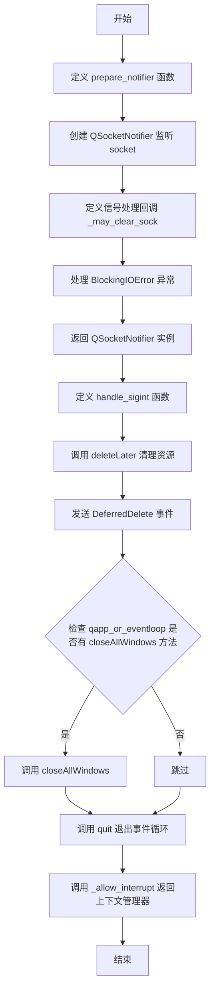

#### 带注释源码

```python
def _allow_interrupt_qt(qapp_or_eventloop):
    """A context manager that allows terminating a plot by sending a SIGINT."""

    # Use QSocketNotifier to read the socketpair while the Qt event loop runs.

    def prepare_notifier(rsock):
        # 创建 QSocketNotifier 来监听 socket 的可读事件
        # rsock 是来自 socketpair 的读取端
        sn = QtCore.QSocketNotifier(rsock.fileno(), QtCore.QSocketNotifier.Type.Read)

        @sn.activated.connect
        def _may_clear_sock():
            # 当 socket 被激活时运行，给 Python 解释器处理信号的机会
            # 需要用 recv() 清空 socket 以重新启用，因为它会在 wakeup 时被写入
            # （这在 set_wakeup_fd 捕获到非 SIGINT 信号时需要继续等待）
            try:
                rsock.recv(1)
            except BlockingIOError:
                # 在 Windows 上这可能偶尔会过早或多次触发，
                # 因此对读取空 socket 宽容处理
                pass

        # 返回 QSocketNotifier 以便调用者持有引用，
        # 同时在 handle_sigint() 中显式清理
        # 不这样做可能导致 socket notifier 过早删除或根本不删除
        return sn

    def handle_sigint(sn):
        # 清理 QSocketNotifier
        sn.deleteLater()
        # 发送 DeferredDelete 事件确保对象被正确删除
        QtCore.QCoreApplication.sendPostedEvents(sn, QtCore.QEvent.Type.DeferredDelete)
        # 如果是 QApplication，关闭所有窗口；如果是 EventLoop，直接退出
        if hasattr(qapp_or_eventloop, 'closeAllWindows'):
            qapp_or_eventloop.closeAllWindows()
        qapp_or_eventloop.quit()

    # 调用底层 _allow_interrupt 创建上下文管理器
    # 传入 prepare_notifier 和 handle_sigint 函数
    return _allow_interrupt(prepare_notifier, handle_sigint)
```


### `TimerQT.__init__`

该方法是 `TimerQT` 类的构造函数，负责初始化一个基于 Qt QTimer 的定时器实例。它创建一个 QTimer 对象，将 timeout 信号连接到内部的 _on_timer 方法，并调用父类 TimerBase 的构造函数完成初始化。

参数：

- `*args`：可变位置参数，传递给父类 `TimerBase` 的位置参数
- `**kwargs`：可变关键字参数，传递给父类 `TimerBase` 的关键字参数

返回值：`None`，构造函数无返回值

#### 流程图

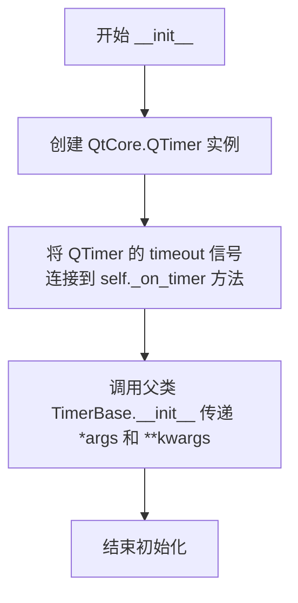

#### 带注释源码

```python
def __init__(self, *args, **kwargs):
    # Create a new timer and connect the timeout() signal to the
    # _on_timer method.
    self._timer = QtCore.QTimer()  # 创建 Qt 定时器实例
    self._timer.timeout.connect(self._on_timer)  # 连接 timeout 信号到内部处理方法
    super().__init__(*args, **kwargs)  # 调用父类 TimerBase 的构造函数
```


### `TimerQT._timer_set_single_shot`

该方法用于将Qt定时器设置为单次触发模式，根据父类TimerBase中的_single属性配置定时器是单次触发还是重复触发。

参数：

- 该方法无显式参数（隐式参数`self`指向TimerQT实例）

返回值：`None`，无返回值

#### 流程图

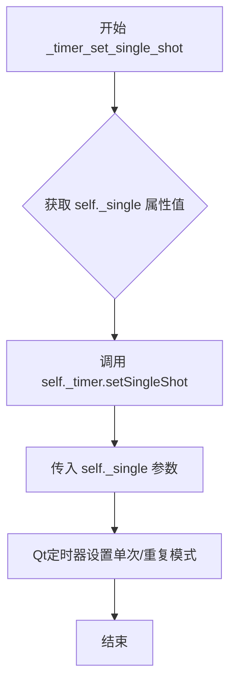

#### 带注释源码

```python
def _timer_set_single_shot(self):
    """
    设置定时器为单次触发模式。
    
    该方法将Qt QTimer配置为单次触发模式（True）或重复触发模式（False）。
    _single属性继承自TimerBase父类，标识定时器是否只触发一次。
    """
    # self._single 是一个布尔值，来自TimerBase类
    # True 表示定时器只触发一次（单次）
    # False 表示定时器会重复触发（间隔触发）
    # 调用Qt QTimer的setSingleShot方法设置定时器模式
    self._timer.setSingleShot(self._single)
```


### `TimerQT._timer_set_interval`

该方法用于设置Qt底层定时器（QTimer）的触发间隔。它读取TimerBase类中定义的间隔属性 `_interval`，并将其传递给Qt定时器的 `setInterval` 方法，从而控制定时器触发超时的频率。

参数：
-  `self`：`TimerQT`，TimerQT类的实例，表示当前定时器对象本身。

返回值：`None`，该方法不返回任何值。

#### 流程图

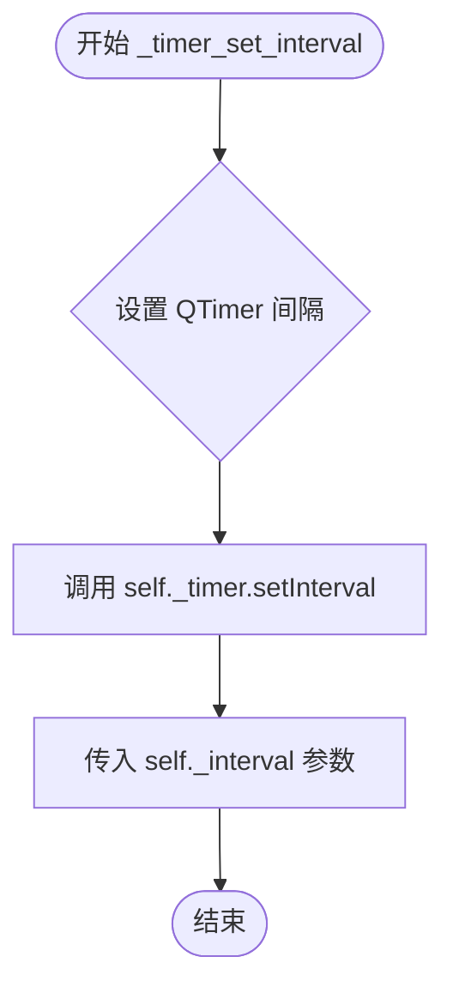

#### 带注释源码

```python
def _timer_set_interval(self):
    # 获取实例属性 _interval，该值通常由基类 TimerBase 管理，
    # 代表定时器触发的间隔时间（通常以毫秒为单位）。
    interval_value = self._interval
    
    # 调用Qt定时器对象的setInterval方法，更新底层QTimer的配置。
    self._timer.setInterval(interval_value)
```


### `TimerQT._timer_start`

该方法启动底层Qt QTimer，使计时器开始计时并在到达指定间隔时触发timeout信号。

参数：  
无

返回值：`None`，无返回值描述（该方法直接启动Qt定时器，不返回任何值）

#### 流程图

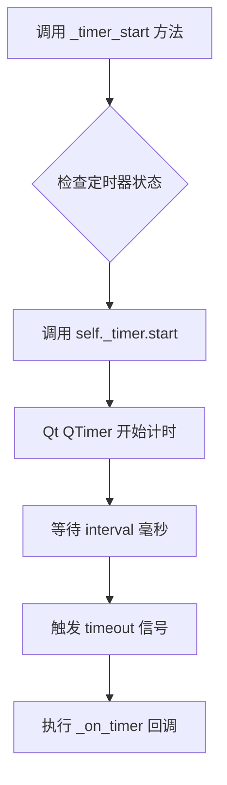

#### 带注释源码

```python
def _timer_start(self):
    """
    启动底层 Qt QTimer。
    
    该方法直接调用 Qt QTimer 的 start() 方法来启动计时器。
    计时器将在达到预设的时间间隔后触发 timeout 信号，
    从而调用 _on_timer 方法来执行用户定义的回调函数。
    """
    self._timer.start()
```


### `TimerQT._timer_stop`

停止内部 QTimer，终止计时器事件。

参数：无

返回值：`None`，无返回值描述

#### 流程图

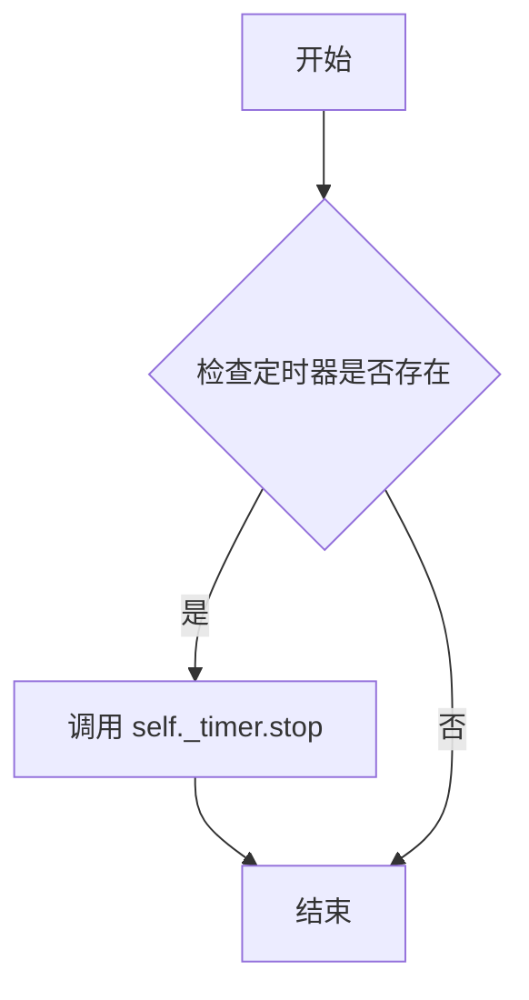

#### 带注释源码

```python
def _timer_stop(self):
    """Stop the underlying QTimer."""
    self._timer.stop()  # 调用 Qt QTimer 的 stop 方法，停止计时器
```


### FigureCanvasQT.__init__

该方法是FigureCanvasQT类的构造函数，负责初始化Qt画布实例。它确保Qt应用程序已创建，调用父类初始化方法，配置绘制状态标志，设置Qt窗口属性（如透明绘制事件和鼠标追踪），根据图形尺寸调整画布大小，并设置白色调色板以确保一致的视觉背景。

参数：

- `figure`：`FigureBase`，可选参数，默认值为None，要绑定的matplotlib图形对象

返回值：`None`，构造函数不返回值

#### 流程图

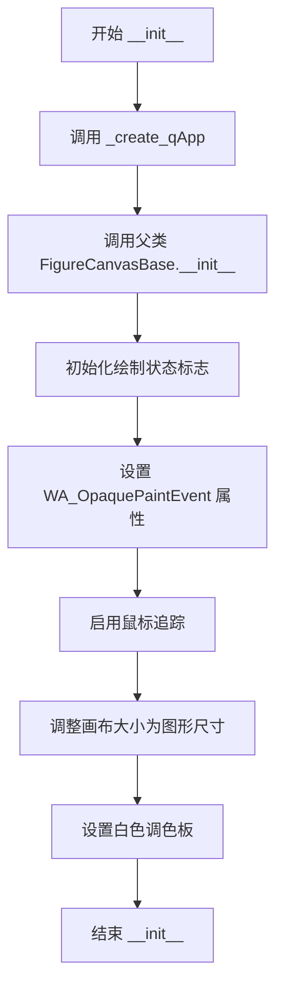

#### 带注释源码

```python
def __init__(self, figure=None):
    """
    Initialize the Qt canvas widget.
    
    Parameters
    ----------
    figure : FigureBase, optional
        The matplotlib figure to display on this canvas. Default is None.
    """
    # 确保Qt应用程序实例已创建，若不存在则创建
    # 这是Qt后端的必要前提条件
    _create_qApp()
    
    # 调用父类FigureCanvasBase的初始化方法
    # 完成图形绑定和基类属性设置
    super().__init__(figure=figure)

    # 初始化绘制状态标志
    # _draw_pending: 标记是否存在待处理的绘制请求
    self._draw_pending = False
    # _is_drawing: 标记当前是否正在进行绘制操作
    self._is_drawing = False
    # _draw_rect_callback: 缩放矩形的绘制回调，默认为空操作
    self._draw_rect_callback = lambda painter: None
    # _in_resize_event: 防止resizeEvent递归调用的标志
    self._in_resize_event = False

    # 设置Qt窗口属性
    # WA_OpaquePaintEvent: 强制背景不透明，避免透明导致的绘制问题
    self.setAttribute(QtCore.Qt.WidgetAttribute.WA_OpaquePaintEvent)
    # 启用鼠标追踪，使canvas能够接收所有鼠标移动事件
    self.setMouseTracking(True)
    
    # 根据图形尺寸调整画布大小
    # get_width_height返回(宽度, 高度)的逻辑像素尺寸
    self.resize(*self.get_width_height())

    # 设置画布调色板为白色
    # 确保canvas在没有图形时显示白色背景
    palette = QtGui.QPalette(QtGui.QColor("white"))
    self.setPalette(palette)
```


### FigureCanvasQT._update_pixel_ratio

该方法用于更新画布的设备像素比例（DPR），确保在高DPI显示器上正确渲染。当设备像素比例发生变化时，它会调用内部方法设置新的比例，并在需要时触发Qt的resize事件以重新调整画布大小。

参数：
- `self`：FigureCanvasQT 实例，隐含参数，表示当前画布对象

返回值：`None`，无显式返回值（方法内部通过调用其他方法产生副作用）

#### 流程图

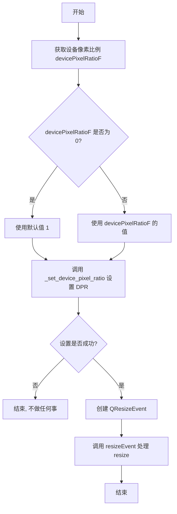

#### 带注释源码

```python
@QtCore.Slot()
def _update_pixel_ratio(self):
    """
    更新画布的设备像素比例。
    
    当窗口的 DPI 设置发生变化时调用此方法，例如从低 DPI 显示器移动到高 DPI 显示器。
    它会尝试设置新的设备像素比例，如果成功则触发 resize 事件以重新调整画布大小。
    """
    # 获取当前的设备像素比例，如果为 0 则使用 1 作为默认值
    # devicePixelRatioF() 返回浮点数形式的像素比例（如 1.0, 1.5, 2.0 等）
    # 很少情况下 devicePixelRatioF() 会返回 0，此时需要使用默认值 1
    if self._set_device_pixel_ratio(
            self.devicePixelRatioF() or 1):  # rarely, devicePixelRatioF=0
        # 调整画布大小的最简单方法是发出一个 resizeEvent
        # 因为我们已经在 resizeEvent 中实现了调整画布大小的所有逻辑
        # 这样可以确保画布的渲染尺寸与新的像素比例保持一致
        event = QtGui.QResizeEvent(self.size(), self.size())
        self.resizeEvent(event)
```


### `FigureCanvasQT._update_screen`

处理窗口所附屏幕变化的事件处理器，当窗口移动到不同屏幕（具有不同 DPI）时调用，以更新画布的像素比例并连接新屏幕的 DPI 更改信号。

参数：

- `screen`：`QtGui.QScreen`，窗口所附着或切换到的屏幕对象

返回值：`None`，无返回值，仅执行副作用操作

#### 流程图

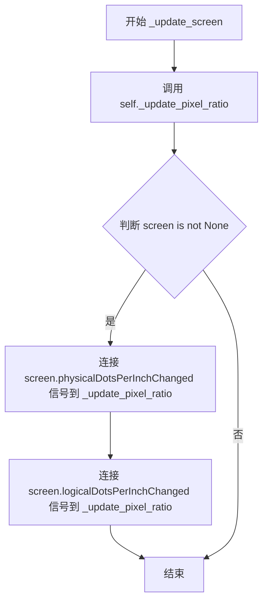

#### 带注释源码

```python
@QtCore.Slot(QtGui.QScreen)
def _update_screen(self, screen):
    # Handler for changes to a window's attached screen.
    # 当窗口的屏幕发生变化时（如窗口移动到不同 DPI 的显示器），
    # 此方法被调用以更新画布的像素比例设置
    
    # 首先更新当前的像素比例（基于新屏幕的 DPI）
    self._update_pixel_ratio()
    
    # 如果 screen 对象有效（非 None），则连接屏幕的 DPI 变化信号
    # 这样当屏幕的物理或逻辑 DPI 发生变化时，canvas 会自动更新
    if screen is not None:
        screen.physicalDotsPerInchChanged.connect(self._update_pixel_ratio)
        screen.logicalDotsPerInchChanged.connect(self._update_pixel_ratio)
```


### `FigureCanvasQT.eventFilter`

这是 `FigureCanvasQT` 类中的事件过滤器方法，用于拦截并处理 Qt 事件，特别关注设备像素比（Device Pixel Ratio）变化事件，以确保在高 DPI 屏幕上正确渲染。

参数：

- `source`：`QtCore.QObject`，事件产生的源对象
- `event`：`QtCore.QEvent`，Qt 事件对象，包含事件类型和相关信息

返回值：`bool`，返回给 Qt 事件系统的布尔值，指示事件是否已被处理（True 表示已处理，不再传递；False 表示继续传递）

#### 流程图

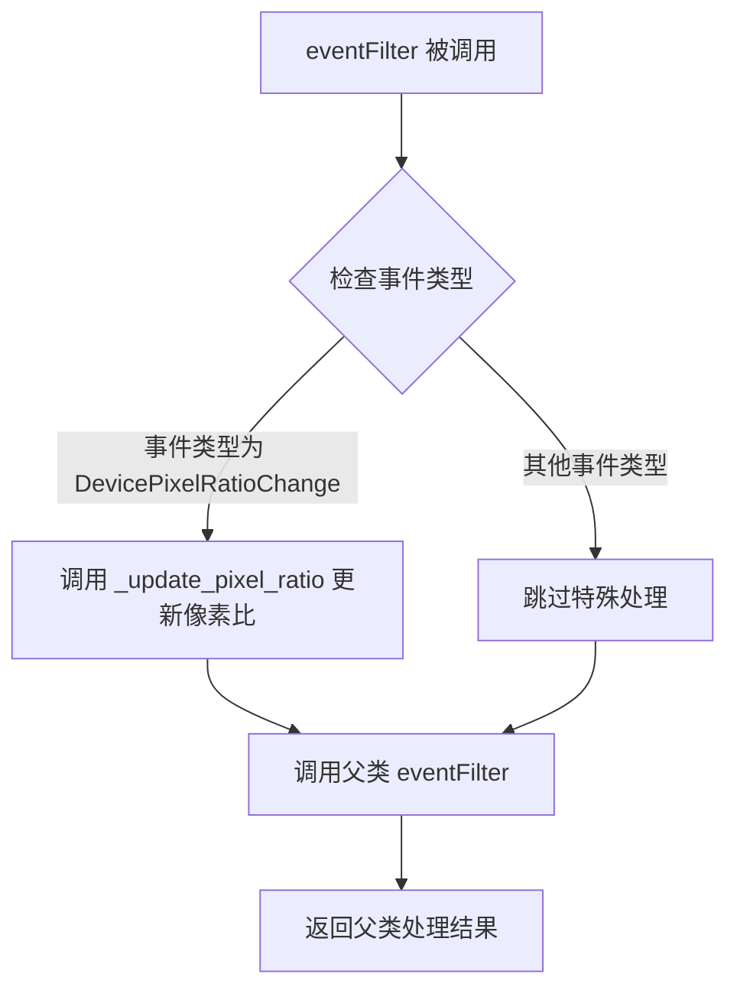

#### 带注释源码

```python
def eventFilter(self, source, event):
    """
    事件过滤器，用于处理 Qt 事件。
    
    参数:
        source: QtCore.QObject - 事件产生的源对象
        event: QtCore.QEvent - Qt 事件对象
    
    返回:
        bool - 事件是否被处理
    """
    # 检查事件是否为设备像素比变化事件
    if event.type() == QtCore.QEvent.Type.DevicePixelRatioChange:
        # 当显示器的 DPI 改变时（如外接显示器），
        # 调用内部方法更新 canvas 的设备像素比
        self._update_pixel_ratio()
    
    # 调用父类 FigureCanvasBase 的 eventFilter 方法处理其他事件
    # 并返回其处理结果，保持事件过滤链的完整性
    return super().eventFilter(source, event)
```


### `FigureCanvasQT.showEvent`

该方法在窗口显示时被调用，用于设置正确的像素比例并连接 DPI 相关信号的变更处理。根据 Qt 版本的不同（6.6及以上与旧版本），采用不同的方式处理窗口的屏幕变化和像素比例更新。

参数：

- `self`：`FigureCanvasQT`，FigureCanvasQT 实例本身
- `event`：`QtCore.QEvent`，Qt 显示事件对象，包含窗口显示时的相关信息

返回值：`None`，无返回值（Qt 中的 void）

#### 流程图

```mermaid
flowchart TD
    A[showEvent 被调用] --> B[获取窗口句柄 window = self.window().windowHandle]
    B --> C[获取当前 Qt 版本 current_version]
    C --> D{current_version >= 6.6?}
    D -->|是| E[调用 self._update_pixel_ratio]
    E --> F[window.installEventFilter self]
    F --> G[结束]
    D -->|否| H[连接 window.screenChanged 信号到 self._update_screen]
    H --> I[调用 self._update_screen window.screen]
    I --> G
```

#### 带注释源码

```python
def showEvent(self, event):
    # 设置正确的像素比例，并连接任何信号变化处理，
    # 一旦窗口显示（因此具有这些属性）。
    # 获取关联的窗口句柄
    window = self.window().windowHandle()
    # 解析当前 Qt 版本号，转换为元组 (major, minor)
    current_version = tuple(int(x) for x in QtCore.qVersion().split('.', 2)[:2])
    # 根据 Qt 版本选择不同的处理方式
    if current_version >= (6, 6):
        # Qt 6.6+: 直接更新像素比例并安装事件过滤器
        self._update_pixel_ratio()
        window.installEventFilter(self)
    else:
        # 旧版本 Qt: 通过 screenChanged 信号连接更新方法
        window.screenChanged.connect(self._update_screen)
        # 立即调用一次更新以确保初始状态正确
        self._update_screen(window.screen())
```


### FigureCanvasQT.set_cursor

该方法用于设置Qt画布的鼠标光标形状。它接收一个matplotlib的光标类型参数，通过查表将其转换为Qt的光标形状，然后调用Qt的setCursor方法设置实际的光标。

参数：

- `cursor`：`int` 或 `matplotlib.backend_bases.cursors` 中的光标类型常量（如 `cursors.MOVE`, `cursors.HAND`, `cursors.POINTER` 等），表示要设置的光标类型

返回值：`None`，该方法无返回值，仅执行光标设置操作

#### 流程图

```mermaid
flowchart TD
    A[开始: set_cursor(cursor)] --> B{检查cursor是否在cursord中}
    B -->|是| C[通过_api.getitem_checked获取对应的Qt CursorShape]
    B -->|否| D[抛出KeyError异常]
    C --> E[调用self.setCursor设置Qt光标]
    E --> F[结束]
    D --> F
```

#### 带注释源码

```python
def set_cursor(self, cursor):
    # docstring inherited
    # 使用_api.getitem_checked安全地从cursord字典中获取对应的Qt光标形状
    # cursord字典映射了matplotlib的cursors常量到Qt的CursorShape枚举值
    # 例如: cursors.MOVE -> QtCore.Qt.CursorShape.SizeAllCursor
    #       cursors.HAND -> QtCore.Qt.CursorShape.PointingHandCursor
    self.setCursor(_api.getitem_checked(cursord, cursor=cursor))
```


### `FigureCanvasQT.mouseEventCoords`

该方法用于将Qt逻辑像素坐标转换为物理像素坐标，并修正坐标系原点（Qt原点在左上角，需转换为Matplotlib原点在左下角）。这是Matplotlib在Qt后端中处理鼠标事件坐标转换的核心方法，确保所有下游坐标变换能够正确工作。

**参数：**

- `pos`：`Optional[Union[QtCore.QPoint, QtGui.QEvent, None]]`，鼠标事件的位置对象。如果为`None`，则自动从全局鼠标位置获取；如果是Qt6事件对象，应具有`position`属性；如果是Qt5事件对象，应具有`pos`属性；也可以直接传入`QtCore.QPoint`对象。

**返回值：** `Tuple[float, float]`，返回转换后的物理像素坐标元组 `(x, y)`，其中x为水平坐标，y为垂直坐标（已翻转，使y=0对应画布底部）。

#### 流程图

```mermaid
flowchart TD
    A[开始 mouseEventCoords] --> B{pos is None?}
    B -->|是| C[使用 mapFromGlobal<br/>QtGui.QCursor.pos()<br/>获取全局鼠标位置]
    B -->|否| D{pos.position<br/>属性存在?}
    D -->|是| E[pos = pos.position<br/>Qt6方式]
    D -->|否| F{pos.pos<br/>属性存在?}
    F -->|是| G[pos = pos.pos<br/>Qt5方式]
    F -->|否| H[假设pos已是QPoint]
    C --> I[x = pos.x]
    E --> I
    G --> I
    H --> I
    I --> J[y = figure.bbox.height<br/>/ device_pixel_ratio<br/>- pos.y]
    J --> K[x_physical = x * device_pixel_ratio]
    J --> L[y_physical = y * device_pixel_ratio]
    K --> M[返回 (x_physical, y_physical)]
    L --> M
```

#### 带注释源码

```python
def mouseEventCoords(self, pos=None):
    """
    Calculate mouse coordinates in physical pixels.

    Qt uses logical pixels, but the figure is scaled to physical
    pixels for rendering.  Transform to physical pixels so that
    all of the down-stream transforms work as expected.

    Also, the origin is different and needs to be corrected.
    """
    # 如果未提供位置，则从全局鼠标位置获取
    if pos is None:
        pos = self.mapFromGlobal(QtGui.QCursor.pos())
    # Qt6 QtGui.QEvent 使用 .position() 获取位置
    elif hasattr(pos, "position"):
        pos = pos.position()
    # Qt5 QtCore.QEvent 使用 .pos() 获取位置
    elif hasattr(pos, "pos"):
        pos = pos.pos()
    # 否则，假设pos已经是QPoint对象
    
    # 获取x坐标（保持不变）
    x = pos.x()
    
    # 翻转y坐标：Qt坐标系原点在左上角(y向下增大)
    # Matplotlib坐标系原点在左下角(y向上增大)
    # 计算逻辑高度 = figure.bbox.height / device_pixel_ratio
    # 实际y = 逻辑高度 - Qt鼠标y坐标
    y = self.figure.bbox.height / self.device_pixel_ratio - pos.y()
    
    # 转换为物理像素坐标（乘以设备像素比）
    return x * self.device_pixel_ratio, y * self.device_pixel_ratio
```


### FigureCanvasQT.enterEvent

该方法处理鼠标光标进入画布区域的事件，当鼠标进入Qt画布时会触发此方法。该方法首先强制查询当前的键盘修饰符状态（因为窗口失去焦点时缓存的修饰符状态可能已失效），然后检查figure是否存在，若存在则创建一个LocationEvent事件并进行处理，以通知matplotlib系统鼠标进入了figure区域。

参数：

- `event`：`QtCore.QEvent`，Qt鼠标进入事件对象，包含鼠标进入时的相关事件信息

返回值：`None`，无返回值（该方法通过副作用处理事件）

#### 流程图

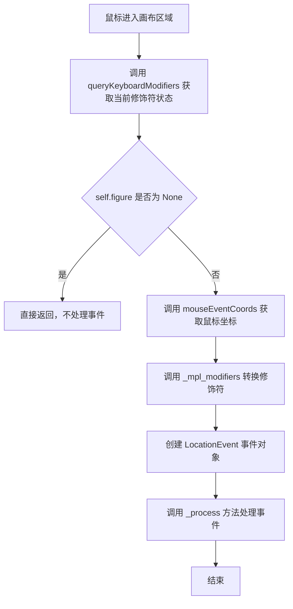

#### 带注释源码

```
def enterEvent(self, event):
    # 强制查询键盘修饰符状态，因为当窗口失去焦点时，
    # 缓存的修饰符状态可能已被Qt invalidate，需要重新获取
    mods = QtWidgets.QApplication.instance().queryKeyboardModifiers()
    
    # 如果没有关联的figure，则不需要处理进入事件
    if self.figure is None:
        return
    
    # 创建位置事件并处理
    # "figure_enter_event" 事件类型表示鼠标进入figure区域
    # self: canvas对象，作为事件的源
    # *self.mouseEventCoords(event): 展开鼠标在画布中的物理像素坐标
    # modifiers: 当前键盘修饰符状态（如Ctrl、Alt、Shift等）
    # guiEvent=event: 原始的Qt GUI事件对象
    LocationEvent("figure_enter_event", self,
                  *self.mouseEventCoords(event),
                  modifiers=self._mpl_modifiers(mods),
                  guiEvent=event)._process()
```


### `FigureCanvasQT.leaveEvent`

处理鼠标离开画布区域的事件，当鼠标光标离开 FigureCanvasQT 控件时触发，重置鼠标光标并发送 figure_leave_event 事件。

参数：

- `event`：`QtCore.QEvent`，Qt 鼠标离开事件对象，包含事件的元数据

返回值：`None`，无返回值

#### 流程图

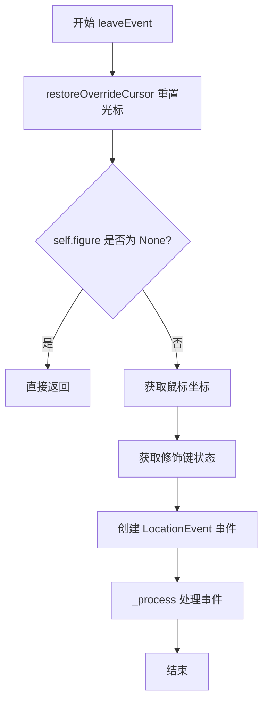

#### 带注释源码

```python
def leaveEvent(self, event):
    """
    处理鼠标离开画布区域的事件。
    
    当鼠标光标离开 FigureCanvasQT 控件时调用此方法。
    该方法负责：
    1. 恢复被覆盖的鼠标光标（如果有）
    2. 如果存在 figure，则发送 figure_leave_event 事件
    
    Parameters
    ----------
    event : QtCore.QEvent
        Qt 鼠标离开事件对象，由 Qt 事件系统传递
    """
    # 恢复 QApplication 的默认光标覆盖状态
    # 这会撤销任何之前的 setOverrideCursor 调用
    QtWidgets.QApplication.restoreOverrideCursor()
    
    # 检查是否存在关联的 figure
    # 如果没有 figure，则无需发送事件，直接返回
    if self.figure is None:
        return
    
    # 计算鼠标在画布上的物理像素坐标
    # mouseEventCoords() 返回 (x, y) 坐标元组
    # 获取当前的键盘修饰键状态（如 Ctrl、Alt、Shift 等）
    # 发送 figure_leave_event 事件，通知监听器鼠标已离开画布
    LocationEvent("figure_leave_event", self,
                  *self.mouseEventCoords(),
                  modifiers=self._mpl_modifiers(),
                  guiEvent=event)._process()
```


### FigureCanvasQT.mousePressEvent

该方法处理 Qt 鼠标按下事件，将 Qt 的鼠标事件转换为 Matplotlib 的 MouseEvent 事件，并分发给相应的回调处理函数。

参数：

- `event`：`QtGui.QMouseEvent`，Qt 的鼠标按下事件对象，包含按钮、位置等信息

返回值：`None`，无返回值

#### 流程图

```mermaid
flowchart TD
    A[开始 mousePressEvent] --> B{获取 event.button}
    B --> C[通过 buttond 映射获取 Matplotlib MouseButton]
    D{button is not None 且 self.figure is not None?}
    C --> D
    D -->|否| E[直接返回，不处理]
    D -->|是| F[调用 mouseEventCoords 获取鼠标坐标]
    F --> G[调用 _mpl_modifiers 获取修饰键状态]
    G --> H[创建 MouseEvent 对象 'button_press_event']
    H --> I[调用 _process() 分发事件]
    I --> J[结束]
```

#### 带注释源码

```python
def mousePressEvent(self, event):
    """
    处理鼠标按下事件。
    
    Parameters
    ----------
    event : QtGui.QMouseEvent
        Qt 鼠标事件对象，包含按钮、位置等信息
    """
    # 从 Qt 鼠标事件中获取按下的按钮，并通过 buttond 映射转换为 Matplotlib 的 MouseButton
    button = self.buttond.get(event.button())
    
    # 检查按钮是否有效且 figure 是否存在
    if button is not None and self.figure is not None:
        # 将鼠标事件坐标转换为 Matplotlib 坐标系
        # mouseEventCoords 会处理 Qt 坐标系与 Matplotlib 坐标系的差异
        # (Qt 坐标系原点在左上角，Matplotlib 在左下角)
        # 同时处理设备像素比，确保高 DPI 支持
        MouseEvent("button_press_event", self,
                   *self.mouseEventCoords(event), button,
                   # 获取当前修饰键状态（Ctrl、Alt、Shift、Meta 等）
                   modifiers=self._mpl_modifiers(),
                   # 传递原始的 Qt 事件对象，保留 Qt 侧信息
                   guiEvent=event)._process()
```


### FigureCanvasQT.mouseDoubleClickEvent

该方法处理 Qt 画布上的鼠标双击事件，将双击操作转换为 Matplotlib 的 MouseEvent 事件并分发到图形处理系统。

参数：

- `event`：`QtGui.QMouseEvent`，Qt 鼠标事件对象，包含触发双击的鼠标按钮和位置信息

返回值：`None`，无返回值（事件处理方法）

#### 流程图

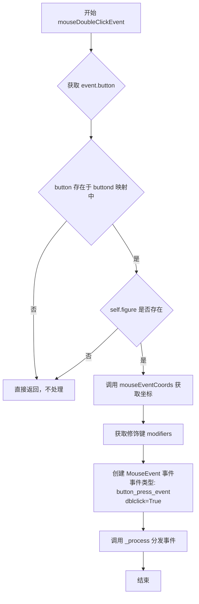

#### 带注释源码

```python
def mouseDoubleClickEvent(self, event):
    """
    处理鼠标双击事件。
    
    当用户在画布上进行双击操作时，Qt 会触发此方法。
    该方法将 Qt 事件转换为 Matplotlib 的 MouseEvent 并分发。
    """
    # 从 buttond 字典获取对应的鼠标按钮枚举值
    # buttond 映射 Qt 鼠标按钮到 Matplotlib MouseButton 枚举
    button = self.buttond.get(event.button())
    
    # 检查按钮是否有效且图形对象存在
    if button is not None and self.figure is not None:
        # 创建 MouseEvent 事件
        # 事件类型为 'button_press_event'（与单击相同）
        # 传入 dblclick=True 标志表示这是双击事件
        MouseEvent("button_press_event", self,
                   *self.mouseEventCoords(event),  # 获取鼠标在画布上的物理像素坐标
                   button,                          # 鼠标按钮（左/中/右）
                   dblclick=True,                   # 标记为双击事件
                   modifiers=self._mpl_modifiers(),# 当前按下的修饰键（Ctrl/Shift/Alt等）
                   guiEvent=event)._process()       # 原始 Qt 事件用于底层处理
```


### `FigureCanvasQT.mouseMoveEvent`

该方法处理Qt画布上的鼠标移动事件，将Qt的鼠标移动事件转换为Matplotlib的`motion_notify_event`事件并分发到Matplotlib的事件处理系统。

参数：

-  `event`：`QtGui.QMouseEvent`，Qt的鼠标移动事件对象，包含鼠标位置、按钮状态和修饰键信息

返回值：无返回值（`None`），该方法通过直接调用`MouseEvent._process()`来处理事件

#### 流程图

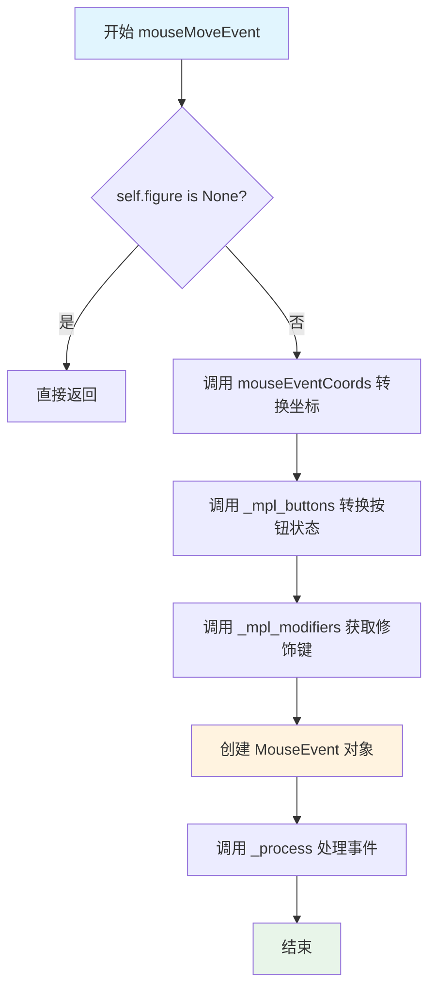

#### 带注释源码

```python
def mouseMoveEvent(self, event):
    """
    处理鼠标移动事件。
    
    Parameters
    ----------
    event : QtGui.QMouseEvent
        Qt的鼠标移动事件对象，包含鼠标位置、按钮状态等信息。
    """
    # 检查figure是否存在，如果不存在则直接返回，不处理事件
    if self.figure is None:
        return
    
    # 创建MouseEvent事件对象
    # "motion_notify_event" - 事件类型，表示鼠标移动通知
    # self - 事件发送者，即FigureCanvasQT实例
    # *self.mouseEventCoords(event) - 转换后的鼠标坐标（x, y）
    # buttons=self._mpl_buttons(event.buttons()) - 当前按下的鼠标按钮
    # modifiers=self._mpl_modifiers() - 当前按下的修饰键（Ctrl、Shift等）
    # guiEvent=event - 原始的Qt事件对象
    MouseEvent("motion_notify_event", self,
               *self.mouseEventCoords(event),
               buttons=self._mpl_buttons(event.buttons()),
               modifiers=self._mpl_modifiers(),
               guiEvent=event)._process()
```


### `FigureCanvasQT.mouseReleaseEvent`

该方法处理鼠标按钮释放事件，当用户在画布上释放鼠标按钮时触发，将Qt的鼠标事件转换为Matplotlib的MouseEvent并分发给相应的回调处理函数。

参数：

- `event`：`QtGui.QMouseEvent`，Qt鼠标释放事件对象，包含按钮信息、坐标等

返回值：`None`，该方法不返回任何值，直接处理并分发事件

#### 流程图

```mermaid
flowchart TD
    A[mouseReleaseEvent 开始] --> B{获取button}
    B --> C[调用 buttond.get event.button]
    C --> D{button是否存在且figure存在}
    D -->|否| E[直接返回, 不做任何处理]
    D -->|是| F[调用 mouseEventCoords 获取坐标]
    F --> G[获取 modifiers 修饰键状态]
    G --> H[创建 MouseEvent 对象]
    H --> I{event类型检查}
    I -->|button_release_event| J[调用 _process 分发事件]
    J --> K[mouseReleaseEvent 结束]
    E --> K
```

#### 带注释源码

```python
def mouseReleaseEvent(self, event):
    """
    处理鼠标按钮释放事件的Qt事件处理器。
    
    当用户在画布上释放鼠标按钮时，Qt调用此方法。
    该方法将Qt的鼠标事件转换为Matplotlib的MouseEvent，
    并通过_process()方法分发给注册的回调函数。
    
    Parameters
    ----------
    event : QtGui.QMouseEvent
        Qt的鼠标释放事件对象，包含以下关键信息：
        - button(): 释放的鼠标按钮(Qt::MouseButton)
        - position(): 鼠标位置(Qt6) 或 pos()(Qt5)
    
    Returns
    -------
    None
        该方法不返回任何值，所有处理通过事件分发完成。
    """
    # 从buttond字典中获取对应的Matplotlib MouseButton枚举值
    # buttond将Qt鼠标按钮映射到MouseButton枚举
    # 例如: QtCore.Qt.MouseButton.LeftButton -> MouseButton.LEFT
    button = self.buttond.get(event.button())
    
    # 检查按钮是否有效且figure是否存在
    # 如果button为None(未知按钮)或figure为None(无激活的图形),则不处理
    if button is not None and self.figure is not None:
        # 将Qt坐标转换为Matplotlib的物理像素坐标
        # mouseEventCoords处理了Qt5/Qt6的API差异
        # 并翻转Y轴使y=0为画布底部
        coords = self.mouseEventCoords(event)
        
        # 获取当前按下的修饰键(ctrl, shift, alt等)
        # _mpl_modifiers返回修饰键名称列表
        modifiers = self._mpl_modifiers()
        
        # 创建Matplotlib的MouseEvent对象
        # 事件类型为"button_release_event"
        # 包含: 画布、坐标、按钮、修饰键、原始Qt事件
        mouse_event = MouseEvent(
            "button_release_event",  # 事件类型名称
            self,                      # 发送者(画布实例)
            *coords,                   # 解包坐标(x, y)
            button,                    # 释放的鼠标按钮
            modifiers=modifiers,      # 修饰键状态
            guiEvent=event             # 原始Qt事件对象
        )
        
        # 处理事件,分发给所有注册的回调函数
        # _process()会遍历该事件类型的所有回调并依次调用
        mouse_event._process()
```


### FigureCanvasQT.wheelEvent

该方法覆盖自 Qt 的 `QWidget.wheelEvent`，用于处理画布上的鼠标滚轮事件。它根据滚轮滚动计算步长，并将其转换为 Matplotlib 的 `scroll_event` 鼠标事件，以实现图形的缩放或滚动交互。

参数：

- `event`：`QtGui.QWheelEvent`（或 QtCore.QEvent 的子类实例），Qt 鼠标滚轮事件对象，包含像素增量或角度增量信息。

返回值：`None`，该方法为事件处理回调，不返回任何值。

#### 流程图

```mermaid
flowchart TD
    A([Start wheelEvent]) --> B{pixelDelta.isNull() <br> OR platform == 'xcb'}
    B -- True --> C[steps = angleDelta.y / 120]
    B -- False --> D[steps = pixelDelta.y]
    C --> E{steps != 0 <br> AND figure is not None}
    D --> E
    E -- False --> F([End])
    E -- True --> G[Create MouseEvent <br> type='scroll_event']
    G --> H[Call _process()]
    H --> F
```

#### 带注释源码

```python
def wheelEvent(self, event):
    # 根据 QWheelEvent 文档，pixelDelta 有时不可用（isNull()）或在 X11 ("xcb") 上不可靠。
    # 因此需要根据情况选择使用 pixelDelta 还是 angleDelta 来计算滚动步长。
    if (event.pixelDelta().isNull()
            or QtWidgets.QApplication.instance().platformName() == "xcb"):
        # 如果 pixelDelta 不可用或平台是 xcb，使用角度增量 (angleDelta)
        # 通常 1 个鼠标滚轮刻度对应 120 个角度增量，因此除以 120 得到步数。
        steps = event.angleDelta().y() / 120
    else:
        # 否则使用像素增量 (pixelDelta)，直接作为步数。
        steps = event.pixelDelta().y()
    
    # 只有当存在有效的滚动步长且当前有活动的 figure 时，才触发事件。
    if steps and self.figure is not None:
        # 构造 Matplotlib 的 MouseEvent 事件
        # 事件类型为 'scroll_event'，通常用于处理缩放
        MouseEvent("scroll_event", self,
                   *self.mouseEventCoords(event), step=steps,
                   modifiers=self._mpl_modifiers(),
                   guiEvent=event)._process()
```


### FigureCanvasQT.keyPressEvent

处理Qt键盘按下事件，将Qt键盘事件转换为Matplotlib的KeyEvent并分发给图形。

参数：

- `event`：`QtGui.QKeyEvent`，Qt键盘事件对象，包含按键的详细信息

返回值：`None`，无返回值，该方法通过触发KeyEvent来处理键盘输入

#### 流程图

```mermaid
flowchart TD
    A[keyPressEvent 被调用] --> B{event 有效?}
    B -->|否| C[直接返回]
    B -->|是| D[调用 _get_key 获取键值]
    D --> E{key 不为 None?}
    E -->|否| F[直接返回]
    E -->|是| G{self.figure 不为 None?}
    G -->|否| H[直接返回]
    G -->|是| I[调用 mouseEventCoords 获取鼠标坐标]
    I --> J[调用 _mpl_modifiers 获取修饰键状态]
    J --> K[创建 KeyEvent 对象]
    K --> L[调用 _process 方法分发事件]
```

#### 带注释源码

```python
def keyPressEvent(self, event):
    """
    处理Qt键盘按下事件。
    
    参数:
        event: QtGui.QKeyEvent 对象，包含按键的键盘事件
    """
    # 使用 _get_key 方法将Qt按键事件转换为Matplotlib可识别的键字符串
    # 例如: 'ctrl+a', 'enter', 'f1' 等
    key = self._get_key(event)
    
    # 只有当键值有效且图形存在时才处理事件
    if key is not None and self.figure is not None:
        # 创建Matplotlib的KeyEvent对象
        # 参数包括: 事件类型 'key_press_event', 画布对象, 按键字符, 鼠标坐标, 修饰键, 原始Qt事件
        KeyEvent("key_press_event", self,
                 key, *self.mouseEventCoords(),
                 modifiers=self._mpl_modifiers(),
                 guiEvent=event)._process()
```


### `FigureCanvasQT.keyReleaseEvent`

该方法处理 Qt 键盘释放事件，将 Qt 的键盘事件转换为 Matplotlib 的 `KeyEvent` 并分发给相应的回调处理程序，实现键盘交互功能。

参数：

- `event`：`QtGui.QKeyEvent`，Qt 键盘事件对象，包含按键的详细信息（如键码、修饰符等）

返回值：`None`，该方法为事件处理函数，不返回任何值

#### 流程图

```mermaid
flowchart TD
    A[keyReleaseEvent 被调用] --> B{event 是否有效}
    B -->|否| C[直接返回]
    B -->|是| D[调用 _get_key 获取键名]
    E{key 是否有效且 figure 存在}
    D --> E
    E -->|否| C
    E -->|是| F[调用 mouseEventCoords 获取鼠标坐标]
    F --> G[创建 KeyEvent 对象 key_release_event]
    G --> H[调用 _process 分发事件]
    H --> I[事件被传递给注册的回调函数]
```

#### 带注释源码

```python
def keyReleaseEvent(self, event):
    """
    处理键盘按键释放事件的 Qt 事件处理器。
    
    参数:
        event: QtGui.QKeyEvent - Qt 键盘事件对象，包含按键的键码和修饰符信息
    """
    # 调用 _get_key 方法将 Qt 键盘事件转换为 Matplotlib 可识别的键名
    # 返回值可能是字符串（如 'ctrl+a'）或 None（无效键）
    key = self._get_key(event)
    
    # 检查键值有效且 figure 存在（防止在无figure时触发事件）
    if key is not None and self.figure is not None:
        # 获取当前鼠标在画布上的坐标位置（物理像素）
        # 返回 (x, y) 元组
        coords = self.mouseEventCoords()
        
        # 创建 Matplotlib 的 KeyEvent 对象
        # 参数: 事件类型、画布对象、键名、鼠标x坐标、鼠标y坐标、原始Qt事件
        KeyEvent("key_release_event", self,
                 key, *coords,
                 guiEvent=event)._process()
        # 调用 _process 方法将事件分发给所有注册的回调函数
```


### `FigureCanvasQT.resizeEvent`

该方法是Qt后端中处理画布窗口大小调整的核心事件处理器，当用户调整Matplotlib图形窗口大小时被Qt框架调用。它负责将Qt的像素尺寸转换为英寸单位，更新Figure对象的尺寸，并触发重绘流程。

参数：

-  `event`：`QtGui.QResizeEvent`，Qt窗口调整大小事件对象，包含调整后的新尺寸信息

返回值：`None`，无返回值（事件处理器方法）

#### 流程图

```mermaid
flowchart TD
    A[resizeEvent开始] --> B{正在处理resize事件?}
    B -->|是| C[直接返回 - 防止PyQt6递归]
    B -->|否| D{self.figure是否为None?}
    D -->|是| E[直接返回 - 无figure可调整]
    D -->|否| F[设置_in_resize_event = True]
    F --> G[计算物理像素宽度 w = event.size().width * device_pixel_ratio]
    G --> H[计算物理像素高度 h = event.size().height * device_pixel_ratio]
    H --> I[获取figure.dpi]
    I --> J[计算宽度英寸数: winch = w / dpi]
    J --> K[计算高度英寸数: hinch = h / dpi]
    K --> L[调用figure.set_size_inches设置新尺寸]
    L --> M[调用Qt基类的resizeEvent完成Qt端处理]
    M --> N[创建并触发Matplotlib的ResizeEvent]
    N --> O[调用draw_idle触发重绘]
    O --> P[设置_in_resize_event = False]
    P --> Q[resizeEvent结束]
    C --> Q
    E --> Q
```

#### 带注释源码

```python
def resizeEvent(self, event):
    """
    处理Qt窗口调整大小事件，更新Figure的尺寸并触发重绘。
    
    参数:
        event: QtGui.QResizeEvent对象，包含新的窗口尺寸信息
    """
    # 防止PyQt6中的递归调用（重入保护）
    if self._in_resize_event:
        return
    
    # 如果没有关联的Figure对象，无需处理
    if self.figure is None:
        return
    
    # 设置重入标志，防止嵌套调用
    self._in_resize_event = True
    try:
        # --- 步骤1: 计算物理像素尺寸 ---
        # event.size()返回逻辑像素，需要乘以设备像素比转换为物理像素
        w = event.size().width() * self.device_pixel_ratio
        h = event.size().height() * self.device_pixel_ratio
        
        # --- 步骤2: 转换为英寸单位 ---
        # Matplotlib使用英寸作为Figure尺寸单位，需要根据DPI进行转换
        dpival = self.figure.dpi
        winch = w / dpival
        hinch = h / dpival
        
        # --- 步骤3: 更新Figure尺寸 ---
        # forward=False表示不立即重绘，由后面的draw_idle处理
        self.figure.set_size_inches(winch, hinch, forward=False)
        
        # --- 步骤4: 调用Qt基类处理 ---
        # 将事件传回Qt的QWidget基类，让Qt完成其内部处理逻辑
        QtWidgets.QWidget.resizeEvent(self, event)
        
        # --- 步骤5: 发送Matplotlib的ResizeEvent ---
        # 创建并触发Matplotlib的ResizeEvent，通知其他组件尺寸已改变
        ResizeEvent("resize_event", self)._process()
        
        # --- 步骤6: 触发延迟重绘 ---
        # 使用draw_idle而不是draw()，可以合并多次重绘请求，提高性能
        self.draw_idle()
    finally:
        # 无论是否发生异常，都要重置重入标志
        self._in_resize_event = False
```


### FigureCanvasQT.sizeHint

该方法是 Qt 的 `QWidget.sizeHint()` 的实现，用于返回画布的建议大小。它通过调用 `get_width_height()` 获取当前画布的宽度和高度，并以 `QtCore.QSize` 对象的形式返回。

参数：无需显式参数（继承自父类）

返回值：`QtCore.QSize`，返回画布的建议宽度和高度，用于 Qt 布局系统

#### 流程图

```mermaid
flowchart TD
    A[开始 sizeHint] --> B[调用 get_width_height 获取宽度和高度]
    B --> C{获取成功?}
    C -->|是| D[创建 QtCore.QSize 对象]
    C -->|否| E[返回空 QSize]
    D --> F[返回 QSize 对象]
    E --> F
```

#### 带注释源码

```python
def sizeHint(self):
    """
    返回画布的建议大小，用于 Qt 布局系统。
    
    此方法覆盖了 QWidget.sizeHint()，为 Qt 的布局管理器
    提供画布的推荐尺寸。
    
    Returns
    -------
    QtCore.QSize
        包含画布宽度和高度的 QSize 对象
    """
    # 获取画布的宽度和高度（以逻辑像素为单位）
    # get_width_height() 继承自 FigureCanvasBase
    w, h = self.get_width_height()
    
    # 创建并返回 Qt 大小对象
    return QtCore.QSize(w, h)
```


### `FigureCanvasQT.minimumSizeHint`

该方法是 FigureCanvasQT 类对 Qt QWidget 基类的重写实现，用于向 Qt 布局系统提供该画布 widget 的最小尺寸建议值。当前实现返回一个固定的 10×10 像素尺寸，确保画布在布局中不会小于此尺寸。

**参数：** 无

**返回值：** `QtCore.QSize`，返回画布的最小推荐尺寸为宽 10 像素、高 10 像素

#### 流程图

```mermaid
flowchart TD
    A[开始 minimumSizeHint] --> B[创建 QtCore.QSize 10x10]
    B --> C[返回 QSize 对象给 Qt 布局系统]
```

#### 带注释源码

```python
def minimumSizeHint(self):
    """
    返回画布widget的最小尺寸建议值。
    
    此方法重写了 QtWidgets.QWidget 的 minimumSizeHint()，用于向 Qt 的
    布局系统提供该 widget 的最小尺寸约束。返回固定值 10x10 像素，
    确保画布在布局中不会被压缩得过小。
    
    Returns:
        QtCore.QSize: 最小尺寸，宽度为 10 像素，高度为 10 像素。
    """
    return QtCore.QSize(10, 10)
```


### `FigureCanvasQT._mpl_buttons`

将Qt鼠标按钮状态掩码转换为Matplotlib的MouseButton枚举集合，用于处理鼠标事件中的按钮状态。

参数：

- `buttons`：`int`，Qt鼠标按钮状态掩码（来自QEvent的buttons()方法）

返回值：`Set[MouseButton]`，返回当前处于按下状态的鼠标按钮对应的Matplotlib MouseButton枚举集合

#### 流程图

```mermaid
flowchart TD
    A[开始: 传入buttons参数] --> B{buttons是否为None}
    B -->|是| C[返回空集合]
    B -->|否| D[将buttons转换为整数]
    D --> E[遍历FigureCanvasQT.buttond字典]
    E --> F{检查掩码与buttons按位与结果}
    F -->|非零| G[将该button加入结果集合]
    F -->|为零| H[跳过]
    G --> I{是否还有更多条目}
    H --> I
    I -->|是| E
    I -->|否| J[返回结果集合]
```

#### 带注释源码

```python
@staticmethod
def _mpl_buttons(buttons):
    """
    将Qt鼠标按钮状态掩码转换为MatplotlibMouseButton枚举集合。
    
    Parameters
    ----------
    buttons : int
        Qt鼠标按钮状态掩码，来自QEvent.buttons()方法。
        例如：QtCore.Qt.MouseButton.LeftButton 的整数值。
    
    Returns
    -------
    set
        包含当前处于按下状态的MouseButton枚举值的集合。
        例如：{MouseButton.LEFT, MouseButton.RIGHT}
    """
    # 将输入的buttons转换为整数，确保进行正确的位运算
    buttons = _to_int(buttons)
    
    # State *after* press/release.
    # 遍历buttond字典中的所有(掩码, 按钮)对
    # 如果掩码与buttons进行按位与运算后结果非零，
    # 说明对应的鼠标按钮处于按下状态
    return {button for mask, button in FigureCanvasQT.buttond.items()
            if _to_int(mask) & buttons}
```


### `FigureCanvasQT._mpl_modifiers`

将 Qt 键盘修饰符（如 Ctrl、Alt、Shift、Meta）转换为 Matplotlib 使用的修饰符名称列表。

参数：

- `modifiers`：`int` 或 `None`，Qt 键盘修饰符的位掩码，如果为 None 则自动查询当前键盘状态
- `exclude`：`int` 或 `None`（关键字参数），需要排除的 Qt 键值

返回值：`list`，返回按下的修饰键名称列表（如 `['ctrl', 'alt', 'shift']`）

#### 流程图

```mermaid
flowchart TD
    A[开始 _mpl_modifiers] --> B{modifiers is None?}
    B -->|是| C[获取 Qt 应用实例的 keyboardModifiers]
    B -->|否| D[使用传入的 modifiers]
    C --> E[将 modifiers 转换为整数]
    D --> E
    E --> F[遍历 _MODIFIER_KEYS 元组列表]
    F --> G{当前键值 != exclude 且 modifiers & mask != 0?}
    G -->|是| H[从 SPECIAL_KEYS 获取键名并将 'control' 替换为 'ctrl']
    G -->|否| I[跳过该键]
    H --> J[将键名添加到结果列表]
    I --> F
    J --> F
    F --> K[返回修饰键名称列表]
```

#### 带注释源码

```python
@staticmethod
def _mpl_modifiers(modifiers=None, *, exclude=None):
    """
    将 Qt 键盘修饰符转换为 Matplotlib 修饰符名称列表。

    参数:
        modifiers: Qt 键盘修饰符位掩码，如果为 None 则自动查询当前状态
        exclude: 需要排除的键值（用于在 keyPressEvent 中排除被按下的键本身）

    返回:
        按下的修饰键名称列表（如 ['ctrl', 'alt', 'shift']）
    """
    # 如果未提供 modifiers，则从 Qt 应用获取当前键盘修饰符状态
    if modifiers is None:
        modifiers = QtWidgets.QApplication.instance().keyboardModifiers()
    
    # 将 modifiers 转换为整数（确保是位掩码格式）
    modifiers = _to_int(modifiers)

    # 获取按下的修饰键名称
    # 'control' 作为独立键时名为 'control'，但作为修饰符时名为 'ctrl'
    # 使用位运算从 modifiers 位掩码中提取修饰键
    # 如果 exclude 是某个 MODIFIER，则不应在 mods 中重复
    return [SPECIAL_KEYS[key].replace('control', 'ctrl')  # 替换 control 为 ctrl
            for mask, key in _MODIFIER_KEYS               # 遍历预定义的修饰键映射
            if exclude != key and modifiers & mask]       # 仅当键被按下且未排除时
```


### `FigureCanvasQT._get_key`

将 Qt 键盘事件（QKeyEvent）转换为 Matplotlib 可识别的按键字符串表示（如 "ctrl+shift+a"），用于处理键盘输入事件。

参数：

- `event`：`QtGui.QKeyEvent`，Qt 的键盘事件对象，包含按键信息和修饰键状态

返回值：`str` 或 `None`，返回标准化后的按键字符串（如 "ctrl+shift+a"），如果按键代码超出 Unicode 范围则返回 None

#### 流程图

```mermaid
flowchart TD
    A[开始: _get_key event] --> B[获取 event.key&#40;&#41;]
    B --> C[调用 _mpl_modifiers 获取修饰键列表]
    C --> D{event_key 在 SPECIAL_KEYS 中?}
    D -->|是| E[从 SPECIAL_KEYS 获取 key]
    D -->|否| F{event_key > sys.maxunicode?}
    F -->|是| G[返回 None]
    F -->|否| H[chr&#40;event_key&#41; 转换为字符]
    H --> I{shift 在 mods 中?}
    I -->|是| J[从 mods 移除 'shift']
    I -->|否| K[key = key.lower&#40;&#41;]
    J --> L[返回 '+'.join&#40;mods + [key]&#41;]
    K --> L
    E --> L
```

#### 带注释源码

```python
def _get_key(self, event):
    """
    将 Qt 键盘事件转换为 Matplotlib 按键字符串表示。
    
    参数:
        event: QtGui.QKeyEvent, Qt 键盘事件对象
        
    返回:
        str 或 None: 标准化按键字符串（如 "ctrl+shift+a"），
                     超出 Unicode 范围返回 None
    """
    # 获取事件的按键代码（Qt::Key）
    event_key = event.key()
    # 获取当前修饰键列表，排除 event_key 对应的修饰键
    # 例如按下 'a' 键时，不将 'a' 本身作为修饰键处理
    mods = self._mpl_modifiers(exclude=event_key)
    try:
        # 对于特定功能键（回车、退格、方向键等），
        # 使用预定义的可读名称而非 Unicode 字符
        key = SPECIAL_KEYS[event_key]
    except KeyError:
        # Unicode 定义码点上限为 0x10ffff（sys.maxunicode）
        # Qt 对于非 Unicode 字符（如多媒体键）使用更大的 Key_Code
        # 跳过这些无法映射的按键
        # 如需支持，应将其添加到 SPECIAL_KEYS 映射表中
        if event_key > sys.maxunicode:
            return None

        # 将按键代码转换为字符
        key = chr(event_key)
        # Qt 会发送大写字母。修正大小写处理
        # 注意：capslock 键被忽略
        if 'shift' in mods:
            # 如果按下了 shift 键（用于大写或特殊符号），
            # 从修饰键列表中移除，因为字符本身已包含大写信息
            mods.remove('shift')
        else:
            # 未按 shift 时转换为小写
            key = key.lower()

    # 组合修饰键和主按键，返回格式如 "ctrl+shift+a"
    return '+'.join(mods + [key])
```


### `FigureCanvasQT.flush_events`

该方法用于刷新Qt事件队列，处理所有待处理的事件（如绘制事件、鼠标事件等），确保GUI能够及时响应。在Matplotlib的交互式后端中，当需要立即处理累积的事件时会调用此方法。

参数：
- `self`：`FigureCanvasQT`，当前画布实例本身（隐式参数）

返回值：`None`，无返回值。该方法通过调用Qt的`processEvents()`来处理待处理事件，但不返回任何值。

#### 流程图

```mermaid
flowchart TD
    A[调用 flush_events] --> B{获取 QApplication 实例}
    B --> C[调用 processEvents 处理所有待处理事件]
    C --> D[返回 None]
    
    style A fill:#f9f,color:#333
    style C fill:#9f9,color:#333
```

#### 带注释源码

```python
def flush_events(self):
    # docstring inherited
    # 该方法的文档字符串继承自 FigureCanvasBase 类
    # 作用是刷新Qt事件队列，处理所有等待中的事件
    
    # 获取 QApplication 的唯一实例，并调用其 processEvents() 方法
    # processEvents() 会处理所有等待中的事件，包括：
    # - 鼠标事件（点击、移动等）
    # - 键盘事件
    # - 绘制/重绘事件
    # - 定时器事件
    # 这确保了在长时间操作后 GUI 能够及时更新
    QtWidgets.QApplication.instance().processEvents()
```


### FigureCanvasQT.start_event_loop

启动Qt事件循环并等待交互事件或超时。

参数：

- `timeout`：`float`，超时时间（秒），默认值为0，表示无限等待（阻塞直到事件循环被停止）

返回值：`None`，无返回值

#### 流程图

```mermaid
flowchart TD
    A[start_event_loop] --> B{检查_event_loop是否存在且正在运行}
    B -->|是| C[抛出RuntimeError: 事件循环已在运行]
    B -->|否| D[创建新的QEventLoop实例]
    D --> E{timeout > 0?}
    E -->|是| F[设置QTimer.singleShot在timeout*1000毫秒后调用event_loop.quit]
    E -->|否| G[不设置定时器]
    F --> H[使用_allow_interrupt_qt上下文管理器包装]
    G --> H
    H --> I[调用qt_compat._exec执行事件循环]
    I --> J{事件循环是否被终止}
    J -->|是| K[方法返回]
    J -->|否| I
```

#### 带注释源码

```python
def start_event_loop(self, timeout=0):
    # docstring inherited
    # 检查是否已经存在一个正在运行的事件循环，如果有则抛出异常防止嵌套调用
    if hasattr(self, "_event_loop") and self._event_loop.isRunning():
        raise RuntimeError("Event loop already running")
    
    # 创建一个新的Qt事件循环实例并保存到实例属性中
    self._event_loop = event_loop = QtCore.QEventLoop()
    
    # 如果指定了超时时间，则设置一个单次定时器在指定时间后退出事件循环
    # timeout单位为秒，转换为毫秒
    if timeout > 0:
        _ = QtCore.QTimer.singleShot(int(timeout * 1000), event_loop.quit)

    # 使用上下文管理器允许通过SIGINT信号（如Ctrl+C）中断事件循环
    # 这样可以在等待用户交互时响应中断信号
    with _allow_interrupt_qt(event_loop):
        # 执行事件循环，阻塞直到event_loop.quit()被调用
        # 这是Qt的事件处理核心，会处理所有GUI事件
        qt_compat._exec(event_loop)
```


### FigureCanvasQT.stop_event_loop

该方法用于停止由 `start_event_loop` 启动的 Qt 事件循环。当调用此方法时，如果当前实例存在 `_event_loop` 属性（即之前已启动事件循环），则会调用其 `quit()` 方法来终止事件循环。

参数：

- `event`：`Any`（可选），事件对象，默认为 None。该参数来自父类的继承 docstring，实际功能中未使用，仅作为接口保留。

返回值：`None`，无返回值。

#### 流程图

```mermaid
flowchart TD
    A[开始 stop_event_loop] --> B{self._event_loop 是否存在?}
    B -->|是| C[调用 self._event_loop.quit 停止事件循环]
    B -->|否| D[什么都不做]
    C --> E[结束]
    D --> E
```

#### 带注释源码

```python
def stop_event_loop(self, event=None):
    # docstring inherited
    # 检查当前实例是否具有 _event_loop 属性（即事件循环是否已启动）
    if hasattr(self, "_event_loop"):
        # 如果事件循环存在，调用其 quit 方法来停止 Qt 事件循环
        self._event_loop.quit()
```


### `FigureCanvasQT.draw`

渲染图形，并将绘制请求排队等待 Qt 绘制。该方法确保图形渲染在主线程中执行，同时通过 Qt 的更新机制异步重绘画布。

参数：

- `self`：`FigureCanvasQT`，隐含的实例引用，表示当前画布对象

返回值：`None`，无返回值

#### 流程图

```mermaid
flowchart TD
    A[开始 draw] --> B{_is_drawing 是否为 True?}
    B -->|是| C[直接返回]
    B -->|否| D[设置 _is_drawing = True]
    D --> E[调用父类 FigureCanvasBase.draw 渲染图形]
    E --> F[调用 self.update 触发 Qt 重绘]
    F --> G[结束]
```

#### 带注释源码

```python
def draw(self):
    """Render the figure, and queue a request for a Qt draw."""
    # 如果当前正在进行绘制操作，直接返回，避免递归绘制
    # _is_drawing 标志用于防止在绘制过程中重复调用 draw
    if self._is_drawing:
        return
    
    # 使用上下文管理器设置 _is_drawing 标志为 True
    # cbook._setattr_cm 是一个上下文管理器，会在代码块执行结束后自动恢复原始值
    # 这确保了即使绘制过程中发生异常，_is_drawing 也能被正确重置
    with cbook._setattr_cm(self, _is_drawing=True):
        # 调用父类 FigureCanvasBase 的 draw 方法
        # 执行实际的图形渲染操作（使用 Agg 后端等）
        super().draw()
    
    # 调用 Qt 的 update 方法，触发 Qt 的重绘事件
    # 这会将绘制请求放入 Qt 事件队列，在适当的时机执行 Qt 的 paintEvent
    # 实现延迟绘制，可以累积多个绘制请求
    self.update()
```


### `FigureCanvasQT.draw_idle`

该方法用于将Agg缓冲区的重绘请求加入队列，并请求Qt的paintEvent。它通过检查是否已有待处理的绘制请求或正在绘制中，避免重复调度；如果条件满足，则设置待处理标志并使用QTimer.singleShot在下一个事件循环中延迟执行实际绘制。

参数：

- 该方法无参数（仅包含隐式参数`self`）

返回值：`None`，无显式返回值

#### 流程图

```mermaid
flowchart TD
    A[draw_idle 调用] --> B{检查 _draw_pending 或 _is_drawing}
    B -->|条件为真| C[直接返回，不做任何操作]
    B -->|条件为假| D[设置 _draw_pending = True]
    D --> E[使用 QTimer.singleShot 0毫秒后调用 _draw_idle]
    E --> F[方法结束]
    C --> F
```

#### 带注释源码

```
def draw_idle(self):
    """Queue redraw of the Agg buffer and request Qt paintEvent."""
    # Agg绘制需要由Matplotlib修改场景图的同一线程处理。
    # 将Agg绘制请求发布到当前事件循环，以确保线程亲和性，
    # 并累积事件处理中的多个绘制请求。
    # TODO: 使用排队的信号连接可能比singleShot更安全
    if not (getattr(self, '_draw_pending', False) or
            getattr(self, '_is_drawing', False)):
        self._draw_pending = True  # 标记有待处理的绘制请求
        # 使用0毫秒超时来安排在下一个事件循环中执行实际的绘制
        QtCore.QTimer.singleShot(0, self._draw_idle)
```


### `FigureCanvasQT.blit`

该方法用于在Qt画布上执行局部重绘（blit），通过将物理像素坐标转换为逻辑像素坐标，只重绘指定的矩形区域，从而提高渲染效率。

参数：

- `bbox`：`Bbox | None`，要重绘的矩形区域（bounding box）。如果为 `None`，则重绘整个画布。

返回值：`None`，无返回值（隐式返回 `None`）。

#### 流程图

```mermaid
flowchart TD
    A[开始 blit] --> B{bbox is None 且 figure 存在?}
    B -->|是| C[使用 figure.bbox 作为绘制区域]
    B -->|否| D[使用传入的 bbox]
    C --> E[计算逻辑像素坐标]
    D --> E
    E --> F[计算左边界 l, 底边界 b, 宽度 w, 高度 h]
    F --> G[计算顶边 y 坐标: t = b + h]
    G --> H[调用 repaint 重绘区域]
    H --> I[结束]
```

#### 带注释源码

```python
def blit(self, bbox=None):
    """
    执行局部重绘（blit）操作。
    
    参数:
        bbox: 要重绘的矩形区域(Bbox对象)。如果为None且figure存在，
             则使用figure的整个边界框进行重绘。
    """
    # 继承自父类的docstring
    # 如果没有传入bbox且figure存在，则使用figure的整个边界框
    if bbox is None and self.figure:
        bbox = self.figure.bbox  # 整个画布区域
    
    # repaint使用逻辑像素，而不是渲染器使用的物理像素
    # 将物理像素坐标转换为逻辑像素坐标
    # bbox.bounds 返回 (x, y, width, height) 元组
    l, b, w, h = (int(pt / self.device_pixel_ratio) for pt in bbox.bounds)
    
    # 计算顶边位置（Qt坐标系中y轴向上为正，需要转换）
    t = b + h
    
    # 调用Qt的repaint方法执行重绘
    # 注意：Qt的repaint参数是(x, y, width, height)
    # 其中y坐标需要从底部开始计算，所以用画布高度减去顶边位置
    self.repaint(l, self.rect().height() - t, w, h)
```


### `FigureCanvasQT._draw_idle`

该方法是Matplotlib Qt后端的空闲绘制处理函数，负责在Qt事件循环的空闲时刻执行实际的图形渲染工作。它通过 `_draw_pending` 标志避免重复绘制，并使用上下文管理器确保线程安全。

参数：

- （无显式参数，`self` 为隐式参数）

返回值：`None`，无返回值

#### 流程图

```mermaid
flowchart TD
    A[开始 _draw_idle] --> B[进入 _idle_draw_cntx 上下文]
    B --> C{_draw_pending 为真?}
    C -->|否| D[直接返回]
    C -->|是| E[设置 _draw_pending = False]
    E --> F{组件已删除 或 高度<=0 或 宽度<=0?}
    F -->|是| G[直接返回]
    F -->|否| H[调用 self.draw 渲染图形]
    H --> I{是否发生异常?}
    I -->|是| J[打印异常堆栈跟踪]
    I -->|否| K[正常结束]
    J --> K
    D --> L[退出上下文]
    G --> L
    K --> L
    L --> M[结束]
```

#### 带注释源码

```python
def _draw_idle(self):
    """
    Execute a pending draw if there is one.

    This method is called via QTimer.singleShot(0, self._draw_idle) from
    draw_idle() to ensure the draw happens in the Qt event loop's idle time.
    """
    # 使用上下文管理器处理空闲绘制的状态管理
    # _idle_draw_cntx 负责维护与动画相关的绘制状态
    with self._idle_draw_cntx():
        # 检查是否有待处理的绘制请求
        # _draw_pending 标志防止在 draw_idle() 中多次排队相同的绘制
        if not self._draw_pending:
            return
        
        # 清除待处理标志，表示即将处理本次绘制
        self._draw_pending = False
        
        # 安全检查：确保画布未被删除且具有有效的尺寸
        # _isdeleted 检查 Qt 组件是否已被删除
        # 高度和宽度检查确保画布可见且已正确初始化
        if _isdeleted(self) or self.height() <= 0 or self.width() <= 0:
            return
        
        # 执行实际的图形渲染
        # 调用继承自 FigureCanvasBase 的 draw() 方法
        # 该方法会调用 Matplotlib 的渲染器绘制图形到 Agg 缓冲区
        try:
            self.draw()
        except Exception:
            # 捕获所有异常并打印堆栈跟踪
            # 对于 PyQt5，未捕获的异常是致命的
            # 这里捕获异常以防止应用程序崩溃
            traceback.print_exc()
```


### `FigureCanvasQT.drawRectangle`

该方法用于在Qt画布上绘制缩放矩形（框选区域），通常在交互式缩放或框选操作时显示。它接收一个矩形坐标（物理像素），转换为逻辑像素后创建一个绘制回调函数，该回调会在paintEvent被调用时执行实际的QPainter绘制操作。

参数：

-  `rect`：`tuple` 或 `None`，表示要绘制的矩形，格式为(x0, y0, width, height)，单位为物理像素；传入None时表示清除矩形

返回值：`None`，该方法通过更新内部回调并触发重绘来实现功能

#### 流程图

```mermaid
graph TD
    A[drawRectangle 调用] --> B{rect is not None?}
    B -->|是| C[将矩形坐标从物理像素转换为逻辑像素]
    B -->|否| D[创建空操作的 _draw_rect_callback]
    C --> E[计算边界 x0, y0, x1, y1]
    E --> F[创建包含绘制逻辑的 _draw_rect_callback 闭包]
    F --> G[将回调赋值给 self._draw_rect_callback]
    D --> G
    G --> H[调用 self.update 触发重绘]
```

#### 带注释源码

```python
def drawRectangle(self, rect):
    """
    在画布上绘制缩放矩形。

    Parameters
    ----------
    rect : tuple or None
        矩形坐标，格式为 (x0, y0, width, height)，单位为物理像素。
        传入 None 时表示清除已绘制的矩形。
    """
    # Draw the zoom rectangle to the QPainter.  _draw_rect_callback needs
    # to be called at the end of paintEvent.
    # 如果 rect 不为 None，则绘制矩形；否则清除矩形
    if rect is not None:
        # 将矩形坐标从物理像素转换为逻辑像素
        # Qt 使用逻辑像素，但图形按物理像素渲染，需要转换
        x0, y0, w, h = (int(pt / self.device_pixel_ratio) for pt in rect)
        x1 = x0 + w
        y1 = y0 + h

        def _draw_rect_callback(painter):
            """
            在 paintEvent 中调用的回调函数，负责实际绘制矩形。
            
            Parameters
            ----------
            painter : QtGui.QPainter
                Qt 画家对象，用于执行绘制操作
            """
            # 创建画笔，黑色，线宽按设备像素比例调整以保持细线
            pen = QtGui.QPen(
                QtGui.QColor("black"),
                1 / self.device_pixel_ratio
            )

            # 设置虚线模式 [实线长度, 空白长度]
            pen.setDashPattern([3, 3])
            # 交替使用黑色和白色绘制边框，确保在任何背景色下都可见
            # 黑色绘制完整虚线，白色偏移3个单位使黑色实线变为白色间隙
            for color, offset in [
                    (QtGui.QColor("black"), 0),
                    (QtGui.QColor("white"), 3),
            ]:
                pen.setDashOffset(offset)
                pen.setColor(color)
                painter.setPen(pen)
                # 从 x0, y0 向 x1, y1 方向绘制线条
                # 这样移动缩放框时虚线不会"跳跃"
                painter.drawLine(x0, y0, x0, y1)  # 左竖线
                painter.drawLine(x0, y0, x1, y0)  # 底横线
                painter.drawLine(x0, y1, x1, y1)  # 顶横线
                painter.drawLine(x1, y0, x1, y1)  # 右竖线
    else:
        # 如果传入 None，创建空回调以清除已绘制的矩形
        def _draw_rect_callback(painter):
            return
    # 将回调函数保存到实例变量，会在 paintEvent 中被调用
    self._draw_rect_callback = _draw_rect_callback
    # 触发 Qt 重绘事件，最终会调用 _draw_rect_callback
    self.update()
```


### MainWindow.closeEvent

处理窗口关闭事件，在窗口关闭时发射 closing 信号并调用父类的关闭事件处理方法。

参数：

- `event`：`QtCore.QEvent`，Qt 框架传入的关闭事件对象，包含关闭事件的相关信息

返回值：`None`，该方法不返回任何值

#### 流程图

```mermaid
flowchart TD
    A[窗口关闭事件触发] --> B{检查closing信号是否存在}
    B -->|是| C[发射self.closing信号]
    B -->|否| D[直接调用父类closeEvent]
    C --> D
    D --> E[父类处理关闭逻辑]
    E --> F[返回]
    
    style A fill:#f9f,stroke:#333
    style C fill:#9f9,stroke:#333
    style E fill:#9ff,stroke:#333
```

#### 带注释源码

```python
class MainWindow(QtWidgets.QMainWindow):
    """matplotlib Qt 后端的自定义主窗口类"""
    
    # 定义一个 Qt 信号，当窗口即将关闭时发射
    closing = QtCore.Signal()

    def closeEvent(self, event):
        """
        处理窗口关闭事件。
        
        参数:
            event: Qt 的 QCloseEvent 对象，包含关闭事件的相关信息
        """
        # 1. 发射 closing 信号，通知所有连接该信号的槽函数
        #    窗口即将关闭，外部可以据此进行清理工作（如保存状态等）
        self.closing.emit()
        
        # 2. 调用父类的 closeEvent 方法，执行 Qt 框架默认的关闭处理逻辑
        #    包括隐藏窗口、释放资源等 Qt 内部清理工作
        super().closeEvent(event)
```


### FigureManagerQT.__init__

该方法是 FigureManagerQT 类的构造函数，负责初始化 Qt 图形管理器窗口，包括创建主窗口、配置工具栏、设置窗口大小和显示画布。

参数：

- `canvas`：`FigureCanvasQT`，matplotlib 的 Qt 画布实例，用于渲染图形
- `num`：`int` 或 `str`，图形的编号或标识符

返回值：无（`None`），构造函数不返回任何值

#### 流程图

```mermaid
flowchart TD
    A[开始 __init__] --> B[创建 MainWindow 实例]
    B --> C[调用父类 FigureManagerBase.__init__]
    C --> D[连接 window.closing 信号到 _widgetclosed 槽]
    D --> E{平台是否为 macOS}
    E -->|否| F[设置窗口图标]
    E -->|是| G[跳过设置图标]
    F --> H
    G --> H
    H[设置 _destroying 标志为 False] --> I{是否有工具栏}
    I -->|是| J[添加工具栏到窗口并获取高度]
    I -->|否| K[工具栏高度设为0]
    J --> L
    K --> L
    L[计算窗口尺寸: canvas尺寸 + 工具栏高度] --> M[调整窗口大小]
    M --> N[设置中心部件为画布]
    N --> O{mpl.is_interactive}
    O -->|是| P[显示窗口并执行延迟绘制]
    O -->|否| Q[不显示]
    P --> R[设置画布焦点策略为 StrongFocus]
    Q --> R
    R --> S[设置画布焦点]
    S --> T[提升窗口到前台]
    T --> U[结束]
```

#### 带注释源码

```python
def __init__(self, canvas, num):
    """
    初始化 FigureManagerQT 实例。

    参数:
        canvas: FigureCanvasQT 实例，matplotlib 的 Qt 画布
        num: int 或 str，图形的编号
    """
    # 1. 创建主窗口实例 (MainWindow 是 QMainWindow 的子类)
    self.window = MainWindow()
    
    # 2. 调用父类 FigureManagerBase 的初始化方法
    #    这会设置 self.canvas = canvas, self.num = num
    #    并创建工具栏 (如果启用了工具栏)
    super().__init__(canvas, num)
    
    # 3. 连接窗口关闭信号到 _widgetclosed 槽函数
    #    当窗口关闭时，会触发 CloseEvent 并清理资源
    self.window.closing.connect(self._widgetclosed)

    # 4. 设置窗口图标 (仅在非 macOS 平台)
    #    macOS 通常会自己处理应用图标
    if sys.platform != "darwin":
        image = str(cbook._get_data_path('images/matplotlib.svg'))
        icon = QtGui.QIcon(image)
        self.window.setWindowIcon(icon)

    # 5. 初始化销毁标志，防止重复销毁
    self.window._destroying = False

    # 6. 处理工具栏
    if self.toolbar:
        # 如果有工具栏，将其添加到窗口顶部
        self.window.addToolBar(self.toolbar)
        # 获取工具栏的高度用于计算窗口总高度
        tbs_height = self.toolbar.sizeHint().height()
    else:
        tbs_height = 0

    # 7. 计算并调整窗口大小
    #    窗口高度 = 画布建议高度 + 工具栏高度
    cs = canvas.sizeHint()           # 获取画布的建议尺寸
    cs_height = cs.height()
    height = cs_height + tbs_height
    self.window.resize(cs.width(), height)

    # 8. 设置窗口的中心部件为画布
    self.window.setCentralWidget(self.canvas)

    # 9. 如果处于交互模式，立即显示窗口并准备绘制
    if mpl.is_interactive():
        self.window.show()
        # draw_idle 会安排一次延迟的重绘
        self.canvas.draw_idle()

    # 10. 配置键盘焦点策略
    #     StrongFocus 允许通过 Tab 键和点击获取焦点
    #     这样画布可以在不点击的情况下处理键盘事件
    self.canvas.setFocusPolicy(QtCore.Qt.FocusPolicy.StrongFocus)
    self.canvas.setFocus()

    # 11. 将窗口提升到前台
    self.window.raise_()
```


### FigureManagerQT.full_screen_toggle

该方法用于在窗口的全屏模式和正常显示模式之间切换，是FigureManagerQT类中处理图形窗口全屏显示状态的核心功能。

参数：  
无（方法仅使用隐式参数self）

返回值：`None`，无返回值

#### 流程图

```mermaid
flowchart TD
    A[开始] --> B{self.window.isFullScreen?}
    B -->|是| C[调用 self.window.showNormal]
    B -->|否| D[调用 self.window.showFullScreen]
    C --> E[结束]
    D --> E
```

#### 带注释源码

```python
def full_screen_toggle(self):
    """
    切换窗口的全屏/正常显示模式。
    
    如果窗口当前处于全屏模式，则恢复正常显示；
    否则进入全屏模式。
    """
    # 检查窗口是否处于全屏模式
    if self.window.isFullScreen():
        # 如果是全屏模式，则调用showNormal()恢复正常显示
        self.window.showNormal()
    else:
        # 如果不是全屏模式，则调用showFullScreen()进入全屏模式
        self.window.showFullScreen()
```


### `FigureManagerQT._widgetclosed`

该方法处理Qt窗口关闭事件，当用户关闭窗口时触发，负责发送关闭事件、标记窗口销毁状态并从全局图形管理器中移除当前图形实例。

参数：无

返回值：`None`，无返回值

#### 流程图

```mermaid
flowchart TD
    A[开始] --> B[创建并处理CloseEvent]
    B --> C{窗口是否正在销毁?}
    C -->|是| D[直接返回]
    C -->|否| E[设置window._destroying = True]
    E --> F[尝试调用Gcf.destroy self]
    F --> G{是否抛出AttributeError?}
    G -->|是| H[捕获异常 pass]
    G -->|否| I[继续执行]
    H --> J[结束]
    I --> J
    D --> J
```

#### 带注释源码

```python
def _widgetclosed(self):
    # 创建一个关闭事件并处理它，通知所有监听器窗口即将关闭
    CloseEvent("close_event", self.canvas)._process()
    
    # 如果窗口已经在销毁过程中，则直接返回，避免重复处理
    if self.window._destroying:
        return
    
    # 设置销毁标志，防止后续重复触发销毁逻辑
    self.window._destroying = True
    
    try:
        # 从全局图形管理器(Gcf)中销毁当前图形实例
        # 这会释放与该图形相关的所有资源
        Gcf.destroy(self)
    except AttributeError:
        # 当Python会话被终止时，Gcf可能在destroy调用之前
        # 就已经被销毁，导致AttributeError，这是正常现象
        pass
```


### FigureManagerQT.resize

该方法用于调整 FigureManagerQT 窗口和画布的大小，通过将物理像素转换为逻辑像素来确保在高 DPI 显示器上正确显示，并同时调整画布和窗口的大小以保持整体布局。

参数：

- `width`：`int` 或 `float`，目标宽度（物理像素）
- `height`：`int` 或 `float`，目标高度（物理像素）

返回值：`None`，无返回值（该方法直接修改对象状态）

#### 流程图

```mermaid
flowchart TD
    A[开始 resize] --> B[计算逻辑像素宽度<br/>width = width / device_pixel_ratio]
    B --> C[计算逻辑像素高度<br/>height = height / device_pixel_ratio]
    C --> D[计算额外宽度<br/>extra_width = window.width - canvas.width]
    D --> E[计算额外高度<br/>extra_height = window.height - canvas.height]
    E --> F[调整画布大小<br/>canvas.resize width, height]
    F --> G[调整窗口大小<br/>window.resize width+extra_width, height+extra_height]
    G --> H[结束 resize]
```

#### 带注释源码

```python
def resize(self, width, height):
    # Qt 方法返回的是'虚拟'像素（逻辑像素），因此需要从物理像素
    # 重新缩放转换到逻辑像素。
    # 物理像素 = 逻辑像素 * device_pixel_ratio
    # 所以：逻辑像素 = 物理像素 / device_pixel_ratio
    width = int(width / self.canvas.device_pixel_ratio)
    height = int(height / self.canvas.device_pixel_ratio)

    # 计算窗口边框/工具栏等占用的额外空间
    # 额外空间 = 窗口总大小 - 画布大小
    extra_width = self.window.width() - self.canvas.width()
    extra_height = self.window.height() - self.canvas.height()

    # 首先调整画布大小为新的逻辑像素尺寸
    self.canvas.resize(width, height)

    # 然后调整窗口总大小，使得画布部分保持目标尺寸
    # 窗口新大小 = 画布新大小 + 额外空间（工具栏、状态栏等）
    self.window.resize(width + extra_width, height + extra_height)
```


### FigureManagerQT.start_main_loop

启动 Qt 应用程序的主事件循环，使图形窗口能够响应用户交互事件。

参数：

- 无显式参数（类方法，隐式接收 `cls` 作为第一个参数）

返回值：`None`，无返回值（通过 `qt_compat._exec` 阻塞运行事件循环）

#### 流程图

```mermaid
flowchart TD
    A[开始] --> B[获取 QApplication 实例: qapp = QtWidgets.QApplication.instance]
    B --> C{检查 qapp 是否存在}
    C -->|不存在| D[直接返回，不执行任何操作]
    C -->|存在| E[进入 _allow_interrupt_qt 上下文管理器]
    E --> F[执行 qt_compat._exec 启动 Qt 事件循环]
    F --> G[事件循环运行中... 阻塞等待用户交互]
    G --> H[用户关闭所有窗口或收到中断信号]
    H --> I[退出上下文管理器]
    I --> J[结束]
```

#### 带注释源码

```python
@classmethod
def start_main_loop(cls):
    """
    启动 Qt 应用程序的主事件循环。
    
    这是一个类方法，作为 Matplotlib Qt 后端的主入口点。
    它获取 Qt 应用程序实例并进入事件处理循环，
    使图形能够响应鼠标、键盘等用户交互事件。
    """
    # 获取当前应用程序实例（如果已存在）
    # Qt 应用程序在整个进程中只能有一个实例
    qapp = QtWidgets.QApplication.instance()
    
    # 只有当 QApplication 实例存在时才启动事件循环
    # 如果不存在（如在无图形界面环境中），则直接返回
    if qapp:
        # _allow_interrupt_qt 是一个上下文管理器，
        # 用于处理 SIGINT 信号（Ctrl+C）来优雅地终止事件循环
        with _allow_interrupt_qt(qapp):
            # 使用 qt_compat._exec 执行 Qt 事件循环
            # 这是一个跨版本兼容的调用方式（适配 PyQt5/PyQt6/PySide2/PySide6）
            # 方法会阻塞直到事件循环退出
            qt_compat._exec(qapp)
```


### FigureManagerQT.show

该方法负责显示图形管理器关联的Qt主窗口，并在配置允许的情况下将窗口提升到前台使其获得焦点。

参数：
- `self`：FigureManagerQT 实例，隐式参数，表示当前图形管理器对象

返回值：`None`，无返回值（Python方法默认返回None）

#### 流程图

```mermaid
flowchart TD
    A[开始 show 方法] --> B[设置 window._destroying = False]
    B --> C[调用 window.show 显示窗口]
    C --> D{检查 mpl.rcParams['figure.raise_window'] 配置}
    D -->|True| E[调用 window.activateWindow 激活窗口]
    E --> F[调用 window.raise_ 提升窗口到前台]
    D -->|False| G[结束]
    F --> G
```

#### 带注释源码

```python
def show(self):
    """
    Show the window.
    
    This method makes the figure window visible and optionally brings it
    to the foreground based on the 'figure.raise_window' rcParam setting.
    """
    # Reset the destroying flag to allow the window to be shown
    # This flag is set to True when the window is being closed/destroyed
    self.window._destroying = False
    
    # Make the main window visible by calling Qt's show method
    self.window.show()
    
    # Check if the configuration specifies that windows should be raised
    # when shown. This is typically True for interactive use.
    if mpl.rcParams['figure.raise_window']:
        # Activate the window (give it keyboard focus)
        self.window.activateWindow()
        # Raise the window to the top of the stacking order
        self.window.raise_()
```


### `FigureManagerQT.destroy`

该方法负责销毁Qt图形窗口，包括关闭工具栏、关闭窗口，并调用父类的销毁方法。

参数：

- `*args`：可变参数，接收任意数量的位置参数，当前未被使用

返回值：`None`，无返回值

#### 流程图

```mermaid
flowchart TD
    A[开始 destroy 方法] --> B{检查 QApplication 实例是否存在}
    B -->|不存在| C[直接返回]
    B -->|存在| D{检查窗口是否正在销毁}
    D -->|是| C
    D -->|否| E[设置窗口销毁标志为 True]
    E --> F{检查工具栏是否存在}
    F -->|是| G[调用 toolbar.destroy 销毁工具栏]
    F -->|否| H[调用 window.close 关闭窗口]
    G --> H
    H --> I[调用父类 FigureManagerBase.destroy 方法]
    I --> J[结束]
```

#### 带注释源码

```python
def destroy(self, *args):
    # 检查 qApp 是否存在，因为 PySide 在 atexit 处理程序中会删除它
    # 如果 QApplication 实例不存在，说明应用已退出，直接返回
    if QtWidgets.QApplication.instance() is None:
        return
    
    # 检查窗口是否已经在销毁过程中
    # 防止重复调用销毁逻辑
    if self.window._destroying:
        return
    
    # 设置销毁标志为 True，标记窗口正在被销毁
    self.window._destroying = True
    
    # 如果存在工具栏，调用其 destroy 方法进行销毁
    if self.toolbar:
        self.toolbar.destroy()
    
    # 关闭 Qt 主窗口
    self.window.close()
    
    # 调用父类 FigureManagerBase 的 destroy 方法
    # 完成基类相关的清理工作
    super().destroy()
```


### FigureManagerQT.get_window_title

获取当前图形窗口的标题文本。

参数：无（仅包含隐式参数 `self`）

返回值：`str`，返回 Qt 窗口的标题字符串

#### 流程图

```mermaid
flowchart TD
    A[调用 get_window_title] --> B{检查 window 对象是否存在}
    B -->|是| C[调用 self.window.windowTitle]
    C --> D[返回标题字符串]
    B -->|否| E[返回空字符串或默认值]
```

#### 带注释源码

```python
def get_window_title(self):
    """
    获取图形窗口的标题。
    
    Returns
    -------
    str
        当前窗口的标题文本，来自于底层 Qt QMainWindow 对象的 windowTitle() 方法。
    """
    return self.window.windowTitle()
```

**说明**：该方法是 `FigureManagerQT` 类的一个简单封装方法，用于获取底层 Qt 主窗口的标题文本。它直接调用 Qt 窗口对象的 `windowTitle()` 方法并返回结果。此方法通常与对应的 `set_window_title()` 方法配合使用，用于获取和设置 Matplotlib 图形窗口的标题栏文本。


### `FigureManagerQT.set_window_title`

设置matplotlib图形管理器的Qt窗口标题。

参数：

- `title`：`str`，要设置的窗口标题文本

返回值：`None`，无返回值（仅设置窗口标题）

#### 流程图

```mermaid
flowchart TD
    A[set_window_title 被调用] --> B[获取self.window对象]
    B --> C[调用Qt窗口的setWindowTitle方法]
    C --> D[Qt窗口标题更新为指定文本]
    D --> E[方法结束]
```

#### 带注释源码

```python
def set_window_title(self, title):
    """
    设置窗口标题。

    Parameters
    ----------
    title : str
        要设置的窗口标题文本。

    Returns
    -------
    None
    """
    self.window.setWindowTitle(title)
```

#### 补充说明

该方法是matplotlib Qt后端中`FigureManagerQT`类的窗口标题设置器，属于简单的属性 setter 方法。它直接委托给Qt主窗口对象（`MainWindow`，继承自`QtWidgets.QMainWindow`）的`setWindowTitle`方法来完成实际的窗口标题设置。

**相关方法**：

- `get_window_title()`：获取当前窗口标题
  ```python
  def get_window_title(self):
      return self.window.windowTitle()
  ```

**设计目的**：提供对Qt图形窗口标题的访问接口，允许用户通过matplotlib API自定义窗口标题。


### `_IconEngine._is_dark_mode`

检测当前工具栏是否处于深色模式。如果工具栏背景色的灰度值小于128，则认为是深色模式。

参数：

- （无显式参数，`self` 为隐含参数）

返回值：`bool`，如果背景色灰度值小于128返回 `True`（深色模式），否则返回 `False`（浅色模式）

#### 流程图

```mermaid
graph TD
    A[开始 _is_dark_mode] --> B[获取 toolbar 的调色板]
    B --> C[获取背景角色的颜色]
    C --> D{颜色值 < 128?}
    D -->|是| E[返回 True]
    D -->|否| F[返回 False]
```

#### 带注释源码

```python
def _is_dark_mode(self):
    """
    检测工具栏是否处于深色模式。
    
    通过检查工具栏背景色的灰度值来判断。如果灰度值小于128，
    则认为背景色较暗，应该使用深色模式的图标（白色图标）。
    
    Returns:
        bool: 如果背景色灰度值小于128返回True，否则返回False。
    """
    # 获取工具栏的调色板，并从中提取背景色的颜色值
    # 如果该值小于128，则判定为深色模式
    return self.toolbar.palette().color(self.toolbar.backgroundRole()).value() < 128
```


### `_IconEngine.paint`

该方法是自定义 QIconEngine 的核心绘图方法，负责在给定的画布区域上根据图标模式和状态绘制对应的图标pixmap，并处理DPI缩放。

参数：

- `painter`：`QtGui.QPainter`，Qt绘图对象，用于在画布上绘制图标
- `rect`：`QtCore.QRect`，目标绘制区域，指定图标绘制的大小和位置
- `mode`：`QtGui.QIconEngine.Mode`，图标显示模式（如Normal、Disabled、Active、Selected）
- `state`：`QtGui.QIconEngine.State`，图标状态（如On、Off）

返回值：`None`（void），该方法继承自Qt基类，重写后无返回值，直接在painter上绘制

#### 流程图

```mermaid
flowchart TD
    A[_IconEngine.paint 开始] --> B{调用pixmap方法}
    B --> C[根据size/mode/state生成pixmap]
    C --> D{pixmap是否有效<br>isNull?}
    D -->|是| E[不执行绘制]
    D -->|否| F[调用painter.drawPixmap]
    F --> G[将pixmap绘制到rect区域]
    E --> H[结束]
    G --> H
    
    subgraph pixmap生成流程
    C --> C1[检查size有效性]
    C1 --> C2[尝试加载SVG图标]
    C2 --> C3{SVG是否存在且有效}
    C3 -->|是| C4[调用_create_pixmap_from_svg]
    C3 -->|否| C5[调用_create_pixmap_from_png]
    C4 --> C6[返回SVG生成的pixmap]
    C5 --> C6
    end
```

#### 带注释源码

```python
def paint(self, painter, rect, mode, state):
    """Paint the icon at the requested size and state."""
    # 调用内部pixmap方法生成对应尺寸、模式、状态的pixmap
    # pixmap方法会根据image_path加载SVG或PNG，并处理DPI缩放和暗色模式
    pixmap = self.pixmap(rect.size(), mode, state)
    
    # 检查生成的pixmap是否有效（非空）
    if not pixmap.isNull():
        # 使用painter将pixmap绘制到指定的rect区域
        painter.drawPixmap(rect, pixmap)
```


### `_IconEngine.pixmap`

生成指定尺寸、模式和状态下的图标像素图，优先尝试从SVG文件加载，若失败则回退到PNG格式。

参数：

- `size`：`QtCore.QSize`，图标的目标尺寸，用于确定生成的像素图宽度和高度
- `mode`：`QIcon.Mode`，图标模式（如正常、禁用、选中、激活），影响渲染效果
- `state`：`QIcon.State`，图标状态（开或关），用于区分不同显示状态

返回值：`QtGui.QPixmap`，生成的图标像素图对象，若尺寸无效则返回空像素图

#### 流程图

```mermaid
flowchart TD
    A[开始: pixmap] --> B{size宽度 <= 0 或 高度 <= 0?}
    B -->|是| C[返回空QPixmap]
    B -->|否| D[构造SVG路径]
    D --> E{SVG文件存在?}
    E -->|是| F[尝试从SVG创建pixmap]
    F --> G{创建的pixmap非空?}
    G -->|是| H[返回SVG生成的pixmap]
    G -->|否| I[回退到PNG]
    E -->|否| I
    I --> J[从PNG创建pixmap]
    J --> K[返回PNG生成的pixmap]
```

#### 带注释源码

```
def pixmap(self, size, mode, state):
    """Generate a pixmap for the requested size, mode, and state."""
    # 如果请求的尺寸无效（宽度或高度为0或负数），直接返回空像素图
    if size.width() <= 0 or size.height() <= 0:
        return QtGui.QPixmap()

    # 优先尝试使用SVG格式：构造同名的.svg文件路径
    svg_path = self.image_path.with_suffix('.svg')
    if svg_path.exists():
        # 尝试从SVG创建缩放后的pixmap
        pixmap = self._create_pixmap_from_svg(svg_path, size)
        # 如果成功创建（非空），直接返回
        if not pixmap.isNull():
            return pixmap
    
    # SVG不存在或创建失败时，回退到PNG格式
    return self._create_pixmap_from_png(self.image_path, size)
```


### `_IconEngine._devicePixelRatio`

返回工具栏的当前设备像素比率（DPR），用于图标渲染时的缩放计算，默认为1。

参数：

- 无参数

返回值：`float`，返回工具栏的设备像素比率，如果没有工具栏则返回1。

#### 流程图

```mermaid
flowchart TD
    A[开始] --> B{self.toolbar是否存在?}
    B -->|是| C[调用self.toolbar.devicePixelRatioF]
    B -->|否| D[返回1]
    C --> E{devicePixelRatioF返回值是否为0或None?}
    E -->|是| D
    E -->|否| F[返回devicePixelRatioF的值]
    F --> G[结束]
    D --> G
```

#### 带注释源码

```python
def _devicePixelRatio(self):
    """Return the current device pixel ratio for the toolbar, defaulting to 1."""
    # 如果toolbar存在，获取其devicePixelRatioF()值
    # devicePixelRatioF()返回浮点型的设备像素比率
    # 使用or 1处理返回0或None的边缘情况
    # 如果toolbar不存在，直接返回默认的1
    return (self.toolbar.devicePixelRatioF() or 1) if self.toolbar else 1
```


### `_IconEngine._create_pixmap_from_svg`

该方法负责从SVG文件创建经过适当缩放和深色模式支持的QPixmap对象，支持根据设备像素比（DPR）进行高DPI渲染，并自动处理深色主题下的颜色反转。

参数：

-  `svg_path`：`Path`（pathlib.Path），SVG图像文件的路径
-  `size`：`QtCore.QSize`，目标pixmap的逻辑尺寸

返回值：`QtGui.QPixmap`，生成的pixmap对象，如果创建失败则返回空的QPixmap

#### 流程图

```mermaid
flowchart TD
    A[开始] --> B{QSvgRenderer是否可用}
    B -->|否| C[返回空QPixmap]
    B -->|是| D[读取SVG文件内容]
    D --> E{是否为深色模式}
    E -->|是| F[将SVG中fill:black替换为fill:white]
    F --> G[将SVG中stroke:black替换为stroke:white]
    E -->|否| H[使用原始SVG内容]
    G --> I[创建QSvgRenderer]
    H --> I
    I --> J{SVG渲染器是否有效}
    J -->|否| C
    J -->|是| K[获取设备像素比DPR]
    K --> L[计算缩放后的尺寸]
    L --> M[创建QPixmap并设置DPR]
    M --> N[使用透明色填充pixmap]
    N --> O[创建QPainter]
    O --> P[开始绘制]
    P --> Q[渲染SVG到pixmap]
    Q --> R{Painter是否处于活跃状态}
    R -->|是| S[结束绘制]
    R -->|否| T[直接返回]
    S --> U[返回生成的pixmap]
    T --> U
```

#### 带注释源码

```python
def _create_pixmap_from_svg(self, svg_path, size):
    """Create a pixmap from SVG with proper scaling and dark mode support."""
    # 获取QSvgRenderer类，如果QtSvg模块不可用则返回None
    QSvgRenderer = getattr(QtSvg, "QSvgRenderer", None)
    if QSvgRenderer is None:
        # QtSvg不可用，返回空pixmap
        return QtGui.QPixmap()

    # 读取SVG文件的原始字节内容
    svg_content = svg_path.read_bytes()

    # 检查当前是否处于深色模式
    if self._is_dark_mode():
        # 深色模式下，将SVG中的黑色填充替换为白色
        svg_content = svg_content.replace(b'fill:black;', b'fill:white;')
        # 深色模式下，将SVG中的黑色描边替换为白色
        svg_content = svg_content.replace(b'stroke:black;', b'stroke:white;')

    # 使用读取的SVG内容创建QSvgRenderer对象
    renderer = QSvgRenderer(QtCore.QByteArray(svg_content))
    # 验证SVG内容是否有效
    if not renderer.isValid():
        return QtGui.QPixmap()

    # 获取当前工具栏的设备像素比，如果无工具栏则默认为1
    dpr = self._devicePixelRatio()
    # 根据DPR计算实际的像素尺寸（物理像素）
    scaled_size = QtCore.QSize(int(size.width() * dpr), int(size.height() * dpr))
    # 创建指定大小的pixmap
    pixmap = QtGui.QPixmap(scaled_size)
    # 设置pixmap的设备像素比
    pixmap.setDevicePixelRatio(dpr)
    # 使用透明色填充pixmap背景
    pixmap.fill(QtCore.Qt.GlobalColor.transparent)

    # 创建QPainter用于绘制
    painter = QtGui.QPainter()
    try:
        # 开始在pixmap上绘制
        painter.begin(pixmap)
        # 使用SVG渲染器将SVG内容渲染到给定的矩形区域
        # 注意：渲染使用原始的size参数（非缩放后的尺寸），因为painter会自动处理DPR
        renderer.render(painter, QtCore.QRectF(0, 0, size.width(), size.height()))
    finally:
        # 确保painter被正确结束，即使发生异常
        if painter.isActive():
            painter.end()

    # 返回生成的pixmap
    return pixmap
```


### `_IconEngine._create_pixmap_from_png`

从PNG文件创建具有缩放和暗色模式支持的QPixmap对象。优先使用同名的大图（*_large.png），否则使用基础路径。

参数：

- `base_path`：`Path` 或类似路径对象，PNG图片的基础路径
- `size`：`QtCore.QSize`，请求的pixmap尺寸

返回值：`QtGui.QPixmap`，处理后的pixmap对象

#### 流程图

```mermaid
flowchart TD
    A[开始 _create_pixmap_from_png] --> B[构建 large_path 路径]
    B --> C[初始化 source_pixmap 为空]
    C --> D{遍历候选路径<br/>large_path, base_path}
    D -->|路径不存在| E[continue 跳过]
    D -->|路径存在| F[加载候选图片为 candidate_pixmap]
    F --> G{candidate_pixmap<br/>是否为空}
    G -->|是| E
    G -->|否| H[source_pixmap = candidate_pixmap<br/>跳出循环]
    H --> I{source_pixmap<br/>是否为空}
    I -->|是| J[返回空 pixmap]
    I -->|否| K[获取设备像素比 dpr]
    K --> L[计算缩放尺寸 scaled_size]
    L --> M[使用 smoothTransformation<br/>缩放 pixmap]
    M --> N[设置 devicePixelRatio]
    N --> O{是否暗色模式}
    O -->|否| P[返回 scaled_pixmap]
    O -->|是| Q[获取前景色 icon_color]
    Q --> R[从黑色创建 mask]
    R --> S[填充 icon_color]
    S --> T[设置 mask]
    T --> P
```

#### 带注释源码

```python
def _create_pixmap_from_png(self, base_path, size):
    """
    Create a pixmap from PNG with scaling and dark mode support.

    Prefer to use the *_large.png with the same name; otherwise, use base_path.
    """
    # 构造大图的路径：base_path.stem + '_large.png'
    # 例如: "icon.png" -> "icon_large.png"
    large_path = base_path.with_name(base_path.stem + '_large.png')
    
    # 初始化源pixmap为空
    source_pixmap = QtGui.QPixmap()
    
    # 遍历候选路径，优先使用大图
    for candidate in (large_path, base_path):
        # 检查文件是否存在
        if not candidate.exists():
            continue
        # 加载候选图片
        candidate_pixmap = QtGui.QPixmap(str(candidate))
        # 检查是否成功加载（非空）
        if not candidate_pixmap.isNull():
            source_pixmap = candidate_pixmap
            break
    
    # 如果没有成功加载任何图片，返回空pixmap
    if source_pixmap.isNull():
        return source_pixmap

    # 获取当前设备的像素比（DPI缩放因子）
    dpr = self._devicePixelRatio()

    # 根据设备像素比计算目标尺寸
    scaled_size = QtCore.QSize(int(size.width() * dpr), int(size.height() * dpr))
    
    # 使用平滑变换缩放图片，保持宽高比
    scaled_pixmap = source_pixmap.scaled(
        scaled_size,
        QtCore.Qt.AspectRatioMode.KeepAspectRatio,
        QtCore.Qt.TransformationMode.SmoothTransformation
    )
    
    # 设置目标pixmap的设备像素比
    scaled_pixmap.setDevicePixelRatio(dpr)

    # 如果处于暗色模式，进行颜色处理
    if self._is_dark_mode():
        # 在某些平台（如macOS + Qt5 暗色模式）可能错误返回黑色
        # 参见 issue #27590
        # 获取工具栏前景色作为图标颜色
        icon_color = self.toolbar.palette().color(self.toolbar.foregroundRole())
        
        # 从黑色创建掩码（用于提取非黑色区域）
        mask = scaled_pixmap.createMaskFromColor(
            QtGui.QColor('black'),
            QtCore.Qt.MaskMode.MaskOutColor)
        
        # 用前景色填充整个pixmap
        scaled_pixmap.fill(icon_color)
        
        # 应用掩码以保留原始形状
        scaled_pixmap.setMask(mask)

    return scaled_pixmap
```


### `NavigationToolbar2QT.__init__`

这是 NavigationToolbar2QT 类的构造函数，负责初始化 Qt 工具栏、创建工具栏按钮（如图形平移、缩放、保存等）、设置坐标显示标签，并继承父类 NavigationToolbar2 的初始化逻辑。

参数：

-  `canvas`：`FigureCanvasBase`，Matplotlib 的画布对象，工具栏操作的目标
-  `parent`：`QtWidgets.QWidget`，父 widget，默认为 None
-  `coordinates`：`bool`，是否在工具栏右侧显示坐标，默认为 True

返回值：无（`None`）

#### 流程图

```mermaid
flowchart TD
    A[开始 __init__] --> B[调用 QtWidgets.QToolBar.__init__ 初始化工具栏]
    B --> C[设置工具栏允许区域: 顶部和底部]
    C --> D[保存 coordinates 参数]
    D --> E[初始化 _actions 字典和 _subplot_dialog]
    E --> F{遍历 toolitems}
    F -->|text is None| G[添加分隔符]
    F -->|text is not None| H[获取回调方法]
    H --> I[使用 functools 包装回调]
    I --> J[创建 QAction 并添加到工具栏]
    J --> K{判断 callback 是否为 zoom/pan}
    K -->|是| L[设置按钮为可切换]
    K -->|否| M[跳过]
    L --> N{tooltip_text 是否有值}
    M --> N
    N -->|是| O[设置工具提示]
    N -->|否| P[跳过]
    O --> F
    P --> F
    F --> Q{coordinates 是否为 True}
    Q -->|是| R[创建坐标显示标签]
    Q -->|否| S[跳过]
    R --> T[设置标签对齐方式和尺寸策略]
    T --> U[将标签添加到工具栏]
    U --> V[调用 NavigationToolbar2.__init__ 初始化父类]
    V --> W[结束]
```

#### 带注释源码

```python
def __init__(self, canvas, parent=None, coordinates=True):
    """coordinates: should we show the coordinates on the right?"""
    # 1. 调用 QtWidgets.QToolBar 的初始化方法
    QtWidgets.QToolBar.__init__(self, parent)
    
    # 2. 设置工具栏允许的区域：顶部和底部
    # 使用按位或运算组合 TopToolBarArea 和 BottomToolBarArea
    self.setAllowedAreas(QtCore.Qt.ToolBarArea(
        _to_int(QtCore.Qt.ToolBarArea.TopToolBarArea) |
        _to_int(QtCore.Qt.ToolBarArea.BottomToolBarArea)))
    
    # 3. 保存坐标显示标志
    self.coordinates = coordinates
    
    # 4. 初始化动作字典和子图对话框引用
    # _actions: 存储工具项方法名到 QAction 的映射
    self._actions = {}  
    # _subplot_dialog: 子图配置对话框的缓存
    self._subplot_dialog = None

    # 5. 遍历工具项定义，创建工具栏按钮
    for text, tooltip_text, image_file, callback in self.toolitems:
        if text is None:
            # 空文本表示添加分隔符
            self.addSeparator()
        else:
            # 获取对应的回调方法
            slot = getattr(self, callback)
            # 使用 functools 包装以避免 PYSIDE-2512 问题
            slot = functools.wraps(slot)(functools.partial(slot))
            # 将方法转换为 Qt Slot
            slot = QtCore.Slot()(slot)

            # 创建图标和动作
            a = self.addAction(self._icon(image_file + '.png'),
                               text, slot)
            # 保存动作引用
            self._actions[callback] = a
            
            # zoom 和 pan 按钮需要可切换状态
            if callback in ['zoom', 'pan']:
                a.setCheckable(True)
            
            # 设置工具提示
            if tooltip_text is not None:
                a.setToolTip(tooltip_text)

    # 6. 如果需要显示坐标，在工具栏右侧添加坐标标签
    if self.coordinates:
        # 创建空的坐标标签
        self.locLabel = QtWidgets.QLabel("", self)
        
        # 设置标签对齐：右对齐 + 垂直居中
        self.locLabel.setAlignment(QtCore.Qt.AlignmentFlag(
            _to_int(QtCore.Qt.AlignmentFlag.AlignRight) |
            _to_int(QtCore.Qt.AlignmentFlag.AlignVCenter)))

        # 设置尺寸策略：水平方向可扩展，垂直方向忽略
        self.locLabel.setSizePolicy(QtWidgets.QSizePolicy(
            QtWidgets.QSizePolicy.Policy.Expanding,
            QtWidgets.QSizePolicy.Policy.Ignored,
        ))
        
        # 将标签作为-widget action添加到工具栏
        labelAction = self.addWidget(self.locLabel)
        labelAction.setVisible(True)

    # 7. 调用父类 NavigationToolbar2 的初始化方法
    # 传入画布对象，完成导航功能的初始化
    NavigationToolbar2.__init__(self, canvas)
```


### `NavigationToolbar2QT._icon`

该方法是 `NavigationToolbar2QT` 类的图标创建方法，负责根据图像文件名构建带有自动 DPI 缩放功能的 Qt 图标对象。该方法使用自定义的 `_IconEngine` 来处理不同 DPI 屏幕下的图标渲染，确保在高分辨率显示器上图标清晰可见。

参数：

- `name`：`str`，图像文件名（包括扩展名），例如 `"zoom.png"`，该文件名相对于 Matplotlib 的 "images" 数据目录

返回值：`QtGui.QIcon`，返回使用 `_IconEngine` 创建的 Qt 图标对象，支持自动 DPI 缩放

#### 流程图

```mermaid
flowchart TD
    A[开始: 输入图像名称 name] --> B[调用 cbook._get_data_path 获取图像完整路径]
    B --> C[创建 _IconEngine 实例]
    C --> D[传入路径和 toolbar 引用]
    D --> E[返回 QtGui.QIcon 对象]
    E --> F[结束]
    
    style A fill:#f9f,color:#000
    style F fill:#9f9,color:#000
```

#### 带注释源码

```python
def _icon(self, name):
    """
    Construct a `.QIcon` from an image file *name*, including the extension
    and relative to Matplotlib's "images" data directory.

    Uses _IconEngine for automatic DPI scaling.
    """
    # 获取图像文件的完整路径
    # cbook._get_data_path 是 Matplotlib 内部函数，用于获取数据文件路径
    # 'images' 目录包含工具栏图标等资源文件
    path_regular = cbook._get_data_path('images', name)

    # 使用自定义的 _IconEngine 创建图标
    # _IconEngine 是 QtGui.QIconEngine 的子类
    # 它负责按需生成适当缩放的图标 pixmap，支持 DPI 感知
    # 传入 self (NavigationToolbar2QT 实例) 以便访问 toolbar 的设备像素比
    engine = _IconEngine(path_regular, self)
    
    # 返回使用自定义引擎的 QIcon 对象
    # 当 Qt 需要渲染不同尺寸的图标时，会调用引擎的 paint/pixmap 方法
    return QtGui.QIcon(engine)
```


### `NavigationToolbar2QT.edit_parameters`

该方法用于打开一个对话框，让用户选择并编辑当前图形中的轴（Axes）的参数。如果没有轴，则显示错误警告；如果只有一个轴，则直接打开编辑对话框；如果有多个轴，则弹出选择对话框让用户选择要编辑的轴。

参数：无（仅含隐式参数 `self`）

返回值：`None`，该方法无返回值，主要通过副作用（打开编辑对话框）完成功能

#### 流程图

```mermaid
flowchart TD
    A[开始 edit_parameters] --> B[获取画布图形中的所有轴]
    B --> C{轴数量是否为0?}
    C -->|是| D[显示警告对话框: 没有轴可编辑]
    D --> E[返回]
    C -->|否| F{轴数量是否为1?}
    F -->|是| G[直接获取唯一轴]
    F -->|否| H[为每个轴生成标题]
    H --> I[检测重复标题]
    I --> J[去重处理: 为重复标题添加ID]
    J --> K[弹出输入对话框让用户选择轴]
    K --> L{用户是否确认选择?}
    L -->|否| E
    L -->|是| M[根据用户选择获取对应轴]
    G --> N[调用 figure_edit 打开参数编辑对话框]
    M --> N
    N --> O[结束]
```

#### 带注释源码

```python
def edit_parameters(self):
    # 获取当前画布关联图形中的所有轴对象
    axes = self.canvas.figure.get_axes()
    
    # 检查是否存在可编辑的轴
    if not axes:
        # 如果没有轴，显示警告对话框并退出函数
        QtWidgets.QMessageBox.warning(
            self.canvas.parent(), "Error", "There are no Axes to edit.")
        return
    # 如果只有一个轴，直接使用该轴
    elif len(axes) == 1:
        ax, = axes
    else:
        # 多个轴时，为每个轴生成可读的标题用于选择
        # 标题优先级: 标签 > 标题 > x轴标签+y轴标签组合 > 类型名
        titles = [
            ax.get_label() or
            ax.get_title() or
            ax.get_title("left") or
            ax.get_title("right") or
            " - ".join(filter(None, [ax.get_xlabel(), ax.get_ylabel()])) or
            f"<anonymous {type(ax).__name__}>"
            for ax in axes]
        
        # 找出所有重复的标题
        duplicate_titles = [
            title for title in titles if titles.count(title) > 1]
        
        # 为重复标题添加唯一标识符以区分
        for i, ax in enumerate(axes):
            if titles[i] in duplicate_titles:
                titles[i] += f" (id: {id(ax):#x})"  # Deduplicate titles.
        
        # 弹出对话框让用户选择要编辑的轴
        item, ok = QtWidgets.QInputDialog.getItem(
            self.canvas.parent(),
            'Customize', 'Select Axes:', titles, 0, False)
        
        # 用户取消选择则退出
        if not ok:
            return
        
        # 根据用户选择的标题获取对应轴对象
        ax = axes[titles.index(item)]
    
    # 调用 figure_edit 函数打开参数编辑对话框
    figureoptions.figure_edit(ax, self)
```


### `NavigationToolbar2QT._update_buttons_checked`

该方法用于同步导航工具栏中“平移(pan)”和“缩放(zoom)”按钮的选中状态，使其与当前激活的工具模式相匹配。

参数：

- `self`：隐式参数，`NavigationToolbar2QT` 实例本身，无需显式传递

返回值：`None`，无返回值（方法直接修改按钮状态）

#### 流程图

```mermaid
flowchart TD
    A[开始 _update_buttons_checked] --> B{是否存在 'pan' 操作?}
    B -->|是| C{当前模式是否为 'PAN'}
    C -->|是| D[设置 pan 按钮为选中状态]
    C -->|否| E[设置 pan 按钮为未选中状态]
    B -->|否| F{是否存在 'zoom' 操作?}
    D --> F
    E --> F
    F -->|是| G{当前模式是否为 'ZOOM'}
    G -->|是| H[设置 zoom 按钮为选中状态]
    G -->|否| I[设置 zoom 按钮为未选中状态]
    F -->|否| J[结束]
    H --> J
    I --> J
```

#### 带注释源码

```python
def _update_buttons_checked(self):
    """
    同步按钮的选中状态以匹配当前激活的模式。
    
    该方法根据当前 toolbar 的模式（PAN 或 ZOOM）来更新对应的 QAction 是否被选中。
    这确保了 UI 上的按钮状态与实际的交互模式保持一致。
    """
    # 检查 'pan' 操作是否存在（可能未添加到工具栏）
    if 'pan' in self._actions:
        # 将 'pan' 按钮的选中状态设置为：当前模式是否为 'PAN'
        self._actions['pan'].setChecked(self.mode.name == 'PAN')
    
    # 检查 'zoom' 操作是否存在
    if 'zoom' in self._actions:
        # 将 'zoom' 按钮的选中状态设置为：当前模式是否为 'ZOOM'
        self._actions['zoom'].setChecked(self.mode.name == 'ZOOM')
```


### `NavigationToolbar2QT.pan`

该方法是Matplotlib Qt后端中导航工具栏的"平移"功能实现。通过调用父类`NavigationToolbar2`的`pan`方法启用平移模式，并同步更新工具栏按钮的选中状态以反映当前激活的模式。

参数：

- `*args`：可变位置参数，用于接收任意数量的参数并传递给父类的`pan`方法

返回值：无返回值（`None`），该方法通过副作用（调用父类方法和更新按钮状态）完成功能

#### 流程图

```mermaid
flowchart TD
    A[开始 pan 方法] --> B[调用父类 pan 方法: super().pan]
    B --> C[调用 _update_buttons_checked 方法]
    C --> D{检查 'pan' 动作是否存在}
    D -->|是| E[将 'pan' 按钮选中状态设为 self.mode.name == 'PAN']
    D -->|否| F{检查 'zoom' 动作是否存在}
    E --> F
    F -->|是| G[将 'zoom' 按钮选中状态设为 self.mode.name == 'ZOOM']
    F -->|否| H[结束方法]
    G --> H
```

#### 带注释源码

```python
def pan(self, *args):
    """
    启用平移模式并同步工具栏按钮状态。
    
    Parameters
    ----------
    *args : tuple
        可变参数列表，用于接收任意数量的位置参数。
        这些参数将被传递给父类 NavigationToolbar2 的 pan 方法。
        通常包含事件对象等信息。
    
    Returns
    -------
    None
        该方法不返回任何值，通过副作用完成功能。
    """
    # 调用父类 NavigationToolbar2 的 pan 方法
    # 父类方法会执行以下操作：
    # 1. 设置 self.mode 为 PAN 模式
    # 2. 绑定鼠标事件处理器用于平移
    # 3. 设置光标样式等
    super().pan(*args)
    
    # 调用内部方法同步工具栏按钮的选中状态
    # 确保按钮状态与当前激活的模式匹配
    # 例如：当进入 PAN 模式时，'pan' 按钮应显示为选中状态
    self._update_buttons_checked()
```


### `NavigationToolbar2QT.zoom`

处理缩放功能的工具栏方法，通过调用父类 `NavigationToolbar2` 的 `zoom` 方法激活缩放交互模式，并同步更新工具栏按钮的选中状态以反映当前的工具模式。

参数：

- `self`：`NavigationToolbar2QT`，当前的工具栏实例（Qt工具栏对象），用于访问工具栏的状态和UI元素
- `*args`：`tuple`，可变参数列表，接收任意数量的位置参数，这些参数会被透传给父类的 `zoom` 方法，通常用于传递事件相关数据

返回值：`None`，该方法不返回任何值，仅执行副作用（修改工具栏状态和UI）

#### 流程图

```mermaid
flowchart TD
    A[开始 zoom 方法] --> B{检查参数}
    B -->|接收 args | C[调用 super().zoom 并传递 args]
    C --> D[调用 _update_buttons_checked 方法]
    D --> E[同步 UI 按钮状态]
    E --> F[结束方法]
    
    subgraph "更新按钮状态"
        G[获取当前 mode] --> H{"mode.name == 'ZOOM'"}
        H -->|是| I[设置 zoom 按钮为选中状态]
        H -->|否| J[取消 zoom 按钮选中状态]
    end
    
    D --> G
```

#### 带注释源码

```python
def zoom(self, *args):
    """
    Activate zoom mode for the navigation toolbar.
    
    This method overrides the parent class's zoom method to provide
    Qt-specific behavior. It first calls the parent's zoom method to
    activate the zoom interaction mode in the underlying navigation
    machinery, then updates the toolbar button states to reflect the
    current mode.
    
    Parameters
    ----------
    *args : tuple
        Variable arguments passed to the parent class's zoom method.
        These typically include event data when triggered from UI interactions.
        
    Returns
    -------
    None
        This method does not return any value.
        
    See Also
    --------
    NavigationToolbar2.pan : The parent class's pan method for comparison.
    _update_buttons_checked : Method that synchronizes button states.
    """
    # 调用父类 NavigationToolbar2 的 zoom 方法
    # 父类方法会设置 self.mode 为 'ZOOM'，并配置鼠标事件处理器
    # 以支持在画布上进行拖拽缩放的操作
    super().zoom(*args)
    
    # 调用 _update_buttons_checked 方法更新 UI 按钮的选中状态
    # 确保工具栏上的 'zoom' 和 'pan' 按钮的 checked 状态
    # 与当前激活的模式一致
    self._update_buttons_checked()
```


### `NavigationToolbar2QT.set_message`

该方法用于在Matplotlib的Qt工具栏中显示坐标或状态信息。当工具栏的坐标显示功能启用时，它会将传入的消息文本设置到工具栏右侧的标签控件上。

参数：

- `s`：任意类型，要显示的消息文本，通常为字符串类型

返回值：`None`，无返回值

#### 流程图

```mermaid
flowchart TD
    A[开始 set_message] --> B{self.coordinates 是否为真?}
    B -->|是| C[调用 self.locLabel.setText(s)]
    C --> D[结束]
    B -->|否| D
```

#### 带注释源码

```python
def set_message(self, s):
    """
    设置工具栏上显示的消息内容。
    
    参数:
        s: 要显示的消息文本，通常为字符串类型，
           用于显示鼠标位置坐标或其他状态信息。
    """
    # 仅当coordinates属性为True时才执行显示操作
    # coordinates在初始化时决定是否显示坐标标签
    if self.coordinates:
        # 使用QLabel的setText方法更新显示的文本
        self.locLabel.setText(s)
```


### `NavigationToolbar2QT.draw_rubberband`

该方法用于在Qt后端中绘制橡皮筋选框（rubberband），通常在交互式缩放操作中显示选定的区域。它将给定的坐标转换为Qt坐标系（Y轴翻转），然后调用canvas的`drawRectangle`方法在画布上绘制矩形选框。

参数：

- `event`：`event`，Qt事件对象（通常为None）
- `x0`：`int`，选框左上角的X坐标
- `y0`：`int`，选框左上角的Y坐标（屏幕坐标系）
- `x1`：`int`，选框右下角的X坐标
- `y1`：`int`，选框右下角的Y坐标（屏幕坐标系）

返回值：`None`，无返回值

#### 流程图

```mermaid
flowchart TD
    A[开始 draw_rubberband] --> B[获取画布figure的高度]
    B --> C[将y0和y1坐标从屏幕坐标转换为Qt坐标<br>y1 = height - y1<br>y0 = height - y0]
    C --> D[计算矩形参数<br>rect = [x0, y0, x1-x0, y1-y0]]
    D --> E[调用canvas.drawRectangle绘制矩形]
    E --> F[结束]
```

#### 带注释源码

```python
def draw_rubberband(self, event, x0, y0, x1, y1):
    """
    绘制橡皮筋选框用于缩放操作。
    
    参数:
        event: Qt事件对象（在此方法中未使用）
        x0: 选框起始X坐标
        y0: 选框起始Y坐标（屏幕坐标，Y向下为正）
        x1: 选框结束X坐标
        y1: 选框结束Y坐标（屏幕坐标，Y向下为正）
    """
    # 获取figure的高度，用于Y坐标转换
    # Matplotlib使用Y向上为正的坐标系，而Qt使用Y向下为正
    height = self.canvas.figure.bbox.height
    
    # 将屏幕坐标转换为Qt坐标（Y轴翻转）
    # Qt坐标系原点在左上角，而Matplotlib在左下角
    y1 = height - y1
    y0 = height - y0
    
    # 将坐标转换为整数，并计算矩形的宽高
    # rect格式: [x, y, width, height]
    rect = [int(val) for val in (x0, y0, x1 - x0, y1 - y0)]
    
    # 调用canvas的drawRectangle方法实际绘制矩形
    # 该方法会在paintEvent中通过_draw_rect_callback回调绘制
    self.canvas.drawRectangle(rect)
```


### NavigationToolbar2QT.remove_rubberband

该方法用于清除绘图画布上的橡皮筋矩形（rubberband），即移除缩放操作时显示的矩形选框。

参数：

- 无显式参数（仅包含隐式 `self` 参数）

返回值：`None`，无返回值（该方法执行完成后直接返回）

#### 流程图

```mermaid
graph TD
    A[remove_rubberband 被调用] --> B[调用 self.canvas.drawRectangle(None)]
    B --> C[drawRectangle 接收 None 参数]
    C --> D[设置空的 _draw_rect_callback]
    D --> E[调用 self.update 触发重绘]
    E --> F[结束]
```

#### 带注释源码

```python
def remove_rubberband(self):
    """
    移除橡皮筋矩形（rubberband）。

    橡皮筋矩形在缩放操作时显示，移除时需要清除画布上的绘制内容。
    该方法通过调用 canvas.drawRectangle 并传入 None 来实现清除。
    """
    # 调用画布的 drawRectangle 方法，传入 None 参数表示移除矩形
    # drawRectangle 方法会将 _draw_rect_callback 设置为空操作，
    # 并触发画布更新以清除之前绘制的橡皮筋矩形
    self.canvas.drawRectangle(None)
```


### `NavigationToolbar2QT.configure_subplots`

该方法用于打开并显示子图配置对话框，允许用户通过图形界面调整子图的布局参数（如边框、间距等）。

参数：

- 无显式参数（仅包含 `self`）

返回值：`SubplotToolQt`，返回子图配置对话框的实例，用于后续操作（如获取用户修改的值）

#### 流程图

```mermaid
flowchart TD
    A[configure_subplots 开始] --> B{_subplot_dialog 是否为 None?}
    B -->|是| C[创建 SubplotToolQt 实例]
    C --> D[注册 close_event 回调]
    D --> E[调用 update_from_current_subplotpars 同步当前参数]
    E --> F[设置对话框为模态对话框]
    F --> G[显示对话框]
    G --> H[返回 _subplot_dialog 实例]
    B -->|否| E
```

#### 带注释源码

```python
def configure_subplots(self):
    """
    配置子图布局参数，打开子图工具对话框。
    
    该方法创建一个模态对话框，允许用户通过图形界面
    调整子图的边框（top, bottom, left, right）和间距（hspace, wspace）。
    """
    # 检查对话框是否已存在，避免重复创建
    if self._subplot_dialog is None:
        # 创建 SubplotToolQt 对话框实例，传入当前画布的图形和父窗口
        self._subplot_dialog = SubplotToolQt(
            self.canvas.figure, self.canvas.parent())
        # 注册画布的关闭事件，当画布关闭时自动关闭对话框
        self.canvas.mpl_connect(
            "close_event", lambda e: self._subplot_dialog.reject())
    
    # 从当前子图参数更新对话框中的数值
    self._subplot_dialog.update_from_current_subplotpars()
    
    # 设置对话框为模态模式，阻塞用户与其他窗口的交互
    self._subplot_dialog.setModal(True)
    
    # 显示对话框
    self._subplot_dialog.show()
    
    # 返回对话框实例，供调用者进行进一步操作
    return self._subplot_dialog
```


### `NavigationToolbar2QT.save_figure`

该方法实现matplotlib图形保存功能，通过Qt文件对话框让用户选择保存路径和文件类型，然后调用canvas的savefig方法将图形保存到指定位置，支持多种图像格式。

参数：

- `*args`：可变位置参数，用于接收父类或调用者传递的额外参数，当前实现中未直接使用

返回值：`str` 或 `bool`，返回用户选择的文件名，如果用户取消保存则返回空字符串或False

#### 流程图

```mermaid
flowchart TD
    A[开始] --> B[获取canvas支持的文件类型]
    B --> C[按名称排序文件类型]
    C --> D[获取默认文件类型]
    D --> E[构建保存路径: startpath + 默认文件名]
    E --> F[构建文件过滤器字符串]
    F --> G[打开QFileDialog保存对话框]
    G --> H{用户是否选择文件?}
    H -->|否| I[返回空字符串/False]
    H -->|是| J{保存路径是否有效?}
    J -->|是| K[更新savefig.directory配置]
    K --> L[尝试保存图形到文件]
    L --> M{保存成功?}
    M -->|是| N[返回文件名]
    M -->|否| O[显示错误消息对话框]
    O --> N
    J -->|否| N
```

#### 带注释源码

```python
def save_figure(self, *args):
    # 获取canvas支持的所有文件类型，按文件类型分组
    filetypes = self.canvas.get_supported_filetypes_grouped()
    # 按文件类型名称排序，sorted_filetypes为(name, exts[])的列表
    sorted_filetypes = sorted(filetypes.items())
    # 获取默认的文件类型（如png、pdf等）
    default_filetype = self.canvas.get_default_filetype()

    # 获取用户上次保存的目录，rcParams['savefig.directory']存储上次使用的目录
    startpath = os.path.expanduser(mpl.rcParams['savefig.directory'])
    # 拼接完整的初始保存路径：目录 + 默认文件名
    start = os.path.join(startpath, self.canvas.get_default_filename())
    
    # 初始化过滤器列表和默认选中的过滤器
    filters = []
    selectedFilter = None
    # 遍历所有文件类型，构建Qt文件对话框的过滤器字符串
    # 格式如: "PNG image (*.png)" 或 "JPEG image (*.jpg *.jpeg)"
    for name, exts in sorted_filetypes:
        exts_list = " ".join(['*.%s' % ext for ext in exts])
        filter = f'{name} ({exts_list})'
        # 如果当前文件类型是默认类型，记录为默认选中的过滤器
        if default_filetype in exts:
            selectedFilter = filter
        filters.append(filter)
    # 将多个过滤器用;;连接，这是Qt文件对话框要求的格式
    filters = ';;'.join(filters)

    # 打开Qt保存文件对话框，让用户选择保存位置
    # 参数：父窗口、对话框标题、初始路径、过滤器字符串、默认过滤器
    fname, filter = QtWidgets.QFileDialog.getSaveFileName(
        self.canvas.parent(), "Choose a filename to save to", start,
        filters, selectedFilter)
    
    # 如果用户选择了文件（而非取消）
    if fname:
        # 保存目录供下次使用，除非用户使用空字符串（则使用当前工作目录）
        if startpath != "":
            mpl.rcParams['savefig.directory'] = os.path.dirname(fname)
        try:
            # 调用canvas的savefig方法实际保存图形
            self.canvas.figure.savefig(fname)
        except Exception as e:
            # 保存失败时显示错误对话框
            QtWidgets.QMessageBox.critical(
                self, "Error saving file", str(e),
                QtWidgets.QMessageBox.StandardButton.Ok,
                QtWidgets.QMessageBox.StandardButton.NoButton)
    # 返回用户选择的文件名，如果取消则返回空字符串
    return fname
```


### `NavigationToolbar2QT.set_history_buttons`

该方法用于根据导航历史记录栈的位置，动态启用或禁用工具栏上的“后退”和“前进”按钮，确保用户只能在有历史记录可返回时才可使用这些导航功能。

参数：

- 该方法无显式参数（隐式参数 `self` 为 `NavigationToolbar2QT` 实例）

返回值：`None`，无返回值

#### 流程图

```mermaid
flowchart TD
    A[开始 set_history_buttons] --> B[获取导航栈当前位置 _nav_stack._pos]
    B --> C{_nav_stack._pos > 0?}
    C -->|是| D[can_backward = True]
    C -->|否| E[can_backward = False]
    D --> F{_nav_stack._pos < len(_nav_stack) - 1?}
    E --> F
    F -->|是| G[can_forward = True]
    F -->|否| H[can_forward = False]
    G --> I{'back' in self._actions?}
    H --> I
    I -->|是| J[设置 back 按钮为 can_backward]
    I -->|否| K{'forward' in self._actions?}
    J --> K
    K -->|是| L[设置 forward 按钮为 can_forward]
    K -->|否| M[结束]
    L --> M
```

#### 带注释源码

```python
def set_history_buttons(self):
    """
    根据导航栈状态更新历史按钮的启用/禁用状态。

    检查导航历史栈（_nav_stack）的当前位置，
    以确定是否可以向后（返回上一步）或向前（前进到下一步）导航，
    然后相应地启用或禁用工具栏上的后退和前进按钮。
    """
    # 获取导航栈当前位置，判断是否可以后退
    # 如果当前位置大于0，说明历史记录中有可以返回的上一步
    can_backward = self._nav_stack._pos > 0

    # 判断是否可以前进
    # 如果当前位置小于栈中最后一个索引，说明可以前进到下一步
    can_forward = self._nav_stack._pos < len(self._nav_stack) - 1

    # 如果工具栏中存在 'back' 动作，则更新其启用状态
    if 'back' in self._actions:
        self._actions['back'].setEnabled(can_backward)

    # 如果工具栏中存在 'forward' 动作，则更新其启用状态
    if 'forward' in self._actions:
        self._actions['forward'].setEnabled(can_forward)
```


### SubplotToolQt.__init__

初始化子图工具对话框，用于调整图形的子图参数（如边距、间距等）。

参数：

- `targetfig`：matplotlib.figure.Figure，目标图形对象，用于获取和设置子图参数
- `parent`：QtWidgets.QWidget，父窗口对象，用于指定对话框的父窗口

返回值：无（`None`），构造函数不返回任何值

#### 流程图

```mermaid
flowchart TD
    A[开始 __init__] --> B[调用父类构造函数]
    B --> C[设置窗口图标]
    C --> D[设置对象名称 'SubplotTool']
    D --> E[初始化 _spinboxes 字典]
    E --> F[创建水平布局 main_layout]
    F --> G[设置对话框布局为 main_layout]
    G --> H[遍历 group: Borders 和 Spacings]
    H --> I[为每个 group 创建垂直布局]
    I --> J[创建 QGroupBox 并添加到布局]
    J --> K[创建表单布局 inner]
    K --> L[为每个 spinbox 创建 QDoubleSpinBox]
    L --> M[配置 spinbox 属性: 范围0-1, 精度3, 步长0.005]
    M --> N[连接 valueChanged 信号到 _on_value_changed]
    N --> O[在表单中添加 spinbox]
    O --> P[添加弹性空间和按钮]
    P --> Q[为按钮连接对应方法]
    Q --> R[设置 Close 按钮为焦点]
    R --> S[保存 targetfig 到 _figure]
    S --> T[初始化 _defaults 字典]
    T --> U[初始化 _export_values_dialog 为 None]
    U --> V[调用 update_from_current_subplotpars]
    V --> W[结束 __init__]
```

#### 带注释源码

```python
def __init__(self, targetfig, parent):
    """
    初始化子图工具对话框
    
    参数:
        targetfig: matplotlib.figure.Figure 对象，表示要调整的图形
        parent: 父 QWidget 对象
    """
    # 调用父类 QDialog 的构造函数
    super().__init__(parent)
    
    # 设置窗口图标为 matplotlib 的图标
    self.setWindowIcon(QtGui.QIcon(
        str(cbook._get_data_path("images/matplotlib.png"))))
    
    # 设置对象名称，用于 Qt 对象查找
    self.setObjectName("SubplotTool")
    
    # 存储所有的 QDoubleSpinBox 控件，键为参数名
    self._spinboxes = {}
    
    # 创建水平布局，作为主布局
    main_layout = QtWidgets.QHBoxLayout()
    # 将主布局设置为对话框的布局
    self.setLayout(main_layout)
    
    # 遍历配置组：Borders（边框）和 Spacings（间距）
    for group, spinboxes, buttons in [
            ("Borders",  # 边框组：top, bottom, left, right
             ["top", "bottom", "left", "right"],
             [("Export values", self._export_values)]),
            ("Spacings",  # 间距组：hspace, wspace
             ["hspace", "wspace"],
             [("Tight layout", self._tight_layout),
              ("Reset", self._reset),
              ("Close", self.close)])]:
        
        # 为每个组创建垂直布局
        layout = QtWidgets.QVBoxLayout()
        main_layout.addLayout(layout)
        
        # 创建分组框
        box = QtWidgets.QGroupBox(group)
        layout.addWidget(box)
        
        # 创建表单布局，用于放置标签-控件对
        inner = QtWidgets.QFormLayout(box)
        
        # 为每个参数名创建双精度旋转框
        for name in spinboxes:
            self._spinboxes[name] = spinbox = QtWidgets.QDoubleSpinBox()
            # 设置范围为 0-1（归一化值）
            spinbox.setRange(0, 1)
            # 设置小数位数为 3
            spinbox.setDecimals(3)
            # 设置步长为 0.005
            spinbox.setSingleStep(0.005)
            # 禁用键盘跟踪，避免每次输入都触发信号
            spinbox.setKeyboardTracking(False)
            # 连接值变化信号到处理方法
            spinbox.valueChanged.connect(self._on_value_changed)
            # 在表单中添加标签和控件
            inner.addRow(name, spinbox)
        
        # 添加弹性空间
        layout.addStretch(1)
        
        # 为每个按钮创建 QPushButton
        for name, method in buttons:
            button = QtWidgets.QPushButton(name)
            # 不要在回车时触发，因为回车用于输入值
            button.setAutoDefault(False)
            # 连接点击信号到对应的处理方法
            button.clicked.connect(method)
            layout.addWidget(button)
            # 将 Close 按钮设置为焦点
            if name == "Close":
                button.setFocus()
    
    # 保存目标图形对象
    self._figure = targetfig
    # 存储默认值的字典
    self._defaults = {}
    # 导出值对话框初始化为 None
    self._export_values_dialog = None
    # 从当前子图参数更新对话框的值
    self.update_from_current_subplotpars()
```


### `SubplotToolQt.update_from_current_subplotpars`

该方法从当前图形的`subplotpars`属性中获取子图参数（如边距和间距），将其保存为默认值字典，并调用`_reset()`方法将_spinbox_控件的值设置为当前参数值（但不触发`valueChanged`信号）。

参数：

- 该方法无显式参数（隐式参数`self`为`SubplotToolQt`实例）

返回值：`None`，无返回值

#### 流程图

```mermaid
flowchart TD
    A[开始 update_from_current_subplotpars] --> B[遍历 self._spinboxes 字典]
    B --> C[对每个 name-spinbox 对]
    D[获取 self._figure.subplotpars 的属性值]
    D --> C
    C --> E[构建 defaults 字典: {spinbox: 参数值}]
    E --> F[调用 self._reset 方法]
    F --> G[在 _reset 中设置各 spinbox 值但不触发信号]
    G --> H[调用 self._on_value_changed 应用参数到图形]
    H --> I[结束]
```

#### 带注释源码

```python
def update_from_current_subplotpars(self):
    """
    从当前图形的 subplotpars 更新工具对话框的默认值。
    
    该方法执行以下操作：
    1. 读取当前图形的子图参数（top, bottom, left, right, hspace, wspace）
    2. 将这些值存储在 self._defaults 字典中，供重置功能使用
    3. 调用 _reset() 将 spinbox UI 控件设置为当前参数值
    """
    # 使用字典推导式构建默认值字典
    # self._spinboxes 包含形如 {"top": QDoubleSpinBox, "bottom": QDoubleSpinBox, ...} 的映射
    # self._figure.subplotpars 是包含当前子图布局参数的 SubplotParams 对象
    # getattr 用于动态获取 SubplotParams 对象的属性值
    self._defaults = {spinbox: getattr(self._figure.subplotpars, name)
                      for name, spinbox in self._spinboxes.items()}
    
    # 调用 _reset 方法重置 UI
    # _reset 方法会：
    # 1. 遍历 defaults 字典
    # 2. 设置每个 spinbox 的值为对应参数值
    # 3. 使用 blockSignals(True) 阻止信号触发，避免在初始化时产生不必要的回调
    # 4. 最后调用 _on_value_changed 将参数应用到图形并重绘
    self._reset()  # Set spinbox current values without triggering signals.
```


### SubplotToolQt._export_values

该方法用于将当前子图参数（边框和间距）的值导出并显示在一个对话框中，以便用户可以查看和复制这些配置值。

参数：

- 无显式参数（仅包含隐式参数 `self`）

返回值：`None`，无返回值（该方法通过显示对话框来展示结果）

#### 流程图

```mermaid
flowchart TD
    A[开始 _export_values] --> B[创建 QDialog 对话框]
    B --> C[创建 QVBoxLayout 布局管理器]
    C --> D[将布局设置为对话框的布局]
    E[创建 QPlainTextEdit 文本控件] --> F[设置为只读]
    F --> G[将文本控件添加到布局]
    H[生成参数字符串] --> I[使用 f-string 格式化每个属性值<br/>格式: attr=value保留3位小数]
    I --> J[将文本设置为文本控件内容]
    K[计算文本高度] --> L[获取 QFontMetrics]
    L --> M[计算文本实际高度并加上20像素padding]
    M --> N[设置文本控件的最大高度]
    N --> O[显示对话框]
    O --> P[结束]
```

#### 带注释源码

```python
def _export_values(self):
    """
    Export the current subplot parameter values to a dialog for user viewing.
    
    This method displays a dialog showing all subplot parameters
    (borders: top, bottom, left, right and spacings: hspace, wspace)
    with values rounded to 3 decimal places.
    """
    # Explicitly round to 3 decimals (which is also the spinbox precision)
    # to avoid numbers of the form 0.100...001.
    
    # Step 1: Create a new dialog window
    self._export_values_dialog = QtWidgets.QDialog()
    
    # Step 2: Create a vertical layout for organizing widgets
    layout = QtWidgets.QVBoxLayout()
    self._export_values_dialog.setLayout(layout)
    
    # Step 3: Create a read-only text edit widget to display the values
    text = QtWidgets.QPlainTextEdit()
    text.setReadOnly(True)
    layout.addWidget(text)
    
    # Step 4: Generate text content from all spinbox values
    # Format: "attr=value" for each parameter, joined by ",\n"
    text.setPlainText(
        ",\n".join(f"{attr}={spinbox.value():.3}"
                   for attr, spinbox in self._spinboxes.items()))
    
    # Step 5: Adjust the height of the text widget to fit the whole text,
    # plus some padding.
    # Get the current maximum size constraint
    size = text.maximumSize()
    # Calculate required height based on font metrics and text content
    size.setHeight(
        QtGui.QFontMetrics(text.document().defaultFont())
        .size(0, text.toPlainText()).height() + 20)
    # Apply the calculated height constraint
    text.setMaximumSize(size)
    
    # Step 6: Show the dialog to the user (non-blocking)
    self._export_values_dialog.show()
```


### `SubplotToolQt._on_value_changed`

该方法是 `SubplotToolQt` 类的内部回调函数，当用户通过对话框中的 QDoubleSpinBox 控件调整子图布局参数（边框和间距）时被调用。其核心职责是在更新图形布局前确保边界值（bottom/top、left/right）不会发生冲突（即下边界不能大于或等于上边界），随后应用新的子图参数并触发画布重绘。

参数：

- 该方法无显式参数（隐式参数 `self` 为类实例引用）

返回值：`None`，无返回值

#### 流程图

```mermaid
flowchart TD
    A[开始 _on_value_changed] --> B[获取 self._spinboxes 字典引用]
    B --> C{遍历边界对: bottom/top, left/right}
    C --> D[获取当前 lower spinbox 的值]
    D --> E[设置 higher spinbox 的最小值为 lower 值 + 0.001]
    E --> F[设置 lower spinbox 的最大值为 higher 值 - 0.001]
    F --> G{是否还有更多边界对?}
    G -->|是| C
    G -->|否| H[构建参数字典: attr: spinbox.value]
    H --> I[调用 self._figure.subplots_adjust 更新布局]
    I --> J[调用 self._figure.canvas.draw_idle 触发重绘]
    J --> K[结束]
```

#### 带注释源码

```python
def _on_value_changed(self):
    """
    当子图参数SpinBox的值发生变化时调用的回调函数。

    此方法确保边界值（下/上、左/右）不会重叠，并更新图形布局。
    没有显式参数，隐式接收 self 作为类实例引用。
    返回值: None
    """
    # 获取所有SpinBox的字典引用，键为参数名如'top', 'bottom', 'left'等
    spinboxes = self._spinboxes

    # 设置所有最小值和最大值，这样此方法也可以在 _reset() 中使用
    # 遍历两对边界：bottom-top 和 left-right
    for lower, higher in [("bottom", "top"), ("left", "right")]:
        # 设置上边界的最小值为下边界值 + 0.001，防止重叠
        spinboxes[higher].setMinimum(spinboxes[lower].value() + .001)
        # 设置下边界的最大值为上边界值 - 0.001，防止重叠
        spinboxes[lower].setMaximum(spinboxes[higher].value() - .001)

    # 使用所有SpinBox的当前值构建参数字典，并调用subplots_adjust更新图形布局
    # 例如: {'top': 0.9, 'bottom': 0.1, 'left': 0.1, 'right': 0.9, ...}
    self._figure.subplots_adjust(
        **{attr: spinbox.value() for attr, spinbox in spinboxes.items()})

    # 触发画布的延迟重绘，效率高于立即重绘
    self._figure.canvas.draw_idle()
```


### `SubplotToolQt._tight_layout`

该方法是 `SubplotToolQt` 对话框中“紧凑布局（Tight Layout）”按钮的回调函数。它负责执行 Matplotlib 图形（Figure）的自动紧凑布局算法，同步更新对话框中的旋钮（Spinboxes）UI 控件以反映新的布局参数，并请求画布重绘。

参数：

- `self`：`SubplotToolQt`，表示该对话框实例本身。

返回值：`None`，该方法不返回任何值，主要通过副作用（修改 UI 和 Figure 状态）生效。

#### 流程图

```mermaid
graph TD
    A[开始: 用户点击 'Tight Layout' 按钮] --> B[调用 self._figure.tight_layout]
    B --> C[遍历 self._spinboxes 字典]
    C --> D{遍历是否结束?}
    D -- 否 --> E[获取当前属性名 attr 和对应的旋钮 spinbox]
    E --> F[spinbox.blockSignals(True): 暂时屏蔽信号]
    F --> G[spinbox.setValue: 从 figure.subplotpars 获取新值并设置 UI]
    G --> H[spinbox.blockSignals(False): 恢复信号]
    H --> C
    D -- 是 --> I[调用 self._figure.canvas.draw_idle: 请求重绘画布]
    I --> J[结束]
```

#### 带注释源码

```python
def _tight_layout(self):
    """
    槽函数：当用户点击 'Tight Layout' 按钮时调用。
    1. 执行 Figure 的 tight_layout()。
    2. 将 UI 控件的值同步为 Figure 计算后的新参数。
    3. 触发画布重绘。
    """
    # 1. 调用 Matplotlib Figure 对象的 tight_layout 方法，
    #    该方法会自动计算最佳的子图边距和间距以填充画布。
    self._figure.tight_layout()

    # 2. 同步 UI：遍历所有由该对话框管理的布局参数旋钮
    #    (例如 'top', 'bottom', 'left', 'right', 'hspace', 'wspace')。
    for attr, spinbox in self._spinboxes.items():
        # 暂时阻止 spinbox 的 valueChanged 信号。
        # 这是为了防止在更新 UI 值时触发 _on_value_changed 回调，
        # 避免导致递归调用或不必要的重复布局计算。
        spinbox.blockSignals(True)

        # 从 Figure 当前的子图参数 (subplotpars) 中获取刚才 tight_layout
        # 计算出的新值，并更新到界面的旋钮上。
        spinbox.setValue(getattr(self._figure.subplotpars, attr))

        # 恢复 spinbox 的信号，使其能够响应用户的下一次交互。
        spinbox.blockSignals(False)

    # 3. 请求画布进行 Idle 绘制。
    #    这会触发 FigureCanvas 的绘制流程，在下一个事件循环中更新图形显示。
    self._figure.canvas.draw_idle()
```


### `SubplotToolQt._reset`

该方法用于将子图工具对话框中的所有_spinbox_控件重置为默认值，恢复用户保存的子图布局设置。

参数：

- 该方法无显式参数（仅包含隐式参数 `self`）

返回值：`None`，无返回值

#### 流程图

```mermaid
flowchart TD
    A[开始 _reset] --> B{遍历 self._defaults}
    B -->|每次迭代| C[设置 spinbox 范围为 0-1]
    C --> D[阻止 spinbox 信号]
    D --> E[设置 spinbox 值为默认值]
    E --> F[恢复 spinbox 信号]
    F --> B
    B -->|遍历完成| G[调用 _on_value_changed]
    G --> H[调整 spinbox 上下限]
    H --> I[应用子图参数到图形]
    I --> J[触发图形重绘]
    J --> K[结束]
```

#### 带注释源码

```python
def _reset(self):
    """
    重置所有 spinbox 控件为其默认值。

    该方法遍历预先存储的默认值字典（self._defaults），
    将每个 spinbox 的值恢复为初始保存的状态。
    在设置值期间会阻止信号触发，避免触发不必要的回调。
    最后调用 _on_value_changed() 来确保 UI 约束和应用状态同步。
    """
    # 遍历默认值字典，spinbox 为键，value 为对应的默认值
    for spinbox, value in self._defaults.items():
        # 重置 spinbox 的允许范围为 0-1（标准子图参数范围）
        spinbox.setRange(0, 1)
        # 阻止信号，防止在设置值时触发 valueChanged 信号
        spinbox.blockSignals(True)
        # 将 spinbox 值设置为对应的默认值
        spinbox.setValue(value)
        # 恢复信号，使后续的用户交互能够正常触发回调
        spinbox.blockSignals(False)
    # 调用值变化处理方法，更新约束和应用实际子图参数
    self._on_value_changed()
```


### `ToolbarQt.__init__`

该方法是 `ToolbarQt` 类的构造函数，用于初始化一个基于 Qt 的工具栏容器。它继承自 `ToolContainerBase` 和 `QtWidgets.QToolBar`，设置工具栏的允许区域（顶部和底部），并创建用于显示消息的标签控件，同时初始化工具项和分组的存储结构。

参数：

- `toolmanager`：`ToolContainerBase`，提供工具管理功能的实例，用于初始化基类
- `parent`：`QtWidgets.QWidget`，可选的父控件，默认为 None，用于设置工具栏的父对象

返回值：无（`__init__` 方法返回 `None`，但在 Python 中通常不显式声明返回值）

#### 流程图

```mermaid
flowchart TD
    A[开始 __init__] --> B[调用 ToolContainerBase.__init__ 初始化工具管理器]
    B --> C[调用 QtWidgets.QToolBar.__init__ 初始化 Qt 工具栏]
    C --> D[设置工具栏允许区域: 顶部和底部]
    E[创建消息标签 QLabel]
    E --> F[设置标签对齐方式: 右对齐 + 垂直居中]
    F --> G[设置标签尺寸策略: 扩展宽度, 忽略高度]
    G --> H[将标签作为 widgets 添加到工具栏]
    H --> I[初始化 _toolitems 字典: 存储工具按钮]
    I --> J[初始化 _groups 字典: 存储工具分组]
    J --> K[结束 __init__]
```

#### 带注释源码

```python
def __init__(self, toolmanager, parent=None):
    """
    初始化 ToolbarQt 工具栏容器。
    
    参数:
        toolmanager: ToolContainerBase 实例，提供工具管理功能
        parent: 可选的父 QWidget，默认为 None
    """
    # 调用基类 ToolContainerBase 的初始化方法
    ToolContainerBase.__init__(self, toolmanager)
    
    # 调用 QtWidgets.QToolBar 的初始化方法
    QtWidgets.QToolBar.__init__(self, parent)
    
    # 设置工具栏允许停靠的区域：顶部和底部
    # 使用位运算组合 TopToolBarArea 和 BottomToolBarArea
    self.setAllowedAreas(QtCore.Qt.ToolBarArea(
        _to_int(QtCore.Qt.ToolBarArea.TopToolBarArea) |
        _to_int(QtCore.Qt.ToolBarArea.BottomToolBarArea)))
    
    # 创建用于显示状态消息的标签控件
    message_label = QtWidgets.QLabel("")
    
    # 设置标签的对齐方式：右对齐且垂直居中
    message_label.setAlignment(QtCore.Qt.AlignmentFlag(
        _to_int(QtCore.Qt.AlignmentFlag.AlignRight) |
        _to_int(QtCore.Qt.AlignmentFlag.AlignVCenter)))
    
    # 设置标签的尺寸策略：
    # Policy.Expanding - 水平方向可扩展，占用多余空间
    # Policy.Ignored - 垂直方向忽略，取决于内容
    message_label.setSizePolicy(QtWidgets.QSizePolicy(
        QtWidgets.QSizePolicy.Policy.Expanding,
        QtWidgets.QSizePolicy.Policy.Ignored,
    ))
    
    # 将消息标签添加到工具栏，并保存对应的 action 以便后续操作
    self._message_action = self.addWidget(message_label)
    
    # 初始化工具项字典，用于存储工具按钮及其处理器
    # 结构: {tool_name: [(button, handler), ...]}
    self._toolitems = {}
    
    # 初始化分组字典，用于管理工具分组
    # 结构: {group_name: [widget1, widget2, ...]}
    self._groups = {}
```


### `ToolbarQt.add_toolitem`

该方法用于向工具栏添加工具项。它接收工具项的名称、分组、位置、图标文件、描述和可切换状态等参数，创建一个`QToolButton`，并根据`toggle`参数连接相应的信号处理程序，最后将工具项添加到指定的分组中。

参数：

- `name`：`str`，工具项的名称，用于标识和触发工具
- `group`：`str` 或其他类型，工具项所属的分组
- `position`：`int`，工具项在分组中的位置
- `image_file`：`str`，工具项的图标文件名
- `description`：`str`，工具项的描述信息，用于工具提示
- `toggle`：`bool`，是否将工具项设置为可切换（可勾选）状态

返回值：`None`，该方法无返回值

#### 流程图

```mermaid
flowchart TD
    A[开始 add_toolitem] --> B[创建 QToolButton]
    B --> C{image_file 是否存在?}
    C -->|是| D[使用 NavigationToolbar2QT._icon 设置图标]
    C -->|否| E[跳过图标设置]
    D --> F[设置按钮文本为 name]
    E --> F
    F --> G{description 是否存在?}
    G -->|是| H[设置工具提示]
    G -->|否| I[跳过工具提示设置]
    H --> J[创建 handler 函数]
    I --> J
    J --> K{toggle 是否为 True?}
    K -->|是| L[设置按钮为可检查]
    K -->|否| M[不设置可检查]
    L --> N[连接 toggled 信号到 handler]
    M --> O[连接 clicked 信号到 handler]
    N --> P[将工具项添加到 _toolitems 字典]
    O --> P
    P --> Q[调用 _add_to_group 添加到分组]
    Q --> R[结束]
```

#### 带注释源码

```python
def add_toolitem(
        self, name, group, position, image_file, description, toggle):
    """
    向工具栏添加工具项。
    
    Parameters
    ----------
    name : str
        工具项的名称，用于标识和触发工具。
    group : str
        工具项所属的分组。
    position : int
        工具项在分组中的位置。
    image_file : str
        工具项的图标文件名。
    description : str
        工具项的描述信息，用于工具提示。
    toggle : bool
        是否将工具项设置为可切换（可勾选）状态。
    """
    
    # 创建一个 QToolButton 作为工具项的按钮
    button = QtWidgets.QToolButton(self)
    
    # 如果提供了图标文件，则设置按钮图标
    if image_file:
        button.setIcon(NavigationToolbar2QT._icon(self, image_file))
    
    # 设置按钮的显示文本
    button.setText(name)
    
    # 如果提供了描述信息，则设置为工具提示
    if description:
        button.setToolTip(description)

    # 定义处理函数，用于触发工具
    def handler():
        self.trigger_tool(name)
    
    # 根据 toggle 参数决定按钮的行为
    if toggle:
        # 可切换工具：设置按钮为可检查状态
        button.setCheckable(True)
        # 连接 toggled 信号到处理函数
        button.toggled.connect(handler)
    else:
        # 普通工具：连接 clicked 信号到处理函数
        button.clicked.connect(handler)

    # 初始化工具项的列表（如果不存在）
    self._toolitems.setdefault(name, [])
    
    # 将工具项添加到指定的分组中
    self._add_to_group(group, name, button, position)
    
    # 将按钮和处理函数保存到 _toolitems 字典中
    self._toolitems[name].append((button, handler))
```


### `ToolbarQt._add_to_group`

该方法负责将工具按钮添加到指定的工具组中。如果该组是首次添加工具，会先在消息标签前插入一个分隔符，然后按照指定位置将按钮插入到工具栏中，并更新内部维护的组字典。

参数：

- `group`：`str`，工具所属的组名称，用于标识工具的分组
- `name`：`str`，工具的唯一名称标识符
- `button`：`QtWidgets.QToolButton`，要添加到工具栏的Qt工具按钮对象
- `position`：`int`，在工具组中的插入位置索引

返回值：`None`，无返回值

#### 流程图

```mermaid
flowchart TD
    A[开始 _add_to_group] --> B{获取 group 对应的组列表}
    B --> C{组列表是否为空}
    C -->|是| D[在消息标签前插入分隔符]
    D --> E[将分隔符添加到组列表]
    C -->|否| F[获取位置对应的插入点]
    F --> G[在插入点前插入按钮部件]
    H[将按钮部件插入到组列表的指定位置]
    I[更新 _groups 字典中该 group 的值]
    J[结束]
    
    E --> F
    G --> H
    H --> I
    I --> J
```

#### 带注释源码

```python
def _add_to_group(self, group, name, button, position):
    """
    将工具按钮添加到指定的工具组中。
    
    参数:
        group: 工具组名称（字符串），标识工具属于哪个分组
        name: 工具名称（字符串），工具的唯一标识符
        button: Qt工具按钮（QToolButton），要添加的按钮控件
        position: 位置（整数），在组内的插入位置
    """
    # 获取该group对应的工具项列表，如果不存在则返回空列表
    gr = self._groups.get(group, [])
    
    # 如果该组还没有任何工具项（列表为空）
    if not gr:
        # 在消息标签前插入一个分隔符来区分不同工具组
        sep = self.insertSeparator(self._message_action)
        # 将分隔符添加到组列表中
        gr.append(sep)
    
    # 获取指定位置position的参考部件（在它之前插入新按钮）
    before = gr[position]
    
    # 在参考部件前插入按钮部件，返回插入的widget
    widget = self.insertWidget(before, button)
    
    # 将新插入的按钮widget添加到组列表的指定位置
    gr.insert(position, widget)
    
    # 更新self._groups字典中该group对应的工具项列表
    self._groups[group] = gr
```


### `ToolbarQt.toggle_toolitem`

该方法用于切换工具栏中指定工具项的勾选（checked）状态。它通过断开按钮的 toggled 信号、设置新的勾选状态，然后重新连接信号来处理状态变更，确保在切换过程中不会触发不必要的处理程序调用。

参数：

- `name`：`str`，工具项的名称，用于在 `_toolitems` 字典中查找对应的按钮
- `toggled`：`bool`，期望的勾选状态，True 表示勾选，False 表示取消勾选

返回值：`None`，该方法直接修改按钮状态，不返回任何值

#### 流程图

```mermaid
flowchart TD
    A[开始 toggle_toolitem] --> B{检查 name 是否在 _toolitems 中}
    B -->|不在| C[直接返回]
    B -->|在| D[遍历 name 对应的所有按钮和处理器]
    D --> E[断开按钮的 toggled 信号与处理器连接]
    E --> F[设置按钮的勾选状态为 toggled 参数值]
    F --> G[重新连接按钮的 toggled 信号与处理器]
    G --> H{是否还有更多按钮}
    H -->|是| D
    H -->|否| I[结束]
```

#### 带注释源码

```python
def toggle_toolitem(self, name, toggled):
    """
    Toggle the checked state of a toolitem.
    
    Parameters
    ----------
    name : str
        The name of the toolitem to toggle.
    toggled : bool
        The desired checked state (True for checked, False for unchecked).
    """
    # Check if the toolitem exists in our internal dictionary
    # If not, simply return without doing anything
    if name not in self._toolitems:
        return
    
    # Iterate through all buttons and their handlers associated with this toolitem
    # Each toolitem can have multiple buttons (e.g., in different toolbar locations)
    for button, handler in self._toolitems[name]:
        # Disconnect the toggled signal from the handler to prevent
        # triggering the tool action while we're programmatically setting the state
        button.toggled.disconnect(handler)
        
        # Set the button's checked state to the requested state
        button.setChecked(toggled)
        
        # Reconnect the toggled signal after changing the state
        # This ensures future user interactions are properly handled
        button.toggled.connect(handler)
```


### ToolbarQt.remove_toolitem

该方法用于从工具栏中移除指定的工具项。它通过从内部字典中获取对应的按钮和处理器，然后断开按钮与Qt对象树的连接来实现清理。

参数：

- `name`：`str`，工具项的名称，用于标识要删除的工具项

返回值：`None`，该方法不返回任何值

#### 流程图

```mermaid
graph TD
    A[开始 remove_toolitem] --> B{检查 name 是否在 _toolitems 中}
    B -->|是| C[pop 弹出 name 对应的按钮列表]
    B -->|否| D[返回空列表, 结束]
    C --> E[遍历按钮列表]
    E --> F[对每个按钮调用 setParent None]
    F --> G[断开按钮与Qt对象树连接]
    G --> E
    E --> H[结束]
```

#### 带注释源码

```python
def remove_toolitem(self, name):
    """
    从工具栏中移除指定的工具项。
    
    Parameters
    ----------
    name : str
        工具项的名称，用于标识要删除的工具项。
    """
    # pop方法会移除并返回name对应的值，如果不存在则返回空列表
    # 遍历弹出的所有按钮和处理器对
    for button, handler in self._toolitems.pop(name, []):
        # 将按钮的父对象设置为None，断开与Qt对象树的连接
        # 这样按钮可以被Python垃圾回收或Qt清理
        button.setParent(None)
```


### `ToolbarQt.set_message`

该方法用于在 Qt 工具栏中显示消息文本，通过设置消息标签的文本来向用户展示状态信息或提示。

参数：

- `s`：`str`，要显示的消息文本内容

返回值：`None`，无返回值

#### 流程图

```mermaid
flowchart TD
    A[set_message 方法被调用] --> B{检查 self._message_action 是否存在}
    B -->|存在| C[获取消息标签组件]
    C --> D[调用 setText 方法设置文本]
    D --> E[更新工具栏显示]
    B -->|不存在| F[忽略或报错]
    E --> G[方法结束]
```

#### 带注释源码

```python
def set_message(self, s):
    """
    在工具栏的消息标签中显示指定的消息文本。
    
    参数:
        s: str - 要显示的消息内容
        
    返回:
        None
    """
    # self._message_action 是在 __init__ 中通过 addWidget 添加的消息标签组件
    # widgetForAction 方法获取与 QAction 关联的 Qt 组件
    # setText 方法设置 QLabel 显示的文本内容
    self.widgetForAction(self._message_action).setText(s)
```

## 关键组件


### FigureCanvasQT

Qt图形画布类，继承自FigureCanvasBase和QtWidgets.QWidget，负责Matplotlib图形在Qt窗口中的渲染、事件处理和用户交互，包括鼠标、键盘事件和DPI缩放管理。

### FigureManagerQT

Qt图形管理器类，负责创建和管理Qt主窗口、工具栏以及图形画布的生命周期，提供窗口标题管理、全屏切换和销毁逻辑。

### TimerQT

基于QTimer的定时器类，继承自TimerBase，用于触发Matplotlib的动画更新事件。

### _IconEngine

自定义QIconEngine实现，支持SVG和PNG图标的按需加载与DPI自动缩放，并提供深色模式颜色替换功能。

### NavigationToolbar2QT

Qt图形工具栏类，继承自NavigationToolbar2和QToolBar，提供缩放、平移、保存图像、子图配置等图形交互功能。

### ToolbarQt

Qt工具容器实现，继承自ToolContainerBase和QToolBar，用于ToolManager的Qt工具栏集成。

### SubplotToolQt

Qt子图参数配置对话框，用于调整子图的边距、间距等参数。

### MainWindow

自定义QMainWindow子类，提供窗口关闭信号。

### _create_qApp

单例QApplication创建函数，使用lru_cache缓存，确保Qt应用程序实例的唯一性并处理DPI设置。

### _allow_interrupt_qt

上下文管理器，允许通过SIGINT信号终止Qt事件循环，用于优雅地中断绘图操作。

### 关键组件信息

| 组件名称 | 一句话描述 |
|---------|-----------|
| DPI缩放管理 | 自动检测和更新设备像素比，确保高DPI显示器上的正确渲染 |
| 事件处理系统 | 统一处理鼠标、键盘、滚轮等Qt事件并转换为Matplotlib事件 |
| 惰性渲染队列 | 通过draw_idle和_draw_pending机制合并多次绘制请求 |
| 图标引擎 | 支持SVG/PNG格式的自动DPI缩放和深色模式适配 |
| 定时器抽象 | QTimer与Matplotlib TimerBase的统一接口 |
| 跨版本兼容 | 处理Qt5/Qt6 API差异和不同Qt绑定(PyQt5/PyQt6/PySide2/PySide6) |


## 问题及建议


### 已知问题

- **类职责过重**: `FigureCanvasQT` 类同时继承自 `FigureCanvasBase` 和 `QtWidgets.QWidget`，承担了事件处理、渲染、坐标转换等多重职责，违反了单一职责原则。
- **魔法数字和硬编码**: 多处使用硬编码值（如 `_on_value_changed` 中的 `0.001`、暗色模式检测的阈值 `128`），缺乏常量定义。
- **兼容性代码混乱**: 版本检测逻辑散布在各处（如 `_update_pixel_ratio` 中的 Qt 6.6+ 判断），导致代码分支复杂且难以维护。
- **潜在的竞态条件**: `draw_idle` 方法中检查和设置 `_draw_pending` 标志之间存在微小时间窗口，可能导致多次绘制。
- **资源泄漏风险**: `TimerQT` 类的 `_timer` 成员在某些异常退出场景下可能未被正确清理；`_IconEngine` 中的 SVG/PNG 加载操作缺乏完整的异常处理。
- **重复代码**: `_mpl_buttons` 和 `_mpl_modifiers` 方法中的位运算逻辑重复；`_create_pixmap_from_svg` 和 `_create_pixmap_from_png` 有相似结构。
- **不一致的错误处理风格**: 混合使用 `except AttributeError` 和 `hasattr` 检查，代码风格不统一。

### 优化建议

- **重构类结构**: 将 `FigureCanvasQT` 拆分为更小的组件（如专门的事件处理器、渲染器），或至少将不同职责的方法分模块组织。
- **提取常量**: 将所有魔法数字定义为模块级常量（如 `BORDER_MIN_DELTA = 0.001`, `DARK_MODE_THRESHOLD = 128`）。
- **统一版本兼容性处理**: 创建版本适配器类或使用策略模式处理 Qt5/Qt6 差异，减少散布在各处的条件判断。
- **改进并发控制**: 使用线程安全的锁或原子操作保护 `_draw_pending` 标志，或采用信号/槽机制替代标志位检查。
- **增强异常处理**: 为文件 I/O 操作（SVG/PNG 加载）添加 try-except 块，确保部分加载失败时不会崩溃。
- **提取公共逻辑**: 将 `_mpl_buttons` 和 `_mpl_modifiers` 中的位运算逻辑统一，或使用位掩码辅助类封装。
- **完善文档**: 为关键方法（如 `mouseEventCoords`、`resizeEvent`）添加更详细的文档说明其坐标变换逻辑和边界情况。

## 其它


### 设计目标与约束

本后端旨在为 matplotlib 提供完整的 Qt GUI 支持，实现跨平台的图形用户界面交互。核心设计目标包括：1) 确保与 Qt 事件循环的无缝集成，支持交互式图形显示；2) 提供与 Qt 原生应用一致的用户体验，包括键盘快捷键、鼠标交互和工具栏功能；3) 支持高 DPI 显示器并自动处理不同 Qt 版本的兼容性；4) 保持与 matplotlib 其他后端的 API 一致性。设计约束包括：仅支持 Qt5 和 Qt6（不支持 Qt4），需要在主线程中运行 Qt 事件循环，且必须与 matplotlib 的 FigureCanvasBase 接口兼容。

### 错误处理与异常设计

错误处理机制主要围绕以下几个方面：1) Qt 版本兼容性检查：在 `_create_qApp` 中检测是否存在不兼容的 Qt 版本组合，如果检测到混用不同主版本的 Qt 库，会发出警告；2) 显示服务器验证：检查 DISPLAY 变量是否有效，在 Linux 无显示环境下抛出 RuntimeError；3) 事件处理中的异常捕获：在 `_draw_idle` 方法中使用 try-except 捕获渲染异常，避免因未处理异常导致 Qt 应用崩溃；4) 对象删除检查：使用 `_isdeleted` 函数检查 Qt 对象是否已被删除，防止对已销毁对象操作；5) 文件保存错误处理：在 `save_figure` 中捕获异常并显示错误对话框。

### 数据流与状态机

数据流主要分为三个层次：1) Qt 事件层：Qt 事件循环捕获用户输入（鼠标、键盘、窗口事件），通过事件处理器方法（如 mousePressEvent、keyPressEvent）转换为 matplotlib 事件；2) 事件转换层：将 Qt 事件对象转换为 matplotlib 的 MouseEvent、KeyEvent、LocationEvent 等事件类型，并计算正确的坐标（考虑设备像素比）；3) matplotlib 处理层：事件被发送到 figure 的事件处理器，由用户的回调函数处理。状态机主要体现在：a) 画布绘制状态（_is_drawing、_draw_pending）用于防止重复绘制；b) 工具栏模式状态（PAN、ZOOM）通过 _update_buttons_checked 同步；c) 窗口显示状态（_destroying）管理窗口生命周期。

### 外部依赖与接口契约

主要外部依赖包括：1) Qt 库：QtCore、QtGui、QtWidgets、QtSvg（可选），支持 PyQt5/PySide2 和 PyQt6/PySide6；2) matplotlib 核心库：_api、backend_tools、cbook、_pylab_helpers、backend_bases；3) 系统依赖：display server（X11 或 Wayland）。接口契约方面：FigureCanvasQT 必须实现 FigureCanvasBase 的所有抽象方法；TimerQT 必须实现 TimerBase 的定时器接口；FigureManagerQT 必须提供 create_with_canvas 类方法；后端通过 _Backend.export 装饰器注册到 matplotlib 后端系统。

### 性能考虑与优化空间

性能优化措施包括：1) 延迟绘制：使用 draw_idle 和 QTimer.singleShot(0) 实现延迟绘制，合并多个绘制请求；2) 缓存优化：_create_qApp 使用 lru_cache 避免重复创建 QApplication；3) 事件过滤：使用 installEventFilter 监控屏幕变化，避免重复计算。潜在优化空间：a) 可考虑使用 QOpenGLWidget 替代当前渲染方式以提升性能；b) 工具栏图标可进一步优化缓存策略；c) 大型 figure 的resize事件可考虑节流处理；d) 跨平台测试覆盖可更全面，特别是 Wayland 平台。

### 线程模型

Qt 后端采用单线程模型，所有 Qt 操作必须在主线程中执行。_create_qApp 确保 QApplication 在主线程创建；事件处理（鼠标、键盘等）由 Qt 事件循环在主线程分发；定时器回调也在主线程执行。需要注意的线程相关设计：_allow_interrupt_qt 函数使用 QSocketNotifier 监听信号，以便在 Qt 事件循环中响应 SIGINT 中断信号，这是唯一涉及线程间通信的机制。

### 平台特定实现

代码包含多个平台特定的判断和处理：1) macOS (darwin)：Control 和 Meta 键交换、应用程序图标设置、窗口层级调整；2) Qt 版本兼容性：Qt5 和 Qt6 的 API 差异处理（如键盘修饰符、鼠标事件位置获取）；3) xcb 平台：滚轮事件使用 angleDelta 而非 pixelDelta；4) 高 DPI 支持：根据 Qt 版本设置不同的属性（AA_EnableHighDpiScaling、AA_UseHighDpiPixmaps、HighDpiScaleFactorRoundingPolicy）。

### 资源管理

资源管理涉及以下几个方面：1) QApplication 生命周期：由 lru_cache 保持引用防止被垃圾回收；2) 窗口图标：使用 cbook._get_data_path 获取内置图标资源；3) 定时器清理：TimerQT 在析构时检查并停止定时器；4) 窗口销毁：FigureManagerQT 通过 _destroying 标志确保清理逻辑仅执行一次；5) 事件循环：start_main_loop 和 stop_event_loop 管理 Qt 事件循环的启动和停止。

### 国际化与本地化

本后端本身不直接处理国际化，但 Qt 系统级的国际化支持（如 Qt 翻译文件）会自动应用于对话框和标准 Qt 控件。工具栏提示文本、对话框消息（如"Error saving file"、"Choose a filename to save to"）使用英文硬编码，如需支持其他语言需要通过 Qt 的翻译机制实现。

### 配置与设置

配置管理通过 matplotlib 的 rcParams 系统实现：1) savefig.directory：保存图像的默认目录；2) figure.raise_window：交互式显示后是否提升窗口；3) 工具栏配置：通过 toolitems 列表定义可用工具，用户可通过 rcParams 自定义后端行为；4) 设备像素比：通过 _update_pixel_ratio 自动检测和设置，支持高 DPI 显示器。


    