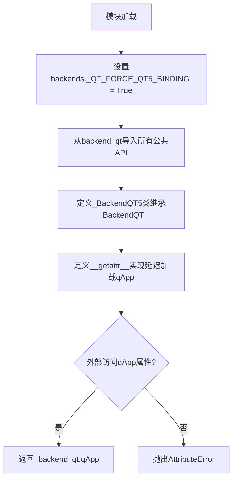
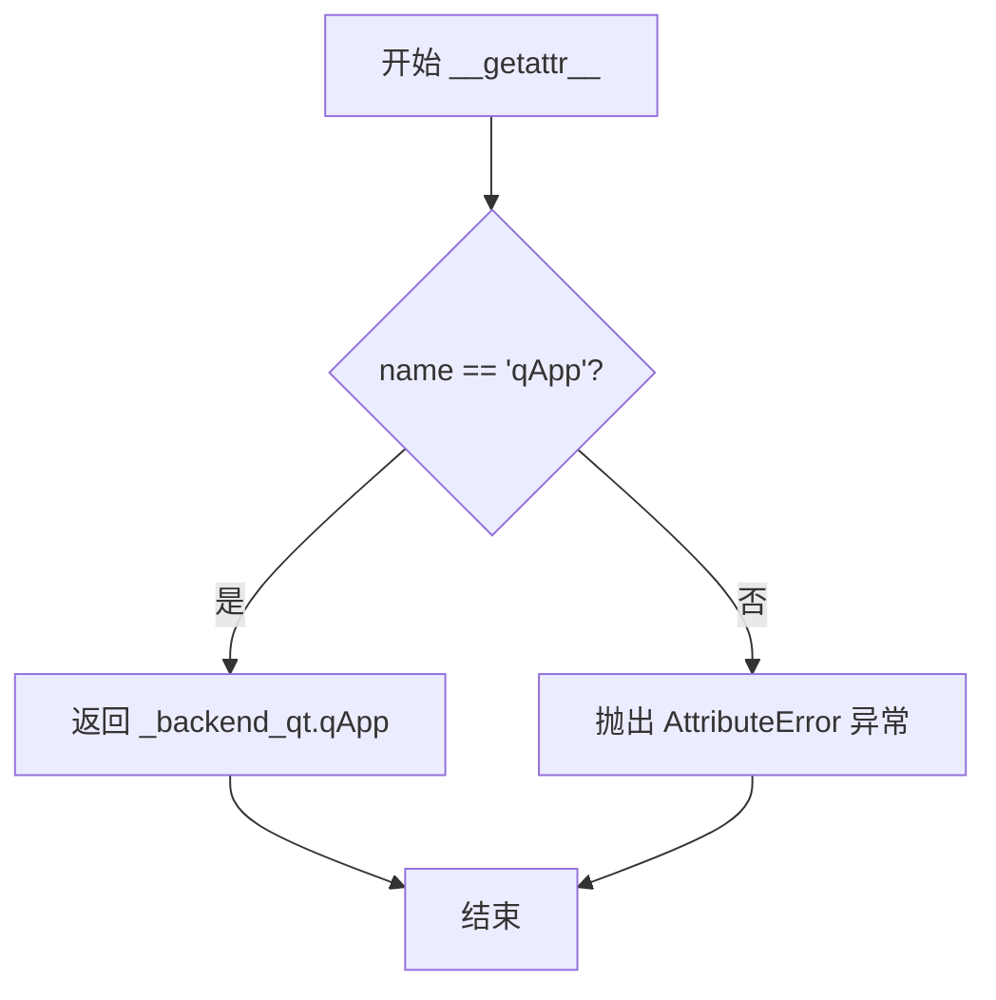
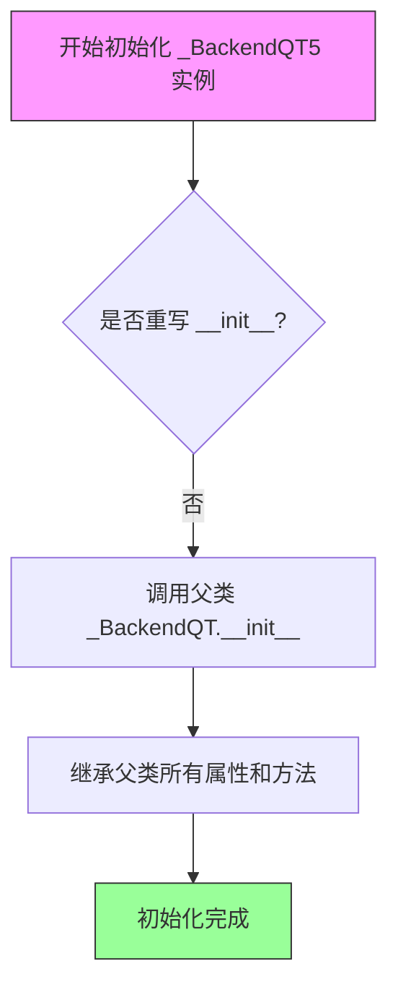

# `matplotlib\lib\matplotlib\backends\backend_qt5.py` 详细设计文档

这是Matplotlib的Qt5绑定后端模块，强制使用Qt5绑定并导出Qt5特有的GUI组件类（如画布、工具栏、窗口管理器等），同时提供延迟加载的qApp访问接口。

## 整体流程



## 类结构

```
Backend Base
└── _BackendQT (Qt后端基类)
    └── _BackendQT5 (Qt5特化后端)
```

## 全局变量及字段


### `backends._QT_FORCE_QT5_BINDING`
    
全局标志，强制使用Qt5绑定而非Qt6

类型：`bool`
    


### `SPECIAL_KEYS`
    
特殊按键映射字典，用于处理键盘特殊功能键

类型：`dict`
    


### `cursord`
    
光标样式字典，映射光标类型到Qt光标对象

类型：`dict`
    


### `_create_qApp`
    
创建Qt应用程序实例的工厂函数

类型：`function`
    


### `Gcf`
    
图形管理类，负责维护所有图形窗口的引用计数和激活状态

类型：`class`
    


### `figureoptions`
    
图形选项模块，提供图形属性编辑对话框功能

类型：`module`
    


### `TimerBase`
    
定时器基类，提供跨后端的定时器抽象接口

类型：`class`
    


### `ToolContainerBase`
    
工具容器基类，定义工具栏容器的接口规范

类型：`class`
    


### `MouseButton`
    
鼠标按钮枚举类，封装Qt鼠标按钮常量

类型：`class`
    


### `NavigationToolbar2`
    
导航工具栏基类，提供图形交互工具的基础实现

类型：`class`
    


### `FigureCanvasBase`
    
图形画布基类，定义绘图区域的抽象接口

类型：`class`
    


### `FigureManagerBase`
    
图形管理器基类，管理图形与Qt窗口的关联

类型：`class`
    


### `module._BackendQT5`
    
Qt5后端类，继承自_BackendQT，用于版本特定的功能扩展

类型：`class`
    
    

## 全局函数及方法


### `__getattr__`

这是一个模块级的属性访问拦截器（hook），用于在模块属性被访问但不存在时动态解析特定的属性。它主要负责延迟导入和提供 `qApp` 属性的访问入口，当访问其他不存在的属性时则抛出 `AttributeError`。

参数：

- `name`：`str`，要访问的属性的名称

返回值：`任意类型`，如果属性名为 `qApp` 则返回 `_backend_qt.qApp`，否则抛出 `AttributeError`

#### 流程图



#### 带注释源码

```python
def __getattr__(name):
    """
    模块级属性访问拦截器。
    当访问模块中不存在的属性时，Python 会自动调用此函数。
    """
    # 检查访问的属性名称是否为 'qApp'
    if name == 'qApp':
        # 如果是 'qApp'，返回后端模块中的 qApp 对象
        # 这里使用了延迟导入，避免循环依赖
        return _backend_qt.qApp
    
    # 如果不是 'qApp'，则抛出 AttributeError
    # 告知调用者该模块没有对应的属性
    raise AttributeError(f"module {__name__!r} has no attribute {name!r}")
```


### `_BackendQT5.__init__`

该方法是 `_BackendQT5` 类的构造函数，负责初始化 QT5 后端实例，由于该类直接继承自 `_BackendQT` 且未重写 `__init__` 方法，因此实际上调用的是父类 `_BackendQT` 的初始化逻辑，继承并复用 QT 后端的全部功能特性。

参数：

- `self`：`_BackendQT5` 实例对象，代表当前初始化的 QT5 后端对象实例
- `**kwargs`：任意关键字参数，传递给父类 `_BackendQT.__init__` 的额外配置参数，用于扩展或覆盖默认配置

返回值：无（`None`），构造函数不返回任何值，仅负责对象状态的初始化

#### 流程图



#### 带注释源码

```python
@_BackendQT.export
class _BackendQT5(_BackendQT):
    """
    QT5 后端类，继承自 _BackendQT
    
    该类作为一个标记类，用于在 matplotlib 中强制使用 QT5 绑定。
    通过 @_BackendQT.export 装饰器注册到后端系统中。
    自身不实现任何方法，完全依赖父类 _BackendQT 的实现。
    """
    
    def __init__(self, **kwargs):
        """
        初始化 _BackendQT5 实例
        
        由于 _BackendQT5 未重写 __init__ 方法，此处实际调用的是
        父类 _BackendQT 的构造函数。父类将完成所有必要的初始化工作，
        包括：
        - 设置后端类型标识
        - 初始化 QT 应用实例
        - 配置图形画布和事件循环
        - 注册到 matplotlib 后端管理系统
        
        Parameters:
            **kwargs: 传递给父类的关键字参数，可用于配置后端行为
        """
        # 调用父类 _BackendQT 的构造函数
        # 此处隐式调用 super().__init__(**kwargs)
        # 继承父类所有属性和方法
        pass  # 方法体为空，由父类实现具体逻辑
```


## 关键组件


### Qt5强制绑定配置

通过设置`backends._QT_FORCE_QT5_BINDING = True`强制使用Qt5绑定，确保在同时存在Qt4和Qt5环境下优先使用Qt5版本

### _BackendQT5类

继承自_BackendQT的Qt5专用后端类，目前为空类，用于标识和导出Qt5后端

### 模块属性访问器(__getattr__)

实现模块级动态属性访问，当访问qApp属性时返回_backend_qt.qApp，其他属性抛出AttributeError异常，用于延迟加载和兼容性处理

### Qt图形界面组件集

从backend_qt模块导入的Qt图形界面组件集合，包括光标(cursord)、应用实例(_create_qApp, qApp)、画布(FigureCanvasQT)、管理器(FigureManagerQT)、工具栏(ToolbarQt, NavigationToolbar2QT)、对话框(SubplotToolQt, SaveFigureQt, ConfigureSubplotsQt)等核心UI组件

### 基础类组件集

从backend_qt导入的抽象基类集合，包括FigureCanvasBase、FigureManagerBase、TimerBase、ToolContainerBase、NavigationToolbar2等，用于定义Qt后端的接口规范

### 工具类组件集

包含MouseButton鼠标按钮枚举、RubberbandQt橡皮筋选择工具、HelpQt帮助对话框、ToolCopyToClipboardQT剪贴板工具、figureoptions图形选项配置、Gcf图形管理器等辅助功能组件

### 定时器组件(TimerQT)

Qt平台专用的定时器实现，继承自TimerBase，用于GUI事件循环中的定时任务调度


## 问题及建议


### 已知问题

-   **强制Qt5绑定缺乏灵活性**：代码直接设置`_QT_FORCE_QT5_BINDING = True`强制使用Qt5，忽略了运行时环境检测，不支持Qt6或其他版本，降低了代码的可移植性和适应性
-   **空类_BackendQT5设计冗余**：该类继承自`_BackendQT`但未添加任何实际逻辑，仅作为标记类存在，增加了代码结构的复杂度而未提供实际功能
-   **__getattr__函数功能有限**：仅支持`qApp`属性的动态加载，其他属性直接抛出`AttributeError`，缺乏扩展性和统一的属性访问机制
-   **导入结构存在性能问题**：顶层直接导入大量符号（包括`figureoptions`、`Gcf`等重量级模块），增加了模块加载时间和内存占用
-   **缺少运行时环境验证**：未在运行时检测Qt库的实际可用性和版本，可能导致在不支持的环境下出现难以追踪的运行时错误
-   **模块级别副作用**：在导入时直接修改全局状态，可能影响其他模块的行为，降低了代码的可预测性

### 优化建议

-   **实现动态Qt版本检测**：根据运行时环境动态选择合适的Qt版本，而非强制使用Qt5，例如：`backends._QT_FORCE_QT5_BINDING = sys.version_info >= (3, 6) and qt_version >= 6`
-   **移除冗余的空类**：如果`_BackendQT5`仅用于标识，可考虑使用枚举或字符串常量替代，避免不必要的类层次结构
-   **增强__getattr__的灵活性**：实现更通用的属性加载逻辑，支持更多动态属性，或考虑使用`__all__`显式定义公共API
-   **采用延迟导入策略**：对于非必需的重量级模块（如`figureoptions`、`Gcf`），采用延迟导入（lazy import）方式，按需加载以提升模块初始化性能
-   **添加运行时环境检查**：在模块初始化时验证Qt库的可用性和版本，提供清晰的错误信息而非静默失败
-   **封装全局状态修改**：将全局状态修改封装到初始化函数中，提供配置接口，避免在模块级别直接产生副作用
-   **添加类型注解和文档字符串**：为函数和类添加类型提示及文档，提高代码的可维护性和可读性


## 其它


### 设计目标与约束

本模块的设计目标是作为matplotlib的Qt5后端适配层，确保matplotlib能够在Qt5环境下正常渲染图形界面。主要约束包括：必须依赖Qt5绑定库（如PyQt5或PySide2），需要与matplotlib的核心后端框架兼容，且必须遵循matplotlib后端接口规范。

### 错误处理与异常设计

模块主要通过`AttributeError`异常处理未定义的属性访问（如`__getattr__`函数所示）。当访问不存在的`qApp`属性时，会抛出`AttributeError`并携带详细的错误信息。对于导入错误，由上层调用者处理。关键错误场景包括：Qt库未安装、Qt5绑定_force冲突、Qt事件循环未初始化等。

### 数据流与状态机

本模块是典型的适配器模式实现，数据流为：用户代码 → matplotlib核心 → 后端接口 → Qt绑定 → Qt窗口系统。状态转换主要包括：后端初始化（导入时触发）→ Canvas创建 → FigureManager管理 → 窗口显示。模块本身不维护复杂状态，状态由Qt事件循环和matplotlib FigureManager管理。

### 外部依赖与接口契约

核心依赖包括：`matplotlib.backends`（后端框架）、Qt5绑定库（PyQt5/PySide2）、`..backends`模块（提供`_QT_FORCE_QT5_BINDING`标志）。接口契约遵循matplotlib的`_BackendQT`抽象基类规范，需要实现`FigureCanvasQT`、`FigureManagerQT`、`TimerQT`等核心类。导入契约：外部代码通过`from matplotlib.backends.backend_qt5 import xxx`获取所需组件。

### 版本兼容性说明

本模块明确强制使用Qt5绑定（通过`backends._QT_FORCE_QT5_BINDING = True`）。与Qt4后端（`backend_qt4`）不兼容。与Qt6后端（`backend_qt6`）通过不同的模块名称空间隔离。Python版本兼容性取决于底层Qt绑定库的支持范围。

### 性能考量

模块本身为轻量级导入层，性能影响主要来自：Qt事件循环的开销、图形渲染性能（由Qt和matplotlib核心控制）、定时器精度（TimerQT实现）。建议在需要高频率更新的场景中使用`TimerQT`的合适精度设置。

### 安全性考虑

本模块不直接处理用户输入或网络数据，安全性风险较低。主要安全考量包括：确保Qt应用实例（qApp）的正确创建和管理，避免内存泄漏；Clipboard操作（ToolCopyToClipboardQT）需确保剪贴板访问安全。

### 测试策略

测试应覆盖：模块导入测试（验证所有公开API可正确导入）、Qt5强制标志验证、与Qt4/Qt6后端的隔离测试、qApp属性访问测试、基本GUI组件实例化测试。建议使用mock对象模拟Qt绑定进行单元测试，使用真实Qt环境进行集成测试。

### 部署和配置

部署时需确保：Qt5绑定库已安装（PyQt5或PySide2）、matplotlib核心库可用。配置通过环境变量或matplotlibrc文件控制。无需特殊配置，导入自动触发Qt5绑定强制设置。

### 维护和扩展性

模块采用典型的后端适配器架构，扩展性良好。添加新功能时需：遵守`_BackendQT`接口规范、在`__getattr__`中适当处理新属性导出、保持与Qt4/Qt6后端的API一致性。维护重点：跟踪Qt API变化、及时更新以兼容新版本Qt5绑定。


    