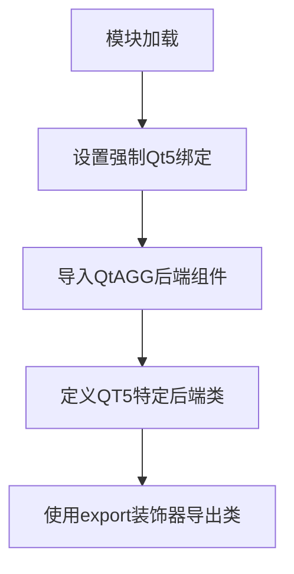
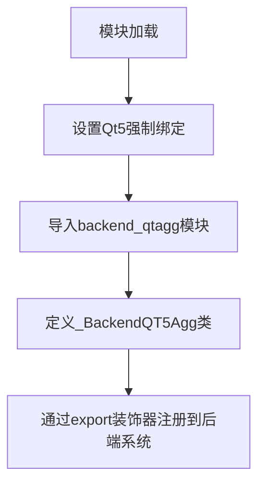

# `matplotlib\lib\matplotlib\backends\backend_qt5agg.py` 详细设计文档

该文件是Matplotlib库的Qt5绑定后端模块，强制使用Qt5绑定并从AGG渲染引擎创建Qt5兼容的画布、图形管理和导航工具栏，用于在Qt5应用程序中渲染图形。

## 整体流程



## 类结构

```
backends (基础模块)
└── backend_qtagg (QtAGG后端基类)
    └── _BackendQTAgg
        └── _BackendQT5Agg (当前模块)
```

## 全局变量及字段


### `_QT_FORCE_QT5_BINDING`
    
全局变量，用于强制使用Qt5绑定，设置为True时确保代码使用Qt5绑定而非Qt6

类型：`bool`
    


    

## 全局函数及方法


### `_BackendQT5Agg`

该类是一个Qt5平台的Agg图形渲染后端适配器，通过继承`BackendQTAgg`并利用`export`装饰器注册到Matplotlib后端系统中，使Matplotlib能够在Qt5环境下使用Agg无 GUI 渲染引擎进行图形绑定和显示。

参数：
- 无

返回值：无

#### 流程图



#### 带注释源码

```python
"""
Render to qt from agg
"""
# 导入backends模块以访问后端注册机制
from .. import backends

# 强制使用Qt5绑定，忽略系统可能存在的Qt6
backends._QT_FORCE_QT5_BINDING = True

# 从Qt Agg后端导入所有必要的类和函数
# noqa: F401, E402 忽略未使用导入和模块级别导入顺序警告
# pylint: disable=W0611 忽略可能未使用的导入警告
from .backend_qtagg import (    
    _BackendQTAgg, FigureCanvasQTAgg, FigureManagerQT, NavigationToolbar2QT,
    FigureCanvasAgg, FigureCanvasQT)


# 使用export装饰器导出_BackendQT5Agg类
# 该装饰器会将类注册到Matplotlib的后端系统中
@_BackendQTAgg.export
class _BackendQT5Agg(_BackendQTAgg):
    """Qt5平台的Agg渲染后端空实现类，通过继承父类获得全部功能"""
    pass
```

---

## 详细设计文档

### 1. 一段话描述

`_BackendQT5Agg`模块是Matplotlib库中专门为Qt5图形用户界面设计的Agg无GUI渲染后端适配器，通过强制使用Qt5绑定并继承`BackendQTAgg`类，为Qt5应用程序提供高性能的2D图形渲染能力。

### 2. 文件的整体运行流程

1. **模块导入阶段**：当其他模块导入此后端时，首先导入`backends`模块获取后端注册机制
2. **绑定配置阶段**：设置`_QT_FORCE_QT5_BINDING = True`强制使用Qt5绑定
3. **依赖加载阶段**：从`backend_qtagg`模块导入所有Qt和Agg相关的Canvas、Manager、Toolbar等类
4. **后端注册阶段**：通过`@_BackendQTAgg.export`装饰器将`_BackendQT5Agg`类注册到后端系统
5. **运行时阶段**：当用户创建Qt5图形窗口时，Matplotlib后端系统会自动选择此后端进行渲染

### 3. 类的详细信息

#### `_BackendQTAgg`（父类）

| 字段/方法 | 类型 | 描述 |
|-----------|------|------|
| FigureCanvasQTAgg | 类 | Qt平台的Agg画布类，负责图形渲染 |
| FigureManagerQT | 类 | Qt图形管理器，负责窗口生命周期管理 |
| NavigationToolbar2QT | 类 | Qt导航工具栏类 |
| FigureCanvasAgg | 类 | Agg画布基类 |
| FigureCanvasQT | 类 | Qt画布基类 |
| export | 装饰器 | 后端导出装饰器，用于注册后端类 |

#### `_BackendQT5Agg`（当前类）

| 字段/方法 | 类型 | 描述 |
|-----------|------|------|
| (继承自父类) | - | 继承`_BackendQTAgg`的所有功能 |

### 4. 全局变量和全局函数

| 名称 | 类型 | 描述 |
|------|------|------|
| `backends._QT_FORCE_QT5_BINDING` | 布尔值 | 强制使用Qt5绑定的全局配置标志 |

### 5. 关键组件信息

| 组件名称 | 一句话描述 |
|----------|------------|
| `_BackendQTAgg` | Qt平台Agg渲染后端的基类，提供完整的Qt渲染实现 |
| `FigureCanvasQTAgg` | Qt平台的画布组件，负责在Qt窗口中渲染Agg图形 |
| `FigureManagerQT` | Qt图形窗口管理器，控制图形窗口的创建和销毁 |
| `NavigationToolbar2QT` | Qt平台工具栏，提供图形交互操作按钮 |

### 6. 潜在的技术债务或优化空间

1. **空类设计问题**：`_BackendQT5Agg`类完全是空的（只有`pass`），仅通过继承获得功能，这种模式虽然简化了代码但缺乏实际扩展意义
2. **硬编码强制绑定**：直接修改全局变量`_QT_FORCE_QT5_BINDING`可能影响其他后端的判断逻辑
3. **依赖耦合**：导入语句使用了通配符导入`from .backend_qtagg import (*)`，可能导致不必要的依赖加载
4. **版本兼容性缺失**：代码仅强制Qt5，未提供Qt6+支持的动态检测机制

### 7. 其它项目

#### 设计目标与约束
- **目标**：为Qt5应用提供Agg渲染后端支持
- **约束**：必须与Qt5库（PyQt5或PySide2）配合使用

#### 错误处理与异常设计
- 依赖`backend_qtagg`模块的异常传播
- Qt5绑定缺失时可能导致导入错误

#### 数据流与状态机
- 图形数据流：Figure → FigureCanvasQTAgg → QPaintDevice → 屏幕显示
- 状态转换：创建画布 → 绑定Qt窗口 → 渲染图形 → 更新显示

#### 外部依赖与接口契约
- 依赖PyQt5/PySide2库
- 依赖Matplotlib的Agg渲染模块
- 通过`backends`模块的注册接口与主系统交互

## 关键组件


### Qt5强制绑定机制

通过设置`backends._QT_FORCE_QT5_BINDING = True`强制使用Qt5绑定，确保在同时存在Qt4和Qt5环境下优先使用Qt5

### 后端类导入集合

从`backend_qtagg`模块导入6个核心类：`_BackendQTAgg`（Qt后端基类）、`FigureCanvasQTAgg`（画布）、`FigureManagerQT`（图形管理器）、`NavigationToolbar2QT`（导航工具栏）、`FigureCanvasAgg`（AGG画布）、`FigureCanvasQT`（Qt画布）

### _BackendQT5Agg类

继承自`_BackendQTAgg`的Qt5特定后端实现类，使用`@_BackendQTAgg.export`装饰器导出，用于提供Qt5平台的AGG渲染支持


## 问题及建议


### 已知问题

-   **硬编码强制QT5绑定**：代码通过 `backends._QT_FORCE_QT5_BINDING = True` 强制使用QT5绑定，但没有任何运行时检查来验证QT5库是否真正可用，可能导致在QT5不可用环境下运行时出现难以追踪的导入或运行时错误
-   **空类实现**：`_BackendQT5Agg` 继承自 `_BackendQTAgg` 但完全没有任何额外实现，仅作为占位符存在，增加了代码理解的复杂度，可能表明设计意图不明确或过度设计
-   **导入聚合冗余**：通过 `from .backend_qtagg import ...` 一次性导入6个组件，其中 `_BackendQTAgg` 被导入后立即用于继承，可能造成导入顺序和依赖关系的隐式耦合
-   **绕过静态检查的印记**：使用 `# noqa: F401, E402` 和 `# pylint: disable=W0611` 抑制了多个代码质量工具的警告，表明存在潜在的未使用导入或导入副作用问题，长期可能掩盖真实的代码问题

### 优化建议

-   **添加运行时环境检查**：在设置 `_QT_FORCE_QT5_BINDING` 前添加QT5可用性检查，如通过 `try import PyQt5` 或检查相关模块属性，在QT5不可用时给出清晰的错误提示或回退到其他后端
-   **重新评估空类必要性**：如果 `_BackendQT5Agg` 确实不需要任何额外功能，考虑直接使用 `_BackendQTAgg` 或通过模块级别别名实现，避免不必要的类层级；若有未来扩展计划，应添加文档说明预期用途
-   **解耦导入与继承**：将 `_BackendQTAgg` 的导入与继承分离，明确依赖关系；考虑使用延迟导入或在类定义处导入，提高代码的可维护性
-   **消除lint警告根源**：逐一检查被抑制的警告，F401（未使用的导入）可能是真正需要清理的导入，E402（导入顺序）应通过重构解决而非抑制，W0611（未使用变量）应被移除或正确使用，而非全局禁用
-   **文档化强制绑定原因**：在代码注释中明确说明为何必须强制使用QT5绑定，便于后续维护者理解此决策的背景和可能的变更影响


## 其它


### 设计目标与约束

**设计目标**：提供 Qt5 绑定的 Agg 后端支持，确保 Matplotlib 能够在 Qt5 环境下正确渲染图形。

**设计约束**：
- 强制使用 Qt5 绑定，不能回退到 Qt6
- 必须保持与 `_BackendQTAgg` 的兼容性
- 遵循 Matplotlib 后端插件架构

### 错误处理与异常设计

- 导入失败时：`backend_qtagg` 模块导入失败会抛出 `ImportError`
- Qt 绑定问题：如果 Qt5 不可用，可能导致运行时错误
- 设置 `_QT_FORCE_QT5_BINDING` 可能在 Qt6 环境下产生冲突

### 外部依赖与接口契约

**依赖项**：
- `backends` 模块（Matplotlib 内部）
- `backend_qtagg` 模块（Qt + Agg 后端实现）
- Qt5 库（PyQt5 或 PySide2）

**接口契约**：
- `_BackendQT5Agg` 必须继承自 `_BackendQTAgg`
- 继承所有父类的接口方法

### 版本兼容性考虑

- 仅支持 Qt5（PyQt5/PySide2）
- 与 Qt6 不兼容（通过强制绑定避免）
- 需要 Matplotlib 2.x 以上版本

### 配置与初始化

- 通过 `backends._QT_FORCE_QT5_BINDING` 全局标志控制 Qt 版本选择
- 导入时即触发初始化逻辑

### 线程安全性

- 继承自 `_BackendQTAgg` 的线程安全特性
- Qt GUI 操作需在主线程执行

### 资源管理

- 依赖父类 `_BackendQTAgg` 的资源管理机制
- 无额外资源需要释放

### 测试策略

- 需要验证 Qt5 环境下的图形渲染
- 测试与 Qt6 的隔离性

### 部署要求

- 部署时需确保 Qt5 库可用
- 可能需要 PyQt5 或 PySide2 包

### 性能考虑

- 无额外性能开销，仅作为版本标记类

### 安全性考虑

- 无敏感数据处理
- 依赖外部 Qt 库的安全性


    