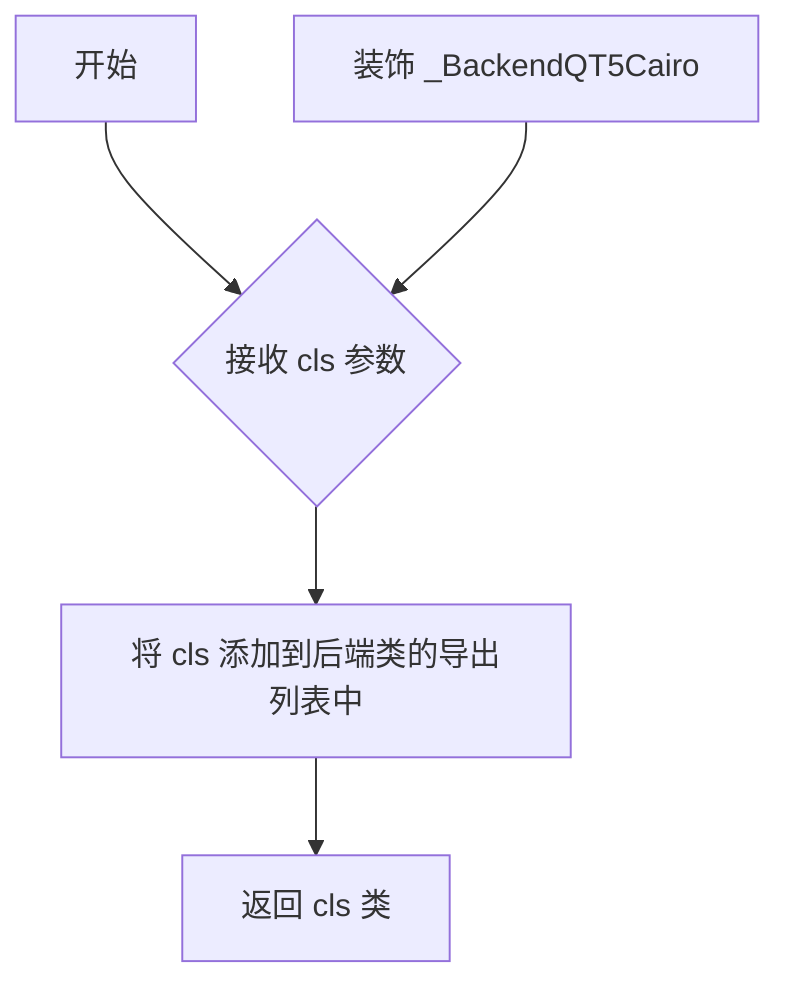
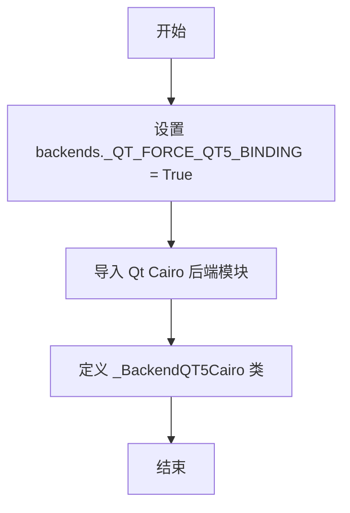
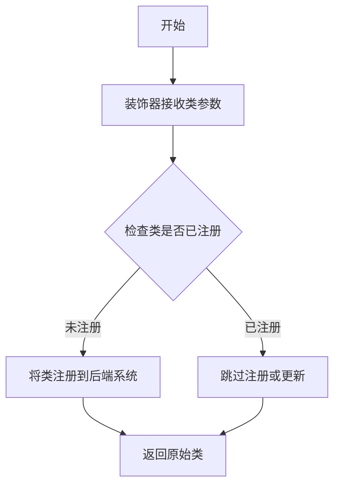
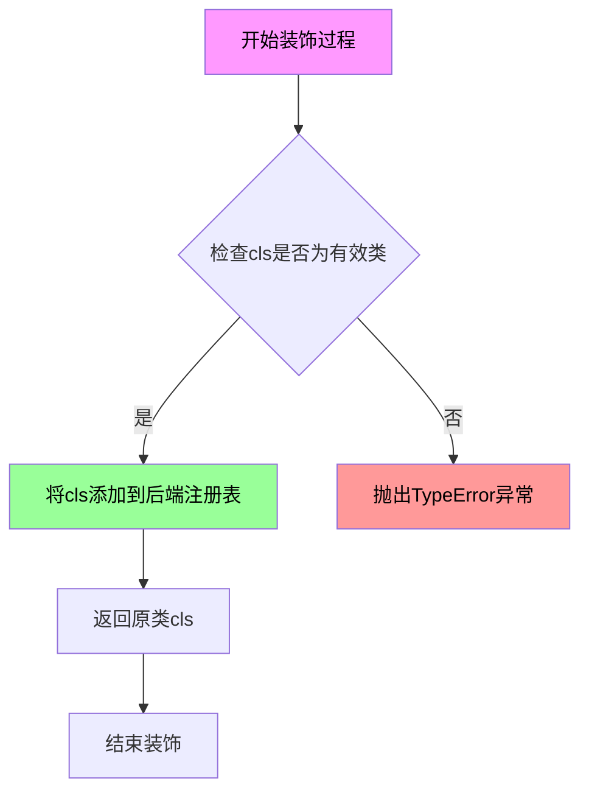

# `matplotlib\lib\matplotlib\backends\backend_qt5cairo.py` 详细设计文档

该文件是matplotlib的Qt5 Cairo后端模块，强制使用Qt5绑定，并从backend_qtcairo模块导入必要的Cairo和Qt图形类，最后通过装饰器导出Qt5特定的Cairo后端实现。

## 整体流程

```mermaid
graph TD
    A[开始] --> B[导入backends模块]
    B --> C[设置全局变量 _QT_FORCE_QT5_BINDING = True]
    C --> D[从backend_qtcairo导入Cairo和QT相关类]
    D --> E[定义_BackendQT5Cairo类继承_BackendQTCairo]
    E --> F[使用@_BackendQTCairo.export装饰器导出类]
    F --> G[结束]
```

## 类结构

```
backends (模块)
└── _BackendQTCairo (基类)
    └── _BackendQT5Cairo (本文件定义)
```

## 全局变量及字段


### `_QT_FORCE_QT5_BINDING`
    
强制使用Qt5绑定

类型：`bool`
    


    

## 全局函数及方法


### `_BackendQTCairo.export`

`_BackendQTCairo.export` 是一个类方法装饰器，用于将后端类注册到后端系统中，使得该类可以被其他模块通过导入机制发现和使用。它接收一个类作为参数，返回值是该类（可能被装饰器包装）。

参数：

- `cls`：`type`，要导出的后端类（传入被装饰的类本身，即 `_BackendQT5Cairo`）

返回值：`type`，返回被装饰的类本身（可能包含注册或其他处理逻辑）

#### 流程图



#### 带注释源码

```python
@_BackendQTCairo.export  # 使用 _BackendQTCairo 类的 export 方法作为装饰器
class _BackendQT5Cairo(_BackendQTCairo):  # 继承自 _BackendQTCairo 后端类
    pass  # 类体为空，表示直接继承父类 _BackendQTCairo 的所有功能
```


### `backends._QT_FORCE_QT5_BINDING`

该全局变量用于强制使用 Qt5 绑定（binding），确保在导入 Qt 相关后端时优先使用 Qt5 而非 Qt6。

参数：无

返回值：无

#### 流程图



#### 带注释源码

```python
# 从上级包导入 backends 模块
from .. import backends

# 强制指定使用 Qt5 绑定
# 此变量会在后续导入 backend_qtcairo 时被读取
# 用于确保使用 Qt5 而非 Qt6 的 API
backends._QT_FORCE_QT5_BINDING = True

# 导入 QtCairo 后端相关的类
# noqa: F401, E402 - 忽略未使用变量和导入顺序警告
# pylint: disable=W0611 - 忽略未使用导入警告
from .backend_qtcairo import (  
    _BackendQTCairo, FigureCanvasQTCairo, FigureCanvasCairo, FigureCanvasQT
)


# 使用装饰器导出 Qt5 专用的 Cairo 后端类
# 该类继承自 _BackendQTCairo，未添加任何新功能
@_BackendQTCairo.export
class _BackendQT5Cairo(_BackendQTCairo):
    pass
```

#### 变量信息

| 名称 | 类型 | 描述 |
|------|------|------|
| `backends._QT_FORCE_QT5_BINDING` | `bool` | 强制使用 Qt5 绑定的全局开关变量，设置为 `True` 时优先使用 Qt5 API |


### `_BackendQTCairo.export`

这是一个装饰器方法，用于将Qt5的Cairo后端类注册到matplotlib的后端系统中，使得matplotlib能够使用Qt5绑定来渲染Cairo图形。

参数：

- `cls`：`type`，被装饰的类（这里是`_BackendQT5Cairo`），需要注册到后端系统

返回值：`type`，返回被装饰的类，通常伴随注册到后端系统的副作用

#### 流程图



#### 带注释源码

```python
from .. import backends

# 强制使用Qt5绑定
backends._QT_FORCE_QT5_BINDING = True

# 导入Qt5相关的Cairo后端基类
# noqa: F401, E402 # pylint: disable=W0611
from .backend_qtcairo import (
    _BackendQTCairo, 
    FigureCanvasQTCairo, 
    FigureCanvasCairo, 
    FigureCanvasQT
)

# 使用装饰器将Qt5Cairo后端类注册到后端系统
@_BackendQTCairo.export
class _BackendQT5Cairo(_BackendQTCairo):
    """
    Qt5的Cairo后端实现类
    
    继承自_BackendQTCairo，使用Qt5绑定进行Cairo图形渲染
    该类通过@_BackendQTCairo.export装饰器注册到matplotlib后端系统中
    """
    pass
```

#### 补充说明

- **设计目标**：允许matplotlib在Qt5环境下使用Cairo渲染后端
- **关键组件**：
  - `_QT_FORCE_QT5_BINDING`：全局标志，强制使用Qt5绑定
  - `_BackendQTCairo`：基类，提供Qt与Cairo集成的核心逻辑
- **技术债务**：代码中使用了`pass`语句，说明`_BackendQT5Cairo`目前没有实现任何特定功能，只是继承基类，这可能是为了保持API一致性或预留扩展空间
- **依赖关系**：依赖Qt5库和Cairo库的正确安装


### `_BackendQTCairo.export`

这是一个装饰器方法，用于将类注册到后端系统中，使得该类可以被`backends`模块发现和使用。

参数：

- `cls`：`<class>`，需要被导出的后端类（装饰器接收的类参数）

返回值：`<class>`，返回原类本身（装饰器通常返回类本身以保持被装饰类的完整性）

#### 流程图



#### 带注释源码

```python
@_BackendQTCairo.export
class _BackendQT5Cairo(_BackendQTCairo):
    """
    QT5后端Cairo图形后端类
    
    该类继承自_BackendQTCairo，使用@_BackendQTCairo.export装饰器
    注册到后端系统中，使系统可以使用QT5与Cairo的组合后端
    """
    pass  # 未添加任何新方法或属性，完整继承父类功能
```

#### 补充说明

**设计目标与约束：**

- 该装饰器的设计目的是实现后端的可插拔架构
- `_BackendQT5Cairo`作为一个简洁的占位类继承实现，体现了"约定优于配置"的设计原则

**关键组件信息：**

| 组件名称 | 描述 |
|---------|------|
| `_BackendQTCairo` | 基础QT Cairo后端类，提供QT与Cairo集成的核心实现 |
| `_BackendQT5Cairo` | QT5特定的Cairo后端实现，继承自基础类 |
| `backends._QT_FORE_QT5_BINDING` | 全局配置标志，强制使用QT5绑定版本 |

**潜在优化空间：**

- 当前类为空实现，如果未来需要针对QT5做特殊处理，可在此类中覆盖方法
- 装饰器`export`的具体注册机制需要查看`_BackendQTCairo`类的完整实现才能确定

## 关键组件


### Qt5强制绑定配置

通过设置`backends._QT_FORCE_QT5_BINDING = True`，强制使用Qt5绑定而非Qt6，确保与Qt5环境的兼容性。

### QtCairo后端导入模块

从`backend_qtcairo`模块导入四个核心类：`FigureCanvasQTCairo`、`FigureCanvasCairo`、`FigureCanvasQT`以及基类`_BackendQTCairo`，为Qt5环境提供Cairo渲染能力。

### Qt5专用Cairo后端类

`_BackendQT5Cairo`类继承自`_BackendQTCairo`，通过装饰器`@_BackendQTCairo.export`导出，用于在Qt5应用程序中启用Cairo图形渲染功能。


## 问题及建议


### 已知问题

-   空类实现：`_BackendQT5Cairo` 类仅包含 `pass` 语句，没有添加任何新功能，继承自 `_BackendQTCairo` 但未进行扩展或重写，疑似为未完成的占位符实现
-   未使用的导入：导入列表中的 `FigureCanvasQTCairo`、`FigureCanvasCairo`、`FigureCanvasQT` 均未被使用，仅 `_BackendQTCairo` 被实际使用
-   模块级副作用：`backends._QT_FORCE_QT5_BINDING = True` 在模块导入时直接修改全局状态，可能导致导入顺序依赖和潜在的竞态条件
-   静默的 lint 规则禁用：使用 `# noqa: F401, E402, W0611` 抑制了多个代码检查警告（F401 未使用的导入、E402 模块级别导入顺序、W0611 未使用的导入），而非修复实际问题
-   缺乏错误处理：未检查 Qt5 绑定是否可用或是否成功导入，导入失败时可能产生难以追踪的运行时错误

### 优化建议

-   补充类实现或移除空类：若 `_BackendQT5Cairo` 确需存在，应添加必要的重写方法或配置；若仅为占位符，建议移除以减少代码冗余
-   清理未使用的导入：仅导入实际使用的 `_BackendQTCairo`，或将导入移至函数内部以延迟加载
-   重构全局状态设置：将 `_QT_FORCE_QT5_BINDING` 的设置移至更明确的初始化流程或配置阶段，避免模块导入时的隐式副作用
-   添加错误处理与可用性检查：在导入或类实例化时检查 Qt5 环境的可用性，提供明确的错误信息
-   添加文档字符串：为模块和类添加文档说明，明确该后端的用途和与其他后端的关系


## 其它


### 设计目标与约束

本模块的核心设计目标是为matplotlib图形库提供Qt5与Cairo的集成后端支持。通过强制使用Qt5绑定并继承_QtCairo后端，实现Qt5平台上的Cairo图形渲染能力。设计约束包括：必须依赖Qt5绑定、保持与现有后端架构的兼容性、遵循matplotlib后端插件加载机制。

### 错误处理与异常设计

本模块的错误处理主要依赖导入时的依赖检查。若Qt5绑定不可用或backend_qtcairo模块导入失败，将抛出ImportError或AttributeError。建议在调用前检查Qt后端可用性：try-except ImportError处理可选后端的缺失。_QT_FORCE_QT5_BINDING标志的设置错误可能导致运行时绑定混淆。

### 数据流与状态机

数据流路径：backends模块初始化 → 设置_QT_FORCE_QT5_BINDING=True → backend_qtcairo模块加载 → _BackendQT5Cairo类注册。状态转换：后端未加载 → 后端强制指定 → 后端类导出。_BackendQT5Cairo作为标记类存在，不包含额外状态机逻辑，其状态由父类_QtCairo管理。

### 外部依赖与接口契约

主要外部依赖：Qt5绑定库（如PyQt5或PySide2）、Cairo图形库、matplotlib后端框架。接口契约要求：_BackendQT5Cairo必须继承_QtCairo、导出装饰器@_BackendQTCairo.export必须正常工作、FigureCanvasQTCairo等类必须可导入。backends._QT_FORCE_QT5_BINDING为模块级配置契约，修改后影响全局后端选择行为。

### 性能考虑

由于_QtCairo类为空继承，无额外性能开销。性能瓶颈主要在Cairo渲染引擎和Qt5绑定层。建议：确保Qt事件循环正确配置、避免频繁切换后端、图形绘制使用批量操作。

### 安全性考虑

本模块无直接用户输入处理，安全性风险较低。但需注意：_QT_FORCE_QT5_BINDING全局标志的修改可能被恶意代码利用、后端模块导入路径遍历风险（需确保PYTHONPATH安全）。建议在多用户环境下避免动态修改sys.path。

### 测试策略

测试覆盖点：模块成功导入验证、_BackendQT5Cairo类继承关系验证、_QT_FORCE_QT5_BINDING标志状态验证、后端注册机制验证。Mock测试：Qt绑定可用性模拟、不同Cairo后端配置测试。集成测试：在Qt5环境下创建FigureCanvasQTCairo实例并渲染简单图形。

### 版本兼容性

Qt版本约束：明确要求Qt5，不支持Qt4或Qt6。Python版本：取决于matplotlib主框架要求。绑定库兼容：支持PyQt5、PySide2等符合Qt5 API的绑定。_QT_FORCE_QT5_BINDING标志在Qt6环境下可能被忽略或产生警告。

### 配置管理

后端选择优先级：用户matplotlibrc配置 > _QT_FORCE_QT5_BINDING全局标志 > 自动检测。配置方式：通过matplotlibrc的backend参数或matplotlib.use()函数。_QT_FORCE_QT5_BINDING为代码级配置，需在导入matplotlib前设置。

### 部署注意事项

部署时需确保：Qt5相关库已安装、Cairo开发库可用、后端模块路径正确配置。在打包为独立应用时，需将backend_qtcairo模块一同打包。Windows平台需配置Qt5 DLL搜索路径，Linux需确保libcairo.so等库可定位。

### 监控与诊断

诊断方式：导入时检查matplotlib.get_backend()返回值、查看_QT_FORCE_QT5_BINDING是否被其他模块修改、检查backend_qtcairo.__file__路径定位。常见问题：导入顺序导致_QT_FORCE_QT5_BINDING失效、后端冲突导致画布类型不匹配。

### 扩展性设计

_QtCairo类设计为可扩展基类，可通过继承添加平台特定功能。未来的_Qt6Cairo后端可采用相同模式实现。考虑添加：后端能力查询接口、渲染质量配置选项、高DPI显示支持。


    