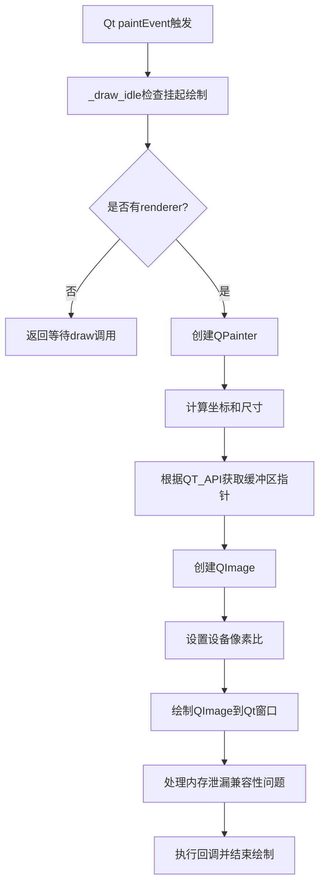
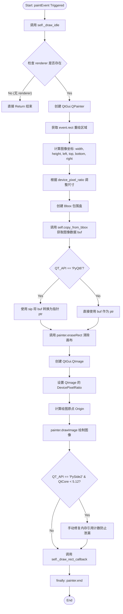
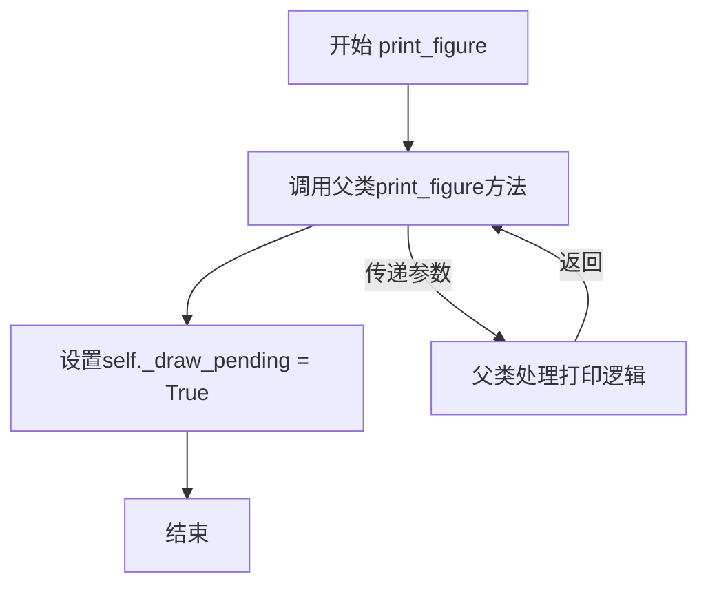
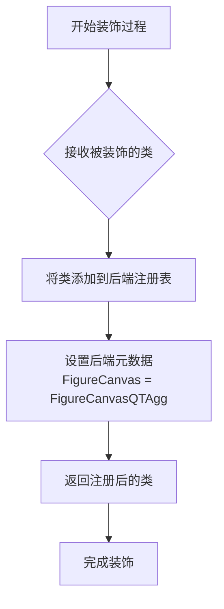
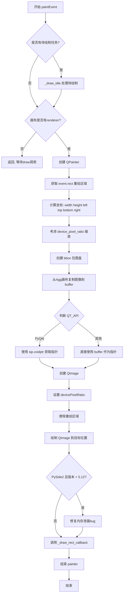
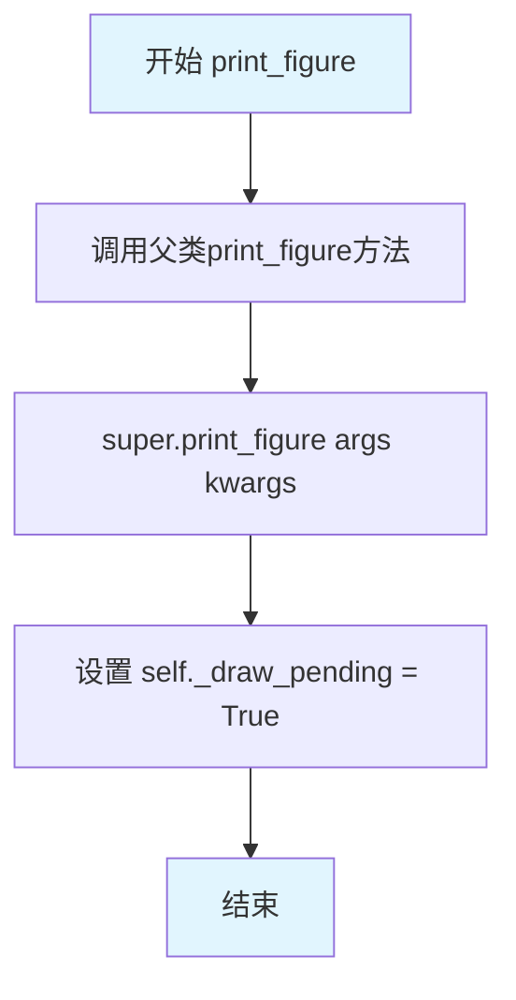
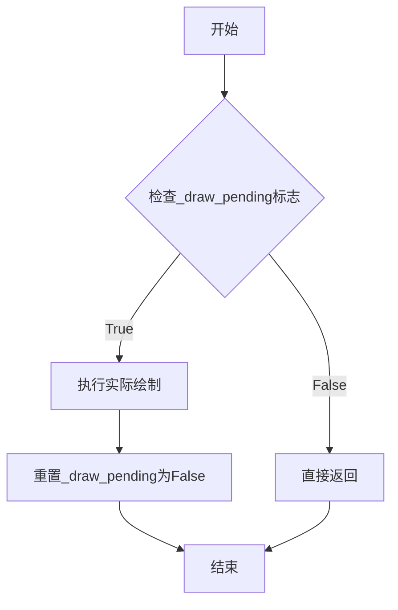
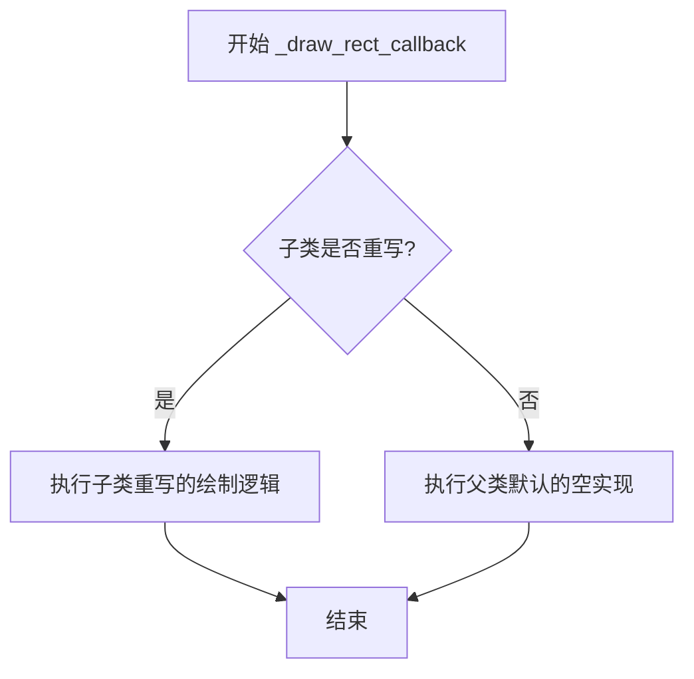
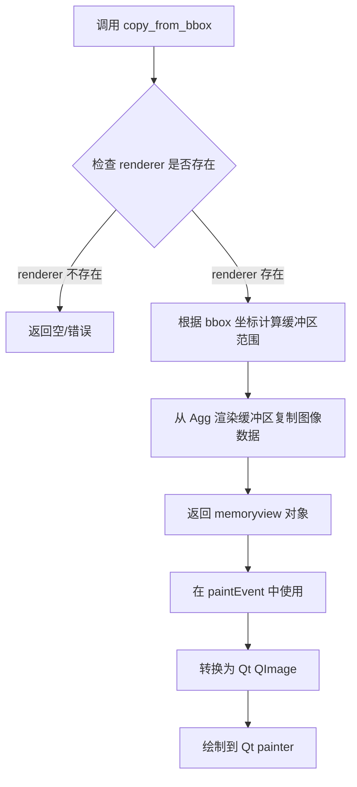
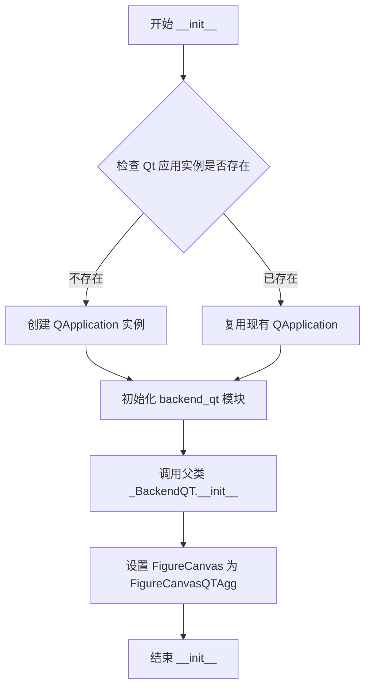

# `matplotlib\lib\matplotlib\backends\backend_qtagg.py` 详细设计文档

这是一个Matplotlib的Qt后端渲染器，继承自Agg和QT两个后端，负责将Agg渲染的图形内容绘制到Qt窗口上，处理Qt的paintEvent事件，实现跨框架的图形显示。

## 整体流程



## 类结构

```
FigureCanvasAgg (backend_agg)
└── FigureCanvasQTAgg (本文件)
    
_BackendQT (backend_qt)
└── _BackendQTAgg (本文件)
```

## 全局变量及字段


### `QT_API`
    
字符串，表示当前使用的Qt绑定API（如PyQt5、PyQt6、PySide2、PySide6等）

类型：`str`
    


### `Bbox`
    
matplotlib的包围盒类，用于表示二维矩形区域

类型：`matplotlib.transforms.Bbox`
    


### `QtCore`
    
Qt核心模块，提供非GUI的核心功能

类型：`QtCore module`
    


### `QtGui`
    
Qt GUI模块，提供图形用户界面相关功能

类型：`QtGui module`
    


### `FigureCanvasQTAgg._draw_pending`
    
标志位，表示是否有待处理的绘制操作

类型：`bool`
    


### `FigureCanvasQTAgg.device_pixel_ratio`
    
设备像素比率，用于高DPI屏幕的渲染缩放

类型：`float`
    


### `FigureCanvasQTAgg.renderer`
    
Agg后端的渲染器对象，负责将图形渲染到缓冲区

类型：`RendererBase`
    


### `_BackendQTAgg.FigureCanvas`
    
后端使用的FigureCanvas类（FigureCanvasQTAgg）

类型：`type`
    
    

## 全局函数及方法


### `FigureCanvasQTAgg.paintEvent`

该方法是将 Matplotlib 的 AGG（Anti-Grain Geometry）渲染缓冲区复制到 Qt 的可绘制对象（Drawable）上的核心逻辑。当 Qt 窗口需要重绘（如显示、调整大小、移动）时触发，负责把 Figure 的图像数据转换为 Qt 的 `QImage` 并绘制到画布上。

参数：

- `event`：`QtCore.QEvent` (具体为 `QtGui.QPaintEvent`)，Qt 系统传递的绘图事件对象，包含了需要重绘的区域（矩形）信息。

返回值：`None`，该方法直接操作 Qt 图形上下文进行绘制，不返回任何数值。

#### 流程图



#### 带注释源码

```python
def paintEvent(self, event):
    """
    Copy the image from the Agg canvas to the qt.drawable.

    In Qt, all drawing should be done inside of here when a widget is
    shown onscreen.
    """
    # 1. 检查是否有待处理的绘制操作（通常是 Figure 更新或初始绘制）
    # 如果有_pending的绘制，_draw_idle会触发实际的draw()方法渲染到 Agg 后端
    self._draw_idle()  

    # 2. 安全检查：如果 canvas 还没有初始化 renderer（例如 Figure 还没画过），
    # 则放弃本次绘制，等待后续 draw() 调用完成后再画
    if not hasattr(self, 'renderer'):
        return

    # 3. 创建 Qt 画家对象，准备在 widget 上绘图
    painter = QtGui.QPainter(self)
    try:
        # 4. 获取需要重绘的矩形区域（Qt 坐标系）
        rect = event.rect()
        
        # 5. DPI 适配：计算实际像素尺寸。
        # Qt5 的坐标可能与 Matplotlib 所需的物理像素坐标不一致，需乘以 device_pixel_ratio
        width = rect.width() * self.device_pixel_ratio
        height = rect.height() * self.device_pixel_ratio
        
        # 6. 坐标转换：将 Qt 的左上角 (topLeft) 转换为 Matplotlib 的坐标
        left, top = self.mouseEventCoords(rect.topLeft())
        
        # 7. 计算图像的底部和右侧坐标。
        # Matplotlib 坐标系原点在左下，Qt 在左上，需要翻转 Y 轴
        bottom = top - height
        right = left + width
        
        # 8. 根据计算出的坐标创建包围盒 (Bbox)
        bbox = Bbox([[left, bottom], [right, top]])
        
        # 9. 从 Agg 后端的缓冲区读取图像数据（仅读取包围盒内的部分以优化性能）
        # 返回一个 memoryview 对象
        buf = memoryview(self.copy_from_bbox(bbox))

        # 10. 平台特定的指针处理
        # PyQt6 不支持直接用 memoryview 构造 QImage，需要转换为 voidptr
        if QT_API == "PyQt6":
            from PyQt6 import sip
            ptr = int(sip.voidptr(buf))
        else:
            # PySide2/5, PyQt4/5 可以直接使用
            ptr = buf

        # 11. 清除该区域原有的内容，准备绘制新图像
        painter.eraseRect(rect)  
        
        # 12. 构造 QImage。
        # 参数：指针, 宽度, 高度, 步长(自动), 格式为 RGBA8888 (32位)
        qimage = QtGui.QImage(ptr, buf.shape[1], buf.shape[0],
                              QtGui.QImage.Format.Format_RGBA8888)
                              
        # 13. 设置图像的像素比，确保在高 DPI 屏幕上清晰
        qimage.setDevicePixelRatio(self.device_pixel_ratio)
        
        # 14. 确定绘制原点（使用原始的 QT 坐标，不受 Matplotlib 翻转坐标系影响）
        origin = QtCore.QPoint(rect.left(), rect.top())
        
        # 15. 执行绘制
        painter.drawImage(origin, qimage)
        
        # 16. 内存泄漏修复 (PySide2 < 5.12 特定 bug)
        # 强制减少 buf 的引用计数，避免 QImage 持有内存导致泄漏
        if QT_API == "PySide2" and QtCore.__version_info__ < (5, 12):
            ctypes.c_long.from_address(id(buf)).value = 1

        # 17. 回调：通知上层（比如 FigureManager）绘制完成，可能用于触发交互事件
        self._draw_rect_callback(painter)
    finally:
        # 18. 无论成功与否，确保释放 Qt 画家资源
        painter.end()
```


### `FigureCanvasQTAgg.print_figure`

该方法是对父类 `print_figure` 方法的重写，在调用父类方法打印图形后，设置 `_draw_pending` 标志为 `True`，以确保在 Qt 文件保存对话框关闭后触发重绘。

参数：

- `*args`：`可变位置参数`，传递给父类的位置参数
- `**kwargs`：`可变关键字参数`，传递给父类的关键字参数

返回值：`None`，无显式返回值

#### 流程图



#### 带注释源码

```python
def print_figure(self, *args, **kwargs):
    """
    重写父类的 print_figure 方法。
    
    在某些情况下，Qt 会在关闭文件保存对话框后触发 paint 事件。
    此方法确保内部画布被重新绘制。
    """
    # 调用父类的 print_figure 方法处理实际的图形打印/保存逻辑
    # *args 和 **kwargs 传递所有参数给父类
    super().print_figure(*args, **kwargs)
    
    # 在某些情况下，Qt 会在关闭文件保存对话框后触发 paint 事件。
    # 当这种情况发生时，需要确保内部画布被重新绘制。
    # 但是，如果用户使用自动选择的 Qt 后端但使用不同后端（如 pgf）保存，
    # 则不希望在 Qt 中触发完整绘制，所以只设置下次重绘的标志。
    
    # 设置绘制待处理标志，触发下次重绘
    self._draw_pending = True
```


### `_BackendQT.export`

该装饰器函数是 Matplotlib Qt 后端系统的核心导出机制，用于将 `_BackendQTAgg` 类注册到后端系统中，使其成为 Qt 兼容的Agg渲染后端。

参数：

- `cls`：`type`，被装饰的类（即 `_BackendQTAgg`），需要注册到后端系统

返回值：`type`，返回装饰后的类，通常是被修改或包装后的类

#### 流程图



#### 带注释源码

```
@_BackendQT.export
class _BackendQTAgg(_BackendQT):
    """
    Qt后端的Agg渲染器混合类。
    
    继承自_BackendQT基类，并指定FigureCanvas为FigureCanvasQTAgg，
    使得该后端能够使用Agg进行图形渲染，同时兼容Qt框架。
    """
    FigureCanvas = FigureCanvasQTAgg
    # 指定该后端使用的画布类为FigureCanvasQTAgg，
    # 该类实现了paintEvent方法来进行Agg到Qt的图像复制
```

> **注意**：由于 `_BackendQT.export` 方法的实现源码不在提供的代码片段中（该方法定义在 `backend_qt` 模块中），以上信息基于代码使用方式和上下文推断得出。该装饰器的实际实现应该包含将类注册到 Matplotlib 后端系统的逻辑。


### `FigureCanvasQTAgg.paintEvent`

该方法是将Matplotlib的Agg渲染画布中的图像复制到Qt可绘制对象（QImage）的核心渲染方法，负责在Qt widget显示时将图形绘制到屏幕上，并处理坐标转换、像素比适配以及不同Qt API的兼容性。

参数：

- `self`：`FigureCanvasQTAgg`，Qt兼容的Agg画布实例，隐式参数
- `event`：`QtCore.QEvent`，Qt paint事件对象，包含需要重绘的区域信息（rect）

返回值：`None`，该方法无返回值，通过副作用完成绘图

#### 流程图



#### 带注释源码

```python
def paintEvent(self, event):
    """
    Copy the image from the Agg canvas to the qt.drawable.

    In Qt, all drawing should be done inside of here when a widget is
    shown onscreen.
    """
    # 1. 检查并处理待绘制的挂起任务（仅当有待绘制时才真正绘制）
    self._draw_idle()  # Only does something if a draw is pending.

    # 2. 安全检查：确保画布已有renderer，否则等待draw被调用
    # If the canvas does not have a renderer, then give up and wait for
    # FigureCanvasAgg.draw(self) to be called.
    if not hasattr(self, 'renderer'):
        return

    # 3. 创建Qt画家对象，准备在widget上绘图
    painter = QtGui.QPainter(self)
    try:
        # 4. 获取事件中的重绘矩形区域
        # See documentation of QRect: bottom() and right() are off
        # by 1, so use left() + width() and top() + height().
        rect = event.rect()
        
        # 5. 使用屏幕DPI比率缩放矩形尺寸，以获取正确的Figure坐标（而非QT5坐标）
        # scale rect dimensions using the screen dpi ratio to get
        # correct values for the Figure coordinates (rather than
        # QT5's coords)
        width = rect.width() * self.device_pixel_ratio
        height = rect.height() * self.device_pixel_ratio
        
        # 6. 转换鼠标坐标系统
        left, top = self.mouseEventCoords(rect.topLeft())
        
        # 7. 计算图像底边坐标（Qt坐标系向下，Matplotlib向上，需反转）
        # shift the "top" by the height of the image to get the
        # correct corner for our coordinate system
        bottom = top - height
        
        # 8. 计算图像右边坐标
        # same with the right side of the image
        right = left + width
        
        # 9. 根据坐标创建图像包围盒（Bbox）
        # create a buffer using the image bounding box
        bbox = Bbox([[left, bottom], [right, top]])
        
        # 10. 从Agg画布复制指定包围盒区域的图像数据到内存缓冲区
        buf = memoryview(self.copy_from_bbox(bbox))

        # 11. 处理不同Qt API的指针转换（PyQt6需要特殊处理）
        if QT_API == "PyQt6":
            from PyQt6 import sip
            ptr = int(sip.voidptr(buf))
        else:
            ptr = buf

        # 12. 清除widget画布，准备新绘制
        painter.eraseRect(rect)  # clear the widget canvas
        
        # 13. 创建Qt图像对象，使用RGBA8888格式
        # 参数：指针、宽度、高度、像素格式
        qimage = QtGui.QImage(ptr, buf.shape[1], buf.shape[0],
                              QtGui.QImage.Format.Format_RGBA8888)
        
        # 14. 设置设备像素比（支持高DPI屏幕）
        qimage.setDevicePixelRatio(self.device_pixel_ratio)
        
        # 15. 设置绘制原点为Qt原始坐标
        # set origin using original QT coordinates
        origin = QtCore.QPoint(rect.left(), rect.top())
        
        # 16. 将QImage绘制到目标位置
        painter.drawImage(origin, qimage)
        
        # 17. 特殊处理：PySide2 5.12以下版本的内存泄漏bug
        # Adjust the buf reference count to work around a memory
        # leak bug in QImage under PySide.
        if QT_API == "PySide2" and QtCore.__version_info__ < (5, 12):
            ctypes.c_long.from_address(id(buf)).value = 1

        # 18. 调用绘制矩形回调（如果有的话）
        self._draw_rect_callback(painter)
    finally:
        # 19. 确保 painter 被正确释放
        painter.end()
```


### `FigureCanvasQTAgg.print_figure`

该方法是`FigureCanvasQTAgg`类的一个成员方法，用于重写父类的打印功能。在调用父类`print_figure`方法后，将`_draw_pending`标志设置为`True`，以确保Qt后端在文件保存对话框关闭后能够正确重新绘制画布。

参数：

- `self`：`FigureCanvasQTAgg` 实例，当前画布对象
- `*args`：可变位置参数，传递给父类`FigureCanvasAgg.print_figure`的位置参数
- `**kwargs`：可变关键字参数，传递给父类`FigureCanvasAgg.print_figure`的关键字参数（如文件名、格式、DPI等）

返回值：`None`，该方法没有显式返回值，通过副作用（设置`_draw_pending`标志）完成功能

#### 流程图



#### 带注释源码

```python
def print_figure(self, *args, **kwargs):
    """
    重写父类的print_figure方法，在保存图像后确保画布重绘。
    
    在某些情况下，Qt会在关闭文件保存对话框后触发paint事件。
    当这种情况发生时，需要确保内部画布被重新绘制。但是，如果用户
    使用自动选择的Qt后端但使用其他后端（如pgf）保存，则不希望
    在Qt中触发完整绘制，因此只设置标志留待下次处理。
    """
    # 调用父类FigureCanvasAgg的print_figure方法，执行实际的图像保存逻辑
    # args和kwargs包含如filename、format、dpi等保存参数
    super().print_figure(*args, **kwargs)
    
    # 设置绘制待处理标志为True
    # 这样在Qt触发paint事件时，会调用_draw_idle()进行重绘
    # 这解决了文件保存对话框关闭后画布不更新的问题
    self._draw_pending = True
```


```content
### FigureCanvasQTAgg._draw_idle

该方法继承自 FigureCanvasAgg 类，用于在需要时执行待处理的绘制操作。它在 paintEvent 中被调用，确保只有在存在待绘制内容时才执行实际的绘制工作。

参数：
- `self`：FigureCanvasQTAgg 实例，当前画布对象本身

返回值：`None`，该方法直接在对象上执行绘制操作，不返回任何值

#### 流程图



#### 带注释源码

```python
def _draw_idle(self):
    """
    继承自 FigureCanvasAgg 的方法。
    
    仅在有待绘制内容时才执行绘制操作。
    此方法被 paintEvent 调用前先执行，
    以确保只有在真正需要重绘时才进行耗时的渲染工作。
    
    注意：此方法的具体实现位于父类 FigureCanvasAgg 中，
    当前代码通过继承获得该方法。
    """
    # 从父类继承的实现逻辑：
    # 1. 检查 self._draw_pending 属性（布尔标志）
    # 2. 如果为 True，表示有待处理的绘制操作
    # 3. 调用实际的绘制方法（如 draw()）执行渲染
    # 4. 将 _draw_pending 重置为 False
    # 5. 如果为 False，直接返回，不执行任何操作
    
    # 此方法的设计目的是：
    # - 实现延迟绘制（lazy drawing）机制
    # - 避免不必要的重复绘制
    # - 提高渲染性能，特别是在处理大量图形更新时
```


### FigureCanvasQTAgg._draw_rect_callback

该方法是 `FigureCanvasQTAgg` 类的继承方法，在 `paintEvent` 方法末尾被调用，用于在完成图像渲染后执行额外的自定义绘制操作（如绘制覆盖层、标注等）。

参数：

- `painter`：`QtGui.QPainter`，Qt绘图对象，用于在画布上进行额外的绘制操作

返回值：`None`，无返回值

#### 流程图



#### 带注释源码

```
def _draw_rect_callback(self, painter):
    """
    Callback method called after the main image has been rendered.
    
    This method is intended to be overridden by subclasses to perform
    additional custom drawing operations on top of the rendered image.
    It is called at the end of the paintEvent() method in FigureCanvasQTAgg.
    
    Parameters
    ----------
    painter : QtGui.QPainter
        The Qt painter object that can be used for additional drawing
        operations on the canvas.
        
    Returns
    -------
    None
    """
    # Default implementation does nothing (pass)
    # Subclasses can override this method to add custom drawing
    # such as overlays, annotations, selection rectangles, etc.
    pass
```

**注意**：由于该方法未在当前代码文件中显式定义，它是继承自父类 `FigureCanvasQT` 或 `FigureCanvasAgg` 的方法。根据 `paintEvent` 中的调用方式 `self._draw_rect_callback(painter)`，可推断其签名和用途。实际实现需参考父类源码。


### `FigureCanvasQTAgg.copy_from_bbox`

该方法继承自 `FigureCanvasAgg`，用于从 Agg 渲染缓冲区复制图像数据到指定边界框（bbox）区域，返回一个内存视图对象。在 `FigureCanvasQTAgg` 的 `paintEvent` 方法中被调用，用于获取需要绘制到 Qt 可绘制对象上的图像数据。

参数：

- `bbox`：`matplotlib.transforms.Bbox`，定义要复制的图像区域（边界框），包含左下角和右上角坐标

返回值：`memoryview`，返回图像缓冲区的内存视图对象，格式为 RGBA8888

#### 流程图



#### 带注释源码

```python
# copy_from_bbox 方法定义在 FigureCanvasAgg 中
# 以下是在 FigureCanvasQTAgg 中如何使用该方法：

# 在 paintEvent 方法中：
# 1. 创建边界框
bbox = Bbox([[left, bottom], [right, top]])

# 2. 调用 copy_from_bbox 获取图像数据
# copy_from_bbox 是继承自 FigureCanvasAgg 的方法
# 参数: bbox - 定义要复制的图像区域
# 返回: 包含 RGBA 像素数据的 memoryview 对象
buf = memoryview(self.copy_from_bbox(bbox))

# 3. 将 buffer 转换为 Qt QImage
# 根据 QT_API 处理不同的绑定（PyQt6、PySide2 等）
if QT_API == "PyQt6":
    from PyQt6 import sip
    ptr = int(sip.voidptr(buf))
else:
    ptr = buf

# 4. 创建 QImage 对象
qimage = QtGui.QImage(ptr, buf.shape[1], buf.shape[0],
                      QtGui.QImage.Format.Format_RGBA8888)
```

---

**注意**：`copy_from_bbox` 方法本身定义在父类 `FigureCanvasAgg` 中，未在此代码文件中直接实现。该方法的核心功能是从 Agg 渲染缓冲区复制指定矩形区域的像素数据，返回格式为 RGBA8888 的原始图像数据。上面的源码展示了该方法在 `FigureCanvasQTAgg` 中的调用方式和使用场景。


### `_BackendQTAgg.__init__`

该方法是 `_BackendQTAgg` 类的隐式继承构造函数，继承自父类 `_BackendQT`，负责初始化 Qt 后端的图形渲染环境，包括创建 Qt 应用程序上下文和设置图形画布。

参数：

- 无显式参数（继承自 `_BackendQT`，隐式接收 `self`）

返回值：无返回值（`None`），构造函数仅执行初始化逻辑

#### 流程图



#### 带注释源码

```python
@_BackendQT.export
class _BackendQTAgg(_BackendQT):
    """
    Qt 后端聚合渲染器，继承自 _BackendQT。
    隐式继承 __init__ 方法，调用父类 _BackendQT 的构造函数进行初始化。
    """

    # 类属性：指定该后端使用的画布类为 FigureCanvasQTAgg
    FigureCanvas = FigureCanvasQTAgg

    # __init__ 方法继承自 _BackendQT，典型实现如下：
    # def __init__(self):
    #     super().__init__()  # 调用父类 _BackendQT 的初始化
    #     # _BackendQT.__init__ 通常负责：
    #     # 1. 确保 Qt 应用程序已创建
    #     # 2. 注册后端到 matplotlib 的后端系统
    #     # 3. 设置图形管理的相关配置
```

## 关键组件


### FigureCanvasQTAgg 类

FigureCanvasQTAgg 是一个结合了 AGG 渲染器和 Qt GUI 框架的画布类，继承自 FigureCanvasAgg 和 FigureCanvasQT，负责将 Matplotlib 的 AGG 渲染结果绘制到 Qt 窗口小部件上，并处理设备像素比和坐标转换。

### paintEvent 方法

paintEvent 是核心渲染方法，将 AGG 画布的图像复制到 Qt 可绘制对象。该方法使用 memoryview 和 bbox 复制图像缓冲区，处理不同 Qt API（PyQt6、PySide2）的指针转换，并应用设备像素比进行 DPI 感知渲染，同时包含 PySide2 内存泄漏的 ctypes 解决方案。

### print_figure 方法

print_figure 方法扩展父类功能，在保存文件对话框关闭后处理 Qt 内部的绘制触发，确保画布在对话框关闭后正确重绘，并设置 _draw_pending 标志以延迟完整重绘。

### _BackendQTAgg 类

_BackendQTAgg 是 Qt+AGG 后端的导出类，负责注册和暴露 FigureCanvasQTAgg 作为该后端的画布实现。

### Bbox 坐标变换组件

Bbox 用于创建图像边界框，将 Qt 事件坐标（左上角 + 宽度/高度）转换为 Matplotlib 的坐标系统（左下角为原点），通过计算 bottom = top - height 和 right = left + width 实现坐标翻转。

### 缓冲区与内存管理组件

使用 memoryview(self.copy_from_bbox(bbox)) 创建图像数据缓冲区，并通过 ctypes.c_long.from_address(id(buf)).value = 1 解决 PySide2 版本低于 5.12 时的 QImage 内存泄漏问题。

### Qt API 适配组件

处理 QT_API 兼容性问题，根据不同 Qt 绑定（PyQt6、PySide2）使用不同的指针转换方式（sip.voidptr 或直接内存地址），并处理 QImage.Format_RGBA8888 格式转换。


## 问题及建议


### 已知问题

-   **硬编码的Qt API和版本检查**: 代码中使用了`if QT_API == "PyQt6"`和`if QT_API == "PySide2" and QtCore.__version_info__ < (5, 12)`这样的硬编码条件判断，缺乏抽象的版本兼容性层，导致维护困难
-   **不安全的内存操作**: 使用`ctypes.c_long.from_address(id(buf)).value = 1`直接修改Python对象的引用计数，这是一个非常危险的操作，可能导致内存损坏或未定义行为
-   **缓冲区协议兼容性问题**: 使用`memoryview(self.copy_from_bbox(bbox))`创建缓冲区，但在不同Qt绑定版本中对缓冲区协议的支持不一致，需要额外的版本判断
-   **magic number和硬编码值**: 设备像素比处理中存在一些硬编码的坐标转换逻辑，缺少清晰的注释说明其数学原理
-   **异常处理不完整**: `paintEvent`方法中缺少对关键操作（如QImage创建、缓冲区拷贝失败）的异常捕获和处理
-   **设计模式违反**: 后端类混合了渲染逻辑和特定平台的workaround，违背了单一职责原则

### 优化建议

-   **提取版本兼容性层**: 创建一个专门的Qt版本适配器类或模块，将不同Qt版本和绑定的差异封装起来，消除代码中的硬编码条件判断
-   **移除不安全的内存操作**: 寻找替代方案或等待PySide2版本升级，不再使用ctypes直接操作引用计数
-   **增强错误处理**: 为paintEvent中的关键操作添加try-except块，提供适当的错误恢复机制或日志记录
-   **抽象坐标转换逻辑**: 将设备像素比相关的坐标转换封装成独立的方法，提高可读性和可测试性
-   **添加类型提示**: 为方法参数和返回值添加详细的类型注解，提高代码的可维护性

## 其它


### 设计目标与约束

本模块旨在实现matplotlib图形在Qt窗口中的高性能渲染，通过结合AGG（Anti-Grain Geometry）渲染引擎与Qt绘图系统，提供跨平台的图形显示能力。设计约束包括：支持PyQt5、PyQt6、PySide2等多种Qt绑定版本；兼容Qt5和Qt6的坐标系统；处理不同DPI设置的屏幕；以及处理Qt与AGG之间的内存共享问题。

### 错误处理与异常设计

代码中的错误处理主要体现在以下几个方面：paintEvent方法中首先检查renderer是否存在，如果不存在则直接返回等待绘制完成；使用try-finally确保QPainter正确释放资源；针对特定Qt版本（如PySide2 5.12以下版本）的内存泄漏问题进行特殊处理。对于缺失renderer的情况采用静默处理策略，避免在初始化阶段产生异常中断。ptr指针转换过程中对PyQt6使用sip.voidptr进行安全转换，其他情况直接使用memoryview对象。

### 数据流与状态机

数据流遵循以下路径：Qt系统触发paintEvent → 调用_draw_idle()检查待绘制状态 → 从AGG画布通过copy_from_bbox复制图像数据到内存缓冲区 → 转换为QImage → 通过QPainter绘制到Qt窗口小部件。状态转换包括：空闲状态（无待绘制）→ 待绘制状态（_draw_pending标志）→ 绘制中状态 → 完成状态。print_figure方法会触发重新绘制流程，设置_draw_pending标志为True以确保Qt窗口在文件保存对话框关闭后正确更新。

### 外部依赖与接口契约

主要外部依赖包括：QtCore和QtGui（来自PyQt5/PyQt6/PySide2绑定）；matplotlib.transforms.Bbox用于坐标变换；matplotlib.backend_agg.FigureCanvasAgg提供AGG渲染能力；matplotlib.backend_qt提供Qt后端基础框架。接口契约方面：FigureCanvasQTAgg必须实现paintEvent方法响应Qt的绘制事件；需要支持device_pixel_ratio属性以适配高DPI屏幕；需要实现_draw_rect_callback回调机制；print_figure方法需要调用父类实现并维护绘制状态标志。

### 性能考虑与优化空间

性能关键点包括：copy_from_bbox的调用频率和区域大小；QImage的创建和销毁开销；device_pixel_ratio的频繁访问。优化空间：可以考虑缓存QImage对象避免重复创建；对于小区域重绘可以进一步优化AGG缓冲区复制逻辑；可以评估是否可以使用QPainter的CompositionMode优化透明通道处理；当前实现中对buf的引用计数调整是临时解决方案，应关注Qt版本更新以获得更好的内存管理。

### 线程安全性

该代码主要在主GUI线程中运行，paintEvent由Qt事件循环触发。_draw_idle()方法可能涉及线程间通信，需要确保AGG渲染线程与Qt主线程的同步。虽然当前实现未显式使用锁机制，但matplotlib的绘制调度机制（_draw_pending标志）提供了基础的线程安全保护。在多线程场景下应避免跨线程直接调用paintEvent。

### 平台兼容性

代码需要处理多种兼容性挑战：不同Qt绑定（PyQt5/PyQt6/PySide2）的API差异；Qt5与Qt6的坐标系统差异；不同操作系统（Windows/Linux/macOS）的显示分辨率处理；以及不同桌面环境的主题和DPI设置。QtCore.__version_info__用于版本检查，QT_API用于区分Qt绑定类型，这些机制确保了代码在多种环境下的可运行性。

    