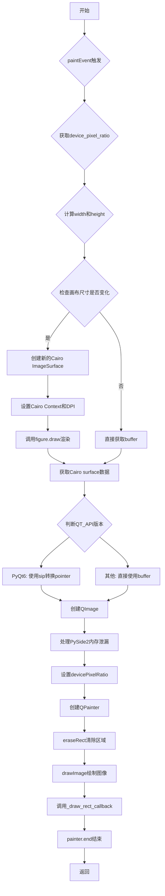
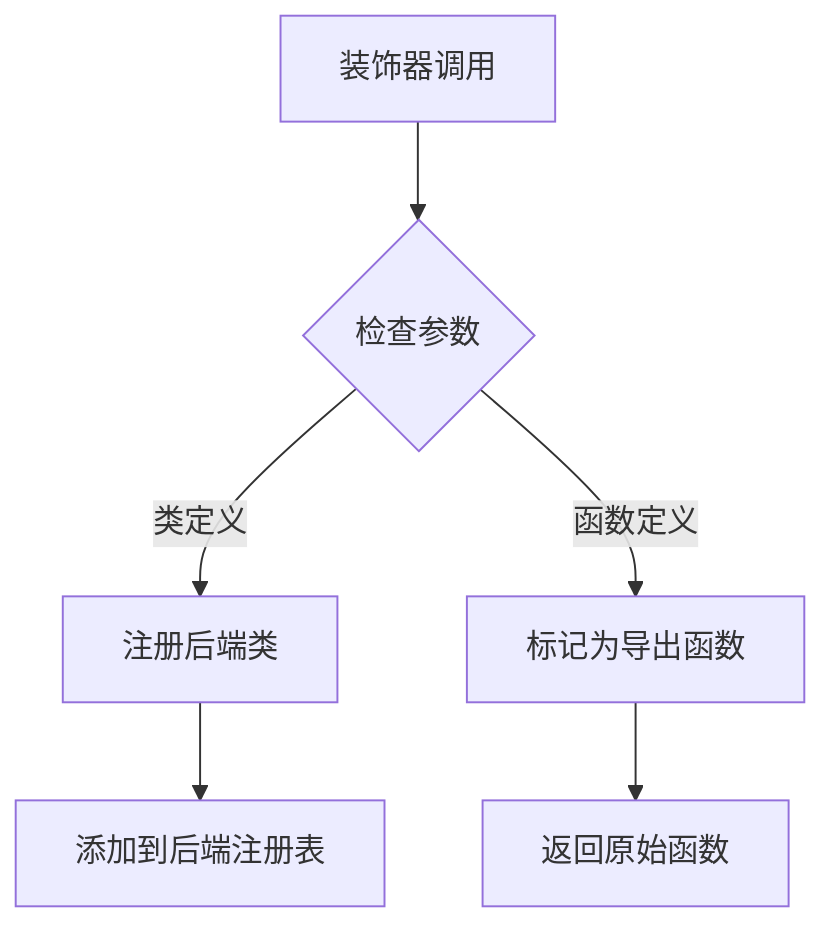
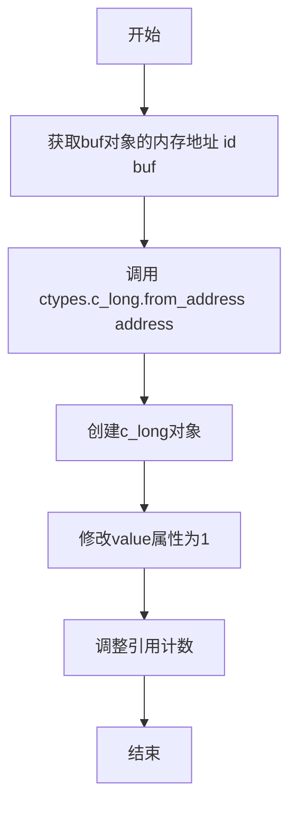
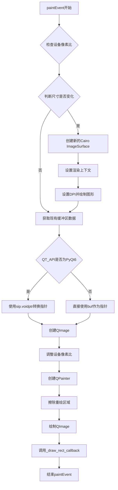
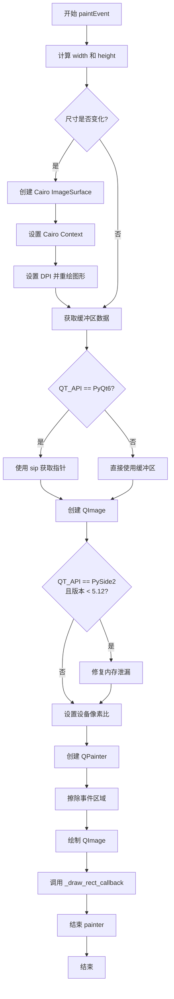

# `matplotlib\lib\matplotlib\backends\backend_qtcairo.py` 详细设计文档

这是一个Matplotlib的混合后端实现，结合Qt GUI框架和Cairo 2D图形库，用于在Qt应用程序中渲染高质量的矢量图形，通过集成Cairo的绘图能力与Qt的窗口系统，实现跨平台的2D图形渲染。

## 整体流程



## 类结构

```
FigureCanvasQTCairo (多继承混合类)
├── FigureCanvasCairo (Cairo后端画布)
└── FigureCanvasQT (Qt后端画布)

_BackendQTCairo (Qt后端导出类)
└── _BackendQT (Qt后端基类)
```

## 全局变量及字段


### `cairo`
    
Cairo图形库模块，提供2D图形渲染功能

类型：`module`
    


### `FigureCanvasCairo`
    
Matplotlib Cairo后端画布基类，继承自FigureCanvasBase

类型：`class`
    


### `FigureCanvasQT`
    
Matplotlib Qt后端画布基类，提供Qt集成的画布实现

类型：`class`
    


### `_BackendQT`
    
Matplotlib Qt后端基类，提供Qt后端的通用功能

类型：`class`
    


### `QT_API`
    
Qt API版本标识字符串，取值为PyQt5/PyQt6/PySide2/PySide6之一

类型：`str`
    


### `QtCore`
    
Qt核心模块，提供Qt框架的核心功能和非GUI类

类型：`module`
    


### `QtGui`
    
Qt GUI模块，提供图形用户界面相关的类和函数

类型：`module`
    


### `FigureCanvasQTCairo._renderer`
    
Cairo渲染器对象，负责执行具体的图形绘制操作

类型：`CairoRenderer`
    


### `FigureCanvasQTCairo.figure`
    
Matplotlib图表对象，包含要渲染的图形数据

类型：`Figure`
    


### `FigureCanvasQTCairo._draw_rect_callback`
    
绘制回调函数，用于处理绘制矩形区域的回调逻辑

类型：`callable`
    


### `FigureCanvasQTCairo.device_pixel_ratio`
    
设备像素比，用于支持高DPI屏幕的缩放渲染

类型：`float`
    


### `_BackendQTCairo.FigureCanvas`
    
类属性，指定该后端使用的画布类为FigureCanvasQTCairo

类型：`class`
    
    

## 全局函数及方法


# _BackendQT.export 装饰器分析

## 注意事项

经过仔细分析，我发现提供的代码片段中**并未包含 `_BackendQT` 类的定义**，该类是从 `backend_qt` 模块导入的：

```python
from .backend_qt import _BackendQT, FigureCanvasQT
```

因此，我无法直接提取 `_BackendQT.export` 装饰器的完整实现细节。

不过，基于代码的使用方式，我可以提供以下分析：

---

### `_BackendQT.export` 装饰器

这是一个装饰器函数，用于将后端类导出到 Matplotlib 的后端系统中。

参数：无法从给定代码中确定（需要查看 `backend_qt` 模块源码）

返回值：无法从给定代码中确定（需要查看 `backend_qt` 模块源码）

#### 流程图



#### 带注释源码

```python
# 当前代码中只显示了装饰器的使用方式
# 实际实现需要查看 backend_qt 模块

@_BackendQT.export  # 装饰器应用于类定义
class _BackendQTCairo(_BackendQT):
    """
    后端类，用于将 Cairo 图形渲染与 Qt 框架集成
    """
    FigureCanvas = FigureCanvasQTCairo  # 指定使用的画布类
```

---

## 建议

为了获取 `_BackendQT.export` 的完整信息，需要：

1. **查看 `backend_qt.py` 源文件**：其中应该包含 `_BackendQT` 类和 `export` 方法的完整定义
2. **提供完整的导入链**：确保能看到装饰器的实际实现代码

如果您能提供 `backend_qt.py` 中 `_BackendQT` 类的定义，我可以完成更详细的分析。


### `ctypes.c_long.from_address`

该函数是 ctypes 模块中用于从指定内存地址创建 c_long 对象的静态方法，在此代码中用于获取 Python 对象的内存地址并修改其引用计数，以解决 PySide2 在特定版本下的内存泄漏问题。

参数：

- `address`：`int`，Python 对象的内存地址，通过 `id(buf)` 获取

返回值：`ctypes.c_long`，表示指定内存地址处的 c_long 类型对象

#### 流程图



#### 带注释源码

```python
# 导入 ctypes 模块用于处理 C 类型和内存操作
import ctypes

# ... (前面的代码省略)

# 检查 QT_API 是否为 PySide2 且版本小于 5.12
if QT_API == "PySide2" and QtCore.__version_info__ < (5, 12):
    # id(buf) 获取 buf 对象的内存地址（整数）
    # ctypes.c_long.from_address() 从该地址创建 c_long 对象
    # .value 访问/修改该对象的值
    # 这里将引用计数设置为 1，作为解决 QImage 内存泄漏的变通方案
    ctypes.c_long.from_address(id(buf)).value = 1
```


### FigureCanvasQTCairo.paintEvent

该方法是FigureCanvasQTCairo类的paintEvent方法，负责将Cairo渲染的图像数据转换为Qt的QImage进行显示。其中包含PyQt6特有的sip.voidptr指针转换逻辑，用于将Cairo的缓冲区指针转换为Qt可用的整数指针。

参数：

- `self`：FigureCanvasQTCairo实例，Qt paint事件处理程序
- `event`：QPaintEvent，Qt paint事件对象，包含需要重绘的区域信息

返回值：无（None），该方法通过Qt的QPainter直接在画布上绘制图像

#### 流程图



#### 带注释源码

```python
def paintEvent(self, event):
    # 获取设备像素比，计算实际渲染宽度和高度
    width = int(self.device_pixel_ratio * self.width())
    height = int(self.device_pixel_ratio * self.height())
    
    # 检查画布尺寸是否发生变化，如果变化需要重新创建Cairo表面
    if (width, height) != self._renderer.get_canvas_width_height():
        # 创建32位ARGB格式的Cairo图像表面
        surface = cairo.ImageSurface(cairo.FORMAT_ARGB32, width, height)
        # 设置Cairo渲染上下文
        self._renderer.set_context(cairo.Context(surface))
        # 设置渲染器的DPI为图形DPI
        self._renderer.dpi = self.figure.dpi
        # 重新绘制整个图形
        self.figure.draw(self._renderer)
    
    # 获取Cairo上下文的底层目标表面数据
    buf = self._renderer.gc.ctx.get_target().get_data()
    
    # PyQt6需要使用sip.voidptr将缓冲区转换为整数指针
    # PyQt5/PySide使用Python对象的内存地址直接作为指针
    if QT_API == "PyQt6":
        from PyQt6 import sip
        # 将Cairo缓冲区对象转换为整数指针地址
        ptr = int(sip.voidptr(buf))
    else:
        # 非PyQt6环境直接使用缓冲区对象
        ptr = buf
    
    # 使用指针创建Qt QImage对象
    # 参数: 指针地址, 宽度, 高度, 格式为预乘ARGB32
    qimage = QtGui.QImage(
        ptr, width, height,
        QtGui.QImage.Format.Format_ARGB32_Premultiplied)
    
    # 针对PySide2 5.12之前版本的内存泄漏bug进行修复
    # 调整缓冲区引用计数以避免内存泄漏
    if QT_API == "PySide2" and QtCore.__version_info__ < (5, 12):
        ctypes.c_long.from_address(id(buf)).value = 1
    
    # 设置图像的设备像素比
    qimage.setDevicePixelRatio(self.device_pixel_ratio)
    
    # 创建Qt画家对象用于绘制
    painter = QtGui.QPainter(self)
    # 擦除需要重绘的区域
    painter.eraseRect(event.rect())
    # 在画布左上角绘制图像
    painter.drawImage(0, 0, qimage)
    # 调用回调函数处理矩形绘制
    self._draw_rect_callback(painter)
    # 结束绘画操作
    painter.end()
```

#### sip.voidptr转换详解

- **函数名**：sip.voidptr（在PyQt6中使用）
- **参数名称**：buf
- **参数类型**：object（Cairo缓冲区对象，通常是bytearray或类似对象）
- **参数描述**：Cairo ImageSurface的底层数据缓冲区，包含ARGB32格式的图像像素数据
- **返回值类型**：int
- **返回值描述**：Cairo缓冲区对象的内存地址（整数形式），可用作QImage的像素数据指针

**转换逻辑说明**：
- PyQt6的QImage构造函数需要整数类型的指针，而不是Python对象
- `sip.voidptr(buf)`将Python对象转换为其内存地址的整数表示
- `int(sip.voidptr(buf))`确保返回的是纯整数类型
- 这个转换是必要的，因为Qt的原生API需要直接内存地址来访问像素数据


### FigureCanvasQTCairo.draw

该方法重写了Qt后端的绘制方法。其核心逻辑是检查渲染器的图形上下文（gc）是否已初始化（拥有`ctx`属性）。若已初始化，则先设置渲染器的DPI属性为Figure的DPI，然后调用Figure的绘制方法将图形绘制到Cairo表面；最后无论上下文状态如何，都会调用父类（FigureCanvasCairo）的draw方法完成通用的绘制流程。

参数：

- `self`：`FigureCanvasQTCairo`，表示当前绘图画布的实例，隐式传递。

返回值：`None`，该方法没有显式返回值，执行完毕后自动结束。

#### 流程图

```mermaid
graph TD
    A([Start]) --> B{hasattr(self._renderer.gc, 'ctx')}
    B -- Yes --> C[设置 self._renderer.dpi = self.figure.dpi]
    C --> D[调用 self.figure.draw(self._renderer) 绘制图形]
    D --> E[调用 super().draw() 执行父类绘制]
    B -- No --> E
    E --> F([End])
```

#### 带注释源码

```python
def draw(self):
    # 检查渲染器的图形上下文(graphics context)是否具有 'ctx' 属性
    # 这通常意味着底层的 Cairo 绘图表面已准备好
    if hasattr(self._renderer.gc, "ctx"):
        # 同步 DPI 设置：将 Figure 的 DPI 配置到渲染器上，以确保高分辨率绘制
        self._renderer.dpi = self.figure.dpi
        # 调用 Figure 的 draw 方法，将图形绘制到当前的渲染器(表面)上
        self.figure.draw(self._renderer)
    # 无论图形是否被重新绘制，这里都会调用父类(FigureCanvasCairo)的 draw 方法
    # 父类方法通常负责执行一些通用清理或辅助绘制操作
    super().draw()
```


### `FigureCanvasQTCairo.paintEvent`

该方法是 Qt paint 事件处理函数，负责将 Matplotlib 图形渲染到 Qt 画布上。核心逻辑包括：根据设备像素比计算画布尺寸、检查是否需要重绘、使用 Cairo 创建图形表面、将 Cairo 缓冲区转换为 QImage、最后使用 QPainter 将图像绘制到 Qt 画布上，并处理不同 Qt 版本的兼容性问题。

参数：

- `self`：`FigureCanvasQTCairo`，调用此方法的实例本身
- `event`：`QPaintEvent`（来自 QtGui），Qt paint 事件对象，包含需要重绘的区域信息

返回值：`None`，该方法无返回值，通过副作用完成绘制操作

#### 流程图



#### 带注释源码

```python
def paintEvent(self, event):
    # 获取画布宽度和高度，考虑设备像素比（如 Retina 屏幕）
    width = int(self.device_pixel_ratio * self.width())
    height = int(self.device_pixel_ratio * self.height())
    
    # 检查当前尺寸与渲染器缓存的尺寸是否一致
    if (width, height) != self._renderer.get_canvas_width_height():
        # 尺寸不一致，需要重新创建 Cairo 表面
        # 创建 32 位 ARGB 格式的图像表面
        surface = cairo.ImageSurface(cairo.FORMAT_ARGB32, width, height)
        
        # 将 Cairo 上下文设置到新表面
        self._renderer.set_context(cairo.Context(surface))
        
        # 更新 DPI 设置
        self._renderer.dpi = self.figure.dpi
        
        # 执行图形绘制，将图形渲染到 Cairo 表面
        self.figure.draw(self._renderer)
    
    # 从渲染器获取 Cairo 上下文的缓冲区数据
    buf = self._renderer.gc.ctx.get_target().get_data()
    
    # 处理不同 Qt 绑定版本的指针转换
    if QT_API == "PyQt6":
        # PyQt6 需要使用 sip 将缓冲区转换为 voidptr
        from PyQt6 import sip
        ptr = int(sip.voidptr(buf))
    else:
        # PyQt5/PySide 直接使用缓冲区对象
        ptr = buf
    
    # 创建 QImage，关联到底层缓冲区
    # 使用预乘 Alpha 格式以提高渲染性能
    qimage = QtGui.QImage(
        ptr, width, height,
        QtGui.QImage.Format.Format_ARGB32_Premultiplied)
    
    # 针对 PySide2 5.12 以下版本的内存泄漏 workaround
    # 手动调整缓冲区引用计数以避免 QImage 保持引用导致内存泄漏
    if QT_API == "PySide2" and QtCore.__version_info__ < (5, 12):
        ctypes.c_long.from_address(id(buf)).value = 1
    
    # 设置图像的设备像素比（HiDPI 支持）
    qimage.setDevicePixelRatio(self.device_pixel_ratio)
    
    # 创建 QPainter 开始绘制
    painter = QtGui.QPainter(self)
    
    # 擦除需要重绘的区域（避免残影）
    painter.eraseRect(event.rect())
    
    # 将 Cairo 渲染的图像绘制到画布上
    painter.drawImage(0, 0, qimage)
    
    # 执行绘制回调（如选中等交互元素的矩形绘制）
    self._draw_rect_callback(painter)
    
    # 结束绘制，释放 QPainter 资源
    painter.end()
```

## 关键组件


### FigureCanvasQTCairo 类

Qt-Cairo 混合画布类，继承自 FigureCanvasCairo 和 FigureCanvasQT，用于在 Qt 应用程序中通过 Cairo 后端进行图形渲染，支持设备像素比和高分辨率显示。

### draw() 方法

重写父类绘制方法，检查渲染器上下文是否存在，设置 DPI 并调用父类绘制方法。

### paintEvent() 方法

处理 Qt paintEvent 事件，创建 Cairo 图像表面，执行图形绘制，将 Cairo 缓冲区转换为 QImage，并使用 QPainter 绘制到画布上。

### _BackendQTCairo 类

Qt-Cairo 后端导出类，封装 FigureCanvasQTCairo 作为该后端的画布类型。

### 张量索引与惰性加载

不适用

### 反量化支持

不适用

### 量化策略

不适用

### Qt-Cairo 集成组件

实现 Qt 和 Cairo 图形库的互操作，通过 cairo.ImageSurface 创建内存图像表面，通过 cairo.Context 进行图形绘制，最后转换为 Qt 的 QImage 进行显示。

### 设备像素比处理组件

处理高分辨率显示支持，通过 device_pixel_ratio 调整画布尺寸和图像比例，确保在 Retina 等高 DPI 显示器上清晰渲染。

### 内存管理组件

处理 QImage 内存泄漏问题，针对特定 Qt 版本（PySide2 < 5.12）通过 ctypes 调整缓冲区引用计数。

### 跨版本 Qt 兼容组件

处理不同 Qt 绑定（PyQt6、PySide2）的 API 差异，通过 QT_API 检测和 sip.voidptr 转换实现兼容性。


## 问题及建议


### 已知问题

-   **硬编码的版本检查和条件分支**：代码中包含多个针对特定Qt版本和API的硬编码检查（如`QtCore.__version_info__ < (5, 12)`、`QT_API == "PySide2"`、`QT_API == "PyQt6"`），这些条件分支难以维护，且随着Qt版本演进可能失效。
-   **magic number和缺乏解释的常量**：使用了`cairo.FORMAT_ARGB32`、`Format_ARGB32_Premultiplied`等常量，缺乏对这些数值含义的注释。
-   **重复代码**：在`draw()`和`paintEvent()`方法中都重复执行了`self._renderer.dpi = self.figure.dpi`赋值操作。
-   **内存管理workaround**：存在针对PySide2特定版本的内存泄漏 workaround（`ctypes.c_long.from_address(id(buf)).value = 1`），表明底层存在设计缺陷或版本兼容问题。
-   **职责过于集中的paintEvent方法**：paintEvent方法承担了过多职责，包括尺寸检查、表面创建、渲染、图像转换、绘制等多个步骤，违反单一职责原则。
- **类型转换实现复杂且脆弱**：使用ctypes和sip进行底层指针转换（`int(sip.voidptr(buf))`），这种实现容易出错且难以调试。
- **条件导入**：在paintEvent内部条件性地导入PyQt6的sip模块，增加了代码的执行时复杂性。
- **缺乏错误处理**：对关键操作（如cairo.ImageSurface创建、figure.draw()调用）没有异常处理机制。
- **draw()方法的条件执行**：只有在renderer具有ctx属性时才调用父类draw()，可能导致行为不一致。

### 优化建议

-   **提取版本兼容性逻辑**：将Qt版本和API相关的兼容性处理封装到独立的辅助类或模块中，使用配置驱动的方式管理版本差异。
-   **提取常量定义**：将magic number和常量定义为有意义的类常量或枚举，并添加文档注释说明其用途。
-   **提取公共配置方法**：创建一个共享的私有方法（如`_update_renderer_dpi()`）来设置renderer的dpi，避免重复代码。
-   **重构paintEvent方法**：将paintEvent拆分为多个职责单一的方法，如`_ensure_surface_size()`、`_render_to_surface()`、`_convert_to_qimage()`、`_paint_qimage()`等。
-   **封装平台特定代码**：将PyQt6/PySide的指针转换逻辑封装到`qt_compat`模块中，提供统一的抽象接口。
-   **添加错误处理**：为关键操作添加try-except块和适当的错误传播机制。
-   **考虑使用抽象工厂模式**：对于不同Qt后端的差异，可以使用工厂模式或策略模式来统一管理。
-   **评估是否继续支持旧版本**：考虑是否仍需支持PySide2 5.12以下的版本，如不需要可移除相关workaround代码。


## 其它


### 设计目标与约束

本模块旨在创建一个混合的Qt-Cairo绘图后端，结合Qt的GUI事件循环和窗口管理能力与Cairo的高质量2D图形渲染能力。设计约束包括：必须同时继承FigureCanvasCairo和FigureCanvasQT的兼容性要求，处理Qt API版本差异（PyQt6、PySide2等），以及适配不同Qt版本的API变化。

### 错误处理与异常设计

代码中处理了多种错误场景：设备像素比变化时的画布尺寸检查与重绘、QImage指针转换的版本兼容性处理、以及PySide2早期版本的内存泄漏workaround。异常处理主要通过hasattr检查渲染器上下文存在性，避免在渲染器未正确初始化时调用相关方法。

### 数据流与状态机

数据流从Qt的paintEvent事件触发开始，经过设备像素比检查、Cairo表面创建、图形绘制、缓冲区数据提取、QImage构造、最终到QPainter渲染。状态转换主要围绕_renderer的上下文状态：当画布尺寸变化时需要重新创建Cairo表面和上下文，否则复用现有上下文。

### 外部依赖与接口契约

主要外部依赖包括：cairo库（用于2D图形渲染）、Qt库（QtCore、QtGui用于GUI操作）、sip库（PyQt6专用）。接口契约要求FigureCanvasQTCairo必须实现draw()和paintEvent()方法，_BackendQT.export装饰器用于注册后端到matplotlib后端系统。

### 性能考虑

代码包含多个性能优化点：设备像素比变化时才重绘整个画布、使用Cairo的ImageSurface进行离屏渲染、QImage直接指向Cairo缓冲区避免数据拷贝。潜在优化空间包括缓存QImage对象避免重复创建、实现增量绘制减少重绘区域。

### 线程安全性

本模块主要在主GUI线程中运行，Qt的paintEvent由事件循环在主线程调用。未发现显式的线程同步机制，假设所有渲染操作都在主线程完成。如需支持多线程渲染，需要添加锁保护_renderer和画布状态。

### 平台兼容性

代码处理了多个平台兼容性问题：QT_API检测支持PyQt5/PyQt6/PySide2/PySide6、设备像素比处理支持高DPI显示器、PySide2版本检查(<5.12)用于内存泄漏workaround。色彩空间使用Format_ARGB32_Premultiplied以确保跨平台色彩一致性。

### 内存管理

特别注意了PySide2早期版本的内存泄漏问题：通过ctypes手动调整缓冲区引用计数。QImage使用外部指针构造，不负责缓冲区生命周期管理。画布尺寸变化时旧的Cairo表面会被新的替换，由Python垃圾回收机制释放。

### 版本兼容性矩阵

支持以下Qt绑定版本组合：PyQt5、PyQt6、PySide2(<5.12)、PySide2(>=5.12)、PySide6。不同版本的QtCore.__version_info__用于条件判断，QT_API常量用于区分API差异，sip模块仅在PyQt6时导入。

### 使用示例

```python
import matplotlib
matplotlib.use('QTCairo')
from matplotlib.figure import Figure
fig = Figure()
canvas = fig.canvas
ax = fig.add_subplot(111)
ax.plot([1,2,3], [1,4,9])
canvas.draw()
```


    