# `matplotlib\lib\matplotlib\backends\backend_svg.py` 详细设计文档

Matplotlib的SVG后端渲染器，负责将Matplotlib图形渲染为可缩放矢量图形(SVG)格式，支持文本、路径、图像等多种元素的SVG输出，并提供XMLWriter工具类用于生成符合Dublin Core元数据标准的SVG文件。

## 整体流程

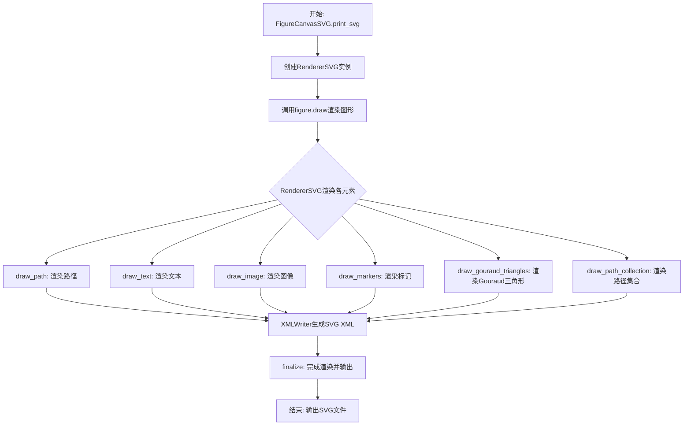

## 类结构

```
object
├── XMLWriter (XML生成工具类)
├── RendererSVG (继承RendererBase, 核心渲染器)
│   ├── 渲染方法组
│   │   ├── draw_path
│   │   ├── draw_text
│   │   ├── draw_image
 │   │   ├── draw_markers
│   │   ├── draw_gouraud_triangles
│   │   └── draw_path_collection
│   └── 辅助方法组
│       ├── _write_metadata
│       ├── _write_clips
│       ├── _write_hatches
│       └── ... 
├── FigureCanvasSVG (继承FigureCanvasBase)
│   ├── print_svg
│   ├── print_svgz
│   └── draw
└── _BackendSVG (后端导出类)
```

## 全局变量及字段


### `_log`
    
logging日志记录器

类型：`logging.Logger`
    


### `svgProlog`
    
SVG文件头部声明字符串

类型：`str`
    


### `_capstyle_d`
    
线帽样式映射字典

类型：`dict`
    


### `_escape_xml_comment`
    
XML注释转义正则

类型：`re.Pattern`
    


### `XMLWriter.__write`
    
文件写入方法

类型：`Callable[[str], None]`
    


### `XMLWriter.__open`
    
标签开启状态

类型：`int`
    


### `XMLWriter.__tags`
    
标签栈

类型：`list`
    


### `XMLWriter.__data`
    
数据缓冲区

类型：`list`
    


### `XMLWriter.__indentation`
    
缩进字符串

类型：`str`
    


### `RendererSVG.width`
    
SVG画布宽度

类型：`float`
    


### `RendererSVG.height`
    
SVG画布高度

类型：`float`
    


### `RendererSVG.writer`
    
XMLWriter实例

类型：`XMLWriter`
    


### `RendererSVG.image_dpi`
    
实际光栅化DPI

类型：`float`
    


### `RendererSVG.basename`
    
输出文件名基础

类型：`str`
    


### `RendererSVG._groupd`
    
分组计数器字典

类型：`dict`
    


### `RendererSVG._image_counter`
    
图像计数器

类型：`itertools.count`
    


### `RendererSVG._clip_path_ids`
    
剪裁路径ID映射

类型：`dict`
    


### `RendererSVG._clipd`
    
剪裁路径定义字典

类型：`dict`
    


### `RendererSVG._markers`
    
标记定义字典

类型：`dict`
    


### `RendererSVG._path_collection_id`
    
路径集合ID计数器

类型：`int`
    


### `RendererSVG._hatchd`
    
阴影定义字典

类型：`dict`
    


### `RendererSVG._has_gouraud`
    
是否已使用Gouraud渐变

类型：`bool`
    


### `RendererSVG._n_gradients`
    
Gouraud渐变数量

类型：`int`
    


### `RendererSVG._glyph_map`
    
字符到路径的映射

类型：`dict`
    


### `RendererSVG._start_id`
    
SVG根元素起始ID

类型：`int`
    


### `FigureCanvasSVG.filetypes`
    
支持的文件类型映射

类型：`dict`
    


### `FigureCanvasSVG.fixed_dpi`
    
固定DPI值(72)

类型：`int`
    


### `_BackendSVG.backend_version`
    
后端版本号

类型：`str`
    


### `_BackendSVG.FigureCanvas`
    
对应的FigureCanvas类

类型：`type`
    
    

## 全局函数及方法


### `_escape_cdata`

该函数用于转义XML CDATA中的特殊字符（&、<、>），将其转换为XML实体，以防止XML解析错误。

参数：

-  `s`：`str`，需要转义的原始字符串

返回值：`str`，转义后的字符串，其中 `&` 被替换为 `&amp;`，`<` 被替换为 `&lt;`，`>` 被替换为 `&gt;`

#### 流程图

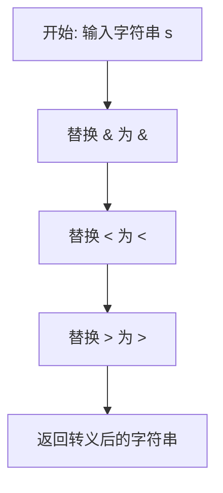

#### 带注释源码

```python
def _escape_cdata(s):
    """
    转义XML CDATA中的特殊字符
    
    参数:
        s: 需要转义的字符串
        
    返回:
        转义后的字符串
    """
    # 先替换 & 符号，因为后续的替换可能会引入新的 & 符号
    # 必须最先处理
    s = s.replace("&", "&amp;")
    # 替换小于号
    s = s.replace("<", "&lt;")
    # 替换大于号
    s = s.replace(">", "&gt;")
    return s
```


### `_escape_comment`

该函数用于将字符串转义为XML注释安全格式，通过先进行CDATA转义（处理&、<、>），再将连续的两个或以上连字符替换为单个连字符后加空格，以符合XML注释规范（XML注释中不允许出现连续连字符）。

参数：

- `s`：`str`，需要转义的字符串

返回值：`str`，转义后的字符串

#### 流程图

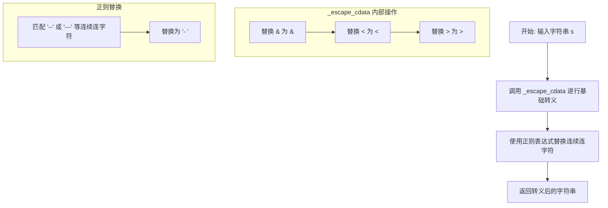

#### 带注释源码

```python
# 正则表达式：匹配在XML注释中非法的连续连字符
# (?=-) 是正向前瞻，匹配 '-' 后面紧跟另一个 '-'
# 这样可以匹配 '--', '---', '----' 等连续字符
_escape_xml_comment = re.compile(r'-(?=-)')


def _escape_comment(s):
    """
    Escape a string for use in an XML comment.
    
    Parameters
    ----------
    s : str
        The string to escape.
    
    Returns
    -------
    str
        The escaped string safe for use in XML comments.
    """
    # 第一步：进行CDATA转义，处理&、<、>等XML特殊字符
    # 这会调用 _escape_cdata 函数进行替换
    s = _escape_cdata(s)
    
    # 第二步：处理XML注释中的连续连字符问题
    # XML注释规范要求不能出现连续的两个或以上连字符（--）
    # 例如 '--' 需要变成 '- -'，'---' 变成 '- -'
    return _escape_xml_comment.sub('- ', s)
```


### `_escape_attrib`

该函数用于将字符串中的特殊字符转换为XML实体，以确保字符串可以作为XML属性值安全使用。它会将 `&`、`<`、`>`、`"` 和 `'` 字符分别替换为对应的XML实体 `&amp;`、`&lt;`、`&gt;`、`&quot;` 和 `&apos;`。

参数：
- `s`：`str`，需要转义的字符串

返回值：`str`，转义后的字符串

#### 流程图

```mermaid
flowchart TD
    A[开始] --> B[输入字符串 s]
    B --> C[替换 & 为 &amp;]
    C --> D[替换 ' 为 &apos;]
    D --> E[替换 " 为 &quot;]
    E --> F[替换 < 为 &lt;]
    F --> G[替换 > 为 &gt;]
    G --> H[返回转义后的字符串]
    H --> I[结束]
```

#### 带注释源码

```python
def _escape_attrib(s):
    """
    Escape special characters in a string for use as an XML attribute value.
    
    Parameters
    ----------
    s : str
        The string to be escaped.
    
    Returns
    -------
    str
        The escaped string with special XML characters replaced by their
        corresponding entity references.
    """
    # Replace ampersand first to avoid double-encoding
    s = s.replace("&", "&amp;")
    # Replace single quote
    s = s.replace("'", "&apos;")
    # Replace double quote
    s = s.replace('"', "&quot;")
    # Replace less-than sign
    s = s.replace("<", "&lt;")
    # Replace greater-than sign
    s = s.replace(">", "&gt;")
    return s
```


### _quote_escape_attrib

该函数用于在生成XML属性时选择合适的引号并对字符串进行转义，确保输出的XML属性值符合规范，避免引号冲突。

参数：

- `s`：`str`，需要进行引号转义的字符串

返回值：`str`，返回转义并包裹在引号中的字符串

#### 流程图

```mermaid
flowchart TD
    A[开始: _quote_escape_attrib] --> B{双引号"是否在s中?}
    B -- 否 --> C[使用双引号包裹<br/>调用_escape_cdata转义]
    B -- 是 --> D{单引号'是否在s中?}
    D -- 否 --> E[使用单引号包裹<br/>调用_escape_cdata转义]
    D -- 是 --> F[使用双引号包裹<br/>调用_escape_attrib转义]
    C --> G[返回转义后的字符串]
    E --> G
    F --> G
    G --> H[结束]
```

#### 带注释源码

```python
def _quote_escape_attrib(s):
    """
    对XML属性值进行引号转义处理。
    
    该函数根据字符串内容选择合适的引号包裹方式：
    1. 如果字符串不包含双引号，使用双引号包裹并进行CDATA转义
    2. 如果字符串包含双引号但不包含单引号，使用单引号包裹并进行CDATA转义
    3. 如果两者都包含，使用双引号包裹并进行完整属性转义
    
    Parameters
    ----------
    s : str
        需要转义的字符串
    
    Returns
    -------
    str
        转义并包裹在引号中的字符串
    """
    # 逻辑说明：
    # 首先检查字符串中是否包含双引号
    # 如果不包含，使用双引号是最安全的选择，只调用_escape_cdata进行基本转义
    # 如果包含双引号，检查是否包含单引号
    # 如果不包含单引号，使用单引号可以避免转义双引号
    # 如果两者都包含，必须使用双引号并调用_escape_attrib进行完整转义
    
    return ('"' + _escape_cdata(s) + '"' if '"' not in s else
            "'" + _escape_cdata(s) + "'" if "'" not in s else
            '"' + _escape_attrib(s) + '"')
```


### `_short_float_fmt`

将浮点数转换为短格式字符串表示，移除尾随的零和小数点。

参数：

- `x`：`float`，需要格式化的浮点数

返回值：`str`，去除尾随零和小数点后的字符串表示

#### 流程图

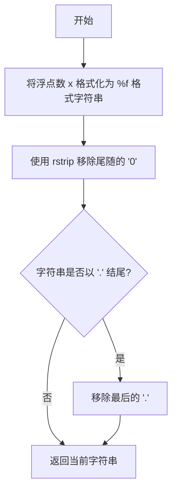

#### 带注释源码

```python
def _short_float_fmt(x):
    """
    Create a short string representation of a float, which is %f
    formatting with trailing zeros and the decimal point removed.
    """
    # 使用 f-string 和 %f 格式化将浮点数转为字符串
    # 例如: 1.5 -> "1.500000", 2.0 -> "2.000000"
    formatted = f'{x:f}'
    
    # 移除尾随的零字符
    # 例如: "1.500000" -> "1.5", "2.000000" -> "2."
    stripped = formatted.rstrip('0')
    
    # 如果字符串以小数点结尾（说明原数为整数），则移除小数点
    # 例如: "2." -> "2"
    result = stripped.rstrip('.')
    
    return result
```

#### 示例说明

| 输入 `x` | `f'{x:f}'` 结果 | `rstrip('0')` 后 | 最终结果 |
|---------|---------------|-----------------|---------|
| `1.5` | `"1.500000"` | `"1.5"` | `"1.5"` |
| `2.0` | `"2.000000"` | `"2."` | `"2"` |
| `3.125` | `"3.125000"` | `"3.125"` | `"3.125"` |
| `100.0` | `"100.000000"` | `"100."` | `"100"` |

#### 使用场景

该函数在 SVG 渲染器中广泛用于生成紧凑的数值字符串，主要应用包括：

1. **SVG 属性值**：生成 `width`、`height`、`x`、`y` 等属性值
2. **变换参数**：生成 `transform` 属性中的缩放、旋转、平移参数
3. **颜色值**：生成 `fill-opacity`、`stroke-opacity` 等透明度值
4. **坐标点**：生成路径数据中的坐标值


### `_generate_transform`

该函数负责将Matplotlib内部的变换表示（缩放、平移、旋转、矩阵变换）转换为SVG标准格式的变换字符串，用于在SVG输出中描述图形元素的变换操作。

参数：

- `transform_list`：`list[tuple[str, tuple | Affine2DBase]]`，变换列表，每个元素为(type, value)元组，其中type为变换类型（'scale'、'translate'、'rotate'、'matrix'），value为对应的变换参数元组或Affine2DBase对象

返回值：`str`，SVG变换字符串，如 "translate(10 20) scale(2 2)"

#### 流程图

```mermaid
flowchart TD
    A[开始 _generate_transform] --> B[初始化空列表 parts]
    B --> C{遍历 transform_list}
    C -->|遍历每个 type, value| D{检查是否为默认变换}
    D -->|scale(1,) 或 scale(1,1)| E[跳过该项]
    D -->|translate(0,0)| E
    D -->|rotate(0)| E
    D -->|非默认变换| F{type == 'matrix'}
    F -->|是| G[将 Affine2DBase 转换为 values]
    F -->|否| H[直接使用 value]
    G --> I[格式化变换字符串]
    H --> I
    I --> J[添加到 parts]
    J --> C
    C -->|遍历完成| K[拼接所有变换]
    K --> L[返回最终字符串]
```

#### 带注释源码

```python
def _generate_transform(transform_list):
    """
    将变换列表转换为SVG变换字符串。
    
    Parameters
    ----------
    transform_list : list
        包含 (type, value) 元组的列表，其中：
        - type: 变换类型，'scale', 'translate', 'rotate', 或 'matrix'
        - value: 变换参数，元组或 Affine2DBase 对象
    
    Returns
    -------
    str
        SVG格式的变换字符串，如 'translate(10 20) scale(2)'
    """
    parts = []  # 存储各个变换字符串部分
    
    for type, value in transform_list:
        # 跳过默认/恒等变换（不会产生实际效果）
        if (type == 'scale' and (value == (1,) or value == (1, 1))
                or type == 'translate' and value == (0, 0)
                or type == 'rotate' and value == (0,)):
            continue
        
        # 处理矩阵变换：如果值是 Affine2DBase 对象，转换为值元组
        if type == 'matrix' and isinstance(value, Affine2DBase):
            value = value.to_values()
        
        # 格式化当前变换：type(value1 value2 ...)
        parts.append('{}({})'.format(
            type, ' '.join(_short_float_fmt(x) for x in value)))
    
    # 用空格拼接所有变换部分
    return ' '.join(parts)
```

#### 关键组件信息

- **`_short_float_fmt`**：辅助函数，将浮点数转换为简短字符串表示（去除尾部零和小数点）
- **`Affine2DBase`**：Matplotlib的仿射变换基类，用于表示2D仿射变换
- **SVG变换类型**：支持scale（缩放）、translate（平移）、rotate（旋转）、matrix（矩阵变换）

#### 潜在技术债务与优化空间

1. **类型检查不足**：函数未对输入进行严格类型验证，错误的输入可能导致异常或静默失败
2. **默认值判断局限**：仅针对特定元组值进行默认判断，未考虑浮点数的近似比较（如0.0与0的比较）
3. **错误处理缺失**：如果遇到未知的type或无效的value，函数可能抛出不够友好的异常信息
4. **性能优化空间**：对于大量变换的场景，可以考虑缓存格式化结果或使用字符串拼接代替格式化

#### 其它项目

- **设计目标**：生成符合SVG标准的变换字符串，兼容主流浏览器和SVG编辑器
- **错误处理**：当transform_list元素不是元组或value无法迭代时，会抛出TypeError
- **数据流**：接收来自RendererSVG各类绘图方法的变换请求，输出SVG属性字符串
- **外部依赖**：Affine2DBase来自matplotlib.transforms模块，_short_float_fmt为本地辅助函数


### `_generate_css`

将属性字典转换为CSS样式字符串。

参数：

- `attrib`：`dict`，包含CSS属性名和属性值的字典

返回值：`str`，CSS样式字符串，格式为"属性名: 属性值; 属性名: 属性值; ..."

#### 流程图

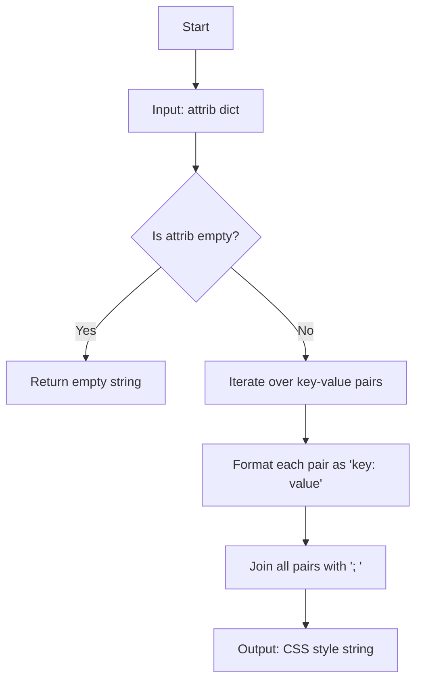

#### 带注释源码

```python
def _generate_css(attrib):
    """
    Generate a CSS style string from a dictionary of attributes.

    Parameters
    ----------
    attrib : dict
        A dictionary containing CSS property names as keys and their
        corresponding values as values.

    Returns
    -------
    str
        A CSS style string in the format "property: value; property: value; ..."
        Example: "stroke-linejoin: round; stroke-linecap: butt"
    """
    # 使用生成器表达式遍历字典的键值对
    # 格式化为 "key: value" 的形式
    # 然后用 "; " 连接所有属性
    return "; ".join(f"{k}: {v}" for k, v in attrib.items())
```


### `_check_is_str`

检查给定的元数据值是否为字符串类型，如果不是则抛出 TypeError 异常。该函数用于验证 SVG 元数据中的字段值是否符合预期的字符串类型。

参数：

- `info`：`任意类型`，要检查的元数据值
- `key`：`str`，元数据的键名，用于在错误信息中标识是哪个字段

返回值：`None`，该函数不返回值，通过抛出 TypeError 异常来表示类型检查失败

#### 流程图

```mermaid
flowchart TD
    A[开始] --> B{info 是否为 str 类型?}
    B -->|是| C[通过检查, 正常返回]
    B -->|否| D[抛出 TypeError 异常]
    D --> E[异常信息: Invalid type for {key} metadata. Expected str, not {type(info)}.]
```

#### 带注释源码

```python
def _check_is_str(info, key):
    """
    检查元数据值是否为字符串类型。
    
    Parameters
    ----------
    info : 任意类型
        要检查的元数据值
    key : str
        元数据的键名，用于错误信息
        
    Raises
    ------
    TypeError
        如果 info 不是字符串类型则抛出
    """
    # 使用 isinstance 检查 info 是否为字符串类型
    if not isinstance(info, str):
        # 抛出详细的类型错误信息，包含键名和实际类型
        raise TypeError(f'Invalid type for {key} metadata. Expected str, not '
                        f'{type(info)}.')
```


### `_check_is_iterable_of_str`

该函数用于验证输入的 `infos` 参数是否为字符串或字符串可迭代对象（如列表、元组），并在类型不符合要求时抛出详细的 `TypeError` 异常。主要用于 SVG 渲染器中元数据字段的类型校验，确保元数据值的类型符合 SVG 规范要求。

参数：

- `infos`：`Any`，需要进行检查的输入值，可以是单个字符串、字符串的可迭代对象（列表、元组等）或其他任意类型
- `key`：`str`，元数据字段的名称，用于在错误信息中标识具体的字段，便于定位问题

返回值：`None`，该函数不返回任何值，仅进行类型检查并通过抛出异常来处理错误情况

#### 流程图

```mermaid
flowchart TD
    A[开始检查 _check_is_iterable_of_str] --> B{np.iterable(infos)?}
    B -- 是 --> C[遍历 infos 中的每个元素]
    C --> D{当前元素是 str 类型?}
    D -- 是 --> E{还有更多元素?}
    D -- 否 --> F[抛出 TypeError: 非字符串类型]
    E -- 是 --> C
    E -- 否 --> G[检查通过，函数结束]
    B -- 否 --> H[抛出 TypeError: 不可迭代]
    
    F --> I[异常信息: Invalid type for {key} metadata...]
    H --> I
    I --> J[异常被外部捕获]
```

#### 带注释源码

```python
def _check_is_iterable_of_str(infos, key):
    """
    检查输入是否为字符串或字符串可迭代对象。
    
    Parameters
    ----------
    infos : Any
        需要检查的输入值，可以是单个字符串、字符串列表/元组等
    key : str
        元数据字段名称，用于错误信息中标识具体字段
    
    Raises
    ------
    TypeError
        如果 infos 不是可迭代对象，或者其中的元素不是字符串类型
    """
    # 使用 numpy 的迭代性检查功能来判断 infos 是否为可迭代对象
    # numpy.iterable 会识别列表、元组、字符串、numpy 数组等可迭代类型
    if np.iterable(infos):
        # 遍历可迭代对象中的每个元素
        for info in infos:
            # 检查每个元素是否为字符串类型
            if not isinstance(info, str):
                # 元素类型不符合要求，抛出详细的 TypeError
                # 错误信息包含字段名称和实际类型，便于调试
                raise TypeError(f'Invalid type for {key} metadata. Expected '
                                f'iterable of str, not {type(info)}.')
    else:
        # infos 不是可迭代对象（如单个整数、字典等），抛出 TypeError
        # 错误信息提示期望的是 str 或 iterable of str
        raise TypeError(f'Invalid type for {key} metadata. Expected str or '
                        f'iterable of str, not {type(infos)}.')
```


### `_generate_transform`

该函数接收一个变换列表（包含变换类型和值的元组），过滤掉恒等变换（如scale(1,1)、translate(0,0)、rotate(0)），将每个变换格式化为SVG变换字符串，最后返回用空格连接的变换字符串。

参数：

- `transform_list`：列表或可迭代对象，元素为 (变换类型, 变换值) 元组，例如 `[('scale', (1, 1)), ('translate', (10, 20)), ('rotate', (45,))]`

返回值：`str`，生成的SVG变换属性值字符串

#### 流程图

```mermaid
flowchart TD
    A[开始] --> B[初始化空列表parts]
    B --> C{遍历transform_list中的每个元素}
    C --> D{检查是否为恒等变换}
    D -->|scale(1,) 或 scale(1,1)| E[跳过当前元素]
    D -->|translate(0,0)| E
    D -->|rotate(0)| E
    D -->|否| F{检查type是否为matrix}
    F -->|是且value是Affine2DBase| G[调用to_values转换为元组]
    F -->|否| H[直接使用value]
    G --> I[格式化: type(value)]
    H --> I
    I --> J[添加到parts列表]
    J --> C
    C --> K{遍历结束?}
    K -->|否| C
    K -->|是| L[用空格连接parts]
    L --> M[返回结果字符串]
```

#### 带注释源码

```python
def _generate_transform(transform_list):
    """
    将变换列表转换为SVG变换字符串。
    
    Parameters
    ----------
    transform_list : list of tuple
        每个元素为 (type, value) 形式的元组，其中 type 为变换类型
        （如 'scale', 'translate', 'rotate', 'matrix'），value 为对应的
        变换参数元组。
    
    Returns
    -------
    str
        生成的SVG变换字符串，各变换用空格分隔。
    """
    parts = []  # 用于存储各个变换的字符串表示
    for type, value in transform_list:
        # 过滤掉恒等变换（不会产生实际效果）
        if (type == 'scale' and (value == (1,) or value == (1, 1))
                or type == 'translate' and value == (0, 0)
                or type == 'rotate' and value == (0,)):
            continue
        
        # 如果是 matrix 类型且值为 Affine2DBase 实例，
        # 则转换为 6 元组 (a, b, c, d, e, f)
        if type == 'matrix' and isinstance(value, Affine2DBase):
            value = value.to_values()
        
        # 格式化当前变换：type(value1 value2 ...)
        # 使用 _short_float_fmt 将浮点数转换为短字符串格式
        parts.append('{}({})'.format(
            type, ' '.join(_short_float_fmt(x) for x in value)))
    
    # 用空格连接所有变换并返回
    return ' '.join(parts)
```


### RendererSVG

RendererSVG 类是 Matplotlib SVG 后端的渲染器，负责将 matplotlib 图形转换为 SVG（可缩放矢量图形）格式。它继承自 RendererBase，封装了 SVG 文档的生成、路径转换、样式应用、元数据写入等功能。

参数：

- `width`：`float`，SVG 画布的宽度（以点为单位）
- `height`：`float`，SVG 画布的高度（以点为单位）
- `svgwriter`：文件对象，用于写入 SVG 内容
- `basename`：`str`，可选，图像文件名基准路径，用于保存外部图像文件
- `image_dpi`：`int`，可选，默认 72，栅格化图像的 DPI 值
- `metadata`：`dict`，可选，SVG 元数据字典（如 Creator、Title、Date 等）

返回值：无（`__init__` 方法无返回值）

#### 流程图

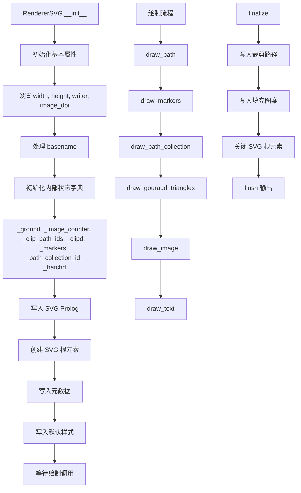

#### 带注释源码

```python
class RendererSVG(RendererBase):
    """
    SVG 渲染器类，负责将 matplotlib 图形渲染为 SVG 格式。
    继承自 RendererBase，实现了各种绘制方法以生成 SVG 元素。
    """
    
    def __init__(self, width, height, svgwriter, basename=None, image_dpi=72,
                 *, metadata=None):
        """
        初始化 SVG 渲染器。
        
        Parameters
        ----------
        width : float
            SVG 画布宽度（点）
        height : float
            SVG 画布高度（点）
        svgwriter : file-like object
            写入 SVG 内容的文件对象
        basename : str, optional
            图像文件名基准路径，用于保存外部图像
        image_dpi : int, default: 72
            栅格化图像的 DPI
        metadata : dict, optional
            SVG 元数据字典
        """
        # 存储画布尺寸
        self.width = width
        self.height = height
        
        # 创建 XML 写入器，用于生成 SVG 文档结构
        self.writer = XMLWriter(svgwriter)
        
        # 记录实际栅格化分辨率
        self.image_dpi = image_dpi

        # 处理文件名基准路径
        if basename is None:
            basename = getattr(svgwriter, "name", "")
            if not isinstance(basename, str):
                basename = ""
        self.basename = basename

        # 初始化内部状态字典，用于去重和缓存
        self._groupd = {}           # SVG 组计数器
        self._image_counter = itertools.count()  # 图像计数器
        self._clip_path_ids = {}    # 裁剪路径 ID 映射
        self._clipd = {}            # 裁剪路径定义
        self._markers = {}          # 标记定义缓存
        self._path_collection_id = 0  # 路径集合 ID
        self._hatchd = {}           # 填充图案缓存
        self._has_gouraud = False   # 是否使用了 Gouraud 着色
        self._n_gradients = 0       # 渐变数量计数器

        # 调用父类 RendererBase 初始化
        super().__init__()
        
        # 字形映射字典，用于文本到路径的转换
        self._glyph_map = dict()
        
        # 格式化尺寸字符串，去除多余零
        str_height = _short_float_fmt(height)
        str_width = _short_float_fmt(width)
        
        # 写入 SVG Prolog（XML 声明等）
        svgwriter.write(svgProlog)
        
        # 启动 SVG 根元素，写入 viewBox 和命名空间
        self._start_id = self.writer.start(
            'svg',
            width=f'{str_width}pt',
            height=f'{str_height}pt',
            viewBox=f'0 0 {str_width} {str_height}',
            xmlns="http://www.w3.org/2000/svg",
            version="1.1",
            id=mpl.rcParams['svg.id'],
            attrib={'xmlns:xlink': "http://www.w3.org/1999/xlink"})
        
        # 写入元数据（Dublin Core 格式）
        self._write_metadata(metadata)
        
        # 写入默认 CSS 样式
        self._write_default_style()
```


### FigureCanvasSVG

`FigureCanvasSVG` 是 Matplotlib 中用于将 Figure 对象渲染为 SVG（可缩放矢量图形）格式的画布类。它继承自 `FigureCanvasBase`，提供了将 matplotlib 图形导出为 SVG 文件的核心功能，支持元数据嵌入、图像内联或外部文件引用，以及 gzip 压缩等特性。

#### 类字段信息

| 字段名称 | 类型 | 描述 |
|---------|------|------|
| `filetypes` | `dict` | 支持的文件类型字典，包含 'svg' 和 'svgz' 两种格式 |
| `fixed_dpi` | `int` | 固定 DPI 值，设置为 72 |

#### 类方法信息

---

##### FigureCanvasSVG.print_svg

将图形渲染并保存为 SVG 格式文件。

**参数：**

- `filename`：`str` 或 `path-like` 或 `file-like`，输出目标，可以是文件路径或文件对象
- `bbox_inches_restore`：`optional`，用于恢复边界框的设置
- `metadata`：`dict[str, Any]`，可选参数，SVG 文件中的元数据，定义为键值对，支持字符串、日期时间或字符串列表

**返回值：** `None`

**流程图：**

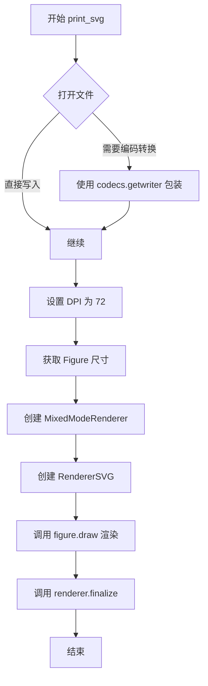

**带注释源码：**

```python
def print_svg(self, filename, *, bbox_inches_restore=None, metadata=None):
    """
    Parameters
    ----------
    filename : str or path-like or file-like
        Output target; if a string, a file will be opened for writing.

    metadata : dict[str, Any], optional
        Metadata in the SVG file defined as key-value pairs of strings,
        datetimes, or lists of strings, e.g., ``{'Creator': 'My software',
        'Contributor': ['Me', 'My Friend'], 'Title': 'Awesome'}``.

        The standard keys and their value types are:

        * *str*: ``'Coverage'``, ``'Description'``, ``'Format'``,
          ``'Identifier'``, ``'Language'``, ``'Relation'``, ``'Source'``,
          ``'Title'``, and ``'Type'``.
        * *str* or *list of str*: ``'Contributor'``, ``'Creator'``,
          ``'Keywords'``, ``'Publisher'``, and ``'Rights'``.
        * *str*, *date*, *datetime*, or *tuple* of same: ``'Date'``. If a
          non-*str*, then it will be formatted as ISO 8601.

        Values have been predefined for ``'Creator'``, ``'Date'``,
        ``'Format'``, and ``'Type'``. They can be removed by setting them
        to `None`.

        Information is encoded as `Dublin Core Metadata`__.

        .. _DC: https://www.dublincore.org/specifications/dublin-core/

        __ DC_
    """
    # 打开文件并处理编码兼容性
    with cbook.open_file_cm(filename, "w", encoding="utf-8") as fh:
        # 检查文件是否需要 unicode 编码，否则使用 utf-8 writer 包装
        if not cbook.file_requires_unicode(fh):
            fh = codecs.getwriter('utf-8')(fh)
        
        # 临时将 figure 的 DPI 设置为 72（SVG 标准）
        dpi = self.figure.dpi
        self.figure.dpi = 72
        
        # 获取 Figure 的尺寸（英寸转换为像素）
        width, height = self.figure.get_size_inches()
        w, h = width * 72, height * 72
        
        # 创建混合模式渲染器，包含 SVG 渲染器
        renderer = MixedModeRenderer(
            self.figure, width, height, dpi,
            RendererSVG(w, h, fh, image_dpi=dpi, metadata=metadata),
            bbox_inches_restore=bbox_inches_restore)
        
        # 执行图形渲染
        self.figure.draw(renderer)
        
        # 完成渲染并清理资源
        renderer.finalize()
```

---

##### FigureCanvasSVG.print_svgz

将图形渲染并保存为 gzip 压缩的 SVG 格式文件。

**参数：**

- `filename`：`str` 或 `path-like`，输出目标文件名
- `**kwargs`：其他关键字参数，传递给 `print_svg` 方法

**返回值：** `None`

**流程图：**

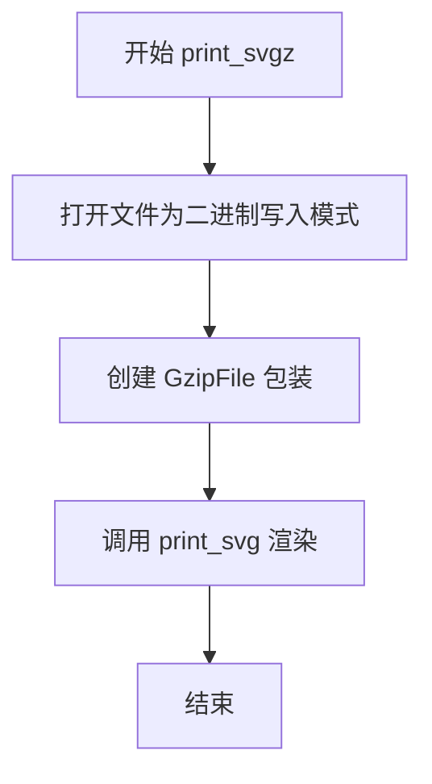

**带注释源码：**

```python
def print_svgz(self, filename, **kwargs):
    # 使用上下文管理器打开文件并创建 gzip 压缩写入器
    with (cbook.open_file_cm(filename, "wb") as fh,
          gzip.GzipFile(mode='w', fileobj=fh) as gzipwriter):
        # 将压缩写入器传递给 print_svg 方法
        return self.print_svg(gzipwriter, **kwargs)
```

---

##### FigureCanvasSVG.get_default_filetype

获取默认的文件类型。

**参数：** 无

**返回值：** `str`，返回默认文件类型 'svg'

**流程图：**

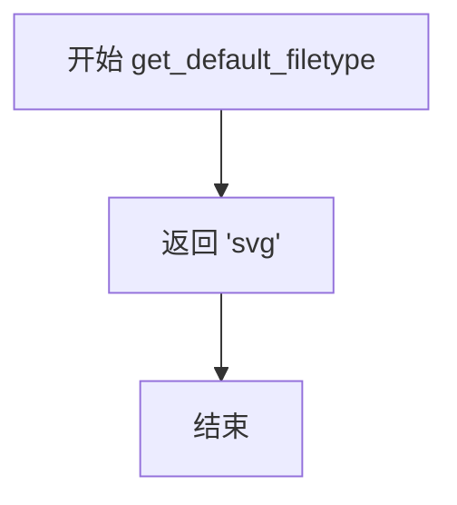

**带注释源码：**

```python
def get_default_filetype(self):
    return 'svg'
```

---

##### FigureCanvasSVG.draw

执行画布的绘制操作。

**参数：** 无

**返回值：** `None`，调用父类的 draw 方法

**流程图：**

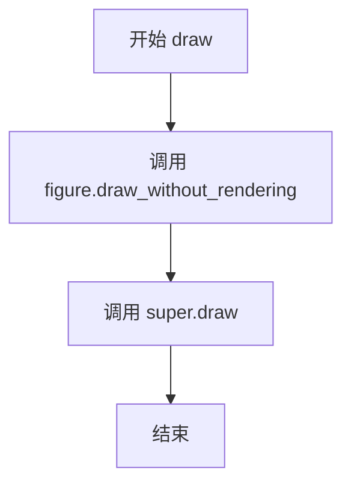

**带注释源码：**

```python
def draw(self):
    # 先绘制图形但不进行渲染（准备渲染数据）
    self.figure.draw_without_rendering()
    # 调用父类的 draw 方法完成实际渲染
    return super().draw()
```

---

#### 继承关系

```
FigureCanvasBase
    └── FigureCanvasSVG
```

#### 关键组件信息

| 组件名称 | 描述 |
|---------|------|
| `RendererSVG` | SVG 渲染器类，负责将图形元素转换为 SVG 元素 |
| `MixedModeRenderer` | 混合模式渲染器，用于协调不同渲染器的工作 |
| `XMLWriter` | XML 写入器类，用于生成 SVG 的 XML 结构 |
| `FigureManagerSVG` | 图形管理器（在此代码中为别名） |

#### 潜在的技术债务或优化空间

1. **字体处理复杂性**：`draw_text_as_text` 方法中包含大量字体属性处理逻辑，可以考虑提取为独立的字体处理类
2. **SVG 图像内联策略**：当前通过 `rcParams['svg.image_inline']` 控制是否内联图像，但逻辑分散在 `draw_image` 方法中
3. **路径优化**：`draw_path_collection` 方法中的优化逻辑依赖于启发式计算，可能在某些边界情况下不够高效
4. **Gouraud 三角形渲染**：使用了滤镜和多个 gradient 元素来模拟 Gouraud 着色，在某些 SVG 查看器中可能存在兼容性问题
5. **元数据处理**：元数据验证逻辑分散在多个地方，可以集中管理

#### 其它项目

- **设计目标**：提供高质量的 SVG 输出，支持可缩放矢量图形的所有特性
- **约束**：SVG 格式本身不支持某些高级渲染特性（如复杂的渐变填充），需要使用技巧模拟
- **错误处理**：文件写入失败时通过 Python 异常机制传播
- **外部依赖**：依赖 Matplotlib 核心库、PIL（用于图像处理）、numpy 等


### FigureManagerSVG

该类是 Matplotlib SVG 后端中的图形管理器别名，实际上直接继承自 `FigureManagerBase`，用于管理 SVG 格式图表的窗口和交互功能。

参数：无（此类为类定义，无直接调用参数）

返回值：无（此类为类定义）

#### 流程图

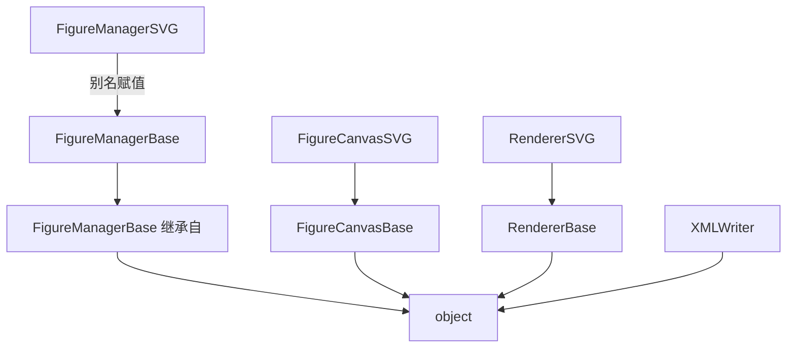

#### 带注释源码

```python
# FigureManagerSVG 是 Matplotlib SVG 后端的图形管理器类
# 实际上是一个简单的别名，直接引用 FigureManagerBase
# FigureManagerBase 是 Matplotlib 后端的基类，负责管理图表窗口和交互

FigureManagerSVG = FigureManagerBase
# 等价于继承自 FigureManagerBase：
# class FigureManagerSVG(FigureManagerBase):
#     pass
```

---

### 相关类的详细信息

#### FigureCanvasSVG

参数：
- 无直接参数，继承自 `FigureCanvasBase`

返回值：无

#### 带注释源码

```python
class FigureCanvasSVG(FigureCanvasBase):
    """
    SVG 格式的画布类，继承自 FigureCanvasBase
    负责处理 SVG 图形的输出和渲染
    """
    filetypes = {'svg': 'Scalable Vector Graphics',
                 'svgz': 'Scalable Vector Graphics'}  # 支持的文件类型

    fixed_dpi = 72  # 固定 DPI 值

    def print_svg(self, filename, *, bbox_inches_restore=None, metadata=None):
        """输出 SVG 文件的核心方法"""
        # 1. 打开文件
        # 2. 设置 DPI 为 72
        # 3. 创建渲染器
        # 4. 执行绘制
        # 5. 完成渲染
        ...

    def print_svgz(self, filename, **kwargs):
        """输出压缩的 SVG 文件（SVGZ 格式）"""
        ...
```

#### RendererSVG

参数：
- `width`：画布宽度
- `height`：画布高度
- `svgwriter`：XML 写入器
- `basename`：文件名基础
- `image_dpi`：图像 DPI
- `metadata`：元数据

返回值：无

#### 带注释源码

```python
class RendererSVG(RendererBase):
    """
    SVG 渲染器类，继承自 RendererBase
    负责将 Matplotlib 图形元素转换为 SVG 格式
    """
    def __init__(self, width, height, svgwriter, basename=None, image_dpi=72,
                 *, metadata=None):
        # 初始化画布尺寸
        self.width = width
        self.height = height
        # 创建 XML 写入器
        self.writer = XMLWriter(svgwriter)
        # 设置图像 DPI
        self.image_dpi = image_dpi
        # 初始化各种缓存字典
        self._groupd = {}
        self._image_counter = itertools.count()
        self._clip_path_ids = {}
        self._clipd = {}
        self._markers = {}
        self._path_collection_id = 0
        self._hatchd = {}
        self._has_gouraud = False
        self._n_gradients = 0
        # 写入 SVG 文件头
        svgwriter.write(svgProlog)
        # 启动 SVG 根元素
        self._start_id = self.writer.start('svg', ...)
        # 写入元数据和默认样式
        self._write_metadata(metadata)
        self._write_default_style()
```

#### XMLWriter

参数：
- `file`：可写的文件对象

返回值：无

#### 带注释源码

```python
class XMLWriter:
    """
    XML 写入器类，用于生成格式化的 SVG/XML 输出
    支持元素、属性、注释、数据等的写入
    """
    def __init__(self, file):
        self.__write = file.write  # 写入方法
        if hasattr(file, "flush"):
            self.flush = file.flush
        self.__open = 0  # 标记开始标签是否打开
        self.__tags = []  # 标签栈
        self.__data = []  # 数据缓冲区
        self.__indentation = " " * 64  # 缩进空格

    def start(self, tag, attrib=None, **extra):
        """打开新元素"""
        ...

    def end(self, tag=None, indent=True):
        """关闭当前元素"""
        ...

    def element(self, tag, text=None, attrib=None, **extra):
        """添加完整元素（start + data + end）"""
        ...

    def flush(self):
        """刷新输出流"""
        pass
```


# _BackendSVG 类详细设计文档

## 一段话描述

`_BackendSVG` 是 Matplotlib 库中的一个后端入口类，作为 SVG（可缩放矢量图形）渲染后端的标识和配置类，负责将 Matplotlib 图形导出为 SVG 格式，通过关联 `FigureCanvasSVG` 画布类来实现 SVG 文件的生成和渲染功能。

## 文件的整体运行流程

该文件是 Matplotlib 的 SVG 后端实现文件，整体运行流程如下：

1. **模块初始化** → 导入必要的依赖库（numpy、PIL、matplotlib 核心模块等）
2. **工具函数定义** → 定义 XML 写入、文本转义、变换生成等辅助函数
3. **XMLWriter 类** → 实现 XML 文档构建功能
4. **RendererSVG 类** → 核心渲染器，实现各种图形元素的 SVG 绘制
5. **FigureCanvasSVG 类** → 画布类，负责文件输出和绘制协调
6. **_BackendSVG 类** → 后端入口类，注册后端并关联画布类

```
┌─────────────────────────────────────────────────────────────────┐
│                     matplotlib.backend_bases                    │
│                          (_Backend 基类)                        │
└─────────────────────────────────────────────────────────────────┘
                              │
                              ▼
┌─────────────────────────────────────────────────────────────────┐
│                        _BackendSVG (本类)                       │
│  - backend_version: 版本号                                      │
│  - FigureCanvas: 关联的画布类                                    │
└─────────────────────────────────────────────────────────────────┘
                              │
                              ▼
┌─────────────────────────────────────────────────────────────────┐
│                      FigureCanvasSVG                            │
│  - print_svg(): 输出 SVG 文件                                    │
│  - print_svgz(): 输出压缩 SVG 文件                               │
│  - draw(): 绘制图形                                             │
└─────────────────────────────────────────────────────────────────┘
                              │
                              ▼
┌─────────────────────────────────────────────────────────────────┐
│                        RendererSVG                              │
│  - draw_path(): 绘制路径                                        │
│  - draw_markers(): 绘制标记                                      │
│  - draw_text(): 绘制文本                                        │
│  - draw_image(): 绘制图像                                        │
│  - ... 其他绘制方法                                             │
└─────────────────────────────────────────────────────────────────┘
```

## 类的详细信息

### _BackendSVG 类

#### 类字段（类属性）

| 字段名称 | 类型 | 描述 |
|---------|------|------|
| `backend_version` | `str` | Matplotlib 库版本号，用于标识后端兼容的 Matplotlib 版本 |
| `FigureCanvas` | `class` | 关联的 SVG 画布类（FigureCanvasSVG），负责处理图形输出 |

#### 类方法

该类为简单数据类，无实例方法。

## 全局变量和全局函数详细信息

### 全局变量

| 名称 | 类型 | 描述 |
|------|------|------|
| `svgProlog` | `str` | SVG 文档的标准 XML 声明和 DOCTYPE 声明，包含版本编码和 DTD 引用 |

### 全局函数

由于 `_BackendSVG` 类本身不包含方法，以下列出文件中与该类相关的关键函数：

| 名称 | 描述 |
|------|------|
| `_generate_transform` | 将变换列表转换为 SVG transform 属性字符串 |
| `_generate_css` | 将字典转换为 CSS 样式字符串 |
| `_short_float_fmt` | 创建浮点数的简短字符串表示，去除尾随零 |

## 关键组件信息

| 组件名称 | 一句话描述 |
|---------|-----------|
| `_BackendSVG` | Matplotlib SVG 后端的入口类，注册后端并关联画布实现 |
| `FigureCanvasSVG` | SVG 画布类，负责文件打印和图形绘制协调 |
| `RendererSVG` | 核心 SVG 渲染器，实现所有图形元素的 SVG 绘制逻辑 |
| `XMLWriter` | XML 文档构建工具类，用于生成 SVG 标记结构 |
| `_Backend.export` | 装饰器，用于注册后端类到 Matplotlib 后端系统 |

## 潜在的技术债务或优化空间

1. **静态类属性**：`backend_version` 和 `FigureCanvas` 作为类属性，在模块加载时即确定，无法动态切换关联的画布类
2. **紧耦合设计**：`_BackendSVG` 与 `FigureCanvasSVG` 强耦合，如需自定义画布行为需继承后端类
3. **配置分散**：SVG 相关配置（如 `svg.fonttype`、`svg.image_inline`、`svg.hashsalt`）散布在多个方法中，缺乏统一的配置管理

## 其它项目

### 设计目标与约束

- **目标**：提供 Matplotlib 图形的 SVG 矢量格式输出能力
- **约束**：
  - 必须遵循 SVG 1.1 规范
  - 需支持嵌入字体（path 模式）和文本（text 模式）两种渲染方式
  - 需支持图像的内联嵌入和外部文件两种模式

### 错误处理与异常设计

- `FigureCanvasSVG.print_svg`: 当 `basename` 为 `None` 且 `svg.image_inline` 为 `False` 时，抛出 `ValueError` 提示无法保存图像数据到文件系统
- `XMLWriter` 方法中使用 `assert` 进行参数校验

### 数据流与状态机

```
用户调用 savefig() 或 print_svg()
           │
           ▼
FigureCanvasSVG.print_svg() 创建渲染器
           │
           ▼
MixedModeRenderer 协调绘制
           │
           ▼
RendererSVG 各 draw_* 方法生成 SVG 元素
           │
           ▼
XMLWriter 写入 XML 结构
           │
           ▼
文件关闭并输出
```

### 外部依赖与接口契约

- **依赖库**：`matplotlib`、`PIL`（Pillow）、`numpy`
- **接口**：
  - 遵循 Matplotlib 后端接口规范（`_Backend` 基类）
  - `FigureCanvasBase` 接口
  - `RendererBase` 接口

---

### `_BackendSVG`

这是 Matplotlib SVG 后端的入口类，通过装饰器 `@_Backend.export` 注册到 Matplotlib 后端系统中。该类非常简洁，仅包含两个类属性：`backend_version` 用于标识兼容的 Matplotlib 版本，`FigureCanvas` 指向负责 SVG 图形输出的画布类。当用户调用 `plt.savefig('figure.svg')` 时，Matplotlib 会通过后端系统找到这个类，并使用其关联的 `FigureCanvasSVG` 来完成 SVG 文件的生成。

参数：无需实例化参数

返回值：该类不返回任何值，仅作为后端注册标识

#### 流程图

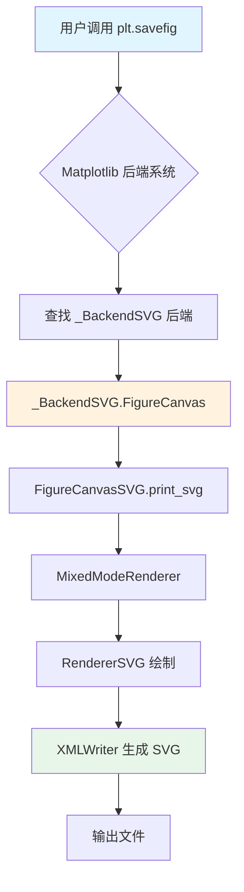

#### 带注释源码

```python
@_Backend.export
class _BackendSVG(_Backend):
    """
    SVG 后端入口类。
    
    该类作为 Matplotlib SVG 后端的标识，通过 @_Backend.export 装饰器
    注册到后端系统中。它关联了用于生成 SVG 输出的画布类和版本信息。
    """
    
    # 标识该后端兼容的 Matplotlib 版本
    backend_version = mpl.__version__
    
    # 关联的画布类，负责处理 SVG 文件的输出和图形的绘制
    # FigureCanvasSVG 继承自 FigureCanvasBase，实现了 print_svg 方法
    FigureCanvas = FigureCanvasSVG
```


### `XMLWriter.__init__`

初始化 XMLWriter 实例，设置写入文件、缓冲区及缩进等基础属性。

参数：

-  `file`：可写入的文本文件类对象（file-like object），用于写入 XML 内容

返回值：`None`，该方法仅初始化实例状态，不返回任何值

#### 流程图

```mermaid
flowchart TD
    A[开始 __init__] --> B[接收 file 参数]
    B --> C[将 file.write 方法保存为 self.__write]
    C --> D{file 是否有 flush 方法?}
    D -->|是| E[将 file.flush 方法保存为 self.flush]
    D -->|否| F[跳过 flush 赋值]
    E --> G[初始化 self.__open = 0]
    F --> G
    G --> H[初始化 self.__tags = []]
    H --> I[初始化 self.__data = []]
    I --> J[初始化 self.__indentation = ' ' * 64]
    J --> K[结束 __init__]
```

#### 带注释源码

```python
def __init__(self, file):
    """
    初始化 XMLWriter 实例。

    Parameters
    ----------
    file : writable text file-like object
        用于写入 XML 输出的文件对象。
    """
    # 保存文件对象的 write 方法用于后续写入操作
    # 使用双下划线前缀表示私有属性
    self.__write = file.write
    
    # 如果文件对象有 flush 方法，则将其保存为实例方法
    # 这样可以支持显式刷新输出缓冲区
    if hasattr(file, "flush"):
        self.flush = file.flush
    
    # 标记当前是否有未关闭的开始标签
    # 0/False 表示没有打开的标签，1/True 表示有未关闭的开始标签
    self.__open = 0  # true if start tag is open
    
    # 存储当前打开的标签栈，用于追踪嵌套的 XML 元素
    # 每调用一次 start() 入栈，调用一次 end() 出栈
    self.__tags = []
    
    # 存储累积的字符数据，在 flush 时统一写入
    # 用于优化写入性能，避免频繁调用底层 write
    self.__data = []
    
    # 用于缩进的空格字符串，长度为 64 个空格
    # 缩进深度基于栈中标签数量动态计算
    self.__indentation = " " * 64
```


### `XMLWriter.__flush`

将内部缓冲区中的数据刷新到输出流，处理待写入的字符数据和未闭合的 XML 标签。

参数：

- `indent`：`bool`，可选参数，默认为 `True`，控制是否在结束标签 `>` 后添加换行符 `>\n`

返回值：`None`，该方法无返回值，直接操作写入流

#### 流程图

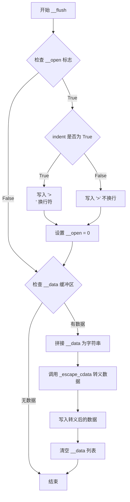

#### 带注释源码

```python
def __flush(self, indent=True):
    # flush internal buffers - 刷新内部缓冲区
    
    # 处理未闭合的开始标签
    if self.__open:
        # 如果有未闭合的标签，根据 indent 参数决定是否换行
        if indent:
            self.__write(">\n")  # 写入闭合尖括号并换行
        else:
            self.__write(">")    # 仅写入闭合尖括号，不换行
        self.__open = 0          # 重置标志，表示标签已闭合
    
    # 处理字符数据缓冲区
    if self.__data:
        # 将累积的字符数据拼接成完整字符串
        data = ''.join(self.__data)
        # 使用 _escape_cdata 转义 XML 特殊字符（&、<、>）
        self.__write(_escape_cdata(data))
        # 清空数据缓冲区，为下一个元素做准备
        self.__data = []
```


### XMLWriter.start

打开一个新的XML元素并返回用于后续关闭的元素标识符。该方法支持通过关键字参数或字典方式传递属性，并自动处理XML转义和缩进。

参数：

- `tag`：`str`，XML元素标签名称
- `attrib`：`dict`，可选，属性字典，用于指定元素的属性
- `**extra`：可变关键字参数，用于传递额外的属性，属性名作为关键字，属性值作为值

返回值：`int`，元素标识符（基于当前标签栈的索引），可传递给`close`方法以关闭到该元素

#### 流程图

```mermaid
flowchart TD
    A[开始 start 方法] --> B{attrib 是否为 None}
    B -->|是| C[创建空字典 attrib = {}]
    B -->|否| D[使用传入的 attrib]
    C --> E[调用 __flush 清理缓冲区]
    D --> E
    E --> F[对 tag 进行 XML 转义]
    F --> G[清空 __data 列表]
    G --> H[将 tag 追加到 __tags 栈]
    H --> I[写入缩进]
    I --> J[写入开始标签 <tag]
    J --> K{遍历 attrib 和 extra 的键值对}
    K -->|值不为空| L[对键值进行转义和引号处理]
    L --> M[写入属性]
    M --> K
    K -->|遍历完成| N[设置 __open = 1 表示标签未关闭]
    N --> O[返回标签栈长度-1 作为标识符]
    O --> P[结束]
```

#### 带注释源码

```python
def start(self, tag, attrib=None, **extra):
    """
    Open a new element.  Attributes can be given as keyword
    arguments, or as a string/string dictionary. The method returns
    an opaque identifier that can be passed to the :meth:`close`
    method, to close all open elements up to and including this one.

    Parameters
    ----------
    tag
        Element tag.
    attrib
        Attribute dictionary.  Alternatively, attributes can be given as
        keyword arguments.

    Returns
    -------
    An element identifier.
    """
    # 如果未提供属性字典，则初始化为空字典
    if attrib is None:
        attrib = {}
    
    # 刷新内部缓冲区，确保之前的元素数据被写入
    self.__flush()
    
    # 对标签进行XML CDATA转义，防止特殊字符问题
    tag = _escape_cdata(tag)
    
    # 清空数据缓冲区，准备接收新元素的内容
    self.__data = []
    
    # 将当前标签压入标签栈，用于追踪嵌套结构
    self.__tags.append(tag)
    
    # 根据标签嵌套深度计算缩进量并写入
    self.__write(self.__indentation[:len(self.__tags) - 1])
    
    # 写入开始标签的起始部分 <tag
    self.__write(f"<{tag}")
    
    # 遍历合并后的属性字典，写入所有属性
    for k, v in {**attrib, **extra}.items():
        if v:  # 只写入非空属性值
            # 对属性名进行转义
            k = _escape_cdata(k)
            # 对属性值进行引号转义处理
            v = _quote_escape_attrib(v)
            # 写入属性，格式: key="value"
            self.__write(f' {k}={v}')
    
    # 设置标志位，表示开始标签尚未关闭（等待写入内容或关闭标签）
    self.__open = 1
    
    # 返回当前标签栈的长度-1，作为该元素的唯一标识符
    # 可用于后续调用 close 方法来关闭到该元素
    return len(self.__tags) - 1
```


### XMLWriter.comment

该方法用于向 XML 输出流中添加一个注释节点，会先刷新内部缓冲区，然后写入带有适当缩进的 XML 注释格式字符串。

参数：

- `comment`：`str`，要添加到输出流的注释文本内容

返回值：`None`，无返回值，仅执行写入操作

#### 流程图

```mermaid
flowchart TD
    A[开始 comment 方法] --> B{检查并刷新缓冲区}
    B --> C[获取当前标签深度对应的缩进字符串]
    C --> D[对 comment 内容进行 XML 注释转义]
    D --> E[写入缩进 + 注释格式: &lt;!-- 转义后的内容 --&gt;\n]
    E --> F[结束]
    
    B -->|调用 __flush()| B1[检查是否有未关闭的开始标签]
    B1 -->|有| B2[写入 > 或 >\n 关闭标签]
    B1 -->|无| B3[检查是否有待写入的字符数据]
    B3 -->|有| B4[写入字符数据并清空缓冲区]
    B3 -->|无| B5[直接返回]
```

#### 带注释源码

```python
def comment(self, comment):
    """
    Add a comment to the output stream.

    Parameters
    ----------
    comment : str
        Comment text.
    """
    # 首先调用 __flush() 方法，将之前积累的字符数据刷新到输出流
    # 同时关闭任何未关闭的开始标签
    self.__flush()
    
    # 根据当前标签栈的深度获取对应数量的缩进空格
    # __tags 列表存储了当前打开的所有标签，用于确定缩进级别
    self.__write(self.__indentation[:len(self.__tags)])
    
    # 使用 _escape_comment 函数对注释内容进行 XML 安全转义
    # 然后写入标准 XML 注释格式: <!-- 内容 -->\n
    self.__write(f"<!-- {_escape_comment(comment)} -->\n")
```


### XMLWriter.data

该方法用于向XML输出流添加字符数据（Character Data），将传入的文本内容追加到内部缓冲区中，等待后续 flush 操作时统一写入输出流。

参数：

- `text`：`str`，需要添加到输出流的字符数据

返回值：`None`，该方法不返回任何值

#### 流程图

```mermaid
flowchart TD
    A[开始 data 方法] --> B{检查 text 参数}
    B -->|有效文本| C[将 text 追加到 __data 缓冲区]
    C --> D[结束方法]
    B -->|空文本| D
```

#### 带注释源码

```python
def data(self, text):
    """
    Add character data to the output stream.

    Parameters
    ----------
    text : str
        Character data.
    """
    # 将传入的文本追加到内部缓冲区 __data 中
    # 注意：文本不会立即写入输出流，而是存储在缓冲区中
    # 直到调用 __flush 方法时才会被处理和写入
    self.__data.append(text)
```


### `XMLWriter.end`

关闭当前元素（由最近的`start`方法打开）。

参数：

- `tag`：可选，字符串类型，元素标签。如果提供，标签必须与开始标签匹配；如果省略，则关闭当前元素。
- `indent`：布尔值，默认为`True`，是否缩进输出。

返回值：无返回值（`None`），该方法直接写入输出流。

#### 流程图

```mermaid
flowchart TD
    A[开始 end 方法] --> B{tag 参数是否提供?}
    B -->|是| C{检查标签栈是否为空}
    B -->|否| D{检查标签栈是否为空}
    C -->|栈为空| E[抛出 AssertionError: unbalanced end(tag)]
    C -->|栈非空| F{检查 tag 是否匹配栈顶标签}
    F -->|不匹配| G[抛出 AssertionError: expected end(...), got ...]
    F -->|匹配| H[从栈中弹出标签]
    D -->|栈为空| I[抛出 AssertionError: unbalanced end()]
    D -->|栈非空| H
    H --> J{是否有未 flush 的数据?}
    J -->|是| K[调用 __flush 方法处理数据]
    J -->|否| L{start 标签是否仍打开?}
    K --> M
    L -->|是| N[关闭开始标签, 写入 /> 并换行, 返回]
    L -->|否| M
    M --> O{indent 为 true?}
    N --> O
    O -->|是| P[写入缩进]
    O -->|否| Q
    P --> R[写入闭合标签并换行]
    Q --> S[结束]
    R --> S
```

#### 带注释源码

```python
def end(self, tag=None, indent=True):
    """
    Close the current element (opened by the most recent call to
    :meth:`start`).

    Parameters
    ----------
    tag
        Element tag.  If given, the tag must match the start tag.  If
        omitted, the current element is closed.
    indent : bool, default: True
    """
    # 如果提供了 tag 参数，验证标签栈非空且 tag 匹配栈顶
    if tag:
        # 确保标签栈不为空（防止多余的 end 调用）
        assert self.__tags, f"unbalanced end({tag})"
        # 确保提供的 tag 与栈顶标签匹配（需要转义后比较）
        assert _escape_cdata(tag) == self.__tags[-1], \
            f"expected end({self.__tags[-1]}), got {tag}"
    else:
        # 如果没有提供 tag，确保标签栈非空
        assert self.__tags, "unbalanced end()"
    
    # 从标签栈中弹出当前标签
    tag = self.__tags.pop()
    
    # 如果有待输出的字符数据，先 flush 数据
    if self.__data:
        self.__flush(indent)
    # 否则，如果开始标签仍然打开（自闭合标签情况）
    elif self.__open:
        self.__open = 0  # 标记开始标签已关闭
        self.__write("/>\n")  # 输出自闭合标签并返回
        return
    
    # 如果需要缩进，输出适当数量的缩进空格
    if indent:
        self.__write(self.__indentation[:len(self.__tags)])
    
    # 输出闭合标签并换行
    self.__write(f"</{tag}>\n")
```


### `XMLWriter.close`

关闭打开的元素，直到（并包括）由给定标识符指定的元素。该方法通过比较内部标签栈的长度与给定id，持续调用`end()`方法逐层关闭标签，直至达到指定深度。

**参数：**

- `id`：`int`，元素标识符，由`start()`方法返回，用于指定需要关闭到的元素层级。

**返回值：** `None`，无返回值。

#### 流程图

```mermaid
graph TD
    A[开始 close] --> B{len(self.__tags) > id?}
    B -->|是| C[调用 self.end 关闭顶层元素]
    C --> B
    B -->|否| D[结束]
    
    style A fill:#f9f,stroke:#333
    style D fill:#9f9,stroke:#333
```

#### 带注释源码

```python
def close(self, id):
    """
    Close open elements, up to (and including) the element identified
    by the given identifier.

    Parameters
    ----------
    id
        Element identifier, as returned by the :meth:`start` method.
    """
    # 当标签栈深度大于目标id时，持续关闭最内层的标签
    # id是start()方法返回的索引值，对应需要保留的标签数量
    while len(self.__tags) > id:
        self.end()
```


### `XMLWriter.element`

该方法用于在XML输出流中添加一个完整的元素节点，等价于依次调用`start`、`data`和`end`方法的便捷封装。当需要生成自闭合标签或包含文本内容的元素时，可使用此方法一次性完成操作。

**参数：**

- `tag`：`str`，元素标签名称
- `text`：`str | None`，可选的字符数据内容，元素内部的文本
- `attrib`：`dict | None`，可选的属性字典，以键值对形式存储XML属性
- `**extra`：`Any`，额外的关键字参数，将作为属性添加到元素中

**返回值：**`None`，该方法无返回值

#### 流程图

```mermaid
flowchart TD
    A[开始 element] --> B{attrib is None?}
    B -->|是| C[attrib = {}]
    B -->|否| D[保持attrib原值]
    C --> E[调用 self.start]
    D --> E
    E --> F[tag, attrib, **extra]
    F --> G{text is not None?}
    G -->|是| H[调用 self.data]
    G -->|否| I[跳过data]
    H --> J[调用 self.end indent=False]
    I --> J
    J --> K[结束]
```

#### 带注释源码

```python
def element(self, tag, text=None, attrib=None, **extra):
    """
    添加一个完整的元素。这相当于依次调用 :meth:`start`、
    :meth:`data` 和 :meth:`end`。*text* 参数可以省略。
    
    Parameters
    ----------
    tag : str
        元素标签名称
    text : str, optional
        元素的文本内容，如果为 None 或空则不添加文本
    attrib : dict, optional
        元素属性的字典形式
    **extra : Any
        额外的关键字参数，会被当作属性添加到元素中
    """
    # 如果 attrib 为 None，初始化为空字典，避免后续代码中反复检查
    if attrib is None:
        attrib = {}
    
    # 调用 start 方法打开元素标签，处理属性和额外参数
    # 这会写入 <tag attr1="value1" ...> 格式的开始标签
    self.start(tag, attrib, **extra)
    
    # 如果提供了文本内容，则添加到元素中
    # 文本内容会被转义后写入
    if text:
        self.data(text)
    
    # 调用 end 方法关闭元素，使用 indent=False 表示不缩进
    # 对于紧凑格式的元素（如 <tag>text</tag>），不使用缩进更美观
    self.end(indent=False)
```


### XMLWriter.flush

该方法用于刷新输出流。在 `XMLWriter` 类的构造函数中，如果传入的文件对象具有 `flush` 方法，则会将该方法绑定到 `self.flush` 上，因此实际调用的是底层文件对象的 `flush` 方法。

参数：无

返回值：无（`None`），实际上调用底层文件对象的 `flush()` 方法

#### 流程图

```mermaid
flowchart TD
    A[调用 XMLWriter.flush] --> B{构造函数中是否绑定了 file.flush?}
    B -->|是| C[调用 file.flush]
    B -->|否| D[无操作]
    C --> E[返回]
    D --> E
```

#### 带注释源码

```python
def flush(self):
    """Flush the output stream."""
    # 该方法在构造函数中被动态替换为底层文件对象的 flush 方法
    # 如果底层文件没有 flush 方法，则此方法体不会被执行（实际上不会被调用）
    pass  # replaced by the constructor
```

#### 说明

1. **设计意图**：`XMLWriter` 类使用了**委托模式**，将 `flush` 操作委托给底层写入文件对象
2. **动态绑定**：在 `__init__` 方法中通过 `if hasattr(file, "flush"): self.flush = file.flush` 实现动态绑定
3. **兼容性**：如果底层文件对象没有 `flush` 方法（如某些 `StringIO` 实现），则 `XMLWriter` 实例不会有 `flush` 方法可用，调用时可能会抛出 `AttributeError`
4. **调用场景**：在 `RendererSVG.finalize()` 方法中调用了 `self.writer.flush()` 来确保所有数据写入底层文件


### RendererSVG.__init__

该方法是 `RendererSVG` 类的构造函数，负责初始化 SVG 渲染器的核心状态。它设置了渲染尺寸、XML 编写器、图像 DPI、basename，以及各种内部数据结构（如剪贴路径、标记、图案等），并写入 SVG 文档的元数据和默认样式。

参数：

- `width`：`float`，SVG 画布的宽度
- `height`：`float`，SVG 画布的高度
- `svgwriter`：文件对象，用于写入 SVG 输出的可写文件对象
- `basename`：`str`，可选，用于图像文件名的基础路径，默认为 None
- `image_dpi`：`int`，光栅化图像的 DPI，默认为 72
- `metadata`：`dict`，可选，SVG 文件的元数据字典

返回值：`None`，该方法为构造函数，无返回值

#### 流程图

```mermaid
flowchart TD
    A[开始 __init__] --> B[设置 self.width 和 self.height]
    B --> C[创建 XMLWriter 并赋值给 self.writer]
    C --> D[设置 self.image_dpi]
    D --> E{basename 是否为 None?}
    E -->|是| F[尝试从 svgwriter.name 获取 basename]
    F --> G{basename 是 str?}
    G -->|否| H[设置 basename 为空字符串]
    G -->|是| I[使用获取的 basename]
    E -->|否| J[使用传入的 basename]
    I --> K[初始化各种内部字典]
    K --> L[调用父类 RendererBase.__init__]
    L --> M[初始化 self._glyph_map]
    M --> N[格式化 width 和 height 为短浮点数字符串]
    N --> O[写入 SVG Prolog]
    O --> P[创建 SVG 根元素并获取开始标签 ID]
    P --> Q[调用 _write_metadata 写入元数据]
    Q --> R[调用 _write_default_style 写入默认样式]
    R --> S[结束 __init__]
```

#### 带注释源码

```python
def __init__(self, width, height, svgwriter, basename=None, image_dpi=72,
             *, metadata=None):
    # 存储 SVG 画布的宽度和高度
    self.width = width
    self.height = height
    
    # 创建 XMLWriter 实例用于生成 SVG XML 内容
    self.writer = XMLWriter(svgwriter)
    
    # 存储图像 DPI，用于光栅化图像的缩放计算
    self.image_dpi = image_dpi  # actual dpi at which we rasterize stuff

    # 如果未提供 basename，尝试从文件对象获取文件名
    if basename is None:
        basename = getattr(svgwriter, "name", "")
        if not isinstance(basename, str):
            basename = ""
    self.basename = basename

    # 初始化各种内部数据结构用于跟踪 SVG 元素
    self._groupd = {}              # 存储组信息
    self._image_counter = itertools.count()  # 图像计数器
    self._clip_path_ids = {}       # 剪贴路径 ID 映射
    self._clipd = {}               # 剪贴路径定义
    self._markers = {}             # 标记定义
    self._path_collection_id = 0  # 路径集合 ID
    self._hatchd = {}               # 阴影图案定义
    self._has_gouraud = False      # 是否使用了 Gouraud 着色
    self._n_gradients = 0          # 渐变数量计数器

    # 调用父类 RendererBase 的初始化方法
    super().__init__()
    
    # 初始化字形映射字典
    self._glyph_map = dict()
    
    # 将高度和宽度格式化为短浮点数字符串（去除尾随零）
    str_height = _short_float_fmt(height)
    str_width = _short_float_fmt(width)
    
    # 写入 SVG 文档声明和 DOCTYPE
    svgwriter.write(svgProlog)
    
    # 启动 SVG 根元素，获取用于后续关闭的开始标签 ID
    self._start_id = self.writer.start(
        'svg',
        width=f'{str_width}pt',
        height=f'{str_height}pt',
        viewBox=f'0 0 {str_width} {str_height}',
        xmlns="http://www.w3.org/2000/svg",
        version="1.1",
        id=mpl.rcParams['svg.id'],
        attrib={'xmlns:xlink': "http://www.w3.org/1999/xlink"})
    
    # 写入 SVG 元数据（标题、创建者、日期等）
    self._write_metadata(metadata)
    
    # 写入默认样式定义
    self._write_default_style()
```


### RendererSVG._get_clippath_id

该方法为给定的剪贴路径对象返回一个稳定且唯一的标识符，用于在当前渲染上下文中标识剪贴路径。通过维护一个内部字典`_clip_path_ids`，该方法确保相同的剪贴路径对象始终映射到相同的整数ID，从而实现可重现的SVG输出。

参数：

- `self`：RendererSVG，隐式的类实例引用
- `clippath`：任意对象，需要获取唯一标识符的剪贴路径对象

返回值：`int`，剪贴路径对象的唯一整数标识符

#### 流程图

```mermaid
flowchart TD
    A[开始] --> B{clippath 是否在 _clip_path_ids 中?}
    B -->|否| C[将 clippath 添加到字典]
    C --> D[ID = 字典当前长度]
    D --> E[返回 ID]
    B -->|是| E
    E --> F[结束]
```

#### 带注释源码

```python
def _get_clippath_id(self, clippath):
    """
    Returns a stable and unique identifier for the *clippath* argument
    object within the current rendering context.

    This allows plots that include custom clip paths to produce identical
    SVG output on each render, provided that the :rc:`svg.hashsalt` config
    setting and the ``SOURCE_DATE_EPOCH`` build-time environment variable
    are set to fixed values.
    """
    # 检查剪贴路径是否已经存在于内部字典中
    if clippath not in self._clip_path_ids:
        # 如果不存在，分配一个新的唯一ID（基于当前字典的大小）
        # 这确保了相同对象的ID在多次渲染时保持稳定
        self._clip_path_ids[clippath] = len(self._clip_path_ids)
    # 返回剪贴路径对应的唯一标识符
    return self._clip_path_ids[clippath]
```


### RendererSVG.finalize

该方法是SVG渲染器的最终化方法，负责完成SVG输出的收尾工作，包括写入所有累积的剪切路径定义、阴影图案定义，关闭SVG根元素并刷新输出流。

参数： 无

返回值：`None`，无返回值

#### 流程图

```mermaid
flowchart TD
    A[开始 finalize] --> B{检查是否有剪切路径}
    B -->|是| C[_write_clips写入剪切路径定义]
    B -->|否| D{检查是否有阴影}
    C --> D
    D -->|是| E[_write_hatches写入阴影图案定义]
    D -->|否| F[writer.close关闭SVG根元素]
    E --> F
    F --> G[writer.flush刷新输出流]
    G --> H[结束]
```

#### 带注释源码

```python
def finalize(self):
    """
    完成SVG渲染的最终化操作。
    
    此方法在所有绘图操作完成后调用，负责：
    1. 写入所有在渲染过程中累积的剪切路径(clip path)定义到SVG的<defs>中
    2. 写入所有在渲染过程中累积的阴影(hatch)图案定义到SVG的<defs>中
    3. 关闭SVG根元素(<svg>)标签
    4. 刷新输出流以确保所有数据被写出
    """
    # 调用内部方法将累积的剪切路径写入SVG
    self._write_clips()
    
    # 调用内部方法将累积的阴影图案写入SVG
    self._write_hatches()
    
    # 关闭在__init__中打开的SVG根元素
    # self._start_id是start()方法返回的元素标识符
    self.writer.close(self._start_id)
    
    # 刷新XML写入器的内部缓冲区
    self.writer.flush()
```


### `RendererSVG._write_metadata`

该方法负责将元数据写入SVG文件，遵循都柏林核心元数据倡议(DCMI)和知识共享权利表达语言(CC REL)标准，主要用于与Inkscape等矢量图形编辑器的兼容性。它处理多种类型的元数据字段（包括标题、日期、创建者、关键词等），并支持单值和多值字段，同时提供日期的自动生成和格式转换功能。

参数：

- `metadata`：`dict` 或 `None`，用户提供的元数据字典，键为元数据名称，值可以是字符串、日期、日期时间或字符串/日期/日期时间的可迭代对象。如果为 `None`，则使用空字典。

返回值：`None`，该方法直接写入SVG文件，不返回任何值。

#### 流程图

```mermaid
flowchart TD
    A[开始 _write_metadata] --> B{metadata is None?}
    B -->|是| C[创建空字典]
    B -->|否| D[使用传入的metadata]
    C --> E[设置默认元数据]
    D --> E
    E --> F{Title in metadata?}
    F -->|是| G[验证Title是字符串]
    G --> H[写入title元素]
    F -->|否| I{Date in metadata?}
    H --> I
    I --> J{date is not None?}
    J -->|是| K{date是str?}
    J -->|否| L{有SOURCE_DATE_EPOCH环境变量?}
    K -->|是| M[dates = [date]]
    K -->|否| N{date是datetime/date?}
    N -->|是| M
    N -->|否| O{date可迭代?}
    O -->|是| P[遍历date处理每个元素]
    O -->|否| Q[raise TypeError]
    P --> R[dates添加处理后的日期]
    M --> S[metadata['Date'] = '/'.join(dates)]
    L -->|是| T[从环境变量获取日期时间]
    L -->|否| U[使用当前日期时间]
    T --> V[metadata['Date'] = ISO格式日期]
    U --> V
    S --> W{Type in metadata?}
    V --> W
    W -->|是| X[写入dc:type元素]
    W -->|否| Y[遍历单值字段]
    X --> Y
    Y --> Z{字段在metadata中?}
    Z -->|是| AA[验证是字符串]
    AA --> AB[写入dc:元素]
    Z -->|否| AC{还有更多单值字段?}
    AB --> AC
    AC -->|是| Y
    AC -->|否| AD{Agent字段在metadata中?}
    AD -->|是| AE{agents是str?}
    AE -->|是| AF[agents = [agents]]
    AE -->|否| AG[验证是str的可迭代对象]
    AF --> AH[写入Agent元素]
    AG --> AH
    AD -->|否| AI{Keywords in metadata?}
    AH --> AI
    AI -->|是| AJ{keywords是str?}
    AJ -->|是| AK[keywords = [keywords]]
    AJ -->|否| AL[验证是str的可迭代对象]
    AK --> AM[写入关键词元素]
    AL --> AM
    AI -->|否| AN{mid is not None?}
    AM --> AN
    AN -->|是| AO[writer.close(mid)]
    AN -->|否| AP{metadata非空?}
    AO --> AP
    AP -->|是| AQ[raise ValueError]
    AP -->|否| AR[结束]
    AQ --> AR
```

#### 带注释源码

```python
def _write_metadata(self, metadata):
    # 添加元数据，遵循都柏林核心元数据倡议(DCMI)和
    # 创意Commons权利表达语言。主要用于与Inkscape的兼容性。
    
    # 如果没有提供元数据，则使用空字典
    if metadata is None:
        metadata = {}
    
    # 设置默认的元数据值，包括SVG格式类型和Matplotlib创建者信息
    metadata = {
        'Format': 'image/svg+xml',
        'Type': 'http://purl.org/dc/dcmitype/StillImage',
        'Creator':
            f'Matplotlib v{mpl.__version__}, https://matplotlib.org/',
        **metadata  # 用户提供的元数据会覆盖默认值
    }
    writer = self.writer  # 获取XML写入器实例

    # 处理Title元素
    if 'Title' in metadata:
        title = metadata['Title']
        _check_is_str(title, 'Title')  # 验证Title必须是字符串
        writer.element('title', text=title)  # 写入title元素

    # 处理Date元素的特殊逻辑
    date = metadata.get('Date', None)
    if date is not None:
        # 用户明确提供了日期
        if isinstance(date, str):
            dates = [date]
        elif isinstance(date, (datetime.datetime, datetime.date)):
            dates = [date.isoformat()]
        elif np.iterable(date):
            # 处理日期的可迭代对象
            dates = []
            for d in date:
                if isinstance(d, str):
                    dates.append(d)
                elif isinstance(d, (datetime.datetime, datetime.date)):
                    dates.append(d.isoformat())
                else:
                    raise TypeError(
                        f'Invalid type for Date metadata. '
                        f'Expected iterable of str, date, or datetime, '
                        f'not {type(d)}.')
        else:
            raise TypeError(f'Invalid type for Date metadata. '
                            f'Expected str, date, datetime, or iterable '
                            f'of the same, not {type(date)}.')
        # 将日期连接成字符串格式
        metadata['Date'] = '/'.join(dates)
    elif 'Date' not in metadata:
        # 用户没有设置Date，且没有明确设置为None
        # 从SOURCE_DATE_EPOCH环境变量获取源代码日期（用于可重现构建）
        # 参考: https://reproducible-builds.org/specs/source-date-epoch/
        date = os.getenv("SOURCE_DATE_EPOCH")
        if date:
            date = datetime.datetime.fromtimestamp(int(date), datetime.timezone.utc)
            metadata['Date'] = date.replace(tzinfo=UTC).isoformat()
        else:
            # 使用当前日期
            metadata['Date'] = datetime.datetime.today().isoformat()

    # 定义内部函数以确保metadata元素存在
    mid = None  # metadata元素的ID
    def ensure_metadata(mid):
        """确保metadata容器已创建，如果需要则创建它"""
        if mid is not None:
            return mid
        # 创建metadata根元素
        mid = writer.start('metadata')
        # 创建RDF容器，设置必要的XML命名空间
        writer.start('rdf:RDF', attrib={
            'xmlns:dc': "http://purl.org/dc/elements/1.1/",
            'xmlns:cc': "http://creativecommons.org/ns#",
            'xmlns:rdf': "http://www.w3.org/1999/02/22-rdf-syntax-ns#",
        })
        writer.start('cc:Work')  # 创建Creative Commons Work元素
        return mid

    # 处理Type元素（URI类型）
    uri = metadata.pop('Type', None)
    if uri is not None:
        mid = ensure_metadata(mid)
        writer.element('dc:type', attrib={'rdf:resource': uri})

    # 处理单值字段（Title, Coverage, Date, Description, Format, 
    # Identifier, Language, Relation, Source）
    for key in ['Title', 'Coverage', 'Date', 'Description', 'Format',
                'Identifier', 'Language', 'Relation', 'Source']:
        info = metadata.pop(key, None)
        if info is not None:
            mid = ensure_metadata(mid)
            _check_is_str(info, key)  # 验证必须是字符串
            writer.element(f'dc:{key.lower()}', text=info)

    # 处理多值代理字段（Creator, Contributor, Publisher, Rights）
    for key in ['Creator', 'Contributor', 'Publisher', 'Rights']:
        agents = metadata.pop(key, None)
        if agents is None:
            continue

        # 如果是单个字符串，转换为列表
        if isinstance(agents, str):
            agents = [agents]

        _check_is_iterable_of_str(agents, key)  # 验证是字符串的可迭代对象
        # 现在我们知道agents是字符串的可迭代对象
        mid = ensure_metadata(mid)
        writer.start(f'dc:{key.lower()}')
        for agent in agents:
            writer.start('cc:Agent')
            writer.element('dc:title', text=agent)
            writer.end('cc:Agent')
        writer.end(f'dc:{key.lower()}')

    # 处理多值关键词字段
    keywords = metadata.pop('Keywords', None)
    if keywords is not None:
        if isinstance(keywords, str):
            keywords = [keywords]
        _check_is_iterable_of_str(keywords, 'Keywords')
        # 现在我们知道keywords是字符串的可迭代对象
        mid = ensure_metadata(mid)
        writer.start('dc:subject')
        writer.start('rdf:Bag')  # RDF Bag用于存储无序列表
        for keyword in keywords:
            writer.element('rdf:li', text=keyword)
        writer.end('rdf:Bag')
        writer.end('dc:subject')

    # 如果创建了metadata元素，关闭它
    if mid is not None:
        writer.close(mid)

    # 检查是否有未知的元数据键
    if metadata:
        raise ValueError('Unknown metadata key(s) passed to SVG writer: ' +
                         ','.join(metadata))
```


### `RendererSVG._write_default_style`

该方法用于在 SVG 输出中写入默认的 CSS 样式定义，设置了 stroke-linejoin 为 'round'、stroke-linecap 为 'butt'，以确保所有 SVG 元素的默认渲染样式一致。

参数：

- `self`：`RendererSVG`，调用此方法的 RendererSVG 实例本身

返回值：`None`，该方法不返回任何值，仅向 SVG writer 写入内容

#### 流程图

```mermaid
flowchart TD
    A[开始] --> B[获取 self.writer]
    B --> C[调用 _generate_css 生成默认样式字典]
    C --> D[使用 writer.start 开启 'defs' 标签]
    E[构建 CSS 字符串: stroke-linejoin: round; stroke-linecap: butt]
    D --> E
    E --> F[使用 writer.element 写入 style 元素]
    F --> G[使用 writer.end 关闭 'defs' 标签]
    G --> H[结束]
```

#### 带注释源码

```python
def _write_default_style(self):
    """
    写入 SVG 的默认样式定义到输出流中。
    该方法在 SVG 文档的 <defs> 部分添加全局 CSS 样式，
    为所有元素设置默认的 stroke-linejoin 和 stroke-linecap 属性。
    """
    # 获取 XMLWriter 实例，用于生成 SVG 输出
    writer = self.writer
    
    # 构建默认样式字典，包含 stroke-linejoin 和 stroke-linecap 两个属性
    # stroke-linejoin: 设置线条连接点的样式，'round' 表示圆角
    # stroke-linecap: 设置线条端点的样式，'butt' 表示平头（无额外延伸）
    default_style = _generate_css({
        'stroke-linejoin': 'round',
        'stroke-linecap': 'butt'})
    
    # 开启 <defs> 标签，用于定义可重用的 SVG 元素（如渐变、滤镜、样式等）
    writer.start('defs')
    
    # 写入 <style> 元素，type 指定为 'text/css'
    # 样式内容使用 CSS 通配符 * 应用于所有 SVG 元素
    # 格式: *{stroke-linejoin: round; stroke-linecap: butt}
    writer.element('style', type='text/css', text='*{%s}' % default_style)
    
    # 关闭 </defs> 标签
    writer.end('defs')
```


### `RendererSVG._make_id`

生成SVG中使用的唯一标识符，通过对内容进行SHA256哈希并结合类型前缀和盐值来确保标识符的唯一性和可重复性。

参数：

- `type`：`str`，用于标识符的前缀字符（如 'h'、'p'、'm' 等）
- `content`：任意类型，要生成ID的内容，通常是元组或字典等可哈希对象

返回值：`str`，由类型前缀和SHA256哈希值前10位十六进制字符组成的唯一标识符

#### 流程图

```mermaid
flowchart TD
    A[开始 _make_id] --> B{获取 salt}
    B --> C[rcParams['svg.hashsalt']]
    C --> D{salt 是否为 None?}
    D -->|是| E[生成新的 UUID 作为 salt]
    D -->|否| F[使用配置的 salt]
    E --> G[创建 SHA256 哈希对象]
    F --> G
    G --> H[将 salt 编码为 UTF-8 并更新哈希]
    H --> I[将 content 转换为字符串并编码为 UTF-8]
    I --> J[计算哈希的十六进制摘要]
    J --> K[取前10位字符]
    K --> L[拼接 type 前缀和哈希值]
    L --> M[返回最终标识符]
```

#### 带注释源码

```python
def _make_id(self, type, content):
    """
    生成SVG元素的唯一标识符。
    
    Parameters
    ----------
    type : str
        标识符的前缀，用于区分不同类型的元素（如 'h' 表示 hatch 填充，
        'p' 表示 clip path，'m' 表示 marker 等）
    content : 任意类型
        要生成唯一ID的内容，通常是元组或字典，包含需要哈希的元素信息。
        该内容会转换为字符串后进行哈希处理。
    
    Returns
    -------
    str
        格式为 '{type}{hash}' 的唯一标识符，其中 hash 是 SHA256 哈希值
        的前10位十六进制字符。
    """
    # 从 matplotlib 配置中获取盐值，用于确保哈希值的随机性或可重复性
    salt = mpl.rcParams['svg.hashsalt']
    
    # 如果没有配置盐值，则使用随机的 UUID
    # 这样每次渲染都会生成不同的标识符，确保唯一性
    if salt is None:
        salt = str(uuid.uuid4())
    
    # 创建 SHA256 哈希对象
    m = hashlib.sha256()
    
    # 首先用盐值更新哈希，这样可以防止通过分析哈希值推断原始内容
    m.update(salt.encode('utf8'))
    
    # 将内容转换为字符串后更新哈希
    # 这样相同的内容总是产生相同的哈希值（当 salt 相同时）
    m.update(str(content).encode('utf8'))
    
    # 生成最终的标识符：类型前缀 + 哈希值的前10位
    # 取前10位可以缩短标识符长度，同时保持足够的唯一性
    # SHA256 的十六进制表示每个字符代表4位，10个字符 = 40位 = 约1万亿个可能值
    return f'{type}{m.hexdigest()[:10]}'
```


### RendererSVG._make_flip_transform

该方法用于创建翻转变换，解决matplotlib坐标系（Y轴向上）与SVG坐标系（Y轴向下）之间的差异。通过组合缩放（Y轴翻转）和平移变换，确保图形在SVG中正确渲染。

参数：

- `transform`：`Affine2DBase`，输入的变换矩阵，用于与翻转变换组合

返回值：`Affine2D`，组合后的变换矩阵，包含原始变换和Y轴翻转变换

#### 流程图

```mermaid
flowchart TD
    A[开始] --> B[接收输入变换 transform]
    B --> C[创建新的 Affine2D 变换]
    C --> D[执行 scale 变换: (1, -1) 翻转Y轴]
    D --> E[执行 translate 变换: (0, self.height) 调整Y位置]
    E --> F[组合变换: transform + flip_transform]
    F --> G[返回组合后的变换]
    G --> H[结束]
```

#### 带注释源码

```python
def _make_flip_transform(self, transform):
    """
    创建带有翻转的变换，用于将matplotlib坐标系转换为SVG坐标系。
    
    matplotlib使用笛卡尔坐标系（Y轴向上），而SVG使用屏幕坐标系（Y轴向下）。
    此方法通过组合缩放和平移变换来实现坐标转换。
    
    Parameters
    ----------
    transform : Affine2DBase
        输入的变换矩阵，表示需要应用的原始变换
    
    Returns
    -------
    Affine2D
        组合后的变换矩阵，包含原始变换和Y轴翻转变换
    """
    # transform: 输入的变换对象
    # Affine2D().scale(1, -1): 创建Y轴翻转变换（X轴缩放1倍，Y轴缩放-1倍）
    # .translate(0, self.height): 翻转后需要平移以保持位置正确
    # + 运算符用于组合两个变换矩阵
    return transform + Affine2D().scale(1, -1).translate(0, self.height)
```


### RendererSVG._get_hatch

该方法用于获取或创建填充图案（hatch pattern）的唯一标识符。如果给定图形上下文和填充颜色的组合已经存在，则返回已有的标识符；否则创建新的标识符并缓存。

参数：

- `gc`：`GraphicsContextBase`，图形上下文对象，用于获取阴影线样式、边缘颜色、线宽等信息
- `rgbFace`：`tuple` 或 `None`，填充面的 RGB/RGBA 颜色值

返回值：`str`，返回阴影线图案的唯一标识符，用于在 SVG 中引用该图案

#### 流程图

```mermaid
flowchart TD
    A[开始 _get_hatch] --> B{rgbFace is not None?}
    B -->|Yes| C[将 rgbFace 转换为 tuple]
    B -->|No| D[继续]
    C --> D
    D --> E[获取边缘颜色 edge]
    E --> F{edge is not None?}
    F -->|Yes| G[将 edge 转换为 tuple]
    F -->|No| H[继续]
    G --> H
    H --> I[获取线宽 lw]
    I --> J[构建 dictkey = (hatch, rgbFace, edge, lw)]
    J --> K{_hatchd 中是否存在 dictkey?}
    K -->|不存在| L[调用 _make_id 生成新 oid]
    K -->|存在| M[从缓存中取出 oid]
    L --> N[将 (hatch_path, rgbFace, edge, lw, oid) 存入 _hatchd]
    M --> O[返回 oid]
    N --> O
```

#### 带注释源码

```python
def _get_hatch(self, gc, rgbFace):
    """
    Create a new hatch pattern
    """
    # 如果提供了填充颜色，转换为 tuple 以便作为字典键
    if rgbFace is not None:
        rgbFace = tuple(rgbFace)
    
    # 获取阴影线的边缘颜色
    edge = gc.get_hatch_color()
    if edge is not None:
        edge = tuple(edge)
    
    # 获取阴影线的线宽
    lw = gc.get_hatch_linewidth()
    
    # 构建字典键：包含阴影线样式、填充颜色、边缘颜色和线宽
    dictkey = (gc.get_hatch(), rgbFace, edge, lw)
    
    # 尝试从缓存中获取已有的图案 ID
    oid = self._hatchd.get(dictkey)
    if oid is None:
        # 如果不存在，生成新的唯一标识符
        oid = self._make_id('h', dictkey)
        # 将图案信息存入缓存，存储为 (hatch_path, rgbFace, edge, lw) 和 oid
        self._hatchd[dictkey] = ((gc.get_hatch_path(), rgbFace, edge, lw), oid)
    else:
        # 如果已存在，取出其中的 oid 部分
        _, oid = oid
    
    # 返回阴影线图案的唯一标识符
    return oid
```


### `RendererSVG._write_hatches`

该方法负责将图形渲染过程中积累的所有填充图案（Hatches）序列化为 SVG 格式并写入到 SVG 文档的 `<defs>` 区块中。它遍历内部的 `_hatchd` 字典，将每个图案的路径、填充色和描边属性转换为标准的 SVG `<pattern>` 元素，以供后续图形引用。

参数：

- `self`：`RendererSVG`，隐式参数，表示当前渲染器实例。

返回值：`None`，该方法直接操作 XML writer 写入 SVG 内容，不返回任何值。

#### 流程图

```mermaid
flowchart TD
    A([开始 _write_hatches]) --> B{检查 self._hatchd 是否为空}
    B -- 是 --> C([直接返回])
    B -- 否 --> D[写入 <defs> 开始标签]
    D --> E[遍历 self._hatchd.values]
    E --> F[提取 (path, face, stroke, lw) 和 oid]
    F --> G[写入 <pattern> 元素]
    G --> H[调用 _convert_path 转换路径]
    H --> I{判断 face 是否为 None}
    I -- 是 --> J[设置 fill = 'none']
    I -- 否 --> K[使用 rgb2hex 转换 face 颜色]
    J --> L[写入 <rect> 背景元素]
    K --> L
    L --> M[构建 hatch_style 字典]
    M --> N{检查 stroke 透明度}
    N -- 透明度 < 1 --> O[添加 stroke-opacity]
    N -- 透明度 = 1 --> P[写入 <path> 描边元素]
    O --> P
    P --> Q{检查是否还有下一个图案}
    Q -- 是 --> E
    Q -- 否 --> R[写入 </defs> 结束标签]
    R --> S([结束])
```

#### 带注释源码

```python
def _write_hatches(self):
    """
    Write all the hatch patterns to the SVG <defs> section.
    """
    # 如果没有需要写入的 hatch 图案，则直接返回，避免写入空的 defs 标签
    if not len(self._hatchd):
        return

    # 定义 hatch 图案的默认大小（通常为 72 DPI）
    HATCH_SIZE = 72
    writer = self.writer

    # 打开 <defs> 标签，用于定义 SVG 内部资源
    writer.start('defs')

    # 遍历所有已缓存的 hatch 图案
    # self._hatchd 结构: { dictkey: ((path, face, stroke, lw), oid) }
    for (path, face, stroke, lw), oid in self._hatchd.values():
        
        # 创建 SVG pattern 元素
        # patternUnits="userSpaceOnUse" 确保图案在用户坐标空间中定义
        writer.start(
            'pattern',
            id=oid,
            patternUnits="userSpaceOnUse",
            x="0", y="0", width=str(HATCH_SIZE),
            height=str(HATCH_SIZE))

        # 转换路径数据并应用坐标变换
        # 包括：缩放到 HATCH_SIZE，反转 Y 轴以适应 SVG 坐标，向上平移一个单位
        path_data = self._convert_path(
            path,
            Affine2D()
            .scale(HATCH_SIZE).scale(1.0, -1.0).translate(0, HATCH_SIZE),
            simplify=False)

        # 确定图案的背景填充色
        if face is None:
            fill = 'none'
        else:
            fill = rgb2hex(face)

        # 写入矩形作为图案的底衬（填充整个 pattern 区域）
        # 宽高加 1 是为了防止边缘裁剪伪影
        writer.element(
            'rect',
            x="0", y="0", width=str(HATCH_SIZE+1),
            height=str(HATCH_SIZE+1),
            fill=fill)

        # 构建 hatch 的描边样式
        hatch_style = {
                'fill': rgb2hex(stroke),       # 填充色
                'stroke': rgb2hex(stroke),      # 描边色
                'stroke-width': str(lw),       # 描边宽度
                'stroke-linecap': 'butt',      # 端点样式
                'stroke-linejoin': 'miter'     # 拐角样式
                }

        # 如果描边颜色包含透明度（Alpha < 1），则添加透明度属性
        if stroke[3] < 1:
            hatch_style['stroke-opacity'] = str(stroke[3])

        # 写入实际的 hatch 路径
        writer.element(
            'path',
            d=path_data,
            style=_generate_css(hatch_style)
            )

        # 关闭当前 pattern 元素
        writer.end('pattern')

    # 关闭 </defs> 标签
    writer.end('defs')
```


### RendererSVG._get_style_dict

该方法根据GraphicsContext和填充颜色生成SVG样式字典，用于将Matplotlib的绘图上下文属性转换为SVG元素样式属性。

参数：

- `self`：RendererSVG，RendererSVG类的实例方法
- `gc`：`GraphicsContextBase`，Matplotlib的图形上下文对象，包含线条宽度、颜色、线型、填充等绘图属性
- `rgbFace`：`tuple` 或 `None`，填充颜色，格式为(r, g, b)或(r, g, b, a)，None表示无填充

返回值：`dict`，包含SVG样式属性的字典，如fill、stroke、opacity等，用于设置SVG元素的style属性

#### 流程图

```mermaid
flowchart TD
    A[开始 _get_style_dict] --> B[初始化空字典 attrib]
    B --> C[获取 forced_alpha = gc.get_forced_alpha]
    C --> D{检查 gc.get_hatch 是否为 None}
    
    D -->|是| E{rgbFace is None}
    E -->|是| F[设置 attrib['fill'] = 'none']
    E -->|否| G{rgbFace[:3] != (0,0,0)}
    G -->|是| H[设置 attrib['fill'] = rgb2hex(rgbFace)]
    G -->|否| I{检查 rgbFace 是否有透明度}
    I -->|是且非 forced_alpha| J[设置 attrib['fill-opacity']]
    I -->|否| K[继续]
    
    D -->|否| L[设置 attrib['fill'] = url(#hatch_id)]
    L --> M{检查 rgbFace 透明度}
    M -->|是且非 forced_alpha| N[设置 attrib['fill-opacity']]
    M -->|否| O[继续]
    
    K --> O
    N --> O
    O --> P{forced_alpha 且 gc.get_alpha != 1.0}
    P -->|是| Q[设置 attrib['opacity']]
    P -->|否| R[继续]
    
    R --> S[获取 dash 信息: offset, seq = gc.get_dashes]
    S --> T{seq is not None}
    T -->|是| U[设置 stroke-dasharray 和 stroke-dashoffset]
    T -->|否| V[继续]
    
    V --> W{linewidth > 0}
    W -->|是| X[设置 stroke 颜色和属性]
    W -->|否| Y[返回 attrib 字典]
    
    X --> Y
    
    style A fill:#f9f,stroke:#333
    style Y fill:#9f9,stroke:#333
```

#### 带注释源码

```python
def _get_style_dict(self, gc, rgbFace):
    """Generate a style string from the GraphicsContext and rgbFace."""
    # 初始化用于存储SVG样式属性的字典
    attrib = {}

    # 获取是否强制使用alpha通道的标志
    forced_alpha = gc.get_forced_alpha()

    # 处理填充样式（考虑hatching图案）
    if gc.get_hatch() is not None:
        # 如果有hatch图案，使用图案URL作为填充
        attrib['fill'] = f"url(#{self._get_hatch(gc, rgbFace)})"
        # 处理hatch下的填充透明度
        if (rgbFace is not None and len(rgbFace) == 4 and rgbFace[3] != 1.0
                and not forced_alpha):
            attrib['fill-opacity'] = _short_float_fmt(rgbFace[3])
    else:
        # 无hatch情况下的填充处理
        if rgbFace is None:
            attrib['fill'] = 'none'  # 无填充
        else:
            # 非黑色填充时转换为十六进制颜色
            if tuple(rgbFace[:3]) != (0, 0, 0):
                attrib['fill'] = rgb2hex(rgbFace)
            # 处理填充透明度
            if (len(rgbFace) == 4 and rgbFace[3] != 1.0
                    and not forced_alpha):
                attrib['fill-opacity'] = _short_float_fmt(rgbFace[3])

    # 处理整体透明度（当forced_alpha为True时）
    if forced_alpha and gc.get_alpha() != 1.0:
        attrib['opacity'] = _short_float_fmt(gc.get_alpha())

    # 处理虚线样式
    offset, seq = gc.get_dashes()
    if seq is not None:
        attrib['stroke-dasharray'] = ','.join(
            _short_float_fmt(val) for val in seq)
        attrib['stroke-dashoffset'] = _short_float_fmt(float(offset))

    # 处理描边样式
    linewidth = gc.get_linewidth()
    if linewidth:
        rgb = gc.get_rgb()
        attrib['stroke'] = rgb2hex(rgb)
        # 描边透明度
        if not forced_alpha and rgb[3] != 1.0:
            attrib['stroke-opacity'] = _short_float_fmt(rgb[3])
        # 描边宽度（非默认值1.0时添加）
        if linewidth != 1.0:
            attrib['stroke-width'] = _short_float_fmt(linewidth)
        # 线段连接样式
        if gc.get_joinstyle() != 'round':
            attrib['stroke-linejoin'] = gc.get_joinstyle()
        # 线段端点样式
        if gc.get_capstyle() != 'butt':
            attrib['stroke-linecap'] = _capstyle_d[gc.get_capstyle()]

    # 返回完整的SVG样式属性字典
    return attrib
```


### RendererSVG._get_style

该方法将图形上下文和填充颜色转换为SVG可用的CSS样式字符串，是渲染SVG图形时的样式处理核心方法。

参数：

- `gc`：`GraphicsContextBase`，图形上下文对象，包含线条宽度、颜色、线型等绘制参数
- `rgbFace`：`tuple` 或 `None`，面的填充颜色，RGB格式（通常为3元素或4元素元组）

返回值：`str`，CSS样式字符串，格式如 `"stroke: #000000; stroke-width: 1.0; fill: none"`

#### 流程图

```mermaid
flowchart TD
    A[开始 _get_style] --> B[调用 _get_style_dict]
    B --> C[传入 gc 和 rgbFace]
    C --> D[_get_style_dict 返回 attrib 字典]
    D --> E[调用 _generate_css]
    E --> F[将字典转换为 CSS 字符串]
    F --> G[返回 CSS 字符串]
```

#### 带注释源码

```python
def _get_style(self, gc, rgbFace):
    """
    将 GraphicsContext 和填充颜色转换为 CSS 样式字符串。

    Parameters
    ----------
    gc : GraphicsContextBase
        图形上下文，包含线条样式、填充样式等渲染参数
    rgbFace : tuple or None
        填充颜色，RGB/RGBA 格式

    Returns
    -------
    str
        CSS 样式字符串，如 'stroke: #000000; fill: #ff0000'
    """
    # 调用内部方法 _get_style_dict 生成属性字典
    # 然后使用 _generate_css 函数将字典转换为 CSS 字符串格式
    return _generate_css(self._get_style_dict(gc, rgbFace))
```


### RendererSVG._get_clip_attrs

该方法负责从图形上下文（GraphicsContext）中提取剪裁信息，并根据剪裁矩形或剪裁路径生成对应的 SVG clip-path 属性。如果剪裁信息已存在于缓存中，则重用已有的 clip-path 定义；否则创建新的定义并缓存。

参数：

- `gc`：`GraphicsContextBase`，图形上下文对象，提供了获取剪裁矩形（`get_clip_rectangle()`）和剪裁路径（`get_clip_path()`）的方法

返回值：`dict`，返回包含 SVG `clip-path` 属性的字典，格式为 `{'clip-path': 'url(#<clip_id>)'}`；如果没有设置任何剪裁，则返回空字典 `{}`

#### 流程图

```mermaid
flowchart TD
    A[开始 _get_clip_attrs] --> B[获取 cliprect = gc.get_clip_rectangle]
    B --> C[获取 clippath, clippath_trans = gc.get_clip_path]
    C --> D{clippath is not None?}
    D -->|是| E[应用 flip transform 到 clippath_trans]
    E --> F[dictkey = (_get_clippath_id(clippath), str(clippath_trans))]
    D -->|否| G{cliprect is not None?}
    G -->|是| H[解包 cliprect.bounds: x, y, w, h]
    H --> I[y = height - (y + h)]
    I --> J[dictkey = (x, y, w, h)]
    G -->|否| K[返回空字典 {}]
    J --> L[从 _clipd 缓存中获取 clip]
    F --> L
    L --> M{clip is None?}
    M -->|是| N[生成唯一 oid = _make_id('p', dictkey)]
    N --> O{clippath is not None?}
    O -->|是| P[_clipd[dictkey] = ((clippath, clippath_trans), oid)]
    O -->|否| Q[_clipd[dictkey] = (dictkey, oid)]
    P --> R[返回 {'clip-path': f'url(#{oid})'}]
    Q --> R
    M -->|否| S[从 clip 中提取 oid]
    S --> R
    K --> T[结束]
    R --> T
```

#### 带注释源码

```python
def _get_clip_attrs(self, gc):
    """
    从图形上下文获取剪裁属性，生成或复用 SVG clip-path 定义。
    
    Parameters
    ----------
    gc : GraphicsContextBase
        图形上下文，包含剪裁矩形和剪裁路径信息
    
    Returns
    -------
    dict
        包含 SVG clip-path 属性的字典，如 {'clip-path': 'url(#p123)'}
        如果没有设置剪裁则返回空字典
    """
    # 从图形上下文获取剪裁矩形信息
    cliprect = gc.get_clip_rectangle()
    
    # 获取剪裁路径及其变换矩阵
    clippath, clippath_trans = gc.get_clip_path()
    
    # 处理有剪裁路径的情况
    if clippath is not None:
        # 对剪裁路径变换应用翻转变换（SVG 坐标系转换）
        clippath_trans = self._make_flip_transform(clippath_trans)
        # 生成缓存键：包含剪裁路径ID和变换字符串
        dictkey = (self._get_clippath_id(clippath), str(clippath_trans))
    # 处理有剪裁矩形但没有剪裁路径的情况
    elif cliprect is not None:
        # 解包矩形边界
        x, y, w, h = cliprect.bounds
        # 将 Y 坐标转换为 SVG 坐标系（原点在上方）
        y = self.height - (y + h)
        # 生成缓存键：矩形坐标
        dictkey = (x, y, w, h)
    # 既没有剪裁路径也没有剪裁矩形，直接返回空
    else:
        return {}
    
    # 从缓存字典中查找已存在的 clip 定义
    clip = self._clipd.get(dictkey)
    
    # 如果缓存中没有，则创建新的 clip 定义
    if clip is None:
        # 生成唯一的 clip ID
        oid = self._make_id('p', dictkey)
        if clippath is not None:
            # 存储剪裁路径及其变换
            self._clipd[dictkey] = ((clippath, clippath_trans), oid)
        else:
            # 存储矩形坐标
            self._clipd[dictkey] = (dictkey, oid)
    else:
        # 复用已存在的 clip ID
        _, oid = clip
    
    # 返回 clip-path 属性字典
    return {'clip-path': f'url(#{oid})'}
```


### `RendererSVG._write_clips`

该方法用于将累积的剪裁区域（clip paths）写入 SVG 的 `<defs>` 标签中，生成对应的 `<clipPath>` 元素，支持基于路径的剪裁和基于矩形框的剪裁两种形式。

参数：无需参数

返回值：`None`，无返回值

#### 流程图

```mermaid
flowchart TD
    A[开始 _write_clips] --> B{检查 _clipd 是否有内容}
    B -->|否| C[直接返回]
    B -->|是| D[启动 <defs> 标签]
    D --> E[遍历 self._clipd.values]
    E --> F{判断 clip 元素数量}
    F -->|数量为2| G[提取 clippath 和 clippath_trans]
    G --> H[调用 _convert_path 转换路径]
    H --> I[写入 <path> 元素]
    F -->|数量为4| J[提取 x, y, w, h 矩形参数]
    J --> K[格式化坐标和尺寸]
    K --> L[写入 <rect> 元素]
    I --> M[关闭 <clipPath> 标签]
    L --> M
    M --> E
    E --> N[关闭 <defs> 标签]
    N --> O[结束]
```

#### 带注释源码

```python
def _write_clips(self):
    """
    将累积的剪裁区域写入 SVG 的 <defs> 标签中。
    
    该方法检查是否存在需要输出的剪裁定义（存储在 self._clipd 中），
    并为每个剪裁区域生成对应的 SVG <clipPath> 元素。根据剪裁类型的不同，
    可能生成基于路径的剪裁（<path>）或基于矩形框的剪裁（<rect>）。
    """
    # 检查是否有剪裁定义需要输出
    if not len(self._clipd):
        return
    
    # 获取 XML 写入器实例
    writer = self.writer
    
    # 开始 <defs> 标签，用于存放可重用的定义
    writer.start('defs')
    
    # 遍历所有已累积的剪裁定义
    # 每个条目为 (clip_info, oid) 形式，其中 oid 是唯一标识符
    for clip, oid in self._clipd.values():
        # 启动 <clipPath> 元素，id 属性为生成的唯一标识符
        writer.start('clipPath', id=oid)
        
        # 根据剪裁信息的元素数量判断类型
        if len(clip) == 2:
            # 两元素表示基于路径的剪裁
            # clip[0] 是 Path 对象，clip[1] 是变换矩阵
            clippath, clippath_trans = clip
            
            # 将路径转换为 SVG 路径数据字符串
            path_data = self._convert_path(
                clippath, clippath_trans, simplify=False)
            
            # 写入 <path> 元素定义
            writer.element('path', d=path_data)
        else:
            # 四元素表示基于矩形框的剪裁 (x, y, width, height)
            x, y, w, h = clip
            
            # 使用 _short_float_fmt 格式化浮点数，去除不必要的尾随零
            writer.element(
                'rect',
                x=_short_float_fmt(x),
                y=_short_float_fmt(y),
                width=_short_float_fmt(w),
                height=_short_float_fmt(h))
        
        # 关闭当前 <clipPath> 标签
        writer.end('clipPath')
    
    # 关闭 <defs> 标签
    writer.end('defs')
```


### `RendererSVG.open_group`

打开一个新的SVG组元素（`<g>`标签），用于在SVG输出中创建分组结构。如果提供了`gid`参数，则使用该`gid`作为组的`id`属性；否则自动生成一个基于参数`s`的递增唯一id。

参数：

- `s`：`str`，组的标识符前缀，用于在未提供`gid`时生成组id
- `gid`：`str | None`，可选参数，指定组的`id`属性

返回值：`None`，该方法无返回值

#### 流程图

```mermaid
flowchart TD
    A[开始 open_group] --> B{gid是否提供?}
    B -->|是| C[使用gid作为id启动g标签]
    B -->|否| D[在_groupd中查找s的计数]
    D --> E[计数加1]
    E --> F[生成id: s_计数]
    C --> G[调用writer.start创建g标签]
    F --> G
    G --> H[结束]
```

#### 带注释源码

```python
def open_group(self, s, gid=None):
    # docstring inherited
    # 参数s: str类型，组的标识符前缀
    # 参数gid: str|None类型，可选的组id属性
    
    if gid:
        # 如果提供了gid参数，直接使用该gid作为SVG组的id
        self.writer.start('g', id=gid)
    else:
        # 如果没有提供gid，则自动生成唯一id
        # 使用self._groupd字典记录每个s前缀的出现次数
        self._groupd[s] = self._groupd.get(s, 0) + 1
        # 格式: {s}_{递增计数}，例如 "layer_1", "layer_2" 等
        self.writer.start('g', id=f"{s}_{self._groupd[s]:d}")
```


### RendererSVG.close_group

该方法用于关闭之前通过 `open_group` 方法打开的 SVG 组（`<g>`）元素，是 SVG 渲染器中管理元素嵌套结构的配对操作。

参数：

- `self`：RendererSVG，当前 RendererSVG 实例对象
- `s`：str，组标识符字符串，用于标识要关闭的组（与 `open_group` 中的 `s` 参数对应）

返回值：`None`，该方法无返回值，直接操作 XMLWriter 关闭 SVG 元素

#### 流程图

```mermaid
graph TD
    A[开始 close_group] --> B{调用 self.writer.end}
    B --> C[传入 'g' 标签名]
    C --> D[XMLWriter 关闭当前 g 元素]
    D --> E[结束 - 返回 None]
```

#### 带注释源码

```python
def close_group(self, s):
    """
    关闭之前通过 open_group 打开的 SVG 组元素。
    
    Parameters
    ----------
    s : str
        组标识符，用于匹配对应的 open_group 调用。
        注意：虽然参数未直接使用，但保留此参数以保持 API 一致性。
    """
    # docstring inherited - 继承自 RendererBase 的文档说明
    # 调用 XMLWriter 的 end 方法关闭当前的 <g> 标签
    # XMLWriter 会自动维护标签栈，正确嵌套关闭 SVG 元素
    self.writer.end('g')
```

#### 补充说明

- **调用场景**：该方法通常与 `open_group` 配对使用，用于在 SVG 输出中创建元素的层次结构
- **内部机制**：`self.writer` 是 `XMLWriter` 实例，其 `end('g')` 方法会关闭最近打开的 `<g>` 标签
- **参数 `s` 的处理**：虽然接收了 `s` 参数，但实际未使用（XMLWriter 通过内部栈自动管理标签嵌套），这可能是为了与 `open_group` 的对称性或未来扩展预留


### RendererSVG.option_image_nocomposite

该方法是一个简单的配置查询方法，用于确定在渲染 SVG 图像时是否禁用图像复合功能。它通过检查 matplotlib 的 rcParams 配置参数 `image.composite_image` 的值来返回相应的布尔结果。

参数：
- （无参数）

返回值：`bool`，返回 `True` 表示不使用图像复合（即 `rcParams['image.composite_image']` 为 `False`），返回 `False` 表示使用图像复合。

#### 流程图

```mermaid
flowchart TD
    A[开始 option_image_nocomposite] --> B{获取 rcParams['image.composite_image'] 值}
    B --> C{判断值是否为 True}
    C -->|是| D[返回 False]
    C -->|否| E[返回 True]
    D --> F[结束]
    E --> F
```

#### 带注释源码

```python
def option_image_nocomposite(self):
    """
    Determine whether image compositing should be disabled for this renderer.
    
    This method is inherited from the base RendererBase class and provides
    a configuration option to control whether multiple images should be 
    composited into a single image layer in the output SVG.
    
    Returns
    -------
    bool
        True if image compositing should be disabled (i.e., 
        rcParams['image.composite_image'] is False), False otherwise.
    """
    # docstring inherited  # 文档字符串继承自基类 RendererBase
    return not mpl.rcParams['image.composite_image']  # 返回配置参数的否定值
```


### RendererSVG._convert_path

该方法负责将Matplotlib的Path对象转换为SVG路径字符串格式，支持变换、裁剪和简化处理，最终输出符合SVG规范的路径数据。

参数：

- `self`：RendererSVG，RendererSVG类的实例，隐含参数
- `path`：`Path`，需要转换为SVG路径数据的Matplotlib路径对象
- `transform`：`Affine2DBase | None`，应用于路径的仿射变换矩阵，默认为None
- `clip`：`bool | None`，是否裁剪到画布边界，默认为None
- `simplify`：`bool | None`，是否对路径进行简化处理，默认为None
- `sketch`：`tuple | None`，草图参数，默认为None

返回值：`str`，SVG路径字符串，包含M、L、Q、C等绘图命令

#### 流程图

```mermaid
flowchart TD
    A[_convert_path开始] --> B{clip参数是否存在?}
    B -->|是| C[设置clip为画布边界<br/>0.0, 0.0, width, height]
    B -->|否| D[设置clip为None]
    C --> E[调用_path.convert_to_string]
    D --> E
    E --> F[执行路径转换<br/>参数: path, transform, clip<br/>simplify, sketch, 精度6<br/>命令: M,L,Q,C,z]
    F --> G[二进制结果解码为ASCII]
    H[返回SVG路径字符串]
    G --> H
```

#### 带注释源码

```python
def _convert_path(self, path, transform=None, clip=None, simplify=None,
                  sketch=None):
    """
    将Matplotlib的Path对象转换为SVG路径字符串
    
    Parameters
    ----------
    path : Path
        需要转换的Matplotlib路径对象
    transform : Affine2DBase, optional
        仿射变换矩阵，将应用于路径顶点
    clip : bool, optional
        是否裁剪到画布边界
    simplify : bool, optional
        是否对路径进行简化处理
    sketch : tuple, optional
        草图参数，包含scale, angle, randomness
    
    Returns
    -------
    str
        SVG路径字符串，包含绘图命令
    """
    # 处理裁剪参数：如果启用裁剪，则设置为画布的完整边界
    if clip:
        clip = (0.0, 0.0, self.width, self.height)
    else:
        clip = None
    
    # 调用matplotlib._path模块的convert_to_string函数进行路径转换
    # 参数说明：
    #   path: 要转换的Path对象
    #   transform: 仿射变换矩阵
    #   clip: 裁剪区域边界
    #   simplify: 是否简化路径
    #   sketch: 草图参数
    #   6: 浮点数精度为6位小数
    #   [b'M', b'L', b'Q', b'C', b'z']: SVG路径命令字节串
    #   False: 不使用绝对坐标
    # 返回值是字节串，需要解码为ASCII字符串
    return _path.convert_to_string(
        path, transform, clip, simplify, sketch, 6,
        [b'M', b'L', b'Q', b'C', b'z'], False).decode('ascii')
```


### `RendererSVG.draw_path`

该方法负责将matplotlib的路径（Path）对象转换为SVG的`<path>`元素并输出到SVG文件中。它处理坐标变换、路径简化、样式生成、剪裁属性和超链接包装等核心渲染逻辑。

参数：

- `self`：`RendererSVG`，SVG渲染器实例，调用此方法的对象本身
- `gc`：`GraphicsContextBase`，图形上下文对象，包含绘制属性如颜色、线宽、线型、URL链接等
- `path`：`Path`，matplotlib的路径对象，包含顶点和操作码，定义了要绘制的几何形状
- `transform`：`Transform`（Affine2D或其基类），坐标变换矩阵，用于将路径坐标从数据空间转换到设备空间
- `rgbFace`：`tuple` 或 `None`，可选参数，表示填充颜色（RGBA元组），如果为None则不填充

返回值：`None`，该方法为void类型，直接将SVG内容写入writer，不返回任何值

#### 流程图

```mermaid
flowchart TD
    A[开始 draw_path] --> B[调用 _make_flip_transform 变换矩阵]
    B --> C{判断是否需要简化路径}
    C -->|是| D[计算 clip=True]
    C -->|否| E[计算 clip=False]
    D --> F[调用 _convert_path 生成 SVG 路径数据]
    E --> F
    F --> G{检查 gc.get_url}
    G -->|有 URL| H[写入 <a> 起始标签]
    G -->|无 URL| I[跳过超链接包装]
    H --> J[调用 writer.element 输出 <path> 元素]
    I --> J
    J --> K[附加 _get_clip_attrs 剪裁属性]
    J --> L[附加 _get_style 样式属性]
    K --> M{检查 gc.get_url}
    L --> M
    M -->|有 URL| N[写入 </a> 结束标签]
    M -->|无 URL| O[结束]
    N --> O
```

#### 带注释源码

```python
def draw_path(self, gc, path, transform, rgbFace=None):
    # docstring inherited
    # 参数:
    #   gc: GraphicsContextBase, 图形上下文，包含线条颜色、宽度、填充等样式信息
    #   path: Path, 要绘制的matplotlib路径对象
    #   transform: 仿射变换矩阵，将路径坐标转换到SVG坐标空间
    #   rgbFace: 填充颜色，RGB元组或None，None表示不填充
    
    # 1. 创建变换：先应用传入的变换，然后进行Y轴翻转（SVG坐标系Y轴向上）
    trans_and_flip = self._make_flip_transform(transform)
    
    # 2. 确定是否应用路径简化：
    #    - 当没有填充颜色(rgbFace为None)且没有影线路径时，可以安全简化
    #    - 简化可减小SVG文件大小
    clip = (rgbFace is None and gc.get_hatch_path() is None)
    simplify = path.should_simplify and clip
    
    # 3. 将matplotlib路径转换为SVG路径数据字符串
    #    _convert_path内部调用_path.convert_to_string生成SVG路径命令
    path_data = self._convert_path(
        path, trans_and_flip, clip=clip, simplify=simplify,
        sketch=gc.get_sketch_params())
    
    # 4. 检查是否有URL关联（如点击可跳转的链接）
    if gc.get_url() is not None:
        # 写入SVG <a>超链接起始标签，href指向目标URL
        self.writer.start('a', {'xlink:href': gc.get_url()})
    
    # 5. 写入<path>元素：
    #    - d: SVG路径数据
    #    - **self._get_clip_attrs(gc): 展开剪裁属性（如需要）
    #    - style=: CSS样式字符串（填充、描边等）
    self.writer.element('path', d=path_data, **self._get_clip_attrs(gc),
                        style=self._get_style(gc, rgbFace))
    
    # 6. 如果有URL，关闭</a>标签
    if gc.get_url() is not None:
        self.writer.end('a')
```


### RendererSVG.draw_markers

该方法负责将散点图（scatter plot）中的标记（markers）绘制到SVG输出中。它通过缓存机制优化标记定义，避免重复输出相同的标记路径，并使用SVG的`<use>`元素引用已定义的标记，以减少SVG文件大小和提高渲染效率。

参数：

- `self`：`RendererSVG`，方法所属的渲染器实例
- `gc`：`GraphicsContextBase`，图形上下文，包含线型、颜色、URL等渲染属性
- `marker_path`：`Path`，标记的路径对象，定义标记的形状
- `marker_trans`：`Transform`，标记的变换矩阵，用于定位和缩放标记
- `path`：`Path`，数据点的路径，表示需要在哪些位置绘制标记
- `trans`：`Transform`，数据点的变换矩阵，将数据坐标转换为显示坐标
- `rgbFace`：`tuple` 或 `None`，标记的填充颜色，RGBA格式

返回值：`None`，该方法直接写入SVG输出流，不返回任何值

#### 流程图

```mermaid
flowchart TD
    A[开始 draw_markers] --> B{path.vertices 是否为空?}
    B -->|是| C[直接返回]
    B -->|否| D[获取 writer 对象]
    D --> E[转换 marker_path 为 SVG 路径数据]
    E --> F[获取样式字典]
    F --> G[生成缓存键 dictkey]
    G --> H{缓存中是否存在?}
    H -->|是| I[获取已存在的 oid]
    H -->|否| J[创建新标记定义]
    J --> K[生成唯一 id]
    K --> L[写入 <defs> 和 <path> 元素]
    L --> M[保存到缓存]
    M --> I
    I --> N[开始 <g> 组元素]
    N --> O{gc.get_url 是否存在?}
    O -->|是| P[添加 <a> 链接元素]
    O -->|否| Q[创建变换并翻转]
    Q --> R[设置 clip 区域]
    R --> S[迭代 path 的所有线段]
    S --> T{线段有顶点?}
    T -->|否| S
    T -->|是| U[获取最后两个顶点坐标]
    U --> V[格式化坐标和样式]
    V --> W[写入 <use> 元素]
    W --> S
    S --> X{迭代完成?}
    X -->|否| S
    X -->|是| Y{gc.get_url 存在?}
    Y -->|是| Z[关闭 </a> 元素]
    Y -->|否| AA[关闭 </g> 元素]
    Z --> AA
    AA --> BB[结束]
```

#### 带注释源码

```python
def draw_markers(
        self, gc, marker_path, marker_trans, path, trans, rgbFace=None):
    # docstring inherited
    # 检查数据点路径是否有顶点，如果没有则直接返回，避免无效渲染
    if not len(path.vertices):
        return

    # 获取 XML 写入器对象，用于生成 SVG 内容
    writer = self.writer
    
    # 将标记路径转换为 SVG 路径数据字符串
    # marker_trans 定义标记的初始变换
    # Affine2D().scale(1.0, -1.0) 用于翻转 Y 轴（SVG 坐标系与 matplotlib 坐标系不同）
    path_data = self._convert_path(
        marker_path,
        marker_trans + Affine2D().scale(1.0, -1.0),
        simplify=False)
    
    # 从图形上下文和填充颜色生成样式字典
    style = self._get_style_dict(gc, rgbFace)
    
    # 使用路径数据和样式生成缓存键，用于标记去重
    dictkey = (path_data, _generate_css(style))
    
    # 尝试从缓存中获取已存在的标记 ID
    oid = self._markers.get(dictkey)
    
    # 仅保留 stroke 相关的样式属性（用于标记定义）
    style = _generate_css({k: v for k, v in style.items()
                          if k.startswith('stroke')})

    # 如果缓存中没有该标记定义，则创建新的 SVG 定义
    if oid is None:
        # 生成唯一的标记 ID
        oid = self._make_id('m', dictkey)
        
        # 在 <defs> 元素中定义标记路径
        writer.start('defs')
        writer.element('path', id=oid, d=path_data, style=style)
        writer.end('defs')
        
        # 将新标记添加到缓存中
        self._markers[dictkey] = oid

    # 开始绘制标记组，应用剪裁属性
    writer.start('g', **self._get_clip_attrs(gc))
    
    # 如果图形上下文包含 URL，则添加超链接
    if gc.get_url() is not None:
        self.writer.start('a', {'xlink:href': gc.get_url()})
    
    # 创建结合翻转的变换（SVG 坐标系 Y 轴向上）
    trans_and_flip = self._make_flip_transform(trans)
    
    # 设置剪裁区域，基于画布尺寸和 DPI
    attrib = {'xlink:href': f'#{oid}'}
    clip = (0, 0, self.width*72, self.height*72)
    
    # 遍历数据路径的所有线段，在每个顶点位置绘制标记
    for vertices, code in path.iter_segments(
            trans_and_flip, clip=clip, simplify=False):
        if len(vertices):
            # 获取线段最后一个顶点的坐标作为标记位置
            x, y = vertices[-2:]
            
            # 设置 xlink:href 引用已定义的标记
            attrib['x'] = _short_float_fmt(x)
            attrib['y'] = _short_float_fmt(y)
            attrib['style'] = self._get_style(gc, rgbFace)
            
            # 使用 <use> 元素引用标记定义
            writer.element('use', attrib=attrib)
    
    # 关闭超链接和组元素
    if gc.get_url() is not None:
        self.writer.end('a')
    writer.end('g')
```


### `RendererSVG.draw_path_collection`

该方法用于在SVG渲染器中绘制路径集合。它实现了一个优化策略：将重复的路径定义为SVG `<defs>` 中的元素，然后通过 `<use>` 标签引用这些定义，从而减少SVG输出的文件大小。当路径集合的规模较小时，该方法会回退到父类的默认实现。

#### 参数

- `gc`：`GraphicsContextBase`，图形上下文对象，包含线宽、颜色、剪裁等渲染属性
- `master_transform`：`Transform`，路径的主变换矩阵
- `paths`：`list[Path]`，要绘制的路径对象列表
- `all_transforms`：`list[Transform]`，每个路径的变换矩阵列表
- `offsets`：`array`，路径集合的偏移量数组
- `offset_trans`：`Transform`，偏移量的变换矩阵
- `facecolors`：`array`，填充颜色数组
- `edgecolors`：`array`，边框颜色数组
- `linewidths`：`array`，线宽数组
- `linestyles`：`array`，线型数组
- `antialiaseds`：`array`，抗锯齿标志数组
- `urls`：`array`，可选的URL链接数组，用于创建SVG链接
- `offset_position`：`str`，偏移位置标识
- `hatchcolors`：`array`，可选的阴影颜色数组，默认为空列表

#### 返回值

`None`，该方法直接向SVG写入器输出内容，无返回值

#### 流程图

```mermaid
flowchart TD
    A[开始 draw_path_collection] --> B{检查 hatchcolors}
    B -->|None| C[初始化为空列表]
    B -->|已有值| D[继续执行]
    C --> E[计算优化成本]
    D --> E
    E --> F{优化是否值得?}
    F -->|否| G[调用父类 draw_path_collection]
    F -->|是| H[创建 defs 标签]
    H --> I[遍历路径和变换]
    I --> J[生成路径定义并添加ID]
    J --> K[结束 defs]
    K --> L[遍历集合绘制 use 元素]
    L --> M{处理剪裁属性}
    M -->|有剪裁| N[创建 g 标签包裹]
    M -->|无剪裁| O[直接绘制 use]
    N --> P[处理 URL 链接]
    O --> P
    P --> Q[更新路径集合计数器]
    Q --> R[结束]
    G --> R
```

#### 带注释源码

```python
def draw_path_collection(self, gc, master_transform, paths, all_transforms,
                         offsets, offset_trans, facecolors, edgecolors,
                         linewidths, linestyles, antialiaseds, urls,
                         offset_position, *, hatchcolors=None):
    # 如果未提供 hatchcolors，初始化为空列表
    if hatchcolors is None:
        hatchcolors = []
    
    # 优化决策：计算内联输出与定义+引用的成本
    # 内联成本 = (路径长度 + 5) * 每路径使用次数
    # 定义+引用成本 = (路径长度 + 3) + 9 * 每路径使用次数
    len_path = len(paths[0].vertices) if len(paths) > 0 else 0
    uses_per_path = self._iter_collection_uses_per_path(
        paths, all_transforms, offsets, facecolors, edgecolors)
    
    # 判断优化是否值得：定义+引用成本小于内联成本时进行优化
    should_do_optimization = \
        len_path + 9 * uses_per_path + 3 < (len_path + 5) * uses_per_path
    
    # 如果不值得优化，调用父类的默认实现
    if not should_do_optimization:
        return super().draw_path_collection(
            gc, master_transform, paths, all_transforms,
            offsets, offset_trans, facecolors, edgecolors,
            linewidths, linestyles, antialiaseds, urls,
            offset_position, hatchcolors=hatchcolors)

    # 开始优化路径：创建 SVG defs 段落存储路径定义
    writer = self.writer
    path_codes = []
    writer.start('defs')
    
    # 遍历所有路径和变换，将每条路径转换为 SVG path 元素
    for i, (path, transform) in enumerate(self._iter_collection_raw_paths(
            master_transform, paths, all_transforms)):
        # 应用垂直翻转变换（SVG坐标系与Matplotlib坐标系不同）
        transform = Affine2D(transform.get_matrix()).scale(1.0, -1.0)
        d = self._convert_path(path, transform, simplify=False)
        # 生成唯一ID：格式为 C{collection_id}_{index}_{hash}
        oid = 'C{:x}_{:x}_{}'.format(
            self._path_collection_id, i, self._make_id('', d))
        writer.element('path', id=oid, d=d)
        path_codes.append(oid)
    writer.end('defs')

    # 遍历集合中的每个实例，生成对应的 use 元素
    for xo, yo, path_id, gc0, rgbFace in self._iter_collection(
            gc, path_codes, offsets, offset_trans,
            facecolors, edgecolors, linewidths, linestyles,
            antialiaseds, urls, offset_position, hatchcolors=hatchcolors):
        # 处理可选的 URL 链接
        url = gc0.get_url()
        if url is not None:
            writer.start('a', attrib={'xlink:href': url})
        
        # 处理剪裁属性
        clip_attrs = self._get_clip_attrs(gc0)
        if clip_attrs:
            writer.start('g', **clip_attrs)
        
        # 生成 use 元素引用之前定义的路径
        attrib = {
            'xlink:href': f'#{path_id}',
            'x': _short_float_fmt(xo),
            'y': _short_float_fmt(self.height - yo),  # 翻转Y坐标
            'style': self._get_style(gc0, rgbFace)
        }
        writer.element('use', attrib=attrib)
        
        # 关闭剪裁组
        if clip_attrs:
            writer.end('g')
        if url is not None:
            writer.end('a')

    # 更新路径集合计数器，为下一次调用生成不同的ID
    self._path_collection_id += 1
```


### `RendererSVG._draw_gouraud_triangle`

该方法用于在SVG中绘制Gouraud着色三角形。它通过使用三个重叠的线性渐变来模拟Gouraud着色效果，每个渐变从完全在一个角处不透明到在 opposite 边缘完全透明。底层是一个实心三角形，其颜色是三个顶点颜色的平均值。

参数：

- `transformed_points`：`numpy.ndarray`，经过变换的三角形三个顶点的坐标数组
- `colors`：`numpy.ndarray`，三角形三个顶点的RGBA颜色值数组

返回值：`None`，该方法无返回值，直接写入SVG writer

#### 流程图

```mermaid
flowchart TD
    A[开始] --> B[计算三顶点平均颜色]
    B --> C{平均颜色alpha是否为0?}
    C -->|是| D[返回, 跳过完全透明的三角形]
    C -->|否| E[开始defs元素]
    E --> F[循环 i = 0,1,2]
    F --> G[获取顶点坐标 x1,y1, x2,y2, x3,y3]
    G --> H[获取顶点颜色 rgba_color]
    H --> I{计算梯度停止点xb, yb}
    I --> J[x2==x3?]
    J -->|是| K[xb=x2, yb=y1]
    J -->|否| L{y2==y3?}
    L -->|是| M[xb=x1, yb=y2]
    L -->|否| N[计算斜率交点]
    K --> O
    M --> O
    N --> O
    O[创建linearGradient元素]
    O --> P[添加stop元素 offset=1]
    P --> Q[添加stop元素 offset=0]
    Q --> R[结束linearGradient]
    R --> S{循环是否结束?}
    S -->|否| F
    S -->|是| T[结束defs]
    T --> U[构建三角形路径字符串]
    U --> V[绘制填充的基础三角形]
    V --> W[开始g元素]
    W --> X[绘制三个渐变填充的路径]
    X --> Y[结束g元素]
    Y --> Z[_n_gradients计数器加1]
    Z --> AA[结束]
```

#### 带注释源码

```python
def _draw_gouraud_triangle(self, transformed_points, colors):
    """
    使用SVG线性渐变绘制Gouraud着色三角形
    
    该方法使用以下技术:
    http://www.svgopen.org/2005/papers/Converting3DFaceToSVG/index.html
    
    使用三个重叠的线性渐变来模拟Gouraud三角形。
    每个渐变从完全在一个角处不透明到在 opposite 边缘完全透明。
    底层是一个实心三角形,其颜色是三个顶点颜色的平均值。
    """
    
    # 计算三个顶点颜色的平均值,作为底层实心三角形的颜色
    avg_color = np.average(colors, axis=0)
    
    # 如果平均颜色的alpha为0,完全透明,直接返回不绘制
    if avg_color[-1] == 0:
        # 跳过完全透明的三角形
        return

    writer = self.writer
    
    # 开始SVG定义区块,用于存放渐变定义
    writer.start('defs')
    
    # 为每个顶点创建一个线性渐变
    for i in range(3):
        # 获取当前顶点及其相邻两个顶点的坐标
        x1, y1 = transformed_points[i]
        x2, y2 = transformed_points[(i + 1) % 3]
        x3, y3 = transformed_points[(i + 2) % 3]
        
        # 获取当前顶点的颜色
        rgba_color = colors[i]

        # 计算渐变停止点(xb, yb)
        # 该点使得从(x1,y1)到(xb,yb)的连线垂直于对边
        if x2 == x3:
            # 对边垂直时,特殊情况处理
            xb = x2
            yb = y1
        elif y2 == y3:
            # 对边水平时,特殊情况处理
            xb = x1
            yb = y2
        else:
            # 一般情况:计算两条直线的交点
            # 计算对边的斜率
            m1 = (y2 - y3) / (x2 - x3)
            b1 = y2 - (m1 * x2)
            # 计算垂直于对边的直线斜率
            m2 = -(1.0 / m1)
            b2 = y1 - (m2 * x1)
            # 计算交点坐标
            xb = (-b1 + b2) / (m1 - m2)
            yb = m2 * xb + b2

        # 创建线性渐变定义
        writer.start(
            'linearGradient',
            id=f"GR{self._n_gradients:x}_{i:d}",
            gradientUnits="userSpaceOnUse",
            x1=_short_float_fmt(x1), y1=_short_float_fmt(y1),
            x2=_short_float_fmt(xb), y2=_short_float_fmt(yb))
        
        # 渐变停止点1:完全透明
        writer.element(
            'stop',
            offset='1',
            style=_generate_css({
                'stop-color': rgb2hex(avg_color),
                'stop-opacity': _short_float_fmt(rgba_color[-1])}))
        
        # 渐变停止点0:使用顶点颜色,完全透明
        writer.element(
            'stop',
            offset='0',
            style=_generate_css({'stop-color': rgb2hex(rgba_color),
                                'stop-opacity': "0"}))

        # 结束当前渐变定义
        writer.end('linearGradient')

    # 结束defs区块
    writer.end('defs')

    # 构建三角形路径数据
    dpath = (f"M {_short_float_fmt(x1)},{_short_float_fmt(y1)}"
             f" L {_short_float_fmt(x2)},{_short_float_fmt(y2)}"
             f" {_short_float_fmt(x3)},{_short_float_fmt(y3)} Z")

    # 绘制底层实心三角形,使用平均颜色
    writer.element(
        'path',
        attrib={'d': dpath,
                'fill': rgb2hex(avg_color),
                'fill-opacity': '1',
                'shape-rendering': "crispEdges"})

    # 开始渐变叠加组,使用滤镜进行颜色混合
    writer.start(
            'g',
            attrib={'stroke': "none",
                    'stroke-width': "0",
                    'shape-rendering': "crispEdges",
                    'filter': "url(#colorMat)"})

    # 绘制第一个渐变叠加层
    writer.element(
        'path',
        attrib={'d': dpath,
                'fill': f'url(#GR{self._n_gradients:x}_0)',
                'shape-rendering': "crispEdges"})

    # 绘制第二个渐变叠加层,使用colorAdd滤镜
    writer.element(
        'path',
        attrib={'d': dpath,
                'fill': f'url(#GR{self._n_gradients:x}_1)',
                'filter': 'url(#colorAdd)',
                'shape-rendering': "crispEdges"})

    # 绘制第三个渐变叠加层,使用colorAdd滤镜
    writer.element(
        'path',
        attrib={'d': dpath,
                'fill': f'url(#GR{self._n_gradients:x}_2)',
                'filter': 'url(#colorAdd)',
                'shape-rendering': "crispEdges"})

    # 结束渐变组
    writer.end('g')

    # 递增渐变计数器,为下一个三角形生成唯一ID
    self._n_gradients += 1
```


### `RendererSVG.draw_gouraud_triangles`

该方法负责将一组Gouraud着色三角形渲染到SVG输出中。它首先检查并初始化必要的SVG滤镜（colorAdd和colorMat），然后遍历每个三角形，通过`_draw_gouraud_triangle`方法使用三个重叠的线性渐变来模拟Gouraud着色效果。

参数：

- `gc`：`GraphicsContextBase`，图形上下文，包含剪裁路径、URL等渲染属性
- `triangles_array`：`numpy.ndarray`，形状为(N, 3, 2)的三角形顶点数组，N表示三角形数量
- `colors_array`：`numpy.ndarray`，形状为(N, 3, 4)的RGBA颜色数组，每个三角形三个顶点颜色
- `transform`：`Transform`，从数据坐标到显示坐标的仿射变换

返回值：`None`，该方法直接在SVG writer中输出内容，无返回值

#### 流程图

```mermaid
flowchart TD
    A[开始 draw_gouraud_triangles] --> B[创建分组并应用剪裁属性]
    B --> C{是否首次绘制Gouraud}
    C -->|是| D[创建colorAdd滤镜]
    D --> E[创建colorMat滤镜]
    E --> F[设置_has_gouraud标志]
    C -->|否| G[冻结变换并翻转坐标]
    F --> G
    G --> H[遍历每个三角形]
    H --> I[调用_draw_gouraud_triangle]
    I --> J{还有更多三角形?}
    J -->|是| H
    J -->|否| K[关闭分组]
    K --> L[结束]
```

#### 带注释源码

```python
def draw_gouraud_triangles(self, gc, triangles_array, colors_array,
                           transform):
    """
    渲染一组Gouraud着色三角形到SVG。

    Parameters
    ----------
    gc : GraphicsContextBase
        图形上下文，包含剪裁信息和URL等。
    triangles_array : ndarray
        三角形顶点数组，形状为(N, 3, 2)。
    colors_array : ndarray
        三角形颜色数组，形状为(N, 3, 4)的RGBA值。
    transform : Transform
        从数据坐标到显示坐标的变换。
    """
    # 获取SVG写入器
    writer = self.writer
    
    # 开启一个SVG分组元素，并应用图形上下文的剪裁属性
    writer.start('g', **self._get_clip_attrs(gc))
    
    # 冻结变换（使其不可变）并创建翻转变换
    # 翻转是因为SVG坐标系Y轴向下，而matplotlib坐标系Y轴向上
    transform = transform.frozen()
    trans_and_flip = self._make_flip_transform(transform)

    # 首次调用时创建SVG滤镜用于Gouraud着色效果
    if not self._has_gouraud:
        self._has_gouraud = True
        
        # 创建colorAdd滤镜 - 用于叠加颜色
        writer.start(
            'filter',
            id='colorAdd')
        writer.element(
            'feComposite',
            attrib={'in': 'SourceGraphic'},
            in2='BackgroundImage',
            operator='arithmetic',
            k2="1", k3="1")
        writer.end('filter')
        
        # 创建colorMat滤镜 - 用于修正不透明度
        # 使用矩阵变换将alpha值复制到RGB通道，实现透明度叠加效果
        writer.start(
            'filter',
            id='colorMat')
        writer.element(
            'feColorMatrix',
            attrib={'type': 'matrix'},
            values='1 0 0 0 0 \n0 1 0 0 0 \n0 0 1 0 0 \n1 1 1 1 0 \n0 0 0 0 1 ')
        writer.end('filter')

    # 遍历每个三角形，调用内部方法进行渲染
    for points, colors in zip(triangles_array, colors_array):
        # 对顶点应用变换（包含坐标翻转）
        transformed_points = trans_and_flip.transform(points)
        # 绘制单个Gouraud三角形
        self._draw_gouraud_triangle(transformed_points, colors)
    
    # 关闭分组元素
    writer.end('g')
```


### `RendererSVG.option_scale_image`

该方法重写了基类的同名方法，用于指定 SVG 渲染器在绘制图像时是否进行缩放。在 SVG 后端中，该方法始终返回 `True`，表示启用图像缩放功能。

参数：

- 该方法无显式参数（`self` 为隐式参数，表示类的实例）

返回值：`bool`，始终返回 `True`，表示启用图像缩放

#### 流程图

```mermaid
flowchart TD
    A[开始] --> B{执行 option_scale_image}
    B --> C[返回 True]
    C --> D[结束]
```

#### 带注释源码

```python
def option_scale_image(self):
    # docstring inherited
    # 继承自 RendererBase 的方法注释
    # 该方法指示渲染器是否应对图像进行缩放
    # 对于 SVG 后端，始终返回 True 以启用图像缩放
    return True
```


### RendererSVG.get_image_magnification

该方法用于获取图像的放大倍数，通过将当前图像的DPI除以标准DPI（72）来计算返回图像的缩放比例。

参数： 无

返回值：`float`，返回图像放大倍数，即图像DPI与标准72 DPI的比值，用于在SVG渲染时正确缩放图像。

#### 流程图

```mermaid
flowchart TD
    A[开始 get_image_magnification] --> B[获取 self.image_dpi]
    B --> C[计算 self.image_dpi / 72.0]
    C --> D[返回放大倍数]
```

#### 带注释源码

```python
def get_image_magnification(self):
    """
    获取图像放大倍数。

    该方法计算当前渲染器的图像DPI与标准DPI（72）的比值，
    用于在SVG输出中正确缩放光栅图像（如PNG）。

    Parameters
    ----------
    None (仅使用实例属性 self.image_dpi)

    Returns
    -------
    float
        图像放大倍数，计算公式为 self.image_dpi / 72.0
    """
    return self.image_dpi / 72.0
```


### RendererSVG.draw_image

该方法负责将图像渲染到SVG输出中，支持内联Base64编码和外部文件两种图像嵌入方式，并根据graphics context和可选的变换矩阵处理图像的坐标、尺寸和样式。

参数：

- `gc`：`GraphicsContextBase`，图形上下文对象，包含剪裁路径、URL链接、透明度等渲染属性
- `x`：`float`，图像左下角的x坐标
- `y`：`float`，图像左下角的y坐标
- `im`：`numpy.ndarray`，要绘制的图像数据，形状为(H, W, C)的数组
- `transform`：`Affine2DBase` 或 `None`，可选的仿射变换矩阵，用于定位和缩放图像

返回值：`None`，该方法直接写入SVG输出流，不返回任何值

#### 流程图

```mermaid
flowchart TD
    A[开始 draw_image] --> B[获取图像高度h和宽度w]
    B --> C{宽度或高度是否为0?}
    C -->|是| D[直接返回,不绘制]
    C -->|否| E[获取剪裁属性 clip_attrs]
    E --> F{clip_attrs存在?}
    F -->|是| G[开启g元素,应用clip_path]
    F -->|否| H[继续]
    G --> H
    H --> I{graphics context有URL?}
    I -->|是| J[开启a元素,设置xlink:href]
    I -->|否| K[继续]
    J --> K
    K --> L{svg.image_inline配置为True?}
    L -->|是| M[创建BytesIO缓冲区]
    M --> N[PIL Image保存为PNG格式到缓冲区]
    N --> O[生成或获取图像ID]
    O --> P[将PNG数据Base64编码为data URI]
    L -->|否| Q{basename是否为None?}
    Q -->|是| R[抛出ValueError异常]
    Q -->|否| S[生成文件名]
    S --> T[保存图像为PNG文件]
    T --> U[生成文件路径的xlink:href]
    P --> V[合并属性attrib]
    U --> V
    V -->W{transform是否为None?}
    W -->|是| X[根据DPI计算实际宽高]
    X --> Y[生成scale和translate变换]
    Y --> Z[写入image元素,使用变换]
    W -->|否| AA[获取alpha透明度]
    AA --> AB[构建复合变换矩阵]
    AB --> AC[设置image-rendering样式]
    AC --> Z
    Z --> AD{graphics context有URL?}
    AD -->|是| AE[关闭a元素]
    AD -->|否| AF[继续]
    AE --> AF
    AF --> AG{clip_attrs存在?}
    AG -->|是| AH[关闭g元素]
    AG -->|否| AI[结束]
    AH --> AI[结束]
```

#### 带注释源码

```python
def draw_image(self, gc, x, y, im, transform=None):
    """
    Draw an image to the SVG renderer.

    Parameters
    ----------
    gc : GraphicsContextBase
        Graphics context.
    x : float
        X coordinate.
    y : float
        Y coordinate.
    im : array-like
        The image.
    transform : Affine2DBase, optional
        An affine transform to apply to the image.
    """
    # docstring inherited

    # 从图像数组获取高度和宽度
    h, w = im.shape[:2]

    # 如果图像尺寸为0，则直接返回，不绘制任何内容
    if w == 0 or h == 0:
        return

    # 获取图形上下文的剪裁属性
    clip_attrs = self._get_clip_attrs(gc)
    if clip_attrs:
        # Can't apply clip-path directly to the image because the image has
        # a transformation, which would also be applied to the clip-path.
        # 由于图像有变换，直接应用clip-path会被变换影响
        # 因此需要将图像包裹在g元素中，再应用clip-path
        self.writer.start('g', **clip_attrs)

    # 获取URL链接（如果图形上下文中有设置）
    url = gc.get_url()
    if url is not None:
        self.writer.start('a', attrib={'xlink:href': url})

    # 初始化属性字典
    attrib = {}
    # 获取或生成图像ID
    oid = gc.get_gid()
    
    # 根据配置决定是内联嵌入还是保存到外部文件
    if mpl.rcParams['svg.image_inline']:
        # 内联模式：将图像转换为Base64编码的data URI
        buf = BytesIO()
        Image.fromarray(im).save(buf, format="png")
        # 如果没有提供gid，则基于图像内容生成唯一ID
        oid = oid or self._make_id('image', buf.getvalue())
        # 构建Base64 data URI
        attrib['xlink:href'] = (
            "data:image/png;base64,\n" +
            base64.b64encode(buf.getvalue()).decode('ascii'))
    else:
        # 外部文件模式：保存图像到文件系统
        if self.basename is None:
            raise ValueError("Cannot save image data to filesystem when "
                             "writing SVG to an in-memory buffer")
        # 生成唯一的文件名
        filename = f'{self.basename}.image{next(self._image_counter)}.png'
        _log.info('Writing image file for inclusion: %s', filename)
        # 保存图像到文件
        Image.fromarray(im).save(filename)
        # 如果没有提供gid，则基于文件名生成ID
        oid = oid or 'Im_' + self._make_id('image', filename)
        # 设置文件路径的href
        attrib['xlink:href'] = filename
    
    # 设置图像ID
    attrib['id'] = oid

    # 根据是否有变换执行不同的渲染逻辑
    if transform is None:
        # 无变换：根据DPI计算实际显示尺寸
        w = 72.0 * w / self.image_dpi
        h = 72.0 * h / self.image_dpi

        # 写入image元素，使用变换实现垂直翻转
        self.writer.element(
            'image',
            transform=_generate_transform([
                ('scale', (1, -1)), ('translate', (0, -h))]),
            x=_short_float_fmt(x),
            y=_short_float_fmt(-(self.height - y - h)),
            width=_short_float_fmt(w), height=_short_float_fmt(h),
            attrib=attrib)
    else:
        # 有变换：应用完整的仿射变换矩阵
        alpha = gc.get_alpha()
        if alpha != 1.0:
            attrib['opacity'] = _short_float_fmt(alpha)

        # 构建复合变换：
        # 1. 缩放到[0,1]范围 2. 应用用户变换 3. 平移到目标位置 4. 垂直翻转
        flipped = (
            Affine2D().scale(1.0 / w, 1.0 / h) +
            transform +
            Affine2D()
            .translate(x, y)
            .scale(1.0, -1.0)
            .translate(0.0, self.height))

        # 设置变换矩阵和渲染样式
        attrib['transform'] = _generate_transform(
            [('matrix', flipped.frozen())])
        attrib['style'] = (
            'image-rendering:crisp-edges;'
            'image-rendering:pixelated')
        # 写入image元素
        self.writer.element(
            'image',
            width=_short_float_fmt(w), height=_short_float_fmt(h),
            attrib=attrib)

    # 关闭可能开启的a元素
    if url is not None:
        self.writer.end('a')
    # 关闭可能开启的g元素
    if clip_attrs:
        self.writer.end('g')
```


### RendererSVG._update_glyph_map_defs

该方法用于在SVG渲染过程中发射新的字形定义（glyph definitions），将尚未定义的字形写入SVG的`<defs>`区域，并更新内部的字形映射字典，避免重复定义相同的字形。

参数：

- `glyph_map_new`：`dict`，一个字典，包含新的字形映射信息。键为字符ID（char_id），值为元组 `(vertices, codes)`，其中 `vertices` 是顶点坐标数组，`codes` 是路径指令代码。

返回值：`None`，该方法无返回值，直接修改SVG输出和内部状态。

#### 流程图

```mermaid
flowchart TD
    A[开始 _update_glyph_map_defs] --> B{glyph_map_new 是否为空?}
    B -->|是| C[直接返回, 不做任何操作]
    B -->|否| D[writer.start 'defs']
    D --> E[遍历 glyph_map_new 中的每个 char_id 和 vertices, codes]
    E --> F[调用 _adjust_char_id 处理 char_id]
    F --> G[将 vertices 乘以 64 以转换回 FreeType 内部单位]
    G --> H[调用 _convert_path 生成路径数据]
    H --> I[生成缩放变换 transform=(1/64,)]
    I --> J[writer.element 写入 path 元素到 defs]
    J --> K[遍历是否结束?]
    K -->|否| E
    K -->|是| L[writer.end 'defs']
    L --> M[self._glyph_map.update 更新字形映射]
    M --> N[结束]
```

#### 带注释源码

```python
def _update_glyph_map_defs(self, glyph_map_new):
    """
    Emit definitions for not-yet-defined glyphs, and record them as having
    been defined.
    """
    # 获取XML写入器实例
    writer = self.writer
    
    # 检查是否有新的字形需要定义
    if glyph_map_new:
        # 启动SVG的 <defs> 元素,用于存放后续的路径定义
        writer.start('defs')
        
        # 遍历传入的每个新字形
        for char_id, (vertices, codes) in glyph_map_new.items():
            # 调整字符ID,将空格等特殊字符转换为有效的SVG ID格式
            char_id = self._adjust_char_id(char_id)
            
            # x64 to go back to FreeType's internal (integral) units.
            # 将顶点坐标乘以64,这是为了从matplotlib的浮点单位
            # 转换回FreeType的整数内部单位
            path_data = self._convert_path(
                Path(vertices * 64, codes), simplify=False)
            
            # 写入path元素,定义字形的SVG路径
            # 使用scale(1/64)变换来抵消之前乘以64的效果
            writer.element(
                'path', id=char_id, d=path_data,
                transform=_generate_transform([('scale', (1 / 64,))]))
        
        # 关闭defs元素
        writer.end('defs')
        
        # 将新的字形添加到已定义字形映射中,避免重复定义
        self._glyph_map.update(glyph_map_new)
```


### `RendererSVG._adjust_char_id`

将字符ID中的URL编码空格（%20）替换为下划线（_），以确保SVG中的元素ID符合XML命名规范，避免ID无效问题。

参数：

- `char_id`：`str`，需要调整的字符标识符，通常包含URL编码的空格字符

返回值：`str`，替换后的字符标识符，将所有"%20"替换为"\_"

#### 流程图

```mermaid
flowchart TD
    A[开始] --> B[接收char_id参数]
    B --> C{检查是否包含'%20'}
    C -->|是| D[将'%20'替换为'_']
    D --> E[返回替换后的字符串]
    C -->|否| E
    E --> F[结束]
```

#### 带注释源码

```python
def _adjust_char_id(self, char_id):
    """
    调整字符ID，将URL编码的空格替换为下划线。
    
    在SVG中，元素ID必须符合XML命名规范，不能包含某些特殊字符。
    URL编码的空格"%20"需要转换为下划线"_"以确保ID有效性。
    
    Parameters
    ----------
    char_id : str
        需要调整的字符标识符，可能包含URL编码的空格
        
    Returns
    -------
    str
        调整后的字符标识符，'%20'已被替换为'_'
    """
    return char_id.replace("%20", "_")
```


### `RendererSVG._draw_text_as_path`

该方法是matplotlib SVG后端的核心文本渲染方法之一，负责将文本渲染为SVG路径（path）格式而非直接使用SVG文本元素。当`svg.fonttype`配置为'path'时，此方法会被调用，它通过`_text2path`模块将字符转换为矢量路径，并生成相应的SVG `<use>`或`<path>`元素，以实现文本的精确矢量渲染。

参数：

- `gc`：`GraphicsContextBase`，图形上下文对象，包含文本的颜色、透明度等渲染属性
- `x`：`float`，文本渲染的X坐标位置
- `y`：`float`，文本渲染的Y坐标位置
- `s`：`str`，要渲染的文本字符串
- `prop`：`matplotlib.font_manager.FontProperties`，字体属性对象，包含字体大小、样式等
- `angle`：`float`，文本旋转角度（度）
- `ismath`：`bool`或`str`，指定数学渲染模式，可为`False`、`"TeX"`或`"Mathtext"`
- `mtext`：`matplotlib.text.Text`，（可选）原始文本对象，用于获取额外的文本布局信息

返回值：`None`，该方法直接向SVG写入器输出XML元素，无返回值

#### 流程图

```mermaid
flowchart TD
    A[开始 _draw_text_as_path] --> B[获取 writer 和 glyph_map]
    B --> C[获取颜色和字号]
    C --> D[构建基础样式属性 style]
    D --> E[构建 transform 属性<br/>translate rotate scale]
    E --> F[开启 SVG g 元素]
    F --> G{ismath 为 False?}
    G -->|是| H[普通文本渲染]
    G -->|否| I{ismath == 'TeX'?}
    I -->|是| J[调用 get_glyphs_tex]
    I -->|否| K[调用 get_glyphs_mathtext]
    H --> L[获取字体和字形信息]
    J --> M[获取 TeX 字形信息]
    K --> N[获取 Mathtext 字形信息]
    L --> O[更新 glyph_map_defs]
    M --> O
    N --> O
    O --> P[遍历 glyph_info]
    P --> Q[写入 use 元素引用字形路径]
    Q --> R{还有更多 glyph?}
    R -->|是| P
    R -->|否| S{当前是数学文本?}
    S -->|是| T[遍历 rects]
    T --> U[写入 path 元素]
    U --> V[关闭 g 元素]
    S -->|否| V
    V --> Z[结束]
```

#### 带注释源码

```python
def _draw_text_as_path(self, gc, x, y, s, prop, angle, ismath, mtext=None):
    # docstring inherited
    writer = self.writer  # 获取 SVG 写入器实例

    writer.comment(s)  # 在 SVG 中添加文本注释

    glyph_map = self._glyph_map  # 获取已定义的字形映射表

    text2path = self._text2path  # 获取文本转路径的工具对象
    color = rgb2hex(gc.get_rgb())  # 从图形上下文获取文本颜色并转为十六进制
    fontsize = prop.get_size_in_points()  # 获取字号（磅）

    style = {}  # 初始化样式字典
    if color != '#000000':
        style['fill'] = color  # 非黑色文本设置填充色
    alpha = gc.get_alpha() if gc.get_forced_alpha() else gc.get_rgb()[3]
    if alpha != 1:
        style['opacity'] = _short_float_fmt(alpha)  # 非完全不透明设置透明度
    font_scale = fontsize / text2path.FONT_SCALE  # 计算字体缩放比例
    attrib = {
        'style': _generate_css(style),  # 生成 CSS 样式字符串
        'transform': _generate_transform([
            ('translate', (x, y)),       # 平移到指定坐标
            ('rotate', (-angle,)),        # 旋转（负角度）
            ('scale', (font_scale, -font_scale))]),  # 缩放（Y轴翻转）
    }
    writer.start('g', attrib=attrib)  # 开启 SVG 组元素

    if not ismath:
        # 普通文本（非数学模式）处理
        font = text2path._get_font(prop)  # 获取对应的字体对象
        _glyphs = text2path.get_glyphs_with_font(
            font, s, glyph_map=glyph_map, return_new_glyphs_only=True)
        glyph_info, glyph_map_new, rects = _glyphs
        self._update_glyph_map_defs(glyph_map_new)  # 更新字形定义

        # 遍历每个字形，写入 SVG use 元素
        for glyph_id, xposition, yposition, scale in glyph_info:
            writer.element(
                'use',
                transform=_generate_transform([
                    ('translate', (xposition, yposition)),
                    ('scale', (scale,)),
                    ]),
                attrib={'xlink:href': f'#{glyph_id}'})

    else:
        # 数学文本处理
        if ismath == "TeX":
            _glyphs = text2path.get_glyphs_tex(
                prop, s, glyph_map=glyph_map, return_new_glyphs_only=True)
        else:
            _glyphs = text2path.get_glyphs_mathtext(
                prop, s, glyph_map=glyph_map, return_new_glyphs_only=True)
        glyph_info, glyph_map_new, rects = _glyphs
        self._update_glyph_map_defs(glyph_map_new)

        # 写入数学符号的字形引用
        for char_id, xposition, yposition, scale in glyph_info:
            char_id = self._adjust_char_id(char_id)  # 调整字符ID中的特殊字符
            writer.element(
                'use',
                transform=_generate_transform([
                    ('translate', (xposition, yposition)),
                    ('scale', (scale,)),
                    ]),
                attrib={'xlink:href': f'#{char_id}'})

        # 对于需要额外几何形状的数学符号，写入 path 元素
        for verts, codes in rects:
            path = Path(verts, codes)
            path_data = self._convert_path(path, simplify=False)
            writer.element('path', d=path_data)

    writer.end('g')  # 关闭 SVG 组元素
```


### RendererSVG._draw_text_as_text

该方法负责将文本渲染为SVG的文本元素（`<text>`和`<tspan>`），而不是转换为路径。它处理两种模式的文本渲染：普通文本和数学文本（MathText/TeX），并生成相应的SVG标记，支持字体样式、颜色、透明度、文本锚点对齐等功能。

参数：

- `self`：`RendererSVG`，SVG渲染器实例
- `gc`：`GraphicsContextBase`，图形上下文，包含文本颜色、透明度、URL等渲染属性
- `x`：`float`，文本起始位置的x坐标
- `y`：`float`，文本起始位置的y坐标
- `s`：`str`，要渲染的文本字符串
- `prop`：`FontProperties`，字体属性对象，包含字体大小、样式、变体、粗细、拉伸和字体族等信息
- `angle`：`float`，文本旋转角度（度）
- `ismath`：`bool`或`str`，是否为数学文本模式（`False`、`"TeX"`或`"MathText"`）
- `mtext`：`Text`，可选的matplotlib文本对象，用于支持文本锚点和对齐计算

返回值：`None`，该方法直接在SVG写入器中输出SVG元素，无返回值

#### 流程图

```mermaid
flowchart TD
    A[开始 _draw_text_as_text] --> B{ismath == False?}
    B -->|Yes| C[获取文本颜色]
    B -->|No| D[写入SVG注释]
    D --> E[使用mathtext_parser解析数学文本]
    E --> F[获取解析结果: width, height, descent, glyphs, rects]
    F --> G[创建SVG g元素并设置样式和变换]
    G --> H[创建SVG text元素]
    H --> I{遍历glyphs中的每个字符}
    I -->|For each| J[获取字体属性并构建tspan样式]
    J --> K[按样式分组字符到spans字典]
    K --> L{遍历spans中的每个样式}
    L -->|For each| M[按x位置排序字符]
    M --> N[为每个字符创建tspan元素]
    N --> O{处理rects中的矩形}
    O -->|For each| P[创建rect元素]
    P --> Q[关闭text元素]
    Q --> R[关闭g元素]
    R --> Z[结束]
    
    C --> S[构建color_style字典]
    S --> T{透明度 != 1?}
    T -->|Yes| U[添加opacity到color_style]
    T -->|No| V[构建font_style字典]
    V --> W{获取字体属性并设置样式}
    W --> X{处理文本锚点]
    X -->|Yes| Y[计算锚点坐标和对齐方式]
    X -->|No| AA[使用translate和rotate变换]
    Y --> AB[设置text-anchor和transform属性]
    AA --> AC[创建SVG text元素]
    AC --> Z
```

#### 带注释源码

```python
def _draw_text_as_text(self, gc, x, y, s, prop, angle, ismath, mtext=None):
    """
    将文本渲染为SVG text元素（非路径模式）
    
    参数:
        gc: 图形上下文，包含颜色、透明度等样式信息
        x, y: 文本坐标位置
        s: 要渲染的文本
        prop: 字体属性对象
        angle: 旋转角度（度）
        ismath: 数学文本模式标识（False/"TeX"/"MathText"）
        mtext: 原始Text对象，用于锚点计算
    """
    # NOTE: 如果修改了CSS字体样式，请确保与 `lib/matplotlib/testing/compare.py::convert` 
    # 中的 svg.fonttype = none 检查保持同步。同时请重新生成使用此模式的SVG文件。
    
    writer = self.writer  # XMLWriter实例，用于生成SVG输出

    # 获取文本颜色并转换为十六进制格式
    color = rgb2hex(gc.get_rgb())
    font_style = {}  # 存储字体样式属性
    color_style = {}  # 存储颜色样式属性
    
    # 设置填充颜色（除黑色外的其他颜色）
    if color != '#000000':
        color_style['fill'] = color

    # 处理透明度：优先使用forced_alpha，否则使用RGB的alpha通道
    alpha = gc.get_alpha() if gc.get_forced_alpha() else gc.get_rgb()[3]
    if alpha != 1:
        color_style['opacity'] = _short_float_fmt(alpha)

    # 判断是否为数学文本模式
    if not ismath:
        # ==================== 普通文本渲染 ====================
        attrib = {}  # SVG元素属性字典

        # 分离字体样式属性
        if prop.get_style() != 'normal':
            font_style['font-style'] = prop.get_style()
        if prop.get_variant() != 'normal':
            font_style['font-variant'] = prop.get_variant()
        
        # 处理字体粗细，转换为数值并处理别名
        weight = prop.get_weight()
        weight = fm.weight_dict.get(weight, weight)  # 转换到数字
        if weight != 400:  # 400是normal的默认值
            font_style['font-weight'] = f'{weight}'

        # 辅助函数：标准化sans-serif名称
        def _normalize_sans(name):
            return 'sans-serif' if name in ['sans', 'sans serif'] else name

        # 辅助函数：展开字体家族条目
        def _expand_family_entry(fn):
            fn = _normalize_sans(fn)
            # 为通用字体族添加所有配置的字体名称
            if fn in fm.font_family_aliases:
                # 获取所有字体名称并修正sans-serif的拼写
                for name in fm.FontManager._expand_aliases(fn):
                    yield _normalize_sans(name)
            # 无论是通用名还是家族名，至少出现一次
            yield fn

        # 辅助函数：获取所有带引号的字体名称
        def _get_all_quoted_names(prop):
            # 只对特定名称加引号，通用名称不加
            return [name if name in fm.font_family_aliases else repr(name)
                    for entry in prop.get_family()
                    for name in _expand_family_entry(entry)]

        # 设置字体大小（像素单位）
        font_style['font-size'] = f'{_short_float_fmt(prop.get_size())}px'
        # 确保字体名称的展开、引号和去重
        font_style['font-family'] = ", ".join(
            dict.fromkeys(_get_all_quoted_names(prop))
            )

        # 处理字体拉伸
        if prop.get_stretch() != 'normal':
            font_style['font-stretch'] = prop.get_stretch()
        
        # 合并字体样式和颜色样式为CSS属性
        attrib['style'] = _generate_css({**font_style, **color_style})

        # 处理文本锚点和对齐
        if mtext and (angle == 0 or mtext.get_rotation_mode() == "anchor"):
            # 如果支持文本锚点，获取原始坐标并添加对齐信息
            
            # 获取锚点坐标
            transform = mtext.get_transform()
            ax, ay = transform.transform(mtext.get_unitless_position())
            ay = self.height - ay  # 翻转Y坐标

            # 不进行垂直锚点对齐，大多数应用程序还不支持'alignment-baseline'
            # 手动将垂直布局应用到锚点
            angle_rad = np.deg2rad(angle)
            dir_vert = np.array([np.sin(angle_rad), np.cos(angle_rad)])
            v_offset = np.dot(dir_vert, [(x - ax), (y - ay)])
            ax = ax + v_offset * dir_vert[0]
            ay = ay + v_offset * dir_vert[1]

            # 转换水平对齐方式到SVG标准
            ha_mpl_to_svg = {'left': 'start', 'right': 'end',
                             'center': 'middle'}
            font_style['text-anchor'] = ha_mpl_to_svg[mtext.get_ha()]

            # 设置锚点坐标
            attrib['x'] = _short_float_fmt(ax)
            attrib['y'] = _short_float_fmt(ay)
            attrib['style'] = _generate_css({**font_style, **color_style})
            # 设置旋转变换（绕锚点旋转）
            attrib['transform'] = _generate_transform([
                ("rotate", (-angle, ax, ay))])

        else:
            # 使用简单的translate和rotate变换
            attrib['transform'] = _generate_transform([
                ('translate', (x, y)),
                ('rotate', (-angle,))])

        # 写入SVG text元素
        writer.element('text', s, attrib=attrib)

    else:
        # ==================== 数学文本渲染 ====================
        writer.comment(s)  # 添加注释标记原始文本

        # 使用mathtext解析器解析数学文本
        width, height, descent, glyphs, rects = \
            self._text2path.mathtext_parser.parse(s, 72, prop)

        # 将属性应用到'g'元素而不是'text'，因为可能有矩形需要相同的样式和变换
        writer.start('g',
                     style=_generate_css({**font_style, **color_style}),
                     transform=_generate_transform([
                         ('translate', (x, y)),
                         ('rotate', (-angle,))]),
                     )

        writer.start('text')

        # 按字体分组字符，输出每个tspan
        spans = {}
        for font, fontsize, thetext, new_x, new_y in glyphs:
            entry = fm.ttfFontProperty(font)
            font_style = {}
            # 分离字体样式属性
            if entry.style != 'normal':
                font_style['font-style'] = entry.style
            if entry.variant != 'normal':
                font_style['font-variant'] = entry.variant
            if entry.weight != 400:
                font_style['font-weight'] = f'{entry.weight}'
            font_style['font-size'] = f'{_short_float_fmt(fontsize)}px'
            font_style['font-family'] = f'{entry.name!r}'  # 确保引号
            if entry.stretch != 'normal':
                font_style['font-stretch'] = entry.stretch
            style = _generate_css({**font_style, **color_style})
            # 处理空格字符为不间断空格
            if thetext == 32:
                thetext = 0xa0  # non-breaking space
            spans.setdefault(style, []).append((new_x, -new_y, thetext))

        # 为每种样式生成tspan
        for style, chars in spans.items():
            chars.sort()  # 按x位置排序
            for x, y, t in chars:  # 为每个字符输出一个tspan
                writer.element(
                    'tspan',
                    chr(t),
                    x=_short_float_fmt(x),
                    y=_short_float_fmt(y),
                    style=style)

        writer.end('text')

        # 处理数学文本中的矩形（如根号、括号等）
        for x, y, width, height in rects:
            writer.element(
                'rect',
                x=_short_float_fmt(x),
                y=_short_float_fmt(-y-1),
                width=_short_float_fmt(width),
                height=_short_float_fmt(height)
                )

        writer.end('g')
```


### `RendererSVG.draw_text`

该方法负责在SVG渲染器中绘制文本内容，根据配置选择将文本渲染为路径（path模式）或保持为文本（text模式），同时处理裁剪属性和超链接等附加功能。

参数：

- `gc`：`GraphicsContextBase`，图形上下文，包含绘图状态如颜色、线条样式等
- `x`：`float`，文本绘制起点的x坐标
- `y`：`float`，文本绘制起点的y坐标
- `s`：`str`，要绘制的文本字符串
- `prop`：`FontProperties`，字体属性对象，包含字体大小、样式等
- `angle`：`float`，文本旋转角度（度）
- `ismath`：`bool` 或 `str`，默认为False，指示是否将文本作为数学公式渲染（"TeX"或其他）
- `mtext`：`matplotlib.text.Text`，可选的文本对象，用于获取额外的文本布局信息

返回值：`None`，该方法直接操作XMLWriter输出SVG元素，无返回值

#### 流程图

```mermaid
flowchart TD
    A[开始 draw_text] --> B[获取裁剪属性 clip_attrs]
    B --> C{clip_attrs 存在?}
    C -->|是| D[开启 g 标签应用裁剪]
    C -->|否| E{获取 URL?}
    D --> E
    E --> F{URL 存在?}
    F -->|是| G[开启 a 标签添加链接]
    F -->|否| H{svg.fonttype == 'path'?}
    G --> H
    H -->|是| I[调用 _draw_text_as_path]
    H -->|否| J[调用 _draw_text_as_text]
    I --> K{URL 存在?}
    J --> K
    K -->|是| L[关闭 a 标签]
    K -->|否| M{clip_attrs 存在?}
    L --> M
    M -->|是| N[关闭 g 标签]
    M -->|否| O[结束]
    N --> O
```

#### 带注释源码

```python
def draw_text(self, gc, x, y, s, prop, angle, ismath=False, mtext=None):
    # docstring inherited

    # 获取图形上下文的裁剪属性，用于处理需要裁剪的文本区域
    clip_attrs = self._get_clip_attrs(gc)
    
    # 如果存在裁剪属性，需要将裁剪应用到g（组）元素上
    # 因为裁剪路径不能直接应用于text元素（它有变换）
    if clip_attrs:
        # Cannot apply clip-path directly to the text, because
        # it has a transformation
        self.writer.start('g', **clip_attrs)

    # 检查是否需要为文本添加超链接
    if gc.get_url() is not None:
        self.writer.start('a', {'xlink:href': gc.get_url()})

    # 根据配置决定渲染模式：
    # - 'path' 模式：将文本转换为矢量路径
    # - 'text' 模式：保持为可编辑的文本元素
    if mpl.rcParams['svg.fonttype'] == 'path':
        self._draw_text_as_path(gc, x, y, s, prop, angle, ismath, mtext)
    else:
        self._draw_text_as_text(gc, x, y, s, prop, angle, ismath, mtext)

    # 关闭超链接标签
    if gc.get_url() is not None:
        self.writer.end('a')

    # 关闭裁剪组标签
    if clip_attrs:
        self.writer.end('g')
```


### RendererSVG.flipy

该方法用于指示 SVG 渲染器中 Y 轴是否翻转。在 SVG 渲染中，坐标系的 Y 轴方向与 Matplotlib 默认的坐标系统相反（SVG 原点在左上角，而 Matplotlib 原点在左下角），因此返回 True 表示需要翻转 Y 轴。

参数：无

返回值：`bool`，返回 `True` 表示 SVG 渲染器启用了 Y 轴翻转

#### 流程图

```mermaid
flowchart TD
    A[开始 flipy] --> B[返回常量 True]
    B --> C[结束]
```

#### 带注释源码

```python
def flipy(self):
    # docstring inherited
    return True
```


### RendererSVG.get_canvas_width_height

该方法用于获取当前SVG渲染器的画布宽度和高度，是RendererBase类的标准接口实现。

参数：无（仅包含self参数）

返回值：`tuple[float, float]`，返回画布的宽度和高度组成的元组

#### 流程图

```mermaid
flowchart TD
    A[开始] --> B[读取self.width]
    B --> C[读取self.height]
    C --> D[返回元组 width, height]
```

#### 带注释源码

```python
def get_canvas_width_height(self):
    """
    获取SVG渲染器的画布宽度和高度。
    继承自RendererBase的抽象方法，提供标准接口。
    """
    # docstring inherited - 表示继承自基类的文档字符串
    return self.width, self.height  # 返回画布尺寸元组
```


### `RendererSVG.get_text_width_height_descent`

该方法用于获取文本字符串的宽度、高度和下降值（descent），以便在SVG渲染时正确布局文本。

参数：

- `s`：`str`，要测量宽度的文本字符串
- `prop`：`matplotlib.font_manager.FontProperties`，字体属性对象，包含字体大小、样式等信息
- `ismath`：`bool` 或 `str`，指示文本是否为数学公式（"TeX"、"MathText" 或 `False`）

返回值：`tuple[float, float, float]`，返回包含(宽度, 高度, 下降值)的元组，用于文本布局计算

#### 流程图

```mermaid
flowchart TD
    A[调用 get_text_width_height_descent] --> B[调用 self._text2path.get_text_width_height_descent]
    B --> C[传入参数 s, prop, ismath]
    C --> D[返回文本度量元组 width, height, descent]
    D --> E[返回给调用者]
```

#### 带注释源码

```python
def get_text_width_height_descent(self, s, prop, ismath):
    # docstring inherited
    # 参数说明:
    #   s: 要测量尺寸的文本字符串
    #   prop: FontProperties对象，包含字体属性信息
    #   ismath: 布尔值或字符串，指示是否为数学公式
    # 返回值: (宽度, 高度, 下降值)的元组
    return self._text2path.get_text_width_height_descent(s, prop, ismath)
```


### FigureCanvasSVG.print_svg

将 matplotlib 图表渲染并保存为 SVG 格式文件的核心方法，负责设置渲染器、执行绘图操作并生成符合 Dublin Core 元数据规范的 SVG 输出。

参数：

- `filename`：`str` 或 `path-like` 或 `file-like`，输出目标；如果为字符串，则会打开一个文件进行写入。
- `bbox_inches_restore`：`optional`，用于恢复 bbox_inches 的参数（具体类型需参考 MixedModeRenderer）。
- `metadata`：`dict[str, Any]`，可选，SVG 文件中的元数据，定义为键值对形式的字符串、日期时间或字符串列表。

返回值：`None`，该方法无返回值（隐式返回 None）。

#### 流程图

```mermaid
flowchart TD
    A[开始 print_svg] --> B[打开文件 filename<br/>使用 cbook.open_file_cm]
    B --> C{文件是否需要 unicode 编码?}
    C -->|是| D[使用 codecs.getwriter<br/>包装为 utf-8 写入]
    C -->|否| E[直接使用原文件句柄]
    D --> F
    E --> F[获取 figure.dpi]
    F --> G[临时设置 figure.dpi = 72]
    G --> H[获取 figure 尺寸<br/>width, height = get_size_inches]
    H --> I[计算像素尺寸<br/>w = width * 72, h = height * 72]
    I --> J[创建 RendererSVG 对象<br/>传入 fh, image_dpi, metadata]
    J --> K[创建 MixedModeRenderer 对象<br/>传入 figure, width, height, dpi, renderer]
    K --> L[调用 figure.draw<br/>执行渲染]
    L --> M[调用 renderer.finalize<br/>完成 SVG 写入]
    M --> N[结束 - 自动关闭文件]
```

#### 带注释源码

```python
def print_svg(self, filename, *, bbox_inches_restore=None, metadata=None):
    """
    将 figure 保存为 SVG 格式文件。

    Parameters
    ----------
    filename : str or path-like or file-like
        输出目标；如果是字符串，则会打开文件进行写入。

    metadata : dict[str, Any], optional
        SVG 文件中的元数据，定义为键值对形式的字符串、日期时间或字符串列表。
        支持 Dublin Core 元数据规范定义的标准键值。
    """
    # 使用 context manager 打开文件，确保文件正确关闭
    # 支持文件路径、path-like 对象或文件对象
    with cbook.open_file_cm(filename, "w", encoding="utf-8") as fh:
        # 检查文件是否需要 unicode 编码
        # 如果需要，则使用 codecs.getwriter 包装为 utf-8 写入
        if not cbook.file_requires_unicode(fh):
            fh = codecs.getwriter('utf-8')(fh)
        
        # 保存原始 DPI 值
        dpi = self.figure.dpi
        # 临时将 figure 的 DPI 设置为 72（SVG 标准）
        self.figure.dpi = 72
        
        # 获取 figure 的尺寸（英寸）
        width, height = self.figure.get_size_inches()
        # 将尺寸转换为像素单位（72 DPI）
        w, h = width * 72, height * 72
        
        # 创建 SVG 渲染器
        # RendererSVG 负责生成 SVG 内容和 XML 结构
        renderer = MixedModeRenderer(
            self.figure, width, height, dpi,
            RendererSVG(w, h, fh, image_dpi=dpi, metadata=metadata),
            bbox_inches_restore=bbox_inches_restore)
        
        # 执行实际的绘制操作
        # 这会触发 figure 中所有 artists 的绘制方法
        self.figure.draw(renderer)
        
        # 完成渲染器的最终处理
        # 包括写入闭合标签、刷新缓冲区等
        renderer.finalize()
```


### FigureCanvasSVG.print_svgz

将matplotlib图形保存为gzip压缩的SVG文件（.svgz格式）。

参数：

- `filename`：`str` 或 `path-like` 或 `file-like`，输出目标文件名
- `**kwargs`：传递给 `print_svg` 方法的其他关键字参数（如 `bbox_inches_restore`、`metadata` 等）

返回值：`None`，该方法调用 `print_svg` 并返回其结果（`print_svg` 无显式返回值）

#### 流程图

```mermaid
flowchart TD
    A[开始 print_svgz] --> B[以二进制写入模式打开文件]
    B --> C[创建 gzip 压缩流]
    C --> D[调用 print_svg 方法]
    D --> E[渲染 SVG 内容]
    E --> F[写入压缩流]
    F --> G[自动关闭 gzip 流和文件]
    G --> H[结束]
```

#### 带注释源码

```python
def print_svgz(self, filename, **kwargs):
    """
    将图形保存为 gzip 压缩的 SVG 文件（.svgz 格式）
    
    Parameters
    ----------
    filename : str or path-like or file-like
        输出目标文件名
    **kwargs : dict
        传递给 print_svg 的其他关键字参数
    """
    # 使用上下文管理器打开文件（二进制写入模式）
    # 并创建 gzip 压缩流
    with (cbook.open_file_cm(filename, "wb") as fh,
          gzip.GzipFile(mode='w', fileobj=fh) as gzipwriter):
        # 将压缩后的文件对象传递给 print_svg 方法
        # print_svg 会将 SVG 内容写入到 gzipwriter 中
        # gzip 压缩由外层的 GzipFile 自动处理
        return self.print_svg(gzipwriter, **kwargs)
```


### `FigureCanvasSVG.get_default_filetype`

该方法返回 SVG 画布的默认文件类型，用于指定保存图像时的默认格式。

参数：
- 无参数（仅包含隐式 `self` 参数）

返回值：`str`，返回默认文件类型 `'svg'`

#### 流程图

```mermaid
flowchart TD
    A[开始 get_default_filetype] --> B[返回字符串 'svg']
    B --> C[结束]
```

#### 带注释源码

```python
def get_default_filetype(self):
    """
    返回默认的文件类型。
    
    该方法用于获取当前画布的默认文件输出格式。
    在 FigureCanvasSVG 类中，默认格式被硬编码为 'svg'，
    这意味着当用户保存图形而未指定文件类型时，将使用 SVG 格式。
    
    Parameters
    ----------
    self : FigureCanvasSVG
        图画布实例本身。
    
    Returns
    -------
    str
        默认文件类型，值为 'svg'。
    """
    return 'svg'
```


### FigureCanvasSVG.draw

该方法用于渲染SVG画布，首先调用Figure的draw_without_rendering()方法进行无渲染绘制，然后调用父类的draw()方法完成最终渲染。这是Matplotlib SVG后端的核心绘制入口点，确保在渲染SVG之前先处理图形元素的坐标变换和布局计算。

参数： 无（仅包含self隐式参数）

返回值：`None`，返回父类FigureCanvasBase.draw()的返回值（通常为None）

#### 流程图

```mermaid
flowchart TD
    A[开始 draw 方法] --> B[调用 figure.draw_without_rendering]
    B --> C{调用父类 draw}
    C --> D[执行 FigureCanvasBase.draw]
    D --> E[返回结果]
    E --> F[结束]
    
    style A fill:#e1f5fe
    style B fill:#fff3e0
    style C fill:#e8f5e9
    style D fill:#fce4ec
    style E fill:#f5f5f5
    style F fill:#e0f7fa
```

#### 带注释源码

```python
def draw(self):
    """
    渲染SVG画布内容。
    
    此方法首先调用figure的draw_without_rendering()进行布局计算和
    坐标变换准备工作，然后调用父类的draw()方法完成实际的渲染操作。
    这种两阶段渲染设计允许预先计算布局信息，优化渲染性能。
    """
    # 第一阶段：无渲染绘制
    # 计算所有图形元素的坐标、变换和布局信息，但不输出任何内容
    # 这使得渲染器可以获取完整的图形状态信息
    self.figure.draw_without_rendering()
    
    # 第二阶段：调用父类渲染
    # 执行实际的SVG元素生成和输出操作
    # 继承自FigureCanvasBase，负责调用各个图形对象的draw方法
    return super().draw()
```

## 关键组件


### XMLWriter

用于生成XML输出的类，支持元素启动、关闭、数据添加、注释等功能，并处理XML转义

### RendererSVG

SVG渲染器核心类，继承自RendererBase，负责将matplotlib图形渲染为SVG格式，支持路径、标记、图像、文本、Gouraud三角形等的绘制

### FigureCanvasSVG

SVG画布类，继承自FigureCanvasBase，处理SVG文件的输出，包括print_svg和print_svgz方法

### XML转义函数

包括_escape_cdata、_escape_attrib、_escape_comment等函数，用于对XML特殊字符进行转义处理

### _generate_transform

将变换列表转换为SVG变换字符串的辅助函数

### _generate_css

将属性字典转换为CSS样式字符串的辅助函数

### _make_id

基于内容生成唯一标识符的函数，用于SVG中的元素ID

### _get_style_dict

从GraphicsContext生成SVG样式字典的核心方法

### draw_path

渲染路径元素为SVG path元素

### draw_markers

渲染标记为SVG defs和use元素，支持标记复用

### draw_path_collection

优化渲染路径集合，将重复路径定义为SVG symbol以提高性能

### draw_gouraud_triangles

使用线性梯度渲染Gouraud三角形，实现平滑着色效果

### draw_image

将图像渲染为SVG image元素，支持内联Base64和外部文件两种模式

### _draw_text_as_path

将文本渲染为SVG path（字体轮廓方式）

### _draw_text_as_text

将文本渲染为SVG text元素（文本方式）

### print_svg

主输出函数，将图形保存为SVG文件


## 问题及建议


### 已知问题

-   **字符串转义效率低下**：`_escape_cdata`、`_escape_attrib`等函数使用多次`str.replace()`链式调用，每次都会创建新的字符串对象，性能在大批量数据处理时不理想。
-   **配置项重复访问**：`mpl.rcParams['svg.xxx']`在多个方法中被频繁访问（如`svg.fonttype`、`svg.image_inline`、`svg.hashsalt`等），未进行缓存，每次访问都涉及字典查找。
-   **路径转换重复计算**：`_convert_path`方法在`draw_path`、`draw_markers`、`draw_path_collection`等处多次调用，相同路径未被缓存复用。
-   **文本渲染代码冗余**：`_draw_text_as_path`和`_draw_text_as_text`方法存在大量重复的样式处理逻辑（如颜色、透明度、字体属性构建），可抽象出公共方法。
-   **SVG元素构建模式重复**：类似`writer.element('path', ...)`、`writer.element('rect', ...)`的调用模式在多处重复，属性字典构建逻辑可复用。
-   **硬编码值分散**：`HATCH_SIZE = 72`在`_write_hatches`方法内硬编码，`svgProlog`作为全局字符串常量组织不够清晰。
- **类型注解完全缺失**：整个模块无任何类型注解（参数类型、返回值类型），对代码可维护性和IDE支持造成影响。
- **图像处理逻辑复杂**：`draw_image`方法处理内联base64和文件输出两种模式，逻辑嵌套较深，可读性待提升。

### 优化建议

-   **优化字符串转义**：使用`str.translate()`配合翻译表或预编译正则表达式一次性完成转义，减少中间字符串对象创建。
-   **缓存SVG配置项**：在`RendererSVG.__init__`或类级别将常用配置项（如`svg.fonttype`、`svg.image_inline`）缓存为实例/类属性，减少运行时字典查找。
-   **实现路径缓存机制**：引入路径缓存字典，对相同`path + transform`组合的转换结果进行复用，减少重复的C扩展调用。
-   **提取公共样式构建逻辑**：将文本渲染中的颜色、透明度、字体样式构建抽取为独立方法（如`_build_font_style_dict`、`_build_color_style_dict`），避免代码重复。
-   **抽象SVG元素创建方法**：创建辅助方法如`_write_path_element`、`_write_rect_element`等，统一属性字典构建和元素写入逻辑。
-   **集中管理常量**：将`HATCH_SIZE`等渲染相关常量提升为类常量或模块级常量；考虑将`svgProlog`放入类中管理。
-   **添加类型注解**：为关键方法添加类型注解（使用`typing`模块），提升代码可读性和可维护性。
-   **重构图像绘制方法**：将`draw_image`中的内联与文件模式逻辑通过辅助方法解耦，提升主方法的可读性。

## 其它


### 设计目标与约束

**设计目标**：
- 为Matplotlib提供高质量的SVG输出后端，支持矢量图形渲染
- 实现可缩放、无失真的图形输出，适用于出版印刷和Web展示
- 支持完整的SVG规范，包括剪裁、渐变、图案等高级特性
- 保证输出的一致性和可重现性（通过hashsalt和SOURCE_DATE_EPOCH支持）

**约束条件**：
- 必须遵循SVG 1.1规范
- 兼容W3C SVG标准和Dublin Core元数据规范
- 字体处理支持path和text两种模式
- 图像嵌入支持inline和file-reference两种方式
- DPI设置固定为72（可通过image_dpi参数调整 rasterized 内容）

### 错误处理与异常设计

**类型检查**：
- `_check_is_str(info, key)` - 验证字符串类型元数据
- `_check_is_iterable_of_str(infos, key)` - 验证字符串可迭代对象

**异常场景**：
- `TypeError` - 类型不匹配时抛出，详细说明期望类型和实际类型
- `ValueError` - 未知元数据键、无法保存图像数据到文件系统时抛出
- `AssertionError` - XML标签不平衡时抛出（如start/end不匹配）

**边界处理**：
- 空路径（`len(path.vertices) == 0`）直接返回，不渲染
- 零宽高图像（`w == 0 or h == 0`）直接返回
- 完全透明的Gouraud三角形跳过渲染

### 数据流与状态机

**XMLWriter状态机**：
- 空闲状态 → 标签打开状态（start调用后）→ 数据累积状态（data调用后）
- 通过`__open`标志位追踪起始标签是否未关闭
- 通过`__tags`栈维护嵌套的标签结构

**RendererSVG渲染流程**：
1. 初始化阶段：创建XMLWriter、写入SVG头部、写入元数据、写入默认样式
2. 渲染阶段：按需绘制路径、标记、图像、文本
3. 收尾阶段：写入clip路径定义、写入hatch模式定义、关闭SVG标签

**状态追踪变量**：
- `_groupd` - 组计数器，用于生成唯一组ID
- `_clip_path_ids` - clip路径ID映射（稳定ID）
- `_hatchd` - hatch模式缓存
- `_markers` - 标记缓存
- `_glyph_map` - 字体 glyph 缓存

### 外部依赖与接口契约

**核心依赖**：
- `matplotlib.backend_bases` - 基类RendererBase、FigureCanvasBase
- `matplotlib.backends.backend_mixed` - MixedModeRenderer
- `matplotlib.path.Path` - 路径数据
- `matplotlib.transforms` - 仿射变换
- `matplotlib._path` - 路径转换函数
- `PIL.Image` - 图像编码
- `numpy` - 数组操作

**接口契约**：
- RendererSVG继承RendererBase，需实现draw_path、draw_markers、draw_image、draw_text等方法
- FigureCanvasSVG继承FigureCanvasBase，需实现print_svg、print_svgz方法
- XMLWriter提供start、end、data、element、comment、flush等方法构建XML

### 性能考虑

**优化策略**：
- 路径集合优化（draw_path_collection）：当定义+使用的开销小于内联渲染时使用缓存
- 标记缓存（draw_markers）：相同样式的标记只定义一次
- Glyph缓存（_glyph_map）：相同字符只定义一次字形
- Clip路径ID稳定化：相同clippath复用ID

**性能指标**：
- 通过`option_image_nocomposite`控制是否生成复合图像
- 通过`option_scale_image`返回True启用图像缩放
- 图像放大使用Affine2D变换而非重采样

### 安全性考虑

**XML转义**：
- `_escape_cdata` - 转义&、<、>用于CDATA
- `_escape_attrib` - 转义&、'、"、<、>用于属性
- `_escape_comment` - 确保注释不以`--`结尾

**路径处理**：
- 字符ID中的空格替换为下划线（_adjust_char_id）
- 使用SHA256生成唯一ID（_make_id）

### 可扩展性设计

**扩展点**：
- XMLWriter可复用于其他XML生成场景
- RendererSVG的样式生成（_get_style_dict）可被重写以支持自定义样式
- 文本渲染支持两种模式（path/text），便于扩展新模式

**插件式功能**：
- 元数据处理器支持自定义键值
- 图像处理支持不同格式（PNG为主）
- 字体处理支持TeX和MathText两种数学排版

### 配置管理

**可配置项（通过mpl.rcParams）**：
- `svg.fonttype` - 字体渲染模式（'path' 或 'none'）
- `svg.image_inline` - 图像是否内联
- `svg.hashsalt` - SVG ID生成的盐值
- `svg.id` - SVG根元素ID
- `image.composite_image` - 是否生成复合图像

### 资源管理

**文件句柄**：
- 使用cbook.open_file_cm自动管理文件打开和关闭
- Gzip压缩时使用上下文管理器

**内存管理**：
- 图像数据通过BytesIO缓冲
- 大量路径使用生成器迭代（_iter_collection_raw_paths）
- 缓存使用字典存储，定期清理通过finalize

### 版本兼容性

**Python版本**：
- 使用typing hints（代码中未显式使用但API设计兼容）
- 依赖的Matplotlib版本需支持相关API

**SVG版本**：
- 输出SVG 1.1兼容内容
- xmlns和xmlns:xlink命名空间声明
- 支持Inkscape等矢量编辑器

    