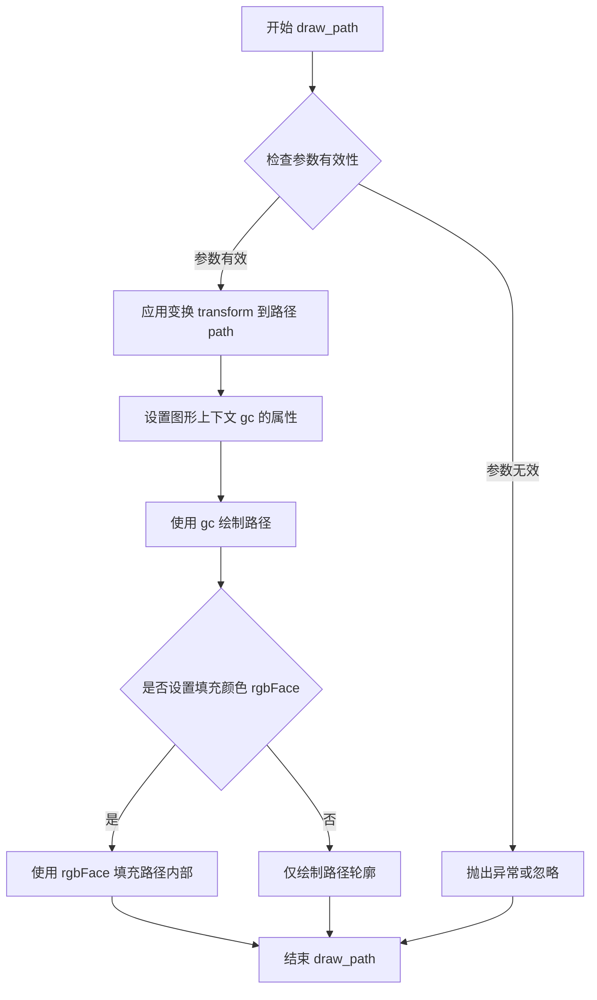
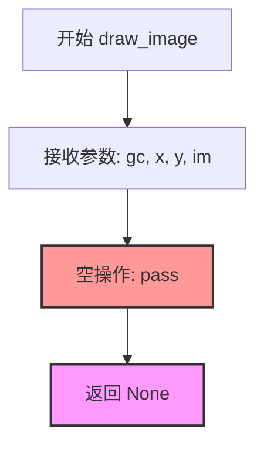
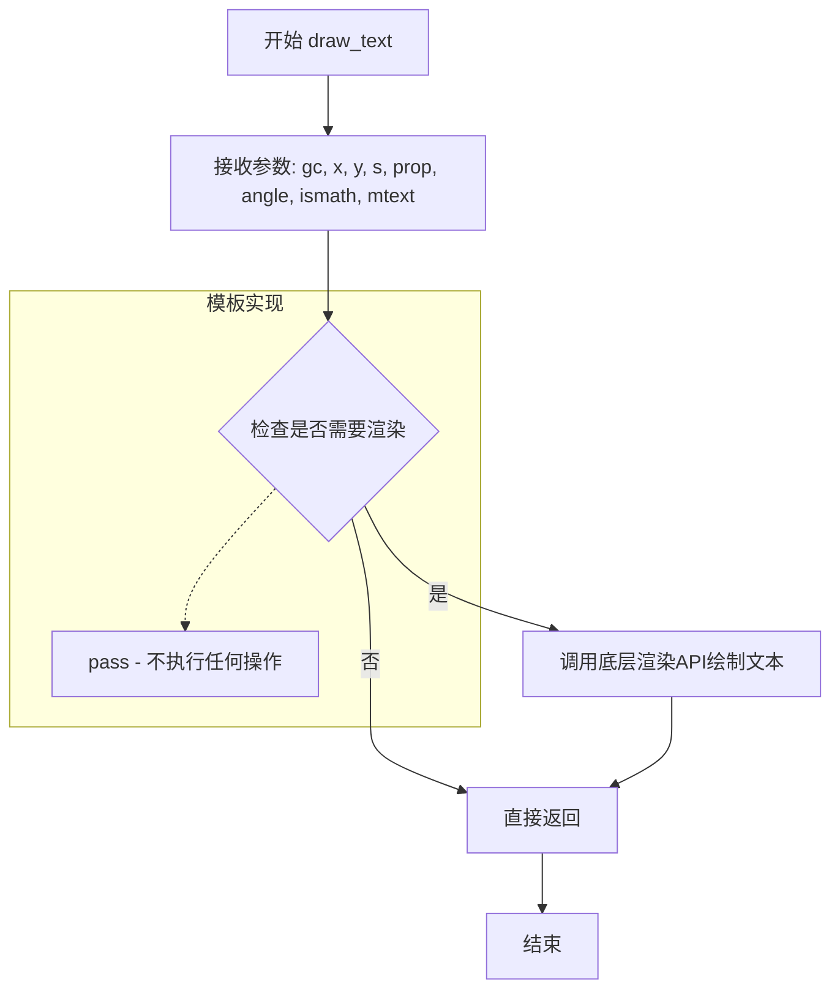
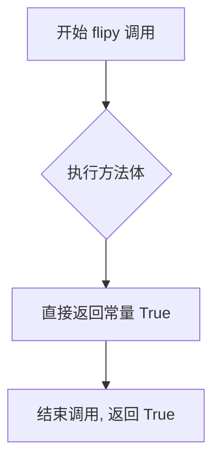
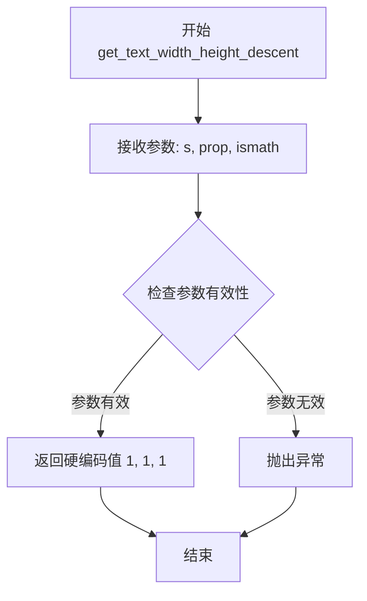
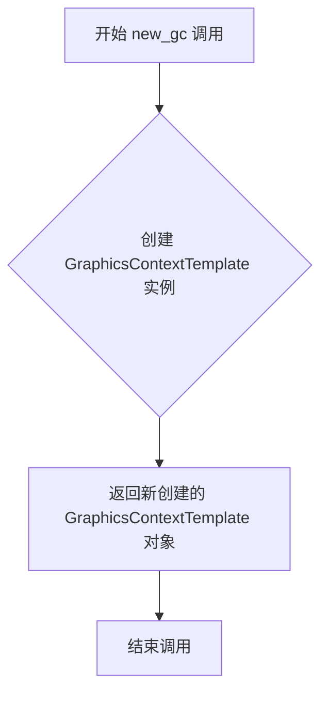
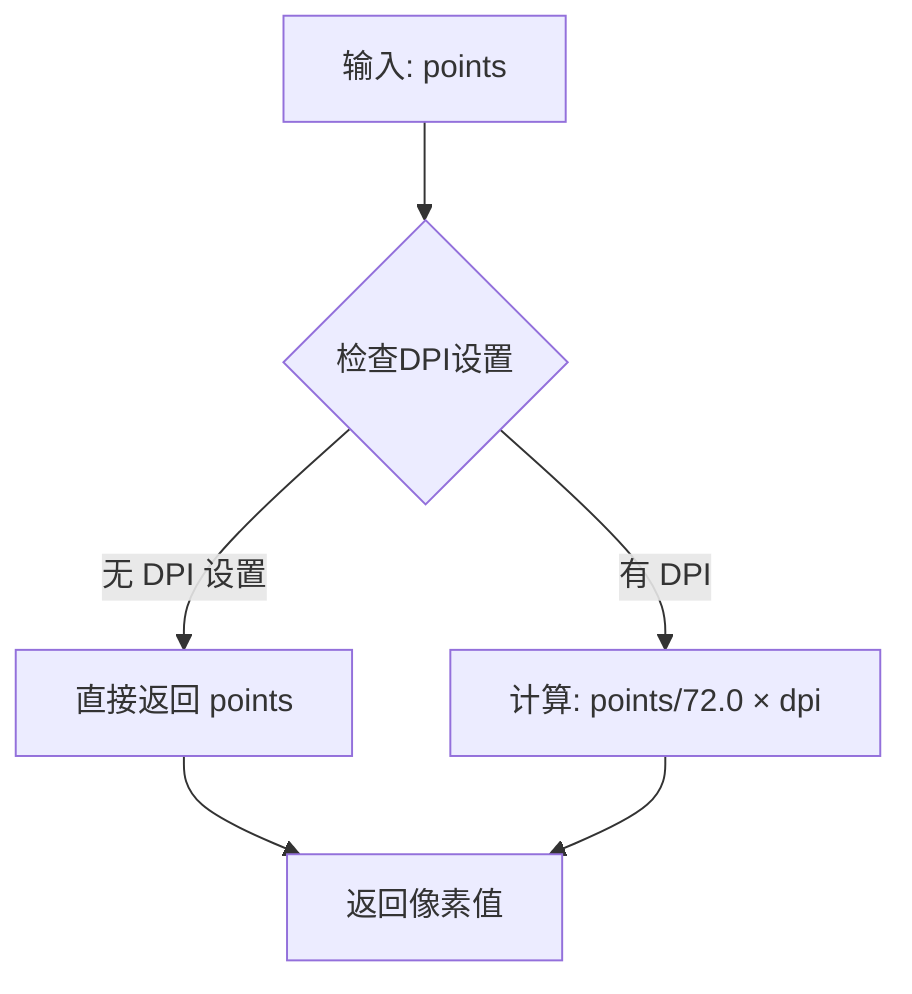
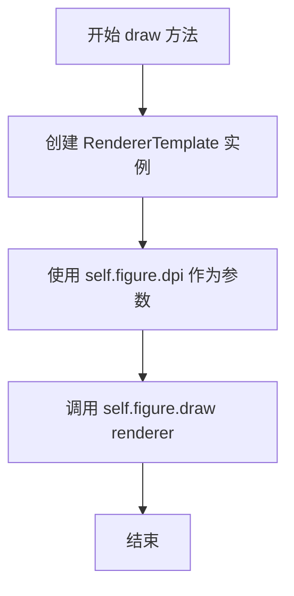
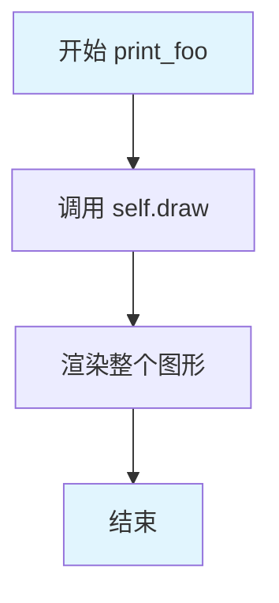
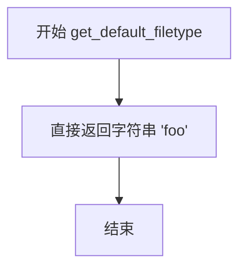

# `matplotlib\lib\matplotlib\backends\backend_template.py` 详细设计文档

这是一个matplotlib的最小化空后端实现，作为创建新后端的模板起点。该后端提供了完整的类结构但所有绘制方法均为空实现(pass)，开发者可逐步实现具体方法来构建功能完整的后端。

## 整体流程

```mermaid
graph TD
    A[导入matplotlib基础模块和类] --> B[定义RendererTemplate渲染器类]
    B --> C[定义GraphicsContextTemplate图形上下文类]
    C --> D[定义FigureManagerTemplate图形管理器类]
    D --> E[定义FigureCanvasTemplate画布类]
    E --> F[设置全局别名FigureCanvas和FigureManager]
    F --> G[后端可通过matplotlib.use('template')启用]
```

## 类结构

```
RendererTemplate (继承RendererBase)
GraphicsContextTemplate (继承GraphicsContextBase)
FigureManagerTemplate (继承FigureManagerBase)
FigureCanvasTemplate (继承FigureCanvasBase)
```

## 全局变量及字段


### `FigureCanvas`
    
全局别名，指向FigureCanvasTemplate类，供matplotlib后端基础设施使用

类型：`type[FigureCanvasTemplate]`
    


### `FigureManager`
    
全局别名，指向FigureManagerTemplate类，供matplotlib后端基础设施使用

类型：`type[FigureManagerTemplate]`
    


### `RendererTemplate.dpi`
    
存储渲染器的DPI（每英寸点数）分辨率，用于计算像素与点数的转换

类型：`float | DPI`
    


### `FigureCanvasTemplate.manager_class`
    
类属性，指定用于管理Figure对象的管理器类，此处为FigureManagerTemplate

类型：`type[FigureManagerTemplate]`
    


### `FigureCanvasTemplate.filetypes`
    
类属性字典，存储支持的输出文件格式及其描述，继承自FigureCanvasBase并添加了'foo'格式

类型：`dict[str, str]`
    
    

## 全局函数及方法


### RendererTemplate.__init__

该方法是 RendererTemplate 类的构造函数，用于初始化渲染器实例并设置 DPI（每英寸点数）属性。它调用父类的初始化方法，并将传入的 dpi 参数存储为实例属性。

参数：

- `self`：`RendererTemplate`，隐含的实例对象，代表当前正在初始化的 RendererTemplate 实例
- `dpi`：`float` 或 `DPI` 对象，表示每英寸点数（dots per inch），用于控制渲染的分辨率

返回值：`None`，构造函数不返回值

#### 流程图

```mermaid
flowchart TD
    A[开始 __init__] --> B[调用 super().__init__ 初始化父类 RendererBase]
    B --> C[将 dpi 参数赋值给实例属性 self.dpi]
    C --> D[结束 __init__ 方法]
```

#### 带注释源码

```python
def __init__(self, dpi):
    """
    初始化 RendererTemplate 实例。

    Parameters
    ----------
    dpi : float or DPI object
        每英寸点数，用于控制渲染的分辨率。
    """
    super().__init__()  # 调用父类 RendererBase 的 __init__ 方法
    self.dpi = dpi       # 将 dpi 参数存储为实例属性，供后续渲染操作使用
```


### `RendererTemplate.draw_path`

绘制路径的核心方法，用于在渲染器中绘制指定的路径对象。该方法接受图形上下文、路径、变换矩阵和可选的填充颜色作为参数，将路径绘制到目标设备上下文中。在模板后端中，此方法为空实现（pass），不执行任何实际绘制操作。

参数：

- `self`：`RendererTemplate`，RendererTemplate 类的实例，隐式参数
- `gc`：`GraphicsContextBase`，图形上下文对象，包含颜色、线宽、线型等绘图属性
- `path`：`Path`，matplotlib 路径对象，表示要绘制的几何路径
- `transform`：`Transform`，仿射变换矩阵，用于对路径进行坐标变换
- `rgbFace`：`tuple` 或 `None`，可选参数，路径的填充颜色（RGB 元组），默认为 `None`（无填充）

返回值：`None`，该方法没有返回值

#### 流程图



#### 带注释源码

```python
def draw_path(self, gc, path, transform, rgbFace=None):
    """
    绘制路径到渲染设备。
    
    参数
    ----------
    gc : GraphicsContextBase
        图形上下文，包含绘图状态（颜色、线宽、线型等）
    path : Path
        要绘制的路径对象，包含顶点和路径指令
    transform : Transform
        从数据坐标到设备坐标的仿射变换矩阵
    rgbFace : 颜色值, 可选
        路径填充颜色，RGB 元组格式 (r, g, b)，None 表示无填充
    
    返回值
    -------
    None
    
    注意
    ----
    这是一个模板/空实现方法。
    在实际的后端实现中，这个方法应该：
    1. 将 path 应用 transform 变换到设备坐标
    2. 使用 gc 中的属性（颜色、线宽等）设置绘图状态
    3. 调用底层绘图 API 绘制路径轮廓
    4. 如果 rgbFace 不为 None，填充路径内部
    """
    pass
```


### RendererTemplate.draw_image

该方法是 Matplotlib 后端渲染器的图像绘制接口，负责将图像数据渲染到指定坐标位置。在此模板后端中，该方法为空的占位实现，不执行任何实际绘制操作，供后端开发者作为起点进行扩展。

参数：

- `self`：RendererTemplate，渲染器实例本身
- `gc`：GraphicsContextBase，图形上下文对象，包含颜色、线型等绘图属性
- `x`：float，图像左下角的 x 坐标（以像素为单位）
- `y`：float，图像左下角的 y 坐标（以像素为单位）
- `im`：array-like 或 None，要绘制的图像数据，通常为 numpy 数组或类似图像对象

返回值：`None`，无返回值（方法体为空实现）

#### 流程图



#### 带注释源码

```python
def draw_image(self, gc, x, y, im):
    """
    Draw an image to the renderer's backend.
    
    Parameters
    ----------
    gc : GraphicsContextBase
        Graphics context for controlling rendering attributes such as
        colors, clipping regions, and compositing operations.
    x : float
        The leftmost x-coordinate in display space where the image
        should be placed.
    y : float
        The bottommost y-coordinate in display space where the image
        should be placed. Note that the coordinate system may be flipped
        depending on the backend (see flipy() method).
    im : array-like or None
        The image data to be rendered. Typically this is a numpy array
        with shape (height, width, channels) for RGBA data, or 
        (height, width) for grayscale data. None is allowed as a
        no-op placeholder.
    """
    pass  # 空实现，供后端开发者作为模板逐步实现
```


### RendererTemplate.draw_text

该方法是 RendererTemplate 渲染器类中的一个空实现方法，用于绘制文本。在模板后端中，此方法不执行任何实际操作（仅包含 `pass` 语句），作为后端开发者的占位符，开发者可以在继承类中重写此方法以实现具体的文本渲染逻辑。

参数：

- `self`：RendererTemplate，隐式的实例本身
- `gc`：GraphicsContextBase，图形上下文对象，包含文本的颜色、字体样式等渲染属性
- `x`：float，文本起始点的 x 坐标
- `y`：float，文本起始点的 y 坐标
- `s`：str，要绘制的文本字符串
- `prop`：FontProperties，文本的字体属性对象，包含字体名称、大小、样式等
- `angle`：float，文本的旋转角度（单位为度）
- `ismath`：bool，控制是否以数学模式渲染文本，默认为 False
- `mtext`：Text，可选的 matplotlib Text 艺术对象，用于获取额外的布局信息，默认为 None

返回值：`None`，该方法不返回任何值

#### 流程图



#### 带注释源码

```python
def draw_text(self, gc, x, y, s, prop, angle, ismath=False, mtext=None):
    """
    绘制文本到画布上。
    
    Parameters
    ----------
    gc : GraphicsContextBase
        图形上下文，包含文本的渲染属性（颜色、字体、线宽等）
    x : float
        文本插入点的 x 坐标
    y : float
        文本插入点的 y 坐标
    s : str
        要绘制的文本字符串
    prop : FontProperties
        字体属性对象，定义文本的字体、大小、样式等
    angle : float
        文本的旋转角度，以度为单位
    ismath : bool, optional
        是否以数学模式渲染文本，默认为 False
    mtext : Text, optional
        关联的 matplotlib Text 艺术对象，可用于获取额外的布局信息，
        默认为 None
        
    Returns
    -------
    None
        该方法在模板后端中不执行任何实际操作
    """
    pass  # 模板后端不实现文本渲染，留给具体的 backend 实现
```


### `RendererTemplate.flipy`

该方法用于指示渲染器在绘制图形时是否需要翻转Y轴坐标。当返回`True`时，表示Y轴方向是翻转的（原点位于左上角），这适用于图像/位图后端；当返回`False`时，原点位于左下角，适用于文档类后端（如PostScript、PDF）。

参数：

-  `self`：`RendererTemplate`，调用此方法的RendererTemplate实例对象

返回值：`bool`，返回`True`表示Y轴翻转（原点在上方），返回`False`表示Y轴不翻转（原点在下方）

#### 流程图



#### 带注释源码

```python
def flipy(self):
    # docstring inherited
    return True
```

注释说明：
- `# docstring inherited`：表示该方法的文档字符串继承自父类`RendererBase`
- `return True`：该方法不做任何计算，直接返回`True`常量，表示此模板后端采用Y轴翻转的坐标系（原点在左上角），这是大多数图像显示后端的默认行为


### RendererTemplate.get_canvas_width_height

该方法用于获取画布的宽度和高度。在该模板后端中，返回固定的默认值 100x100，实际后端实现可根据具体需求覆盖此方法以返回真实画布尺寸。

参数：

- （无参数，仅隐含 `self`）

返回值：`tuple[int, int]`，返回画布的宽度和高度元组，此处固定返回 (100, 100)

#### 流程图

```mermaid
graph TD
    A[开始 get_canvas_width_height] --> B[返回元组 (100, 100)]
    B --> C[结束]
```

#### 带注释源码

```python
def get_canvas_width_height(self):
    """
    获取画布的宽度和高度。

    此方法继承自 RendererBase 的文档字符串。
    在模板后端中返回固定的默认值。

    Returns:
        tuple[int, int]: 返回画布宽度和高度的元组 (宽度, 高度)。
                         模板实现中固定返回 (100, 100)。
    """
    # docstring inherited
    return 100, 100
```


### RendererTemplate.get_text_width_height_descent

获取文本字符串的宽度、高度和下降值（descent），用于文本渲染布局计算。该方法是一个最小化的模板实现，返回硬编码的占位值。

参数：

- `s`：`str`，要测量宽度的文本字符串
- `prop`：`matplotlib.font_manager.FontProperties`，字体属性对象，包含字体大小、样式等信息
- `ismath`：`bool`，指示文本是否为数学模式（TeX/LaTeX数学公式）

返回值：`tuple[float, float, float]`，包含三个浮点数的元组，分别表示文本的宽度、高度和下降值（baseline到文本底部的距离）

#### 流程图



#### 带注释源码

```python
def get_text_width_height_descent(self, s, prop, ismath):
    """
    获取文本的宽度、高度和下降值。

    Parameters
    ----------
    s : str
        要测量的文本字符串。
    prop : matplotlib.font_manager.FontProperties
        字体属性对象，包含字体名称、大小、样式等。
    ismath : bool
        是否为数学模式文本。

    Returns
    -------
    tuple[float, float, float]
        (宽度, 高度, 下降值) 的元组。
    """
    return 1, 1, 1
```


### RendererTemplate.new_gc

该方法是 RendererTemplate 类的新图形上下文工厂方法，用于创建并返回一个 GraphicsContextTemplate 实例，作为后端渲染器的图形上下文基础实现。

参数：

- `self`：`RendererTemplate`，隐式参数，代表当前的渲染器实例

返回值：`GraphicsContextTemplate`，返回新创建的图形上下文对象，用于处理绘图操作的样式属性（如颜色、线型等）

#### 流程图



#### 带注释源码

```python
def new_gc(self):
    """
    创建并返回一个新的图形上下文对象。
    
    该方法继承自 RendererBase，docstring 已被继承。
    在模板后端中，此方法简单地实例化一个 GraphicsContextTemplate 对象，
    作为绘图操作的图形上下文基础。实际的图形上下文功能由
    GraphicsContextTemplate 类提供。
    
    Returns:
        GraphicsContextTemplate: 一个新的图形上下文实例，
                                  用于处理绘图样式属性
    """
    # docstring inherited
    return GraphicsContextTemplate()
```


### `RendererTemplate.points_to_pixels`

该方法用于将图形点（points）转换为像素值（pixels），是Matplotlib渲染器的核心转换函数。在此模板实现中，由于后端无DPI设置（如PostScript或SVG），直接返回原始点值不变。

参数：

- `self`：`RendererTemplate`，隐含的类实例引用，指向当前渲染器对象
- `points`：`float` 或 `数值类型`，需要转换的图形点值（通常为72 points等于1英寸）

返回值：`float` 或 `数值类型`，转换后的像素值

#### 流程图



#### 带注释源码

```python
def points_to_pixels(self, points):
    """
    Convert points to pixels.

    Parameters
    ----------
    points : float
        The value in points (1/72 inch) to convert.

    Returns
    -------
    float
        The converted value in pixels.
    """
    # if backend doesn't have dpi, e.g., postscript or svg
    return points
    # elif backend assumes a value for pixels_per_inch
    # return points/72.0 * self.dpi.get() * pixels_per_inch/72.0
    # else
    # return points/72.0 * self.dpi.get()
```


### FigureCanvasTemplate.draw

该方法用于使用渲染器绘制图形。它创建一个 RendererTemplate 实例，并将图形和渲染器传递给 Figure.draw() 方法进行实际绘制。即使不产生输出，也会触发延迟计算（如自动限制和刻度值），这是图形保存到磁盘前用户可能需要的。

参数：

- `self`：FigureCanvasTemplate，隐式参数，表示调用该方法的实例本身

返回值：`None`，无返回值。该方法通过副作用（创建渲染器并调用 figure.draw）完成图形绘制，不返回任何值。

#### 流程图



#### 带注释源码

```python
def draw(self):
    """
    Draw the figure using the renderer.

    It is important that this method actually walk the artist tree
    even if not output is produced because this will trigger
    deferred work (like computing limits auto-limits and tick
    values) that users may want access to before saving to disk.
    """
    # 创建一个 RendererTemplate 渲染器实例，传入当前图形的 DPI（每英寸点数）
    renderer = RendererTemplate(self.figure.dpi)
    
    # 调用 Figure 对象的 draw 方法，传入渲染器，执行实际的图形绘制操作
    # 这里会遍历整个 artist 树，即使没有实际输出也会触发延迟计算
    self.figure.draw(renderer)
```


### FigureCanvasTemplate.print_foo

该方法是 FigureCanvasTemplate 类的成员函数，用于将当前画布内容以自定义的"foo"格式输出到文件。作为模板后端的一部分，它仅调用 draw() 方法执行基本的渲染流程，不实际生成文件内容，体现了最小化实现的原则。

参数：

- `self`：`FigureCanvasTemplate`，隐式参数，指向调用该方法的画布实例本身
- `filename`：`str`，目标输出文件的路径和名称
- `**kwargs`：`dict`，可变关键字参数，用于传递额外的打印选项（如 dpi、format 等），该方法目前未使用这些参数

返回值：`None`，该方法不返回任何值

#### 流程图



#### 带注释源码

```python
def print_foo(self, filename, **kwargs):
    """
    Write out format foo.

    This method is normally called via `.Figure.savefig` and
    `.FigureCanvasBase.print_figure`, which take care of setting the figure
    facecolor, edgecolor, and dpi to the desired output values, and will
    restore them to the original values.  Therefore, `print_foo` does not
    need to handle these settings.
    """
    # 调用 draw 方法渲染图形，这是模板后端的核心工作
    # 实际上并未真正写入文件内容，仅作为"空操作"模板
    self.draw()
```


### `FigureCanvasTemplate.get_default_filetype`

该方法返回当前Canvas默认使用的文件类型，用于确定保存图像时的默认输出格式。在模板后端中，返回自定义的 'foo' 格式。

参数：

- 该方法无参数

返回值：`str`，返回默认的文件类型字符串 'foo'

#### 流程图



#### 带注释源码

```python
def get_default_filetype(self):
    """
    返回默认的文件类型。

    该方法用于指定保存图像时使用的默认文件格式。
    在模板后端中，返回自定义的 'foo' 格式作为默认值。

    Returns
    -------
    str
        默认文件类型，此处返回 'foo'
    """
    return 'foo'
```

## 关键组件


### RendererTemplate

渲染器类，继承自RendererBase，处理所有绘图/渲染操作的抽象基类。该类定义了draw_path、draw_image、draw_text等绘制方法，但均为空实现（pass），作为后端开发的起点模板。

### GraphicsContextTemplate

图形上下文类，继承自GraphicsContextBase，负责管理绘图所需的颜色、线型、线宽等样式属性。该类提供了从RGB元组到后端特定颜色值的映射接口，具体的映射逻辑需由子类实现。

### FigureManagerTemplate

图形管理器类，继承自FigureManagerBase，用于在pyplot模式下包装图形窗口和相关操作。对于非交互式后端，基类已足够；交互式后端需重写相关方法以处理窗口事件。

### FigureCanvasTemplate

画布类，继承自FigureCanvasBase，负责图形的渲染和输出。该类创建渲染器、处理图形绘制流程、提供文件打印方法（如print_foo），并定义了支持的输出文件类型。

### 模块级变量 FigureCanvas 和 FigureManager

模块别名，供matplotlib后端初始化时使用的标准接口名称，分别指向FigureCanvasTemplate和FigureManagerTemplate类。


## 问题及建议


### 已知问题

-   **硬编码的画布尺寸**: `get_canvas_width_height()` 方法返回硬编码的 (100, 100)，未根据实际 figure 的尺寸计算
-   **硬编码的文本度量**: `get_text_width_height_descent()` 方法返回硬编码的 (1, 1, 1)，无法正确计算文本实际宽高和降行
-   **未实现的导出功能**: `print_foo()` 方法调用了 `self.draw()` 但未实现任何文件写入逻辑，定义的 'foo' 格式名不副实
-   **未实现的坐标转换**: `points_to_pixels()` 方法直接返回原始 points，注释掉的 DPI 相关逻辑未实现，导致坐标转换不准确
-   **空的 GraphicsContextTemplate**: 该类完全继承自 GraphicsContextBase，未实现任何自定义映射逻辑（如颜色空间转换、线型映射等）
-   **空的 FigureManagerTemplate**: 该类完全依赖基类实现，对于交互式后端可能需要重写的方法（如窗口标题、工具栏等）均为空
-   **注释掉的性能优化方法**: `draw_markers`、`draw_path_collection`、`draw_quad_mesh` 等方法被注释掉，导致批量渲染性能较差
-   **缺少事件处理机制**: FigureCanvasTemplate 未实现任何鼠标、键盘事件处理，注释中提到需要连接事件但未实际实现
-   **缺乏错误处理**: 各方法中基本没有错误处理和参数校验，传入无效参数可能导致隐藏的错误
-   **未使用的导入**: 代码导入了 `Gcf` 和 `Figure`，但在模板中未实际使用

### 优化建议

-   **实现动态画布尺寸**: 从 `self.figure.bbox` 或 `self.figure.get_size_inches()` 动态计算画布宽度和高度
-   **实现文本度量计算**: 使用后端实际能力（如字体度量）计算文本的真实宽高和降行值
-   **完善导出方法实现**: 为 `print_foo` 或其他 print_xxx 方法添加实际的文件写入逻辑，或删除未实现的占位符
-   **实现坐标转换**: 根据后端特性实现 `points_to_pixels` 方法，正确处理 DPI 设置
-   **扩展 GraphicsContextTemplate**: 根据后端特性实现颜色、线型、线宽等属性的映射方法
-   **扩展 FigureManagerTemplate**: 根据需要实现交互式后端所需的方法（如窗口管理、工具栏等）
-   **启用性能优化方法**: 根据后端能力实现 `draw_markers` 等批处理方法以提升渲染性能
-   **添加事件处理**: 为交互式使用场景实现鼠标点击、拖动、键盘事件等处理方法
-   **添加参数校验和错误处理**: 在关键方法中添加参数校验，抛出有意义的异常信息
-   **清理未使用的导入**: 移除未使用的 `Gcf` 和 `Figure` 导入，或在代码中实际使用它们


## 其它


### 设计目标与约束

**设计目标**：创建一个最小化的、可运行的后端模板，供开发者作为创建新后端的起点。该后端实现了所有必需的接口方法，但不执行实际的图形渲染操作，使开发者能够逐步实现功能并逐步看到效果。

**约束条件**：
- 必须继承自Matplotlib后端基类（RendererBase、GraphicsContextBase、FigureManagerBase、FigureCanvasBase）
- 必须实现所有抽象方法以确保后端可用
- 后端应支持基本的图形输出流程（draw、print_xxx方法）
- 该后端为非交互式后端，不处理用户输入事件

### 外部依赖与接口契约

**外部依赖**：
- `matplotlib._api`：API装饰器和兼容性工具
- `matplotlib._pylab_helpers`：图形管理器辅助工具（Gcf类）
- `matplotlib.backend_bases`：后端基类（FigureCanvasBase、FigureManagerBase、GraphicsContextBase、RendererBase）
- `matplotlib.figure`：Figure类

**接口契约**：
- `RendererTemplate`必须实现draw_path、draw_image、draw_text、flipy、get_canvas_width_height、get_text_width_height_descent、new_gc、points_to_pixels方法
- `GraphicsContextTemplate`必须继承GraphicsContextBase并实现必要的图形上下文方法
- `FigureCanvasTemplate`必须实现draw方法和print_xxx方法族
- `FigureManagerTemplate`必须继承FigureManagerBase

### 错误处理与异常设计

**异常处理策略**：
- 该后端为最小化模板，不进行实际渲染，因此主要依赖基类的异常处理机制
- 基类方法中的pass语句表示不抛出任何异常，返回默认值
- 开发者扩展时应在具体绘制方法中添加适当的错误处理

**边界情况处理**：
- get_text_width_height_descent返回(1, 1, 1)作为默认值
- get_canvas_width_height返回(100, 100)作为默认画布尺寸
- points_to_pixels直接返回points，不进行转换

### 数据流与状态机

**数据流**：
1. 用户调用plt.savefig()或figure.savefig()
2. FigureCanvasBase.print_figure()被调用
3. 根据文件格式调用相应的print_xxx方法（如print_foo）
4. print_foo调用draw()方法
5. draw()创建RendererTemplate实例
6. 调用figure.draw(renderer)遍历所有artist并触发绘制
7. 对于每个artist，调用renderer对应的绘制方法

**状态机**：
- 初始状态：FigureCanvasTemplate创建 -> 等待draw调用
- 渲染状态：draw()被调用 -> RendererTemplate创建 -> 遍历artist树
- 完成状态：所有artist渲染完成 -> 返回

### 配置与初始化流程

**初始化流程**：
1. 用户通过matplotlib.use("template")选择后端
2. 导入FigureCanvasTemplate、FigureManagerTemplate
3. 创建Figure对象时，自动创建FigureCanvasTemplate实例
4. FigureCanvasTemplate创建FigureManagerTemplate实例（通过manager_class）

**可配置项**：
- dpi（每英寸点数）：通过RendererTemplate.__init__传入
- filetypes：可扩展的字典，支持添加新的文件格式

### 扩展性设计

**扩展点**：
- draw_markers：可选实现，提高标记绘制性能
- draw_path_collection：可选实现，提高路径集合绘制性能
- draw_quad_mesh：可选实现，提高四边形网格绘制性能
- print_xxx方法：可添加任意数量的打印格式支持

**扩展方式**：
- 继承RendererTemplate并重写所需方法
- 在FigureCanvasTemplate中添加新的print_xxx方法
- 注册新的文件格式到filetypes字典

### 性能考虑

**当前性能特性**：
- 故意省略draw_markers、draw_path_collection、draw_quad_mesh以获得更准确的相对计时
- 所有绘制方法为空实现，无实际性能开销

**优化建议**：
- 实际实现时应考虑批量渲染
- 对于高频率调用的小对象，考虑对象池化
- 图像渲染时考虑缓存机制

### 使用示例与API参考

**基本使用**：
```python
import matplotlib
matplotlib.use("template")
# 或使用模块方式
# matplotlib.use("module://my_backend")
import matplotlib.pyplot as plt

fig, ax = plt.subplots()
ax.plot([1, 2, 3], [1, 4, 9])
fig.savefig("output.png")  # 会调用print_xxx方法
```

**自定义后端**：
```python
# 复制template.py到可导入的目录
# 重命名类和方法
# 实现实际的渲染逻辑
```

### 测试策略

**测试建议**：
- 验证后端可以成功导入
- 验证FigureCanvasTemplate可以创建
- 验证draw方法可以调用而不报错
- 验证print_foo方法可以创建输出文件
- 验证基本绘图操作不抛出异常

### 安全考虑

**安全要点**：
- 该后端不涉及文件系统的主动写入（通过savefig触发）
- 不处理用户输入，无注入风险
- 不加载外部资源，无远程代码执行风险

### 版本兼容性

**兼容性说明**：
- 该模板与Matplotlib 3.x系列兼容
- 依赖的基类接口在Matplotlib发展过程中可能变化
- 建议查阅对应版本的Matplotlib文档获取最新的接口定义

    