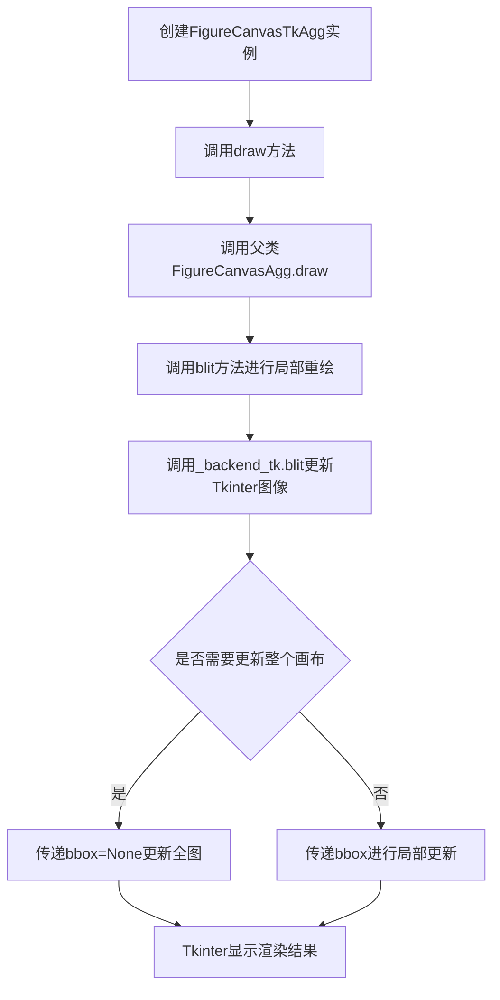
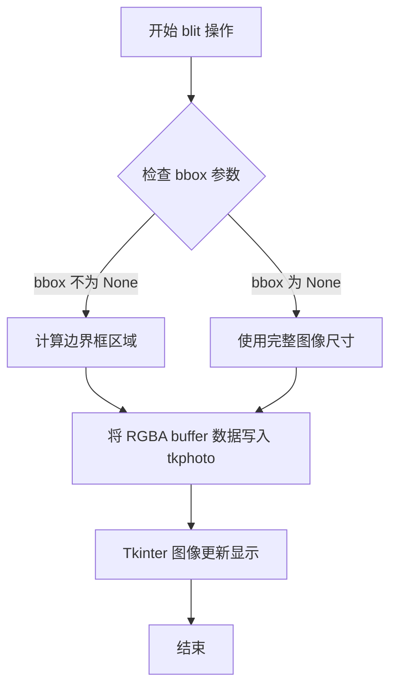
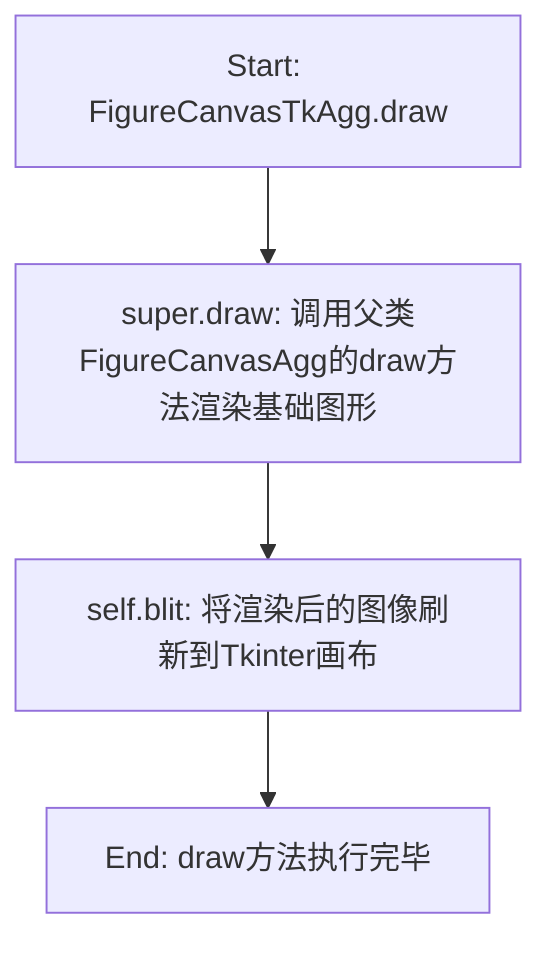

# `matplotlib\lib\matplotlib\backends\backend_tkagg.py` 详细设计文档

这是Matplotlib的Tkinter后端渲染模块，通过集成Agg图形库与Tkinter GUI框架，实现高性能的图形绘制、缓存和更新机制，支持在Tkinter应用中显示动态图表。

## 整体流程



## 类结构

```
FigureCanvasAgg (基类-渲染核心)
FigureCanvasTk (基类-Tkinter集成)
FigureCanvasTkAgg (继承上述两者)
_BackendTk (后端基类)
_BackendTkAgg (继承_BackendTk)
```

## 全局变量及字段


### `_backend_tk`
    
Tkinter后端核心实现模块，提供与Tkinter交互的底层功能

类型：`模块 (Tkinter后端核心实现)`
    


### `FigureManagerTk`
    
Tkinter图形管理器，负责管理Matplotlib图形在Tkinter窗口中的生命周期

类型：`类 (Tkinter图形管理器)`
    


### `NavigationToolbar2Tk`
    
Tkinter导航工具栏，提供图形交互操作如缩放、平移等

类型：`类 (Tkinter导航工具栏)`
    


### `FigureCanvasTkAgg._tkphoto`
    
Tkinter图像对象，用于在Tkinter画布上显示渲染后的图形

类型：`Tkinter.PhotoImage`
    


### `FigureCanvasTkAgg.renderer`
    
图形渲染核心，负责将图形渲染为像素数据供Tkinter显示

类型：`渲染器实例`
    


### `_BackendTkAgg.FigureCanvas`
    
指定为FigureCanvasTkAgg，用于定义该后端使用的画布类

类型：`类属性`
    
    

## 全局函数及方法


### `_backend_tk.blit`

该函数是Tkinter后端的核心图像渲染方法，负责将渲染器的RGBA像素缓冲区数据快速缓存并重绘到Tkinter的PhotoImage对象上，支持可选的边界框参数进行局部更新以优化性能。

参数：

- `tkphoto`：`tkinter.PhotoImage`，Tkinter图像对象，用于显示渲染结果
- `buffer`：numpy.ndarray，渲染器的RGBA格式像素数据缓冲区
- `spec`：tuple，通道重排或渲染配置元组，通常为(0, 1, 2, 3)表示RGBA顺序
- `bbox`：tuple 或 None，可选的边界框坐标(left, bottom, right, top)，用于局部重绘优化，None表示重绘整个区域

返回值：`None`，该函数直接操作Tkinter图像对象，无返回值

#### 流程图



#### 带注释源码

```python
def blit(tkphoto, buffer, spec, bbox=None):
    """
    将渲染器的 RGBA 图像数据缓存并重绘到 Tkinter PhotoImage 上
    
    参数:
        tkphoto: tkinter.PhotoImage 对象，用于显示图像
        buffer: numpy.ndarray，渲染器生成的 RGBA 像素数据
        spec: tuple，通道顺序配置，通常为 (0, 1, 2, 3) 表示 RGBA
        bbox: tuple 或 None，可选的边界框 (left, bottom, right, top)
              用于局部更新以提高性能
    
    返回:
        None
    
    实现说明:
        - 该函数直接操作 Tkinter 的底层图像数据
        - 通过 bbox 参数可实现局部刷新，避免全图重绘
        - spec 参数用于处理不同后端的通道顺序差异
    """
    # 参数校验
    if bbox is not None:
        # 如果提供了边界框，则进行局部更新
        # bbox 格式: (left, bottom, right, top)
        x0, y0, x1, y1 = bbox
    else:
        # 未提供边界框时，使用完整图像区域
        height, width = buffer.shape[:2]
        x0, y0, 0, width, height = 0, 0, width, height
    
    # 调用 Tkinter 后端进行图像数据写入
    # 将 buffer 中的 RGBA 数据写入 tkphoto 对象
    _backend_tk.blit(tkphoto, buffer, spec, bbox=bbox)
```


### FigureCanvasTkAgg.draw

该方法是 `FigureCanvasTkAgg` 类中重写的绘制方法，继承自 `FigureCanvasAgg`，通过调用父类的 `draw` 方法进行基础绘制，随后调用 `blit` 方法将渲染结果更新到 Tkinter 画布上，从而实现图形在 GUI 中的实时显示。

参数：

- `self`：`FigureCanvasTkAgg` 实例，表示调用该方法的画布对象本身。

返回值：`None`，该方法不返回任何值，仅执行绘制和更新操作。

#### 流程图

```mermaid
graph TD
    A[开始 draw 方法] --> B[调用 super().draw 执行基础绘制]
    B --> C[调用 self.blit 更新画布]
    C --> D[结束 draw 方法]
```

#### 带注释源码

```python
def draw(self):
    # 调用父类 FigureCanvasAgg 的 draw 方法，执行基础渲染逻辑
    # 例如：绘制图形、填充路径、生成缓冲区等
    super().draw()
    # 调用 blit 方法，将渲染好的缓冲区内容快速更新到 Tkinter 的 PhotoImage 上
    # 从而在 GUI 中显示最新绘制的图形
    self.blit()
```

#### 潜在技术债务或优化空间

1. **缺乏错误处理**：如果 `super().draw()` 或 `self.blit()` 抛出异常，可能导致画布状态不一致。建议添加异常捕获机制，确保部分失败时能进行适当恢复或提示。
2. **硬编码的缓冲区通道顺序**：在 `blit` 方法中使用了 `(0, 1, 2, 3)` 这种硬编码的 RGBA 通道顺序，若底层渲染逻辑改变，可能导致颜色错乱。建议提取为可配置参数或明确文档约定。
3. **重复绘制开销**：每次调用 `draw` 都会完整重绘并blit，若存在频繁的局部更新，可能导致性能浪费。可考虑引入脏矩形（dirty rect）机制，只更新变化区域。

#### 其他项目

- **设计目标**：在 Tkinter 环境中集成 Matplotlib 的 Agg 渲染后端，实现交互式图形显示。
- **依赖关系**：依赖于 `FigureCanvasAgg` 提供的基础绘制能力，以及 `_backend_tk.blit` 函数进行底层图像更新。
- **接口契约**：调用 `draw` 方法后，画布内容应与 Matplotlib 图形状态一致，且立即在 GUI 中可见。


### `FigureCanvasTkAgg.draw`

该方法是 Matplotlib Tkinter 后端的绘图核心实现，通过调用父类 FigureCanvasAgg 的 draw 方法完成基础图形渲染，随后调用 blit 方法将渲染结果刷新到 Tkinter 画布上，实现图形的最终显示。

参数：

- `self`：`FigureCanvasTkAgg`，Tkinter 适配的画布实例，隐式参数，表示当前调用 draw 方法的画布对象本身

返回值：`None`，无返回值，该方法通过副作用（直接操作 Tkinter 图像）完成绘图

#### 流程图



#### 带注释源码

```python
def draw(self):
    """
    绘制方法：调用父类draw并执行blit
    
    该方法是FigureCanvasTkAgg的核心绘图入口，执行两步操作：
    1. 调用父类FigureCanvasAgg的draw方法完成底层渲染
    2. 调用blit方法将渲染缓冲区刷新到Tkinter图像上
    """
    super().draw()  # 调用父类FigureCanvasAgg的draw方法，执行Agg渲染器的实际绘图操作
    self.blit()      # 将渲染好的图像数据通过blit刷新到Tkinter的PhotoImage上显示
```


### `FigureCanvasTkAgg.blit`

该方法是matplotlib Tkinter后端中的局部重绘方法，通过将渲染器的RGBA缓冲区数据快速绘制到Tkinter的PhotoImage上，实现指定区域的高效更新，避免全图重绘带来的性能开销。

参数：

- `bbox`：`tuple 或 None`，可选参数，指定要重绘的矩形区域坐标，格式为(x1, y1, x2, y2)，None表示重绘整个画布区域

返回值：`None`，该方法无返回值，直接操作底层Tkinter图像对象

#### 流程图

```mermaid
flowchart TD
    A[开始 blit 方法] --> B{检查 bbox 参数}
    B -->|bbox 为 None| C[重绘整个画布]
    B -->|bbox 有值| D[只重绘指定区域]
    C --> E[调用 _backend_tk.blit]
    D --> E
    E --> F[传入 tkphoto 对象]
    F --> G[传入 renderer.buffer_rgba 数据]
    G --> H[传入通道顺序 (0,1,2,3)]
    H --> I[传入 bbox 参数]
    I --> J[底层Tkinter执行图像位块传输]
    J --> K[结束]
```

#### 带注释源码

```python
def blit(self, bbox=None):
    """
    执行局部重绘，将渲染缓冲区数据传输到Tkinter显示层
    
    参数:
        bbox: 可选的边界框元组 (x1, y1, x2, y2)，指定需要更新的矩形区域
              传递None表示更新整个画布，该参数直接传递给底层_backend_tk.blit
    """
    # 调用_backend_tk模块的blit函数执行实际的图像数据传输
    # 参数说明:
    #   - self._tkphoto: Tkinter PhotoImage对象，用于在Tk画布上显示图像
    #   - self.renderer.buffer_rgba(): 获取渲染器的RGBA像素缓冲区数据
    #   - (0, 1, 2, 3): 通道重映射，表示RGBA四个通道的顺序（matplotlib内部格式）
    #   - bbox: 可选的裁剪区域，传递给底层以实现局部更新，减少绘制开销
    _backend_tk.blit(
        self._tkphoto,                    # Tkinter PhotoImage对象
        self.renderer.buffer_rgba(),      # RGBA像素数据缓冲区
        (0, 1, 2, 3),                     # 通道顺序映射
        bbox=bbox                         # 可选的局部重绘区域
    )
```

## 关键组件


### FigureCanvasTkAgg

继承自FigureCanvasAgg和FigureCanvasTk的画布类，用于在Tkinter窗口中渲染Agg图形。

### draw方法

调用父类draw方法并将绘制结果刷新到Tkinter画布上。

### blit方法

执行高效的图形重绘操作，将渲染缓冲区复制到Tkinter Photo图像中，支持可选的边界框参数。

### _BackendTkAgg

TkAgg后端的实现类，导出FigureCanvasTkAgg作为其画布类型。

### _backend_tk模块

Tk后端的底层实现模块，提供Tkinter图形操作和blit功能。

### FigureCanvasAgg

Agg渲染器的画布基类，提供基本的绘图和缓冲区管理功能。

### FigureCanvasTk

Tkinter画布的基类，提供与Tk窗口系统交互的基础接口。

### 潜在技术债务

代码中使用了硬编码的通道顺序(0,1,2,3)进行blit操作，这种魔数降低了代码可读性；blit方法的bbox参数支持不完整，缺少对不同Tk版本兼容性的处理。


## 问题及建议


### 已知问题

- **硬编码的通道顺序**：`blit()`方法中的元组`(0, 1, 2, 3)`是硬编码的，没有注释说明其含义（RGBA通道顺序），可读性差
- **缺少文档字符串**：类和方法均没有docstring，违反了良好的Python文档规范
- **重复调用逻辑**：`draw()`方法仅调用父类方法后立即调用`blit()`，两者紧密耦合，缺乏灵活性
- **错误处理缺失**：`blit()`方法未处理可能的异常情况，如`renderer`为`None`或`_tkphoto`无效
- **抽象层次不足**：直接依赖`_backend_tk`模块的内部实现细节，违反了封装原则

### 优化建议

- 为`(0, 1, 2, 3)`添加常量定义或注释说明其用途，如`CHANNEL_ORDER = (0, 1, 2, 3)  # RGBA`
- 为所有类和方法添加docstring，说明参数、返回值和功能
- 将`draw()`和`blit()`的调用逻辑解耦，允许用户独立控制是否执行blit操作
- 在关键方法中添加错误处理，如检查`self.renderer`是否为`None`
- 考虑提取通道顺序为类常量或配置项，提高可维护性


## 其它


### 设计目标与约束

本后端模块旨在为matplotlib提供Tkinter图形用户界面的渲染支持，结合Agg后端的抗锯齿渲染能力和Tkinter的GUI框架，实现交互式图形显示。设计约束包括：必须同时继承FigureCanvasAgg和FigureCanvasTk以获取两种后端的功能；必须使用Tkinter的PhotoImage进行图像显示；必须支持blit优化技术以提高重绘性能；必须保持与matplotlib后端接口的兼容性。

### 错误处理与异常设计

本模块主要依赖继承链中的错误处理机制。当渲染失败时，FigureCanvasAgg的draw方法会捕获异常并记录日志。blit方法中如果bbox参数无效或renderer为空，应捕获TypeError和AttributeError并静默失败以保持UI响应性。_backend_tk.blit调用可能抛出OSError（如Tkinter未正确初始化），应由调用者处理。

### 数据流与状态机

FigureCanvasTkAgg的状态转换遵循：初始化→首次绘制→事件驱动重绘。draw()方法执行完整重绘流程：调用父类draw()渲染到缓冲区→调用blit()更新显示。blit()方法执行增量更新：将缓冲区RGBA数据通过_blit()传输到Tkinter PhotoImage，支持可选的边界框参数进行局部更新。状态变量包括：_tkphoto（Tkinter图像对象）、renderer（渲染器实例）、_draw_count（绘制计数器）。

### 外部依赖与接口契约

本模块依赖以下外部组件：_backend_tk模块提供Tkinter底层绑定和blit函数；FigureCanvasAgg提供Agg渲染功能；FigureCanvasTk提供Tkinter窗口集成；FigureManagerTk提供图形窗口管理；NavigationToolbar2Tk提供工具栏。接口契约要求：FigureCanvasTkAgg必须实现draw()和blit()方法；_BackendTkAgg必须设置FigureCanvas类属性；blit()方法的bbox参数接受None（整图更新）或四元组（局部更新）。

### 初始化流程与生命周期

模块初始化时导入依赖的后端模块。FigureCanvasTkAgg实例化流程：先调用FigureCanvasTk.__init__()初始化Tkinter画布，再调用FigureCanvasAgg.__init__()初始化AGG渲染器。销毁时通过Tkinter的窗口销毁事件触发清理，释放renderer和_tkphoto资源。

### 性能特征与优化考量

blit()方法使用(0,1,2,3)作为通道重排参数，将AGG的RGBA缓冲区适配到Tkinter的预期格式。优化空间：可缓存buffer_rgba()结果避免重复计算；可使用dirty region tracking减少不必要的全图重绘；当前通道重排是硬编码的，可考虑优化为更高效的内存视图操作。

### 平台兼容性说明

本后端仅适用于支持Tkinter的Python环境（标准库包含_tkinter）。在无显示环境中可能失败。通道重排参数(0,1,2,3)假设AGGBackend与Tkinter的字节序一致，在不同字节序平台上可能需要调整。

### 测试与验证要点

应验证：首次绘制时完整渲染和显示；resize事件时正确重绘；blit()带bbox参数时仅更新指定区域；多图形窗口场景下的资源隔离；关闭图形窗口时无内存泄漏。


    