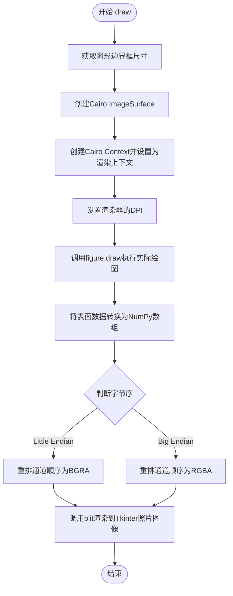

# `matplotlib\lib\matplotlib\backends\backend_tkcairo.py` 详细设计文档

这是一个matplotlib的Tkinter+Cairo混合后端实现，通过继承FigureCanvasCairo和FigureCanvasTk，将Cairo渲染的图形通过blit技术显示在Tkinter画布上，实现了Cairo图形库与Tkinter GUI框架的集成。

## 整体流程

```mermaid
graph TD
A[开始draw方法] --> B[获取figure的宽度和高度]
B --> C[创建Cairo ImageSurface]
C --> D[创建Cairo Context并设置到renderer]
D --> E[设置renderer的dpi]
E --> F[调用figure.draw渲染图形]
F --> G[将surface数据转换为numpy数组]
G --> H{判断字节序}
H -- little endian --> I[使用(2,1,0,3)通道重排]
H -- big endian --> J[使用(1,2,3,0)通道重排]
I --> K[调用_backend_tk.blit显示到Tkinter]
J --> K
```

## 类结构

```
FigureCanvasCairo (Cairo渲染基类)
FigureCanvasTk (Tkinter渲染基类)
└── FigureCanvasTkCairo (混合实现)

_BackendTk (Tkinter后端基类)
└── _BackendTkCairo (Cairo后端实现)
```

## 全局变量及字段


### `_BackendTkCairo.FigureCanvas`
    
指定Tkinter Cairo后端所使用的画布类，用于在Tkinter窗口中渲染Cairo图形

类型：`class (FigureCanvasTkCairo)`
    
    

## 全局函数及方法


### `blit` (from `_backend_tk`)

将图像数据（NumPy 数组）复制到 Tkinter 的 PhotoImage 对象中，以在 Tkinter 画布上显示。该函数处理图像数据的通道顺序转换，并更新 PhotoImage 的内容。

参数：

- `photo`：`tk.PhotoImage`（或 `_backend_tk` 内部类型），目标 Tkinter PhotoImage 对象，用于显示图像。
- `buf`：`numpy.ndarray`，图像数据，形状为 `(height, width, 4)`，对应 ARGB 通道的像素数据。
- `data_ratio`：元组 `(int, int, int, int)`，表示图像数据通道的重排顺序，以适应 Tkinter 的字节序要求（例如 `(2, 1, 0, 3)` 或 `(1, 2, 3, 0)`）。

返回值：`None`，该函数直接修改 `photo` 对象的状态，无返回值。

#### 流程图

```mermaid
graph TD
    A[接收 photo, buf, data_ratio] --> B{检查字节序}
    B -->|小端序| C[使用 data_ratio=(2, 1, 0, 3)]
    B -->|大端序| D[使用 data_ratio=(1, 2, 3, 0)]
    C --> E[根据 data_ratio 重排 buf 通道顺序]
    D --> E
    E --> F[将重排后的数据转换为 Tkinter 兼容格式]
    F --> G[调用 photo 的 putdata 或类似方法更新图像]
    G --> H[结束]
```

#### 带注释源码

由于 `blit` 函数定义在 `_backend_tk` 模块中，且未在当前代码片段中提供实现，以下为基于调用方式的推断源码：

```python
# 推断的 blit 函数实现（位于 _backend_tk 模块中）
def blit(photo, buf, data_ratio):
    """
    将图像数据复制到 Tkinter PhotoImage。
    
    参数:
        photo: Tkinter PhotoImage 对象。
        buf: NumPy 数组，形状 (height, width, 4)，ARGB 格式。
        data_ratio: 元组，指定通道重排顺序。
    """
    # 根据 data_ratio 重排通道顺序（例如从 ARGB 转换为 RGBA）
    # 注意：具体实现可能依赖于 Tkinter 的版本和数据格式
    # 假设重排后得到适合 Tkinter 的数据
    reordered_buf = buf[:, :, data_ratio]
    
    # 将 NumPy 数组转换为 Tkinter 可接受的格式
    # 可能需要转换为整数数组或特定字节顺序
    # 这里假设直接使用 reshape 和 tobytes 方法
    # 注意：Tkinter PhotoImage 通常接受平面字节序列或 RGBA 列表
    photo.putdata(reordered_buf.reshape(-1, 4).tolist())
    
    # 更新 PhotoImage 的显示
    # 可能需要调用 photo 的 update 方法（如果自动更新未启用）
    # 但通常 putdata 会自动触发更新
    return
```

注意：实际实现可能涉及更多细节，如处理字节序转换、内存管理或使用 ctypes 直接操作 Tkinter 内部数据结构。


### `FigureCanvasTkCairo.draw`

该方法负责将matplotlib图形渲染到Tkinter画布上，使用Cairo后端进行绘制。它创建Cairo图像表面，设置渲染上下文，执行实际绘图，然后将像素数据通过blit操作传输到Tkinter照片图像中显示。

参数：

- `self`：`FigureCanvasTkCairo`，隐式参数，表示当前Canvas实例

返回值：`None`，无返回值，该方法直接操作Tkinter图像对象

#### 流程图



#### 带注释源码

```python
def draw(self):
    # 获取图形边界框的宽度和高度，并转换为整数
    width = int(self.figure.bbox.width)
    height = int(self.figure.bbox.height)
    
    # 创建Cairo图像表面，使用ARGB32格式（每个像素4字节）
    surface = cairo.ImageSurface(cairo.FORMAT_ARGB32, width, height)
    
    # 创建Cairo上下文并设置为渲染器的绘制上下文
    self._renderer.set_context(cairo.Context(surface))
    
    # 将图形的DPI设置到渲染器
    self._renderer.dpi = self.figure.dpi
    
    # 执行实际绘图操作，将图形渲染到Cairo表面
    self.figure.draw(self._renderer)
    
    # 从Cairo表面获取原始像素数据，并重塑为NumPy数组
    # 形状为 (height, width, 4) 对应 (行, 列, 4通道)
    buf = np.reshape(surface.get_data(), (height, width, 4))
    
    # 将渲染结果blit到Tkinter照片图像
    # 通道重排：Little Endian系统需要(2,1,0,3)将ARGB转为BGRA
    # Big Endian系统需要(1,2,3,0)保持RGBA顺序
    _backend_tk.blit(
        self._tkphoto, buf,
        (2, 1, 0, 3) if sys.byteorder == "little" else (1, 2, 3, 0))
```

## 关键组件


### FigureCanvasTkCairo

这是Tkinter与Cairo的混合画布类，继承自FigureCanvasCairo和FigureCanvasTk，用于在Tkinter GUI中渲染Cairo图形。核心功能是将Matplotlib图形通过Cairo渲染后，再通过Tkinter的PhotoImage组件显示到界面上。

### _BackendTkCairo

Tkinter的Cairo后端导出类，继承自_BackendTk。该类作为Matplotlib的Tkinter后端入口，指定使用FigureCanvasTkCairo作为画布实现，从而建立起Cairo渲染与Tkinter GUI的连接。

### draw方法

负责将图形绘制到Tkinter画布的核心方法。首先创建Cairo图像表面，然后设置渲染上下文，执行图形绘制，最后将Cairo表面数据转换为NumPy数组并通过blit操作复制到Tkinter的PhotoImage中。

### 图像表面创建与转换

使用cairo.ImageSurface创建ARGB32格式的图像表面，通过np.reshape将Cairo的表面数据重塑为(height, width, 4)的四通道NumPy数组，用于Tkinter显示。

### 字节序处理

在blit操作中使用条件索引(2, 1, 0, 3)或(1, 2, 3, 0)来处理不同字节序系统的颜色通道重排，确保Cairo的ARGB数据正确映射到Tkinter的PhotoImage。


## 问题及建议


### 已知问题

- **缺少类型注解**：代码中没有使用类型注解（type hints），降低了代码的可读性和可维护性，也无法利用静态类型检查工具进行早期错误检测
- **硬编码的字节序处理**：`(2, 1, 0, 3) if sys.byteorder == "little" else (1, 2, 3, 0)` 这段字节序映射逻辑硬编码在draw方法中，魔法数字缺乏注释说明，可读性差
- **缺乏错误处理**：没有对cairo操作失败、figure或renderer为None等异常情况的处理，blit函数调用也缺少错误检查
- **重复计算bboxes**：每次draw都调用`int(self.figure.bbox.width)`和`int(self.figure.bbox.height)`，如果figure尺寸未变化则存在冗余计算
- **内存管理不明确**：每次调用draw都创建新的ImageSurface对象，没有显式的资源释放或缓存机制，可能导致频繁的内存分配和垃圾回收
- **DPI设置冗余**：在每次draw时都设置`self._renderer.dpi = self.figure.dpi`，如果值未变化则可优化
- **多重继承复杂性**：FigureCanvasTkCairo同时继承FigureCanvasCairo和FigureCanvasTk，可能存在MRO（方法解析顺序）问题，父类方法的冲突风险
- **numpy操作缺乏验证**：直接使用`np.reshape`而未验证数据形状是否符合预期，可能导致运行时错误

### 优化建议

- 添加完整的类型注解，包括参数和返回值类型
- 将字节序映射逻辑提取为命名的常量或函数，并添加详细注释
- 添加try-except块处理cairo操作异常和blit失败情况
- 考虑缓存ImageSurface或使用对象池模式减少内存分配
- 在renderer初始化时设置DPI，而非每次draw时重复设置
- 添加对figure和renderer存在性的空值检查
- 验证reshape后的数组形状是否符合(height, width, 4)的预期

## 其它


### 设计目标与约束

本后端旨在将Cairo高性能矢量渲染能力与Tkinter GUI框架结合，为Matplotlib提供在Tk窗口中绘制图形的能力。约束包括：必须同时依赖_backend_tk和backend_cairo模块；受限于Tkinter的图像更新机制；仅支持ARGB32格式的Cairo表面；对字节序有依赖性要求。

### 错误处理与异常设计

代码中主要依赖底层Cairo和Tkinter的错误传播。cairo.ImageSurface可能抛出内存分配异常；surface.get_data()在表面无效时可能失败；_backend_tk.blit()会传播Tkinter相关异常。draw()方法未显式捕获异常，异常将直接向上传播到调用者。建议在生产环境中添加try-except块处理渲染失败情况。

### 数据流与状态机

数据流：figure对象 → draw()方法 → 创建Cairo ImageSurface → 设置渲染上下文 → figure.draw()执行实际绘制 → 获取表面数据 → 通过blit()更新Tkinter PhotoImage。状态转换：初始状态（创建表面）→ 渲染状态（执行绘制）→ 提交状态（blit到显示）。

### 外部依赖与接口契约

依赖包括：numpy（数据数组操作）、cairo库（2D渲染）、Tkinter（GUI框架）、_backend_tk模块（ Tkinter后端基础）、backend_cairo模块（Cairo画布基类）。接口契约：FigureCanvasTkCairo必须实现draw()方法；_BackendTkCairo必须导出FigureCanvas属性；draw()方法接收无参数，返回None。

### 性能考虑

surface.get_data()返回的是Cairo内部缓冲区的直接视图，np.reshape()创建视图而非复制，blit()使用原始数据格式传输。对于大图形，内存占用和传输时间是主要瓶颈。可以考虑使用脏矩形优化或降低渲染分辨率。

### 线程安全性

Tkinter通常要求所有GUI操作在主线程执行。Cairo渲染本身是线程安全的，但blit()操作涉及Tkinter PhotoImage，可能存在线程限制。应在主线程调用draw()方法。

### 平台兼容性

代码包含字节序处理((2,1,0,3)或(1,2,3,0))以支持little-endian和big-endian系统。依赖于Tkinter和Cairo的跨平台实现，理论上支持Windows、Linux、macOS。

### 配置选项

当前实现未提供运行时配置接口。潜在的配置选项包括：是否启用双缓冲、色彩空间转换方式、图像格式选择（PNG/JPEG等）、DPI缩放策略。

### 使用示例

```python
import matplotlib
matplotlib.use('TkCairo')
from matplotlib.figure import Figure
import matplotlib.pyplot as plt

fig = Figure()
ax = fig.add_subplot(111)
ax.plot([1,2,3],[4,5,6])
canvas = fig.canvas
# 在Tk窗口中显示
```

### 限制与已知问题

1. 仅支持静态图像渲染，不支持交互式更新
2. 依赖特定字节序的通道重排，可能导致色彩问题
3. 无法利用Cairo的某些高级特性（如PDF/PS导出）
4. 没有实现resize事件的高效处理
5. 内存占用较高（完整ARGB32缓冲区）

    