# `matplotlib\lib\matplotlib\backends\backend_webagg.py` 详细设计文档

这是matplotlib的WebAgg后端实现，通过Tornado框架提供在浏览器中显示交互式Agg图像的服务，支持多图形管理、WebSocket实时通信、图像下载和IPython内联显示等功能。

## 整体流程

```mermaid
graph TD
    A[启动WebAgg后端] --> B{初始化WebAggApplication}
B --> C{配置URL前缀}
C --> D[随机端口选择]
D --> E[启动Tornado IOLoop]
E --> F[等待HTTP请求]
F --> G{请求类型}
G --> H[静态文件/CSS/JS]
G --> I[favicon.ico]
G --> J[单个图形页面 /{fignum}]
G --> K[所有图形页面 /]
G --> L[JavaScript /js/mpl.js]
G --> M[WebSocket /{fignum}/ws]
G --> N[下载图像 /{fignum}/download.{fmt}]
J --> O[渲染single_figure.html]
K --> P[渲染all_figures.html]
M --> Q[建立WebSocket连接]
Q --> R{接收JSON消息}
R --> S[supports_binary消息]
R --> T[其他消息: handle_json]
S --> U[更新客户端二进制支持状态]
T --> V[处理图形交互事件]
V --> W[更新图形状态]
W --> X[通过WebSocket发送更新到浏览器]
```

## 类结构

```
FigureManagerWebAgg (继承自 core.FigureManagerWebAgg)
├── pyplot_show() 类方法
FigureCanvasWebAgg (继承自 core.FigureCanvasWebAggCore)
WebAggApplication (继承自 tornado.web.Application)
├── FavIcon (RequestHandler)
│   └── get()
├── SingleFigurePage (RequestHandler)
│   ├── __init__()
│   └── get(fignum)
├── AllFiguresPage (RequestHandler)
│   ├── __init__()
│   └── get()
├── MplJs (RequestHandler)
│   └── get()
├── Download (RequestHandler)
│   └── get(fignum, fmt)
├── WebSocket (WebSocketHandler)
│   ├── open(fignum)
│   ├── on_close()
│   ├── on_message(message)
│   ├── send_json(content)
│   └── send_binary(blob)
└── __init__(url_prefix)
_BackendWebAgg (继承自 _Backend)
```

## 全局变量及字段


### `webagg_server_thread`
    
A background thread that runs the Tornado IOLoop for the WebAgg server

类型：`threading.Thread`
    


### `FigureManagerWebAgg._toolbar2_class`
    
The toolbar class used by the WebAgg backend, set to NavigationToolbar2WebAgg

类型：`type`
    


### `FigureCanvasWebAgg.manager_class`
    
The figure manager class used by this canvas, set to FigureManagerWebAgg

类型：`type`
    


### `WebAggApplication.initialized`
    
Class variable indicating whether the WebAggApplication has been initialized

类型：`bool`
    


### `WebAggApplication.started`
    
Class variable indicating whether the WebAgg server has been started

类型：`bool`
    


### `WebAggApplication.url_prefix`
    
URL prefix for the WebAgg application routes

类型：`str`
    


### `WebAggApplication.address`
    
The IP address the WebAgg server binds to

类型：`str`
    


### `WebAggApplication.port`
    
The port number the WebAgg server listens on

类型：`int`
    


### `WebAggApplication.SingleFigurePage.url_prefix`
    
URL prefix for routing, passed from the application

类型：`str`
    


### `WebAggApplication.AllFiguresPage.url_prefix`
    
URL prefix for routing, passed from the application

类型：`str`
    


### `WebAggApplication.WebSocket.supports_binary`
    
Flag indicating whether the client supports binary WebSocket messages

类型：`bool`
    


### `WebAggApplication.WebSocket.fignum`
    
The figure number associated with this WebSocket connection

类型：`int`
    


### `WebAggApplication.WebSocket.manager`
    
The figure manager handling the figure for this WebSocket connection

类型：`FigureManagerWebAgg`
    


### `_BackendWebAgg.FigureCanvas`
    
The FigureCanvas class used by this backend, set to FigureCanvasWebAgg

类型：`type`
    


### `_BackendWebAgg.FigureManager`
    
The FigureManager class used by this backend, set to FigureManagerWebAgg

类型：`type`
    
    

## 全局函数及方法


### `ipython_inline_display`

该函数用于在 IPython Notebook 环境中内联显示 matplotlib 图形，通过初始化 WebAgg 服务器、启动后台线程、读取 HTML 模板并生成包含图形信息的 HTML 代码，使图形能够在 IPython 单元格中直接渲染。

参数：

- `figure`：`matplotlib.figure.Figure`，需要内联显示的 matplotlib 图形对象

返回值：`str`，生成的 HTML 文本内容，用于在 IPython 中嵌入显示图形

#### 流程图

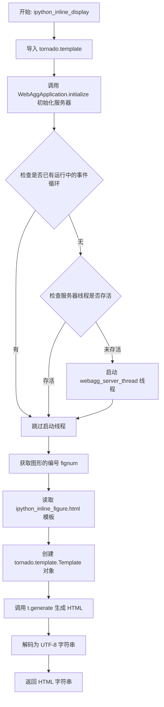

#### 带注释源码

```python
def ipython_inline_display(figure):
    """
    在 IPython Notebook 中内联显示 matplotlib 图形。
    
    该函数初始化 WebAgg 服务器（如未初始化），
    读取 HTML 模板，生成包含图形信息的 HTML 内容。
    
    参数:
        figure: matplotlib.figure.Figure 实例，要显示的图形
        
    返回:
        str: 生成的 HTML 字符串，用于 IPython 内联显示
    """
    # 导入 tornado 模板模块
    import tornado.template

    # 初始化 WebAggApplication（如尚未初始化）
    # 设置服务器地址、端口等配置
    WebAggApplication.initialize()
    
    # 导入 asyncio 用于检查事件循环状态
    import asyncio
    try:
        # 检查是否存在正在运行的事件循环
        asyncio.get_running_loop()
    except RuntimeError:
        # 没有运行中的事件循环，检查服务器线程是否已启动
        if not webagg_server_thread.is_alive():
            # 启动后台服务器线程
            webagg_server_thread.start()

    # 获取图形的编号（用于构建 URL 和标识）
    fignum = figure.number
    
    # 构建 HTML 模板文件的完整路径
    # get_static_file_path() 返回静态文件目录
    tpl = Path(core.FigureManagerWebAgg.get_static_file_path(),
               "ipython_inline_figure.html").read_text()
    
    # 使用 tornado 模板引擎解析模板
    t = tornado.template.Template(tpl)
    
    # 渲染模板，生成包含图形信息的 HTML
    # 参数包括：URL 前缀、图形 ID、工具栏项、画布、端口
    return t.generate(
        prefix=WebAggApplication.url_prefix,
        fig_id=fignum,
        toolitems=core.NavigationToolbar2WebAgg.toolitems,
        canvas=figure.canvas,
        port=WebAggApplication.port).decode('utf-8')
```


### FigureManagerWebAgg.pyplot_show

该方法是matplotlib WebAgg后端的核心入口，负责在浏览器中显示Agg图像。它初始化Web服务器、构建访问URL、根据配置决定是否自动打开浏览器，并启动Tornado事件循环。

参数：

- `block`：`bool | None`（关键字参数），控制是否阻塞主线程。在matplotlib的pyplot_show模式中，此参数决定是否等待服务器关闭。

返回值：`None`，无返回值。该方法通过启动Web服务器并打开浏览器来显示图像。

#### 流程图

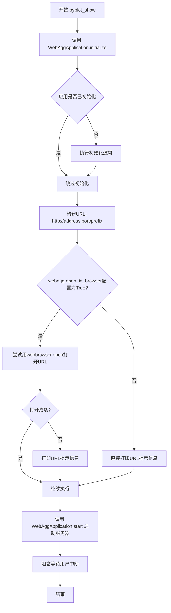

#### 带注释源码

```python
@classmethod
def pyplot_show(cls, *, block=None):
    """
    在浏览器中显示matplotlib图像的类方法。
    
    参数:
        block: 关键字参数，控制是否阻塞等待服务器关闭。
               在当前实现中未直接使用，但保留接口兼容性。
    """
    # 第一步：初始化WebAgg应用
    # 检查应用是否已初始化，如果未初始化则创建Tornado应用实例、
    # 绑定地址和端口、设置路由规则等
    WebAggApplication.initialize()

    # 第二步：构建完整的访问URL
    # 格式：http://{address}:{port}{prefix}
    # address: 服务器监听地址，默认从rcParams读取
    # port: 服务器监听端口，默认从rcParams读取
    # prefix: URL前缀，用于反向代理场景
    url = "http://{address}:{port}{prefix}".format(
        address=WebAggApplication.address,
        port=WebAggApplication.port,
        prefix=WebAggApplication.url_prefix)

    # 第三步：根据配置决定是否自动打开浏览器
    # mpl.rcParams['webagg.open_in_browser'] 控制自动打开行为
    if mpl.rcParams['webagg.open_in_browser']:
        # 尝试使用系统默认浏览器打开URL
        import webbrowser
        # webbrowser.open返回True表示成功打开，False表示失败
        if not webbrowser.open(url):
            # 如果打开失败（可能是无头环境），打印URL供用户手动访问
            print(f"To view figure, visit {url}")
    else:
        # 配置为不自动打开时，始终打印URL
        print(f"To view figure, visit {url}")

    # 第四步：启动Tornado IOLoop
    # 这是一个阻塞调用，服务器开始监听并处理请求
    # 用户可以在终端按Ctrl+C停止服务器
    WebAggApplication.start()
```


### `WebAggApplication.__init__`

该方法是 `WebAggApplication` 类的构造函数，负责初始化 Tornado Web 应用实例，配置 URL 路由规则（包括静态文件、图形页面、WebSocket 通信等），并设置模板路径。

参数：

- `url_prefix`：可选的 URL 前缀字符串，用于支持应用部署在子路径下，默认为空字符串

返回值：无（构造函数）

#### 流程图

```mermaid
flowchart TD
    A[开始 __init__] --> B{url_prefix 是否非空?}
    B -- 是 --> C[验证 url_prefix 格式:<br/>必须以'/'开头且不以'/'结尾]
    C --> D[验证通过继续]
    B -- 否 --> D
    D --> E[调用父类 tornado.web.Application 构造函数]
    E --> F[配置 URL 路由列表]
    F --> F1[静态文件路由: /_static/]
    F --> F2[静态图片路由: /_images/]
    F --> F3[图标路由: /favicon.ico]
    F --> F4[单图形页面路由: /{fignum}]
    F --> F5[所有图形页面路由: /]
    F --> F6[JavaScript 路由: /js/mpl.js]
    F --> F7[WebSocket 路由: /{fignum}/ws]
    F --> F8[下载路由: /{fignum}/download.{fmt}]
    F --> G[设置模板路径]
    G --> H[结束]
```

#### 带注释源码

```
def __init__(self, url_prefix=''):
    """
    初始化 WebAggApplication 应用实例
    
    参数:
        url_prefix: 可选的 URL 前缀，用于支持子路径部署
    """
    # 验证 url_prefix 格式：必须以斜杠开头且不以斜杠结尾
    if url_prefix:
        assert url_prefix[0] == '/' and url_prefix[-1] != '/', \
            'url_prefix must start with a "/" and not end with one.'

    # 调用父类 tornado.web.Application 的构造函数
    # 配置所有 URL 路由规则
    super().__init__(
        [
            # 静态文件路由：CSS 和 JS 文件
            # 对应路径: url_prefix/_static/<filename>
            (url_prefix + r'/_static/(.*)',
             tornado.web.StaticFileHandler,
             {'path': core.FigureManagerWebAgg.get_static_file_path()}),

            # 静态图片路由：工具栏图标等
            # 对应路径: url_prefix/_images/<filename>
            (url_prefix + r'/_images/(.*)',
             tornado.web.StaticFileHandler,
             {'path': Path(mpl.get_data_path(), 'images')}),

            # Matplotlib 网站图标
            # 对应路径: url_prefix/favicon.ico
            (url_prefix + r'/favicon.ico', self.FavIcon),

            # 单个图形页面路由
            # 对应路径: url_prefix/<fignum>
            (url_prefix + r'/([0-9]+)', self.SingleFigurePage,
             {'url_prefix': url_prefix}),

            # 所有图形页面路由（概览页）
            # 对应路径: url_prefix/ 或 url_prefix
            (url_prefix + r'/?', self.AllFiguresPage,
             {'url_prefix': url_prefix}),

            # JavaScript 文件路由
            # 对应路径: url_prefix/js/mpl.js
            (url_prefix + r'/js/mpl.js', self.MplJs),

            # WebSocket 通信路由
            # 用于浏览器与服务端的实时双向通信
            # 对应路径: url_prefix/<fignum>/ws
            (url_prefix + r'/([0-9]+)/ws', self.WebSocket),

            # 图形下载路由
            # 支持将图形保存为各种格式
            # 对应路径: url_prefix/<fignum>/download.<format>
            (url_prefix + r'/([0-9]+)/download.([a-z0-9.]+)',
             self.Download),
        ],
        # 设置模板文件路径，用于渲染 HTML 页面
        template_path=core.FigureManagerWebAgg.get_static_file_path())
```


### `WebAggApplication.initialize`

该方法为WebAgg服务器执行初始化逻辑，包括创建Tornado应用实例、配置URL前缀、选择可用端口以及启动监听服务。

参数：

- `url_prefix`：`str`，URL前缀路径，默认为空字符串，用于设置Web应用的路由前缀
- `port`：`int | None`，指定服务器端口，若为None则从matplotlib配置文件中读取默认端口
- `address`：`str | None`，服务器监听地址，若为None则从matplotlib配置文件中读取默认地址

返回值：`None`，该方法无返回值，通过修改类属性完成服务器初始化

#### 流程图

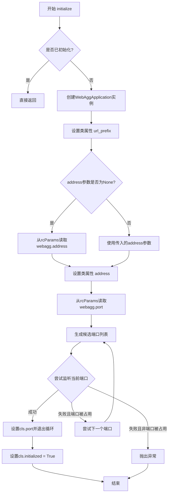

#### 带注释源码

```python
@classmethod
def initialize(cls, url_prefix='', port=None, address=None):
    """
    初始化WebAgg服务器应用。
    
    该方法为类方法，用于一次性初始化WebAgg服务器。
    如果服务器已经初始化，则直接返回而不重复初始化。
    
    参数:
        url_prefix: str, URL前缀路径，默认为空字符串
        port: int or None, 指定端口，None时使用配置文件默认值
        address: str or None, 指定监听地址，None时使用配置文件默认值
    """
    # 检查是否已经初始化，避免重复初始化
    if cls.initialized:
        return

    # 创建WebAggApplication类实例，传入url_prefix参数
    app = cls(url_prefix=url_prefix)

    # 保存url_prefix到类属性，供其他方法使用
    cls.url_prefix = url_prefix

    # 定义内部函数：生成随机候选端口列表
    # 该算法从IPython借鉴而来，用于寻找可用端口
    def random_ports(port, n):
        """
        生成n个接近给定端口的随机端口列表。
        
        前5个端口是顺序的，剩余的n-5个在[port-2*n, port+2*n]范围内随机选择。
        """
        for i in range(min(5, n)):
            yield port + i
        for i in range(n - 5):
            yield port + random.randint(-2 * n, 2 * n)

    # 确定监听地址：优先使用传入参数，否则从matplotlib配置读取
    if address is None:
        cls.address = mpl.rcParams['webagg.address']
    else:
        cls.address = address
    
    # 从matplotlib配置获取默认端口
    cls.port = mpl.rcParams['webagg.port']
    
    # 遍历候选端口列表，尝试绑定到可用端口
    for port in random_ports(cls.port,
                             mpl.rcParams['webagg.port_retries']):
        try:
            # 尝试在指定端口和地址上启动监听
            app.listen(port, cls.address)
        except OSError as e:
            # 如果端口被占用(EADDRINUSE)，尝试下一个端口
            if e.errno != errno.EADDRINUSE:
                raise
        else:
            # 绑定成功，记录实际使用的端口并退出循环
            cls.port = port
            break
    else:
        # 所有候选端口都不可用，抛出系统退出异常
        raise SystemExit(
            "The webagg server could not be started because an available "
            "port could not be found")

    # 标记初始化完成状态
    cls.initialized = True
```


### `WebAggApplication.start`

该方法是WebAggApplication类的类方法，用于启动Tornado IOLoop事件循环，使WebAgg服务器开始运行并处理HTTP/WebSocket请求。如果没有正在运行的事件循环，则阻塞等待客户端连接；若事件循环已启动或服务器已启动，则直接返回。

参数： 无

返回值：无返回值（`None`），方法通过启动Tornado IOLoop来实现服务器运行逻辑

#### 流程图

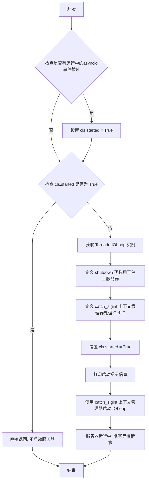

#### 带注释源码

```python
@classmethod
def start(cls):
    """
    启动 WebAgg 服务器的 Tornado IOLoop 事件循环。
    该方法会阻塞直到服务器停止或收到 SIGINT 信号。
    """
    # 导入 asyncio 模块，用于检查是否有运行中的事件循环
    import asyncio
    
    # 尝试获取当前运行中的 asyncio 事件循环
    try:
        asyncio.get_running_loop()
    except RuntimeError:
        # 没有运行中的事件循环，继续执行
        pass
    else:
        # 存在运行中的事件循环，设置 started 标志为 True
        cls.started = True

    # 如果服务器已经启动，则直接返回，不重复启动
    if cls.started:
        return

    """
    注意：IOLoop.running() 在 Tornado 2.4 版本中被移除
    因此无法准确检查循环是否已经启动
    不幸的情况下可能会出现两个并发运行的循环
    """
    
    # 获取 Tornado IOLoop 的单例实例
    ioloop = tornado.ioloop.IOLoop.instance()

    def shutdown():
        """
        关闭服务器的回调函数。
        停止 IOLoop，重置启动状态标志。
        """
        ioloop.stop()
        print("Server is stopped")
        sys.stdout.flush()
        cls.started = False

    @contextmanager
    def catch_sigint():
        """
        上下文管理器，用于捕获 SIGINT 信号（Ctrl+C）并安全关闭服务器。
        """
        # 保存旧的信号处理器
        old_handler = signal.signal(
            signal.SIGINT,
            lambda sig, frame: ioloop.add_callback_from_signal(shutdown))
        try:
            yield  # 执行 with 语句块中的代码
        finally:
            # 恢复旧的信号处理器
            signal.signal(signal.SIGINT, old_handler)

    # 在阻塞之前设置启动标志为 True
    cls.started = True

    # 打印服务器启动提示信息
    print("Press Ctrl+C to stop WebAgg server")
    sys.stdout.flush()
    
    # 使用上下文管理器捕获 Ctrl+C 信号，然后启动 IOLoop
    # ioloop.start() 会阻塞直到 ioloop.stop() 被调用
    with catch_sigint():
        ioloop.start()
```


### `WebAggApplication.FavIcon.get`

该方法处理浏览器对网站 favicon.ico 的请求，返回 Matplotlib 的图标图像（PNG 格式）作为网站的收藏夹图标。

参数：

- `self`：`tornado.web.RequestHandler`，Tornado 请求处理器实例，用于处理 HTTP 请求和响应

返回值：`None`，无返回值（方法通过 `self.write()` 直接向响应写入字节数据）

#### 流程图

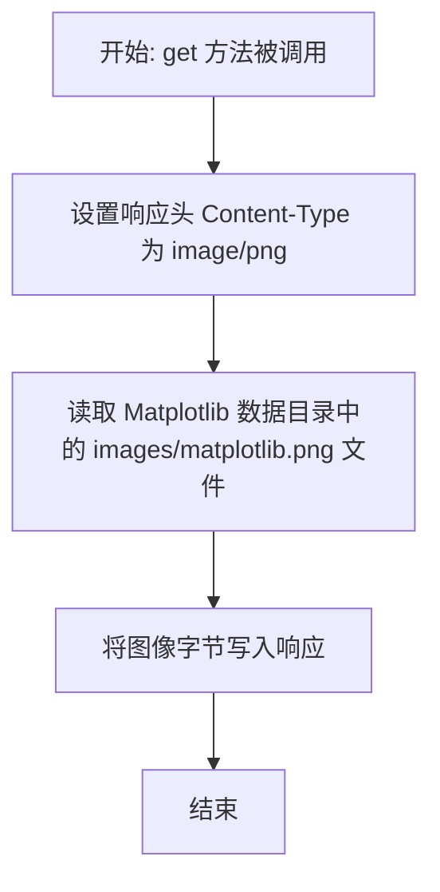

#### 带注释源码

```python
class FavIcon(tornado.web.RequestHandler):
    def get(self):
        """
        处理对 favicon.ico 的 GET 请求，返回 Matplotlib 图标。
        
        该方法作为 Tornado 请求处理器，当浏览器请求网站 favicon 时被调用，
        返回 Matplotlib 的默认图标作为网站的收藏夹图标。
        """
        # 设置 HTTP 响应头，声明内容类型为 PNG 图像
        self.set_header('Content-Type', 'image/png')
        
        # 读取 Matplotlib 数据目录中的 matplotlib.png 图标文件
        # 并将读取的二进制数据写入 HTTP 响应体
        self.write(Path(mpl.get_data_path(),
                        'images/matplotlib.png').read_bytes())
```


### `WebAggApplication.SingleFigurePage.__init__`

该方法是 Tornado RequestHandler 的子类 `SingleFigurePage` 的构造函数，用于初始化单个图形页面的请求处理器，设置 URL 前缀并调用父类构造函数。

参数：

- `self`：`SingleFigurePage`，类的实例本身
- `application`：`tornado.web.Application`，Tornado Web 应用实例
- `request`：`tornado.httputil.HTTPRequest`，HTTP 请求对象
- `url_prefix`：`str`，关键字参数，URL 路径前缀，默认为空字符串
- `**kwargs`：关键字参数字典，传递给父类 RequestHandler 的其他参数

返回值：`None`，无显式返回值，Python 中 `__init__` 方法隐式返回 None

#### 流程图

```mermaid
flowchart TD
    A[开始 __init__] --> B{检查 url_prefix 参数}
    B --> C[将 url_prefix 赋值给实例变量 self.url_prefix]
    C --> D[调用父类构造函数 super().__init__]
    D --> E[传入 application, request 和 kwargs]
    E --> F[结束初始化]
    
    style A fill:#f9f,color:#000
    style F fill:#9f9,color:#000
```

#### 带注释源码

```python
class SingleFigurePage(tornado.web.RequestHandler):
    def __init__(self, application, request, *, url_prefix='', **kwargs):
        """
        初始化 SingleFigurePage 请求处理器
        
        参数:
            application: Tornado Web 应用实例，用于处理请求
            request: HTTP 请求对象，包含请求的详细信息
            url_prefix: URL 路径前缀，用于构建 WebSocket 连接等
            **kwargs: 其他关键字参数，传递给父类 RequestHandler
        """
        # 将 URL 前缀保存为实例变量，供后续 get 方法使用
        self.url_prefix = url_prefix
        
        # 调用父类 RequestHandler 的构造函数，完成初始化
        # Tornado 会使用这些参数来设置请求处理器
        super().__init__(application, request, **kwargs)
```


### `WebAggApplication.SingleFigurePage.get`

该方法是 Tornado RequestHandler 的 GET 请求处理函数，负责根据 URL 中的图形编号渲染单个图形的 HTML 页面。它从全局图形管理器获取图形对象，并将其传递给模板进行渲染。

参数：

- `self`：隐式参数，RequestHandler 实例本身
- `fignum`：字符串类型，从 URL 路径中提取的图形编号（如 `/123`）

返回值：无（通过 `self.render()` 直接向客户端发送 HTTP 响应）

#### 流程图

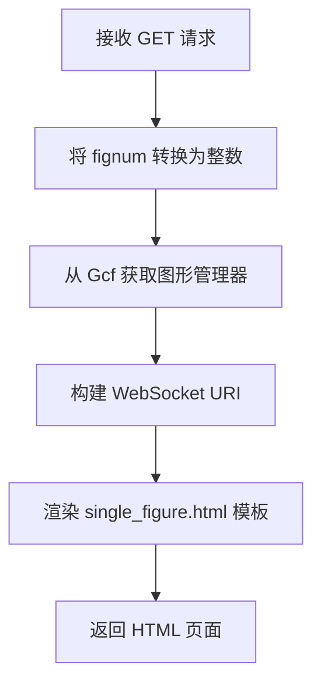

#### 带注释源码

```python
def get(self, fignum):
    # 将字符串类型的图形编号转换为整数
    fignum = int(fignum)
    
    # 从全局图形管理器 Gcf 获取对应的图形管理器实例
    # Gcf 是一个全局字典，维护着所有活跃的图形
    manager = Gcf.get_fig_manager(fignum)

    # 构建 WebSocket 连接 URI，格式如 ws://host:port/prefix/
    ws_uri = f'ws://{self.request.host}{self.url_prefix}/'
    
    # 渲染单个图形页面，传递必要的参数
    self.render(
        "single_figure.html",          # 模板文件名
        prefix=self.url_prefix,        # URL 前缀
        ws_uri=ws_uri,                 # WebSocket URI
        fig_id=fignum,                 # 图形 ID
        toolitems=core.NavigationToolbar2WebAgg.toolitems,  # 工具栏项
        canvas=manager.canvas)         # 图形画布对象
```


### `WebAggApplication.AllFiguresPage.__init__`

该方法是 Tornado 请求处理程序 `AllFiguresPage` 的构造函数，用于初始化 Web 应用程序中显示所有图表页面的处理器。它接收应用程序实例、请求对象以及可选的 URL 前缀参数，并将其存储为实例属性。

参数：

- `application`：`tornado.web.Application`，Tornado Web 应用程序实例
- `request`：`tornado.httputil.HTTPServerRequest`，HTTP 请求对象
- `url_prefix`：`str`（关键字参数，可选，默认为 `''`），URL 路径前缀，用于支持在子路径下部署 WebAgg 服务器
- `**kwargs`：可变关键字参数，传递给父类的其他参数

返回值：`None`，无返回值（构造函数）

#### 流程图

```mermaid
graph TD
    A[开始 __init__] --> B[接收参数: application, request, url_prefix='', **kwargs]
    B --> C[设置 self.url_prefix = url_prefix]
    C --> D[调用父类 __init__: super().__init__(application, request, **kwargs)]
    D --> E[结束 __init__]
```

#### 带注释源码

```python
class AllFiguresPage(tornado.web.RequestHandler):
    def __init__(self, application, request, *, url_prefix='', **kwargs):
        """
        初始化 AllFiguresPage 请求处理器
        
        参数:
            application: Tornado Web 应用程序实例
            request: HTTP 请求对象
            url_prefix: URL 路径前缀，可选，默认为空字符串
            **kwargs: 传递给父类的其他关键字参数
        """
        # 将 URL 前缀存储为实例属性，供后续的 get 方法使用
        self.url_prefix = url_prefix
        
        # 调用父类 RequestHandler 的初始化方法
        super().__init__(application, request, **kwargs)
```


### WebAggApplication.AllFiguresPage.get

该方法处理对所有图形概览页面的HTTP GET请求，负责渲染显示当前所有活动图形的管理器列表的HTML页面，通过WebSocket实现前端与后端的实时通信。

参数：

- `self`：AllFiguresPage对象，tornado.web.RequestHandler的实例，表示当前请求处理器

返回值：`None`，该方法通过`tornado.web.RequestHandler.render()`直接向客户端渲染HTML响应，无显式返回值

#### 流程图

```mermaid
flowchart TD
    A[收到GET请求 /] --> B[构建WebSocket URI]
    B --> C[获取所有图形管理器]
    C --> D[对图形按ID排序]
    D --> E[调用render渲染all_figures.html模板]
    E --> F[返回完整HTML页面给客户端]
    
    B --> B1[获取请求host和url_prefix]
    B1 --> B2[拼接ws://{host}{url_prefix}/]
    
    C --> C1[从Gcf.figs获取所有图形]
    C1 --> C2[Gcf是图形管理器全局字典]
```

#### 带注释源码

```python
class AllFiguresPage(tornado.web.RequestHandler):
    """处理显示所有图形概览页面的请求处理器"""
    
    def __init__(self, application, request, *, url_prefix='', **kwargs):
        """
        初始化请求处理器
        
        参数:
            application: tornado.web.Application实例
            request: HTTP请求对象
            url_prefix: URL前缀路径，默认为空字符串
        """
        self.url_prefix = url_prefix  # 存储URL前缀，用于页面链接和WebSocket连接
        super().__init__(application, request, **kwargs)

    def get(self):
        """
        处理GET请求，渲染显示所有图形的页面
        
        该方法执行以下操作:
        1. 构建WebSocket连接URI，用于前端实时通信
        2. 从全局图形管理器Gcf获取所有活动的图形
        3. 对图形进行排序（按图形编号）
        4. 渲染HTML模板并返回给客户端
        """
        # 构建WebSocket URI，格式: ws://{host}/{url_prefix}/
        # 用于前端与后端建立双向通信通道
        ws_uri = f'ws://{self.request.host}{self.url_prefix}/'
        
        # 渲染all_figures.html模板，传递必要参数
        # - prefix: URL前缀
        # - ws_uri: WebSocket连接地址
        # - figures: 排序后的所有图形项(图形编号, 图形管理器)元组列表
        # - toolitems: 工具栏项目配置
        self.render(
            "all_figures.html",
            prefix=self.url_prefix,
            ws_uri=ws_uri,
            figures=sorted(Gcf.figs.items()),  # sorted返回List[Tuple[int, FigureManager]]
            toolitems=core.NavigationToolbar2WebAgg.toolitems)
```


### `WebAggApplication.MplJs.get`

该方法是`WebAggApplication`内部类`MplJs`的GET请求处理程序，负责向浏览器返回Matplotlib WebAgg后端的JavaScript文件内容，用于在浏览器端渲染交互式图形。

参数：

- `self`：`WebAggApplication.MplJs`（继承自`tornado.web.RequestHandler`），表示请求处理程序实例，用于处理HTTP请求和响应

返回值：`None`，无直接返回值，通过`tornado.web.RequestHandler`的`write()`方法将JavaScript内容写入HTTP响应体

#### 流程图

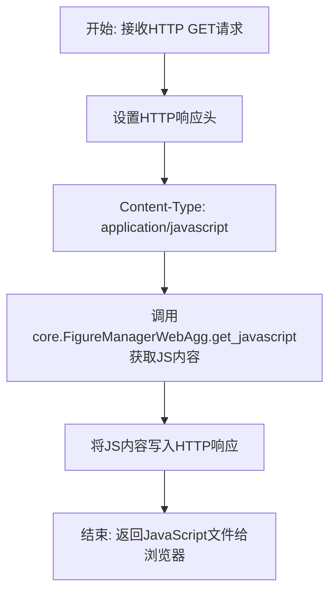

#### 带注释源码

```python
class MplJs(tornado.web.RequestHandler):
    """
    Tornado请求处理器，用于提供JavaScript文件给前端页面。
    该处理器映射到URL: /js/mpl.js
    """
    
    def get(self):
        """
        处理GET请求，返回Matplotlib WebAgg的JavaScript文件。
        
        执行流程：
        1. 设置响应的Content-Type为application/javascript
        2. 从core模块获取JavaScript内容
        3. 将JavaScript写入响应体
        """
        # 设置HTTP响应头，告知浏览器返回的是JavaScript文件
        self.set_header('Content-Type', 'application/javascript')

        # 从FigureManagerWebAgg获取JavaScript内容
        # 这些JS代码负责在浏览器端处理图形渲染和交互
        js_content = core.FigureManagerWebAgg.get_javascript()

        # 将JavaScript内容写入HTTP响应体
        self.write(js_content)
```


### `WebAggApplication.Download.get`

该方法是 Tornado RequestHandler，用于处理图形下载请求。它接收图形编号和格式，从全局图形管理器获取对应的图形，并将图形保存为指定格式后发送给客户端。

参数：

- `self`：`tornado.web.RequestHandler`，Tornado 请求处理器实例
- `fignum`：`str`，从 URL 路径中提取的图形编号
- `fmt`：`str`，从 URL 路径中提取的下载格式（如 'png', 'pdf' 等）

返回值：无直接返回值（通过 `self.write()` 将图形数据写入 HTTP 响应）

#### 流程图

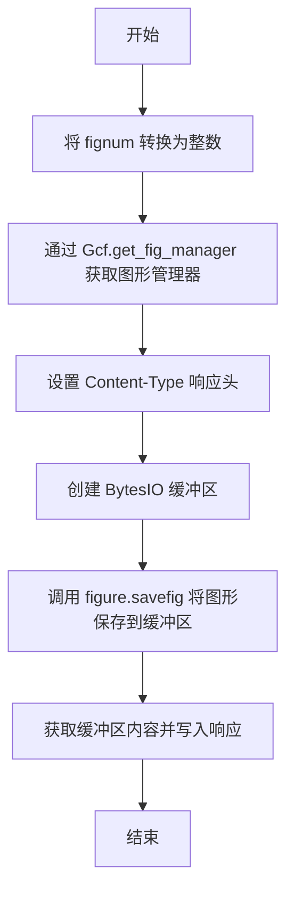

#### 带注释源码

```python
class Download(tornado.web.RequestHandler):
    def get(self, fignum, fmt):
        # 将图形编号字符串转换为整数
        fignum = int(fignum)
        
        # 从全局图形管理器获取对应的图形管理器实例
        manager = Gcf.get_fig_manager(fignum)
        
        # 设置 HTTP 响应头的 Content-Type
        # 使用 mimetypes 模块获取格式对应的 MIME 类型，默认使用 'binary'
        self.set_header(
            'Content-Type', mimetypes.types_map.get(fmt, 'binary'))
        
        # 创建内存缓冲区用于保存图形数据
        buff = BytesIO()
        
        # 调用图形的 savefig 方法将图形保存为指定格式到缓冲区
        manager.canvas.figure.savefig(buff, format=fmt)
        
        # 将缓冲区中的二进制数据写入 HTTP 响应发送给客户端
        self.write(buff.getvalue())
```


### `WebAggApplication.WebSocket.open`

当WebSocket连接打开时，此方法被调用，用于初始化与特定图形关联的WebSocket连接，并将该WebSocket注册到图形管理器中。

参数：

- `fignum`：`str`，从URL路径中提取的图形编号，用于标识要连接的图形

返回值：`None`，此方法不返回任何值，但在内部初始化实例属性

#### 流程图

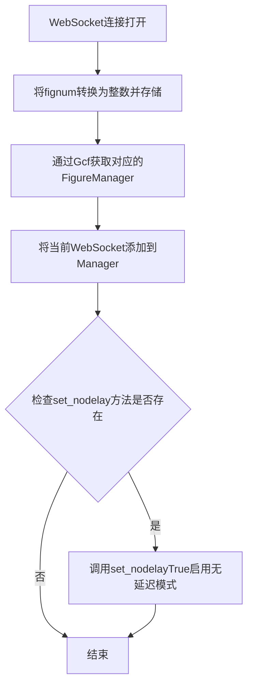

#### 带注释源码

```python
def open(self, fignum):
    """
    当WebSocket连接打开时调用。
    
    参数:
        fignum: 从URL路径中提取的图形编号字符串
    """
    # 将图形编号转换为整数并存储为实例属性
    self.fignum = int(fignum)
    
    # 通过Gcf获取对应的图形管理器
    self.manager = Gcf.get_fig_manager(self.fignum)
    
    # 将当前WebSocket实例添加到图形管理器
    # 以便管理器可以向客户端发送更新
    self.manager.add_web_socket(self)
    
    # 如果存在set_nodelay方法（某些Tornado版本可能没有）
    # 则调用它以禁用Nagle算法，减少延迟
    if hasattr(self, 'set_nodelay'):
        self.set_nodelay(True)
```


### `WebAggApplication.WebSocket.on_close`

当WebSocket连接关闭时，此方法会被Tornado框架自动调用，用于清理资源，从管理器中移除该WebSocket连接。

参数：

- `self`：`WebSocket` 实例，表示当前的WebSocket连接对象

返回值：`None`，无返回值

#### 流程图

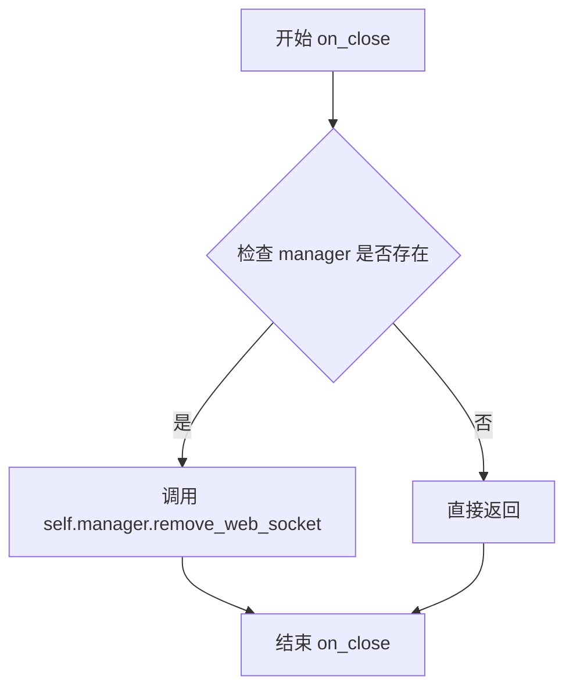

#### 带注释源码

```python
def on_close(self):
    """
    当WebSocket连接关闭时调用的回调函数。
    用于清理资源，从FigureManager中移除该WebSocket连接。
    
    注意：
    - 此方法由Tornado WebSocketHandler自动调用
    - 在连接断开时执行必要的清理工作
    - 确保不再接收该连接的消息
    """
    self.manager.remove_web_socket(self)
    # 从关联的FigureManager中移除当前WebSocket实例
    # 这样可以防止已关闭的连接继续接收更新
```


### `WebAggApplication.WebSocket.on_message`

该方法是 Tornado WebSocket 处理器，用于接收浏览器客户端发送的 JSON 消息，并根据消息类型处理：如果是 `supports_binary` 消息则更新客户端的二进制支持标志，否则将消息转发给 FigureManager 进行处理。

参数：

- `message`：`str`，从浏览器客户端通过 WebSocket 接收的 JSON 消息字符串

返回值：`None`，该方法不返回任何值，仅执行副作用操作

#### 流程图

```mermaid
flowchart TD
    A[WebSocket 接收到消息] --> B[JSON 解析消息]
    B --> C{消息类型是 'supports_binary'?}
    C -->|是| D[设置 self.supports_binary = message['value']]
    C -->|否| E[获取 FigureManager]
    E --> F{manager 是否存在?}
    F -->|否| G[直接返回 - 防止处理已关闭的 figure]
    F -->|是| H[调用 manager.handle_json 处理消息]
    D --> I[流程结束]
    H --> I
```

#### 带注释源码

```python
def on_message(self, message):
    """
    处理从浏览器通过 WebSocket 接收到的消息。
    
    参数:
        message: str, JSON 格式的字符串消息
    """
    # 将 JSON 字符串解析为 Python 字典
    message = json.loads(message)
    
    # 'supports_binary' 消息是针对每个客户端的独立配置
    # 其他消息影响整个（共享的）画布
    if message['type'] == 'supports_binary':
        # 更新客户端的二进制支持标志
        self.supports_binary = message['value']
    else:
        # 获取当前图形编号对应的 FigureManager
        manager = Gcf.get_fig_manager(self.fignum)
        
        # 可能会出现图形已关闭但浏览器仍然发送消息的
        # 过期 UI 情况，此时 manager 为 None
        if manager is not None:
            # 将 JSON 消息交给 FigureManager 处理
            manager.handle_json(message)
```


### `WebAggApplication.WebSocket.send_json`

该方法是 WebSocket 处理器的一个成员，用于将 Python 对象（通常是字典或列表）序列化为 JSON 格式并通过 WebSocket 连接发送到前端浏览器，实现 Matplotlib 图形在前端的实时更新和交互。

参数：

- `content`：`Any`，要发送的 Python 对象（通常为字典或列表），会被序列化为 JSON 格式

返回值：`None`，该方法没有返回值，通过 WebSocket 发送消息到客户端

#### 流程图

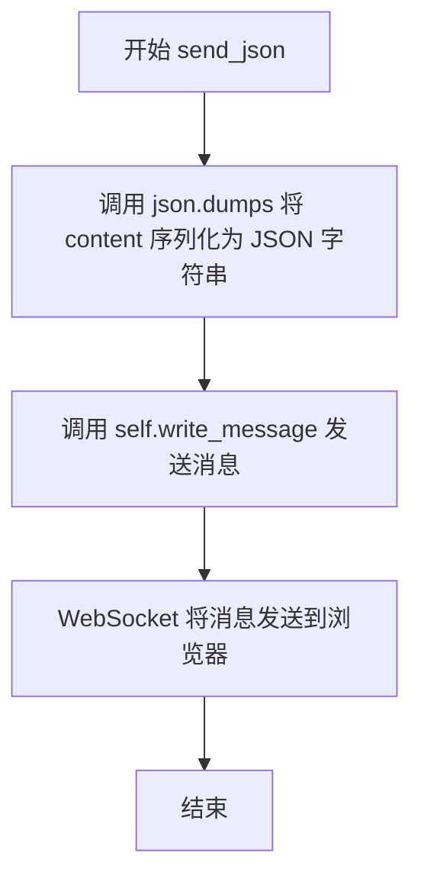

#### 带注释源码

```python
def send_json(self, content):
    """
    将 Python 对象序列化为 JSON 并通过 WebSocket 发送到客户端。

    参数:
        content: 要发送的 Python 对象（通常为字典或列表），
                 会被 json.dumps 序列化为 JSON 字符串

    返回值:
        无返回值，通过 WebSocket 连接发送消息
    """
    # 使用 json.dumps 将 Python 对象转换为 JSON 字符串
    # 然后调用 write_message 通过 WebSocket 发送
    self.write_message(json.dumps(content))
```


### `WebAggApplication.WebSocket.send_binary`

该方法是 WebSocket 处理器中用于将二进制图像数据发送到客户端的核心方法。它根据客户端是否支持二进制传输（通过 `supports_binary` 标志判断），选择直接发送二进制数据或转换为 Base64 编码的 Data URI 格式进行发送。

参数：

- `blob`：`bytes`，表示要发送的二进制图像数据（通常为 PNG 格式）

返回值：`None`，该方法无返回值，通过 WebSocket 协议将数据发送给客户端

#### 流程图

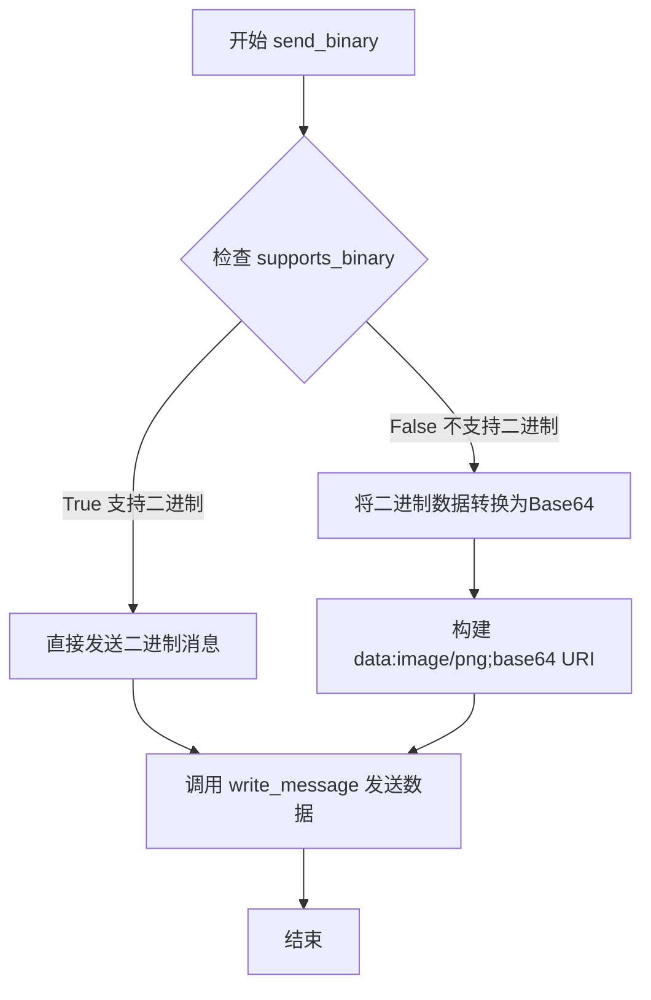

#### 带注释源码

```python
def send_binary(self, blob):
    """
    将二进制图像数据发送到WebSocket客户端。
    
    参数:
        blob: bytes类型，二进制图像数据（通常为PNG格式）
    """
    # 检查客户端是否支持二进制传输
    if self.supports_binary:
        # 如果客户端支持二进制，直接以二进制模式发送数据
        # binary=True 参数告诉 Tornado 将数据作为原始二进制数据发送
        self.write_message(blob, binary=True)
    else:
        # 客户端不支持二进制传输，降级为 Base64 编码的 Data URI
        # 1. 将二进制数据编码为 Base64 字符串
        # 2. 移除换行符（Base64 编码可能包含换行符）
        # 3. 构建 Data URI 格式: data:image/png;base64,<编码数据>
        data_uri = "data:image/png;base64,{}".format(
            blob.encode('base64').replace('\n', ''))
        # 以文本消息方式发送 Data URI
        self.write_message(data_uri)
```

## 关键组件


### WebAggApplication

Tornado Web应用程序主类，负责路由管理、页面渲染和WebSocket连接处理，集成了静态文件服务、图形页面展示、JavaScript资源和下载处理功能。

### FigureManagerWebAgg

图形管理器类，扩展自core.FigureManagerWebAgg，负责pyplot_show方法的实现，初始化WebAgg应用、构建访问URL、处理浏览器打开和服务器启动逻辑。

### FigureCanvasWebAgg

图形画布类，扩展自core.FigureCanvasWebAggCore，设置manager_class为FigureManagerWebAgg，用于在Web环境中渲染matplotlib图形。

### WebSocket

Tornado WebSocket处理器，负责浏览器与服务器之间的实时双向通信，支持二进制和文本消息传输，处理图形交互事件和二进制支持协商。

### SingleFigurePage

单个图形页面请求处理器，根据图形编号获取图形管理器，渲染包含单个matplotlib图形的HTML页面，提供WebSocket连接URI和工具栏配置。

### AllFiguresPage

所有图形页面请求处理器，渲染展示所有活动图形的HTML页面，收集Gcf.figs中的所有图形并按排序顺序展示。

### MplJs

JavaScript资源请求处理器，提供Matplotlib WebAgg前端的JavaScript代码，用于浏览器端的图形交互和事件处理。

### Download

图形下载请求处理器，支持将matplotlib图形保存为多种格式（PNG、JPEG等），根据请求的格式参数生成对应的图形文件并返回给客户端。

### FavIcon

网站图标请求处理器，返回Matplotlib的favicon图标数据，用于浏览器标签页显示。

### ipython_inline_display

IPython内联显示函数，用于在Jupyter notebook环境中内联展示matplotlib图形，生成包含图形内容的HTML模板代码。

### webagg_server_thread

后台服务器线程，运行Tornado IOLoop实例以处理Web请求，使WebAgg服务器能够在独立线程中运行而不阻塞主线程。


## 问题及建议


### 已知问题

- **非线程安全的单例模式**: `WebAggApplication` 使用类变量 (`initialized`, `started`, `address`, `port`) 作为单例状态，检查和设置 `cls.started` 不是原子操作，存在竞态条件风险
- **信号处理不当**: 使用 `lambda` 作为信号处理器，且 `catch_sigint` 上下文管理器定义在方法内部，可读性和可维护性差
- **WebSocket 消息解析缺少异常处理**: `json.loads(message)` 如果收到畸形 JSON 会直接抛出异常，没有 try-except 包裹
- **缺少连接超时和心跳机制**: WebSocket 连接没有 ping/pong 机制，可能导致死连接占用资源
- **资源泄漏风险**: `Download` 处理器中创建的 `BytesIO` 缓冲区没有显式关闭；daemon 线程 `webagg_server_thread` 可能在主进程退出时被强制终止
- **静默失败的消息处理**: `WebSocket.on_message` 中当 `manager` 为 `None` 时直接忽略消息，没有日志记录，可能导致调试困难
- **导入语句位置不当**: 部分导入（如 `webbrowser`、`asyncio`）在函数内部进行，增加了运行时开销
- **URL 前缀验证不够健壮**: `url_prefix` 验证只检查了开头和结尾，内部包含非法字符的情况未处理
- **端口选择算法可优化**: `random_ports` 函数定义在 `initialize` 方法内部，每次调用都会重新定义，且随机端口范围可能产生无效端口

### 优化建议

- 使用 `threading.Lock` 保护单例状态的读写，或改用更健壮的单例实现模式
- 将 `json.loads` 包裹在 try-except 中处理 JSON 解析错误，并记录日志
- 为 WebSocket 添加心跳机制，定期发送 ping/pong 检测连接状态
- 使用上下文管理器确保 `BytesIO` 正确关闭，或使用 `with` 语句
- 将 `random_ports` 和 `catch_sigint` 提取到模块级别或单独的辅助类中
- 将函数内部导入移到文件顶部，提高代码可读性和性能
- 添加连接超时配置和优雅关闭机制，确保 daemon 线程能正确清理资源
- 为 `Download` 处理器增加格式白名单验证，防止任意文件格式下载
- 增加适当的日志记录，特别是在静默忽略消息时记录 debug 级别日志便于调试

## 其它


### 设计目标与约束

本模块旨在为matplotlib提供基于Web的交互式可视化后端，允许用户在浏览器中查看和交互操作图表。核心设计目标包括：1）通过WebSocket实现浏览器与服务器的实时双向通信；2）支持多个figure的管理和展示；3）提供基于Tornado的轻量级Web服务器；4）支持在IPython环境中的内联显示。约束条件包括：必须使用Tornado框架；依赖matplotlib的核心后端模块；需要浏览器支持WebSocket和JavaScript。

### 错误处理与异常设计

代码中的错误处理主要体现在以下几个方面：1）导入错误捕获 - 使用try/except捕获Tornado导入错误并抛出RuntimeError；2）端口占用处理 - 在initialize方法中使用try/except捕获OSError，当端口被占用时尝试其他端口；3）无效端口处理 - 如果无法找到可用端口则抛出SystemExit；4）figure关闭处理 - 在WebSocket的on_message中检查manager是否为None，处理figure已关闭但浏览器仍在发送消息的情况。

### 数据流与状态机

数据流主要分为两类：1）静态资源流 - CSS/JS/图片等静态文件通过StaticFileHandler提供；2）动态交互流 - 浏览器通过WebSocket发送JSON格式的消息到服务器，服务器解析消息类型后调用manager的handle_json方法处理，服务器可以发送JSON或二进制数据（PNG图像）到浏览器。状态机方面：WebAggApplication有initialized和started两个类级别状态标志；每个WebSocket连接维护自己的fignum和supports_binary状态；FigureManager维护活动WebSocket连接的列表。

### 外部依赖与接口契约

主要外部依赖包括：1）tornado.web, tornado.ioloop, tornado.websocket - Web框架和WebSocket支持；2）matplotlib - 核心库依赖；3）matplotlib.backend_bases._Backend - 后端基类；4）matplotlib._pylab_helpers.Gcf - figure管理器全局注册表；5）matplotlib.backend_webagg_core - 核心WebAgg实现。接口契约方面：FigureCanvasWebAgg的manager_class必须指向FigureManagerWebAgg；WebAggApplication.initialize()必须在使用前调用；WebSocket消息格式为JSON，包含type和value字段；静态文件路径通过core.FigureManagerWebAgg的静态方法获取。

### 安全性考虑

代码中的安全措施包括：1）URL前缀验证 - 确保url_prefix以'/'开头且不以'/'结尾；2）figure编号验证 - 所有fignum参数都通过int()转换验证；3）文件格式验证 - 下载路径使用正则表达式限制格式为[a-z0-9.]+；4）二进制支持选项 - WebSocket支持binary模式，但也可降级为base64 data URI。潜在安全风险：1）StaticFileHandler可能存在路径遍历风险；2）缺乏身份验证和授权机制；3）缺乏CSRF保护。

### 并发与线程模型

代码使用以下并发机制：1）主线程 - 运行Tornado IOLoop的线程，通过webagg_server_thread启动；2）信号处理 - 使用contextmanager和lambda捕获SIGINT信号实现优雅关闭；3）WebSocket并发 - 每个连接在Tornado的异步框架下独立处理；4）asyncio集成 - 使用asyncio.get_running_loop()检查当前事件循环状态。需要注意：IOLoop.running()在Tornado 2.4+已移除，可能导致意外的双重循环运行。

### 性能考虑

性能相关设计包括：1）二进制传输优化 - WebSocket支持二进制模式避免base64编码开销；2）端口选择优化 - 前5个端口按顺序尝试，之后随机选择以避免冲突；3）静态资源缓存 - 通过StaticFileHandler提供静态资源；4）按需初始化 - WebAggApplication采用延迟初始化策略。潜在优化点：1）当前每次发送图像都重新生成，可考虑缓存；2）缺乏连接复用机制；3）缺乏压缩传输支持。

### 配置与初始化

配置通过matplotlib的rcParams获取：1）webagg.address - 服务器监听地址；2）webagg.port - 初始端口号；3）webagg.port_retries - 最大端口重试次数；4）webagg.open_in_browser - 是否自动打开浏览器。初始化流程：1）调用WebAggApplication.initialize()创建应用并监听端口；2）可选调用start()启动事件循环；3）FigureManagerWebAgg.pyplot_show()负责初始化并启动服务器；4）ipython_inline_display()也负责初始化并在需要时启动服务器线程。

    