# `matplotlib\lib\matplotlib\backends\backend_webagg_core.py` 详细设计文档

这是Matplotlib的WebAgg核心后端模块，用于在浏览器中显示Agg渲染的图像并提供交互功能，包括鼠标事件、键盘事件、工具栏操作和图像差异更新机制。

## 整体流程

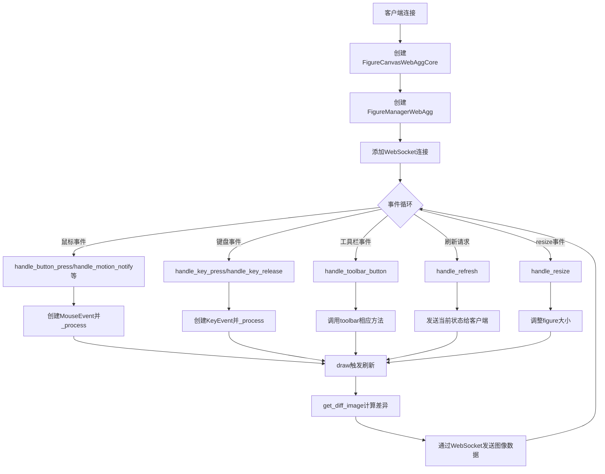

## 类结构

```
backend_bases (基类模块)
├── TimerBase (定时器基类)
│   ├── TimerTornado (Tornado定时器实现)
│   └── TimerAsyncio (Asyncio定时器实现)
├── FigureCanvasAgg (Agg画布基类)
│   └── FigureCanvasWebAggCore (WebAgg核心画布)
│       └── TimerAsyncio (_timer_cls)
├── NavigationToolbar2 (导航工具栏基类)
│   └── NavigationToolbar2WebAgg (Web工具栏)
├── FigureManagerBase (图形管理器基类)
│   └── FigureManagerWebAgg (Web图形管理器)
│       ├── NavigationToolbar2WebAgg (ToolbarCls)
│       └── FigureCanvasWebAggCore (canvas)
└── _Backend (后端导出基类)
    └── _BackendWebAggCoreAgg (WebAgg后端)
```

## 全局变量及字段


### `_SPECIAL_KEYS_LUT`
    
特殊键名称到标准化键名的映射表，用于标准化浏览器键盘事件中的键值

类型：`dict`
    


### `_ALLOWED_TOOL_ITEMS`
    
允许在WebAgg后端工具栏中显示的工具项名称集合，包括home、back、forward、pan、zoom、download等

类型：`set`
    


### `TimerTornado._timer`
    
Tornado IOLoop的定时器句柄，用于单次或周期性触发定时回调

类型：`tornado.ioloop.Handle or None`
    


### `TimerAsyncio._task`
    
asyncio异步任务对象，用于管理基于asyncio的定时任务

类型：`asyncio.Task or None`
    


### `FigureCanvasWebAggCore._png_is_old`
    
标志位，标记渲染器中的数据是否比PNG缓冲区更新，用于决定是否需要生成新图像

类型：`bool`
    


### `FigureCanvasWebAggCore._force_full`
    
标志位，强制下一次发送给客户端的图像为完整帧而非差异帧

类型：`bool`
    


### `FigureCanvasWebAggCore._last_buff`
    
存储上一次渲染的RGBA像素数据的视图，用于计算帧间差异以优化网络传输

类型：`numpy.ndarray`
    


### `FigureCanvasWebAggCore._current_image_mode`
    
当前图像传输模式，可为'full'或'diff'，客户端可请求获取此信息

类型：`str`
    


### `FigureCanvasWebAggCore._last_mouse_xy`
    
记录最近一次鼠标事件的位置坐标，用于键盘事件中填充x、y位置信息

类型：`tuple`
    


### `FigureCanvasWebAggCore._capture_scroll`
    
控制是否捕获滚动事件以防止默认浏览器行为，true时由canvas处理滚动

类型：`bool`
    


### `NavigationToolbar2WebAgg.message`
    
存储当前工具栏显示的消息文本，用于避免重复发送相同的消息到客户端

类型：`str`
    


### `FigureManagerWebAgg.web_sockets`
    
维护当前连接的WebSocket客户端集合，用于向所有客户端广播事件和图像数据

类型：`set`
    


### `FigureManagerWebAgg._window_title`
    
存储Figure窗口的标题文本，供get_window_title方法返回和设置使用

类型：`str`
    
    

## 全局函数及方法


### `_handle_key`

处理键盘事件中的键值，将其转换为标准的键名格式，用于WebAgg后端的键盘事件处理。

参数：

-  `key`：`str`，浏览器发送的原始键值字符串，格式类似于 "k"+键名 或 "shift+k"+键名

返回值：`str`，转换后的标准键名

#### 流程图

```mermaid
flowchart TD
    A[开始处理key] --> B[提取'k'后面的值value]
    B --> C{检查key中是否包含'shift+'}
    C -->|是| D{value长度是否为1}
    C -->|否| E{value是否在_SPECIAL_KEYS_LUT中}
    D -->|是| F[移除'shift+'前缀]
    D -->|否| E
    F --> E
    E -->|是| G[从LUT获取标准键名]
    E -->|否| H[保留原value]
    G --> I[重新组合key: key[:k位置] + value]
    H --> I
    I --> J[返回转换后的key]
```

#### 带注释源码

```python
def _handle_key(key):
    """Handle key values"""
    # 从原始key字符串中提取'k'后面的部分
    # 例如: "ctrl+kpagedown" -> "kpagedown", 取后半部分 "pagedown"
    value = key[key.index('k') + 1:]
    
    # 处理Shift修饰键
    # 如果key中包含'shift+'且value是单个字符(可打印字符)，则移除shift+前缀
    # 例如: "shift+a" -> "a", "shift+enter" 保持不变
    if 'shift+' in key:
        if len(value) == 1:
            key = key.replace('shift+', '')
    
    # 将特殊键名转换为标准格式
    # 例如: "pagedown" -> "pageup", "arrowleft" -> "left" 等
    if value in _SPECIAL_KEYS_LUT:
        value = _SPECIAL_KEYS_LUT[value]
    
    # 重新组合key: 取'k'前面的部分(修饰键) + 转换后的value
    # 例如: "ctrl+" + "a" -> "ctrl+a"
    key = key[:key.index('k')] + value
    return key
```

#### 补充说明

**设计目标：**
- 将浏览器发送的键值字符串标准化为Matplotlib内部使用的键名格式
- 处理修饰键（Shift）和特殊功能键（方向键、功能键等）的命名转换

**关键组件：**
- `_SPECIAL_KEYS_LUT`：查找表，包含特殊键名的映射关系（如 `ArrowDown` → `down`）

**潜在技术债务：**
1. **字符串操作脆弱**：使用 `key.index('k')` 假设key中必然包含'k'，如果输入格式不符合预期会抛出 `ValueError`
2. **重复逻辑**：`key.replace('shift+', '')` 后 `key.index('k')` 重新计算，可能导致边界情况处理不一致
3. **缺乏输入验证**：没有对 `key` 参数进行有效性检查，空字符串或非法输入会导致异常

**错误处理建议：**
- 添加输入验证，确保key参数非空且包含有效字符
- 使用更健壮的字符串解析方式，如正则表达式
- 考虑返回 `None` 或抛出特定异常而非让 `index()` 异常传播


### `TimerTornado.__init__`

TimerTornado类的初始化方法，用于创建基于Tornado事件循环的计时器实例，初始化内部计时器状态并调用父类构造函数完成通用计时器功能的设置。

参数：

- `*args`：可变位置参数元组，传递给父类TimerBase的初始化参数
- `**kwargs`：可变关键字参数字典，传递给父类TimerBase的初始化参数

返回值：`None`，构造函数无返回值

#### 流程图

```mermaid
flowchart TD
    A[开始 __init__] --> B[设置 self._timer = None]
    B --> C[调用 super().__init__(*args, **kwargs)]
    C --> D[结束]
    
    style A fill:#f9f,color:#333
    style D fill:#9f9,color:#333
```

#### 带注释源码

```python
class TimerTornado(backend_bases.TimerBase):
    def __init__(self, *args, **kwargs):
        # 初始化Tornado计时器实例，初始值为None表示尚未启动
        # 该属性将存储Tornado的IOLoop定时器句柄
        self._timer = None
        
        # 调用父类TimerBase的构造函数
        # 父类会处理以下初始化：
        # - 设置self.interval（定时器间隔）
        # - 设置self._single（单次触发模式标志）
        # - 设置self._on_timer（定时器回调函数）
        # - 初始化其他计时器相关状态
        super().__init__(*args, **kwargs)
```

#### 说明

该`__init__`方法是TimerTornado类的构造函数，继承了`backend_bases.TimerBase`类。关键点如下：

1. **`self._timer = None`**：初始化一个私有属性用于存储Tornado的定时器句柄，None表示计时器当前未启动

2. **`super().__init__(*args, **kwargs)`**：调用父类构造函数，传递所有位置参数和关键字参数，让父类完成通用的计时器初始化工作（如设置间隔、回调函数等）

3. **设计意图**：采用组合模式，Tornado特定的计时器功能（通过`_timer_start`、`_timer_stop`、`_timer_set_interval`方法实现）将在后续方法中与通用的计时器逻辑结合


### `TimerTornado._timer_start`

该方法用于启动一个Tornado事件循环定时器，根据`_single`属性选择单次超时或周期性回调方式来触发定时器回调函数`_on_timer`。

参数：

- 无显式参数（继承自父类TimerBase的属性如`interval`、`_single`和`_on_timer`由调用方设置）

返回值：`None`，无返回值

#### 流程图

```mermaid
flowchart TD
    A[开始 _timer_start] --> B[导入 tornado]
    B --> C[调用 self._timer_stop 停止现有定时器]
    C --> D{检查 self._single 是否为真}
    
    D -->|是| E[获取 tornado.ioloop.IOLoop 单例]
    E --> F[创建一次性超时定时器]
    F --> G[使用 add_timeout 添加定时器]
    G --> H[设置 self._timer 为超时对象]
    
    D -->|否| I[创建周期性回调 PeriodicCallback]
    I --> J[设置回调间隔为 max(self.interval, 1e-6)]
    J --> K[调用 self._timer.start 启动回调]
    K --> L[设置 self._timer 为回调对象]
    
    H --> M[结束]
    L --> M
```

#### 带注释源码

```python
def _timer_start(self):
    """
    启动Tornado定时器。
    
    根据_timer_single属性选择单次超时或周期性回调模式。
    """
    import tornado  # 导入Tornado异步框架

    # 先停止任何已存在的定时器，确保干净的重启
    self._timer_stop()
    
    if self._single:
        # 单次触发模式：使用add_timeout设置一次性定时器
        ioloop = tornado.ioloop.IOLoop.instance()  # 获取Tornado事件循环单例
        self._timer = ioloop.add_timeout(
            datetime.timedelta(milliseconds=self.interval),  # 将毫秒转换为timedelta
            self._on_timer)  # 设置超时后调用的回调函数
    else:
        # 周期性触发模式：使用PeriodicCallback设置重复定时器
        self._timer = tornado.ioloop.PeriodicCallback(
            self._on_timer,  # 设置周期性调用的回调函数
            max(self.interval, 1e-6))  # 确保最小间隔为1e-6秒避免零间隔
        self._timer.start()  # 启动周期性回调
```


### `TimerTornado._timer_stop`

停止 Tornado IOloop 中当前活跃的定时器，并将内部计时器引用置为 None，以便释放资源并防止后续误用。

参数：

- `self`：`TimerTornado`，调用此方法的类实例本身

返回值：`None`，无返回值

#### 流程图

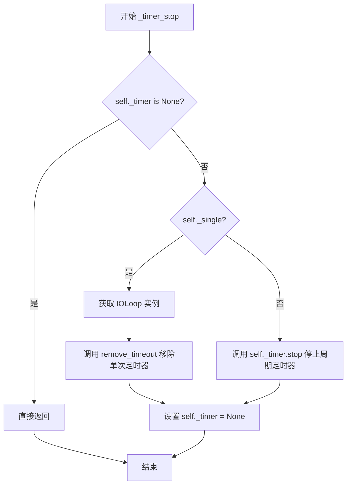

#### 带注释源码

```python
def _timer_stop(self):
    """
    停止 Tornado IOloop 中当前活跃的定时器。
    
    该方法负责清理定时器资源，根据定时器类型（单次或周期性）
    采用不同的停止策略，并将内部计时器引用重置为 None。
    """
    import tornado  # 导入 tornado 库以访问 IOLoop

    # 检查定时器是否已处于停止状态
    if self._timer is None:
        return  # 如果定时器未启动，直接返回，避免重复操作
    
    # 根据定时器类型选择不同的停止策略
    elif self._single:
        # 单次定时器模式：使用 add_timeout 创建的定时器
        ioloop = tornado.ioloop.IOLoop.instance()  # 获取 IOLoop 单例
        ioloop.remove_timeout(self._timer)  # 显式移除超时回调
    else:
        # 周期定时器模式：使用 PeriodicCallback 创建的定时器
        self._timer.stop()  # 调用 PeriodicCallback 的 stop 方法
    
    # 重置计时器引用，确保不会误用已停止的定时器
    self._timer = None
```


### `TimerTornado._timer_set_interval`

该方法用于设置计时器的触发间隔。当计时器已经启动时，会先停止当前计时器，然后重新启动计时器以应用新的间隔时间。

参数： 无（除隐含的 `self` 参数外）

返回值：`None`，该方法不返回任何值

#### 流程图

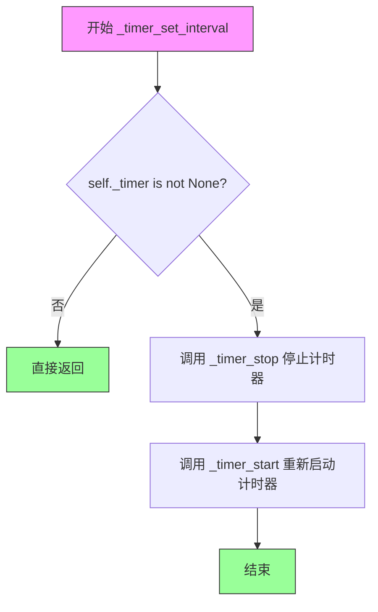

#### 带注释源码

```python
def _timer_set_interval(self):
    """
    设置计时器的间隔时间。
    
    只有当计时器已经被启动时（即 self._timer 不为 None），
    才会停止并重新启动计时器以应用新的间隔。
    """
    # Only stop and restart it if the timer has already been started
    # 检查计时器是否已经启动
    if self._timer is not None:
        # 如果已启动，先停止计时器
        self._timer_stop()
        # 然后重新启动计时器，使用新的 interval 值
        self._timer_start()
```


### `TimerAsyncio.__init__`

`TimerAsyncio.__init__` 是异步定时器类的构造函数，初始化一个基于 asyncio 的定时器实例。该方法首先将 `_task` 变量初始化为 `None`，然后调用父类 `TimerBase` 的构造函数完成基类属性的初始化。

参数：

- `self`：`TimerAsyncio`，当前正在初始化的实例对象
- `*args`：`tuple`，可变位置参数，将传递给父类 `TimerBase` 的构造函数
- `**kwargs`：`dict`，可变关键字参数，将传递给父类 `TimerBase` 的构造函数

返回值：`None`，Python 构造函数不返回值（隐式返回 `None`）

#### 流程图

```mermaid
flowchart TD
    A[开始 __init__] --> B[设置 self._task = None]
    B --> C[调用 super().__init__(*args, **kwargs)]
    C --> D[结束]
```

#### 带注释源码

```python
def __init__(self, *args, **kwargs):
    """
    初始化 TimerAsyncio 异步定时器实例。
    
    Parameters
    ----------
    *args : tuple
        可变位置参数，传递给父类 TimerBase。
    **kwargs : dict
        可变关键字参数，传递给父类 TimerBase。
    """
    # 初始化 _task 为 None，表示当前没有活跃的异步任务
    # 该变量将在 _timer_start 方法中被赋值为 asyncio.Task 对象
    self._task = None
    
    # 调用父类 TimerBase 的构造函数
    # 父类会处理 interval、single 等属性的初始化
    super().__init__(*args, **kwargs)
```


### `TimerAsyncio._timer_task`

这是一个异步计时器任务方法，在 asyncio 事件循环中定期执行定时器回调函数，支持单次和重复定时模式。

参数：

- `interval`：`float`，定时器触发的时间间隔（秒）

返回值：`None`，该方法为异步协程，不直接返回值，通过调用 `self._on_timer()` 触发回调

#### 流程图

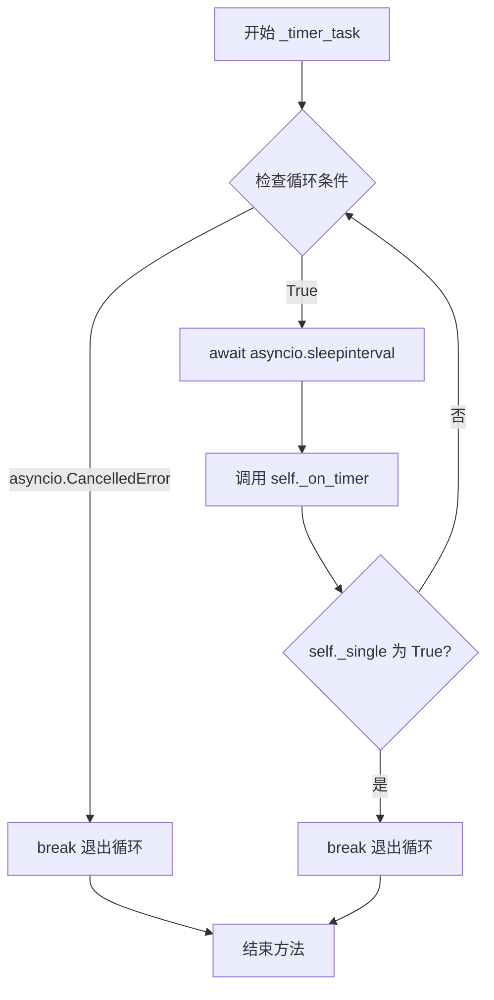

#### 带注释源码

```python
async def _timer_task(self, interval):
    """
    异步计时器任务，定期调用定时器回调函数。
    
    参数:
        interval: 定时器触发的时间间隔（秒）
    """
    # 无限循环，持续执行定时任务直到被取消或满足退出条件
    while True:
        try:
            # 异步等待指定的间隔时间，不阻塞事件循环
            await asyncio.sleep(interval)
            
            # 调用定时器回调函数，处理定时事件
            self._on_timer()

            # 如果是单次定时模式（_single为True），执行一次后退出循环
            if self._single:
                break
        # 捕获取消异常，当计时器被主动停止时优雅退出
        except asyncio.CancelledError:
            break
```


### `TimerAsyncio._timer_start`

启动 asyncio 定时器，创建异步任务来周期性地触发定时器回调。

参数：

- `self`：实例本身，包含 `_single` 标志（是否为单次触发定时器）和 `interval`（定时器间隔，以毫秒为单位）

返回值：`None`，无返回值

#### 流程图

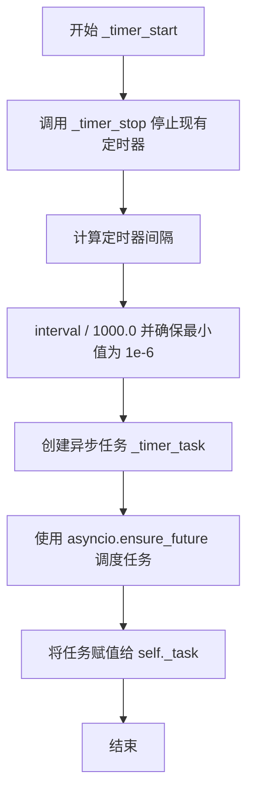

#### 带注释源码

```python
def _timer_start(self):
    """
    启动 asyncio 定时器。
    
    该方法首先停止任何现有的定时器任务，然后创建一个新的
    异步任务来周期性地执行 _on_timer 回调。
    """
    # 停止现有的定时器任务，避免重复运行
    self._timer_stop()

    # 创建新的异步任务并调度执行
    # interval 以毫秒存储，转换为秒（除以 1000）
    # 使用 max 确保间隔至少为 1e-6 秒，避免零间隔
    self._task = asyncio.ensure_future(
        self._timer_task(max(self.interval / 1_000., 1e-6))
    )
```


### `TimerAsyncio._timer_stop`

该方法用于停止异步计时器，通过取消正在运行的 asyncio 任务并重置任务引用来停止计时器。

参数：

- `self`：`TimerAsyncio`，TimerAsyncio 类的实例本身

返回值：`None`，无返回值，仅执行副作用操作

#### 流程图

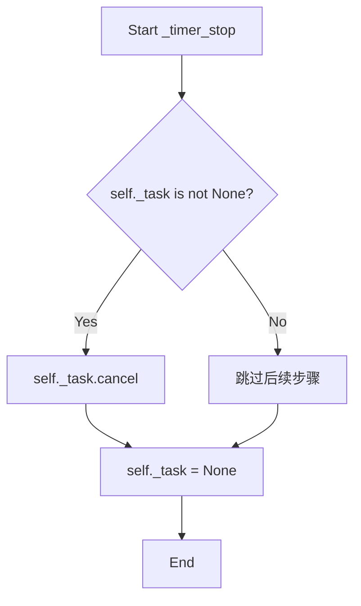

#### 带注释源码

```python
def _timer_stop(self):
    """
    停止异步计时器。
    
    如果存在正在运行的任务，则取消该任务；
    无论任务是否存在，都将 self._task 重置为 None。
    """
    # 检查是否存在正在运行的异步任务
    if self._task is not None:
        # 取消正在运行的任务，这会引发 asyncio.CancelledError
        # 从而终止 _timer_task 中的循环
        self._task.cancel()
    
    # 重置任务引用为 None，确保 timer 处于停止状态
    self._task = None
```


### `TimerAsyncio._timer_set_interval`

该方法用于设置异步定时器的间隔。如果定时器任务已经启动，则先停止当前任务，再重新启动以应用新的间隔时间。

参数：なし（该方法没有参数）

返回值：`None`，无返回值描述（该方法为void方法）

#### 流程图

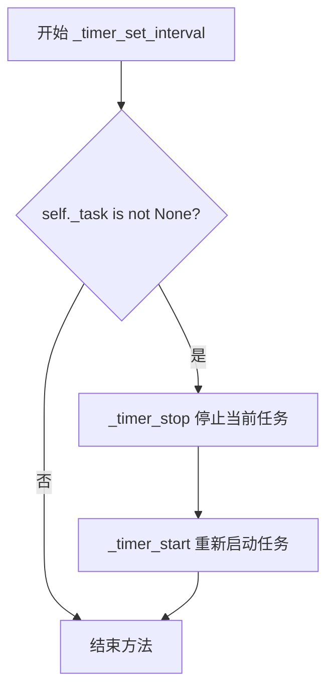

#### 带注释源码

```python
def _timer_set_interval(self):
    # 仅当定时器已经启动时才执行停止和重启操作
    # 如果_timer为None，说明定时器尚未启动，无需任何操作
    if self._task is not None:
        self._timer_stop()   # 停止当前的asyncio任务
        self._timer_start()  # 重新启动任务以应用新的间隔时间
```


### `FigureCanvasWebAggCore.show`

该方法用于在WebAgg后端中显示图形窗口，它调用matplotlib.pyplot的show函数来展示图形。

参数： 无

返回值：`None`，无返回值

#### 流程图

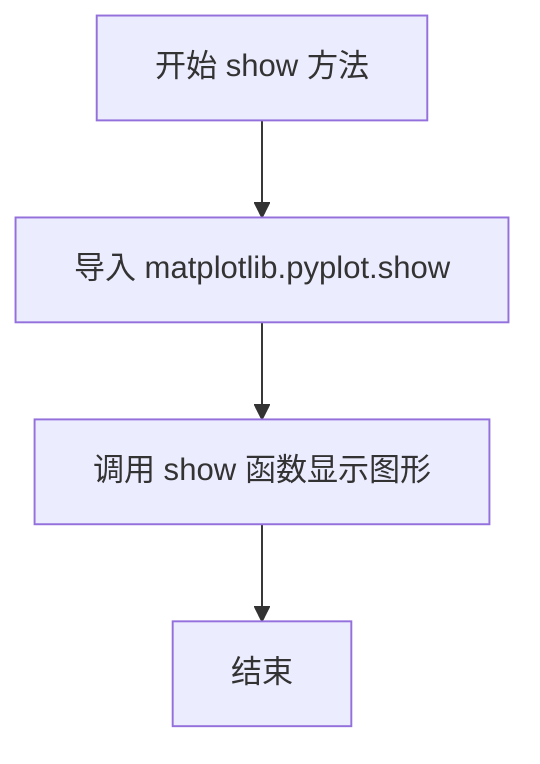

#### 带注释源码

```python
def show(self):
    # show the figure window
    # 该方法是一个简单的包装器，用于在Web浏览器环境中显示图形
    # 它通过导入并调用matplotlib.pyplot的show函数来实现
    from matplotlib.pyplot import show
    show()
```


### `FigureCanvasWebAggCore.draw`

该方法重写了父类的 draw 方法，用于在 Web 浏览器中渲染 Matplotlib 图形，并在渲染完成后通知所有连接的客户端刷新显示新的图像帧。

参数：此方法无显式参数（隐式参数 `self` 为类的实例）。

返回值：`None`，无返回值。

#### 流程图

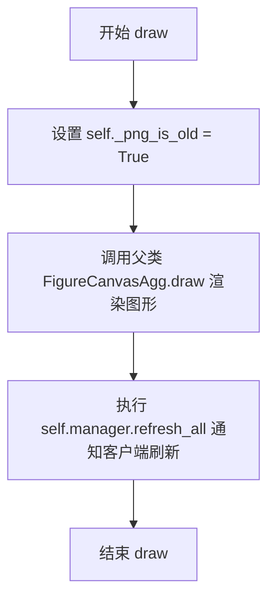

#### 带注释源码

```python
def draw(self):
    # 标记 PNG 缓冲区已过时，设置为 True 以便下次 get_diff_image 时生成新图像
    self._png_is_old = True
    try:
        # 调用父类的 draw 方法，执行实际的图形渲染操作
        # 父类 FigureCanvasAgg 会将图形绘制到缓冲区
        super().draw()
    finally:
        # 无论渲染是否成功，最后都刷新所有连接的 WebSocket 客户端
        # 这会触发 get_diff_image 获取新的图像并发送给客户端
        self.manager.refresh_all()  # Swap the frames.
```


### `FigureCanvasWebAggCore.blit`

该方法用于在Web浏览器中更新画布显示，通过标记当前PNG缓冲区已过期并通知所有WebSocket客户端刷新显示内容。

参数：

- `bbox`：`tuple` 或 `Rectangle`，可选参数，指定需要重绘的矩形区域（当前实现中未使用，仅为保持API兼容性）

返回值：`None`，无返回值

#### 流程图

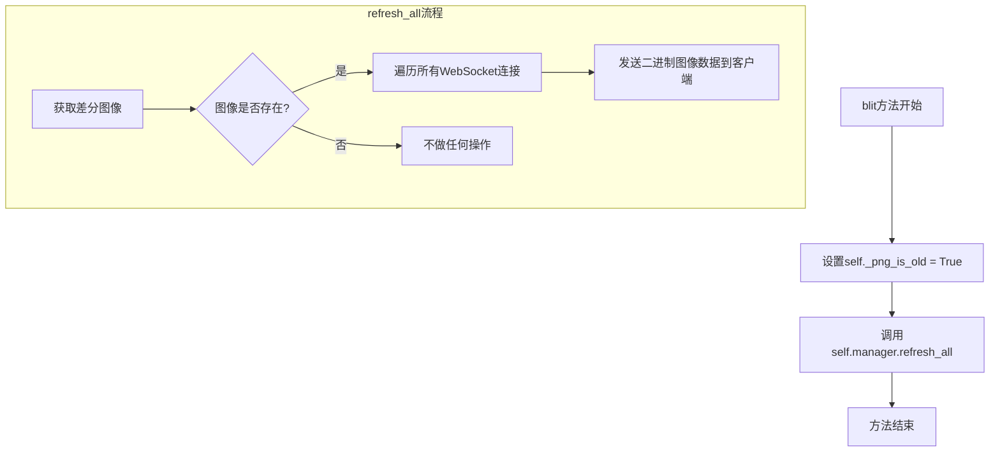

#### 带注释源码

```python
def blit(self, bbox=None):
    """
    Perform blit operation on the WebAgg canvas.
    
    In the WebAgg backend, blitting is handled differently from other
    backends. Instead of directly copying pixels, we mark the current
    PNG buffer as outdated and trigger a full refresh to all connected
    clients via WebSocket.
    
    Parameters
    ----------
    bbox : tuple or Rectangle, optional
        Bounding box specifying the region to blit. This parameter is
        accepted for API compatibility with other backends but is
        not currently used in this implementation.
    """
    # Mark the PNG buffer as outdated, indicating that the next frame
    # sent to clients should be a freshly rendered image rather than
    # a diff from the previous buffer
    self._png_is_old = True
    
    # Trigger a refresh of all connected WebSocket clients. This will
    # cause the FigureManagerWebAgg.refresh_all() method to be called,
    # which computes the diff image (or full image if forced) and
    # broadcasts it to all connected browser clients
    self.manager.refresh_all()
```


### FigureCanvasWebAggCore.draw_idle

这是一个在浏览器中显示Agg图像的Web后端方法，用于在图形更新需求较少时触发轻量级重绘，通过向客户端发送"draw"事件来请求更新画布内容。

参数：

- `self`：`FigureCanvasWebAggCore`，隐式参数，表示调用该方法的画布实例本身

返回值：`None`，该方法不返回任何值，仅通过发送事件机制触发客户端更新

#### 流程图

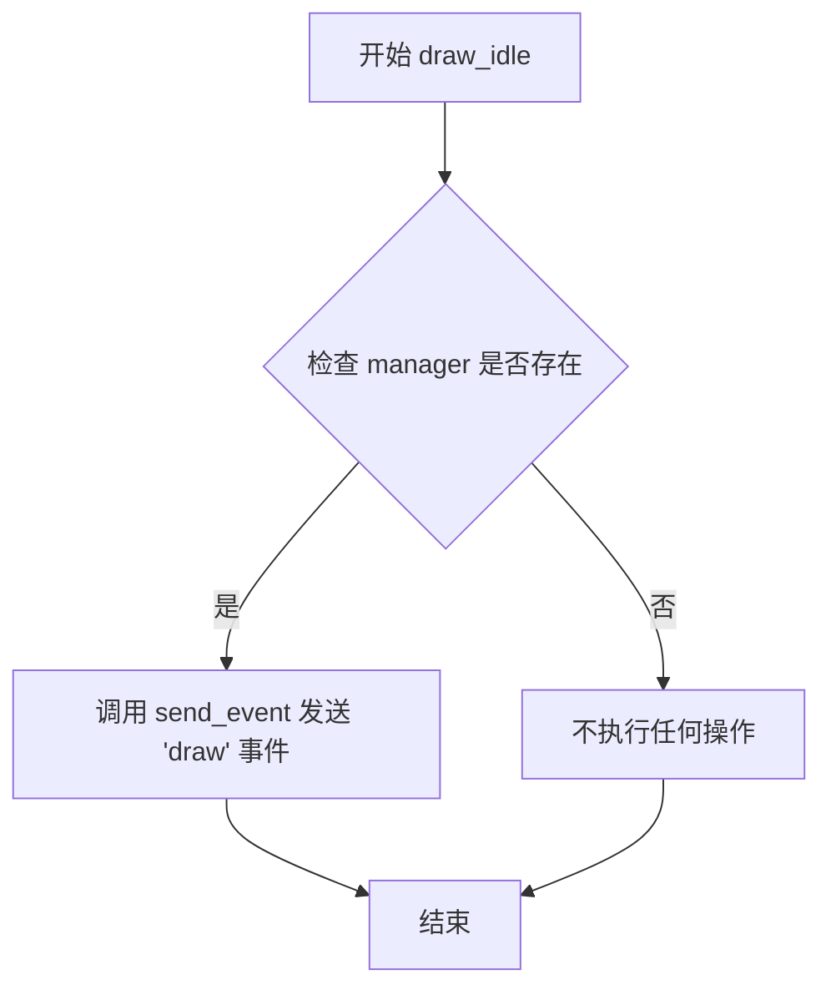

#### 带注释源码

```python
def draw_idle(self):
    """
    在空闲时触发绘制操作。
    
    该方法不会直接执行绘图操作，而是通过 WebSocket 
    向客户端发送一个 'draw' 事件，通知前端需要重新
    获取并渲染最新的图像内容。这是一种延迟绘制策略，
    可以减少不必要的网络通信和渲染开销。
    """
    self.send_event("draw")
```


### `FigureCanvasWebAggCore.set_cursor`

设置浏览器中光标的样式，通过 WebSocket 发送光标类型事件到客户端。

参数：

- `cursor`：`backend_tools.Cursors`，Matplotlib 后端工具的光标枚举类型，用于指定要设置的光标类型（如手形、指针、移动等）

返回值：`None`，无返回值

#### 流程图

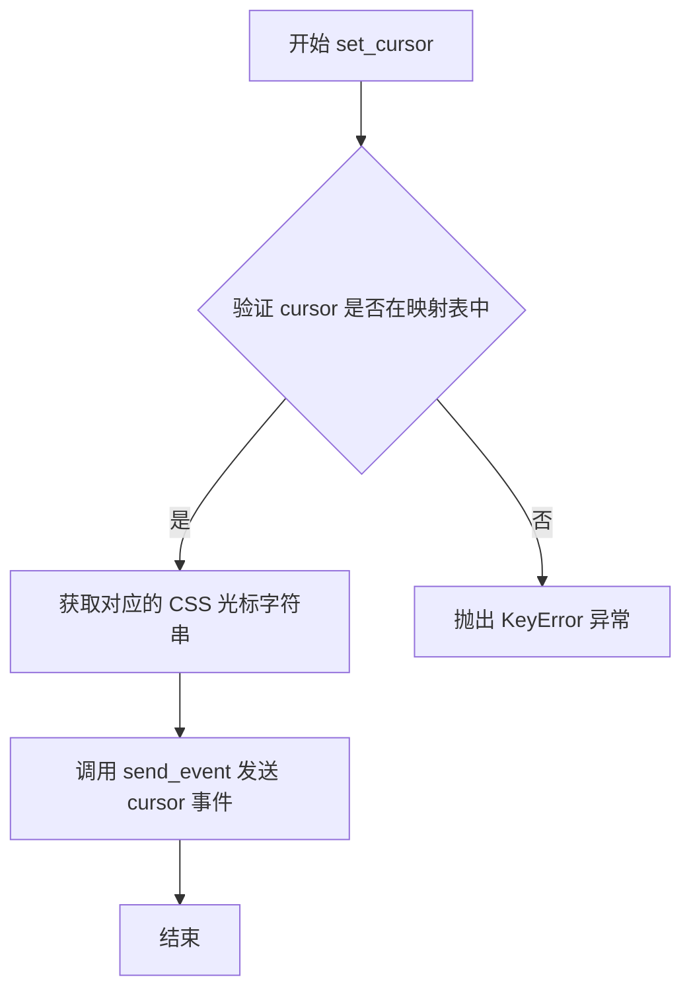

#### 带注释源码

```python
def set_cursor(self, cursor):
    # docstring inherited
    # 使用 _api.getitem_checked 将 Matplotlib 的 Cursors 枚举映射为
    # CSS 光标字符串，映射表包含：
    # HAND -> 'pointer' (手形光标)
    # POINTER -> 'default' (默认光标)
    # SELECT_REGION -> 'crosshair' (十字准星光标)
    # MOVE -> 'move' (移动光标)
    # WAIT -> 'wait' (等待光标)
    # RESIZE_HORIZONTAL -> 'ew-resize' (水平调整光标)
    # RESIZE_VERTICAL -> 'ns-resize' (垂直调整光标)
    cursor = _api.getitem_checked({
        backend_tools.Cursors.HAND: 'pointer',
        backend_tools.Cursors.POINTER: 'default',
        backend_tools.Cursors.SELECT_REGION: 'crosshair',
        backend_tools.Cursors.MOVE: 'move',
        backend_tools.Cursors.WAIT: 'wait',
        backend_tools.Cursors.RESIZE_HORIZONTAL: 'ew-resize',
        backend_tools.Cursors.RESIZE_VERTICAL: 'ns-resize',
    }, cursor=cursor)
    # 通过 send_event 方法将光标类型发送到前端
    # 前端 JavaScript 接收到 'cursor' 事件后，会调用 CSS cursor 属性
    self.send_event('cursor', cursor=cursor)
```


### FigureCanvasWebAggCore.set_image_mode

设置后续发送给客户端的图像模式为 'full'（完整图像）或 'diff'（差异图像）。如果新模式与当前模式不同，则更新当前模式并通知所有连接的客户端。

参数：

- `mode`：`str`，需要设置的图像模式，必须是 'full' 或 'diff' 之一

返回值：`None`，无返回值

#### 流程图

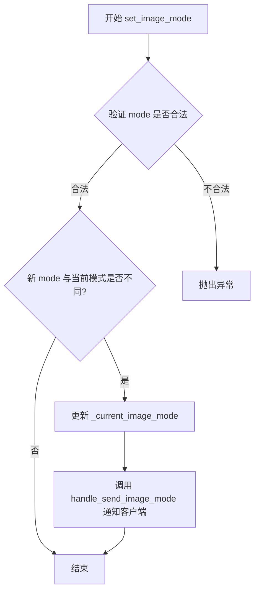

#### 带注释源码

```python
def set_image_mode(self, mode):
    """
    Set the image mode for any subsequent images which will be sent
    to the clients. The modes may currently be either 'full' or 'diff'.

    Note: diff images may not contain transparency, therefore upon
    draw this mode may be changed if the resulting image has any
    transparent component.
    """
    # 使用 _api.check_in_list 验证 mode 参数是否为允许的值 ('full' 或 'diff')
    # 如果 mode 不合法，该函数会抛出异常
    _api.check_in_list(['full', 'diff'], mode=mode)
    
    # 只有当新模式与当前模式不同时才执行更新操作，避免不必要的通知
    if self._current_image_mode != mode:
        # 更新实例变量 _current_image_mode 为新模式
        self._current_image_mode = mode
        
        # 调用 handle_send_image_mode 方法通知所有连接的客户端当前图像模式已更改
        self.handle_send_image_mode(None)
```


### FigureCanvasWebAggCore.set_capture_scroll

该方法用于设置画布上的滚动事件是否会触发页面滚动。当需要在图表区域内捕获滚动事件而不是让浏览器处理时调用此方法。

参数：

- `capture`：`bool`，指定是否捕获滚动事件。True表示阻止浏览器默认的滚动行为并在画布内处理，False表示允许浏览器处理滚动事件

返回值：`None`，该方法无返回值

#### 流程图

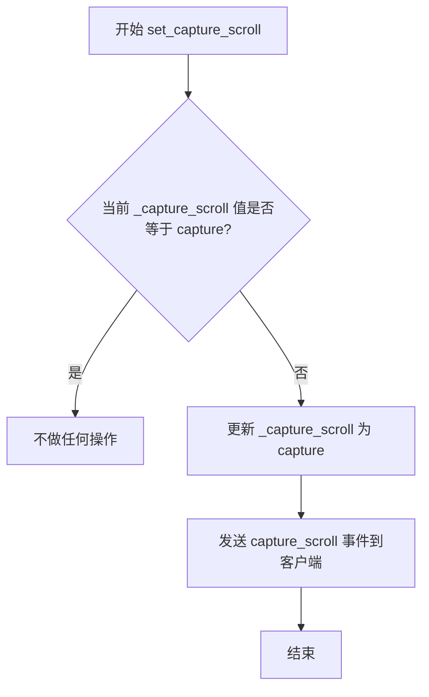

#### 带注释源码

```python
def set_capture_scroll(self, capture):
    """
    Set whether the scroll events on the canvas will scroll the page.

    Parameters
    ----------
    capture : bool
    """
    # 检查新的捕获状态是否与当前状态不同
    # 只有状态改变时才需要发送事件，避免不必要的网络通信
    if self._capture_scroll != capture:
        # 更新内部滚动捕获状态标志
        self._capture_scroll = capture
        # 通过WebSocket发送事件通知客户端滚动捕获状态已改变
        # 客户端据此决定是否阻止浏览器默认的滚动行为
        self.send_event("capture_scroll", capture_scroll=capture)
```


### `FigureCanvasWebAggCore.get_capture_scroll`

获取画布当前是否捕获滚动事件的标志位，用于决定滚动操作是应用于图表缩放还是允许浏览器默认的页面滚动行为。

参数：

- `self`：`FigureCanvasWebAggCore`，调用此方法的类实例本身。

返回值：`bool`，返回 `True` 表示滚动事件被 Canvas 拦截（通常用于图表交互），返回 `false` 表示允许浏览器处理滚动。

#### 流程图

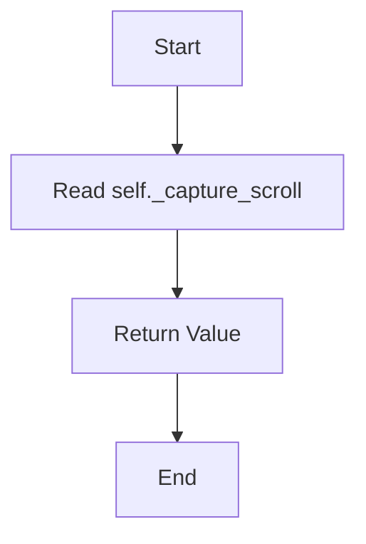

#### 带注释源码

```python
def get_capture_scroll(self):
    """
    Get whether scroll events are currently captured by the canvas.

    Returns
    -------
    bool
    """
    return self._capture_scroll
```


### `FigureCanvasWebAggCore.get_diff_image`

#### 描述

该函数是 WebAgg 后端的核心图像生成方法，用于计算当前图形与上一次渲染之间的差异（Diff），并生成对应的 PNG 图像数据供前端展示。它通过比较当前渲染缓冲区与历史缓冲区，仅传输发生变化的部分（Diff Mode）或在必要时传输全量图像（Full Mode），从而优化网络传输效率。

#### 参数

- 无显式参数（仅包含隐式参数 `self`）

#### 返回值

- `bytes`：返回当前帧的 PNG 格式图像字节流（`png.getvalue()`）。
- `None`：如果图形未发生更新（`self._png_is_old` 为 `False`），则返回 `None`。

#### 流程图

```mermaid
flowchart TD
    A([开始 get_diff_image]) --> B{_png_is_old 是否为真?}
    B -- 否 --> C[返回 None]
    B -- 是 --> D[获取 Renderer 和当前像素数据 RGBA]
    D --> E[将像素数据转换为 Uint32 视图以加速比较]
    E --> F{是否需要强制全量绘制?}
    F -- 是 --> G[设置模式为 'full']
    F -- 否 --> H[计算 Diff: CurrentBuffer != LastBuffer]
    H --> I[设置模式为 'diff']
    I --> J[Output = Where(Diff, CurrentBuffer, 0)]
    G --> K[Output = CurrentBuffer]
    J --> L[更新 _last_buff 为当前 Buffer]
    K --> L
    L --> M[重置 _force_full 和 _png_is_old 标志]
    M --> N[将 Output 转换为 Uint8 并转为 PNG]
    N --> O([返回 PNG 字节数据])
```

#### 带注释源码

```python
def get_diff_image(self):
    # 检查画布是否需要更新（如果 draw() 被调用过，_png_is_old 会被设为 True）
    if self._png_is_old:
        # 获取当前图形的渲染器
        renderer = self.get_renderer()

        # 获取 RGBA 像素数据
        pixels = np.asarray(renderer.buffer_rgba())
        
        # 为了在一次 numpy 调用中比较整个像素，将缓冲区创建为 uint32 类型
        # 这样无需单独比较每个通道（R, G, B, A）
        buff = pixels.view(np.uint32).squeeze(2)

        # 判断条件：是否必须进行全量绘制？
        # 1. _force_full 为 True（例如窗口大小改变或收到刷新事件）
        # 2. 缓冲区大小发生变化
        # 3. 像素中存在透明通道（因为 Diff 模式无法正确处理透明叠加）
        if (self._force_full
                or buff.shape != self._last_buff.shape
                or (pixels[:, :, 3] != 255).any()):
            self.set_image_mode('full')
            output = buff
        else:
            self.set_image_mode('diff')
            # 计算当前帧与上一帧的差异
            diff = buff != self._last_buff
            # 仅保留发生变化的像素，未变化的像素设为 0（黑色/透明）
            output = np.where(diff, buff, 0)

        # 保存当前缓冲区以便下次计算差异
        self._last_buff = buff.copy()
        self._force_full = False
        self._png_is_old = False

        # 将数据转换为适合 PIL Image 的格式 (RGBA uint8)
        data = output.view(dtype=np.uint8).reshape((*output.shape, 4))
        
        # 将数组保存为 PNG 格式到内存缓冲区
        with BytesIO() as png:
            Image.fromarray(data).save(png, format="png")
            return png.getvalue()
```


### `FigureCanvasWebAggCore.handle_event`

该方法是 WebAgg 后端的核心事件分发器，负责接收来自浏览器的各类事件（如鼠标、键盘、工具栏操作等），并根据事件类型动态调用对应的处理方法，实现交互式图形渲染。

参数：

- `event`：`dict`，包含事件类型（'type' 键）和其他事件数据的字典

返回值：`Any`，返回对应事件处理器的执行结果

#### 流程图

```mermaid
flowchart TD
    A[开始 handle_event] --> B{获取 event['type']}
    B --> C[动态构建处理方法名 handle_{e_type}]
    C --> D[使用 getattr 获取处理方法]
    D --> E{方法是否存在?}
    E -->|是| F[调用对应的事件处理方法]
    E -->|否| G[调用 handle_unknown_event]
    F --> H[返回处理结果]
    G --> I[记录警告日志]
    I --> H
```

#### 带注释源码

```python
def handle_event(self, event):
    """
    分发事件到对应的处理方法。
    
    Parameters
    ----------
    event : dict
        事件字典，必须包含 'type' 键来标识事件类型。
        例如：{'type': 'draw'}, {'type': 'button_press', 'x': 100, 'y': 200}
    
    Returns
    -------
    Any
        返回对应事件处理器的执行结果。
    """
    # 从事件字典中提取事件类型
    e_type = event['type']
    
    # 动态构建处理方法名，格式为 'handle_{事件类型}'
    # 例如：'draw' -> 'handle_draw', 'resize' -> 'handle_resize'
    # getattr 的第三个参数是默认值，当找不到对应方法时使用 handle_unknown_event
    handler = getattr(self, f'handle_{e_type}',
                      self.handle_unknown_event)
    
    # 调用获取到的事件处理器，并返回其结果
    return handler(event)
```


### `FigureCanvasWebAggCore.handle_unknown_event`

处理未知事件类型的默认处理器，当收到未识别的事件类型时记录警告日志。

参数：

- `event`：`dict`，包含未知事件的数据，期望包含 "type" 键表示事件类型

返回值：`None`，该方法仅记录日志，不返回任何值

#### 流程图

```mermaid
flowchart TD
    A[开始处理未知事件] --> B[提取事件类型和完整事件数据]
    B --> C[记录警告日志: 未处理的消息类型]
    C --> D[结束]
```

#### 带注释源码

```python
def handle_unknown_event(self, event):
    """
    处理未知事件类型的默认处理器。
    
    当 handle_event 方法无法找到对应事件类型的特定处理器时，
    会调用此方法记录警告信息，而不是抛出异常。
    
    Parameters
    ----------
    event : dict
        未知的事件对象，必须包含 "type" 键。
        通常还会包含其他与该事件类型相关的属性。
    """
    # 使用日志记录器输出警告信息，包含事件类型和完整的イベント数据
    # 这样可以帮助开发者识别和调试未处理的WebSocket消息
    _log.warning('Unhandled message type %s. %s', event["type"], event)
```


### `FigureCanvasWebAggCore.handle_ack`

处理浏览器发送的确认（ack）消息。这是一个空操作处理程序，浏览器在接收每个图像帧后会发送ack消息以保持双向通信流动，从而减少网络延迟。

参数：

- `self`：`FigureCanvasWebAggCore`，隐含的实例引用，表示当前画布对象
- `event`：`dict`，包含来自浏览器的ack事件数据

返回值：`None`，该方法不返回任何值

#### 流程图

```mermaid
flowchart TD
    A[接收ack事件] --> B{处理确认消息}
    B --> C[执行空操作 pass]
    C --> D[结束]
```

#### 带注释源码

```python
def handle_ack(self, event):
    # 网络延迟往往会随着双向通信而减少。因此，浏览器在接收每个图像帧后
    # 会发回一个"ack"（确认）消息。这也可以在未来用作简单的完整性检查，
    # 但目前性能提升足以证明其合理性，即使服务器不处理它。
    pass
```


### `FigureCanvasWebAggCore.handle_draw`

该方法作为Web后端的事件处理器，用于响应前端浏览器发送的“绘制”请求。当WebSocket连接接收到类型为`draw`的事件时，此方法被调用，它会触发FigureCanvas的绘图操作，生成新的图像，并通知所有连接的客户端刷新显示。

参数：

- `event`：`dict`，来自WebSocket的事件负载。通常包含事件的类型信息 `{'type': 'draw', ...}`，在本方法中未直接使用，仅作为触发信号。

返回值：`None`，该方法不返回值，主要通过调用`self.draw()`产生副作用（图像渲染与推送）。

#### 流程图

```mermaid
flowchart TD
    A([开始: 接收 draw 事件]) --> B[调用 self.draw]
    B --> C{执行父类 draw}
    C --> D[标记 PNG 需要更新]
    D --> E[调用 manager.refresh_all]
    E --> F([结束])
```

#### 带注释源码

```python
def handle_draw(self, event):
    """
    处理前端的绘制请求。

    参数:
        event (dict): 来自 WebSocket 的事件字典，通常包含 'type': 'draw'。
                      虽然接收了 event 参数，但在处理 'draw' 事件时，
                      核心逻辑并不直接依赖 event 的载荷内容，而是将其视为
                      一个触发信号。
    """
    # 调用自身的 draw 方法。
    # 这会执行 Matplotlib 的核心渲染逻辑（保存在 _png_is_old = True），
    # 并通过 self.manager.refresh_all() 将新生成的图像推送给前端。
    self.draw()
```


### `FigureCanvasWebAggCore._handle_mouse`

该方法负责处理从浏览器Web前端发送过来的鼠标事件，将JavaScript端的鼠标事件坐标系统转换为Matplotlib后端的坐标系统，并根据事件类型创建相应的MouseEvent或LocationEvent对象进行分发处理。

参数：

- `self`：FigureCanvasWebAggCore，类实例本身，表示当前的画布对象
- `event`：dict，浏览器Web前端发送的原始鼠标事件字典，包含x、y坐标、事件类型、按钮信息、修饰键等

返回值：`None`，该方法不返回任何值，仅通过创建事件对象并调用其_process()方法完成事件处理

#### 流程图

```mermaid
flowchart TD
    A[接收浏览器鼠标事件] --> B[提取x坐标]
    B --> C[提取y坐标]
    C --> D[转换y坐标: y = renderer.height - y]
    D --> E[保存最后鼠标位置到_last_mouse_xy]
    E --> F[获取事件类型e_type]
    F --> G[计算button: button = event['button'] + 1]
    G --> H[根据event['buttons']位掩码计算buttons集合]
    H --> I[获取modifiers修饰键列表]
    I --> J[获取guiEvent原始GUI事件]
    J --> K{判断e_type类型}
    K -->|button_press/button_release| L[创建MouseEvent并调用_process]
    K -->|dblclick| M[创建双击MouseEvent并调用_process]
    K -->|scroll| N[创建滚轮MouseEvent并调用_process]
    K -->|motion_notify| O[创建移动MouseEvent并调用_process]
    K -->|figure_enter/figure_leave| P[创建LocationEvent并调用_process]
    L --> Q[结束]
    M --> Q
    N --> Q
    O --> Q
    P --> Q
```

#### 带注释源码

```python
def _handle_mouse(self, event):
    """
    处理从浏览器前端发送过来的鼠标事件
    
    参数:
        event: 字典,包含以下键值对:
            - x: int,鼠标x坐标(相对于画布)
            - y: int,鼠标y坐标(相对于画布,JavaScript坐标系)
            - type: str,事件类型
            - button: int,鼠标按钮编号
            - buttons: int,当前按下的按钮状态位掩码
            - modifiers: list,按下的修饰键列表
            - guiEvent: 原始GUI事件对象(可选)
    """
    # 从事件字典中提取x坐标
    x = event['x']
    # 从事件字典中提取y坐标
    y = event['y']
    # JavaScript坐标系原点在左上角,而Matplotlib在左下角
    # 需要将y坐标转换为Matplotlib的坐标系
    y = self.get_renderer().height - y
    # 保存最后鼠标位置,供键盘事件使用(填充x,y坐标)
    self._last_mouse_xy = x, y
    # 获取事件类型字符串
    e_type = event['type']
    # JavaScript中按钮编号从0开始,而Matplotlib从1开始
    # 需要将按钮编号加1以匹配Matplotlib的MouseButton枚举
    button = event['button'] + 1  # JS numbers off by 1 compared to mpl.
    # JavaScript中的buttons状态与Matplotlib的MouseButton顺序不同
    # 需要根据位掩码转换为Matplotlib的MouseButton集合
    buttons = {  # JS ordering different compared to mpl.
        button for button, mask in [
            (MouseButton.LEFT, 1),     # 左按钮掩码为1
            (MouseButton.RIGHT, 2),    # 右按钮掩码为2
            (MouseButton.MIDDLE, 4),   # 中按钮掩码为4
            (MouseButton.BACK, 8),     # 后退按钮掩码为8
            (MouseButton.FORWARD, 16), # 前进按钮掩码为16
        ] if event['buttons'] & mask  # State *after* press/release.
    }
    # 获取修饰键列表(如Shift, Ctrl, Alt等)
    modifiers = event['modifiers']
    # 获取原始的GUI事件对象,用于传递原生事件信息
    guiEvent = event.get('guiEvent')
    
    # 根据事件类型分发处理
    if e_type in ['button_press', 'button_release']:
        # 处理鼠标按钮按下和释放事件
        MouseEvent(e_type + '_event', self, x, y, button,
                   modifiers=modifiers, guiEvent=guiEvent)._process()
    elif e_type == 'dblclick':
        # 处理双击事件,使用button_press_event类型并标记dblclick=True
        MouseEvent('button_press_event', self, x, y, button, dblclick=True,
                   modifiers=modifiers, guiEvent=guiEvent)._process()
    elif e_type == 'scroll':
        # 处理鼠标滚轮滚动事件,包含step参数表示滚动步长
        MouseEvent('scroll_event', self, x, y, step=event['step'],
                   modifiers=modifiers, guiEvent=guiEvent)._process()
    elif e_type == 'motion_notify':
        # 处理鼠标移动事件,包含当前按下的按钮集合
        MouseEvent(e_type + '_event', self, x, y,
                   buttons=buttons, modifiers=modifiers, guiEvent=guiEvent,
                   )._process()
    elif e_type in ['figure_enter', 'figure_leave']:
        # 处理鼠标进入/离开图表区域的位置事件
        LocationEvent(e_type + '_event', self, x, y,
                      modifiers=modifiers, guiEvent=guiEvent)._process()
```


### `FigureCanvasWebAggCore._handle_key`

处理来自浏览器的键盘事件，将原始键盘事件转换为 Matplotlib 的 KeyEvent 对象并进行处理。

参数：

- `event`：`dict`，包含键盘事件的字典，必须包含 'type' 和 'key' 键，可选包含 'guiEvent' 键

返回值：`None`，该方法无返回值，仅处理事件

#### 流程图

```mermaid
flowchart TD
    A[开始处理键盘事件] --> B[获取事件类型]
    B --> C{构建事件名称}
    C --> D[调用全局_handle_key函数处理key值]
    D --> E[获取鼠标最后位置_last_mouse_xy]
    F[获取guiEvent] --> E
    E --> G[创建KeyEvent对象]
    G --> H[调用_key_event的_process方法]
    H --> I[结束]
    
    style A fill:#f9f,stroke:#333
    style I fill:#9f9,stroke:#333
```

#### 带注释源码

```python
def _handle_key(self, event):
    """
    处理键盘事件，将其转换为 Matplotlib 的 KeyEvent 并进行处理。
    
    Parameters
    ----------
    event : dict
        包含键盘事件信息的字典，必须包含 'type' 和 'key' 键，
        可选包含 'guiEvent' 键。
    
    Returns
    -------
    None
    """
    # 1. 从 event 字典中提取事件类型，拼接成 matplotlib 事件名称
    #    例如: 'key_press' -> 'key_press_event'
    # 2. 调用全局 _handle_key 函数处理 event['key']，将浏览器键值
    #    转换为 matplotlib 内部使用的键值表示
    # 3. 使用 self._last_mouse_xy 获取事件触发时鼠标的 x, y 坐标
    # 4. 通过 event.get('guiEvent') 获取原始 GUI 事件对象
    # 5. 创建 KeyEvent 对象并调用 _process() 方法完成事件分发
    KeyEvent(event['type'] + '_event', self,
             _handle_key(event['key']), *self._last_mouse_xy,
             guiEvent=event.get('guiEvent'))._process()
```


### FigureCanvasWebAggCore.handle_toolbar_button

该方法接收浏览器发送的工具栏按钮事件，并根据事件中的名称动态调用对应的工具栏方法，实现前端工具栏按钮与后端 matplotlib 工具栏的交互。

参数：

- `self`：`FigureCanvasWebAggCore`，类的实例本身
- `event`：`dict`，浏览器发送的工具栏按钮事件对象，包含要调用的工具栏方法名称（通过 `event['name']` 获取）

返回值：`None`，该方法直接调用工具栏方法并返回其结果，不进行显式返回

#### 流程图

```mermaid
flowchart TD
    A[接收 handle_toolbar_button 事件] --> B{获取 event['name']}
    B --> C[使用 getattr 获取 self.toolbar 的对应方法]
    C --> D[调用该方法执行工具栏操作]
    D --> E[方法执行完成]
    
    style A fill:#e1f5fe
    style E fill:#e8f5e8
```

#### 带注释源码

```python
def handle_toolbar_button(self, event):
    """
    Handle toolbar button events from the browser.
    
    Parameters
    ----------
    event : dict
        A dictionary containing the toolbar action to perform.
        Must have a 'name' key identifying which toolbar method to call.
    """
    # TODO: Be more suspicious of the input
    # 使用 getattr 动态获取并调用 toolbar 对象的方法
    # event['name'] 包含要调用的方法名（如 'home', 'back', 'forward', 'pan', 'zoom', 'download' 等）
    getattr(self.toolbar, event['name'])()
```

#### 相关工具栏方法

根据 `_ALLOWED_TOOL_ITEMS` 和 `NavigationToolbar2WebAgg` 类，该方法可调用的工具栏方法包括：

- `home`：重置视图到初始状态
- `back`：后退到上一个视图
- `forward`：前进到下一个视图
- `pan`：启用平移模式
- `zoom`：启用缩放模式
- `download`：下载当前图表

#### 注意事项

1. **潜在安全风险**：代码中包含 TODO 注释，表明对输入参数的验证不足。`event['name']` 直接用于 `getattr`，如果传入无效的方法名可能会引发 `AttributeError`。
2. **异常处理**：当 `event['name']` 对应的方法不存在时，会抛出异常，建议添加适当的错误处理。


### `FigureCanvasWebAggCore.handle_refresh`

处理浏览器发起的刷新事件，重新初始化画布状态并通知客户端。

参数：

- `self`：`FigureCanvasWebAggCore`，隐式参数，表示当前画布实例
- `event`：字典，浏览器发来的刷新事件数据（通常包含事件类型等元信息）

返回值：`None`，无返回值

#### 流程图

```mermaid
flowchart TD
    A[开始 handle_refresh] --> B{self.manager 是否存在}
    B -->|是| C[发送 figure_label 事件<br/>获取窗口标题并发送]
    B -->|否| D[跳过发送窗口标题]
    C --> E[设置 self._force_full = True<br/>强制下一次全量渲染]
    F{self.toolbar 是否存在} -->|是| G[调用 toolbar.set_history_buttons<br/>更新历史按钮状态]
    F -->|否| H[跳过更新历史按钮]
    G --> I[发送 capture_scroll 事件<br/>通知客户端滚动捕获状态]
    H --> I
    I --> J[调用 self.draw_idle<br/>触发空闲绘制]
    J --> K[结束]
    
    style E fill:#f9f,stroke:#333
    style J fill:#9f9,stroke:#333
```

#### 带注释源码

```python
def handle_refresh(self, event):
    """
    处理来自浏览器的刷新事件。
    
    当浏览器页面刷新或重新连接时，此方法会被调用，
    用于同步画布状态到客户端。
    
    Parameters
    ----------
    event : dict
        浏览器发来的事件数据，通常包含事件类型等信息。
    """
    # 如果存在manager，向客户端发送当前的窗口标题
    # 这样刷新后浏览器可以正确显示窗口标题
    if self.manager:
        self.send_event('figure_label', label=self.manager.get_window_title())
    
    # 强制下一次渲染为全量绘制
    # 刷新时需要完整重绘，不能使用差异更新
    self._force_full = True
    
    # 如果存在toolbar，更新历史导航按钮的状态
    # 注意：正常初始化时toolbar会刷新按钮，但这里是因为
    # toolbar初始化发生在浏览器canvas设置之前
    if self.toolbar:
        self.toolbar.set_history_buttons()
    
    # 向新连接的客户端发送当前的滚动捕获状态
    # 确保客户端知道是否需要阻止默认滚动行为
    self.send_event('capture_scroll', capture_scroll=self._capture_scroll)
    
    # 触发空闲绘制，发送draw事件通知前端更新
    self.draw_idle()
```


### `FigureCanvasWebAggCore.handle_resize`

该方法处理来自浏览器的窗口大小调整事件，根据事件中的宽度和高度信息更新FigureCanvas的尺寸，调整figure的大小以匹配像素尺寸，并通过发送resize事件和调用draw_idle来通知客户端更新画布。

参数：

- `event`：`dict`，浏览器发送的resize事件对象，包含`width`和`height`键（可选，默认为800），表示浏览器的视口宽度和高度（以像素为单位）

返回值：`None`，该方法不返回任何值

#### 流程图

```mermaid
flowchart TD
    A[开始 handle_resize] --> B[从event获取width和height]
    B --> C[乘以 device_pixel_ratio 转换为实际像素]
    C --> D[获取figure对象]
    D --> E[计算新的尺寸英寸数: x/fig.dpi, y/fig.dpi]
    E --> F[调用 fig.set_size_inches 设置figure大小]
    F --> G[标记 _png_is_old 为 True]
    G --> H[调用 manager.resize 更新查看器尺寸]
    H --> I[创建并触发 ResizeEvent]
    I --> J[调用 draw_idle 触发重绘]
    J --> K[结束]
```

#### 带注释源码

```python
def handle_resize(self, event):
    """
    处理来自浏览器的resize事件，调整figure的大小以匹配新的视口尺寸。
    
    Parameters
    ----------
    event : dict
        包含 'width' 和 'height' 键的字典，默认为 800。
        这些值表示浏览器视口的像素大小。
    """
    # 从事件中获取宽度和高度，乘以设备像素比以获得实际渲染像素
    x = int(event.get('width', 800)) * self.device_pixel_ratio
    y = int(event.get('height', 800)) * self.device_pixel_ratio
    
    # 获取当前关联的Figure对象
    fig = self.figure
    
    # An attempt at approximating the figure size in pixels.
    # 将像素尺寸转换为英寸单位（像素 / DPI = 英寸），并设置figure大小
    # forward=False 表示不立即重绘，延迟到后面统一处理
    fig.set_size_inches(x / fig.dpi, y / fig.dpi, forward=False)
    
    # Acknowledge the resize, and force the viewer to update the
    # canvas size to the figure's new size (which is hopefully
    # identical or within a pixel or so).
    # 标记PNG缓冲区已过期，需要重新生成
    self._png_is_old = True
    
    # 通知后端管理器调整大小，使用figure的bbox尺寸
    self.manager.resize(*fig.bbox.size, forward=False)
    
    # 创建并触发一个ResizeEvent，通知matplotlib其他组件尺寸已改变
    ResizeEvent('resize_event', self)._process()
    
    # 触发空闲重绘，通过send_event发送"draw"事件给客户端
    self.draw_idle()
```


### `FigureCanvasWebAggCore.handle_send_image_mode`

该方法处理客户端对当前图像模式的查询请求，当客户端请求通知当前图像模式时，将当前图像模式（'full' 或 'diff'）通过 send_event 发送给客户端。

参数：

- `event`：任意类型，事件对象（参数存在但在此方法中未被使用，为保持事件处理接口一致性）

返回值：`None`，无返回值

#### 流程图

```mermaid
flowchart TD
    A[接收 handle_send_image_mode 调用] --> B{检查 manager 是否存在}
    B -->|是| C[调用 send_event 发送 image_mode 事件]
    B -->|否| D[不执行任何操作]
    C --> E[结束]
    D --> E
```

#### 带注释源码

```python
def handle_send_image_mode(self, event):
    # The client requests notification of what the current image mode is.
    # 客户端请求通知当前图像模式是什么。
    # 该方法被调用时，将当前存储的图像模式（'full' 或 'diff'）发送给客户端。
    # event 参数在此方法中未被使用，保留该参数是为了保持与统一事件处理接口的一致性。
    self.send_event('image_mode', mode=self._current_image_mode)
```


### `FigureCanvasWebAggCore.handle_set_device_pixel_ratio`

处理来自客户端的设备像素比例设置事件，将设备像素比例传递给内部处理方法进行更新。

参数：

- `event`：`dict`，包含设备像素比例信息的事件字典，应包含 `device_pixel_ratio` 键，如果不存在则默认为 1

返回值：`None`，该方法不返回任何值，仅调用内部方法处理逻辑

#### 流程图

```mermaid
flowchart TD
    A[开始: handle_set_device_pixel_ratio] --> B[从event获取device_pixel_ratio]
    B --> C{获取成功?}
    C -->|是| D[device_pixel_ratio = event.get的值]
    C -->|否| E[device_pixel_ratio = 1]
    D --> F[调用_handle_set_device_pixel_ratio]
    E --> F
    F --> G[_handle_set_device_pixel_ratio内部处理]
    G --> H[设置_force_full为True]
    H --> I[调用draw_idle触发重绘]
    I --> J[结束]
```

#### 带注释源码

```python
def handle_set_device_pixel_ratio(self, event):
    """
    处理设置设备像素比例的事件。
    
    该方法是WebAgg后端的事件处理器之一，用于响应浏览器端
    发来的设备像素比例变更请求。设备像素比例影响渲染的
    分辨率和高DPI屏幕的显示效果。
    
    Parameters
    ----------
    event : dict
        包含设备像素比例信息的事件字典。应包含键 'device_pixel_ratio'，
        其值应为浮点数类型的缩放因子。如果该键不存在，则使用默认值1.0。
    
    Returns
    -------
    None
    """
    # 从事件对象中获取device_pixel_ratio参数，默认为1
    # 这是为了兼容不支持设备像素比例的旧客户端
    self._handle_set_device_pixel_ratio(event.get('device_pixel_ratio', 1))
```


### `FigureCanvasWebAggCore.handle_set_dpi_ratio`

该方法是一个向后兼容的处理器，用于处理来自旧版本 ipympl 的 DPI 比例设置事件，将 dpi_ratio 参数传递给内部的设备像素比例处理方法。

参数：

-  `event`：`dict`，浏览器发送的事件对象，包含 `dpi_ratio` 字段

返回值：`None`，无返回值

#### 流程图

```mermaid
flowchart TD
    A[handle_set_dpi_ratio 被调用] --> B{event 中是否有 dpi_ratio?}
    B -->|是| C[获取 dpi_ratio 值]
    B -->|否| D[使用默认值 1]
    C --> E[调用 _handle_set_device_pixel_ratio]
    D --> E
    E --> F[_handle_set_device_pixel_ratio 执行]
    F --> G{_set_device_pixel_ratio 返回 True?}
    G -->|是| H[设置 _force_full = True]
    G -->|否| I[结束]
    H --> J[调用 draw_idle 发送绘制事件]
    J --> I
```

#### 带注释源码

```python
def handle_set_dpi_ratio(self, event):
    """
    处理来自旧版本 ipympl 的 DPI 比例设置事件。
    
    此方法作为向后兼容的适配器，接收旧版 ipymfl 发送的 'dpi_ratio' 
    参数，并将其转换为内部使用的设备像素比例格式。
    
    Parameters
    ----------
    event : dict
        包含 'dpi_ratio' 字段的事件字典。如果缺少该字段，则使用默认值 1。
    
    Returns
    -------
    None
    """
    # This handler is for backwards-compatibility with older ipympl.
    # 从事件中获取 dpi_ratio，如果不存在则默认为 1
    self._handle_set_device_pixel_ratio(event.get('dpi_ratio', 1))
```


### `FigureCanvasWebAggCore._handle_set_device_pixel_ratio`

处理设备像素比例变更事件，当浏览器发送设备像素比例变更时调用此方法。该方法内部调用 `_set_device_pixel_ratio` 来更新 canvas 的设备像素比例，如果比例发生变化则强制全量重绘。

参数：

- `device_pixel_ratio`：`float`，设备像素比例（Device Pixel Ratio），用于将逻辑像素转换为物理像素，值通常为 1.0、2.0 等

返回值：`None`，无返回值

#### 流程图

```mermaid
flowchart TD
    A[开始] --> B{调用 _set_device_pixel_ratio]}
    B -->|返回 True| C[设置 _force_full = True]
    B -->|返回 False| D[结束]
    C --> E[调用 draw_idle]
    E --> F[结束]
```

#### 带注释源码

```python
def _handle_set_device_pixel_ratio(self, device_pixel_ratio):
    """
    处理设备像素比例变更事件。

    Parameters
    ----------
    device_pixel_ratio : float
        新的设备像素比例值，用于处理高分辨率屏幕的渲染。
    """
    # 调用父类或本类中的 _set_device_pixel_ratio 方法来设置设备像素比例
    # 如果设备像素比例确实发生了改变（即返回值 True），则需要强制全量重绘
    if self._set_device_pixel_ratio(device_pixel_ratio):
        # 标记当前 PNG 缓存已过期，下一次发送需要全量帧而非差分帧
        self._force_full = True
        # 发送绘制事件，触发客户端更新显示
        self.draw_idle()
```


### `FigureCanvasWebAggCore.send_event`

该方法是 Web 后端画布与前端浏览器进行通信的核心接口之一。它负责将后端产生的各种交互事件（如重绘、鼠标移动、工具栏操作等）打包并通过 `FigureManager` 发送给前端的 WebSocket 客户端。

参数：

- `self`：隐式参数，类型为 `FigureCanvasWebAggCore`，表示当前的画布实例。
- `event_type`：`str`，事件的标识符（例如 `'draw'`, `'cursor'`, `'resize'` 等），用于前端区分事件类型。
- `**kwargs`：可变关键字参数，`Any`，包含事件的具体数据载荷（例如光标形状、画布尺寸等），将作为 JSON payload 的一部分发送。

返回值：`None`，该方法不返回值，仅执行副作用（发送消息）。

#### 流程图

```mermaid
flowchart TD
    A([开始 send_event]) --> B{self.manager 是否存在?}
    B -- 否 --> C([结束: 不执行任何操作])
    B -- 是 --> D[调用 manager._send_event]
    D --> E[构建 JSON 消息]
    E --> F[通过 WebSocket 发送]
    C --> G([结束])
    F --> G
```

#### 带注释源码

```python
def send_event(self, event_type, **kwargs):
    """
    向连接的客户端发送事件。

    Parameters
    ----------
    event_type : str
        事件的类型名称。
    **kwargs : Any
        随事件一起发送的额外键值对数据。
    """
    # 检查画布是否已经连接到管理器（FigureManagerWebAgg）。
    # 如果没有连接（例如后端未完全初始化），则忽略该事件。
    if self.manager:
        # 委托给管理器具体的发送逻辑
        self.manager._send_event(event_type, **kwargs)
```


### `NavigationToolbar2WebAgg.__init__`

该方法是 `NavigationToolbar2WebAgg` 类的构造函数，用于初始化 WebAgg 后端的导航工具栏。它设置默认消息属性并调用父类的初始化方法来完成工具栏的创建。

参数：

- `canvas`：`FigureCanvas`，绑定到此工具栏的画布对象，用于发送工具栏事件到前端

返回值：`None`，无返回值（Python 构造函数隐式返回 `None`）

#### 流程图

```mermaid
flowchart TD
    A[开始 __init__] --> B[设置 self.message = '']
    B --> C[调用父类 __init__ 方法]
    C --> D[完成初始化]
```

#### 带注释源码

```python
def __init__(self, canvas):
    # 初始化消息属性，用于存储当前状态消息
    # 用于在工具栏中显示状态信息（如坐标、缩放比例等）
    self.message = ''
    
    # 调用父类 backend_bases.NavigationToolbar2 的初始化方法
    # 父类会完成工具栏的基本初始化工作：
    # - 创建工具栏按钮
    # - 绑定画布事件
    # - 初始化导航堆栈等
    super().__init__(canvas)
```


### `NavigationToolbar2WebAgg.set_message`

该方法用于在WebAgg后端的导航工具栏上设置并显示消息。当新消息与当前消息不同时，通过canvas向客户端发送消息事件，以更新浏览器中的状态显示。

参数：

- `message`：`str`，需要显示的消息内容

返回值：`None`，无返回值（该方法仅执行副作用操作）

#### 流程图

```mermaid
flowchart TD
    A[开始 set_message] --> B{检查 message 是否与 self.message 不同}
    B -->|是| C[调用 canvas.send_event 发送消息事件]
    C --> D[更新 self.message 为新消息]
    B -->|否| D
    D --> E[结束]
```

#### 带注释源码

```python
def set_message(self, message):
    """
    设置工具栏的显示消息。

    Parameters
    ----------
    message : str
        要显示在工具栏上的消息内容。
    """
    # 检查新消息是否与当前存储的消息不同
    if message != self.message:
        # 如果不同，通过canvas发送消息事件到客户端
        # 事件类型为 "message"，包含具体的消息内容
        self.canvas.send_event("message", message=message)
    # 更新内部存储的当前消息
    self.message = message
```


### `NavigationToolbar2WebAgg.draw_rubberband`

该方法用于在Web浏览器画布上绘制橡皮筋选框区域，通过发送rubberband事件通知前端显示矩形选区，以便用户在交互式缩放或选择操作中获得视觉反馈。

参数：

- `self`：`NavigationToolbar2WebAgg`，Toolbar实例本身
- `event`：事件对象，触发绘制橡皮筋的原始事件（如鼠标事件）
- `x0`：`int`，橡皮筋矩形左上角的X坐标
- `y0`：`int`，橡皮筋矩形左上角的Y坐标
- `x1`：`int`，橡皮筋矩形右下角的X坐标
- `y1`：`int`，橡皮筋矩形右下角的Y坐标

返回值：`None`，无返回值，仅通过WebSocket发送事件到前端

#### 流程图

```mermaid
flowchart TD
    A[draw_rubberband 被调用] --> B[调用 canvas.send_event]
    B --> C[发送 rubberband 事件]
    C --> D[携带 x0, y0, x1, y1 参数]
    D --> E[前端接收事件并渲染橡皮筋矩形]
```

#### 带注释源码

```python
def draw_rubberband(self, event, x0, y0, x1, y1):
    """
    在Web浏览器画布上绘制橡皮筋选框。

    该方法在用户进行交互式缩放（zoom）或框选操作时调用，
    向前端发送一个rubberband事件，前端据此在画布上绘制
    对应的矩形区域作为视觉反馈。

    Parameters
    ----------
    event : object
        触发此方法的原始事件对象（通常为鼠标事件）。
    x0 : int
        橡皮筋矩形左上角的X坐标（设备像素坐标）。
    y0 : int
        橡皮筋矩形左上角的Y坐标（设备像素坐标）。
    x1 : int
        橡皮筋矩形右下角的X坐标（设备像素坐标）。
    y1 : int
        橡皮筋矩形右下角的Y坐标（设备像素坐标）。

    Returns
    -------
    None
    """
    # 通过canvas发送rubberband事件到前端，携带矩形坐标参数
    self.canvas.send_event("rubberband", x0=x0, y0=y0, x1=x1, y1=y1)
```


### `NavigationToolbar2WebAgg.remove_rubberband`

该方法用于移除WebAgg后端中的橡皮筋选择框（rubberband），通过向浏览器发送一个特殊的"rubberband"事件，将坐标设置为-1来指示浏览器隐藏橡皮band。

参数：

- 该方法无参数（仅包含 `self`）

返回值：`None`，无返回值

#### 流程图

```mermaid
flowchart TD
    A[开始 remove_rubberband] --> B[调用 canvas.send_event]
    B --> C[发送 'rubberband' 事件]
    C --> D[设置坐标 x0=-1, y0=-1, x1=-1, y1=-1]
    D --> E[浏览器接收事件并隐藏橡皮band]
    E --> F[结束]
```

#### 带注释源码

```python
def remove_rubberband(self):
    """
    移除Web画布上的橡皮筋选择框。
    
    通过向浏览器发送一个rubberband事件，使用特殊坐标值(-1,-1)到(-1,-1)
    来通知客户端隐藏当前显示的橡皮筋选择框。这通常在用户完成框选操作后，
    或需要取消当前选择时调用。
    """
    # 发送rubberband事件到浏览器，坐标-1表示隐藏橡皮筋
    self.canvas.send_event("rubberband", x0=-1, y0=-1, x1=-1, y1=-1)
```


### `NavigationToolbar2WebAgg.save_figure`

该方法是WebAgg后端的工具栏保存功能实现，通过向客户端发送保存事件来触发浏览器的下载流程，并返回基类定义的未知保存状态常量。

参数：

- `*args`：可变位置参数，`任意类型`，用于接收任意数量的参数（遵循父类接口）

返回值：`unknown`，返回`NavigationToolbar2.UNKNOWN_SAVED_STATUS`常量，表示保存状态未知（实际保存由客户端浏览器完成）

#### 流程图

```mermaid
flowchart TD
    A[开始 save_figure] --> B[向画布发送'save'事件]
    B --> C[返回 UNKNOWN_SAVED_STATUS]
    C --> D[结束]
    
    style A fill:#f9f,color:#333
    style B fill:#bbf,color:#333
    style C fill:#bfb,color:#333
    style D fill:#ddd,color:#333
```

#### 带注释源码

```python
def save_figure(self, *args):
    """
    Save the current figure.
    
    通过WebSocket向客户端发送保存事件，触发浏览器的文件下载对话框。
    由于保存操作由客户端浏览器执行，服务端无法确定实际保存结果，
    因此返回基类定义的UNKNOWN_SAVED_STATUS常量。
    
    Parameters
    ----------
    *args : tuple
        可变位置参数，遵循父类接口但当前未被使用
        
    Returns
    -------
    int
        返回 NavigationToolbar2.UNKNOWN_SAVED_STATUS，表示保存状态未知
    """
    # 向客户端发送'save'事件，通知浏览器开始下载流程
    self.canvas.send_event('save')
    
    # 返回未知保存状态，实际保存结果由客户端决定
    return self.UNKNOWN_SAVED_STATUS
```


### `NavigationToolbar2WebAgg.pan`

该方法实现WebAgg后端的平移（Pan）功能，调用父类方法完成平移逻辑后，通过WebSocket向客户端发送当前导航模式事件，以同步前端工具栏状态。

参数：无

返回值：`None`，该方法不返回任何值，仅执行副作用操作。

#### 流程图

```mermaid
flowchart TD
    A[开始 pan 方法] --> B[调用父类 pan 方法: super().pan]
    B --> C[获取当前模式名称: self.mode.name]
    C --> D[发送 navigate_mode 事件到客户端]
    D --> E[canvas.send_event 'navigate_mode', mode=self.mode.name]
    E --> F[结束]
```

#### 带注释源码

```python
def pan(self):
    """
    激活平移工具。
    
    该方法继承自 NavigationToolbar2，用于在WebAgg后端中
    启用交互式平移功能。调用父类方法完成核心平移逻辑，
    然后通知前端更新导航模式状态。
    """
    # 调用父类的 pan 方法，执行标准的平移操作
    # 包括设置 mode 为 'PAN'、绑定鼠标事件等
    super().pan()
    
    # 通过 WebSocket 向客户端发送当前导航模式
    # 使前端工具栏按钮状态与后端保持同步
    # mode.name 值为 'PAN'（来自 ToolPan）
    self.canvas.send_event('navigate_mode', mode=self.mode.name)
```


### `NavigationToolbar2WebAgg.zoom`

该方法是 WebAgg 后端的缩放工具栏按钮处理函数，继承自 `NavigationToolbar2`，在调用父类 zoom 方法后，通过 WebSocket 向客户端发送当前的导航模式事件，以同步工具栏状态。

参数：なし（该方法没有参数）

返回值：`None`，无返回值

#### 流程图

```mermaid
flowchart TD
    A[开始 zoom 方法] --> B[调用父类 zoom 方法: super.zoom]
    B --> C[获取当前模式: self.mode.name]
    C --> D[发送 navigate_mode 事件到客户端]
    D --> E[结束]
```

#### 带注释源码

```python
def zoom(self):
    """
    Handle the zoom button click in the toolbar.
    
    This method is called when the user clicks the zoom button in the
    WebAgg backend toolbar. It first calls the parent class's zoom method
    to perform the actual zoom functionality, then notifies the client
    about the current navigation mode.
    """
    super().zoom()  # 调用父类的 zoom 方法，执行实际的缩放功能
    self.canvas.send_event('navigate_mode', mode=self.mode.name)  # 发送导航模式事件到客户端
```


### `NavigationToolbar2WebAgg.set_history_buttons`

该方法用于更新浏览器端工具栏的历史导航按钮（后退/前进）的启用状态，通过检查导航栈的位置来确定是否可以执行后退或前进操作，并将状态发送给前端浏览器。

参数：无需显式参数（仅隐式接收 `self`）

返回值：`None`，该方法无返回值，仅通过 `send_event` 发送事件到客户端

#### 流程图

```mermaid
flowchart TD
    A[开始: set_history_buttons] --> B{检查导航栈位置}
    B --> C[can_backward = self._nav_stack._pos > 0]
    C --> D[can_forward = self._nav_stack._pos < len(self._nav_stack) - 1]
    D --> E[发送事件: canvas.send_event]
    E --> F{'history_buttons'事件}
    F --> G[参数: Back=can_backward, Forward=can_forward]
    G --> H[结束]
    
    style B fill:#f9f,stroke:#333
    style E fill:#9ff,stroke:#333
```

#### 带注释源码

```python
def set_history_buttons(self):
    """
    更新浏览器端历史导航按钮的启用/禁用状态。
    根据导航栈当前位置判断是否可以后退或前进，
    并将状态信息发送到前端界面。
    """
    # 获取当前导航栈中是否可以后退的标志
    # 当栈位置大于0时，表示有历史记录可以后退
    can_backward = self._nav_stack._pos > 0
    
    # 获取当前导航栈中是否可以前进的标志
    # 当栈位置小于栈长度-1时，表示有未来的记录可以前进
    can_forward = self._nav_stack._pos < len(self._nav_stack) - 1
    
    # 向浏览器客户端发送历史按钮状态事件
    # 参数 Back 和 Forward 为布尔值，控制前端按钮的启用状态
    self.canvas.send_event('history_buttons',
                           Back=can_backward, Forward=can_forward)
```


### FigureManagerWebAgg.__init__

该方法是 FigureManagerWebAgg 类的构造函数，用于初始化 WebAgg 后端的图形管理器。它创建了一个 WebSocket 集合来管理客户端连接，并调用父类构造函数完成基础初始化。

参数：

- `self`：FigureManagerWebAgg，当前实例对象
- `canvas`：FigureCanvasWebAggCore，WebAgg 画布实例，负责渲染图形内容
- `num`：int，图形的唯一标识编号

返回值：`None`，构造函数无返回值

#### 流程图

```mermaid
flowchart TD
    A[开始 __init__] --> B[创建 self.web_sockets = set]
    B --> C[调用 super().__init__canvas, num]
    C --> D[结束]
```

#### 带注释源码

```python
def __init__(self, canvas, num):
    """
    初始化 FigureManagerWebAgg 实例。

    Parameters
    ----------
    canvas : FigureCanvasWebAggCore
        WebAgg 画布实例，负责在浏览器中渲染图形。
    num : int
        图形的唯一标识编号，用于区分多个图形窗口。
    """
    # 创建一个集合来存储所有连接的 WebSocket 客户端
    # 用于后续向客户端推送图形更新和事件
    self.web_sockets = set()
    
    # 调用父类 FigureManagerBase 的初始化方法
    # 完成图形管理器的基础初始化工作
    super().__init__(canvas, num)
```


### `FigureManagerWebAgg.show`

该方法是 `FigureManagerWebAgg` 类的一个空实现，用于在 WebAgg 后端中显示图形窗口。由于 Web 应用环境下的图形显示由前端浏览器处理，因此后端此处无需执行任何操作。

参数： 无

返回值：`None`，无返回值（方法体为 `pass`）

#### 流程图

```mermaid
flowchart TD
    A[开始 show 方法] --> B{检查是否需要显示}
    B -->|Web 环境无需操作| C[直接返回]
    C --> D[结束]
```

#### 带注释源码

```python
def show(self):
    """
    显示图形窗口。
    
    在 WebAgg 后端中，此方法为空实现，因为图形的显示
    由前端浏览器通过 WebSocket 通信处理，而非像传统
    桌面后端那样打开一个独立的图形窗口。
    
    参数
    ----------
    无
    
    返回值
    -------
    None
    """
    pass  # Web 后端不需要在此处执行任何显示操作
```


### `FigureManagerWebAgg.resize`

该方法用于处理Web图形管理器的窗口大小调整事件，通过计算并发送调整后的尺寸信息给前端客户端，以实现图形界面的响应式调整。

参数：

- `w`：`int`，窗口宽度值（以像素为单位）
- `h`：`int`，窗口高度值（以像素为单位）
- `forward`：`bool`，是否向前滚动标志，默认为True

返回值：`None`，该方法无返回值，通过发送事件通知客户端

#### 流程图

```mermaid
flowchart TD
    A[开始 resize 方法] --> B[接收参数 w, h, forward]
    B --> C[计算调整后的尺寸]
    C --> D[w / self.canvas.device_pixel_ratio]
    C --> E[h / self.canvas.device_pixel_ratio]
    D --> F[调用 _send_event 发送 resize 事件]
    F --> G[传入尺寸元组 (调整后宽度, 调整后高度)]
    F --> H[传入 forward 参数]
    G --> I[结束方法]
    H --> I
```

#### 带注释源码

```python
def resize(self, w, h, forward=True):
    """
    调整图形窗口大小并通知前端客户端。

    Parameters
    ----------
    w : int
        窗口宽度值（以像素为单位）
    h : int
        窗口高度值（以像素为单位）
    forward : bool, optional
        是否向前滚动标志，默认为 True
    """
    # 发送 'resize' 事件到前端
    self._send_event(
        'resize',
        # 计算调整后的尺寸，需要除以设备像素比以还原为逻辑像素
        size=(w / self.canvas.device_pixel_ratio,
              h / self.canvas.device_pixel_ratio),
        # 传递 forward 参数，控制前端是否执行向前滚动
        forward=forward)
```


### `FigureManagerWebAgg.set_window_title`

该方法用于设置 Matplotlib WebAgg 后端的图形窗口标题，并通过 WebSocket 通知所有连接的客户端更新标题。

参数：

-  `title`：`str`，新的窗口标题文本

返回值：`None`，无返回值（方法默认返回 None）

#### 流程图

```mermaid
flowchart TD
    A[开始 set_window_title] --> B[接收 title 参数]
    B --> C{验证参数}
    C -->|有效| D[调用 _send_event 发送事件]
    C -->|无效| E[可能抛出异常]
    D --> F[遍历 self.web_sockets 集合]
    F --> G[对每个 web_socket 发送 JSON 载荷]
    G --> H[载荷包含 type: 'figure_label' 和 label: title]
    H --> I[更新实例变量 self._window_title = title]
    I --> J[结束]
    
    style A fill:#f9f,stroke:#333
    style J fill:#9f9,stroke:#333
    style H fill:#ff9,stroke:#333
```

#### 带注释源码

```python
def set_window_title(self, title):
    """
    设置图形窗口的标题，并通知所有连接的 WebSocket 客户端。
    
    Parameters
    ----------
    title : str
        新的窗口标题文本。
    """
    # 发送事件到所有 WebSocket 客户端，通知标题已更改
    # 事件类型为 'figure_label'，包含新的标签值
    self._send_event('figure_label', label=title)
    
    # 在本地存储窗口标题，以便后续 get_window_title() 调用
    self._window_title = title
```


### `FigureManagerWebAgg.get_window_title`

该方法用于获取当前图形窗口的标题文本，属于FigureManagerWebAgg类的窗口管理功能之一。

参数：無

返回值：`str`，返回当前图形窗口的标题文本，默认为"Matplotlib"。

#### 流程图

```mermaid
flowchart TD
    A[调用 get_window_title] --> B{返回 _window_title 属性值}
    B --> C[返回类型: str]
```

#### 带注释源码

```python
def get_window_title(self):
    """
    获取当前图形窗口的标题。
    
    Returns
    -------
    str
        当前窗口的标题文本。
    """
    return self._window_title
```


### `FigureManagerWebAgg.add_web_socket`

该方法用于将WebSocket连接添加到FigureManagerWebAgg实例中，管理客户端与服务器之间的实时通信。在添加WebSocket后，会立即触发一次画布重绘操作以确保新客户端能够获取最新的图像数据。

参数：

- `web_socket`：对象，必须具有`send_binary`和`send_json`方法的WebSocket对象，用于与浏览器客户端进行二进制数据和JSON格式的通信

返回值：`None`，无返回值

#### 流程图

```mermaid
flowchart TD
    A[开始 add_web_socket] --> B{检查 web_socket.send_binary}
    B -->|有| C{检查 web_socket.send_json}
    B -->|无| D[抛出 AssertionError]
    C -->|有| E[将 web_socket 加入 web_sockets 集合]
    C -->|无| D
    E --> F[调用 resize 方法调整画布大小]
    F --> G[发送 'refresh' 事件到所有客户端]
    G --> H[结束]
```

#### 带注释源码

```python
def add_web_socket(self, web_socket):
    """
    添加一个WebSocket连接到管理器。
    
    Parameters
    ----------
    web_socket : object
        WebSocket对象，必须具有send_binary和send_json方法。
    """
    # 断言检查web_socket是否具有send_binary方法，用于发送二进制图像数据
    assert hasattr(web_socket, 'send_binary')
    # 断言检查web_socket是否具有send_json方法，用于发送JSON格式的事件
    assert hasattr(web_socket, 'send_json')
    # 将WebSocket添加到管理器维护的WebSocket集合中
    self.web_sockets.add(web_socket)
    # 立即调整画布大小以匹配当前figure的尺寸，确保新连接立即获得正确尺寸
    self.resize(*self.canvas.figure.bbox.size)
    # 发送refresh事件，通知所有客户端（包括新添加的）刷新图像
    self._send_event('refresh')
```


### `FigureManagerWebAgg.remove_web_socket`

该方法用于从管理器的WebSocket集合中移除一个已断开的WebSocket连接，确保后续的事件广播不再向该连接发送数据。

参数：

- `web_socket`：`Any`，需要移除的WebSocket对象

返回值：`None`，无返回值

#### 流程图

```mermaid
flowchart TD
    A[开始 remove_web_socket] --> B{参数验证}
    B -->|断言通过| C[从 web_sockets 集合中移除 web_socket]
    C --> D[结束方法]
    
    style A fill:#f9f,stroke:#333
    style C fill:#9f9,stroke:#333
    style D fill:#9f9,stroke:#333
```

#### 带注释源码

```python
def remove_web_socket(self, web_socket):
    """
    移除一个WebSocket连接。

    当客户端关闭连接或断开时，调用此方法将对应的WebSocket
    从管理器的活动连接集合中移除，避免向已断开的连接发送数据。

    Parameters
    ----------
    web_socket : WebSocket
        需要移除的WebSocket对象。该对象应该已经在之前通过
        add_web_socket 方法添加到 web_sockets 集合中。

    Returns
    -------
    None
    """
    # 从WebSocket集合中移除指定的连接
    # 使用set的remove方法，如果元素不存在会抛出KeyError
    self.web_sockets.remove(web_socket)
```


### FigureManagerWebAgg.handle_json

该方法是 WebAgg 后端处理来自浏览器 WebSocket 消息的入口点。它接收一个包含事件数据的 JSON 字典（通常包含 'type' 字段），并将其委托给底层的 Canvas 对象进行具体的事件处理（如重绘、调整大小等）。

参数：
- `content`：`dict`，从客户端接收的 JSON 消息负载（字典），通常包含 `type` 键以标识事件类型（如 'draw', 'resize', 'refresh'）及其他相关数据。

返回值：`None`，该方法仅进行事件委托，不返回有意义的值。

#### 流程图

```mermaid
graph TD
    A([Start handle_json]) --> B[接收 content 参数]
    B --> C{调用 Canvas 事件处理}
    C -->|传递| D[canvas.handle_event content]
    D --> E([End])
```

#### 带注释源码

```python
def handle_json(self, content):
    """
    处理从 Web 浏览器通过 WebSocket 接收到的 JSON 消息。

    该方法充当一个适配器，将网络层收到的原始数据传递给
    FigureCanvasWebAggCore 的通用事件处理机制。

    Parameters
    ----------
    content : dict
        包含事件详情的字典。必须包含 'type' 键，以便
        canvas 能够路由到对应的处理方法（如 handle_draw）。
    """
    # 调用 canvas 对象的 handle_event 方法。
    # canvas 会根据 content 中的 'type' 字段查找并执行
    # 对应的处理函数（例如 'draw', 'resize', 'motion_notify'）。
    self.canvas.handle_event(content)
```


### FigureManagerWebAgg.refresh_all

该方法用于刷新所有WebSocket连接上的图像，通过获取当前画布的差异图像（diff image）并将其二进制数据发送到所有连接的WebSocket客户端，从而实现浏览器端的实时图像更新。

参数：该方法无显式参数（除隐含的self参数）

返回值：`None`，无返回值

#### 流程图

```mermaid
flowchart TD
    A[开始 refresh_all] --> B{self.web_sockets 是否存在?}
    B -->|否| C[直接返回，不执行任何操作]
    C --> D[结束]
    B -->|是| E[调用 canvas.get_diff_image 获取差异图像]
    E --> F{diff 是否为 None?}
    F -->|是| D
    F -->|否| G[遍历所有 web_sockets]
    G --> H[对每个 socket 调用 send_binary 发送差异图像]
    H --> I{是否还有更多 socket?}
    I -->|是| G
    I -->|否| D
```

#### 带注释源码

```python
def refresh_all(self):
    """
    刷新所有WebSocket连接上的图像。
    
    该方法执行以下操作：
    1. 检查是否存在活跃的WebSocket连接
    2. 如果有连接，获取画布的差异图像（diff image）
    3. 将差异图像的二进制数据发送到所有连接的客户端
    """
    # 检查是否存在已连接的WebSocket客户端
    if self.web_sockets:
        # 获取当前画面的差异图像（用于减少传输数据量）
        # diff图像包含了当前帧与上一帧的差异部分
        diff = self.canvas.get_diff_image()
        
        # 确保成功获取到差异图像数据
        if diff is not None:
            # 遍历所有已连接的WebSocket客户端
            for s in self.web_sockets:
                # 将差异图像的二进制数据发送给客户端
                # 客户端收到后会更新其显示的图像
                s.send_binary(diff)
```


### `FigureManagerWebAgg.get_javascript`

该方法是一个类方法，用于生成并返回WebAgg后端所需的JavaScript代码。它读取mpl.js文件内容，并将matplotlib的工具栏配置、支持的图像文件类型等信息注入到JavaScript代码中，最后返回完整的JavaScript字符串或写入指定的流对象。

参数：

- `stream`：`io.StringIO 或 None`，用于写入JavaScript代码的输出流。如果为None，则使用StringIO创建一个新的字符串缓冲区。

返回值：`str`，返回生成的完整JavaScript代码字符串（当stream为None时）。如果提供了stream，则返回None，结果直接写入stream。

#### 流程图

```mermaid
flowchart TD
    A[开始 get_javascript] --> B{stream是否为None}
    B -->|是| C[创建StringIO对象作为output]
    B -->|否| D[使用传入的stream作为output]
    C --> E[读取mpl.js文件内容并写入output]
    E --> F[遍历ToolbarCls.toolitems]
    F --> G{item的name是否为None}
    G -->|是| H[添加空字符串数组到toolitems]
    G -->|否| I[添加完整信息数组到toolitems]
    H --> J[将toolitems写入output]
    I --> J
    J --> K[获取支持的文件类型列表]
    K --> L[将extensions写入output]
    L --> M[获取默认文件类型并写入output]
    M --> N{stream是否为None}
    N -->|是| O[返回output.getvalue]
    N -->|否| P[返回None]
    O --> Q[结束]
    P --> Q
```

#### 带注释源码

```python
@classmethod
def get_javascript(cls, stream=None):
    """
    生成WebAgg后端所需的JavaScript代码。
    
    Parameters
    ----------
    stream : io.StringIO or None, optional
        用于写入JavaScript代码的输出流。如果为None，则创建StringIO。
    
    Returns
    -------
    str or None
        如果stream为None，返回生成的JavaScript代码字符串；否则返回None。
    """
    # 判断是否需要创建新的StringIO
    if stream is None:
        output = StringIO()  # 创建一个内存字符串缓冲区
    else:
        output = stream  # 使用调用者提供的流对象

    # 步骤1：读取并写入mpl.js文件内容
    # 这是WebAgg前端的核心JavaScript库
    output.write((Path(__file__).parent / "web_backend/js/mpl.js")
                 .read_text(encoding="utf-8"))

    # 步骤2：处理工具栏项配置
    toolitems = []
    for name, tooltip, image, method in cls.ToolbarCls.toolitems:
        if name is None:
            # 空项占位，用于分隔符
            toolitems.append(['', '', '', ''])
        else:
            # 正常项：[名称, 提示文本, 图片, 方法名]
            toolitems.append([name, tooltip, image, method])
    # 将工具栏配置写入output，格式化为JSON
    output.write(f"mpl.toolbar_items = {json.dumps(toolitems)};\n\n")

    # 步骤3：获取并写入支持的图像文件类型
    extensions = []
    # 按文件类型分组获取所有支持的后端格式
    for filetype, ext in sorted(FigureCanvasWebAggCore.
                                get_supported_filetypes_grouped().
                                items()):
        extensions.append(ext[0])  # 取每个格式的第一个扩展名
    # 将扩展名列表写入output
    output.write(f"mpl.extensions = {json.dumps(extensions)};\n\n")

    # 步骤4：写入默认文件类型
    output.write("mpl.default_extension = {};".format(
        json.dumps(FigureCanvasWebAggCore.get_default_filetype())))

    # 步骤5：返回结果
    if stream is None:
        return output.getvalue()  # 返回完整的JavaScript字符串
```


### `FigureManagerWebAgg.get_static_file_path`

获取Web聚合后端的静态文件（web_backend）所在目录的完整文件系统路径。

参数：

- （无显式参数，隐式接收 `cls` 类引用）

返回值：`str`，返回包含web_backend目录的完整路径字符串，用于定位前端JavaScript、CSS等静态资源文件。

#### 流程图

```mermaid
flowchart TD
    A[开始 get_static_file_path] --> B{cls 参数}
    B --> C[获取当前文件__file__的目录路径]
    C --> D[拼接 'web_backend' 子目录]
    D --> E[返回完整路径字符串]
    E --> F[结束]
```

#### 带注释源码

```python
@classmethod
def get_static_file_path(cls):
    """
    获取静态文件目录的完整路径。
    
    Returns
    -------
    str
        指向web_backend目录的完整文件系统路径。
    """
    # 使用os.path.join将当前模块所在目录与'web_backend'子目录拼接
    # __file__指向当前backend_webagg.py文件所在目录
    return os.path.join(os.path.dirname(__file__), 'web_backend')
```


### `FigureManagerWebAgg._send_event`

该方法负责将事件发送到所有连接的WebSocket客户端，是WebAgg后端实现浏览器与服务器双向通信的核心机制。

参数：

- `event_type`：`str`，要发送的事件类型（如'resize'、'figure_label'等）
- `**kwargs`：可变关键字参数，包含要随事件一起发送的其他数据字典

返回值：`None`，该方法无返回值，通过副作用完成事件分发

#### 流程图

```mermaid
flowchart TD
    A[开始] --> B[构建payload字典: {type: event_type, **kwargs}]
    B --> C{遍历 web_sockets 集合}
    C -->|对每个 WebSocket| D[调用 send_json 发送 payload]
    D --> C
    C -->|遍历完成| E[结束]
```

#### 带注释源码

```python
def _send_event(self, event_type, **kwargs):
    """
    发送事件到所有连接的WebSocket客户端。
    
    Parameters
    ----------
    event_type : str
        事件类型，用于标识发送的事件种类（如'resize'、'figure_label'等）
    **kwargs : dict
        任意数量的关键字参数，会作为字典的键值对包含在payload中
    """
    # 构建消息负载，包含事件类型和所有附加数据
    payload = {'type': event_type, **kwargs}
    
    # 遍历所有已连接的WebSocket客户端
    for s in self.web_sockets:
        # 将JSON格式的事件负载发送给每个客户端
        s.send_json(payload)
```

## 关键组件


### FigureCanvasWebAggCore

核心画布类，继承自FigureCanvasAgg，负责在Web浏览器中渲染Matplotlib图形并处理用户交互事件。包含图像缓冲管理、差分更新、鼠标和键盘事件处理等功能。

### get_diff_image

计算并返回当前图形与上一帧之间的差分图像以供增量更新。使用NumPy数组操作比较像素，支持'full'全量模式和'diff'差分模式，当图像包含透明像素时自动切换到全量模式。

### TimerAsyncio

基于Python asyncio的定时器实现，继承自TimerBase。通过异步任务循环在指定间隔触发回调，支持单次和周期性定时器，利用协程实现非阻塞的定时功能。

### FigureManagerWebAgg

图形管理器，负责WebSocket通信和客户端事件分发。管理一组WebSocket连接，通过send_event方法向所有连接的客户端发送事件，支持图形刷新和resize操作。

### NavigationToolbar2WebAgg

Web端的图形导航工具栏，继承自backend_bases.NavigationToolbar2。提供平移、缩放、保存等工具按钮，并将用户操作通过WebSocket发送给服务器。

### _handle_mouse

鼠标事件处理函数，将JavaScript端的鼠标事件（按下、释放、移动、滚轮等）转换为Matplotlib的MouseEvent对象并触发相应的处理回调。

### TimerTornado

基于Tornado IOLoop的定时器实现，继承自TimerBase。提供单次超时和周期性回调两种模式，使用Tornado的事件循环机制实现定时功能。

### set_image_mode

设置后续发送给客户端的图像模式，可选'full'（完整图像）或'diff'（差分图像）。差分模式可减少网络传输量，但不支持透明像素。

### refresh_all

刷新所有连接的客户端，通过获取当前图形的差分图像并使用WebSocket的send_binary方法发送给所有客户端，实现实时图形更新。


## 问题及建议


### 已知问题

-   **PNG缓冲区每次创建新的BytesIO对象**：在`get_diff_image`方法中，每次调用都创建新的`BytesIO()`对象，增加了内存分配开销。
-   **Tornado延迟导入的性能损耗**：`TimerTornado`类的`_timer_start`和`_timer_stop`方法在每次调用时都执行`import tornado`，虽然这是为了避免循环依赖，但增加了运行时开销。
-   **设备像素比处理存在冗余**：同时支持`handle_set_device_pixel_ratio`和`handle_set_dpi_ratio`两个处理程序处理相同的逻辑（后者是为兼容旧版ipympl），增加了代码复杂度。
-   **事件处理器使用字符串动态查找**：`handle_event`方法使用`getattr`动态查找处理方法，每次事件都需要进行字符串格式化和属性查找，存在一定性能损耗。
-   **硬编码的默认尺寸**：在`handle_resize`中使用硬编码的800作为默认宽度和高度，缺乏灵活性。
-   **鼠标事件处理器重复赋值**：通过连续赋值`handle_button_press = handle_button_release = ... = _handle_mouse`虽然简洁但降低了代码可读性和可维护性。
-   **缺少对异常输入的健壮性处理**：如`get_diff_image`中对PIL Image.save可能失败的场景没有显式处理。
-   **timer间隔使用浮点数精度问题**：使用`1e-6`作为最小间隔值，可能在某些极端情况下导致定时器行为不稳定。

### 优化建议

-   **复用BytesIO缓冲区**：可以维护一个类级别的BytesIO对象池或缓冲区，避免频繁创建销毁。
-   **将Tornado导入移至模块顶部或类初始化时**：在`TimerTornado`类的`__init__`或模块加载时导入一次，避免重复导入开销。
-   **统一设备像素比处理逻辑**：可以废弃`handle_set_dpi_ratio`或在文档中明确说明兼容性处理的时限。
-   **使用字典映射替代字符串动态查找**：为事件类型预先建立处理方法的字典映射，避免`getattr`和字符串格式化的开销。
-   **将硬编码值提取为类或模块常量**：如默认尺寸、最小间隔等，提高可配置性。
-   **重构连续赋值为列表或循环**：提高可读性，或使用装饰器模式统一注册事件处理器。
-   **增加异常处理包装**：在图像生成和发送过程中添加try-except块，提高稳定性。
-   **考虑使用整数替代浮点数**：对于定时器间隔，使用整数毫秒值可能更安全可控。

## 其它


### 设计目标与约束

本模块是Matplotlib的WebAgg后端，旨在实现在Web浏览器中交互式显示Agg渲染的图形，并支持与桌面后端类似的用户交互体验。核心设计目标包括：（1）通过WebSocket实现前端与后端的高效双向通信；（2）支持鼠标、键盘、工具栏等完整交互功能；（3）使用diff算法优化网络传输，仅发送图像差异部分。技术约束方面，依赖tornado或asyncio实现异步定时器，支持Python 3.6+环境，且必须与matplotlib的backend_bases接口兼容。

### 错误处理与异常设计

错误处理采用分层设计：对于未知事件类型，通过`handle_unknown_event`方法记录警告日志（_log.warning），但不中断执行；网络通信相关的异常由WebSocket框架处理；对于用户输入验证，使用`_api.check_in_list`和`_api.getitem_checked`进行参数校验，校验失败时抛出ValueError；定时器相关异常在timer_task中通过try-except捕获asyncio.CancelledError正常退出。关键方法的异常被捕获后不会传播，以保证前端连接的稳定性。

### 数据流与状态机

数据流分为三个主要通道：（1）图形渲染通道：FigureCanvasWebAggCore.draw()触发Agg渲染器绘制，get_diff_image()计算当前帧与上一帧的差异，生成PNG数据通过WebSocket发送给客户端；（2）事件通道：浏览器发送的JSON事件经handle_event()路由到具体的handle_*方法，转换为Matplotlib的MouseEvent/KeyEvent并触发相应的回调函数；（3）状态同步通道：浏览器刷新时handle_refresh()重置_force_full标志，客户端通过send_event()接收image_mode、cursor、resize等状态更新。状态机转换：初始状态_force_full=True、_png_is_old=True，每次draw后重置标志，diff模式下的完整重绘触发条件包括缓冲区尺寸变化、存在透明像素或_force_full=True。

### 外部依赖与接口契约

核心依赖包括：matplotlib.backends.backend_agg（图形渲染）、matplotlib.backend_bases（事件和管理器基类）、matplotlib.backend_tools（光标定义）、numpy（数组操作）、PIL/Image（PNG编码）、asyncio或tornado（异步定时器）。接口契约方面，FigureCanvasWebAggCore必须实现从backend_bases继承的draw、draw_idle、blit、set_cursor等方法；FigureManagerWebAgg必须实现show、resize、set_window_title等管理方法；WebSocket对象必须支持send_binary和send_json方法；客户端JavaScript（mpl.js）必须按照预定义的JSON协议格式发送事件和接收图像数据。

### 线程模型与并发设计

采用单线程事件驱动模型，所有操作在主线程的asyncio事件循环中执行。TimerAsyncio使用asyncio.sleep实现非阻塞定时器，通过asyncio.ensure_future创建协程任务；TimerTornado使用tornado.ioloop的add_timeout和PeriodicCallback实现定时功能。图像生成和diff计算在主线程执行，可能成为性能瓶颈，但对于典型的交互式使用场景已足够。WebSocket通信完全异步，不会阻塞渲染流程。

### 安全性考虑

用户输入通过handle_event系列方法接收，主要包括鼠标坐标、键盘按键、工具栏动作等。所有数值参数（如handle_resize中的width、height）都经过int()转换和默认值处理；键盘事件通过_handle_key和_SPECIAL_KEYS_LUT进行规范化，防止特殊字符注入；工具栏按钮操作使用getattr动态调用，通过_ALLOWED_TOOL_ITEMS白名单限制可执行的命令。PNG图像数据通过二进制WebSocket帧传输，不存在注入风险。

### 性能优化策略

已实现的优化包括：（1）diff算法：仅传输图像差异区域，而非完整PNG，显著降低网络带宽占用；（2）图像模式切换：检测到透明像素时自动切换为full模式，保证渲染正确性；（3）_force_full机制：窗口大小改变或刷新时强制全帧更新，避免diff伪影；（4）批量事件发送：refresh_all方法遍历所有WebSocket连接批量发送图像。潜在优化空间：可引入JPEG/WebP等更高效格式、可将图像编码移至后台线程处理、对于静态场景可降低刷新频率。

### 兼容性设计

向后兼容性通过多个机制保证：handle_set_dpi_ratio方法用于兼容旧版ipympl；设备像素比率处理同时支持device_pixel_ratio和dpi_ratio参数；工具栏项使用_ALLOWED_TOOL_ITEMS白名单过滤，允许子类自定义扩展。与浏览器端的兼容性通过get_javascript方法动态生成mpl.js所需的toolbar_items和extensions配置实现。

### 部署与集成注意事项

作为Matplotlib后端模块，通过import matplotlib matplotlib.use('WebAgg')或plt.switch_backend('WebAgg')激活。独立运行时会启动内置Web服务器（由backend_webagg.py实现，本文件仅提供核心类）；集成到其他Web框架时，需要自行实现WebSocket服务器，并通过FigureManagerWebAgg的add_web_socket方法注册连接。静态资源（JavaScript、CSS）通过get_static_file_path提供路径。

    