# `matplotlib\lib\matplotlib\backends\backend_wx.py` 详细设计文档

这是matplotlib的wxPython后端实现，提供基于wxWidgets库的图形渲染、事件处理和GUI交互功能，支持在wxPython应用程序中显示matplotlib图表，并处理键盘、鼠标、工具栏等用户交互操作。

## 整体流程

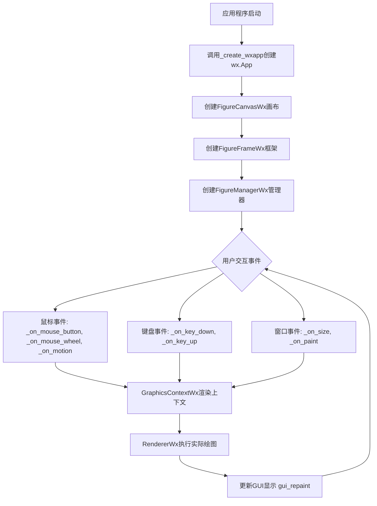

## 类结构

```
TimerBase (抽象基类)
├── TimerWx (wx定时器实现)
RendererBase (抽象基类)
├── RendererWx (wx渲染器实现)
GraphicsContextBase (抽象基类)
├── GraphicsContextWx (wx图形上下文)
FigureCanvasBase (抽象基类)
├── _FigureCanvasWxBase (wx画布基类)
│   ├── FigureCanvasWx (wx画布实现)
FigureManagerBase (抽象基类)
├── FigureManagerWx (wx图形管理器)
NavigationToolbar2 (抽象基类)
├── NavigationToolbar2Wx (wx导航工具栏)
ToolContainerBase (抽象基类)
├── ToolbarWx (wx工具容器)
backend_tools.ConfigureSubplotsBase
├── ConfigureSubplotsWx
backend_tools.SaveFigureBase
├── SaveFigureWx
backend_tools.RubberbandBase
├── RubberbandWx
backend_tools.ToolHelpBase
├── HelpWx
backend_tools.ToolCopyToClipboardBase
├── ToolCopyToClipboardWx
wx.Frame
├── FigureFrameWx
wx.Dialog
├── _HelpDialog
_Backend
└── _BackendWx
```

## 全局变量及字段


### `_log`
    
Logger instance for the wx backend module.

类型：`logging.Logger`
    


### `PIXELS_PER_INCH`
    
Default pixels per inch for screen display (set to 75).

类型：`int`
    


### `TimerWx._timer`
    
wx.Timer instance for generating timer events.

类型：`wx.Timer`
    


### `RendererWx.width`
    
Width of the bitmap in pixels.

类型：`int`
    


### `RendererWx.height`
    
Height of the bitmap in pixels.

类型：`int`
    


### `RendererWx.bitmap`
    
The bitmap being rendered to.

类型：`wx.Bitmap`
    


### `RendererWx.fontd`
    
Cache dictionary for font instances keyed by font property hash.

类型：`dict`
    


### `RendererWx.dpi`
    
Dots per inch resolution for the renderer.

类型：`float`
    


### `RendererWx.gc`
    
The graphics context used for drawing.

类型：`GraphicsContextWx`
    


### `RendererWx.fontweights`
    
Mapping of font weight values to wx.FONTWEIGHT constants.

类型：`dict`
    


### `RendererWx.fontangles`
    
Mapping of font angle names to wx.FONTSTYLE constants.

类型：`dict`
    


### `RendererWx.fontnames`
    
Mapping of font family names to wx.FONTFAMILY constants.

类型：`dict`
    


### `GraphicsContextWx.bitmap`
    
The bitmap being drawn to.

类型：`wx.Bitmap`
    


### `GraphicsContextWx.dc`
    
The memory device context for drawing operations.

类型：`wx.MemoryDC`
    


### `GraphicsContextWx.gfx_ctx`
    
The wx graphics context for advanced drawing.

类型：`wx.GraphicsContext`
    


### `GraphicsContextWx._pen`
    
The current pen used for line drawing.

类型：`wx.Pen`
    


### `GraphicsContextWx.renderer`
    
Reference to the parent renderer instance.

类型：`RendererWx`
    


### `GraphicsContextWx._capd`
    
Mapping of cap style names to wx.CAP constants.

类型：`dict`
    


### `GraphicsContextWx._joind`
    
Mapping of join style names to wx.JOIN constants.

类型：`dict`
    


### `GraphicsContextWx._cache`
    
Weak key cache for storing dc and gfx_ctx pairs.

类型：`weakref.WeakKeyDictionary`
    


### `_FigureCanvasWxBase.bitmap`
    
The bitmap holding the rendered figure.

类型：`wx.Bitmap`
    


### `_FigureCanvasWxBase._isDrawn`
    
Flag indicating whether the figure has been drawn.

类型：`bool`
    


### `_FigureCanvasWxBase._rubberband_rect`
    
Rectangle coordinates for rubberband selection.

类型：`tuple or None`
    


### `_FigureCanvasWxBase._rubberband_pen_black`
    
Black pen for drawing rubberband selection outline.

类型：`wx.Pen`
    


### `_FigureCanvasWxBase._rubberband_pen_white`
    
White pen for drawing rubberband selection outline.

类型：`wx.Pen`
    


### `_FigureCanvasWxBase.keyvald`
    
Mapping of wx key codes to matplotlib key names.

类型：`dict`
    


### `_FigureCanvasWxBase._timer_cls`
    
Timer class used for event loops (TimerWx).

类型：`type`
    


### `_FigureCanvasWxBase.manager_class`
    
Figure manager class for creating figure windows.

类型：`type`
    


### `_FigureCanvasWxBase.filetypes`
    
Dictionary of supported file types for saving figures.

类型：`dict`
    


### `FigureFrameWx.canvas`
    
The canvas widget contained in the frame.

类型：`FigureCanvasWx`
    


### `FigureManagerWx.frame`
    
The wx.Frame window containing the figure.

类型：`wx.Frame`
    


### `FigureManagerWx.window`
    
Alias for frame, the window containing the figure.

类型：`wx.Frame`
    


### `NavigationToolbar2Wx.wx_ids`
    
Mapping of toolbar tool names to wx tool IDs.

类型：`dict`
    


### `NavigationToolbar2Wx._coordinates`
    
Flag indicating whether to display cursor coordinates.

类型：`bool`
    


### `NavigationToolbar2Wx._label_text`
    
Static text control for displaying coordinates.

类型：`wx.StaticText`
    


### `NavigationToolbar2Wx.toolitems`
    
Tuple defining toolbar items with text, tooltip, image, and callback.

类型：`tuple`
    


### `ToolbarWx._space`
    
Stretchable space separator in the toolbar.

类型：`wx.ToolBarToolBase`
    


### `ToolbarWx._label_text`
    
Static text control for displaying status messages.

类型：`wx.StaticText`
    


### `ToolbarWx._toolitems`
    
Dictionary mapping tool names to list of tool and handler pairs.

类型：`dict`
    


### `ToolbarWx._groups`
    
Mapping of tool groups to their separator tool.

类型：`dict`
    


### `ToolbarWx._icon_extension`
    
File extension for toolbar icons (default '.svg').

类型：`str`
    


### `_HelpDialog._instance`
    
Singleton instance of the help dialog.

类型：`_HelpDialog or None`
    


### `_HelpDialog.headers`
    
List of column headers for the help dialog.

类型：`list`
    


### `_HelpDialog.widths`
    
List of column widths for the help dialog.

类型：`list`
    
    

## 全局函数及方法


### `_create_wxapp`

该函数是一个全局函数，用于创建并返回一个 wxPython 应用实例。它使用 LRU 缓存确保只创建一个 wx 应用实例，并配置应用的退出行为和 DPI 感知。

参数：
- （无参数）

返回值：`wx.App`，返回创建的 wx 应用对象

#### 流程图

```mermaid
flowchart TD
    A[开始] --> B[创建 wx.App 实例<br/>参数: False<br/>表示非重新进入模式]
    B --> C[调用 wxapp.SetExitOnFrameDelete(True)<br/>设置关闭最后一个帧时退出应用]
    C --> D[调用 cbook._setup_new_guiapp()<br/>设置新的 GUI 应用]
    D --> E{判断操作系统}
    E -->|Windows| F[调用 _c_internal_utils.Win32_SetProcessDpiAwareness_max<br/>设置进程 DPI 感知]
    E -->|非Windows| G[跳过 DPI 设置]
    F --> H[返回 wxapp 实例]
    G --> H
    H --> I[结束]
    
    style B fill:#e1f5fe
    style C fill:#e1f5fe
    style D fill:#e1f5fe
    style F fill:#fff3e0
    style H fill:#e8f5e9
```

#### 带注释源码

```python
@functools.lru_cache(1)
def _create_wxapp():
    """
    创建并返回一个 wxPython 应用实例。
    
    使用 LRU 缓存确保只创建一个应用实例，防止多次实例化导致的问题。
    这是一个模块级函数，被 matplotlib 的 wx 后端用于获取或创建 wx 应用。
    """
    # 创建一个 wx 应用实例
    # 参数 False 表示这是一个主应用程序，不是重新进入模式
    wxapp = wx.App(False)
    
    # 设置退出行为：当最后一个帧被删除时退出应用
    # 这确保了关闭所有窗口后应用会自动退出
    wxapp.SetExitOnFrameDelete(True)
    
    # 调用 matplotlib 的内部函数设置新的 GUI 应用
    # 这可能涉及注册应用实例到 matplotlib 的全局状态
    cbook._setup_new_guiapp()
    
    # 设置 per-process DPI awareness
    # 这是一个 Windows 平台特定的调用，在其他平台上是空操作（NoOp）
    # 确保高 DPI 显示器能正确显示
    _c_internal_utils.Win32_SetProcessDpiAwareness_max()
    
    # 返回配置好的 wx 应用实例
    return wxapp
```


### `_load_bitmap`

从 Matplotlib 数据目录的 "images" 子目录中加载图像文件并返回 wx.Bitmap 对象。

参数：

- `filename`：`str`，要加载的图像文件名（不含路径），函数会在 Matplotlib 数据目录的 images 子目录中查找该文件

返回值：`wx.Bitmap`，从指定文件加载的位图对象

#### 流程图

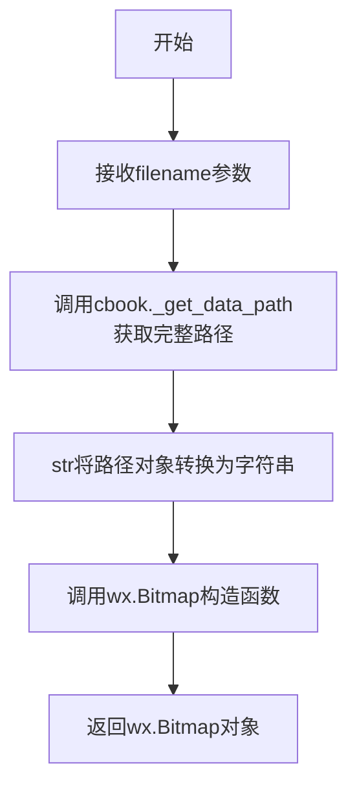

#### 带注释源码

```python
def _load_bitmap(filename):
    """
    Load a wx.Bitmap from a file in the "images" directory of the Matplotlib
    data.
    """
    # 使用 cbook._get_data_path 获取 Matplotlib 数据目录中 images 子目录下的文件完整路径
    # _get_data_path 是 Matplotlib 内部用于定位包数据文件的函数
    # 然后将返回的 Path 对象转换为字符串，供 wx.Bitmap 使用
    return wx.Bitmap(str(cbook._get_data_path('images', filename)))
```


### `_set_frame_icon`

为 wxPython 的主窗口 (`wx.Frame`) 设置图标。该函数加载 Matplotlib 数据目录中的两个标准图标文件（小图和大图），创建一个 `wx.IconBundle`，并将其应用于指定的窗口框架。如果图标加载失败，则直接返回，不设置任何图标。

参数：

-  `frame`：`wx.Frame`，需要设置图标的目标窗口对象。

返回值：`None`，该函数无返回值。

#### 流程图

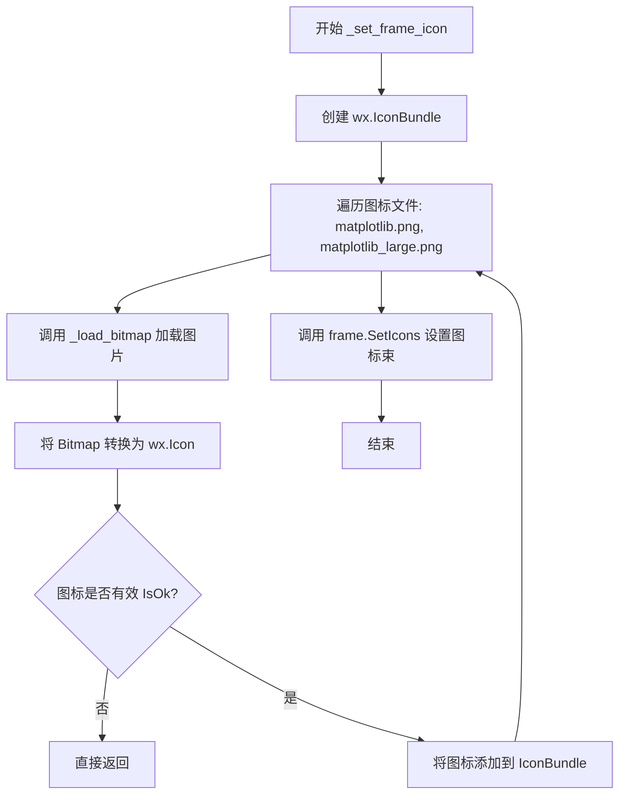

#### 带注释源码

```python
def _load_bitmap(filename):
    """
    从 Matplotlib 的数据目录中的 'images' 文件夹加载指定的文件并返回 wx.Bitmap 对象。
    """
    return wx.Bitmap(str(cbook._get_data_path('images', filename)))


def _set_frame_icon(frame):
    """
    为传入的 wx.Frame 设置窗口图标。
    """
    bundle = wx.IconBundle()
    # 遍历需要设置的图标文件（小图和大图）
    for image in ('matplotlib.png', 'matplotlib_large.png'):
        # 加载位图并转换为图标
        icon = wx.Icon(_load_bitmap(image))
        # 如果图标加载失败（例如文件不存在），则退出函数
        if not icon.IsOk():
            return
        # 将图标添加到图标束中
        bundle.AddIcon(icon)
    # 最后将整个图标束设置为框架的图标
    frame.SetIcons(bundle)
```


### `TimerWx.__init__`

这是 `TimerWx` 类的构造函数，用于初始化一个基于 wxPython `wx.Timer` 的定时器实例。该方法创建一个 wx.Timer 对象，并将定时器的 Notify 回调设置为内部的 `_on_timer` 方法，最后调用父类 `TimerBase` 的构造函数完成初始化。

参数：

-  `*args`：可变位置参数，传递给父类 `TimerBase.__init__` 的位置参数，通常包含定时器间隔和回调函数等。
-  `**kwargs`：可变关键字参数，传递给父类 `TimerBase.__init__` 的关键字参数，可能包含 `interval`、`callback`、`single` 等定时器配置选项。

返回值：`None`，该方法不返回任何值，仅完成对象的初始化。

#### 流程图

```mermaid
flowchart TD
    A[开始 __init__] --> B[创建 wx.Timer 实例: self._timer = wx.Timer]
    B --> C[设置定时器回调: self._timer.Notify = self._on_timer]
    C --> D[调用父类构造函数: super().__init__(*args, **kwargs)]
    D --> E[结束 __init__]
    
    style A fill:#f9f,color:#000
    style E fill:#9f9,color:#000
```

#### 带注释源码

```python
def __init__(self, *args, **kwargs):
    """
    初始化 TimerWx 定时器实例。
    
    参数:
        *args: 可变位置参数，传递给父类 TimerBase 的参数。
               通常包括间隔时间(interval)和回调函数(callback)。
        **kwargs: 可变关键字参数，用于配置定时器的可选参数。
                  可能包括 single (单次触发模式) 等。
    """
    # 创建一个 wx.Timer 实例，这是 wxPython 提供的原生定时器类
    # 用于在指定时间间隔触发事件
    self._timer = wx.Timer()
    
    # 将 wx.Timer 的 Notify 回调绑定到当前类的 _on_timer 方法
    # 当定时器触发时，会调用 self._on_timer 来执行实际的回调逻辑
    self._timer.Notify = self._on_timer
    
    # 调用父类 TimerBase 的构造函数，传递所有参数
    # 父类会处理间隔时间设置、回调函数保存等核心逻辑
    # TimerBase 的 __init__ 签名通常为:
    # __init__(self, interval=None, callback=None, *args, single=False, **kwargs)
    super().__init__(*args, **kwargs)
```


### `TimerWx._timer_start`

启动 wxPython 定时器，使用当前间隔和单次触发设置来激活内部 wx.Timer 对象。

参数：
- 该方法无显式参数（仅使用 `self` 引用实例）

返回值：`None`，无返回值（启动定时器为副作用操作）

#### 流程图

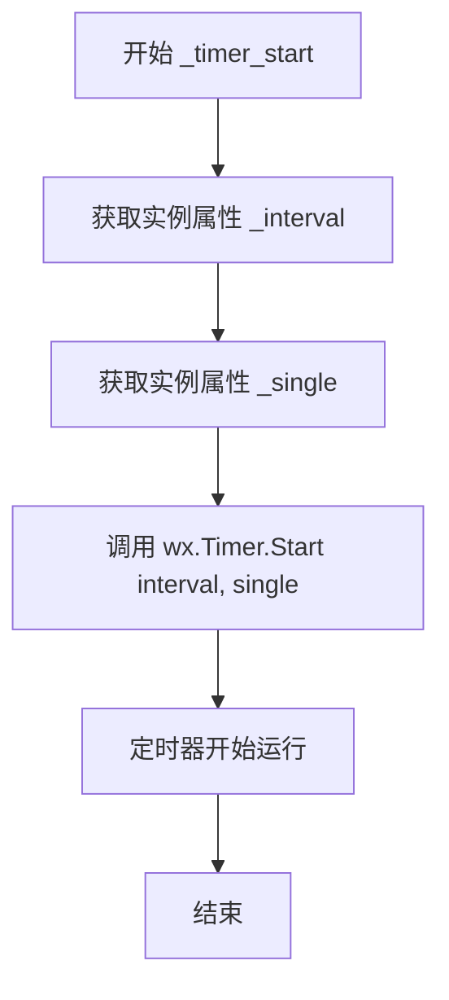

#### 带注释源码

```python
def _timer_start(self):
    """
    启动 wxPython 内部定时器。
    
    该方法继承自 TimerBase，作为抽象定时器接口的具体实现。
    它使用存储在实例中的 _interval（触发间隔）和 _single（单次触发标志）
    来配置并启动 wx.Timer 对象。
    """
    # 调用 wx.Timer.Start 方法启动定时器
    # 参数1: self._interval - 定时器触发间隔（毫秒）
    # 参数2: self._single - 是否仅触发一次（True=单次, False=重复）
    self._timer.Start(self._interval, self._single)
```


### `TimerWx._timer_stop`

该方法用于停止 wxPython 的 wx.Timer 计时器，是 TimerBase 抽象方法的具体实现，负责在需要停止定时器时调用底层 wx.Timer 的 Stop 方法。

参数： 无

返回值：`None`，无返回值，方法是执行副作用（停止计时器）而非返回数据。

#### 流程图

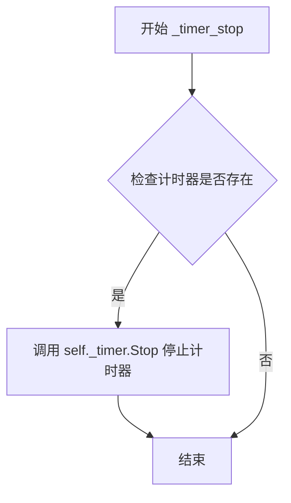

#### 带注释源码

```python
def _timer_stop(self):
    """
    停止 wx.Timer 计时器。

    该方法是 TimerBase 抽象方法的具体实现，在需要停止定时器时
    被调用。它直接调用底层 wx.Timer 对象的 Stop 方法来停止计时器。
    """
    self._timer.Stop()
```


### `TimerWx._timer_set_interval`

该方法用于设置定时器的间隔。当被调用时，如果定时器当前正在运行，则会重新启动定时器以应用新的间隔时间。

参数： 无

返回值： `None`，无返回值

#### 流程图

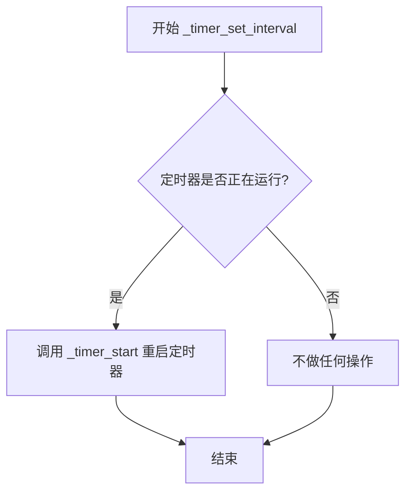

#### 带注释源码

```python
def _timer_set_interval(self):
    """
    设置定时器的间隔时间。
    
    当需要更新定时器的间隔时被调用。此方法检查定时器当前是否正在运行，
    如果是，则重启定时器以使新的间隔生效。
    """
    # 检查定时器是否正在运行
    if self._timer.IsRunning():
        # 定时器正在运行，调用 _timer_start() 重新启动
        # 这将使用更新后的 self._interval 值重新启动定时器
        self._timer_start()  # Restart with new interval.
```


### TimerWx._on_timer

该方法是 `TimerWx` 类的定时器回调函数，当 wxPython 的 wx.Timer 触发时自动调用，用于执行父类 TimerBase 中定义的定时器逻辑（通常为触发定时器事件或调用注册的回调函数）。

参数：无需显式参数（由 wx.Timer 内部触发）

返回值：`None`，无返回值（wx.Timer.Notify 回调不要求返回值）

#### 流程图

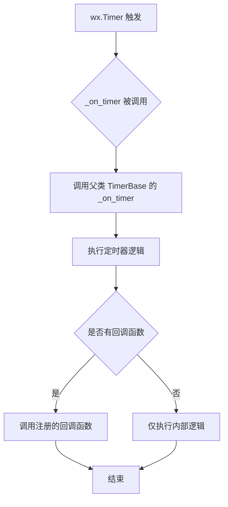

#### 带注释源码

```python
def _on_timer(self):
    """
    Timer callback function called by wx.Timer.
    
    This method is assigned to wx.Timer.Notify in __init__:
        self._timer.Notify = self._on_timer
    
    When the wx.Timer fires, this callback is invoked to handle
    the timer event. It delegates the actual timer logic to the
    parent class TimerBase's _on_timer method.
    """
    # 调用父类 TimerBase 的 _on_timer 方法处理定时器逻辑
    # 父类方法会：
    # 1. 检查定时器是否应该运行
    # 2. 记录当前时间
    # 3. 调用通过 add_callback 注册的回调函数
    # 4. 处理单次定时器（_single=True）的停止逻辑
    super(TimerWx, self)._on_timer()
```


### `RendererWx.__init__`

该方法用于初始化 wxPython 的matplotlib后端渲染器，设置渲染所需的位图、分辨率和图形上下文等基础资源。

参数：

- `bitmap`：`wx.Bitmap`，用于绘图的位图对象，提供 `GetWidth()` 和 `GetHeight()` 方法获取尺寸
- `dpi`：`float`，每英寸像素数（dots per inch），用于计算点 到像素的转换

返回值：`None`，构造函数不返回值

#### 流程图

```mermaid
flowchart TD
    A[开始 __init__] --> B[调用父类 RendererBase.__init__]
    B --> C[记录调试日志]
    C --> D[获取位图宽度: bitmap.GetWidth]
    D --> E[获取位图高度: bitmap.GetHeight]
    E --> F[保存位图引用到 self.bitmap]
    F --> G[初始化字体字典 self.fontd = {}]
    G --> H[保存DPI到 self.dpi]
    H --> I[初始化图形上下文 self.gc = None]
    I --> J[结束 __init__]
```

#### 带注释源码

```python
def __init__(self, bitmap, dpi):
    """Initialise a wxWindows renderer instance."""
    # 调用父类 RendererBase 的初始化方法
    super().__init__()
    
    # 记录调试日志，输出当前类的类型
    _log.debug("%s - __init__()", type(self))
    
    # 从位图对象获取宽度和高度
    self.width = bitmap.GetWidth()
    self.height = bitmap.GetHeight()
    
    # 保存位图对象的引用，用于后续绘图操作
    self.bitmap = bitmap
    
    # 初始化字体字典，用于缓存字体实例提高效率
    self.fontd = {}
    
    # 保存DPI值，用于点(points)到像素(pixels)的转换
    self.dpi = dpi
    
    # 初始化图形上下文为None，延迟创建直到首次需要时
    self.gc = None
```


### `RendererWx.flipy`

该方法用于确定在wxPython后端中坐标系的Y轴是否翻转。在wxWidgets/wxPython中，绘图坐标系的原点位于左上角，Y轴向下为正方向，这与matplotlib默认的笛卡尔坐标系（原点位于左下角，Y轴向上为正方向）相反。因此，该方法返回`True`以指示flipy行为。

参数：

- `self`：`RendererWx`实例，当前渲染器对象本身

返回值：`bool`，返回`True`表示Y轴已翻转（原点在上方）

#### 流程图

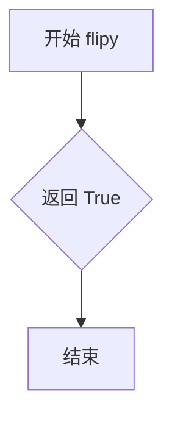

#### 带注释源码

```python
def flipy(self):
    # docstring inherited
    # 在wxPython后端中，坐标原点位于左上角，Y轴向下为正
    # 这与matplotlib标准的笛卡尔坐标系相反
    # 因此需要返回True来翻转Y轴坐标
    return True
```


### RendererWx.get_text_width_height_descent

该方法用于获取给定文本在指定字体属性下的宽度、高度和下降值（descent），是matplotlib在wxPython后端中计算文本尺寸的核心函数。

参数：
- `s`：`str`，要测量宽度的文本字符串
- `prop`：`matplotlib.font_manager.FontProperties`，字体属性对象，包含字体大小、样式等信息
- `ismath`：`bool`，指示文本是否为数学模式，若是则需处理数学文本的特殊字符

返回值：`tuple[float, float, float]`，返回文本的宽度（w）、高度（h）和下降值（descent），下降值表示文本基线以下的深度

#### 流程图

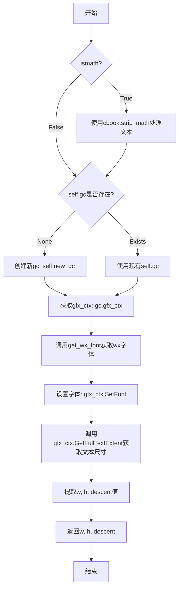

#### 带注释源码

```python
def get_text_width_height_descent(self, s, prop, ismath):
    # docstring inherited

    # 如果是数学模式，需要先去除数学文本的装饰符号
    if ismath:
        s = cbook.strip_math(s)

    # 获取图形上下文gc，如果尚未初始化则创建新的gc实例
    if self.gc is None:
        gc = self.new_gc()
    else:
        gc = self.gc
    
    # 获取wx图形上下文
    gfx_ctx = gc.gfx_ctx
    
    # 根据文本和字体属性获取对应的wx字体对象
    font = self.get_wx_font(s, prop)
    
    # 设置图形上下文的当前字体为获取的字体，颜色为黑色
    gfx_ctx.SetFont(font, wx.BLACK)
    
    # 获取文本的完整度量信息：宽度、高度、下降值和前导间距
    # wx.GraphicsContext的GetFullTextExtent返回(width, height, descent, leading)
    w, h, descent, leading = gfx_ctx.GetFullTextExtent(s)

    # 返回宽度、高度和下降值，符合RendererBase的接口约定
    return w, h, descent
```


### `RendererWx.get_canvas_width_height`

获取画布的宽度和高度。该方法是 RendererBase 基类接口的实现，用于返回当前渲染器所绑定的位图（bitmap）的尺寸信息。

参数：
- 无（仅包含 `self` 参数）

返回值：`tuple[int, int]`，返回画布的宽度和高度元组。

#### 流程图

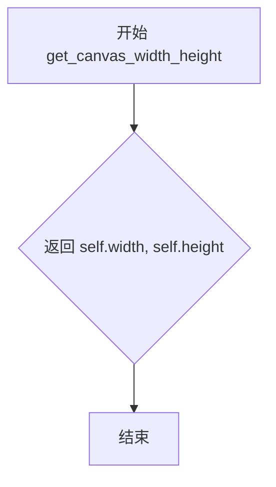

#### 带注释源码

```python
def get_canvas_width_height(self):
    # docstring inherited
    # 该方法继承自 RendererBase 基类，docstring 表明为 inherited
    # 直接返回实例属性 width 和 height，这两个值在 __init__ 方法中
    # 通过 bitmap.GetWidth() 和 bitmap.GetHeight() 初始化
    return self.width, self.height
```


### `RendererWx.handle_clip_rectangle`

该方法负责处理图形上下文的剪裁矩形区域，根据新的剪裁边界更新wxGraphicsContext的剪裁状态，实现剪裁区域的设置或重置，是渲染器管理绘制可见区域的关键方法。

参数：

- `gc`：`GraphicsContextWx`，图形上下文对象，用于获取剪裁矩形信息

返回值：`None`，无返回值，仅执行剪裁区域的设置操作

#### 流程图

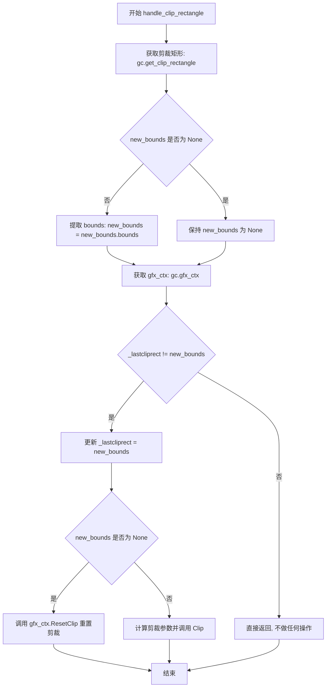

#### 带注释源码

```python
def handle_clip_rectangle(self, gc):
    """
    处理剪裁矩形区域，设置或重置wxGraphicsContext的剪裁边界。
    
    参数:
        gc: GraphicsContextWx对象，包含剪裁信息和图形上下文
    """
    # 从图形上下文获取当前的剪裁矩形
    new_bounds = gc.get_clip_rectangle()
    
    # 如果存在剪裁矩形，则提取其bounds属性（四元组: x, y, width, height）
    if new_bounds is not None:
        new_bounds = new_bounds.bounds
    
    # 获取wx图形上下文对象
    gfx_ctx = gc.gfx_ctx
    
    # 性能优化：仅当剪裁矩形发生变化时才执行实际操作
    # 使用缓存的_lastcliprect避免重复设置相同的剪裁区域
    if gfx_ctx._lastcliprect != new_bounds:
        # 更新缓存的剪裁矩形
        gfx_ctx._lastcliprect = new_bounds
        
        # 根据是否存在新剪裁矩形执行不同操作
        if new_bounds is None:
            # 无剪裁区域时，重置整个画布为可绘制区域
            gfx_ctx.ResetClip()
        else:
            # 设置新的剪裁区域
            # 注意：wxPython坐标系y轴向下，需要进行坐标转换
            # self.height - new_bounds[1] - new_bounds[3] 将matplotlib坐标转换为wx坐标
            gfx_ctx.Clip(new_bounds[0],                     # 剪裁区域x坐标
                         self.height - new_bounds[1] - new_bounds[3],  # 转换后的y坐标
                         new_bounds[2],                     # 剪裁区域宽度
                         new_bounds[3])                     # 剪裁区域高度
```


### `RendererWx.convert_path`

该方法是一个静态方法，用于将 matplotlib 的 Path 对象转换为 wxPython 的 GraphicsPath 对象，以便在 wxWidgets 框架中进行绘制。它遍历路径的每个段落，根据不同的路径命令（如移动、画线、二次贝塞尔曲线、四次贝塞尔曲线和多边形闭合）将点添加到 wxpath 中。

参数：

- `gfx_ctx`：`wx.GraphicsContext`，用于创建 wx.GraphicsPath 的图形上下文对象
- `path`：`matplotlib.path.Path`，要转换的 matplotlib 路径对象
- `transform`：`matplotlib.transforms.Transform`，应用于路径坐标的变换对象

返回值：`wx.GraphicsPath`，转换后的 wxPython 图形路径对象

#### 流程图

```mermaid
flowchart TD
    A[开始: convert_path] --> B[创建wxpath: gfx_ctx.CreatePath]
    B --> C[遍历path.iter_segments(transform)]
    C --> D{判断code类型}
    D -->|Path.MOVETO| E[wxpath.MoveToPoint]
    D -->|Path.LINETO| F[wxpath.AddLineToPoint]
    D -->|Path.CURVE3| G[wxpath.AddQuadCurveToPoint]
    D -->|Path.CURVE4| H[wxpath.AddCurveToPoint]
    D -->|Path.CLOSEPOLY| I[wxpath.CloseSubpath]
    E --> J{还有更多段落?}
    F --> J
    G --> J
    H --> J
    I --> J
    J -->|是| C
    J -->|否| K[返回wxpath]
```

#### 带注释源码

```python
@staticmethod
def convert_path(gfx_ctx, path, transform):
    """
    将 matplotlib 的 Path 对象转换为 wxPython 的 GraphicsPath 对象。
    
    参数:
        gfx_ctx: wx.GraphicsContext 实例，用于创建路径
        path: matplotlib.path.Path 对象
        transform: matplotlib.transforms.Transform 对象
    
    返回:
        wx.GraphicsPath: 转换后的 wx 路径对象
    """
    # 创建空的 wx 图形路径对象
    wxpath = gfx_ctx.CreatePath()
    
    # 遍历路径的每个段落（线段），同时应用变换
    for points, code in path.iter_segments(transform):
        # 根据路径命令类型执行相应的 wxpath 方法
        if code == Path.MOVETO:
            # 移动到指定点（不画线）
            wxpath.MoveToPoint(*points)
        elif code == Path.LINETO:
            # 画直线到指定点
            wxpath.AddLineToPoint(*points)
        elif code == Path.CURVE3:
            # 添加二次贝塞尔曲线
            wxpath.AddQuadCurveToPoint(*points)
        elif code == Path.CURVE4:
            # 添加四次（三次）贝塞尔曲线
            wxpath.AddCurveToPoint(*points)
        elif code == Path.CLOSEPOLY:
            # 闭合当前子路径
            wxpath.CloseSubpath()
    
    # 返回转换后的 wx 图形路径
    return wxpath
```


### `RendererWx.draw_path`

该方法负责将matplotlib的路径(Path)对象绘制到wxPython的设备上下文上，处理坐标变换、剪裁区域设置以及路径的填充或描边绘制。

参数：

- `self`：`RendererWx`，RendererWx的实例自身
- `gc`：`GraphicsContextWx`，图形上下文，用于控制绘制样式（如颜色、线宽等）
- `path`：`Path`（matplotlib.path.Path），要绘制的路径对象，包含一系列顶点和绘制指令
- `transform`：`Affine2D`，坐标变换矩阵，用于对路径进行缩放、平移等几何变换
- `rgbFace`：`tuple` 或 `None`，填充颜色，RGB格式的元组(如(1.0, 0.0, 0.0))，若为None则只描边不填充

返回值：`None`，该方法直接绘制到设备上下文，不返回任何值

#### 流程图

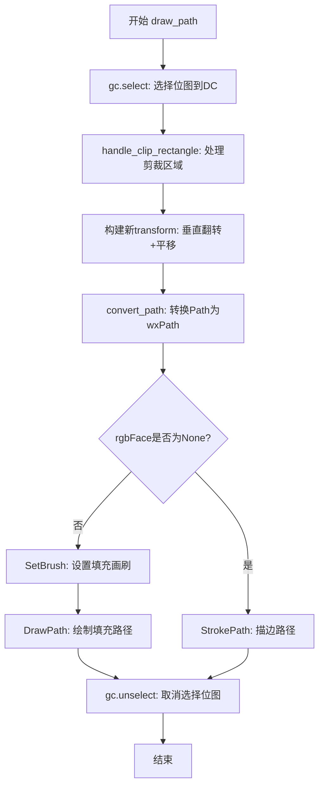

#### 带注释源码

```python
def draw_path(self, gc, path, transform, rgbFace=None):
    # docstring inherited
    # 1. 选择当前位图到设备上下文(Windows平台需要)
    gc.select()
    
    # 2. 处理剪裁矩形，设置绘制区域边界
    self.handle_clip_rectangle(gc)
    
    # 3. 获取图形上下文用于绘图
    gfx_ctx = gc.gfx_ctx
    
    # 4. 构建坐标变换: 先应用传入的transform，再进行垂直翻转和Y轴平移
    #    wxPython的坐标原点在左上角，而matplotlib在左下角，
    #    因此需要scale(1.0, -1.0)翻转Y轴，并translate(0.0, self.height)平移到正确位置
    transform = transform + \
        Affine2D().scale(1.0, -1.0).translate(0.0, self.height)
    
    # 5. 将matplotlib的Path对象转换为wxPython的wxPath对象
    wxpath = self.convert_path(gfx_ctx, path, transform)
    
    # 6. 根据是否有填充颜色决定绘制方式
    if rgbFace is not None:
        # 有填充颜色: 创建wx Brush并绘制填充路径
        gfx_ctx.SetBrush(wx.Brush(gc.get_wxcolour(rgbFace)))
        gfx_ctx.DrawPath(wxpath)
    else:
        # 无填充颜色: 仅描边路径(绘制轮廓线)
        gfx_ctx.StrokePath(wxpath)
    
    # 7. 取消选择位图，释放设备上下文
    gc.unselect()
```


### `RendererWx.draw_image`

该方法负责将图像绘制到wxPython的wxDC图形上下文中，处理裁剪区域，并使用wx.Bitmap将numpy数组形式的图像数据渲染到画布上。

参数：

- `gc`：`GraphicsContextWx`，图形上下文，用于控制绘制样式和剪裁矩形
- `x`：`float`，图像左下角的x坐标
- `y`：`float`，图像左下角的y坐标  
- `im`：`numpy.ndarray`，图像数据，通常为RGBA格式的二维数组

返回值：`None`，无返回值，直接在图形上下文上绘制图像

#### 流程图

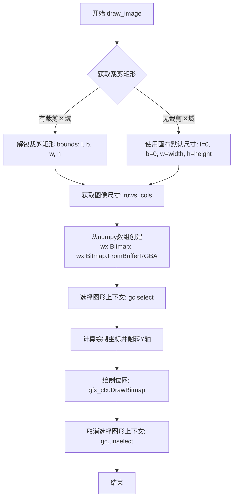

#### 带注释源码

```python
def draw_image(self, gc, x, y, im):
    """
    绘制图像到图形上下文。
    
    参数:
        gc: GraphicsContextWx - 图形上下文对象
        x: float - 图像左下角的x坐标
        y: float - 图像左下角的y坐标
        im: numpy.ndarray - 图像数据数组
    """
    # 获取图形上下文的裁剪矩形区域
    bbox = gc.get_clip_rectangle()
    if bbox is not None:
        # 如果存在裁剪区域，解包获取边界
        l, b, w, h = bbox.bounds
    else:
        # 如果没有裁剪区域，使用画布的完整尺寸
        l = 0
        b = 0
        w = self.width
        h = self.height
    
    # 从图像数组获取行数和列数
    rows, cols = im.shape[:2]
    
    # 将numpy数组转换为wx.Bitmap对象（RGBA格式）
    # frombuffer创建的是只读缓冲区，FromBufferRGBA会复制数据
    bitmap = wx.Bitmap.FromBufferRGBA(cols, rows, im.tobytes())
    
    # 选择图形上下文，准备绘制
    gc.select()
    
    # 获取图形上下文进行绘制
    # 注意：y坐标需要翻转，因为matplotlib的y轴向上为正
    # 而wxPython的y轴向下为正
    # height - b 将坐标从matplotlib坐标系转换到wx坐标系
    gc.gfx_ctx.DrawBitmap(bitmap, int(l), int(self.height - b),
                          int(w), int(-h))
    
    # 取消选择图形上下文，完成绘制
    gc.unselect()
```


### `RendererWx.draw_text`

该方法是 Matplotlib wxPython 后端中的文本渲染核心方法，负责将文本绘制到 wxPython 图形上下文中，支持普通文本和旋转文本的绘制，并处理数学公式解析和坐标转换。

参数：

- `gc`：`GraphicsContextWx`，图形上下文对象，用于控制绘制颜色、线条样式等绘图属性
- `x`：`float`，文本绘制起点的 x 坐标
- `y`：`float`，文本绘制起点的 y 坐标
- `s`：`str`，要绘制的文本字符串
- `prop`：`matplotlib.font_manager.FontProperties`，字体属性对象，包含字体大小、样式、粗细等
- `angle`：`float`，文本旋转角度（度），0 表示不旋转
- `ismath`：`bool`，是否将文本作为数学公式解析，默认为 False
- `mtext`：`matplotlib.text.Text`，可选的文本对象，用于额外的文本渲染选项

返回值：`None`，该方法直接在图形上下文中绘制文本，无返回值

#### 流程图

```mermaid
flowchart TD
    A[开始 draw_text] --> B{ismath 为 True?}
    B -->|是| C[使用 cbook.strip_math 解析数学公式]
    B -->|否| D[保持原文本 s]
    C --> E[gc.select 激活图形上下文]
    E --> F[handle_clip_rectangle 处理裁剪区域]
    F --> G[获取 wxFont 字体对象]
    G --> H[获取 RGB 颜色并转换为 wxColour]
    H --> I[gfx_ctx.SetFont 设置字体和颜色]
    I --> J[get_text_width_height_descent 获取文本尺寸]
    J --> K[坐标取整: x = int(x), y = int(y - h)]
    K --> L{angle == 0.0?}
    L -->|是| M[gfx_ctx.DrawText 绘制普通文本]
    L -->|否| N[计算旋转偏移量 xo, yo]
    N --> O[gfx_ctx.DrawRotatedText 绘制旋转文本]
    M --> P[gc.unselect 释放图形上下文]
    O --> P
    P --> Q[结束]
```

#### 带注释源码

```python
def draw_text(self, gc, x, y, s, prop, angle, ismath=False, mtext=None):
    """
    Draw text to the wxPython graphics context.

    Parameters
    ----------
    gc : GraphicsContextWx
        The graphics context for drawing.
    x, y : float
        Coordinates for text placement.
    s : str
        The text string to draw.
    prop : matplotlib.font_manager.FontProperties
        Font properties including size, style, weight.
    angle : float
        Rotation angle in degrees.
    ismath : bool, optional
        Whether to interpret text as a math expression, default False.
    mtext : matplotlib.text.Text, optional
        The matplotlib Text object (unused in this backend).
    """
    # docstring inherited

    # 如果是数学模式，去除数学公式标记（$或$$）
    if ismath:
        s = cbook.strip_math(s)

    # 调试日志记录
    _log.debug("%s - draw_text()", type(self))

    # 选择图形上下文，确保在Windows平台上正确绘制
    gc.select()

    # 处理裁剪矩形，防止文本绘制到指定区域外
    self.handle_clip_rectangle(gc)

    # 获取图形上下文的wx图形上下文
    gfx_ctx = gc.gfx_ctx

    # 根据字体属性获取wx字体对象（带缓存）
    font = self.get_wx_font(s, prop)

    # 获取RGB颜色并转换为wxColour格式
    color = gc.get_wxcolour(gc.get_rgb())

    # 设置当前字体和颜色
    gfx_ctx.SetFont(font, color)

    # 获取文本的宽度、高度和下降量
    w, h, d = self.get_text_width_height_descent(s, prop, ismath)

    # 坐标取整，y坐标需要减去高度以调整基线
    x = int(x)
    y = int(y - h)

    # 根据角度判断是普通绘制还是旋转绘制
    if angle == 0.0:
        # 零角度直接绘制文本
        gfx_ctx.DrawText(s, x, y)
    else:
        # 非零角度需要计算旋转偏移
        # 将角度转换为弧度
        rads = math.radians(angle)

        # 计算旋转偏移量
        # xo: 水平偏移，基于高度和正弦值
        # yo: 垂直偏移，基于高度和余弦值
        xo = h * math.sin(rads)
        yo = h * math.cos(rads)

        # 绘制旋转文本，坐标需要减去偏移量
        gfx_ctx.DrawRotatedText(s, x - xo, y - yo, rads)

    # 释放图形上下文
    gc.unselect()
```


### `RendererWx.new_gc`

创建并返回一个新的`GraphicsContextWx`实例，用于在wxPython后端中进行图形绘制操作。该方法会初始化图形上下文并将其存储在实例变量中以便后续复用。

参数：

- （无参数，仅包含隐式`self`参数）

返回值：`GraphicsContextWx`，返回新创建的图形上下文对象

#### 流程图

```mermaid
flowchart TD
    A[开始 new_gc] --> B[记录调试日志: RendererWx - new_gc]
    B --> C[创建 GraphicsContextWx 实例: GraphicsContextWx(self.bitmap, self)]
    C --> D[调用 gc.select 选择当前位图到 wxDC]
    D --> E[调用 gc.unselect 取消选择位图]
    E --> F[返回 gc 对象]
```

#### 带注释源码

```python
def new_gc(self):
    """
    Create and return a new GraphicsContextWx instance.
    
    This method creates a new graphics context for drawing operations
    and caches it in self.gc for potential reuse.
    """
    # docstring inherited
    _log.debug("%s - new_gc()", type(self))  # 记录调试日志，输出类名
    
    # 创建新的GraphicsContextWx对象，传入位图和渲染器引用
    self.gc = GraphicsContextWx(self.bitmap, self)
    
    # 选择当前位图到设备上下文（Windows平台特定）
    self.gc.select()
    
    # 取消选择位图，释放设备上下文
    self.gc.unselect()
    
    # 返回新创建的图形上下文对象
    return self.gc
```


### `RendererWx.get_wx_font`

该方法是 Matplotlib wxPython 后端中 `RendererWx` 类的核心方法，负责将 Matplotlib 的字体属性（FontProperties）转换为 wxPython 可用的 `wx.Font` 对象，并通过缓存机制提高字体渲染效率。

参数：

- `s`：`str`，字符串参数（主要用于生成缓存键的哈希计算，虽然在当前实现中直接使用 `prop` 的哈希值）
- `prop`：`matplotlib.font_manager.FontProperties`，Matplotlib 字体属性对象，包含字体的名称、大小、样式、粗细等信息

返回值：`wx.Font`，wxPython 字体对象，用于在 wxWidgets 控件中绘制文本

#### 流程图

```mermaid
flowchart TD
    A[开始 get_wx_font] --> B[生成缓存键: key = hash(prop)]
    B --> C{fontd 缓存中是否存在 key?}
    C -->|是| D[返回缓存的 font 对象]
    C -->|否| E[计算像素大小: size = points_to_pixels(prop.get_size_in_points())]
    E --> F[获取字体家族: fontnames.get prop.get_name, 默认为 wx.ROMAN]
    F --> G[获取字体样式: fontangles[prop.get_style()]]
    G --> H[获取字体粗细: fontweights[prop.get_weight()]]
    H --> I[创建 wx.Font 对象]
    I --> J[将新字体存入 fontd 缓存: fontd[key] = font]
    J --> K[返回新创建的 font 对象]
    D --> K
```

#### 带注释源码

```python
def get_wx_font(self, s, prop):
    """Return a wx font.  Cache font instances for efficiency."""
    # 记录调试日志，输出当前类名
    _log.debug("%s - get_wx_font()", type(self))
    
    # 使用 FontProperties 对象的哈希值作为缓存键
    # 这样相同属性的字体可以复用，避免重复创建
    key = hash(prop)
    
    # 从缓存字典 fontd 中查找是否已有对应键的字体
    font = self.fontd.get(key)
    if font is not None:
        # 缓存命中，直接返回已缓存的字体对象
        return font
    
    # 缓存未命中，需要创建新字体
    # 将字体大小从.points转换为像素单位
    size = self.points_to_pixels(prop.get_size_in_points())
    
    # Font colour is determined by the active wx.Pen
    # TODO: It may be wise to cache font information
    # 创建 wx.Font 对象并缓存
    # 参数说明:
    #   pointSize: 字体大小（像素）
    #   family: 字体家族（如 Sans, Roman 等）
    #   style: 字体样式（斜体、普通等）
    #   weight: 字体粗细（从100-900或文字描述）
    self.fontd[key] = font = wx.Font(  # Cache the font and gc.
        pointSize=round(size),
        family=self.fontnames.get(prop.get_name(), wx.ROMAN),
        style=self.fontangles[prop.get_style()],
        weight=self.fontweights[prop.get_weight()])
    
    # 返回新创建的字体对象
    return font
```


### RendererWx.points_to_pixels

该方法用于将图形设计中的点数（points）转换为屏幕上的像素值，是 wxPython 后端渲染器的单位转换核心方法。

参数：

- `self`：`RendererWx` 实例，隐含的类实例引用，包含 `dpi` 属性用于 DPI 计算
- `points`：`float` 或 `int`，待转换的点数（point），源自 matplotlib 的字体大小或图形尺寸单位

返回值：`float`，转换后的像素值

#### 流程图

```mermaid
flowchart TD
    A[开始 points_to_pixels] --> B[获取 PIXELS_PER_INCH = 75]
    --> C[获取 self.dpi<br>渲染器的 DPI 设置]
    --> D[计算转换因子<br>PIXELS_PER_INCH / 72.0 * self.dpi / 72.0]
    --> E[返回 points × 转换因子]
    F[调用方] --> A
    E --> G[结束]
    
    style A fill:#f9f,stroke:#333
    style G fill:#9f9,stroke:#333
```

#### 带注释源码

```python
def points_to_pixels(self, points):
    """
    将点数（points）转换为像素（pixels）。
    
    该方法继承自 RendererBase，利用屏幕 DPI 和标准点数基数（72）
    进行单位转换。公式基于：
    - 1 inch = 72 points（PostScript 标准）
    - 1 inch = PIXELS_PER_INCH（通常为 75）屏幕像素
    - 最终 DPI 缩放因子用于适配不同显示设备
    
    参数:
        points (float 或 int): 待转换的点数，常见于字体大小设置
            例如：prop.get_size_in_points() 返回的字体大小
    
    返回:
        float: 转换后的像素值，可直接用于 wxPython 绘图 API
    
    示例:
        >>> renderer = RendererWx(bitmap, dpi=100)
        >>> renderer.points_to_pixels(12)  # 12 point 字体
        13.020833333333334  # 约 13 像素
    """
    # docstring inherited - 继承自 RendererBase 的文档字符串
    # 核心转换公式：
    # 1. PIXELS_PER_INCH / 72.0: 将 points 转换为 base inches
    # 2. * self.dpi / 72.0: 将 inches 转换为目标 DPI 下的像素
    # 简化后：points * (PIXELS_PER_INCH * self.dpi) / (72.0 * 72.0)
    return points * (PIXELS_PER_INCH / 72.0 * self.dpi / 72.0)
```


### GraphicsContextWx.__init__

该方法是GraphicsContextWx类的初始化方法，负责创建和管理wxPython的图形上下文。它使用缓存机制避免重复创建wxMemoryDC和wxGraphicsContext对象，并设置默认的画笔属性。

参数：
- `bitmap`：`wx.Bitmap`，用于绘图的位图对象，作为缓存键和绘图目标
- `renderer`：`RendererWx`，渲染器实例，用于将 linewidth 转换为像素

返回值：`无`（None），该方法为构造函数，不返回任何值

#### 流程图

```mermaid
flowchart TD
    A[开始 __init__] --> B[调用父类 GraphicsContextBase.__init__]
    B --> C{从缓存获取 bitmap 对应的 dc 和 gfx_ctx}
    C -->|获取成功| D[使用缓存的 dc 和 gfx_ctx]
    C -->|获取失败| E[创建 wx.MemoryDC]
    E --> F[使用 dc 创建 wx.GraphicsContext]
    F --> G[初始化 gfx_ctx._lastcliprect = None]
    G --> H[将 dc 和 gfx_ctx 加入缓存]
    H --> D
    D --> I[设置实例属性: self.bitmap, self.dc, self.gfx_ctx]
    I --> J[创建默认黑色实线 Pen]
    J --> K[使用 Pen 设置 gfx_ctx]
    K --> L[设置 self.renderer]
    L --> M[结束 __init__]
```

#### 带注释源码

```python
def __init__(self, bitmap, renderer):
    """
    初始化 GraphicsContextWx 对象。
    
    Parameters:
        bitmap: wx.Bitmap - 用于绘图的位图对象
        renderer: RendererWx - 渲染器实例，用于坐标转换
    """
    # 调用父类 GraphicsContextBase 的初始化方法
    super().__init__()
    
    # 调试日志：记录初始化信息
    _log.debug("%s - __init__(): %s", type(self), bitmap)
    
    # 尝试从缓存中获取该 bitmap 对应的 dc 和 gfx_ctx
    # 使用弱引用字典 _cache 存储，避免重复创建
    dc, gfx_ctx = self._cache.get(bitmap, (None, None))
    
    # 如果缓存中没有，则创建新的 MemoryDC 和 GraphicsContext
    if dc is None:
        # 创建 MemoryDC 并关联到 bitmap
        dc = wx.MemoryDC(bitmap)
        
        # 从 MemoryDC 创建 GraphicsContext（创建开销较大，故缓存）
        gfx_ctx = wx.GraphicsContext.Create(dc)
        
        # 初始化剪裁矩形记录，用于后续剪裁操作优化
        gfx_ctx._lastcliprect = None
        
        # 将新创建的 dc 和 gfx_ctx 加入缓存，供后续使用
        self._cache[bitmap] = dc, gfx_ctx
    
    # 将位图、设备上下文、图形上下文保存为实例属性
    self.bitmap = bitmap
    self.dc = dc
    self.gfx_ctx = gfx_ctx
    
    # 创建默认画笔：黑色、宽度1、实线样式
    self._pen = wx.Pen('BLACK', 1, wx.SOLID)
    
    # 将画笔设置到图形上下文
    gfx_ctx.SetPen(self._pen)
    
    # 保存渲染器引用，用于后续坐标转换（如 linewidth 转换为像素）
    self.renderer = renderer
```


### `GraphicsContextWx.select`

该方法用于在 Windows 平台上将当前关联的位图（Bitmap）选中到内存设备上下文（MemoryDC）中，以便执行绘制操作。这是 wxPython 在 Windows 上进行内存绘图的必要步骤。

参数：

- （无，除了隐式的 `self`）

返回值：`None`，该方法无返回值。

#### 流程图

```mermaid
flowchart TD
    A([开始 select]) --> B{当前平台是<br>Windows (win32)?}
    B -- 是 --> C[执行 dc.SelectObject<br>选中位图]
    C --> D[设置 IsSelected = True]
    D --> E([结束])
    B -- 否 --> E
```

#### 带注释源码

```python
def select(self):
    """Select the current bitmap into this wxDC instance."""
    # 检查当前操作系统是否为 Windows
    if sys.platform == 'win32':
        # 在 Windows 上，必须将位图选中到 MemoryDC 中才能进行绘制
        self.dc.SelectObject(self.bitmap)
        # 标记当前已选中状态，用于状态跟踪
        self.IsSelected = True
    # 在非 Windows 平台（如 macOS, Linux），此操作通常由系统隐式处理，
    # 或者不需要显式选中 Bitmap，因此此处直接跳过。
```


### `GraphicsContextWx.unselect`

该方法用于在 Windows 平台上将当前选中的位图取消选中（即选中一个空的 `wx.NullBitmap`），并将内部状态 `IsSelected` 设为 `False`，以防止后续绘制操作继续使用已选中的位图。

参数：

- （无）

返回值：`None`，该方法没有返回值

#### 流程图

```mermaid
flowchart TD
    A[开始] --> B{platform == 'win32'?}
    B -- 是 --> C[执行 dc.SelectObject wx.NullBitmap]
    C --> D[设置 self.IsSelected = False]
    D --> E[结束]
    B -- 否 --> E
```

#### 带注释源码

```python
def unselect(self):
    """Select a Null bitmap into this wxDC instance."""
    # 仅在 Windows 平台执行，以避免在其他平台上产生不必要的调用
    if sys.platform == 'win32':
        # 选中空的位图，使当前的 MemoryDC 不再绑定任何位图
        self.dc.SelectObject(wx.NullBitmap)
        # 更新内部状态，标记当前未选中任何位图
        self.IsSelected = False
```


### `GraphicsContextWx.set_foreground`

设置绘图操作的前景色，同时将内部的 `wxPen` 更新为对应的颜色，以使后续的线条绘制在 wxPython 图形上下文（`wxGraphicsContext`）中生效。

参数：

- `self`：`GraphicsContextWx` 实例，调用该方法的对象本身。
- `fg`：`color`，Matplotlib 支持的颜色规范（如字符串 `'red'`、`(r, g, b)`、`(r, g, b, a)` 等），表示要设置的前景色。
- `isRGBA`：`bool | None`，可选参数，指示 `fg` 是否已经是 RGBA 格式；默认为 `None`。

返回值：`None`，该方法不返回任何值，仅修改内部状态。

#### 流程图

```mermaid
graph TD
    A([开始 set_foreground]) --> B[调用 self.select() 将位图选入 DC]
    B --> C[调用父类 GraphicsContextBase.set_foreground 设置前景色]
    C --> D[通过 self.get_rgb() 取得当前 RGB 颜色]
    D --> E[使用 self.get_wxcolour 将 RGB 转换为 wx.Colour]
    E --> F[调用 self._pen.SetColour 设置笔的颜色]
    F --> G[调用 self.gfx_ctx.SetPen 将笔挂载到图形上下文]
    G --> H[调用 self.unselect() 解除位图选入]
    H --> I([结束])
```

#### 带注释源码

```python
def set_foreground(self, fg, isRGBA=None):
    """
    设置前景色（绘图颜色），并同步更新内部的 wxPen。

    参数:
        fg: 颜色值，支持 Matplotlib 可接受的颜色形式（字符串、元组等）。
        isRGBA: 可选的布尔值，指示 fg 是否已经是 RGBA 格式。
    """
    # 文档继承自 GraphicsContextBase
    _log.debug("%s - set_foreground()", type(self))

    # 1. 将位图选入当前的内存设备上下文（DC），确保后续绘图操作有效
    self.select()

    # 2. 调用父类方法完成通用前景色设置（如颜色规范化、存储等）
    super().set_foreground(fg, isRGBA)

    # 3. 将当前前景色转换为 wxPython 可用的颜色对象
    wx_color = self.get_wxcolour(self.get_rgb())

    # 4. 更新内部 wxPen 的颜色
    self._pen.SetColour(wx_color)

    # 5. 将更新后的 Pen 应用到 wxGraphicsContext，后续绘图将使用新颜色
    self.gfx_ctx.SetPen(self._pen)

    # 6. 解除位图选入，释放 DC，以免影响其他操作
    self.unselect()
```


### GraphicsContextWx.set_linewidth

该方法用于设置 `GraphicsContextWx` 实例的绘图线宽，并将线宽从点（points）转换为像素后应用到内部的 `wx.Pen`，确保在不同 DPI 下绘制时线宽正确。

参数：

- `w`：`float`，要设置的线宽值（单位为点）

返回值：`None`，该方法仅修改内部状态，无返回值。

#### 流程图

```mermaid
graph TD
    A([开始 set_linewidth]) --> B[将 w 转换为 float]
    B --> C[记录调试日志]
    C --> D[调用 self.select 选中位图上下文]
    D --> E{判断 0 < w < 1}
    E -->|是| F[将 w 设为 1]
    E -->|否| G[保持 w]
    F --> H[调用 super().set_linewidth 更新基类属性]
    G --> H
    H --> I[lw = int(self.renderer.points_to_pixels(self._linewidth))]
    I --> J{lw == 0}
    J -->|是| K[lw = 1]
    J -->|否| L[保持 lw]
    K --> M[调用 self._pen.SetWidth(lw) 设置笔宽]
    L --> M
    M --> N[调用 self.gfx_ctx.SetPen(self._pen) 同步到图形上下文]
    N --> O[调用 self.unselect 取消选中位图]
    O --> Z([结束])
```

#### 带注释源码

```python
def set_linewidth(self, w):
    """
    Set the line width for this graphics context.

    Parameters
    ----------
    w : float
        Desired line width in points (will be converted to pixels).
    """
    # docstring inherited
    w = float(w)                                  # 将传入的线宽值转换为浮点数
    _log.debug("%s - set_linewidth()", type(self))  # 记录调试日志

    self.select()                                 # 选中当前的位图上下文，确保在 win32 平台上正确绘制

    if 0 < w < 1:                                 # 如果线宽小于 1 像素，则强制设为 1 像素，防止不可见
        w = 1

    super().set_linewidth(w)                     # 调用基类 GraphicsContextBase 的 set_linewidth，更新内部的 _linewidth 属性

    # 将线宽从点转换为像素，考虑渲染器的 DPI 与缩放
    lw = int(self.renderer.points_to_pixels(self._linewidth))
    if lw == 0:                                   # 防止线宽为 0 导致绘制不可见
        lw = 1

    self._pen.SetWidth(lw)                       # 设置 wx.Pen 的宽度
    self.gfx_ctx.SetPen(self._pen)               # 将更新后的 pen 同步到 graphics context

    self.unselect()                              # 取消选中位图，结束绘制
```


### `GraphicsContextWx.set_capstyle`

该方法用于设置 GraphicsContext 的线条端点样式（cap style），通过调用父类方法更新内部状态，并将样式映射到 wxPython 的 Pen 对象，最后应用到 GraphicsContext。

参数：

- `cs`：`str`，线条端点样式，常见值包括 'butt'（平头）、'round'（圆头）、'projecting'（方形）

返回值：`None`，无返回值

#### 流程图

```mermaid
flowchart TD
    A[开始 set_capstyle] --> B[调用 select 方法选择当前位图]
    B --> C[调用父类 set_capstyle 方法更新内部状态]
    C --> D[从 _capd 字典获取对应的 wx Cap 样式]
    D --> E[调用 _pen.SetCap 设置 Pen 的端点样式]
    E --> F[调用 gfx_ctx.SetPen 更新 GraphicsContext 的 Pen]
    F --> G[调用 unselect 方法取消选择位图]
    G --> H[结束]
```

#### 带注释源码

```python
def set_capstyle(self, cs):
    # docstring inherited
    # 记录调试日志，输出当前类名和方法名
    _log.debug("%s - set_capstyle()", type(self))
    
    # 选择当前 bitmap 到 wxDC 实例，确保在 Windows 平台下正确绘制
    self.select()
    
    # 调用父类 GraphicsContextBase 的 set_capstyle 方法
    # 更新内部 _capstyle 状态变量
    super().set_capstyle(cs)
    
    # 根据当前 capstyle 从类属性 _capd 字典获取对应的 wx Cap 常量
    # _capd = {'butt': wx.CAP_BUTT, 'projecting': wx.CAP_PROJECTING, 'round': wx.CAP_ROUND}
    # 并设置到内部维护的 wx.Pen 对象上
    self._pen.SetCap(GraphicsContextWx._capd[self._capstyle])
    
    # 将更新后的 Pen 应用到 wx.GraphicsContext
    self.gfx_ctx.SetPen(self._pen)
    
    # 取消选择位图，释放资源
    self.unselect()
```


### GraphicsContextWx.set_joinstyle

该方法用于设置图形上下文的线条连接样式（join style），通过调用父类方法并更新 wxPython 图形上下文中的笔（Pen）属性，以实现线条交点的视觉效果。

参数：
- `js`：字符串，表示连接样式（如 'bevel'、'miter'、'round'）。

返回值：`None`，该方法没有返回值。

#### 流程图

```mermaid
graph TD
    A[开始 set_joinstyle] --> B[调用 self.select]
    B --> C[调用父类 super().set_joinstyle]
    C --> D[获取 wxPython 连接样式常量 GraphicsContextWx._joind[self._joinstyle]]
    D --> E[调用 self._pen.SetJoin 设置笔的连接样式]
    E --> F[调用 self.gfx_ctx.SetPen 更新图形上下文的笔]
    F --> G[调用 self.unselect]
    G --> H[结束]
```

#### 带注释源码

```python
def set_joinstyle(self, js):
    # docstring inherited
    _log.debug("%s - set_joinstyle()", type(self))
    # 选择当前位图到 DC 实例，确保在 Windows 平台上正确绘制
    self.select()
    # 调用父类 GraphicsContextBase 的 set_joinstyle 方法
    # 更新内部的 _joinstyle 属性
    super().set_joinstyle(js)
    # 根据当前连接样式（self._joinstyle）获取对应的 wxPython 连接常量
    # GraphicsContextWx._joind 字典映射 matplotlib 样式到 wx 样式
    # 例如：'bevel' -> wx.JOIN_BEVEL, 'miter' -> wx.JOIN_MITER, 'round' -> wx.JOIN_ROUND
    self._pen.SetJoin(GraphicsContextWx._joind[self._joinstyle])
    # 将更新后的笔（包含新的连接样式）设置到图形上下文
    self.gfx_ctx.SetPen(self._pen)
    # 取消选择位图，释放资源
    self.unselect()
```


### GraphicsContextWx.get_wxcolour

该函数用于将 matplotlib 的 RGB(A) 颜色值（范围 0-1 的浮点数元组）转换为 wxPython 的 wx.Colour 对象（范围 0-255 的整数）。

参数：

- `color`：元组/列表，表示 RGB 或 RGBA 颜色值，每个分量值为 0 到 1 之间的浮点数

返回值：`wx.Colour`，wxPython 颜色对象，包含 R、G、B、A（可选）分量，值为 0-255 的整数

#### 流程图

```mermaid
flowchart TD
    A[开始] --> B[接收 color 参数]
    B --> C[遍历 color 中的每个分量]
    C --> D{遍历每个分量 x}
    D --> E[x 乘以 255]
    E --> F[转换为整数 int]
    F --> G[收集所有转换后的整数值]
    G --> H[使用 * 解包传递给 wx.Colour 构造函数]
    H --> I[返回 wx.Colour 对象]
    I --> J[结束]
```

#### 带注释源码

```python
def get_wxcolour(self, color):
    """
    Convert an RGB(A) color to a wx.Colour.
    
    参数:
        color: RGB 或 RGBA 元组/列表，值为 0-1 之间的浮点数
               例如: (0.5, 0.0, 1.0) 或 (1.0, 0.5, 0.0, 0.8)
    
    返回:
        wx.Colour: wxPython 颜色对象，R/G/B/A 值为 0-255 的整数
    """
    # 记录调试日志，输出当前对象类型
    _log.debug("%s - get_wx_color()", type(self))
    
    # 列表推导式：
    # 1. 遍历 color 中的每个分量 x
    # 2. 将 x 从 0-1 范围映射到 0-255 范围 (x * 255)
    # 3. 转换为整数 (int(...))
    # 4. 使用 * 操作符解包列表，作为参数传递给 wx.Colour 构造函数
    return wx.Colour(*[int(255 * x) for x in color])
```


### `_FigureCanvasWxBase.__init__`

该方法负责初始化matplotlib的wxPython图形画布基类，包括设置父类、配置窗口尺寸、初始化橡皮筋绘制工具、绑定各种鼠标和键盘事件处理器，并针对不同平台进行DPI适配。

参数：

- `parent`：`wx.Window`，父窗口对象，画布将放置在此窗口中
- `id`：`int`，窗口标识符，用于唯一标识画布控件
- `figure`：`matplotlib.figure.Figure`，要显示的图形对象，默认为None

返回值：`None`，该方法为构造函数，不返回任何值

#### 流程图

```mermaid
flowchart TD
    A[开始初始化] --> B[调用FigureCanvasBase.__init__figure]
    B --> C[计算画布尺寸<br>math.ceilself.figure.bbox.size]
    C --> D{非Windows平台}
    D -->|是| E[将尺寸转换为设备独立像素<br>parent.FromDIPsize]
    D -->|否| F[保持原始尺寸]
    E --> G
    F --> G
    G[调用wx.Panel.__init__初始化面板]
    G --> H[初始化实例变量<br>bitmap, _isDrawn, _rubberband_rect等]
    H --> I[绑定窗口事件处理器<br>EVT_SIZE, EVT_PAINT, EVT_CHAR_HOOK等]
    I --> J[绑定鼠标事件处理器<br>左右中键按下弹起双击等]
    J --> K[绑定鼠标移动和滚轮事件]
    K --> L[绑定鼠标进入离开事件]
    L --> M[绑定鼠标捕获丢失事件]
    M --> N[设置背景样式为BG_STYLE_PAINT减少闪烁]
    N --> O[设置背景颜色为白色]
    O --> P{运行在macOS平台}
    P -->|是| Q[获取DPI缩放因子<br>self.GetDPIScaleFactor]
    Q --> R[调整初始尺寸<br>SetInitialSize]
    R --> S[设置设备像素比<br>_set_device_pixel_ratio]
    P -->|否| T[结束初始化]
    S --> T
```

#### 带注释源码

```python
def __init__(self, parent, id, figure=None):
    """
    Initialize a FigureWx instance.

    - Initialize the FigureCanvasBase and wxPanel parents.
    - Set event handlers for resize, paint, and keyboard and mouse
      interaction.
    """

    # 调用FigureCanvasBase父类的初始化方法，传入figure对象
    # FigureCanvasBase负责管理图形和基本的绘图功能
    FigureCanvasBase.__init__(self, figure)
    
    # 计算画布尺寸：从figure的bbox获取大小并向上取整
    size = wx.Size(*map(math.ceil, self.figure.bbox.size))
    
    # 在非Windows平台，需要将尺寸转换为设备独立像素(DIP)
    # 以支持高DPI显示器
    if wx.Platform != '__WXMSW__':
        size = parent.FromDIP(size)
    
    # 调用wxPanel的初始化方法，创建画布面板
    # 设置首选窗口大小提示，有助于sizer进行布局管理
    wx.Panel.__init__(self, parent, id, size=size)
    
    # 初始化位图对象，用于存储渲染后的图形
    self.bitmap = None
    
    # 标记图形是否已经绘制，用于优化重绘逻辑
    self._isDrawn = False
    
    # 橡皮筋选择框的矩形区域，None表示未激活
    self._rubberband_rect = None
    
    # 创建橡皮筋绘制画笔：黑色虚线用于绘制选框边框
    self._rubberband_pen_black = wx.Pen('BLACK', 1, wx.PENSTYLE_SHORT_DASH)
    # 白色实线用于擦除背景
    self._rubberband_pen_white = wx.Pen('WHITE', 1, wx.PENSTYLE_SOLID)

    # 绑定窗口大小变化事件处理器
    self.Bind(wx.EVT_SIZE, self._on_size)
    
    # 绑定窗口重绘事件处理器
    self.Bind(wx.EVT_PAINT, self._on_paint)
    
    # 绑定键盘按下事件处理器（字符级）
    self.Bind(wx.EVT_CHAR_HOOK, self._on_key_down)
    
    # 绑定键盘释放事件处理器
    self.Bind(wx.EVT_KEY_UP, self._on_key_up)

    # 绑定鼠标左键事件：按下、双击、释放
    self.Bind(wx.EVT_LEFT_DOWN, self._on_mouse_button)
    self.Bind(wx.EVT_LEFT_DCLICK, self._on_mouse_button)
    self.Bind(wx.EVT_LEFT_UP, self._on_mouse_button)

    # 绑定鼠标中键事件：按下、双击、释放
    self.Bind(wx.EVT_MIDDLE_DOWN, self._on_mouse_button)
    self.Bind(wx.EVT_MIDDLE_DCLICK, self._on_mouse_button)
    self.Bind(wx.EVT_MIDDLE_UP, self._on_mouse_button)

    # 绑定鼠标右键事件：按下、双击、释放
    self.Bind(wx.EVT_RIGHT_DOWN, self._on_mouse_button)
    self.Bind(wx.EVT_RIGHT_DCLICK, self._on_mouse_button)
    self.Bind(wx.EVT_RIGHT_UP, self._on_mouse_button)

    # 绑定鼠标辅助按钮1（通常是后退键）事件
    self.Bind(wx.EVT_MOUSE_AUX1_DOWN, self._on_mouse_button)
    self.Bind(wx.EVT_MOUSE_AUX1_UP, self._on_mouse_button)
    self.Bind(wx.EVT_MOUSE_AUX1_DCLICK, self._on_mouse_button)

    # 绑定鼠标辅助按钮2（通常是前进键）事件
    self.Bind(wx.EVT_MOUSE_AUX2_DOWN, self._on_mouse_button)
    self.Bind(wx.EVT_MOUSE_AUX2_UP, self._on_mouse_button)
    self.Bind(wx.EVT_MOUSE_AUX2_DCLICK, self._on_mouse_button)

    # 绑定鼠标滚轮事件
    self.Bind(wx.EVT_MOUSEWHEEL, self._on_mouse_wheel)
    
    # 绑定鼠标移动事件
    self.Bind(wx.EVT_MOTION, self._on_motion)
    
    # 绑定鼠标进入窗口事件
    self.Bind(wx.EVT_ENTER_WINDOW, self._on_enter)
    
    # 绑定鼠标离开窗口事件
    self.Bind(wx.EVT_LEAVE_WINDOW, self._on_leave)

    # 绑定鼠标捕获丢失事件（当窗口失去鼠标捕获时触发）
    self.Bind(wx.EVT_MOUSE_CAPTURE_CHANGED, self._on_capture_lost)
    self.Bind(wx.EVT_MOUSE_CAPTURE_LOST, self._on_capture_lost)

    # 设置背景样式为PAINT模式，减少闪烁
    # 这告诉wxPython使用双缓冲绘制
    self.SetBackgroundStyle(wx.BG_STYLE_PAINT)
    
    # 设置背景颜色为白色
    self.SetBackgroundColour(wx.WHITE)

    # macOS平台特殊处理：需要进行初始DPI缩放
    if wx.Platform == '__WXMAC__':
        # 获取DPI缩放因子
        dpiScale = self.GetDPIScaleFactor()
        
        # 调整初始尺寸以补偿DPI缩放
        self.SetInitialSize(self.GetSize()*(1/dpiScale))
        
        # 设置设备像素比，以便正确渲染高DPI图形
        self._set_device_pixel_ratio(dpiScale)
```


### `_FigureCanvasWxBase.Copy_to_Clipboard`

该方法负责将matplotlibFigureCanvasWxBase画布的位图内容复制到系统剪贴板，以便用户可以将图表图像粘贴到其他应用程序中。

参数：

- `event`：`wx.Event`，可选参数，默认为None。表示触发复制操作的事件对象，通常由菜单项或工具栏按钮传入。

返回值：`None`，该方法不返回任何值，仅执行剪贴板操作。

#### 流程图

```mermaid
flowchart TD
    A[开始 Copy_to_Clipboard] --> B[创建 wx.BitmapDataObject]
    B --> C[将画布位图设置到数据对象]
    C --> D{剪贴板是否已打开?}
    D -->|否| E[尝试打开剪贴板]
    D -->|是| I[结束]
    E --> F{打开是否成功?}
    F -->|是| G[设置剪贴板数据并刷新]
    G --> H[关闭剪贴板]
    H --> I[结束]
    F -->|否| I
```

#### 带注释源码

```python
def Copy_to_Clipboard(self, event=None):
    """Copy bitmap of canvas to system clipboard."""
    # 创建一个wx位图数据对象，用于携带位图数据
    bmp_obj = wx.BitmapDataObject()
    # 将当前画布的位图设置到数据对象中
    # self.bitmap 存储了matplotlib图表的渲染结果
    bmp_obj.SetBitmap(self.bitmap)

    # 检查剪贴板是否已被其他程序打开
    if not wx.TheClipboard.IsOpened():
        # 尝试打开系统剪贴板
        open_success = wx.TheClipboard.Open()
        if open_success:
            # 将位图数据对象放入剪贴板
            wx.TheClipboard.SetData(bmp_obj)
            # 刷新剪贴板确保数据被写入（即使程序关闭后剪贴板仍保持数据）
            wx.TheClipboard.Flush()
            # 操作完成后关闭剪贴板以释放资源
            wx.TheClipboard.Close()
```


### `_FigureCanvasWxBase._update_device_pixel_ratio`

该方法用于处理高DPI（Retina）显示器的设备像素比更新。当检测到DPI比例发生变化时，会触发画布重绘，以确保在高分辨率显示器上正确渲染图形。

参数：

- `self`：`_FigureCanvasWxBase` 实例，当前画布对象
- `*args`：可变位置参数，传递给底层方法（未使用）
- `**kwargs`：可变关键字参数，传递给底层方法（未使用）

返回值：无（隐式返回 `None`），该方法通过副作用完成操作——当DPI比例变化时调用 `self.draw()` 重绘画布

#### 流程图

```mermaid
flowchart TD
    A[开始 _update_device_pixel_ratio] --> B[获取当前DPI比例: GetDPIScaleFactor]
    B --> C{调用 _set_device_pixel_ratio}
    C -->|返回 True<br/>DPI比例已改变| D[调用 self.draw 重绘画布]
    C -->|返回 False<br/>DPI比例未改变| E[结束]
    D --> E
```

#### 带注释源码

```python
def _update_device_pixel_ratio(self, *args, **kwargs):
    """
    更新设备的像素比例。

    当DPI比例发生变化时（例如在高DPI显示器上），
    需要重新设置设备像素比并重绘画布。

    参数:
        *args: 可变位置参数，未使用，兼容父类调用
        **kwargs: 可变关键字参数，未使用，兼容父类调用

    返回值:
        无（None）
    """
    # 我们需要在混合分辨率显示器上小心处理device_pixel_ratio的变化。
    # 获取当前DPI缩放因子（例如在Retina显示器上可能为2.0）
    # 调用_set_device_pixel_ratio方法设置新的DPI比例
    # 如果DPI比例确实发生了变化（返回True），则触发重绘
    if self._set_device_pixel_ratio(self.GetDPIScaleFactor()):
        # DPI比例已改变，需要重新绘制整个画布
        # 以确保图形在高分辨率显示器上正确显示
        self.draw()
```


### `_FigureCanvasWxBase.draw_idle`

该方法用于延迟绘制，将 `_isDrawn` 标志设为 False 以强制重绘，并通过触发 `Refresh` 事件让平台在合适的时间（通常在其他事件处理完毕后）执行实际的绘制操作。

参数： 无（仅包含隐式参数 `self`）

返回值：`None`，无返回值

#### 流程图

```mermaid
flowchart TD
    A[开始 draw_idle] --> B[记录调试日志]
    B --> C[设置 self._isDrawn = False]
    C --> D[强制重绘标志]
    D --> E[调用 self.Refresh eraseBackground=False]
    E --> F[触发 paint 事件]
    F --> G[结束]
```

#### 带注释源码

```python
def draw_idle(self):
    # 继承自 FigureCanvasBase 的 docstring
    # 记录调试日志，输出类类型信息
    _log.debug("%s - draw_idle()", type(self))
    
    # 将 _isDrawn 标志设置为 False，强制在下一次绘制时执行完整重绘
    # 这确保了当调用 draw_idle 时，无论之前是否已经绘制，都会重新绘制
    self._isDrawn = False  # Force redraw
    
    # 触发一个 paint 事件，但不完全清除背景
    # 这样平台会在合适的时间发送该事件（通常在没有其他事件待处理时）
    # 这种延迟绘制机制可以提高性能，避免每次修改都立即重绘
    self.Refresh(eraseBackground=False)
```


### `_FigureCanvasWxBase.flush_events`

该方法强制 wxPython 后端立即处理所有待处理的 GUI 事件（如绘制请求），确保界面同步刷新。

参数：
- `self`：`_FigureCanvasWxBase`，调用此方法的画布实例本身。

返回值：`None`，无返回值（Python 默认返回 None）。

#### 流程图

```mermaid
flowchart TD
    A[Start: flush_events] --> B[Call wx.Yield]
    B --> C[Process Pending GUI Events]
    C --> D[End: Return None]
```

#### 带注释源码

```python
def flush_events(self):
    # docstring inherited
    wx.Yield()
```


### `_FigureCanvasWxBase.start_event_loop`

启动wxPython事件循环，用于阻塞模式下的图形交互。

参数：

- `timeout`：`int`，超时时间（秒），默认为0。0表示无超时，事件循环将持续运行直到手动停止。

返回值：`None`，该方法不返回任何值。

#### 流程图

```mermaid
flowchart TD
    A[开始 start_event_loop] --> B{检查是否已有事件循环运行}
    B -->|是| C[抛出 RuntimeError: Event loop already running]
    B -->|否| D[创建 wx.Timer 实例]
    D --> E{timeout > 0?}
    E -->|是| F[启动单次定时器, 时间为 timeout*1000 毫秒]
    F --> G[绑定 EVT_TIMER 事件到 stop_event_loop]
    E -->|否| H[创建 wx.GUIEventLoop 实例]
    G --> H
    H --> I[运行事件循环 self._event_loop.Run]
    I --> J[停止定时器 timer.Stop]
    J --> K[结束]
    C --> K
```

#### 带注释源码

```python
def start_event_loop(self, timeout=0):
    # docstring inherited
    # 检查是否已经存在事件循环，防止重复启动
    if hasattr(self, '_event_loop'):
        raise RuntimeError("Event loop already running")
    
    # 创建一个 wx.Timer 用于超时控制
    timer = wx.Timer(self, id=wx.ID_ANY)
    
    # 如果指定了超时时间，则启动定时器
    if timeout > 0:
        # 将秒转换为毫秒，oneShot=True 表示定时器只触发一次
        timer.Start(int(timeout * 1000), oneShot=True)
        # 绑定定时器事件到 stop_event_loop 方法，超时后自动停止事件循环
        self.Bind(wx.EVT_TIMER, self.stop_event_loop, id=timer.GetId())
    
    # Event loop handler for start/stop event loop
    # 创建 GUI 事件循环实例
    self._event_loop = wx.GUIEventLoop()
    # 运行事件循环，这是一个阻塞调用
    self._event_loop.Run()
    # 事件循环退出后，停止定时器（如果仍在运行）
    timer.Stop()
```


### `_FigureCanvasWxBase.stop_event_loop`

该方法用于停止由 `start_event_loop` 启动的 wxPython 事件循环，清理内部的事件循环状态。

参数：

- `event`：`wx.Event`，可选参数，接收 wx.Timer 事件用于触发停止，默认为 `None`

返回值：`None`，无返回值

#### 流程图

```mermaid
flowchart TD
    A[开始 stop_event_loop] --> B{self 是否拥有 _event_loop 属性}
    B -->|否| C[直接返回, 不执行任何操作]
    B -->|是| D{self._event_loop.IsRunning}
    D -->|是| E[调用 self._event_loop.Exit 退出事件循环]
    D -->|否| F[跳过退出步骤]
    E --> G[del self._event_loop 删除属性]
    F --> G
    C --> H[结束]
    G --> H
```

#### 带注释源码

```python
def stop_event_loop(self, event=None):
    """
    Stop the event loop started by start_event_loop.

    This method is typically bound to a wx.Timer event to automatically
    stop the event loop after a timeout, or called directly to interrupt
    a running event loop.
    """
    # docstring inherited
    # Check if the event loop attribute exists (set by start_event_loop)
    if hasattr(self, '_event_loop'):
        # Only attempt to exit if the loop is currently running
        if self._event_loop.IsRunning():
            # Exit the wx GUI event loop
            self._event_loop.Exit()
        # Clean up the event loop attribute
        del self._event_loop
```


### `_FigureCanvasWxBase._get_imagesave_wildcards`

该方法负责生成用于 wxPython 文件保存对话框（`wx.FileDialog`）的文件类型过滤器字符串。它获取当前后端支持的图像文件类型，按名称排序，格式化为系统可识别的通配符（Wildcards），并计算出默认文件类型在列表中的索引位置。

参数：

-  `self`：`_FigureCanvasWxBase`，隐式参数，指向当前的 Canvas 实例。

返回值：`tuple[str, list[str], int]`
-  **str**：连接好的通配符字符串，用于对话框的 *File Filter* 字段，格式如 `"PNG (*.png)|png|JPEG (*.jpg)|jpg"`。
-  **list[str]**：按顺序排列的文件扩展名列表，仅包含每个类型的主扩展名（如 `['png', 'jpg']`），用于后续保存操作确定文件格式。
-  **int**：默认文件类型在排序后的列表中的索引位置，用于设置对话框打开时的默认选中项。

#### 流程图

```mermaid
flowchart TD
    A([开始]) --> B[获取默认文件类型 default_filetype]
    B --> C[获取支持的文件类型字典 filetypes]
    C --> D[对文件类型按键排序 sorted_filetypes]
    D --> E[初始化: wildcards=[], extensions=[], filter_index=0]
    E --> F{遍历 sorted_filetypes}
    
    F -->|遍历项 i, (name, exts)| G[生成扩展名列表 ext_list<br>例如: '*.png;*.jpeg']
    G --> H[将第一个扩展名添加至 extensions 列表]
    H --> I[构造单项通配符 wildcard<br>格式: 'Name (ext_list)|ext_list']
    
    I --> J{default_filetype 是否在当前 exts 中?}
    J -->|是| K[更新 filter_index = 当前索引 i]
    J -->|否| L[跳过]
    
    K --> M[将 wildcard 添加至 wildcards 列表]
    L --> M
    M --> F
    
    F -->|遍历结束| N[使用 '|' 连接 wildcards 列表为字符串]
    N --> O[返回 wildcards, extensions, filter_index]
    O --> P([结束])
```

#### 带注释源码

```python
def _get_imagesave_wildcards(self):
    """Return the wildcard string for the filesave dialog."""
    # 1. 获取当前的默认文件类型（例如 'png'）
    default_filetype = self.get_default_filetype()
    
    # 2. 获取所有支持的文件类型字典，键为格式名称，值为扩展名列表
    #    例如: {'PNG': ['png'], 'JPEG': ['jpg', 'jpeg']}
    filetypes = self.get_supported_filetypes_grouped()
    
    # 3. 按格式名称字母顺序排序，便于用户在对话框中查找
    sorted_filetypes = sorted(filetypes.items())
    
    # 4. 初始化用于构建返回值的列表和索引
    wildcards = []
    extensions = []
    filter_index = 0
    
    # 5. 遍历排好序的文件类型，构建对话框所需的字符串
    for i, (name, exts) in enumerate(sorted_filetypes):
        # 构造扩展名列表字符串，如 "*.png;*.jpeg"
        ext_list = ';'.join(['*.%s' % ext for ext in exts])
        
        # 保存主扩展名到列表，供后续保存文件时确定格式使用
        extensions.append(exts[0])
        
        # 构造 wx.FileDialog 需要的单条过滤器字符串
        # 格式: "格式名称 (扩展名列表)|扩展名列表"
        wildcard = f'{name} ({ext_list})|{ext_list}'
        
        # 检查当前格式是否为默认格式，如果是则记录其索引
        if default_filetype in exts:
            filter_index = i
            
        wildcards.append(wildcard)
        
    # 6. 将所有过滤器用 '|' 连接成最终的通配符字符串
    wildcards = '|'.join(wildcards)
    
    # 7. 返回元组：通配符串、扩展名列表、默认索引
    return wildcards, extensions, filter_index
```


### `_FigureCanvasWxBase.gui_repaint`

该方法负责将内存中的位图（bitmap）绘制到GUI画布的设备上下文（Device Context, DC）上，以更新显示的图形。它处理了Windows平台下的位图独占问题，并负责绘制选区框（rubberband）。

参数：

- `drawDC`：`wx.DC`，可选。要绘制的设备上下文。如果为 `None`（通常在非 `OnPaint` 事件中调用），则内部会创建一个 `wx.ClientDC`。

返回值：`None`，该方法无返回值，仅执行绘图副作用。

#### 流程图

```mermaid
flowchart TD
    A([开始 gui_repaint]) --> B{self 是否存在且显示在屏幕上?}
    B -- 否 --> C[直接返回]
    B -- 是 --> D{drawDC 是否为 None?}
    D -- 是 --> E[创建 wx.ClientDC]
    D -- 否 --> F[使用传入的 drawDC]
    E --> G{平台是 Windows 且渲染器是 RendererWx?}
    F --> G
    G -- 是 --> H[将 bitmap 转换为 Image 再转回 Bitmap]
    G -- 否 --> I[直接使用 self.bitmap]
    H --> J[绘制位图到 DC (0,0)]
    I --> J
    J --> K{_rubberband_rect 是否存在?}
    K -- 否 --> L([结束])
    K -- 是 --> M[计算矩形坐标 (x0, y0, x1, y1)]
    M --> N[绘制白色线框]
    N --> O[绘制黑色线框]
    O --> L
```

#### 带注释源码

```python
def gui_repaint(self, drawDC=None):
    """
    Update the displayed image on the GUI canvas, using the supplied
    wx.PaintDC device context.
    """
    _log.debug("%s - gui_repaint()", type(self))
    # 检查对象是否有效且可见，避免在窗口关闭后操作已删除的 C/C++ 对象导致 RuntimeError
    if not (self and self.IsShownOnScreen()):
        return
    
    # 如果没有提供绘图 DC（例如不是在 OnPaint 事件中），则创建一个 ClientDC 用于即时绘图
    if not drawDC:
        drawDC = wx.ClientDC(self)
        
    # 针对 Windows 平台的特殊处理：
    # 在 Windows 上，bitmap 可能正在被其他 DC (如 MemoryDC) 使用，
    # 直接使用会导致冲突。需要通过 Image 中转以创建副本。
    # 参考 GraphicsContextWx._cache
    bmp = (self.bitmap.ConvertToImage().ConvertToBitmap()
           if wx.Platform == '__WXMSW__'
              and isinstance(self.figure.canvas.get_renderer(), RendererWx)
           else self.bitmap)
           
    # 将计算好的位图绘制到画布原点
    drawDC.DrawBitmap(bmp, 0, 0)
    
    # 如果存在选区框（rubberband），则绘制选区指示线
    if self._rubberband_rect is not None:
        # 某些版本的 wxPython 不支持 numpy.float64 类型，需要转换为 Python 浮点数
        x0, y0, x1, y1 = map(round, self._rubberband_rect)
        # 定义矩形的四条边
        rect = [(x0, y0, x1, y0), (x1, y0, x1, y1),
                (x0, y0, x0, y1), (x0, y1, x1, y1)]
        # 先绘制白色线条（作为轮廓/背景）
        drawDC.DrawLineList(rect, self._rubberband_pen_white)
        # 再绘制黑色线条（作为前景），形成类似 XOR 的视觉效果
        drawDC.DrawLineList(rect, self._rubberband_pen_black)
```


### `_FigureCanvasWxBase._on_paint`

处理 wxPython 的 paint 事件，当窗口需要重绘时调用此方法。该方法创建绘图设备上下文，判断当前图形是否已绘制，然后选择重新绘制整个图形或仅重绘已缓存的位图。

参数：

- `self`：`_FigureCanvasWxBase`，表示类实例本身
- `event`：`wx.PaintEvent`，wxPython 的 paint 事件对象，包含窗口重绘相关的信息

返回值：`None`，无返回值

#### 流程图

```mermaid
flowchart TD
    A[_on_paint 被调用] --> B[创建 wx.PaintDC]
    B --> C{self._isDrawn 是 False?}
    C -->|是| D[调用 self.draw 重绘整个图形]
    C -->|否| E[调用 self.gui_repaint 重绘缓存位图]
    D --> F[drawDC.Destroy 销毁设备上下文]
    E --> F
    F --> G[方法结束]
```

#### 带注释源码

```python
def _on_paint(self, event):
    """Called when wxPaintEvt is generated."""
    # 记录调试日志，输出类名和方法名
    _log.debug("%s - _on_paint()", type(self))
    
    # 创建 wx.PaintDC，用于在窗口上绘制图形
    drawDC = wx.PaintDC(self)
    
    # 检查图形是否已经绘制过
    if not self._isDrawn:
        # 如果尚未绘制，调用 draw 方法重新绘制整个图形
        self.draw(drawDC=drawDC)
    else:
        # 如果已经绘制过，仅调用 gui_repaint 重绘已缓存的位图
        # 这样可以提高性能，避免重复渲染
        self.gui_repaint(drawDC=drawDC)
    
    # 销毁 PaintDC，释放系统资源
    drawDC.Destroy()
```


### `_FigureCanvasWxBase._on_size`

处理 wxPython 窗口大小调整事件的核心方法。当用户调整窗口大小时，此方法被调用，负责计算新的画布尺寸，更新 matplotlib 图形（Figure）的物理尺寸（英寸），并触发重绘流程。

参数：
- `self`：`_FigureCanvasWxBase`，表示 FigureCanvasWxBase 类的实例，即当前画布控件。
- `event`：`wx.SizeEvent`，由 wxPython 框架生成的窗口大小改变事件对象。

返回值：`None`，无直接返回值。该方法通过修改对象状态（如图形尺寸、标志位）并触发后续事件来完成其职责。

#### 流程图

```mermaid
flowchart TD
    A([Start _on_size]) --> B[调用 _update_device_pixel_ratio 更新DPI]
    B --> C{获取父级 Sizer}
    C --> D{检查布局约束条件}
    %% 条件分支：是否有Sizer，且是否为固定大小
    D -->|是 (固定尺寸)| E[使用 GetMinSize 获取最小尺寸]
    D -->|否 (可变尺寸)| F[使用 GetClientSize 获取客户区尺寸]
    E --> G[应用最小尺寸限制 IncTo]
    F --> G
    G --> H{尺寸是否发生变化?}
    H -->|否 (尺寸未变)| I([提前返回])
    H -->|是 (尺寸改变)| J[更新 _width, _height 状态]
    J --> K{新尺寸是否过小 <= 1?}
    K -->|是| L([提前返回 (空图形)])
    K -->|否| M[计算 DPI 缩放比例]
    M --> N[计算图形新尺寸: winch, hinch]
    N --> O[调用 figure.set_size_inches 设置图形大小]
    O --> P[调用 Refresh 重绘背景]
    P --> Q[创建并处理 ResizeEvent]
    Q --> R[调用 draw_idle 触发延迟重绘]
    R --> Z([End])
```

#### 带注释源码

```python
def _on_size(self, event):
    """
    Called when wxEventSize is generated.

    In this application we attempt to resize to fit the window, so it
    is better to take the performance hit and redraw the whole window.
    """
    # 1. 更新设备的像素比（处理高DPI屏幕）
    self._log.debug("%s - _on_size()", type(self))
    self._update_device_pixel_ratio()
    
    # 2. 获取父窗口的 Sizer（布局管理器）
    sz = self.GetParent().GetSizer()
    if sz:
        si = sz.GetItem(self)
    
    # 3. 根据 Sizer 的配置决定尺寸策略
    # 如果受 Sizer 管理，且没有设置 Proportion (非拉伸) 且没有 EXPAND 标志，则视为固定大小
    if sz and si and not si.Proportion and not si.Flag & wx.EXPAND:
        # managed by a sizer, but with a fixed size
        size = self.GetMinSize()
    else:
        # variable size: 获取客户端区域大小
        size = self.GetClientSize()
        # Do not allow size to become smaller than MinSize
        # 确保尺寸不小于窗口的最小尺寸
        size.IncTo(self.GetMinSize())

    # 4. 检查尺寸是否真的发生了变化，避免无效重绘
    if getattr(self, "_width", None):
        if size == (self._width, self._height):
            # no change in size
            return

    # 5. 更新内部记录的宽高状态
    self._width, self._height = size
    self._isDrawn = False  # 标记为未绘制，强制重绘

    # 6. 过滤极小尺寸（防止初始化时图形过小导致异常）
    if self._width <= 1 or self._height <= 1:
        return  # Empty figure

    # 7. 计算新的图形尺寸（英寸）
    # 获取图形 DPI
    dpival = self.figure.dpi
    # 在非 Windows 平台，需要考虑 DPI 缩放因子
    if not wx.Platform == '__WXMSW__':
        scale = self.GetDPIScaleFactor()
        dpival /= scale
    
    # 根据像素尺寸和 DPI 计算英寸尺寸
    winch = self._width / dpival
    hinch = self._height / dpival
    # 更新 matplotlib figure 的几何属性
    self.figure.set_size_inches(winch, hinch, forward=False)

    # 8. 触发界面更新
    # Rendering will happen on the associated paint event
    # so no need to do anything here except to make sure
    # the whole background is repainted.
    self.Refresh(eraseBackground=False)
    
    # 9. 发送 Matplotlib 内部的 ResizeEvent 通知
    ResizeEvent("resize_event", self)._process()
    
    # 10. 触发延迟重绘
    self.draw_idle()
```


### `FigureCanvasWxBase._mpl_buttons`

该静态方法用于获取当前按下的鼠标按钮状态，通过调用 wxPython 的 `wx.GetMouseState()` 获取鼠标状态，并根据鼠标各按钮的按下状态构建一个包含当前按下按钮的集合。该方法主要用于处理鼠标移动事件中的按钮状态记录。

参数：

- （无显式参数）

返回值：`Set[MouseButton]`，返回当前按下的鼠标按钮集合（MouseButton 枚举值的集合），包括 LEFT、RIGHT、MIDDLE、BACK、FORWARD 五种按钮

#### 流程图

```mermaid
flowchart TD
    A[开始] --> B[调用 wx.GetMouseState 获取当前鼠标状态]
    B --> C[构建按钮状态映射表 mod_table]
    C --> D[遍历按钮状态映射表]
    D --> E{当前按钮是否按下?}
    E -->|是| F[将该按钮添加到返回集合]
    E -->|否| G[继续下一个按钮]
    F --> G
    G --> H{是否还有更多按钮?}
    H -->|是| D
    H -->|否| I[返回包含所有按下按钮的集合]
```

#### 带注释源码

```python
@staticmethod
def _mpl_buttons():
    """
    获取当前按下的鼠标按钮状态。
    
    注意：也可以使用 event.LeftIsDown() 等方法，但在 macOS 上无法正确
    报告多次点击的拖拽操作（其他操作系统未经测试）。
    """
    # 获取当前鼠标状态（包含各按钮的按下状态）
    state = wx.GetMouseState()
    
    # 构建按钮与按下状态的映射表
    # 格式: (MouseButton枚举, 按下状态布尔值)
    mod_table = [
        (MouseButton.LEFT, state.LeftIsDown()),    # 鼠标左键
        (MouseButton.RIGHT, state.RightIsDown()),   # 鼠标右键
        (MouseButton.MIDDLE, state.MiddleIsDown()), # 鼠标中键
        (MouseButton.BACK, state.Aux1IsDown()),     # 鼠标后退键
        (MouseButton.FORWARD, state.Aux2IsDown()),  # 鼠标前进键
    ]
    
    # 返回按下状态为 True 的按钮集合
    # State *after* press/release（按下/释放之后的状态）
    return {button for button, flag in mod_table if flag}
```


### `_FigureCanvasWxBase._mpl_modifiers`

该方法是一个静态工具方法，用于获取当前按下的键盘修饰键（Ctrl、Alt、Shift）。它支持两种调用方式：当提供事件对象时从事件中获取修饰键状态，否则直接查询系统键状态。此外，还可以通过exclude参数排除特定的修饰键。

参数：

- `event`：`wx.Event | None`，可选参数，wxPython事件对象。如果提供，则从事件中获取修饰键状态；否则使用系统键状态查询。
- `exclude`：`int | None`，可选参数（仅限关键字参数），要排除的修饰键的键码值。如果设置，当修饰键的键码等于该值时会被排除在结果之外。

返回值：`list[str]`，返回当前按下的修饰键名称列表，可能的值为 `"ctrl"`、`"alt"`、`"shift"`。

#### 流程图

```mermaid
flowchart TD
    A[开始 _mpl_modifiers] --> B{event is not None?}
    B -->|是| C[从事件获取修饰键状态]
    B -->|否| D[查询系统键状态]
    C --> E{modifiers & mod 且 exclude != key}
    D --> F{wx.GetKeyState(key)}
    E --> G[添加修饰键名称到结果列表]
    F --> G
    G --> H[返回修饰键名称列表]
```

#### 带注释源码

```python
@staticmethod
def _mpl_modifiers(event=None, *, exclude=None):
    """
    获取当前按下的键盘修饰键（Ctrl、Alt、Shift）。
    
    参数:
        event: 可选的wx事件对象。如果提供，从事件中获取修饰键状态；
               否则直接查询系统键状态。
        exclude: 可选关键字参数，要排除的键码值。
    
    返回:
        当前按下的修饰键名称列表，如 ['ctrl', 'shift']。
    """
    # 定义修饰键映射表：名称、wx修饰符常量、wx键码常量
    mod_table = [
        ("ctrl", wx.MOD_CONTROL, wx.WXK_CONTROL),
        ("alt", wx.MOD_ALT, wx.WXK_ALT),
        ("shift", wx.MOD_SHIFT, wx.WXK_SHIFT),
    ]
    
    if event is not None:
        # 方式1：从事件对象获取修饰键状态
        modifiers = event.GetModifiers()
        # 遍历修饰键表，使用位运算检查修饰键是否按下
        # 同时检查是否需要排除特定键
        return [name for name, mod, key in mod_table
                if modifiers & mod and exclude != key]
    else:
        # 方式2：直接查询系统键状态（无事件时使用）
        # wx.GetKeyState() 返回键是否处于按下状态
        return [name for name, mod, key in mod_table
                if wx.GetKeyState(key)]
```


### `_FigureCanvasWxBase._get_key`

该方法负责将 wxPython 的原始按键事件 (`wx.KeyEvent`) 转换为 Matplotlib 后端兼容的字符串表示形式（例如 `"ctrl+c"`, `"a"`, `"F1"`）。它处理了特殊键的映射、字符的大小写转换以及修饰键（Ctrl, Alt, Shift）的拼接。

参数：

-  `event`：`wx.KeyEvent`，待处理的 wxPython 键盘事件对象，包含了键码 (`KeyCode`) 和修饰键状态 (`ShiftDown`)。

返回值：`str | None`，返回拼接后的键名字符串（如 "ctrl+a"），如果按键无法识别（如未映射的特殊键且超出 ASCII 范围），则返回 `None`。

#### 流程图

```mermaid
flowchart TD
    A[开始 _get_key event] --> B[keyval = event.KeyCode]
    B --> C{keyval 是否在 keyvald 中?}
    C -->|Yes| D[key = keyvald[keyval]]
    C -->|No| E{keyval < 256?}
    E -->|Yes| F[key = chr(keyval)]
    E -->|No| G[return None]
    F --> H{Shift键是否按下?}
    H -->|No| I[key = key.lower()]
    H -->|Yes| J[保持原样 key]
    I --> K[mods = _mpl_modifiers event exclude=keyval]
    D --> K
    J --> K
    G --> Z[结束]
    K --> L{shift 在 mods 中 且 key 是大写?}
    L -->|Yes| M[从 mods 中移除 shift]
    L -->|No| N[继续]
    M --> O[return '+'.join(mods + [key])]
    N --> O
```

#### 带注释源码

```python
def _get_key(self, event):
    keyval = event.KeyCode  # 获取按键的虚拟码
    if keyval in self.keyvald:  # 检查是否是特殊键（如 F1, ESC, 方向键等）
        key = self.keyvald[keyval]
    elif keyval < 256:  # 检查是否是标准 ASCII 字符
        key = chr(keyval)
        # wxPython 总是返回大写，所以如果 shift 键没按下，需要转换为小写
        # 注意：此处无法处理 Caps Lock 的情况
        if not event.ShiftDown():
            key = key.lower()
    else:
        return None  # 无法识别的键
    
    # 获取修饰键列表 (如 ['ctrl', 'alt'])，排除掉主键以避免重复
    mods = self._mpl_modifiers(event, exclude=keyval)
    
    # 如果 shift 已在修饰键中，但按键本身是大写（例如按住 Shift 打的 'A'），
    # 则从修饰键列表中移除 'shift'，因为大写已经表明了 shift 的状态
    if "shift" in mods and key.isupper():
        mods.remove("shift")
        
    # 将修饰键和主键用 '+' 连接，如 "ctrl+a"
    return "+".join([*mods, key])
```


### `_FigureCanvasWxBase._mpl_coords`

该方法负责将 wxPython 的屏幕坐标（wxWidgets 坐标系统，原点在左上角）转换为 Matplotlib 的画布坐标系统（原点通常在左下角）。它处理了 Y 轴翻转和高 DPI 屏幕的缩放问题。

参数：

-  `self`：`_FigureCanvasWxBase`，Canvas 控件实例本身。
-  `pos`：`Optional[object]`，鼠标或事件的位置对象。默认为 `None`（表示获取当前鼠标状态）。如果传入，应为具有 `.X` 和 `.Y` 属性的对象（如 `wx.Event` 或 `wx.Point`）。

返回值：`Tuple[float, float]`，返回转换后的 (x, y) 坐标。

#### 流程图

```mermaid
flowchart TD
    A[Start _mpl_coords] --> B{pos 参数是否为 None}
    B -- 是 (None) --> C[调用 wx.GetMouseState 获取当前位置]
    C --> D[调用 ScreenToClient 将屏幕坐标转为客户端坐标: x, y = self.ScreenToClient(pos.X, pos.Y)]
    B -- 否 (有具体位置) --> E[直接提取坐标: x, y = pos.X, pos.Y]
    D --> F{当前平台是否为 Windows<br>wx.Platform == '__WXMSW__'}
    E --> F
    F -- 否 (非 Windows, 需要 DPI 缩放) --> G[获取 DPI 缩放因子: scale = self.GetDPIScaleFactor]
    G --> H[应用缩放: x = x * scale, y = y * scale]
    F -- 是 (Windows) --> I[跳过缩放]
    I --> J[翻转 Y 坐标: y = self.figure.bbox.height - y]
    H --> J
    J --> K[返回 Tuple (x, y)]
    K --> L[End]
```

#### 带注释源码

```python
def _mpl_coords(self, pos=None):
    """
    Convert a wx position, defaulting to the current cursor position, to
    Matplotlib coordinates.
    """
    # 如果未提供位置，则获取当前的鼠标状态
    if pos is None:
        pos = wx.GetMouseState()
        # 将屏幕坐标转换为相对于 Canvas 控件的客户端坐标
        x, y = self.ScreenToClient(pos.X, pos.Y)
    else:
        # 如果提供了位置对象（如鼠标事件），直接提取坐标
        x, y = pos.X, pos.Y
    
    # 翻转 y 使得 y=0 对应 canvas 的底部 (Matplotlib 坐标系)
    # 同时处理跨平台 DPI 缩放
    if not wx.Platform == '__WXMSW__':
        # 在 Mac/Linux 上可能需要根据 DPI 缩放因子调整坐标
        scale = self.GetDPIScaleFactor()
        return x * scale, self.figure.bbox.height - y * scale
    else:
        # Windows 平台通常不需要额外的 DPI 缩放调整（或者已在别处处理）
        return x, self.figure.bbox.height - y
```


### `_FigureCanvasWxBase._on_key_down`

处理键盘按下事件，将 wxPython 的键盘事件转换为 Matplotlib 的 `KeyEvent` 并进行相应处理。

参数：

- `self`：`_FigureCanvasWxBase`，FigureCanvasWxBase 实例，本身是 Matplotlib 的 FigureCanvas 基类和 wx.Panel 的混合类，负责处理图形和事件。
- `event`：`wx.KeyEvent`，wxPython 键盘事件对象，包含了按键的详细信息（如键码、修饰符等）。

返回值：`None`，该方法没有显式返回值，默认返回 Python 的 `None`，主要通过事件处理机制影响程序状态。

#### 流程图

```mermaid
graph TD
    A[开始: 键盘按下事件触发] --> B[获取按键信息: 调用 self._get_key(event)]
    B --> C[获取坐标: 调用 self._mpl_coords(event)]
    C --> D[创建 KeyEvent 对象: 事件类型 key_press_event]
    D --> E[处理事件: 调用 KeyEvent._process()]
    E --> F{检查 self 是否有效}
    F -->|是| G[跳过事件: event.Skip 允许进一步处理]
    F -->|否| H[结束]
    G --> H
```

#### 带注释源码

```python
def _on_key_down(self, event):
    """Capture key press."""
    # 创建一个 KeyEvent 对象，用于 Matplotlib 的事件处理系统
    # 参数: 事件类型 "key_press_event", 画布实例 self, 按键名称, 坐标, 以及原始的 wx 事件
    KeyEvent("key_press_event", self,
             self._get_key(event), *self._mpl_coords(),
             guiEvent=event)._process()
    # 检查画布窗口是否仍然有效（避免在窗口关闭后处理事件）
    if self:
        # 跳过事件，允许 wxPython 继续处理该事件（如按键的默认行为）
        event.Skip()
```


### `_FigureCanvasWxBase._on_key_up`

处理键盘按键释放事件，将 wxPython 的键盘事件转换为 Matplotlib 的 `KeyEvent` 并发送给上层处理。

参数：

- `self`：`_FigureCanvasWxBase`，FigureCanvasWxBase 类实例，隐式参数，表示当前画布对象
- `event`：`wx.KeyEvent`，wxPython 键盘事件对象，表示用户释放按键时产生的 wx 事件

返回值：`None`，无显式返回值，但内部会调用 `event.Skip()` 允许事件继续传播

#### 流程图

```mermaid
flowchart TD
    A[开始: 接收 wx.EVT_KEY_UP 事件] --> B[调用 self._get_key event 获取键名]
    B --> C[调用 self._mpl_coords event 获取坐标]
    C --> D[创建 KeyEvent key_release_event 事件对象]
    D --> E{检查 self 是否有效}
    E -->|是| F[调用 event.Skip 允许事件继续传播]
    E -->|否| G[不调用 Skip 直接返回]
    F --> H[结束]
    G --> H
```

#### 带注释源码

```python
def _on_key_up(self, event):
    """Release key."""
    # 创建一个 KeyEvent 对象，类型为 'key_release_event'
    # 参数: 事件名称、发送者(canvas)、键名、x坐标、y坐标、原始guiEvent
    KeyEvent("key_release_event", self,
             self._get_key(event), *self._mpl_coords(),
             guiEvent=event)._process()
    # 检查画布对象是否仍然有效（未被删除）
    if self:
        # 调用 Skip 允许 wxPython 事件继续传播到其他处理器
        event.Skip()
```


### `_FigureCanvasWxBase.set_cursor`

该方法用于根据传入的 matplotlib 光标类型设置 wxPython 画布的光标样式，将 matplotlib 的光标常量映射为对应的 wx 光标，并在设置后刷新画布以立即显示变化。

参数：

-  `cursor`：`int` 或 `cursors` 常量，表示要设置的光标类型（如 `cursors.MOVE`, `cursors.HAND`, `cursors.POINTER` 等）

返回值：`None`，无返回值

#### 流程图

```mermaid
flowchart TD
    A[set_cursor 方法开始] --> B{检查 cursor 参数是否在映射表中}
    B -->|是| C[使用 _api.getitem_checked 获取对应的 wx.Cursor 常量]
    B -->|否| D[抛出 KeyError 异常]
    C --> E[创建 wx.Cursor 对象]
    E --> F[调用 self.SetCursor 设置窗口光标]
    F --> G[调用 self.Refresh 刷新画布以立即显示光标变化]
    G --> H[方法结束]
```

#### 带注释源码

```
def set_cursor(self, cursor):
    # docstring inherited
    # 使用 matplotlib 的 cursors 常量映射到 wxPython 的光标常量
    # 映射字典将 matplotlib 的光标类型转换为 wx.Cursor 可用的常量
    cursor = wx.Cursor(_api.getitem_checked({
        cursors.MOVE: wx.CURSOR_HAND,           # 移动/拖动手势 -> 手型光标
        cursors.HAND: wx.CURSOR_HAND,           # 悬停/点击手势 -> 手型光标
        cursors.POINTER: wx.CURSOR_ARROW,       # 默认指针 -> 箭头光标
        cursors.SELECT_REGION: wx.CURSOR_CROSS, # 区域选择 -> 十字光标
        cursors.WAIT: wx.CURSOR_WAIT,           # 等待/加载中 -> 等待光标
        cursors.RESIZE_HORIZONTAL: wx.CURSOR_SIZEWE,  # 水平调整大小 -> 东西向调整光标
        cursors.RESIZE_VERTICAL: wx.CURSOR_SIZENS,    # 垂直调整大小 -> 南北向调整光标
    }, cursor=cursor))
    # 设置当前窗口的光标为新创建的 wx.Cursor 对象
    self.SetCursor(cursor)
    # 刷新画布以立即显示光标变化（立即重绘窗口）
    self.Refresh()
```


### `_FigureCanvasWxBase._set_capture`

控制 wxPython 的鼠标捕获功能，用于在鼠标按下时获取鼠标事件捕获，在鼠标释放时释放捕获。

参数：

- `capture`：`bool`，默认为 `True`。当为 `True` 时获取鼠标捕获，为 `False` 时释放鼠标捕获。

返回值：`None`，无返回值。

#### 流程图

```mermaid
flowchart TD
    A[开始 _set_capture] --> B{self.HasCapture?}
    B -->|是| C[self.ReleaseMouse]
    B -->|否| D{capture == True?}
    C --> D
    D -->|是| E[self.CaptureMouse]
    D -->|否| F[结束]
    E --> F
```

#### 带注释源码

```python
def _set_capture(self, capture=True):
    """Control wx mouse capture."""
    # 检查当前是否已经捕获了鼠标
    if self.HasCapture():
        # 如果已经捕获，则先释放鼠标捕获
        self.ReleaseMouse()
    # 如果参数 capture 为 True，则获取鼠标捕获
    if capture:
        self.CaptureMouse()
```


### `_FigureCanvasWxBase._on_capture_lost`

处理鼠标捕获丢失事件，当系统检测到鼠标捕获被强制剥夺或丢失时调用此方法，确保Canvas正确释放鼠标捕获状态。

参数：

- `self`：`_FigureCanvasWxBase`，类的实例方法，指向FigureCanvasWxBase对象本身
- `event`：`wx.Event`，wxPython事件对象，携带鼠标捕获丢失的事件信息（如EVT_MOUSE_CAPTURE_CHANGED或EVT_MOUSE_CAPTURE_LOST）

返回值：`None`，无返回值

#### 流程图

```mermaid
flowchart TD
    A[开始] --> B[接收 wx.Event 事件]
    B --> C{检查事件类型}
    C -->|EVT_MOUSE_CAPTURE_CHANGED| D[调用 _set_capture(False)]
    C -->|EVT_MOUSE_CAPTURE_LOST| D
    D --> E[释放鼠标捕获]
    E --> F[结束]
```

#### 带注释源码

```python
def _on_capture_lost(self, event):
    """Capture changed or lost"""
    # 调用 _set_capture 方法并传入 False 参数
    # 这会检查当前是否有鼠标捕获，如有则释放鼠标
    self._set_capture(False)
```


### `_FigureCanvasWxBase._on_mouse_button`

该方法是 wxPython 后端中处理鼠标按钮事件的核心处理函数，负责将 wxPython 的鼠标事件（按下、释放、双击）转换为 matplotlib 的 `MouseEvent` 并分发给相应的处理程序，支持左键、中键、右键以及辅助按钮（后退/前进）。

参数：

- `self`：`_FigureCanvasWxBase`，当前画布实例的隐式引用
- `event`：`wx.Event`（具体为 wx 鼠标事件类型，如 `wx.CommandEvent` 的子类），wxPython 鼠标事件对象，包含按钮状态、位置等信息

返回值：`None`，该方法通过调用 `MouseEvent._process()` 触发事件分发，不返回任何值

#### 流程图

```mermaid
flowchart TD
    A[开始: _on_mouse_button] --> B[event.Skip 传递事件到父类]
    B --> C{检查是否为按钮按下或双击}
    C -->|是| D[调用 _set_capture 捕获鼠标]
    C -->|否| E[跳过坐标转换直接继续]
    D --> F[调用 _mpl_coords 获取matplotlib坐标]
    F --> G[定义 button_map 映射wx按钮到MouseButton枚举]
    G --> H[获取按钮并映射到matplotlib按钮枚举]
    H --> I[调用 _mpl_modifiers 获取修饰键状态]
    I --> J{事件类型判断}
    J -->|ButtonDown| K[创建 button_press_event 鼠标按下事件]
    J -->|ButtonDClick| L[创建 button_press_event 双击事件]
    J -->|ButtonUp| M[创建 button_release_event 鼠标释放事件]
    K --> N[调用 MouseEvent._process 分发事件]
    L --> N
    M --> N
    N --> O[结束]
    E --> F
```

#### 带注释源码

```python
def _on_mouse_button(self, event):
    """Start measuring on an axis."""
    # 1. 将事件传递给父类处理，确保 wxPython 事件链正常运作
    event.Skip()
    
    # 2. 处理鼠标捕获：仅在按钮按下或双击时捕获鼠标
    #    这确保了拖拽操作期间鼠标事件始终发往此画布
    self._set_capture(event.ButtonDown() or event.ButtonDClick())
    
    # 3. 将 wxPython 坐标转换为 matplotlib 坐标系统
    #    wxPython 坐标原点在左上角，matplotlib 在左下角
    x, y = self._mpl_coords(event)
    
    # 4. 建立 wx 鼠标按钮常量到 matplotlib MouseButton 枚举的映射
    #    支持左键、中键、右键及两个辅助按钮（后退、前进）
    button_map = {
        wx.MOUSE_BTN_LEFT: MouseButton.LEFT,
        wx.MOUSE_BTN_MIDDLE: MouseButton.MIDDLE,
        wx.MOUSE_BTN_RIGHT: MouseButton.RIGHT,
        wx.MOUSE_BTN_AUX1: MouseButton.BACK,
        wx.MOUSE_BTN_AUX2: MouseButton.FORWARD,
    }
    
    # 5. 从 wx 事件获取按钮并转换为 matplotlib 枚举值
    button = event.GetButton()
    button = button_map.get(button, button)  # 若不在映射中则保留原始值
    
    # 6. 获取当前按下的修饰键（ctrl、alt、shift 等）
    modifiers = self._mpl_modifiers(event)
    
    # 7. 根据事件类型创建并分发对应的 matplotlib 鼠标事件
    if event.ButtonDown():
        # 鼠标按钮按下事件
        MouseEvent("button_press_event", self, x, y, button,
                   modifiers=modifiers, guiEvent=event)._process()
    elif event.ButtonDDoubleClick():
        # 鼠标双击事件（同样作为 button_press_event 处理）
        MouseEvent("button_press_event", self, x, y, button, dblclick=True,
                   modifiers=modifiers, guiEvent=event)._process()
    elif event.ButtonUp():
        # 鼠标按钮释放事件
        MouseEvent("button_release_event", self, x, y, button,
                   modifiers=modifiers, guiEvent=event)._process()
```


### `_FigureCanvasWxBase._on_mouse_wheel`

将鼠标滚轮事件转换为matplotlib事件，处理跨平台滚轮事件的差异，并发送scroll_event事件。

参数：

- `self`：`_FigureCanvasWxBase`，类的实例，隐式参数，表示当前画布对象
- `event`：wx相关事件类型，wxPython的鼠标滚轮事件对象（wx.CommandEvent或wx.MouseEvent的子类），包含滚轮旋转增量、每动作行数等信息

返回值：`None`，无返回值，该方法通过事件处理机制产生副作用

#### 流程图

```mermaid
flowchart TD
    A[开始: _on_mouse_wheel] --> B[获取鼠标坐标]
    B --> C{计算步长step}
    C --> D[event.Skip允许事件继续传播]
    D --> E{是否为macOS平台?}
    E -->|Yes| F{是否有_skipwheelevent属性?}
    E -->|No| H[创建MouseEvent并处理]
    F -->|No| G[设置_skipwheelevent为True]
    F -->|Yes| I{_skipwheelevent为True?}
    G --> H
    I -->|Yes| J[设置_skipwheelevent为False并返回]
    I -->|No| K[设置_skipwheelevent为True]
    J --> L[结束]
    K --> H
    H --> M[MouseEvent._process处理事件]
    M --> L
```

#### 带注释源码

```python
def _on_mouse_wheel(self, event):
    """
    Translate mouse wheel events into matplotlib events.
    将鼠标滚轮事件转换为matplotlib事件。
    """
    # 获取鼠标在画布中的坐标位置（转换为matplotlib坐标系）
    x, y = self._mpl_coords(event)
    
    # 将滚轮的delta/rotation/rate转换为浮点数步长
    # step = 每动作行数 * 滚轮旋转增量 / 滚轮Delta值
    step = event.LinesPerAction * event.WheelRotation / event.WheelDelta
    
    # 完成事件处理，允许事件继续传播到其他处理器
    event.Skip()
    
    # macOS平台会为每个滚轮事件发送两个事件，跳过每第二个事件
    if wx.Platform == '__WXMAC__':
        # 第一次进入时初始化标志
        if not hasattr(self, '_skipwheelevent'):
            self._skipwheelevent = True
        # 如果标志为True（第二个事件），则跳过处理
        elif self._skipwheelevent:
            self._skipwheelevent = False
            return  # 返回，不处理事件
        else:
            # 标志为False（第一个事件），设置为True继续处理
            self._skipwheelevent = True
    
    # 创建并处理matplotlib的scroll_event鼠标事件
    MouseEvent("scroll_event", self, x, y, step=step,
               modifiers=self._mpl_modifiers(event),
               guiEvent=event)._process()
```


### `_FigureCanvasWxBase._on_motion`

处理鼠标移动事件，将 wxPython 的鼠标移动事件转换为 Matplotlib 的 `motion_notify_event` 事件。

参数：

- `self`：`_FigureCanvasWxBase`，类实例本身，隐式参数
- `event`：`wx.Event`，wxPython 的鼠标移动事件对象，包含鼠标位置、按钮状态等信息

返回值：`None`，无返回值（该方法通过调用 `MouseEvent._process()` 触发事件）

#### 流程图

```mermaid
flowchart TD
    A[开始 _on_motion] --> B[event.Skip 跳过事件以允许默认处理]
    B --> C[调用 _mpl_coords 获取坐标]
    C --> D[调用 _mpl_buttons 获取鼠标按钮状态]
    D --> E[调用 _mpl_modifiers 获取修饰键状态]
    E --> F[创建 MouseEvent motion_notify_event]
    F --> G[调用 _process 处理事件]
    G --> H[结束]
```

#### 带注释源码

```python
def _on_motion(self, event):
    """Start measuring on an axis."""
    # 跳过该事件，允许 wxPython 继续处理（如鼠标进入/离开窗口等默认行为）
    event.Skip()
    # 创建并处理鼠标移动事件
    # _mpl_coords(event): 将 wx 坐标转换为 Matplotlib 坐标系统
    # _mpl_buttons(): 获取当前按下的鼠标按钮状态
    # _mpl_modifiers(event): 获取当前按下的修饰键（Ctrl、Alt、Shift 等）
    MouseEvent("motion_notify_event", self,
               *self._mpl_coords(event),
               buttons=self._mpl_buttons(),
               modifiers=self._mpl_modifiers(event),
               guiEvent=event)._process()
```


### `_FigureCanvasWxBase._on_enter`

当鼠标光标进入matplotlib图表画布区域时，此方法被调用，用于创建并发布一个`figure_enter_event`位置事件，以通知其他组件鼠标已进入画布。

参数：

- `self`：`_FigureCanvasWxBase`，类实例本身
- `event`：`wx.Event`，wxPython事件对象，对应`wx.EVT_ENTER_WINDOW`事件，表示鼠标进入窗口

返回值：`None`，无返回值

#### 流程图

```mermaid
flowchart TD
    A[开始: _on_enter 被调用] --> B[event.Skip允许事件继续传播]
    B --> C[调用 _mpl_coords 获取鼠标坐标]
    C --> D[调用 _mpl_modifiers 获取修饰键状态]
    D --> E[创建 LocationEvent 事件对象<br/>事件类型: figure_enter_event]
    E --> F[调用 _process 方法处理事件]
    F --> G[结束]
```

#### 带注释源码

```python
def _on_enter(self, event):
    """Mouse has entered the window."""
    # 跳过事件，允许事件继续传播到父类或其他处理器
    event.Skip()
    # 创建位置事件"figure_enter_event"，通知组件鼠标已进入画布
    # self._mpl_coords(event): 获取鼠标在画布中的坐标位置
    # self._mpl_modifiers(): 获取当前按下的修饰键（如Ctrl、Alt、Shift）
    # guiEvent=event: 传递原始的wxPython事件对象
    LocationEvent("figure_enter_event", self,
                  *self._mpl_coords(event),
                  modifiers=self._mpl_modifiers(),
                  guiEvent=event)._process()
```


### `_FigureCanvasWxBase._on_leave`

处理鼠标离开画布窗口的事件，当鼠标指针从matplotlib画布区域移出时触发，向matplotlib后端发送"figure_leave_event"位置事件。

参数：

- `self`：`_FigureCanvasWxBase`，隐含的实例引用，指向当前的FigureCanvasWxBase对象
- `event`：`wx.Event`，wxPython事件对象，对应`wx.EVT_LEAVE_WINDOW`事件，表示鼠标离开窗口的事件

返回值：`None`，无返回值，该方法通过发布LocationEvent事件来产生副作用

#### 流程图

```mermaid
flowchart TD
    A[接收 wx.EVT_LEAVE_WINDOW 事件] --> B[调用 event.Skip 允许事件传播]
    B --> C[调用 _mpl_coords 获取鼠标坐标]
    C --> D[调用 _mpl_modifiers 获取修饰键状态]
    D --> E[创建 LocationEvent figure_leave_event]
    E --> F[调用 _process 处理事件]
    F --> G[事件处理结束]
```

#### 带注释源码

```python
def _on_leave(self, event):
    """Mouse has left the window."""
    # 允许事件继续传播到父类或其他处理器
    event.Skip()
    # 创建并发布位置事件，通知matplotlib后端鼠标已离开画布
    # 参数: 事件类型、发送者、坐标x、坐标y、修饰键、原始GUI事件
    LocationEvent("figure_leave_event", self,
                  *self._mpl_coords(event),          # 获取转换后的matplotlib坐标
                  modifiers=self._mpl_modifiers(),  # 获取当前按下的修饰键
                  guiEvent=event)._process()         # 处理该事件
```


### FigureCanvasWx.draw

该方法是 `FigureCanvasWx` 类的核心绘制方法，负责使用 `RendererWx` 渲染器将 matplotlib 图形绘制到 wxPython 画布上，并更新 GUI 显示。

参数：

- `drawDC`：`wx.PaintDC` 或 `wx.ClientDC` 或 `None`，可选参数，指定用于绘制的设备上下文。如果为 `None`，则在 GUI 重绘时由系统自动创建合适的设备上下文。

返回值：`None`，该方法无返回值，通过副作用完成图形显示的更新。

#### 流程图

```mermaid
flowchart TD
    A[开始 draw 方法] --> B{drawDC 参数是否为空?}
    B -->|是| C[使用 gui_repaint 自动创建 drawDC]
    B -->|否| D[使用传入的 drawDC]
    C --> E[创建 RendererWx 实例]
    D --> E
    E --> F[调用 figure.draw 渲染图形到 renderer]
    F --> G[设置 _isDrawn = True 标记已绘制]
    G --> H[调用 gui_repaint 更新 GUI 显示]
    H --> I[结束]
```

#### 带注释源码

```python
def draw(self, drawDC=None):
    """
    Render the figure using RendererWx instance renderer, or using a
    previously defined renderer if none is specified.
    """
    # 记录调试日志，输出当前类的类型信息
    _log.debug("%s - draw()", type(self))
    
    # 创建 RendererWx 渲染器实例，使用当前画布的位图和图形的 DPI
    # 这是一个新的渲染器，用于将 matplotlib 图形绘制到位图中
    self.renderer = RendererWx(self.bitmap, self.figure.dpi)
    
    # 调用 figure 对象的 draw 方法，传入渲染器实例
    # 该方法会遍历图形中的所有艺术家对象并绘制它们
    self.figure.draw(self.renderer)
    
    # 标记图形已经完成绘制，之后可以使用 gui_repaint 进行快速重绘
    # 而无需重新调用 figure.draw
    self._isDrawn = True
    
    # 调用 gui_repaint 方法将位图绘制到 GUI 画布上
    # drawDC 参数可以是 PaintDC（从 paint 事件）或其他设备上下文
    self.gui_repaint(drawDC=drawDC)
```


### FigureCanvasWx._print_image

该方法负责将matplotlib图形渲染并保存为图像文件。它创建一个与图形尺寸相匹配的wx.Bitmap，使用RendererWx渲染图形，然后根据文件类型保存为指定的图像格式（如PNG、JPEG等），最后恢复画布的绘制状态并刷新显示。

参数：

- `filetype`：`int`，wxWidgets图像类型常量（如wx.BITMAP_TYPE_PNG），指定输出图像的格式
- `filename`：`str` 或 `file-like object`，保存图像的目标文件路径或可写文件对象

返回值：`None`，该方法直接保存文件，无返回值

#### 流程图

```mermaid
flowchart TD
    A[开始 _print_image] --> B[创建与图形尺寸匹配的wx.Bitmap]
    B --> C[使用RendererWx渲染图形到bitmap]
    C --> D{filename是否为可写文件对象}
    D -->|是| E[将bitmap转换为wx.Image]
    D -->|否| F[直接使用bitmap]
    E --> G[调用SaveFile保存图像]
    F --> G
    G --> H{SaveFile是否成功}
    H -->|否| I[抛出RuntimeError异常]
    H -->|是| J{画布之前是否已绘制}
    J -->|是| K[调用draw方法恢复状态]
    J -->|否| L[跳过draw调用]
    K --> M{画布窗口是否仍然有效}
    L --> M
    M -->|是| N[调用Refresh刷新显示]
    M -->|否| O[结束]
    N --> O
    I --> O
```

#### 带注释源码

```python
def _print_image(self, filetype, filename):
    """
    将matplotlib图形保存为图像文件。
    
    参数:
        filetype: wxWidgets图像类型常量（如wx.BITMAP_TYPE_PNG）
        filename: 保存目标路径或可写文件对象
    """
    # 创建与图形边界框尺寸匹配的wx.Bitmap对象
    # 使用math.ceil确保尺寸为整数
    bitmap = wx.Bitmap(math.ceil(self.figure.bbox.width),
                       math.ceil(self.figure.bbox.height))
    
    # 使用自定义的RendererWx将图形渲染到bitmap上
    # 这会执行所有艺术家的draw方法
    self.figure.draw(RendererWx(bitmap, self.figure.dpi))
    
    # 根据filename类型决定保存对象：
    # 如果是文件对象（可写），需要先转换为wx.Image
    # 否则直接使用bitmap
    saved_obj = (bitmap.ConvertToImage()
                 if cbook.is_writable_file_like(filename)
                 else bitmap)
    
    # 使用wx的SaveFile方法保存图像
    # 根据filetype选择正确的图像编码器
    if not saved_obj.SaveFile(filename, filetype):
        raise RuntimeError(f'Could not save figure to {filename}')
    
    # 注意：这里的draw()调用是必需的，因为艺术家绘制方法中
    # 分散着关于最后一个渲染器的状态信息。
    # 在不先验证这些状态是否已清理的情况下不要移除draw调用，
    # 否则艺术家的contains()方法将会失败。
    if self._isDrawn:
        self.draw()
    
    # 这个"if self"检查避免了窗口关闭后操作时
    # 出现"wrapped C/C++ object has been deleted"的RuntimeError
    if self:
        self.Refresh()
```


### `FigureCanvasWx.print_bmp`

该方法是 `FigureCanvasWx` 类的便捷方法，用于将 matplotlib 图形保存为 Windows 位图（BMP）格式。它通过 `functools.partialmethod` 绑定 `_print_image` 方法与 `wx.BITMAP_TYPE_BMP` 文件类型来实现。

参数：

- `filename`：`str` 或 `file-like object`，保存 BMP 文件的目标路径或文件对象

返回值：`None`，无返回值。该方法将图形保存到指定文件，并可能刷新画布显示。

#### 流程图

```mermaid
flowchart TD
    A[开始] --> B[调用_print_image方法<br/>filetype=wx.BITMAP_TYPE_BMP]
    B --> C{filename是<br/>file-like对象?}
    C -->|是| D[创建wx.Bitmap对象<br/>大小为figure.bbox尺寸]
    C -->|否| D
    D --> E[使用RendererWx<br/>渲染图形到bitmap]
    E --> F{filename是<br/>file-like对象?}
    F -->|是| G[将bitmap转换为Image]
    F -->|否| H[直接使用bitmap]
    G --> I
    H --> I
    I[调用SaveFile<br/>保存为BMP格式]
    I --> J{保存成功?}
    J -->|否| K[抛出RuntimeError]
    J -->|是| L{画布已绘制?}
    L -->|是| M[调用draw方法<br/>重绘画布]
    L -->|否| N{窗口仍存在?}
    M --> N
    N -->|是| O[调用Refresh<br/>刷新显示]
    N -->|否| P[结束]
    O --> P
    K --> Q[结束]
```

#### 带注释源码

```python
# 使用 functools.partialmethod 创建 print_bmp 方法
# 这是一个偏函数，将 _print_image 方法的第一个参数固定为 wx.BITMAP_TYPE_BMP
print_bmp = functools.partialmethod(
    _print_image, wx.BITMAP_TYPE_BMP)

# _print_image 方法的完整实现（print_bmp 调用的底层方法）
def _print_image(self, filetype, filename):
    # 创建一个与图形尺寸匹配的 wx.Bitmap 对象
    # math.ceil 确保尺寸为整数像素
    bitmap = wx.Bitmap(math.ceil(self.figure.bbox.width),
                       math.ceil(self.figure.bbox.height))
    
    # 使用 RendererWx 渲染器将图形绘制到 bitmap 上
    self.figure.draw(RendererWx(bitmap, self.figure.dpi))
    
    # 根据 filename 类型决定保存对象
    # 如果是 file-like 对象（如 BytesIO），需要转换为 Image
    # 否则直接使用 Bitmap
    saved_obj = (bitmap.ConvertToImage()
                 if cbook.is_writable_file_like(filename)
                 else bitmap)
    
    # 尝试保存文件，filetype 决定文件格式（如 wx.BITMAP_TYPE_BMP）
    if not saved_obj.SaveFile(filename, filetype):
        raise RuntimeError(f'Could not save figure to {filename}')
    
    # draw() 是必需的，因为艺术家绘制方法中散布了一些关于上一个渲染器的状态信息
    # 不要在没有首先验证这些已被清理的情况下删除 draw
    # 否则 artist contains() 方法将失败
    if self._isDrawn:
        self.draw()
    
    # "if self" 检查避免了在窗口关闭后进行操作时出现
    # "wrapped C/C++ object has been deleted" RuntimeError
    if self:
        self.Refresh()
```


### `FigureCanvasWx.print_jpeg`

该方法是 `FigureCanvasWx` 类用于将当前 Figure 渲染为 JPEG 图像并保存到磁盘的接口。内部通过 `functools.partialmethod` 绑定 `_print_image` 并指定文件类型为 `wx.BITMAP_TYPE_JPEG`。

#### 参数

- **`filename`**：`str | PathLike | file-like`，JPEG 图像的保存路径或可写文件对象。

#### 返回值

- **`None`**。保存成功时直接返回；若保存失败则抛出 `RuntimeError` 异常。

#### 流程图

```mermaid
flowchart TD
    A[开始] --> B[创建与 Figure 尺寸相同的 wx.Bitmap]
    B --> C[使用 RendererWx 将 Figure 绘制到 Bitmap]
    C --> D{filename 是否为可写文件对象?}
    D -->|是| E[直接使用 Bitmap]
    D -->|否| F[Bitmap → wx.Image]
    E --> G[调用 SaveFile 保存为 JPEG]
    G --> H{保存成功?}
    H -->|否| I[抛出 RuntimeError]
    H -->|是| J[若之前已经绘制过, 重新调用 draw 恢复状态]
    J --> K[若窗口仍存在, 刷新画布]
    I --> K
    K --> L[结束]
```

#### 带注释源码

```python
# 在类 FigureCanvasWx 中，print_jpeg 是通过 partialmethod 绑定好的
# “打印”函数，其内部实际调用 _print_image 并已把 filetype 固定为
# wx.BITMAP_TYPE_JPEG（JPEG 图像类型）。
print_jpeg = print_jpg = functools.partialmethod(
    _print_image, wx.BITMAP_TYPE_JPEG)


# ---------------------------------------------
# 下面的 _print_image 是实际完成图像保存的内部方法
# ---------------------------------------------
def _print_image(self, filetype, filename):
    """
    将 Figure 渲染为指定格式的图像并保存到文件。

    Parameters
    ----------
    filetype : int
        wx 图像类型常量（如 wx.BITMAP_TYPE_JPEG）。
    filename : str, PathLike or file-like
        输出文件路径或可写文件对象。
    """
    # 1. 创建与 Figure 尺寸匹配的 wx.Bitmap
    bitmap = wx.Bitmap(math.ceil(self.figure.bbox.width),
                       math.ceil(self.figure.bbox.height))

    # 2. 使用 RendererWx 将 Figure 绘制到 Bitmap
    self.figure.draw(RendererWx(bitmap, self.figure.dpi))

    # 3. 根据 filename 类型决定保存对象
    #    - 如果是可写文件对象，则直接使用 Bitmap；
    #    - 否则转换为 wx.Image 以便调用 SaveFile。
    saved_obj = (bitmap.ConvertToImage()
                 if cbook.is_writable_file_like(filename)
                 else bitmap)

    # 4. 写入文件
    if not saved_obj.SaveFile(filename, filetype):
        raise RuntimeError(f'Could not save figure to {filename}')

    # 5. 恢复绘制状态（因为绘制过程会留下一些状态信息）
    if self._isDrawn:
        self.draw()

    # 6. 若窗口仍未关闭，刷新画布以显示最新内容
    if self:
        self.Refresh()
```

**使用示例**

```python
# 假设 fig 是一个 matplotlib Figure 实例，canvas 是 FigureCanvasWx
fig, ax = plt.subplots()
ax.plot([1, 2, 3], [1, 4, 9])
canvas = fig.canvas

# 保存为 JPEG
canvas.print_jpeg('output.jpg')   # filename 可以是字符串、Path 对象或文件对象
```


### FigureCanvasWx.print_jpg

该方法是 FigureCanvasWx 类的一个打印方法，用于将 matplotlib 图形渲染并保存为 JPEG 格式的图片文件。它通过 functools.partialmethod 封装了 _print_image 通用方法，固定使用 JPEG 位图类型作为输出格式。

参数：

- `filename`：字符串或文件对象，指定要保存的 JPEG 文件路径或文件对象

返回值：无（None），该方法通过 side effect 将图像保存到文件

#### 流程图

```mermaid
flowchart TD
    A[开始: print_jpg] --> B[调用_print_image方法<br/>filetype=wx.BITMAP_TYPE_JPEG]
    B --> C[创建与图形尺寸匹配的wx.Bitmap]
    C --> D[使用RendererWx渲染图形到Bitmap]
    E{filename是否为文件对象?}
    D --> E
    E -->|是| F[将Bitmap转换为Image]
    E -->|否| G[直接使用Bitmap]
    F --> H[调用SaveFile保存JPEG]
    G --> H
    H --> I{SaveFile是否成功?}
    I -->|否| J[抛出RuntimeError异常]
    I -->|是| K{图形已绘制?}
    K -->|是| L[重新绘制图形]
    K -->|否| M{Canvas窗口存在?}
    M -->|是| N[刷新Canvas显示]
    M -->|否| O[结束]
    L --> N
    N --> O
    J --> O
```

#### 带注释源码

```python
# print_jpg 是通过 functools.partialmethod 创建的偏函数
# 它将 _print_image 方法的 filetype 参数固定为 wx.BITMAP_TYPE_JPEG
print_jpeg = print_jpg = functools.partialmethod(
    _print_image, wx.BITMAP_TYPE_JPEG)

# 实际的底层方法 _print_image 的实现如下：
def _print_image(self, filetype, filename):
    # 创建一个与图形边界框尺寸相匹配的 wx.Bitmap 对象
    # 使用 math.ceil 确保尺寸为整数
    bitmap = wx.Bitmap(math.ceil(self.figure.bbox.width),
                       math.ceil(self.figure.bbox.height))
    
    # 使用 RendererWx 渲染器将图形绘制到 Bitmap 上
    self.figure.draw(RendererWx(bitmap, self.figure.dpi))
    
    # 根据 filename 的类型决定保存对象
    # 如果 filename 是可写的文件对象，则转换为 Image
    # 否则直接使用 Bitmap
    saved_obj = (bitmap.ConvertToImage()
                 if cbook.is_writable_file_like(filename)
                 else bitmap)
    
    # 调用 SaveFile 方法将图像保存为指定格式
    if not saved_obj.SaveFile(filename, filetype):
        raise RuntimeError(f'Could not save figure to {filename}')
    
    # 此处调用 draw() 是必要的，因为艺术家（Artist）绘制方法中
    # 散布着关于上一个渲染器的状态信息。
    # 在不先验证这些状态已被清理的情况下不要移除 draw()。
    # 否则艺术家（Artist）的 contains() 方法将会失败。
    if self._isDrawn:
        self.draw()
    
    # "if self" 检查用于避免在窗口关闭后进行操作时
    # 出现 "wrapped C/C++ object has been deleted" 类型的 RuntimeError
    if self:
        self.Refresh()
```


### FigureCanvasWx.print_pcx

该方法用于将matplotlib图表导出为PCX（Zsoft Paintbrush）格式的图像文件。它是`_print_image`方法的偏函数包装器，预先绑定了PCX文件类型。

参数：

- `filename`：`str` 或 `file-like object`，要保存的PCX文件路径或文件对象
- `self`：`FigureCanvasWx`，Canvas实例本身（隐式参数）

返回值：`None`，直接将图表保存到指定文件，无返回值

#### 流程图

```mermaid
flowchart TD
    A[调用print_pcx] --> B[调用_print_image方法<br/>filetype=wx.BITMAP_TYPE_PCX]
    B --> C[创建与图表尺寸相同的wx.Bitmap]
    C --> D[使用RendererWx渲染图表到Bitmap]
    D --> E{filename是否为文件对象?}
    E -->|是| F[将Bitmap转换为wx.Image]
    E -->|否| G[直接使用Bitmap]
    F --> H[调用SaveFile保存PCX文件]
    G --> H
    H --> I{保存成功?}
    I -->|否| J[抛出RuntimeError]
    I -->|是| K{_isDrawn为True?}
    K -->|是| L[调用draw重绘]
    K -->|否| M[刷新Canvas显示]
    L --> M
```

#### 带注释源码

```python
# 在FigureCanvasWx类中定义
print_pcx = functools.partialmethod(
    _print_image, wx.BITMAP_TYPE_PCX)

# _print_image方法定义（print_pcx的底层实现）
def _print_image(self, filetype, filename):
    """
    将matplotlib图表渲染并保存为图像文件
    
    参数:
        filetype: wx图像类型常量（如wx.BITMAP_TYPE_PCX）
        filename: 输出文件路径或文件对象
    """
    # 1. 创建与图表边界框尺寸相同的wx.Bitmap对象
    bitmap = wx.Bitmap(math.ceil(self.figure.bbox.width),
                       math.ceil(self.figure.bbox.height))
    
    # 2. 使用RendererWx将图表绘制到bitmap上
    self.figure.draw(RendererWx(bitmap, self.figure.dpi))
    
    # 3. 根据filename类型决定保存对象
    # 如果是可写的文件对象，转换为Image；否则直接使用Bitmap
    saved_obj = (bitmap.ConvertToImage()
                 if cbook.is_writable_file_like(filename)
                 else bitmap)
    
    # 4. 调用wx的SaveFile方法保存文件
    if not saved_obj.SaveFile(filename, filetype):
        raise RuntimeError(f'Could not save figure to {filename}')
    
    # 5. 重绘画布（因为绘制过程中留下了关于渲染器的状态信息）
    if self._isDrawn:
        self.draw()
    
    # 6. 刷新画布显示，避免窗口关闭后的RuntimeError
    if self:
        self.Refresh()
```


### `FigureCanvasWx.print_png`

将当前 matplotlib 图形渲染并保存为 PNG 格式图像文件。该方法是对 `_print_image` 的封装，使用 PNG 作为输出格式。

参数：

- `filename`：`str` 或路径对象，指定保存图像文件的路径和文件名

返回值：`None`，直接将图形保存到指定文件

#### 流程图

```mermaid
flowchart TD
    A[调用 print_png] --> B{检查文件名是否为文件对象}
    B -->|是文件对象| C[使用 ConvertToImage 转换为图像]
    B -->|是文件路径| D[直接使用 bitmap 对象]
    C --> E[调用 SaveFile 保存图像]
    D --> E
    E --> F{保存是否成功}
    F -->|成功| G{之前是否已绘制}
    F -->|失败| H[抛出 RuntimeError]
    G -->|是| I[重新调用 draw 恢复状态]
    G -->|否| J{检查窗口是否仍然有效}
    I --> J
    J -->|有效| K[调用 Refresh 更新显示]
    J -->|无效| L[跳过刷新]
    K --> M[结束]
    L --> M
    H --> M
```

#### 带注释源码

```python
# 通过 functools.partialmethod 创建的便捷方法
# 等价于: def print_png(self, filename): return self._print_image(wx.BITMAP_TYPE_PNG, filename)
print_png = functools.partialmethod(
    _print_image, wx.BITMAP_TYPE_PNG)

# 实际的图像保存实现方法
def _print_image(self, filetype, filename):
    """
    将图形渲染并保存为指定格式的图像文件。
    
    参数:
        filetype: wx 图像类型常量 (如 wx.BITMAP_TYPE_PNG)
        filename: 保存路径或文件对象
    """
    # 创建与图形尺寸相等的位图对象
    bitmap = wx.Bitmap(math.ceil(self.figure.bbox.width),
                       math.ceil(self.figure.bbox.height))
    
    # 使用 RendererWx 将图形绘制到位图上
    self.figure.draw(RendererWx(bitmap, self.figure.dpi))
    
    # 根据文件名类型决定保存对象:
    # - 如果是文件对象(可写入),转换为 Image 再保存
    # - 否则直接使用 Bitmap 保存
    saved_obj = (bitmap.ConvertToImage()
                 if cbook.is_writable_file_like(filename)
                 else bitmap)
    
    # 执行保存操作,失败时抛出异常
    if not saved_obj.SaveFile(filename, filetype):
        raise RuntimeError(f'Could not save figure to {filename}')
    
    # draw() 是必需的,因为渲染器状态信息散布在 artist draw 方法中
    # 在确认这些状态已清理干净之前不要移除 draw 调用
    # 否则 artist contains() 方法将会失败
    if self._isDrawn:
        self.draw()
    
    # "if self" 检查避免窗口关闭后出现
    # "wrapped C/C++ object has been deleted" RuntimeError
    if self:
        self.Refresh()
```


### FigureCanvasWx.print_tiff

该方法是matplotlib wxPython后端的一部分，提供将FigureCanvas的内容保存为TIFF（Tagged Image File Format）图像文件的功能。它实际上是使用`functools.partialmethod`对`_print_image`方法的封装，预设了图像类型为`wx.BITMAP_TYPE_TIF`。当用户调用此方法时，会创建一个与图形尺寸相匹配的wx.Bitmap，使用RendererWx渲染图形，然后根据文件名是文件路径还是文件对象来选择适当的保存方式，最后将渲染后的图形保存为TIFF格式文件。

参数：

- `filename`：`str` 或 file-like object，要保存的TIFF文件的文件名或文件对象

返回值：`None`，该方法直接将图形保存到指定文件，不返回任何内容

#### 流程图

```mermaid
flowchart TD
    A[开始 print_tiff] --> B[调用 _print_image with wx.BITMAP_TYPE_TIF]
    B --> C{创建适当大小的wx.Bitmap}
    C --> D[使用RendererWx渲染图形到bitmap]
    D --> E{filename是否为文件对象?}
    E -->|是| F[转换为Image对象]
    E -->|否| G[直接使用bitmap]
    F --> H[调用SaveFile保存为TIFF]
    G --> H
    H --> I{保存成功?}
    I -->|否| J[抛出RuntimeError]
    I -->|是| K{窗口是否仍然有效?}
    K -->|是| L[调用Refresh更新显示]
    K -->|否| M[结束]
    L --> M
    J --> N[异常处理]
    M --> O[流程结束]
```

#### 带注释源码

```python
# FigureCanvasWx类中print_tiff的定义
# 使用functools.partialmethod创建特定图像格式的打印方法
print_tiff = print_tif = functools.partialmethod(
    _print_image, wx.BITMAP_TYPE_TIF)

# _print_image方法的具体实现
def _print_image(self, filetype, filename):
    """
    内部方法：通用的图像保存实现
    
    参数:
        filetype: wx.Bitmap类型常量（如wx.BITMAP_TYPE_TIF）
        filename: 保存目标（文件路径或文件对象）
    """
    # 1. 创建一个与图形边界框尺寸匹配的wx.Bitmap对象
    bitmap = wx.Bitmap(math.ceil(self.figure.bbox.width),
                       math.ceil(self.figure.bbox.height))
    
    # 2. 使用RendererWx渲染器将图形绘制到bitmap上
    self.figure.draw(RendererWx(bitmap, self.figure.dpi))
    
    # 3. 根据filename类型决定保存方式
    # 如果filename是文件对象，则需要转换为Image；如果 是路径，直接使用bitmap
    saved_obj = (bitmap.ConvertToImage()
                 if cbook.is_writable_file_like(filename)
                 else bitmap)
    
    # 4. 尝试保存文件
    if not saved_obj.SaveFile(filename, filetype):
        raise RuntimeError(f'Could not save figure to {filename}')
    
    # 5. 如果图形之前已经绘制过，需要重新绘制以恢复渲染状态
    # 这是因为艺术家绘制方法中会留下关于最后一个渲染器的状态信息
    if self._isDrawn:
        self.draw()
    
    # 6. 如果窗口仍然显示，则刷新画布以避免"wrapped C/C++ object has been deleted"错误
    if self:
        self.Refresh()
```


### `FigureCanvasWx.print_tif`

#### 描述
该方法是 matplotlib wxPython 后端 `FigureCanvasWx` 类提供的用于将当前 Figure（图表）内容保存为 TIFF/TIF 图像文件的功能。它通过创建一个内存中的 `wx.Bitmap`，利用 `RendererWx` 渲染器将图形绘制到该位图上，然后调用 wxWidgets 的文件保存功能将位图写入磁盘。

#### 参数
- `filename`：`str`、`pathlib.Path` 或类文件对象`，目标保存路径或文件对象。
- `*args`：`任意位置参数`（在当前实现中通常不使用，但符合基类签名）。
- `**kwargs`：`任意关键字参数`（在当前实现中通常不使用）。

#### 返回值
- `None`：该方法直接保存文件，不返回数据。

#### 流程图

```mermaid
flowchart TD
    A[用户调用 print_tif] --> B{调用 _print_image}
    B --> C[创建适配 Figure 尺寸的 wx.Bitmap]
    C --> D[实例化 RendererWx 并在 Bitmap 上绘制图形]
    D --> E{判断 filename 是否为文件流?}
    E -- 是 --> F[将 Bitmap 转换为 wx.Image]
    E -- 否 --> G[直接使用 Bitmap]
    F --> H[调用 SaveFile 写入文件]
    G --> H
    H --> I{检查画布之前是否已绘制?}
    I -- 是 --> J[调用 draw() 恢复渲染状态]
    I -- 否 --> K[跳过]
    J --> L[调用 Refresh 重绘界面]
    K --> L
    L --> M[结束]
```

#### 带注释源码

```python
# 定义 print_tif 方法，它实际上是一个 functools.partialmethod
# 绑定了 _print_image 方法的第一个参数为 wx.BITMAP_TYPE_TIF
print_tiff = print_tif = functools.partialmethod(
    _print_image, wx.BITMAP_TYPE_TIF)

# 核心实现函数 _print_image
def _print_image(self, filetype, filename):
    """
    渲染并保存图像的内部实现。
    
    参数:
        filetype: wxWidgets 图像类型标识符 (如 wx.BITMAP_TYPE_TIF)
        filename: 保存路径或文件对象
    """
    # 1. 根据 Figure 边框大小创建位图
    bitmap = wx.Bitmap(math.ceil(self.figure.bbox.width),
                       math.ceil(self.figure.bbox.height))
    
    # 2. 创建渲染器并在位图上绘制图形
    self.figure.draw(RendererWx(bitmap, self.figure.dpi))
    
    # 3. 处理输出对象：根据 filename 类型决定是转为 Image 还是直接保存 Bitmap
    # 如果是文件流对象(如 StringIO)，需要转换为 Image 才能保存
    saved_obj = (bitmap.ConvertToImage()
                 if cbook.is_writable_file_like(filename)
                 else bitmap)
                 
    # 4. 执行保存操作
    if not saved_obj.SaveFile(filename, filetype):
        raise RuntimeError(f'Could not save figure to {filename}')
    
    # 5. 状态清理与界面刷新
    # 注意：这里的 draw() 调用是必须的，因为绘制过程中会在 artist 方法中遗留
    # 一些关于最后一个渲染器的状态信息。如果没有重新绘制，artist 的 contains()
    # 方法将会失败。
    if self._isDrawn:
        self.draw()
        
    # 防止窗口关闭后操作导致 "wrapped C/C++ object has been deleted" 错误
    if self:
        self.Refresh()
```

#### 关键组件信息
- **RendererWx**: 负责执行具体的绘图指令（将 matplotlib 的 Artist 绘制命令转换为 wx.GraphicsContext 的绘制操作）。
- **wx.Bitmap**: wxPython 中的位图对象，用于在内存中存储图像数据。
- **cbook.is_writable_file_like**: 用于判断传入的 filename 是文件路径字符串还是类似文件对象（如 BytesIO），以决定如何转换位图数据。

#### 潜在的技术债务或优化空间
1.  **状态污染 (State Pollution)**: 代码注释中明确指出 `draw()` 调用是必须的，因为在 `savefig` 流程中会留下关于渲染器的状态信息。这是一种脆弱的设计，如果绘制逻辑改变，这里可能会导致异常。理想情况下应该不需要重新绘制整个图形来“恢复状态”。
2.  **DPI 处理**: 在 `_print_image` 中创建 Bitmap 时，直接使用了 `math.ceil(self.figure.bbox.width)`。这通常对应屏幕像素。在高 DPI (Retina) 屏幕上，这可能导致导出的图像分辨率与屏幕显示一致，但可能不符合用户对打印分辨率（通常 300 DPI）的要求。代码中虽然考虑了 DPI 缩放因子 (`dpival`)，但在保存为文件时是否正确应用了目标 DPI 需要进一步确认。
3.  **异常处理**: 当前仅捕获通用 `RuntimeError`。如果保存失败（例如权限问题、磁盘空间不足），错误信息可能不够具体。


### FigureCanvasWx.print_xpm

该方法是 matplotlib wxPython 后端中用于将 Figure 画布导出为 XPM（X Pixmap）格式图像的功能方法。它通过 functools.partialmethod 绑定到 _print_image 方法，指定了 XPM 图像类型作为输出格式。

参数：

- 该方法无显式参数（通过 partialmethod 绑定）

返回值：无显式返回值（直接写入文件）

#### 流程图

```mermaid
flowchart TD
    A[调用 print_xpm] --> B[触发 _print_image 方法]
    B --> C[创建与 Figure 尺寸匹配的 wx.Bitmap]
    C --> D[使用 RendererWx 渲染 Figure 到 Bitmap]
    D --> E{判断 filename 是否为文件对象}
    E -->|是文件对象| F[将 Bitmap 转换为 Image]
    E -->|否| G[直接使用 Bitmap]
    F --> H[调用 SaveFile 保存为 XPM 格式]
    G --> H
    H --> I{保存是否成功}
    I -->|成功| J[如果之前已绘制则重新绘制]
    I -->|失败| K[抛出 RuntimeError]
    J --> L[如果窗口未关闭则刷新画布]
    K --> L
```

#### 带注释源码

```python
# 定义在类 FigureCanvasWx 中
print_xpm = functools.partialmethod(
    _print_image, wx.BITMAP_TYPE_XPM)

# _print_image 方法定义（print_xpm 绑定到此方法）
def _print_image(self, filetype, filename):
    """
    将 Figure 渲染为图像并保存到文件。
    
    参数:
        filetype: wx 图像类型常量（如 wx.BITMAP_TYPE_XPM）
        filename: 保存路径或文件对象
    """
    # 创建与 Figure 边界框尺寸匹配的 Bitmap
    bitmap = wx.Bitmap(math.ceil(self.figure.bbox.width),
                       math.ceil(self.figure.bbox.height))
    
    # 使用 RendererWx 渲染 Figure 到 Bitmap
    self.figure.draw(RendererWx(bitmap, self.figure.dpi))
    
    # 根据 filename 类型决定保存对象
    saved_obj = (bitmap.ConvertToImage()
                 if cbook.is_writable_file_like(filename)
                 else bitmap)
    
    # 保存图像到文件
    if not saved_obj.SaveFile(filename, filetype):
        raise RuntimeError(f'Could not save figure to {filename}')
    
    # 确保艺术家状态正确（避免 contains 方法失败）
    if self._isDrawn:
        self.draw()
    
    # 刷新画布显示（窗口未关闭时）
    if self:
        self.Refresh()
```


### FigureFrameWx.__init__

该方法是FigureFrameWx类的构造函数，负责初始化matplotlib的wxPython后端图形窗口框架，包括设置窗口位置、创建画布、配置工具栏、设置窗口尺寸以及绑定关闭事件。

参数：

- `num`：`int`，图形窗口的编号，用于标识和管理多个图形窗口
- `fig`：`matplotlib.figure.Figure`，matplotlib的图形对象，包含要显示的图表数据
- `canvas_class`：类型由`*`修饰，为关键字参数，指定用于创建画布的类（通常是FigureCanvasWx或其子类）

返回值：`None`，该方法为构造函数，不返回任何值

#### 流程图

```mermaid
flowchart TD
    A[开始 __init__] --> B{判断平台是否为Windows}
    B -->|是| C[pos = wx.DefaultPosition]
    B -->|否| D[pos = wx.Point(20, 20)]
    C --> E[调用父类wx.Frame.__init__]
    D --> E
    E --> F[设置框架图标 _set_frame_icon]
    F --> G[创建画布 canvas_class]
    G --> H[创建FigureManagerWx管理器]
    H --> I{检查toolbar是否存在}
    I -->|是| J[设置工具栏 SetToolBar]
    I -->|否| K[跳过工具栏设置]
    J --> L[计算图形尺寸 w, h]
    K --> L
    L --> M[设置画布初始大小和最小尺寸]
    M --> N[设置画布焦点]
    N --> O[调用Fit调整框架大小]
    O --> P[绑定关闭事件 EVT_CLOSE]
    P --> Q[结束 __init__]
```

#### 带注释源码

```python
def __init__(self, num, fig, *, canvas_class):
    # 在非Windows平台上显式设置位置，修复某些Linux平台上的定位bug
    if wx.Platform == '__WXMSW__':
        pos = wx.DefaultPosition  # Windows平台使用默认位置
    else:
        pos = wx.Point(20, 20)    # 非Windows平台使用(20, 20)坐标
    
    # 调用父类wx.Frame的初始化方法
    super().__init__(parent=None, id=-1, pos=pos)
    
    # 框架大小后续由Fit方法调整
    _log.debug("%s - __init__()", type(self))
    _set_frame_icon(self)  # 设置框架图标

    # 创建画布并传入父窗口、ID和图形对象
    self.canvas = canvas_class(self, -1, fig)
    
    # 自动附加到self.canvas.manager
    # 创建图形管理器，管理画布和框架的交互
    manager = FigureManagerWx(self.canvas, num, self)

    # 获取图形管理器的工具栏
    toolbar = self.canvas.manager.toolbar
    if toolbar is not None:
        self.SetToolBar(toolbar)  # 设置工具栏

    # 在Windows上，画布大小调整必须在添加工具栏之后进行
    # 否则工具栏会进一步调整画布大小
    w, h = map(math.ceil, fig.bbox.size)  # 获取图形的宽高
    self.canvas.SetInitialSize(self.FromDIP(wx.Size(w, h)))  # 设置初始大小
    self.canvas.SetMinSize(self.FromDIP(wx.Size(2, 2)))       # 设置最小尺寸
    self.canvas.SetFocus()  # 设置画布焦点

    self.Fit()  # 调整框架以适应子窗口

    # 绑定关闭事件到_on_close处理方法
    self.Bind(wx.EVT_CLOSE, self._on_close)
```


### `FigureFrameWx._on_close`

处理 wxPython 框架关闭事件的方法，负责关闭画布、停止事件循环、销毁图形管理器并传播关闭事件。

参数：

- `event`：`wx.CloseEvent`，触发关闭事件的 wxWidgets 关闭事件对象

返回值：`None`，无返回值，该方法通过 event.Skip() 传播关闭事件

#### 流程图

```mermaid
flowchart TD
    A[开始 _on_close] --> B[记录调试日志]
    B --> C[创建并处理 CloseEvent]
    C --> D[调用 canvas.stop_event_loop 停止事件循环]
    D --> E[将 canvas.manager.frame 设为 None]
    E --> F[调用 Gcf.destroy 销毁图形管理器]
    F --> G{检查 toolbar._id_drag 是否存在}
    G -->|是| H[调用 mpl_disconnect 断开拖拽事件]
    G -->|否| I[捕获 AttributeError 异常]
    H --> J[调用 event.Skip 传播关闭事件]
    I --> J
    J --> K[结束]
```

#### 带注释源码

```python
def _on_close(self, event):
    """
    处理框架关闭事件。

    此方法在用户关闭窗口时被调用，执行以下操作：
    1. 发送关闭事件通知 matplotlib
    2. 停止任何正在运行的事件循环
    3. 清理图形管理器引用
    4. 从全局管理器中移除该图形
    5. 断开工具栏相关事件连接（如果存在）
    6. 继续传播关闭事件以完成窗口销毁
    """
    _log.debug("%s - on_close()", type(self))
    # 创建并处理关闭事件，通知 matplotlib 图形即将关闭
    CloseEvent("close_event", self.canvas)._process()
    # 停止画布上的事件循环（如有）
    self.canvas.stop_event_loop()
    # 将 FigureManagerWx.frame 设为 None，防止 FigureManagerWx.destroy() 中重复尝试关闭
    self.canvas.manager.frame = None
    # 从 Gcf.figs 中移除图形管理器
    Gcf.destroy(self.canvas.manager)
    try:  # See issue 2941338.
        # 尝试断开工具栏拖拽事件的连接
        self.canvas.mpl_disconnect(self.canvas.toolbar._id_drag)
    except AttributeError:  # If there's no toolbar.
        # 如果没有工具栏，捕获 AttributeError 异常并忽略
        pass
    # 继续关闭事件传播，执行框架和子控件的销毁
    event.Skip()
```


### `FigureManagerWx.__init__`

该方法是 `FigureManagerWx` 类的构造函数，负责初始化图形管理器的核心属性，将画布和帧窗口关联起来，并调用基类的初始化方法。

参数：

- `canvas`：`FigureCanvasBase`，Matplotlib 的画布实例，负责图形的渲染和事件处理
- `num`：`int`，图形的编号，用于在 Gcf 管理器中标识不同的图形实例
- `frame`：`wx.Frame`，wxPython 的帧窗口实例，用于承载画布并提供 GUI 框架

返回值：`None`，构造函数不返回任何值，仅完成对象状态的初始化

#### 流程图

```mermaid
flowchart TD
    A[开始 __init__] --> B[记录调试日志]
    B --> C[将 frame 赋值给 self.frame 和 self.window]
    C --> D[调用父类 FigureManagerBase 的 __init__ 方法]
    D --> E[结束 __init__]
```

#### 带注释源码

```python
def __init__(self, canvas, num, frame):
    """
    初始化 FigureManagerWx 实例。

    Parameters
    ----------
    canvas : FigureCanvasBase
        Matplotlib 的画布实例，负责图形的渲染和事件处理。
    num : int
        图形的编号，用于在 Gcf 管理器中唯一标识该图形。
    frame : wx.Frame
        wxPython 的帧窗口实例，承载画布并提供 GUI 框架。
    """
    # 记录调试日志，输出当前对象类型
    _log.debug("%s - __init__()", type(self))
    
    # 将传入的 frame 同时赋值给 frame 和 window 属性
    # 保持与父类 FigureManagerBase 的接口兼容性
    self.frame = self.window = frame
    
    # 调用父类 FigureManagerBase 的构造函数
    # 进一步初始化画布和图形编号等属性
    super().__init__(canvas, num)
```


### FigureManagerWx.create_with_canvas

这是一个类方法，用于创建 FigureManagerWx 实例并初始化 wxPython GUI 框架，将matplotlib图形与wx后端集成。

参数：

- `canvas_class`：类型，对应的 FigureCanvas 子类（如 FigureCanvasWx），用于创建画布
- `figure`：matplotlib.figure.Figure，要显示的matplotlib图形对象
- `num`：int/str，图形的编号或标识符，用于 Gcf 管理

返回值：`FigureManagerBase`，返回创建的 FigureManagerWx 实例

#### 流程图

```mermaid
flowchart TD
    A[开始] --> B{检查wx应用是否已存在}
    B -->|不存在| C[调用_create_wxapp创建wx应用]
    B -->|已存在| D[获取现有wx应用]
    C --> E[创建FigureFrameWx框架]
    E --> F[创建FigureManagerWx管理器]
    F --> G{检查是否交互模式}
    G -->|是| H[显示框架窗口]
    H --> I[调用draw_idle绘制画布]
    G -->|否| J[跳过显示]
    I --> K[返回manager实例]
    J --> K
```

#### 带注释源码

```python
@classmethod
def create_with_canvas(cls, canvas_class, figure, num):
    # docstring inherited
    # 获取当前wx应用实例，如果不存在则创建一个
    wxapp = wx.GetApp() or _create_wxapp()
    
    # 创建wx框架窗口，包含指定的画布类和图形
    # FigureFrameWx 内部会创建 canvas_class 的实例
    frame = FigureFrameWx(num, figure, canvas_class=canvas_class)
    
    # 从figure获取刚创建的管理器实例
    # 注意：FigureFrameWx.__init__ 中已经创建了 FigureManagerWx 并赋值给 figure.canvas.manager
    manager = figure.canvas.manager
    
    # 如果matplotlib处于交互模式，则显示窗口并触发重绘
    if mpl.is_interactive():
        manager.frame.Show()          # 显示wx框架窗口
        figure.canvas.draw_idle()     # 触发延迟绘制
    
    # 返回创建的管理器实例
    return manager
```


### FigureManagerWx.start_main_loop

启动 wxPython 主事件循环，用于显示 matplotlib 图形窗口。该方法检查当前是否已有主循环在运行，如果没有则获取 wx 应用实例并启动其主循环。

参数：

- 该方法为类方法，没有显式参数（隐式参数 `cls` 为类本身）

返回值：`None`，无返回值描述

#### 流程图

```mermaid
flowchart TD
    A[开始] --> B{检查主循环是否运行}
    B -->|是| C[不执行任何操作]
    B -->|否| D[获取 wx 应用实例]
    D --> E{应用实例是否存在?}
    E -->|否| F[不执行任何操作]
    E -->|是| G[启动 wx 应用 MainLoop]
    C --> H[结束]
    F --> H
    G --> H
```

#### 带注释源码

```python
@classmethod
def start_main_loop(cls):
    """
    启动 wxPython 主事件循环。
    
    这是一个类方法，用于在需要时启动 GUI 应用程序的主事件循环。
    在交互式模式下，matplotlib 会调用此方法来显示图形窗口。
    """
    # 检查主事件循环是否已经在运行，避免重复启动
    if not wx.App.IsMainLoopRunning():
        # 获取当前的 wx 应用程序实例
        wxapp = wx.GetApp()
        # 确保 wx 应用实例存在（已通过 _create_wxapp 初始化）
        if wxapp is not None:
            # 启动 wx 应用的主事件循环
            # 这是一个阻塞调用，会持续处理 GUI 事件直到应用退出
            wxapp.MainLoop()
```


### `FigureManagerWx.show`

该方法负责在 wxPython 后端中显示matplotlib图形窗口。首先调用 `frame.Show()` 显示窗口，然后调用 `canvas.draw()` 绘制图形内容，最后根据 matplotlib 的 `figure.raise_window` rcParam 配置决定是否将窗口提升到前台。

**参数：** 无（仅包含隐式参数 `self`）

**返回值：** `None`，该方法无返回值

#### 流程图

```mermaid
flowchart TD
    A[开始 show 方法] --> B{检查 figure.raise_window 配置}
    B -->|为 True| C[调用 self.frame.Show 显示窗口]
    B -->|为 False| D[调用 self.frame.Show 显示窗口]
    C --> E[调用 self.canvas.draw 绘制图形]
    D --> E
    E --> F{mpl.rcParams['figure.raise_window'] == True?}
    F -->|是| G[调用 self.frame.Raise 提升窗口]
    F -->|否| H[结束方法]
    G --> H
```

#### 带注释源码

```python
def show(self):
    """
    显示图形窗口并绘制图形内容。
    
    该方法执行以下操作：
    1. 调用 wx.Frame.Show() 显示窗口
    2. 调用 canvas.draw() 绘制图形
    3. 根据 rcParams['figure.raise_window'] 配置决定是否提升窗口到前台
    """
    # docstring inherited
    # 步骤1: 显示 wx.Frame 窗口
    # 这是 wxPython 的标准方法，用于将隐藏的窗口设置为可见状态
    self.frame.Show()
    
    # 步骤2: 绘制图形内容
    # 调用 canvas 的 draw 方法，将 matplotlib Figure 渲染到 wx.Bitmap 上
    # draw 方法内部会调用 figure.draw(self.renderer) 完成实际渲染
    self.canvas.draw()
    
    # 步骤3: 根据配置决定是否提升窗口
    # figure.raise_window 是 matplotlib 的 rcParam，控制是否将窗口提升到前台
    # 默认为 True，即显示时自动将窗口提升到其他窗口之上
    if mpl.rcParams['figure.raise_window']:
        # 调用 wx.Frame.Raise() 将窗口提升到前台
        # 这在同时打开多个图形窗口时特别有用
        self.frame.Raise()
```


### FigureManagerWx.destroy

该方法负责销毁matplotlib的wxPython后端的FigureManagerWx实例，关闭关联的wx.Frame窗口，并调用父类的销毁方法。它使用wx.CallAfter确保线程安全，因为可能从非GUI线程调用。

参数：

- `*args`：可变位置参数，传递给父类`destroy`方法的额外参数，目前未使用
- `**kwargs`：可变关键字参数，传递给父类`destroy`方法的额外关键字参数，目前未使用

返回值：无（返回None），该方法主要执行窗口关闭操作，不返回任何值

#### 流程图

```mermaid
flowchart TD
    A[开始 destroy 方法] --> B{self.frame 是否存在}
    B -->|是| C[调用 wx.CallAfter 调度 frame.Close]
    B -->|否| D[跳过窗口关闭步骤]
    C --> E[调用父类 FigureManagerBase.destroy]
    D --> E
    E --> F[结束]
```

#### 带注释源码

```python
def destroy(self, *args):
    # docstring inherited
    # 记录调试日志，输出当前对象的类型名
    _log.debug("%s - destroy()", type(self))
    
    # 获取当前FigureManagerWx关联的frame窗口引用
    frame = self.frame
    
    # 检查frame是否存在（可能已被删除，例如在关闭窗口时）
    if frame:  # Else, may have been already deleted, e.g. when closing.
        # 由于plt.close可能从非GUI线程调用，使用wx.CallAfter
        # 确保线程安全性，将frame.Close调度到GUI事件队列中执行
        # As this can be called from non-GUI thread from plt.close use
        # wx.CallAfter to ensure thread safety.
        wx.CallAfter(frame.Close)
    
    # 调用父类FigureManagerBase的destroy方法
    # 执行基类的清理逻辑，如从Gcf中移除管理器等
    super().destroy()
```


### FigureManagerWx.full_screen_toggle

该方法用于切换窗口的全屏显示状态，通过判断当前全屏状态并取反来实现全屏模式的切换。

参数：

- `self`：`FigureManagerWx`，调用此方法的实例本身

返回值：`None`，无返回值

#### 流程图

```mermaid
flowchart TD
    A[开始] --> B{检查当前全屏状态}
    B -->|是全屏| C[退出全屏模式]
    B -->|不是全屏| D[进入全屏模式]
    C --> E[结束]
    D --> E
```

#### 带注释源码

```python
def full_screen_toggle(self):
    # docstring inherited
    # 调用 frame 的 ShowFullScreen 方法，参数为当前全屏状态的相反值
    # 如果当前是全屏模式 (True)，则传入 False 退出全屏
    # 如果当前不是全屏模式 (False)，则传入 True 进入全屏
    self.frame.ShowFullScreen(not self.frame.IsFullScreen())
```


### `FigureManagerWx.get_window_title`

获取当前Figure窗口的标题文本。

参数：

- （无参数）

返回值：`str`，返回当前wxPython窗口的标题文本。

#### 流程图

```mermaid
flowchart TD
    A[调用 get_window_title] --> B{检查 window 属性是否存在}
    B -->|是| C[调用 window.GetTitle 获取标题]
    C --> D[返回标题字符串]
    B -->|否| E[返回空字符串或None]
```

#### 带注释源码

```python
def get_window_title(self):
    # docstring inherited
    return self.window.GetTitle()
```

**说明**：该方法是 `FigureManagerWx` 类提供的用于获取图形窗口标题的简单封装。它直接调用 wxPython 窗口对象的 `GetTitle()` 方法，返回当前窗口的标题文本。方法继承自 `FigureManagerBase`，并通过 `docstring inherited` 表示其文档字符串已在基类中定义。此方法不接收任何参数，返回一个字符串类型的窗口标题。


### `FigureManagerWx.set_window_title`

设置matplotlib图形窗口的标题。该方法通过调用wxPython框架的SetTitle方法来更新关联的wx.Frame窗口的标题。

参数：

- `title`：`str`，要设置的窗口新标题

返回值：`None`，无返回值（仅执行窗口标题的设置操作）

#### 流程图

```mermaid
flowchart TD
    A[开始 set_window_title] --> B[接收 title 参数]
    B --> C{检查 window 是否存在}
    C -->|是| D[调用 self.window.SetTitle(title)]
    C -->|否| E[静默返回/无操作]
    D --> F[结束]
    E --> F
```

#### 带注释源码

```python
def set_window_title(self, title):
    # docstring inherited
    # 设置窗口标题
    # 参数:
    #     title: 字符串类型，新的窗口标题
    # 返回值: None
    # 调用底层wx.Frame的SetTitle方法来更新窗口标题
    self.window.SetTitle(title)
```


### `FigureManagerWx.resize`

该方法用于调整matplotlib图形窗口的尺寸，通过将传入的宽高转换为窗口尺寸并应用到窗口对象上，处理了Windows平台上的工具栏布局问题。

参数：
- `width`：`float`，要设置的宽度（英寸）
- `height`：`float`，要设置的高度（英寸）

返回值：`None`，无返回值

#### 流程图

```mermaid
flowchart TD
    A[开始 resize] --> B[计算目标窗口尺寸]
    B --> C{使用 ClientToWindowSize 转换}
    C --> D[调用 window.SetSize 应用尺寸]
    D --> E[结束]
```

#### 带注释源码

```python
def resize(self, width, height):
    # docstring inherited
    # Directly using SetClientSize doesn't handle the toolbar on Windows.
    # 直接使用 SetClientSize 无法正确处理 Windows 上的工具栏
    self.window.SetSize(self.window.ClientToWindowSize(wx.Size(
        math.ceil(width), math.ceil(height))))
    # 使用 math.ceil 确保尺寸为整数，避免亚像素渲染问题
    # ClientToWindowSize 将客户端区域大小转换为包含窗口装饰的完整窗口大小
```


### `NavigationToolbar2Wx.__init__`

这是 `NavigationToolbar2Wx` 类的构造函数，负责初始化 Matplotlib 的 wxPython 后端工具栏。它继承自 `wx.ToolBar` 和 Matplotlib 的逻辑基类 `NavigationToolbar2`，在 GUI 中创建交互按钮（平移、缩放、保存等），绑定相应的事件处理函数，并可选地显示鼠标坐标。

#### 参数

- `canvas`：`FigureCanvasBase`，需要绑定工具栏的画布实例。
- `coordinates`：`bool`，默认为 `True`，是否在工具栏上显示当前的鼠标坐标。
- `style`：`int` (wx 样式标志)，关键字参数，默认为 `wx.TB_BOTTOM`，指定工具栏在窗口中的位置和样式。

#### 返回值

`None`。该方法在实例化过程中修改对象状态，不返回任何值。

#### 流程图

```mermaid
flowchart TD
    A([Start __init__]) --> B[调用 wx.ToolBar.__init__ 初始化底层工具栏]
    B --> C{检测平台是否为 Mac}
    C -->|Yes| D[根据 DPI 调整工具栏图标大小]
    C -->|No| E[跳过调整]
    D --> E
    E --> F[初始化字典 self.wx_ids 存储控件ID]
    F --> G{遍历 self.toolitems}
    G -->|项为 None| H[添加分隔符 AddSeparator]
    G -->|项有效| I[调用 AddTool 创建按钮]
    I --> J[绑定 wx.EVT_TOOL 事件到回调方法]
    H --> G
    J --> G
    G --> K{coordinates 为 True?}
    K -->|Yes| L[添加伸缩空间和坐标文本控件 _label_text]
    K -->|No| M[调用 Realize() 完成工具栏布局]
    L --> M
    M --> N[调用 NavigationToolbar2.__init__ 初始化导航逻辑]
    N --> O([End])
```

#### 带注释源码

```python
def __init__(self, canvas, coordinates=True, *, style=wx.TB_BOTTOM):
    # 1. 调用 wx.ToolBar 的初始化方法，创建底层的 wx 控件
    #    设置父窗口为 canvas 的父窗口，样式由参数决定（默认在底部）
    wx.ToolBar.__init__(self, canvas.GetParent(), -1, style=style)
    
    # 2. 针对 Mac OS 平台进行 DPI 缩放适配
    if wx.Platform == '__WXMAC__':
        self.SetToolBitmapSize(self.GetToolBitmapSize()*self.GetDPIScaleFactor())

    # 3. 初始化字典，用于存储 wx 控件 ID 与工具栏文本名称的映射
    self.wx_ids = {}
    
    # 4. 遍历父类 NavigationToolbar2 定义的 toolitems (工具项列表)
    #    每个元素是一个元组: (文本, 提示, 图片文件, 回调方法名)
    for text, tooltip_text, image_file, callback in self.toolitems:
        if text is None:
            # 如果文本为空，表示这是一个分隔符
            self.AddSeparator()
            continue
        
        # 构造图标并添加工具
        self.wx_ids[text] = (
            self.AddTool(
                -1, # 自动生成 ID
                bitmap=self._icon(f"{image_file}.svg"), # 获取图标
                bmpDisabled=wx.NullBitmap,
                label=text, 
                shortHelp=tooltip_text,
                # 如果是 Pan 或 Zoom，则为可选中状态 (ITEM_CHECK)，否则为普通按钮
                kind=(wx.ITEM_CHECK if text in ["Pan", "Zoom"]
                      else wx.ITEM_NORMAL))
            .Id)
        
        # 5. 绑定工具点击事件 (wx.EVT_TOOL) 到类自身的回调方法
        #    例如：callback 为 'zoom'，则调用 self.zoom
        self.Bind(wx.EVT_TOOL, getattr(self, callback),
                  id=self.wx_ids[text])

    # 6. 处理坐标显示
    self._coordinates = coordinates
    if self._coordinates:
        self.AddStretchableSpace() # 添加一个可伸缩的空白区域，将文本推到右边
        self._label_text = wx.StaticText(self, style=wx.ALIGN_RIGHT)
        self.AddControl(self._label_text) # 添加坐标文本控件

    # 7. 完成工具栏的布局渲染
    self.Realize()

    # 8. 最后调用 Matplotlib 基类的初始化逻辑，设置导航状态等
    NavigationToolbar2.__init__(self, canvas)
```

### 类的详细信息

#### 字段列表

- `wx_ids`：字典，存储工具栏中每个工具的名称及其对应的 wx 控件 ID，用于事件绑定和状态切换。
- `_coordinates`：布尔值，记录是否启用了坐标显示功能。
- `_label_text`：wx.StaticText 控件，用于在工具栏右侧显示当前的鼠标坐标。
- `toolitems`：类属性（元组列表），定义工具栏包含哪些工具（如 "Home", "Pan", "Zoom", "Save"）。

#### 方法列表

- `_icon(name)`：静态方法，根据名称加载 SVG 或位图图标，并处理暗黑模式的颜色反转。
- `zoom(*args)`：重写父类方法，缩放模式激活时更新按钮的选中状态。
- `pan(*args)`：重写父类方法，平移模式激活时更新按钮的选中状态。
- `save_figure(*args)`：打开文件保存对话框并保存图像。
- `_update_buttons_checked()`：更新 "Pan" 和 "Zoom" 工具按钮的选中状态（Toggle）。

### 关键组件信息

- **NavigationToolbar2 (基类)**：提供了 Matplotlib 工具栏的抽象逻辑（如视图状态管理、缩放/平移算法），不直接处理 GUI。
- **wx.ToolBar**：wxPython 的原生工具栏控件，负责底层渲染和用户交互。

### 潜在的技术债务或优化空间

1.  **双重继承初始化顺序**：代码中先显式调用了 `wx.ToolBar.__init__`，最后才调用 `NavigationToolbar2.__init__`。这种初始化顺序依赖隐式的逻辑约定，如果基类逻辑在未来版本中依赖于在 `wx.ToolBar` 初始化期间获取某些属性（如尺寸），可能会导致脆弱性。
2.  **平台特定代码**：存在对 `wx.Platform == '__WXMAC__'` 的显式检查，虽然在跨平台 GUI 库中很常见，但可以抽象出更通用的 DPI 感知处理逻辑。
3.  **工具项配置**：`toolitems` 是硬编码在父类中的。如果需要在 wxPython 后端中添加自定义工具，可能需要修改继承类或覆盖类属性，不够灵活。

### 其它项目

- **设计目标与约束**：旨在为 Matplotlib 提供一个原生的、高性能的 wxPython 交互界面，利用 wx 系统的原生控件（ToolBar）而不是纯手工绘制。
- **错误处理与异常设计**：主要依赖 wxPython 的事件循环和 Matplotlib 后端的异常捕获机制（如 `save_figure` 中的 try-except 块）。
- **数据流与状态机**：工具栏作为状态机的触发器，通过点击按钮改变 `NavigationToolbar2` 的 `mode`（如 'PAN' 或 'ZOOM'），进而影响 Canvas 处理鼠标事件的方式。


### `NavigationToolbar2Wx._icon`

该方法是一个静态工具方法，用于从Matplotlib的"images"数据目录加载图像文件（如SVG、PNG等），并根据当前系统主题（浅色/深色）自动调整图标颜色，最终返回一个适合作为wxPython工具栏图标的`wx.Bitmap`或`wx.BitmapBundle`对象。

参数：

- `name`：`str`，图像文件名（包括扩展名），相对于Matplotlib的"images"数据目录。

返回值：`wx.Bitmap` 或 `wx.BitmapBundle`，适合在wxPython工具栏中使用的位图对象。

#### 流程图

```mermaid
flowchart TD
    A[开始 _icon] --> B{尝试获取系统外观}
    B -->|成功| C{IsDark?}
    B -->|失败| D[计算窗口背景/前景色亮度差]
    D --> E{亮度差 > 0.2?}
    C -->|是| F[dark = True]
    C -->|否| G[dark = False]
    E -->|是| F
    E -->|否| G
    F --> H[获取图像路径]
    G --> H
    H --> I{图像是SVG?}
    I -->|是| J[读取SVG字节数据]
    J --> K{dark模式?}
    K -->|是| L[替换 fill:black; 为 fill:white;]
    K -->|否| M[保持原样]
    L --> N[获取工具栏图标尺寸]
    N --> O[返回 wx.BitmapBundle.FromSVG]
    I -->|否| P[用PIL打开图像]
    P --> Q[转换为RGBA数组]
    Q --> R{dark模式?}
    R -->|是| S[将黑色像素替换为前景色]
    R -->|否| T[保持原样]
    S --> U[返回 wx.Bitmap.FromBufferRGBA]
    T --> U
    O --> V[结束]
    U --> V
```

#### 带注释源码

```python
@staticmethod
def _icon(name):
    """
    Construct a `wx.Bitmap` suitable for use as icon from an image file
    *name*, including the extension and relative to Matplotlib's "images"
    data directory.
    """
    # 尝试获取系统外观设置，判断是否为暗色主题
    try:
        dark = wx.SystemSettings.GetAppearance().IsDark()
    except AttributeError:  # wxpython < 4.1 不支持此方法
        # 从wx源码中复制的方法：IsUsingDarkBackground / GetLuminance
        # 获取窗口背景色和前景色
        bg = wx.SystemSettings.GetColour(wx.SYS_COLOUR_WINDOW)
        fg = wx.SystemSettings.GetColour(wx.SYS_COLOUR_WINDOWTEXT)
        # 计算背景色和前景色的亮度 (根据wx.Colour.GetLuminance算法)
        # 亮度公式: 0.299*R + 0.587*G + 0.114*B
        bg_lum = (.299 * bg.red + .587 * bg.green + .114 * bg.blue) / 255
        fg_lum = (.299 * fg.red + .587 * fg.green + .114 * fg.blue) / 255
        # 如果前景色比背景色亮超过0.2，则认为是暗色主题
        dark = fg_lum - bg_lum > .2

    # 获取图像文件的完整路径（相对于Matplotlib的images数据目录）
    path = cbook._get_data_path('images', name)
    
    # 根据文件扩展名分别处理SVG和其他格式
    if path.suffix == '.svg':
        # 读取SVG文件内容为字节
        svg = path.read_bytes()
        
        # 在暗色主题下，将SVG中的黑色填充改为白色
        if dark:
            svg = svg.replace(b'fill:black;', b'fill:white;')
        
        # 获取wxPython工具栏建议的DPI感知图标尺寸
        toolbarIconSize = wx.ArtProvider().GetDIPSizeHint(wx.ART_TOOLBAR)
        
        # 从SVG数据创建BitmapBundle（支持高DPI缩放）
        return wx.BitmapBundle.FromSVG(svg, toolbarIconSize)
    else:
        # 使用PIL打开图像文件
        pilimg = PIL.Image.open(path)
        
        # 确保转换为RGBA格式，因为wx.Bitmap期望RGBA格式
        image = np.array(pilimg.convert("RGBA"))
        
        # 在暗色主题下，处理黑色像素
        if dark:
            # 获取窗口文本颜色作为前景色
            fg = wx.SystemSettings.GetColour(wx.SYS_COLOUR_WINDOWTEXT)
            # 创建一个掩码，找出所有RGB都为0的像素（即黑色）
            black_mask = (image[..., :3] == 0).all(axis=-1)
            # 将黑色像素的RGB替换为前景色
            image[black_mask, :3] = (fg.Red(), fg.Green(), fg.Blue())
        
        # 从RGBA数组数据直接创建wx.Bitmap
        return wx.Bitmap.FromBufferRGBA(
            image.shape[1], image.shape[0], image.tobytes())
```


### `NavigationToolbar2Wx._update_buttons_checked`

该方法用于更新工具栏上“Pan”（平移）和“Zoom”（缩放）工具按钮的选中状态，使其与当前的工具模式（`self.mode.name`）保持同步。

参数：
- `self`：实例方法的标准参数，表示 `NavigationToolbar2Wx` 的实例本身。

返回值：`None`，该方法仅更新按钮状态，不返回任何值。

#### 流程图

```mermaid
flowchart TD
    A([开始]) --> B{是否有 "Pan" 工具ID?}
    B -->|是| C[根据当前模式切换 "Pan" 按钮状态]
    B -->|否| D{是否有 "Zoom" 工具ID?}
    C --> D
    D -->|是| E[根据当前模式切换 "Zoom" 按钮状态]
    D -->|否| F([结束])
    E --> F
```

#### 带注释源码

```python
def _update_buttons_checked(self):
    """
    更新工具栏按钮的选中状态。
    
    该方法检查工具栏中是否存在 'Pan' 和 'Zoom' 工具，并根据当前
    的 mode.name 属性来设置对应工具按钮的选中状态。
    """
    # 检查 'Pan' 工具是否存在于工具栏中
    if "Pan" in self.wx_ids:
        # 如果当前模式为 'PAN'，则将 'Pan' 工具按钮设为选中状态，否则设为未选中
        self.ToggleTool(self.wx_ids["Pan"], self.mode.name == "PAN")
    
    # 检查 'Zoom' 工具是否存在于工具栏中
    if "Zoom" in self.wx_ids:
        # 如果当前模式为 'ZOOM'，则将 'Zoom' 工具按钮设为选中状态，否则设为未选中
        self.ToggleTool(self.wx_ids["Zoom"], self.mode.name == "ZOOM")
```


### `NavigationToolbar2Wx.zoom`

实现工具栏的 Zoom（放大）模式切换。该方法首先调用父类 `NavigationToolbar2.zoom` 完成模式设置，然后更新工具栏按钮的选中状态，使 UI 与当前模式保持同步。

参数：

- `self`：`NavigationToolbar2Wx`，工具栏实例本身  
- `*args`：`tuple`，可变位置参数，传递给父类 `NavigationToolbar2.zoom` 的参数（通常为事件对象或其他上下文信息）

返回值：`None`，该方法不返回任何值

#### 流程图

```mermaid
graph TD;
    A([Start zoom]) --> B[调用 super().zoom(*args)];
    B --> C[调用 _update_buttons_checked];
    C --> D([End]);
```

#### 带注释源码

```python
def zoom(self, *args):
    """
    处理工具栏的“Zoom”（放大）模式。

    此方法首先调用父类的 ``zoom`` 方法以执行实际的缩放逻辑（例如切换到
    ``ZOOM`` 模式），随后更新工具栏按钮的选中状态，以反映当前的交互模式。

    Parameters
    ----------
    *args : tuple
        传递给父类 ``NavigationToolbar2.zoom`` 的可选参数。
        通常用于传递事件对象或其他上下文信息。

    Returns
    -------
    None
    """
    # 调用基类的 zoom 方法，完成模式切换的内部逻辑
    super().zoom(*args)

    # 根据当前模式更新工具栏上 “Pan” 与 “Zoom” 按钮的选中状态
    self._update_buttons_checked()
```


### NavigationToolbar2Wx.pan

该方法实现图形视图的平移（Pan）功能。首先调用父类 `NavigationToolbar2` 的 `pan` 方法执行核心平移逻辑，随后调用 `_update_buttons_checked` 方法更新工具栏上"Pan"按钮的选中状态，以确保图形界面与当前工具模式保持同步。

参数：

- `self`：`NavigationToolbar2Wx`，隐式参数，指向当前的工具栏实例
- `*args`：可变位置参数（tuple），传递给父类 `pan` 方法的任意参数，用于支持多态调用

返回值：`None`，该方法不返回任何值，仅执行副作用操作

#### 流程图

```mermaid
flowchart TD
    A[开始 pan 方法] --> B[调用父类 pan 方法: super().pan(*args)]
    B --> C[调用 _update_buttons_checked 方法]
    C --> D[根据 self.mode.name 更新 Pan 按钮状态]
    D --> E[结束]
```

#### 带注释源码

```python
def pan(self, *args):
    """
    激活图形的平移（Pan）模式。
    
    该方法首先调用父类 NavigationToolbar2 的 pan 方法，
    负责设置内部的状态机和事件处理逻辑。然后更新工具栏
    上对应按钮的选中状态，以反映当前的工具模式。
    
    Parameters
    ----------
    *args : tuple
        可变位置参数，将被传递给父类的 pan 方法。
        通常用于传递特定的选项或配置参数。
    
    Returns
    -------
    None
        此方法不返回值，仅修改对象状态和UI。
    """
    # 调用父类的 pan 方法，执行核心的平移功能逻辑
    # 父类方法会设置相关的模式标记和事件处理器
    super().pan(*args)
    
    # 更新工具栏按钮的选中状态，确保UI与内部状态一致
    # 如果当前模式为 PAN，则选中 Pan 按钮；否则取消选中
    self._update_buttons_checked()
```


### `NavigationToolbar2Wx.save_figure`

该方法是 Matplotlib wxPython 后端中绘图工具栏的“保存图形”功能的实现。它通过弹出原生的文件保存对话框，让用户选择保存路径和文件格式，验证格式选择，并在用户确认后调用 `figure.savefig` 将当前画布内容保存为图像文件。如果保存过程中发生错误，会弹出错误提示。

参数：

-  `self`：`NavigationToolbar2Wx`，工具栏实例本身。
-  `*args`：`tuple`，可变位置参数。从基类继承而来，当前实现中未使用，主要用于兼容工具接口调用。

返回值：`pathlib.Path | None`，成功保存时返回文件路径对象；如果用户取消对话框或保存失败，则返回 `None`。

#### 流程图

```mermaid
flowchart TD
    A([开始 save_figure]) --> B[获取图像保存文件类型Wildcards]
    B --> C[获取默认文件名]
    C --> D[创建 wx.FileDialog]
    D --> E{用户点击'保存'?}
    E -- 否 --> F[返回 None]
    E -- 是 --> G[获取文件路径]
    G --> H[根据对话框索引获取图像格式 fmt]
    H --> I{路径后缀与格式匹配?}
    I -- 是 --> J[更新 rcParams['savefig.directory']]
    I -- 否 --> K[记录警告日志并使用路径后缀作为格式]
    K --> J
    J --> L{尝试保存}
    L -- 成功 --> M[返回文件路径]
    L -- 异常 --> N[弹出错误对话框]
    N --> F
```

#### 带注释源码

```python
def save_figure(self, *args):
    # 1. 获取支持的文件类型列表、通用的文件扩展名以及默认的过滤器索引
    #    wildcards 例如: "PNG (*.png)|*.png|JPEG (*.jpg)|*.jpg"
    filetypes, exts, filter_index = self.canvas._get_imagesave_wildcards()
    
    # 2. 获取默认的文件名（例如 'figure_1.png'）
    default_file = self.canvas.get_default_filename()
    
    # 3. 构造并弹出文件保存对话框
    #    wx.FD_SAVE: 保存模式
    #    wx.FD_OVERWRITE_PROMPT: 如果文件存在则提示覆盖
    dialog = wx.FileDialog(
        self.canvas.GetParent(), "Save to file",  # 父窗口，标题
        mpl.rcParams["savefig.directory"], default_file, filetypes,  # 初始目录、默认名、类型
        wx.FD_SAVE | wx.FD_OVERWRITE_PROMPT)
    
    # 4. 设置用户在对话框中选中的文件类型索引
    dialog.SetFilterIndex(filter_index)
    
    # 5.模态显示对话框，等待用户操作
    if dialog.ShowModal() == wx.ID_OK:
        # 6. 获取用户选择的完整路径
        path = pathlib.Path(dialog.GetPath())
        _log.debug('%s - Save file path: %s', type(self), path)
        
        # 7. 根据过滤器索引确定最终的文件格式（例如 'png', 'pdf'）
        fmt = exts[dialog.GetFilterIndex()]
        ext = path.suffix[1:]  # 去除点号后的后缀名
        
        # 8. 兼容性处理：如果用户输入的后缀与选择的文件类型不一致
        #    (例如选了 PNG 但写了 .jpg)，优先采用用户手动输入的后缀
        if ext in self.canvas.get_supported_filetypes() and fmt != ext:
            _log.warning('extension %s did not match the selected '
                         'image type %s; going with %s',
                         ext, fmt, ext)
            fmt = ext
            
        # 9. 保存当前目录为下次打开的默认目录（除非当前目录为空串）
        if mpl.rcParams["savefig.directory"]:
            mpl.rcParams["savefig.directory"] = str(path.parent)
            
        # 10. 执行实际的保存操作，并进行异常处理
        try:
            self.canvas.figure.savefig(path, format=fmt)
            return path  # 保存成功，返回路径
        except Exception as e:
            # 11. 如果保存失败，弹出错误对话框告知用户
            dialog = wx.MessageDialog(
                parent=self.canvas.GetParent(), message=str(e),
                caption='Matplotlib error')
            dialog.ShowModal()
            dialog.Destroy()
```


### NavigationToolbar2Wx.draw_rubberband

该方法用于在画布上绘制橡皮筋矩形（rubberband），通常在交互式缩放（zoom）操作时显示选区范围。它将鼠标拖动形成的矩形坐标转换为matplotlib坐标系（y轴翻转），并存储到画布的 `_rubberband_rect` 属性中，随后触发画布刷新以显示矩形。

参数：

- `self`：`NavigationToolbar2Wx`，工具栏类实例
- `event`：wx 事件对象，触发橡皮筋绘制的事件（如鼠标拖动事件）
- `x0`：`float`，橡皮筋矩形左上角的 x 坐标（屏幕坐标）
- `y0`：`float`，橡皮筋矩形左上角的 y 坐标（屏幕坐标）
- `x1`：`float`，橡皮筋矩形右下角的 x 坐标（屏幕坐标）
- `y1`：`float`，橡皮筋矩形右下角的 y 坐标（屏幕坐标）

返回值：`None`，无返回值（该方法仅执行副作用：更新画布状态并触发重绘）

#### 流程图

```mermaid
flowchart TD
    A[draw_rubberband 被调用] --> B[获取画布关联的图形高度]
    B --> C{判断当前平台}
    C -->|Windows| D[sf = 1]
    C -->|其他平台| E[sf = GetDPIScaleFactor]
    D --> F[计算归一化坐标]
    E --> F
    F --> G[将坐标转换为matplotlib坐标系<br/>x坐标归一化<br/>y坐标翻转并归一化: height - y]
    G --> H[更新 canvas._rubberband_rect]
    H --> I[调用 canvas.Refresh 触发重绘]
    I --> J[gui_repaint 中绘制橡皮筋矩形]
    J --> K[使用白色和黑色画笔绘制矩形轮廓]
```

#### 带注释源码

```python
def draw_rubberband(self, event, x0, y0, x1, y1):
    """
    Draw a rubberband rectangle for zoom selection.
    
    This method is called during interactive zoom operations to display
    the current selection region. It converts screen coordinates to
    matplotlib coordinates (flipping the y-axis) and stores the rectangle
    for later rendering.
    
    Parameters
    ----------
    event : wx.Event
        The wxPython event that triggered the rubberband drawing.
    x0 : float
        X coordinate of the first point (top-left in screen coords).
    y0 : float
        Y coordinate of the first point (top-left in screen coords).
    x1 : float
        X coordinate of the second point (bottom-right in screen coords).
    y1 : float
        Y coordinate of the second point (bottom-right in screen coords).
    """
    # 获取图形的高度（以像素为单位），用于坐标转换
    # matplotlib 使用原点在左下角的坐标系，而 wx 使用左上角
    height = self.canvas.figure.bbox.height
    
    # 确定缩放因子：Windows 平台不需要 DPI 缩放，其他平台需要
    # Windows 处理 DPI 缩放的方式不同
    sf = 1 if wx.Platform == '__WXMSW__' else self.canvas.GetDPIScaleFactor()
    
    # 计算橡皮筋矩形的归一化坐标
    # x 坐标直接除以缩放因子
    # y 坐标需要翻转：height - y，然后除以缩放因子（从 wx 坐标转换为 matplotlib 坐标）
    self.canvas._rubberband_rect = (x0/sf, (height - y0)/sf,
                                    x1/sf, (height - y1)/sf)
    
    # 触发画布重绘，实际的矩形绘制在 gui_repaint 方法中完成
    # 这会调用 _on_paint 处理器，最终执行 gui_repaint
    self.canvas.Refresh()
```

#### 橡皮筋实际绘制逻辑（gui_repaint 方法相关片段）

```python
# 在 FigureCanvasWxBase.gui_repaint 方法中：
if self._rubberband_rect is not None:
    # Some versions of wx+python don't support numpy.float64 here.
    x0, y0, x1, y1 = map(round, self._rubberband_rect)
    # 构建矩形的四条边线段
    rect = [(x0, y0, x1, y0), (x1, y0, x1, y1),
            (x0, y0, x0, y1), (x0, y1, x1, y1)]
    # 先用白色画笔绘制（作为边框）
    drawDC.DrawLineList(rect, self._rubberband_pen_white)
    # 再用黑色画笔绘制（形成对比清晰的矩形框）
    drawDC.DrawLineList(rect, self._rubberband_pen_black)
```


### NavigationToolbar2Wx.remove_rubberband

该方法用于移除matplotlib wxPython后端中的橡皮筋选择框（rubberband）。当用户在图形上进行缩放或框选操作时，会显示一个临时的橡皮筋矩形，该方法负责清除该矩形并刷新画布。

参数： 无

返回值：`None`，无返回值

#### 流程图

```mermaid
flowchart TD
    A[开始 remove_rubberband] --> B[设置 canvas._rubberband_rect 为 None]
    B --> C[调用 canvas.Refresh 刷新画布]
    C --> D[结束]
```

#### 带注释源码

```python
def remove_rubberband(self):
    """
    移除橡皮筋选择框（rubberband）。

    当用户使用缩放或框选功能时，会在画布上显示一个临时的矩形框。
    此方法用于清除该矩形框，并将相关的内部状态重置为 None，
    然后通过刷新画布来移除视觉上的橡皮筋效果。
    """
    # 将橡皮筋矩形设置为 None，表示没有活动的橡皮筋矩形
    self.canvas._rubberband_rect = None
    # 刷新画布，触发重绘以移除橡皮筋视觉效果
    self.canvas.Refresh()
```


### `NavigationToolbar2Wx.set_message`

该方法用于在导航工具栏的坐标显示区域设置显示的消息文本。当启用坐标显示功能时，会将传入的消息字符串设置为工具栏上静态文本标签的内容。

参数：

- `s`：`str`，需要显示的消息文本内容

返回值：`None`，无返回值，仅通过 `wx.StaticText.SetLabel` 方法更新界面文本

#### 流程图

```mermaid
flowchart TD
    A[set_message 方法被调用] --> B{self._coordinates 是否为 True?}
    B -->|是| C[调用 self._label_text.SetLabel(s 更新标签文本]
    B -->|否| D[方法结束, 不执行任何操作]
    C --> D
```

#### 带注释源码

```python
def set_message(self, s):
    """
    设置工具栏上显示的消息文本。
    
    参数:
        s: str, 要显示的消息文本
    """
    # 检查是否启用了坐标显示功能
    if self._coordinates:
        # 如果启用了坐标显示,则更新标签文本
        self._label_text.SetLabel(s)
```


### `NavigationToolbar2Wx.set_history_buttons`

该方法用于根据导航栈的历史记录状态，启用或禁用工具栏上的“后退”和“前进”按钮，确保用户在有历史记录时才能进行前后导航操作。

参数：无

返回值：`None`，无返回值

#### 流程图

```mermaid
flowchart TD
    A[开始] --> B[获取导航栈当前位置 _nav_stack._pos]
    B --> C{_nav_stack._pos > 0?}
    C -->|是| D[can_backward = True]
    C -->|否| E[can_backward = False]
    D --> F{_nav_stack._pos < len(_nav_stack) - 1?}
    E --> F
    F -->|是| G[can_forward = True]
    F -->|否| H[can_forward = False]
    G --> I{'Back' in self.wx_ids?}
    H --> I
    I -->|是| J[调用 self.EnableTool self.wx_ids['Back'], can_backward]
    I -->|否| K{'Forward' in self.wx_ids?}
    J --> K
    K -->|是| L[调用 self.EnableTool self.wx_ids['Forward'], can_forward]
    K -->|否| M[结束]
    L --> M
```

#### 带注释源码

```python
def set_history_buttons(self):
    """
    根据导航栈的状态更新工具栏上的后退和前进按钮的启用状态。
    
    该方法检查导航历史栈的位置，决定是否可以执行后退或前进操作，
    并相应地启用或禁用工具栏上的对应按钮。
    """
    # 检查是否可以向后导航：通过比较当前位置与栈起始位置
    # _nav_stack._pos > 0 表示并非在历史记录的最早位置
    can_backward = self._nav_stack._pos > 0
    
    # 检查是否可以向前导航：通过比较当前位置与栈末尾位置
    # _nav_stack._pos < len(self._nav_stack) - 1 表示并非在历史记录的最新位置
    can_forward = self._nav_stack._pos < len(self._nav_stack) - 1
    
    # 如果工具栏上存在"Back"按钮，则根据can_backward状态启用或禁用该工具
    if 'Back' in self.wx_ids:
        # EnableTool方法接受工具ID和启用状态(True启用/False禁用)
        self.EnableTool(self.wx_ids['Back'], can_backward)
    
    # 如果工具栏上存在"Forward"按钮，则根据can_forward状态启用或禁用该工具
    if 'Forward' in self.wx_ids:
        self.EnableTool(self.wx_ids['Forward'], can_forward)
```


### ToolbarWx.__init__

该方法是ToolbarWx类的构造函数，用于初始化一个基于wxPython的工具栏容器，将matplotlib的ToolContainerBase与wx.ToolBar结合，支持ToolManager的工具项管理功能。

参数：

- `self`：隐式参数，表示ToolbarWx实例本身
- `toolmanager`：ToolContainerBase，用于管理工具栏中的工具项和与FigureCanvas的交互
- `parent`：wx.Window，可选参数，父窗口对象，默认为None，若为None则从toolmanager获取canvas的父窗口
- `style`：int，可选参数，wxPython工具栏样式标志，默认为wx.TB_BOTTOM（显示在底部）

返回值：无返回值（构造函数）

#### 流程图

```mermaid
flowchart TD
    A[开始 ToolbarWx.__init__] --> B{parent是否为None?}
    B -->|是| C[parent = toolmanager.canvas.GetParent]
    B -->|否| D[使用传入的parent]
    C --> E[调用ToolContainerBase.__init__初始化工具管理基础类]
    D --> E
    E --> F[调用wx.ToolBar.__init__创建工具栏]
    F --> G[添加可伸缩空间: self._space = AddStretchableSpace]
    G --> H[创建静态文本标签用于显示消息]
    H --> I[将标签添加到工具栏]
    I --> J[初始化_toolitems字典存储工具项]
    J --> K[初始化_groups字典存储分组信息]
    K --> L[结束初始化]
```

#### 带注释源码

```python
def __init__(self, toolmanager, parent=None, style=wx.TB_BOTTOM):
    """
    初始化 ToolbarWx 工具栏容器。
    
    Parameters
    ----------
    toolmanager : matplotlib.backend_managers.ToolManager
        管理工具项和工具栏交互的工具管理器。
    parent : wx.Window, optional
        父窗口对象。如果为 None，将从 toolmanager.canvas 获取父窗口。
    style : int, optional
        wxPython 工具栏样式标志，默认为 wx.TB_BOTTOM（显示在窗口底部）。
    """
    # 如果未指定父窗口，则从 toolmanager 的 canvas 获取父窗口
    if parent is None:
        parent = toolmanager.canvas.GetParent()
    
    # 初始化工具栏基础类（ToolContainerBase）
    ToolContainerBase.__init__(self, toolmanager)
    
    # 调用 wx.ToolBar 构造函数创建原生 wxPython 工具栏
    wx.ToolBar.__init__(self, parent, -1, style=style)
    
    # 添加可伸缩空间，用于在工具栏右侧推挤其他元素
    self._space = self.AddStretchableSpace()
    
    # 创建静态文本控件，用于显示工具栏状态消息（如坐标信息）
    self._label_text = wx.StaticText(self, style=wx.ALIGN_RIGHT)
    
    # 将标签控件添加到工具栏
    self.AddControl(self._label_text)
    
    # 初始化字典：存储工具项与对应的wx工具和事件处理器
    self._toolitems = {}
    
    # 初始化字典：存储工具分组与对应的分隔符对象的映射关系
    # 用于管理工具项的分组显示
    self._groups = {}
```


### `ToolbarWx._get_tool_pos`

该方法用于在 wxPython 工具栏中查找特定工具的位置索引。由于 wxPython 的 `ToolBar.GetToolPos` 方法对所有分隔符和弹性空间返回相同的 ID，因此需要自定义实现来准确查找工具的实际位置。

参数：

- `tool`：`wx.ToolBarToolBase`，需要查找位置的工具栏工具对象

返回值：`int`，返回给定工具在工具栏中的位置索引

#### 流程图

```mermaid
flowchart TD
    A[开始] --> B[接收tool参数]
    B --> C[遍历工具栏所有位置 pos 从 0 到 ToolsCount-1]
    C --> D{当前位置的工具是否等于 tool?}
    D -->|是| E[找到匹配位置]
    D -->|否| C
    E --> F[返回位置索引 pos]
    F --> G[结束]
```

#### 带注释源码

```python
def _get_tool_pos(self, tool):
    """
    Find the position (index) of a wx.ToolBarToolBase in a ToolBar.

    ``ToolBar.GetToolPos`` is not useful because wx assigns the same Id to
    all Separators and StretchableSpaces.
    """
    # 使用生成器表达式遍历工具栏中的所有位置
    # self.ToolsCount 获取工具栏中工具的总数量
    # self.GetToolByPos(pos) 获取指定位置的工具对象
    # 找到与给定 tool 匹配的位置索引
    pos, = (pos for pos in range(self.ToolsCount)
            if self.GetToolByPos(pos) == tool)
    return pos
```


### ToolbarWx.add_toolitem

该方法负责向wxPython工具栏添加工具项，支持通过图像文件或文本按钮方式创建工具，并处理分组、位置和切换状态。

参数：

- `name`：`str`，工具的唯一标识名称
- `group`：`str`，工具所属的分组，用于管理工具的视觉分组
- `position`：`int`，工具在分组内的位置，正数表示从分组起始位置计算，负数表示从分隔符向前计算
- `image_file`：`str`，工具图标的文件名（如SVG格式），如果为None则创建文本按钮
- `description`：`str`，工具的描述文本，用于工具栏的提示信息
- `toggle`：`bool`，是否创建可切换（ toggle）样式的工具

返回值：`None`，该方法直接操作wx.ToolBar，不返回任何值

#### 流程图

```mermaid
flowchart TD
    A[开始 add_toolitem] --> B{group 是否在 _groups 中?}
    B -->|否| C[为 group 创建分隔符]
    B -->|是| D[获取该 group 的分隔符]
    C --> D
    D --> E[获取所有分隔符列表]
    E --> F{position >= 0?}
    F -->|是| G[从分组起始位置计算]
    F -->|否| H[从分隔符向后计算]
    G --> I[计算起始位置 start]
    H --> I
    I --> J[idx = start + position]
    J --> K{image_file 是否存在?}
    K -->|是| L[调用 _icon 获取位图]
    K -->|否| M[计算文本宽度]
    L --> N[创建 wx.ITEM_NORMAL 或 wx.ITEM_CHECK 工具]
    M --> O{toggle 是否为真?}
    O -->|是| P[创建 wx.ToggleButton]
    O -->|否| Q[创建 wx.Button]
    P --> R[使用 InsertControl 插入控件]
    Q --> R
    N --> S[调用 Realize 刷新工具栏]
    R --> S
    S --> T[创建事件处理函数 handler]
    T --> U{Bind 事件到工具或控件}
    U --> V[将工具和处理器添加到 _toolitems]
    V --> W[结束]
```

#### 带注释源码

```python
def add_toolitem(self, name, group, position, image_file, description,
                 toggle):
    """
    向工具栏添加工具项。
    
    参数:
        name: 工具名称
        group: 工具所属分组
        position: 在分组中的位置
        image_file: 图标文件名
        description: 工具描述
        toggle: 是否为可切换工具
    """
    # 如果分组不存在，则为该分组创建并插入分隔符
    if group not in self._groups:
        self._groups[group] = self.InsertSeparator(
            self._get_tool_pos(self._space))
    sep = self._groups[group]
    
    # 获取工具栏中所有的分隔符（排除可伸缩空间）
    seps = [t for t in map(self.GetToolByPos, range(self.ToolsCount))
            if t.IsSeparator() and not t.IsStretchableSpace()]
    
    # 根据 position 计算工具的实际插入位置
    if position >= 0:
        # 正向查找：找到该分组分隔符前一个分隔符的位置
        start = (0 if sep == seps[0]
                 else self._get_tool_pos(seps[seps.index(sep) - 1]) + 1)
    else:
        # 负向查找：从当前分隔符位置开始向后计算
        start = self._get_tool_pos(sep) + 1
    idx = start + position
    
    # 根据是否有图像文件创建不同的工具控件
    if image_file:
        # 使用图像图标创建工具
        bmp = NavigationToolbar2Wx._icon(image_file)
        kind = wx.ITEM_NORMAL if not toggle else wx.ITEM_CHECK
        tool = self.InsertTool(idx, -1, name, bmp, wx.NullBitmap, kind,
                               description or "")
    else:
        # 创建文本按钮控件
        size = (self.GetTextExtent(name)[0] + 10, -1)
        if toggle:
            control = wx.ToggleButton(self, -1, name, size=size)
        else:
            control = wx.Button(self, -1, name, size=size)
        tool = self.InsertControl(idx, control, label=name)
    
    # 刷新工具栏布局
    self.Realize()

    # 定义工具触发事件处理函数
    def handler(event):
        self.trigger_tool(name)

    # 绑定事件处理程序到工具或控件
    if image_file:
        self.Bind(wx.EVT_TOOL, handler, tool)
    else:
        control.Bind(wx.EVT_LEFT_DOWN, handler)

    # 将工具项和处理器保存到字典中，便于后续管理
    self._toolitems.setdefault(name, [])
    self._toolitems[name].append((tool, handler))
```


### `ToolbarWx.toggle_toolitem`

该方法用于切换工具栏中指定工具项的选中状态，支持普通工具和控件类型的工具。

参数：

- `name`：`str`，工具项的名称，用于在 `_toolitems` 字典中查找对应的工具
- `toggled`：`bool`，期望的切换状态，`True` 表示选中，`False` 表示未选中

返回值：`None`，该方法无返回值，通过直接操作 GUI 组件来更新状态

#### 流程图

```mermaid
flowchart TD
    A[开始 toggle_toolitem] --> B{检查 name 是否在 _toolitems 中}
    B -->|不在| C[直接返回]
    B -->|在| D[遍历 _toolitems[name] 中的工具和处理器]
    D --> E{当前工具是否为 Control}
    E -->|是 Control| F[调用 tool.GetControl().SetValue(toggled)]
    E -->|不是 Control| G[调用 self.ToggleTool(tool.Id, toggled)]
    F --> H[刷新工具栏]
    G --> H
    H --> I[结束]
```

#### 带注释源码

```python
def toggle_toolitem(self, name, toggled):
    """
    切换工具项的选中状态。

    Parameters
    ----------
    name : str
        工具项的名称，用于在 _toolitems 字典中查找对应的工具。
    toggled : bool
        期望的切换状态，True 表示选中状态，False 表示未选中状态。
    """
    # 检查工具项名称是否存在于 _toolitems 字典中
    # _toolitems 存储了所有已添加的工具项，键为名称，值为 (tool, handler) 元组的列表
    if name not in self._toolitems:
        return  # 如果不存在，直接返回，不做任何操作

    # 遍历该名称对应的所有工具项（通常一个名称可能对应多个工具项实例）
    for tool, handler in self._toolitems[name]:
        # 判断工具项是否是控件类型（如 wx.Button, wx.ToggleButton）
        if not tool.IsControl():
            # 如果不是控件（如普通的工具按钮），使用 ToggleTool 方法切换状态
            # tool.Id 是工具的唯一标识符
            self.ToggleTool(tool.Id, toggled)
        else:
            # 如果是控件类型，直接设置控件的值
            # GetControl() 获取控件实例，SetValue(toggled) 设置选中状态
            tool.GetControl().SetValue(toggled)

    # 刷新工具栏界面，以确保状态变化立即反映在界面上
    self.Refresh()
```


### ToolbarWx.remove_toolitem

该方法用于从 wxPython 工具栏中移除指定的工具项。它从内部的 `_toolitems` 字典中获取该工具项对应的 wx 工具对象和事件处理器，然后调用 wx.ToolBar 的 DeleteTool 方法将其从工具栏界面中删除。

参数：

- `name`：`str`，要移除的工具项的名称，用于在 `_toolitems` 字典中查找对应的工具和处理器

返回值：`None`，该方法不返回任何值

#### 流程图

```mermaid
flowchart TD
    A[开始 remove_toolitem] --> B{name 是否在 _toolitems 中}
    B -->|是| C[从 _toolitems.pop 移除项]
    B -->|否| D[返回空列表]
    C --> E[遍历工具项列表]
    D --> E
    E --> F[调用 self.DeleteTool 删除工具]
    F --> G[结束]
```

#### 带注释源码

```python
def remove_toolitem(self, name):
    """
    从工具栏中移除指定的工具项。

    参数:
        name: str, 工具项的名称，用于在 _toolitems 字典中查找对应的工具

    返回值:
        None

    注意:
        如果 name 不在 _toolitems 中，pop 方法会返回空列表，循环不会执行，
        这是预期行为，不会抛出异常。
    """
    # 从 _toolitems 字典中弹出(移除)指定 name 的工具项列表
    # 如果 name 不存在，返回默认的空列表 []，避免 KeyError
    for tool, handler in self._toolitems.pop(name, []):
        # tool: wx.ToolBarToolBase 对象，表示工具栏中的实际工具
        # handler: 绑定的事件处理函数
        # 调用 wx.ToolBar 的 DeleteTool 方法从界面中删除该工具
        self.DeleteTool(tool.Id)
```


### ToolbarWx.set_message

该方法属于ToolbarWx类，用于在matplotlib的wxPython后端工具栏中设置状态栏的显示文本。当工具栏显示坐标信息或其他状态消息时，通过此方法更新标签控件的文本内容。

参数：

- `s`：`str`，要显示的消息文本内容

返回值：`None`，无返回值，仅执行标签文本的设置操作

#### 流程图

```mermaid
flowchart TD
    A[开始 set_message] --> B{检查坐标显示是否启用}
    B -->|启用| C[调用SetLabel设置标签文本]
    B -->|未启用| D[不执行任何操作]
    C --> E[结束]
    D --> E
```

#### 带注释源码

```python
def set_message(self, s):
    """
    设置工具栏标签显示的文本消息。
    
    Parameters
    ----------
    s : str
        要显示的文本消息内容
    
    Returns
    -------
    None
    """
    # 直接调用wx.StaticText的SetLabel方法设置文本
    # _label_text是在__init__方法中创建的wx.StaticText控件
    self._label_text.SetLabel(s)
```


### ConfigureSubplotsWx.trigger

该方法是一个子图配置工具的触发器，用于在matplotlib的wxPython后端中打开子图配置对话框。它继承自`backend_tools.ConfigureSubplotsBase`类，并通过调用`NavigationToolbar2Wx.configure_subplots`方法来实现实际的配置功能。

参数：

- `self`：调用此方法的`ConfigureSubplotsWx`实例对象（隐式参数）
- `*args`：可变长度参数列表，用于接收任意数量的额外位置参数（可选）

返回值：无返回值（`None`），该方法主要通过副作用（调用`NavigationToolbar2Wx.configure_subplots`）来完成功能

#### 流程图

```mermaid
flowchart TD
    A[开始 trigger 方法] --> B{检查 args 参数}
    B -->|传递 args| C[调用 NavigationToolbar2Wx.configure_subplots]
    C --> D[执行子图配置对话框]
    D --> E[结束]
```

#### 带注释源码

```python
@backend_tools._register_tool_class(_FigureCanvasWxBase)
class ConfigureSubplotsWx(backend_tools.ConfigureSubplotsBase):
    def trigger(self, *args):
        """
        触发子图配置操作。
        
        该方法是ConfigureSubplotsWx类的核心方法，当用户点击子图配置按钮时会被调用。
        它将执行委托给NavigationToolbar2Wx类的configure_subplots方法。
        
        参数:
            self: ConfigureSubplotsWx实例，包含了工具相关的上下文信息
            *args: 可变参数，用于接收可选的额外参数（当前实现中未使用）
        """
        # 调用NavigationToolbar2Wx类的configure_subplots方法
        # 传递self以提供必要的上下文（如图形画布等）
        NavigationToolbar2Wx.configure_subplots(self)
```

**注意**：代码中调用的`NavigationToolbar2Wx.configure_subplots`方法在当前代码片段中未显示其完整实现，该方法可能继承自`NavigationToolbar2`父类或在matplotlib的其他模块中定义。此方法是matplotlib后端工具系统的一部分，用于提供子图布局配置的用户界面交互功能。


### `SaveFigureWx.trigger`

该方法是 matplotlib wxPython 后端中的保存图形工具类的触发方法，用于弹出文件保存对话框并将当前图形保存为用户选择的文件格式。

参数：

- `self`：`SaveFigureWx`，SaveFigureWx 类的实例本身
- `*args`：可变位置参数，接收任意数量的参数（此处未使用，传递给父类方法）

返回值：`None`，无返回值。该方法通过调用 `NavigationToolbar2Wx.save_figure()` 执行实际的保存操作。

#### 流程图

```mermaid
flowchart TD
    A[用户点击保存图形按钮] --> B[trigger 方法被调用]
    B --> C[调用 _make_classic_style_pseudo_toolbar 创建伪工具栏]
    C --> D[调用 NavigationToolbar2Wx.save_figure]
    D --> E{用户确认保存?}
    E -->|是| F[获取文件名和文件类型]
    F --> G[调用 figure.savefig 保存文件]
    G --> H[保存成功]
    E -->|否| I[取消保存操作]
```

#### 带注释源码

```python
@backend_tools._register_tool_class(_FigureCanvasWxBase)
class SaveFigureWx(backend_tools.SaveFigureBase):
    """
    保存图形工具类，继承自 SaveFigureBase。
    提供触发保存图形对话框的功能。
    """

    def trigger(self, *args):
        """
        触发保存图形操作。

        参数:
            *args: 可变位置参数，传递给父类方法（但在此处未使用）

        返回值:
            无返回值（None）
        """
        # 创建一个类风格的伪工具栏对象，用于调用 NavigationToolbar2Wx 的方法
        # _make_classic_style_pseudo_toolbar() 方法继承自 SaveFigureBase
        # 它返回一个类似经典工具栏的对象，包含 canvas 和其他必要的上下文信息
        pseudo_toolbar = self._make_classic_style_pseudo_toolbar()
        
        # 调用 NavigationToolbar2Wx 的 save_figure 方法执行实际的保存操作
        # 该方法会：
        # 1. 弹出文件保存对话框
        # 2. 获取用户选择的文件路径和格式
        # 3. 调用 canvas.figure.savefig() 保存图形
        # 4. 处理可能的异常并显示错误对话框
        NavigationToolbar2Wx.save_figure(pseudo_toolbar)
```


### `RubberbandWx.draw_rubberband`

该方法用于在画布上绘制橡皮筋矩形框，通常在交互式缩放或平移操作时显示选定的区域。它调用`NavigationToolbar2Wx.draw_rubberband`方法来实现具体的绘制逻辑。

参数：

- `x0`：`float`，橡皮筋矩形左上角的x坐标
- `y0`：`float`，橡皮筋矩形左上角的y坐标
- `x1`：`float`，橡皮筋矩形右下角的x坐标
- `y1`：`float`，橡皮筋矩形右下角的y坐标

返回值：`None`，该方法无返回值，通过副作用更新画布上的橡皮筋矩形显示

#### 流程图

```mermaid
flowchart TD
    A[开始 draw_rubberband] --> B[获取工具栏伪工具栏]
    B --> C[调用 NavigationToolbar2Wx.draw_rubberband]
    C --> D[传入参数: event=None, x0, y0, x1, y1]
    D --> E[结束]
```

#### 带注释源码

```
def draw_rubberband(self, x0, y0, x1, y1):
    """
    绘制橡皮筋矩形框。
    
    参数:
        x0: 起点x坐标
        y0: 起点y坐标
        x1: 终点x坐标
        y1: 终点y坐标
    """
    # 调用NavigationToolbar2Wx的draw_rubberband方法进行实际绘制
    # 传入_make_classic_style_pseudo_toolbar()获取的工具栏信息和坐标
    NavigationToolbar2Wx.draw_rubberband(
        self._make_classic_style_pseudo_toolbar(), None, x0, y0, x1, y1)
```


### RubberbandWx.remove_rubberband

该方法是一个包装器（Wrapper），用于移除画布上的橡皮筋（Rubberband）选框。它通过调用内部方法创建一个符合 `NavigationToolbar2Wx` 接口的伪工具栏对象，并将移除操作委托给 `NavigationToolbar2Wx.remove_rubberband` 来执行实际的清除画布矩形和刷新操作。

参数：
- `self`：`RubberbandWx`，调用该方法的当前工具类实例。

返回值：`None`，该方法不返回任何值。

#### 流程图

```mermaid
graph TD
    A[Start remove_rubberband] --> B[调用 self._make_classic_style_pseudo_toolbar 创建伪工具栏]
    B --> C[调用 NavigationToolbar2Wx.remove_rubberband 传入伪工具栏]
    C --> D[End]
```

#### 带注释源码

```python
def remove_rubberband(self):
    """
    移除橡皮筋选框。

    此方法不直接操作画布，而是创建一个符合旧版导航工具栏接口的伪对象，
    并将请求转发给后端的 NavigationToolbar2Wx 类处理。
    """
    # _make_classic_style_pseudo_toolbar 通常返回一个具有 canvas 属性的对象，
    # 模拟 NavigationToolbar2Wx 实例，以便调用其静态方法或实例方法。
    NavigationToolbar2Wx.remove_rubberband(
        self._make_classic_style_pseudo_toolbar())
```


### `_HelpDialog.__init__`

该方法是 `_HelpDialog` 类的构造函数，用于初始化一个显示快捷键帮助信息的对话框。它创建包含操作名称、快捷键和描述的网格布局，并设置关闭事件绑定。

参数：

- `parent`：`wx.Window` 或其子类，对话框的父窗口
- `help_entries`：`list`，包含帮助条目的列表，每个条目是一个包含 (操作名称, 快捷键, 描述) 的元组

返回值：`None`，构造函数无返回值

#### 流程图

```mermaid
flowchart TD
    A[开始 __init__] --> B[调用父类构造函数<br/>设置标题为 'Help'<br/>设置样式为 DEFAULT_DIALOG_STYLE | RESIZE_BORDER]
    B --> C[创建垂直 BoxSizer]
    C --> D[创建 FlexGridSizer<br/>0行 3列<br/>水平间距8 垂直间距6]
    D --> E[获取字体并设为粗体]
    E --> F[遍历 headers + help_entries]
    F --> G{遍历每行的每列}
    G --> H[创建 StaticText 标签]
    H --> I{是否为第一行<br/>r == 0?}
    I -->|是| J[设置字体为粗体]
    I -->|否| K[跳过]
    J --> L[设置标签宽度包裹]
    K --> L
    L --> M[将标签添加到 grid_sizer]
    M --> N{是否还有更多列?}
    N -->|是| G
    N -->|否| O{是否还有更多行?}
    O -->|是| F
    O -->|否| P[将 grid_sizer 添加到主 sizer]
    P --> Q[创建 OK 按钮]
    Q --> R[将按钮添加到主 sizer]
    R --> S[设置 Sizer 并 Fit 窗口]
    S --> T[调用 Layout]
    T --> U[绑定 EVT_CLOSE 事件到 _on_close]
    U --> V[绑定按钮的 EVT_BUTTON 事件到 _on_close]
    V --> Z[结束]
```

#### 带注释源码

```python
def __init__(self, parent, help_entries):
    """
    Initialize the help dialog.
    
    Parameters
    ----------
    parent : wx.Window
        The parent window for this dialog.
    help_entries : list
        A list of tuples containing (action_name, shortcut, description).
    """
    # 调用父类 wx.Dialog 的构造函数
    # 设置对话框标题为 "Help"
    # 样式包含默认对话框样式和可调整边框
    super().__init__(parent, title="Help",
                     style=wx.DEFAULT_DIALOG_STYLE | wx.RESIZE_BORDER)

    # 创建垂直布局的 BoxSizer
    sizer = wx.BoxSizer(wx.VERTICAL)
    
    # 创建 FlexGridSizer 用于网格布局
    # 参数: 0行(自动), 3列, 水平间距8像素, 垂直间距6像素
    grid_sizer = wx.FlexGridSizer(0, 3, 8, 6)
    
    # 获取当前字体并设置为粗体(用于表头)
    bold = self.GetFont().MakeBold()
    
    # 遍历表头和帮助条目
    # headers 是类属性 [("Action", "Shortcuts", "Description")]
    # help_entries 是传入的帮助信息列表
    for r, row in enumerate(self.headers + help_entries):
        # 遍历每行的每列和对应的宽度设置
        for (col, width) in zip(row, self.widths):
            # 创建静态文本标签
            label = wx.StaticText(self, label=col)
            # 如果是第一行(表头), 设置为粗体
            if r == 0:
                label.SetFont(bold)
            # 设置标签文本包裹宽度
            label.Wrap(width)
            # 将标签添加到网格布局器
            # 参数: 比例因子, 边框, 标志
            grid_sizer.Add(label, 0, 0, 0)
    
    # 将网格布局器添加到主 sizer
    # 参数: 组件, 比例因子, 边框(全方向), 边框宽度
    sizer.Add(grid_sizer, 0, wx.ALL, 6)
    
    # 创建 OK 按钮
    ok = wx.Button(self, wx.ID_OK)
    
    # 将按钮添加到主 sizer
    # 使用水平居中对齐
    sizer.Add(ok, 0, wx.ALIGN_CENTER_HORIZONTAL | wx.ALL, 8)
    
    # 设置对话框的 Sizer
    self.SetSizer(sizer)
    
    # 调整窗口大小以适应内容
    sizer.Fit(self)
    
    # 执行布局
    self.Layout()
    
    # 绑定关闭事件(用户点击X按钮或按ESC)
    self.Bind(wx.EVT_CLOSE, self._on_close)
    
    # 绑定OK按钮点击事件
    # 两个事件都触发 _on_close 方法
    ok.Bind(wx.EVT_BUTTON, self._on_close)
```


### `_HelpDialog._on_close`

处理帮助对话框的关闭事件，清除对话框实例引用并销毁对话框。

参数：

- `event`：`wx.Event`，wxPython 关闭事件对象，由 wx.EVT_CLOSE 或 wx.EVT_BUTTON 事件触发

返回值：`None`，无返回值描述

#### 流程图

```mermaid
flowchart TD
    A[开始] --> B[将类属性 _HelpDialog._instance 设置为 None]
    B --> C[调用 self.DestroyLater 延迟销毁对话框]
    C --> D[调用 event.Skip 传递事件以继续事件传播]
    D --> E[结束]
```

#### 带注释源码

```python
def _on_close(self, event):
    """
    处理帮助对话框的关闭事件。
    
    该方法作为 wx.EVT_CLOSE 和 OK 按钮点击的事件处理器，
    负责清理对话框实例引用并安全销毁对话框窗口。
    
    参数:
        event: wx.Event, 触发关闭事件的 wxPython 事件对象
    """
    # 清除全局单例引用，防止后续尝试访问已销毁的对话框
    _HelpDialog._instance = None
    
    # 延迟销毁对话框，确保在当前事件处理完成后执行，
    # 避免在事件处理过程中直接销毁对象导致的问题
    self.DestroyLater()
    
    # 继续事件传播，允许默认的关闭行为执行
    # 这对于 wx.EVT_CLOSE 事件尤为重要
    event.Skip()
```


### `_HelpDialog.show`

**概述**  
`_HelpDialog.show` 是一个类方法，用于在 wxPython 环境中显示一个模态帮助对话框。它采用单例模式——如果已经存在一个已打开的对话框，则直接将该对话框提升（`Raise`）到前台；否则创建一个新实例并显示。

---

#### 参数

- **`parent`**：`wx.Window`（或 `None`），指向父窗口的引用，用于创建对话框。  
- **`help_entries`**：`List[Tuple[str, str, str]]`，包含若干条目的列表，每个条目为 `(操作说明, 快捷键, 描述)`，用于填充对话框中的表格。

---

#### 返回值

- **`None`**：该方法没有返回值（仅负责 UI 的展示或激活）。

---

#### 流程图

```mermaid
flowchart TD
    A[开始] --> B{cls._instance 是否已存在？}
    B -- 是 --> C[调用 cls._instance.Raise() 激活已有对话框]
    C --> D[返回（结束）]
    B -- 否 --> E[新建 _HelpDialog 实例: cls._instance = cls(parent, help_entries)]
    E --> F[调用 cls._instance.Show() 显示对话框]
    F --> D
```

---

#### 带注释源码

```python
@classmethod
def show(cls, parent, help_entries):
    """
    显示帮助对话框。若已有实例，则提升到前台；否则创建并显示。

    Parameters
    ----------
    parent : wx.Window or None
        父窗口句柄。
    help_entries : list of tuple
        每项为 (操作, 快捷键, 描述)。
    """
    # 如果已经有一个打开的对话框，直接把它提升到前台并返回
    if cls._instance:
        cls._instance.Raise()
        return

    # 否则创建新对话框实例并显示
    cls._instance = cls(parent, help_entries)   # 构造 _HelpDialog 实例
    cls._instance.Show()                         # 调用 wx.Dialog.Show() 显示
```

---

#### 关键技术点 & 潜在优化

| 项目 | 说明 |
|------|------|
| **单例实现** | 通过类变量 `_instance` 保存唯一实例，避免重复创建对话框。 |
| **线程安全** | 当前实现未加锁，多线程并发调用 `show` 可能导致竞态条件，建议使用 `threading.Lock` 保护实例创建过程。 |
| **内存管理** | 对话框关闭后仅将 `_instance` 设为 `None`，但未使用弱引用。若父窗口被意外销毁，仍可能保持引用，建议使用 `weakref.ref` 存放实例。 |
| **异常处理** | 构造函数 `__init__` 可能抛出异常（如窗口创建失败），建议在 `show` 中捕获并给出用户友好的错误提示。 |
| **可扩展性** | 当前对话框布局是写死的，若需自定义列数或样式，可将 `headers` / `widths` 改为类属性或构造函数参数。 |

---

#### 依赖与外部契约

- **外部库**：wxPython（`wx`）以及 Matplotlib 后端工具 `backend_tools`。  
- **调用方**：`HelpWx.trigger`（位于 `backend_tools`）通过 `self.figure.canvas.GetTopLevelParent()` 获得父窗口并调用 `_HelpDialog.show`。  

---

#### 小结

`_HelpDialog.show` 负责在 Matplotlib 的 wxPython 后端中弹出帮助对话框，采用轻量的单例模式以避免重复 UI。其实现简洁，但在多线程环境和资源释放方面存在一定的技术债务，后续可考虑加入锁机制与弱引用以提升健壮性。


### HelpWx.trigger

该方法是 `HelpWx` 工具类的触发入口，用于在用户请求帮助时显示一个模态对话框，列出当前 Matplotlib figure 的所有可用操作、快捷键及其描述。

**参数：**

- `self`：`HelpWx`，工具实例本身（隐式参数）。
- `*args`：`tuple`，可选的额外位置参数，通常由工具管理器传入，但在本实现中未使用。

**返回值：** `None`，该方法不返回任何值，仅通过调用 `_HelpDialog.show` 展示帮助对话框。

#### 流程图

```mermaid
flowchart TD
    A[调用 trigger] --> B[获取顶层父窗口]
    B --> C[调用 _get_help_entries 获取帮助条目]
    C --> D[调用 _HelpDialog.show 显示帮助对话框]
    D --> E[结束]
```

#### 带注释源码

```python
@backend_tools._register_tool_class(_FigureCanvasWxBase)
class HelpWx(backend_tools.ToolHelpBase):
    def trigger(self, *args):
        """
        显示帮助对话框。

        该方法在用户触发 “帮助” 工具时被调用，
        会获取当前 Figure 的顶层父窗口以及由基类提供的帮助条目列表，
        并将这些信息传递给 _HelpDialog.show 以展示一个模态帮助对话框。
        """
        # 1. 取得当前画布的顶层父窗口（通常是 wx.Frame），
        #    用于作为对话框的父窗口。
        parent = self.figure.canvas.GetTopLevelParent()

        # 2. 通过基类 ToolHelpBase 提供的 _get_help_entries 方法
        #    获得一个包含 (动作名称, 快捷键, 描述) 的列表。
        help_entries = self._get_help_entries()

        # 3. 调用 _HelpDialog 的类方法 show，
        #    该方法会在提供的父窗口上显示一个可关闭的帮助对话框。
        _HelpDialog.show(parent, help_entries)
```


### `ToolCopyToClipboardWx.trigger`

将matplotlib画布的位图复制到系统剪贴板。

参数：

- `self`：`ToolCopyToClipboardWx`，隐式参数，触发该方法的工具实例
- `*args`：可变位置参数，传递给工具的额外位置参数（未使用）
- `**kwargs`：可变关键字参数，传递给工具的额外关键字参数（未使用）

返回值：`None`，无返回值

#### 流程图

```mermaid
flowchart TD
    A([开始]) --> B{self.canvas._isDrawn}
    B -->|False| C[调用 self.canvas.draw]
    B -->|True| D{self.canvas.bitmap.IsOk}
    C --> D
    D -->|False| E[返回]
    D -->|True| F{wx.TheClipboard.Open}
    F -->|False| E
    F -->|True| G[wx.TheClipboard.SetData]
    G --> H[wx.TheClipboard.Close]
    H --> I([结束])
```

#### 带注释源码

```python
@backend_tools._register_tool_class(_FigureCanvasWxBase)
class ToolCopyToClipboardWx(backend_tools.ToolCopyToClipboardBase):
    def trigger(self, *args, **kwargs):
        """
        将matplotlib画布的位图复制到系统剪贴板。
        
        参数:
            *args: 可变位置参数（未使用）
            **kwargs: 可变关键字参数（未使用）
        
        返回:
            None
        """
        # 检查画布是否已经绘制，如果没有则先绘制
        if not self.canvas._isDrawn:
            self.canvas.draw()
        
        # 检查位图是否有效且剪贴板是否能打开
        # self.canvas.bitmap.IsOk(): 验证位图对象是否有效
        # wx.TheClipboard.Open(): 尝试打开系统剪贴板
        if not self.canvas.bitmap.IsOk() or not wx.TheClipboard.Open():
            return  # 如果位图无效或剪贴板无法打开，则直接返回
        
        try:
            # 将画布位图放入剪贴板
            # wx.BitmapDataObject: wxPython用于在剪贴板中存储位图的数据对象
            wx.TheClipboard.SetData(wx.BitmapDataObject(self.canvas.bitmap))
        finally:
            # 确保剪贴板被正确关闭，释放系统资源
            wx.TheClipboard.Close()
```

## 关键组件


### TimerWx

基于wx.Timer的计时器实现，负责触发定时事件

### RendererWx

wxPython绘图渲染器，将图形绘制原语转换为wxDC调用

### GraphicsContextWx

图形上下文，管理颜色、线条样式等绘图属性，缓存wxMemoryDC和wxGraphicsContext

### _FigureCanvasWxBase

画布基类，继承wx.Panel和FigureCanvasBase，处理所有事件（键盘、鼠标、窗口大小等）

### FigureCanvasWx

具体画布实现，使用RendererWx进行渲染

### FigureFrameWx

包含画面的wx.Frame窗口框架

### FigureManagerWx

画面管理器，协调画布和框架，管理图形显示和交互

### NavigationToolbar2Wx

传统导航工具栏，提供平移、缩放、保存等操作

### ToolbarWx

基于ToolContainerBase的工具栏容器，支持动态添加工具

### ConfigureSubplotsWx

子图配置工具

### SaveFigureWx

保存图形工具

### RubberbandWx

橡皮筋选择工具

### HelpWx

帮助对话框工具

### ToolCopyToClipboardWx

复制到剪贴板工具

### _HelpDialog

帮助信息对话框


## 问题及建议


### 已知问题

-   **使用已弃用的渲染器**: `RendererWx` 类被标记为 `@_api.deprecated`，但仍被 `FigureCanvasWx` 使用，该后端仍在生产中使用。
-   **硬编码的 DPI 值**: `PIXELS_PER_INCH = 75` 是硬编码的，未考虑不同显示器的实际 DPI，可能导致渲染不准确。
-   **全局缓存阻止垃圾回收**: `@functools.lru_cache(1)` 在 `_create_wxapp()` 中缓存 wx.App 实例，阻止其被垃圾回收，可能导致应用退出时问题。
-   **Windows 特定代码混乱**: 代码中大量使用 `if wx.Platform == '__WXMSW__':` 进行平台判断，包括位图转换、剪贴板操作、DPI 缩放等，导致跨平台代码可读性差且难以维护。
-   **字体缓存不完整**: `get_wx_font()` 缓存字体对象，但注释明确指出"可能需要缓存字体信息"，实际实现中字体属性变化时缓存可能失效。
-   **timer 类实现基础**: `TimerWx` 直接使用 `wx.Timer`，而更现代的 wxPython 版本可能提供更高效的定时器实现。
-   **事件处理代码重复**: `_on_mouse_button` 方法中鼠标按钮映射逻辑重复，多个 `_mpl_coords` 调用分散在不同方法中。
-   **GraphicsContext 耦合**: `GraphicsContextWx` 与 `RendererWx` 紧耦合，且使用弱引用缓存 `weakref.WeakKeyDictionary`，缓存策略不够清晰。
-   **缺乏统一的错误处理**: `save_figure` 中有 try-except，但很多其他方法（如剪贴板操作、位图操作）缺乏适当的异常处理。

### 优化建议

-   **迁移到现代渲染后端**: 推动使用 `wxagg` 或其他现代渲染方式，逐步淘汰 `RendererWx`。
-   **动态 DPI 检测**: 使用 `wx.Display` 获取实际 DPI，替代硬编码的 `PIXELS_PER_INCH`。
-   **重构平台特定代码**: 将 Windows/macOS/Linux 特定逻辑提取为独立方法或策略类，提高可维护性。
-   **改进缓存策略**: 使用更明确的缓存机制，考虑实现缓存大小限制和 TTL（生存时间）。
-   **抽象事件处理**: 提取鼠标/键盘事件处理中的公共逻辑到辅助方法中。
-   **增强错误处理**: 在文件 I/O、剪贴板操作、位图转换等关键路径添加统一的错误处理和日志记录。
-   **考虑使用 wx.BitmapBundle**: 代码中部分地方使用传统位图加载，新版本推荐使用 `wx.BitmapBundle`。
-   **清理弃用代码路径**: 随着 matplotlib 版本迭代，清理不再需要的兼容性代码。

## 其它


### 设计目标与约束

本后端旨在为matplotlib提供wxPython图形用户界面支持，实现跨平台的图形渲染和交互功能。核心约束包括：必须依赖wxPython库；支持Python 3.x版本；兼容Windows、macOS和Linux三大主流平台；需处理不同DPI配置的显示设备；保持与matplotlib后端抽象层（FigureCanvasBase、RendererBase等）的接口一致性。

### 错误处理与异常设计

代码采用多层异常处理策略。在保存图像失败时，使用wx.MessageDialog展示错误信息并允许用户确认。在窗口对象已被删除的情况下，通过"if self"检查避免RuntimeError。工具栏相关操作使用try/except捕获AttributeError处理不存在工具栏的情况。事件处理中通过条件判断防止空指针访问，如GetKeyState的返回值检查。

### 数据流与状态机

FigureCanvasWx具有两种主要状态：_isDrawn标志表示图形是否已完成绘制。当窗口大小改变或需要重绘时，状态重置为False并在draw()完成后置为True。鼠标捕获状态通过HasCapture()、CaptureMouse()和ReleaseMouse()管理。事件循环存在_running标志防止重复启动。ToolbarWx维护工具项的分组和位置信息。

### 外部依赖与接口契约

主要外部依赖包括：wx库提供GUI框架和事件循环；numpy用于图像数组处理；PIL用于非SVG图标加载；matplotlib核心库提供抽象后端类和数据结构。对matplotlib后端的接口契约：FigureCanvasBase定义canvas的公共接口；RendererBase定义渲染器接口；GraphicsContextBase定义图形上下文接口。wx.Event与matplotlib事件系统的映射通过_get_key()、_mpl_coords()等转换方法实现。

### 线程模型与并发考虑

GUI操作必须在主线程执行。代码中使用wx.CallAfter()确保从非GUI线程安全地关闭窗口。TimerWx使用wx.Timer实现定时回调，该回调在GUI线程执行。事件处理方法（_on_key_down、_on_mouse_button等）均在主线程被调用。图形渲染通过Refresh()触发延迟绘制，避免阻塞主线程。

### 平台差异化处理

代码中存在大量平台判断逻辑：Windows平台使用__WXMSW__标识，需特殊处理DC对象选择和释放；macOS平台使用__WXMAC__标识，需要处理DPI缩放和鼠标滚轮事件去重；Linux平台使用其他标识。不同平台的DPI感知处理方式不同：Windows调用_c_internal_utils.Win32_SetProcessDpiAwareness_max()；其他平台使用FromDIP和GetDPIScaleFactor进行单位转换。

### 资源管理与缓存策略

使用functools.lru_cache缓存wx.App实例，防止应用被垃圾回收。RendererWx中的fontd字典缓存字体对象提高性能。GraphicsContextWx使用weakref.WeakKeyDictionary缓存DC和GraphicsContext实例，基于位图对象键进行缓存。工具栏图标使用缓存机制避免重复加载。

### 性能优化策略

draw_idle()方法通过触发Paint事件实现延迟绘制，由平台在合适时机调度执行。_update_device_pixel_ratio()只在DPI实际变化时重绘。_on_size()方法中通过比较尺寸变化避免不必要的重绘。gui_repaint()在窗口不可见时提前返回。使用wx.MemoryDC和wx.GraphicsContext组合优化位图绘制性能。

### 可扩展性与插件化设计

ToolbarWx支持动态添加工具项，通过add_toolitem()方法接受名称、分组、位置、图标等参数。backend_tools模块提供可注册的工具基类（ConfigureSubplotsWx、SaveFigureWx等），使用@_register_tool_class装饰器注册到FigureCanvasWx。工具栏支持两种模式：传统NavigationToolbar2和新型ToolContainerBase，由FigureManagerWx的_toolbar2_class和_toolmanager_toolbar_class属性控制。

### 配置与自定义点

filetypes字典可扩展支持的图像格式，当前支持bmp、jpeg、pcx、png、tif、tiff、xpm。keyvald映射表定义键盘按键到matplotlib键名的转换规则，可通过继承FigureCanvasWx重写_get_key()方法自定义。cursors字典映射matplotlib光标类型到wx光标类型。fontweights、fontangles、fontnames映射表支持字体样式定制。

### 关键算法与转换逻辑

坐标转换_mpl_coords()实现wx坐标到matplotlib坐标的转换，Y轴翻转使y=0对应canvas底部。_mpl_modifiers()和_mpl_buttons()将平台相关的事件状态转换为matplotlib统一格式。convert_path()将matplotlib Path对象转换为wxPath对象，处理MOVETO、LINETO、CURVE3、CURVE4、CLOSEPOLY等路径命令。get_wx_font()使用哈希键缓存字体实例避免重复创建。


    