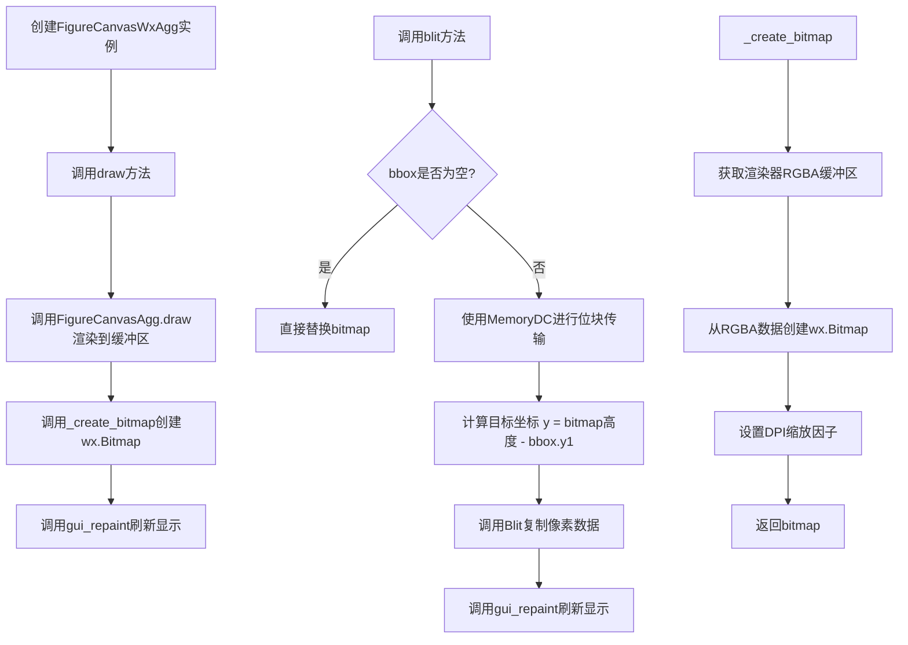
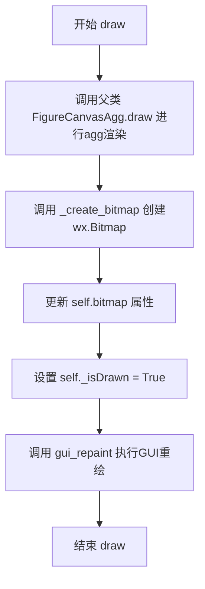
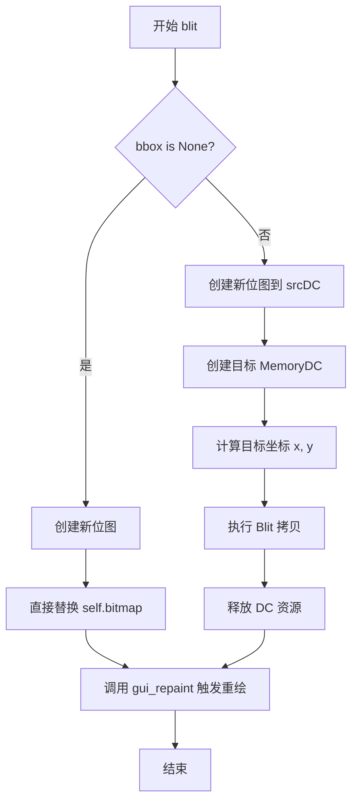
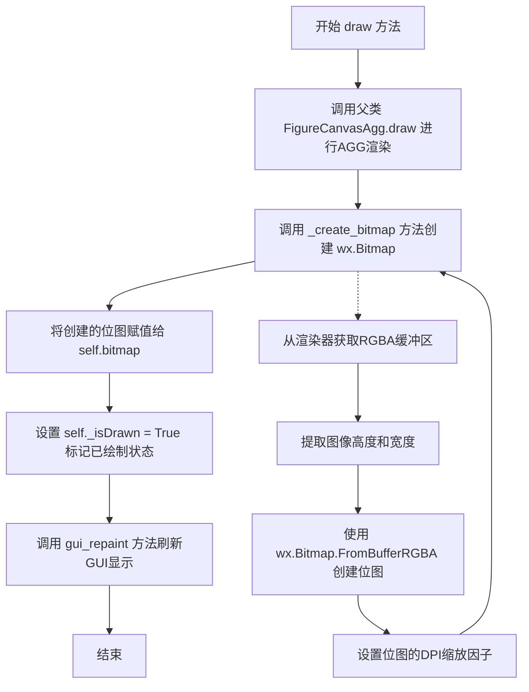
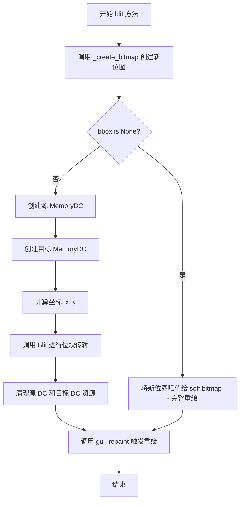

# `matplotlib\lib\matplotlib\backends\backend_wxagg.py` 详细设计文档

这是一个wxPython后端模块，用于在wxWidgets GUI框架中渲染matplotlib图形，使用Agg渲染器将图形绘制到wx.Bitmap上，支持部分区域重绘(blit)和DPI缩放。

## 整体流程



## 类结构

```
FigureCanvasAgg (from backend_agg)
├── FigureCanvasWxAgg
    ├── draw()
    ├── blit()
    └── _create_bitmap()

_FigureCanvasWxBase (from backend_wx)
└── FigureCanvasWxAgg

_BackendWx (from backend_wx)
└── _BackendWxAgg
```

## 全局变量及字段


### `NavigationToolbar2WxAgg`
    
导入的导航工具栏类(重命名后)

类型：`class`
    


### `FigureCanvasWxAgg`
    
主绘图画布类

类型：`class`
    


### `_BackendWxAgg`
    
wx后端聚合类

类型：`class`
    


### `FigureCanvasWxAgg.bitmap`
    
用于存储渲染后的位图数据

类型：`wx.Bitmap`
    


### `FigureCanvasWxAgg._isDrawn`
    
标记图形是否已绘制

类型：`bool`
    


### `_BackendWxAgg.FigureCanvas`
    
设置为FigureCanvasWxAgg类

类型：`class`
    
    

## 全局函数及方法


### `FigureCanvasWxAgg.draw`

渲染方法，调用agg绘制并更新位图，输出到wxWidgets窗口。

参数：

- `drawDC`：`wx.DC | None`，可选的设备上下文对象，用于GUI重绘操作，若为None则使用默认的绘图上下文

返回值：`None`，无返回值

#### 流程图



#### 带注释源码

```python
def draw(self, drawDC=None):
    """
    Render the figure using agg.
    """
    # 调用父类FigureCanvasAgg的draw方法，使用agg渲染器绘制图形
    FigureCanvasAgg.draw(self)
    
    # 从渲染器的RGBA缓冲区创建wx.Bitmap位图对象
    self.bitmap = self._create_bitmap()
    
    # 标记图形已经绘制完成
    self._isDrawn = True
    
    # 调用GUI重绘方法，将位图显示到窗口上
    # drawDC参数可选，用于传递特定的设备上下文
    self.gui_repaint(drawDC=drawDC)
```


### `FigureCanvasWxAgg.blit`

位块传输方法（Bit Block Transfer），用于将渲染好的位图内容绘制到画布上，支持局部重绘优化。当指定边界框（bbox）时，仅重绘指定区域；未指定时则进行全图重绘。

参数：

- `bbox`：`Bbox | None`，可选参数，目标重绘区域边界框。若为 `None`，则重绘整个画布；若指定边界框，则仅重绘该区域。

返回值：`None`，无返回值，通过内部调用 `gui_repaint()` 触发实际绘制。

#### 流程图



#### 带注释源码

```python
def blit(self, bbox=None):
    """
    Render the figure to the window.
    
    Parameters
    ----------
    bbox : Bbox or None
        The bounding box in display coordinates to render.
        If None, the entire canvas is rendered.
    """
    # 从渲染器创建新的位图（RGBA 缓冲区）
    bitmap = self._create_bitmap()
    
    # 判断是否进行局部重绘
    if bbox is None:
        # 无边界框：直接替换整个位图
        self.bitmap = bitmap
    else:
        # 有边界框：执行位块传输（局部重绘）
        
        # 创建源 MemoryDC，用于读取新位图
        srcDC = wx.MemoryDC(bitmap)
        # 创建目标 MemoryDC，用于写入到现有位图
        destDC = wx.MemoryDC(self.bitmap)
        
        # 计算目标坐标（注意：wxWidgets Y 轴方向与 AGG 不同，需翻转 Y 坐标）
        x = int(bbox.x0)
        y = int(self.bitmap.GetHeight() - bbox.y1)
        
        # 执行位块传输：将源位图的指定区域拷贝到目标位图的指定位置
        # 参数：目标坐标(x, y), 宽高, 源DC, 源坐标(x, y)
        destDC.Blit(x, y, int(bbox.width), int(bbox.height), srcDC, x, y)
        
        # 释放 DC 资源并解除位图关联
        destDC.SelectObject(wx.NullBitmap)
        srcDC.SelectObject(wx.NullBitmap)
    
    # 触发 GUI 重绘
    self.gui_repaint()
```


### `FigureCanvasWxAgg._create_bitmap`

将渲染器（Renderer）的 RGBA 像素缓冲区转换为 `wx.Bitmap` 对象，并应用 DPI 缩放因子，以适配高分辨率屏幕显示。

参数：
- `self`：`FigureCanvasWxAgg`，调用此方法的实例本身，包含渲染上下文和配置信息。

返回值：`wx.Bitmap`，转换并缩放后的位图对象，用于在 wxWidgets 界面组件上进行绘制。

#### 流程图

```mermaid
flowchart TD
    A([开始]) --> B[获取渲染器缓冲区: get_renderer().buffer_rgba]
    B --> C{检查缓冲区有效性}
    C -- 失败 --> E[返回空或抛错]
    C -- 成功 --> D[从缓冲区shape中提取 宽度w 和 高度h]
    D --> F[创建wx.Bitmap: wx.Bitmap.FromBufferRGBA(w, h, rgba)]
    F --> G[获取DPI缩放因子: self.GetDPIScaleFactor]
    G --> H[设置位图缩放因子: bitmap.SetScaleFactor]
    H --> I([返回位图对象])
```

#### 带注释源码

```python
def _create_bitmap(self):
    """Create a wx.Bitmap from the renderer RGBA buffer"""
    # 1. 获取渲染器的RGBA像素数据（这是一个包含高度、宽度和4个颜色通道的NumPy数组）
    rgba = self.get_renderer().buffer_rgba()
    
    # 2. 从数组形状中提取图像的高度(h)和宽度(w)
    h, w, _ = rgba.shape
    
    # 3. 使用wxPython的核心功能将原始RGBA字节数据直接转换为wx.Bitmap对象
    # 这是一个相对高效的操作，避免了逐像素拷贝
    bitmap = wx.Bitmap.FromBufferRGBA(w, h, rgba)
    
    # 4. 获取当前显示的DPI缩放因子（例如在Retina屏幕上可能为2.0）
    # 并将其设置到位图对象中，确保渲染清晰度
    bitmap.SetScaleFactor(self.GetDPIScaleFactor())
    
    # 5. 返回最终处理好的位图对象
    return bitmap
```


### FigureCanvasWxAgg.draw

该方法使用AGG（Anti-Grain Geometry）渲染引擎将Figure画布渲染为位图，并刷新GUI显示。它继承自FigureCanvasAgg类，调用父类渲染方法后将渲染结果转换为wx.Bitmap，最后通过gui_repaint将结果绘制到屏幕上。

参数：

- `drawDC`：`wx.DC` 或 `None`，可选的绘图设备上下文，用于指定绘图的目标设备。如果为None，则使用默认的绘图上下文进行重绘。

返回值：`None`，该方法无返回值，通过修改实例属性（如self.bitmap和self._isDrawn）来实现状态更新和图形显示。

#### 流程图



#### 带注释源码

```python
def draw(self, drawDC=None):
    """
    Render the figure using agg.
    
    参数:
        drawDC: 可选的wx.DC对象，用于指定绘图设备上下文。
                如果为None，则使用默认的绘图上下文。
    """
    # 调用父类FigureCanvasAgg的draw方法，使用AGG引擎渲染图形
    # 这个方法会完成基本的渲染工作，将图形绘制到内存缓冲区
    FigureCanvasAgg.draw(self)
    
    # 调用私有方法_create_bitmap，将渲染缓冲区转换为wx.Bitmap对象
    # 该方法内部会获取渲染器的RGBA数据并创建适合wxWidget显示的位图
    self.bitmap = self._create_bitmap()
    
    # 设置实例属性标记当前画布已经完成绘制
    # _isDrawn标志位用于避免重复绘制和状态跟踪
    self._isDrawn = True
    
    # 调用基类_FigureCanvasWxBase提供的gui_repaint方法
    # 将位图刷新到实际的GUI显示区域，drawDC参数可选传递
    # 如果提供了drawDC，则使用该设备上下文进行绘制
    self.gui_repaint(drawDC=drawDC)
```


### `FigureCanvasWxAgg.blit`

该方法用于实现FigureCanvasWxAgg类的部分区域重绘功能，支持完整重绘（当bbox为None时）或局部blit操作（当指定bbox时），通过wx.MemoryDC将新渲染的位图复制到目标位图的指定区域。

参数：

- `bbox`：`BoundingBox`，可选参数，默认为None。指定需要重绘的矩形区域，如果为None则执行完整重绘，否则执行局部blit操作

返回值：`None`，无返回值

#### 流程图



#### 带注释源码

```python
def blit(self, bbox=None):
    # docstring inherited
    # 调用 _create_bitmap() 从渲染器创建新的 RGBA 位图
    bitmap = self._create_bitmap()
    
    # 判断是否执行完整重绘（无 bbox 参数）
    if bbox is None:
        # 无 bbox：直接用新位图替换当前位图，执行完整重绘
        self.bitmap = bitmap
    else:
        # 有 bbox：执行局部 blit 操作
        # 创建源 MemoryDC，关联到新创建的位图
        srcDC = wx.MemoryDC(bitmap)
        
        # 创建目标 MemoryDC，关联到当前显示的位图
        destDC = wx.MemoryDC(self.bitmap)
        
        # 计算 blit 目标坐标（注意：wx 坐标系 y 轴向下，matplotlib 坐标系 y 轴向上，需要翻转 y 坐标）
        x = int(bbox.x0)
        y = int(self.bitmap.GetHeight() - bbox.y1)
        
        # 执行位块传输：将新位图的指定区域复制到当前位图的指定位置
        destDC.Blit(x, y, int(bbox.width), int(bbox.height), srcDC, x, y)
        
        # 重要：释放 DC 资源，防止资源泄漏
        destDC.SelectObject(wx.NullBitmap)
        srcDC.SelectObject(wx.NullBitmap)
    
    # 调用 gui_repaint 通知 GUI 层执行实际的重绘操作
    self.gui_repaint()
```


### `FigureCanvasWxAgg._create_bitmap`

从渲染器的RGBA缓冲区创建并返回一个配置了DPI缩放因子的wx.Bitmap对象。

参数：此方法无显式参数（隐式接收`self`实例）。

返回值：`wx.Bitmap`，从RGBA缓冲区创建并设置好DPI缩放因子的位图对象。

#### 流程图

```mermaid
flowchart TD
    A[开始 _create_bitmap] --> B[获取渲染器: renderer = self.get_renderer()]
    B --> C[获取RGBA缓冲区: rgba = renderer.buffer_rgba()]
    C --> D[解包图像尺寸: h, w, _ = rgba.shape]
    D --> E[创建位图: bitmap = wx.Bitmap.FromBufferRGBA(w, h, rgba)]
    E --> F[设置DPI缩放因子: bitmap.SetScaleFactor(self.GetDPIScaleFactor())]
    F --> G[返回位图对象]
```

#### 带注释源码

```python
def _create_bitmap(self):
    """Create a wx.Bitmap from the renderer RGBA buffer"""
    # 获取当前渲染器的RGBA像素缓冲区
    # buffer_rgba() 返回一个形状为 (height, width, 4) 的NumPy数组
    # 包含每个像素的RGBA（红、绿、蓝、Alpha）值
    rgba = self.get_renderer().buffer_rgba()
    
    # 从RGBA数组中解包图像的高度和宽度
    # _ 表示忽略通道数（始终为4，对应RGBA四个通道）
    h, w, _ = rgba.shape
    
    # 使用wx.Bitmap.FromBufferRGBA从原始RGBA数据创建位图
    # 该方法直接接受NumPy数组作为输入，避免了额外的数据拷贝
    bitmap = wx.Bitmap.FromBufferRGBA(w, h, rgba)
    
    # 设置位图的DPI缩放因子，确保在高DPI显示器上正确缩放
    # GetDPIScaleFactor() 返回当前显示器的DPI缩放因子（如Retina屏返回2.0）
    bitmap.SetScaleFactor(self.GetDPIScaleFactor())
    
    # 返回配置完成的wx.Bitmap对象，供draw()或blit()方法使用
    return bitmap
```

## 关键组件


### FigureCanvasWxAgg

WxWidgets + Agg组合的画布类，继承自FigureCanvasAgg和_FigureCanvasWxBase，负责使用Agg渲染器在WxWidgets GUI中渲染matplotlib图形。

### draw()

渲染方法，调用Agg后端进行绘制，创建位图并通过gui_repaint更新显示。

### blit()

增量绘制方法，支持部分区域重绘，通过MemoryDC将新位图数据Blit到现有位图，用于动画优化。

### _create_bitmap()

从渲染器的RGBA缓冲区创建wx.Bitmap，处理DPI缩放因子。

### _BackendWxAgg

导出类，注册FigureCanvasWxAgg作为WxWidgets+Agg后端的画布实现。

### FigureCanvasAgg

Agg渲染后端的画布基类，提供buffer_rgba()等方法获取渲染数据。

### _FigureCanvasWxBase

WxWidgets画布基类，提供gui_repaint()和GetDPIScaleFactor()等GUI相关功能。

### backend_agg与backend_wx模块

matplotlib的Agg渲染后端和WxWidgets后端模块，提供底层渲染和GUI支撑。


## 问题及建议


### 已知问题

- **缺少异常处理**：`_create_bitmap`方法中调用`get_renderer()`和`wx.Bitmap.FromBufferRGBA()`时没有处理可能的异常情况（如渲染器未初始化或位图创建失败）
- **资源管理不明确**：`blit`方法中创建的`wx.MemoryDC`对象虽然通过`SelectObject(wx.NullBitmap)`释放，但在异常情况下可能导致资源泄漏
- **坐标转换缺乏封装**：y坐标计算`self.bitmap.GetHeight() - bbox.y1`直接暴露在blit方法中，缺少对坐标系转换逻辑的清晰封装和注释
- **类型注解缺失**：所有方法参数和返回值都缺少类型提示，降低了代码的可维护性和IDE支持
- **文档不完整**：`blit`方法仅继承父类docstring，未提供具体使用说明；`_create_bitmap`方法的文档较为简略
- **重复代码逻辑**：`draw`和`blit`方法中都调用`_create_bitmap()`，但没有提供缓存机制来避免重复创建相同的位图
- **DPI处理分散**：在`_create_bitmap`中直接调用`SetScaleFactor()`，DPI相关的逻辑分散在不同方法中

### 优化建议

- 为关键方法添加try-except异常处理，特别是对`get_renderer()`返回值进行None检查
- 使用上下文管理器或try-finally确保DC资源正确释放
- 将坐标系转换逻辑提取为独立方法并添加详细注释
- 添加类型注解（如`def blit(self, bbox: Optional[Rectangle] -> None)`）
- 完善文档字符串，为`blit`方法添加具体的参数和返回值说明
- 考虑实现位图缓存机制，避免在图形未变化时重复创建位图
- 统一管理DPI相关逻辑，可以考虑在基类中统一处理


## 其它


### 设计目标与约束

本后端模块旨在为matplotlib提供wxPython图形用户界面的渲染支持，核心目标包括：实现FigureCanvas接口的wxPython/Agg混合实现，支持矢量图形(RGBA)到wx.Bitmap的转换，提供高效的图形重绘和局部刷新(blit)机制。约束条件包括：依赖wxPython库、仅支持Agg渲染器、需要在wx.App环境下运行、必须与matplotlib的FigureCanvas基类架构兼容。

### 错误处理与异常设计

代码中的异常处理主要依赖wxPython自身的异常传播机制。具体包括：wx.Bitmap.FromBufferRGBA可能抛出内存分配异常或无效参数异常；wx.MemoryDC操作可能产生DC错误；GetDPIScaleFactor和get_renderer()调用假设前置条件已满足（_isDrawn标志为True）。建议增加：图形渲染失败时的降级处理、DC资源泄露的防护（已通过SelectObject(wx.NullBitmap)防护）、无效bbox参数校验。

### 数据流与状态机

数据流遵循：Figure数据 → Agg渲染器buffer_rgba() → wx.Bitmap → wx.MemoryDC → GUI显示。状态机包含三个核心状态：初始状态（对象创建）、就绪状态（draw()调用后，_isDrawn=True）、绘制状态（blit()进行增量更新）。draw()方法执行完整重绘并设置_isDrawn标志；blit()方法依赖_isDrawn标志的存在，执行局部刷新。

### 外部依赖与接口契约

主要外部依赖包括：wxPython核心库（wx.Bitmap、wx.MemoryDC、wx.MemoryDC等）、matplotlib backend_agg模块（FigureCanvasAgg类、渲染器接口）、matplotlib backend_wx模块（_BackendWx基类、_FigureCanvasWxBase基类）。接口契约要求：FigureCanvasWxAgg必须实现draw()和blit()方法；_create_bitmap()返回有效的wx.Bitmap对象；gui_repaint()方法由_FigureCanvasWxBase提供；get_renderer()返回支持buffer_rgba()的渲染器。

### 线程安全性

wxPython后端通常必须在主线程中运行，代码本身未实现线程安全机制。内存DC操作（srcDC.Blit等）应仅在主GUI线程调用。buffer_rgba()返回的numpy数组在读取期间不应被其他线程修改。建议在文档中明确标注该后端的单线程使用约束。

### 平台兼容性

代码使用wx.Bitmap.FromBufferRGBA和SetScaleFactor等wxPython API，需确保wxPython版本支持这些方法。不同操作系统（Windows、macOS、Linux）的DC行为可能存在差异，特别是Blit操作的坐标系统和位图格式。GetDPIScaleFactor()用于处理高DPI显示，但在某些旧版wxPython版本中可能不可用。

### 性能考虑与优化空间

_create_bitmap()每次调用都创建新Bitmap对象，存在内存分配开销。blit()方法中每次都创建新的MemoryDC对象，可考虑缓存DC资源。destDC.Blit复制的x坐标计算（int(self.bitmap.GetHeight() - bbox.y1)）涉及坐标转换，建议验证转换逻辑正确性。可引入双缓冲或脏矩形跟踪减少不必要的重绘。

### 版本兼容性

代码导入了NavigationToolbar2WxAgg，需确保与当前matplotlib版本兼容。_BackendWx.export装饰器是matplotlib后端注册的标准机制。FigureCanvasWxAgg的多重继承顺序（FigureCanvasAgg在前）影响方法解析顺序（MRO），需与matplotlib后端架构保持一致。

    