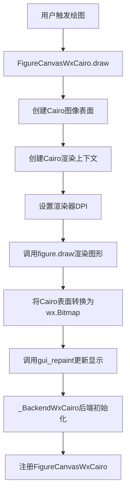
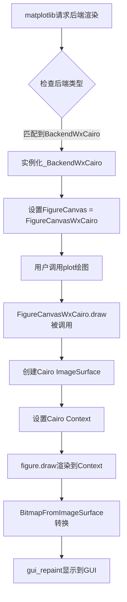
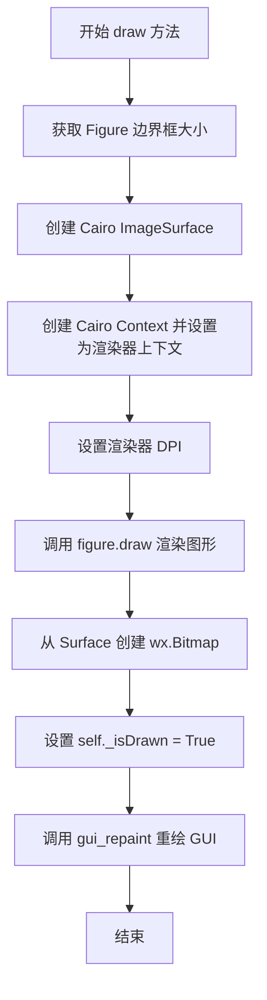

# `matplotlib\lib\matplotlib\backends\backend_wxcairo.py` 详细设计文档

该模块是matplotlib的wxWidgets后端，使用Cairo作为2D渲染引擎，实现了FigureCanvasWxCairo类和_BackendWxCairo后端类，负责将matplotlib图形渲染到wxWidgets Canvas上，通过Cairo创建图像表面并转换为wx位图进行显示。

## 整体流程



## 类结构

```
FigureCanvasWxCairo (继承FigureCanvasCairo, _FigureCanvasWxBase)
_BackendWxCairo (继承_BackendWx)
依赖: FigureCanvasCairo (来自backend_cairo)
依赖: _BackendWx (来自backend_wx)
依赖: _FigureCanvasWxBase (来自backend_wx)
依赖: wxcairo (wx.lib.wxcairo)
```

## 全局变量及字段


### `cairo`
    
Cairo 2D图形库模块，提供矢量图形渲染功能

类型：`module`
    


### `FigureCanvasCairo`
    
Cairo后端的Canvas基类，定义图形绘制的接口

类型：`class`
    


### `_BackendWx`
    
wxWidgets后端基类，提供wxWidgets相关的图形后端实现

类型：`class`
    


### `_FigureCanvasWxBase`
    
wxWidgets Canvas基类，处理图形显示和用户交互

类型：`class`
    


### `NavigationToolbar2WxCairo`
    
重命名为NavigationToolbar2Wx的Cairo工具栏，提供图形导航和缩放功能

类型：`class`
    


### `FigureCanvasWxCairo.figure`
    
matplotlib图形对象，包含图表的数据和布局信息

类型：`matplotlib.figure.Figure`
    


### `FigureCanvasWxCairo._renderer`
    
渲染器实例，负责将图形绘制到Cairo表面

类型：`RendererBase`
    


### `FigureCanvasWxCairo.bitmap`
    
Cairo表面转换成的位图，用于在wxWidgets中显示图形

类型：`wx.Bitmap`
    


### `FigureCanvasWxCairo._isDrawn`
    
图形是否已绘制标志，表示当前图形是否已完成绘制操作

类型：`bool`
    


### `_BackendWxCairo.FigureCanvas`
    
指向FigureCanvasWxCairo的类属性，指定该后端使用的画布类

类型：`class`
    
    

## 全局函数及方法


### `FigureCanvasWxCairo.draw`

该方法是 `FigureCanvasWxCairo` 类的实例方法，负责将 Matplotlib 图形渲染到 wxPython Canvas 上。方法首先创建一个 Cairo 图像表面，然后通过设置渲染器上下文、DPI 并调用图形绘制方法将图形渲染到表面，最后将表面转换为 wx 位图并触发 GUI 重绘。

参数：

- `drawDC`：`wx.DC` 或 `None`，可选参数，用于指定绘制上下文，如果提供则用于 GUI 重绘操作

返回值：`None`，无返回值

#### 流程图

```mermaid
flowchart TD
    A[开始 draw 方法] --> B[获取 Figure 边界框大小<br/>self.figure.bbox.size.astype(int)]
    B --> C[创建 Cairo 图像表面<br/>cairo.ImageSurface]
    C --> D[创建 Cairo 上下文并设置给渲染器<br/>self._renderer.set_context]
    E[设置渲染器 DPI<br/>self._renderer.dpi = self.figure.dpi]
    E --> F[调用 Figure.draw 渲染图形<br/>self.figure.draw]
    F --> G[从表面创建 wx 位图<br/>wxcairo.BitmapFromImageSurface]
    G --> H[设置已绘制标志<br/>self._isDrawn = True]
    H --> I[调用 gui_repaint 重绘<br/>self.gui_repaint]
    I --> J[结束]
```

#### 带注释源码

```python
def draw(self, drawDC=None):
    """
    将 Matplotlib 图形渲染到 wxPython Canvas 上
    
    Parameters:
        drawDC: 可选的 wx.DC 对象，用于 GUI 重绘
    """
    # 1. 获取图形的边界框大小并转换为整数元组
    size = self.figure.bbox.size.astype(int)
    
    # 2. 创建 Cairo 图像表面，用于在内存中绘制图形
    # FORMAT_ARGB32 表示 32 位 ARGB 格式（每像素 4 字节）
    surface = cairo.ImageSurface(cairo.FORMAT_ARGB32, *size)
    
    # 3. 创建 Cairo 上下文并将其设置为渲染器的绘图上下文
    # 这样后续的图形绘制操作会直接绘制到 ImageSurface 上
    self._renderer.set_context(cairo.Context(surface))
    
    # 4. 将图形的 DPI 设置到渲染器，确保正确的缩放比例
    self._renderer.dpi = self.figure.dpi
    
    # 5. 调用 Figure 对象的 draw 方法，使用渲染器将图形绘制到表面
    self.figure.draw(self._renderer)
    
    # 6. 将 Cairo 图像表面转换为 wxPython 位图对象
    self.bitmap = wxcairo.BitmapFromImageSurface(surface)
    
    # 7. 标记图形已经完成绘制状态
    self._isDrawn = True
    
    # 8. 调用 GUI 重绘方法，将位图显示到界面上
    # 如果提供了 drawDC，则使用该 DC 进行绘制
    self.gui_repaint(drawDC=drawDC)
```


### `_BackendWxCairo`

这是一个结合wxWidgets后端与Cairo渲染引擎的混合后端类，通过继承`_BackendWx`并指定`FigureCanvasWxCairo`作为画布实现，为matplotlib提供在wxWidgets应用程序中使用Cairo库进行图形渲染的能力。

参数：

- 该类无直接构造函数参数，继承自`_BackendWx`的属性和行为

返回值：`type`，返回`_BackendWxCairo`类本身，用于注册到matplotlib后端系统

#### 流程图



#### 带注释源码

```python
@_BackendWx.export
class _BackendWxCairo(_BackendWx):
    """
    结合wxWidgets与Cairo的后端实现类
    
    该类通过@_BackendWx.export装饰器导出到matplotlib后端系统，
    继承自_BackendWx基类，复用wxWidgets的事件处理和窗口管理功能，
    同时使用Cairo库进行高质量的2D图形渲染。
    """
    
    FigureCanvas = FigureCanvasWxCairo
    """
    type: class
    
    指定该后端使用的画布类为FigureCanvasWxCairo，
    负责实际的图形渲染和GUI交互
    """
```


### FigureCanvasWxCairo.draw

该方法是 Matplotlib 在 WxWidgets 后端中使用 Cairo 渲染引擎的核心绘制方法，负责将 Figure 对象的内容渲染到位图上并触发 GUI 重绘。

参数：

- `drawDC`：`drawDC`，可选的绘图设备上下文（Device Context），用于指定在哪个设备上下文中进行重绘操作，默认为 None

返回值：`None`，该方法没有返回值，通过修改实例属性 `self.bitmap` 和 `self._isDrawn` 来完成状态更新

#### 流程图



#### 带注释源码

```
def draw(self, drawDC=None):
    """
    绘制方法：将 Figure 渲染到 WxWidgets 位图上并触发重绘
    
    参数:
        drawDC: 可选的设备上下文，用于 gui_repaint 调用
    """
    # 获取 Figure 的边界框尺寸（宽高），并转换为整数
    size = self.figure.bbox.size.astype(int)
    
    # 创建 Cairo 图像表面，用于在内存中渲染图形
    # FORMAT_ARGB32 表示每像素 32 位，Alpha+红绿蓝各 8 位
    surface = cairo.ImageSurface(cairo.FORMAT_ARGB32, *size)
    
    # 创建 Cairo 绘图上下文，并设置为渲染器的绘图上下文
    self._renderer.set_context(cairo.Context(surface))
    
    # 将 Figure 的 DPI（每英寸点数）设置到渲染器
    self._renderer.dpi = self.figure.dpi
    
    # 调用 Figure 的 draw 方法，使用渲染器将图形绘制到 Cairo 表面
    self.figure.draw(self._renderer)
    
    # 从 Cairo 图像表面创建 WxWidgets 位图对象
    self.bitmap = wxcairo.BitmapFromImageSurface(surface)
    
    # 标记图形已经绘制完成
    self._isDrawn = True
    
    # 调用 GUI 重绘方法，将位图显示到界面上
    self.gui_repaint(drawDC=drawDC)
```

## 关键组件


### FigureCanvasWxCairo

混合画布类，继承自FigureCanvasCairo和_FigureCanvasWxBase，结合Cairo渲染引擎与WxWidgets GUI框架的核心画布组件。

### draw方法

核心绘制方法，创建Cairo图像表面、设置渲染上下文、执行图形绘制并将结果转换为wx.Bitmap用于显示。

### _BackendWxCairo

WxWidgets后端导出类，通过装饰器@_BackendWx.export注册FigureCanvasWxCairo到matplotlib后端系统。

### Cairo表面管理

使用cairo.ImageSurface(cairo.FORMAT_ARGB32, *size)创建32位ARGB格式的图像表面，用于离线渲染。

### wxcairo.Bitmap转换

通过wxcairo.BitmapFromImageSurface(surface)将Cairo渲染表面转换为WxWidgets可显示的位图对象。

### 渲染上下文配置

使用cairo.Context(surface)创建Cairo绘图上下文，并通过set_context方法配置渲染器。


## 问题及建议


### 已知问题

- **缺少异常处理**：draw方法中创建cairo.ImageSurface和执行绘图操作时没有try-except捕获，可能导致未处理的异常传播
- **资源未显式释放**：cairo.ImageSurface创建后未显式释放或使用上下文管理器，频繁调用可能导致内存资源未及时释放
- **位图转换缺少错误检查**：wxcairo.BitmapFromImageSurface转换可能失败，但代码未对此进行检查
- **精度损失风险**：使用`.astype(int)`强制转换bbox.size可能丢失精度或导致意外行为
- **方法缺少文档字符串**：FigureCanvasWxCairo类和draw方法缺少docstring，影响可维护性
- **重复绘制无优化**：每次调用draw都创建新的ImageSurface和Bitmap，未实现增量绘制或缓存机制
- **硬编码像素格式**：cairo.FORMAT_ARGB32硬编码，缺乏配置灵活性
- **类型注解缺失**：参数和返回值缺少类型提示，降低了代码的可读性和类型安全性

### 优化建议

- 为draw方法添加try-except块，捕获cairo相关异常并提供有意义的错误信息
- 考虑使用上下文管理器或显式close()方法管理ImageSurface生命周期
- 在bitmap创建后添加断言或条件检查，确保转换成功
- 使用更安全的尺寸获取方式，如math.ceil或round，避免直接截断
- 为类和方法添加详细的文档字符串，说明参数、返回值和用途
- 考虑实现绘制缓存或增量绘制机制，避免每次完全重绘
- 将像素格式提取为可配置参数或使用后端默认设置
- 添加完整的类型注解，提升代码可读性和IDE支持

## 其它


### 设计目标与约束

本模块旨在为Matplotlib提供一种结合Cairo高性能2D图形渲染能力和wxWidgets原生GUI框架的跨平台后端实现。设计目标是让用户能够在wxWidgets应用程序中使用Cairo的高质量图形渲染功能，同时保持与Matplotlib现有后端架构的兼容性。约束条件包括：必须继承自现有的Cairo和wxWidgets后端类，保持API兼容性，支持Cairo支持的所有图形格式（如PNG、SVG、PDF等），并且需要在Windows、Linux和macOS上均可运行。

### 错误处理与异常设计

代码中的错误处理主要依赖于Matplotlib后端框架的异常传播机制。在draw方法中，如果Cairo表面创建失败或图形渲染过程中出现异常，异常会向上传播到调用者。潜在的异常场景包括：内存不足导致ImageSurface创建失败（会抛出cairo.Error）、无效的图形参数导致draw失败、以及wxWidgets bitmap转换失败。建议在调用draw方法前检查figure和renderer的有效性，并在GUI线程中执行所有绘图操作以避免线程安全问题。

### 数据流与状态机

数据流从用户调用plot()开始，经过FigureCanvasWxCairo的draw()方法，创建Cairo ImageSurface，设置渲染上下文，执行figure.draw()，最后将Cairo表面转换为wxWidgets Bitmap并通过gui_repaint()显示。状态机包含以下状态：初始状态（_isDrawn=False）、已绘制状态（_isDrawn=True）、以及可能的错误状态。当figure属性改变时，需要调用refresh()或set_dirty()来触发重绘。

### 外部依赖与接口契约

本模块依赖以下外部组件：wx.lib.wxcairo（提供Cairo到wxWidgets的绑定）、cairo图形库（2D渲染引擎）、Matplotlib的backend_cairo模块（提供FigureCanvasCairo基类）、Matplotlib的backend_wx模块（提供wxWidgets后端基类）。接口契约方面：FigureCanvasWxCairo必须实现draw()方法，_BackendWxCairo必须通过@_BackendWx.export装饰器导出且包含FigureCanvas属性，返回的canvas必须支持Matplotlib的标准绘图接口。

### 性能考虑

性能优化点包括：使用cairo.ImageSurface进行离屏渲染避免GUI闪烁，size.astype(int)确保尺寸为整数以避免Cairo警告，bitmap转换使用wxcairo.BitmapFromImageSurface是最高效的转换方式。潜在的性能瓶颈包括：大尺寸图形渲染可能消耗大量内存（ARGB32格式每像素4字节），以及每次重绘都创建新的Surface对象。优化建议：对于静态图形可考虑缓存Surface，只在图形内容变化时重新创建Surface。

### 线程安全性

该后端不是线程安全的。所有GUI操作必须在主GUI线程中执行，Cairo渲染操作也应当在主线程进行以确保与wxWidgets的事件循环正确交互。在多线程环境下，应使用wx.CallAfter()或wx.CallLater()将绘图操作调度到GUI线程。

### 平台兼容性

代码设计为跨平台兼容，依赖于Matplotlib的抽象层。Windows平台需要安装wxPython和pycairo；Linux平台需要安装libcairo2-dev和python3-cairo（或通过pip安装pycairo）；macOS平台需要通过Homebrew安装cairo及相关库。不同平台的Cairo版本可能存在细微差异，建议在文档中标注最低支持的Cairo版本要求。

### 配置选项

可通过Matplotlib的matplotlib.use()和matplotlib.rcParams进行配置。相关配置项包括：backend（设置为'WXAgg'时可能使用Cairo后端）、figure.dpi（影响渲染分辨率）、savefig.dpi（影响保存图像的分辨率）。用户还可通过继承FigureCanvasWxCairo自定义渲染行为，如修改draw()方法实现双缓冲或自定义缓存策略。

    