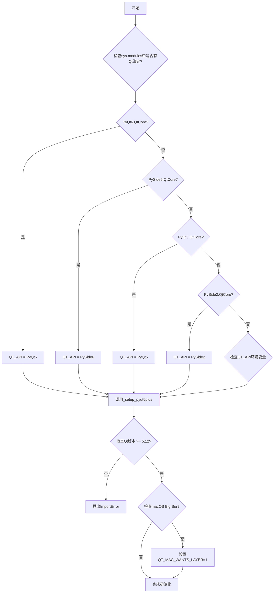
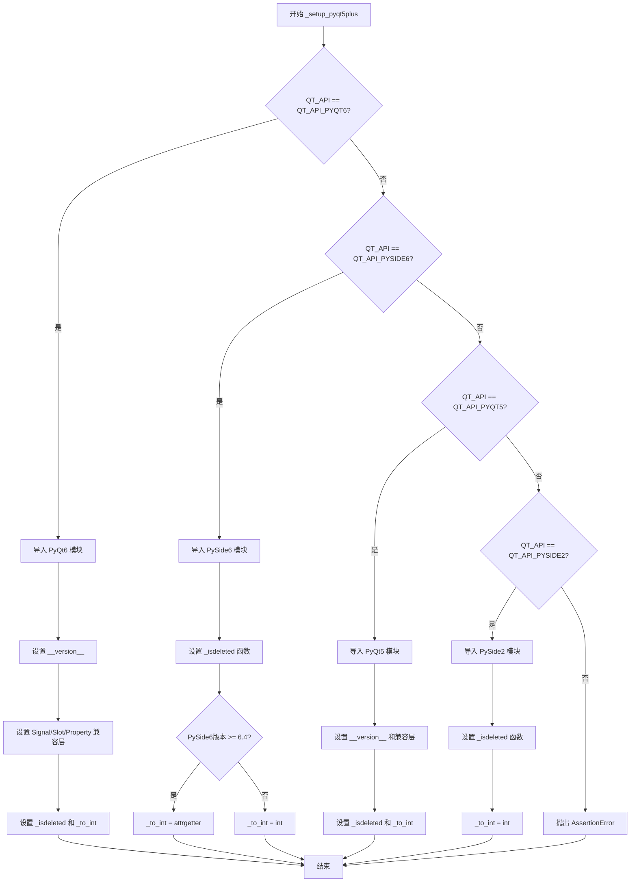

```mermaid
flowchart TD
    A[开始 _exec] --> B{obj 是否有 'exec' 属性}
    B -->|是| C[调用 obj.exec&#40;&#41;]
    B -->|否| D[调用 obj.exec_&#40;&#41;]
    C --> E[结束]
    D --> E
```

# `matplotlib\lib\matplotlib\backends\qt_compat.py` 详细设计文档

Matplotlib的Qt绑定选择器，根据已导入的模块、QT_API环境变量和rcParams配置动态选择并加载PyQt6、PySide6、PyQt5或PySide2之一作为Qt后端，同时提供版本兼容性检查和平台特定修复。

## 整体流程



## 类结构

```
模块级代码 (无类定义)
├── 全局变量区
│   ├── QT_API_* 常量
│   ├── _ETS 映射字典
│   └── QT_API 主变量
├── _setup_pyqt5plus() 函数
│   ├── PyQt6 分支
│   ├── PySide6 分支
│   ├── PyQt5 分支
│   └── PySide2 分支
└── _exec() 函数 (兼容层)
```

## 全局变量及字段


### `QT_API_PYQT6`
    
Constant string identifying the PyQt6 Qt binding

类型：`str`
    


### `QT_API_PYSIDE6`
    
Constant string identifying the PySide6 Qt binding

类型：`str`
    


### `QT_API_PYQT5`
    
Constant string identifying the PyQt5 Qt binding

类型：`str`
    


### `QT_API_PYSIDE2`
    
Constant string identifying the PySide2 Qt binding

类型：`str`
    


### `QT_API_ENV`
    
Value of the QT_API environment variable, lowercased if set

类型：`Optional[str]`
    


### `_ETS`
    
Mapping dictionary from environment variable values to Qt binding names

类型：`Dict[str, str]`
    


### `QT_API`
    
The selected Qt binding to use (determined by import order, env var, or rcParams)

类型：`Optional[str]`
    


### `_QT_FORCE_QT5_BINDING`
    
Flag indicating whether to force Qt5 binding when Qt5 backend is selected

类型：`bool`
    


### `QtCore`
    
The QtCore module from the selected Qt binding

类型：`module`
    


### `QtGui`
    
The QtGui module from the selected Qt binding

类型：`module`
    


### `QtWidgets`
    
The QtWidgets module from the selected Qt binding

类型：`module`
    


### `QtSvg`
    
The QtSvg module from the selected Qt binding

类型：`module`
    


### `__version__`
    
Version string of the selected Qt binding

类型：`str`
    


### `_isdeleted`
    
Function to check if a Qt object has been deleted

类型：`Callable`
    


### `_to_int`
    
Function/operator to convert value to integer

类型：`Callable`
    


### `_candidates`
    
List of (setup function, Qt API name) tuples for fallback binding selection

类型：`List[Tuple[Callable, str]]`
    


### `_version_info`
    
Tuple of Qt version number components (e.g., (5, 15, 2))

类型：`Tuple[int, ...]`
    


    

## 全局函数及方法


### `_setup_pyqt5plus`

该函数是Matplotlib中用于动态选择和导入Qt绑定的核心初始化函数。它根据预先确定的`QT_API`环境变量和已导入的模块情况，导入对应的Qt绑定（PyQt6、PySide6、PyQt5或PySide2），并设置兼容层以统一不同绑定之间的API差异，同时初始化全局变量`_isdeleted`和`_to_int`用于后续的Qt对象操作。

**参数：** 无

**返回值：** 无（该函数修改全局变量，不返回任何值）

#### 流程图



#### 带注释源码

```python
def _setup_pyqt5plus():
    """
    根据QT_API的值初始化对应的Qt绑定模块，并设置兼容层。
    
    该函数负责：
    1. 导入正确的Qt绑定（PyQt6/PySide6/PyQt5/PySide2）
    2. 设置版本信息
    3. 统一不同绑定之间的API差异（Signal/Slot/Property）
    4. 初始化对象生命周期检查和类型转换辅助函数
    """
    # 声明全局变量，以便在函数内部修改
    global QtCore, QtGui, QtWidgets, QtSvg, __version__
    global _isdeleted, _to_int

    # 分支1: 处理 PyQt6 绑定
    if QT_API == QT_API_PYQT6:
        # 从PyQt6导入核心模块
        from PyQt6 import QtCore, QtGui, QtWidgets, sip, QtSvg
        # 获取PyQt6版本字符串
        __version__ = QtCore.PYQT_VERSION_STR
        # 创建兼容层：将PyQt6的新API名称映射到旧名称
        # 使得代码可以使用与PyQt5相同的API方式调用
        QtCore.Signal = QtCore.pyqtSignal
        QtCore.Slot = QtCore.pyqtSlot
        QtCore.Property = QtCore.pyqtProperty
        # 设置对象删除检查函数：sip.isdeleted检查对象是否已被删除
        _isdeleted = sip.isdeleted
        # 设置整数转换函数：使用属性获取方式（用于Qt枚举值等）
        _to_int = operator.attrgetter('value')
    
    # 分支2: 处理 PySide6 绑定
    elif QT_API == QT_API_PYSIDE6:
        # 从PySide6导入核心模块
        from PySide6 import QtCore, QtGui, QtWidgets, QtSvg, __version__
        # 导入Shiboken用于Python对象与C++对象互操作
        import shiboken6
        # 定义对象有效性检查函数：Shiboken的isValid方法检查对象是否有效
        def _isdeleted(obj): return not shiboken6.isValid(obj)
        # 根据PySide6版本选择整数转换方式
        # 6.4及以上版本使用属性获取方式，旧版本使用int转换
        if parse_version(__version__) >= parse_version('6.4'):
            _to_int = operator.attrgetter('value')
        else:
            _to_int = int
    
    # 分支3: 处理 PyQt5 绑定
    elif QT_API == QT_API_PYQT5:
        # 从PyQt5导入核心模块
        from PyQt5 import QtCore, QtGui, QtWidgets, QtSvg
        # 导入sip模块用于对象管理
        import sip
        # 获取PyQt5版本字符串
        __version__ = QtCore.PYQT_VERSION_STR
        # 创建兼容层：将PyQt5的新API名称（pyqtSignal等）映射到旧名称（Signal等）
        # 保持与旧代码的兼容性
        QtCore.Signal = QtCore.pyqtSignal
        QtCore.Slot = QtCore.pyqtSlot
        QtCore.Property = QtCore.pyqtProperty
        # 设置对象删除检查函数
        _isdeleted = sip.isdeleted
        # PyQt5直接使用int进行类型转换
        _to_int = int
    
    # 分支4: 处理 PySide2 绑定
    elif QT_API == QT_API_PYSIDE2:
        # 从PySide2导入核心模块
        from PySide2 import QtCore, QtGui, QtWidgets, QtSvg, __version__
        # 尝试导入shiboken2，可能作为包或独立模块
        try:
            from PySide2 import shiboken2
        except ImportError:
            import shiboken2
        # 定义对象有效性检查函数
        def _isdeleted(obj):
            return not shiboken2.isValid(obj)
        # PySide2使用int进行类型转换
        _to_int = int
    
    # 异常处理：未知或不支持的Qt API
    else:
        raise AssertionError(f"Unexpected QT_API: {QT_API}")
```


### `_exec`

处理不同 Qt 绑定版本中 `exec()` 方法名的差异，PyQt6 使用 `exec()`，而其他绑定（PyQt5、PySide2、PySide6）使用 `exec_()`。

参数：

- `obj`：任意对象，需要调用 exec 方法的 Qt 对象（如 QAction、QDialog 等）

返回值：`None`，无返回值描述

#### 流程图



#### 带注释源码

```python
def _exec(obj):
    # 处理不同 Qt 绑定版本中方法名的差异
    # PyQt6 使用 exec()，而 PyQt5、PySide2、PySide6 使用 exec_()
    # 如果对象有 exec 属性则调用 exec()，否则调用 exec_()
    obj.exec() if hasattr(obj, "exec") else obj.exec_()
```

## 关键组件


### QT_API 常量集合

用于标识不同Qt绑定的字符串常量，包括QT_API_PYQT6、QT_API_PYSIDE6、QT_API_PYQT5、QT_API_PYSIDE2，用于后续逻辑判断和模块导入选择。

### QT_API_ENV 变量

从环境变量QT_API读取的Qt绑定选择值，经过小写处理后用于确定使用哪个Qt绑定。

### _ETS 字典

环境变量QT_API_ENV值到实际Qt绑定名称的映射表，包含pyqt6/pyside6/pyqt5/pyside2到对应常量的映射关系。

### Qt绑定自动选择逻辑

根据已导入模块、环境变量和rcParams自动确定使用哪个Qt绑定的核心逻辑，按优先级顺序检查：已导入模块 > QT_API环境变量 > rcParams后端设置。

### _setup_pyqt5plus() 函数

根据已确定的QT_API值，动态导入对应的Qt模块（QtCore、QtGui、QtWidgets、QtSvg），并设置版本兼容性适配，包括Signal/Slot/Property别名、sip/shiboken删除检测函数、类型转换函数等跨版本兼容处理。

### _isdeleted 函数指针

跨平台统一的Qt对象删除检测函数指针，根据不同Qt绑定使用sip.isdeleted或shiboken.isValid实现。

### _to_int 函数指针

跨平台统一的整型转换函数指针，在不同Qt版本中统一使用attrgetter('value')或int进行转换。

### _exec() 函数

跨版本执行函数，兼容PyQt6的exec()方法和其他绑定的exec_()方法。

### _QT_FORCE_QT5_BINDING 标志

强制使用Qt5绑定的标志，当rcParams指定Qt5后端但未明确绑定类型时设置，用于控制候选绑定列表。

### 版本检查逻辑

检查Qt版本是否满足最低要求（>=5.12），不满足则抛出ImportError。

### macOS Big Sur 兼容性修复

针对macOS 10.16及以上系统且Qt版本低于5.15.2的情况，自动设置QT_MAC_WANTS_LAYER环境变量以修复渲染问题。

### _candidates 候选列表

根据_QT_FORCE_QT5_BINDING标志构建的Qt绑定候选列表，用于按顺序尝试导入可用的Qt绑定。


## 问题及建议


### 已知问题

-   **全局变量滥用**：代码在`_setup_pyqt5plus`函数中使用`global`声明导出大量模块级变量（QtCore, QtGui, QtWidgets, QtSvg, __version__, _isdeleted, _to_int），这种模式导致状态管理混乱，难以追踪和测试
-   **变量名覆盖风险**：在候选绑定遍历循环中，使用`QT_API`作为迭代变量覆盖了外层已定义的全局变量，可能导致意外的副作用和调试困难
-   **重复代码结构**：`_setup_pyqt5plus`函数中四个分支存在大量重复的设置逻辑（Signal/Slot/Property别名赋值、_isdeleted和_to_int定义），违反DRY原则
-   **硬编码版本号**：Qt最低版本要求（5.12）和macOS兼容性版本（10.16）以魔法数字形式硬编码，缺乏灵活配置能力
-   **不清晰的错误处理**：`ImportError`捕获未区分具体失败原因（模块不存在、版本不匹配、依赖缺失），难以定位问题根因
-   **隐晦的强制逻辑**：`_QT_FORCE_QT5_BINDING`全局变量的使用逻辑不直观，需要结合多层条件判断才能理解意图
-   **缺少类型注解**：整个模块无任何类型提示，降低了代码可读性和IDE支持
-   **shiboken导入处理不一致**：PySide2的shiboken2导入使用了try-except包装，而其他绑定未做类似处理，风格不统一

### 优化建议

-   **封装为类**：将全局变量和`_setup_pyqt5plus`逻辑封装到`QtBackend`类中，使用实例属性替代全局变量，提高可测试性和可维护性
-   **提取版本常量**：将版本要求定义为模块级常量（如`MIN_QT_VERSION`, `MIN_MACOS_VERSION`），提升可读性和配置能力
-   **使用策略模式**：为每种Qt绑定创建独立的配置策略类，消除分支代码重复
-   **改进错误分类**：自定义异常类型（如`QtBindingNotFoundError`, `QtVersionMismatchError`），在捕获ImportError时区分具体错误类型
-   **添加类型注解**：为函数参数、返回值和全局变量添加类型注解，增强代码清晰度
-   **统一导入逻辑**：对可选依赖（sip, shiboken）的导入处理进行统一封装
-   **文档补充**：为关键函数和全局变量添加docstring，说明各变量的用途和绑定选择逻辑

## 其它


### 设计目标与约束

**设计目标**：
- 自动检测并选择最合适的Qt绑定（PyQt6/PySide6/PyQt5/PySide2）
- 优先使用已导入的Qt绑定
- 支持通过环境变量QT_API手动指定绑定
- 确保Qt版本满足最低要求（Qt>=5.12）
- 提供跨平台支持，特别是修复macOS Big Sur的兼容性问题

**约束条件**：
- 只能选择已安装的Qt绑定
- 环境变量QT_API的优先级低于已导入的绑定
- 当rcParams指定qt5后端时，只能选择PyQt5或PySide2
- 必须满足Qt>=5.12的版本要求

### 错误处理与异常设计

**ImportError处理**：
- 当无法导入任何Qt绑定时，抛出ImportError并列出所有尝试过的绑定
- 当QT_API环境变量值无效时，抛出RuntimeError并列出有效值
- 当Qt版本低于5.12时，抛出ImportError并显示版本信息
- 导入失败时使用try-except捕获并继续尝试下一个绑定

**断言检查**：
- 检测到意外的QT_API值时抛出AssertionError
- _setup_pyqt5plus函数中检测到未知QT_API时抛出AssertionError

**关键错误场景**：
1. 所有Qt绑定都未安装 → ImportError
2. QT_API环境变量设置错误 → RuntimeError
3. Qt后端版本过低 → ImportError
4. 非Qt后端但仍执行了该模块逻辑 → 仅设置QT_API=None

### 数据流与状态机

**QT_API选择状态机**：
```
开始
  ↓
检查sys.modules是否已有Qt绑定
  ├─ 是 → 设置对应QT_API
  ↓ 否
检查QT_API环境变量
  ├─ 存在 → 检查rcParams后端是否为qt5
  │           ├─ 是qt5 → 验证环境变量是否为pyqt5/pyside2
  │           │           ├─ 是 → 设置对应QT_API
  │           │           └─ 否 → 强制使用QT5绑定，设置_QT_FORCE_QT5_BINDING
  │           └─ 否qt5 → 检查环境变量是否有效
  │                       ├─ 有效 → 设置对应QT_API
  │                       └─ 无效 → 抛出RuntimeError
  ↓ 否
检查rcParams后端
  ├─ 是qt5开头 → 强制使用QT5绑定
  ↓ 否
QT_API = None（无后端或非Qt后端）
  ↓
执行绑定导入流程
  ├─ QT_API已确定 → 直接导入对应绑定
  └─ QT_API为None → 尝试候选列表中的绑定
```

### 外部依赖与接口契约

**环境变量依赖**：
- QT_API：可选，用于指定首选Qt绑定（pyqt6/pyside6/pyqt5/pyside2）
- QT_MAC_WANTS_LAYER：macOS特定，用于修复Big Sur渲染问题

**系统模块依赖**：
- sys.modules：检查是否已导入Qt绑定
- platform.mac_ver()：检测macOS版本
- os.environ：读取和设置环境变量
- matplotlib.rcParams：获取后端配置

**Qt绑定模块依赖**：
- PyQt6: QtCore, QtGui, QtWidgets, QtSvg, sip
- PySide6: QtCore, QtGui, QtWidgets, QtSvg, shiboken6
- PyQt5: QtCore, QtGui, QtWidgets, QtSvg, sip
- PySide2: QtCore, QtGui, QtWidgets, QtSvg, shiboken2

**导出接口约定**：
- 全局变量：QT_API, QtCore, QtGui, QtWidgets, QtSvg, __version__, _isdeleted, _to_int
- 函数：_setup_pyqt5plus(), _exec(obj)
- _isdeleted(obj)：检查Qt对象是否已删除
- _to_int：属性获取器，用于兼容不同Qt版本API

### 版本兼容性信息

**Qt版本要求**：
- 最低版本：Qt 5.12
- Big Sur修复：Qt 5.15.2（macOS 10.16+）

**Qt绑定版本特性**：
- PySide6 6.4+：使用operator.attrgetter('value')，否则使用int
- PyQt6/PyQt5：需要使用sip.isdeleted检查对象有效性
- PySide2/PySide6：需要使用shiboken验证对象有效性

**平台特定处理**：
- macOS 10.16 (Big Sur)及以上：设置QT_MAC_WANTS_LAYER=1环境变量
- 仅在Qt版本<5.15.2时设置该变量

### 配置管理

**配置优先级**（从高到低）：
1. 已导入的Qt模块（sys.modules检查）
2. QT_API环境变量（Enthought约定）
3. matplotlib.rcParams['backend']配置
4. 默认候选列表顺序

**_QT_FORCE_QT5_BINDING标志**：
- 当rcParams指定qt5后端但环境变量指定Qt6时触发
- 强制限制候选绑定为PyQt5和PySide2

### 性能考量

**导入优化**：
- 避免触发后端解析（使用_get_backend_or_none）
- 使用短路求值和条件检查避免不必要的模块导入
- 全局变量延迟初始化（_isdeleted, _to_int在运行时确定）

**版本解析**：
- 使用packaging.version.parse进行版本比较
- 版本信息缓存：_version_info只计算一次

### 安全性考虑

**环境变量验证**：
- QT_API值通过_ETS字典验证，仅接受白名单值
- 防止通过环境变量注入恶意代码

**模块导入安全**：
- 使用明确的模块路径导入，避免相对导入歧义
- 导入失败时优雅降级而非直接崩溃

### 测试考虑

**测试场景**：
- 模拟不同已导入的Qt模块组合
- 测试QT_API环境变量的各种有效/无效值
- 模拟不同Qt版本（低于5.12、等于5.12、高于5.12）
- macOS版本检测测试
- 导入失败场景测试

**关键测试点**：
- 绑定选择优先级是否正确
- 版本兼容性检查是否生效
- 错误消息是否清晰有用
- 平台特定代码是否正确执行

    