# `matplotlib\lib\matplotlib\backends\qt_editor\_formlayout.py` 详细设计文档

这是一个用于创建Qt表单对话框/布局的模块，支持编辑各种类型的参数（包括字符串、整数、浮点数、布尔值、颜色、字体、列表、元组、日期时间等），并提供验证和回调功能。

## 整体流程

```mermaid
graph TD
A[用户调用fedit函数] --> B{判断data类型}
B -- 嵌套列表/元组 --> C[创建FormTabWidget]
B -- 长度为3的元组 --> D[创建FormComboWidget]
B -- 普通列表 --> E[创建FormWidget]
C --> F[创建QTabWidget]
D --> G[创建QStackedWidget]
E --> H[创建QFormLayout]
F --> I[为每个datalist创建FormWidget或FormComboWidget]
G --> J[为每个data创建FormWidget]
H --> K[为每个(label, value)创建对应输入控件]
K --> L{根据value类型选择控件}
L --> M[str类型: QLineEdit]
L --> N[bool类型: QCheckBox]
L --> O[int类型: QSpinBox]
L --> P[Real类型: QLineEdit+QDoubleValidator]
L --> Q[list/tuple: QComboBox]
L --> R[颜色: ColorLayout]
L --> S[字体: FontLayout]
L --> T[datetime: QDateTimeEdit]
L --> U[date: QDateEdit]
I --> V[显示对话框]
J --> V
K --> V
V --> W{用户点击确定}
W -- OK --> X[调用formwidget.get()获取数据]
W -- Cancel --> Y[设置data为None]
W -- Apply --> Z[调用apply_callback回调]
```

## 类结构

```
QtWidgets.QWidget (基类)
├── ColorButton (颜色选择按钮)
├── FormWidget (表单小部件)
├── FormComboWidget (组合框表单小部件)
│   └── FormWidget (内部嵌套)
└── FormTabWidget (标签页表单小部件)
    └── FormWidget / FormComboWidget (内部嵌套)

QtWidgets.QDialog (基类)
└── FormDialog (表单对话框)
    └── FormWidget / FormComboWidget / FormTabWidget

QtWidgets.QHBoxLayout (基类)
└── ColorLayout (颜色布局)

QtWidgets.QGridLayout (基类)
└── FontLayout (字体布局)
```

## 全局变量及字段


### `_log`
    
日志记录器

类型：`logging.Logger`
    


### `BLACKLIST`
    
黑名单集合{'title', 'label'}

类型：`set`
    


### `__version__`
    
模块版本号'1.0.10'

类型：`str`
    


### `__license__`
    
许可证文本

类型：`str`
    


### `ColorButton._color`
    
存储当前选择的颜色

类型：`QtGui.QColor`
    


### `ColorLayout.lineedit`
    
颜色文本输入框

类型：`QtWidgets.QLineEdit`
    


### `ColorLayout.colorbtn`
    
颜色选择按钮

类型：`ColorButton`
    


### `FontLayout.family`
    
字体系列选择

类型：`QtWidgets.QFontComboBox`
    


### `FontLayout.size`
    
字体大小选择

类型：`QtWidgets.QComboBox`
    


### `FontLayout.italic`
    
斜体复选框

类型：`QtWidgets.QCheckBox`
    


### `FontLayout.bold`
    
粗体复选框

类型：`QtWidgets.QCheckBox`
    


### `FormWidget.data`
    
表单数据列表

类型：`list`
    


### `FormWidget.widgets`
    
控件列表

类型：`list`
    


### `FormWidget.formlayout`
    
表单布局

类型：`QtWidgets.QFormLayout`
    


### `FormComboWidget.combobox`
    
组合框

类型：`QtWidgets.QComboBox`
    


### `FormComboWidget.stackwidget`
    
堆叠小部件

类型：`QtWidgets.QStackedWidget`
    


### `FormComboWidget.widgetlist`
    
子小部件列表

类型：`list`
    


### `FormTabWidget.tabwidget`
    
标签页小部件

类型：`QtWidgets.QTabWidget`
    


### `FormTabWidget.widgetlist`
    
子小部件列表

类型：`list`
    


### `FormDialog.formwidget`
    
表单小部件

类型：`FormWidget/FormComboWidget/FormTabWidget`
    


### `FormDialog.float_fields`
    
浮点数字段列表

类型：`list`
    


### `FormDialog.bbox`
    
按钮框

类型：`QtWidgets.QDialogButtonBox`
    


### `FormDialog.apply_callback`
    
应用回调函数

类型：`callable`
    


### `FormDialog.data`
    
表单数据

类型：`any`
    
    

## 全局函数及方法


### `to_qcolor`

将 matplotlib 支持的颜色格式（如颜色名称、十六进制颜色等）转换为 Qt 的 QColor 对象。如果输入的颜色格式无效，则返回无效的 QColor 并输出警告信息。

参数：

- `color`：`str` 或其他 matplotlib 支持的颜色格式，表示要转换的颜色

返回值：`QtGui.QColor`，转换后的 Qt 颜色对象

#### 流程图

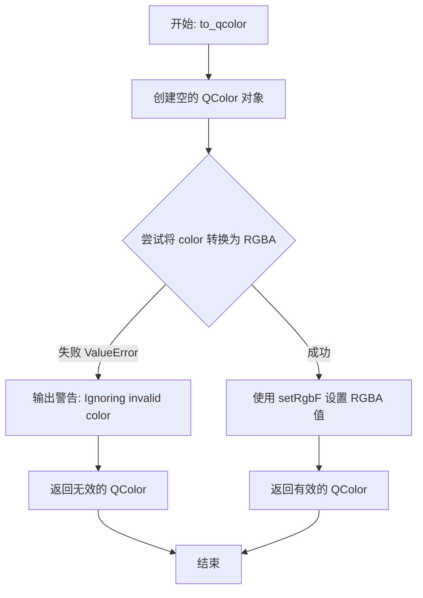

#### 带注释源码

```python
def to_qcolor(color):
    """Create a QColor from a matplotlib color"""
    # 创建一个空的 QColor 对象，用于后续填充颜色数据
    qcolor = QtGui.QColor()
    
    # 尝试使用 matplotlib 的颜色转换功能将输入颜色转换为 RGBA 元组
    try:
        rgba = mcolors.to_rgba(color)
    except ValueError:
        # 如果转换失败（例如颜色字符串无效），记录警告信息
        _api.warn_external(f'Ignoring invalid color {color!r}')
        # 返回初始创建的空（无效）QColor 对象
        return qcolor  # return invalid QColor
    
    # 转换成功，将 RGBA 值（0-1 范围的浮点数）设置到 QColor 对象
    # setRgbF 接受 0-1 范围的 R, G, B, A 值
    qcolor.setRgbF(*rgba)
    
    # 返回填充了颜色数据的 QColor 对象
    return qcolor
```


### `font_is_installed`

该函数用于检查指定的字体是否在系统中已安装，通过查询 Qt 字体数据库中所有可用的字体家族并与目标字体名称进行精确匹配，返回包含匹配结果的列表；若未找到对应字体则返回空列表。

参数：
- `font`：`str`，要检查是否已安装的字体名称

返回值：`list`，如果字体已安装则返回包含该字体名称的列表，否则返回空列表

#### 流程图

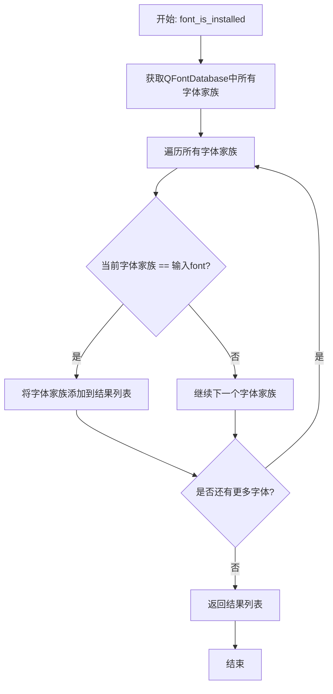

#### 带注释源码

```python
def font_is_installed(font):
    """Check if font is installed"""
    # 使用列表推导式遍历系统字体数据库中的所有字体家族
    # 将每个字体家族与输入的font参数进行精确字符串比较
    # 如果匹配则包含在返回列表中，否则不包含
    # 返回值类型为list：找到字体时返回[font]，未找到时返回[]
    return [fam for fam in QtGui.QFontDatabase().families()
            if str(fam) == font]
```

#### 关键组件信息

| 组件名称 | 描述 |
|---------|------|
| QtGui.QFontDatabase | Qt框架提供的字体数据库接口，用于获取系统中所有已安装的字体 |
| QtGui.QFontDatabase().families() | 返回系统中所有可用字体家族名称的列表 |

#### 潜在的技术债务或优化空间

1. **返回类型不一致风险**：该函数返回列表而非布尔值，可能导致调用方需要额外的列表长度检查逻辑；如果调用方期望布尔值，容易产生误用。建议考虑返回布尔值或提供明确的文档说明。
   
2. **字符串比较大小写敏感**：当前实现使用精确匹配（`str(fam) == font`），如果用户传入不同大小写的字体名称（如"Arial" vs "arial"）会导致匹配失败。建议在比较前进行大小写规范化处理。

3. **性能考虑**：每次调用都会遍历整个字体数据库，在频繁调用的场景下可能存在性能开销；如需多次检查，可考虑缓存结果。

#### 其它项目

**设计目标与约束**：
- 该函数是辅助函数，用于验证字体有效性，主要被 `tuple_to_qfont` 函数调用以确保字体名称有效

**错误处理与异常设计**：
- 无显式异常处理，依赖于 Qt 库自身的稳定性

**数据流与状态机**：
- 输入：字体名称字符串
- 处理：遍历系统字体数据库进行精确匹配
- 输出：匹配结果列表

**外部依赖与接口契约**：
- 依赖 `QtGui.QFontDatabase` 类，需要确保 Qt 环境正常初始化


### `tuple_to_qfont`

将包含字体信息的元组转换为 PyQt5 的 QFont 对象，若元组格式无效则返回 None。

参数：

- `tup`：`tuple`，包含字体属性的元组，格式为 (family [str], size [int], italic [bool], bold [bool])

返回值：`QtGui.QFont | None`，成功返回 QFont 对象，验证失败返回 None

#### 流程图

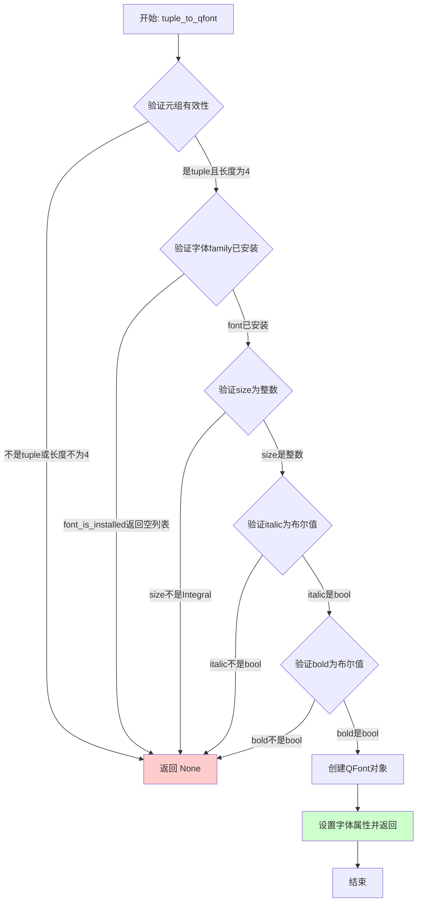

#### 带注释源码

```python
def tuple_to_qfont(tup):
    """
    Create a QFont from tuple:
        (family [string], size [int], italic [bool], bold [bool])
    """
    # 验证输入元组有效性：检查是否为4元组、字体是否已安装、类型是否正确
    if not (isinstance(tup, tuple) and len(tup) == 4
            and font_is_installed(tup[0])
            and isinstance(tup[1], Integral)
            and isinstance(tup[2], bool)
            and isinstance(tup[3], bool)):
        return None  # 验证失败返回None
    
    # 创建QFont对象
    font = QtGui.QFont()
    
    # 解包元组获取字体属性
    family, size, italic, bold = tup
    
    # 设置字体家族
    font.setFamily(family)
    
    # 设置字体大小（整数点数）
    font.setPointSize(size)
    
    # 设置斜体样式
    font.setItalic(italic)
    
    # 设置粗体样式
    font.setBold(bold)
    
    # 返回配置好的QFont对象
    return font
```


### `qfont_to_tuple`

将 QFont 对象转换为包含字体家族、大小、斜体和粗体信息的元组。

参数：

- `font`：`QtGui.QFont`，要转换的 Qt 字体对象

返回值：`tuple`，返回包含 (字体家族 [str], 字体大小 [int], 是否斜体 [bool], 是否粗体 [bool]) 的元组

#### 流程图

```mermaid
flowchart TD
    A[开始: 传入QFont对象] --> B[获取字体家族]
    B --> C[获取字体大小并转为整数]
    C --> D[获取斜体属性布尔值]
    D --> E[获取粗体属性布尔值]
    E --> F[组装元组]
    F --> G[返回元组]
    
    B -.-> B1[str font.family()]
    C -.-> C1[int font.pointSize()]
    D -.-> D1[font.italic returns bool]
    E -.-> E1[font.bold returns bool]
```

#### 带注释源码

```python
def qfont_to_tuple(font):
    """
    将 QFont 对象转换为元组
    
    Parameters
    ----------
    font : QtGui.QFont
        要转换的 Qt 字体对象
        
    Returns
    -------
    tuple
        包含 (字体家族 [str], 字体大小 [int], 是否斜体 [bool], 是否粗体 [bool]) 的元组
    """
    # 使用 str() 转换字体家族为字符串，确保跨平台兼容性
    # 调用 font.family() 获取字体家族名称
    family = str(font.family())
    
    # 使用 int() 转换字体大小为整数
    # 调用 font.pointSize() 获取字体点大小
    size = int(font.pointSize())
    
    # 调用 font.italic() 获取斜体属性，返回布尔值
    italic = font.italic()
    
    # 调用 font.bold() 获取粗体属性，返回布尔值
    bold = font.bold()
    
    # 组装并返回包含四个元素的元组
    # 格式: (family: str, size: int, italic: bool, bold: bool)
    return (family, size, italic, bold)
```


### `is_edit_valid`

验证编辑框输入是否有效，通过调用Qt验证器检查输入内容是否符合预设规则。

参数：

- `edit`：`QtWidgets.QLineEdit`，需要验证的编辑框对象

返回值：`bool`，验证通过返回 `True`，否则返回 `False`

#### 流程图

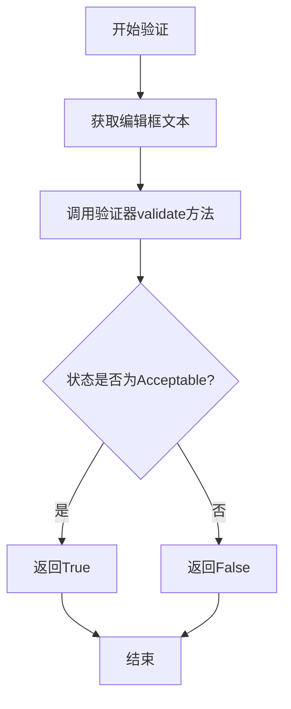

#### 带注释源码

```python
def is_edit_valid(edit):
    """
    验证编辑框输入是否有效
    
    Parameters
    ----------
    edit : QtWidgets.QLineEdit
        需要验证的编辑框对象，该对象必须已设置验证器
    
    Returns
    -------
    bool
        验证通过返回True，否则返回False
    """
    # 获取编辑框中的文本内容
    text = edit.text()
    
    # 调用验证器的validate方法进行验证
    # validate返回元组(state, position)，取第一个元素state
    # 第二个参数0表示从文本起始位置开始验证
    state = edit.validator().validate(text, 0)[0]
    
    # 比较验证状态与可接受状态，返回布尔结果
    return state == QtGui.QDoubleValidator.State.Acceptable
```


### `fedit`

该函数是 `formlayout` 模块的主入口，用于创建并显示一个可编辑各种类型参数（整数、浮点数、字符串、布尔值、颜色、字体、列表、元组、日期时间等）的 Qt 表单对话框。

参数：

- `data`：`list` 或 `tuple`，要编辑的数据，可以是 datalist（字段列表）或 datagroup（选项卡/组合框组）
- `title`：`str`，对话框窗口标题，默认为空字符串
- `comment`：`str`，对话框顶部显示的注释或说明文本，默认为空字符串
- `icon`：`QtGui.QIcon` 或 `None`，对话框窗口图标，默认为 None
- `parent`：`QtWidgets.QWidget` 或 `None`，父窗口部件，用于指定对话框的父级，默认为 None
- `apply`：`callable` 或 `None`，应用按钮的回调函数，当用户点击"Apply"按钮时调用，接收表单数据作为参数，默认为 None

返回值：`None`，该函数不返回值，仅显示对话框

#### 流程图

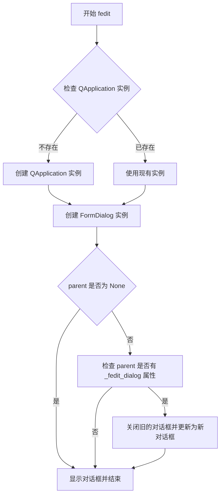

#### 带注释源码

```python
def fedit(data, title="", comment="", icon=None, parent=None, apply=None):
    """
    Create form dialog

    data: datalist, datagroup
    title: str
    comment: str
    icon: QIcon instance
    parent: parent QWidget
    apply: apply callback (function)

    datalist: list/tuple of (field_name, field_value)
    datagroup: list/tuple of (datalist *or* datagroup, title, comment)

    -> one field for each member of a datalist
    -> one tab for each member of a top-level datagroup
    -> one page (of a multipage widget, each page can be selected with a combo
       box) for each member of a datagroup inside a datagroup

    Supported types for field_value:
      - int, float, str, bool
      - colors: in Qt-compatible text form, i.e. in hex format or name
                (red, ...) (automatically detected from a string)
      - list/tuple:
          * the first element will be the selected index (or value)
          * the other elements can be couples (key, value) or only values
    """

    # Create a QApplication instance if no instance currently exists
    # (e.g., if the module is used directly from the interpreter)
    # 如果当前没有 QApplication 实例（例如从解释器直接调用模块），则创建一个
    if QtWidgets.QApplication.startingUp():
        _app = QtWidgets.QApplication([])  # 创建新的 Qt 应用实例
    
    # 使用提供的参数创建 FormDialog 对话框实例
    # FormDialog 是封装了表单布局和按钮的对话框类
    dialog = FormDialog(data, title, comment, icon, parent, apply)

    # 如果指定了父窗口部件，处理对话框的生命周期管理
    if parent is not None:
        # 如果父窗口已有关联的旧对话框，先关闭它
        if hasattr(parent, "_fedit_dialog"):
            parent._fedit_dialog.close()
        # 将新对话框存储在父窗口属性中，以便后续管理
        parent._fedit_dialog = dialog

    # 显示对话框（非模态），使对话框可见并进入事件循环
    dialog.show()
```


### `ColorButton.__init__`

初始化颜色按钮，设置按钮的基本属性，连接信号，准备颜色选择功能。

参数：

- `parent`：`QtWidgets.QWidget` 或 `None`，父 widget，用于指定按钮的父对象

返回值：`None`，构造函数不返回任何值

#### 流程图

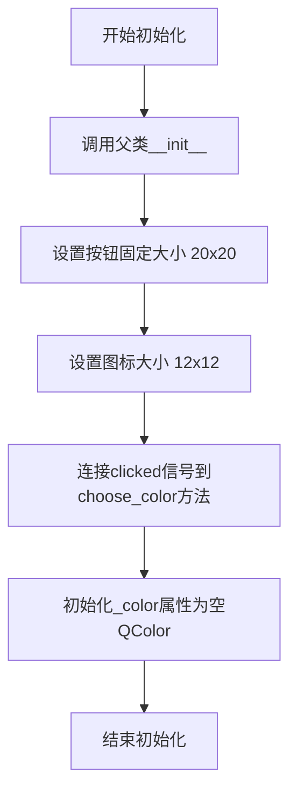

#### 带注释源码

```python
def __init__(self, parent=None):
    # 调用父类 QtWidgets.QPushButton 的初始化方法
    # parent 参数传递给父类，用于建立 Qt 控件的父子关系
    super().__init__(parent)
    
    # 设置按钮的固定大小为 20x20 像素
    # 这是颜色按钮的标准尺寸，适合放在表单布局中
    self.setFixedSize(20, 20)
    
    # 设置图标的显示大小为 12x12 像素
    # 用于显示颜色预览的小图标
    self.setIconSize(QtCore.QSize(12, 12))
    
    # 将按钮的 clicked 信号连接到 choose_color 方法
    # 当用户点击按钮时，会触发颜色选择对话框
    self.clicked.connect(self.choose_color)
    
    # 初始化内部颜色属性 _color 为一个空的 QColor 对象
    # 默认为无效颜色，等待用户设置
    self._color = QtGui.QColor()
```


### `ColorButton.choose_color`

该方法是 `ColorButton` 类的核心功能方法，用于打开系统颜色选择对话框，让用户选择颜色。如果用户选择了有效的颜色，则更新按钮当前显示的颜色并触发颜色变更信号。

参数：无（仅使用 `self` 指向当前实例）

返回值：`None`（无返回值），该方法通过修改实例状态（`self._color`）和触发信号（`colorChanged`）来传递结果。

#### 流程图

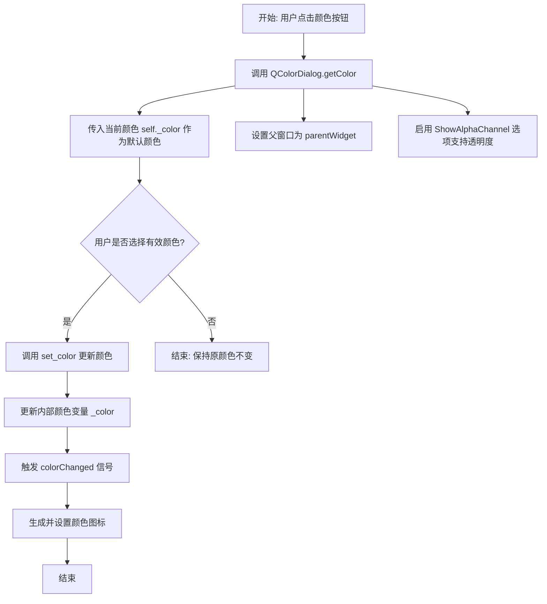

#### 带注释源码

```python
def choose_color(self):
    """
    打开颜色选择对话框并更新按钮颜色
    
    该方法会:
    1. 弹出系统颜色选择对话框
    2. 以当前颜色作为默认选择
    3. 允许用户选择带透明度的颜色
    4. 如果用户确认选择,则更新内部颜色状态
    """
    # 调用 Qt 原生颜色对话框
    # 参数1: self._color - 当前选中的颜色作为对话框默认颜色
    # 参数2: self.parentWidget() - 对话框的父窗口widget
    # 参数3: "" - 对话框标题(空字符串使用默认标题)
    # 参数4: ShowAlphaChannel - 允许用户选择Alpha通道(透明度)
    color = QtWidgets.QColorDialog.getColor(
        self._color, self.parentWidget(), "",
        QtWidgets.QColorDialog.ColorDialogOption.ShowAlphaChannel)
    
    # 检查用户选择的颜色是否有效
    # 用户可能点击"取消"按钮,此时返回的颜色可能无效
    if color.isValid():
        # 调用 set_color 方法更新颜色
        # 这会:
        # - 更新内部颜色变量 self._color
        # - 发射 colorChanged 信号通知监听者
        # - 更新按钮上显示的图标颜色
        self.set_color(color)
```


### ColorButton.get_color

获取 `ColorButton` 控件当前设置的颜色值。

参数：

-  `self`：`ColorButton`，隐式参数，表示类实例本身。

返回值：`QtGui.QColor`，返回当前按钮所保存的颜色对象。

#### 流程图

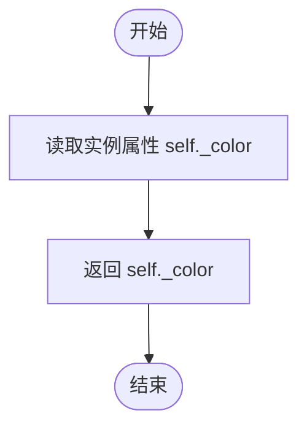

#### 带注释源码

```python
def get_color(self):
    """获取当前按钮的颜色。

    返回值:
        QtGui.QColor: 存储在按钮实例中的颜色对象。
    """
    return self._color
```


### `ColorButton.set_color(color)`

该方法用于设置按钮的颜色并同步更新按钮上显示的图标，当颜色发生变化时还会发出颜色改变信号以通知外部监听者。

参数：

- `color`：`QtGui.QColor`，要设置的新的颜色值

返回值：`None`，无返回值，仅更新内部状态和UI

#### 流程图

```mermaid
flowchart TD
    A[开始 set_color] --> B{color != self._color?}
    B -->|否| C[不做任何操作]
    B -->|是| D[更新 self._color = color]
    D --> E[发出 colorChanged 信号]
    E --> F[创建 QPixmap 对象]
    F --> G[pixmap.fill(color)]
    G --> H[创建 QIcon 并设置图标]
    H --> I[结束]
```

#### 带注释源码

```python
@QtCore.Slot(QtGui.QColor)  # Qt 槽函数装饰器，指定参数类型为 QColor
def set_color(self, color):
    """
    设置颜色并更新图标
    
    Parameters
    ----------
    color : QtGui.QColor
        要设置的新颜色
    """
    # 检查新颜色是否与当前颜色不同，避免不必要的更新
    if color != self._color:
        # 1. 更新内部存储的颜色值
        self._color = color
        
        # 2. 发出颜色改变信号，通知所有监听者颜色已更新
        #    传递更新后的颜色对象引用
        self.colorChanged.emit(self._color)
        
        # 3. 创建与图标尺寸匹配的像素图对象
        pixmap = QtGui.QPixmap(self.iconSize())
        
        # 4. 用指定颜色填充像素图
        pixmap.fill(color)
        
        # 5. 将填充好的像素图包装为图标并设置到按钮上
        self.setIcon(QtGui.QIcon(pixmap))
```


### `ColorLayout.__init__`

初始化颜色布局，创建一个水平布局，包含一个用于显示和编辑颜色值的文本框以及一个用于选择颜色的按钮。

参数：

- `color`：`QtGui.QColor`，要初始化的颜色对象，方法内部通过 `assert isinstance(color, QtGui.QColor)` 进行类型验证
- `parent`：`QtWidgets.QWidget` 或 `None`，父控件，传递给子组件（QLineEdit 和 ColorButton）

返回值：`None`，该方法为构造函数，不返回任何值

#### 流程图

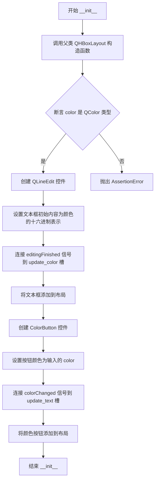

#### 带注释源码

```python
def __init__(self, color, parent=None):
    """
    初始化颜色布局
    
    参数:
        color: QtGui.QColor - 初始颜色值
        parent: QWidget or None - 父控件
    """
    # 调用父类 QHBoxLayout 的初始化方法
    super().__init__()
    
    # 断言验证 color 参数必须是 QColor 类型，确保类型安全
    assert isinstance(color, QtGui.QColor)
    
    # 创建 QLineEdit 控件，用于显示和手动输入颜色值
    # 使用 matplotlib.colors.to_hex 将 QColor 转换为十六进制字符串格式
    # keep_alpha=True 表示保留 alpha 通道信息
    self.lineedit = QtWidgets.QLineEdit(
        mcolors.to_hex(color.getRgbF(), keep_alpha=True), parent)
    
    # 连接 editingFinished 信号，当用户完成编辑时触发颜色更新
    self.lineedit.editingFinished.connect(self.update_color)
    
    # 将文本框部件添加到水平布局
    self.addWidget(self.lineedit)
    
    # 创建颜色按钮部件，用于通过颜色对话框选择颜色
    self.colorbtn = ColorButton(parent)
    
    # 设置按钮的初始颜色
    self.colorbtn.color = color
    
    # 连接 colorChanged 信号，当按钮颜色改变时更新文本框内容
    self.colorbtn.colorChanged.connect(self.update_text)
    
    # 将颜色按钮部件添加到水平布局
    self.addWidget(self.colorbtn)
```


### `ColorLayout.update_color`

从文本输入更新颜色按钮的颜色。当用户在颜色文本框中完成编辑时调用此方法，将文本格式的颜色值转换为 QColor 对象并更新关联的颜色按钮。

参数：

- （无显式参数，仅包含隐式 self 参数）

返回值：`None`，无返回值描述

#### 流程图

```mermaid
flowchart TD
    A[开始 update_color] --> B[获取文本框内容 color = self.text()]
    B --> C[调用 to_qcolor 转换颜色]
    C --> D{转换是否有效?}
    D -->|是| E[将 qcolor 赋值给 colorbtn.color]
    D -->|否| F[使用默认黑色 QColor]
    F --> E
    E --> G[结束]
    
    style A fill:#f9f,stroke:#333
    style G fill:#9f9,stroke:#333
```

#### 带注释源码

```python
def update_color(self):
    """
    从文本更新颜色。
    当用户编辑颜色文本框并完成编辑时调用此方法，
    将文本框中的颜色字符串转换为 QColor 并更新颜色按钮。
    """
    # 从关联的 QLineEdit 获取文本内容（颜色字符串，如 '#FF0000' 或 'red'）
    color = self.text()
    
    # 调用 to_qcolor 函数将文本颜色转换为 QColor 对象
    # 如果转换失败（如无效的颜色字符串），to_qcolor 会返回无效的 QColor
    # update_color 方法会将无效 QColor 视为黑色处理
    qcolor = to_qcolor(color)  # defaults to black if not qcolor.isValid()
    
    # 将转换后的 QColor 设置到颜色按钮，触发颜色按钮更新显示
    self.colorbtn.color = qcolor
```


### `ColorLayout.update_text`

该方法用于当颜色选择按钮改变颜色时，同步更新对应的文本输入框内容。它接收一个 QColor 对象，将其转换为十六进制颜色字符串并显示在行编辑框中。

参数：

- `color`：`QtGui.QColor`，表示从颜色选择按钮传递过来的新颜色值

返回值：`None`，无返回值，仅更新 UI 组件

#### 流程图

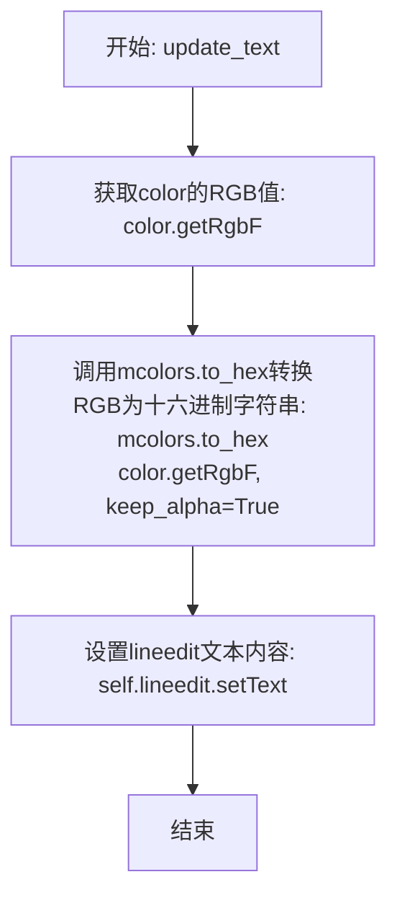

#### 带注释源码

```python
def update_text(self, color):
    """
    当颜色选择按钮改变颜色时，更新文本输入框中的颜色值显示
    
    参数:
        color: QtGui.QColor对象，表示新选择的颜色
    """
    # 调用matplotlib的颜色转换工具将QColor转换为十六进制字符串格式
    # getRgbF()返回(red, green, blue, alpha)元组，值范围为0-1
    # to_hex()将其转换为'#RRGGBB'或'#RRGGBBAA'格式的字符串
    # keep_alpha=True表示如果存在透明度则保留AA部分
    self.lineedit.setText(mcolors.to_hex(color.getRgbF(), keep_alpha=True))
```


### `ColorLayout.text`

获取颜色布局中文本编辑框的当前文本内容，用于获取用户在颜色选择器中输入或选择的颜色值。

参数：

- （无参数）

返回值：`str`，返回 QLineEdit 组件中的当前文本内容，即颜色的十六进制表示形式（如 "#FF0000FF"）。

#### 流程图

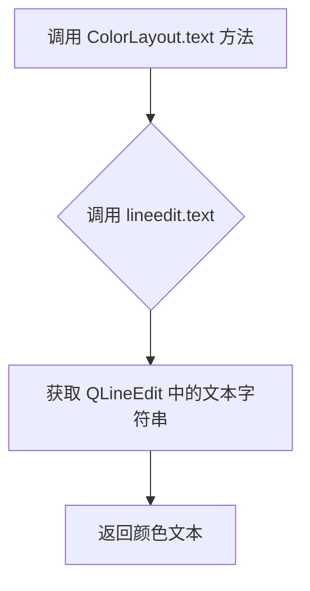

#### 带注释源码

```python
def text(self):
    """
    获取颜色文本编辑框的当前文本内容
    
    该方法是 ColorLayout 类的实例方法，用于获取嵌入在颜色布局中的
    QLineEdit 组件的当前文本内容。通常用于获取用户输入的颜色值，
    该颜色值以十六进制字符串形式表示（如 '#FF0000FF'）。
    
    Returns:
        str: QLineEdit 组件中的当前文本内容，即颜色的十六进制表示
    """
    return self.lineedit.text()
```


### `FontLayout.__init__`

初始化字体选择布局，包含字体家族下拉框、字体大小下拉框、斜体复选框和粗体复选框，用于在表单中编辑字体相关参数。

参数：

- `value`：tuple，表示字体配置元组，格式为 (family [string], size [int], italic [bool], bold [bool])
- `parent`：QWidget 或 None，父 widget，传递给子组件

返回值：无（构造函数）

#### 流程图

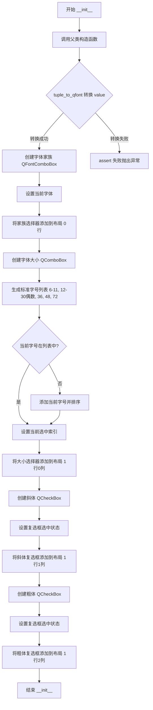

#### 带注释源码

```python
def __init__(self, value, parent=None):
    """
    初始化字体布局组件
    
    Parameters
    ----------
    value : tuple
        字体配置元组，格式为 (family [str], size [int], italic [bool], bold [bool])
    parent : QWidget or None, optional
        父 widget，传递给子组件，默认为 None
    """
    # 调用父类 QGridLayout 的构造函数
    super().__init__()
    
    # 使用 tuple_to_qfont 将元组转换为 QFont 对象
    # 期望格式: (family, size, italic, bold)
    font = tuple_to_qfont(value)
    
    # 断言 font 转换成功（非 None）
    # 如果 value 格式不正确或字体未安装，则 font 为 None
    assert font is not None

    # ===== 字体家族选择 =====
    # 创建 QFontComboBox 用于选择字体家族
    self.family = QtWidgets.QFontComboBox(parent)
    # 设置当前选中的字体
    self.family.setCurrentFont(font)
    # 添加到布局：第0行，第0列，占1行，跨所有列(-1表示剩余列)
    self.addWidget(self.family, 0, 0, 1, -1)

    # ===== 字体大小选择 =====
    # 创建 QComboBox 用于选择字体大小
    self.size = QtWidgets.QComboBox(parent)
    # 设置为可编辑，允许用户输入自定义大小
    self.size.setEditable(True)
    
    # 生成标准字号列表：
    # - 6到11（连续小字号）
    # - 12到30的偶数（常见中等字号）
    # - 36, 48, 72（大字号）
    sizelist = [*range(6, 12), *range(12, 30, 2), 36, 48, 72]
    
    # 获取当前字体的点大小
    size = font.pointSize()
    
    # 如果当前字号不在标准列表中，动态添加并排序
    # 这样可以确保当前值总是可选择的
    if size not in sizelist:
        sizelist.append(size)
        sizelist.sort()
    
    # 添加字号选项到下拉框（转换为字符串）
    self.size.addItems([str(s) for s in sizelist])
    # 设置当前选中的字号索引
    self.size.setCurrentIndex(sizelist.index(size))
    # 添加到布局：第1行，第0列
    self.addWidget(self.size, 1, 0)

    # ===== 斜体选项 =====
    # 创建斜体复选框，使用 Qt 的国际化翻译
    self.italic = QtWidgets.QCheckBox(self.tr("Italic"), parent)
    # 设置复选框的选中状态
    self.italic.setChecked(font.italic())
    # 添加到布局：第1行，第1列
    self.addWidget(self.italic, 1, 1)

    # ===== 粗体选项 =====
    # 创建粗体复选框
    self.bold = QtWidgets.QCheckBox(self.tr("Bold"), parent)
    # 设置复选框的选中状态
    self.bold.setChecked(font.bold())
    # 添加到布局：第1行，第2列
    self.addWidget(self.bold, 1, 2)
```


### `FontLayout.get_font`

获取当前字体设置，将用户在界面上选择的字体 family、size、italic 和 bold 状态组合成一个元组返回。

参数：该方法无参数（除隐式 self 参数外）

返回值：`tuple`，返回包含四个元素的元组 `(family: str, size: int, italic: bool, bold: bool)`，分别表示字体家族、字号、是否斜体、是否加粗。

#### 流程图

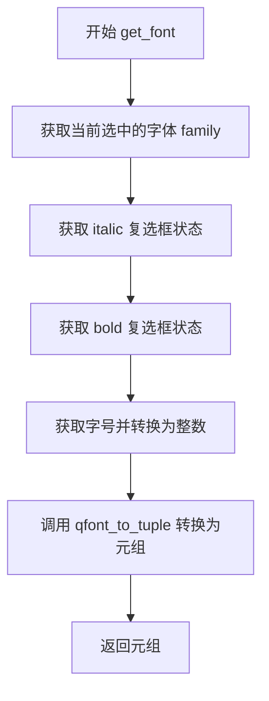

#### 带注释源码

```python
def get_font(self):
    """
    获取当前字体设置
    
    Returns:
        tuple: (family [str], size [int], italic [bool], bold [bool])
               表示当前选中的字体家族、字号、斜体状态和加粗状态
    """
    # 从字体选择下拉框获取当前选中的字体对象
    font = self.family.currentFont()
    
    # 设置字体的斜体属性，根据 italic 复选框的选中状态
    font.setItalic(self.italic.isChecked())
    
    # 设置字体的加粗属性，根据 bold 复选框的选中状态
    font.setBold(self.bold.isChecked())
    
    # 设置字体的字号，从字号下拉框获取文本并转换为整数
    font.setPointSize(int(self.size.currentText()))
    
    # 将 QFont 对象转换为元组格式并返回
    return qfont_to_tuple(font)
```


### `FormWidget.__init__`

初始化表单小部件，用于在Qt界面中创建可编辑的表单，支持多种数据类型（字符串、列表、颜色、字体、日期等），并提供灵活的布局配置选项。

参数：

- `data`：`list of (label, value) pairs`，要在表单中编辑的数据列表，每个元素为(标签, 值)的元组
- `comment`：`str`，可选，表单的注释或说明文字
- `with_margin`：`bool`，默认False，是否在表单元素周围添加边距（为True时适用于单独容器，为False时适用于与其他控件组合使用）
- `parent`：`QWidget or None`，父小部件

返回值：`None`，构造函数不返回任何值

#### 流程图

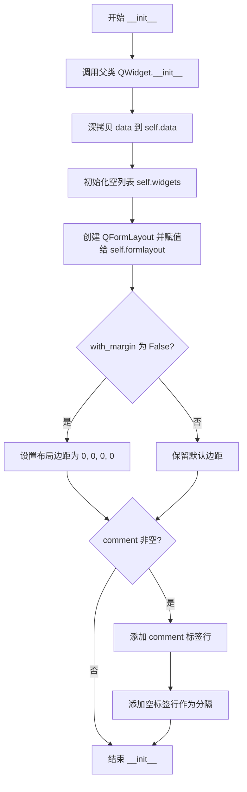

#### 带注释源码

```python
def __init__(self, data, comment="", with_margin=False, parent=None):
    """
    Parameters
    ----------
    data : list of (label, value) pairs
        The data to be edited in the form.
    comment : str, optional
    with_margin : bool, default: False
        If False, the form elements reach to the border of the widget.
        This is the desired behavior if the FormWidget is used as a widget
        alongside with other widgets such as a QComboBox, which also do
        not have a margin around them.
        However, a margin can be desired if the FormWidget is the only
        widget within a container, e.g. a tab in a QTabWidget.
    parent : QWidget or None
        The parent widget.
    """
    # 调用父类 QtWidgets.QWidget 的初始化方法，传入父小部件
    super().__init__(parent)
    
    # 深拷贝输入数据，防止原数据被修改
    self.data = copy.deepcopy(data)
    
    # 初始化空列表，用于存储表单中的输入控件
    self.widgets = []
    
    # 创建 QFormLayout 表单布局，并将其设置为当前小部件的布局
    self.formlayout = QtWidgets.QFormLayout(self)
    
    # 如果不要求边距，则将布局的上下左右边距都设为0
    # 这种无边距设计适用于与其他控件（如QComboBox）组合使用的场景
    if not with_margin:
        self.formlayout.setContentsMargins(0, 0, 0, 0)
    
    # 如果存在注释文本，则在表单开头添加注释标签行
    # 再添加一个空标签行作为视觉分隔
    if comment:
        self.formlayout.addRow(QtWidgets.QLabel(comment))
        self.formlayout.addRow(QtWidgets.QLabel(" "))
```


### `FormWidget.get_dialog`

获取父级对话框实例，通过遍历widget父子层级关系找到最顶层的QDialog对象。

参数：
- （无参数，仅有隐式参数 `self`）

返回值：`QtWidgets.QDialog`，返回包含此FormWidget的QDialog（FormDialog）实例

#### 流程图

```mermaid
flowchart TD
    A[开始: get_dialog] --> B[获取self.parent赋值给dialog]
    B --> C{ isinstance(dialog, QtWidgets.QDialog }
    C -->|是| D[返回dialog]
    C -->|否| E[dialog = dialog.parent]
    E --> B
    D --> F[结束]
    
    style A fill:#f9f,color:#333
    style D fill:#9f9,color:#333
    style F fill:#9f9,color:#333
```

#### 带注释源码

```python
def get_dialog(self):
    """
    返回FormDialog实例
    
    此方法通过递归遍历widget的父对象，
    找到最顶层的QDialog对话框对象。
    用于在处理浮点数输入时注册字段验证器。
    
    Returns:
        QtWidgets.QDialog: 父对话框实例
    """
    # 获取当前widget的直接父widget
    dialog = self.parent()
    
    # 循环向上遍历父widget层级
    # 直到找到QDialog类型的对象为止
    # 注意：FormWidget通常被放在FormDialog中，所以这个循环应该能找到FormDialog
    while not isinstance(dialog, QtWidgets.QDialog):
        # 继续获取上一层父widget
        dialog = dialog.parent()
        
    # 返回找到的QDialog实例（实际上是FormDialog子类实例）
    return dialog
```


### FormWidget.setup()

该方法负责根据初始化时传入的 `data` 数据，遍历并为每对 (label, value) 创建相应类型的表单控件（如输入框、下拉框、颜色选择器等），并将它们添加到 `QFormLayout` 布局中。

参数：  
无额外参数（仅 `self`）

返回值：`None`，该方法不返回值，仅执行副作用（创建并添加控件）

#### 流程图

```mermaid
flowchart TD
    A[开始 setup] --> B{遍历 self.data 中的 label, value}
    B --> C{label is None and value is None}
    C -->|是| D[添加分隔符: 两个空 QLabel]
    C -->|否| E{label is None}
    D --> G[widget 列表追加 None]
    E -->|是| F[添加注释: QLabel 显示 value]
    E -->|否| H{tuple_to_qfont(value) 成功}
    F --> G
    H -->|是| I[创建 FontLayout 控件]
    H -->|否| J{value 是颜色且 label 不在黑名单}
    J -->|是| K[创建 ColorLayout 控件]
    J -->|否| L{value 是字符串}
    I --> Z
    K --> Z
    L -->|是| M[创建 QLineEdit 控件]
    L -->|否| N{value 是 list 或 tuple}
    M --> Z
    N -->|是| O[创建 QComboBox 控件]
    N -->|否| P{value 是布尔值}
    O --> Z
    P -->|是| Q[创建 QCheckBox 控件]
    P -->|否| R{value 是整数}
    Q --> Z
    R -->|是| S[创建 QSpinBox 控件]
    R -->|否| T{value 是实数}
    S --> Z
    T -->|是| U[创建带浮点数验证器的 QLineEdit 并注册到 Dialog]
    T -->|否| V{value 是 datetime.datetime}
    U --> Z
    V -->|是| W[创建 QDateTimeEdit 控件]
    V -->|否| X{value 是 datetime.date}
    W --> Z
    X -->|是| Y[创建 QDateEdit 控件]
    X -->|否| a1[创建 QLineEdit 显示 repr(value)]
    Y --> Z
    a1 --> Z
    Z[将 label 和 field 添加到 formlayout]
    G --> B
    Z --> b1{遍历完成?}
    b1 -->|否| B
    b1 -->|是| C1[结束 setup]
```

#### 带注释源码

```python
def setup(self):
    """
    设置表单控件，根据 self.data 中的 (label, value) 对创建对应的 Qt 控件。
    该方法会遍历数据列表，根据值的类型（字符串、布尔、整数、浮点数、列表、元组、颜色、字体、日期时间等）
    创建合适的 QWidget 子类实例，并将它们添加到 QFormLayout 中。
    """
    for label, value in self.data:  # 遍历数据列表
        # 处理分隔符 (None, None) - 表示表单中的分隔线
        if label is None and value is None:
            self.formlayout.addRow(QtWidgets.QLabel(" "),
                                   QtWidgets.QLabel(" "))
            self.widgets.append(None)
            continue
        
        # 处理纯注释行：label 为 None 但 value 有值
        elif label is None:
            self.formlayout.addRow(QtWidgets.QLabel(value))
            self.widgets.append(None)
            continue
        
        # 处理字体类型值：创建字体选择布局控件
        elif tuple_to_qfont(value) is not None:
            field = FontLayout(value, self)
        
        # 处理颜色类型值：创建颜色选择布局控件（排除黑名单中的 label）
        elif (label.lower() not in BLACKLIST
              and mcolors.is_color_like(value)):
            field = ColorLayout(to_qcolor(value), self)
        
        # 处理字符串：创建单行文本输入框
        elif isinstance(value, str):
            field = QtWidgets.QLineEdit(value, self)
        
        # 处理列表或元组：创建下拉组合框
        elif isinstance(value, (list, tuple)):
            if isinstance(value, tuple):
                value = list(value)
            # 注意：get() 方法会检查 self.data 中 value[0] 的类型，
            # 因此 value 必须被原地修改。这就是为什么 value 是元组时会被转换为列表。
            selindex = value.pop(0)  # 弹出第一个元素作为选中索引
            field = QtWidgets.QComboBox(self)
            # 如果第一个元素是列表/元组，说明数据是 (key, value) 对的形式
            if isinstance(value[0], (list, tuple)):
                keys = [key for key, _val in value]
                value = [val for _key, val in value]
            else:
                keys = value  # 直接使用 value 作为选项列表
            field.addItems(value)
            # 根据选中的索引值找到对应的下标
            if selindex in value:
                selindex = value.index(selindex)
            elif selindex in keys:
                selindex = keys.index(selindex)
            elif not isinstance(selindex, Integral):
                _log.warning(
                    "index '%s' is invalid (label: %s, value: %s)",
                    selindex, label, value)
                selindex = 0
            field.setCurrentIndex(selindex)
        
        # 处理布尔值：创建复选框
        elif isinstance(value, bool):
            field = QtWidgets.QCheckBox(self)
            field.setChecked(value)
        
        # 处理整数：创建整数旋转框
        elif isinstance(value, Integral):
            field = QtWidgets.QSpinBox(self)
            field.setRange(-10**9, 10**9)  # 设置合理范围
            field.setValue(value)
        
        # 处理浮点数：创建带验证器的文本输入框
        elif isinstance(value, Real):
            field = QtWidgets.QLineEdit(repr(value), self)
            field.setCursorPosition(0)
            field.setValidator(QtGui.QDoubleValidator(field))
            field.validator().setLocale(QtCore.QLocale("C"))
            # 获取父级对话框并注册该浮点数字段，用于验证
            dialog = self.get_dialog()
            dialog.register_float_field(field)
            field.textChanged.connect(lambda text: dialog.update_buttons())
        
        # 处理 datetime.datetime：创建日期时间编辑器
        elif isinstance(value, datetime.datetime):
            field = QtWidgets.QDateTimeEdit(self)
            field.setDateTime(value)
        
        # 处理 datetime.date：创建日期编辑器
        elif isinstance(value, datetime.date):
            field = QtWidgets.QDateEdit(self)
            field.setDate(value)
        
        # 处理其他未知类型：创建只读文本框显示其 repr 表示
        else:
            field = QtWidgets.QLineEdit(repr(value), self)
        
        # 将标签和创建的控件添加到表单布局
        self.formlayout.addRow(label, field)
        self.widgets.append(field)  # 记录控件引用以便后续 get() 方法使用
```


### `FormWidget.get`

获取表单小部件中所有字段的当前值，并将这些值作为列表返回。该方法遍历表单布局中的每个字段，根据原始数据类型将 Qt 小部件的值转换回对应的 Python 对象。

参数：

- 该方法无参数（仅包含隐式参数 `self`）

返回值：`list`，返回包含所有表单字段当前值的列表，顺序与原始数据定义顺序一致。

#### 流程图

```mermaid
flowchart TD
    A[开始 get 方法] --> B[初始化空 valuelist 列表]
    B --> C{遍历 self.data 和 self.widgets}
    C --> D{当前 label 是否为 None}
    D -->|是| E[跳过 - 分隔符/注释]
    D -->|否| F{value 类型判断}
    
    F --> G[是字体元组]
    G --> H[field.get_font]
    H --> K[添加 value 到 valuelist]
    
    F --> L[是字符串或颜色]
    L --> M[str field.text]
    M --> K
    
    F --> N[是列表/元组]
    N --> O[int field.currentIndex]
    O --> P{value[0] 是列表/元组}
    P -->|是| Q[value[index][0]]
    P -->|否| R[value[index]]
    Q --> K
    R --> K
    
    F --> S[是布尔值]
    S --> T[field.isChecked]
    T --> K
    
    F --> U[是整数 Integral]
    U --> V[int field.value]
    V --> K
    
    F --> W[是实数 Real]
    W --> X[float str field.text]
    X --> K
    
    F --> Y[是 datetime.datetime]
    Y --> Z{有 toPyDateTime 方法}
    Z -->|是| AA[datetime.toPyDateTime]
    Z -->|否| AB[datetime.toPython]
    AA --> K
    AB --> K
    
    F --> AC[是 datetime.date]
    AC --> AD{有 toPyDate 方法}
    AD -->|是| AE[date.toPyDate]
    AD -->|否| AF[date.toPython]
    AE --> K
    AF --> K
    
    F --> AG[其他类型]
    AG --> AH[literal_eval str field.text]
    AH --> K
    
    K --> C
    C --> AM{遍历完成?}
    AM -->|否| C
    AM -->|是| AN[返回 valuelist]
    E --> C
    
    style A fill:#f9f,stroke:#333
    style AN fill:#9f9,stroke:#333
```

#### 带注释源码

```python
def get(self):
    """
    获取表单中所有字段的当前值
    
    Returns:
        list: 包含所有表单字段当前值的列表
    """
    # 初始化用于存储返回值的列表
    valuelist = []
    
    # 遍历数据和小部件的索引对齐列表
    for index, (label, value) in enumerate(self.data):
        # 获取对应索引位置的 Qt 小部件
        field = self.widgets[index]
        
        # 如果标签为 None，表示这是分隔符或注释行，跳过
        if label is None:
            # Separator / Comment
            continue
            
        # 根据原始 value 的类型决定如何从 Qt 小部件提取值
        elif tuple_to_qfont(value) is not None:
            # 字体类型：调用 FontLayout 的 get_font 方法
            value = field.get_font()
            
        # 字符串或颜色类型：获取文本框内容并转为字符串
        elif isinstance(value, str) or mcolors.is_color_like(value):
            value = str(field.text())
            
        # 列表或元组类型（下拉选择框）
        elif isinstance(value, (list, tuple)):
            # 获取当前选中项的索引
            index = int(field.currentIndex())
            # 如果第一项是列表/元组，则取 [index][0]
            if isinstance(value[0], (list, tuple)):
                value = value[index][0]
            # 否则直接取列表中的值
            else:
                value = value[index]
                
        # 布尔类型（复选框）
        elif isinstance(value, bool):
            value = field.isChecked()
            
        # 整数类型（数字旋转框）
        elif isinstance(value, Integral):
            value = int(field.value())
            
        # 实数类型（带验证的文本框）
        elif isinstance(value, Real):
            # 注意：这里使用 text() 而非 value()，因为需要保留原始文本格式
            # 配合 QDoubleValidator 使用
            value = float(str(field.text()))
            
        # 日期时间类型
        elif isinstance(value, datetime.datetime):
            datetime_ = field.dateTime()
            # 兼容不同 Qt 版本的 API
            if hasattr(datetime_, "toPyDateTime"):
                value = datetime_.toPyDateTime()
            else:
                value = datetime_.toPython()
                
        # 日期类型
        elif isinstance(value, datetime.date):
            date_ = field.date()
            # 兼容不同 Qt 版本的 API
            if hasattr(date_, "toPyDate"):
                value = date_.toPyDate()
            else:
                value = date_.toPython()
                
        # 其他类型：使用 literal_eval 解析文本表示
        else:
            value = literal_eval(str(field.text()))
            
        # 将提取的值添加到返回值列表
        valuelist.append(value)
        
    # 返回包含所有字段值的列表
    return valuelist
```


### `FormComboWidget.__init__`

初始化一个组合框表单部件，该部件包含一个下拉组合框（QComboBox）用于页面切换和一个堆叠窗口（QStackedWidget）用于显示对应的表单内容，实现多页面表单的切换与编辑功能。

参数：

- `datalist`：`list`，包含数据、标题和注释的三元组列表，每个元素代表一个表单页面
- `comment`：`str`，可选，表单的注释或说明文本，默认为空字符串
- `parent`：`QtWidgets.QWidget` 或 `None`，可选，父窗口部件，默认为 None

返回值：`None`，该方法为构造函数，不返回任何值

#### 流程图

```mermaid
flowchart TD
    A[开始 __init__] --> B[调用父类构造函数]
    B --> C[创建 QVBoxLayout 垂直布局]
    C --> D[创建 QComboBox 下拉组合框]
    D --> E[将 ComboBox 添加到布局]
    E --> F[创建 QStackedWidget 堆叠窗口]
    F --> G[将 StackedWidget 添加到布局]
    G --> H[连接 ComboBox 的 currentIndexChanged 信号到 StackedWidget 的 setCurrentIndex 槽]
    H --> I[初始化空列表 widgetlist]
    I --> J{遍历 datalist 中的每个元素}
    J -->|data, title, comment| K[向 ComboBox 添加标题项]
    K --> L[创建 FormWidget 实例]
    L --> M[将 FormWidget 添加到 StackedWidget]
    M --> N[将 widget 添加到 widgetlist]
    N --> O{是否还有更多元素}
    O -->|是| J
    O -->|否| P[结束 __init__]
```

#### 带注释源码

```python
def __init__(self, datalist, comment="", parent=None):
    """
    初始化组合框表单部件
    
    Parameters:
        datalist: 包含(data, title, comment)的三元组列表
        comment: 表单的注释文本
        parent: 父窗口部件
    """
    # 调用父类 QWidget 的构造函数进行初始化
    super().__init__(parent)
    
    # 创建垂直布局管理器
    layout = QtWidgets.QVBoxLayout()
    # 将布局设置给当前部件
    self.setLayout(layout)
    
    # 创建下拉组合框，用于切换不同的表单页面
    self.combobox = QtWidgets.QComboBox()
    # 将组合框添加到垂直布局中
    layout.addWidget(self.combobox)

    # 创建堆叠窗口部件，用于承载多个表单页面
    # 每个页面在堆叠窗口中按索引堆叠，切换时只显示当前索引对应的页面
    self.stackwidget = QtWidgets.QStackedWidget(self)
    layout.addWidget(self.stackwidget)
    
    # 连接信号槽：当组合框的选中索引改变时，堆叠窗口切换到对应索引的页面
    self.combobox.currentIndexChanged.connect(
        self.stackwidget.setCurrentIndex)

    # 用于存储所有创建的 FormWidget 实例
    self.widgetlist = []
    
    # 遍历数据列表，每个元素定义一个表单页面
    # datalist 格式：[(data, title, comment), ...]
    for data, title, comment in datalist:
        # 向下拉组合框添加一个选项，显示标题
        self.combobox.addItem(title)
        # 为当前数据创建一个 FormWidget 表单部件
        widget = FormWidget(data, comment=comment, parent=self)
        # 将创建的表单部件添加到堆叠窗口中
        self.stackwidget.addWidget(widget)
        # 将 widget 引用保存到列表中，以便后续访问
        self.widgetlist.append(widget)
```


### `FormComboWidget.setup`

该方法用于设置所有子小部件，通过遍历内部维护的widgetlist，依次调用每个FormWidget子组件的setup()方法来完成整个表单组合部件的初始化。

参数：
- （无，除了隐含的self参数）

返回值：`None`，无返回值，仅执行初始化设置操作

#### 流程图

```mermaid
flowchart TD
    A[开始 setup] --> B{遍历 widgetlist}
    B -->|遍历每个 widget| C[调用 widget.setup]
    C --> D{widgetlist遍历完成?}
    D -->|否| B
    D -->|是| E[结束 setup]
```

#### 带注释源码

```python
def setup(self):
    """
    设置所有子小部件
    
    该方法遍历 self.widgetlist 中的每个 FormWidget 实例，
    并依次调用其 setup() 方法，以完成所有子表单部件的初始化配置。
    每个 FormWidget 内部的 setup() 会根据其 data 属性创建相应的输入控件
    （如QLineEdit、QComboBox、QCheckBox等），并添加到表单布局中。
    """
    for widget in self.widgetlist:
        # 对列表中的每个FormWidget子组件调用setup方法
        # 这将触发该子组件内部表单字段的创建和布局配置
        widget.setup()
```


### `FormComboWidget.get`

获取所有子小部件（FormWidget）的数据，并以嵌套列表的形式返回。

参数：

- （无参数，`self` 为实例引用）

返回值：`list`，返回一个包含所有子小部件数据的二维列表。内层列表对应每个 `FormWidget` 的数据，外层列表对应所有 `FormWidget`。

#### 流程图

```mermaid
flowchart TD
    A[开始 get 方法] --> B[遍历 self.widgetlist]
    B --> C{widgetlist 中还有未处理的 widget?}
    C -->|是| D[调用当前 widget 的 get 方法]
    D --> E[将结果添加到结果列表]
    E --> C
    C -->|否| F[返回结果列表]
    F --> G[结束]
```

#### 带注释源码

```python
def get(self):
    """
    获取所有子小部件的数据
    
    该方法遍历 FormComboWidget 中所有的 FormWidget 子小部件，
    依次调用每个子小部件的 get() 方法收集数据，并返回一个
    包含所有子小部件数据的二维列表。
    
    Returns:
        list: 包含所有 FormWidget 数据的列表，每个元素是
              对应 FormWidget.get() 返回的一维列表
    """
    # 使用列表推导式遍历所有子小部件
    # 依次调用每个 widget 的 get() 方法获取其内部数据
    # self.widgetlist 存储了在 __init__ 中创建的 FormWidget 实例
    return [widget.get() for widget in self.widgetlist]
```


### `FormTabWidget.__init__`

该方法初始化一个多标签页的表单容器 widget，支持嵌套的组合表单（FormComboWidget）和普通表单（FormWidget），根据数据结构动态创建相应的标签页，并设置布局和父子关系。

参数：

- `datalist`：`list`，包含表单数据的列表，每个元素为 `(data, title, comment)` 三元组，其中 data 是表单字段列表，title 是标签页标题，comment 是标签页注释
- `comment`：`str`，可选，表单的整体注释说明，默认为空字符串
- `parent`：`QWidget or None`，可选，父 widget 对象，默认为 None

返回值：`None`，该方法为构造函数，不返回任何值

#### 流程图

```mermaid
flowchart TD
    A[开始 __init__] --> B[调用父类构造函数]
    B --> C[创建 QVBoxLayout 布局]
    C --> D[创建 QTabWidget 标签页组件]
    D --> E[将 QTabWidget 添加到布局]
    E --> F[设置布局边距为 0]
    F --> G[设置当前 widget 的布局]
    G --> H[初始化空 widgetlist 列表]
    H --> I{遍历 datalist}
    I -->|还有数据| J[解构 data, title, comment]
    J --> K{判断 data[0] 长度 == 3?}
    K -->|是| L[创建 FormComboWidget]
    K -->|否| M[创建 FormWidget]
    L --> N[添加 widget 到标签页]
    M --> N
    N --> O[设置标签页工具提示]
    O --> P[将 widget 添加到 widgetlist]
    P --> I
    I -->|遍历完成| Q[结束 __init__]
```

#### 带注释源码

```python
def __init__(self, datalist, comment="", parent=None):
    """
    初始化标签页表单组件

    Parameters
    ----------
    datalist : list
        表单数据列表，每个元素为 (data, title, comment) 三元组
    comment : str, optional
        整体注释说明
    parent : QWidget or None, optional
        父 widget 对象
    """
    # 调用父类 QtWidgets.QWidget 的构造函数进行初始化
    super().__init__(parent)
    
    # 创建一个垂直布局管理器 (QVBoxLayout)
    layout = QtWidgets.QVBoxLayout()
    
    # 创建 QTabWidget 用于管理多个标签页
    self.tabwidget = QtWidgets.QTabWidget()
    
    # 将标签页组件添加到垂直布局中
    layout.addWidget(self.tabwidget)
    
    # 设置布局的上下左右边距均为 0，使其紧贴容器边缘
    layout.setContentsMargins(0, 0, 0, 0)
    
    # 为当前 widget 设置垂直布局管理器
    self.setLayout(layout)
    
    # 初始化空列表，用于存储所有的表单 widget
    self.widgetlist = []
    
    # 遍历数据列表，每个元素描述一个标签页
    for data, title, comment in datalist:
        # 判断是否为嵌套的组合表单数据结构
        # 如果 data[0] 长度为 3，表示是 FormComboWidget 类型
        if len(data[0]) == 3:
            # 创建组合表单 widget (带下拉选择器的多页面表单)
            widget = FormComboWidget(data, comment=comment, parent=self)
        else:
            # 创建普通表单 widget (单页面表单)
            # with_margin=True 表示保留边距
            widget = FormWidget(data, with_margin=True, comment=comment,
                                parent=self)
        
        # 将 widget 添加为标签页，并获取其索引
        index = self.tabwidget.addTab(widget, title)
        
        # 为标签页设置工具提示（显示注释信息）
        self.tabwidget.setTabToolTip(index, comment)
        
        # 将创建的 widget 加入列表，便于后续管理
        self.widgetlist.append(widget)
```


### `FormTabWidget.setup`

设置所有子小部件，遍历widgetlist中的每个widget并调用其setup方法来完成各子widget的初始化配置。

参数：

- 无

返回值：`None`，无返回值，该方法仅执行副作用（初始化子widget）

#### 流程图

```mermaid
flowchart TD
    A([开始 setup]) --> B{遍历 widgetlist}
    B -->|还有widget| C[取出当前widget]
    C --> D[调用 widget.setup]
    D --> B
    B -->|遍历完成| E([结束])
```

#### 带注释源码

```python
def setup(self):
    """
    设置所有子小部件
    
    该方法遍历widgetlist中的每一个widget（可能是FormWidget或FormComboWidget），
    并调用其各自的setup方法来完成初始化。具体来说：
    - 对于FormWidget，会根据数据类型创建相应的输入控件（QLineEdit、QComboBox、QCheckBox等）
    - 对于FormComboWidget，会嵌套调用其内部FormWidget的setup方法
    
    注意：此方法不返回任何值，所有初始化工作都以副作用的形式完成。
    """
    for widget in self.widgetlist:
        widget.setup()
```

---

#### 补充信息

**关键组件信息**：

- `self.widgetlist`：存储所有子widget的列表，用于管理表单中的各个标签页
- `self.tabwidget`：Qt的QTabWidget，用于显示多个标签页

**潜在技术债务**：

1. setup方法与get方法不对称：setup返回void，get返回数据，可以考虑让setup返回self以支持链式调用
2. widgetlist作为内部列表直接暴露在类接口中，封装性不足
3. 缺乏对数据变化的实时监听机制，当前仅通过update_buttons信号被动更新


### `FormTabWidget.get()`

获取 FormTabWidget 中所有子选项卡小部件的数据。该方法遍历内部维护的 widgetlist，调用每个子 widget 的 get() 方法，将所有选项卡的数据收集到一个列表中并返回。

参数：

- 无参数（仅包含 self 隐式参数）

返回值：`list`，返回包含所有选项卡数据的列表，其中每个元素对应一个选项卡内部 FormWidget 或 FormComboWidget 的数据。

#### 流程图

```mermaid
flowchart TD
    A[开始 get] --> B{遍历 widgetlist}
    B -->|对每个 widget| C[调用 widget.get 获取数据]
    C --> D[将数据追加到结果列表]
    D --> B
    B -->|遍历完成| E[返回完整数据列表]
```

#### 带注释源码

```python
def get(self):
    """
    获取所有选项卡小部件的数据

    该方法遍历内部维护的 widgetlist 列表，
    对每个选项卡widget调用其自身的get()方法，
    将所有选项卡的数据收集到一个列表中返回。
    这使得顶层调用者可以一次性获取整个表单的所有数据。

    Returns
    -------
    list
        包含所有选项卡数据的列表，每个元素是相应选项卡
        FormWidget.get() 或 FormComboWidget.get() 的返回值
    """
    # 使用列表推导式遍历所有子widget并调用其get方法
    return [widget.get() for widget in self.widgetlist]
```


### `FormDialog.__init__`

该方法负责实例化一个用于编辑多种参数（字符串、数字、颜色、字体等）的 Qt 表单对话框。它根据传入的 `data` 数据结构（简单的键值对列表或嵌套的分组）动态创建 `FormWidget`、`FormComboWidget` 或 `FormTabWidget`，并初始化布局、按钮栏（Ok/Cancel/Apply）以及窗口的基本属性（标题、图标）。

参数：

-  `data`：`list` or `tuple`，表单数据列表。列表元素为 `(label, value)` 元组；当包含多个分类时，结构为 `((datalist, title, comment), ...)`。
-  `title`：`str`，对话框的窗口标题。
-  `comment`：`str`，显示在表单顶部的描述信息。
-  `icon`：`QtGui.QIcon` or `None`，窗口左上角的图标。
-  `parent`：`QtWidgets.QWidget` or `None`，父级窗口部件，用于建立对话框的层级关系。
-  `apply`：`callable` or `None`，可选的回调函数，当用户点击 "Apply" 按钮时被触发。

返回值：`None` (Python 构造函数默认返回 None，仅初始化实例状态)

#### 流程图

```mermaid
flowchart TD
    A([开始 __init__]) --> B[调用 super().__init__ parent]
    B --> C[保存 apply_callback]
    C --> D{判断 data 结构}
    D -->|isinstance(data[0][0], list/tuple)| E[创建 FormTabWidget]
    D -->|len(data[0]) == 3| F[创建 FormComboWidget]
    D -->|else| G[创建 FormWidget]
    E --> H[创建 QVBoxLayout]
    F --> H
    G --> H
    H --> I[添加 formwidget 到 layout]
    I --> J[初始化 float_fields 列表]
    J --> K[调用 formwidget.setup]
    K --> L[创建 QDialogButtonBox: Ok, Cancel]
    L --> M{apply is not None?}
    M -->|Yes| N[添加 Apply 按钮并连接 self.apply]
    M -->|No| O[连接 accepted/rejected 信号]
    N --> O
    O --> P[设置窗口标题 title]
    P --> Q{icon 是 QIcon?}
    Q -->|Yes| R[设置窗口图标 icon]
    Q -->|No| S[使用系统默认 SP_MessageBoxQuestion 图标]
    R --> T([结束])
    S --> T
```

#### 带注释源码

```python
    def __init__(self, data, title="", comment="",
                 icon=None, parent=None, apply=None):
        """
        初始化 FormDialog。

        Parameters
        ----------
        data : list or tuple
            表单数据结构。
        title : str, optional
            对话框标题。
        comment : str, optional
            顶部注释。
        icon : QIcon or None, optional
            窗口图标。
        parent : QWidget or None, optional
            父 widget。
        apply : callable or None, optional
            Apply 按钮的回调函数。
        """
        # 1. 调用父类 QtWidgets.QDialog 的构造函数
        super().__init__(parent)

        # 2. 保存 apply 回调函数，供 apply() 方法使用
        self.apply_callback = apply

        # 3. 根据数据结构类型选择并创建对应的 FormWidget
        #    FormTabWidget: 用于顶级分组（Tab 界面）
        if isinstance(data[0][0], (list, tuple)):
            self.formwidget = FormTabWidget(data, comment=comment,
                                            parent=self)
        #    FormComboWidget: 用于二级分组（ComboBox 切换界面）
        elif len(data[0]) == 3:
            self.formwidget = FormComboWidget(data, comment=comment,
                                              parent=self)
        #    FormWidget: 用于简单的平面列表
        else:
            self.formwidget = FormWidget(data, comment=comment,
                                         parent=self)
        
        # 4. 构建主布局
        layout = QtWidgets.QVBoxLayout()
        layout.addWidget(self.formwidget)

        # 5. 初始化浮点数验证字段列表
        self.float_fields = []
        
        # 6. 初始化表单子控件（根据 data 创建输入框、颜色按钮等）
        self.formwidget.setup()

        # 7. 创建按钮盒 (Button Box)
        #    包含 Ok 和 Cancel 按钮
        self.bbox = bbox = QtWidgets.QDialogButtonBox(
            QtWidgets.QDialogButtonBox.StandardButton(
                    _to_int(QtWidgets.QDialogButtonBox.StandardButton.Ok) |
                    _to_int(QtWidgets.QDialogButtonBox.StandardButton.Cancel)
            ))
        
        # 8. 连接信号：当子控件更新时（如输入变化），更新按钮状态（启用/禁用）
        self.formwidget.update_buttons.connect(self.update_buttons)
        
        # 9. 如果传入了 apply 回调，则添加 Apply 按钮并连接
        if self.apply_callback is not None:
            apply_btn = bbox.addButton(
                QtWidgets.QDialogButtonBox.StandardButton.Apply)
            apply_btn.clicked.connect(self.apply)

        # 10. 连接标准按钮信号到对话框的 accept 和 reject 槽
        bbox.accepted.connect(self.accept)
        bbox.rejected.connect(self.reject)
        layout.addWidget(self.bbox)

        # 11. 应用布局
        self.setLayout(layout)

        # 12. 设置窗口标题
        self.setWindowTitle(title)
        
        # 13. 设置窗口图标
        #     如果传入的不是有效的 QIcon，则使用系统默认的询问图标
        if not isinstance(icon, QtGui.QIcon):
            icon = QtWidgets.QWidget().style().standardIcon(
                QtWidgets.QStyle.SP_MessageBoxQuestion)
        self.setWindowIcon(icon)
```


### `FormDialog.register_float_field`

将浮点数字段（QLineEdit）注册到表单对话框中，以便在输入验证时能够统一检查所有浮点数字段的有效性。注册后的字段会在用户输入时触发验证逻辑，动态更新对话框按钮的可用状态。

参数：

- `field`：`QtWidgets.QLineEdit`，需要注册的浮点数字段对象，该对象应已设置 QDoubleValidator 验证器

返回值：`None`，无返回值

#### 流程图

```mermaid
flowchart TD
    A[调用 register_float_field] --> B{参数 field 是否有效}
    B -->|是| C[将 field 添加到 float_fields 列表]
    C --> D[方法结束]
    B -->|否| D
```

#### 带注释源码

```python
def register_float_field(self, field):
    """
    Register a float field for validation.
    
    Parameters
    ----------
    field : QtWidgets.QLineEdit
        The line edit widget containing a QDoubleValidator to be registered
        for float input validation. This field will be checked when 
        updating dialog buttons state.
    """
    # 将传入的浮点数字段添加到 float_fields 列表中保存
    # 后续在 update_buttons() 方法中会遍历此列表进行输入验证
    self.float_fields.append(field)
```


### `FormDialog.update_buttons`

根据表单中所有浮点数输入字段的有效性，统一启用或禁用对话框的"Ok"和"Apply"按钮。

参数：

- （无参数，该方法仅使用实例的 `self`）

返回值：`None`，无返回值描述（该方法通过修改按钮的启用状态产生副作用）

#### 流程图

```mermaid
flowchart TD
    A[开始 update_buttons] --> B[valid = True]
    B --> C{遍历 float_fields}
    C -->|还有字段| D[field = 当前字段]
    D --> E{is_edit_valid(field)?}
    E -->|有效| C
    E -->|无效| F[valid = False]
    F --> C
    C -->|遍历完成| G{遍历按钮类型: Ok, Apply}
    G -->|还有按钮| H[btn = 获取对应按钮]
    H --> I[btn.setEnabled(valid)]
    I --> G
    G -->|遍历完成| J[结束]
```

#### 带注释源码

```python
def update_buttons(self):
    """
    更新对话框按钮的启用/禁用状态。
    
    该方法检查所有注册为浮点数输入的字段是否有效，
    如果全部有效则启用"Ok"和"Apply"按钮，否则禁用它们。
    """
    valid = True  # 初始假设所有字段有效
    
    # 遍历所有浮点数输入字段，检查其有效性
    for field in self.float_fields:
        if not is_edit_valid(field):  # 如果当前字段无效
            valid = False  # 将valid标记为False
    
    # 遍历"Ok"和"Apply"按钮，根据valid状态统一设置启用状态
    for btn_type in ["Ok", "Apply"]:
        # 获取Qt标准按钮枚举值
        btn = self.bbox.button(
            getattr(QtWidgets.QDialogButtonBox.StandardButton,
                    btn_type))
        if btn is not None:  # 如果按钮存在（如Apply按钮可能在未设置apply_callback时不存在）
            btn.setEnabled(valid)  # 设置按钮启用状态
```


### `FormDialog.accept()`

该方法用于确认表单对话框的输入，收集表单数据，调用应用回调函数，并关闭对话框。

参数： 无（仅包含隐式参数 `self`）

返回值：`None`，无返回值（继承自 `QtWidgets.QDialog.accept()`）

#### 流程图

```mermaid
flowchart TD
    A[开始 accept] --> B[获取表单数据: self.formwidget.get()]
    B --> C{self.apply_callback 是否存在}
    C -->|是| D[调用 apply_callback 传递数据: self.apply_callback(self.data)]
    C -->|否| E[跳过回调]
    D --> F[调用父类 accept: super().accept]
    E --> F
    F --> G[关闭对话框]
```

#### 带注释源码

```python
def accept(self):
    """
    确认并关闭对话框
    
    该方法在用户点击"确定"按钮时被调用，执行以下操作：
    1. 从表单控件中获取用户输入的数据
    2. 如果存在应用回调函数，则调用它传递数据
    3. 调用父类的 accept 方法关闭对话框
    """
    # 从表单组件中获取用户输入的所有数据
    # 返回一个列表，包含所有字段的当前值
    self.data = self.formwidget.get()
    
    # 如果存在应用回调函数（apply_callback），则调用它
    # 这允许外部代码在确认时处理表单数据（如实时应用更改）
    self.apply_callback(self.data)
    
    # 调用 Qt 父类的 accept 方法
    # 这会关闭对话框并设置对话框的结果状态为 Accepted
    super().accept()
```


### `FormDialog.reject()`

取消并关闭对话框，并将对话框的数据属性设置为 None，表示用户取消了操作。

参数： 无

返回值：`None`，无返回值描述（方法返回 None）

#### 流程图

```mermaid
graph TD
    A[开始] --> B[设置 self.data = None]
    B --> C[调用父类 QtWidgets.QDialog.reject 方法]
    C --> D[结束]
```

#### 带注释源码

```python
def reject(self):
    """
    取消并关闭对话框
    
    该方法是 QDialog 的标准拒绝方法的覆盖。
    当用户点击 'Cancel' 按钮时调用此方法。
    它执行以下操作：
        1. 将实例的 data 属性设置为 None，表示没有数据被接受
        2. 调用父类的 reject 方法来关闭对话框并返回 rejection 状态
    """
    self.data = None  # 将数据设置为 None，表示用户取消了操作
    super().reject()  # 调用父类 QDialog 的 reject 方法关闭对话框
```


### `FormDialog.apply`

该方法用于在不关闭对话框的情况下应用当前表单中的更改，通过调用预设的回调函数将表单数据传递出去。

参数： 无（仅包含隐式参数 `self`）

返回值：`None`，无返回值

#### 流程图

```mermaid
flowchart TD
    A[开始 apply] --> B{检查 apply_callback 是否存在}
    B -->|存在| C[调用 self.formwidget.get 获取表单数据]
    C --> D[调用 self.apply_callback 传递表单数据]
    B -->|不存在| E[无操作直接返回]
    D --> F[结束 apply]
    E --> F
```

#### 带注释源码

```python
def apply(self):
    """
    应用当前表单更改，但不关闭对话框。
    
    此方法在用户点击"Apply"按钮时被调用，用于将表单中
    当前的数据通过回调函数传递出去，而不关闭对话框。
    这允许用户在不中断工作流程的情况下多次应用更改。
    """
    # 检查是否存在应用回调函数（apply_callback 在对话框初始化时设置）
    # 如果存在，则获取表单数据并调用回调函数
    self.apply_callback(self.formwidget.get())
    # self.formwidget.get() 方法会遍历所有表单字段，收集用户输入的值
    # 并返回一个包含所有字段值的列表
    # 然后将该列表作为参数传递给 apply_callback 函数
```


### `FormDialog.get`

获取表单对话框中用户填写的数据结果。

参数：
- 该方法没有参数

返回值：`Any`，返回表单中用户填写的数据，如果用户点击取消按钮则返回 `None`

#### 流程图

```mermaid
graph TD
    A[开始] --> B{获取 self.data}
    B --> C[返回表单数据]
    C --> D[结束]
    
    style A fill:#f9f,color:#000
    style D fill:#f9f,color:#000
```

#### 带注释源码

```python
def get(self):
    """Return form result"""
    return self.data
```

#### 详细说明

| 属性 | 说明 |
|------|------|
| 方法名称 | `FormDialog.get` |
| 所属类 | `FormDialog` |
| 方法类型 | 实例方法 |
| 访问权限 | 公共方法 |
| 功能描述 | 返回用户在表单对话框中填写的数据结果 |
| 调用时机 | 通常在对话框成功关闭后（用户点击"确定"按钮）获取用户输入的数据 |
| 数据来源 | `self.data` 属性，在 `accept()` 方法中被设置为 `self.formwidget.get()` 的返回值 |
| 异常情况 | 如果用户点击"取消"按钮，`self.data` 被设置为 `None`，因此可能返回 `None` |

## 关键组件


### ColorButton

颜色选择按钮组件，继承自QPushButton，提供颜色选择功能并通过colorChanged信号通知颜色变化。

### ColorLayout

颜色专门化的布局组件，包含一个QLineEdit用于显示颜色值和一个ColorButton用于选择颜色，实现颜色文本与按钮的同步更新。

### FontLayout

字体选择布局组件，提供字体家族、大小、斜体和粗体的选择控件，支持从元组创建QFont对象并获取用户选择的字体设置。

### FormWidget

核心表单组件，处理各种类型的数据编辑，包括字符串、布尔值、整数、浮点数、颜色、列表/元组、字体、日期时间等，并提供get()方法获取用户编辑后的数据。

### FormComboWidget

组合框表单组件，包含一个QComboBox用于切换不同页面，每个页面是一个FormWidget，实现多页面表单的堆叠显示。

### FormTabWidget

选项卡表单组件，使用QTabWidget实现多标签页的表单管理，每个标签页可以包含FormWidget或FormComboWidget。

### FormDialog

表单对话框主组件，整合所有表单组件，提供确定、取消、应用按钮，处理表单验证和数据提交逻辑。

### to_qcolor

将matplotlib颜色转换为QColor的辅助函数，处理颜色解析和无效颜色的警告。

### font_is_installed

检查指定字体是否已安装的辅助函数，返回字体家族列表中是否存在该字体。

### tuple_to_qfont

将元组(family, size, italic, bold)转换为QFont对象的辅助函数，包含输入验证逻辑。

### is_edit_valid

验证浮点数输入是否有效的辅助函数，使用QDoubleValidator进行验证。

### fedit

模块的主入口函数，创建表单对话框并显示，支持datalist和datagroup两种数据格式。


## 问题及建议


### 已知问题

-   **冗长且重复的分支逻辑**：`FormWidget.setup()` 和 `FormWidget.get()` 方法都包含大量冗长的 if-elif 分支，用于处理不同的数据类型，两者在逻辑上相似但实现不同，导致维护困难。
-   **脆弱的数据修改**：`FormWidget.setup()` 中使用 `value.pop(0)` 直接修改传入的列表对象，代码注释中承认"在 value 是元组的情况下代码实际上是坏的"，这种设计容易引发意外的副作用。
-   **不一致的验证逻辑**：`update_buttons()` 方法仅对浮数字段进行验证（通过 `register_float_field`），但对其他类型（如整数、日期等）没有类似的验证机制，用户可能输入无效数据。
-   **不灵活的颜色处理**：当颜色无效时，`to_qcolor()` 函数静默返回黑色 QColor 而不是报告错误，可能导致用户困惑。
-   **硬编码的配置**：字体大小列表 `sizelist`、整数范围 `-10**9` 到 `10**9`、BLACKLIST 集合等都是硬编码的，缺乏灵活性。
-   **性能问题**：`font_is_installed()` 函数每次调用时都遍历整个系统字体数据库（在 `tuple_to_qfont` 中被调用），在处理大量字体字段时效率低下。
-   **全局状态管理**：通过 `parent._fedit_dialog` 属性在全局级别存储对话框引用，这种隐式的全局状态管理容易导致内存泄漏或意外的覆盖。
-   **缺失的类型注解**：整个代码库没有使用 Python 类型注解，降低了代码的可读性和可维护性。

### 优化建议

-   **重构类型处理逻辑**：提取类型处理逻辑到独立的策略类或工厂方法，消除重复的 if-elif 分支。
-   **不可变数据设计**：避免直接修改传入的 `data` 列表，改为使用深拷贝或创建不可变的数据结构。
-   **统一验证框架**：扩展 `register_float_field` 机制为通用的字段验证系统，支持整数、日期等类型的验证，并在 `update_buttons()` 中统一处理。
-   **配置外部化**：将硬编码的配置（如 BLACKLIST、字体大小列表、数字范围）提取到配置文件或类常量中。
-   **缓存字体信息**：在模块级别缓存已查询的字体信息，避免重复调用 `QFontDatabase().families()`。
-   **添加类型注解**：为所有函数、方法和类添加类型注解，提高代码的可读性和 IDE 支持。
-   **改进错误处理**：在 `to_qcolor()` 等函数中引入明确的错误报告机制，而非静默返回默认值。
-   **文档完善**：为关键类和函数补充完整的文档字符串，说明参数、返回值和可能的异常。

## 其它


### 设计目标与约束

本模块(formlayout)的设计目标是创建一个通用的Qt表单对话框/布局系统，用于编辑各种类型的参数（如字符串、整数、浮点数、布尔值、颜色、字体、列表、元组、日期时间等）。主要约束包括：1) 依赖Qt框架和matplotlib库；2) 支持多种数据类型但不支持复杂嵌套结构；3) 表单数据以(label, value)元组列表形式组织；4) 保留关键字"title"和"label"不能作为字段标签使用；5) 浮点数编辑使用C locale以确保小数点格式一致。

### 错误处理与异常设计

模块采用多种错误处理策略：1) 颜色转换失败时使用`_api.warn_external`发出警告并返回无效QColor（黑色）；2) 列表/元组索引无效时记录警告并默认使用索引0；3) 字体元组格式不正确时返回None并在`FontLayout`中触发断言；4) 浮点数验证失败时禁用"Ok"和"Apply"按钮；5) Python对象使用`literal_eval`进行安全解析；6) 日期时间转换兼容新旧API（`toPyDateTime`/`toPython`）。整体采用防御性编程，异常不会导致程序崩溃。

### 数据流与状态机

模块数据流遵循"输入→验证→编辑→获取"循环：输入数据通过`fedit`函数或`FormDialog`构造函数传入，以`datalist`（(label, value)列表）或`datagroup`（(datalist, title, comment)元组）形式组织；`FormWidget.setup()`根据value类型创建相应输入控件；用户编辑后通过`get()`方法将控件值转换回原始Python类型并返回。状态机方面：表单对话框有"编辑中"和"已确认"两种状态，通过`accept()`/`reject()`方法转换；`update_buttons()`根据浮点数字段验证状态动态启用/禁用按钮。

### 外部依赖与接口契约

模块外部依赖包括：1) Qt框架（PyQt5/PyQt6/PySide）通过`matplotlib.backends.qt_compat`兼容层；2) matplotlib的`colors`模块（`mcolors.to_rgba`, `mcolors.to_hex`, `mcolors.is_color_like`）；3) `matplotlib._api`用于警告；4) Python标准库`ast`（literal_eval）、`datetime`、`numbers`、`copy`、`logging`。接口契约：1) `fedit(data, title, comment, icon, parent, apply)`是主入口函数；2) data参数必须是list/tuple格式；3) apply回调函数接收一个list参数；4) 成功返回数据列表，失败返回None；5) 颜色值必须是Qt兼容的文本格式（十六进制或颜色名称）。

### 用户交互设计

模块提供丰富的用户交互控件：1) 颜色选择通过`ColorButton`弹出`QColorDialog`，支持Alpha通道；2) 字体选择通过`FontLayout`组合`QFontComboBox`、`QComboBox`、复选框；3) 列表/元组通过`QComboBox`下拉选择，支持(key, value)键值对或纯值列表；4) 数值类型使用`QSpinBox`（整数）或带验证的`QLineEdit`（浮点数）；5) 日期时间使用`QDateEdit`/`QDateTimeEdit`；6) 多页面通过`QTabWidget`（标签页）或`QStackedWidget`（组合框切换）组织。交互特性：浮点数字段实时验证、颜色/字体双向同步（控件与文本框联动）、按钮状态动态更新。

### 版本历史与兼容性

模块版本为1.0.10，历经更新：1.0.10增加浮点数验证器并禁用无效时的按钮；1.0.7增加"Apply"按钮支持；1.0.6代码清理。兼容性考虑：1) 通过`_to_int`函数兼容Qt5/Qt6的枚举值差异；2) 日期时间转换兼容新旧API（`toPyDateTime` vs `toPython`）；3) 使用`QtCore.Property`实现Qt属性系统；4) 通过`QtWidgets.QApplication.startingUp()`检测是否需要创建应用实例以便从解释器直接运行。

### 安全性和边界情况处理

模块处理多种边界情况：1) 空数据列表时创建空表单；2) 颜色字符串无效时默认黑色；3) 列表索引超出范围时默认选择第一项；4) 字体不存在时`font_is_installed`返回空列表导致`tuple_to_qfont`返回None；5) validator使用"C" locale确保浮点数格式统一；6) 使用`literal_eval`安全解析Python字面量避免eval安全风险；7) deepcopy保护原始数据不被修改；8) 无效值（如超出范围的整数）被QSpinBox自动限制。

### 模块化设计和可扩展性

模块采用良好的分层设计：1) 基础控件层：`ColorButton`、`ColorLayout`、`FontLayout`封装特定类型输入；2) 表单容器层：`FormWidget`（单页）、`FormComboWidget`（组合页）、`FormTabWidget`（标签页）管理多控件；3) 对话框层：`FormDialog`整合表单和按钮；4) 入口函数层：`fedit`提供高层API。扩展方式：可继承`FormWidget`添加新控件类型，在`setup()`方法中添加新的类型判断分支；颜色和字体的专用布局类展示了可扩展模式。

### 国际化准备

模块已为国际化做准备：1) 使用`QtWidgets.QCheckBox(self.tr("Italic"))`和`self.tr("Bold")`标记可翻译字符串；2) 浮点数验证器设置`QLocale("C")`以避免 locale 差异导致输入问题；3) 日期时间编辑使用Qt原生控件自动处理本地格式。需要注意：目前仅部分UI文本使用了tr()，完整的国际化需要额外工作。

### 性能考虑

模块性能特点：1) 启动时可能创建`QApplication`实例（如果不存在）；2) 表单控件按需创建，复杂表单无明显延迟；3) 浮点数验证在每次文本变化时触发，通过`update_buttons()`批量更新；4) 使用`copy.deepcopy`保护原始数据，对大数据列表有内存开销。优化建议：大型表单可考虑延迟加载、非deepcopy改用选择性复制。

    