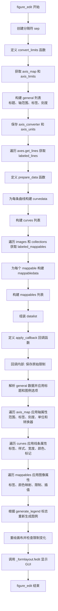
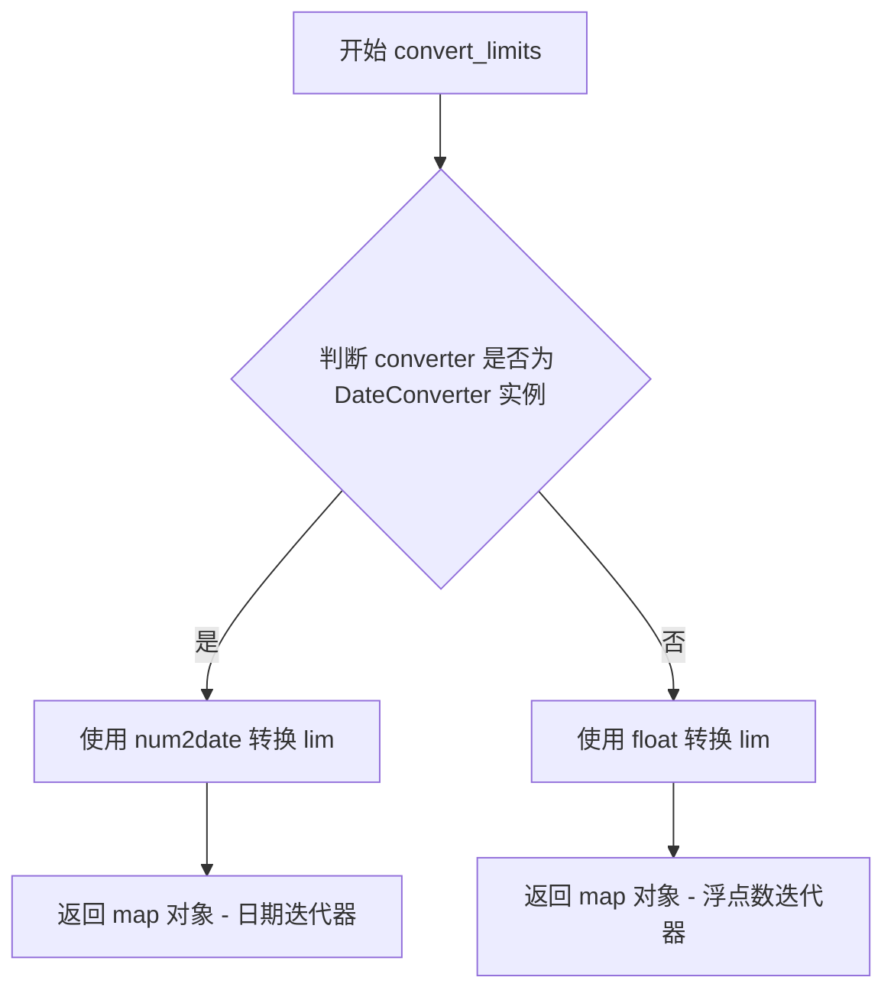
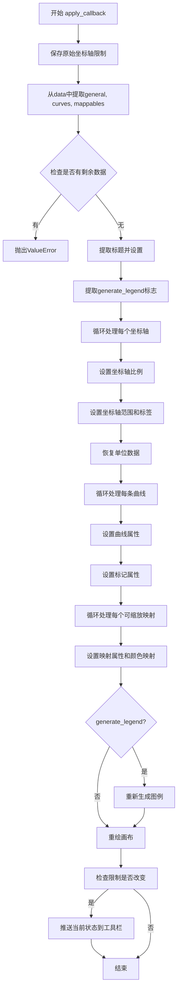

# `matplotlib\lib\matplotlib\backends\qt_editor\figureoptions.py` 详细设计文档

This module provides a GUI-based editor dialog for editing Matplotlib figure options, allowing users to modify axes properties (limits, labels, scales), line/curve styles (linestyle, drawstyle, linewidth, color, marker, markersize), and scalar mappable properties (colormap, values, interpolation) through a Qt-based form interface.

## 整体流程

```mermaid
graph TD
A[figure_edit(axes, parent)] --> B[获取轴信息]
B --> C[构建general表单数据]
C --> D[获取曲线/线条信息]
D --> E[构建curves表单数据]
E --> F[获取ScalarMappable信息]
F --> G[构建mappables表单数据]
G --> H[调用_formlayout.fedit显示对话框]
H --> I{用户点击Apply?}
I -- 否 --> J[不做任何更改]
I -- 是 --> K[执行apply_callback]
K --> L[恢复axis limits和units]
L --> M[更新Curves属性]
M --> N[更新Mappables属性]
N --> O[重新生成图例]
O --> P[重绘画布]
P --> Q[结束]
```

## 类结构

```
模块级 (无类定义)
├── 全局变量
│   ├── LINESTYLES (线条样式映射)
│   ├── DRAWSTYLES (绘制样式映射)
│   └── MARKERS (标记样式)
├── 全局函数
│   └── figure_edit (主函数)
└── 内部嵌套函数
    ├── convert_limits (转换轴限制)
    ├── prepare_data (准备表单数据)
    └── apply_callback (应用更改回调)
```

## 全局变量及字段


### `LINESTYLES`
    
字典，将线型简写映射到完整的线型名称（如'-'对应'Solid'）

类型：`dict`
    


### `DRAWSTYLES`
    
字典，将绘制样式简写映射到完整的样式名称（如'default'对应'Default'）

类型：`dict`
    


### `MARKERS`
    
matplotlib标记样式的标记集合，定义可用marker类型

类型：`dict`
    


### `sep`
    
分隔符元组(None, None)，用于FormLayout中分隔表单字段

类型：`tuple`
    


### `axis_map`
    
axes对象的_axis_map属性，包含坐标轴名称到轴对象的映射

类型：`dict`
    


### `axis_limits`
    
字典，存储各坐标轴的显示范围(min, max)

类型：`dict`
    


### `general`
    
表单布局的通用设置列表，包含标题和各坐标轴属性

类型：`list`
    


### `axis_converter`
    
字典，保存各坐标轴的converter用于单位转换

类型：`dict`
    


### `axis_units`
    
字典，保存各坐标轴的单位信息

类型：`dict`
    


### `labeled_lines`
    
列表，包含带标签的线条对象(label, line)元组

类型：`list`
    


### `curves`
    
列表，包含所有曲线数据的FormLayout格式列表

类型：`list`
    


### `labeled_mappables`
    
列表，包含带标签的可映射对象(label, mappable)元组

类型：`list`
    


### `mappables`
    
列表，包含ScalarMappable数据的FormLayout格式列表

类型：`list`
    


### `cmaps`
    
列表，包含可用颜色映射表(name, colormap)元组的排序列表

类型：`list`
    


### `datalist`
    
表单布局的完整数据列表，包含通用设置、曲线和可映射对象

类型：`list`
    


### `has_curve`
    
布尔值，标识是否存在可编辑的曲线

类型：`bool`
    


### `has_sm`
    
布尔值，标识是否存在ScalarMappable对象（如图像或集合）

类型：`bool`
    


    

## 全局函数及方法


### `figure_edit`

该函数是Matplotlib图形选项的GUI编辑器，允许用户通过表单界面编辑axes的标题、坐标轴范围、标签、刻度，以及曲线（线条样式、颜色、标记）和ScalarMappable（图像、颜色映射等）的属性，并通过回调函数实时应用到图形上。

参数：
- `axes`：`matplotlib.axes.Axes`，要编辑的Matplotlib Axes对象
- `parent`：`QWidget`，可选，父窗口部件，默认为None

返回值：`None`，无返回值

#### 流程图



#### 带注释源码

```python
def figure_edit(axes, parent=None):
    """Edit matplotlib figure options"""
    # 分隔符，用于在表单布局中分隔不同部分
    sep = (None, None)  # separator

    # ========== 定义内部函数: 转换轴限制 ==========
    def convert_limits(lim, converter):
        """Convert axis limits for correct input editors."""
        # 如果转换器是日期转换器，将限制转换为日期对象
        if isinstance(converter, DateConverter):
            return map(num2date, lim)
        # 否则转换为内置浮点数（具有更好的repr）
        return map(float, lim)

    # ========== 获取轴信息 ==========
    axis_map = axes._axis_map  # 获取轴映射字典
    # 构建轴限制字典，包含每个轴的名称和限制范围
    axis_limits = {
        name: tuple(convert_limits(
            getattr(axes, f'get_{name}lim')(), axis.get_converter()
        ))
        for name, axis in axis_map.items()
    }
    
    # 构建通用配置表单数据（标题和轴属性）
    general = [
        ('Title', axes.get_title()),  # 图形标题
        sep,
        *chain.from_iterable([
            (
                (None, f"<b>{name.title()}-Axis</b>"),  # 轴标题（如 "X-Axis"）
                ('Min', axis_limits[name][0]),  # 最小值
                ('Max', axis_limits[name][1]),  # 最大值
                ('Label', axis.label.get_text()),  # 轴标签
                ('Scale', [axis.get_scale(),  # 刻度类型
                           'linear', 'log', 'symlog', 'logit']),
                sep,
            )
            for name, axis in axis_map.items()
        ]),
        ('(Re-)Generate automatic legend', False),  # 重新生成图例复选框
    ]

    # ========== 保存转换器和单位数据（用于恢复） ==========
    axis_converter = {
        name: axis.get_converter()
        for name, axis in axis_map.items()
    }
    axis_units = {
        name: axis.get_units()
        for name, axis in axis_map.items()
    }

    # ========== 获取曲线（线条）信息 ==========
    labeled_lines = []
    for line in axes.get_lines():
        label = line.get_label()
        if label == '_nolegend_':  # 跳过不显示在图例中的线条
            continue
        labeled_lines.append((label, line))
    curves = []

    # 准备线条样式数据的内部函数
    def prepare_data(d, init):
        """
        Prepare entry for FormLayout.

        *d* is a mapping of shorthands to style names (a single style may
        have multiple shorthands, in particular the shorthands `None`,
        `"None"`, `"none"` and `""` are synonyms); *init* is one shorthand
        of the initial style.

        This function returns a list suitable for initializing a
        FormLayout combobox, namely `[initial_name, (shorthand,
        style_name), (shorthand, style_name), ...]`.
        """
        # 如果初始值不在字典中，添加它
        if init not in d:
            d = {**d, init: str(init)}
        # 从字典中删除重复的简写（通过字典推导式覆盖）
        name2short = {name: short for short, name in d.items()}
        # 转换回 {shorthand: name}
        short2name = {short: name for name, short in name2short.items()}
        # 找到init指定样式的保留简写
        canonical_init = name2short[d[init]]
        # 按表示排序并预先添加初始值
        return ([canonical_init] +
                sorted(short2name.items(),
                       key=lambda short_and_name: short_and_name[1]))

    # 为每条曲线构建表单数据
    for label, line in labeled_lines:
        # 转换颜色为十六进制格式
        color = mcolors.to_hex(
            mcolors.to_rgba(line.get_color(), line.get_alpha()),
            keep_alpha=True)
        ec = mcolors.to_hex(
            mcolors.to_rgba(line.get_markeredgecolor(), line.get_alpha()),
            keep_alpha=True)
        fc = mcolors.to_hex(
            mcolors.to_rgba(line.get_markerfacecolor(), line.get_alpha()),
            keep_alpha=True)
        
        # 构建曲线的所有属性表单
        curvedata = [
            ('Label', label),
            sep,
            (None, '<b>Line</b>'),
            ('Line style', prepare_data(LINESTYLES, line.get_linestyle())),
            ('Draw style', prepare_data(DRAWSTYLES, line.get_drawstyle())),
            ('Width', line.get_linewidth()),
            ('Color (RGBA)', color),
            sep,
            (None, '<b>Marker</b>'),
            ('Style', prepare_data(MARKERS, line.get_marker())),
            ('Size', line.get_markersize()),
            ('Face color (RGBA)', fc),
            ('Edge color (RGBA)', ec)]
        curves.append([curvedata, label, ""])
    
    # 检查是否有曲线显示
    has_curve = bool(curves)

    # ========== 获取 ScalarMappables（图像、集合等） ==========
    labeled_mappables = []
    for mappable in [*axes.images, *axes.collections]:
        label = mappable.get_label()
        # 跳过无标签或无数据的mappable
        if label == '_nolegend_' or mappable.get_array() is None:
            continue
        labeled_mappables.append((label, mappable))
    mappables = []
    
    # 获取所有可用的颜色映射
    cmaps = [(cmap, name) for name, cmap in sorted(cm._colormaps.items())]
    
    # 为每个mappable构建表单数据
    for label, mappable in labeled_mappables:
        cmap = mappable.get_cmap()
        # 如果当前颜色映射不在标准列表中，添加到开头
        if cmap.name not in cm._colormaps:
            cmaps = [(cmap, cmap.name), *cmaps]
        low, high = mappable.get_clim()
        
        mappabledata = [
            ('Label', label),
            ('Colormap', [cmap.name] + cmaps),
            ('Min. value', low),
            ('Max. value', high),
        ]
        
        # 如果mappable有插值方法（图像），添加插值选项
        if hasattr(mappable, "get_interpolation"):  # Images.
            interpolations = [
                (name, name) for name in sorted(mimage.interpolations_names)]
            mappabledata.append((
                'Interpolation',
                [mappable.get_interpolation(), *interpolations]))

            interpolation_stages = ['data', 'rgba', 'auto']
            mappabledata.append((
                'Interpolation stage',
                [mappable.get_interpolation_stage(), *interpolation_stages]))

        mappables.append([mappabledata, label, ""])
    
    # 检查是否有scalar mappable显示
    has_sm = bool(mappables)

    # ========== 组装最终的表单数据列表 ==========
    datalist = [(general, "Axes", "")]
    if curves:
        datalist.append((curves, "Curves", ""))
    if mappables:
        datalist.append((mappables, "Images, etc.", ""))

    # ========== 定义应用回调函数 ==========
    def apply_callback(data):
        """A callback to apply changes."""
        # 保存原始轴限制，以便之后检查是否变化
        orig_limits = {
            name: getattr(axes, f"get_{name}lim")()
            for name in axis_map
        }

        # 从数据中提取各个部分
        general = data.pop(0)
        curves = data.pop(0) if has_curve else []
        mappables = data.pop(0) if has_sm else []
        if data:
            raise ValueError("Unexpected field")

        # 应用标题和图例生成选项
        title = general.pop(0)
        axes.title.set_text(title)
        generate_legend = general.pop()

        # 应用每个轴的设置
        for i, (name, axis) in enumerate(axis_map.items()):
            # 从general数据中提取轴属性
            axis_min = general[4*i]
            axis_max = general[4*i + 1]
            axis_label = general[4*i + 2]
            axis_scale = general[4*i + 3]
            
            # 如果刻度类型改变，更新它
            if axis.get_scale() != axis_scale:
                getattr(axes, f"set_{name}scale")(axis_scale)

            # 设置轴限制和标签
            axis._set_lim(axis_min, axis_max, auto=False)
            axis.set_label_text(axis_label)

            # 恢复单位数据（转换器和单位）
            axis._set_converter(axis_converter[name])
            axis.set_units(axis_units[name])

        # 应用曲线（线条）属性
        for index, curve in enumerate(curves):
            line = labeled_lines[index][1]
            (label, linestyle, drawstyle, linewidth, color, marker, markersize,
             markerfacecolor, markeredgecolor) = curve
            
            # 设置线条基本属性
            line.set_label(label)
            line.set_linestyle(linestyle)
            line.set_drawstyle(drawstyle)
            line.set_linewidth(linewidth)
            
            # 设置颜色
            rgba = mcolors.to_rgba(color)
            line.set_alpha(None)  # 清除单独设置的alpha
            line.set_color(rgba)
            
            # 设置标记属性（如果存在）
            if marker != 'none':
                line.set_marker(marker)
                line.set_markersize(markersize)
                line.set_markerfacecolor(markerfacecolor)
                line.set_markeredgecolor(markeredgecolor)

        # 应用 ScalarMappable 属性
        for index, mappable_settings in enumerate(mappables):
            mappable = labeled_mappables[index][1]
            
            # 处理不同数量的设置项（带插值 vs 不带插值）
            if len(mappable_settings) == 6:
                label, cmap, low, high, interpolation, interpolation_stage = \
                  mappable_settings
                mappable.set_interpolation(interpolation)
                mappable.set_interpolation_stage(interpolation_stage)
            elif len(mappable_settings) == 4:
                label, cmap, low, high = mappable_settings
            
            # 应用通用属性
            mappable.set_label(label)
            mappable.set_cmap(cmap)
            mappable.set_clim(*sorted([low, high]))

        # 如果复选框被选中，重新生成图例
        if generate_legend:
            draggable = None
            ncols = 1
            if axes.legend_ is not None:
                old_legend = axes.get_legend()
                draggable = old_legend._draggable is not None
                ncols = old_legend._ncols
            new_legend = axes.legend(ncols=ncols)
            if new_legend:
                new_legend.set_draggable(draggable)

        # 重新绘制画布
        figure = axes.get_figure()
        figure.canvas.draw()
        
        # 如果轴限制改变，将当前状态压入撤销栈
        for name in axis_map:
            if getattr(axes, f"get_{name}lim")() != orig_limits[name]:
                figure.canvas.toolbar.push_current()
                break

    # ========== 调用表单布局编辑器 ==========
    _formlayout.fedit(
        datalist, title="Figure options", parent=parent,
        icon=QtGui.QIcon(
            str(cbook._get_data_path('images', 'qt4_editor_options.svg'))),
        apply=apply_callback)
```


### `convert_limits`

将轴限制（axis limits）转换为适合输入编辑器（Input Editors）的格式，如果是日期类型则转换为日期对象，否则转换为内置浮点数类型以获得更好的显示效果。

参数：

- `lim`：元组或类似结构，要转换的轴限制（通常是轴的最小值和最大值）
- `converter`：转换器对象，用于确定如何转换限制值（通常是 `DateConverter` 或 `None`）

返回值：`map` 对象，转换后的轴限制迭代器（如果是日期转换器则返回日期列表，否则返回浮点数列表）

#### 流程图



#### 带注释源码

```python
def convert_limits(lim, converter):
    """Convert axis limits for correct input editors."""
    # 判断传入的转换器是否为日期转换器实例
    if isinstance(converter, DateConverter):
        # 如果是日期转换器，使用 num2date 将数值转换为 datetime 对象
        return map(num2date, lim)
    # 否则，将限制值转换为 Python 内置的 float 类型
    # 因为内置 float 类型具有更友好的 repr 表示形式
    return map(float, lim)
```


### `prepare_data`

该函数用于将图形属性的样式简写（如线条样式、标记样式）映射转换为 FormLayout 下拉框所需的数据格式，支持处理多个简写对应同一样式的情况，并确保初始样式被正确放置在列表首位。

参数：

-  `d`：`dict`，样式简写到样式名称的映射字典（例如 `{'--': 'Dashed', '-': 'Solid'}`），其中单个样式可能有多个简写（如 `None`、`"None"`、`"none"`、`""` 都表示无样式）
-  `init`：`str`，当前图形元素使用的初始样式简写

返回值：`list`，适合初始化 FormLayout 组合框的列表，格式为 `[canonical_init, (shorthand, style_name), (shorthand, style_name), ...]`，其中 `canonical_init` 是初始样式对应的规范简写

#### 流程图

```mermaid
flowchart TD
    A[开始: prepare_data] --> B{init 是否在 d 中?}
    B -->|否| C[将 init 作为键, str(init) 作为值加入 d]
    B -->|是| D[保持 d 不变]
    C --> E[通过翻转 d 创建 name2short]
    D --> E
    E --> F[再次翻转 name2short 创建 short2name]
    F --> G[查找 init 对应的规范简写 canonical_init]
    G --> H[按样式名称排序 short2name]
    H --> I[将 canonical_init 放在列表首位]
    I --> J[返回最终列表]
```

#### 带注释源码

```python
def prepare_data(d, init):
    """
    Prepare entry for FormLayout.

    *d* is a mapping of shorthands to style names (a single style may
    have multiple shorthands, in particular the shorthands `None`,
    `"None"`, `"none"` and `""` are synonyms); *init* is one shorthand
    of the initial style.

    This function returns a list suitable for initializing a
    FormLayout combobox, namely `[initial_name, (shorthand,
    style_name), (shorthand, style_name), ...]`.
    """
    # 如果初始样式简写不在映射中，将其添加到字典
    # 这确保了即使当前样式不在预定义列表中也能正常处理
    if init not in d:
        d = {**d, init: str(init)}
    
    # 通过翻转字典消除重复的简写
    # 原字典: {short: name} -> 新字典: {name: short}
    # 当存在重复的 name 时，后面的 short 会覆盖前面的，实现去重效果
    name2short = {name: short for short, name in d.items()}
    
    # 再次翻转回到 {shorthand: name} 格式
    short2name = {short: name for name, short in name2short.items()}
    
    # 找到 init 样式对应的规范简写
    # name2short[d[init]] 获取 init 对应的样式名称，再获取该名称对应的简写
    canonical_init = name2short[d[init]]
    
    # 按样式名称排序，并将初始值放在列表最前面
    # sorted 返回按 style_name 排序的 (shorthand, style_name) 元组列表
    return ([canonical_init] +
            sorted(short2name.items(),
                   key=lambda short_and_name: short_and_name[1]))
```


### `figure_edit.apply_callback`

这是一个在 `figure_edit` 函数内部定义的回调函数，用于应用用户在图形选项编辑器中所做的更改，包括更新坐标轴属性、曲线样式、图像映射以及重新生成图例。

参数：

- `data`：`list`，包含从表单布局中收集的更改数据列表，依次包含通用设置、曲线设置和可缩放映射对象设置

返回值：`None`，该函数通过直接修改 matplotlib 的 axes 对象来应用更改，无返回值

#### 流程图



#### 带注释源码

```python
def apply_callback(data):
    """A callback to apply changes."""
    # 保存原始坐标轴限制，用于后续比较是否发生变化
    orig_limits = {
        name: getattr(axes, f"get_{name}lim")()
        for name in axis_map
    }

    # 从表单数据中提取各个部分
    general = data.pop(0)  # 获取通用设置（标题、坐标轴设置等）
    curves = data.pop(0) if has_curve else []  # 获取曲线设置（如果有）
    mappables = data.pop(0) if has_sm else []  # 获取可缩放映射设置（如果有）
    
    # 验证数据结构完整性
    if data:
        raise ValueError("Unexpected field")

    # --- 处理通用设置 ---
    title = general.pop(0)  # 提取图表标题
    axes.title.set_text(title)  # 设置图表标题
    generate_legend = general.pop()  # 提取是否重新生成图例的标志

    # --- 处理坐标轴设置 ---
    for i, (name, axis) in enumerate(axis_map.items()):
        # 从通用设置中按索引提取各坐标轴的参数
        axis_min = general[4*i]        # 最小值
        axis_max = general[4*i + 1]    # 最大值
        axis_label = general[4*i + 2]  # 标签
        axis_scale = general[4*i + 3]  # 比例尺
        
        # 如果比例尺发生变化，更新坐标轴比例
        if axis.get_scale() != axis_scale:
            getattr(axes, f"set_{name}scale")(axis_scale)

        # 设置坐标轴范围和标签
        axis._set_lim(axis_min, axis_max, auto=False)
        axis.set_label_text(axis_label)

        # 恢复单位数据（转换器和单位）
        axis._set_converter(axis_converter[name])
        axis.set_units(axis_units[name])

    # --- 处理曲线（线条）设置 ---
    for index, curve in enumerate(curves):
        line = labeled_lines[index][1]  # 获取对应的线条对象
        
        # 解包曲线设置数据
        (label, linestyle, drawstyle, linewidth, color, marker, markersize,
         markerfacecolor, markeredgecolor) = curve
        
        # 应用线条属性
        line.set_label(label)
        line.set_linestyle(linestyle)
        line.set_drawstyle(drawstyle)
        line.set_linewidth(linewidth)
        
        # 处理颜色（转换为RGBA并设置）
        rgba = mcolors.to_rgba(color)
        line.set_alpha(None)
        line.set_color(rgba)
        
        # 处理标记（如果存在）
        if marker != 'none':
            line.set_marker(marker)
            line.set_markersize(markersize)
            line.set_markerfacecolor(markerfacecolor)
            line.set_markeredgecolor(markeredgecolor)

    # --- 处理可缩放映射对象（图像、集合等）---
    for index, mappable_settings in enumerate(mappables):
        mappable = labeled_mappables[index][1]  # 获取对应的映射对象
        
        # 根据设置数量判断是否包含插值设置
        if len(mappable_settings) == 6:
            # 包含插值和插值阶段的完整设置
            label, cmap, low, high, interpolation, interpolation_stage = \
                mappable_settings
            mappable.set_interpolation(interpolation)
            mappable.set_interpolation_stage(interpolation_stage)
        elif len(mappable_settings) == 4:
            # 仅包含基本设置
            label, cmap, low, high = mappable_settings
        
        # 应用基本属性
        mappable.set_label(label)
        mappable.set_cmap(cmap)
        mappable.set_clim(*sorted([low, high]))

    # --- 重新生成图例（如需要）---
    if generate_legend:
        draggable = None
        ncols = 1
        # 如果已存在图例，保留其属性
        if axes.legend_ is not None:
            old_legend = axes.get_legend()
            draggable = old_legend._draggable is not None
            ncols = old_legend._ncols
        
        # 创建新图例
        new_legend = axes.legend(ncols=ncols)
        if new_legend:
            new_legend.set_draggable(draggable)

    # --- 重绘图形 ---
    figure = axes.get_figure()
    figure.canvas.draw()
    
    # 如果坐标轴限制发生变化，将当前状态推入工具栏（支持撤销）
    for name in axis_map:
        if getattr(axes, f"get_{name}lim")() != orig_limits[name]:
            figure.canvas.toolbar.push_current()
            break
```

## 关键组件


### figure_edit

GUI图形选项编辑器主函数，提供用于编辑matplotlib图形axes的标题、轴标签、轴范围、线条样式、标记样式、颜色映射等功能的图形界面。

### convert_limits

轴限制转换辅助函数，将轴限制转换为适合输入编辑器的格式，支持日期转换器和其他类型。

### prepare_data

表单数据准备函数，将样式简写映射转换为FormLayout组合框所需格式，处理样式的多个简写形式并排序。

### apply_callback

应用更改的回调函数，处理用户通过GUI提交的表单数据，更新axes的标题、轴属性、线条属性、标记属性、颜色映射等，并可选地重新生成图例。

### 全局样式映射

LINESTYLES、DRAWSTYLES、MARKERS等全局字典，定义可用的线条样式、绘制样式和标记类型供GUI选择使用。

### axis_map与axis_limits

轴映射和轴限制的获取与处理模块，收集axes的所有轴信息及其当前限制值、转换器和单位数据。

### labeled_lines处理

从axes获取带标签线条的模块，筛选出有效标签的线条并准备其颜色、样式等属性供GUI编辑。

### labeled_mappables处理

从axes获取带标签的ScalarMappable对象（图像和集合）的模块，准备颜色映射和插值选项供GUI选择。

### 表单布局构建

构建FormLayout所需的datalist结构，包含通用设置、曲线设置和图像设置等选项卡页面的组织逻辑。


## 问题及建议


### 已知问题

-   **函数过长且职责过多**：`figure_edit`函数超过200行，混合了数据准备、UI构建、回调处理等多种职责，导致代码难以理解和维护。
-   **缺乏类型提示**：整个代码没有使用类型注解，降低了代码的可读性和IDE支持。
-   **依赖内部API**：使用了多个私有/内部API（如`axes._axis_map`、`axis._set_lim`、`axis._set_converter`），这些API在不同版本间可能变化，导致兼容性问题。
-   **魔法数字和硬编码**：在处理轴数据时使用了`4*i`这样的魔法数字，且GUI文本如"<b>Line</b>"、"(Re-)Generate automatic legend"等硬编码在代码中。
-   **颜色转换代码重复**：针对line color、marker edge color、marker face color的颜色处理逻辑几乎完全相同，存在代码重复。
-   **缺乏输入验证**：在`apply_callback`中没有验证用户输入的数值是否合法（如Min是否小于Max）。
-   **变量命名不够清晰**：使用了`sep`、`curvedata`、`mappabledata`等不够描述性的变量名。

### 优化建议

-   **重构函数**：将`figure_edit`拆分为多个更小的函数，每个函数负责单一职责（如数据准备、UI构建、回调处理）。
-   **添加类型提示**：为所有函数参数、返回值和变量添加类型注解。
-   **提取内部API调用**：将依赖内部API的代码封装成独立的方法或使用公共API替代。
-   **消除魔法数字**：使用具名常量替代数字索引，如定义`AXIS_FIELDS = ['min', 'max', 'label', 'scale']`。
-   **提取公共逻辑**：将颜色转换逻辑提取为单独的函数以减少重复。
-   **添加输入验证**：在`apply_callback`中添加数据验证逻辑，确保轴范围、颜色值等输入合法。
-   **改进变量命名**：使用更描述性的变量名提高代码可读性。
-   **优化性能**：将`cmaps`排序和颜色转换等可缓存的操作提前到循环外部执行。


## 其它


### 设计目标与约束

**设计目标**：
提供一个直观的图形用户界面，使用户能够交互式地编辑Matplotlib图形（Figure）的各种属性，包括坐标轴设置（标题、范围、标签、比例尺）、曲线样式（线型、线宽、颜色、标记）以及图像和集合的显示属性（colormap、插值等）。

**技术约束**：
- 依赖PyQt/PySide Qt库进行GUI渲染
- 依赖Matplotlib的axis、line、image、collection等对象模型
- 表单数据通过_formlayout模块构建，该模块是Matplotlib内部Qt编辑器表单布局实现
- 仅支持具有Qt后端的matplotlib安装

### 错误处理与异常设计

**输入验证**：
- 坐标轴范围（Min/Max）未进行数值有效性验证，可能导致用户输入非数值时抛出异常
- 颜色值通过mcolors.to_hex()和mcolors.to_rgba()处理，异常颜色格式会被转换函数捕获并抛出ValueError
- 数值类型（线宽、标记大小等）未做类型校验

**异常传播**：
- 异常主要来自Matplotlib底层API调用（如axis.get_scale()、line.get_color()等）
- apply_callback()中的异常会中断GUI响应但不提供用户友好的错误提示
- 数据解析异常（如"Unexpected field"）会抛出ValueError并中断应用

**改进建议**：
- 添加坐标轴范围的数值范围校验
- 为所有用户输入添加try-except包装并提供错误提示对话框
- 验证colormap名称和插值方法的有效性

### 数据流与状态机

**数据获取阶段**：
1. 获取当前axes对象的元数据（标题、坐标轴信息）
2. 获取所有曲线（lines）的样式属性
3. 获取所有ScalarMappables（images、collections）的显示属性
4. 构建表单数据结构datalist

**表单展示阶段**：
- 使用_formlayout.fedit()显示GUI表单
- 用户通过GUI控件修改属性值

**数据应用阶段**：
1. 用户点击Apply按钮触发apply_callback()
2. 从表单数据中提取新值
3. 按顺序应用：标题→坐标轴→曲线→图像/集合→图例
4. 触发画布重绘(figure.canvas.draw())
5. 记录坐标轴限制变化以便toolbar撤销功能

**状态转换**：
- 初始状态 → 编辑状态（用户修改表单）
- 编辑状态 → 应用状态（点击Apply）
- 应用状态 → 初始状态（重新加载或关闭对话框）

### 外部依赖与接口契约

**外部依赖模块**：
- `matplotlib.backends.qt_editor._formlayout`：表单布局引擎，提供fedit()函数
- `matplotlib.backends.qt_compat`：Qt兼容性层，提供QtGui
- `matplotlib.cbook`：数据路径获取（_get_data_path）
- `matplotlib.cm`：colormap管理
- `matplotlib.colors`：颜色转换（to_hex, to_rgba）
- `matplotlib.markers`：标记样式
- `matplotlib.image`：图像插值方法
- `matplotlib.dates`：日期转换（DateConverter, num2date）

**公共接口**：
- `figure_edit(axes, parent=None)`：主入口函数
  - 参数axes：matplotlib.axes.Axes对象
  - 参数parent：Qt父窗口对象（可选）
  - 返回值：无直接返回值，通过副作用修改axes属性

**图标资源**：
- 使用cbook._get_data_path('images', 'qt4_editor_options.svg')获取编辑器图标
- 注意：图标文件名(qt4_editor_options.svg)表明是为Qt4设计的，但可能适用于更高版本Qt

### 用户交互流程

1. 用户调用figure_edit(axes)或通过图形界面触发
2. 系统读取axes及其子对象的当前属性
3. 构建包含"General"、"Curves"、"Images, etc."三个选项卡的表单
4. 用户修改各项属性
5. 点击Apply按钮应用更改，点击OK应用并关闭，点击Cancel放弃更改
6. 如选中"(Re-)Generate automatic legend"，自动重新生成图例
7. 画布重绘以反映更改

### 可扩展性设计

**曲线样式扩展**：
- prepare_data()函数支持将单一样式映射到多个简写形式
- 新增线型/绘制样式只需修改LINESTYLES/DRAWSTYLES字典

**Mappable类型扩展**：
- 代码通过hasattr()检查特定方法（如get_interpolation）来支持可选功能
- 新增mappable类型只需实现标准接口（get_label, get_cmap, get_clim等）

**表单字段扩展**：
- general、curves、mappables列表结构支持动态添加新字段

### 性能考量

- 所有属性读取在对话框显示前完成，无延迟
- apply_callback中批量修改后统一调用canvas.draw()，减少重绘次数
- 使用chain.from_iterable()优化general列表构建

### 国际化与本地化

- 当前代码未包含国际化支持，所有UI文本硬编码为英文
- 坐标轴名称使用name.title()进行首字母大写处理
- 如需国际化，应将所有UI字符串提取到资源文件

    