# `matplotlib\lib\matplotlib\backends\registry.py` 详细设计文档

这是matplotlib的后端注册表模块，负责管理matplotlib中所有可用的图形渲染后端（包括内置后端、通过entry points动态加载的外部后端、以及通过module://语法指定的动态后端），提供后端验证、加载、查询和解析功能，是matplotlib后端系统的单一真实数据源。

## 整体流程

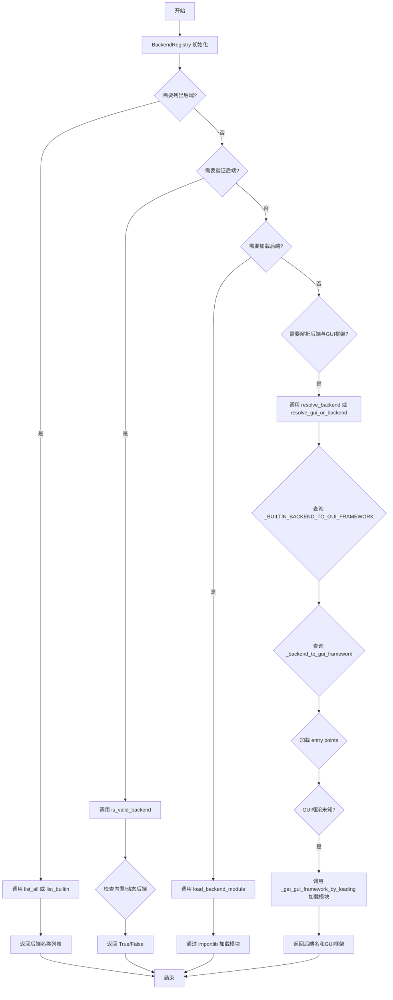

## 类结构

```
BackendFilter (Enum)
└── INTERACTIVE
└── NON_INTERACTIVE

BackendRegistry (核心类)
├── _BUILTIN_BACKEND_TO_GUI_FRAMEWORK (类属性/类变量)
├── _GUI_FRAMEWORK_TO_BACKEND (类属性/类变量)
├── _loaded_entry_points (实例属性)
├── _backend_to_gui_framework (实例属性)
├── _name_to_module (实例属性)
├── __init__ (构造函数)
├── _backend_module_name (私有方法)
├── _clear (私有方法)
├── _ensure_entry_points_loaded (私有方法)
├── _get_gui_framework_by_loading (私有方法)
├── _read_entry_points (私有方法)
├── _validate_and_store_entry_points (私有方法)
├── backend_for_gui_framework (公开方法)
├── is_valid_backend (公开方法)
├── list_all (公开方法)
├── list_builtin (公开方法)
├── list_gui_frameworks (公开方法)
├── load_backend_module (公开方法)
├── resolve_backend (公开方法)
└── resolve_gui_or_backend (公开方法)

backend_registry (全局单例)
```

## 全局变量及字段


### `backend_registry`
    
单例实例，提供全局唯一的后端注册表，用于管理Matplotlib的所有可用后端

类型：`BackendRegistry`
    


### `BackendFilter.BackendFilter.INTERACTIVE`
    
枚举成员，用于过滤交互式后端

类型：`BackendFilter`
    


### `BackendFilter.BackendFilter.NON_INTERACTIVE`
    
枚举成员，用于过滤非交互式后端

类型：`BackendFilter`
    


### `BackendRegistry._BUILTIN_BACKEND_TO_GUI_FRAMEWORK`
    
内置后端名到GUI框架的映射，键为后端名称，值为GUI框架名称或'headless'

类型：`Dict[str, str]`
    


### `BackendRegistry._GUI_FRAMEWORK_TO_BACKEND`
    
GUI框架到首选内置后端的反向映射，用于根据GUI框架查找对应的后端

类型：`Dict[str, str]`
    


### `BackendRegistry._loaded_entry_points`
    
标记entry points是否已加载，避免重复加载

类型：`bool`
    


### `BackendRegistry._backend_to_gui_framework`
    
非内置后端到GUI框架的映射，通过entry points或module://语法动态添加

类型：`Dict[str, str]`
    


### `BackendRegistry._name_to_module`
    
后端名到模块名的自定义映射，处理特殊情况如'notebook'映射到'nbagg'

类型：`Dict[str, str]`
    
    

## 全局函数及方法


# 设计文档：BackendRegistry 类与 importlib 动态模块导入

## 一段话描述

`BackendRegistry` 是 Matplotlib 的后端注册中心，负责管理和动态加载各种图形渲染后端（如 Qt、Tkinter、WebAgg 等），通过 `importlib` 实现运行时模块动态导入，提供后端验证、列表查询、GUI框架解析等核心功能，是 Matplotlib 后端系统的单一可信源。

## 文件的整体运行流程

```
1. 初始化 BackendRegistry 实例 (单例 backend_registry)
   │
   ├─> 加载内置后端映射 (_BUILTIN_BACKEND_TO_GUI_FRAMEWORK)
   │
   ├─> 用户调用 API (如 list_all, resolve_backend, load_backend_module)
   │
   ├─> 若需要 entry points，调用 _ensure_entry_points_loaded
   │    │
   │    ├─> _read_entry_points 读取元数据
   │    │
   │    └─> _validate_and_store_entry_points 验证并存储
   │
   └─> 返回结果 (后端名称列表/模块对象/解析结果)
```

## 类的详细信息

### 类字段

| 字段名称 | 类型 | 描述 |
|---------|------|------|
| `_BUILTIN_BACKEND_TO_GUI_FRAMEWORK` | `dict` | 内置后端名称到GUI框架的映射表 |
| `_GUI_FRAMEWORK_TO_BACKEND` | `dict` | GUI框架到首选内置后端的反向映射 |
| `_loaded_entry_points` | `bool` | 标记entry points是否已加载 |
| `_backend_to_gui_framework` | `dict` | 动态添加的非内置后端到GUI框架的映射 |
| `_name_to_module` | `dict` | 后端名称到模块名称的自定义映射 |

### 类方法

| 方法名称 | 描述 |
|---------|------|
| `__init__` | 初始化注册表，设置内部数据结构 |
| `_backend_module_name` | 获取后端对应的模块名称 |
| `_clear` | 清空动态数据（仅用于测试） |
| `_ensure_entry_points_loaded` | 确保entry points已加载 |
| `_get_gui_framework_by_loading` | 通过加载模块确定GUI框架 |
| `_read_entry_points` | 读取matplotlib后端的entry points |
| `_validate_and_store_entry_points` | 验证并存储entry points |
| `backend_for_gui_framework` | 根据GUI框架返回后端名称 |
| `is_valid_backend` | 验证后端名称是否有效 |
| `list_all` | 返回所有已知后端 |
| `list_builtin` | 返回内置后端列表 |
| `list_gui_frameworks` | 返回所有GUI框架 |
| `load_backend_module` | **使用importlib动态加载后端模块** |
| `resolve_backend` | 解析后端名称和GUI框架 |
| `resolve_gui_or_backend` | 解析GUI框架或后端名称 |

---

## 关键组件：importlib 动态导入

### `BackendRegistry.load_backend_module`

动态加载并返回指定后端对应的Python模块。

参数：

- `backend`：`str`，要加载的后端名称（如 "qt5agg"、"gtk3cairo" 等）

返回值：`Module`，包含后端实现的Python模块对象

#### 流程图

```mermaid
flowchart TD
    A[load_backend_module] --> B[调用 _backend_module_name]
    B --> C{backend类型判断}
    C -->|module://前缀| D[提取模块名]
    C -->|内置后端| E[转换为 matplotlib.backends.backend_{name}]
    D --> F[使用 importlib.import_module 加载模块]
    E --> F
    F --> G[返回模块对象]
```

#### 带注释源码

```python
def load_backend_module(self, backend):
    """
    Load and return the module containing the specified backend.

    Parameters
    ----------
    backend : str
        Name of backend to load.

    Returns
    -------
    Module
        Module containing backend.
    """
    # 第一步：获取后端对应的模块名称
    # _backend_module_name 方法会处理以下情况：
    # 1. "module://some.backend" 格式 -> 直接返回 "some.backend"
    # 2. 内置后端（如 "qt5agg"）-> 转换为 "matplotlib.backends.backend_qt5agg"
    # 3. 特殊映射（如 "notebook" -> "nbagg"）
    module_name = self._backend_module_name(backend)
    
    # 第二步：使用 Python 标准库 importlib 动态导入模块
    # 这是核心的动态加载机制，允许：
    # - 运行时按需加载，减少启动时间
    # - 支持用户自定义后端（module:// 语法）
    # - 支持第三方通过 entry points 注册的后端
    return importlib.import_module(module_name)
```

---

## 潜在的技术债务或优化空间

1. **模块加载错误处理不足**：`load_backend_module` 直接返回 `importlib.import_module()` 的结果，若模块不存在或导入失败会抛出异常，建议捕获并提供更友好的错误信息。

2. **entry points 缓存机制**：`_loaded_entry_points` 只在首次调用时加载，没有缓存刷新机制，第三方包动态安装后需要重启Python进程。

3. **GUI框架确定延迟**：`_get_gui_framework_by_loading` 采用了延迟加载策略，但每次访问未知的 "unknown" 框架都会重新加载模块，可考虑缓存已解析的框架信息。

4. **向后兼容处理复杂**：代码中多处存在向后兼容逻辑（如 `backwards_compat` 字典、`backward_compatible_entry_points` 函数），增加了代码复杂度，建议在未来版本中逐步移除。

---

## 其它项目

### 设计目标与约束

- **单一可信源**：所有后端信息必须通过 `BackendRegistry` 获取，避免多处定义导致不一致
- **延迟加载**：entry points 和动态后端只在首次需要时才加载，优化启动性能
- **安全性**：不允许通过 entry points 覆盖内置后端，防止潜在的恶意后端注入

### 错误处理与异常设计

| 场景 | 异常类型 | 说明 |
|-----|---------|------|
| entry point 名称以 "module://" 开头 | `RuntimeError` | 命名约束 |
| entry point 名称与内置后端冲突 | `RuntimeError` | 保护内置后端 |
| entry point 名称重复 | `RuntimeError` | 防止歧义 |
| 后端无法识别 | `RuntimeError` | `resolve_backend` 中抛出 |

### 数据流与状态机

```
后端请求 -> is_valid_backend (验证) -> 
    ├─ 有效 -> resolve_backend (解析) -> load_backend_module (加载)
    └─ 无效 -> 抛出 RuntimeError
```

### 外部依赖与接口契约

- **`importlib`**：Python 标准库，用于运行时动态导入模块
- **`importlib.metadata`**：读取第三方包的 entry points 元数据
- **`matplotlib.get_backend`**：获取当前默认后端（用于 None 参数处理）


### `BackendRegistry._read_entry_points`

该方法通过 `importlib.metadata` 标准库读取注册在 `matplotlib.backend` 组下的入口点，用于发现外部包自注册的后端。同时为未提供入口点的旧版本 `matplotlib-inline` 和 `ipympl` 包提供向后兼容支持。

参数：**无**（仅使用 `self`）

返回值：`list[tuple[str, str]]`，返回由 `(入口点名称, 入口点模块路径)` 组成的列表

#### 流程图

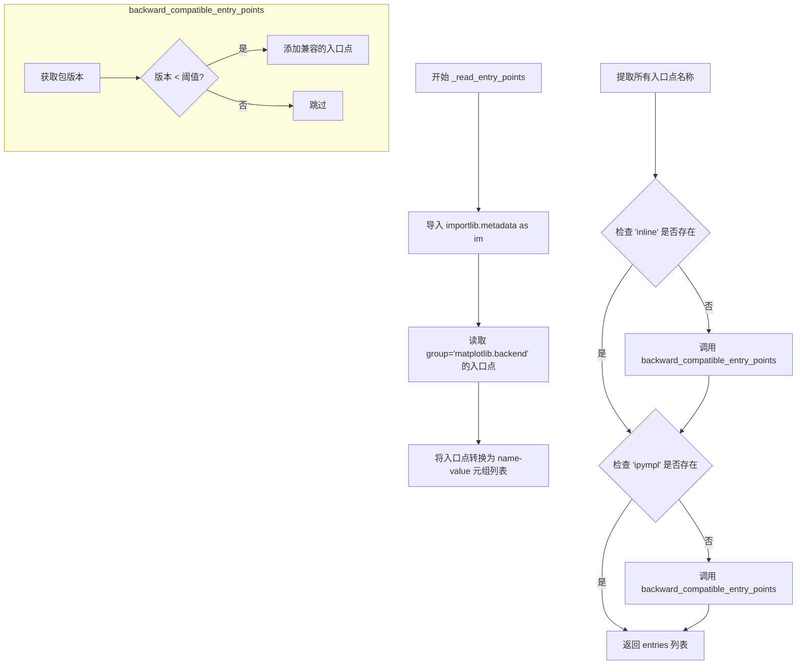

#### 带注释源码

```python
def _read_entry_points(self):
    # 读取自广告为 Matplotlib 后端的模块入口点。
    # 期望的入口点格式如下（pyproject.toml 格式）：
    #   [project.entry-points."matplotlib.backend"]
    #   inline = "matplotlib_inline.backend_inline"
    import importlib.metadata as im

    # 从入口点组 "matplotlib.backend" 获取所有注册的入口点
    entry_points = im.entry_points(group="matplotlib.backend")
    # 将入口点对象转换为 (名称, 值) 元组列表
    entries = [(entry.name, entry.value) for entry in entry_points]

    # 向后兼容性：如果 matplotlib-inline 和/或 ipympl 已安装但版本太旧
    # 不包含入口点，则创建它们。不要直接导入 ipympl，因为这会在此函数中调用 matplotlib.use()。
    def backward_compatible_entry_points(
            entries, module_name, threshold_version, names, target):
        from matplotlib import _parse_to_version_info
        try:
            # 获取包的版本
            module_version = im.version(module_name)
            # 如果版本低于阈值，为每个名称添加目标入口点
            if _parse_to_version_info(module_version) < threshold_version:
                for name in names:
                    entries.append((name, target))
        # 如果包未找到则忽略
        except im.PackageNotFoundError:
            pass

    # 获取当前已注册的入口点名称列表
    names = [entry[0] for entry in entries]
    # 如果 'inline' 不在列表中，检查是否需要向后兼容添加
    if "inline" not in names:
        backward_compatible_entry_points(
            entries, "matplotlib_inline", (0, 1, 7), ["inline"],
            "matplotlib_inline.backend_inline")
    # 如果 'ipympl' 不在列表中，检查是否需要向后兼容添加
    if "ipympl" not in names:
        backward_compatible_entry_points(
            entries, "ipympl", (0, 9, 4), ["ipympl", "widget"],
            "ipympl.backend_nbagg")

    return entries
```


根据提供的代码，我需要说明一个重要发现：

## 分析结果

`_parse_to_version_info` 函数**并未在当前提供的代码文件中定义**。它是通过以下方式从 matplotlib 库内部导入的外部函数：

```python
from matplotlib import _parse_to_version_info
```

该函数在 `_read_entry_points` 方法内部被调用，用于解析 matplotlib_inline 和 ipympl 等包的版本号，以便进行版本比较。

---

### 基于使用上下文的推断信息

尽管无法获取该函数的完整源码，以下是从代码中推断出的信息：

### `matplotlib._parse_to_version_info`

导入的 matplotlib 内部函数，用于解析版本字符串为可比较的版本元组。

参数：

- `module_version`：`str`，包的版本字符串（如 "0.1.7"）

返回值：`tuple`，可比较的版本元组（如 (0, 1, 7)）

#### 流程图

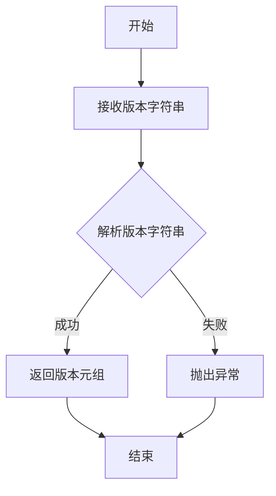

#### 使用示例源码

在 `BackendRegistry._read_entry_points` 方法中的调用方式：

```python
def _read_entry_points(self):
    # ... 省略其他代码 ...
    
    def backward_compatible_entry_points(
            entries, module_name, threshold_version, names, target):
        # 导入并使用 _parse_to_version_info
        from matplotlib import _parse_to_version_info
        try:
            module_version = im.version(module_name)
            # 比较版本：当前包版本 < 阈值版本
            if _parse_to_version_info(module_version) < threshold_version:
                for name in names:
                    entries.append((name, target))
        except im.PackageNotFoundError:
            pass
```

---

### 重要说明

如果您需要获取 `_parse_to_version_info` 的完整源码和详细文档，您需要查看 matplotlib 库的其他源文件（可能在 `matplotlib/_version.py` 或类似的内部模块中）。当前提供的代码文件仅使用了这个函数，而非定义它。

如果您有 matplotlib 库的完整源码，请提供相关文件，我可以为您提取该函数的完整设计文档。


### `get_backend` (导入)

这是 matplotlib 的内部函数，用于获取当前设置的默认后端名称。在 `BackendRegistry.resolve_backend` 方法中被导入并使用，当后端参数为 None 或特殊标记 `_auto_backend_sentinel` 时，调用此函数获取当前默认后端。

#### 源码位置

在 `BackendRegistry.resolve_backend` 方法中使用：

```python
def resolve_backend(self, backend):
    # ...
    else:  # Might be _auto_backend_sentinel or None
        # Use whatever is already running...
        from matplotlib import get_backend
        backend = get_backend()
    # ...
```

#### 使用场景说明

| 场景 | 描述 |
|------|------|
| 参数为 None | 调用 `get_backend()` 获取默认后端 |
| 参数为 `_auto_backend_sentinel` | 调用 `get_backend()` 获取当前运行的后端 |

#### 相关代码片段

```python
def resolve_backend(self, backend):
    """
    Return the backend and GUI framework for the specified backend name.
    """
    if isinstance(backend, str):
        if not backend.startswith("module://"):
            backend = backend.lower()
    else:  # Might be _auto_backend_sentinel or None
        # 使用 get_backend 获取当前默认后端
        from matplotlib import get_backend
        backend = get_backend()

    # 后续逻辑处理已知的后端...
    gui = (self._BUILTIN_BACKEND_TO_GUI_FRAMEWORK.get(backend) or
           self._backend_to_gui_framework.get(backend))
    # ...
```

> **注意**: `get_backend` 函数本身并未在此代码文件中定义，而是从 `matplotlib` 模块导入的外部函数。其具体实现位于 matplotlib 库的核心模块中，负责维护和返回当前配置的默认后端名称。


### `backward_compatible_entry_points`

这是一个内部嵌套函数，用于在 matplotlib-inline 或 ipympl 旧版本没有注册 entry point 时，自动为这些包创建向后兼容的 entry point 记录。

参数：

- `entries`：`list[tuple[str, str]]`，现有 entry points 列表，函数会在此列表中添加兼容的条目
- `module_name`：`str`，要检查的模块名称（如 "matplotlib_inline" 或 "ipympl"）
- `threshold_version`：`tuple[int, int, int]`，版本阈值，如果模块版本低于此版本则创建兼容条目
- `names`：`list[str]`，要创建的 entry point 名称列表
- `target`：`str`，entry point 指向的目标模块路径

返回值：`None`，该函数直接修改 `entries` 列表，无返回值

#### 流程图

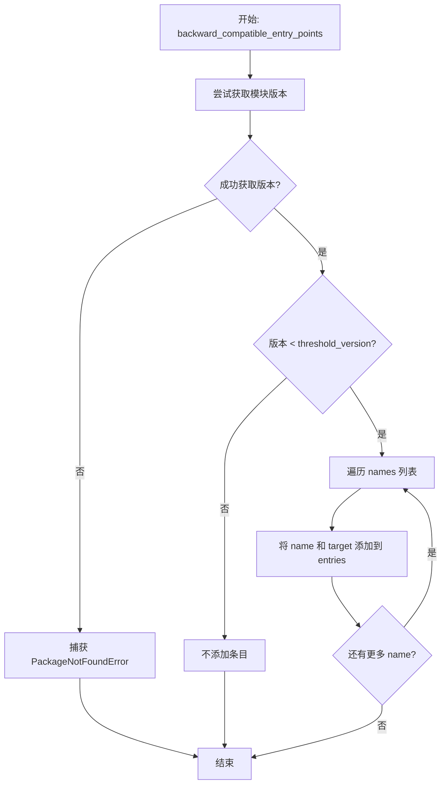

#### 带注释源码

```python
def backward_compatible_entry_points(
        entries, module_name, threshold_version, names, target):
    """
    为旧版本的 matplotlib-inline 或 ipympl 创建向后兼容的 entry point。
    
    Parameters
    ----------
    entries : list[tuple[str, str]]
        现有的 entry points 列表，函数会直接修改此列表添加兼容条目。
    module_name : str
        要检查的模块名称，如 "matplotlib_inline" 或 "ipympl"。
    threshold_version : tuple[int, int, int]
        版本阈值元组，如 (0, 1, 7) 表示 0.1.7 版本。
    names : list[str]
        要创建的 entry point 名称列表。
    target : str
        entry point 指向的目标模块路径。
    """
    # 导入版本解析工具
    from matplotlib import _parse_to_version_info
    
    try:
        # 尝试获取指定模块的版本
        module_version = im.version(module_name)
        
        # 如果当前模块版本低于阈值版本
        if _parse_to_version_info(module_version) < threshold_version:
            # 为每个名称创建兼容的 entry point 条目
            for name in names:
                # 将 (name, target) 元组添加到 entries 列表
                entries.append((name, target))
    except im.PackageNotFoundError:
        # 如果模块未安装，静默忽略，不添加任何条目
        pass
```

#### 调用场景

该函数在 `_read_entry_points` 方法中被调用两次：

1. 第一次调用处理 matplotlib-inline：
```python
if "inline" not in names:
    backward_compatible_entry_points(
        entries, "matplotlib_inline", (0, 1, 7), ["inline"],
        "matplotlib_inline.backend_inline")
```

2. 第二次调用处理 ipympl：
```python
if "ipympl" not in names:
    backward_compatible_entry_points(
        entries, "ipympl", (0, 9, 4), ["ipympl", "widget"],
        "ipympl.backend_nbagg")
```


### `BackendRegistry.__init__`

该方法是`BackendRegistry`类的构造函数，用于初始化后端注册表的核心数据结构。它设置了延迟加载标志、动态后端到GUI框架的映射字典，以及后端名称到模块名称的映射表（包含兼容性别名）。

参数：

- 无显式参数（隐式参数`self`为`BackendRegistry`实例引用）

返回值：`None`（隐式返回初始化后的实例）

#### 流程图

```mermaid
flowchart TD
    A[开始 __init__] --> B[设置 self._loaded_entry_points = False]
    B --> C[初始化 self._backend_to_gui_framework = {}]
    C --> D[初始化 self._name_to_module = {'notebook': 'nbagg'}]
    D --> E[结束 __init__, 返回 self]
    
    style A fill:#f9f,stroke:#333
    style E fill:#9f9,stroke:#333
```

#### 带注释源码

```python
def __init__(self):
    # Only load entry points when first needed.
    # 延迟加载标志，确保entry points只在首次需要时才加载，避免启动时的性能开销
    self._loaded_entry_points = False

    # Mapping of non-built-in backend to GUI framework, added dynamically from
    # entry points and from matplotlib.use("module://some.backend") format.
    # New entries have an "unknown" GUI framework that is determined when first
    # needed by calling _get_gui_framework_by_loading.
    # 存储通过entry points或module://语法动态添加的非内置后端及其GUI框架映射
    # 'unknown'表示GUI框架未知，需要在首次使用时通过加载模块来确定
    self._backend_to_gui_framework = {}

    # Mapping of backend name to module name, where different from
    # f"matplotlib.backends.backend_{backend_name.lower()}". These are either
    # hardcoded for backward compatibility, or loaded from entry points or
    # "module://some.backend" syntax.
    # 后端名称到模块名称的映射表，用于处理与默认命名规范不同的后端
    # 包含硬编码的向后兼容映射（如'notebook' -> 'nbagg'）以及从entry points动态加载的映射
    self._name_to_module = {
        "notebook": "nbagg",
    }
```


### `BackendRegistry._backend_module_name`

根据给定的后端名称返回对应的模块名称，支持内置后端、module:// 语法以及通过名称映射的自定义模块。

参数：

- `backend`：`str`，后端名称，可以是内置后端名称（如 "agg"、"qt5agg"）、"module://some.backend" 格式或通过 entry points 注册的后端名称

返回值：`str`，模块名称，如 "matplotlib.backends.backend_agg" 或自定义模块路径

#### 流程图

```mermaid
flowchart TD
    A[开始 _backend_module_name] --> B{backend 是否以<br>'module://' 开头?}
    B -->|是| C[返回 backend[9:]<br>即去掉 'module://' 前缀]
    B -->|否| D[backend = backend.lower()]
    D --> E{backend 是否在<br>_name_to_module 映射中?}
    E -->|是| F[backend = _name_to_module.get(backend)]
    E -->|否| G[backend 保持不变]
    F --> H{backend 再次以<br>'module://' 开头?}
    G --> H
    H -->|是| I[返回 backend[9:]]
    H -->|否| J[返回 f'matplotlib.backends.backend_{backend}']
    C --> K[结束]
    I --> K
    J --> K
```

#### 带注释源码

```python
def _backend_module_name(self, backend):
    """
    根据给定的后端名称返回对应的模块名称。

    Parameters
    ----------
    backend : str
        后端名称，支持三种格式：
        1. 内置后端名（如 'agg', 'qt5agg'）
        2. module:// 语法（如 'module://some.backend'）
        3. 通过 entry points 注册的后端名

    Returns
    -------
    str
        完整的模块名称字符串
    """
    # 如果已经是 module:// 格式，直接提取模块路径并返回
    # backend[9:] 去掉 'module://' 的9个字符
    if backend.startswith("module://"):
        return backend[9:]

    # 将后端名称转为小写，因为内置后端映射使用的是小写
    backend = backend.lower()

    # 检查是否有特殊的后端名到模块名的映射
    # 例如 'notebook' -> 'nbagg' 的映射
    # 如果没有映射，则返回原名称
    backend = self._name_to_module.get(backend, backend)

    # 再次检查是否为 module:// 格式（因为 _name_to_module 可能返回这种格式）
    # 如果是，直接返回模块路径；否则构建标准的 Matplotlib 后端模块路径
    return (backend[9:] if backend.startswith("module://")
            else f"matplotlib.backends.backend_{backend}")
```


### `BackendRegistry._clear`

清除所有动态添加的数据，仅用于测试目的。

参数：

- 无

返回值：`None`，无返回值，仅执行副作用（重置实例状态）

#### 流程图

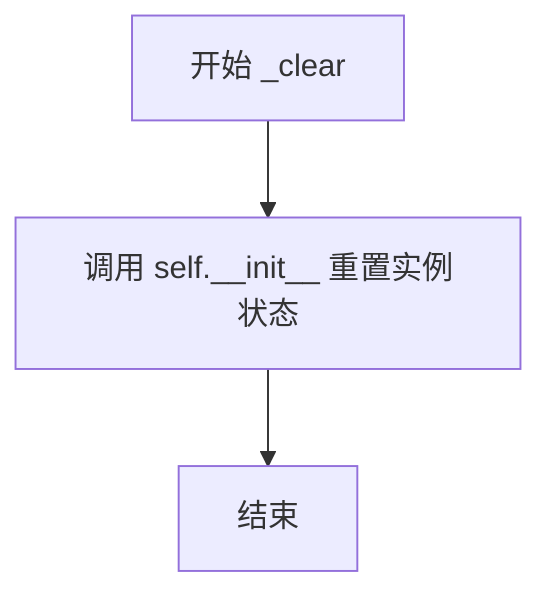

#### 带注释源码

```python
def _clear(self):
    # 清除所有动态添加的数据，仅用于测试目的。
    # 通过重新调用 __init__ 方法来重置实例的所有属性到初始状态
    # 包括：_loaded_entry_points、_backend_to_gui_framework、_name_to_module
    self.__init__()
```


### `BackendRegistry._ensure_entry_points_loaded`

该方法确保 Matplotlib 的后端入口点（entry points）仅在首次需要时被加载，避免不必要的启动开销。

参数：该方法无显式参数（仅包含 `self` 隐式参数）。

返回值：`None`（无返回值，该方法仅执行副作用操作）。

#### 流程图

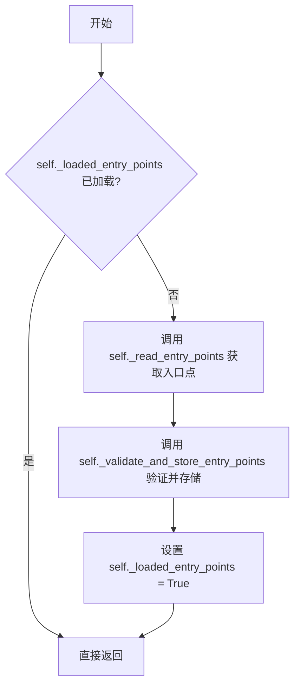

#### 带注释源码

```python
def _ensure_entry_points_loaded(self):
    """
    确保后端入口点已加载。

    这是一个惰性加载机制，仅在首次调用时加载入口点，
    避免在模块导入时产生不必要的开销。
    """
    # 检查入口点是否已经加载过，避免重复加载
    if not self._loaded_entry_points:
        # 从 Python 包元数据中读取 matplotlib.backend 组的入口点
        entries = self._read_entry_points()
        # 验证入口点的合法性并将其存储到内部数据结构中
        self._validate_and_store_entry_points(entries)
        # 标记入口点已加载，防止后续重复加载
        self._loaded_entry_points = True
```


### `BackendRegistry._get_gui_framework_by_loading`

该方法通过动态加载后端模块并读取其 FigureCanvas 类的 required_interactive_framework 属性来确定后端所需的 GUI 框架。如果模块没有指定交互式框架，则返回 "headless"。

参数：

-  `backend`：`str`，要查询 GUI 框架的后端名称

返回值：`str`，后端对应的 GUI 框架名称，如果为无头（headless）后端则返回 "headless"

#### 流程图

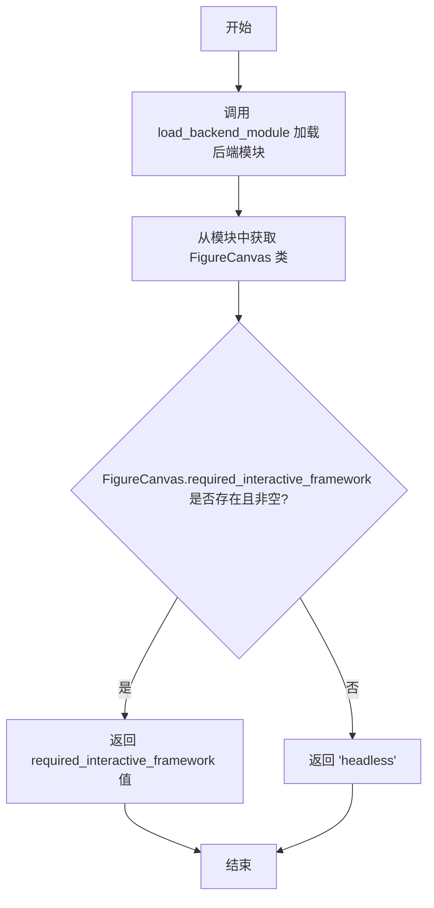

#### 带注释源码

```python
def _get_gui_framework_by_loading(self, backend):
    # Determine GUI framework for a backend by loading its module and reading the
    # FigureCanvas.required_interactive_framework attribute.
    # Returns "headless" if there is no GUI framework.
    
    # 加载后端模块
    module = self.load_backend_module(backend)
    
    # 从模块中获取 FigureCanvas 类
    canvas_class = module.FigureCanvas
    
    # 返回交互式框架属性值，如果为空则返回 "headless"
    return canvas_class.required_interactive_framework or "headless"
```


### `BackendRegistry._read_entry_points`

该方法负责读取通过Python包入口点（entry points）自注册的Matplotlib后端信息，并兼容处理旧版本的matplotlib-inline和ipympl包。

参数： 无显式参数（隐式接收self实例）

返回值：`list[tuple[str, str]]`，返回后端名称到模块路径的映射列表

#### 流程图

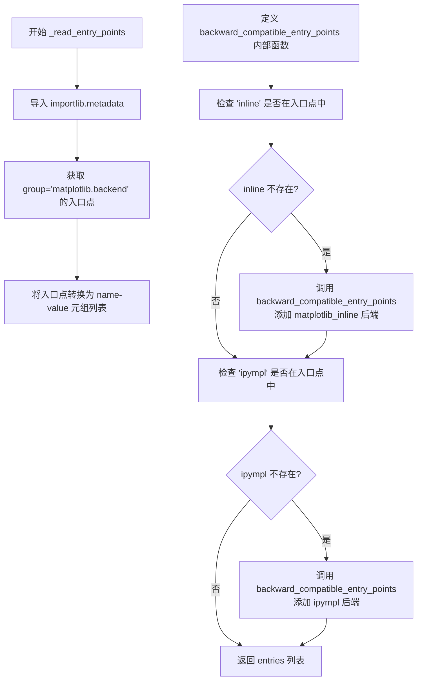

#### 带注释源码

```python
def _read_entry_points(self):
    # 读取通过入口点自声明为Matplotlib后端的模块信息
    # 期望的入口点格式（如matplotlib-inline在pyproject.toml中）:
    #   [project.entry-points."matplotlib.backend"]
    #   inline = "matplotlib_inline.backend_inline"
    import importlib.metadata as im

    # 获取matplotlib.backend组的入口点（由外部包自注册）
    entry_points = im.entry_points(group="matplotlib.backend")
    # 转换为 (name, value) 元组列表，name为后端名，value为模块路径
    entries = [(entry.name, entry.value) for entry in entry_points]

    # 为向后兼容：如果matplotlib-inline和/或ipympl已安装但版本过旧
    # 不包含入口点，则手动创建入口点
    # 注意：不直接导入ipympl，因为会触发matplotlib.use()调用
    def backward_compatible_entry_points(
            entries, module_name, threshold_version, names, target):
        """
        为旧版本包创建兼容的入口点
        
        参数:
            entries: 入口点列表（可变）
            module_name: 包名
            threshold_version: 最低版本要求元组
            names: 需要添加的后端名称列表
            target: 目标模块路径
        """
        from matplotlib import _parse_to_version_info
        try:
            # 获取已安装包的版本
            module_version = im.version(module_name)
            # 如果版本低于阈值，手动添加后端入口点
            if _parse_to_version_info(module_version) < threshold_version:
                for name in names:
                    entries.append((name, target))
        except im.PackageNotFoundError:
            # 包未安装时静默忽略
            pass

    # 提取当前入口点中的所有名称
    names = [entry[0] for entry in entries]
    
    # 检查并添加matplotlib_inline的向后兼容入口点
    if "inline" not in names:
        backward_compatible_entry_points(
            entries, "matplotlib_inline", (0, 1, 7), ["inline"],
            "matplotlib_inline.backend_inline")
            
    # 检查并添加ipympl的向后兼容入口点
    if "ipympl" not in names:
        backward_compatible_entry_points(
            entries, "ipympl", (0, 9, 4), ["ipympl", "widget"],
            "ipympl.backend_nbagg")

    # 返回完整的后端入口点列表
    return entries
```


### `BackendRegistry._validate_and_store_entry_points`

该方法负责验证并存储从外部包通过 entry points 注册的后端，确保后端名称符合规范（不能以 `module://` 开头、不能与内置后端重名、不能重复），验证通过后将其存储到内部映射表中以供后续使用。

参数：

- `entries`：`List[Tuple[str, str]]`，一个包含多个 (name, module) 元组的列表，其中 name 是后端名称，module 是后端模块路径

返回值：`None`，该方法直接修改实例状态，不返回任何值

#### 流程图

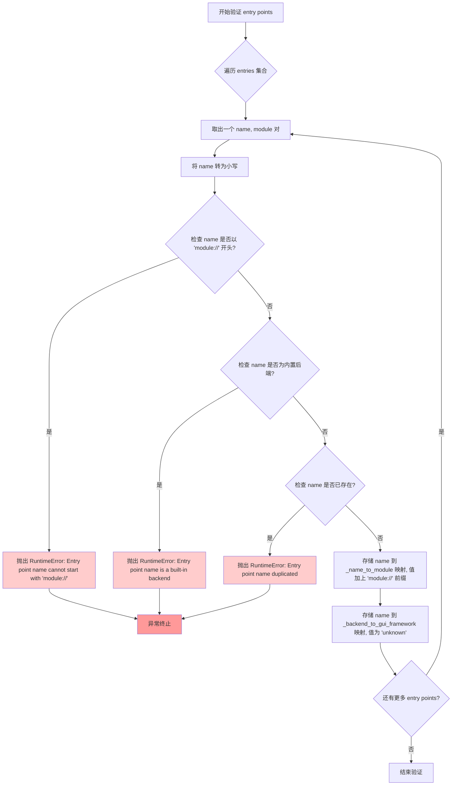

#### 带注释源码

```python
def _validate_and_store_entry_points(self, entries):
    """
    Validate and store entry points so that they can be used via matplotlib.use()
    in the normal manner. Entry point names cannot be of module:// format, cannot
    shadow a built-in backend name, and there cannot be multiple entry points
    with the same name but different modules. Multiple entry points with the same
    name and value are permitted (it can sometimes happen outside of our control,
    see https://github.com/matplotlib/matplotlib/issues/28367).
    
    Parameters
    ----------
    entries : List[Tuple[str, str]]
        A list of (name, module) tuples representing entry points where
        'name' is the backend name and 'module' is the full module path.
    """
    # 使用 set 去重，避免重复验证相同的 entry point
    # 这里允许相同 name 和 module 的重复条目，但不允许不同 module 的同名条目
    for name, module in set(entries):
        # 将名称转为小写以确保大小写不敏感
        name = name.lower()
        
        # 验证规则1: entry point 名称不能以 'module://' 开头
        # 这种格式是 matplotlib 内部用于动态加载后端的，不应通过 entry point 提供
        if name.startswith("module://"):
            raise RuntimeError(
                f"Entry point name '{name}' cannot start with 'module://'")
        
        # 验证规则2: entry point 名称不能与内置后端重名
        # 内置后端优先级更高，不能被外部 entry point 覆盖
        if name in self._BUILTIN_BACKEND_TO_GUI_FRAMEWORK:
            raise RuntimeError(f"Entry point name '{name}' is a built-in backend")
        
        # 验证规则3: 不能有多个不同模块的同名 entry point
        # 如果已经存在同名的 entry point，说明存在冲突
        if name in self._backend_to_gui_framework:
            raise RuntimeError(f"Entry point name '{name}' duplicated")
        
        # 验证通过，存储后端名称到模块名称的映射
        # 外部模块需要加上 'module://' 前缀以便统一处理
        self._name_to_module[name] = "module://" + module
        
        # 初始时 GUI framework 设为 "unknown"，表示尚未确定
        # 实际框架只在真正需要时才通过加载模块来确定（lazy loading）
        # 这样可以避免不必要的模块加载开销
        self._backend_to_gui_framework[name] = "unknown"
```


### `BackendRegistry.backend_for_gui_framework`

该方法根据给定的GUI框架名称（如"qt"、"gtk3"等）返回对应的首选后端名称，用于将用户指定的GUI框架解析为实际可用的后端模块。

参数：

- `framework`：`str`，GUI框架名称，例如 "qt"、"gtk3"、"tk" 等

返回值：`str or None`，返回后端名称（如 "qtagg"），如果GUI框架无法识别则返回 `None`

#### 流程图

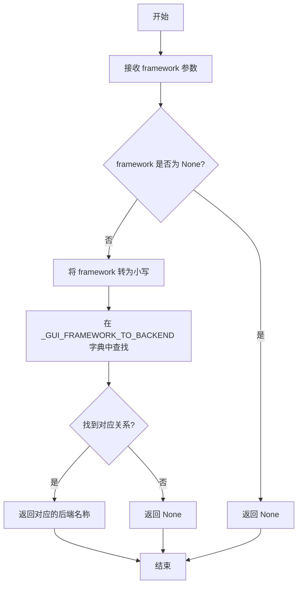

#### 带注释源码

```python
def backend_for_gui_framework(self, framework):
    """
    Return the name of the backend corresponding to the specified GUI framework.

    Parameters
    ----------
    framework : str
        GUI framework such as "qt".

    Returns
    -------
    str or None
        Backend name or None if GUI framework not recognised.
    """
    # 使用字典的 get 方法进行查找，传入 framework 的小写形式
    # _GUI_FRAMEWORK_TO_BACKEND 是一个类属性，映射 GUI 框架到首选后端
    # 如果未找到对应的 framework，get 方法会返回 None
    return self._GUI_FRAMEWORK_TO_BACKEND.get(framework.lower())
```


### `BackendRegistry.is_valid_backend`

该方法用于验证给定的后端名称是否有效。有效后端包括内置后端（Matplotlib源码中包含的）、通过入口点动态添加的后端，以及使用 `module://` 前缀的自定义模块路径。如果后端有效返回 `True`，否则返回 `False`。

参数：

-  `backend`：`str`，要验证的后端名称

返回值：`bool`，如果后端有效返回 `True`，否则返回 `False`

#### 流程图

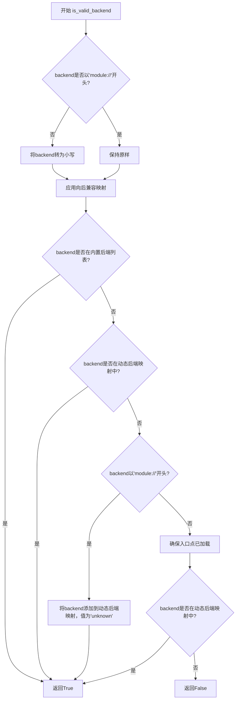

#### 带注释源码

```python
def is_valid_backend(self, backend):
    """
    Return True if the backend name is valid, False otherwise.

    A backend name is valid if it is one of the built-in backends or has been
    dynamically added via an entry point. Those beginning with ``module://`` are
    always considered valid and are added to the current list of all backends
    within this function.

    Even if a name is valid, it may not be importable or usable. This can only be
    determined by loading and using the backend module.

    Parameters
    ----------
    backend : str
        Name of backend.

    Returns
    -------
    bool
        True if backend is valid, False otherwise.
    """
    # 如果不是module://前缀，则转为小写进行统一处理
    if not backend.startswith("module://"):
        backend = backend.lower()

    # 对于向后兼容性，将ipympl和matplotlib-inline的长模块名转换为短形式
    # 例如: module://ipympl.backend_nbagg -> widget
    backwards_compat = {
        "module://ipympl.backend_nbagg": "widget",
        "module://matplotlib_inline.backend_inline": "inline",
    }
    backend = backwards_compat.get(backend, backend)

    # 检查是否在内置后端列表或动态添加的后端列表中
    if (backend in self._BUILTIN_BACKEND_TO_GUI_FRAMEWORK or
            backend in self._backend_to_gui_framework):
        return True

    # 如果是module://开头的自定义模块，视为有效并添加到动态后端映射
    if backend.startswith("module://"):
        self._backend_to_gui_framework[backend] = "unknown"
        return True

    # 只有在真正需要时且尚未加载时才加载入口点
    self._ensure_entry_points_loaded()
    # 再次检查是否在动态后端映射中（可能由入口点添加）
    if backend in self._backend_to_gui_framework:
        return True

    # 所有检查都未通过，返回False
    return False
```


### `BackendRegistry.list_all`

返回所有已知后端的名称列表，包括内置后端以及通过入口点或 `module://some.backend` 语法在运行时添加的后端。如果入口点尚未加载，此方法会先加载它们。

参数：
- （无参数，仅包含 self）

返回值：`list of str`，返回所有已知后端的名称列表。

#### 流程图

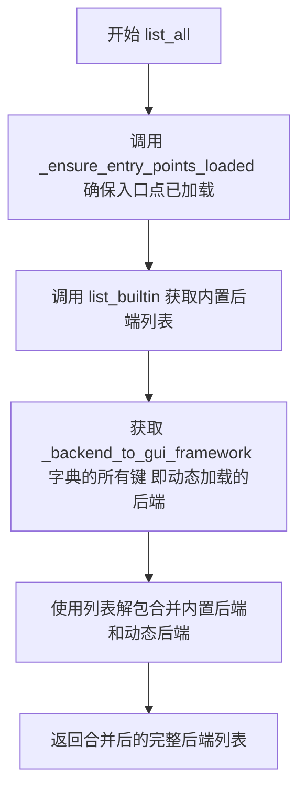

#### 带注释源码

```python
def list_all(self):
    """
    Return list of all known backends.

    These include built-in backends and those obtained at runtime either from entry
    points or explicit ``module://some.backend`` syntax.

    Entry points will be loaded if they haven't been already.

    Returns
    -------
    list of str
        Backend names.
    """
    # 确保入口点已加载，如果尚未加载则进行加载
    # 入口点包含第三方包提供的后端
    self._ensure_entry_points_loaded()
    
    # 使用列表解包合并两个可迭代对象：
    # 1. self.list_builtin() - 返回所有内置后端的列表
    # 2. self._backend_to_gui_framework - 字典的键即为动态添加的后端名称
    # 返回结果为包含所有后端的列表
    return [*self.list_builtin(), *self._backend_to_gui_framework]
```


### `BackendRegistry.list_builtin`

该方法用于返回内置在 Matplotlib 中的后端名称列表，支持可选的过滤器参数以筛选交互式或非交互式后端。

参数：

- `filter_`：`BackendFilter`，可选参数，用于过滤返回的后端类型（例如 `.BackendFilter.NON_INTERACTIVE` 只返回无头后端）

返回值：`list of str`，返回后端名称列表

#### 流程图

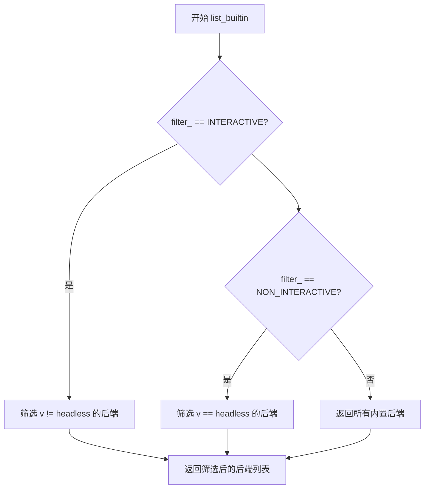

#### 带注释源码

```python
def list_builtin(self, filter_=None):
    """
    Return list of backends that are built into Matplotlib.

    Parameters
    ----------
    filter_ : `~.BackendFilter`, optional
        Filter to apply to returned backends. For example, to return only
        non-interactive backends use `.BackendFilter.NON_INTERACTIVE`.

    Returns
    -------
    list of str
        Backend names.
    """
    # 如果指定了交互式过滤器，则返回非 headless（即有 GUI 框架）的后端
    if filter_ == BackendFilter.INTERACTIVE:
        return [k for k, v in self._BUILTIN_BACKEND_TO_GUI_FRAMEWORK.items()
                if v != "headless"]
    # 如果指定了非交互式过滤器，则返回 headless（无 GUI 框架）的后端
    elif filter_ == BackendFilter.NON_INTERACTIVE:
        return [k for k, v in self._BUILTIN_BACKEND_TO_GUI_FRAMEWORK.items()
                if v == "headless"]

    # 未指定过滤器时，返回所有内置后端
    return [*self._BUILTIN_BACKEND_TO_GUI_FRAMEWORK]
```


### `BackendRegistry.list_gui_frameworks`

该方法用于返回 Matplotlib 后端所使用的 GUI 框架列表，排除 "headless"（无头）类型的框架。

参数： 无

返回值：`list of str`，GUI 框架名称列表

#### 流程图

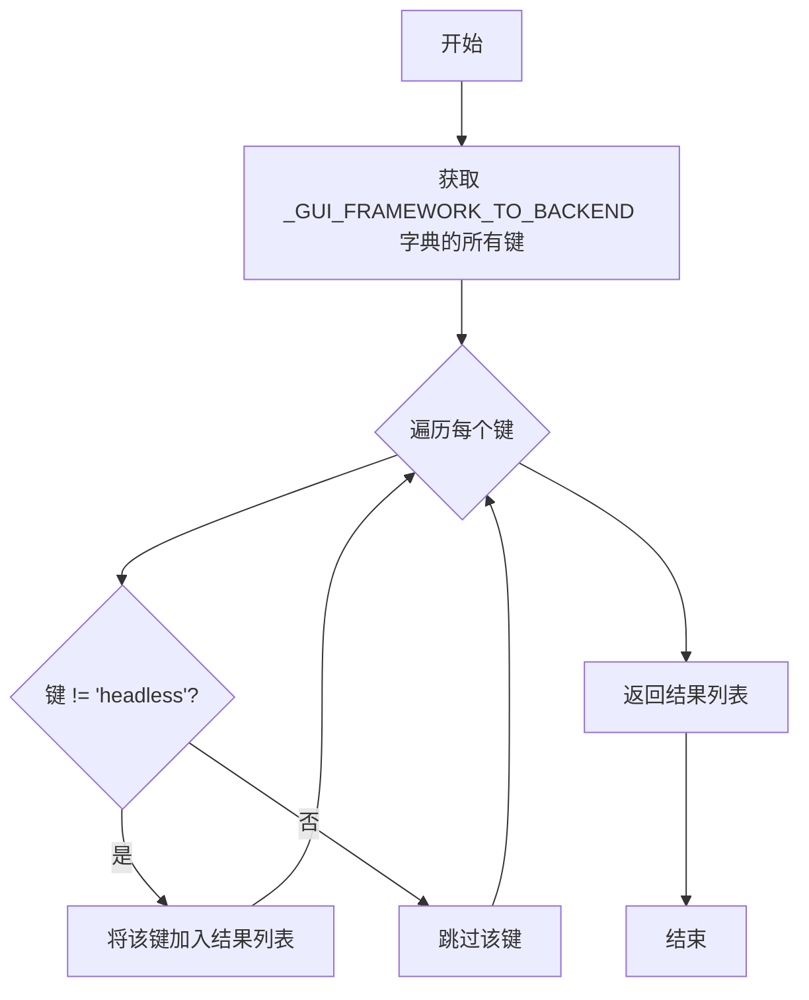

#### 带注释源码

```python
def list_gui_frameworks(self):
    """
    Return list of GUI frameworks used by Matplotlib backends.
    该方法返回 Matplotlib 后端所使用的 GUI 框架列表。

    Returns
    -------
    list of str
        GUI framework names.
        返回值：字符串列表，包含非 headless 的 GUI 框架名称
    """
    # 从 _GUI_FRAMEWORK_TO_BACKEND 字典中获取所有键
    # 过滤掉 'headless' 键，只保留交互式 GUI 框架
    # _GUI_FRAMEWORK_TO_BACKEND 映射了 GUI 框架到其首选内置后端
    return [k for k in self._GUI_FRAMEWORK_TO_BACKEND if k != "headless"]
    # 例如：['gtk3', 'gtk4', 'macosx', 'qt', 'qt5', 'qt6', 'tk', 'wx']
```


### `BackendRegistry.load_backend_module`

该方法用于加载并返回包含指定后端的 Python 模块。它通过将后端名称转换为模块名称，然后使用 `importlib.import_module` 动态导入并返回对应的模块对象。

参数：

- `backend`：`str`，要加载的后端名称

返回值：`Module`，包含后端代码的 Python 模块对象

#### 流程图

```mermaid
flowchart TD
    A[开始 load_backend_module] --> B[接收 backend 参数]
    B --> C[调用 _backend_module_name 方法]
    C --> D{判断后端类型}
    D -->|module:// 前缀| E[提取模块路径]
    D -->|内置后端| F[构建模块路径: matplotlib.backends.backend_{name}]
    D -->|自定义映射| G[从 _name_to_module 获取映射]
    E --> H[使用 importlib.import_module 加载模块]
    F --> H
    G --> H
    H --> I[返回加载的模块对象]
```

#### 带注释源码

```python
def load_backend_module(self, backend):
    """
    Load and return the module containing the specified backend.

    Parameters
    ----------
    backend : str
        Name of backend to load.

    Returns
    -------
    Module
        Module containing backend.
    """
    # 调用内部方法 _backend_module_name 将后端名称转换为完整的模块路径字符串
    # 例如: 'qt' -> 'matplotlib.backends.backend_qt'
    #       'module://some.backend' -> 'some.backend'
    module_name = self._backend_module_name(backend)
    
    # 使用 Python 标准库的 importlib 模块动态导入并返回指定的模块对象
    # 这会执行模块的顶层代码，完成模块的初始化过程
    return importlib.import_module(module_name)
```


### `BackendRegistry.resolve_backend`

该方法根据提供的后端名称返回对应的后端名称和GUI框架。如果GUI框架未知，则通过加载后端模块并检查`FigureCanvas.required_interactive_framework`属性来确定。仅在需要时加载入口点。

参数：
- `backend`：`str or None`，后端名称，传入None时使用默认后端

返回值：`tuple[str, str or None]`，返回包含后端名称和GUI框架的元组，其中GUI框架对于非交互式后端返回None

#### 流程图

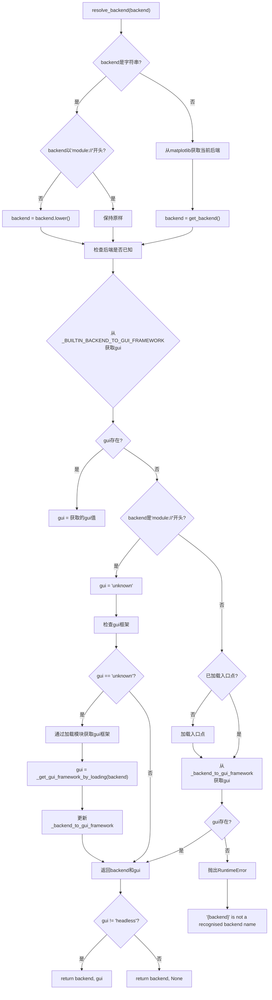

#### 带注释源码

```python
def resolve_backend(self, backend):
    """
    Return the backend and GUI framework for the specified backend name.

    If the GUI framework is not yet known then it will be determined by loading the
    backend module and checking the ``FigureCanvas.required_interactive_framework``
    attribute.

    This function only loads entry points if they have not already been loaded and
    the backend is not built-in and not of ``module://some.backend`` format.

    Parameters
    ----------
    backend : str or None
        Name of backend, or None to use the default backend.

    Returns
    -------
    backend : str
        The backend name.
    framework : str or None
        The GUI framework, which will be None for a backend that is non-interactive.
    """
    # 如果backend是字符串，处理其格式
    if isinstance(backend, str):
        # 如果不是module://协议开头，转换为小写
        if not backend.startswith("module://"):
            backend = backend.lower()
    else:  # 可能是_auto_backend_sentinel或None
        # 使用当前正在运行的后端
        from matplotlib import get_backend
        backend = get_backend()

    # 检查后端是否已经known(built-in或动态加载的)
    gui = (self._BUILTIN_BACKEND_TO_GUI_FRAMEWORK.get(backend) or
           self._backend_to_gui_framework.get(backend))

    # 后端是否是"module://something"?
    if gui is None and isinstance(backend, str) and backend.startswith("module://"):
        gui = "unknown"

    # 后端是否是可能的入口点?
    if gui is None and not self._loaded_entry_points:
        self._ensure_entry_points_loaded()
        gui = self._backend_to_gui_framework.get(backend)

    # 后端已知但不知道其gui框架
    if gui == "unknown":
        gui = self._get_gui_framework_by_loading(backend)
        self._backend_to_gui_framework[backend] = gui

    # 如果gui仍然为None，说明不是合法的后端名称
    if gui is None:
        raise RuntimeError(f"'{backend}' is not a recognised backend name")

    # 返回后端名称和gui框架，对于headless后端返回None
    return backend, gui if gui != "headless" else None
```


### `BackendRegistry.resolve_gui_or_backend`

该方法用于解析可能表示 GUI 框架或后端名称的字符串，返回对应的后端名称和 GUI 框架。首先检查输入是否为 GUI 框架名称，如果是则返回对应的首选后端；否则尝试将其解析为后端名称。主要用于 IPython 的 %matplotlib 魔法命令，支持如 `%matplotlib qt`（GUI 框架）或 `%matplotlib qtagg`（后端名称）两种形式。

参数：

- `gui_or_backend`：`str` 或 `None`，GUI 框架或后端的名称，None 时使用默认后端

返回值：`(str, str | None)` 元组，其中第一个元素是后端名称，第二个元素是 GUI 框架（非交互式后端返回 None）

#### 流程图

```mermaid
flowchart TD
    A[开始 resolve_gui_or_backend] --> B{gui_or_backend 是否以 'module://' 开头?}
    B -->|否| C[将 gui_or_backend 转为小写]
    B -->|是| D[保持原样]
    C --> E[调用 backend_for_gui_framework 查询]
    D --> E
    E --> F{是否返回了后端名称?}
    F -->|是| G[返回 (backend, framework) 元组]
    F -->|否| H[调用 resolve_backend 解析]
    H --> I{是否抛出异常?}
    I -->|否| J[返回 resolve_backend 的结果]
    I -->|是| K[抛出 RuntimeError]
    G --> Z[结束]
    J --> Z
    K --> Z
```

#### 带注释源码

```python
def resolve_gui_or_backend(self, gui_or_backend):
    """
    Return the backend and GUI framework for the specified string that may be
    either a GUI framework or a backend name, tested in that order.

    This is for use with the IPython %matplotlib magic command which may be a GUI
    framework such as ``%matplotlib qt`` or a backend name such as
    ``%matplotlib qtagg``.

    This function only loads entry points if they have not already been loaded and
    the backend is not built-in and not of ``module://some.backend`` format.

    Parameters
    ----------
    gui_or_backend : str or None
        Name of GUI framework or backend, or None to use the default backend.

    Returns
    -------
    backend : str
        The backend name.
    framework : str or None
        The GUI framework, which will be None for a backend that is non-interactive.
    """
    # 如果不是 module:// 格式，则转换为小写进行统一处理
    if not gui_or_backend.startswith("module://"):
        gui_or_backend = gui_or_backend.lower()

    # 首先检查它是否是一个 GUI 框架名称（如 'qt', 'gtk3' 等）
    # backend_for_gui_framework 会返回对应的首选后端名称
    backend = self.backend_for_gui_framework(gui_or_backend)
    if backend is not None:
        # 如果是 GUI 框架，返回对应的后端和框架本身
        # headless 框架返回 None 表示无 GUI
        return backend, gui_or_backend if gui_or_backend != "headless" else None

    # 然后检查它是否是一个后端名称
    # 调用 resolve_backend 进行完整解析，可能涉及加载模块和入口点
    try:
        return self.resolve_backend(gui_or_backend)
    except Exception:  # KeyError ?
        # 如果既不是 GUI 框架也不是有效后端，抛出运行时错误
        raise RuntimeError(
            f"'{gui_or_backend}' is not a recognised GUI loop or backend name")
```

## 关键组件


### BackendFilter 枚举

用于过滤后端类型的枚举类，支持按交互性筛选后端（交互式/非交互式）

### BackendRegistry 核心类

Matplotlib后端注册表的核心类，负责管理所有可用的绘图后端，包括内置后端、entry points后端和module://语法后端

### _BUILTIN_BACKEND_TO_GUI_FRAMEWORK 内置后端映射

内置后端名称到GUI框架的静态映射表，包含25个内置后端及其对应的GUI框架（gtk3、gtk4、qt、tk、wx等）

### _GUI_FRAMEWORK_TO_BACKEND GUI框架反向映射

GUI框架到首选内置后端的反向映射，用于根据GUI框架名称快速查找对应的后端

### 动态后端加载机制

通过entry points和"module://some.backend"语法动态添加后端的机制，支持延迟加载外部包提供的后端

### _ensure_entry_points_loaded 惰性加载

延迟加载entry points的实现，仅在首次需要时才加载外部后端 entry points，优化启动性能

### is_valid_backend 后端验证

验证后端名称是否有效的逻辑，检查内置后端、动态添加的后端及module://格式的后端

### resolve_backend 后端解析

解析后端名称并返回后端名称和GUI框架的完整逻辑，包含动态确定未知GUI框架的机制

### resolve_gui_or_backend GUI/后端统一解析

支持同时接受GUI框架名称或后端名称的统一解析接口，用于IPython %matplotlib魔法命令

### load_backend_module 模块加载

动态加载后端模块的核心方法，将后端名称转换为模块路径并使用importlib加载

### _get_gui_framework_by_loading 运行时GUI框架检测

通过加载后端模块并检查FigureCanvas.required_interactive_framework属性来动态确定GUI框架

### backward_compatibility 向后兼容处理

对matplotlib-inline和ipympl旧版本的兼容处理，自动为未注册entry points的旧版本创建兼容入口


## 问题及建议


### 已知问题

-   **`_clear` 方法直接调用 `__init__`**：在 `_clear` 方法中直接调用 `self.__init__()` 不是最佳实践。如果未来 `__init__` 中添加了不希望在清理时执行的逻辑（如副作用），可能导致问题。应该将初始化逻辑提取到单独的方法中。
-   **`resolve_gui_or_backend` 捕获通用异常**：该方法中使用 `except Exception` 而非更具体的 `KeyError`，这会隐藏可能的意外错误，降低了错误可诊断性。
-   **向后兼容映射分散且重复**：`backwards_compat` 字典在 `is_valid_backend` 中存在，同时 `_read_entry_points` 中也有针对 `matplotlib_inline` 和 `ipympl` 的向后兼容处理，逻辑分散且容易不同步。
-   **`_backend_module_name` 方法的逻辑冗余**：该方法中先检查 `backend.startswith("module://")` 并返回，但在后面又再次检查 `backend[9:]` 并使用 `backend.startswith("module://")`，逻辑可以简化。
-   **缺少对 `gui_or_backend` 参数的空值检查**：在 `resolve_gui_or_backend` 方法中，如果传入 `None` 或空字符串，代码可能抛出 `AttributeError` 而非给出清晰的错误提示。
-   **硬编码的 GUI 框架映射**：`_GUI_FRAMEWORK_TO_BACKEND` 不包含 "nbagg" 框架对应的后端，但代码中存在 "nbagg" 后端，可能导致某些场景下框架解析失败。

### 优化建议

-   **重构初始化逻辑**：将 `__init__` 中的属性初始化提取到 `_init_attributes` 或类似方法中，让 `_clear` 调用该方法，提高代码可维护性。
-   **统一向后兼容处理**：将所有向后兼容的名称映射集中管理，避免在不同方法中重复定义导致不一致。
-   **改进错误处理**：将 `except Exception` 改为 `except KeyError`，并为 `gui_or_backend` 参数添加显式的空值检查，提供更友好的错误信息。
-   **简化 `_backend_module_name` 逻辑**：消除重复的 `module://` 前缀检查逻辑，简化代码复杂度。
-   **添加 GUI 框架 "nbagg" 映射**：在 `_GUI_FRAMEWORK_TO_BACKEND` 中添加 `"nbagg": "nbagg"` 或 `"notebook": "nbagg"`，确保框架解析的完整性。
-   **考虑延迟导入**：在 `_read_entry_points` 中对 `importlib.metadata` 的导入可以延迟到真正需要时才执行，减少模块加载时间。


## 其它


### 设计目标与约束

设计目标：建立 Matplotlib 后端的单一可信源，支持内置后端、module:// 语法后端和外部 entry points 后端三种来源，提供后端查询、验证、加载和 GUI 框架解析的完整能力。约束条件包括：单例模式确保全局唯一实例、entry points 延迟加载以优化启动性能、后端名称大小写不敏感、向后兼容 matplotlib-inline 和 ipympl 旧版本。

### 错误处理与异常设计

RuntimeError 用于处理以下场景：entry point 名称以 "module://" 开头、entry point 名称与内置后端冲突、entry point 名称重复、无法识别的后端名称、无法识别的 GUI loop 或后端名称。importlib.metadata.PackageNotFoundError 被捕获用于向后兼容旧版本包的判断。所有异常均携带描述性错误信息，便于定位问题。

### 数据流与状态机

后端解析流程：输入后端名称 → 检查是否为 module:// 格式 → 检查内置后端映射 → 检查动态加载后端映射 → 尝试加载 entry points → 解析 GUI 框架。状态转换：初始状态（未加载 entry points）→ 缓存命中状态（后端已存在于映射中）→ 延迟加载状态（首次访问时加载 entry points）→ 框架确定状态（通过加载模块确定 GUI 框架）。

### 外部依赖与接口契约

外部依赖：importlib 用于动态加载后端模块、importlib.metadata 用于读取 entry points、matplotlib._parse_to_version_info 用于版本比较。接口契约：resolve_backend() 返回 (backend_name, framework_or_none) 元组、is_valid_backend() 仅验证名称有效性不保证可导入、load_backend_module() 返回的模块需包含 FigureCanvas 类。

### 线程安全性

代码中无显式线程同步机制。_ensure_entry_points_loaded() 方法在多线程场景下可能存在竞态条件：两个线程同时检查 _loaded_entry_points 标志可能触发重复加载。建议在多线程环境下添加锁保护或使用线程安全的初始化模式。

### 性能考虑

Entry points 采用延迟加载策略，仅在首次需要时加载。内置后端映射使用字典实现 O(1) 查询。向后兼容映射使用 get() 方法避免修改原字典。resolve_backend() 方法中多个 get() 调用存在优化空间，可合并查询逻辑。

### 序列化与持久化

当前设计不支持序列化。_backend_to_gui_framework 和 _name_to_module 字典在运行时动态构建，若需支持序列化需考虑排除 "unknown" 状态的条目或实现自定义序列化逻辑。_clear() 方法仅用于测试目的。

### 版本兼容性

代码标记为 versionadded:: 3.9。向后兼容处理包括：matplotlib-inline 版本 < (0,1,7) 时手动添加 entry point、ipympl 版本 < (0,9,4) 时手动添加 entry point、ipympl 和 matplotlib-inline 的长模块名到短名称的映射转换。

### 安全性考虑

未发现明显安全漏洞。entry point 验证检查名称格式（禁止 module:// 前缀）和名称冲突。module:// 语法允许加载任意模块，理论上存在风险但这是设计预期行为。entry point 值直接作为模块名拼接，未做路径遍历检查。

    