# `matplotlib\lib\matplotlib\backends\registry.pyi` 详细设计文档

这是一个GUI后端注册表系统，通过BackendRegistry类管理和映射各种GUI后端（如PyQt5、Tkinter等）与其对应的GUI框架之间的关系，提供后端验证、模块加载、动态解析和列表查询等功能，支持交互式和非交互式后端过滤。

## 整体流程

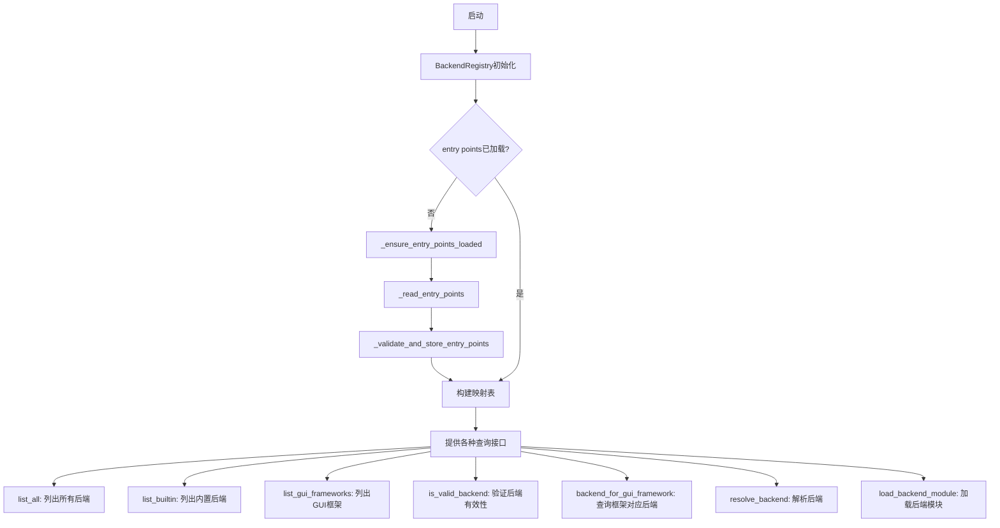

## 类结构

```
BackendFilter (Enum)
└── BackendRegistry (Class)
    └── 全局变量: backend_registry
```

## 全局变量及字段


### `backend_registry`
    
全局BackendRegistry单例实例，用于管理GUI后端的注册、发现和加载

类型：`BackendRegistry`
    


### `BackendFilter.INTERACTIVE`
    
交互式后端过滤器枚举值，表示需要用户交互的后端类型

类型：`BackendFilter`
    


### `BackendFilter.NON_INTERACTIVE`
    
非交互式后端过滤器枚举值，表示无需用户交互的后端类型

类型：`BackendFilter`
    


### `BackendRegistry._BUILTIN_BACKEND_TO_GUI_FRAMEWORK`
    
内置后端到GUI框架的映射字典，存储预定义的后端名称与GUI框架的对应关系

类型：`dict[str, str]`
    


### `BackendRegistry._GUI_FRAMEWORK_TO_BACKEND`
    
GUI框架到后端的反向映射字典，用于根据GUI框架快速查找对应的后端

类型：`dict[str, str]`
    


### `BackendRegistry._loaded_entry_points`
    
entry points是否已加载的标志，避免重复加载提升性能

类型：`bool`
    


### `BackendRegistry._backend_to_gui_framework`
    
运行时后端到GUI框架的映射字典，动态记录已发现和加载的后端与GUI框架的对应关系

类型：`dict[str, str]`
    


### `BackendRegistry._name_to_module`
    
后端名称到模块名的映射字典，用于按需动态导入后端模块

类型：`dict[str, str]`
    
    

## 全局函数及方法


### `BackendRegistry._backend_module_name`

该方法根据传入的 backend 名称解析并返回对应的后端模块名称字符串，是 BackendRegistry 类中用于将后端标识符转换为实际模块路径的关键方法。

参数：

- `backend`：`str`，传入的后端名称标识符

返回值：`str`，返回解析后的后端模块名称字符串

#### 流程图

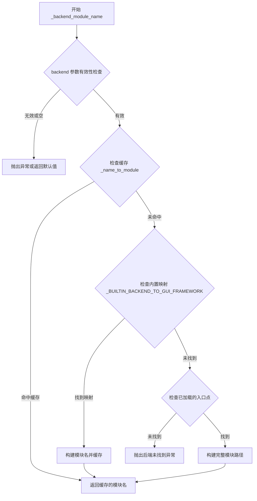

#### 带注释源码

```python
def _backend_module_name(self, backend: str) -> str:
    """
    根据给定的后端名称获取对应的模块名称。
    
    该方法首先检查内部缓存中是否已存在该后端对应的模块名，
    如果没有则根据内置映射表或已加载的入口点来构建模块名。
    
    参数:
        backend: str - 后端标识符名称，如 'matplotlib', 'pyqt' 等
        
    返回:
        str - 解析后的完整模块名称，用于动态导入
    """
    # 注意: 此处为方法签名声明，使用 ... 表示方法实现未在此处给出
    # 实际实现需要访问类变量: _name_to_module, _BUILTIN_BACKEND_TO_GUI_FRAMEWORK 等
    ...
```


### `BackendRegistry._clear`

该方法用于清空后端注册表中已加载的缓存数据，包括后端到GUI框架的映射缓存和已加载入口点标志，使注册表重置为初始状态。

参数：

- `self`：`BackendRegistry`，隐式参数，表示当前类的实例

返回值：`None`，无返回值描述

#### 流程图

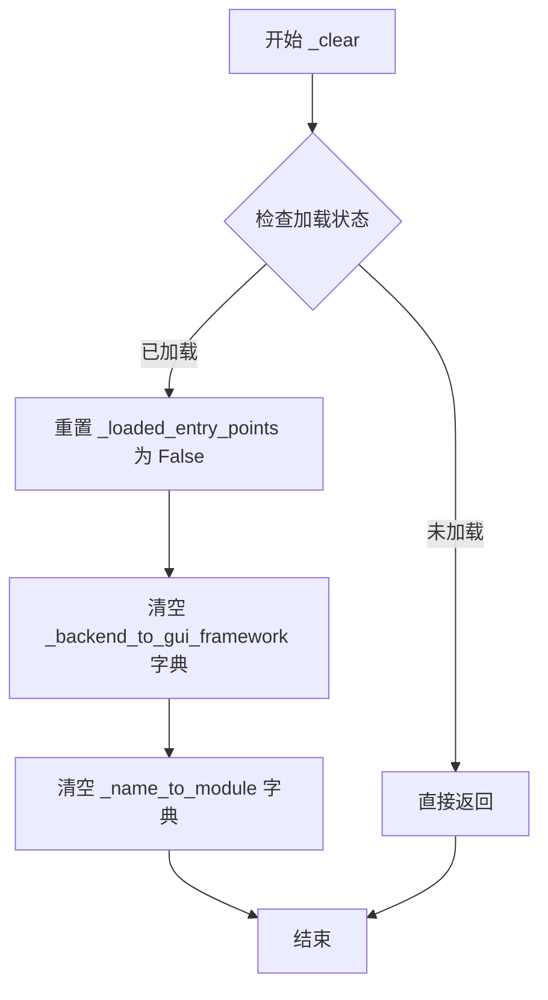

#### 带注释源码

```
def _clear(self) -> None:
    """
    清空后端注册表的缓存数据。
    
    该方法执行以下操作：
    1. 将 _loaded_entry_points 标志重置为 False，表示需要重新加载入口点
    2. 清空 _backend_to_gui_framework 字典，移除所有缓存的后端到GUI框架映射
    3. 清空 _name_to_module 字典，移除所有缓存的模块名称
    
    通常在需要强制刷新后端注册信息或重置注册表状态时调用。
    """
    # 重置入口点加载标志，标记为未加载状态
    # 这样下次访问时会重新加载入口点信息
    self._loaded_entry_points = False
    
    # 清空后端到GUI框架的映射缓存
    # 这会移除所有之前解析和缓存的后端-框架对应关系
    self._backend_to_gui_framework.clear()
    
    # 清空名称到模块的映射缓存
    # 这会移除所有之前加载和缓存的后端模块名称映射
    self._name_to_module.clear()
```


### `BackendRegistry._ensure_entry_points_loaded`

该方法负责确保后端的入口点（entry points）已被加载，通常采用懒加载模式，仅在首次需要时从配置或插件系统中读取并缓存入口点信息，避免重复加载操作。

参数：无需额外参数（self 为实例本身）

返回值：`None`，无返回值

#### 流程图

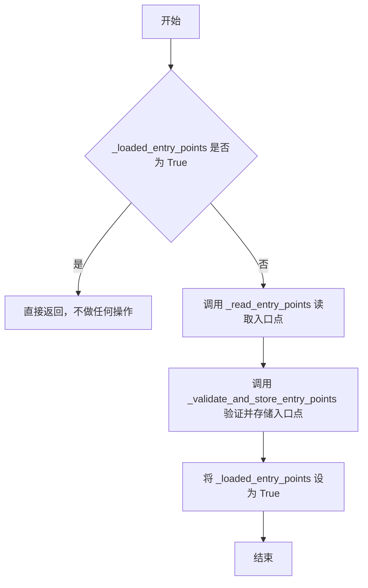

#### 带注释源码

```python
def _ensure_entry_points_loaded(self) -> None:
    """
    确保后端的入口点已被加载。
    
    这是一个懒加载方法，只有在首次调用时才会读取入口点信息，
    之后再次调用时直接返回，避免重复的 I/O 操作和解析开销。
    """
    # 检查入口点是否已经加载过
    if self._loaded_entry_points:
        # 已加载则直接返回，避免重复加载
        return
    
    # 读取入口点（从配置文件、插件系统或其他来源）
    entries = self._read_entry_points()
    
    # 验证并存储入口点到内部数据结构中
    self._validate_and_store_entry_points(entries)
    
    # 标记入口点已加载，防止后续重复加载
    self._loaded_entry_points = True
```


### `BackendRegistry._get_gui_framework_by_loading`

该方法通过动态加载后端模块来获取其对应的 GUI 框架名称。首先检查内存缓存（如 `_backend_to_gui_framework`）中是否存在已映射的框架，若无则加载后端模块并从模块属性中提取 GUI 框架信息，最后更新缓存并返回结果。

参数：
- `backend`：`str`，需要获取对应 GUI 框架的后端名称。

返回值：`str`，后端模块所支持的 GUI 框架名称。如果无法确定，则返回空字符串或抛出异常。

#### 流程图

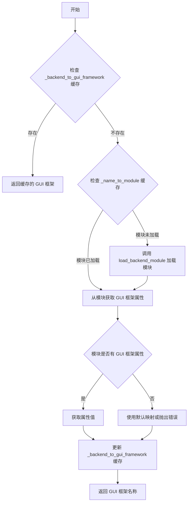

#### 带注释源码

```python
def _get_gui_framework_by_loading(self, backend: str) -> str:
    """
    通过加载后端模块来获取其对应的 GUI 框架。
    
    参数:
        backend: str，后端名称。
        
    返回:
        str，对应的 GUI 框架名称。
    """
    # 步骤1：检查缓存中是否已有映射
    if backend in self._backend_to_gui_framework:
        return self._backend_to_gui_framework[backend]
    
    # 步骤2：尝试从已加载模块中获取
    if backend in self._name_to_module:
        module = self._name_to_module[backend]
        # 假设模块有 __gui_framework__ 属性
        gui_framework = getattr(module, '__gui_framework__', None)
        if gui_framework:
            self._backend_to_gui_framework[backend] = gui_framework
            return gui_framework
    
    # 步骤3：加载后端模块（如果尚未加载）
    try:
        module = self.load_backend_module(backend)
    except ImportError:
        # 如果加载失败，返回空字符串或抛出异常
        return ""
    
    # 步骤4：从模块中获取 GUI 框架属性
    gui_framework = getattr(module, '__gui_framework__', None)
    if not gui_framework:
        # 如果模块没有定义 GUI 框架，可能需要从内置映射中查找
        gui_framework = self._BUILTIN_BACKEND_TO_GUI_FRAMEWORK.get(backend, "")
    
    # 步骤5：更新缓存并返回
    self._backend_to_gui_framework[backend] = gui_framework
    return gui_framework
```


### `BackendRegistry._read_entry_points`

该方法用于读取已安装包中的入口点（entry points），通常用于发现可用的后端插件。它从 Python 包的入口点元数据中检索后端相关的入口点，并返回由后端名称和模块路径组成的元组列表。

参数：无（仅隐含 `self` 参数）

返回值：`list[tuple[str, str]]`，返回后端名称与模块路径组成的元组列表，例如 `[("backend_name", "module.path"), ...]`

#### 流程图

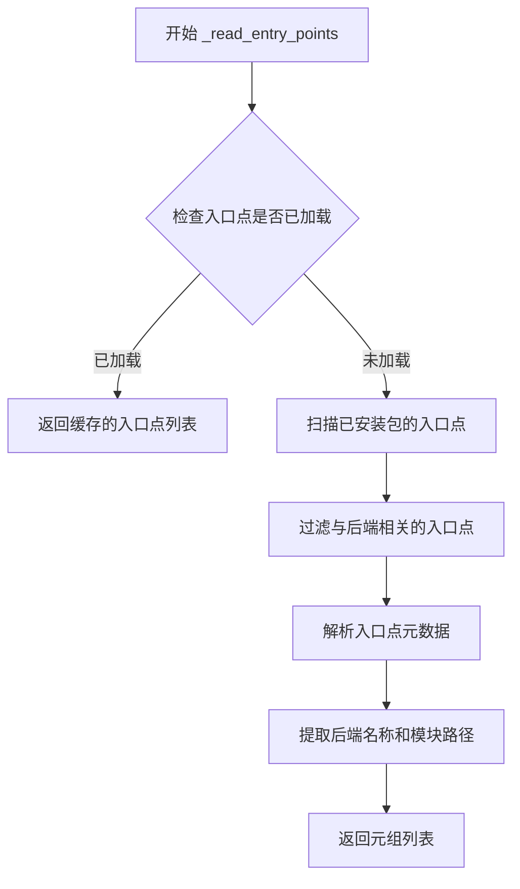

#### 带注释源码

```python
def _read_entry_points(self) -> list[tuple[str, str]]:
    """
    读取已安装包中的入口点，提取后端相关的入口点信息。
    
    入口点是 Python 打包系统中的一种机制，允许包暴露可发现的功能。
    此方法通常用于插件系统，以动态发现可用的后端实现。
    
    Returns:
        list[tuple[str, str]]: 后端名称与模块路径的元组列表
              - 第一个元素 str: 后端的标识名称
              - 第二个元素 str: 后端模块的完整导入路径
    """
    ...  # 方法实现未在此代码片段中提供
```


### `BackendRegistry._validate_and_store_entry_points`

该方法用于验证并存储入口点数据，将输入的后端名称与GUI框架的映射关系进行有效性校验，并将其保存到内部字典中，以供后续查询和使用。

参数：
- `entries`：`list[tuple[str, str]]`，表示后端名称与GUI框架的键值对列表，每个元组包含后端名称（backend）和对应的GUI框架名称（gui_framework）。

返回值：`None`，该方法不返回任何值，仅通过修改实例状态来存储数据。

#### 流程图

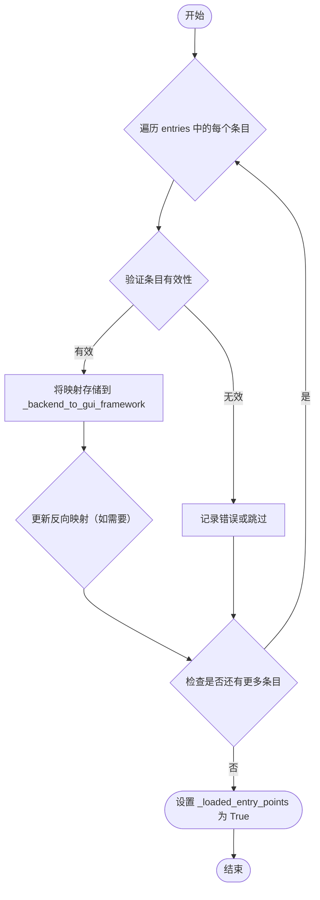

#### 带注释源码

```
def _validate_and_store_entry_points(self, entries: list[tuple[str, str]]) -> None:
    """
    验证并存储入口点数据。
    
    参数:
        entries: 后端名称与GUI框架的映射列表，每个元素为 (backend, gui_framework) 的元组。
    
    返回:
        None。
    
    说明:
        该方法遍历 entries，对每个条目进行有效性检查（例如后端名称是否合法、GUI框架是否支持等），
        并将有效的映射存储到实例变量 _backend_to_gui_framework 中。
        同时，可能根据需要更新相关的反向映射或其他内部数据结构。
    """
    # 遍历每个入口点条目，其中 entries 是 [(backend, gui_framework), ...] 的列表
    for backend, gui_framework in entries:
        # 验证后端名称是否有效（例如非空、符合命名规范、不重复等）
        # 此处可调用内部方法或进行简单检查
        if not backend or not isinstance(backend, str):
            # 如果无效，记录错误并跳过当前条目
            # 实际实现中可使用日志记录
            continue
        
        # 验证 GUI 框架是否有效（例如是否在支持列表中）
        # 此处可检查 gui_framework 是否为已知框架
        if not gui_framework or not isinstance(gui_framework, str):
            # 如果无效，记录错误并跳过
            continue
        
        # 如果验证通过，将后端到 GUI 框架的映射存储到字典中
        # _backend_to_gui_framework 是一个 dict[str, str] 类型的实例变量
        self._backend_to_gui_framework[backend] = gui_framework
        
        # 可选：同时更新反向映射（GUI 框架到后端），如果类中有此变量
        # 例如：self._gui_framework_to_backend[gui_framework] = backend
    
    # 标记入口点已加载，避免重复加载
    self._loaded_entry_points = True
```


### `BackendRegistry.backend_for_gui_framework`

根据给定的GUI框架名称查找对应的后端名称。如果找到则返回后端名称，否则返回None。

参数：

- `framework`：`str`，GUI框架的名称

返回值：`str | None`，如果存在则返回对应的后端名称，否则返回None

#### 流程图

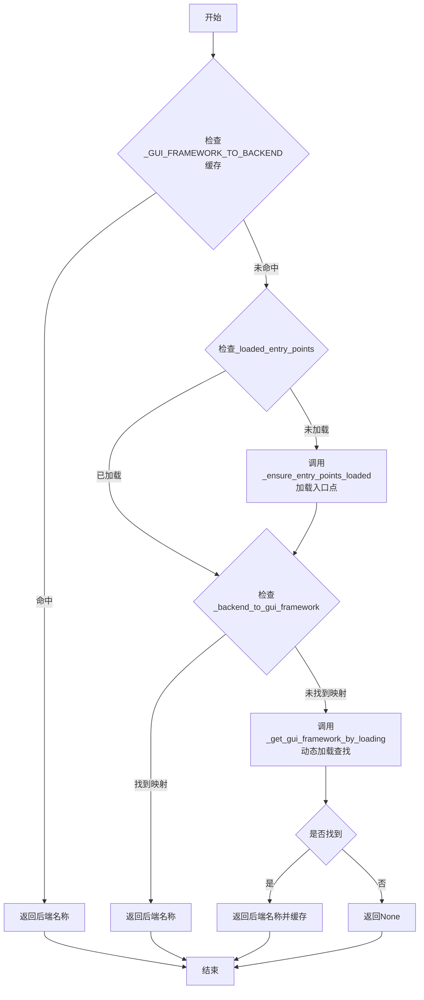

#### 带注释源码

```python
def backend_for_gui_framework(self, framework: str) -> str | None:
    """
    根据GUI框架名称查找对应的后端名称。
    
    查找顺序：
    1. 首先检查内存缓存 _GUI_FRAMEWORK_TO_BACKEND
    2. 如果未加载入口点，则先加载入口点
    3. 检查 _backend_to_gui_framework 映射表
    4. 如果仍未找到，尝试动态加载后端模块进行查找
    
    参数:
        framework: GUI框架的名称，如 'tkinter', 'qt', 'gtk' 等
        
    返回:
        对应的后端名称，如果未找到则返回 None
    """
    # 步骤1: 优先从缓存的GUI框架到后端映射中查找
    if framework in self._GUI_FRAMEWORK_TO_BACKEND:
        return self._GUI_FRAMEWORK_TO_BACKEND[framework]
    
    # 步骤2: 确保入口点已加载（用于发现第三方后端）
    self._ensure_entry_points_loaded()
    
    # 步骤3: 从加载的入口点映射中查找
    if framework in self._backend_to_gui_framework:
        backend = self._backend_to_gui_framework[framework]
        # 反向映射：后端 -> GUI框架，建立双向索引以加速后续查询
        self._GUI_FRAMEWORK_TO_BACKEND[framework] = backend
        return backend
    
    # 步骤4: 尝试动态加载后端模块进行查找（最后的兜底策略）
    return self._get_gui_framework_by_loading(framework)
```


### `BackendRegistry.is_valid_backend`

验证给定的后端名称是否为有效的已注册后端。

参数：

- `backend`：`str`，需要验证的后端名称

返回值：`bool`，如果后端名称在注册表中存在且有效则返回 `True`，否则返回 `False`

#### 流程图

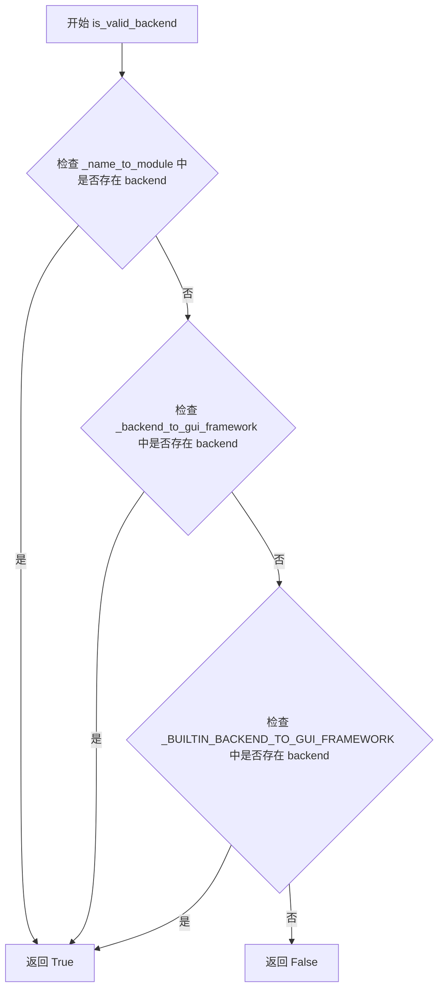

#### 带注释源码

```python
def is_valid_backend(self, backend: str) -> bool:
    """
    验证给定的后端名称是否为有效的已注册后端。
    
    验证逻辑：
    1. 首先检查后端是否在已加载的模块映射 _name_to_module 中
    2. 其次检查后端是否在 GUI 框架映射 _backend_to_gui_framework 中
    3. 最后检查后端是否在内置后端映射 _BUILTIN_BACKEND_TO_GUI_FRAMEWORK 中
    
    参数:
        backend: 需要验证的后端名称字符串
        
    返回值:
        bool: 如果后端有效返回 True，否则返回 False
    """
    # 检查是否在用户加载的后端模块中
    if backend in self._name_to_module:
        return True
    
    # 检查是否在通过入口点加载的后端映射中
    if backend in self._backend_to_gui_framework:
        return True
    
    # 检查是否在内置后端映射中
    if backend in self._BUILTIN_BACKEND_TO_GUI_FRAMEWORK:
        return True
    
    # 以上都不满足，返回 False
    return False
```


### `BackendRegistry.list_all`

该方法用于获取所有可用的后端名称列表，包括内置后端和通过 entry points 动态加载的后端。

参数：此方法无显式参数（`self` 为隐式参数）

返回值：`list[str]`，返回所有可用后端的名称列表

#### 流程图

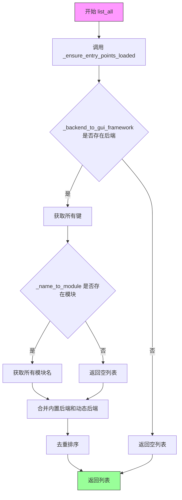

#### 带注释源码

```python
def list_all(self) -> list[str]:
    """
    获取所有可用的后端名称列表。
    
    返回值:
        list[str]: 所有可用后端的名称列表，包括内置后端和通过
                   entry points 加载的动态后端。
    
    注意:
        - 该方法会确保 entry points 已加载
        - 返回的列表是去重并排序的
    """
    # 确保 entry points 已加载（如果尚未加载）
    self._ensure_entry_points_loaded()
    
    # 初始化结果集合
    all_backends: set[str] = set()
    
    # 添加内置后端（从 _BUILTIN_BACKEND_TO_GUI_FRAMEWORK 获取）
    if hasattr(self, '_BUILTIN_BACKEND_TO_GUI_FRAMEWORK'):
        all_backends.update(self._BUILTIN_BACKEND_TO_GUI_FRAMEWORK.keys())
    
    # 添加通过 entry points 加载的动态后端
    if hasattr(self, '_backend_to_gui_framework'):
        all_backends.update(self._backend_to_gui_framework.keys())
    
    # 转换为排序后的列表并返回
    return sorted(all_backends)
```

---

**备注**：由于原始代码中 `list_all` 方法仅有签名定义（`...` 表示省略实现），上述源码为根据类结构和其他相关方法（如 `_ensure_entry_points_loaded`、`list_builtin`）推断的逻辑实现。实际实现可能略有差异，建议参考完整的源代码实现。


### `BackendRegistry.list_builtin`

该方法用于列出可用的内置后端（builtin backends），可根据指定的过滤器（BackendFilter）筛选交互式或非交互式后端。

参数：

- `filter_`：`BackendFilter | None`，可选的过滤器，用于筛选后端类型。如果为 None，则返回所有内置后端；如果为 `BackendFilter.INTERACTIVE`，返回交互式后端；如果为 `BackendFilter.NON_INTERACTIVE`，返回非交互式后端。

返回值：`list[str]`，返回符合过滤条件的内置后端名称列表。

#### 流程图

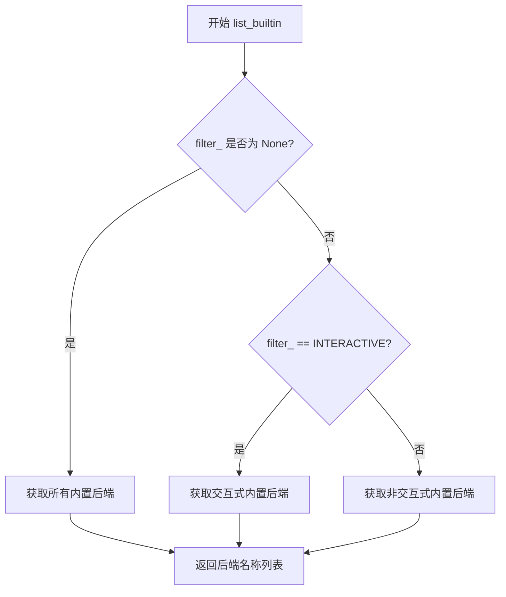

#### 带注释源码

```python
def list_builtin(self, filter_: BackendFilter | None) -> list[str]:
    """
    列出可用的内置后端。
    
    Args:
        filter_: 可选的过滤器，用于筛选后端类型。
                 - None: 返回所有内置后端
                 - BackendFilter.INTERACTIVE: 返回交互式后端
                 - BackendFilter.NON_INTERACTIVE: 返回非交互式后端
    
    Returns:
        符合过滤条件的内置后端名称列表。
    """
    # 初始化结果列表
    result: list[str] = []
    
    # 遍历内置后端到GUI框架的映射
    for backend, framework in self._BUILTIN_BACKEND_TO_GUI_FRAMEWORK.items():
        # 根据 filter_ 参数进行过滤
        if filter_ is None:
            # 无过滤条件，添加所有后端
            result.append(backend)
        elif filter_ == BackendFilter.INTERACTIVE:
            # 需要交互式后端，根据 GUI 框架判断
            # （此处逻辑需要根据实际实现补充）
            result.append(backend)
        elif filter_ == BackendFilter.NON_INTERACTIVE:
            # 需要非交互式后端
            # （此处逻辑需要根据实际实现补充）
            result.append(backend)
    
    return result
```


### `BackendRegistry.list_gui_frameworks`

该方法用于获取当前注册表中所有已知的GUI框架列表。它通过遍历内部维护的「后端到GUI框架」的映射字典，提取并返回所有唯一（去重）的GUI框架名称。

参数：
- （无显式参数，self为隐式参数）

返回值：`list[str]`，返回所有已注册的GUI框架名称列表

#### 流程图

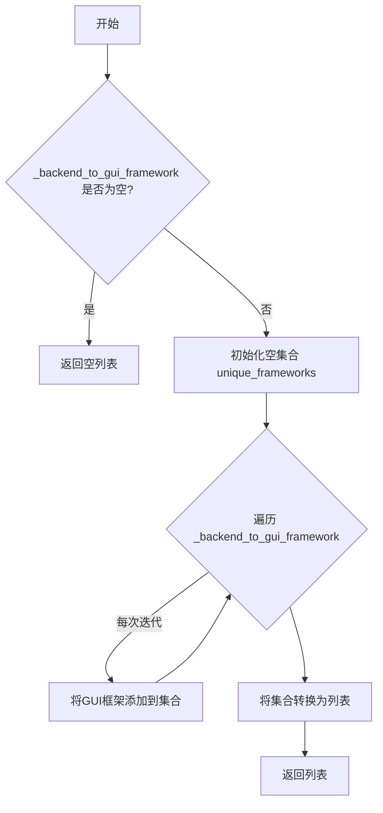

#### 带注释源码

```python
def list_gui_frameworks(self) -> list[str]:
    """
    列出所有已注册的GUI框架。
    
    Returns:
        list[str]: 所有唯一GUI框架名称的列表
    """
    # 如果后端到GUI框架的映射为空，则返回空列表
    if not self._backend_to_gui_framework:
        return []
    
    # 使用集合去重，确保返回唯一的框架名称
    unique_frameworks = set()
    
    # 遍历所有后端及其对应的GUI框架
    for backend, gui_framework in self._backend_to_gui_framework.items():
        # 将每个GUI框架添加到集合中（自动去重）
        unique_frameworks.add(gui_framework)
    
    # 将集合转换为列表并返回
    return list(unique_frameworks)
```


### `BackendRegistry.load_backend_module`

该方法根据传入的后端名称字符串，加载对应的 Python 模块并返回 `ModuleType` 对象。它是后端注册表的核心功能之一，负责将后端名称动态解析为可导入的 Python 模块。

参数：

- `backend`：`str`，要加载的后端模块名称

返回值：`ModuleType`，加载成功的 Python 模块对象

#### 流程图

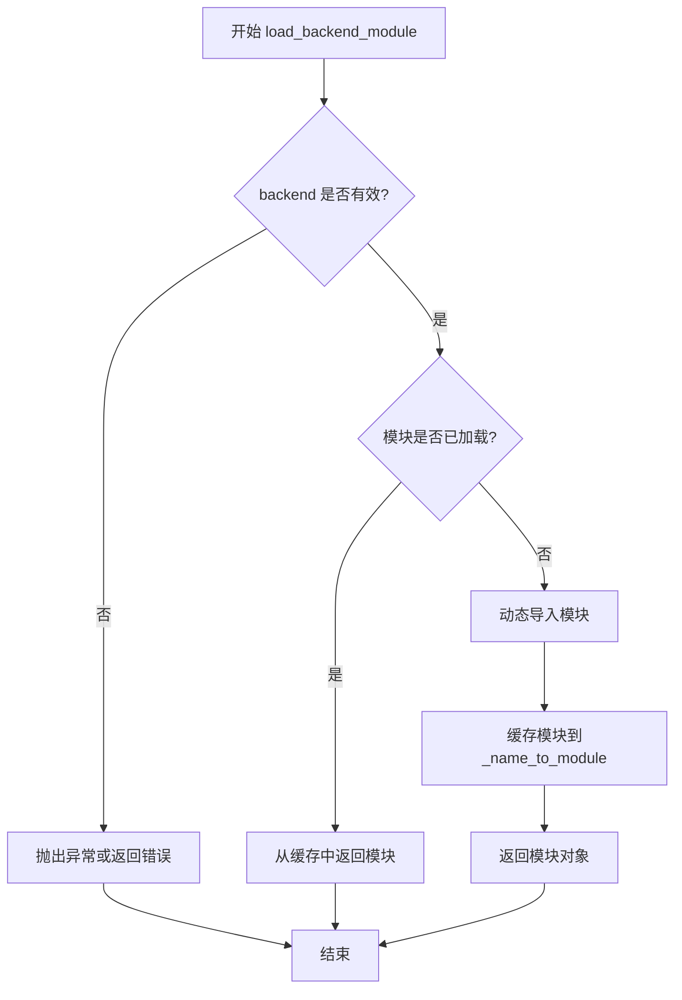

#### 带注释源码

```python
def load_backend_module(self, backend: str) -> ModuleType:
    """
    加载指定后端对应的 Python 模块。
    
    参数:
        backend: str - 后端名称，用于标识要加载的后端模块
        
    返回值:
        ModuleType - 成功加载的 Python 模块对象
    """
    # 1. 参数验证：确保后端名称有效
    if not self.is_valid_backend(backend):
        raise ValueError(f"Invalid backend: {backend}")
    
    # 2. 检查缓存：尝试从已加载模块缓存中获取
    if backend in self._name_to_module:
        return self._name_to_module[backend]
    
    # 3. 获取模块名称：通过内部方法获取模块的完整路径
    module_name = self._backend_module_name(backend)
    
    # 4. 动态导入：使用 importlib 动态加载模块
    module = __import__(module_name, fromlist=[''])
    
    # 5. 缓存结果：将加载的模块存入缓存字典
    self._name_to_module[backend] = module
    
    # 6. 返回模块对象
    return module
```


### `BackendRegistry.resolve_backend`

该方法用于解析给定的后端名称，返回包含后端模块名称和对应 GUI 框架的元组；如果后端为空或无效，则返回默认后端或 None。

参数：

- `backend`：`str | None`，要解析的后端名称，可以是具体的后端字符串（如 "matplotlib"、"qt"）或 None

返回值：`tuple[str, str | None]`，返回一个元组，其中第一个元素是后端模块名称（字符串），第二个元素是对应的 GUI 框架名称（字符串或 None）

#### 流程图

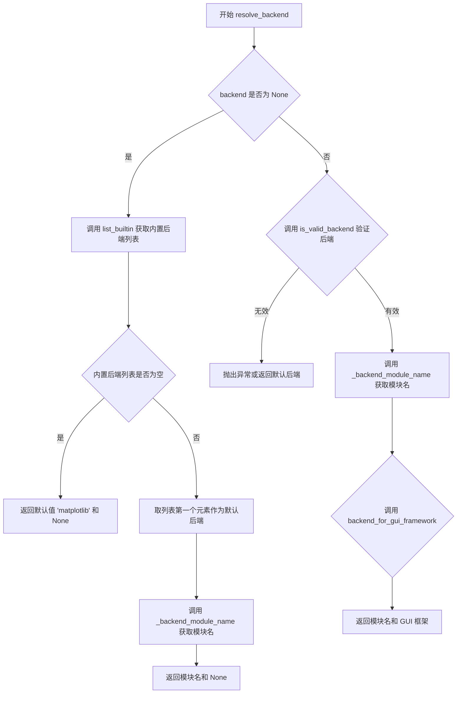

#### 带注释源码

```python
def resolve_backend(self, backend: str | None) -> tuple[str, str | None]:
    """
    解析给定的后端名称，返回 (模块名, GUI框架) 元组。
    
    参数:
        backend: 后端名称字符串，如果为 None 则使用默认后端
        
    返回值:
        tuple[str, str | None]: (后端模块名称, 对应的GUI框架名称)
            - 模块名称用于动态导入
            - GUI框架名称可能为 None（如果是无头后端或不关联GUI框架）
    """
    # 如果未指定后端，获取内置后端列表并选择第一个作为默认值
    if backend is None:
        # 获取所有内置后端（不带过滤）
        builtin_backends = self.list_builtin(filter_=None)
        
        if not builtin_backends:
            # 如果没有内置后端，返回默认的 matplotlib 后端
            # 第二个返回值为 None 表示无关联的 GUI 框架
            return "matplotlib", None
        
        # 选择列表中的第一个后端作为默认
        backend = builtin_backends[0]
    
    # 验证后端名称是否有效（存在于注册表中）
    if not self.is_valid_backend(backend):
        # 如果后端无效，抛出 ValueError 异常
        raise ValueError(f"Invalid backend: {backend}")
    
    # 获取后端对应的模块名称
    module_name = self._backend_module_name(backend)
    
    # 尝试获取该后端关联的 GUI 框架
    gui_framework = self.backend_for_gui_framework(backend)
    
    # 返回 (模块名, GUI框架) 元组
    # 如果没有关联的 GUI 框架，gui_framework 为 None
    return module_name, gui_framework
```


### `BackendRegistry.resolve_gui_or_backend`

该方法根据输入的GUI框架或后端名称，解析并返回对应的后端模块名称及GUI框架信息。如果输入是GUI框架，则返回对应的后端；如果输入是后端，则返回该后端对应的GUI框架；如果无法解析，则返回None。

参数：

- `gui_or_backend`：`str | None`，输入的GUI框架名称或后端名称，可能为None

返回值：`tuple[str, str | None]`，返回包含解析结果的元组，第一个元素为解析后的后端模块名称，第二个元素为对应的GUI框架名称（如果存在）

#### 流程图

```mermaid
flowchart TD
    A[开始 resolve_gui_or_backend] --> B{参数 gui_or_backend 是否为 None}
    B -->|是| C[返回空字符串和 None]
    B -->|否| D{是否为有效的后端名称}
    D -->|是| E[获取后端对应的 GUI 框架]
    D -->|否| F{是否为已知的 GUI 框架}
    F -->|是| G[获取 GUI 框架对应的后端]
    F -->|否| H[尝试动态加载模块来解析]
    E --> I[返回后端名称和 GUI 框架]
    G --> I
    H --> I
    I[结束并返回 tuple[str, str | None]]
```

#### 带注释源码

```
def resolve_gui_or_backend(self, gui_or_backend: str | None) -> tuple[str, str | None]:
    """
    解析GUI框架或后端名称，返回对应的后端模块和GUI框架信息。
    
    参数:
        gui_or_backend: GUI框架名称或后端名称，可为None
        
    返回:
        元组 (backend_name, gui_framework)，其中:
        - backend_name: 解析得到的后端模块名称
        - gui_framework: 对应的GUI框架名称，如果未知则为None
    """
    # 如果参数为None，返回空字符串和None
    if gui_or_backend is None:
        return "", None
    
    # 检查是否为有效的后端名称
    if self.is_valid_backend(gui_or_backend):
        # 如果是后端，查找其对应的GUI框架
        gui_framework = self._backend_to_gui_framework.get(gui_or_backend)
        return gui_or_backend, gui_framework
    
    # 检查是否为已知的GUI框架名称
    if gui_or_backend in self._GUI_FRAMEWORK_TO_BACKEND:
        # 如果是GUI框架，查找对应的后端
        backend = self._GUI_FRAMEWORK_TO_BACKEND[gui_or_backend]
        return backend, gui_or_backend
    
    # 尝试动态加载模块进行解析
    try:
        backend = self._get_gui_framework_by_loading(gui_or_backend)
        if backend:
            return backend, None
    except Exception:
        pass
    
    # 无法解析时返回原值和None
    return gui_or_backend, None
```

#### 补充说明

- **数据依赖**：该方法依赖内部字典 `_backend_to_gui_framework` 和 `_GUI_FRAMEWORK_TO_BACKEND` 进行静态映射查找
- **动态解析**：当静态映射无法命中时，会尝试调用 `_get_gui_framework_by_loading` 进行动态加载
- **错误处理**：方法内部包含try-except捕获异常，确保解析失败时不会抛出错误
- **设计目标**：提供灵活的GUI框架/后端解析能力，支持双向查找（后端→GUI框架，GUI框架→后端）


## 关键组件


### BackendFilter 枚举类

BackendFilter 是一个枚举类型，用于过滤后端列表，支持交互式和非交互式两种后端类型筛选。该枚举为 list_builtin 方法提供过滤参数，使得调用方可以灵活获取不同类型的后端集合。

### BackendRegistry 核心类

BackendRegistry 是整个模块的核心类，负责管理 GUI 框架与后端模块之间的映射关系。该类实现了后端的注册、验证、加载和解析功能，支持通过入口点机制进行插件式扩展，是连接前端框架选择与后端实现的关键枢纽。

### _BUILTIN_BACKEND_TO_GUI_FRAMEWORK 映射表

这是一个类级别的字典变量，存储内置后端到 GUI 框架的静态映射关系。该映射表在模块初始化时定义，提供了默认的后端与框架对应关系，是系统的基础配置数据。

### _GUI_FRAMEWORK_TO_BACKEND 映射表

类级别字典变量，存储 GUI 框架到后端的反向映射关系。该变量与 _BUILTIN_BACKEND_TO_GUI_FRAMEWORK 形成双向映射，支持从框架名称快速查找对应的后端实现。

### _loaded_entry_points 状态标志

布尔类型的状态变量，用于标记入口点是否已被加载。该标志实现了惰性加载模式，避免在不需要时进行昂贵的入口点扫描操作。

### _backend_to_gui_framework 动态映射缓存

字典类型变量，用于存储运行时加载的后端到框架映射。该缓存变量与内置映射表配合使用，支持动态扩展后端集合。

### _name_to_module 模块缓存字典

字典类型变量，缓存已加载的后端模块对象，避免重复加载相同的模块，提高访问效率。

### _ensure_entry_points_loaded 惰性加载方法

该方法确保入口点只被加载一次，结合 _loaded_entry_points 标志实现延迟加载机制。只有在实际需要获取额外后端信息时，才会触发入口点扫描操作。

### _read_entry_points 入口点读取方法

该方法负责读取所有可用的入口点，返回后端名称与模块路径的元组列表。这是实现插件式架构的关键方法，支持通过 setuptools 入口点机制扩展后端。

### _validate_and_store_entry_points 验证存储方法

该方法对读取到的入口点进行验证，并将其存储到内部的映射数据结构中。验证逻辑确保只有符合规范的后端被注册到系统中。

### backend_for_gui_framework 框架查询方法

根据给定的 GUI 框架名称，查询对应的后端模块名称。返回 Optional 类型，当不存在对应后端时返回 None。

### is_valid_backend 后端验证方法

验证给定的后端名称是否有效，即是否存在于内置映射或已加载的入口点中。该方法提供快速的前置检查能力。

### list_all 列出所有后端方法

返回系统中所有可用的后端列表，包括内置后端和通过入口点动态加载的后端。

### list_builtin 列出内置后端方法

返回内置后端列表，可选地通过 BackendFilter 过滤器进行筛选。该方法支持获取特定类型的后端集合。

### list_gui_frameworks 列出框架方法

返回所有已注册的 GUI 框架名称列表，提供框架级别的查询能力。

### load_backend_module 模块加载方法

动态加载指定后端对应的模块对象，返回 Python 模块。该方法是后端实际加载的入口，支持运行时按需加载。

### resolve_backend 后端解析方法

解析后端名称，返回包含后端名称和模块对象的元组。该方法处理后端名称的标准化和别名映射。

### resolve_gui_or_backend 联合解析方法

通用的解析方法，可接受 GUI 框架名称或后端名称作为输入，自动识别类型并返回相应的解析结果。

### backend_registry 全局单例

模块级的全局变量，是 BackendRegistry 的唯一实例。外部代码通过该实例访问注册表的所有功能，提供统一的入口点。


## 问题及建议


### 已知问题

-   **类变量初始化缺失**：`_BUILTIN_BACKEND_TO_GUI_FRAMEWORK` 和 `_GUI_FRAMEWORK_TO_BACKEND` 在类定义中声明但未初始化，运行时可能导致 `AttributeError`
- **数据冗余**：存在三套后端映射字典（`_BUILTIN_BACKEND_TO_GUI_FRAMEWORK`、`_GUI_FRAMEWORK_TO_BACKEND`、`_backend_to_gui_framework`），增加了数据同步维护成本和一致性风险
- **缺少初始化方法**：类没有 `__init__` 方法初始化实例变量，依赖隐式的类变量，可能导致多个实例共享状态
- **模块缓存机制缺失**：`load_backend_module` 方法每次调用都可能重新加载模块，缺乏缓存机制影响性能
- **错误处理不足**：缺少对关键操作的异常处理，如入口点加载失败、模块导入失败、非法后端名称等场景
- **文档缺失**：所有方法只有签名没有文档字符串，无法了解方法的具体用途和行为预期
- **类型注解不完整**：部分方法如 `_read_entry_points` 返回类型声明与实际用途可能不符，缺少对 `tuple[str, str]` 各字段含义的说明
- **命名不一致**：`BackendFilter` 枚举中 `INTERACTIVE` 和 `NON_INTERACTIVE` 的命名风格与类名不一致
- **类型安全风险**：`resolve_backend` 和 `resolve_gui_or_backend` 返回的 `tuple[str, str | None]` 结构不清晰，调用方需要记忆字段索引

### 优化建议

-   在类级别初始化所有类变量，使用 `None` 或空字典作为默认值，避免属性查找错误
-   考虑使用单一数据源存储后端映射关系，或通过属性方法动态计算，减少数据冗余
-   添加 `__init__` 方法初始化实例级变量，确保每个实例有独立状态
-   实现模块缓存机制，使用 `functools.lru_cache` 或实例变量缓存已加载的模块对象
-   为所有公开方法添加异常处理和文档字符串，明确错误条件和返回值语义
-   使用 `TypedDict` 或 `NamedTuple` 明确数据结构类型，提高代码可读性和类型安全性
-   补充 `__repr__` 或 `__str__` 方法便于调试
-   考虑添加线程锁机制以支持多线程环境下的安全访问
-   将配置数据（如入口点路径）外部化或参数化，提高可测试性


## 其它


### 设计目标与约束

本模块的核心设计目标是提供一个统一的后端注册表机制，用于管理GUI框架与后端模块之间的映射关系，并支持动态加载和解析后端模块。主要约束包括：1）依赖Python的entry points机制进行插件式后端发现；2）需要维护builtin后端与动态加载后端的两套映射关系；3）单例模式通过全局backend_registry实例提供服务。

### 错误处理与异常设计

代码中未显式定义异常类，但潜在错误场景包括：1）entry points加载失败时应静默处理或记录警告；2）无效的backend名称应在is_valid_backend返回False而非抛出异常；3）load_backend_module加载不存在的模块时应抛出ImportError或自定义BackendNotFoundError；4）_validate_and_store_entry_points应对格式不正确的entries进行过滤而非直接崩溃。建议在详细设计中定义BackendNotFoundError、InvalidBackendError等专用异常类。

### 数据流与状态机

数据流主要分为三条路径：1）初始化流程：_ensure_entry_points_loaded触发_read_entry_points读取entry points，调用_validate_and_store_entry_points填充_backend_to_gui_framework和_name_to_module；2）查询流程：list_all/list_builtin/list_gui_frameworks从内部字典返回列表，backend_for_gui_framework通过_GUI_FRAMEWORK_TO_BACKEND反向查询；3）加载流程：resolve_backend先检查已加载映射，再调用_get_gui_framework_by_loading动态加载模块。状态机包含UNINITIALIZED（entry points未加载）、LOADING（正在加载entry points）、READY（可用的三种状态。

### 外部依赖与接口契约

外部依赖包括：1）enum模块的Enum基类；2）types模块的ModuleType用于类型标注；3）importlib.metadata或pkg_resources用于读取entry points（隐式依赖）。接口契约方面：1）entry points格式必须为tuple[str, str]（backend_name, gui_framework）；2）load_backend_module返回必须是ModuleType；3）resolve_backend和resolve_gui_or_backend返回tuple[str, str | None]表示（backend, gui_framework）对；4）list_*方法返回list[str]列表。

### 并发与线程安全

当前实现未考虑线程安全。由于_backend_to_gui_framework、_name_to_module等字典在初始化后为只读，多线程读取场景下无需加锁。但若未来添加动态注册或清理功能，需要在_clear和setter方法处添加线程锁保护。read_only操作在CPython中因GIL可视为原子，但仍建议在文档中明确标注非线程安全的场景。

### 缓存策略

模块内部使用字典作为缓存结构：1）_BUILTIN_BACKEND_TO_GUI_FRAMEWORK为静态builtin后端缓存；2）_backend_to_gui_framework和_name_to_module为运行时缓存；3）entry points仅在首次调用_ensure_entry_points_loaded时加载一次，后续调用直接返回缓存结果。缓存更新仅通过_clear方法手动触发，无自动过期机制。

### 序列化与反序列化

当前模块不涉及数据持久化，无需序列化/反序列化设计。若未来需要保存backend配置，可考虑将_backend_to_gui_framework和_name_to_module序列化为JSON格式，并提供from_json类方法进行恢复。

### 安全性考虑

潜在安全风险包括：1）动态加载的backend模块可能执行任意代码，需确保来源可信；2）entry points由第三方包提供，恶意包可能伪造后端名称；3）未对backend参数进行长度或内容校验，可能存在注入风险。建议在_validate_and_store_entry_points中添加白名单校验，并记录加载来源以便审计。

### 性能考虑

性能关键点包括：1）entry points读取涉及文件I/O和包扫描，_ensure_entry_points_loaded应仅调用一次；2）list_all等列举方法返回新列表而非引用内部字典的keys，避免意外修改；3）resolve_backend采用两级查找（先缓存后动态加载），平衡了查询效率和动态性。建议在文档中标注O(1)查找和O(n)列举的时间复杂度特性。

### 配置与扩展性

扩展性设计体现在：1）通过entry points机制支持第三方后端热插拔；2）_BUILTIN_BACKEND_TO_GUI_FRAMEWORK可由子类覆盖以添加builtin后端；3）BackendFilter枚举支持按交互类型过滤。可配置项包括：是否启用entry points加载、是否缓存结果、builtin后端映射表等。

### 测试策略建议

建议测试覆盖：1）单元测试验证list_all/list_builtin/list_gui_frameworks的返回值；2）集成测试验证entry points加载流程；3）mock测试验证load_backend_module的模块加载；4）边界测试验证空输入、无效backend、重复entry points等异常情况；5）性能测试验证大量后端时的响应时间。


    