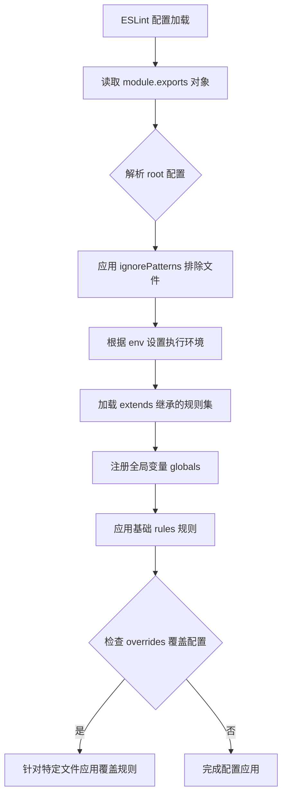

# `matplotlib\lib\matplotlib\backends\web_backend\.eslintrc.js` 详细设计文档

这是一个ESLint配置文件，定义了JavaScript代码的 linting 规则、环境设置、全局变量以及针对不同文件类型的规则覆盖，用于确保代码质量和一致性。

## 整体流程



## 类结构

```
ESLint 配置对象 (module.exports)
├── 根级配置
│   ├── root
│   ├── ignorePatterns
│   ├── env
│   ├── extends
│   ├── globals
│   ├── rules
│   └── overrides
└── 覆盖配置 (overrides)
    └── js/**/*.js 特定规则
```

## 全局变量及字段


### `root`
    
指示是否为ESLint根配置

类型：`boolean`
    


### `ignorePatterns`
    
忽略的文件或目录模式列表

类型：`array`
    


### `env`
    
定义代码运行的环境

类型：`object`
    


### `extends`
    
继承的ESLint配置列表

类型：`array`
    


### `globals`
    
定义全局变量及其可写性

类型：`object`
    


### `rules`
    
ESLint规则的配置

类型：`object`
    


### `overrides`
    
针对特定文件的配置覆盖

类型：`array`
    


### `env.browser`
    
表示代码运行在浏览器环境

类型：`boolean`
    


### `env.jquery`
    
表示代码使用jQuery

类型：`boolean`
    


### `globals.IPython`
    
全局变量IPython为只读

类型：`string`
    


### `globals.MozWebSocket`
    
全局变量MozWebSocket为只读

类型：`string`
    


### `rules.indent`
    
缩进规则配置

类型：`array`
    


### `rules.no-unused-vars`
    
未使用变量规则配置

类型：`array`
    


### `rules.quotes`
    
引号规则配置

类型：`array`
    


### `indent.SwitchCase`
    
switch语句case的缩进级别

类型：`number`
    


### `no-unused-vars.argsIgnorePattern`
    
忽略参数的匹配模式

类型：`string`
    


### `quotes.avoidEscape`
    
是否允许字符串使用转义引号

类型：`boolean`
    


### `overrides.files`
    
覆盖配置匹配的文件模式

类型：`string`
    
    

## 全局函数及方法


## 关键组件


### root

标记该配置文件为 ESLint 根配置，表示停止向上查找父目录的配置文件。

### ignorePatterns

定义需要忽略的文件或目录模式，包含 "jquery-ui-*/" 和 "node_modules/" 目录。

### env

配置代码运行环境，启用浏览器环境和 jQuery 插件支持。

### extends

继承已有的 ESLint 规则集，包括 "eslint:recommended"（ESLint 推荐规则）和 "prettier"（Prettier 格式化规则）。

### globals

定义代码中可用的全局变量及其只读属性，包括 IPython 和 MozWebSocket。

### rules

配置具体的代码规范规则，包括缩进（2 或 4 空格）、未使用变量检查、引号风格等。

### overrides

针对特定文件路径（js/**/*.js）覆盖父级规则，使用 4 空格缩进和单引号风格。


## 问题及建议


### 已知问题

-   **过时的全局变量定义**：`MozWebSocket` 已被现代浏览器的 `WebSocket` 替代，继续定义该全局变量无实际意义且可能造成混淆
-   **可能多余的全局变量**：`IPython` 全局变量定义仅在 Jupyter 环境中需要，若项目不涉及 Jupyter Notebook 则为冗余配置
-   **规则覆盖导致风格不一致**：`overrides` 中对 `js/**/*.js` 文件强制使用 4 空格缩进和单引号，与根级规则的 2 空格缩进和双引号产生冲突，可能导致项目代码风格不统一
-   **缺少 ECMAScript 版本声明**：未配置 `parserOptions.ecmaVersion`，无法明确支持 ES6+ 语法，可能导致现代 JavaScript 特性检查不准确
-   **Prettier 集成可能失效**：`extends` 中引用了 `prettier`，但未确保 `eslint-config-prettier` 和 `eslint-plugin-prettier` 已正确安装，配置可能无法生效
-   **jQuery 环境配置必要性存疑**：`env.jquery: true` 启用了 jQuery 全局变量，若项目未使用 jQuery 则为多余配置

### 优化建议

-   移除 `MozWebSocket` 全局变量定义，改用标准的 `WebSocket` API
-   若项目不涉及 Jupyter，移除 `IPython` 全局变量定义
-   统一代码风格规范，移除 `overrides` 中的冲突规则，或明确区分不同目录的编码规范（如源码目录与配置文件目录）
-   添加 `parserOptions` 配置，明确声明 ECMAScript 版本（如 `ecmaVersion: 2020` 或更高）以支持现代 JavaScript 语法检查
-   确保 `prettier` 相关依赖已正确安装，或移除该扩展以避免潜在错误
-   如项目不使用 jQuery，移除 `jquery: true` 环境配置以减少不必要的全局变量污染
-   考虑添加 `parser` 配置以支持 TypeScript 或其他非标准 JavaScript 语法的文件


## 其它


### 设计目标与约束

该 ESLint 配置文件的设计目标是统一项目中的 JavaScript 代码风格和质量检查标准，确保代码符合最佳实践。主要约束包括：针对 jQuery 和浏览器环境进行优化，配置了特定的缩进规则（2空格和4空格分别用于根级和js目录下的文件），要求使用双引号（根级）和单引号（js目录），并限制未使用变量的使用。

### 错误处理与异常设计

由于 ESLint 配置文件本身不包含运行时错误处理逻辑，错误处理主要依赖 ESLint 工具本身。当配置文件存在语法错误或格式问题时，ESLint 会抛出解析错误。配置文件中的错误级别包括"error"（错误）和潜在的"warn"（警告），用于区分问题的严重程度。

### 数据流与状态机

该配置文件为静态配置，不涉及运行时数据流或状态机。配置数据从 ESLint 工具加载后，通过配置文件中的规则定义，对源代码进行静态分析。配置项从上到下依次生效：root 设置项目根目录，ignorePatterns 定义忽略文件，env 设置环境变量，extends 继承规则集，globals 定义全局变量，rules 定义具体规则，overrides 对特定文件进行规则覆盖。

### 外部依赖与接口契约

该配置依赖以下外部组件：ESLint 核心工具（用于执行代码检查）、eslint:recommended 规则集（提供基础推荐规则）、prettier 规则集（用于代码格式化协调）。配置中声明的全局变量（IPython、MozWebSocket）表示这些是在代码中可用但不应被 ESLint 警告的全局对象，需要与运行环境中实际存在的全局变量保持一致。

### 配置加载机制

配置文件使用 CommonJS 模块导出格式（module.exports），ESLint 会自动加载项目根目录下的 .eslintrc.js 或 .eslintrc 格式的配置文件。配置文件采用向下覆盖的策略：根级配置对所有文件生效，overrides 数组中的配置对匹配的文件（js/**/*.js）进行特定规则的覆盖和替换。

### 兼容性考虑

该配置针对特定环境进行设计：浏览器环境（browser: true）启用浏览器全局变量，jQuery 环境（jquery: true）识别 jQuery 全局对象。IPython 和 MozWebSocket 全局变量的声明表明代码可能在 Jupyter Notebook 或特定 WebSocket 环境中运行。配置中的规则对 ES6+ 语法没有特殊限制，可能需要根据目标运行环境添加合适的 parserOptions。

### 性能考虑

配置中的 ignorePatterns 排除了 jquery-ui-* 目录和 node_modules 目录，这有助于提升 ESLint 的检查性能，避免对无需检查的依赖代码进行分析。overrides 配置仅对 js/**/*.js 模式匹配的文件应用更严格的检查规则，减少了不必要的检查开销。

### 安全考虑

配置中定义的全局变量（IPython、MozWebSocket）需要确保这些全局对象在运行环境中是可信任的。由于这是静态代码分析工具配置，不涉及直接的用户输入处理或网络请求，因此安全风险较低。但需要注意不要在全局作用域中引入不必要的全局变量，以避免变量污染。

### 版本控制与迁移策略

该配置文件应纳入版本控制系统进行管理。当 ESLint 版本升级或规则集（eslint:recommended、prettier）更新时，可能需要重新评估规则的兼容性。建议在项目团队内部建立配置变更的审批流程，确保配置的修改经过充分讨论和测试。

### 测试策略

ESLint 配置本身的测试主要通过以下方式进行：在项目中运行 ESLint 检查，确保配置生效；对特定文件类型运行检查，验证 overrides 覆盖规则是否正确应用；集成到 CI/CD 流程中，确保每次代码提交都经过代码风格检查。建议建立测试用例目录，包含符合规则的正例和违反规则的反例代码，用于验证配置的正确性。

### 构建与部署集成

该配置文件设计为可直接集成到各种构建工具和 CI/CD 流程中。可以与 npm scripts 结合（添加 eslint 检查命令），与 Git hooks 集成（pre-commit 检查），与主流 CI 工具（如 Jenkins、GitHub Actions、GitLab CI）配合使用。配置文件的无状态特性使其易于在不同部署环境中保持一致性。

### 维护建议

当前配置存在以下维护要点：需要定期更新 extends 中引用的规则集版本，以获取最新的最佳实践；建议为不同的文件类型考虑更细粒度的配置覆盖；全局变量的声明应随着项目依赖的变化而及时更新；规则配置应与团队编码规范保持同步更新。


    