# `matplotlib\lib\matplotlib\backends\web_backend\js\mpl.js` 详细设计文档

这是一个用于在浏览器中通过WebSocket与Python matplotlib后端通信的客户端库，负责渲染交互式图形、处理用户输入（鼠标、键盘事件）、工具栏操作以及响应式布局调整。

## 整体流程

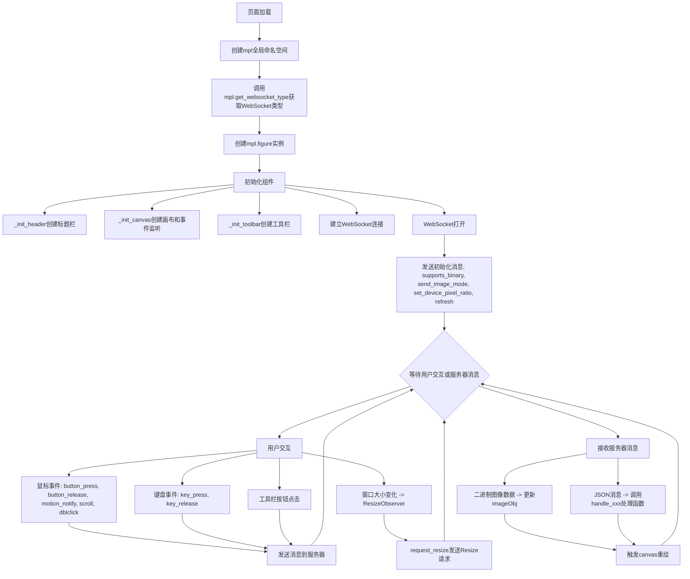

## 类结构

```
window.mpl (全局命名空间)
├── mpl.get_websocket_type (获取WebSocket类型)
├── mpl.figure (图形类)
│   ├── 字段: id, ws, supports_binary, capture_scroll, imageObj, context, message, canvas, rubberband_canvas, rubberband_context, format_dropdown, image_mode, root, waiting, resizeObserverInstance, _key, header, buttons, canvas_div
│   └── 方法: _init_header, _canvas_extra_style, _root_extra_style, _init_canvas, _init_toolbar, request_resize, send_message, send_draw_message, handle_save, handle_resize, handle_rubberband, handle_figure_label, handle_cursor, handle_message, handle_draw, handle_image_mode, handle_history_buttons, handle_navigate_mode, handle_capture_scroll, updated_canvas_event, _make_on_message_function, mouse_event, _key_event_extra, key_event, toolbar_button_onclick, toolbar_button_onmouseover
├── mpl.toolbar_items (工具栏配置 - 外部定义)
├── mpl.extensions (扩展列表 - 外部定义)
└── mpl.default_extension (默认扩展 - 外部定义)
getModifiers (全局函数 - 获取修饰键)
simpleKeys (全局函数 - 获取非对象键)
_JSXTOOLS_RESIZE_OBSERVER (ResizeObserver polyfill)
```

## 全局变量及字段


### `mpl`
    
全局命名空间对象，用于存放matplotlib前端的所有功能

类型：`Object`
    


### `mpl.toolbar_items`
    
工具栏配置数组，包含按钮名称、提示文本、图标和回调方法名，由外部提供

类型：`Array`
    


### `mpl.extensions`
    
可用图像扩展名列表，如png、svg等，由外部Python端注入

类型：`Array`
    


### `mpl.default_extension`
    
默认图像导出格式，当前默认值为'png'，由外部提供

类型：`string`
    


### `mpl.get_websocket_type`
    
获取浏览器支持的WebSocket类型，返回WebSocket或MozWebSocket构造函数

类型：`function`
    


### `mpl.figure`
    
图形类构造函数，创建和管理matplotlib图形实例及WebSocket通信

类型：`function/class`
    


### `_JSXTOOLS_RESIZE_OBSERVER`
    
ResizeObserver polyfill函数，用于兼容不支持原生ResizeObserver的浏览器

类型：`function`
    


### `mpl.figure.id`
    
图形的唯一标识符，用于区分多个图形实例

类型：`string`
    


### `mpl.figure.ws`
    
与后端服务器保持通信的WebSocket连接实例

类型：`WebSocket`
    


### `mpl.figure.supports_binary`
    
标记WebSocket是否支持二进制消息传输，影响图像加载方式

类型：`boolean`
    


### `mpl.figure.capture_scroll`
    
控制是否捕获页面滚动事件用于图形交互

类型：`boolean`
    


### `mpl.figure.imageObj`
    
用于加载后端返回的图像数据的Image对象

类型：`Image`
    


### `mpl.figure.context`
    
主画布的2D渲染上下文，用于绘制图像

类型：`CanvasRenderingContext2D`
    


### `mpl.figure.message`
    
状态消息显示的DOM元素，用于向用户展示当前状态

类型：`HTMLElement`
    


### `mpl.figure.canvas`
    
主画布元素，用于显示matplotlib渲染的图形

类型：`HTMLCanvasElement`
    


### `mpl.figure.rubberband_canvas`
    
橡皮筋选择框的叠加画布，用于绘制缩放选择区域

类型：`HTMLCanvasElement`
    


### `mpl.figure.rubberband_context`
    
橡皮筋画布的2D上下文，用于绘制选择框

类型：`CanvasRenderingContext2D`
    


### `mpl.figure.format_dropdown`
    
图像格式下拉选择框，让用户选择导出格式

类型：`HTMLSelectElement`
    


### `mpl.figure.image_mode`
    
当前图像模式，'full'表示完整图像模式

类型：`string`
    


### `mpl.figure.root`
    
图形根容器元素，所有UI元素都附加于此

类型：`HTMLElement`
    


### `mpl.figure.waiting`
    
标记是否正在等待服务器发送新图像，防止重复请求

类型：`boolean`
    


### `mpl.figure.resizeObserverInstance`
    
监听画布容器尺寸变化的Observer实例

类型：`ResizeObserver`
    


### `mpl.figure._key`
    
当前按下的键盘按键，用于处理按键重复事件

类型：`string|null`
    


### `mpl.figure.header`
    
图形标题栏的DOM元素，用于显示图形标题

类型：`HTMLElement`
    


### `mpl.figure.buttons`
    
工具栏按钮的映射对象，键为按钮名，值为DOM元素

类型：`Object`
    


### `mpl.figure.canvas_div`
    
画布容器div元素，包含canvas和rubberband_canvas

类型：`HTMLElement`
    


### `mpl.figure.ratio`
    
设备像素比，用于在HiDPI屏幕上正确渲染画布

类型：`number`
    


### `_JSXTOOLS_RESIZE_OBSERVER.ResizeObserver`
    
ResizeObserver的polyfill类，用于观察元素尺寸变化

类型：`class`
    
    

## 全局函数及方法


### `mpl.get_websocket_type`

该函数用于检测并返回浏览器支持的 WebSocket 类型。它首先检查标准的 `WebSocket` API 是否可用，如果不可用则回退到 Mozilla 的 `MozWebSocket` API，若两者都不支持则向用户弹出警告提示。

参数： 无

返回值：`function`，返回浏览器支持的 WebSocket 构造函数（`WebSocket` 或 `MozWebSocket`），如果浏览器不支持 WebSocket 则返回 `undefined`（通过 `alert` 弹窗后直接返回）。

#### 流程图

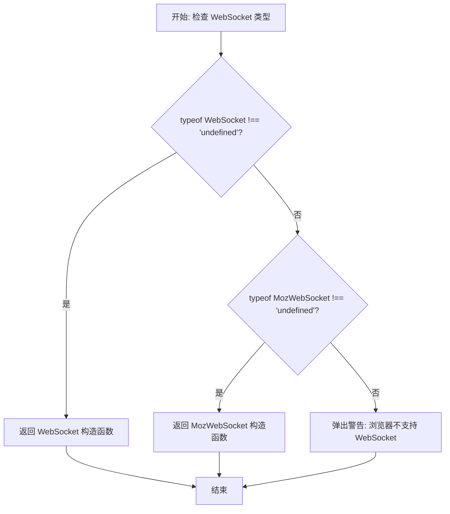

#### 带注释源码

```javascript
// 获取全局 mpl 命名空间下的 WebSocket 类型检测函数
mpl.get_websocket_type = function () {
    // 首先检查浏览器是否支持标准的 WebSocket API
    if (typeof WebSocket !== 'undefined') {
        // 标准 WebSocket 可用，返回 WebSocket 构造函数
        return WebSocket;
    } else if (typeof MozWebSocket !== 'undefined') {
        // 标准 WebSocket 不可用，检查 Mozilla 遗留的 MozWebSocket API
        // 这是 Firefox 4-5 使用的旧版 WebSocket 实现
        return MozWebSocket;
    } else {
        // 浏览器既不支持标准 WebSocket 也不支持 MozWebSocket
        // 向用户显示警告信息，推荐使用支持的浏览器
        alert(
            'Your browser does not have WebSocket support. ' +
                'Please try Chrome, Safari or Firefox ≥ 6. ' +
                'Firefox 4 and 5 are also supported but you ' +
                'have to enable WebSockets in about:config.'
        );
    }
};
```


### `getModifiers`

该函数是一个工具函数，用于从浏览器原生的 DOM 事件对象中提取当前按下的修饰键（Modifier Keys）。它通过检查事件对象上的 `ctrlKey`、`altKey`、`shiftKey` 和 `metaKey` 布尔属性来判断哪些修饰键处于激活状态，并返回一个包含这些键名称的字符串数组。在 matplotlib 的 Figure 交互中，此函数用于将用户的键盘修饰状态（如 Ctrl+点击）传递给后端 Python 代码。

参数：

- `event`：`Object`（DOM Event），浏览器传递的原生事件对象，通常是 MouseEvent 或 KeyboardEvent，包含了当前按键的状态信息。

返回值：`Array<string>`，返回一个字符串数组，数组中的元素为 `'ctrl'`、`'alt'`、`'shift'` 或 `'meta'`，对应当前按下的修饰键。

#### 流程图

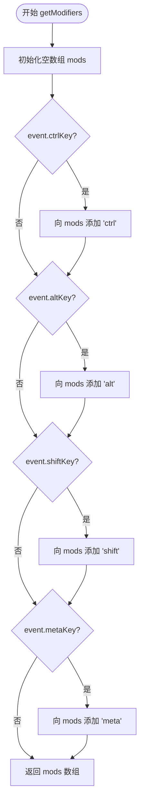

#### 带注释源码

```javascript
/**
 * 从事件对象中获取修饰键列表
 * @param {Object} event - 浏览器原生的 DOM 事件对象 (如 MouseEvent, KeyboardEvent)
 * @returns {Array<string>} 包含激活修饰键的数组 (如 ['ctrl', 'alt'])
 */
function getModifiers(event) {
    // 初始化一个空数组用于存储结果
    var mods = [];
    
    // 检查 Control 键
    if (event.ctrlKey) {
        mods.push('ctrl');
    }
    
    // 检查 Alt 键
    if (event.altKey) {
        mods.push('alt');
    }
    
    // 检查 Shift 键
    if (event.shiftKey) {
        mods.push('shift');
    }
    
    // 检查 Meta 键 (Windows Key 或 Command Key)
    if (event.metaKey) {
        mods.push('meta');
    }
    
    // 返回包含所有激活修饰键的数组
    return mods;
}
```


### `simpleKeys`

该函数接收一个对象作为输入，通过遍历对象的键值对，筛选出所有非 object 类型的属性并返回一个新的对象，主要用于在处理事件对象时避免循环引用导致的问题。

参数：

- `original`：`Object`，原始对象，需要提取非 object 类型键值对的对象

返回值：`Object`，返回一个新对象，仅包含原始对象中类型不为 "object" 的键值对

#### 流程图

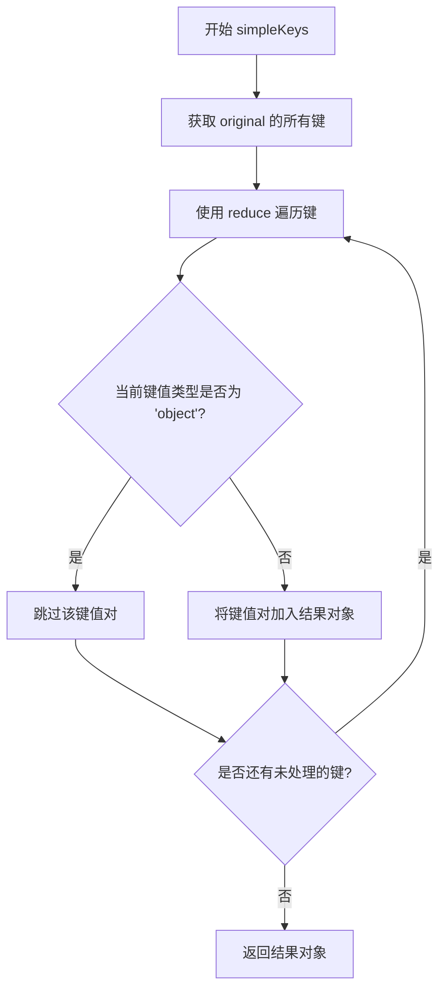

#### 带注释源码

```javascript
/*
 * return a copy of an object with only non-object keys
 * we need this to avoid circular references
 * https://stackoverflow.com/a/24161582/3208463
 */
function simpleKeys(original) {
    // 使用 Object.keys 获取原始对象的所有键
    // 使用 reduce 方法遍历这些键，构建一个新对象
    return Object.keys(original).reduce(function (obj, key) {
        // 检查当前键对应的值是否为 'object' 类型
        // 这里的 'object' 包含了普通对象、数组、null 等
        // 之所以排除 object，是为了避免循环引用问题
        if (typeof original[key] !== 'object') {
            // 如果不是 object 类型，则将该键值对复制到结果对象中
            obj[key] = original[key];
        }
        // 返回累积的结果对象，供下一次迭代使用
        return obj;
    }, {}); // 初始值为空对象
}
```


### `mpl.figure`

这是 matplotlib JavaScript 客户端的构造函数，用于初始化图形面板、画布、WebSocket 连接以及各种事件监听器。该构造函数创建了一个完整的交互式图形界面，支持二进制图像传输、鼠标和键盘事件处理、工具栏操作以及与 Python 后端的实时通信。

参数：

- `figure_id`：字符串，图形的唯一标识符，用于在 WebSocket 通信中标识该图形
- `websocket`：WebSocket 对象，与 Python 后端建立的 WebSocket 连接，用于双向通信
- `ondownload`：函数，用户触发下载操作时的回调函数，接收图形对象和格式参数
- `parent_element`：DOM 元素，图形容器的父元素，新创建的图形根元素将追加到此元素中

返回值：`undefined`，构造函数没有显式返回值，但通过 `this` 隐式返回新创建的实例

#### 流程图

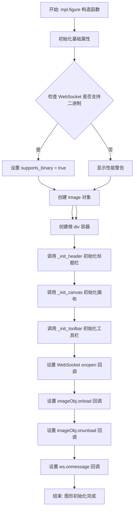

#### 带注释源码

```javascript
/* Put everything inside the global mpl namespace */
/* global mpl */
window.mpl = {};

// 获取可用的 WebSocket 类型（支持 MozWebSocket 作为后备）
mpl.get_websocket_type = function () {
    if (typeof WebSocket !== 'undefined') {
        return WebSocket;
    } else if (typeof MozWebSocket !== 'undefined') {
        return MozWebSocket;
    } else {
        alert(
            'Your browser does not have WebSocket support. ' +
                'Please try Chrome, Safari or Firefox ≥ 6. ' +
                'Firefox 4 and 5 are also supported but you ' +
                'have to enable WebSockets in about:config.'
        );
    }
};

/**
 * matplotlib 图形构造函数
 * 初始化图形面板、画布、WebSocket 连接和事件监听器
 * 
 * @param {string} figure_id - 图形的唯一标识符
 * @param {WebSocket} websocket - 与 Python 后端的 WebSocket 连接
 * @param {function} ondownload - 下载回调函数
 * @param {HTMLElement} parent_element - 父容器元素
 */
mpl.figure = function (figure_id, websocket, ondownload, parent_element) {
    // 1. 初始化图形标识符
    this.id = figure_id;

    // 2. 初始化 WebSocket 连接
    this.ws = websocket;

    // 3. 检查 WebSocket 是否支持二进制数据传输
    //    用于决定图像传输方式（二进制 vs Base64 编码）
    this.supports_binary = this.ws.binaryType !== undefined;

    // 4. 初始化滚轮捕获状态（用于平移/缩放操作）
    this.capture_scroll = false;

    // 5. 如果不支持二进制，显示性能警告
    if (!this.supports_binary) {
        var warnings = document.getElementById('mpl-warnings');
        if (warnings) {
            warnings.style.display = 'block';
            warnings.textContent =
                'This browser does not support binary websocket messages. ' +
                'Performance may be slow.';
        }
    }

    // 6. 创建图像对象，用于接收服务器发送的图像数据
    this.imageObj = new Image();

    // 7. 初始化其他上下文和元素引用
    this.context = undefined;          // 2D 绘图上下文
    this.message = undefined;          // 状态消息元素
    this.canvas = undefined;           // 主画布元素
    this.rubberband_canvas = undefined; // 橡皮筋选择画布
    this.rubberband_context = undefined; // 橡皮筋绘图上下文
    this.format_dropdown = undefined;  // 图像格式下拉选择框

    // 8. 设置图像显示模式：'full' 显示完整图像
    this.image_mode = 'full';

    // 9. 创建根容器元素
    this.root = document.createElement('div');
    this.root.setAttribute('style', 'display: inline-block');
    // 调用子类的额外样式设置（如果有）
    this._root_extra_style(this.root);

    // 10. 将根元素添加到父容器中
    parent_element.appendChild(this.root);

    // 11. 初始化图形组件：标题栏、画布、工具栏
    this._init_header(this);
    this._init_canvas(this);
    this._init_toolbar(this);

    var fig = this;  // 保存引用，用于回调函数中访问实例

    // 12. 初始化等待状态标志
    this.waiting = false;

    // 13. 设置 WebSocket 打开时的回调
    this.ws.onopen = function () {
        // 发送支持的二进制格式
        fig.send_message('supports_binary', { value: fig.supports_binary });
        // 发送图像传输模式
        fig.send_message('send_image_mode', {});
        // 发送设备像素比（用于 HiDPI 屏幕）
        if (fig.ratio !== 1) {
            fig.send_message('set_device_pixel_ratio', {
                device_pixel_ratio: fig.ratio,
            });
        }
        // 请求初始图像刷新
        fig.send_message('refresh', {});
    };

    // 14. 设置图像加载完成后的回调
    this.imageObj.onload = function () {
        if (fig.image_mode === 'full') {
            // 清除画布以避免透明图像产生的重影效果
            fig.context.clearRect(0, 0, fig.canvas.width, fig.canvas.height);
        }
        // 将加载的图像绘制到画布上
        fig.context.drawImage(fig.imageObj, 0, 0);
    };

    // 15. 设置图像卸载时的回调（关闭 WebSocket）
    this.imageObj.onunload = function () {
        fig.ws.close();
    };

    // 16. 设置 WebSocket 消息接收回调
    this.ws.onmessage = this._make_on_message_function(this);

    // 17. 保存下载回调函数
    this.ondownload = ondownload;
};
```


### `mpl.figure.prototype._init_header`

该方法负责创建matplotlib图形界面的标题栏（Title Bar）UI组件，包含一个带有jQuery UI样式的对话框标题栏容器和标题文本元素，并将其挂载到figure的根元素中，同时保存对标题文本元素的引用以便后续更新。

参数：

- 该方法无显式参数，通过 `this` 引用 `mpl.figure` 实例对象

返回值：`undefined`（无返回值），该方法直接操作DOM并修改实例状态

#### 流程图

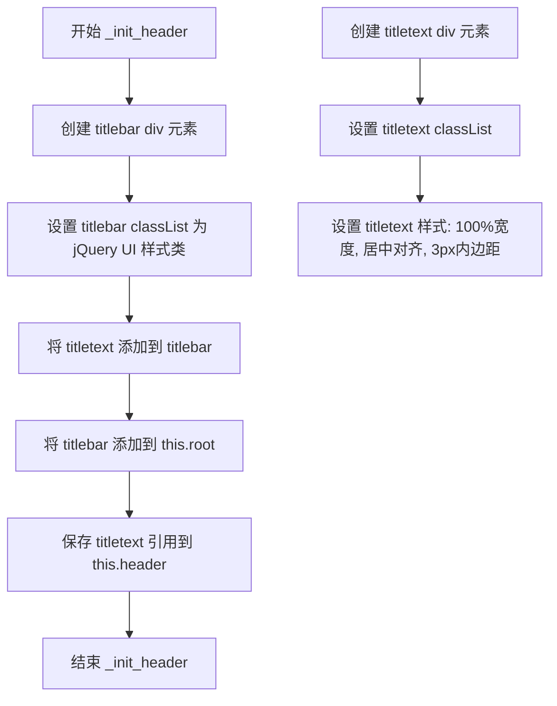

#### 带注释源码

```javascript
mpl.figure.prototype._init_header = function () {
    // 创建一个div元素作为标题栏容器
    var titlebar = document.createElement('div');
    // 设置jQuery UI对话框标题栏的样式类
    // ui-dialog-titlebar: 对话框标题栏基础样式
    // ui-widget-header: 小部件头部样式
    // ui-corner-all: 圆角
    // ui-helper-clearfix: 清除浮动
    titlebar.classList =
        'ui-dialog-titlebar ui-widget-header ui-corner-all ui-helper-clearfix';
    
    // 创建一个div元素作为标题文本容器
    var titletext = document.createElement('div');
    // 设置对话框标题文本的样式类
    titletext.classList = 'ui-dialog-title';
    // 设置标题文本的样式: 宽度100%, 居中对齐, 3像素内边距
    titletext.setAttribute(
        'style',
        'width: 100%; text-align: center; padding: 3px;'
    );
    
    // 将标题文本元素添加到标题栏容器中
    titlebar.appendChild(titletext);
    // 将整个标题栏添加到figure的根元素中
    this.root.appendChild(titlebar);
    
    // 保存标题文本元素的引用到this.header,便于后续更新标题内容
    this.header = titletext;
};
```


### `mpl.figure._canvas_extra_style`

这是一个空实现的钩子方法，用于为画布容器设置额外的CSS样式。当前方法体为空，供子类重写以添加自定义样式。

参数：

- `_canvas_div`：`<div>` (HTMLDivElement)，画布的容器DOM元素，用于应用额外的样式

返回值：`undefined`，无返回值（空实现）

#### 流程图

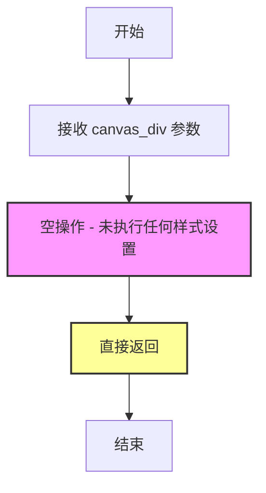

#### 带注释源码

```javascript
/**
 * 画布额外样式方法 - 空实现
 * 
 * 这是一个钩子(hook)方法，设计为可被子类重写以添加自定义样式。
 * 在当前实现中为空方法，不执行任何操作。
 * 
 * 调用位置：在 _init_canvas 方法中被调用
 * 调用方式：this._canvas_extra_style(canvas_div)
 * 
 * @param {HTMLDivElement} _canvas_div - 画布容器的DOM元素
 * @returns {undefined} 无返回值
 */
mpl.figure.prototype._canvas_extra_style = function (_canvas_div) {
    // 空实现 - 预留的扩展点
    // 注释：开发者可以通过重写此方法来自定义画布容器的样式
    // 例如：_canvas_div.style.backgroundColor = 'transparent';
};
```


### `mpl.figure._root_extra_style`

该方法是 `mpl.figure` 类的原型方法，是一个空实现（no-op）的钩子函数，用于为根元素（root element）设置额外的样式。该方法在构造函数中被调用，传入创建的根元素，允许子类通过重写此方法来自定义根元素的样式。

参数：

-  `_canvas_div`：`HTMLElement`，根元素（div），用于应用额外的样式

返回值：`undefined`，无返回值（空实现）

#### 流程图

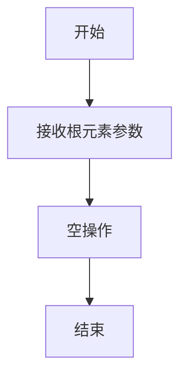

#### 带注释源码

```javascript
/**
 * 为根元素设置额外样式的空实现方法
 * 这是一个钩子方法，允许子类通过重写来添加自定义样式
 * 
 * @param {HTMLElement} _canvas_div - 根元素（div），用于应用额外的样式
 *                                  参数名前的下划线表示该参数在函数内部未被使用
 * @returns {void} 无返回值
 */
mpl.figure.prototype._root_extra_style = function (_canvas_div) {
    // 空实现：该方法不做任何操作
    // 设计目的：作为钩子方法，允许子类（如继承自mpl.figure的类）
    // 重写此方法以添加自定义的根元素样式
};
```

#### 使用上下文

该方法在 `mpl.figure` 构造函数中被调用：

```javascript
// 在构造函数中创建根元素
this.root = document.createElement('div');
this.root.setAttribute('style', 'display: inline-block');
this._root_extra_style(this.root);  // 调用空实现方法

parent_element.appendChild(this.root);
```

#### 相关方法

同类型的空实现钩子方法还有一个：

```javascript
mpl.figure.prototype._canvas_extra_style = function (_canvas_div) {};
```

两者设计模式相同，都是为了提供扩展点，允许子类自定义样式而不修改父类核心逻辑。


### `mpl.figure.prototype._init_canvas`

该方法负责初始化matplotlib图表的Canvas元素及其容器，包括创建DOM结构、设置Canvas上下文、配置高DPI屏幕支持、添加键盘鼠标事件监听器，以及通过ResizeObserver实现响应式尺寸监听与同步。

参数：此方法无显式参数（隐式使用 `this` 上下文）。

返回值：`undefined`，该方法仅执行初始化逻辑，不返回任何值。

#### 流程图

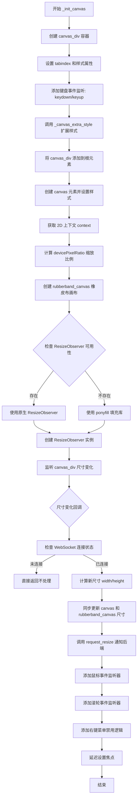

#### 带注释源码

```javascript
mpl.figure.prototype._init_canvas = function () {
    var fig = this;

    // 创建 canvas 容器 div
    var canvas_div = (this.canvas_div = document.createElement('div'));
    canvas_div.setAttribute('tabindex', '0'); // 使 div 可聚焦以接收键盘事件
    // 设置容器基础样式：边框、盒模型、最小尺寸、定位、可调整大小
    canvas_div.setAttribute(
        'style',
        'border: 1px solid #ddd;' +
            'box-sizing: content-box;' +
            'clear: both;' +
            'min-height: 1px;' +
            'min-width: 1px;' +
            'outline: 0;' +
            'overflow: hidden;' +
            'position: relative;' +
            'resize: both;' +
            'z-index: 2;'
    );

    // 键盘事件闭包工厂函数，用于将事件名称传递给 key_event 方法
    function on_keyboard_event_closure(name) {
        return function (event) {
            return fig.key_event(event, name);
        };
    }

    // 监听键盘按下和释放事件
    canvas_div.addEventListener(
        'keydown',
        on_keyboard_event_closure('key_press')
    );
    canvas_div.addEventListener(
        'keyup',
        on_keyboard_event_closure('key_release')
    );

    // 允许子类扩展 canvas_div 样式
    this._canvas_extra_style(canvas_div);
    this.root.appendChild(canvas_div);

    // 创建实际绘图用的 canvas 元素
    var canvas = (this.canvas = document.createElement('canvas'));
    canvas.classList.add('mpl-canvas');
    // canvas 样式：pointer-events: none 确保事件穿透到容器
    canvas.setAttribute(
        'style',
        'box-sizing: content-box;' +
            'pointer-events: none;' +
            'position: relative;' +
            'z-index: 0;'
    );

    // 获取 canvas 的 2D 绘图上下文
    this.context = canvas.getContext('2d');

    // 获取浏览器 backingStorePixelRatio，用于计算高DPI屏幕的缩放比例
    var backingStore =
        this.context.backingStorePixelRatio ||
        this.context.webkitBackingStorePixelRatio ||
        this.context.mozBackingStorePixelRatio ||
        this.context.msBackingStorePixelRatio ||
        this.context.oBackingStorePixelRatio ||
        this.context.backingStorePixelRatio ||
        1;

    // 计算最终缩放比例：devicePixelRatio / backingStorePixelRatio
    this.ratio = (window.devicePixelRatio || 1) / backingStore;

    // 创建 rubberband_canvas 用于绘制缩放框选区域
    var rubberband_canvas = (this.rubberband_canvas = document.createElement(
        'canvas'
    ));
    rubberband_canvas.setAttribute(
        'style',
        'box-sizing: content-box;' +
            'left: 0;' +
            'pointer-events: none;' +
            'position: absolute;' +
            'top: 0;' +
            'z-index: 1;'
    );

    // 检查并设置 ResizeObserver：如果浏览器不支持则使用 ponyfill 填充库
    if (this.ResizeObserver === undefined) {
        if (window.ResizeObserver !== undefined) {
            this.ResizeObserver = window.ResizeObserver;
        } else {
            // 使用 JSXTools 提供的 ResizeObserver 填充库
            var obs = _JSXTOOLS_RESIZE_OBSERVER({});
            this.ResizeObserver = obs.ResizeObserver;
        }
    }

    // 创建 ResizeObserver 实例监听 canvas_div 尺寸变化
    this.resizeObserverInstance = new this.ResizeObserver(function (entries) {
        // WebSocket 未连接时不处理尺寸变化
        if (fig.ws.readyState != 1) {
            return;
        }
        var nentries = entries.length;
        for (var i = 0; i < nentries; i++) {
            var entry = entries[i];
            var width, height;
            // 兼容不同版本的 ResizeObserver API
            if (entry.contentBoxSize) {
                if (entry.contentBoxSize instanceof Array) {
                    // Chrome 84+ 新版 API
                    width = entry.contentBoxSize[0].inlineSize;
                    height = entry.contentBoxSize[0].blockSize;
                } else {
                    // Firefox 旧版 API
                    width = entry.contentBoxSize.inlineSize;
                    height = entry.contentBoxSize.blockSize;
                }
            } else {
                // Chrome <84 更旧版 API
                width = entry.contentRect.width;
                height = entry.contentRect.height;
            }

            // 同步 canvas 和 rubberband_canvas 的尺寸
            if (entry.devicePixelContentBoxSize) {
                // Chrome 84+ 使用 devicePixelContentBoxSize
                canvas.setAttribute(
                    'width',
                    entry.devicePixelContentBoxSize[0].inlineSize
                );
                canvas.setAttribute(
                    'height',
                    entry.devicePixelContentBoxSize[0].blockSize
                );
            } else {
                // 根据 ratio 调整 canvas 物理像素尺寸
                canvas.setAttribute('width', width * fig.ratio);
                canvas.setAttribute('height', height * fig.ratio);
            }
            // 调整 canvas CSS 样式尺寸为显示像素，确保 HiDPI 屏幕显示正确
            canvas.style.width = width + 'px';
            canvas.style.height = height + 'px';

            // rubberband_canvas 使用显示像素尺寸
            rubberband_canvas.setAttribute('width', width);
            rubberband_canvas.setAttribute('height', height);

            // 忽略初始 0/0 尺寸，向 Python 后端发送尺寸更新请求
            if (width != 0 && height != 0) {
                fig.request_resize(width, height);
            }
        }
    });
    // 开始监听 canvas_div
    this.resizeObserverInstance.observe(canvas_div);

    // 鼠标事件闭包工厂，处理浏览器兼容性
    function on_mouse_event_closure(name) {
        var UA = navigator.userAgent;
        var isWebKit = /AppleWebKit/.test(UA) && !/Chrome/.test(UA);
        if(isWebKit) {
            return function (event) {
                // WebKit 浏览器阻止自动切换文本光标
                event.preventDefault()
                return fig.mouse_event(event, name);
            };
        } else {
            return function (event) {
                return fig.mouse_event(event, name);
            };
        }
    }

    // 添加鼠标事件监听器
    canvas_div.addEventListener(
        'mousedown',
        on_mouse_event_closure('button_press')
    );
    canvas_div.addEventListener(
        'mouseup',
        on_mouse_event_closure('button_release')
    );
    canvas_div.addEventListener(
        'dblclick',
        on_mouse_event_closure('dblclick')
    );
    // 节流：限制 mousemove 事件频率最高每 20ms 一次
    canvas_div.addEventListener(
        'mousemove',
        on_mouse_event_closure('motion_notify')
    );

    // 鼠标进入/离开事件
    canvas_div.addEventListener(
        'mouseenter',
        on_mouse_event_closure('figure_enter')
    );
    canvas_div.addEventListener(
        'mouseleave',
        on_mouse_event_closure('figure_leave')
    );

    // 滚轮事件处理：转换滚动方向为 step 值
    canvas_div.addEventListener('wheel', function (event) {
        if (event.deltaY < 0) {
            event.step = 1;
        } else {
            event.step = -1;
        }
        if (fig.capture_scroll) {
            event.preventDefault();
        }
        on_mouse_event_closure('scroll')(event);
    });

    // 将 canvas 和 rubberband_canvas 添加到容器
    canvas_div.appendChild(canvas);
    canvas_div.appendChild(rubberband_canvas);

    // 获取 rubberband_canvas 的 2D 上下文
    this.rubberband_context = rubberband_canvas.getContext('2d');

    // 内部调整 canvas 容器尺寸的方法
    this._resize_canvas = function (width, height, forward) {
        if (forward) {
            canvas_div.style.width = width + 'px';
            canvas_div.style.height = height + 'px';
        }
    };

    // 禁用右键上下文菜单
    canvas_div.addEventListener('contextmenu', function (_e) {
        event.preventDefault();
        return false;
    });

    // 设置初始焦点
    function set_focus() {
        canvas.focus();
        canvas_div.focus();
    }
    // 延迟 100ms 后设置焦点，确保 DOM 完全加载
    window.setTimeout(set_focus, 100);
};
```


### `mpl.figure.prototype._init_toolbar`

该方法负责初始化图形工具栏，包括创建工具栏容器、生成工具栏按钮组、处理按钮点击和悬停事件、创建格式选择器下拉菜单，以及创建状态消息显示区域。

参数： 无（该方法不接受任何显式参数，使用 `this` 引用当前图形实例）

返回值：`undefined`，该方法无返回值，仅执行副作用（DOM操作和属性设置）

#### 流程图

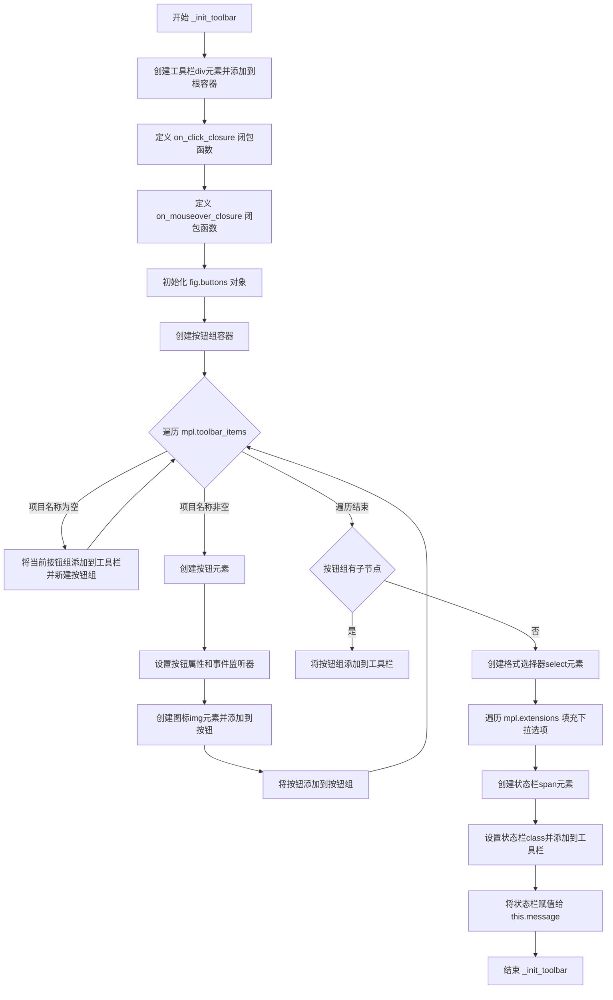

#### 带注释源码

```javascript
mpl.figure.prototype._init_toolbar = function () {
    // 获取当前图形实例的引用，用于闭包中访问实例方法
    var fig = this;

    // 创建工具栏容器div元素
    var toolbar = document.createElement('div');
    // 设置工具栏的CSS类名
    toolbar.classList = 'mpl-toolbar';
    // 将工具栏添加到根容器中
    this.root.appendChild(toolbar);

    // 创建一个闭包函数，用于处理按钮点击事件
    // 参数name: 按钮对应的方法名
    function on_click_closure(name) {
        return function (_event) {
            // 调用图形实例的toolbar_button_onclick方法
            return fig.toolbar_button_onclick(name);
        };
    }

    // 创建一个闭包函数，用于处理按钮鼠标悬停事件
    // 参数tooltip: 按钮的提示文本
    function on_mouseover_closure(tooltip) {
        return function (event) {
            // 仅当按钮未禁用时显示提示
            if (!event.currentTarget.disabled) {
                return fig.toolbar_button_onmouseover(tooltip);
            }
        };
    }

    // 初始化按钮存储对象
    fig.buttons = {};
    // 创建按钮组容器
    var buttonGroup = document.createElement('div');
    buttonGroup.classList = 'mpl-button-group';
    
    // 遍历工具栏配置项数组
    for (var toolbar_ind in mpl.toolbar_items) {
        // 解析工具栏项的配置数据
        var name = mpl.toolbar_items[toolbar_ind][0];      // 按钮名称
        var tooltip = mpl.toolbar_items[toolbar_ind][1];   // 提示文本
        var image = mpl.toolbar_items[toolbar_ind][2];     // 图标图片名
        var method_name = mpl.toolbar_items[toolbar_ind][3]; // 关联方法名

        // 如果名称为空（spacer），则开始新的按钮组
        if (!name) {
            /* Instead of a spacer, we start a new button group. */
            // 先将当前按钮组添加到工具栏
            if (buttonGroup.hasChildNodes()) {
                toolbar.appendChild(buttonGroup);
            }
            // 创建新的按钮组
            buttonGroup = document.createElement('div');
            buttonGroup.classList = 'mpl-button-group';
            continue;
        }

        // 创建按钮元素
        var button = (fig.buttons[name] = document.createElement('button'));
        button.classList = 'mpl-widget';
        button.setAttribute('role', 'button');
        button.setAttribute('aria-disabled', 'false');
        // 绑定点击事件
        button.addEventListener('click', on_click_closure(method_name));
        // 绑定鼠标悬停事件
        button.addEventListener('mouseover', on_mouseover_closure(tooltip));

        // 创建图标img元素
        var icon_img = document.createElement('img');
        icon_img.src = '_images/' + image + '.png';
        icon_img.srcset = '_images/' + image + '_large.png 2x';
        icon_img.alt = tooltip;
        button.appendChild(icon_img);

        // 将按钮添加到按钮组
        buttonGroup.appendChild(button);
    }

    // 如果按钮组有子节点，则添加到工具栏
    if (buttonGroup.hasChildNodes()) {
        toolbar.appendChild(buttonGroup);
    }

    // 创建格式选择器下拉菜单
    var fmt_picker = document.createElement('select');
    fmt_picker.classList = 'mpl-widget';
    toolbar.appendChild(fmt_picker);
    // 保存格式选择器引用
    this.format_dropdown = fmt_picker;

    // 遍历扩展列表，填充下拉选项
    for (var ind in mpl.extensions) {
        var fmt = mpl.extensions[ind];
        var option = document.createElement('option');
        // 设置默认选中项
        option.selected = fmt === mpl.default_extension;
        option.innerHTML = fmt;
        fmt_picker.appendChild(option);
    }

    // 创建状态栏元素
    var status_bar = document.createElement('span');
    status_bar.classList = 'mpl-message';
    toolbar.appendChild(status_bar);
    // 保存状态栏引用到实例
    this.message = status_bar;
};
```


### `mpl.figure.prototype.request_resize`

该方法用于向 matplotlib 后端服务器发送图形调整大小的请求。当浏览器中的画布容器尺寸发生变化（例如通过 ResizeObserver 检测到）时，会调用此方法，通知服务器更新 figure 的尺寸，服务器随后会触发客户端的刷新事件以重新渲染图像。

参数：

- `x_pixels`：`Number`，目标宽度（像素）。
- `y_pixels`：`Number`，目标高度（像素）。

返回值：`undefined`，该方法仅通过 WebSocket 发送消息，不返回任何值。

#### 流程图

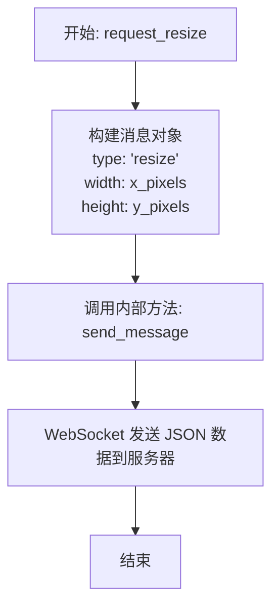

#### 带注释源码

```javascript
/**
 * 请求 matplotlib 后端调整图形大小。
 * matplotlib 收到请求后会触发客户端的 resize 事件，
 * 进而请求刷新图像。
 *
 * @param {Number} x_pixels - 新的宽度（像素）。
 * @param {Number} y_pixels - 新的高度（像素）。
 */
mpl.figure.prototype.request_resize = function (x_pixels, y_pixels) {
    // 调用 send_message 方法，通过 WebSocket 发送类型为 'resize' 的消息，
    // 消息内容包含目标宽度和高度。
    this.send_message('resize', { width: x_pixels, height: y_pixels });
};
```


### `mpl.figure.send_message`

该方法用于将消息通过WebSocket连接发送到服务器。它接收消息类型和属性对象，将消息类型和图形ID添加到属性中，然后将其序列化为JSON字符串通过WebSocket发送。这是客户端与Python后端通信的核心机制，用于处理图形交互、调整大小、绘图等各类事件。

参数：

- `type`：`String`，消息的类型标识符（如 `'resize'`、`'refresh'`、`'draw'` 等），用于服务器端路由到对应的处理函数
- `properties`：`Object`，包含消息的具体属性和数据的对象，会被序列化并发送到服务器

返回值：`undefined`，该方法没有返回值，仅通过WebSocket发送数据

#### 流程图

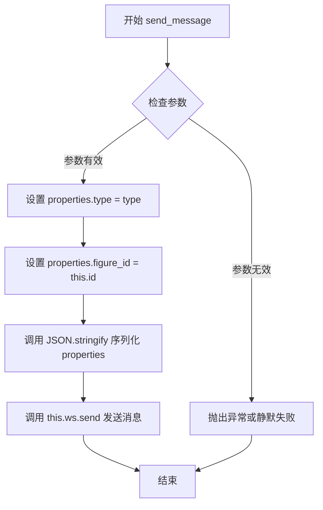

#### 带注释源码

```javascript
/**
 * 发送JSON消息到服务器
 * @param {String} type - 消息类型，如 'resize', 'refresh', 'draw' 等
 * @param {Object} properties - 包含消息具体数据的对象
 */
mpl.figure.prototype.send_message = function (type, properties) {
    // 将消息类型添加到属性对象中，供服务器识别消息类别
    properties['type'] = type;
    
    // 添加图形ID，以便服务器知道该消息来自哪个图形实例
    properties['figure_id'] = this.id;
    
    // 将消息对象序列化为JSON字符串并通过WebSocket发送
    this.ws.send(JSON.stringify(properties));
};
```


### mpl.figure.send_draw_message

该方法负责向 matplotlib 后端发送“绘制”（draw）请求，以获取或刷新当前图形的图像内容。它包含一个简单的节流机制（通过 `waiting` 标志），防止在已有待处理请求时重复发送消息，从而避免 WebSocket 消息拥堵或客户端资源浪费。

参数：
- 无显式参数（方法内部使用 `this` 上下文访问实例状态）。

返回值：`undefined`（无返回值）。

#### 流程图

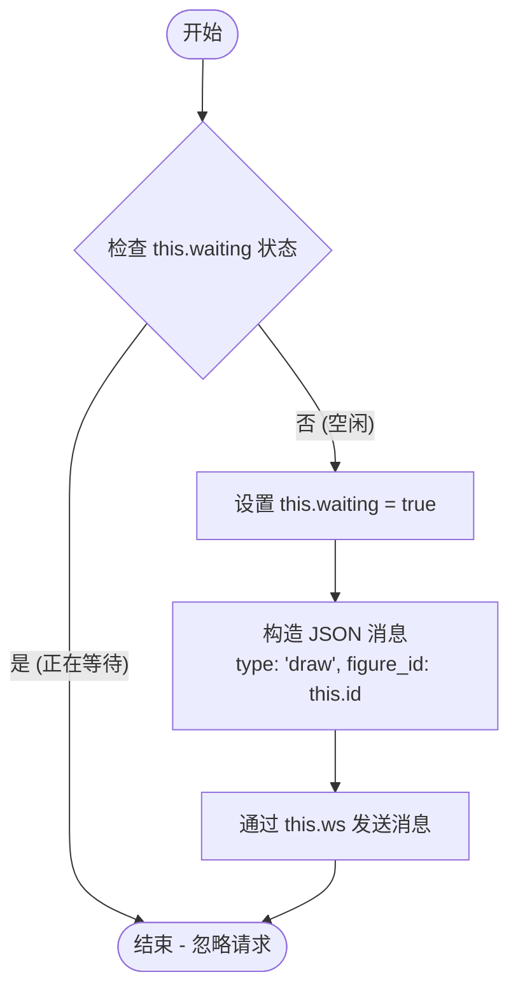

#### 带注释源码

```javascript
mpl.figure.prototype.send_draw_message = function () {
    // 仅当目前没有未完成的绘制请求时才发送新请求。
    // this.waiting 标志用于防止在图像加载过程中重复发送 draw 请求。
    if (!this.waiting) {
        // 1. 将等待状态设置为 true，锁定后续请求直到图像加载完成
        this.waiting = true;

        // 2. 构造包含绘制请求类型和图表 ID 的 JSON 对象
        var msg = {
            type: 'draw',
            figure_id: this.id
        };

        // 3. 通过 WebSocket 发送 JSON 字符串到 Python 后端
        this.ws.send(JSON.stringify(msg));
    }
};
```


### `mpl.figure.prototype.handle_save`

该方法负责处理从 matplotlib 后端发送过来的保存（下载）请求。它从工具栏的格式下拉选择框中获取用户选择的图像格式，然后调用预先设置的下载回调函数 `ondownload` 来完成实际的下载操作。

参数：

- `fig`：`Object`，Figure 对象，包含 `format_dropdown`（格式下拉选择框）和 `ondownload`（下载回调函数）等属性
- `_msg`：`Object`，从 WebSocket 接收的消息对象（在此方法中未使用）

返回值：`undefined`，该方法没有返回值，通过调用回调函数完成操作

#### 流程图

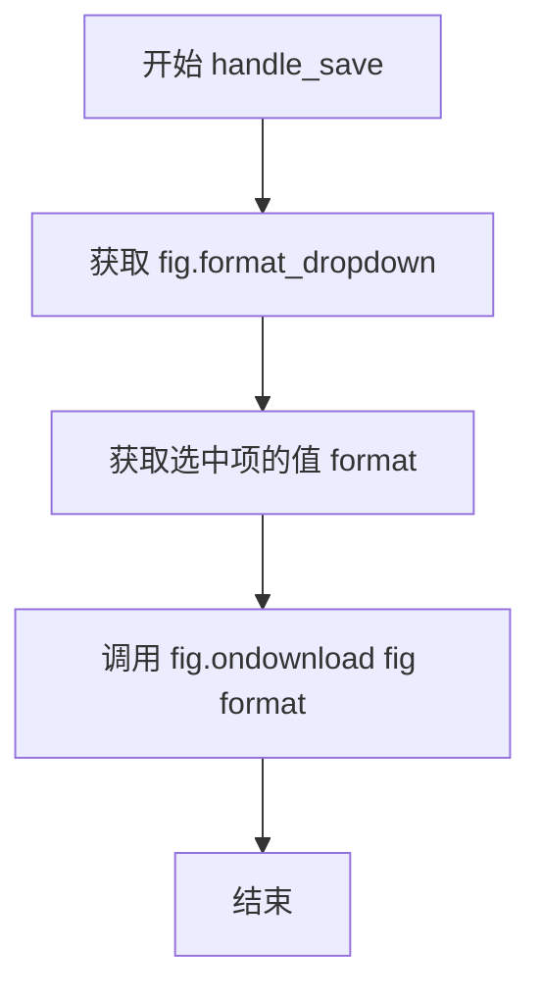

#### 带注释源码

```javascript
/* 处理保存操作的处理程序 */
mpl.figure.prototype.handle_save = function (fig, _msg) {
    // 获取格式下拉选择框元素
    var format_dropdown = fig.format_dropdown;
    
    // 从下拉框中获取用户选择的格式值
    var format = format_dropdown.options[format_dropdown.selectedIndex].value;
    
    // 调用预先设置的下载回调函数，传入 figure 对象和选中的格式
    fig.ondownload(fig, format);
};
```


### `mpl.figure.handle_resize`

该方法用于处理从服务器接收到的画布大小调整消息。当服务器发送新的画布尺寸时，该方法会比较新尺寸与当前画布尺寸，如果尺寸不同则调整画布大小并请求刷新图像。

参数：

- `fig`：`mpl.figure`，Figure 对象本身，用于访问画布（canvas）、调整大小方法（_resize_canvas）和发送消息方法（send_message）
- `msg`：`Object`，从 WebSocket 接收的消息对象，包含 `size`（数组 [宽度, 高度]）和 `forward`（布尔值，表示是否向前调整）属性

返回值：`undefined`，该方法无返回值，仅执行副作用操作

#### 流程图

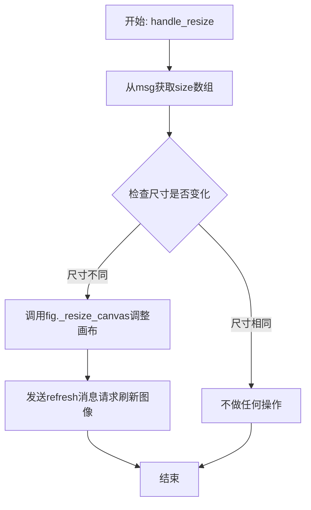

#### 带注释源码

```javascript
mpl.figure.prototype.handle_resize = function (fig, msg) {
    // 从消息对象中获取服务器发来的新尺寸 [宽度, 高度]
    var size = msg['size'];
    
    // 比较新尺寸与当前画布尺寸
    // 只有当尺寸确实发生变化时才进行处理，避免不必要的重绘
    if (size[0] !== fig.canvas.width || size[1] !== fig.canvas.height) {
        // 调用内部方法调整画布容器大小
        // 参数: 宽度, 高度, forward标志
        fig._resize_canvas(size[0], size[1], msg['forward']);
        
        // 发送刷新消息给服务器，请求重新发送图像数据
        fig.send_message('refresh', {});
    }
};
```


### `mpl.figure.handle_rubberband`

该函数负责处理从后端接收到的橡皮筋选择区域（rubberband）绘制消息，将归一化的坐标转换为画布像素坐标，清除之前的选区，并在橡皮筋画布上绘制一个由黑色和白色交替线条组成的矩形选框，用于在matplotlib图形中显示缩放或选择区域。

参数：

- `fig`：`Object`（mpl.figure 实例），Figure 对象，包含画布、橡皮筋上下文和显示比例等属性
- `msg`：`Object`，从WebSocket接收的消息对象，包含选区的归一化坐标（x0, y0, x1, y1）

返回值：`undefined`，该函数没有返回值，仅执行绘图操作

#### 流程图

```mermaid
flowchart TD
    A[开始 handle_rubberband] --> B[从msg获取x0, y0, x1, y1坐标]
    B --> C[除以fig.ratio转换为像素坐标]
    C --> D[计算y坐标: fig.canvas.height - y]
    D --> E[对坐标执行Math.floor + 0.5对齐]
    E --> F[清除整个橡皮band画布]
    F --> G[设置线条属性: 宽度1, 虚线[3], 偏移0, 黑色]
    G --> H[调用drawRubberband绘制矩形]
    H --> I[设置线条属性: 白色, 偏移3]
    I --> J[再次调用drawRubberband绘制]
    J --> K[结束]
```

#### 带注释源码

```javascript
mpl.figure.prototype.handle_rubberband = function (fig, msg) {
    // 将归一化坐标转换为像素坐标，并处理Y轴方向（Matplotlib坐标系与Canvas坐标系Y轴方向相反）
    var x0 = msg['x0'] / fig.ratio;
    var y0 = (fig.canvas.height - msg['y0']) / fig.ratio;
    var x1 = msg['x1'] / fig.ratio;
    var y1 = (fig.canvas.height - msg['y1']) / fig.ratio;

    // 对坐标进行像素对齐：取整后加0.5，确保线条绘制在像素中心，消除抗锯齿模糊
    x0 = Math.floor(x0) + 0.5;
    y0 = Math.floor(y0) + 0.5;
    x1 = Math.floor(x1) + 0.5;
    y1 = Math.floor(y1) + 0.5;

    // 获取橡皮筋绘制上下文
    var ctx = fig.rubberband_context;

    // 清除之前的橡皮筋选区
    ctx.clearRect(
        0,
        0,
        fig.canvas.width / fig.ratio,
        fig.canvas.height / fig.ratio
    );

    // 定义绘制橡皮筋矩形的内部函数
    var drawRubberband = function () {
        // 从x0, y0向x1, y1绘制线条，使虚线在移动缩放框时不会出现"跳跃"
        ctx.beginPath();
        ctx.moveTo(x0, y0);
        ctx.lineTo(x0, y1);  // 左边垂直线
        ctx.moveTo(x0, y0);
        ctx.lineTo(x1, y0);  // 顶部水平线
        ctx.moveTo(x0, y1);
        ctx.lineTo(x1, y1);  // 底部水平线
        ctx.moveTo(x1, y0);
        ctx.lineTo(x1, y1);  // 右边垂直线
        ctx.stroke();
    };

    // 设置第一层绘制样式：黑色线条
    fig.rubberband_context.lineWidth = 1;
    fig.rubberband_context.setLineDash([3]);  // 3像素的虚线模式
    fig.rubberband_context.lineDashOffset = 0;
    fig.rubberband_context.strokeStyle = '#000000';
    drawRubberband();  // 绘制第一层（黑色）

    // 设置第二层绘制样式：白色线条，偏移3像素
    // 这种双层绘制创造出在任何背景下都可见的虚线框效果
    fig.rubberband_context.strokeStyle = '#ffffff';
    fig.rubberband_context.lineDashOffset = 3;
    drawRubberband();  // 绘制第二层（白色，形成对比）
};
```


### `mpl.figure.prototype.handle_figure_label`

该方法用于更新图形（Figure）的标题标签文本。当后端发送包含 `figure_label` 类型的消息时，此方法被调用，从消息中提取 `label` 字段的值并将其设置为图形标题栏的文本内容。

参数：

- `fig`：`mpl.figure`，图形实例对象，包含 `header` 属性用于显示标题
- `msg`：`Object`，从 WebSocket 接收的消息对象，必须包含 `label` 键，其值为新的标题文本

返回值：`undefined`，无返回值

#### 流程图

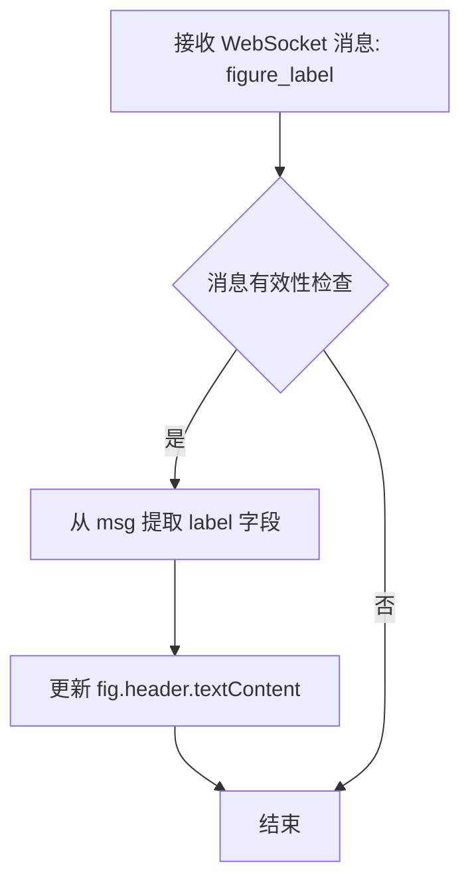

#### 带注释源码

```javascript
/**
 * 处理并更新图形标题的回调函数
 * @param {mpl.figure} fig - 当前图形实例，包含 header DOM 元素
 * @param {Object} msg - WebSocket 消息对象，必须包含 label 属性
 * @returns {undefined} 无返回值
 */
mpl.figure.prototype.handle_figure_label = function (fig, msg) {
    // 更新图形标题
    // 从消息中获取新的标签文本，并设置为标题栏的 textContent
    fig.header.textContent = msg['label'];
};
```

#### 上下文关联说明

该方法在消息处理分发器中被动态调用：

```javascript
// 位于 _make_on_message_function 方法内
var callback = fig['handle_' + msg_type];  // 当 msg_type 为 'figure_label' 时
if (callback) {
    callback(fig, msg);  // 调用 handle_figure_label(fig, msg)
}
```

此方法属于mpl.figure类的消息处理系列方法之一，用于同步后端图形标题变更到前端展示。


### `mpl.figure.prototype.handle_cursor`

该方法用于处理从服务器收到的光标更新消息，根据消息中的光标类型更新画布容器的 CSS 光标样式，从而实现交互过程中光标样式的动态切换（如拖动、缩放等操作时的光标变化）。

参数：

- `fig`：`Object`，当前 figure 实例，用于访问 canvas_div 元素
- `msg`：`Object`，从服务器收到的消息对象，包含 `cursor` 属性，指定要设置的光标类型（如 'pointer', 'crosshair', 'move' 等）

返回值：`undefined`，该方法无返回值，仅直接修改 DOM 元素的样式

#### 流程图

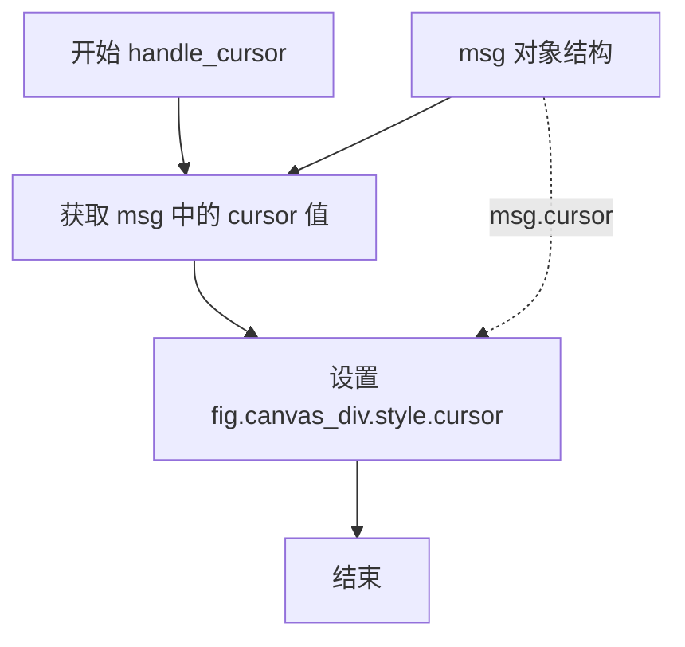

#### 带注释源码

```javascript
/* 处理从 WebSocket 收到的光标更新消息，用于改变光标样式 */
mpl.figure.prototype.handle_cursor = function (fig, msg) {
    // 根据服务器发送的消息设置画布容器的 CSS 光标样式
    // msg['cursor'] 应该是一个有效的 CSS cursor 值，如 'pointer', 'crosshair', 'move', 'wait', 'grab' 等
    fig.canvas_div.style.cursor = msg['cursor'];
};
```

#### 补充说明

| 项目 | 说明 |
|------|------|
| **调用场景** | 当用户在 Matplotlib 图表上进行交互（如平移、缩放、拖拽选框等）时，Python 后端会发送光标类型消息，前端调用此方法更新光标样式 |
| **依赖 DOM** | 依赖 `canvas_div` 元素（画布容器），该元素在 `_init_canvas` 方法中创建并配置 |
| **错误处理** | 无错误处理逻辑，假设 `msg['cursor']` 始终是有效的 CSS 光标值 |
| **性能考量** | 直接操作 DOM `style`，性能开销极低，无优化必要 |


### `mpl.figure.handle_message`

显示状态消息。该方法接收服务器发送的状态消息，并将消息内容更新到图形工具栏的状态栏中。

参数：

- `fig`：`Object`，图形实例（mpl.figure 的实例），用于访问图形的 message 属性
- `msg`：`Object`，服务器发送的消息对象，应包含 `message` 键值对

返回值：`undefined`，无返回值

#### 流程图

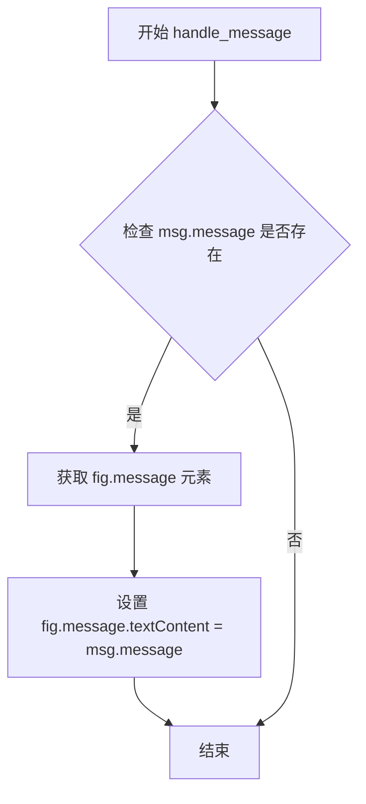

#### 带注释源码

```javascript
/* 处理服务器发送的状态消息并更新到界面状态栏 */
mpl.figure.prototype.handle_message = function (fig, msg) {
    // 将消息对象中的 'message' 字段内容设置为状态栏的文本
    // fig.message 是在 _init_toolbar 中创建的 <span> 元素
    // msg 是从 WebSocket 接收的 JSON 消息对象
    fig.message.textContent = msg['message'];
};
```


### `mpl.figure.handle_draw`

该方法是 matplotlib 图形库在浏览器端的核心方法之一，用于处理服务器发送的绘图刷新请求。当收到服务器端的 "draw" 类型消息时，此方法会被触发，通过调用 `send_draw_message()` 向服务器请求发送新的图形图像数据，实现客户端的动态图形更新。

参数：

- `fig`：`Object`（实际为 `mpl.figure` 实例），表示当前图形对象，用于调用其上的 `send_draw_message` 方法
- `_msg`：`Object`，从服务器接收的 WebSocket 消息对象，包含消息类型和数据（当前方法中未使用，使用下划线前缀表示）

返回值：`undefined`，无返回值，仅执行发送消息的副作用操作

#### 流程图

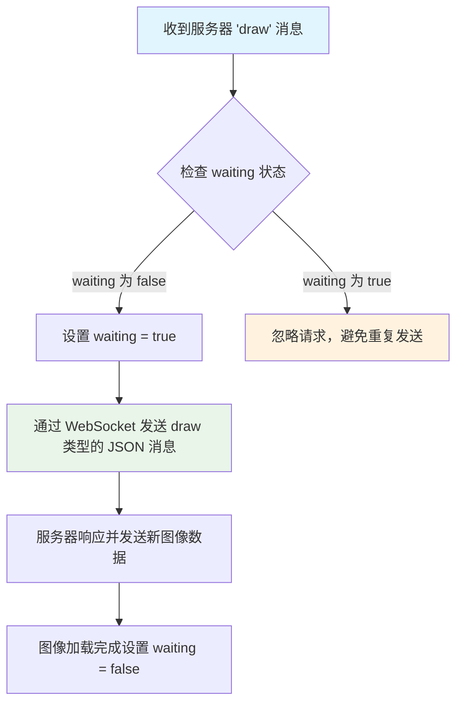

#### 带注释源码

```javascript
/**
 * 处理服务器发来的绘图刷新请求
 * 当收到 type 为 'draw' 的消息时，此方法被调用
 * 
 * @param {Object} fig - mpl.figure 实例，当前图形对象
 * @param {Object} _msg - 服务器发来的消息对象（此方法中未使用）
 */
mpl.figure.prototype.handle_draw = function (fig, _msg) {
    // 向服务器请求发送新的图形图像
    // 该方法内部会检查 waiting 状态，避免重复请求
    fig.send_draw_message();
};
```

#### 相关调用链

```javascript
// 在 _make_on_message_function 中被动态调用
mpl.figure.prototype._make_on_message_function = function (fig) {
    return function socket_on_message(evt) {
        var msg = JSON.parse(evt.data);
        var msg_type = msg['type'];
        
        // 根据消息类型动态调用对应的 handle_ 方法
        var callback = fig['handle_' + msg_type];
        
        if (callback) {
            callback(fig, msg);  // 此处调用 handle_draw
        }
    };
};

// handle_draw 内部调用的 send_draw_message 方法
mpl.figure.prototype.send_draw_message = function () {
    if (!this.waiting) {
        this.waiting = true;
        this.ws.send(JSON.stringify({ type: 'draw', figure_id: this.id }));
    }
};
```

#### 技术说明

1. **waiting 状态机制**：通过 `waiting` 标志位防止在图像加载完成前重复发送请求，这是典型的节流（throttling）实现
2. **消息流程**：客户端接收服务器 "draw" 消息 → 调用 `handle_draw` → 发送 "draw" 请求 → 服务器返回新的图像数据（Base64 或 Blob）→ 图像加载完成重置 `waiting` 状态
3. **潜在优化点**：当前方法直接调用 `send_draw_message()`，可以考虑在此处添加更细粒度的控制，如根据图像模式（`image_mode`）决定是否请求完整图像或差异图像


### `mpl.figure.prototype.handle_image_mode`

该方法用于处理从WebSocket接收到的图像模式切换消息，根据消息中的mode字段更新figure对象的image_mode属性，以控制图像的显示方式（如全图或仅渲染部分）。

参数：

- `fig`：`mpl.figure`，Figure实例，用于访问图形的属性和方法
- `msg`：`Object`，包含图像模式信息的WebSocket消息对象，其中`msg['mode']`为具体的图像模式字符串

返回值：`undefined`，无返回值

#### 流程图

```mermaid
flowchart TD
    A[接收WebSocket消息] --> B[从msg中提取mode字段]
    B --> C[将fig.image_mode设置为msg.mode]
    D[结束]
```

#### 带注释源码

```javascript
/**
 * 处理图像模式切换消息
 * @param {mpl.figure} fig - Figure对象实例
 * @param {Object} msg - 包含图像模式信息的WebSocket消息
 */
mpl.figure.prototype.handle_image_mode = function (fig, msg) {
    // 从消息对象中提取mode字段并更新figure的image_mode属性
    // image_mode用于控制图像显示模式，常见值包括'full'（完整图像）
    fig.image_mode = msg['mode'];
};
```


### `mpl.figure.prototype.handle_history_buttons`

该方法用于处理从服务器传来的历史导航按钮状态更新消息，根据消息中的按钮状态（启用/禁用）来更新界面工具栏上对应按钮的 `disabled` 属性和无障碍属性 `aria-disabled`，确保用户界面的交互状态与后端 Matplotlib 的导航状态保持同步。

参数：

- `fig`：`Object`，matplotlib figure 实例，即 `mpl.figure` 类的实例对象，方法将根据此对象来访问工具栏按钮集合 `fig.buttons`
- `msg`：`Object`，从 WebSocket 服务器接收的消息对象，包含键值对，键为按钮名称（如 `'Back'`、`'Forward'`），值为布尔值（`true` 表示启用，`false` 表示禁用）

返回值：`undefined`，该方法无返回值，仅直接修改 `fig.buttons` 中对应按钮的 DOM 属性

#### 流程图

```mermaid
flowchart TD
    A[开始: handle_history_buttons] --> B[遍历 msg 中的所有 key]
    B --> C{key 是否在 fig.buttons 中?}
    C -->|否| D[跳过当前 key, 继续下一轮]
    C -->|是| E[获取 fig.buttons[key] 按钮元素]
    E --> F[设置按钮 disabled 属性为 msg[key] 的取反值]
    F --> G[设置按钮 aria-disabled 属性为 msg[key] 的取反值]
    G --> D
    D --> H{msg 中还有更多 key?}
    H -->|是| B
    H -->|否| I[结束]
```

#### 带注释源码

```javascript
/**
 * 处理历史按钮状态更新消息
 * 根据服务器发送的消息更新工具栏按钮的启用/禁用状态
 * @param {Object} fig - mpl.figure 实例，包含 buttons 按钮集合
 * @param {Object} msg - 消息对象，键为按钮名称，值为布尔值表示启用状态
 */
mpl.figure.prototype.handle_history_buttons = function (fig, msg) {
    // 遍历消息对象中的所有键值对
    for (var key in msg) {
        // 如果当前键不在 figure 的按钮集合中，则跳过
        if (!(key in fig.buttons)) {
            continue;
        }
        // 设置按钮的 disabled 属性：msg[key] 为 true 时按钮启用，为 false 时禁用
        // 使用取反操作，因为 disabled=true 表示禁用
        fig.buttons[key].disabled = !msg[key];
        // 同时更新无障碍属性 aria-disabled，保持与 disabled 状态一致
        fig.buttons[key].setAttribute('aria-disabled', !msg[key]);
    }
};
```


### `mpl.figure.prototype.handle_navigate_mode`

该方法负责处理从后端收到的导航模式切换消息，根据消息中的模式更新工具栏中"Pan"（平移）和"Zoom"（缩放）按钮的激活状态，从而在界面上反映当前的交互模式。

参数：

- `fig`：`mpl.figure`，图形实例对象，用于访问按钮元素
- `msg`：`Object`，从WebSocket接收的消息对象，包含`mode`字段表示目标导航模式

返回值：`undefined`，该方法无返回值，仅通过修改DOM元素的class属性来更新UI状态

#### 流程图

```mermaid
flowchart TD
    A[接收 navigate_mode 消息] --> B{检查 msg.mode}
    B -->|PAN| C[为 Pan 按钮添加 active 类]
    B -->|ZOOM| D[为 Zoom 按钮添加 active 类]
    B -->|其他| E[移除所有按钮的 active 类]
    C --> F[结束]
    D --> F
    E --> F
    C --> G[从 Zoom 按钮移除 active 类]
    D --> H[从 Pan 按钮移除 active 类]
```

#### 带注释源码

```javascript
/**
 * 处理导航模式切换消息，更新工具栏按钮的激活状态
 * @param {Object} fig - mpl.figure 实例，包含 buttons 集合
 * @param {Object} msg - WebSocket 消息对象，必须包含 mode 字段
 */
mpl.figure.prototype.handle_navigate_mode = function (fig, msg) {
    // 判断模式是否为 PAN（平移）模式
    if (msg['mode'] === 'PAN') {
        // 为 Pan 按钮添加 active 类，使其高亮显示
        fig.buttons['Pan'].classList.add('active');
        // 移除 Zoom 按钮的 active 类，确保同时只有一个模式激活
        fig.buttons['Zoom'].classList.remove('active');
    } 
    // 判断模式是否为 ZOOM（缩放）模式
    else if (msg['mode'] === 'ZOOM') {
        // 移除 Pan 按钮的 active 类
        fig.buttons['Pan'].classList.remove('active');
        // 为 Zoom 按钮添加 active 类，使其高亮显示
        fig.buttons['Zoom'].classList.add('active');
    } 
    // 其他情况（如 None 或其他未知模式），清除所有激活状态
    else {
        fig.buttons['Pan'].classList.remove('active');
        fig.buttons['Zoom'].classList.remove('active');
    }
};
```


### `mpl.figure.prototype.handle_capture_scroll`

该方法用于处理从服务器接收的滚动捕获状态更新消息，根据消息中的 `capture_scroll` 字段更新图形对象的滚动捕获属性，以控制用户滚动事件是否被浏览器默认处理。

参数：

- `fig`：`mpl.figure`，当前图形对象的实例引用，用于访问图形的 `capture_scroll` 属性
- `msg`：`Object`，从 WebSocket 接收的 JSON 消息对象，必须包含 `capture_scroll` 属性（布尔值），表示是否启用滚动捕获

返回值：`undefined`，该方法无返回值，仅修改对象内部状态

#### 流程图

```mermaid
flowchart TD
    A[接收 WebSocket 消息] --> B{消息类型为<br/>'capture_scroll'}
    B -->|是| C[从 msg 对象中提取<br/>capture_scroll 值]
    C --> D[将 fig.capture_scroll<br/>设置为消息中的值]
    B -->|否| E[不做处理]
    D --> F[方法结束]
    E --> F
```

#### 带注释源码

```javascript
/**
 * 处理滚动捕获状态更新消息
 * @param {mpl.figure} fig - 当前图形对象实例
 * @param {Object} msg - 包含 capture_scroll 状态的 WebSocket 消息
 */
mpl.figure.prototype.handle_capture_scroll = function (fig, msg) {
    // 从消息对象中获取 capture_scroll 布尔值
    // true: 阻止浏览器默认滚动行为，由 matplotlib 处理滚动事件
    // false: 允许浏览器默认滚动行为
    fig.capture_scroll = msg['capture_scroll'];
};
```


### `mpl.figure.updated_canvas_event`

该方法在画布内容更新后被调用，用于通知服务器画布已更新。它向服务器发送一个 `ack` 类型的消息，确认已接收到新的图像数据。

参数：无（该方法不接受任何显式参数）

返回值：`undefined`，无返回值

#### 流程图

```mermaid
flowchart TD
    A[updated_canvas_event 被调用] --> B{检查等待状态}
    B --> C[调用 send_message 方法]
    C --> D[发送 JSON 消息: type='ack', figure_id=...]
    D --> E[结束]
    
    style A fill:#e1f5fe
    style D fill:#e8f5e8
```

#### 带注释源码

```javascript
mpl.figure.prototype.updated_canvas_event = function () {
    // Called whenever the canvas gets updated.
    // 此方法在画布内容更新后被调用，例如接收到新的图像数据时
    // 它向服务器发送一个确认消息，通知服务器画布已更新
    
    this.send_message('ack', {});  // 发送类型为 'ack' 的消息，通知服务器画布已更新
};
```

#### 调用上下文说明

该方法在以下场景被调用：

1. **当接收到二进制图像数据（Blob）时**：
   ```javascript
   // 在 _make_on_message_function 中
   fig.imageObj.src = (window.URL || window.webkitURL).createObjectURL(img);
   fig.updated_canvas_event();  // 通知服务器画布已更新
   fig.waiting = false;
   ```

2. **当接收到 Base64 编码的图像数据时**：
   ```javascript
   // 在 _make_on_message_function 中
   fig.imageObj.src = evt.data;
   fig.updated_canvas_event();  // 通知服务器画布已更新
   fig.waiting = false;
   ```

#### 相关方法依赖

- **`send_message(type, properties)`**: 该方法将消息发送到 WebSocket 服务器，消息包含 `type` 和 `figure_id` 属性。


### `mpl.figure._make_on_message_function`

这是一个工厂方法，用于创建并返回一个专门处理 WebSocket 消息的闭包函数（`socket_on_message`）。它负责区分接收到的消息类型（_binary图像_、_base64图像_ 或 _JSON命令_），并根据消息内容更新画布或调用相应的处理程序。

参数：

-  `fig`：`Object` (mpl.figure 实例)，Figure对象的引用，用于在消息处理过程中访问或修改其状态（如 `imageObj`, `waiting` 等），并调用对应的 `handle_xxx` 方法。

返回值：`Function`，返回一个事件处理函数 `socket_on_message(evt)`，该函数将直接绑定到 WebSocket 的 `onmessage` 事件上。

#### 流程图

```mermaid
flowchart TD
    A[接收 WebSocket 消息 evt] --> B{evt.data 是否为 Blob?}
    B -- 是 --> C[处理二进制图像数据]
    C --> C1[检查/修正 MIME 类型为 image/png]
    C --> C2[释放旧图像内存]
    C --> C3[创建新 ObjectURL 并赋值给 fig.imageObj]
    C --> C4[触发 updated_canvas_event]
    C --> C5[重置 waiting 标志]
    C --> C6[结束]
    
    B -- 否 --> D{evt.data 是否为 base64 字符串?}
    D -- 是 --> E[处理 Base64 图像数据]
    E --> E1[直接赋值给 fig.imageObj.src]
    E --> E2[触发 updated_canvas_event]
    E --> E3[重置 waiting 标志]
    E --> E4[结束]

    D -- 否 --> F[解析 JSON 消息]
    F --> G[提取 msg_type]
    G --> H{是否存在 handle_xxx 方法?}
    H -- 是 --> I[调用 handle_xxx 方法]
    I --> J{是否发生异常?}
    J -- 是 --> K[捕获并打印异常日志]
    J -- 否 --> L[结束]
    H -- 否 --> M[打印无处理器警告]
```

#### 带注释源码

```javascript
// 定义在 mpl.figure 的原型上
mpl.figure.prototype._make_on_message_function = function (fig) {
    // 返回一个闭包函数，作为 WebSocket 的 onmessage 处理函数
    return function socket_on_message(evt) {
        // 1. 处理二进制图像数据 (Blob)
        if (evt.data instanceof Blob) {
            var img = evt.data;
            // 强制类型为 image/png，防止浏览器识别错误
            if (img.type !== 'image/png') {
                img.type = 'image/png';
            }

            // 释放之前图像占用的内存
            if (fig.imageObj.src) {
                (window.URL || window.webkitURL).revokeObjectURL(
                    fig.imageObj.src
                );
            }

            // 将 Blob 转换为 Object URL 并显示在 Image 对象上
            fig.imageObj.src = (window.URL || window.webkitURL).createObjectURL(
                img
            );
            // 通知后端画布已更新，并解除等待锁
            fig.updated_canvas_event();
            fig.waiting = false;
            return;
        } 
        // 2. 处理 Base64 编码的图像字符串
        else if (
            typeof evt.data === 'string' &&
            evt.data.slice(0, 21) === 'data:image/png;base64'
        ) {
            fig.imageObj.src = evt.data;
            fig.updated_canvas_event();
            fig.waiting = false;
            return;
        }

        // 3. 处理 JSON 格式的控制消息
        var msg = JSON.parse(evt.data);
        var msg_type = msg['type'];

        // 尝试获取对应的处理函数，命名规范为 handle_{type}
        try {
            var callback = fig['handle_' + msg_type];
        } catch (e) {
            console.log(
                "No handler for the '%s' message type: ",
                msg_type,
                msg
            );
            return;
        }

        // 如果处理函数存在，则调用它
        if (callback) {
            try {
                callback(fig, msg);
            } catch (e) {
                console.log(
                    "Exception inside the 'handler_%s' callback:",
                    msg_type,
                    e,
                    e.stack,
                    msg
                );
            }
        }
    };
};
```


### `mpl.figure.prototype.mouse_event`

处理鼠标事件（按下、释放、移动、双击、进入/离开画布、滚轮等），将鼠标坐标转换为画布内部坐标，并发送消息到后端。

参数：

- `event`：`Event`，原生 DOM 事件对象（MouseEvent、WheelEvent 等），包含客户端鼠标位置、按钮状态等信息
- `name`：`String`，事件名称，标识事件类型（如 `'button_press'`、`'button_release'`、`'motion_notify'`、`'dblclick'`、`'figure_enter'`、`'figure_leave'`、`'scroll'`）

返回值：`Boolean`，返回 `false`，用于阻止浏览器默认行为（如文本光标切换）

#### 流程图

```mermaid
flowchart TD
    A[开始处理鼠标事件] --> B{事件名称是否为<br>'button_press'?}
    B -- 是 --> C[聚焦 this.canvas]
    C --> D[聚焦 this.canvas_div]
    D --> E[获取 canvas 边界矩形]
    B -- 否 --> E
    E --> F[计算相对坐标<br>x = (clientX - left) * ratio<br>y = (clientY - top) * ratio]
    F --> G[获取修饰键状态<br>调用 getModifiers]
    G --> H[提取非对象键<br>调用 simpleKeys]
    H --> I[发送消息到后端<br>send_message 包含 x, y, button, step, buttons, modifiers, guiEvent]
    I --> J[返回 false]
```

#### 带注释源码

```javascript
mpl.figure.prototype.mouse_event = function (event, name) {
    // 如果是按钮按下事件，则聚焦画布元素以接收键盘事件
    if (name === 'button_press') {
        this.canvas.focus();
        this.canvas_div.focus();
    }

    // 获取 canvas 元素相对于视口的位置和尺寸信息
    // 参考: https://stackoverflow.com/q/1114465
    var boundingRect = this.canvas.getBoundingClientRect();
    
    // 计算鼠标在 canvas 内部的坐标，考虑设备像素比进行缩放
    var x = (event.clientX - boundingRect.left) * this.ratio;
    var y = (event.clientY - boundingRect.top) * this.ratio;

    // 向后端发送消息，包含事件类型和详细信息
    this.send_message(name, {
        x: x,                                    // 鼠标 X 坐标（画布内部坐标）
        y: y,                                    // 鼠标 Y 坐标（画布内部坐标）
        button: event.button,                   // 哪个鼠标按钮被按下（0=左键, 1=中键, 2=右键）
        step: event.step,                       // 滚轮滚动步数（仅滚轮事件）
        buttons: event.buttons,                 // 当前按下的所有鼠标按钮的位掩码
        modifiers: getModifiers(event),         // 按下的修饰键（ctrl, alt, shift, meta）
        guiEvent: simpleKeys(event),            // 事件的非对象属性副本
    });

    // 返回 false 阻止浏览器默认行为（如在 WebKit 中防止自动切换到文本插入光标）
    return false;
};
```


### `mpl.figure.prototype._key_event_extra`

处理键盘事件的额外行为扩展点方法（当前为空实现，用于子类重写或扩展）。

参数：

- `_event`：Event，键盘事件对象
- `_name`：String，键盘事件名称（如 'key_press'、'key_release'）

返回值：`undefined`，无返回值

#### 流程图

```mermaid
flowchart TD
    A[开始 _key_event_extra] --> B[接收事件参数]
    B --> C{空实现}
    C --> D[直接返回]
    D --> E[结束]
    
    style C fill:#f9f,stroke:#333,stroke-width:2px
    style D fill:#ff9,stroke:#333,stroke-width:2px
```

#### 带注释源码

```javascript
/**
 * 处理键盘事件的额外行为扩展点
 * 这是一个空实现（stub），设计用于子类重写或扩展
 * 
 * @param {Event} _event - 键盘事件对象（当前未使用）
 * @param {String} _name - 事件名称，如 'key_press' 或 'key_release'（当前未使用）
 * @returns {undefined} 无返回值
 */
mpl.figure.prototype._key_event_extra = function (_event, _name) {
    // Handle any extra behaviour associated with a key event
    // 当前为空实现，未来可在此处添加自定义键盘事件处理逻辑
    // 例如：特殊按键组合处理、快捷键扩展等
};
```


### `mpl.figure.key_event`

处理键盘事件（按键按下和释放），将键盘事件标准化后通过 WebSocket 发送给 Python 后端。该方法阻止重复事件，并根据修饰键（Ctrl、Alt、Shift）生成对应的键值字符串。

#### 参数

- `event`：`KeyboardEvent`，浏览器原生的键盘事件对象，包含按键信息（如 `key`、`ctrlKey`、`altKey`、`shiftKey` 等）
- `name`：`string`，事件类型名称，值为 `'key_press'`（按键按下）或 `'key_release'`（按键释放）

#### 返回值

`boolean`，始终返回 `false`，用于阻止浏览器默认行为

#### 流程图

```mermaid
flowchart TD
    A[开始: key_event] --> B{name === 'key_press'?}
    B -->|Yes| C{event.key === this._key?}
    C -->|Yes| D[return false<br/>防止重复事件]
    C -->|No| E[this._key = event.key<br/>记录当前按键]
    B -->|No| F{name === 'key_release'?}
    F -->|Yes| G[this._key = null<br/>清除按键记录]
    F -->|No| H[跳过]
    D --> I[拼接修饰键前缀]
    E --> I
    G --> I
    I --> J{event.ctrlKey 且 key !== 'Control'?}
    J -->|Yes| K[value += 'ctrl+']
    J -->|No| L{event.altKey 且 key !== 'Alt'?}
    L -->|Yes| M[value += 'alt+']
    L -->|No| N{event.shiftKey 且 key !== 'Shift'?}
    N -->|Yes| O[value += 'shift+']
    N -->|No| P[跳过修饰键处理]
    K --> Q[value += 'k' + event.key]
    M --> Q
    O --> Q
    P --> Q
    Q --> R[调用 _key_event_extra 扩展处理]
    R --> S[调用 send_message 发送消息]
    S --> T[return false]
```

#### 带注释源码

```javascript
/**
 * 处理键盘事件（按键按下和释放），并发送给后端
 * @param {KeyboardEvent} event - 浏览器原生键盘事件对象
 * @param {string} name - 事件类型，'key_press' 或 'key_release'
 * @returns {boolean} 返回 false，阻止默认行为
 */
mpl.figure.prototype.key_event = function (event, name) {
    // 防止重复事件：当同一个键被按住不放时，会重复触发 keypress 事件
    if (name === 'key_press') {
        // 如果当前按键与上次记录的按键相同，说明是重复触发的自动重复事件
        if (event.key === this._key) {
            return false; // 直接忽略重复事件
        } else {
            this._key = event.key; // 记录当前按下的键
        }
    }
    
    // 按键释放时清除记录
    if (name === 'key_release') {
        this._key = null;
    }

    // 构建标准化键值字符串，格式如 'ctrl+alt+kA'
    var value = '';
    
    // 检查修饰键并添加对应前缀
    // 注意：只添加修饰键本身的前缀，不重复添加修饰键的释放键名
    if (event.ctrlKey && event.key !== 'Control') {
        value += 'ctrl+';
    }
    else if (event.altKey && event.key !== 'Alt') {
        value += 'alt+';
    }
    else if (event.shiftKey && event.key !== 'Shift') {
        value += 'shift+';
    }

    // 添加实际按键名称，添加 'k' 前缀以区分特殊键
    value += 'k' + event.key;

    // 调用扩展处理方法，允许子类或外部自定义额外的键盘事件处理逻辑
    this._key_event_extra(event, name);

    // 通过 WebSocket 发送消息给 Python 后端
    // 消息包含：事件类型名称、标准化后的键值、GUI 事件的简单键值对
    this.send_message(name, { 
        key: value, 
        guiEvent: simpleKeys(event) 
    });
    
    return false; // 返回 false 阻止浏览器默认行为
};
```


### `mpl.figure.prototype.toolbar_button_onclick`

该方法是 `mpl.figure` 类的原型方法，用于处理工具栏按钮的点击事件。根据按钮名称执行不同的操作：如果是下载按钮，则调用保存处理方法；否则，向服务器发送工具栏按钮点击消息。

参数：

- `name`：`String`，表示被点击的工具栏按钮名称，用于区分不同按钮的操作类型

返回值：`undefined`，该方法没有返回值

#### 流程图

```mermaid
flowchart TD
    A[工具栏按钮点击] --> B{判断按钮名称}
    B -->|name === 'download'| C[调用 handle_save 方法]
    B -->|name !== 'download'| D[发送 toolbar_button 消息]
    C --> E[结束]
    D --> E
```

#### 带注释源码

```
// 处理工具栏按钮点击事件的方法
// 参数: name - 被点击的按钮名称字符串
mpl.figure.prototype.toolbar_button_onclick = function (name) {
    // 判断是否为下载按钮
    if (name === 'download') {
        // 如果是下载按钮，调用 handle_save 方法处理下载逻辑
        // 传入当前 figure 实例和 null 参数
        this.handle_save(this, null);
    } else {
        // 对于其他工具栏按钮，向服务器发送按钮点击消息
        // 消息内容包含按钮名称，服务器端会根据 name 执行相应操作
        this.send_message('toolbar_button', { name: name });
    }
};
```


### `mpl.figure.prototype.toolbar_button_onmouseover`

该方法用于处理工具栏按钮的鼠标悬停（mouseover）事件。当用户将鼠标移动到工具栏按钮上时，此函数会被触发，将按钮对应的描述信息（tooltip）显示在图形底部的状态栏（message）中，以此向用户提供操作提示。

参数：

- `tooltip`：`String`，需要显示的提示文本，通常来源于工具栏配置 `mpl.toolbar_items` 中定义的按钮描述。

返回值：`Undefined`，该方法没有返回值，主要作用是修改 DOM 元素的内容。

#### 流程图

```mermaid
graph TD
    A([Start: toolbar_button_onmouseover]) --> B[Input: tooltip]
    B --> C{Update UI}
    C --> D[Set this.message.textContent = tooltip]
    D --> E([End])
```

#### 带注释源码

```javascript
/**
 * 处理工具栏按钮的鼠标悬停事件。
 * 当鼠标移到按钮上时，更新底部状态栏的文本内容。
 *
 * @param {string} tooltip - 按钮的描述文本，用于显示在状态栏。
 */
mpl.figure.prototype.toolbar_button_onmouseover = function (tooltip) {
    // 将 figure 实例的状态栏元素的文本内容设置为传入的 tooltip
    this.message.textContent = tooltip;
};
```


### `_JSXTOOLS_RESIZE_OBSERVER.observe` (ResizeObserver.observe)

该方法用于开始观察指定元素的尺寸变化，将当前 ResizeObserver 实例注册到该元素以接收尺寸调整通知。这是 JSXTools ResizeObserver polyfill 的核心方法，用于监控 DOM 元素的大小变化。

参数：

-  `element`：`Window.Element`，要观察尺寸变化的 DOM 元素

返回值：`undefined`，无返回值

#### 流程图

```mermaid
flowchart TD
    A[开始observe方法] --> B{参数是否是Window.Element}
    B -->|否| C[直接返回，不做任何处理]
    B -->|是| D{元素是否已在r WeakMap中}
    D -->|否| E[创建新的Set存储该元素的观察者]
    E --> F[将元素添加到o Set]
    F --> G[获取元素的computedStyle并存储到a WeakMap]
    D -->|是| H[从r获取该元素的观察者Set]
    H --> I{观察者Set是否已包含当前实例}
    I -->|否| J[将当前ResizeObserver实例添加到Set]
    I -->|是| K[取消当前正在运行的requestAnimationFrame]
    K --> L[重新请求新的requestAnimationFrame执行d函数]
    L --> M[结束]
    C --> M
    J --> K
```

#### 带注释源码

```javascript
s.prototype.observe = function(element) {
    // 检查传入的参数是否是有效的DOM元素
    if (element instanceof window.Element) {
        // 如果该元素尚未被跟踪（不在r WeakMap中）
        if (!r.has(element)) {
            // 为该元素创建一个新的Set，用于存储所有观察该元素的ResizeObserver实例
            r.set(element, new Set());
            // 将元素添加到o Set（跟踪所有被观察的元素）
            o.add(element);
            // 获取并存储该元素的计算样式，用于后续计算尺寸变化
            a.set(element, window.getComputedStyle(element));
        }
        
        // 获取该元素对应的观察者Set
        var elementObservers = r.get(element);
        
        // 如果当前ResizeObserver实例尚未观察该元素
        if (!elementObservers.has(this)) {
            // 将当前实例添加到观察者集合中
            elementObservers.add(this);
        }
        
        // 取消之前的requestAnimationFrame（如果存在）
        cancelAnimationFrame(t);
        
        // 启动新的requestAnimationFrame来触发尺寸检测循环
        t = requestAnimationFrame(d);
    }
    // 如果参数不是Element，则直接忽略，不做任何处理
};
```

---

### 关键组件信息

| 名称 | 一句话描述 |
|------|-----------|
| `_JSXTOOLS_RESIZE_OBSERVER` | 一个用于兼容不支持原生 ResizeObserver 的浏览器的 polyfill 库，通过弱引用跟踪被观察元素和观察者实例 |
| `ResizeObserver` | 观察元素尺寸变化的核心类，提供 observe、unobserve 方法 |
| `r WeakMap` | 存储元素到观察者实例集合的映射，用于快速查找某元素的所有观察者 |
| `o Set` | 存储所有被观察元素的集合，用于跟踪哪些元素正在被观察 |
| `a WeakMap` | 存储元素到其计算样式（computedStyle）的映射，用于尺寸计算 |
| `requestAnimationFrame` | 驱动尺寸检测循环的机制，确保在下一帧进行尺寸检查 |


### `ResizeObserver.unobserve`

该方法用于取消观察指定的 DOM 元素，停止该元素的大小变化监控。当不再需要监听元素尺寸变化时调用此方法。

参数：

-  `element`：`window.Element`，要取消观察的 DOM 元素。

返回值：`undefined`，无返回值。

#### 流程图

```mermaid
graph TD
    A[开始] --> B{检查参数是否为 Element 且在 r 中}
    B -->|否| C[结束]
    B -->|是| D[获取元素的观察者集合 n]
    D --> E{n 中是否包含当前实例}
    E -->|否| C
    E -->|是| F[从 n 中删除当前实例]
    F --> G{n 是否为空}
    G -->|是| H[从 r 和 o 中删除该元素]
    G -->|否| I[继续]
    H --> J{o 是否为空}
    J -->|是| K[取消动画帧]
    J -->|否| C
    I --> C
```

#### 带注释源码

```javascript
// 定义取消观察元素的方法
s.prototype.unobserve = function (i) {
    // 检查参数 i 是否为 window.Element 实例，并且 r（WeakMap）中是否包含该元素
    if (i instanceof window.Element && r.has(i)) {
        // 从 r 中获取该元素对应的观察者集合（一个 Set）
        var n = r.get(i);
        // 如果集合 n 中包含当前 ResizeObserver 实例
        n.has(this) && (
            // 从集合中删除当前实例
            n.delete(this),
            // 如果删除后集合为空
            n.size || (
                // 从 r 中删除该元素
                r.delete(i),
                // 从 o 中删除该元素
                o.delete(i)
            )
        ),
        // 如果集合 n 为空，则从 r 中删除该元素（冗余检查，但保持逻辑）
        n.size || r.delete(i),
        // 如果 o 为空（即没有其他被观察的元素），则取消动画帧
        o.size || cancelAnimationFrame(t);
    }
};
```

## 关键组件


### mpl.get_websocket_type

检测浏览器支持的WebSocket类型，返回WebSocket或MozWebSocket构造函数，若均不支持则弹出警告提示用户升级浏览器。

### mpl.figure

主图形类，负责管理与后端的WebSocket连接、Canvas渲染、用户交互（鼠标/键盘事件）、工具栏以及图像数据的接收与显示，是整个前端渲染管道的核心控制器。

### mpl.figure.prototype._init_header

初始化图形标题栏，创建一个包含标题文本的对话框头部元素，设置样式并添加到根容器中。

### mpl.figure.prototype._init_canvas

初始化Canvas画布及其容器，包含以下关键功能：
- 创建canvas和rubberband_canvas元素
- 配置2D绘图上下文和设备像素比处理（HiDPI屏幕支持）
- 设置键盘和鼠标事件监听器（支持WebKit特殊处理）
- 实现ResizeObserver或使用polyfill进行响应式尺寸监听
- 处理鼠标事件节流（每20ms一次）

### mpl.figure.prototype._init_toolbar

初始化图形工具栏，动态创建工具栏按钮组，支持文件格式选择下拉框和状态消息显示区，按钮配置来自mpl.toolbar_items全局变量。

### mpl.figure.prototype.send_message

将消息类型和属性封装为JSON格式，通过WebSocket发送至后端，包含figure_id用于标识目标图形。

### mpl.figure.prototype._make_on_message_function

创建WebSocket消息处理函数，支持二进制Blob（PNG图像）和Base64字符串两种图像格式接收方式，将JSON消息路由到对应的handle_*方法处理。

### mpl.figure.prototype.handle_* 系列方法

处理后端各类消息，包括：
- handle_save: 处理图像下载请求
- handle_resize: 处理画布尺寸调整
- handle_rubberband: 绘制缩放框选区域
- handle_figure_label: 更新图形标题
- handle_cursor: 更改光标样式
- handle_message: 显示状态消息
- handle_draw: 触发图像刷新
- handle_image_mode: 设置图像显示模式
- handle_history_buttons: 更新导航按钮状态
- handle_navigate_mode: 更新平移/缩放模式激活状态
- handle_capture_scroll: 设置滚轮事件捕获

### mpl.figure.prototype.mouse_event

将原生鼠标事件转换为标准化消息，包含坐标转换（考虑设备像素比）、按钮状态、修饰键信息，并发送至后端处理。

### mpl.figure.prototype.key_event

处理键盘按下和释放事件，构建包含修饰键组合的键值字符串，发送至后端并防止重复事件。

### getModifiers

辅助函数，从事件对象中提取Ctrl、Alt、Shift、Meta修饰键状态，返回修饰键名称数组。

### simpleKeys

辅助函数，返回对象的非对象类型键值对副本，用于避免JSON序列化时的循环引用问题。

### ResizeObserver Polyfill

第三方库_JSXTOOLS_RESIZE_OBSERVER提供的ResizeObserver实现，作为浏览器原生API的降级方案，处理元素尺寸变化的响应式监听。


## 问题及建议


### 已知问题

- **全局命名空间污染**: `window.mpl = {}` 直接挂在全局对象上，容易与其他库冲突
- **废弃的WebSocket检测**: 代码仍检查 `MozWebSocket`，这是一个已废弃的API
- **阻塞式错误提示**: 使用 `alert()` 弹出浏览器不支持WebSocket的消息，这会阻塞UI线程且用户体验差
- **用户代理嗅探**: 使用正则表达式进行 `navigator.userAgent` 检测来识别WebKit浏览器，这是公认的不良实践，应使用特性检测
- **缺少事件节流实现**: 代码注释提到"Throttle sequential mouse events to 1 every 20ms"，但实际上并未实现节流逻辑，`mousemove` 事件直接绑定会导致高频触发
- **JSON解析缺少错误处理**: `JSON.parse(evt.data)` 没有 try-catch 包裹，如果服务器发送畸形JSON会导致整个消息处理崩溃
- **内存泄漏风险**: `ResizeObserver` 实例和事件监听器没有在 figure 销毁时进行清理
- **内联第三方库**: `_JSXTOOLS_RESIZE_OBSERVER` 作为内联函数嵌入代码中，难以维护且增加代码体积
- **隐式依赖未声明**: 代码依赖全局变量 `mpl.toolbar_items`、`mpl.extensions`、`mpl.default_extension` 和 `mpl.toolbar_items`，但这些变量在当前文件中未定义
- **HTML注入风险**: 多处使用 `innerHTML` 设置内容（如 `titletext.textContent` 和 `option.innerHTML`），虽然部分使用了 `textContent`，但格式选择器的 `innerHTML` 可能存在风险
- **魔法数字**: 存在多处硬编码的数值（如 20ms、100ms、3px 等）未提取为常量
- **Canvas 2D 上下文状态未重置**: 在 `handle_rubberband` 中设置线条样式后未恢复，可能影响后续绘制

### 优化建议

- 将 `mpl` 对象挂载到更具体的命名空间下，或使用 IIFE/模块模式避免全局污染
- 移除对 `MozWebSocket` 的检测，只保留标准 `WebSocket` API
- 用自定义模态框或控制台警告替代 `alert()` 阻塞式提示
- 实现真正的事件节流，可使用 `requestAnimationFrame` 或第三方库如 lodash 的 throttle
- 为 `JSON.parse` 添加 try-catch 异常处理，记录解析错误并安全跳过
- 添加 `destroy()` 方法用于清理 ResizeObserver、事件监听器和 WebSocket 连接
- 将 ResizeObserver polyfill 提取为外部依赖或使用 npm 包
- 声明所有外部依赖的全局变量，或通过依赖注入方式传入
- 将所有魔法数字提取为具名常量，提高代码可读性和可维护性
- 统一使用 `textContent` 替代 `innerHTML`，或引入 DOM 净化库
- 在绘制完 rubberband 后保存并恢复 canvas 状态，或使用 `ctx.save()`/`ctx.restore()`

## 其它


### 设计目标与约束

本代码旨在为matplotlib提供基于WebSocket的交互式图形渲染前端，支持在浏览器中实时显示和交互Python后端生成的图形。设计目标包括：实现跨浏览器的WebSocket通信兼容、处理二进制图像数据、优化HiDPI屏幕显示、支持鼠标和键盘交互、响应式布局调整。主要约束为依赖现代浏览器特性（WebSocket、Canvas、ResizeObserver），且需要后端Python服务器配合。

### 错误处理与异常设计

代码采用try-catch块处理WebSocket消息回调中的异常，如handle_*方法执行失败时仅打印错误日志而不中断执行。关键错误处理场景包括：WebSocket连接失败时弹出alert警告；不支持二进制消息时显示性能警告；ResizeObserver不可用时使用polyfill填充；消息类型无对应handler时输出日志。异常设计特点为静默失败+日志记录，保证图形渲染流程不因局部错误中断。

### 数据流与状态机

数据流分为两个方向：上行流（客户端到服务器）通过send_message方法发送JSON格式消息，包含type、figure_id及事件相关数据；下行流（服务器到客户端）通过ws.onmessage接收，分为二进制Blob（图像数据）和JSON文本（控制消息）两类。状态机主要包含waiting状态（等待图像加载）、image_mode状态（full/stride模式）、capture_scroll状态（滚动捕获开关）、navigate_mode状态（PAN/ZOOM/None模式）。

### 外部依赖与接口契约

外部依赖包括：浏览器原生WebSocket API（或MozWebSocket）、HTML5 Canvas API、ResizeObserver API（及_JSXTOOLS_RESIZE_OBSERVER polyfill）。接口契约方面，mpl.figure构造函数接收四个参数：figure_id（图形标识符）、websocket（WebSocket实例）、ondownload（下载回调函数）、parent_element（DOM父容器）。全局配置依赖mpl.toolbar_items（工具栏项数组）、mpl.extensions（支持的图像格式）、mpl.default_extension（默认格式）。WebSocket消息协议采用JSON格式，消息类型包括supports_binary、send_image_mode、set_device_pixel_ratio、refresh、resize、draw、ack及各种handle_*方法对应的类型。

### 性能考虑与优化空间

代码包含多项性能优化：使用ResizeObserver而非setInterval轮询实现高效响应式布局；二进制Blob直接创建ObjectURL避免Base64解码开销；图像加载完成后才发送ack消息实现流量控制；throttle鼠标移动事件处理。潜在优化空间包括：mouse_event中每次创建新对象可复用；resizeObserver回调中大量DOM操作可合并；二进制和Base64两种图像格式处理逻辑可统一；缺少请求取消机制（ws.close后仍在处理的消息）。

### 安全考虑

代码安全风险较低，因所有数据通过WebSocket从可信后端获取。主要安全考量包括：使用createObjectURL和revokeObjectURL正确管理Blob内存；simpleKeys函数排除对象类型防止循环引用；事件处理中避免直接执行eval或innerHTML赋值。GUI事件传递采用simpleKeys过滤非对象键，防止原型链攻击。

### 兼容性考虑

代码兼容多种浏览器环境：WebSocket使用mpl.get_websocket_type函数检测WebSocket/MozWebSocket；ResizeObserver使用polyfill降级；canvas的backingStorePixelRatio检测多浏览器前缀；contentBoxSize和contentRect混合支持新旧spec；User-Agent检测处理WebKit特异行为。当前代码不支持IE11及更早版本，要求浏览器支持Canvas 2D Context和WebSocket。

### 资源管理与生命周期

资源管理包括：WebSocket连接生命周期管理（onunload时自动关闭）；Image对象通过revokeObjectURL释放Blob内存；ResizeObserver实例在元素卸载时需手动unobserve（当前代码未实现）；canvas和rubberband_canvas尺寸同步管理。生命周期流程：构造函数初始化→_init_header/_init_canvas/_init_toolbar→WebSocket连接→消息循环→页面卸载时关闭连接。

### 事件处理机制

事件处理采用闭包封装模式：on_keyboard_event_closure、on_mouse_event_closure、on_click_closure等工厂函数返回带有上下文的事件处理器。鼠标事件支持button_press、button_release、motion_notify、dblclick、figure_enter、figure_leave、scroll类型。键盘事件支持key_press、key_release并防止重复触发。工具栏事件通过mpl.toolbar_items配置映射到toolbar_button_onclick方法。事件坐标统一转换为canvas坐标系（考虑devicePixelRatio和boundingClientRect）。

### 配置与初始化流程

初始化配置来源包括：mpl.toolbar_items定义工具栏按钮（名称、tooltip、图标、方法名）；mpl.extensions定义支持的图像格式；mpl.default_extension定义默认导出格式。初始化流程为：创建根div容器→初始化header标题栏→初始化canvas画布（包含ResizeObserver）→初始化toolbar工具栏→建立WebSocket连接→发送supports_binary等初始化消息→进入消息处理循环。

### 通信协议详解

JSON消息协议采用键值对格式，必含字段为type（消息类型）和figure_id（图形标识）。客户端发送消息类型包括：supports_binary（binaryType支持情况）、send_image_mode（图像模式）、set_device_pixel_ratio（设备像素比）、refresh（刷新请求）、resize（尺寸调整）、draw（绘图请求）、ack（图像已更新确认）、toolbar_button（工具栏按钮点击）、key_press/key_release（键盘事件）、button_press/button_release/motion_notify（鼠标事件）。服务器发送消息类型包括：各种handle_*方法对应的类型如draw、resize、rubberband、figure_label、cursor、message、image_mode、history_buttons、navigate_mode、capture_scroll等。


    