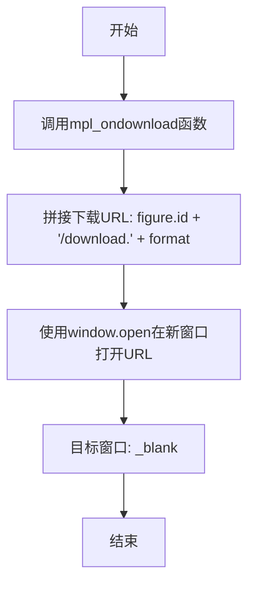
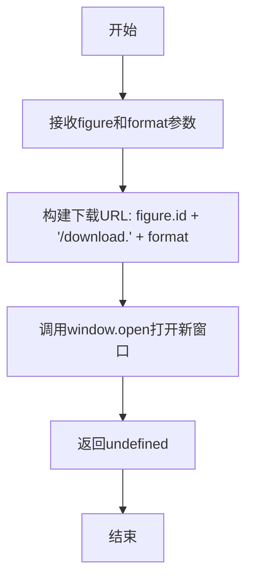

# `matplotlib\lib\matplotlib\backends\web_backend\js\mpl_tornado.js` 详细设计文档

该代码是matplotlib基于tornado的Web服务器的辅助模块，提供了一个用于在Web界面下载图表的函数，支持将指定格式的图表在新窗口中打开下载。

## 整体流程



## 类结构

```
全局函数作用域
└── mpl_ondownload (导出函数)
```

## 全局变量及字段


### `mpl_ondownload`
    
用于在matplotlib的WebAgg服务器中，通过打开新窗口下载指定格式的图表。

类型：`function`
    


    

## 全局函数及方法


### `mpl_ondownload`

该函数是matplotlib WebAgg后端的核心功能之一，用于在浏览器端触发图表的下载操作。它接收图表对象和目标格式，通过构造URL并使用`window.open`在新的浏览器标签页中打开下载链接，实现无需服务器端额外处理即可直接下载指定格式的图表文件。

参数：

- `figure`：`Object`，matplotlib图表对象，必须包含`id`属性用于构建下载URL
- `format`：`String`，目标文件格式（如'png'、'pdf'、'svg'等）

返回值：`undefined`，该函数直接调用`window.open`并返回其结果（浏览器返回void）

#### 流程图



#### 带注释源码

```javascript
/* This .js file contains functions for matplotlib's built-in
   tornado-based server, that are not relevant when embedding WebAgg
   in another web application. */

/* exported mpl_ondownload */
/**
 * 触发matplotlib图表的下载操作
 * @param {Object} figure - matplotlib图表对象，必须包含id属性
 * @param {String} format - 目标文件格式（如'png'、'pdf'、'svg'等）
 * @returns {undefined} 无返回值
 */
function mpl_ondownload(figure, format) {
    // 使用window.open在新的浏览器标签页中打开下载URL
    // URL格式: {figure.id}/download.{format}
    // _blank表示在新标签页打开
    window.open(figure.id + '/download.' + format, '_blank');
}
```


## 关键组件


### mpl_ondownload 函数

用于在新的浏览器标签页中打开指定格式的图表下载页面，实现matplotlib图表的下载功能。


## 问题及建议


### 已知问题

-   **参数验证缺失**：未对 `figure` 对象及其 `id` 属性进行空值检查，可能导致运行时错误
-   **格式参数未校验**：`format` 参数直接拼接到 URL 中，未验证其合法性，可能导致无效下载链接
-   **弹出窗口被阻止风险**：使用 `window.open` 可能被浏览器popup blocker拦截，导致下载功能失效
-   **无错误处理机制**：下载失败时无任何错误反馈，用户体验不佳
-   **安全风险**：未对 `figure.id` 进行输入 sanitization，可能存在开放重定向漏洞
-   **无用户反馈**：缺少下载进度提示或成功/失败状态通知

### 优化建议

-   添加参数校验逻辑，验证 `figure`、`figure.id` 和 `format` 的有效性
-   实现 popup blocker 检测机制，提供备选下载方案（如动态创建 `<a>` 标签触发下载）
-   添加 `try-catch` 错误处理，捕获并报告下载异常
-   对 `figure.id` 进行 URL 编码或输入白名单校验，防止注入攻击
-   增加 JSDoc 文档注释，说明函数用途、参数和返回值
-   考虑使用 `fetch` + `Blob` API 实现更可靠的跨域下载方案


## 其它


### 设计目标与约束

本模块的核心目标是为matplotlib的WebAgg后端提供内置的下载功能支持，允许用户通过浏览器新标签页下载指定格式的图表。该函数仅在matplotlib内置的tornado服务器环境下使用，当WebAgg嵌入到其他Web应用程序中时此功能不适用。设计约束包括：仅支持客户端浏览器行为，无法控制服务器端下载逻辑，且依赖figure对象提供正确的id属性。

### 错误处理与异常设计

当前函数缺乏显式的错误处理机制。若figure对象为null或undefined，将导致运行时错误；若figure.id不存在或格式不正确，生成的URL将无效；若format参数为空或包含非法字符，可能导致服务器404错误。建议添加参数验证：检查figure对象是否存在、figure.id是否为有效字符串、format是否为支持的格式（如png、pdf、svg等）。

### 数据流与状态机

本函数的数据流极为简单：接收figure对象和format字符串作为输入，通过字符串拼接构造下载URL，然后调用window.open在浏览器新标签页中打开该URL。状态机转换如下：初始状态（用户触发下载）→ URL构造状态 → 浏览器新标签页打开状态 → 下载完成状态（由浏览器控制）。无复杂状态管理需求。

### 外部依赖与接口契约

本函数依赖以下外部组件：window对象（浏览器全局对象）、figure对象（需包含id属性，类型为字符串）、format参数（字符串类型，应为matplotlib支持的导出格式）。接口契约要求调用方传入有效的figure对象实例，其中必须包含非空的id属性；format参数应为matplotlib后端支持的格式字符串。函数本身无返回值，通过浏览器侧效应完成下载流程。

### 安全性考虑

存在以下安全风险：1) URL注入风险，若figure.id未经过滤直接拼接到URL中，可能导致URL注入或重定向攻击；2) 弹出窗口屏蔽，现代浏览器可能拦截window.open调用，需要用户授权；3) 跨域资源访问，下载URL可能涉及跨域请求。建议对figure.id进行URL编码验证，并考虑使用<a>标签的download属性替代window.open以获得更安全的下载体验。

### 浏览器兼容性

本函数使用ES5语法和标准的window.open API，兼容所有现代浏览器（包括Chrome、Firefox、Safari、Edge）。但需注意：1) 某些浏览器默认阻止弹出窗口；2) _blank参数在少数旧版浏览器中可能不完全支持；3) 移动端浏览器对window.open的行为可能有所不同。

### 性能考虑

该函数性能开销极低，仅涉及字符串操作和单次DOM API调用。无需进行性能优化。唯一需注意的是频繁调用可能触发浏览器的弹出窗口限制机制，影响用户体验。

### 测试建议

建议编写以下测试用例：1) 正常场景测试，传入有效的figure对象和format参数，验证新标签页是否正确打开；2) 异常场景测试，传入null/undefined figure、null format、空字符串format，验证函数行为；3) 边界测试，传入特殊字符的figure.id、超长format参数；4) 浏览器兼容性测试，验证在不同浏览器中的行为一致性；5) 弹出窗口屏蔽测试，验证浏览器提示用户允许弹窗时的行为。

### 潜在改进空间

当前实现存在以下改进空间：1) 添加参数类型检查和验证；2) 实现错误回调机制以处理window.open被阻止的情况；3) 支持自定义下载文件名；4) 考虑使用<a>标签download属性提供更稳定的下载体验；5) 添加进度指示或用户反馈机制；6) 支持异步下载请求以便处理大文件；7) 添加日志记录以便调试和分析使用情况。

    