# `matplotlib\lib\matplotlib\backends\web_backend\js\nbagg_mpl.js` 详细设计文档

这是一个matplotlib与IPython/Jupyter notebook集成的JavaScript模块，通过WebSocket适配器实现前端与Python内核的通信，处理图形渲染、工具栏交互、画布更新和输出单元格的同步。

## 整体流程

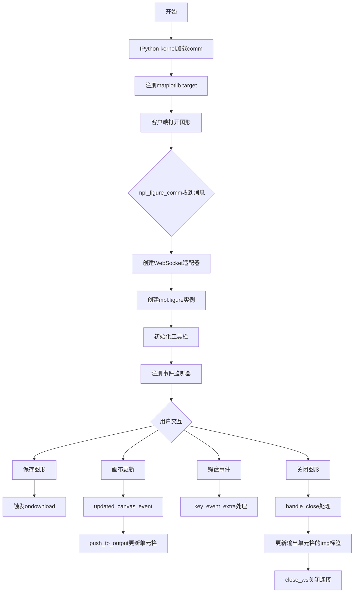

## 类结构

```
Global (mpl - matplotlib全局对象)
├── comm_websocket_adapter (函数 - WebSocket适配器工厂)
├── mpl.figure (类 - 图形管理器)
│   ├── handle_close (方法)
│   ├── close_ws (方法)
│   ├── push_to_output (方法)
│   ├── updated_canvas_event (方法)
│   ├── _init_toolbar (方法)
│   ├── _remove_fig_handler (方法)
│   ├── _root_extra_style (方法)
│   ├── _canvas_extra_style (方法)
│   ├── _key_event_extra (方法)
│   └── handle_save (方法)
└── mpl.find_output_cell (函数 - 工具函数)
```

## 全局变量及字段


### `mpl`
    
Global matplotlib namespace object containing figure class and toolbar_items

类型：`object`
    


### `comm_websocket_adapter`
    
Creates a websocket-like adapter that wraps IPython comm object for matplotlib figure communication

类型：`function`
    


### `ws`
    
Websocket-like proxy object that mimics WebSocket interface for comm communication

类型：`object`
    


### `id`
    
Unique identifier for the figure, extracted from comm message content data

类型：`string`
    


### `element`
    
DOM element reference where the figure is rendered, found by ID

类型：`HTMLElement`
    


### `ws_proxy`
    
Websocket proxy adapter instance for figure-kernel communication

类型：`object`
    


### `fig`
    
Figure instance created with id, websocket proxy, download handler and DOM element

类型：`mpl.figure`
    


### `width`
    
Calculated canvas width divided by pixel ratio for proper display scaling

类型：`number`
    


### `dataURL`
    
Base64 encoded image data URL from canvas toDataURL() method

类型：`string`
    


### `toolbar`
    
Div element serving as the main toolbar container with btn-toolbar class

类型：`HTMLElement`
    


### `buttonGroup`
    
Div element for grouping related toolbar buttons with btn-group class

类型：`HTMLElement`
    


### `button`
    
Button element created dynamically for each toolbar item

类型：`HTMLElement`
    


### `status_bar`
    
Span element displaying runtime messages with mpl-message pull-right class

类型：`HTMLElement`
    


### `buttongrp`
    
Button group div for containing the close/stop interaction button

类型：`HTMLElement`
    


### `titlebar`
    
Dialog titlebar element where the close button is inserted

类型：`HTMLElement`
    


### `cells`
    
Array of all notebook cells obtained from IPython.notebook.get_cells()

类型：`array`
    


### `ncells`
    
Total count of cells in the notebook

类型：`number`
    


### `i`
    
Loop counter for iterating through notebook cells

类型：`number`
    


### `j`
    
Loop counter for iterating through cell outputs

类型：`number`
    


### `cell`
    
Individual cell object from notebook cells array

类型：`object`
    


### `data`
    
Output data object from cell output_area, containing mimebundle data

类型：`object`
    


### `toolbar_ind`
    
Index counter for iterating through mpl.toolbar_items array

类型：`number`
    


### `name`
    
Name of toolbar item or button label from toolbar_items configuration

类型：`string`
    


### `tooltip`
    
Tooltip text for toolbar button, shown on mouseover

类型：`string`
    


### `image`
    
Font Awesome icon class name for toolbar button icon

类型：`string`
    


### `method_name`
    
Name of method to invoke when toolbar button is clicked

类型：`string`
    


### `mpl.figure.canvas`
    
The canvas element containing the rendered figure data

类型：`HTMLCanvasElement`
    


### `mpl.figure.canvas_div`
    
Container div element that holds the canvas and interactive elements

类型：`HTMLElement`
    


### `mpl.figure.root`
    
Root container element for the entire figure widget

类型：`HTMLElement`
    


### `mpl.figure.ratio`
    
Pixel ratio for high-DPI display support

类型：`number`
    


### `mpl.figure.cell_info`
    
Array containing [cell, output_data, output_index] for the figure's output cell

类型：`array`
    


### `mpl.figure.parent_element`
    
Reference to the original DOM element where figure was displayed

类型：`HTMLElement`
    


### `mpl.figure.message`
    
Status bar element for displaying status messages to user

类型：`HTMLElement`
    


### `mpl.figure.buttons`
    
Object map storing toolbar button references by name

类型：`object`
    


### `mpl.figure.resizeObserverInstance`
    
ResizeObserver instance for detecting canvas size changes

类型：`ResizeObserver`
    
    

## 全局函数及方法


### `comm_websocket_adapter`

这是一个适配器函数，用于将 IPython 的 `Comm` 通信对象转换为类 WebSocket 对象。它通过创建一个代理对象（`ws`），同步底层 WebSocket 的状态（`readyState`, `binaryType`），并将 IPython 的消息收发机制（`comm.send`, `comm.on_msg`）映射为标准的 WebSocket 接口（`ws.send`, `ws.onmessage`），从而允许绘图库（如 matplotlib 的前端 JS）直接使用 WebSocket API 与 IPython 内核进行交互。

参数：
- `comm`：`Object`（IPython Comm 实例），传入的 IPython 通信对象，包含与内核通信的 `send`, `close` 方法以及底层的 `kernel.ws` 原生 WebSocket 引用。

返回值：`Object`（伪 WebSocket 对象），返回一个模拟 WebSocket 接口的对象，包含 `send`, `close`, `onmessage` 等方法，供前端绘图库调用。

#### 流程图

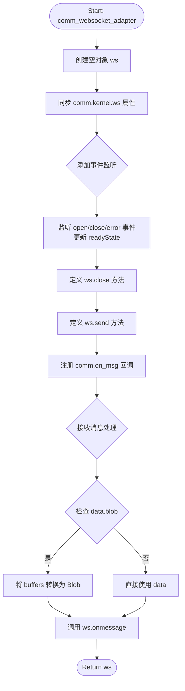

#### 带注释源码

```javascript
/* global mpl */

var comm_websocket_adapter = function (comm) {
    // 创建一个类似 "websocket" 的对象，调用给定的 IPython comm 对象的方法。
    // 目前这是一个非二进制的 socket，但仍有一些性能调优的空间。
    var ws = {};

    // 1. 同步底层 WebSocket 的属性
    ws.binaryType = comm.kernel.ws.binaryType;
    ws.readyState = comm.kernel.ws.readyState;

    // 2. 定义状态更新函数，监听原生 WebSocket 的事件以保持状态同步
    function updateReadyState(_event) {
        if (comm.kernel.ws) {
            ws.readyState = comm.kernel.ws.readyState;
        } else {
            ws.readyState = 3; // WebSocket.CLOSED 状态
        }
    }
    comm.kernel.ws.addEventListener('open', updateReadyState);
    comm.kernel.ws.addEventListener('close', updateReadyState);
    comm.kernel.ws.addEventListener('error', updateReadyState);

    // 3. 实现关闭方法，代理到 comm.close
    ws.close = function () {
        comm.close();
    };

    // 4. 实现发送方法，代理到 comm.send
    ws.send = function (m) {
        //console.log('sending', m);
        comm.send(m);
    };

    // 5. 注册消息回调，处理来自内核的消息
    // Register the callback with on_msg.
    comm.on_msg(function (msg) {
        //console.log('receiving', msg['content']['data'], msg);
        var data = msg['content']['data'];
        // 处理二进制数据（Blob）
        if (data['blob'] !== undefined) {
            data = {
                data: new Blob(msg['buffers'], { type: data['blob'] }),
            };
        }
        // 将 mpl 事件传递给被重写的（由 mpl 提供的）onmessage 函数
        ws.onmessage(data);
    });
    return ws;
};
```


### `mpl.mpl_figure_comm`

该函数是matplotlib与IPython通信的核心入口点，当IPython内核通过"matplotlib"通道启动Comm时调用，负责初始化matplotlib图形实例、建立WebSocket代理、关联DOM元素并注册事件处理器。

参数：

- `comm`：`IPython Comm对象`，IPython通信对象，用于在Python内核和前端之间传递消息
- `msg`：`消息对象`，包含Comm初始化消息，其`content.data.id`字段标识了目标DOM元素的ID

返回值：`undefined`，该函数没有明确的返回值，主要通过副作用（创建图形对象、注册事件处理器）完成功能

#### 流程图

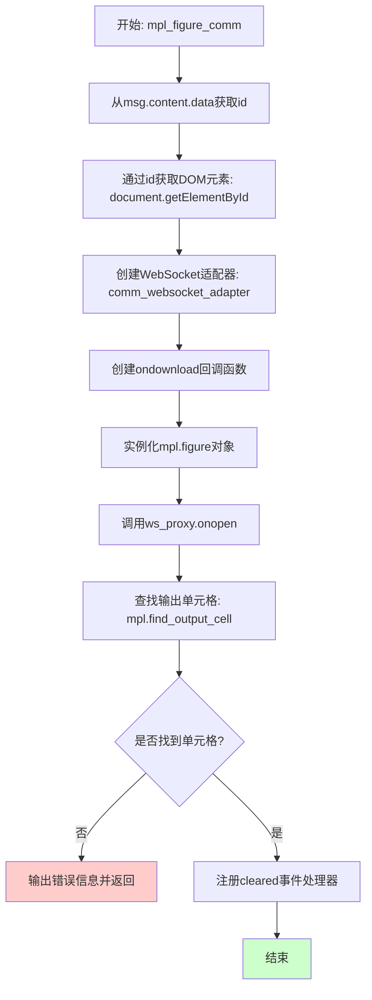

#### 带注释源码

```javascript
mpl.mpl_figure_comm = function (comm, msg) {
    // 这是当mpl进程通过"matplotlib"通道启动IPython Comm时调用的函数
    
    var id = msg.content.data.id;  // 从消息中提取图形ID
    
    // 获取在Python中打开Comm时创建的div元素
    var element = document.getElementById(id);
    
    // 创建WebSocket适配器，将Comm包装成类似websocket的对象
    var ws_proxy = comm_websocket_adapter(comm);

    // 定义下载回调函数，用于将画布内容导出为图片
    function ondownload(figure, _format) {
        window.open(figure.canvas.toDataURL());
    }

    // 创建mpl.figure实例，传入id、WebSocket代理、下载回调和DOM元素
    var fig = new mpl.figure(id, ws_proxy, ondownload, element);

    // 立即调用onopen - mpl假设我们传递了一个真实的websocket（已关闭），
    // 而不是websocket->open comm代理，所以需要手动触发
    ws_proxy.onopen();

    // 设置图形的父元素引用
    fig.parent_element = element;
    
    // 查找该图形对应的输出单元格
    fig.cell_info = mpl.find_output_cell("<div id='" + id + "'></div>");
    
    // 如果未找到对应的单元格，输出错误并退出
    if (!fig.cell_info) {
        console.error('Failed to find cell for figure', id, fig);
        return;
    }
    
    // 注册cleared事件处理器，当输出区域被清除时自动关闭图形
    fig.cell_info[0].output_area.element.on(
        'cleared',
        { fig: fig },
        fig._remove_fig_handler
    );
};
```


### `mpl.figure.prototype.handle_close`

该方法是matplotlib图表的关闭处理函数，负责在图表关闭时执行一系列清理操作，包括移除事件监听器、停止观察canvas大小变化、将当前canvas内容转换为图片推送到输出单元格、重新启用IPython键盘管理器，并用静态图片替换交互式canvas。

#### 参数

- `fig`：`Object`（mpl.figure实例），表示当前的matplotlib图表对象，包含canvas、cell_info等属性
- `msg`：`Object`，关闭消息对象，用于传递给WebSocket关闭函数

#### 返回值

`undefined`，该方法没有返回值，仅执行副作用操作

#### 流程图

```mermaid
graph TD
    A[handle_close 开始] --> B[计算宽度: width = fig.canvas.width / fig.ratio]
    B --> C[移除cell的cleared事件监听器: fig.cell_info[0].output_area.element.off]
    C --> D[停止观察canvas大小变化: fig.resizeObserverInstance.unobserve]
    D --> E[推送canvas数据到输出单元格: fig.push_to_output]
    E --> F[获取canvas的DataURL]
    F --> G[重新启用IPython键盘管理器: IPython.keyboard_manager.enable]
    G --> H[用静态img替换parent_element内容]
    H --> I[调用close_ws关闭WebSocket: fig.close_ws]
    I --> J[handle_close 结束]
```

#### 带注释源码

```javascript
/**
 * 处理matplotlib图表的关闭事件
 * @param {Object} fig - mpl.figure实例，图表对象
 * @param {Object} msg - 关闭消息对象
 */
mpl.figure.prototype.handle_close = function (fig, msg) {
    // 计算图像显示宽度，考虑设备像素比率
    var width = fig.canvas.width / fig.ratio;
    
    // 移除输出区域的cleared事件监听器，防止后续清理操作
    fig.cell_info[0].output_area.element.off(
        'cleared',
        fig._remove_fig_handler
    );
    
    // 停止观察canvas容器的尺寸变化
    fig.resizeObserverInstance.unobserve(fig.canvas_div);

    // 将当前canvas的内容推送到输出单元格
    fig.push_to_output();
    
    // 将canvas转换为DataURL（Base64编码的图片数据）
    var dataURL = fig.canvas.toDataURL();
    
    // 重新启用IPython键盘管理器
    // 如果没有这行代码，Firefox浏览器的notebook快捷键会失效
    IPython.keyboard_manager.enable();
    
    // 用静态img标签替换原有的canvas元素
    fig.parent_element.innerHTML =
        '';
    
    // 关闭WebSocket连接
    fig.close_ws(fig, msg);
};
```


### `mpl.figure.prototype.close_ws`

该方法用于向IPython内核发送关闭消息，通知后端当前的matplotlib图形正在关闭。

参数：

- `fig`：`Object`，Figure对象实例
- `msg`：`Object`，关闭消息对象

返回值：`undefined`，无返回值

#### 流程图

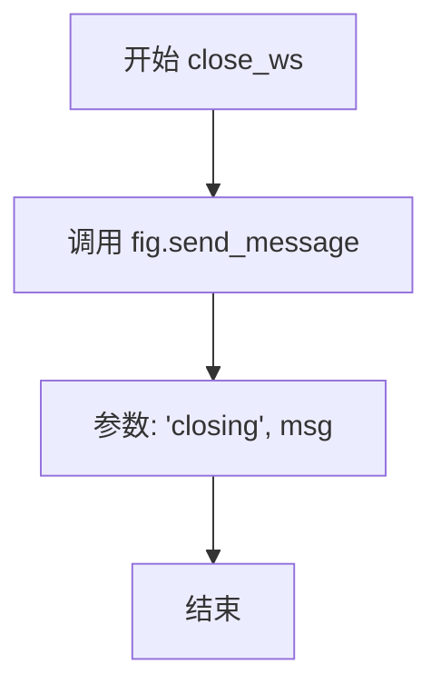

#### 带注释源码

```javascript
mpl.figure.prototype.close_ws = function (fig, msg) {
    // 向后端发送 'closing' 消息，通知内核该图形即将关闭
    fig.send_message('closing', msg);
    // 注意：实际关闭WebSocket的代码已被注释掉
    // fig.ws.close()
};
```


### `mpl.figure.prototype.push_to_output`

该方法负责将matplotlib画布上的数据转换为HTML图像元素，并将其存储到输出单元格的HTML内容中。它通过将画布内容转换为DataURL格式，然后创建一个带有该图像的HTML img标签，最后将其赋值给cell_info的text/html属性，从而实现将动态画布内容呈现为静态图像输出到Jupyter notebook的输出单元格中。

参数：

- `_remove_interactive`：`任意类型`（可选参数，当前函数体内未使用此参数，用于标记是否移除交互功能）

返回值：`undefined`，该方法没有返回值，直接修改`this.cell_info[1]['text/html']`属性

#### 流程图

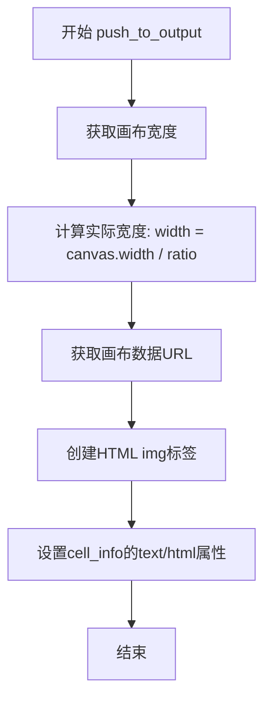

#### 带注释源码

```javascript
/**
 * 将画布上的数据转换为输出单元格中的数据
 * @param {*} _remove_interactive - 可选参数，当前未使用，用于标记是否移除交互状态
 */
mpl.figure.prototype.push_to_output = function (_remove_interactive) {
    // Turn the data on the canvas into data in the output cell.
    // 将画布上的数据转换为输出单元格中的数据
    
    // 计算图像的实际显示宽度（考虑设备像素比）
    var width = this.canvas.width / this.ratio;
    
    // 将画布内容转换为Base64编码的DataURL格式
    var dataURL = this.canvas.toDataURL();
    
    // 将生成的图像HTML赋值给cell_info的text/html属性
    // 这样Jupyter notebook就会显示这个静态图像而不是交互式画布
    this.cell_info[1]['text/html'] =
        '';
};
```


### `mpl.figure.prototype.updated_canvas_event`

该函数是mpl.figure类的原型方法，用于在画布更新后通知IPython笔记本内容已更改，并将更新后的图像推送到DOM以保存。它通过设置脏标记、发送确认消息，并延迟1秒后将新图像推送到输出来实现这一功能。

参数：

- 无参数

返回值：`undefined`，该函数没有返回值

#### 流程图

```mermaid
flowchart TD
    A[开始: updated_canvas_event] --> B[调用 IPython.notebook.set_dirty(true)]
    B --> C[调用 this.send_message('ack', {})]
    C --> D[保存this引用到fig变量]
    D --> E[设置1000ms延迟定时器]
    E --> F{延迟完成?}
    F -->|是| G[调用 fig.push_to_output]
    G --> H[结束]
    
    style A fill:#e1f5fe
    style H fill:#e8f5e8
```

#### 带注释源码

```javascript
mpl.figure.prototype.updated_canvas_event = function () {
    // Tell IPython that the notebook contents must change.
    // 通知IPython笔记本内容已被修改，需要标记为脏状态
    IPython.notebook.set_dirty(true);
    
    // 发送确认消息给后端，告知画布已更新
    this.send_message('ack', {});
    
    // 保存当前fig实例的引用到局部变量
    // 原因：在setTimeout回调中，this上下文会改变
    var fig = this;
    
    // Wait a second, then push the new image to the DOM so
    // that it is saved nicely (might be nice to debounce this).
    // 延迟1秒后执行，确保图像保存完整性
    // 注释中提到未来可能需要对此进行防抖处理
    setTimeout(function () {
        // 调用push_to_output将画布数据推送到输出单元格
        fig.push_to_output();
    }, 1000);  // 1000毫秒延迟
};
```


### `mpl.figure.prototype._init_toolbar`

该方法用于初始化matplotlib图表的工具栏，包括创建工具栏按钮组、状态栏和关闭按钮，并将其添加到图表的DOM元素中。

参数：
- 该方法无显式参数（使用隐式 `this` 引用）

返回值：`undefined`，无返回值

#### 流程图

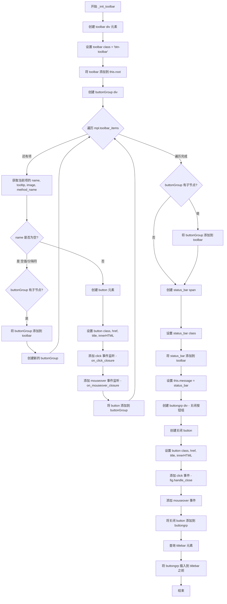

#### 带注释源码

```javascript
mpl.figure.prototype._init_toolbar = function () {
    var fig = this;  // 保存当前 figure 实例的引用

    // 1. 创建工具栏容器 div
    var toolbar = document.createElement('div');
    toolbar.classList = 'btn-toolbar';  // 设置 Bootstrap 工具栏样式
    this.root.appendChild(toolbar);  // 将工具栏添加到 figure 根元素

    // 2. 定义点击事件的闭包工厂函数
    function on_click_closure(name) {
        return function (_event) {
            return fig.toolbar_button_onclick(name);  // 调用按钮点击处理函数
        };
    }

    // 3. 定义鼠标悬停事件的闭包工厂函数
    function on_mouseover_closure(tooltip) {
        return function (event) {
            // 仅当按钮未禁用时显示 tooltip
            if (!event.currentTarget.disabled) {
                return fig.toolbar_button_onmouseover(tooltip);
            }
        };
    }

    // 4. 初始化按钮存储对象
    fig.buttons = {};
    var buttonGroup = document.createElement('div');
    buttonGroup.classList = 'btn-group';  // Bootstrap 按钮组样式

    var button;
    // 5. 遍历工具栏配置项创建按钮
    for (var toolbar_ind in mpl.toolbar_items) {
        var name = mpl.toolbar_items[toolbar_ind][0];      // 按钮名称
        var tooltip = mpl.toolbar_items[toolbar_ind][1];  // 提示文本
        var image = mpl.toolbar_items[toolbar_ind][2];     // 图标类名
        var method_name = mpl.toolbar_items[toolbar_ind][3];  // 方法名

        // 6. 处理空名称（分隔符/ spacer）
        if (!name) {
            /* Instead of a spacer, we start a new button group. */
            if (buttonGroup.hasChildNodes()) {
                toolbar.appendChild(buttonGroup);  // 将当前按钮组添加到工具栏
            }
            buttonGroup = document.createElement('div');  // 创建新的按钮组
            buttonGroup.classList = 'btn-group';
            continue;
        }

        // 7. 创建单个按钮
        button = fig.buttons[name] = document.createElement('button');
        button.classList = 'btn btn-default';  // Bootstrap 按钮样式
        button.href = '#';
        button.title = name;
        // 使用 Font Awesome 图标
        button.innerHTML = '<i class="fa ' + image + ' fa-lg"></i>';
        
        // 8. 绑定点击事件
        button.addEventListener('click', on_click_closure(method_name));
        // 9. 绑定鼠标悬停事件
        button.addEventListener('mouseover', on_mouseover_closure(tooltip));
        
        buttonGroup.appendChild(button);  // 将按钮添加到按钮组
    }

    // 10. 如果最后一个按钮组有子节点，添加到工具栏
    if (buttonGroup.hasChildNodes()) {
        toolbar.appendChild(buttonGroup);
    }

    // 11. 添加状态栏
    var status_bar = document.createElement('span');
    status_bar.classList = 'mpl-message pull-right';  // 右对齐消息样式
    toolbar.appendChild(status_bar);
    this.message = status_bar;  // 保存状态栏引用以便后续更新

    // 12. 添加关闭按钮到窗口标题栏
    var buttongrp = document.createElement('div');
    buttongrp.classList = 'btn-group inline pull-right';
    
    button = document.createElement('button');
    button.classList = 'btn btn-mini btn-primary';
    button.href = '#';
    button.title = 'Stop Interaction';
    button.innerHTML = '<i class="fa fa-power-off icon-remove icon-large"></i>';
    
    // 13. 绑定关闭按钮点击事件
    button.addEventListener('click', function (_evt) {
        fig.handle_close(fig, {});  // 调用关闭处理函数
    });
    
    // 14. 绑定关闭按钮鼠标悬停事件
    button.addEventListener(
        'mouseover',
        on_mouseover_closure('Stop Interaction')
    );
    
    buttongrp.appendChild(button);
    
    // 15. 找到对话框标题栏并插入关闭按钮组
    var titlebar = this.root.querySelector('.ui-dialog-titlebar');
    titlebar.insertBefore(buttongrp, titlebar.firstChild);
};
```


### `mpl.figure.prototype._remove_fig_handler`

该方法是一个事件回调函数，专门用于处理 IPython Notebook 输出单元格的 `cleared` 事件。当输出区域被清除（例如单元格重新运行时），该处理器会检查事件目标，确保不是子元素触发的冒泡事件，然后调用 `close_ws` 方法关闭与后端的 WebSocket 通信连接，释放资源。

参数：

-  `event`：`Event` (DOM 事件对象)，由 jQuery 或原生 DOM 触发的事件对象，包含了该 figure 实例的数据。

返回值：`undefined` (void)，该方法没有明确的返回值，主要通过副作用（调用 `close_ws`）生效。

#### 流程图

```mermaid
flowchart TD
    A[Start: 'cleared' Event Triggered] --> B[var fig = event.data.fig]
    B --> C{event.target !== this}
    C -- Yes (Bubbled Event) --> D[return; // Ignore]
    C -- No (Target is Self) --> E[fig.close_ws(fig, {})]
    D --> F[End]
    E --> F
```

#### 带注释源码

```javascript
/**
 * Handler for the 'cleared' event on the output area element.
 * Used to clean up the figure's websocket connection when the cell is cleared.
 * 
 * @param {Event} event - The DOM event object triggered by the 'cleared' event.
 */
mpl.figure.prototype._remove_fig_handler = function (event) {
    // Retrieve the figure instance stored in the event data during binding.
    var fig = event.data.fig;
    
    // Check if the event target is exactly the element this handler was bound to.
    // If event.target is a child element of the bound element, we ignore it 
    // to prevent handling bubbled events from internal components.
    if (event.target !== this) {
        // Ignore bubbled events from children.
        return;
    }
    
    // If the event originated from the main element, close the websocket connection.
    fig.close_ws(fig, {});
};
```


### `mpl.figure.prototype._root_extra_style`

该方法用于覆盖 Jupyter Notebook 默认的 `box-sizing` 样式，将根元素的 `boxSizing` 属性设置为 `content-box`，以确保图形的布局计算使用内容盒模型而非边框盒模型，从而避免因 Notebook 的默认样式导致的布局偏差问题。

参数：

-  `el`：`HTMLElement`，需要应用额外样式的根 DOM 元素

返回值：`undefined`，该方法直接修改传入元素的样式，不返回任何值

#### 流程图

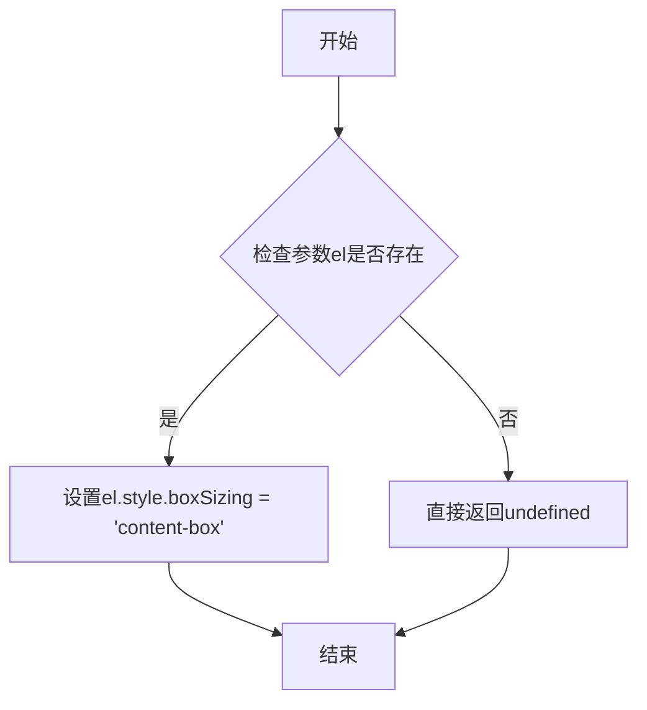

#### 带注释源码

```javascript
/**
 * 为根元素应用额外的样式覆盖
 * 主要用于覆盖 Notebook 默认的 border-box 盒模型设置
 * @param {HTMLElement} el - 需要应用样式的根 DOM 元素
 */
mpl.figure.prototype._root_extra_style = function (el) {
    // 覆盖 Notebook 设置的 border-box，改为 content-box
    // 这样可以确保元素尺寸计算包含内边距和边框
    // 避免因 Notebook 全局样式导致的布局问题
    el.style.boxSizing = 'content-box'; // override notebook setting of border-box.
};
```


### `mpl.figure.prototype._canvas_extra_style`

该方法用于为画布元素添加额外的样式和事件处理配置，使 div 元素变为可聚焦状态，并注册到 IPython 的键盘管理器中，以确保在画布获得焦点时禁用 IPython 的键盘快捷键，从而支持与 matplotlib 图表的交互。

#### 参数

- `el`：`HTMLElement`，需要添加额外样式和事件处理的 DOM 元素（画布容器）

#### 返回值

`undefined`，该方法没有返回值，仅执行副作用操作

#### 流程图

```mermaid
flowchart TD
    A[开始 _canvas_extra_style] --> B[设置 el 的 tabindex 属性为 0]
    B --> C{检查 IPython.notebook.keyboard_manager 是否存在}
    C -->|是 (Version 3)| D[调用 IPython.notebook.keyboard_manager.register_events(el)]
    C -->|否 (Version 2)| E[调用 IPython.keyboard_manager.register_events(el)]
    D --> F[结束]
    E --> F
```

#### 带注释源码

```javascript
mpl.figure.prototype._canvas_extra_style = function (el) {
    // this is important to make the div 'focusable
    // 使 div 元素可以获得焦点，这对于键盘事件处理是必需的
    el.setAttribute('tabindex', 0);
    
    // reach out to IPython and tell the keyboard manager to turn it's self
    // off when our div gets focus
    // 当画布 div 获得焦点时，通知 IPython 键盘管理器关闭其自身的快捷键

    // location in version 3
    // IPython 3.x 版本中 keyboard_manager 位于 notebook 对象下
    if (IPython.notebook.keyboard_manager) {
        IPython.notebook.keyboard_manager.register_events(el);
    } else {
        // location in version 2
        // IPython 2.x 版本中 keyboard_manager 为全局对象
        IPython.keyboard_manager.register_events(el);
    }
};
```


### `mpl.figure.prototype._key_event_extra`

该方法是一个键盘事件处理函数，用于在用户按下 Shift+Enter 组合键时，将当前 matplotlib 图表的焦点从画布移出，并自动选中 notebook 中的下一个单元格，实现类似 IPython notebook 的单元格切换功能。

参数：

- `event`：`Event`，触发键盘事件时的事件对象，包含 `shiftKey`（布尔值，表示 Shift 键是否按下）和 `which`（数值，表示按下的键码）等属性
- `_name`：`string`，事件名称（以下划线前缀表示该参数未被使用）

返回值：`undefined`，该方法作为事件处理函数，不返回任何值

#### 流程图

```mermaid
flowchart TD
    A[开始: 接收键盘事件] --> B{检查条件}
    B --> C{event.shiftKey === true}
    C -->|是| D{event.which === 13}
    C -->|否| H[结束]
    D -->|是| E[执行: canvas_div.blur()]
    E --> F[获取当前单元格索引]
    F --> G[选中下一个单元格]
    G --> H
    D -->|否| H
```

#### 带注释源码

```
mpl.figure.prototype._key_event_extra = function (event, _name) {
    // 检查是否同时按下了 Shift 键和 Enter 键（Shift+Enter 组合键）
    // event.shiftKey: 布尔值，表示 Shift 键是否被按下
    // event.which: 数值，13 代表 Enter 键的键码
    if (event.shiftKey && event.which === 13) {
        
        // 将画布 div 从焦点中移除，防止后续键盘事件继续被图表捕获
        this.canvas_div.blur();
        
        // 获取当前图表所在单元格的索引
        // this.cell_info[0] 存储了当前单元格对象
        var index = IPython.notebook.find_cell_index(this.cell_info[0]);
        
        // 选中 notebook 中的下一个单元格（index + 1）
        // 这实现了类似 IPython notebook 中 Shift+Enter 运行并跳转下一行的效果
        IPython.notebook.select(index + 1);
    }
};
```


### `mpl.figure.prototype.handle_save`

该方法负责触发图形的保存操作，通过调用图形对象的 `ondownload` 方法来实现将当前画布内容保存为文件的功能。

参数：

- `fig`：`Object`（mpl.figure 实例），需要保存的图形对象
- `_msg`：`Object`，消息对象（当前未使用，以下划线前缀标识）

返回值：`undefined`，该方法没有显式返回值

#### 流程图

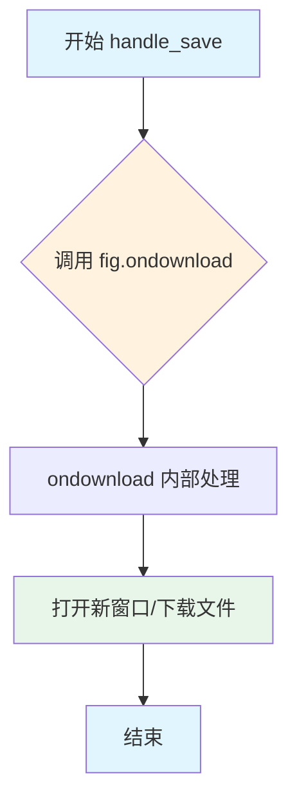

#### 带注释源码

```javascript
/**
 * 处理图形保存请求
 * @param {Object} fig - mpl.figure 实例，包含 canvas 和相关配置
 * @param {Object} _msg - 消息对象（当前未使用）
 */
mpl.figure.prototype.handle_save = function (fig, _msg) {
    // 调用图形的 ondownload 方法触发保存操作
    // fig.ondownload 是在创建 mpl.figure 时传入的回调函数
    // 默认实现为 window.open(figure.canvas.toDataURL())，打开数据URL对应的新窗口
    // 参数 (fig, null) 传递图形对象和格式参数（null 表示使用默认格式）
    fig.ondownload(fig, null);
};
```

#### 关联信息

**所属类**：`mpl.figure`

**相关方法**：

- `mpl.figure` 构造函数中传入的 `ondownload` 回调函数
- `mpl.figure.prototype.handle_close`：关闭图形的方法

**调用链**：

```
用户触发保存操作
    ↓
IPython.notebook.kernel.comm_manager 通信层
    ↓
mpl.figure.prototype.handle_save()
    ↓
fig.ondownload(fig, null)  // 默认调用 window.open(canvas.toDataURL())
    ↓
浏览器打开新窗口显示图片数据
```


### `mpl.find_output_cell`

该函数用于在IPython notebook中通过HTML输出内容查找对应的单元格和输出元素，从而建立matplotlib图形与其所在代码单元格之间的关联关系。

参数：

- `html_output`：`string`，需要查找的HTML输出内容字符串

返回值：`Array`，返回一个包含三个元素的数组 `[cell, data, j]`，其中`cell`是IPython单元格对象，`data`是输出数据对象，`j`是输出索引；如果未找到则返回`undefined`

#### 流程图

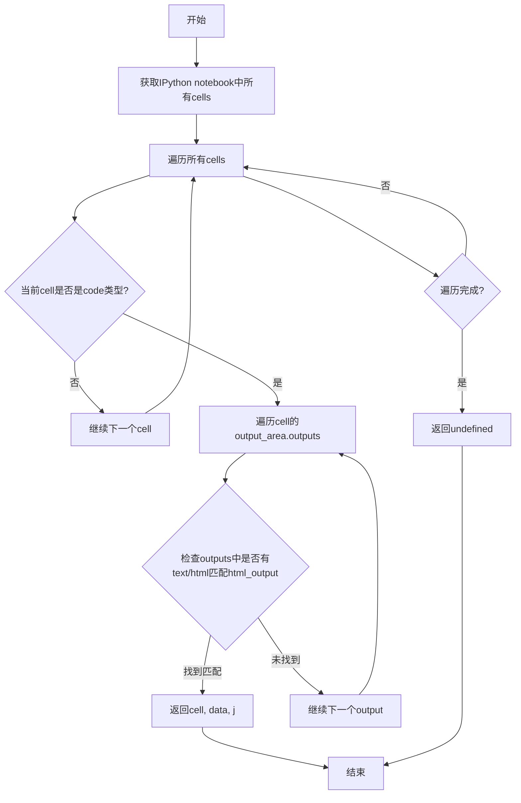

#### 带注释源码

```
mpl.find_output_cell = function (html_output) {
    // Return the cell and output element which can be found *uniquely* in the notebook.
    // Note - this is a bit hacky, but it is done because the "notebook_saving.Notebook"
    // IPython event is triggered only after the cells have been serialised, which for
    // our purposes (turning an active figure into a static one), is too late.
    
    // 获取IPython notebook中所有的单元格
    var cells = IPython.notebook.get_cells();
    var ncells = cells.length;
    
    // 遍历每一个单元格
    for (var i = 0; i < ncells; i++) {
        var cell = cells[i];
        
        // 只处理代码类型的单元格
        if (cell.cell_type === 'code') {
            // 遍历该单元格的输出区域
            for (var j = 0; j < cell.output_area.outputs.length; j++) {
                var data = cell.output_area.outputs[j];
                
                // IPython >= 3 版本将mimebundle移动到了data属性中
                if (data.data) {
                    data = data.data;
                }
                
                // 检查text/html输出是否匹配目标html_output
                if (data['text/html'] === html_output) {
                    // 返回找到的单元格、数据对象和输出索引
                    return [cell, data, j];
                }
            }
        }
    }
};
```


### `updateReadyState`

该函数是一个内部回调函数，用于将 WebSocket 适配器的 readyState 与内核实际 WebSocket 的 readyState 保持同步，确保通信层状态的一致性。

参数：

- `_event`：`Event`，事件对象（未使用），仅用于满足 addEventListener 的回调函数签名

返回值：`void`，无返回值

#### 流程图

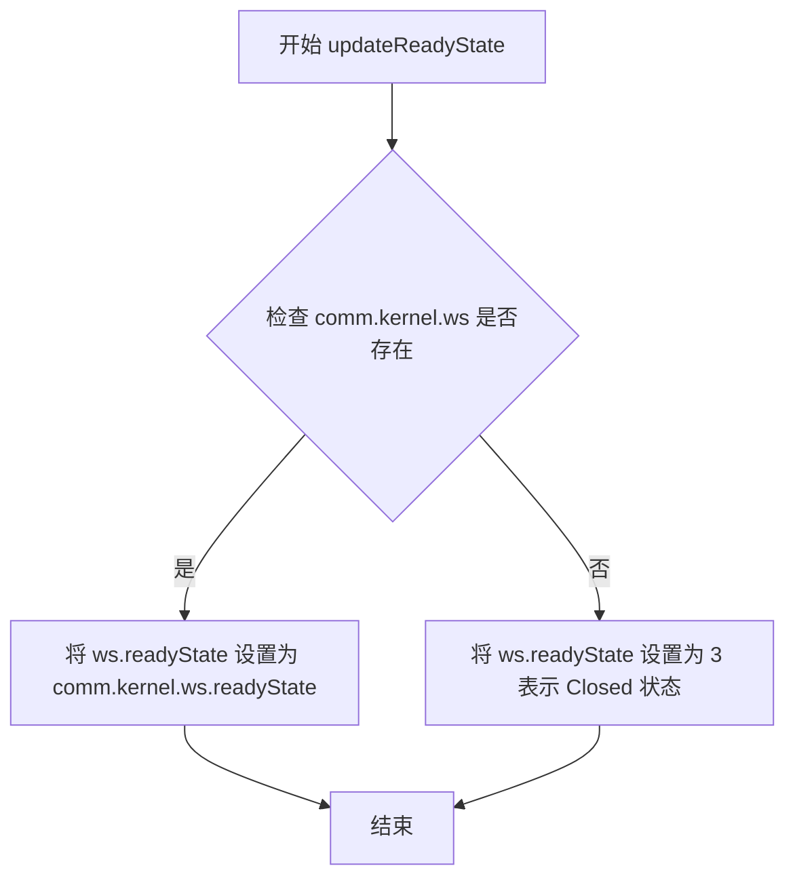

#### 带注释源码

```javascript
/**
 * 更新 WebSocket 适配器的 readyState，使其与内核的 WebSocket 状态同步
 * @param {Event} _event - 事件对象（addEventListener 回调参数，此处未使用）
 */
function updateReadyState(_event) {
    // 检查内核的 WebSocket 对象是否存在
    if (comm.kernel.ws) {
        // 如果存在，将适配器的 readyState 与内核 WebSocket 的 readyState 同步
        ws.readyState = comm.kernel.ws.readyState;
    } else {
        // 如果内核 WebSocket 不存在（如连接已关闭），设置 readyState 为 3 (CLOSED)
        ws.readyState = 3; // Closed state.
    }
}
```


### `ondownload`

该函数是一个用于下载 matplotlib figure 的回调函数，通过将 figure 画布的内容转换为数据 URL 并在新窗口中打开来实现下载功能。

参数：

- `figure`：`Object`，matplotlib 的 Figure 对象，包含了 canvas 属性用于生成数据 URL
- `_format`：`String | Null`，下载的图像格式（当前实现中未使用该参数）

返回值：`void`，无明确返回值（`window.open` 的返回值未被使用）

#### 流程图

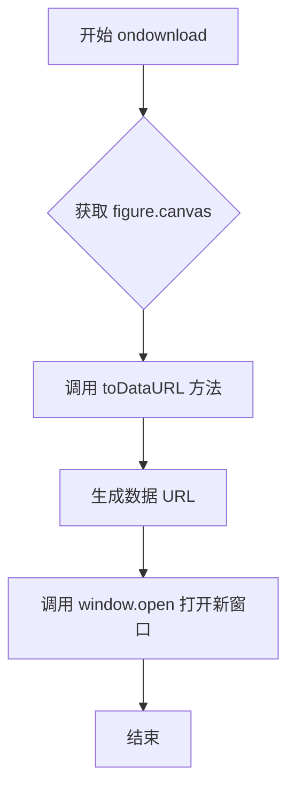

#### 带注释源码

```javascript
function ondownload(figure, _format) {
    // 将 figure 的 canvas 内容转换为 Data URL
    // 然后使用 window.open 在新窗口中显示该图像
    // _format 参数保留用于指定图像格式，但当前实现未使用
    window.open(figure.canvas.toDataURL());
}
```


### on_click_closure

这是一个在 `_init_toolbar` 方法内部定义的闭包函数，用于创建工具栏按钮的点击事件处理程序。它接收一个方法名称作为参数，返回一个事件处理函数，该函数内部调用 `fig.toolbar_button_onclick(name)` 来执行对应的按钮点击逻辑。

参数：

- `name`：`string`，要执行的工具栏按钮方法名称（如 'zoom', 'pan', 'save' 等）

返回值：`function`，返回的事件处理函数，接受一个事件对象参数（通常命名为 `_event`），该函数内部调用 `fig.toolbar_button_onclick(name)` 并返回其结果。

#### 流程图

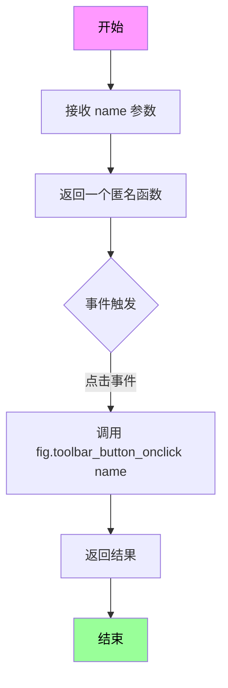

#### 带注释源码

```javascript
function on_click_closure(name) {
    // 接收一个字符串参数 name，表示要调用的方法名称
    // 这个方法名来自 mpl.toolbar_items 数组中的第四个元素 [3]
    return function (_event) {
        // 返回一个事件处理函数
        // _event 是 DOM 事件对象，但在这里被忽略（下划线前缀表示未使用）
        
        // 调用 fig 对象的 toolbar_button_onclick 方法
        // 传入之前捕获的 name 参数，执行对应的工具栏按钮操作
        return fig.toolbar_button_onclick(name);
    };
}
```

#### 使用场景

该函数在 `_init_toolbar` 方法中被用于为每个工具栏按钮绑定点击事件：

```javascript
// 在 mpl.figure.prototype._init_toolbar 方法中
button.addEventListener('click', on_click_closure(method_name));
// method_name 来自 mpl.toolbar_items[toolbar_ind][3]
```

当用户点击工具栏按钮时：
1. 浏览器触发 `click` 事件
2. 执行 `on_click_closure` 返回的匿名函数
3. 该函数调用 `fig.toolbar_button_onclick(method_name)` 执行相应的操作（如缩放、平移、保存等）


### `on_mouseover_closure`

这是一个在工具栏初始化过程中创建的闭包函数，用于处理鼠标悬停在工具栏按钮上时显示相应工具提示的功能。

参数：

- `tooltip`：`String`，工具提示文本，用于显示在按钮上的提示信息

返回值：`Function`，返回一个新的事件处理函数，该函数接收鼠标事件并根据按钮状态决定是否调用`toolbar_button_onmouseover`方法显示工具提示

#### 流程图

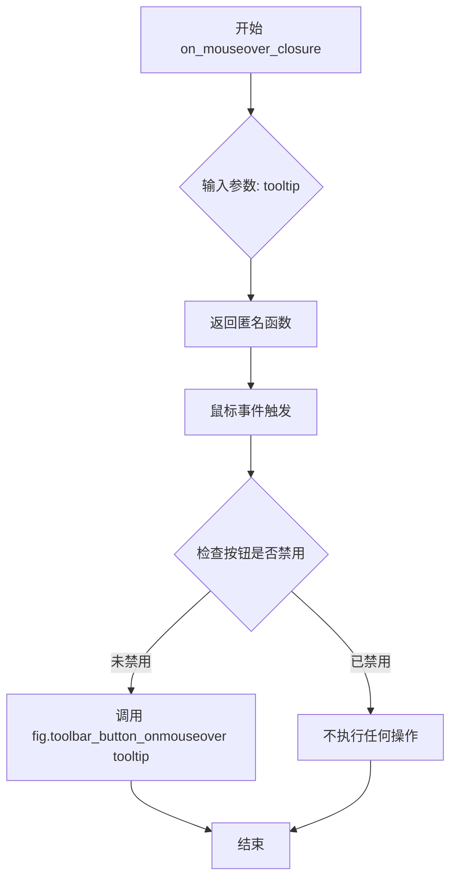

#### 带注释源码

```javascript
function on_mouseover_closure(tooltip) {
    // on_mouseover_closure 是一个闭包函数
    // 参数 tooltip: 字符串类型，保存工具栏按钮需要显示的提示文本
    
    // 返回一个事件处理函数，该函数会在鼠标悬停时调用
    return function (event) {
        // event: 鼠标事件对象，包含事件的详细信息
        
        // 检查当前目标元素是否已禁用
        // event.currentTarget 指向绑定事件监听器的元素（即按钮元素）
        if (!event.currentTarget.disabled) {
            // 如果按钮未禁用，则调用 figure 对象的 toolbar_button_onmouseover 方法
            // 传入 tooltip 参数以显示相应的工具提示
            return fig.toolbar_button_onmouseover(tooltip);
        }
        // 如果按钮已禁用，则不执行任何操作（隐式返回 undefined）
    };
}
```


### `mpl.figure.prototype.handle_close`

该方法是mpl.figure类的成员方法，负责处理matplotlib figure的关闭操作。核心功能包括：移除事件监听器、停止观察canvas大小变化、将当前canvas内容推送到输出单元格、重新启用IPython键盘管理器、将canvas转换为静态图像显示，并关闭WebSocket连接。

参数：

- `fig`：`Object`（mpl.figure实例），需要关闭的figure对象
- `msg`：`Object`，关闭消息对象，用于传递给WebSocket关闭方法

返回值：`undefined`，该方法没有显式返回值

#### 流程图

```mermaid
flowchart TD
    A[开始 handle_close] --> B[计算图像宽度: width = fig.canvas.width / fig.ratio]
    B --> C[移除cleared事件监听器: fig.cell_info[0].output_area.element.off]
    C --> D[停止观察canvas大小变化: fig.resizeObserverInstance.unobserve]
    D --> E[推送canvas数据到输出单元格: fig.push_to_output]
    E --> F[获取canvas数据URL: fig.canvas.toDataURL]
    F --> G[重新启用IPython键盘管理器: IPython.keyboard_manager.enable]
    G --> H[用静态图像替换父元素innerHTML]
    H --> I[关闭WebSocket: fig.close_ws]
    I --> J[结束]
```

#### 带注释源码

```javascript
/**
 * 处理matplotlib figure的关闭操作
 * 将动态canvas转换为静态图像并清理相关资源
 * @param {Object} fig - mpl.figure实例
 * @param {Object} msg - 关闭消息对象
 */
mpl.figure.prototype.handle_close = function (fig, msg) {
    // 计算图像宽度，考虑设备像素比
    var width = fig.canvas.width / fig.ratio;
    
    // 移除输出区域的cleared事件监听器，防止后续事件触发
    fig.cell_info[0].output_area.element.off(
        'cleared',
        fig._remove_fig_handler
    );
    
    // 停止观察canvas的大小变化
    fig.resizeObserverInstance.unobserve(fig.canvas_div);

    // 将当前canvas的内容推送到输出单元格
    fig.push_to_output();
    
    // 将canvas转换为PNG数据URL
    var dataURL = fig.canvas.toDataURL();
    
    // 重新启用IPython键盘管理器
    // 如果没有这行代码，在Firefox浏览器中
    // notebook的键盘快捷键将会失效
    IPython.keyboard_manager.enable();
    
    // 用静态img标签替换父元素内容，显示转换后的图像
    fig.parent_element.innerHTML =
        '';
    
    // 关闭WebSocket连接
    fig.close_ws(fig, msg);
};
```


### `mpl.figure.close_ws`

该方法是matplotlib图表类的WebSocket关闭处理函数，负责向内核发送关闭消息以通知后端图形连接已关闭。

参数：

- `fig`：`Object`，图表实例对象，调用send_message方法的主体
- `msg`：`Object`，关闭消息内容，包含关闭相关的元数据

返回值：`undefined`，该方法无返回值

#### 流程图

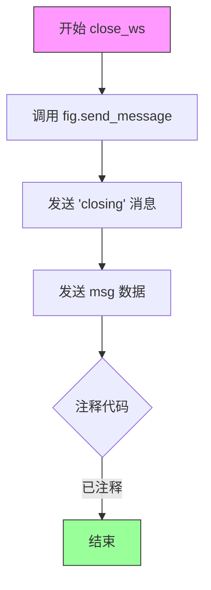

#### 带注释源码

```
// mpl.figure.prototype.close_ws 方法实现
// 功能：关闭图表的WebSocket连接，发送关闭消息给后端内核

mpl.figure.prototype.close_ws = function (fig, msg) {
    // 调用图表实例的send_message方法
    // 参数1: 'closing' - 消息类型，表示连接即将关闭
    // 参数2: msg - 传递的关闭消息内容
    fig.send_message('closing', msg);
    
    // 注意：此处为注释代码，原本应调用WebSocket的close方法
    // 但在实际实现中可能因为已经通过comm.close()关闭而注释掉
    // fig.ws.close()
};
```

#### 补充说明

**设计目标与约束**：
- 该方法是mpl.figure类与IPython内核通信的一部分
- 遵循IPython Comm通信协议，通过send_message发送'closing'类型消息

**错误处理与异常设计**：
- 代码中未包含错误处理逻辑
- 假设send_message方法已正确实现且内核连接正常

**数据流**：
- 输入：fig（图表对象）和msg（消息对象）
- 输出：通过WebSocket向Python后端发送JSON格式的关闭消息

**潜在优化空间**：
1. 可添加连接状态检查，在发送关闭消息前验证连接是否有效
2. 可添加错误回调处理，应对消息发送失败的情况
3. 被注释的`fig.ws.close()`可根据实际需求决定是否启用


### `mpl.figure.push_to_output`

该方法负责将交互式 Matplotlib 画布（Canvas）的内容转换为静态的 Base64 图像数据，并将其更新到 Jupyter Notebook 的输出单元格（Output Cell）的 DOM 结构中，从而实现图表的静态保存。

#### 参数

- `_remove_interactive`：`Boolean`，（可选）代码中未使用的参数，可能是用于控制是否禁用交互模式的占位符。

#### 返回值

`undefined`（无返回值）。该方法直接修改对象状态（`cell_info`），不返回任何数据。

#### 流程图

```mermaid
graph TD
    A([Start]) --> B[计算图像宽度<br>width = canvas.width / ratio]
    B --> C[将画布转换为 DataURL<br>canvas.toDataURL()]
    C --> D[生成 HTML img 标签<br>包含 src 和 width 属性]
    D --> E[更新输出单元格数据<br>cell_info[1]['text/html']]
    E --> F([End])
```

#### 带注释源码

```javascript
mpl.figure.prototype.push_to_output = function (_remove_interactive) {
    // 将画布上的数据转换为输出单元格中的数据。
    
    // 1. 计算图像显示宽度。
    // 通常 Canvas 的物理像素宽度 (width) 高于 CSS 像素宽度，需要除以 ratio (devicePixelRatio) 来获取正确的显示宽度。
    var width = this.canvas.width / this.ratio;
    
    // 2. 将 Canvas 内容转换为 Base64 编码的 PNG 数据 URL。
    var dataURL = this.canvas.toDataURL();
    
    // 3. 构造 HTML img 标签字符串。
    // 将生成的 Data URL 嵌入到 img 标签的 src 属性中，并指定宽度。
    this.cell_info[1]['text/html'] =
        '';
};
```

#### 关键组件信息

- **`mpl.figure`**：核心类，代表一个 Matplotlib 图表实例。
- **`this.canvas`**：HTML Canvas 元素，包含图表的绘图上下文。
- **`this.ratio`**：设备像素比（Device Pixel Ratio），用于确保在高分屏（Retina）上图像清晰且尺寸正确。
- **`this.cell_info`**：数组，存储 Jupyter Notebook 单元格的相关信息，其中 `cell_info[1]` 指向输出区域的渲染数据对象。

#### 潜在的技术债务或优化空间

1.  **未使用的参数**：参数 `_remove_interactive` 在函数体中完全未使用，这表明该功能可能尚未实现或已废弃，造成代码理解上的困惑。
2.  **脆弱的 DOM 操作**：直接通过字符串赋值的方式修改 `cell_info[1]['text/html']`。这种硬编码的字符串拼接（尤其在生成 `` 标签时）比较脆弱，一旦 Jupyter 的内部数据结构或 API 发生变化，代码容易失效。
3.  **缺乏错误处理**：`canvas.toDataURL()` 操作是同步且可能失败的（例如 Canvas 被污染或跨域问题），但该方法缺少 `try-catch` 块来捕获和处理潜在异常，可能导致页面崩溃。
4.  **同步阻塞性能**：将 Canvas 转换为 DataURL（尤其是大尺寸图表）是一个计算密集型同步操作，可能导致 UI 线程短暂卡顿。

#### 其它项目

- **设计目标与约束**：该方法的唯一目标是将交互式图表“快照”为静态图像，以适应 Notebook 的持久化（保存 notebook 时）。它假设 `this.canvas` 和 `this.cell_info` 已经正确初始化。
- **数据流**：数据流从 `Canvas` (二进制绘图指令) -> `DataURL` (Base64 字符串) -> `HTML String` (DOM 更新)。这是一个单向的渲染过程，不涉及回读数据。
- **外部依赖**：
    - 依赖浏览器原生 API: `HTMLCanvasElement.toDataURL()`。
    - 依赖 Jupyter/IPython 内核数据结构: `cell_info` 的结构必须符合 IPython Notebook 的输出规范。


### `mpl.figure.updated_canvas_event`

该方法用于在matplotlib画布更新后通知IPython笔记本内容已更改，并将更新后的图像数据推送到DOM中以保存。它通过设置笔记本为“脏”状态、发送确认消息，并延迟1秒后将画布数据推送到输出单元来实现此功能。

参数： 无

返回值：`undefined`（无返回值），该方法执行完成后不返回任何值。

#### 流程图

```mermaid
flowchart TD
    A[开始 updated_canvas_event] --> B[调用 IPython.notebook.set_dirty true]
    B --> C[调用 this.send_message 'ack', {}]
    C --> D[保存 this 引用到 fig 变量]
    D --> E[设置 setTimeout 延迟1000毫秒]
    E --> F{延迟结束}
    F -->|是| G[调用 fig.push_to_output]
    G --> H[结束]
    
    style A fill:#f9f,stroke:#333
    style H fill:#9f9,stroke:#333
```

#### 带注释源码

```javascript
mpl.figure.prototype.updated_canvas_event = function () {
    // Tell IPython that the notebook contents must change.
    // 通知IPython笔记本的内容已被修改，需要标记为脏状态
    IPython.notebook.set_dirty(true);
    
    // Send an acknowledgment message back to the kernel
    // 向内核发送确认消息，表示画布已更新
    this.send_message('ack', {});
    
    // 保存当前fig对象的引用，以便在setTimeout回调中使用
    var fig = this;
    
    // Wait a second, then push the new image to the DOM so
    // that it is saved nicely (might be nice to debounce this).
    // 延迟1秒后将新图像推送到DOM，这样保存效果会更好
    // （代码注释提到未来可能需要对此进行防抖处理）
    setTimeout(function () {
        fig.push_to_output();
    }, 1000);
};
```


### `mpl.figure._init_toolbar`

该方法负责初始化matplotlib图表的工具栏，包括创建工具栏容器、遍历工具栏配置项生成按钮、添加状态栏以及创建关闭按钮。这是matplotlib在前端Jupyter/IPython环境中渲染交互式图表的核心UI初始化逻辑。

参数：
- 该方法无显式参数（隐式使用`this`引用当前`mpl.figure`实例）

返回值：`undefined`，该方法为纯副作用操作，不返回任何值

#### 流程图

```mermaid
flowchart TD
    A[开始 _init_toolbar] --> B[创建工具栏div容器并添加到root]
    B --> C[定义 on_click_closure 闭包函数]
    C --> D[定义 on_mouseover_closure 闭包函数]
    D --> E[初始化 fig.buttons 对象]
    E --> F[创建按钮组div容器]
    F --> G{遍历 mpl.toolbar_items}
    G -->|有名称| H[创建按钮元素]
    H --> I[设置按钮样式和图标]
    I --> J[添加click事件监听]
    J --> K[添加mouseover事件监听]
    K --> L[将按钮添加到按钮组]
    L --> G
    G -->|无名称/分隔符| M[保存当前按钮组并创建新组]
    M --> G
    G -->|遍历结束| N{检查最后按钮组是否有子节点}
    N -->|是| O[将按钮组添加到工具栏]
    N -->|否| P[创建状态栏span]
    O --> P
    P --> Q[保存状态栏引用到 this.message]
    Q --> R[创建关闭按钮组]
    R --> S[创建关闭按钮并添加事件监听]
    S --> T[将关闭按钮插入到titlebar]
    T --> U[结束]
```

#### 带注释源码

```javascript
mpl.figure.prototype._init_toolbar = function () {
    var fig = this;

    // 创建工具栏容器div元素
    var toolbar = document.createElement('div');
    // 设置Bootstrap工具栏样式类
    toolbar.classList = 'btn-toolbar';
    // 将工具栏添加到figure的根元素中
    this.root.appendChild(toolbar);

    // 闭包工厂函数：为按钮点击事件创建处理函数
    // 参数name对应工具栏项的方法名
    function on_click_closure(name) {
        return function (_event) {
            return fig.toolbar_button_onclick(name);
        };
    }

    // 闭包工厂函数：为按钮mouseover事件创建处理函数
    // 参数tooltip对应工具栏项的提示文本
    function on_mouseover_closure(tooltip) {
        return function (event) {
            // 仅当按钮未禁用时才显示tooltip
            if (!event.currentTarget.disabled) {
                return fig.toolbar_button_onmouseover(tooltip);
            }
        };
    }

    // 存储所有工具栏按钮的映射对象
    fig.buttons = {};
    // 创建按钮组容器
    var buttonGroup = document.createElement('div');
    buttonGroup.classList = 'btn-group';
    var button;
    
    // 遍历全局工具栏配置项数组
    for (var toolbar_ind in mpl.toolbar_items) {
        // 提取工具栏项的四个属性：名称、tooltip、图标、方法名
        var name = mpl.toolbar_items[toolbar_ind][0];
        var tooltip = mpl.toolbar_items[toolbar_ind][1];
        var image = mpl.toolbar_items[toolbar_ind][2];
        var method_name = mpl.toolbar_items[toolbar_ind][3];

        // 如果name为空，表示这是分隔符，需要开始新的按钮组
        if (!name) {
            /* Instead of a spacer, we start a new button group. */
            if (buttonGroup.hasChildNodes()) {
                toolbar.appendChild(buttonGroup);
            }
            buttonGroup = document.createElement('div');
            buttonGroup.classList = 'btn-group';
            continue;
        }

        // 创建工具栏按钮并存储到buttons映射中
        button = fig.buttons[name] = document.createElement('button');
        button.classList = 'btn btn-default';
        button.href = '#';
        button.title = name;
        // 使用Font Awesome图标库渲染按钮图标
        button.innerHTML = '<i class="fa ' + image + ' fa-lg"></i>';
        // 绑定点击事件到对应的方法
        button.addEventListener('click', on_click_closure(method_name));
        // 绑定mouseover事件显示tooltip
        button.addEventListener('mouseover', on_mouseover_closure(tooltip));
        // 将按钮添加到当前按钮组
        buttonGroup.appendChild(button);
    }

    // 如果最后一个按钮组有子节点，则添加到工具栏
    if (buttonGroup.hasChildNodes()) {
        toolbar.appendChild(buttonGroup);
    }

    // 添加状态栏，用于显示消息
    var status_bar = document.createElement('span');
    status_bar.classList = 'mpl-message pull-right';
    toolbar.appendChild(status_bar);
    // 保存状态栏引用以便后续更新消息
    this.message = status_bar;

    // 添加窗口关闭按钮
    var buttongrp = document.createElement('div');
    buttongrp.classList = 'btn-group inline pull-right';
    button = document.createElement('button');
    button.classList = 'btn btn-mini btn-primary';
    button.href = '#';
    button.title = 'Stop Interaction';
    // 使用电源图标表示关闭
    button.innerHTML = '<i class="fa fa-power-off icon-remove icon-large"></i>';
    // 点击关闭按钮时调用handle_close方法
    button.addEventListener('click', function (_evt) {
        fig.handle_close(fig, {});
    });
    // 同样添加mouseover事件显示tooltip
    button.addEventListener(
        'mouseover',
        on_mouseover_closure('Stop Interaction')
    );
    buttongrp.appendChild(button);
    
    // 获取对话框标题栏元素
    var titlebar = this.root.querySelector('.ui-dialog-titlebar');
    // 将关闭按钮组插入到标题栏的最前面
    titlebar.insertBefore(buttongrp, titlebar.firstChild);
};
```


### `mpl.figure._remove_fig_handler`

该函数是 `mpl.figure` 类的一个原型方法，主要用作事件处理程序（Event Handler）。它被绑定到输出单元格的 `cleared` 事件上，用于监听 Jupyter Notebook 输出区域的清除操作。当输出区域被刷新或清除时，该函数会触发，阻止事件冒泡，并调用 `close_ws` 方法关闭与内核的 WebSocket 通信，从而清理前端资源。

参数：

-  `event`：`Object`，标准的事件对象（Event）。包含了 jQuery 或原生 DOM 事件传递的数据，其中 `event.data.fig` 存储了当前 matplotlib 图表实例的引用。

返回值：`undefined`（无返回值）。该方法通过副作用（执行 `close_ws`）完成逻辑，不返回具体数据。

#### 流程图

```mermaid
graph TD
    A[开始: 触发 'cleared' 事件] --> B[从 event.data 获取 fig 实例];
    B --> C{检查事件源: event.target !== this};
    C -- Yes (是子元素冒泡) --> D[直接返回, 不做任何处理];
    C -- No (是自身元素) --> E[调用 fig.close_ws(fig, {})];
    D --> F[结束];
    E --> F;
```

#### 带注释源码

```javascript
mpl.figure.prototype._remove_fig_handler = function (event) {
    // 1. 从事件数据中提取存储的 figure 实例
    var fig = event.data.fig;

    // 2. 事件冒泡处理逻辑
    // 检查事件触发目标是否等于当前处理程序绑定的元素本身。
    // 如果不等于 (例如，是子元素触发的)，则忽略该事件，防止重复执行或错误关闭。
    if (event.target !== this) {
        // 忽略来自子元素的冒泡事件。
        return;
    }

    // 3. 执行关闭 WebSocket 的操作
    // 调用 figure 实例的 close_ws 方法，传入空的 msg 对象
    fig.close_ws(fig, {});
};
```

#### 关键组件信息与设计分析

1.  **组件信息**：
    *   **所属类**：`mpl.figure` (matplotlib 图表的前端控制器)。
    *   **依赖事件**：`cleared`（Jupyter Notebook 输出区域清除）。
    *   **调用关系**：被绑定在 `mpl.mpl_figure_comm` 中 (`fig.cell_info[0].output_area.element.on('cleared', { fig: fig }, fig._remove_fig_handler)`), 并在 `handle_close` 中解绑。

2.  **技术债务与优化空间**：
    *   **隐式依赖**：该方法依赖于 `event.target` 与 `this` 的严格比较来判断事件源。如果 Notebook 的 DOM 结构发生变化（例如容器 div 内增加了 wrapper），此逻辑可能失效。
    *   **硬编码参数**：在调用 `fig.close_ws(fig, {})` 时，第二个参数直接传入空对象 `{}`。虽然通常用于传递消息体，但如果 `close_ws` 的实现逻辑未来对消息体有依赖，这里可能会产生耦合风险。
    *   **事件冒泡的简单处理**：直接 `return` 虽然高效，但缺少日志或调试信息，如果在复杂嵌套场景下出现问题，排查难度较高。

3.  **外部依赖与接口契约**：
    *   依赖 `mpl.figure` 类的实例方法 `close_ws`。
    *   依赖传入的 `event` 对象结构必须包含 `data.fig`。这意味着调用方（在 `mpl_figure_comm` 中）必须保证事件绑定时传递了正确的上下文数据。


### `mpl.figure.prototype._root_extra_style`

该方法为matplotlib图形实例的根元素（root element）应用额外的CSS样式。当前实现用于覆盖笔记本（notebook）的默认`box-sizing`设置，将`border-box`强制改为`content-box`，以确保图形的尺寸计算符合matplotlib的预期渲染方式。

参数：

- `el`：`HTMLElement`，需要添加额外样式的根DOM元素

返回值：`undefined`，该方法无返回值，仅修改传入元素的CSS样式。

#### 流程图

```mermaid
flowchart TD
    A[开始] --> B[接收根元素 el]
    B --> C[设置 el.style.boxSizing = 'content-box']
    C --> D[结束]
```

#### 带注释源码

```javascript
mpl.figure.prototype._root_extra_style = function (el) {
    // 该方法接收一个DOM元素作为参数
    // 用于为matplotlib图形的根元素添加额外的CSS样式
    
    // 覆盖notebook默认的box-sizing设置
    // notebook默认使用border-box，这可能导致matplotlib图形尺寸计算问题
    // 设置为content-box后，元素的尺寸计算不包含padding和border
    el.style.boxSizing = 'content-box'; // override notebook setting of border-box.
};
```

#### 补充说明

| 项目 | 说明 |
|------|------|
| **所属类** | `mpl.figure` (matplotlib图形类) |
| **方法性质** | 原型方法 (prototype method) |
| **调用场景** | 在创建matplotlib图形实例时，用于初始化根元素的样式 |
| **依赖** | 依赖于传入的DOM元素 `el` 存在且可访问 |
| **设计意图** | 解决IPython notebook环境中CSS盒模型兼容性问题，确保matplotlib图形能够正确渲染和布局 |


### `mpl.figure._canvas_extra_style`

该方法为matplotlib图表的canvas元素设置额外的样式和行为，包括将div设为可聚焦状态，并向IPython键盘管理器注册事件以在获得焦点时禁用IPython的键盘快捷键。

参数：

- `el`：`HTMLElement`，需要应用额外样式的canvas容器元素

返回值：`undefined`，该方法没有返回值，通过副作用修改元素状态

#### 流程图

```mermaid
flowchart TD
    A[开始 _canvas_extra_style] --> B[设置el的tabindex属性为0]
    B --> C{检查 IPython.notebook.keyboard_manager 是否存在}
    C -->|是 版本3| D[调用 IPython.notebook.keyboard_manager.register_events]
    C -->|否 版本2| E[调用 IPython.keyboard_manager.register_events]
    D --> F[结束]
    E --> F
```

#### 带注释源码

```
mpl.figure.prototype._canvas_extra_style = function (el) {
    // this is important to make the div 'focusable
    // 将div设为可聚焦，这是为了让该元素能够接收键盘事件
    el.setAttribute('tabindex', 0);
    
    // reach out to IPython and tell the keyboard manager to turn it's self
    // off when our div gets focus
    // 联系IPython并告知键盘管理器：当我们的div获得焦点时，
    // 键盘管理器应该关闭（即禁用IPython的键盘快捷键），以便用户可以与图表交互

    // location in version 3
    // 根据IPython版本选择正确的键盘管理器位置
    if (IPython.notebook.keyboard_manager) {
        // IPython 3.x版本中键盘管理器的位置
        IPython.notebook.keyboard_manager.register_events(el);
    } else {
        // location in version 2
        // IPython 2.x版本中键盘管理器的位置
        IPython.keyboard_manager.register_events(el);
    }
};
```


### `mpl.figure.prototype._key_event_extra`

这是一个处理键盘事件的原型方法，当用户在画布上按下 Shift+Enter 组合键时，会使当前画布失去焦点，并自动选中 IPython Notebook 中的下一个单元格，实现便捷的单元格导航功能。

参数：

- `event`：`Event`，原生 DOM 事件对象，包含键盘事件的详细信息（如 `shiftKey`、`which` 等属性）
- `_name`：`String`，事件名称（下划线前缀表示该参数在函数内部未使用）

返回值：`undefined`，该方法执行副作用操作（操作 DOM 和 IPython notebook 状态），无返回值

#### 流程图

```mermaid
flowchart TD
    A[开始 _key_event_extra] --> B{检查 Shift+Enter 组合键}
    B -->|是| C[使 canvas_div 失去焦点]
    C --> D[获取当前单元格索引]
    D --> E[选中下一个单元格 index + 1]
    B -->|否| F[结束]
    E --> F
```

#### 带注释源码

```javascript
mpl.figure.prototype._key_event_extra = function (event, _name) {
    // 检查是否同时按下了 Shift 键和 Enter 键（keyCode 13）
    if (event.shiftKey && event.which === 13) {
        // 使画布容器失去焦点，移除键盘焦点状态
        this.canvas_div.blur();
        // 获取当前单元格在 IPython notebook 中的索引位置
        var index = IPython.notebook.find_cell_index(this.cell_info[0]);
        // 选中当前单元格之后的下一个单元格，实现单元格导航
        IPython.notebook.select(index + 1);
    }
};
```


### mpl.figure.prototype.handle_save

该方法是 `mpl.figure` 类的原型方法，负责处理图形的保存操作。当用户触发保存操作时，该方法会被调用，其核心功能是调用图例对象自身的 `ondownload` 方法来执行实际的下载保存逻辑。

参数：

- `fig`：`mpl.figure`，图例对象，表示当前需要保存的图形实例
- `_msg`：`any`，消息对象（参数名以下划线开头，表示该参数在当前实现中未被使用）

返回值：`undefined`，该方法没有返回值

#### 流程图

```mermaid
flowchart TD
    A[开始 handle_save] --> B{传入参数}
    B -->|fig: 图例对象| C[调用 fig.ondownload]
    B -->|_msg: 未使用| C
    C --> D[ondownload 处理下载]
    D --> E[结束]
```

#### 带注释源码

```javascript
/**
 * 处理图形的保存操作
 * @param {mpl.figure} fig - 图例对象，包含 canvas 等属性
 * @param {any} _msg - 消息参数（当前实现中未使用，以下划线命名表示）
 * @returns {undefined} 无返回值
 */
mpl.figure.prototype.handle_save = function (fig, _msg) {
    // 调用图例对象的 ondownload 方法执行下载保存
    // ondownload 是在 mpl.figure 初始化时传入的回调函数
    // 在 mpl_figure_comm 中定义为：ondownload = function(figure, _format) { window.open(figure.canvas.toDataURL()); }
    fig.ondownload(fig, null);
};
```


### `mpl.figure.send_message`

该方法是 `mpl.figure` 类用于与 IPython 内核进行 WebSocket 通信的核心方法，通过 WebSocket 代理发送消息到 Python 端，支持发送不同类型的消息（如 'closing'、'ack' 等）及其关联数据。

参数：

- `type`：`String`，消息类型标识符，用于区分不同的消息命令（如 'closing' 表示关闭消息，'ack' 表示确认消息）
- `msg`：`Object`，要发送的消息内容对象，包含具体的数据payload

返回值：`void`（无返回值），该方法仅通过 WebSocket 发送消息，不返回任何值

#### 流程图

```mermaid
flowchart TD
    A[开始 send_message] --> B{检查 ws_proxy 是否存在}
    B -->|是| C[调用 ws_proxy.send 发送消息]
    B -->|否| D[记录错误日志]
    C --> E[消息序列化]
    E --> F[通过 WebSocket 发送到内核]
    D --> G[结束]
    F --> G
```

#### 带注释源码

```
// 根据代码中的调用推断 send_message 的实现
// 调用示例1: mpl.figure.prototype.close_ws 中
fig.send_message('closing', msg);

// 调用示例2: mpl.figure.prototype.updated_canvas_event 中
this.send_message('ack', {});

/**
 * 发送消息到 IPython 内核
 * @param {String} type - 消息类型 ('closing', 'ack' 等)
 * @param {Object} msg - 消息内容对象
 */
mpl.figure.prototype.send_message = function(type, msg) {
    // 通过 WebSocket 代理发送消息
    // ws_proxy 是在 mpl_figure_comm 中创建的 comm_websocket_adapter 实例
    this.ws_proxy.send({
        type: type,
        content: msg
    });
};
```

> **注意**：由于提供的代码片段中没有 `send_message` 方法的完整定义，以上源码是基于代码中两处调用（`close_ws` 和 `updated_canvas_event`）的行为模式推断得出的。该方法应该是 `mpl.figure` 类与 IPython 内核通信的核心接口，用于将前端的操作和状态变化同步到 Python 后端。


### `mpl.figure.prototype.toolbar_button_onclick`

该方法是 `mpl.figure` 类的成员方法，用于处理工具栏上按钮的点击事件。根据代码分析，该方法接收按钮名称作为参数，并执行对应的工具栏操作（如保存、下载等），但该方法的完整实现在提供的代码片段中未给出，仅有调用逻辑。

参数：

- `name`：`String`，表示工具栏按钮的方法名称，用于确定点击的是哪个按钮以及执行相应的操作

返回值：`任意类型`，根据具体按钮操作返回不同结果（代码中 return 语句未提供完整实现）

#### 流程图

```mermaid
flowchart TD
    A[用户点击工具栏按钮] --> B[触发 on_click_closure]
    B --> C[调用 fig.toolbar_button_onclick name]
    C --> D{根据 name 判断操作类型}
    D -->|save| E[执行保存操作 handle_save]
    D -->|download| F[执行下载操作 ondownload]
    D -->|其他| G[执行对应的风间操作]
    E --> H[返回操作结果]
    F --> H
    G --> H
```

#### 带注释源码

```javascript
/**
 * 处理工具栏按钮的点击事件
 * 注意：该方法的完整实现在提供的代码片段中未给出，
 * 仅包含调用逻辑和推断的功能描述
 * 
 * @param {String} name - 工具栏按钮的方法名称
 * @returns {任意类型} - 根据具体按钮操作返回不同结果
 */
mpl.figure.prototype.toolbar_button_onclick = function (name) {
    // 根据按钮名称执行对应的操作
    // 工具栏按钮配置来自 mpl.toolbar_items 数组
    // 每个按钮的 method_name 用于调用对应的处理方法
    
    // 从 _init_toolbar 中的调用逻辑来看：
    // button.addEventListener('click', on_click_closure(method_name));
    // on_click_closure 返回的函数会调用 fig.toolbar_button_onclick(name)
    
    // 可用的按钮操作可能包括（根据上下文推断）：
    // - 'save': 保存图像
    // - 'download': 下载图像
    // - 'zoom_in': 放大
    // - 'zoom_out': 缩小
    // - 'reset': 重置视图
    // 等等...
    
    console.log('Toolbar button clicked:', name);
    
    // TODO: 实现具体的按钮操作逻辑
    // switch (name) {
    //     case 'save':
    //         return this.handle_save(this, {});
    //     case 'download':
    //         return this.ondownload(this, null);
    //     default:
    //         // 执行其他工具栏操作
    // }
};
```


### `mpl.figure.toolbar_button_onmouseover`

该方法用于处理工具栏按钮的鼠标悬停事件，当用户将鼠标移动到工具栏按钮上时触发，根据传入的工具提示文本更新状态栏显示相应的帮助信息。

参数：

- `tooltip`：`String`，表示工具栏按钮的提示文本，用于在鼠标悬停时显示

返回值：`undefined`，该方法无返回值，仅执行副作用操作（如更新UI状态）

#### 流程图

```mermaid
flowchart TD
    A[鼠标悬停在工具栏按钮上] --> B{按钮是否被禁用?}
    B -->|是| C[不执行任何操作]
    B -->|否| D[调用toolbar_button_onmouseover方法]
    D --> E[更新状态栏显示tooltip]
    E --> F[结束]
```

#### 带注释源码

```javascript
// 在mpl.figure.prototype._init_toolbar方法中定义的闭包函数
function on_mouseover_closure(tooltip) {
    // 返回实际的事件处理函数
    return function (event) {
        // 检查当前目标按钮是否被禁用
        if (!event.currentTarget.disabled) {
            // 如果按钮可用，则调用toolbar_button_onmouseover方法
            return fig.toolbar_button_onmouseover(tooltip);
        }
    };
}

// 按钮事件监听器的添加方式
button.addEventListener('mouseover', on_mouseover_closure(tooltip));

// toolbar_button_onmouseover方法的预期实现（未在此代码段中提供）
// 根据代码上下文推测的实现逻辑：
mpl.figure.prototype.toolbar_button_onmouseover = function (tooltip) {
    // 更新消息状态栏显示提示文本
    this.message.textContent = tooltip;
};
```

#### 备注

该方法在当前代码段中仅被引用但未实现，其实现应该负责更新工具栏的状态栏以显示传入的tooltip文本。从代码结构来看，该方法是mpl.figure类的一部分，通过`_init_toolbar`方法中的`on_mouseover_closure`闭包调用。当鼠标悬停在工具栏按钮上时，如果按钮处于启用状态，则会将按钮对应的提示信息显示在状态栏中，为用户提供交互反馈。


### `mpl.figure.ondownload`

这是一个在 `mpl.mpl_figure_comm` 函数内部定义的回调函数，作为参数传递给 `mpl.figure` 构造函数，用于实现 matplotlib figure 的图片下载功能。当调用此函数时，它会获取 figure canvas 的数据 URL 并在新的浏览器窗口中打开，从而实现图片的下载。

参数：

- `figure`：`Object`，matplotlib figure 对象，包含 canvas 属性用于获取数据 URL
- `_format`：`String | Null`，下载格式参数（当前实现中未使用，以下划线标记为可选参数）

返回值：`void`，无返回值（通过 `window.open` 打开新窗口）

#### 流程图

```mermaid
flowchart TD
    A[开始 ondownload] --> B{检查 figure 对象}
    B -->|有效| C[获取 figure.canvas.toDataURL]
    B -->|无效| D[返回 undefined]
    C --> E[调用 window.open 打开数据 URL]
    E --> F[结束]
```

#### 带注释源码

```javascript
// 在 mpl.mpl_figure_comm 函数内部定义
function ondownload(figure, _format) {
    // 使用 figure 对象的 canvas 方法 toDataURL 获取图片数据
    // 然后通过 window.open 在新窗口中打开，实现下载功能
    window.open(figure.canvas.toDataURL());
}
```

#### 相关上下文源码

```javascript
// ondownload 函数在 mpl.mpl_figure_comm 中的使用方式
var fig = new mpl.figure(id, ws_proxy, ondownload, element);

// mpl.figure.handle_save 方法调用 ondownload
mpl.figure.prototype.handle_save = function (fig, _msg) {
    fig.ondownload(fig, null);
};
```

## 关键组件


### comm_websocket_adapter

WebSocket通信适配器函数，创建一个类似WebSocket的对象，桥接IPython comm对象与前端，负责消息的发送接收及二进制数据处理。

### mpl_figure_comm

matplotlib图形通信初始化函数，当IPython kernel通过"matplotlib"通道启动Comm时调用，负责创建mpl.figure实例并注册事件处理器。

### mpl.figure.prototype.handle_close

图形关闭处理函数，计算画布宽度比例，推送画布数据到输出单元格，重新启用IPython键盘管理器，并将画布转换为静态图像显示。

### mpl.figure.prototype.close_ws

关闭WebSocket连接函数，向kernel发送"closing"消息。

### mpl.figure.prototype.push_to_output

将画布数据推送到输出单元格函数，将canvas转换为DataURL并设置为输出单元格的HTML图像内容。

### mpl.figure.prototype.updated_canvas_event

画布更新事件处理函数，标记notebook为脏状态，发送确认消息，延迟1秒后将新图像推送到DOM。

### mpl.figure.prototype._init_toolbar

工具栏初始化函数，动态创建工具栏按钮组，绑定点击和悬停事件处理器，添加状态栏和关闭按钮。

### mpl.figure.prototype._remove_fig_handler

图形移除事件处理函数，当输出单元格被清除时关闭WebSocket连接。

### mpl.figure.prototype._root_extra_style

根元素样式扩展函数，覆盖notebook的box-sizing设置为content-box。

### mpl.figure.prototype._canvas_extra_style

画布元素样式扩展函数，设置tabindex属性使div可聚焦，并注册IPython键盘管理器事件。

### mpl.figure.prototype._key_event_extra

键盘事件扩展处理函数，处理Shift+Enter快捷键，模糊画布并选中下一个单元格。

### mpl.figure.prototype.handle_save

保存处理函数，调用ondownload触发图形下载。

### mpl.find_output_cell

查找输出单元格函数，遍历notebook单元格查找与给定HTML输出匹配的单元格，返回单元格、数据和索引。

### IPython.notebook.kernel.comm_manager.register_target

Comm目标注册代码，将mpl_figure_comm函数注册为"matplotlib"通道的处理器。


## 问题及建议


### 已知问题

- **全局变量缺乏空值检查**：代码直接依赖 `mpl`、`IPython`、`comm.kernel.ws` 等全局变量，未进行空值检查，在 Jupyter 环境未完全加载或页面刷新时会导致 `Cannot read property 'ws' of undefined` 等错误
- **内存泄漏风险**：`comm_websocket_adapter` 中为 `comm.kernel.ws` 添加了 3 个事件监听器，但在通信关闭时未移除这些监听器；`resizeObserverInstance.unobserve` 被调用但未看到其创建和清理的完整逻辑
- **硬编码延迟时间**：`setTimeout` 中的 1000ms 延迟是硬编码的，缺乏可配置性，且 debounce 逻辑不完善，频繁触发 `updated_canvas_event` 时会累积大量定时器
- **DOM 查询效率低下**：`mpl.find_output_cell` 使用嵌套循环和字符串精确匹配（`data['text/html'] === html_output`）查找单元格，当 notebook 包含大量输出时性能较差
- **工具栏初始化性能**：`mpl.figure.prototype._init_toolbar` 中每次都重新创建完整的 DOM 元素结构，未缓存已创建的按钮元素
- **错误处理不完善**：多处关键操作（如 `comm.send()`、`fig.resizeObserverInstance`）缺乏 try-catch 保护；`mpl.find_output_cell` 找不到目标时仅输出 console.error，调用者无法获取具体错误原因
- **版本兼容代码冗余**：同时支持 IPython 2 和 3 的 keyboard_manager（`IPython.notebook.keyboard_manager` 和 `IPython.keyboard_manager`），增加维护成本
- **API 不一致**：部分方法接收 `fig` 参数但实际通过 `this` 访问（如 `handle_close`、`handle_save`），部分则直接使用 `this`，调用方式不统一
- **魔法数字和字符串**：多处使用魔法数字（如 readyState = 3）和 CSS 类名字符串（如 `'btn-toolbar'`、`'fa-lg'`），难以维护

### 优化建议

- 为所有全局变量访问添加空值检查和防御性编程，提供 fallback 逻辑或友好的错误提示
- 在 `comm_websocket_adapter` 返回的对象中添加 `destroy` 或 `cleanup` 方法，在通信关闭时移除所有事件监听器
- 将硬编码的配置值（如延迟时间、CSS 类名）提取为配置对象或常量
- 优化 `mpl.find_output_cell` 使用 Map 或索引结构缓存 cell 引用，避免每次都遍历
- 为工具栏按钮添加缓存机制，已创建的按钮在重新渲染时复用而非重建
- 为关键操作添加 try-catch 块和错误回调，改进 `mpl.find_output_cell` 的返回值为包含错误信息的对象或抛出自定义异常
- 移除 IPython 2 的兼容代码，仅保留对当前支持版本的代码路径
- 统一方法签名规范，明确 `fig` 参数的必要性，或统一使用 `this` 访问
- 使用 ES6+ 语法重写部分代码（如 const/let、箭头函数、模板字符串）提升可读性和可维护性


## 其它


### 设计目标与约束

本代码的设计目标是在IPython Notebook环境中实现matplotlib图形与前端的实时通信，通过IPython Comm机制建立WebSocket代理，实现图形的交互式更新、工具栏操作、数据推送和事件处理。约束条件包括：依赖IPython 2.x/3.x的keyboard_manager和notebook API，假设浏览器支持Blob和WebSocket API，需要在存在matplotlib comm注册的IPython内核环境中运行。

### 错误处理与异常设计

代码中的错误处理主要包括：1）`mpl.find_output_cell`函数使用`console.error`输出找不到单元格时的错误信息；2）`updateReadyState`函数在`comm.kernel.ws`不存在时将状态设为关闭（3）；3）多处使用`if (!fig.cell_info)`进行空值检查。潜在改进：可增加try-catch包装、定义自定义异常类、为关键操作添加降级方案。

### 数据流与状态机

数据流主要分为三个方向：1）**发送流程**：用户交互→工具栏按钮→`toolbar_button_onclick`→`send_message`→comm.send→IPython kernel；2）**接收流程**：IPython kernel→comm.on_msg→ws.onmessage→处理blob数据→更新canvas；3）**推送流程**：canvas更新→`updated_canvas_event`→`setTimeout`延迟→`push_to_output`→修改cell_info的text/html。状态转换包括：readyState（0-3分别对应CONNECTING、OPEN、CLOSING、CLOSED）和figure的生命周期（创建→活跃→关闭）。

### 外部依赖与接口契约

核心外部依赖包括：1）`mpl`全局对象：提供figure类、toolbar_items配置、find_output_cell函数；2）`IPython.notebook`：提供get_cells、set_dirty、kernel、comm_manager等；3）`IPython.keyboard_manager`：提供enable和register_events方法；4）浏览器API：Blob、WebSocket、addEventListener。接口契约：comm对象需包含kernel.ws、send、close、on_msg方法；figure对象需提供canvas、canvas_div、root等属性及send_message方法。

### 性能考虑

代码中已包含的性能优化点：1）`updated_canvas_event`使用1000ms debounce延迟推送；2）二进制数据使用Blob而非Base64编码传输；3）复用buttonGroup减少DOM操作。潜在优化空间：1）可使用requestAnimationFrame替代setTimeout；2）大数据传输可考虑WebSocket的binary模式；3）工具栏渲染可使用文档片段（DocumentFragment）批量插入。

### 安全性考量

代码安全性风险较低，主要涉及：1）innerHTML使用：多处使用innerHTML设置按钮图标，需确保mpl.toolbar_items中的image参数可信；2）canvas.toDataURL：可能泄露图像数据，建议确认数据用途；3）全局变量依赖：对IPython和mpl全局对象的假设可能导致环境差异时的安全边界问题。

### 版本兼容性

代码需要适配IPython 2.x和3.x两个版本，主要兼容性处理包括：1）keyboard_manager位置判断（notebook.keyboard_manager vs keyboard_manager）；2）output数据格式兼容（IPython 3.x使用data.data，2.x使用data本身）。潜在兼容性问题：1）mpl.toolbar_items结构假设；2）comm_manager.register_target的API稳定性；3）ResizeObserver的浏览器支持（代码中已使用）。

### 测试策略建议

建议增加的测试覆盖：1）单元测试：comm_websocket_adapter的发送接收、状态更新逻辑；2）集成测试：figure创建、关闭、工具栏交互的端到端流程；3）兼容性测试：不同IPython版本和浏览器环境下的运行；4）性能测试：大量数据推送和频繁更新的响应时间。

### 配置与扩展性

可配置项包括：1）mpl.toolbar_items：定义工具栏按钮；2）debounce延迟（当前1000ms）；3）canvas缩放比例（ratio）。扩展点：1）可新增figure子类支持不同图表类型；2）可添加自定义事件处理器；3）可扩展toolbar_items支持更多交互模式。

    