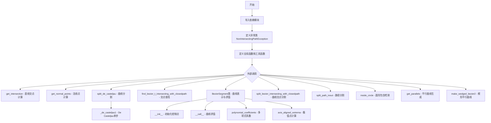
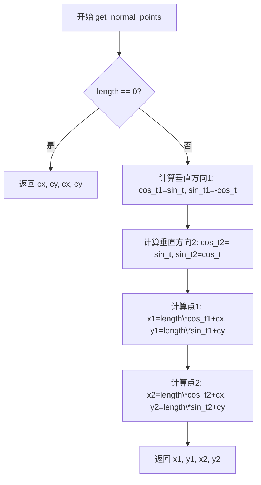
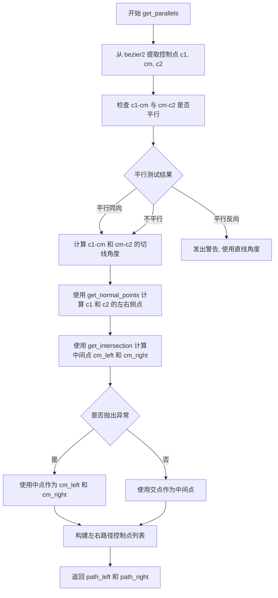
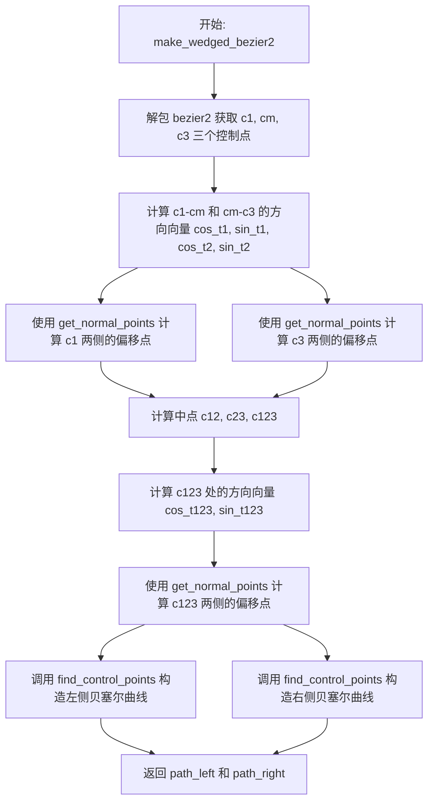
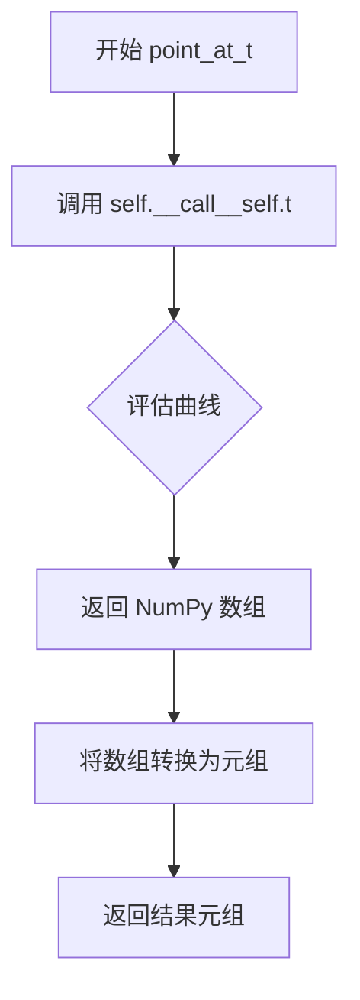
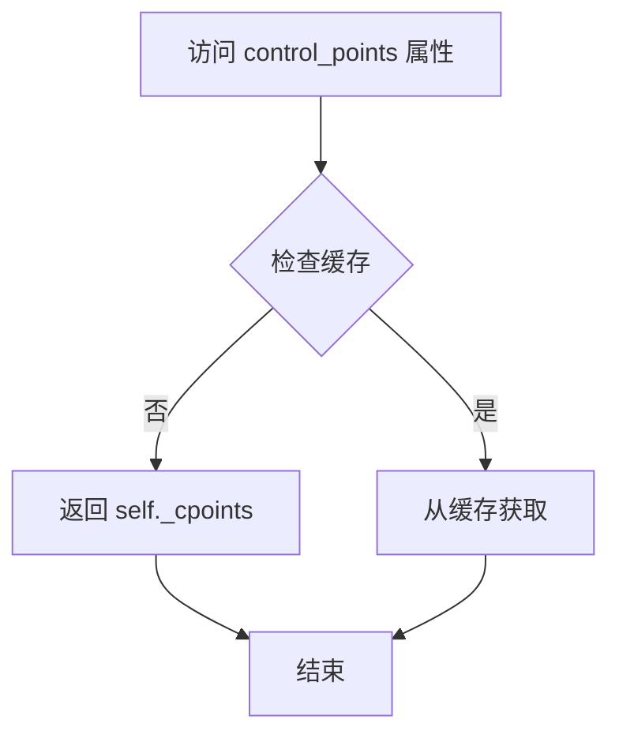
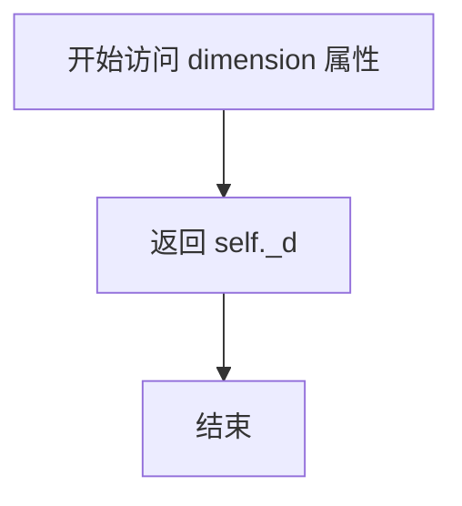

# `matplotlib\lib\matplotlib\bezier.py` 详细设计文档

该模块提供Bézier路径操作工具函数，包括Bézier曲线段表示与求值、控制点矩阵计算、曲线分割（De Casteljau算法）、Bézier曲线与闭合路径交点查找、路径分割、以及平行/偏移Bézier曲线生成等功能，主要用于matplotlib的路径绘制和图形处理。

## 整体流程



## 类结构

```
NonIntersectingPathException (ValueError)
│
└─ BezierSegment (核心类)
    ├─ __init__
    ├─ __call__
    ├─ point_at_t (deprecated)
    ├─ control_points (property)
    ├─ dimension (property)
    ├─ degree (property)
    ├─ polynomial_coefficients (property)
    └─ axis_aligned_extrema
```

## 全局变量及字段


### `_api`
    
matplotlib内部API装饰器和警告工具模块

类型：`module`
    


### `np`
    
numpy数组操作模块别名

类型：`module`
    


### `math`
    
数学函数库，提供阶乘、组合数等计算

类型：`module`
    


### `warnings`
    
Python警告控制模块

类型：`module`
    


### `Path`
    
matplotlib路径类，表示一系列几何路径命令和顶点

类型：`class`
    


### `NonIntersectingPathException`
    
自定义异常类，表示路径不相交的错误

类型：`class`
    


### `BezierSegment._cpoints`
    
存储Bézier曲线的控制点数组，形状为(N, d)

类型：`numpy.ndarray`
    


### `BezierSegment._N`
    
控制点的数量

类型：`int`
    


### `BezierSegment._d`
    
Bézier曲线的维度（2表示2D，3表示3D等）

类型：`int`
    


### `BezierSegment._orders`
    
从0到N-1的阶数数组，用于多项式求幂计算

类型：`numpy.ndarray`
    


### `BezierSegment._px`
    
预计算的系数矩阵，用于加速曲线求值

类型：`numpy.ndarray`
    
    

## 全局函数及方法


### `_get_coeff_matrix`

该函数是一个全局函数，用于计算将Bézier曲线控制点转换为多项式系数的转换矩阵。对于给定阶数（degree）`n`的Bézier曲线，该函数返回一个 $(n+1) \times (n+1)$ 的矩阵 $M$。满足 $M \times \text{control\_points} = \text{polynomial\_coefficients}$。矩阵元素的计算公式为 $M[j, i] = C(n, j) \times (-1)^{i+j} \times C(j, i)$。该函数使用了 `@lru_cache` 装饰器进行结果缓存，以优化重复调用时的性能。

参数：

- `n`：`int`，Bézier曲线的阶数（Degree）。通常为控制点数量减1。

返回值：`numpy.ndarray`，形状为 $(n+1) \times (n+1)$ 的浮点矩阵，用于转换控制点到多项式基。

#### 流程图

```mermaid
graph TD
    A[输入: n] --> B[定义内部函数 _comb]
    B --> C[生成索引网格: j (行), i (列)]
    C --> D[计算 prefactor: (-1)^(i+j) * Cj,i]
    D --> E[计算最终矩阵: Cn,j * prefactor]
    E --> F[类型转换为 float]
    F --> G[返回矩阵]
```

#### 带注释源码

```python
@lru_cache(maxsize=16)
def _get_coeff_matrix(n):
    """
    Compute the matrix for converting Bezier control points to polynomial
    coefficients for a curve of degree n.

    The matrix M is such that M @ control_points gives polynomial coefficients.
    Entry M[j, i] = C(n, j) * (-1)^(i+j) * C(j, i) where C is the binomial
    coefficient.
    """
    def _comb(n, k):
        # 使用 numpy.vectorize 将 math.comb 向量化，以便处理数组输入
        return np.vectorize(math.comb)(n, k)

    # 创建索引数组 j (0 到 n) 和 i (0 到 n)
    # j 放在列维度 (axis=0), i 放在行维度 (axis=1), 方便广播计算
    j = np.arange(n + 1)[:, None]
    i = np.arange(n + 1)[None, :]  # _comb is non-zero for i <= j
    
    # 计算前置因子: (-1)^(i+j) * C(j, i)
    prefactor = (-1) ** (i + j) * _comb(j, i)  # j on axis 0, i on axis 1
    
    # 计算最终矩阵: C(n, j) * prefactor，并转换为浮点数
    return (_comb(n, j) * prefactor).astype(float)
```


### `get_intersection`

计算两条通过给定中心点且具有指定角度的直线的交点。该函数通过构建直线方程的系数矩阵，求解线性方程组来确定两条直线的交点坐标。

参数：

- `cx1`：`float`，直线1的中心点x坐标
- `cy1`：`float`，直线1的中心点y坐标
- `cos_t1`：`float`，直线1角度的余弦值
- `sin_t1`：`float`，直线1角度的正弦值
- `cx2`：`float`，直线2的中心点x坐标
- `cy2`：`float`，直线2的中心点y坐标
- `cos_t2`：`float`，直线2角度的余弦值
- `sin_t2`：`float`，直线2角度的正弦值

返回值：`tuple[float, float]`，两条直线的交点坐标(x, y)

#### 流程图

```mermaid
flowchart TD
    A[开始 get_intersection] --> B[计算line1_rhs = sin_t1 * cx1 - cos_t1 * cy1]
    B --> C[计算line2_rhs = sin_t2 * cx2 - cos_t2 * cy2]
    C --> D[构建系数: a=sin_t1, b=-cos_t1, c=sin_t2, d=-cos_t2]
    D --> E[计算行列式: ad_bc = a*d - b*c]
    E --> F{ad_bc绝对值 < 1e-12?}
    F -->|是| G[抛出ValueError: 两直线平行]
    F -->|否| H[计算逆矩阵系数: a_, b_, c_, d_]
    H --> I[计算交点x坐标]
    I --> J[计算交点y坐标]
    J --> K[返回交点坐标 (x, y)]
```

#### 带注释源码

```python
def get_intersection(cx1, cy1, cos_t1, sin_t1,
                     cx2, cy2, cos_t2, sin_t2):
    """
    Return the intersection between the line through (*cx1*, *cy1*) at angle
    *t1* and the line through (*cx2*, *cy2*) at angle *t2*.
    """

    # 将直线方程转换为标准形式: sin_t * x + cos_t * y = rhs
    # line1 => sin_t1 * (x - cx1) - cos_t1 * (y - cy1) = 0.
    # 展开后: sin_t1 * x + cos_t1 * y = sin_t1*cx1 - cos_t1*cy1
    
    # 计算右侧常数项
    line1_rhs = sin_t1 * cx1 - cos_t1 * cy1
    line2_rhs = sin_t2 * cx2 - cos_t2 * cy2

    # 构建系数矩阵的系数: [sin_t, -cos_t] · [x, y] = rhs
    a, b = sin_t1, -cos_t1
    c, d = sin_t2, -cos_t2

    # 计算系数矩阵的行列式，用于判断是否平行及求解逆矩阵
    ad_bc = a * d - b * c
    
    # 检查行列式是否接近零（两直线平行或重合）
    if abs(ad_bc) < 1e-12:
        raise ValueError("Given lines do not intersect. Please verify that "
                         "the angles are not equal or differ by 180 degrees.")

    # 计算系数矩阵的逆矩阵元素 (伴随矩阵法)
    # inv(A) = 1/det(A) * [d, -b; -c, a]
    a_, b_ = d, -b
    c_, d_ = -c, a
    a_, b_, c_, d_ = (k / ad_bc for k in [a_, b_, c_, d_])

    # 通过逆矩阵求解交点坐标: X = inv(A) * rhs
    x = a_ * line1_rhs + b_ * line2_rhs
    y = c_ * line1_rhs + d_ * line2_rhs

    return x, y
```


### `get_normal_points`

该函数用于计算给定直线的垂直线上两个对称点的坐标。给定通过点 (cx, cy) 且角度为 t 的直线，函数返回沿该直线垂直方向（法线方向）距离为 length 的两个点的位置坐标。

参数：

- `cx`：`float`，直线通过的点的 x 坐标
- `cy`：`float`，直线通过的点的 y 坐标
- `cos_t`：`float`，角度 t 的余弦值（cos(t)）
- `sin_t`：`float`，角度 t 的正弦值（sin(t)）
- `length`：`float`，沿垂直方向的距离

返回值：`tuple[float, float, float, float]`，返回四个浮点数 (x1, y1, x2, y2)，分别表示垂直线上两个端点的 x 和 y 坐标

#### 流程图



#### 带注释源码

```python
def get_normal_points(cx, cy, cos_t, sin_t, length):
    """
    For a line passing through (*cx*, *cy*) and having an angle *t*, return
    locations of the two points located along its perpendicular line at the
    distance of *length*.
    """

    # 特殊情况处理：当距离为0时，返回中心点的重复坐标
    # 此时两个点重合于直线上的中心点
    if length == 0.:
        return cx, cy, cx, cy

    # 计算第一条垂直线的方向向量
    # 将原方向向量 (cos_t, sin_t) 逆时针旋转90度得到 (sin_t, -cos_t)
    cos_t1, sin_t1 = sin_t, -cos_t

    # 计算第二条垂直线的方向向量
    # 将原方向向量 (cos_t, sin_t) 顺时针旋转90度得到 (-sin_t, cos_t)
    cos_t2, sin_t2 = -sin_t, cos_t

    # 根据方向向量和距离计算第一个点的坐标
    # 点1 = 中心点 + 长度 * 方向向量1
    x1, y1 = length * cos_t1 + cx, length * sin_t1 + cy

    # 根据方向向量和距离计算第二个点的坐标
    # 点2 = 中心点 + 长度 * 方向向量2
    x2, y2 = length * cos_t2 + cx, length * sin_t2 + cy

    # 返回两个点的坐标
    return x1, y1, x2, y2
```


### `_de_casteljau1`

该函数是De Casteljau算法的单次迭代实现，用于Bézier曲线细分。它通过线性插值计算下一层的控制点，是分割Bézier曲线的基础运算单元。

参数：

- `beta`：array-like，Bézier曲线的控制点数组
- `t`：float，曲线细分参数，范围通常在[0, 1]之间

返回值：`array`，经过一次De Casteljau迭代后的新控制点数组

#### 流程图

```mermaid
flowchart TD
    A[Start: 输入 beta, t] --> B[提取 beta[:-1]: 去除最后一个控制点]
    A --> C[提取 beta[1:]: 去除第一个控制点]
    B --> D[计算 (1 - t) * beta[:-1]]
    C --> E[t * beta[1:]]
    D --> F[next_beta = (1-t)*beta[:-1] + t*beta[1:]]
    E --> F
    F --> G[返回 next_beta]
```

#### 带注释源码

```
def _de_casteljau1(beta, t):
    """
    De Casteljau算法的单次迭代。
    
    该函数执行De Casteljau算法的一次迭代，通过线性插值
    将n个控制点转换为n-1个新控制点。这是分割Bézier曲线的
    核心操作。
    
    参数:
        beta: array-like，Bézier曲线的控制点。例如对于三次曲线，
             beta为4个控制点数组。
        t: float，参数值，表示在曲线上的位置。t=0对应起点，
           t=1对应终点。
    
    返回:
        array，经过一次迭代后的新控制点数组，维度比输入少1。
    """
    # 使用数组切片提取控制点
    # beta[:-1]: 取从第一个到倒数第二个的所有控制点（去除最后一个）
    # beta[1:]: 取从第二个到最后一个的所有控制点（去除第一个）
    
    # 线性插值公式: P(t) = (1-t) * P0 + t * P1
    # 对相邻控制点对进行线性插值，得到新一层的控制点
    next_beta = beta[:-1] * (1 - t) + beta[1:] * t
    
    return next_beta
```


### `split_de_casteljau`

使用 De Casteljau 算法将 Bézier 曲线在参数 t 处分割为两个子曲线段，并返回两个子曲线段的控制点。

参数：

- `beta`：`array-like`，Bézier 曲线的控制点数组
- `t`：`float`，分割参数值，取值范围为 [0, 1]

返回值：`tuple[list, list]`，两个子曲线的控制点列表 `(left_beta, right_beta)`

#### 流程图

```mermaid
flowchart TD
    A[开始 split_de_casteljau] --> B[将 beta 转换为 numpy 数组]
    B --> C[初始化 beta_list = [beta]]
    D{len(beta) == 1?} -- 否 --> E[调用 _de_casteljau1 计算下一层控制点]
    E --> F[将新控制点添加到 beta_list]
    F --> D
    D -- 是 --> G[提取左侧控制点: left_beta = beta_list 中每个数组的第0个元素]
    G --> H[提取右侧控制点: right_beta = beta_list 逆序后每个数组的最后一个元素]
    H --> I[返回 (left_beta, right_beta)]

    style A fill:#f9f,color:#333
    style I fill:#9f9,color:#333
```

#### 带注释源码

```python
def split_de_casteljau(beta, t):
    """
    Split a Bézier segment defined by its control points *beta* into two
    separate segments divided at *t* and return their control points.
    
    使用 De Casteljau 算法将 Bézier 曲线在参数 t 处分割为两条子曲线。
    该算法通过递归线性插值计算分割后的控制点。
    
    Parameters:
        beta: array-like, Bézier 曲线的控制点，形状为 (n+1, d) 其中 n 是次数，d 是维度
        t: float, 分割参数，取值范围 [0, 1]
    
    Returns:
        tuple: (left_beta, right_beta)，分别为分割后左右两条曲线的控制点列表
    """
    # 将输入的控制点转换为 numpy 数组以便进行数值计算
    beta = np.asarray(beta)
    
    # 初始化列表存储每一层的控制点
    # 初始层包含原始控制点
    beta_list = [beta]
    
    # 迭代计算 De Casteljau 算法的每一层
    # 每一层都会减少一个控制点，直到只剩下一个点
    while True:
        # 使用 De Casteljau 一步计算下一层控制点
        # 公式: new_beta[i] = beta[i] * (1-t) + beta[i+1] * t
        beta = _de_casteljau1(beta, t)
        
        # 将新计算的控制点添加到列表中
        beta_list.append(beta)
        
        # 当只剩下一个控制点时停止迭代
        # 此时该点即为曲线在参数 t 处的精确位置
        if len(beta) == 1:
            break
    
    # 从 beta_list 提取左子曲线的控制点
    # 每层的第一个点构成左子曲线的控制点序列
    left_beta = [beta[0] for beta in beta_list]
    
    # 从 beta_list 提取右子曲线的控制点
    # 每层的最后一个点构成右子曲线的控制点序列（逆序提取）
    right_beta = [beta[-1] for beta in reversed(beta_list)]

    # 返回两个子曲线的控制点
    return left_beta, right_beta
```


### `find_bezier_t_intersecting_with_closedpath`

该函数使用二分搜索算法，在给定的参数区间[t0, t1]内查找贝塞尔曲线与闭合路径的交点。它通过判断曲线上的点是否在路径内部来确定交点的大致位置，当两点间的距离小于指定容差时返回近似交点的参数值。

参数：

- `bezier_point_at_t`：`callable`，返回贝塞尔曲线在参数t处的(x, y)坐标的函数，签名为`bezier_point_at_t(t: float) -> tuple[float, float]`
- `inside_closedpath`：`callable`，判断给定点是否在闭合路径内的函数，签名为`inside_closedpath(point: tuple[float, float]) -> bool`
- `t0`：`float`，搜索区间的起始参数，默认值为0.0
- `t1`：`float`，搜索区间的结束参数，默认值为1.0
- `tolerance`：`float`，容差值，控制搜索精度，默认值为0.01

返回值：`tuple[float, float]`，返回两个贝塞尔曲线参数t0和t1，表示交点所在区间的近似参数值

#### 流程图

```mermaid
flowchart TD
    A[开始] --> B[获取t0和t1处的贝塞尔曲线点<br/>start = bezier_point_at_t(t0)<br/>end = bezier_point_at_t(t1)]
    B --> C[判断起点和终点是否在闭合路径内<br/>start_inside = inside_closedpath(start)<br/>end_inside = inside_closedpath(end)]
    C --> D{start_inside == end_inside<br/>且 start != end?}
    D -->|是| E[抛出NonIntersectingPathException异常]
    D -->|否| F[进入主循环]
    
    F --> G{np.hypot距离 < tolerance?}
    G -->|是| H[返回t0, t1]
    G -->|否| I[计算中点参数和坐标<br/>middle_t = 0.5 * (t0 + t1)<br/>middle = bezier_point_at_t(middle_t)]
    
    I --> J[middle_inside = inside_closedpath(middle)]
    J --> K{start_inside ^ middle_inside?<br/>（异或操作）}
    
    K -->|是| L[更新右边界<br/>t1 = middle_t<br/>end = middle]
    K -->|否| M[更新左边界<br/>t0 = middle_t<br/>start = middle<br/>start_inside = middle_inside]
    
    L --> N{end == middle?<br/>（边界情况）}
    M --> O{start == middle?<br/>（边界情况）}
    
    N -->|是| H
    N -->|否| G
    O -->|是| H
    O -->|否| G
    
    E --> P[异常处理：两点位于闭合路径同侧]
    H --> Q[结束]
    P --> Q
```

#### 带注释源码

```python
def find_bezier_t_intersecting_with_closedpath(
        bezier_point_at_t, inside_closedpath, t0=0., t1=1., tolerance=0.01):
    """
    Find the intersection of the Bézier curve with a closed path.

    The intersection point *t* is approximated by two parameters *t0*, *t1*
    such that *t0* <= *t* <= *t1*.

    Search starts from *t0* and *t1* and uses a simple bisecting algorithm
    therefore one of the end points must be inside the path while the other
    doesn't. The search stops when the distance of the points parametrized by
    *t0* and *t1* gets smaller than the given *tolerance*.

    Parameters
    ----------
    bezier_point_at_t : callable
        A function returning x, y coordinates of the Bézier at parameter *t*.
        It must have the signature::

            bezier_point_at_t(t: float) -> tuple[float, float]

    inside_closedpath : callable
        A function returning True if a given point (x, y) is inside the
        closed path. It must have the signature::

            inside_closedpath(point: tuple[float, float]) -> bool

    t0, t1 : float
        Start parameters for the search.

    tolerance : float
        Maximal allowed distance between the final points.

    Returns
    -------
    t0, t1 : float
        The Bézier path parameters.
    """
    # 获取搜索区间两个端点在贝塞尔曲线上的坐标
    start = bezier_point_at_t(t0)
    end = bezier_point_at_t(t1)

    # 判断端点是否在闭合路径内部
    start_inside = inside_closedpath(start)
    end_inside = inside_closedpath(end)

    # 验证：两个端点必须一个在路径内，一个在路径外（否则无交点）
    if start_inside == end_inside and start != end:
        raise NonIntersectingPathException(
            "Both points are on the same side of the closed path")

    # 二分搜索主循环：不断细化搜索区间直到满足容差要求
    while True:

        # 如果两点间的欧氏距离小于容差，则认为找到近似交点
        if np.hypot(start[0] - end[0], start[1] - end[1]) < tolerance:
            return t0, t1

        # 计算当前区间的中点参数和对应曲线坐标
        middle_t = 0.5 * (t0 + t1)
        middle = bezier_point_at_t(middle_t)
        middle_inside = inside_closedpath(middle)

        # 使用异或(^)判断中点与起点是否在路径的不同侧
        # 如果是，交点位于[t0, middle_t]区间；否则位于[middle_t, t1]区间
        if start_inside ^ middle_inside:
            t1 = middle_t  # 收缩右边界
            if end == middle:
                # 边界情况处理：避免因数值精度导致的无限循环
                # 当数值很大但容差很小可能触发此情况
                return t0, t1
            end = middle
        else:
            t0 = middle_t  # 收缩左边界
            if start == middle:
                # 边界情况处理：避免因数值精度导致的无限循环
                return t0, t1
            start = middle
            start_inside = middle_inside
```


### `split_bezier_intersecting_with_closedpath`

该函数用于将一条 Bézier 曲线在与管理路径的交点处分割成两段。它首先通过二分搜索算法找到曲线与管理路径的两个交点参数 t0 和 t1，然后使用 De Casteljau 算法在参数 (t0+t1)/2 处将曲线分割为左右两段并返回两段曲线的控制点。

参数：

- `bezier`：`list` 或 `(N, 2) array-like`，Bézier 曲线的控制点，N 为控制点数量，2 表示二维平面坐标
- `inside_closedpath`：`callable`，一个函数，接收坐标点 (x, y)，返回布尔值表示该点是否在闭合路径内部
- `tolerance`：`float`，可选参数，默认值 0.01，表示寻找交点时的容差值（距离阈值）

返回值：`tuple`，返回两个列表 `(_left, _right)`，分别表示分割后左侧和右侧 Bézier 曲线的控制点列表

#### 流程图

```mermaid
flowchart TD
    A[开始: split_bezier_intersecting_with_closedpath] --> B[创建 BezierSegment 对象 bz]
    B --> C[调用 find_bezier_t_intersecting_with_closedpath 查找交点参数 t0, t1]
    C --> D[计算分割参数 t_mid = (t0 + t1) / 2]
    D --> E[调用 split_de_casteljau 在 t_mid 处分割曲线]
    E --> F[返回左右两段曲线的控制点 _left, _right]
```

#### 带注释源码

```python
def split_bezier_intersecting_with_closedpath(
        bezier, inside_closedpath, tolerance=0.01):
    """
    Split a Bézier curve into two at the intersection with a closed path.

    Parameters
    ----------
    bezier : (N, 2) array-like
        Control points of the Bézier segment. See `.BezierSegment`.
    inside_closedpath : callable
        A function returning True if a given point (x, y) is inside the
        closed path. See also `.find_bezier_t_intersecting_with_closedpath`.
    tolerance : float
        The tolerance for the intersection. See also
        `.find_bezier_t_intersecting_with_closedpath`.

    Returns
    -------
    left, right
        Lists of control points for the two Bézier segments.
    """

    # 使用输入的控制点创建 BezierSegment 对象
    # 该对象封装了曲线的求值、分割等操作
    bz = BezierSegment(bezier)

    # 调用辅助函数 find_bezier_t_intersecting_with_closedpath
    # 使用 lambda 表达式将 BezierSegment 的求值结果转换为元组格式
    # 查找曲线与管理路径的交点参数范围 [t0, t1]
    t0, t1 = find_bezier_t_intersecting_with_closedpath(
        lambda t: tuple(bz(t)), inside_closedpath, tolerance=tolerance)

    # 计算中点参数，用于分割曲线
    # (t0 + t1) / 2 代表曲线与管理路径交点区间的中间位置
    _left, _right = split_de_casteljau(bezier, (t0 + t1) / 2.)
    
    # 返回分割后的左右两段曲线的控制点
    return _left, _right
```


### `split_path_inout`

该函数将一个路径在内外状态改变的点处分割为两个部分，常用于将路径与闭合图形相交后分割为"内部"和"外部"两段。

参数：

- `path`：`Path` 对象，需要被分割的路径
- `inside`：可调用对象，签名为 `inside(point: tuple[float, float]) -> bool`，用于判断给定点是否在闭合图形内部
- `tolerance`：`float`，寻找交点时的容差值，默认为 0.01
- `reorder_inout`：`bool`，是否在起始点不在内部时交换输入输出路径，默认为 False

返回值：`(Path, Path)`，返回两个新的 Path 对象，分别是路径的内部段（`path_in`）和外部段（`path_out`）

#### 流程图

```mermaid
flowchart TD
    A[开始 split_path_inout] --> B[获取 path 的迭代器]
    B --> C[获取第一个控制点和命令]
    C --> D[判断起始点是否在 inside 内<br/>begin_inside = inside(ctl_points[-2:])]
    D --> E[初始化 ctl_points_old, iold, i]
    E --> F{遍历 path_iter}
    F -->|获取下一段控制点| G[更新 iold 和 i]
    G --> H{inside(ctl_points[-2:]) != begin_inside}
    H -->|否| I[更新 ctl_points_old]
    I --> F
    H -->|是| J[构建 bezier_path 并 break]
    J --> K{找到交点?}
    K -->|否| L[抛出 ValueError<br/>'The path does not intersect with the patch']
    K -->|是| M[reshape bezier_path 并调用<br/>split_bezier_intersecting_with_closedpath]
    M --> N{left 的点数}
    N -->|2| O[设置 codes: LINETO]
    N -->|3| P[设置 codes: CURVE3]
    N -->|4| Q[设置 codes: CURVE4]
    O --> R[提取 verts_left 和 verts_right]
    P --> R
    Q --> R
    R --> S{path.codes is None?}
    S -->|是| T[构建无 codes 的 Path 对象]
    S -->|否| U[构建带 codes 的 Path 对象]
    T --> V{reorder_inout 且 not begin_inside?}
    U --> V
    V -->|是| W[交换 path_in 和 path_out]
    V -->|否| X[返回 path_in, path_out]
    W --> X
```

#### 带注释源码

```python
def split_path_inout(path, inside, tolerance=0.01, reorder_inout=False):
    """
    Divide a path into two segments at the point where ``inside(x, y)`` becomes
    False.
    """
    from matplotlib.path import Path  # 延迟导入 Path 类
    path_iter = path.iter_segments()  # 获取路径的迭代器，用于遍历各个段

    # 获取第一个控制点序列和对应的绘图命令
    ctl_points, command = next(path_iter)
    # 判断路径起始点是否在 inside 定义的闭合图形内部
    begin_inside = inside(ctl_points[-2:])  # true if begin point is inside

    ctl_points_old = ctl_points  # 保存前一段的控制点

    iold = 0  # 前一个索引位置
    i = 1  # 当前索引位置

    # 遍历路径的各个段，寻找内外状态改变的交点
    for ctl_points, command in path_iter:
        iold = i  # 更新前一个索引
        i += len(ctl_points) // 2  # 更新当前索引（每个点有 x, y 两个坐标）
        # 检查当前段的终点是否与起始点状态不同（即发生了穿越）
        if inside(ctl_points[-2:]) != begin_inside:
            # 构建包含交点的完整贝塞尔曲线段
            bezier_path = np.concatenate([ctl_points_old[-2:], ctl_points])
            break  # 找到交点，退出循环
        ctl_points_old = ctl_points  # 更新旧的控制点
    else:
        # 循环正常结束（未找到交点），抛出异常
        raise ValueError("The path does not intersect with the patch")

    # 将 bezier_path 重塑为 (n, 2) 的数组形式
    bp = bezier_path.reshape((-1, 2))
    # 调用函数分割贝塞尔曲线，返回左右两段的控制点
    left, right = split_bezier_intersecting_with_closedpath(bp, inside, tolerance)

    # 根据左段控制点数量确定路径代码类型
    if len(left) == 2:
        # 直线段
        codes_left = [Path.LINETO]
        codes_right = [Path.MOVETO, Path.LINETO]
    elif len(left) == 3:
        # 二次贝塞尔曲线
        codes_left = [Path.CURVE3, Path.CURVE3]
        codes_right = [Path.MOVETO, Path.CURVE3, Path.CURVE3]
    elif len(left) == 4:
        # 三次贝塞尔曲线
        codes_left = [Path.CURVE4, Path.CURVE4, Path.CURVE4]
        codes_right = [Path.MOVETO, Path.CURVE4, Path.CURVE4, Path.CURVE4]
    else:
        # 理论上不应到达此处
        raise AssertionError("This should never be reached")

    # 提取左、右段的顶点（去除重复的连接点）
    verts_left = left[1:]  # 跳过第一个点（与前一段共享）
    verts_right = right[:]  # 保留所有点

    # 根据原始路径是否有 codes 属性来构建新的 Path 对象
    if path.codes is None:
        # 无 codes 的简单路径
        # 合并原始顶点的前 i 个与分割后的左段顶点
        path_in = Path(np.concatenate([path.vertices[:i], verts_left]))
        # 合并分割后的右段顶点与原始顶点的后部分
        path_out = Path(np.concatenate([verts_right, path.vertices[i:]]))
    else:
        # 带 codes 的复杂路径
        path_in = Path(
            np.concatenate([path.vertices[:iold], verts_left]),
            np.concatenate([path.codes[:iold], codes_left])
        )
        path_out = Path(
            np.concatenate([verts_right, path.vertices[i:]]),
            np.concatenate([codes_right, path.codes[i:]])
        )

    # 如果需要重排序且起始点不在内部，则交换输入输出路径
    if reorder_inout and not begin_inside:
        path_in, path_out = path_out, path_in

    return path_in, path_out  # 返回内部路径和外部路径
```


### `inside_circle`

该函数返回一个闭包函数，用于检查给定点是否位于以 (*cx*, *cy*) 为圆心、*r* 为半径的圆内。

参数：

- `cx`：`float`，圆心的 x 坐标
- `cy`：`float`，圆心的 y 坐标
- `r`：`float`，圆的半径

返回值：`callable`，返回一个函数 `f(xy: tuple[float, float]) -> bool`，该函数接受一个坐标元组，返回布尔值表示该点是否在圆内

#### 流程图

```mermaid
flowchart TD
    A[开始: 调用 inside_circle] --> B[接收参数 cx, cy, r]
    B --> C[计算 r2 = r²]
    C --> D[定义内部函数 _f]
    D --> E[接收参数 xy]
    E --> F[解包 xy 为 x, y]
    F --> G[计算距离平方: dx = (x - cx)² + (y - cy)²]
    G --> H{dx < r2?}
    H -->|True| I[返回 True: 点在圆内]
    H -->|False| J[返回 False: 点在圆外]
    
    style A fill:#f9f,stroke:#333
    style D fill:#ff9,stroke:#333
    style I fill:#9f9,stroke:#333
    style J fill:#f99,stroke:#333
```

#### 带注释源码

```python
def inside_circle(cx, cy, r):
    """
    Return a function that checks whether a point is in a circle with center
    (*cx*, *cy*) and radius *r*.

    The returned function has the signature::

        f(xy: tuple[float, float]) -> bool
    """
    r2 = r ** 2  # 计算半径的平方，避免在内部函数中重复计算

    def _f(xy):  # 定义内部闭包函数
        x, y = xy  # 解包输入的坐标元组
        # 计算点到圆心的距离平方，与半径平方比较
        return (x - cx) ** 2 + (y - cy) ** 2 < r2
    
    return _f  # 返回闭包函数，携带了 cx, cy, r2 的作用域
```


### `get_cos_sin`

计算从起点 (x0, y0) 到终点 (x1, y1) 的单位方向向量，返回该向量的余弦和正弦值（即 cosθ 和 sinθ）。

参数：

- `x0`：`float`，起点的 x 坐标
- `y0`：`float`，起点的 y 坐标
- `x1`：`float`，终点的 x 坐标
- `y1`：`float`，终点的 y 坐标

返回值：`tuple[float, float]`，单位向量的 (cosθ, sinθ) 分量，若起点与终点重合则返回 (0.0, 0.0)

#### 流程图

```mermaid
flowchart TD
    A[开始] --> B[计算差值: dx = x1 - x0, dy = y1 - y0]
    B --> C[计算距离: d = sqrt(dx*dx + dy*dy)]
    C --> D{判断: d == 0?}
    D -->|是| E[返回 (0.0, 0.0)]
    D -->|否| F[返回 (dx/d, dy/d)]
    E --> G[结束]
    F --> G
```

#### 带注释源码

```python
def get_cos_sin(x0, y0, x1, y1):
    """
    计算从点 (x0, y0) 到点 (x1, y1) 的单位方向向量。
    
    参数:
        x0, y0: float, 起点坐标
        x1, y1: float, 终点坐标
    
    返回:
        tuple[float, float]: (cosθ, sinθ) 单位向量分量，
                            若两点重合则返回 (0.0, 0.0)
    """
    # 计算起点到终点的差值向量
    dx, dy = x1 - x0, y1 - y0
    # 计算欧几里得距离
    d = (dx * dx + dy * dy) ** .5
    # 特殊处理：避免除零错误（当起点与终点重合时）
    if d == 0:
        return 0.0, 0.0
    # 返回归一化的单位向量（方向余弦和方向正弦）
    return dx / d, dy / d
```


### `check_if_parallel`

检测两条线是否平行，并通过返回值区分同向平行和反向平行的不同情况。

参数：

- `dx1`：`float`，第一条线的 x 方向梯度
- `dy1`：`float`，第一条线的 y 方向梯度
- `dx2`：`float`，第二条线的 x 方向梯度
- `dy2`：`float`，第二条线的 y 方向梯度
- `tolerance`：`float`，角度容差（弧度），用于判断两条线是否平行，默认值为 1.e-5

返回值：`int | bool`，返回值的具体含义如下：
- 当两条线平行且方向相同时返回 `1`
- 当两条线平行但方向相反时返回 `-1`
- 当两条线不平行时返回 `False`

#### 流程图

```mermaid
flowchart TD
    A[开始] --> B[计算theta1 = arctan2(dx1, dy1)]
    B --> C[计算theta2 = arctan2(dx2, dy2)]
    C --> D[计算dtheta = abs(theta1 - theta2)]
    D --> E{dtheta < tolerance?}
    E -->|是| F[返回 1]
    E -->|否| G{abs(dtheta - pi) < tolerance?}
    G -->|是| H[返回 -1]
    G -->|否| I[返回 False]
    F --> J[结束]
    H --> J
    I --> J
```

#### 带注释源码

```python
def check_if_parallel(dx1, dy1, dx2, dy2, tolerance=1.e-5):
    """
    Check if two lines are parallel.

    Parameters
    ----------
    dx1, dy1, dx2, dy2 : float
        The gradients *dy*/*dx* of the two lines.
    tolerance : float
        The angular tolerance in radians up to which the lines are considered
        parallel.

    Returns
    -------
    is_parallel
        - 1 if two lines are parallel in same direction.
        - -1 if two lines are parallel in opposite direction.
        - False otherwise.
    """
    # 使用 arctan2 计算两个向量的角度（弧度制）
    # arctan2(y, x) 返回从 x 轴到点 (x, y) 的角度
    theta1 = np.arctan2(dx1, dy1)
    theta2 = np.arctan2(dx2, dy2)
    
    # 计算两个角度之间的差值（取绝对值）
    dtheta = abs(theta1 - theta2)
    
    # 如果角度差小于容差阈值，认为两条线平行且方向相同
    if dtheta < tolerance:
        return 1
    # 如果角度差接近 pi（180度），认为两条线平行但方向相反
    elif abs(dtheta - np.pi) < tolerance:
        return -1
    # 否则认为两条线不平行
    else:
        return False
```


### `get_parallels`

给定二次贝塞尔曲线的控制点，计算并返回两条与原曲线平行且间隔指定宽度的二次贝塞尔曲线的控制点。

参数：

- `bezier2`：`list[tuple[float, float]]`，二次贝塞尔曲线的三个控制点 `[(c1x, c1y), (cmx, cmy), (c2x, c2y)]`
- `width`：`float`，两条平行曲线之间的宽度距离

返回值：`tuple[list[tuple[float, float]], list[tuple[float, float]]]`，返回两个控制点列表，分别代表左侧和右侧的平行曲线，每个列表包含三个控制点 `[(c1x, c1y), (cmx, cmy), (c2x, c2y)]`

#### 流程图



#### 带注释源码

```python
def get_parallels(bezier2, width):
    """
    Given the quadratic Bézier control points *bezier2*, returns
    control points of quadratic Bézier lines roughly parallel to given
    one separated by *width*.
    """

    # 提取二次贝塞尔曲线的三个控制点
    # c1: 起点, cm: 中间控制点, c2: 终点
    c1x, c1y = bezier2[0]
    cmx, cmy = bezier2[1]
    c2x, c2y = bezier2[2]

    # 检查两段线(c1->cm 和 cm->c2)是否平行
    # 返回 1 表示同向平行, -1 表示反向平行, False 表示不平行
    parallel_test = check_if_parallel(c1x - cmx, c1y - cmy,
                                      cmx - c2x, cmy - c2y)

    if parallel_test == -1:
        # 两段线方向相反,发出警告并使用起点到终点的直线角度
        _api.warn_external(
            "Lines do not intersect. A straight line is used instead.")
        cos_t1, sin_t1 = get_cos_sin(c1x, c1y, c2x, c2y)
        cos_t2, sin_t2 = cos_t1, sin_t1
    else:
        # 计算曲线在起点(c1)和终点(c2)处的切线角度
        # t1 是 c1->cm 的角度, t2 是 cm->c2 的角度
        # 这些角度也是贝塞尔路径在 c1 和 c2 处的切线角度
        cos_t1, sin_t1 = get_cos_sin(c1x, c1y, cmx, cmy)
        cos_t2, sin_t2 = get_cos_sin(cmx, cmy, c2x, c2y)

    # 计算 c1 和 c2 两侧的点
    # 这些点位于通过 c1 且垂直于切线的线上,距离为 width
    # 同样计算 c2 两侧的点
    c1x_left, c1y_left, c1x_right, c1y_right = (
        get_normal_points(c1x, c1y, cos_t1, sin_t1, width)
    )
    c2x_left, c2y_left, c2x_right, c2y_right = (
        get_normal_points(c2x, c2y, cos_t2, sin_t2, width)
    )

    # 计算中间控制点
    # cm_left 是通过 c1_left 且角度为 t1 的直线,
    # 与通过 c2_left 且角度为 t2 的直线的交点
    # cm_right 同理
    try:
        cmx_left, cmy_left = get_intersection(c1x_left, c1y_left, cos_t1,
                                              sin_t1, c2x_left, c2y_left,
                                              cos_t2, sin_t2)
        cmx_right, cmy_right = get_intersection(c1x_right, c1y_right, cos_t1,
                                                sin_t1, c2x_right, c2y_right,
                                                cos_t2, sin_t2)
    except ValueError:
        # 特殊处理直线情况:两直线夹角小于 get_intersection 的阈值
        # (不使用 check_if_parallel 因为阈值不同)
        # 使用中点作为中间控制点
        cmx_left, cmy_left = (
            0.5 * (c1x_left + c2x_left), 0.5 * (c1y_left + c2y_left)
        )
        cmx_right, cmy_right = (
            0.5 * (c1x_right + c2x_right), 0.5 * (c1y_right + c2y_right)
        )

    # 构建左右两侧的平行贝塞尔曲线控制点
    # 左侧: [c1_left, cm_left, c2_left]
    # 右侧: [c1_right, cm_right, c2_right]
    path_left = [(c1x_left, c1y_left),
                 (cmx_left, cmy_left),
                 (c2x_left, c2y_left)]
    path_right = [(c1x_right, c1y_right),
                  (cmx_right, cmy_right),
                  (c2x_right, c2y_right)]

    return path_left, path_right
```


### `find_control_points`

该函数用于根据曲线上的三个已知点（起点、中点、终点）计算二次贝塞尔曲线的控制点。它基于贝塞尔曲线的数学性质，通过中点公式反推控制点位置，使得曲线在参数 t=0.5 时经过给定中间点。

参数：

- `c1x`：`float`，曲线起点 P0 的 x 坐标
- `c1y`：`float`，曲线起点 P0 的 y 坐标
- `mmx`：`float`，曲线中间点 Pm 的 x 坐标（t=0.5 处的点）
- `mmy`：`float`，曲线中间点 Pm 的 y 坐标（t=0.5 处的点）
- `c2x`：`float`，曲线终点 P2 的 x 坐标
- `c2y`：`float`，曲线终点 P2 的 y 坐标

返回值：`list[tuple[float, float]]`，返回三个控制点组成的列表，依次为起点 P0、计算得到的控制点 P1、终点 P2

#### 流程图

```mermaid
flowchart TD
    A[开始] --> B[输入: c1x, c1y, mmx, mmy, c2x, c2y]
    B --> C["计算控制点 cmx = 0.5 * (4 * mmx - (c1x + c2x))"]
    C --> D["计算控制点 cmy = 0.5 * (4 * mmy - (c1y + c2y))"]
    D --> E[构造结果列表: [(c1x, c1y), (cmx, cmy), (c2x, c2y)]]
    E --> F[返回结果]
```

#### 带注释源码

```python
def find_control_points(c1x, c1y, mmx, mmy, c2x, c2y):
    """
    Find control points of the Bézier curve passing through (*c1x*, *c1y*),
    (*mmx*, *mmy*), and (*c2x*, *c2y*), at parametric values 0, 0.5, and 1.
    
    参数:
        c1x, c1y: 曲线起点坐标 (t=0)
        mmx, mmy: 曲线中点坐标 (t=0.5)
        c2x, c2y: 曲线终点坐标 (t=1)
    
    返回:
        包含三个控制点的列表 [(起点), (计算得到的控制点), (终点)]
    
    数学原理:
        二次贝塞尔曲线公式: B(t) = (1-t)²*P0 + 2(1-t)t*P1 + t²*P2
        已知 t=0.5 时 B(0.5) = 0.25*P0 + 0.5*P1 + 0.25*P2 = Pm
        推导得: P1 = 2*Pm - 0.5*(P0 + P2)
        即: cm = 2*mm - 0.5*(c1 + c2) = 0.5 * (4*mm - (c1 + c2))
    """
    # 根据贝塞尔曲线公式推导出的控制点计算公式
    # cmx = 2*mmx - 0.5*(c1x + c2x) = 0.5 * (4*mmx - c1x - c2x)
    cmx = .5 * (4 * mmx - (c1x + c2x))
    cmy = .5 * (4 * mmy - (c1y + c2y))
    
    # 返回三个控制点：起点、计算出的控制点、终点
    return [(c1x, c1y), (cmx, cmy), (c2x, c2y)]
```


### `make_wedged_bezier2`

该函数用于生成具有指定宽度的两条平行二次贝塞尔曲线。它通过计算原始曲线各点的法向偏移点，结合加权系数来构造左侧和右侧的平行曲线，类似于 `get_parallels` 函数的功能，但提供了更灵活的宽度权重控制。

参数：

- `bezier2`：`list[tuple[float, float]]`，长度为3的二次贝塞尔曲线控制点列表，每个元素为(x, y)坐标元组
- `width`：`float`，基础宽度值，用于确定平行曲线与原始曲线之间的距离
- `w1`：`float`，可选，默认为1.0，控制曲线起始点(c1)处的宽度权重
- `wm`：`float`，可选，默认为0.5，控制曲线中点(cm)处的宽度权重
- `w2`：`float`，可选，默认为0.0，控制曲线终点(c3)处的宽度权重

返回值：`tuple[list[tuple[float, float]], list[tuple[float, float]]]`，返回两个控制点列表，分别表示左侧和右侧的平行二次贝塞尔曲线，每个列表包含三个(x, y)坐标元组

#### 流程图



#### 带注释源码

```python
def make_wedged_bezier2(bezier2, width, w1=1., wm=0.5, w2=0.):
    """
    Being similar to `get_parallels`, returns control points of two quadratic
    Bézier lines having a width roughly parallel to given one separated by
    *width*.
    """

    # 从输入的二次贝塞尔曲线控制点中解包出三个点
    # c1: 起点, cm: 中间控制点, c3: 终点
    c1x, c1y = bezier2[0]
    cmx, cmy = bezier2[1]
    c3x, c3y = bezier2[2]

    # 计算曲线在起点和中点处切线的方向余弦和正弦
    # t1 是 c1 到 cm 的角度，也是曲线在 c1 处的切线角度
    # t2 是 cm 到 c3 的角度，也是曲线在 c3 处的切线角度
    cos_t1, sin_t1 = get_cos_sin(c1x, c1y, cmx, cmy)
    cos_t2, sin_t2 = get_cos_sin(cmx, cmy, c3x, c3y)

    # 根据切线方向，计算起点 c1 两侧的法向偏移点
    # 偏移距离为 width * w1，w1 默认为 1.0
    # 返回值: (左x, 左y, 右x, 右y)
    c1x_left, c1y_left, c1x_right, c1y_right = (
        get_normal_points(c1x, c1y, cos_t1, sin_t1, width * w1)
    )
    
    # 根据切线方向，计算终点 c3 两侧的法向偏移点
    # 偏移距离为 width * w2，w2 默认为 0.0
    c3x_left, c3y_left, c3x_right, c3y_right = (
        get_normal_points(c3x, c3y, cos_t2, sin_t2, width * w2)
    )

    # 计算三条线段的中点:
    # c12: c1 到 cm 的中点
    # c23: cm 到 c3 的中点
    # c123: c12 到 c23 的中点（即整条曲线的近似中点）
    c12x, c12y = (c1x + cmx) * .5, (c1y + cmy) * .5
    c23x, c23y = (cmx + c3x) * .5, (cmy + c3y) * .5
    c123x, c123y = (c12x + c23x) * .5, (c12y + c23y) * .5

    # 计算中点 c123 处的切线方向
    # 这是 c12 到 c23 的方向，代表曲线中点处的切线方向
    cos_t123, sin_t123 = get_cos_sin(c12x, c12y, c23x, c23y)

    # 根据中点处的切线方向，计算 c123 两侧的法向偏移点
    # 偏移距离为 width * wm，wm 默认为 0.5
    c123x_left, c123y_left, c123x_right, c123y_right = (
        get_normal_points(c123x, c123y, cos_t123, sin_t123, width * wm)
    )

    # 使用 find_control_points 函数，根据三个控制点构造两条新的二次贝塞尔曲线
    # 左侧曲线: 经过 c1_left, c123_left, c3_left
    path_left = find_control_points(c1x_left, c1y_left,
                                    c123x_left, c123y_left,
                                    c3x_left, c3y_left)
    
    # 右侧曲线: 经过 c1_right, c123_right, c3_right
    path_right = find_control_points(c1x_right, c1y_right,
                                     c123x_right, c123y_right,
                                     c3x_right, c3y_right)

    # 返回左侧和右侧两条平行贝塞尔曲线的控制点
    return path_left, path_right
```


### `BezierSegment.__init__`

该方法用于初始化一个 Bézier 曲线段对象。它接受一组控制点，将其转换为 NumPy 数组以便于计算，并预计算伯恩斯坦多项式（Bernstein basis）的系数矩阵，用于后续高效的曲线求值。

参数：

- `self`：实例本身，隐式参数。
- `control_points`：`array-like (N, d)`，曲线所需的控制点。其中 N 为控制点数量，d 为空间维度（例如 2D 平面为 2）。

返回值：`None`，构造函数不返回值。

#### 流程图

```mermaid
graph TD
    A([Start __init__]) --> B[Convert control_points to NumPy Array]
    B --> C[Unpack shape: _N (count), _d (dimension)]
    C --> D[Generate orders array: 0 to N-1]
    D --> E[Calculate Bernstein basis coefficients]
    E --> F[Compute weighted control points matrix _px]
    F --> G([End])
```

#### 带注释源码

```python
def __init__(self, control_points):
    # 将输入的控制点转换为 NumPy 数组，以便进行向量化计算
    self._cpoints = np.asarray(control_points)
    
    # 获取控制点的数量(N)和维度(d)
    # 例如：如果是二维空间的3个点，shape 为 (3, 2)
    self._N, self._d = self._cpoints.shape
    
    # 生成阶数数组 [0, 1, 2, ..., N-1]，用于后续的 t^k 幂运算
    self._orders = np.arange(self._N)
    
    # 计算二项式系数 (Bernstein Basis Coefficients)
    # 用于将控制点转换为多项式系数
    # formula: (N-1)! / (i! * (N-1-i)!)
    coeff = [math.factorial(self._N - 1)
             // (math.factorial(i) * math.factorial(self._N - 1 - i))
             for i in range(self._N)]
             
    # 预计算加权后的控制点矩阵 _px
    # 这一步将控制点与系数相乘，在调用时可以直接进行矩阵乘法，
    # 大大提高了 __call__ 方法的求值效率
    self._px = (self._cpoints.T * coeff).T
```


### `BezierSegment.__call__`

该方法是 BézierSegment 类的可调用接口，用于在参数 t 处评估 Bézier 曲线，支持标量或数组形式的参数输入，通过伯恩斯坦多项式基函数计算曲线上对应点的坐标值。

参数：

- `t`：`array-like`，需要评估曲线的参数点，值应在 [0, 1] 范围内，可以是标量或数组

返回值：`ndarray`，形状为 (k, d) 的数组，其中 k 是参数 t 的数量，d 是曲线的维度，表示曲线上每个参数点对应的坐标值

#### 流程图

```mermaid
flowchart TD
    A[开始 __call__] --> B{输入参数 t}
    B -->|标量| C[转换为 0 维数组]
    B -->|数组| D[保持原形状]
    C --> E[np.asarray t]
    D --> E
    E --> F[计算 (1-t) 的幂函数<br/>np.power.outer 1-t, _orders::-1]
    G[计算 t 的幂函数<br/>np.power.outer t, _orders]
    F --> H[逐元素相乘]
    G --> H
    H --> I[矩阵乘法 @ _px]
    I --> J[返回结果数组]
```

#### 带注释源码

```python
def __call__(self, t):
    """
    Evaluate the Bézier curve at point(s) *t* in [0, 1].

    Parameters
    ----------
    t : (k,) array-like
        Points at which to evaluate the curve.

    Returns
    -------
    (k, d) array
        Value of the curve for each point in *t*.
    """
    # 将输入的 t 转换为 numpy 数组，支持标量、列表等多种输入形式
    t = np.asarray(t)
    
    # 使用伯恩斯坦多项式基函数计算曲线上点的坐标
    # np.power.outer(1 - t, self._orders[::-1]): 计算 (1-t)^(n-i) 的值
    #   - self._orders 是 [0, 1, ..., n-1]
    #   - self._orders[::-1] 是 [n-1, n-2, ..., 0]
    #   - 结果形状为 (k, n)，其中 n 是控制点数量
    #
    # np.power.outer(t, self._orders): 计算 t^i 的值
    #   - 结果形状为 (k, n)
    #
    # 两个矩阵逐元素相乘后得到伯恩斯坦基函数的系数矩阵
    # 最后与 _px（控制点的加权系数）进行矩阵乘法得到最终坐标
    return (np.power.outer(1 - t, self._orders[::-1])
            * np.power.outer(t, self._orders)) @ self._px
```


### `BezierSegment.point_at_t`

评估 Bézier 曲线在单个参数 `t` 处的点，返回一个包含 `d` 个浮点数的元组。该方法在 matplotlib 3.11 中已被弃用，推荐直接调用 BezierSegment 对象本身。

参数：

- `t`：`float`，曲线参数，范围在 [0, 1] 之间

返回值：`tuple[float, ...]`，曲线在参数 `t` 处的 `d` 维坐标元组

#### 流程图



#### 带注释源码

```python
@_api.deprecated(
    "3.11", alternative="Call the BezierSegment object with an argument.")
def point_at_t(self, t):
    """
    Evaluate the curve at a single point, returning a tuple of *d* floats.
    
    参数:
        t (float): 曲线参数，范围在 [0, 1] 之间
        
    返回:
        tuple: 包含 d 个浮点数的元组，代表曲线在参数 t 处的坐标
    """
    # 调用对象本身的 __call__ 方法来计算曲线在 t 处的点
    # self(t) 会返回一个 (d,) 的 NumPy 数组
    # tuple() 将其转换为 Python 元组以保持兼容性
    return tuple(self(t))
```


### `BezierSegment.control_points`

该属性是 `BezierSegment` 类的只读属性，用于返回 Bézier 曲线的控制点。它直接返回在初始化时存储的 `self._cpoints` 数组，该数组包含了曲线的所有控制点坐标。

参数： 无（该属性不需要额外参数，隐含参数为 `self`）

返回值：`np.ndarray`，返回曲线的控制点，形状为 `(N, d)`，其中 `N` 是控制点数量，`d` 是曲线维度（例如 2D 曲线为 2）。

#### 流程图



#### 带注释源码

```python
@property
def control_points(self):
    """
    The control points of the curve.
    
    Returns
    -------
    np.ndarray
        An array of shape (N, d) containing the control points,
        where N is the number of control points and d is the 
        dimension of the curve (e.g., 2 for a 2D curve).
    """
    return self._cpoints
```


### `BezierSegment.dimension`

该属性返回 Bézier 曲线的维度（维度数），即曲线所在的坐标空间维度（如 2D、3D 等）。

参数：

- 无显式参数（`self` 为隐式参数）

返回值：`int`，返回曲线的维度值，即控制点坐标的维度数量（_d）。

#### 流程图



#### 带注释源码

```python
@property
def dimension(self):
    """
    The dimension of the curve.
    
    Returns
    -------
    int
        The dimension (d) of the Bézier curve, representing the number of
        coordinates in each control point (e.g., 2 for 2D, 3 for 3D).
    """
    return self._d
```

**说明**：该属性是 `BezierSegment` 类的只读属性，通过返回实例变量 `self._d` 来获取曲线的维度信息。`self._d` 在构造函数 `__init__` 中通过 `self._cpoints.shape` 的第二维（即 `shape[1]`）获取，代表每个控制点的坐标维度（如 x, y 为 2 维）。


### `BezierSegment.degree`

该属性返回 Bézier 曲线多项式的度数，等于控制点数量减一。

参数： 无（属性 getter，仅隐式接收 `self`）

返回值：`int`，返回 Bézier 曲线的多项式度数（控制点数量减 1）

#### 流程图

```mermaid
flowchart TD
    A[访问 degree 属性] --> B[读取 self._N]
    B --> C[计算 self._N - 1]
    C --> D[返回度数]
```

#### 带注释源码

```python
@property
def degree(self):
    """
    Degree of the polynomial. One less the number of control points.
    
    多项式的度数。Bézier 曲线的度数定义为控制点数量减 1。
    例如：2 个控制点构成一条直线（degree=1），
         3 个控制点构成一条二次曲线（degree=2），
         4 个控制点构成一条三次曲线（degree=3）。
    
    Returns
    -------
    int
        多项式的度数，等于控制点数量减 1。
    """
    return self._N - 1
```


### `BezierSegment.polynomial_coefficients`

该属性方法用于计算 Bézier 曲线的多项式系数，将曲线的控制点转换为多项式形式 $\sum_{j=0}^n C_j t^j$ 的系数数组。

参数：

- 该方法无显式参数（`self` 为隐式参数）

返回值：`ndarray`，形状为 `(n+1, d)` 的多项式系数数组，其中 `n` 是 Bézier 曲线的次数，`d` 是曲线维度。

#### 流程图

```mermaid
flowchart TD
    A[开始] --> B[获取曲线次数 n = self.degree]
    B --> C{检查 n > 10?}
    C -->|是| D[发出 RuntimeWarning 警告]
    C -->|否| E[继续]
    D --> E
    E --> F[调用 _get_coeff_matrix(n) 获取系数矩阵]
    F --> G[执行矩阵乘法: matrix @ self.control_points]
    G --> H[返回多项式系数数组]
```

#### 带注释源码

```python
@property
def polynomial_coefficients(self):
    r"""
    The polynomial coefficients of the Bézier curve.

    .. warning:: Follows opposite convention from `numpy.polyval`.

    Returns
    -------
    (n+1, d) array
        Coefficients after expanding in polynomial basis, where :math:`n`
        is the degree of the Bézier curve and :math:`d` its dimension.
        These are the numbers (:math:`C_j`) such that the curve can be
        written :math:`\sum_{j=0}^n C_j t^j`.

    Notes
    -----
    The coefficients are calculated as

    .. math::

        {n \choose j} \sum_{i=0}^j (-1)^{i+j} {j \choose i} P_i

    where :math:`P_i` are the control points of the curve.
    """
    # 获取 Bézier 曲线的次数（控制点数量减1）
    n = self.degree
    
    # matplotlib 使用 n <= 4，当 n = 15 时可能发生数值溢出
    # 检查次数是否过高，如果是则发出警告
    if n > 10:
        warnings.warn("Polynomial coefficients formula unstable for high "
                      "order Bezier curves!", RuntimeWarning)
    
    # 使用系数矩阵转换控制点到多项式系数并返回
    # _get_coeff_matrix(n) 返回转换矩阵 M
    # M @ self.control_points 执行矩阵乘法得到多项式系数
    return _get_coeff_matrix(n) @ self.control_points
```


### `BezierSegment.axis_aligned_extrema`

该方法用于计算Bézier曲线在轴对齐方向上的内部极值点（即偏导数为零的位置），返回极值点所在的维度索引以及对应的参数值t。

参数：无需显式参数（除隐式self参数）

返回值：
- `dims`：`numpy.ndarray`，极值点对应的维度索引数组
- `dzeros`：`numpy.ndarray`，与dims同大小的参数t数组，表示在参数t处对应维度的偏导数为零

#### 流程图

```mermaid
flowchart TD
    A[开始 axis_aligned_extrema] --> B{度数 n <= 1?}
    B -->|是| C[返回两个空数组]
    B -->|否| D[获取多项式系数 Cj]
    D --> E[计算导数系数 dCj = n * Cj[1:]]
    E --> F[初始化维度列表和根列表]
    F --> G{遍历每个维度 i}
    G -->|循环体| H[计算该维度的导数多项式的根]
    H --> I[将根添加到roots列表]
    I --> J[将对应维度索引添加到dims列表]
    J --> G
    G -->|完成| K[合并所有根和维度索引]
    K --> L[筛选实数且在[0,1]范围内的根]
    L --> M[返回筛选后的dims和roots]
```

#### 带注释源码

```python
def axis_aligned_extrema(self):
    """
    Return the dimension and location of the curve's interior extrema.

    The extrema are the points along the curve where one of its partial
    derivatives is zero.

    Returns
    -------
    dims : array of int
        Index :math:`i` of the partial derivative which is zero at each
        interior extrema.
    dzeros : array of float
        Of same size as dims. The :math:`t` such that :math:`d/dx_i B(t) =
        0`
    """
    # 获取Bézier曲线的度数（控制点数-1）
    n = self.degree
    
    # 度数小于等于1的曲线没有内部极值点，返回空数组
    if n <= 1:
        return np.array([]), np.array([])
    
    # 获取曲线的多项式系数 (n+1, d) 数组
    Cj = self.polynomial_coefficients
    
    # 计算多项式系数的导数
    # dCj[j] = (j+1) * Cj[j+1]，即多项式系数的一阶导数
    # 使用np.arange(1, n+1)作为系数乘以Cj[1:]（去掉常数项）
    dCj = np.arange(1, n+1)[:, None] * Cj[1:]
    
    # 初始化用于存储结果的列表
    dims = []   # 存储每个极值点对应的维度索引
    roots = []  # 存储每个极值点对应的参数t值
    
    # 遍历每个维度（坐标轴方向）
    # dCj.T的每一行对应一个维度的导数多项式系数
    for i, pi in enumerate(dCj.T):
        # 计算该维度导数多项式的根
        # np.roots计算多项式的根，pi[::-1]是将系数反序（numpy要求从高次到低次）
        r = np.roots(pi[::-1])
        roots.append(r)
        # 为每个根创建对应的维度索引数组
        dims.append(np.full_like(r, i))
    
    # 将所有维度的根和维度索引合并为扁平数组
    roots = np.concatenate(roots)
    dims = np.concatenate(dims)
    
    # 筛选满足条件的根：
    # 1. np.isreal(roots): 根必须是实数（复数根没有实际几何意义）
    # 2. roots >= 0: 参数t必须在[0,1]区间内
    # 3. roots <= 1: 参数t必须在[0,1]区间内
    in_range = np.isreal(roots) & (roots >= 0) & (roots <= 1)
    
    # 返回筛选后的维度索引和对应的实部根值
    return dims[in_range], np.real(roots)[in_range]
```

## 关键组件


### NonIntersectingPathException

自定义异常类，继承自ValueError，用于在Bézier曲线与闭合路径不相交时抛出异常。

### _get_coeff_matrix(n)

使用LRU缓存计算将Bézier控制点转换为多项式系数的矩阵。矩阵M满足M @ control_points得到多项式系数，公式为M[j, i] = C(n, j) * (-1)^(i+j) * C(j, i)。

### get_intersection(cx1, cy1, cos_t1, sin_t1, cx2, cy2, cos_t2, sin_t2)

计算两条通过指定点且具有特定角度的直线的交点。通过构建直线方程并求解线性方程组得到交点坐标。

### get_normal_points(cx, cy, cos_t, sin_t, length)

给定通过点(cx, cy)且角度为t的直线，计算沿其垂直方向距离为length的两个点。返回四个坐标值(x1, y1, x2, y2)。

### _de_casteljau1(beta, t)

De Casteljau算法的一次迭代步骤，用于分割Bézier曲线。通过线性插值计算下一层控制点。

### split_de_casteljau(beta, t)

使用De Casteljau算法将Bézier曲线段在参数t处分割为两个独立的曲线段，返回左右两部分的控制点。

### find_bezier_t_intersecting_with_closedpath(bezier_point_at_t, inside_closedpath, t0, t1, tolerance)

使用二分搜索算法找到Bézier曲线与闭合路径的交点参数t0和t1。需要一个端点在路径内，另一个在路径外，搜索直到两点距离小于容差。

### BezierSegment类

d维Bézier曲线段类，支持调用求值、控制点访问、维度获取、度数计算、多项式系数转换以及轴对齐极值点查找。

### split_bezier_intersecting_with_closedpath(bezier, inside_closedpath, tolerance)

将Bézier曲线在與闭合路径的交点处分割为两条曲线，返回左右两部分的控制点列表。

### split_path_inout(path, inside, tolerance, reorder_inout)

将路径在inside函数返回False的点处分割为两条路径，处理直线和Bézier曲线段。

### inside_circle(cx, cy, r)

返回一个新的函数，用于检测给定点(x, y)是否在以(cx, cy)为圆心、r为半径的圆内。

### get_cos_sin(x0, y0, x1, y1)

计算从点(x0, y0)到点(x1, y1)的单位向量余弦和正弦值，处理零距离的特殊情况。

### check_if_parallel(dx1, dy1, dx2, dy2, tolerance)

检测两条直线是否平行，返回1表示同向平行，-1表示反向平行，False表示不平行。

### get_parallels(bezier2, width)

给定二次Bézier曲线的控制点，计算与其大致平行、间距为width的两条新二次Bézier曲线的控制点。

### find_control_points(c1x, c1y, mmx, mmy, c2x, c2y)

根据通过点(c1x, c1y)、(mmx, mmy)、(c2x, c2y)（对应参数0、0.5、1），计算Bézier曲线的控制点。

### make_wedged_bezier2(bezier2, width, w1, wm, w2)

生成与给定二次Bézier曲线平行的两条曲线，支持通过权重参数w1、wm、w2调整中间点的偏移。


## 问题及建议


### 已知问题

-   **性能问题：低效的组合数计算** - `_get_coeff_matrix` 函数中使用 `np.vectorize(math.comb)`，而 `math.comb` 本身就是高效的，且 `np.vectorize` 是出了名的慢，应使用 numpy 原生函数或预计算
-   **重复计算** - `BezierSegment.__init__` 中每次实例化都重新计算阶乘，`polynomial_coefficients` 属性每次调用都重新计算矩阵乘法，缺乏缓存机制
-   **魔法数字缺乏文档** - 代码中多处使用硬编码的阈值（如 `1e-12`、`0.01`、`1.e-5`、`16`），没有定义为常量，导致维护困难和语义不清
-   **异常设计不一致** - `NonIntersectingPathException` 继承自 `ValueError` 而非更具体的自定义异常基类，命名也与类名重复（Exception 后缀冗余）
-   **代码冗余** - `_de_casteljau1` 函数定义后仅在 `split_de_casteljau` 中使用一次，可考虑内联或重构以减少函数调用开销
-   **数值稳定性风险** - `check_if_parallel` 和 `get_intersection` 使用不同的容差阈值，可能导致不一致的行为；`axis_aligned_extrema` 中使用 `np.roots` 可能对高阶曲线产生数值不稳定结果
-   **API 设计问题** - 存在已弃用的 `point_at_t` 方法但尚未移除，会造成长期技术债务

### 优化建议

-   **性能优化**：使用 `@lru_cache` 或手动缓存 `BezierSegment` 的阶乘系数和多项式系数；将 `_comb` 改为直接使用 `np.frompyfunc` 或预计算
-   **代码质量**：提取魔法数字为模块级常量（如 `TOLERANCE`、`MAX_CACHE_SIZE`）并添加文档字符串说明其用途
-   **异常处理**：创建统一的异常基类 `BezierException`，并为不同错误场景设计专用异常类
-   **数值稳定性**：在高阶曲线（`n > 10`）时添加更明确的警告或改用更稳健的算法；统一平行线检测和相交检测的容差标准
-   **API 清理**：完全移除已弃用的 `point_at_t` 方法，或提供迁移路径
-   **类型提示**：为所有函数添加完整的类型注解，提升代码可维护性和 IDE 支持

## 其它


### 设计目标与约束

本模块的设计目标是为matplotlib提供一套完整的Bézier路径操作工具集，支持曲线的求值、分割、交点计算、平行曲线生成等功能。约束条件包括：1) 仅支持二维Bézier曲线；2) 使用De Casteljau算法进行曲线分割，保证数值稳定性；3) 通过LRU缓存优化系数矩阵计算性能；4) 交点查找采用二分搜索算法，收敛精度由tolerance参数控制。

### 错误处理与异常设计

模块定义了NonIntersectingPathException异常类，继承自ValueError，用于标识Bézier曲线与闭合路径不相交的情况。在get_intersection函数中，当两条直线平行（行列式接近零）时抛出ValueError并给出明确错误信息。在find_bezier_t_intersecting_with_closedpath函数中，当起点和终点都在路径同一侧时抛出NonIntersectingPathException。split_path_inout函数在路径与patch不相交时抛出ValueError。get_parallels函数在平行线处理失败时通过_api.warn_external发出警告并使用直线近似。

### 数据流与状态机

模块的数据流主要分为三类：1) 曲线求值流程：BezierSegment类接收控制点，在__call__方法中通过多项式基函数计算t参数对应的坐标；2) 曲线分割流程：split_de_casteljau使用De Casteljau算法递归分割曲线，返回左右两段曲线的控制点；3) 交点查找流程：find_bezier_t_intersecting_with_closedpath通过二分搜索在t∈[0,1]区间内逼近交点参数。状态机方面，split_path_inout函数维护路径迭代状态，跟踪当前点是否处于inside状态，检测状态切换点作为分割依据。

### 外部依赖与接口契约

本模块依赖以下外部组件：1) numpy库用于数值计算和数组操作；2) math库提供阶乘和组合数计算；3) functools.lru_cache用于函数结果缓存；4) warnings模块用于运行时警告；5) matplotlib._api内部API用于废弃提示和外部警告。模块导出的主要接口包括：BezierSegment类（曲线表示与求值）、split_bezier_intersecting_with_closedpath（曲线分割）、split_path_inout（路径分割）、get_parallels和make_wedged_bezier2（平行曲线生成）。所有接受callable参数的函数（如inside_closedpath）都明确了函数签名契约。

### 性能考量与优化空间

_get_coeff_matrix函数使用@lru_cache(maxsize=16)装饰器缓存系数矩阵，避免重复计算。BezierSegment类在初始化时预计算多项式系数矩阵self._px，提高求值效率。潜在优化空间包括：1) _get_coeff_matrix中使用np.vectorize(math.comb)可替换为scipy.special.comb以提高性能；2) BezierSegment的polynomial_coefficients属性每次调用都重新计算矩阵乘法，可考虑缓存；3) find_bezier_t_intersecting_with_closedpath采用简单二分搜索，可考虑使用牛顿法加速收敛；4) 对于高阶曲线（n>10）存在数值溢出风险，需考虑使用高精度算法。

### 数值稳定性分析

模块中的数值稳定性问题主要体现在：1) get_intersection中使用1e-12作为平行判断阈值，当直线角度差极小时可能误判；2) find_bezier_t_intersecting_with_closedpath中使用np.hypot计算距离，对于大幅度坐标值可能存在精度损失；3) BezierSegment.polynomial_coefficients对于高阶曲线（n>10）明确警告数值不稳定；4) check_if_parallel中使用1e-5弧度作为角度容差，与get_intersection的阈值不一致可能导致行为差异。建议统一数值容差阈值，并考虑使用相对误差而非绝对误差。

### API兼容性设计

模块使用@_api.deprecated装饰器标记过时的point_at_t方法，在3.11版本中提醒用户使用__call__接口。BezierSegment类实现了__call__方法使其可调用，符合Python的duck typing设计。控制点接受array-like参数，内部统一转换为numpy数组处理，提高了API的灵活性。所有函数文档使用NumPy风格的参数说明，保证API文档的一致性。

### 使用示例与调用模式

典型调用模式包括：1) 创建BezierSegment对象并调用：segment = BezierSegment(control_points); points = segment(t_array)；2) 分割曲线：left, right = split_bezier_intersecting_with_closedpath(bezier_points, inside_func)；3) 生成平行曲线：path_left, path_right = get_parallels(bezier2, width)；4) 路径分割：path_in, path_out = split_path_inout(path, inside_func)。模块设计支持函数式编程风格，inside_circle返回闭包函数用于判断点是否在圆内。

    