# `matplotlib\lib\matplotlib\category.py` 详细设计文档

This module provides a conversion interface for string category data plotting using Matplotlib, including conversion, axis information, and unit data management.

## 整体流程

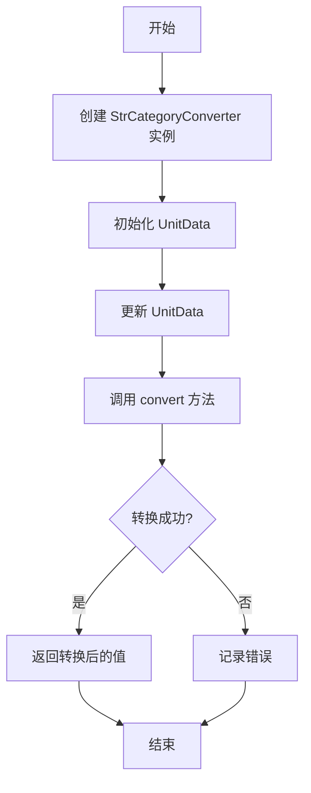

## 类结构

```
StrCategoryConverter (转换接口)
├── StrCategoryLocator (定位器)
│   ├── StrCategoryFormatter (格式化器)
└── UnitData (单位数据)
```

## 全局变量及字段


### `_log`
    
Logger instance for the module.

类型：`logging.getLogger`
    


### `units_mapping`
    
Mapping of category names (str) to indices (int).

类型：`dict`
    


### `_units`
    
Mapping of category names (str) to indices (int).

类型：`dict`
    


### `_mapping`
    
Ordered dictionary mapping string values to integer identifiers.

类型：`OrderedDict`
    


### `_counter`
    
Counter for generating unique integer identifiers for new categories.

类型：`itertools.count`
    


### `StrCategoryConverter._log`
    
Logger instance for the StrCategoryConverter class.

类型：`logging.getLogger`
    


### `StrCategoryLocator.units_mapping`
    
Mapping of category names (str) to indices (int) used for tick positioning.

类型：`dict`
    


### `StrCategoryFormatter._units`
    
Mapping of category names (str) to indices (int) used for tick formatting.

类型：`dict`
    


### `UnitData._mapping`
    
Ordered dictionary that maps string values to unique integer identifiers.

类型：`OrderedDict`
    


### `UnitData._counter`
    
Counter used to generate unique integer identifiers for new categories in the UnitData class.

类型：`itertools.count`
    
    

## 全局函数及方法

### StrCategoryConverter.convert

#### 描述

Convert strings in *value* to floats using mapping information stored in the *unit* object.

#### 参数

- `value`：`str or iterable`，Value or list of values to be converted.
- `unit`：`.UnitData`，An object mapping strings to integers.
- `axis`：`~matplotlib.axis.Axis`，The axis on which the converted value is plotted.

#### 返回值

`float or ~numpy.ndarray of float`，Converted value or array of converted values.

#### 流程图

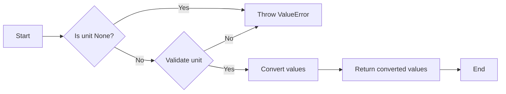

#### 带注释源码

```python
@staticmethod
def convert(value, unit, axis):
    """
    Convert strings in *value* to floats using mapping information stored
    in the *unit* object.

    Parameters
    ----------
    value : str or iterable
        Value or list of values to be converted.
    unit : `.UnitData`
        An object mapping strings to integers.
    axis : `~matplotlib.axis.Axis`
        The axis on which the converted value is plotted.

        .. note:: *axis* is unused.

    Returns
    -------
    float or ~numpy.ndarray of float
    """
    if unit is None:
        raise ValueError(
            'Missing category information for StrCategoryConverter; '
            'this might be caused by unintendedly mixing categorical and '
            'numeric data')
    StrCategoryConverter._validate_unit(unit)
    # dtype = object preserves numerical pass throughs
    values = np.atleast_1d(np.array(value, dtype=object))
    # force an update so it also does type checking
    unit.update(values)
    s = np.vectorize(unit._mapping.__getitem__, otypes=[float])(values)
    return s if not cbook.is_scalar_or_string(value) else s[0]
```

### StrCategoryConverter.axisinfo

#### 描述

`StrCategoryConverter.axisinfo` 方法用于设置默认的轴刻度和标签。

#### 参数

- `unit`：`.UnitData` 类型，包含字符串单位信息的对象。
- `axis`：`~matplotlib.axis.Axis` 类型，设置信息的轴。

#### 返回值

- `~matplotlib.units.AxisInfo` 类型，包含默认刻度标签的信息。

#### 流程图

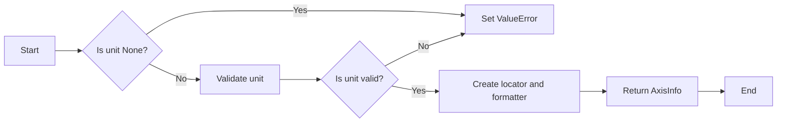

#### 带注释源码

```python
    @staticmethod
    def axisinfo(unit, axis):
        """
        Set the default axis ticks and labels.

        Parameters
        ----------
        unit : `.UnitData`
            object string unit information for value
        axis : `~matplotlib.axis.Axis`
            axis for which information is being set

            .. note:: *axis* is not used

        Returns
        -------
        `~matplotlib.units.AxisInfo`
            Information to support default tick labeling
        """
        StrCategoryConverter._validate_unit(unit)
        # locator and formatter take mapping dict because
        # args need to be pass by reference for updates
        majloc = StrCategoryLocator(unit._mapping)
        majfmt = StrCategoryFormatter(unit._mapping)
        return units.AxisInfo(majloc=majloc, majfmt=majfmt)
```

### StrCategoryConverter.default_units

#### 描述

`default_units` 方法用于设置和更新 `matplotlib.axis.Axis` 的单位。它接受数据和一个轴对象作为参数，并返回一个 `UnitData` 对象，该对象存储字符串到整数的映射。

#### 参数

- `data`：`str` 或 `str` 的可迭代对象，表示要设置单位的数据。
- `axis`：`matplotlib.axis.Axis`，表示数据绘制的轴。

#### 返回值

- `.UnitData`：存储字符串到整数映射的对象。

#### 流程图

```mermaid
graph LR
A[Start] --> B{Is axis units None?}
B -- Yes --> C[Set units to UnitData(data)]
B -- No --> D[Update axis units with data]
D --> E[Return axis units]
E --> F[End]
```

#### 带注释源码

```python
    @staticmethod
    def default_units(data, axis):
        """
        Set and update the `~matplotlib.axis.Axis` units.

        Parameters
        ----------
        data : str or iterable of str
            Data to set the units for.
        axis : `~matplotlib.axis.Axis`
            Axis on which the data is plotted.

        Returns
        -------
        `.UnitData`
            Object storing string to integer mapping.
        """
        # the conversion call stack is default_units -> axis_info -> convert
        if axis.units is None:
            axis.set_units(UnitData(data))
        else:
            axis.units.update(data)
        return axis.units
```

### StrCategoryConverter._validate_unit

#### 描述

该函数用于验证传入的 `unit` 对象是否有效，即它是否具有 `_mapping` 属性，该属性是分类转换器中存储字符串到整数映射的关键。

#### 参数

- `unit`：`UnitData`，一个对象，它映射字符串到整数。

#### 返回值

- 无返回值。

#### 流程图

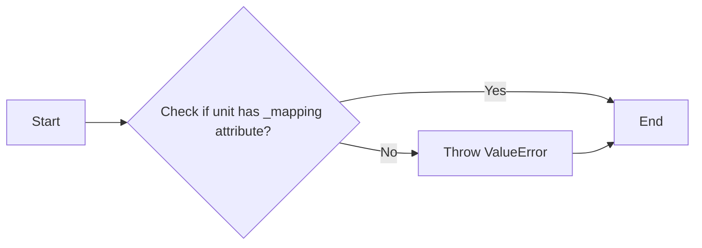

#### 带注释源码

```python
@staticmethod
def _validate_unit(unit):
    if not hasattr(unit, '_mapping'):
        raise ValueError(
            f'Provided unit "{unit}" is not valid for a categorical '
            'converter, as it does not have a _mapping attribute.')
```


### StrCategoryConverter.__init__

初始化`StrCategoryConverter`类，用于将字符串转换为整数。

参数：

- `units_mapping`：`dict`，字符串数据到整数的映射。

返回值：无

#### 流程图

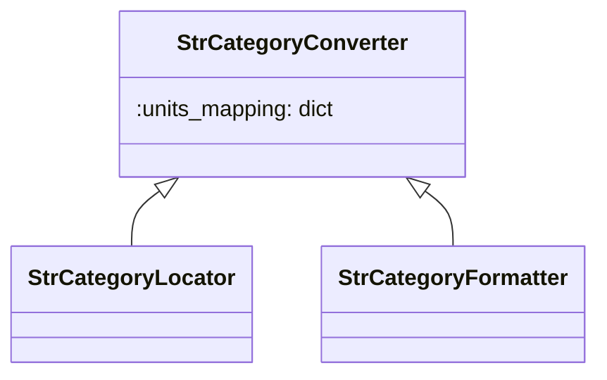

#### 带注释源码

```python
class StrCategoryConverter(units.ConversionInterface):
    def __init__(self, units_mapping):
        """
        Initialize the StrCategoryConverter with the given units mapping.

        Parameters
        ----------
        units_mapping : dict
            Mapping of category names (str) to indices (int).
        """
        self._units = units_mapping
```


### StrCategoryLocator.__call__

StrCategoryLocator.__call__ 是一个静态方法，用于获取字符串数据中每个类别的索引值。

#### 参数

- 无

#### 返回值

- `list`，包含字符串数据中每个类别的索引值。

#### 流程图

```mermaid
graph LR
A[StrCategoryLocator.__call__] --> B{获取units_mapping}
B --> C{获取units_mapping.values()}
C --> D[返回索引值列表]
```

#### 带注释源码

```python
class StrCategoryLocator(ticker.Locator):
    """Tick at every integer mapping of the string data."""
    def __init__(self, units_mapping):
        """
        Parameters
        ----------
        units_mapping : dict
            Mapping of category names (str) to indices (int).
        """
        self._units = units_mapping

    def __call__(self):
        # docstring inherited
        return list(self._units.values())
```

### StrCategoryLocator.tick_values

该函数用于获取字符串数据中每个类别的索引值，并将其作为刻度值返回。

参数：

- `vmin`：`float`，最小值，用于确定刻度范围的起始点。
- `vmax`：`float`，最大值，用于确定刻度范围的结束点。

返回值：`list`，包含字符串数据中每个类别的索引值。

#### 流程图

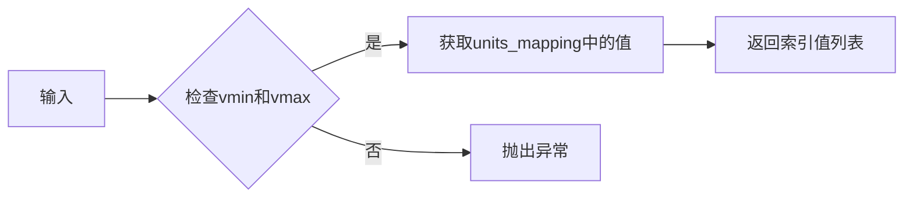

#### 带注释源码

```python
class StrCategoryLocator(ticker.Locator):
    """Tick at every integer mapping of the string data."""
    def __init__(self, units_mapping):
        """
        Parameters
        ----------
        units_mapping : dict
            Mapping of category names (str) to indices (int).
        """
        self._units = units_mapping

    def __call__(self):
        # docstring inherited
        return list(self._units.values())

    def tick_values(self, vmin, vmax):
        # docstring inherited
        return self()
```

### StrCategoryFormatter.__init__

该函数用于初始化`StrCategoryFormatter`类，它负责将字符串数据转换为可显示的标签。

参数：

- `units_mapping`：`dict`，包含字符串数据到整数索引的映射。

返回值：无

#### 流程图

```mermaid
classDiagram
    class StrCategoryFormatter {
        - units_mapping: dict
    }
    StrCategoryFormatter <|-- StrCategoryFormatter.__init__(units_mapping: dict)
```

#### 带注释源码

```python
class StrCategoryFormatter(ticker.Formatter):
    """
    String representation of the data at every tick.
    """

    def __init__(self, units_mapping):
        """
        Initialize the StrCategoryFormatter with the units mapping.

        Parameters
        ----------
        units_mapping : dict
            Mapping of category names (str) to indices (int).
        """
        self._units = units_mapping
```

### StrCategoryFormatter.__call__

StrCategoryFormatter.__call__ 方法用于格式化字符串数据，将其转换为可显示的标签。

参数：

- `x`：`float`，表示当前要格式化的数据点。
- `pos`：`None`，未使用。

返回值：`str`，表示格式化后的字符串标签。

#### 流程图

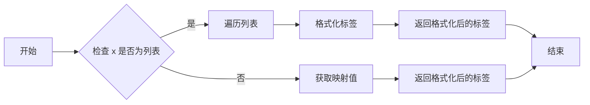

#### 带注释源码

```python
def __call__(self, x, pos=None):
    """
    Format the tick label at position pos for the given tick value x.

    Parameters
    ----------
    x : float
        The tick value to be formatted.
    pos : float, optional
        The position of the tick label.  If not provided, the default position
        is used.

    Returns
    -------
    str
        The formatted tick label.
    """
    if cbook.is_scalar_or_string(x):
        return self.format_ticks([x])[0]
    else:
        return self.format_ticks(x)
```

### StrCategoryFormatter.format_ticks

该函数用于格式化字符串数据，将字符串数据转换为对应的字符串表示形式。

#### 参数

- `values`：`list`，包含需要格式化的数值。

#### 返回值

- `list`，包含格式化后的字符串。

#### 流程图

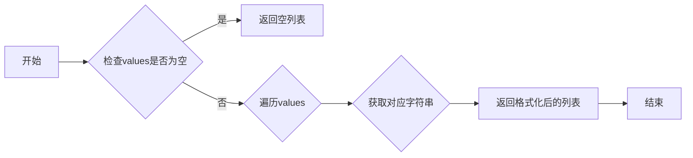

#### 带注释源码

```python
def format_ticks(self, values):
    """
    Format the given values as strings using the units mapping.

    Parameters
    ----------
    values : list
        List of values to be formatted.

    Returns
    -------
    list
        List of formatted strings.
    """
    r_mapping = {v: self._text(k) for k, v in self._units.items()}
    return [r_mapping.get(round(val), '') for val in values]
```

### StrCategoryFormatter._text

#### 描述

`_text` 是 `StrCategoryFormatter` 类的一个静态方法，它用于将数值转换为对应的字符串表示形式。

#### 参数

- `value`：`float`，表示需要转换的数值。

#### 返回值

- `str`，表示转换后的字符串表示形式。

#### 流程图

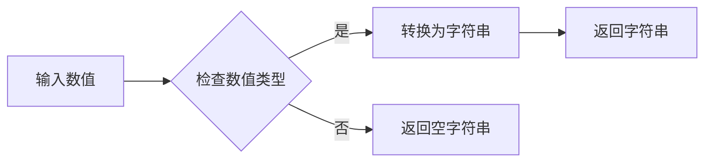

#### 带注释源码

```python
@staticmethod
def _text(value):
    """Convert text values into utf-8 or ascii strings."""
    if isinstance(value, bytes):
        value = value.decode(encoding='utf-8')
    elif not isinstance(value, str):
        value = str(value)
    return value
```

### UnitData.__init__

该函数用于创建一个映射，将唯一的分类值映射到整数标识符。

参数：

- `data`：`iterable`，包含字符串值的序列。

返回值：无

#### 流程图

```mermaid
graph LR
A[开始] --> B{初始化_mapping为OrderedDict}
B --> C{初始化_counter为itertools.count()}
C --> D{如果data不为空}
D --> E{遍历data中的每个值}
E --> F{检查值是否为str或bytes}
F -->|是| G[将值添加到_mapping中，并使用_counter生成新ID]
F -->|否| H[抛出TypeError]
G --> I{如果data中存在可转换为数字的值}
I -->|是| J[记录信息：使用分类单位绘制可解析为数字或日期的字符串列表]
I -->|否| K[结束]
H --> K
J --> K
K --> L[结束]
```

#### 带注释源码

```python
class UnitData:
    def __init__(self, data=None):
        """
        Create mapping between unique categorical values and integer ids.

        Parameters
        ----------
        data : iterable
            sequence of string values
        """
        self._mapping = OrderedDict()  # 初始化_mapping为OrderedDict
        self._counter = itertools.count()  # 初始化_counter为itertools.count()
        if data is not None:
            self.update(data)  # 如果data不为空，则调用update方法

    # ... (其他方法省略)
```

### UnitData.update

该函数用于将新的字符串值映射到整数标识符。

#### 参数

- `data`：`iterable of str or bytes`，包含要更新的字符串值或字节序列的迭代器。

#### 返回值

- 无返回值。

#### 流程图

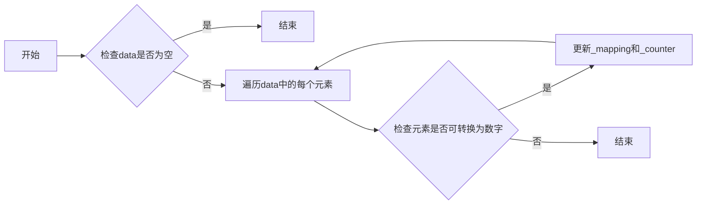

#### 带注释源码

```python
def update(self, data):
    """
    Map new values to integer identifiers.

    Parameters
    ----------
    data : iterable of str or bytes

    Raises
    ------
    TypeError
        If elements in *data* are neither str nor bytes.
    """
    data = np.atleast_1d(np.array(data, dtype=object))
    # check if convertible to number:
    convertible = True
    for val in OrderedDict.fromkeys(data):
        # OrderedDict just iterates over unique values in data.
        _api.check_isinstance((str, bytes), value=val)
        if convertible:
            # this will only be called so long as convertible is True.
            convertible = self._str_is_convertible(val)
        if val not in self._mapping:
            self._mapping[val] = next(self._counter)
    if data.size and convertible:
        _log.info('Using categorical units to plot a list of strings '
                  'that are all parsable as floats or dates. If these '
                  'strings should be plotted as numbers, cast to the '
                  'appropriate data type before plotting.')
```

### UnitData._str_is_convertible

#### 描述

该函数是一个辅助方法，用于检查给定的字符串是否可以解析为浮点数或日期。

#### 参数

- `val`：`str`，要检查的字符串值。

#### 返回值

- `bool`：如果字符串可以解析为浮点数或日期，则返回 `True`，否则返回 `False`。

#### 流程图

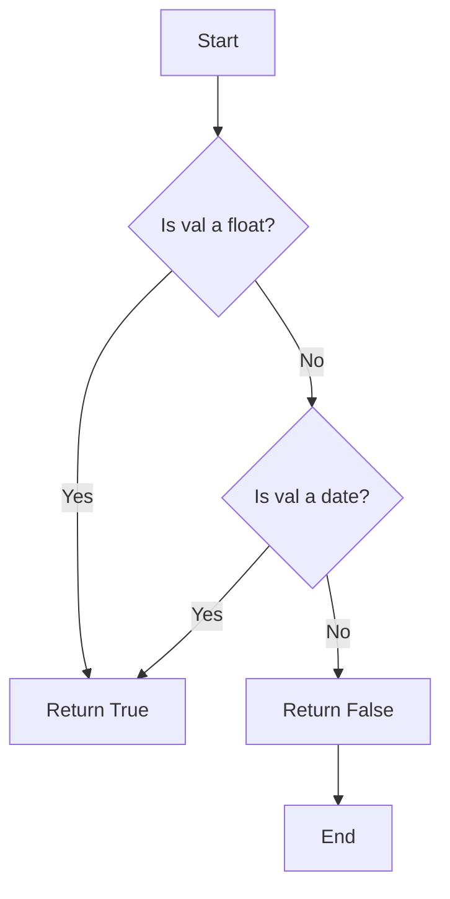

#### 带注释源码

```python
def _str_is_convertible(val):
    """
    Helper method to check whether a string can be parsed as float or date.
    """
    try:
        float(val)
    except ValueError:
        try:
            dateutil.parser.parse(val)
        except (ValueError, TypeError):
            # TypeError if dateutil >= 2.8.1 else ValueError
            return False
    return True
```

## 关键组件


### StrCategoryConverter

Converts string data to numerical values for plotting.

### StrCategoryLocator

Locates ticks at every integer mapping of the string data.

### StrCategoryFormatter

Formats the string representation of the data at every tick.

### UnitData

Stores the mapping between unique categorical values and integer ids.


## 问题及建议


### 已知问题

-   **全局变量和函数的注册**：代码中通过全局变量注册了`StrCategoryConverter`类，这可能导致代码的可维护性和可测试性降低，因为全局状态可能会在代码库中引起意外的副作用。
-   **类型检查**：在`_str_is_convertible`方法中，类型检查依赖于`dateutil.parser.parse`，这可能会引入外部依赖的版本依赖性问题。
-   **日志信息**：在`update`方法中，日志信息可能会对用户产生误导，因为它暗示所有可解析为数字或日期的字符串都应该作为数字绘制，这可能不是用户期望的行为。

### 优化建议

-   **移除全局注册**：考虑将`StrCategoryConverter`的注册移至模块级别，或者通过配置文件来控制，以提高代码的可维护性和可测试性。
-   **类型检查**：在`_str_is_convertible`方法中，可以增加对特定数据类型的检查，以减少对外部依赖的依赖，并提高代码的健壮性。
-   **日志信息**：在日志信息中提供更精确的描述，明确指出字符串是否可解析为数字或日期，并建议用户在必要时进行数据类型转换。
-   **性能优化**：在`update`方法中，可以使用更高效的数据结构来存储映射，例如使用`defaultdict`来避免重复检查元素是否存在于映射中。
-   **异常处理**：在`convert`方法中，当`unit`为`None`时，应捕获异常并抛出更具体的错误信息，以便用户能够更好地理解问题所在。


## 其它


### 设计目标与约束

- 设计目标：
  - 提供一个将字符串数据转换为整数映射的转换器，以便在Matplotlib中进行分类数据绘图。
  - 支持将字符串转换为浮点数或日期，以便在绘图时使用。
  - 提供默认的轴刻度和标签设置。
  - 与Matplotlib的单元框架集成，以便无缝使用。

- 约束：
  - 必须使用Matplotlib的单元框架进行注册和集成。
  - 转换器必须能够处理字符串、浮点数和日期字符串。
  - 轴刻度和标签设置必须符合Matplotlib的默认行为。

### 错误处理与异常设计

- 错误处理：
  - 如果提供的单位对象没有`_mapping`属性，将引发`ValueError`。
  - 如果数据元素既不是字符串也不是字节，将引发`TypeError`。
  - 如果数据中的字符串无法转换为浮点数或日期，将记录一条警告信息。

- 异常设计：
  - 使用`ValueError`和`TypeError`来处理非法输入。
  - 使用`logging`模块记录警告信息。

### 数据流与状态机

- 数据流：
  - 输入数据（字符串、浮点数或日期字符串）通过`StrCategoryConverter`进行转换。
  - 转换后的数据存储在`UnitData`对象中，该对象维护字符串到整数的映射。
  - `StrCategoryLocator`和`StrCategoryFormatter`使用映射信息来设置轴刻度和标签。

- 状态机：
  - 无状态机，因为转换器是按需操作的，没有固定的状态转换。

### 外部依赖与接口契约

- 外部依赖：
  - Matplotlib库，特别是`units`模块。
  - NumPy库，用于数组操作。
  - Python的`logging`模块，用于记录日志。

- 接口契约：
  - `StrCategoryConverter`必须实现Matplotlib的`ConversionInterface`。
  - `StrCategoryLocator`和`StrCategoryFormatter`必须实现Matplotlib的`Locator`和`Formatter`接口。
  - `UnitData`类必须提供将字符串映射到整数的方法。


    