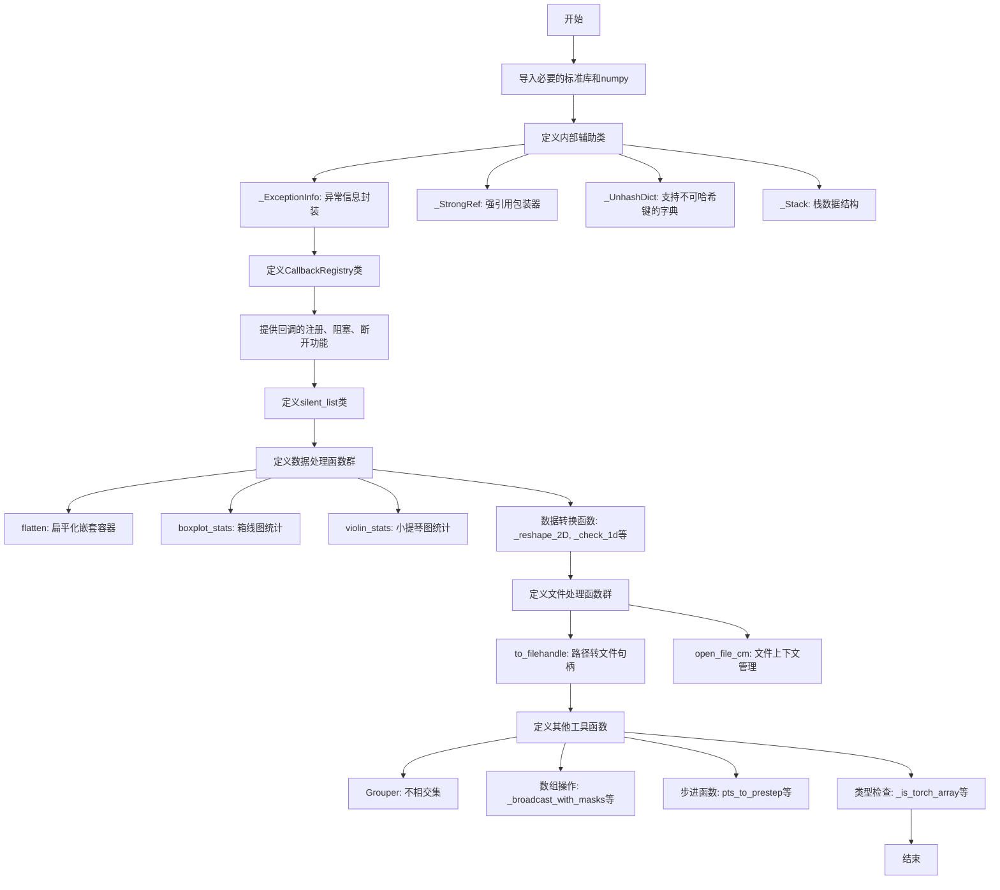
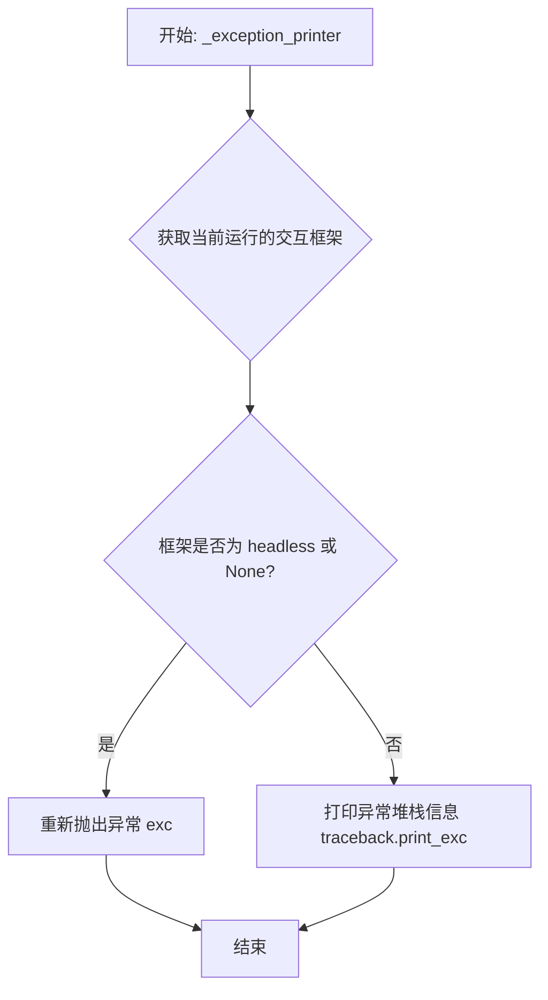
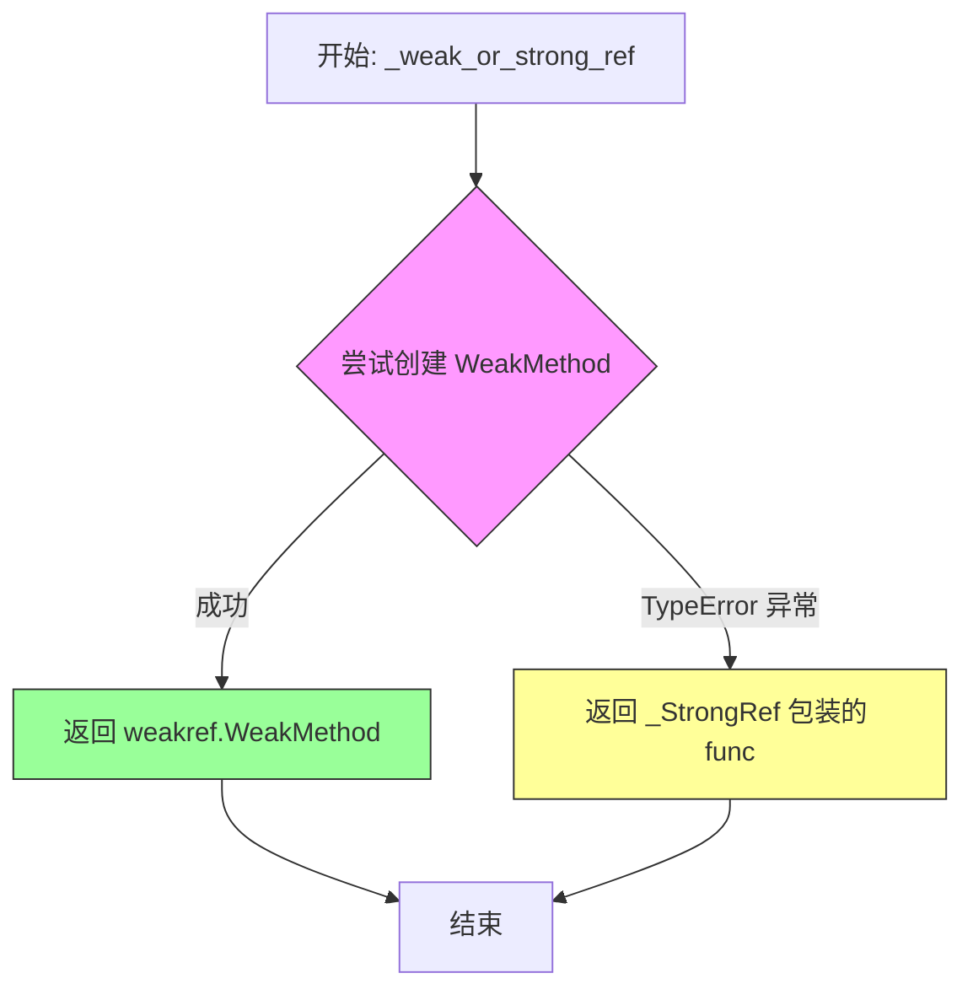
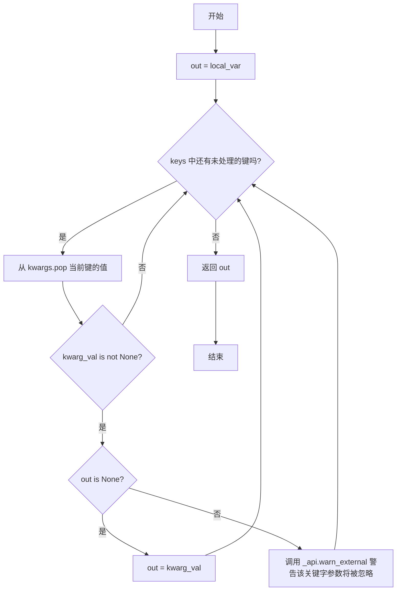
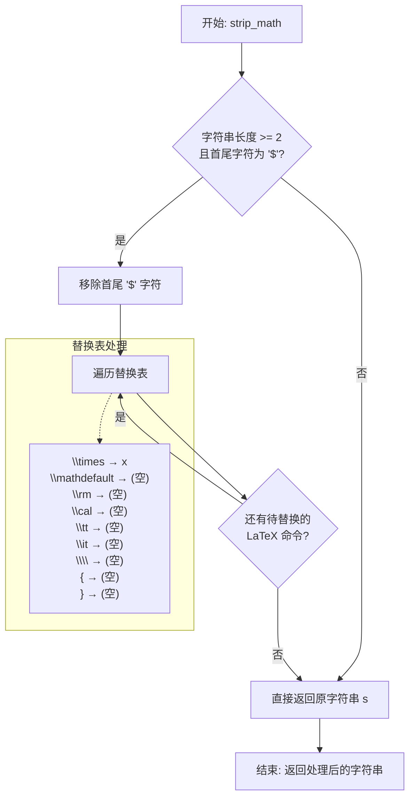
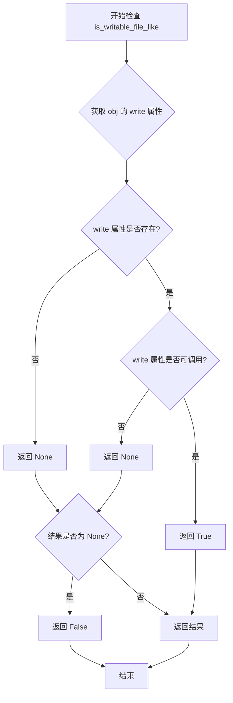
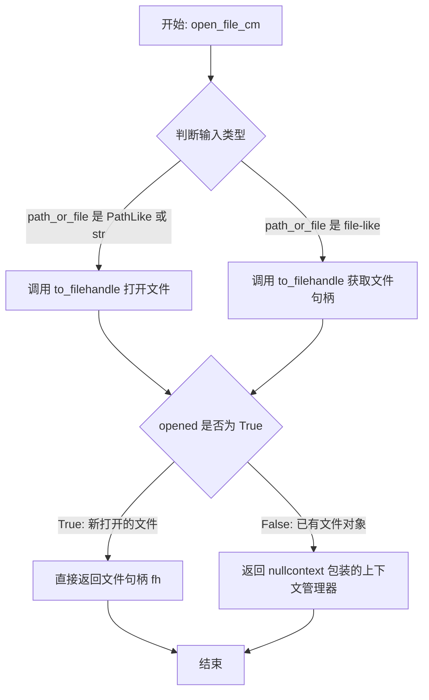
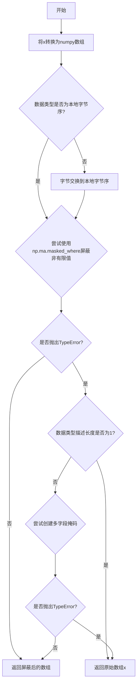

# `matplotlib\lib\matplotlib\cbook.py` 详细设计文档

这是Matplotlib的实用工具模块(cbook)，提供了丰富的工具类和函数，包括回调管理(CallbackRegistry)、异常处理(_ExceptionInfo)、数据结构(Grouper, _Stack)、数据处理(flatten, boxplot_stats, violin_stats)、数组操作(_broadcast_with_masks, _reshape_2D)、文件处理(to_filehandle, open_file_cm)等功能，是Matplotlib内部实现和用户脚本的基石。

## 整体流程



## 类结构

```
_ExceptionInfo (异常信息类)
_StrongRef (引用类)
_UnhashDict (字典类)
CallbackRegistry (回调管理)
silent_list (列表类)
_Stack (栈类)
Grouper (不相交集)
GrouperView (视图类)
_OrderedSet (有序集合)
```

## 全局变量及字段


### `ls_mapper`
    
Maps short codes for line style to their full name used by backends.

类型：`dict`
    


### `ls_mapper_r`
    
Maps full names for line styles used by backends to their short codes.

类型：`dict`
    


### `STEP_LOOKUP_MAP`
    
Maps step style names to their corresponding step conversion functions.

类型：`dict`
    


### `_ExceptionInfo._cls`
    
Stores the exception class type.

类型：`type`
    


### `_ExceptionInfo._args`
    
Stores the arguments passed to the exception constructor.

类型：`tuple`
    


### `_ExceptionInfo._notes`
    
Stores additional notes to be added to the exception.

类型：`list`
    


### `_StrongRef._obj`
    
Stores the object being referenced.

类型：`object`
    


### `_UnhashDict._dict`
    
Internal dictionary for storing key-value pairs with hashable keys.

类型：`dict`
    


### `_UnhashDict._pairs`
    
List of key-value pairs for storing unhashable keys.

类型：`list`
    


### `CallbackRegistry._signals`
    
List of valid signal names that this registry handles, or None if unrestricted.

类型：`list or None`
    


### `CallbackRegistry.exception_handler`
    
Function to handle exceptions raised during callback processing.

类型：`callable`
    


### `CallbackRegistry.callbacks`
    
Dictionary mapping signal names to dictionaries of callback IDs and weak references.

类型：`dict`
    


### `CallbackRegistry._cid_gen`
    
Iterator that generates unique callback IDs.

类型：`itertools.count`
    


### `CallbackRegistry._func_cid_map`
    
Maps (signal, callback proxy) tuples to callback IDs.

类型：`_UnhashDict`
    


### `CallbackRegistry._pickled_cids`
    
Set of callback IDs that should be preserved when pickling.

类型：`set`
    


### `silent_list.type`
    
The type name to display in the repr, or None to infer from first item.

类型：`str or None`
    


### `_Stack._pos`
    
Current cursor position in the stack.

类型：`int`
    


### `_Stack._elements`
    
List of elements stored in the stack.

类型：`list`
    


### `Grouper._mapping`
    
Maps each element to a WeakSet of all elements in its group.

类型：`weakref.WeakKeyDictionary`
    


### `Grouper._ordering`
    
Maps elements to their insertion order for consistent iteration.

类型：`weakref.WeakKeyDictionary`
    


### `Grouper._next_order`
    
Counter for assigning new order values to elements.

类型：`int`
    


### `GrouperView._grouper`
    
Reference to the underlying Grouper instance.

类型：`Grouper`
    


### `_OrderedSet._od`
    
Ordered dictionary storing the set elements as keys with None values.

类型：`collections.OrderedDict`
    
    

## 全局函数及方法


### `_get_running_interactive_framework`

#### 描述

这是一个用于检测当前运行时环境的底层 utility 函数。它通过遍历系统模块和调用后端特定的 API 来判断当前哪个交互式 GUI 框架（例如 Qt, GTK, wxWidgets, Tkinter, macOS）的事件循环正在运行。如果没有任何交互式事件循环在运行，但显示设备（Display）有效，则返回 `None`；如果无法启动事件循环（例如在无头服务器上），则返回 `"headless"`。

参数：

- （无参数）

返回值：

- `Optional[str]`：返回以下字符串之一表示具体的框架：`"qt"`, `"gtk3"`, `"gtk4"`, `"wx"`, `"tk"`, `"macosx"`, `"headless"`，如果没有事件循环运行且显示有效则返回 `None`。

#### 流程图

```mermaid
flowchart TD
    Start([开始]) --> QtCheck{Qt (PyQt/PySide)<br>已加载且应用实例存在?}
    QtCheck -- 是 --> ReturnQt[返回 "qt"]
    QtCheck -- 否 --> GtkCheck{GTK (gi.repository)<br>已加载?}
    GtkCheck -- 是 --> GtkV4{Gtk 主版本 == 4?}
    GtkV4 -- 是 --> GLibDepth{GLib.main_depth() > 0?}
    GLibDepth -- 是 --> ReturnGtk4[返回 "gtk4"]
    GLibDepth -- 否 --> TkNext
    GtkV4 -- 否 --> GtkV3{Gtk.main_level() > 0?}
    GtkV3 -- 是 --> ReturnGtk3[返回 "gtk3"]
    GtkV3 -- 否 --> TkNext
    GtkCheck -- 否 --> TkNext
    TkNext --> TkCheck{Tkinter 已加载?}
    TkCheck -- 是 --> StackCheck{当前调用栈中<br>是否存在 tkinter mainloop?}
    StackCheck -- 是 --> ReturnTk[返回 "tk"]
    StackCheck -- 否 --> MacosxCheck
    TkCheck -- 否 --> MacosxCheck
    MacosxCheck --> MacosxRunning{macOS 后端事件循环<br>正在运行?}
    MacosxRunning -- 是 --> ReturnMacosx[返回 "macosx"]
    MacosxRunning -- 否 --> DisplayCheck
    MacosxCheck -- 否 --> DisplayCheck
    DisplayCheck{_c_internal_utils<br>显示设备有效?}
    DisplayCheck -- 否 --> ReturnHeadless[返回 "headless"]
    DisplayCheck -- 是 --> ReturnNone[返回 None]
```

#### 带注释源码

```python
def _get_running_interactive_framework():
    """
    Return the interactive framework whose event loop is currently running, if
    any, or "headless" if no event loop can be started, or None.

    Returns
    -------
    Optional[str]
        One of the following values: "qt", "gtk3", "gtk4", "wx", "tk",
        "macosx", "headless", ``None``.
    """
    # 使用 sys.modules.get(name) 而不是 name in sys.modules，
    # 因为模块条目可能被显式设置为 None。
    QtWidgets = (
        sys.modules.get("PyQt6.QtWidgets")
        or sys.modules.get("PySide6.QtWidgets")
        or sys.modules.get("PyQt5.QtWidgets")
        or sys.modules.get("PySide2.QtWidgets")
    )
    # 检查 Qt 类库是否已加载，并且是否有 QApplication 实例正在运行
    if QtWidgets and QtWidgets.QApplication.instance():
        return "qt"

    # 检查 GTK 类库 (通过 gobject-introspection 导入)
    Gtk = sys.modules.get("gi.repository.Gtk")
    if Gtk:
        # 区分 GTK4 和 GTK3
        if Gtk.MAJOR_VERSION == 4:
            # 必须导入 GLib 来检查主循环深度
            from gi.repository import GLib
            # main_depth() > 0 表示事件循环正在运行
            if GLib.main_depth():
                return "gtk4"
        # 对于 GTK3，检查 main_level
        if Gtk.MAJOR_VERSION == 3 and Gtk.main_level():
            return "gtk3"

    # 检查 wxWidgets
    wx = sys.modules.get("wx")
    if wx and wx.GetApp():
        return "wx"

    # 检查 Tkinter
    # 这比较特殊，因为它没有直接的 "is_running" 状态检查，
    # 我们通过遍历当前栈帧来寻找 mainloop 的代码对象
    tkinter = sys.modules.get("tkinter")
    if tkinter:
        # 获取 tkinter.mainloop 的代码对象
        codes = {tkinter.mainloop.__code__, tkinter.Misc.mainloop.__code__}
        # 遍历所有当前活动的 Python 栈帧
        for frame in sys._current_frames().values():
            while frame:
                # 检查当前帧的代码是否属于 mainloop
                if frame.f_code in codes:
                    return "tk"
                frame = frame.f_back
        # 显式删除 frame 变量以避免循环引用导致的内存泄漏
        del frame

    # 检查 macOS (Cocoa)
    macosx = sys.modules.get("matplotlib.backends._macosx")
    if macosx and macosx.event_loop_is_running():
        return "macosx"

    # 如果没有检测到任何 GUI 框架，则检查是否有可用的显示设备
    # _c_internal_utils.display_is_valid() 是 C 级别调用，用于探测 X11/Wayland 等
    if not _c_internal_utils.display_is_valid():
        return "headless"
    
    # 如果有显示设备，但没有事件循环运行，返回 None
    return None
```


### `_exception_printer`

该函数是 matplotlib 的异常处理工具函数，用于根据当前是否运行在交互式图形环境中决定异常的处理方式——在非交互式环境（headless 或无事件循环）下重新抛出异常，在交互式环境下则打印异常堆栈信息。

参数：

- `exc`：`BaseException`，需要处理的异常对象

返回值：`None`，该函数没有返回值（隐式返回 None）

#### 流程图



#### 带注释源码

```python
def _exception_printer(exc):
    """
    根据当前运行环境处理异常。
    
    在非交互式环境（headless 或无事件循环）中重新抛出异常，
    在交互式环境中打印异常信息而不中断执行。
    """
    # 获取当前运行的交互框架
    # 返回值可能是: "qt", "gtk3", "gtk4", "wx", "tk", "macosx", "headless", None
    if _get_running_interactive_framework() in ["headless", None]:
        # 非交互式环境：重新抛出异常，让调用者处理
        raise exc
    else:
        # 交互式环境：打印异常堆栈信息到标准错误
        traceback.print_exc()
```


### `_weak_or_strong_ref`

该函数用于尝试为传入的函数或方法创建一个弱引用。如果传入的是bound method（绑定方法），则返回 `weakref.WeakMethod`；否则返回 `_StrongRef` 包装的强引用。这种设计允许回调系统既能处理bound method（通过弱引用避免循环引用），也能处理普通函数（通过强引用确保调用时函数对象仍然存在）。

参数：

- `func`：`callable`，需要创建引用的函数或方法
- `callback`：用于 `weakref.WeakMethod` 的回调函数，当引用的对象被垃圾回收时调用

返回值：`weakref.WeakMethod` 或 `_StrongRef`，如果 func 是bound method返回前者，否则返回后者

#### 流程图



#### 带注释源码

```python
def _weak_or_strong_ref(func, callback):
    """
    Return a `WeakMethod` wrapping *func* if possible, else a `_StrongRef*.
    
    This function attempts to create a weak reference to a function or method.
    For bound methods (methods attached to an instance), it uses weakref.WeakMethod
    to avoid preventing garbage collection of the instance. For regular functions
    or other non-bound callables, it falls back to _StrongRef which maintains a
    strong reference.
    
    Parameters
    ----------
    func : callable
        The function or method to create a reference to.
    callback : callable
        A callback function that will be called when the referenced object
        is garbage collected (only used for WeakMethod).
    
    Returns
    -------
    weakref.WeakMethod or _StrongRef
        A weak reference wrapper for bound methods, or a strong reference
        wrapper for other callables.
    """
    try:
        # 尝试创建 WeakMethod - 这仅对bound methods有效
        # 如果func是绑定到对象的方法，WeakMethod会保持对对象的弱引用
        # 当对象被删除时，callback会被调用以清理回调注册表中的条目
        return weakref.WeakMethod(func, callback)
    except TypeError:
        # TypeError在以下情况下抛出:
        # 1. func不是bound method (例如普通函数、静态方法、类方法)
        # 2. func是不可哈希的
        # 此时回退使用_StrongRef来保持强引用
        return _StrongRef(func)
```


### `_local_over_kwdict`

该函数用于解决局部变量与关键字参数之间的优先级问题。它优先使用局部变量，但如果局部变量为 `None`，则从关键字参数中查找值；如果局部变量已有值，则忽略关键字参数并发出警告。

参数：

- `local_var`：任意类型，局部变量值，作为首选返回值
- `kwargs`：dict，关键字参数字典，从中提取指定的键值
- `*keys`：str，可变数量的键名列表，用于从 kwargs 中查找值
- `warning_cls`：type，默认值为 `_api.MatplotlibDeprecationWarning`，当关键字参数被忽略时使用的警告类

返回值：任意类型，返回解析后的值（优先返回 local_var，如果为 None 则返回 kwargs 中的值）

#### 流程图



#### 带注释源码

```python
def _local_over_kwdict(
        local_var,  # 局部变量，优先使用
        kwargs,     # 关键字参数字典
        *keys,      # 要从 kwargs 中查找的键列表
        warning_cls=_api.MatplotlibDeprecationWarning):  # 警告类型
    """
    处理局部变量与关键字参数的优先级。
    
    逻辑：
    1. 优先使用 local_var 的值
    2. 如果 local_var 为 None，则使用 kwargs 中找到的第一个非 None 值
    3. 如果 local_var 已有值，则忽略 kwargs 中的对应值并发出警告
    """
    out = local_var  # 初始化输出为局部变量值
    for key in keys:  # 遍历所有要检查的键
        # 从 kwargs 中弹出（移除）该键对应的值
        kwarg_val = kwargs.pop(key, None)
        if kwarg_val is not None:  # 如果 kwargs 中存在该键且值不为 None
            if out is None:  # 如果当前输出为 None（未找到有效值）
                out = kwarg_val  # 使用 kwargs 中的值
            else:
                # 局部变量已有有效值，忽略 kwargs 中的值并警告
                _api.warn_external(f'"{key}" keyword argument will be ignored',
                                   warning_cls)
    return out  # 返回最终解析的值
```


### `strip_math`

移除 LaTeX 数学格式标记，返回纯文本。专门处理完全被 `$` 包裹的数学字符串和完全非数学的字符串。

参数：

- `s`：`str`，需要处理的字符串，可能是包含数学标记的文本（如 `"$x^2$"`）或普通文本

返回值：`str`，移除数学格式后的纯文本字符串

#### 流程图



#### 带注释源码

```python
def strip_math(s):
    """
    Remove latex formatting from mathtext.

    Only handles fully math and fully non-math strings.
    """
    # 检查字符串是否被数学模式标记包裹（首尾都是 '$'）
    if len(s) >= 2 and s[0] == s[-1] == "$":
        # 移除首尾的 '$' 包裹符
        s = s[1:-1]
        # 定义 LaTeX 命令到纯文本的替换映射表
        for tex, plain in [
            (r"\times", "x"),   # 乘号符号转换，专门支持 Formatter
            (r"\mathdefault", ""),  # 默认数学字体标记移除
            (r"\rm", ""),  # 罗马字体标记移除
            (r"\cal", ""),  # 花体标记移除
            (r"\tt", ""),  # 等宽字体标记移除
            (r"\it", ""),  # 斜体标记移除
            ("\\", ""),   # 转义反斜杠移除
            ("{", ""),    # 左花括号移除
            ("}", ""),    # 右花括号移除
        ]:
            # 依次执行替换操作
            s = s.replace(tex, plain)
    # 返回处理后的字符串（若不符合条件则原样返回）
    return s
```


### `_strip_comment`

该函数用于从字符串中移除第一个未加引号的 `#` 及其后面的所有内容，常用于处理配置文件或源码注释的 stripping 场景。它能正确处理引号内的 `#` 字符，避免误判。

参数：

-  `s`：`str`，需要去除注释的输入字符串

返回值：`str`，去除注释后的字符串

#### 流程图

```mermaid
flowchart TD
    A[开始: 输入字符串 s] --> B[初始化 pos = 0]
    B --> C[在 s 中从 pos 位置查找下一个双引号的位置 quote_pos]
    C --> D[在 s 中从 pos 位置查找下一个 # 的位置 hash_pos]
    D --> E{quote_pos < 0?}
    E -->|是| F{hash_pos < 0?}
    F -->|是| G[返回 s.strip]
    F -->|否| H[返回 s[:hash_pos].strip]
    E -->|否| I{0 <= hash_pos < quote_pos?}
    I -->|是| H
    I -->|否| J[在 s 中查找 closing_quote_pos = s.find('"', quote_pos + 1)]
    J --> K{closing_quote_pos < 0?}
    K -->|是| L[抛出 ValueError: 缺少闭合引号]
    K -->|否| M[pos = closing_quote_pos + 1]
    M --> C
```

#### 带注释源码

```python
def _strip_comment(s):
    """Strip everything from the first unquoted #."""
    pos = 0
    while True:
        # 查找下一个双引号的位置（从 pos 开始）
        quote_pos = s.find('"', pos)
        # 查找下一个 # 的位置（从 pos 开始）
        hash_pos = s.find('#', pos)
        
        # 情况1: 字符串中没有引号了
        if quote_pos < 0:
            # 如果也没有 #，直接返回原字符串
            without_comment = s if hash_pos < 0 else s[:hash_pos]
            return without_comment.strip()
        
        # 情况2: # 在引号之前（# 未被引号包裹）
        elif 0 <= hash_pos < quote_pos:
            return s[:hash_pos].strip()
        
        # 情况3: # 在引号之后（# 被引号包裹，不是注释）
        else:
            # 查找闭合的双引号
            closing_quote_pos = s.find('"', quote_pos + 1)
            
            # 如果没有找到闭合引号，抛出异常
            if closing_quote_pos < 0:
                raise ValueError(
                    f"Missing closing quote in: {s!r}. If you need a double-"
                    'quote inside a string, use escaping: e.g. "the \\" char"')
            
            # 移动到闭合引号之后，继续查找
            pos = closing_quote_pos + 1  # behind closing quote
```


### `is_writable_file_like`

该函数用于检查给定对象是否具有可调用的 `write` 方法，从而判断该对象是否类似于可写的文件对象。

参数：

- `obj`：任意类型，需要检查的对象

返回值：`bool`，如果对象具有可调用的 `write` 方法返回 `True`，否则返回 `False`

#### 流程图



#### 带注释源码

```python
def is_writable_file_like(obj):
    """
    Return whether *obj* looks like a file object with a *write* method.
    
    Parameters
    ----------
    obj : any
        The object to check if it looks like a writable file-like object.
    
    Returns
    -------
    bool
        True if *obj* has a callable 'write' attribute, False otherwise.
    """
    # 使用 getattr 获取对象的 'write' 属性
    # 如果对象没有 'write' 属性，返回 None（第三个参数）
    write_attr = getattr(obj, 'write', None)
    
    # 检查获取到的属性是否可调用（即是否为函数/方法）
    # 如果 write 属性存在且可调用，返回 True
    # 如果 write 属性不存在或不可调用，返回 False
    return callable(write_attr)
```


### file_requires_unicode

该函数用于检测给定的可写文件类对象是否需要 Unicode 字符串才能写入。通过尝试向文件对象写入一个字节字符串，如果抛出 TypeError 则表示需要 Unicode，否则表示可以接受字节数据。

参数：

- `x`：file-like object（可写），需要检测的文件类对象

返回值：`bool`，如果文件对象需要 Unicode 写入返回 True，否则返回 False

#### 流程图

```mermaid
flowchart TD
    A[开始: file_requires_unicode] --> B[尝试调用 x.write(b'')]
    B --> C{是否抛出 TypeError?}
    C -->|是| D[返回 True]
    C -->|否| E[返回 False]
    D --> F[结束]
    E --> F
```

#### 带注释源码

```python
def file_requires_unicode(x):
    """
    Return whether the given writable file-like object requires Unicode to be
    written to it.
    """
    # 尝试向文件对象写入一个空的字节字符串
    try:
        x.write(b'')
    except TypeError:
        # 如果抛出 TypeError，说明文件对象只接受字符串（Unicode）
        # 例如某些文本模式打开的文件或 StringIO 对象
        return True
    else:
        # 如果没有异常，说明文件对象可以接受字节数据
        # 例如二进制模式打开的文件或 BytesIO 对象
        return False
```


### `to_filehandle`

该函数用于将路径（字符串或 PathLike 对象）转换为已打开的文件句柄，或直接透传文件类对象。支持普通文件、gzip 压缩文件（.gz）、bz2 压缩文件（.bz2）以及已打开的文件对象，并可通过 `return_opened` 参数控制是否返回文件是否由本函数新打开的标识。

参数：

- `fname`：`str` 或 `path-like` 或 `file-like`，输入的文件路径或已打开的文件对象。若为字符串或 PathLike，则使用 `flag` 和 `encoding` 参数打开；若为文件类对象（具有 `seek` 方法），则直接透传。
- `flag`：`str`，默认值为 `'r'`，文件打开模式。当 `fname` 为字符串或 PathLike 时传递给 `open()`；当 `fname` 为文件对象时此参数被忽略。
- `return_opened`：`bool`，默认值为 `False`。若为 `True`，则返回一个元组 `(文件对象, 是否新打开)`；若为 `False`，则只返回文件对象。
- `encoding`：`str` 或 `None`，默认值为 `None`。文件编码，仅在 `fname` 为字符串或 PathLike 时生效。

返回值：

- 当 `return_opened=False` 时：返回 `file-like` 对象（已打开的文件句柄或透传的文件对象）。
- 当 `return_opened=True` 时：返回 `tuple[file-like, bool]`，其中布尔值表示该文件是否由本函数新打开（若为 `True`，调用者需负责关闭；若为 `False`，文件对象由调用者提供，无需本函数关闭）。

#### 流程图

```mermaid
flowchart TD
    A[开始: to_filehandle] --> B{fname 是 os.PathLike?}
    B -- 是 --> C[使用 os.fspath 转为字符串]
    B -- 否 --> D{fname 是 str?}
    C --> D
    
    D -- 是 --> E{fname 以 .gz 结尾?}
    D -- 否 --> F{fname 有 seek 属性?}
    
    E -- 是 --> G[使用 gzip.open 打开文件]
    E -- 否 --> H{fname 以 .bz2 结尾?}
    
    H -- 是 --> I[导入 bz2 并使用 BZ2File 打开]
    H -- 否 --> J[使用内置 open 打开文件]
    
    K[opened = True] --> L{return_opened == True?}
    G --> K
    I --> K
    J --> K
    
    F -- 是 --> M[fh = fname, opened = False]
    F -- 否 --> N[抛出 ValueError: fname must be a PathLike or file handle]
    
    M --> L
    L -- 是 --> O[返回 (fh, opened)]
    L -- 否 --> P[返回 fh]
    
    N --> Q[结束]
    O --> Q
    P --> Q
```

#### 带注释源码

```python
def to_filehandle(fname, flag='r', return_opened=False, encoding=None):
    """
    Convert a path to an open file handle or pass-through a file-like object.

    Consider using `open_file_cm` instead, as it allows one to properly close
    newly created file objects more easily.

    Parameters
    ----------
    fname : str or path-like or file-like
        If `str` or `os.PathLike`, the file is opened using the flags specified
        by *flag* and *encoding`.  If a file-like object, it is passed through.
    flag : str, default: 'r'
        Passed as the *mode* argument to `open` when *fname* is `str` or
        `os.PathLike`; ignored if *fname* is file-like.
    return_opened : bool, default: False
        If True, return both the file object and a boolean indicating whether
        this was a new file (that the caller needs to close).  If False, return
        only the new file.
    encoding : str or None, default: None
        Passed as the *mode* argument to `open` when *fname* is `str` or
        `os.PathLike`; ignored if *fname* is file-like.

    Returns
    -------
    fh : file-like
    opened : bool
        *opened* is only returned if *return_opened* is True.
    """
    # Step 1: 如果 fname 是 os.PathLike 对象，转换为字符串路径
    if isinstance(fname, os.PathLike):
        fname = os.fspath(fname)
    
    # Step 2: 判断是否为字符串路径（需要打开文件）
    if isinstance(fname, str):
        # Step 2.1: 根据文件扩展名选择不同的打开方式
        if fname.endswith('.gz'):
            # 处理 gzip 压缩文件
            fh = gzip.open(fname, flag)
        elif fname.endswith('.bz2'):
            # 处理 bz2 压缩文件（延迟导入，因为 Python 可能未编译 bz2 支持）
            import bz2
            fh = bz2.BZ2File(fname, flag)
        else:
            # 处理普通文件
            fh = open(fname, flag, encoding=encoding)
        # 标记文件是由本函数新打开的
        opened = True
    # Step 3: 判断是否为已打开的文件对象（具有 seek 方法）
    elif hasattr(fname, 'seek'):
        # 透传文件对象，不关闭它
        fh = fname
        opened = False
    # Step 4: 无效输入，抛出异常
    else:
        raise ValueError('fname must be a PathLike or file handle')
    
    # Step 5: 根据 return_opened 决定返回值
    if return_opened:
        # 返回文件对象和是否新打开的标识
        return fh, opened
    # 只返回文件对象
    return fh
```


### `open_file_cm`

该函数是一个文件处理工具函数，用于统一处理路径和文件对象两种输入。对于路径类型输入，它打开文件并返回文件句柄；对于文件对象输入，它使用 `nullcontext` 包装后返回，使其同样可以在 `with` 语句中使用，从而实现统一的资源管理。

参数：

- `path_or_file`：str、PathLike 或 file-like，要打开的文件路径或已打开的文件对象
- `mode`：str，文件打开模式，默认为 "r"（只读模式）
- `encoding`：str 或 None，文件编码格式，默认为 None

返回值：file-like 或 contextmanager，如果输入是路径且新打开了文件则返回文件对象；如果是已打开的文件对象则返回 `contextlib.nullcontext` 包装的上下文管理器

#### 流程图



#### 带注释源码

```python
def open_file_cm(path_or_file, mode="r", encoding=None):
    r"""Pass through file objects and context-manage path-likes."""
    # 调用 to_filehandle 将输入转换为文件句柄
    # 参数 return_opened=True 使其返回 (文件句柄, 是否新打开) 元组
    fh, opened = to_filehandle(path_or_file, mode, True, encoding)
    
    # 如果是新打开的文件（opened=True），直接返回文件句柄
    # 如果是已打开的文件对象（opened=False），用 nullcontext 包装后返回
    # nullcontext 会将文件对象作为上下文管理器的 __enter__ 返回值
    # 这样无论是哪种情况，都可以在 with 语句中使用
    return fh if opened else contextlib.nullcontext(fh)
```


### `is_scalar_or_string`

该函数用于判断给定对象是否是一个标量（单个值，如数字）或者是字符串类型的值。这是 matplotlib cbook 模块中的工具函数，常用于判断某个值在递归处理嵌套容器时是否应该被视为"叶子节点"。

参数：

- `val`：任意类型，待检测的对象

返回值：`bool`，如果 `val` 是字符串或不可迭代的对象（即标量），返回 `True`；否则返回 `False`

#### 流程图

```mermaid
flowchart TD
    A[开始: is_scalar_or_string] --> B{val 是否为 str 类型?}
    B -->|是| C[返回 True]
    B -->|否| D{np.iterable(val) 是否为 False?}
    D -->|是| C
    D -->|否| E[返回 False]
    C --> F[结束]
    E --> F
```

#### 带注释源码

```python
def is_scalar_or_string(val):
    """
    Return whether the given object is a scalar or string like.
    
    Parameters
    ----------
    val : object
        Any Python object to be tested.
    
    Returns
    -------
    bool
        True if *val* is a string or a non-iterable scalar,
        False otherwise.
    """
    # 首先检查 val 是否为字符串类型
    # 字符串虽然在 Python 中是可迭代的，但在许多场景下应被视为原子值
    if isinstance(val, str):
        return True
    
    # 使用 numpy 的 iterability 检查
    # np.iterable() 返回 True 当对象支持迭代协议
    # 对于标量（如 int、float、np.number 等），np.iterable() 返回 False
    # 注意：np.iterable 对字符串也返回 True，所以字符串判断放在前面
    return not np.iterable(val)
```


### `get_sample_data`

该函数用于从 Matplotlib 的示例数据目录中获取示例数据文件，支持根据文件后缀自动处理不同类型的数据文件（如 gzip 压缩文件、NumPy 数据文件、文本文件等），并可选择返回文件对象或文件路径。

参数：

- `fname`：`str`，文件名（相对于 `mpl-data/sample_data` 目录的路径）
- `asfileobj`：`bool`，默认为 `True`。若为 `True` 返回文件对象，否则返回文件路径字符串

返回值：`typing.Union[IO, np.ndarray, str]`，返回文件对象、NumPy 数组或文件路径字符串

#### 流程图

```mermaid
flowchart TD
    A[开始: get_sample_data] --> B[调用 _get_data_path 获取完整路径]
    B --> C{asfileobj == True?}
    C -->|是| D[获取文件后缀 suffix]
    D --> E{suffix == '.gz'?}
    E -->|是| F[返回 gzip.open(path)]
    E -->|否| G{suffix in ['.npy', '.npz']?}
    G -->|是| H[返回 np.load(path)]
    G -->|否| I{suffix in ['.csv', '.xrc', '.txt']?}
    I -->|是| J[返回 path.open('r')]
    I -->|否| K[返回 path.open('rb')]
    C -->|否| L[返回 str(path)]
    F --> M[结束]
    H --> M
    J --> M
    K --> M
    L --> M
```

#### 带注释源码

```python
def get_sample_data(fname, asfileobj=True):
    """
    Return a sample data file.  *fname* is a path relative to the
    :file:`mpl-data/sample_data` directory.  If *asfileobj* is `True`
    return a file object, otherwise just a file path.

    Sample data files are stored in the 'mpl-data/sample_data' directory within
    the Matplotlib package.

    If the filename ends in .gz, the file is implicitly ungzipped.  If the
    filename ends with .npy or .npz, and *asfileobj* is `True`, the file is
    loaded with `numpy.load`.
    """
    # 使用内部函数获取示例数据目录下的完整文件路径
    path = _get_data_path('sample_data', fname)
    
    # 根据 asfileobj 参数决定返回类型
    if asfileobj:
        # 获取文件后缀并转为小写用于比较
        suffix = path.suffix.lower()
        
        # 根据不同后缀类型采用不同的打开方式
        if suffix == '.gz':
            # .gz 文件返回 gzip 打开的文件对象（自动解压缩）
            return gzip.open(path)
        elif suffix in ['.npy', '.npz']:
            # NumPy 二进制格式文件直接用 numpy.load 加载
            return np.load(path)
        elif suffix in ['.csv', '.xrc', '.txt']:
            # 文本文件以文本模式打开
            return path.open('r')
        else:
            # 其他文件以二进制模式打开（默认行为）
            return path.open('rb')
    else:
        # 不需要文件对象时，直接返回文件路径字符串
        return str(path)
```


### `_get_data_path`

该函数是Matplotlib的内部工具函数，用于获取Matplotlib包提供的资源文件（如示例数据文件）的路径。它通过调用`matplotlib.get_data_path()`获取基础数据目录，然后使用`pathlib.Path`将传入的路径组件连接到基础路径上。

参数：

- `*args`：可变位置参数（Any），表示相对于Matplotlib基础数据路径的路径组件，例如`'sample_data', 'fname.png'`将指向`{data_path}/sample_data/fname.png`

返回值：`pathlib.Path`，返回指向Matplotlib资源文件的完整路径对象

#### 流程图

```mermaid
flowchart TD
    A[开始 _get_data_path] --> B{传入 *args 参数?}
    B -->|无参数| C[调用 matplotlib.get_data_path]
    B -->|有参数| D[调用 matplotlib.get_data_path]
    C --> E[创建 Path 对象: Path(base_path)]
    D --> F[创建 Path 对象: Path(base_path, *args)]
    E --> G[返回 pathlib.Path 对象]
    F --> G
```

#### 带注释源码

```python
def _get_data_path(*args):
    """
    Return the `pathlib.Path` to a resource file provided by Matplotlib.

    ``*args`` specify a path relative to the base data path.
    """
    # 调用 matplotlib.get_data_path() 获取 Matplotlib 的基础数据目录路径，
    # 然后使用 *args 作为子路径组件创建并返回一个 pathlib.Path 对象
    return Path(matplotlib.get_data_path(), *args)
```


### `flatten`

将嵌套的容器结构递归地展开为单个元素的生成器函数。通过自定义标量判断函数，可以灵活地处理各种嵌套数据结构。

参数：
- `seq`：可迭代对象，要展平的嵌套容器（如列表、元组、字典等）
- `scalarp`：可调用对象（默认值为 `is_scalar_or_string`），用于判断元素是否为标量而不再递归展平

返回值：`生成器`，逐个产出展平后的元素

#### 流程图

```mermaid
flowchart TD
    A[开始 flatten] --> B[从 seq 中取下一个 item]
    B --> C{scalarp(item) 为真<br/>或 item is None?}
    C -->|是| D[yield item]
    C -->|否| E[递归调用 flatten<br/>yield from flatten(item, scalarp)]
    D --> F{还有更多 item?}
    E --> F
    F -->|是| B
    F -->|否| G[结束]
```

#### 带注释源码

```python
def flatten(seq, scalarp=is_scalar_or_string):
    """
    Return a generator of flattened nested containers.

    For example:

        >>> from matplotlib.cbook import flatten
        >>> l = (('John', ['Hunter']), (1, 23), [[([42, (5, 23)], )]])
        >>> print(list(flatten(l)))
        ['John', 'Hunter', 1, 23, 42, 5, 23]

    By: Composite of Holger Krekel and Luther Blissett
    From: https://code.activestate.com/recipes/121294-simple-generator-for-flattening-nested-containers/
    and Recipe 1.12 in cookbook
    """  # noqa: E501
    # 遍历输入序列中的每个元素
    for item in seq:
        # 如果当前元素是标量（字符串或不可迭代对象）或者是 None，则直接产出
        # 否则，递归地展平该元素
        if scalarp(item) or item is None:
            yield item
        else:
            # 使用 yield from 委托给子生成器，实现递归展平
            yield from flatten(item, scalarp)
```


### `safe_masked_invalid`

该函数用于将输入数据转换为带有掩码的NumPy数组，自动屏蔽所有非有限值（NaN、Inf、-Inf），支持多种数据类型和自定义字段的数据结构。

参数：

- `x`：任意类型，输入数据，可以是列表、数组或类似数组的对象
- `copy`：bool，默认False，是否复制数据

返回值：`numpy.ma.MaskedArray`，返回带有掩码的数组，其中非有限值被屏蔽

#### 流程图



#### 带注释源码

```python
def safe_masked_invalid(x, copy=False):
    """
    将输入转换为带有掩码的数组，屏蔽非有限值（NaN、Inf等）。
    
    Parameters
    ----------
    x : array-like
        输入数据
    copy : bool, default: False
        是否复制数据
    
    Returns
    -------
    numpy.ma.MaskedArray
        带有掩码的数组，非有限值被屏蔽
    """
    # 将输入转换为numpy数组，subok=True保留子类，copy控制是否复制
    x = np.array(x, subok=True, copy=copy)
    
    # 检查数据类型字节序，如果不是本地字节序则进行字节交换
    if not x.dtype.isnative:
        # If we have already made a copy, do the byteswap in place, else make a
        # copy with the byte order swapped.
        # Swap to native order.
        x = x.byteswap(inplace=copy).view(x.dtype.newbyteorder('N'))
    
    try:
        # 尝试使用np.ma.masked_where屏蔽所有非有限值
        # ~np.isfinite(x) 创建布尔掩码，True表示非有限值
        xm = np.ma.masked_where(~(np.isfinite(x)), x, copy=False)
    except TypeError:
        # 处理特殊数据类型引发的TypeError
        if len(x.dtype.descr) == 1:
            # Arrays with dtype 'object' get returned here.
            # For example the 'c' kwarg of scatter, which supports multiple types.
            # `plt.scatter([3, 4], [2, 5], c=[(1, 0, 0), 'y'])`
            return x
        else:
            # In case of a dtype with multiple fields
            # for example image data using a MultiNorm
            try:
                # 为多字段数据类型创建掩码
                mask = np.empty(x.shape, dtype=np.dtype('bool, '*len(x.dtype.descr)))
                for dd, dm in zip(x.dtype.descr, mask.dtype.descr):
                    mask[dm[0]] = ~np.isfinite(x[dd[0]])
                xm = np.ma.array(x, mask=mask, copy=False)
            except TypeError:
                # 如果仍然失败，返回原始数组
                return x
    return xm
```


### `print_cycles`

该函数用于检测并打印给定对象列表中的循环引用。它通过递归遍历对象的引用关系图，找出所有从对象出发最终又回到该对象的引用路径，并格式化为可读的形式输出。这对于调试内存泄漏问题（尤其是通过 `gc.garbage` 查找无法被垃圾回收的对象）非常有用。

参数：

- `objects`：list，要在其中查找循环引用的对象列表。通常传入 `gc.garbage` 来找出阻止对象被回收的循环引用。
- `outstream`：file-like object，默认 `sys.stdout`，用于输出结果的流对象。
- `show_progress`：bool，默认 `False`，如果为 `True`，则在查找过程中打印已访问对象的数量。

返回值：`None`，该函数直接向 `outstream` 写入结果，不返回任何值。

#### 流程图

```mermaid
flowchart TD
    A[开始遍历 objects 列表] --> B{还有未处理的对象?}
    B -->|是| C[获取当前对象 obj]
    C --> D[写入 'Examining: {obj!r}']
    E[调用 recurse 函数] --> E1{show_progress 为真?}
    E1 -->|是| E2[写入已访问对象数量]
    E1 -->|否| E3[将 obj 的 id 加入 all 字典]
    E3 --> F[通过 gc.get_referents 获取引用对象]
    F --> G{遍历每个引用 referent}
    G --> H{referent 是否是起始对象 start?}
    H -->|是| I[调用 print_path 打印循环路径]
    I --> J{继续遍历 referents?}
    G --> K{referent 是否是原始列表或 FrameType?}
    K -->|是| J
    K -->|否| L{referent 的 id 是否已在 all 中?}
    L -->|否| M[递归调用 recurse]
    L -->|是| J
    M --> J
    J -->|所有 referent 遍历完| N{objects 中还有更多对象?}
    N -->|是| C
    N -->|否| O[结束]
```

#### 带注释源码

```python
def print_cycles(objects, outstream=sys.stdout, show_progress=False):
    """
    Print loops of cyclic references in the given *objects*.

    It is often useful to pass in ``gc.garbage`` to find the cycles that are
    preventing some objects from being garbage collected.

    Parameters
    ----------
    objects
        A list of objects to find cycles in.
    outstream
        The stream for output.
    show_progress : bool
        If True, print the number of objects reached as they are found.
    """
    import gc  # 导入 gc 模块以获取对象引用信息

    def print_path(path):
        """
        打印循环引用路径。
        
        参数:
            path: 循环引用中对象路径的列表
        """
        for i, step in enumerate(path):
            # 下一个对象"环绕"到路径开头，形成闭环
            next = path[(i + 1) % len(path)]

            # 打印当前对象的类型
            outstream.write("   %s -- " % type(step))
            
            # 根据对象类型打印不同的标识信息
            if isinstance(step, dict):
                # 遍历字典键值对，找到指向下一个对象的条目
                for key, val in step.items():
                    if val is next:
                        outstream.write(f"[{key!r}]")
                        break
                    if key is next:
                        outstream.write(f"[key] = {val!r}")
                        break
            elif isinstance(step, list):
                # 打印列表索引
                outstream.write("[%d]" % step.index(next))
            elif isinstance(step, tuple):
                # 元组的处理方式
                outstream.write("( tuple )")
            else:
                # 其他类型使用 repr
                outstream.write(repr(step))
            outstream.write(" ->\n")
        outstream.write("\n")

    def recurse(obj, start, all, current_path):
        """
        递归遍历对象引用，检测循环。
        
        参数:
            obj: 当前正在检查的对象
            start: 循环的起始对象
            all: 已访问对象的字典，键为对象 id
            current_path: 从 start 到当前对象的路径
        """
        # 如果需要显示进度，打印已访问对象数量
        if show_progress:
            outstream.write("%d\r" % len(all))

        # 将当前对象标记为已访问
        all[id(obj)] = None

        # 获取该对象直接引用的所有对象
        referents = gc.get_referents(obj)
        for referent in referents:
            # 如果找到回到起点的引用，说明存在循环，打印路径
            if referent is start:
                print_path(current_path)

            # 不要沿着原始对象列表或帧类型回溯，
            # 因为这些只是循环检测本身的人为产物
            elif referent is objects or isinstance(referent, types.FrameType):
                continue

            # 如果之前没有访问过这个对象，继续递归
            elif id(referent) not in all:
                recurse(referent, start, all, current_path + [obj])

    # 遍历输入的每个对象
    for obj in objects:
        outstream.write(f"Examining: {obj!r}\n")
        # 开始递归检测，从当前对象本身开始
        recurse(obj, obj, {}, [])
```


### `simple_linear_interpolation`

该函数用于对数组进行简单的线性插值重采样，在原始数据点之间插入指定数量的新数据点。

参数：

- `a`：`numpy.ndarray`，shape (n, ...)，输入数组，需要进行线性插值重采样的数组
- `steps`：`int`，整数，表示在每对原始数据点之间插入的点数（实际插入 steps-1 个点）

返回值：`numpy.ndarray`，shape ((n-1) * steps + 1, ...)，重采样后的数组

#### 流程图

```mermaid
flowchart TD
    A[开始: simple_linear_interpolation] --> B[输入: 数组a, 插值步数steps]
    B --> C[reshape将数组a展平为2D: fps = a.reshape(lena, -1)]
    C --> D[计算原始x坐标: xp = np.arange(len(a)) * steps]
    C --> E[计算新x坐标: x = np.arange((len(a)-1) * steps + 1)]
    D --> F[对每个列进行np.interp线性插值]
    E --> F
    F --> G[column_stack合并所有插值结果]
    G --> H[reshape恢复原始维度 shape: (len(x),) + a.shape[1:]]
    H --> I[返回重采样后的数组]
```

#### 带注释源码

```python
def simple_linear_interpolation(a, steps):
    """
    Resample an array with ``steps - 1`` points between original point pairs.

    Along each column of *a*, ``(steps - 1)`` points are introduced between
    each original values; the values are linearly interpolated.

    Parameters
    ----------
    a : array, shape (n, ...)
    steps : int

    Returns
    -------
    array
        shape ``((n - 1) * steps + 1, ...)``
    """
    # 将输入数组areshape为2D数组，保留第一维（行）长度，其余维度展平为列
    # 例如：shape (n, m, k) -> (n, m*k)，便于对每列进行插值操作
    fps = a.reshape((len(a), -1))
    
    # 创建原始数据点的x坐标
    # xp = [0, steps, 2*steps, ..., (n-1)*steps]
    # 用于np.interp的已知点坐标
    xp = np.arange(len(a)) * steps
    
    # 创建新插值点的x坐标
    # x = [0, 1, 2, ..., (n-1)*steps]
    # 包含所有新插值点的位置
    x = np.arange((len(a) - 1) * steps + 1)
    
    # 对每个列（fp）进行线性插值
    # np.interp(x, xp, fp): 在x位置处插值，xp是已知点位置，fp是已知点值
    # 使用列表推导式处理每一列，然后column_stack合并结果
    return (np.column_stack([np.interp(x, xp, fp) for fp in fps.T])
            .reshape((len(x),) + a.shape[1:]))
```


### delete_masked_points

该函数用于从多个参数中找出所有被掩码（masked）或非有限值（nan/inf）的点，并返回仅保留未掩码点的参数副本。支持处理1-D掩码数组、1-D ndarray、多维ndarray以及其他可迭代对象。

参数：

- `*args`：可变数量参数，接受任意数量的输入参数，可以是掩码数组、ndarray或其他可迭代对象。第一个参数必须是序列（不能是标量或字符串），后续参数若长度与第一个参数相同则会被处理，否则原样传递。

返回值：`tuple`，返回处理后的参数元组，其中被过滤的参数转换为ndarray，掩码数组转换为填充后的数组。

#### 流程图

```mermaid
flowchart TD
    A[开始: delete_masked_points] --> B{args是否为空?}
    B -->|是| C[返回空元组 ()]
    B -->|否| D{第一个参数是标量或字符串?}
    D -->|是| E[抛出ValueError]
    D -->|否| F[获取第一个参数长度 nrecs]
    F --> G[初始化 margs 和 seqlist]
    G --> H[遍历args处理每个参数]
    H --> I{参数是序列且长度等于nrecs?}
    I -->|否| J[标记为非序列, 原样添加到margs]
    I -->|是| K{是MaskedArray?}
    K -->|是| L{维度>1?}
    K -->|否| M[转换为ndarray]
    L -->|是| N[抛出ValueError]
    L -->|否| O[标记为序列, 添加到margs]
    M --> O
    J --> P[继续下一参数]
    O --> P
    P --> H
    H --> Q[构建masks列表]
    Q --> R{当前参数是序列?}
    R -->|否| S[跳过]
    R -->|是| T{维度>1?}
    T -->|是| S
    T -->|否| U{是MaskedArray?}
    U -->|是| V[获取反转掩码, 提取数据]
    U -->|否| W[使用原始数据]
    V --> X[尝试np.isfinite获取有限值掩码]
    W --> X
    X --> Y{成功获取掩码?}
    Y -->|是| Z[添加到masks列表]
    Y -->|否| S
    Z --> AA[继续处理下一个参数]
    AA --> R
    R -->|处理完毕| AB{masks列表非空?}
    AB -->|否| AC[返回原始参数]
    AB -->|是| AD[合并所有掩码为统一掩码]
    AD --> AE[获取有效数据索引]
    AE --> AF{有效数据数量 < 原始数量?}
    AF -->|否| AG[返回原始参数]
    AF -->|是| AH[使用索引过滤所有序列参数]
    AH --> AI[处理MaskedArray填充实化]
    AI --> AJ[返回处理后的参数元组]
```

#### 带注释源码

```python
def delete_masked_points(*args):
    """
    Find all masked and/or non-finite points in a set of arguments,
    and return the arguments with only the unmasked points remaining.

    Arguments can be in any of 5 categories:

    1) 1-D masked arrays
    2) 1-D ndarrays
    3) ndarrays with more than one dimension
    4) other non-string iterables
    5) anything else

    The first argument must be in one of the first four categories;
    any argument with a length differing from that of the first
    argument (and hence anything in category 5) then will be
    passed through unchanged.

    Masks are obtained from all arguments of the correct length
    in categories 1, 2, and 4; a point is bad if masked in a masked
    array or if it is a nan or inf.  No attempt is made to
    extract a mask from categories 2, 3, and 4 if `numpy.isfinite`
    does not yield a Boolean array.

    All input arguments that are not passed unchanged are returned
    as ndarrays after removing the points or rows corresponding to
    masks in any of the arguments.

    A vastly simpler version of this function was originally
    written as a helper for Axes.scatter().

    """
    # 处理无参数情况，返回空元组
    if not len(args):
        return ()
    
    # 验证第一个参数必须是序列，不能是标量或字符串
    if is_scalar_or_string(args[0]):
        raise ValueError("First argument must be a sequence")
    
    # 获取第一个参数的长度作为参考长度
    nrecs = len(args[0])
    
    # margs: 存储处理后的参数
    # seqlist: 标记每个参数是否为需要处理的序列
    margs = []
    seqlist = [False] * len(args)
    
    # 第一遍遍历：对参数进行初步处理，识别序列类型
    for i, x in enumerate(args):
        # 检查是否为非字符串的可迭代对象且长度与第一个参数相同
        if not isinstance(x, str) and np.iterable(x) and len(x) == nrecs:
            seqlist[i] = True  # 标记为需要处理的序列
            
            # 掩码数组必须是1-D，否则抛出异常
            if isinstance(x, np.ma.MaskedArray):
                if x.ndim > 1:
                    raise ValueError("Masked arrays must be 1-D")
            else:
                # 非掩码数组转换为ndarray
                x = np.asarray(x)
        
        # 将处理后的参数添加到margs列表
        margs.append(x)
    
    # masks: 存储所有有效数据的掩码（True表示有效/好点）
    masks = []
    
    # 第二遍遍历：从序列参数中提取掩码信息
    for i, x in enumerate(margs):
        if seqlist[i]:  # 只处理标记为序列的参数
            # 多维数组不尝试获取nan位置
            if x.ndim > 1:
                continue
            
            # 处理掩码数组：反转掩码（True=有效）
            if isinstance(x, np.ma.MaskedArray):
                masks.append(~np.ma.getmaskarray(x))  # invert the mask
                xd = x.data  # 使用底层数据
            else:
                xd = x
            
            # 尝试使用isfinite获取有限值掩码
            try:
                mask = np.isfinite(xd)
                if isinstance(mask, np.ndarray):
                    masks.append(mask)
            except Exception:  # 捕获可能的异常
                pass
    
    # 如果存在掩码，进行过滤处理
    if len(masks):
        # 使用逻辑与合并所有掩码
        mask = np.logical_and.reduce(masks)
        # 获取有效数据的索引
        igood = mask.nonzero()[0]
        
        # 只有当有效数据少于原始数据时才进行过滤
        if len(igood) < nrecs:
            for i, x in enumerate(margs):
                if seqlist[i]:
                    # 使用有效索引过滤数据
                    margs[i] = x[igood]
    
    # 最后处理：将掩码数组转换为填充后的普通数组
    for i, x in enumerate(margs):
        if seqlist[i] and isinstance(x, np.ma.MaskedArray):
            margs[i] = x.filled()
    
    return margs
```


### `_combine_masks`

该函数是 Matplotlib cbook 模块中的一个核心工具函数，用于处理多个输入参数中的掩码（masked）和非有限值（NaN、Inf）。它会将所有输入参数中的无效数据点统一标记，并返回带有统一掩码的数组。如果所有数据都有效，则返回普通 ndarray。

参数：

-  `*args`：`任意类型`，可变数量的输入参数，可以是 1-D  masked arrays、1-D ndarrays、多维 ndarrays、其他可迭代对象或任意其他类型。第一个参数必须是可迭代序列。

返回值：`tuple`，返回处理后的参数元组。如果输入为空则返回空元组；否则返回与输入参数数量相同的元组，其中需要掩码处理的参数会被转换为 masked array，其他参数保持原样。

#### 流程图

```mermaid
flowchart TD
    A[开始 _combine_masks] --> B{args 是否为空?}
    B -->|是| C[返回空元组 ()]
    B -->|否| D{第一个参数是否为标量或字符串?}
    D -->|是| E[抛出 ValueError]
    D -->|否| F[获取第一个参数的长度 nrecs]
    F --> G[初始化 margs, seqlist, masks 列表]
    G --> H[遍历 args 中的每个元素 x]
    H --> I{x 是标量/字符串 或 长度不等于 nrecs?}
    I -->|是| J[将 x 追加到 margs 保持不变]
    I -->|否| K{x 是多维 MaskedArray?}
    K -->|是| L[抛出 ValueError: Masked arrays must be 1-D]
    K -->|否| M[尝试将 x 转换为 ndarray]
    M --> N{x 是一维数组?}
    N -->|是| O[调用 safe_masked_invalid 获取掩码]
    O --> P[标记 seqlist[i] = True]
    P --> Q{是否有掩码?}
    Q -->|是| R[将掩码添加到 masks 列表]
    Q -->|否| S[继续]
    N -->|否| S
    S --> T[将 x 追加到 margs]
    T --> U{是否还有更多元素?}
    U -->|是| H
    U -->|否| V{masks 列表是否为空?}
    V -->|否| W[合并所有掩码: mask = np.logical_or.reduce]
    W --> X[遍历 margs 将 seqlist[i] 为 True 的元素转换为 masked array]
    V -->|是| Y[直接返回 margs]
    X --> Z[返回 margs 元组]
    Y --> Z
```

#### 带注释源码

```python
def _combine_masks(*args):
    """
    Find all masked and/or non-finite points in a set of arguments,
    and return the arguments as masked arrays with a common mask.

    Arguments can be in any of 5 categories:

    1) 1-D masked arrays
    2) 1-D ndarrays
    3) ndarrays with more than one dimension
    4) other non-string iterables
    5) anything else

    The first argument must be in one of the first four categories;
    any argument with a length differing from that of the first
    argument (and hence anything in category 5) then will be
    passed through unchanged.

    Masks are obtained from all arguments of the correct length
    in categories 1, 2, and 4; a point is bad if masked in a masked
    array or if it is a nan or inf.  No attempt is made to
    extract a mask from categories 2 and 4 if `numpy.isfinite`
    does not yield a Boolean array.  Category 3 is included to
    support RGB or RGBA ndarrays, which are assumed to have only
    valid values and which are passed through unchanged.

    All input arguments that are not passed unchanged are returned
    as masked arrays if any masked points are found, otherwise as
    ndarrays.

    """
    # 1. 处理空输入情况
    if not len(args):
        return ()
    
    # 2. 验证第一个参数必须是序列（不能是标量或字符串）
    if is_scalar_or_string(args[0]):
        raise ValueError("First argument must be a sequence")
    
    # 3. 获取参考长度，后续将与此长度比较
    nrecs = len(args[0])
    
    # 4. 初始化输出列表和状态标志
    margs = []  # 输出参数列表；某些可能会被修改
    seqlist = [False] * len(args)  # 标志位：True 表示输出将被掩码处理
    masks = []  # 掩码列表
    
    # 5. 遍历所有输入参数
    for i, x in enumerate(args):
        # 如果是标量/字符串或长度不匹配，则保持原样不变
        if is_scalar_or_string(x) or len(x) != nrecs:
            margs.append(x)  # 保持不变
        else:
            # 验证 masked array 维度约束
            if isinstance(x, np.ma.MaskedArray) and x.ndim > 1:
                raise ValueError("Masked arrays must be 1-D")
            
            # 尝试将输入转换为 ndarray
            try:
                x = np.asanyarray(x)
            except (VisibleDeprecationWarning, ValueError):
                # NumPy 1.19 对 ragged arrays 发出警告，但这里基本接受任何内容
                x = np.asanyarray(x, dtype=object)
            
            # 对于一维数组，提取掩码
            if x.ndim == 1:
                x = safe_masked_invalid(x)  # 将无效值（nan/inf）转换为掩码
                seqlist[i] = True  # 标记此参数需要掩码处理
                if np.ma.is_masked(x):
                    masks.append(np.ma.getmaskarray(x))  # 收集有效掩码
            
            margs.append(x)  # 添加可能修改后的数组
    
    # 6. 如果存在任何掩码，则合并并应用到所有符合条件的参数
    if len(masks):
        # 合并所有掩码为单一掩码（任意一个为 True 则为 True）
        mask = np.logical_or.reduce(masks)
        for i, x in enumerate(margs):
            if seqlist[i]:
                # 应用统一掩码创建 masked array
                margs[i] = np.ma.array(x, mask=mask)
    
    return margs
```


### `_broadcast_with_masks`

该函数是一个全局工具函数，用于广播多个输入数组并合并它们各自的掩码（mask）。它支持两种模式：当 `compress=False` 时，被掩码覆盖的值会被替换为 NaN；当 `compress=True` 时，被掩码覆盖的值会被完全移除。该函数返回处理后的输入列表。

参数：

- `*args`：`array-like`，要广播的输入数组，支持任意数量的参数
- `compress`：`bool`，默认为 False，是否压缩掩码数组。如果为 False，掩码值会被替换为 NaN；如果为 True，掩码值会被移除

返回值：`list of array-like`，广播并掩码处理后的输入列表

#### 流程图

```mermaid
flowchart TD
    A[开始: _broadcast_with_masks] --> B[从args中提取所有MaskedArray的mask]
    B --> C[使用np.broadcast_arrays广播输入和掩码]
    C --> D{是否有掩码?}
    D -->|否| E[将输入展平并返回]
    D -->|是| F[合并所有掩码为单一掩码]
    F --> G{compress=True?}
    G -->|是| H[对每个输入应用掩码并压缩]
    G -->|否| I[对每个输入应用掩码, 用NaN填充, 然后展平]
    H --> J[返回处理后的输入列表]
    I --> J
    E --> J
```

#### 带注释源码

```python
def _broadcast_with_masks(*args, compress=False):
    """
    Broadcast inputs, combining all masked arrays.

    Parameters
    ----------
    *args : array-like
        The inputs to broadcast.
    compress : bool, default: False
        Whether to compress the masked arrays. If False, the masked values
        are replaced by NaNs.

    Returns
    -------
    list of array-like
        The broadcasted and masked inputs.
    """
    # 步骤1: 从args中提取所有MaskedArray的掩码
    # 遍历所有输入参数，筛选出np.ma.MaskedArray类型的参数，并提取其mask属性
    masks = [k.mask for k in args if isinstance(k, np.ma.MaskedArray)]
    
    # 步骤2: 使用np.broadcast_arrays将所有输入和掩码广播到相同的形状
    # np.broadcast_arrays会返回一个列表，前len(args)个是广播后的输入，后len(masks)个是广播后的掩码
    bcast = np.broadcast_arrays(*args, *masks)
    
    # 步骤3: 分离广播后的输入和掩码
    inputs = bcast[:len(args)]  # 取前len(args)个作为输入
    masks = bcast[len(args):]   # 取剩余的作为掩码
    
    # 步骤4: 检查是否存在掩码
    if masks:
        # 步骤5: 合并所有掩码为一个统一的掩码
        # 使用逻辑或操作将所有掩码组合起来，任一掩码为True的位置最终掩码也为True
        mask = np.logical_or.reduce(masks)
        
        # 步骤6: 根据compress参数处理输入
        if compress:
            # 如果compress为True，压缩掩码数组，移除被掩码覆盖的值
            # np.ma.array创建掩码数组，.compressed()移除掩码位置的值
            inputs = [np.ma.array(k, mask=mask).compressed()
                      for k in inputs]
        else:
            # 如果compress为False，将被掩码覆盖的值替换为NaN
            # 先转换为float类型以支持NaN，然后使用.filled(np.nan)填充掩码位置，最后展平
            inputs = [np.ma.array(k, mask=mask, dtype=float).filled(np.nan).ravel()
                      for k in inputs]
    else:
        # 如果没有掩码，直接展平所有输入
        inputs = [np.ravel(k) for k in inputs]
    
    # 步骤7: 返回处理后的输入列表
    return inputs
```


### `boxplot_stats`

该函数用于计算一组数据的箱线图统计数据，返回包含均值、中位数、四分位数、须线位置和异常值等统计信息的字典列表，常用于绘制箱线图（boxplot）。

参数：

- `X`：`array-like`，需要计算箱线图统计数据的数据，支持 2 维或更少维度
- `whis`：`float` 或 `(float, float)`，默认值为 `1.5`，须线位置参数
- `bootstrap`：`int`，可选，置信区间的 bootstrap 迭代次数
- `labels`：`list of str`，可选，数据集标签
- `autorange`：`bool`，可选，默认 `False`，当数据分布使得第 25 和 75 百分位相等时是否将 whis 设置为 (0, 100)

返回值：`list of dict`，包含每列数据统计结果的字典列表，每个字典包含：label、mean、med、q1、q3、iqr、cilo、cihi、whislo、whishi、fliers 等键

#### 流程图

```mermaid
flowchart TD
    A[开始 boxplot_stats] --> B[定义内部函数 _bootstrap_median 和 _compute_conf_interval]
    B --> C[将输入 X 转换为 2D 列表]
    C --> D[初始化标签列表]
    D --> E{遍历每个数据列}
    E -->|空数据列| F[创建空统计字典, 填充 NaN 值]
    F --> G[添加到结果列表]
    E -->|非空数据列| H[将数据转换为 masked array 并展开]
    H --> I[计算均值 mean]
    I --> J[计算四分位数 q1, med, q3]
    J --> K[计算四分位距 iqr]
    K --> L{iqr 为 0 且 autorange 为 True?}
    L -->|是| M[设置 whis = (0, 100)]
    L -->|否| N[保持原始 whis 值]
    M --> O
    N --> O[计算置信区间 cilo, cihi]
    O --> P[计算须线位置 loval, hival]
    P --> Q[确定上须 whishi]
    Q --> R[确定下须 whislo]
    R --> S[识别异常值 fliers]
    S --> T[填充统计字典]
    T --> G
    G --> U{是否还有数据列?}
    U -->|是| E
    U -->|否| V[返回 bxpstats 结果列表]
    V --> Z[结束]
```

#### 带注释源码

```python
def boxplot_stats(X, whis=1.5, bootstrap=None, labels=None, autorange=False):
    r"""
    Return a list of dictionaries of statistics used to draw a series of box
    and whisker plots using `~.Axes.bxp`.

    Parameters
    ----------
    X : array-like
        Data that will be represented in the boxplots. Should have 2 or
        fewer dimensions.

    whis : float or (float, float), default: 1.5
        The position of the whiskers.

        If a float, the lower whisker is at the lowest datum above
        ``Q1 - whis*(Q3-Q1)``, and the upper whisker at the highest datum below
        ``Q3 + whis*(Q3-Q1)``, where Q1 and Q3 are the first and third
        quartiles.  The default value of ``whis = 1.5`` corresponds to Tukey's
        original definition of boxplots.

        If a pair of floats, they indicate the percentiles at which to draw the
        whiskers (e.g., (5, 95)).  In particular, setting this to (0, 100)
        results in whiskers covering the whole range of the data.

        In the edge case where ``Q1 == Q3``, *whis* is automatically set to
        (0, 100) (cover the whole range of the data) if *autorange* is True.

        Beyond the whiskers, data are considered outliers and are plotted as
        individual points.

    bootstrap : int, optional
        Number of times the confidence intervals around the median
        should be bootstrapped (percentile method).

    labels : list of str, optional
        Labels for each dataset. Length must be compatible with
        dimensions of *X*.

    autorange : bool, optional (False)
        When `True` and the data are distributed such that the 25th and 75th
        percentiles are equal, ``whis`` is set to (0, 100) such that the
        whisker ends are at the minimum and maximum of the data.

    Returns
    -------
    list of dict
        A list of dictionaries containing the results for each column
        of data. Keys of each dictionary are the following:

        ========   ===================================
        Key        Value Description
        ========   ===================================
        label      tick label for the boxplot
        mean       arithmetic mean value
        med        50th percentile
        q1         first quartile (25th percentile)
        q3         third quartile (75th percentile)
        iqr        interquartile range
        cilo       lower notch around the median
        cihi       upper notch around the median
        whislo     end of the lower whisker
        whishi     end of the upper whisker
        fliers     outliers
        ========   ===================================

    Notes
    -----
    Non-bootstrapping approach to confidence interval uses Gaussian-based
    asymptotic approximation:

    .. math::

        \mathrm{med} \pm 1.57 \times \frac{\mathrm{iqr}}{\sqrt{N}}

    General approach from:
    McGill, R., Tukey, J.W., and Larsen, W.A. (1978) "Variations of
    Boxplots", The American Statistician, 32:12-16.
    """

    def _bootstrap_median(data, N=5000):
        """
        使用 bootstrap 方法计算中位数的 95% 置信区间。
        
        Parameters
        ----------
        data : array-like
            输入数据数组
        N : int, default 5000
            Bootstrap 迭代次数
        
        Returns
        -------
        CI : array
            2.5% 和 97.5% 百分位数组成的置信区间
        """
        # 确定样本大小
        M = len(data)
        # 要计算的百分位数
        percentiles = [2.5, 97.5]

        # 生成随机索引进行 bootstrap 采样
        bs_index = np.random.randint(M, size=(N, M))
        bsData = data[bs_index]
        # 计算每次采样的中位数
        estimate = np.median(bsData, axis=1, overwrite_input=True)

        # 计算置信区间
        CI = np.percentile(estimate, percentiles)
        return CI

    def _compute_conf_interval(data, med, iqr, bootstrap):
        """
        计算中位数周围的置信区间（缺口）。
        
        Parameters
        ----------
        data : array-like
            输入数据数组
        med : float
            中位数
        iqr : float
            四分位距
        bootstrap : int or None
            Bootstrap 迭代次数，如果为 None 则使用渐近近似法
        
        Returns
        -------
        notch_min, notch_max : float
            置信区间下界和上界
        """
        if bootstrap is not None:
            # 使用 bootstrap 方法估计缺口位置
            # 获取中位数周围的置信区间
            CI = _bootstrap_median(data, N=bootstrap)
            notch_min = CI[0]
            notch_max = CI[1]
        else:
            # 使用基于高斯的渐近近似法
            # 公式: med ± 1.57 * iqr / sqrt(N)
            N = len(data)
            notch_min = med - 1.57 * iqr / np.sqrt(N)
            notch_max = med + 1.57 * iqr / np.sqrt(N)

        return notch_min, notch_max

    # 输出是字典列表
    bxpstats = []

    # 将 X 转换为列表的列表
    # 使用 _reshape_2D 函数将输入数据转换为适合处理的 2D 格式
    X = _reshape_2D(X, "X")

    # 获取数据列数
    ncols = len(X)
    # 如果没有提供标签，创建无限重复的 None 迭代器
    if labels is None:
        labels = itertools.repeat(None)
    # 验证标签数量与数据列数是否匹配
    elif len(labels) != ncols:
        raise ValueError("Dimensions of labels and X must be compatible")

    # 保存原始 whis 值，以便每个数据列使用输入值
    input_whis = whis
    # 遍历每个数据列及其对应标签
    for ii, (x, label) in enumerate(zip(X, labels)):

        # 初始化空字典用于存储该列的统计信息
        stats = {}
        # 如果有标签，添加到统计字典中
        if label is not None:
            stats['label'] = label

        # 恢复 whis 为输入值（以防在循环中被修改）
        whis = input_whis

        # 注意技巧：先在此处添加，然后在下文修改
        bxpstats.append(stats)

        # 如果数据为空，直接填充 NaN 并继续处理下一列
        if len(x) == 0:
            stats['fliers'] = np.array([])
            stats['mean'] = np.nan
            stats['med'] = np.nan
            stats['q1'] = np.nan
            stats['q3'] = np.nan
            stats['iqr'] = np.nan
            stats['cilo'] = np.nan
            stats['cihi'] = np.nan
            stats['whislo'] = np.nan
            stats['whishi'] = np.nan
            continue

        # 转换为数组以确保安全
        x = np.ma.asarray(x)
        # 移除掩码并展平数据
        x = x.data[~x.mask].ravel()

        # 计算算术均值
        stats['mean'] = np.mean(x)

        # 计算中位数和四分位数
        q1, med, q3 = np.percentile(x, [25, 50, 75])

        # 计算四分位距（IQR）
        stats['iqr'] = q3 - q1
        # 如果 IQR 为 0 且 autorange 为 True，则设置 whis 为 (0, 100)
        if stats['iqr'] == 0 and autorange:
            whis = (0, 100)

        # 计算中位数周围的置信区间
        stats['cilo'], stats['cihi'] = _compute_conf_interval(
            x, med, stats['iqr'], bootstrap
        )

        # 计算最低/最高非异常值
        # 如果 whis 是可迭代的（百分位数列表）
        if np.iterable(whis) and not isinstance(whis, str):
            loval, hival = np.percentile(x, whis)
        # 如果 whis 是实数，使用 IQR 计算须线位置
        elif np.isreal(whis):
            loval = q1 - whis * stats['iqr']
            hival = q3 + whis * stats['iqr']
        else:
            raise ValueError('whis must be a float or list of percentiles')

        # 获取上须位置
        wiskhi = x[x <= hival]
        if len(wiskhi) == 0 or np.max(wiskhi) < q3:
            stats['whishi'] = q3
        else:
            stats['whishi'] = np.max(wiskhi)

        # 获取下须位置
        wisklo = x[x >= loval]
        if len(wisklo) == 0 or np.min(wisklo) > q1:
            stats['whislo'] = q1
        else:
            stats['whislo'] = np.min(wisklo)

        # 合并计算异常值数组
        stats['fliers'] = np.concatenate([
            x[x < stats['whislo']],
            x[x > stats['whishi']],
        ])

        # 添加其余统计信息
        stats['q1'], stats['med'], stats['q3'] = q1, med, q3

    return bxpstats
```


### `contiguous_regions`

该函数接收一个布尔掩码数组，找出所有连续为 True 的区域，并返回这些区域的起始和结束索引对。

参数：

- `mask`：`array-like`，布尔掩码数组，用于标识需要提取的连续区域

返回值：`list[tuple[int, int]]`，连续 True 区域的起始和结束索引列表，每个元组表示一个连续的 True 区域

#### 流程图

```mermaid
flowchart TD
    A[开始] --> B{检查 mask 是否为空}
    B -->|是| C[返回空列表 []]
    B -->|否| D[将 mask 转换为布尔数组]
    D --> E[计算相邻元素不同的位置<br/>np.nonzero mask[:-1] != mask[1:]]
    E --> F[索引偏移 +1]
    F --> G[转换为列表]
    G --> H{mask[0] 为 True?}
    H -->|是| I[在索引列表前添加 0]
    H -->|否| J{mask[-1] 为 True?}
    I --> J
    J -->|是| K[在索引列表末尾添加 len(mask)]
    J -->|否| L[将索引列表按2个一组配对]
    K --> L
    L --> M[返回 zip 对象转换的列表]
    M --> N[结束]
```

#### 带注释源码

```python
def contiguous_regions(mask):
    """
    Return a list of (ind0, ind1) such that ``mask[ind0:ind1].all()`` is
    True and we cover all such regions.
    """
    # 将输入转换为布尔类型的 NumPy 数组
    mask = np.asarray(mask, dtype=bool)

    # 如果数组为空，直接返回空列表
    if not mask.size:
        return []

    # 找到区域变化的索引（即 True 变为 False 或 False 变为 True 的位置）
    # 比较 mask[:-1] 和 mask[1:]，找出不相等的相邻元素对
    idx, = np.nonzero(mask[:-1] != mask[1:])
    # +1 修正偏移量，因为比较是从第二个元素开始的
    idx += 1

    # 对于中等大小的数组，列表操作比 NumPy 操作更快
    idx = idx.tolist()

    # 如果起始元素为 True，将 0 添加到索引列表开头
    if mask[0]:
        idx = [0] + idx
    # 如果结束元素为 True，将数组长度添加到索引列表末尾
    if mask[-1]:
        idx.append(len(mask))

    # 将索引列表按两个一组配对，形成 (start, end) 元组
    # idx[::2] 取偶数索引，idx[1::2] 取奇数索引
    return list(zip(idx[::2], idx[1::2]))
```


### `is_math_text`

判断字符串 *s* 是否包含数学表达式（通过检查是否包含偶数个非转义美元符号来判断）。

参数：

-  `s`：任意类型（会被转换为字符串），需要检查是否包含数学表达式的字符串

返回值：`bool`，如果字符串包含数学表达式（即有偶数个非转义的美元符号）返回 True，否则返回 False

#### 流程图

```mermaid
flowchart TD
    A[Start is_math_text] --> B[Convert s to str: s = str(s)]
    B --> C[Count dollar signs: dollar_count = s.count r'$']
    C --> D[Count escaped dollars: s.count r'\$']
    D --> E[Calculate non-escaped: dollar_count - escaped_count]
    E --> F{dollar_count > 0?}
    F -->|No| G[Return False]
    F -->|Yes| H{dollar_count % 2 == 0?}
    H -->|No| I[Return False]
    H -->|Yes| J[Return True]
```

#### 带注释源码

```python
def is_math_text(s):
    """
    Return whether the string *s* contains math expressions.

    This is done by checking whether *s* contains an even number of
    non-escaped dollar signs.
    """
    # 将输入转换为字符串，确保后续的字符串操作可以正常进行
    s = str(s)
    # 计算字符串中美元符号的总数量，减去转义美元符号的数量
    # r'\$' 匹配字面上的 \$（反斜杠加美元符号）
    dollar_count = s.count(r'$') - s.count(r'\$')
    # 判断是否有大于0个非转义美元符号，且数量为偶数
    # 偶数个美元符号意味着成对出现，可以包裹数学表达式
    even_dollars = (dollar_count > 0 and dollar_count % 2 == 0)
    # 返回是否为数学表达式的判断结果
    return even_dollars
```


### `_to_unmasked_float_array`

将输入序列转换为浮点数组；如果输入是掩码数组（MaskedArray），则将掩码值转换为 NaN。

参数：

- `x`：任意类型，输入的序列或数组

返回值：`numpy.ndarray`，返回转换为浮点类型的数组，其中掩码值被替换为 NaN（非掩码值）

#### 流程图

```mermaid
flowchart TD
    A[开始] --> B{检查 x 是否有 'mask' 属性}
    B -->|是 MaskedArray| C[使用 np.ma.asanyarray 转换为浮点数组]
    C --> D[使用 .fillednp.nan 填充掩码值]
    D --> F[返回结果数组]
    B -->|否 普通数组| E[使用 np.asanyarray 转换为浮点数组]
    E --> F
```

#### 带注释源码

```python
def _to_unmasked_float_array(x):
    """
    Convert a sequence to a float array; if input was a masked array, masked
    values are converted to nans.
    """
    # 检查输入是否是掩码数组（具有 mask 属性）
    if hasattr(x, 'mask'):
        # 如果是掩码数组，使用 np.ma.asanyarray 转换为浮点类型的掩码数组
        # 然后使用 filled(np.nan) 将所有掩码位置填充为 NaN
        return np.ma.asanyarray(x, float).filled(np.nan)
    else:
        # 普通数组或序列，直接使用 np.asanyarray 转换为浮点数组
        return np.asanyarray(x, float)
```


### `_check_1d`

将标量转换为1D数组；原样传递数组。

参数：

- `x`：任意类型，输入数据，可以是标量、数组或类似Pandas/xarray的对象

返回值：`numpy.ndarray`，转换后的1D数组或原数组

#### 流程图

```mermaid
flowchart TD
    A[开始] --> B[解包x为numpy数组<br/>调用_unpack_to_numpy]
    B --> C{检查x是否有shape属性}
    C -->|否| D[使用np.atleast_1d转换]
    C -->|是| E{检查x是否有ndim属性}
    E -->|否| D
    E -->|是| F{检查shape长度是否小于1}
    F -->|是| D
    F -->|否| G[返回原数组x]
    D --> H[返回转换后的数组]
    H --> I[结束]
    G --> I
```

#### 带注释源码

```python
def _check_1d(x):
    """Convert scalars to 1D arrays; pass-through arrays as is."""
    # 首先解包输入数据，以防是Pandas或xarray等对象
    # 调用内部函数将各种数据对象转换为numpy数组
    x = _unpack_to_numpy(x)
    
    # plot函数需要`shape`和`ndim`属性
    # 如果传入的对象不提供这些属性，则强制转换为numpy数组
    # 注意：这会剥离单位信息
    if (not hasattr(x, 'shape') or
            not hasattr(x, 'ndim') or
            len(x.shape) < 1):
        # 使用np.atleast_1d确保返回至少1维的数组
        # 标量会被转换为1维数组，现有数组保持不变
        return np.atleast_1d(x)
    else:
        # 数组已经有有效的shape和ndim，直接返回
        return x
```


### `_reshape_2D`

将 ndarrays 和可迭代对象列表转换为 1D 数组列表。该函数使用 Fortran 顺序处理输入，将 2D 数组转换为列列表，将列表中的可迭代对象分别转换为 1D 数组，并确保输出维度不超过 2 维。

参数：

- `X`：array-like，输入数据，可以是 ndarray、列表或其他可迭代对象
- `name`：str，用于错误信息中标识输入参数的名称

返回值：`list`，返回 1D numpy 数组的列表

#### 流程图

```mermaid
flowchart TD
    A[开始 _reshape_2D] --> B[调用 _unpack_to_numpy 解包 X]
    B --> C{X 是 ndarray?}
    C -->|是| D[转置 X]
    C -->|否| H{len(X) == 0?}
    
    D --> E{X 维度检查}
    E -->|len(X) == 0| F1[返回 [[]]]
    E -->|X.ndim==1 且 X[0]维度为0| F2[返回 [X]]
    E -->|X.ndim in [1,2]| F3[返回 [np.reshape(x,-1) for x in X]]
    E -->|其他| F4[抛出 ValueError: 维度超过2]
    
    H -->|是| I[返回 [[]]]
    H -->|否| J[初始化 result=[], is_1d=True]
    J --> K[遍历 X 中的每个元素 xi]
    
    K --> L{xi 是字符串?}
    L -->|是| M[不检查迭代性]
    L -->|否| N{xi 是否可迭代?}
    N -->|可迭代| O[is_1d = False]
    N -->|不可迭代| P[保持 is_1d]
    
    M --> Q[xi = np.asanyarray(xi)]
    O --> Q
    P --> Q
    
    Q --> R{ndim(xi) > 1?}
    R -->|是| S[抛出 ValueError]
    R -->|否| T[result.append(xi.reshape(-1))]
    T --> K
    
    K --> U{遍历完成?}
    U -->|否| K
    U -->|是| V{is_1d?}
    
    V -->|是| W[返回 [np.reshape(result, -1)]]
    V -->|否| X[返回 result]
    
    F1 --> Y[结束]
    F2 --> Y
    F3 --> Y
    F4 --> Y
    I --> Y
    S --> Y
    W --> Y
    X --> Y
```

#### 带注释源码

```python
def _reshape_2D(X, name):
    """
    Use Fortran ordering to convert ndarrays and lists of iterables to lists of
    1D arrays.

    Lists of iterables are converted by applying `numpy.asanyarray` to each of
    their elements.  1D ndarrays are returned in a singleton list containing
    them.  2D ndarrays are converted to the list of their *columns*.

    *name* is used to generate the error message for invalid inputs.
    """

    # Unpack in case of e.g. Pandas or xarray object
    # 如果输入是 pandas DataFrame 或 xarray 等对象，先提取为 numpy 数组
    X = _unpack_to_numpy(X)

    # Iterate over columns for ndarrays.
    # 如果输入是 numpy ndarray，按列进行迭代处理
    if isinstance(X, np.ndarray):
        # 使用 Fortran 顺序转置，使列成为主要迭代维度
        X = X.transpose()

        # 空数组返回空列表包装
        if len(X) == 0:
            return [[]]
        # 1D 标量数组直接返回包装列表
        elif X.ndim == 1 and np.ndim(X[0]) == 0:
            # 1D array of scalars: directly return it.
            return [X]
        # 2D 数组或 1D 可迭代对象数组，先展平每个元素
        elif X.ndim in [1, 2]:
            # 2D array, or 1D array of iterables: flatten them first.
            return [np.reshape(x, -1) for x in X]
        # 超过 2 维则抛出错误
        else:
            raise ValueError(f'{name} must have 2 or fewer dimensions')

    # Iterate over list of iterables.
    # 处理非 ndarray 输入（列表等可迭代对象）
    if len(X) == 0:
        return [[]]

    result = []
    is_1d = True  # 标记是否全部为标量（1D）
    
    # 逐个处理输入序列中的元素
    for xi in X:
        # check if this is iterable, except for strings which we
        # treat as singletons.
        # 字符串类型被视为单个元素，不检查其可迭代性
        if not isinstance(xi, str):
            try:
                iter(xi)  # 检查是否可迭代
            except TypeError:
                pass
            else:
                is_1d = False  # 存在可迭代元素，标记为非纯量
        
        # 将元素转换为 numpy 数组
        xi = np.asanyarray(xi)
        nd = np.ndim(xi)
        
        # 每个元素维度不能超过 1（即不能是矩阵或多维数组）
        if nd > 1:
            raise ValueError(f'{name} must have 2 or fewer dimensions')
        
        # 展平为 1D 数组并添加到结果列表
        result.append(xi.reshape(-1))

    # 根据是纯量数组还是可迭代对象数组返回不同格式
    if is_1d:
        # 1D array of scalars: directly return it.
        # 全部为标量时，合并为一个 1D 数组
        return [np.reshape(result, -1)]
    else:
        # 2D array, or 1D array of iterables: use flattened version.
        # 存在可迭代对象时，返回各元素展平后的列表
        return result
```


### `violin_stats`

该函数用于计算并返回一系列统计数据，这些数据可用于绘制小提琴图（violin plots）。它通过对输入数据进行核密度估计（KDE）来生成每个数据列的分布信息，包括坐标、密度值、均值、中位数、最小值、最大值和分位数。

参数：

- `X`：1D array or sequence of 1D arrays or 2D array，要进行核密度估计的样本数据
- `method`：(name, bw_method) or callable，用于计算核密度估计的方法
- `points`：int，默认值 100，评估每个高斯核密度估计的点数
- `quantiles`：array-like，默认值 None，定义每个数据列的要渲染的分位数

返回值：`list of dict`，包含每个数据列统计结果的字典列表

#### 流程图

```mermaid
flowchart TD
    A[开始 violin_stats] --> B{判断 method 是否为元组}
    B -->|是| C[提取 name 和 bw_method]
    C --> D{检查 name 是否为 'GaussianKDE'}
    D -->|否| E[抛出 ValueError 异常]
    D -->|是| F[定义 _kde_method 内部函数]
    F --> G[将 X 重塑为 2D 列表]
    G --> H{quantiles 是否不为 None 且非空}
    H -->|是| I[将 quantiles 重塑为 2D]
    H -->|否| J[将 quantiles 设为空列表]
    I --> K{检查 X 和 quantiles 长度是否一致}
    J --> K
    K -->|不一致| L[抛出 ValueError 异常]
    K -->|一致| M[遍历每个数据列和对应分位数]
    M --> N[计算最小值和最大值]
    N --> O[计算分位数]
    O --> P[生成评估坐标点]
    P --> Q[使用 method 计算 KDE 值]
    Q --> R[计算均值和中位数]
    R --> S[构建统计字典]
    S --> T[添加到 vpstats 列表]
    T --> U{是否还有更多数据列}
    U -->|是| M
    U -->|否| V[返回 vpstats 列表]
    V --> Z[结束]
    
    B -->|否| G
```

#### 带注释源码

```python
def violin_stats(X, method=("GaussianKDE", "scott"), points=100, quantiles=None):
    """
    Return a list of dictionaries of data which can be used to draw a series
    of violin plots.

    See the ``Returns`` section below to view the required keys of the
    dictionary.

    Users can skip this function and pass a user-defined set of dictionaries
    with the same keys to `~.axes.Axes.violin` instead of using Matplotlib
    to do the calculations. See the *Returns* section below for the keys
    that must be present in the dictionaries.

    Parameters
    ----------
    X : 1D array or sequence of 1D arrays or 2D array
        Sample data that will be used to produce the gaussian kernel density
        estimates. Possible values:

        - 1D array: Statistics are computed for that array.
        - sequence of 1D arrays: Statistics are computed for each array in the sequence.
        - 2D array: Statistics are computed for each column in the array.

    method : (name, bw_method) or callable,
        The method used to calculate the kernel density estimate for each
        column of data. Valid values:

        - a tuple of the form ``(name, bw_method)`` where *name* currently must
          always be ``"GaussianKDE"`` and *bw_method* is the method used to
          calculate the estimator bandwidth. Supported values are 'scott',
          'silverman' or a float or a callable. If a float, this will be used
          directly as `!kde.factor`.  If a callable, it should take a
          `matplotlib.mlab.GaussianKDE` instance as its only parameter and
          return a float.

        - a callable with the signature ::

             def method(data: ndarray, coords: ndarray) -> ndarray

          It should return the KDE of *data* evaluated at *coords*.

          .. versionadded:: 3.11
             Support for ``(name, bw_method)`` tuple.

    points : int, default: 100
        Defines the number of points to evaluate each of the gaussian kernel
        density estimates at.

    quantiles : array-like, default: None
        Defines (if not None) a list of floats in interval [0, 1] for each
        column of data, which represents the quantiles that will be rendered
        for that column of data. Must have 2 or fewer dimensions. 1D array will
        be treated as a singleton list containing them.

    Returns
    -------
    list of dict
        A list of dictionaries containing the results for each column of data.
        The dictionaries contain at least the following:

        - coords: A list of scalars containing the coordinates this particular
          kernel density estimate was evaluated at.
        - vals: A list of scalars containing the values of the kernel density
          estimate at each of the coordinates given in *coords*.
        - mean: The mean value for this column of data.
        - median: The median value for this column of data.
        - min: The minimum value for this column of data.
        - max: The maximum value for this column of data.
        - quantiles: The quantile values for this column of data.
    """
    # 如果 method 是元组，提取名称和带宽方法
    if isinstance(method, tuple):
        name, bw_method = method
        # 检查是否支持该 KDE 方法
        if name != "GaussianKDE":
            raise ValueError(f"Unknown KDE method name {name!r}. The only supported "
                             'named method is "GaussianKDE"')

        # 定义内部 KDE 方法函数
        def _kde_method(x, coords):
            # 如果所有数据点相同，返回一个在 x[0] 位置为 1 的数组
            if np.all(x[0] == x):
                return (x[0] == coords).astype(float)
            # 创建高斯 KDE 对象并评估
            kde = mlab.GaussianKDE(x, bw_method)
            return kde.evaluate(coords)

        # 将 method 设置为内部函数
        method = _kde_method

    # 初始化输出列表
    vpstats = []

    # 将 X 转换为 2D 数据序列列表
    X = _reshape_2D(X, "X")

    # 处理分位数数组
    if quantiles is not None and len(quantiles) != 0:
        # 重塑为 2D
        quantiles = _reshape_2D(quantiles, "quantiles")
    else:
        # 如果为 None 或空，创建空列表
        quantiles = [[]] * len(X)

    # 验证 X 和 quantiles 长度一致
    if len(X) != len(quantiles):
        raise ValueError("List of violinplot statistics and quantiles values"
                         " must have the same length")

    # 遍历每个数据列和对应的分位数
    for (x, q) in zip(X, quantiles):
        # 初始化该分布的统计结果字典
        stats = {}

        # 计算基础统计量
        min_val = np.min(x)
        max_val = np.max(x)
        # 计算指定分位数的值
        quantile_val = np.percentile(x, 100 * q)

        # 生成评估 KDE 的坐标点
        coords = np.linspace(min_val, max_val, points)
        # 计算核密度估计值
        stats['vals'] = method(x, coords)
        stats['coords'] = coords

        # 存储额外的统计量
        stats['mean'] = np.mean(x)
        stats['median'] = np.median(x)
        stats['min'] = min_val
        stats['max'] = max_val
        stats['quantiles'] = np.atleast_1d(quantile_val)

        # 添加到输出列表
        vpstats.append(stats)

    # 返回统计结果列表
    return vpstats
```


### `pts_to_prestep`

将连续线转换为前置步进（pre-step）形式。该函数接受一组 N 个点，将其转换为 2N-1 个点，连接后形成在区间开始处改变值的阶梯函数。

参数：

- `x`：`array`，阶梯的 x 坐标位置，可以为空
- `*args`：`array`，要转换为阶梯的 y 数组；所有数组必须与 `x` 长度相同

返回值：`array`，按输入顺序转换为阶梯的 x 和 y 值；可解包为 `x_out, y1_out, ..., yp_out`。若输入长度为 N，每个数组长度为 2N+1；若 N=0，长度为 0。

#### 流程图

```mermaid
flowchart TD
    A[开始] --> B[计算输出数组大小]
    B --> C{len x > 0?}
    C -->|是| D[填充x坐标到偶数索引位置]
    C -->|否| E[返回空数组]
    D --> F[复制前一个x值到奇数索引]
    F --> G[填充y值到偶数索引位置]
    G --> H[复制后一个y值到奇数索引]
    H --> I[返回步骤数组]
    E --> I
```

#### 带注释源码

```python
def pts_to_prestep(x, *args):
    """
    Convert continuous line to pre-steps.

    Given a set of ``N`` points, convert to ``2N - 1`` points, which when
    connected linearly give a step function which changes values at the
    beginning of the intervals.

    Parameters
    ----------
    x : array
        The x location of the steps. May be empty.

    y1, ..., yp : array
        y arrays to be turned into steps; all must be the same length as ``x``.

    Returns
    -------
    array
        The x and y values converted to steps in the same order as the input;
        can be unpacked as ``x_out, y1_out, ..., yp_out``.  If the input is
        length ``N``, each of these arrays will be length ``2N + 1``. For
        ``N=0``, the length will be 0.

    Examples
    --------
    >>> x_s, y1_s, y2_s = pts_to_prestep(x, y1, y2)
    """
    # 初始化输出数组：1行x坐标 + len(args)行y坐标，列数为 2*len(x)-1（至少为0）
    # 这样使得输出数组行为 (1 + y的数量)，列为 (2N-1) 或 0
    steps = np.zeros((1 + len(args), max(2 * len(x) - 1, 0)))
    
    # 在所有 pts_to_*step 函数中，只使用 *x* 和 *args* 赋值一次，
    # 因为转换为数组可能开销较大
    # 填充x坐标到偶数索引位置（0, 2, 4, ...）
    steps[0, 0::2] = x
    # 填充x坐标到奇数索引位置（1, 3, 5, ...），使用前一个x值（pre-step特性）
    steps[0, 1::2] = steps[0, 0:-2:2]
    
    # 填充y值到偶数索引位置（0, 2, 4, ...）
    steps[1:, 0::2] = args
    # 填充y值到奇数索引位置（1, 3, 5, ...），使用后一个y值
    steps[1:, 1::2] = steps[1:, 2::2]
    
    return steps
```


### `pts_to_poststep`

将连续的线段转换为后阶梯形式（post-steps）。给定N个点，转换为2N+1个点，连接后形成在区间末端改变值的阶梯函数。

参数：

- `x`：`array`，阶梯的x坐标位置，可以为空
- `*args`：可变数量的`array`，需要转换为阶梯的y数组，所有数组长度必须与`x`相同

返回值：`array`，转换后的x和y值，按输入顺序返回；可解包为`x_out, y1_out, ..., yp_out`。若输入长度为N，每个数组长度为2N+1；N=0时长度为0。

#### 流程图

```mermaid
flowchart TD
    A[开始] --> B{检查x长度}
    B -->|N=0| C[创建空数组 shape=(1+len(args), 0)]
    B -->|N>0| D[创建数组 shape=(1+len(args), 2N-1)]
    D --> E[设置x坐标: steps[0, 0::2] = x]
    E --> F[设置x插值点: steps[0, 1::2] = steps[0, 2::2]]
    F --> G[设置y坐标: steps[1:, 0::2] = args]
    G --> H[设置y插值点: steps[1:, 1::2] = steps[1:, 0:-2:2]]
    H --> I[返回steps数组]
    C --> I
    
    style D fill:#e1f5fe
    style I fill:#c8e6c9
```

#### 带注释源码

```python
def pts_to_poststep(x, *args):
    """
    Convert continuous line to post-steps.

    Given a set of ``N`` points convert to ``2N + 1`` points, which when
    connected linearly give a step function which changes values at the end of
    the intervals.

    Parameters
    ----------
    x : array
        The x location of the steps. May be empty.

    y1, ..., yp : array
        y arrays to be turned into steps; all must be the same length as ``x``.

    Returns
    -------
    array
        The x and y values converted to steps in the same order as the input;
        can be unpacked as ``x_out, y1_out, ..., yp_out``.  If the input is
        length ``N``, each of these arrays will be length ``2N + 1``. For
        ``N=0``, the length will be 0.

    Examples
    --------
    >>> x_s, y1_s, y2_s = pts_to_poststep(x, y1, y2)
    """
    # 创建一个二维数组，行数为1+len(args)（1行x坐标 + len(args)行y坐标）
    # 列数为max(2*len(x)-1, 0)，确保空输入时为0
    # 对于N个点，需要2N-1列来存储主坐标和插值点
    steps = np.zeros((1 + len(args), max(2 * len(x) - 1, 0)))
    
    # 步骤1：将原始x坐标放到偶数列位置（0, 2, 4, ...）
    # 这些是阶梯的起始点
    steps[0, 0::2] = x
    
    # 步骤2：将x的插值点放到奇数列位置（1, 3, 5, ...）
    # post-step的特点是值在区间末端改变，所以插值点使用下一个原始x值
    # steps[0, 2::2]取x[1], x[2], ...，然后赋给steps[0, 1::2]
    steps[0, 1::2] = steps[0, 2::2]
    
    # 步骤3：将所有y参数（args）放到偶数列位置
    steps[1:, 0::2] = args
    
    # 步骤4：将y的插值点放到奇数列位置
    # 与x类似，post-step在区间末端改变，所以使用前一个原始y值
    # steps[1:, 0:-2:2]取y[0], y[1], ..., y[N-2]
    steps[1:, 1::2] = steps[1:, 0:-2:2]
    
    # 返回转换后的阶梯坐标数组
    return steps
```


### `pts_to_midstep`

该函数用于将连续线转换为中间步进形式（mid-steps）。给定N个点，转换为2N个点，这些点通过线性连接形成在区间中点处改变值的阶梯函数，常用于阶梯图的数据准备。

参数：

- `x`：`array`，阶梯的x位置，可以为空
- `*args`：`array`，要转换为阶梯的y数组，所有数组长度必须与`x`相同

返回值：`array`，按输入顺序转换的x和y值；可以解包为`x_out, y1_out, ..., yp_out`。如果输入长度为N，每个数组长度为2N。

#### 流程图

```mermaid
flowchart TD
    A[开始: pts_to_midstep] --> B[创建steps数组<br/>形状: 1+len(args × 2×lenx]
    B --> C[将x转换为numpy数组]
    C --> D[计算中点坐标<br/>steps[0, 1:-1:2] = (x[:-1] + x[1:]) / 2]
    D --> E[设置首尾坐标<br/>steps[0, :1] = x[:1]<br/>steps[0, -1:] = x[-1:]]
    E --> F[复制y值到偶数索引<br/>steps[1:, 0::2] = args]
    F --> G[复制y值到奇数索引<br/>steps[1:, 1::2] = steps[1:, 0::2]]
    G --> H[返回steps数组]
```

#### 带注释源码

```python
def pts_to_midstep(x, *args):
    """
    将连续线转换为中间步骤（mid-steps）。

    给定N个点，转换为2N个点，线性连接后形成在区间中点处改变值的阶梯函数。

    参数
    ----------
    x : array
        步骤的x位置。可以为空。
    y1, ..., yp : array
        要转换为步骤的y数组；所有数组长度必须与x相同。

    返回值
    -------
    array
        按输入顺序转换的x和y值；可以解包为x_out, y1_out, ..., yp_out。
        如果输入长度为N，每个数组长度为2N。

    示例
    --------
    >>> x_s, y1_s, y2_s = pts_to_midstep(x, y1, y2)
    """
    # 创建输出数组，行数为1+len(args)，列数为2*len(x)
    # 1行用于x坐标，其余行用于y参数
    steps = np.zeros((1 + len(args), 2 * len(x)))
    
    # 将x转换为numpy数组以支持数组操作
    x = np.asanyarray(x)
    
    # 计算相邻x值的中点
    # steps[0, 1:-1:2]和steps[0, 2::2]都指向同一位置，
    # 即(x[:-1] + x[1:]) / 2，这是相邻区间的中点
    steps[0, 1:-1:2] = steps[0, 2::2] = (x[:-1] + x[1:]) / 2
    
    # 处理边界情况：第一个和最后一个x坐标
    # x[:1]处理空输入情况，x[-1:]获取最后一个元素
    steps[0, :1] = x[:1]  # 也适用于零大小输入
    steps[0, -1:] = x[-1:]
    
    # 将y参数复制到偶数索引位置（0, 2, 4, ...）
    steps[1:, 0::2] = args
    
    # 将y值复制到奇数索引位置（1, 3, 5, ...）
    # 这样每个y值都会重复，形成阶梯效果
    steps[1:, 1::2] = steps[1:, 0::2]
    
    return steps
```


### `index_of`

该函数是一个辅助函数，用于在绘图时为给定的y值生成合理的x值。如果y是pandas.Series，则使用其索引作为x值；否则使用0到len(y)-1的范围作为x值。

参数：

- `y`：`float` 或 `array-like`，需要为其生成x值的y数据

返回值：`(ndarray, ndarray)`，返回x和y两个数组，用于绘图

#### 流程图

```mermaid
flowchart TD
    A[开始 index_of] --> B{尝试访问 y.index.to_numpy}
    B -->|成功: y是pandas.Series| C[返回 y.index.to_numpy, y.to_numpy]
    B -->|失败: AttributeError| D{尝试 _check_1d(y)}
    D -->|成功| E[返回 np.arange(y.shape[0], dtype=float), y]
    D -->|失败: VisibleDeprecationWarning或ValueError| F[抛出 ValueError]
    C --> G[结束]
    E --> G
    F --> G
```

#### 带注释源码

```python
def index_of(y):
    """
    A helper function to create reasonable x values for the given *y*.

    This is used for plotting (x, y) if x values are not explicitly given.

    First try ``y.index`` (assuming *y* is a `pandas.Series`), if that
    fails, use ``range(len(y))``.

    This will be extended in the future to deal with more types of
    labeled data.

    Parameters
    ----------
    y : float or array-like

    Returns
    -------
    x, y : ndarray
       The x and y values to plot.
    """
    # 尝试将y视为pandas.Series，提取其索引作为x值
    try:
        return y.index.to_numpy(), y.to_numpy()
    except AttributeError:
        # 如果y不是pandas.Series，则y没有.index属性，继续下一步
        pass
    
    # 尝试将y转换为1维数组
    try:
        y = _check_1d(y)
    except (VisibleDeprecationWarning, ValueError):
        # NumPy 1.19 will warn on ragged input, and we can't actually use it.
        # 如果转换失败（如 ragged arrays），捕获异常并继续
        pass
    else:
        # 转换成功，使用np.arange生成x值，返回(x, y)对
        return np.arange(y.shape[0], dtype=float), y
    
    # 如果所有尝试都失败，抛出ValueError
    raise ValueError('Input could not be cast to an at-least-1D NumPy array')
```


### safe_first_element

该函数是一个类型无关的工具函数，用于获取给定可迭代对象的第一个元素，同时支持索引访问和迭代器协议。

参数：

- `obj`：object，需要获取第一个元素的可迭代对象，支持索引访问（如列表、数组）或迭代器协议

返回值：任意类型，返回输入对象的第一个元素

#### 流程图

```mermaid
flowchart TD
    A[开始] --> B{obj 是否是 Iterator}
    B -->|是| C{尝试索引访问 obj[0]}
    C -->|成功| D[返回 obj[0]]
    C -->|失败 TypeError| E[抛出 RuntimeError]
    B -->|否| F[使用 iter(obj) 获取迭代器]
    F --> G[返回 next(iter(obj))]
    D --> H[结束]
    E --> H
    G --> H
```

#### 带注释源码

```python
def safe_first_element(obj):
    """
    Return the first element in *obj*.

    This is a type-independent way of obtaining the first element,
    supporting both index access and the iterator protocol.
    """
    # 检查 obj 是否为迭代器（如 np.flatiter）
    if isinstance(obj, collections.abc.Iterator):
        # 需要接受 `array.flat` 作为输入
        # np.flatiter 报告为 collections.Iterator 的实例，但仍可通过 [] 索引
        # 这会有副作用重置迭代器，但可接受
        try:
            return obj[0]
        except TypeError:
            pass
        # matplotlib 不支持生成器作为输入
        raise RuntimeError("matplotlib does not support generators as input")
    # 对于其他可迭代对象，使用迭代器协议获取第一个元素
    return next(iter(obj))
```


### `_safe_first_finite`

该函数是一个内部工具方法，用于从对象中获取第一个有限（finite）元素。它通过类型无关的方式支持索引访问和迭代器协议，优先返回有限元素，如果不存在有限元素则回退到返回第一个元素。

参数：

- `obj`：可迭代对象或类似数组的对象，从中查找第一个有限元素

返回值：`任意类型`，返回找到的第一个有限元素，如果不存在有限元素则返回第一个元素

#### 流程图

```mermaid
flowchart TD
    A[开始 _safe_first_finite] --> B{obj 是否为 np.flatiter}
    B -->|是| C[返回 obj[0]]
    B -->|否| D{obj 是否为 Iterator}
    D -->|是| E[抛出 RuntimeError]
    D -->|否| F[遍历 obj 中的每个 val]
    F --> G{safe_isfinite(val) 返回 True?}
    G -->|是| H[返回 val]
    G -->|否| F
    F --> I[所有元素都检查完毕]
    I --> J[调用 safe_first_element(obj) 返回第一个元素]
```

#### 带注释源码

```python
def _safe_first_finite(obj):
    """
    Return the first finite element in *obj* if one is available and skip_nonfinite is
    True. Otherwise, return the first element.

    This is a method for internal use.

    This is a type-independent way of obtaining the first finite element, supporting
    both index access and the iterator protocol.
    """
    
    def safe_isfinite(val):
        """
        安全地检查值是否为有限值。
        
        内部嵌套函数，处理多种类型的值：
        - None 返回 False
        - 数值类型使用 math.isfinite
        - numpy 数组/标量使用 np.isfinite
        - 其他无法判断的类型默认返回 True（假定为有限）
        """
        if val is None:
            return False
        try:
            # 尝试使用 math.isfinite（适用于Python内置数值类型）
            return math.isfinite(val)
        except (TypeError, ValueError):
            # 如果外部对象是2D，则 val 是1D数组，
            # - math.isfinite(numpy.zeros(3)) 会抛出 TypeError
            # - math.isfinite(torch.zeros(3)) 会抛出 ValueError
            pass
        try:
            # 对于 numpy 标量使用 np.isfinite，非标量默认返回 True
            return np.isfinite(val) if np.isscalar(val) else True
        except TypeError:
            # 这是 NumPy 无法处理的情况，假定为"有限"
            return True

    # 处理 np.flatiter 类型（numpy 平面迭代器）
    if isinstance(obj, np.flatiter):
        # TODO: 未来可能需要在这里实现有限值过滤
        return obj[0]
    
    # 不支持生成器作为输入（因为生成器只能遍历一次）
    elif isinstance(obj, collections.abc.Iterator):
        raise RuntimeError("matplotlib does not support generators as input")
    
    # 通用情况：遍历对象查找第一个有限元素
    else:
        for val in obj:
            if safe_isfinite(val):
                return val
        # 如果没有找到有限元素，回退到返回第一个元素
        return safe_first_element(obj)
```


### `sanitize_sequence`

将字典视图对象（如 dict.keys()、dict.values()、dict.items()）转换为列表，其他输入则原样返回。

参数：

- `data`：任意类型，需要处理的数据。当 data 是 `collections.abc.MappingView` 的实例时，会被转换为列表；否则保持原样。

返回值：`任意类型`，如果输入是 MappingView 则返回列表，否则返回原输入。

#### 流程图

```mermaid
flowchart TD
    A[开始 sanitize_sequence] --> B{data 是 MappingView?}
    B -->|是| C[将 data 转换为 list]
    B -->|否| D[返回原始 data]
    C --> E[返回列表]
    D --> E
```

#### 带注释源码

```python
def sanitize_sequence(data):
    """
    Convert dictview objects to list. Other inputs are returned unchanged.
    """
    # 使用 isinstance 检查 data 是否为 collections.abc.MappingView 的实例
    # MappingView 包括 dict.keys(), dict.values(), dict.items() 等视图对象
    # 如果是映射视图，则转换为列表；否则直接返回原数据
    return (list(data) if isinstance(data, collections.abc.MappingView)
            else data)
```


### `_resize_sequence`

将给定序列调整到恰好 N 个元素。如果序列中元素过多，则截断；如果元素不足，则重复元素以填满。

参数：

- `seq`：sequence，要调整大小的输入序列
- `N`：int，目标长度，序列应被调整到的大小

返回值：`list`，调整大小后的序列

#### 流程图

```mermaid
flowchart TD
    A[开始] --> B{获取序列长度}
    B --> C{N == num_elements?}
    C -->|是| D[直接返回原序列]
    C -->|否| E{N < num_elements?}
    E -->|是| F[返回 seq[:N] 截断]
    E -->|否| G[使用 itertools.cycle 循环]
    G --> H[使用 itertools.islice 取前 N 个]
    H --> I[转换为 list 并返回]
    D --> J[结束]
    F --> J
    I --> J
```

#### 带注释源码

```python
def _resize_sequence(seq, N):
    """
    Trim the given sequence to exactly N elements.

    If there are more elements in the sequence, cut it.
    If there are less elements in the sequence, repeat them.

    Implementation detail: We maintain type stability for the output for
    N <= len(seq). We simply return a list for N > len(seq); this was good
    enough for the present use cases but is not a fixed design decision.
    
    Parameters
    ----------
    seq : sequence
        The input sequence to resize.
    N : int
        The target length for the output sequence.
    
    Returns
    -------
    list
        A sequence of exactly N elements.
    """
    # 获取输入序列的元素数量
    num_elements = len(seq)
    
    # 如果目标长度等于当前长度，直接返回原序列（保持类型稳定）
    if N == num_elements:
        return seq
    # 如果目标长度小于当前长度，截断序列
    elif N < num_elements:
        return seq[:N]
    # 如果目标长度大于当前长度，通过循环重复元素来扩展
    else:
        # itertools.cycle 创建一个迭代器，无限循环 seq 中的元素
        # itertools.islice 从迭代器中取前 N 个元素
        # 最后转换为 list 返回
        return list(itertools.islice(itertools.cycle(seq), N))
```


### `normalize_kwargs`

该函数是一个辅助函数，用于规范化关键字参数的输入。它处理参数别名映射，将别名转换为规范名称，并检测冲突的参数（同一规范名称的多个别名）。

参数：

- `kw`：`dict` 或 `None`，关键字参数的字典。支持 `None` 并将其视为空字典，以支持形式为 `props=None` 的可选参数。
- `alias_mapping`：`Artist` 子类、`Artist` 实例或 `dict` 或 `None`，规范名称到别名列表的映射。如果传递 `Artist` 子类或实例，使用其属性别名映射。

返回值：`dict`，规范化后的关键字参数字典。

#### 流程图

```mermaid
flowchart TD
    A[开始 normalize_kwargs] --> B{alias_mapping 是 Artist 类型或实例?}
    B -->|是| C[获取 alias_mapping._alias_to_prop]
    B -->|否| D{alias_mapping 是 None?}
    D -->|是| E[alias_mapping = {}]
    D -->|否| F[发出 3.11 弃用警告]
    F --> G[将旧格式转换为新格式]
    E --> G
    C --> H{kw 是 None?}
    G --> H
    H -->|是| I[返回空字典 {}]
    H -->|否| J[将 kw 中的键映射到规范名称]
    J --> K{映射后字典长度 == 原始 kw 长度?]
    K -->|是| L[返回规范化后的字典]
    K -->|否| M[检查冲突: 同一规范名称的多个别名]
    M --> N{发现冲突?}
    N -->|是| O[抛出 TypeError]
    N -->|否| P[返回规范化后的字典]
```

#### 带注释源码

```python
def normalize_kwargs(kw, alias_mapping=None):
    """
    Helper function to normalize kwarg inputs.

    Parameters
    ----------
    kw : dict or None
        A dict of keyword arguments.  None is explicitly supported and treated
        as an empty dict, to support functions with an optional parameter of
        the form ``props=None``.

    alias_mapping : Artist subclass or Artist instance
        A mapping between a canonical name to a list of aliases, in order of
        precedence from lowest to highest.

        If the canonical value is not in the list it is assumed to have the
        highest priority.

        If an Artist subclass or instance is passed, use its properties alias
        mapping.

    Raises
    ------
    TypeError
        To match what Python raises if invalid arguments/keyword arguments are
        passed to a callable.
    """
    from matplotlib.artist import Artist

    # 处理 alias_mapping 的默认值
    # 如果 alias_mapping 是 Artist 类或实例，使用其 _alias_to_prop 属性
    if (isinstance(alias_mapping, type) and issubclass(alias_mapping, Artist)
          or isinstance(alias_mapping, Artist)):
        alias_to_prop = getattr(alias_mapping, "_alias_to_prop", {})
    else:
        # 处理旧版 dict 格式的 alias_mapping（已弃用）
        if alias_mapping is None:
            alias_mapping = {}
        _api.warn_deprecated("3.11", message=(
            "Passing a dict or None as alias_mapping to normalize_kwargs is "
            "deprecated since %(since)s and support will be removed "
            "%(removal)s; pass an Artist instance or type instead."))
        # 将旧格式 {prop: [aliases]} 转换为新格式 {alias: prop}
        alias_to_prop = {alias: prop for prop, aliases in alias_mapping.items()
                         for alias in aliases}

    # 如果 kw 是 None，返回空字典（支持 props=None 的情况）
    if kw is None:
        return {}

    # 将 kw 中的所有键转换为规范名称（如果存在别名映射）
    canonicalized = {alias_to_prop.get(k, k): v for k, v in kw.items()}
    
    # 如果没有别名冲突（即映射后字典长度与原始 kw 长度相同），直接返回
    if len(canonicalized) == len(kw):
        return canonicalized

    # 存在别名冲突，检测同一规范名称的多个别名
    canonical_to_seen = {}
    for k in kw:
        canonical = alias_to_prop.get(k, k)
        if canonical in canonical_to_seen:
            # 发现冲突：同一规范名称有两个不同的别名
            raise TypeError(f"Got both {canonical_to_seen[canonical]!r} and "
                            f"{k!r}, which are aliases of one another")
        canonical_to_seen[canonical] = k
    
    # 返回规范化后的字典
    return canonicalized
```


### `_lock_path`

一个上下文管理器，用于对指定路径进行文件锁操作，通过创建临时锁文件来实现进程间的互斥访问。

参数：

- `path`：`str` 或 `Path`，需要加锁的文件或目录路径

返回值：`contextlib._GeneratorContextManager`，返回一个上下文管理器对象，允许在代码块执行期间持有锁

#### 流程图

```mermaid
flowchart TD
    A[开始] --> B[将path转换为Path对象]
    B --> C[构造锁文件路径<br/>lock_path = path + '.matplotlib-lock']
    D[循环尝试获取锁] --> E{尝试创建锁文件<br/>open 'xb'}
    E -->|成功| F[退出循环]
    E -->|文件已存在<br/>FileExistsError| G[等待0.1秒]
    G --> D
    F --> H{是否超过50次重试}
    H -->|是| I[抛出TimeoutError]
    H -->|否| J[执行代码块<br/>yield]
    J --> K[删除锁文件<br/>lock_path.unlink]
    K --> L[结束]
    
    style I fill:#ffcccc
    style F fill:#ccffcc
    style K fill:#ffffcc
```

#### 带注释源码

```python
@contextlib.contextmanager
def _lock_path(path):
    """
    Context manager for locking a path.

    Usage::

        with _lock_path(path):
            ...

    Another thread or process that attempts to lock the same path will wait
    until this context manager is exited.

    The lock is implemented by creating a temporary file in the parent
    directory, so that directory must exist and be writable.
    """
    # 将输入路径转换为Path对象，以便操作
    path = Path(path)
    
    # 构造锁文件的路径：在原文件名后添加 '.matplotlib-lock' 后缀
    # 例如: /tmp/data.txt -> /tmp/data.txt matplotlib-lock
    lock_path = path.with_name(path.name + ".matplotlib-lock")
    
    # 设置重试参数：最多尝试50次
    retries = 50
    # 每次重试之间的等待时间（秒）
    sleeptime = 0.1
    
    # 尝试获取锁文件
    for _ in range(retries):
        try:
            # 以独占创建模式打开文件（'xb' 表示二进制追加模式）
            # 如果文件不存在则创建，如果已存在则抛出 FileExistsError
            with lock_path.open("xb"):
                break  # 成功获取锁，退出循环
        except FileExistsError:
            # 锁文件已被其他进程持有，等待后重试
            time.sleep(sleeptime)
    else:
        # 超过最大重试次数，抛出超时错误
        raise TimeoutError("""\
Lock error: Matplotlib failed to acquire the following lock file:
    {}
This maybe due to another process holding this lock file.  If you are sure no
other Matplotlib process is running, remove this file and try again.""".format(
            lock_path))
    
    try:
        # 执行被锁保护的代码块
        yield
    finally:
        # 确保锁文件在代码块执行完毕后被删除
        lock_path.unlink()
```


### `_topmost_artist`

获取艺术家列表中最上层的艺术家。在出现平局的情况下，返回最后一个艺术家，因为它将绘制在其他艺术家之上。由于 `max` 在出现平局时返回第一个最大值，因此需要按相反顺序遍历列表。

参数：

- `artists`：`list`，艺术家对象列表，用于查找最上层的艺术家
- `_cached_max`：`functools.partial`，可选参数，用于缓存的最大值计算函数，默认使用 `operator.attrgetter("zorder")` 作为键进行查找

返回值：`Any`，返回具有最高 `zorder` 值的艺术家对象。如果存在多个相同 `zorder` 的艺术家，返回列表中的最后一个艺术家（因为它会绘制在最上层）。

#### 流程图

```mermaid
flowchart TD
    A[开始] --> B{输入 artists 列表}
    B --> C[对 artists 进行反转]
    C --> D[使用 _cached_max 函数查找最大 zorder 的艺术家]
    D --> E[返回找到的最上层艺术家]
    E --> F[结束]
    
    style A fill:#f9f,color:#333
    style F fill:#9f9,color:#333
```

#### 带注释源码

```python
def _topmost_artist(
        artists,  # 输入参数：艺术家对象列表
        _cached_max=functools.partial(max, key=operator.attrgetter("zorder"))):  # 缓存的最大值查找函数，默认按 zorder 属性排序
    """
    Get the topmost artist of a list.

    In case of a tie, return the *last* of the tied artists, as it will be
    drawn on top of the others. `max` returns the first maximum in case of
    ties, so we need to iterate over the list in reverse order.
    """
    # 使用 reversed 反转列表顺序，确保在平局情况下返回最后一个具有最高 zorder 的艺术家
    # 因为 max 函数在有多个相同最大值时会返回第一个，而我们需要返回最后一个（绘制在最上层）
    return _cached_max(reversed(artists))
```


### `_str_equal`

该函数用于检查对象是否为字符串且等于指定字符串。主要用于处理 `obj` 可能为 numpy 数组的情况，因为直接使用 `obj == s` 在数组情况下会返回数组而非布尔值。

参数：

- `obj`：任意类型，待检查的对象
- `s`：str，用于比较的目标字符串

返回值：`bool`，如果 `obj` 是字符串且等于 `s` 则返回 `True`，否则返回 `False`

#### 流程图

```mermaid
flowchart TD
    A[Start] --> B{isinstance(obj, str)?}
    B -- No --> D[Return False]
    B -- Yes --> C{obj == s?}
    C -- Yes --> E[Return True]
    C -- No --> D
```

#### 带注释源码

```python
def _str_equal(obj, s):
    """
    Return whether *obj* is a string equal to string *s*.

    This helper solely exists to handle the case where *obj* is a numpy array,
    because in such cases, a naive ``obj == s`` would yield an array, which
    cannot be used in a boolean context.
    """
    # 使用短路求值：先检查 obj 是否为字符串类型
    # 如果不是字符串，直接返回 False，避免后续比较操作
    # 如果是字符串，则进行 == 比较并返回结果
    return isinstance(obj, str) and obj == s
```


### `_str_lower_equal`

该函数是一个辅助函数，用于安全地比较字符串（忽略大小写），特别处理了 `obj` 为 numpy 数组的情况，避免直接使用 `==` 比较导致的类型问题。

参数：

- `obj`：`Any`，要检查的对象，可以是任意类型
- `s`：`str`，用于比较的目标字符串

返回值：`bool`，如果 `obj` 是字符串且其小写形式等于 `s` 则返回 `True`，否则返回 `False`

#### 流程图

```mermaid
flowchart TD
    A[开始] --> B{obj 是 str 类型?}
    B -->|否| C[返回 False]
    B -->|是| D{obj.lower == s?}
    D -->|否| C
    D -->|是| E[返回 True]
    C --> F[结束]
    E --> F
```

#### 带注释源码

```python
def _str_lower_equal(obj, s):
    """
    Return whether *obj* is a string equal, when lowercased, to string *s*.

    This helper solely exists to handle the case where *obj* is a numpy array,
    because in such cases, a naive ``obj == s`` would yield an array, which
    cannot be used in a boolean context.
    """
    # 首先检查 obj 是否为字符串类型，避免 numpy 数组使用 == 时返回数组
    # 然后将 obj 转为小写与 s 进行比较，实现忽略大小写的字符串相等判断
    return isinstance(obj, str) and obj.lower() == s
```


### `_array_perimeter`

获取输入二维数组周长上的所有元素，按顺时针顺序返回（从左上角开始）。

参数：

- `arr`：`ndarray, shape (M, N)`，输入的二维数组

返回值：`ndarray, shape (2*(M - 1) + 2*(N - 1),)`，包含数组周长元素的扁平数组，按顺时针顺序排列：`[arr[0, 0], ..., arr[0, -1], ..., arr[-1, -1], ..., arr[-1, 0], ...]`

#### 流程图

```mermaid
flowchart TD
    A[开始: 输入数组 arr] --> B[定义 forward slice: np.s_[0:-1]]
    B --> C[定义 backward slice: np.s_[-1:0:-1]]
    C --> D[提取顶边: arr[0, forward]]
    D --> E[提取右边: arr[forward, -1]]
    E --> F[提取底边: arr[-1, backward]]
    F --> G[提取左边: arr[backward, 0]]
    G --> H[np.concatenate 合并四边]
    H --> I[返回结果数组]
```

#### 带注释源码

```python
def _array_perimeter(arr):
    """
    Get the elements on the perimeter of *arr*.

    Parameters
    ----------
    arr : ndarray, shape (M, N)
        The input array.

    Returns
    -------
    ndarray, shape (2*(M - 1) + 2*(N - 1),)
        The elements on the perimeter of the array::

           [arr[0, 0], ..., arr[0, -1], ..., arr[-1, -1], ..., arr[-1, 0], ...]

    Examples
    --------
    >>> i, j = np.ogrid[:3, :4]
    >>> a = i*10 + j
    >>> a
    array([[ 0,  1,  2,  3],
           [10, 11, 12,  13],
           [20, 21, 22,  23]])
    >>> _array_perimeter(a)
    array([ 0,  1,  2,  3, 13, 23, 22, 21, 20, 10])
    """
    # note we use Python's half-open ranges to avoid repeating
    # the corners
    # forward slice: [0, 1, 2, ..., -2] (不包含最后一个元素-1，避免重复角点)
    forward = np.s_[0:-1]      # [0 ... -1)
    # backward slice: [-1, -2, -3, ..., 1] (从-1到1，不包含0，避免重复角点)
    backward = np.s_[-1:0:-1]  # [-1 ... 0)
    return np.concatenate((
        arr[0, forward],        # 顶边: arr[0, 0] 到 arr[0, -2]
        arr[forward, -1],       # 右边: arr[0, -1] 到 arr[-2, -1]
        arr[-1, backward],      # 底边: arr[-1, -1] 到 arr[-1, 1]
        arr[backward, 0],       # 左边: arr[-1, 0] 到 arr[1, 0]
    ))
```


### `_unfold`

该函数是一个用于在数组指定轴上创建滑动窗口视图的底层 NumPy 工具函数。它通过操作数组的形状和步长（strides），利用 `np.lib.stride_tricks.as_strided` 实现零拷贝的窗口展开，是实现卷积、图像处理中patch提取等功能的核心原语。

参数：

- `arr`：`ndarray`，输入的多维数组
- `axis`：`int`，需要展开滑动窗口的轴索引
- `size`：`int`，每个滑动窗口的大小
- `step`：`int`，相邻窗口起始元素之间的步长

返回值：`ndarray`，形状为 `(N_1, ..., 1 + (N_axis-size)/step, ..., N_k, size)` 的数组，其中最后新增的维度包含滑动窗口数据

#### 流程图

```mermaid
flowchart TD
    A[开始: _unfold] --> B[获取原数组形状和步长]
    B --> C[构建新形状: 在末尾追加size维度]
    C --> D[构建新步长: 在末尾追加arr.strides[axis]]
    D --> E[计算新轴维度: (原轴长度 - size) // step + 1]
    E --> F[更新新轴步长: 原步长 × step]
    F --> G[调用np.lib.stride_tricks.as_strided]
    G --> H[返回只读视图数组]
```

#### 带注释源码

```python
def _unfold(arr, axis, size, step):
    """
    Append an extra dimension containing sliding windows along *axis*.

    All windows are of size *size* and begin with every *step* elements.

    Parameters
    ----------
    arr : ndarray, shape (N_1, ..., N_k)
        The input array
    axis : int
        Axis along which the windows are extracted
    size : int
        Size of the windows
    step : int
        Stride between first elements of subsequent windows.

    Returns
    -------
    ndarray, shape (N_1, ..., 1 + (N_axis-size)/step, ..., N_k, size)

    Examples
    --------
    >>> i, j = np.ogrid[:3, :7]
    >>> a = i*10 + j
    >>> a
    array([[ 0,  1,  2,  3,  4,  5,  6],
           [10, 11, 12, 13, 14, 15, 16],
           [20, 21, 22, 23, 24, 25, 26]])
    >>> _unfold(a, axis=1, size=3, step=2)
    array([[[ 0,  1,  2],
            [ 2,  3,  4],
            [ 4,  5,  6]],
           [[10, 11, 12],
            [12, 13, 14],
            [14, 15, 16]],
           [[20, 21, 22],
            [22, 23, 24],
            [24, 25, 26]]])
    """
    # 第一步：复制原数组的形状，在末尾添加一个新维度用于存放窗口大小
    # 例如：原始形状 (3, 7) 变成 (3, 7, size)
    new_shape = [*arr.shape, size]
    
    # 第二步：复制原数组的步长，在末尾添加指定轴的步长
    # 窗口维度将共享原轴的步长信息
    new_strides = [*arr.strides, arr.strides[axis]]
    
    # 第三步：计算新轴（展开轴）的维度大小
    # 公式：(轴长度 - 窗口大小) // 步长 + 1
    # 确保窗口能够完整地沿着轴滑动
    new_shape[axis] = (new_shape[axis] - size) // step + 1
    
    # 第四步：更新展开轴的步长
    # 步长乘以step，实现跳跃式窗口提取
    new_strides[axis] = new_strides[axis] * step
    
    # 第五步：使用NumPy的stride_tricks创建视图
    # 这是零拷贝操作，不会复制底层数据
    # writeable=False确保返回的是安全只读视图，防止意外修改
    return np.lib.stride_tricks.as_strided(arr,
                                           shape=new_shape,
                                           strides=new_strides,
                                           writeable=False)
```


### `_array_patch_perimeters`

该函数用于从二维数组中提取所有patch的周长元素。给定输入数组和步长参数，它将数组划分为多个重叠的patch（每个patch大小为(rstride+1)×(cstride+1)），然后提取每个patch的四条边的元素，最后将这些边拼接成完整的周长数组。该函数利用`_unfold`函数实现零内存拷贝的滑动窗口提取，是Matplotlib中等高线绘制和数据可视化的核心底层函数。

参数：

- `x`：`ndarray, shape (N, M)`，输入的二维数组
- `rstride`：`int`，垂直（行）方向上相邻patch之间的步长
- `cstride`：`int`，水平（列）方向上相邻patch之间的步长

返回值：`ndarray, shape (N/rstride * M/cstride, 2 * (rstride + cstride))`，包含所有patch周长元素的数组，每个patch的周长被展平为一行

#### 流程图

```mermaid
flowchart TD
    A[开始: _array_patch_perimeters] --> B{输入验证}
    B -->|rstride > 0 and cstride > 0| C{数组维度验证}
    B -->|否则| E[抛出断言错误]
    C -->|(x.shape[0]-1) % rstride == 0 and<br/>(x.shape[1]-1) % cstride == 0| D[提取顶部边]
    C -->|否则| E
    
    D --> F[调用 _unfold 提取 top 边]
    F --> G[调用 _unfold 提取 bottom 边<br/>并反转]
    G --> H[调用 _unfold 提取 right 边]
    H --> I[调用 _unfold 提取 left 边<br/>并反转]
    
    I --> J[np.concatenate 合并四边]
    J --> K[reshape 展平为二维数组]
    K --> L[返回结果数组]
    
    subgraph "_unfold 辅助函数"
        T1[输入数组] --> T2[添加新维度]
        T2 --> T3[创建滑动窗口视图]
        T3 --> T4[返回展开后的数组]
    end
    
    F -.-> T1
    G -.-> T1
    H -.-> T1
    I -.-> T1
```

#### 带注释源码

```python
def _array_patch_perimeters(x, rstride, cstride):
    """
    Extract perimeters of patches from *arr*.

    Extracted patches are of size (*rstride* + 1) x (*cstride* + 1) and
    share perimeters with their neighbors. The ordering of the vertices matches
    that returned by ``_array_perimeter``.

    Parameters
    ----------
    x : ndarray, shape (N, M)
        Input array
    rstride : int
        Vertical (row) stride between corresponding elements of each patch
    cstride : int
        Horizontal (column) stride between corresponding elements of each patch

    Returns
    -------
    ndarray, shape (N/rstride * M/cstride, 2 * (rstride + cstride))
    """
    # 验证步长参数必须为正数
    assert rstride > 0 and cstride > 0
    # 验证数组维度必须能被步长整除（减去1是因为最后一个patch需要包含边界）
    assert (x.shape[0] - 1) % rstride == 0
    assert (x.shape[1] - 1) % cstride == 0
    
    # 构建每个周长从四个半开区间。以下是 rstride == cstride == 3 时的图示说明：
    #
    #       T T T R    <-- 顶部行
    #       L     R    <-- 中间行（左边L，右边R）
    #       L     R
    #       L B B B    <-- 底部行
    #
    # T表示该元素将在top数组中，R表示right，B表示bottom，L表示left。
    # 每个数组的形状为：
    #    (垂直方向可提取的周长数,
    #     水平方向可提取的周长数,
    #     top和bottom使用cstride，left和right使用rstride)
    #
    # 注意：_unfold不会产生任何内存拷贝，所以这里唯一的代价高昂操作是np.concatenate。
    
    # 提取顶部边：从每个patch的左上角开始，沿顶部边从左到右
    # 使用切片 x[:-1:rstride, :-1] 选取所有patch的顶部起点区域
    top = _unfold(x[:-1:rstride, :-1], 1, cstride, cstride)
    
    # 提取底部边：从每个patch的左下角开始，沿底部边从左到右
    # 使用 [::-1] 反转以保持正确的顺时针顺序
    bottom = _unfold(x[rstride::rstride, 1:], 1, cstride, cstride)[..., ::-1]
    
    # 提取右边：从每个patch的右上角开始，沿右边从上到下
    right = _unfold(x[:-1, cstride::cstride], 0, rstride, rstride)
    
    # 提取左边：从每个patch的右下角开始，沿左边从上到下
    # 使用 [::-1] 反转以保持正确的顺时针顺序
    left = _unfold(x[1:, :-1:cstride], 0, rstride, rstride)[..., ::-1]
    
    # 沿最后一个维度（边长维度）拼接四边，然后 reshape 为二维数组
    # 结果形状: (patch总数, 2*(rstride+cstride))
    # 每个patch的周长元素按 top -> right -> bottom -> left 顺序排列
    return (np.concatenate((top, right, bottom, left), axis=2)
              .reshape(-1, 2 * (rstride + cstride)))
```


### `_setattr_cm`

该函数是一个上下文管理器，用于在代码块执行期间临时设置对象的属性，并在上下文退出时自动恢复原始状态。

参数：

- `obj`：`object`，要临时设置属性的目标对象
- `**kwargs`：`任意`，关键字参数，指定要临时设置的属性名及其对应的值

返回值：`Generator[None, None, None]`，返回一个生成器对象，作为上下文管理器使用

#### 流程图

```mermaid
flowchart TD
    A[开始] --> B[创建哨兵对象sentinel]
    B --> C[初始化空字典origs]
    C --> D{遍历kwargs中的每个属性}
    D --> E{获取obj.attr的值}
    E --> F{属性在obj.__dict__中<br/>或属性不存在?}
    F -->|Yes| G[保存原始值到origs]
    F -->|No| H{获取类属性}
    H --> I{类属性是property?}
    I -->|Yes| J[保存原始值到origs]
    I -->|No| K[保存sentinel到origs]
    K --> L{继续遍历下一个属性}
    G --> L
    J --> L
    D --> M{所有属性处理完成}
    M --> N[为每个属性设置新值setattr]
    N --> O[yield控制权给调用者]
    O --> P{代码块执行完毕}
    P --> Q{遍历origs恢复原始状态}
    Q --> R{orig是sentinel?}
    R -->|Yes| S[删除属性delattr]
    R -->|No| T[恢复原始值setattr]
    S --> U{还有更多属性?}
    T --> U
    U -->|Yes| Q
    U -->|No| V[结束]
```

#### 带注释源码

```python
@contextlib.contextmanager
def _setattr_cm(obj, **kwargs):
    """
    Temporarily set some attributes; restore original state at context exit.
    """
    # 创建一个唯一的哨兵对象，用于标识"未保存原始值"的情况
    sentinel = object()
    # 用于存储每个属性的原始值
    origs = {}
    
    # 遍历所有要临时设置的属性
    for attr in kwargs:
        # 尝试获取对象的当前属性值
        orig = getattr(obj, attr, sentinel)
        
        # 判断属性来源：
        # 1. 如果属性在实例字典__dict__中，或属性根本不存在
        #    则可以直接信任上面获取的orig值
        if attr in obj.__dict__ or orig is sentinel:
            origs[attr] = orig
        else:
            # 属性不在实例字典中，说明来自类级别
            # 获取类属性来进一步判断
            cls_orig = getattr(type(obj), attr)
            
            # 如果是property（但不是通用描述符）
            # 需要保存原始值以便恢复
            if isinstance(cls_orig, property):
                origs[attr] = orig
            else:
                # 否则，这是要在实例字典级别覆盖的属性
                # 假设可以用delattr清理
                # 注意：对于非property的自定义描述符（实现了__set__但__delete__不像栈）
                # 可能会失败，但这是内部工具，暂无此类描述符
                origs[attr] = sentinel

    try:
        # 临时设置所有属性为新值
        for attr, val in kwargs.items():
            setattr(obj, attr, val)
        # 让出控制权，执行with代码块
        yield
    finally:
        # 恢复原始状态
        for attr, orig in origs.items():
            if orig is sentinel:
                # 如果原本不存在该属性，则删除
                delattr(obj, attr)
            else:
                # 恢复原始值
                setattr(obj, attr, orig)
```


### `_premultiplied_argb32_to_unmultiplied_rgba8888`

将预乘 ARGB32 缓冲区转换为非预乘 RGBA8888 缓冲区。该函数主要用于处理图像数据，因为 Agg 的缓冲区是 RGBA8888 格式，而 PyQt<=5.1 和 cairo 支持预乘 ARGB32 格式。

参数：

- `buf`：`ndarray`，预乘 ARGB32 格式的图像缓冲区

返回值：`ndarray`，非预乘 RGBA8888 格式的图像缓冲区

#### 流程图

```mermaid
flowchart TD
    A[输入: 预乘ARGB32缓冲区 buf] --> B{判断字节序}
    B -->|小端| C[通道重排: 2,1,0,3]
    B -->|大端| D[通道重排: 1,2,3,0]
    C --> E[提取RGB分量和Alpha分量]
    D --> E
    E --> F[创建Alpha非零掩码]
    F --> G[反预乘计算]
    G --> H{遍历每个颜色通道}
    H -->|对每个通道| I[channel[mask] = (channel[mask] * 255 + alpha[mask] // 2) // alpha[mask]]
    I --> H
    H --> J[返回RGBA缓冲区]
```

#### 带注释源码

```python
def _premultiplied_argb32_to_unmultiplied_rgba8888(buf):
    """
    Convert a premultiplied ARGB32 buffer to an unmultiplied RGBA8888 buffer.
    """
    # 使用 np.take() 重排通道，确保结果为 C 连续数组
    # 根据系统字节序选择通道重排顺序
    # 小端序: ARGB -> RGBA (索引 2,1,0,3)
    # 大端序: ARGB -> RGBA (索引 1,2,3,0)
    rgba = np.take(
        buf,
        [2, 1, 0, 3] if sys.byteorder == "little" else [1, 2, 3, 0], 
        axis=2
    )
    # 分离 RGB 三个通道和 Alpha 通道
    rgb = rgba[..., :-1]      # 除最后一个通道外的所有通道 (RGB)
    alpha = rgba[..., -1]      # 最后一个通道 (Alpha)
    
    # 反预乘算法：使用与 cairo-png.c 相同的公式
    # 创建一个布尔掩码，标记所有 Alpha 不为零的像素
    mask = alpha != 0
    
    # 对每个颜色通道进行反预乘处理
    # 公式: unmultiplied = (premultiplied * 255 + alpha // 2) / alpha
    # 这样可以更准确地恢复原始颜色值
    for channel in np.rollaxis(rgb, -1):
        channel[mask] = (
            (channel[mask].astype(int) * 255 + alpha[mask] // 2)
            // alpha[mask]
        )
    
    # 返回转换后的 RGBA 缓冲区
    return rgba
```


### `_unmultiplied_rgba8888_to_premultiplied_argb32`

将未预乘的RGBA8888格式图像缓冲区转换为预乘的ARGB32格式缓冲区。

参数：

- `rgba8888`：`numpy.ndarray`，输入的未预乘RGBA8888格式缓冲区

返回值：`numpy.ndarray`，预乘ARGB32格式的缓冲区

#### 流程图

```mermaid
flowchart TD
    A[开始] --> B{判断字节序<br/>sys.byteorder == 'little'}
    B -- 是 --> C[使用通道重排[2, 1, 0, 3]]
    B -- 否 --> D[使用通道重排[3, 0, 1, 2]]
    C --> E[提取RGB24和Alpha8]
    D --> E
    E --> F{Alpha通道是否完全 opaque<br/>alpha8.min() != 0xff}
    F -- 是 --> G[执行预乘运算<br/>np.multiply with unsafe casting]
    F -- 否 --> H[跳过预乘运算]
    G --> I[返回argb32缓冲区]
    H --> I
```

#### 带注释源码

```
def _unmultiplied_rgba8888_to_premultiplied_argb32(rgba8888):
    """
    Convert an unmultiplied RGBA8888 buffer to a premultiplied ARGB32 buffer.
    
    参数:
        rgba8888: 未预乘的RGBA8888格式缓冲区
    
    返回:
        预乘的ARGB32格式缓冲区
    """
    # 根据系统字节序进行不同的通道重排
    # 小端序: RGBA -> ARGB (重排为[2,1,0,3])
    # 大端序: RGBA -> ARGB (重排为[3,0,1,2])
    if sys.byteorder == "little":
        argb32 = np.take(rgba8888, [2, 1, 0, 3], axis=2)
        rgb24 = argb32[..., :-1]  # 提取RGB通道
        alpha8 = argb32[..., -1:]  # 提取Alpha通道
    else:
        argb32 = np.take(rgba8888, [3, 0, 1, 2], axis=2)
        alpha8 = argb32[..., :1]  # 提取Alpha通道
        rgb24 = argb32[..., 1:]  # 提取RGB通道
    
    # 仅在Alpha通道不完全不透明时执行预乘运算
    # 因为运算开销不可忽略，使用不安全转换以进行原地乘法
    if alpha8.min() != 0xff:
        # 将RGB各通道乘以 alpha/255
        np.multiply(rgb24, alpha8 / 0xff, out=rgb24, casting="unsafe")
    
    return argb32
```


### `_get_nonzero_slices`

该函数用于计算二维数组中非零元素的最小外接矩形边界。它通过分析数组的行和列，返回一对切片（`slice`对象），分别代表垂直方向（行）和水平方向（列）的索引范围。如果数组完全为零，则返回长度为 0 的切片。

参数：

- `buf`：`numpy.ndarray`，输入的二维数组（代码中隐式推断为 2D）。

返回值：`tuple[slice, slice]`，返回一个包含两个切片对象的元组 `(行切片, 列切片)`。其中第一个切片表示垂直边界（Y轴），第二个切片表示水平边界（X轴）。如果数组全为零，则返回 `(slice(0, 0), slice(0, 0))`。

#### 流程图

```mermaid
flowchart TD
    A[输入: buf 二维数组] --> B[计算列方向的非零索引: x_nz = buf.any(axis=0).nonzero()]
    A --> C[计算行方向的非零索引: y_nz = buf.any(axis=1).nonzero()]
    B --> D{检查 x_nz 长度 > 0?}
    C --> E{检查 y_nz 长度 > 0?}
    D -->|否| F[返回空切片: slice(0, 0), slice(0, 0)]
    E -->|否| F
    D -->|是| G[获取最左和最右列索引: l, r]
    E -->|是| H[获取最底和最顶行索引: b, t]
    G --> I[构建返回切片: slice(b, t+1), slice(l, r+1)]
    H --> I
    F --> J[返回结果]
    I --> J
```

#### 带注释源码

```python
def _get_nonzero_slices(buf):
    """
    Return the bounds of the nonzero region of a 2D array as a pair of slices.

    ``buf[_get_nonzero_slices(buf)]`` is the smallest sub-rectangle in *buf*
    that encloses all non-zero entries in *buf*.  If *buf* is fully zero, then
    ``(slice(0, 0), slice(0, 0))`` is returned.
    """
    # 1. 找到所有包含非零元素的列的索引
    # .any(axis=0) 沿着列方向（Y轴）进行“或”运算，返回每一列是否包含非零值
    # .nonzero() 返回非零值的索引
    x_nz, = buf.any(axis=0).nonzero()
    
    # 2. 找到所有包含非零元素的行的索引
    # .any(axis=1) 沿着行方向（X轴）进行“或”运算，返回每一行是否包含非零值
    y_nz, = buf.any(axis=1).nonzero()
    
    # 3. 判断是否同时存在非零行和非零列
    if len(x_nz) and len(y_nz):
        # 4. 如果存在，计算边界框的左右(l, r)和上下(b, t)索引
        # x_nz[[0, -1]] 获取第一个和最后一个非零列的索引
        l, r = x_nz[[0, -1]]
        # y_nz[[0, -1]] 获取第一个和最后一个非零行的索引
        b, t = y_nz[[0, -1]]
        
        # 5. 返回切片对象
        # slice(b, t+1) 对应行索引范围（包含头部和尾部）
        # slice(l, r+1) 对应列索引范围
        return slice(b, t + 1), slice(l, r + 1)
    else:
        # 6. 如果数组全为零（或只有零），返回空切片
        return slice(0, 0), slice(0, 0)
```


### `_pformat_subprocess`

该函数用于将子进程命令格式化为适合打印或日志记录的字符串形式，支持字符串和列表两种输入形式。

参数：

- `command`：`str | list[str]`，需要格式化的子进程命令。如果是字符串则直接返回；如果是列表（或任何可迭代对象），则将每个参数用 `shlex.quote` 包装后用空格连接。

返回值：`str`，格式化后的命令字符串，可直接用于日志输出或错误信息展示。

#### 流程图

```mermaid
flowchart TD
    A[开始] --> B{command 是否为字符串?}
    B -->|是| C[直接返回 command]
    B -->|否| D[遍历 command 中的每个参数]
    D --> E[对每个参数调用 os.fspath 转换为路径字符串]
    E --> F[对转换后的字符串调用 shlex.quote 转义]
    F --> G[用空格连接所有转义后的参数]
    G --> H[返回格式化后的字符串]
    C --> H
```

#### 带注释源码

```python
def _pformat_subprocess(command):
    """
    Pretty-format a subprocess command for printing/logging purposes.

    Parameters
    ----------
    command : str or sequence of str
        The subprocess command to format. Can be either:
        - A string command that is returned as-is
        - A sequence (e.g., list) of command arguments that are joined
          into a single string with proper shell escaping

    Returns
    -------
    str
        The formatted command string suitable for logging or display.
    """
    # If command is already a string, return it directly
    # This handles cases where the command is passed as a pre-formatted string
    return (command if isinstance(command, str)
            # Otherwise, join the arguments with spaces, properly escaping each
            # argument using shlex.quote to ensure shell safety
            else " ".join(shlex.quote(os.fspath(arg)) for arg in command))
```


### `_check_and_log_subprocess`

该函数用于执行子进程命令，并在命令执行成功时返回其标准输出；如果命令执行失败（返回非零退出码），则抛出包含失败命令及捕获的标准输出和标准错误信息的异常。无论返回码如何，命令都会被记录到日志中。

参数：

- `command`：`str` 或 `list[str]`，要执行的命令，可以是字符串或字符串列表（传递给 `subprocess.run`）
- `logger`：`_logging.Logger`，用于记录调试信息的日志对象
- `**kwargs`：任意关键字参数，可选的额外参数，将传递给 `subprocess.run`（如 `timeout`、`env` 等）

返回值：`bytes` 或 `str`，命令的标准输出。如果 `capture_output=True`（默认），则返回输出内容；否则可能返回空字节串或 `None`。

#### 流程图

```mermaid
flowchart TD
    A[开始] --> B[记录命令到日志 DEBUG级别]
    B --> C[执行 subprocess.run]
    C --> D{返回码是否为0?}
    D -->|是| E[记录标准输出到日志 DEBUG级别]
    D -->|否| F[解码 stdout 和 stderr]
    F --> G[抛出 RuntimeError 包含失败信息]
    E --> H[返回 stdout]
    G --> I[结束]
    H --> I
```

#### 带注释源码

```python
def _check_and_log_subprocess(command, logger, **kwargs):
    """
    Run *command*, returning its stdout output if it succeeds.

    If it fails (exits with nonzero return code), raise an exception whose text
    includes the failed command and captured stdout and stderr output.

    Regardless of the return code, the command is logged at DEBUG level on
    *logger*.  In case of success, the output is likewise logged.
    
    Parameters
    ----------
    command : str or sequence of str
        The command to execute, passed directly to subprocess.run.
    logger : logging.Logger
        A logger instance for logging debug messages.
    **kwargs : dict
        Additional keyword arguments passed to subprocess.run.
    
    Returns
    -------
    stdout : bytes or str
        The standard output of the command if successful.
    
    Raises
    ------
    RuntimeError
        If the command exits with a nonzero return code.
    """
    # Step 1: Log the command being executed at DEBUG level
    # Uses _pformat_subprocess to pretty-format the command for readability
    logger.debug('%s', _pformat_subprocess(command))
    
    # Step 2: Execute the subprocess with capture_output=True to capture
    # both stdout and stderr. Additional kwargs can be passed (e.g., timeout)
    proc = subprocess.run(command, capture_output=True, **kwargs)
    
    # Step 3: Check if the command failed (non-zero return code)
    if proc.returncode:
        # Step 3a: Decode stdout if it's bytes
        stdout = proc.stdout
        if isinstance(stdout, bytes):
            stdout = stdout.decode()
        
        # Step 3b: Decode stderr if it's bytes
        stderr = proc.stderr
        if isinstance(stderr, bytes):
            stderr = stderr.decode()
        
        # Step 3c: Raise a RuntimeError with detailed failure information
        # Includes the failed command, stdout, and stderr for debugging
        raise RuntimeError(
            f"The command\n"
            f"    {_pformat_subprocess(command)}\n"
            f"failed and generated the following output:\n"
            f"{stdout}\n"
            f"and the following error:\n"
            f"{stderr}")
    
    # Step 4: If successful, log stdout if present
    if proc.stdout:
        logger.debug("stdout:\n%s", proc.stdout)
    
    # Step 5: If successful, log stderr if present
    if proc.stderr:
        logger.debug("stderr:\n%s", proc.stderr)
    
    # Step 6: Return the standard output
    return proc.stdout
```


### `_setup_new_guiapp`

执行操作系统相关的设置，当 Matplotlib 创建新的 GUI 应用程序时调用，主要用于 Windows 平台的任务栏图标配置。

参数：
- 无

返回值：`None`，无返回值

#### 流程图

```mermaid
flowchart TD
    A[开始] --> B{尝试获取当前进程的应用用户模型ID}
    B -->|成功| C[直接返回]
    B -->|OSError 异常| D[设置应用用户模型ID为 'matplotlib']
    D --> C
    C --> E[结束]
```

#### 带注释源码

```python
def _setup_new_guiapp():
    """
    Perform OS-dependent setup when Matplotlib creates a new GUI application.
    """
    # Windows: If not explicit app user model id has been set yet (so we're not
    # already embedded), then set it to "matplotlib", so that taskbar icons are
    # correct.
    try:
        # 尝试获取当前进程已显式设置的应用用户模型ID
        # 如果已经设置过（已被嵌入到其他应用中），则抛出 OSError
        _c_internal_utils.Win32_GetCurrentProcessExplicitAppUserModelID()
    except OSError:
        # 如果尚未设置，则将应用用户模型ID设置为 "matplotlib"
        # 这样可以确保任务栏图标正确显示
        _c_internal_utils.Win32_SetCurrentProcessExplicitAppUserModelID(
            "matplotlib")
```


### `_format_approx`

该函数用于将数字格式化为指定精度的字符串表示，去除尾随零和小数点。

参数：

- `number`：数值（float 或 int），需要格式化的数字
- `precision`：整数，小数点后的最大位数

返回值：字符串，格式化后的数字表示

#### 流程图

```mermaid
flowchart TD
    A[开始] --> B[使用 f-string 格式化数字<br/>格式: {number:.{precision}f}]
    --> C[去除尾随的 '0']
    --> D{去除 '0' 后是否为空字符串?}
    -->|是| E[返回 '0']
    --> F[结束]
    -->|否| G[去除尾随的 '.']
    --> H{去除 '.' 后是否为空字符串?}
    -->|是| E
    -->|否| I[返回处理后的字符串]
    --> F
```

#### 带注释源码

```python
def _format_approx(number, precision):
    """
    Format the number with at most the number of decimals given as precision.
    Remove trailing zeros and possibly the decimal point.
    """
    # 使用 f-string 将数字格式化为指定精度的小数
    # 例如：number=1.200, precision=2 -> '1.20'
    formatted = f'{number:.{precision}f}'
    # 去除尾随的零：'1.20' -> '1.2'
    formatted = formatted.rstrip('0')
    # 去除可能存在的尾随小数点：'1.' -> '1'
    formatted = formatted.rstrip('.')
    # 处理特殊情况：如果结果是空字符串（如 0.00 格式化后为空）
    # 则返回 '0'
    return formatted or '0'
```


### `_g_sig_digits`

该函数用于根据给定的误差值计算 `%g` 格式化时所需的显著数字位数。

参数：

- `value`：`float` 或 `int`，需要格式化的数值
- `delta`：`float` 或 `int`，数值的已知误差范围

返回值：`int`，应使用的显著数字位数

#### 流程图

```mermaid
flowchart TD
    A[开始] --> B{value 是 inf/nan?}
    B -->|是| C[返回 0]
    B -->|否| D{delta == 0?}
    D -->|是| E{value == 0?}
    D -->|否| F[计算显著数字位数]
    E -->|是| G[返回 3]
    E -->|否| H[delta = abs(np.spacing(value))]
    H --> F
    F --> I[计算结果 = max<br/>0<br/>digit_count_before_decimal<br/>- floor(log10(delta))]
    I --> J[返回结果]
    C --> J
    G --> J
```

#### 带注释源码

```python
def _g_sig_digits(value, delta):
    """
    Return the number of significant digits to %g-format *value*, assuming that
    it is known with an error of *delta*.
    """
    # 对于无穷大或 NaN，精度没有意义，直接返回 0
    if not math.isfinite(value):
        return 0
    
    # 处理 delta 为 0 的情况
    if delta == 0:
        if value == 0:
            # 如果 value 和 delta 都是 0，np.spacing 会返回 5e-324
            # 这会导致非常荒谬的结果，所以直接返回 3
            return 3
        # delta = 0 可能出现在尝试格式化极小范围的值的情况下；
        # 此时用最接近浮点数的距离来替代 delta
        delta = abs(np.spacing(value))
    
    # 例如：value = 45.67，delta = 0.02
    # 需要保留小数点后 2 位 (floor(log10(0.02)) = -2)
    # 45.67 小数点前贡献 2 位 (floor(log10(45.67)) + 1 = 2)
    # 总共需要 4 位显著数字
    # 值为 0 时，小数点前贡献 1 位
    return max(
        0,
        (math.floor(math.log10(abs(value))) + 1 if value else 1)
        - math.floor(math.log10(delta)))
```


### `_unikey_or_keysym_to_mplkey`

将 Unicode 键值或 X keysym 转换为 Matplotlib 可识别的键名称。优先检查 Unicode 键以避免需要列出大多数可打印的 keysym（如欧元符号）。

参数：

- `unikey`：`str`，Unicode 键值，用于优先检查是否为可打印字符
- `keysym`：`str`，X 键盘符号（keysym），作为备选转换来源

返回值：`str`，转换后的 Matplotlib 键名称

#### 流程图

```mermaid
flowchart TD
    A[开始] --> B{unikey 是否存在且可打印?}
    B -->|是| C[直接返回 unikey]
    B -->|否| D[将 keysym 转换为小写]
    D --> E{keysym 以 'kp_' 开头?}
    E -->|是| F[移除 'kp_' 前缀]
    E -->|否| G{keysym 以 'page_' 开头?}
    F --> G
    G -->|是| H[将 'page_' 替换为 'page']
    G -->|否| I{keysym 以 '_l' 或 '_r' 结尾?}
    H --> I
    I -->|是| J[移除后缀 '_l' 或 '_r']
    I -->|否| K{平台是 macOS 且 key 是 'meta'?}
    J --> K
    K -->|是| L[将 'meta' 转换为 'cmd']
    K -->|否| M{key 是否在映射表中?}
    L --> M
    M -->|是| N[返回映射后的值]
    M -->|否| O[返回原始 key]
    C --> P[结束]
    N --> P
    O --> P
```

#### 带注释源码

```python
def _unikey_or_keysym_to_mplkey(unikey, keysym):
    """
    Convert a Unicode key or X keysym to a Matplotlib key name.

    The Unicode key is checked first; this avoids having to list most printable
    keysyms such as ``EuroSign``.
    """
    # For non-printable characters, gtk3 passes "\0" whereas tk passes an "".
    # 如果 unikey 存在且为可打印字符，直接返回 unikey（优先使用 Unicode 键）
    if unikey and unikey.isprintable():
        return unikey
    
    # 将 keysym 转换为小写以便统一处理
    key = keysym.lower()
    
    # 处理数字键盘按键（如 kp_enter, kp_1 等），移除 'kp_' 前缀
    if key.startswith("kp_"):  # keypad_x (including kp_enter).
        key = key[3:]
    
    # 处理页面导航键（如 page_up, page_down），将 'page_' 替换为 'page'
    if key.startswith("page_"):  # page_{up,down}
        key = key.replace("page_", "page")
    
    # 处理修饰键的后缀（如 alt_l, ctrl_l, shift_l, alt_r, ctrl_r, shift_r）
    if key.endswith(("_l", "_r")):  # alt_l, ctrl_l, shift_l.
        key = key[:-2]
    
    # 在 macOS 平台上，将 'meta' 键映射为 'cmd' 键
    if sys.platform == "darwin" and key == "meta":
        # meta should be reported as command on mac
        key = "cmd"
    
    # 处理特殊键名映射：将某些特定键名转换为 Matplotlib 使用的标准名称
    key = {
        "return": "enter",
        "prior": "pageup",  # Used by tk.
        "next": "pagedown",  # Used by tk.
    }.get(key, key)
    
    return key
```


### `_make_class_factory`

该函数是一个工厂函数生成器，用于创建可pickle（可序列化）的类。它接收一个mixin类、格式字符串和可选的属性名，返回一个内部类工厂函数。该内部函数能够创建同时继承mixin类和指定基类的子类，并且生成的子类具有正确的`__name__`和可选的`attr_name`属性，同时支持pickle序列化。

参数：

- `mixin_class`：类型，即要混入的类（mixin类），生成的子类将继承此类。
- `fmt`：类型，格式字符串，用于生成子类的`__name__`（例如 `"Foo{}"` 格式化为 `"FooAxes"`）。
- `attr_name`：类型 or ，可选参数。如果不为None，则将基类存储在生成的子类的此属性中。

返回值：类型，返回一个内部类工厂函数`class_factory`，该函数接收一个基类作为参数，返回一个可pickle的子类。

#### 流程图

```mermaid
flowchart TD
    A[开始: _make_class_factory] --> B[接收 mixin_class, fmt, attr_name]
    B --> C[定义内部函数 class_factory]
    C --> D{functools.cache 装饰器缓存}
    D --> E[调用 class_factory with axes_class]
    E --> F{axes_class 是否已经是 mixin_class 的子类?}
    F -->|是| G[直接返回 axes_class]
    F -->|否| H[创建新子类 subcls]
    H --> I[subcls 继承自 mixin_class 和 base_class]
    I --> J[设置 subcls.__module__ 为 mixin_class.__module__]
    J --> K[定义 __reduce__ 方法支持 pickle]
    K --> L[设置 subcls.__name__ 和 __qualname__ 为 fmt.format(base_class.__name__)]
    L --> M{attr_name 是否为 None?}
    M -->|否| N[通过 setattr 将 base_class 存入 attr_name 属性]
    M -->|是| O[跳过属性设置]
    N --> P[返回 subcls 类]
    O --> P
    G --> P
    P --> Q[设置 class_factory.__module__]
    Q --> R[返回 class_factory 函数]
```

#### 带注释源码

```python
@functools.cache
def _make_class_factory(mixin_class, fmt, attr_name=None):
    """
    Return a function that creates picklable classes inheriting from a mixin.

    After ::

        factory = _make_class_factory(FooMixin, fmt, attr_name)
        FooAxes = factory(Axes)

    ``Foo`` is a class that inherits from ``FooMixin`` and ``Axes`` and **is
    picklable** (picklability is what differentiates this from a plain call to
    `type`).  Its ``__name__`` is set to ``fmt.format(Axes.__name__)`` and the
    base class is stored in the ``attr_name`` attribute, if not None.

    Moreover, the return value of ``factory`` is memoized: calls with the same
    ``Axes`` class always return the same subclass.
    """
    # 内部类工厂函数，使用 functools.cache 缓存相同 axes_class 的调用结果
    @functools.cache
    def class_factory(axes_class):
        # 如果 axes_class 已经是 mixin_class 的子类，直接返回，避免重复包装
        if issubclass(axes_class, mixin_class):
            return axes_class

        # 参数名为 "axes_class" 是为了向后兼容，但实际上只是一个基类
        base_class = axes_class

        # 定义一个新的子类，同时继承 mixin_class 和 base_class
        class subcls(mixin_class, base_class):
            # 使用 mixin_class.__module__ 作为模块名，比默认的 "matplotlib.cbook" 更准确
            __module__ = mixin_class.__module__

            # 实现 __reduce__ 方法，使实例可被 pickle 序列化
            # 返回一个元组：构造器函数、构造器参数、实例状态
            def __reduce__(self):
                return (_picklable_class_constructor,
                        (mixin_class, fmt, attr_name, base_class),
                        self.__getstate__())

        # 设置子类的名称和限定名，使用 fmt 格式化基类名称
        subcls.__name__ = subcls.__qualname__ = fmt.format(base_class.__name__)
        
        # 如果提供了 attr_name，将基类存储在子类的属性中
        if attr_name is not None:
            setattr(subcls, attr_name, base_class)
        return subcls

    # 确保类工厂函数的 __module__ 属性与 mixin_class 一致
    class_factory.__module__ = mixin_class.__module__
    return class_factory
```


### `_picklable_class_constructor`

这是一个内部辅助函数，用于在类工厂创建可 pickle 的类时，作为 `__reduce__` 方法的返回值，从而确保动态创建的类可以被正确序列化和反序列化。

参数：

- `mixin_class`：类型 `type`，混合类（Mixin），用于与基类组合创建新类
- `fmt`：类型 `str`，格式字符串，用于命名新创建的类，通常接收基类名作为格式化参数（如 `"{0}Axes"`）
- `attr_name`：类型 `str | None`，可选属性名，用于将基类存储为新类的属性
- `base_class`：类型 `type`，基础类，新创建的类将继承自混合类和此基类

返回值：类型 `object`，返回新创建的类的实例（通过 `__new__` 方法创建）

#### 流程图

```mermaid
flowchart TD
    A[开始 _picklable_class_constructor] --> B[调用 _make_class_factory 创建工厂函数]
    B --> C[使用 factory 创建新类 cls]
    C --> D[调用 cls.__new__ 创建实例]
    D --> E[返回实例]
    
    B --> B1[检查缓存的工厂函数是否存在]
    B1 -->|是| B2[返回缓存的工厂函数]
    B1 -->|否| B3[创建新的类工厂]
    B3 --> C
    
    C --> C1[创建继承自 mixin_class 和 base_class 的子类]
    C1 --> C2[设置类的 __reduce__ 方法]
    C2 --> C3[设置类名和属性]
    C3 --> C
```

#### 带注释源码

```python
def _picklable_class_constructor(mixin_class, fmt, attr_name, base_class):
    """
    Internal helper for _make_class_factory.
    
    此函数作为可 pickle 类的构造函数使用，在类的 __reduce__ 方法中被调用。
    它使用 _make_class_factory 来获取或创建一个类工厂，然后创建该类的实例。
    
    Parameters
    ----------
    mixin_class : type
        混合类，提供额外的功能或特性
    fmt : str
        格式字符串，用于命名新类
    attr_name : str or None
        属性名，用于存储基类引用
    base_class : type
        基础类，新类将继承自此类的实例需要创建
    """
    # 获取或创建一个类工厂函数
    # _make_class_factory 被 @functools.cache 装饰，会缓存相同参数的工厂函数
    factory = _make_class_factory(mixin_class, fmt, attr_name)
    
    # 使用工厂函数创建具体的类
    cls = factory(base_class)
    
    # 使用 __new__ 创建类的实例并返回
    # 这里不调用 __init__，因为在反序列化时通常不需要重新初始化
    return cls.__new__(cls)
```


### `_is_torch_array`

该函数用于检测给定对象是否为 PyTorch Tensor，通过检查 `torch` 模块是否已加载以及对象类型是否匹配来实现。

参数：

-  `x`：`任意类型`，需要检测的对象

返回值：`bool`，如果 `x` 是 PyTorch Tensor 则返回 `True`，否则返回 `False`

#### 流程图

```mermaid
flowchart TD
    A[开始] --> B{尝试获取 sys.modules 中的 torch.Tensor}
    B --> C{获取成功?}
    C -->|否| D[返回 False]
    C -->|是| E{tp 是 type?}
    E -->|否| D
    E -->|是| F{x 是 tp 的实例?}
    F -->|否| D
    F -->|是| G[返回 True]
    D --> H[结束]
    G --> H
```

#### 带注释源码

```python
def _is_torch_array(x):
    """Return whether *x* is a PyTorch Tensor."""
    try:
        # We're intentionally not attempting to import torch. If somebody
        # has created a torch array, torch should already be in sys.modules.
        # 故意不主动导入torch模块，如果已经创建了torch数组，torch应该已经在sys.modules中
        tp = sys.modules.get("torch").Tensor
    except AttributeError:
        # Module not imported or a nonstandard module with no Tensor attr.
        # 模块未导入或是非标准模块（没有Tensor属性）
        return False
    return (isinstance(tp, type)  # Just in case it's a very nonstandard module.
            # 确保tp是一个类型而非其他对象
            and isinstance(x, tp))
            # 检查x是否是tp类型的实例
```


### `_is_jax_array`

检测给定对象是否为 JAX Array 类型。

参数：

- `x`：任意类型，要检测的对象

返回值：`bool`，如果输入对象是 JAX Array 则返回 `True`，否则返回 `False`

#### 流程图

```mermaid
flowchart TD
    A[开始] --> B[尝试获取jax.Array类型]
    B --> C{是否成功获取}
    C -->|是| D{jtp是类型?}
    C -->|否| E[返回False]
    D -->|是| F{对象x是tp的实例?}
    D -->|否| E
    F -->|是| G[返回True]
    F -->|否| E
    E --> H[结束]
    G --> H
```

#### 带注释源码

```python
def _is_jax_array(x):
    """Return whether *x* is a JAX Array."""
    try:
        # We're intentionally not attempting to import jax. If somebody
        # has created a jax array, jax should already be in sys.modules.
        tp = sys.modules.get("jax").Array
    except AttributeError:
        return False  # Module not imported or a nonstandard module with no Array attr.
    return (isinstance(tp, type)  # Just in case it's a very nonstandard module.
            and isinstance(x, tp))
```


### `_is_mlx_array`

该函数用于检测给定的对象是否为 Apple MLX 框架中的数组类型。函数采用延迟导入策略，通过检查 `mlx.core.array` 类型并使用 `isinstance` 验证对象类型。

参数：

- `x`：`Any`，待检测的对象，可以是任意类型

返回值：`bool`，如果对象是 MLX Array 则返回 `True`，否则返回 `False`

#### 流程图

```mermaid
flowchart TD
    A[开始检查] --> B{尝试获取 mlx.core.array}
    B -->|成功| C{验证 tp 是否为类型}
    B -->|AttributeError| D[返回 False]
    C -->|是类型| E{isinstance(x, tp)}
    C -->|不是类型| D
    E -->|True| F[返回 True]
    E -->|False| D
    F --> G[结束]
    D --> G
```

#### 带注释源码

```python
def _is_mlx_array(x):
    """Return whether *x* is a MLX Array."""
    try:
        # We're intentionally not attempting to import mlx. If somebody
        # has created a mlx array, mlx should already be in sys.modules.
        # 采用延迟导入策略，避免在模块加载时强制导入 mlx 库
        # 只有在检测到 mlx 已经被导入时才尝试获取 array 类型
        tp = sys.modules.get("mlx.core").array
    except AttributeError:
        # 如果 mlx 未导入或为非标准模块（无 array 属性），返回 False
        return False  # Module not imported or a nonstandard module with no Array attr.
    # 检查获取的 tp 是否为有效的类型对象，并使用 isinstance 验证输入
    return (isinstance(tp, type)  # Just in case it's a very nonstandard module.
            and isinstance(x, tp))
```


### `_is_pandas_dataframe`

检查给定对象 `x` 是否为 Pandas DataFrame。该函数通过检查 `pandas` 模块是否已加载以及 `x` 是否为 `pandas.DataFrame` 类的实例来判断。

参数：

- `x`：`any`，要检查的对象

返回值：`bool`，如果 `x` 是 Pandas DataFrame 则返回 `True`，否则返回 `False`

#### 流程图

```mermaid
flowchart TD
    A[Start] --> B{pandas in sys.modules?}
    B -->|No| C[Return False]
    B -->|Yes| D{DataFrame attribute exists?}
    D -->|No| C
    D -->|Yes| E{DataFrame is a type?}
    E -->|No| F[Return False]
    E -->|Yes| G{x is instance of DataFrame?}
    G -->|No| F
    G -->|Yes| H[Return True]
```

#### 带注释源码

```python
def _is_pandas_dataframe(x):
    """Check if *x* is a Pandas DataFrame."""
    try:
        # We're intentionally not attempting to import Pandas. If somebody
        # has created a Pandas DataFrame, Pandas should already be in sys.modules.
        # 尝试从已加载的模块中获取 pandas.DataFrame 类
        tp = sys.modules.get("pandas").DataFrame
    except AttributeError:
        # Module not imported or a nonstandard module with no DataFrame attr.
        # 如果 pandas 未加载或 DataFrame 属性不存在，返回 False
        return False
    return (isinstance(tp, type)  # Just in case it's a very nonstandard module.
            and isinstance(x, tp))
```


### `_is_tensorflow_array`

判断输入对象是否为 TensorFlow 的 Tensor 或 Variable。

参数：

- `x`：`Any`，需要检查的对象

返回值：`bool`，如果 x 是 TensorFlow Tensor 或 Variable 则返回 True，否则返回 False

#### 流程图

```mermaid
flowchart TD
    A[开始] --> B{尝试获取 tensorflow.is_tensor}
    B -->|成功| C{调用 is_tensor(x)}
    B -->|AttributeError| D[返回 False]
    C -->|成功| E[返回 is_tensor(x) 结果]
    C -->|异常| F[返回 False]
    
    style D fill:#ffcccc
    style F fill:#ffcccc
    style E fill:#ccffcc
```

#### 带注释源码

```python
def _is_tensorflow_array(x):
    """Return whether *x* is a TensorFlow Tensor or Variable."""
    try:
        # We're intentionally not attempting to import TensorFlow. If somebody
        # has created a TensorFlow array, TensorFlow should already be in
        # sys.modules we use `is_tensor` to not depend on the class structure
        # of TensorFlow arrays, as `tf.Variables` are not instances of
        # `tf.Tensor` (they both convert the same way).
        is_tensor = sys.modules.get("tensorflow").is_tensor
    except AttributeError:
        return False
    try:
        return is_tensor(x)
    except Exception:
        return False  # Just in case it's a very nonstandard module.
```


### `_unpack_to_numpy`

该函数是一个内部工具函数，用于从各种第三方库（如pandas、xarray、PyTorch、JAX、TensorFlow、MLX等）的数据对象中提取NumPy数组，实现跨不同数据结构的统一转换接口。

参数：

- `x`：任意类型，需要提取数据的对象（可以是pandas DataFrame、xarray对象、PyTorch Tensor、JAX Array、TensorFlow Tensor、MLX Array或普通NumPy数组）

返回值：`numpy.ndarray`，如果输入是NumPy数组则直接返回；如果是其他支持的对象则提取其底层NumPy数组；否则返回原对象

#### 流程图

```mermaid
flowchart TD
    A[开始: _unpack_to_numpy] --> B{isinstance(x, np.ndarray)?}
    B -- Yes --> C[直接返回x]
    B -- No --> D{hasattr x, 'to_numpy'?}
    D -- Yes --> E[调用x.to_numpy返回]
    D -- No --> F{hasattr x, 'values'?}
    F -- Yes --> G{isinstance xtmp, np.ndarray?}
    G -- Yes --> H[返回xtmp]
    G -- No --> I{_is_torch_array 或 _is_jax_array 或 _is_tensorflow_array 或 _is_mlx_array?}
    F -- No --> I
    I -- Yes --> J[调用np.asarray转换]
    J --> K{isinstance xtmp, np.ndarray?}
    K -- Yes --> L[返回转换后的数组]
    K -- No --> M[返回原始x]
    I -- No --> M
```

#### 带注释源码

```python
def _unpack_to_numpy(x):
    """
    Internal helper to extract data from e.g. pandas and xarray objects.
    
    此函数是内部工具函数，用于从各种第三方库的数据对象中提取NumPy数组。
    支持的对象类型包括：pandas DataFrame/Series、xarray DataFrame/Array、
    PyTorch Tensor、JAX Array、TensorFlow Tensor、MLX Array等。
    
    转换优先级：
    1. 如果输入已经是NumPy数组，直接返回
    2. 如果对象有to_numpy方法，调用该方法（pandas、xarray）
    3. 如果对象有values属性，尝试获取其底层数组
    4. 对于特定框架的数组（torch、jax、tensorflow、mlx），使用np.asarray转换
    5. 如果都无法转换，返回原始对象
    """
    # 检查输入是否已经是NumPy数组
    if isinstance(x, np.ndarray):
        # If numpy, return directly
        # 如果是NumPy数组，直接返回，避免不必要的复制
        return x
    
    # 检查对象是否有to_numpy方法（pandas、xarray等）
    if hasattr(x, 'to_numpy'):
        # Assume that any to_numpy() method actually returns a numpy array
        # 假设任何to_numpy()方法都返回NumPy数组
        return x.to_numpy()
    
    # 检查对象是否有values属性（pandas Series等）
    if hasattr(x, 'values'):
        xtmp = x.values
        # For example a dict has a 'values' attribute, but it is not a property
        # 例如dict也有values属性，但它不是我们需要的数组属性
        # so in this case we do not want to return a function
        if isinstance(xtmp, np.ndarray):
            return xtmp
    
    # 检查是否是特定框架的数组类型
    if _is_torch_array(x) \
        or _is_jax_array(x) \
        or _is_tensorflow_array(x) \
        or _is_mlx_array(x):
        # using np.asarray() instead of explicitly __array__(), as the latter is
        # only _one_ of many methods, and it's the last resort, see also
        # https://numpy.org/devdocs/user/basics.interoperability.html#using-arbitrary-objects-in-numpy
        # therefore, let arrays do better if they can
        # 使用np.asarray()而不是__array__()，因为__array__()只是多种方法之一
        # 且是最后的备选方案，参考NumPy官方文档
        xtmp = np.asarray(x)

        # In case np.asarray method does not return a numpy array in future
        # 以防np.asarray将来不再返回NumPy数组
        if isinstance(xtmp, np.ndarray):
            return xtmp
    
    # 如果都无法转换，返回原始对象
    return x
```


### `_auto_format_str`

该函数用于将值应用到格式字符串中，支持 %-style 和 {}-style 两种格式化方式，其中 %-style 具有优先级。如果格式字符串不包含格式化占位符，则原样返回。

参数：

- `fmt`：`str`，格式字符串，可以是 %-style（如 `%.2f m`）或 {}-style（如 `{} m`），也可以是不包含占位符的普通字符串
- `value`：任意类型，要格式化的值，将被插入到格式字符串的占位符中

返回值：`str`，格式化后的字符串

#### 流程图

```mermaid
flowchart TD
    A[开始 _auto_format_str] --> B[尝试执行 fmt % (value,)]
    B --> C{是否抛出异常?}
    C -->|是| D[捕获 TypeError 或 ValueError]
    C -->|否| F[返回格式化结果]
    D --> E[执行 fmt.format(value)]
    E --> G{是否抛出异常?}
    G -->|否| H[返回格式化结果]
    G -->|是| I[返回原字符串 fmt]
    H --> J[结束]
    F --> J
    I --> J
```

#### 带注释源码

```python
def _auto_format_str(fmt, value):
    """
    Apply *value* to the format string *fmt*.

    This works both with unnamed %-style formatting and
    unnamed {}-style formatting. %-style formatting has priority.
    If *fmt* is %-style formattable that will be used. Otherwise,
    {}-formatting is applied. Strings without formatting placeholders
    are passed through as is.

    Examples
    --------
    >>> _auto_format_str('%.2f m', 0.2)
    '0.20 m'
    >>> _auto_format_str('{} m', 0.2)
    '0.2 m'
    >>> _auto_format_str('const', 0.2)
    'const'
    >>> _auto_format_str('%d or {}', 0.2)
    '0 or {}'
    """
    # 优先尝试 %-style 格式化（例如 '%.2f' % (0.2,) => '0.20'）
    try:
        return fmt % (value,)
    # 如果 %-style 格式化失败（例如 fmt 不是有效的 % 格式字符串）
    # 则捕获异常并尝试 {} -style 格式化
    except (TypeError, ValueError):
        return fmt.format(value)
```


### `_ExceptionInfo.__init__`

该方法是 `_ExceptionInfo` 类的构造函数，用于初始化异常信息容器。它接收异常类型、异常构造参数以及可选的异常笔记，并将它们存储为实例属性，以便后续可以重新构造或序列化异常对象。

参数：

- `cls`：`type`，要存储的异常类型（通常是 `Exception` 的子类）
- `*args`：`tuple`，传递给异常构造函数的可变参数列表
- `notes`：`list` 或 `None`，可选参数，表示要附加到异常上的笔记列表，默认为空列表

返回值：该方法没有返回值（隐式返回 `None`）

#### 流程图

```mermaid
flowchart TD
    A[开始 __init__] --> B{接收 cls, *args, notes 参数}
    B --> C[将 cls 赋值给 self._cls]
    C --> D[将 args 赋值给 self._args]
    D --> E{notes 参数是否为 None?}
    E -->|是| F[将空列表 [] 赋值给 self._notes]
    E -->|否| G[将 notes 赋值给 self._notes]
    F --> H[结束]
    G --> H
```

#### 带注释源码

```python
def __init__(self, cls, *args, notes=None):
    """
    初始化 _ExceptionInfo 实例。

    Parameters
    ----------
    cls : type
        异常类型，通常是 Exception 的子类。
    *args : tuple
        传递给异常构造函数的参数。
    notes : list or None, optional
        异常笔记列表。如果为 None，则使用空列表。
    """
    # 存储异常类型
    self._cls = cls
    # 存储异常构造参数（以元组形式）
    self._args = args
    # 存储异常笔记，如果未提供则使用空列表
    # 这样设计可以避免后续使用时出现 None 的情况
    self._notes = notes if notes is not None else []
```


### `_ExceptionInfo.from_exception`

该类方法用于将 Python 异常对象转换为 `_ExceptionInfo` 实例，以便后续可以重新抛出该异常，同时避免直接缓存 traceback 导致的内存泄漏问题。

参数：

- `exc`：`Exception`，需要转换的 Python 异常对象

返回值：`_ExceptionInfo`，返回一个封装了异常类型、参数和笔记的 `_ExceptionInfo` 实例

#### 流程图

```mermaid
flowchart TD
    A[开始] --> B[获取 exc 的类型: type(exc)]
    B --> C[获取 exc 的参数: exc.args]
    D[获取 exc 的笔记: getattr(exc, '__notes__', [])]
    C --> E[调用 cls 构造函数创建实例]
    D --> E
    E --> F[返回 _ExceptionInfo 实例]
```

#### 带注释源码

```python
@classmethod
def from_exception(cls, exc):
    """
    从给定的异常对象创建一个 _ExceptionInfo 实例。
    
    Parameters
    ----------
    exc : Exception
        Python 异常对象
    
    Returns
    -------
    _ExceptionInfo
        封装了异常信息的对象
    """
    # 使用 type(exc) 获取异常的类型（类），而不是异常实例本身
    # 这样可以保留原始异常的类型信息（例如 ValueError、TypeError 等）
    # 使用 *exc.args 解包异常构造函数参数
    # getattr(exc, "__notes__", []) 获取 Python 3.11+ 的异常笔记特性，
    # 如果异常没有笔记则返回空列表
    return cls(type(exc), *exc.args, notes=getattr(exc, "__notes__", []))
```


### `_ExceptionInfo.to_exception`

将存储的异常信息转换回实际的异常实例，同时保留所有附加的笔记（notes）。

参数：

- `self`：`_ExceptionInfo`，类的实例，包含要转换的异常信息

返回值：`BaseException`，重建的原始异常实例，包含原始的异常类型、参数和附加的笔记

#### 流程图

```mermaid
flowchart TD
    A[开始 to_exception] --> B[使用self._cls作为异常类<br/>self._args作为参数创建异常实例]
    B --> C{self._notes是否有内容}
    C -->|是| D[遍历self._notes中的每个note]
    D --> E[调用exc.add_note添加笔记]
    E --> D
    C -->|否| F[返回重建的异常实例exc]
    D --> F
```

#### 带注释源码

```python
def to_exception(self):
    """
    将存储的异常信息转换回实际的异常实例。
    
    该方法重新构造原始异常，并附加所有存储的笔记（notes）。
    笔记机制在Python 3.11+中通过Exception.add_note()支持。
    """
    # 使用存储的异常类（_cls）和参数（_args）重新创建异常实例
    # _cls 是原始异常的类型（如ValueError、TypeError等）
    # _args 是传递给异常构造函数的参数（通常是错误消息）
    exc = self._cls(*self._args)
    
    # 遍历所有存储的笔记，并将它们添加到重建的异常实例上
    # 这些笔记提供了关于异常的额外上下文信息
    for note in self._notes:
        exc.add_note(note)
    
    # 返回完全重建的异常实例，包含原始类型、消息和所有笔记
    return exc
```


### `_StrongRef.__init__`

该方法是 `_StrongRef` 类的构造函数，用于初始化一个强引用包装器，将传入的对象存储在实例属性中。

参数：

- `obj`：`object`，需要保持强引用的对象

返回值：`None`，无返回值（`__init__` 方法）

#### 流程图

```mermaid
flowchart TD
    A[开始 __init__] --> B[接收 obj 参数]
    B --> C[将 obj 赋值给 self._obj]
    C --> D[结束]
```

#### 带注释源码

```python
def __init__(self, obj):
    """
    初始化 _StrongRef 实例。

    Parameters
    ----------
    obj : object
        需要保持强引用的对象。与 weakref 不同，此对象不会被垃圾回收机制
        自动释放，除非显式删除该 _StrongRef 实例。
    """
    self._obj = obj  # 将传入的对象存储为实例属性，保持强引用
```


### `_StrongRef.__call__`

该方法是 `_StrongRef` 类的核心方法，使该类的实例能够像函数一样被调用，直接返回其内部保存的对象引用，从而实现类似装饰器或代理对象的功能。

参数：

- 该方法无显式参数（隐式参数 `self` 为 `_StrongRef` 实例本身）

返回值：`Any`，返回初始化时保存的原始对象（`self._obj`）

#### 流程图

```mermaid
flowchart TD
    A[调用 _StrongRef 实例] --> B{执行 __call__ 方法}
    B --> C[返回 self._obj]
    C --> D[获得原始对象的强引用]
```

#### 带注释源码

```python
class _StrongRef:
    """
    Wrapper similar to a weakref, but keeping a strong reference to the object.
    """

    def __init__(self, obj):
        # 初始化时保存对象的强引用
        # 这与 weakref 不同，会阻止对象被垃圾回收
        self._obj = obj

    def __call__(self):
        # 使实例可调用，返回保存的对象
        # 允许像使用普通函数一样使用 _StrongRef 实例
        return self._obj
```


### `_StrongRef.__eq__`

该方法实现了 `_StrongRef` 类的相等性比较，用于判断两个 `_StrongRef` 实例是否相等。只有当两个实例都是 `_StrongRef` 类型且它们包装的内部对象相等时，才返回 `True`。

参数：

- `other`：`object`，进行比较的对象

返回值：`bool`，如果两个 `_StrongRef` 实例包装的对象相等则返回 `True`，否则返回 `False`

#### 流程图

```mermaid
flowchart TD
    A[开始比较] --> B{other 是否为 _StrongRef 实例}
    B -->|否| C[返回 False]
    B -->|是| D{self._obj == other._obj}
    D -->|是| E[返回 True]
    D -->|否| F[返回 False]
```

#### 带注释源码

```python
def __eq__(self, other):
    """
    比较两个 _StrongRef 实例是否相等。
    
    只有当 other 也是 _StrongRef 实例，且两者包装的内部对象相等时，
    才返回 True。这允许 _StrongRef 对象能够正确地用于集合和字典中。
    """
    # 使用 isinstance 检查 other 是否为 _StrongRef 实例
    # 如果不是，直接返回 False，提高比较效率
    return isinstance(other, _StrongRef) and self._obj == other._obj
```


### `_StrongRef.__hash__`

该方法返回包装对象的哈希值，使 `_StrongRef` 实例能够作为字典键或用于集合中，保持与被包装对象相同的哈希行为。

参数： 无（该方法不接受除 `self` 外的显式参数）

- `self`：`_StrongRef`，隐式参数，指向当前 `_StrongRef` 实例

返回值：`int`，返回被包装对象 `self._obj` 的哈希值

#### 流程图

```mermaid
flowchart TD
    A[开始 __hash__] --> B[访问 self._obj]
    B --> C[调用 hash self._obj]
    C --> D[返回哈希值]
```

#### 带注释源码

```python
def __hash__(self):
    """
    返回包装对象的哈希值。

    此方法使 _StrongRef 实例能够作为字典键或用于集合中，
    同时保持与被包装对象相同的哈希行为。当两个 _StrongRef
    实例包装相同的对象时，它们将具有相同的哈希值。

    Returns
    -------
    int
        被包装对象的哈希值
    """
    return hash(self._obj)
```


### `_UnhashDict.__init__`

`_UnhashDict` 类的构造函数，初始化一个支持可哈希和不可哈希键的字典容器。它创建两个内部存储结构：一个普通字典用于存储可哈希键，以及一个列表用于存储不可哈希键值对。

参数：

- `pairs`：可迭代对象（Iterable），包含键值对 `(key, value)` 的序列，用于初始化字典内容

返回值：`None`，构造函数不返回任何值

#### 流程图

```mermaid
flowchart TD
    A[开始 __init__] --> B[创建空字典 self._dict = {}]
    B --> C[创建空列表 self._pairs = []]
    C --> D{pairs 中还有未处理的元素?}
    D -->|是| E[取出下一个键值对 k, v]
    E --> F[调用 self.__setitem__(k, v)]
    F --> D
    D -->|否| G[结束]
```

#### 带注释源码

```python
def __init__(self, pairs):
    """
    初始化 _UnhashDict 实例。
    
    参数:
        pairs: 可迭代对象，包含 (key, value) 元组的序列
    """
    # 用于存储可哈希键的字典，尝试使用 Python 原生字典获得最佳性能
    self._dict = {}
    # 用于存储不可哈希键的列表，当键无法作为字典键时使用
    self._pairs = []
    # 遍历输入的键值对，通过 __setitem__ 方法添加，以统一处理可哈希和不可哈希键
    for k, v in pairs:
        self[k] = v
```


### `_UnhashDict.__setitem__`

设置字典中指定键的值，支持可哈希和不可哈希的键。对于可哈希键使用内部字典 `_dict` 存储，对于不可哈希键使用列表 `_pairs` 存储。

参数：

- `key`：任意类型，要设置的键
- `value`：任意类型，要设置的值

返回值：`None`，该方法无返回值

#### 流程图

```mermaid
flowchart TD
    A[开始 __setitem__] --> B[尝试将 key, value 存入 self._dict]
    B --> C{是否抛出 TypeError?}
    C -->|是| D[遍历 self._pairs 列表]
    C -->|否| E[直接返回]
    
    D --> F{找到相同的 key?}
    F -->|是| G[更新找到的键值对]
    F -->|否| H[追加新的键值对到列表]
    
    G --> I[结束]
    H --> I
    E --> I
```

#### 带注释源码

```python
def __setitem__(self, key, value):
    """
    设置字典中指定键的值。
    
    该方法尝试将键值对存储到内部字典 _dict 中。
    如果 key 是不可哈希的（会抛出 TypeError），
    则改用列表 _pairs 来存储键值对。
    
    Parameters
    ----------
    key : 任意类型
        要设置的键。可以是可哈希的（如字符串、数字、元组）
        或不可哈希的（如列表、字典）。
    value : 任意类型
        要设置的值。
    
    Returns
    -------
    None
    """
    # 首先尝试将键值对存入字典
    # 如果 key 是可哈希的，这会成功
    # 如果 key 是不可哈希的（如列表），这会抛出 TypeError
    try:
        self._dict[key] = value
    except TypeError:
        # key 是不可哈希的，需要使用列表存储
        # 遍历现有的键值对列表，查找是否已存在该键
        for i, (k, v) in enumerate(self._pairs):
            if k == key:
                # 找到相同的键，更新其值
                self._pairs[i] = (key, value)
                break
        else:
            # 没有找到相同的键，追加新的键值对
            self._pairs.append((key, value))
```


### `_UnhashDict.__getitem__`

该方法是 `_UnhashDict` 类的核心取值方法，通过两层查找策略实现对可哈希键和不可哈希键的统一访问：先尝试使用内部字典 `_dict` 查找可哈希键，若发生 `TypeError`（表示键不可哈希），则回退到线性搜索键值对列表 `_pairs`，若仍未找到则抛出 `KeyError`。

参数：

- `key`：`any`，需要获取值的键，可以是可哈希键或不可哈希键（如列表、元组等）

返回值：`any`，返回与键关联的值；如果键不存在则抛出 `KeyError`

#### 流程图

```mermaid
flowchart TD
    A[开始 __getitem__] --> B{尝试从 self._dict[key] 获取值}
    B -->|成功| C[返回找到的值]
    B -->|TypeError 异常| D{遍历 self._pairs 列表}
    D --> E{找到匹配的键 k == key}
    E -->|是| F[返回对应的值 v]
    E -->|否| G[遍历完成未找到]
    G --> H[抛出 KeyError 异常]
```

#### 带注释源码

```python
def __getitem__(self, key):
    """
    通过键获取对应的值。

    该方法实现了双层查找策略：
    1. 首先尝试从内部字典 self._dict 中获取值（适用于可哈希键）
    2. 如果键不可哈希（触发 TypeError），则线性搜索 self._pairs 列表（适用于不可哈希键）
    3. 若两者都未找到匹配的键，则抛出 KeyError

    参数:
        key: 任意类型的键，可哈希或不可哈希

    返回:
        找到的对应值

    异常:
        KeyError: 当键不存在于字典或键值对列表中时抛出
    """
    # 第一层尝试：使用字典查找（适用于可哈希键）
    try:
        return self._dict[key]
    except TypeError:
        # 键不可哈希，捕获异常并进入第二层查找
        pass
    
    # 第二层尝试：线性搜索键值对列表（适用于不可哈希键）
    for k, v in self._pairs:
        if k == key:
            return v
    
    # 键不存在，抛出 KeyError
    raise KeyError(key)
```


### `_UnhashDict.pop`

该方法用于从 `_UnhashDict` 实例中移除并返回一个指定的键对应的值。如果键不存在，则返回默认值（如果提供）或抛出 `KeyError` 异常。该方法同时支持可哈希键（存储在内部的 `_dict` 中）和不可哈希键（存储在 `_pairs` 列表中）。

**参数：**

- `key`：任意类型，要移除的键
- `*args`：可变参数，可选，最多一个参数，作为键不存在时返回的默认值

**返回值：** 任意类型，返回被移除的键对应的值。如果键不存在且提供了默认值，则返回该默认值。

#### 流程图

```mermaid
flowchart TD
    A[开始 pop 方法] --> B{key 是否可哈希?}
    B -->|是| C{key in self._dict?}
    B -->|否| D[遍历 self._pairs 列表]
    C -->|是| E[调用 self._dict.pop(key) 并返回结果]
    C -->|否| F{是否提供了 args?}
    D --> G{找到匹配的 key?}
    G -->|是| H[从 self._pairs 中删除该元素并返回 v]
    G -->|否| F
    F -->|是| I[返回 args[0]]
    F -->|否| J[抛出 KeyError]
    E --> K[结束]
    H --> K
    I --> K
    J --> K
```

#### 带注释源码

```python
def pop(self, key, *args):
    """
    移除并返回指定键对应的值。
    
    参数:
        key: 要移除的键
        *args: 可选的默认值，如果键不存在则返回该值
        
    返回:
        键对应的值，如果键不存在且提供了默认值则返回默认值
        
    异常:
        KeyError: 如果键不存在且没有提供默认值
    """
    try:
        # 尝试检查key是否可哈希且在_dict中
        if key in self._dict:
            # 从_dict中弹出键值对并返回
            return self._dict.pop(key)
    except TypeError:
        # 如果key不可哈希（抛出TypeError），在_pairs中查找
        for i, (k, v) in enumerate(self._pairs):
            if k == key:
                # 找到匹配的键，删除该键值对并返回value
                del self._pairs[i]
                return v
    # 如果没有找到键
    if args:
        # 如果提供了默认值参数，返回第一个默认值
        return args[0]
    # 没有提供默认值，抛出KeyError
    raise KeyError(key)
```


### `_UnhashDict.__iter__`

该方法是 `_UnhashDict` 类的迭代器实现，用于遍历字典中所有有效的键（包括可哈希键和不可哈希键）。它首先迭代内部字典 `_dict` 中的所有键，然后迭代存储不可哈希键的列表 `_pairs` 中的键，从而提供一个统一的键视图。

参数：此方法无显式参数（隐式参数为 `self`）

返回值：`Iterator`，返回一个迭代器，用于遍历字典中的所有键

#### 流程图

```mermaid
flowchart TD
    A[开始 __iter__] --> B{yield from self._dict}
    B -->|迭代器返回| C[遍历 _dict 中的所有键]
    C --> D{遍历 _pairs}
    D -->|对于每个键值对| E[yield k]
    E --> D
    D -->|完成| F[结束]
```

#### 带注释源码

```python
def __iter__(self):
    """
    迭代器方法，返回字典中所有键的迭代器。
    
    实现逻辑：
    1. 首先通过 yield from 迭代内部字典 self._dict 中的所有键
    2. 然后遍历存储不可哈希键的列表 self._pairs，yield 出每个键
    这样设计确保了可哈希键（存储在 _dict 中）和不可哈希键（存储在 _pairs 中）
    都能被正确遍历，且可哈希键优先被遍历。
    """
    # 迭代内部字典的所有键（这些是哈希able的键）
    yield from self._dict
    # 迭代_pairs列表中的键（这些是unhashable的键）
    for k, v in self._pairs:
        yield k
```


### CallbackRegistry.__init__

这是 `CallbackRegistry` 类的构造函数，用于初始化回调注册表对象，管理信号的注册、处理、阻塞和断开连接。

参数：

- `exception_handler`：`Callable[[Exception], Any]`，可选，默认值为 `_exception_printer`。如果不为 None，*exception_handler* 必须是一个接受单个 `Exception` 参数的函数，它会在 `CallbackRegistry.process` 期间处理任何由回调引发的异常。默认处理程序在有交互事件循环运行时打印异常（使用 `traceback.print_exc`），否则重新引发异常。
- `signals`：`list`，可选，默认值为 None。如果不为 None，*signals* 是该注册表处理的信号列表；尝试 `process` 或 `connect` 到不在列表中的信号将抛出 `ValueError`。默认的 None 值不限制处理的信号。

返回值：`None`，构造函数不返回任何值。

#### 流程图

```mermaid
flowchart TD
    A[开始 __init__] --> B{signals 参数是否为 None?}
    B -->|是| C[设置 self._signals = None]
    B -->|否| D[复制 signals 列表: self._signals = list(signals)]
    C --> E[设置 self.exception_handler = exception_handler]
    D --> E
    E --> F[初始化空字典: self.callbacks = {}]
    F --> G[创建迭代器: self._cid_gen = itertools.count]
    H[创建 _UnhashDict: self._func_cid_map = _UnhashDict]
    I[创建空集合: self._pickled_cids = set]
    H --> J[结束 __init__]
    I --> J
    G --> J
```

#### 带注释源码

```python
def __init__(self, exception_handler=_exception_printer, *, signals=None):
    """
    初始化 CallbackRegistry 实例。

    Parameters
    ----------
    exception_handler : callable, optional
       如果不为 None，*exception_handler* 必须是一个接受单个 `Exception`
       作为参数的函数。它会在 `CallbackRegistry.process` 期间回调引发的任何
       `Exception` 上被调用，并且可以重新引发异常或以其他方式处理。

       默认处理程序在交互事件循环运行时打印异常（使用 `traceback.print_exc`）；
       如果没有交互事件循环运行，则重新引发异常。

    signals : list, optional
        如果不为 None，*signals* 是此注册表处理的信号列表：
        尝试 `process` 或 `connect` 到不在列表中的信号会抛出 `ValueError`。
        默认的 None 不限制处理的信号。
    """
    # 如果 signals 为 None，则设置为 None；否则复制一份列表以避免外部修改
    self._signals = None if signals is None else list(signals)
    # 存储异常处理函数
    self.exception_handler = exception_handler
    # 回调字典：signal -> {cid -> weakref-to-callback}
    self.callbacks = {}
    # 用于生成唯一回调 ID 的迭代器
    self._cid_gen = itertools.count()
    # 函数到 CID 的映射：{(signal, weakref-to-callback) -> cid}
    # 使用 _UnhashDict 支持不可哈希的键（如绑定方法）
    self._func_cid_map = _UnhashDict([])
    # 一个隐藏的变量，用于标记需要被 pickle 的 CID
    self._pickled_cids = set()
```


### `CallbackRegistry.__getstate__`

该方法是 `CallbackRegistry` 类的序列化方法，用于在pickle操作中获取对象状态。它将当前对象的内部状态打包成一个字典，用于后续的序列化和反序列化操作。

参数：

- `self`：`CallbackRegistry` 实例，隐式参数，表示当前回调注册表对象

返回值：`dict`，返回一个包含对象状态的字典，用于pickle序列化。该字典包含：
- 所有实例变量（通过 `vars(self)`）
- 经过筛选的 `callbacks`（仅保留 `_pickled_cids` 中标记的回调）
- `_func_cid_map` 设为 `None`（将在 `__setstate__` 中重建）
- `_cid_gen` 的当前生成器值

#### 流程图

```mermaid
flowchart TD
    A[开始 __getstate__] --> B[获取 vars self]
    B --> C{遍历 callbacks}
    C -->|对每个信号 s| D[筛选 _pickled_cids 中的 cid]
    D --> E[调用 proxy 获取实际函数]
    E --> F[构建筛选后的 callbacks 字典]
    F --> C
    C --> G[设置 _func_cid_map 为 None]
    G --> H[获取 _cid_gen 下一个值]
    H --> I[构建最终状态字典]
    I --> J[返回状态字典]
```

#### 带注释源码

```python
def __getstate__(self):
    """
    获取对象状态以进行序列化（pickle）。
    
    Returns
    -------
    dict
        包含对象状态的字典，可用于 pickle 序列化。
    """
    return {
        # 展开所有当前实例变量（_signals, exception_handler, 
        # callbacks, _cid_gen, _func_cid_map, _pickled_cids）
        **vars(self),
        
        # 通常回调函数可能无法被pickle，所以默认丢弃它们，
        # 除非该回调的cid在 self._pickled_cids 中被标记为需要保留
        "callbacks": {s: {cid: proxy() for cid, proxy in d.items()
                          if cid in self._pickled_cids}
                      for s, d in self.callbacks.items()},
        
        # 在 __setstate__ 中从 callbacks 重建此映射更简单，
        # 因此这里设为 None 以避免序列化潜在的不可pickle对象
        "_func_cid_map": None,
        
        # 保存当前callback ID生成器的值，以便在反序列化时继续生成唯一的ID
        "_cid_gen": next(self._cid_gen)
    }
```


### `CallbackRegistry.__setstate__`

该方法用于在对象反序列化（unpickle）时恢复 `CallbackRegistry` 实例的状态。它从 pickled 状态中重建回调注册表，包括重新创建弱引用、恢复回调映射和回调 ID 生成器。

参数：

- `state`：`dict`，包含对象序列化时保存的状态字典

返回值：`None`，该方法直接修改实例状态，无返回值

#### 流程图

```mermaid
flowchart TD
    A[开始 __setstate__] --> B[从 state 中提取 _cid_gen]
    B --> C[使用 vars(self).update 更新实例属性]
    D[遍历 callbacks 中的每个信号和回调] --> E[为每个回调创建弱引用或强引用]
    E --> F[使用 _remove_proxy 作为回调清理函数]
    F --> G[重建 _func_cid_map 映射]
    G --> H[从 cid_count 恢复 _cid_gen 迭代器]
    H --> I[结束]
```

#### 带注释源码

```python
def __setstate__(self, state):
    """
    恢复 CallbackRegistry 实例的状态。
    
    此方法在对象被 unpickle 时调用，用于重建回调注册表的所有内部状态，
    包括将 pickled 的回调函数重新包装为弱引用。
    """
    # 从状态字典中提取并移除 callback ID 生成器的当前值
    cid_count = state.pop('_cid_gen')
    
    # 使用状态字典中的其他键值对更新实例属性
    # 这会恢复 _signals, exception_handler, callbacks, _pickled_cids 等属性
    vars(self).update(state)
    
    # 重新构建 callbacks 字典，将每个回调函数包装为弱引用
    # _weak_or_strong_ref 创建弱引用（对于 bound methods）或强引用
    # functools.partial 创建带有 signal 参数的清理回调
    self.callbacks = {
        s: {cid: _weak_or_strong_ref(func, functools.partial(self._remove_proxy, s))
            for cid, func in d.items()}
        for s, d in self.callbacks.items()}
    
    # 重建 _func_cid_map：从 (signal, proxy) 到 cid 的反向映射
    # 使用 _UnhashDict 以支持不可哈希的键（如 bound methods）
    self._func_cid_map = _UnhashDict(
        ((s, proxy), cid)
        for s, d in self.callbacks.items() for cid, proxy in d.items())
    
    # 恢复 callback ID 生成器，从之前保存的计数值继续
    self._cid_gen = itertools.count(cid_count)
```


### `CallbackRegistry.connect`

该方法用于注册一个回调函数（`func`）到指定信号（`signal`）上，使得当该信号被触发时，回调函数能够被执行。该方法返回一个整数类型的连接 ID（`cid`），用于后续断开连接。此外，该方法内部通过弱引用管理回调函数，以防止内存泄漏。

#### 参数

- `signal`：`str`，要订阅的信号名称（例如 `'eat'`, `'drink'`）。
- `func`：`Callable`，当信号被触发时要调用的函数或方法。

#### 返回值

`int`，返回分配给该连接的回调 ID（cid），可用于通过 `disconnect` 取消注册。

#### 流程图

```mermaid
flowchart TD
    A([Start connect]) --> B{self._signals 是否限制信号?}
    B -- 是 --> C[检查 signal 是否在允许列表中]
    C --> D{检查通过?}
    C -->|ValueError| E[抛出异常]
    D -- 是 --> F[使用 _weak_or_strong_ref 创建 func 的弱引用代理]
    B -- 否 --> F
    D -- 否 --> E
    F --> G{尝试查找 proxy 是否已存在}
    G -->|存在 --> H[返回已有的 cid]
    G -->|不存在 (KeyError) --> I[生成新的 cid]
    I --> J[在 _func_cid_map 中建立映射]
    J --> K[在 callbacks[signal] 中注册代理]
    K --> L([Return cid])
```

#### 带注释源码

```python
def connect(self, signal, func):
    """Register *func* to be called when signal *signal* is generated."""
    # 1. 如果在初始化时指定了 signals 参数，则检查当前信号是否在允许列表中
    if self._signals is not None:
        _api.check_in_list(self._signals, signal=signal)
    
    # 2. 创建一个代理（proxy），用于弱引用回调函数 func
    # 如果 func 是绑定方法，使用 WeakMethod；否则使用 _StrongRef
    # 第二个参数是一个回调，当代理被垃圾回收时触发，用于自动清理
    proxy = _weak_or_strong_ref(func, functools.partial(self._remove_proxy, signal))
    
    # 3. 检查该信号-代理对是否已经注册过
    try:
        # 如果已存在，直接返回对应的 cid（避免重复注册）
        return self._func_cid_map[signal, proxy]
    except KeyError:
        # 4. 如果不存在，则生成新的唯一 ID (cid)
        cid = self._func_cid_map[signal, proxy] = next(self._cid_gen)
        
        # 5. 在 callbacks 字典中，signal 对应的字典里添加 {cid: proxy}
        # setdefault 确保 signal 对应的字典存在
        self.callbacks.setdefault(signal, {})[cid] = proxy
        
        # 6. 返回新的连接 ID，供调用者保存以便后续断开
        return cid
```


### `CallbackRegistry._connect_picklable`

该方法是 `CallbackRegistry` 类的内部方法，功能类似于 `connect` 方法，但会额外将被注册回调的 CID（回调ID）添加到 `_pickled_cids` 集合中，从而在对象序列化（pickling）时保留该回调。它目前仅供内部使用。

参数：

- `signal`：`str`，信号名称，指定要连接回调的信号
- `func`：`callable`，要注册的回调函数

返回值：`int`，返回分配的回调ID（CID），用于后续通过 `disconnect` 断开该回调

#### 流程图

```mermaid
flowchart TD
    A[开始 _connect_picklable] --> B[调用 self.connect signal, func]
    B --> C{回调是否已存在?}
    C -->|是| D[返回已有 CID]
    C -->|否| E[分配新 CID]
    E --> F[将 CID 添加到 self._pickled_cids 集合]
    F --> G[返回 CID]
    D --> G
    G --> H[结束]
    
    style F fill:#f9f,stroke:#333
```

#### 带注释源码

```python
def _connect_picklable(self, signal, func):
    """
    Like `.connect`, but the callback is kept when pickling/unpickling.

    Currently internal-use only.
    """
    # 调用父类 connect 方法注册回调函数，获取回调ID (cid)
    # connect 方法会检查信号是否有效，并创建对应的弱引用
    cid = self.connect(signal, func)
    
    # 将该回调的 CID 添加到 _pickled_cids 集合中
    # 这样在 __getstate__ 时会保留该回调，而非丢弃它
    self._pickled_cids.add(cid)
    
    # 返回回调ID，供调用者后续使用（如断开连接）
    return cid
```


### `CallbackRegistry._remove_proxy`

该方法是一个私有方法，主要用于在弱引用回调被垃圾回收时，从回调注册表中移除对应的回调条目。它作为弱引用的回调函数被传入，当代理对象被清理时自动调用，确保注册表中不会保留已失效的回调引用。

参数：

- `signal`：`str`，信号名称，表示要移除回调的信号
- `proxy`：`弱引用（WeakMethod 或 _StrongRef）`，已失效的回调代理对象

返回值：`None`，无返回值

#### 流程图

```mermaid
flowchart TD
    A[开始 _remove_proxy] --> B{正在系统finalizing?}
    B -- 是 --> C[直接返回]
    B -- 否 --> D[从 _func_cid_map 弹出 (signal, proxy) 对]
    D --> E{获取到 cid?}
    E -- 否 --> F[直接返回]
    E -- 是 --> G[从 callbacks[signal] 删除 cid 条目]
    G --> H[从 _pickled_cids 丢弃 cid]
    H --> I{callbacks[signal] 为空?}
    I -- 是 --> J[删除空的 callbacks[signal] 字典]
    I -- 否 --> K[结束]
    C --> K
    F --> K
    J --> K
```

#### 带注释源码

```python
def _remove_proxy(self, signal, proxy, *, _is_finalizing=sys.is_finalizing):
    """
    移除失效的回调代理。
    
    此方法作为弱引用回调被调用，当代理对象被垃圾回收时触发。
    它从内部映射中移除该回调的所有痕迹，防止悬挂引用。
    
    Parameters
    ----------
    signal : str
        信号名称。
    proxy : weakref or _StrongRef
        已失效的回调代理对象。
    """
    # 检查系统是否正在关闭（如程序退出时）
    # 此时弱引用无法正确清理，直接返回避免潜在错误
    if _is_finalizing():
        # Weakrefs can't be properly torn down at that point anymore.
        return
    
    # 尝试从 _func_cid_map 中弹出该 (signal, proxy) 对应的 callback id
    # 如果不存在则返回 None
    cid = self._func_cid_map.pop((signal, proxy), None)
    
    # 如果找到了对应的 cid
    if cid is not None:
        # 从 callbacks[signal] 字典中删除该 cid 的条目
        del self.callbacks[signal][cid]
        # 如果该 cid 被标记为需要 pickle，则从集合中丢弃
        self._pickled_cids.discard(cid)
    else:  # Not found
        # 未找到对应条目，直接返回
        return
    
    # 检查该信号下是否还有剩余的回调
    # 如果为空字典，则清理掉以节省空间
    if len(self.callbacks[signal]) == 0:  # Clean up empty dicts
        del self.callbacks[signal]
```


### CallbackRegistry.disconnect

该方法用于断开已注册的回调连接，根据回调ID取消回调的注册。如果指定的回调ID不存在，不会抛出错误。

参数：

- `cid`：`int`，callback id，要断开的回调的标识符

返回值：`None`，无返回值

#### 流程图

```mermaid
flowchart TD
    A[开始 disconnect] --> B[从 _pickled_cids 中移除 cid]
    B --> C[遍历 _func_cid_map 查找匹配的 cid]
    C --> D{找到匹配的 cid?}
    D -->|是| E[验证 callbacks 中存在该回调]
    E --> F[从 callbacks 中删除该回调]
    F --> G[从 _func_cid_map 中删除映射]
    G --> H{该 signal 的回调列表是否为空?}
    H -->|是| I[删除空的 callbacks[signal]]
    H -->|否| J[结束]
    I --> J
    D -->|否| J
```

#### 带注释源码

```python
def disconnect(self, cid):
    """
    Disconnect the callback registered with callback id *cid*.

    No error is raised if such a callback does not exist.
    """
    # 从 _pickled_cids 集合中移除该 cid（如果存在）
    self._pickled_cids.discard(cid)
    
    # 遍历 _func_cid_map 查找匹配 cid 的 (signal, proxy) 对
    for signal, proxy in self._func_cid_map:
        if self._func_cid_map[signal, proxy] == cid:
            break
    else:  # Not found
        # 如果未找到匹配的回调，直接返回（不抛出错误）
        return
    
    # 断言验证：确保 callbacks[signal][cid] 确实对应 proxy
    assert self.callbacks[signal][cid] == proxy
    
    # 从 callbacks[signal] 字典中删除该回调条目
    del self.callbacks[signal][cid]
    
    # 从 _func_cid_map 中删除该 (signal, proxy) -> cid 的映射
    self._func_cid_map.pop((signal, proxy))
    
    # 如果该 signal 下已无任何回调，则清理空的字典
    if len(self.callbacks[signal]) == 0:  # Clean up empty dicts
        del self.callbacks[signal]
```


### `CallbackRegistry.process`

该方法用于处理指定的信号，调用所有注册在该信号上的回调函数，并传递相应的参数。如果在处理过程中发生异常，会根据配置的异常处理器进行处理。

参数：

- `self`：CallbackRegistry 类的实例（隐式参数），表示调用该方法的对象本身
- `s`：`str`，要处理的信号名称
- `*args`：可变位置参数，将传递给注册的回调函数
- `**kwargs`：可变关键字参数，将传递给注册的回调函数

返回值：`None`，该方法无返回值，仅执行副作用（调用回调函数）

#### 流程图

```mermaid
flowchart TD
    A[开始 process 方法] --> B{检查信号是否受限}
    B -->|是| C{信号在允许列表中?}
    B -->|否| D[获取信号的回调引用列表]
    C -->|否| E[抛出 ValueError]
    C -->|是| D
    D --> F[遍历回调引用列表]
    F --> G[获取回调函数]
    G --> H{函数为 None?}
    H -->|是| I[继续下一个引用]
    H -->|否| J[调用回调函数]
    J --> K{是否捕获异常?}
    K -->|是| L[调用异常处理器]
    K -->|否| M[重新抛出异常]
    L --> I
    M --> N[异常传播]
    I --> O{还有更多引用?}
    O -->|是| F
    O -->|否| P[结束 process 方法]
    
    style E fill:#ffcccc
    style N fill:#ffcccc
    style P fill:#ccffcc
```

#### 带注释源码

```python
def process(self, s, *args, **kwargs):
    """
    Process signal *s*.

    All of the functions registered to receive callbacks on *s* will be
    called with ``*args`` and ``**kwargs``.
    """
    # 如果存在信号限制列表，则验证传入的信号是否在允许列表中
    if self._signals is not None:
        _api.check_in_list(self._signals, signal=s)
    
    # 获取指定信号的所有回调引用，使用 list() 复制以避免迭代过程中修改集合
    for ref in list(self.callbacks.get(s, {}).values()):
        # 通过弱引用获取实际的回调函数
        func = ref()
        
        # 如果函数对象存在（未被垃圾回收），则执行回调
        if func is not None:
            try:
                # 调用回调函数，传递所有参数
                func(*args, **kwargs)
            # 捕获除 KeyboardInterrupt、SystemExit 和 GeneratorExit 之外的所有异常
            except Exception as exc:
                # 如果配置了异常处理器，则调用它处理异常
                if self.exception_handler is not None:
                    self.exception_handler(exc)
                else:
                    # 否则重新抛出异常
                    raise
```


### `CallbackRegistry.blocked`

一个上下文管理器，用于临时阻塞（禁用）回调信号，使其不被已注册的监听器处理。可以选择阻塞所有信号或仅阻塞特定的信号。

参数：

- `signal`：`str`，可选，要阻塞的回调信号。默认为 `None`，表示阻塞所有信号。

返回值：`Generator[None, None, None]`，返回上下文管理器对象，允许配合 `with` 语句使用。

#### 流程图

```mermaid
flowchart TD
    A[开始 blocked] --> B{判断 signal 是否为 None}
    B -->|是| C[保存原始 callbacks 到 orig]
    C --> D[将 self.callbacks 设置为空字典]
    D --> E[yield 控制权给 with 块]
    E --> F[with 块执行完毕]
    F --> G[在 finally 块中恢复 self.callbacks = orig]
    G --> H[结束]
    
    B -->|否| I[保存原始 callbacks 到 orig]
    I --> J[创建新字典, 仅保留 signal 之外的键]
    J --> D
    
    style C fill:#f9f,stroke:#333
    style G fill:#f9f,stroke:#333
```

#### 带注释源码

```python
@contextlib.contextmanager
def blocked(self, *, signal=None):
    """
    Block callback signals from being processed.

    A context manager to temporarily block/disable callback signals
    from being processed by the registered listeners.

    Parameters
    ----------
    signal : str, optional
        The callback signal to block. The default is to block all signals.
    """
    # 保存当前的 callbacks 字典引用，以便在上下文结束时恢复
    orig = self.callbacks
    try:
        if signal is None:
            # 如果未指定 signal，则清空所有回调
            # Empty out the callbacks
            self.callbacks = {}
        else:
            # 仅移除指定的信号，保留其他信号
            # Only remove the specific signal
            self.callbacks = {k: orig[k] for k in orig if k != signal}
        # yield 将控制权交给 with 语句块
        yield
    finally:
        # 无论是否发生异常，都恢复原始的 callbacks 字典
        self.callbacks = orig
```


### `silent_list.__init__`

这是 `silent_list` 类的构造函数，用于初始化一个具有短repr显示的列表。该类的设计目的是用于同类型艺术家对象列表，以避免冗长无意义的输出。

参数：

- `type`：`str` 或 `None`，指定列表中元素的类型名称，用于在repr中显示
- `seq`：` iterable` 或 `None`，可选的初始元素序列，用于初始化列表内容

返回值：`None`，无返回值（构造函数）

#### 流程图

```mermaid
flowchart TD
    A[开始 __init__] --> B{seq is not None?}
    B -->|是| C[使用 self.extend(seq) 添加元素]
    B -->|否| D[不添加元素，保持空列表]
    C --> E[设置 self.type = type]
    D --> E
    E --> F[结束]
    
    style A fill:#f9f,color:#333
    style F fill:#9f9,color:#333
    style C fill:#ff9,color:#333
```

#### 带注释源码

```python
def __init__(self, type, seq=None):
    """
    Initialize the silent_list with an optional type name and sequence.

    Parameters
    ----------
    type : str or None
        The type name to display in the repr. If None, the type will be
        inferred from the first item in the list when __repr__ is called.
    seq : iterable, optional
        An optional sequence of initial items to populate the list.
        Defaults to None, creating an empty list.
    """
    # 存储类型信息，用于后续__repr__显示
    self.type = type
    
    # 如果提供了序列参数，则将其元素添加到列表中
    # 这里利用了list类的extend方法
    if seq is not None:
        self.extend(seq)
```


### silent_list.__repr__

该方法是 `silent_list` 类的字符串表示方法，用于生成一个简洁的列表描述信息，避免输出过长且无意义的艺术家对象详细信息。

参数：

- `self`：`silent_list` 实例，隐式参数，代表列表本身

返回值：`str`，返回列表的简洁字符串表示

#### 流程图

```mermaid
flowchart TD
    A[开始 __repr__] --> B{self.type is not None<br/>or len(self) != 0?}
    B -->|True| C{self.type is not None?}
    C -->|True| D[tp = self.type]
    C -->|False| E[tp = type(self[0]).__name__]
    D --> F[return f"<a list of {len(self)} {tp} objects>"]
    E --> F
    B -->|False| G[return "<an empty list>"]
    F --> H[结束]
    G --> H
```

#### 带注释源码

```python
def __repr__(self):
    """
    生成列表的简洁字符串表示。
    
    如果列表不为空，返回类似 '<a list of 3 Line2D objects>' 的格式；
    如果列表为空，返回 '<an empty list>'。
    """
    # 检查是否有显式设置的类型，或者列表是否非空
    if self.type is not None or len(self) != 0:
        # 确定类型名称：优先使用显式设置的 self.type
        # 否则从第一个元素的类型获取
        tp = self.type if self.type is not None else type(self[0]).__name__
        # 返回格式化的字符串，包含元素数量和类型名称
        return f"<a list of {len(self)} {tp} objects>"
    else:
        # 列表为空时返回空列表提示
        return "<an empty list>"
```


### `_Stack.clear`

清空栈的所有元素并将游标位置重置为初始状态。

参数：
- （无参数）

返回值：`None`，无返回值描述

#### 流程图

```mermaid
flowchart TD
    A[开始 clear] --> B[将 _pos 重置为 -1]
    B --> C[将 _elements 重置为空列表]
    C --> D[结束]
```

#### 带注释源码

```python
def clear(self):
    """Empty the stack."""
    # 将游标位置重置为初始状态（指向空位置）
    self._pos = -1
    # 清空所有元素
    self._elements = []
```


### `_Stack.__call__`

返回当前栈位置的元素，如果栈为空则返回 `None`。该方法使 `_Stack` 实例可以被直接调用，模仿浏览器的前进/后退导航功能。

参数：

- （无显式参数，隐式参数 `self` 为 `_Stack` 实例）

返回值：`任意类型` 或 `None`，返回当前指针位置的元素，如果栈为空则返回 `None`。

#### 流程图

```mermaid
flowchart TD
    A[开始 __call__] --> B{self._elements 是否为空?}
    B -->|是| C[返回 None]
    B -->|否| D[返回 self._elements[self._pos]]
    C --> E[结束]
    D --> E
```

#### 带注释源码

```python
def __call__(self):
    """
    Return the current element, or None.

    这是一个使得 _Stack 实例可调用的特殊方法。
    当用户直接调用 stack() 时，返回当前指针位置的元素。
    如果栈为空（没有任何元素），则返回 None。

    Returns
    -------
    任意类型或 None
        当前指针位置的元素，如果栈为空则返回 None。
    """
    # 如果 _elements 列表非空，则返回 _pos 索引位置的元素
    # 否则返回 None
    return self._elements[self._pos] if self._elements else None
```


### `_Stack.__len__`

返回栈中元素的数量，使得可以使用内置 `len()` 函数获取栈的大小。

参数：  
无

返回值：`int`，栈中元素的数量

#### 流程图

```mermaid
flowchart TD
    A[开始 __len__] --> B{self._elements 是否存在}
    B -->|是| C[返回 len(self._elements)]
    B -->|否| C
    D[结束]
```

#### 带注释源码

```python
def __len__(self):
    """
    返回栈中元素的数量。
    
    该方法使得可以直接使用 len() 函数获取栈的大小。
    它返回内部存储列表 _elements 的长度。
    """
    return len(self._elements)
```


### `_Stack.__getitem__`

该方法提供对 `_Stack` 内部元素的标准列表式索引访问，使用户能够像访问普通 Python 列表一样通过索引获取栈中的元素。

参数：

- `ind`：`int`，要访问的元素的索引，支持正索引和负索引（与 Python 列表行为一致）

返回值：`Any`，返回 `_elements` 列表中指定索引位置的元素。如果索引超出范围，将抛出 `IndexError`。

#### 流程图

```mermaid
flowchart TD
    A[开始 __getitem__] --> B{检查索引是否有效}
    B -->|索引有效| C[返回 self._elements[ind]]
    B -->|索引无效| D[抛出 IndexError]
    C --> E[结束]
    D --> E
```

#### 带注释源码

```python
def __getitem__(self, ind):
    """
    通过索引访问栈中的元素。

    Parameters
    ----------
    ind : int
        元素的索引，支持正索引和负索引（与 Python 列表行为一致）。

    Returns
    -------
    Any
        返回 _elements 列表中指定索引位置的元素。

    Raises
    ------
    IndexError
        如果索引超出范围。
    """
    return self._elements[ind]
```


### `_Stack.forward`

该方法是 `_Stack` 类中的一个成员方法，用于将游标向前移动一个位置，并返回当前游标所指向的元素。此方法模拟了浏览器中的"前进"功能，允许用户在历史栈中向前导航。

参数：此方法无显式参数。

返回值：`任意类型` 或 `None`，返回游标移动后当前所指向的元素；如果栈为空则返回 `None`。

#### 流程图

```mermaid
flowchart TD
    A[开始 forward] --> B{检查 _elements 是否为空}
    B -->|是| C[返回 None]
    B -->|否| D[计算新位置: _pos + 1]
    D --> E[取 min新位置, len_elements - 1]
    E --> F[_pos = 计算结果]
    F --> G[调用 self 返回当前元素]
    G --> H[返回结果]
```

#### 带注释源码

```python
def forward(self):
    """Move the position forward and return the current element."""
    # 步骤1: 将当前位置递增1，然后与栈的最大索引进行比较
    # 如果当前位置已经是最后一个元素，则保持在最后位置
    self._pos = min(self._pos + 1, len(self._elements) - 1)
    
    # 步骤2: 调用对象的 __call__ 方法返回当前游标位置的元素
    # __call__ 方法实现: return self._elements[self._pos] if self._elements else None
    return self()
```


### `_Stack.back`

该方法用于将游标向后移动一个位置，并返回移动后的当前元素。类似于浏览器中的“后退”按钮功能。

参数：此方法无显式参数。

返回值：`Any`，返回移动位置后的当前元素，如果栈为空则返回 `None`。

#### 流程图

```mermaid
flowchart TD
    A[开始 back 方法] --> B{栈是否有元素?}
    B -->|否| C[返回 None]
    B -->|是| D[将 _pos 减 1]
    D --> E{_pos 是否小于 0?}
    E -->|是| F[_pos 设为 0]
    E -->|否| G[保持 _pos 不变]
    F --> H[调用 self.__call__ 返回当前元素]
    G --> H
    C --> I[结束]
    H --> I
```

#### 带注释源码

```python
def back(self):
    """
    Move the position back and return the current element.
    """
    # 将内部位置计数器 _pos 向后移动一位
    # 使用 max 确保位置不会低于 0（即不能后退到第一个元素之前）
    self._pos = max(self._pos - 1, 0)
    
    # 调用 __call__ 方法返回当前位置的元素
    # __call__ 方法的逻辑：如果 _elements 非空则返回 self._elements[self._pos]，否则返回 None
    return self()
```


### `_Stack.push`

将元素 o 压入栈中当前光标位置之后的位置，并丢弃该位置之后的所有元素，类似于浏览器的前进/后退功能中在当前页面插入新页面并清除前向历史。

参数：

- `o`：`object`，要压入栈中的元素

返回值：`object`，返回被压入的元素 o 本身

#### 流程图

```mermaid
flowchart TD
    A[开始 push 方法] --> B{检查位置}
    B --> C[将 elements 从 pos+1 位置截断并替换为 [o]]
    C --> D[pos 移动到新元素位置]
    D --> E[返回元素 o]
    E --> F[结束]
```

#### 带注释源码

```python
def push(self, o):
    """
    Push *o* to the stack after the current position, and return *o*.

    Discard all later elements.
    """
    # 将 _elements 列表从 _pos+1 位置截断，替换为新元素 [o]
    # 这会丢弃当前光标位置之后的所有元素
    self._elements[self._pos + 1:] = [o]
    # 更新光标位置到新压入元素的位置（栈的末尾）
    self._pos = len(self._elements) - 1
    # 返回被压入的元素
    return o
```


### `_Stack.home`

将第一个元素推送到栈的顶部，并返回该元素。如果栈为空，则返回 `None`。

参数： 无

返回值：`Any` 或 `None`，如果栈非空则返回第一个元素，否则返回 `None`

#### 流程图

```mermaid
flowchart TD
    A[开始 home 方法] --> B{self._elements 是否为空}
    B -->|是| C[返回 None]
    B -->|否| D[调用 self.push 方法]
    D --> E[将 self._elements[0] 压入栈顶]
    E --> F[返回第一个元素]
```

#### 带注释源码

```python
def home(self):
    """
    Push the first element onto the top of the stack.

    The first element is returned.
    """
    # 如果栈不为空，则将第一个元素压入栈顶并返回
    # 如果栈为空，则返回 None
    return self.push(self._elements[0]) if self._elements else None
```


### `Grouper.__init__`

初始化一个 `Grouper` 实例，用于管理一组不相交的元素集合（并查集数据结构）。该方法接受可选的初始元素集合，为每个元素建立弱引用映射和排序信息。

参数：

- `init`：可迭代对象（默认为空元组 `()`），初始时需要分组的元素集合。元素必须是可哈希且支持弱引用的对象。

返回值：`None`，构造函数不返回值，仅初始化实例状态。

#### 流程图

```mermaid
flowchart TD
    A[开始 __init__] --> B{init 是否为空?}
    B -->|是| C[创建空的 _mapping 和 _ordering]
    B -->|否| D[遍历 init 中的每个元素 x]
    D --> E{元素 x 是否已在 _ordering 中?}
    E -->|否| F[为元素 x 创建映射: _mapping[x] = WeakSet([x])]
    F --> G[为元素 x 分配顺序: _ordering[x] = len(_ordering)]
    E -->|是| H[跳过该元素]
    G --> I{init 中还有更多元素?}
    H --> I
    I -->|是| D
    I -->|否| J[设置 _next_order = len(_ordering)]
    C --> J
    J --> K[结束 __init__]
```

#### 带注释源码

```python
def __init__(self, init=()):
    """
    初始化 Grouper 实例。

    Parameters
    ----------
    init : iterable, optional
        Initial sequence of items to group. Items must be hashable
        and weak-referenceable (i.e., not 不可哈希的 built-in objects).
        Defaults to empty tuple.
    """
    # 1. 初始化 _mapping: 弱引用字典，键为元素，值为包含该元素的 WeakSet
    #    每个元素初始时都自成一个集合
    self._mapping = weakref.WeakKeyDictionary(
        {x: weakref.WeakSet([x]) for x in init})
    
    # 2. 初始化 _ordering: 弱引用字典，用于记录元素加入的顺序
    #    当需要排序输出集合时使用
    self._ordering = weakref.WeakKeyDictionary()
    
    # 3. 为初始元素分配顺序号（如果尚未分配）
    for x in init:
        if x not in self._ordering:
            self._ordering[x] = len(self._ordering)
    
    # 4. 设置 _next_order: 下一个待分配的顺序号
    #    使用普通整数以便简化 pickle 序列化过程
    self._next_order = len(self._ordering)
```


### `Grouper.__getstate__`

该方法是 `Grouper` 类的实例方法，用于在对象序列化（pickling）时获取对象的状态。它将弱引用转换为强引用，以便对象可以被正确序列化和反序列化。

参数：

- `self`：`Grouper` 实例，隐式参数，无需显式传递

返回值：`dict`，包含对象状态信息的字典，用于序列化

#### 流程图

```mermaid
flowchart TD
    A[开始 __getstate__] --> B[获取当前实例的所有变量: vars(self)]
    B --> C[将 _mapping 从 WeakKeyDictionary 转换为普通字典]
    C --> D[将 WeakSet 转换为普通 set]
    D --> E[将 _ordering 字典浅拷贝]
    E --> F[合并 vars 和转换后的 _mapping, _ordering]
    F --> G[返回合并后的字典]
```

#### 带注释源码

```python
def __getstate__(self):
    """
    获取 Grouper 对象的状态，用于 pickle 序列化。
    
    由于 WeakKeyDictionary 和 WeakSet 不能直接被 pickle，
    此方法将弱引用转换为强引用，以便序列化过程能够正确保存和恢复数据。
    """
    return {
        **vars(self),  # 展开当前实例的所有实例变量（__init__ 中定义的属性）
        
        # 将弱引用转换为强引用：
        # _mapping 原本是 WeakKeyDictionary，值为 WeakSet
        # 转换为普通 dict 和普通 set，以便 pickle 能够处理
        "_mapping": {k: set(v) for k, v in self._mapping.items()},
        
        # _ordering 是 WeakKeyDictionary，转换为普通字典
        "_ordering": {**self._ordering},
    }
```


### `Grouper.__setstate__`

该方法用于在对象反序列化时恢复 `Grouper` 实例的状态，将存储在pickle中的强引用转换回弱引用，以维持弱引用的语义。

参数：

- `state`：`dict`，包含pickle序列化时保存的字典数据，包括 `_mapping`、`_ordering` 等属性

返回值：`None`，无返回值（该方法直接修改对象状态）

#### 流程图

```mermaid
flowchart TD
    A[__setstate__ 被调用] --> B[使用 vars(self).update(state 更新实例属性]
    B --> C[将 _mapping 中的强引用转换为弱引用]
    C --> D[遍历 _mapping.items 将每个集合转换为 weakref.WeakSet]
    D --> E[将 _ordering 转换为 weakref.WeakKeyDictionary]
    E --> F[完成状态恢复]
```

#### 带注释源码

```python
def __setstate__(self, state):
    """
    Restore the Grouper from a pickled state.
    
    This is called during unpickling to restore the object's state.
    The pickled state contains strong references (regular sets and dicts),
    which need to be converted back to weak references.
    
    Parameters
    ----------
    state : dict
        The dictionary containing the pickled state of the Grouper,
        including '_mapping' and '_ordering' with strong references.
    """
    # First, update all instance variables from the pickled state.
    # This restores _mapping as a regular dict and _ordering as a regular dict.
    vars(self).update(state)
    
    # Convert strong refs to weak ones.
    # _mapping originally was: {k: set(v) for k, v in self._mapping.items()}
    # Now we need to convert each set to a WeakSet and wrap the whole mapping
    # in a WeakKeyDictionary to maintain weak reference behavior for keys.
    self._mapping = weakref.WeakKeyDictionary(
        {k: weakref.WeakSet(v) for k, v in self._mapping.items()})
    
    # Similarly, convert _ordering from a regular dict to a WeakKeyDictionary
    # to allow the keys (which are the grouped objects) to be garbage collected.
    self._ordering = weakref.WeakKeyDictionary(self._ordering)
```


### Grouper.__contains__

该方法实现了 `in` 运算符，使 `Grouper` 对象支持成员检测操作，用于检查指定项是否已被添加到分组器中（即是否存在于内部映射中）。

参数：

- `item`：`any`，要检测是否存在于分组器中的项

返回值：`bool`，如果项存在于内部映射中返回 `True`，否则返回 `False`

#### 流程图

```mermaid
flowchart TD
    A[开始 __contains__] --> B{item in self._mapping}
    B -->|True| C[返回 True]
    B -->|False| D[返回 False]
    C --> E[结束]
    D --> E
```

#### 带注释源码

```python
def __contains__(self, item):
    """
    检查指定项是否存在于分组器中。

    参数:
        item: 要检查的项

    返回:
        bool: 如果项存在于内部映射中返回 True，否则返回 False
    """
    # 直接使用 Python 的 in 运算符检查 item 是否在 self._mapping 字典的键中
    # self._mapping 是一个 WeakKeyDictionary，存储了所有已加入分组器的对象
    return item in self._mapping
```


### `Grouper.join`

将给定的一个或多个参数加入同一个集合中，实现并查集（Disjoint Set Union）的合并操作。

参数：

- `a`：`any`，需要加入集合的第一个元素，必须是可哈希且可被弱引用的对象
- `*args`：`tuple of any`，可选的额外参数，表示需要与 `a` 加入同一集合的其他元素

返回值：`None`，该方法直接修改 Grouper 内部的映射结构，不返回任何值

#### 流程图

```mermaid
flowchart TD
    A[开始 join 方法] --> B{检查 a 是否在 mapping 中}
    B -->|是| C[获取 set_a]
    B -->|否| D[创建新的 WeakSet 包含 a]
    D --> E[设置 ordering 并递增 _next_order]
    C --> F[遍历 args 中的每个元素]
    F --> G{检查当前元素是否在 mapping 中}
    G -->|是| H[获取 set_b]
    G -->|否| I[创建新的 WeakSet 包含当前元素]
    I --> J[设置 ordering 并递增 _next_order]
    H --> K{set_b 是否不等于 set_a}
    K -->|否| F
    K -->|是| L{len set_b > len set_a?}
    L -->|是| M[交换 set_a 和 set_b]
    L -->|否| N[继续]
    M --> O[将 set_b 的元素添加到 set_a]
    N --> O
    O --> P[更新 mapping 中 set_b 所有元素的引用指向 set_a]
    P --> F
    F --> Q[结束]
```

#### 带注释源码

```python
def join(self, a, *args):
    """
    Join given arguments into the same set.  Accepts one or more arguments.
    """
    # 获取实例的映射表，用于存储每个元素所属的集合
    mapping = self._mapping
    
    # 处理第一个参数 a
    try:
        # 尝试从 mapping 中获取 a 所属的集合
        set_a = mapping[a]
    except KeyError:
        # 如果 a 不存在，创建新的 WeakSet 并加入 mapping
        set_a = mapping[a] = weakref.WeakSet([a])
        # 记录元素的加入顺序，用于后续排序
        self._ordering[a] = self._next_order
        # 递增顺序计数器
        self._next_order += 1
    
    # 遍历剩余的可变参数
    for arg in args:
        try:
            # 尝试获取当前元素所属的集合
            set_b = mapping[arg]
        except KeyError:
            # 如果元素不存在，创建新的 WeakSet
            set_b = mapping[arg] = weakref.WeakSet([arg])
            # 记录加入顺序
            self._ordering[arg] = self._next_order
            self._next_order += 1
        
        # 如果 set_a 和 set_b 不是同一个集合，则合并
        if set_b is not set_a:
            # 优化：将较小的集合合并到较大的集合中（并查集优化：union by size）
            if len(set_b) > len(set_a):
                set_a, set_b = set_b, set_a
            
            # 将 set_b 的所有元素添加到 set_a
            set_a.update(set_b)
            
            # 更新 mapping 中 set_b 所有元素的引用，使其指向新的集合 set_a
            # 这样所有元素都指向同一个集合对象
            for elem in set_b:
                mapping[elem] = set_a
```


### `Grouper.joined`

检查两个元素是否属于同一个集合（disjoint-set）。

参数：

- `a`：任意类型，第一个要检查是否在同一集合的元素
- `b`：任意类型，第二个要检查是否在同一集合的元素

返回值：`bool`，如果 `a` 和 `b` 在同一个集合中返回 `True`，否则返回 `False`

#### 流程图

```mermaid
flowchart TD
    A[开始 joined 方法] --> B{获取 a 在 _mapping 中的值}
    B -->|a 存在| C[获取映射值 set_a]
    B -->|a 不存在| D[使用 object() 作为默认值]
    C --> E{获取 b 在 _mapping 中的值}
    D --> E
    E -->|b 存在| F[获取映射值 set_b]
    E -->|b 不存在| G[使用 object() 作为默认值]
    F --> H{比较 set_a 和 set_b 是否为同一对象}
    G --> H
    H -->|是| I[返回 True]
    H -->|否| J[返回 False]
```

#### 带注释源码

```python
def joined(self, a, b):
    """Return whether *a* and *b* are members of the same set."""
    # 使用 self._mapping.get(a, object()) 获取元素 a 对应的 WeakSet
    # 如果 a 不在 _mapping 中（即不在任何集合中），则返回默认的 object() 实例
    # 使用 is 比较两个对象是否是同一个引用（快速比较）
    return (self._mapping.get(a, object()) is self._mapping.get(b))
```


### Grouper.remove

从 Grouper 中移除指定元素，如果该元素不存在则什么都不做。

参数：

- `self`：`Grouper`，Grouper 实例本身
- `a`：`Any`，要移除的元素，必须是 hashable 且 weak-referenceable 的对象

返回值：`None`，该方法无返回值（隐式返回 None）

#### 流程图

```mermaid
flowchart TD
    A[开始 remove 方法] --> B{检查 a 是否在 _mapping 中}
    B -->|是| C[从 _mapping 中弹出 a, 默认返回 {a}]
    B -->|否| D[使用默认值 {a}]
    C --> E[从返回的集合中移除 a]
    D --> E
    E --> F[从 _ordering 中弹出 a, 默认返回 None]
    F --> G[结束]
```

#### 带注释源码

```python
def remove(self, a):
    """
    Remove *a* from the grouper, doing nothing if it is not there.
    
    该方法从 Grouper 的内部数据结构中移除指定元素。
    如果元素不存在，不会抛出任何异常（静默处理）。
    
    参数:
        a: 要移除的元素，必须是 hashable 且 weak-referenceable 的对象
    """
    # 从 _mapping 中弹出元素 a
    # 如果 a 不存在，pop 方法会返回默认值 {a}，这样后续的 .remove(a) 不会抛出异常
    # 这里利用了 dict.pop 的默认值特性来实现"不存在则什么都不做"的逻辑
    self._mapping.pop(a, {a}).remove(a)
    
    # 同时从 _ordering 字典中移除该元素的顺序信息
    # 如果不存在，同样使用默认值 None，不会抛出异常
    self._ordering.pop(a, None)
```


### `Grouper.__iter__`

该方法实现 Python 迭代器协议，遍历 Grouper 中的所有不相交集合（disjoint sets），每个集合以列表形式返回，列表内的元素按照加入顺序排列。注意：若在迭代过程中调用 `join()` 方法，迭代结果将变得无效。

#### 参数

- 无显式参数（使用隐式 `self` 参数）

#### 返回值

- `Iterator[List[Any]]`，返回一个迭代器，每次迭代返回一个包含同一集合中元素的列表

#### 流程图

```mermaid
flowchart TD
    A[开始 __iter__] --> B[创建空字典 unique_groups]
    B --> C{遍历 self._mapping.values}
    C -->|每个 group| D[使用 id(group) 作为键<br/>去重相同的 WeakSet 对象]
    D --> E{group 遍历完成?}
    E -->|否| C
    E -->|是| F[对每个唯一的 group<br/>按 self._ordering 排序]
    F --> G[yield sorted_group]
    G --> H{还有更多 group?}
    H -->|是| G
    H -->|否| I[结束迭代]
```

#### 带注释源码

```python
def __iter__(self):
    """
    Iterate over each of the disjoint sets as a list.

    The iterator is invalid if interleaved with calls to join().
    """
    # 使用字典对 _mapping 中的 WeakSet 进行去重
    # 因为多个键可能指向同一个 WeakSet 对象
    # id() 获取对象的唯一标识符，确保每个集合只处理一次
    unique_groups = {id(group): group for group in self._mapping.values()}
    
    # 遍历每个唯一的组（集合）
    for group in unique_groups.values():
        # 按 _ordering 中记录的顺序对组内元素进行排序
        # _ordering 是一个 WeakKeyDictionary，记录每个元素加入的顺序
        # 使用 sorted + key 函数进行排序
        yield sorted(group, key=self._ordering.__getitem__)
```


### `Grouper.get_siblings`

该方法是`Grouper`（不相交集数据结构）的成员方法，用于获取指定元素所在集合的所有兄弟元素（包括元素自身）。

参数：

- `a`：`object`，要查询的元素，即需要获取其所在组同胞的元素

返回值：`list`，返回与元素`a`在同一组的所有元素列表（包含`a`本身），列表按照内部排序规则排列

#### 流程图

```mermaid
flowchart TD
    A[开始] --> B{self._mapping中是否存在元素a}
    B -->|是| C[获取a对应的WeakSet: siblings = self._mapping.get&#40;a&#41;]
    B -->|否| D[设置默认值: siblings = [a]]
    C --> E[使用self._ordering作为排序键]
    D --> E
    E --> F[对siblings进行排序: sorted&#40;siblings, key=self._ordering.get&#41;]
    F --> G[返回排序后的兄弟元素列表]
```

#### 带注释源码

```python
def get_siblings(self, a):
    """
    Return all of the items joined with *a*, including itself.
    
    参数:
        a: 要查询的元素对象
    
    返回:
        list: 与a在同一组的所有元素列表（包含a本身）
    """
    # 从_mapping中获取元素a所在的集合
    # 如果a不在_mapping中（即未加入任何组），则返回默认值[a]
    # self._mapping: WeakKeyDictionary - 存储元素到其所属WeakSet的映射
    siblings = self._mapping.get(a, [a])
    
    # 使用self._ordering（WeakKeyDictionary）作为排序键对兄弟元素进行排序
    # self._ordering: 记录元素加入组的顺序，用于维持稳定的排序
    # 返回排序后的列表，保持一致的迭代顺序
    return sorted(siblings, key=self._ordering.get)
```


### `GrouperView.__init__`

该方法是 `GrouperView` 类的构造函数，用于初始化一个不可变的 Grouper 视图对象，将传入的 `Grouper` 实例存储为内部属性，以便后续方法调用。

参数：

- `grouper`：`Grouper`，被查看的 `.Grouper` 实例，提供只读视图的数据源

返回值：`None`，构造函数不返回值

#### 流程图

```mermaid
flowchart TD
    A[开始 __init__] --> B{检查 grouper 参数}
    B -->|有效| C[将 grouper 赋值给 self._grouper]
    C --> D[结束 __init__]
```

#### 带注释源码

```python
def __init__(self, grouper):
    """
    Initialize the GrouperView with a Grouper instance.

    Parameters
    ----------
    grouper : Grouper
        The `.Grouper` instance to create an immutable view of.
    """
    self._grouper = grouper  # Store the Grouper reference for readonly access
```


### `GrouperView.__contains__`

实现 Python 的 `in` 操作符支持，用于检查某个项是否存在于 GrouperView 的底层 Grouper 数据结构中。

参数：

- `item`：任意类型，要检查是否存在于 Grouper 中的项

返回值：`bool`，如果 item 存在于底层 Grouper 的 `_mapping` 中则返回 `True`，否则返回 `False`

#### 流程图

```mermaid
flowchart TD
    A[开始 __contains__ 检查] --> B{item in self._grouper}
    B -->|True| C[返回 True]
    B -->|False| D[返回 False]
```

#### 带注释源码

```python
def __contains__(self, item):
    """
    检查 item 是否存在于底层 Grouper 中。

    该方法使得可以使用 'in' 操作符对 GrouperView 进行成员资格检查，
    例如: 'item in grouper_view'。内部委托给底层 Grouper 的 __contains__ 方法。
    
    参数:
        item: 任意可哈希类型，要检查的项
        
    返回:
        bool: 如果 item 在底层 Grouper 中返回 True，否则返回 False
    """
    return item in self._grouper
```


### `GrouperView.__iter__`

该方法是 `GrouperView` 类的迭代器实现，提供对底层 `Grouper` 对象的不变视图的迭代访问。它直接委托给底层 `Grouper` 对象的迭代器，返回一个遍历不相交集合的迭代器。

参数：

- 无（仅包含隐式参数 `self`）

返回值：`iterator`，返回对底层 `Grouper` 对象的迭代器的直接引用，用于遍历所有不相交的集合组。

#### 流程图

```mermaid
flowchart TD
    A[开始 __iter__] --> B[调用 iter(self._grouper)]
    B --> C[返回底层 Grouper 的迭代器]
    C --> D[迭代器可用于遍历不相交集合]
```

#### 带注释源码

```python
def __iter__(self):
    """
    Return an iterator over the grouper.
    
    This method provides iteration capability for the GrouperView,
    delegating directly to the underlying Grouper object's iterator.
    The iterator yields lists of elements that belong to the same group,
    where each list represents a disjoint set.
    
    Returns
    -------
    iterator
        An iterator over the groups in the underlying Grouper.
    """
    return iter(self._grouper)  # 委托给底层 Grouper 对象的 __iter__ 方法
```


### `GrouperView.joined`

返回两个元素是否属于同一集合。

参数：

- `a`：任意类型，第一个要检查是否在同一集合的元素
- `b`：任意类型，第二个要检查是否在同一集合的元素

返回值：`bool`，如果 `a` 和 `b` 是同一集合的成员则返回 `True`，否则返回 `False`

#### 流程图

```mermaid
flowchart TD
    A[开始] --> B[调用 self._grouper.joined]
    B --> C[传入参数 a 和 b]
    C --> D{返回结果}
    D -->|结果为 True| E[返回 True - a和b在同一集合]
    D -->|结果为 False| F[返回 False - a和b不在同一集合]
```

#### 带注释源码

```python
def joined(self, a, b):
    """
    Return whether *a* and *b* are members of the same set.

    Parameters
    ----------
    a : object
        First element to check.
    b : object
        Second element to check.

    Returns
    -------
    bool
        True if *a* and *b* belong to the same group, False otherwise.
    """
    # 委托给底层 Grouper 对象的 joined 方法进行实际判断
    # Grouper 使用并查集（disjoint-set）数据结构来维护集合关系
    return self._grouper.joined(a, b)
```


### `GrouperView.get_siblings`

该方法是 `GrouperView` 类的成员方法，提供对底层 `Grouper` 对象的兄弟元素查询功能的不可变视图访问。它直接委托给底层 `Grouper` 实例的 `get_siblings` 方法，返回与给定元素在同一个集合中的所有元素（包括元素本身）。

参数：

- `a`：任意可哈希且可被弱引用的对象，需要查找其兄弟元素的元素

返回值：`list`，返回与元素 `a` 在同一组的所有元素的有序列表（包含 `a` 本身）

#### 流程图

```mermaid
flowchart TD
    A[开始 get_siblings] --> B{接收参数 a}
    B --> C[调用 self._grouper.get_siblings]
    C --> D{在 Grouper._mapping 中查找 a}
    D -->|找到| E[获取对应的 WeakSet]
    D -->|未找到| F[返回默认列表 [a]]
    E --> G[使用 _ordering 字典排序]
    F --> H[返回排序后的列表]
    G --> H
    H[结束]
```

#### 带注释源码

```python
def get_siblings(self, a):
    """
    Return all of the items joined with *a*, including itself.
    """
    # GrouperView.get_siblings 方法是一个委托方法
    # 它将调用请求转发到底层的 Grouper 对象
    # 底层 Grouper.get_siblings 的实现逻辑如下：
    #
    # siblings = self._mapping.get(a, [a])
    #   - 尝试从 _mapping 字典中获取元素 a 对应的 WeakSet
    #   - 如果 a 不在映射中（即不在任何组中），返回默认列表 [a]
    # return sorted(siblings, key=self._ordering.get)
    #   - 使用 _ordering 字典获取排序键
    #   - 返回按加入顺序排序的兄弟元素列表
    #
    # Grouper 类使用并查集（disjoint-set）数据结构管理元素分组
    # _mapping: WeakKeyDictionary 存储 元素 -> WeakSet 的映射
    # _ordering: WeakKeyDictionary 存储 元素 -> 加入顺序的映射
    
    return self._grouper.get_siblings(a)
```


### `_OrderedSet.__init__`

初始化一个空的`_OrderedSet`实例，使用`collections.OrderedDict`作为底层数据结构来维护元素的顺序和唯一性。

参数：

- `self`：`_OrderedSet`，调用该方法的实例本身

返回值：`None`，无返回值（隐式返回）

#### 流程图

```mermaid
graph TD
    A[开始 __init__] --> B[创建空 collections.OrderedDict]
    B --> C[赋值给 self._od]
    C --> D[结束]
```

#### 带注释源码

```python
def __init__(self):
    """
    初始化 _OrderedSet 实例。

    使用 collections.OrderedDict 作为底层存储结构：
    - OrderedDict 可以维护插入顺序
    - 通过将值设为 None 来模拟集合（只使用键）
    - 支持 O(1) 时间复杂度的查找、添加和删除操作
    """
    self._od = collections.OrderedDict()
```


### `_OrderedSet.__contains__`

检查给定键是否存在于有序集合中。该方法是 Python 集合协议的一部分，支持使用 `in` 运算符进行成员测试。

参数：

- `key`：`Any`，要检查是否存在的元素

返回值：`bool`，如果 key 存在于集合中返回 `True`，否则返回 `False`

#### 流程图

```mermaid
flowchart TD
    A[开始 __contains__] --> B{key in self._od?}
    B -->|True| C[返回 True]
    B -->|False| D[返回 False]
    C --> E[结束]
    D --> E
```

#### 带注释源码

```python
def __contains__(self, key):
    """
    检查给定键是否存在于有序集合中。

    该方法实现了 MutableSet 的抽象方法，支持使用 'in' 运算符。
    实际上委托给内部 OrderedDict 的成员检查操作。

    Parameters
    ----------
    key : Any
        要检查是否存在的元素。由于 _OrderedSet 基于 OrderedDict 存储，
        key 必须是可哈希的（能够作为字典键）。

    Returns
    -------
    bool
        如果 key 存在于集合中返回 True，否则返回 False。
    """
    return key in self._od  # 直接委托给内部 OrderedDict 的 __contains__ 方法
```


### _OrderedSet.__iter__

该方法是 `_OrderedSet` 类的迭代器实现，支持对有序集合进行遍历。它通过返回内部 `OrderedDict` 的迭代器来实现集合元素的有序遍历功能。

参数：无（`self` 为隐式参数，不计入）

返回值：`Iterator`，返回集合中元素的有序迭代器。

#### 流程图

```mermaid
flowchart TD
    A[开始 __iter__] --> B[调用 iterself._od]
    B --> C[返回有序字典的迭代器]
    C --> D[结束]
```

#### 带注释源码

```python
def __iter__(self):
    """
    迭代器方法，返回集合元素的有序迭代器。
    
    该方法通过委托给内部 OrderedDict 的迭代器来实现遍历。
    由于 OrderedDict 保持插入顺序，因此可以保证遍历顺序与元素添加顺序一致。
    
    Returns
    -------
    Iterator
        集合中键的有序迭代器
    """
    return iter(self._od)  # 返回有序字典的迭代器，遍历时只获取键
```


### `_OrderedSet.__len__`

返回有序集合中元素的数量。该方法是 Python 特殊方法（dunder method）之一，使得 `_OrderedSet` 实例可以使用内置 `len()` 函数获取元素个数。

参数：

- `self`：`_OrderedSet`，隐含的实例参数，代表当前有序集合对象本身

返回值：`int`，集合中唯一元素的数量

#### 流程图

```mermaid
flowchart TD
    A[开始 __len__] --> B[获取 self._od 的长度]
    B --> C[返回长度值]
```

#### 带注释源码

```python
def __len__(self):
    """
    返回有序集合中元素的数量。
    
    该方法实现了 collections.abc.MutableSet 抽象基类的接口，
    使 _OrderedSet 可以与 len() 函数配合使用。
    
    Returns
    -------
    int
        集合中唯一元素的数量。由于使用 OrderedDict 存储，
        重复添加的元素不会增加长度。
    """
    return len(self._od)  # 返回底层 OrderedDict 的长度
```


### `_OrderedSet.add`

将一个元素添加到有序集合中。如果元素已存在，则将其移至集合末尾。

参数：

- `key`：`Any`，要添加到有序集合的元素（必须可哈希）

返回值：`None`，无返回值

#### 流程图

```mermaid
flowchart TD
    A[开始 add] --> B{pop key from _od}
    B -->|key 存在| C[移除旧条目]
    B -->|key 不存在| D[继续]
    C --> E[设置 _od[key] = None]
    D --> E
    E --> F[结束]
```

#### 带注释源码

```python
def add(self, key):
    """
    将一个元素添加到有序集合中。
    
    如果元素已存在，会先移除该元素再添加到末尾，
    从而保证集合中的元素顺序为最后一次添加的顺序。
    
    参数:
        key: 要添加的元素，必须是可哈希的
    """
    # 先 pop 出该 key（如果存在），这样可以移除旧位置
    # pop(key, None) 表示如果 key 不存在也不会报错
    self._od.pop(key, None)
    
    # 将 key 添加到 OrderedDict 的末尾，值为 None
    # 使用 None 作为值可以节省内存，因为我们只关心键的顺序
    self._od[key] = None
```


### `_OrderedSet.discard`

从 `_OrderedSet` 集合中移除指定元素（如果元素不存在则静默处理，不抛出异常）。

参数：

- `key`：`任意类型`，要从集合中移除的元素

返回值：`None`，无返回值

#### 流程图

```mermaid
flowchart TD
    A[开始 discard] --> B{检查 key 是否存在}
    B -->|存在| C[从 OrderedDict 中弹出 key]
    B -->|不存在| D[什么都不做]
    C --> E[移除 key 对应的条目]
    D --> E
    E --> F[结束]
```

#### 带注释源码

```python
def discard(self, key):
    """
    移除指定元素（如果存在）。

    此方法与 remove() 的区别在于：
    - discard() 不会在元素不存在时抛出 KeyError
    - 使用 OrderedDict.pop() 方法的默认值特性实现

    参数:
        key: 要移除的元素

    返回值:
        无返回值 (None)
    """
    self._od.pop(key, None)  # 尝试移除 key，若不存在返回 None 而不抛出异常
```

## 关键组件


### CallbackRegistry

事件回调管理系统，支持信号的注册、阻塞、处理和断开连接，采用弱引用避免内存泄漏，支持pickle序列化。

### _UnhashDict

支持不可哈希键的字典类，使用哈希表存储可哈希键，使用列表存储不可哈希键，最小化哈希情况的开销。

### Grouper

并查集（Disjoint-set）数据结构，使用弱引用管理对象，支持合并、检测连通性和迭代不相交的集合。

### _Stack

具有可移动光标的元素栈，模拟浏览器的前进/后退功能，支持push、pop、forward、back操作。

### _ExceptionInfo

异常信息携带类，用于存储和后续重新抛出异常，避免缓存traceback导致的对象无法释放问题。

### boxplot_stats

箱线图统计数据计算函数，返回包含均值、中位数、四分位数、IQR、须线、离群点等统计信息的字典列表。

### violin_stats

小提琴图统计数据计算函数，使用高斯核密度估计计算数据分布，返回坐标、值、统计量等字典列表。

### _combine_masks

掩码数组合并工具，从多个参数中提取掩码并返回具有共同掩码的 masked arrays，处理非有限值和缺失数据。

### _broadcast_with_masks

广播输入并组合所有掩码数组的函数，支持压缩掩码或用NaN替换掩码值，返回广播后的输入列表。

### _reshape_2D

将ndarrays和可迭代对象列表转换为1D数组列表的工具，使用Fortran顺序处理，支持2D数组转列列表。

### pts_to_prestep / pts_to_poststep / pts_to_midstep

将连续线转换为阶梯图的函数，分别在区间开始、结束或中间改变值，用于绘制阶梯线。

### flatten

嵌套容器扁平化生成器，将多级嵌套结构展开为单级列表，支持自定义标量判断函数。

### GrouperView

Grouper的不可变视图，提供只读的包含检查、迭代、连通性判断和获取兄弟元素功能。

### _OrderedSet

有序集合实现，基于OrderedDict，支持添加、丢弃、迭代和成员检查操作。

### _premultiplied_argb32_to_unmultiplied_rgba8888 / _unmultiplied_rgba8888_to_premultiplied_argb32

AGGBackend缓冲区格式转换函数，处理预乘Alpha和非预乘Alpha之间的RGBA/ARGB32格式转换。

### _get_nonzero_slices

返回2D数组非零区域的边界，作为一对切片，用于获取包含所有非零条目的最小子矩形。

### safe_masked_invalid

安全地将数组转换为掩码数组，处理非有限值（NaN、Inf）并返回掩码数组。

### CallbackRegistry._connect_picklable

内部方法，允许回调在pickle/unpickle时被保留，通过self._pickled_cids集合跟踪需要序列化的回调ID。

### _local_over_kwdict

从kwargs中提取指定键值的工具函数，处理多个可能冲突的关键字参数，支持警告和默认值。

## 问题及建议


### 已知问题

- **CallbackRegistry.disconnect 方法效率低**：遍历整个 `_func_cid_map` 字典来查找对应的 cid，时间复杂度为 O(n)，当回调较多时性能不佳
- **_UnhashDict 线性搜索性能差**：`__setitem__`、`__getitem__`、`pop` 方法对不可哈希键使用线性搜索，在不可哈希键较多时会导致性能问题
- **bzip2 导入时机不当**：`to_filehandle` 函数中在需要时才导入 bz2 模块，这违反了 Python 的导入规范，应该在文件顶部统一导入
- **file_requires_unicode 有副作用**：该函数通过尝试写入空字节来判断是否需要 Unicode，这种检测方式会产生副作用，可能污染文件状态
- **异常捕获过于宽泛**：多处使用 `except Exception` 或 bare `except`，捕获了过多异常类型，降低了代码的健壮性和可调试性
- **boxplot_stats 和 violin_stats 重复计算**：两个函数都独立实现了百分位数计算逻辑，违反了 DRY 原则
- **_get_running_interactive_framework 函数存在重复检测**：对 sys.modules.get() 的调用存在冗余，可以优化检测顺序并缓存结果
- **Grouper.remove 方法潜在问题**：当元素不在映射中时，`pop(a, {a})` 会创建一个不必要的临时集合

### 优化建议

- **优化 CallbackRegistry**：使用额外的索引结构或调整数据结构，使 disconnect 操作时间复杂度从 O(n) 降低到 O(1)
- **改进 _UnhashDict**：对不可哈希键使用哈希表或其他高效数据结构，避免线性搜索
- **统一导入位置**：将 bz2 导入移动到文件顶部的导入区域
- **重构 file_requires_unicode**：使用更安全的检测方式，如检查文件对象的 mode 属性或使用 isinstance 检查
- **细化异常捕获**：将宽泛的异常捕获改为具体的异常类型，提高代码的可维护性
- **提取公共函数**：将百分位数计算逻辑提取为独立的工具函数，供 boxplot_stats 和 violin_stats 共用
- **添加类型注解**：为关键函数和类添加类型提示（Type Hints），提高代码的可读性和 IDE 支持
- **消除魔法数字**：将 1.57（置信区间系数）等常量提取为具名常量，提高代码可读性
- **考虑线程安全**：如果 CallbackRegistry 需要在多线程环境中使用，需要添加适当的锁机制

## 其它


### 设计目标与约束

本模块（cbook）是Matplotlib的通用工具库，旨在提供一组可重用的工具函数和类，以支持库内部的各项功能。核心设计目标包括：1）提供轻量级的回调机制，用于解耦事件处理逻辑；2）实现对不可哈希键的字典支持，以满足特殊场景需求；3）提供数据处理辅助函数，用于数组操作、统计计算等；4）确保与NumPy、Pandas等数据处理库的良好兼容性。设计约束方面，该模块仅依赖Matplotlib内部API（_api、_c_internal_utils、mlab）和标准库及NumPy，不应引入额外的外部依赖。

### 错误处理与异常设计

模块采用分层异常处理策略：1）对于可预见的输入错误（如参数类型错误、值错误），直接抛出ValueError、TypeError等标准异常，并在文档字符串中说明；2）对于回调执行过程中的异常，通过CallbackRegistry的exception_handler机制处理，默认行为是在有交互式事件循环时打印异常信息，否则重新抛出；3）_ExceptionInfo类用于携带异常信息以规避traceback相关的内存泄漏问题，支持pickle序列化和notes附加；4）文件操作相关函数（to_filehandle、open_file_cm）会验证输入类型，不合法时抛出ValueError。

### 数据流与状态机

模块本身不实现复杂的状态机，但内部存在状态管理：1）CallbackRegistry维护信号到回调的映射关系，状态包括signals列表、callbacks字典、_func_cid_map、_cid_gen生成器；2）_Stack类实现浏览器式的导航状态（home/back/forward）；3）Grouper类维护不相交集合的状态，使用WeakKeyDictionary存储映射关系；4）silent_list继承list但覆盖__repr__方法，状态为type属性和列表元素。数据流遵循"输入验证→处理→输出"的简单模式，无复杂的状态转换。

### 外部依赖与接口契约

外部依赖包括：1）NumPy（必选），用于数组操作和数值计算；2）可选GUI框架（PyQt6/5、PySide6/2、gtk3/4、wx、tkinter、macosx），用于检测交互式框架；3）可选数据科学库（Pandas、XArray、PyTorch、JAX、TensorFlow、MLX），用于数据提取和类型检测。接口契约方面：1）工具函数接受array-like输入，返回NumPy数组或list；2）CallbackRegistry.connect返回整数类型的callback id，用于后续disconnect；3）boxplot_stats和violin_stats返回字典列表，每个字典包含特定键（如mean、med、q1、q3等）；4）所有函数和类的公开API在文档字符串中有完整签名和返回值说明。

### 性能考虑

性能关键点包括：1）_UnhashDict对可哈希键使用内部字典，对不可哈希键使用列表，平衡查找效率；2）CallbackRegistry使用WeakMethod和WeakSet避免内存泄漏，同时通过_cid_gen维护回调ID的顺序；3）_combine_masks和broadcast_with_masks使用NumPy向量化操作避免Python循环；4）_reshape_2D和_check_1d在处理Pandas/XArray对象时进行类型检测和转换，可能引入开销。优化建议：对高频调用路径进行性能测试，考虑使用__slots__减少对象内存开销。

### 线程安全性

模块的线程安全性分析：1）CallbackRegistry本身非线程安全，多线程环境下对callbacks字典的并发修改可能导致异常；2）Grouper的WeakKeyDictionary操作非原子性，并发访问需外部同步；3）各工具函数（如flatten、simple_linear_interpolation）通常无状态，可安全并发调用；4）_get_running_interactive_framework涉及sys.modules和sys._current_frames()读取，非线程安全但影响有限。建议：在多线程环境中使用CallbackRegistry时，应在外部加锁保护。

### 序列化与持久化

模块提供pickle序列化支持：1）CallbackRegistry通过__getstate__和__setstate__实现序列化，但默认丢弃所有回调（除非显式添加到_pickled_cids）；2）Grouper同样实现了序列化方法，将WeakRef转换为强引用后再序列化；3）_ExceptionInfo可序列化，支持通过to_exception方法恢复异常；4）silent_list继承list，直接支持pickle。序列化限制：弱引用相关的对象在序列化后可能失效，需要在反序列化时重新建立引用关系。

### 安全考虑

安全相关设计：1）_strip_comment函数处理字符串中的#注释，能正确处理引号内的#字符，防止误解析；2）文件操作函数（to_filehandle、open_file_cm）接受PathLike或文件对象，不直接执行命令；3）_check_and_log_subprocess在执行子进程时捕获并记录输出，失败时抛出RuntimeError包含详细错误信息；4）无直接的用户输入执行或代码执行漏洞。主要风险在于文件路径处理和子进程调用，但均通过标准库安全机制防护。

### 兼容性考虑

兼容性设计：1）NumPy版本适配：VisibleDeprecationWarning的导入使用try/except处理不同版本；2）Python版本支持：使用collections.abc替代collections中的抽象基类；3）GUI框架检测：按优先级尝试多个可能的框架实现；4）数据类型兼容性：_check_1d、_reshape_2D等函数处理Pandas Series、XArray、Dask Array等多种数据类型；5）字节序处理：_premultiplied_argb32_to_unmultiplied_rgba8888和_unmultiplied_rgba8888_to_premultiplied_argb32处理小端和大端系统的差异。

### 使用示例与食谱

典型使用模式：1）回调注册：创建CallbackRegistry实例，使用connect注册回调，使用process触发，使用disconnect注销；2）数据处理：使用flatten展平嵌套结构，使用delete_masked_points或_combine_masks处理缺失值；3）统计计算：使用boxplot_stats计算箱线图统计量，使用violin_stats计算小提琴图统计量；4）工具函数：strip_math去除LaTeX格式，contiguous_regions查找连续区域，pts_to_prestep/poststep/midstep转换阶梯图数据；5）类型检测：使用_is_torch_array、_is_jax_array等函数检测数组类型。

    