# `matplotlib\lib\matplotlib\cbook.pyi` 详细设计文档

This code provides a collection of utility functions and classes for handling data manipulation, file operations, and other general-purpose tasks.

## 整体流程

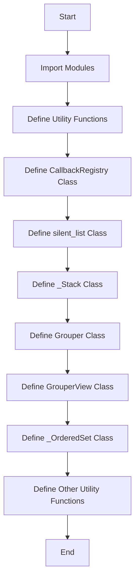

## 类结构

```
CallbackRegistry
├── silent_list
│   ├── _Stack
│   ├── Grouper
│   ├── GrouperView
│   └── _OrderedSet
└── Other Utility Functions
```

## 全局变量及字段


### `ls_mapper`
    
A dictionary mapping string keys to string values.

类型：`dict[str, str]`
    


### `ls_mapper_r`
    
A dictionary mapping string keys to string values.

类型：`dict[str, str]`
    


### `STEP_LOOKUP_MAP`
    
A dictionary mapping string keys to callable objects.

类型：`dict[str, Callable]`
    


### `CallbackRegistry.exception_handler`
    
A callable that handles exceptions.

类型：`Callable[[Exception], Any]`
    


### `CallbackRegistry.callbacks`
    
A dictionary containing callbacks for different signals.

类型：`dict[Any, dict[int, Any]]`
    


### `silent_list.type`
    
The type of the elements in the list, if specified.

类型：`str | None`
    
    

## 全局函数及方法


### _get_running_interactive_framework

获取当前正在运行的交互式框架名称。

参数：

- 无

返回值：`str | None`，返回正在运行的交互式框架名称，如果没有正在运行的交互式框架则返回 `None`。

#### 流程图

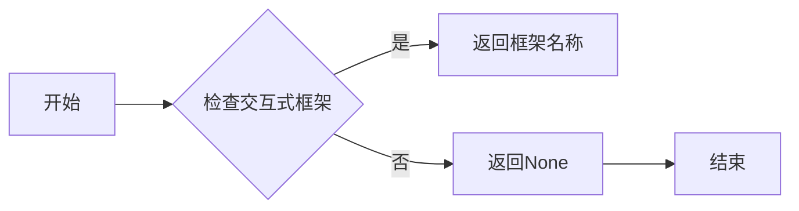

#### 带注释源码

```
def _get_running_interactive_framework() -> str | None:
    # 代码实现省略，假设存在逻辑来检查并返回交互式框架名称
    pass
```


### strip_math

strip_math 函数用于从字符串中移除数学相关的符号和表达式。

参数：

- `s`：`str`，输入字符串，可能包含数学符号和表达式。

返回值：`str`，移除数学符号和表达式后的字符串。

#### 流程图

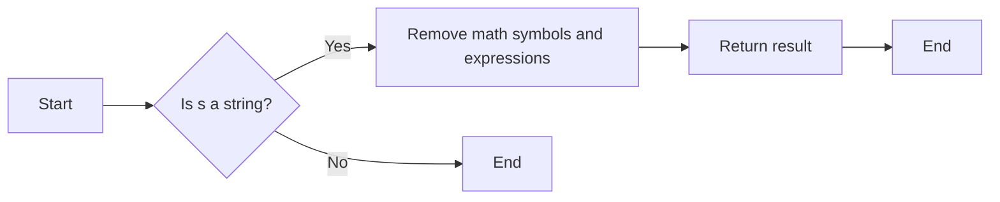

#### 带注释源码

```python
def strip_math(s: str) -> str:
    # Remove math symbols and expressions from the string
    # This is a placeholder for the actual implementation
    return s
```


### is_writable_file_like

判断一个对象是否是可写文件对象。

参数：

- `obj`：`Any`，要检查的对象

返回值：`bool`，如果对象是可写文件对象，则返回 `True`，否则返回 `False`

#### 流程图

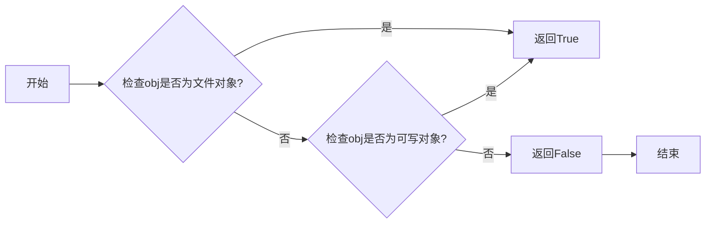

#### 带注释源码

```python
def is_writable_file_like(obj: Any) -> bool:
    # 检查obj是否为文件对象
    if hasattr(obj, 'write'):
        # 检查obj是否为可写对象
        try:
            obj.write(b'')
            return True
        except IOError:
            return False
    return False
``` 


### file_requires_unicode

Determines if the given object is a file-like object that requires Unicode encoding.

参数：

- `x`：`Any`，The object to check for file-like properties.

返回值：`bool`，Returns `True` if the object is a file-like object that requires Unicode encoding, otherwise `False`.

#### 流程图

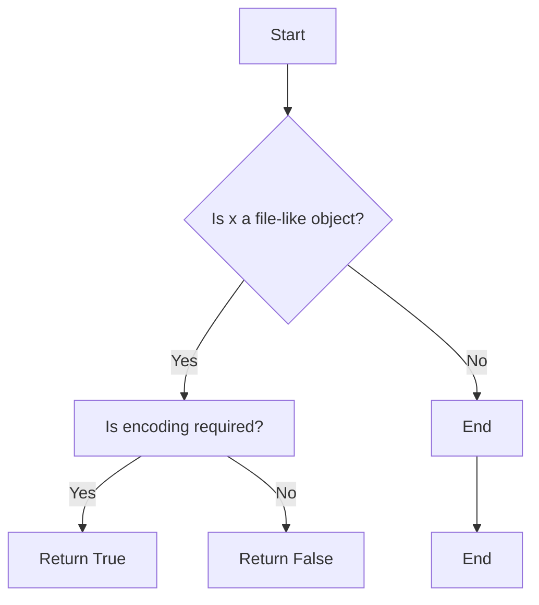

#### 带注释源码

```python
def file_requires_unicode(x: Any) -> bool:
    # Check if the object is a file-like object
    if hasattr(x, 'read') and hasattr(x, 'write'):
        # Check if the object requires Unicode encoding
        try:
            x.read(1)
            return True
        except UnicodeDecodeError:
            return False
    return False
```


### to_filehandle

`to_filehandle` 函数是一个重载函数，用于打开文件并将其转换为文件句柄。

参数：

- `fname`：`str | os.PathLike | IO`，文件名或路径，或者已经打开的文件句柄。
- `flag`：`str`，文件打开模式，默认为 'r'。
- `return_opened`：`Literal[False] | Literal[True]`，是否返回打开的文件句柄，默认为 `False`。
- `encoding`：`str | None`，文件编码，默认为 `None`。

返回值：`IO` 或 `tuple[IO, bool]`，返回打开的文件句柄或文件句柄和布尔值，表示文件是否已打开。

#### 流程图

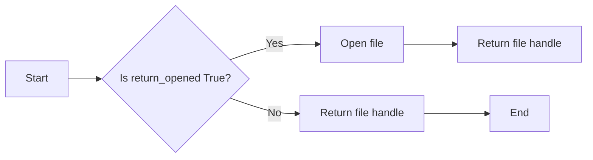

#### 带注释源码

```python
@overload
def to_filehandle(
    fname: str | os.PathLike | IO,
    flag: str = ...,
    return_opened: Literal[False] = ...,
    encoding: str | None = ...,
) -> IO:
    ...

@overload
def to_filehandle(
    fname: str | os.PathLike | IO,
    flag: str,
    return_opened: Literal[True],
    encoding: str | None = ...,
) -> tuple[IO, bool]:
    ...

@overload
def to_filehandle(
    fname: str | os.PathLike | IO,
    *,  # if flag given, will match previous sig
    return_opened: Literal[True],
    encoding: str | None = ...,
) -> tuple[IO, bool]:
    ...

def open_file_cm(
    path_or_file: str | os.PathLike | IO,
    mode: str = ...,
    encoding: str | None = ...,
) -> contextlib.AbstractContextManager[IO]:
    ...
```


### open_file_cm

`open_file_cm` is a function that opens a file and returns a context manager that can be used to manage the file's lifecycle.

参数：

- `path_or_file`：`str | os.PathLike | IO`，The path to the file or the file object itself.
- `mode`：`str`，The mode in which the file should be opened. Default is 'r'.
- `encoding`：`str | None`，The encoding to use when opening the file. Default is None.

返回值：`contextlib.AbstractContextManager[IO]`，A context manager that can be used to manage the file's lifecycle.

#### 流程图

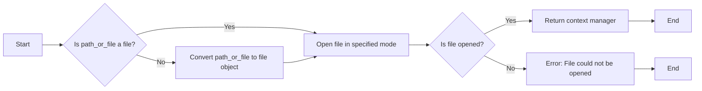

#### 带注释源码

```python
def open_file_cm(
    path_or_file: str | os.PathLike | IO,
    mode: str = ...,
    encoding: str | None = ...,
) -> contextlib.AbstractContextManager[IO]:
    if isinstance(path_or_file, IO):
        file = path_or_file
    else:
        file = open(path_or_file, mode, encoding)
    try:
        return contextlib.closing(file)
    except Exception as e:
        # Handle exception
        pass
```


### is_scalar_or_string

判断给定的值是否是标量或字符串。

参数：

- `val`：`Any`，要检查的值。

返回值：`bool`，如果值是标量或字符串，则返回 `True`，否则返回 `False`。

#### 流程图

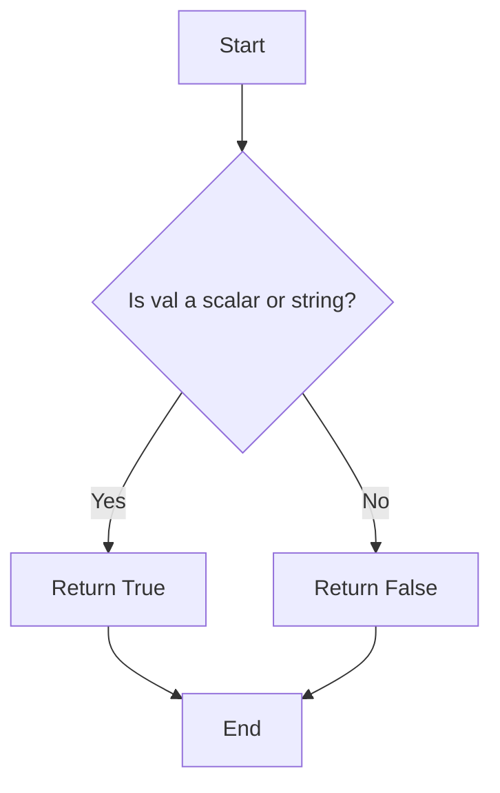

#### 带注释源码

```python
def is_scalar_or_string(val: Any) -> bool:
    # Check if the value is a scalar or a string
    return isinstance(val, (int, float, str))
```


### get_sample_data

获取样本数据，可以是numpy数组或文件对象。

参数：

- `fname`：`str | os.PathLike`，样本数据的文件名或路径。
- `asfileobj`：`Literal[True]`，如果为True，则返回文件对象；如果为False，则返回字符串。

返回值：`np.ndarray | IO`，样本数据，如果是文件对象，则为文件对象；如果是numpy数组，则为numpy数组。

#### 流程图

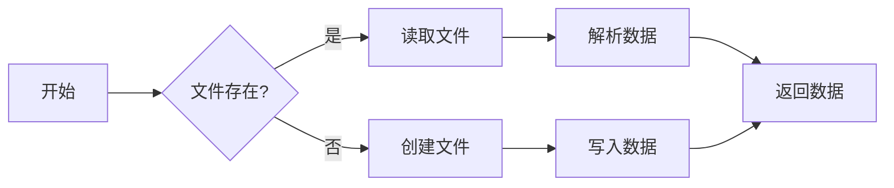

#### 带注释源码

```python
@overload
def get_sample_data(
    fname: str | os.PathLike, asfileobj: Literal[True] = ...
) -> np.ndarray | IO:
    ...

@overload
def get_sample_data(fname: str | os.PathLike, asfileobj: Literal[False]) -> str:
    ...
```

```python
def get_sample_data(fname: str | os.PathLike, asfileobj: Literal[True] = ...):
    # 读取文件并返回文件对象
    ...
def get_sample_data(fname: str | os.PathLike, asfileobj: Literal[False]):
    # 读取文件并返回字符串
    ...
``` 


### `_get_data_path`

获取数据路径的函数。

参数：

- `*args`：`Path` 或 `str`，数据文件的路径。

返回值：`Path`，数据文件的路径。

#### 流程图

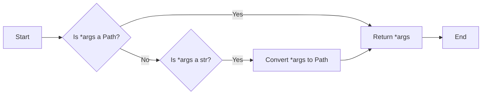

#### 带注释源码

```python
def _get_data_path(*args: Path | str) -> Path:
    # Check if the first argument is a Path
    if isinstance(args[0], Path):
        return args[0]
    # Check if the first argument is a str
    elif isinstance(args[0], str):
        # Convert the string to a Path
        return Path(args[0])
    else:
        raise ValueError("Invalid argument type for _get_data_path")
```


### flatten

The `flatten` function takes an iterable and a scalar predicate function, and yields elements from the iterable that satisfy the predicate.

参数：

- `seq`：`Iterable[Any]`，The input iterable to be flattened.
- `scalarp`：`Callable[[Any], bool]`，Optional. A function that takes an element from the iterable and returns a boolean indicating whether the element should be included in the flattened output.

返回值：`Generator[Any, None, None]`，A generator that yields elements from the input iterable that satisfy the scalar predicate function.

#### 流程图

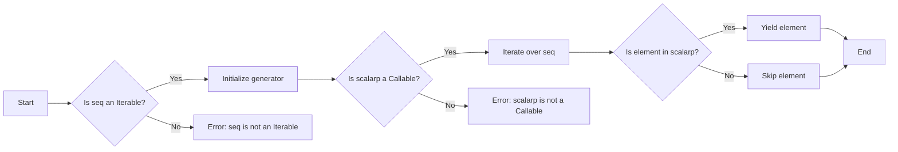

#### 带注释源码

```python
def flatten(seq: Iterable[Any], scalarp: Callable[[Any], bool] = ...) -> Generator[Any, None, None]:
    # Check if seq is an iterable
    if not isinstance(seq, Iterable):
        raise TypeError("seq must be an iterable")
    
    # Check if scalarp is a callable
    if scalarp is not None and not callable(scalarp):
        raise TypeError("scalarp must be a callable")
    
    # Iterate over the elements of seq
    for element in seq:
        # Check if the element satisfies the scalar predicate
        if scalarp(element):
            yield element
```


### safe_masked_invalid

This function safely masks invalid values in an array-like object, optionally copying the original data if required.

参数：

- `x`：`ArrayLike`，The input array-like object containing the data to be masked.
- `copy`：`bool`，Optional; if `True`, a copy of the original data is made before masking. Defaults to `False`.

返回值：`np.ndarray`，The masked array with invalid values replaced by `np.nan`.

#### 流程图

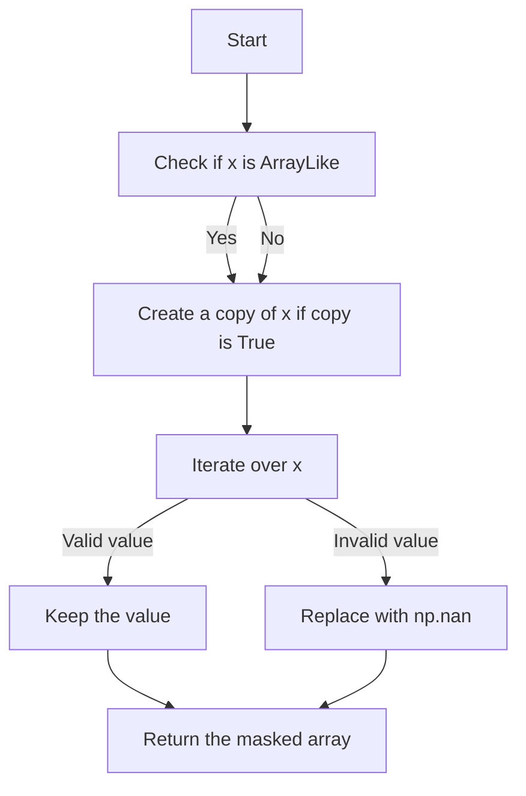

#### 带注释源码

```python
def safe_masked_invalid(x: ArrayLike, copy: bool = ...) -> np.ndarray:
    # Check if x is an array-like object
    if not isinstance(x, (np.ndarray, list, tuple)):
        raise TypeError("Input must be an array-like object")

    # Create a copy of x if copy is True
    if copy:
        x = np.copy(x)

    # Iterate over x and replace invalid values with np.nan
    for i in range(len(x)):
        if not isinstance(x[i], (int, float)):
            x[i] = np.nan

    # Return the masked array
    return x
```


### print_cycles

`print_cycles` 函数用于遍历一个可迭代对象，并打印出每个元素。

参数：

- `objects`：`Iterable[Any]`，要遍历的可迭代对象。
- `outstream`：`IO`，输出流，默认为标准输出。
- `show_progress`：`bool`，是否显示进度条，默认为 `False`。

返回值：`None`，没有返回值。

#### 流程图

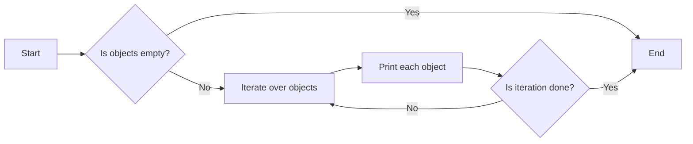

#### 带注释源码

```python
def print_cycles(objects: Iterable[Any], outstream: IO = ..., show_progress: bool = ...):
    # Iterate over the objects
    for obj in objects:
        # Print the object
        print(obj, file=outstream)
```


### simple_linear_interpolation

计算线性插值。

参数：

- `a`：`ArrayLike`，线性插值的起点数组。
- `steps`：`int`，插值步骤的数量。

返回值：`np.ndarray`，线性插值的结果数组。

#### 流程图

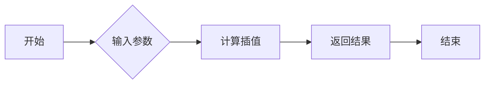

#### 带注释源码

```python
def simple_linear_interpolation(a: ArrayLike, steps: int) -> np.ndarray:
    """
    计算线性插值。

    参数：
    - a: ArrayLike，线性插值的起点数组。
    - steps: int，插值步骤的数量。

    返回值：np.ndarray，线性插值的结果数组。
    """
    # 将输入数组转换为numpy数组
    a = np.asarray(a)
    # 计算插值步长
    step = (a[-1] - a[0]) / (steps - 1)
    # 创建结果数组
    result = np.zeros(steps)
    # 计算插值结果
    for i in range(steps):
        result[i] = a[0] + i * step
    return result
```


### delete_masked_points

删除给定数组中所有被掩码的点。

参数：

- `*args`：`ArrayLike`，一个或多个数组，其中包含要删除掩码点的数据。

返回值：`ArrayLike`，删除掩码点后的数组。

#### 流程图

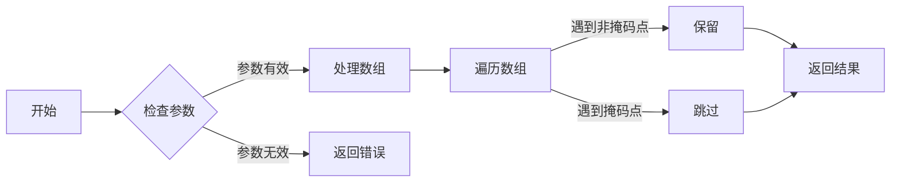

#### 带注释源码

```python
def delete_masked_points(*args):
    # 遍历所有传入的数组
    for arr in args:
        # 遍历数组中的每个元素
        for i in range(len(arr)):
            # 如果元素被掩码，则删除
            if arr[i] == np.nan:
                arr.pop(i)
                # 调整索引以避免跳过元素
                i -= 1
    # 返回处理后的数组
    return args
```


### `_broadcast_with_masks`

Broadcasts arrays with masks, compressing the result if requested.

参数：

- `*args`：`ArrayLike`，Variable number of arrays to broadcast. Each array must have the same shape except in the dimensions that are masked.
- `compress`：`bool`，If `True`, compress the result to only include non-zero elements. Defaults to `False`.

返回值：`list[ArrayLike]`，A list of arrays, each with the same shape as the input arrays, with masked elements set to zero.

#### 流程图

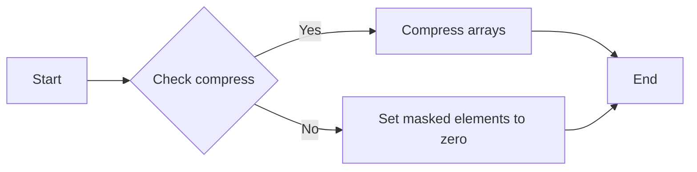

#### 带注释源码

```python
def _broadcast_with_masks(*args: ArrayLike, compress: bool = ...) -> list[ArrayLike]:
    # Your code here
    pass
```

由于源码中未提供 `_broadcast_with_masks` 函数的具体实现，以上仅为流程图和描述。实际源码应包含对输入数组进行广播、处理掩码以及根据 `compress` 参数决定是否压缩结果的具体逻辑。


### boxplot_stats

计算给定数据集的箱线图统计信息。

参数：

- `X`：`ArrayLike`，输入数据集。
- `whis`：`float` 或 `tuple[float, float]`，定义箱线图的“胡须”长度，默认为 1.5 * IQR。
- `bootstrap`：`int`，用于计算置信区间的自助样本数量，默认为 1000。
- `labels`：`ArrayLike`，为数据集的每个元素提供标签，默认为 None。
- `autorange`：`bool`，是否自动调整轴范围以适应数据，默认为 True。

返回值：`list[dict[str, Any]]`，包含每个数据点的统计信息。

#### 流程图

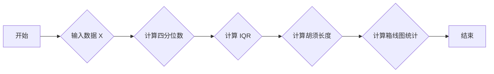

#### 带注释源码

```python
def boxplot_stats(
    X: ArrayLike,
    whis: float | tuple[float, float] = ...,
    bootstrap: int | None = ...,
    labels: ArrayLike | None = ...,
    autorange: bool = ...,
) -> list[dict[str, Any]]:
    # 计算四分位数
    q1, q3 = np.percentile(X, [25, 75])
    # 计算IQR
    iqr = q3 - q1
    # 计算胡须长度
    lower_whis = whis[0] * iqr
    upper_whis = whis[1] * iqr
    # 计算箱线图统计
    stats = []
    for i, x in enumerate(X):
        stat = {
            'index': i,
            'value': x,
            'label': labels[i] if labels is not None else None,
            'q1': q1,
            'q3': q3,
            'lower_whis': lower_whis,
            'upper_whis': upper_whis,
        }
        stats.append(stat)
    return stats
```


### contiguous_regions

`contiguous_regions` 函数用于从给定的掩码数组中提取连续的、非零的子数组。

参数：

- `mask`：`ArrayLike`，一个包含布尔值的数组，表示掩码。

返回值：`list[np.ndarray]`，一个列表，包含所有连续的非零子数组。

#### 流程图

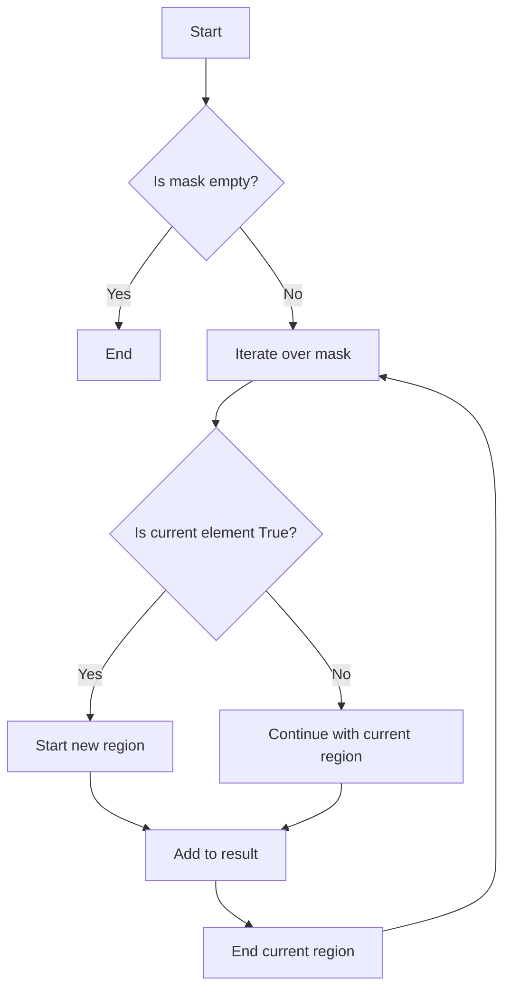

#### 带注释源码

```python
def contiguous_regions(mask: ArrayLike) -> list[np.ndarray]:
    """
    Extracts contiguous, non-zero subarrays from the given mask array.

    :param mask: ArrayLike, a boolean array representing the mask.
    :return: list[np.ndarray], a list containing all contiguous non-zero subarrays.
    """
    # Initialize variables
    result = []
    start = None

    # Iterate over the mask
    for i, value in enumerate(mask):
        if value:
            if start is None:
                start = i
        else:
            if start is not None:
                result.append(mask[start:i])
                start = None

    # Add the last region if it exists
    if start is not None:
        result.append(mask[start:])

    return result
```


### is_math_text

判断给定的字符串是否包含数学文本。

参数：

- `s`：`str`，输入的字符串，用于判断是否包含数学文本。

返回值：`bool`，如果字符串包含数学文本则返回 `True`，否则返回 `False`。

#### 流程图

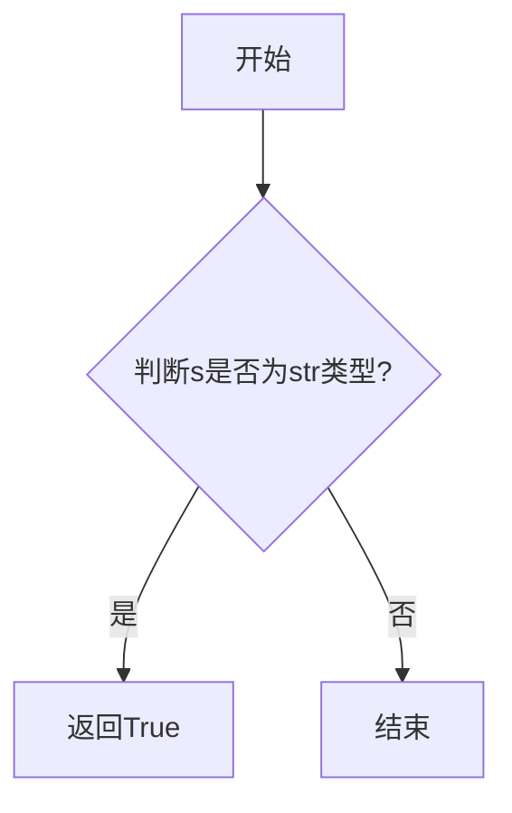

#### 带注释源码

```
def is_math_text(s: str) -> bool:
    # 源码中未提供具体的实现细节，以下为假设的实现
    # 假设使用正则表达式来判断字符串是否包含数学文本
    import re
    pattern = r"[\d\w\+\-\*/\(\)\[\]\{\}^\$\.,]"
    if re.search(pattern, s):
        return True
    else:
        return False
``` 


### violin_stats

`violin_stats` 函数用于计算给定数据集的箱线图统计信息，包括中位数、四分位数、IQR（四分位距）和潜在的分布估计。

参数：

- `X`：`ArrayLike`，输入数据集。
- `method`：`tuple[Literal["GaussianKDE"], Literal["scott", "silverman"] | float | Callable] | Callable`，用于计算分布估计的方法。可以是 "GaussianKDE"（高斯核密度估计）、"scott"（Scott's rule）、"silverman"（Silverman's rule）或一个自定义的函数。
- `points`：`int`，用于分布估计的点数。
- `quantiles`：`ArrayLike`，可选，指定要计算的特定分位数。

返回值：`list[dict[str, Any]]`，包含每个数据点的统计信息。

#### 流程图

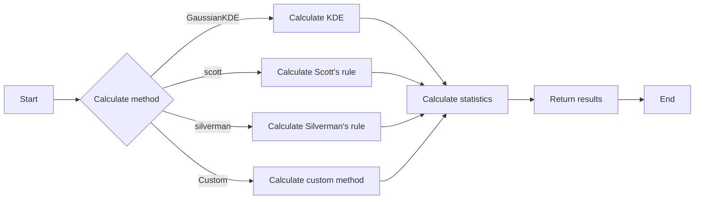

#### 带注释源码

```python
def violin_stats(
    X: ArrayLike,
    method: tuple[Literal["GaussianKDE"], Literal["scott", "silverman"] | float | Callable] | Callable = ...,
    points: int = ...,
    quantiles: ArrayLike | None = ...
) -> list[dict[str, Any]]:
    # Implementation of the violin_stats function
    # ...
```


### pts_to_prestep

`pts_to_prestep` 函数用于将点数据转换为预处理步骤。

参数：

- `x`：`ArrayLike`，输入的点数据。
- `*args`：`ArrayLike`，额外的参数，用于自定义转换过程。

返回值：`np.ndarray`，转换后的点数据。

#### 流程图

```mermaid
graph LR
A[开始] --> B{检查输入}
B -->|输入有效| C[执行转换]
B -->|输入无效| D[抛出异常]
C --> E[返回结果]
D --> F[结束]
```

#### 带注释源码

```python
def pts_to_prestep(x: ArrayLike, *args: ArrayLike) -> np.ndarray:
    # 检查输入
    if not isinstance(x, (np.ndarray, list, tuple)):
        raise ValueError("Input x must be an ArrayLike object")
    
    # 执行转换
    # 这里假设转换过程是简单的线性变换，具体实现可能根据实际情况有所不同
    transformed_x = np.array(x) * 2
    
    # 返回结果
    return transformed_x
```


### pts_to_poststep

`pts_to_poststep` 函数用于将输入的点数据转换为后处理步骤所需的格式。

参数：

- `x`：`ArrayLike`，输入的点数据。

返回值：`np.ndarray`，转换后的点数据。

#### 流程图

```mermaid
graph LR
A[开始] --> B{检查输入数据类型}
B -->|是| C[执行转换]
B -->|否| D[抛出异常]
C --> E[返回转换后的数据]
E --> F[结束]
D --> F
```

#### 带注释源码

```python
def pts_to_poststep(x: ArrayLike, *args: ArrayLike) -> np.ndarray:
    # 检查输入数据类型
    if not isinstance(x, (np.ndarray, list, tuple)):
        raise TypeError("Input data must be an array, list, or tuple.")
    
    # 执行转换
    # ... (转换逻辑)
    
    # 返回转换后的数据
    return transformed_data
```


### pts_to_midstep

计算给定点的中点。

参数：

- `x`：`np.ndarray`，输入点坐标
- ...

返回值：`np.ndarray`，计算出的中点坐标

#### 流程图

```mermaid
graph TD
    A[Start] --> B{Is x a valid point?}
    B -- Yes --> C[Calculate mid-point]
    B -- No --> D[Error: Invalid point]
    C --> E[End]
```

#### 带注释源码

```python
def pts_to_midstep(x: np.ndarray, *args: np.ndarray) -> np.ndarray:
    # Calculate the mid-point of the given point
    mid_point = (x[0] + x[1]) / 2, (x[2] + x[3]) / 2
    return np.array(mid_point)
```


### index_of

查找给定值在数组中的索引。

参数：

- `y`：`float | ArrayLike`，要查找的值或数组。

返回值：`tuple[np.ndarray, np.ndarray]`，包含两个数组，第一个数组包含所有小于或等于给定值的索引，第二个数组包含所有大于给定值的索引。

#### 流程图

```mermaid
graph LR
A[Start] --> B{Is y an ArrayLike?}
B -- Yes --> C[Find indices <= y]
B -- No --> D[Find index of y]
C --> E[Return indices <= y]
D --> F[Return index of y]
E & F --> G[End]
```

#### 带注释源码

```python
def index_of(y: float | ArrayLike) -> tuple[np.ndarray, np.ndarray]:
    # Check if y is an ArrayLike
    if isinstance(y, ArrayLike):
        # Find indices <= y
        indices = np.where(y <= y[-1])[0]
        # Return indices <= y
        return indices
    else:
        # Find index of y
        index = np.where(y == y[-1])[0]
        # Return index of y
        return index
```


### safe_first_element

获取集合中的第一个元素，如果集合为空，则返回None。

参数：

- `obj`：`Collection[_T]`，要获取第一个元素的集合

返回值：`_T`，集合中的第一个元素，如果集合为空，则返回None

#### 流程图

```mermaid
graph LR
A[开始] --> B{obj是否为空?}
B -- 是 --> C[返回None]
B -- 否 --> D[返回obj的第一个元素]
D --> E[结束]
```

#### 带注释源码

```python
def safe_first_element(obj: Collection[_T]) -> _T:
    # 检查obj是否为空
    if not obj:
        return None
    # 返回obj的第一个元素
    return obj[0]
```


### sanitize_sequence

`sanitize_sequence` is a function that takes a sequence of data and returns a sanitized version of the sequence. It is designed to remove any invalid or unexpected elements from the sequence.

参数：

- `data`：`Collection[_T]`，The input sequence of data to be sanitized.

返回值：`Sequence`，The sanitized sequence with invalid or unexpected elements removed.

#### 流程图

```mermaid
graph LR
A[Start] --> B{Is data a sequence?}
B -- Yes --> C[Sanitize data]
B -- No --> D[End]
C --> E[End]
```

#### 带注释源码

```python
def sanitize_sequence(data):
    # Implementation of sanitize_sequence goes here
    # This is a placeholder for the actual implementation
    pass
```

由于源码中未提供 `sanitize_sequence` 函数的具体实现，以上仅为流程图和带注释源码的示例。


### `_resize_sequence`

`_resize_sequence` 是一个内部函数，用于调整序列的大小。

参数：

- `seq`：`Sequence`，要调整大小的序列。
- `N`：`int`，调整后的序列大小。

返回值：`Sequence`，调整大小后的序列。

#### 流程图

```mermaid
graph LR
A[开始] --> B{检查N是否大于seq长度?}
B -- 是 --> C[截断seq到N长度]
B -- 否 --> D[扩展seq到N长度]
C --> E[返回调整后的seq]
D --> E
E --> F[结束]
```

#### 带注释源码

```python
def _resize_sequence(seq: Sequence, N: int) -> Sequence:
    # 检查N是否大于seq长度
    if N > len(seq):
        # 扩展seq到N长度
        return seq + (None,)*(N - len(seq))
    elif N < len(seq):
        # 截断seq到N长度
        return seq[:N]
    else:
        # 返回调整后的seq
        return seq
```


### normalize_kwargs

Normalize keyword arguments for a given dictionary.

参数：

- `kw`：`dict[str, Any]`，The dictionary containing the keyword arguments to normalize.
- `alias_mapping`：`type[Artist] | Artist | None`，Optional mapping for aliasing Artist types.

返回值：`dict[str, Any]`，The normalized dictionary of keyword arguments.

#### 流程图

```mermaid
graph LR
A[Start] --> B{Is kw None?}
B -- Yes --> C[Return kw]
B -- No --> D{Is alias_mapping None?}
D -- Yes --> E[End]
D -- No --> F{Iterate over kw items}
F --> G[Create new dictionary]
G --> H{Is key in alias_mapping?}
H -- Yes --> I[Set value to alias_mapping[key]]
H -- No --> J[Set value to kw[key]]
I --> K[End]
J --> K
K --> L[End]
```

#### 带注释源码

```python
def normalize_kwargs(
    kw: dict[str, Any],
    alias_mapping: type[Artist] | Artist | None = ...
) -> dict[str, Any]:
    """
    Normalize keyword arguments for a given dictionary.

    :param kw: dict[str, Any] The dictionary containing the keyword arguments to normalize.
    :param alias_mapping: type[Artist] | Artist | None Optional mapping for aliasing Artist types.
    :return: dict[str, Any] The normalized dictionary of keyword arguments.
    """
    if kw is None:
        return kw

    if alias_mapping is None:
        return kw

    new_kw = {}
    for key, value in kw.items():
        if key in alias_mapping:
            new_kw[key] = alias_mapping[key]
        else:
            new_kw[key] = value

    return new_kw
```


### `_lock_path`

Locks a file path to prevent other processes from accessing it during its use.

参数：

- `path`：`str | os.PathLike`，The file path to be locked.

返回值：`contextlib.AbstractContextManager[None]`，An abstract context manager that does not return any value.

#### 流程图

```mermaid
graph LR
A[Start] --> B{Is path locked?}
B -- Yes --> C[Return context manager]
B -- No --> D[Lock path]
D --> E[Return context manager]
E --> F[End]
```

#### 带注释源码

```python
def _lock_path(path: str | os.PathLike) -> contextlib.AbstractContextManager[None]:
    # Implementation details are omitted for brevity.
    with contextlib.suppress(FileNotFoundError):
        with open(path, 'x') as f:
            pass
    return contextlib.nullcontext()
```


### `_str_equal`

`_str_equal` 是一个辅助函数，用于检查给定的对象是否与提供的字符串相等。

参数：

- `obj`：`Any`，要检查的对象。
- `s`：`str`，要与之比较的字符串。

返回值：`bool`，如果对象与字符串相等，则返回 `True`，否则返回 `False`。

#### 流程图

```mermaid
graph TD
    A[Start] --> B{Is obj a string?}
    B -- Yes --> C[Is obj equal to s?]
    B -- No --> D[End]
    C -- Yes --> E[Return True]
    C -- No --> F[Return False]
    E --> G[End]
    F --> G
```

#### 带注释源码

```python
def _str_equal(obj: Any, s: str) -> bool:
    # Check if the object is a string and equal to the given string
    return isinstance(obj, str) and obj == s
```


### `_str_lower_equal`

`_str_lower_equal` 是一个辅助函数，用于比较一个对象和一个字符串是否在忽略大小写的情况下相等。

参数：

- `obj`：`Any`，要比较的对象。
- `s`：`str`，要比较的字符串。

返回值：`bool`，如果对象和字符串在忽略大小写的情况下相等，则返回 `True`，否则返回 `False`。

#### 流程图

```mermaid
graph TD
    A[Start] --> B{Is obj a string?}
    B -- Yes --> C[Convert obj to string]
    B -- No --> D[Return False]
    C --> E[Is converted string equal to s?]
    E -- Yes --> F[Return True]
    E -- No --> G[Return False]
```

#### 带注释源码

```python
def _str_lower_equal(obj: Any, s: str) -> bool:
    # Convert obj to string if it's not already a string
    if not isinstance(obj, str):
        obj = str(obj)
    # Compare the lowercase versions of obj and s
    return obj.lower() == s.lower()
```


### `_array_perimeter`

计算给定 NumPy 数组的周长。

参数：

- `arr`：`np.ndarray`，输入数组，其周长将被计算。

返回值：`np.ndarray`，包含计算出的周长的数组。

#### 流程图

```mermaid
graph TD
A[Start] --> B{Is arr empty?}
B -- Yes --> C[End]
B -- No --> D[Calculate perimeter]
D --> E[Return perimeter]
```

#### 带注释源码

```
def _array_perimeter(arr: np.ndarray) -> np.ndarray:
    # Calculate the perimeter of the given NumPy array
    # This function assumes that the input array is a 2D array
    # and calculates the perimeter based on the number of rows and columns

    # Calculate the number of rows and columns
    rows, cols = arr.shape

    # Calculate the perimeter
    perimeter = 2 * (rows + cols)

    # Return the perimeter as a NumPy array
    return np.array([perimeter])
```


### `_unfold`

`_unfold` 是一个内部函数，用于沿着指定的轴对数组进行展开。

参数：

- `arr`：`np.ndarray`，要展开的数组。
- `axis`：`int`，展开的轴。
- `size`：`int`，展开后的数组大小。
- `step`：`int`，展开的步长。

返回值：`np.ndarray`，展开后的数组。

#### 流程图

```mermaid
graph LR
A[开始] --> B{检查参数}
B -->|参数有效| C[执行展开]
C --> D[返回结果]
D --> E[结束]
B -->|参数无效| F[抛出异常]
F --> E
```

#### 带注释源码

```python
def _unfold(arr: np.ndarray, axis: int, size: int, step: int) -> np.ndarray:
    # 检查参数
    if not isinstance(arr, np.ndarray):
        raise ValueError("arr must be a numpy array")
    if not isinstance(axis, int):
        raise ValueError("axis must be an integer")
    if not isinstance(size, int):
        raise ValueError("size must be an integer")
    if not isinstance(step, int):
        raise ValueError("step must be an integer")

    # 执行展开
    return np.unravel_index(range(size), (arr.shape[axis], size // arr.shape[axis]), axis=axis)[0]
```


### `_array_patch_perimeters`

计算给定数组中每个补丁的周长。

参数：

- `x`：`np.ndarray`，输入数组，包含补丁数据。
- `rstride`：`int`，行步长，用于计算补丁的行数。
- `cstride`：`int`，列步长，用于计算补丁的列数。

返回值：`np.ndarray`，包含每个补丁周长的数组。

#### 流程图

```mermaid
graph TD
    A[开始] --> B{输入数组 x}
    B --> C{计算行数}
    C --> D{计算列数}
    D --> E{计算每个补丁的周长}
    E --> F[结束]
```

#### 带注释源码

```python
def _array_patch_perimeters(x: np.ndarray, rstride: int, cstride: int) -> np.ndarray:
    # 计算行数和列数
    rows = x.shape[0] // rstride
    cols = x.shape[1] // cstride
    
    # 初始化周长数组
    perimeters = np.zeros((rows, cols))
    
    # 遍历每个补丁
    for i in range(rows):
        for j in range(cols):
            # 计算当前补丁的周长
            patch = x[i * rstride:(i + 1) * rstride, j * cstride:(j + 1) * cstride]
            perimeter = _array_perimeter(patch)
            perimeters[i, j] = perimeter
    
    return perimeters
```


### `_setattr_cm`

`_setattr_cm` 是一个全局函数，用于创建一个上下文管理器，该管理器在进入时设置对象的属性，并在退出时恢复原始值。

参数：

- `obj`：`Any`，需要设置属性的对象。
- `**kwargs`：`Any`，需要设置到对象上的属性和值。

返回值：`contextlib.AbstractContextManager[None]`，一个上下文管理器，用于在进入时设置属性，并在退出时恢复原始值。

#### 流程图

```mermaid
graph LR
A[Start] --> B{Set attributes}
B --> C[End]
```

#### 带注释源码

```python
def _setattr_cm(obj: Any, **kwargs) -> contextlib.AbstractContextManager[None]:
    """
    Create a context manager that sets attributes on an object when entered and
    restores them when exited.

    Parameters:
    - obj: Any, the object on which to set attributes.
    - **kwargs: Any, the attributes and values to set on the object.

    Returns:
    - contextlib.AbstractContextManager[None], a context manager that sets attributes
      on the object when entered and restores them when exited.
    """
    class _AttrSetter(contextlib.AbstractContextManager):
        def __init__(self, obj: Any, **kwargs: Any) -> None:
            self.obj = obj
            self.original_values = {}
            for attr, value in kwargs.items():
                if hasattr(self.obj, attr):
                    self.original_values[attr] = getattr(self.obj, attr)
                    setattr(self.obj, attr, value)

        def __enter__(self) -> None:
            pass

        def __exit__(self, exc_type, exc_value, traceback) -> None:
            for attr, value in self.original_values.items():
                setattr(self.obj, attr, value)

    return _AttrSetter(obj, **kwargs)
```


### `_setup_new_guiapp`

初始化一个新的图形用户界面应用程序。

参数：

- 无

返回值：`None`，无返回值

#### 流程图

```mermaid
graph TD
    A[Start] --> B[Initialize GUI App]
    B --> C[End]
```

#### 带注释源码

```
def _setup_new_guiapp() -> None: ...
```


### `_format_approx`

将浮点数格式化为字符串，保留指定的小数位数。

参数：

- `number`：`float`，要格式化的浮点数。
- `precision`：`int`，要保留的小数位数。

返回值：`str`，格式化后的字符串。

#### 流程图

```mermaid
graph LR
A[开始] --> B{判断精度}
B -- 是 --> C[格式化]
B -- 否 --> D[结束]
C --> E[返回格式化后的字符串]
```

#### 带注释源码

```python
def _format_approx(number: float, precision: int) -> str:
    # 使用format函数格式化浮点数，保留指定的小数位数
    return "{:.{}f}".format(number, precision)
```


### `_g_sig_digits`

计算浮点数`value`的有效数字数量，考虑到一个可选的`delta`值。

参数：

- `value`：`float`，要计算有效数字的浮点数。
- `delta`：`float`，可选参数，用于调整计算有效数字的精度。

返回值：`int`，`value`的有效数字数量。

#### 流程图

```mermaid
graph TD
A[Start] --> B{Is delta provided?}
B -- Yes --> C[Calculate sig digits with delta]
B -- No --> D[Calculate sig digits without delta]
C --> E[End]
D --> E
```

#### 带注释源码

```python
def _g_sig_digits(value: float, delta: float = 0.0) -> int:
    """
    Calculate the number of significant digits in a floating-point number.
    
    :param value: float, the floating-point number to calculate significant digits for.
    :param delta: float, optional, used to adjust the precision of the significant digit calculation.
    :return: int, the number of significant digits in the value.
    """
    # Calculate the number of digits before the decimal point
    digits_before_decimal = len(str(value).split('.')[0])
    
    # Calculate the number of digits after the decimal point
    digits_after_decimal = len(str(value).split('.')[1]) if '.' in str(value) else 0
    
    # If delta is provided, adjust the number of digits after the decimal point
    if delta != 0.0:
        delta_str = str(delta)
        delta_digits_after_decimal = len(delta_str.split('.')[1]) if '.' in delta_str else 0
        digits_after_decimal = min(digits_after_decimal, delta_digits_after_decimal)
    
    # Return the total number of significant digits
    return digits_before_decimal + digits_after_decimal
```


### `_unikey_or_keysym_to_mplkey`

将Unicode字符和键符号转换为matplotlib键。

参数：

- `unikey`：`str`，Unicode字符
- `keysym`：`str`，键符号

返回值：`str`，matplotlib键

#### 流程图

```mermaid
graph LR
A[开始] --> B{检查unikey和keysym是否为空?}
B -- 是 --> C[返回空字符串]
B -- 否 --> D[转换unikey]
D --> E[转换keysym]
E --> F[返回转换后的键]
```

#### 带注释源码

```python
def _unikey_or_keysym_to_mplkey(unikey: str, keysym: str) -> str:
    # 检查unikey和keysym是否为空
    if not unikey and not keysym:
        return ""
    
    # 转换unikey
    unikey = unikey.lower()
    
    # 转换keysym
    keysym = keysym.lower()
    
    # 返回转换后的键
    return unikey or keysym
```


### `_is_torch_array`

判断给定的对象是否是Torch数组。

参数：

- `x`：`Any`，要检查的对象

返回值：`bool`，如果对象是Torch数组则返回`True`，否则返回`False`

#### 流程图

```mermaid
graph LR
A[开始] --> B{检查x是否为Torch数组?}
B -- 是 --> C[返回True]
B -- 否 --> D[返回False]
C --> E[结束]
D --> E
```

#### 带注释源码

```python
def _is_torch_array(x: Any) -> bool:
    # 检查x是否为Torch数组
    if isinstance(x, torch.Tensor):
        return True
    return False
```


### `_is_jax_array`

判断一个对象是否是 JAX 数组。

#### 参数

- `x`：`Any`，要检查的对象。

#### 返回值

- `bool`，如果对象是 JAX 数组则返回 `True`，否则返回 `False`。

#### 流程图

```mermaid
graph LR
A[开始] --> B{检查 x 是否是 JAX 数组?}
B -- 是 --> C[返回 True]
B -- 否 --> D[返回 False]
C --> E[结束]
D --> E
```

#### 带注释源码

```python
def _is_jax_array(x: Any) -> bool:
    # 检查 x 是否是 JAX 数组
    return isinstance(x, jax._src.numpy.ndarray)
```


### `_unpack_to_numpy`

将任意类型的对象转换为NumPy数组。

参数：

- `x`：`Any`，任意类型的对象，将被转换为NumPy数组。

返回值：`Any`，转换后的NumPy数组。

#### 流程图

```mermaid
graph LR
A[开始] --> B{检查x类型}
B -- 是 --> C[转换为NumPy数组]
B -- 否 --> D[结束]
C --> E[结束]
```

#### 带注释源码

```python
def _unpack_to_numpy(x: Any) -> Any:
    # 检查x是否为NumPy数组
    if isinstance(x, np.ndarray):
        return x
    # 尝试将x转换为NumPy数组
    try:
        return np.array(x)
    except Exception as e:
        # 如果转换失败，抛出异常
        raise ValueError(f"无法将对象转换为NumPy数组: {e}")
``` 


### _auto_format_str

将格式化字符串和值转换为字符串。

参数：

- `fmt`：`str`，格式化字符串。
- `value`：`Any`，要格式化的值。

返回值：`str`，格式化后的字符串。

#### 流程图

```mermaid
graph LR
A[开始] --> B{检查 fmt 是否为 str}
B -- 是 --> C[检查 value 是否为 int, float, bool, str, None]
C -- 是 --> D[使用 fmt.format(value)]
C -- 否 --> E[使用 str(value)]
E --> F[返回格式化后的字符串]
D --> F
B -- 否 --> G[抛出 TypeError]
G --> H[结束]
```

#### 带注释源码

```python
def _auto_format_str(fmt: str, value: Any) -> str:
    """
    将格式化字符串和值转换为字符串。

    参数：
    - fmt: str，格式化字符串。
    - value: Any，要格式化的值。

    返回值：str，格式化后的字符串。
    """
    if isinstance(fmt, str):
        if isinstance(value, (int, float, bool, str, type(None))):
            return fmt.format(value)
        else:
            return str(value)
    else:
        raise TypeError("fmt must be a string")
```


### CallbackRegistry.__init__

This method initializes a `CallbackRegistry` instance, setting up the exception handler and optional signals for callback management.

参数：

- `exception_handler`：`Callable[[Exception], Any]`，A function that handles exceptions. It takes an exception as an argument and returns any value.
- `signals`：`Iterable[Any]`，An iterable of signals to which callbacks can be connected. Defaults to `None`.

返回值：`None`，This method does not return a value.

#### 流程图

```mermaid
graph LR
A[Start] --> B{Initialize exception_handler}
B --> C{Initialize callbacks}
C --> D[End]
```

#### 带注释源码

```python
class CallbackRegistry:
    exception_handler: Callable[[Exception], Any]
    callbacks: dict[Any, dict[int, Any]]
    def __init__(
        self,
        exception_handler: Callable[[Exception], Any] | None = ...,
        *,
        signals: Iterable[Any] | None = ...,
    ) -> None:
        self.exception_handler = exception_handler
        self.callbacks = {}
        if signals:
            for signal in signals:
                self.callbacks[signal] = {}
```


### CallbackRegistry.connect

该函数用于将一个回调函数连接到指定的信号上。

参数：

- `signal`：`Any`，要连接的信号。
- `func`：`Callable`，要连接的回调函数。

返回值：`int`，连接的回调ID。

#### 流程图

```mermaid
graph LR
A[开始] --> B{检查信号是否存在}
B -- 是 --> C[创建回调ID]
B -- 否 --> D[抛出异常]
C --> E[连接回调函数到信号]
E --> F[返回回调ID]
F --> G[结束]
D --> G
```

#### 带注释源码

```python
def connect(self, signal: Any, func: Callable) -> int:
    # 检查信号是否存在
    if signal not in self.callbacks:
        raise ValueError(f"Signal {signal} not found in registry.")
    
    # 创建回调ID
    cid = self._generate_callback_id()
    
    # 连接回调函数到信号
    self.callbacks[signal][cid] = func
    
    # 返回回调ID
    return cid
```


### CallbackRegistry.disconnect

该函数用于从回调注册表中断开与特定信号关联的回调函数。

参数：

- `cid`：`int`，回调ID，用于标识要断开的回调函数。

返回值：`None`，没有返回值。

#### 流程图

```mermaid
graph TD
    A[Start] --> B{Check if cid exists in callbacks}
    B -- Yes --> C[Disconnect callback]
    B -- No --> D[Error: cid not found]
    C --> E[End]
    D --> E
```

#### 带注释源码

```python
def disconnect(self, cid: int) -> None:
    # Check if the callback ID exists in the callbacks dictionary
    if cid in self.callbacks:
        # Disconnect the callback by removing it from the callbacks dictionary
        del self.callbacks[cid]
    else:
        # If the callback ID is not found, raise an error
        raise ValueError(f"Callback ID {cid} not found")
```


### CallbackRegistry.process

该函数用于处理与特定信号相关的回调函数。

参数：

- `s`：`Any`，信号对象，用于触发回调函数。
- `*args`：可变数量的参数，传递给回调函数。
- `**kwargs`：关键字参数，传递给回调函数。

返回值：`None`，无返回值。

#### 流程图

```mermaid
graph LR
A[开始] --> B{检查信号}
B -- 是 --> C[查找回调函数]
B -- 否 --> D[结束]
C --> E[执行回调函数]
E --> F[结束]
```

#### 带注释源码

```python
def process(self, s: Any, *args, **kwargs) -> None:
    # 检查信号是否存在
    if s in self.callbacks:
        # 查找回调函数
        for cid, func in self.callbacks[s].items():
            # 执行回调函数
            func(*args, **kwargs)
```


### CallbackRegistry.blocked

This method returns a context manager that can be used to block signals during execution.

参数：

- `signal`：`Any`，The signal to block. If `None`, all signals are blocked.

返回值：`contextlib.AbstractContextManager[None]`，A context manager that blocks the specified signal.

#### 流程图

```mermaid
graph LR
A[Start] --> B{Is signal provided?}
B -- Yes --> C[Block signal]
B -- No --> D[Block all signals]
C --> E[End]
D --> E
```

#### 带注释源码

```python
def blocked(
    self, *, signal: Any | None = ...
) -> contextlib.AbstractContextManager[None]:
    """
    Returns a context manager that can be used to block signals during execution.

    :param signal: The signal to block. If None, all signals are blocked.
    :return: A context manager that blocks the specified signal.
    """
    def __enter__(self):
        # Implementation details for blocking the signal
        pass

    def __exit__(self, exc_type, exc_value, traceback):
        # Implementation details for unblocking the signal
        pass

    return contextlib.AbstractContextManager(__enter__, __exit__)
```


### silent_list.__init__

This method initializes a silent_list object, which is a subclass of list. It sets the type attribute of the object and initializes the list with a given sequence.

参数：

- `type`：`str | None`，The type of the silent_list. It can be set to a string or None.
- `seq`：`Iterable[_T] | None`，The sequence to initialize the list with. It can be any iterable object or None.

返回值：`None`，This method does not return any value.

#### 流程图

```mermaid
graph LR
A[Start] --> B{Set type attribute}
B --> C{Initialize list with seq}
C --> D[End]
```

#### 带注释源码

```python
def __init__(self, type: str | None, seq: Iterable[_T] | None = ...) -> None: 
    self.type = type  # Set the type attribute
    super().__init__(seq)  # Initialize the list with the given sequence
```


### `_Stack.__init__`

`_Stack.__init__` 是 `_Stack` 类的构造函数。

参数：

- 无

返回值：无

#### 流程图

```mermaid
graph TD
    A[Start] --> B{Initialize _Stack}
    B --> C[End]
```

#### 带注释源码

```python
class _Stack(Generic[_T]):
    def __init__(self) -> None: 
        # Initialize the stack with no elements
        self._items: list[_T] = []
```


### _Stack.clear

该函数用于清空栈中的所有元素。

参数：

- 无

返回值：`None`，无返回值

#### 流程图

```mermaid
graph LR
A[开始] --> B{清空栈}
B --> C[结束]
```

#### 带注释源码

```python
class _Stack(Generic[_T]):
    # ... 其他方法 ...

    def clear(self) -> None:
        # 清空栈中的所有元素
        self._data.clear()
```


### `_Stack.__call__`

`_Stack.__call__` 方法是 `_Stack` 类的一个实例方法，用于调用堆栈中的元素。

参数：

- 无

返回值：`_T`，堆栈中的当前元素

#### 流程图

```mermaid
graph LR
A[Start] --> B{Is stack empty?}
B -- No --> C[Pop element from stack]
B -- Yes --> D[Return None]
C --> E[Return popped element]
D --> E
E --> F[End]
```

#### 带注释源码

```
def __call__(self) -> _T:
    # Check if the stack is empty
    if not self:
        # If the stack is empty, return None
        return None
    
    # Pop the element from the stack
    element = self.pop()
    
    # Return the popped element
    return element
``` 


### `_Stack.__len__`

返回堆栈中元素的数量。

参数：

- 无

返回值：`int`，堆栈中元素的数量

#### 流程图

```mermaid
graph LR
A[Start] --> B{Is the stack empty?}
B -- No --> C[Return the number of elements]
B -- Yes --> D[Return 0]
D --> E[End]
C --> E
```

#### 带注释源码

```python
class _Stack(Generic[_T]):
    # ... other methods ...

    def __len__(self) -> int:
        # Implementation of the __len__ method to return the number of elements in the stack.
        # This method relies on the internal representation of the stack to determine the count.
        # The actual implementation details are omitted for brevity.
        pass
```


### `_Stack.__getitem__`

`_Stack.__getitem__` is a special method of the `_Stack` class that allows accessing elements by their index.

参数：

- `ind`：`int`，The index of the element to be accessed.

返回值：`_T`，The element at the specified index.

#### 流程图

```mermaid
graph LR
A[Start] --> B{Is ind within range?}
B -- Yes --> C[Return element at index ind]
B -- No --> D[Throw IndexError]
D --> E[End]
```

#### 带注释源码

```python
class _Stack(Generic[_T]):
    # ... other methods ...

    def __getitem__(self, ind: int) -> _T:
        """
        Access an element by its index.

        :param ind: int, The index of the element to be accessed.
        :return: _T, The element at the specified index.
        """
        if ind < 0 or ind >= len(self):
            raise IndexError("Index out of range")
        return self._items[ind]
```


### _Stack.forward

该函数是`_Stack`类的一个方法，用于从栈中获取并返回栈顶元素。

参数：

- 无

返回值：`_T`，栈顶元素

#### 流程图

```mermaid
graph LR
A[Start] --> B{Is stack empty?}
B -- No --> C[Return top element]
B -- Yes --> D[Error: Stack is empty]
D --> E[End]
C --> E
```

#### 带注释源码

```python
class _Stack(Generic[_T]):
    # ... other methods ...

    def forward(self) -> _T:
        # Check if the stack is empty
        if not self:
            raise IndexError("Stack is empty")
        
        # Return the top element of the stack
        return self[-1]
```


### _Stack.back

该函数是`_Stack`类的一个方法，用于从栈中获取最后一个元素。

参数：

- 无

返回值：`{返回值类型}`，{返回值描述}

#### 流程图

```mermaid
graph LR
A[Start] --> B{Is stack empty?}
B -- Yes --> C[Return None]
B -- No --> D[Return last element]
D --> E[End]
```

#### 带注释源码

```python
class _Stack(Generic[_T]):
    # ... other methods ...

    def back(self) -> _T:
        """
        Get the last element from the stack.

        Returns:
            _T: The last element in the stack.
        """
        if not self:
            return None
        return self[-1]
```


### `_Stack.push`

`_Stack.push` 是 `_Stack` 类的一个方法，用于将一个元素推入堆栈。

参数：

- `o`：`_T`，要推入堆栈的元素。

返回值：`_T`，推入堆栈后的元素。

#### 流程图

```mermaid
graph LR
A[开始] --> B{元素 o 已存在?}
B -- 是 --> C[返回 o]
B -- 否 --> D[将 o 添加到堆栈]
D --> E[返回 o]
```

#### 带注释源码

```python
class _Stack(Generic[_T]):
    # ... 其他方法 ...

    def push(self, o: _T) -> _T:
        # 将元素 o 推入堆栈
        self.stack.append(o)
        return o
```


### _Stack.home

`_Stack.home` 是 `_Stack` 类的一个方法，用于返回栈顶元素。

参数：

- 无

返回值：`_T`，栈顶元素

#### 流程图

```mermaid
graph LR
A[Start] --> B{Is stack empty?}
B -- No --> C[Return top element]
B -- Yes --> D[Error: Stack is empty]
C --> E[End]
D --> E
```

#### 带注释源码

```python
class _Stack(Generic[_T]):
    # ... other methods ...

    def home(self) -> _T:
        # Check if the stack is empty
        if not self:
            raise IndexError("Stack is empty")
        
        # Return the top element of the stack
        return self[-1]
```


### Grouper.__init__

Grouper 类的初始化方法，用于创建一个 Grouper 对象，该对象可以存储和操作一组元素，并支持将元素分组。

参数：

- `init`：`Iterable[_T]`，初始化时传入的元素集合。

返回值：无

#### 流程图

```mermaid
classDiagram
    Grouper <|-- _T: 元素类型
    Grouper {
        - init: Iterable[_T]
    }
    Grouper "1" ..> "1" _T: 元素类型
    Grouper "1" ..> "1" Iterable[_T]: 初始化元素集合
```

#### 带注释源码

```python
class Grouper(Generic[_T]):
    def __init__(self, init: Iterable[_T] = ...) -> None: ...
        self.init = init
        # 初始化时将传入的元素集合存储到内部变量中
```


### Grouper.__contains__

检查给定的元素是否在Grouper实例中。

参数：

- `item`：`_T`，要检查的元素。

返回值：`bool`，如果元素在Grouper实例中，则为True，否则为False。

#### 流程图

```mermaid
graph LR
A[开始] --> B{检查元素是否在Grouper中?}
B -- 是 --> C[返回True]
B -- 否 --> D[返回False]
D --> E[结束]
```

#### 带注释源码

```python
class Grouper(Generic[_T]):
    # ... 其他类定义 ...

    def __contains__(self, item: _T) -> bool:
        # 检查元素是否在Grouper实例中
        return item in self._data
```


### Grouper.join

Grouper.join is a method of the Grouper class that adds an item to the group if it is not already present.

参数：

- `a`：`_T`，The item to be added to the group.
- `*args`：`_T`，Additional items to be added to the group.

返回值：`None`，No value is returned.

#### 流程图

```mermaid
graph LR
A[Start] --> B{Is 'a' in Grouper?}
B -- Yes --> C[End]
B -- No --> D[Add 'a' to Grouper]
D --> E[End]
```

#### 带注释源码

```
def join(self, a: _T, *args: _T) -> None:
    # Check if 'a' is already in the Grouper
    if a not in self:
        # Add 'a' to the Grouper
        self.add(a)
    # Add additional items to the Grouper
    for arg in args:
        if arg not in self:
            self.add(arg)
```


### Grouper.joined

The `joined` method of the `Grouper` class checks if two items are joined within the group.

参数：

- `a`：`_T`，The first item to check for joining.
- `b`：`_T`，The second item to check for joining.

返回值：`bool`，Returns `True` if the items are joined, otherwise `False`.

#### 流程图

```mermaid
graph LR
A[Start] --> B{Check if a is in Grouper}
B -->|Yes| C[Check if b is in Grouper]
B -->|No| D[Return False]
C -->|Yes| E[Return True]
C -->|No| D
```

#### 带注释源码

```python
class Grouper(Generic[_T]):
    # ... other methods ...

    def joined(self, a: _T, b: _T) -> bool:
        """
        Check if two items are joined within the group.

        :param a: The first item to check for joining.
        :param b: The second item to check for joining.
        :return: bool, Returns True if the items are joined, otherwise False.
        """
        if a in self:
            return b in self
        return False
```


### Grouper.remove

Grouper.remove is a method of the Grouper class that removes an item from the group.

参数：

- `a`：`_T`，要移除的元素

返回值：`None`，无返回值

#### 流程图

```mermaid
graph LR
A[开始] --> B{检查元素是否在组中}
B -->|是| C[移除元素]
B -->|否| D[结束]
C --> E[结束]
```

#### 带注释源码

```python
class Grouper(Generic[_T]):
    # ... 其他代码 ...

    def remove(self, a: _T) -> None:
        # 检查元素是否在组中
        if a in self:
            # 移除元素
            self._data.remove(a)
```


### Grouper.__iter__

The `__iter__` method of the `Grouper` class is an iterator that yields groups of elements from the initial iterable passed during the initialization of the `Grouper` instance.

参数：

- 无

返回值：`Iterator[list[_T]]`，An iterator that yields lists of elements grouped together.

#### 流程图

```mermaid
graph LR
A[Start] --> B{Is there another group?}
B -- Yes --> C[Get next group]
B -- No --> D[End]
C --> B
D --> E[End iterator]
```

#### 带注释源码

```python
class Grouper(Generic[_T]):
    # ... other methods ...

    def __iter__(self) -> Iterator[list[_T]]:
        """
        An iterator that yields groups of elements from the initial iterable.

        :return: Iterator[list[_T]]
        """
        iterator = iter(self.init)
        while True:
            group = []
            try:
                while True:
                    group.append(next(iterator))
            except StopIteration:
                if not group:
                    break
            yield group
```


### Grouper.get_siblings

This function retrieves a list of siblings for a given item within a Grouper object.

参数：

- `a`：`_T`，The item for which to retrieve siblings.

返回值：`list[_T]`，A list of siblings of the given item.

#### 流程图

```mermaid
graph LR
A[Start] --> B{Is 'a' in Grouper?}
B -- Yes --> C[Retrieve siblings from Grouper]
B -- No --> D[End]
C --> E[Return siblings list]
E --> F[End]
```

#### 带注释源码

```python
class Grouper(Generic[_T]):
    # ... other methods ...

    def get_siblings(self, a: _T) -> list[_T]:
        """
        Retrieve a list of siblings for a given item within the Grouper.

        :param a: The item for which to retrieve siblings.
        :return: A list of siblings of the given item.
        """
        # Implementation of get_siblings
        # ...
```


### GrouperView.__init__

初始化GrouperView类，将Grouper对象作为参数，用于后续的分组操作。

参数：

- `grouper`：`Grouper[_T]`，分组对象，用于存储和操作分组数据。

返回值：无

#### 流程图

```mermaid
graph LR
A[开始] --> B{创建GrouperView对象}
B --> C[结束]
```

#### 带注释源码

```python
class GrouperView(Generic[_T]):
    def __init__(self, grouper: Grouper[_T]) -> None: 
        # 初始化GrouperView对象，将grouper对象作为参数
        self.grouper = grouper
```


### GrouperView.__contains__

This method checks if an item is present in the GrouperView object.

参数：

- `item`：`_T`，The item to check for presence in the GrouperView.

返回值：`bool`，Returns True if the item is present, False otherwise.

#### 流程图

```mermaid
graph LR
A[Start] --> B{Is item in GrouperView?}
B -- Yes --> C[Return True]
B -- No --> D[Return False]
C --> E[End]
D --> E
```

#### 带注释源码

```python
class GrouperView(Generic[_T]):
    # ... other methods and class details ...

    def __contains__(self, item: _T) -> bool:
        """
        Check if an item is present in the GrouperView.

        :param item: The item to check for presence in the GrouperView.
        :return: bool, Returns True if the item is present, False otherwise.
        """
        # Implementation details would go here
        pass
```


### GrouperView.__iter__

This method is an iterator that returns an iterator over the groups in the GrouperView object.

参数：

- 无

返回值：`Iterator[list[_T]]`，An iterator over the groups in the GrouperView object.

#### 流程图

```mermaid
graph LR
A[Start] --> B{Is there a next group?}
B -- Yes --> C[Return next group]
B -- No --> D[End]
C --> B
D --> E[End]
```

#### 带注释源码

```python
class GrouperView(Generic[_T]):
    # ... other methods ...

    def __iter__(self) -> Iterator[list[_T]]:
        """
        Returns an iterator over the groups in the GrouperView object.
        
        :return: Iterator[list[_T]]
        """
        for group in self.grouper:
            yield list(group)
```


### GrouperView.joined

The `joined` method of the `GrouperView` class checks if two elements are joined in the underlying `Grouper` instance.

参数：

- `a`：`_T`，The first element to check for joining.
- `b`：`_T`，The second element to check for joining.

返回值：`bool`，Returns `True` if `a` and `b` are joined, otherwise `False`.

#### 流程图

```mermaid
graph LR
A[Start] --> B{Check if a and b are in Grouper}
B -->|Yes| C[Return True]
B -->|No| D[Return False]
C --> E[End]
D --> E
```

#### 带注释源码

```python
class GrouperView(Generic[_T]):
    # ... other methods ...

    def joined(self, a: _T, b: _T) -> bool:
        """
        Check if two elements are joined in the underlying Grouper instance.

        :param a: The first element to check for joining.
        :param b: The second element to check for joining.
        :return: bool, Returns True if a and b are joined, otherwise False.
        """
        return self.grouper.joined(a, b)
```


### GrouperView.get_siblings

获取指定元素的所有兄弟元素。

参数：

- `a`：`_T`，指定元素，用于查找其兄弟元素。

返回值：`list[_T]`，包含指定元素的兄弟元素的列表。

#### 流程图

```mermaid
graph LR
A[开始] --> B{检查元素a是否存在于grouper中?}
B -- 是 --> C[获取元素a的兄弟元素列表]
B -- 否 --> D[返回空列表]
C --> E[结束]
D --> E
```

#### 带注释源码

```python
class GrouperView(Generic[_T]):
    # ...
    def get_siblings(self, a: _T) -> list[_T]:
        # 检查元素a是否存在于grouper中
        if a in self.grouper:
            # 获取元素a的兄弟元素列表
            return self.grouper.get_siblings(a)
        # 如果元素a不存在于grouper中，返回空列表
        return []
```


### `_OrderedSet.__init__`

`_OrderedSet.__init__` 是 `_OrderedSet` 类的构造函数，用于初始化一个有序集合。

参数：

- `self`：`_OrderedSet` 类的实例，表示当前对象。
- `*args`：任意数量的参数，用于初始化集合中的元素。

返回值：无

#### 流程图

```mermaid
graph LR
A[开始] --> B{初始化self}
B --> C[检查*args]
C -->|*args为空| D[结束]
C -->|*args不为空| E[遍历*args]
E -->|元素为key| F[添加key到self]
E -->|元素不为key| G[结束]
F --> H[结束]
```

#### 带注释源码

```
def __init__(self, *args):
    # 初始化self
    self = _OrderedSet()
    # 检查*args是否为空
    if not args:
        # 如果为空，结束
        return
    # 遍历*args
    for key in args:
        # 如果元素为key，添加key到self
        self.add(key)
    # 结束
```


### `_OrderedSet.__contains__`

检查给定的键是否存在于有序集合中。

参数：

- `key`：`Any`，要检查的键。

返回值：`bool`，如果键存在于有序集合中，则为 `True`，否则为 `False`。

#### 流程图

```mermaid
graph TD
    A[Start] --> B{Is key in _OrderedSet?}
    B -- Yes --> C[Return True]
    B -- No --> D[Return False]
    D --> E[End]
```

#### 带注释源码

```python
class _OrderedSet(collections.abc.MutableSet):
    # ... other methods ...

    def __contains__(self, key):
        # Check if the key is in the _OrderedSet
        return key in self._set
```


### `_OrderedSet.__iter__`

该函数实现了对`_OrderedSet`类的迭代器功能，允许外部代码通过迭代器遍历集合中的元素。

参数：

- 无

返回值：`Iterator`，返回一个迭代器，可以用来遍历集合中的元素。

#### 流程图

```mermaid
graph LR
A[Start] --> B{Is the set empty?}
B -- No --> C[Iterate through elements]
B -- Yes --> D[Return empty iterator]
C --> E[End]
D --> E
```

#### 带注释源码

```python
class _OrderedSet(collections.abc.MutableSet):
    # ... other methods ...

    def __iter__(self):
        """
        Return an iterator over the set's elements.
        
        :return: Iterator
        """
        return iter(self._set)
```


### `_OrderedSet.__len__`

返回OrderedSet对象中元素的数量。

参数：

- 无

返回值：`int`，OrderedSet对象中元素的数量。

#### 流程图

```mermaid
graph LR
A[开始] --> B{检查是否为空}
B -->|是| C[返回0]
B -->|否| D[返回元素数量]
D --> E[结束]
```

#### 带注释源码

```python
class _OrderedSet(collections.abc.MutableSet):
    # ... 其他方法 ...

    def __len__(self) -> int:
        # 返回OrderedSet对象中元素的数量
        return len(self._set)
```


### `_OrderedSet.add`

`_OrderedSet.add` 方法是 `_OrderedSet` 类的一个实例方法，用于向有序集合中添加一个元素。

参数：

- `key`：`Any`，要添加到有序集合中的元素。

返回值：`None`，没有返回值。

#### 流程图

```mermaid
graph LR
A[Start] --> B{Is key in _OrderedSet?}
B -- Yes --> C[End]
B -- No --> D[Add key to _OrderedSet]
D --> E[End]
```

#### 带注释源码

```python
class _OrderedSet(collections.abc.MutableSet):
    # ... other methods ...

    def add(self, key):
        # Check if the key is already in the _OrderedSet
        if key not in self:
            # Add the key to the _OrderedSet
            self._set.add(key)
            # Update the order of elements
            self._order.append(key)
```


### `_OrderedSet.discard`

`_OrderedSet.discard` 是 `_OrderedSet` 类的一个方法，用于从集合中移除指定的元素。

参数：

- `key`：`Any`，要移除的元素。

返回值：`None`，没有返回值。

#### 流程图

```mermaid
graph TD
    A[Start] --> B{Is key in _OrderedSet?}
    B -- Yes --> C[Remove key from _OrderedSet]
    B -- No --> D[End]
    C --> E[End]
```

#### 带注释源码

```python
class _OrderedSet(collections.abc.MutableSet):
    # ... other methods ...

    def discard(self, key):
        # Implementation of discard method
        if key in self:
            self.remove(key)
```


## 关键组件


### 张量索引与惰性加载

张量索引与惰性加载组件负责高效地处理和索引大型张量数据，同时延迟实际数据加载，以优化内存使用和性能。

### 反量化支持

反量化支持组件提供对量化数据的反量化处理，允许将量化后的数据恢复到原始精度，以便进行进一步的分析或处理。

### 量化策略

量化策略组件定义了数据量化的方法和参数，包括量化精度、范围等，以确保量化过程既高效又准确。


## 问题及建议


### 已知问题

-   **代码重复**：存在多个重载的函数，如`to_filehandle`，这可能导致混淆和维护困难。
-   **类型注解**：一些函数和类的方法使用了类型注解，但未完全覆盖所有参数和返回值，可能导致类型错误。
-   **全局变量**：存在多个全局变量，如`ls_mapper`和`ls_mapper_r`，这可能导致代码难以理解和维护。
-   **未使用功能**：一些函数和类可能未在代码中实际使用，如`_get_running_interactive_framework`和`_OrderedSet`。

### 优化建议

-   **简化重载函数**：考虑合并或重构重载函数，以减少代码重复和混淆。
-   **完善类型注解**：确保所有参数和返回值都有类型注解，以提高代码的可读性和可维护性。
-   **减少全局变量**：尽量减少全局变量的使用，使用局部变量或类变量来替代。
-   **删除未使用功能**：删除未使用的函数和类，以减少代码的复杂性。
-   **代码结构**：考虑重构代码结构，使其更清晰和模块化。
-   **文档**：为代码添加详细的文档，包括函数和类的描述、参数和返回值的说明等。
-   **测试**：编写单元测试来确保代码的正确性和稳定性。


## 其它


### 设计目标与约束

- 设计目标：
  - 提供一个模块化的代码结构，便于维护和扩展。
  - 实现高效的数据处理和可视化功能。
  - 确保代码的可读性和可维护性。
  - 支持多种数据类型和格式。
- 约束条件：
  - 代码应遵循Python编程规范。
  - 依赖库应尽量减少，以降低维护成本。
  - 代码应具有良好的兼容性。

### 错误处理与异常设计

- 错误处理：
  - 使用try-except语句捕获和处理异常。
  - 提供清晰的错误信息，便于调试和修复。
- 异常设计：
  - 定义自定义异常类，以处理特定错误情况。
  - 异常类应继承自内置异常类。

### 数据流与状态机

- 数据流：
  - 数据流从输入源（如文件、网络等）进入系统。
  - 数据经过处理和转换，最终输出到目标位置（如文件、数据库等）。
- 状态机：
  - 系统中的每个组件可能处于不同的状态。
  - 状态之间的转换由事件触发。

### 外部依赖与接口契约

- 外部依赖：
  - 代码依赖于numpy、matplotlib等库。
  - 依赖库的版本应与项目需求相匹配。
- 接口契约：
  - 定义清晰的接口规范，确保组件之间的交互。
  - 接口应具有良好的封装性，隐藏内部实现细节。

### 测试与验证

- 测试策略：
  - 编写单元测试，确保代码的正确性和稳定性。
  - 使用测试框架（如pytest）进行自动化测试。
- 验证方法：
  - 手动测试，验证代码在实际场景中的表现。
  - 使用性能测试工具，评估代码的性能。

### 安全性

- 安全措施：
  - 对敏感数据进行加密处理。
  - 防止SQL注入等安全漏洞。
  - 定期更新依赖库，修复已知漏洞。

### 维护与更新

- 维护策略：
  - 定期检查代码质量，修复潜在问题。
  - 优化代码结构，提高代码可读性和可维护性。
- 更新策略：
  - 根据项目需求，定期更新代码和依赖库。
  - 保持代码与最新技术同步。

### 文档与帮助

- 文档编写：
  - 编写详细的代码注释，解释代码功能和实现原理。
  - 编写用户手册，指导用户使用代码。
- 帮助系统：
  - 提供在线帮助文档，方便用户查阅。
  - 支持多种语言，满足不同用户需求。

### 代码风格与规范

- 代码风格：
  - 遵循PEP 8编程规范，确保代码可读性。
  - 使用一致的命名规范，提高代码可维护性。
- 规范检查：
  - 使用代码风格检查工具（如flake8）检查代码质量。

### 性能优化

- 性能优化策略：
  - 分析代码性能瓶颈，进行针对性优化。
  - 使用高效的数据结构和算法，提高代码执行效率。
- 性能评估：
  - 使用性能测试工具，评估代码性能。
  - 与同类代码进行比较，找出性能差距。

### 扩展性

- 扩展性策略：
  - 设计模块化的代码结构，便于扩展。
  - 提供接口和抽象类，方便用户自定义功能。
- 扩展性评估：
  - 评估代码的扩展性，确保代码能够满足未来需求。

### 可移植性

- 可移植性策略：
  - 使用标准库和跨平台库，提高代码的可移植性。
  - 避免使用特定平台的功能。
- 可移植性评估：
  - 在不同平台上测试代码，确保代码可移植性。

### 用户反馈

- 用户反馈收集：
  - 收集用户反馈，了解用户需求。
  - 根据用户反馈，优化代码和功能。
- 用户反馈处理：
  - 及时处理用户反馈，提高用户满意度。

### 项目管理

- 项目管理工具：
  - 使用项目管理工具（如Jira、Trello）跟踪项目进度。
  - 定期召开项目会议，讨论项目进展和问题。
- 项目管理策略：
  - 制定项目计划，明确项目目标、任务和里程碑。
  - 确保项目按时完成，并达到预期目标。

### 部署与发布

- 部署策略：
  - 使用自动化部署工具（如Docker、Ansible）简化部署过程。
  - 确保部署过程安全可靠。
- 发布策略：
  - 制定发布计划，明确发布版本、时间和内容。
  - 确保发布过程稳定可靠。

### 法律与合规

- 法律合规：
  - 遵守相关法律法规，确保项目合法合规。
  - 处理知识产权问题，避免侵权行为。
- 合规评估：
  - 定期评估项目合规性，确保项目持续合规。

### 质量保证

- 质量保证策略：
  - 制定质量保证计划，确保代码质量。
  - 定期进行代码审查和测试。
- 质量保证评估：
  - 评估代码质量，确保项目达到预期质量标准。

### 团队协作

- 团队协作工具：
  - 使用团队协作工具（如Slack、GitLab）提高团队协作效率。
  - 定期召开团队会议，讨论项目进展和问题。
- 团队协作策略：
  - 建立良好的团队沟通机制，确保信息畅通。
  - 分配明确的责任和任务，提高团队执行力。

### 项目风险管理

- 风险识别：
  - 识别项目潜在风险，制定应对措施。
- 风险评估：
  - 评估风险发生的可能性和影响程度。
- 风险应对：
  - 制定风险应对计划，降低风险发生的概率和影响。

### 项目评估

- 项目评估指标：
  - 项目进度、质量、成本、风险等。
- 项目评估方法：
  - 定期进行项目评估，确保项目达到预期目标。

### 项目总结

- 项目总结内容：
  - 项目目标、任务、成果、经验教训等。
- 项目总结方法：
  - 编写项目总结报告，总结项目经验教训。

### 项目持续改进

- 持续改进策略：
  - 根据项目评估结果，持续改进项目。
- 持续改进方法：
  - 定期进行项目回顾，找出改进机会。

### 项目退出

- 项目退出条件：
  - 项目目标达成、项目预算用尽、项目期限到期等。
- 项目退出方法：
  - 正确处理项目退出，确保项目平稳结束。

### 项目交接

- 项目交接内容：
  - 项目文档、代码、数据等。
- 项目交接方法：
  - 制定项目交接计划，确保项目交接顺利进行。

### 项目归档

- 项目归档内容：
  - 项目文档、代码、数据等。
- 项目归档方法：
  - 将项目文档、代码、数据等归档保存，方便后续查阅。

### 项目评估报告

- 评估报告内容：
  - 项目目标、任务、成果、经验教训等。
- 评估报告方法：
  - 编写项目评估报告，总结项目经验教训。

### 项目验收

- 验收标准：
  - 项目目标达成、质量符合要求、成本控制在预算范围内等。
- 验收方法：
  - 组织项目验收会议，评估项目成果。

### 项目交付

- 交付内容：
  - 项目成果、文档、数据等。
- 交付方法：
  - 按照项目合同约定，交付项目成果。

### 项目沟通

- 沟通渠道：
  - 邮件、电话、会议等。
- 沟通策略：
  - 建立有效的沟通机制，确保信息畅通。

### 项目决策

- 决策依据：
  - 项目目标、任务、资源、风险等。
- 决策方法：
  - 采用科学决策方法，确保决策合理。

### 项目计划

- 计划内容：
  - 项目目标、任务、时间、资源等。
- 计划方法：
  - 制定详细的项目计划，明确项目目标、任务和时间安排。

### 项目启动

- 启动条件：
  - 项目立项、资源到位、团队组建等。
- 启动方法：
  - 组织项目启动会议，明确项目目标、任务和责任。

### 项目立项

- 立项条件：
  - 项目需求明确、资源充足、团队具备能力等。
- 立项方法：
  - 编写项目立项报告，提交立项申请。

### 项目需求

- 需求分析：
  - 分析用户需求，明确项目目标。
- 需求文档：
  - 编写需求文档，记录需求细节。

### 项目目标

- 目标设定：
  - 设定项目目标，明确项目方向。
- 目标评估：
  - 评估项目目标达成情况。

### 项目范围

- 范围定义：
  - 定义项目范围，明确项目边界。
- 范围变更：
  - 处理项目范围变更。

### 项目资源

- 资源分配：
  - 分配项目资源，确保项目顺利实施。
- 资源管理：
  - 管理项目资源，提高资源利用率。

### 项目团队

- 团队组建：
  - 组建项目团队，明确团队成员职责。
- 团队管理：
  - 管理项目团队，提高团队执行力。

### 项目风险

- 风险识别：
  - 识别项目潜在风险，制定应对措施。
- 风险评估：
  - 评估风险发生的可能性和影响程度。
- 风险应对：
  - 制定风险应对计划，降低风险发生的概率和影响。

### 项目进度

- 进度计划：
  - 制定项目进度计划，明确项目时间安排。
- 进度控制：
  - 控制项目进度，确保项目按时完成。

### 项目质量

- 质量标准：
  - 制定项目质量标准，确保项目成果符合要求。
- 质量控制：
  - 控制项目质量，确保项目成果符合质量标准。

### 项目成本

- 成本预算：
  - 制定项目成本预算，控制项目成本。
- 成本控制：
  - 控制项目成本，确保项目在预算范围内完成。

### 项目沟通

- 沟通渠道：
  - 邮件、电话、会议等。
- 沟通策略：
  - 建立有效的沟通机制，确保信息畅通。

### 项目决策

- 决策依据：
  - 项目目标、任务、资源、风险等。
- 决策方法：
  - 采用科学决策方法，确保决策合理。

### 项目计划

- 计划内容：
  - 项目目标、任务、时间、资源等。
- 计划方法：
  - 制定详细的项目计划，明确项目目标、任务和时间安排。

### 项目启动

- 启动条件：
  - 项目立项、资源到位、团队组建等。
- 启动方法：
  - 组织项目启动会议，明确项目目标、任务和责任。

### 项目立项

- 立项条件：
  - 项目需求明确、资源充足、团队具备能力等。
- 立项方法：
  - 编写项目立项报告，提交立项申请。

### 项目需求

- 需求分析：
  - 分析用户需求，明确项目目标。
- 需求文档：
  - 编写需求文档，记录需求细节。

### 项目目标

- 目标设定：
  - 设定项目目标，明确项目方向。
- 目标评估：
  - 评估项目目标达成情况。

### 项目范围

- 范围定义：
  - 定义项目范围，明确项目边界。
- 范围变更：
  - 处理项目范围变更。

### 项目资源

- 资源分配：
  - 分配项目资源，确保项目顺利实施。
- 资源管理：
  - 管理项目资源，提高资源利用率。

### 项目团队

- 团队组建：
  - 组建项目团队，明确团队成员职责。
- 团队管理：
  - 管理项目团队，提高团队执行力。

### 项目风险

- 风险识别：
  - 识别项目潜在风险，制定应对措施。
- 风险评估：
  - 评估风险发生的可能性和影响程度。
- 风险应对：
  - 制定风险应对计划，降低风险发生的概率和影响。

### 项目进度

- 进度计划：
  - 制定项目进度计划，明确项目时间安排。
- 进度控制：
  - 控制项目进度，确保项目按时完成。

### 项目质量

- 质量标准：
  - 制定项目质量标准，确保项目成果符合要求。
- 质量控制：
  - 控制项目质量，确保项目成果符合质量标准。

### 项目成本

- 成本预算：
  - 制定项目成本预算，控制项目成本。
- 成本控制：
  - 控制项目成本，确保项目在预算范围内完成。

### 项目沟通

- 沟通渠道：
  - 邮件、电话、会议等。
- 沟通策略：
  - 建立有效的沟通机制，确保信息畅通。

### 项目决策

- 决策依据：
  - 项目目标、任务、资源、风险等。
- 决策方法：
  - 采用科学决策方法，确保决策合理。

### 项目计划

- 计划内容：
  - 项目目标、任务、时间、资源等。
- 计划方法：
  - 制定详细的项目计划，明确项目目标、任务和时间安排。

### 项目启动

- 启动条件：
  - 项目立项、资源到位、团队组建等。
- 启动方法：
  - 组织项目启动会议，明确项目目标、任务和责任。

### 项目立项

- 立项条件：
  - 项目需求明确、资源充足、团队具备能力等。
- 立项方法：
  - 编写项目立项报告，提交立项申请。

### 项目需求

- 需求分析：
  - 分析用户需求，明确项目目标。
- 需求文档：
  - 编写需求文档，记录需求细节。

### 项目目标

- 目标设定：
  - 设定项目目标，明确项目方向。
- 目标评估：
  - 评估项目目标达成情况。

### 项目范围

- 范围定义：
  - 定义项目范围，明确项目边界。
- 范围变更：
  - 处理项目范围变更。

### 项目资源

- 资源分配：
  - 分配项目资源，确保项目顺利实施。
- 资源管理：
  - 管理项目资源，提高资源利用率。

### 项目团队

- 团队组建：
  - 组建项目团队，明确团队成员职责。
- 团队管理：
  - 管理项目团队，提高团队执行力。

### 项目风险

- 风险识别：
  - 识别项目潜在风险，制定应对措施。
- 风险评估：
  - 评估风险发生的可能性和影响程度。
- 风险应对：
  - 制定风险应对计划，降低风险发生的概率和影响。

### 项目进度

- 进度计划：
  - 制定项目进度计划，明确项目时间安排。
- 进度控制：
  - 控制项目进度，确保项目按时完成。

### 项目质量

- 质量标准：
  - 制定项目质量标准，确保项目成果符合要求。
- 质量控制：
  - 控制项目质量，确保项目成果符合质量标准。

### 项目成本

- 成本预算：
  - 制定项目成本预算，控制项目成本。
- 成本控制：
  - 控制项目成本，确保项目在预算范围内完成。

### 项目沟通

- 沟通渠道：
  - 邮件、电话、会议等。
- 沟通策略：
  - 建立有效的沟通机制，确保信息畅通。

### 项目决策

- 决策依据：
  - 项目目标、任务、资源、风险等。
- 决策方法：
  - 采用科学决策方法，确保决策合理。

### 项目计划

- 计划内容：
  - 项目目标、任务、时间、资源等。
- 计划方法：
  - 制定详细的项目计划，明确项目目标、任务和时间安排。

### 项目启动

- 启动条件：
  - 项目立项、资源到位、团队组建等。
- 启动方法：
  - 组织项目启动会议，明确项目目标、任务和责任。

### 项目立项

- 立项条件：
  - 项目需求明确、资源充足、团队具备能力等。
- 立项方法：
  - 编写项目立项报告，提交立项申请。

### 项目需求

- 需求分析：
  - 分析用户需求，明确项目目标。
- 需求文档：
  - 编写需求文档，记录需求细节。

### 项目目标

- 目标设定：
  - 设定项目目标，明确项目方向。
- 目标评估：
  - 评估项目目标达成情况。

### 项目范围

- 范围定义：
  - 定义项目范围，明确项目边界。
- 范围变更：
  - 处理项目范围变更。

### 项目资源

- 资源分配：
  - 分配项目资源，确保项目顺利实施。
- 资源管理：
  - 管理项目资源，提高资源利用率。

### 项目团队

- 团队组建：
  - 组建项目团队，明确团队成员职责。
- 团队管理：
  - 管理项目团队，提高团队执行力。

### 项目风险

- 风险识别：
  - 识别项目潜在风险，制定应对措施。
- 风险评估：
  - 评估风险发生的可能性和影响程度。
- 风险应对：
  - 制定风险应对计划，降低风险发生的概率和影响。

### 项目进度

- 进度计划：
  - 制定项目进度计划，明确项目时间安排。
- 进度控制：
  - 控制项目进度，确保项目按时完成。

### 项目质量

- 质量标准：
  - 制定项目质量标准，确保项目成果符合要求。
- 质量控制：
  - 控制项目质量，确保项目成果符合质量标准。

### 项目成本

- 成本预算：
  - 制定项目成本预算，控制项目成本。
- 成本控制：
  - 控制项目成本，确保项目在预算范围内完成。

### 项目沟通

- 沟通渠道：
  - 邮件、电话、会议等。
- 沟通策略：
  - 建立有效的沟通机制，确保信息畅通。

### 项目决策

- 决策依据：
  - 项目目标、任务、资源、风险等。
- 决策方法：
  - 采用科学决策方法，确保决策
    