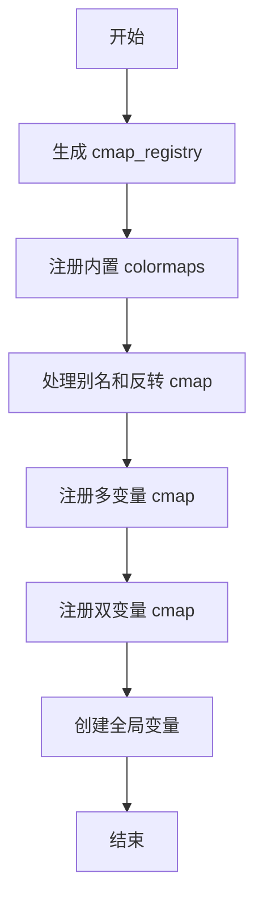
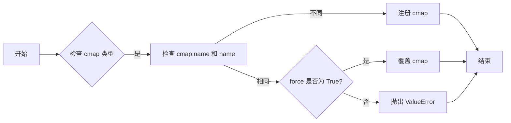
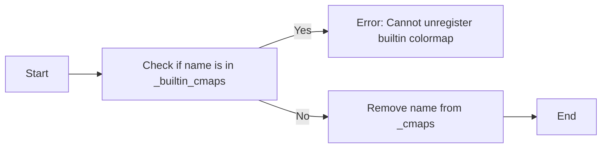
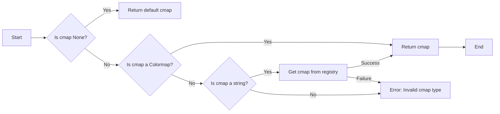
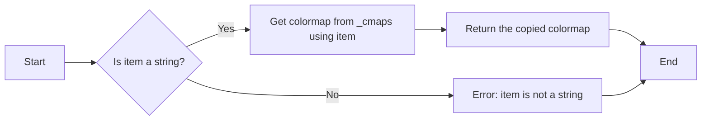
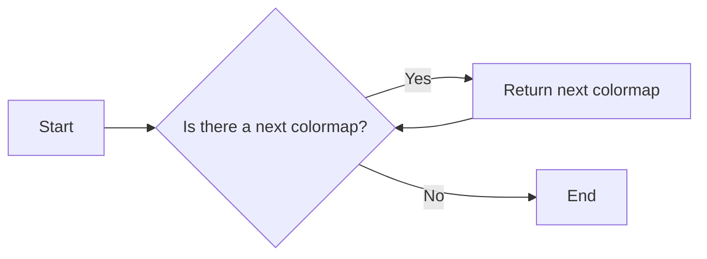
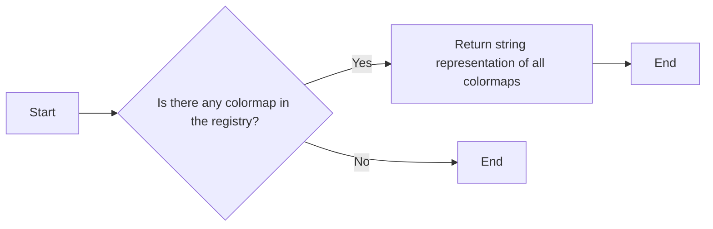
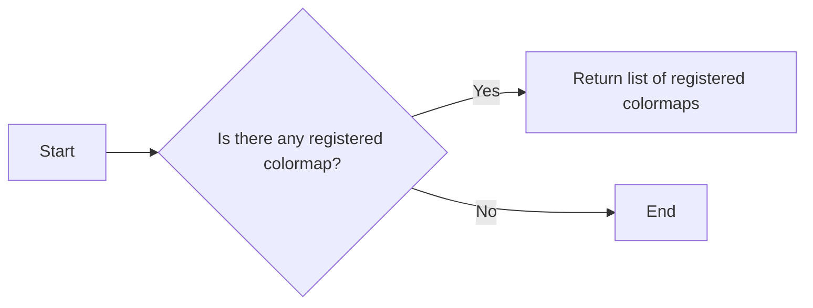
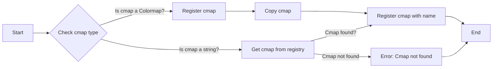
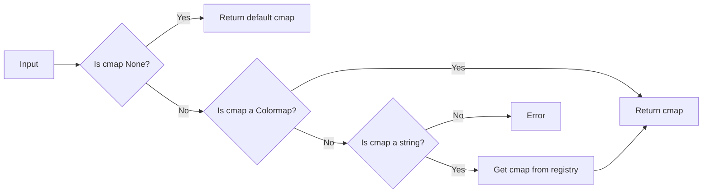

# `matplotlib\lib\matplotlib\cm.py` 详细设计文档

This code defines a registry for colormaps used in Matplotlib, providing functionality to register, retrieve, and manage colormaps.

## 整体流程



## 类结构

```
ColormapRegistry (类)
├── _gen_cmap_registry (函数)
├── register (方法)
├── unregister (方法)
└── get_cmap (方法)
```

## 全局变量及字段


### `_LUTSIZE`
    
The size of the lookup table for colormaps.

类型：`int`
    


### `_colormaps`
    
The global registry of colormaps.

类型：`ColormapRegistry`
    


### `_multivar_colormaps`
    
The global registry of multivar colormaps.

类型：`ColormapRegistry`
    


### `_bivar_colormaps`
    
The global registry of bivar colormaps.

类型：`ColormapRegistry`
    


### `{'name': 'ColormapRegistry', 'fields': ['_cmaps', '_builtin_cmaps'], 'methods': ['__init__', '__getitem__', '__iter__', '__len__', '__str__', '__call__', 'register', 'unregister', 'get_cmap']}._cmaps`
    
The internal dictionary of colormaps in the ColormapRegistry class.

类型：`dict`
    


### `{'name': 'ColormapRegistry', 'fields': ['_cmaps', '_builtin_cmaps'], 'methods': ['__init__', '__getitem__', '__iter__', '__len__', '__str__', '__call__', 'register', 'unregister', 'get_cmap']}._builtin_cmaps`
    
The tuple of built-in colormaps in the ColormapRegistry class.

类型：`tuple`
    


### `ColormapRegistry._cmaps`
    
The internal dictionary of colormaps in the ColormapRegistry class.

类型：`dict`
    


### `ColormapRegistry._builtin_cmaps`
    
The tuple of built-in colormaps in the ColormapRegistry class.

类型：`tuple`
    
    

## 全局函数及方法


### `_gen_cmap_registry`

Generate a dict mapping standard colormap names to standard colormaps, as well as the reversed colormaps.

参数：

- 无

返回值：`dict`，A dictionary mapping standard colormap names to standard colormaps, including reversed colormaps.

#### 流程图

```mermaid
graph LR
A[Start] --> B[Initialize cmap_d with cmaps_listed]
B --> C[Iterate over datad]
C -->|If 'red' in spec| D[Create LinearSegmentedColormap]
C -->|If 'listed' in spec| E[Create ListedColormap]
C -->|Else| F[Create LinearSegmentedColormap from_list]
D --> G[Assign to cmap_d[name]]
E --> G
F --> G
G --> H[Register aliases for gray and grey]
H --> I[Generate reversed cmaps]
I --> J[Return cmap_d]
J --> K[End]
```

#### 带注释源码

```python
def _gen_cmap_registry():
    """
    Generate a dict mapping standard colormap names to standard colormaps, as
    well as the reversed colormaps.
    """
    cmap_d = {**cmaps_listed}
    for name, spec in datad.items():
        cmap_d[name] = (  # Precache the cmaps at a fixed lutsize..
            colors.LinearSegmentedColormap(name, spec, _LUTSIZE)
            if 'red' in spec else
            colors.ListedColormap(spec['listed'], name)
            if 'listed' in spec else
            colors.LinearSegmentedColormap.from_list(name, spec, _LUTSIZE))

    # Register colormap aliases for gray and grey.
    aliases = {
        # alias -> original name
        'grey': 'gray',
        'gist_grey': 'gist_gray',
        'gist_yerg': 'gist_yarg',
        'Grays': 'Greys',
    }
    for alias, original_name in aliases.items():
        cmap = cmap_d[original_name].copy()
        cmap.name = alias
        cmap_d[alias] = cmap

    # Generate reversed cmaps.
    for cmap in list(cmap_d.values()):
        rmap = cmap.reversed()
        cmap_d[rmap.name] = rmap
    return cmap_d
```


### ColormapRegistry.register

该函数用于注册一个新的颜色映射表（colormap）到Matplotlib的colormap注册表中。

参数：

- `cmap`：`matplotlib.colors.Colormap`，要注册的颜色映射表实例。
- `name`：`str`，可选，新颜色映射表的名称。如果未提供，则使用`cmap.name`。
- `force`：`bool`，默认为`False`。如果为`False`，则如果尝试覆盖已注册的名称，将引发`ValueError`。如果为`True`，则支持覆盖除内置颜色映射表之外的其他已注册颜色映射表。

返回值：无

#### 流程图



#### 带注释源码

```python
def register(self, cmap, *, name=None, force=False):
    """
    Register a new colormap.

    The colormap name can then be used as a string argument to any ``cmap`` parameter in Matplotlib. It is also available in ``pyplot.get_cmap``.

    The colormap registry stores a copy of the given colormap, so that
    future changes to the original colormap instance do not affect the
    registered colormap. Think of this as the registry taking a snapshot
    of the colormap at registration.

    Parameters
    ----------
    cmap : matplotlib.colors.Colormap
        The colormap to register.

    name : str, optional
        The name for the colormap. If not given, ``cmap.name`` is used.

    force : bool, default: False
        If False, a ValueError is raised if trying to overwrite an already
        registered name. True supports overwriting registered colormaps
        other than the builtin colormaps.

    """
    _api.check_isinstance(colors.Colormap, cmap=cmap)

    name = name or cmap.name
    if name in self:
        if not force:
            # don't allow registering an already existing cmap
            # unless explicitly asked to
            raise ValueError(
                f'A colormap named "{name}" is already registered.')
        elif name in self._builtin_cmaps:
            # We don't allow overriding a builtin.
            raise ValueError("Re-registering the builtin cmap "
                             f"{name!r} is not allowed.")

        # Warn that we are updating an already existing colormap
        _api.warn_external(f"Overwriting the cmap {name!r} "
                           "that was already in the registry.")

    self._cmaps[name] = cmap.copy()
    # Someone may set the extremes of a builtin colormap and want to register it
    # with a different name for future lookups. The object would still have the
    # builtin name, so we should update it to the registered name
    if self._cmaps[name].name != name:
        self._cmaps[name].name = name
``` 


### unregister

Remove a colormap from the registry.

参数：

- `name`：`str`，The name of the colormap to be removed.

返回值：`None`，No return value.

#### 流程图



#### 带注释源码

```python
def unregister(self, name):
    """
    Remove a colormap from the registry.

    You cannot remove built-in colormaps.

    If the named colormap is not registered, returns with no error, raises
    if you try to de-register a default colormap.

    .. warning::

        Colormap names are currently a shared namespace that may be used
        by multiple packages. Use `unregister` only if you know you
        have registered that name before. In particular, do not
        unregister just in case to clean the name before registering a
        new colormap.

    Parameters
    ----------
    name : str
        The name of the colormap to be removed.

    Raises
    ------
    ValueError
        If you try to remove a default built-in colormap.
    """
    if name in self._builtin_cmaps:
        raise ValueError(f"cannot unregister {name!r} which is a builtin "
                         "colormap.")
    self._cmaps.pop(name, None)
```


### get_cmap

Return a color map specified through *cmap*.

参数：

-  `cmap`：`str` 或 `~matplotlib.colors.Colormap` 或 `None`，指定颜色映射的字符串、颜色映射实例或 `None`。

返回值：`~matplotlib.colors.Colormap`，返回指定的颜色映射。

#### 流程图



#### 带注释源码

```python
def get_cmap(self, cmap):
    """
    Return a color map specified through *cmap*.

    Parameters
    ----------
    cmap : str or ~matplotlib.colors.Colormap or None
        - if a ~matplotlib.colors.Colormap, return it
        - if a string, look it up in mpl.colormaps
        - if None, return the Colormap defined in :rc:`image.cmap`

    Returns
    -------
    ~matplotlib.colors.Colormap
    """
    # get the default color map
    if cmap is None:
        return self[mpl.rcParams["image.cmap"]]

    # if the user passed in a Colormap, simply return it
    if isinstance(cmap, colors.Colormap):
        return cmap
    if isinstance(cmap, str):
        _api.check_in_list(sorted(_colormaps), cmap=cmap)
        # otherwise, it must be a string so look it up
        return self[cmap]
    raise TypeError(
        'get_cmap expects None or an instance of a str or Colormap. '
        f'you passed {cmap!r} of type {type(cmap)}'
    )
```


### ColormapRegistry.__init__

This method initializes the `ColormapRegistry` class, which is a container for colormaps known to Matplotlib by name.

参数：

- `cmaps`：`Mapping`，A mapping of colormap names to colormap objects.

返回值：无

#### 流程图

```mermaid
classDiagram
    ColormapRegistry <|-- Mapping
    ColormapRegistry {
        _cmaps
        _builtin_cmaps
    }
    ColormapRegistry {
        +__init__(cmaps: Mapping)
        +__getitem__(item: Any) -> Colormap
        +__iter__() -> Iterator[Colormap]
        +__len__() -> int
        +__str__() -> str
        +__call__() -> List[str]
        +register(cmap: Colormap, name: Optional[str], force: bool) -> None
        +unregister(name: str) -> None
        +get_cmap(cmap: Any) -> Colormap
    }
```

#### 带注释源码

```python
class ColormapRegistry(Mapping):
    r"""
    Container for colormaps that are known to Matplotlib by name.

    The universal registry instance is `matplotlib.colormaps`. There should be
    no need for users to instantiate `.ColormapRegistry` themselves.

    Read access uses a dict-like interface mapping names to `.Colormap`\s::

        import matplotlib as mpl
        cmap = mpl.colormaps['viridis']

    Additional colormaps can be added via `.ColormapRegistry.register`::

        mpl.colormaps.register(my_colormap)

    To get a list of all registered colormaps, you can do::

        from matplotlib import colormaps
        list(colormaps)
    """

    def __init__(self, cmaps):
        self._cmaps = cmaps
        self._builtin_cmaps = tuple(cmaps)
```


### ColormapRegistry.__getitem__

This method is used to retrieve a colormap from the `ColormapRegistry` instance by its name.

参数：

- `item`：`str`，The name of the colormap to retrieve.

返回值：`Colormap`，A copy of the colormap with the specified name.

#### 流程图



#### 带注释源码

```python
def __getitem__(self, item):
    cmap = _api.getitem_checked(self._cmaps, colormap=item, _error_cls=KeyError)
    return cmap.copy()
```


### ColormapRegistry.__iter__

This method returns an iterator over the registered colormaps.

参数：

- 无

返回值：`iterable`，An iterable containing the registered colormaps.

#### 流程图



#### 带注释源码

```python
def __iter__(self):
    return iter(self._cmaps)
```


### ColormapRegistry.__len__

返回注册到ColormapRegistry中的colormap数量。

参数：

- 无

返回值：

- `int`，注册的colormap数量

#### 流程图

```mermaid
graph LR
A[Start] --> B{Is _cmaps empty?}
B -- Yes --> C[Return 0]
B -- No --> D[Return len(_cmaps)]
D --> E[End]
```

#### 带注释源码

```python
def __len__(self):
    return len(self._cmaps)
```


### ColormapRegistry.__str__

This method returns a string representation of the `ColormapRegistry` object, listing all available colormaps.

参数：

- 无

返回值：`str`，返回一个包含所有可用着色图的字符串。

#### 流程图



#### 带注释源码

```python
def __str__(self):
    return ('ColormapRegistry; available colormaps:\n' +
            ', '.join(f"'{name}'" for name in self))
```


### ColormapRegistry.__call__

Return a list of the registered colormap names.

参数：

- 无

返回值：`list`，返回一个包含所有注册的彩图名称的列表

#### 流程图



#### 带注释源码

```python
def __call__(self):
    """
    Return a list of the registered colormap names.

    This exists only for backward-compatibility in `.pyplot` which had a
    ``plt.colormaps()`` method. The recommended way to get this list is
    now ``list(colormaps)``.
    """
    return list(self)
```


### ColormapRegistry.register

This method registers a new colormap in the `ColormapRegistry`.

参数：

- `cmap`：`matplotlib.colors.Colormap`，The colormap to register.
- `name`：`str`，optional，The name for the colormap. If not given, `cmap.name` is used.
- `force`：`bool`，default: False，If False, a ValueError is raised if trying to overwrite an already registered name. True supports overwriting registered colormaps other than the builtin colormaps.

返回值：`None`，No return value, the colormap is registered in the registry.

#### 流程图



#### 带注释源码

```python
def register(self, cmap, *, name=None, force=False):
    """
    Register a new colormap.

    The colormap name can then be used as a string argument to any ``cmap`` parameter in Matplotlib. It is also available in ``pyplot.get_cmap``.

    The colormap registry stores a copy of the given colormap, so that
    future changes to the original colormap instance do not affect the
    registered colormap. Think of this as the registry taking a snapshot
    of the colormap at registration.

    Parameters
    ----------
    cmap : matplotlib.colors.Colormap
        The colormap to register.

    name : str, optional
        The name for the colormap. If not given, ``cmap.name`` is used.

    force : bool, default: False
        If False, a ValueError is raised if trying to overwrite an already
        registered name. True supports overwriting registered colormaps
        other than the builtin colormaps.
    """
    _api.check_isinstance(colors.Colormap, cmap=cmap)

    name = name or cmap.name
    if name in self:
        if not force:
            # don't allow registering an already existing cmap
            # unless explicitly asked to
            raise ValueError(
                f'A colormap named "{name}" is already registered.')
        elif name in self._builtin_cmaps:
            # We don't allow overriding a builtin.
            raise ValueError("Re-registering the builtin cmap "
                             f"{name!r} is not allowed.")

        # Warn that we are updating an already existing colormap
        _api.warn_external(f"Overwriting the cmap {name!r} "
                           "that was already in the registry.")

    self._cmaps[name] = cmap.copy()
    # Someone may set the extremes of a builtin colormap and want to register it
    # with a different name for future lookups. The object would still have the
    # builtin name, so we should update it to the registered name
    if self._cmaps[name].name != name:
        self._cmaps[name].name = name
``` 


### ColormapRegistry.unregister

Remove a colormap from the registry.

参数：

- `name`：`str`，The name of the colormap to be removed.

返回值：`None`，No return value.

#### 流程图


#### 带注释源码

```python
def unregister(self, name):
    """
    Remove a colormap from the registry.

    You cannot remove built-in colormaps.

    If the named colormap is not registered, returns with no error, raises
    if you try to de-register a default colormap.

    .. warning::

        Colormap names are currently a shared namespace that may be used
        by multiple packages. Use `unregister` only if you know you
        have registered that name before. In particular, do not
        unregister just in case to clean the name before registering a
        new colormap.

    Parameters
    ----------
    name : str
        The name of the colormap to be removed.

    Raises
    ------
    ValueError
        If you try to remove a default built-in colormap.
    """
    if name in self._builtin_cmaps:
        raise ValueError(f"cannot unregister {name!r} which is a builtin "
                         "colormap.")
    self._cmaps.pop(name, None)
```


### ColormapRegistry.get_cmap

Return a color map specified through *cmap*.

参数：

- `cmap`：`str` 或 `~matplotlib.colors.Colormap` 或 `None`，指定颜色映射的字符串或颜色映射实例，或 `None` 以获取默认颜色映射。

返回值：`Colormap`，返回指定的颜色映射。

#### 流程图



#### 带注释源码

```python
def get_cmap(self, cmap):
    """
    Return a color map specified through *cmap*.

    Parameters
    ----------
    cmap : str or ~matplotlib.colors.Colormap or None
        - if a `.Colormap`, return it
        - if a string, look it up in ``mpl.colormaps``
        - if None, return the Colormap defined in :rc:`image.cmap`

    Returns
    -------
    Colormap
    """
    # get the default color map
    if cmap is None:
        return self[mpl.rcParams["image.cmap"]]

    # if the user passed in a Colormap, simply return it
    if isinstance(cmap, colors.Colormap):
        return cmap
    if isinstance(cmap, str):
        _api.check_in_list(sorted(_colormaps), cmap=cmap)
        # otherwise, it must be a string so look it up
        return self[cmap]
    raise TypeError(
        'get_cmap expects None or an instance of a str or Colormap . ' +
        f'you passed {cmap!r} of type {type(cmap)}'
    )
```


## 关键组件


### 张量索引与惰性加载

张量索引与惰性加载是代码中处理数据的一种方式，它允许在需要时才计算或加载数据，从而提高效率。

### 反量化支持

反量化支持是代码中实现的一种功能，它允许对量化后的数据进行反量化处理，以便进行进一步的分析或处理。

### 量化策略

量化策略是代码中用于优化数据表示和存储的一种方法，它通过减少数据精度来减少内存使用和计算时间。


## 问题及建议


### 已知问题

-   **全局变量和函数的访问控制**：代码中使用了 `# TODO make this warn on access` 注释，表明全局变量 `_ScalarMappable` 的访问可能存在问题，但没有具体说明如何警告或处理。这可能导致代码的可维护性和安全性问题。
-   **潜在的性能问题**：`_gen_cmap_registry` 函数中，对于每个颜色映射，都创建了新的 `Colormap` 实例，这可能会消耗大量内存，尤其是在有大量颜色映射的情况下。
-   **代码重复**：`_gen_cmap_registry` 函数中，对于灰度颜色映射的别名处理是重复的，这可能导致维护困难。

### 优化建议

-   **改进全局变量和函数的访问控制**：应该明确如何警告或处理对 `_ScalarMappable` 的访问，例如通过日志记录或抛出异常。
-   **优化颜色映射的生成**：考虑使用更高效的数据结构或算法来存储和访问颜色映射，以减少内存消耗和提高性能。
-   **减少代码重复**：将灰度颜色映射的别名处理逻辑提取到一个单独的函数中，以减少代码重复并提高可维护性。
-   **文档和注释**：增加对代码中关键部分的文档和注释，以提高代码的可读性和可维护性。
-   **异常处理**：在代码中添加适当的异常处理，以处理潜在的错误情况，例如无效的颜色映射名称或类型。
-   **单元测试**：编写单元测试来验证代码的功能和性能，以确保代码的正确性和稳定性。


## 其它


### 设计目标与约束

- 设计目标：
  - 提供一个统一的接口来访问和注册Matplotlib中的颜色映射。
  - 允许用户通过名称轻松获取预定义的颜色映射。
  - 允许用户注册自定义颜色映射，以便在Matplotlib中使用。
  - 保证颜色映射的注册和访问是线程安全的。
- 约束：
  - 不能覆盖内置的颜色映射。
  - 不能移除内置的颜色映射。
  - 注册的颜色映射必须是`matplotlib.colors.Colormap`的实例。

### 错误处理与异常设计

- 错误处理：
  - 当尝试注册已存在的颜色映射时，如果`force`参数为`False`，则抛出`ValueError`。
  - 当尝试移除内置的颜色映射时，抛出`ValueError`。
  - 当尝试获取不存在的颜色映射时，抛出`KeyError`。
- 异常设计：
  - 使用`ValueError`来处理配置错误，如尝试覆盖内置颜色映射或移除内置颜色映射。
  - 使用`KeyError`来处理不存在的颜色映射。
  - 使用`TypeError`来处理类型错误，如传递了错误的参数类型。

### 数据流与状态机

- 数据流：
  - 用户通过名称访问颜色映射。
  - 用户通过`register`方法注册新的颜色映射。
  - 用户通过`unregister`方法移除颜色映射。
- 状态机：
  - 颜色映射注册状态：颜色映射被注册到注册表中。
  - 颜色映射未注册状态：颜色映射未被注册到注册表中。

### 外部依赖与接口契约

- 外部依赖：
  - `matplotlib`库：用于颜色映射的实现。
  - `collections.abc`：用于`Mapping`接口。
- 接口契约：
  - `ColormapRegistry`类必须实现`Mapping`接口。
  - `register`方法必须接受一个颜色映射实例和一个可选的名称参数。
  - `unregister`方法必须接受一个颜色映射名称参数。
  - `get_cmap`方法必须接受一个颜色映射名称或实例参数，并返回相应的颜色映射实例。

    