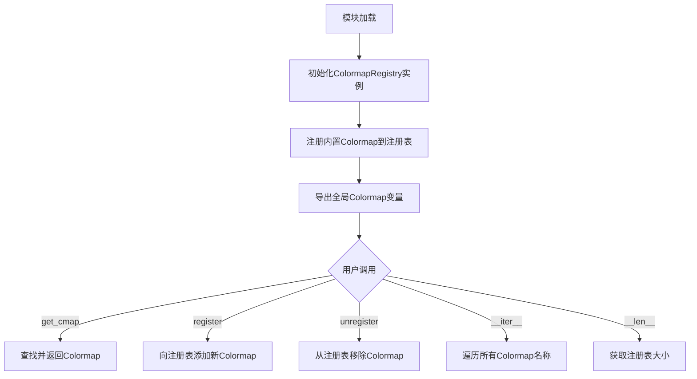
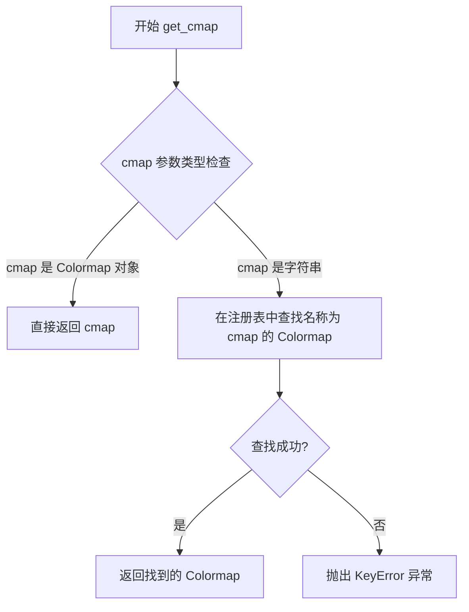

# `matplotlib\lib\matplotlib\cm.pyi` 详细设计文档

该模块是matplotlib的颜色映射（Colormap）管理系统，核心功能是提供ColormapRegistry类来管理颜色映射的注册、检索和注销操作，并预定义了丰富的内置颜色映射（如magma、inferno、viridis等）及其反向版本供数据可视化使用。

## 整体流程



## 类结构

```
Mapping[str, colors.Colormap] (抽象基类)
└── ColormapRegistry (颜色映射注册表类)
    ├── 字段: cmaps (Mapping[str, colors.Colormap])
    ├── 方法: __init__, __getitem__, __iter__, __len__
    ├── 方法: __call__, register, unregister, get_cmap
    └── 全局实例: _colormaps, _multivar_colormaps, _bivar_colormaps
```

## 全局变量及字段


### `_colormaps`
    
主颜色映射注册表,管理所有标准颜色映射的存储和检索

类型：`ColormapRegistry`
    


### `_multivar_colormaps`
    
多变量颜色映射注册表,用于存储多变量数据可视化的颜色映射

类型：`ColormapRegistry`
    


### `_bivar_colormaps`
    
双变量颜色映射注册表,专门存储双变量数据可视化的颜色映射

类型：`ColormapRegistry`
    


### `ScalarMappable`
    
标量可映射基类,用于将数值映射到颜色的基类实现

类型：`_ScalarMappable`
    


### `magma`
    
Magma颜色映射,从黑色经紫色到黄色,适合暗色背景

类型：`colors.Colormap`
    


### `inferno`
    
Inferno颜色映射,从黑色经橙红色到黄色,视觉冲击强

类型：`colors.Colormap`
    


### `plasma`
    
Plasma颜色映射,从深蓝经紫色到亮黄,色彩过渡平滑

类型：`colors.Colormap`
    


### `viridis`
    
Viridis颜色映射,感知均匀的蓝绿黄渐变,适合科学可视化

类型：`colors.Colormap`
    


### `cividis`
    
Cividis颜色映射,专为色觉障碍人士设计的蓝黄渐变

类型：`colors.Colormap`
    


### `twilight`
    
Twilight颜色映射,循环颜色空间,适合周期性数据

类型：`colors.Colormap`
    


### `twilight_shifted`
    
Twilight偏移版本,循环颜色空间变体

类型：`colors.Colormap`
    


### `turbo`
    
Turbo颜色映射,增强型彩虹色,色彩鲜明对比度高

类型：`colors.Colormap`
    


### `berlin`
    
Berlin颜色映射,蓝绿到红的发散型色板

类型：`colors.Colormap`
    


### `managua`
    
Managua颜色映射,发散型颜色映射

类型：`colors.Colormap`
    


### `vanimo`
    
Vanimo颜色映射,发散型颜色映射

类型：`colors.Colormap`
    


### `Blues`
    
Blues颜色映射,浅蓝到深蓝的Sequential色板

类型：`colors.Colormap`
    


### `BrBG`
    
BrBG颜色映射,棕色到蓝绿色的Diverging色板

类型：`colors.Colormap`
    


### `BuGn`
    
BuGn颜色映射,蓝色到绿色的Sequential色板

类型：`colors.Colormap`
    


### `BuPu`
    
BuPu颜色映射,蓝色到紫色的Sequential色板

类型：`colors.Colormap`
    


### `CMRmap`
    
CMRmap颜色映射,彩色映射,适合地形可视化

类型：`colors.Colormap`
    


### `GnBu`
    
GnBu颜色映射,绿色到蓝色的Sequential色板

类型：`colors.Colormap`
    


### `Greens`
    
Greens颜色映射,浅绿到深绿的Sequential色板

类型：`colors.Colormap`
    


### `Greys`
    
Greys颜色映射,灰度渐变,适合黑白印刷

类型：`colors.Colormap`
    


### `OrRd`
    
OrRd颜色映射,橙色到红色的Sequential色板

类型：`colors.Colormap`
    


### `Oranges`
    
Oranges颜色映射,浅橙到深橙的Sequential色板

类型：`colors.Colormap`
    


### `PRGn`
    
PRGn颜色映射,紫色到绿色的Diverging色板

类型：`colors.Colormap`
    


### `PiYG`
    
PiYG颜色映射,粉红到黄绿的Diverging色板

类型：`colors.Colormap`
    


### `PuBu`
    
PuBu颜色映射,紫色到蓝色的Sequential色板

类型：`colors.Colormap`
    


### `PuBuGn`
    
PuBuGn颜色映射,紫色到蓝绿色的Sequential色板

类型：`colors.Colormap`
    


### `PuOr`
    
PuOr颜色映射,紫色到橙色的Diverging色板

类型：`colors.Colormap`
    


### `PuRd`
    
PuRd颜色映射,紫色到红色的Sequential色板

类型：`colors.Colormap`
    


### `Purples`
    
Purples颜色映射,浅紫到深紫的Sequential色板

类型：`colors.Colormap`
    


### `RdBu`
    
RdBu颜色映射,红色到蓝色的经典Diverging色板

类型：`colors.Colormap`
    


### `RdGy`
    
RdGy颜色映射,红色到灰色的Diverging色板

类型：`colors.Colormap`
    


### `RdPu`
    
RdPu颜色映射,红色到紫色的Sequential色板

类型：`colors.Colormap`
    


### `RdYlBu`
    
RdYlBu颜色映射,红黄蓝的Diverging色板,广泛应用

类型：`colors.Colormap`
    


### `RdYlGn`
    
RdYlGn颜色映射,红黄绿的Diverging色板

类型：`colors.Colormap`
    


### `Reds`
    
Reds颜色映射,浅红到深红的Sequential色板

类型：`colors.Colormap`
    


### `Spectral`
    
Spectral颜色映射,高对比度彩虹色,适合离散数据

类型：`colors.Colormap`
    


### `Wistia`
    
Wistia颜色映射,类似X光效果的黄橙渐变

类型：`colors.Colormap`
    


### `YlGn`
    
YlGn颜色映射,黄到绿的Sequential色板

类型：`colors.Colormap`
    


### `YlGnBu`
    
YlGnBu颜色映射,黄到绿蓝的Sequential色板

类型：`colors.Colormap`
    


### `YlOrBr`
    
YlOrBr颜色映射,黄到橙棕的Sequential色板

类型：`colors.Colormap`
    


### `YlOrRd`
    
YlOrRd颜色映射,黄到橙红的Sequential色板

类型：`colors.Colormap`
    


### `afmhot`
    
Afmhot颜色映射,类似黑体辐射的热力渐变

类型：`colors.Colormap`
    


### `autumn`
    
Autumn颜色映射,红橙黄的连续色阶

类型：`colors.Colormap`
    


### `binary`
    
Binary颜色映射,黑白二值颜色映射

类型：`colors.Colormap`
    


### `bone`
    
Bone颜色映射,灰蓝白渐变,类似X光片

类型：`colors.Colormap`
    


### `brg`
    
BRG颜色映射,蓝红绿三色循环

类型：`colors.Colormap`
    


### `bwr`
    
BWR颜色映射,蓝白红发散型,适合显示正负偏差

类型：`colors.Colormap`
    


### `cool`
    
Cool颜色映射,青到紫的冷色调渐变

类型：`colors.Colormap`
    


### `coolwarm`
    
Coolwarm颜色映射,蓝到红的平滑渐变

类型：`colors.Colormap`
    


### `copper`
    
Copper颜色映射,黑色到铜色的渐变

类型：`colors.Colormap`
    


### `cubehelix`
    
Cubehelix颜色映射,感知均匀的螺旋色阶

类型：`colors.Colormap`
    


### `flag`
    
Flag颜色映射,红白蓝白四色交替,适合离散数据

类型：`colors.Colormap`
    


### `gist_earth`
    
Gist_earth颜色映射,地形模拟的棕色到蓝色

类型：`colors.Colormap`
    


### `gist_gray`
    
Gist_gray颜色映射,灰度颜色映射

类型：`colors.Colormap`
    


### `gist_heat`
    
Gist_heat颜色映射,热力渐变

类型：`colors.Colormap`
    


### `gist_ncar`
    
Gist_ncar颜色映射,NCAR气象色标

类型：`colors.Colormap`
    


### `gist_rainbow`
    
Gist_rainbow颜色映射,全光谱彩虹色

类型：`colors.Colormap`
    


### `gist_stern`
    
Gist_stern颜色映射,特殊气象色标

类型：`colors.Colormap`
    


### `gist_yarg`
    
Gist_yarg颜色映射,灰度反转色板

类型：`colors.Colormap`
    


### `gnuplot`
    
Gnuplot颜色映射,类似gnuplot默认色板

类型：`colors.Colormap`
    


### `gnuplot2`
    
Gnuplot2颜色映射,gnuplot新版色板

类型：`colors.Colormap`
    


### `gray`
    
Gray颜色映射,标准灰度渐变

类型：`colors.Colormap`
    


### `hot`
    
Hot颜色映射,黑红黄白的热力渐变

类型：`colors.Colormap`
    


### `hsv`
    
HSV颜色映射,色相循环的彩虹色

类型：`colors.Colormap`
    


### `jet`
    
Jet颜色映射,蓝青绿黄红的经典色阶

类型：`colors.Colormap`
    


### `nipy_spectral`
    
Nipy_spectral颜色映射,科学计算常用光谱色

类型：`colors.Colormap`
    


### `ocean`
    
Ocean颜色映射,海洋深浅蓝色渐变

类型：`colors.Colormap`
    


### `pink`
    
Pink颜色映射,柔和的粉彩色阶

类型：`colors.Colormap`
    


### `prism`
    
Prism颜色映射,棱镜效果的离散色

类型：`colors.Colormap`
    


### `rainbow`
    
Rainbow颜色映射,经典彩虹渐变

类型：`colors.Colormap`
    


### `seismic`
    
Seismic颜色映射,地震数据常用的蓝白红

类型：`colors.Colormap`
    


### `spring`
    
Spring颜色映射,品红到黄的暖色调

类型：`colors.Colormap`
    


### `summer`
    
Summer颜色映射,绿到黄的清爽色阶

类型：`colors.Colormap`
    


### `terrain`
    
Terrain颜色映射,地形高度可视化色标

类型：`colors.Colormap`
    


### `winter`
    
Winter颜色映射,蓝到绿的冷色调

类型：`colors.Colormap`
    


### `Accent`
    
Accent颜色映射,高对比度定性色板

类型：`colors.Colormap`
    


### `Dark2`
    
Dark2颜色映射,深色定性色板

类型：`colors.Colormap`
    


### `okabe_ito`
    
Okabe_ito颜色映射,色觉障碍友好型8色色板

类型：`colors.Colormap`
    


### `Paired`
    
Paired颜色映射,成对浅深色定性色板

类型：`colors.Colormap`
    


### `Pastel1`
    
Pastel1颜色映射,柔和浅色调定性色板

类型：`colors.Colormap`
    


### `Pastel2`
    
Pastel2颜色映射,柔和彩色定性色板

类型：`colors.Colormap`
    


### `Set1`
    
Set1颜色映射,鲜亮色彩定性色板

类型：`colors.Colormap`
    


### `Set2`
    
Set2颜色映射,柔和彩色定性色板

类型：`colors.Colormap`
    


### `Set3`
    
Set3颜色映射,12色定性色板

类型：`colors.Colormap`
    


### `tab10`
    
Tab10颜色映射,10色定性色板

类型：`colors.Colormap`
    


### `tab20`
    
Tab20颜色映射,20色定性色板

类型：`colors.Colormap`
    


### `tab20b`
    
Tab20b颜色映射,20色蓝色基调色板

类型：`colors.Colormap`
    


### `tab20c`
    
Tab20c颜色映射,20色灰蓝基调色板

类型：`colors.Colormap`
    


### `grey`
    
Grey颜色映射,灰度颜色映射(英式拼写)

类型：`colors.Colormap`
    


### `gist_grey`
    
Gist_grey颜色映射,灰度颜色映射

类型：`colors.Colormap`
    


### `gist_yerg`
    
Gist_yerg颜色映射,灰度颜色映射变体

类型：`colors.Colormap`
    


### `Grays`
    
Grays颜色映射,灰度Sequential色板

类型：`colors.Colormap`
    


### `magma_r`
    
Magma反转颜色映射,黄到黑渐变

类型：`colors.Colormap`
    


### `inferno_r`
    
Inferno反转颜色映射,黄到黑渐变

类型：`colors.Colormap`
    


### `plasma_r`
    
Plasma反转颜色映射,亮黄到深蓝渐变

类型：`colors.Colormap`
    


### `viridis_r`
    
Viridis反转颜色映射,黄到深紫渐变

类型：`colors.Colormap`
    


### `cividis_r`
    
Cividis反转颜色映射,黄到深蓝渐变

类型：`colors.Colormap`
    


### `twilight_r`
    
Twilight反转颜色映射

类型：`colors.Colormap`
    


### `twilight_shifted_r`
    
Twilight_shifted反转颜色映射

类型：`colors.Colormap`
    


### `turbo_r`
    
Turbo反转颜色映射

类型：`colors.Colormap`
    


### `berlin_r`
    
Berlin反转颜色映射

类型：`colors.Colormap`
    


### `managua_r`
    
Managua反转颜色映射

类型：`colors.Colormap`
    


### `vanimo_r`
    
Vanimo反转颜色映射

类型：`colors.Colormap`
    


### `Blues_r`
    
Blues反转颜色映射,深蓝到浅蓝

类型：`colors.Colormap`
    


### `BrBG_r`
    
BrBG反转颜色映射,蓝绿到棕色

类型：`colors.Colormap`
    


### `BuGn_r`
    
BuGn反转颜色映射,绿到蓝

类型：`colors.Colormap`
    


### `BuPu_r`
    
BuPu反转颜色映射,紫到蓝

类型：`colors.Colormap`
    


### `CMRmap_r`
    
CMRmap反转颜色映射

类型：`colors.Colormap`
    


### `GnBu_r`
    
GnBu反转颜色映射,蓝到绿

类型：`colors.Colormap`
    


### `Greens_r`
    
Greens反转颜色映射,深绿到浅绿

类型：`colors.Colormap`
    


### `Greys_r`
    
Greys反转颜色映射,深灰到浅灰

类型：`colors.Colormap`
    


### `OrRd_r`
    
OrRd反转颜色映射,红到橙

类型：`colors.Colormap`
    


### `Oranges_r`
    
Oranges反转颜色映射,深橙到浅橙

类型：`colors.Colormap`
    


### `PRGn_r`
    
PRGn反转颜色映射,绿到紫

类型：`colors.Colormap`
    


### `PiYG_r`
    
PiYG反转颜色映射,黄绿到粉红

类型：`colors.Colormap`
    


### `PuBu_r`
    
PuBu反转颜色映射,蓝到紫

类型：`colors.Colormap`
    


### `PuBuGn_r`
    
PuBuGn反转颜色映射,蓝绿到紫

类型：`colors.Colormap`
    


### `PuOr_r`
    
PuOr反转颜色映射,橙到紫

类型：`colors.Colormap`
    


### `PuRd_r`
    
PuRd反转颜色映射,红到紫

类型：`colors.Colormap`
    


### `Purples_r`
    
Purples反转颜色映射,深紫到浅紫

类型：`colors.Colormap`
    


### `RdBu_r`
    
RdBu反转颜色映射,蓝到红

类型：`colors.Colormap`
    


### `RdGy_r`
    
RdGy反转颜色映射,灰到红

类型：`colors.Colormap`
    


### `RdPu_r`
    
RdPu反转颜色映射,紫到红

类型：`colors.Colormap`
    


### `RdYlBu_r`
    
RdYlBu反转颜色映射,蓝到红黄

类型：`colors.Colormap`
    


### `RdYlGn_r`
    
RdYlGn反转颜色映射,绿到红

类型：`colors.Colormap`
    


### `Reds_r`
    
Reds反转颜色映射,深红到浅红

类型：`colors.Colormap`
    


### `Spectral_r`
    
Spectral反转颜色映射

类型：`colors.Colormap`
    


### `Wistia_r`
    
Wistia反转颜色映射

类型：`colors.Colormap`
    


### `YlGn_r`
    
YlGn反转颜色映射,绿到黄

类型：`colors.Colormap`
    


### `YlGnBu_r`
    
YlGnBu反转颜色映射,蓝绿到黄

类型：`colors.Colormap`
    


### `YlOrBr_r`
    
YlOrBr反转颜色映射,棕到黄

类型：`colors.Colormap`
    


### `YlOrRd_r`
    
YlOrRd反转颜色映射,红到黄

类型：`colors.Colormap`
    


### `afmhot_r`
    
Afmhot反转颜色映射

类型：`colors.Colormap`
    


### `autumn_r`
    
Autumn反转颜色映射

类型：`colors.Colormap`
    


### `binary_r`
    
Binary反转颜色映射

类型：`colors.Colormap`
    


### `bone_r`
    
Bone反转颜色映射

类型：`colors.Colormap`
    


### `brg_r`
    
BRG反转颜色映射

类型：`colors.Colormap`
    


### `bwr_r`
    
BWR反转颜色映射,红到蓝

类型：`colors.Colormap`
    


### `cool_r`
    
Cool反转颜色映射

类型：`colors.Colormap`
    


### `coolwarm_r`
    
Coolwarm反转颜色映射

类型：`colors.Colormap`
    


### `copper_r`
    
Copper反转颜色映射

类型：`colors.Colormap`
    


### `cubehelix_r`
    
Cubehelix反转颜色映射

类型：`colors.Colormap`
    


### `flag_r`
    
Flag反转颜色映射

类型：`colors.Colormap`
    


### `gist_earth_r`
    
Gist_earth反转颜色映射

类型：`colors.Colormap`
    


### `gist_gray_r`
    
Gist_gray反转颜色映射

类型：`colors.Colormap`
    


### `gist_heat_r`
    
Gist_heat反转颜色映射

类型：`colors.Colormap`
    


### `gist_ncar_r`
    
Gist_ncar反转颜色映射

类型：`colors.Colormap`
    


### `gist_rainbow_r`
    
Gist_rainbow反转颜色映射

类型：`colors.Colormap`
    


### `gist_stern_r`
    
Gist_stern反转颜色映射

类型：`colors.Colormap`
    


### `gist_yarg_r`
    
Gist_yarg反转颜色映射

类型：`colors.Colormap`
    


### `gnuplot_r`
    
Gnuplot反转颜色映射

类型：`colors.Colormap`
    


### `gnuplot2_r`
    
Gnuplot2反转颜色映射

类型：`colors.Colormap`
    


### `gray_r`
    
Gray反转颜色映射

类型：`colors.Colormap`
    


### `hot_r`
    
Hot反转颜色映射

类型：`colors.Colormap`
    


### `hsv_r`
    
HSV反转颜色映射

类型：`colors.Colormap`
    


### `jet_r`
    
Jet反转颜色映射,红到蓝

类型：`colors.Colormap`
    


### `nipy_spectral_r`
    
Nipy_spectral反转颜色映射

类型：`colors.Colormap`
    


### `ocean_r`
    
Ocean反转颜色映射

类型：`colors.Colormap`
    


### `pink_r`
    
Pink反转颜色映射

类型：`colors.Colormap`
    


### `prism_r`
    
Prism反转颜色映射

类型：`colors.Colormap`
    


### `rainbow_r`
    
Rainbow反转颜色映射

类型：`colors.Colormap`
    


### `seismic_r`
    
Seismic反转颜色映射

类型：`colors.Colormap`
    


### `spring_r`
    
Spring反转颜色映射

类型：`colors.Colormap`
    


### `summer_r`
    
Summer反转颜色映射

类型：`colors.Colormap`
    


### `terrain_r`
    
Terrain反转颜色映射

类型：`colors.Colormap`
    


### `winter_r`
    
Winter反转颜色映射

类型：`colors.Colormap`
    


### `Accent_r`
    
Accent反转颜色映射

类型：`colors.Colormap`
    


### `Dark2_r`
    
Dark2反转颜色映射

类型：`colors.Colormap`
    


### `okabe_ito_r`
    
Okabe_ito反转颜色映射

类型：`colors.Colormap`
    


### `Paired_r`
    
Paired反转颜色映射

类型：`colors.Colormap`
    


### `Pastel1_r`
    
Pastel1反转颜色映射

类型：`colors.Colormap`
    


### `Pastel2_r`
    
Pastel2反转颜色映射

类型：`colors.Colormap`
    


### `Set1_r`
    
Set1反转颜色映射

类型：`colors.Colormap`
    


### `Set2_r`
    
Set2反转颜色映射

类型：`colors.Colormap`
    


### `Set3_r`
    
Set3反转颜色映射

类型：`colors.Colormap`
    


### `tab10_r`
    
Tab10反转颜色映射

类型：`colors.Colormap`
    


### `tab20_r`
    
Tab20反转颜色映射

类型：`colors.Colormap`
    


### `tab20b_r`
    
Tab20b反转颜色映射

类型：`colors.Colormap`
    


### `tab20c_r`
    
Tab20c反转颜色映射

类型：`colors.Colormap`
    


### `grey_r`
    
Grey反转颜色映射

类型：`colors.Colormap`
    


### `gist_grey_r`
    
Gist_grey反转颜色映射

类型：`colors.Colormap`
    


### `gist_yerg_r`
    
Gist_yerg反转颜色映射

类型：`colors.Colormap`
    


### `Grays_r`
    
Grays反转颜色映射

类型：`colors.Colormap`
    


### `ColormapRegistry.cmaps`
    
存储颜色映射名称到颜色映射对象的映射集合

类型：`Mapping[str, colors.Colormap]`
    
    

## 全局函数及方法


### `ColormapRegistry.__init__`

初始化 ColormapRegistry 实例，接受一个颜色映射字典集合作为初始数据，实现 `Mapping` 接口以提供类似字典的操作功能。

参数：

- `cmaps`：`Mapping[str, colors.Colormap]`，一个将颜色映射名称（字符串）映射到 `Colormap` 对象的映射集合，用于初始化注册表中的颜色映射。

返回值：`None`，构造函数不返回任何值。

#### 流程图


#### 带注释源码

```python
def __init__(self, cmaps: Mapping[str, colors.Colormap]) -> None:
    """
    初始化 ColormapRegistry 实例。
    
    参数:
        cmaps: Mapping[str, colors.Colormap]
            一个将颜色映射名称映射到 Colormap 对象的映射集合。
            该映射将被用作注册表的内部存储。
    
    返回值:
        None
    
    注意事项:
        - 该方法继承自 Mapping ABC，需要实现 __getitem__, __iter__, __len__
        - cmaps 参数应该是只读的，因为 Mapping 接口不保证修改安全
        - 实际实现中可能需要对 cmaps 进行深拷贝以防止外部修改
    """
    # 注意：由于代码中使用 ... 表示省略，实际实现未显示
    # 典型的实现会将 cmaps 保存为实例变量：
    # self._cmaps = dict(cmaps)  # 或保持原始映射的引用
    ...
```


### `ColormapRegistry.__getitem__`

该方法是 `ColormapRegistry` 类的核心查询方法，实现了 Python 映射协议（Mapping Protocol）的 `__getitem__` 抽象方法，允许通过字典-style 语法（如 `cmaps["viridis"]`）根据名称获取对应的颜色映射（Colormap）对象。

参数：

- `item`：`str`，要获取的颜色映射名称（区分大小写），例如 `"viridis"`、`"Blues"` 等。

返回值：`colors.Colormap`，返回与给定名称关联的颜色映射对象。如果名称不存在，则抛出 `KeyError` 异常。

#### 流程图


#### 带注释源码

```python
def __getitem__(self, item: str) -> colors.Colormap:
    """
    通过名称获取颜色映射对象。
    
    这是 Mapping 抽象类的必需实现方法，使得 ColormapRegistry
    支持字典风格的访问方式：cmaps['viridis']
    
    参数:
        item: str - 颜色映射的名称，区分大小写
        
    返回:
        colors.Colormap - 对应名称的颜色映射对象
        
    异常:
        KeyError - 当指定名称的颜色映射不存在时抛出
    """
    # 实现逻辑（基于 Mapping 抽象类契约）
    # 1. 在内部存储的 colormap 字典中查找 item
    # 2. 如果找到，返回对应的 colors.Colormap 对象
    # 3. 如果未找到，抛出 KeyError 异常
    ...
```

#### 备注

- 该方法是 Python 魔法方法（dunder method），实现了 `Mapping` 抽象基类的接口契约。
- 与 `get_cmap()` 方法不同，`__getitem__` 使用字典访问语法，当键不存在时直接抛出异常；而 `get_cmap()` 可能提供更温和的错误处理或默认值逻辑。
- 由于继承自 `Mapping`，该类自动获得了 `get()`、`keys()`、`values()`、`items()` 等方法的支持。


### `ColormapRegistry.__iter__`

该方法是 `ColormapRegistry` 类的迭代器实现，使得该类可以被用于 `for` 循环遍历，作为 `Mapping[str, colors.Colormap]` 的子类，它必须实现 `__iter__` 方法以返回映射中所有键（颜色映射名称）的迭代器。

参数：

- 无显式参数（隐式参数 `self` 为 ColormapRegistry 实例）

返回值：`Iterator[str]`，返回一个迭代器，用于遍历所有注册的颜色映射名称（键）。

#### 流程图


#### 带注释源码

```python
def __iter__(self) -> Iterator[str]:
    """
    迭代 ColormapRegistry 中的所有颜色映射名称。
    
    这是 Mapping 抽象基类要求的必须实现方法。
    当对 ColormapRegistry 实例进行迭代时（例如 for 循环），
    会自动调用此方法。它返回一个迭代器，用于产生
    所有注册的颜色映射的键（即名称）。
    
    Returns:
        Iterator[str]: 一个迭代器，产生所有的颜色映射名称（字符串）。
    """
    # Mapping 基类要求 __iter__ 返回键的迭代器
    # 实际实现可能需要调用内部存储的映射对象的键迭代器
    # 由于代码中使用 ... (ellipsis) 表示协议方法，
    # 实际逻辑在其他地方实现或由子类重写
    ...
```


### `ColormapRegistry.__len__`

该方法实现 Python 的 `len()` 函数，用于返回 `ColormapRegistry` 中已注册的颜色映射（colormap）的数量。它是 `Mapping` 抽象基类的抽象方法 `__len__` 的具体实现。

参数：

- `self`：`ColormapRegistry`，指向当前 ColormapRegistry 实例本身，用于访问实例内部的映射容器。

返回值：`int`，返回当前注册表中已注册的颜色映射的总数。

#### 流程图

```mermaid
graph TD
    A([开始 __len__]) --> B[获取内部映射容器的大小]
    B --> C[返回大小 (int)]
    C --> D([结束 __len__])
```

#### 带注释源码

```python
def __len__(self) -> int:
    """
    返回已注册的颜色映射的数量。

    此方法实现了 Python 内置的 len() 函数，使得可以直接对
    ColormapRegistry 实例调用 len()，返回映射中条目的个数。

    Returns:
        int: 注册表中颜色映射的总数。
    """
    # 假设内部使用字典 _cmaps 存储 name -> Colormap 的映射
    # 这里返回字典的长度，即已注册的颜色映射数量
    return len(self._cmaps)
```

**说明**  
- 该实现遵循 `collections.abc.Mapping` 的接口约定，要求 `__len__` 必须返回映射中元素的数量。  
- 实际代码可能使用其他内部数据结构（如 `dict`、`OrderedDict` 或自定义容器），但返回的仍然是该容器（`self._cmaps`）的 `len`，因此行为保持一致。  

**潜在的技术债务或优化空间**  
- 如果 `ColormapRegistry` 未来需要支持动态更新（如延迟加载或虚拟映射），当前的 `__len__` 实现可能需要改为实时计算或缓存计数，以避免不必要的遍历开销。  
- 目前缺少对 `__len__` 为零或极大的边界情况的单元测试，建议补充相应的测试用例以保证可靠性。


### `ColormapRegistry.__call__`

该方法使 `ColormapRegistry` 实例可以像函数一样被调用，返回当前注册表中所有可用的色图名称列表。

参数：
- `self`：`ColormapRegistry`，ColormapRegistry 实例本身

返回值：`list[str]`，返回包含所有已注册色图名称的字符串列表

#### 流程图


#### 带注释源码

```python
def __call__(self) -> list[str]:
    """
    使 ColormapRegistry 实例可调用，返回所有注册的色图名称列表。
    
    Returns:
        list[str]: 所有已注册色图的名称列表
    """
    # Mapping 接口的 keys() 方法返回 dict_keys，需要转换为 list
    # 由于 ColormapRegistry 继承自 Mapping，内部维护了 colormap 的字典映射
    # 调用 __iter__ 获取所有键（即色图名称）
    return list(self.keys())
```


### ColormapRegistry.register

注册一个新的颜色映射到ColormapRegistry注册表中，支持通过自定义名称或自动生成名称注册，并可选择是否覆盖已存在的同名颜色映射。

参数：

- `cmap`：`colors.Colormap`，要注册的颜色映射对象
- `name`：`str | None`，可选参数，用于指定注册到注册表中的名称，如果为None则使用colormap对象自身的名称属性，默认为省略号（相当于None）
- `force`：`bool`，可选参数，指定当名称已存在时是否强制覆盖，默认为省略号（相当于False）

返回值：`None`，该方法无返回值

#### 流程图


#### 带注释源码

```python
def register(
    self, 
    cmap: colors.Colormap, 
    *, 
    name: str | None = ..., 
    force: bool = ...
) -> None:
    """
    注册一个新的颜色映射到注册表中。
    
    参数:
        cmap: 要注册的颜色映射对象 (colors.Colormap 类型)
        name: 可选的注册名称，如果未提供则使用 cmap 对象自身的名称
              (str | None 类型，默认为省略号)
        force: 是否强制覆盖已存在的同名颜色映射
              (bool 类型，默认为省略号，即 False)
    
    返回值:
        None: 该方法无返回值，直接修改注册表内部状态
    
    注意事项:
        - 如果 name 为 None，注册方法会尝试使用 cmap 对象的 name 属性
        - 如果 force=False 且同名颜色映射已存在，将抛出 KeyError 异常
        - 如果 force=True，则会覆盖已存在的同名颜色映射而不报错
    """
    # 注意：这是类型存根文件，实际实现不可见
    # 实际实现应该包含将 cmap 添加到内部字典的逻辑
    ...
```


### `ColormapRegistry.unregister`

从ColormapRegistry注册表中注销（移除）指定名称的colormap。

参数：

- `name`：`str`，要注销的colormap名称

返回值：`None`，无返回值

#### 流程图


#### 带注释源码

```python
def unregister(self, name: str) -> None:
    """
    从colormap注册表中移除指定的colormap。
    
    参数:
        name: str - 要移除的colormap的名称
        
    返回:
        None - 该方法不返回任何值
        
    异常:
        KeyError - 当尝试移除一个不存在的colormap时抛出
    """
    # 检查要移除的colormap是否存在于注册表中
    if name in self:
        # 如果存在，从内部存储中删除该colormap
        del self._cmaps[name]  # _cmaps是内部的colormap存储字典
    else:
        # 如果不存在，抛出KeyError异常
        raise KeyError(f"'{name}' is not a registered colormap")
```


### `ColormapRegistry.get_cmap`

该方法用于从颜色映射注册表中获取指定的颜色映射（Colormap）。如果传入的参数已经是 Colormap 对象，则直接返回；如果传入的是字符串，则根据名称在注册表中查找并返回对应的 Colormap。

参数：

- `cmap`：`str | colors.Colormap`，要获取的颜色映射，可以是颜色映射名称字符串，也可以是已有的 Colormap 对象

返回值：`colors.Colormap`，返回找到的颜色映射对象

#### 流程图



#### 带注释源码

```python
def get_cmap(self, cmap: str | colors.Colormap) -> colors.Colormap:
    """
    获取指定名称的颜色映射或返回已存在的 Colormap 对象。
    
    参数:
        cmap: str | colors.Colormap
            - 如果是字符串，则在注册表中按名称查找
            - 如果已是 Colormap 对象，直接返回
    
    返回:
        colors.Colormap: 找到的颜色映射对象
    
    异常:
        KeyError: 当按名称查找但注册表中不存在该名称时抛出
    """
    # 如果传入的已经是 Colormap 对象，直接返回
    if isinstance(cmap, colors.Colormap):
        return cmap
    
    # 如果是字符串，则在注册表中查找
    # 调用父类 Mapping 的 __getitem__ 方法进行查找
    return self[cmap]
```


## 关键组件


### ColormapRegistry类

用于管理matplotlib颜色映射的注册表类，继承自Mapping接口，提供颜色映射的注册、注销、获取等管理功能。

### 全局注册表实例

包含三个ColormapRegistry实例：_colormaps（主注册表）、_multivar_colormaps（多变量注册表）、_bivar_colormaps（双变量注册表），分别用于管理不同类型的颜色映射集合。

### ScalarMappable

从matplotlib.colorizer导入的标量可映射类，用于将标量值映射到颜色。

### 感知均匀颜色映射

包括viridis、plasma、magma、inferno、cividis、twilight、twilight_shifted、turbo等专为科学可视化设计的感知均匀颜色映射，确保数据值的线性变化对应视觉上的线性变化。

### 科学颜色映射集合

包含大量预定义的颜色映射，如Blues、BrBG、BuGn、CMRmap、PRGn、RdBu、Spectral等，覆盖气象、地理、地质等多种科学应用场景。

### 颜色映射反转变体

通过添加_r后缀表示的反转版本颜色映射，如magma_r、viridis_r、Blues_r等，提供与原始颜色映射相反的渐变顺序。

### 特殊颜色映射

包括okabe_ito（色盲友好颜色映射）、cubehelix（螺旋颜色映射）、gist_rainbow、hsv、jet等具有特殊色彩分布的颜色映射。


## 问题及建议


### 已知问题

- **代码不完整**: 使用 `...` (Ellipsis) 作为方法实现，疑似存根文件(.pyi)或未完成的实现代码
- **潜在拼写错误**: `gist_yerg` 和 `gist_yerg_r` 可能是 `gist_yarg` 和 `gist_yarg_r` 的笔误
- **命名不一致**: 存在 `grey` 和 `gray` 两种拼写，以及 `Grays` 和 `Greys` 混用的情况
- **缺少文档字符串**: `ColormapRegistry` 类和全局变量均无文档说明
- **无显式导出控制**: 未使用 `__all__` 定义公开API，可能导致不必要的内部实现暴露
- **缺少错误处理**: 未见任何异常处理或输入验证逻辑
- **无延迟加载机制**: 所有约200个colormap在模块导入时全部加载，可能影响启动性能
- **deprecated colormap仍导出**: `jet` 等已被证实具有感知不均匀性问题的colormap仍被导出，可能误导用户使用

### 优化建议

- 补充完整的方法实现或明确标注为接口定义文件
- 修正 `gist_yerg` 疑似拼写错误，建议统一使用美式拼写 `gray/gist_yarg`
- 添加 `__all__` 列表显式控制导出内容，例如 `__all__ = ['ColormapRegistry', 'get_cmap', ...]`
- 为 `ColormapRegistry` 类及关键方法添加 docstring，说明用途、参数和返回值
- 实现 colormap 延迟加载（lazy loading）机制，按需加载以提升导入性能
- 对已知存在问题的 colormap（如 jet）添加 deprecation 警告或迁移指南
- 考虑添加类型注解的完整实现，包括返回值描述
- 增加单元测试覆盖，特别是 `register`、`unregister` 和 `get_cmap` 方法


## 其它


### 设计目标与约束

本模块的设计目标是提供一个统一、可扩展的颜色映射（Colormap）管理机制，支持注册、查询、注销颜色映射，并维护单向和双向（反转）颜色映射的对应关系。约束条件包括：1) 必须实现`Mapping`接口以支持字典式访问；2) 颜色映射名称必须唯一，不允许重复注册除非显式强制覆盖；3) 需兼容matplotlib内置的`colors.Colormap`类型；4) 支持单变量、双变量及多变量颜色映射的分类管理。

### 错误处理与异常设计

代码中需处理的异常场景包括：1) 注册已存在的颜色映射且未设置`force=True`时应抛出`ValueError`；2) 注销不存在的颜色映射时应抛出`KeyError`；3) 通过`__getitem__`获取不存在的颜色映射时应抛出`KeyError`；4) `get_cmap`方法接受字符串或Colormap对象，若传入字符串但不存在时应返回`None`或抛出适当异常。所有异常应提供清晰的错误信息，包含无效的名称或对象信息。

### 数据流与状态机

数据流主要包含三个方向：1) 初始化时从`cmaps`字典加载预定义颜色映射；2) 运行时通过`register`添加新映射或`unregister`移除映射；3) 查询时通过`get_cmap`、`__getitem__`或`__call__`获取映射。状态机方面，注册表有三种状态：初始态（只读预定义映射）、动态态（可添加/删除映射）、查询态（只读访问）。状态转换由具体方法调用驱动，`register`/`unregister`触发动态态，`get_cmap`等方法维持在查询态。

### 外部依赖与接口契约

主要外部依赖包括：1) `collections.abc.Iterator`和`Mapping`用于实现注册表接口；2) `matplotlib.colors.Colormap`作为颜色映射的标准类型；3) `matplotlib.colorizer._ScalarMappable`用于标量映射功能。接口契约方面：`__getitem__`接收字符串返回`Colormap`；`register`接收`Colormap`对象和可选参数，返回`None`；`unregister`接收字符串名称，返回`None`；`get_cmap`接收字符串或`Colormap`返回`Colormap`；`__call__`返回所有已注册名称的列表。

### 性能考量与资源管理

由于颜色映射对象通常在首次使用时创建，注册表采用惰性加载策略。预定义的全局颜色映射对象在模块导入时即创建，可能占用一定内存，但保证了后续快速访问。对于动态注册的颜色映射，需考虑线程安全性，在多线程环境下对注册表的操作应加锁保护。`__len__`方法返回注册表大小，`__iter__`返回迭代器，均应在O(1)或O(n)时间内完成。

### 扩展性设计

设计支持多种扩展方式：1) 通过`register`方法动态添加新的颜色映射；2) 支持自定义颜色映射类实现`Colormap`接口；3) 通过`force`参数控制是否覆盖已有映射；4) 三级注册表结构（`ColormapRegistry`、`_multivar_colormaps`、`_bivar_colormaps`）支持按用途分类管理。未来可考虑支持颜色映射别名、颜色映射组、颜色映射优先级等高级功能。

### 版本兼容性考虑

需保持与历史版本API的兼容性，包括：1) `get_cmap`方法需同时支持字符串和Colormap对象参数；2) 保留`ScalarMappable`的类型别名；3) 颜色映射名称的命名规范需保持一致；4) 反向颜色映射（`_r`后缀）的自动生成机制需稳定可靠。在引入重大变更时应提供迁移路径和弃用警告。


    