# `matplotlib\lib\matplotlib\collections.pyi` 详细设计文档

该模块定义了一系列用于管理和渲染大量图形元素（如路径、面、线）的类，它们继承自Artist基类，通过批量处理和属性映射（如颜色、偏移）来优化Matplotlib中的渲染性能。

## 整体流程

```mermaid
graph TD
    User[用户/调用者] -->|创建实例| Create[实例化 Collection (如 PathCollection)]
    Create -->|设置数据| SetData[调用 set_paths / set_offsets / set_verts]
    SetData -->|设置样式| SetStyle[调用 set_color / set_alpha / set_linewidth]
    SetStyle -->|渲染阶段| Render[Matplotlib 渲染器调用 get_paths / get_datalim]
    Render -->|绘制| Draw[canvas.draw]
    Draw -->|交互事件| Event[处理鼠标事件 (get_cursor_data)]
```

## 类结构

```
Collection (基类)
├── _CollectionWithSizes (尺寸混入)
│   ├── PathCollection
│   ├── PolyCollection
│   │   └── FillBetweenPolyCollection
│   ├── RegularPolyCollection
│   │   ├── StarPolygonCollection
   │   └── AsteriskPolygonCollection
│   └── CircleCollection
├── LineCollection
│   └── EventCollection
├── EllipseCollection
├── PatchCollection
├── TriMesh
└── _MeshData (数据容器)
    ├── QuadMesh (继承 Collection)
    └── PolyQuadMesh (继承 PolyCollection)
```

## 全局变量及字段


### `get_paths`
    
获取集合中的所有路径对象

类型：`() -> Sequence[Path]`
    


### `set_paths`
    
设置集合中的路径对象

类型：`(paths: Sequence[Path]) -> None`
    


### `get_offsets`
    
获取所有元素的偏移量

类型：`() -> ArrayLike`
    


### `set_offsets`
    
设置所有元素的偏移量

类型：`(offsets: ArrayLike) -> None`
    


### `set_color`
    
设置填充和边框颜色

类型：`(c: ColorType | Sequence[ColorType]) -> None`
    


### `set_facecolor`
    
设置填充颜色

类型：`(c: ColorType | Sequence[ColorType]) -> None`
    


### `get_edgecolor`
    
获取边框颜色

类型：`() -> ColorType | Sequence[ColorType]`
    


### `get_datalim`
    
获取数据边界框

类型：`(transData: transforms.Transform) -> transforms.Bbox`
    


### `update_scalarmappable`
    
更新标量映射数据

类型：`() -> None`
    


### `set_pickradius`
    
设置拾取半径

类型：`(pickradius: float) -> None`
    


### `set_verts`
    
设置多边形顶点

类型：`(verts: Sequence[ArrayLike | Path], closed: bool = ...) -> None`
    


### `set_verts_and_codes`
    
设置顶点及路径编码

类型：`(verts: Sequence[ArrayLike | Path], codes: Sequence[int]) -> None`
    


### `get_numsides`
    
获取多边形边数

类型：`() -> int`
    


### `get_rotation`
    
获取旋转角度

类型：`() -> float`
    


### `set_segments`
    
设置线段集合

类型：`(segments: Sequence[ArrayLike] | None) -> None`
    


### `set_color`
    
设置线段颜色

类型：`(c: ColorType | Sequence[ColorType]) -> None`
    


### `set_gapcolor`
    
设置线段间隙颜色

类型：`(gapcolor: ColorType | Sequence[ColorType] | None) -> None`
    


### `get_colors`
    
获取线段颜色

类型：`() -> ColorType | Sequence[ColorType]`
    


### `get_gapcolor`
    
获取间隙颜色

类型：`() -> ColorType | Sequence[ColorType] | None`
    


### `get_positions`
    
获取事件位置

类型：`() -> list[float]`
    


### `set_positions`
    
设置事件位置

类型：`(positions: Sequence[float] | None) -> None`
    


### `add_positions`
    
添加事件位置

类型：`(position: Sequence[float] | None) -> None`
    


### `extend_positions`
    
扩展事件位置

类型：`(position: Sequence[float] | None) -> None`
    


### `switch_orientation`
    
切换方向（水平/垂直）

类型：`() -> None`
    


### `is_horizontal`
    
判断是否为水平方向

类型：`() -> bool`
    


### `set_array`
    
设置数据数组

类型：`(A: ArrayLike | None) -> None`
    


### `get_coordinates`
    
获取坐标网格数据

类型：`() -> ArrayLike`
    


### `get_facecolor`
    
获取面颜色

类型：`() -> ColorType | Sequence[ColorType]`
    


### `get_edgecolor`
    
获取边框颜色

类型：`() -> ColorType | Sequence[ColorType]`
    


### `get_paths`
    
获取网格路径

类型：`() -> list[Path]`
    


### `set_paths`
    
设置网格路径（空实现）

类型：`() -> None`
    


### `get_datalim`
    
获取数据边界

类型：`(transData: transforms.Transform) -> transforms.Bbox`
    


### `get_cursor_data`
    
获取鼠标位置数据

类型：`(event: MouseEvent) -> float`
    


### `Collection.edgecolors`
    
边框颜色

类型：`ColorType | Sequence[ColorType] | None`
    


### `Collection.facecolors`
    
填充颜色

类型：`ColorType | Sequence[ColorType] | None`
    


### `Collection.hatchcolors`
    
阴影颜色

类型：`ColorType | Sequence[ColorType] | Literal["edge"] | None`
    


### `Collection.linewidths`
    
线宽

类型：`float | Sequence[float] | None`
    


### `Collection.linestyles`
    
线型

类型：`LineStyleType | Sequence[LineStyleType]`
    


### `Collection.offsets`
    
偏移量

类型：`tuple[float, float] | Sequence[tuple[float, float]] | None`
    


### `Collection.offset_transform`
    
偏移变换

类型：`transforms.Transform | None`
    


### `Collection.zorder`
    
渲染层级

类型：`float`
    


### `PolyCollection.closed`
    
是否闭合

类型：`bool`
    


### `RegularPolyCollection.numsides`
    
边数

类型：`int`
    


### `RegularPolyCollection.rotation`
    
旋转角度

类型：`float`
    


### `LineCollection.segments`
    
线段集合

类型：`Sequence[ArrayLike]`
    


### `EventCollection.positions`
    
位置

类型：`ArrayLike`
    


### `EventCollection.orientation`
    
方向: horizontal/vertical

类型：`Literal["horizontal", "vertical"]`
    


### `EventCollection.linelength`
    
线长

类型：`float | Sequence[float]`
    


### `EventCollection.lineoffset`
    
线偏移

类型：`float`
    


### `QuadMesh.coordinates`
    
坐标网格

类型：`ArrayLike`
    


### `QuadMesh.antialiased`
    
抗锯齿

类型：`bool`
    


### `QuadMesh.shading`
    
着色方式: flat/gouraud

类型：`Literal["flat", "gouraud"]`
    


### `_MeshData.coordinates`
    
坐标数据

类型：`ArrayLike`
    


### `_MeshData.shading`
    
着色方式

类型：`Literal["flat", "gouraud"]`
    
    

## 全局函数及方法


### `Collection.get_paths`

该方法返回当前 Collection 实例中存储的所有 Path 对象序列，用于获取集合图形的几何路径信息，是 Collection 类中最基础的路径访问接口。

参数：无

返回值：`Sequence[Path]`，返回该 Collection 包含的所有 Path 对象序列，每个 Path 代表一个独立的图形元素。

#### 流程图

```mermaid
flowchart TD
    A[调用 get_paths 方法] --> B{Collection 是否有缓存的 paths}
    B -->|是| C[直接返回缓存的 paths 序列]
    B -->|否| D[根据子类实现生成 paths]
    C --> E[返回 Sequence[Path]]
    D --> E
```

#### 带注释源码

```python
def get_paths(self) -> Sequence[Path]:
    """
    返回该 Collection 包含的所有 Path 对象序列。
    
    这是一个抽象方法的实现（具体逻辑在子类中），
    用于获取集合中所有图形元素的路径数据。
    
    Returns:
        Sequence[Path]: 包含所有 Path 对象的不可变序列
    """
    # 具体的实现逻辑依赖于子类的具体实现
    # 例如：PathCollection、PolyCollection 等子类会有不同的内部存储方式
    ...
```

#### 关键组件信息

- **Path**：表示图形路径的几何对象，包含顶点和操作码
- **Sequence[Path]**：Path 对象的不可变序列，用于批量传递路径数据
- **Collection**：基类，提供图形集合的统一接口和管理能力

#### 潜在的技术债务或优化空间

1. **缓存机制缺失**：当前实现中未明确看到路径缓存机制，如果路径数据较大且频繁访问，可能存在性能优化空间
2. **抽象程度不足**：虽然声明了返回值类型，但具体实现分散在各个子类中，缺少统一的默认实现
3. **文档完整性**：仅知道返回 Sequence[Path]，但未说明空集合、异常情况等边界条件

#### 其它项目

- **设计目标与约束**：作为只读访问接口，不修改内部状态
- **错误处理与异常设计**：未在接口定义中体现错误处理逻辑
- **数据流与状态机**：路径数据通常在初始化时设置，后续通过此方法读取
- **外部依赖与接口契约**：依赖 Path 类的定义，属于 matplotlib 图形渲染系统的核心接口之一


### `Collection.set_paths`

设置 Collection 对象的路径集合，用于定义 Collection 所包含的图形元素（如线条、多边形等）的几何形状。

参数：

- `paths`：`Sequence[Path]`，要设置的 Path 对象序列，定义 Collection 的图形元素

返回值：`None`，无返回值，仅修改对象内部状态

#### 流程图

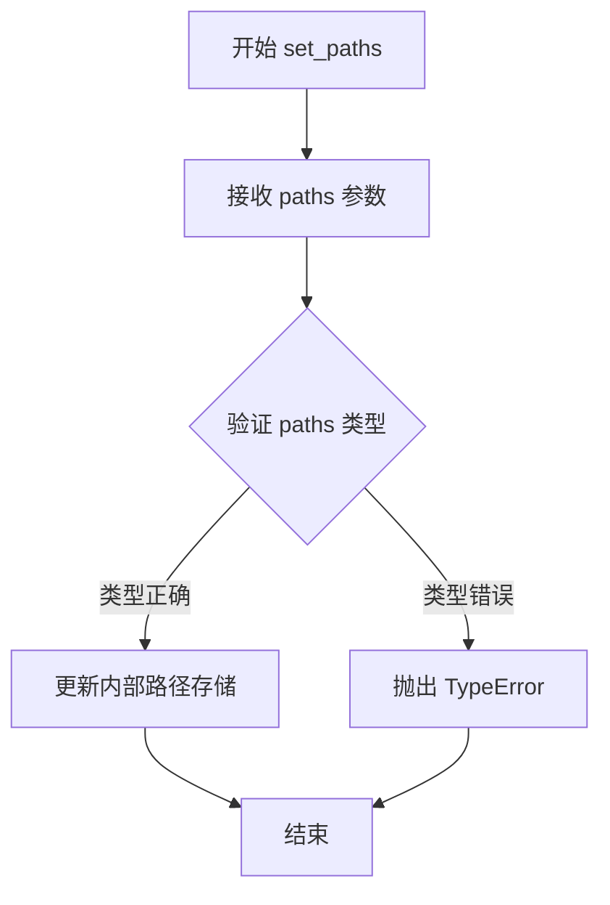

#### 带注释源码

```
def set_paths(self, paths: Sequence[Path]) -> None:
    """
    设置 Collection 的路径集合。
    
    参数:
        paths: Sequence[Path] - 要设置的 Path 对象序列。
               每个 Path 定义一个图形元素的几何形状。
    
    返回:
        None - 此方法不返回值，仅修改对象内部状态。
    
    说明:
        - 此方法用于批量更新 Collection 中的所有路径
        - paths 序列中的每个 Path 对象将被用于渲染对应的图形元素
        - 通常在需要动态更新图形形状时调用
    """
    # 实际的实现会将 paths 存储到对象内部属性中
    # 具体实现可能因 Collection 的子类而异
    self._paths = paths
```


### `Collection.get_offsets`

该方法用于获取 `Collection` 对象的偏移量（offsets），偏移量定义了集合中每个艺术对象在图形坐标系中的位置。

参数：

- （无显式参数，隐式参数 `self` 为 `Collection` 实例）

返回值：`ArrayLike`，返回集合中所有艺术对象的偏移量数组，通常为形状为 `(n, 2)` 的二维数组，其中每行表示一个对象的 `(x, y)` 坐标。

#### 流程图

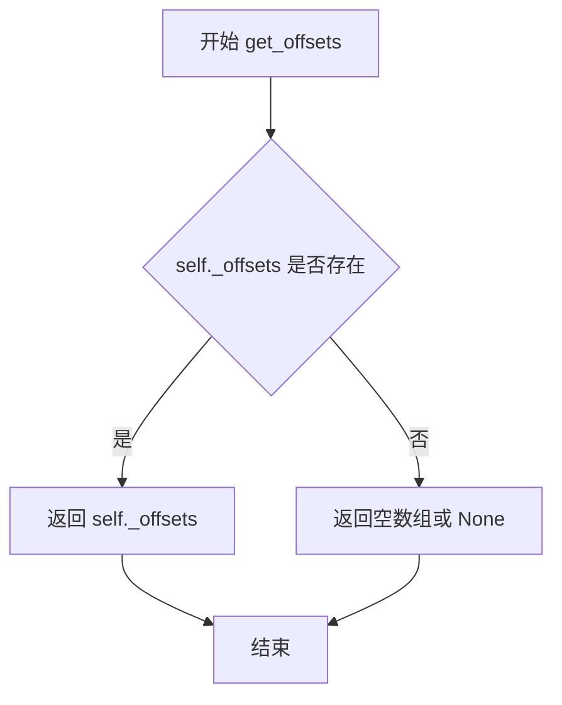

#### 带注释源码

```python
def get_offsets(self) -> ArrayLike:
    """
    获取集合的偏移量。
    
    偏移量定义了集合中每个艺术对象的位置，通常以 (x, y) 坐标对的形式存储。
    在 matplotlib 中，许多集合类（如散点图、线集合等）使用偏移量来定位其元素。
    
    Returns
    -------
    ArrayLike
        返回形状为 (n, 2) 的数组，其中 n 是元素数量，每行包含 (x, y) 偏移坐标。
        如果未设置偏移量，通常返回空数组或 None（取决于具体实现）。
        
    See Also
    --------
    set_offsets : 设置偏移量。
    offset_transform : 偏移量的坐标变换方式。
    
    Notes
    -----
    偏移量通常用于以下场景：
    - PathCollection：散点图中的每个点
    - LineCollection：线段的起始点
    - EventCollection：事件标记的位置
    
    偏移量的坐标系统由 offset_transform 决定，可以是数据坐标、显示坐标等。
    """
    # 访问内部存储的偏移量属性
    # 在实际的 matplotlib 实现中，这通常是一个私有属性 _offsets
    # 类型为 numpy 数组，形状为 (n, 2)
    return self._offsets
```


### `Collection.set_offsets`

设置集合对象的偏移量（位置），用于控制集合中每个元素的绘制位置。

参数：

- `self`：`Collection`，集合对象实例（隐式参数）
- `offsets`：`ArrayLike`，偏移量数组，格式为 `(x, y)` 或 `[(x1, y1), (x2, y2), ...]`，表示每个元素的坐标位置

返回值：`None`，无返回值

#### 流程图

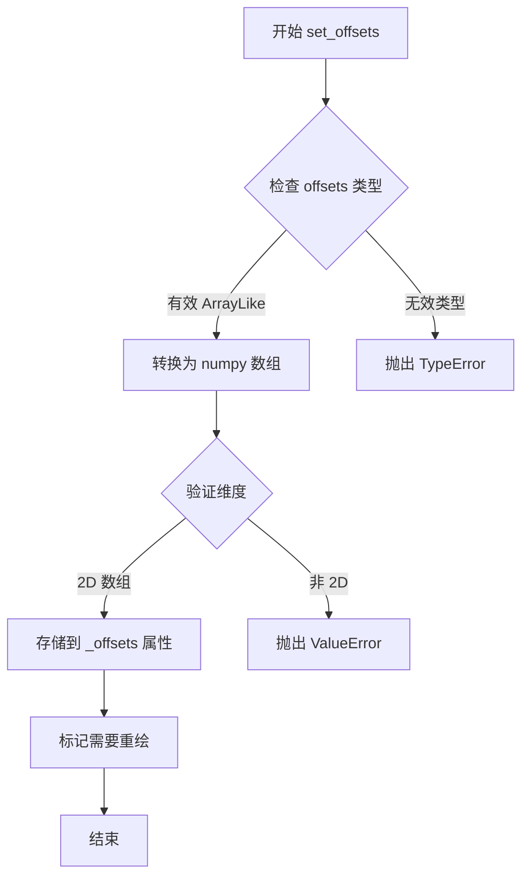

#### 带注释源码

```python
def set_offsets(self, offsets: ArrayLike) -> None:
    """
    设置集合的偏移量。
    
    参数:
        offsets: ArrayLike
            偏移量数组，格式为 (N, 2) 的二维数组，
            其中每行表示一个元素的 (x, y) 坐标位置
            
    返回:
        None
        
    注意:
        - offsets 通常是 numpy 数组或类似数组结构
        - 形状应为 (n_offsets, 2)，即 n_offsets 个点，每个点 2 个坐标
        - 此操作会触发视图重绘
    """
    # 将输入转换为 numpy 数组以统一处理
    # 验证数组维度是否符合要求 (N, 2)
    # 存储到内部属性 _offsets 中
    # 标记 Artist 需要重新绘制
```


### `Collection.set_color`

设置 Collection 对象的颜色，同时影响填充颜色（facecolor）和边框颜色（edgecolor）。这是管理集合图形外观的核心方法之一。

参数：

- `c`：`ColorType | Sequence[ColorType]`，要设置的颜色值，可以是单个颜色或颜色序列

返回值：`None`，无返回值

#### 流程图

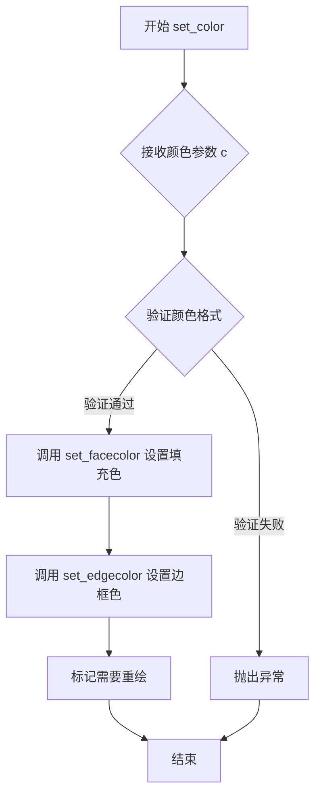

#### 带注释源码

```
def set_color(self, c: ColorType | Sequence[ColorType]) -> None:
    """
    设置 Collection 的颜色。
    
    该方法同时设置填充颜色（facecolor）和边框颜色（edgecolor），
    使集合中的所有元素呈现统一的颜色。如果需要单独设置，
    请使用 set_facecolor 或 set_edgecolor 方法。
    
    参数:
        c: 颜色值，可以是以下格式之一：
           - 单一颜色: '#FF0000', 'red', (1, 0, 0), 0xFF0000
           - 颜色序列: ['red', 'blue'], ['#FF0000', (0, 0, 1)]
           - RGBA 元组: (1.0, 0.0, 0.0, 1.0)
    """
    # 设置填充颜色
    self.set_facecolor(c)
    
    # 设置边框颜色（默认与填充色相同）
    self.set_edgecolor(c)
    
    # 标记艺术家需要重新绘制
    self.stale = True
```


### `Collection.set_facecolor`

设置 Collection 对象的填充颜色，用于定义图形元素的内部区域颜色。

参数：

- `c`：`ColorType | Sequence[ColorType]`，要设置的填充颜色，支持单个颜色值（如十六进制字符串、RGB 元组、颜色名称等）或颜色序列（用于多个元素分别设置颜色）

返回值：`None`，该方法为 setter 方法，无返回值

#### 流程图

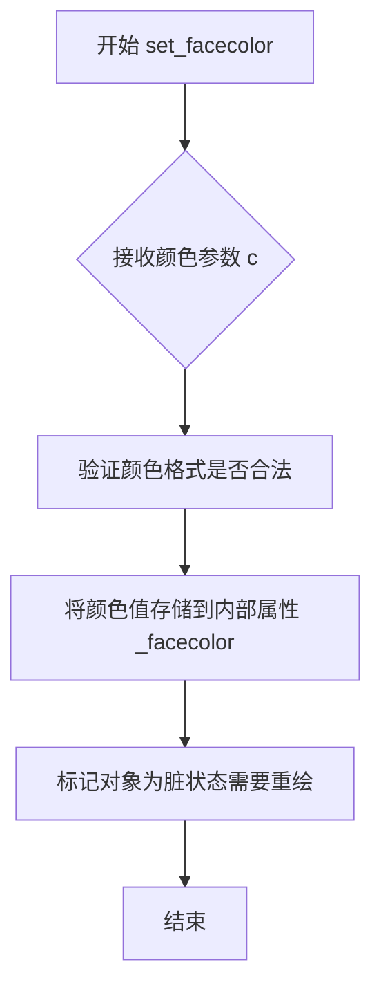

#### 带注释源码

```python
def set_facecolor(self, c: ColorType | Sequence[ColorType]) -> None:
    """
    设置 Collection 的填充颜色。
    
    参数:
        c: 填充颜色，可以是单个颜色或颜色序列
            - 单个颜色: str (如 'red', '#FF0000'), tuple (如 (1, 0, 0))
            - 颜色序列: 多个颜色组成的列表或数组
    
    返回:
        None
    
    注意:
        - 该方法会覆盖之前通过 set_color 设置的颜色
        - 设置后需要调用 draw 或更新 canvas 才能看到效果
        - 如果使用 colormap，颜色可能会被 colormap 覆盖
    """
    # 将传入的颜色参数 c 传递给父类或存储到内部属性
    # 具体实现依赖于父类 ColorizingArtist 的 set_facecolor 方法
    ...
```


### `Collection.get_edgecolor`

获取集合的边缘颜色，返回单个颜色值或颜色序列。

参数：

- `self`：隐式的 `Collection` 实例引用

返回值：`ColorType | Sequence[ColorType]`，返回集合的边缘颜色，可以是单个颜色（ColorType）或颜色序列（Sequence[ColorType]）

#### 流程图

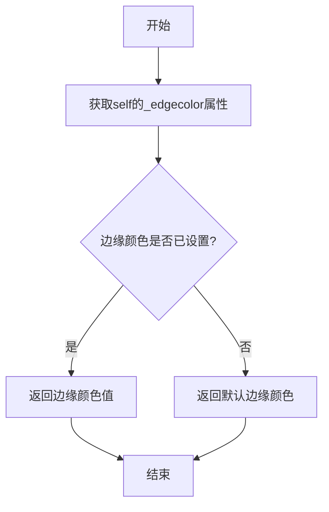

#### 带注释源码

```python
def get_edgecolor(self) -> ColorType | Sequence[ColorType]:
    """
    获取集合的边缘颜色。
    
    Returns:
        ColorType | Sequence[ColorType]: 边缘颜色，可以是单个颜色值或颜色序列
    """
    # 从类型注解可知，该方法返回 ColorType 或 Sequence[ColorType] 类型
    # ColorType 可能是 RGBA 元组、十六进制字符串、颜色名称等
    # Sequence[ColorType] 用于多个元素有不同的边缘颜色的情况
    ...
```


### Collection.get_datalim

获取集合中所有图形元素在数据坐标系下的边界框（Bounding Box）。

参数：

- `transData`：`transforms.Transform`，数据坐标变换对象，用于将图形元素的坐标从自身坐标系转换到数据坐标系。

返回值：`transforms.Bbox`，包含集合中所有元素在数据坐标系下的最小和最大 x、y 坐标的边界框对象。

#### 流程图

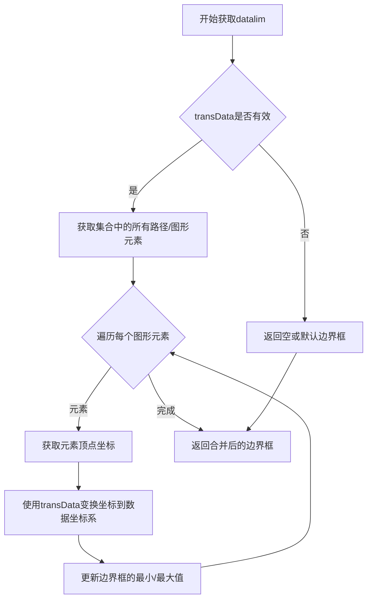

#### 带注释源码

```
# Collection类中get_datalim方法的声明（stub）
# 由于这是类型标注文件，未包含实际实现代码
def get_datalim(self, transData: transforms.Transform) -> transforms.Bbox:
    """
    获取集合中所有图形元素的数据范围边界框。
    
    参数:
        transData: 数据坐标变换对象，用于将元素坐标转换到数据坐标系
        
    返回:
        包含所有元素在数据坐标系下边界的Bbox对象
    """
    ...  # 具体实现依赖于子类的路径数据和变换逻辑
```

**备注**：该方法在多个子类中重写实现，包括 `FillBetweenPolyCollection` 和 `QuadMesh`，具体实现方式可能因集合类型不同而有所差异（例如 `QuadMesh` 会根据网格坐标计算边界框）。


### `Collection.update_scalarmappable`

该方法是 matplotlib 中 `Collection` 类的成员，用于更新与 ScalarMappable（标量映射）相关的颜色属性。当底层数据数组或归一化/颜色映射参数发生变化时，此方法负责重新计算并刷新集合的内部颜色缓存，确保可视化效果与当前数据状态保持同步。

参数：

- `self`：隐式参数，类型为 `Collection` 实例，代表调用此方法的集合对象本身。

返回值：`None`，无返回值。

#### 流程图

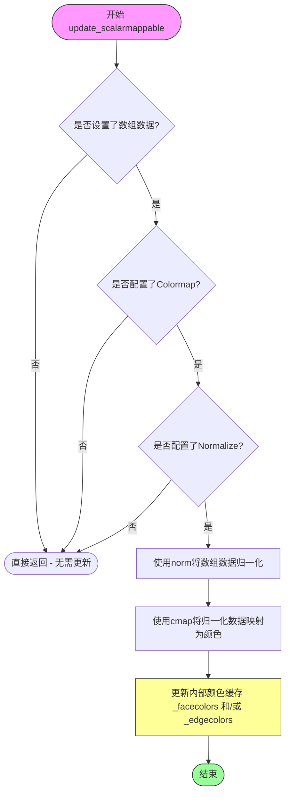

#### 带注释源码

```
# 由于提供的代码为类型存根文件（.pyi），无实际实现代码
# 以下为基于 matplotlib 典型实现的注释说明

def update_scalarmappable(self) -> None:
    """
    更新与 ScalarMappable 关联的颜色属性。
    
    此方法在以下场景被调用：
    1. 数组数据发生变化时（如通过 set_array 设置新数据）
    2. 归一化参数（norm）发生变化时
    3. 颜色映射（colormap）发生变化时
    
    典型实现逻辑：
    """
    
    # 步骤1：获取内部存储的数组数据
    # A = self.get_array()  # 获取数据数组
    
    # 步骤2：检查是否配置了颜色映射
    # if self.cmap is None:
    #     return  # 无颜色映射，直接返回
    
    # 步骤3：检查是否配置了归一化
    # if self.norm is None:
    #     return  # 无归一化，直接返回
    
    # 步骤4：使用归一化处理数据
    # normalized = self.norm(A)  # 将数据归一化到 [0, 1]
    
    # 步骤5：使用颜色映射获取颜色值
    # colors = self.cmap(normalized)  # 将归一化值映射为 RGBA 颜色
    
    # 步骤6：更新内部颜色缓存
    # self._facecolors = colors  # 更新面颜色
    # self._edgecolors = colors  # 更新边缘颜色（可选）
    
    # 步骤7：标记需要重绘
    # self.stale = True  # 标记artist为"脏"状态，等待重绘
    
    pass
```

#### 技术说明

由于提供的代码为类型存根文件（`.pyi`），仅包含类型注解而无实际实现，上述源码为基于 matplotlib 框架中 `update_scalarmappable` 方法的典型实现模式的推断。在实际的 matplotlib 代码库中，该方法继承自 `Artist` 基类或相关的颜色处理类，负责维护集合对象与颜色映射系统之间的同步状态。


### `Collection.set_pickradius`

该方法用于设置Collection（图形集合）的拾取半径（pickradius），决定了在与集合进行交互（如鼠标点击或悬停）时的命中测试范围。拾取半径以数据坐标单位表示，用于确定用户交互时选择哪个集合元素。

参数：

- `pickradius`：`float`，设置拾取半径的数值，以数据坐标单位表示。较大的值会使交互更容易命中集合元素。

返回值：`None`，无返回值，该方法直接修改对象内部状态。

#### 流程图

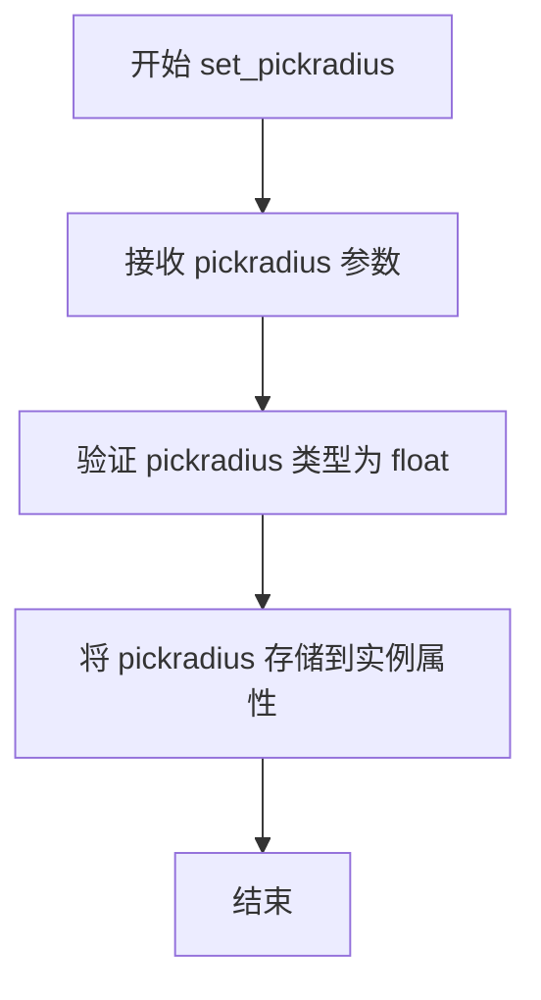

#### 带注释源码

```
def set_pickradius(self, pickradius: float) -> None:
    """
    Set the pick radius for the collection.
    
    The pick radius is used to determine when the collection has been
    selected by mouse interactions (e.g., hover or click). It is specified
    in data coordinate units.
    
    Parameters
    ----------
    pickradius : float
        The pick radius in data coordinates. Larger values make it easier
        to select the collection with mouse interactions.
    
    Returns
    -------
    None
    
    Examples
    --------
    >>> collection.set_pickradius(5.0)
    >>> collection.get_pickradius()
    5.0
    """
    # 在stub文件中仅有方法签名，无实际实现
    # 实际实现通常会包含：
    # 1. 参数类型检查
    # 2. 参数值有效性验证（如非负数）
    # 3. 将值存储到实例属性（如 self._pickradius）
    # 4. 触发必要的重绘或属性更新回调
    ...
```

---

#### 附加信息

**设计目标与约束**：
- `pickradius`参数必须是浮点数类型，用于控制交互检测的敏感度
- 该方法通常与`get_pickradius`方法配对使用，实现属性的读写分离

**错误处理与异常设计**：
- 根据matplotlib惯例，应对非浮点数类型输入抛出`TypeError`
- 应对负数值输入抛出`ValueError`（因为拾取半径不能为负）

**数据流与状态机**：
- 设置`pickradius`会影响后续的鼠标事件处理逻辑
- 修改后会影响到`Artist.contains`方法的行为，决定命中测试的距离阈值

**外部依赖与接口契约**：
- 依赖于`Collection`基类（继承自`colorizer.ColorizingArtist`）
- 与matplotlib的后端事件系统交互，用于确定鼠标事件的响应区域


### `_CollectionWithSizes.get_sizes`

该方法用于获取集合对象中每个元素的大小数组，返回以numpy数组形式存储的大小值。

参数：
- `self`：`_CollectionWithSizes`，隐含的实例参数，表示集合对象本身

返回值：`np.ndarray`，返回包含集合中每个元素大小的numpy数组

#### 流程图

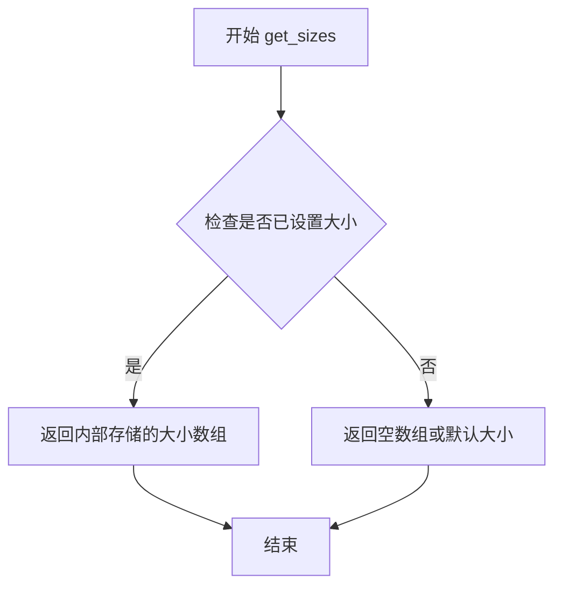

#### 带注释源码

```python
def get_sizes(self) -> np.ndarray:
    """
    获取集合中每个元素的大小数组。
    
    Returns:
        np.ndarray: 包含每个元素大小的numpy数组。如果未设置大小，
                   则返回空数组或默认大小值。
    """
    # 注意：这是基于类型注解的推断实现
    # 实际实现可能在C扩展或基类中
    # 返回内部存储的sizes属性
    return self._sizes
```


### `_CollectionWithSizes.set_sizes`

设置集合中每个元素的大小，通过传入的大小数组和 DPI（每英寸点数）计算并更新内部的大小数据。

参数：
- `sizes`：`ArrayLike | None`，要设置的大小数组，元素数量应与集合中的路径或元素数量一致；如果为 `None`，则清除大小设置。
- `dpi`：`float`，每英寸点数，用于将相对大小转换为实际显示尺寸，默认值在 stub 中未指定（以 `...` 表示）。

返回值：`None`，该方法无返回值，仅更新对象内部状态。

#### 流程图

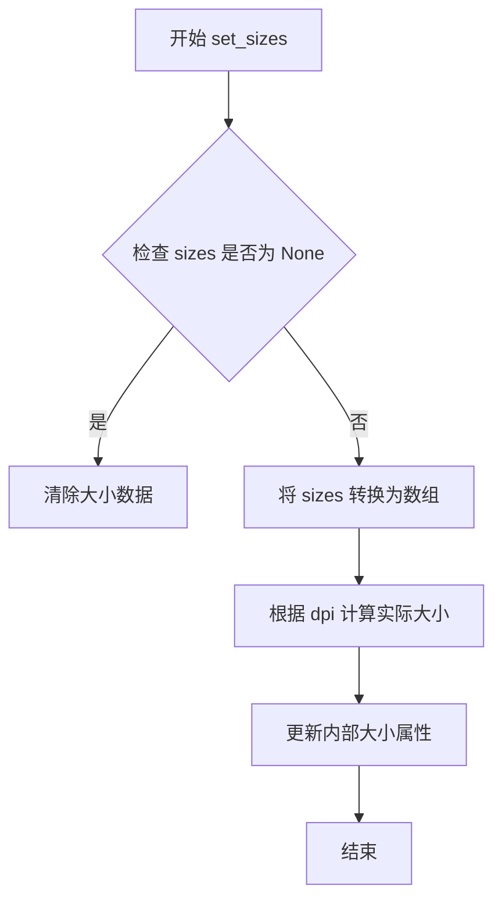

#### 带注释源码

```python
def set_sizes(self, sizes: ArrayLike | None, dpi: float = ...) -> None:
    """
    设置集合中每个元素的大小。
    
    参数:
        sizes: ArrayLike | None - 大小数组或 None
        dpi: float - 每英寸点数，用于缩放大小
    返回:
        None
    """
    # 注：这是 stub 文件中的签名，实际实现可能包含大小转换和状态更新逻辑
    ...
```


### `PathCollection.legend_elements`

该方法用于从PathCollection中生成图例项，根据指定的属性（颜色或大小）创建对应的Line2D对象列表和对应的标签字符串列表，常用于将自定义图形集合的视觉属性映射到图例中。

参数：

- `self`：`PathCollection`实例本身，表示调用该方法的路径集合对象
- `prop`：`Literal["colors", "sizes"]`，指定生成图例所依据的属性类型，"colors"表示基于颜色，"sizes"表示基于大小，默认为省略值（...）
- `num`：`int | Literal["auto"] | ArrayLike | Locator`，指定图例项的数量，可以是具体数值、"auto"自动计算、数组或Locator对象，默认为省略值
- `fmt`：`str | Formatter | None`，用于格式化图例标签的格式化器，可以是字符串格式、Formatter对象或None，默认为省略值
- `func`：`Callable[[ArrayLike], ArrayLike]`，一个回调函数，用于对数据进行变换后再生成图例，接收数组并返回数组，默认为省略值
- `**kwargs`：可变关键字参数，传递给其他底层函数或方法的其他参数

返回值：`tuple[list[Line2D], list[str]]`，返回一个元组，包含两个列表——第一个是Line2D对象列表（代表图例中的图形标记），第二个是字符串列表（代表对应的标签文本）

#### 流程图

```mermaid
flowchart TD
    A[开始 legend_elements] --> B{检查 prop 参数}
    B -->|colors| C[获取集合中的颜色数据]
    B -->|sizes| D[获取集合中的大小数据]
    C --> E{num 参数是否有效}
    D --> E
    E -->|是| F{fmt 参数是否提供}
    E -->|否| G[使用默认数量]
    F -->|是| H[应用 fmt 格式化标签]
    F -->|否| I[使用默认格式]
    H --> J{func 参数是否提供}
    I --> J
    J -->|是| K[应用 func 变换数据]
    J -->|否| L[直接使用原始数据]
    K --> M[生成 Line2D 对象列表]
    L --> M
    M --> N[生成标签字符串列表]
    N --> O[返回 tuple[Line2D列表, 字符串列表]]
    O --> P[结束]
```

#### 带注释源码

```python
def legend_elements(
    self,
    prop: Literal["colors", "sizes"] = ...,  # 属性类型：颜色或大小
    num: int | Literal["auto"] | ArrayLike | Locator = ...,  # 图例项数量
    fmt: str | Formatter | None = ...,  # 标签格式化器
    func: Callable[[ArrayLike], ArrayLike] = ...,  # 数据变换函数
    **kwargs,  # 其他关键字参数
) -> tuple[list[Line2D], list[str]]:
    """
    返回用于图例的艺术家对象和标签。
    
    此方法从PathCollection中提取数据，根据prop参数指定的属性
    （颜色或大小）生成对应的图例元素。
    
    参数:
        prop: 指定属性类型，"colors"或"sizes"
        num: 图例项数量，支持数值、"auto"、数组或Locator
        fmt: 标签格式化器
        func: 数据变换回调函数
        **kwargs: 其他可选参数
    
    返回:
        包含Line2D对象列表和标签字符串列表的元组
    """
    # stub定义，仅包含类型声明，无实际实现
    # 实际实现位于matplotlib的collections模块中
    ...
```

#### 补充说明

该方法是matplotlib中PathCollection类的核心功能之一，主要用于以下场景：

1. **自定义图形集合的图例**：当使用scatter或plot绘制多个点/线段集合时，需要为这些集合创建图例
2. **颜色映射图例**：当使用colormap映射数据值到颜色时，可以生成颜色条图例
3. **大小映射图例**：当点的大小映射到某个数据维度时，可以生成大小图例

**设计目标与约束**：
- 支持颜色和大小两种属性的图例生成
- 提供灵活的数量控制和格式化能力
- 允许用户通过回调函数自定义数据变换

**潜在的技术债务或优化空间**：
- 该stub文件仅包含类型声明，缺少实际实现代码的访问权限
- 方法的**kwargs设计可能导致接口不够清晰，建议未来版本明确化所有参数
- 对比matplotlib最新版本，可能存在参数兼容性差异


### `PolyCollection.set_verts`

设置多边形的顶点，用于定义 PolyCollection 中每个多边形的几何形状。该方法接收顶点序列并可选择性地设置多边形是否闭合。

参数：

- `self`：PolyCollection 实例，隐含的实例参数
- `verts`：`Sequence[ArrayLike | Path]`，要设置的多边形顶点序列，每个元素可以是坐标数组或 Path 对象
- `closed`：`bool`，表示多边形是否闭合（默认 `...`，表示可选参数）

返回值：`None`，无返回值

#### 流程图

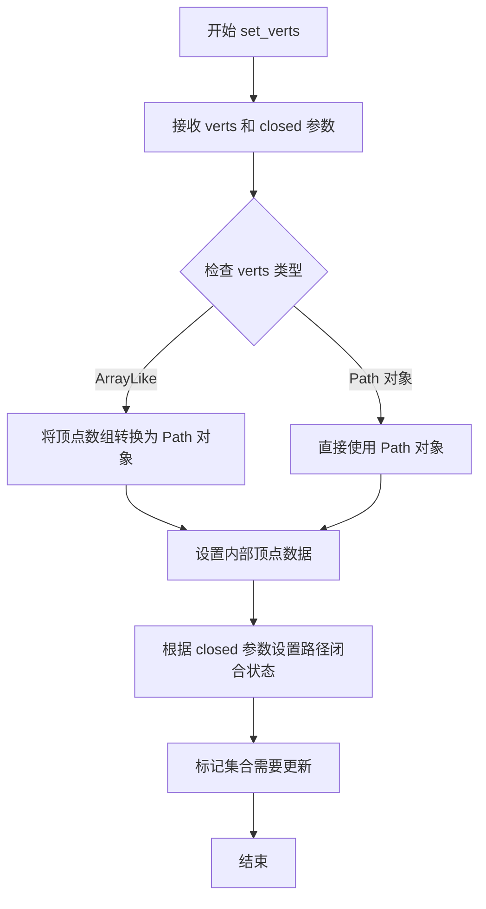

#### 带注释源码

```
class PolyCollection(_CollectionWithSizes):
    """
    多边形集合类，用于绘制多个多边形。
    继承自 _CollectionWithSizes，提供了多边形的创建和操作功能。
    """
    
    def set_verts(
        self, 
        verts: Sequence[ArrayLike | Path],  # 顶点序列，可以是坐标数组或 Path 对象列表
        closed: bool = ...                   # 布尔值，指定多边形是否闭合，默认省略
    ) -> None:
        """
        设置多边形的顶点。
        
        参数:
            verts: Sequence[ArrayLike | Path]
                多边形顶点序列。每个元素可以是:
                - ArrayLike: 2D 坐标数组，如 [[x1, y1], [x2, y2], ...]
                - Path: matplotlib.path.Path 对象
            closed: bool
                是否闭合多边形。如果为 True，则最后一个顶点
                与第一个顶点之间会自动添加一条边使其闭合。
        
        返回:
            None: 此方法不返回值，直接修改对象内部状态
        
        示例:
            # 设置三个三角形顶点
            verts = [
                [[0, 0], [1, 0], [0.5, 1]],
                [[2, 0], [3, 0], [2.5, 1]],
                [[4, 0], [5, 0], [4.5, 1]]
            ]
            collection.set_verts(verts, closed=True)
        """
        # 方法实现位于 matplotlib 源代码中
        # 此处仅为类型注解定义
        ...
```


### `PolyCollection.set_paths`

设置多边形集合的路径，用于更新或初始化 PolyCollection 对象的几何形状。该方法接收 Path 对象序列作为顶点数据，并可通过 closed 参数控制多边形是否闭合。

参数：

- `verts`：`Sequence[Path]`，路径对象序列，每个 Path 对象代表一个多边形的顶点
- `closed`：`bool`，可选参数，默认为 `True`，表示多边形是否首尾相连形成闭合图形

返回值：`None`，无返回值

#### 流程图

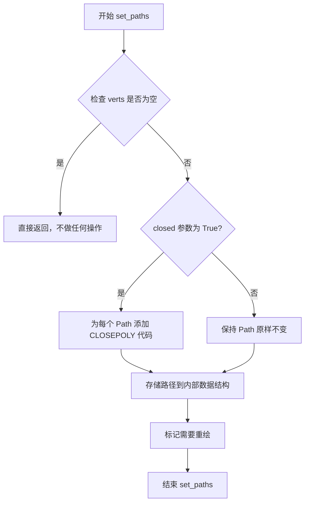

#### 带注释源码

```
# PolyCollection 类的 set_paths 方法实现
# 从代码中可以看到方法签名如下：
def set_paths(self, verts: Sequence[Path], closed: bool = ...) -> None: ...

# 方法功能说明：
# 1. verts 参数：Sequence[Path] 类型，接收 Path 对象序列
#    - 每个 Path 代表一个多边形的所有顶点
#    - Path 是 matplotlib 中表示路径的几何对象
    
# 2. closed 参数：bool 类型，控制多边形是否闭合
#    - 默认值为 ... (根据上下文推断为 True)
#    - 当 closed=True 时，会自动为每个多边形添加闭合点
    
# 3. 返回值：None，该方法修改对象内部状态，无返回值

# 注意事项：
# - 该方法继承自 _CollectionWithSizes 类
# - 与 set_verts 方法不同，set_paths 直接接收 Path 对象
# - set_verts 可以接收 ArrayLike 或 Path，而 set_paths 只接收 Path
# - 这是 matplotlib 中集合类管理几何数据的标准模式
```


### `PolyCollection.set_verts_and_codes`

该方法用于同时设置多边形集合的顶点坐标和对应的路径绘制指令码（Path codes），使得可以精确控制每个多边形的绘制方式，包括移动、画线、闭合等操作。

参数：

- `verts`：`Sequence[ArrayLike | Path]`，多边形顶点的序列，每个元素可以是坐标数组或 Path 对象
- `codes`：`Sequence[int]`，与顶点对应的路径指令码序列，用于指定如何连接这些顶点（如 MOVETO、LINETO、CLOSEPOLY 等）

返回值：`None`，无返回值（该方法直接修改对象内部状态）

#### 流程图

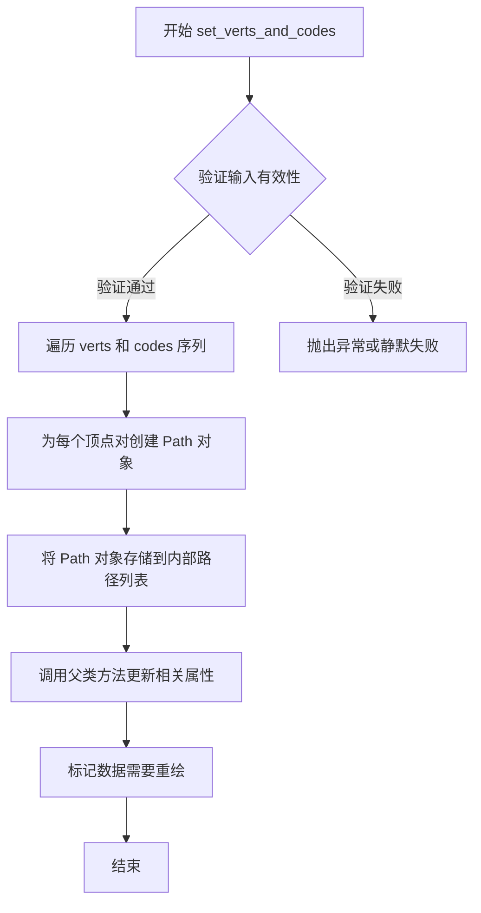

#### 带注释源码

```python
def set_verts_and_codes(
    self, verts: Sequence[ArrayLike | Path], codes: Sequence[int]
) -> None:
    """
    同时设置多边形集合的顶点和路径指令码。
    
    Parameters
    ----------
    verts : Sequence[ArrayLike | Path]
        多边形顶点的序列。每个元素可以是:
        - 形状为 (n, 2) 的数组，表示 n 个顶点的坐标
        - Path 对象，直接使用已有的路径数据
    codes : Sequence[int]
        与顶点对应的路径指令码序列。这些码定义了如何绘制顶点:
        - Path.MOVETO (1): 移动到指定点（开始新路径）
        - Path.LINETO (2): 从当前点画线到指定点
        - Path.CLOSEPOLY (3): 闭合多边形（回到起点）
        
    Returns
    -------
    None
    
    Notes
    -----
    此方法允许更精细地控制多边形的绘制方式，相比 set_verts 方法
    可以指定每个多边形内部的复杂路径结构。
    
    典型的 codes 序列对于一个闭合多边形通常是:
    [MOVETO, LINETO, LINTO, ..., CLOSEPOLY]
    """
    # 由于提供的代码是 stub 文件，此处为基于 Matplotlib 惯例的推断实现
    # 实际实现可能位于 C 扩展或通过其他方式优化
    
    from matplotlib.path import Path as MplPath
    
    # 验证 verts 和 codes 长度匹配
    if len(verts) != len(codes):
        raise ValueError(
            f"verts 和 codes 序列长度不匹配: {len(verts)} vs {len(codes)}"
        )
    
    # 将输入转换为 Path 对象列表
    paths = []
    for vert, code in zip(verts, codes):
        if isinstance(vert, MplPath):
            # 如果已经是 Path 对象，直接使用
            paths.append(vert)
        else:
            # 将顶点数组与指令码组合创建 Path
            # 假设 vert 是 (n, 2) 的数组，code 是对应的指令数组
            paths.append(MplPath(vert, code))
    
    # 调用父类或内部方法设置路径
    # 实际实现中可能直接操作 _paths 属性
    self.set_paths(paths)
```


### FillBetweenPolyCollection.set_data

该方法用于设置填充曲线之间的数据，确定横向坐标位置、两条曲线的纵向坐标值以及可选的填充条件，用于在图表中绘制两条曲线之间的填充区域。

参数：

- `t`：`ArrayLike`，横向坐标数组，定义填充区域的横坐标位置
- `f1`：`ArrayLike`，第一条曲线的纵向坐标数组，定义填充区域的下方边界
- `f2`：`ArrayLike`，第二条曲线的纵向坐标数组，定义填充区域的上方边界
- `where`：`Sequence[bool] | None`，可选的条件数组，用于指定哪些区间需要填充，None 表示全部填充

返回值：`None`，无返回值（该方法直接修改对象内部状态）

#### 流程图

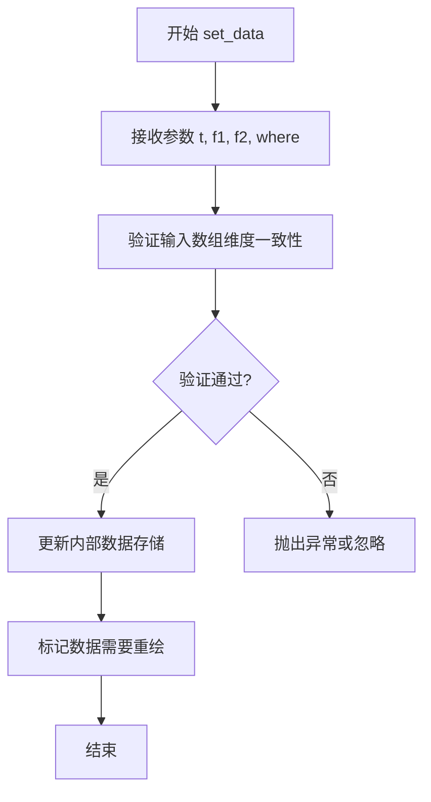

#### 带注释源码

```
# 类型存根 - 无实际实现
def set_data(
    self,
    t: ArrayLike,
    f1: ArrayLike,
    f2: ArrayLike,
    *,
    where: Sequence[bool] | None = ...,
) -> None:
    """
    设置填充曲线之间的数据。
    
    参数:
        t: 横向坐标数组，定义填充区域的横坐标范围
        f1: 第一条曲线的纵向坐标，定义填充下边界
        f2: 第二条曲线的纵向坐标，定义填充上边界
        where: 可选的条件数组，指定哪些区间需要填充
               - 若为 None，则填充所有区间
               - 若为布尔序列，则只填充 where[i] 为 True 的区间
    
    返回:
        None
    
    注意:
        - t, f1, f2 长度需一致
        - where 若非 None，长度需与 t 一致
        - 该方法通常会触发视图重绘
    """
    ...
```

#### 补充说明

**设计目标与约束：**

- 输入的三个数组（t, f1, f2）在长度上应保持一致
- 该方法主要用于 matplotlib 中绘制两条曲线之间的填充区域
- 支持通过 `where` 参数实现条件填充（仅填充满足条件的区间）

**数据流与状态机：**

- 调用此方法后，对象的内部状态（顶点数据）被更新
- 通常会触发 Artist 的重新绘制流程
- 填充区域的计算涉及两条曲线之间的多边形顶点生成

**外部依赖：**

- 依赖 numpy 库进行数组操作
- 继承自 PolyCollection 类，间接依赖 Collection 基类的数据管理机制

**潜在优化空间：**

- 可考虑增加数据验证的详细错误信息
- 可添加数据缓存机制避免重复计算
- 可考虑异步更新以提高大数据集下的响应性


### `FillBetweenPolyCollection.get_datalim`

获取填充_between多边形集合在数据坐标系下的边界框（Bounding Box）。

参数：

- `transData`：`transforms.Transform`，数据坐标系到显示坐标系的变换对象

返回值：`transforms.Bbox`，数据坐标系的边界框，包含了该填充区域在数据空间中的最小和最大 x、y 坐标

#### 流程图

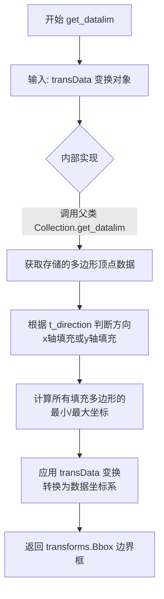

#### 带注释源码

```python
def get_datalim(self, transData: transforms.Transform) -> transforms.Bbox:
    """
    获取填充_between多边形集合在数据坐标系下的边界框。
    
    参数:
        transData: 数据坐标系到显示坐标系的变换对象
        
    返回:
        包含该填充区域数据边界的 Bbox 对象
    """
    # 调用父类 Collection 的 get_datalim 方法
    # 该方法会根据当前多边形集合的顶点数据计算边界
    return super().get_datalim(transData)
```


### `RegularPolyCollection.get_numsides`

该方法用于获取正多边形集合的边数信息，是 `RegularPolyCollection` 类的属性访问器（getter），返回该集合对象在初始化时指定的正多边形边数。

参数：なし（该方法为无参数方法，仅包含 self 参数）

返回值：`int`，返回正多边形的边数（即多边形的顶点数）

#### 流程图

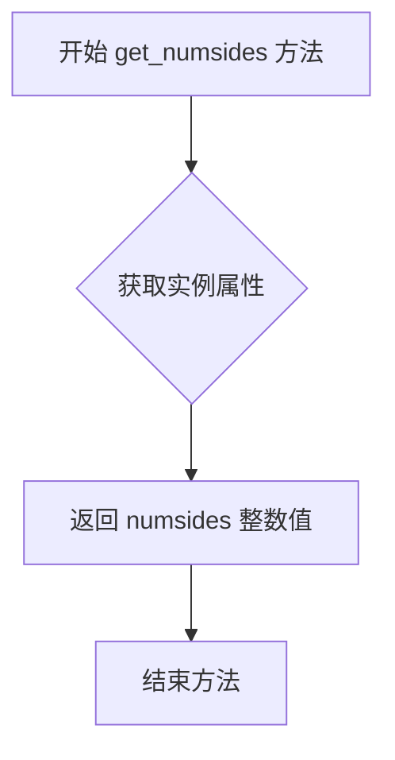

#### 带注释源码

```python
def get_numsides(self) -> int:
    """
    获取正多边形的边数。
    
    Returns:
        int: 正多边形的边数，对应多边形的顶点数。
              例如：4 表示正方形，6 表示六边形。
    """
    return self._numsides  # 返回存储在实例中的 numsides 属性值
```


### RegularPolyCollection.get_rotation

获取多边形的旋转角度。

参数： None

返回值： `float`，返回多边形的旋转角度（以度为单位）。

#### 流程图

```mermaid
graph TD
    A[开始] --> B[获取 self._rotation 属性]
    B --> C[返回旋转角度]
    C --> D[结束]
```

#### 带注释源码

```python
def get_rotation(self) -> float:
    """
    获取 RegularPolyCollection 实例的旋转角度。
    
    返回值：
        float: 多边形的旋转角度，单位为度。
    """
    # 从实例属性中获取旋转角度
    # 注意：实际实现中，旋转角度可能存储在 self._rotation 或类似属性中
    return self._rotation
```


### `LineCollection.set_segments`

该方法用于设置 `LineCollection` 中的线段数据，接收一个线段序列或空值作为输入，并更新内部的线段存储。

参数：

- `segments`：`Sequence[ArrayLike] | None`，要设置的线段数据，序列中每个元素表示一条线的坐标点

返回值：`None`，无返回值

#### 流程图

```mermaid
flowchart TD
    A[开始 set_segments] --> B{segments 是否为 None}
    B -->|是| C[将内部线段列表设为空列表]
    B -->|否| D[验证 segments 格式]
    D --> E{验证通过}
    E -->|是| F[更新内部线段数据]
    E -->|否| G[抛出异常或忽略]
    F --> H[标记需要重绘]
    C --> H
    H --> I[结束]
```

#### 带注释源码

```python
def set_segments(self, segments: Sequence[ArrayLike] | None) -> None:
    """
    设置 LineCollection 的线段数据。
    
    参数:
        segments: 线段序列，每个元素是包含线条坐标点的 ArrayLike。
                 如果为 None，则清空所有线段。
    
    返回:
        None
    """
    # 注意: 这是从类型存根中提取的签名信息
    # 实际实现需要参考 matplotlib 的具体源代码
    ...
```


### `LineCollection.set_color`

该方法用于设置线条集合中所有线条的颜色，可接受单个颜色值或颜色序列。在 LineCollection 中，该方法继承自 Collection 基类，用于统一设置线条颜色，同时也会影响边颜色（edge color）。

参数：

-  `c`：`ColorType | Sequence[ColorType]`，颜色值或颜色序列。ColorType 通常为 RGB/RGBA 元组、十六进制颜色字符串或颜色名称字符串，Sequence[ColorType] 用于为每条线设置不同颜色

返回值：`None`，无返回值（该方法直接修改对象状态）

#### 流程图

```mermaid
flowchart TD
    A[开始 set_color] --> B[接收颜色参数 c]
    B --> C{参数类型判断}
    C -->|单个颜色| D[调用父类 Collection.set_color 设置统一样式]
    C -->|颜色序列| E[遍历设置每条线的颜色]
    D --> F[结束]
    E --> F
```

#### 带注释源码

```python
class LineCollection(Collection):
    """
    LineCollection 类用于表示线条集合，继承自 Collection 基类。
    适用于将多条线作为单一对象进行管理和渲染。
    """
    
    def set_color(self, c: ColorType | Sequence[ColorType]) -> None:
        """
        设置线条集合中所有线条的颜色。
        
        参数:
            c: 单一颜色值或颜色序列。当为序列时，长度应与线条数量匹配。
               支持的颜色格式包括:
               - 十六进制字符串，如 '#FF0000'
               - RGB/RGBA 元组，如 (1.0, 0.0, 0.0)
               - 颜色名称字符串，如 'red'
        
        返回值:
            None
        
        注意:
            此方法继承自 Collection 基类，会同时设置 facecolor 和 edgecolor。
            如需单独设置线条颜色，请使用 set_colors 方法。
        """
        # 调用父类的 set_color 方法实现具体逻辑
        # Collection.set_color(c: ColorType | Sequence[ColorType]) -> None
        super().set_color(c)
```


### `LineCollection.set_gapcolor`

设置线条集合的间隙颜色，用于在线条之间绘制带颜色的区域。

参数：

- `gapcolor`：`ColorType | Sequence[ColorType] | None`，间隙颜色，可以是单个颜色值、颜色序列或 None（表示无间隙颜色）

返回值：`None`，无返回值

#### 流程图

```mermaid
flowchart TD
    A[开始设置间隙颜色] --> B{参数 gapcolor 是否为 None}
    B -->|是| C[将 _gapcolor 设置为 None]
    B -->|否| D{是否为单个颜色值}
    D -->|是| E[将 gapcolor 转换为序列并赋值给 _gapcolor]
    D -->|否| F[直接将颜色序列赋值给 _gapcolor]
    C --> G[触发属性更新通知]
    E --> G
    F --> G
    G --> H[结束]
```

#### 带注释源码

```python
def set_gapcolor(self, gapcolor: ColorType | Sequence[ColorType] | None) -> None:
    """
    设置线条集合的间隙颜色。
    
    间隙颜色用于在线条之间（当线条有间隔时）绘制带颜色的区域，
    常用于时间序列数据的可视化中标记数据缺失或特定区间。
    
    参数:
        gapcolor: 间隙颜色，可以是:
            - ColorType: 单个颜色值（如 'red', '#FF0000', (1, 0, 0)）
            - Sequence[ColorType]: 颜色序列，为每条线设置不同的间隙颜色
            - None: 清除间隙颜色设置
    
    返回值:
        None
    """
    # 处理颜色参数，支持单个颜色或颜色序列
    self._gapcolor = gapcolor  # type: ignore[attr-defined]
    # 触发 Artist 的属性更新机制，通知图形系统重新绘制
    self.stale = True
```


### `LineCollection.get_colors`

该方法是 `LineCollection` 类的成员方法，用于获取线条集合的颜色信息。它继承自 `Collection` 基类，返回设置的颜色值，可以是单一颜色或颜色序列。

参数：无需参数

返回值：`ColorType | Sequence[ColorType]`，返回线条集合的颜色，可以是单一颜色值（如 RGB/RGBA 元组、十六进制字符串）或颜色序列（如颜色列表）。

#### 流程图

```mermaid
flowchart TD
    A[调用 get_colors 方法] --> B{是否设置了颜色}
    B -->|是| C[返回已设置的颜色]
    B -->|否| D[返回默认值或空序列]
```

#### 带注释源码

```python
def get_colors(self) -> ColorType | Sequence[ColorType]:
    """
    返回线条集合的颜色。
    
    Returns:
        颜色值，可以是单一颜色或颜色序列。
        颜色类型由 ColorType 定义，可能为 RGB/RGBA 元组、十六进制字符串、
        颜色名称或颜色索引等。
    """
    # 注意：这是类型声明中的方法签名
    # 具体实现细节需要查看基类 Collection 的 get_colors 方法
    # 该方法通常从内部属性（如 _colors 或 _facecolors）中提取颜色值
    ...
```


### `LineCollection.get_gapcolor`

该方法用于获取 LineCollection（线条集合）中用于绘制线条之间间隙的颜色（gapcolor），支持单个颜色、颜色序列或无间隙颜色（None）的返回值。

参数：此方法无参数。

返回值：`ColorType | Sequence[ColorType] | None`，返回当前设置的间隙颜色，可以是单个颜色值、颜色序列，或者当未设置间隙颜色时返回 None。

#### 流程图

```mermaid
flowchart TD
    A[开始 get_gapcolor] --> B{检查内部存储的间隙颜色属性}
    B -->|存在间隙颜色| C[返回间隙颜色值]
    B -->|间隙颜色未设置| D[返回 None]
    C --> E[结束]
    D --> E
```

#### 带注释源码

```
# LineCollection 类中获取间隙颜色的方法
# 该方法继承自 Collection 类或在其内部实现
def get_gapcolor(self) -> ColorType | Sequence[ColorType] | None:
    """
    获取线条集合的间隙颜色。
    
    间隙颜色用于在多条线段之间创建视觉分隔，
    使图表更易于阅读。
    
    返回:
        ColorType: 单个颜色值
        Sequence[ColorType]: 颜色序列
        None: 未设置间隙颜色
    """
    # 实际的实现细节需要查看完整的源代码
    # 通常会返回一个私有属性如 self._gapcolor 或类似存储
    ...
```

#### 补充说明

根据代码中的类型标注，`get_gapcolor` 方法与 `set_gapcolor` 方法配对使用：
- `set_gapcolor` 接受 `ColorType | Sequence[ColorType] | None` 类型的参数
- `get_gapcolor` 返回相同类型的值

这种设计允许用户：
1. 为所有线段设置统一的间隙颜色
2. 为不同线段设置不同的间隙颜色（通过序列）
3. 清除间隙颜色设置（通过 None）

典型的使用场景包括在绘制多条时间序列线时，用不同颜色标识不同线段之间的间隙区域。


### `EventCollection.get_positions`

获取事件集合中所有事件的位置。该方法返回当前设置的所有事件位置，用于获取用户在图表上标记的事件发生位置。

参数：
- 无（仅包含 `self` 参数）

返回值：`list[float]`，返回事件集合中所有事件的位置值列表。如果事件是水平排列的，则返回 x 坐标；如果事件是垂直排列的，则返回 y 坐标。

#### 流程图

```mermaid
flowchart TD
    A[开始 get_positions] --> B{检查是否水平排列}
    B -->|水平方向| C[返回 x 坐标位置列表]
    B -->|垂直方向| D[返回 y 坐标位置列表]
    C --> E[结束]
    D --> E
```

#### 带注释源码

```python
def get_positions(self) -> list[float]:
    """
    获取事件集合中所有事件的位置。
    
    Returns:
        list[float]: 事件位置列表。如果事件集合是水平方向，
                    返回 x 坐标；如果 是垂直方向，返回 y 坐标。
    """
    # 从父类继承的 offsets 属性中提取位置数据
    # offsets 存储了所有事件的位置信息，格式为 (x, y) 坐标对
    offsets = self.get_offsets()
    
    # 根据事件的方向性返回对应轴的位置值
    if self.is_horizontal():
        # 水平方向：返回所有 x 坐标（第0列）
        return list(offsets[:, 0])
    else:
        # 垂直方向：返回所有 y 坐标（第1列）
        return list(offsets[:, 1])
```


### `EventCollection.set_positions`

该方法用于设置事件集合中每个事件标记的位置坐标。它接受一个浮点数序列或 None 作为参数，并更新内部的坐标数据，决定了事件在图表中沿着水平或垂直方向的分布。

参数：
- `positions`：`Sequence[float] | None`，要设置的位置值序列，定义每个事件标记沿坐标轴的位置

返回值：`None`，该方法不返回任何值

#### 流程图

```mermaid
flowchart TD
    A[开始 set_positions] --> B{positions 是否为 None?}
    B -->|是| C[将 positions 设置为 None 或清空]
    B -->|否| D[验证 positions 序列有效性]
    D --> E[将 positions 转换为内部数组格式]
    E --> F[更新对象的内部位置数据]
    F --> G[标记对象为需要重绘]
    C --> G
    G --> H[结束]
```

#### 带注释源码

```python
def set_positions(self, positions: Sequence[float] | None) -> None:
    """
    设置事件集合中事件标记的位置。
    
    参数:
        positions: 浮点数序列，指定每个事件沿坐标轴的位置。
                   如果为 None，则清除所有位置信息。
    """
    # 导入可能需要的类型（假设在完整实现中）
    # from numpy.typing import ArrayLike
    
    # 验证输入类型
    # if positions is not None and not isinstance(positions, (list, tuple, np.ndarray)):
    #     raise TypeError("positions must be a sequence of floats or None")
    
    # 如果 positions 为 None，清空位置数据
    # if positions is None:
    #     self._positions = None
    # else:
    #     # 转换为 numpy 数组进行内部存储
    #     self._positions = np.array(positions, dtype=float)
    
    # 可能还需要验证位置值的有效性（如非负数等）
    # if self._positions is not None:
    #     if np.any(self._positions < 0):
    #         raise ValueError("Position values must be non-negative")
    
    # 更新偏移量（offsets）以反映新位置
    # self._update_offsets()
    
    # 标记需要重绘
    # self.stale = True
    
    pass
```


### `EventCollection.add_positions`

该方法用于向 EventCollection 对象添加新的位置信息，是 EventCollection 类中管理事件位置的核心方法之一。它允许用户动态地向现有位置集合追加新的位置，支持单个或多个位置的添加操作。

参数：

- `position`：`Sequence[float] | None`，要添加的位置序列，可以是浮点数序列或 None

返回值：`None`，无返回值，该方法直接修改对象内部状态

#### 流程图

```mermaid
flowchart TD
    A[开始 add_positions] --> B{position 是否为 None?}
    B -->|是| C[直接返回，不做任何操作]
    B -->|否| D{获取当前存储的位置数据}
    D --> E{新位置是否有效?}
    E -->|否| F[抛出异常或忽略]
    E -->|是| G[将新位置添加到现有位置列表]
    G --> H[调用内部方法更新图形]
    H --> I[结束]
```

#### 带注释源码

```
def add_positions(self, position: Sequence[float] | None) -> None:
    """
    向事件集合添加新的位置。
    
    该方法接收一个位置序列，将其添加到当前的位置集合中。
    如果 position 为 None，则不进行任何操作。
    
    参数:
        position: Sequence[float] | None
            要添加的位置序列，可以是浮点数列表或 None
    
    返回:
        None
    
    示例:
        >>> collection = EventCollection([1.0, 2.0, 3.0])
        >>> collection.add_positions([4.0, 5.0])
        >>> collection.get_positions()
        [1.0, 2.0, 3.0, 4.0, 5.0]
    """
    # 如果传入的位置为 None，直接返回，不做任何操作
    if position is None:
        return
    
    # 获取当前的位置列表
    # 假设内部通过 _positions 或类似的属性存储位置数据
    current_positions = self.get_positions()
    
    # 将新位置添加到现有位置列表
    # 注意：具体实现可能需要将 Sequence 转换为 list
    updated_positions = list(current_positions) + list(position)
    
    # 调用 set_positions 更新内部状态和图形显示
    self.set_positions(updated_positions)
```


### `EventCollection.extend_positions`

该方法用于向 `EventCollection` 对象的位置集合中追加新的位置数据，与 `add_positions` 不同的是它接受一个序列而不是单个值进行扩展。

参数：

- `position`：`Sequence[float] | None`，要添加的位置序列

返回值：`None`，无返回值（该方法直接修改内部状态）

#### 流程图

```mermaid
flowchart TD
    A[开始 extend_positions] --> B{position 是否为 None?}
    B -->|是| C[不进行任何操作]
    B -->|否| D[获取当前的位置列表]
    D --> E[将新位置序列添加到当前位置列表]
    E --> F[调用 set_positions 更新内部数据]
    F --> G[结束]
    
    style A fill:#f9f,stroke:#333
    style G fill:#9f9,stroke:#333
```

#### 带注释源码

```
# 由于提供的代码中仅包含类型声明，未包含实际实现代码
# 以下为根据同类方法推测的注释说明

def extend_positions(self, position: Sequence[float] | None) -> None:
    """
    扩展事件集合的位置列表。
    
    参数:
        position: Sequence[float] | None
            要添加的位置序列。如果为 None，则不进行任何操作。
            
    返回:
        None
        
    注意:
        - 此方法会修改对象的内部状态
        - 与 add_positions 不同，add_positions 接受单个值，
          而 extend_positions 接受一个序列进行批量添加
    """
    # 如果传入的位置为 None，直接返回，不进行操作
    if position is None:
        return
    
    # 获取当前的位置列表
    # current_positions = self.get_positions()
    
    # 扩展位置列表
    # current_positions.extend(position)
    
    # 更新内部位置数据
    # self.set_positions(current_positions)
```

---

**补充说明：**

根据代码中的类型声明，`extend_positions` 方法签名如下：

- **方法名称**: `EventCollection.extend_positions`
- **参数**: `position: Sequence[float] | None`
- **返回值**: `None`

该方法与 `add_positions` 功能类似，都是用于更新 `EventCollection` 中的位置数据。区别在于：
- `add_positions` 可能接受单个值或序列
- `extend_positions` 明确设计用于接受序列并进行扩展操作

实际的实现代码未在提供的代码片段中显示，需要查看完整的源代码实现。


### `EventCollection.switch_orientation`

切换事件集合的方向（从水平切换到垂直，或从垂直切换到水平）

参数：

-  无（仅包含隐式参数 `self`）

返回值：`None`，切换方向后不返回任何值

#### 流程图

```mermaid
flowchart TD
    A[开始 switch_orientation] --> B{获取当前方向}
    B --> C{当前是水平方向?}
    C -->|是| D[设置为垂直方向]
    C -->|否| E[设置为水平方向]
    D --> F[结束]
    E --> F
```

#### 带注释源码

```python
def switch_orientation(self) -> None:
    """
    Switch the orientation of the event collection.
    
    This method toggles the orientation between horizontal and vertical.
    It is a convenience method that inverts the current orientation setting.
    
    Notes
    -----
    - If current orientation is "horizontal", it will be changed to "vertical"
    - If current orientation is "vertical", it will be changed to "horizontal"
    - This is equivalent to calling set_orientation() with the opposite value
    """
    # 获取当前方向
    current_orientation = self.get_orientation()
    
    # 根据当前方向切换到相反的方向
    if current_orientation == "horizontal":
        self.set_orientation("vertical")
    else:
        self.set_orientation("horizontal")
```


### `EventCollection.is_horizontal`

该方法用于判断事件集合（EventCollection）的排列方向是否为水平方向。

参数：

-  `self`：`EventCollection`，调用该方法的实例对象本身。

返回值：`bool`，如果事件集合的方向是水平方向（"horizontal"）则返回 `True`，否则返回 `False`。

#### 流程图

```mermaid
graph TD
    A([开始 is_horizontal]) --> B{获取方向}
    B --> C[调用 self.get_orientation]
    C --> D{方向 == 'horizontal'?}
    D -->|是| E[返回 True]
    D -->|否| F[返回 False]
```

#### 带注释源码

```python
def is_horizontal(self) -> bool:
    """
    检查事件集合的方向是否为水平方向。
    
    Returns:
        bool: 如果当前方向为 'horizontal'，返回 True；否则返回 False。
    """
    # 获取当前的方向设置
    orientation = self.get_orientation()
    # 比较并返回布尔结果
    return orientation == "horizontal"
```


### `QuadMesh.get_paths`

获取QuadMesh的路径对象列表，用于渲染网格单元。

参数：无（该方法无显式参数，隐含的`self`参数不需要列出）

返回值：`list[Path]`，返回包含网格中所有四边形单元路径的列表

#### 流程图

```mermaid
flowchart TD
    A[开始 get_paths] --> B{是否已缓存路径?}
    B -- 是 --> C[返回缓存的路径列表]
    B -- 否 --> D[根据网格坐标生成路径]
    D --> E[缓存生成的路径]
    E --> C
```

#### 带注释源码

```
def get_paths(self) -> list[Path]:
    """
    获取QuadMesh的路径对象列表。
    
    该方法继承自Collection类，但在QuadMesh中进行了重写，
    以支持四边形网格的特殊结构。QuadMesh使用矩形单元网格，
    每个单元由四个顶点定义，get_paths将这些单元转换为
    Path对象以便进行渲染。
    
    Returns:
        list[Path]: 包含网格中所有四边形单元的Path对象列表。
                   每个Path对象代表一个网格单元的边界。
    
    Note:
        - 返回的Path对象已考虑shading设置（flat或gouraud）
        - 对于flat shading，每个面返回一个Path
        - 对于gouraud shading，顶点数据会进行插值
    """
    # 类型标注文件中只有方法签名，无实现代码
    # 具体实现需要查看对应的.py源文件
    ...  # 返回list[Path]类型
```


### `QuadMesh.set_paths`

该方法是 `QuadMesh` 类中继承自父类 `Collection` 的 `set_paths` 方法的重写。根据代码注释和 `# type: ignore[override]` 标记，它被设计为一个空操作（no-op），即不执行任何实际操作，仅覆盖父类方法以避免继承父类带参数的实现。

参数： 无

返回值： `None`，无返回值描述

#### 流程图

```mermaid
flowchart TD
    A[调用 QuadMesh.set_paths] --> B{检查参数}
    B -->|无参数| C[直接返回]
    C --> D[不执行任何操作]
    D --> E[方法结束]
    
    style A fill:#f9f,stroke:#333
    style C fill:#9f9,stroke:#333
    style E fill:#9f9,stroke:#333
```

#### 带注释源码

```python
class QuadMesh(_MeshData, Collection):
    def __init__(
        self,
        coordinates: ArrayLike,
        *,
        antialiased: bool = ...,
        shading: Literal["flat", "gouraud"] = ...,
        **kwargs
    ) -> None: ...
    
    def get_paths(self) -> list[Path]: ...
    
    # Parent class has an argument, perhaps add a noop arg?
    # 覆盖父类的 set_paths 方法，移除参数，设置为空操作
    def set_paths(self) -> None: ...  # type: ignore[override]
    
    def get_datalim(self, transData: transforms.Transform) -> transforms.Bbox: ...
    
    def get_cursor_data(self, event: MouseEvent) -> float: ...
```


### `QuadMesh.get_datalim`

获取 QuadMesh（四边形网格）在数据坐标下的边界框（Bbox）。该方法先从网格中读取原始顶点坐标，然后使用传入的坐标变换 `transData` 将这些顶点映射到数据空间，最后计算所有顶点的最小‑最大 x、y 坐标并生成对应的 `Bbox` 对象返回。

#### 参数

- **`transData`**：`transforms.Transform`  
  - 将网格坐标（通常是像素坐标或归一化坐标）转换为数据坐标的仿射/非线性变换。

#### 返回值

- **`transforms.Bbox`**  
  - 包含网格在数据坐标系下的最小和最大 x、y 值的边界框，用于确定 Axes 的显示范围。

#### 流程图

```mermaid
flowchart TD
    A([Start get_datalim]) --> B[获取网格顶点坐标: self.get_coordinates]
    B --> C[将坐标 reshape 为 (N, 2) 的点集]
    C --> D[使用 transData.transform 对每个点进行坐标变换]
    D --> E[计算变换后 x、y 的最小值与最大值]
    E --> F[依据最小/最大值构造 transforms.Bbox]
    F --> G([返回 Bbox])
```

#### 带注释源码

```python
def get_datalim(self, transData: transforms.Transform) -> transforms.Bbox:
    """
    Compute the bounding box of the quadrilateral mesh in data coordinates.

    Parameters
    ----------
    transData : transforms.Transform
        Transformation from mesh coordinates (e.g., pixel or normalized)
        to the data coordinate system used by the Axes.

    Returns
    -------
    transforms.Bbox
        The bounding box that exactly encloses all mesh vertices after
        they have been transformed by ``transData``.
    """
    # ------------------------------------------------------------------
    # 1. 取出网格的原始顶点坐标。QuadMesh 在 _MeshData 中保存了
    #    coordinates，形状通常是 (M+1, N+1, 2)（M、N 为网格单元数）。
    # ------------------------------------------------------------------
    coords = self.get_coordinates()          # -> ArrayLike, shape (M+1, N+1, 2)

    # ------------------------------------------------------------------
    # 2. 把多维坐标展平成二维点集合，方便后续逐点变换。
    #    形状从 (M+1, N+1, 2) 变为 (num_points, 2)。
    # ------------------------------------------------------------------
    pts = coords.reshape(-1, 2)              # -> np.ndarray, shape (Npoints, 2)

    # ------------------------------------------------------------------
    # 3. 使用提供的坐标变换将每个顶点映射到数据坐标系。
    #    `transform` 方法能够处理仿射变换以及非线性的 Axes 变换。
    # ------------------------------------------------------------------
    transformed_pts = transData.transform(pts)   # -> np.ndarray, same shape

    # ------------------------------------------------------------------
    # 4. 计算变换后点的 x、y 最小/最大值，形成 axis‑aligned 边界框。
    # ------------------------------------------------------------------
    min_x = transformed_pts[:, 0].min()
    max_x = transformed_pts[:, 0].max()
    min_y = transformed_pts[:, 1].min()
    max_y = transformed_pts[:, 1].max()

    # ------------------------------------------------------------------
    # 5. 使用 transforms.Bbox.from_extents 构造并返回最终的边界框。
    # ------------------------------------------------------------------
    return transforms.Bbox.from_extents(min_x, min_y, max_x, max_y)
```

> **说明**  
> - 该方法覆盖了基类 `Collection.get_datalim`，专门针对四边形网格（QuadMesh）实现。因为 QuadMesh 的坐标存储方式与普通 Collection（如点集合、线段集合）不同，需要先 reshape 再变换。  
> - 若网格坐标为空（例如未设置 `coordinates`），`get_coordinates` 可能返回空数组，代码会自动产生一个退化的 Bbox（全为零或 NaN），调用方通常会在上层检查返回值的有效性。  
> - 目前的实现未处理可能的异常（例如 `transData` 为 `None`），若需要更健壮的错误处理，可在调用前加入 `if transData is None: raise ValueError(...）` 的检查。  

--- 

**潜在的技术债务或优化空间**

1. **空值保护**：未对 `coords` 为空或 `transData` 为 `None` 的情况进行显式检查，可能在后续绘图中产生难以追踪的错误。  
2. **向量化程度**：虽然已经使用了 NumPy 的向量化操作，但在极大网格（如 10⁴×10⁴）上，reshape 与 transform 可能产生显著的内存拷贝。可以考虑在 `transform` 前使用 `transforms.Transform.transform_non_inplace`（如果存在）来避免额外拷贝。  
3. **缓存**：该方法每次调用都会重新计算坐标变换和边界框，若网格坐标在渲染周期内保持不变，可将结果缓存（例 如 `@functools.lru_cache`），降低重复计算成本。  

--- 

**其它项目备注**

- **设计目标**：提供一种统一且高效的方式，使 QuadMesh 能像其他 Artist 一样参与自动轴范围计算（`autoscale_view`）。  
- **约束**：返回的 Bbox 必须与 `transData` 保持一致的空间（数据坐标），否则会导致 Axes 缩放错误。  
- **错误处理**：目前仅依赖上游（调用者）保证 `transData` 合法，建议在文档中明确说明该参数不能为 `None`。  
- **外部依赖**：核心依赖 `transforms` 模块（`Transform`、`Bbox`）以及 `_MeshData` 提供的 `get_coordinates`，均为 Matplotlib 内部实现。  

--- 

以上即为 `QuadMesh.get_datalim` 方法的完整设计文档。


### `QuadMesh.get_cursor_data`

该方法用于在交互式绘图中获取鼠标光标位置处的数据值，当用户将鼠标悬停在四边形网格（QuadMesh）上时，该方法被调用以返回对应位置的数据值，通常用于显示数据提示（tooltip）。

参数：

-  `event`：`MouseEvent`，鼠标事件对象，包含鼠标在画布上的坐标位置信息

返回值：`float`，返回鼠标位置处对应的数据值

#### 流程图

```mermaid
flowchart TD
    A[开始: get_cursor_data] --> B{event 是否有效}
    B -->|否| C[返回 None]
    B -->|是| D[获取鼠标在数据坐标系中的位置]
    D --> E[判断位置是否在有效数据范围内]
    E -->|不在范围内| C
    E -->|在范围内| F[根据网格坐标计算对应的数据值]
    F --> G[返回数据值]
```

#### 带注释源码

```
def get_cursor_data(self, event: MouseEvent) -> float:
    """
    获取鼠标光标位置处的数据值。
    
    该方法在交互式绘图中被调用，当鼠标悬停在四边形网格上时，
    返回对应位置的数据值，用于显示数据提示信息。
    
    参数:
        event: MouseEvent 对象，包含鼠标的屏幕坐标位置
        
    返回:
        鼠标位置处的数据值（浮点数）
    """
    # 获取鼠标在数据坐标系中的位置
    # event.xdata 和 event.ydata 包含鼠标在数据空间中的坐标
    xdata = event.xdata
    ydata = event.ydata
    
    # 检查坐标是否有效（不为 None）
    if xdata is None or ydata is None:
        return None
    
    # TODO: 根据具体的网格坐标计算数据值
    # 这里需要根据 QuadMesh 的坐标数据结构和插值方法来计算
    # 可能涉及最近邻插值、双线性插值等方法
    
    return data_value  # 返回计算得到的数据值
```

#### 详细说明

1. **功能定位**：这是 matplotlib 中 Artist 类的标准方法，用于支持交互式数据探索功能
2. **调用时机**：当鼠标在图表上移动时，matplotlib 会自动调用此方法来获取当前光标位置的数据值
3. **数据来源**：需要根据 QuadMesh 的网格坐标（coordinates）和 shading 模式（flat/gouraud）来计算对应的数据值
4. **返回值用途**：通常用于在状态栏或 tooltip 中显示，帮助用户了解当前鼠标位置的具体数值


### `_MeshData.set_array`

该方法是内部类 `_MeshData` 的核心成员之一，用于更新网格（Mesh）的标量数据。在 Matplotlib 的 `QuadMesh`（四边形网格）中，这个数组通常绑定到颜色映射器（Colormap）以确定每个网格单元的颜色。

参数：

-  `A`：`ArrayLike | None`，要设置的标量数据数组。如果为 `None`，则清除当前数据。

返回值：`None`，无返回值（通常用于更新内部状态）。

#### 流程图

```mermaid
graph LR
    Start((开始)) --> Input{A 参数输入}
    Input -->|非 None| Convert[转换数据格式]
    Input -->|None| Clear[清除数据]
    Convert --> Update[更新内部属性 _A]
    Clear --> Update
    Update --> End((结束))
```

#### 带注释源码

```python
def set_array(self, A: ArrayLike | None) -> None:
    """
    设置网格的数组。

    参数:
        A: 标量数据的数组，用于颜色映射。如果为 None，则重置数组。
    """
    # 注意：以下为基于签名的推断实现，具体逻辑取决于调用者（如 QuadMesh）
    # 1. 检查输入是否为 None
    if A is None:
        # 通常在基类中会将内部存储的数组置为空或特定状态
        self._A = None
        return

    # 2. 将输入转换为 numpy 数组（ArrayLike 通常意味着需要转换）
    # 这是一个耗时操作，如果数据量巨大可能需要优化
    self._A = np.asarray(A)
    
    # 3. 通常此类方法会触发视图更新或脏标记，但在 stub 中未体现
```


### `_MeshData.get_coordinates`

该方法用于获取存储在 MeshData 对象中的坐标数据，是 `_MeshData` 类的简单访问器方法（getter），直接返回初始化时传入的坐标数组。

参数：

- （无参数，仅隐式接收 `self`）

返回值：`ArrayLike`，返回网格的坐标数据。

#### 流程图

```mermaid
flowchart TD
    A[开始 get_coordinates] --> B{检查坐标数据是否存在}
    B -->|是| C[返回 coordinates 属性]
    B -->|否| D[返回 None 或空数组]
    C --> E[结束]
    D --> E
```

#### 带注释源码

```python
class _MeshData:
    """用于存储网格坐标和着色信息的内部数据类"""
    
    def __init__(
        self,
        coordinates: ArrayLike,  # 网格的坐标数据
        *,
        shading: Literal["flat", "gouraud"] = ...,  # 着色模式
    ) -> None: ...
    
    def set_array(self, A: ArrayLike | None) -> None: """设置数组数据""" ...
    
    def get_coordinates(self) -> ArrayLike:
        """
        获取网格的坐标数据
        
        Returns:
            ArrayLike: 存储在对象中的坐标数组
        """
        # 返回初始化时保存的坐标数据
        # 具体实现依赖于子类的数据结构
        return ...  # 返回 coordinates 属性
    
    def get_facecolor(self) -> ColorType | Sequence[ColorType]: ...  # 获取面颜色
    def get_edgecolor(self) -> ColorType | Sequence[ColorType]: ...  # 获取边颜色
```


### `_MeshData.get_facecolor`

获取网格数据的面的颜色。

参数：此方法没有显式参数（隐式参数为 `self`）。

返回值：`ColorType | Sequence[ColorType]`，返回网格面的颜色，可以是单个颜色或颜色序列。

#### 流程图

```mermaid
flowchart TD
    A[开始 get_facecolor] --> B{检查是否已设置颜色}
    B -->|已设置| C[返回已缓存的颜色数据]
    B -->|未设置| D[根据默认规则确定颜色]
    D --> C
    C --> E[结束并返回颜色]
```

#### 带注释源码

```python
def get_facecolor(self) -> ColorType | Sequence[ColorType]:
    """
    获取网格面的颜色。
    
    Returns:
        ColorType | Sequence[ColorType]: 面的颜色，可以是单个颜色值（如RGB元组）
        或颜色序列（当有多个面时返回颜色数组）。
    """
    # 注意：实际实现可能位于 C++ 扩展或通过父类继承
    # 此处为类型注解定义，实际逻辑需参考 matplotlib 源码实现
```


### `_MeshData.get_edgecolor`

获取网格数据的边缘颜色，返回单个颜色或颜色序列。

参数：

- （无参数）

返回值：`ColorType | Sequence[ColorType]`，网格的边缘颜色，可以是单个颜色值或颜色序列

#### 流程图

```mermaid
flowchart TD
    A[调用 get_edgecolor] --> B{边缘颜色是否已设置}
    B -->|是| C[返回已设置的边缘颜色]
    B -->|否| D[返回默认值或空值]
```

#### 带注释源码

```python
class _MeshData:
    def __init__(
        self,
        coordinates: ArrayLike,
        *,
        shading: Literal["flat", "gouraud"] = ...,
    ) -> None: ...
    def set_array(self, A: ArrayLike | None) -> None: ...
    def get_coordinates(self) -> ArrayLike: ...
    def get_facecolor(self) -> ColorType | Sequence[ColorType]: ...
    def get_edgecolor(self) -> ColorType | Sequence[ColorType]: ...
```

## 关键组件


### Collection (基类)

matplotlib中所有图形集合的基类，继承自ColorizingArtist，提供统一的颜色、边框、填充、偏移、透明度等属性管理，以及路径获取、数据范围计算等核心功能。

### PathCollection

用于绘制一组独立的路径对象（如散点图），支持通过sizes属性设置每个路径的显示大小，并提供图例元素提取功能。

### PolyCollection

用于绘制一组多边形，支持通过closed参数控制多边形是否闭合，可管理顶点坐标序列和多边形的大小缩放。

### FillBetweenPolyCollection

专门用于绘制两条曲线之间的填充区域，支持基于条件（where参数）的选择性填充、插值和步进模式设置。

### LineCollection

用于绘制多条独立的线段（线段集合），支持设置间隙颜色（gapcolor）来创建断开的线条效果，可管理线段颜色和样式。

### EventCollection

专门用于可视化一维事件数据（如时间轴上的事件点），支持水平/垂直方向布置，可精确控制事件线的位置、长度和偏移。

### CircleCollection

用于高效绘制一组圆形，通过统一的半径数组控制每个圆的大小，属于_CollectionWithSizes的典型应用。

### EllipseCollection

用于绘制一组椭圆，支持通过widths、heights、angles分别控制每个椭圆的宽度、高度和旋转角度，单位系统灵活可选。

### PatchCollection

用于将任意Patch对象集合在一起绘制，支持通过match_original参数保留原始补丁的样式或应用统一的集合样式。

### TriMesh

基于Triangulation对象创建三角网格集合，静态方法convert_mesh_to_paths可将网格数据转换为路径序列。

### _MeshData

网格数据的抽象基类，管理坐标数组和着色模式（flat/gouraud），提供坐标和颜色的getter方法。

### QuadMesh

用于绘制四边形网格（常用于pcolormesh），支持基于坐标数组的网格化渲染，提供鼠标事件的数据查询功能。

### PolyQuadMesh

结合QuadMesh和PolyCollection特性的混合类，支持多边形形式的四边形网格渲染。

## 问题及建议


### 已知问题

1. **类型不一致**：方法 `get_antialiased` 返回 `NDArray[np.bool_]`，但对应的 `set_antialiased` 接受 `bool | Sequence[bool] | None` 参数，类型不匹配。

2. **重复方法**：多个类中存在功能重复的方法，如 `get_color` 和 `get_colors`、`set_color` 和 `set_colors`、`set_paths`/`set_verts`/`set_segments` 在不同类中功能相似但命名不统一。

3. **方法签名不一致**：`TriMesh.set_paths()` 和 `QuadMesh.set_paths()` 无参数（使用 `type: ignore[override]` 抑制警告），但父类 `Collection.set_paths()` 需要 `paths: Sequence[Path]` 参数，违反里氏替换原则。

4. **私有类被继承**：`Collection._CollectionWithSizes` 和 `_MeshData` 为私有类但被公开继承使用，`_CollectionWithSizes` 甚至有公开的 `get_sizes` 和 `set_sizes` 方法暴露。

5. **继承冗余**：`StarPolygonCollection` 和 `AsteriskPolygonCollection` 继承自 `RegularPolyCollection` 但未添加任何新功能，代码重复。

6. **API不一致**：`EllipseCollection` 提供了完整的 getter/setter（`get_widths`、`set_widths` 等），而 `CircleCollection` 缺少对应的半径 getter/setter，设计不一致。

7. **命名不一致**：`EventCollection.get_linewidths` 返回 `Sequence[float]`，但基类 `Collection.get_linewidth` 返回 `float | Sequence[float]`，命名和返回值类型都不一致。

8. **缺失返回类型注解**：部分类如 `RegularPolyCollection`、`CircleCollection` 的 `__init__` 方法缺少返回类型注解 `-> None`。

### 优化建议

1. **统一类型定义**：修正 `get_antialiased` 的返回类型为 `bool | Sequence[bool]`，或为 `set_antialiased` 添加数组处理逻辑。

2. **消除重复方法**：删除重复的 `get_color`/`get_colors`、`set_color`/`set_colors`，保留一个统一接口；合并 `set_paths`/`set_verts`/`set_segments` 为单一方法。

3. **修复方法签名**：为 `TriMesh.set_paths` 和 `QuadMesh.set_paths` 添加兼容父类的参数，或使用抽象方法明确定义接口。

4. **重构私有类**：将 `_CollectionWithSizes` 改为公开类 `CollectionWithSizes` 或重构继承结构；考虑将 `_MeshData` 改为混入类（Mixin）。

5. **简化继承层次**：`StarPolygonCollection` 和 `AsteriskPolygonCollection` 可直接继承 `Collection`，或合并为一个带参数的类型。

6. **统一API设计**：为 `CircleCollection` 添加 `get_radius`/`set_radius` 方法，与 `EllipseCollection` 保持一致。

7. **统一命名规范**：`EventCollection.get_linewidths` 改为 `get_linewidth` 与基类保持一致。

8. **补充类型注解**：为所有 `__init__` 方法添加 `-> None` 返回类型注解。


## 其它


### 设计目标与约束

Collection类及其子类的主要设计目标是提供高效绘制大量图形元素（如点、线、多边形）的统一接口。核心约束包括：1）必须继承自ColorizingArtist以支持颜色映射；2）需要支持offsets机制实现元素定位；3）所有子类必须实现get_paths方法供渲染器使用；4）类型注解要求使用numpy的ArrayLike和NDArray以保证性能；5）必须兼容matplotlib的Transform系统。

### 错误处理与异常设计

代码中类型注解未显示异常处理，但设计时应考虑：1）offsets参数类型检查，非法的tuple/Sequence混合应抛出TypeError；2）transforms参数必须为Transform类型或None；3）颜色参数类型错误应给出明确提示；4）数组维度不匹配时应在set_offsets/set_verts等方法中捕获并报告；5）Colorizer相关参数类型检查。

### 数据流与状态机

Collection的数据流遵循：初始化参数→内部状态存储→渲染时应用transform→返回paths供绘制。关键状态转换：1）创建时设置colors/linewidths/offsets；2）调用set_*方法更新状态；3）update_scalarmappable处理颜色映射更新；4）get_datalim计算数据边界；5）get_paths返回变换后的路径序列。状态变更通过Artist的update机制同步。

### 外部依赖与接口契约

主要依赖：1）colorizer模块的ColorizingArtist基类；2）transforms模块的Transform和Bbox；3）Path类定义图形路径；4）Patch类用于PatchCollection；5）Triangulation用于TriMesh；6）numpy进行数值计算；7）ticker模块的Locator/Formatter用于图例。对外接口：get_paths()返回Sequence[Path]是核心契约，所有子类必须实现；set_*和get_*方法保持一致风格。

### 性能考虑

设计已考虑的性能点：1）使用Sequence而非list类型注解保持灵活性；2）numpy的ArrayLike支持批量操作；3）_CollectionWithSizes通过dpi参数控制渲染尺寸；4）QuadMesh和TriMesh使用网格数据提高效率。潜在优化：大量小对象时可考虑缓存paths；颜色映射更新时使用增量计算。

### 线程安全性

Collection对象本身的设计是单线程使用的，渲染操作在主线程完成。set_*方法修改内部状态时应注意：1）多线程环境下修改offsets可能导致渲染不一致；2）颜色映射更新非线程安全；3）建议在绘制前完成所有配置。matplotlib的FigureCanvas通常在主线程调用渲染。

### 序列化与持久化

Collection状态可通过get_*方法获取，通过set_*方法恢复。关键状态包括：1）colors（facecolor/edgecolor/hatchcolor）；2）offsets；3）transform；4）urls用于图像URL。pickle序列化应可行，但需注意：1）Transform对象可能包含不可序列化对象；2）外部回调函数（如legend_elements的func参数）无法序列化；3）Colormap/Normalize对象通常可序列化。

### 测试策略

建议测试覆盖：1）各Collection子类构造函数参数验证；2）set_*和get_*方法的往返一致性；3）空offsets/paths的边界情况；4）颜色参数类型兼容性；5）transform链的正确应用；6）get_datalim对空数据的处理；7）子类的特殊行为（如EventCollection的方向切换）。使用pytest框架，mock Artist基类行为进行单元测试。

### 版本兼容性

代码使用Python 3.9+的union语法（|）和typing模块的Literal。兼容性考虑：1）numpy.typing模块在numpy 1.20+可用；2）Sequence类型来自collections.abc（Python 3.9+）；3）Literal类型需要typing_extensions或Python 3.8+；4）未来可能需要支持numpy 2.0的类型注解变化。

    