# `matplotlib\lib\matplotlib\colorbar.py` 详细设计文档

Matplotlib的颜色条（Colorbar）模块，提供从标量值到颜色的可视化映射功能。主要包含Colorbar类用于在Axes中绘制颜色条，支持多种方向、位置、扩展样式，以及与等高线图和图像的集成。

## 整体流程

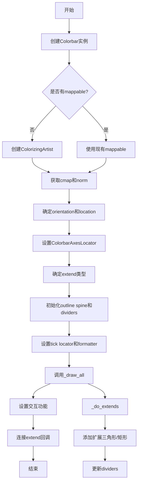

## 类结构

```
object
├── _ColorbarSpine (mspines.Spine的子类)
├── _ColorbarAxesLocator
└── Colorbar
```

## 全局变量及字段


### `_log`
    
模块日志记录器，用于记录颜色条模块的调试和运行时信息

类型：`Logger`
    


### `_docstring.interpd`
    
文档字符串插值对象，用于管理颜色条相关文档模板

类型：`_docstring.interpd`
    


### `_set_ticks_on_axis_warn`
    
警告函数，提醒用户使用colorbar的set_ticks()方法而非轴的set_xticks/set_yticks

类型：`function`
    


### `_ColorbarSpine._ColorbarSpine._ax`
    
颜色条所属的Axes对象

类型：`Axes`
    


### `_ColorbarAxesLocator._ColorbarAxesLocator._cbar`
    
颜色条对象引用

类型：`Colorbar`
    


### `_ColorbarAxesLocator._ColorbarAxesLocator._orig_locator`
    
原始的axes定位器，可能为None

类型：`Any`
    


### `Colorbar.Colorbar.n_rasterize`
    
光栅化阈值，当颜色数量大于等于此值时进行光栅化处理

类型：`int`
    


### `Colorbar.Colorbar.mappable`
    
可映射对象，包含颜色映射和归一化信息

类型：`ColorizingArtist`
    


### `Colorbar.Colorbar.cmap`
    
颜色映射对象，定义颜色到数值的映射

类型：`Colormap`
    


### `Colorbar.Colorbar.norm`
    
归一化对象，将数据值映射到[0,1]范围

类型：`Normalize`
    


### `Colorbar.Colorbar.values`
    
颜色值数组，定义每个区域的颜色值

类型：`ndarray`
    


### `Colorbar.Colorbar.boundaries`
    
边界数组，定义颜色区域的边界

类型：`ndarray`
    


### `Colorbar.Colorbar.extend`
    
扩展类型，可为'neither'、'both'、'min'或'max'

类型：`str`
    


### `Colorbar.Colorbar.alpha`
    
透明度值，0为完全透明，1为完全不透明

类型：`float`
    


### `Colorbar.Colorbar.spacing`
    
间距模式，可为'uniform'或'proportional'

类型：`str`
    


### `Colorbar.Colorbar.orientation`
    
方向，可为'vertical'或'horizontal'

类型：`str`
    


### `Colorbar.Colorbar.drawedges`
    
是否绘制边界线

类型：`bool`
    


### `Colorbar.Colorbar._filled`
    
是否填充颜色

类型：`bool`
    


### `Colorbar.Colorbar.extendfrac`
    
扩展比例，控制颜色条延伸部分的长度

类型：`float`
    


### `Colorbar.Colorbar.extendrect`
    
是否使用矩形扩展，若为False则使用三角形扩展

类型：`bool`
    


### `Colorbar.Colorbar._extend_patches`
    
扩展补丁列表，存储颜色条延伸部分的补丁对象

类型：`list`
    


### `Colorbar.Colorbar.solids`
    
填充对象，用于绘制颜色条的颜色块

类型：`QuadMesh`
    


### `Colorbar.Colorbar.solids_patches`
    
补丁列表，当需要 hatching 时使用

类型：`list`
    


### `Colorbar.Colorbar.lines`
    
线条集合，存储颜色条上的等值线

类型：`list`
    


### `Colorbar.Colorbar.dividers`
    
分隔线集合，绘制颜色边界线

类型：`LineCollection`
    


### `Colorbar.Colorbar.outline`
    
轮廓脊对象，定义颜色条边框

类型：`_ColorbarSpine`
    


### `Colorbar.Colorbar.ax`
    
颜色条所在的Axes对象

类型：`Axes`
    


### `Colorbar.Colorbar._locator`
    
主刻度定位器，控制主刻度位置

类型：`Locator`
    


### `Colorbar.Colorbar._minorlocator`
    
次刻度定位器，控制次刻度位置

类型：`Locator`
    


### `Colorbar.Colorbar._formatter`
    
主格式化器，控制主刻度标签格式

类型：`Formatter`
    


### `Colorbar.Colorbar._minorformatter`
    
次格式化器，控制次刻度标签格式

类型：`Formatter`
    


### `Colorbar.Colorbar.ticklocation`
    
刻度位置，可为'auto'、'left'、'right'、'top'或'bottom'

类型：`str`
    


### `Colorbar.Colorbar.vmin`
    
颜色映射最小值

类型：`float`
    


### `Colorbar.Colorbar.vmax`
    
颜色映射最大值

类型：`float`
    


### `Colorbar.Colorbar._boundaries`
    
内部边界数组，存储颜色边界

类型：`ndarray`
    


### `Colorbar.Colorbar._values`
    
内部值数组，存储颜色值

类型：`ndarray`
    


### `Colorbar.Colorbar._inside`
    
内部切片，用于选择非扩展部分

类型：`slice`
    


### `Colorbar.Colorbar._y`
    
网格Y坐标数组

类型：`ndarray`
    
    

## 全局函数及方法


### `_set_ticks_on_axis_warn`

这是一个模块级警告函数，用于在用户调用已废弃的 `set_xticks` 或 `set_yticks` 方法时发出警告，提示用户改用 Colorbar 的 `set_ticks()` 方法。

参数：

- `*args`：可变位置参数，用于接收任意数量的位置参数（不实际使用）
- `**kwargs`：可变关键字参数，用于接收任意数量的关键字参数（不实际使用）

返回值：`None`，该函数不返回任何值，仅发出警告

#### 流程图

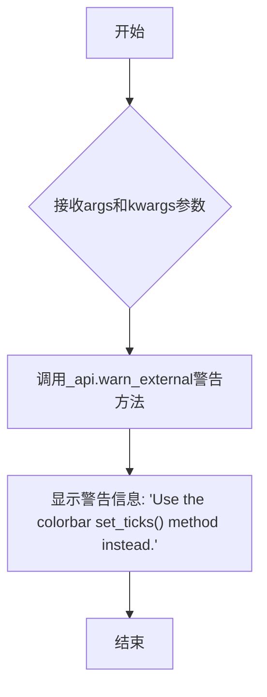

#### 带注释源码

```python
def _set_ticks_on_axis_warn(*args, **kwargs):
    """
    A top-level function which gets put in at the axes'
    set_xticks and set_yticks by Colorbar.__init__.
    
    This function serves as a deprecated placeholder that warns users
    when they attempt to use the old set_xticks/set_yticks methods on
    colorbar axes, directing them to use the newer set_ticks() method
    instead.
    
    Parameters
    ----------
    *args : tuple
        Variable length argument list (ignored, for compatibility).
    **kwargs : dict
        Arbitrary keyword arguments (ignored, for compatibility).
    
    Returns
    -------
    None
        This function only emits a warning and does not return anything.
    """
    # a top level function which gets put in at the axes'
    # set_xticks and set_yticks by Colorbar.__init__.
    _api.warn_external("Use the colorbar set_ticks() method instead.")
```


### `_normalize_location_orientation`

该函数用于规范化颜色条（Colorbar）的位置和方向参数。它接受位置（location）和方向（orientation）作为输入，根据一定的规则（如默认值、互斥性检查）返回一个包含位置、方向、锚点（anchor）、父锚点（panchor）和间距（pad）的完整配置字典。这个函数是 Matplotlib 中创建颜色条轴（Axes）的关键辅助函数，确保了位置和方向参数的一致性。

参数：

- `location`：`str` 或 `None`，颜色条的位置，可选值为 'left'、'right'、'top'、'bottom'。如果为 None，将根据 orientation 确定默认位置。
- `orientation`：`str` 或 `None`，颜色条的方向，可选值为 'vertical' 或 'horizontal'。如果为 None，将根据 location 确定默认方向。

返回值：`dict`，返回一个包含颜色条布局配置的字典，包含以下键：
- `location` (str): 规范化后的位置。
- `orientation` (str): 规范化后的方向。
- `anchor` (tuple): 颜色条轴的锚点。
- `panchor` (tuple): 父轴的锚点。
- `pad` (float): 颜色条与主轴之间的间距。

#### 流程图

```mermaid
flowchart TD
    A[开始 _normalize_location_orientation] --> B{location is None?}
    B -- 是 --> C[调用 _get_ticklocation_from_orientation<br/>获取默认 location]
    B -- 否 --> D[使用传入的 location]
    C --> E[调用 _api.getitem_checked<br/>从预定义字典中获取 loc_settings]
    D --> E
    E --> F[调用 _get_orientation_from_location<br/>根据 location 确定 orientation]
    F --> G[更新 loc_settings['orientation']]
    H{orientation 不为 None<br/>且与 loc_settings['orientation'] 不匹配?}
    H -- 是 --> I[抛出 TypeError]
    H -- 否 --> J[返回 loc_settings]
    I --> K[结束]
    J --> K
```

#### 带注释源码

```python
def _normalize_location_orientation(location, orientation):
    """
    规范化颜色条的位置和方向参数。

    此函数将 location 和 orientation 参数转换为完整的布局设置字典，
    包括锚点、间距等。如果只提供其中一个参数，另一个将根据默认值自动推断。
    如果两者同时提供但互相矛盾，则抛出异常。

    参数
    ----------
    location : str 或 None
        颜色条的位置，可选 'left', 'right', 'top', 'bottom'。
    orientation : str 或 None
        颜色条的方向，可选 'vertical', 'horizontal'。

    返回值
    -------
    dict
        包含 'location', 'orientation', 'anchor', 'panchor', 'pad' 的字典。
    """
    # 如果 location 为 None，则根据 orientation 确定默认的 location
    if location is None:
        location = _get_ticklocation_from_orientation(orientation)
    
    # 从预定义字典中获取位置相关的设置
    # 包含锚点、父锚点和间距的配置
    loc_settings = _api.getitem_checked({
        "left":   {"location": "left", "anchor": (1.0, 0.5),
                   "panchor": (0.0, 0.5), "pad": 0.10},
        "right":  {"location": "right", "anchor": (0.0, 0.5),
                   "panchor": (1.0, 0.5), "pad": 0.05},
        "top":    {"location": "top", "anchor": (0.5, 0.0),
                   "panchor": (0.5, 1.0), "pad": 0.05},
        "bottom": {"location": "bottom", "anchor": (0.5, 1.0),
                   "panchor": (0.5, 0.0), "pad": 0.15},
    }, location=location)
    
    # 根据 location 确定 orientation 并更新设置
    loc_settings["orientation"] = _get_orientation_from_location(location)
    
    # 检查 orientation 和 location 是否兼容
    # 如果用户同时指定了 orientation 和 location，但它们不一致（例如 location='left' 但 orientation='horizontal'），则抛出类型错误
    if orientation is not None and orientation != loc_settings["orientation"]:
        # Allow the user to pass both if they are consistent.
        raise TypeError("location and orientation are mutually exclusive")
    
    # 返回完整的布局配置字典
    return loc_settings
```


### `_get_orientation_from_location`

根据颜色条的位置参数，返回对应的方向（'vertical' 或 'horizontal'），如果位置为 None 则返回 None。

参数：

- `location`：`Optional[str]`，位置参数，值为 None、'left'、'right'、'top' 或 'bottom' 之一，表示颜色条相对于父 Axes 的放置位置

返回值：`Optional[str]`，返回 'vertical'（垂直方向，对应 left/right 位置）、'horizontal'（水平方向，对应 top/bottom 位置）或 None（当 location 为 None 时）

#### 流程图

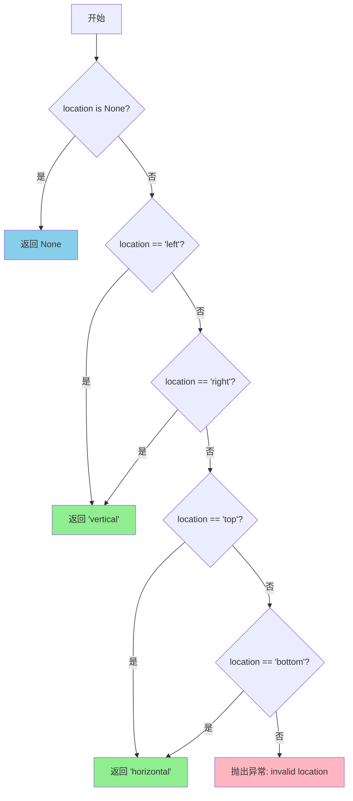

#### 带注释源码

```python
def _get_orientation_from_location(location):
    """
    根据位置参数返回对应的颜色条方向。

    参数
    ----------
    location : str or None
        颜色条的位置，可选值为：
        - None: 未指定位置
        - 'left': 左侧，垂直方向
        - 'right': 右侧，垂直方向
        - 'top': 顶部，水平方向
        - 'bottom': 底部，水平方向

    返回值
    -------
    str or None
        对应的方向：
        - 'vertical': 垂直方向（left/right）
        - 'horizontal': 水平方向（top/bottom）
        - None: 当 location 为 None 时
    """
    # 使用 _api.getitem_checked 从字典中获取值
    # 如果 location 不在字典的键中，会抛出异常
    return _api.getitem_checked(
        {None: None, "left": "vertical", "right": "vertical",
         "top": "horizontal", "bottom": "horizontal"}, location=location)
```


### `_get_ticklocation_from_orientation`

**描述**：根据颜色条的方向（`orientation`）确定刻度标签的默认位置。垂直颜色条默认刻度在右侧（`'right'`），水平颜色条默认刻度在底部（`'bottom'`）。

参数：
- `orientation`：`str | None`，颜色条的方向。取值为 `'vertical'`（垂直）、`'horizontal'`（水平）或 `None`。

返回值：`str`，默认的刻度位置。若方向为 `'vertical'` 或 `None`，返回 `'right'`；若为 `'horizontal'`，返回 `'bottom'`。

#### 流程图

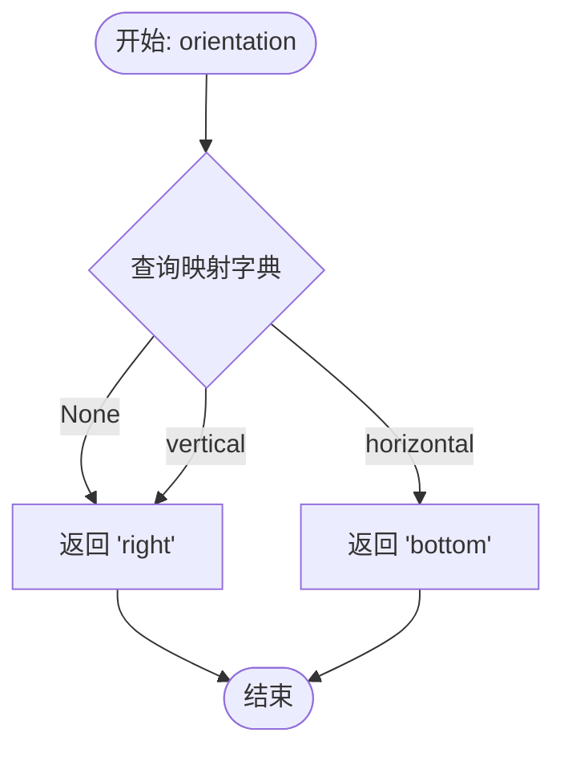

#### 带注释源码

```python
def _get_ticklocation_from_orientation(orientation):
    """
    根据颜色条的方向获取默认的刻度位置。

    Parameters
    ----------
    orientation : str or None
        颜色条的方向。可以是 'vertical'（垂直）或 'horizontal'（水平）。

    Returns
    -------
    str
        默认的刻度位置字符串。
        - 'vertical' 或 None -> 'right' (右侧)
        - 'horizontal' -> 'bottom' (底部)
    """
    # 定义方向(orientation)到刻度位置(ticklocation)的映射字典。
    # 如果 orientation 为 None，默认视为垂直方向，因此返回 'right'。
    _location_map = {
        None: "right",       # 默认垂直
        "vertical": "right", # 垂直
        "horizontal": "bottom" # 水平
    }

    # 使用 _api.getitem_checked 安全地从字典中获取值。
    # 如果 orientation 不在字典的键中（例如传入非法值），该 API 会抛出适当的错误。
    return _api.getitem_checked(
        _location_map,
        orientation=orientation)
```


### `make_axes`

创建颜色条Axes（非GridSpec方式），通过调整父Axes的位置和大小来为颜色条腾出空间。该函数是Matplotlib中颜色条创建的核心函数之一，负责在不使用GridSpec的情况下定位颜色条Axes。

参数：

- `parents`：`~matplotlib.axes.Axes` 或可迭代对象或 `numpy.ndarray` of `~.axes.Axes`，用于放置颜色条的父Axes
- `location`：`None` 或 `{'left', 'right', 'top', 'bottom'}`，颜色条相对于父Axes的位置
- `orientation`：`None` 或 `{'vertical', 'horizontal'}`，颜色条的方向
- `fraction`： `float`，默认 0.15，用于颜色条的原始Axes比例
- `shrink`： `float`，默认 1.0，用于乘以颜色条大小的比例
- `aspect`： `float`，默认 20，长宽比（长边与短边的比例）
- `**kwargs`：其他关键字参数，将传递给Colorbar类

返回值：`(cax, kwargs)`，其中：
- `cax`：`~matplotlib.axes.Axes`，创建的子Axes（颜色条Axes）
- `kwargs`：`dict`，简化后的关键字字典，用于创建颜色条实例

#### 流程图

```mermaid
flowchart TD
    A[开始 make_axes] --> B[调用 _normalize_location_orientation 规范化 location 和 orientation]
    B --> C[设置 kwargs['orientation'] 和 kwargs['ticklocation']]
    D[从 kwargs 中提取 anchor 和 panchor]
    C --> D
    D --> E[将 parents 转换为列表]
    E --> F[获取第一个父Axes的图形 fig]
    G[根据是否使用 constrained_layout 计算 pad]
    F --> G
    G --> H{验证所有父Axes是否在同一图形中}
    H -->|否| I[抛出 ValueError]
    H -->|是| J[计算所有父Axes的联合边界框 parents_bbox]
    I --> J
    J --> K{location 是 left 还是 right?}
    K -->|是| L[使用 splitx 分割边界框]
    K -->|否| M[使用 splity 分割边界框]
    L --> N[对 pbcb 进行 shrunk 和 anchored 变换]
    M --> N
    N --> O[创建从旧坐标到新坐标的变换]
    O --> P[遍历每个父Axes应用位置变换]
    P --> Q[使用 fig.add_axes 创建颜色条 cax]
    Q --> R[将 cax 添加到父Axes的 _colorbars 列表]
    R --> S[设置 cax 的颜色条信息字典 _colorbar_info]
    S --> T[设置 cax 的锚点和长宽比]
    T --> U[返回 cax 和 kwargs]
```

#### 带注释源码

```python
@_docstring.interpd
def make_axes(parents, location=None, orientation=None, fraction=0.15,
              shrink=1.0, aspect=20, **kwargs):
    """
    Create an `~.axes.Axes` suitable for a colorbar.

    The Axes is placed in the figure of the *parents* Axes, by resizing and
    repositioning *parents*.

    Parameters
    ----------
    parents : `~matplotlib.axes.Axes` or iterable or `numpy.ndarray` of `~.axes.Axes`
        The Axes to use as parents for placing the colorbar.
    %(_make_axes_kw_doc)s

    Returns
    -------
    cax : `~matplotlib.axes.Axes`
        The child Axes.
    kwargs : dict
        The reduced keyword dictionary to be passed when creating the colorbar
        instance.
    """
    # 根据location和orientation获取规范化设置（包含orientation、location、anchor、panchor、pad等）
    loc_settings = _normalize_location_orientation(location, orientation)
    
    # 将orientation和ticklocation放入kwargs，传回给Colorbar类
    kwargs['orientation'] = loc_settings['orientation']
    location = kwargs['ticklocation'] = loc_settings['location']

    # 从kwargs中提取anchor和panchor，使用默认值
    anchor = kwargs.pop('anchor', loc_settings['anchor'])
    panchor = kwargs.pop('panchor', loc_settings['panchor'])
    aspect0 = aspect  # 保存原始aspect值
    
    # 将parents转换为列表。注意不能使用.flatten或.ravel，
    # 因为它们复制引用而非重用，导致内存泄漏
    if isinstance(parents, np.ndarray):
        parents = list(parents.flat)
    elif np.iterable(parents):
        parents = list(parents)
    else:
        parents = [parents]

    # 获取父Axes所在的图形
    fig = parents[0].get_figure()

    # 根据是否使用constrained_layout计算pad值
    pad0 = 0.05 if fig.get_constrained_layout() else loc_settings['pad']
    pad = kwargs.pop('pad', pad0)

    # 验证所有父Axes是否在同一图形中
    if not all(fig is ax.get_figure() for ax in parents):
        raise ValueError('Unable to create a colorbar Axes as not all '
                         'parents share the same figure.')

    # 获取所有给定Axes的联合边界框
    parents_bbox = mtransforms.Bbox.union(
        [ax.get_position(original=True).frozen() for ax in parents])

    pb = parents_bbox
    # 根据位置（left/right/top/bottom）分割边界框，创建颜色条空间
    if location in ('left', 'right'):
        if location == 'left':
            # 左侧：分割为[颜色条, 间隙, 剩余部分]
            pbcb, _, pb1 = pb.splitx(fraction, fraction + pad)
        else:
            # 右侧：分割为[剩余部分, 间隙, 颜色条]
            pb1, _, pbcb = pb.splitx(1 - fraction - pad, 1 - fraction)
        # 对颜色条边界框进行缩放和锚定
        pbcb = pbcb.shrunk(1.0, shrink).anchored(anchor, pbcb)
    else:
        if location == 'bottom':
            # 底部：分割为[颜色条, 间隙, 剩余部分]
            pbcb, _, pb1 = pb.splity(fraction, fraction + pad)
        else:
            # 顶部：分割为[剩余部分, 间隙, 颜色条]
            pb1, _, pbcb = pb.splity(1 - fraction - pad, 1 - fraction)
        pbcb = pbcb.shrunk(shrink, 1.0).anchored(anchor, pbcb)

        # 用y/x代替x/y来表示长宽比
        aspect = 1.0 / aspect

    # 定义从旧axes坐标到新axes坐标的变换
    shrinking_trans = mtransforms.BboxTransform(parents_bbox, pb1)

    # 使用新变换转换每个父Axes的位置
    for ax in parents:
        new_posn = shrinking_trans.transform(ax.get_position(original=True))
        new_posn = mtransforms.Bbox(new_posn)
        ax._set_position(new_posn)
        # 设置锚点（如果panchor不为False）
        if panchor is not False:
            ax.set_anchor(panchor)

    # 在指定位置创建颜色条Axes
    cax = fig.add_axes(pbcb, label="<colorbar>")
    # 告诉父Axes它有一个颜色条
    for a in parents:
        a._colorbars.append(cax)
    
    # 设置颜色条信息字典，供后续使用
    cax._colorbar_info = dict(
        parents=parents,
        location=location,
        shrink=shrink,
        anchor=anchor,
        panchor=panchor,
        fraction=fraction,
        aspect=aspect0,
        pad=pad)
    
    # 手动设置长宽比
    cax.set_anchor(anchor)
    cax.set_box_aspect(aspect)
    cax.set_aspect('auto')

    return cax, kwargs
```


### `make_axes_gridspec`

创建适用于颜色条的子图 Axes（基于 GridSpec），通过重新划分父 Axes 的子图规格来放置颜色条。

参数：

- `parent`：`~matplotlib.axes.Axes`，用于放置颜色条的父 Axes
- `location`：`None` 或 `{'left', 'right', 'top', 'bottom'}`，颜色条相对于父 Axes 的位置
- `orientation`：`None` 或 `{'vertical', 'horizontal'}`，颜色条的方向
- `fraction`：`float`，默认 0.15，用于颜色条的原始 Axes 比例
- `shrink`：`float`，默认 1.0，乘以颜色条大小的比例
- `aspect`：`float`，默认 20，长宽比（长边与短边的比率）
- `**kwargs`：其他关键字参数，将传递给颜色条

返回值：

- `cax`：`~matplotlib.axes.Axes`，创建的颜色条子 Axes
- `kwargs`：`dict`，简化后的关键字字典，用于创建颜色条实例

#### 流程图

```mermaid
flowchart TD
    A[开始 make_axes_gridspec] --> B[规范化 location 和 orientation]
    B --> C{location 在 {'left', 'right'}?}
    C -->|Yes| D[创建 3x2 gridspec<br/>设置 width_ratios]
    C -->|No| E[创建 2x3 gridspec<br/>设置 height_ratios]
    D --> F[提取主子图规格 ss_main<br/>和颜色条子图规格 ss_cb]
    E --> F
    F --> G[设置父 Axes 的子图规格为 ss_main]
    G --> H{是否设置 panchor?}
    H -->|Yes| I[设置父 Axes 的锚点为 panchor]
    H -->|No| J[跳过锚点设置]
    I --> K[获取父 Axes 的 figure]
    J --> K
    K --> L[使用 ss_cb 创建颜色条子 Axes]
    L --> M[配置颜色条信息字典 _colorbar_info]
    M --> N[返回 cax 和 kwargs]
```

#### 带注释源码

```python
@_docstring.interpd
def make_axes_gridspec(parent, *, location=None, orientation=None,
                       fraction=0.15, shrink=1.0, aspect=20, **kwargs):
    """
    Create an `~.axes.Axes` suitable for a colorbar.

    The Axes is placed in the figure of the *parent* Axes, by resizing and
    repositioning *parent*.

    This function is similar to `.make_axes` and mostly compatible with it.
    Primary differences are

    - `.make_axes_gridspec` requires the *parent* to have a subplotspec.
    - `.make_axes` positions the Axes in figure coordinates;
      `.make_axes_gridspec` positions it using a subplotspec.
    - `.make_axes` updates the position of the parent.  `.make_axes_gridspec`
      replaces the parent gridspec with a new one.

    Parameters
    ----------
    parent : `~matplotlib.axes.Axes`
        The Axes to use as parent for placing the colorbar.
    %(_make_axes_kw_doc)s

    Returns
    -------
    cax : `~matplotlib.axes.Axes`
        The child Axes.
    kwargs : dict
        The reduced keyword dictionary to be passed when creating the colorbar
        instance.
    """

    # 规范化 location 和 orientation，处理默认值和互斥情况
    loc_settings = _normalize_location_orientation(location, orientation)
    
    # 将规范化的方向和位置写入 kwargs
    kwargs['orientation'] = loc_settings['orientation']
    location = kwargs['ticklocation'] = loc_settings['location']

    aspect0 = aspect  # 保存原始 aspect 值用于返回
    anchor = kwargs.pop('anchor', loc_settings['anchor'])  # 颜色条 Axes 锚点
    panchor = kwargs.pop('panchor', loc_settings['panchor'])  # 父 Axes 锚点
    pad = kwargs.pop('pad', loc_settings["pad"])  # 颜色条与主 Axes 间距
    
    # 计算子图之间的间距
    wh_space = 2 * pad / (1 - pad)

    # 根据位置创建子 gridspec
    if location in ('left', 'right'):
        # 垂直颜色条：创建 3x2 网格（行 x 列）
        # height_ratios 根据锚点和 shrink 计算
        gs = parent.get_subplotspec().subgridspec(
            3, 2, wspace=wh_space, hspace=0,
            height_ratios=[(1-anchor[1])*(1-shrink), shrink, anchor[1]*(1-shrink)])
        
        if location == 'left':
            # 左侧：颜色条在左边
            gs.set_width_ratios([fraction, 1 - fraction - pad])
            ss_main = gs[:, 1]  # 主 Axes 占用右侧
            ss_cb = gs[1, 0]    # 颜色条在左侧中间
        else:
            # 右侧：颜色条在右边
            gs.set_width_ratios([1 - fraction - pad, fraction])
            ss_main = gs[:, 0]  # 主 Axes 占用左侧
            ss_cb = gs[1, 1]    # 颜色条在右侧中间
    else:
        # 水平颜色条：创建 2x3 网格
        gs = parent.get_subplotspec().subgridspec(
            2, 3, hspace=wh_space, wspace=0,
            width_ratios=[anchor[0]*(1-shrink), shrink, (1-anchor[0])*(1-shrink)])
        
        if location == 'top':
            # 顶部：颜色条在顶部
            gs.set_height_ratios([fraction, 1 - fraction - pad])
            ss_main = gs[1, :]  # 主 Axes 占用底部
            ss_cb = gs[0, 1]    # 颜色条在顶部中间
        else:
            # 底部：颜色条在底部（默认）
            gs.set_height_ratios([1 - fraction - pad, fraction])
            ss_main = gs[0, :]  # 主 Axes 占用顶部
            ss_cb = gs[1, 1]    # 颜色条在底部中间
        
        # 水平颜色条需要反转 aspect
        aspect = 1 / aspect

    # 使用新的子图规格替换父 Axes 的子图规格
    parent.set_subplotspec(ss_main)
    
    # 设置父 Axes 的锚点
    if panchor is not False:
        parent.set_anchor(panchor)

    # 获取父 Axes 所属的 figure
    fig = parent.get_figure()
    
    # 在 figure 中添加颜色条 Axes，使用子图规格
    cax = fig.add_subplot(ss_cb, label="<colorbar>")
    
    # 记录父子关系
    parent._colorbars.append(cax)  # 告知父 Axes 它有一个颜色条
    
    # 设置颜色条 Axes 的属性
    cax.set_anchor(anchor)  # 设置锚点
    cax.set_box_aspect(aspect)  # 设置长宽比
    cax.set_aspect('auto')  # 自动调整
    
    # 保存颜色条配置信息，供后续使用
    cax._colorbar_info = dict(
        location=location,
        parents=[parent],
        shrink=shrink,
        anchor=anchor,
        panchor=panchor,
        fraction=fraction,
        aspect=aspect0,
        pad=pad)

    return cax, kwargs
```


### `_ColorbarSpine.__init__`

初始化颜色条脊（Spine），该类是 `Spine` 的子类，用于在颜色条上绘制边框。

参数：

- `self`：`_ColorbarSpine`，隐含的实例对象
- `axes`：`matplotlib.axes.Axes`，颜色条所在的 Axes 对象，用于初始化脊的坐标轴和变换

返回值：`None`，无返回值（`__init__` 方法隐式返回 `None`）

#### 流程图

```mermaid
flowchart TD
    A[开始 __init__] --> B[将 axes 赋值给 self._ax]
    B --> C[调用父类 Spine.__init__]
    C --> D[创建空 Path: np.empty((0, 2))]
    D --> E[传递 axes, 'colorbar', 空 Path 给父类]
    E --> F[设置 Patch 变换为 axes.transAxes]
    F --> G[结束 __init__]
```

#### 带注释源码

```python
def __init__(self, axes):
    """
    初始化 _ColorbarSpine 对象。

    Parameters
    ----------
    axes : matplotlib.axes.Axes
        颜色条所在的 Axes 对象。
    """
    # 保存对 Axes 的引用，供后续方法使用
    self._ax = axes
    
    # 调用父类 Spine 的 __init__ 方法
    # 参数:
    #   - axes: 坐标轴实例
    #   - 'colorbar': spine 类型标识
    #   - mpath.Path(np.empty((0, 2))): 创建一个空的 2D 路径作为初始形状
    super().__init__(axes, 'colorbar', mpath.Path(np.empty((0, 2))))
    
    # 设置 Patch 的变换为 axes 的 transAxes（坐标轴坐标变换）
    # 这样脊的绘制将使用相对坐标（0-1范围）而非数据坐标
    mpatches.Patch.set_transform(self, axes.transAxes)
```


### `_ColorbarSpine.get_window_extent`

获取颜色条脊柱（spine）在窗口中的范围。该方法直接调用父类 `Patch` 的 `get_window_extent` 方法，因为颜色条脊柱没有关联的轴（Axis），不需要调整位置。

参数：

- `self`：`_ColorbarSpine` 实例，调用该方法的对象本身
- `renderer`：`~matplotlib.backends.backend_agg.RendererBase` 或 `None`，渲染器对象，用于计算窗口范围。如果为 `None`，则使用默认渲染器

返回值：`~matplotlib.transforms.Bbox`，颜色条脊柱在窗口坐标中的边界框（BoundingBox）

#### 流程图

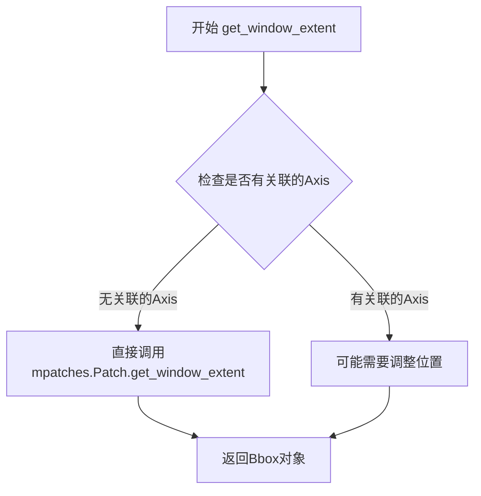

#### 带注释源码

```python
def get_window_extent(self, renderer=None):
    """
    获取颜色条脊柱在窗口中的范围。

    该 Spine 没有关联的 Axis，因此不需要调整其位置，
    可以直接从 super-super-class (即 mpatches.Patch) 获取窗口范围。

    Parameters
    ----------
    renderer : RendererBase or None, optional
        渲染器对象，用于计算窗口范围。如果为 None，则使用默认渲染器。

    Returns
    -------
    Bbox
        颜色条脊柱在窗口坐标中的边界框。
    """
    # This Spine has no Axis associated with it, and doesn't need to adjust
    # its location, so we can directly get the window extent from the
    # super-super-class.
    # 这个 Spine 没有关联的 Axis，不需要调整位置，因此可以直接从
    # super-super-class (mpatches.Patch) 获取窗口范围
    return mpatches.Patch.get_window_extent(self, renderer=renderer)
```


### `_ColorbarSpine.set_xy`

设置颜色条边框（Spine）的路径坐标，用于定义颜色条的外轮廓形状。

参数：

- `xy`：`numpy.ndarray` 或类似数组类型，颜色条边框的顶点坐标序列，通常为二维坐标数组

返回值：`None`，该方法无返回值，仅更新对象内部状态

#### 流程图

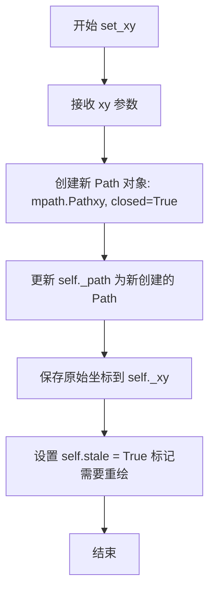

#### 带注释源码

```python
def set_xy(self, xy):
    """
    设置颜色条边框的路径坐标。
    
    Parameters
    ----------
    xy : array-like
        颜色条边框的顶点坐标，形状为 (n, 2) 的二维数组，
        其中每行是一个 (x, y) 坐标点。
    """
    # 使用传入的坐标创建一个新的闭合路径对象
    # closed=True 表示路径的首尾点会自动连接形成闭合多边形
    self._path = mpath.Path(xy, closed=True)
    
    # 保存原始输入坐标的引用，便于后续可能的几何计算
    self._xy = xy
    
    # 标记该艺术家对象需要重新绘制
    # stale 属性用于缓存机制，通知绘制系统该对象需要重绘
    self.stale = True
```


### `_ColorbarSpine.draw`

该方法是 `_ColorbarSpine` 类的绘图方法，负责绘制颜色条的边框（脊）。它调用父类 `Patch` 的绘制方法完成实际渲染，并将自身标记为不再需要重绘。

参数：

- `self`：`_ColorbarSpine`，隐式参数，表示当前颜色条脊对象
- `renderer`：`~matplotlib.backend_bases.RendererBase`，渲染器对象，用于将图形绘制到输出设备

返回值：`任意类型`，父类 `mpatches.Patch.draw()` 的返回值，通常为 `None`

#### 流程图

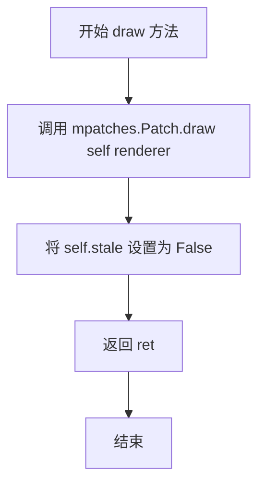

#### 带注释源码

```python
def draw(self, renderer):
    """
    绘制颜色条脊。

    Parameters
    ----------
    renderer : RendererBase
        渲染器，用于将图形绘制到输出设备。
    """
    # 调用父类 Patch 的 draw 方法进行实际绘制
    # 返回值通常为 None，但保留返回以支持链式调用
    ret = mpatches.Patch.draw(self, renderer)
    
    # 绘制完成后，将 stale 标记设为 False
    # 表示当前对象已与最新状态同步，不需要重新绘制
    self.stale = False
    
    # 返回父类 draw 方法的返回值
    return ret
```


### `_ColorbarAxesLocator.__init__`

该方法是 `_ColorbarAxesLocator` 类的构造函数，用于初始化颜色条坐标轴定位器。它接收一个 Colorbar 对象作为参数，并将该对象及其原始的坐标轴定位器保存为实例属性，以便在后续的定位操作中使用。

参数：

- `cbar`：`Colorbar`，颜色条对象，用于初始化定位器并获取原始坐标轴定位器

返回值：`None`，无返回值（这是 `__init__` 方法）

#### 流程图

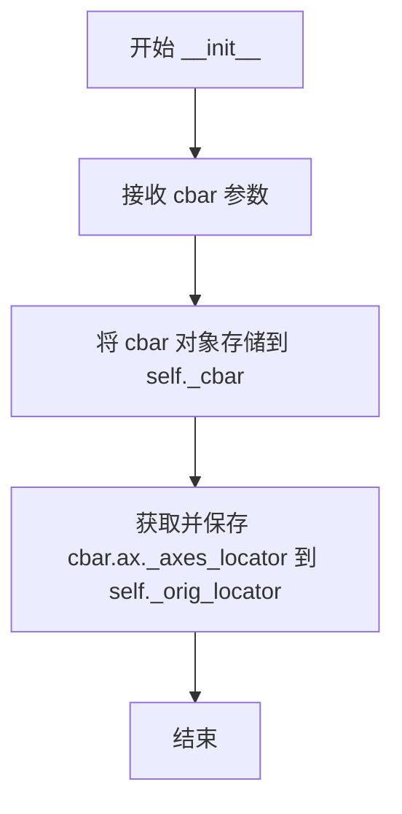

#### 带注释源码

```python
def __init__(self, cbar):
    """
    Initialize the locator with a Colorbar instance.

    This constructor stores the Colorbar object and retrieves the original
    AxesLocator from the colorbar's Axes, allowing the locator to adjust
    the Axes position based on the colorbar's extend settings.

    Parameters
    ----------
    cbar : Colorbar
        The Colorbar instance for which this locator manages the Axes position.
    """
    # 存储Colorbar对象的引用，用于后续访问其属性如extend、orientation等
    self._cbar = cbar
    
    # 保存原始的坐标轴定位器，以便在需要时调用或作为参考
    # 如果存在原始定位器，后续的__call__方法会优先使用它来获取位置
    self._orig_locator = cbar.ax._axes_locator
```


### `_ColorbarAxesLocator.__call__`

该方法是 `_ColorbarAxesLocator` 类的核心方法，负责在渲染时计算并调整 colorbar Axes 的位置。当 colorbar 具有三角形或矩形扩展（extend）时，该方法会根据扩展区域的大小收缩和偏移 Axes，以确保颜色条与主图之间的布局协调。

参数：

- `self`：`_ColorbarAxesLocator` 实例，当前定位器对象本身
- `ax`：`matplotlib.axes.Axes`，需要计算位置的 Axes 对象，即 colorbar 的 Axes
- `renderer`：`matplotlib.backend_bases.RendererBase`，渲染器对象，用于获取精确的像素位置信息

返回值：`matplotlib.transforms.Bbox`，计算调整后的 Axes 位置边界框对象

#### 流程图

```mermaid
flowchart TD
    A[开始 __call__] --> B{_orig_locator 是否存在?}
    B -->|是| C[调用原始定位器获取位置]
    B -->|否| D[调用 ax.get_position 获取原始位置]
    C --> E{extend == 'neither'?}
    D --> E
    E -->|是| F[直接返回位置 pos]
    E -->|否| G[调用 _cbar._proportional_y 获取 y 和 extendlen]
    G --> H{_extend_lower 返回值?}
    H -->|False| I[extendlen[0] = 0]
    H -->|True| J[保留 extendlen[0]]
    I --> K{_extend_upper 返回值?}
    J --> K
    K -->|False| L[extendlen[1] = 0]
    K -->|True| M[保留 extendlen[1]]
    L --> N[计算 len = sum + 1]
    M --> N
    N --> O[计算 shrink = 1 / len]
    O --> P[计算 offset = extendlen[0] / len]
    P --> Q{ax 是否有 _colorbar_info?}
    Q -->|是| R[获取 aspect 值]
    Q -->|否| S[aspect = False]
    R --> T{orientation == 'vertical'?}
    S --> T
    T -->|是| U{aspect 存在?}
    T -->|否| V{aspect 存在?}
    U -->|是| W[set_box_aspect aspect*shrink]
    U -->|否| X[pos.shrunk 1 shrink]
    V -->|是| Y[set_box_aspect 1/(aspect*shrink)]
    V -->|否| Z[pos.shrunk shrink 1]
    W --> X
    Y --> Z
    X --> AA[translated 0, offset*height]
    Z --> BB[offset*width, 0]
    AA --> CC[返回 pos]
    BB --> CC
    F --> CC
```

#### 带注释源码

```python
def __call__(self, ax, renderer):
    """
    计算并返回调整后的 colorbar Axes 位置。

    该方法实现了 AxesLocator 接口，在每次渲染时被调用。
    它根据 colorbar 的扩展类型（三角形或矩形）调整 Axes 的位置和大小。
    """
    # 检查是否存在原始的定位器
    if self._orig_locator is not None:
        # 如果存在，调用原始定位器获取基础位置
        pos = self._orig_locator(ax, renderer)
    else:
        # 否则，获取 Axes 的默认位置
        pos = ax.get_position(original=True)
    
    # 如果 colorbar 没有扩展（extend == 'neither'），直接返回位置
    if self._cbar.extend == 'neither':
        return pos

    # 获取 proportional y 坐标和扩展长度
    # _proportional_y 返回 (y坐标数组, 扩展长度数组[下, 上])
    y, extendlen = self._cbar._proportional_y()
    
    # 根据是否需要下扩展来调整扩展长度
    if not self._cbar._extend_lower():
        extendlen[0] = 0  # 如果不需要下扩展，将下扩展长度设为0
    if not self._cbar._extend_upper():
        extendlen[1] = 0  # 如果不需要上扩展，将上扩展长度设为0
    
    # 计算收缩因子：
    # 总长度 = 下扩展 + 上扩展 + 1（主颜色条）
    len = sum(extendlen) + 1
    shrink = 1 / len  # 收缩比例，用于减小主颜色条区域
    offset = extendlen[0] / len  # 偏移量，用于补偿下扩展区域

    # 获取 aspect ratio 信息
    # 我们需要重置 axes 的纵横比以考虑扩展区域
    if hasattr(ax, '_colorbar_info'):
        aspect = ax._colorbar_info['aspect']
    else:
        aspect = False

    # 根据方向应用收缩和偏移
    if self._cbar.orientation == 'vertical':
        # 垂直颜色条
        if aspect:
            # 设置 box 纵横比（考虑收缩）
            self._cbar.ax.set_box_aspect(aspect * shrink)
        # 水平方向保持不变，垂直方向收缩，并向上偏移
        pos = pos.shrunk(1, shrink).translated(0, offset * pos.height)
    else:
        # 水平颜色条
        if aspect:
            # 设置 box 纵横比（考虑收缩，水平方向需要倒数）
            self._cbar.ax.set_box_aspect(1 / (aspect * shrink))
        # 垂直方向保持不变，水平方向收缩，并向右偏移
        pos = pos.shrunk(shrink, 1).translated(offset * pos.width, 0)

    return pos
```


### `_ColorbarAxesLocator.get_subplotspec`

该方法是 `_ColorbarAxesLocator` 类的成员方法，主要用于支持 Matplotlib 的 `tight_layout` 功能。当调用此方法时，它会返回颜色条 Axes 的子图规格（SubplotSpec），如果颜色条 Axes 没有子图规格，则回退尝试使用原始定位器的子图规格。

参数：

- `self`：隐式参数，表示方法所属的实例对象

返回值：`SubplotSpec` 或 `None`，返回颜色条坐标轴的子图规格对象，如果没有则返回 `None`

#### 流程图

```mermaid
flowchart TD
    A[调用 get_subplotspec] --> B{self._cbar.ax.get_subplotspec() 是否存在}
    B -->|存在| C[返回 self._cbar.ax.get_subplotspec()]
    B -->|不存在| D{self._orig_locator 是否有 get_subplotspec 方法}
    D -->|有| E[调用并返回 self._orig_locator.get_subplotspec()]
    D -->|无| F[返回 None]
```

#### 带注释源码

```python
def get_subplotspec(self):
    # make tight_layout happy..
    # 该方法的主要目的是让 tight_layout 机制能够正确获取颜色条的子图规格
    # 以便在布局计算时正确考虑颜色条的位置
    return (
        # 优先尝试获取颜色条坐标轴自身的子图规格
        self._cbar.ax.get_subplotspec()
        # 如果颜色条坐标轴没有子图规格，则尝试从原始定位器获取
        # getattr 的第三个参数是一个默认的可调用对象，当属性不存在时返回 None
        or getattr(self._orig_locator, "get_subplotspec", lambda: None)())
```


### `Colorbar.__init__`

构造函数，用于初始化颜色条（Colorbar）对象，设置颜色映射、规范、刻度、标签等属性，并创建颜色条所需的Axes对象。

参数：

- `self`：隐式参数，Colorbar实例本身
- `ax`：`~matplotlib.axes.Axes`，绘制颜色条的Axes实例
- `mappable`：`.ColorizingArtist`，使用其colormap和norm的可绘制对象
- `alpha`：`float`，颜色条透明度，范围0（透明）到1（不透明）
- `location`：`None or {'left', 'right', 'top', 'bottom'}`，设置颜色条的方向和刻度位置
- `extend`：`{'neither', 'both', 'min', 'max'}`，是否在颜色条两端添加扩展三角形
- `extendfrac`：`{None, 'auto', length, lengths}`，扩展区域的长度
- `extendrect`：`bool`，如果为True，扩展区域为矩形；否则为三角形
- `ticks`：`None or list of ticks or Locator`，刻度位置
- `format`：`None or str or Formatter`，刻度标签格式
- `values`：`None or sequence`，颜色映射的值序列
- `boundaries`：`None or sequence`，颜色边界序列
- `spacing`：`{'uniform', 'proportional'}`，离散颜色条的间距模式
- `drawedges`：`bool`，是否在颜色边界处绘制线条
- `label`：`str`，颜色条的长轴标签
- `cmap`：`~matplotlib.colors.Colormap`，使用的colormap（当mappable为None时）
- `norm`：`~matplotlib.colors.Normalize`，使用的归一化（当mappable为None时）
- `orientation`：`None or {'vertical', 'horizontal'}`，颜色条方向
- `ticklocation`：`{'auto', 'left', 'right', 'top', 'bottom'}`，刻度位置

返回值：`None`，构造函数不返回值

#### 流程图

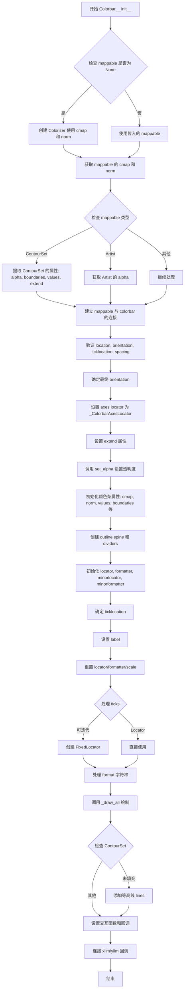

#### 带注释源码

```python
def __init__(
    self, ax, mappable=None, *,
    alpha=None,
    location=None,
    extend=None,
    extendfrac=None,
    extendrect=False,
    ticks=None,
    format=None,
    values=None,
    boundaries=None,
    spacing='uniform',
    drawedges=False,
    label='',
    cmap=None, norm=None,  # redundant with *mappable*
    orientation=None, ticklocation='auto',  # redundant with *location*
):
    """
    Parameters
    ----------
    ax : `~matplotlib.axes.Axes`
        The `~.axes.Axes` instance in which the colorbar is drawn.

    mappable : `.ColorizingArtist`
        The mappable whose colormap and norm will be used.

        To show the colors versus index instead of on a 0-1 scale, set the
        mappable's norm to ``colors.NoNorm()``.

    alpha : float
        The colorbar transparency between 0 (transparent) and 1 (opaque).

    location : None or {'left', 'right', 'top', 'bottom'}
        Set the colorbar's *orientation* and *ticklocation*. Colorbars on
        the left and right are vertical, colorbars at the top and bottom
        are horizontal. The *ticklocation* is the same as *location*, so if
        *location* is 'top', the ticks are on the top. *orientation* and/or
        *ticklocation* can be provided as well and overrides the value set by
        *location*, but there will be an error for incompatible combinations.

        .. versionadded:: 3.7

    %(_colormap_kw_doc)s

    Other Parameters
    ----------------
    cmap : `~matplotlib.colors.Colormap`, default: :rc:`image.cmap`
        The colormap to use.  This parameter is ignored, unless *mappable* is
        None.

    norm : `~matplotlib.colors.Normalize`
        The normalization to use.  This parameter is ignored, unless *mappable*
        is None.

    orientation : None or {'vertical', 'horizontal'}
        If None, use the value determined by *location*. If both
        *orientation* and *location* are None then defaults to 'vertical'.

    ticklocation : {'auto', 'left', 'right', 'top', 'bottom'}
        The location of the colorbar ticks. The *ticklocation* must match
        *orientation*. For example, a horizontal colorbar can only have ticks
        at the top or the bottom. If 'auto', the ticks will be the same as
        *location*, so a colorbar to the left will have ticks to the left. If
        *location* is None, the ticks will be at the bottom for a horizontal
        colorbar and at the right for a vertical.
    """
    # 如果没有传入mappable，则创建一个Colorizer对象
    if mappable is None:
        colorizer = mcolorizer.Colorizer(norm=norm, cmap=cmap)
        mappable = mcolorizer.ColorizingArtist(colorizer)

    # 保存mappable引用
    self.mappable = mappable
    cmap = mappable.cmap
    norm = mappable.norm

    # 标记是否填充
    filled = True
    # 如果mappable是ContourSet，提取相关属性
    if isinstance(mappable, contour.ContourSet):
        cs = mappable
        alpha = cs.get_alpha()
        boundaries = cs._levels
        values = cs.cvalues
        extend = cs.extend
        filled = cs.filled
        if ticks is None:
            ticks = ticker.FixedLocator(cs.levels, nbins=10)
    elif isinstance(mappable, martist.Artist):
        alpha = mappable.get_alpha()

    # 将colorbar关联到mappable，建立双向连接
    mappable.colorbar = self
    mappable.colorbar_cid = mappable.callbacks.connect(
        'changed', self.update_normal)

    # 根据location获取orientation
    location_orientation = _get_orientation_from_location(location)

    # 参数验证
    _api.check_in_list(
        [None, 'vertical', 'horizontal'], orientation=orientation)
    _api.check_in_list(
        ['auto', 'left', 'right', 'top', 'bottom'],
        ticklocation=ticklocation)
    _api.check_in_list(
        ['uniform', 'proportional'], spacing=spacing)

    # 处理orientation和location的兼容性问题
    if location_orientation is not None and orientation is not None:
        if location_orientation != orientation:
            raise TypeError(
                "location and orientation are mutually exclusive")
    else:
        orientation = orientation or location_orientation or "vertical"

    # 保存ax引用并设置axes定位器
    self.ax = ax
    self.ax._axes_locator = _ColorbarAxesLocator(self)

    # 处理extend参数：如果未指定，根据colormap或norm的extend属性设置
    if extend is None:
        if (not isinstance(mappable, contour.ContourSet)
                and getattr(cmap, 'colorbar_extend', False) is not False):
            extend = cmap.colorbar_extend
        elif hasattr(norm, 'extend'):
            extend = norm.extend
        else:
            extend = 'neither'
    
    # 初始化透明度并调用set_alpha处理数组形式的透明度
    self.alpha = None
    self.set_alpha(alpha)
    
    # 保存颜色映射和归一化对象
    self.cmap = cmap
    self.norm = norm
    self.values = values
    self.boundaries = boundaries
    self.extend = extend
    
    # 设置内部切片用于排除扩展区域
    self._inside = _api.getitem_checked(
        {'neither': slice(0, None), 'both': slice(1, -1),
         'min': slice(1, None), 'max': slice(0, -1)},
        extend=extend)
    
    # 保存其他属性
    self.spacing = spacing
    self.orientation = orientation
    self.drawedges = drawedges
    self._filled = filled
    self.extendfrac = extendfrac
    self.extendrect = extendrect
    self._extend_patches = []
    self.solids = None
    self.solids_patches = []
    self.lines = []

    # 隐藏axes的边框脊
    for spine in self.ax.spines.values():
        spine.set_visible(False)
    # 创建colorbar的轮廓边框
    self.outline = self.ax.spines['outline'] = _ColorbarSpine(self.ax)

    # 创建分隔线集合
    self.dividers = collections.LineCollection(
        [],
        colors=[mpl.rcParams['axes.edgecolor']],
        linewidths=[0.5 * mpl.rcParams['axes.linewidth']],
        clip_on=False)
    self.ax.add_collection(self.dividers, autolim=False)

    # 初始化locator和formatter
    self._locator = None
    self._minorlocator = None
    self._formatter = None
    self._minorformatter = None

    # 确定ticklocation
    if ticklocation == 'auto':
        ticklocation = _get_ticklocation_from_orientation(
            orientation) if location is None else location
    self.ticklocation = ticklocation

    # 设置标签
    self.set_label(label)
    # 重置locator、formatter和scale
    self._reset_locator_formatter_scale()

    # 处理ticks参数
    if np.iterable(ticks):
        self._locator = ticker.FixedLocator(ticks, nbins=len(ticks))
    else:
        self._locator = ticks

    # 处理format参数
    if isinstance(format, str):
        # 尝试FormatStrFormatter，失败则使用StrMethodFormatter
        try:
            self._formatter = ticker.FormatStrFormatter(format)
            _ = self._formatter(0)
        except (TypeError, ValueError):
            self._formatter = ticker.StrMethodFormatter(format)
    else:
        self._formatter = format  # 假设是Formatter或None
    
    # 执行所有绘制工作
    self._draw_all()

    # 如果是未填充的ContourSet，添加等高线
    if isinstance(mappable, contour.ContourSet) and not mappable.filled:
        self.add_lines(mappable)

    # 链接Axes和Colorbar以支持交互使用
    self.ax._colorbar = self
    
    # 对于某些类型的mappable，禁用导航
    if (isinstance(self.norm, (colors.BoundaryNorm, colors.NoNorm)) or
            isinstance(self.mappable, contour.ContourSet)):
        self.ax.set_navigate(False)

    # 设置交互函数
    self._interactive_funcs = ["_get_view", "_set_view",
                               "_set_view_from_bbox", "drag_pan"]
    for x in self._interactive_funcs:
        setattr(self.ax, x, getattr(self, x))
    # 重写cla函数
    self.ax.cla = self._cbar_cla
    
    # 连接扩展计算的回调
    self._extend_cid1 = self.ax.callbacks.connect(
        "xlim_changed", self._do_extends)
    self._extend_cid2 = self.ax.callbacks.connect(
        "ylim_changed", self._do_extends)
```


### `Colorbar.long_axis`

获取颜色条的长轴（带有刻度等装饰的轴）。

参数：

- （无参数，作为属性访问）

返回值：`matplotlib.axis.Axis`，返回颜色条的长轴对象。如果颜色条方向为垂直，则返回 y 轴；如果方向为水平，则返回 x 轴。

#### 流程图

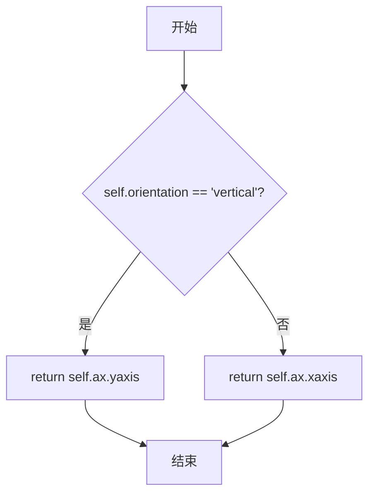

#### 带注释源码

```python
@property
def long_axis(self):
    """Axis that has decorations (ticks, etc) on it."""
    # 根据颜色条的 orientation 属性决定返回哪个轴
    # 垂直颜色条使用 y 轴作为长轴（刻度等装饰在右侧或左侧）
    # 水平颜色条使用 x 轴作为长轴（刻度等装饰在顶部或底部）
    if self.orientation == 'vertical':
        return self.ax.yaxis
    return self.ax.xaxis
```


### `Colorbar.locator`

获取或设置颜色条的主刻度定位器（Major tick `.Locator`）。该属性允许用户获取或修改颜色条上的主刻度定位器，用于控制刻度线的位置。

参数：

- `loc`：`matplotlib.ticker.Locator`，要设置的主刻度定位器对象（仅在setter中需要）

返回值：`matplotlib.ticker.Locator`，当前颜色的主刻度定位器（getter返回）

#### 流程图

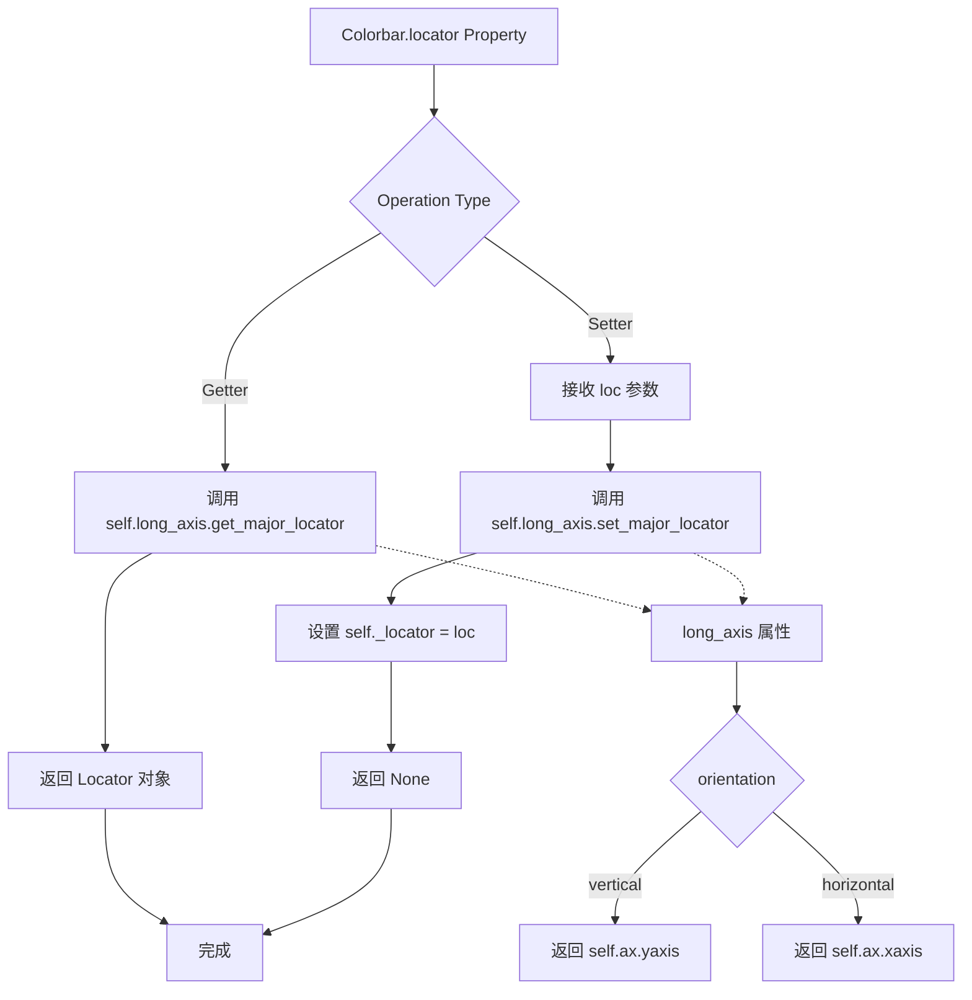

#### 带注释源码

```python
@property
def locator(self):
    """Major tick `.Locator` for the colorbar."""
    # 获取长轴（根据方向，可能是yaxis或xaxis）的主定位器
    return self.long_axis.get_major_locator()

@locator.setter
def locator(self, loc):
    # loc: 要设置的Locator对象，用于控制主刻度位置
    self.long_axis.set_major_locator(loc)
    # 同时更新内部存储的定位器引用
    self._locator = loc
```

#### 补充说明

- **设计目标**：提供统一的接口来获取和设置颜色条的主刻度定位器，与Matplotlib的Axis API保持一致
- **内部实现**：该属性实际上是对`long_axis`（根据颜色条方向，可能是yaxis或xaxis）的major locator的封装
- **相关属性**：
  - `minorlocator`：次刻度定位器
  - `formatter`：主刻度标签格式化器
  - `minorformatter`：次刻度标签格式化器
- **使用场景**：当用户需要自定义颜色条上的刻度位置时使用，例如使用`MaxNLocator`限制刻度数量或使用`FixedLocator`指定特定刻度位置


### Colorbar.minorlocator

获取或设置颜色条的次要刻度定位器（Minor tick `.Locator`）。该属性允许用户获取或修改颜色条上的次要刻度定位器，用于控制次要刻度的位置。

#### Getter（获取）

参数：无

返回值：`.Locator`，返回颜色条长轴上的次要刻度定位器对象。

#### Setter（设置）

- `loc`：`.Locator`，需要设置的次要刻度定位器对象。

返回值：无

#### 流程图

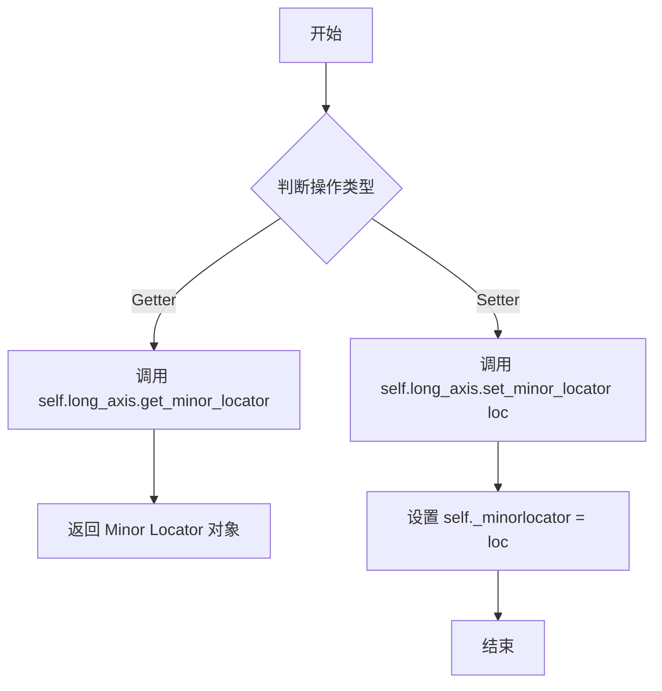

#### 带注释源码

```python
@property
def minorlocator(self):
    """
    Minor tick `.Locator` for the colorbar.
    
    获取颜色条的次要刻度定位器。该定位器决定了次要刻度
    在颜色条上的位置。返回一个 matplotlib ticker 模块中的
    Locator 子类实例。
    """
    # long_axis 根据 orientation 返回 yaxis（vertical）或 xaxis（horizontal）
    return self.long_axis.get_minor_locator()

@minorlocator.setter
def minorlocator(self, loc):
    """
    设置颜色条的次要刻度定位器。
    
    Parameters
    ----------
    loc : `.Locator`
        次要刻度定位器对象，用于确定颜色条上的次要刻度位置。
        可以是 matplotlib.ticker 中的任何 Locator 子类，如：
        - AutoMinorLocator: 自动计算次要刻度
        - FixedLocator: 固定位置的次要刻度
        - NullLocator: 无次要刻度
        等等。
    """
    # 将定位器设置到长轴上
    self.long_axis.set_minor_locator(loc)
    # 同时更新 Colorbar 对象内部存储的 _minorlocator 引用
    self._minorlocator = loc
```


### `Colorbar.formatter`

该属性用于获取或设置颜色条的主刻度标签格式化器。它是一个属性方法，包含getter和setter，用于管理颜色条上主刻度标签的显示格式。

#### 参数

- `fmt`：格式化器对象，可以是 `None`、字符串格式（如 `"%.2f"`）或 `~.ticker.Formatter` 实例，用于设置主刻度标签的格式

#### 返回值

- **Getter返回值**：`~.ticker.Formatter`，返回当前设置的主刻度标签格式化器
- **Setter返回值**：无（`None`）

#### 流程图

```mermaid
flowchart TD
    A[访问 Colorbar.formatter] --> B{是获取还是设置?}
    B -->|获取| C[调用 getter]
    B -->|设置| D[调用 setter]
    C --> E[返回 self.long_axis.get_major_formatter()]
    D --> F[调用 self.long_axis.set_major_formatter fmt]
    F --> G[设置 self._formatter = fmt]
    
    style A fill:#f9f,stroke:#333
    style E fill:#9f9,stroke:#333
    style G fill:#9f9,stroke:#333
```

#### 带注释源码

```python
@property
def formatter(self):
    """
    Major tick label `.Formatter` for the colorbar.
    
    这是一个属性getter，用于获取颜色条的主刻度标签格式化器。
    它返回与颜色条长轴关联的主要格式化器对象。
    
    Returns
    -------
    `.Formatter`
        当前设置的主刻度标签格式化器对象
    """
    return self.long_axis.get_major_formatter()

@formatter.setter
def formatter(self, fmt):
    """
    设置颜色条的主刻度标签格式化器。
    
    此方法允许用户自定义颜色条上主刻度标签的显示格式。
    支持多种输入类型：None（使用默认格式化器）、字符串格式
    （如 "%.2f" 或 "{x:.2e}"）或直接的 Formatter 对象。
    
    Parameters
    ----------
    fmt : None or str or `.Formatter`
        要设置的主刻度标签格式化器。如果为 None，则使用默认的
        ScalarFormatter。字符串格式会被转换为相应的 Formatter。
    """
    self.long_axis.set_major_formatter(fmt)
    self._formatter = fmt
```

#### 关键组件信息

| 组件名称 | 描述 |
|---------|------|
| `long_axis` | 属性，返回颜色条的长轴（X轴或Y轴），用于管理刻度位置和标签格式 |
| `_formatter` | 实例变量，存储当前的主格式化器引用 |
| `self.ax.yaxis` / `self.ax.xaxis` | Matplotlib的轴对象，实际管理刻度标签的格式化 |

#### 技术债务与优化空间

1. **双重状态存储**：`formatter` 属性同时在 `self._formatter` 和 `self.long_axis`（通过 `get_major_formatter()`）中存储格式化器引用，可能导致状态不一致。建议只保留轴上的格式化器引用。

2. **字符串格式转换时机**：在 `__init__` 方法中有字符串到Formatter的转换逻辑，但setter中没有实现，这导致通过setter设置字符串格式时行为不一致。

3. **文档不完整**：getter的文档注释缺少完整的Parameters和Returns说明格式。

#### 其他项目

**设计约束**：
- 该属性是Colorbar类的核心接口之一，用于控制颜色条刻度标签的显示格式
- 格式化器的选择会影响用户的数值阅读体验，特别是对于科学计算中的特殊数值格式

**错误处理**：
- 如果传入无效的格式化器类型，Matplotlib的底层轴方法会抛出异常
- 建议在setter中添加类型检查或转换逻辑，确保行为一致性


### `Colorbar.minorformatter`

获取或设置颜色条的次要刻度标签格式化器（Minor tick Formatter）。该属性允许用户获取或修改颜色条上次要刻度标签的格式化行为。

#### 参数

- `fmt`：`.Formatter`，用于设置次要刻度标签的格式化器对象（如 `ticker.ScalarFormatter`、`ticker.NullFormatter` 等）

#### 返回值

- `Getter`：返回当前设置的次要刻度标签 `.Formatter` 对象
- `Setter`：无返回值（`None`）

#### 流程图

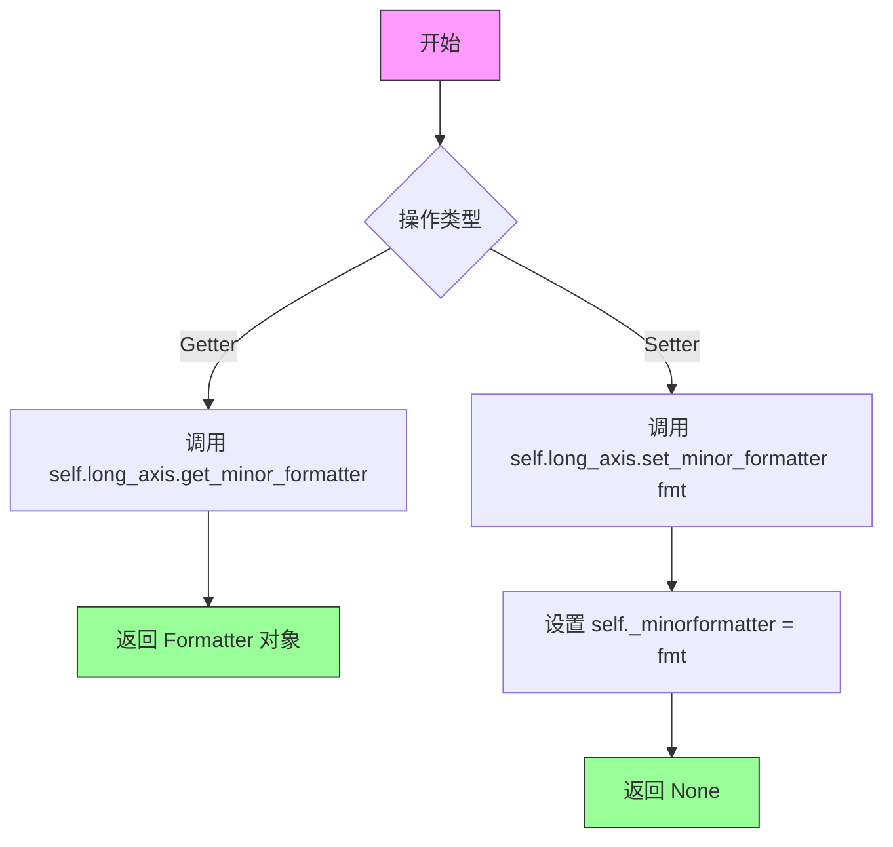

#### 带注释源码

```python
@property
def minorformatter(self):
    """
    Minor tick `.Formatter` for the colorbar.
    
    Returns
    -------
    Formatter
        The minor tick label formatter currently associated with the colorbar's
        long axis (xaxis for horizontal, yaxis for vertical colorbars).
    """
    # Access the long axis (yaxis for vertical, xaxis for horizontal colorbars)
    # and retrieve the minor tick formatter from matplotlib's axis system
    return self.long_axis.get_minor_formatter()

@minorformatter.setter
def minorformatter(self, fmt):
    """
    Set the minor tick label formatter for the colorbar.
    
    Parameters
    ----------
    fmt : Formatter
        The formatter to use for minor tick labels. Common formatters include:
        - `ticker.ScalarFormatter`: Default numeric formatting
        - `ticker.NullFormatter`: No labels
        - `ticker.FuncFormatter`: Custom function-based formatting
        - `ticker.FormatStrFormatter`: printf-style formatting
    """
    # Set the minor formatter on the axis (yaxis for vertical, xaxis for horizontal)
    self.long_axis.set_minor_formatter(fmt)
    # Also store a reference in the Colorbar instance for tracking purposes
    self._minorformatter = fmt
```


### `Colorbar._cbar_cla`

清除交互状态，重置颜色条轴到初始状态。

参数：

- `self`：`Colorbar`，隐式参数，表示当前 `Colorbar` 实例

返回值：`None`，无返回值（隐式返回 `None`）

#### 流程图

```mermaid
flowchart TD
    A[Start _cbar_cla] --> B{遍历 _interactive_funcs 中的每个函数}
    B -->|对于每个函数 x| C[delattr self.ax, x<br/>删除交互函数属性]
    C --> B
    B -->|遍历完成| D[del self.ax.cla<br/>删除覆盖的 cla 方法]
    D --> E[self.ax.cla<br/>调用原始的 cla 方法重置轴]
    E --> F[End]
```

#### 带注释源码

```python
def _cbar_cla(self):
    """Function to clear the interactive colorbar state."""
    # 遍历 _interactive_funcs 列表（包含 _get_view, _set_view, 
    # _set_view_from_bbox, drag_pan），从 colorbar 的 ax 属性中删除这些方法
    for x in self._interactive_funcs:
        delattr(self.ax, x)
    # 删除被覆盖的 cla 方法引用，恢复到原始的 ax.cla
    del self.ax.cla
    # 调用原始的 cla 方法来清除 axes 的内容
    self.ax.cla()
```


### Colorbar.update_normal

更新颜色条的填充块、线条等元素。当颜色条所属的图像或轮廓图的标准化（norm）发生变化时调用此方法。

参数：

- `mappable`：`Optional[mappable]` ，可选参数，新的可映射对象（通常为 `ColorizingArtist` 或 `ScalarMappable`）。如果提供，将更新 `self.mappable`。如果为 `None`，则使用现有的 `self.mappable`。

返回值：`None`，无返回值。此方法直接修改颜色条的属性并触发重绘。

#### 流程图

```mermaid
flowchart TD
    A[开始 update_normal] --> B{检查 mappable 参数是否存在}
    B -->|是| C[更新 self.mappable = mappable]
    B -->|否| D[保持现有的 self.mappable 不变]
    C --> E[获取 mappable 的 alpha 值并设置]
    D --> E
    E --> F[获取 mappable 的 colormap 并更新 self.cmap]
    F --> G{比较 mappable.norm 与 self.norm 是否不同}
    G -->|是| H[更新 self.norm = self.mappable.norm]
    H --> I[调用 _reset_locator_formatter_scale 重置定位器和格式化器]
    G -->|否| J[保留原有的定位器和格式化器]
    I --> K[调用 _draw_all 重新绘制颜色条]
    J --> K
    K --> L{检查 mappable 是否为 ContourSet}
    L -->|是且未填充| M[调用 add_lines 添加轮廓线]
    L -->|否| N[跳过添加线条]
    M --> O[设置 self.stale = True 标记需要重绘]
    N --> O
    O --> P[结束]
```

#### 带注释源码

```python
def update_normal(self, mappable=None):
    """
    Update solid patches, lines, etc.

    This is meant to be called when the norm of the image or contour plot
    to which this colorbar belongs changes.

    If the norm on the mappable is different than before, this resets the
    locator and formatter for the axis, so if these have been customized,
    they will need to be customized again.  However, if the norm only
    changes values of *vmin*, *vmax* or *cmap* then the old formatter
    and locator will be preserved.
    """
    # 如果传入了 mappable 参数，则更新内部的 mappable 引用
    # 这个参数的存在是因为 ScalarMappable.changed() 会传递 self 参数
    # 而 ColorizingArtist.changed() 不使用这个关键字参数
    if mappable:
        self.mappable = mappable
    
    # 记录调试日志，输出当前 norm 和存储的 norm
    _log.debug('colorbar update normal %r %r', self.mappable.norm, self.norm)
    
    # 更新透明度设置，获取 mappable 的 alpha 值
    self.set_alpha(self.mappable.get_alpha())
    
    # 更新 colormap，使用 mappable 的 colormap
    self.cmap = self.mappable.cmap
    
    # 如果 mappable 的 norm 与存储的 norm 不同，则需要重置定位器和格式化器
    # 只有当 norm 对象本身改变时才重置，如果只是 vmin/vmax 或 cmap 改变则保留
    if self.mappable.norm != self.norm:
        self.norm = self.mappable.norm
        # 重置定位器、格式化器和比例尺到默认值
        self._reset_locator_formatter_scale()

    # 执行完整的绘制流程，包括设置边界、刻度、填充块等
    self._draw_all()
    
    # 如果 mappable 是 ContourSet 且未填充，则添加轮廓线
    if isinstance(self.mappable, contour.ContourSet):
        CS = self.mappable
        if not CS.filled:
            self.add_lines(CS)
    
    # 标记颜色条为过时状态，提示需要重新渲染
    self.stale = True
```


### `Colorbar._draw_all`

该方法是 Colorbar 类的核心绘制方法，负责根据当前的 colormap 和 norm 计算所有自由参数，并完成颜色条的全部绘制工作，包括设置刻度、处理边界、绘制延伸区域、设置坐标轴范围以及添加颜色块实体。

参数：此方法为实例方法，无显式参数（隐式接收 `self`）

返回值：`None`，该方法直接在对象状态中完成绘制操作，无返回值

#### 流程图

```mermaid
flowchart TD
    A[开始 _draw_all] --> B{orientation == 'vertical'}
    B -->|是| C{ytick.minor.visible}
    B -->|否| D{xtick.minor.visible}
    C -->|是| E[调用 minorticks_on]
    C -->|否| F[跳过]
    D -->|是| G[调用 minorticks_on]
    D -->|否| F
    E --> H[设置 long_axis label_position 和 ticks_position]
    F --> H
    G --> H
    H --> I[清空 short_axis ticks]
    I --> J[调用 _process_values 设置 _boundaries 和 _values]
    J --> K[设置 vmin 和 vmax]
    K --> L[调用 _mesh 计算 X, Y 坐标]
    L --> M[调用 _do_extends 绘制延伸三角/矩形]
    M --> N{axis inverted?}
    N -->|是| O[swap lower 和 upper]
    N -->|否| P
    O --> P
    P --> Q{orientation == 'vertical'}
    Q -->|是| R[set_xlim 0,1 和 set_ylim lower, upper]
    Q -->|否| S[set_ylim 0,1 和 set_xlim lower, upper]
    R --> T[调用 update_ticks 设置刻度]
    S --> T
    T --> U{_filled?}
    U -->|是| V[计算索引 ind]
    U -->|否| W[结束]
    V --> X[调用 _add_solids 绘制颜色块]
    X --> W
```

#### 带注释源码

```python
def _draw_all(self):
    """
    Calculate any free parameters based on the current cmap and norm,
    and do all the drawing.
    """
    # 根据全局配置决定是否开启次要刻度
    if self.orientation == 'vertical':
        if mpl.rcParams['ytick.minor.visible']:
            self.minorticks_on()
    else:
        if mpl.rcParams['xtick.minor.visible']:
            self.minorticks_on()
    
    # 配置长轴（显示刻度的那一侧）的标签和刻度位置
    self.long_axis.set(label_position=self.ticklocation,
                          ticks_position=self.ticklocation)
    # 清空短轴的刻度（颜色条只需要一侧有刻度）
    self._short_axis().set_ticks([])
    self._short_axis().set_ticks([], minor=True)

    # 计算并设置 _boundaries（颜色块边界）和 _values（映射值）
    # _boundaries 是每个颜色方块的边缘
    # _values 是映射到 norm 后获取颜色的值
    self._process_values()
    
    # 设置 vmin 和 vmax 为第一个和最后一个边界（排除延伸部分）
    self.vmin, self.vmax = self._boundaries[self._inside][[0, -1]]
    
    # 计算 X/Y 网格坐标
    X, Y = self._mesh()
    
    # 绘制延伸三角形/矩形，并收缩内部 Axes 以适应
    # 同时将轮廓路径添加到 self.outline spine
    self._do_extends()
    
    # 处理坐标轴反转情况
    lower, upper = self.vmin, self.vmax
    if self.long_axis.get_inverted():
        # 如果坐标轴反转，需要交换 vmin/vmax
        lower, upper = upper, lower
    
    # 设置坐标轴范围
    if self.orientation == 'vertical':
        self.ax.set_xlim(0, 1)
        self.ax.set_ylim(lower, upper)
    else:
        self.ax.set_ylim(0, 1)
        self.ax.set_xlim(lower, upper)

    # 设置刻度定位器和格式化器
    # 这部分有点复杂，因为边界规范 + 均匀间距需要手动定位器
    self.update_ticks()

    # 绘制颜色块（solids）
    if self._filled:
        ind = np.arange(len(self._values))
        # 根据延伸情况调整索引，排除延伸部分的索引
        if self._extend_lower():
            ind = ind[1:]
        if self._extend_upper():
            ind = ind[:-1]
        # 添加颜色块实体
        self._add_solids(X, Y, self._values[ind, np.newaxis])
```


### `Colorbar._add_solids`

该方法负责在颜色条上绘制颜色块，是颜色条渲染的核心方法。它首先清理之前添加的艺术家对象，然后根据mappable类型（是否需要阴影线）选择使用pcolormesh或单独的面片来绘制颜色块，最后更新分隔线。

参数：

- `X`：ndarray，X坐标网格数组，用于定义颜色块的x坐标
- `Y`：ndarray，Y坐标网格数组，用于定义颜色块的y坐标
- `C`：ndarray，颜色值数组，包含每个颜色块对应的颜色映射值

返回值：`None`，该方法直接在axes上绘制图形，不返回任何值

#### 流程图

```mermaid
flowchart TD
    A[开始 _add_solids] --> B{self.solids 是否存在}
    B -->|是| C[移除 self.solids]
    B -->|否| D[继续]
    C --> D
    D --> E{遍历 self.solids_patches}
    E -->|每个 solid| F[移除 solid]
    F --> E
    E -->|完成| G[获取 mappable 对象]
    G --> H{判断条件}
    H -->|mappable 是 ContourSet<br/>且有 hatches| I[调用 _add_solids_patches]
    H -->|否则| J[使用 pcolormesh 绘制]
    I --> K[更新分隔线]
    J --> L{是否需要栅格化}
    L -->|颜色数 >= n_rasterize| M[设置 rasterized=True]
    L -->|否| N[继续]
    M --> K
    N --> K
    K --> O[结束]
```

#### 带注释源码

```python
def _add_solids(self, X, Y, C):
    """Draw the colors; optionally add separators."""
    # 清理之前设置的艺术家对象
    # 首先检查是否已经存在上一次绘制的内容，如果有则移除
    if self.solids is not None:
        self.solids.remove()
    
    # 遍历所有之前添加的面片对象并移除它们
    for solid in self.solids_patches:
        solid.remove()
    
    # 获取关联的可映射对象，用于判断绘图类型
    # 如果mappable是带有阴影线的ContourSet，则使用面片绘制
    # 否则使用pcolormesh进行高效绘制
    mappable = getattr(self, 'mappable', None)
    
    # 判断是否需要使用单独的面片来绘制
    # 当mappable是ContourSet且存在hatches（阴影线）时需要
    if (isinstance(mappable, contour.ContourSet)
            and any(hatch is not None for hatch in mappable.hatches)):
        # 调用专门处理带阴影线情况的方法
        self._add_solids_patches(X, Y, C, mappable)
    else:
        # 使用pcolormesh进行标准颜色块绘制
        # 这是更高效的绘制方式
        self.solids = self.ax.pcolormesh(
            X, Y, C, cmap=self.cmap, norm=self.norm, alpha=self.alpha,
            edgecolors='none', shading='flat')
        
        # 如果不需要绘制边缘且颜色数量较多，进行栅格化处理以优化性能
        if not self.drawedges:
            if len(self._y) >= self.n_rasterize:
                self.solids.set_rasterized(True)
    
    # 更新颜色条的分隔线（如果启用了drawedges）
    self._update_dividers()
```


### `Colorbar._update_dividers`

该方法用于更新颜色条的分隔线（dividers），根据当前颜色条的方向、坐标轴范围和扩展状态，重新计算并设置分隔线的线段集合。

参数： 无

返回值：`None`，无返回值

#### 流程图

```mermaid
flowchart TD
    A[开始 _update_dividers] --> B{self.drawedges 是否为 True?}
    B -->|否| C[清空 dividers 线段并返回]
    C --> Z[结束]
    B -->|是| D{颜色条方向是否为 vertical?}
    D -->|是| E[获取 ax.get_ylim 范围]
    D -->|否| F[获取 ax.get_xlim 范围]
    E --> G[筛选在范围内的 _y 坐标]
    F --> G
    G --> H{是否有下扩展 _extend_lower?}
    H -->|是| I[在 y 开头插入下限]
    H -->|否| J{是否有上扩展 _extend_upper?}
    I --> J
    J -->|是| K[在 y 末尾添加上限]
    J -->|否| L[生成网格 X, Y]
    K --> L
    L --> M{方向为 vertical?}
    M -->|是| N[堆叠生成 segments = np.dstack[X, Y]]
    M -->|否| O[堆叠生成 segments = np.dstack[Y, X]]
    N --> P[设置 dividers.set_segments]
    O --> P
    P --> Z
```

#### 带注释源码

```python
def _update_dividers(self):
    """
    更新颜色条的分隔线。

    分隔线用于在颜色条上绘制颜色边界线，当 drawedges 为 True 时启用。
    该方法根据当前的坐标轴范围、颜色条方向和扩展状态来计算分隔线位置。
    """
    # 如果不绘制边缘分隔线，则清空并直接返回
    if not self.drawedges:
        self.dividers.set_segments([])
        return

    # 根据颜色条方向获取对应的坐标轴范围
    # vertical: 使用 y 轴范围; horizontal: 使用 x 轴范围
    if self.orientation == 'vertical':
        lims = self.ax.get_ylim()  # 获取 y 轴范围
        # 筛选出在范围内的 _y 坐标（内部分隔线）
        bounds = (lims[0] < self._y) & (self._y < lims[1])
    else:
        lims = self.ax.get_xlim()  # 获取 x 轴范围
        bounds = (lims[0] < self._y) & (self._y < lims[1])

    # 获取内部的分隔线坐标
    y = self._y[bounds]

    # 如果有下扩展（在最小值侧有延伸），在开头添加下限分隔线
    if self._extend_lower():
        y = np.insert(y, 0, lims[0])

    # 如果有上扩展（在最大值侧有延伸），在末尾添加上限分隔线
    if self._extend_upper():
        y = np.append(y, lims[1])

    # 生成网格坐标，用于绘制分隔线
    # X 为 [0, 1] 两列，Y 为分隔线位置的列
    X, Y = np.meshgrid([0, 1], y)

    # 根据方向构建线段坐标
    # vertical: X 对应水平位置（0-1），Y 对应垂直位置
    # horizontal: 交换 X 和 Y
    if self.orientation == 'vertical':
        segments = np.dstack([X, Y])  # 堆叠成线段坐标
    else:
        segments = np.dstack([Y, X])  # 水平颜色条需要交换坐标

    # 更新 LineCollection 的线段
    self.dividers.set_segments(segments)
```


### `Colorbar._add_solids_patches`

为带有 hatching（阴影线）的等高线图（ContourSet）添加填充补丁（patches）到颜色条中。该方法遍历坐标网格，为每个颜色区域创建对应的 PathPatch 对象，并根据需要应用 hatching 图案。

参数：

- `self`：`Colorbar`，颜色条对象自身
- `X`：`numpy.ndarray`，颜色条 X 坐标网格
- `Y`：`numpy.ndarray`，颜色条 Y 坐标网格
- `C`：`numpy.ndarray`，颜色值数组
- `mappable`：`contour.ContourSet`，带有 hatches 属性的可绘制对象

返回值：`None`，该方法直接修改 `self.solids_patches` 属性存储创建的补丁对象

#### 流程图

```mermaid
flowchart TD
    A[_add_solids_patches 开始] --> B[根据mappable生成足够数量的hatches数组]
    B --> C{是否需要下端扩展?}
    C -->|是| D[移除第一个hatch元素]
    C -->|否| E[继续]
    D --> E
    E --> F[遍历X数组创建补丁]
    F --> G[计算当前补丁的四角坐标xy]
    G --> H[创建PathPatch对象<br/>- facecolor: 使用colormap和norm映射颜色<br/>- hatch: 当前hatch图案<br/>- alpha: 透明度]
    H --> I[将补丁添加到axes]
    I --> J[将补丁添加到patches列表]
    J --> F
    F -->|循环结束| K[更新self.solids_patches属性]
    K --> L[_add_solids_patches 结束]
```

#### 带注释源码

```python
def _add_solids_patches(self, X, Y, C, mappable):
    """
    为带有hatching的等高线图添加填充补丁。
    
    当mappable是带有hatching图案的ContourSet时调用此方法，
    而非使用pcolormesh绘制颜色。
    """
    # 从mappable获取hatches，并复制足够的数量以覆盖所有颜色区域
    # (len(C) + 1) 确保有足够的hatch图案
    hatches = mappable.hatches * (len(C) + 1)  # Have enough hatches.
    
    # 如果颜色条有下端扩展区域，移除第一个hatch（因为它会用于扩展区域）
    if self._extend_lower():
        # remove first hatch that goes into the extend patch
        hatches = hatches[1:]
    
    # 初始化补丁列表
    patches = []
    
    # 遍历每个颜色区域（X和Y定义了颜色区域的网格）
    for i in range(len(X) - 1):
        # 计算当前颜色区域的四个顶点坐标
        # 这些点形成一个四边形（可能是矩形或梯形）
        xy = np.array([[X[i, 0], Y[i, 1]],   # 左上
                       [X[i, 1], Y[i, 0]],   # 右下
                       [X[i + 1, 1], Y[i + 1, 0]],  # 右下角
                       [X[i + 1, 0], Y[i + 1, 1]])  # 左上角
        
        # 创建PathPatch对象
        # facecolor: 使用colormap和norm将颜色值C[i][0]映射到实际颜色
        # hatch: 当前区域的hatching图案
        # linewidth=0: 无边框
        # antialiased=False: 关闭抗锯齿以提高性能
        # alpha: 颜色条透明度
        patch = mpatches.PathPatch(mpath.Path(xy),
                                   facecolor=self.cmap(self.norm(C[i][0])),
                                   hatch=hatches[i], linewidth=0,
                                   antialiased=False, alpha=self.alpha)
        
        # 将补丁添加到颜色条 Axes 中
        self.ax.add_patch(patch)
        
        # 将补丁添加到列表中
        patches.append(patch)
    
    # 更新颜色条的solids_patches属性
    # 这样可以在后续操作中引用或移除这些补丁
    self.solids_patches = patches
```


### `Colorbar._do_extends`

该方法负责在颜色条Axes的外侧添加扩展区域（三角形或矩形），用于表示超出范围的值（如"最小值"、"最大值"或"两者"），同时更新颜色条轮廓和分割线。

参数：

- `ax`：`Axes` 类型，虽然未使用，但作为回调函数签名所需（当 xlim 或 ylim 更改时触发）

返回值：`None`，该方法直接修改对象状态，不返回任何值

#### 流程图

```mermaid
flowchart TD
    A[开始 _do_extends] --> B[清理旧的扩展补丁]
    B --> C[重置 _extend_patches 列表]
    C --> D[获取扩展长度 proportional_y]
    D --> E[计算底部和顶部坐标]
    E --> F{extendrect 是否为 False?}
    F -->|是| G[构建三角形路径坐标]
    F -->|否| H[构建矩形路径坐标]
    G --> I[根据方向翻转坐标]
    H --> I
    I --> J[设置轮廓脊柱路径]
    J --> K{是否已填充?}
    K -->|否| L[直接返回]
    K -->|是| M[获取填充图案列表]
    M --> N{是否需要下扩展?}
    N -->|是| O[构建下扩展补丁]
    O --> P[添加到 Axes]
    N -->|否| Q{是否需要上扩展?}
    Q -->|是| R[构建上扩展补丁]
    R --> S[添加到 Axes]
    Q -->|否| T[更新分割线]
    P --> T
    S --> T
    T --> U[结束]
    L --> U
```

#### 带注释源码

```python
def _do_extends(self, ax=None):
    """
    Add the extend tri/rectangles on the outside of the Axes.

    ax is unused, but required due to the callbacks on xlim/ylim changed
    """
    # 步骤1: 清理之前添加的扩展补丁，避免重复绘制
    for patch in self._extend_patches:
        patch.remove()
    # 重置扩展补丁列表
    self._extend_patches = []

    # 步骤2: 计算扩展长度（相对于颜色条内部的比例）
    # extend lengths are fraction of the *inner* part of colorbar,
    # not the total colorbar:
    _, extendlen = self._proportional_y()
    
    # 步骤3: 计算底部和顶部的扩展坐标
    # bot 为底部扩展起始位置，top 为顶部扩展结束位置
    bot = 0 - (extendlen[0] if self._extend_lower() else 0)
    top = 1 + (extendlen[1] if self._extend_upper() else 0)

    # 步骤4: 构建颜色条轮廓路径（包括扩展区域）
    # xyout is the outline of the colorbar including the extend patches:
    if not self.extendrect:
        # 三角形扩展：使用 [左下角, 中间底部尖端, 右下角, 右上角, 中间顶部尖端, 左上角, 左下角] 的顶点序列
        # triangle:
        xyout = np.array([[0, 0], [0.5, bot], [1, 0],
                          [1, 1], [0.5, top], [0, 1], [0, 0]])
    else:
        # 矩形扩展：创建阶梯状轮廓
        # rectangle:
        xyout = np.array([[0, 0], [0, bot], [1, bot], [1, 0],
                          [1, 1], [1, top], [0, top], [0, 1],
                          [0, 0]])

    # 步骤5: 如果是水平方向，翻转坐标（x 和 y 交换）
    if self.orientation == 'horizontal':
        xyout = xyout[:, ::-1]

    # 步骤6: 设置脊柱轮廓路径
    # xyout is the path for the spine:
    self.outline.set_xy(xyout)
    
    # 如果颜色条没有填充内容（如等高线线条），则直接返回
    if not self._filled:
        return

    # 步骤7: 为扩展区域创建填充补丁
    # 首先获取可能的填充图案（用于等高线）
    mappable = getattr(self, 'mappable', None)
    if (isinstance(mappable, contour.ContourSet)
            and any(hatch is not None for hatch in mappable.hatches)):
        hatches = mappable.hatches * (len(self._y) + 1)
    else:
        hatches = [None] * (len(self._y) + 1)

    # 步骤8: 处理下扩展（min 端）
    if self._extend_lower():
        if not self.extendrect:
            # 三角形
            xy = np.array([[0, 0], [0.5, bot], [1, 0]])
        else:
            # 矩形
            xy = np.array([[0, 0], [0, bot], [1., bot], [1, 0]])
        # 水平方向翻转
        if self.orientation == 'horizontal':
            xy = xy[:, ::-1]
        
        # 计算扩展区域的颜色值（根据是否反转坐标轴）
        val = -1 if self.long_axis.get_inverted() else 0
        color = self.cmap(self.norm(self._values[val]))
        
        # 创建并添加补丁
        patch = mpatches.PathPatch(
            mpath.Path(xy), facecolor=color, alpha=self.alpha,
            linewidth=0, antialiased=False,
            transform=self.ax.transAxes,
            hatch=hatches[0], clip_on=False,
            # Place it right behind the standard patches, which is
            # needed if we updated the extends
            zorder=np.nextafter(self.ax.patch.zorder, -np.inf))
        self.ax.add_patch(patch)
        self._extend_patches.append(patch)
        # 移除已使用的第一个填充图案
        hatches = hatches[1:]

    # 步骤9: 处理上扩展（max 端）
    if self._extend_upper():
        if not self.extendrect:
            # 三角形
            xy = np.array([[0, 1], [0.5, top], [1, 1]])
        else:
            # 矩形
            xy = np.array([[0, 1], [0, top], [1, top], [1, 1]])
        # 水平方向翻转
        if self.orientation == 'horizontal':
            xy = xy[:, ::-1]
        
        # 计算扩展区域的颜色值
        val = 0 if self.long_axis.get_inverted() else -1
        color = self.cmap(self.norm(self._values[val]))
        hatch_idx = len(self._y) - 1
        
        # 创建并添加补丁
        patch = mpatches.PathPatch(
            mpath.Path(xy), facecolor=color, alpha=self.alpha,
            linewidth=0, antialiased=False,
            transform=self.ax.transAxes, hatch=hatches[hatch_idx],
            clip_on=False,
            # Place it right behind the standard patches, which is
            # needed if we updated the extends
            zorder=np.nextafter(self.ax.patch.zorder, -np.inf))
        self.ax.add_patch(patch)
        self._extend_patches.append(patch)

    # 步骤10: 更新分割线（颜色边界线）
    self._update_dividers()
```


### Colorbar.add_lines

在颜色条上绘制线条，将线条追加到 `lines` 列表中。该方法支持两种调用方式：直接传入 levels、colors、linewidths 参数，或者传入一个 ContourSet 对象从中提取这些参数。

参数：

- `*args`：可变位置参数，支持两种签名：
  - `(CS, erase=True)`：第一个参数为 `contour.ContourSet` 对象，第二个参数为是否擦除现有线条
  - `(levels, colors, linewidths, erase=True)`：直接指定线条级别、颜色和线宽
- `**kwargs`：可变关键字参数，包含上述签名中的参数

返回值：`None`，无返回值（该方法直接修改对象状态）

#### 流程图

```mermaid
flowchart TD
    A[开始 add_lines] --> B{确定调用签名}
    B --> C[使用 _api.select_matching_signature 检测参数形式]
    C --> D{是否为 ContourSet?}
    D -->|Yes| E[从 ContourSet 提取 levels/colors/linewidths]
    D -->|No| F[使用传入的 levels/colors/linewidths]
    E --> G[_locate 方法定位 y 坐标]
    F --> G
    G --> H[过滤超出范围的点]
    H --> I[创建 meshgrid 坐标]
    I --> J[创建 LineCollection]
    J --> K{erase=True?}
    K -->|Yes| L[移除现有线条]
    K -->|No| M
    L --> M[添加新线条到 self.lines]
    M --> N[创建 clip path]
    N --> O[设置 clip path 到 collection]
    O --> P[添加 collection 到 axes]
    P --> Q[设置 stale = True]
    Q --> R[结束]
```

#### 带注释源码

```python
def add_lines(self, *args, **kwargs):
    """
    Draw lines on the colorbar.

    The lines are appended to the list :attr:`!lines`.

    Parameters
    ----------
    levels : array-like
        The positions of the lines.
    colors : :mpltype:`color` or list of :mpltype:`color`
        Either a single color applying to all lines or one color value for
        each line.
    linewidths : float or array-like
        Either a single linewidth applying to all lines or one linewidth
        for each line.
    erase : bool, default: True
        Whether to remove any previously added lines.

    Notes
    -----
    Alternatively, this method can also be called with the signature
    ``colorbar.add_lines(contour_set, erase=True)``, in which case
    *levels*, *colors*, and *linewidths* are taken from *contour_set*.
    """
    # 使用 _api.select_matching_signature 根据传入参数选择匹配的函数签名
    # 支持两种调用方式：1) add_lines(CS, erase)  2) add_lines(levels, colors, linewidths, erase)
    params = _api.select_matching_signature(
        [lambda self, CS, erase=True: locals(),
         lambda self, levels, colors, linewidths, erase=True: locals()],
        self, *args, **kwargs)
    
    # 判断是否为 ContourSet 方式调用
    if "CS" in params:
        self, cs, erase = params.values()
        # 验证传入的是 ContourSet 且不是 filled 类型的等高线
        if not isinstance(cs, contour.ContourSet) or cs.filled:
            raise ValueError("If a single artist is passed to add_lines, "
                             "it must be a ContourSet of lines")
        # TODO: Make colorbar lines auto-follow changes in contour lines.
        # 递归调用以使用提取的参数
        return self.add_lines(
            cs.levels,
            cs.to_rgba(cs.cvalues, cs.alpha),
            cs.get_linewidths(),
            erase=erase)
    else:
        self, levels, colors, linewidths, erase = params.values()

    # 使用 _locate 方法将 levels 转换为颜色条坐标
    y = self._locate(levels)
    # 计算容差用于边界判断
    rtol = (self._y[-1] - self._y[0]) * 1e-10
    # 过滤掉超出颜色条范围的值
    igood = (y < self._y[-1] + rtol) & (y > self._y[0] - rtol)
    y = y[igood]
    # 对 colors 和 linewidths 应用相同的过滤
    if np.iterable(colors):
        colors = np.asarray(colors)[igood]
    if np.iterable(linewidths):
        linewidths = np.asarray(linewidths)[igood]
    
    # 创建网格坐标
    X, Y = np.meshgrid([0, 1], y)
    # 根据方向构建线条坐标
    if self.orientation == 'vertical':
        xy = np.stack([X, Y], axis=-1)
    else:
        xy = np.stack([Y, X], axis=-1)
    
    # 创建 LineCollection 对象
    col = collections.LineCollection(xy, linewidths=linewidths,
                                     colors=colors)

    # 如果需要擦除，先移除现有线条
    if erase and self.lines:
        for lc in self.lines:
            lc.remove()
        self.lines = []
    # 添加新线条到列表
    self.lines.append(col)

    # 创建一个 clip path，使其比 Axes 宽出一个线宽
    fac = np.max(linewidths) / 72
    xy = np.array([[0, 0], [1, 0], [1, 1], [0, 1], [0, 0]])
    inches = self.ax.get_figure().dpi_scale_trans
    # 转换为英寸单位
    xy = inches.inverted().transform(self.ax.transAxes.transform(xy))
    xy[[0, 1, 4], 1] -= fac
    xy[[2, 3], 1] += fac
    # 转换回 axes 单位
    xy = self.ax.transAxes.inverted().transform(inches.transform(xy))
    col.set_clip_path(mpath.Path(xy, closed=True),
                      self.ax.transAxes)
    # 添加 collection 到 axes
    self.ax.add_collection(col, autolim=False)
    # 标记需要重绘
    self.stale = True
```


### `Colorbar.update_ticks`

设置颜色条的刻度和刻度标签。这是一个内部方法，通常不需要用户直接调用。

参数：

- 无（仅包含隐式参数 `self`）

返回值：`None`，无返回值

#### 流程图

```mermaid
flowchart TD
    A[开始 update_ticks] --> B[调用 _get_ticker_locator_formatter]
    B --> C[获取 _locator, _minorlocator, _formatter]
    C --> D[调用 long_axis.set_major_locator 设置主刻度定位器]
    D --> E[调用 long_axis.set_minor_locator 设置次刻度定位器]
    E --> F[调用 long_axis.set_major_formatter 设置主刻度格式化器]
    F --> G[结束]
```

#### 带注释源码

```python
def update_ticks(self):
    """
    Set up the ticks and ticklabels. This should not be needed by users.
    """
    # 获取定位器和格式化器；如果未定义，则默认为 self._locator
    self._get_ticker_locator_formatter()
    
    # 设置主刻度定位器（Major tick locator）
    self.long_axis.set_major_locator(self._locator)
    
    # 设置次刻度定位器（Minor tick locator）
    self.long_axis.set_minor_locator(self._minorlocator)
    
    # 设置主刻度格式化器（Major tick formatter）
    self.long_axis.set_major_formatter(self._formatter)
```


### `Colorbar._get_ticker_locator_formatter`

该方法用于获取颜色条的刻度定位器（locator）和格式化器（formatter）。如果这些组件尚未定义（即为 *None*），则从坐标轴获取，或者根据边界规范（BoundaryNorm）的边界值进行创建。此方法由 `update_ticks` 调用。

参数：

- 该方法无显式参数（隐式参数为 `self`，即 `Colorbar` 实例本身）

返回值：无显式返回值（通过修改 `self._locator`、`self._formatter` 和 `self._minorlocator` 属性来输出结果）

#### 流程图

```mermaid
flowchart TD
    A[开始] --> B[获取 self._locator 和 self._formatter]
    B --> C{self.norm 是否为 BoundaryNorm?}
    C -->|是| D[获取 norm.boundaries]
    D --> E{locator is None?}
    E -->|是| F[创建 ticker.FixedLocator]
    E -->|否| G{minorlocator is None?}
    F --> G
    G -->|是| H[创建 ticker.FixedLocator]
    G -->|否| I[设置 self._locator, self._formatter, self._minorlocator]
    
    C -->|否| J{self.norm 是否为 NoNorm?}
    J -->|是| K{locator is None?}
    K -->|是| L[计算 base = 1 + int(len/10)]
    L --> M[创建 ticker.IndexLocator]
    K -->|否| G
    
    J -->|否| N{self.boundaries is not None?}
    N -->|是| O[获取 self._boundaries]
    O --> P{locator is None?}
    P -->|是| Q[创建 ticker.FixedLocator]
    P -->|否| G
    Q --> G
    
    N -->|否| R[默认情况]
    R --> S{locator is None?}
    S -->|是| T[使用 self.long_axis.get_major_locator]
    S -->|否| U{minorlocator is None?}
    T --> U
    U -->|是| V[使用 self.long_axis.get_minor_locator]
    U -->|否| W{formatter is None?}
    V --> W
    W -->|是| X[使用 self.long_axis.get_major_formatter]
    W -->|否| Y[返回]
    
    I --> Z[日志输出调试信息]
    Z --> AA[结束]
    
    H --> I
    M --> I
    X --> I
    Y --> AA
```

#### 带注释源码

```python
def _get_ticker_locator_formatter(self):
    """
    Return the ``locator`` and ``formatter`` of the colorbar.

    If they have not been defined (i.e. are *None*), the formatter and
    locator are retrieved from the axis, or from the value of the
    boundaries for a boundary norm.

    Called by update_ticks...
    """
    # 首先从实例变量中获取已有的定位器和格式化器
    locator = self._locator
    formatter = self._formatter
    minorlocator = self._minorlocator
    
    # 情况1：如果 norm 是 BoundaryNorm（边界归一化）
    if isinstance(self.norm, colors.BoundaryNorm):
        b = self.norm.boundaries  # 获取边界值
        if locator is None:
            # 如果未设置定位器，创建一个固定定位器，nbins=10
            locator = ticker.FixedLocator(b, nbins=10)
        if minorlocator is None:
            # 如果未设置次要定位器，创建固定定位器
            minorlocator = ticker.FixedLocator(b)
            
    # 情况2：如果 norm 是 NoNorm（无归一化）
    elif isinstance(self.norm, colors.NoNorm):
        if locator is None:
            # 对于 NoNorm，在整数位置放置刻度
            nv = len(self._values)
            base = 1 + int(nv / 10)  # 计算基础间隔
            # 创建索引定位器，偏移0.5以居中
            locator = ticker.IndexLocator(base=base, offset=.5)
            
    # 情况3：如果手动设置了 boundaries
    elif self.boundaries is not None:
        b = self._boundaries[self._inside]  # 获取内部边界
        if locator is None:
            locator = ticker.FixedLocator(b, nbins=10)
            
    # 情况4：默认情况（最常见）
    else:
        if locator is None:
            # 未显式设置定位器，从长轴获取默认的主要定位器
            locator = self.long_axis.get_major_locator()
        if minorlocator is None:
            # 从长轴获取默认的次要定位器
            minorlocator = self.long_axis.get_minor_locator()

    # 如果次要定位器仍为 None，设置空定位器
    if minorlocator is None:
        minorlocator = ticker.NullLocator()

    # 如果格式化器为 None，从长轴获取默认的主要格式化器
    if formatter is None:
        formatter = self.long_axis.get_major_formatter()

    # 将计算得到的定位器和格式化器保存回实例变量
    self._locator = locator
    self._formatter = formatter
    self._minorlocator = minorlocator
    
    # 记录调试日志
    _log.debug('locator: %r', locator)
```


### `Colorbar.set_ticks`

设置颜色条的刻度位置。

参数：

- `ticks`：`1D array-like`，刻度位置列表
- `labels`：`list of str`，可选，刻度标签列表。如果未设置，标签将显示数据值
- `minor`：`bool`，默认为 False，如果为 `False` 则设置主刻度，如果为 `True` 则设置次刻度
- `**kwargs`：传递给文本属性的额外关键字参数。仅在传递 `labels` 时生效

返回值：无（方法修改对象状态但不返回值）

#### 流程图

```mermaid
flowchart TD
    A[开始 set_ticks] --> B{检查 ticks 是否可迭代}
    B -->|是| C[使用 long_axis.set_ticks 设置刻度]
    B -->|否| D[直接将 ticks 赋值给 _locator]
    C --> E[更新 _locator 为 major locator]
    D --> F[使用 set_major_locator 设置 major locator]
    E --> G[设置 stale = True]
    F --> G
    G --> H[结束]
```

#### 带注释源码

```python
def set_ticks(self, ticks, *, labels=None, minor=False, **kwargs):
    """
    Set tick locations.

    Parameters
    ----------
    ticks : 1D array-like
        List of tick locations.
    labels : list of str, optional
        List of tick labels. If not set, the labels show the data value.
    minor : bool, default: False
        If ``False``, set the major ticks; if ``True``, the minor ticks.
    **kwargs
        `.Text` properties for the labels. These take effect only if you
        pass *labels*. In other cases, please use `~.Axes.tick_params`.
    """
    # 检查 ticks 是否为可迭代对象（如列表或数组）
    if np.iterable(ticks):
        # 如果是可迭代的，直接通过 axis 的 set_ticks 方法设置
        # 同时可以传递 labels 和 minor 参数
        self.long_axis.set_ticks(ticks, labels=labels, minor=minor,
                                    **kwargs)
        # 同步更新内部的 _locator 属性
        self._locator = self.long_axis.get_major_locator()
    else:
        # 如果不是可迭代对象（如 Locator 对象），直接作为 locator 使用
        self._locator = ticks
        # 通过 set_major_locator 设置 major locator
        self.long_axis.set_major_locator(self._locator)
    # 标记对象为 stale 状态，提示需要重新绘制
    self.stale = True
```


### Colorbar.get_ticks

获取颜色条刻度位置的方法，用于返回颜色条上刻度的位置列表。

参数：
- `minor`：`boolean`，默认值为 `False`，如果为 `True` 则返回次要刻度（minor ticks），否则返回主要刻度（major ticks）。

返回值：`list`，返回刻度位置的列表。

#### 流程图

```mermaid
flowchart TD
    A[开始 get_ticks] --> B{minor 参数是否为 True?}
    B -->|True| C[调用 self.long_axis.get_minorticklocs]
    B -->|False| D[调用 self.long_axis.get_majorticklocs]
    C --> E[返回次要刻度位置列表]
    D --> F[返回主要刻度位置列表]
    E --> G[结束]
    F --> G
```

#### 带注释源码

```python
def get_ticks(self, minor=False):
    """
    Return the ticks as a list of locations.

    Parameters
    ----------
    minor : boolean, default: False
        if True return the minor ticks.
    """
    # 如果 minor 为 True，获取次要刻度位置
    if minor:
        # 调用长轴的 get_minorticklocs 方法获取次要刻度位置
        return self.long_axis.get_minorticklocs()
    else:
        # 否则获取主要刻度位置
        # self.long_axis 根据方向返回 yaxis（垂直）或 xaxis（水平）
        return self.long_axis.get_majorticklocs()
```


### `Colorbar.set_ticklabels`

设置颜色条（Colorbar）的刻度标签。该方法是对颜色条长轴（`xaxis` 或 `yaxis`）`set_ticklabels` 方法的封装，用于指定刻度位置显示的具体文本。

参数：

-  `ticklabels`：`sequence of str or of .Text`，刻度位置的标签文本序列。标签数量必须与通过 `.Colorbar.set_ticks` 设置的刻度位置数量匹配。
-  `minor`：`bool`，如果为 `True`，则设置次要刻度标签；默认为 `False`。
-  `**kwargs`：关键字参数，用于设置标签的 `.Text` 属性（如字体大小、颜色、旋转角度等）。

返回值：`None`。该方法直接操作轴对象，不返回任何值。

#### 流程图

```mermaid
graph TD
    A[开始 set_ticklabels] --> B[获取 long_axis 属性]
    B --> C{判断颜色条方向}
    C -->|垂直| D[获取 yaxis]
    C -->|水平| E[获取 xaxis]
    D --> F[调用 axis.set_ticklabels]
    E --> F
    F --> G[内部更新刻度标签外观]
    G --> H[标记 stale 状态]
    H --> I[结束]
```

#### 带注释源码

```python
def set_ticklabels(self, ticklabels, *, minor=False, **kwargs):
    """
    [*Discouraged*] Set tick labels.

    .. admonition:: Discouraged

        The use of this method is discouraged, because of the dependency
        on tick positions. In most cases, you'll want to use
        ``set_ticks(positions, labels=labels)`` instead.

        If you are using this method, you should always fix the tick
        positions before, e.g. by using `.Colorbar.set_ticks` or by
        explicitly setting a `~.ticker.FixedLocator` on the long axis
        of the colorbar. Otherwise, ticks are free to move and the
        labels may end up in unexpected positions.

    Parameters
    ----------
    ticklabels : sequence of str or of `.Text`
        Texts for labeling each tick location in the sequence set by
        `.Colorbar.set_ticks`; the number of labels must match the number
        of locations.

    update_ticks : bool, default: True
        This keyword argument is ignored and will be removed.
        Deprecated

    minor : bool
        If True, set minor ticks instead of major ticks.

    **kwargs
        `.Text` properties for the labels.
    """
    # 调用长轴（根据方向可能是 xaxis 或 yaxis）的 set_ticklabels 方法
    # minor 参数控制是设置主刻度标签还是次刻度标签
    self.long_axis.set_ticklabels(ticklabels, minor=minor, **kwargs)
```


### `Colorbar.minorticks_on`

开启颜色条的次刻度（minor ticks）。

参数：

- 无参数

返回值：`None`，无返回值描述。

#### 流程图

```mermaid
flowchart TD
    A[开始 minorticks_on] --> B[调用 self.ax.minorticks_on]
    B --> C[获取短轴: self._short_axis]
    C --> D[设置次刻度定位器为 NullLocator: self._short_axis().set_minor_locator]
    D --> E[结束]
```

#### 带注释源码

```python
def minorticks_on(self):
    """
    Turn on colorbar minor ticks.
    """
    # 调用Axes对象的minorticks_on方法，在颜色条的主要坐标轴上开启次刻度显示
    self.ax.minorticks_on()
    
    # 获取颜色条的短轴（对于垂直颜色条是xaxis，水平颜色条是yaxis）
    # 设置次刻度定位器为NullLocator，意味着短轴上没有实际的次刻度刻度线
    # 这样可以只显示长轴上的次刻度，同时保持短轴的视觉一致性
    self._short_axis().set_minor_locator(ticker.NullLocator())
```


### `Colorbar.minorticks_off`

关闭颜色条的次刻度（Minor Ticks），通过将次刻度定位器设置为 `NullLocator` 来实现。

参数：

- 无

返回值：`None`，无返回值

#### 流程图

```mermaid
flowchart TD
    A[开始] --> B[将 self._minorlocator 设置为 ticker.NullLocator]
    B --> C[调用 self.long_axis.set_minor_locator 设置次要刻度定位器]
    C --> D[结束]
```

#### 带注释源码

```python
def minorticks_off(self):
    """Turn the minor ticks of the colorbar off."""
    # 将次要刻度定位器设置为 NullLocator，使其不显示任何次要刻度
    self._minorlocator = ticker.NullLocator()
    # 更新长轴上的次要刻度定位器配置
    self.long_axis.set_minor_locator(self._minorlocator)
```


### Colorbar.set_label

为颜色条的长轴添加标签。

参数：

- `label`：`str`，标签文本内容
- `loc`：`str`，可选，标签的位置。对于水平方向可以是 {'left', 'center', 'right'}，对于垂直方向可以是 {'bottom', 'center', 'top'}。默认为 :rc:`xaxis.labellocation` 或 :rc:`yaxis.labellocation`，取决于方向。
- `**kwargs`：关键字参数，传递给 `~.Axes.set_xlabel` 或 `~.Axes.set_ylabel`。支持的关键词包括 *labelpad* 和 `.Text` 属性。

返回值：`None`，此方法不返回任何值，但会修改颜色条的状态（设置 `self.stale = True` 以触发重绘）

#### 流程图

```mermaid
flowchart TD
    A[开始 set_label] --> B{判断方向}
    B -->|vertical| C[调用 self.ax.set_ylabel]
    B -->|horizontal| D[调用 self.ax.set_xlabel]
    C --> E[设置 self.stale = True]
    D --> E
    E --> F[结束]
```

#### 带注释源码

```python
def set_label(self, label, *, loc=None, **kwargs):
    """
    Add a label to the long axis of the colorbar.

    Parameters
    ----------
    label : str
        The label text.
    loc : str, optional
        The location of the label.

        - For horizontal orientation one of {'left', 'center', 'right'}
        - For vertical orientation one of {'bottom', 'center', 'top'}

        Defaults to :rc:`xaxis.labellocation` or :rc:`yaxis.labellocation`
        depending on the orientation.
    **kwargs
        Keyword arguments are passed to `~.Axes.set_xlabel` /
        `~.Axes.set_ylabel`.
        Supported keywords are *labelpad* and `.Text` properties.
    """
    # 根据颜色条的方向选择设置 x 轴标签还是 y 轴标签
    # 垂直颜色条在右侧/左侧，标签应在 y 轴
    # 水平颜色条在顶部/底部，标签应在 x 轴
    if self.orientation == "vertical":
        # 垂直方向调用 set_ylabel 方法设置 y 轴标签
        self.ax.set_ylabel(label, loc=loc, **kwargs)
    else:
        # 水平方向调用 set_xlabel 方法设置 x 轴标签
        self.ax.set_xlabel(label, loc=loc, **kwargs)
    
    # 设置 stale 标志为 True，标记颜色条需要重绘
    # 这是 Matplotlib 中常用的模式，当对象状态改变需要更新时设置
    self.stale = True
```


### `Colorbar.set_alpha`

设置颜色条的透明度，值在0（完全透明）到1（完全不透明）之间。如果提供的是数组，则透明度值将使用与颜色图关联的值。

参数：

- `alpha`：`任意类型`（`float` 或 `numpy.ndarray`），透明度值。浮点数表示固定透明度，数组则使用颜色图关联的透明度值。

返回值：`None`，无返回值，该方法直接修改对象的 `alpha` 属性。

#### 流程图

```mermaid
flowchart TD
    A[开始 set_alpha] --> B{alpha 是 numpy.ndarray?}
    B -->|是| C[设置 self.alpha = None]
    B -->|否| D[设置 self.alpha = alpha]
    C --> E[结束]
    D --> E[结束]
```

#### 带注释源码

```python
def set_alpha(self, alpha):
    """
    Set the transparency between 0 (transparent) and 1 (opaque).

    If an array is provided, *alpha* will be set to None to use the
    transparency values associated with the colormap.
    """
    # 判断传入的 alpha 是否为 numpy 数组
    # 如果是数组，则设置为 None，让颜色图使用其自身的透明度值
    # 否则直接使用传入的 alpha 值
    self.alpha = None if isinstance(alpha, np.ndarray) else alpha
```


### `Colorbar._set_scale`

设置颜色条长轴的刻度类型。

参数：

- `scale`：`{"linear", "log", "symlog", "logit", ...}` 或 `~matplotlib.scale.ScaleBase`，要应用的轴刻度类型
- `**kwargs`：不同的关键字参数，取决于所选刻度。参见各类的关键字参数：
  - `matplotlib.scale.LinearScale`
  - `matplotlib.scale.LogScale`
  - `matplotlib.scale.SymmetricalLogScale`
  - `matplotlib.scale.LogitScale`
  - `matplotlib.scale.FuncScale`
  - `matplotlib.scale.AsinhScale`

返回值：`None`，无返回值

#### 流程图

```mermaid
graph TD
    A[开始] --> B[接收scale参数和\*\*kwargs]
    --> C[调用self.long_axis._set_axes_scale]
    --> D[传入scale和\*\*kwargs]
    --> E[结束]
```

#### 带注释源码

```python
def _set_scale(self, scale, **kwargs):
    """
    Set the colorbar long axis scale.

    Parameters
    ----------
    scale : {"linear", "log", "symlog", "logit", ...} or `.ScaleBase`
        The axis scale type to apply.

    **kwargs
        Different keyword arguments are accepted, depending on the scale.
        See the respective class keyword arguments:

        - `matplotlib.scale.LinearScale`
        - `matplotlib.scale.LogScale`
        - `matplotlib.scale.SymmetricalLogScale`
        - `matplotlib.scale.LogitScale`
        - `matplotlib.scale.FuncScale`
        - `matplotlib.scale.AsinhScale`

    Notes
    -----
    By default, Matplotlib supports the above-mentioned scales.
    Additionally, custom scales may be registered using
    `matplotlib.scale.register_scale`. These scales can then also
    be used here.
    """
    # 内部调用long_axis（颜色条的主轴）的_set_axes_scale方法来完成实际的刻度设置
    # self.long_axis根据orientation返回self.ax.yaxis（垂直）或self.ax.xaxis（水平）
    self.long_axis._set_axes_scale(scale, **kwargs)
```


### Colorbar.remove  

**描述**  
该方法负责将当前颜色条（`Colorbar` 实例）从所属图形（`Figure`）中彻底移除，包括删除颜色条所在的 `Axes`、断开与关联的可映射对象（`mappable`）的回调、清除颜色条的扩展回调，并且在需要时恢复父 Axes 的布局（若使用 `use_gridspec=True` 则恢复子图规格，否则恢复位置）。  

#### 参数  

- `self`：`Colorbar`  
  - 调用此方法的颜色条实例本身。  

#### 返回值  

- `None`  
  - 该方法不返回任何值，仅执行副作用（移除颜色条）。  

#### 流程图  

```mermaid
graph TD
    A([开始 remove]) --> B{self.ax 是否拥有属性 '_colorbar_info'}
    B -- 是 --> C[获取parents列表]
    C --> D[遍历parents, 将 self.ax 从各自的 _colorbars 中移除]
    D --> E[调用 self.ax.remove() 删除颜色条 Axes]
    B -- 否 --> E
    E --> F[断开 mappable 的 changed 回调: self.mappable.callbacks.disconnect(...)]
    F --> G[设置 self.mappable.colorbar = None 与 colorbar_cid = None]
    G --> H[断开扩展回调: self.ax.callbacks.disconnect(_extend_cid1 / _extend_cid2)]
    H --> I{尝试获取 self.mappable.axes}
    I -- 失败 (AttributeError) --> J([直接返回])
    I -- 成功 --> K{尝试获取子图规格 subplotspec}
    K -- 失败 (AttributeError) --> L[使用 ax.get_position(original=True) 恢复位置]
    K -- 成功 --> M[使用 ax.set_subplotspec(subplotspec) 恢复子图规格]
    L --> J
    M --> J
    J([结束])
```

#### 带注释源码  

```python
def remove(self):
    """
    Remove this colorbar from the figure.

    If the colorbar was created with ``use_gridspec=True`` the previous
    gridspec is restored.
    """
    # 1. 如果颜色条Axes保存了_colorbar_info（记录了父Axes列表），
    #    需要把当前颜色条Axes从所有父Axes的_colorbars列表中删除。
    if hasattr(self.ax, '_colorbar_info'):
        parents = self.ax._colorbar_info['parents']
        for a in parents:
            if self.ax in a._colorbars:
                a._colorbars.remove(self.ax)

    # 2. 从Figure中真正删除颜色条所在的Axes
    self.ax.remove()

    # 3. 断开颜色条与mappable之间的回调连接
    self.mappable.callbacks.disconnect(self.mappable.colorbar_cid)
    self.mappable.colorbar = None
    self.mappable.colorbar_cid = None

    # 4. 移除在__init__中注册的扩展（extend）回调
    self.ax.callbacks.disconnect(self._extend_cid1)
    self.ax.callbacks.disconnect(self._extend_cid2)

    # 5. 尝试恢复父Axes的布局
    try:
        ax = self.mappable.axes          # 取得父Axes（可能不存在）
    except AttributeError:
        return                            # 若没有父Axes则直接返回

    #    根据是否使用gridspec决定恢复方式
    try:
        # 尝试获取子图规格（若使用 gridspec 创建颜色条时会保存该信息）
        subplotspec = self.ax.get_subplotspec().get_gridspec()._subplot_spec
    except AttributeError:                # use_gridspec 为 False
        # 恢复原来的位置（未使用 gridspec 时的默认行为）
        pos = ax.get_position(original=True)
        ax._set_position(pos)
    else:                                 # use_gridspec 为 True
        # 恢复原来的子图规格
        ax.set_subplotspec(subplotspec)
```


### Colorbar._process_values

该方法用于根据 self.boundaries 和 self.values 属性（如果已设置），或根据colormap的大小及norm的vmin/vmax来设置 `_boundaries` 和 `_values` 属性。这是colorbar绘制的核心准备步骤，决定了颜色映射的边界和每个区域的代表值。

参数： 无显式参数（方法隐式使用 self 的属性）

返回值：无返回值（通过修改实例属性 `_boundaries` 和 `_values` 来输出结果）

#### 流程图

```mermaid
flowchart TD
    A[开始 _process_values] --> B{self.values 是否已设置?}
    B -->|是| C[将 self.values 转为 numpy 数组赋值给 self._values]
    C --> D{self.boundaries 是否为 None?}
    D -->|是| E[计算边界: 边界值为相邻values的中点<br/>首尾边界通过外推计算]
    D -->|否| F[将 self.boundaries 转为 numpy 数组赋值给 self._boundaries]
    E --> G[返回]
    F --> G
    B -->|否| H{self.norm 是否为 BoundaryNorm?}
    H -->|是| I[使用 norm.boundaries]
    H -->|否| J{self.norm 是否为 NoNorm?}
    J -->|是| K[边界为 N+1 个, 中心在整数点: np.arange(N+1) - 0.5]
    J -->|否| L{self.boundaries 是否已设置?}
    L -->|是| M[使用 self.boundaries]
    L -->|否| N[调用 _uniform_y 生成均匀边界]
    I --> O
    K --> O
    M --> O
    N --> O
    O{需要扩展下界?}
    O -->|是| P[在边界数组开头添加 b[0] - 1]
    O -->|否| Q
    P --> Q
    Q{需要扩展上界?}
    Q -->|是| R[在边界数组末尾添加 b[-1] + 1]
    Q -->|S| S
    R --> S
    S{可获取 mappable 数组?} -->|是| T[调用 autoscale_None]
    S -->|否| U
    T --> U
    U{norm 未缩放?} -->|是| V[设置 vmin=0, vmax=1]
    U -->|否| W
    V --> W
    W[调用 _nonsingular 确保 vmin/vmax 非奇异] --> X{不是 BoundaryNorm 且 boundaries 为 None?}
    X -->|是| Y[使用 norm.inverse 转换边界]
    X -->|否| Z
    Y --> Z
    Z[保存 boundaries 为 float 类型] --> AA[计算 values: 相邻边界的中点]
    AA --> AB{norm 是 NoNorm?}
    AB -->|是| AC[values 转为 int16 类型并加微小偏移]
    AB -->|否| AD[结束]
    AC --> AD
```

#### 带注释源码

```python
def _process_values(self):
    """
    Set `_boundaries` and `_values` based on the self.boundaries and
    self.values if not None, or based on the size of the colormap and
    the vmin/vmax of the norm.
    """
    # 场景1: 用户已显式设置 values
    if self.values is not None:
        # 直接使用用户提供的 values
        self._values = np.array(self.values)
        
        # 如果用户未提供 boundaries，根据 values 计算
        if self.boundaries is None:
            # 边界值为相邻 values 的中点（形成括号效应）
            b = np.zeros(len(self.values) + 1)
            b[1:-1] = 0.5 * (self._values[:-1] + self._values[1:])
            # 外推首尾边界，保持等差数列趋势
            b[0] = 2.0 * b[1] - b[2]
            b[-1] = 2.0 * b[-2] - b[-3]
            self._boundaries = b
            return
        
        # 用户同时提供了 boundaries 和 values
        self._boundaries = np.array(self.boundaries)
        return

    # 场景2: values 未设置，从 boundaries 或 norm 计算
    if isinstance(self.norm, colors.BoundaryNorm):
        # BoundaryNorm 自带边界定义
        b = self.norm.boundaries
    elif isinstance(self.norm, colors.NoNorm):
        # NoNorm 用于离散索引颜色，边界中心在整数点
        # 例如 N 个颜色块需要 N+1 个边界
        b = np.arange(self.cmap.N + 1) - .5
    elif self.boundaries is not None:
        # 使用用户提供的 boundaries
        b = self.boundaries
    else:
        # 从 colormap 大小生成均匀边界
        N = self.cmap.N + 1
        b, _ = self._uniform_y(N)
    
    # 根据 extend 属性添加扩展边界
    if self._extend_lower():
        # 颜色条下方扩展一个单位
        b = np.hstack((b[0] - 1, b))
    if self._extend_upper():
        # 颜色条上方扩展一个单位
        b = np.hstack((b, b[-1] + 1))

    # 确保 norm 已正确缩放
    if self.mappable.get_array() is not None:
        self.mappable.autoscale_None()
    if not self.norm.scaled():
        # 默认使用 0-1 范围
        self.norm.vmin = 0
        self.norm.vmax = 1
    
    # 处理极端值情况，避免数值问题
    self.norm.vmin, self.norm.vmax = mtransforms._nonsingular(
        self.norm.vmin, self.norm.vmax, expander=0.1)
    
    # 将归一化的边界值转换回数据空间
    if (not isinstance(self.norm, colors.BoundaryNorm) and
            (self.boundaries is None)):
        b = self.norm.inverse(b)

    # 保存边界和值
    self._boundaries = np.asarray(b, dtype=float)
    # 值为相邻边界的中点
    self._values = 0.5 * (self._boundaries[:-1] + self._boundaries[1:])
    
    # NoNorm 需要整数类型的 values
    if isinstance(self.norm, colors.NoNorm):
        self._values = (self._values + 0.00001).astype(np.int16)
```


### `Colorbar._mesh`

生成颜色条（Colorbar）的 pcolormesh/patches 所需的坐标数组（X, Y）。这些坐标在 vmin 和 vmax 之间进行缩放，并且已经处理了颜色条的方向（垂直或水平）。

参数：

- 该方法没有显式参数，但使用了多个实例属性（`self.norm`, `self.vmin`, `self.vmax`, `self.orientation`, `self.boundaries`）

返回值：`tuple`，返回两个 2D numpy 数组 (X, Y)，表示颜色条的网格坐标。对于垂直颜色条返回 (X, Y)，对于水平颜色条返回 (Y, X)。

#### 流程图

```mermaid
flowchart TD
    A[开始 _mesh] --> B[调用 self._proportional_y 获取 y 坐标]
    B --> C{检查归一化类型}
    C -->|BoundaryNorm/NoNorm/有边界| D[线性缩放: y = y * (vmax - vmin) + vmin]
    C -->|其他归一化| E[使用上下文管理器临时设置vmin/vmax]
    E --> F[调用 self.norm.inverse 进行逆变换]
    D --> G[保存结果到 self._y]
    F --> G
    G --> H[生成网格: np.meshgrid[0., 1.], y]
    H --> I{颜色条方向}
    I -->|vertical| J[返回 X, Y]
    I -->|horizontal| K[返回 Y, X]
    J --> L[结束]
    K --> L
```

#### 带注释源码

```python
def _mesh(self):
    """
    Return the coordinate arrays for the colorbar pcolormesh/patches.

    These are scaled between vmin and vmax, and already handle colorbar
    orientation.
    """
    # 获取颜色条边界的比例坐标（0-1之间）
    y, _ = self._proportional_y()
    
    # 使用颜色条的 vmin 和 vmax，这可能与归一化对象不同。
    # 存在这样的情况：colormap 的范围比颜色条窄，我们需要容纳额外的等高线。
    
    # 判断是否需要使用归一化进行逆变换
    # 对于 BoundaryNorm、NoNorm 或显式设置了 boundaries 的情况，
    # 直接使用线性缩放即可，不需要通过 norm 进行逆变换
    if (isinstance(self.norm, (colors.BoundaryNorm, colors.NoNorm))
            or self.boundaries is not None):
        # 不使用归一化，直接线性缩放到 vmin-vmax 范围
        y = y * (self.vmax - self.vmin) + self.vmin
    else:
        # 对于其他归一化类型（如线性、对数等），
        # 使用上下文管理器临时修改 norm 的 vmin/vmax，
        # 然后调用 inverse 将归一化的值（0-1）转换回原始数据值
        # 这里使用 callbacks.blocked() 防止触发与 norm 关联的回调信号
        with (self.norm.callbacks.blocked(),
              cbook._setattr_cm(self.norm, vmin=self.vmin, vmax=self.vmax)):
            y = self.norm.inverse(y)
    
    # 保存计算得到的实际坐标值，供其他方法使用（如 _update_dividers）
    self._y = y
    
    # 生成网格：X 在 [0,1] 范围内只有两列（0 和 1），
    # Y 对应颜色条的各个区间边界
    X, Y = np.meshgrid([0., 1.], y)
    
    # 根据颜色条方向返回坐标
    # 垂直颜色条：X 作为横坐标，Y 作为纵坐标
    # 水平颜色条：交换 X 和 Y
    if self.orientation == 'vertical':
        return (X, Y)
    else:
        return (Y, X)
```


### Colorbar._forward_boundaries

该方法实现颜色条边界的前向映射功能，将输入的数值映射到0-1区间内，用于处理颜色条的比例尺转换，特别是处理具有扩展区域（extend）的颜色条时，确保刻度不会出现在扩展区域内。

参数：

- `x`：numpy.ndarray 或 float，输入的数值或数值数组，需要进行边界映射的原始数据值

返回值：numpy.ndarray，返回映射后的数值数组，范围在-1到2之间（其中-1表示超出下边界的区域，2表示超出上边界的区域，0-1之间表示正常的颜色条区域）

#### 流程图

```mermaid
flowchart TD
    A[开始 _forward_boundaries] --> B[获取 self._boundaries 边界数组]
    B --> C[使用 np.interp 进行线性插值]
    C --> D[将 x 映射到 0-1 区间]
    D --> E[计算 eps 阈值: (b[-1] - b[0]) * 1e-6]
    E --> F{判断 x 是否超出边界}
    F -->|x < b[0]-eps| G[设置 y = -1]
    F -->|x > b[-1]+eps| H[设置 y = 2]
    F -->|其他| I[保持原映射值]
    G --> J[返回结果数组 y]
    H --> J
    I --> J
```

#### 带注释源码

```python
def _forward_boundaries(self, x):
    # 获取颜色条的边界值数组，这些边界定义了颜色条中每个颜色区域的边界
    b = self._boundaries
    
    # 使用线性插值将输入值 x 映射到 0-1 区间
    # np.linspace(0, 1, len(b)) 创建从0到1的等间距数组，长度与边界数组相同
    # 这样可以将原始数据值均匀映射到0-1范围内
    y = np.interp(x, b, np.linspace(0, 1, len(b)))
    
    # 计算一个极小的阈值，用于判断值是否在边界之外
    # 避免由于浮点数精度问题导致的边界判断错误
    eps = (b[-1] - b[0]) * 1e-6
    
    # 将超出下边界的值映射到 -1，确保刻度不会出现在扩展区域
    # 扩展区域是颜色条两端额外添加的区域（用于表示超出范围的值）
    y[x < b[0]-eps] = -1
    
    # 将超出上边界的值映射到 2，同样是为了避免刻度出现在扩展区域
    y[x > b[-1]+eps] = 2
    
    # 返回映射后的数组
    # -1 表示在下扩展区域，2 表示在上扩展区域，0-1 之间表示正常颜色条区域
    return y
```


### `Colorbar._inverse_boundaries`

该方法执行逆向边界映射运算。它接收一个归一化的数值（0 到 1 之间），并根据颜色条当前的边界设置（`_boundaries`），通过线性插值计算并返回对应的原始数据值。此方法是 `_forward_boundaries` 的逆操作，主要用于设置颜色条坐标轴的缩放比例，以实现“均匀”间距的绘制效果。

参数：

- `x`：`float` 或 `numpy.ndarray`，待转换的归一化坐标值（通常介于 0 到 1 之间）。

返回值：`float` 或 `numpy.ndarray`，转换后的原始数据值。如果输入是标量，则返回标量；如果输入是数组，则返回数组。

#### 流程图

```mermaid
graph TD
    A[Start _inverse_boundaries] --> B[获取属性 self._boundaries<br/>即颜色条的边界数组 b]
    B --> C[生成归一化参考系<br/>np.linspace(0, 1, len(b))]
    C --> D[执行线性插值逆变换<br/>np.interp(x, 归一化参考系, b)]
    D --> E[Return 原始数据值]
```

#### 带注释源码

```python
def _inverse_boundaries(self, x):
    # 反向映射：将归一化坐标 (0-1) 转换回原始数据边界值
    # 获取当前颜色条的边界数组（例如 [0, 0.5, 1.0]）
    b = self._boundaries
    
    # 使用 np.interp 进行插值。
    # 这里的逻辑是：已知归一化坐标轴 [0, 1, ..., n] 对应边界值 b，
    # 求输入 x (也是 0-1 之间的值) 对应的 b 中的值。
    # np.linspace(0, 1, len(b)) 生成了与边界数量匹配的 0-1 之间的参考点。
    return np.interp(x, np.linspace(0, 1, len(b)), b)
```


### `Colorbar._reset_locator_formatter_scale`

该方法用于重置颜色条的定位器（Locator）、格式化器（Formatter）和比例尺（Scale）为默认值。当颜色条初始化或关联的可绘制对象（mappable）的归一化（norm）发生变化时调用此方法，以确保刻度设置与当前的归一化和边界条件相匹配。

参数：

- `self`：`Colorbar` 实例，代表当前的颜色条对象本身

返回值：`None`，无返回值（该方法直接修改对象状态）

#### 流程图

```mermaid
flowchart TD
    A[开始 _reset_locator_formatter_scale] --> B[调用 _process_values 处理边界值]
    B --> C[重置定位器和格式化器为None]
    C --> D{检查条件1: mappable是ContourSet且norm是LogNorm?}
    D -->|是| E[设置scale为'log']
    D -->|否| F{检查条件2: boundaries不为None或norm是BoundaryNorm?}
    F -->|是| G{spacing是'uniform'?}
    G -->|是| H[设置scale为'function'并使用_forward_inverse_boundaries]
    G -->|否| I[设置scale为'linear']
    F -->|否| J{检查条件3: norm有_scale属性?}
    J -->|是| K[使用norm._scale设置scale]
    J -->|否| L{norm类型是colors.Normalize?}
    L -->|是| M[设置scale为'linear']
    L -->|否| N[使用norm和norm.inverse设置scale为'function']
    E --> O[结束]
    H --> O
    I --> O
    K --> O
    M --> O
    N --> O
```

#### 带注释源码

```python
def _reset_locator_formatter_scale(self):
    """
    Reset the locator et al to defaults.  Any user-hardcoded changes
    need to be re-entered if this gets called (either at init, or when
    the mappable normal gets changed: Colorbar.update_normal)
    """
    # 首先处理边界值，计算 _boundaries 和 _values
    self._process_values()
    
    # 将所有定位器和格式化器重置为 None，表示使用默认设置
    self._locator = None
    self._minorlocator = None
    self._formatter = None
    self._minorformatter = None
    
    # 根据不同的归一化类型和条件设置合适的坐标轴比例尺
    if (isinstance(self.mappable, contour.ContourSet) and
            isinstance(self.norm, colors.LogNorm)):
        # 如果是等高线图且使用对数归一化，则使用对数刻度
        self._set_scale('log')
    elif (self.boundaries is not None or
            isinstance(self.norm, colors.BoundaryNorm)):
        # 如果手动设置了边界或使用了边界归一化
        if self.spacing == 'uniform':
            # 均匀间距：使用自定义函数进行边界映射
            funcs = (self._forward_boundaries, self._inverse_boundaries)
            self._set_scale('function', functions=funcs)
        elif self.spacing == 'proportional':
            # 成比例间距：使用线性刻度
            self._set_scale('linear')
    elif getattr(self.norm, '_scale', None):
        # 如果归一化对象本身有 _scale 属性，使用该属性
        self._set_scale(self.norm._scale)
    elif type(self.norm) is colors.Normalize:
        # 普通的归一化：使用线性刻度
        self._set_scale('linear')
    else:
        # 其他情况：从归一化对象派生刻度函数
        funcs = (self.norm, self.norm.inverse)
        self._set_scale('function', functions=funcs)
```


### `Colorbar._locate`

给定一组颜色数据值，返回它们在颜色条上的对应坐标位置（即将数据值映射到颜色条的坐标轴位置）。

参数：

- `x`：`array-like`，需要进行定位的颜色数据值数组

返回值：`ndarray`，颜色条坐标轴上对应的坐标位置数组

#### 流程图

```mermaid
flowchart TD
    A[开始 _locate] --> B{判断 norm 类型}
    B -->|NoNorm 或 BoundaryNorm| C[使用原始边界 self._boundaries]
    B -->|其他类型| D[使用归一化坐标]
    C --> E[提取内部边界 bunique 和对应 yunique]
    D --> E
    E --> F[使用 np.interp 插值计算]
    F --> G[返回插值结果 z]
```

#### 带注释源码

```python
def _locate(self, x):
    """
    Given a set of color data values, return their
    corresponding colorbar data coordinates.
    """
    # 判断是否为 NoNorm 或 BoundaryNorm，这两种情况直接使用原始边界
    if isinstance(self.norm, (colors.NoNorm, colors.BoundaryNorm)):
        b = self._boundaries  # 使用预设的边界值
        xn = x                # 数据值直接使用
    else:
        # 对于其他归一化类型，先将边界和数据值归一化到 0-1 范围
        # 这样可以提高插值的准确性
        b = self.norm(self._boundaries, clip=False).filled()
        xn = self.norm(x, clip=False).filled()

    # 提取颜色条内部区域（排除扩展区域）的边界和对应坐标
    bunique = b[self._inside]
    yunique = self._y

    # 使用线性插值将数据值映射到颜色条坐标
    z = np.interp(xn, bunique, yunique)
    return z
```


### Colorbar._uniform_y

该方法用于计算均匀分布的Y坐标值（颜色条数据坐标），返回N个均匀间隔的边界坐标以及可选的扩展长度。

参数：

- `self`：`Colorbar`实例，隐式参数
- `N`：`int`，边界数量，表示需要生成的均匀分布坐标点数量

返回值：`tuple`，返回包含两个元素的元组
  - `y`：`numpy.ndarray`，从0到1均匀分布的N个坐标值
  - `extendlength`：`numpy.ndarray`，长度为2的数组，表示底部和顶部的扩展长度

#### 流程图

```mermaid
flowchart TD
    A[开始 _uniform_y] --> B[计算默认间距: automin = automax = 1.0 / (N - 1)]
    B --> C[调用 _get_extension_lengths 获取扩展长度]
    C --> D[生成均匀分布坐标: y = np.linspace(0, 1, N)]
    D --> E[返回 (y, extendlength)]
```

#### 带注释源码

```python
def _uniform_y(self, N):
    """
    Return colorbar data coordinates for *N* uniformly
    spaced boundaries, plus extension lengths if required.
    """
    # 计算默认的均匀间距比例（当没有指定extendfrac时使用）
    # automin和autimax表示相邻两个边界之间的标准距离比例
    automin = automax = 1. / (N - 1.)
    
    # 获取扩展区域的长度（如果有extend三角形/矩形）
    # extendlength[0]对应底部扩展，extendlength[1]对应顶部扩展
    extendlength = self._get_extension_lengths(self.extendfrac,
                                               automin, automax,
                                               default=0.05)
    
    # 生成从0到1的N个均匀分布的坐标点
    # 例如：N=5时，返回 [0.0, 0.25, 0.5, 0.75, 1.0]
    y = np.linspace(0, 1, N)
    
    # 返回坐标数组和扩展长度数组
    return y, extendlength
```


### Colorbar._proportional_y

该方法用于计算比例颜色条（proportional colorbar）的数据坐标边界，并返回必要的扩展长度。它根据颜色条的范数类型（BoundaryNorm 或其他）、边界设置和间距模式来计算归一化的Y坐标。

参数：无（仅使用 self 属性）

返回值：
- `y`：numpy.ndarray，归一化的颜色条数据坐标（0-1范围）
- `extendlength`：list of float，扩展长度 [下侧, 上侧]，用于绘制颜色条的三角形或矩形扩展

#### 流程图

```mermaid
flowchart TD
    A[开始 _proportional_y] --> B{检查 BoundaryNorm 或 boundaries 是否存在}
    B -->|是| C[计算 y 从 boundaries]
    B -->|否| D[使用 norm 反演 boundaries]
    C --> E{spacing == 'uniform'?}
    D --> E
    E -->|是| F[使用 _forward_boundaries 缩放]
    E -->|否| G[使用原始 y]
    F --> H[切片取内部区域 _inside]
    G --> H
    H --> I[归一化 y 到 0..1]
    I --> J[计算自动扩展长度]
    J --> K{是否有扩展?}
    K -->|否| L[返回 y, [0, 0]]
    K -->|是| M[调用 _get_extension_lengths]
    L --> N[结束]
    M --> N
```

#### 带注释源码

```python
def _proportional_y(self):
    """
    Return colorbar data coordinates for the boundaries of
    a proportional colorbar, plus extension lengths if required:
    """
    # 判断是否为 BoundaryNorm 或设置了自定义 boundaries
    if (isinstance(self.norm, colors.BoundaryNorm) or
            self.boundaries is not None):
        # 从 boundaries 计算相对坐标
        y = (self._boundaries - self._boundaries[self._inside][0])
        y = y / (self._boundaries[self._inside][-1] -
                 self._boundaries[self._inside][0])
        
        # 需要 yscaled 与 axes 比例相同，以获取扩展长度
        if self.spacing == 'uniform':
            # 使用 forward_boundaries 函数缩放
            yscaled = self._forward_boundaries(self._boundaries)
        else:
            # 直接使用原始 y 值
            yscaled = y
    else:
        # 使用 norm 将 boundaries 转换到归一化空间
        y = self.norm(self._boundaries.copy())
        y = np.ma.filled(y, np.nan)
        # norm 和 scale 应该相同...
        yscaled = y
    
    # 只取内部区域（排除扩展部分）
    y = y[self._inside]
    yscaled = yscaled[self._inside]
    
    # 归一化到 0..1 范围
    norm = colors.Normalize(y[0], y[-1])
    y = np.ma.filled(norm(y), np.nan)
    norm = colors.Normalize(yscaled[0], yscaled[-1])
    yscaled = np.ma.filled(norm(yscaled), np.nan)
    
    # 计算下侧和上侧的自动扩展长度（当 extendfrac='auto' 时）
    automin = yscaled[1] - yscaled[0]
    automax = yscaled[-1] - yscaled[-2]
    
    # 初始化扩展长度
    extendlength = [0, 0]
    
    # 如果有扩展区域，计算扩展长度
    if self._extend_lower() or self._extend_upper():
        extendlength = self._get_extension_lengths(
                self.extendfrac, automin, automax, default=0.05)
    
    return y, extendlength
```


### `Colorbar._get_extension_lengths`

获取颜色条扩展区域长度的辅助方法，用于计算颜色条两端扩展区域（三角形或矩形）的比例长度。该方法被 `_uniform_y` 和 `_proportional_y` 方法调用，以确定颜色条的可视化延伸部分。

参数：

- `self`：`Colorbar`，颜色条实例本身
- `frac`：可以 `None`、字符串或序列类型，表示扩展区域长度的配置参数。当为 `'auto'` 时自动计算；当为 `None` 时使用默认值；当为数值或序列时直接设置扩展比例
- `automin`：`float`，自动计算的下限扩展长度，基于第一个边界间隔
- `automin`：`float`，自动计算的上限扩展长度，基于最后一个边界间隔
- `default`：`float`，默认扩展长度比例，默认为 0.05（5%）

返回值：`numpy.ndarray`，包含两个浮点元素的数组 `[lower, upper]`，分别表示颜色条下限和上限的扩展长度

#### 流程图

```mermaid
flowchart TD
    A[开始] --> B[初始化 extendlength = [default, default]]
    B --> C{frac 是字符串?}
    C -->|是| D{frac == 'auto'?}
    C -->|否| G{frac 不是 None?}
    D -->|是| E[使用 automin 和 automax 设置扩展长度]
    E --> K[返回 extendlength]
    D -->|否| F[抛出 ValueError: invalid extendfrac]
    G -->|是| H[尝试设置 extendlength = frac]
    G -->|否| K
    H --> I{包含 NaN?}
    I -->|是| J[抛出 ValueError: invalid value for extendfrac]
    I -->|否| K
    F --> L[异常处理]
    J --> L
    L --> M[返回 extendlength]
```

#### 带注释源码

```python
def _get_extension_lengths(self, frac, automin, automax, default=0.05):
    """
    Return the lengths of colorbar extensions.

    This is a helper method for _uniform_y and _proportional_y.
    """
    # 步骤1：设置默认值 [default, default]
    extendlength = np.array([default, default])
    
    # 步骤2：处理字符串类型的 frac（通常是 'auto'）
    if isinstance(frac, str):
        _api.check_in_list(['auto'], extendfrac=frac.lower())
        # 当 'auto' 时，使用自动计算的扩展长度
        extendlength[:] = [automin, automax]
    
    # 步骤3：处理非 None 的 frac（可能是数值或序列）
    elif frac is not None:
        try:
            # 直接赋值扩展长度比例
            extendlength[:] = frac
            # 如果 frac 包含 None，可能产生 NaN，抛出错误
            if np.isnan(extendlength).any():
                raise ValueError()
        except (TypeError, ValueError) as err:
            # 处理无效的 extendfrac 值
            raise ValueError('invalid value for extendfrac') from err
    
    # 步骤4：返回 [下限扩展长度, 上限扩展长度]
    return extendlength
```


### `Colorbar._extend_lower`

该方法用于判断颜色条的下限是否开放（即是否存在向下的扩展）。

参数：

- 无（仅包含隐式参数 `self`）

返回值：`bool`，如果颜色条下限存在扩展则返回 `True`，否则返回 `False`

#### 流程图

```mermaid
flowchart TD
    A[开始] --> B{self.long_axis.get_inverted?}
    B -->|是| C[minmax = 'max']
    B -->|否| D[minmax = 'min']
    C --> E{self.extend in ('both', minmax)?}
    D --> E
    E -->|是| F[返回 True]
    E -->|否| G[返回 False]
```

#### 带注释源码

```python
def _extend_lower(self):
    """Return whether the lower limit is open ended."""
    # 根据长轴是否反转决定检查哪个扩展方向
    # 如果轴反转，'min' 方向实际上显示在高端，所以检查 'max'
    minmax = "max" if self.long_axis.get_inverted() else "min"
    # 如果 extend 是 'both' 或者与 minmax 匹配，则下限是开放的
    return self.extend in ('both', minmax)
```


### Colorbar._extend_upper

该方法用于判断颜色条的上限是否为“开放”状态（即是否需要绘制上端扩展区域）。

**参数**：

- （无）: —, —  

**返回值**：`bool`，返回 `True` 表示上限是开放的（即有上端扩展），返回 `False` 表示上限不开放。

#### 流程图

```mermaid
flowchart TD
    start(("开始")) --> inverted{self.long_axis.get_inverted?}
    inverted -->|True| set_min["minmax = 'min'"]
    inverted -->|False| set_max["minmax = 'max'"]
    set_min --> check_extend{self.extend in ('both', minmax)}
    set_max --> check_extend
    check_extend -->|True| ret_true["返回 True"]
    check_extend -->|False| ret_false["返回 False"]
    ret_true --> end(("结束"))
    ret_false --> end
```

#### 带注释源码

```python
def _extend_upper(self):
    """
    Return whether the upper limit is open ended.

    该方法判断颜色条的上侧是否需要绘制扩展（extend）区域。
    扩展可以出现在下侧、上侧或两侧，由 `self.extend` 参数决定。
    """
    # 根据长轴是否反转决定在扩展判断时使用的关键字。
    # 如果轴被反转，视觉上的“上侧”实际对应数值的“最小”侧。
    minmax = "min" if self.long_axis.get_inverted() else "max"

    # 如果 `extend` 为 'both'，或者等于上述关键字，则上侧是开放的。
    return self.extend in ('both', minmax)
```


### `Colorbar._short_axis`

该方法返回颜色条的非装饰轴（短轴），即不包含刻度刻度标签的轴。对于垂直颜色条，返回 x 轴；对于水平颜色条，返回 y 轴。

参数：

- 该方法无参数（仅使用 `self`）

返回值：`matplotlib.axis.XAxis` 或 `matplotlib.axis.YAxis`，返回颜色条的短轴对象（垂直颜色条返回 x 轴，水平颜色条返回 y 轴）。

#### 流程图

```mermaid
flowchart TD
    A[开始 _short_axis] --> B{self.orientation == 'vertical'?}
    B -->|是| C[返回 self.ax.xaxis]
    B -->|否| D[返回 self.ax.yaxis]
    C --> E[结束]
    D --> E
```

#### 带注释源码

```python
def _short_axis(self):
    """
    Return the short axis
    
    根据颜色条的方向返回不包含刻度标签的短轴。
    垂直颜色条的短轴是 x 轴，水平颜色条的短轴是 y 轴。
    这与 long_axis 属性（包含刻度装饰的轴）形成对比。
    
    Returns
    -------
    matplotlib.axis.XAxis or matplotlib.axis.YAxis
        颜色条的短轴对象
    """
    if self.orientation == 'vertical':
        # 垂直颜色条：长轴是 y 轴，短轴是 x 轴
        return self.ax.xaxis
    # 水平颜色条：长轴是 x 轴，短轴是 y 轴
    return self.ax.yaxis
```


### `Colorbar._get_view`

获取颜色条的视图范围，即归一化对象（norm）的最小值和最大值，用于交互式操作（如平移和缩放）。

参数：

- `self`：`Colorbar` 实例，隐含的 `Colorbar` 对象引用

返回值：`tuple`，返回包含两个浮点数的元组 `(vmin, vmax)`，分别表示颜色映射的最小值和最大值

#### 流程图

```mermaid
flowchart TD
    A[开始 _get_view] --> B{获取 self.norm}
    B --> C[返回 self.norm.vmin 和 self.norm.vmax]
    C --> D[结束]
    
    style A fill:#f9f,stroke:#333
    style C fill:#9f9,stroke:#333
    style D fill:#9ff,stroke:#333
```

#### 带注释源码

```python
def _get_view(self):
    # docstring inherited
    # An interactive view for a colorbar is the norm's vmin/vmax
    return self.norm.vmin, self.norm.vmax
```


### `Colorbar._set_view`

设置颜色条的视图，通过更新规范对象的 `vmin` 和 `vmax` 属性来改变颜色映射的显示范围。这是颜色条交互式视图功能的核心方法，允许用户通过拖拽或缩放交互地调整颜色映射的数值范围。

参数：

- `view`：元组/序列，包含两个浮点数 (vmin, vmax)，表示颜色映射的最小值和最大值

返回值：`None`，无返回值（该方法直接修改对象状态）

#### 流程图

```mermaid
flowchart TD
    A[开始 _set_view] --> B[接收 view 参数]
    B --> C[解包 view 参数]
    C --> D{验证 view 格式}
    D -->|有效| E[设置 self.norm.vmin = view[0]]
    E --> F[设置 self.norm.vmax = view[1]]
    F --> G[标记颜色条为 stale 状态]
    G --> H[结束]
    D -->|无效| I[抛出异常]
```

#### 带注释源码

```python
def _set_view(self, view):
    # docstring inherited
    # An interactive view for a colorbar is the norm's vmin/vmax
    # 参数 view: 元组 (vmin, vmax)，表示颜色映射的数值范围
    # 该方法用于交互式地设置颜色条的视图范围
    self.norm.vmin, self.norm.vmax = view
    # 将 view 元组解包并赋值给 norm 对象的 vmin 和 vmax 属性
    # 这样可以改变颜色条的颜色映射范围，实现交互式缩放功能
```


### `Colorbar._set_view_from_bbox`

该方法用于根据给定的边界框（bbox）设置颜色条的视图范围，支持交互式缩放功能。当用户在颜色条上进行缩放操作时，此方法会计算新的显示范围并更新标准化对象（norm）的vmin和vmax值。

参数：

- `self`：`Colorbar`，颜色条实例本身
- `bbox`：类型不限（通常为tuple或Bbox），定义缩放区域的边界框
- `direction`：str，方向参数，'in'表示向内缩放，'out'表示向外缩放，默认为'in'
- `mode`：str或None，缩放模式，默认为None
- `twinx`：bool，是否与x轴共享，默认为False
- `twiny`：bool，是否与y轴共享，默认为False

返回值：`None`，无返回值，该方法直接修改Colorbar对象的norm属性

#### 流程图

```mermaid
flowchart TD
    A[开始 _set_view_from_bbox] --> B[调用 ax._prepare_view_from_bbox 计算新边界]
    B --> C{判断方向}
    C -->|horizontal| D[获取 new_xbound]
    C -->|vertical| E[获取 new_ybound]
    D --> F[更新 norm.vmin 和 norm.vmax 为 new_xbound]
    E --> G[更新 norm.vmin 和 norm.vmax 为 new_ybound]
    F --> H[结束]
    G --> H
```

#### 带注释源码

```python
def _set_view_from_bbox(self, bbox, direction='in',
                        mode=None, twinx=False, twiny=False):
    # 继承自基类的文档字符串
    # 对于颜色条，我们使用缩放边界框来缩放norm的vmin/vmax
    
    # 调用Axes的_prepare_view_from_bbox方法来计算新的x和y边界
    # 该方法会根据bbox、direction、mode、twinx和twiny参数计算新的视图范围
    new_xbound, new_ybound = self.ax._prepare_view_from_bbox(
        bbox, direction=direction, mode=mode, twinx=twinx, twiny=twiny)
    
    # 根据颜色条的方向来决定使用哪个边界
    # horizontal方向的颜色条使用x边界，vertical方向的使用y边界
    if self.orientation == 'horizontal':
        # 水平颜色条：更新norm的vmin和vmax为新的x边界
        self.norm.vmin, self.norm.vmax = new_xbound
    elif self.orientation == 'vertical':
        # 垂直颜色条：更新norm的vmin和vmax为新的y边界
        self.norm.vmin, self.norm.vmax = new_ybound
```


### `Colorbar.drag_pan`

处理颜色条（Colorbar）的拖拽平移交互功能，允许用户通过鼠标拖拽来调整颜色条的可视化范围（即 vmin 和 vmax）。

参数：

- `button`：整数类型，表示鼠标按键（1=左键，2=中键，3=右键）
- `key`：字符串类型或 `None`，表示键盘修饰键（如 'shift'、'ctrl' 等）
- `x`：浮点数类型，鼠标事件的 x 坐标
- `y`：浮点数类型，鼠标事件的 y 坐标

返回值：无返回值（`None`），该方法直接修改 `self.norm` 的 `vmin` 和 `vmax` 属性

#### 流程图

```mermaid
flowchart TD
    A[开始 drag_pan] --> B[调用 self.ax._get_pan_points 获取新的范围点]
    B --> C{points 是否为 None?}
    C -->|是| D[结束，不做任何修改]
    C -->|否| E{self.orientation == 'horizontal'?}
    E -->|是| F[更新 vmin, vmax 为 points 的第一列]
    E -->|否| G{self.orientation == 'vertical'?}
    G -->|是| H[更新 vmin, vmax 为 points 的第二列]
    G -->|否| I[结束]
    F --> I
    H --> I
```

#### 带注释源码

```python
def drag_pan(self, button, key, x, y):
    # docstring inherited
    # 获取拖拽后新的视图边界点
    # _get_pan_points 是 Axes 的内部方法，根据拖拽方向返回新的边界坐标
    points = self.ax._get_pan_points(button, key, x, y)
    
    # 如果成功获取到新的边界点
    if points is not None:
        # 根据颜色条的方向更新标准化对象的范围
        if self.orientation == 'horizontal':
            # 水平颜色条：使用 x 轴方向的边界点
            # points[:, 0] 包含 [新xmin, 新xmax]
            self.norm.vmin, self.norm.vmax = points[:, 0]
        elif self.orientation == 'vertical':
            # 垂直颜色条：使用 y 轴方向的边界点
            # points[:, 1] 包含 [新ymin, 新ymax]
            self.norm.vmin, self.norm.vmax = points[:, 1]
```

## 关键组件


### Colorbar 类

核心类，负责在 Axes 中绘制和管理颜色条。它管理颜色映射、归一化、刻度、标签、扩展区域等颜色条的所有方面。提供 set_label、add_lines、set_ticks 等公开方法用于自定义颜色条外观。

### _ColorbarSpine 类

继承自 mspines.Spine，用于绘制颜色条的外框轮廓（outline）。通过自定义绘制逻辑处理无 Axis 关联的边框渲染，并支持动态更新路径。

### _ColorbarAxesLocator 类

实现 AxesLocator 接口，用于在存在三角形或矩形扩展区域时自动收缩 Axes 尺寸。计算扩展长度并调整 Axes 的位置和宽高比，以适应颜色条的延伸部分。

### make_axes 函数

全局函数，用于创建适合颜色条的 Axes。通过重新调整父 Axes 的位置和尺寸，在其周围创建空间放置颜色条。返回子 Axes 和待传递的 kwargs 字典。

### make_axes_gridspec 函数

全局函数，类似于 make_axes 但使用 GridSpec 方式布局。适用于基于 SubplotSpec 的定位，提供更灵活的网格布局管理。

### _process_values 方法

Colorbar 类的核心方法，负责根据 colormap 和 norm 计算颜色条的边界（_boundaries）和值（_values）。处理 NoNorm、BoundaryNorm 等特殊归一化情况，并处理扩展区域的边界计算。

### _add_solids 方法

负责绘制颜色条的实际色块。使用 pcolormesh 渲染或单独的颜色块（当需要 hatching 时），并根据 n_rasterize 阈值决定是否光栅化。

### _do_extends 方法

处理颜色条的扩展区域（三角形或矩形），在颜色条外侧绘制扩展补丁。响应轴范围变化并动态更新扩展区域的渲染。

### update_normal 方法

当关联的可绘制对象（mappable）的归一化发生变化时调用，更新颜色条的透明度、colormap 和归一化，并重绘所有元素。

### _get_extension_lengths 方法

辅助方法，根据 extendfrac 参数和自动计算值返回颜色条扩展区域的长度。处理 'auto'、None、标量或二元序列等多种输入形式。


## 问题及建议


### 已知问题

- **参数冗余设计**: `__init__`中`orientation`和`ticklocation`参数被标记为"redundant with *location*"，存在设计冗余，增加了API复杂度。
- **硬编码值缺乏灵活性**: `n_rasterize = 50`、`default=0.05`等硬编码值散布在代码中，应提取为可配置参数或类常量。
- **私有方法命名不规范**: 使用单下划线开头的方法名（如`_cbar_cla`、`_do_extends`）在Python中表示"弱私有"，但实际这些方法被用作内部实现细节，可能造成混淆。
- **重复逻辑**: `_get_orientation_from_location`和`_get_ticklocation_from_orientation`函数内部存在重复的字典映射逻辑，可合并重构。
- **边界条件处理复杂**: `_extend_lower`和`_extend_upper`方法中处理轴反转的逻辑嵌套较深，可读性和可维护性较差。
- **向后兼容别名**: `ColorbarBase = Colorbar`这种别名模式与代码中其他部分可能不一致，增加了理解成本。
- **回调管理分散**: 多个回调连接（`colorbar_cid`、`_extend_cid1`、`_extend_cid2`）的创建和断开分散在各处，缺少统一的生命周期管理机制。
- **属性重复赋值**: `locator`等property的setter中同时调用`long_axis.set_major_locator`和直接赋值`self._locator`，存在冗余。

### 优化建议

- **移除冗余参数**: 考虑废弃`orientation`和`ticklocation`参数，统一使用`location`参数驱动的设计。
- **提取配置常量**: 将散布的硬编码值集中到类或模块级别的配置常量中，并添加文档说明。
- **重构边界处理逻辑**: 将`_extend_lower`和`_extend_upper`中的轴反转逻辑提取为独立的辅助方法，降低主方法的复杂度。
- **统一API别名模式**: 如果需要向后兼容，应在代码库中建立统一的别名定义位置和方式。
- **优化回调管理**: 建立回调连接的统一管理机制，确保在各种场景下（异常、提前返回等）都能正确断开连接。
- **简化属性setter**: 移除property setter中的冗余赋值，直接依赖axis对象的状态。
- **添加性能提示**: 对于大规模数据场景，可考虑添加缓存机制或预计算提示。


## 其它


### 设计目标与约束

**设计目标**：
- 为Matplotlib提供可复用的颜色条( Colorbar )可视化组件
- 支持多种颜色映射(normalization)和色条(colormap)配置
- 提供灵活的定位、定向和刻度控制
- 支持颜色扩展(extend)显示和非均匀间距

**设计约束**：
- 必须与Figure.colorbar和pyplot.colorbar API兼容
- 需要支持GridSpec定位和非GridSpec定位的Axes
- 必须遵循Matplotlib的Artist渲染框架
- 颜色条Axes的定位依赖于父Axes的布局

### 错误处理与异常设计

**参数验证**：
- 使用`_api.check_in_list`验证orientation、location、ticklocation、spacing等枚举参数
- location和orientation互斥时会抛出TypeError
- 父Axes必须属于同一figure，否则抛出ValueError

**边界情况处理**：
- extendfrac为字符串时仅支持'auto'，其他值尝试转换为数组
- 若frac包含NaN则抛出ValueError
- norm未scaled时默认使用vmin=0, vmax=1

**回调异常**：
- mappable的callback连接使用`callbacks.connect`
- 断开连接时使用`callbacks.disconnect`

### 数据流与状态机

**数据流**：
1. 外部输入 → mappable (ColormapMapper或ContourSet)
2. Colorbar.__init__ → 提取norm/cmap参数
3. _process_values() → 计算_boundaries和_values数组
4. _mesh() → 生成pcolormesh坐标
5. _add_solids() → 渲染颜色块
6. _do_extends() → 渲染扩展区域
7. update_ticks() → 设置刻度位置和格式

**状态转换**：
- normal → update_normal() → 重新计算所有绘制参数
- 刻度定位器(locator)可通过set_ticks动态更新
- alpha可通过set_alpha动态修改

### 外部依赖与接口契约

**核心依赖**：
- `matplotlib._api`: API装饰器和检查函数
- `matplotlib.cbook`: 工具函数
- `matplotlib.colors`: Colormap和Normalize类
- `matplotlib.contour`: ContourSet支持
- `matplotlib.artist`: Artist基类
- `matplotlib.patches`: 图形patch
- `matplotlib.path`: 路径绘制
- `matplotlib.transforms`: 坐标变换
- `matplotlib.collections`: LineCollection
- `matplotlib.ticker`: 刻度定位器

**关键接口**：
- Colorbar(ax, mappable, ...): 构造函数
- set_label(label): 设置颜色条标签
- set_ticks(ticks): 设置刻度位置
- add_lines(...): 添加等值线
- remove(): 移除颜色条

### 性能考虑

**光栅化策略**：
- 当颜色数量>=n_rasterize(50)时，将solid块光栅化以减少SVG/PDF输出大小

**坐标计算优化**：
- 使用np.meshgrid批量生成坐标
- 扩展区域使用proportional计算避免重复

**缓存机制**：
- _boundaries和_values在_process_values中计算并缓存
- locator/formatter在_reset_locator_formatter_scale中重置

### 线程安全性

- Colorbar本身不是线程安全的
- 依赖于matplotlib的Axes和Artist渲染框架
- 建议在主线程中进行所有颜色条操作

### 版本兼容性

- location参数在3.7版本添加
- make_axes_gridspec需要parent有subplotspec
- API保持向后兼容，使用ColorbarBase作为别名

### 配置管理

- 使用matplotlib.rcParams读取全局配置
- 读取ytick.minor.visible/xtick.minor.visible决定是否显示次刻度
- 读取axes.edgecolor和axes.linewidth设置分隔线样式
- constrained_layout影响pad计算

### 事件与回调机制

- mappable的'changed'事件触发update_normal
- xlim_changed/ylim_changed事件触发_do_extends处理轴范围变化
- Colorbar将交互方法(_get_view, _set_view等)代理到ax对象

### 国际化与本地化

- 标签文本支持Unicode
- 数值格式由ticker.Formatter控制
- 无内置国际化支持，依赖Matplotlib整体配置

### 缓存与内存管理

- solids和solids_patches在_add_solids中重建前会调用remove()清理
- _extend_patches在_do_extends中清理旧对象
- lines列表管理所有添加的LineCollection

### 使用示例与典型用例

```python
# 基础使用
fig, ax = plt.subplots()
im = ax.imshow(data)
cbar = fig.colorbar(im)

# 自定义位置和方向
cbar = fig.colorbar(im, location='left', orientation='vertical')

# 添加等值线
cs = ax.contour(x, y, z)
cbar = fig.colorbar(cs)
cbar.add_lines(cs)

# 扩展颜色显示
cbar = fig.colorbar(im, extend='both', extendfrac='auto')
```


    