# `matplotlib\lib\matplotlib\colorbar.pyi` 详细设计文档

This code provides functionality for creating and managing colorbars in matplotlib plots, including customization of appearance and behavior.

## 整体流程

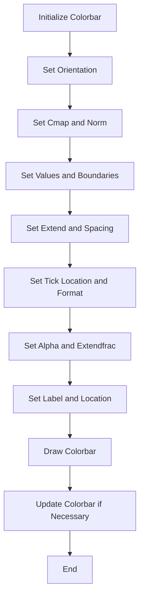

## 类结构

```
Colorbar (主类)
├── _ColorbarSpine (内部类)
└── make_axes (全局函数)
    └── make_axes_gridspec (内部函数)
```

## 全局变量及字段


### `ColorbarBase`
    
The base class for the Colorbar class.

类型：`class`
    


### `n_rasterize`
    
The number of times the colorbar should be rasterized.

类型：`int`
    


### `mappable`
    
The mappable object that provides the data for the colorbar.

类型：`cm.ScalarMappable | colorizer.ColorizingArtist`
    


### `ax`
    
The axes object that the colorbar is associated with.

类型：`Axes`
    


### `alpha`
    
The alpha value for the colorbar.

类型：`float | None`
    


### `cmap`
    
The colormap used for the colorbar.

类型：`colors.Colormap`
    


### `norm`
    
The normalization object used for the colorbar.

类型：`colors.Normalize`
    


### `values`
    
The values used for the colorbar.

类型：`Sequence[float] | None`
    


### `boundaries`
    
The boundaries used for the colorbar.

类型：`Sequence[float] | None`
    


### `extend`
    
The extend mode for the colorbar.

类型：`Literal['neither', 'both', 'min', 'max']`
    


### `spacing`
    
The spacing mode for the colorbar.

类型：`Literal['uniform', 'proportional']`
    


### `orientation`
    
The orientation of the colorbar.

类型：`Literal['vertical', 'horizontal']`
    


### `drawedges`
    
Whether to draw edges for the colorbar.

类型：`bool`
    


### `extendfrac`
    
The fraction of the colorbar to extend.

类型：`Literal['auto'] | float | Sequence[float] | None`
    


### `extendrect`
    
Whether to extend the colorbar rectangle.

类型：`bool`
    


### `solids`
    
The solids used for the colorbar.

类型：`None | collections.QuadMesh`
    


### `solids_patches`
    
The patches used for the colorbar solids.

类型：`list[Patch]`
    


### `lines`
    
The line collections used for the colorbar.

类型：`list[collections.LineCollection]`
    


### `outline`
    
The outline spine of the colorbar.

类型：`_ColorbarSpine`
    


### `dividers`
    
The dividers used for the colorbar.

类型：`collections.LineCollection`
    


### `ticklocation`
    
The location of the ticks on the colorbar.

类型：`Literal['left', 'right', 'top', 'bottom']`
    


### `axes`
    
The axes object for the _ColorbarSpine class.

类型：`Axes`
    


### `renderer`
    
The renderer object for the _ColorbarSpine class.

类型：`RendererBase | None`
    


### `xy`
    
The xy coordinates for the _ColorbarSpine class.

类型：`ArrayLike`
    


### `Colorbar.n_rasterize`
    
The number of times the colorbar should be rasterized.

类型：`int`
    


### `Colorbar.mappable`
    
The mappable object that provides the data for the colorbar.

类型：`cm.ScalarMappable | colorizer.ColorizingArtist`
    


### `Colorbar.ax`
    
The axes object that the colorbar is associated with.

类型：`Axes`
    


### `Colorbar.alpha`
    
The alpha value for the colorbar.

类型：`float | None`
    


### `Colorbar.cmap`
    
The colormap used for the colorbar.

类型：`colors.Colormap`
    


### `Colorbar.norm`
    
The normalization object used for the colorbar.

类型：`colors.Normalize`
    


### `Colorbar.values`
    
The values used for the colorbar.

类型：`Sequence[float] | None`
    


### `Colorbar.boundaries`
    
The boundaries used for the colorbar.

类型：`Sequence[float] | None`
    


### `Colorbar.extend`
    
The extend mode for the colorbar.

类型：`Literal['neither', 'both', 'min', 'max']`
    


### `Colorbar.spacing`
    
The spacing mode for the colorbar.

类型：`Literal['uniform', 'proportional']`
    


### `Colorbar.orientation`
    
The orientation of the colorbar.

类型：`Literal['vertical', 'horizontal']`
    


### `Colorbar.drawedges`
    
Whether to draw edges for the colorbar.

类型：`bool`
    


### `Colorbar.extendfrac`
    
The fraction of the colorbar to extend.

类型：`Literal['auto'] | float | Sequence[float] | None`
    


### `Colorbar.extendrect`
    
Whether to extend the colorbar rectangle.

类型：`bool`
    


### `Colorbar.solids`
    
The solids used for the colorbar.

类型：`None | collections.QuadMesh`
    


### `Colorbar.solids_patches`
    
The patches used for the colorbar solids.

类型：`list[Patch]`
    


### `Colorbar.lines`
    
The line collections used for the colorbar.

类型：`list[collections.LineCollection]`
    


### `Colorbar.outline`
    
The outline spine of the colorbar.

类型：`_ColorbarSpine`
    


### `Colorbar.dividers`
    
The dividers used for the colorbar.

类型：`collections.LineCollection`
    


### `Colorbar.ticklocation`
    
The location of the ticks on the colorbar.

类型：`Literal['left', 'right', 'top', 'bottom']`
    


### `_ColorbarSpine.axes`
    
The axes object for the _ColorbarSpine class.

类型：`Axes`
    


### `_ColorbarSpine.renderer`
    
The renderer object for the _ColorbarSpine class.

类型：`RendererBase | None`
    


### `_ColorbarSpine.xy`
    
The xy coordinates for the _ColorbarSpine class.

类型：`ArrayLike`
    
    

## 全局函数及方法


### make_axes

`make_axes` 函数用于创建一个或多个轴（Axes）对象，这些轴可以用于绘制图形和图表。

参数：

- `parents`：`Axes` 或 `list[Axes]` 或 `np.ndarray`，表示父轴对象或轴对象的列表或数组。
- `location`：`Literal["left", "right", "top", "bottom"]` 或 `None`，指定轴的位置。
- `orientation`：`Literal["vertical", "horizontal"]` 或 `None`，指定轴的方向。
- `fraction`：`float`，指定轴的大小相对于父轴的比例。
- `shrink`：`float`，指定轴的缩放比例。
- `aspect`：`float`，指定轴的纵横比。
- `**kwargs`：其他关键字参数，用于传递给 `GridSpec` 对象。

返回值：`tuple[Axes, dict[str, Any]]`，包含创建的轴对象和额外的字典。

#### 流程图


#### 带注释源码

```
def make_axes(
    parents: Axes | list[Axes] | np.ndarray,
    location: Literal["left", "right", "top", "bottom"] | None = ...,
    orientation: Literal["vertical", "horizontal"] | None = ...,
    fraction: float = ...,
    shrink: float = ...,
    aspect: float = ...,
    **kwargs
) -> tuple[Axes, dict[str, Any]]:
    # 创建轴对象
    ax = ...
    # 返回轴对象和字典
    return ax, ...
```


### make_axes_gridspec

`make_axes_gridspec` 函数用于创建一个轴对象，该轴对象位于父轴的指定位置，并使用 GridSpec 来定义其布局。

参数：

- `parent`：`Axes`，父轴对象，轴将被创建并附加到该轴。
- `location`：`Literal["left", "right", "top", "bottom"]`，轴的位置，可以是 "left", "right", "top", 或 "bottom"。
- `orientation`：`Literal["vertical", "horizontal"]`，轴的方向，可以是 "vertical" 或 "horizontal"。
- `fraction`：`float`，轴占据父轴的分数。
- `shrink`：`float`，轴的收缩因子。
- `aspect`：`float`，轴的纵横比。
- `**kwargs`：其他关键字参数，用于传递给 GridSpec。

返回值：`tuple[Axes, dict[str, Any]]`，一个包含新创建的轴对象和 GridSpec 参数的字典的元组。

#### 流程图

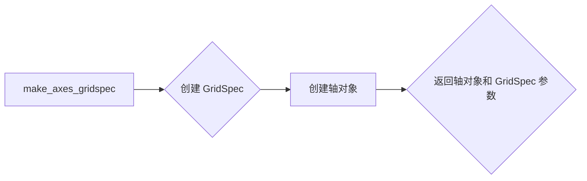

#### 带注释源码

```
def make_axes_gridspec(
    parent: Axes,
    *,
    location: Literal["left", "right", "top", "bottom"] | None = ...,
    orientation: Literal["vertical", "horizontal"] | None = ...,
    fraction: float = ...,
    shrink: float = ...,
    aspect: float = ...,
    **kwargs
) -> tuple[Axes, dict[str, Any]]:
    # 创建 GridSpec
    gridspec = GridSpec.from_subplotspec(
        subplot_spec=parent.get_subplotspec(),
        rowspan=1,
        colspan=1,
        location=location,
        orientation=orientation,
        fraction=fraction,
        shrink=shrink,
        aspect=aspect,
        **kwargs
    )
    
    # 创建轴对象
    ax = plt.axes(gridspec)
    
    # 返回轴对象和 GridSpec 参数
    return ax, gridspec.get_params()
``` 


### Colorbar.__init__

初始化Colorbar类，用于创建颜色条对象，并将颜色条添加到matplotlib的Axes对象中。

参数：

- `ax`：`Axes`，matplotlib的Axes对象，颜色条将被添加到该对象中。
- `mappable`：`cm.ScalarMappable`或`colorizer.ColorizingArtist`，颜色映射对象，用于定义颜色条的值范围和颜色映射。
- `cmap`：`str`或`colors.Colormap`，颜色映射，用于定义颜色条的颜色映射。
- `norm`：`colors.Normalize`，归一化对象，用于定义颜色条的值范围。
- `alpha`：`float`或`None`，颜色条的透明度。
- `values`：`Sequence[float]`或`None`，颜色条的值范围。
- `boundaries`：`Sequence[float]`或`None`，颜色条的边界值。
- `orientation`：`Literal["vertical", "horizontal"]`或`None`，颜色条的方向。
- `ticklocation`：`Literal["auto", "left", "right", "top", "bottom"]`，颜色条刻度的位置。
- `extend`：`Literal["neither", "both", "min", "max"]`或`None`，颜色条扩展的选项。
- `spacing`：`Literal["uniform", "proportional"]`，颜色条刻度间距的选项。
- `ticks`：`Sequence[float]`或`Locator`或`None`，颜色条的刻度值。
- `format`：`str`或`Formatter`或`None`，颜色条刻度的格式化字符串。
- `drawedges`：`bool`，是否绘制颜色条边缘。
- `extendfrac`：`Literal["auto"]`或`float`或`Sequence[float]`或`None`，颜色条扩展的分数。
- `extendrect`：`bool`，是否绘制颜色条扩展的矩形。
- `label`：`str`，颜色条的标签。
- `location`：`Literal["left", "right", "top", "bottom"]`或`None`，颜色条的位置。

返回值：`None`，无返回值。

#### 流程图

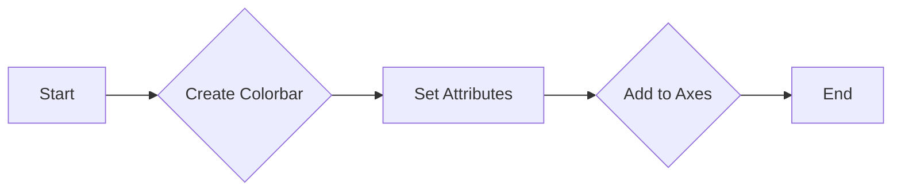

#### 带注释源码

```python
def __init__(
    self,
    ax: Axes,
    mappable: cm.ScalarMappable | colorizer.ColorizingArtist | None = ...,
    *,
    cmap: str | colors.Colormap | None = ...,
    norm: colors.Normalize | None = ...,
    alpha: float | None = ...,
    values: Sequence[float] | None = ...,
    boundaries: Sequence[float] | None = ...,
    orientation: Literal["vertical", "horizontal"] | None = ...,
    ticklocation: Literal["auto", "left", "right", "top", "bottom"] = ...,
    extend: Literal["neither", "both", "min", "max"] | None = ...,
    spacing: Literal["uniform", "proportional"] = ...,
    ticks: Sequence[float] | Locator | None = ...,
    format: str | Formatter | None = ...,
    drawedges: bool = ...,
    extendfrac: Literal["auto"] | float | Sequence[float] | None = ...,
    extendrect: bool = ...,
    label: str = ...,
    location: Literal["left", "right", "top", "bottom"] | None = ...
) -> None:
    # Initialize the Colorbar class
    # Set the attributes of the Colorbar class
    # Add the Colorbar to the Axes object
```


### Colorbar.update_normal

更新颜色条的正常状态。

参数：

- `mappable`：`cm.ScalarMappable | colorizer.ColorizingArtist | None`，颜色映射对象，用于更新颜色条的映射。

返回值：`None`，无返回值。

#### 流程图

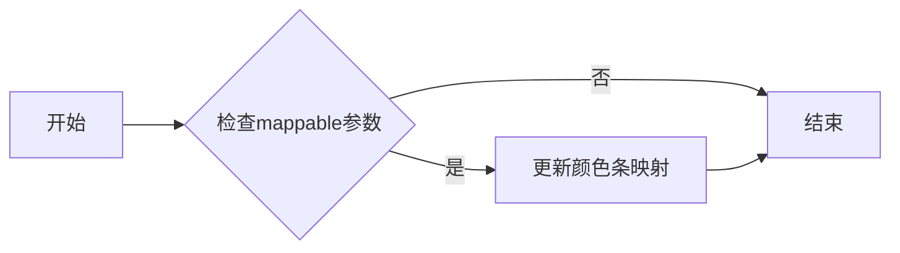

#### 带注释源码

```python
def update_normal(self, mappable: cm.ScalarMappable | colorizer.ColorizingArtist | None = ...) -> None:
    # 更新颜色条映射
    if mappable is not None:
        self.mappable = mappable
        # 更新颜色条的其他属性
        # ...
```


### Colorbar.add_lines

This method adds contour lines to the colorbar. It can accept a ContourSet object or a set of levels, colors, and linewidths.

参数：

- `CS`：`contour.ContourSet`，The contour set to add to the colorbar.
- `erase`：`bool`，If `True`, the existing lines will be erased before adding the new ones.

返回值：`None`，This method does not return any value.

#### 流程图

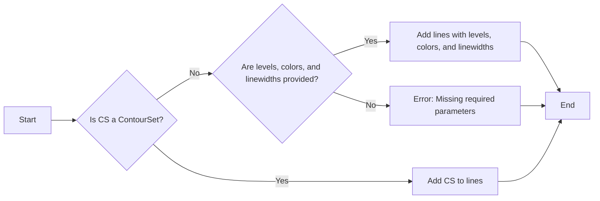

#### 带注释源码

```python
@overload
def add_lines(self, CS: contour.ContourSet, erase: bool = ...) -> None:
    ...

def add_lines(self, levels: ArrayLike, colors: ColorType | Sequence[ColorType], linewidths: float | ArrayLike, erase: bool = ...) -> None:
    # Implementation of adding lines to the colorbar
    ...
```


### Colorbar.update_ticks

更新颜色条上的刻度。

参数：

- 无

返回值：无

#### 流程图

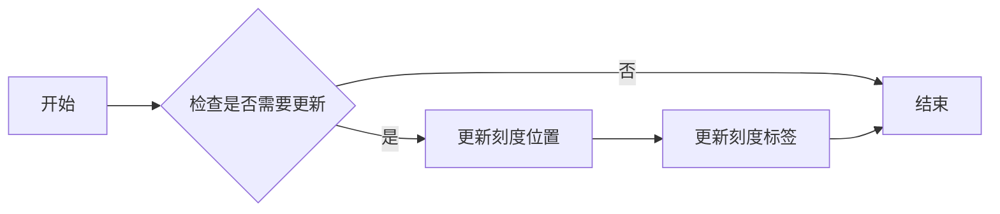

#### 带注释源码

```python
def update_ticks(self) -> None:
    # 检查是否需要更新
    if self._ticks_needs_update():
        # 更新刻度位置
        self.set_ticks(self.locator())
        # 更新刻度标签
        self.set_ticklabels(self.formatter(self.locator()))
```


### Colorbar.set_ticks

设置颜色条上的刻度值。

参数：

- `ticks`：`Sequence[float] | Locator`，指定颜色条上的刻度值，可以是浮点数列表或定位器对象。
- `labels`：`Sequence[str] | None`，可选，指定刻度值的标签，可以是字符串列表或None。
- `minor`：`bool`，可选，指定是否为次要刻度。

返回值：无

#### 流程图

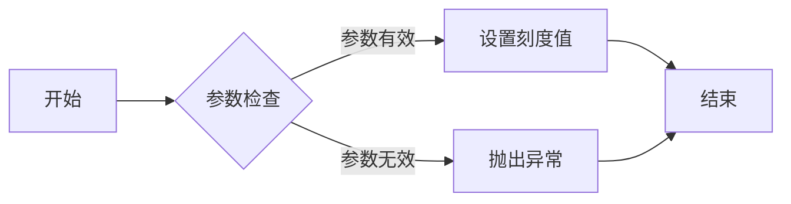

#### 带注释源码

```python
def set_ticks(
    self,
    ticks: Sequence[float] | Locator,
    *,
    labels: Sequence[str] | None = ...,
    minor: bool = ...
) -> None:
    # 检查参数有效性
    if not isinstance(ticks, (Sequence, Locator)):
        raise ValueError("ticks must be a sequence or a locator")
    
    # 设置刻度值
    self.locator = ticks
    if labels is not None:
        self.set_ticklabels(labels, minor=minor)
``` 


### Colorbar.get_ticks

获取颜色条上的刻度值。

参数：

- `minor`：`bool`，是否获取次要刻度值。

返回值：`np.ndarray`，颜色条上的刻度值数组。

#### 流程图

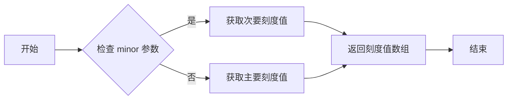

#### 带注释源码

```python
def get_ticks(self, minor: bool = ...) -> np.ndarray:
    # 根据参数 minor 获取主要或次要刻度值
    if minor:
        return self.locator.minor_ticks
    else:
        return self.locator.major_ticks
``` 


### Colorbar.set_ticklabels

设置颜色条上的刻度标签。

参数：

- `ticklabels`：`Sequence[str]`，颜色条上的刻度标签列表。

返回值：`None`，无返回值。

#### 流程图

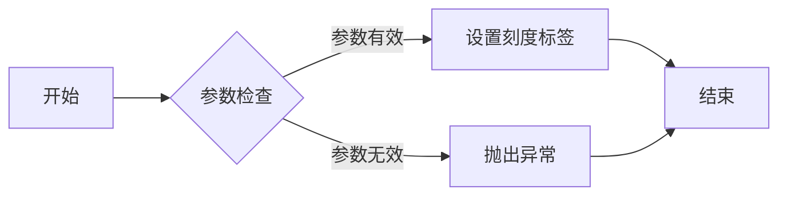

#### 带注释源码

```python
def set_ticklabels(self, ticklabels: Sequence[str], *, minor: bool = ..., **kwargs) -> None:
    # 检查参数有效性
    if not isinstance(ticklabels, Sequence) or not all(isinstance(label, str) for label in ticklabels):
        raise ValueError("ticklabels must be a sequence of strings")

    # 设置刻度标签
    self.ax.set_xticklabels(ticklabels) if self.orientation == "horizontal" else self.ax.set_yticklabels(ticklabels)
``` 


### Colorbar.minorticks_on

`Colorbar.minorticks_on` 方法用于在颜色条上启用次要刻度。

参数：

- 无

返回值：`None`，无返回值

#### 流程图

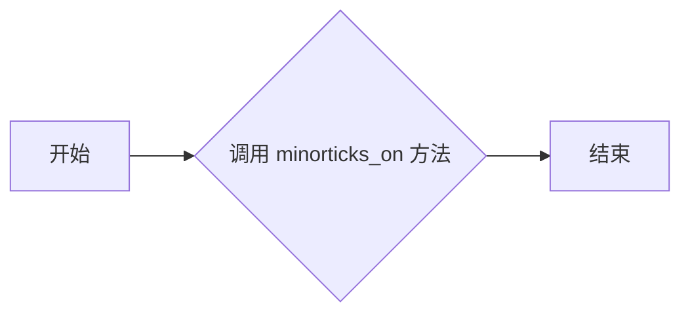

#### 带注释源码

```python
def minorticks_on(self) -> None:
    # 设置颜色条的次要刻度为开启状态
    self.outline.set_minor_ticks(True)
```


### Colorbar.minorticks_off

禁用颜色条的小刻度。

参数：

- 无

返回值：无

#### 流程图

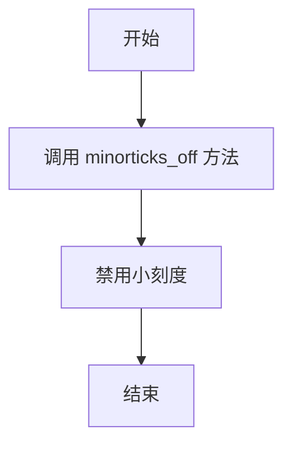

#### 带注释源码

```python
def minorticks_off(self) -> None:
    # 禁用小刻度的实现细节
    # ...
```


### Colorbar.set_label

设置颜色条标签。

参数：

- `label`：`str`，颜色条标签的文本。
- `loc`：`str`，标签的位置，可选值有 "left", "right", "top", "bottom"。

返回值：无

#### 流程图

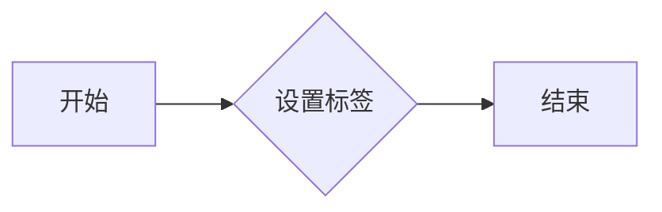

#### 带注释源码

```python
def set_label(self, label: str, *, loc: str | None = ..., **kwargs) -> None:
    # 设置颜色条标签的文本
    self.label.set_text(label)
    # 设置标签的位置
    if loc is not None:
        self.label.set_position(loc)
    # 更新颜色条
    self.update()
```


### Colorbar.set_alpha

设置颜色条的不透明度。

参数：

- `alpha`：`float | np.ndarray`，颜色条的不透明度值，范围从0（完全透明）到1（完全不透明）。如果传入的是数组，则每个值对应颜色条上相应颜色的不透明度。

返回值：无

#### 流程图

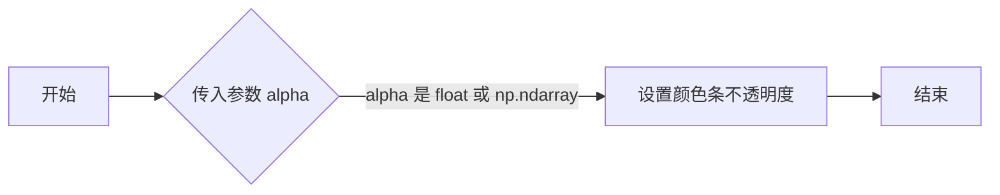

#### 带注释源码

```python
def set_alpha(self, alpha: float | np.ndarray) -> None:
    # 设置颜色条的不透明度
    self.alpha = alpha
```


### Colorbar.remove

移除颜色条。

参数：

- 无

返回值：`None`，无返回值

#### 流程图

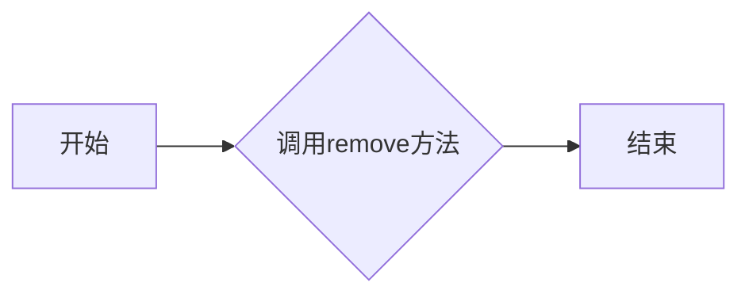

#### 带注释源码

```python
def remove(self) -> None:
    # 移除颜色条
    # 1. 清除颜色条中的所有元素
    self.solids = None
    self.solids_patches = []
    self.lines = []
    self.outline = None
    self.dividers = collections.LineCollection([])
    # 2. 清除颜色条中的所有标签
    self.set_ticks([])
    self.set_ticklabels([])
    # 3. 清除颜色条中的所有边框
    self.drawedges = False
    # 4. 清除颜色条中的所有分割线
    self.dividers = collections.LineCollection([])
    # 5. 清除颜色条中的所有轮廓
    self.outline = None
    # 6. 清除颜色条中的所有线条
    self.lines = []
    # 7. 清除颜色条中的所有网格
    self.solids = None
    self.solids_patches = []
```


### Colorbar.drag_pan

This method handles the drag and pan functionality for the colorbar. It is triggered when the user drags the colorbar with the mouse.

参数：

- `button`：`Any`，The button that was pressed.
- `key`：`Any`，The key that was pressed.
- `x`：`float`，The x-coordinate of the mouse event.
- `y`：`float`，The y-coordinate of the mouse event.

返回值：`None`，This method does not return any value.

#### 流程图

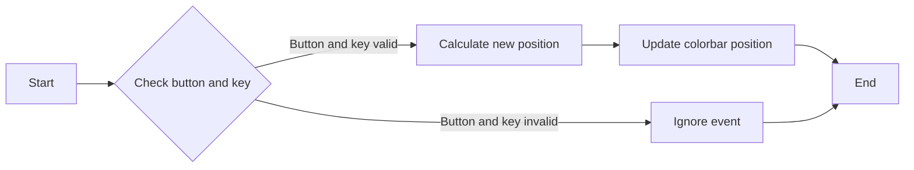

#### 带注释源码

```
def drag_pan(self, button: Any, key: Any, x: float, y: float) -> None:
    # Check if the button and key combination is valid for dragging the colorbar
    if self._is_drag_pan_valid(button, key):
        # Calculate the new position based on the mouse event
        new_position = self._calculate_new_position(x, y)
        # Update the colorbar position
        self.set_position(new_position)
    # Ignore the event if the button and key combination is not valid
    else:
        pass
```


```python
def drag_pan(self, button: Any, key: Any, x: float, y: float) -> None:
    # Check if the button and key combination is valid for dragging the colorbar
    if self._is_drag_pan_valid(button, key):
        # Calculate the new position based on the mouse event
        new_position = self._calculate_new_position(x, y)
        # Update the colorbar position
        self.set_position(new_position)
    # Ignore the event if the button and key combination is not valid
    else:
        pass
```


### `_ColorbarSpine.get_window_extent`

获取颜色条脊的窗口范围。

参数：

- `renderer`：`RendererBase | None`，可选的渲染器对象，用于计算窗口范围。

返回值：`Bbox`，表示颜色条脊的窗口范围。

#### 流程图

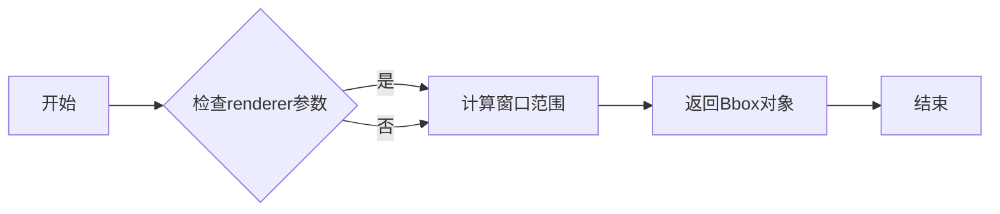

#### 带注释源码

```python
def get_window_extent(self, renderer: RendererBase | None = ...) -> Bbox:
    # 如果renderer参数为None，则使用默认的渲染器
    if renderer is None:
        renderer = self.axes._renderer

    # 计算窗口范围
    bbox = self.axes.get_window_extent(renderer)

    # 返回Bbox对象
    return bbox
``` 


### `_ColorbarSpine.set_xy`

`_ColorbarSpine.set_xy` 方法用于设置颜色条脊线的位置。

参数：

- `xy`：`ArrayLike`，表示颜色条脊线的位置。

返回值：`None`，无返回值。

#### 流程图

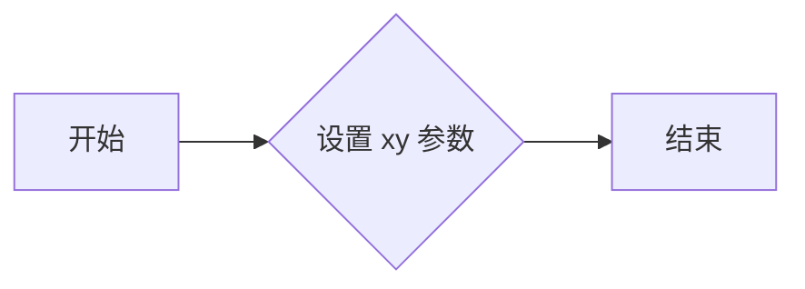

#### 带注释源码

```python
def set_xy(self, xy: ArrayLike) -> None:
    # 设置颜色条脊线的位置
    self._xy = xy
``` 


### Colorbar.draw

Colorbar.draw 是 Colorbar 类中的一个方法，用于绘制颜色条。

参数：

- `renderer`：`RendererBase | None`，matplotlib 的渲染器对象，用于绘制图形。

返回值：`None`，没有返回值。

#### 流程图

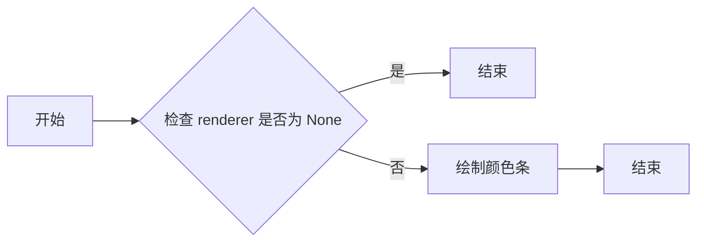

#### 带注释源码

```python
def draw(self, renderer: RendererBase | None) -> None:
    # 检查 renderer 是否为 None
    if renderer is None:
        return
    
    # 绘制颜色条
    # ... (此处省略绘制颜色条的代码)
```


## 关键组件


### 张量索引与惰性加载

张量索引与惰性加载是代码中处理数据访问和计算的核心组件，它允许对大型数据集进行高效的数据访问，同时延迟计算直到实际需要时。

### 反量化支持

反量化支持是代码中用于处理量化数据的核心组件，它允许将量化后的数据转换回原始精度，以便进行进一步的处理和分析。

### 量化策略

量化策略是代码中用于优化数据存储和计算效率的核心组件，它通过减少数据精度来减少内存使用和计算时间，同时保持足够的精度以满足应用需求。


## 问题及建议


### 已知问题

-   **代码复杂度**：代码中存在大量的类和方法，这可能导致代码难以维护和理解。
-   **类型注解**：虽然代码中使用了类型注解，但某些方法参数和返回值的类型注解不够详细，可能需要进一步明确。
-   **全局函数**：存在全局函数`make_axes`和`make_axes_gridspec`，这些函数可能会影响代码的可测试性和可重用性。
-   **文档缺失**：代码中缺少详细的文档注释，这不利于其他开发者理解代码的功能和用法。

### 优化建议

-   **重构代码**：考虑将复杂的类和方法拆分成更小的、更易于管理的部分，以提高代码的可读性和可维护性。
-   **完善类型注解**：对方法参数和返回值进行更详细的类型注解，以确保代码的类型安全性和可读性。
-   **减少全局函数**：如果可能，尝试将全局函数转换为类方法或实例方法，以提高代码的封装性和可测试性。
-   **添加文档注释**：为每个类、方法和全局函数添加详细的文档注释，包括功能描述、参数说明和返回值说明，以帮助其他开发者理解代码。
-   **单元测试**：编写单元测试来验证代码的功能，确保代码的稳定性和可靠性。
-   **性能优化**：对代码进行性能分析，找出性能瓶颈并进行优化，以提高代码的执行效率。


## 其它


### 设计目标与约束

- 设计目标：
  - 提供一个灵活且可扩展的颜色条组件，用于在matplotlib图表中显示颜色映射。
  - 支持多种颜色映射和规范化方法。
  - 允许用户自定义颜色条的位置、方向和外观。

- 约束：
  - 必须与matplotlib库兼容。
  - 需要高效处理大量数据。
  - 用户界面应简洁直观。

### 错误处理与异常设计

- 错误处理：
  - 对于无效的输入参数，应抛出异常。
  - 对于不支持的参数组合，应提供明确的错误信息。

- 异常设计：
  - 使用try-except块捕获和处理可能发生的异常。
  - 定义自定义异常类，以便更精确地描述错误情况。

### 数据流与状态机

- 数据流：
  - 用户输入数据（如颜色映射、规范化参数等）。
  - 数据通过颜色条组件进行处理，生成颜色映射。
  - 处理后的数据用于更新matplotlib图表。

- 状态机：
  - 颜色条组件可能处于不同的状态，如初始化、更新、绘制等。
  - 状态机用于管理颜色条组件在不同状态之间的转换。

### 外部依赖与接口契约

- 外部依赖：
  - matplotlib库。
  - numpy库。

- 接口契约：
  - 颜色条组件应提供清晰的接口，以便用户可以轻松地使用和扩展。
  - 接口应遵循良好的编程实践，如单一职责原则和开闭原则。

    