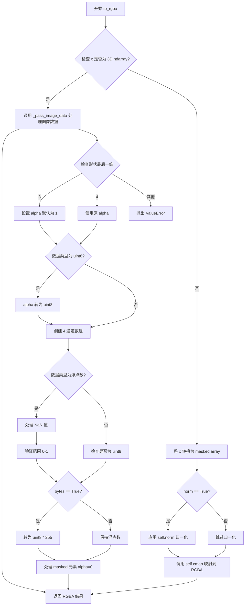
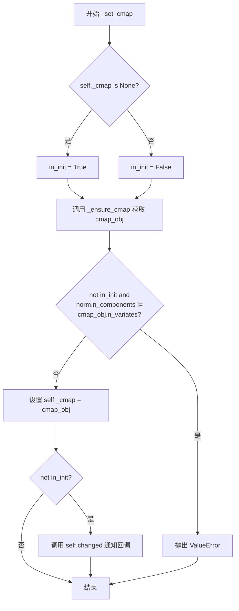
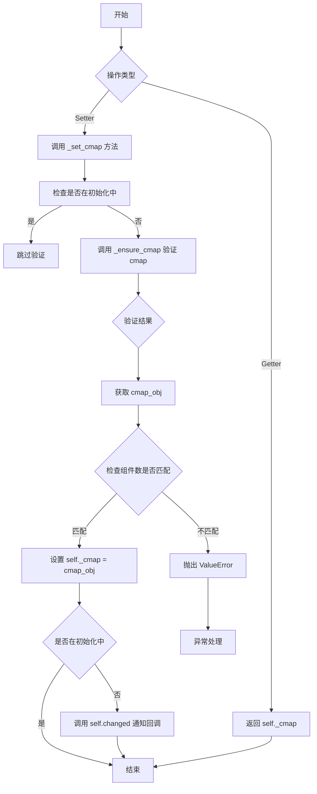
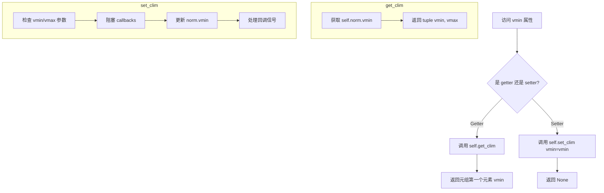
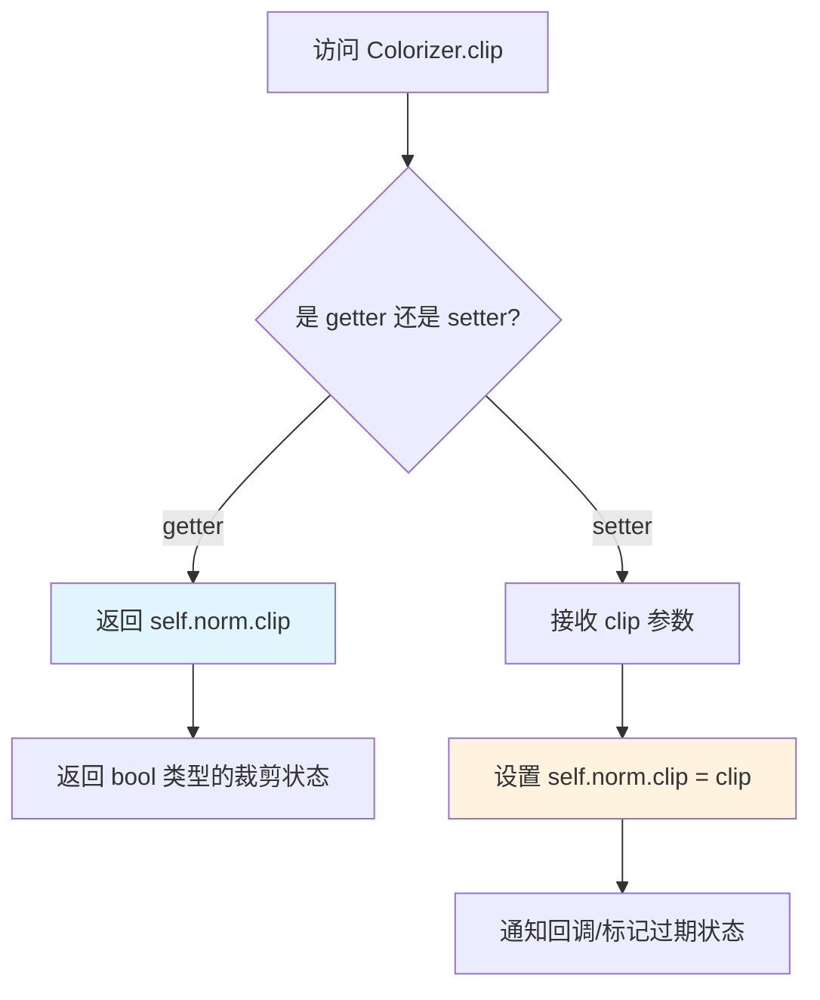

```mermaid
flowchart TD
    A[开始 changed] --> B{执行回调}
    B --> C[调用 self.callbacks.process&#40;'changed'&#41;]
    C --> D[设置 self.stale = True]
    D --> E[结束]
    
    style A fill:#f9f,stroke:#333
    style E fill:#9f9,stroke:#333
```

# `matplotlib\lib\matplotlib\colorizer.py` 详细设计文档

该模块实现了matplotlib中数据到颜色的转换管线，通过规范化(norm)和颜色映射(cmap)将标量或多变量数据转换为RGBA颜色值，支持图像数据的透传处理和多变量数据的颜色映射。

## 整体流程

```mermaid
graph TD
    A[输入数据 x] --> B{是否为3维数组图像?}
    B -- 是 --> C[_pass_image_data]
    B -- 否 --> D[转换为MaskedArray]
    D --> E{是否需要规范化?}
    E -- 是 --> F[norm(x) 规范化数据]
    E -- 否 --> G[直接使用原始数据]
    F --> H[cmap(x, alpha) 映射到颜色]
    G --> H
    H --> I{bytes参数?}
    I -- False --> J[返回float32 RGBA 0-1]
    I -- True --> K[返回uint8 RGBA 0-255]
    C --> L{图像维度检查}
    L -- 3通道 --> M[添加alpha通道]
    L -- 4通道 --> N[直接使用]
    M --> O[处理NaN和mask]
    N --> O
    O --> P[数值范围检查]
    P --> Q{bytes?}
    Q -- False --> R[转换为float32/0-1]
    Q -- True --> S[转换为uint8/0-255]
    J --> T[返回RGBA数组]
    K --> T
    R --> T
    S --> T
```

## 类结构

```
Colorizer (核心颜色处理类)
├── _ColorizerInterface (接口基类)
│   ├── _scale_norm
│   ├── to_rgba
│   ├── get_clim / set_clim
│   ├── cmap / get_cmap / set_cmap
│   ├── norm / set_norm
│   ├── autoscale / autoscale_None
│   ├── colorbar
│   └── _format_cursor_data_override
│       └── _ScalarMappable (标量映射混合类)
│           ├── __init__
│           ├── set_array / get_array
│           ├── changed
│           ├── _check_exclusionary_keywords
│           └── _get_colorizer
│               └── ColorizingArtist (着色艺术家基类)
│                   ├── __init__
│                   ├── colorizer (属性)
│                   └── _set_colorizer_check_keywords
```

## 全局变量及字段


### `colorizer_doc`
    
颜色izer的文档字符串模板

类型：`str`
    


### `Colorizer._cmap`
    
颜色映射对象

类型：`Colormap or None`
    


### `Colorizer._norm`
    
数据规范化对象

类型：`Normalize or None`
    


### `Colorizer._id_norm`
    
规范化回调ID

类型：`int`
    


### `Colorizer.callbacks`
    
回调注册表

类型：`CallbackRegistry`
    


### `Colorizer.colorbar`
    
关联的颜色条

类型：`Colorbar or None`
    


### `_ColorizerInterface._colorizer`
    
颜色处理实例

类型：`Colorizer`
    


### `_ColorizerInterface._A`
    
数据数组

类型：`array`
    


### `_ScalarMappable._A`
    
数值数组

类型：`array`
    


### `_ScalarMappable._colorizer`
    
颜色处理实例

类型：`Colorizer`
    


### `_ScalarMappable._id_colorizer`
    
回调连接ID

类型：`int`
    


### `_ScalarMappable.callbacks`
    
回调注册表

类型：`CallbackRegistry`
    


### `_ScalarMappable.colorbar`
    
关联的颜色条

类型：`Colorbar or None`
    
    

## 全局函数及方法


### `_auto_norm_from_scale`

该函数自动从给定的 scale 类生成一个对应的 norm 类，主要用于将 scale 类转换为适合数据归一化的 Normalize 子类。与 `colors.make_norm_from_scale` 的不同之处在于：它直接返回 norm 类而非作为装饰器使用，并且自动处理 `nonpositive` 参数的差异（标准 scale 默认 "clip" 而 norm 默认 "mask"）。

参数：

- `scale_cls`：`type` 或 scale 类，从 matplotlib.scale 模块传入的缩放类（如 `scale.LogScale` 等），用于生成对应的 norm 类

返回值：`type`，返回生成的 norm 类（Normalize 的子类），该类可被实例化为归一化对象

#### 流程图

```mermaid
flowchart TD
    A[开始: _auto_norm_from_scale] --> B[尝试构造 norm 实例]
    B --> C{使用 nonpositive='mask' 是否成功?}
    C -- 是 --> D[返回 norm 类的类型 type]
    C -- 否 --> E[使用默认参数构造 norm]
    E --> D
    D --> F[结束]
    
    subgraph 详细步骤
    B1[调用 colors.make_norm_from_scale<br/>functools.partial(scale_cls, nonpositive='mask')]
    B2[传入 colors.Normalize 作为基类]
    B3[实例化得到 norm 对象]
    end
    
    B --> B1
    B1 --> B2 --> B3
```

#### 带注释源码

```python
def _auto_norm_from_scale(scale_cls):
    """
    Automatically generate a norm class from *scale_cls*.

    This differs from `.colors.make_norm_from_scale` in the following points:

    - This function is not a class decorator, but directly returns a norm class
      (as if decorating `.Normalize`).
    - The scale is automatically constructed with ``nonpositive="mask"``, if it
      supports such a parameter, to work around the difference in defaults
      between standard scales (which use "clip") and norms (which use "mask").

    Note that ``make_norm_from_scale`` caches the generated norm classes
    (not the instances) and reuses them for later calls.  For example,
    ``type(_auto_norm_from_scale("log")) == LogNorm``.
    """
    # Actually try to construct an instance, to verify whether
    # ``nonpositive="mask"`` is supported.
    # 尝试构造 norm 实例，验证 scale_cls 是否支持 nonpositive="mask" 参数
    try:
        # 使用 functools.partial 绑定 nonpositive="mask" 参数
        # 调用 colors.make_norm_from_scale 创建 norm 类，然后实例化
        norm = colors.make_norm_from_scale(
            functools.partial(scale_cls, nonpositive="mask"))(
            colors.Normalize)()
    except TypeError:
        # 如果不支持 nonpositive="mask" 参数，回退到使用默认参数
        norm = colors.make_norm_from_scale(scale_cls)(
            colors.Normalize)()
    # 返回 norm 类的类型（而不是实例），供后续实例化使用
    return type(norm)
```


### `_ensure_norm`

该函数负责确保传入的 `norm` 参数是一个有效的归一化（Normalization）对象，根据 `n_components` 参数处理单变量和多变量数据的归一化需求。

参数：

- `norm`：`colors.Norm`、`str` 或 `None`，待处理的归一化对象或归一化方法的字符串名称（如 "linear"、"log" 等）
- `n_components`：`int`，默认为 1，数据组分的数量，用于决定使用单变量归一化（Normalize）还是多变量归一化（MultiNorm）

返回值：`colors.Norm` 或 `colors.MultiNorm`，返回处理后的归一化对象

#### 流程图

```mermaid
flowchart TD
    A[开始 _ensure_norm] --> B{n_components == 1?}
    B -->|是| C[检查 norm 类型: colors.Norm, str, None]
    B -->|否| D{n_components > 1?}
    D -->|否| E[抛出 ValueError: n_components 必须 >= 1]
    D -->|是| F{norm 是否可迭代?}
    C --> G{norm is None?}
    G -->|是| H[创建 colors.Normalize 实例]
    G -->|否| I{norm 是字符串?}
    I -->|是| J[从 scale._scale_mapping 获取 scale_cls]
    I -->|否| K[直接返回 norm]
    J --> L[调用 _auto_norm_from_scale 创建归一化对象]
    L --> K
    H --> K
    F -->|否| M[检查 norm 类型: colors.MultiNorm, None, tuple]
    F -->|是| N{使用 MultiNorm 处理多组归一化}
    M --> O{norm is None?}
    O -->|是| P[创建 MultiNorm: ['linear'] * n_components]
    O -->|否| Q[使用 MultiNorm 包装 norm]
    N --> R{n_components 匹配?]
    R -->|是| K
    R -->|否| S[抛出 ValueError]
    K --> T[返回归一化对象]
```

#### 带注释源码

```python
def _ensure_norm(norm, n_components=1):
    """
    确保 norm 参数是一个有效的归一化对象。
    
    根据 n_components 的值：
    - 当 n_components == 1 时，返回一个 colors.Normalize 实例
    - 当 n_components > 1 时，返回一个 colors.MultiNorm 实例
    
    Parameters
    ----------
    norm : colors.Norm, str, or None
        归一化对象或归一化方法名称（如 'linear', 'log'）
    n_components : int
        数据组分数目
        
    Returns
    -------
    colors.Norm or colors.MultiNorm
        处理后的归一化对象
    """
    # 单变量情况：处理标量数据归一化
    if n_components == 1:
        # 验证 norm 是允许的类型之一
        _api.check_isinstance((colors.Norm, str, None), norm=norm)
        
        # 如果未提供归一化对象，创建默认的线性归一化
        if norm is None:
            norm = colors.Normalize()
        # 如果提供了字符串，根据比例尺名称动态创建归一化对象
        elif isinstance(norm, str):
            # 从比例尺映射中获取对应的比例尺类
            scale_cls = _api.getitem_checked(scale._scale_mapping, norm=norm)
            # 使用自动归一化工厂创建归一化对象
            return _auto_norm_from_scale(scale_cls)()
        # 直接返回已有的归一化对象
        return norm
    
    # 多变量情况：处理多维数据归一化
    elif n_components > 1:
        # 如果 norm 不是可迭代对象，则检查其类型是否合法
        if not np.iterable(norm):
            _api.check_isinstance((colors.MultiNorm, None, tuple), norm=norm)
        
        # 未提供归一化时，创建默认的多变量线性归一化
        if norm is None:
            norm = colors.MultiNorm(['linear'] * n_components)
        else:
            # 否则，将输入的可迭代对象（多个字符串或 Normalize 对象）包装为 MultiNorm
            norm = colors.MultiNorm(norm)
        
        # 验证返回的 MultiNorm 的组分数目是否匹配
        if isinstance(norm, colors.MultiNorm) and norm.n_components == n_components:
            return norm
        # 组分数目不匹配时抛出错误
        raise ValueError(
            f"Invalid norm for multivariate colormap with {n_components} inputs")
    
    # n_components 为 0 的非法情况
    else:  # n_components == 0
        raise ValueError(
            "Invalid cmap. A colorizer object must have a cmap with `n_variates` >= 1")
```


### `_ensure_cmap`

该函数用于确保输入的 `cmap` 参数是一个有效的 Colormap 对象，支持标量 colormap 以及可选的多变量 colormap，并在类型不符合时提供详细的错误信息。

参数：

-  `cmap`：`None, str, Colormap`，要验证/转换的 colormap，可以是 Colormap 实例、字符串名称（从注册表中查找）或 None（使用默认 colormap）
-  `accept_multivariate`：`bool`，默认 False，是否接受多变量 colormap（BivarColormap 或 MultivarColormap）

返回值：`Colormap`，返回验证后的 Colormap 对象

#### 流程图

```mermaid
flowchart TD
    A[开始 _ensure_cmap] --> B{accept_multivariate?}
    B -- True --> C[types = (Colormap, BivarColormap, MultivarColormap)<br/>mappings = (colormaps, multivar_colormaps, bivar_colormaps)]
    B -- False --> D[types = (Colormap,)<br/>mappings = (colormaps,)]
    C --> E{cmap 是 Colormap/BivarColormap/MultivarColormap 实例?}
    D --> E
    E -- 是 --> F[直接返回 cmap]
    E -- 否 --> G[通过 mpl._val_or_rc 获取 cmap_name]
    H[遍历 mappings] --> I{cmap_name 在当前 mapping 中?}
    I -- 是 --> J[返回 mapping[cmap_name]]
    I -- 否 --> H
    H --> K{还有更多 mapping?}
    K -- 是 --> H
    K -- 否 --> L[抛出 ValueError 异常]
```

#### 带注释源码

```python
def _ensure_cmap(cmap, accept_multivariate=False):
    """
    Ensure that we have a `.Colormap` object.

    For internal use to preserve type stability of errors.

    Parameters
    ----------
    cmap : None, str, Colormap

        - if a `~matplotlib.colors.Colormap`,
          `~matplotlib.colors.MultivarColormap` or
          `~matplotlib.colors.BivarColormap`,
          return it
        - if a string, look it up in three corresponding databases
          when not found: raise an error based on the expected shape
        - if None, look up the default color map in mpl.colormaps
    accept_multivariate : bool, default False
        - if False, accept only Colormap, string in mpl.colormaps or None

    Returns
    -------
    Colormap

    """
    # 根据 accept_multivariate 参数决定接受的类型和查找映射表
    if accept_multivariate:
        # 接受标量、多变量和双变量 colormap
        types = (colors.Colormap, colors.BivarColormap, colors.MultivarColormap)
        # 依次查找三个映射表：标量、多变量、双变量
        mappings = (mpl.colormaps, mpl.multivar_colormaps, mpl.bivar_colormaps)
    else:
        # 仅接受标量 colormap
        types = (colors.Colormap, )
        mappings = (mpl.colormaps, )

    # 如果输入已经是有效的 Colormap 对象，直接返回
    if isinstance(cmap, types):
        return cmap

    # 如果是字符串或 None，从 rcParams 或默认值获取 cmap 名称
    cmap_name = mpl._val_or_rc(cmap, "image.cmap")

    # 遍历可能的映射表，查找 colormap
    for mapping in mappings:
        if cmap_name in mapping:
            return mapping[cmap_name]

    # 未找到时抛出详细的错误信息
    # 错误信息包含支持的标量 colormap 列表，并提示如何访问多变量 colormap
    raise ValueError(f"{cmap!r} is not a valid value for cmap"
                     "; supported values for scalar colormaps are "
                     f"{', '.join(map(repr, sorted(mpl.colormaps)))}\n"
                     "See `matplotlib.bivar_colormaps()` and"
                     " `matplotlib.multivar_colormaps()` for"
                     " bivariate and multivariate colormaps")
```


### `_ensure_multivariate_data`

该函数用于确保输入数据的数据类型与指定的组件数量（n_components）兼容。它将形状为 (n_components, n, m) 的输入数据转换为形状为 (n, m) 的数组，使用新的复合数据类型来支持多变量（多通道）数据。同时处理复数数据的转换以及掩码数组的保留。

参数：

- `data`：`np.ndarray, PIL.Image 或 None`，要检查和转换的输入数据
- `n_components`：`int`，数据中的变量（通道）数量

返回值：`np.ndarray, PIL.Image 或 None`，转换后的数据或原始数据

#### 流程图

```mermaid
flowchart TD
    A[开始: _ensure_multivariate_data] --> B{data is np.ndarray?}
    B -->|Yes| C{len(data.dtype.descr) == n_components?}
    B -->|No| D{n_components > 1 and len(data) == n_components?}
    
    C -->|Yes| E[返回 data]
    C -->|No| F{data.dtype is complex?}
    
    F -->|Yes| G{n_components == 2?}
    F -->|No| H[跳转到D判断]
    
    G -->|Yes| I[构建复数 dtype<br/>float64,float64 或 float32,float32]
    G -->|No| J[抛出 ValueError<br/>复数数据需要2个变量]
    
    I --> K[重构为掩码数组]
    K --> L[返回重构数组]
    
    D -->|Yes| M[转换数据形状<br/>(n_components, n, m) -> (n, m)]
    M --> N[为每个part创建掩码数组]
    N --> O[构建新的复合dtype]
    O --> P[重构为掩码数组]
    P --> Q[返回重构数组]
    
    D -->|No| R{n_components == 1?}
    R -->|Yes| S[返回原始data<br/>PIL.Image等情况]
    R -->|No| T{n_components == 2?}
    
    T -->|Yes| U[抛出 ValueError<br/>需要复数或2字段dtype]
    T -->|No| V[抛出 ValueError<br/>无效的数据维度]
    
    E --> Z[结束]
    L --> Z
    Q --> Z
    S --> Z
    J --> Z
    U --> Z
    V --> Z
```

#### 带注释源码

```python
def _ensure_multivariate_data(data, n_components):
    """
    确保数据具有与 n_components 兼容的数据类型。
    将形状为 (n_components, n, m) 的输入数据转换为形状为 (n, m) 的数组，
    数据类型为 np.dtype(f'{data.dtype}, ' * n_components)
    复数数据将作为 dtype 为 np.dtype('float64, float64') 
    或 np.dtype('float32, float32') 的视图返回。
    如果 n_components 为 1 且数据不是 np.ndarray 类型（即 PIL.Image），
    数据将原样返回。
    如果 data 为 None，函数返回 None。

    Parameters
    ----------
    n_components : int
        数据中的变量数量。
    data : np.ndarray, PIL.Image or None

    Returns
    -------
    np.ndarray, PIL.Image or None
    """

    # 第一步：检查 data 是否为 numpy 数组
    if isinstance(data, np.ndarray):
        # 检查数据类型描述符的数量是否已匹配 n_components
        # 如果是标量数据或已格式化的数据，直接返回
        if len(data.dtype.descr) == n_components:
            # 情况1：数据已是正确格式（标量或已有多变量dtype）
            # pass scalar data and already formatted data
            return data
        
        # 情况2：处理复数数据（复数可表示为两个实数的组合）
        elif data.dtype in [np.complex64, np.complex128]:
            # 复数数据只能用于 n_components=2 的情况
            if n_components != 2:
                raise ValueError("Invalid data entry for multivariate data. "
                                 "Complex numbers are incompatible with "
                                 f"{n_components} variates.")

            # 根据复数类型选择对应的浮点类型
            # pass complex data
            if data.dtype == np.complex128:
                dt = np.dtype('float64, float64')
            else:
                dt = np.dtype('float32, float32')

            # 使用视图重构为掩码数组，保持数据连续性
            reconstructed = np.ma.array(np.ma.getdata(data).view(dt))
            # 如果原数据有掩码，需将掩码应用到新的数据类型字段上
            if np.ma.is_masked(data):
                for descriptor in dt.descr:
                    reconstructed[descriptor[0]][data.mask] = np.ma.masked
            return reconstructed

    # 第二步：处理列表或元组形式的多变量数据
    # 将形状从 (n_components, n, m) 转换为 (n, m) 的复合 dtype
    if n_components > 1 and len(data) == n_components:
        # 转换数据形状：(n_components, n, m) -> (n, m) 使用新 dtype
        # convert data from shape (n_components, n, m)
        # to (n, m) with a new dtype
        data = [np.ma.array(part, copy=False) for part in data]
        # 从各部分的数据类型构建复合 dtype
        dt = np.dtype(', '.join([f'{part.dtype}' for part in data]))
        # 提取字段名
        fields = [descriptor[0] for descriptor in dt.descr]
        # 创建空数组，使用复合 dtype
        reconstructed = np.ma.empty(data[0].shape, dtype=dt)
        
        # 将每个变量填充到对应的字段中
        for i, f in enumerate(fields):
            # 检查所有变量的形状是否一致
            if data[i].shape != reconstructed.shape:
                raise ValueError("For multivariate data all variates must have same "
                                 f"shape, not {data[0].shape} and {data[i].shape}")
            reconstructed[f] = data[i]
            # 处理各变量的掩码
            if np.ma.is_masked(data[i]):
                reconstructed[f][data[i].mask] = np.ma.masked
        return reconstructed

    # 第三步：处理单变量情况（PIL.Image 等非 ndarray 类型）
    if n_components == 1:
        # PIL.Image gets passed here
        return data

    # 第四步：处理无效的多变量数据输入
    elif n_components == 2:
        raise ValueError("Invalid data entry for multivariate data. The data"
                         " must contain complex numbers, or have a first dimension 2,"
                         " or be of a dtype with 2 fields")
    else:
        raise ValueError("Invalid data entry for multivariate data. The shape"
                         f" of the data must have a first dimension {n_components}"
                         f" or be of a dtype with {n_components} fields")
```


### `Colorizer.__init__`

初始化 Colorizer 对象，设置颜色映射和归一化方法，并初始化回调注册表和颜色条属性。

参数：

- `cmap`：`colorbar.Colorbar` 或 `str` 或 `None`，默认值：`None`，用于将数据映射到颜色的颜色映射（colormap）
- `norm`：`colors.Normalize` 或 `str` 或 `None`，默认值：`None`，用于归一化数据的归一化方法

返回值：`None`，构造函数无返回值

#### 流程图

```mermaid
flowchart TD
    A[Start: __init__] --> B[初始化 self._cmap = None]
    B --> C[调用 self._set_cmap(cmap)]
    C --> D[初始化 self._id_norm = None]
    D --> E[初始化 self._norm = None]
    E --> F[设置 self.norm = norm]
    F --> G[初始化 self.callbacks = CallbackRegistry]
    G --> H[初始化 self.colorbar = None]
    H --> I[End: __init__]
```

#### 带注释源码

```python
def __init__(self, cmap=None, norm=None):
    """
    初始化 Colorizer 实例。

    Parameters
    ----------
    cmap : colorbar.Colorbar or str or None, default: None
        The colormap used to color data.
    norm : colors.Normalize or str or None, default: None
        The normalization used to normalize the data
    """
    # 1. 初始化内部颜色映射属性为 None
    self._cmap = None
    # 2. 调用内部方法设置颜色映射（会验证并转换 cmap 参数）
    self._set_cmap(cmap)

    # 3. 初始化归一化回调 ID 为 None（用于后续管理回调连接）
    self._id_norm = None
    # 4. 初始化内部归一化属性为 None
    self._norm = None
    # 5. 通过属性设置器设置归一化（会确保 norm 是正确的 Normalize 实例）
    self.norm = norm

    # 6. 初始化回调注册表，用于管理 'changed' 信号的监听器
    self.callbacks = cbook.CallbackRegistry(signals=["changed"])
    # 7. 初始化颜色条属性为 None（可在后续关联颜色条）
    self.colorbar = None
```


### `Colorizer._scale_norm`

该方法是 `Colorizer` 类的私有辅助方法，用于初始化数据的缩放（scaling）。它处理 `vmin`、`vmax` 和 `norm` 参数，确保在使用 `norm` 对象时不会同时使用 `vmin`/`vmax`，并在需要时自动计算数据的缩放限制。

参数：

- `self`：`Colorizer` 实例，调用此方法的 Colorizer 对象本身
- `norm`：`colors.Normalize` 或 `str` 或 `None`，用于归一化数据的 Normalize 实例或字符串形式的归一化方法名称
- `vmin`：`float` 或 `None`，数据范围的最小值，用于设置颜色映射的下限
- `vmax`：`float` 或 `None`，数据范围的最大值，用于设置颜色映射的上限
- `A`：`array-like`，需要缩放的数据数组，用于自动计算数据范围

返回值：`None`，该方法不返回值，仅修改 Colorizer 内部的范数（norm）状态

#### 流程图

```mermaid
flowchart TD
    A[开始 _scale_norm] --> B{vmin 或 vmax 是否不为 None?}
    B -->|是| C[调用 self.set_clim(vmin, vmax)]
    C --> D{norm 是否为 colors.Normalize 实例?}
    D -->|是| E[抛出 ValueError 异常]
    D -->|否| F[继续执行]
    B -->|否| F
    F --> G[调用 self.autoscale_None(A)]
    G --> H[结束]
    E --> I[异常: Passing a Normalize instance simultaneously with vmin/vmax is not supported]
```

#### 带注释源码

```python
def _scale_norm(self, norm, vmin, vmax, A):
    """
    Helper for initial scaling.

    Used by public functions that create a ScalarMappable and support
    parameters *vmin*, *vmax* and *norm*. This makes sure that a *norm*
    will take precedence over *vmin*, *vmax*.

    Note that this method does not set the norm.
    """
    # 检查是否提供了 vmin 或 vmax 参数
    if vmin is not None or vmax is not None:
        # 设置颜色映射的上下限
        self.set_clim(vmin, vmax)
        # 如果同时提供了 Normalize 实例，则抛出错误
        # 因为 vmin/vmax 和 norm 不能同时使用
        if isinstance(norm, colors.Normalize):
            raise ValueError(
                "Passing a Normalize instance simultaneously with "
                "vmin/vmax is not supported.  Please pass vmin/vmax "
                "as arguments to the norm object when creating it")

    # Always resolve the autoscaling so we have concrete limits
    # rather than deferring to draw time.
    # 始终解析自动缩放，以便我们有具体的限制
    # 而不是延迟到绘制时间
    self.autoscale_None(A)
```


### `Colorizer.norm` (property getter/setter)

该属性是 Colorizer 类的归一化（normalization）对象的访问接口。Getter 返回当前用于数据归一化的 `colors.Normalize` 实例；Setter 接收新的 norm 对象、确保其与 colormap 的变量数匹配、处理回调连接与断开，并在归一化对象变更时触发 changed 信号以通知监听器。

参数：

- `norm`：`colors.Normalize` 或 `str` 或 `None`，要设置的新归一化对象，可以是 Normalize 实例、归一化方法名称（如 "linear"、"log"）或 None（默认为 colors.Normalize）

返回值：`colors.Normalize`，Getter 返回当前的归一化对象；Setter 无返回值（返回 None）

#### 流程图

```mermaid
flowchart TD
    A[Setter norm 被调用] --> B{传入的 norm 是否为 None?}
    B -->|是| C[调用 _ensure_norm 创建默认 Normalize]
    B -->|否| D{传入的 norm 是字符串?}
    D -->|是| E[根据字符串查找对应的 scale 类<br/>调用 _auto_norm_from_scale 创建_norm 对象]
    D -->|否| F[直接使用传入的 norm 对象]
    C --> G[调用 _ensure_norm 验证 norm]
    E --> G
    F --> G
    G --> H{新的 norm 对象<br/>是否与当前的 self.norm 相同?}
    H -->|是| I[直接返回，不做任何更新]
    H -->|否| J{当前是否在初始化阶段?<br/>self.norm is None?}
    J -->|是| K[设置 in_init = True]
    J -->|否| L[设置 in_init = False<br/>断开旧的回调连接]
    K --> M[保存新的 norm 到 self._norm]
    L --> M
    M --> N[连接新 norm 的 'changed' 回调到 self.changed<br/>保存回调 ID 到 self._id_norm]
    N --> O{是否在初始化阶段?}
    O -->|否| P[调用 self.changed() 通知监听器]
    O -->|是| Q[结束，不触发回调]
    I --> R[结束]
    P --> R
    Q --> R
    
    style I fill:#f9f,stroke:#333
    style P fill:#9f9,stroke:#333
```

#### 带注释源码

```python
@property
def norm(self):
    """
    返回当前用于数据归一化的 Normalize 实例。
    
    Returns
    -------
    colors.Normalize
        当前关联的归一化对象
    """
    return self._norm


@norm.setter
def norm(self, norm):
    """
    设置新的归一化对象。
    
    此 setter 会：
    1. 确保传入的 norm 符合 colormap 的变量数要求
    2. 如果 norm 对象未变更，则直接返回避免不必要的更新
    3. 在非初始化阶段断开旧的回调连接并连接新的回调
    4. 在归一化对象变更后触发 changed 信号通知所有监听器
    
    Parameters
    ----------
    norm : colors.Normalize or str or None
        新的归一化对象。可以是：
        - colors.Normalize 或其子类的实例
        - 字符串（如 "linear", "log"），会自动创建对应的 Normalize 子类
        - None，会创建一个默认的 colors.Normalize 实例
        
    Raises
    ------
    ValueError
        当 norm 与 colormap 的变量数不匹配时
    """
    # 使用 _ensure_norm 验证并规范化传入的 norm
    # n_components 参数确保 norm 支持 colormap 的变量数
    norm = _ensure_norm(norm, n_components=self.cmap.n_variates)
    
    # 如果传入的 norm 与当前 norm 是同一对象，不做任何更新
    if norm is self.norm:
        # We aren't updating anything
        return

    # 判断是否在初始化阶段（self.norm 仍为 None）
    in_init = self.norm is None
    
    # Remove the current callback and connect to the new one
    # 在非初始化阶段，需要断开旧的回调连接避免内存泄漏或重复通知
    if not in_init:
        self.norm.callbacks.disconnect(self._id_norm)
    
    # 保存新的 norm 对象
    self._norm = norm
    
    # 连接新 norm 的 'changed' 信号到 Colorizer.changed 方法
    # 这样当 norm 的属性（如 vmin、vmax）改变时，Colorizer 也会收到通知
    self._id_norm = self.norm.callbacks.connect('changed',
                                                self.changed)
    
    # 在非初始化阶段，触发 changed 信号通知所有监听器
    # 初始化阶段不需要触发，因为 Colorizer.__init__ 还未完成
    if not in_init:
        self.changed()
```


### `Colorizer.to_rgba`

该方法将输入数据 x（标量数据或图像数据）转换为 RGBA 颜色数组，支持归一化处理和多种数据类型（浮点数或 uint8），并可选择性地应用透明度通道。

参数：

- `x`：`任意`，输入的标量数据（1D 或 2D 序列）或图像数据（3D ndarray，最后一维为 3 或 4）
- `alpha`：`float 或 None`，透明度值，当输入为图像且最后一维为 3 时使用，默认为 None（即 1.0）
- `bytes`：`bool`，是否返回 uint8 类型的 RGBA 数组（True 返回 0-255，False 返回 0-1 浮点数），默认 False
- `norm`：`bool`，是否对输入数据进行归一化处理，默认 True

返回值：`numpy.ndarray`，RGBA 颜色数组，形状取决于输入：标量数据为 (..., 4)，图像数据保持原形状

#### 流程图



#### 带注释源码

```python
def to_rgba(self, x, alpha=None, bytes=False, norm=True):
    """
    Return a normalized RGBA array corresponding to *x*.

    In the normal case, *x* is a 1D or 2D sequence of scalars, and
    the corresponding `~numpy.ndarray` of RGBA values will be returned,
    based on the norm and colormap set for this Colorizer.

    There is one special case, for handling images that are already
    RGB or RGBA, such as might have been read from an image file.
    If *x* is an `~numpy.ndarray` with 3 dimensions,
    and the last dimension is either 3 or 4, then it will be
    treated as an RGB or RGBA array, and no mapping will be done.
    The array can be `~numpy.uint8`, or it can be floats with
    values in the 0-1 range; otherwise a ValueError will be raised.
    Any NaNs or masked elements will be set to 0 alpha.
    If the last dimension is 3, the *alpha* kwarg (defaulting to 1)
    will be used to fill in the transparency.  If the last dimension
    is 4, the *alpha* kwarg is ignored; it does not
    replace the preexisting alpha.  A ValueError will be raised
    if the third dimension is other than 3 or 4.

    In either case, if *bytes* is *False* (default), the RGBA
    array will be floats in the 0-1 range; if it is *True*,
    the returned RGBA array will be `~numpy.uint8` in the 0 to 255 range.

    If norm is False, no normalization of the input data is
    performed, and it is assumed to be in the range (0-1).

    """
    # 首先检查特殊情况：图像输入
    # 如果 x 是 3D ndarray 且最后一维是 3 或 4，则作为 RGB/RGBA 图像处理
    if isinstance(x, np.ndarray) and x.ndim == 3:
        return self._pass_image_data(x, alpha, bytes, norm)

    # 否则执行归一化 -> 色图映射流程
    # 将输入转换为 masked array 以处理缺失值
    x = ma.asarray(x)
    
    # 根据 norm 参数决定是否进行归一化
    if norm:
        x = self.norm(x)
    
    # 使用 colormap 将归一化后的数据映射到 RGBA 颜色空间
    rgba = self.cmap(x, alpha=alpha, bytes=bytes)
    return rgba
```


### `Colorizer._pass_image_data`

这是一个静态辅助方法，用于处理已经是RGB或RGBA格式的图像数组（如从图像文件读取的），将其转换为标准化的RGBA数组，以便与colormap系统兼容。

参数：

- `x`：`numpy.ndarray`，形状为(..., 3)或(..., 4)的图像数据，支持uint8或浮点类型
- `alpha`：`float`或`int`或`numpy.uint8`或`None`，透明度值，当输入为3通道RGB时使用，默认为1
- `bytes`：`bool`，是否返回uint8类型的数组（值为0-255），否则返回float32类型（值为0-1），默认为False
- `norm`：`bool`，是否检查浮点数据是否在[0,1]范围内，默认为True

返回值：`numpy.ndarray`，形状为(..., 4)的RGBA数组，类型为float32或uint8

#### 流程图

```mermaid
flowchart TD
    A[开始: _pass_image_data] --> B{检查x.shape[2]}
    B -->|3| C[处理RGB图像]
    B -->|4| D[处理RGBA图像]
    B -->|其他| E[抛出ValueError]
    C --> F{alpha是否为None}
    F -->|是| G[alpha=1]
    F -->|否| H{数据类型为uint8}
    H -->|是| I[alpha转换为uint8]
    H -->|否| J[创建4通道数组xx]
    I --> J
    G --> J
    J --> K{数据类型为浮点数?}
    D --> K
    K -->|是| L{存在NaN值?}
    K -->|否| M{bytes=True?}
    L -->|是| N[复制数组并置NaN位置alpha为0]
    L -->|否| O{norm=True且数据超出[0,1]?}
    N --> O
    O -->|是| P[抛出ValueError]
    O -->|否| Q{bytes=True?}
    M -->|是| R[转换为uint8]
    M -->|否| S[转换为float32/255]
    Q -->|是| R
    Q -->|否| S
    S --> T{原数组有掩码?]
    T -->|是| U[置掩码位置alpha为0]
    T -->|否| V[返回xx]
    R --> V
    U --> V
    E --> W[结束]
    V --> W
    P --> W
```

#### 带注释源码

```python
@staticmethod
def _pass_image_data(x, alpha=None, bytes=False, norm=True):
    """
    Helper function to pass ndarray of shape (...,3) or (..., 4)
    through `to_rgba()`, see `to_rgba()` for docstring.
    """
    # 处理3通道RGB图像
    if x.shape[2] == 3:
        # 默认alpha值为1（完全不透明）
        if alpha is None:
            alpha = 1
        # 如果输入是uint8，alpha也需要转换为uint8
        if x.dtype == np.uint8:
            alpha = np.uint8(alpha * 255)
        # 获取前两个维度的大小
        m, n = x.shape[:2]
        # 创建一个空的4通道数组
        xx = np.empty(shape=(m, n, 4), dtype=x.dtype)
        # 将RGB数据复制到前三个通道
        xx[:, :, :3] = x
        # 将alpha值复制到第四个通道
        xx[:, :, 3] = alpha
    # 处理4通道RGBA图像，直接使用
    elif x.shape[2] == 4:
        xx = x
    else:
        raise ValueError("Third dimension must be 3 or 4")
    
    # 处理浮点数类型的数据
    if xx.dtype.kind == 'f':
        # 如果任何通道存在NaN值，将其置为0
        if np.any(nans := np.isnan(x)):
            # 如果是4通道，需要先复制数组避免修改原数据
            if x.shape[2] == 4:
                xx = xx.copy()
            # 将包含NaN的像素的所有通道置为0
            xx[np.any(nans, axis=2), :] = 0

        # 如果norm=True，检查浮点数据是否在[0,1]范围内
        if norm and (xx.max() > 1 or xx.min() < 0):
            raise ValueError("Floating point image RGB values "
                             "must be in the [0,1] range")
        # 如果bytes=True，转换为uint8类型（0-255）
        if bytes:
            xx = (xx * 255).astype(np.uint8)
    # 处理uint8类型的数据
    elif xx.dtype == np.uint8:
        # 如果bytes=False，转换为float32并归一化到0-1
        if not bytes:
            xx = xx.astype(np.float32) / 255
    else:
        raise ValueError("Image RGB array must be uint8 or "
                         "floating point; found %s" % xx.dtype)
    
    # 处理原始数组中的掩码值
    # 如果RGB或A通道中有任何被掩码，将该像素的alpha置为0
    if np.ma.is_masked(x):
        xx[np.any(np.ma.getmaskarray(x), axis=2), 3] = 0
    
    return xx
```


### `Colorizer.autoscale`

该方法用于使用当前数组数据自动缩放归一化（norm）实例的标量限制（vmin 和 vmax），使归一化能够根据数据范围自动调整。

参数：

-  `A`：`array-like`，要用于自动缩放的数组数据

返回值：`None`，该方法不返回任何值，仅通过回调函数通知归一化实例已更新

#### 流程图

```mermaid
flowchart TD
    A[开始 autoscale] --> B{A is None?}
    B -- 是 --> C[抛出 TypeError: 'You must first set_array for mappable']
    B -- 否 --> D[调用 self.norm.autoscale(A)]
    D --> E[通过 norm 的回调函数通知变更]
    E --> F[结束]
    C --> F
```

#### 带注释源码

```python
def autoscale(self, A):
    """
    Autoscale the scalar limits on the norm instance using the
    current array
    """
    # 检查输入数组 A 是否为 None
    # 如果为 None，抛出 TypeError 异常，要求用户先调用 set_array 方法设置数据
    if A is None:
        raise TypeError('You must first set_array for mappable')
    
    # 如果归一化的限制被更新，将通过附加到归一化的回调函数调用 self.changed()
    # 这里直接调用 norm 对象的 autoscale 方法来自动计算 vmin 和 vmax
    self.norm.autoscale(A)
```


### `Colorizer.autoscale_None(A)`

该方法用于使用当前数组自动缩放归一化实例的标量限制，仅更改那些为 None 的限制。

参数：

- `A`：`array-like`，要进行自动缩放的数组数据。如果为 None，将抛出 TypeError 异常。

返回值：`None`，该方法不返回任何值，直接修改 `self.norm` 对象的限制属性。

#### 流程图

```mermaid
flowchart TD
    A[开始 autoscale_None] --> B{检查 A 是否为 None}
    B -->|是| C[抛出 TypeError: 'You must first set_array for mappable']
    B -->|否| D[调用 self.norm.autoscale_None(A)]
    D --> E[结束]
    
    style C fill:#ff9999
    style D fill:#99ff99
```

#### 带注释源码

```python
def autoscale_None(self, A):
    """
    Autoscale the scalar limits on the norm instance using the
    current array, changing only limits that are None
    """
    # 检查输入数组 A 是否为 None，如果是则抛出 TypeError
    # 因为没有数据无法进行自动缩放
    if A is None:
        raise TypeError('You must first set_array for mappable')
    
    # 如果 norm 的限制被更新，self.changed() 会通过
    # 连接到 norm 的回调函数被调用
    # 这里直接调用 norm 对象的 autoscale_None 方法
    # 仅对 vmin 和 vmax 中为 None 的值进行自动计算
    self.norm.autoscale_None(A)
```


### `Colorizer._set_cmap`

该方法用于设置 Colorizer 的colormap（色图），负责将数据映射为颜色，支持多变量色图，并在非初始化情况下验证色图与归一化器的组件数是否匹配。

参数：

- `cmap`：`.Colormap` 或 `str` 或 `None`，要设置的色图对象或色图名称

返回值：`None`，无返回值（该方法修改对象内部状态）

#### 流程图



#### 带注释源码

```python
def _set_cmap(self, cmap):
    """
    Set the colormap for luminance data.

    Parameters
    ----------
    cmap : `.Colormap` or str or None
    """
    # 检查是否处于初始化阶段
    in_init = self._cmap is None
    
    # 使用 _ensure_cmap 函数确保获得有效的 Colormap 对象
    # 接受多变量色图 (accept_multivariate=True)
    cmap_obj = _ensure_cmap(cmap, accept_multivariate=True)
    
    # 如果不是初始化阶段，且色图组件数与归一化器组件数不匹配，则抛出异常
    if not in_init and self.norm.n_components != cmap_obj.n_variates:
        raise ValueError(f"The colormap {cmap} does not support "
                         f"{self.norm.n_components} variates as required by "
                         f"the {type(self.norm)} on this Colorizer")
    
    # 更新内部 _cmap 属性
    self._cmap = cmap_obj
    
    # 如果不是初始化阶段，触发 changed 回调通知监听器
    if not in_init:
        self.changed()  # Things are not set up properly yet.
```


### `Colorizer.cmap`

该属性是 `Colorizer` 类的 colormap（色图）属性的 getter 和 setter，用于获取或设置用于将数据映射到颜色的 Colormap 对象。Getter 直接返回内部存储的 `_cmap` 对象，Setter 则调用 `_set_cmap` 方法来验证并设置 colormap，如果 colormap 与 norm 的组件数不匹配则会抛出异常。

#### 参数

- **getter**: 无参数
- **setter**:
  - `cmap`：`colorbar.Colorbar or str or None`，要设置的 colormap，可以是 Colormap 对象、字符串（colormap 名称）或 None

#### 返回值

- **getter**: `Colormap or None`，当前设置的 colormap 对象
- **setter**: `None`，无返回值

#### 流程图



#### 带注释源码

```python
@property
def cmap(self):
    """
    Get the colormap used to map data to colors.
    
    Returns
    -------
    Colormap or None
        The Colormap object used for color mapping.
    """
    return self._cmap

@cmap.setter
def cmap(self, cmap):
    """
    Set the colormap for colorizing data.
    
    Parameters
    ----------
    cmap : colorbar.Colorbar or str or None
        The colormap to use. Can be:
        - A Colormap instance
        - A string (colormap name)
        - None (will use default colormap)
    
    Raises
    ------
    ValueError
        If the colormap does not support the number of variates 
        required by the norm.
    """
    self._set_cmap(cmap)
```


### Colorizer.set_clim

设置图像缩放的归一化限制（vmin 和 vmax）。

参数：

- `vmin`：`float` 或 `tuple[float, float]` 或 `None`，可选。归一化的下限。如果 `vmax` 为 `None`，则 `vmin` 也可以是一个包含 `(vmin, vmax)` 的元组。
- `vmax`：`float` 或 `None`，可选。归一化的上限。

返回值：`None`，无返回值（该方法直接修改内部状态）。

#### 流程图

```mermaid
graph TD
    A([开始 set_clim]) --> B{norm.n_components == 1 且 vmax is None?}
    B -- 是 --> C{尝试解包 vmin 为元组?}
    C -- 是 --> D[设置 vmin, vmax]
    C -- 否 --> E[保留原 vmin, vmax]
    B -- 否 --> E
    D --> F[保存原始限制 orig_vmin_vmax]
    E --> F
    F --> G[阻止 norm 回调信号 'changed']
    G --> H{vmin is not None?}
    H -- 是 --> I[设置 norm.vmin = vmin]
    H -- 否 --> J{vmax is not None?}
    I --> J
    J -- 是 --> K[设置 norm.vmax = vmax]
    J -- 否 --> L[恢复 norm 回调信号]
    K --> L
    L --> M{orig_vmin_vmax != (norm.vmin, norm.vmax)?}
    M -- 是 --> N[触发 norm 回调信号 'changed']
    M -- 否 --> O([结束])
    N --> O
```

#### 带注释源码

```python
def set_clim(self, vmin=None, vmax=None):
    """
    Set the norm limits for image scaling.

    Parameters
    ----------
    vmin, vmax : float
         The limits.

         For scalar data, the limits may also be passed as a
         tuple (*vmin*, *vmax*) single positional argument.

         .. ACCEPTS: (vmin: float, vmax: float)
    """
    # 处理元组参数：如果 norm 只有1个分量，且 vmax 未指定，
    # 则尝试将 vmin 当作 (vmin, vmax) 元组进行解包
    if self.norm.n_components == 1:
        if vmax is None:
            try:
                vmin, vmax = vmin
            except (TypeError, ValueError):
                pass

    # 记录修改前的限制值，用于判断是否需要触发回调
    orig_vmin_vmax = self.norm.vmin, self.norm.vmax

    # 使用上下文管理器阻塞 'changed' 信号，
    # 以防止在同时更新 vmin 和 vmax 时触发多次回调
    with self.norm.callbacks.blocked(signal='changed'):
        # 更新 vmin（如果提供了值）
        if vmin is not None:
            self.norm.vmin = vmin
        # 更新 vmax（如果提供了值）
        if vmax is not None:
            self.norm.vmax = vmax

    # 如果限制值确实发生了变化，则显式触发 'changed' 信号通知监听器
    if orig_vmin_vmax != (self.norm.vmin, self.norm.vmax):
        self.norm.callbacks.process('changed')
```


### Colorizer.get_clim

返回当前 `Colorizer` 所使用的归一化（`norm`）的最小值和最大值，即映射到色彩映射（colormap）极限的值。

**参数**：

- `self`：`Colorizer`，调用该方法的 `Colorizer` 实例本身（隐式参数）。

**返回值**：

- `tuple[float, float]`，返回一个元组 `(vmin, vmax)`，其中 `vmin` 是映射到色彩映射下限的数值，`vmax` 是映射到色彩映射上限的数值。

#### 流程图

```mermaid
flowchart TD
    A[开始] --> B[获取 self.norm]
    B --> C[读取 self.norm.vmin]
    B --> D[读取 self.norm.vmax]
    C --> E[返回 (vmin, vmax) 元组]
    D --> E
```

#### 带注释源码

```python
def get_clim(self):
    """
    Return the values (min, max) that are mapped to the colormap limits.

    返回值是一个二元组 (vmin, vmax)，分别对应色彩映射的最小
    与最大极限。 这些值来源于内部归一化对象 `self.norm` 的
    `vmin` 与 `vmax` 属性。
    """
    # 直接返回归一化对象的下限和上限
    return self.norm.vmin, self.norm.vmax
```


### Colorizer.changed

当可映射对象发生变化时，调用此方法以通知所有注册的回调函数监听器'changed'信号，并标记该对象为过时状态（stale=True），以便在下次绘制时重新渲染。

参数：
- 无参数

返回值：`None`，无返回值

#### 流程图



#### 带注释源码

```python
def changed(self):
    """
    Call this whenever the mappable is changed to notify all the
    callbackSM listeners to the 'changed' signal.
    """
    # 处理 'changed' 信号，通知所有已注册的回调函数监听器
    self.callbacks.process('changed')
    
    # 标记该对象为过时状态（stale），表示需要重新绘制
    self.stale = True
```


### Colorizer.vmin

该属性用于获取或设置Colormap的最小值限制（vmin），通过调用内部的`get_clim()`和`set_clim()`方法实现。

#### Getter

参数：无

返回值：`float`，返回colormap的最小限制值

#### Setter

- `vmin`：`float`，colormap的最小限制值

返回值：`None`，无返回值

#### 流程图



#### 带注释源码

```python
@property
def vmin(self):
    """
    获取 colormap 的最小限制值 (vmin)。
    
    Returns
    -------
    float
        当前设置的最小值限制
    """
    # 调用 get_clim() 方法获取 (vmin, vmax) 元组，返回第一个元素
    return self.get_clim()[0]

@vmin.setter
def vmin(self, vmin):
    """
    设置 colormap 的最小限制值 (vmin)。
    
    Parameters
    ----------
    vmin : float
        新的最小值限制
    """
    # 委托给 set_clim 方法处理，设置 vmin 参数
    self.set_clim(vmin=vmin)
```

#### 相关方法源码

```python
def get_clim(self):
    """
    返回映射到colormap限制的值 (min, max)。
    
    Returns
    -------
    tuple
        (vmin, vmax) 元组
    """
    return self.norm.vmin, self.norm.vmax

def set_clim(self, vmin=None, vmax=None):
    """
    设置图像缩放的范数限制。
    
    Parameters
    ----------
    vmin, vmax : float
        限制值。对于标量数据，限制也可以作为
        单个位置参数元组 (vmin, vmax) 传递。
    """
    if self.norm.n_components == 1:
        if vmax is None:
            try:
                vmin, vmax = vmin
            except (TypeError, ValueError):
                pass

    orig_vmin_vmax = self.norm.vmin, self.norm.vmax

    # 阻塞上下文管理器：防止在更新 vmin 和 vmax 完成前触发回调
    with self.norm.callbacks.blocked(signal='changed'):
        if vmin is not None:
            self.norm.vmin = vmin
        if vmax is not None:
            self.norm.vmax = vmax

    # 如果限制值发生变化，发出更新信号
    if orig_vmin_vmax != (self.norm.vmin, self.norm.vmax):
        self.norm.callbacks.process('changed')
```


### `Colorizer.vmax`

获取或设置 colormap 的上限值（vmax）。该属性是 `vmin`/`vmax` 归一化限制的组成部分，通过 `get_clim()` 和 `set_clim()` 方法与底层归一化对象交互。

参数：

- 无（getter）
- `vmax`：`float`，要设置的 colormap 上限值（setter）

返回值：`float`，当前的 colormap 上限值

#### 流程图

```mermaid
flowchart TD
    A[访问 Colorizer.vmax] --> B{是 getter 还是 setter?}
    B -->|getter| C[调用 self.get_clim]
    C --> D[返回元组索引 [1] 即 vmax 值]
    B -->|setter| E[调用 self.set_clim vmax=vmax]
    E --> F[set_clim 内部更新 self.norm.vmax]
    F --> G[触发 changed 回调]
```

#### 带注释源码

```python
@property
def vmax(self):
    """
    获取 colormap 的上限值。

    Returns
    -------
    float
        当前归一化对象的 vmax 值，即 colormap 映射的上限。
    """
    # get_clim() 返回 (vmin, vmax) 元组，取索引 1 获取 vmax
    return self.get_clim()[1]

@vmax.setter
def vmax(self, vmax):
    """
    设置 colormap 的上限值。

    Parameters
    ----------
    vmax : float
        新的 colormap 上限值，用于数据归一化的最大值。
    """
    # 委托给 set_clim 方法，设置 vmax 参数
    self.set_clim(vmax=vmax)
```


### `Colorizer.clip`

该属性是 `Colorizer` 类对内部 `norm` 对象 `clip` 属性的代理访问器，用于获取或设置归一化过程的裁剪状态。当 `clip` 为 `True` 时，归一化会将超出 [vmin, vmax] 范围的值裁剪到该范围内。

参数：

- （无参数，这是一个属性而非方法）

返回值：`bool`，返回当前归一化对象的裁剪状态（True 表示启用裁剪，False 表示不裁剪）

#### 流程图



#### 带注释源码

```python
@property
def clip(self):
    """
    归一化裁剪属性的 getter。
    该属性代理访问内部 norm 对象的 clip 属性，用于控制
    归一化过程中是否将超出 [vmin, vmax] 范围的值裁剪到边界内。
    
    Returns
    -------
    bool
        归一化对象的裁剪状态。True 表示启用裁剪，超出范围的值
        将被映射到边界；False 表示不裁剪，超出范围的值将映射
        到 colormap 范围之外。
    """
    return self.norm.clip

@clip.setter
def clip(self, clip):
    """
    归一化裁剪属性的 setter。
    通过设置内部 norm 对象的 clip 属性来控制归一化的裁剪行为。
    
    Parameters
    ----------
    clip : bool
        裁剪标志。为 True 时启用裁剪，为 False 时禁用裁剪。
    
    Notes
    -----
    设置 clip 属性后，归一化对象通常会触发 'changed' 信号，
    通知相关的颜色映射组件重新渲染。
    """
    self.norm.clip = clip
```


### `_ColorizerInterface._scale_norm`

该方法是一个委托方法，用于初始化数据缩放。它将参数委托给内部的 `Colorizer` 对象执行实际的处理逻辑，确保在创建 ScalarMappable 时，norm 参数优先于 vmin/vmax，并自动解析自动缩放以获得确定的限制值。

参数：

- `norm`：`colors.Normalize` 或 str 或 None，要使用的归一化对象
- `vmin`：float 或 None，数据范围的最小值
- `vmax`：float 或 None，数据范围的最大值

返回值：`None`，该方法直接修改内部状态，不返回任何值

#### 流程图

```mermaid
flowchart TD
    A[开始 _scale_norm] --> B{检查 vmin 或 vmax 是否存在}
    B -->|是| C[调用 colorizer.set_clim 设置颜色限制]
    C --> D{检查 norm 是否为 Normalize 实例}
    D -->|是| E[抛出 ValueError: 不能同时传递 Normalize 实例和 vmin/vmax]
    D -->|否| F[调用 colorizer.autoscale_None 解析自动缩放]
    B -->|否| F
    E --> G[结束]
    F --> G
```

#### 带注释源码

```python
def _scale_norm(self, norm, vmin, vmax):
    """
    委托给内部 Colorizer 对象进行初始缩放处理。
    
    此方法用于支持 vmin、vmax 和 norm 参数的公共函数，
    确保 norm 优先于 vmin/vmax。
    
    Parameters
    ----------
    norm : colors.Normalize or str or None
        要使用的归一化对象。如果为 str，则动态生成对应的 Normalize 子类。
    vmin : float or None
        数据范围的最小值。
    vmax : float or None
        数据范围的最大值。
    """
    # 委托给内部的 Colorizer 对象处理，传入数据数组 self._A
    self._colorizer._scale_norm(norm, vmin, vmax, self._A)
```


### `_ColorizerInterface.to_rgba`

该方法是 `_ColorizerInterface` 类的核心方法，作为委托层将调用转发给内部持有的 `Colorizer` 对象。它返回与输入 `x` 对应的归一化 RGBA 数组，支持处理标量数据序列和已存在的 RGB/RGBA 图像数据，并根据参数决定是否执行归一化以及输出格式（浮点或字节）。

参数：

-  `x`：任意，需要映射到颜色的数据。可以是 1D 或 2D 标量序列，也可以是 3 维 numpy 数组（当最后维度为 3 或 4 时视为 RGB/RGBA 图像）
-  `alpha`：float 或 None，可选，默认值为 None。透明度值，用于 RGB 图像或不透明度的控制
-  `bytes`：bool，可选，默认值为 False。决定输出格式：False 时返回 [0,1] 范围的浮点数，True 时返回 [0,255] 范围的 uint8
-  `norm`：bool，可选，默认值为 True。是否对输入数据执行归一化操作

返回值：`numpy.ndarray`，包含 RGBA 值的数组，形状取决于输入 `x` 的维度和最后维度的大小

#### 流程图

```mermaid
flowchart TD
    A["开始 to_rgba"] --> B{"x 是否为 3 维 numpy 数组且<br>最后维度为 3 或 4?"}
    B -->|是| C["调用 _pass_image_data 处理图像数据"]
    B -->|否| D["将 x 转换为 numpy masked array"]
    E{"norm 为 True?"}
    D --> E
    E -->|是| F["对 x 应用 norm 归一化"]
    E -->|否| G["跳过归一化"]
    F --> H["调用 cmap 进行颜色映射"]
    G --> H
    H --> I["返回 RGBA 数组"]
    C --> I
    I --> J["结束"]
```

#### 带注释源码

```python
def to_rgba(self, x, alpha=None, bytes=False, norm=True):
    """
    Return a normalized RGBA array corresponding to *x*.

    In the normal case, *x* is a 1D or 2D sequence of scalars, and
    the corresponding `~numpy.ndarray` of RGBA values will be returned,
    based on the norm and colormap set for this Colorizer.

    There is one special case, for handling images that are already
    RGB or RGBA, such as might have been read from an image file.
    If *x* is an `~numpy.ndarray` with 3 dimensions,
    and the last dimension is either 3 or 4, then it will be
    treated as an RGB or RGBA array, and no mapping will be done.
    The array can be `~numpy.uint8`, or it can be floats with
    values in the 0-1 range; otherwise a ValueError will be raised.
    Any NaNs or masked elements will be set to 0 alpha.
    If the last dimension is 3, the *alpha* kwarg (defaulting to 1)
    will be used to fill in the transparency.  If the last dimension
    is 4, the *alpha* kwarg is ignored; it does not
    replace the preexisting alpha.  A ValueError will be raised
    if the third dimension is other than 3 or 4.

    In either case, if *bytes* is *False* (default), the RGBA
    array will be floats in the 0-1 range; if it is *True*,
    the returned RGBA array will be `~numpy.uint8` in the 0 to 255 range.

    If norm is False, no normalization of the input data is
    performed, and it is assumed to be in the range (0-1).

    """
    # 委托给内部的 _colorizer 对象执行实际的颜色映射逻辑
    return self._colorizer.to_rgba(x, alpha=alpha, bytes=bytes, norm=norm)
```


### `_ColorizerInterface.get_clim`

获取当前颜色映射器（Colorizer）的归一化限制，即映射到色彩条极限的最小值和最大值。

参数：无

返回值：`tuple`，返回两个浮点数组成的元组 `(vmin, vmax)`，分别表示数据归一化的最小值和最大值，这两个值决定了色彩条（colormap）的显示范围。

#### 流程图

```mermaid
flowchart TD
    A[调用 get_clim 方法] --> B{检查 _colorizer 属性是否存在}
    B -->|是| C[调用 self._colorizer.get_clim]
    B -->|否| D[抛出 AttributeError]
    C --> E[返回 tuple: (vmin, vmax)]
    E --> F[方法结束]
```

#### 带注释源码

```python
def get_clim(self):
    """
    Return the values (min, max) that are mapped to the colormap limits.
    """
    return self._colorizer.get_clim()
```

**说明**：此方法是`_ColorizerInterface`类的一个委托方法，它将调用转发给内部持有的`_colorizer`对象的`get_clim()`方法。该方法返回一个元组，包含当前归一化对象（`norm`）的`vmin`和`vmax`属性，这两个值定义了数据到颜色映射的数值范围边界。


### `_ColorizerInterface.set_clim`

设置图像缩放的规范限制（vmin 和 vmax），用于控制颜色映射的数据范围。该方法是对内部 `_colorizer` 对象的 `set_clim` 方法的代理调用。

参数：

- `vmin`：`float` 或 `None`，数据范围的最小值限制
- `vmax`：`float` 或 `None`，数据范围的最大值限制

返回值：`None`，无返回值

#### 流程图

```mermaid
flowchart TD
    A[调用 _ColorizerInterface.set_clim] --> B{检查参数 vmin/vmax}
    B -->|有参数| C[调用 self._colorizer.set_clim]
    B -->|无参数| D[直接返回]
    C --> E[Colorizer.set_clim 内部处理]
    E --> F[更新 norm.vmin 和/或 norm.vmax]
    F --> G{值是否改变?}
    G -->|是| H[触发 changed 信号]
    G -->|否| I[不触发信号]
    H --> J[返回 None]
    I --> J
```

#### 带注释源码

```python
def set_clim(self, vmin=None, vmax=None):
    """
    Set the norm limits for image scaling.

    Parameters
    ----------
    vmin, vmax : float
         The limits.

         For scalar data, the limits may also be passed as a
         tuple (*vmin*, *vmax*) as a single positional argument.

         .. ACCEPTS: (vmin: float, vmax: float)
    """
    # 如果 norm 的限制被更新，self.changed() 将通过附加到 norm
    # 的回调函数被调用
    # 这里直接代理调用内部 _colorizer 对象的 set_clim 方法
    self._colorizer.set_clim(vmin, vmax)
```


### `_ColorizerInterface.get_alpha`

获取对象的透明度值。如果对象继承的父类中存在 `get_alpha` 方法，则调用父类的方法；否则返回默认值 1。

参数： 无

返回值：`int`，返回透明度值。如果父类存在 `get_alpha` 方法则返回其返回值，否则返回默认透明度值 1。

#### 流程图

```mermaid
flowchart TD
    A[开始 get_alpha] --> B{尝试调用 super().get_alpha}
    B -->|成功| C[返回父类返回值]
    B -->|AttributeError| D[返回默认值 1]
    C --> E[结束]
    D --> E
```

#### 带注释源码

```python
def get_alpha(self):
    """
    获取透明度值。

    如果继承的父类中存在 get_alpha 方法，则调用该方法获取透明度；
    否则返回默认值 1。

    Returns
    -------
    int
        透明度值，默认为 1。
    """
    try:
        # 尝试调用父类的 get_alpha 方法
        return super().get_alpha()
    except AttributeError:
        # 如果父类没有 get_alpha 方法（抛出 AttributeError），
        # 则返回默认透明度值 1
        return 1
```


### `_ColorizerInterface.cmap`

该属性是 `_ColorizerInterface` 类对内部 `_colorizer` 对象的 colormap 进行代理访问的接口，通过 getter 和 setter 方法将.colormap 的获取和设置操作转发到内部 Colorizer 对象上。

参数：

- `cmap`：`Colormap | str | None`，要设置的 colormap，可以是 Colormap 对象、字符串（colormap 名称）或 None

返回值：`Colormap`，返回当前关联的 Colormap 实例

#### 流程图

```mermaid
graph TD
    A[访问 cmap 属性] --> B{是 getter 还是 setter?}
    B -->|getter| C[返回 self._colorizer.cmap]
    B -->|setter| D[调用 self._colorizer.cmap = cmap]
    D --> E[内部转发到 Colorizer._set_cmap 方法]
    C --> F[返回 Colormap 对象]
    E --> G[触发 Colorizer.changed 回调]
```

#### 带注释源码

```python
@property
def cmap(self):
    """
    获取当前的 Colormap 实例。
    
    该属性是代理属性，直接返回内部 _colorizer 对象所关联的 colormap。
    当 Colorizer 的 colormap 发生变化时，通过回调机制通知监听者。
    
    Returns
    -------
    Colormap
        当前使用的 Colormap 实例
    """
    return self._colorizer.cmap

@cmap.setter
def cmap(self, cmap):
    """
    设置 colormap。
    
    该 setter 是代理 setter，将设置操作转发到内部 _colorizer 对象。
    设置新的 colormap 会触发 Colorizer 的 changed 回调，通知所有
    依赖此属性的监听者（如 colorbar）数据已更改。
    
    Parameters
    ----------
    cmap : Colormap or str or None
        要设置的 colormap。可以是：
        - Colormap 实例
        - 字符串（colormap 名称）
        - None（使用默认 colormap）
    """
    self._colorizer.cmap = cmap
```


### `_ColorizerInterface.get_cmap`

返回与颜色器关联的Colormap实例。

参数：

- `self`：`_ColorizerInterface`，调用此方法的实例本身

返回值：`Colormap`，当前颜色器使用的Colormap实例

#### 流程图

```mermaid
graph TD
    A[开始 get_cmap] --> B[访问 self._colorizer.cmap]
    B --> C[返回 Colormap 实例]
```

#### 带注释源码

```python
def get_cmap(self):
    """Return the `.Colormap` instance."""
    # 直接返回内部_colorizer对象的cmap属性
    # 该属性是一个Colormap实例，用于将数据值映射到颜色
    return self._colorizer.cmap
```


### `_ColorizerInterface.set_cmap`

设置用于亮度数据的colormap（色彩映射）。该方法是接口层的方法，通过调用`cmap`属性的setter，将colormap委托给底层的`Colorizer`对象。

参数：

- `cmap`：`.Colormap` 或 `str` 或 `None`，要设置的色彩映射对象，可以是Colormap实例、注册的颜色映射名称字符串，或者None（表示使用默认colormap）

返回值：`None`，无返回值

#### 流程图

```mermaid
flowchart TD
    A[调用 set_cmap] --> B{检查 in_init}
    B -->|否| C[调用 _ensure_cmap 验证并获取 cmap_obj]
    B -->|是| D[直接设置 _cmap]
    C --> E{验证 n_components 兼容性}
    E -->|兼容| F[设置 self._cmap = cmap_obj]
    E -->|不兼容| G[抛出 ValueError]
    F --> H{不是初始化}
    H -->|否| I[直接返回]
    H -->|是| J[调用 self.changed 通知监听器]
    J --> K[触发 callbacks.process 'changed']
    K --> L[设置 stale = True]
```

#### 带注释源码

```python
def set_cmap(self, cmap):
    """
    Set the colormap for luminance data.

    Parameters
    ----------
    cmap : `.Colormap` or str or None
    """
    # 该方法是一个简化的接口方法
    # 实际设置逻辑通过 cmap 属性的 setter 完成
    # cmap 属性 setter 会调用 _colorizer.cmap = cmap
    # 最终执行 Colorizer._set_cmap() 方法
    self.cmap = cmap
```


### `_ColorizerInterface.norm`

该属性是 `_ColorizerInterface` 类中用于获取和设置 normalization（归一化）对象的接口。它作为代理属性，将获取和设置请求转发到底层的 `_colorizer` 对象的 `norm` 属性。

参数：

- `norm`：`colors.Normalize` 或 `str` 或 `None`，设置时要使用的归一化对象

返回值：`colors.Normalize`，当前使用的归一化对象

#### 流程图

```mermaid
flowchart TD
    A[访问 _ColorizerInterface.norm] --> B{是 getter 还是 setter?}
    B -->|getter| C[返回 self._colorizer.norm]
    B -->|setter| D[调用 self._colorizer.norm = norm]
    D --> E[底层 Colorizer 对象的 norm setter 处理逻辑]
    C --> F[返回 colors.Normalize 对象]
    E --> G[完成设置]
```

#### 带注释源码

```python
@property
def norm(self):
    """
    获取归一化对象。
    
    Returns
    -------
    colors.Normalize
        当前与该对象关联的归一化实例，用于将数据值缩放到 [0, 1] 范围。
    """
    return self._colorizer.norm

@norm.setter
def norm(self, norm):
    """
    设置归一化对象。
    
    Parameters
    ----------
    norm : colors.Normalize or str or None
        要设置的归一化对象。可以是：
        - colors.Normalize 的实例
        - 归一化方法的字符串名称（如 'linear', 'log' 等）
        - None（将使用默认的 colors.Normalize）
        
    Notes
    -----
    设置 norm 会重置与该 mappable 关联的任何 colorbar 的 norm、locator 和 formatter 为默认值。
    """
    self._colorizer.norm = norm
```


### `_ColorizerInterface.set_norm`

设置颜色映射的归一化实例，用于将数据值映射到颜色。

参数：

- `norm`：`colors.Normalize` 或 `str` 或 `None`，归一化对象，用于将数据缩放到 [0,1] 范围。可以是 Normalize 实例、归一化方法名称（如 "linear"、"log" 等）或 None。

返回值：`None`，该方法无返回值，通过直接赋值 `self.norm = norm` 更新内部状态。

#### 流程图

```mermaid
flowchart TD
    A[开始 set_norm] --> B{检查 norm 是否为 None}
    B -->|是| C[使用默认 colors.Normalize]
    B -->|否| D{norm 是字符串?}
    D -->|是| E[根据字符串名称动态创建 Normalize 子类]
    D -->|否| F[直接使用传入的 Normalize 对象]
    E --> G[调用 norm setter]
    F --> G
    G --> H[Colorizer.norm setter 接收]
    H --> I{当前 norm 是否为 None}
    I -->|是| J[标记为初始化状态 in_init=True]
    I -->|否| K[断开旧的回调连接]
    J --> L[设置新的 _norm]
    K --> L
    L --> M[连接新 norm 的 changed 回调]
    M --> N{是否为初始化}
    N -->|否| O[触发 changed 通知]
    N -->|是| P[结束]
    O --> P
```

#### 带注释源码

```python
def set_norm(self, norm):
    """
    Set the normalization instance.

    Parameters
    ----------
    norm : `.Normalize` or str or None

    Notes
    -----
    If there are any colorbars using the mappable for this norm, setting
    the norm of the mappable will reset the norm, locator, and formatters
    on the colorbar to default.
    """
    # 该方法实际上是一个代理方法，将调用转发给内部的 _colorizer 对象
    # 它实际上只是调用了 norm 属性的 setter
    self.norm = norm

# 底层依赖 Colorizer.norm 属性的 setter 实现（参考 Colorizer 类中的实现）：

@norm.setter
def norm(self, norm):
    # _ensure_norm 函数确保 norm 是一个合法的 Normalize 对象
    norm = _ensure_norm(norm, n_components=self.cmap.n_variates)
    if norm is self.norm:
        # We aren't updating anything
        return

    in_init = self.norm is None
    # 移除当前回调并连接新回调
    if not in_init:
        self.norm.callbacks.disconnect(self._id_norm)
    self._norm = norm
    self._id_norm = self.norm.callbacks.connect('changed',
                                                self.changed)
    if not in_init:
        self.changed()
```


### `_ColorizerInterface.autoscale`

该方法作为代理方法，利用当前存储在实例属性 `_A` 中的数组，对内部的 `Colorizer` 对象进行自动缩放操作，以调整归一化（Norm）的数值范围（vmin/vmax）。

参数：
- 无（该方法不使用显式参数，而是依赖实例属性 `self._A`）

返回值：`None`，该方法为 void 类型，仅执行副作用（更新 Norm 的限制）。

#### 流程图

```mermaid
flowchart TD
    A([Start autoscale]) --> B[获取当前数据数组 self._A]
    B --> C{self._A 是否为 None?}
    C -- 是 --> D[抛出 TypeError: You must first set_array for mappable]
    C -- 否 --> E[调用 self._colorizer.autoscale]
    E --> F[Colorizer 内部检查并调用 self.norm.autoscale]
    F --> G([End])
    
    style D fill:#f9f,stroke:#333,stroke-width:2px
```

#### 带注释源码

```python
def autoscale(self):
    """
    Autoscale the scalar limits on the norm instance using the
    current array
    """
    # 代理调用：将自身的 _A 属性（数据数组）传递给内部的 _colorizer 对象
    # _colorizer 通常是 Colorizer 类的实例
    self._colorizer.autoscale(self._A)
```


### `_ColorizerInterface.autoscale_None`

该方法是一个接口方法，用于对 norm 实例的标量限制进行自动缩放，但仅更改那些当前为 None 的限制。它通过委托给内部 `_colorizer` 对象的同名方法来实现此功能。

参数： 无显式参数（`self` 为隐式参数）

返回值：`None`，该方法无返回值（返回 None）

#### 流程图

```mermaid
flowchart TD
    A[开始 autoscale_None] --> B{检查 self._A 是否为 None}
    B -->|是| C[调用 self._colorizer.autoscale_None self._A]
    C --> D[结束, 返回 None]
    
    style B fill:#f9f,stroke:#333,stroke-width:2px
    style C fill:#9f9,stroke:#333,stroke-width:2px
```

#### 带注释源码

```python
def autoscale_None(self):
    """
    Autoscale the scalar limits on the norm instance using the
    current array, changing only limits that are None
    """
    # 将调用委托给内部 _colorizer 对象的 autoscale_None 方法
    # self._A 是存储在 _ScalarMappable 中的数据数组
    # 该方法将只更新 norm 的 vmin/vmax 中为 None 的值
    self._colorizer.autoscale_None(self._A)
```

#### 底层实现参考（Colorizer.autoscale_None）

```python
def autoscale_None(self, A):
    """
    Autoscale the scalar limits on the norm instance using the
    current array, changing only limits that are None
    """
    # 检查是否已设置数据数组 A，未设置则抛出 TypeError
    if A is None:
        raise TypeError('You must first set_array for mappable')
    
    # 如果 norm 的限制被更新，将通过附加到 norm 的回调调用 self.changed()
    # 调用 norm 对象的 autoscale_None 方法，只更新 None 限制
    self.norm.autoscale_None(A)
```


### `_ColorizerInterface.colorbar`

该属性作为 `_ColorizerInterface` 类与底层 `Colorizer` 对象之间的代理，通过 getter 和 setter 方法访问或设置 `_colorizer.colorbar`。它允许用户获取或关联最近的颜色条（colorbar）对象。

参数：

- `colorbar`：`Any`，设置时传入的颜色条对象，可以是 `Colorbar` 实例或 `None`

返回值：`Any`，返回当前关联的颜色条对象，可能为 `None`（getter）或 `None`（setter）

#### 流程图

```mermaid
graph TD
    A[访问 colorbar 属性] --> B{是 getter 还是 setter?}
    B -->|getter| C[返回 self._colorizer.colorbar]
    B -->|setter| D[将 colorbar 赋值给 self._colorizer.colorbar]
    C --> E[结束]
    D --> E
```

#### 带注释源码

```python
@property
def colorbar(self):
    """
    The last colorbar associated with this object. May be None
    """
    # Getter: 返回底层 Colorizer 对象关联的颜色条
    return self._colorizer.colorbar

@colorbar.setter
def colorbar(self, colorbar):
    # Setter: 将传入的颜色条对象设置到底层 Colorizer 对象
    self._colorizer.colorbar = colorbar
```


### `_ColorizerInterface._format_cursor_data_override`

该方法是一个覆盖方法，用于自定义 Artist 的光标数据格式化行为。它根据当前的归一化（norm）和色彩映射（colormap）将数据值格式化为字符串表示，支持标量和多变量数据，并根据归一化参数和色彩映射的离散级别计算适当的有效数字位数。

参数：

-  `data`：任意类型，待格式化的光标数据，通常为 `numpy.ndarray` 或 `None`，表示要显示在光标处的数据值

返回值：`str`，格式化后的数据字符串表示，格式为方括号包裹的逗号分隔值，例如 `"[1.23, 4.56]"`，如果数据被掩码或为 `None`，则返回 `"[]"`

#### 流程图

```mermaid
flowchart TD
    A[开始] --> B{检查数据是否被掩码或为None}
    B -->|是| C[返回 "[]"]
    B -->|否| D{检查norm是否为MultiNorm}
    D -->|是| E[获取norms列表]
    D -->|否| F[创建单元素列表: norms=[self.norm], data=[data], n_s=[self.cmap.N]]
    E --> G{检查cmap是否为BivarColormap}
    G -->|是| H[n_s = (self.cmap.N, self.cmap.M)]
    G -->|否| I[n_s = [part.N for part in self.cmap]]
    F --> J[使用列表推导式计算格式化字符串]
    H --> J
    I --> J
    J --> K[返回格式化字符串 f"[{', '.join(os)}]"]
```

#### 带注释源码

```python
def _format_cursor_data_override(self, data):
    """
    覆盖 Artist.format_cursor_data() 的方法。
    由于大多数 cm.ScalarMappable 子类先继承 Artist 再继承 cm.ScalarMappable，
    Artist.format_cursor_data 总是优先于 cm.ScalarMappable.format_cursor_data，
    因此无法直接实现 ScalarMappable.format_cursor_data()。
    注意：如果 cm.ScalarMappable 被弃用，此功能应作为 format_cursor_data()
    在 ColorizingArtist 上实现。
    """
    # 检查数据是否被掩码或为 None
    # 注意：对于多变量数据，如果任何字段被掩码，则返回 "[]"
    if np.ma.getmask(data) or data is None:
        return "[]"

    # 处理 MultiNorm（多变量归一化）的情况
    if isinstance(self.norm, colors.MultiNorm):
        norms = self.norm.norms
        # 根据色彩映射类型获取颜色数量
        if isinstance(self.cmap, colors.BivarColormap):
            n_s = (self.cmap.N, self.cmap.M)
        else:  # colors.MultivarColormap
            n_s = [part.N for part in self.cmap]
    else:  # 标准 Colormap 的情况
        # 将数据包装为列表以统一处理
        norms = [self.norm]
        data = [data]
        n_s = [self.cmap.N]

    # 使用列表推导式和 _sig_digits_from_norm 计算每个数据值的格式化字符串
    os = [f"{d:-#.{self._sig_digits_from_norm(no, d, n)}g}"
          for no, d, n in zip(norms, data, n_s)]
    
    # 返回格式化后的字符串，格式为 "[val1, val2, ...]"
    return f"[{', '.join(os)}]"
```


### `_ColorizerInterface._sig_digits_from_norm`

该方法是一个静态方法，用于根据给定的归一化对象（norm）和颜色映射中的颜色数量（n），确定显示数据值时应使用的有效数字位数。它通过计算相邻颜色区间之间的差值来确定精度，确保数据表示既准确又不会过于冗长。

参数：

- `norm`：`colors.Normalize` 或其子类，归一化对象，用于将数据值映射到 [0, 1] 区间
- `data`：数值或数组，需要确定有效数字位数的原始数据值
- `n`：整数，颜色映射中的颜色数量（通常是 colormap 的 N 属性）

返回值：`int`，计算出的有效数字位数，用于格式化光标数据

#### 流程图

```mermaid
flowchart TD
    A[开始: _sig_digits_from_norm] --> B[使用 norm 对 data 进行归一化: normed = norm(data)]
    B --> C{np.isfinite(normed)?}
    
    C -->|是| D{isinstance(norm, colors.BoundaryNorm)?}
    C -->|否| E[设置 g_sig_digits = 3, 跳转到 I]
    
    D -->|是| F[计算 BoundaryNorm 的 delta]
    D -->|否| G{norm.vmin == norm.vmax?}
    
    F --> H[计算 delta = np.diff.norm.boundaries.max]
    G -->|是| I[设置 delta = absnorm.vmin * 0.1]
    G -->|否| J[计算普通 norm 的 delta]
    
    I --> K[调用 cbook._g_sig_digits(data, delta)]
    J --> K
    K --> L[返回 g_sig_digits]
    
    E --> L
```

#### 带注释源码

```python
@staticmethod
def _sig_digits_from_norm(norm, data, n):
    """
    Determines the number of significant digits to use for a number
    given a norm, and n, where n is the number of colors in the colormap.
    
    Parameters
    ----------
    norm : colors.Normalize
        The normalization object used to scale data values to [0, 1].
    data : scalar or array-like
        The data value(s) for which to determine significant digits.
    n : int
        The number of colors in the colormap (typically colormap.N).
    
    Returns
    -------
    int
        The number of significant digits to use for formatting.
    """
    # Step 1: Normalize the data using the provided norm
    normed = norm(data)
    
    # Step 2: Check if the normalized value is finite
    if np.isfinite(normed):
        # Handle BoundaryNorm separately since it's not invertible
        if isinstance(norm, colors.BoundaryNorm):
            # Find the index of the closest boundary to the data value
            cur_idx = np.argmin(np.abs(norm.boundaries - data))
            # Get the neighboring boundary index (ensure it's not negative)
            neigh_idx = max(0, cur_idx - 1)
            # Use the maximum difference between boundaries to prevent delta == 0
            delta = np.diff(norm.boundaries[neigh_idx:cur_idx + 2]).max()
        
        # Handle singular norms where vmin equals vmax
        elif norm.vmin == norm.vmax:
            # Use 10% of the only value as delta
            delta = np.abs(norm.vmin * .1)
        
        # Handle normal invertible norms
        else:
            # Calculate midpoints of neighboring color intervals
            # Convert normalized value to color indices and get neighboring intervals
            neighbors = norm.inverse((int(normed * n) + np.array([0, 1])) / n)
            # Calculate the maximum difference between neighbors and actual data
            delta = abs(neighbors - data).max()
        
        # Calculate the appropriate number of significant digits
        g_sig_digits = cbook._g_sig_digits(data, delta)
    else:
        # For non-finite values (inf, nan), use default of 3 digits
        g_sig_digits = 3  # Consistent with default below.
    
    return g_sig_digits
```


### `_ScalarMappable.__init__`

该方法是 `_ScalarMappable` 类的构造函数，用于初始化将标量数据映射到 RGBA 颜色所需的颜色器（Colorizer）、规范化器（Normalize）和颜色映射（Colormap）。它支持通过 norm/cmap 直接创建颜色器，或通过 colorizer 参数传入已配置的颜色器对象。

参数：

- `norm`：`.Normalize`（或子类）或 str 或 None，数据标准化对象，用于将数据缩放到 [0, 1] 区间。若为 str，则根据比例名称动态生成对应的 Normalize 子类。若为 None，则默认使用基于首次处理数据自动缩放的 `colors.Normalize` 对象。
- `cmap`：str 或 `~matplotlib.colors.Colormap`，用于将标准化后的数据值映射到 RGBA 颜色的颜色映射。
- `colorizer`：`Colorizer` 或 None，用于管理数据到颜色转换的 Colorizer 对象。若为 None，则根据 norm 和 cmap 参数创建 Colorizer。若提供此参数，则不能与 norm/cmap 同时使用（排他性关键字）。
- `**kwargs`：dict，传递给父类 `_ColorizerInterface` 的关键字参数。

返回值：无（构造函数）

#### 流程图

```mermaid
flowchart TD
    A[开始 __init__] --> B{colorizer 是否为 None?}
    B -->|是| C[使用 norm 和 cmap 创建 Colorizer]
    B -->|否| D{检查排他性关键字<br/>norm/cmap 是否同时非 None?}
    D -->|是| E[抛出 ValueError]
    D -->|否| F[直接使用传入的 colorizer]
    C --> G[初始化实例属性]
    F --> G
    E --> H[结束]
    G --> I[调用父类 __init__]
    I --> J[设置 self._A = None]
    J --> K[调用 _get_colorizer 获取颜色器]
    K --> L[设置 self.colorbar = None]
    L --> M[连接颜色器的 changed 信号到 self.changed]
    M --> N[创建 CallbackRegistry]
    N --> O[结束]
```

#### 带注释源码

```python
def __init__(self, norm=None, cmap=None, *, colorizer=None, **kwargs):
    """
    Parameters
    ----------
    norm : `.Normalize` (or subclass thereof) or str or None
        The normalizing object which scales data, typically into the
        interval ``[0, 1]``.
        If a `str`, a `.Normalize` subclass is dynamically generated based
        on the scale with the corresponding name.
        If *None*, *norm* defaults to a *colors.Normalize* object which
        initializes its scaling based on the first data processed.
    cmap : str or `~matplotlib.colors.Colormap`
        The colormap used to map normalized data values to RGBA colors.
    """
    # 调用父类 _ColorizerInterface 的初始化方法，传递额外的关键字参数
    super().__init__(**kwargs)
    
    # 初始化数据数组为 None，稍后通过 set_array 设置
    self._A = None
    
    # 获取颜色器对象：若传入 colorizer 则使用它，否则根据 norm 和 cmap 创建
    # _get_colorizer 是静态方法，会检查 colorizer 与 norm/cmap 的排他性
    self._colorizer = self._get_colorizer(colorizer=colorizer, norm=norm, cmap=cmap)

    # 初始化 colorbar 属性为 None（用于关联颜色条）
    self.colorbar = None
    
    # 连接颜色器的 'changed' 信号到自身的 changed 方法
    # 当颜色器状态改变时，通知监听器
    self._id_colorizer = self._colorizer.callbacks.connect('changed', self.changed)
    
    # 创建回调注册表，用于管理 'changed' 信号的监听器
    self.callbacks = cbook.CallbackRegistry(signals=["changed"])
```


### `_ScalarMappable.set_array(A)`

设置从数组-like *A*获取的值数组，用于映射到颜色。该方法负责验证输入数据、确保多变量数据格式正确，并处理类型转换。

参数：

-  `A`：`array-like` 或 `None`，要映射到颜色的值数组。基本类 `.ScalarMappable` 不对值数组 *A* 的维度和形状做任何假设。

返回值：`None`，无返回值（该方法直接修改实例属性 `self._A`）

#### 流程图

```mermaid
flowchart TD
    A[开始 set_array] --> B{A is None?}
    B -->|是| C[设置 self._A = None]
    C --> D[返回]
    B -->|否| E[调用 _ensure_multivariate_data]
    E --> F[调用 cbook.safe_masked_invalid]
    F --> G{np.can_cast(A.dtype, float, 'same_kind')?}
    G -->|否| H{A.dtype.fields is None?}
    H -->|是| I[抛出 TypeError: Image data cannot be converted to float]
    H -->|否| J[遍历字段检查类型转换]
    J --> K{所有字段都能转换?}
    K -->|否| L[抛出 TypeError]
    K -->|是| M[设置 self._A = A]
    G -->|是| M
    M --> N{self.norm.scaled() is False?}
    N -->|是| O[调用 self._colorizer.autoscale_None(A)]
    N -->|否| P[返回]
    O --> P
```

#### 带注释源码

```python
def set_array(self, A):
    """
    Set the value array from array-like *A*.

    Parameters
    ----------
    A : array-like or None
        The values that are mapped to colors.

        The base class `.ScalarMappable` does not make any assumptions on
        the dimensionality and shape of the value array *A*.
    """
    # 处理 None 的情况，直接设置 _A 为 None 并返回
    if A is None:
        self._A = None
        return

    # 确保数据格式符合多变量规范（如果 norm 有多个组件）
    A = _ensure_multivariate_data(A, self.norm.n_components)

    # 安全地获取掩码数组并处理无效值（NaN、Inf 等）
    A = cbook.safe_masked_invalid(A, copy=True)
    
    # 检查数据类型是否能转换为 float
    if not np.can_cast(A.dtype, float, "same_kind"):
        # 如果是简单数组（非结构化数组），直接抛出异常
        if A.dtype.fields is None:
            raise TypeError(f"Image data of dtype {A.dtype} cannot be "
                            f"converted to float")
        else:
            # 如果是结构化数组，检查每个字段
            for key in A.dtype.fields:
                if not np.can_cast(A[key].dtype, float, "same_kind"):
                    raise TypeError(f"Image data of dtype {A.dtype} cannot be "
                                    f"converted to a sequence of floats")
    
    # 设置内部数组
    self._A = A
    
    # 如果 norm 尚未缩放（即还没有设置 vmin/vmax），自动计算缩放
    if not self.norm.scaled():
        self._colorizer.autoscale_None(A)
```


### `_ScalarMappable.get_array`

返回映射到颜色的值数组。

参数：
- 无（仅包含 `self` 参数）

返回值：`array-like` 或 `None`，返回存储在 ScalarMappable 中的数据值数组

#### 流程图

```mermaid
flowchart TD
    A[调用 get_array 方法] --> B{self._A 是否为 None}
    B -->|是| C[返回 None]
    B -->|否| D[返回 self._A]
```

#### 带注释源码

```python
def get_array(self):
    """
    Return the array of values, that are mapped to colors.

    The base class `.ScalarMappable` does not make any assumptions on
    the dimensionality and shape of the array.
    """
    return self._A
```

**说明**：
- `self._A` 是 `_ScalarMappable` 类的私有属性，用于存储数据数组
- 该数组通过 `set_array()` 方法设置
- 返回值可以是 `None`（当未设置数组时）或任意 array-like 对象（如 `numpy.ndarray`）
- 该方法是一个简单的 getter 方法，直接返回内部存储的 `_A` 属性


### `_ScalarMappable.changed`

当可映射对象发生变化时，调用此方法以通知所有'changed'信号的回调监听器，并将stale标志设置为True，表示该对象需要重新渲染。

参数：

- `self`：`_ScalarMappable`，调用该方法的对象实例本身

返回值：`None`，该方法不返回任何值，主要用于触发回调通知和状态更新

#### 流程图

```mermaid
flowchart TD
    A[开始 changed] --> B[调用 self.callbacks.process<br/>参数: 'changed', self]
    B --> C[设置 self.stale = True]
    C --> D[结束]
    
    B -.->|触发回调| E[回调函数执行]
    E --> C
```

#### 带注释源码

```python
def changed(self):
    """
    Call this whenever the mappable is changed to notify all the
    callbackSM listeners to the 'changed' signal.
    """
    # 处理 'changed' 信号，通知所有已注册的回调函数
    # 传递 self 作为参数，使回调函数能够访问触发变化的对象
    self.callbacks.process('changed', self)
    
    # 将 stale 标志设置为 True，标记该对象已过时需要重新渲染
    # 这将触发 Matplotlib 的重新绘制机制
    self.stale = True
```


### `_ScalarMappable._check_exclusionary_keywords`

这是一个静态方法，用于验证 `colorizer` 参数与其它关键字参数（如 `cmap`、`norm`）不能同时使用。如果同时使用，该方法会抛出 `ValueError` 异常，以确保参数互斥。

参数：

- `colorizer`：`Colorizer` 或 `None`，用于颜色映射的 Colorizer 对象
- `**kwargs`：任意关键字参数，用于接收待检查的关键字参数（如 `cmap`、`norm` 等）

返回值：`None`，该方法无返回值，通过抛出异常来处理错误

#### 流程图

```mermaid
flowchart TD
    A[开始检查] --> B{colorizer is not None?}
    B -->|否| C[直接返回]
    B -->|是| D{kwargs中有值不为None?}
    D -->|否| C
    D -->|是| E[抛出ValueError异常]
    E --> F[结束]
    
    style A fill:#f9f,stroke:#333
    style E fill:#f66,stroke:#333
    style F fill:#9f9,stroke:#333
```

#### 带注释源码

```python
@staticmethod
def _check_exclusionary_keywords(colorizer, **kwargs):
    """
    如果colorizer不为None且kwargs中有任何值不为None，则抛出ValueError异常
    """
    # 检查colorizer参数是否被提供
    if colorizer is not None:
        # 检查是否有任何关键字参数的值不为None
        if any([val is not None for val in kwargs.values()]):
            # 构造错误消息，列出所有冲突的关键字参数
            raise ValueError("The `colorizer` keyword cannot be used simultaneously"
                             " with any of the following keywords: "
                             + ", ".join(f'`{key}`' for key in kwargs.keys()))
```


### `_ScalarMappable._get_colorizer`

该方法是一个静态方法，用于获取或创建 `Colorizer` 对象。如果传入的 `colorizer` 已经是 `Colorizer` 实例，则返回该实例；否则根据 `cmap` 和 `norm` 参数创建一个新的 `Colorizer` 对象。

参数：

- `cmap`：`str` 或 `Colormap` 或 `None`，用于指定颜色映射表
- `norm`：`Normalize` 或 `str` 或 `None`，用于指定数据归一化方式
- `colorizer`：`Colorizer` 或 `None`，已有的颜色器对象

返回值：`Colorizer`，返回 `Colorizer` 实例

#### 流程图

```mermaid
flowchart TD
    A[开始 _get_colorizer] --> B{colorizer 是否为 Colorizer 实例?}
    B -->|是| C[调用 _check_exclusionary_keywords 检查冲突]
    C --> D{是否存在冲突关键字?}
    D -->|是| E[抛出 ValueError]
    D -->|否| F[返回 colorizer]
    B -->|否| G[创建新 Colorizer(cmap, norm)]
    G --> F
```

#### 带注释源码

```python
@staticmethod
def _get_colorizer(cmap, norm, colorizer):
    """
    获取或创建 Colorizer 对象。

    Parameters
    ----------
    cmap : colorbar.Colorbar or str or None
        颜色映射表
    norm : colors.Normalize or str or None
        数据归一化方式
    colorizer : Colorizer or None
        已有的 Colorizer 对象

    Returns
    -------
    Colorizer
        返回 Colorizer 实例
    """
    # 如果传入的 colorizer 已经是 Colorizer 实例
    if isinstance(colorizer, Colorizer):
        # 检查是否同时传入了 cmap 或 norm，这些关键字会冲突
        _ScalarMappable._check_exclusionary_keywords(
            Colorizer, cmap=cmap, norm=norm
        )
        # 返回已有的 colorizer
        return colorizer
    # 否则根据 cmap 和 norm 创建新的 Colorizer 对象
    return Colorizer(cmap, norm)
```


### `ColorizingArtist.__init__`

该方法初始化一个 `ColorizingArtist` 对象，该对象是将数据映射到颜色的艺术家的基类。它接受一个 `Colorizer` 对象作为参数，用于处理数据到颜色的映射管道（标准化和颜色映射）。方法会验证 `colorizer` 是否为 `Colorizer` 实例，然后调用父类的初始化方法。

参数：

- `colorizer`：`Colorizer`，用于将数据映射到颜色的 Colorizer 对象
- `**kwargs`：任意关键字参数，会传递给父类 `_ScalarMappable` 的 `__init__` 方法

返回值：`None`，`__init__` 方法不返回值

#### 流程图

```mermaid
flowchart TD
    A[开始 ColorizingArtist.__init__] --> B{验证 colorizer 是否为 Colorizer 实例}
    B -->|是 --> C[调用 super().__init__ colorizer=colorizer, **kwargs]
    B -->|否 --> D[抛出 TypeError 异常]
    C --> E[初始化完成]
    
    subgraph "_ScalarMappable.__init__ 内部流程"
    C --> F[调用 _ScalarMappable.__init__]
    F --> G[设置 self._A = None]
    H[调用 _get_colorizer 获取或创建 Colorizer]
    G --> H
    H --> I[设置 self.colorbar = None]
    I --> J[连接 colorizer 的 changed 回调到 self.changed]
    J --> K[创建空的 CallbackRegistry]
    end
    
    E --> L[返回 None]
```

#### 带注释源码

```python
def __init__(self, colorizer, **kwargs):
    """
    Parameters
    ----------
    colorizer : `.colorizer.Colorizer`
        用于将数据映射到颜色的 Colorizer 对象
    """
    # 使用 _api.check_isinstance 验证 colorizer 参数是否为 Colorizer 类型
    # 如果不是，会抛出 TypeError 异常
    _api.check_isinstance(Colorizer, colorizer=colorizer)
    
    # 调用父类的 __init__ 方法，传递 colorizer 和其他关键字参数
    # 父类 _ScalarMappable.__init__ 会执行以下操作：
    # 1. 调用更高层父类的初始化
    # 2. 初始化 self._A = None（数据数组）
    # 3. 获取或创建 Colorizer 实例（通过 _get_colorizer 方法）
    # 4. 设置 self.colorbar = None
    # 5. 连接 colorizer 的 callbacks 到当前对象的 changed 方法
    # 6. 创建 CallbackRegistry 实例
    super().__init__(colorizer=colorizer, **kwargs)
```


### `ColorizingArtist.colorizer`

获取或设置用于将数据映射到颜色的 Colorizer 对象。该属性允许动态更换颜色映射器，并在更换时自动管理回调连接。

参数：

- `cl`：`Colorizer`，要设置的新 Colorizer 对象

返回值：`Colorizer`，当前关联的 Colorizer 对象

#### 流程图

```mermaid
flowchart TD
    A[访问 colorizer 属性] --> B{是 getter 还是 setter?}
    B -->|getter| C[返回 self._colorizer]
    B -->|setter| D[验证 cl 是 Colorizer 实例]
    D --> E[断开旧 Colorizer 的回调连接]
    E --> F[更新 self._colorizer 为新 Colorizer]
    F --> G[连接新 Colorizer 的 changed 信号到 self.changed]
```

#### 带注释源码

```python
@property
def colorizer(self):
    """
    获取当前关联的 Colorizer 对象。
    
    Returns
    -------
    Colorizer
        当前用于数据到颜色映射的 Colorizer 实例。
    """
    return self._colorizer

@colorizer.setter
def colorizer(self, cl):
    """
    设置新的 Colorizer 对象。
    
    Parameters
    ----------
    cl : Colorizer
        新的 Colorizer 对象，用于替换现有的颜色映射器。
        必须是一个有效的 Colorizer 实例。
    """
    # 验证输入是 Colorizer 实例，否则抛出 TypeError
    _api.check_isinstance(Colorizer, colorizer=cl)
    
    # 断开旧 Colorizer 的 changed 回调连接，避免内存泄漏或旧事件触发
    self._colorizer.callbacks.disconnect(self._id_colorizer)
    
    # 更新内部引用的 Colorizer 对象
    self._colorizer = cl
    
    # 连接新 Colorizer 的 changed 信号到自身的 changed 方法
    # 这样当 Colorizer 状态改变时，Artist 会被标记为 stale 需要重绘
    self._id_colorizer = cl.callbacks.connect('changed', self.changed)
```


### `ColorizingArtist._set_colorizer_check_keywords`

设置颜色器（Colorizer）并检查排斥性关键字参数。当同时传入 colorizer 和其他非空关键字参数时，会抛出 ValueError。

参数：

- `colorizer`：`Colorizer`，用于将数据映射到颜色的 Colorizer 对象
- `**kwargs`：关键字参数，可能包含 `cmap`、`norm` 等参数

返回值：`None`，该方法直接修改对象状态，无返回值

#### 流程图

```mermaid
flowchart TD
    A[开始 _set_colorizer_check_keywords] --> B{colorizer 是否不为 None?}
    B -->|是| C{any kwargs value is not None?}
    B -->|否| D[直接设置 colorizer 属性]
    C -->|是| E[抛出 ValueError]
    C -->|否| F[调用 _check_exclusionary_keywords 验证]
    F --> D
    D --> G[设置 self.colorizer = colorizer]
    E --> H[结束]
    G --> H
```

#### 带注释源码

```python
def _set_colorizer_check_keywords(self, colorizer, **kwargs):
    """
    Raises a ValueError if any kwarg is not None while colorizer is not None.
    """
    # 调用静态方法检查排斥性关键字
    # 如果 colorizer 不为 None 且 kwargs 中有任何一个值不为 None，则抛出 ValueError
    self._check_exclusionary_keywords(colorizer, **kwargs)
    
    # 设置实例的 colorizer 属性
    # 这会触发 colorizer.setter，重新连接回调函数
    self.colorizer = colorizer
```

## 关键组件


### Colorizer

核心数据到颜色管道类，负责数据归一化和颜色映射。包含norm和cmap属性，通过to_rgba方法将数据转换为RGBA颜色值。

### _ColorizerInterface

Colorizer对象的接口基类，为ColorizingArtist和ScalarMappable提供与Colorizer交互的方法。

### _ScalarMappable

标量数据到RGBA的映射混类，应用数据归一化后从Colormap返回RGBA颜色。管理数据数组_A，并与Colorizer集成。

### ColorizingArtist

结合Artist和ScalarMappable的基类，使用Colorizer将数据映射到颜色。提供colorizer属性和回调机制。

### _ensure_norm

确保返回正确的归一化对象，支持单变量和多变量归一化，处理字符串形式的归一化方法名和None值。

### _ensure_cmap

确保返回正确的Colormap对象，支持标量和多变量颜色映射，处理字符串查找和None默认值。

### _ensure_multivariate_data

多变量数据处理函数，将输入数据转换为多变量dtype，支持复数数据和不同形状的多维数据。

### to_rgba管道

数据到RGBA转换的主管道，包含特殊图像数据处理逻辑（支持3维RGB/RGBA数组），处理NaN和掩码值。

### _pass_image_data

图像数据辅助函数，处理已存在的RGB或RGBA数组，通过管道传递而不进行颜色映射。

### 自动缩放机制

autoscale和autoscale_None方法实现惰性加载的自动缩放功能，在首次访问数据时解析自动缩放限制。

### 回调系统

CallbackRegistry管理changed信号，在norm、cmap或数据变化时通知监听器，支持Colorizer和ScalarMappable的同步更新。

### 多变量支持

支持BivarColormap和MultivarColormap，以及MultiNorm多变量归一化，处理n_variates组件的数据。

### 数据验证与转换

set_array方法中的数据类型验证和转换逻辑，确保数据可以转换为浮点数并进行颜色映射。

## 问题及建议


### 已知问题

- **拼写错误**：代码中存在拼写错误，如 `callbackSM listeners` 应为 `callbacks listeners`（见 `Colorizer.changed()` 和 `_ScalarMappable.changed()` 方法的文档字符串）
- **冗余代码**：`Colorizer.to_rgba()` 与 `_ColorizerInterface.to_rgba()` 几乎完全相同，后者直接委托给前者，造成代码重复和维护成本
- **重复的属性定义**：`Colorizer` 和 `_ScalarMappable` 都定义了 `colorbar` 属性，可能导致状态管理混乱
- **状态管理不一致**：`Colorizer` 和 `_ScalarMappable` 各自维护独立的 `callbacks` 注册表，增加了事件通知的复杂度和同步负担
- **API 冗余**：`ColorizingArtist` 继承自 `_ScalarMappable`，但 `changed()` 方法在两个类中重复定义，可能导致回调触发顺序不确定
- **类型注解缺失**：整个代码库缺少类型提示（Type Hints），降低了代码的可读性和静态检查能力
- **文档字符串重复**：多个类（`Colorizer`、`_ColorizerInterface`）的 `to_rgba` 方法有相同的文档字符串，增加了维护成本

### 优化建议

- **统一事件系统**：考虑让 `_ScalarMappable` 直接使用 `Colorizer` 的回调系统，避免双重 `callbacks` 管理
- **消除代码重复**：将 `_ColorizerInterface` 中冗余的方法（如 `to_rgba`、`get_clim`）移除，改为直接通过属性委托给 `_colorizer`
- **添加类型注解**：为所有方法参数、返回值和类属性添加类型提示，提高代码可维护性
- **修复拼写错误**：更正文档字符串中的拼写错误（`callbackSM` → `callbacks`）
- **合并 `colorbar` 逻辑**：统一 `colorbar` 属性的管理，避免在多个类中重复定义
- **考虑性能优化**：在 `to_rgba` 方法中，对于图像数据的处理路径可以进一步优化，避免不必要的数组复制

## 其它


### 一段话描述

该模块实现了 matplotlib 中数据到颜色的映射管道（data-to-color pipeline），通过 Colorizer 类将数据标准化（normalization）并应用色彩映射（colormap）转换为 RGBA 颜色值，支持标量数据和多变量数据的处理。

### 文件的整体运行流程

1. **初始化阶段**：创建 Colorizer 对象，设置 colormap 和 norm
2. **数据输入**：通过 to_rgba() 方法接收数据数组
3. **数据验证**：检查是否为已存在的图像数据（RGB/RGBA）
4. **归一化处理**：如果 norm=True，对输入数据进行归一化
5. **颜色映射**：将归一化后的数据通过 colormap 转换为 RGBA 值
6. **输出返回**：返回 RGBA 数组（float [0,1] 或 uint8 [0,255]）

### 类的详细信息

#### Colorizer 类

**类描述**：核心颜色处理类，管理数据到颜色的整个转换管道

**类字段**：

| 名称 | 类型 | 描述 |
|------|------|------|
| _cmap | Colormap | 内部存储的 colormap 对象 |
| _norm | Normalize | 内部存储的归一化对象 |
| _id_norm | int | norm 回调连接的 ID |
| callbacks | CallbackRegistry | 回调注册表，信号为 "changed" |
| colorbar | Colorbar or None | 关联的颜色条对象 |

**类方法**：

| 方法名 | 功能描述 |
|--------|----------|
| __init__ | 初始化 Colorizer，设置 cmap 和 norm |
| _scale_norm | 辅助方法，用于初始缩放处理 |
| norm (property/setter) | 获取/设置归一化对象 |
| to_rgba | 将数据转换为 RGBA 数组 |
| _pass_image_data | 辅助方法，处理已存在的图像数据 |
| autoscale | 自动缩放 norm 限制 |
| autoscale_None | 自动缩放 None 限制 |
| _set_cmap | 内部方法，设置 colormap |
| cmap (property/setter) | 获取/设置 colormap 对象 |
| set_clim | 设置归一化限制 (vmin, vmax) |
| get_clim | 获取归一化限制 |
| changed | 触发回调，通知变更 |
| vmin/vmax (property/setter) | 便捷访问 vmin/vmax |
| clip (property/setter) | 访问 norm 的 clip 属性 |

#### _ColorizerInterface 类

**类描述**：接口类，提供 Colorizer 与 Artist 之间的桥接

**类字段**：无直接字段，通过 _colorizer 属性访问

**类方法**：

| 方法名 | 功能描述 |
|--------|----------|
| _scale_norm | 代理到 _colorizer._scale_norm |
| to_rgba | 代理到 _colorizer.to_rgba |
| get_clim | 代理到 _colorizer.get_clim |
| set_clim | 代理到 _colorizer.set_clim |
| get_alpha | 获取透明度 |
| cmap (property/setter) | 代理到 _colorizer.cmap |
| get_cmap | 获取 colormap |
| set_cmap | 设置 colormap |
| norm (property/setter) | 代理到 _colorizer.norm |
| set_norm | 设置归一化对象 |
| autoscale | 代理到 _colorizer.autoscale |
| autoscale_None | 代理到 _colorizer.autoscale_None |
| colorbar (property/setter) | 代理到 _colorizer.colorbar |
| _format_cursor_data_override | 格式化光标数据显示 |
| _sig_digits_from_norm | 确定有效数字位数 |

#### _ScalarMappable 类

**类描述**：混合类，将标量数据映射到 RGBA 颜色

**类字段**：

| 名称 | 类型 | 描述 |
|------|------|------|
| _A | array or None | 数据值数组 |
| _colorizer | Colorizer | 颜色处理对象 |
| colorbar | Colorbar or None | 关联的颜色条 |
| _id_colorizer | int | colorizer 回调连接 ID |
| callbacks | CallbackRegistry | 回调注册表 |

**类方法**：

| 方法名 | 功能描述 |
|--------|----------|
| __init__ | 初始化 ScalarMappable |
| set_array | 设置值数组 |
| get_array | 获取值数组 |
| changed | 触发回调 |
| _check_exclusionary_keywords | 检查互斥关键字 |
| _get_colorizer | 获取或创建 Colorizer |

#### ColorizingArtist 类

**类描述**：Artist 基类，使用 Colorizer 进行颜色映射

**类字段**：继承自 _ScalarMappable

**类方法**：

| 方法名 | 功能描述 |
|--------|----------|
| __init__ | 初始化 ColorizingArtist |
| colorizer (property/setter) | 获取/设置 colorizer |
| _set_colorizer_check_keywords | 设置 colorizer 并检查关键字 |

### 全局变量

| 名称 | 类型 | 描述 |
|------|------|------|
| mpl | module | matplotlib 主模块引用 |

### 全局函数

| 函数名 | 功能描述 |
|--------|----------|
| _auto_norm_from_scale | 从 scale 类自动生成 norm 类 |
| _ensure_norm | 确保 norm 对象有效 |
| _ensure_cmap | 确保有有效的 Colormap 对象 |
| _ensure_multivariate_data | 确保多变量数据格式正确 |

### 关键组件信息

| 组件名称 | 描述 |
|----------|------|
| Colorizer | 核心颜色处理类，执行数据到颜色的转换 |
| _ColorizerInterface | 接口层，连接 Colorizer 与 Artist |
| _ScalarMappable | 标量数据映射混合类 |
| ColorizingArtist | 支持颜色映射的 Artist 基类 |
| CallbackRegistry | 回调管理系统，处理变更通知 |

### 潜在的技术债务或优化空间

1. **类继承结构复杂**：_ScalarMappable 同时继承 _ColorizerInterface 和 artist.Artist，职责不够清晰
2. **回调机制重复**：同时存在 callbacks（ScalarMappable）和 _colorizer.callbacks，可能导致通知逻辑混乱
3. **文档提到废弃计划**：注释中提到 _ScalarMappable 可能会被废弃，但迁移计划尚未完成
4. **静态方法过多**：_ColorizerInterface 中包含大量静态方法，可能表明设计可以进一步优化
5. **异常处理可以增强**：部分错误信息可以更详细，帮助开发者定位问题

### 其它项目

#### 设计目标与约束

- **核心目标**：提供统一的数据到颜色映射管道
- **约束**：保持与现有 matplotlib API 的兼容性
- **支持数据类型**：标量数据、多变量数据、图像数据（RGB/RGBA）
- **输出格式**：float [0,1] 或 uint8 [0,255]

#### 错误处理与异常设计

- **TypeError**：数据类型不支持时抛出（如无法转换为 float）
- **ValueError**：参数值无效时抛出（如 vmin/vmax 与 norm 同时使用）
- **图像数据验证**：检查维度、dtype、值范围

#### 数据流与状态机

1. **Idle 状态**：Colorizer 初始化完成，等待数据
2. **Processing 状态**：to_rgba() 被调用，正在转换
3. **Changed 状态**：norm 或 cmap 变更，触发回调
4. **Autoscale 状态**：自动计算 vmin/vmax

#### 外部依赖与接口契约

- **matplotlib.colors**：提供 Colormap 和 Normalize 类
- **matplotlib.artist**：提供 Artist 基类
- **matplotlib.cbook**：提供 CallbackRegistry 和工具函数
- **numpy**：数组操作和数值计算

#### API 使用示例

```python
# 创建 Colorizer
colorizer = Colorizer(cmap='viridis', norm=colors.Normalize(vmin=0, vmax=1))

# 数据转换
rgba = colorizer.to_rgba([0.1, 0.5, 0.9])

# 通过 Artist 使用
artist = ColorizingArtist(colorizer=colorizer)
```

    