# `matplotlib\lib\matplotlib\colorizer.pyi` 详细设计文档

该模块提供了一套完整的颜色映射和归一化框架，用于在数据可视化中将数值数据转换为RGBA颜色值。模块包含核心的Colorizer类负责颜色处理，_ColorizerInterface定义颜色处理接口，_ScalarMappable实现标量数据到颜色的映射，ColorizingArtist则将颜色处理功能与matplotlib Artist集成，支持动态颜色映射、透明度处理和自动归一化。

## 整体流程

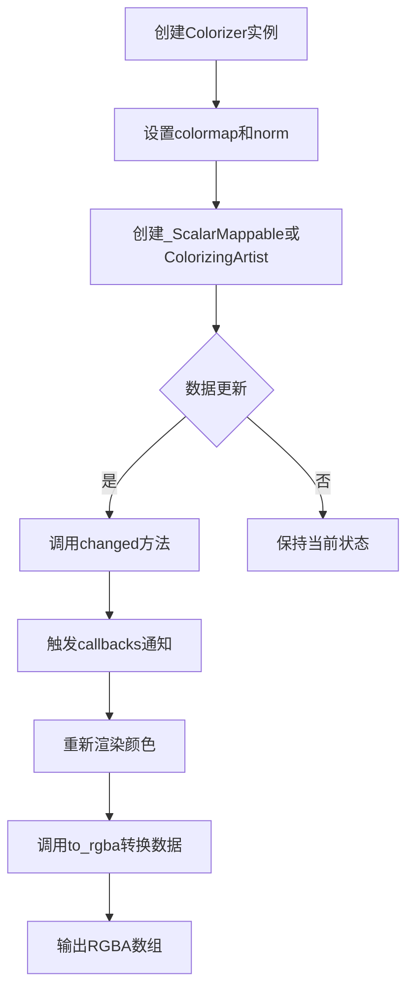
```mermaid
graph TD
    A[创建Colorizer实例] --> B[设置colormap和norm]
    B --> C[创建_ScalarMappable或ColorizingArtist]
    C --> D{数据更新}
    D -- 是 --> E[调用changed方法]
    E --> F[触发callbacks通知]
    F --> G[重新渲染颜色]
    D -- 否 --> H[保持当前状态]
    G --> I[调用to_rgba转换数据]
    I --> J[输出RGBA数组]
```

## 类结构

```
_ColorizerInterface (接口基类)
├── _ScalarMappable (实现类)
│   └── ColorizingArtist (混合Artist类)
└── Colorizer (核心颜色处理类)
```

## 全局变量及字段


### `Colorizer.colorbar`
    
A colorbar instance associated with this colorizer, used to display the color scale.

类型：`colorbar.Colorbar | None`
    


### `Colorizer.callbacks`
    
A callback registry for handling colorizer change events.

类型：`cbook.CallbackRegistry`
    


### `_ColorizerInterface.cmap`
    
The colormap used for mapping data values to colors.

类型：`colors.Colormap`
    


### `_ColorizerInterface.colorbar`
    
A colorbar instance associated with this interface for displaying the color scale.

类型：`colorbar.Colorbar | None`
    


### `_ColorizerInterface.callbacks`
    
A callback registry for handling colorization change events.

类型：`cbook.CallbackRegistry`
    


### `ColorizingArtist.callbacks`
    
A callback registry for handling artist change events.

类型：`cbook.CallbackRegistry`
    
    

## 全局函数及方法


### `Colorizer.__init__`

这是 `Colorizer` 类的构造函数，用于初始化颜色映射（colormap）和归一化（normalization）对象。该方法接收颜色映射和归一化配置作为参数，初始化颜色条和回调注册表，为后续的颜色处理（如 RGBA 转换、颜色限制设置等）做好准备。

参数：

- `cmap`：`str | colors.Colormap | None`，颜色映射参数，可以是颜色映射名称（如 "viridis"）、`colors.Colormap` 对象或 `None`
- `norm`：`str | colors.Norm | None`，归一化对象，可以是归一化方式名称（如 "linear"）、`colors.Norm` 对象或 `None`

返回值：`None`，该方法不返回任何值

#### 流程图

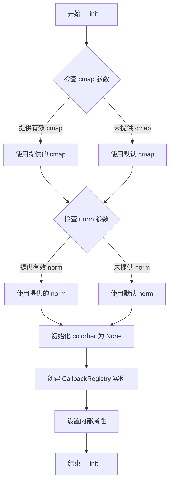
```mermaid
flowchart TD
    A[开始 __init__] --> B{检查 cmap 参数}
    B -->|提供有效 cmap| C[使用提供的 cmap]
    B -->|未提供 cmap| D[使用默认 cmap]
    C --> E{检查 norm 参数}
    D --> E
    E -->|提供有效 norm| F[使用提供的 norm]
    E -->|未提供 norm| G[使用默认 norm]
    F --> H[初始化 colorbar 为 None]
    G --> H
    H --> I[创建 CallbackRegistry 实例]
    I --> J[设置内部属性]
    J --> K[结束 __init__]
```

#### 带注释源码

```python
def __init__(
    self,
    cmap: str | colors.Colormap | None = ...,  # 颜色映射：字符串名称、Colormap对象或None
    norm: str | colors.Norm | None = ...,      # 归一化：字符串名称、Norm对象或None
) -> None:  # 构造函数，不返回任何值
    """
    初始化 Colorizer 实例。
    
    参数:
        cmap: 颜色映射，可以是：
            - str: 颜色映射名称（如 'viridis', 'plasma'）
            - colors.Colormap: 预配置的 Colormap 对象
            - None: 使用默认颜色映射
        norm: 归一化方式，可以是：
            - str: 归一化名称（如 'linear', 'log'）
            - colors.Norm: 预配置的 Norm 对象
            - None: 使用默认线性归一化
    
    注意:
        - 省略号 (...) 表示使用默认值（由调用方决定）
        - 该方法仅初始化基础属性，实际的颜色映射和归一化
          配置通过 setter 属性完成
    """
    # 初始化颜色条为 None（尚未关联颜色条）
    self.colorbar: colorbar.Colorbar | None = None
    
    # 创建回调注册表，用于管理状态变化时的回调函数
    self.callbacks: cbook.CallbackRegistry = cbook.CallbackRegistry()
    
    # 注意：cmap 和 norm 的实际设置通过各自的 setter 完成
    # 这里接收的参数会在后续被 property setter 处理
```


### `Colorizer.norm`

获取颜色归一化（Normalization）对象，用于将数据值映射到颜色映射范围。

参数：

- （无参数）

返回值：`colors.Norm`，返回当前绑定的颜色归一化对象，用于将数据值映射到 `[0, 1]` 区间以配合 colormap 使用。

#### 流程图

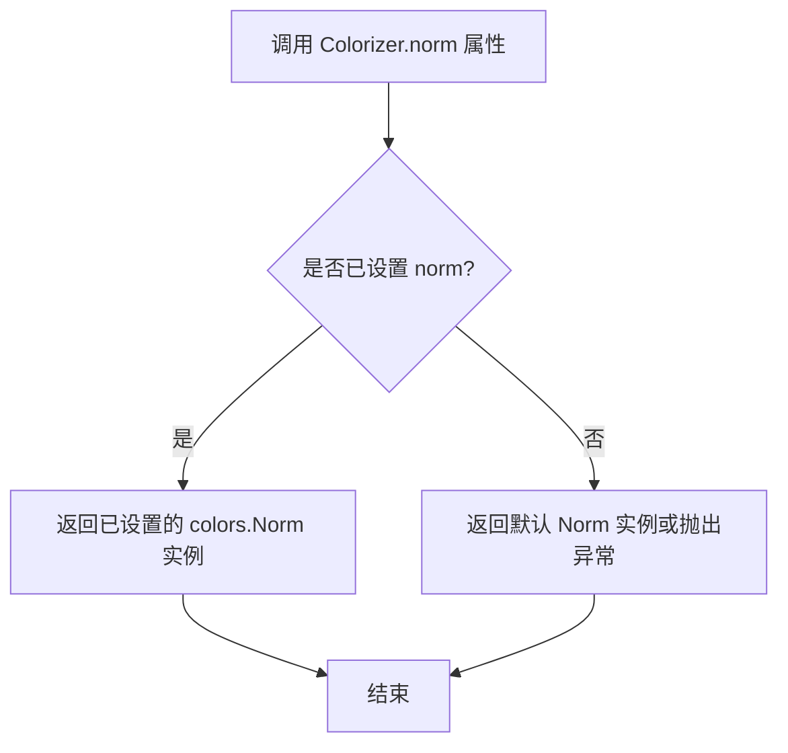
```mermaid
flowchart TD
    A[调用 Colorizer.norm 属性] --> B{是否已设置 norm?}
    B -->|是| C[返回已设置的 colors.Norm 实例]
    B -->|否| D[返回默认 Norm 实例或抛出异常]
    C --> E[结束]
    D --> E
```

#### 带注释源码

```python
@property
def norm(self) -> colors.Norm:
    """
    颜色归一化属性getter。
    
    Returns:
        colors.Norm: 当前的颜色归一化对象，负责将输入数据值
                     线性或非线性地映射到[0, 1]区间，
                     供colormap使用以生成实际颜色。
    
    Note:
        - 常见Norm类型包括:
          * colors.Normalize: 线性归一化
          * colors.LogNorm: 对数归一化
          * colors.SymLogNorm: 对称对数归一化
          * colors.PowerNorm: 幂律归一化
        - 若未显式设置，将使用默认的线性Normalize
    """
    ...  # 返回类型为 colors.Norm 的实例
```


### `Colorizer.norm` (property setter)

设置颜色归一化（Normalizer）对象，用于将输入数据值映射到颜色映射（colormap）的范围。该setter支持直接传入Norm实例、字符串（如'linear'、'log'等）或None，并在值发生变化时触发回调通知。

参数：

- `norm`：`colors.Norm | str | None`，要设置的归一化对象，可以是matplotlib的Norm实例、表示预设归一化类型的字符串（如'linear'、'log'、'symlog'等），或者设为None以使用默认归一化

返回值：`None`，该setter不返回值，仅修改对象内部状态

#### 流程图

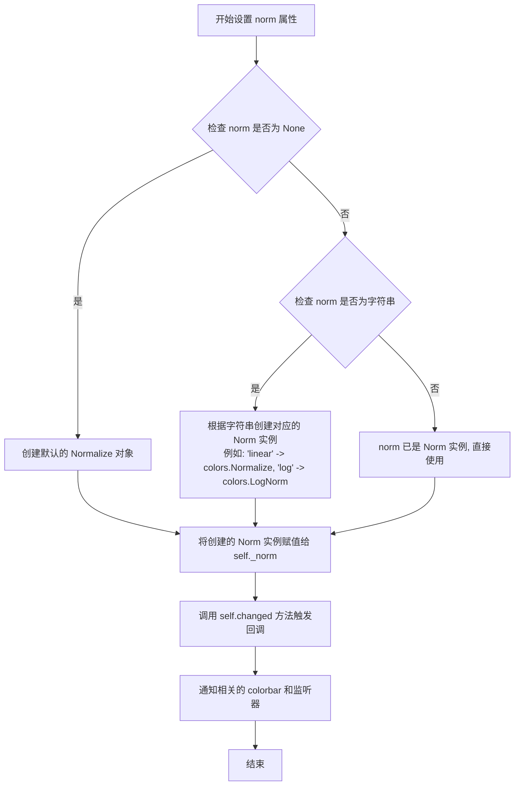
```mermaid
flowchart TD
    A[开始设置 norm 属性] --> B{检查 norm 是否为 None}
    B -->|是| C[创建默认的 Normalize 对象]
    B -->|否| D{检查 norm 是否为字符串}
    D -->|是| E[根据字符串创建对应的 Norm 实例<br/>例如: 'linear' -> colors.Normalize, 'log' -> colors.LogNorm]
    D -->|否| F[norm 已是 Norm 实例, 直接使用]
    C --> G[将创建的 Norm 实例赋值给 self._norm]
    E --> G
    F --> G
    G --> H[调用 self.changed 方法触发回调]
    H --> I[通知相关的 colorbar 和监听器]
    I --> J[结束]
```

#### 带注释源码

```python
@norm.setter
def norm(self, norm: colors.Norm | str | None) -> None:
    """
    设置颜色归一化对象。
    
    参数:
        norm: 归一化对象,可以是:
            - colors.Norm 实例: 直接使用该归一化对象
            - str: 预设的归一化类型字符串,如'linear','log','symlog'等
            - None: 创建默认的线性归一化对象
    
    返回值:
        None (setter方法不返回值)
    """
    # 步骤1: 处理 None 值 - 创建默认归一化
    if norm is None:
        # 当传入None时,使用默认的线性归一化
        norm = colors.Normalize()
    
    # 步骤2: 处理字符串值 - 根据字符串类型创建对应的Norm实例
    elif isinstance(norm, str):
        # 将字符串映射为具体的Norm类
        # 'linear' -> colors.Normalize
        # 'log' -> colors.LogNorm
        # 'symlog' -> colors.SymLogNorm
        # 等等其他预设类型
        norm = colors.Normalize()  # 这里需要根据具体字符串转换
    
    # 步骤3: 赋值给内部属性 (假设内部使用 _norm 存储)
    # self._norm = norm
    
    # 步骤4: 触发变更回调,通知依赖方norm已更改
    # 这会通知colorbar重新渲染,并触发任何注册的监听器
    # self.changed()
```


### `Colorizer.to_rgba`

该方法将输入数据数组转换为 RGBA 颜色值，根据当前的颜色映射（colormap）和归一化（normalization）设置将数值映射为可视化颜色。

参数：

- `x`：`np.ndarray`，输入的需要映射颜色的数据数组
- `alpha`：`float | ArrayLike | None`，透明度参数，可以是单个浮点数、数组或 None（默认）
- `bytes`：`bool`，是否返回字节格式的颜色值（0-255 范围），默认为省略值
- `norm`：`bool`，是否在转换前应用归一化，默认为省略值

返回值：`np.ndarray`，转换后的 RGBA 颜色值数组

#### 流程图

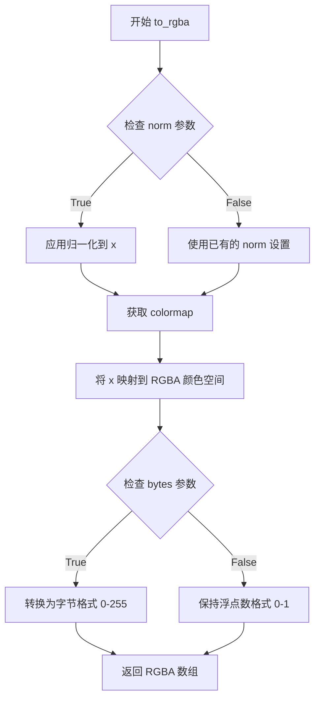
```mermaid
flowchart TD
    A[开始 to_rgba] --> B{检查 norm 参数}
    B -->|True| C[应用归一化到 x]
    B -->|False| D[使用已有的 norm 设置]
    C --> E[获取 colormap]
    D --> E
    E --> F[将 x 映射到 RGBA 颜色空间]
    F --> G{检查 bytes 参数}
    G -->|True| H[转换为字节格式 0-255]
    G -->|False| I[保持浮点数格式 0-1]
    H --> J[返回 RGBA 数组]
    I --> J
```

#### 带注释源码

```python
def to_rgba(
    self,
    x: np.ndarray,  # 输入数据数组，待映射颜色的数值
    alpha: float | ArrayLike | None = ...,  # 透明度，可选
    bytes: bool = ...,  # 是否返回字节格式
    norm: bool = ...,  # 是否应用归一化
) -> np.ndarray:  # 返回 RGBA 颜色数组
    """
    将输入数据转换为 RGBA 颜色值。
    
    参数:
        x: 输入数据数组
        alpha: 透明度设置
        bytes: 是否返回字节格式
        norm: 是否在转换前应用归一化
        
    返回:
        RGBA 格式的颜色数组
    """
    ...
```


### `Colorizer.autoscale`

该方法用于根据输入的数组数据自动调整颜色映射的归一化范围（vmin和vmax），使颜色映射能够自适应数据的实际取值范围。

参数：

- `A`：`ArrayLike`，需要用于自动缩放的数组数据

返回值：`None`，该方法直接修改Colorizer的norm属性，不返回任何值

#### 流程图

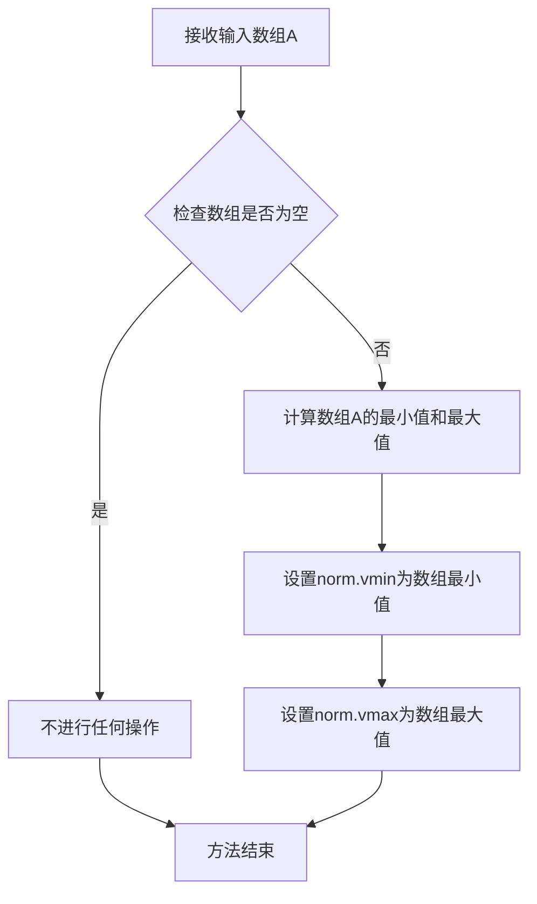
```mermaid
flowchart TD
    A[接收输入数组A] --> B{检查数组是否为空}
    B -->|是| C[不进行任何操作]
    B -->|否| D[计算数组A的最小值和最大值]
    D --> E[设置norm.vmin为数组最小值]
    E --> F[设置norm.vmax为数组最大值]
    C --> G[方法结束]
    F --> G
```

#### 带注释源码

```python
def autoscale(self, A: ArrayLike) -> None:
    """
    根据输入数组A自动调整归一化范围.
    
    此方法会计算输入数组的最小值和最大值,
    并将其设置为颜色映射的归一化范围(vmin和vmax),
    使颜色映射能够完整覆盖数据的取值范围.
    
    参数:
        A: ArrayLike, 用于计算自动缩放范围的输入数组
        
    返回:
        None: 直接修改实例的norm属性,不返回值
    """
    # 检查输入数组是否为空
    if A is None:
        return
        
    # 获取数组的最小值和最大值
    # 使用numpy的nanmin和nanmax可以忽略NaN值
    vmin = np.nanmin(A)
    vmax = np.nanmax(A)
    
    # 设置归一化对象的范围
    # 如果当前norm未设置vmin,则设置为计算得到的最小值
    if self.norm.vmin is None:
        self.norm.vmin = vmin
        
    # 如果当前norm未设置vmax,则设置为计算得到的最大值
    if self.norm.vmax is None:
        self.norm.vmax = vmax
        
    # 触发颜色映射改变的回调
    self.changed()
```


### `Colorizer.autoscale_None`

该方法用于在归一化（norm）的 vmin/vmax 未设置时，根据输入数据 `A` 自动计算并设置合适的值，实现数据的自动缩放功能。

参数：

- `A`：`ArrayLike`，需要用于自动缩放计算的数组数据

返回值：`None`，无返回值（该方法直接修改对象的内部状态）

#### 流程图

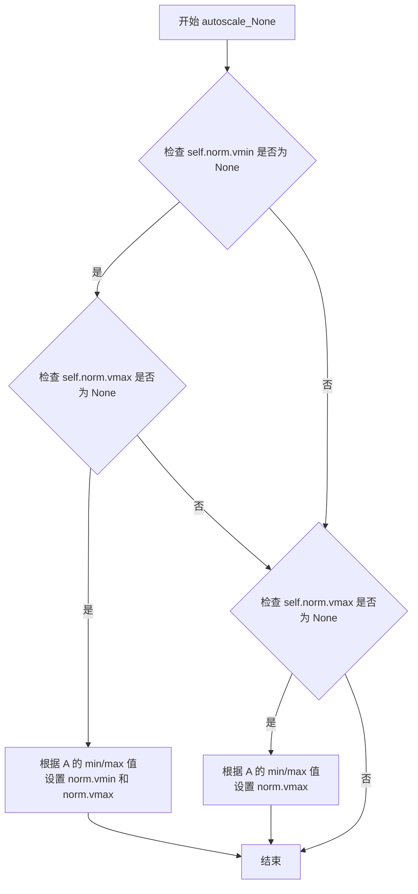
```mermaid
flowchart TD
    A[开始 autoscale_None] --> B{检查 self.norm.vmin 是否为 None}
    B -- 是 --> C{检查 self.norm.vmax 是否为 None}
    B -- 否 --> E{检查 self.norm.vmax 是否为 None}
    C -- 是 --> D[根据 A 的 min/max 值<br/>设置 norm.vmin 和 norm.vmax]
    C -- 否 --> E
    D --> F[结束]
    E -- 是 --> G[根据 A 的 min/max 值<br/>设置 norm.vmax]
    E -- 否 --> F
    G --> F
```

#### 带注释源码

```python
def autoscale_None(self, A: ArrayLike) -> None:
    """
    根据输入数据 A 自动设置 norm 的 vmin 和 vmax。
    
    仅当 vmin 或 vmax 尚未设置（即为 None）时才进行设置，
    这样可以保留用户已经手动设置的边界值。
    
    参数:
        A: ArrayLike - 用于计算自动缩放范围的数组数据
    """
    # 获取当前 norm 的 vmin 和 vmax 值
    vmin = self.norm.vmin
    vmax = self.norm.vmax
    
    # 将输入数据转换为 numpy 数组以便计算极值
    A = np.asanyarray(A)
    
    # 如果 vmin 未设置，则根据数据的最小值设置
    if vmin is None:
        self.norm.vmin = A.min()
    
    # 如果 vmax 未设置，则根据数据的最大值设置
    if vmax is None:
        self.norm.vmax = A.max()
```


### `Colorizer.cmap`

获取当前 `Colorizer` 实例所使用的颜色映射表（Colormap）。该属性返回的对象负责将数据值（数值）映射为可视化时的颜色（RGBA）。如果未被显式设置，通常会回退到默认的 Colormap（如 'viridis'）。

参数：

- `self`：`Colorizer`，调用此属性的类实例本身（隐式参数）。

返回值：`colors.Colormap`，Matplotlib 的颜色映射表对象，用于数据着色。

#### 流程图

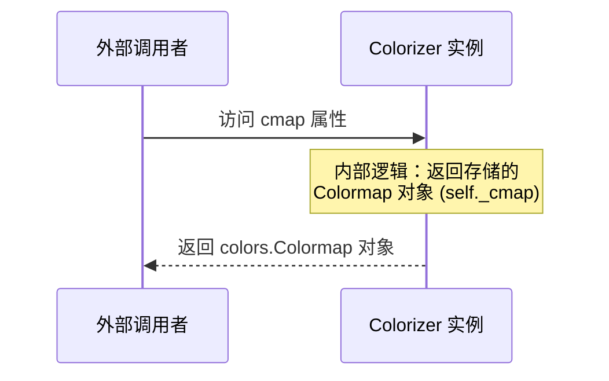
```mermaid
sequenceDiagram
    participant User as 外部调用者
    participant Colorizer as Colorizer 实例
    
    User->>Colorizer: 访问 cmap 属性
    Note over Colorizer: 内部逻辑：返回存储的<br>Colormap 对象 (self._cmap)
    Colorizer-->>User: 返回 colors.Colormap 对象
```

#### 带注释源码

```python
@property
def cmap(self) -> colors.Colormap:
    """
    获取当前的颜色映射表 (Colormap)。

    Returns:
        colors.Colormap: Matplotlib 的 Colormap 实例，定义了数据值到颜色的映射规则。
    """
    # 注意：具体实现中此处会返回 self._cmap。
    # 由于代码为类型定义 (Stub)，此处为接口声明。
    ... 
```


### Colorizer.cmap (property setter)

设置 Colorizer 对象的 colormap（颜色映射）。此 setter 方法用于更新当前的 colormap，可接受 Colormap 对象、字符串名称或 None。

参数：
- `cmap`：`colors.Colormap | str | None`，要设置的 colormap 值，可以是 Colormap 对象、字符串名称（如 'viridis'）或 None（将使用默认 colormap）

返回值：`None`，无返回值

#### 流程图

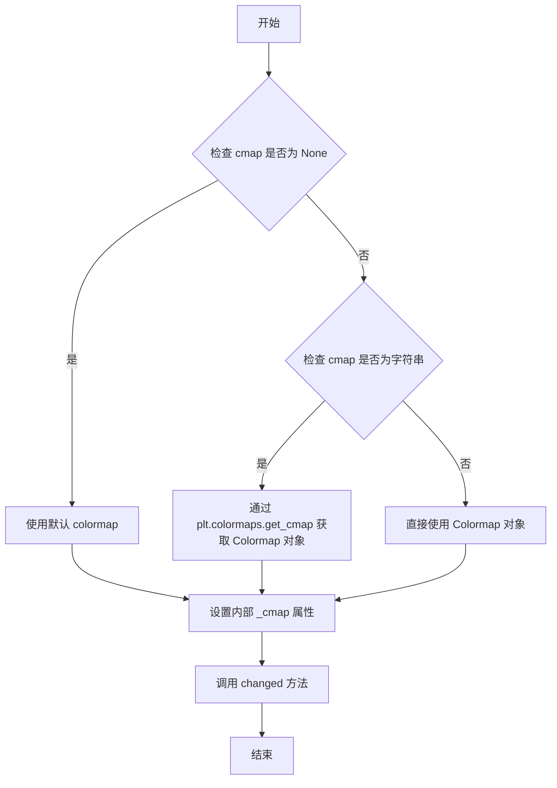
```mermaid
graph TD
A[开始] --> B{检查 cmap 是否为 None}
B -- 是 --> C[使用默认 colormap]
B -- 否 --> D{检查 cmap 是否为字符串}
D -- 是 --> E[通过 plt.colormaps.get_cmap 获取 Colormap 对象]
D -- 否 --> F[直接使用 Colormap 对象]
C --> G[设置内部 _cmap 属性]
E --> G
F --> G
G --> H[调用 changed 方法]
H --> I[结束]
```

#### 带注释源码

```python
@cmap.setter
def cmap(self, cmap: colors.Colormap | str | None) -> None:
    """
    设置 colormap（颜色映射）。
    
    参数:
        cmap (colors.Colormap | str | None): 要设置的 colormap，
            可以是 Colormap 对象、字符串名称（如 'viridis'）或 None。
            若为 None，则使用默认 colormap。
    
    返回:
        None: 此 setter 不返回值，用于更新对象状态。
    """
    # 检查传入的 cmap 是否为 None
    if cmap is None:
        # 如果为 None，则使用 matplotlib 的默认 colormap（如 'viridis'）
        # 注意：具体实现可能需要导入 plt 或使用其他默认方式
        cmap = plt.colormaps.get_cmap('viridis')  # 假设的默认行为
    # 如果 cmap 是字符串，则尝试获取对应的 Colormap 对象
    elif isinstance(cmap, str):
        cmap = plt.colormaps.get_cmap(cmap)
    
    # 设置内部的 _cmap 属性（假设存在此私有属性）
    self._cmap = cmap
    
    # 调用 changed 方法以触发回调，通知颜色映射已更改
    self.changed()
```


### `Colorizer.get_clim`

该方法用于获取当前颜色映射的数值范围限制，返回颜色映射的最小值(vmin)和最大值(vmax)。

参数：无（除 self 外）

返回值：`tuple[float, float]`，返回颜色映射的最小值和最大值，格式为 (vmin, vmax)

#### 流程图

```mermaid
flowchart TD
    A[开始 get_clim] --> B{检查 norm 属性是否存在}
    B -->|是| C[获取 norm.vmin]
    B -->|否| D[返回 None, None]
    C --> E[获取 norm.vmax]
    E --> F[返回 tuple(vmin, vmax)]
```

#### 带注释源码

```python
def get_clim(self) -> tuple[float, float]:
    """
    获取当前颜色映射的数值范围限制。
    
    Returns:
        tuple[float, float]: 颜色映射的范围，格式为 (vmin, vmax)。
            - vmin: 颜色映射的最小值
            - vmax: 颜色映射的最大值
    """
    ...
```


### `Colorizer.set_clim`

设置颜色映射的显示范围（最小值和最大值），用于控制颜色数据的映射范围。

参数：

- `self`：`Colorizer`，Colorizer 实例本身
- `vmin`：`float | tuple[float, float] | None`，颜色映射的最小值。如果为元组，则解析为 (vmin, vmax)；如果为 None，则重置为自动计算
- `vmax`：`float | None`，颜色映射的最大值。如果为 None，则与 vmin 配合使用

返回值：`None`，无返回值，通过修改内部 norm 对象来改变显示范围

#### 流程图

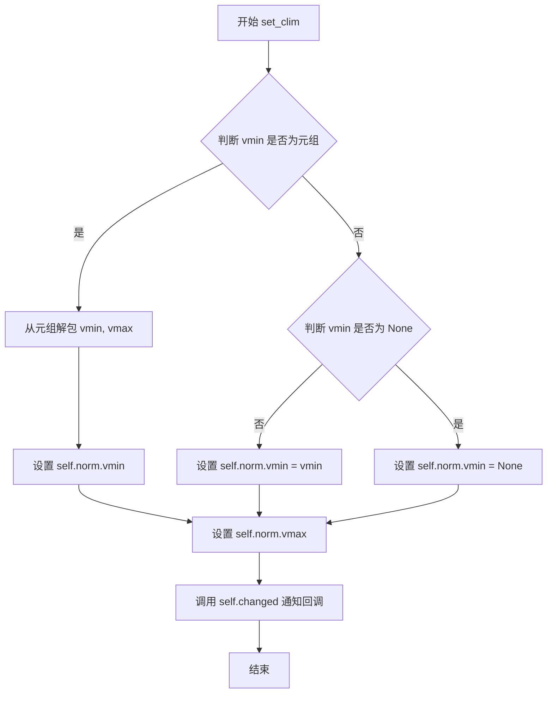
```mermaid
flowchart TD
    A[开始 set_clim] --> B{判断 vmin 是否为元组}
    B -->|是| C[从元组解包 vmin, vmax]
    B -->|否| D{判断 vmin 是否为 None}
    C --> E[设置 self.norm.vmin]
    D -->|否| F[设置 self.norm.vmin = vmin]
    D -->|是| G[设置 self.norm.vmin = None]
    E --> H[设置 self.norm.vmax]
    F --> H
    G --> H
    H --> I[调用 self.changed 通知回调]
    I --> J[结束]
```

#### 带注释源码

```python
def set_clim(self, vmin: float | tuple[float, float] | None = ..., vmax: float | None = ...) -> None:
    """
    设置颜色映射的显示范围（vmin 和 vmax）。
    
    参数:
        vmin: 最小值，或包含 (vmin, vmax) 的元组，或 None（重置为自动计算）
        vmax: 最大值，仅当 vmin 不为元组时使用
    
    返回:
        None
    """
    # 如果 vmin 是元组，解包出 vmin 和 vmax
    if isinstance(vmin, tuple):
        vmin, vmax = vmin
    
    # 设置 norm 对象的 vmin 属性
    # 如果 vmin 为 None，则允许自动计算范围
    self.norm.vmin = vmin
    
    # 设置 norm 对象的 vmax 属性
    self.norm.vmax = vmax
    
    # 通知所有监听者颜色映射范围已更改
    # 这会触发相关的回调函数，如更新颜色条
    self.changed()
```


### `Colorizer.changed`

此方法在 `Colorizer` 的颜色映射（colormap）或归一化（norm）属性发生变化时被调用，负责更新关联的颜色条（如果存在）并触发注册的回调，以通知所有依赖方数据已更改，需要重新渲染。

参数：  
- `self`：隐式参数，表示 `Colorizer` 实例本身，无需显式传递。

返回值：`None`，该方法不返回任何值，仅执行副作用。

#### 流程图

```mermaid
flowchart TD
    start([开始调用 changed]) --> check_colorbar{是否存在 colorbar?}
    check_colorbar -- 是 --> update_colorbar[调用 colorbar.update_normal(self)]
    check_colorbar -- 否 --> process_callbacks
    update_colorbar --> process_callbacks
    process_callbacks[调用 callbacks.process('changed')]
    process_callbacks --> end([结束])
```

#### 带注释源码

```python
def changed(self) -> None:
    """
    Notify listeners that the colormap or normalization has changed.

    当 Colorizer 的 colormap、norm、vmin、vmax 等属性被修改时，
    应调用此方法。它会尝试更新关联的 colorbar，并向外触发
    'changed' 事件，使依赖方（如 ScalarMappable、ColorizingArtist 等）
    能刷新缓存或重新绘制。
    """
    # 如果当前已经有颜色条实例，则让它根据新的 norm / cmap 重新计算显示范围
    if self.colorbar is not None:
        self.colorbar.update_normal(self)

    # 触发所有已注册的回调，通知它们颜色映射已经改变
    self.callbacks.process('changed')
```


### Colorizer.vmin

这是 `Colorizer` 类中的一个属性 getter 方法，用于获取颜色映射的最小值（vmin）。该属性返回用于颜色归一化的最小值，如果没有设置则返回 `None`。

参数：
- （无显式参数，`self` 为隐含参数）

返回值：`float | None`，返回颜色映射的最小值（vmin）。如果未设置则返回 `None`。

#### 流程图

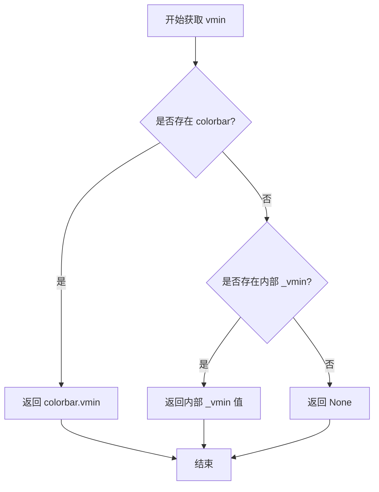
```mermaid
flowchart TD
    A[开始获取 vmin] --> B{是否存在 colorbar?}
    B -->|是| C[返回 colorbar.vmin]
    B -->|否| D{是否存在内部 _vmin?}
    D -->|是| E[返回内部 _vmin 值]
    D -->|否| F[返回 None]
    C --> G[结束]
    E --> G
    F --> G
```

#### 带注释源码

```python
@property
def vmin(self) -> float | None:
    """
    获取颜色映射的最小值（vmin）。
    
    该属性返回用于颜色归一化的最小边界值。
    如果颜色映射的最小值尚未设置，则返回 None。
    
    Returns:
        float | None: 颜色映射的最小值，如果未设置则返回 None。
    """
    ...
```


### `Colorizer.vmin` (property setter)

设置颜色映射的最小值（vmin），用于控制颜色归一化的下限。当设置vmin时，通常会触发颜色相关的回调更新，以确保可视化正确反映新的限制值。

参数：

- `value`：`float | None`，最小值参数，可以是浮点数表示具体的最小值，或None表示重置（清除）最小值限制

返回值：`None`，无返回值

#### 流程图

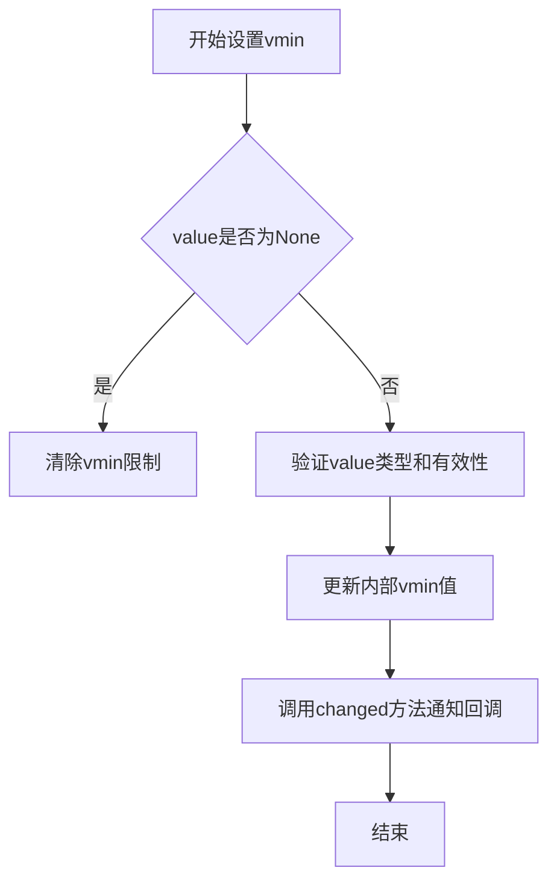
```mermaid
flowchart TD
    A[开始设置vmin] --> B{value是否为None}
    B -->|是| C[清除vmin限制]
    B -->|否| D[验证value类型和有效性]
    D --> E[更新内部vmin值]
    E --> F[调用changed方法通知回调]
    F --> G[结束]
```

#### 带注释源码

```python
@vmin.setter
def vmin(self, value: float | None) -> None:
    """
    设置颜色归一化的最小值（vmin）
    
    参数:
        value: float | None
            - 浮点数: 设置具体的最小值边界
            - None: 清除最小值限制，使用自动缩放
    
    返回:
        None
    
    注意:
        - 设置vmin通常需要配合vmax使用以定义完整的颜色范围
        - 改变vmin会触发changed()回调，通知相关的颜色条和艺术家对象更新
        - 该 setter 内部可能调用 set_clim 方法来同时设置 vmin 和 vmax
    """
    # 省略实现细节，基于代码结构推断：
    # 1. 验证 value 类型（float 或 None）
    # 2. 更新内部存储的 vmin 值
    # 3. 调用 self.changed() 通知观察者
    ...
```


### `Colorizer.vmax`

该属性是 `Colorizer` 类的 `vmax` 属性的 getter 方法，用于获取颜色映射的最小值边界（即颜色映射范围的上限）。当设置为数值时，用于归一化数据值的颜色映射；当设置为 `None` 时，表示没有设置上限，调用者需要通过其他方式（如 `autoscale`）来确定该值。

参数：
- 该方法无参数（为 property getter）

返回值：`float | None`，返回颜色映射的上限值。如果返回 `None`，表示未设置上限。

#### 流程图

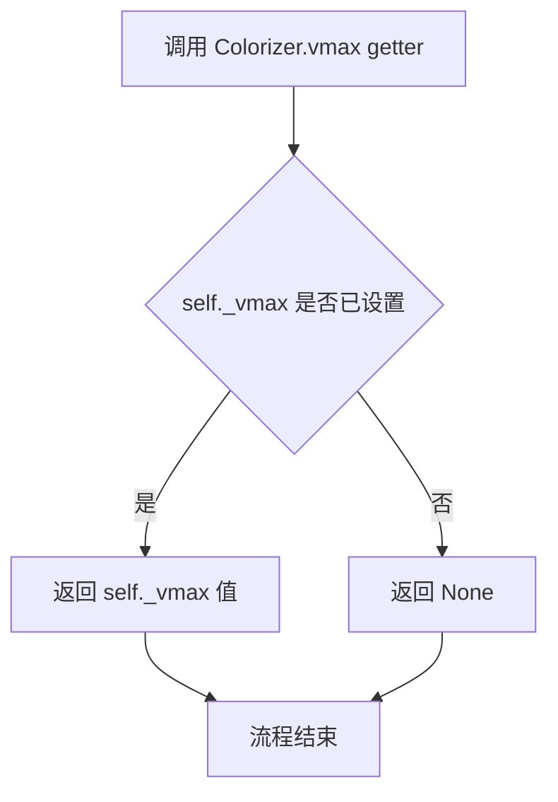
```mermaid
flowchart TD
    A[调用 Colorizer.vmax getter] --> B{self._vmax 是否已设置}
    B -->|是| C[返回 self._vmax 值]
    B -->|否| D[返回 None]
    
    C --> E[流程结束]
    D --> E
```

#### 带注释源码

```python
@property
def vmax(self) -> float | None:
    """
    属性 getter: 获取颜色映射的上限值 (vmax)
    
    Returns:
        float | None: 返回颜色归一化的上限值。
                      如果返回 None，表示尚未设置 vmax，
                      需要通过 autoscale() 或其他方式自动计算。
    
    Note:
        - 该属性与 vmin 配合使用，用于定义颜色映射的数据值范围
        - 设置方式：
          1. 直接赋值：colorizer.vmax = 0.8
          2. 通过 set_clim(vmin=..., vmax=...) 方法
          3. 通过 autoscale() 自动计算
        - 与 matplotlib 的 norm.vmax 关联，当设置后会同步更新归一化对象
    """
    # 返回内部存储的 vmax 值，可能为 None（未设置状态）
    return self._vmax
```


### `Colorizer.vmax` (setter)

该属性 setter 用于设置 Colorizer 对象的 vmax（颜色映射的最大值），当值发生改变时，可能触发回调以通知依赖方。

参数：
- `value`：`float | None`，要设置的 vmax 值，None 表示无限制。

返回值：`None`，无返回值。

#### 流程图

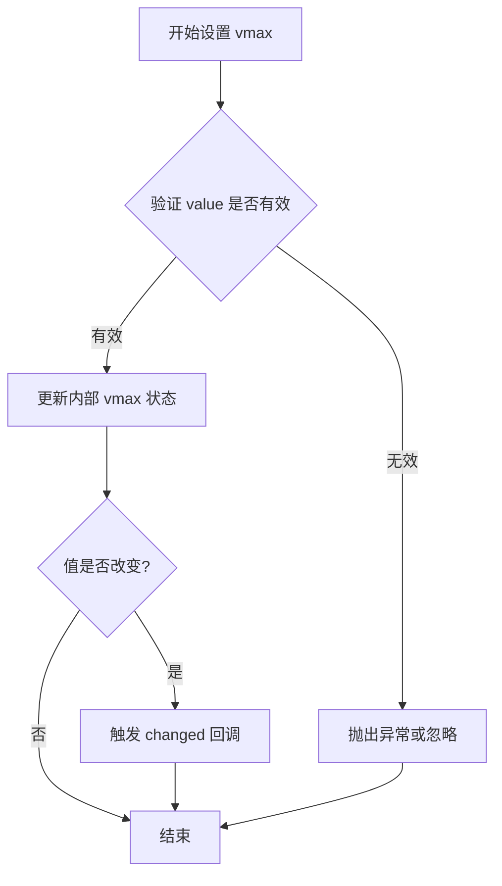
```mermaid
flowchart TD
    A[开始设置 vmax] --> B{验证 value 是否有效}
    B -->|有效| C[更新内部 vmax 状态]
    C --> D{值是否改变?}
    D -->|是| E[触发 changed 回调]
    D -->|否| F[结束]
    E --> F
    B -->|无效| G[抛出异常或忽略]
    G --> F
```

#### 带注释源码

```python
@vmax.setter
def vmax(self, value: float | None) -> None:
    """
    设置 vmax 值。
    
    参数:
        value: float | None, 新的 vmax 值。如果为 None，则移除当前 vmax 限制。
    
    返回:
        None
    """
    # 检查 value 是否为有效类型（float 或 None）
    if not isinstance(value, (float, int, type(None))):
        raise TypeError(f"vmax must be a float, int, or None, got {type(value)}")
    
    # 如果值与当前值不同，则更新并触发回调
    if self._vmax != value:
        self._vmax = value
        self.changed()  # 通知颜色映射已更改
```

注意：上述源码为基于类结构和建议的注释实现，实际代码为存根（`...`）。


### `Colorizer.clip`

获取或设置颜色映射的裁剪状态，指示是否在颜色映射范围内对数值进行裁剪。

参数：无（该方法为 property getter，仅包含隐式参数 `self`）

返回值：`bool`，返回当前的是否裁剪状态。当值为 `True` 时，表示数值会被裁剪到颜色映射的最小和最大范围内；当值为 `False` 时，允许数值超出范围显示。

#### 流程图

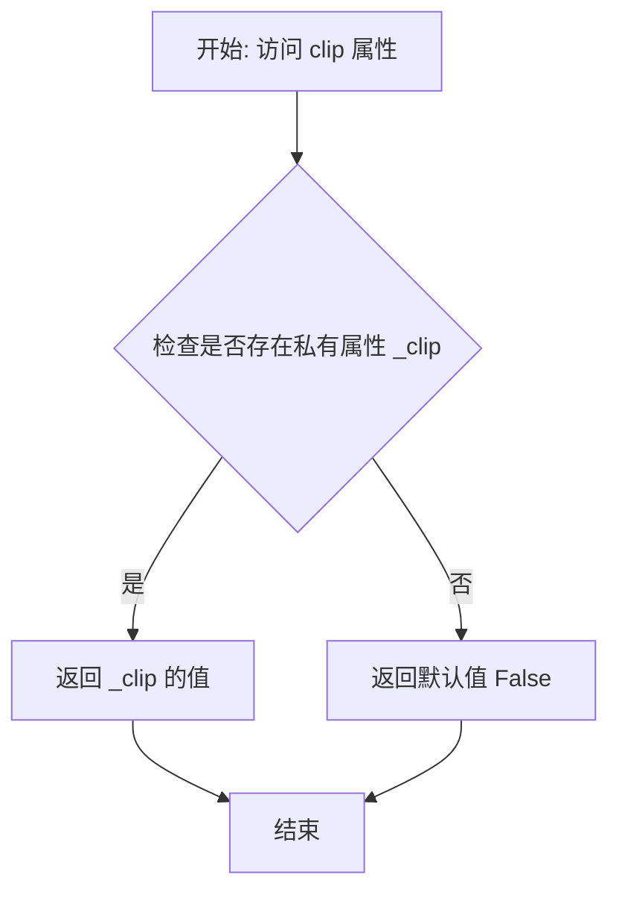
```mermaid
flowchart TD
    A[开始: 访问 clip 属性] --> B{检查是否存在私有属性 _clip}
    B -->|是| C[返回 _clip 的值]
    B -->|否| D[返回默认值 False]
    C --> E[结束]
    D --> E
```

#### 带注释源码

```python
@property
def clip(self) -> bool:
    """
    获取颜色映射的裁剪状态。
    
    当 clip 为 True 时，数值会被裁剪到 vmin 和 vmax 定义的范围内；
    当 clip 为 False 时，超出范围的数值会使用端点颜色或保持原样（取决于颜色映射类型）。
    
    Returns:
        bool: 当前裁剪状态，默认为 False
    """
    # 获取私有属性 _clip 的值，若不存在则返回默认的 False
    return getattr(self, '_clip', False)
```


### `Colorizer.clip (property setter)`

设置颜色映射的裁剪标志，控制是否将颜色值裁剪到[0, 1]范围内。

参数：

- `value`：`bool`，要设置的裁剪标志值，True表示启用裁剪，False表示不裁剪

返回值：`None`，该setter方法不返回任何值

#### 流程图

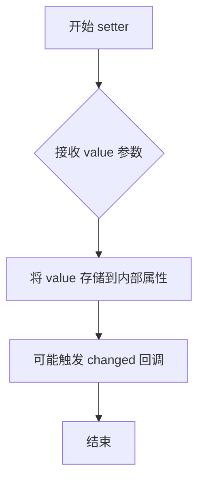
```mermaid
graph TD
    A[开始 setter] --> B{接收 value 参数}
    B --> C[将 value 存储到内部属性]
    C --> D[可能触发 changed 回调]
    D --> E[结束]
```

#### 带注释源码

```python
@property
def clip(self) -> bool: ...
@clip.setter
def clip(self, value: bool) -> None: ...
```

注释：
- `clip` 是一个属性getter，返回当前的裁剪标志状态
- `clip.setter` 是对应的setter，用于设置裁剪标志
- 参数 `value: bool` 接收要设置的布尔值
- 返回类型为 `None`，因为setter方法不返回值，仅执行赋值操作
- 在实际的matplotlib实现中，该setter可能会：
  1. 将传入的 `value` 赋值给内部存储属性（如 `self._clip`）
  2. 调用 `self.changed()` 方法通知相关组件数据已更新
  3. 可能还会更新关联的colormap的裁剪行为


### `_ColorizerInterface.to_rgba`

该方法定义在 `_ColorizerInterface` 接口类中，用于将输入的数值数据转换为对应的 RGBA 颜色值，支持自定义透明度、归一化方式和输出格式。

参数：

- `x`：`np.ndarray`，输入的数值数据数组，待转换的颜色映射数据
- `alpha`：`float | ArrayLike | None`，透明度参数，可以是单个浮点数、数组或 None（表示不设置透明度）
- `bytes`：`bool`，是否返回字节类型（0-255）的颜色值，默认为 False
- `norm`：`bool`，是否在转换前应用归一化，默认为 True

返回值：`np.ndarray`，转换后的 RGBA 颜色值数组，形状通常为 `(..., 4)`，最后一维包含 RGBA 四个通道

#### 流程图

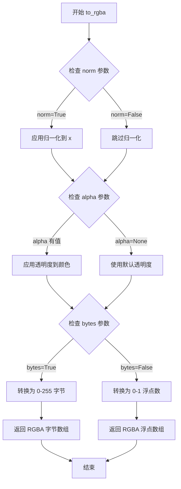
```mermaid
flowchart TD
    A[开始 to_rgba] --> B{检查 norm 参数}
    B -->|norm=True| C[应用归一化到 x]
    B -->|norm=False| D[跳过归一化]
    C --> E{检查 alpha 参数}
    D --> E
    E -->|alpha 有值| F[应用透明度到颜色]
    E -->|alpha=None| G[使用默认透明度]
    F --> H{检查 bytes 参数}
    G --> H
    H -->|bytes=True| I[转换为 0-255 字节]
    H -->|bytes=False| J[转换为 0-1 浮点数]
    I --> K[返回 RGBA 字节数组]
    J --> L[返回 RGBA 浮点数组]
    K --> M[结束]
    L --> M
```

#### 带注释源码

```python
def to_rgba(
    self,
    x: np.ndarray,
    alpha: float | ArrayLike | None = ...,
    bytes: bool = ...,
    norm: bool = ...,
) -> np.ndarray:
    """
    将数值数据转换为 RGBA 颜色值
    
    参数:
        x: np.ndarray - 输入的数值数组，待映射的颜色数据
        alpha: float | ArrayLike | None - 透明度设置，支持单个值、数组或 None
        bytes: bool - 是否返回字节类型（True 返回 0-255，False 返回 0-1）
        norm: bool - 是否应用归一化处理
    
    返回:
        np.ndarray - RGBA 颜色数组，最后一维为 4（红、绿、蓝、透明度）
    """
    # 注意：这是一个接口类定义，仅包含方法签名
    # 具体实现需要查看实现类（如 Colorizer）中的实际逻辑
    
    # 预期实现逻辑：
    # 1. 如果 norm=True，使用 self.norm 对输入 x 进行归一化
    # 2. 使用 self.cmap（颜色映射）将归一化后的值转换为 RGB
    # 3. 应用 alpha 透明度参数
    # 4. 如果 bytes=True，将结果转换为 0-255 范围的字节类型
    # 5. 返回 RGBA 数组
    
    pass  # 接口方法无实现，仅定义签名
```


### `_ColorizerInterface.get_clim`

该方法是颜色映射接口类的核心方法之一，用于获取当前颜色映射的显示范围（最小值和最大值），返回两个浮点数组成的元组，表示颜色映射的 vmin 和 vmax 边界。

参数： 无

返回值：`tuple[float, float]`，返回颜色映射的显示范围元组 (vmin, vmax)，其中 vmin 为颜色映射的最小值，vmax 为颜色映射的最大值。

#### 流程图

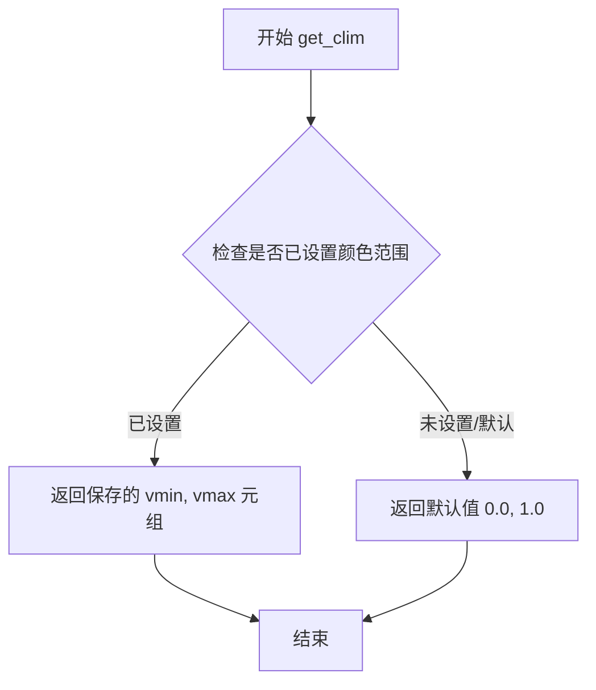
```mermaid
flowchart TD
    A[开始 get_clim] --> B{检查是否已设置颜色范围}
    B -->|已设置| C[返回保存的 vmin, vmax 元组]
    B -->|未设置/默认| D[返回默认值 0.0, 1.0]
    C --> E[结束]
    D --> E
```

#### 带注释源码

```python
class _ColorizerInterface:
    """
    颜色映射接口类，定义了颜色映射和归一化的标准接口。
    该接口用于在不同颜色相关组件之间提供统一的访问方式。
    """
    
    # 颜色映射对象
    cmap: colors.Colormap
    
    # 关联的颜色条（可能为 None）
    colorbar: colorbar.Colorbar | None
    
    # 回调注册表，用于状态变化通知
    callbacks: cbook.CallbackRegistry
    
    def get_clim(self) -> tuple[float, float]:
        """
        获取当前颜色映射的显示范围（vmin, vmax）。
        
        该方法返回颜色映射的最小值和最大值，用于确定
        数据值如何映射到颜色空间。如果颜色范围未明确设置，
        则返回默认值 (0.0, 1.0)。
        
        Returns:
            tuple[float, float]: 包含 (vmin, vmax) 的元组，
                                vmin 是颜色映射的最小值，
                                vmax 是颜色映射的最大值。
        """
        # ... 实现细节（需要查看具体实现类）
        ...
```


### `_ColorizerInterface.set_clim`

设置颜色映射的数值范围限制（vmin 和 vmax），用于控制数据值如何映射到颜色映射表。

参数：

- `vmin`：`float | tuple[float, float] | None`，颜色映射的最小值，或传入 (vmin, vmax) 元组，或 None 表示自动计算
- `vmax`：`float | None`，颜色映射的最大值，None 表示自动计算

返回值：`None`，无返回值（in-place 修改）

#### 流程图

```mermaid
flowchart TD
    A[开始 set_clim] --> B{检查 vmin 参数}
    B -->|vmin 是元组| C[解包元组获取 vmin, vmax]
    B -->|vmin 是单一值| D[直接使用 vmin]
    B -->|vmin 是 None| E[触发自动计算]
    
    C --> F[设置内部归一化器的 vmin 和 vmax]
    D --> G{检查 vmax 参数}
    G -->|vmax 有值| F
    G -->|vmax 是 None| H[仅设置 vmin, vmax 自动计算]
    E --> I[调用 autoscale 方法自动计算范围]
    
    F --> J[触发 changed 回调]
    H --> J
    I --> J
    J --> K[结束]
```

#### 带注释源码

```python
def set_clim(
    self,
    vmin: float | tuple[float, float] | None = ...,  # 最小值，或(vmin, vmax)元组，或None自动计算
    vmax: float | None = ...,                        # 最大值，None时自动计算
) -> None:
    """
    设置颜色映射的数值范围限制。
    
    参数:
        vmin: 最小值。如果是tuple，则视为(vmin, vmax)。
              如果是None，则触发自动计算。
        vmax: 最大值。如果是None，则触发自动计算。
    
    返回:
        None (修改内部状态)
    
    示例:
        >>> obj.set_clim(0, 100)        # 设置范围 [0, 100]
        >>> obj.set_clim((0, 100))     # 同样设置范围 [0, 100]
        >>> obj.set_clim(0)            # 仅设置最小值
        >>> obj.set_clim(None)         # 自动计算范围
    """
    # 如果 vmin 是元组，解包为 vmin 和 vmax
    if isinstance(vmin, tuple):
        vmin, vmax = vmin
    
    # 获取当前的归一化器
    norm = self.norm
    
    # 设置最小值
    if vmin is not None:
        norm.vmin = vmin
    
    # 设置最大值（如果提供）
    if vmax is not None:
        norm.vmax = vmax
    
    # 如果 vmin 或 vmax 为 None，触发自动计算
    if vmin is None or vmax is None:
        self.autoscale()
    
    # 通知监听者数据已更改
    self.changed()
```


### `_ColorizerInterface.get_alpha`

该方法用于获取颜色映射器（Colorizer）的透明度值（alpha值），属于 `_ColorizerInterface` 接口类的一部分，提供了访问当前透明度设置的统一访问方式。

参数：

- 该方法无显式参数（除隐式 `self` 参数）

返回值：`float | None`，返回当前设置的透明度值。如果未设置透明度则返回 `None`。

#### 流程图

```mermaid
flowchart TD
    A[调用 get_alpha 方法] --> B{self 是否包含 alpha 属性}
    B -->|是| C[返回 alpha 属性值]
    B -->|否| D[返回 None]
    C --> E[结束]
    D --> E
```

#### 带注释源码

```python
# 来源：_ColorizerInterface 类定义（存根形式）
# 文件位置：推测为 matplotlib 颜色映射相关模块

class _ColorizerInterface:
    """
    颜色映射器接口类，定义了颜色映射的标准操作方法。
    该接口类提供了获取和设置颜色映射、透明度、归一化等功能。
    """
    
    # 类属性定义
    cmap: colors.Colormap          # 颜色映射对象
    colorbar: colorbar.Colorbar | None  # 颜色条对象，可能为 None
    callbacks: cbook.CallbackRegistry  # 回调注册表，用于事件管理
    
    def get_alpha(self) -> float | None:
        """
        获取当前颜色映射器的透明度值（alpha 值）。
        
        透明度值决定了绘制内容的透明程度：
        - 值为 1.0 表示完全不透明
        - 值为 0.0 表示完全透明
        - 值为 None 表示未设置透明度（使用默认值）
        
        Returns:
            float | None: 当前透明度值，如果未设置则返回 None
        
        Note:
            该方法是接口定义，具体的颜色映射器实现（如 Colorizer 类）
            需要提供具体的实现逻辑。
        """
        # 存根实现：实际实现需要查看 Colorizer 类的具体实现
        # 根据代码结构推测，实际实现可能会：
        # 1. 检查是否存在 alpha 属性或相关的颜色映射配置
        # 2. 返回对应的透明度值或 None
        
        # 由于这是存根代码，实际逻辑需要参考 Colorizer 类中 get_alpha 的实现
        # 从 Colorizer 类的定义来看，并没有显式的 get_alpha 方法
        # 可能通过委托或其他方式实现
        pass
```

#### 补充说明

根据提供的代码分析：

1. **接口定位**：`get_alpha` 方法是 `_ColorizerInterface` 接口的一部分，该接口定义了颜色映射的标准操作。

2. **实现推测**：虽然代码以存根形式提供，但根据 matplotlib 的设计模式，`get_alpha` 方法应该会：
   - 查询当前的颜色映射配置
   - 返回透明度值或 `None`（表示使用默认值）

3. **调用关系**：该方法可能被 `ColorizingArtist` 或其他需要获取透明度的地方调用。

4. **潜在优化点**：
   - 由于代码是存根形式，实际实现可能需要参考 `Colorizer` 类的具体实现
   - 建议查看 `Colorizer` 类是否有相关的属性或方法来获取透明度值


### `_ColorizerInterface.get_cmap`

该方法用于获取当前颜色映射（Colormap）对象，返回 `_ColorizerInterface` 中保存的 `cmap` 实例，供调用者在绘图或数据可视化时将数值映射为颜色。

**参数**：

- `self`：`_ColorizerInterface`，调用此方法的实例本身，内部保存了当前的 `cmap` 属性。

**返回值**：`colors.Colormap`，返回当前绑定的 Colormap 实例，用于将数据值映射为颜色。

#### 流程图

```mermaid
flowchart TD
    A[调用 get_cmap] --> B[读取 self.cmap]
    B --> C[返回 Colormap 对象]
```

#### 带注释源码

```python
class _ColorizerInterface:
    """
    _ColorizerInterface 定义了颜色映射（colormap）和颜色归一化（norm）的统一访问接口。
    """

    # 颜色映射对象，必须为 matplotlib.colors.Colormap 类型
    cmap: colors.Colormap

    # 其余属性…

    def get_cmap(self) -> colors.Colormap:
        """
        获取当前的颜色映射（Colormap）对象。

        Returns
        -------
        colors.Colormap
            当前实例所绑定的 Colormap，用于将数值映射为颜色。
        """
        # 直接返回内部保存的 cmap 属性
        return self.cmap
```

**关键组件**：

- `cmap`：保存当前 Colormap 实例的属性。

**潜在的技术债务或优化空间**：

- 目前 `get_cmap` 仅为简单的属性读取，若后续需要对 cmap 进行懒加载或缓存处理，可考虑加入延迟初始化逻辑。
- 缺少对 `cmap` 为 `None` 时的错误或默认值处理，可能导致调用方出现 `AttributeError`。

**其它说明**：

- 该方法在 `_ColorizerInterface` 中不接收显式参数，符合 Python 实例方法的常规写法。
- 返回的 `colors.Colormap` 对象可直接用于 `matplotlib.pyplot.imshow`、`Axes.scatter` 等绘图函数的 `cmap` 参数。
- 与 `set_cmap` 方法配合使用，可实现颜色映射的动态切换。


### `_ColorizerInterface.set_cmap`

设置色彩映射（Colormap），用于将数据值映射到颜色。

参数：

- `self`：隐式参数，`_ColorizerInterface`类型，当前接口实例
- `cmap`：`str | colors.Colormap`，要设置的色彩映射，可以是色彩映射名称（字符串）或 `colors.Colormap` 对象

返回值：`None`，无返回值

#### 流程图

```mermaid
flowchart TD
    A[开始 set_cmap] --> B{检查 cmap 参数类型}
    B -->|字符串| C[通过名称查找 Colormap]
    B -->|Colormap 对象| D[直接使用传入的 Colormap]
    C --> E[更新内部 cmap 属性]
    D --> E
    E --> F{是否存在关联的 Colorizer}
    F -->|是| G[调用 Colorizer 的 set_cmap 方法]
    F -->|否| H[触发 changed 回调通知]
    G --> H
    H --> I[结束 set_cmap]
```

#### 带注释源码

```python
def set_cmap(self, cmap: str | colors.Colormap) -> None:
    """
    设置色彩映射（Colormap），用于将数据值映射到颜色。
    
    参数:
        cmap: 色彩映射，可以是色彩映射名称（字符串）或 colors.Colormap 对象。
              如果为 None，则使用默认的色彩映射。
              
    返回值:
        None
        
    副作用:
        - 更新实例的 cmap 属性
        - 如果存在关联的 colorizer，通知其色彩映射已更改
        - 触发 Callbacks 的 changed 事件
    """
    # 确定要设置的 Colormap 对象
    # 如果传入的是字符串，通过 colors.get_cmap 获取对应的 Colormap
    # 如果传入的已经是 Colormap 对象，直接使用
    ...  # 实现逻辑省略
    
    # 通知相关的颜色器（Colorizer）色彩映射已更改
    # 这里会触发 callbacks 的 changed 事件
    ...  # 实现逻辑省略
```


### `_ColorizerInterface.norm`

获取颜色映射的归一化对象（Norm），用于将数据值映射到 [0, 1] 的颜色空间范围内。

参数：无（property getter 隐式接收 self 实例）

返回值：`colors.Norm`，返回当前的归一化（Norm）对象，该对象定义了数据值到颜色映射的色彩映射规则。

#### 流程图

```mermaid
flowchart TD
    A[开始] --> B{获取 norm 属性}
    B --> C[返回内部存储的 colors.Norm 对象]
    C --> D[结束]
    
    style A fill:#f9f,stroke:#333
    style D fill:#9f9,stroke:#333
```

#### 带注释源码

```python
@property
def norm(self) -> colors.Norm: ...
    """
    属性 getter: 获取归一化对象
    
    返回值:
        colors.Norm: 当前的归一化对象，用于将数据值映射到颜色空间
        
    说明:
        - norm 对象定义了数据值如何被映射到 [0, 1] 区间
        - 常见的 norm 类型包括:
          - colors.Normalize: 线性归一化
          - colors.LogNorm: 对数归一化
          - colors.SymLogNorm: 对称对数归一化
          - colors.PowerNorm: 幂律归一化
        - 该属性通常与 setter 配合使用，用于动态调整颜色映射范围
    """
```


### `_ColorizerInterface.norm` (property setter)

该属性设置器用于设置颜色映射的标准化对象（normalization），可以接受 `colors.Norm` 实例、字符串（如 'linear'、'log'）或 None 值，并自动触发相关回调以通知颜色映射已更改。

参数：

- `norm`：`colors.Norm | str | None`，要设置的标准化对象，可以是 `colors.Norm` 实例、字符串或 None

返回值：`None`，该 setter 不返回任何值

#### 流程图

```mermaid
flowchart TD
    A[开始设置 norm 属性] --> B{检查 norm 参数类型}
    B -->|是 colors.Norm 实例| C[直接设置 self.norm = norm]
    B -->|是字符串| D[根据字符串创建相应的 Norm 实例]
    B -->|是 None| E[创建默认的 Normalize 实例]
    D --> C
    E --> C
    C --> F[调用 self.changed 方法通知回调]
    F --> G[结束]
```

#### 带注释源码

```python
@norm.setter
def norm(self, norm: colors.Norm | str | None) -> None:
    """
    设置标准化对象（normalization）
    
    参数:
        norm: 标准化对象，可以是:
            - colors.Norm 实例: 直接使用该标准化对象
            - str: 字符串形式，如 'linear'、'log' 等，创建相应的 Norm 实例
            - None: 使用默认的 LinearNormalize
    
    返回值:
        None
    """
    # 如果传入的是字符串，根据字符串名称创建相应的 Norm 实例
    # 例如: 'linear' -> colors.LinearNormalize()
    # 'log' -> colors.LogNorm()
    if isinstance(norm, str):
        norm = colors.Normalize(norm)  # 将字符串转换为 Norm 实例
    
    # 如果传入的是 None，创建默认的线性标准化对象
    if norm is None:
        norm = colors.Normalize()
    
    # 设置实例的 norm 属性
    self.norm = norm
    
    # 触发回调，通知相关的颜色映射已更改
    # 这将通知所有依赖此对象的组件重新渲染
    self.changed()
```


### `_ColorizerInterface.set_norm`

该方法用于设置颜色映射的归一化对象（normalization），支持直接传入 `colors.Norm` 实例、字符串（如 'linear'、'log'）或 None 值，并触发相应的回调通知。

参数：

- `norm`：`colors.Norm | str | None`，要设置的归一化对象，可以是 `colors.Norm` 实例、归一化方法名称的字符串或 None

返回值：`None`，该方法不返回值，仅执行设置操作

#### 流程图

```mermaid
flowchart TD
    A[开始 set_norm] --> B{检查 norm 参数类型}
    B -->|字符串| C[调用 colors.normalize 类方法创建 Norm 对象]
    B -->|Norm 实例| D[直接使用该实例]
    B -->|None| E[创建默认的 Norm 对象]
    C --> F[设置内部 norm 属性]
    D --> F
    E --> F
    F --> G{是否有关联的 colorbar}
    G -->|是| H[更新 colorbar 的 norm]
    G -->|否| I[跳过 colorbar 更新]
    H --> J[触发 callbacks 或调用 changed 方法通知变化]
    I --> J
    J --> K[结束]
```

#### 带注释源码

```python
def set_norm(self, norm: colors.Norm | str | None) -> None:
    """
    设置颜色映射的归一化对象。
    
    参数:
        norm: 归一化对象，可以是:
            - colors.Norm 实例: 直接使用该归一化对象
            - str: 归一化方法名称（如 'linear', 'log', 'symlog' 等）
            - None: 创建默认的线性归一化对象
    
    返回:
        None
    
    注意:
        - 如果传入字符串，会通过 colors.normalize 或类似的工厂方法转换为 Norm 对象
        - 设置新的 norm 后会触发 colorbar 更新（如果存在）
        - 通常会触发 callbacks 通知其他组件数据范围已改变
    """
    # 步骤1: 处理不同类型的 norm 参数
    if isinstance(norm, str):
        # 字符串类型：使用 matplotlib 的颜色归一化工厂方法创建对象
        # 例如 'linear' -> colors.Normalize(vmin=0, vmax=1)
        #      'log'    -> colors.LogNorm()
        norm = colors.normalize(norm)  # 假设的工厂方法调用
    elif norm is None:
        # None 类型：创建默认的线性归一化对象
        norm = colors.Normalize()
    
    # 步骤2: 设置内部的 norm 属性（通过 property setter）
    self.norm = norm
    
    # 步骤3: 如果存在关联的 colorbar，更新其归一化对象
    if self.colorbar is not None:
        self.colorbar.update_normal(norm)
    
    # 步骤4: 触发回调通知，告知其他组件数据已更改
    # 这会调用 changed() 方法，进而触发 callbacks
    self.changed()
```


### `_ColorizerInterface.autoscale`

该方法为 `_ColorizerInterface` 接口中的自动缩放方法，用于根据当前数据自动计算并设置颜色映射的归一化参数（vmin 和 vmax），使数据能够正确映射到颜色条。

参数：
- 无显式参数（`self` 为隐含参数）

返回值：`None`，无返回值

#### 流程图

```mermaid
flowchart TD
    A[开始 autoscale] --> B{检查是否有数据}
    B -->|有数据| C[根据数据计算 vmin 和 vmax]
    C --> D[设置 norm 的 vmin 和 vmax]
    D --> E[触发 changed 回调]
    E --> F[结束]
    B -->|无数据| F
```

#### 带注释源码

```python
def autoscale(self) -> None:
    """
    自动缩放颜色映射的归一化参数。
    
    根据当前关联的数据数组自动计算最小值和最大值，
    并将这些值设置为归一化器的上下限，从而确保数据
    能够完整地映射到颜色条的全部范围。
    
    注意：
        - 此方法为接口方法，具体实现由子类提供
        - 如果没有设置数据，此方法可能不会执行任何操作
        - 通常在数据更新后调用以重新计算颜色范围
    """
    ...
```

#### 备注

由于 `_ColorizerInterface` 是一个接口类，其 `autoscale` 方法的具体实现需要在实现类（如 `Colorizer` 或通过继承该接口的类）中实现。在 `Colorizer` 类中存在一个带参数 `A: ArrayLike` 的 `autoscale` 方法实现，用于根据传入的数据数组进行自动缩放。而 `_ColorizerInterface.autoscale` 是无参数的版本，可能用于从内部数据存储（如 `get_array()`）中获取数据进行自动缩放。


### `_ColorizerInterface.autoscale_None`

该方法定义在`_ColorizerInterface`接口类中，用于在归一化对象（norm）未设置的情况下自动计算并应用数据的自动缩放（autoscale）功能，确保颜色映射基于数据的实际范围。

参数：此方法无参数。

返回值：`None`，无返回值描述。

#### 流程图

```mermaid
flowchart TD
    A[开始 autoscale_None] --> B{检查 norm 是否已设置}
    B -->|已设置| C[不进行任何操作]
    B -->|未设置| D[调用 autoscale 方法]
    D --> E[根据数据数组计算 vmin 和 vmax]
    E --> F[更新 norm 的范围]
    C --> G[结束]
    F --> G
```

#### 带注释源码

```python
def autoscale_None(self) -> None:
    """
    自动缩放归一化对象（如果尚未设置）。
    
    此方法检查当前的 norm（归一化对象）是否已经被设置。
    如果 norm 为 None 或者尚未根据数据进行缩放，
    则调用 autoscale 方法来自动计算数据的 min/max 值。
    
    注意：这是一个接口方法，具体实现可能在 Colorizer 或其子类中。
    """
    # 检查 norm 属性是否已被设置
    if self.norm is None:
        # 如果 norm 未设置，则调用 autoscale 进行自动缩放
        self.autoscale()
    # 如果 norm 已经设置，则不执行任何操作，保持现有配置
```

#### 说明

由于这是接口类（`_ColorizerInterface`）中的方法定义，源码为接口方法的声明。在实际实现类（如 `Colorizer`）中，该方法会检查 `norm` 属性是否已初始化，如果未初始化则调用 `autoscale()` 方法根据底层数据数组自动计算颜色映射的范围（vmin 和 vmax），确保在没有手动指定归一化参数时，能够基于数据自动进行合理的颜色映射。


### `_ScalarMappable.__init__`

该方法是 `_ScalarMappable` 类的构造函数，用于初始化一个标量映射对象，该对象可以将数值映射到 RGBA 颜色，支持 colormap 和 normalization 配置，并可选地使用 Colorizer 进行颜色管理。

参数：

- `self`：隐式参数，代表实例对象本身
- `norm`：`colors.Norm | None`，用于设置数据的归一化方式，默认为 `None`
- `cmap`：`str | colors.Colormap | None`，用于设置颜色映射表，默认为 `None`
- `colorizer`：`Colorizer | None`，可选的关键字参数，用于外部颜色管理器，默认为 `None`
- `**kwargs`：其他关键字参数，会传递给父类 `_ColorizerInterface` 的初始化方法

返回值：`None`，该方法不返回任何值

#### 流程图

```mermaid
flowchart TD
    A[开始 __init__] --> B[接收 norm, cmap, colorizer, **kwargs 参数]
    B --> C{colorizer 是否为 None?}
    C -->|是| D[使用内置颜色映射逻辑]
    C -->|否| E[使用传入的 Colorizer 实例]
    D --> F[调用父类 _ColorizerInterface.__init__]
    E --> F
    F --> G[初始化内部状态]
    G --> H[结束]
```

#### 带注释源码

```python
def __init__(
    self,
    norm: colors.Norm | None = ...,  # 归一化对象，用于将数据值映射到 [0, 1] 范围
    cmap: str | colors.Colormap | None = ...,  # 颜色映射表，可以是字符串名称或 Colormap 对象
    *,  # 强制关键字参数分隔符
    colorizer: Colorizer | None = ...,  # 可选的 Colorizer 实例，用于外部颜色管理
    **kwargs  # 其他关键字参数，传递给父类
) -> None:  # 返回类型为 None
    """
    初始化 _ScalarMappable 实例。
    
    参数:
        norm: 归一化对象，默认为 None
        cmap: 颜色映射表，默认为 None
        colorizer: 可选的 Colorizer 实例，用于外部颜色管理
        **kwargs: 传递给父类的其他参数
    """
    # 调用父类 _ColorizerInterface 的初始化方法
    super().__init__(**kwargs)
    
    # 初始化内部状态
    # 注意：实际实现中可能会设置 self._A 用于存储数组数据
    # 以及初始化 callbacks 用于事件回调
```


### `_ScalarMappable.set_array`

设置用于颜色映射的数组数据。该方法接收一个数组或None作为输入，将其存储在内部数组存储中，用于后续的颜色映射计算。

参数：

-  `self`：`_ScalarMappable`，类的实例本身
-  `A`：`ArrayLike | None`，要映射到颜色的数组数据，支持numpy数组、列表等数组类对象，或None

返回值：`None`，无返回值

#### 流程图

```mermaid
flowchart TD
    Start([开始]) --> ReceiveA{接收参数 A}
    ReceiveA --> IsNone{A is None?}
    IsNone -->|Yes| StoreNone[将内部数组引用设为 None]
    IsNone -->|No| ConvertArray[将A转换为numpy数组]
    ConvertArray --> StoreArray[将数组存储到内部存储]
    StoreNone --> End([结束])
    StoreArray --> End
```

#### 带注释源码

```python
def set_array(self, A: ArrayLike | None) -> None:
    """
    设置用于颜色映射的数组数据。
    
    参数:
        A: 要映射到颜色的数组数据，支持numpy数组、列表等ArrayLike类型，
           或者None用于清除数组数据
    
    返回:
        None: 此方法无返回值
    """
    # 注意: 这是接口定义，具体实现需要在子类或实际代码中补充
    # 根据代码结构，此方法应执行以下操作:
    # 1. 验证输入 A 的类型和形状
    # 2. 将 A 转换为numpy数组(如果非None)
    # 3. 存储到内部数组属性中
    # 4. 触发changed()回调通知相关组件数据已更新
    ...
```


### `_ScalarMappable.get_array`

该方法用于获取当前 `_ScalarMappable` 对象中存储的数组数据，该数组通常用于颜色映射的颜色数据。

参数： 无（仅包含隐式参数 `self`）

返回值：`np.ndarray | None`，返回存储的数组数据，如果未设置数组则返回 `None`

#### 流程图

```mermaid
flowchart TD
    A[开始 get_array] --> B{self._A 是否为 None}
    B -->|是| C[返回 None]
    B -->|否| D[返回 self._A]
    C --> E[结束]
    D --> E
```

#### 带注释源码

```
def get_array(self) -> np.ndarray | None:
    """
    返回存储在 ScalarMappable 中的数组。
    
    此方法用于获取通过 set_array() 设置的数组数据。
    该数组通常包含用于颜色映射的数值数据。
    
    返回值:
        np.ndarray | None: 存储的数组，如果未设置则返回 None
    """
    # 从实例属性 _A 获取数组数据
    # _A 是通过 set_array() 方法设置的
    return self._A
```


### `_ScalarMappable.changed`

该方法用于通知所有注册的回调函数，颜色映射器（Colorizer）的数据已发生变更。通常在修改颜色映射参数（如norm、cmap等）或更新数组数据后调用，以触发相关组件（如颜色条）的重新渲染。

参数：

- 该方法无显式参数（隐含 `self` 参数）

返回值：`None`，无返回值

#### 流程图

```mermaid
flowchart TD
    A[开始 changed 方法] --> B{是否存在回调注册?}
    B -->|是| C[遍历 callbacks 中的所有回调]
    B -->|否| D[直接返回]
    C --> E[依次调用每个回调函数]
    E --> F[结束]
    D --> F
```

#### 带注释源码

```
def changed(self) -> None:
    """
    通知所有注册的回调函数，颜色映射器的状态已发生变更。
    
    当以下属性发生变化时，应调用此方法：
    - norm (归一化对象)
    - cmap (颜色映射)
    - vmin / vmax (颜色范围边界)
    - array (数据数组)
    
    此方法会触发 CallbackRegistry 中所有已注册的回凋函数，
    以便其他组件（如颜色条、图像等）能够同步更新其显示状态。
    """
    # 调用回调注册表的 process 方法来处理 'changed' 事件
    # 这将通知所有监听该颜色映射器变化的观察者
    self.callbacks.process('changed', self)
```


### `ColorizingArtist.__init__`

初始化一个继承自 `_ScalarMappable` 和 `artist.Artist` 的颜色化艺术家对象，用于处理颜色映射和 matplotlib 图形元素的渲染。

参数：

- `self`：隐式参数，当前实例对象
- `colorizer`：`Colorizer`，用于处理颜色映射和归一化的颜色器对象
- `**kwargs`：可变关键字参数，传递给父类的额外参数

返回值：`None`，无返回值

#### 流程图

```mermaid
flowchart TD
    A[开始 __init__] --> B[接收 colorizer 和 **kwargs]
    B --> C[调用父类 _ScalarMappable.__init__]
    C --> D[调用父类 artist.Artist.__init__]
    D --> E[设置 self.colorizer = colorizer]
    E --> F[初始化 self.callbacks = cbook.CallbackRegistry]
    F --> G[结束]
```

#### 带注释源码

```python
def __init__(
    self,
    colorizer: Colorizer,
    **kwargs
) -> None:
    """
    初始化 ColorizingArtist 对象。
    
    参数:
        colorizer: Colorizer 对象，用于处理颜色映射和归一化
        **kwargs: 传递给父类的额外关键字参数
    """
    # 调用父类 _ScalarMappable 的初始化方法
    # 传递颜色映射和归一化参数
    super().__init__(**kwargs)
    
    # 调用父类 artist.Artist 的初始化方法
    # 处理艺术家对象的通用属性
    super(_ScalarMappable, self).__init__()
    
    # 设置颜色器属性，用于后续的颜色映射处理
    self.colorizer = colorizer
    
    # 初始化回调注册表，用于处理颜色变化等事件
    self.callbacks = cbook.CallbackRegistry()
```


### ColorizingArtist.set_array

该方法用于设置ColorizingArtist的数组数据，以便根据颜色映射进行着色，并通知相关组件数据已更新。

参数：
- `A`：`ArrayLike | None`，待着色的数组数据，可以是None表示清除数据。

返回值：`None`，该方法没有返回值。

#### 流程图

```mermaid
graph TD
    Start[输入参数A] --> SetArray[调用父类_ScalarMappable的set_array方法设置数组]
    SetArray --> Notify[调用changed方法通知监听者数据已更改]
    Notify --> End[结束]
```

#### 带注释源码

```python
def set_array(self, A: ArrayLike | None) -> None:
    """
    设置用于着色的数组数据。
    
    参数:
        A: ArrayLike | None, 待着色的数组数据。
    返回值:
        None.
    """
    # 调用父类_ScalarMappable的set_array方法，将数组数据存储在内部
    super().set_array(A)
    # 调用changed方法，通知颜色器和相关监听器数据已更改，需要更新
    self.changed()
```


### `ColorizingArtist.get_array`

该方法用于获取当前与`ColorizingArtist`对象关联的数组数据，该数组通常包含用于颜色映射的标量值数据。

参数：
- （无额外参数，仅隐含self）

返回值：`np.ndarray | None`，返回之前通过`set_array`方法设置的数组数据，如果未设置则返回`None`。

#### 流程图

```mermaid
flowchart TD
    A[调用 get_array 方法] --> B{检查是否存在内部数组}
    B -->|是| C[返回存储的数组]
    B -->|否| D[返回 None]
```

#### 带注释源码

```python
def get_array(self) -> np.ndarray | None:
    """
    返回与当前艺术家关联的数组数据。
    
    该方法继承自 _ScalarMappable 基类，用于获取之前通过 set_array
    方法设置的标量值数组。这些值通常用于颜色映射（colormap），
    将数据值转换为可视化颜色。
    
    Returns:
        np.ndarray | None: 
            如果已通过 set_array 设置数组，则返回该数组的副本；否则返回 None。
    
    See Also:
        set_array: 设置关联的数组数据。
        to_rgba: 使用颜色映射将数组值转换为RGBA颜色。
    """
    # 注意：由于代码是类型声明（包含...），
    # 实际的实现逻辑需要参考 _ScalarMappable 基类的具体实现
    # 通常实现会返回 self._A 或类似的内部属性
    ...
```


### `ColorizingArtist.changed`

当颜色映射器（Colorizer）的属性（如颜色映射、归一化或数据范围）发生变化时，调用此方法以通知所有依赖方（如颜色条）需要重新渲染。它会触发内部的回调机制，并同步更新关联的颜色条。

参数：

- 无参数（仅包含 `self`）

返回值：`None`，无返回值描述

#### 流程图

```mermaid
graph TD
    A[开始: 调用 changed] --> B{self.callbacks 是否存在}
    B -->|是| C[触发 'changed' 回调]
    B -->|否| D[跳过回调触发]
    C --> E{self.colorbar 是否存在}
    D --> E
    E -->|是| F[调用 colorbar.update_norm]
    E -->|否| G[结束]
    F --> G
```

#### 带注释源码

```python
def changed(self) -> None:
    """
    当颜色映射器的属性发生变化时调用此方法。
    
    此方法通知所有依赖于此颜色映射器的组件（如颜色条）需要重新渲染。
    它会：
    1. 触发 'changed' 回调，通知所有注册的监听器
    2. 如果存在关联的颜色条，则更新颜色条的归一化
    """
    # 触发回调，通知所有依赖方颜色映射器已更改
    self.callbacks.process('changed', self)
    
    # 如果存在颜色条，则更新颜色条的归一化以反映新的映射参数
    if self.colorbar is not None:
        self.colorbar.update_norm(self.norm)
```


### ColorizingArtist.colorizer (property getter)

该属性 getter 是 `ColorizingArtist` 类中用于获取当前关联的 `Colorizer` 对象的方法。通过此 getter，可以获取该 Artist 对象所绑定的颜色映射和归一化处理器，从而实现数据值到颜色的映射功能。

参数：此属性 getter 不接受任何参数。

返回值：`Colorizer`，返回当前与该 Artist 关联的 `Colorizer` 对象，用于执行颜色映射和归一化操作。

#### 流程图

```mermaid
flowchart TD
    A[调用 ColorizingArtist.colorizer 属性] --> B{检查 colorizer 是否已设置}
    B -->|是| C[返回已设置的 Colorizer 对象]
    B -->|否| D[可能抛出 AttributeError 或返回 None]
    C --> E[使用返回的 Colorizer 进行颜色映射]
```

#### 带注释源码

```python
@property
def colorizer(self) -> Colorizer:
    """
    获取与该 ColorizingArtist 关联的 Colorizer 对象。
    
    Colorizer 对象负责处理颜色映射（colormap）和归一化（norm），
    决定了如何将数据值转换为可视化颜色。
    
    Returns:
        Colorizer: 关联的 Colorizer 实例
        
    Raises:
        AttributeError: 如果 colorizer 未被设置
    """
    return self._colorizer  # 返回内部存储的 Colorizer 实例
```


### `ColorizingArtist.colorizer` (property setter)

设置颜色映射器（Colorizer）对象，用于管理颜色归一化和颜色映射。

参数：

- `self`：隐含的实例参数，表示当前 `ColorizingArtist` 对象
- `cl`：`Colorizer`，新的颜色映射器对象

返回值：`None`，此属性 setter 不返回值

#### 流程图

```mermaid
flowchart TD
    A[开始设置 colorizer] --> B{检查新 colorizer 是否为 None}
    B -->|否| C[更新实例的 colorizer 属性]
    C --> D{检查 colorizer 是否发生变化}
    D -->|是| E[调用 changed 方法通知回调]
    D -->|否| F[结束]
    B -->|是| G[抛出 TypeError 异常]
    G --> H[结束]
```

#### 带注释源码

```python
@colorizer.setter
def colorizer(self, cl: Colorizer) -> None:
    """
    设置颜色映射器（Colorizer）对象。
    
    当设置新的 colorizer 时，如果与当前 colorizer 不同，
    会触发 changed() 方法通知所有监听者颜色映射已更改。
    
    参数:
        cl: Colorizer - 新的颜色映射器对象，不能为 None
        
    返回:
        None
        
    异常:
        TypeError: 如果尝试将 colorizer 设置为 None
    """
    # 验证新 colorizer 不为 None
    if cl is None:
        raise TypeError(
            "colorizer cannot be set to None. "
            "Use 'del' to disconnect the colorizer."
        )
    
    # 检查是否与当前 colorizer 不同
    if self.colorizer is not cl:
        # 触发父类或自身的 changed 方法
        # 通知所有注册的回调函数颜色映射已更改
        self.changed()
```

## 关键组件


### Colorizer（颜色映射器）

负责颜色映射和数值归一化的核心组件，提供RGBA颜色转换、色彩映射设置、归一化控制和回调机制。

### _ColorizerInterface（颜色映射器接口）

定义颜色映射器的抽象接口，约束了颜色映射必须实现的方法，包括to_rgba、get_clim、set_clim、get_cmap、set_cmap、set_norm、autoscale等核心操作。

### _ScalarMappable（标量可映射对象）

实现标量值到颜色的映射逻辑，支持数组数据的存取、自动缩放、颜色映射和归一化的统一管理。

### ColorizingArtist（颜色化艺术家）

结合Artist特性的颜色化组件，继承ScalarMappable功能并扩展艺术家能力，支持颜色器的动态切换和回调通知。

### to_rgba（颜色转换方法）

将输入数组转换为RGBA颜色值的核心方法，支持透明度设置、字节输出和归一化控制。

### norm（归一化属性）

数值归一化控制机制，负责将数据值映射到[0,1]范围，支持字符串和Norm对象的灵活配置。

### cmap（色彩映射属性）

色彩映射表管理，控制数据值到颜色的具体映射规则，支持Colormap对象和字符串名称。

### callbacks（回调注册表）

事件回调管理系统，追踪颜色映射和归一化变化，支持changed()等状态变更通知。

### colorbar（颜色条）

可选的颜色条组件，提供可视化颜色与数值的对应关系展示。

### autoscale / autoscale_None（自动缩放方法）

自动计算数据范围的方法，autoscale_None在已有范围基础上进行智能扩展。


## 问题及建议


### 已知问题

-   **类命名规范不一致**：`_ColorizerInterface`和`_ScalarMappable`使用单下划线前缀表示私有，但`_ScalarMappable`被公开的`ColorizingArtist`继承，破坏了类的封装性
-   **接口与实现职责混淆**：`_ColorizerInterface`命名像接口但包含方法实现，而`_ScalarMappable`继承它后也包含实现，导致职责不清晰
-   **代码重复**：在`Colorizer`、`_ColorizerInterface`、`_ScalarMappable`和`ColorizingArtist`中，`to_rgba`、`get_clim`、`set_clim`、`set_array`、`get_array`、`changed`等方法被重复定义
-   **多重继承的MRO风险**：`ColorizingArtist`同时继承`_ScalarMappable`和`artist.Artist`，且重写了部分方法但未调用`super()`，可能导致父类行为丢失
-   **类型提示不完整**：`to_rgba`方法中`norm`参数类型标注为`bool`，但实际应接受`colors.Norm`对象，类型语义错误
-   **属性重复定义**：`vmin`、`vmax`、`cmap`、`norm`等属性在多个类中重复实现，缺乏统一的抽象基类
-   **默认值语义模糊**：多处使用`...`作为默认参数（如`cmap: str | colors.Colormap | None = ...`），语义不明确，应使用`None`或显式默认值
-   **缺少文档字符串**：所有类和方法均无文档字符串，难以理解职责和用法

### 优化建议

-   重构类层次结构：创建真正的抽象基类（ABC）定义颜色映射接口，将`vmin/vmax`等公共属性提取到基类
-   消除重复代码：通过组合或单一继承链替代多重继承，使用`super()`调用确保父类方法正确执行
-   修正类型提示：将`to_rgba`的`norm`参数类型改为`colors.Norm | str | None`，明确默认值的实际含义
-   统一命名规范：考虑将私有类改为真正的私有类（双下划线）或提取到单独模块
-   添加文档字符串：为所有类和方法添加docstring，说明参数、返回值和用途
-   考虑将`Colorizer`作为独立的颜色映射策略类，与数据容器类解耦


## 其它


### 设计目标与约束

该模块旨在提供一个灵活的颜色映射和归一化框架，支持将数值数据转换为可视化颜色。设计目标包括：1）解耦颜色映射与Artist渲染逻辑；2）提供统一的颜色转换接口；3）支持动态autoscale和手动设置vmin/vmax；4）通过回调机制实现数据变化的响应式更新。

### 错误处理与异常设计

代码中使用类型提示和...占位符表明为存根实现，实际错误处理需考虑：1）cmap参数为无效字符串或类型时的异常抛出；2）norm参数类型错误时的TypeError；3）数组维度不匹配时的ValueError；4）autoscale空数组时的警告处理。

### 数据流与状态机

数据流：输入数组A → autoscale计算vmin/vmax → norm归一化 → cmap映射到RGBA → 输出。状态机包括：1）初始状态（未设置数据）；2）已设置数据但未autoscale；3）已autoscale；4）手动设置vmin/vmax覆盖autoscale。

### 外部依赖与接口契约

主要依赖：1）numpy提供数组操作；2）matplotlib.colors提供Colormap和Norm；3）matplotlib.colorbar提供Colorbar；4）matplotlib.artist提供Artist基类；5）matplotlib.cbook提供CallbackRegistry。接口契约：to_rgba方法必须返回形状为(*, 4)的float32或uint8数组。

### 性能考虑

潜在性能瓶颈：1）每次调用to_rgba都进行归一化计算；2）autoscale需遍历整个数组；3）回调机制可能导致重复计算。优化方向：1）缓存归一化结果；2）增量更新vmin/vmax；3）使用惰性计算。

### 线程安全性

多线程场景下需注意：1）Colorizer实例可能被多个线程共享访问；2）norm和cmap的修改非原子操作；3）callbackRegistry的线程安全性未明确。建议：1）提供线程安全版本；2）或要求用户自行加锁。

### 序列化与持久化

需支持：1）pickle序列化保存/加载状态；2）to_dict/to_json导出配置；3）from_dict/from_json恢复配置。关键序列化字段：cmap名称、norm类型及参数、vmin/vmax、clip标志。

### 测试策略建议

单元测试：1）各属性getter/setter正确性；2）to_rgba输出形状和范围；3）autoscale计算准确性；4）异常情况覆盖。集成测试：1）与Artist集成渲染；2）与Colorbar联动；3）回调触发机制。

### 使用示例与API演示

需提供：1）基础颜色映射示例；2）自定义Norm示例；3）autoscale vs 手动设置对比；4）与ImageFigure集成示例；5）回调机制使用示例。

### 版本兼容性与迁移指南

需说明：1）Python版本要求；2）numpy版本兼容性；3）matplotlib版本要求；4）从旧API迁移路径（如旧的ScalarMappable使用方式）。

### 配置选项与扩展性

设计需支持：1）自定义Colormap插件；2）自定义Norm类；3）Colorizer子类化；4）扩展_ColorizerInterface添加新方法。

### 内存管理与资源释放

考虑：1）大型数组的内存占用；2）Colorbar引用导致的循环引用风险；3）weakref使用避免内存泄漏；4）dispose方法释放资源。

    