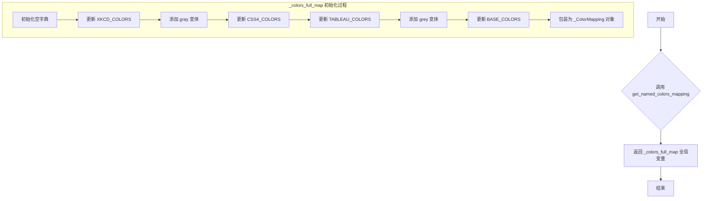
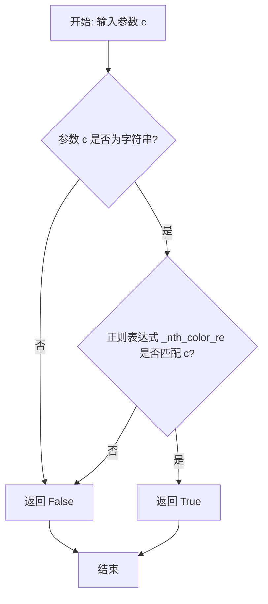
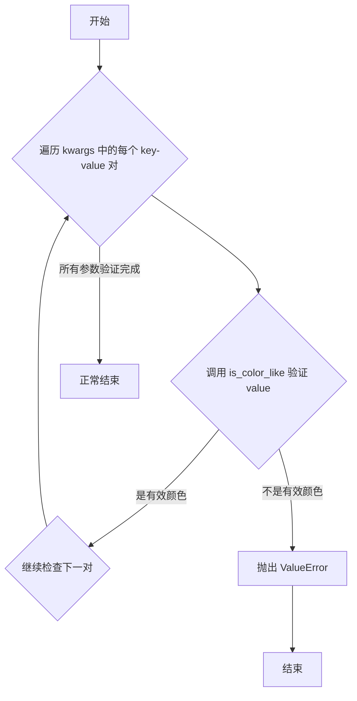
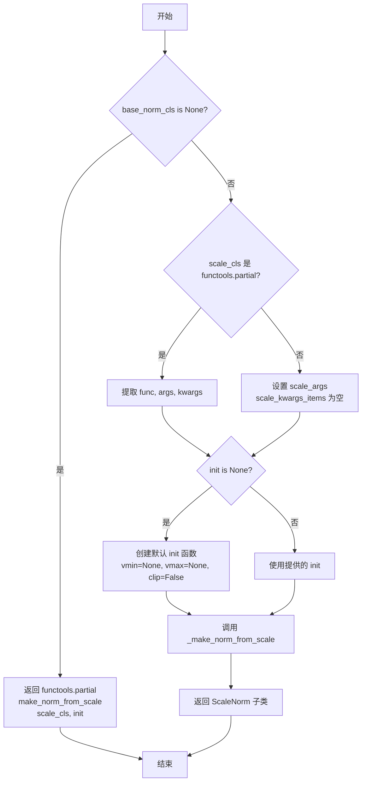

# `matplotlib\lib\matplotlib\colors.py` 详细设计文档

该模块是Matplotlib的颜色核心库，负责颜色规格的解析与转换（如将颜色名称、十六进制字符串转换为RGBA元组），定义数据归一化策略（Normalize类）将数据值映射到[0,1]区间，以及构建和管理各种颜色映射（Colormap类），包括线性、分段、列表、双变量和多变量色阶，并提供光源渲染（LightSource）用于生成地形阴影效果。

## 整体流程

```mermaid
graph TD
    subgraph 颜色转换流程
        A1[颜色输入: 字符串/元组/十六进制] --> B1{检查缓存}
        B1 -- 命中 --> C1[返回缓存的RGBA]
        B1 -- 未命中 --> D1[调用 _to_rgba_no_colorcycle]
        D1 --> E1{解析颜色类型}
        E1 --> F1[Named Color]
        E1 --> G1[Hex String]
        E1 --> H1[Gray String]
        E1 --> I1[Tuple/Sequence]
        F1 --> J1[查询 _colors_full_map]
        G1 --> K1[解析 #rrggbb]
        H1 --> L1[转换为灰度RGB]
        I1 --> M1[验证长度与类型]
        J1 --> N1[写入缓存]
        K1 --> N1
        L1 --> N1
        M1 --> N1
        N1 --> O1[返回 RGBA 元组]
    end
    subgraph 色阶映射流程
        A2[数据输入: Array/Scalar] --> B2[Normalize.__call__]
        B2 --> C2{归一化算法}
        C2 --> D2[Linear: (val - vmin) / (vmax - vmin)]
        C2 --> E2[Log: log(val) / log(vmax)]
        C2 --> F2[Power: ((val - vmin) / (vmax - vmin)) ** gamma]
        D2 --> G2[Colormap.__call__]
        E2 --> G2
        F2 --> G2
        G2 --> H2[查询内部查找表 _lut]
        H2 --> I2[返回 RGBA 数组]
    end
```

## 类结构

```
_ColorMapping (dict子类，带缓存)
ColorSequenceRegistry
Colormap (抽象基类)
├── LinearSegmentedColormap
├── ListedColormap
├── MultivarColormap
└── BivarColormap (抽象基类)
    ├── SegmentedBivarColormap
    └── BivarColormapFromImage
Norm (抽象基类)
├── Normalize
├── TwoSlopeNorm
├── CenteredNorm
├── PowerNorm
├── BoundaryNorm
├── NoNorm
├── MultiNorm
├── LogNorm (通过装饰器生成)
├── SymLogNorm (通过装饰器生成)
├── AsinhNorm (通过装饰器生成)
└── FuncNorm (通过装饰器生成)
LightSource
ColorConverter (兼容类)
```

## 全局变量及字段


### `_colors_full_map`
    
全局颜色名称到RGBA值的映射字典，包含缓存机制

类型：`_ColorMapping`
    


### `_color_sequences`
    
全局颜色序列注册表实例，用于管理命名的颜色序列

类型：`ColorSequenceRegistry`
    


### `_REPR_PNG_SIZE`
    
用于colormap PNG表示的尺寸(512, 64)

类型：`tuple`
    


### `_BIVAR_REPR_PNG_SIZE`
    
用于双变量colormap PNG表示的尺寸256

类型：`int`
    


### `_nth_color_re`
    
正则表达式，用于匹配C0、C1等颜色循环语法

类型：`re.Pattern`
    


### `cnames`
    
CSS4颜色名称到RGB值的映射字典（已弃用，用_colors_full_map）

类型：`dict`
    


### `hexColorPattern`
    
正则表达式，用于匹配6位十六进制颜色代码

类型：`re.Pattern`
    


### `_ColorMapping.cache`
    
颜色转换结果的缓存字典，键为(color, alpha)元组

类型：`dict`
    


### `_ColorMapping.mapping`
    
继承自dict的颜色名称到值的映射

类型：`dict`
    


### `ColorSequenceRegistry._color_sequences`
    
存储已注册颜色序列的字典

类型：`dict`
    


### `ColorSequenceRegistry._BUILTIN_COLOR_SEQUENCES`
    
内置颜色序列的静态定义字典

类型：`dict`
    


### `Colormap.name`
    
colormap的名称

类型：`str`
    


### `Colormap.N`
    
RGB量化级别数量

类型：`int`
    


### `Colormap._rgba_bad`
    
无效值(NaN或掩码)的RGBA颜色

类型：`tuple`
    


### `Colormap._rgba_under`
    
低于范围值的RGBA颜色

类型：`tuple`
    


### `Colormap._rgba_over`
    
高于范围值的RGBA颜色

类型：`tuple`
    


### `Colormap._lut`
    
查找表，存储colormap的RGBA值

类型：`numpy.ndarray`
    


### `Colormap._isinit`
    
标记colormap是否已初始化

类型：`bool`
    


### `Colormap.colorbar_extend`
    
指示colorbar是否扩展极端值

类型：`bool`
    


### `LinearSegmentedColormap._segmentdata`
    
分段颜色数据，包含red、green、blue、alpha键

类型：`dict`
    


### `LinearSegmentedColormap._gamma`
    
伽马校正因子

类型：`float`
    


### `LinearSegmentedColormap.monochrome`
    
标记colormap是否所有颜色相同

类型：`bool`
    


### `ListedColormap.colors`
    
颜色列表，存储colormap的颜色

类型：`list`
    


### `BivarColormap._lut`
    
二维查找表，存储双变量colormap的RGBA值

类型：`numpy.ndarray`
    


### `BivarColormap._shape`
    
colormap形状模式(square/circle/ignore/circleignore)

类型：`str`
    


### `BivarColormap._rgba_bad`
    
无效值的RGBA颜色

类型：`tuple`
    


### `BivarColormap._rgba_outside`
    
范围外值的RGBA颜色

类型：`tuple`
    


### `BivarColormap.n_variates`
    
变量数量(双变量为2)

类型：`int`
    


### `Norm.callbacks`
    
回调注册表，用于通知norm变化

类型：`cbook.CallbackRegistry`
    


### `Norm.vmin`
    
输入数据区间的下限，映射到0

类型：`property`
    


### `Norm.vmax`
    
输入数据区间的上限，映射到1

类型：`property`
    


### `Norm.clip`
    
确定超出范围值的映射行为

类型：`property`
    


### `Norm.n_components`
    
归一化支持的分量数量

类型：`property`
    


### `Normalize._vmin`
    
归一化的最小值

类型：`float`
    


### `Normalize._vmax`
    
归一化的最大值

类型：`float`
    


### `Normalize._clip`
    
是否裁剪超出范围的值

类型：`bool`
    


### `Normalize._scale`
    
可选的缩放对象(用于ScaleNorm)

类型：`object`
    


### `TwoSlopeNorm._vcenter`
    
双斜率归一化的中心值

类型：`float`
    


### `LightSource.azdeg`
    
光源方位角(度，从北顺时针)

类型：`float`
    


### `LightSource.altdeg`
    
光源高度角(度，从水平面)

类型：`float`
    


### `LightSource.hsv_min_val`
    
HSV混合模式下最小值

类型：`float`
    


### `LightSource.hsv_max_val`
    
HSV混合模式下最大值

类型：`float`
    


### `LightSource.hsv_min_sat`
    
HSV混合模式下最小饱和度

类型：`float`
    


### `LightSource.hsv_max_sat`
    
HSV混合模式下最大饱和度

类型：`float`
    
    

## 全局函数及方法


### `get_named_colors_mapping`

返回全局的颜色名称到颜色的映射对象。

参数：

- 无

返回值：`matplotlib.colors._color_data._ColorMapping`，包含所有命名颜色的字典映射

#### 流程图



#### 带注释源码

```python
def get_named_colors_mapping():
    """Return the global mapping of names to named colors."""
    return _colors_full_map
```

该函数是一个简单的全局函数，用于获取 matplotlib 中所有命名颜色的完整映射。

**`_colors_full_map` 的初始化过程：**

```python
# 全局颜色映射变量
_colors_full_map = {}

# 按优先级顺序（逆序）设置
_colors_full_map.update(XKCD_COLORS)  # 添加 XKCD 颜色调查中的颜色
_colors_full_map.update({k.replace('grey', 'gray'): v  # 添加 gray 变体
                         for k, v in XKCD_COLORS.items()
                         if 'grey' in k})
_colors_full_map.update(CSS4_COLORS)  # 添加 CSS4 颜色
_colors_full_map.update(TABLEAU_COLORS)  # 添加 Tableau 颜色
_colors_full_map.update({k.replace('gray', 'grey'): v  # 添加 grey 变体
                         for k, v in TABLEAU_COLORS.items()
                         if 'gray' in k})
_colors_full_map.update(BASE_COLORS)  # 添加基础颜色
_colors_full_map = _ColorMapping(_colors_full_map)  # 包装为带缓存的映射类
```

**`_ColorMapping` 类**（继承自 dict）：
- 提供了缓存功能，用于加速颜色查询
- 重写了 `__setitem__` 和 `__delitem__` 方法，自动清除缓存


### `is_color_like`

判断给定的参数 `c` 是否为有效的 Matplotlib 颜色说明符（color specifier）。

参数：

- `c`：任意类型，需要检查是否为有效 Matplotlib 颜色的输入值

返回值：`bool`，如果 `c` 是有效的 Matplotlib 颜色说明符则返回 `True`，否则返回 `False`

#### 流程图

```mermaid
flowchart TD
    A[开始 is_color_like] --> B{c 是否为 nth color 语法?}
    B -->|是| C[返回 True]
    B -->|否| D[尝试调用 to_rgba(c)]
    D --> E{是否抛出异常?}
    E -->|是| F[返回 False]
    E -->|否| G[返回 True]
```

#### 带注释源码

```python
def is_color_like(c):
    """
    Return whether *c* as a valid Matplotlib :mpltype:`color` specifier.
    
    该函数用于检查输入参数 c 是否可以被 Matplotlib 识别为有效的颜色说明符。
    支持的颜色格式包括：
    - RGB/RGBA 元组 (r, g, b) 或 (r, g, b, a)，每个值在 0-1 范围内
    - 十六进制颜色字符串，如 '#rrggbb', '#rrggbbaa', '#rgb', '#rgba'
    - 命名字符串颜色，如 'red', 'blue', 'green' 等
    - 灰度字符串，如 '0.5' 表示灰度值
    - CSS4 颜色、Tableau 颜色、XKCD 颜色等
    - 颜色循环语法，如 'C0', 'C1' 等
    """
    # 特殊处理 nth color 语法（如 'C0', 'C1' 等），因为这类颜色语法在模块初始化期间无法被解析
    if _is_nth_color(c):
        return True
    # 尝试将 c 转换为 RGBA 颜色，如果成功则说明是有效颜色
    try:
        to_rgba(c)
    except (TypeError, ValueError):
        # 如果抛出 TypeError 或 ValueError，说明 c 不是有效的颜色说明符
        return False
    else:
        # 转换成功，返回 True
        return True
```


### `same_color`

判断两个颜色是否相同，支持单个颜色或颜色列表/数组的比较。

参数：

- `c1`：`颜色类型`（`color` 或 `list`/`array`），要比较的第一个颜色，可以是单个颜色或颜色列表/数组
- `c2`：`颜色类型`（`color` 或 `list`/`array`），要比较的第二个颜色，可以是单个颜色或颜色列表/数组

返回值：`bool`，如果颜色相同返回 `True`，否则返回 `False`

#### 流程图

```mermaid
flowchart TD
    A[开始 same_color] --> B[将 c1 转换为 RGBA 数组]
    B --> C[将 c2 转换为 RGBA 数组]
    C --> D[计算 n1 = max(c1.shape[0], 1)]
    D --> E[计算 n2 = max(c2.shape[0], 1)]
    E --> F{n1 != n2?}
    F -->|是| G[抛出 ValueError: 元素数量不同]
    F -->|否| H{c1.shape == c2.shape?}
    H -->|否| I[返回 False]
    H -->|是| J{(c1 == c2).all()}
    J -->|是| K[返回 True]
    J -->|否| I
```

#### 带注释源码

```python
def same_color(c1, c2):
    """
    Return whether the colors *c1* and *c2* are the same.

    *c1*, *c2* can be single colors or lists/arrays of colors.
    """
    # 将颜色 c1 转换为 RGBA 数组格式
    c1 = to_rgba_array(c1)
    # 将颜色 c2 转换为 RGBA 数组格式
    c2 = to_rgba_array(c2)
    # 获取 c1 的元素数量，'none' 会导致 shape 为 (0, 4)，需特殊处理视为 1 个元素
    n1 = max(c1.shape[0], 1)  # 'none' results in shape (0, 4), but is 1-elem
    # 获取 c2 的元素数量，'none' 会导致 shape 为 (0, 4)，需特殊处理视为 1 个元素
    n2 = max(c2.shape[0], 1)  # 'none' results in shape (0, 4), but is 1-elem

    # 检查两个颜色数组的元素数量是否相同
    if n1 != n2:
        raise ValueError('Different number of elements passed.')
    # 以下形状测试是正确处理 'none' 比较所必需的，
    # 'none' 会产生 shape 为 (0, 4) 的数组，无法通过值比较进行测试
    return c1.shape == c2.shape and (c1 == c2).all()
```


### `to_rgba`

将颜色参数 *c* 转换为 RGBA 颜色元组。这是 Matplotlib 颜色处理的核心函数，支持多种颜色格式（颜色名称、十六进制、RGB/RGBA 元组、灰度值等），并通过缓存机制提高性能。

参数：

- `c`：`:mpltype:`color`` 或 ``np.ma.masked``，要转换的颜色，可以是颜色名称字符串、十六进制字符串、RGB/RGBA 元组、灰度浮点数等
- `alpha`：`float`，可选参数，如果指定，强制将返回的 RGBA 元组的 alpha 值设置为 *alpha*；如果为 None，则使用 *c* 中的 alpha 值（若 *c* 没有 alpha 通道，则默认为 1；对于 "none" 颜色值，alpha 始终为 0

返回值：`tuple`，包含四个浮点数的元组 ``(r, g, b, a)``，每个通道（红、绿、蓝、alpha）的值在 0 到 1 之间

#### 流程图

```mermaid
flowchart TD
    A[开始: to_rgba] --> B{输入c是否是<br/>2元素元组?}
    B -->|是| C{c[1]是否为实数?}
    C -->|是且alpha为None| D[解包: c, alpha = c]
    C -->|否| E[仅提取c作为颜色]
    B -->|否| F[检查c是否是颜色循环语法<br/>如'C0', 'C1'等]
    F --> G{是颜色循环语法?}
    G -->|是| H[从rcParams获取prop_cycler<br/>解析并替换c]
    G -->|否| I{缓存中存在?}
    H --> I
    D --> I
    E --> I
    I -->|是| J[返回缓存的rgba]
    I -->|否| K[调用_to_rgba_no_colorcycle]
    K --> L{尝试存入缓存}
    L -->|成功| M[返回rgba]
    L -->|失败如不可哈希| M
    J --> M
```

#### 带注释源码

```python
def to_rgba(c, alpha=None):
    """
    Convert *c* to an RGBA color.

    Parameters
    ----------
    c : :mpltype:`color` or ``np.ma.masked``

    alpha : float, optional
        If *alpha* is given, force the alpha value of the returned RGBA tuple
        to *alpha*.

        If None, the alpha value from *c* is used. If *c* does not have an
        alpha channel, then alpha defaults to 1.

        *alpha* is ignored for the color value ``"none"`` (case-insensitive),
        which always maps to ``(0, 0, 0, 0)``.

    Returns
    -------
    tuple
        Tuple of floats ``(r, g, b, a)``, where each channel (red, green, blue,
        alpha) can assume values between 0 and 1.
    """
    # 处理(color, alpha)元组形式的输入
    # 例如: to_rgba('red', 0.5) 实际上可能被传为 to_rgba(('red', 0.5))
    if isinstance(c, tuple) and len(c) == 2:
        if alpha is None:
            c, alpha = c
        else:
            c = c[0]
    
    # 特殊处理颜色循环语法（如'C0', 'C1'等）
    # 因为它在初始化时不能被解析
    if _is_nth_color(c):
        prop_cycler = mpl.rcParams['axes.prop_cycle']
        colors = prop_cycler.by_key().get('color', ['k'])
        c = colors[int(c[1:]) % len(colors)]
    
    # 尝试从缓存中获取已转换的颜色
    try:
        rgba = _colors_full_map.cache[c, alpha]
    except (KeyError, TypeError):  # 缓存中没有或不可哈希
        rgba = None
    
    # 如果缓存中没有，进行实际转换
    if rgba is None:  # 抑制缓存查找失败的异常链
        rgba = _to_rgba_no_colorcycle(c, alpha)
        try:
            _colors_full_map.cache[c, alpha] = rgba
        except TypeError:
            # 如果颜色不可哈希（如包含列表），跳过缓存
            pass
    
    return rgba
```


### `_to_rgba_no_colorcycle`

将颜色参数 *c* 转换为 RGBA 颜色元组，不支持颜色循环语法（如 "C0"、"C1" 等）。该函数是 `to_rgba` 的底层实现，负责处理具体的颜色解析逻辑。

参数：

- `c`：`颜色类型`，待转换的颜色，可以是十六进制字符串、灰度值字符串、RGB/RGBA 元组、命名的颜色字符串，或 numpy 数组
- `alpha`：`float 或 None`，可选参数，如果提供，则强制将返回的 RGBA 元组的 alpha 值设置为 *alpha*；如果为 None，则使用 *c* 中包含的 alpha 信息（若有），否则默认为 1

返回值：`tuple`，包含 4 个浮点数的元组 `(r, g, b, a)`，每个通道的值在 0 到 1 之间

#### 流程图

```mermaid
flowchart TD
    A[开始: _to_rgba_no_colorcycle] --> B{alpha 是否有效<br/>0 <= alpha <= 1?}
    B -->|否| C[抛出 ValueError]
    B -->|是| D{c 是否为 masked?}
    D -->|是| E[返回 (0, 0, 0, 0)]
    D -->|否| F{c 是否为字符串?}
    F -->|是| G{c.lower == 'none'?}
    G -->|是| E
    G -->|否| H{在 _colors_full_map 中?}
    H -->|是| I[获取颜色值到 c]
    H -->|否| J{长度为1?}
    J -->|是| K{在 _colors_full_map 中?}
    K -->|是| I
    K -->|否| L[保持原值]
    J -->|否| L
    F -->|否| M{c 是否为字符串?}
    M -->|是| N{匹配 hex 格式?|
    N -->|是| O{处理不同长度的 hex}
    N -->|否| P{尝试转为 float?}
    P -->|是| Q{0 <= c <= 1?}
    Q -->|是| R[返回灰度 RGBA]
    Q -->|否| S[抛出 ValueError]
    P -->|否| T[抛出 ValueError]
    M -->|否| U{c 为 numpy 数组?}
    U -->|是| V[2维数组reshape为1维]
    U -->|否| W{c 为可迭代元组?}
    W -->|否| X[抛出 ValueError]
    W -->|是| Y{长度为3或4?}
    Y -->|否| Z[抛出 ValueError]
    Y -->|是| AA{所有元素为 Real?}
    AA -->|否| AB[抛出 ValueError]
    AA -->|是| AC[转为 float 元组]
    AC --> AD{原长度3且 alpha 为 None?}
    AD -->|是| AE[设置 alpha=1]
    AD -->|否| AF{alpha 不为 None?}
    AF -->|是| AG[替换 alpha 值]
    AF -->|否| AH{所有值在 0-1 范围内?]
    AG --> AH
    AH -->|是| AI[返回 RGBA 元组]
    AH -->|否| AJ[抛出 ValueError]
```

#### 带注释源码

```python
def _to_rgba_no_colorcycle(c, alpha=None):
    """
    将 *c* 转换为 RGBA 颜色，不支持颜色循环语法。

    如果给定了 *alpha*，则强制将返回的 RGBA 元组的 alpha 值设置为 *alpha*。
    否则，使用 *c* 中的 alpha 信息（如果有），或默认为 1。

    *alpha* 对于颜色值 ``"none"``（不区分大小写）会被忽略，
    该值始终映射为 ``(0, 0, 0, 0)``。
    
    参数:
        c: 颜色输入，支持多种格式：
           - 字符串: 十六进制如 "#rrggbb"，灰度如 "0.5"，命名颜色如 "red"
           - 元组: RGB (r, g, b) 或 RGBA (r, g, b, a)，值在 0-1 范围
           - numpy 数组: 二维 RGB/RGBA 数组
        alpha: float 或 None，可选的 alpha 覆盖值，必须在 0-1 范围内
    
    返回:
        tuple: (r, g, b, a) 形式的 RGBA 元组，值在 0-1 范围
    
    异常:
        ValueError: 当输入格式无效或值超出范围时
    """
    # 验证 alpha 参数的有效性
    if alpha is not None and not 0 <= alpha <= 1:
        raise ValueError("'alpha' must be between 0 and 1, inclusive")
    
    # 保存原始输入用于错误信息
    orig_c = c
    
    # 处理 masked 数组的特殊情况
    if c is np.ma.masked:
        return (0., 0., 0., 0.)
    
    # 处理字符串类型的颜色输入
    if isinstance(c, str):
        # "none" 特殊情况：完全透明
        if c.lower() == "none":
            return (0., 0., 0., 0.)
        
        # 尝试作为命名颜色查找
        try:
            # 这可能会将 c 变成非字符串，所以在下面再次检查
            c = _colors_full_map[c]
        except KeyError:
            # 如果不是精确匹配，尝试小写形式（处理 "grey" -> "gray" 变体）
            if len(c) != 1:
                try:
                    c = _colors_full_map[c.lower()]
                except KeyError:
                    pass
    
    # 再次检查是否为字符串（可能是上面转换后的结果）
    if isinstance(c, str):
        # 十六进制颜色格式处理
        if re.fullmatch("#[a-fA-F0-9]+", c):
            # #rrggbb 格式 (7个字符)
            if len(c) == 7:
                # 从十六进制解析 RGB 值
                return (*[n / 0xff for n in bytes.fromhex(c[1:])],
                        alpha if alpha is not None else 1.)
            
            # #rgb 简写格式 (4个字符)
            elif len(c) == 4:
                # 将 3 位十六进制扩展为 6 位
                return (*[int(n, 16) / 0xf for n in c[1:]],
                        alpha if alpha is not None else 1.)
            
            # #rrggbbaa 完整格式 (9个字符)
            elif len(c) == 9:
                color = [n / 0xff for n in bytes.fromhex(c[1:])]
                if alpha is not None:
                    color[-1] = alpha  # 替换 alpha 通道
                return tuple(color)
            
            # #rgba 简写格式 (5个字符)
            elif len(c) == 5:
                color = [int(n, 16) / 0xf for n in c[1:]]
                if alpha is not None:
                    color[-1] = alpha
                return tuple(color)
            else:
                raise ValueError(f"Invalid hex color specifier: {orig_c!r}")
        
        # 灰度字符串处理 (如 "0.5" 或 "0.7")
        try:
            c = float(c)
        except ValueError:
            pass
        else:
            # 验证灰度值在有效范围内
            if not (0 <= c <= 1):
                raise ValueError(
                    f"Invalid string grayscale value {orig_c!r}. "
                    f"Value must be within 0-1 range")
            # 返回灰度的 RGBA 表示 (r=r=g=b=灰度值)
            return c, c, c, alpha if alpha is not None else 1.
        
        # 无法解析为有效颜色
        raise ValueError(f"Invalid RGBA argument: {orig_c!r}")
    
    # 处理 numpy 数组输入：将 2D 数组reshape为1D
    if isinstance(c, np.ndarray):
        if c.ndim == 2 and c.shape[0] == 1:
            c = c.reshape(-1)
    
    # 处理元组/序列形式的颜色
    # 首先检查是否可迭代
    if not np.iterable(c):
        raise ValueError(f"Invalid RGBA argument: {orig_c!r}")
    
    # 验证元组长度
    if len(c) not in [3, 4]:
        raise ValueError("RGBA sequence should have length 3 or 4")
    
    # 验证所有元素都是实数（不是字符串等）
    if not all(isinstance(x, Real) for x in c):
        # 注意：map(float, ...), np.array(..., float) 和 np.array(...).astype(float)
        # 都会将 "0.5" 转换为 0.5，所以这些检查不适用
        raise ValueError(f"Invalid RGBA argument: {orig_c!r}")
    
    # 转换为 float 元组以防止缓存值被修改
    c = tuple(map(float, c))
    
    # 如果长度为3且没有提供 alpha，默认为1
    if len(c) == 3 and alpha is None:
        alpha = 1
    
    # 如果提供了 alpha，替换或添加 alpha 通道
    if alpha is not None:
        c = c[:3] + (alpha,)
    
    # 验证所有 RGBA 值在有效范围内
    if any(elem < 0 or elem > 1 for elem in c):
        raise ValueError("RGBA values should be within 0-1 range")
    
    return c
```


### `to_rgba_array`

该函数是 Matplotlib 颜色模块的核心函数之一，负责将各种颜色规格（单个颜色、颜色列表、RGB/RGBA 数组）统一转换为形状为 (n, 4) 的 RGBA 浮点数数组，每个通道值在 0-1 范围内。

参数：

-  `c`：`:mpltype:`color` 或 list of `:mpltype:`color` 或 RGB(A) array`，要转换的颜色。支持单个颜色字符串、颜色元组、颜色列表、numpy 数组等多种格式。如果是 masked array，返回的数组中每个被掩码的值或行将替换为 (0, 0, 0, 0)。
-  `alpha`：`float 或 sequence of floats, optional`，可选的透明度值。如果提供，将强制设置返回 RGBA 元组的 alpha 值。如果为 None，则使用颜色本身携带的 alpha 值（若有），否则默认为 1。对于颜色值 "none"（不区分大小写），alpha 会被忽略，该颜色始终映射为 (0, 0, 0, 0)。当 alpha 是序列而 c 是单个颜色时，c 将被重复以匹配 alpha 的长度。

返回值：`numpy.ndarray`，形状为 (n, 4) 的 RGBA 颜色数组，其中每个通道（红、绿、蓝、alpha）取值范围为 0-1。

#### 流程图

```mermaid
flowchart TD
    A[开始: to_rgba_array] --> B{输入 c 是否为二元组<br/>且第二个元素是实数?}
    B -- 是 --> C{alpha 是否为 None?}
    C -- 是 --> D[解包 c, alpha = c]
    C -- 否 --> E[c = c[0]]
    B -- 否 --> F{alpha 是否可迭代?}
    F -- 是 --> G[将 alpha 展平为数组]
    F -- 否 --> H{c 是否为 numpy 数组<br/>且 dtype 为整数/浮点<br/>且维度为 2<br/>且 shape[1] 为 3 或 4?}
    H -- 是 --> I[处理已数组化的输入以提高性能]
    I --> J{是否有 mask?}
    J -- 是 --> K[将 mask 对应行置零]
    J -- 否 --> L{结果值是否超出 0-1 范围?}
    L -- 是 --> M[抛出 ValueError]
    L -- 否 --> N[返回结果数组]
    H -- 否 --> O{c 是否为字符串 "none"?}
    O -- 是 --> P[返回形状为 (0, 4) 的零数组]
    O -- 否 --> Q{尝试调用 to_rgba 处理单个值?}
    Q -- 成功 --> R[返回包装为数组的结果]
    Q -- 失败 --> S{c 是否为字符串?}
    S -- 是 --> T[抛出 ValueError: 无效颜色值]
    S -- 否 --> U{c 长度是否为零?]
    U -- 是 --> V[返回形状为 (0, 4) 的零数组]
    U -- 否 --> W{c 是否为序列?}
    W -- 是 --> X{所有元素长度是否相同?}
    X -- 是, 全部为 3 --> Y[构建 RGB + 全 1 alpha 数组]
    X -- 是, 全部为 4 --> Z[直接转为数组]
    X -- 否 --> AA[逐个调用 to_rgba 转换]
    W -- 否 --> AB[逐个调用 to_rgba 转换]
    AA --> AC{alpha 是否为 None?}
    AC -- 否 --> AD[设置所有行的 alpha 通道]
    AD --> AE{原始输入是否为序列?}
    AE -- 是 --> AF[将 "none" 对应行的 alpha 置零]
    AE -- 否 --> AG[返回最终数组]
    AF --> AG
```

#### 带注释源码

```python
def to_rgba_array(c, alpha=None):
    """
    Convert *c* to a (n, 4) array of RGBA colors.

    Parameters
    ----------
    c : :mpltype:`color` or list of :mpltype:`color` or RGB(A) array
        If *c* is a masked array, an `~numpy.ndarray` is returned with a
        (0, 0, 0, 0) row for each masked value or row in *c*.

    alpha : float or sequence of floats, optional
        If *alpha* is given, force the alpha value of the returned RGBA tuple
        to *alpha*.

        If None, the alpha value from *c* is used. If *c* does not have an
        alpha channel, then alpha defaults to 1.

        *alpha* is ignored for the color value ``"none"`` (case-insensitive),
        which always maps to ``(0, 0, 0, 0)``.

        If *alpha* is a sequence and *c* is a single color, *c* will be
        repeated to match the length of *alpha*.

    Returns
    -------
    array
        (n, 4) array of RGBA colors,  where each channel (red, green, blue,
        alpha) can assume values between 0 and 1.
    """
    # 处理 (color, alpha) 元组形式的输入
    if isinstance(c, tuple) and len(c) == 2 and isinstance(c[1], Real):
        if alpha is None:
            c, alpha = c
        else:
            c = c[0]
    
    # 特殊优化：如果 alpha 已经是可迭代对象（列表或数组），将其展平
    # 这发生在此函数的开头，以便后续可以复用 alpha 的数组形式
    if np.iterable(alpha):
        alpha = np.asarray(alpha).ravel()
    
    # 快速路径：处理已经是 numpy 数组的输入（性能优化）
    # 检查数组类型、维度和形状是否满足 RGB(3) 或 RGBA(4) 格式
    if (isinstance(c, np.ndarray) and c.dtype.kind in "if"
            and c.ndim == 2 and c.shape[1] in [3, 4]):
        # 获取 mask 信息（如果存在）
        mask = c.mask.any(axis=1) if np.ma.is_masked(c) else None
        # 获取原始数据（去除 mask 信息）
        c = np.ma.getdata(c)
        
        # 处理 alpha 数组与颜色数量的匹配逻辑
        if np.iterable(alpha):
            if c.shape[0] == 1 and alpha.shape[0] > 1:
                # 单个颜色，多个 alpha 值：重复颜色以匹配
                c = np.tile(c, (alpha.shape[0], 1))
            elif c.shape[0] != alpha.shape[0]:
                # 颜色数与 alpha 数不匹配：抛出错误
                raise ValueError("The number of colors must match the number"
                                 " of alpha values if there are more than one"
                                 " of each.")
        
        # 处理 RGB (3通道) 情况：添加 alpha 通道
        if c.shape[1] == 3:
            result = np.column_stack([c, np.zeros(len(c))])
            result[:, -1] = alpha if alpha is not None else 1.
        # 处理 RGBA (4通道) 情况：直接复制
        elif c.shape[1] == 4:
            result = c.copy()
            if alpha is not None:
                result[:, -1] = alpha
        
        # 应用 mask：将掩码行的 RGBA 值置为 (0, 0, 0, 0)
        if mask is not None:
            result[mask] = 0
        
        # 验证所有 RGBA 值都在有效范围内
        if np.any((result < 0) | (result > 1)):
            raise ValueError("RGBA values should be within 0-1 range")
        return result
    
    # 处理单个颜色值（"none" 特殊处理）
    # 注意：这个检查发生在数组处理之后，因为 to_rgba 对于数组输入较慢
    if cbook._str_lower_equal(c, "none"):
        return np.zeros((0, 4), float)
    
    # 尝试将 c 作为单个颜色处理（使用 to_rgba 转换）
    try:
        if np.iterable(alpha):
            # 多个 alpha 值：对每个 alpha 调用 to_rgba
            return np.array([to_rgba(c, a) for a in alpha], float)
        else:
            # 单个 alpha 值：包装为单元素数组
            return np.array([to_rgba(c, alpha)], float)
    except TypeError:
        # to_rgba 可能抛出 TypeError（例如 c 不可哈希）
        pass
    except ValueError as e:
        # 检查错误是否来自 alpha 验证（是则重新抛出）
        if e.args == ("'alpha' must be between 0 and 1, inclusive", ):
            raise e
    
    # 如果 c 是字符串且上述转换失败，则为无效颜色
    if isinstance(c, str):
        raise ValueError(f"{c!r} is not a valid color value.")

    # 处理空输入
    if len(c) == 0:
        return np.zeros((0, 4), float)

    # 快速路径：尝试一次性将整个序列转换为 numpy 数组
    if isinstance(c, Sequence):
        # 检查所有元素的统一长度
        lens = {len(cc) if isinstance(cc, (list, tuple)) else -1 for cc in c}
        if lens == {3}:
            # 纯 RGB：添加全 1 的 alpha 通道
            rgba = np.column_stack([c, np.ones(len(c))])
        elif lens == {4}:
            # 纯 RGBA：直接转换
            rgba = np.array(c)
        else:
            # 混合情况或无法一次性处理：逐个转换
            rgba = np.array([to_rgba(cc) for cc in c])
    else:
        # 非序列类型（如生成器）：逐个转换
        rgba = np.array([to_rgba(cc) for cc in c])

    # 应用全局 alpha 覆盖
    if alpha is not None:
        rgba[:, 3] = alpha
        if isinstance(c, Sequence):
            # 确保显式 alpha 不会覆盖 "none" 的完全透明效果
            none_mask = [cbook._str_equal(cc, "none") for cc in c]
            rgba[:, 3][none_mask] = 0
    
    return rgba
```


### `to_rgb`

该函数用于将颜色参数转换为 RGB 颜色元组，如果输入颜色包含 alpha 通道，则会自动丢弃 alpha 信息。

参数：

-  `c`：`:mpltype:`color``，要转换的颜色，支持的颜色格式包括：RGB 或 RGBA 元组、十六进制颜色字符串（如 "#rrggbb"）、灰度浮点数字符串、颜色名称等

返回值：`tuple`，RGB 颜色元组 ``(r, g, b)``，每个通道值在 0-1 范围内

#### 流程图

```mermaid
flowchart TD
    A[开始] --> B[调用 to_rgba c]
    B --> C{返回 RGBA 元组}
    C --> D[切片取前3个元素 [:3]]
    D --> E[返回 RGB 元组]
    E --> F[结束]
```

#### 带注释源码

```python
def to_rgb(c):
    """
    Convert the :mpltype:`color` *c* to an RGB color tuple.

    If c has an alpha channel value specified, that is silently dropped.
    """
    # 调用 to_rgba 函数将颜色转换为 RGBA 元组 (r, g, b, a)
    # to_rgba 支持多种颜色格式的转换
    rgba = to_rgba(c)
    # 切片获取前三个元素 (r, g, b)，丢弃 alpha 通道
    return rgba[:3]
```


### `to_hex`

该函数是 Matplotlib 颜色处理模块中的核心工具函数，用于将各种颜色表示形式（如字符串名称、RGB/RGBA 元组）统一转换为 Web 常用的十六进制颜色字符串格式（如 `"#ff0000"`）。

参数：
-  `c`：`color` 类型或 `numpy.ma.masked`，待转换的颜色。支持如 `'red'`、`(1, 0, 0)`、`'#ff0000'` 等格式。
-  `keep_alpha`：`bool`，可选，默认为 `False`。如果为 `True`，则输出格式为 `#rrggbbaa`，否则为 `#rrggbb`。

返回值：`str`，十六进制颜色字符串。

#### 流程图

```mermaid
flowchart TD
    A([Start to_hex]) --> B[调用 to_rgba(c) 转换为 RGBA]
    B --> C{keep_alpha?}
    C -- False --> D[切片取前3位: c = c[:3]]
    C -- True --> E[保留所有4位: c = c]
    D --> F[遍历颜色通道 val in c]
    E --> F
    F --> G[计算: hex_val = round(val * 255)]
    G --> H[格式化为2位十六进制: format(hex_val, "02x")]
    H --> I[拼接字符串: "#" + join(hex_vals)]
    I --> J([Return str])
```

#### 带注释源码

```python
def to_hex(c, keep_alpha=False):
    """
    将颜色 *c* 转换为十六进制颜色字符串。

    参数:
      c: 颜色标识 (str, tuple 等) 或 numpy 蒙版数组。
      keep_alpha: 布尔值，默认为 False。
                  如果为 False，结果为 '#rrggbb' 格式；
                  如果为 True，结果为 '#rrggbbaa' 格式。

    返回:
      str: 十六进制颜色字符串。
    """
    # 1. 首先调用 to_rgba 将任意颜色格式转换为 (r, g, b, a) 元组
    #    to_rgba 是核心转换函数，处理了字符串、名称、数组等各种输入
    c = to_rgba(c)
    
    # 2. 根据 keep_alpha 参数决定是否保留 Alpha 通道
    if not keep_alpha:
        # 如果不需要 Alpha，只取前三个元素 (R, G, B)
        c = c[:3]
        
    # 3. 遍历 RGB(A) 分量，进行归一化和类型转换
    #    - 乘以 255 将 0-1 范围的浮点数转换为 0-255 整数范围
    #    - round() 四舍五入
    #    - format(..., "02x") 转换为两位十六进制小写字符串
    return "#" + "".join(format(round(val * 255), "02x") for val in c)
```


### `_sanitize_extrema`

该函数用于将极值参数标准化为标量值，确保传入的极值（vmin/vmax）是可序列化的标量而非 numpy 数组或 numpy 数组的切片。

参数：

- `ex`：待处理的极值，类型可以是 `None`、`Real`（数字类型）或 `numpy.ndarray`（numpy 数组），需要被标准化为标量值以便后续处理

返回值：`Union[None, float]`，返回处理后的极值。如果输入为 `None`，返回 `None`；否则返回转换后的 float 标量值。

#### 流程图

```mermaid
flowchart TD
    A[开始: 传入参数 ex] --> B{ex 是否为 None?}
    B -- 是 --> C[直接返回 ex]
    B -- 否 --> D{尝试调用 ex.item()}
    D -- 成功获取标量 --> E[ret = ex.item()]
    D -- 没有item方法 --> F[ret = float(ex)]
    E --> G[返回 ret]
    F --> G
```

#### 带注释源码

```python
def _sanitize_extrema(ex):
    """
    将极值参数标准化为标量值。
    
    此函数用于确保 Normalize 类及其子类的 vmin 和 vmax 参数
    是可序列化的标量值，而非 numpy 数组。
    """
    # 如果输入为 None，直接返回，保持空值
    if ex is None:
        return ex
    
    # 尝试从 numpy 数组中提取标量值
    # .item() 是 numpy 数组的方法，用于获取数组中的单个标量值
    try:
        ret = ex.item()
    except AttributeError:
        # 如果 ex 没有 .item() 方法（即不是 numpy 数组）
        # 则尝试将其转换为 float
        ret = float(ex)
    
    # 返回处理后的标量值
    return ret
```

#### 关键信息补充

- **调用位置**：此函数在 `Normalize` 类的 `__init__`、`vmin` setter 和 `vmax` setter 中被调用，用于处理 `vmin` 和 `vmax` 参数
- **设计目的**：确保极值参数是 Python 原生 float 类型，避免 numpy 数组导致的序列化问题和不一致性
- **技术细节**：
  - 对于 numpy 标量（如 `numpy.float64(0.5)`），`.item()` 方法会将其转换为 Python 原生类型
  - 对于普通数字，直接使用 `float()` 转换
  - 保持了 `None` 的传递，确保空值可以正常传递


### `_is_nth_color`

该函数用于判断给定的参数是否匹配颜色循环的语法格式（即 "C0"、"C1" 等形式），常用于 Matplotlib 中对颜色 cycle 引用的特殊处理。

参数：

- `c`：`任意类型`，待检测的输入值

返回值：`bool`，如果 `c` 是以 "C" 开头后跟数字的字符串（如 "C0"、"C10"），则返回 `True`，否则返回 `False`

#### 流程图



#### 带注释源码

```python
# 正则表达式：匹配以 C 开头、后面紧跟一个或多个数字的字符串
# 例如：'C0', 'C1', 'C2', 'C10' 等
_nth_color_re = re.compile(r"\AC[0-9]+\Z")


def _is_nth_color(c):
    """
    Return whether *c* can be interpreted as an item in the color cycle.
    
    该函数用于检测输入参数 c 是否可以解释为颜色循环中的颜色项。
    在 Matplotlib 中，颜色循环可以通过 'C0', 'C1', ... 'Cn' 的形式引用。
    
    Parameters
    ----------
    c : 任意类型
        待检测的输入值。通常是字符串类型才会匹配成功。
    
    Returns
    -------
    bool
        如果 c 是符合 'C' + 数字 格式的字符串，返回 True；
        否则返回 False。
    """
    # 先检查 c 是否为字符串类型，再进行正则匹配
    # isinstance(c, str) 确保只有字符串才会进入下一步匹配
    # _nth_color_re.match(c) 使用正则表达式检测是否符合 "C" + 数字 的模式
    return isinstance(c, str) and _nth_color_re.match(c)
```


### `_has_alpha_channel`

判断给定的颜色参数 `c` 是否包含 alpha 通道（透明度信息）。该函数通过检查颜色规范的长度、格式和结构来确定是否存在 alpha 通道。

参数：

- `c`：待检测的颜色参数，可以是十六进制颜色字符串（如 `#rrggbb`、`#rrggbbaa`）、RGB/RGBA 元组/列表、颜色与 alpha 的组合元组（如 `('r', 0.5)` 或 `([0.5, 0.5, 0.5, 0.5], None)`），类型为 `str` 或 `tuple` 或 `list`

返回值：`bool`，如果 `c` 包含 alpha 通道返回 `True`，否则返回 `False`

#### 流程图

```mermaid
flowchart TD
    A[开始: 输入颜色参数 c] --> B{c 是否为字符串?}
    B -->|是| C{c[0] == '#' 且长度为5或9?}
    B -->|否| D{c 是否长度为4?}
    C -->|是| E[返回 True]
    C -->|否| F[返回 False]
    D -->|是| E
    D -->|否| G{c 是否长度为2?}
    G -->|否| F
    G -->|是| H{c[1] is not None?}
    H -->|是| E
    H -->|否| I{递归调用 _has_alpha_channel c[0]}
    I -->|True| E
    I -->|False| F
```

#### 带注释源码

```python
def _has_alpha_channel(c):
    """
    Return whether *c* is a color with an alpha channel.

    If *c* is not a valid color specifier, then the result is undefined.
    """
    # The following logic uses the assumption that c is a valid color spec.
    # For speed and simplicity, we intentionally don't care about other inputs.
    # Anything can happen with them.

    # 如果 c 是十六进制字符串，检查是否包含 alpha 通道
    # alpha 通道存在于 5 位 (#rgba) 或 9 位 (#rrggbbaa) 格式
    if isinstance(c, str):
        if c[0] == '#' and (len(c) == 5 or len(c) == 9):
            # 示例: '#fff8' 或 '#0f0f0f80'
            return True
    else:
        # 如果 c 不是字符串，它可以是 RGB(A) 元组或颜色-alpha 组合元组
        # 如果长度为4，则包含 alpha 通道（如 [0.5, 0.5, 0.5, 0.5]）
        if len(c) == 4:
            # example: [0.5, 0.5, 0.5, 0.5]
            return True

        # 如果长度为2，则是颜色/alpha 组合元组
        # 如果第二个元素不为 None，或者第一个元素包含 alpha 通道
        if len(c) == 2 and (c[1] is not None or _has_alpha_channel(c[0])):
            # example: ([0.5, 0.5, 0.5, 0.5], None) or ('r', 0.5)
            return True

    # 否则不包含 alpha 通道
    return False
```


### `_check_color_like`

该函数用于验证传入的关键字参数值是否为有效的 Matplotlib 颜色规范。如果任何值不是有效颜色，则抛出 `ValueError` 异常。

参数：
- `**kwargs`：可变关键字参数，接受任意数量的键值对，其中值需要被验证为有效的颜色规范。

返回值：`None`，该函数通过抛出 `ValueError` 来表示验证失败。

#### 流程图



#### 带注释源码

```python
def _check_color_like(**kwargs):
    """
    For each *key, value* pair in *kwargs*, check that *value* is color-like.
    """
    # 遍历传入的所有关键字参数
    for k, v in kwargs.items():
        # 使用 is_color_like 函数检查当前值是否为有效颜色
        if not is_color_like(v):
            # 如果不是有效颜色，抛出详细的 ValueError 异常
            # 错误信息中列出所有支持的输入格式
            raise ValueError(
                f"{v!r} is not a valid value for {k}: supported inputs are "
                f"(r, g, b) and (r, g, b, a) 0-1 float tuples; "  # RGB/RGBA 元组
                f"'#rrggbb', '#rrggbbaa', '#rgb', '#rgba' strings; "  # 十六进制颜色字符串
                f"named color strings; "  # 命名颜色（如 'red', 'blue'）
                f"string reprs of 0-1 floats for grayscale values; "  # 灰度值字符串
                f"'C0', 'C1', ... strings for colors of the color cycle; "  # 颜色循环语法
                f"and pairs combining one of the above with an alpha value")  # 颜色与透明度组合
```


### `_create_lookup_table`

该函数用于创建一个N元素的一维查找表（Lookup Table），实现了从[0,1]区间到[0,1]区间的映射函数f。该函数支持两种数据输入形式：一是可调用对象（函数），二是(M, 3)数组形式的分段线性映射数据。通过gamma校正因子可以扭曲输入坐标的等距采样。返回的查找表数组可用于`LinearSegmentedColormap`的内部实现。

参数：

- `N`：`int`，查找表的元素个数，至少为1
- `data`：`(M, 3) array-like` 或 `callable`，定义映射函数f。如果是数组形式，行定义为(x, y0, y1)元组，x值必须从0开始到1结束且递增；如果是可调用对象，必须接受numpy数组并返回numpy数组
- `gamma`：`float`，可选，默认为1.0，gamma校正因子，用于扭曲输入坐标x的分布

返回值：`numpy.ndarray`，查找表数组，其中`lut[x * (N-1)]`给出x在0到1之间最接近的值

#### 流程图

```mermaid
flowchart TD
    A[开始] --> B{callable(data)?}
    B -->|Yes| C[生成gamma校正的等间距采样点xind]
    C --> D[调用data(xind)获取lut]
    D --> E[裁剪lut到0-1范围]
    E --> F[返回lut]
    
    B -->|No| G[尝试将data转为numpy数组]
    G --> H{转换成功?}
    H -->|No| I[抛出TypeError]
    H -->|Yes| J[检查数组形状为None, 3]
    J --> K[提取x, y0, y1]
    K --> L{x[0]==0 且 x[-1]==1?}
    L -->|No| M[抛出ValueError]
    L -->|Yes| N{x递增?}
    N -->|No| O[抛出ValueError]
    N -->|Yes| P{N==1?}
    P -->|Yes| Q[返回y0[-1]]
    P -->|No| R[缩放x坐标]
    R --> S[生成gamma校正的采样索引]
    S --> T[使用searchsorted找插入位置]
    T --> U[计算线性插值距离]
    U --> V[构建lut数组]
    V --> W[裁剪lut到0-1范围]
    W --> F
    
    F --> X[结束]
```

#### 带注释源码

```python
def _create_lookup_table(N, data, gamma=1.0):
    r"""
    Create an *N* -element 1D lookup table.

    This assumes a mapping :math:`f : [0, 1] \rightarrow [0, 1]`. The returned
    data is an array of N values :math:`y = f(x)` where x is sampled from
    [0, 1].

    By default (*gamma* = 1) x is equidistantly sampled from [0, 1]. The
    *gamma* correction factor :math:`\gamma` distorts this equidistant
    sampling by :math:`x \rightarrow x^\gamma`.

    Parameters
    ----------
    N : int
        The number of elements of the created lookup table; at least 1.

    data : (M, 3) array-like or callable
        Defines the mapping :math:`f`.

        If a (M, 3) array-like, the rows define values (x, y0, y1).  The x
        values must start with x=0, end with x=1, and all x values be in
        increasing order.

        A value between :math:`x_i` and :math:`x_{i+1}` is mapped to the range
        :math:`y^1_{i-1} \ldots y^0_i` by linear interpolation.

        For the simple case of a y-continuous mapping, y0 and y1 are identical.

        The two values of y are to allow for discontinuous mapping functions.
        E.g. a sawtooth with a period of 0.2 and an amplitude of 1 would be::

            [(0, 1, 0), (0.2, 1, 0), (0.4, 1, 0), ..., [(1, 1, 0)]

        In the special case of ``N == 1``, by convention the returned value
        is y0 for x == 1.

        If *data* is a callable, it must accept and return numpy arrays::

           data(x : ndarray) -> ndarray

        and map values between 0 - 1 to 0 - 1.

    gamma : float
        Gamma correction factor for input distribution x of the mapping.

        See also https://en.wikipedia.org/wiki/Gamma_correction.

    Returns
    -------
    array
        The lookup table where ``lut[x * (N-1)]`` gives the closest value
        for values of x between 0 and 1.

    Notes
    -----
    This function is internally used for `.LinearSegmentedColormap`.
    """

    # 处理可调用对象（函数）类型的data
    if callable(data):
        # 生成gamma校正后的等间距采样点，范围[0, 1]，共N个点
        xind = np.linspace(0, 1, N) ** gamma
        # 调用data函数获取映射结果，并转换为float数组
        lut = np.clip(np.array(data(xind), dtype=float), 0, 1)
        return lut

    # 处理数组类型的data
    try:
        # 尝试将data转换为numpy数组
        adata = np.array(data)
    except Exception as err:
        raise TypeError("data must be convertible to an array") from err
    
    # 检查数组形状是否为(None, 3)，即M行3列
    _api.check_shape((None, 3), data=adata)

    # 提取x坐标和两个y值（y0和y1）
    x = adata[:, 0]
    y0 = adata[:, 1]
    y1 = adata[:, 2]

    # 验证：x必须从0开始到1结束
    if x[0] != 0. or x[-1] != 1.0:
        raise ValueError(
            "data mapping points must start with x=0 and end with x=1")
    
    # 验证：x必须严格递增
    if (np.diff(x) < 0).any():
        raise ValueError("data mapping points must have x in increasing order")
    
    # 开始生成查找表
    if N == 1:
        # 约定：对于1元素的查找表，使用x=1时的y0值
        lut = np.array(y0[-1])
    else:
        # 将x坐标缩放到[0, N-1]范围
        x = x * (N - 1)
        # 生成gamma校正后的采样索引
        xind = (N - 1) * np.linspace(0, 1, N) ** gamma
        # 使用searchsorted找到每个采样点所在的区间索引
        ind = np.searchsorted(x, xind)[1:-1]

        # 计算线性插值的距离比例
        distance = (xind[1:-1] - x[ind - 1]) / (x[ind] - x[ind - 1])
        # 构建最终的lut数组：起点y1[0]、中间插值部分、终点y0[-1]
        lut = np.concatenate([
            [y1[0]],
            distance * (y0[ind] - y1[ind - 1]) + y1[ind - 1],
            [y0[-1]],
        ])
    
    # 确保lut值被限制在0到1之间
    return np.clip(lut, 0.0, 1.0)
```


### `rgb_to_hsv`

将浮点RGB数组（值范围[0, 1]）转换为HSV值数组。

参数：

-  `arr`：`array-like`，形状为`(..., 3)`的RGB输入数组，所有值必须在[0, 1]范围内

返回值：`numpy.ndarray`，形状为`(..., 3)`的HSV数组，值范围[0, 1]

#### 流程图

```mermaid
flowchart TD
    A[开始: rgb_to_hsv] --> B[将输入转为numpy数组]
    B --> C{检查最后一维是否为3}
    C -->|否| D[抛出ValueError]
    C -->|是| E[保存原始输入形状]
    E --> F[转换为float32类型]
    F --> G{输入维度是否为1}
    G -->|是| H[扩展为2D数组]
    G -->|否| I[继续]
    H --> I
    I --> J[初始化输出数组]
    J --> K[计算RGB最大值arr_max]
    K --> L{检查值是否在[0,1]范围}
    L -->|否| M[抛出ValueError]
    L -->|是| N[计算delta = max-min]
    N --> O[计算饱和度S]
    O --> P{哪个通道是最大值?}
    P --> Q[红通道最大: H = (G-B)/delta]
    P --> R[绿通道最大: H = 2 + (B-R)/delta]
    P --> S[蓝通道最大: H = 4 + (R-G)/delta]
    Q --> T[归一化H到[0,1]]
    R --> T
    S --> T
    T --> U[设置V为最大值]
    U --> V[重塑为原始输入形状]
    V --> W[返回HSV数组]
```

#### 带注释源码

```python
def rgb_to_hsv(arr):
    """
    将浮点RGB数组（值范围[0, 1]）转换为HSV值数组。

    参数
    ----------
    arr : (..., 3) array-like
       所有值必须在[0, 1]范围内

    返回值
    -------
    (..., 3) numpy.ndarray
       转换为HSV值，范围[0, 1]
    """
    # 将输入转换为numpy数组
    arr = np.asarray(arr)

    # 检查最后一维长度，应为RGB（3）
    if arr.shape[-1] != 3:
        raise ValueError("输入数组的最后一维必须是3; "
                         f"发现形状 {arr.shape}.")

    # 保存原始输入形状用于最终重塑
    in_shape = arr.shape
    
    # 确保数值类型至少为float32；整数也会被转换
    arr = np.asarray(arr, dtype=np.promote_types(arr.dtype, np.float32))
    
    # 如果输入是1D数组，扩展为2D以便于处理
    if arr.ndim == 1:
        arr = np.expand_dims(arr, axis=0)  # 确保arr是2D

    # 创建与输入形状相同的零数组用于存储输出
    out = np.zeros_like(arr)
    
    # 计算RGB通道的最大值
    arr_max = arr.max(-1)
    
    # 检查输入是否在预期范围内
    if np.any(arr_max > 1):
        raise ValueError(
            "输入数组必须在[0, 1]范围内. "
            f"发现最大值为 {arr_max.max()}"
        )

    if arr.min() < 0:
        raise ValueError(
            "输入数组必须在[0, 1]范围内. "
            f"发现最小值为 {arr.min()}"
        )

    # 只处理非零最大值的像素
    ipos = arr_max > 0
    # 计算RGB通道的峰-峰值（最大值-最小值）
    delta = np.ptp(arr, -1)
    
    # 计算饱和度 S = delta / max
    s = np.zeros_like(delta)
    s[ipos] = delta[ipos] / arr_max[ipos]
    
    # 只处理有颜色差异的像素
    ipos = delta > 0
    
    # 红色是最大值
    idx = (arr[..., 0] == arr_max) & ipos
    out[idx, 0] = (arr[idx, 1] - arr[idx, 2]) / delta[idx]
    
    # 绿色是最大值
    idx = (arr[..., 1] == arr_max) & ipos
    out[idx, 0] = 2. + (arr[idx, 2] - arr[idx, 0]) / delta[idx]
    
    # 蓝色是最大值
    idx = (arr[..., 2] == arr_max) & ipos
    out[idx, 0] = 4. + (arr[idx, 0] - arr[idx, 1]) / delta[idx]

    # 将色相归一化到[0, 1]范围
    out[..., 0] = (out[..., 0] / 6.0) % 1.0
    # 饱和度
    out[..., 1] = s
    # 明度为RGB最大值
    out[..., 2] = arr_max

    # 重塑为原始输入形状并返回
    return out.reshape(in_shape)
```


### `hsv_to_rgb`

将 HSV（色相、饱和度、亮度）颜色空间的值转换为 RGB（红、绿、蓝）颜色空间的值。

参数：
- `hsv`：`array-like`，HSV 颜色数组，最后一维长度为3，所有值假定在 [0, 1] 范围内。

返回值：`numpy.ndarray`，RGB 颜色数组，形状与输入相同，值在 [0, 1] 范围内。

#### 流程图

```mermaid
flowchart TD
    A[输入 hsv 数组] --> B{检查 hsv.shape[-1] 是否为 3}
    B -- 否 --> C[抛出 ValueError: 最后维度必须为3]
    B -- 是 --> D[保存原始输入形状 in_shape]
    D --> E[将 hsv 转换为 float32 类型并确保至少2维]
    E --> F[分离出 h, s, v 三个通道]
    F --> G[计算 i = (h * 6).astype(int) 和 f = h*6 - i]
    G --> H[计算中间值 p, q, t]
    H --> I{根据 i 的值计算 r, g, b}
    I --> J[处理 s == 0 的情况: r=g=b=v]
    J --> K[堆叠 r, g, b 为 rgb 数组]
    K --> L[reshape 为 in_shape 并返回]
```

#### 带注释源码

```python
def hsv_to_rgb(hsv):
    """
    Convert HSV values to RGB.

    Parameters
    ----------
    hsv : (..., 3) array-like
       All values assumed to be in range [0, 1]

    Returns
    -------
    (..., 3) `~numpy.ndarray`
       Colors converted to RGB values in range [0, 1]
    """
    # 将输入转换为 numpy 数组
    hsv = np.asarray(hsv)

    # 检查最后一维是否为3（RGB需要三个通道）
    if hsv.shape[-1] != 3:
        raise ValueError("Last dimension of input array must be 3; "
                         f"shape {hsv.shape} was found.")

    # 保存原始输入形状，以便最后reshape回原形状
    in_shape = hsv.shape
    # 复制数组并转换为 float32 类型（避免在整数上操作），确保至少是2维数组
    hsv = np.array(
        hsv, copy=False,
        dtype=np.promote_types(hsv.dtype, np.float32),  # Don't work on ints.
        ndmin=2,  # In case input was 1D.
    )

    # 分离 HSV 三个分量
    h = hsv[..., 0]
    s = hsv[..., 1]
    v = hsv[..., 2]

    # 创建与 h 形状相同的空数组用于存储 RGB 结果
    r = np.empty_like(h)
    g = np.empty_like(h)
    b = np.empty_like(h)

    # 计算整数部分 i 和小数部分 f
    i = (h * 6.0).astype(int)
    f = (h * 6.0) - i
    # 根据饱和度 s 计算三个中间值 p, q, t
    p = v * (1.0 - s)
    q = v * (1.0 - s * f)
    t = v * (1.0 - s * (1.0 - f))

    # 根据 i 的值（0-5）选择不同的 RGB 组合
    idx = i % 6 == 0
    r[idx] = v[idx]
    g[idx] = t[idx]
    b[idx] = p[idx]

    idx = i == 1
    r[idx] = q[idx]
    g[idx] = v[idx]
    b[idx] = p[idx]

    idx = i == 2
    r[idx] = p[idx]
    g[idx] = v[idx]
    b[idx] = t[idx]

    idx = i == 3
    r[idx] = p[idx]
    g[idx] = q[idx]
    b[idx] = v[idx]

    idx = i == 4
    r[idx] = t[idx]
    g[idx] = p[idx]
    b[idx] = v[idx]

    idx = i == 5
    r[idx] = v[idx]
    g[idx] = p[idx]
    b[idx] = q[idx]

    # 处理饱和度为0的情况（灰度值）
    idx = s == 0
    r[idx] = v[idx]
    g[idx] = v[idx]
    b[idx] = v[idx]

    # 沿最后一维堆叠 r, g, b 成 RGB 数组
    rgb = np.stack([r, g, b], axis=-1)

    # reshape 回原始输入形状并返回
    return rgb.reshape(in_shape)
```


### `_vector_magnitude`

该函数用于计算输入数组中每个向量的欧几里得范数（L2范数/magnitude），即每个向量元素的平方和的平方根。该函数特别设计用于保留掩码数组（masked array）的掩码信息，避免使用 `np.linalg.norm` 或 `np.sum` 时丢失掩码的问题。

参数：

- `arr`：`numpy.ndarray` 或类似数组对象，需要计算向量大小的输入数组，最后一个维度代表向量分量。

返回值：`numpy.ndarray`，与输入数组形状相同的数组，每个位置的值是相应向量的欧几里得范数（即每个向量的 magnitude 值）。

#### 流程图

```mermaid
flowchart TD
    A[开始: 输入数组 arr] --> B[初始化 sum_sq = 0]
    B --> C{遍历向量维度}
    C -->|i=0| D[sum_sq += arr[..., 0, np.newaxis] ** 2]
    D --> C
    C -->|i=1| E[sum_sq += arr[..., 1, np.newaxis] ** 2]
    E --> C
    C -->|...| F[继续遍历]
    F --> C
    C -->|i=最后| G[sum_sq += arr[..., 最后一个索引, np.newaxis] ** 2]
    G --> H[返回 np.sqrt(sum_sq)]
    H --> I[结束: 返回向量大小数组]
    
    style C fill:#f9f,stroke:#333
    style H fill:#9f9,stroke:#333
```

#### 带注释源码

```python
def _vector_magnitude(arr):
    """
    计算输入数组中每个向量的欧几里得范数。
    
    注意：此函数避免使用 np.linalg.norm 和 np.sum，因为它们会从 
    masked array 中移除掩码信息，导致掩码数据丢失。
    
    Parameters
    ----------
    arr : numpy.ndarray
        输入数组，最后一个维度代表向量的各个分量。
        例如：形状为 (..., 3) 的数组表示一组 3D 向量。
    
    Returns
    -------
    numpy.ndarray
        每个向量的欧几里得范数（magnitude），形状与输入数组相同。
    """
    # 初始化平方和累加器
    # 使用 0 作为初始值，确保与数组数据类型兼容
    sum_sq = 0
    
    # 遍历向量最后一个维度的每个分量
    # arr.shape[-1] 获取向量的维度数（例如 3D 向量为 3）
    for i in range(arr.shape[-1]):
        # 提取当前分量的值并平方，然后累加到 sum_sq
        # arr[..., i, np.newaxis] 使用省略号索引保持前面的维度不变
        # np.newaxis 在最后添加一个新维度以支持广播操作
        sum_sq += arr[..., i, np.newaxis] ** 2
    
    # 返回平方和的平方根，即向量的欧几里得范数
    return np.sqrt(sum_sq)
```


### `from_levels_and_colors`

该函数是一个辅助工具，用于生成一个Colormap（cmap）和一个Normalize（norm）实例，其行为类似于contourf的levels和colors参数，用于根据给定的量化级别和颜色序列创建分段颜色映射。

参数：

- `levels`：`sequence of numbers`，用于构造`BoundaryNorm`的量化级别。如果`lev[i] <= v < lev[i+1]`，则值`v`被量化为级别`i`。
- `colors`：`sequence of colors`，用于每个级别的填充颜色。如果*extend*是"neither"，必须有`n_level - 1`种颜色。对于"min"或"max"的*extend*，添加一种额外颜色；对于"both"，添加两种颜色。
- `extend`：`{'neither', 'min', 'max', 'both'}`，可选，当值超出给定级别范围时的行为。参见`~.Axes.contourf`的详细信息。

返回值：

- `cmap`：`~matplotlib.colors.Colormap`，创建的颜色映射对象
- `norm`：`~matplotlib.colors.Normalize`，创建的归一化对象

#### 流程图

```mermaid
flowchart TD
    A[开始: from_levels_and_colors] --> B[定义slice_map字典]
    B --> C{验证extend参数是否合法}
    C -->|合法| D[根据extend获取color_slice切片]
    C -->|不合法| E[抛出ValueError异常]
    D --> F[计算n_data_colors = len(levels) - 1]
    F --> G[计算n_extend_colors]
    G --> H[计算n_expected = n_data_colors + n_extend_colors]
    H --> I{验证colors长度是否匹配}
    I -->|不匹配| J[抛出ValueError异常]
    I -->|匹配| K[根据color_slice提取data_colors]
    K --> L[根据extend确定under_color和over_color]
    L --> M[创建ListedColormap对象]
    M --> N[设置cmap.colorbar_extend属性]
    N --> O[创建BoundaryNorm对象]
    O --> P[返回cmap和norm]
```

#### 带注释源码

```python
def from_levels_and_colors(levels, colors, extend='neither'):
    """
    A helper routine to generate a cmap and a norm instance which
    behave similar to contourf's levels and colors arguments.

    Parameters
    ----------
    levels : sequence of numbers
        The quantization levels used to construct the `BoundaryNorm`.
        Value ``v`` is quantized to level ``i`` if ``lev[i] <= v < lev[i+1]``.
    colors : sequence of colors
        The fill color to use for each level. If *extend* is "neither" there
        must be ``n_level - 1`` colors. For an *extend* of "min" or "max" add
        one extra color, and for an *extend* of "both" add two colors.
    extend : {'neither', 'min', 'max', 'both'}, optional
        The behaviour when a value falls out of range of the given levels.
        See `~.Axes.contourf` for details.

    Returns
    -------
    cmap : `~matplotlib.colors.Colormap`
    norm : `~matplotlib.colors.Normalize`
    """
    # 定义切片映射字典，根据extend参数确定颜色切片范围
    slice_map = {
        'both': slice(1, -1),    # 包含两端扩展颜色，取中间数据颜色
        'min': slice(1, None),   # 包含最小值扩展，取从第二个开始的所有颜色
        'max': slice(0, -1),     # 包含最大值扩展，取到倒数第二个之前的所有颜色
        'neither': slice(0, None), # 不包含扩展，取所有颜色
    }
    # 验证extend参数是否合法
    _api.check_in_list(slice_map, extend=extend)
    # 根据extend获取对应的颜色切片
    color_slice = slice_map[extend]

    # 计算数据颜色数量（级别数减一）
    n_data_colors = len(levels) - 1
    # 计算扩展颜色数量（0、1或2）
    n_extend_colors = color_slice.start - (color_slice.stop or 0)
    # 计算期望的颜色总数
    n_expected = n_data_colors + n_extend_colors
    
    # 验证传入的颜色数量是否与期望数量匹配
    if len(colors) != n_expected:
        raise ValueError(
            f'Expected {n_expected} colors ({n_data_colors} colors for {len(levels)} '
            f'levels, and {n_extend_colors} colors for extend == {extend!r}), '
            f'but got {len(colors)}')

    # 根据切片提取数据颜色
    data_colors = colors[color_slice]
    # 根据extend确定低于范围的颜色（under_color）
    under_color = colors[0] if extend in ['min', 'both'] else 'none'
    # 根据extend确定高于范围的颜色（over_color）
    over_color = colors[-1] if extend in ['max', 'both'] else 'none'
    
    # 创建ListedColormap对象，传入数据颜色、under_color和over_color
    cmap = ListedColormap(data_colors, under=under_color, over=over_color)

    # 设置颜色条扩展属性
    cmap.colorbar_extend = extend

    # 创建BoundaryNorm对象，使用级别和数据颜色数量
    norm = BoundaryNorm(levels, ncolors=n_data_colors)
    # 返回创建的Colormap和Normalize对象
    return cmap, norm
```


### `make_norm_from_scale`

该函数是一个装饰器工厂，用于从 `~.scale.ScaleBase` 子类构建 `.Normalize` 子类，使得规范化计算能够转发给指定的缩放类。

参数：

- `scale_cls`：`type`，继承自 `~.scale.ScaleBase` 的类，用于构建规范化类
- `base_norm_cls`：`type`，可选的规范化基类，默认为 `None`
- `init`：可选的可调用对象，仅用于其签名，该签名将成为生成的规范化类的构造函数签名

返回值：根据调用方式不同而变化。当 `base_norm_cls` 为 `None` 时，返回 `functools.partial` 对象；当 `base_norm_cls` 不为 `None` 时，返回一个继承自 `base_norm_cls` 的新类（`ScaleNorm`）

#### 流程图



#### 带注释源码

```python
def make_norm_from_scale(scale_cls, base_norm_cls=None, *, init=None):
    """
    Decorator for building a `.Normalize` subclass from a `~.scale.ScaleBase`
    subclass.

    After ::

        @make_norm_from_scale(scale_cls)
        class norm_cls(Normalize):
            ...

    *norm_cls* is filled with methods so that normalization computations are
    forwarded to *scale_cls* (i.e., *scale_cls* is the scale that would be used
    for the colorbar of a mappable normalized with *norm_cls*).

    If *init* is not passed, then the constructor signature of *norm_cls*
    will be ``norm_cls(vmin=None, vmax=None, clip=False)``; these three
    parameters will be forwarded to the base class (``Normalize.__init__``),
    and a *scale_cls* object will be initialized with no arguments (other than
    a dummy axis).

    If the *scale_cls* constructor takes additional parameters, then *init*
    should be passed to `make_norm_from_scale`.  It is a callable which is
    *only* used for its signature.  First, this signature will become the
    signature of *norm_cls*.  Second, the *norm_cls* constructor will bind the
    parameters passed to it using this signature, extract the bound *vmin*,
    *vmax*, and *clip* values, pass those to ``Normalize.__init__``, and
    forward the remaining bound values (including any defaults defined by the
    signature) to the *scale_cls* constructor.
    """

    # 如果没有提供 base_norm_cls，返回一个偏函数，以便后续调用时能够继续处理
    if base_norm_cls is None:
        return functools.partial(make_norm_from_scale, scale_cls, init=init)

    # 处理 functools.partial 类型的 scale_cls
    if isinstance(scale_cls, functools.partial):
        scale_args = scale_cls.args
        scale_kwargs_items = tuple(scale_cls.keywords.items())
        scale_cls = scale_cls.func
    else:
        scale_args = scale_kwargs_items = ()

    # 如果没有提供 init，使用默认的空初始化函数
    if init is None:
        def init(vmin=None, vmax=None, clip=False): pass

    # 调用内部函数 _make_norm_from_scale 来生成实际的规范化类
    return _make_norm_from_scale(
        scale_cls, scale_args, scale_kwargs_items,
        base_norm_cls, inspect.signature(init))
```


### `_ColorMapping.__setitem__`

重写字典的赋值方法，在设置键值对后清空缓存以确保颜色映射的即时更新。

参数：

- `key`：任意类型，颜色的名称或标识符，用于在映射中查找颜色
- `value`：任意类型，颜色对应的值，可以是颜色名称、RGB元组或其他有效颜色规范

返回值：`None`，无返回值。此方法修改字典本身并清空缓存，不返回任何值。

#### 流程图

```mermaid
flowchart TD
    A[开始 __setitem__] --> B{调用父类方法}
    B --> C[执行 dict.__setitem__ 将 key-value 添加到字典]
    C --> D{清空缓存}
    D --> E[执行 self.cache.clear()]
    E --> F[结束]
```

#### 带注释源码

```python
def __setitem__(self, key, value):
    """
    设置颜色映射的键值对，并在设置后清空缓存。
    
    该方法重写了 dict 的 __setitem__，确保当映射内容发生变化时，
    内部缓存被清除，从而保证后续查询能够获取到最新的颜色映射数据。
    
    参数:
        key: 任意可哈希类型，颜色映射的键（通常为颜色名称字符串）
        value: 任意类型，颜色映射的值（通常为 RGB/RGBA 元组或颜色规范）
    """
    # 调用父类（dict）的 __setitem__ 方法，将键值对添加到字典中
    super().__setitem__(key, value)
    
    # 清空内部缓存，确保不会返回过期的颜色数据
    # 这是一个重要的优化，确保颜色映射的修改能够立即生效
    self.cache.clear()
```


### `_ColorMapping.__delitem__`

该方法负责从颜色映射字典中删除指定的键，并同步清除内部缓存以确保数据一致性。

参数：

- `key`：可哈希类型，要从映射中删除的键

返回值：`None`，无返回值（`__delitem__` 特殊方法的常规行为）

#### 流程图

```mermaid
flowchart TD
    A[开始 __delitem__] --> B{检查键是否存在}
    B -->|是| C[调用父类 dict.__delitem__ 删除键]
    B -->|否| D[抛出 KeyError 异常]
    C --> E[清除 self.cache 缓存]
    E --> F[结束]
    D --> F
```

#### 带注释源码

```python
def __delitem__(self, key):
    """
    删除映射中指定键值对并清除缓存。
    
    参数:
        key: 要删除的键
    """
    # 调用父类 dict 的 __delitem__ 方法执行实际的删除操作
    # 如果键不存在，会抛出 KeyError
    super().__delitem__(key)
    
    # 清除内部缓存
    # 缓存可能存储了基于该键的颜色数据，删除键后缓存已无效
    self.cache.clear()
```


### `ColorSequenceRegistry.__getitem__`

该方法是 `ColorSequenceRegistry` 类的核心取值接口，用于通过颜色序列的名称（键）获取对应的颜色列表。它内部维护了一个字典 `_color_sequences`，当访问时，它会查找键并返回该键对应的颜色列表的**副本**（通过 `list()` 构造），以防止用户直接修改全局注册表中的原始数据。如果查询的名称不存在，则抛出 `KeyError`。

参数：

- `item`：`str`， 颜色序列的名称（键），例如 `'tab10'`、`'viridis'` 等。

返回值：`list`， 返回包含该颜色序列所有颜色值的列表。

#### 流程图

```mermaid
graph TD
    A([开始 __getitem__]) --> B{在 _color_sequences 中查找 item}
    B -- 找到 --> C[获取颜色列表]
    C --> D[执行 list() 复制]
    D --> E([返回列表副本])
    B -- 未找到 --> F[抛出 KeyError 异常])
    F --> E
```

#### 带注释源码

```python
def __getitem__(self, item):
    """
    获取指定名称的颜色序列。

    参数:
        item (str): 颜色序列的名称。

    返回:
        list: 颜色序列的副本列表。
    """
    try:
        # 尝试从内部字典中获取颜色序列
        # 使用 list() 确保返回的是一个新的列表对象，
        # 避免外部代码修改注册表内部的原始数据
        return list(self._color_sequences[item])
    except KeyError:
        # 如果键不存在，抛出明确的 KeyError
        raise KeyError(f"{item!r} is not a known color sequence name")
```


### `ColorSequenceRegistry.__iter__`

实现 `Mapping` 抽象基类的迭代器协议，返回颜色序列名称的迭代器，使 `ColorSequenceRegistry` 实例可遍历。

参数： 无（仅包含隐式 `self` 参数）

返回值：`iterator`，返回内部 `_color_sequences` 字典的键迭代器，用于遍历所有已注册的颜色序列名称。

#### 流程图

```mermaid
flowchart TD
    A[开始 __iter__] --> B{执行 iter}
    B --> C[返回 _color_sequences 字典的迭代器]
    C --> D[结束]
    
    style A fill:#f9f,stroke:#333
    style C fill:#9f9,stroke:#333
```

#### 带注释源码

```python
def __iter__(self):
    """
    实现迭代器协议，使 ColorSequenceRegistry 可以被遍历。
    
    该方法返回对内部字典 _color_sequences 的迭代器，
    从而可以遍历所有已注册的颜色序列名称。
    
    Returns
    -------
    iterator
        颜色序列名称的迭代器
    """
    return iter(self._color_sequences)
```


### `ColorSequenceRegistry.register`

该方法用于向颜色序列注册表注册新的颜色序列。它接受一个名称和颜色列表作为参数，验证颜色列表中的每个颜色是否有效，然后将颜色列表的副本存储到注册表中。

参数：

- `name`：`str`，新颜色序列的名称，用于在注册表中唯一标识该序列
- `color_list`：`list of color`，一个可迭代对象，包含有效的 Matplotlib 颜色规格说明（如颜色名称、十六进制字符串、RGB/RGBA 元组等），该方法会将其强制转换为列表并存储副本

返回值：`None`，该方法直接修改 `ColorSequenceRegistry` 实例的内部状态，不返回任何值

#### 流程图

```mermaid
flowchart TD
    A[开始 register 方法] --> B{检查 name 是否为内置颜色序列}
    B -->|是| C[抛出 ValueError]
    B -->|否| D[将 color_list 转换为列表并复制]
    D --> E[遍历 color_list 中的每个颜色]
    E --> F{使用 to_rgba 验证颜色}
    F -->|失败| G[抛出 ValueError: 无效的颜色规格]
    F -->|成功| H{是否还有更多颜色}
    H -->|是| E
    H -->|否| I[将 color_list 存入 _color_sequences 字典]
    I --> J[结束]
```

#### 带注释源码

```python
def register(self, name, color_list):
    """
    Register a new color sequence.

    The color sequence registry stores a copy of the given *color_list*, so
    that future changes to the original list do not affect the registered
    color sequence. Think of this as the registry taking a snapshot
    of *color_list* at registration.

    Parameters
    ----------
    name : str
        The name for the color sequence.

    color_list : list of :mpltype:`color`
        An iterable returning valid Matplotlib colors when iterating over.
        Note however that the returned color sequence will always be a
        list regardless of the input type.

    """
    # 检查传入的名称是否为内置颜色序列名称，如果是则抛出异常
    if name in self._BUILTIN_COLOR_SEQUENCES:
        raise ValueError(f"{name!r} is a reserved name for a builtin "
                         "color sequence")

    # 强制复制并转换为列表类型，确保存储的是副本而非引用
    color_list = list(color_list)  # force copy and coerce type to list
    
    # 验证列表中的每个颜色是否为有效的 Matplotlib 颜色规格
    for color in color_list:
        try:
            to_rgba(color)  # 尝试将颜色转换为 RGBA 格式进行验证
        except ValueError:
            raise ValueError(
                f"{color!r} is not a valid color specification")

    # 验证通过后，将颜色列表存入内部字典
    self._color_sequences[name] = color_list
```


### `ColorSequenceRegistry.unregister`

从颜色序列注册表中移除指定的颜色序列。该方法不允许移除内置的颜色序列，如果尝试移除一个不存在的名称则不会产生错误。

参数：

- `name`：`str`，要注销的颜色序列的名称

返回值：`None`，此方法不返回任何值

#### 流程图

```mermaid
flowchart TD
    A[开始 unregister] --> B{name 在 _BUILTIN_COLOR_SEQUENCES 中?}
    B -->|是| C[抛出 ValueError]
    B -->|否| D[从 _color_sequences 中 pop name]
    D --> E[结束]
    C --> E
```

#### 带注释源码

```python
def unregister(self, name):
    """
    Remove a sequence from the registry.

    You cannot remove built-in color sequences.

    If the name is not registered, returns with no error.
    """
    # 检查要注销的名称是否为内置颜色序列
    if name in self._BUILTIN_COLOR_SEQUENCES:
        # 如果是内置颜色序列，抛出 ValueError 异常
        raise ValueError(
            f"Cannot unregister builtin color sequence {name!r}")
    
    # 从注册表中移除指定的颜色序列
    # 使用 pop 方法的默认值 None，这样即使名称不存在也不会抛出异常
    self._color_sequences.pop(name, None)
```


### `Colormap.__call__`

将数据值（浮点数或整数）转换为 RGBA 颜色值，是 Colormap 类的核心调用接口，根据输入的数值在色图中查找对应的颜色，并可选地应用透明度。

参数：

-  `X`：`float` 或 `int` 或 `array-like`，要转换为 RGBA 的数据值。对于浮点数，X 应在 [0.0, 1.0] 区间内，返回色图中对应百分比位置的 RGBA 值；对于整数，X 应在 [0, Colormap.N) 区间内，返回色图中索引为 X 的 RGBA 值。
-  `alpha`：`float` 或 `array-like` 或 `None`，透明度值，必须是 0 到 1 之间的标量，或与 X 形状匹配的一组浮点数，或 None。
-  `bytes`：`bool`，默认 False，如果为 False，返回的 RGBA 值为 [0, 1] 区间的浮点数；否则返回 [0, 255] 区间的 `numpy.uint8`。

返回值：`tuple` 或 `np.ndarray`，如果 X 是标量则返回 RGBA 值的元组，否则返回形状为 `X.shape + (4,)` 的 RGBA 数组。

#### 流程图

```mermaid
flowchart TD
    A[输入 X, alpha, bytes] --> B{检查 X 是否可迭代}
    B -->|否| C[调用 _get_rgba_and_mask]
    B -->|是| C
    C --> D[获取 rgba 和 mask_bad]
    D --> E{X 是否可迭代?}
    E -->|否| F[将 rgba 转为 tuple]
    E -->|是| G[保持数组形式]
    F --> H[返回结果]
    G --> H
    
    subgraph _get_rgba_and_mask 内部
        I[确保 colormap 已初始化] --> J[复制 X 为 numpy 数组]
        J --> K{数据类型是浮点数?}
        K -->|是| L[xa *= self.N 并处理边界]
        K -->|否| M[直接处理]
        L --> N[创建 mask_under mask_over mask_bad]
        M --> N
        N --> O[转换为整数索引]
        O --> P[设置特殊值索引: _i_under, _i_over, _i_bad]
        P --> Q[从 lut 中提取颜色]
        Q --> R{alpha 不为 None?}
        R -->|是| S[处理 alpha: 裁剪、应用、特殊处理坏值]
        R -->|否| T[返回 rgba 和 mask_bad]
        S --> T
    end
```

#### 带注释源码

```python
def __call__(self, X, alpha=None, bytes=False):
    r"""
    将数据值转换为 RGBA 颜色。
    
    参数:
        X: 浮点数/整数/数组，数值范围见上文
        alpha: 透明度，0-1 之间的标量或数组
        bytes: 是否返回 uint8 格式
    
    返回:
        RGBA 元组或数组
    """
    # 调用内部方法获取 RGBA 颜色和掩码
    # _get_rgba_and_mask 负责核心的颜色映射逻辑
    rgba, mask = self._get_rgba_and_mask(X, alpha=alpha, bytes=bytes)
    
    # 如果输入是标量（非可迭代），将结果转为元组返回
    if not np.iterable(X):
        rgba = tuple(rgba)
    
    return rgba


def _get_rgba_and_mask(self, X, alpha=None, bytes=False):
    r"""
    内部方法：执行实际的颜色映射转换。
    
    处理流程:
    1. 确保 colormap 已初始化（生成 lookup table）
    2. 将输入转为 numpy 数组并处理字节序
    3. 对浮点数进行缩放（乘以 N），处理边界情况
    4. 创建特殊值掩码（under/over/bad）
    5. 将数值转换为整数索引
    6. 从 lut 中查表获取颜色
    7. 应用 alpha 值（如果提供）
    """
    # 确保 colormap 已初始化（lazy initialization）
    self._ensure_inited()

    # 将输入复制为 numpy 数组
    xa = np.array(X, copy=True)
    
    # 转换字节序以提高后续处理速度
    if not xa.dtype.isnative:
        xa = xa.byteswap().view(xa.dtype.newbyteorder())
    
    # 浮点数处理：缩放到 [0, N] 范围
    # 注意：xa == 1 (即 N after multiplication) 不是越界值
    if xa.dtype.kind == "f":
        xa *= self.N
        xa[xa == self.N] = self.N - 1
    
    # 在转换为整数之前创建掩码（避免截断问题）
    mask_under = xa < 0           # 低于范围的值
    mask_over = xa >= self.N       # 超过范围的值
    
    # 获取坏值掩码（来自 masked array 或 NaN）
    mask_bad = X.mask if np.ma.is_masked(X) else np.isnan(xa)
    
    # 转换为整数索引（用于查表）
    with np.errstate(invalid="ignore"):
        xa = xa.astype(int)
    
    # 设置特殊值的索引
    xa[mask_under] = self._i_under  # N
    xa[mask_over] = self._i_over    # N + 1
    xa[mask_bad] = self._i_bad      # N + 2
    
    # 获取 lookup table
    lut = self._lut
    if bytes:
        # 转换为 uint8 [0, 255]
        lut = (lut * 255).astype(np.uint8)

    # 从 lut 中查表获取颜色，使用 clip 模式处理越界索引
    rgba = lut.take(xa, axis=0, mode='clip')

    # 处理 alpha 透明度
    if alpha is not None:
        alpha = np.clip(alpha, 0, 1)  # 限制在 [0, 1]
        if bytes:
            alpha *= 255  # 转为 uint8
        
        # 验证 alpha 形状
        if alpha.shape not in [(), xa.shape]:
            raise ValueError(f"alpha is array-like but its shape {alpha.shape} does "
                           f"not match that of X {xa.shape}")
        
        # 应用 alpha 到 alpha 通道
        rgba[..., -1] = alpha
        
        # 如果"坏"颜色全为0，则忽略 alpha 输入
        if (lut[-1] == 0).all():
            rgba[mask_bad] = (0, 0, 0, 0)

    return rgba, mask_bad
```


### `Colormap._get_rgba_and_mask`

该方法将数据值数组转换为RGBA颜色值，并返回对应的掩码数组，用于标识无效值（NaN或被掩码的值）。

参数：

- `self`：`Colormap`，Colormap实例本身
- `X`：`float` 或 `int` 或 `array-like`，要转换为RGBA的颜色值数据。对于浮点数，X应在`[0.0, 1.0]`区间内，返回沿Colormap线`X*100`%位置的RGBA值；对于整数，X应在`[0, Colormap.N)`区间内，返回从Colormap中索引为X的RGBA值
- `alpha`：`float` 或 `array-like` 或 `None`，Alpha透明度值，必须是0到1之间的标量，或与X形状匹配的浮点数序列，或None
- `bytes`：`bool`，默认为False，如果为False，返回的RGBA值为`[0, 1]`区间的浮点数；否则返回`[0, 255]`区间的`numpy.uint8`

返回值：

- `colors`：`np.ndarray`，形状为`X.shape + (4,)`的RGBA颜色值数组
- `mask`：`np.ndarray`，布尔数组，True表示输入值为`np.nan`或被掩码

#### 流程图

```mermaid
flowchart TD
    A[开始 _get_rgba_and_mask] --> B[确保Colormap已初始化]
    B --> C[将X转换为numpy数组xa]
    C --> D{xa.dtype是否为原生字节序}
    D -->|否| E[交换字节序并转换数据类型]
    D -->|是| F{xa.dtype.kind == 'f'}
    E --> F
    F -->|是| G[xa *= self.N]
    G --> H[xa[xa == self.N] = self.N - 1]
    F -->|否| I[继续]
    H --> I
    I --> J[计算mask_under = xa < 0]
    J --> K[计算mask_over = xa >= self.N]
    K --> L{np.ma.is_masked(X)]
    L -->|是| M[mask_bad = X.mask]
    L -->|否| N[mask_bad = np.isnan(xa)]
    M --> O[将xa转换为int类型]
    N --> O
    O --> P[xa[mask_under] = self._i_under]
    P --> Q[xa[mask_over] = self._i_over]
    Q --> R[xa[mask_bad] = self._i_bad]
    R --> S{bytes为True]
    S -->|是| T[lut = (lut * 255).astypeuint8]
    S -->|否| U[使用原始lut]
    T --> V[rgba = lut.take(xa, axis=0, mode='clip')]
    U --> V
    V --> W{alpha is not None]
    W -->|是| X[alpha = np.clip(alpha, 0, 1)]
    W -->|否| Y[返回 rgba, mask_bad]
    X --> Z{bytes为True]
    Z -->|是| AA[alpha *= 255]
    Z -->|否| AB[检查alpha.shape与xa.shape是否匹配]
    AA --> AB
    AB --> AC[rgba[..., -1] = alpha]
    AD{ lut[-1] == 0 全部为True}
    AC --> AD
    AD -->|是| AE[rgba[mask_bad] = (0, 0, 0, 0)]
    AD -->|否| Y
    AE --> Y
```

#### 带注释源码

```python
def _get_rgba_and_mask(self, X, alpha=None, bytes=False):
    r"""
    将数据值转换为RGBA颜色值，并返回掩码

    参数:
        X: 浮点数、整数或数组，要转换的颜色值数据
        alpha: 可选的透明度值，标量或数组
        bytes: 是否返回uint8格式的字节数据

    返回:
        colors: RGBA颜色数组
        mask: 布尔掩码，标识无效值
    """
    # 确保Colormap已初始化（如果未初始化则调用_init）
    self._ensure_inited()

    # 将输入转换为numpy数组并复制
    xa = np.array(X, copy=True)
    
    # 如果数据类型不是原生字节序，进行字节交换以提高性能
    if not xa.dtype.isnative:
        xa = xa.byteswap().view(xa.dtype.newbyteorder())
    
    # 对于浮点数类型，将值映射到[0, N]区间
    if xa.dtype.kind == "f":
        xa *= self.N
        # xa == 1 (== N 乘法后) 不是超出范围的值，将其调整为N-1
        xa[xa == self.N] = self.N - 1
    
    # 在转换为int之前预先计算掩码（因为转换可能会截断负值或包装大浮点数为负整数）
    mask_under = xa < 0      # 低于范围的值
    mask_over = xa >= self.N  # 超出范围的值
    
    # 如果输入已被掩码，从中获取坏值掩码；否则掩码掉NaN值
    mask_bad = X.mask if np.ma.is_masked(X) else np.isnan(xa)
    
    # 使用np.errstate忽略无效值警告，进行int类型转换
    with np.errstate(invalid="ignore"):
        xa = xa.astype(int)
    
    # 将超出范围的值映射到特殊的索引位置
    xa[mask_under] = self._i_under  # 低范围外
    xa[mask_over] = self._i_over     # 高范围外
    xa[mask_bad] = self._i_bad       # 无效值（NaN或被掩码）

    # 获取查找表（lut）
    lut = self._lut
    
    # 如果需要字节格式，将lut转换为uint8
    if bytes:
        lut = (lut * 255).astype(np.uint8)

    # 使用lut查找颜色值，mode='clip'处理超出索引范围的情况
    rgba = lut.take(xa, axis=0, mode='clip')

    # 如果提供了alpha值，处理透明度
    if alpha is not None:
        # 将alpha值限制在[0, 1]范围内
        alpha = np.clip(alpha, 0, 1)
        if bytes:
            alpha *= 255  # 转换为uint8
        
        # 验证alpha形状与输入形状匹配
        if alpha.shape not in [(), xa.shape]:
            raise ValueError(
                f"alpha is array-like but its shape {alpha.shape} does "
                f"not match that of X {xa.shape}")
        
        # 将alpha应用到RGBA数组的最后一个通道（alpha通道）
        rgba[..., -1] = alpha
        
        # 如果"坏"颜色的alpha通道全为0，则忽略alpha输入
        # （保持完全透明）
        if (lut[-1] == 0).all():
            rgba[mask_bad] = (0, 0, 0, 0)

    # 返回RGBA颜色数组和坏值掩码
    return rgba, mask_bad
```


### `Colormap.get_bad`

获取用于表示无效值（NaN 或被掩码的值）的颜色。

参数：

- 无参数（仅包含 `self`）

返回值：`np.ndarray`，返回包含 RGBA 颜色值的 numpy 数组，数组形状为 (4,)，其中每个通道（红、绿、蓝、alpha）的取值范围为 0-1。

#### 流程图

```mermaid
flowchart TD
    A[开始 get_bad] --> B{检查是否已初始化}
    B -->|否| C[调用 _ensure_inited]
    B -->|是| D[从 _lut 查找表中获取 _i_bad 索引处的值]
    C --> D
    D --> E[将获取的值转换为 numpy 数组]
    E --> F[返回 RGBA 颜色数组]
    
    style A fill:#f9f,stroke:#333
    style F fill:#9f9,stroke:#333
```

#### 带注释源码

```python
def get_bad(self):
    """Get the color for masked values."""
    # 确保 colormap 已经初始化，如果尚未初始化则调用 _init() 方法
    self._ensure_inited()
    
    # 从查找表 _lut 中获取索引 _i_bad 处的颜色值
    # _i_bad 是 colormap 初始化时设置的特殊索引，用于表示"坏值"（无效值/掩码值）
    # _lut 是一个形状为 (N+3, 4) 的数组，其中 N 是量化级别数
    # 额外的 3 个位置分别用于：_i_under（低于范围）、_i_over（高于范围）、_i_bad（无效值）
    # 返回值是一个包含4个float的数组 [r, g, b, a]，每个值在 0-1 范围内
    return np.array(self._lut[self._i_bad])
```


### `Colormap.set_bad`

设置用于表示无效值（NaN 或 masked values）的颜色。

参数：

- `color`：`颜色`，默认为 `'k'`（黑色），用于设置坏值的颜色
- `alpha`：`float` 或 `None`，默认 `None`，用于设置颜色的透明度

返回值：`None`，无返回值（该方法直接修改对象内部状态）

#### 流程图

```mermaid
flowchart TD
    A[开始 set_bad] --> B[接收参数: color='k', alpha=None]
    B --> C[调用 _set_extremes 方法]
    C --> D{检查 bad 参数是否非空}
    D -->|是| E[将 bad 参数转换为 RGBA 颜色]
    E --> F[更新内部属性 _rgba_bad]
    F --> G{检查是否已初始化查找表}
    G -->|是| H[调用 _update_lut_extremes 更新查找表]
    H --> I[结束]
    D -->|否| I
    G -->|否| I
```

#### 带注释源码

```python
@_api.deprecated(
    "3.11",
    pending=True,
    alternative="cmap.with_extremes(bad=...) or Colormap(bad=...)")
def set_bad(self, color='k', alpha=None):
    """
    Set the color for masked values.
    
    Parameters
    ----------
    color : 颜色, default: 'k'
        The color for invalid values (NaN or masked).
    alpha : float or None, optional
        Alpha must be a scalar between 0 and 1, or None.
        If None, the alpha value from *color* is used.
    """
    # 委托给 _set_extremes 方法处理实际的颜色设置逻辑
    # 将 color 和 alpha 封装为元组传递给 _set_extremes
    self._set_extremes(bad=(color, alpha))
```

---

**备注**：该方法已被标记为 deprecated（弃用），推荐使用 `cmap.with_extremes(bad=...)` 或在 `Colormap` 构造函数中直接指定 `bad` 参数。


### `Colormap.with_extremes`

返回一个新的颜色映射副本，该副本设置了无效值（bad）、低于范围的值（under）和高于范围的值（over）的颜色。

参数：

- `bad`：`颜色类型` 或 `None`，用于设置无效值（NaN 或被掩码的值）的颜色。默认为 None，表示保持原样。
- `under`：`颜色类型` 或 `None`，用于设置低于范围的值（在归一化 clip=False 时使用）的颜色。默认为 None，表示保持原样。
- `over`：`颜色类型` 或 `None`，用于设置高于范围的值（在归一化 clip=False 时使用）的颜色。默认为 None，表示保持原样。

返回值：`Colormap`，返回一个新的颜色映射副本，其极端值颜色已按要求设置。

#### 流程图

```mermaid
flowchart TD
    A[开始: with_extremes] --> B[调用 self.copy 创建副本 new_cm]
    B --> C[调用 new_cm._set_extremes 设置极端值]
    C --> D{bad 参数是否非空?}
    D -->|是| E[设置 _rgba_bad 为 bad 对应的 RGBA 值]
    D -->|否| F{under 参数是否非空?}
    E --> F
    F -->|是| G[设置 _rgba_under 为 under 对应的 RGBA 值]
    F -->|否| H{over 参数是否非空?}
    G --> H
    H -->|是| I[设置 _rgba_over 为 over 对应的 RGBA 值]
    H -->|否| J{_isinit 标志是否为真?}
    I --> J
    J -->|是| K[调用 _update_lut_extremes 更新查找表]
    J -->|否| L[返回 new_cm]
    K --> L
    L[结束: 返回新的 Colormap 对象]
```

#### 带注释源码

```python
def with_extremes(self, *, bad=None, under=None, over=None):
    """
    Return a copy of the colormap, for which the colors for masked (*bad*)
    values and, when ``norm.clip = False``, low (*under*) and high (*over*)
    out-of-range values, have been set accordingly.
    """
    # 创建一个当前颜色映射的深拷贝
    new_cm = self.copy()
    
    # 调用内部方法 _set_extremes 来设置极端值颜色
    # 该方法会根据传入的 bad, under, over 参数更新对应的 RGBA 值
    new_cm._set_extremes(bad=bad, under=under, over=over)
    
    # 返回设置了极端值颜色的新颜色映射副本
    return new_cm
```

#### 相关内部方法 `_set_extremes` 源码

```python
def _set_extremes(self, bad=None, under=None, over=None):
    """
    Set the colors for masked (*bad*) and out-of-range (*under* and *over*) values.

    Parameters that are None are left unchanged.
    """
    # 如果提供了 bad 颜色，则转换为 RGBA 并设置
    if bad is not None:
        self._rgba_bad = to_rgba(bad)
    
    # 如果提供了 under 颜色，则转换为 RGBA 并设置
    if under is not None:
        self._rgba_under = to_rgba(under)
    
    # 如果提供了 over 颜色，则转换为 RGBA 并设置
    if over is not None:
        self._rgba_over = to_rgba(over)
    
    # 如果查找表已初始化，则更新查找表中的极端值
    if self._isinit:
        self._update_lut_extremes()
```


### `Colormap.with_alpha`

该方法用于创建一个具有新统一透明度（alpha值）的颜色映射副本。通过复制当前颜色映射对象，并将其查找表（lookup table）的 alpha 通道统一设置为指定值来实现。

参数：

- `alpha`：`float`，透明度混合值，介于0（完全透明）和1（完全不透明）之间

返回值：`Colormap`，返回一个新的颜色映射副本，其所有颜色的 alpha 通道已被统一设置为指定的 alpha 值

#### 流程图

```mermaid
flowchart TD
    A[开始 with_alpha] --> B{alpha 是否为数字类型?}
    B -->|否| C[抛出 TypeError]
    B -->|是| D{alpha 是否在 [0, 1] 范围内?}
    D -->|否| E[抛出 ValueError]
    D -->|是| F[创建颜色映射的副本 new_cm]
    F --> G[确保副本已初始化 _ensure_inited]
    G --> H[将 LUT 的第4列 alpha 通道设为 alpha 值]
    H --> I[返回新颜色映射副本]
```

#### 带注释源码

```python
def with_alpha(self, alpha):
    """
    Return a copy of the colormap with a new uniform transparency.

    Parameters
    ----------
    alpha : float
         The alpha blending value, between 0 (transparent) and 1 (opaque).
    """
    # 参数类型检查：alpha 必须是数值类型（来自 numbers.Real）
    if not isinstance(alpha, Real):
        raise TypeError(f"'alpha' must be numeric or None, not {type(alpha)}")
    
    # 参数范围检查：alpha 必须在 [0, 1] 范围内
    if not 0 <= alpha <= 1:
        raise ValueError("'alpha' must be between 0 and 1, inclusive")
    
    # 创建当前颜色映射的深拷贝
    new_cm = self.copy()
    
    # 确保颜色映射的查找表已初始化
    # （Colormap 使用延迟初始化，调用时才会生成 _lut）
    new_cm._ensure_inited()
    
    # 修改查找表 (LUT) 的 alpha 通道
    # LUT 是一个 (N+3, 4) 的数组，每行代表一个颜色
    # 第4列（索引3）存储 alpha 值
    new_cm._lut[:, 3] = alpha
    
    # 返回修改后的新颜色映射副本
    return new_cm
```


### `Colormap.reversed`

该方法用于返回一个反转后的 Colormap 实例。基类 `Colormap` 中的实现未提供具体逻辑，直接抛出 `NotImplementedError` 异常，具体的反转逻辑由子类 `LinearSegmentedColormap` 和 `ListedColormap` 实现。

参数：

-  `name`：`str`，可选参数。指定反转后的 colormap 名称。如果为 `None`（默认值），则名称设为原名称加上 `"_r"` 后缀（例如 `"viridis"` 变为 `"viridis_r"`）。

返回值：`Colormap`，返回反转后的 Colormap 实例（在基类中实际会抛出异常）。

#### 流程图

```mermaid
graph TD
    A([Start reversed]) --> B{参数 name 是否为 None?}
    B -- 是 --> C[使用 self.name + '_r' 作为名称]
    B -- 否 --> D[使用传入的 name]
    C --> E[创建并返回反转后的 Colormap 实例]
    D --> E
    E --> F([End])
    A --> G[!/ raise NotImplementedError /]
```

*注：上述流程图描述了方法设计上的预期行为（即返回反转实例）。由于基类代码中直接抛出 `NotImplementedError`，实际执行流程为：调用 -> 抛出异常。*

#### 带注释源码

```python
def reversed(self, name=None):
    """
    Return a reversed instance of the Colormap.

    .. note:: This function is not implemented for the base class.

    Parameters
    ----------
    name : str, optional
        The name for the reversed colormap. If None, the
        name is set to ``self.name + "_r"``.

    See Also
    --------
    LinearSegmentedColormap.reversed
    ListedColormap.reversed
    """
    # 基类中此方法未实现，直接抛出异常，要求子类实现具体逻辑
    raise NotImplementedError()
```


### Colormap.resampled

该方法是 `Colormap` 基类及其子类（`LinearSegmentedColormap` 和 `ListedColormap`）的成员方法，用于返回一个具有指定数量条目（lutsize）的新_colormap_。基类中的实现会检查是否存在旧的私有 `_resample` 方法，若存在则调用它并发出警告；否则抛出 `NotImplementedError`。子类 `LinearSegmentedColormap` 和 `ListedColormap` 提供了具体实现，分别通过复制分段数据或采样原颜色来创建新的_colormap_，并保留极端值（over/under/bad）。

参数：

- `lutsize`：`int`，新_colormap_ 的查找表条目数（即颜色数量）

返回值：`Colormap`（具体类型取决于调用者），返回一个新的_colormap_实例，其颜色数量为 `lutsize`

#### 流程图

```mermaid
flowchart TD
    A[调用 Colormap.resampled lutsize] --> B{检查是否存在 _resample 方法}
    B -->|是| C[调用 _resample lutsize 并发出警告]
    B -->|否| D{检查具体子类实现}
    D -->|LinearSegmentedColormap| E[创建新 LinearSegmentedColormap<br/>复制 segmentdata 和 lutsize]
    D -->|ListedColormap| F[使用 np.linspace 采样颜色<br/>创建新 ListedColormap]
    E --> G[复制 _rgba_over, _rgba_under, _rgba_bad]
    F --> G
    G --> H[返回新 colormap]
    C --> H
    D -->|基类 Colormap| I[抛出 NotImplementedError]
```

#### 带注释源码

```python
# Colormap 基类中的 resampled 方法
def resampled(self, lutsize):
    """Return a new colormap with *lutsize* entries."""
    # 检查是否存在旧的私有 _resample 方法（兼容性处理）
    if hasattr(self, '_resample'):
        _api.warn_external(
            "The ability to resample a color map is now public API "
            f"However the class {type(self)} still only implements "
            "the previous private _resample method.  Please update "
            "your class."
        )
        return self._resample(lutsize)

    # 基类默认实现：未实现该方法
    raise NotImplementedError()


# LinearSegmentedColormap 子类中的 resampled 方法
def resampled(self, lutsize):
    """Return a new colormap with *lutsize* entries."""
    # 使用相同的分段数据创建新的 LinearSegmentedColormap
    new_cmap = LinearSegmentedColormap(self.name, self._segmentdata,
                                       lutsize)
    # 复制极端值颜色（over/under/bad）
    new_cmap._rgba_over = self._rgba_over
    new_cmap._rgba_under = self._rgba_under
    new_cmap._rgba_bad = self._rgba_bad
    return new_cmap


# ListedColormap 子类中的 resampled 方法
def resampled(self, lutsize):
    """Return a new colormap with *lutsize* entries."""
    # 使用线性插值从原 colormap 中采样 lutsize 个颜色
    colors = self(np.linspace(0, 1, lutsize))
    # 创建新的 ListedColormap
    new_cmap = ListedColormap(colors, name=self.name)
    # 保留极端值颜色
    new_cmap._rgba_over = self._rgba_over
    new_cmap._rgba_under = self._rgba_under
    new_cmap._rgba_bad = self._rgba_bad
    return new_cmap
```


### `Colormap.copy`

该方法返回当前_colormap_对象的深拷贝，用于在需要独立修改颜色映射而不影响原始对象时提供副本。方法通过调用内部`__copy__`方法实现，支持对已初始化查找表（`_lut`）的正确复制。

**参数：**

- 无显式参数（仅隐式接收`self`实例）

**返回值：** `Colormap`，返回一个新的Colormap对象，为原始颜色映射的完整副本

#### 流程图

```mermaid
flowchart TD
    A[调用 copy 方法] --> B{self._isinit 是否为 True?}
    B -->|是| C[创建新实例并复制字典]
    B -->|否| D[仅复制字典]
    C --> E[深拷贝 _lut 数组]
    D --> F[返回新实例]
    E --> F
```

#### 带注释源码

```python
def copy(self):
    """
    Return a copy of the colormap.
    
    Returns
    -------
    Colormap
        A deep copy of the current colormap instance, including all 
        attributes and the lookup table if it has been initialized.
    """
    # 实际复制逻辑委托给 __copy__ 方法实现
    return self.__copy__()


def __copy__(self):
    """
    Internal implementation of the copy protocol for Colormap.
    
    Creates a new colormap object with the same properties. If the lookup 
    table has been initialized (_isinit is True), the _lut array is 
    deep-copied to ensure independence between original and copy.
    """
    # 1. 获取当前类的类型
    cls = self.__class__
    
    # 2. 通过 __new__ 创建新实例（不调用 __init__）
    cmapobject = cls.__new__(cls)
    
    # 3. 复制所有实例属性字典
    # 这包括 name, N, _rgba_bad, _rgba_under, _rgba_over 等属性
    cmapobject.__dict__.update(self.__dict__)
    
    # 4. 如果查找表已初始化，则深拷贝 _lut 数组
    # _lut 是关键数据，包含颜色映射的实际颜色值
    if self._isinit:
        cmapobject._lut = np.copy(self._lut)
    
    # 5. 返回复制后的新对象
    return cmapobject
```


### `LinearSegmentedColormap._init`

该方法用于初始化`LinearSegmentedColormap` colormap的查找表（LUT），通过线性插值为每个颜色通道（红色、绿色、蓝色和可选的alpha）生成量化后的颜色值。

参数：  
无显式参数（该方法为内部初始化方法，使用实例属性如`self.N`、`self._segmentdata`和`self._gamma`）

返回值：  
无返回值（直接修改实例的`self._lut`属性）

#### 流程图

```mermaid
graph TD
    A[开始 _init] --> B[创建_N+3_×_4的lut数组]
    B --> C[调用_create_lookup_table生成红色通道查找表]
    C --> D[调用_create_lookup_table生成绿色通道查找表]
    D --> E[调用_create_lookup_table生成蓝色通道查找表]
    E --> F{segmentdata中是否有alpha}
    F -->|是| G[调用_create_lookup_table生成alpha通道查找表]
    F -->|否| H[设置self._isinit为True]
    G --> H
    H --> I[调用_update_lut_extremes更新极端值]
    I --> J[结束]
```

#### 带注释源码

```python
def _init(self):
    """
    Generate the lookup table, ``self._lut``.
    """
    # 创建一个形状为 (N+3, 4) 的lut数组，其中N是量化级别数量
    # +3是为under、over和bad颜色保留的额外条目
    self._lut = np.ones((self.N + 3, 4), float)
    
    # 为红色通道创建查找表，使用segmentdata中的红色数据和gamma值
    self._lut[:-3, 0] = _create_lookup_table(
        self.N, self._segmentdata['red'], self._gamma)
    
    # 为绿色通道创建查找表
    self._lut[:-3, 1] = _create_lookup_table(
        self.N, self._segmentdata['green'], self._gamma)
    
    # 为蓝色通道创建查找表
    self._lut[:-3, 2] = _create_lookup_table(
        self.N, self._segmentdata['blue'], self._gamma)
    
    # 如果segmentdata中包含alpha数据，则为alpha通道创建查找表
    if 'alpha' in self._segmentdata:
        self._lut[:-3, 3] = _create_lookup_table(
            self.N, self._segmentdata['alpha'], 1)
    
    # 标记查找表已初始化
    self._isinit = True
    
    # 更新查找表的极端值（bad、under、over颜色）
    self._update_lut_extremes()
```


### `LinearSegmentedColormap.set_gamma`

设置一个新的gamma值并重新生成colormap的查找表。

参数：

- `gamma`：`float`，要设置的gamma校正因子，用于调整输入数据x的分布

返回值：`None`，该方法直接修改对象的内部状态，不返回任何值

#### 流程图

```mermaid
flowchart TD
    A[开始 set_gamma] --> B[设置 self._gamma = gamma]
    B --> C[调用 self._init 重新生成查找表]
    C --> D[结束]
```

#### 带注释源码

```python
def set_gamma(self, gamma):
    """
    Set a new gamma value and regenerate colormap.
    
    Parameters
    ----------
    gamma : float
        Gamma correction factor for input distribution x of the mapping.
        See also https://en.wikipedia.org/wiki/Gamma_correction.
    """
    # 将新的gamma值存储到实例属性中
    self._gamma = gamma
    # 重新初始化查找表，使用新的gamma值重新计算颜色映射
    self._init()
```


### `LinearSegmentedColormap.from_list`

从颜色列表创建 `LinearSegmentedColormap` 对象的静态工厂方法。

参数：

- `name`：`str`，颜色映射的名称
- `colors`：`list of :mpltype:`color`` 或 `list of (value, color)`，颜色列表或（值，颜色）元组列表
- `N`：`int`，RGB 量化级别数，默认为 256
- `gamma`：`float`，伽马校正因子，默认为 1.0
- `bad`：`mpltype:`color``，无效值（NaN 或 masked）的颜色，默认为透明
- `under`：`mpltype:`color``，低于范围的颜色，默认为最低值颜色
- `over`：`mpltype:`color``，高于范围的颜色，默认为最高值颜色

返回值：`LinearSegmentedColormap`，创建的颜色映射对象

#### 流程图

```mermaid
graph TD
    A[开始] --> B{检查colors是否可迭代}
    B -->|否| C[抛出ValueError: colors must be iterable]
    B -->|是| D{尝试作为颜色列表处理}
    D --> E[调用to_rgba_array转换颜色]
    E --> F[生成等间距值vals = np.linspace<br/>0, 1, len(colors)]
    F --> G[创建cdict字典]
    D -->|失败| H{尝试作为value, color元组处理}
    H --> I[使用itertools.zip_longest解包]
    I --> J[验证vals: np.minvals >= 0<br/>np.maxvals <= 1<br/>np.diffvals > 0]
    J -->|失败| K[抛出ValueError: values must<br/>increase monotonically from 0 to 1]
    J -->|成功| G
    G --> L[创建LinearSegmentedColormap对象]
    L --> M[结束/返回LinearSegmentedColormap]
```

#### 带注释源码

```python
@staticmethod
def from_list(name, colors, N=256, gamma=1.0, *, bad=None, under=None, over=None):
    """
    Create a `LinearSegmentedColormap` from a list of colors.

    Parameters
    ----------
    name : str
        The name of the colormap.
    colors : list of :mpltype:`color` or list of (value, color)
        If only colors are given, they are equidistantly mapped from the
        range :math:`[0, 1]`; i.e. 0 maps to ``colors[0]`` and 1 maps to
        ``colors[-1]``.
        If (value, color) pairs are given, the mapping is from *value*
        to *color*. This can be used to divide the range unevenly. The
        values must increase monotonically from 0 to 1.
    N : int
        The number of RGB quantization levels.
    gamma : float

    bad : :mpltype:`color`, default: transparent
        The color for invalid values (NaN or masked).
    under : :mpltype:`color`, default: color of the lowest value
        The color for low out-of-range values.
    over : :mpltype:`color`, default: color of the highest value
        The color for high out-of-range values.
    """
    # 检查colors是否可迭代，如果不可迭代则抛出错误
    if not np.iterable(colors):
        raise ValueError('colors must be iterable')

    try:
        # 假设传入的是颜色列表，而不是(value, color)元组
        # 将颜色列表转换为RGBA数组并转置，分别获取r, g, b, a通道
        r, g, b, a = to_rgba_array(colors).T
        # 生成从0到1的等间距值数组
        vals = np.linspace(0, 1, len(colors))
    except Exception as e:
        # 假设传入的是(value, color)元组列表
        try:
            # 使用zip_longest解包元组列表，分别获取值和颜色
            _vals, _colors = itertools.zip_longest(*colors)
        except Exception as e2:
            raise e2 from e
        # 转换为numpy数组
        vals = np.asarray(_vals)
        # 验证值的有效性：必须>=0, <=1, 且单调递增
        if np.min(vals) < 0 or np.max(vals) > 1 or np.any(np.diff(vals) <= 0):
            raise ValueError(
                "the values passed in the (value, color) pairs "
                "must increase monotonically from 0 to 1."
            )
        # 将颜色转换为RGBA数组并转置
        r, g, b, a = to_rgba_array(_colors).T

    # 构建颜色段数据字典，每个通道包含值和对应的起始/结束颜色值
    cdict = {
        "red": np.column_stack([vals, r, r]),
        "green": np.column_stack([vals, g, g]),
        "blue": np.column_stack([vals, b, b]),
        "alpha": np.column_stack([vals, a, a]),
    }

    # 创建并返回LinearSegmentedColormap对象
    return LinearSegmentedColormap(name, cdict, N, gamma,
                                   bad=bad, under=under, over=over)
```


### `LinearSegmentedColormap.reversed`

该方法创建并返回一个颜色顺序反转的 `LinearSegmentedColormap` 实例。反转后的颜色映射将原始映射的高值颜色映射到低值，低值颜色映射到高值，实现颜色渐变方向的翻转。

参数：

- `name`：`str` 或 `None`，可选参数，用于指定反转后颜色映射的名称。如果为 `None`，则自动在原始名称后追加 `"_r"` 后缀。

返回值：`LinearSegmentedColormap`，返回一个新的反转后的颜色映射对象。

#### 流程图

```mermaid
flowchart TD
    A[调用 reversed 方法] --> B{name 参数是否为空}
    B -->|是| C[设置 name = self.name + '_r']
    B -->|否| D[使用传入的 name]
    C --> E[遍历 _segmentdata 中的每个颜色通道]
    D --> E
    E --> F{数据是否为可调用对象}
    F -->|是| G[使用 functools.partial 包装 _reverser 函数]
    F -->|否| H[反转 x 值并交换 y0 和 y1]
    G --> I[构建新的 segmentdata 字典 data_r]
    H --> I
    I --> J[创建新的 LinearSegmentedColormap 对象]
    J --> K[交换 _rgba_over 和 _rgba_under]
    K --> L[复制 _rgba_bad 值]
    L --> M[返回新的反转颜色映射对象]
```

#### 带注释源码

```python
def reversed(self, name=None):
    """
    Return a reversed instance of the Colormap.

    Parameters
    ----------
    name : str, optional
        The name for the reversed colormap. If None, the
        name is set to ``self.name + "_r"``.

    Returns
    -------
    LinearSegmentedColormap
        The reversed colormap.
    """
    # 如果未指定名称，则在原名称后添加 "_r" 后缀
    if name is None:
        name = self.name + "_r"

    # 构建反转后的 segmentdata 字典
    # 对于每个颜色通道（red, green, blue, alpha）：
    #   - 如果数据是可调用的（函数），使用 functools.partial 包装 _reverser 函数
    #   - 否则，对每个 (x, y0, y1) 元组进行反转：
    #       * x 变为 1.0 - x（将 0-1 区间翻转）
    #       * y0 和 y1 交换位置（反转颜色插值方向）
    data_r = {key: (functools.partial(self._reverser, data)
                    if callable(data) else
                    [(1.0 - x, y1, y0) for x, y0, y1 in reversed(data)])
              for key, data in self._segmentdata.items()}

    # 使用反转后的数据创建新的 LinearSegmentedColormap
    new_cmap = LinearSegmentedColormap(name, data_r, self.N, self._gamma)
    
    # 反转特殊颜色值（超出范围的颜色）
    # 原来的 over 变为 under，原来的 under 变为 over
    new_cmap._rgba_over = self._rgba_under
    new_cmap._rgba_under = self._rgba_over
    # bad 值保持不变
    new_cmap._rgba_bad = self._rgba_bad
    
    return new_cmap


# 辅助静态方法，用于反转可调用数据
@staticmethod
def _reverser(func, x):
    """辅助函数：给定函数 func 和输入 x，返回 func(1 - x)，实现颜色映射的反转"""
    return func(1 - x)
```


### ListedColormap._init

该方法是 `ListedColormap` 类的私有初始化方法，用于生成颜色查找表（lookup table），将颜色列表转换为 RGBA 数组并存储在 `_lut` 属性中，同时初始化极端值（bad、under、over）。

参数：

- 该方法无显式参数（隐式参数 `self` 为 `ListedColormap` 实例）

返回值：`无`（返回 `None`）

#### 流程图

```mermaid
flowchart TD
    A[开始 _init] --> B[创建零数组]
    B --> C{是否已有颜色}
    C -->|是| D[使用已有颜色]
    C -->|否| E[使用空列表]
    D --> F[转换为RGBA数组]
    E --> F
    F --> G[存入 _lut 的前 N 行]
    G --> H[设置 _isinit = True]
    H --> I[调用 _update_lut_extremes]
    I --> J[结束]
    
    style A fill:#f9f,stroke:#333
    style J fill:#9f9,stroke:#333
```

#### 带注释源码

```python
def _init(self):
    """
    生成查找表 (lookup table)。

    此方法初始化 colormap 的内部查找表，将颜色列表转换为 RGBA 格式的数组。
    查找表的大小为 (N+3, 4)，其中 N 是颜色数量，额外的 3 行用于存储：
    - under: 低范围外的颜色
    - over: 高范围外的颜色
    - bad: 无效值（NaN 或被遮罩）的颜色
    """
    # 创建一个形状为 (N+3, 4) 的零数组，用于存储 RGBA 颜色值
    # N 是颜色数量，+3 是为了存储 under、over、bad 三个特殊颜色
    self._lut = np.zeros((self.N + 3, 4), float)
    
    # 将颜色列表转换为 RGBA 数组并存储在查找表的前 N 行
    # self.colors 是在 __init__ 中设置的颜色列表
    self._lut[:-3] = to_rgba_array(self.colors)
    
    # 标记查找表已初始化
    self._isinit = True
    
    # 更新极端值的颜色（under、over、bad）
    # 这会将特殊颜色值写入查找表的最后三行
    self._update_lut_extremes()
```


### `ListedColormap.monochrome`

该属性用于判断色谱中的所有颜色是否相同。如果色谱中只有一个颜色或所有颜色都相同，则返回 `True`，否则返回 `False`。

参数：

- 无（这是一个属性，不接受参数）

返回值：`bool`，返回 `True` 表示色谱是单色的（所有颜色相同），否则返回 `False`

#### 流程图

```mermaid
flowchart TD
    A[Start:访问 monochrome 属性] --> B{调用 _ensure_inited 确保已初始化}
    B --> C{检查 N <= 1?}
    C -->|是| D[返回 True: 颜色数量<=1]
    C -->|否| E{检查 self._lut[0] == self._lut[1:self.N] 全部相等?}
    E -->|是| F[返回 True: 所有颜色相同]
    E -->|否| G[返回 False: 颜色不完全相同]
```

#### 带注释源码

```python
@property
def monochrome(self):
    """Return whether all colors in the colormap are identical."""
    # 这是一个属性替换原来的 *monochrome* 属性。
    # 确保无论 ListedColormap 是如何创建的，都能获得一致的响应。
    # 之前是手动设置属性，不同创建方式会导致不同行为。
    #
    # TODO: 需要单独讨论是否需要在色谱上保留此属性（至少作为公共API）。
    # 这是一个非常特殊的边缘情况，内部仅用于等高线图。
    
    # 确保色谱的查找表已初始化
    self._ensure_inited()
    
    # 如果颜色数量<=1，直接返回True；
    # 否则检查第一个颜色与所有后续颜色是否完全相同
    return self.N <= 1 or np.all(self._lut[0] == self._lut[1:self.N])
```


### `ListedColormap.reversed`

该方法创建并返回一个颜色映射的反转实例，通过将原颜色列表反转并交换超过（over）和低于（under）的颜色值，同时保留无效值（bad）的颜色设置。

参数：

- `name`：`str` 或 `None`，可选参数，用于指定反转后颜色映射的名称。如果为 `None`，则自动设置为原名称 + `"_r"`。

返回值：`ListedColormap`，返回一个新的反转后的颜色映射对象。

#### 流程图

```mermaid
flowchart TD
    A[开始 reversed 方法] --> B{检查 name 参数是否为空}
    B -->|为空| C[设置 name = self.name + '_r']
    B -->|不为空| D[使用传入的 name]
    C --> E[反转颜色列表: colors_r = list reversed self.colors]
    D --> E
    E --> F[创建新 ListedColormap: ListedColormap colors_r, name]
    F --> G[交换 over 和 under 颜色值]
    G --> H[保留 bad 颜色值]
    H --> I[返回新的颜色映射对象]
```

#### 带注释源码

```python
def reversed(self, name=None):
    """
    Return a reversed instance of the Colormap.

    Parameters
    ----------
    name : str, optional
        The name for the reversed colormap. If None, the
        name is set to ``self.name + "_r"``.

    Returns
    -------
    ListedColormap
        A reversed instance of the colormap.
    """
    # 如果未提供名称，则自动生成名称（原名称 + "_r"后缀）
    if name is None:
        name = self.name + "_r"

    # 将当前颜色列表反转，生成新的颜色序列
    colors_r = list(reversed(self.colors))
    
    # 使用反转后的颜色列表创建新的 ListedColormap 对象
    new_cmap = ListedColormap(colors_r, name=name)
    
    # 交换 over 和 under 的颜色值：
    # 原 colormap 的 over 变为新 colormap 的 under
    # 原 colormap 的 under 变为新 colormap 的 over
    new_cmap._rgba_over = self._rgba_under
    new_cmap._rgba_under = self._rgba_over
    
    # 保留无效值（bad）的颜色设置不变
    new_cmap._rgba_bad = self._rgba_bad
    
    # 返回反转后的新颜色映射对象
    return new_cmap
```


### BivarColormap.__call__

将二维数据值（元组 (X0, X1)）转换为 RGBA 颜色值，支持不同的数据范围、裁剪模式和透明度处理。

参数：

- `self`：`BivarColormap` 实例，隐式参数，表示调用该方法的二变量颜色映射对象本身
- `X`：tuple (X0, X1)，其中 X0 和 X1 是 float 或 int 或 array-like，表示要转换为 RGBA 的数据值。对于浮点数，X 应该在 [0.0, 1.0] 区间内，以返回沿颜色映射的 RGBA 值；对于整数，X 应该在 [0, Colormap.N) 区间内，以从颜色映射中返回索引的 RGBA 值
- `alpha`：float 或 array-like 或 None，默认值 None，表示 Alpha 值，必须是 0 到 1 之间的标量，或与 X0 形状匹配的一系列浮点数，或 None
- `bytes`：bool，默认值 False，如果为 False（默认），返回的 RGBA 值是 [0, 1] 区间内的浮点数；否则返回 [0, 255] 区间内的 numpy.uint8

返回值：tuple 或 ndarray，如果是标量输入则返回 RGBA 值元组，否则返回形状为 X.shape + (4,) 的 RGBA 值数组

#### 流程图

```mermaid
flowchart TD
    A[开始 __call__] --> B{len(X) == 2?}
    B -- 否 --> C[抛出 ValueError: 数据必须具有第一维度2]
    B -- 是 --> D{self._isinit?}
    D -- 否 --> E[调用 self._init 初始化查找表]
    D -- 是 --> F[复制 X[0] 和 X[1] 为掩码数组]
    F --> G[调用 self._clip 裁剪数据]
    G --> H{检查 X0 字节序]
    H -- 非原生字节序 --> I[交换字节并转换类型]
    H -- 原生字节序 --> J{检查 X1 字节序}
    J -- 非原生字节序 --> K[交换字节并转换类型]
    J -- 原生字节序 --> L{X0.dtype.kind == 'f'?]
    L -- 是 --> M[X0 *= self.N]
    L -- 否 --> N{X1.dtype.kind == 'f'?]
    M --> N
    N -- 是 --> O[X1 *= self.M]
    N -- 否 --> P[计算 mask_outside]
    O --> P
    P --> Q[计算 mask_bad]
    Q --> R[转换为整数类型]
    R --> S[设置 masked 值到 0]
    S --> T[从查找表获取 rgba = self._lut[X0, X1]]
    T --> U{mask_outside 有值?}
    U -- 是 --> V[rgba[mask_outside] = self._rgba_outside]
    U -- 否 --> W{mask_bad 有值?}
    W -- 是 --> X[rgba[mask_bad] = self._rgba_bad]
    W -- 否 --> Y{bytes == True?}
    V --> Y
    X --> Y
    Y -- 是 --> Z[rgba = (rgba * 255).astypeuint8]
    Y -- 否 --> AA{alpha is not None?}
    Z --> AA
    AA -- 是 --> BB[alpha = np.clip(alpha, 0, 1)]
    BB --> BC{bytes == True?}
    BC -- 是 --> BD[alpha *= 255]
    BC -- 否 --> BE{alpha.shape 匹配 X0.shape?}
    BD --> BE
    BE -- 是 --> BF[rgba[..., -1] = alpha]
    BE -- 否 --> BG[抛出 ValueError]
    BF --> BH{bad 颜色全零?}
    BH -- 是 --> BI[rgba[mask_bad] = (0, 0, 0, 0)]
    BH -- 否 --> BJ[继续]
    AA -- 否 --> BK{X[0] 是可迭代的?]
    BK -- 是 --> BL[返回 rgba 数组]
    BK -- 否 --> BM[返回 tuple(rgba)]
    BI --> BL
    BG --> BL
    BJ --> BL
```

#### 带注释源码

```python
def __call__(self, X, alpha=None, bytes=False):
    r"""
    将二维数据值转换为 RGBA 颜色值。

    Parameters
    ----------
    X : tuple (X0, X1), X0 and X1: float or int or array-like
        要转换为 RGBA 的数据值。对于浮点数，X 应该在 [0.0, 1.0] 区间内，
        以返回沿颜色映射的 RGBA 值 X*100%。对于整数，X 应该在 [0, Colormap.N) 区间内，
        以从颜色映射中返回索引的 RGBA 值。
    alpha : float or array-like or None, default: None
        Alpha 必须是 0 到 1 之间的标量，或与 X0 形状匹配的一系列浮点数，或 None。
    bytes : bool, default: False
        如果为 False（默认），返回的 RGBA 值是 [0, 1] 区间内的浮点数；
        否则返回 [0, 255] 区间内的 numpy.uint8。

    Returns
    -------
    Tuple of RGBA values if X is scalar, otherwise an array of
    RGBA values with a shape of ``X.shape + (4, )``.
    """
    # 验证输入数据维度，必须是两个变量的元组
    if len(X) != 2:
        raise ValueError(
            f'For a `BivarColormap` the data must have a first dimension '
            f'2, not {len(X)}')

    # 如果查找表未初始化，则先初始化
    if not self._isinit:
        self._init()

    # 将输入数据复制为掩码数组（保持原始数据不变）
    X0 = np.ma.array(X[0], copy=True)
    X1 = np.ma.array(X[1], copy=True)
    
    # 根据颜色映射的形状（square/circle/ignore/circleignore）裁剪数据
    self._clip((X0, X1))

    # 处理字节序：原生字节序处理速度更快
    if not X0.dtype.isnative:
        X0 = X0.byteswap().view(X0.dtype.newbyteorder())
    if not X1.dtype.isnative:
        X1 = X1.byteswap().view(X1.dtype.newbyteorder())

    # 浮点数类型处理：乘以量化级别数
    if X0.dtype.kind == "f":
        X0 *= self.N
        # X0 == 1 (即乘以 N 后的结果) 不超出范围
        X0[X0 == self.N] = self.N - 1

    if X1.dtype.kind == "f":
        X1 *= self.M
        # X1 == 1 (即乘以 M 后的结果) 不超出范围
        X1[X1 == self.M] = self.M - 1

    # 在转换为整数之前预计算掩码（避免截断问题）
    # 超出范围的值
    mask_outside = (X0 < 0) | (X1 < 0) | (X0 >= self.N) | (X1 >= self.M)
    # 如果输入是掩码数组，获取其掩码；否则标记 NaN 值
    mask_bad_0 = X0.mask if np.ma.is_masked(X0) else np.isnan(X0)
    mask_bad_1 = X1.mask if np.ma.is_masked(X1) else np.isnan(X1)
    mask_bad = mask_bad_0 | mask_bad_1

    # 转换为整数类型（有符号和无符号整数都需要此转换）
    with np.errstate(invalid="ignore"):
        X0 = X0.astype(int)
        X1 = X1.astype(int)

    # 将掩码位置设为零，这些位置的颜色值将在后面替换
    for X_part in [X0, X1]:
        X_part[mask_outside] = 0
        X_part[mask_bad] = 0

    # 使用查找表获取 RGBA 颜色值
    rgba = self._lut[X0, X1]
    
    # 如果输入是标量，确保返回的是副本（避免共享内存问题）
    if np.isscalar(X[0]):
        rgba = np.copy(rgba)
    
    # 替换超出范围和无效值的颜色
    rgba[mask_outside] = self._rgba_outside
    rgba[mask_bad] = self._rgba_bad
    
    # 处理 bytes 参数
    if bytes:
        rgba = (rgba * 255).astype(np.uint8)
    
    # 处理透明度
    if alpha is not None:
        alpha = np.clip(alpha, 0, 1)
        if bytes:
            alpha *= 255  # 分配时将转换为 uint8
        if np.shape(alpha) not in [(), np.shape(X0)]:
            raise ValueError(
                f"alpha is array-like but its shape {np.shape(alpha)} does "
                f"not match that of X[0] {np.shape(X0)}")
        rgba[..., -1] = alpha
        # 如果"坏"颜色全为零，则忽略 alpha 输入
        if (np.array(self._rgba_bad) == 0).all():
            rgba[mask_bad] = (0, 0, 0, 0)

    # 如果输入是标量，返回元组；否则返回数组
    if not np.iterable(X[0]):
        rgba = tuple(rgba)
    return rgba
```


### BivarColormap._clip

对二元颜色映射的数据进行内部裁剪操作，根据colormap的shape属性对输入数据进行适当的裁剪或标记。该方法直接修改输入数组X。

参数：

- `X`：tuple of np.array，包含两个numpy数组（X[0]和X[1]），分别表示要裁剪的浮点数或整数数组
- `shape`（隐式使用self.shape）：str，shape属性可为'square'、'circle'、'ignore'或'circleignore'，决定裁剪方式

返回值：无（None），方法直接修改输入的X数组

#### 流程图

```mermaid
flowchart TD
    A[开始 _clip] --> B{self.shape == 'square'?}
    B -->|Yes| C[遍历 X[0], X[1] 和 (self.N, self.M)]
    C --> C1[X[part] < 0 → 设为 0]
    C1 --> C2{数据类型是float?}
    C2 -->|Yes| C3[X[part] > 1 → 设为 1]
    C2 -->|No| C4[X[part] >= mx → 设为 mx-1]
    C3 --> E[结束]
    C4 --> E
    B -->|No| D{self.shape == 'ignore'?}
    D -->|Yes| F[遍历 X[0], X[1] 和 (self.N, self.M)]
    F --> F1[X[part] < 0 → 设为 -1]
    F1 --> F2{数据类型是float?}
    F2 -->|Yes| F3[X[part] > 1 → 设为 -1]
    F2 -->|No| F4[X[part] >= mx → 设为 -1]
    F3 --> E
    F4 --> E
    D -->|No| G{self.shape in ['circle', 'circleignore']?}
    G -->|Yes| H[检查数据类型必须为float]
    H --> I{数据类型检查通过?}
    I -->|No| J[抛出 NotImplementedError]
    I -->|Yes| K[计算半径平方 radii_sqr]
    K --> L[计算圆形外侧掩码 mask_outside]
    L --> M{self.shape == 'circle'?}
    M -->|Yes| N[计算超出比例并重新映射坐标到有效范围]
    M -->|No| O[将X[0], X[1]设为-1]
    N --> E
    O --> E
    J --> E
    G -->|No| E
```

#### 带注释源码

```python
def _clip(self, X):
    """
    For internal use when applying a BivarColormap to data.
    i.e. cm.ScalarMappable().to_rgba()
    Clips X[0] and X[1] according to 'self.shape'.
    X is modified in-place.

    Parameters
    ----------
    X: np.array
        array of floats or ints to be clipped
    shape : {'square', 'circle', 'ignore', 'circleignore'}

        - If 'square' each variate is clipped to [0,1] independently
        - If 'circle' the variates are clipped radially to the center
          of the colormap.
          It is assumed that a circular mask is applied when the colormap
          is displayed
        - If 'ignore' the variates are not clipped, but instead assigned the
          'outside' color
        - If 'circleignore' a circular mask is applied, but the data is not clipped
          and instead assigned the 'outside' color

    """
    # 'square'模式：独立地在[0,1]范围内裁剪每个变量
    if self.shape == 'square':
        for X_part, mx in zip(X, (self.N, self.M)):
            # 将负值裁剪为0
            X_part[X_part < 0] = 0
            if X_part.dtype.kind == "f":
                # 浮点数裁剪到[0,1]范围
                X_part[X_part > 1] = 1
            else:
                # 整数裁剪到[0, mx-1]范围
                X_part[X_part >= mx] = mx - 1

    # 'ignore'模式：不裁剪，而是标记为-1（后续将分配'outside'颜色）
    elif self.shape == 'ignore':
        for X_part, mx in zip(X, (self.N, self.M)):
            X_part[X_part < 0] = -1
            if X_part.dtype.kind == "f":
                X_part[X_part > 1] = -1
            else:
                X_part[X_part >= mx] = -1

    # 'circle'或'circleignore'模式：径向裁剪到圆内
    elif self.shape == 'circle' or self.shape == 'circleignore':
        # 圆形colormap仅支持浮点数输入
        for X_part in X:
            if X_part.dtype.kind != "f":
                raise NotImplementedError(
                    "Circular bivariate colormaps are only"
                    " implemented for use with with floats")
        
        # 计算每个点相对于中心(0.5, 0.5)的半径平方
        # 圆形区域半径为0.5（中心到边缘的距离）
        radii_sqr = (X[0] - 0.5)**2 + (X[1] - 0.5)**2
        # 半径平方>0.25表示在圆外（0.5^2 = 0.25）
        mask_outside = radii_sqr > 0.25
        
        # 'circle'模式：重新映射超出圆形的坐标到圆边缘
        if self.shape == 'circle':
            # 计算超出程度（距离圆心的距离）
            overextend = 2 * np.sqrt(radii_sqr[mask_outside])
            # 将超出点重新映射到圆内
            X[0][mask_outside] = (X[0][mask_outside] - 0.5) / overextend + 0.5
            X[1][mask_outside] = (X[1][mask_outside] - 0.5) / overextend + 0.5
        else:
            # 'circleignore'模式：标记为-1（分配'outside'颜色）
            X[0][mask_outside] = -1
            X[1][mask_outside] = -1
```


### `BivarColormap.resampled`

该方法是 BivarColormap 类的成员方法，用于创建一个具有指定条目数量的新双变量颜色映射表。它支持通过传递负值来反转轴，并可选地在重采样后转置轴。

参数：

- `self`：`BivarColormap`，隐式参数，指向调用该方法的 BivarColormap 实例本身
- `lutshape`：`tuple of ints or None`，长度为2的元组，每个元素为 int 或 None。如果为 int，则对应轴被重采样；如果为负数，则对应轴被反向重采样；如果为 -1，则轴被反转；如果为 1 或 None，则对应轴不被重采样
- `transposed`：`bool`，默认值为 False，如果为 True，则在重采样后交换轴

返回值：`BivarColormap`，返回一个新的 BivarColormap 对象，具有指定的重采样形状

#### 流程图

```mermaid
flowchart TD
    A[开始 resampled 方法] --> B{验证 lutshape}
    B -->|长度不为2| C[抛出 ValueError: lutshape must be of length 2]
    B -->|长度正确| D[处理 lutshape 元素]
    D --> E{lutshape[0] 为 None 或 1?}
    E -->|是| F[lutshape[0] = self.N]
    E -->|否| G{lutshape[0] < 0?}
    G -->|是| H[标记 inverted[0] = True<br/>lutshape[0] = -lutshape[0]
    G -->|否| I[继续]
    H --> J{lutshape[0] == 1?}
    J -->|是| K[lutshape[0] = self.N]
    J -->|否| L[继续]
    F --> M{lutshape[1] 为 None 或 1?}
    M -->|是| N[lutshape[1] = self.M]
    M -->|否| O{lutshape[1] < 0?}
    O -->|是| P[标记 inverted[1] = True<br/>lutshape[1] = -lutshape[1]
    O -->|否| Q[继续]
    P --> R{lutshape[1] == 1?}
    R -->|是| S[lutshape[1] = self.M]
    R -->|否| T[继续]
    N --> T
    Q --> T
    K --> T
    L --> T
    S --> T
    T --> U[创建网格坐标 x_0, x_1]
    U --> V{inverted[0]?}
    V -->|是| W[x_0 = x_0[::-1, :]]
    V -->|否| X{inverted[1]?}
    W --> X
    X -->|是| Y[x_1 = x_1[:, ::-1]]
    X -->|否| Z[保存原始 shape<br/>临时设置 shape = 'square']
    Y --> Z
    Z --> AA{transposed?}
    AA -->|是| AB[new_lut = self((x_1, x_0))<br/>创建转置的 BivarColormapFromImage]
    AA -->|否| AC[new_lut = self((x_0, x_1))<br/>创建 BivarColormapFromImage]
    AB --> AD[恢复原始 shape]
    AC --> AD
    AD --> AE[复制 _rgba_bad 和 _rgba_outside 属性]
    AE --> AF[返回 new_cmap]
```

#### 带注释源码

```python
def resampled(self, lutshape, transposed=False):
    """
    Return a new colormap with *lutshape* entries.

    Note that this function does not move the origin.

    Parameters
    ----------
    lutshape : tuple of ints or None
        The tuple must be of length 2, and each entry is either an int or None.

        - If an int, the corresponding axis is resampled.
        - If negative the corresponding axis is resampled in reverse
        - If -1, the axis is inverted
        - If 1 or None, the corresponding axis is not resampled.

    transposed : bool, default: False
        if True, the axes are swapped after resampling

    Returns
    -------
    BivarColormap
    """
    # 验证 lutshape 是否为长度为2的可迭代对象
    if not np.iterable(lutshape) or len(lutshape) != 2:
        raise ValueError("lutshape must be of length 2")
    
    # 将 lutshape 转换为列表以便修改
    lutshape = [lutshape[0], lutshape[1]]
    
    # 处理第一个维度：如果为 None 或 1，则使用原始 N 值
    if lutshape[0] is None or lutshape[0] == 1:
        lutshape[0] = self.N
    # 处理第二个维度：如果为 None 或 1，则使用原始 M 值
    if lutshape[1] is None or lutshape[1] == 1:
        lutshape[1] = self.M

    # 初始化反转标记
    inverted = [False, False]
    
    # 处理第一个维度的负值（反向重采样）
    if lutshape[0] < 0:
        inverted[0] = True
        lutshape[0] = -lutshape[0]
        if lutshape[0] == 1:
            lutshape[0] = self.N
    
    # 处理第二个维度的负值（反向重采样）
    if lutshape[1] < 0:
        inverted[1] = True
        lutshape[1] = -lutshape[1]
        if lutshape[1] == 1:
            lutshape[1] = self.M

    # 创建归一化网格坐标
    x_0, x_1 = np.mgrid[0:1:(lutshape[0] * 1j), 0:1:(lutshape[1] * 1j)]
    
    # 如果需要反转第一个轴
    if inverted[0]:
        x_0 = x_0[::-1, :]
    # 如果需要反转第二个轴
    if inverted[1]:
        x_1 = x_1[:, ::-1]

    # 保存原始形状，临时使用 'square' 形状进行重采样
    # 这样可以避免在重采样过程中产生 'outside' 颜色
    shape_memory = self._shape
    self._shape = 'square'
    
    if transposed:
        # 如果需要转置，先交换坐标轴
        new_lut = self((x_1, x_0))
        new_cmap = BivarColormapFromImage(new_lut, name=self.name,
                                          shape=shape_memory,
                                          origin=self.origin[::-1])
    else:
        # 正常重采样
        new_lut = self((x_0, x_1))
        new_cmap = BivarColormapFromImage(new_lut, name=self.name,
                                          shape=shape_memory,
                                          origin=self.origin)
    
    # 恢复原始形状
    self._shape = shape_memory

    # 复制坏值和外部值的颜色设置
    new_cmap._rgba_bad = self._rgba_bad
    new_cmap._rgba_outside = self._rgba_outside
    
    return new_cmap
```


### `BivarColormap.reversed`

该方法用于反转双变量颜色映射的一个或两个轴，返回一个新的 `BivarColormap` 实例，实现颜色映射的方向反转功能。

参数：

- `axis_0`：`bool`，可选，默认值 `True`，是否反转第一个轴（X轴）
- `axis_1`：`bool`，可选，默认值 `True`，是否反转第二个轴（Y轴）

返回值：`BivarColormap`，返回一个新的反转后的双变量颜色映射对象

#### 流程图

```mermaid
flowchart TD
    A[开始 reversed 方法] --> B{axis_0 为真?}
    B -->|是| C[设置 r_0 = -1]
    B -->|否| D[设置 r_0 = 1]
    C --> E{axis_1 为真?}
    D --> E
    E -->|是| F[设置 r_1 = -1]
    E -->|否| G[设置 r_1 = 1]
    F --> H[调用 self.resampled r_0, r_1]
    G --> H
    H --> I[返回新的 BivarColormap 对象]
```

#### 带注释源码

```python
def reversed(self, axis_0=True, axis_1=True):
    """
    Reverses both or one of the axis.
    """
    # 根据 axis_0 参数决定第一个轴的反转标志
    # -1 表示反转，1 表示不反转
    r_0 = -1 if axis_0 else 1
    
    # 根据 axis_1 参数决定第二个轴的反转标志
    # -1 表示反转，1 表示不反转
    r_1 = -1 if axis_1 else 1
    
    # 调用 resampled 方法，传入反转参数元组
    # resampled 方法会根据参数值创建新的颜色映射
    # 当传入负数时，会对相应轴进行反转
    return self.resampled((r_0, r_1))
```


### `BivarColormap.with_extremes`

该方法返回一个 `BivarColormap` 的副本，并允许修改其 bad、outside、shape 和 origin 属性。注意，*outside* 颜色仅在 `shape` 为 'ignore' 或 'circleignore' 时才相关。

参数：

- `bad`：`:mpltype:`color``，可选，如果提供，则在副本中相应设置 bad 值
- `outside`：`:mpltype:`color``，可选，如果提供且 shape 为 'ignore' 或 'circleignore'，则在副本中相应地为 colormap 范围外的值着色
- `shape`：`{'square', 'circle', 'ignore', 'circleignore'}`，可选，如果提供，则设置 colormap 的形状
- `origin`：`tuple`，可选，如果提供，则设置 colormap 的相对原点

返回值：`BivarColormap`，返回设置了属性的副本

#### 流程图

```mermaid
flowchart TD
    A[开始 with_extremes] --> B[调用 self.copy 创建副本 new_cm]
    B --> C{bad 是否为 None?}
    C -->|否| D[new_cm._rgba_bad = to_rgba(bad)]
    C -->|是| E{outside 是否为 None?}
    D --> E
    E -->|否| F[new_cm._rgba_outside = to_rgba(outside)]
    E -->|是| G{shape 是否为 None?}
    F --> G
    G -->|否| H[_api.check_in_list 验证 shape]
    H --> I[new_cm._shape = shape]
    G -->|是| J{origin 是否为 None?}
    I --> J
    J -->|否| K[new_cm._origin = (float(origin[0]), float(origin[1]))]
    J -->|是| L[返回 new_cm]
    K --> L
```

#### 带注释源码

```python
def with_extremes(self, *, bad=None, outside=None, shape=None, origin=None):
    """
    Return a copy of the `BivarColormap` with modified attributes.

    Note that the *outside* color is only relevant if `shape` = 'ignore'
    or 'circleignore'.

    Parameters
    ----------
    bad : :mpltype:`color`, optional
        If given, the *bad* value is set accordingly in the copy.

    outside : :mpltype:`color`, optional
        If given and shape is 'ignore' or 'circleignore', values
        *outside* the colormap are colored accordingly in the copy.

    shape : {'square', 'circle', 'ignore', 'circleignore'}

        - If 'square' each variate is clipped to [0,1] independently
        - If 'circle' the variates are clipped radially to the center
          of the colormap, and a circular mask is applied when the colormap
          is displayed
        - If 'ignore' the variates are not clipped, but instead assigned the
          *outside* color
        - If 'circleignore' a circular mask is applied, but the data is not
          clipped and instead assigned the *outside* color

    origin : (float, float)
        The relative origin of the colormap. Typically (0, 0), for colormaps
        that are linear on both axis, and (.5, .5) for circular colormaps.
        Used when getting 1D colormaps from 2D colormaps.

    Returns
    -------
    BivarColormap
        copy of self with attributes set
    """
    # 创建当前 colormap 的深拷贝
    new_cm = self.copy()
    
    # 如果提供了 bad 参数，转换为 RGBA 并设置
    if bad is not None:
        new_cm._rgba_bad = to_rgba(bad)
    
    # 如果提供了 outside 参数，转换为 RGBA 并设置
    # outside 仅在 shape 为 'ignore' 或 'circleignore' 时有意义
    if outside is not None:
        new_cm._rgba_outside = to_rgba(outside)
    
    # 如果提供了 shape 参数，验证并设置
    if shape is not None:
        _api.check_in_list(['square', 'circle', 'ignore', 'circleignore'],
                           shape=shape)
        new_cm._shape = shape
    
    # 如果提供了 origin 参数，转换为浮点数元组并设置
    if origin is not None:
        new_cm._origin = (float(origin[0]), float(origin[1]))

    # 返回修改后的副本
    return new_cm
```


### BivarColormap.lut

该属性用于外部访问colormap的查找表（LUT），对于圆形colormap会返回带有圆形掩码的LUT。如果colormap尚未初始化，会先调用`_init()`方法进行初始化。

参数：

- （无参数，为属性）

返回值：`numpy.ndarray`，带有可选圆形掩码的颜色查找表

#### 流程图

```mermaid
flowchart TD
    A[开始访问lut属性] --> B{是否已初始化?}
    B -->|否| C[调用self._init初始化]
    B -->|是| D[复制self._lut]
    C --> D
    D --> E{shape是否为circle或circleignore?}
    E -->|否| F[返回lut]
    E -->|是| G[计算圆形掩码]
    G --> H[将圆外区域alpha设为0]
    H --> F
```

#### 带注释源码

```python
@property
def lut(self):
    """
    For external access to the lut, i.e. for displaying the cmap.
    For circular colormaps this returns a lut with a circular mask.

    Internal functions (such as to_rgb()) should use _lut
    which stores the lut without a circular mask
    A lut without the circular mask is needed in to_rgb() because the
    conversion from floats to ints results in some some pixel-requests
    just outside of the circular mask

    """
    # 如果colormap尚未初始化，则先初始化
    if not self._isinit:
        self._init()
    
    # 复制内部查找表，避免直接修改原始数据
    lut = np.copy(self._lut)
    
    # 对于圆形或circleignore类型的colormap，应用圆形掩码
    if self.shape == 'circle' or self.shape == 'circleignore':
        # 创建归一化坐标网格
        n = np.linspace(-1, 1, self.N)
        m = np.linspace(-1, 1, self.M)
        # 计算半径的平方
        radii_sqr = (n**2)[:, np.newaxis] + (m**2)[np.newaxis, :]
        # 找出圆外的区域（半径大于1）
        mask_outside = radii_sqr > 1
        # 将圆外区域的alpha通道设为0（完全透明）
        lut[mask_outside, 3] = 0
    
    return lut
```


### `Norm.__call__`

这是抽象基类 `Norm` 中的抽象方法，定义了归一化数据的接口。具体实现由子类（如 `Normalize`、`TwoSlopeNorm` 等）提供。

参数：

- `value`：任意类型，要归一化的数据
- `clip`：布尔值（可选），控制是否裁剪超出 `[vmin, vmax]` 范围的值。如果为 `None`，则使用 `self.clip`（默认为 `False`）

返回值：归一化后的数据，类型与输入 `value` 相关（具体由子类实现）

#### 流程图

```mermaid
flowchart TD
    A[开始 __call__] --> B{value 是否为标量?}
    B -->|是| C[记录 is_scalar = True]
    B -->|否| D[记录 is_scalar = False]
    C --> E[调用 process_value 预处理 value]
    D --> E
    E --> F{vmin 或 vmax 未设置?}
    F -->|是| G[调用 autoscale_None 设置 vmin/vmax]
    F -->|否| H{vmin == vmax?}
    G --> H
    H -->|是| I[结果填充为 0]
    H -->|否| J{vmin > vmax?}
    J -->|是| K[抛出 ValueError]
    J -->|否| L{clip == True?}
    L -->|是| M[裁剪结果到 [vmin, vmax]]
    L -->|否| N[计算归一化: (value - vmin) / (vmax - vmin)]
    M --> O[返回结果]
    N --> O
    I --> O
    O --> P{is_scalar 为 True?}
    P -->|是| Q[返回 result[0]]
    P -->|否| R[返回完整 result]
    K --> S[结束]
    Q --> S
    R --> S
```

#### 带注释源码

```python
@abstractmethod
def __call__(self, value, clip=None):
    """
    Normalize the data and return the normalized data.

    Parameters
    ----------
    value
        Data to normalize.
    clip : bool, optional
        See the description of the parameter *clip* in `.Normalize`.

        If ``None``, defaults to ``self.clip`` (which defaults to
        ``False``).

    Notes
    -----
    If not already initialized, ``self.vmin`` and ``self.vmax`` are
    initialized using ``self.autoscale_None(value)``.
    """
    pass
```

**说明**：这是一个抽象方法（标记为 `@abstractmethod`），其具体逻辑由子类实现。子类（如 `Normalize`）的 `__call__` 方法通常包含以下步骤：
1. 处理输入值（转换为适合计算的数组/掩码数组）
2. 如未设置 `vmin`/`vmax`，自动从数据中推断
3. 根据 `vmin` 和 `vmax` 将数据线性映射到 `[0, 1]` 范围
4. 可选地裁剪超出范围的值
5. 返回归一化后的结果


### Norm.autoscale

该方法是 `Norm` 抽象基类中的一个抽象方法，用于根据输入数据 `A` 自动设置 `vmin` 和 `vmax` 属性，使其分别等于数据 `A` 的最小值和最大值。

参数：

-  `A`：`array-like`，需要进行归一化处理的数据，用于计算最小值和最大值以设置 `vmin` 和 `vmax`

返回值：`None`，该方法不返回任何值，只是修改对象的内部状态

#### 流程图

```mermaid
flowchart TD
    A[接收输入数据 A] --> B{检查 A 是否有效}
    B -->|A 为空| C[不进行任何操作]
    B -->|A 非空| D[计算 A.min 和 A.max]
    D --> E[设置 self.vmin = A.min]
    E --> F[设置 self.vmax = A.max]
    F --> G[触发 _changed 回调通知监听者]
```

#### 带注释源码

```python
@abstractmethod
def autoscale(self, A):
    """Set *vmin*, *vmax* to min, max of *A*."""
    pass
```

这是一个抽象方法声明，具体实现由子类提供。例如，`Normalize` 类中对该方法的实现如下：

```python
def autoscale(self, A):
    # docstring inherited
    with self.callbacks.blocked():
        # Pause callbacks while we are updating so we only get
        # a single update signal at the end
        self.vmin = self.vmax = None
        self.autoscale_None(A)
    self._changed()
```


### Norm.autoscale_None

该方法是抽象基类 `Norm` 中的抽象方法，用于在 `vmin` 或 `vmax` 未设置时，使用输入数据 `A` 的最小值/最大值来设置它们。

参数：

-  `A`：array-like，要进行归一化的输入数据

返回值：无返回值（`None`），该方法直接修改对象的 `vmin` 和 `vmax` 属性

#### 流程图

```mermaid
flowchart TD
    A[开始 autoscale_None] --> B{self.vmin 是否为 None}
    B -->|是| C{A.size 是否为 0}
    B -->|否| D[不修改 vmin]
    C -->|是| E[不修改 vmin]
    C -->|否| F[self.vmin = A.min]
    F --> G{self.vmax 是否为 None}
    D --> G
    G -->|是| H{A.size 是否为 0}
    H -->|是| I[不修改 vmax]
    H -->|否| J[self.vmax = A.max]
    J --> K[结束]
    I --> K
    G -->|否| K
```

#### 带注释源码

```python
@abstractmethod
def autoscale_None(self, A):
    """
    If *vmin* or *vmax* are not set, use the min/max of *A* to set them.
    """
    pass
```

该方法是一个抽象方法，具体实现由子类（如 `Normalize`）提供。以下是 `Normalize` 子类中的实现：

```python
def autoscale_None(self, A):
    # docstring inherited
    A = np.asanyarray(A)

    if isinstance(A, np.ma.MaskedArray):
        # we need to make the distinction between an array, False, np.bool_(False)
        if A.mask is False or not A.mask.shape:
            A = A.data

    if self.vmin is None and A.size:
        self.vmin = A.min()
    if self.vmax is None and A.size:
        self.vmax = A.max()
```


### `Normalize.inverse`

将归一化后的值（即色彩映射中的索引）反向映射回原始数据值。

参数：

- `value`：`任意`，需要反归一化的值，可以是标量或数组

返回值：`任意`，反归一化后的原始数据值

#### 流程图

```mermaid
flowchart TD
    A[开始 inverse] --> B{检查是否已设置vmin和vmax}
    B -->|未设置| C[抛出 ValueError: Not invertible until both vmin and vmax are set]
    B -->|已设置| D[获取 vmin 和 vmax]
    D --> E{判断value是否可迭代}
    E -->|是| F[将value转换为numpy数组]
    E -->|否| G[直接使用value]
    F --> H[计算: vmin + val * (vmax - vmin)]
    G --> H
    H --> I[返回反归一化后的值]
```

#### 带注释源码

```python
def inverse(self, value):
    """
    Maps the normalized value (i.e., index in the colormap) back to image
    data value.

    Parameters
    ----------
    value
        Normalized value.
    """
    # 首先检查是否已经设置了vmin和vmax，如果未设置则抛出异常
    if not self.scaled():
        raise ValueError("Not invertible until both vmin and vmax are set")
    
    # 处理vmin和vmax的值，获取它们的标量形式
    (vmin,), _ = self.process_value(self.vmin)
    (vmax,), _ = self.process_value(self.vmax)

    # 根据value是否可迭代，选择不同的处理方式
    if np.iterable(value):
        # 如果value是可迭代的（如数组），将其转换为numpy数组
        val = np.ma.asarray(value)
        # 应用反归一化公式：原始值 = vmin + 归一化值 * (vmax - vmin)
        return vmin + val * (vmax - vmin)
    else:
        # 如果value是标量，直接应用反归一化公式
        return vmin + value * (vmax - vmin)
```


### Norm.scaled

该方法是抽象基类 `Norm` 中的抽象方法，在 `Normalize` 等子类中实现。其功能是返回 `vmin` 和 `vmax` 是否都已被设置（即数据范围是否已确定）。

参数：

- 无参数（除了隐式的 `self`）

返回值：`bool`，如果 `vmin` 和 `vmax` 都被设置则返回 `True`，否则返回 `False`

#### 流程图

```mermaid
flowchart TD
    A[开始 scaled 方法] --> B{self.vmin is not None?}
    B -->|是| C{self.vmax is not None?}
    B -->|否| D[返回 False]
    C -->|是| E[返回 True]
    C -->|否| D
```

#### 带注释源码

```python
def scaled(self):
    # docstring inherited
    # 检查 vmin 和 vmax 是否都已经被设置
    # vmin 和 vmax 代表输入数据的下限和上限，分别映射到归一化后的 0 和 1
    return self.vmin is not None and self.vmax is not None
```

**说明**：在 `Normalize` 类中，`scaled()` 方法检查归一化对象的 `vmin` 和 `vmax` 属性是否都已被设置。只有当这两个值都被设置（非 `None`）时，才认为数据范围已被确定，可以进行有效的归一化操作。此方法常用于判断是否可以对数据进行逆变换（`inverse` 操作），因为逆变换需要知道原始的 `vmin` 和 `vmax` 值。


### Normalize.__call__

该方法是 Normalize 类的核心调用方法，负责将输入数据值线性映射到 [0, 1] 区间。它首先处理输入值（转换为掩码数组），然后根据是否设置 vmin/vmax 进行自动缩放，最后通过线性公式 (value - vmin) / (vmax - vmin) 进行归一化，并支持 clip 参数控制是否裁剪超出范围的值。

参数：

- `value`：需要归一化的数据，可以是标量或数组
- `clip`：bool，可选参数，控制是否裁剪超出 [vmin, vmax] 范围的值。如果为 None，则使用 self.clip 的值

返回值：numpy.ndarray 或 scalar，归一化后的数据，值在 [0, 1] 区间（如果 clip=True）或可能超出该区间（如果 clip=False）

#### 流程图

```mermaid
flowchart TD
    A[开始 __call__] --> B{clip is None?}
    B -->|Yes| C[clip = self.clip]
    B -->|No| D[使用传入的 clip]
    C --> E[process_value 处理输入]
    D --> E
    E --> F{self.vmin or self.vmax is None?}
    F -->|Yes| G[autoscale_None 自动缩放]
    F -->|No| H{处理 vmin 和 vmax}
    G --> H
    H --> I{vmin == vmax?}
    I -->|Yes| J[result.fill(0) 返回全0]
    I -->|No| K{vmin > vmax?}
    K -->|Yes| L[抛出 ValueError]
    K -->|No| M{clip == True?}
    M -->|Yes| N[裁剪结果到 [vmin, vmax]]
    M -->|No| O[直接计算归一化]
    N --> P[resdat = result.data - vmin]
    O --> P
    P --> Q[resdat /= (vmax - vmin)]
    Q --> R[返回结果]
    J --> R
    L --> R
```

#### 带注释源码

```python
def __call__(self, value, clip=None):
    """
    Normalize the data and return the normalized data.

    Parameters
    ----------
    value
        Data to normalize.
    clip : bool, optional
        See the description of the parameter *clip* in `.Normalize`.

        If ``None``, defaults to ``self.clip`` (which defaults to
        ``False``).

    Notes
    -----
    If not already initialized, ``self.vmin`` and ``self.vmax`` are
    initialized using ``self.autoscale_None(value)``.
    """
    # 如果 clip 参数未提供，则使用实例的 clip 属性
    if clip is None:
        clip = self.clip

    # 处理输入值：转换为掩码数组，并标记是否是标量
    result, is_scalar = self.process_value(value)

    # 如果 vmin 或 vmax 未设置，则自动从数据中确定
    if self.vmin is None or self.vmax is None:
        self.autoscale_None(result)
    
    # 转换为 float 类型以保持精度
    (vmin,), _ = self.process_value(self.vmin)
    (vmax,), _ = self.process_value(self.vmax)
    
    # 处理边界情况：vmin == vmax 时返回全 0
    if vmin == vmax:
        result.fill(0)  # Or should it be all masked?  Or 0.5?
    # 检查输入合法性
    elif vmin > vmax:
        raise ValueError("minvalue must be less than or equal to maxvalue")
    else:
        # 如果需要裁剪，先将超出范围的值裁剪到 [vmin, vmax]
        if clip:
            mask = np.ma.getmask(result)
            result = np.ma.array(np.clip(result.filled(vmax), vmin, vmax),
                                 mask=mask)
        # 归一化计算：使用裸数据操作以提高性能（ma division 较慢）
        resdat = result.data
        resdat -= vmin
        resdat /= (vmax - vmin)
        # 重新构建掩码数组，保持掩码信息
        result = np.ma.array(resdat, mask=result.mask, copy=False)
    
    # 如果原始输入是标量，则返回标量结果
    if is_scalar:
        result = result[0]
    return result
```


### `Normalize.inverse`

该方法执行归一化的逆操作，将归一化后的值（0-1范围）转换回原始数据值。

参数：
- `value`：任意类型，要反归一化的值，可以是标量或数组

返回值：`float` 或 `np.ma.ndarray`，返回原始数据值

#### 流程图

```mermaid
flowchart TD
    A[开始 inverse] --> B{检查是否已设置 vmin 和 vmax}
    B -->|否| C[抛出 ValueError: Not invertible until both vmin and vmax are set]
    B -->|是| D[获取 vmin 和 vmax 值]
    D --> E{value 是否可迭代?}
    E -->|是| F[将 value 转换为 numpy 掩码数组]
    E -->|否| G[直接使用 value]
    F --> H[计算: vmin + val * (vmax - vmin)]
    G --> H
    H --> I[返回反归一化结果]
    C --> I
```

#### 带注释源码

```python
def inverse(self, value):
    """
    Maps the normalized value (i.e., index in the colormap) back to image
    data value.

    Parameters
    ----------
    value
        Normalized value.
    """
    # 检查是否已经设置了 vmin 和 vmax（即是否已经进行了缩放）
    if not self.scaled():
        raise ValueError("Not invertible until both vmin and vmax are set")
    
    # 获取 vmin 和 vmax 的值（通过 process_value 处理以保持精度）
    (vmin,), _ = self.process_value(self.vmin)
    (vmax,), _ = self.process_value(self.vmax)

    # 判断输入值是数组还是标量
    if np.iterable(value):
        # 如果是可迭代的（数组），转换为掩码数组
        val = np.ma.asarray(value)
        # 反归一化公式：original = vmin + normalized * (vmax - vmin)
        return vmin + val * (vmax - vmin)
    else:
        # 如果是标量，直接计算
        return vmin + value * (vmax - vmin)
```


### `Normalize.autoscale`

#### 描述

该方法用于根据输入的数据数组 `A` 自动设置归一化器（Normalize）的 `vmin`（最小值）和 `vmax`（最大值）属性。它通过重置当前的 `vmin` 和 `vmax` 为 `None`，然后调用内部逻辑 `autoscale_None` 来计算数据的实际最小值和最大值。在更新过程中，回调机制被临时阻塞，以确保只在操作结束时触发一次“变更”信号，从而提升性能。

#### 参数

-  `A`：`array-like`
  - 待归一化的输入数据。通常是 numpy 数组、列表或类似的可转换为数组的对象。该方法会忽略 `None` 值或空数据。

#### 返回值

- `None`
  - 此方法不返回任何值，它直接修改 `Normalize` 实例的内部状态（`vmin` 和 `vmax`）。

#### 流程图

```mermaid
flowchart TD
    A([开始 autoscale]) --> B[阻塞 callbacks 避免多次更新]
    B --> C[将 self.vmin 和 self.vmax 重置为 None]
    C --> D[调用 self.autoscale_None(A)]
    
    subgraph D1 [autoscale_None 逻辑]
        D --> E[将 A 转换为 numpy 数组]
        E --> F{检查是否为 MaskedArray}
        F -- 是且非全掩码 --> G[提取数据 data]
        F -- 否 --> H[使用原始数据]
        G --> H
        H --> I{self.vmin 是否为 None 且 A 非空?}
        I -- 是 --> J[计算 A.min() 赋值给 self.vmin]
        I -- 否 --> K
        J --> K{self.vmax 是否为 None 且 A 非空?}
        K -- 是 --> L[计算 A.max() 赋值给 self.vmax]
        K -- 否 --> M
        L --> M
    end
    
    D1 --> N[触发 self._changed 信号通知监听者]
    N --> O([结束])
```

#### 带注释源码

```python
def autoscale(self, A):
    # docstring inherited
    # 使用 with 语句阻塞 callbacks，防止在设置 vmin 和 vmax 的过程中
    # 触发多次 'changed' 事件，只在最后统一触发一次更新信号，提高效率。
    with self.callbacks.blocked():
        # 强制将当前的 vmin 和 vmax 设为 None，
        # 以便 autoscale_None 能够重新计算数据的范围。
        self.vmin = self.vmax = None
        # 调用内部方法执行实际的最小/最大值计算
        self.autoscale_None(A)
    # 无论数据是否真的改变了（即使传入空数据），都触发一次回调，
    # 以通知监听者 autoscaling 过程已完成。
    self._changed()

def autoscale_None(self, A):
    # docstring inherited
    # 将输入数据转换为 numpy 数组以进行数值计算
    A = np.asanyarray(A)

    # 处理掩码数组 (MaskedArray) 的特殊情况
    if isinstance(A, np.ma.MaskedArray):
        # 区分 数组、False 和 np.bool_(False) 的掩码状态
        # 如果掩码为 False 或没有形状（即非掩码），则提取原始数据
        if A.mask is False or not A.mask.shape:
            A = A.data

    # 如果 vmin 尚未设置 (为 None) 且数据非空，则计算并设置最小值
    if self.vmin is None and A.size:
        self.vmin = A.min()
        
    # 如果 vmax 尚未设置 (为 None) 且数据非空，则计算并设置最大值
    if self.vmax is None and A.size:
        self.vmax = A.max()
```


### Normalize.autoscale_None

该方法用于在 `vmin` 或 `vmax` 未设置时，使用输入数据 `A` 的最小/最大值自动设置它们。

参数：

- `A`：`array-like`，需要自动定标的输入数据

返回值：`None`，该方法直接修改实例的 `vmin` 和 `vmax` 属性，不返回任何值

#### 流程图

```mermaid
flowchart TD
    A[开始 autoscale_None] --> B[将输入 A 转换为 numpy 数组]
    B --> C{判断 A 是否为 MaskedArray}
    C -->|是| D{检查 mask 是否为 False 或无 shape}
    C -->|否| E{检查 self.vmin 是否为 None 且 A 非空}
    D -->|是| F[提取 A 的 data 属性]
    D -->|否| E
    F --> E
    E -->|是| G[设置 self.vmin = A.min]
    E -->|否| H{检查 self.vmax 是否为 None 且 A 非空}
    G --> H
    H -->|是| I[设置 self.vmax = A.max]
    H -->|否| J[结束]
    I --> J
```

#### 带注释源码

```python
def autoscale_None(self, A):
    # docstring inherited
    # 将输入数据 A 转换为 numpy 数组
    A = np.asanyarray(A)

    # 处理 MaskedArray 的特殊情况
    if isinstance(A, np.ma.MaskedArray):
        # 需要区分 array、False、np.bool_(False) 的情况
        # 如果 mask 是 False 或没有 shape 属性，则使用原始数据
        if A.mask is False or not A.mask.shape:
            A = A.data

    # 如果 vmin 未设置且数据非空，则设置 vmin 为数据的最小值
    if self.vmin is None and A.size:
        self.vmin = A.min()
    # 如果 vmax 未设置且数据非空，则设置 vmax 为数据的最大值
    if self.vmax is None and A.size:
        self.vmax = A.max()
```


### `Normalize.process_value`

该方法是一个静态方法，用于将输入数据规范化（homogenize）为易于高效归一化的格式。它统一处理标量和序列输入，将数据类型提升为合适的浮点类型，并保留原始数据的掩码信息，返回一个掩码数组和表示原始输入是否为标量的布尔值。

参数：

- `value`：任意类型，要规范化的数据。可以是标量或序列。

返回值：

- `result`：`numpy.ma.array`，与输入值具有相同形状的掩码数组。
- `is_scalar`：`bool`，表示值是否为标量。

#### 流程图

```mermaid
flowchart TD
    A[开始 process_value] --> B{value 是否可迭代?}
    B -->|是| C[is_scalar = False]
    B -->|否| D[is_scalar = True, value = [value]]
    C --> E[确定最小标量类型]
    D --> E
    E --> F{类型是整数或布尔?}
    F -->|是| G[提升到 float32 或 float64]
    F -->|否| H[保持原 dtype]
    G --> I[获取原始掩码]
    H --> I
    I --> J[转换为 ndarray]
    J --> K[创建掩码数组]
    K --> L[返回 result 和 is_scalar]
```

#### 带注释源码

```python
@staticmethod
def process_value(value):
    """
    Homogenize the input *value* for easy and efficient normalization.

    *value* can be a scalar or sequence.

    Parameters
    ----------
    value
        Data to normalize.

    Returns
    -------
    result : masked array
        Masked array with the same shape as *value*.
    is_scalar : bool
        Whether *value* is a scalar.

    Notes
    -----
    Float dtypes are preserved; integer types with two bytes or smaller are
    converted to np.float32, and larger types are converted to np.float64.
    Preserving float32 when possible, and using in-place operations,
    greatly improves speed for large arrays.
    """
    # 检查输入是否为标量（不可迭代）
    is_scalar = not np.iterable(value)
    # 如果是标量，包装为列表以便统一处理
    if is_scalar:
        value = [value]
    
    # 确定最小标量类型（用于存储输入数据的最小类型）
    dtype = np.min_scalar_type(value)
    
    # 整数和布尔类型需要提升为浮点数以避免精度问题
    # bool_/int8/int16 -> float32; int32/int64 -> float64
    if np.issubdtype(dtype, np.integer) or dtype.type is np.bool_:
        dtype = np.promote_types(dtype, np.float32)
    
    # 确保以 ndarray 子类传入的数据被解释为 ndarray
    # 参见 issue #6622
    mask = np.ma.getmask(value)  # 获取原始掩码（如果有的话）
    data = np.asarray(value)      # 转换为 ndarray
    
    # 创建具有原始掩码、合适 dtype 和副本的掩码数组
    result = np.ma.array(data, mask=mask, dtype=dtype, copy=True)
    
    # 返回规范化后的结果和是否为标量的标志
    return result, is_scalar
```


### TwoSlopeNorm.__call__

将数据值映射到[0, 1]区间，使用两个线性段：一个从vmin到vcenter，另一个从vcenter到vmax，实现以vcenter为中心的双斜率归一化。

参数：

- `value`：float、int或array-like，要归一化的数据值
- `clip`：bool，默认值为None（未使用）

返回值：`numpy.ndarray`或scalar，归一化后的值，在[0, 1]区间内

#### 流程图

```mermaid
flowchart TD
    A[开始 __call__] --> B[调用 process_value 处理输入值]
    B --> C{检查 vmin, vmax 是否为 None}
    C -->|是| D[调用 autoscale_None 设置 vmin, vmax]
    C -->|否| E[检查 vmin <= vcenter <= vmax]
    D --> E
    E -->|不满足| F[抛出 ValueError]
    E -->|满足| G[使用 np.interp 双线性插值]
    G --> H[创建 masked_array 保留掩码]
    H --> I{输入是标量?}
    I -->|是| J[返回标量结果]
    I -->|否| K[返回数组结果]
    J --> L[结束]
    K --> L
    F --> L
```

#### 带注释源码

```python
def __call__(self, value, clip=None):
    """
    Map value to the interval [0, 1]. The *clip* argument is unused.
    """
    # 处理输入值，返回结果和是否标量的标志
    result, is_scalar = self.process_value(value)
    
    # 如果 vmin 或 vmax 为 None，则自动从数据中设置
    self.autoscale_None(result)  # sets self.vmin, self.vmax if None

    # 确保 vmin <= vcenter <= vmax，否则抛出错误
    if not self.vmin <= self.vcenter <= self.vmax:
        raise ValueError("vmin, vcenter, vmax must increase monotonically")
    
    # 使用双线性插值：
    # - 从 vmin 到 vcenter 映射到 0 到 0.5
    # - 从 vcenter 到 vmax 映射到 0.5 到 1
    # left=-np.inf 和 right=np.inf 允许超出范围的值进行外推（用于刻度定位器）
    result = np.ma.masked_array(
        np.interp(result, [self.vmin, self.vcenter, self.vmax],
                  [0, 0.5, 1], left=-np.inf, right=np.inf),
        mask=np.ma.getmask(result))
    
    # 如果输入是标量，确保返回标量
    if is_scalar:
        result = np.atleast_1d(result)[0]
    return result
```


### `TwoSlopeNorm.inverse`

该方法实现 **TwoSlopeNorm** 的逆向映射，将已归一化的数值（范围在 \[0,1\]，可能带有外推）转换回原始数据值。它首先检查实例是否已完成缩放（已设定 `vmin` 与 `vmax`），若未设定则抛出异常；随后获取 `vmin`、`vmax` 与 `vcenter`，利用 `np.interp` 在区间 \[0, 0.5, 1\] 与 \[vmin, vcenter, vmax\] 之间进行线性插值并允许外推，最后返回逆变换后的原始数值。

**参数**

- `value`：*float* 或 *array‑like*，待逆变换的归一化数值（通常在 \[0, 1\] 范围内，允许超出该范围进行外推）。

**返回值**

- *float* 或 *numpy.ndarray*，返回与输入 shape 相同的原始数据值（若输入为标量则返回标量）。

#### 流程图

```mermaid
graph TD
    A([开始 inverse]) --> B{是否已设定 vmin 与 vmax?}
    B -- 否 --> C[抛出 ValueError: Not invertible until both vmin and vmax are set]
    B -- 是 --> D[获取 vmin, vmax, vcenter]
    D --> E[使用 np.interp 将 value 从 [0, 0.5, 1] 映射到 [vmin, vcenter, vmax]]
    E --> F([返回逆变换结果])
```

#### 带注释源码

```python
def inverse(self, value):
    """
    将已归一化的数值逆变换回原始数据值。

    Parameters
    ----------
    value : float or array-like
        归一化后的数值（通常在 [0,1] 范围内，允许外推）。

    Returns
    -------
    float or numpy.ndarray
        逆变换后的原始数据值，类型与输入 shape 相同。
    """
    # 检查是否已完成缩放（即 vmin 与 vmax 已经被设定），
    # 若未设定则不可逆。
    if not self.scaled():
        raise ValueError("Not invertible until both vmin and vmax are set")

    # 使用基类 Normalize.process_value 处理 vmin、vmax、vcenter，
    # 保证返回的是标量（即使原本是数组也会被提取出来）。
    (vmin,), _ = self.process_value(self.vmin)
    (vmax,), _ = self.process_value(self.vmax)
    (vcenter,), _ = self.process_value(self.vcenter)

    # 使用线性插值将 value 从 [0, 0.5, 1] 映射回 [vmin, vcenter, vmax]。
    # left=-np.inf、right=np.inf 允许对超出 [0,1] 范围的值进行外推。
    result = np.interp(value,
                       [0, 0.5, 1],
                       [vmin, vcenter, vmax],
                       left=-np.inf,
                       right=np.inf)

    return result
```


### TwoSlopeNorm.autoscale_None

该方法用于自动设置 `vmin` 和 `vmax` 属性。当 `vcenter`（数据归一化的中心值）不在根据数据自动确定的 `[vmin, vmax]` 范围内时，会自动扩展 `vmin` 或 `vmax`，确保 `vcenter` 位于修改后范围的中间位置。

参数：

- `A`：`array-like`，需要进行自动缩放的数据集，用于确定 `vmin` 和 `vmax` 的值。如果 `vmin` 或 `vmax` 尚未设置，则使用该数据集的最小值和最大值。

返回值：无（`None`），该方法直接修改对象的 `vmin` 和 `vmax` 属性。

#### 流程图

```mermaid
flowchart TD
    A[开始 autoscale_None] --> B[调用父类 autoscale_None 方法]
    B --> C{self.vmin >= self.vcenter?}
    C -->|是| D[设置 self.vmin = self.vcenter - (self.vmax - self.vcenter)]
    C -->|否| E{self.vmax <= self.vcenter?}
    D --> E
    E -->|是| F[设置 self.vmax = self.vcenter + (self.vcenter - self.vmin)]
    E -->|否| G[结束]
    F --> G
```

#### 带注释源码

```python
def autoscale_None(self, A):
    """
    Get vmin and vmax.

    If vcenter isn't in the range [vmin, vmax], either vmin or vmax
    is expanded so that vcenter lies in the middle of the modified range
    [vmin, vmax].
    """
    # 调用父类 Normalize 的 autoscale_None 方法
    # 该方法会根据数据 A 自动设置 self.vmin 和 self.vmax
    # （如果它们之前未被设置的话）
    super().autoscale_None(A)
    
    # 检查 vcenter 是否在当前 [vmin, vmax] 范围内
    # 如果 vmin >= vcenter，说明 vcenter 偏向范围右侧，
    # 需要扩展 vmin 使 vcenter 位于新范围的中间位置
    if self.vmin >= self.vcenter:
        # 新 vmin = vcenter - (原 vmax - vcenter)
        # 这样 vcenter 到新 vmin 的距离等于 vcenter 到原 vmax 的距离
        self.vmin = self.vcenter - (self.vmax - self.vcenter)
    
    # 检查 vmax 是否 <= vcenter
    # 如果 vmax <= vcenter，说明 vcenter 偏向范围左侧，
    # 需要扩展 vmax 使 vcenter 位于新范围的中间位置
    if self.vmax <= self.vcenter:
        # 新 vmax = vcenter + (vcenter - 原 vmin)
        # 这样 vcenter 到新 vmax 的距离等于 vcenter 到原 vmin 的距离
        self.vmax = self.vcenter + (self.vcenter - self.vmin)
```


### `LightSource.hillshade`

该方法用于根据指定的光源方位角和仰角计算表面的照明强度。它首先计算表面的法向量，然后将法向量传递给 `shade_normals` 方法生成山体阴影效果。

参数：

- `elevation`：`2D array-like`，用于生成照明地图的高度值数组
- `vert_exag`：`number`，可选，垂直 exaggeration 因子，用于在计算照明时夸大或减弱高程值的影响，可用于校正 x-y 坐标系统与高程坐标系统之间的单位差异（例如十进制度数 vs 米）
- `dx`：`number`，可选，输入高程网格的 x 方向间距（列数）
- `dy`：`number`，可选，输入高程网格的 y 方向间距（行数）
- `fraction`：`number`，可选，增加或减少山体阴影的对比度。大于 1 的值会导致中间值更接近完全照明或阴影（并对超出 0 或 1 的值进行裁剪）

返回值：`numpy.ndarray`，2D 照明值数组，范围 0-1，其中 0 表示完全处于阴影中，1 表示完全被照亮。

#### 流程图

```mermaid
flowchart TD
    A[开始 hillshade] --> B[将 dy 取负值]
    B --> C[使用 vertical exaggeration 计算高程梯度 e_dy 和 e_dx]
    C --> D[创建法向量数组 normal]
    D --> E[设置法向量: normal[..., 0] = -e_dx, normal[..., 1] = -e_dy, normal[..., 2] = 1]
    E --> F[归一化法向量]
    F --> G[调用 shade_normals 计算照明强度]
    G --> H[返回强度数组]
```

#### 带注释源码

```python
def hillshade(self, elevation, vert_exag=1, dx=1, dy=1, fraction=1.):
    """
    Calculate the illumination intensity for a surface using the defined
    azimuth and elevation for the light source.

    This computes the normal vectors for the surface, and then passes them
    on to `shade_normals`

    Parameters
    ----------
    elevation : 2D array-like
        The height values used to generate an illumination map
    vert_exag : number, optional
        The amount to exaggerate the elevation values by when calculating
        illumination. This can be used either to correct for differences in
        units between the x-y coordinate system and the elevation
        coordinate system (e.g. decimal degrees vs. meters) or to
        exaggerate or de-emphasize topographic effects.
    dx : number, optional
        The x-spacing (columns) of the input *elevation* grid.
    dy : number, optional
        The y-spacing (rows) of the input *elevation* grid.
    fraction : number, optional
        Increases or decreases the contrast of the hillshade.  Values
        greater than one will cause intermediate values to move closer to
        full illumination or shadow (and clipping any values that move
        beyond 0 or 1). Note that this is not visually or mathematically
        the same as vertical exaggeration.

    Returns
    -------
    `~numpy.ndarray`
        A 2D array of illumination values between 0-1, where 0 is
        completely in shadow and 1 is completely illuminated.
    """

    # Because most image and raster GIS data has the first row in the array
    # as the "top" of the image, dy is implicitly negative.  This is
    # consistent to what `imshow` assumes, as well.
    dy = -dy

    # compute the normal vectors from the partial derivatives
    # 使用 np.gradient 计算高程的偏导数，vert_exag 用于夸大高程值
    e_dy, e_dx = np.gradient(vert_exag * elevation, dy, dx)

    # .view is to keep subclasses
    # 创建法向量数组，保持子类类型
    normal = np.empty(elevation.shape + (3,)).view(type(elevation))
    # 设置法向量分量：x 分量为负的 x 偏导数，y 分量为负的 y 偏导数，z 分量为 1
    normal[..., 0] = -e_dx
    normal[..., 1] = -e_dy
    normal[..., 2] = 1
    # 归一化法向量到单位长度
    normal /= _vector_magnitude(normal)

    # 将法向量传递给 shade_normals 方法计算最终的照明强度
    return self.shade_normals(normal, fraction)
```


### LightSource.shade

Combine colormapped data values with an illumination intensity map (a.k.a. "hillshade") of the values.

参数：

- `data`：`2D array-like`，用于生成阴影映射的高度值
- `cmap`：`Colormap`，用于对数据数组进行着色的colormap实例
- `norm`：`Normalize` instance, optional，用于在着色前缩放值的归一化
- `blend_mode`：`{'hsv', 'overlay', 'soft'} or callable, optional`，用于组合着色数据值与光照强度的混合模式
- `vmin`：`float or None, optional`，着色使用的最小值
- `vmax`：`float or None, optional`，着色使用的最大值
- `vert_exag`：`number, optional`，计算光照时夸大高度值的量
- `dx`：`number, optional`，输入elevation网格的x间距（列）
- `dy`：`number, optional`，输入elevation网格的y间距（行）
- `fraction`：`number, optional`，增加或减少山体阴影的对比度
- `**kwargs`：传递给blend_mode函数的额外关键字参数

返回值：`numpy.ndarray`，一个(M, N, 4)的浮点数数组，范围在0-1之间

#### 流程图

```mermaid
flowchart TD
    A[开始 shade] --> B{检查vmin是否为None}
    B -->|是| C[vmin = data.min()]
    B -->|否| D[使用给定的vmin]
    C --> E{检查vmax是否为None}
    D --> E
    E -->|是| F[vmax = data.max()]
    E -->|否| G[使用给定的vmax]
    F --> H{检查norm是否为None}
    G --> H
    H -->|是| I[norm = Normalizevmin=vmin, vmax=vmax]
    H -->|否| J[使用给定的norm]
    I --> K[rgb0 = cmapnormdata]
    J --> K
    K --> L[调用shade_rgb处理rgb0]
    L --> M[不覆盖alpha通道]
    M --> N[返回结果rgb0]
```

#### 带注释源码

```python
def shade(self, data, cmap, norm=None, blend_mode='overlay', vmin=None,
          vmax=None, vert_exag=1, dx=1, dy=1, fraction=1, **kwargs):
    """
    Combine colormapped data values with an illumination intensity map
    (a.k.a.  "hillshade") of the values.

    Parameters
    ----------
    data : 2D array-like
        The height values used to generate a shaded map.
    cmap : `~matplotlib.colors.Colormap`
        The colormap used to color the *data* array. Note that this must be
        a `~matplotlib.colors.Colormap` instance.  For example, rather than
        passing in ``cmap='gist_earth'``, use
        ``cmap=plt.get_cmap('gist_earth')`` instead.
    norm : `~matplotlib.colors.Normalize` instance, optional
        The normalization used to scale values before colormapping. If
        None, the input will be linearly scaled between its min and max.
    blend_mode : {'hsv', 'overlay', 'soft'} or callable, optional
        The type of blending used to combine the colormapped data
        values with the illumination intensity.  Default is
        "overlay".  Note that for most topographic surfaces,
        "overlay" or "soft" appear more visually realistic. If a
        user-defined function is supplied, it is expected to
        combine an (M, N, 3) RGB array of floats (ranging 0 to 1) with
        an (M, N, 1) hillshade array (also 0 to 1).  (Call signature
        ``func(rgb, illum, **kwargs)``) Additional kwargs supplied
        to this function will be passed on to the *blend_mode*
        function.
    vmin : float or None, optional
        The minimum value used in colormapping *data*. If *None* the
        minimum value in *data* is used. If *norm* is specified, then this
        argument will be ignored.
    vmax : float or None, optional
        The maximum value used in colormapping *data*. If *None* the
        maximum value in *data* is used. If *norm* is specified, then this
        argument will be ignored.
    vert_exag : number, optional
        The amount to exaggerate the elevation values by when calculating
        illumination. This can be used either to correct for differences in
        units between the x-y coordinate system and the elevation
        coordinate system (e.g. decimal degrees vs. meters) or to
        exaggerate or de-emphasize topography.
    dx : number, optional
        The x-spacing (columns) of the input *elevation* grid.
    dy : number, optional
        The y-spacing (rows) of the input *elevation* grid.
    fraction : number, optional
        Increases or decreases the contrast of the hillshade.  Values
        greater than one will cause intermediate values to move closer to
        full illumination or shadow (and clipping any values that move
        beyond 0 or 1). Note that this is not visually or mathematically
        the same as vertical exaggeration.
    **kwargs
        Additional kwargs are passed on to the *blend_mode* function.

    Returns
    -------
    `~numpy.ndarray`
        An (M, N, 4) array of floats ranging between 0-1.
    """
    # 如果未指定vmin，则使用数据的最小值
    if vmin is None:
        vmin = data.min()
    # 如果未指定vmax，则使用数据的最大值
    if vmax is None:
        vmax = data.max()
    # 如果未指定归一化，则创建默认的线性归一化
    if norm is None:
        norm = Normalize(vmin=vmin, vmax=vmax)

    # 使用colormap将数据映射到RGBA颜色
    rgb0 = cmap(norm(data))
    # 调用shade_rgb方法处理光照效果
    rgb1 = self.shade_rgb(rgb0, elevation=data, blend_mode=blend_mode,
                          vert_exag=vert_exag, dx=dx, dy=dy,
                          fraction=fraction, **kwargs)
    # 不覆盖alpha通道（如果存在）
    rgb0[..., :3] = rgb1[..., :3]
    return rgb0
```


### LightSource.shade_rgb

该方法用于将RGB图像与高程图结合，通过光影效果生成带阴影的浮雕地形图。首先计算山体阴影强度，然后根据指定的混合模式（如hsv、soft、overlay）将阴影效果与原始RGB颜色混合，最终输出具有立体光照效果的RGB图像。

参数：

- `rgb`：`array-like`，输入的(M, N, 3) RGB数组，值范围在0到1之间
- `elevation`：`array-like`，用于生成阴影的(M, N)高程数组
- `fraction`：`number`，可选，默认为1，控制山体阴影的对比度增强或减弱
- `blend_mode`：`{'hsv', 'overlay', 'soft'} or callable`，可选，默认为'hsv'，指定混合颜色与光照强度的方式
- `vert_exag`：`number`，可选，默认为1，高程值垂直 exaggeration 系数
- `dx`：`number`，可选，默认为1，输入高程网格的x方向间距
- `dy`：`number`，可选，默认为1，输入高程网格的y方向间距
- `**kwargs`：其他关键字参数，将传递给blend_mode函数

返回值：`~numpy.ndarray`，返回(m, n, 3)范围内的浮点数数组

#### 流程图

```mermaid
flowchart TD
    A[开始 shade_rgb] --> B[调用hillshade计算光照强度]
    B --> C[将intensity扩展为三维数组]
    D[根据blend_mode选择混合函数] --> D1{hsv}
    D --> D2{soft}
    D --> D3{overlay}
    D --> D4{callable}
    D1 --> E[调用blend_hsv方法]
    D2 --> F[调用blend_soft_light方法]
    D3 --> G[调用blend_overlay方法]
    D4 --> H[直接调用自定义函数]
    E --> I[检查intensity是否有遮罩]
    F --> I
    G --> I
    H --> I
    I --> J{有遮罩?}
    J -->|是| K[对遮罩区域的RGB值恢复原始值]
    J -->|否| L[直接返回混合结果]
    K --> M[结束]
    L --> M
```

#### 带注释源码

```python
def shade_rgb(self, rgb, elevation, fraction=1., blend_mode='hsv',
              vert_exag=1, dx=1, dy=1, **kwargs):
    """
    Use this light source to adjust the colors of the *rgb* input array to
    give the impression of a shaded relief map with the given *elevation*.

    Parameters
    ----------
    rgb : array-like
        An (M, N, 3) RGB array, assumed to be in the range of 0 to 1.
    elevation : array-like
        An (M, N) array of the height values used to generate a shaded map.
    fraction : number
        Increases or decreases the contrast of the hillshade.  Values
        greater than one will cause intermediate values to move closer to
        full illumination or shadow (and clipping any values that move
        beyond 0 or 1). Note that this is not visually or mathematically
        the same as vertical exaggeration.
    blend_mode : {'hsv', 'overlay', 'soft'} or callable, optional
        The type of blending used to combine the colormapped data values
        with the illumination intensity.  For backwards compatibility, this
        defaults to "hsv". Note that for most topographic surfaces,
        "overlay" or "soft" appear more visually realistic. If a
        user-defined function is supplied, it is expected to combine an
        (M, N, 3) RGB array of floats (ranging 0 to 1) with an (M, N, 1)
        hillshade array (also 0 to 1).  (Call signature
        ``func(rgb, illum, **kwargs)``)
        Additional kwargs supplied to this function will be passed on to
        the *blend_mode* function.
    vert_exag : number, optional
        The amount to exaggerate the elevation values by when calculating
        illumination. This can be used either to correct for differences in
        units between the x-y coordinate system and the elevation
        coordinate system (e.g. decimal degrees vs. meters) or to
        exaggerate or de-emphasize topography.
    dx : number, optional
        The x-spacing (columns) of the input *elevation* grid.
    dy : number, optional
        The y-spacing (rows) of the input *elevation* grid.
    **kwargs
        Additional kwargs are passed on to the *blend_mode* function.

    Returns
    -------
    `~numpy.ndarray`
        An (m, n, 3) array of floats ranging between 0-1.
    """
    # 第一步：计算山体阴影强度
    # 调用hillshade方法生成光照强度图，intensity值范围0-1
    intensity = self.hillshade(elevation, vert_exag, dx, dy, fraction)
    # 将二维强度数组扩展为三维，以便与RGB数组进行广播运算
    intensity = intensity[..., np.newaxis]

    # 第二步：根据blend_mode选择混合函数
    # 定义支持的混合模式字典
    lookup = {
            'hsv': self.blend_hsv,         # HSV色彩空间混合
            'soft': self.blend_soft_light, # 柔和光混合
            'overlay': self.blend_overlay, # 叠加混合
            }
    # 根据模式选择对应的混合函数
    if blend_mode in lookup:
        blend = lookup[blend_mode](rgb, intensity, **kwargs)
    else:
        # 如果是自定义函数，直接调用
        try:
            blend = blend_mode(rgb, intensity, **kwargs)
        except TypeError as err:
            raise ValueError('"blend_mode" must be callable or one of '
                             f'{lookup.keys}') from err

    # 第三步：处理遮罩区域
    # 如果光照强度数组有遮罩，则保留原始RGB值
    if np.ma.is_masked(intensity):
        # 获取遮罩（取第一个通道的遮罩，因为三个通道共享同一遮罩）
        mask = intensity.mask[..., 0]
        # 对遮罩区域的三个颜色通道恢复原始值
        for i in range(3):
            blend[..., i][mask] = rgb[..., i][mask]

    # 返回混合后的RGB数组
    return blend
```


### `LightSource.blend_hsv`

该方法接受RGB颜色数组和强度映射，将颜色空间转换至HSV，根据光照强度调整饱和度(S)和明度(V)值，最后再转换回RGB以产生带有指定光源的阴影浮雕效果。

参数：

- `rgb`：`~numpy.ndarray`，RGB颜色数组，形状为(M, N, 3)，浮点数范围0到1（彩色图像）
- `intensity`：`~numpy.ndarray`，强度数组，形状为(M, N, 1)，浮点数范围0到1（灰度图像）
- `hsv_max_sat`：`number, optional`，强度映射可将输出图像移至的最大饱和度值。若未提供，则使用初始化时提供的值
- `hsv_min_sat`：`number, optional`，强度映射可将该输出图像移至的最小饱和度值。若未提供，则使用初始化时提供的值
- `hsv_max_val`：`number, optional`，强度映射可将该输出图像移至的最大值("v" in "hsv")。若未提供，则使用初始化时提供的值
- `hsv_min_val`：`number, optional`，强度映射可将该输出图像移至的最小值("v" in "hsv")。若未提供，则使用初始化时提供的值

返回值：`~numpy.ndarray`，表示组合图像的(M, N, 3) RGB数组

#### 流程图

```mermaid
flowchart TD
    A[开始 blend_hsv] --> B{参数是否为空?}
    B -->|hsv_max_sat| C[使用self.hsv_max_sat]
    B -->|hsv_max_val| D[使用self.hsv_max_val]
    B -->|hsv_min_sat| E[使用self.hsv_min_sat]
    B -->|hsv_min_val| F[使用self.hsv_min_val]
    C --> G[提取强度值并缩放至-1到1]
    D --> G
    E --> G
    F --> G
    G --> H[RGB转HSV]
    H --> I[分离H, S, V通道]
    I --> J{intensity > 0?}
    J -->|是| K[调整S向hsv_max_sat, V向hsv_max_val]
    J -->|否| L[调整S向hsv_min_sat, V向hsv_min_val]
    K --> M[HSV值裁剪至0-1范围]
    L --> M
    M --> N[HSV转RGB]
    N --> O[返回结果]
```

#### 带注释源码

```python
def blend_hsv(self, rgb, intensity, hsv_max_sat=None, hsv_max_val=None,
              hsv_min_val=None, hsv_min_sat=None):
    """
    Take the input data array, convert to HSV values in the given colormap,
    then adjust those color values to give the impression of a shaded
    relief map with a specified light source.  RGBA values are returned,
    which can then be used to plot the shaded image with imshow.

    The color of the resulting image will be darkened by moving the (s, v)
    values (in HSV colorspace) toward (hsv_min_sat, hsv_min_val) in the
    shaded regions, or lightened by sliding (s, v) toward (hsv_max_sat,
    hsv_max_val) in regions that are illuminated.  The default extremes are
    chose so that completely shaded points are nearly black (s = 1, v = 0)
    and completely illuminated points are nearly white (s = 0, v = 1).

    Parameters
    ----------
    rgb : `~numpy.ndarray`
        An (M, N, 3) RGB array of floats ranging from 0 to 1 (color image).
    intensity : `~numpy.ndarray`
        An (M, N, 1) array of floats ranging from 0 to 1 (grayscale image).
    hsv_max_sat : number, optional
        The maximum saturation value that the *intensity* map can shift the output
        image to. If not provided, use the value provided upon initialization.
    hsv_min_sat : number, optional
        The minimum saturation value that the *intensity* map can shift the output
        image to. If not provided, use the value provided upon initialization.
    hsv_max_val : number, optional
        The maximum value ("v" in "hsv") that the *intensity* map can shift the
        output image to. If not provided, use the value provided upon
        initialization.
    hsv_min_val : number, optional
        The minimum value ("v" in "hsv") that the *intensity* map can shift the
        output image to. If not provided, use the value provided upon
        initialization.

    Returns
    -------
    `~numpy.ndarray`
        An (M, N, 3) RGB array representing the combined images.
    """
    # 向后兼容性处理：如果参数为None，则使用实例初始化时保存的值
    if hsv_max_sat is None:
        hsv_max_sat = self.hsv_max_sat
    if hsv_max_val is None:
        hsv_max_val = self.hsv_max_val
    if hsv_min_sat is None:
        hsv_min_sat = self.hsv_min_sat
    if hsv_min_val is None:
        hsv_min_val = self.hsv_min_val

    # 期望2D强度数组缩放范围为-1到1（原为0到1）
    # 通过线性变换：2*x - 1 将[0,1]映射到[-1,1]
    intensity = intensity[..., 0]
    intensity = 2 * intensity - 1

    # 将RGB颜色转换为HSV颜色空间
    # rgb[:, :, 0:3]确保只取RGB三通道，忽略可能的Alpha通道
    hsv = rgb_to_hsv(rgb[:, :, 0:3])
    # 分离HSV的三个通道：hue(色调)、saturation(饱和度)、value(明度)
    hue, sat, val = np.moveaxis(hsv, -1, 0)

    # 修改HSV值以模拟光照效果
    # np.putmask(A, mask, B) 等价于 A[mask] = B[mask]
    # 对于饱和度通道：
    # - 光照区域(intensity > 0)：向hsv_max_sat调整
    # - 阴影区域(intensity < 0)：向hsv_min_sat调整
    # np.abs(sat) > 1.e-10 用于跳过接近零的饱和度值（避免除零或无意义计算）
    np.putmask(sat, (np.abs(sat) > 1.e-10) & (intensity > 0),
               (1 - intensity) * sat + intensity * hsv_max_sat)
    np.putmask(sat, (np.abs(sat) > 1.e-10) & (intensity < 0),
               (1 + intensity) * sat - intensity * hsv_min_sat)
    
    # 对于明度通道：
    # - 光照区域(intensity > 0)：向hsv_max_val调整（变亮）
    # - 阴影区域(intensity < 0)：向hsv_min_val调整（变暗）
    np.putmask(val, intensity > 0,
               (1 - intensity) * val + intensity * hsv_max_val)
    np.putmask(val, intensity < 0,
               (1 + intensity) * val - intensity * hsv_min_val)
    
    # 将修改后的饱和度和明度裁剪到[0, 1]有效范围
    # hsv[:, :, 1:]对应S和V通道，H通道（索引0）保持不变
    np.clip(hsv[:, :, 1:], 0, 1, out=hsv[:, :, 1:])

    # 将修改后的HSV转换回RGB并返回
    return hsv_to_rgb(hsv)
```


### `LightSource.blend_soft_light`

该方法实现了一种名为 "soft light"（柔和光线）的图像混合算法，用于将 RGB 彩色图像与灰度强度图（hillshade）进行混合，产生带有柔和光照效果的着色地形图。该方法使用 "pegtop" 公式，能够在保持原始颜色细节的同时，根据光照强度调整颜色的明暗。

参数：

- `rgb`：`numpy.ndarray`，RGB 彩色图像数组，形状为 (M, N, 3)，数值范围 0-1
- `intensity`：`numpy.ndarray`，灰度强度图数组，形状为 (M, N, 1)，数值范围 0-1

返回值：`numpy.ndarray`，混合后的 RGB 图像数组，形状为 (M, N, 3)，数值范围 0-1

#### 流程图

```mermaid
flowchart TD
    A[开始 blend_soft_light] --> B[输入 rgb 图像和 intensity 强度图]
    B --> C[使用 Pegtop 公式计算: result = 2 × intensity × rgb + (1 - 2 × intensity) × rgb²]
    C --> D[返回混合后的 RGB 图像]
```

#### 带注释源码

```python
def blend_soft_light(self, rgb, intensity):
    """
    Combine an RGB image with an intensity map using "soft light" blending,
    using the "pegtop" formula.

    Parameters
    ----------
    rgb : `~numpy.ndarray`
        An (M, N, 3) RGB array of floats ranging from 0 to 1 (color image).
    intensity : `~numpy.ndarray`
        An (M, N, 1) array of floats ranging from 0 to 1 (grayscale image).

    Returns
    -------
    `~numpy.ndarray`
        An (M, N, 3) RGB array representing the combined images.
    """
    # Pegtop 软混合公式:
    # 当 intensity < 0.5 时: result = 2 * intensity * rgb + (1 - 2 * intensity) * rgb^2
    # 当 intensity >= 0.5 时: 等效于上述公式的另一种形式
    # 该公式的特点是无论 intensity 为何值，结果都不会产生极端的黑色或白色
    return 2 * intensity * rgb + (1 - 2 * intensity) * rgb**2
```


### `LightSource.blend_overlay`

该函数用于将RGB图像与灰度强度图（用于表现光照或阴影）进行混合。它采用“覆盖”（Overlay）的混合算法：当原像素较暗时，通过乘法混合增强阴影效果；当原像素较亮时，通过滤色混合增强高光效果。

参数：
- `self`：`LightSource`，光源实例本身。
- `rgb`：`numpy.ndarray`，形状为 (M, N, 3) 的 RGB 图像数组，浮点数范围 0-1。
- `intensity`：`numpy.ndarray`，形状为 (M, N, 1) 的灰度强度图数组，浮点数范围 0-1。

返回值：`numpy.ndarray`，返回混合后的 (M, N, 3) RGB 图像数组。

#### 流程图

```mermaid
graph TD
    A[Start blend_overlay] --> B[Input rgb, intensity]
    B --> C[计算 low = 2 * intensity * rgb]
    B --> D[计算 high = 1 - 2 * (1 - intensity) * (1 - rgb)]
    C --> E{判断条件 rgb <= 0.5}
    D --> E
    E -->|True| F[选择 low 分支: 乘法混合]
    E -->|False| G[选择 high 分支: 滤色混合]
    F --> H[np.where 合并结果]
    G --> H
    H --> I[Return 混合后的图像]
```

#### 带注释源码

```python
def blend_overlay(self, rgb, intensity):
    """
    Combine an RGB image with an intensity map using "overlay" blending.

    Parameters
    ----------
    rgb : `~numpy.ndarray`
        An (M, N, 3) RGB array of floats ranging from 0 to 1 (color image).
    intensity : `~numpy.ndarray`
        An (M, N, 1) array of floats ranging from 0 to 1 (grayscale image).

    Returns
    -------
    ndarray
        An (M, N, 3) RGB array representing the combined images.
    """
    # 计算暗部（阴影区域）的混合结果：2 * intensity * rgb
    # 这种乘法计算会使颜色变暗，模拟光线被遮挡的效果
    low = 2 * intensity * rgb
    
    # 计算亮部（高光区域）的混合结果：1 - 2 * (1 - intensity) * (1 - rgb)
    # 这种滤色计算会使颜色变亮，模拟光线增强的效果
    high = 1 - 2 * (1 - intensity) * (1 - rgb)
    
    # 根据原像素的亮度决定使用哪种混合模式
    # 如果原像素 rgb <= 0.5，使用 low（乘法）；否则使用 high（滤色）
    return np.where(rgb <= 0.5, low, high)
```

## 关键组件


### _ColorMapping

带有缓存功能的颜色名称映射字典，用于高效查询命名颜色，支持惰性加载和缓存清除机制。

### to_rgba / to_rgba_array

颜色转换函数，将各种颜色规格（名称、十六进制、RGB元组等）转换为RGBA格式，包含缓存机制以提升性能。

### Colormap

基类，实现标量值到RGBA颜色的映射。包含查找表（LUT）生成、惰性初始化（`_ensure_inited`）、越界值处理（bad/under/over）和Alpha通道支持。

### LinearSegmentedColormap

基于分段线性插值生成查找表的色阶，支持通过gamma校正调整输入分布，提供从颜色列表创建和反转色阶的功能。

### ListedColormap

从颜色列表生成的离散色阶，支持通过索引直接访问颜色，可通过重复颜色扩展列表长度。

### MultivarColormap

多元色阶容器，组合多个Colormap进行混合渲染，支持sRGB加法和减法混合模式。

### BivarColormap

二元色阶基类，处理二维数据到RGBA的映射，支持方形、圆形、忽略等多种裁剪形状。

### SegmentedBivarColormap

通过双线性插值从规则网格超采样生成二元色阶。

### BivarColormapFromImage

从图像数组直接创建二元色阶，支持从N×M×3或N×M×4数组构建。

### Norm (Normalize)

数据归一化抽象基类，定义vmin/vmax/clip接口，实现数据到[0,1]区间的线性映射。

### TwoSlopeNorm

双斜率归一化，以vcenter为中点进行不对称线性映射，适用于正负变化不均匀的数据。

### CenteredNorm

中心对称归一化，围绕中心点等速率变化，适用于对称分布数据。

### PowerNorm

幂律归一化，在线性映射后应用幂函数变换，支持gamma参数控制曲线形态。

### LogNorm / SymLogNorm / AsinhNorm

对数、对称对数、双曲正弦归一化，用于处理跨越多个数量级的数据或需要避免零附近奇点的场景。

### BoundaryNorm

边界归一化，将数据映射到离散区间而非连续[0,1]，返回整数索引而非浮点数。

### MultiNorm

多元归一化容器，同时对多个分量应用不同的归一化策略。

### ColorSequenceRegistry

颜色序列注册表，管理预定义的颜色序列（如tab10、tab20等），支持注册和注销自定义序列。

### LightSource

光源类，用于生成山体阴影效果，支持HSV、overlay、soft等混合模式实现地形可视化。

## 问题及建议


### 已知问题

- **缓存机制不完善**：`_colors_full_map.cache` 使用字典缓存颜色转换结果，但缓存键的生成逻辑在某些边界情况下可能出现问题（如包含列表或数组的可哈希性问题处理不清晰）。
- **重复的颜色转换逻辑**：`to_rgba` 和 `_to_rgba_no_colorcycle` 函数中存在重复的逻辑处理，尤其是对字符串颜色和元组颜色的解析代码。
- **类型提示缺失**：整个模块几乎没有使用类型提示（Type Hints），这降低了代码的可维护性和IDE支持。
- **边界条件处理不一致**：在 `to_rgba_array` 函数中，对不同输入类型（数组、列表、元组）的处理逻辑分支较多，容易引入bug。
- **Deprecated API 混乱**：`Colormap` 类中有多个被标记为 deprecated 的方法（`set_bad`, `set_under`, `set_over`, `set_extremes`），但同时又提供了新的替代方法（`with_extremes`），API设计不够清晰。
- **异常处理不完整**：在 `_to_rgba_no_colorcycle` 中，某些错误情况的处理不够具体，错误信息可能不够友好。
- **数值精度问题**：在 `_create_lookup_table` 和 `Colormap._get_rgba_and_mask` 中使用浮点数运算，可能存在精度误差累积的问题。
- **多维色图（MultivarColormap/BivarColormap）设计不完整**：这些类在代码中作为新功能引入，但与现有的 `Colormap` 体系结构集成不够紧密，某些方法缺失（如 `set_gamma`, `monochrome` 属性等）。
- **文档字符串不一致**：某些方法的文档字符串参数描述与实际实现不完全匹配。
- **全局状态管理**：`_colors_full_map` 和 `_color_sequences` 作为全局可变状态，可能在多线程环境下存在竞态条件风险。

### 优化建议

- **引入类型提示**：为所有公共函数和类方法添加完整的类型提示，包括泛型类型的使用（如 `Sequence[Color]`, `NDArray` 等）。
- **重构缓存机制**：考虑使用 `functools.lru_cache` 或自定义缓存类来替代当前的字典缓存，提高线程安全性。
- **统一颜色转换逻辑**：提取 `to_rgba` 和 `_to_rgba_no_colorcycle` 中的公共逻辑到一个私有函数中，减少代码重复。
- **清理 Deprecated API**：明确废弃旧的方法，提供更清晰的迁移路径，并在文档中说明替代方案。
- **优化性能**：对 `to_rgba_array` 中的快速路径进行优化，减少不必要的类型检查和转换。
- **完善错误信息**：为各种错误情况提供更具体、更有帮助的错误信息，便于调试。
- **添加数值稳定性检查**：在涉及浮点数运算的关键路径添加数值稳定性检查和测试。
- **统一多维色图接口**：为 `MultivarColormap` 和 `BivarColormap` 添加缺失的方法（如 `set_gamma`），确保与基类 `Colormap` 的接口一致性。
- **添加单元测试**：针对边界条件和特殊输入（如空数组、非数值类型等）添加更多的测试用例。
- **文档完善**：更新并统一所有类和方法的文档字符串，确保参数描述与实现一致。


## 其它


### 设计目标与约束

本模块的设计目标是提供一个完整的颜色处理解决方案，支持将各种颜色规范（RGB、RGBA、hex字符串、颜色名称、灰度值等）转换为统一的RGBA格式，并提供颜色映射（colormap）和数据归一化功能。核心约束包括：颜色值必须在[0,1]范围内；colormap必须支持查找表插值；归一化类必须支持vmin/vmax参数；所有颜色转换函数必须提供缓存机制以提高性能。

### 错误处理与异常设计

代码采用分层错误处理策略。对于颜色值越界，抛出`ValueError`并提示"RGBA values should be within 0-1 range"；对于无效的颜色规范，抛出`ValueError`并包含具体无效值信息；对于alpha参数越界，抛出`ValueError`并提示"'alpha' must be between 0 and 1, inclusive"。关键函数如`to_rgba()`、`_to_rgba_no_colorcycle()`使用try-except捕获异常并重新抛出更友好的错误信息。Colormap类使用`@_api.deprecated`装饰器处理废弃API，通过回调机制通知监听器数据变化。

### 数据流与状态机

颜色处理流程遵循严格的状态转换：输入颜色首先经过`to_rgba()`或`to_rgba_array()`解析，检查缓存如存在则直接返回；否则调用`_to_rgba_no_colorcycle()`执行实际转换，结果存入缓存并返回。Colormap对象有初始化和未初始化两种状态，通过`_ensure_inited()`方法延迟初始化。归一化对象支持未缩放、已缩放（vmin和vmax都已设置）以及裁剪状态。颜色序列注册表维护已注册颜色序列的字典，支持注册、注销和查询操作。

### 外部依赖与接口契约

模块依赖以下外部组件：numpy提供数组操作和数值计算；PIL(Pillow)库处理PNG图像生成；matplotlib._api模块提供API检查和装饰器；matplotlib._cm模块提供内置颜色数据；matplotlib.cbook提供回调注册表和工具函数；matplotlib.scale提供缩放类。接口契约规定：颜色参数可以是符合mpltype::color规范的字符串、元组或数组；Colormap对象必须实现__call__方法返回RGBA值；Norm对象必须实现__call__和inverse方法。

### 性能考虑与优化

模块采用多级性能优化策略：`_colors_full_map.cache`字典缓存颜色转换结果，避免重复计算；`to_rgba_array()`对numpy数组提供快速路径，直接操作避免逐个转换；`_create_lookup_table()`预计算colormap查找表，运行时直接索引；`Colormap._get_rgba_and_mask()`使用numpy向量化操作处理批量数据。LinearSegmentedColormap和ListedColormap的_init()方法延迟执行，仅在首次访问时生成查找表。

### 线程安全

模块的全局变量`_colors_full_map`虽然使用字典存储，但Python的GIL提供了基本的线程安全保证。然而，对于Colormap实例的并发修改（如同时调用set_bad、set_under、set_over）可能存在竞态条件，建议在多线程环境下进行外部同步。回调系统`cbook.CallbackRegistry`本身是线程安全的，但回调函数的执行需要外部保证原子性。

### 版本兼容性

模块通过多种机制维护向后兼容性：`ColorConverter`类作为兼容层保留，其方法指向模块级函数；`cnames`、`hexColorPattern`、`rgb2hex`、`hex2color`等别名变量提供旧API访问路径；`@_api.deprecated`装饰器标记废弃方法并提供替代方案提示；`@_api.delete_parameter`装饰器在未来版本中删除参数时给出警告。ListedColormap的N参数已标记为废弃，建议使用固定长度的颜色列表。

### 使用示例与食谱

基本颜色转换：`to_rgba('red')`返回(1.0, 0.0, 0.0, 1.0)；`to_hex('#FF0000')`返回'#ff0000'；`to_rgba_array(['red', 'green', 'blue'])`返回3x4数组。Colormap使用：`cmap = ListedColormap(['red', 'green', 'blue']); rgba = cmap(0.5)`获取插值颜色。归一化：`norm = Normalize(vmin=0, vmax=100); normalized = norm(50)`返回0.5。颜色序列注册：`mpl.color_sequences.register('custom', ['r', 'g', 'b']); colors = mpl.color_sequences['custom']`。

    