# `matplotlib\lib\matplotlib\container.py` 详细设计文档

This code defines a set of container classes for different types of plot elements in matplotlib, such as bars, error bars, and pie charts. These containers are used to group related artists and provide additional functionality for managing and accessing these elements.

## 整体流程

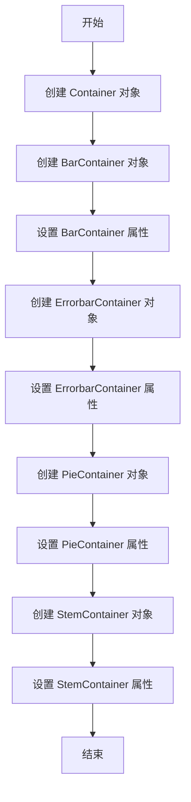

## 类结构

```
Container (基类)
├── BarContainer (条形图容器)
│   ├── ErrorbarContainer (误差条容器)
│   └── PieContainer (饼图容器)
└── StemContainer (茎图容器)
```

## 全局变量及字段


### `_callbacks`
    
Registry for callbacks related to the container.

类型：`cbook.CallbackRegistry`
    


### `_remove_method`
    
Method to be called when the container is removed.

类型：`function`
    


### `_label`
    
Label for the container.

类型：`str`
    


### `BarContainer.patches`
    
List of patches representing the bars.

类型：`list of matplotlib.patches.Rectangle`
    


### `BarContainer.errorbar`
    
Container for error bars if present.

类型：`matplotlib.container.ErrorbarContainer`
    


### `BarContainer.datavalues`
    
Underlying data values corresponding to the bars.

类型：`None or array-like`
    


### `BarContainer.orientation`
    
Orientation of the bars.

类型：`{'vertical', 'horizontal'}`
    
    

## 全局函数及方法


### Container.__repr__

This method returns a string representation of the Container object.

参数：

- 无

返回值：`str`，返回一个字符串，描述了Container对象的内容，包括其类型和包含的艺术家数量。

#### 流程图

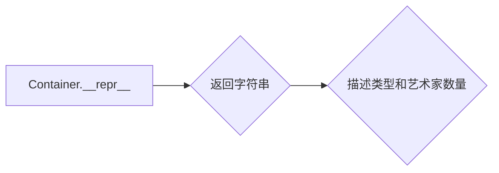

#### 带注释源码

```python
def __repr__(self):
    return f"<{type(self).__name__} object of {len(self)} artists>"
```


### Container.__new__

`Container.__new__` 是 `Container` 类的构造函数。

参数：

- `cls`：`Container` 类的引用，用于创建新实例。
- `*args`：任意数量的位置参数，用于初始化新实例。
- `**kwargs`：任意数量的关键字参数，用于初始化新实例。

返回值：`Container` 类的新实例。

#### 流程图

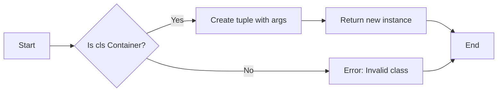

#### 带注释源码

```python
def __new__(cls, *args, **kwargs):
    # 使用 args[0] 初始化新实例，因为 Container 类期望接收一个可迭代的参数
    return tuple.__new__(cls, args[0])
```


### Container.__init__

This method initializes a new instance of the `Container` class, which is a base class for containers that collect semantically related Artists.

参数：

- `kl`：`tuple`，The initial artists to be included in the container.
- `label`：`Any`, An optional label for the container. If provided, it will be converted to a string.

返回值：`None`，This method does not return any value.

#### 流程图

```mermaid
graph LR
A[Start] --> B{Initialize Container}
B --> C[Set _callbacks to CallbackRegistry with signals ["pchanged"]]
C --> D{Set _remove_method to None}
D --> E{If label is not None}
E --> F[Set _label to str(label)]
F --> G[End]
E --> F[Set _label to None]
G --> H[End]
```

#### 带注释源码

```python
def __init__(self, kl, label=None):
    self._callbacks = cbook.CallbackRegistry(signals=["pchanged"])
    self._remove_method = None
    self._label = str(label) if label is not None else None
```


### Container.remove

This method removes all the artists contained within the `Container` instance.

参数：

- 无

返回值：`None`，无返回值

#### 流程图

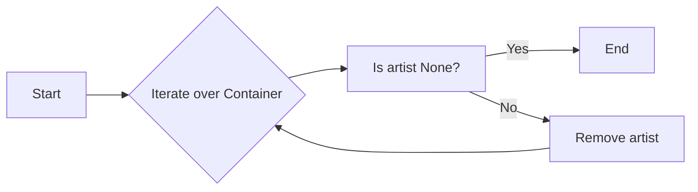

#### 带注释源码

```python
def remove(self):
    for c in cbook.flatten(
            self, scalarp=lambda x: isinstance(x, Artist)):
        if c is not None:
            c.remove()
    if self._remove_method:
        self._remove_method(self)
``` 


### Container.get_children

获取容器中的所有子元素。

参数：

- 无

返回值：`list`，包含容器中所有非空子元素的列表

#### 流程图

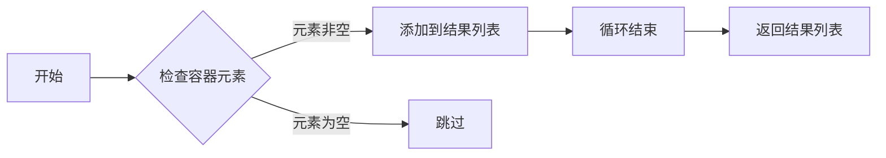

#### 带注释源码

```python
def get_children(self):
    return [child for child in cbook.flatten(self) if child is not None]
```


### Container.get_label

获取容器的标签。

参数：

- `self`：`Container`对象，当前容器的引用。

返回值：`str`，容器的标签。

#### 流程图

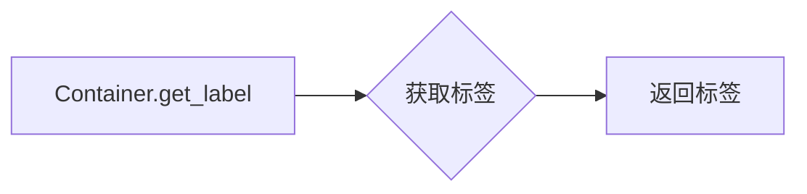

#### 带注释源码

```python
def get_label(self):
    return self._label
```


### Container.set_label

`Container.set_label` 方法用于设置容器的标签。

参数：

- `label`：`str`，要设置的标签。

返回值：无

#### 流程图

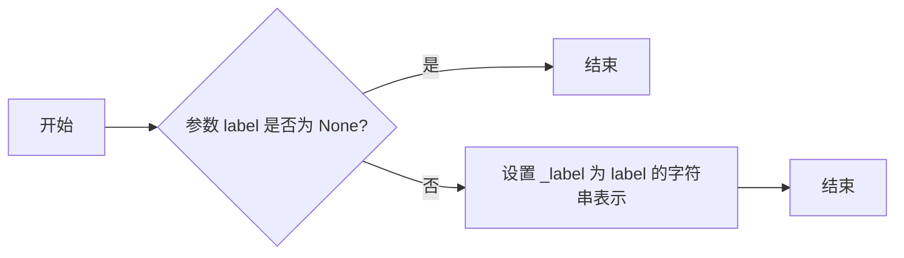

#### 带注释源码

```python
def set_label(self, label):
    """
    Set the label of the container.

    Parameters
    ----------
    label : str
        The label to set.
    """
    self._label = str(label)
``` 


### Container.add_callback

`Container.add_callback` 是 `Container` 类的一个方法，用于向容器中的艺术家添加回调函数。

参数：

- `signal`: `str`，表示触发回调的信号名称。
- `callback`: `callable`，当信号被触发时调用的函数。

返回值：`None`

#### 流程图

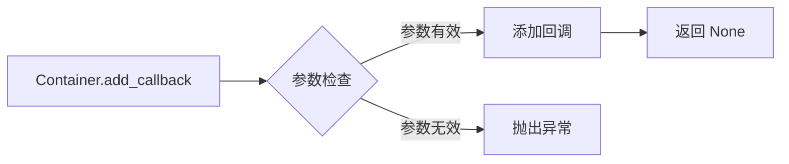

#### 带注释源码

```python
def add_callback(self, signal, callback):
    """
    Add a callback to the container.

    Parameters
    ----------
    signal : str
        The name of the signal to listen to.
    callback : callable
        The function to call when the signal is emitted.

    Returns
    -------
    None
    """
    self._callbacks.connect(signal, callback)
```


### Container.remove_callback

移除与容器关联的回调函数。

参数：

- `signal`：`str`，要移除的信号名称。

返回值：`None`，无返回值。

#### 流程图

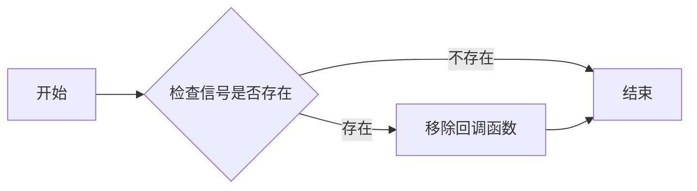

#### 带注释源码

```python
def remove_callback(self, signal):
    """
    Remove a callback from the callback registry.

    Parameters
    ----------
    signal : str
        The name of the signal to remove the callback from.

    Returns
    -------
    None
    """
    self._callbacks.remove(signal)
```


### Container.pchanged

The `pchanged` method is a callback method that is triggered when the container's properties change, such as when the plot is resized or updated.

参数：

- 无

返回值：`None`，无返回值

#### 流程图

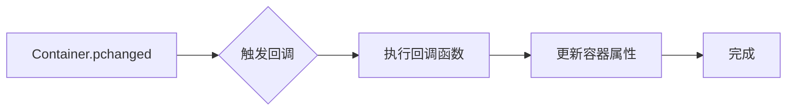

#### 带注释源码

```python
def pchanged(self):
    # This method is a callback method that is triggered when the container's properties change.
    # It calls the callback registry's `trigger` method to execute the callback functions.
    self._callbacks.trigger('pchanged')
```


### BarContainer.__init__

初始化BarContainer对象，设置其属性。

参数：

- `patches`：`list of matplotlib.patches.Rectangle`，表示条形图的条形区域。
- `errorbar`：`None or matplotlib.container.ErrorbarContainer`，表示条形图中的误差条，如果没有则默认为None。
- `datavalues`：`None or array-like`，表示条形图的数据值，如果没有则默认为None。
- `orientation`：`{'vertical', 'horizontal'}`，表示条形图的朝向，默认为None。
- `**kwargs`：其他关键字参数，传递给基类Container的构造函数。

返回值：无

#### 流程图

```mermaid
graph LR
A[BarContainer.__init__] --> B{设置属性}
B --> C{patches}
C --> D{errorbar}
D --> E{datavalues}
E --> F{orientation}
F --> G{调用super().__init__}
G --> H[结束]
```

#### 带注释源码

```python
def __init__(self, patches, errorbar=None, *, datavalues=None,
             orientation=None, **kwargs):
    self.patches = patches
    self.errorbar = errorbar
    self.datavalues = datavalues
    self.orientation = orientation
    super().__init__(patches, **kwargs)
```


### BarContainer.bottoms

Return the values at the lower end of the bars.

参数：

- 无

返回值：`list`，包含每个条形底部值的列表

#### 流程图

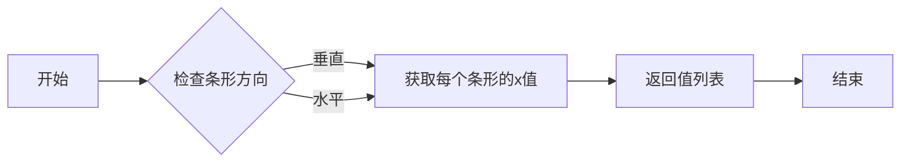

#### 带注释源码

```python
    @property
    def bottoms(self):
        """
        Return the values at the lower end of the bars.

        .. versionadded:: 3.11
        """
        if self.orientation == 'vertical':
            return [p.get_y() for p in self.patches]
        elif self.orientation == 'horizontal':
            return [p.get_x() for p in self.patches]
        else:
            raise ValueError("orientation must be 'vertical' or 'horizontal'.")
``` 


### BarContainer.tops

Return the values at the upper end of the bars.

参数：

- 无

返回值：`list`，包含每个条形上端值的列表

#### 流程图

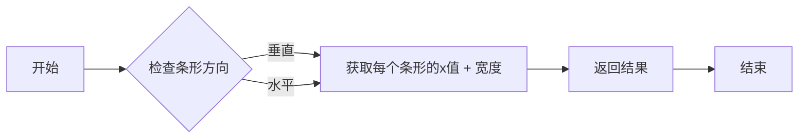

#### 带注释源码

```python
    @property
    def tops(self):
        """
        Return the values at the upper end of the bars.

        .. versionadded:: 3.11
        """
        if self.orientation == 'vertical':
            return [p.get_y() + p.get_height() for p in self.patches]
        elif self.orientation == 'horizontal':
            return [p.get_x() + p.get_width() for p in self.patches]
        else:
            raise ValueError("orientation must be 'vertical' or 'horizontal'.")
```


### BarContainer.position_centers

返回条形图位置的中心。

参数：

- 无

返回值：`list`，包含每个条形图位置的中心的列表

#### 流程图

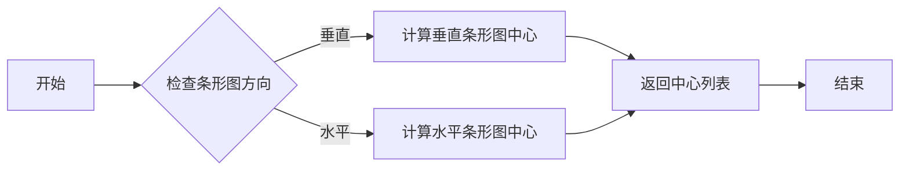

#### 带注释源码

```python
    @property
    def position_centers(self):
        """
        Return the centers of bar positions.

        .. versionadded:: 3.11
        """
        if self.orientation == 'vertical':
            return [p.get_x() + p.get_width() / 2 for p in self.patches]
        elif self.orientation == 'horizontal':
            return [p.get_y() + p.get_height() / 2 for p in self.patches]
        else:
            raise ValueError("orientation must be 'vertical' or 'horizontal'.")
``` 


### ErrorbarContainer.__init__

This method initializes an instance of the `ErrorbarContainer` class, which is used to contain the artists of error bars in matplotlib.

参数：

- `lines`：`tuple`，A tuple of `(data_line, caplines, barlinecols)` representing the lines, caps, and barlines of the error bars.
- `has_xerr`：`bool`，Indicates whether the error bar has x errors.
- `has_yerr`：`bool`，Indicates whether the error bar has y errors.

返回值：`None`，This method does not return any value.

#### 流程图

```mermaid
graph LR
A[Start] --> B{Initialize ErrorbarContainer}
B --> C[Set lines attribute]
C --> D[Set has_xerr attribute]
D --> E[Set has_yerr attribute]
E --> F[Call super().__init__ with lines]
F --> G[End]
```

#### 带注释源码

```python
def __init__(self, lines, has_xerr=False, has_yerr=False, **kwargs):
    self.lines = lines
    self.has_xerr = has_xerr
    self.has_yerr = has_yerr
    super().__init__(lines, **kwargs)
```


### PieContainer.__init__

This method initializes a `PieContainer` object, which is used to store the artists of pie charts created by `.Axes.pie`.

参数：

- `wedges`：`list of ~matplotlib.patches.Wedge`，The artists of the pie wedges.
- `values`：`numpy.ndarray`，The data that the pie is based on.
- `normalize`：`bool`，Whether to normalize the values to fractions.

返回值：`None`，This method does not return any value.

#### 流程图

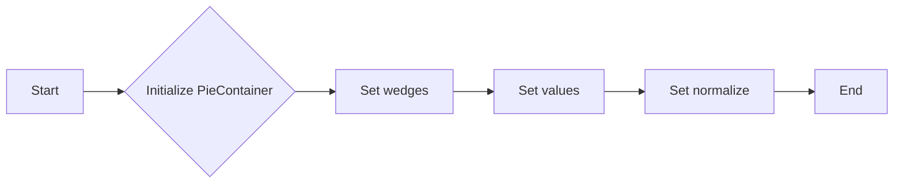

#### 带注释源码

```python
def __init__(self, wedges, values, normalize):
    self.wedges = wedges
    self._texts = []
    self._values = values
    self._normalize = normalize
```


### PieContainer.texts

返回包含饼图标签文本的列表。

参数：

- 无

返回值：`list of list of matplotlib.text.Text`，包含每个饼图切片的标签文本列表。

#### 流程图

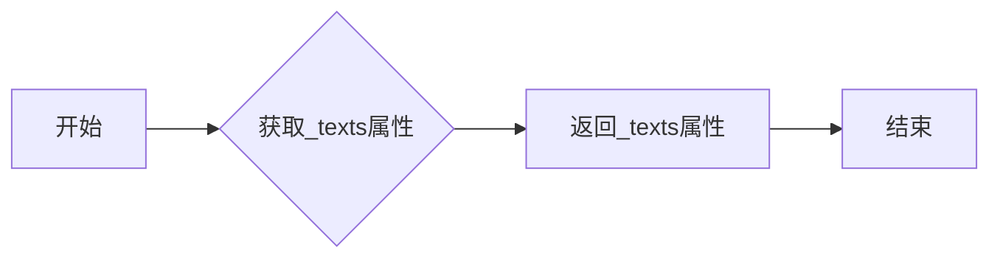

#### 带注释源码

```python
class PieContainer:
    # ... (其他代码)

    @property
    def texts(self):
        # Only return non-empty sublists.  An empty sublist may have been added
        # for backwards compatibility of the Axes.pie return value (see __getitem__).
        return [t_list for t_list in self._texts if t_list]
``` 


### PieContainer.values

This method returns the values that the pie chart is based on.

参数：

- `self`：`PieContainer`对象，表示当前实例

返回值：`numpy.ndarray`，包含饼图的数据值

#### 流程图

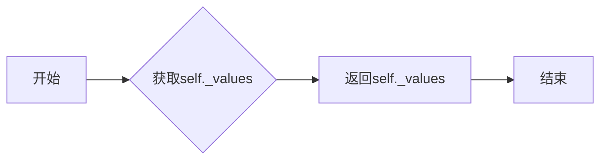

#### 带注释源码

```python
    @property
    def values(self):
        result = self._values.copy()
        result.flags.writeable = False
        return result
```


### PieContainer.fracs

返回每个扇形区域所代表的饼图比例。

参数：

- 无

返回值：`numpy.ndarray`，每个扇形区域所代表的饼图比例。

#### 流程图

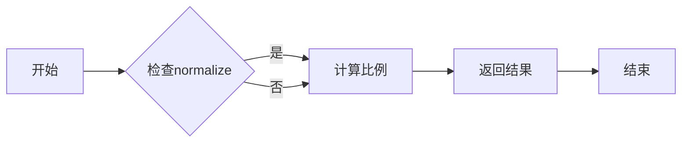

#### 带注释源码

```python
    @property
    def fracs(self):
        if self._normalize:
            result = self._values / self._values.sum()
        else:
            result = self._values

        result.flags.writeable = False
        return result
```


### PieContainer.add_texts

Add a list of `~matplotlib.text.Text` objects to the container.

参数：

- `texts`：`list of list of ~matplotlib.text.Text`，A list of text labels for each pie wedge.

返回值：无

#### 流程图

```mermaid
graph LR
A[Start] --> B{Add texts}
B --> C[End]
```

#### 带注释源码

```python
def add_texts(self, texts):
    """Add a list of `~matplotlib.text.Text` objects to the container."""
    self._texts.append(texts)
```


### PieContainer.remove

Remove all wedges and texts from the axes.

参数：

- `self`：`PieContainer`，当前实例

返回值：无

#### 流程图

```mermaid
graph LR
A[开始] --> B{遍历self.wedges}
B --> C{遍历self._texts}
C --> D[结束]
```

#### 带注释源码

```python
def remove(self):
    """Remove all wedges and texts from the axes"""
    for artist_list in self.wedges, self._texts:
        for artist in cbook.flatten(artist_list):
            artist.remove()
``` 


### PieContainer.__getitem__

This method is used to access the attributes of the `PieContainer` class, specifically the `wedges` and `texts` attributes. It supports unpacking into a tuple for backward compatibility with the `Axes.pie` return value.

参数：

- `key`：`int`，指定要访问的属性索引。0 表示 `wedges`，1 表示 `texts`。

返回值：`tuple`，包含 `wedges` 和 `texts` 属性。

#### 流程图

```mermaid
graph LR
A[Start] --> B{Is key 0?}
B -- Yes --> C[Return wedges]
B -- No --> D{Is key 1?}
D -- Yes --> E[Return texts]
D -- No --> F[Error: Invalid key]
C --> G[End]
E --> G
F --> G
```

#### 带注释源码

```python
def __getitem__(self, key):
    # needed to support unpacking into a tuple for backward compatibility of the
    # Axes.pie return value
    return (self.wedges, *self._texts)[key]
```


### StemContainer.__init__

初始化 StemContainer 类，用于创建茎叶图的艺术家容器。

参数：

- `markerline_stemlines_baseline`：`tuple`，包含 `(markerline, stemlines, baseline)`，其中 `markerline` 是标记线的 `.Line2D` 实例，`stemlines` 是茎线的 `.LineCollection` 实例，`baseline` 是基线的 `.Line2D` 实例。

返回值：无

#### 流程图

```mermaid
graph LR
A[StemContainer.__init__] --> B{参数解析}
B --> C[创建属性]
C --> D[调用父类 __init__]
```

#### 带注释源码

```python
def __init__(self, markerline_stemlines_baseline, **kwargs):
    """
    Initialize the StemContainer class, used to create a container for artists
    in a stem plot.

    Parameters
    ----------
    markerline_stemlines_baseline : tuple
        A tuple containing `(markerline, stemlines, baseline)`.
        `markerline` contains the `.Line2D` of the markers,
        `stemlines` is a `.LineCollection` of the main lines,
        `baseline` is the `.Line2D` of the baseline.

    Returns
    -------
    None
    """
    markerline, stemlines, baseline = markerline_stemlines_baseline
    self.markerline = markerline
    self.stemlines = stemlines
    self.baseline = baseline
    super().__init__(markerline_stemlines_baseline, **kwargs)
```


## 关键组件


### 张量索引与惰性加载

张量索引与惰性加载是代码中用于高效处理大型数据集的关键组件。它允许在需要时才计算数据，从而减少内存消耗和提高性能。

### 反量化支持

反量化支持是代码中用于处理量化数据的关键组件。它允许在量化过程中保持数据的精度，从而提高模型的准确性和效率。

### 量化策略

量化策略是代码中用于优化模型性能的关键组件。它通过减少模型中使用的数值范围来减少模型大小和计算需求，从而提高模型的运行速度和效率。


## 问题及建议


### 已知问题

-   **代码重复**：`Container` 类中的 `remove` 方法在 `BarContainer`、`ErrorbarContainer` 和 `PieContainer` 中被重复实现。这可能导致维护困难，如果 `Container` 类的 `remove` 方法需要更改，则需要修改所有子类。
-   **属性访问**：`BarContainer`、`ErrorbarContainer` 和 `PieContainer` 类中的属性（如 `patches`、`lines`、`wedges` 等）直接暴露了内部数据结构。这可能导致外部代码直接修改这些数据结构，从而破坏封装性。
-   **异常处理**：代码中没有明显的异常处理机制。如果出现错误（例如，属性访问错误或数据类型不匹配），可能会导致程序崩溃。
-   **文档不足**：代码注释和文档描述不够详细，对于一些复杂的功能和属性，缺乏清晰的解释。

### 优化建议

-   **使用继承和抽象类**：创建一个抽象基类 `AbstractContainer`，其中包含 `remove` 方法的实现。然后，让所有子类继承这个基类，并重写特定于子类的属性和方法。
-   **封装属性**：使用私有属性和公共方法来访问和修改内部数据结构。这可以防止外部代码直接修改数据结构，从而保护封装性。
-   **添加异常处理**：在可能发生错误的地方添加异常处理代码，例如，在访问属性时检查数据类型，并在出现错误时抛出异常。
-   **改进文档**：为每个类、方法和属性添加详细的文档注释，解释其功能和用法。这可以帮助其他开发者更好地理解和使用代码。
-   **使用设计模式**：考虑使用设计模式，如工厂模式或策略模式，来处理不同类型的容器和它们的创建过程，以提高代码的可扩展性和可维护性。


## 其它


### 设计目标与约束

- 设计目标：
  - 提供一个通用的容器类，用于收集和操作与特定图表类型相关的艺术家对象。
  - 支持不同类型的图表，如条形图、误差条、饼图和茎叶图。
  - 提供属性和方法来访问和操作容器中的艺术家对象。
  - 确保容器类具有良好的可扩展性和可维护性。

- 约束：
  - 容器类必须遵循matplotlib的API设计规范。
  - 容器类必须能够处理不同类型的艺术家对象。
  - 容器类必须提供一致的方法来访问和操作艺术家对象。

### 错误处理与异常设计

- 错误处理：
  - 当用户尝试访问不存在的属性或方法时，应抛出`AttributeError`。
  - 当用户尝试设置不合法的属性值时，应抛出`ValueError`。
  - 当用户尝试执行不支持的图表类型时，应抛出`NotImplementedError`。

### 数据流与状态机

- 数据流：
  - 用户创建图表时，会创建相应的容器对象。
  - 容器对象收集与图表相关的艺术家对象。
  - 用户可以通过容器对象访问和操作艺术家对象。

- 状态机：
  - 容器对象在创建时处于初始状态。
  - 用户可以通过调用方法来修改容器对象的状态。
  - 容器对象在删除时释放所有资源。

### 外部依赖与接口契约

- 外部依赖：
  - matplotlib库：用于创建和操作图表。
  - numpy库：用于处理数值数据。

- 接口契约：
  - 容器类必须提供统一的接口来访问和操作艺术家对象。
  - 容器类必须遵循matplotlib的API设计规范。
  - 容器类必须提供错误处理机制，以确保用户在使用过程中不会遇到意外情况。

    