# `matplotlib\lib\matplotlib\container.pyi` 详细设计文档

This code defines a set of container classes for matplotlib artists, providing a structured way to manage and manipulate graphical elements in plots.

## 整体流程

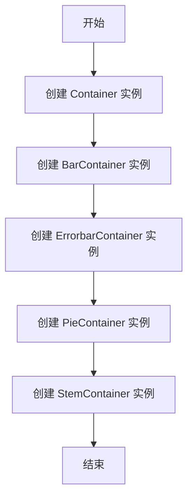

## 类结构

```
Container (基类)
├── BarContainer (条形图容器)
│   ├── ErrorbarContainer (误差条容器)
│   └── ...
├── PieContainer (饼图容器)
└── StemContainer (茎叶图容器)
```

## 全局变量及字段


### `kl`
    
The container's key list.

类型：`tuple`
    


### `label`
    
The label of the container.

类型：`Any | None`
    


### `BarContainer.patches`
    
The list of rectangles representing the bars in the bar chart.

类型：`list[Rectangle]`
    


### `BarContainer.errorbar`
    
The errorbar container associated with the bar chart.

类型：`ErrorbarContainer | None`
    


### `BarContainer.datavalues`
    
The data values associated with the bars.

类型：`ArrayLike | None`
    


### `BarContainer.orientation`
    
The orientation of the bar chart.

类型：`Literal['vertical', 'horizontal'] | None`
    


### `ErrorbarContainer.lines`
    
The lines associated with the errorbar container.

类型：`tuple[Line2D, tuple[Line2D, ...], tuple[LineCollection, ...]]`
    


### `ErrorbarContainer.has_xerr`
    
Indicates whether the errorbar has x errors.

类型：`bool`
    


### `ErrorbarContainer.has_yerr`
    
Indicates whether the errorbar has y errors.

类型：`bool`
    


### `PieContainer.wedges`
    
The list of wedges representing the slices in the pie chart.

类型：`list[Wedge]`
    


### `PieContainer.values`
    
The values associated with the pie slices.

类型：`ndarray`
    


### `PieContainer.normalize`
    
Indicates whether the pie chart values should be normalized.

类型：`bool`
    


### `StemContainer.markerline`
    
The marker line associated with the stem chart.

类型：`Line2D`
    


### `StemContainer.stemlines`
    
The stem lines associated with the stem chart.

类型：`LineCollection`
    


### `StemContainer.baseline`
    
The baseline associated with the stem chart.

类型：`Line2D`
    
    

## 全局函数及方法


### Container.remove

移除容器中的元素。

参数：

- 无

返回值：`None`，无返回值

#### 流程图

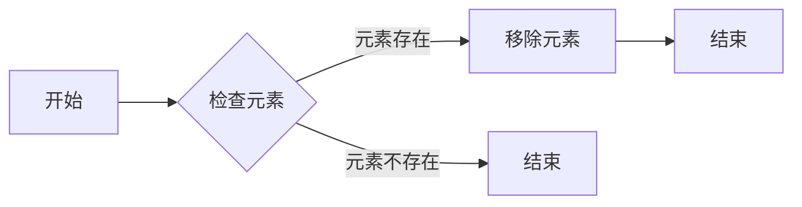

#### 带注释源码

```
def remove(self) -> None:
    # 检查元素是否存在
    if self:
        # 移除元素
        del self[0]
``` 


### Container.get_children

获取容器中的所有子元素。

参数：

- 无

返回值：`list[Artist]`，返回一个包含所有子元素的列表。

#### 流程图

```mermaid
graph LR
A[开始] --> B{调用get_children()}
B --> C[返回子元素列表]
C --> D[结束]
```

#### 带注释源码

```python
class Container(tuple):
    # ... 其他方法 ...

    def get_children(self) -> list[Artist]:
        # 返回容器中的所有子元素
        return list(self)
```


### Container.get_label

获取容器中标签的值。

参数：

- 无

返回值：`str | None`，如果容器有标签，则返回标签的值，否则返回 `None`。

#### 流程图

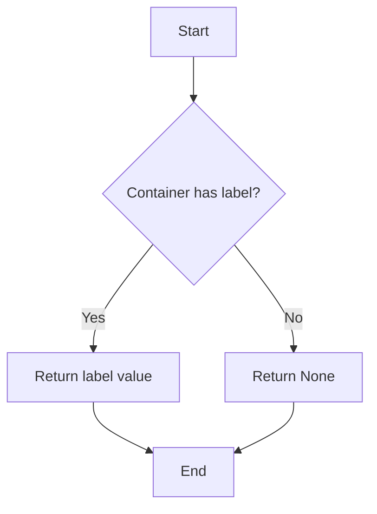

#### 带注释源码

```python
class Container(tuple):
    # ... (其他方法省略)

    def get_label(self) -> str | None:
        # 检查容器是否有标签
        if self.label is not None:
            # 返回标签的值
            return self.label
        else:
            # 如果没有标签，返回 None
            return None
```


### Container.set_label

设置容器对象的标签。

参数：

- `s`：`Any`，标签的文本内容。

返回值：`None`，无返回值。

#### 流程图

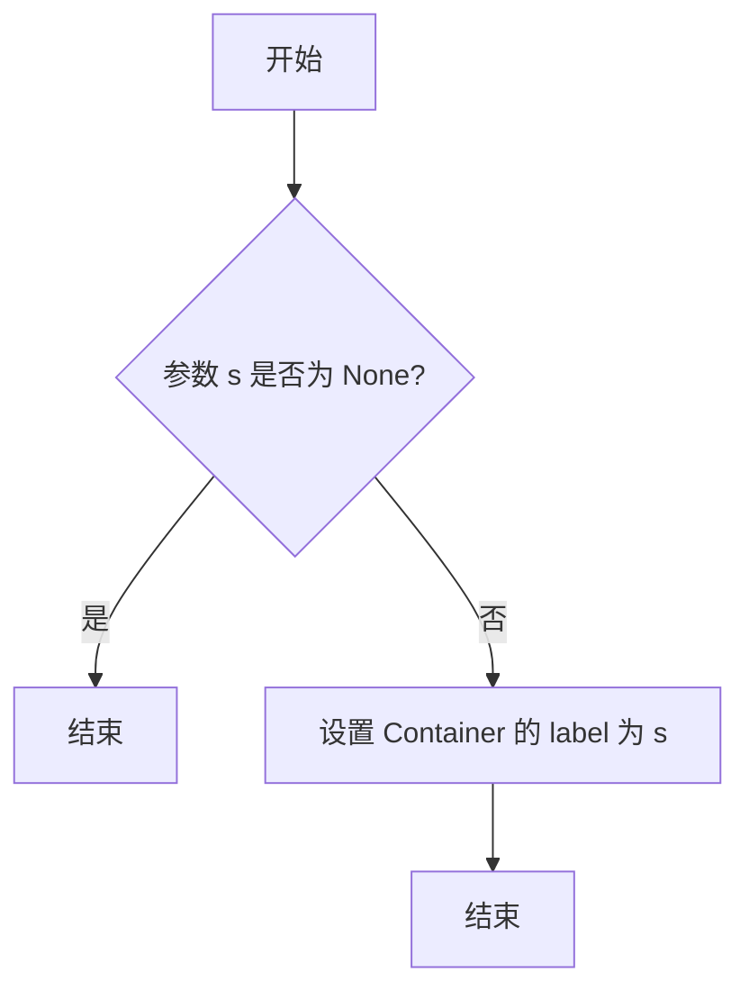

#### 带注释源码

```python
class Container(tuple):
    # ... 其他方法 ...

    def set_label(self, s: Any) -> None:
        # 设置容器对象的标签
        self.label = s
```


### Container.add_callback

`Container.add_callback` 方法用于向容器中添加一个回调函数。

参数：

- `func`：`Callable[[Artist], Any]`，一个接受一个 `Artist` 对象作为参数并返回任何类型的函数。

返回值：`int`，返回回调函数的标识符。

#### 流程图

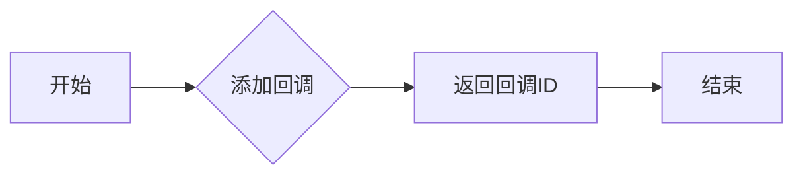

#### 带注释源码

```python
def add_callback(self, func: Callable[[Artist], Any]) -> int:
    # 创建回调函数的标识符
    oid = self._callbacks.append(func)
    # 返回回调函数的标识符
    return oid
```


### Container.remove_callback

移除与指定ID关联的回调函数。

参数：

- `oid`：`int`，回调函数的唯一标识符。

返回值：`None`，无返回值。

#### 流程图

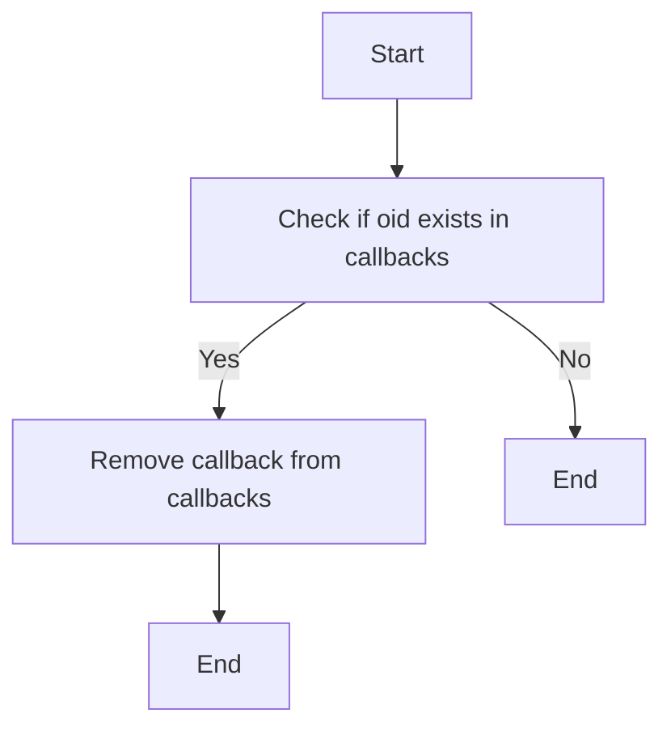

#### 带注释源码

```python
class Container(tuple):
    # ... other methods ...

    def remove_callback(self, oid: int) -> None:
        # 移除与指定ID关联的回调函数
        for callback in self.callbacks:
            if callback['oid'] == oid:
                self.callbacks.remove(callback)
                break
```


### Container.pchanged

`Container.pchanged` 方法是 `Container` 类的一个实例方法，用于处理绘图元素在绘图区域变化时的更新。

参数：

- 无

返回值：`None`，无返回值，但会触发绘图元素的更新。

#### 流程图

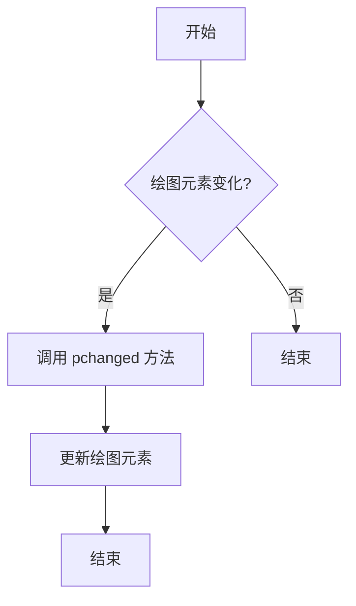

#### 带注释源码

```
def pchanged(self) -> None:
    # 实现细节省略，具体实现依赖于绘图库和绘图元素
    pass
```

由于源码中未提供具体的实现细节，以上流程图和源码仅为示意。实际实现可能涉及调用绘图库的相应方法来更新绘图元素。


### BarContainer.__init__

初始化BarContainer类，设置其属性。

参数：

- `patches`：`list[Rectangle]`，包含Rectangle对象，表示条形图的条。
- `errorbar`：`ErrorbarContainer | None`，可选的ErrorbarContainer对象，表示条形图上的误差线。
- `datavalues`：`ArrayLike | None`，可选的数组，包含条形图的数据值。
- `orientation`：`Literal["vertical", "horizontal"] | None`，可选的条形图方向，可以是"vertical"或"horizontal"。

返回值：`None`，无返回值。

#### 流程图

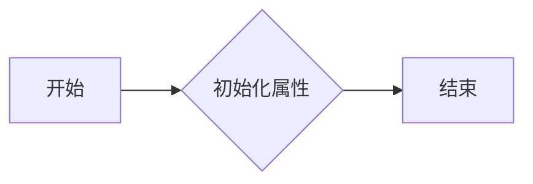

#### 带注释源码

```
def __init__(
    self,
    patches: list[Rectangle],
    errorbar: ErrorbarContainer | None = None,
    *,
    datavalues: ArrayLike | None = None,
    orientation: Literal["vertical", "horizontal"] | None = None,
    **kwargs
) -> None:
    # 设置父类属性
    super().__init__(*args, **kwargs)
    # 设置条形图条
    self.patches = patches
    # 设置误差线容器
    self.errorbar = errorbar
    # 设置数据值
    self.datavalues = datavalues
    # 设置条形图方向
    self.orientation = orientation
```


### BarContainer.bottoms

获取条形图容器中所有条形的底部位置。

参数：

- 无

返回值：`list[float]`，包含所有条形的底部位置的列表

#### 流程图

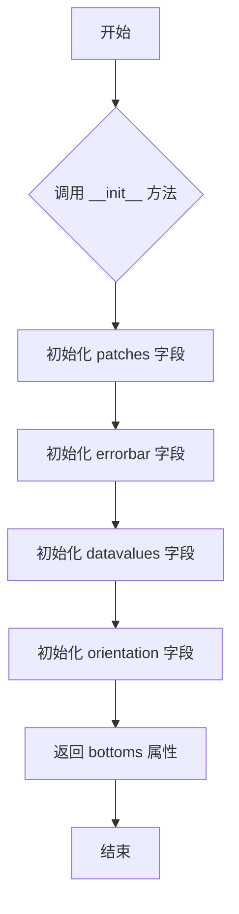

#### 带注释源码

```
class BarContainer(Container):
    # ... 其他代码 ...

    @property
    def bottoms(self) -> list[float]:
        """
        获取条形图容器中所有条形的底部位置。

        Returns:
            list[float]: 包含所有条形的底部位置的列表
        """
        # 假设 patches 字段包含所有条形，每个条形是一个 Rectangle 对象
        # Rectangle 对象有一个属性 bounds，它是一个包含 (x, y, width, height) 的元组
        # 我们可以通过 bounds[1] 获取每个条形的底部位置
        return [patch.bounds[1] for patch in self.patches]
```


### BarContainer.tops

获取条形图容器中条形的顶部坐标。

参数：

- 无

返回值：`list[float]`，包含条形顶部坐标的列表

#### 流程图

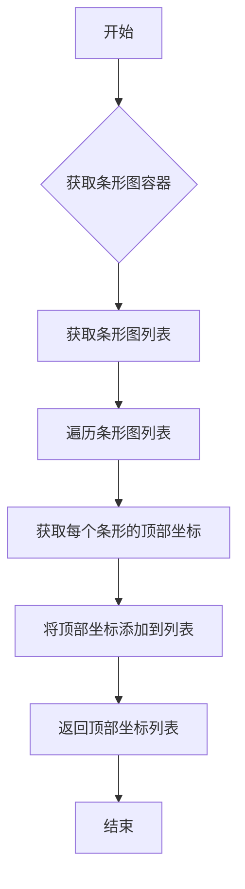

#### 带注释源码

```
class BarContainer(Container):
    # ... 其他代码 ...

    @property
    def tops(self) -> list[float]:
        """
        获取条形图容器中条形的顶部坐标。

        返回值：包含条形顶部坐标的列表
        """
        return [rect.get_ydata()[1] for rect in self.patches]
```


### BarContainer.position_centers

获取条形图容器的位置中心。

参数：

- 无

返回值：`list[float]`，包含条形图位置中心的列表

#### 流程图

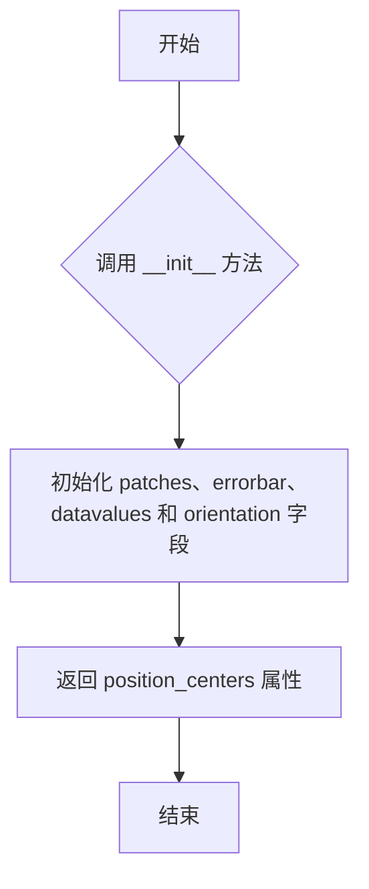

#### 带注释源码

```
class BarContainer(Container):
    # ... 其他代码 ...

    @property
    def position_centers(self) -> list[float]:
        """
        获取条形图的位置中心。
        
        :return: 包含条形图位置中心的列表
        """
        # 假设 bottoms 和 tops 属性已经定义，并且返回相应的值
        return [b + (t - b) / 2 for b, t in zip(self.bottoms, self.tops)]
```


### ErrorbarContainer.__init__

初始化ErrorbarContainer对象，设置线条、是否有x误差和y误差。

参数：

- `lines`：`tuple[Line2D, tuple[Line2D, ...], tuple[LineCollection, ...]]`，包含线条的元组，用于绘制误差线。
- `has_xerr`：`bool`，指示是否有x方向的误差。
- `has_yerr`：`bool`，指示是否有y方向的误差。

返回值：`None`，无返回值。

#### 流程图

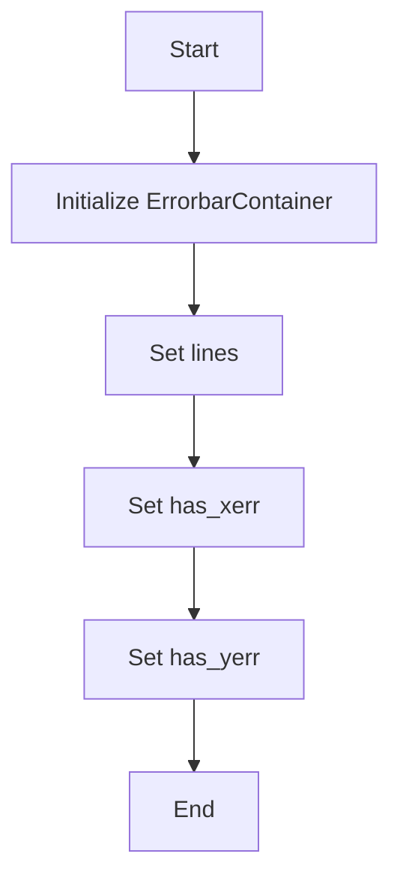

#### 带注释源码

```
def __init__(
    self,
    lines: tuple[Line2D, tuple[Line2D, ...], tuple[LineCollection, ...]],
    has_xerr: bool = False,
    has_yerr: bool = False,
    **kwargs
) -> None:
    super().__init__(*kwargs)
    self.lines = lines
    self.has_xerr = has_xerr
    self.has_yerr = has_yerr
```


### PieContainer.__init__

初始化PieContainer类，用于创建一个包含扇形（wedges）的容器。

参数：

- `wedges`：`list[Wedge]`，包含matplotlib.patches.Wedge对象的列表，每个对象代表一个扇形。
- `values`：`ndarray`，包含扇形对应的数值。
- `normalize`：`bool`，指示是否将`values`归一化。

返回值：`None`，无返回值。

#### 流程图

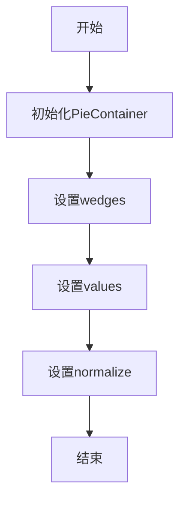

#### 带注释源码

```
class PieContainer(Container):
    wedges: list[Wedge]

    def __init__(self, wedges: list[Wedge], values: ndarray, normalize: bool) -> None:
        # 初始化父类
        super().__init__()
        
        # 设置wedges
        self.wedges = wedges
        
        # 设置values
        self.values = values
        
        # 设置normalize
        self.normalize = normalize
```


### PieContainer.texts

返回一个包含文本对象的列表，这些文本对象表示饼图中的标签。

参数：

- `texts`：`list[Text]`，一个包含Text对象的列表，这些对象将被添加到饼图中。

返回值：`list[list[Text]]`，一个列表，其中包含每个扇区的文本对象列表。

#### 流程图

```mermaid
graph LR
A[开始] --> B{调用add_texts()}
B --> C[结束]
```

#### 带注释源码

```
class PieContainer(Container):
    # ... (其他代码)

    @property
    def texts(self) -> list[list[Text]]:
        """
        返回一个包含文本对象的列表，这些文本对象表示饼图中的标签。
        """
        # ... (实现细节)
        return self._texts

    def add_texts(self,
        texts: list[Text],
    ) -> None:
        """
        添加文本对象到饼图中。
        """
        # ... (实现细节)
        self._texts.append(texts)
```


### PieContainer.values

返回PieContainer实例中存储的值数组。

参数：

- `self`：`PieContainer`，当前PieContainer实例

返回值：`ndarray`，包含PieContainer中所有值的数组

#### 流程图

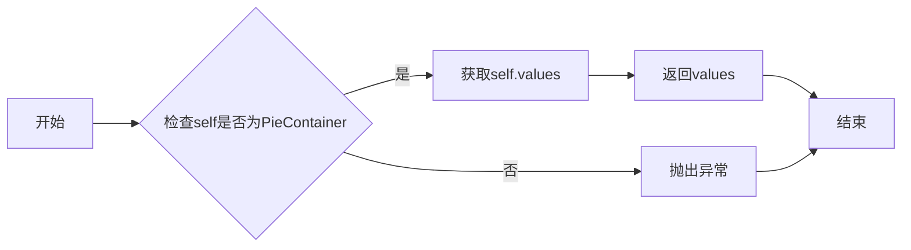

#### 带注释源码

```
class PieContainer(Container):
    # ... (其他代码)

    @property
    def values(self) -> ndarray:
        """
        返回PieContainer实例中存储的值数组。

        :return: ndarray，包含PieContainer中所有值的数组
        """
        return self._values

    # ... (其他代码)
```


### PieContainer.fracs

返回饼图各部分的分数。

参数：

- `self`：`PieContainer`，当前饼图容器对象

返回值：`ndarray`，包含饼图各部分的分数

#### 流程图

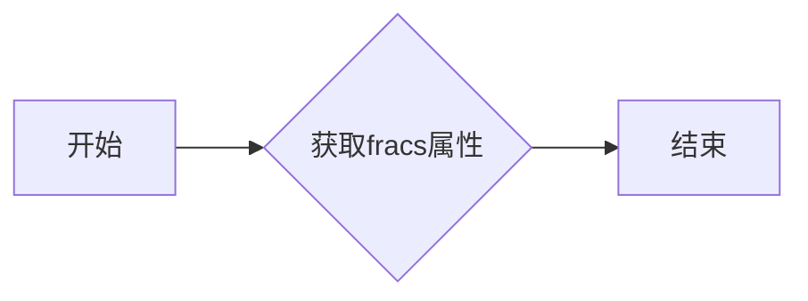

#### 带注释源码

```
class PieContainer(Container):
    # ... 其他代码 ...

    @property
    def fracs(self) -> ndarray:
        """
        返回饼图各部分的分数。

        :return: ndarray，包含饼图各部分的分数
        """
        return self.values
```


### PieContainer.add_texts

`PieContainer.add_texts` 方法用于向 PieContainer 实例中添加文本元素。

参数：

- `texts`：`list[Text]`，一个包含 Text 对象的列表，这些对象将作为饼图上的文本元素。

返回值：`None`，该方法不返回任何值。

#### 流程图

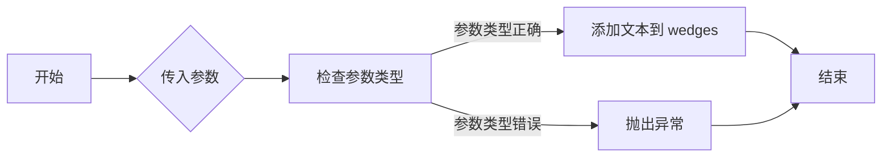

#### 带注释源码

```
def add_texts(self, texts: list[Text]) -> None:
    # 检查传入的 texts 是否为 list 类型
    if not isinstance(texts, list):
        raise TypeError("texts must be a list of Text objects")
    
    # 遍历 texts 列表，将每个 Text 对象添加到 wedges 中
    for text in texts:
        # 添加文本到 wedges
        self.wedges.append(text)
```


### StemContainer.__init__

初始化StemContainer类，设置其基本属性。

参数：

- `markerline_stemlines_baseline`：`tuple[Line2D, LineCollection, Line2D]`，包含标记线、茎线集合和基线的元组。

返回值：无

#### 流程图

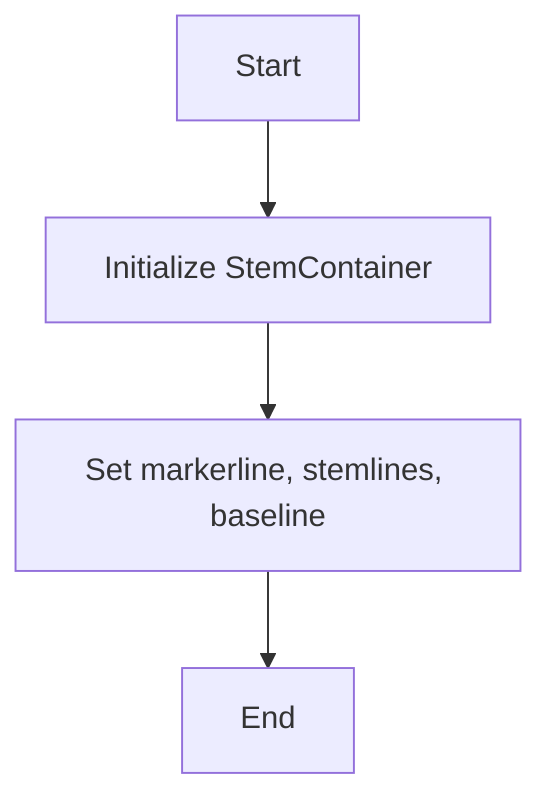

#### 带注释源码

```
class StemContainer(Container):
    markerline: Line2D
    stemlines: LineCollection
    baseline: Line2D

    def __init__(
        self,
        markerline_stemlines_baseline: tuple[Line2D, LineCollection, Line2D],
        **kwargs
    ) -> None:
        # Initialize the base class
        super().__init__(*kwargs)
        
        # Set the markerline, stemlines, and baseline
        self.markerline, self.stemlines, self.baseline = markerline_stemlines_baseline
``` 


## 关键组件


### 张量索引与惰性加载

张量索引与惰性加载是代码中处理数据结构的核心组件，它允许对大型数据集进行高效访问，同时减少内存消耗。

### 反量化支持

反量化支持是代码中用于处理量化数据的核心组件，它允许对量化后的数据进行反量化处理，以便进行进一步的分析或计算。

### 量化策略

量化策略是代码中用于处理数据量化的核心组件，它定义了如何将浮点数数据转换为低精度表示，以减少内存和计算需求。


## 问题及建议


### 已知问题

-   **代码重复性**：`Container` 类及其子类 `BarContainer`, `ErrorbarContainer`, `PieContainer`, 和 `StemContainer` 都有相似的实现，特别是构造函数和 `__init__` 方法。这可能导致维护困难，如果需要修改这些类的行为，需要在多个地方进行修改。
-   **类型注解**：代码中使用了大量的类型注解，但没有提供具体的类型实现，这可能导致类型检查不完整或无法进行类型检查。
-   **全局变量和函数**：代码中没有使用全局变量和函数，因此不存在此类问题。

### 优化建议

-   **提取公共代码**：将 `Container` 类及其子类的公共代码提取到单独的类或函数中，以减少重复代码并简化维护。
-   **实现类型**：提供具体的类型实现，以便进行完整的类型检查和代码优化。
-   **文档化**：为每个类和方法添加详细的文档字符串，说明其用途、参数和返回值，以便其他开发者更容易理解和使用代码。
-   **单元测试**：编写单元测试来验证每个类和方法的行为，确保代码的稳定性和可靠性。
-   **性能优化**：如果这些类用于处理大量数据，可以考虑性能优化，例如使用更高效的数据结构或算法。


## 其它


### 设计目标与约束

- 设计目标：提供一种灵活且可扩展的方式来组织和展示不同类型的图表元素，如条形图、误差条、饼图和茎叶图。
- 约束条件：确保所有图表元素能够与matplotlib库兼容，并能够通过回调函数进行交互。

### 错误处理与异常设计

- 错误处理：在类方法和全局函数中，应捕获并处理可能出现的异常，如类型错误、值错误等。
- 异常设计：定义自定义异常类，以提供更具体的错误信息。

### 数据流与状态机

- 数据流：数据从外部输入到类中，经过处理和转换，最终输出为matplotlib图表元素。
- 状态机：每个图表元素类可能包含不同的状态，如初始化、更新、删除等。

### 外部依赖与接口契约

- 外部依赖：依赖于matplotlib库中的Artist、Line2D、LineCollection、Rectangle、Wedge等类。
- 接口契约：确保所有类和方法遵循matplotlib的接口规范，以便与其他matplotlib元素兼容。

### 测试与验证

- 测试策略：编写单元测试来验证每个类和方法的功能。
- 验证方法：使用matplotlib库的绘图功能来验证图表元素的渲染效果。

### 性能优化

- 性能优化：分析代码性能瓶颈，如循环和递归调用，并进行优化。

### 安全性考虑

- 安全性考虑：确保代码不会引入安全漏洞，如SQL注入、XSS攻击等。

### 文档与注释

- 文档：编写详细的文档，包括类和方法的功能、参数、返回值等。
- 注释：在代码中添加必要的注释，以提高代码的可读性和可维护性。

### 用户界面与交互

- 用户界面：设计用户友好的界面，以便用户可以轻松地创建和修改图表元素。
- 交互：提供回调函数和事件处理机制，以便用户可以与图表元素进行交互。

### 扩展性与维护性

- 扩展性：设计模块化的代码结构，以便添加新的图表元素类型。
- 维护性：编写易于维护的代码，包括良好的命名规范、代码格式和注释。


    