# `matplotlib\lib\matplotlib\contour.py` 详细设计文档

该文件提供了用于在Axes类上进行等高线绘制和标注的类和方法，支持等高线（contour）和填充等高线（contourf）两种模式，包含自动和手动两种标注方式，并提供了查找最近等高线、生成图例等功能。

## 整体流程

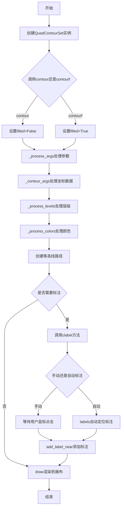

## 类结构

```
ContourLabeler (混合类)
├── clabel (主标注方法)
├── labels (自动标注)
├── add_label (添加标注)
├── add_label_near (附近添加标注)
├── locate_label (定位标注)
└── pop_label (移除标注)
ContourSet (等高线集合基类)
├── 继承自 ContourLabeler
└── 继承自 Collection
QuadContourSet (二次等高线集合)
└── 继承自 ContourSet
```

## 全局变量及字段


### `_contour_labeler_event_handler`
    
处理等高线标注的鼠标和键盘事件，用于手动标注模式

类型：`function`
    


### `ContourLabeler.labelFmt`
    
标签格式化器，用于格式化等高线标签文本

类型：`Formatter`
    


### `ContourLabeler.labelManual`
    
手动标注模式标志，True表示用户手动点击添加标签

类型：`bool`
    


### `ContourLabeler.rightside_up`
    
标签方向是否正立，控制标签旋转角度是否始终正立

类型：`bool`
    


### `ContourLabeler._clabel_zorder`
    
标签的z顺序值，决定标签的绘制层次

类型：`float`
    


### `ContourLabeler.labelLevelList`
    
标签对应的等高线层级值列表

类型：`list`
    


### `ContourLabeler.labelIndiceList`
    
标签对应的等高线层级索引列表

类型：`list`
    


### `ContourLabeler.labelXYs`
    
标签位置的坐标列表，用于避免标签重叠

类型：`list`
    


### `ContourLabeler.labelTexts`
    
标签文本对象列表，存储所有添加的标签

类型：`list[Text]`
    


### `ContourLabeler.labelCValues`
    
标签的颜色值列表，用于设置标签颜色

类型：`list`
    


### `ContourLabeler.labelMappable`
    
标签的可映射对象，用于颜色映射

类型：`ScalarMappable`
    


### `ContourLabeler.labelCValueList`
    
标签颜色索引列表，用于颜色映射

类型：`list`
    


### `ContourLabeler._label_font_props`
    
标签字体属性对象，控制标签字体样式

类型：`FontProperties`
    


### `ContourLabeler._use_clabeltext`
    
是否使用clabeltext标志，控制标签文本转换方式

类型：`bool`
    


### `ContourSet.axes`
    
所属的Axes对象，用于绑制等高线

类型：`Axes`
    


### `ContourSet.levels`
    
等高线的层级值列表

类型：`array`
    


### `ContourSet.filled`
    
是否填充标志，True表示填充等高线，False表示线等高线

类型：`bool`
    


### `ContourSet.hatches`
    
填充图案列表，用于填充等高线的纹理

类型：`tuple`
    


### `ContourSet.origin`
    
原点位置，指定数据原点位置(None/lower/upper/image)

类型：`str`
    


### `ContourSet.extent`
    
数据范围，指定x和y的边界(x0, x1, y0, y1)

类型：`tuple`
    


### `ContourSet.colors`
    
颜色列表，指定等高线的颜色

类型：`list`
    


### `ContourSet.extend`
    
扩展方式，指定等高线两端扩展方式(neither/min/both)

类型：`str`
    


### `ContourSet.nchunk`
    
分块数，指定等高线计算的分块大小

类型：`int`
    


### `ContourSet.locator`
    
定位器，用于自动确定等高线层级

类型：`Locator`
    


### `ContourSet.labelTexts`
    
标签文本对象列表，存储等高线标签

类型：`list[Text]`
    


### `ContourSet.labelCValues`
    
标签颜色值列表

类型：`list`
    


### `ContourSet._paths`
    
等高线路径列表，存储等高线的几何路径

类型：`list[Path]`
    


### `ContourSet._mins`
    
数据最小边界，存储x和y的最小值

类型：`array`
    


### `ContourSet._maxs`
    
数据最大边界，存储x和y的最大值

类型：`array`
    


### `ContourSet.logscale`
    
是否对数刻度标志，True表示使用对数坐标

类型：`bool`
    


### `QuadContourSet._contour_generator`
    
等高线生成器对象，用于计算等高线几何

类型：`object`
    


### `QuadContourSet._corner_mask`
    
角点掩码标志，控制角落遮挡处理方式

类型：`bool`
    


### `QuadContourSet._algorithm`
    
等高线算法名称，指定计算等高线的算法(mpl2005/mpl2014/serial/threaded)

类型：`str`
    
    

## 全局函数及方法


### `_contour_labeler_event_handler`

该函数是一个事件处理器，用于在手动等高线标注模式下处理用户的鼠标和键盘输入。它根据不同的输入（鼠标按钮或按键）在等高线上添加、移除标签或退出标注模式，从而实现交互式地控制等高线标签的放置。

参数：

- `cs`：`ContourSet`，等高线集对象，提供添加和移除标签的方法。
- `inline`：`bool`，指示标签是否内联（即是否移除等高线下的部分）。
- `inline_spacing`：`int`，内联标签两侧保留的像素空间。
- `event`：`matplotlib.backend_bases.Event`，鼠标或键盘事件对象，包含事件类型和坐标信息。

返回值：`None`，该函数不返回任何值，仅通过副作用（如添加标签、重绘画布）生效。

#### 流程图

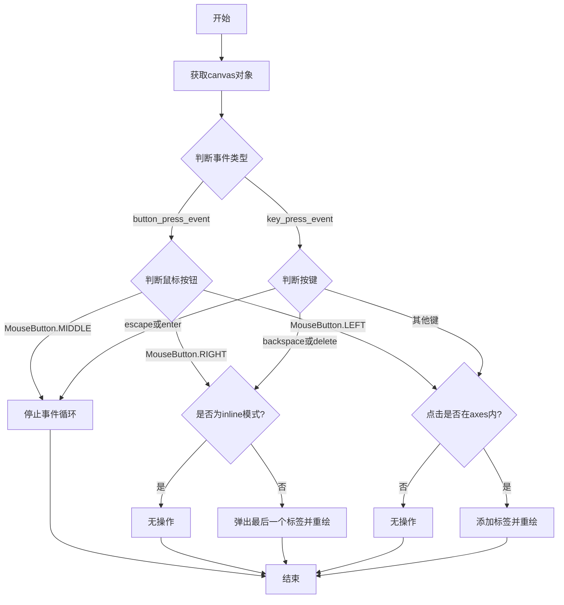

#### 带注释源码

```python
def _contour_labeler_event_handler(cs, inline, inline_spacing, event):
    """
    处理等高线标注的鼠标和键盘事件。
    
    参数:
        cs: ContourSet对象，等高线集，提供标签管理方法。
        inline: bool，是否内联标签（即移除等高线下部分）。
        inline_spacing: int，内联标签的间距。
        event: Event，鼠标或键盘事件。
    """
    # 获取与等高线关联的Figure的Canvas对象，用于重绘和事件控制
    canvas = cs.axes.get_figure(root=True).canvas
    
    # 判断事件是鼠标按钮按下还是键盘按键
    is_button = event.name == "button_press_event"
    is_key = event.name == "key_press_event"
    
    # 退出标注模式：支持鼠标中键或Escape/Enter键
    # 这与MATLAB行为一致，退出后用户需检查实际返回的点数
    if (is_button and event.button == MouseButton.MIDDLE
            or is_key and event.key in ["escape", "enter"]):
        canvas.stop_event_loop()
    
    # 移除最后一个标签：支持鼠标右键或Backspace/Delete键
    # 注意：在inline模式下无法恢复已破坏的等高线，因此此时无操作
    elif (is_button and event.button == MouseButton.RIGHT
          or is_key and event.key in ["backspace", "delete"]):
        if not inline:
            cs.pop_label()  # 移除最近添加的标签
            canvas.draw()  # 重绘以反映更改
    
    # 添加新标签：支持鼠标左键或任意其他键（排除None）
    elif (is_button and event.button == MouseButton.LEFT
          # 在macOS/gtk上，某些键可能返回None
          or is_key and event.key is not None):
        # 检查点击位置是否在axes范围内
        if cs.axes.contains(event)[0]:
            # 在事件位置附近添加标签，指定inline和spacing参数
            cs.add_label_near(event.x, event.y, transform=False,
                              inline=inline, inline_spacing=inline_spacing)
            canvas.draw()  # 重绘以显示新标签
```


### `_find_closest_point_on_path`

该函数用于在由一系列顶点组成的路径上找到离给定目标点最近的位置。函数通过计算目标点到路径各线段投影点的距离，返回最小平方距离、投影点坐标以及最近线段的索引。

参数：

-  `xys`：`array-like`，(N, 2) 维，顶点坐标数组，表示路径上的各个顶点
-  `p`：`tuple` of (float, float)，目标点的坐标

返回值：`tuple`，包含三个元素：
-  `d2min`：`float`，目标点到路径的最小平方距离
-  `proj`：`tuple` of (float, float)，目标点在路径上的投影点坐标
-  `imin`：`tuple` of (int, int)，最近线段两端点的索引

#### 流程图

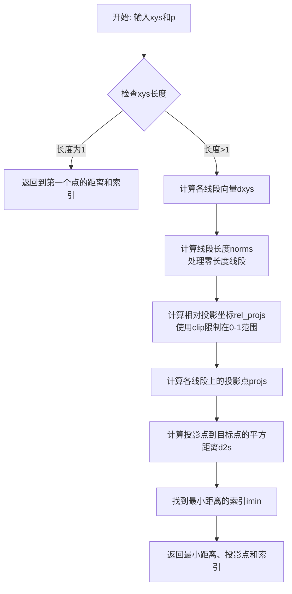

#### 带注释源码

```python
def _find_closest_point_on_path(xys, p):
    """
    Parameters
    ----------
    xys : (N, 2) array-like
        Coordinates of vertices.
    p : (float, float)
        Coordinates of point.

    Returns
    -------
    d2min : float
        Minimum square distance of *p* to *xys*.
    proj : (float, float)
        Projection of *p* onto *xys*.
    imin : (int, int)
        Consecutive indices of vertices of segment in *xys* where *proj* is.
        Segments are considered as including their end-points; i.e. if the
        closest point on the path is a node in *xys* with index *i*, this
        returns ``(i-1, i)``.  For the special case where *xys* is a single
        point, this returns ``(0, 0)``.
    """
    # 特殊情况：如果只有一个顶点，直接返回到该点的距离
    if len(xys) == 1:
        return (((p - xys[0]) ** 2).sum(), xys[0], (0, 0))
    
    # 计算各个线段的向量（从第i个顶点到第i+1个顶点）
    dxys = xys[1:] - xys[:-1]  # Individual segment vectors.
    
    # 计算各线段长度的平方
    norms = (dxys ** 2).sum(axis=1)
    
    # 对于零长度线段，将范数设为1以避免除零错误（0/1 = 0）
    norms[norms == 0] = 1  # For zero-length segment, replace 0/1 by 0/1.
    
    # 计算目标点到每个线段起点的向量，然后投影到线段方向上
    # 使用clip将投影限制在线段范围内（0表示起点，1表示终点）
    rel_projs = np.clip(  # Project onto each segment in relative 0-1 coords.
        ((p - xys[:-1]) * dxys).sum(axis=1) / norms,
        0, 1)[:, None]
    
    # 计算每个线段上的投影点坐标
    projs = xys[:-1] + rel_projs * dxys  # Projs. onto each segment, in (x, y).
    
    # 计算每个投影点到目标点的平方距离
    d2s = ((projs - p) ** 2).sum(axis=1)  # Squared distances.
    
    # 找到距离最小的线段索引
    imin = np.argmin(d2s)
    
    # 返回最小距离、投影点和线段索引
    return (d2s[imin], projs[imin], (imin, imin+1))
```


### ContourLabeler.clabel

为等高线图添加标签的核心方法。该方法根据传入的参数（级别、字体大小、颜色、是否inline等）自动或手动地在等高线上放置标签，并返回包含所有标签文本对象的列表。

参数：

- `self`：ContourLabeler，mixin类实例（通常是ContourSet对象）
- `levels`：array-like，可选，要标注的等高线级别列表，默认为None（所有级别）
- `fontsize`：str 或 float，默认 :rc:`font.size`，标签字体大小
- `inline`：bool，默认 True，是否移除标签下方的等高线段
- `inline_spacing`：float，默认 5，标签两侧保留的像素间距
- `fmt`：Formatter 或 str 或 callable 或 dict，可选，级别值的格式化方式
- `colors`：color 或 colors 或 None，默认 None，标签颜色
- `use_clabeltext`：bool，默认 False，是否使用ClabelText变换
- `manual`：bool 或 iterable，默认 False，是否使用手动点击放置标签
- `rightside_up`：bool，默认 True，标签旋转是否始终正立
- `zorder`：float 或 None，默认 (2 + contour.get_zorder())，标签的zorder

返回值：`list[Text]`，包含所有创建的标签文本对象的列表

#### 流程图

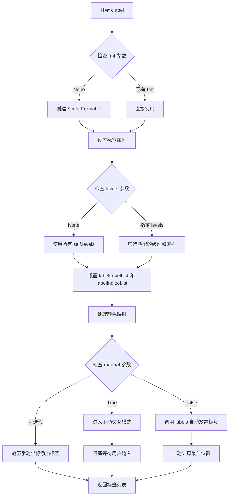

#### 带注释源码

```python
def clabel(self, levels=None, *,
           fontsize=None, inline=True, inline_spacing=5, fmt=None,
           colors=None, use_clabeltext=False, manual=False,
           rightside_up=True, zorder=None):
    """
    Label a contour plot.

    Adds labels to line contours in this `.ContourSet` (which inherits from
    this mixin class).

    Parameters
    ----------
    levels : array-like, optional
        A list of level values, that should be labeled. The list must be
        a subset of ``cs.levels``. If not given, all levels are labeled.

    fontsize : str or float, default: :rc:`font.size`
        Size in points or relative size e.g., 'small', 'x-large'.
        See `.Text.set_size` for accepted string values.

    colors : :mpltype:`color` or colors or None, default: None
        The label colors:
        - If *None*, the color of each label matches the color of
          the corresponding contour.
        - If one string color, e.g., *colors* = 'r' or *colors* =
          'red', all labels will be plotted in this color.
        - If a tuple of colors (string, float, RGB, etc), different labels
          will be plotted in different colors in the order specified.

    inline : bool, default: True
        If ``True`` the underlying contour is removed where the label is
        placed.

    inline_spacing : float, default: 5
        Space in pixels to leave on each side of label when placing inline.

    fmt : `.Formatter` or str or callable or dict, optional
        How the levels are formatted:
        - If a `.Formatter`, it is used to format all levels at once.
        - If a str, it is interpreted as a %-style format string.
        - If a callable, it is called with one level at a time.
        - If a dict, it should directly map levels to labels.

    manual : bool or iterable, default: False
        If ``True``, contour labels will be placed manually using
        mouse clicks. Can also be an iterable of (x, y) tuples.

    rightside_up : bool, default: True
        If ``True``, label rotations will always be plus
        or minus 90 degrees from level.

    use_clabeltext : bool, default: False
        If ``True``, use `.Text.set_transform_rotates_text` to ensure that
        label rotation is updated whenever the Axes aspect changes.

    zorder : float or None, default: ``(2 + contour.get_zorder())``
        zorder of the contour labels.

    Returns
    -------
    labels
        A list of `.Text` instances for the labels.
    """

    # 步骤1：如果未指定fmt，则创建默认的ScalarFormatter
    if fmt is None:
        fmt = ticker.ScalarFormatter(useOffset=False)
        fmt.create_dummy_axis()
    
    # 步骤2：设置标签相关的实例属性
    self.labelFmt = fmt  # 格式化器
    self._use_clabeltext = use_clabeltext  # 是否使用clabeltext
    self.labelManual = manual  # 手动模式标记
    self.rightside_up = rightside_up  # 是否保持标签正立
    # 计算zorder：如果未指定，则为2加上当前contour的zorder
    self._clabel_zorder = 2 + self.get_zorder() if zorder is None else zorder

    # 步骤3：处理levels参数，确定要标注的级别
    if levels is None:
        levels = self.levels
        indices = list(range(len(self.cvalues)))
    else:
        # 筛选出指定级别在self.levels中的索引
        levlabs = list(levels)
        indices, levels = [], []
        for i, lev in enumerate(self.levels):
            if lev in levlabs:
                indices.append(i)
                levels.append(lev)
        # 如果指定的级别不存在，抛出错误
        if len(levels) < len(levlabs):
            raise ValueError(f"Specified levels {levlabs} don't match "
                             f"available levels {self.levels}")
    
    # 存储级别和对应的索引
    self.labelLevelList = levels
    self.labelIndiceList = indices

    # 步骤4：设置标签字体属性
    self._label_font_props = font_manager.FontProperties(size=fontsize)

    # 步骤5：处理颜色
    if colors is None:
        # 默认：标签颜色与等高线颜色一致
        self.labelMappable = self
        self.labelCValueList = np.take(self.cvalues, self.labelIndiceList)
    else:
        # 显式指定颜色：创建颜色映射表
        num_levels = len(self.labelLevelList)
        # 调整颜色序列长度以匹配级别数量
        colors = cbook._resize_sequence(mcolors.to_rgba_array(colors), num_levels)
        # 创建ListedColormap和NoNorm用于标签着色
        self.labelMappable = cm.ScalarMappable(
            cmap=mcolors.ListedColormap(colors), norm=mcolors.NoNorm())
        # 标签颜色索引为0, 1, 2, ...
        self.labelCValueList = list(range(num_levels))

    # 初始化标签位置列表
    self.labelXYs = []

    # 步骤6：根据manual参数决定标签放置方式
    if np.iterable(manual):
        # manual是可迭代的坐标列表：逐个添加标签
        for x, y in manual:
            self.add_label_near(x, y, inline, inline_spacing)
    elif manual:
        # manual为True：进入交互式手动放置模式
        print('Select label locations manually using first mouse button.')
        print('End manual selection with second mouse button.')
        if not inline:
            print('Remove last label by clicking third mouse button.')
        # 使用阻塞输入循环等待用户点击
        mpl._blocking_input.blocking_input_loop(
            self.axes.get_figure(root=True),
            ["button_press_event", "key_press_event"],
            timeout=-1, handler=functools.partial(
                _contour_labeler_event_handler,
                self, inline, inline_spacing))
    else:
        # 自动放置标签
        self.labels(inline, inline_spacing)

    # 步骤7：返回标签文本对象列表
    return cbook.silent_list('text.Text', self.labelTexts)
```


### `ContourLabeler.print_label`

用于判断给定的轮廓线段在点数或空间跨度上是否足够容纳指定宽度的标签。

参数：
- `linecontour`：`numpy.ndarray`，轮廓线的顶点坐标数组（通常为 Nx2 的二维数组）。
- `labelwidth`：`float`，标签的宽度，用于作为判断阈值的基准。

返回值：`bool`，如果轮廓足够长（或跨度足够大）可以放置标签则返回 `True`，否则返回 `False`。

#### 流程图

```mermaid
flowchart TD
    A[开始检查] --> B{len > 10 * labelwidth?}
    B -- True --> C[返回 True]
    B -- False --> D{len > 0?}
    D -- False --> E[返回 False]
    D -- True --> F{(np.ptp > 1.2 * labelwidth).any?}
    F -- True --> C
    F -- False --> E
```

#### 带注释源码

```python
def print_label(self, linecontour, labelwidth):
    """Return whether a contour is long enough to hold a label."""
    # 判断逻辑包含两部分，满足其一即可：
    # 1. 轮廓线的顶点数量大于标签宽度的10倍（确保有足够的采样点绘制平滑曲线）。
    # 2. 轮廓线非空 且 在X或Y任一方向的跨度大于标签宽度的1.2倍（确保标签能覆盖轮廓）。
    return (len(linecontour) > 10 * labelwidth
            or (len(linecontour)
                and (np.ptp(linecontour, axis=0) > 1.2 * labelwidth).any()))
```


### `ContourLabeler.too_close`

该方法用于判断给定的位置是否与已存在的标签过于接近，以避免标签重叠。

参数：

- `x`：`float`，要检查的 x 坐标
- `y`：`float`，要检查的 y 坐标
- `lw`：`float`，标签宽度，用于计算距离阈值

返回值：`bool`，如果该位置与已存在的标签距离小于阈值则返回 `True`，否则返回 `False`

#### 流程图

```mermaid
flowchart TD
    A[开始 too_close] --> B[计算阈值<br>thresh = (1.2 * lw)²]
    B --> C{遍历 self.labelXYs 中的所有位置}
    C --> D[计算当前点到该位置的平方距离<br>d² = (x - loc[0])² + (y - loc[1])²]
    D --> E{d² < thresh?}
    E -->|是| F[返回 True<br>位置太近]
    E -->|否| G[继续检查下一个位置]
    C -->|遍历完毕| H{是否有任何位置满足条件?}
    G --> C
    H -->|是| F
    H -->|否| I[返回 False<br>位置足够远]
```

#### 带注释源码

```python
def too_close(self, x, y, lw):
    """
    Return whether a label is already near this location.

    Parameters
    ----------
    x : float
        The x-coordinate to check.
    y : float
        The y-coordinate to check.
    lw : float
        The label width, used to compute the distance threshold.

    Returns
    -------
    bool
        True if the location is too close to an existing label,
        False otherwise.
    """
    # 计算距离阈值：使用标签宽度的1.2倍作为判定标准
    # 乘以1.2是为了在标签周围留出一定的边距空间
    # 使用平方值避免开方运算，提高效率
    thresh = (1.2 * lw) ** 2

    # 遍历所有已放置标签的位置
    # self.labelXYs 是一个列表，存储了所有已添加标签的 (x, y) 坐标元组
    return any((x - loc[0]) ** 2 + (y - loc[1]) ** 2 < thresh
               for loc in self.labelXYs)
```


### `ContourLabeler._get_nth_label_width`

该方法用于计算轮廓标签列表中第n个标签的宽度（以像素为单位），通过创建临时Text对象并获取其窗口扩展范围来实现。

参数：

- `nth`：`int`，要获取宽度的标签的索引，索引对应 `labelLevelList` 中的第n个标签。

返回值：`float`，第n个标签的宽度，以像素为单位。

#### 流程图

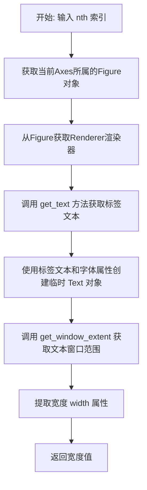

#### 带注释源码

```python
def _get_nth_label_width(self, nth):
    """Return the width of the *nth* label, in pixels."""
    # 获取当前axes所属的Figure对象
    # root=False 表示获取直接关联的Figure，而非根Figure
    fig = self.axes.get_figure(root=False)
    
    # 获取Figure的渲染器，用于计算文本的像素位置和大小
    # 这里需要root=True的Figure来获取渲染器
    renderer = fig.get_figure(root=True)._get_renderer()
    
    # 创建一个临时的Text对象来测量文本宽度
    # 参数说明:
    # - 0, 0: 文本的初始位置(x, y)，这里不重要因为我们只关心大小
    # - self.get_text(...): 获取第n个标签对应的实际文本内容
    # - figure=fig: 指定文本所属的Figure
    # - fontproperties=self._label_font_props: 使用标签的字体属性
    return (Text(0, 0,
                 self.get_text(self.labelLevelList[nth], self.labelFmt),
                 figure=fig, fontproperties=self._label_font_props)
            # 获取文本在渲染器中的窗口扩展范围
            .get_window_extent(renderer).width)
```


### `ContourLabeler.get_text`

该方法根据给定的轮廓级别值和格式化器，返回适合显示的标签文本。它支持多种格式化方式：直接返回字符串类型的级别值、从字典中查找对应的格式化字符串、使用格式化器的`format_ticks`方法、调用可调用对象进行格式化，或使用标准的字符串格式化。

参数：

- `lev`：`str` 或 `float`，表示轮廓级别值，可以是直接的字符串标签或数值
- `fmt`：`str`、`dict`、`.Formatter` 或 `callable`，用于格式化级别值的格式化器

返回值：`str`，返回格式化后的标签文本

#### 流程图

```mermaid
flowchart TD
    A[开始 get_text] --> B{lev 是否为字符串?}
    B -->|是| C[直接返回 lev]
    B -->|否| D{fmt 是否为字典?}
    D -->|是| E[从字典获取格式化字符串]
    E --> F[返回 fmt.get&#40;lev, '%1.3f'&#41;]
    D -->|否| G{fmt 是否有 format_ticks 方法?}
    G -->|是| H[调用 format_ticks 方法]
    H --> I[返回格式化后的最后一个元素]
    G -->|否| J{fmt 是否可调用?}
    J -->|是| K[直接调用 fmt&#40;lev&#41;]
    J -->|否| L[使用 % 格式化]
    L --> M[返回 fmt % lev]
```

#### 带注释源码

```python
def get_text(self, lev, fmt):
    """
    Get the text of the label.

    Parameters
    ----------
    lev : str or float
        The contour level value. If a string, it is returned as-is.
    fmt : str, dict, Formatter, or callable
        The format specification:
        - str: used as %-style format string (e.g., '%.2f')
        - dict: maps levels to label strings
        - Formatter: has format_ticks method
        - callable: called with lev to produce label

    Returns
    -------
    str
        The formatted label text.
    """
    # Case 1: If level is already a string, return it directly
    # This allows manual override of label text
    if isinstance(lev, str):
        return lev
    
    # Case 2: If fmt is a dictionary, look up the level value
    # Default to '%1.3f' if level not found in dictionary
    elif isinstance(fmt, dict):
        return fmt.get(lev, '%1.3f')
    
    # Case 3: If fmt is a Formatter object with format_ticks method
    # Format all levels and return the last one (which corresponds to lev)
    elif callable(getattr(fmt, "format_ticks", None)):
        # Append lev to existing labelLevelList for consistent formatting
        return fmt.format_ticks([*self.labelLevelList, lev])[-1]
    
    # Case 4: If fmt is any other callable (custom function)
    # Call it directly with the level value
    elif callable(fmt):
        return fmt(lev)
    
    # Case 5: Default case - treat fmt as %-style format string
    # e.g., fmt = '%.2f' results in '3.14' for lev = 3.14159
    else:
        return fmt % lev
```


### `ContourLabeler.locate_label`

在等高线图中寻找绘制标签的良好位置（等高线相对平直的部分），通过将等高线分割成多个块并计算每个块与直线的接近程度来选择最佳标签位置。

参数：

- `self`：`ContourLabeler`，ContourLabeler 类的实例
- `linecontour`：`numpy.ndarray`，形状为 (N, 2) 的二维数组，表示等高线的顶点坐标（通常为屏幕坐标）
- `labelwidth`：`float`，标签的宽度（以像素为单位）

返回值：`tuple`，返回三元组 `(x, y, index)`，其中 x 和 y 是标签中心的坐标（浮点数），index 是等高线顶点索引（整数），表示标签在等高线上的位置

#### 流程图

```mermaid
flowchart TD
    A[开始: locate_label] --> B[计算轮廓点数 ctr_size]
    B --> C{labelwidth > 1?}
    C -->|Yes| D[n_blocks = ceil(ctr_size / labelwidth)]
    C -->|No| E[n_blocks = 1]
    D --> F[block_size = labelwidth]
    E --> F
    F --> G[使用 np.resize 将轮廓坐标分割成 n_blocks x block_size 的块]
    G --> H[提取每块的首尾坐标: xfirst, xlast, yfirst, ylast]
    H --> I[计算每块的面积 s 和边长 l]
    I --> J[计算距离: distances = |s| / l 的总和]
    J --> K[对 distances 排序, 获取索引 adist]
    K --> L[hbsize = block_size // 2]
    L --> M[遍历排序后的候选块]
    M --> N{当前块不太靠近已有标签?}
    N -->|Yes| O[记录 x, y 坐标和索引, 跳出循环]
    N -->|No| P[继续下一个候选块]
    P --> M
    M --> Q[返回 x, y 和计算得到的等高线索引]
    O --> Q
```

#### 带注释源码

```python
def locate_label(self, linecontour, labelwidth):
    """
    Find good place to draw a label (relatively flat part of the contour).
    """
    # 获取轮廓的顶点数
    ctr_size = len(linecontour)
    
    # 根据 labelwidth 计算需要分割的块数
    # 如果 labelwidth > 1, 将轮廓分成多个块; 否则只用一个块
    n_blocks = int(np.ceil(ctr_size / labelwidth)) if labelwidth > 1 else 1
    
    # 确定每块的大小
    # 如果只有一个块, 块大小等于整个轮廓长度; 否则等于 labelwidth
    block_size = ctr_size if n_blocks == 1 else int(labelwidth)
    
    # 使用 np.resize 将轮廓坐标分割成多个块
    # np.resize 会循环填充以达到所需的形状
    # (由于循环填充, 返回的索引需要取模 ctr_size)
    xx = np.resize(linecontour[:, 0], (n_blocks, block_size))
    yy = np.resize(linecontour[:, 1], (n_blocks, block_size))
    
    # 提取每块的起始和结束坐标
    yfirst = yy[:, :1]      # 每块的第一个 y 坐标
    ylast = yy[:, -1:]     # 每块的最后一个 y 坐标
    xfirst = xx[:, :1]     # 每块的第一个 x 坐标
    xlast = xx[:, -1:]     # 每块的最后一个 x 坐标
    
    # 计算每块对应的"三角形"面积 (用于判断该块轮廓是否接近直线)
    # 这是通过计算向量叉积来实现的
    s = (yfirst - yy) * (xlast - xfirst) - (xfirst - xx) * (ylast - yfirst)
    
    # 计算每块对应线段的长度
    l = np.hypot(xlast - xfirst, ylast - yfirst)
    
    # 忽略除零警告 (这是有效的数学选项)
    with np.errstate(divide='ignore', invalid='ignore'):
        # 计算每块到直线的距离总和
        # 距离 = |面积| / 边长
        distances = (abs(s) / l).sum(axis=-1)
    
    # 标签绘制在块的中间位置 (hbsize)
    # 选择轮廓最接近直线的块 (distances 最小)
    hbsize = block_size // 2
    adist = np.argsort(distances)  # 按距离排序的索引
    
    # 如果所有候选位置都 too_close(), 回退到最直的部分 (adist[0])
    for idx in np.append(adist, adist[0]):
        # 计算块中间点的坐标
        x, y = xx[idx, hbsize], yy[idx, hbsize]
        # 检查这个位置是否离已有标签太近
        if not self.too_close(x, y, labelwidth):
            break
    
    # 返回:
    # x, y: 标签中心的坐标
    # (idx * block_size + hbsize) % ctr_size: 在原始轮廓中的顶点索引
    # (由于轮廓被循环分割, 需要取模)
    return x, y, (idx * block_size + hbsize) % ctr_size
```


### `ContourLabeler._split_path_and_get_label_rotation`

该方法用于在轮廓线的指定索引位置准备插入标签，同时计算标签的旋转角度。它通过计算轮廓在屏幕坐标下的路径长度来确定标签的方向，并将轮廓分割以在标签下方留出空间。

参数：

- `path`：`Path`，要在其中插入标签的路径，数据空间坐标
- `idx`：`int`，标签将被插入的顶点索引
- `screen_pos`：`tuple(float, float)`，标签将被插入的位置，屏幕空间坐标
- `lw`：`float`，标签宽度，屏幕空间单位
- `spacing`：`float`，标签周围的额外间距，屏幕空间单位，默认值为 5

返回值：`tuple(angle: float, path: Path)`，第一个元素为标签的旋转角度（度），第二个元素为经过分割以容纳标签的新路径

#### 流程图

```mermaid
flowchart TD
    A[开始: _split_path_and_get_label_rotation] --> B[获取路径顶点xys和编码codes]
    B --> C{屏幕位置pos是否接近xys[idx]?}
    C -->|否| D[在idx位置插入顶点pos到xys和codes]
    C -->|是| E[跳过插入]
    D --> F[查找起点和终点]
    E --> F
    F --> G[提取连接组件cc_xys]
    G --> H{路径是否闭合?}
    H -->|是| I[旋转路径使标签位置为起点]
    H -->|否| J[路径保持不变]
    I --> K
    J --> K
    K[计算屏幕坐标和累积路径长度] --> L[计算目标坐标]
    L --> M[计算标签旋转角度]
    M --> N{rightside_up为真?}
    N -->|是| O[调整角度使文字不倒置]
    N -->|否| P[保持原角度]
    O --> Q
    P --> Q
    Q[扩展目标范围by spacing] --> R[获取插值索引i0, i1]
    R --> S{路径闭合?}
    S -->|是| T[构建新路径: 丢弃标签区域]
    S -->|否| U{左侧有内容?}
    U -->|是| V[添加左侧轮廓段]
    U -->|否| W
    V --> W
    W{右侧有内容?}
    W -->|是| X[添加右侧轮廓段]
    W -->|否| Y
    X --> Y
    T --> Y
    Y[重组完整路径并返回角度和新路径] --> Z[结束]
```

#### 带注释源码

```python
def _split_path_and_get_label_rotation(self, path, idx, screen_pos, lw, spacing=5):
    """
    Prepare for insertion of a label at index *idx* of *path*.

    Parameters
    ----------
    path : Path
        The path where the label will be inserted, in data space.
    idx : int
        The vertex index after which the label will be inserted.
    screen_pos : (float, float)
        The position where the label will be inserted, in screen space.
    lw : float
        The label width, in screen space.
    spacing : float
        Extra spacing around the label, in screen space.

    Returns
    -------
    path : Path
        The path, broken so that the label can be drawn over it.
    angle : float
        The rotation of the label.

    Notes
    -----
    Both tasks are done together to avoid calculating path lengths multiple times,
    which is relatively costly.

    The method used here involves computing the path length along the contour in
    pixel coordinates and then looking (label width / 2) away from central point to
    determine rotation and then to break contour if desired.  The extra spacing is
    taken into account when breaking the path, but not when computing the angle.
    """
    # 获取路径的顶点和编码
    xys = path.vertices
    codes = path.codes

    # 将屏幕位置转换回数据空间，如果该位置尚不存在顶点则插入
    # 使用精确计算以避免浮点误差导致角度计算偏差
    pos = self.get_transform().inverted().transform(screen_pos)
    if not np.allclose(pos, xys[idx]):
        xys = np.insert(xys, idx, pos, axis=0)
        codes = np.insert(codes, idx, Path.LINETO)

    # 找到标签将被插入的连通分量
    # 路径总是以MOVETO开始，末尾有隐式MOVETO（闭合最后一个路径）
    movetos = (codes == Path.MOVETO).nonzero()[0]
    start = movetos[movetos <= idx][-1]  # 起始索引
    try:
        stop = movetos[movetos > idx][0]  # 结束索引
    except IndexError:
        stop = len(codes)

    # 限制在连通分量内
    cc_xys = xys[start:stop]
    idx -= start  # 调整索引

    # 如果路径闭合，旋转使其从标签位置开始
    is_closed_path = codes[stop - 1] == Path.CLOSEPOLY
    if is_closed_path:
        cc_xys = np.concatenate([cc_xys[idx:-1], cc_xys[:idx+1]])
        idx = 0

    # 类似np.interp的向量版本插值函数
    def interp_vec(x, xp, fp):
        return [np.interp(x, xp, col) for col in fp.T]

    # 使用累积路径长度作为曲线路径坐标
    screen_xys = self.get_transform().transform(cc_xys)
    path_cpls = np.insert(
        np.cumsum(np.hypot(*np.diff(screen_xys, axis=0).T)), 0, 0)
    path_cpls -= path_cpls[idx]  # 以当前索引为原点

    # 使用线性插值获取标签宽度的端点坐标
    target_cpls = np.array([-lw/2, lw/2])
    if is_closed_path:  # 对于闭合路径，从另一端计算目标
        target_cpls[0] += (path_cpls[-1] - path_cpls[0])
    (sx0, sx1), (sy0, sy1) = interp_vec(target_cpls, path_cpls, screen_xys)
    angle = np.rad2deg(np.arctan2(sy1 - sy0, sx1 - sx0))  # 屏幕空间角度
    if self.rightside_up:  # 修正角度使文字不会倒置
        angle = (angle + 90) % 180 - 90

    # 扩展范围by spacing以实际打断轮廓
    target_cpls += [-spacing, +spacing]

    # 获取感兴趣点附近的索引；使用-1作为越界标记
    i0, i1 = np.interp(target_cpls, path_cpls, range(len(path_cpls)),
                       left=-1, right=-1)
    i0 = math.floor(i0)
    i1 = math.ceil(i1)
    (x0, x1), (y0, y1) = interp_vec(target_cpls, path_cpls, cc_xys)

    # 实际打断轮廓（丢弃零长度部分）
    new_xy_blocks = []
    new_code_blocks = []
    if is_closed_path:
        if i0 != -1 and i1 != -1:
            # 构造新路径：标签区域被替换为两个点
            points = cc_xys[i1:i0+1]
            new_xy_blocks.extend([[(x1, y1)], points, [(x0, y0)]])
            nlines = len(points) + 1
            new_code_blocks.extend([[Path.MOVETO], [Path.LINETO] * nlines])
    else:
        if i0 != -1:
            # 添加标签左侧的轮廓段
            new_xy_blocks.extend([cc_xys[:i0 + 1], [(x0, y0)]])
            new_code_blocks.extend([[Path.MOVETO], [Path.LINETO] * (i0 + 1)])
        if i1 != -1:
            # 添加标签右侧的轮廓段
            new_xy_blocks.extend([[(x1, y1)], cc_xys[i1:]])
            new_code_blocks.extend([
                [Path.MOVETO], [Path.LINETO] * (len(cc_xys) - i1)])

    # 重组完整路径
    xys = np.concatenate([xys[:start], *new_xy_blocks, xys[stop:]])
    codes = np.concatenate([codes[:start], *new_code_blocks, codes[stop:]])

    return angle, Path(xys, codes)
```


### ContourLabeler.add_label

该方法用于在等高线图上添加标签，根据是否设置了 `use_clabeltext` 属性来决定标签的旋转方式。它接收屏幕坐标、旋转角度、级别值和颜色值，创建一个 `Text` 对象并将其添加到坐标轴上。

参数：

- `x`：`float`，屏幕空间的 x 坐标
- `y`：`float`，屏幕空间的 y 坐标
- `rotation`：`float`，标签的旋转角度（度）
- `lev`：标签的级别值（类型可为 float 或 str）
- `cvalue`：用于颜色映射的值（float）

返回值：`None`，无直接返回值，但会将标签对象添加到 `self.labelTexts` 列表、`self.labelCValues` 列表、`self.labelXYs` 列表以及坐标轴的艺术家集合中

#### 流程图

```mermaid
graph TD
    A[开始] --> B[将屏幕坐标 x, y 转换为数据坐标 data_x, data_y]
    B --> C[创建 Text 对象 t]
    C --> D{_use_clabeltext 是否为 True}
    D -->|是| E[计算数据空间的旋转角度 data_rotation]
    D -->|否| F[跳过旋转计算]
    E --> G[设置标签的旋转属性为 data_rotation 并启用 transform_rotates_text]
    F --> H[将标签对象 t 添加到 labelTexts 列表]
    H --> I[将 cvalue 添加到 labelCValues 列表]
    I --> J[将坐标 (x, y) 添加到 labelXYs 列表]
    J --> K[调用 axes.add_artist 将标签添加到图形]
    K --> L[结束]
```

#### 带注释源码

```python
def add_label(self, x, y, rotation, lev, cvalue):
    """
    Add a contour label, respecting whether *use_clabeltext* was set.
    
    Parameters
    ----------
    x : float
        Screen space x coordinate where the label will be placed.
    y : float
        Screen space y coordinate where the label will be placed.
    rotation : float
        Rotation angle of the label in degrees (screen space or data space
        depending on use_clabeltext).
    lev : float or str
        The contour level value (or label text if it's a string) for the label.
    cvalue : float
        The color value used to determine the label's color from the colormap.
    """
    # 将屏幕坐标 (x, y) 通过 transData 的逆变换转换回数据坐标
    data_x, data_y = self.axes.transData.inverted().transform((x, y))
    
    # 创建 Text 对象，设置标签的各种属性
    t = Text(
        data_x, data_y,  # 数据坐标位置
        text=self.get_text(lev, self.labelFmt),  # 获取格式化后的标签文本
        rotation=rotation,  # 旋转角度
        horizontalalignment='center', verticalalignment='center',  # 对齐方式
        zorder=self._clabel_zorder,  # z-order 优先级
        # 根据 cvalue 和 alpha 计算标签颜色
        color=self.labelMappable.to_rgba(cvalue, alpha=self.get_alpha()),
        fontproperties=self._label_font_props,  # 字体属性
        clip_box=self.axes.bbox)  # 裁剪框
    
    # 如果使用了 clabeltext，需要计算数据空间中的旋转角度
    # 以确保当 axes 纵横比改变时标签旋转能正确更新
    if self._use_clabeltext:
        data_rotation, = self.axes.transData.inverted().transform_angles(
            [rotation], [[x, y]])
        t.set(rotation=data_rotation, transform_rotates_text=True)
    
    # 将标签对象添加到相关列表中保存
    self.labelTexts.append(t)  # 保存 Text 对象
    self.labelCValues.append(cvalue)  # 保存颜色值
    self.labelXYs.append((x, y))  # 保存屏幕坐标
    
    # Add label to plot here - useful for manual mode label selection
    # 将标签作为艺术家添加到坐标轴上，这样才能被渲染显示
    self.axes.add_artist(t)
```


### ContourLabeler.add_label_near

该方法用于在指定坐标点附近添加轮廓标签。首先将坐标转换为屏幕空间，然后查找最近的轮廓，计算标签宽度和旋转角度，分割路径以插入标签，最后将标签添加到图表中。

参数：

- `self`：`ContourLabeler`，ContourLabeler类的实例方法
- `x`：`float`，标签的近似X坐标
- `y`：`float`，标签的近似Y坐标
- `inline`：`bool`，默认为True，如果为True则移除标签下方的轮廓段
- `inline_spacing`：`int`，默认为5，以像素为单位的Inline标签两侧留空距离
- `transform`：`.Transform`或`False`，默认为`self.axes.transData`，应用于`(x, y)`的坐标变换

返回值：`None`，该方法直接在对象上添加标签，无返回值

#### 流程图

```mermaid
flowchart TD
    A[开始 add_label_near] --> B{transform是否为None}
    B -->|是| C[transform = self.axes.transData]
    B -->|否| D{transform是否为真值}
    C --> D
    D -->|是| E[x, y = transform.transform x, y]
    D -->|否| F[调用 _find_nearest_contour 查找最近轮廓]
    E --> F
    F --> G[获取轮廓路径 path]
    G --> H[计算 label_level_min 的索引]
    H --> I[获取标签宽度 label_width]
    I --> J[调用 _split_path_and_get_label_rotation]
    J --> K[计算旋转角度 rotation 和新路径 path]
    K --> L[调用 add_label 添加标签]
    L --> M{inline参数是否为True}
    M -->|是| N[更新 _paths[idx_level_min] = path]
    M -->|否| O[结束]
    N --> O
```

#### 带注释源码

```python
def add_label_near(self, x, y, inline=True, inline_spacing=5,
                    transform=None):
    """
    Add a label near the point ``(x, y)``.

    Parameters
    ----------
    x, y : float
        The approximate location of the label.
    inline : bool, default: True
        If *True* remove the segment of the contour beneath the label.
    inline_spacing : int, default: 5
        Space in pixels to leave on each side of label when placing
        inline. This spacing will be exact for labels at locations where
        the contour is straight, less so for labels on curved contours.
    transform : `.Transform` or `False`, default: ``self.axes.transData``
        A transform applied to ``(x, y)`` before labeling.  The default
        causes ``(x, y)`` to be interpreted as data coordinates.  `False`
        is a synonym for `.IdentityTransform`; i.e. ``(x, y)`` should be
        interpreted as display coordinates.
    """

    # 如果未指定transform，则使用默认的axes数据变换
    if transform is None:
        transform = self.axes.transData
    # 如果transform存在，则将坐标从数据空间变换到屏幕空间
    if transform:
        x, y = transform.transform((x, y))

    # 查找距离点(x,y)最近的轮廓线和对应的顶点索引及投影点
    idx_level_min, idx_vtx_min, proj = self._find_nearest_contour(
        (x, y), self.labelIndiceList)
    # 获取最近轮廓级别的路径对象
    path = self._paths[idx_level_min]
    # 计算labelIndiceList中idx_level_min的索引位置
    level = self.labelIndiceList.index(idx_level_min)
    # 获取第level个标签的宽度（像素单位）
    label_width = self._get_nth_label_width(level)
    # 根据路径、顶点索引、投影点、标签宽度和间距，计算标签旋转角度并分割路径
    rotation, path = self._split_path_and_get_label_rotation(
        path, idx_vtx_min, proj, label_width, inline_spacing)
    # 添加标签到图表：参数为投影点坐标、旋转角度、级别值和颜色值
    self.add_label(*proj, rotation, self.labelLevelList[idx_level_min],
                   self.labelCValueList[idx_level_min])

    # 如果inline为True，则用分割后的新路径替换原路径，实现标签下方轮廓被移除的效果
    if inline:
        self._paths[idx_level_min] = path
```


### `ContourLabeler.pop_label`

该方法用于从轮廓标签列表中移除指定的标签，默认移除最后一个标签，支持通过索引指定要移除的标签。

参数：

- `index`：`int`，可选参数，默认为-1指定要移除的标签索引，-1表示移除列表中的最后一个标签

返回值：`None`，该方法不返回任何值

#### 流程图

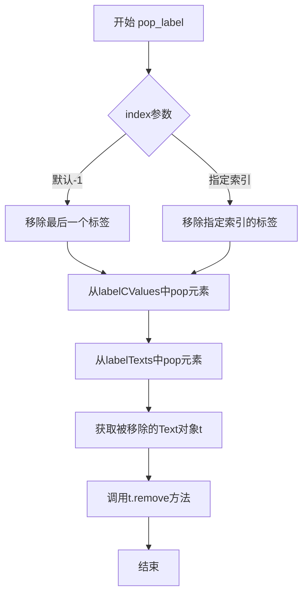

#### 带注释源码

```python
def pop_label(self, index=-1):
    """
    Defaults to removing last label, but any index can be supplied
    
    Parameters
    ----------
    index : int, optional
        Index of the label to remove. Default is -1, which removes the last label.
    """
    # 从labelCValues列表中弹出（移除并返回）指定索引的标签值
    # labelCValues存储了每个标签对应的颜色值索引
    self.labelCValues.pop(index)
    
    # 从labelTexts列表中弹出（移除并返回）指定索引的Text对象
    # labelTexts存储了添加到图表中的所有标签Text对象
    t = self.labelTexts.pop(index)
    
    # 调用Text对象的remove方法将其从图表中移除
    # 这会从父容器中删除该文本对象并释放相关资源
    t.remove()
```


### `ContourLabeler.labels`

该方法是 `ContourLabeler` 类的核心方法，用于在等高线图上自动放置标签。它遍历所有需要标注的等高线级别，对每条等高线的各个连通分量进行处理：先检查等高线长度是否足以放置标签，若足够则调用 `locate_label` 寻找最佳位置，然后调用 `_split_path_and_get_label_rotation` 计算标签旋转角度并根据需要分割路径，最后通过 `add_label` 添加标签。如果启用了 `inline` 模式，还会用新路径替换原路径以实现标签处轮廓线被挖空的效果。

参数：

- `inline`：`bool`，是否在标签位置移除底层等高线轮廓线
- `inline_spacing`：`float`，标签周围保留的像素间距

返回值：`None`，无返回值

#### 流程图

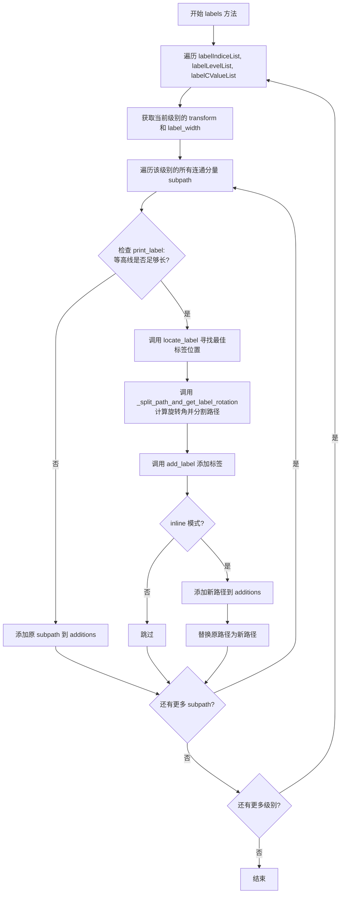

#### 带注释源码

```python
def labels(self, inline, inline_spacing):
    """
    Place contour labels.

    This is the main automatic labeling routine. It iterates over all
    contour levels that need labels, finds good positions for each label
    on each segment of the contour, and adds them to the plot.

    Parameters
    ----------
    inline : bool
        If True, remove the contour segments underlying each label to
        make the label more readable.
    inline_spacing : float
        Space in pixels to leave on each side of label when placing inline.
    """
    # 遍历每个需要标注的等高线级别
    # labelIndiceList: 需要标注的级别索引
    # labelLevelList: 对应的级别值
    # labelCValueList: 对应的颜色值
    for idx, (icon, lev, cvalue) in enumerate(zip(
            self.labelIndiceList,
            self.labelLevelList,
            self.labelCValueList,
    )):
        # 获取坐标变换（通常是 data -> display 变换）
        trans = self.get_transform()
        # 获取当前级别标签的宽度（像素单位）
        label_width = self._get_nth_label_width(idx)
        # 存储处理后的子路径
        additions = []

        # 遍历该等高线级别的所有连通分量
        # （一条等高线可能由多个不相连的线段组成）
        for subpath in self._paths[icon]._iter_connected_components():
            # 将顶点坐标从数据空间转换到屏幕空间
            screen_xys = trans.transform(subpath.vertices)

            # 检查等高线是否足够长，可以容纳一个标签
            # print_label 检查长度是否大于 10 * labelwidth
            # 或者在 x 或 y 方向上的跨度大于 1.2 * labelwidth
            if self.print_label(screen_xys, label_width):
                # 找到标签的最佳位置：
                # 寻找等高线上相对平坦的部分（接近直线的部分）
                x, y, idx = self.locate_label(screen_xys, label_width)

                # 计算标签旋转角度，并根据需要分割路径
                # 返回值: rotation - 标签旋转角度, path - 分割后的新路径
                rotation, path = self._split_path_and_get_label_rotation(
                    subpath, idx, (x, y),
                    label_width, inline_spacing)

                # 实际添加标签到图形中
                # 参数: x, y - 标签位置; rotation - 旋转角度;
                #       lev - 级别值; cvalue - 颜色值
                self.add_label(x, y, rotation, lev, cvalue)  # Really add label.

                # 如果是 inline 模式，添加处理后的路径
                # （原路径在标签位置被断开，挖空显示）
                if inline:  # If inline, add new contours
                    additions.append(path)
            else:  # If not adding label, keep old path
                # 如果等高线太短，不添加标签，保留原路径
                additions.append(subpath)

        # 遍历完该级别的所有线段后
        # 如果是 inline 模式，用新路径替换原路径
        if inline:
            # Path.make_compound_path 将多个子路径合并为一个复合路径
            self._paths[icon] = Path.make_compound_path(*additions)
```


### `ContourLabeler.remove`

该方法用于移除轮廓标签器及其所有关联的标签文本。它首先调用父类的 `remove()` 方法，然后遍历并移除所有已添加的标签文本对象。

参数： 无

返回值：`None`，无返回值描述

#### 流程图

```mermaid
flowchart TD
    A[开始 remove 方法] --> B[调用 super().remove]
    B --> C{检查 labelTexts 是否存在}
    C -->|是| D[遍历 labelTexts 列表]
    C -->|否| F[结束]
    D --> E[对每个 text 调用 remove 方法]
    E --> D
    D --> F[结束]
```

#### 带注释源码

```python
def remove(self):
    """
    移除轮廓标签器及其所有标签文本。
    
    该方法执行清理工作：
    1. 调用父类的 remove 方法以移除继承的资源
    2. 遍历所有已添加的标签文本对象并逐一移除它们
    """
    # 调用父类 (Artist) 的 remove 方法，清理继承属性和资源
    super().remove()
    
    # 遍历 self.labelTexts 列表中的每个 Text 对象并调用其 remove 方法
    # labelTexts 在 clabel 方法中被填充，存储所有创建的标签文本对象
    for text in self.labelTexts:
        text.remove()
```


### `ContourSet.__init__`

该方法是`ContourSet`类的初始化方法，负责配置等高线绘图的所有属性，包括坐标轴绑定、层级处理、颜色映射、路径生成等核心功能。

参数：

- `ax`：`~matplotlib.axes.Axes`，绑定该ContourSet的Axes对象
- `*args`：可变位置参数，包含层级(levels)和线段数据(allsegs/allkinds)
- `levels`：array-like，可选，浮点数列表，指定等高线层级
- `filled`：bool，默认False，指定绘制填充区域还是等高线
- `linewidths`：array-like，可选，等高线线宽
- `linestyles`：可选，等高线线型
- `hatches`：tuple，默认(None,)，填充区域的阴影图案
- `alpha`：float，可选，透明度
- `origin`：{None, 'upper', 'lower', 'image'}，可选，确定Z数组的方向和位置
- `extent`：(x0, x1, y0, y1)，可选，坐标轴范围
- `cmap`：Colormap，可选，颜色映射表
- `colors`：color或colors列表，可选，直接指定颜色
- `norm`：Normalize，可选，归一化对象
- `vmin`：float，可选，颜色映射最小值
- `vmax`：float，可选，颜色映射最大值
- `colorizer`：可选，颜色着色器对象
- `extend`：{'neither', 'both', 'min', 'max'}，默认'neither'，处理超出层级的值
- `antialiased`：bool，可选，抗锯齿设置
- `nchunk`：int，默认0，域细分数量
- `locator`：Locator，可选，确定等高线层级的定位器
- `transform`：Transform，可选，坐标变换
- `negative_linestyles`：可选，负等高线线型
- `**kwargs`：其他关键字参数

返回值：`None`，该方法无返回值，直接修改对象状态

#### 流程图

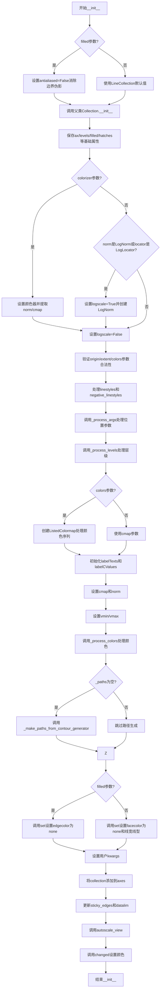

#### 带注释源码

```python
def __init__(self, ax, *args,
             levels=None, filled=False, linewidths=None, linestyles=None,
             hatches=(None,), alpha=None, origin=None, extent=None,
             cmap=None, colors=None, norm=None, vmin=None, vmax=None,
             colorizer=None, extend='neither', antialiased=None, nchunk=0,
             locator=None, transform=None, negative_linestyles=None,
             **kwargs):
    """
    Draw contour lines or filled regions, depending on
    whether keyword arg *filled* is ``False`` (default) or ``True``.

    Call signature::

        ContourSet(ax, levels, allsegs, [allkinds], **kwargs)

    Parameters
    ----------
    ax : `~matplotlib.axes.Axes`
        The `~.axes.Axes` object to draw on.

    levels : [level0, level1, ..., leveln]
        A list of floating point numbers indicating the contour
        levels.

    allsegs : [level0segs, level1segs, ...]
        List of all the polygon segments for all the *levels*.
        For contour lines ``len(allsegs) == len(levels)``, and for
        filled contour regions ``len(allsegs) = len(levels)-1``. The lists
        should look like ::

            level0segs = [polygon0, polygon1, ...]
            polygon0 = [[x0, y0], [x1, y1], ...]

    allkinds : [level0kinds, level1kinds, ...], optional
        Optional list of all the polygon vertex kinds (code types), as
        described and used in Path. This is used to allow multiply-
        connected paths such as holes within filled polygons.
        If not ``None``, ``len(allkinds) == len(allsegs)``. The lists
        should look like ::

            level0kinds = [polygon0kinds, ...]
            polygon0kinds = [vertexcode0, vertexcode1, ...]

        If *allkinds* is not ``None``, usually all polygons for a
        particular contour level are grouped together so that
        ``level0segs = [polygon0]`` and ``level0kinds = [polygon0kinds]``.

    **kwargs
        Keyword arguments are as described in the docstring of
        `~.Axes.contour`.
    """
    # 如果filled=True且未指定antialiased，设为False以消除填充轮廓的边界伪影
    # 轮廓线默认值从LineCollection获取，使用lines.antialiased配置
    if antialiased is None and filled:
        antialiased = False
        # The default for line contours will be taken from the
        # LineCollection default, which uses :rc:`lines.antialiased`.
    
    # 调用父类Collection的初始化方法，传入抗锯齿、透明度、变换等参数
    super().__init__(
        antialiaseds=antialiased,
        alpha=alpha,
        transform=transform,
        colorizer=colorizer,
    )
    # 保存axes引用和基础属性
    self.axes = ax
    self.levels = levels
    self.filled = filled
    self.hatches = hatches
    self.origin = origin
    self.extent = extent
    self.colors = colors
    self.extend = extend

    self.nchunk = nchunk
    self.locator = locator

    # 检查"color"参数是否在kwargs中，如果在则抛出错误
    if "color" in kwargs:
        raise _api.kwarg_error("ContourSet.__init__", "color")

    # 如果提供了colorizer，设置颜色器并检查相关关键字参数
    if colorizer:
        self._set_colorizer_check_keywords(colorizer, cmap=cmap,
                                           norm=norm, vmin=vmin,
                                           vmax=vmax, colors=colors)
        norm = colorizer.norm
        cmap = colorizer.cmap
    
    # 检查是否为对数尺度：如果是LogNorm或LogLocator，则设置logscale标志
    if (isinstance(norm, mcolors.LogNorm)
            or isinstance(self.locator, ticker.LogLocator)):
        self.logscale = True
        if norm is None:
            norm = mcolors.LogNorm()
    else:
        self.logscale = False

    # 验证origin参数合法性
    _api.check_in_list([None, 'lower', 'upper', 'image'], origin=origin)
    # 验证extent参数格式
    if self.extent is not None and len(self.extent) != 4:
        raise ValueError(
            "If given, 'extent' must be None or (x0, x1, y0, y1)")
    # colors和cmap不能同时指定
    if self.colors is not None and cmap is not None:
        raise ValueError('Either colors or cmap must be None')
    # 处理image origin
    if self.origin == 'image':
        self.origin = mpl.rcParams['image.origin']

    # 保存原始linestyles用于用户访问
    self._orig_linestyles = linestyles
    # 处理负等高线线型
    self.negative_linestyles = mpl._val_or_rc(negative_linestyles,
                                              'contour.negative_linestyle')

    # 处理位置参数和关键字参数，设置self.levels, self.zmin, self.zmax并更新Axes limits
    kwargs = self._process_args(*args, **kwargs)
    # 处理层级信息
    self._process_levels()

    # 根据extend参数设置扩展标志
    self._extend_min = self.extend in ['min', 'both']
    self._extend_max = self.extend in ['max', 'both']
    
    # 处理colors参数：如果是单一颜色则转为列表，否则直接使用
    if self.colors is not None:
        if mcolors.is_color_like(self.colors):
            color_sequence = [self.colors]
        else:
            color_sequence = self.colors

        ncolors = len(self.levels)
        # 填充轮廓需要少一个颜色
        if self.filled:
            ncolors -= 1
        i0 = 0

        # Handle the case where colors are given for the extended
        # parts of the contour.
        use_set_under_over = False
        # 如果扩展且颜色足够，跳过第一个颜色
        total_levels = (ncolors +
                        int(self._extend_min) +
                        int(self._extend_max))
        if (len(color_sequence) == total_levels and
                (self._extend_min or self._extend_max)):
            use_set_under_over = True
            if self._extend_min:
                i0 = 1

        # 创建ListedColormap，处理under/over颜色
        cmap = mcolors.ListedColormap(
            cbook._resize_sequence(color_sequence[i0:], ncolors),
            under=(color_sequence[0]
                   if use_set_under_over and self._extend_min else None),
            over=(color_sequence[-1]
                  if use_set_under_over and self._extend_max else None),
        )

    # 初始化标签列表
    self.labelTexts = []
    self.labelCValues = []

    # 设置colormap和norm
    self.set_cmap(cmap)
    if norm is not None:
        self.set_norm(norm)
    # 临时阻塞norm的changed信号以设置vmin/vmax
    with self.norm.callbacks.blocked(signal="changed"):
        if vmin is not None:
            self.norm.vmin = vmin
        if vmax is not None:
            self.norm.vmax = vmax
    self.norm._changed()
    # 处理颜色
    self._process_colors()

    # 如果paths为空，从contour generator生成paths
    if self._paths is None:
        self._paths = self._make_paths_from_contour_generator()

    # 根据filled标志设置不同的属性
    if self.filled:
        if linewidths is not None:
            _api.warn_external('linewidths is ignored by contourf')
        # Lower and upper contour levels.
        lowers, uppers = self._get_lowers_and_uppers()
        self.set(edgecolor="none")
    else:
        self.set(
            facecolor="none",
            linewidths=self._process_linewidths(linewidths),
            linestyle=self._process_linestyles(linestyles),
            label="_nolegend_",
            # Default zorder taken from LineCollection, which is higher
            # than for filled contours so that lines are displayed on top.
            zorder=2,
        )
    
    # 让用户设置的值覆盖默认值
    self.set(**kwargs)

    # 将collection添加到axes
    self.axes.add_collection(self, autolim=False)
    # 设置sticky_edges和更新datalim
    self.sticky_edges.x[:] = [self._mins[0], self._maxs[0]]
    self.sticky_edges.y[:] = [self._mins[1], self._maxs[1]]
    self.axes.update_datalim([self._mins, self._maxs])
    self.axes.autoscale_view(tight=True)

    # 设置颜色
    self.changed()
```


### `ContourSet.get_transform`

获取该ContourSet使用的坐标变换（Transform）实例，如果尚未设置则使用默认的`axes.transData`。

参数：

- 该方法无显式参数（隐式参数 `self` 为 `ContourSet` 实例）

返回值：`matplotlib.transforms.Transform`，返回用于坐标变换的Transform实例。

#### 流程图

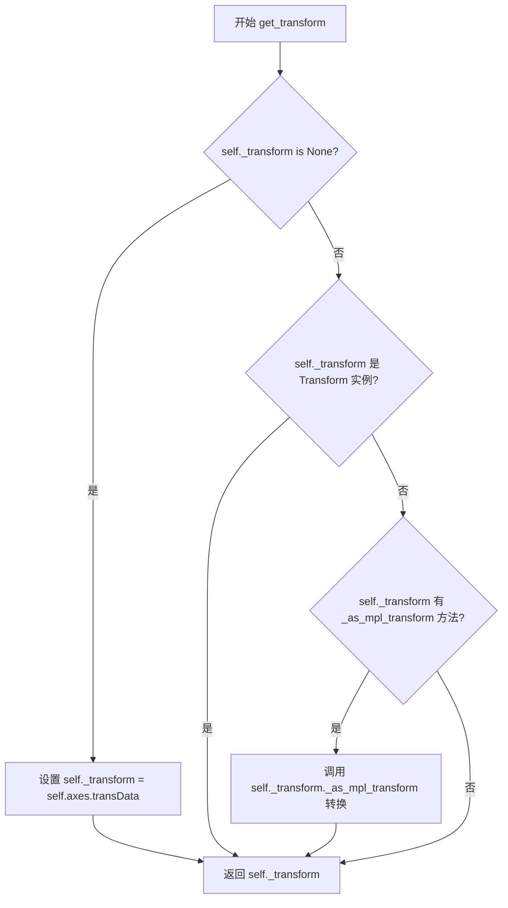

#### 带注释源码

```python
def get_transform(self):
    """Return the `.Transform` instance used by this ContourSet."""
    # 如果未设置变换，则使用坐标轴的数据坐标变换
    if self._transform is None:
        self._transform = self.axes.transData
    # 如果变换对象不是Transform实例，但可以转换为mpl Transform，则进行转换
    elif (not isinstance(self._transform, mtransforms.Transform)
          and hasattr(self._transform, '_as_mpl_transform')):
        self._transform = self._transform._as_mpl_transform(self.axes)
    # 返回最终的Transform实例
    return self._transform
```


### `ContourSet.__getstate__`

该方法实现了 Python 的 pickle 协议，用于序列化 ContourSet 对象。它复制对象的字典状态，并将无法 pickle 的 C 语言对象 `_contour_generator` 置为 None，以确保对象可以被正确序列化和反序列化。

参数：无（仅包含隐式参数 `self`）

返回值：`dict`，返回包含对象状态的字典，其中 `_contour_generator` 已被设置为 `None`

#### 流程图

```mermaid
flowchart TD
    A[开始 __getstate__] --> B[复制 self.__dict__ 到 state]
    B --> C[将 state['_contour_generator'] 设置为 None]
    C --> D[返回 state 字典]
    D --> E[结束]
```

#### 带注释源码

```python
def __getstate__(self):
    """
    获取对象的状态用于 pickle 序列化。
    
    该方法在对象被序列化（pickle）时调用，返回一个字典，
    其中包含对象当前的状态信息。
    """
    # 复制对象的 __dict__ 属性字典，创建一个新的状态字典
    state = self.__dict__.copy()
    
    # C 对象 _contour_generator 目前无法被 pickle。
    # 这不是一个大的问题，因为它在轮廓计算完成后实际上不会被使用。
    # 将其设置为 None 以避免 pickle 错误。
    state['_contour_generator'] = None
    
    # 返回处理后的状态字典
    return state
```


### ContourSet.legend_elements

该方法用于从 ContourSet 对象生成适合传递给图例的艺术家（artists）和标签列表。对于填充等高线，标签形式为数据范围（如 "0 < x <= 1"）；对于线等高线，标签形式为等值线（如 "x = 1"）。

参数：

- `variable_name`：`str`，用于标签中不等式的变量名字符串，默认为 `'x'`
- `str_format`：`function: float -> str`，用于格式化标签中数字的函数，默认为 Python 的 `str` 函数

返回值：`tuple[list[Artist], list[str]]`，返回两个列表——第一个是艺术家列表（`Rectangle` 或 `Line2D` 对象），第二个是对应的标签字符串列表

#### 流程图

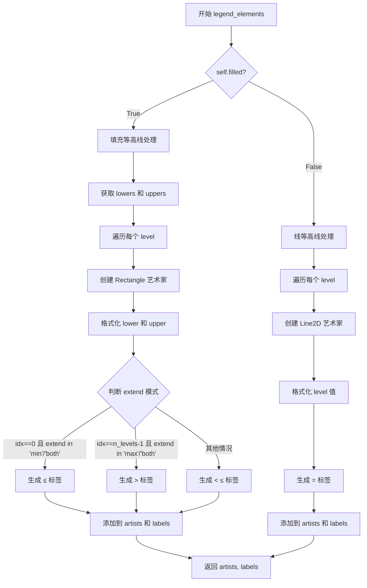

#### 带注释源码

```python
def legend_elements(self, variable_name='x', str_format=str):
    """
    Return a list of artists and labels suitable for passing through
    to `~.Axes.legend` which represent this ContourSet.

    The labels have the form "0 < x <= 1" stating the data ranges which
    the artists represent.

    Parameters
    ----------
    variable_name : str
        The string used inside the inequality used on the labels.
    str_format : function: float -> str
        Function used to format the numbers in the labels.

    Returns
    -------
    artists : list[`.Artist`]
        A list of the artists.
    labels : list[str]
        A list of the labels.
    """
    # 初始化艺术家和标签列表
    artists = []
    labels = []

    # 判断是填充等高线还是线等高线
    if self.filled:
        # 填充等高线处理
        # 获取填充区域的下界和上界数组
        lowers, uppers = self._get_lowers_and_uppers()
        # 获取等高线的层级数量
        n_levels = len(self._paths)
        # 遍历每个填充区域
        for idx in range(n_levels):
            # 创建矩形艺术家对象用于图例表示
            artists.append(mpatches.Rectangle(
                (0, 0), 1, 1,  # 矩形参数，图例中只显示颜色和纹理
                facecolor=self.get_facecolor()[idx],  # 获取对应层级的填充颜色
                hatch=self.hatches[idx % len(self.hatches)],  # 获取对应的阴影图案
            ))
            # 格式化下界和上界值
            lower = str_format(lowers[idx])
            upper = str_format(uppers[idx])
            # 根据 extend 模式生成不同的标签格式
            if idx == 0 and self.extend in ('min', 'both'):
                # 扩展最小值的情况：x ≤ lower
                labels.append(fr'${variable_name} \leq {lower}s$')
            elif idx == n_levels - 1 and self.extend in ('max', 'both'):
                # 扩展最大值的情况：x > upper
                labels.append(fr'${variable_name} > {upper}s$')
            else:
                # 正常情况：lower < x ≤ upper
                labels.append(fr'${lower} < {variable_name} \leq {upper}$')
    else:
        # 线等高线处理
        # 遍历每个层级
        for idx, level in enumerate(self.levels):
            # 创建线段艺术家对象用于图例表示
            artists.append(Line2D(
                [], [],  # 空数据点，只使用样式属性
                color=self.get_edgecolor()[idx],  # 获取对应层级的线条颜色
                linewidth=self.get_linewidths()[idx],  # 获取对应层级的线条宽度
                linestyle=self.get_linestyles()[idx],  # 获取对应层级的线条样式
            ))
            # 生成等值线标签格式：x = level
            labels.append(fr'${variable_name} = {str_format(level)}$')

    # 返回艺术家列表和标签列表的元组
    return artists, labels
```


### ContourSet._process_args

该方法是 `ContourSet` 类的核心初始化方法，负责处理轮廓图的输入参数，包括验证级别和线段数据的一致性、计算数据边界、构建路径对象，并更新坐标轴的数据范围。

参数：

- `*args`：`tuple`，可变位置参数，包含轮廓图的层级(level)和线段(segments)数据。`args[0]` 为层级列表，`args[1]` 为所有线段列表，`args[2]`（可选）为路径类型列表
- `**kwargs`：`dict`，可变关键字参数，用于传递额外的配置选项

返回值：`dict`，处理后的关键字参数字典

#### 流程图

```mermaid
flowchart TD
    A[开始 _process_args] --> B[提取 args[0] 作为 self.levels]
    B --> C[提取 args[1] 作为 allsegs]
    C --> D{args 长度 > 2?}
    D -->|是| E[提取 args[2] 作为 allkinds]
    D -->|否| F[allkinds = None]
    E --> G[allkinds 为 None?]
    F --> G
    G -->|是| H[生成默认 allkinds: [[None]*len(segs) for segs in allsegs]]
    G -->|否| I[继续]
    H --> I
    I --> J{filled 模式?}
    J -->|是| K{len(allsegs) == len(levels) - 1?}
    J -->|否| L{len(allsegs) == len(levels)?}
    K -->|否| M[抛出 ValueError: 填充轮廓的线段数必须比层级少一个]
    K -->|是| N[继续]
    L -->|否| O[抛出 ValueError: 线轮廓的线段数必须等于层级数]
    L --> P[继续]
    M --> Q[结束/异常]
    N --> Q
    O --> Q
    P --> R{len(allkinds) == len(allsegs)?]
    R -->|否| S[抛出 ValueError: allkinds 与 allsegs 长度不一致]
    R -->|是| T[展平 allsegs 获取所有点]
    S --> Q
    T --> U[计算 x, y 边界: self._mins 和 self._maxs]
    U --> V[构建 Path 对象列表: self._paths]
    V --> W[返回 kwargs]
```

#### 带注释源码

```python
def _process_args(self, *args, **kwargs):
    """
    Process *args* and *kwargs*; override in derived classes.

    Must set self.levels, self.zmin and self.zmax, and update Axes limits.
    """
    # 提取层级数据 (levels) 存储为实例属性
    self.levels = args[0]
    # 提取所有线段数据 (allsegs)，包含每个层级的轮廓线段
    allsegs = args[1]
    # 提取路径类型数据 (allkinds)，可选参数，用于描述线段顶点的路径代码
    allkinds = args[2] if len(args) > 2 else None
    
    # 计算并设置 Z 轴的最小值和最大值
    self.zmax = np.max(self.levels)
    self.zmin = np.min(self.levels)

    # 如果 allkinds 为 None，为每个线段列表生成默认值 (None 表示无路径代码)
    if allkinds is None:
        allkinds = [[None] * len(segs) for segs in allsegs]

    # 检查填充轮廓模式下 levels 和 allsegs 的长度一致性
    # 填充轮廓需要 n-1 个区域来填充 n 个层级之间的空间
    if self.filled:
        if len(allsegs) != len(self.levels) - 1:
            raise ValueError('must be one less number of segments as '
                             'levels')
    else:
        # 线轮廓模式下，线段数量必须等于层级数量
        if len(allsegs) != len(self.levels):
            raise ValueError('must be same number of segments as levels')

    # 检查 allkinds 和 allsegs 的长度一致性
    if len(allkinds) != len(allsegs):
        raise ValueError('allkinds has different length to allsegs')

    # 将所有线段展平为点集合，用于计算数据边界
    flatseglist = [s for seg in allsegs for s in seg]
    # 合并所有点坐标 (N, 2) 数组
    points = np.concatenate(flatseglist, axis=0)
    # 计算 x 和 y 方向的最小/最大边界
    self._mins = points.min(axis=0)
    self._maxs = points.max(axis=0)

    # 将 (allsegs, allkinds) 对转换为 Path 对象列表
    # 每个条目是 (segs, kinds) 元组：segs 是 (N,2) 坐标数组列表
    # kinds 是对应的路径代码数组列表；kinds 也可以为 None（此时所有路径无代码）
    # 使用 Path.make_compound_path 将多个路径段合并为单个复合路径
    self._paths = [Path.make_compound_path(*map(Path, segs, kinds))
                   for segs, kinds in zip(allsegs, allkinds)]

    # 返回处理后的 kwargs（供调用者使用）
    return kwargs
```


### `ContourSet._make_paths_from_contour_generator`

该方法用于从C扩展轮廓生成器计算并返回路径（Path）对象列表。它检查是否已有缓存的路径，如果有则直接返回；否则调用底层C扩展接口生成轮廓的顶点和编码，然后将其转换为matplotlib的Path对象列表。

参数：

- 该方法无显式参数（隐式参数`self`为`ContourSet`实例）

返回值：`list[Path]`，返回从轮廓生成器创建的路径对象列表

#### 流程图

```mermaid
flowchart TD
    A[开始] --> B{self._paths 是否已存在?}
    B -->|是| C[返回缓存的 self._paths]
    B -->|否| D[获取 _contour_generator]
    D --> E{self.filled 是否为真?}
    E -->|是| F[调用 cg.create_filled_contour<br/>使用 _get_lowers_and_uppers 获取上下界]
    E -->|否| G[调用 cg.create_contour<br/>使用 self.levels]
    F --> H[map 生成 vertices_and_codes 迭代器]
    G --> H
    H --> I[遍历 vertices_and_codes]
    I --> J{当前 vs 长度是否大于0?}
    J -->|是| K[Path(np.concatenate(vs), np.concatenate(cs))]
    J -->|否| L[使用 empty_path]
    K --> M[添加到路径列表]
    L --> M
    M --> N[返回路径列表]
```

#### 带注释源码

```python
def _make_paths_from_contour_generator(self):
    """
    Compute ``paths`` using C extension.

    此方法负责将底层C扩展生成的轮廓数据转换为matplotlib
    可以使用的Path对象列表。它是连接contourpy C库与
    matplotlib内部路径系统的关键桥梁。
    """
    # 如果已经存在路径（即从pickle恢复或之前已计算），直接返回缓存
    if self._paths is not None:
        return self._paths

    # 获取C扩展的轮廓生成器对象
    cg = self._contour_generator

    # 创建一个空的Path对象，用于处理无顶点的情况
    empty_path = Path(np.empty((0, 2)))

    # 根据是填充轮廓还是线轮廓，选择不同的C扩展方法调用
    # 填充轮廓使用create_filled_contour，需要上下界参数
    # 线轮廓使用create_contour，只需要levels参数
    vertices_and_codes = (
        map(cg.create_filled_contour, *self._get_lowers_and_uppers())
        if self.filled else
        map(cg.create_contour, self.levels))

    # 遍历生成的顶点和编码，创建Path对象列表
    # cg.create_filled_contour 或 cg.create_contour 返回的
    # 是一个迭代器，每个元素是 (vertices, codes) 元组
    return [Path(np.concatenate(vs), np.concatenate(cs)) if len(vs) else empty_path
            for vs, cs in vertices_and_codes]
```


### `ContourSet._get_lowers_and_uppers`

返回填充等高线（filled contours）的下限（lowers）和上限（uppers）数组，用于定义每个填充区域的Z值范围。

参数：该方法无显式参数（隐式参数 `self` 为 ContourSet 实例）

返回值：`tuple[numpy.ndarray, numpy.ndarray]`，返回两个numpy数组组成的元组：
- 第一个数组 `lowers`：填充区域的下边界值
- 第二个数组 `uppers`：填充区域的上边界值

#### 流程图

```mermaid
flowchart TD
    A[开始] --> B[获取 lowers = self._levels[:-1]]
    B --> C{self.zmin == lowers[0]?}
    C -->|是| D[复制 lowers 以避免修改 self._levels]
    C -->|否| F[获取 uppers = self._levels[1:]]
    D --> E{self.logscale?}
    E -->|是| G[lowers[0] = 0.99 * self.zmin]
    E -->|否| H[lowers[0] -= 1]
    G --> F
    H --> F
    F --> I[返回 (lowers, uppers)]
```

#### 带注释源码

```python
def _get_lowers_and_uppers(self):
    """
    Return ``(lowers, uppers)`` for filled contours.
    """
    # 获取所有层级（levels）的下限，即除最后一个元素外的所有元素
    # self._levels 是包含扩展区域后的完整层级数组
    lowers = self._levels[:-1]
    
    # 如果数据最小值恰好等于第一个下限值，需要调整以包含最小值
    if self.zmin == lowers[0]:
        # 必须复制 lowers，否则会修改 self._levels（会影响后续操作）
        lowers = lowers.copy()  # so we don't change self._levels
        if self.logscale:
            # 对于对数刻度，使用0.99倍最小值作为下限（避免log(0)）
            lowers[0] = 0.99 * self.zmin
        else:
            # 对于线性刻度，减1以确保包含最小值
            lowers[0] -= 1
    
    # 获取上限，即除第一个元素外的所有元素
    uppers = self._levels[1:]
    
    # 返回下限和上限元组
    return (lowers, uppers)
```


### `ContourSet.changed`

该方法用于响应颜色映射（colormap）或归一化（norm）对象的变更，重新计算并更新轮廓集的显示属性，包括颜色数组、标签透明度等。

参数：

- `self`：隐式参数，`ContourSet` 实例本身，无需显式传递

返回值：`None`，该方法无返回值，通过副作用更新对象状态

#### 流程图

```mermaid
flowchart TD
    A[开始 changed] --> B{self 是否已有 cvalues 属性?}
    B -- 否 --> C[调用 self._process_colors<br/>设置 cvalues]
    B -- 是 --> D[跳过颜色处理]
    C --> E[调用 self.norm.autoscale_None<br/>强制立即自动缩放]
    D --> E
    E --> F[调用 self.set_array<br/>设置颜色数组]
    F --> G[调用 self.update_scalarmappable<br/>更新标量映射]
    G --> H[获取 alpha 值广播数组]
    H --> I{遍历 labelTexts 和 labelCValues}
    I -->|是| J[设置标签 alpha 和颜色]
    J --> I
    I -->|否| K[调用父类 changed 方法]
    K --> L[结束]
```

#### 带注释源码

```python
def changed(self):
    """
    当颜色映射或归一化对象发生变化时调用，
    重新处理颜色数组、标签透明度等属性。
    """
    # 如果当前对象还没有 cvalues 属性（颜色值数组），
    # 则先调用 _process_colors 方法生成颜色值
    if not hasattr(self, "cvalues"):
        self._process_colors()  # Sets cvalues.

    # 强制立即执行自动缩放，因为 self.to_rgba() 内部会调用
    # autoscale_None() 并传入数据，如果不立即执行，vmin/vmax 会被
    # cvalues 的内容覆盖，而不是按我们想要的 levels 来设置
    self.norm.autoscale_None(self.levels)

    # 设置颜色数组，用于后续渲染
    self.set_array(self.cvalues)

    # 更新标量映射器的内部状态
    self.update_scalarmappable()

    # 获取与 cvalues 长度一致的 alpha 值数组
    alphas = np.broadcast_to(self.get_alpha(), len(self.cvalues))

    # 遍历所有标签，设置对应的透明度和颜色
    for label, cv, alpha in zip(self.labelTexts, self.labelCValues, alphas):
        label.set_alpha(alpha)
        label.set_color(self.labelMappable.to_rgba(cv))

    # 调用父类的 changed 方法，确保父类也能响应变化
    super().changed()
```


### ContourSet._ensure_locator_exists

该方法负责在需要时为 `ContourSet` 对象惰性初始化刻度定位器（Locator）。它检查实例属性 `locator` 是否已存在；若不存在，则根据是否使用对数刻度（`logscale`）创建相应的 `LogLocator` 或 `MaxNLocator` 实例，并将目标等级数 `N` 传递给定位器，以此确保后续的等高线自动标注等功能能够正常执行。

参数：
- `N`：`int` 或 `None`，目标等级数。如果传入 `int`，则用于设置定位器的 `numticks`；如果为 `None`，在非对数刻度下通常默认为 7。

返回值：`None`（无返回值），该方法直接修改对象状态。

#### 流程图

```mermaid
flowchart TD
    A[Start _ensure_locator_exists] --> B{self.locator is None?}
    B -- No --> E[End]
    B -- Yes --> C{self.logscale?}
    C -- Yes --> D[self.locator = ticker.LogLocator(numticks=N)]
    C -- No --> F{N is None?}
    F -- Yes --> G[N = 7]
    F -- No --> H[N = N]
    G --> I[self.locator = ticker.MaxNLocator(N + 1, min_n_ticks=1)]
    H --> I
    D --> E
    I --> E
```

#### 带注释源码

```python
def _ensure_locator_exists(self, N):
    """
    Set a locator on this ContourSet if it's not already set.

    Parameters
    ----------
    N : int or None
        If *N* is an int, it is used as the target number of levels.
        Otherwise when *N* is None, a reasonable default is chosen;
        for logscales the LogLocator chooses, N=7 is the default
        otherwise.
    """
    # 检查定位器是否已经存在，避免重复创建
    if self.locator is None:
        # 根据是否使用对数刻度来选择不同类型的定位器
        if self.logscale:
            # 对数刻度下使用 LogLocator
            self.locator = ticker.LogLocator(numticks=N)
        else:
            # 线性刻度下使用 MaxNLocator
            # 如果未指定 N，则使用硬编码的默认值 7
            if N is None:
                N = 7  # Hard coded default
            # MaxNLocator(N+1) 尝试生成大约 N+1 个等级，min_n_ticks=1 确保至少显示所有等级
            self.locator = ticker.MaxNLocator(N + 1, min_n_ticks=1)
```


### `ContourSet._autolev`

该方法用于根据数据的最小值和最大值自动选择等高线级别。它使用定位器（locator）生成候选级别，然后根据扩展选项和数据范围对级别进行裁剪，确保返回的级别数量符合填充等高线（至少需要3个级别）和线形等高线的要求。

参数：

- 无显式参数（除了隐式的 `self`）

返回值：`numpy.ndarray`，返回经过裁剪后的等高线级别数组

#### 流程图

```mermaid
flowchart TD
    A[开始] --> B[使用 locator.tick_values 生成候选级别]
    B --> C{locator 是否对称?}
    C -->|是| D[直接返回候选级别]
    C -->|否| E[查找低于 zmin 的级别]
    E --> F[查找高于 zmax 的级别]
    F --> G{extend 是否包含 'min' 或 'both'?}
    G -->|是| H[i0 += 1]
    G -->|否| I[i0 不变]
    H --> J{extend 是否包含 'max' 或 'both'?}
    I --> J
    J -->|是| K[i1 -= 1]
    J -->|否| L[i1 不变]
    K --> M{i1 - i0 < 3?}
    L --> M
    M -->|是| N[重置为全部级别]
    M -->|否| O[返回 lev[i0:i1]]
    N --> O
    O --> P[结束]
    D --> P
```

#### 带注释源码

```python
def _autolev(self):
    """
    Select contour levels to span the data.

    We need two more levels for filled contours than for
    line contours, because for the latter we need to specify
    the lower and upper boundary of each range. For example,
    a single contour boundary, say at z = 0, requires only
    one contour line, but two filled regions, and therefore
    three levels to provide boundaries for both regions.
    """
    # 使用定位器根据数据的最小值和最大值生成候选等高线级别
    lev = self.locator.tick_values(self.zmin, self.zmax)

    # 如果定位器是对称的，直接返回所有级别
    try:
        if self.locator._symmetric:
            return lev
    except AttributeError:
        pass

    # 裁剪定位器可能提供的多余级别
    # 找到所有低于数据最小值的级别索引
    under = np.nonzero(lev < self.zmin)[0]
    # i0 设为最后一个低于zmin的索引，如果没有则为0
    i0 = under[-1] if len(under) else 0
    # 找到所有高于数据最大值的级别索引
    over = np.nonzero(lev > self.zmax)[0]
    # i1 设为第一个高于zmax的索引+1，如果没有则设为lev长度
    i1 = over[0] + 1 if len(over) else len(lev)
    
    # 根据扩展选项调整边界索引
    # 如果向低端扩展，i0前移一位以跳过该级别
    if self.extend in ('min', 'both'):
        i0 += 1
    # 如果向高端扩展，i1后移一位以跳过该级别
    if self.extend in ('max', 'both'):
        i1 -= 1

    # 如果裁剪后的级别数少于3个（填充等高线需要的最小数量），
    # 则返回所有生成的级别
    if i1 - i0 < 3:
        i0, i1 = 0, len(lev)

    # 返回裁剪后的级别数组
    return lev[i0:i1]
```


### ContourSet._process_contour_level_args

该方法用于处理轮廓图的层级参数，根据传入的args和z_dtype数据类型来确定并存储轮廓层级（levels）到self.levels属性中。

参数：

- `self`：隐式参数，ContourSet实例本身
- `args`：tuple，从Axes.contour/contourf传入的可变参数列表，通常包含层级的值
- `z_dtype`：numpy.dtype，数据数组z的数据类型，用于确定默认层级

返回值：无（None），该方法直接修改实例的self.levels属性

#### 流程图

```mermaid
flowchart TD
    A[开始 _process_contour_level_args] --> B{self.levels是否已设置?}
    B -->|否| C{args是否有内容?}
    C -->|是| D[从args[0]获取层级]
    C -->|否| E{z_dtype是否为bool?}
    E -->|是| F{self.filled为真?}
    F -->|是| G[levels_arg = [0, 0.5, 1]]
    F -->|否| H[levels_arg = [0.5]]
    E -->|否| I[levels_arg = None]
    B -->|是| J{levels_arg是整数或None?}
    D --> J
    G --> J
    H --> J
    I --> J
    J -->|是| K[调用_ensure_locator_exists]
    K --> L[调用_autolev生成层级]
    J -->|否| M[将levels_arg转为float64数组]
    L --> N{验证filled轮廓层级数量}
    M --> N
    N -->|至少2个层级| O{层级是否递增?}
    O -->|是| P[结束]
    O -->|否| Q[抛出ValueError]
    N -->|少于2个| R[抛出ValueError]
```

#### 带注释源码

```python
def _process_contour_level_args(self, args, z_dtype):
    """
    Determine the contour levels and store in self.levels.
    """
    # 首先获取当前已设置的levels值（可能在__init__中设置）
    levels_arg = self.levels
    
    # 如果levels尚未设置，则根据参数和数据类型确定
    if levels_arg is None:
        if args:
            # 如果传入了层级参数，使用第一个参数作为层级
            # Set if levels manually provided
            levels_arg = args[0]
        elif np.issubdtype(z_dtype, bool):
            # 对于布尔类型数据，设置默认层级值
            # Set default values for bool data types
            # filled contour需要3个层级（0, 0.5, 1），line contour需要1个（0.5）
            levels_arg = [0, .5, 1] if self.filled else [.5]

    # 判断levels_arg的类型，决定如何生成层级
    if isinstance(levels_arg, Integral) or levels_arg is None:
        # 如果是整数（表示需要生成的层级数量）或None
        # 使用locator自动确定层级
        self._ensure_locator_exists(levels_arg)
        self.levels = self._autolev()
    else:
        # 如果是数组或其他可迭代对象，直接转换为numpy float64数组
        self.levels = np.asarray(levels_arg, np.float64)

    # 验证filled contour的层级数量（至少需要2个层级才能形成区域）
    if self.filled and len(self.levels) < 2:
        raise ValueError("Filled contours require at least 2 levels.")
    
    # 验证层级是否严格递增
    if len(self.levels) > 1 and np.min(np.diff(self.levels)) <= 0.0:
        raise ValueError("Contour levels must be increasing")
```


### `ContourSet._process_levels`

该方法用于根据`levels`属性为等高线图分配`layers`值，并在需要填充等高线时添加扩展层。对于线形等高线，layers与levels相同；对于填充等高线，layers是levels区间的中点值。

参数：

- 该方法无显式参数（隐式参数`self`为`ContourSet`实例）

返回值：无返回值（`None`），该方法直接修改实例属性

#### 流程图

```mermaid
flowchart TD
    A[开始 _process_levels] --> B[创建私有 _levels 列表副本]
    B --> C{logscale?}
    C -->|是| D[设置 lower=1e-250, upper=1e250]
    C -->|否| E[设置 lower=-1e250, upper=1e250]
    D --> F{extend in ('both', 'min')?}
    E --> F
    F -->|是| G[在 _levels 开头插入 lower]
    F -->|否| H{extend in ('both', 'max')?}
    G --> H
    H -->|是| I[在 _levels 末尾追加 upper]
    H -->|否| J[将 _levels 转换为 numpy 数组]
    J --> K{是否填充等高线 filled?}
    K -->|否| L[设置 layers = levels, 然后返回]
    K -->|是| M{logscale?}
    M -->|是| N[使用几何平均计算 layers: sqrt(levels[:-1]) * sqrt(levels[1:])]
    M -->|否| O[使用算术平均计算 layers: 0.5 * (levels[:-1] + levels[1:])]
    N --> P[结束]
    O --> P
    L --> P
```

#### 带注释源码

```python
def _process_levels(self):
    """
    Assign values to :attr:`layers` based on :attr:`levels`,
    adding extended layers as needed if contours are filled.

    For line contours, layers simply coincide with levels;
    a line is a thin layer.  No extended levels are needed
    with line contours.
    """
    # Make a private _levels to include extended regions; we
    # want to leave the original levels attribute unchanged.
    # (Colorbar needs this even for line contours.)
    # 创建私有属性 _levels，复制 levels 内容，用于包含扩展区域
    # 保持原始 levels 属性不变（Colorbar 即使对于线形等高线也需要此属性）
    self._levels = list(self.levels)

    if self.logscale:
        # 对于对数刻度，设置极小的下限和极大的上限以避免数值问题
        lower, upper = 1e-250, 1e250
    else:
        # 对于线性刻度，设置较大的负下限和正上限
        lower, upper = -1e250, 1e250

    # 如果需要扩展下限（'both' 或 'min'），在 _levels 开头插入扩展下限值
    if self.extend in ('both', 'min'):
        self._levels.insert(0, lower)
    # 如果需要扩展上限（'both' 或 'max'），在 _levels 末尾追加扩展上限值
    if self.extend in ('both', 'max'):
        self._levels.append(upper)
    # 将 _levels 转换为 numpy 数组以便后续计算
    self._levels = np.asarray(self._levels)

    # 如果不是填充等高线（线形等高线），layers 直接等于 levels
    if not self.filled:
        self.layers = self.levels
        return

    # Layer values are mid-way between levels in screen space.
    # 对于填充等高线，计算 layers 为相邻 levels 区间的中点值
    
    if self.logscale:
        # Avoid overflow by taking sqrt before multiplying.
        # 对数刻度下使用几何平均：取平方根后相乘避免数值溢出
        # layers[i] = sqrt(levels[i]) * sqrt(levels[i+1])
        self.layers = (np.sqrt(self._levels[:-1])
                       * np.sqrt(self._levels[1:]))
    else:
        # 线性刻度下使用算术平均：layers[i] = (levels[i] + levels[i+1]) / 2
        self.layers = 0.5 * (self._levels[:-1] + self._levels[1:])
```


### ContourSet._process_colors

该方法负责处理轮廓绘制的颜色参数，基于轮廓层级（levels）和层（layers）来进行颜色映射，而不是基于Z值的实际范围。这确保了无论Z值中存在多少异常值，都能充分利用所选层级的完整动态范围进行颜色映射。

参数：
- `self`：ContourSet实例，无需显式传递

返回值：`None`，该方法直接修改对象状态

#### 流程图

```mermaid
flowchart TD
    A[开始 _process_colors] --> B{self.colors是否已指定}
    B -->|是| C[处理颜色序列]
    C --> D[确定索引范围 i0, i1]
    D --> E{self.filled是否为真}
    E -->|是| F[i1 减 1]
    E -->|否| G[跳过]
    F --> H{self.extend在 'both' 或 'min' 中}
    H -->|是| I[i0 减 1]
    H -->|否| J[跳过]
    I --> K{self.extend在 'both' 或 'max' 中}
    K -->|是| L[i1 加 1]
    K -->|否| M[跳过]
    L --> N[设置 cvalues 为范围 [i0, i1]]
    N --> O[使用 NoNorm 设置归一化]
    B -->|否| P[使用 self.layers 作为 cvalues]
    P --> Q[自动归一化 self.levels]
    O --> R[设置数组和更新标量映射]
    Q --> R
    R --> S{self.extend在 'both', 'max', 'min' 中}
    S -->|是| T[设置 self.norm.clip = False]
    S -->|否| U[跳过]
    T --> V[结束]
    U --> V
```

#### 带注释源码

```python
def _process_colors(self):
    """
    Color argument processing for contouring.

    Note that we base the colormapping on the contour levels
    and layers, not on the actual range of the Z values.  This
    means we don't have to worry about bad values in Z, and we
    always have the full dynamic range available for the selected
    levels.

    The color is based on the midpoint of the layer, except for
    extended end layers.  By default, the norm vmin and vmax
    are the extreme values of the non-extended levels.  Hence,
    the layer color extremes are not the extreme values of
    the colormap itself, but approach those values as the number
    of levels increases.  An advantage of this scheme is that
    line contours, when added to filled contours, take on
    colors that are consistent with those of the filled regions;
    for example, a contour line on the boundary between two
    regions will have a color intermediate between those
    of the regions.

    """
    # 检查colormap是否为单色（monochrome）模式
    self.monochrome = self.cmap.monochrome
    
    # 如果用户指定了具体颜色
    if self.colors is not None:
        # 生成整数用于直接索引
        i0, i1 = 0, len(self.levels)
        
        # 对于填充轮廓，层级数比颜色数多一个
        if self.filled:
            i1 -= 1
            # 超出范围的索引用于处理扩展颜色
            if self.extend in ('both', 'min'):
                i0 -= 1  # 扩展下限时，包含under颜色
            if self.extend in ('both', 'max'):
                i1 += 1  # 扩展上限时，包含over颜色
        
        # 设置cvalues为整数列表，用于直接索引颜色
        self.cvalues = list(range(i0, i1))
        # 使用NoNorm允许直接索引，不进行数值映射
        self.set_norm(mcolors.NoNorm())
    else:
        # 未指定颜色时，使用layers（层级中点）进行颜色映射
        self.cvalues = self.layers
    
    # 自动归一化未设置的vmin/vmax，基于levels范围
    self.norm.autoscale_None(self.levels)
    # 设置数组数据并更新颜色映射
    self.set_array(self.cvalues)
    self.update_scalarmappable()
    
    # 如果启用了扩展范围，取消裁剪以显示扩展颜色
    if self.extend in ('both', 'max', 'min'):
        self.norm.clip = False
```


### `ContourSet._process_linewidths`

该方法负责处理轮廓线的线宽参数，根据输入的 `linewidths` 参数和当前的轮廓等级数量，返回一个标准化的线宽列表。

参数：

- `linewidths`：`float` 或 `array-like` 或 `None`，轮廓线的线宽设置。如果为 `None`，则使用默认线宽；如果为单一数值，则所有轮廓线使用相同线宽；如果为序列，则循环使用该序列中的线宽值。

返回值：`list[float]`，返回与轮廓等级数量相同长度的线宽列表。

#### 流程图

```mermaid
flowchart TD
    A[开始] --> B{linewidths is None?}
    B -->|Yes| C[获取默认线宽]
    B -->|No| D{linewidths 可迭代?}
    C --> E[返回默认线宽列表]
    D -->|No| F[返回单一线宽的列表]
    D -->|Yes| G[将linewidths转为列表]
    G --> H[循环扩展线宽列表到Nlev长度]
    H --> I[截取前Nlev个元素]
    E --> J[结束]
    F --> J
    I --> J
```

#### 带注释源码

```python
def _process_linewidths(self, linewidths):
    """
    处理轮廓线的线宽参数，返回标准化的线宽列表。
    
    Parameters
    ----------
    linewidths : float or array-like or None
        轮廓线的线宽设置：
        - None: 使用 matplotlibrc 中的默认线宽
        - float: 所有轮廓线使用相同线宽
        - array-like: 每个轮廓级别使用对应的线宽，不足时循环重复
    
    Returns
    -------
    list
        与轮廓等级数量(Nlev)相同长度的线宽列表
    """
    # 获取轮廓等级的数量
    Nlev = len(self.levels)
    
    # 如果未指定线宽，使用默认配置
    if linewidths is None:
        # 首先尝试获取 contour.linewidth 配置
        default_linewidth = mpl.rcParams['contour.linewidth']
        # 如果未设置，则回退到 lines.linewidth
        if default_linewidth is None:
            default_linewidth = mpl.rcParams['lines.linewidth']
        # 返回与等级数量相同的默认线宽列表
        return [default_linewidth] * Nlev
    
    # 如果线宽是不可迭代的单一值，扩展为列表
    elif not np.iterable(linewidths):
        return [linewidths] * Nlev
    
    # 线宽为可迭代序列
    else:
        # 转换为列表以支持索引操作
        linewidths = list(linewidths)
        # 计算需要重复的次数，向上取整
        # 例如：Nlev=10, len(linewidths)=3，则重复4次(12个元素)
        # 然后截取前Nlev个元素
        return (linewidths * math.ceil(Nlev / len(linewidths)))[:Nlev]
```


### `ContourSet._process_linestyles`

该方法负责处理和标准化轮廓线的线型样式，根据给定的输入参数和轮廓级别数量返回适当的线型列表。对于单色图，它会自动将负值轮廓线的线型替换为预定义的负线型。

**参数：**

- `linestyles`：可以为 `None`、字符串或可迭代对象，表示用户指定的线型。如果为 `None`，默认使用实线；如果为字符串，所有级别使用相同线型；如果是可迭代对象，则为每个级别分配对应线型。

**返回值：**`list`，返回处理后的线型列表，长度等于轮廓级别数 `Nlev`。

#### 流程图

```mermaid
flowchart TD
    A[开始 _process_linestyles] --> B{linestyles is None?}
    B -->|Yes| C[创建 ['solid'] * Nlev 列表]
    C --> D{self.monochrome?}
    D -->|Yes| E[计算 eps = -(zmax - zmin) * 1e-15]
    E --> F[遍历 levels]
    F --> G{lev < eps?}
    G -->|Yes| H[tlinestyles[i] = self.negative_linestyles]
    G -->|No| I[继续下一 level]
    H --> I
    I --> Z[返回 tlinestyles]
    D -->|No| Z
    B -->|No| J{isinstance linestyles str?}
    J -->|Yes| K[tlinestyles = [linestyles] * Nlev]
    K --> Z
    J -->|No| L{np.iterable linestyles?}
    L -->|Yes| M[tlinestyles = list(linestyles)]
    M --> N{len < Nlev?}
    N -->|Yes| O[nreps = ceil(Nlev / len)]
    O --> P[tlinestyles = tlinestyles * nreps]
    N -->|No| Q{len > Nlev?}
    Q -->|Yes| R[tlinestyles = tlinestyles[:Nlev]]
    Q -->|No| Z
    P --> Z
    R --> Z
    L -->|No| S[raise ValueError]
```

#### 带注释源码

```python
def _process_linestyles(self, linestyles):
    """
    处理并返回适合所有轮廓级别的线型列表。
    
    参数:
        linestyles: 可以是 None、字符串或可迭代对象，
                   用于指定轮廓线的线型样式。
    
    返回:
        list: 处理后的线型列表，长度等于级别数量。
    """
    Nlev = len(self.levels)  # 获取轮廓级别数量
    
    if linestyles is None:
        # 默认使用实线样式
        tlinestyles = ['solid'] * Nlev
        
        # 如果是单色图，检查是否需要使用负线型
        if self.monochrome:
            # 计算阈值：用于判断负值的临界点
            eps = - (self.zmax - self.zmin) * 1e-15
            # 遍历所有级别，找出负值轮廓并替换线型
            for i, lev in enumerate(self.levels):
                if lev < eps:
                    tlinestyles[i] = self.negative_linestyles
    else:
        # 处理用户提供的线型参数
        if isinstance(linestyles, str):
            # 单一字符串：所有级别使用相同线型
            tlinestyles = [linestyles] * Nlev
        elif np.iterable(linestyles):
            # 可迭代对象：逐个处理
            tlinestyles = list(linestyles)
            
            # 如果线型数量少于级别数量，循环重复以匹配
            if len(tlinestyles) < Nlev:
                nreps = int(np.ceil(Nlev / len(linestyles)))
                tlinestyles = tlinestyles * nreps
            
            # 如果线型数量多于级别数量，截断多余部分
            if len(tlinestyles) > Nlev:
                tlinestyles = tlinestyles[:Nlev]
        else:
            # 不支持的类型，抛出错误
            raise ValueError("Unrecognized type for linestyles kwarg")
    
    return tlinestyles  # 返回处理后的线型列表
```


### `ContourSet._find_nearest_contour`

该方法用于在未填充的等高线图中找到与给定屏幕空间点最近的等高线点。它通过将每个等高线段转换为像素坐标，然后与给定坐标进行比较，找出最近的等高线级别、顶点和投影点。

参数：

- `self`：`ContourSet` 实例，方法所属的等高线集对象。
- `xy`：`tuple[float, float]`，参考点坐标（屏幕空间）。
- `indices`：`list of int or None`，可选参数，默认值为 `None`。指定要考虑的等高线级别索引。如果为 `None`，则考虑所有级别。

返回值：返回三个值的元组 `(idx_level_min, idx_vtx_min, proj_min)`：
- `idx_level_min`：`int`，距离 `xy` 最近的等高线级别的索引。
- `idx_vtx_min`：`int`，在该级别中距离 `xy` 最近的 `.Path` 段顶点的索引。
- `proj_min`：`(float, float)`，等高线图中距离 `xy` 最近的点。

#### 流程图

```mermaid
flowchart TD
    A[开始] --> B{self.filled?}
    B -->|是| C[抛出 ValueError: 不支持填充等高线]
    B -->|否| D{indices is None?}
    D -->|是| E[indices = range(len(self._paths))]
    D -->|否| F[使用传入的 indices]
    E --> G[d2min = np.inf<br/>idx_level_min = idx_vtx_min = proj_min = None]
    F --> G
    G --> H[遍历 indices 中的 idx_level]
    H --> I[获取当前级别的 path]
    J[idx_vtx_start = 0]
    I --> J
    J --> K[遍历 path 的每个连通分量 subpath]
    K --> L{len(subpath.vertices) > 0?}
    L -->|否| M[继续下一个 subpath]
    L -->|是| N[lc = transform.transform(subpath.vertices)<br/>转换为屏幕坐标]
    N --> O[d2, proj, leg = _find_closest_point_on_path]
    O --> P{d2 < d2min?}
    P -->|是| Q[d2min = d2<br/>idx_level_min = idx_level<br/>idx_vtx_min = leg[1] + idx_vtx_start<br/>proj_min = proj]
    P -->|否| R[idx_vtx_start += len(subpath)]
    Q --> R
    R --> S{还有更多 subpath?}
    S -->|是| K
    S -->|否| T{还有更多 idx_level?}
    T -->|是| H
    T -->|否| U[返回 idx_level_min, idx_vtx_min, proj_min]
    C --> Z[结束]
    M --> S
    U --> Z
```

#### 带注释源码

```python
def _find_nearest_contour(self, xy, indices=None):
    """
    Find the point in the unfilled contour plot that is closest (in screen
    space) to point *xy*.

    Parameters
    ----------
    xy : tuple[float, float]
        The reference point (in screen space).
    indices : list of int or None, default: None
        Indices of contour levels to consider.  If None (the default), all levels
        are considered.

    Returns
    -------
    idx_level_min : int
        The index of the contour level closest to *xy*.
    idx_vtx_min : int
        The index of the `.Path` segment closest to *xy* (at that level).
    proj : (float, float)
        The point in the contour plot closest to *xy*.
    """

    # Convert each contour segment to pixel coordinates and then compare the given
    # point to those coordinates for each contour. This is fast enough in normal
    # cases, but speedups may be possible.

    # 填充等高线不支持此方法，抛出异常
    if self.filled:
        raise ValueError("Method does not support filled contours")

    # 如果未指定索引，则遍历所有等高线级别
    if indices is None:
        indices = range(len(self._paths))

    # 初始化最小距离和相关索引
    # d2min: 最小平方距离
    # idx_level_min: 最近等高线级别的索引
    # idx_vtx_min: 最近顶点的索引
    # proj_min: 最近点的坐标
    d2min = np.inf
    idx_level_min = idx_vtx_min = proj_min = None

    # 遍历指定的等高线级别
    for idx_level in indices:
        path = self._paths[idx_level]
        idx_vtx_start = 0
        # 遍历当前级别的每个连通分量（未断开的轮廓线段）
        for subpath in path._iter_connected_components():
            # 跳过空的子路径
            if not len(subpath.vertices):
                continue
            # 将子路径顶点转换为屏幕坐标
            lc = self.get_transform().transform(subpath.vertices)
            # 调用辅助函数找到路径上最近的点
            # 返回：平方距离、最近点投影、线段端点索引
            d2, proj, leg = _find_closest_point_on_path(lc, xy)
            # 如果找到更近的点，更新所有最小值
            if d2 < d2min:
                d2min = d2
                idx_level_min = idx_level
                # 计算顶点的全局索引（考虑之前的子路径）
                idx_vtx_min = leg[1] + idx_vtx_start
                proj_min = proj
            # 更新顶点索引偏移量
            idx_vtx_start += len(subpath)

    # 返回最近等高线级别的索引、最近顶点的索引和最近点的坐标
    return idx_level_min, idx_vtx_min, proj_min
```


### ContourSet.find_nearest_contour

该方法用于在等高线图中找到距离给定坐标点最近的等高线点。它不支持填充等高线（filled contours）。该方法可以用于手动等高线标签放置，通过测量像素空间或轴空间中的距离来找出最近的轮廓元素。

参数：

- `x`：`float`，参考点的x坐标。
- `y`：`float`，参考点的y坐标。
- `indices`：`list of int or None`，可选参数，默认值为`None`。指定要考虑的轮廓级别索引。如果为`None`，则考虑所有级别。
- `pixel`：`bool`，默认值为`True`。如果为`True`，则在像素（屏幕）空间中测量距离，这适用于手动等高线标签放置；否则在轴空间中测量距离。

返回值：`tuple`，包含以下元素：
- `path`（`int`）：最接近给定点的路径索引。每个路径对应一个轮廓级别。
- `subpath`（`int`）：最接近给定点的子路径在该路径内的索引。每个子路径对应一条连续的等高线线段。
- `index`（`int`）：该子路径内最接近给定点的顶点索引。
- `xmin`（`float`）：等高线图中距离给定点的最近点x坐标。
- `ymin`（`float`）：等高线图中距离给定点的最近点y坐标。
- `d2`（`float`）：从`(xmin, ymin)`到`(x, y)`的平方距离。

#### 流程图

```mermaid
flowchart TD
    A[开始 find_nearest_contour] --> B{pixel参数为False?}
    B -->|是| C[使用IdentityTransform禁用变换]
    B -->|否| D[不修改变换]
    C --> E[调用 _find_nearest_contour方法]
    D --> E
    E --> F{找到最近轮廓?}
    F -->|否| G[返回全None值]
    F -->|是| H[计算累积长度数组]
    H --> I[确定segment索引]
    I --> J[计算index索引]
    J --> K[计算平方距离d2]
    K --> L[返回结果元组]
    G --> L
    L --> M[结束]
```

#### 带注释源码

```python
def find_nearest_contour(self, x, y, indices=None, pixel=True):
    """
    Find the point in the contour plot that is closest to ``(x, y)``.

    This method does not support filled contours.

    Parameters
    ----------
    x, y : float
        The reference point.
    indices : list of int or None, default: None
        Indices of contour levels to consider.  If None (the default), all
        levels are considered.
    pixel : bool, default: True
        If *True*, measure distance in pixel (screen) space, which is
        useful for manual contour labeling; else, measure distance in axes
        space.

    Returns
    -------
    path : int
        The index of the path that is closest to ``(x, y)``.  Each path corresponds
        to one contour level.
    subpath : int
        The index within that closest path of the subpath that is closest to
        ``(x, y)``.  Each subpath corresponds to one unbroken contour line.
    index : int
        The index of the vertices within that subpath that are closest to
        ``(x, y)``.
    xmin, ymin : float
        The point in the contour plot that is closest to ``(x, y)``.
    d2 : float
        The squared distance from ``(xmin, ymin)`` to ``(x, y)``.
    """
    # 初始化变量，用于存储结果
    segment = index = d2 = None

    # 使用ExitStack上下文管理器来处理条件变换
    with ExitStack() as stack:
        if not pixel:
            # _find_nearest_contour works in pixel space. We want axes space, so
            # effectively disable the transformation here by setting to identity.
            # 如果不是在像素空间测量，则使用恒等变换，这样_find_nearest_contour
            # 实际上会在轴空间中计算距离
            stack.enter_context(self._cm_set(
                transform=mtransforms.IdentityTransform()))

        # 调用内部方法_find_nearest_contour来查找最近的轮廓
        # 返回最近轮廓的级别索引、顶点索引和投影点坐标
        i_level, i_vtx, (xmin, ymin) = self._find_nearest_contour((x, y), indices)

    # 如果找到了最近轮廓
    if i_level is not None:
        # 计算每个连续子路径的长度累积和
        # 用于确定顶点在哪个子路径中
        cc_cumlens = np.cumsum(
            [*map(len, self._paths[i_level]._iter_connected_components())])
        # 找到顶点在哪个子路径中（segment）
        # searchsorted找到i_vtx应该插入的位置
        segment = cc_cumlens.searchsorted(i_vtx, "right")
        # 计算在子路径内的顶点索引
        # 如果是第一个子路径，索引就是i_vtx，否则减去前一个子路径的长度
        index = i_vtx if segment == 0 else i_vtx - cc_cumlens[segment - 1]
        # 计算平方距离
        d2 = (xmin-x)**2 + (ymin-y)**2

    # 返回结果元组：级别索引、子路径索引、顶点索引、最近点坐标、平方距离
    return (i_level, segment, index, xmin, ymin, d2)
```


### `ContourSet.draw`

该方法负责渲染 ContourSet 对象。根据是否填充以及是否存在 hatch 模式，它要么直接调用父类的 draw 方法进行批量渲染，要么逐个路径单独渲染（当存在 hatch 时需要逐个绘制以正确应用图案）。

参数：

- `self`：`ContourSet` 实例，隐式参数，表示调用该方法的轮廓集对象本身。
- `renderer`：`matplotlib.backend_bases.RendererBase`，渲染器对象，用于执行实际的图形绘制操作。

返回值：`None`，该方法不返回任何值，仅执行副作用（绘制图形）。

#### 流程图

```mermaid
flowchart TD
    A[开始 draw 方法] --> B{self.filled 为真且存在非空 hatch}
    B -->|否| C[调用父类 super.draw renderer 进行批量渲染]
    C --> D[直接返回]
    B -->|是| E[获取边框颜色列表]
    E --> F{边框颜色列表是否为空}
    F -->|是| G[设置默认边框颜色为 'none']
    F -->|否| H[保持原边框颜色列表]
    G --> I
    H --> I[遍历所有路径索引 idx 从 0 到 n_paths-1]
    I --> J[设置当前路径的渲染属性：路径、hatch、数组、线宽、线型、边框颜色]
    J --> K[调用父类 draw 方法渲染当前路径]
    K --> L{idx 是否为最后一个}
    L -->|否| I
    L -->|是| M[结束]
```

#### 带注释源码

```python
@artist.allow_rasterization
def draw(self, renderer):
    """
    绘制轮廓集。

    参数
    ----------
    renderer : matplotlib.backend_bases.RendererBase
        渲染器对象，负责将图形绘制到目标设备（如屏幕、文件等）。

    注意
    ----
    此方法首先检查轮廓是否填充以及是否包含 hatch 图案。
    如果没有填充或没有 hatch 图案，则直接调用父类的 draw 方法进行批量渲染，
    这样可以利用 Matplotlib 的批处理优化提高性能。
    如果存在 hatch 图案，则必须逐个路径绘制，因为每个路径可能有不同的 hatch 样式。
    """
    # 获取所有路径
    paths = self._paths
    # 获取路径数量
    n_paths = len(paths)
    # 如果轮廓未填充或者所有 hatch 均为 None，则使用父类的批量绘制
    if not self.filled or all(hatch is None for hatch in self.hatches):
        # 调用父类 Collection 的 draw 方法进行渲染
        super().draw(renderer)
        # 直接返回，无需进一步处理
        return
    
    # 存在 hatching 时，需要逐个绘制轮廓
    # 获取边框颜色
    edgecolors = self.get_edgecolors()
    # 如果没有边框颜色，设置默认颜色为 "none"（无色）
    if edgecolors.size == 0:
        edgecolors = ("none",)
    
    # 遍历每个路径并单独绘制
    for idx in range(n_paths):
        # 使用上下文管理器设置当前路径的渲染属性
        with self._cm_set(
            # 设置当前路径
            paths=[paths[idx]],
            # 设置当前路径的 hatch 图案（循环使用）
            hatch=self.hatches[idx % len(self.hatches)],
            # 设置当前路径的数组数据
            array=[self.get_array()[idx]],
            # 设置当前路径的线宽（循环使用）
            linewidths=[self.get_linewidths()[idx % len(self.get_linewidths())]],
            # 设置当前路径的线型（循环使用）
            linestyles=[self.get_linestyles()[idx % len(self.get_linestyles())]],
            # 设置当前路径的边框颜色（循环使用）
            edgecolors=edgecolors[idx % len(edgecolors)],
        ):
            # 调用父类 draw 方法渲染当前路径
            super().draw(renderer)
```


### QuadContourSet._process_args

该方法用于处理轮廓图的参数（args和kwargs），初始化轮廓生成器并设置相关的属性（如级别、范围、角点掩码、算法等）。如果传入的第一个参数是已有的QuadContourSet对象，则直接复制其属性；否则创建新的轮廓生成器。

参数：

- `self`：隐含的类实例参数
- `*args`：可变位置参数，包含轮廓数据（z坐标，可选的x、y坐标）和级别
- `corner_mask`：`bool`或`None`，可选参数，控制是否启用角点掩码（仅当Z是掩码数组时有效）
- `algorithm`：`str`或`None`，可选参数，指定轮廓算法（如'mpl2005'、'mpl2014'、'serial'、'threaded'）
- `**kwargs`：可变关键字参数，包含其他传递给父类的参数

返回值：`dict`，返回处理后的kwargs字典

#### 流程图

```mermaid
flowchart TD
    A[开始 _process_args] --> B{args[0] 是 QuadContourSet?}
    B -->|是| C[复制 args[0] 的属性]
    C --> C1[self.levels = args[0].levels]
    C1 --> C2[self.zmin = args[0].zmin]
    C2 --> C3[self.zmax = args[0].zmax]
    C3 --> C4[self._corner_mask = args[0]._corner_mask]
    C4 --> C5[contour_generator = args[0]._contour_generator]
    C5 --> C6[self._mins = args[0]._mins]
    C6 --> C7[self._maxs = args[0]._maxs]
    C7 --> C8[self._algorithm = args[0]._algorithm]
    C8 --> M[设置 self._contour_generator]
    M --> N[返回 kwargs]
    
    B -->|否| D[导入 contourpy]
    D --> E[确定算法: mpl._val_or_rc]
    E --> F{algorithm == 'mpl2005'?}
    F -->|是| G[corner_mask = False]
    F -->|否| H[corner_mask = rcParams['contour.corner_mask']]
    G --> I[调用 _contour_args 获取 x, y, z]
    H --> I
    I --> J[创建 contour_generator]
    J --> K{transform 不是 transData?}
    K -->|是| L[转换坐标到数据空间]
    K -->|否| N
    L --> L1[计算 _mins 和 _maxs]
    L1 --> M
```

#### 带注释源码

```python
def _process_args(self, *args, corner_mask=None, algorithm=None, **kwargs):
    """
    Process args and kwargs.
    
    该方法处理轮廓图的参数：
    - 如果第一个参数是已存在的QuadContourSet，则复制其属性
    - 否则，创建新的contour_generator并初始化相关属性
    """
    # 检查是否传入了已有的QuadContourSet对象（如在某些重绘场景中）
    if args and isinstance(args[0], QuadContourSet):
        # 从已存在的QuadContourSet复制属性
        if self.levels is None:
            self.levels = args[0].levels
        self.zmin = args[0].zmin
        self.zmax = args[0].zmax
        self._corner_mask = args[0]._corner_mask
        # 复用已有的轮廓生成器，避免重新计算
        contour_generator = args[0]._contour_generator
        self._mins = args[0]._mins
        self._maxs = args[0]._maxs
        self._algorithm = args[0]._algorithm
    else:
        # 导入contourpy库（用于计算轮廓的C扩展）
        import contourpy

        # 确定要使用的轮廓算法，优先使用参数指定的值，否则从rcParams读取
        algorithm = mpl._val_or_rc(algorithm, 'contour.algorithm')
        mpl.rcParams.validate["contour.algorithm"](algorithm)
        self._algorithm = algorithm

        # 确定corner_mask参数
        if corner_mask is None:
            # mpl2005算法不支持corner_mask=True
            if self._algorithm == "mpl2005":
                # mpl2005 不支持 corner_mask=True，所以如果不特别请求则禁用它
                corner_mask = False
            else:
                # 从rcParams获取默认的corner_mask设置
                corner_mask = mpl.rcParams['contour.corner_mask']
        self._corner_mask = corner_mask

        # 获取x, y, z坐标数据
        x, y, z = self._contour_args(args, kwargs)

        # 创建轮廓生成器
        # 使用contourpy库进行高性能轮廓计算
        contour_generator = contourpy.contour_generator(
            x, y, z, name=self._algorithm, corner_mask=self._corner_mask,
            line_type=contourpy.LineType.SeparateCode,
            fill_type=contourpy.FillType.OuterCode,
            chunk_size=self.nchunk)

        # 获取变换对象
        t = self.get_transform()

        # 如果变换不是transData，但包含transData分支，
        # 则需要将坐标转换回数据空间
        if (t != self.axes.transData and
                any(t.contains_branch_separately(self.axes.transData))):
            # 计算从当前变换到数据空间的转换
            trans_to_data = t - self.axes.transData
            pts = np.vstack([x.flat, y.flat]).T
            transformed_pts = trans_to_data.transform(pts)
            x = transformed_pts[..., 0]
            y = transformed_pts[..., 1]

        # 计算数据的边界范围（最小值和最大值）
        self._mins = [ma.min(x), ma.min(y)]
        self._maxs = [ma.max(x), ma.max(y)]

    # 保存轮廓生成器到实例属性
    self._contour_generator = contour_generator

    # 返回处理后的kwargs（虽然在这个方法中主要通过修改self的属性来工作）
    return kwargs
```


### `QuadContourSet._contour_args`

该方法用于处理等高线函数的输入参数，根据传入参数的个数（1到4个）确定x、y坐标数组和z值数组，并进行必要的验证和初始化，最终返回处理后的x、y、z元组供等高线生成使用。

参数：

- `self`：`QuadContourSet` 实例，当前对象本身
- `args`：位置参数元组，包含1到4个参数，可以是(z,)、(z, levels)、(x, y, z, levels...)等形式
- `kwargs`：关键字参数字典，包含其他可选参数如corner_mask、algorithm等

返回值：`(x, y, z)`，其中x和y是坐标数组，z是等高线数据值，均为numpy.ma.array类型

#### 流程图

```mermaid
flowchart TD
    A[开始 _contour_args] --> B{self.filled}
    B -->|True| C[fn = 'contourf']
    B -->|False| D[fn = 'contour']
    C --> E[nargs = len(args)]
    D --> E
    E --> F{0 < nargs <= 2}
    F -->|True| G[提取z从args]
    G --> H[z = ma.asarray(z)]
    H --> I[x, y = _initialize_x_y(z)]
    F --> J{2 < nargs <= 4}
    J -->|True| K[提取x, y, z_orig从args]
    K --> L[x, y, z = _check_xyz(x, y, z_orig, kwargs)]
    J -->|False| M[抛出参数错误]
    I --> N[z = ma.masked_invalid(z, copy=False)]
    L --> N
    N --> O[计算zmax和zmin]
    O --> P{self.logscale and zmin <= 0}
    P -->|True| Q[掩码z<=0的值]
    Q --> R[警告: Log scale: values of z <= 0 have been masked]
    R --> S[更新zmin]
    P -->|False| T[_process_contour_level_args(args, z.dtype)]
    S --> T
    M --> T
    T --> U[返回 (x, y, z)]
```

#### 带注释源码

```python
def _contour_args(self, args, kwargs):
    """
    处理等高线函数的输入参数。
    
    根据传入参数的数量(1-4个)确定x、y、z数组，
    并进行验证、掩码处理和初始化。
    """
    # 根据filled属性确定函数名，用于错误提示
    if self.filled:
        fn = 'contourf'
    else:
        fn = 'contour'
    
    # 获取位置参数个数
    nargs = len(args)

    # 情况1: 只有z值(1个参数)或z值+levels(2个参数)
    if 0 < nargs <= 2:
        # 解包获取z值，剩余的参数(如levels)保留在args中
        z, *args = args
        # 将z转换为numpy掩码数组
        z = ma.asarray(z)
        # 自动生成与z形状匹配的x, y坐标网格
        x, y = self._initialize_x_y(z)
    
    # 情况2: 提供了x, y, z (3个参数)或x, y, z + levels(4个参数)
    elif 2 < nargs <= 4:
        # 解包获取x, y, z_orig
        x, y, z_orig, *args = args
        # 验证并处理x, y, z的形状兼容性
        x, y, z = self._check_xyz(x, y, z_orig, kwargs)
    
    # 参数个数不在有效范围内，抛出错误
    else:
        raise _api.nargs_error(fn, takes="from 1 to 4", given=nargs)
    
    # 对z中的无效值(NaN, Inf)进行掩码处理
    z = ma.masked_invalid(z, copy=False)
    
    # 计算z的最大值和最小值，转换为float类型
    self.zmax = z.max().astype(float)
    self.zmin = z.min().astype(float)
    
    # 如果使用对数刻度且zmin <= 0，需要掩码非正值
    if self.logscale and self.zmin <= 0:
        z = ma.masked_where(z <= 0, z)
        _api.warn_external('Log scale: values of z <= 0 have been masked')
        self.zmin = z.min().astype(float)
    
    # 处理等高线级别参数
    self._process_contour_level_args(args, z.dtype)
    
    # 返回处理后的x, y, z元组
    return (x, y, z)
```


### `QuadContourSet._check_xyz`

检查输入数组的形状是否匹配；如果 x 和 y 是一维的，则使用 meshgrid 将它们转换为二维数组。

参数：

- `x`：`array-like`，X 坐标数组
- `y`：`array-like`，Y 坐标数组
- `z`：`array-like`，Z 坐标数组（高度值）
- `kwargs`：`dict`，关键字参数，用于处理单位信息

返回值：`tuple`，返回处理后的 (x, y, z) 元组，其中 x 和 y 已经被转换为与 z 形状匹配的二维数组

#### 流程图

```mermaid
flowchart TD
    A[开始 _check_xyz] --> B[使用 _process_unit_info 处理 x 和 y 的单位]
    B --> C[将 x, y 转换为 float64 类型的 numpy 数组]
    C --> D[将 z 转换为 masked array]
    D --> E{检查 z 是否为 2D}
    E -->|否| F[抛出 TypeError: z 必须是 2D]
    E -->|是| G{检查 z 形状是否至少 2x2}
    G -->|否| H[抛出 TypeError: z 形状至少为 2x2]
    G -->|是| I[获取 z 的形状 Ny, Nx]
    I --> J{检查 x 和 y 的维度是否匹配}
    J -->|否| K[抛出 TypeError: x 和 y 维度不匹配]
    J -->|是| L{检查 x 是否为 1D}
    L -->|是| M[检查 x 长度是否匹配 Nx]
    M -->|否| N[抛出 TypeError: x 长度不匹配]
    M -->|是| O[检查 y 长度是否匹配 Ny]
    O -->|否| P[抛出 TypeError: y 长度不匹配]
    O -->|是| Q[使用 meshgrid 转换 x, y 为 2D]
    L -->|否| R{检查 x 形状是否匹配 z}
    R -->|否| S[抛出 TypeError: x 和 z 形状不匹配]
    R -->|是| T{检查 y 形状是否匹配 z}
    T -->|否| U[抛出 TypeError: y 和 z 形状不匹配]
    T -->|是| V[返回处理后的 x, y, z]
    Q --> V
```

#### 带注释源码

```python
def _check_xyz(self, x, y, z, kwargs):
    """
    Check that the shapes of the input arrays match; if x and y are 1D,
    convert them to 2D using meshgrid.
    """
    # 处理 x 和 y 坐标的单位信息
    x, y = self.axes._process_unit_info([("x", x), ("y", y)], kwargs)

    # 将 x, y 转换为 float64 类型的 numpy 数组
    x = np.asarray(x, dtype=np.float64)
    y = np.asarray(y, dtype=np.float64)
    # 将 z 转换为 masked array（处理掩码数据）
    z = ma.asarray(z)

    # 验证 z 是二维数组
    if z.ndim != 2:
        raise TypeError(f"Input z must be 2D, not {z.ndim}D")
    # 验证 z 至少是 2x2 的数组
    if z.shape[0] < 2 or z.shape[1] < 2:
        raise TypeError(f"Input z must be at least a (2, 2) shaped array, "
                        f"but has shape {z.shape}")
    # 获取 z 的形状维度
    Ny, Nx = z.shape

    # 验证 x 和 y 的维度一致性
    if x.ndim != y.ndim:
        raise TypeError(f"Number of dimensions of x ({x.ndim}) and y "
                        f"({y.ndim}) do not match")
    # 如果 x 和 y 是一维数组
    if x.ndim == 1:
        nx, = x.shape
        ny, = y.shape
        # 验证 x 长度与 z 的列数匹配
        if nx != Nx:
            raise TypeError(f"Length of x ({nx}) must match number of "
                            f"columns in z ({Nx})")
        # 验证 y 长度与 z 的行数匹配
        if ny != Ny:
            raise TypeError(f"Length of y ({ny}) must match number of "
                            f"rows in z ({Ny})")
        # 使用 meshgrid 将一维 x, y 转换为二维数组
        x, y = np.meshgrid(x, y)
    # 如果 x 和 y 已经是二维数组
    elif x.ndim == 2:
        # 验证 x 形状与 z 形状匹配
        if x.shape != z.shape:
            raise TypeError(
                f"Shapes of x {x.shape} and z {z.shape} do not match")
        # 验证 y 形状与 z 形状匹配
        if y.shape != z.shape:
            raise TypeError(
                f"Shapes of y {y.shape} and z {z.shape} do not match")
    # x 和 y 维度不是 1D 或 2D
    else:
        raise TypeError(f"Inputs x and y must be 1D or 2D, not {x.ndim}D")

    # 返回处理后的 x, y, z
    return x, y, z
```


### `QuadContourSet._initialize_x_y`

该方法根据给定的输入数组z和对象的origin、extent属性，生成与z形状匹配的X、Y坐标数组，确保contour绘制的坐标轴与imshow保持一致，处理不同的origin设置和extent缩放。

参数：

-  `z`：`numpy.ndarray`，输入的2D高度值数组，用于确定输出的X、Y数组的形状

返回值：`tuple`，返回两个numpy数组的元组 (X, Y)，这两个数组可以用于contour绘制，其中X和Y的形状与z.shape相同，或者是(Ny, Nx)的网格形式

#### 流程图

```mermaid
flowchart TD
    A[开始 _initialize_x_y] --> B{检查 z 维度}
    B -->|z.ndim != 2| C[抛出 TypeError: 输入必须是2D]
    B -->|z.ndim == 2| D{检查 z 形状}
    D -->|行或列小于2| E[抛出 TypeError: 形状至少为2x2]
    D -->|形状有效| F[获取 Ny, Nx = z.shape]
    F --> G{self.origin is None?}
    G -->|是| H{self.extent is None?}
    H -->|是| I[返回 meshgrid arange Nx, arange Ny]
    H -->|否| J[从 extent 解包 x0,x1,y0,y1]
    J --> K[使用 linspace 创建 x 和 y]
    K --> L[返回 meshgrid x, y]
    G -->|否| M{self.extent is None?}
    M -->|是| N[设置默认 extent 0,Nx,0,Ny]
    M -->|否| O[从 extent 解包 x0,x1,y0,y1]
    N --> P[计算 dx, dy]
    O --> P
    P --> Q[计算 x 坐标: x0 + (arange + 0.5) * dx]
    Q --> R[计算 y 坐标: y0 + (arange + 0.5) * dy]
    R --> S{origin == 'upper'?}
    S -->|是| T[y 坐标反转]
    S -->|否| U[返回 meshgrid x, y]
    T --> U
```

#### 带注释源码

```python
def _initialize_x_y(self, z):
    """
    Return X, Y arrays such that contour(Z) will match imshow(Z)
    if origin is not None.
    The center of pixel Z[i, j] depends on origin:
    if origin is None, x = j, y = i;
    if origin is 'lower', x = j + 0.5, y = i + 0.5;
    if origin is 'upper', x = j + 0.5, y = Nrows - i - 0.5
    If extent is not None, x and y will be scaled to match,
    as in imshow.
    If origin is None and extent is not None, then extent
    will give the minimum and maximum values of x and y.
    """
    # 验证输入是2D数组
    if z.ndim != 2:
        raise TypeError(f"Input z must be 2D, not {z.ndim}D")
    # 验证数组至少有2行2列
    elif z.shape[0] < 2 or z.shape[1] < 2:
        raise TypeError(f"Input z must be at least a (2, 2) shaped array, "
                        f"but has shape {z.shape}")
    else:
        Ny, Nx = z.shape
    
    # 情况1: origin为None，不进行图像匹配
    if self.origin is None:
        if self.extent is None:
            # 直接使用整数索引作为坐标
            return np.meshgrid(np.arange(Nx), np.arange(Ny))
        else:
            # 使用extent指定的范围进行线性插值
            x0, x1, y0, y1 = self.extent
            x = np.linspace(x0, x1, Nx)
            y = np.linspace(y0, y1, Ny)
            return np.meshgrid(x, y)
    
    # 情况2: origin不为None，需要匹配imshow行为
    if self.extent is None:
        # 默认使用像素中心点作为坐标
        x0, x1, y0, y1 = (0, Nx, 0, Ny)
    else:
        x0, x1, y0, y1 = self.extent
    
    # 计算像素间距
    dx = (x1 - x0) / Nx
    dy = (y1 - y0) / Ny
    
    # 生成像素中心坐标
    x = x0 + (np.arange(Nx) + 0.5) * dx
    y = y0 + (np.arange(Ny) + 0.5) * dy
    
    # 如果origin是'upper'，需要反转y轴以匹配图像显示
    if self.origin == 'upper':
        y = y[::-1]
    
    return np.meshgrid(x, y)
```

## 关键组件


### ContourLabeler

提供等高线标签标注功能的混合类，包含自动和手动两种标签放置模式，支持内联标签、标签旋转计算和标签冲突检测。

### ContourSet

存储等高线或填充区域的核心类，继承自Collection和ContourLabeler，处理颜色映射、坐标变换和路径生成，支持填充和线条两种等高线模式。

### QuadContourSet

ContourSet的子类，专门处理二次等高线的生成和管理，使用contourpy库进行等高线计算，支持多种算法（mpl2005、mpl2014、serial、threaded）。

### _contour_labeler_event_handler

处理等高线标签手动放置的事件处理器，支持鼠标左键添加标签、右键/中键删除标签、ESC/回车键退出放置模式。

### _find_closest_point_on_path

计算点到路径最近点的辅助函数，返回最小平方距离、投影点和对应的线段索引，用于自动寻找标签的最佳位置。

### 等高线路径分割与标签旋转

在标签位置分割路径并计算标签旋转角度的逻辑，利用累计路径长度作为曲綫坐标，通过线性插值确定标签范围和角度，确保标签方向正确且不倒置。

### 颜色映射与归一化系统

基于matplotlib.colors和matplotlib.cm的颜色处理系统，支持自定义颜色、colormap映射、vmin/vmax归一化处理，以及扩展区域的颜色处理。

### 坐标变换与转换系统

处理数据坐标到显示坐标转换的模块，包括transform属性管理、坐标轴数据变换、视图自动缩放和数据边界更新。

### 等高线级别处理系统

控制等高线级别生成的模块，包括自动级别选择（_autolev）、对数刻度支持、扩展区域处理和级别参数验证。

### 填充等高线处理

处理填充等高线的特殊逻辑，包括降低/升高值计算、层值中间点计算、边框颜色处理和hatch图案应用。


## 问题及建议


### 已知问题

- **多重继承复杂性**：`ContourSet`同时继承自`ContourLabeler`和`mcoll.Collection`，这种多重继承结构增加了方法解析顺序(MRO)的复杂性，可能导致维护困难和潜在的冲突。
- **代码重复**：`_process_args`方法在`ContourSet`和`QuadContourSet`中都有实现，虽然功能不完全相同，但存在重复逻辑，增加了维护成本。
- **属性动态计算开销**：使用lambda定义的property（如`allsegs`、`allkinds`、`alpha`、`linestyles`）在每次访问时都会重新计算，对于大型数据集可能带来性能问题。
- **手动标签模式的已知限制**：代码注释中明确指出"once humpty-dumpty is broken, he can't be put back together"，说明inline模式下删除标签后无法修复，这是一个已知的用户体验问题。
- **类型注解缺失**：整个代码库缺乏完整的类型注解，这对于静态分析和IDE支持不利。
- **`_find_nearest_contour`效率问题**：使用嵌套循环遍历所有轮廓段和顶点，对于密集型等高线图可能存在性能瓶颈。
- **魔法数字和硬编码值**：代码中存在多个硬编码的数值（如`10 * labelwidth`、`1.2 * labelwidth`、`hbsize = block_size // 2`等），缺乏解释性的常量命名。

### 优化建议

- **引入缓存机制**：对于`allsegs`、`allkinds`等计算密集型的property，考虑使用`functools.cached_property`或手动实现缓存，避免重复计算。
- **提取常量**：将魔法数字提取为有名称的类常量或模块级常量，提高代码可读性和可维护性。
- **添加类型注解**：为所有公共方法添加完整的类型注解，改善代码可维护性和IDE支持。
- **考虑策略模式**：对于`_process_args`中的算法选择逻辑，可以考虑使用策略模式减少条件分支。
- **优化等高线查找算法**：在`_find_nearest_contour`中使用空间索引结构（如KD-Tree）加速最近点查找。
- **改进标签删除逻辑**：考虑在inline模式下实现更优雅的标签删除和轮廓修复机制。
- **提取混合类逻辑**：将`ContourLabeler`Mixin的实现更清晰地分离，考虑使用组合而非继承。


## 其它


### 设计目标与约束

本模块旨在为matplotlib提供高质量的等高线（contour）绘图和标签标注功能。设计目标包括：支持线型等高线和填充等高线两种模式；提供手动和自动两种标签放置方式；确保标签在曲面上的旋转和布局合理；兼容不同的颜色映射和归一化方式；支持大数据集的分块处理以优化性能。核心约束包括：依赖ContourPy C扩展进行等高线计算；标签放置算法假设等高线是连续曲线；不支持填充等高线的最近点查找功能。

### 错误处理与异常设计

模块通过多种方式处理错误情况。在初始化阶段，`__init__`方法会检查参数合法性：若同时指定colors和cmap则抛出ValueError；若origin不是有效值则调用`_api.check_in_list`进行验证；若extent长度不为4则抛出异常；若filled模式下levels数量不足2则报错。在处理参数阶段，`_process_args`方法验证allsegs与levels的数量匹配关系，以及allkinds与allsegs的长度一致性。在标签放置阶段，`too_close`方法通过计算欧氏距离平方判断标签位置是否过于接近已有标签；`_split_path_and_get_label_rotation`方法使用np.errstate忽略除零警告。对于不支持的操作（如filled contour的find_nearest_contour），明确抛出ValueError并说明原因。

### 数据流与状态机

等高线模块的数据流遵循以下流程：首先通过`QuadContourSet._process_args`接收原始坐标数据(X, Y, Z)；然后调用`_contour_args`进行参数预处理和校验；接着通过ContourPy C扩展创建轮廓生成器；最后通过`_make_paths_from_contour_generator`将计算结果转换为Path对象。标签放置状态机包含两种模式：自动模式下调用`labels`方法遍历所有等高线寻找最佳标签位置；手动模式下通过`_contour_labeler_event_handler`处理鼠标和键盘事件进行交互式标注。状态转换由clabel方法的`manual`参数控制：非迭代值时进入手动模式，迭代值时模拟手动点击添加标签。

### 外部依赖与接口契约

模块主要依赖以下外部组件：numpy提供数值计算和数组操作；matplotlib核心库提供Artist基类、颜色映射、变换系统等基础功能；ContourPy库提供跨平台的等高线计算算法；matplotlib.backend_bases提供鼠标按钮枚举和事件处理；matplotlib.ticker提供刻度定位器。接口契约方面：clabel方法接受levels参数时必须是self.levels的子集；manual参数支持布尔值、可迭代对象或False；transform参数接受Transform对象或False；返回值为Text实例列表。ContourSet与Axes的交互通过add_collection方法将自身添加到Axes的collection集合中，并通过sticky_edges和update_datalim机制参与自动缩放计算。

### 性能优化考虑

模块包含多项性能优化措施。分块处理(nchunk参数)将计算域划分为小块以降低单次计算内存占用；标签宽度计算通过缓存避免重复渲染；_split_path_and_get_label_rotation方法将路径分割和角度计算合并以避免重复遍历路径；_find_closest_point_on_path使用向量化的numpy操作而非Python循环计算最近点。潜在优化空间包括：标签放置算法可考虑并行化处理多条等高线；对于静态图像可考虑缓存标签布局结果；_find_nearest_contour方法在大数据量时可引入空间索引结构（如R-tree）加速检索。

### 版本兼容性说明

模块需要numpy>=1.6支持numpy.ma数组操作；需要ContourPy库进行等高线计算（matplotlib 3.8+）；transform参数处理兼容旧版本的多重变换调用方式。_contour_labeler_event_handler中对event.key的None检查是为了兼容macOS/GTK后端的不同返回值行为。随着matplotlib版本演进，部分内部实现（如_contour_generator的pickle支持）可能发生变化，使用者应注意版本匹配。

### 可扩展性设计

模块通过继承和组合模式支持扩展：ContourLabeler作为mixin类可被其他集合类复用；QuadContourSet._process_args方法设计为可覆盖以支持自定义参数处理；算法选择机制(algorithm参数)允许插入不同的等高线计算实现。标签格式化支持多种方式（Formatter对象、格式化字符串、字典映射、可调用对象），便于用户自定义标签呈现逻辑。


    