# `matplotlib\lib\matplotlib\contour.pyi` 详细设计文档

该模块定义了matplotlib中用于绘制等高线(contour)和填充等高线(filled contour)的核心类，包括ContourLabeler（等高线标签标注器）、ContourSet（等高线集合）和QuadContourSet（二次等高线集合），支持等高线标签自动布局、样式配置、坐标变换最近邻查找等功能。

## 整体流程

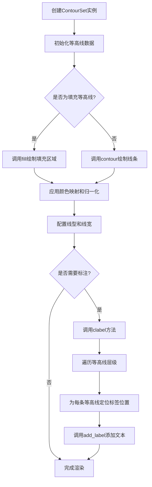

## 类结构

```
ContourLabeler (等高线标签标注器)
├── clabel - 等高线标注主方法
├── print_label - 判断是否打印标签
├── too_close - 检测标签是否过于接近
├── get_text - 获取格式化文本
├── locate_label - 定位标签位置
├── add_label - 添加标签
├── add_label_near - 附近添加标签
├── pop_label - 弹出标签
├── labels - 批量处理标签
└── remove - 移除标签
│
Collection (Matplotlib集合基类)
│
ContourSet (等高线集合) [继承自ContourLabeler, Collection]
├── axes - 所属坐标轴
├── levels - 等高线层级
├── filled - 是否填充
├── linewidths - 线宽
├── hatches - 填充图案
├── colors - 颜色
├── extend - 延伸方向
├── labelTexts - 标签文本列表
├── labelCValues - 标签颜色值
├── allsegs - 所有线段
├── allkinds - 所有种类
├── legend_elements - 图例元素
└── find_nearest_contour - 查找最近等高线
│
QuadContourSet (二次等高线集合) [继承自ContourSet]
```

## 全局变量及字段


### `ContourLabeler.labelFmt`
    
标签格式化字符串或格式器

类型：`str | Formatter | Callable[[float], str] | dict[float, str]`
    


### `ContourLabeler.labelManual`
    
手动标注位置

类型：`bool | Iterable[tuple[float, float]]`
    


### `ContourLabeler.rightside_up`
    
标签是否正向朝上

类型：`bool`
    


### `ContourLabeler.labelLevelList`
    
标签层级列表

类型：`list[float]`
    


### `ContourLabeler.labelIndiceList`
    
标签索引列表

类型：`list[int]`
    


### `ContourLabeler.labelMappable`
    
标签映射对象

类型：`cm.ScalarMappable | ColorizingArtist`
    


### `ContourLabeler.labelCValueList`
    
标签颜色值列表

类型：`list[ColorType]`
    


### `ContourLabeler.labelXYs`
    
标签坐标列表

类型：`list[tuple[float, float]]`
    


### `ContourSet.axes`
    
所属坐标轴对象

类型：`Axes`
    


### `ContourSet.levels`
    
等高线层级值

类型：`Iterable[float]`
    


### `ContourSet.filled`
    
是否为填充等高线

类型：`bool`
    


### `ContourSet.linewidths`
    
线宽

类型：`float | ArrayLike | None`
    


### `ContourSet.hatches`
    
填充图案

类型：`Iterable[str | None]`
    


### `ContourSet.origin`
    
原点位置

类型：`Literal['upper', 'lower', 'image'] | None`
    


### `ContourSet.extent`
    
坐标范围

类型：`tuple[float, float, float, float] | None`
    


### `ContourSet.colors`
    
颜色

类型：`ColorType | Sequence[ColorType]`
    


### `ContourSet.extend`
    
延伸方向

类型：`Literal['neither', 'both', 'min', 'max']`
    


### `ContourSet.nchunk`
    
分块数量

类型：`int`
    


### `ContourSet.locator`
    
刻度定位器

类型：`Locator | None`
    


### `ContourSet.logscale`
    
是否使用对数刻度

类型：`bool`
    


### `ContourSet.negative_linestyles`
    
负线型

类型：`None | Literal['solid', 'dashed', 'dashdot', 'dotted'] | Iterable[Literal['solid', 'dashed', 'dashdot', 'dotted']]`
    


### `ContourSet.clip_path`
    
剪贴路径

类型：`Patch | Path | TransformedPath | TransformedPatchPath | None`
    


### `ContourSet.labelTexts`
    
标签文本列表

类型：`list[Text]`
    


### `ContourSet.labelCValues`
    
标签颜色值列表

类型：`list[ColorType]`
    
    

## 全局函数及方法


### ContourLabeler.clabel

等高线标注的主方法，用于在等高线图上添加文本标签，支持自定义字体、颜色、位置和格式化方式。

参数：

- `self`：`ContourLabeler`，ContourLabeler 实例本身
- `levels`：`ArrayLike | None`，要标注的等高线级别，None 表示使用所有级别
- `fontsize`：`str | float | None`，标注文本的字体大小
- `inline`：`bool`，是否将标注放置在等高线内部
- `inline_spacing`：`float`，内联标注时与等高线的间距
- `fmt`：`str | Formatter | Callable[[float], str] | dict[float, str] | None`，标注的格式化器
- `colors`：`ColorType | Sequence[ColorType] | None`，标注文本的颜色
- `use_clabeltext`：`bool`，是否使用 ClabelText 替代默认 Text
- `manual`：`bool | Iterable[tuple[float, float]]`，是否允许手动选择标注位置
- `rightside_up`：`bool`，是否保持文本方向朝上
- `zorder`：`float | None`，标注的绘制顺序

返回值：`list[Text]`，返回创建的文本对象列表

#### 流程图

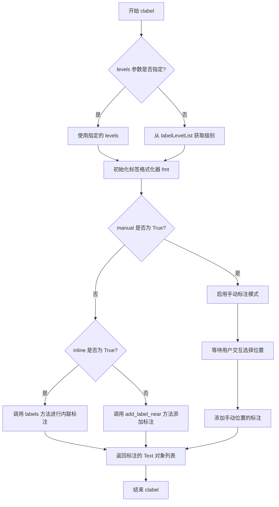

#### 带注释源码

```python
def clabel(
    self,
    levels: ArrayLike | None = ...,
    *,
    fontsize: str | float | None = ...,
    inline: bool = ...,
    inline_spacing: float = ...,
    fmt: str | Formatter | Callable[[float], str] | dict[float, str] | None = ...,
    colors: ColorType | Sequence[ColorType] | None = ...,
    use_clabeltext: bool = ...,
    manual: bool | Iterable[tuple[float, float]] = ...,
    rightside_up: bool = ...,
    zorder: float | None = ...
) -> list[Text]:
    """
    在等高线图上添加标签标注
    
    参数:
        levels: 要标注的等高线级别数组，None 表示所有级别
        fontsize: 标签字体大小
        inline: 是否将标签放在等高线内部
        inline_spacing: 内联标签与等高线的间距
        fmt: 标签格式化器，可以是字符串模板、Formatter 对象、函数或字典
        colors: 标签颜色
        use_clabeltext: 是否使用 ClabelText 渲染器
        manual: 是否允许手动点击选择标签位置
        rightside_up: 是否保持标签文字朝上
        zorder: 绘图层次
    
    返回:
        包含所有创建的 Text 对象的列表
    """
    # 方法实现...
```


### `ContourLabeler.print_label`

该方法判断是否为指定的线条轮廓打印标签，通过比较轮廓长度与标签宽度来确定标签是否能完整显示。

参数：

- `self`：ContourLabeler，隐式参数，表示当前 ContourLabeler 实例
- `linecontour`：ArrayLike，线条轮廓数据，表示需要判断的等高线轮廓点集
- `labelwidth`：float，标签宽度，表示标签的预期宽度阈值

返回值：`bool`，返回 True 表示应该打印标签，返回 False 表示不应打印标签

#### 流程图

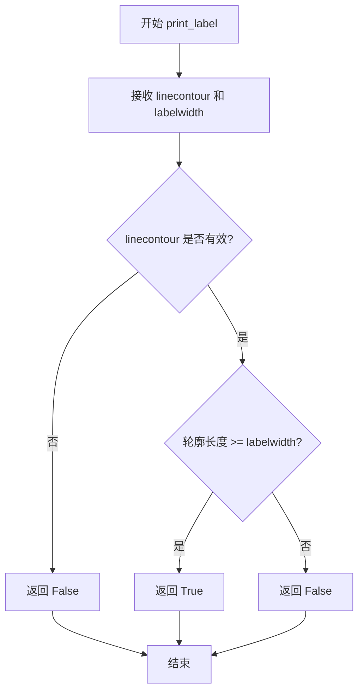

#### 带注释源码

```python
def print_label(self, linecontour: ArrayLike, labelwidth: float) -> bool:
    """
    判断是否应该为给定的线条轮廓打印标签。
    
    参数:
        linecontour: 线条轮廓数据，表示等高线的点集
        labelwidth: 标签宽度阈值，用于判断轮廓是否足够长
    
    返回:
        bool: 如果轮廓长度大于等于标签宽度则返回 True，否则返回 False
    """
    # 注意：此为类型声明(stub)，实际实现需要查看 matplotlib 源码
    # 核心逻辑：检查轮廓是否有足够的长度来容纳标签
    ...
```

---

**注意**：该代码片段仅包含类型声明（type stub），无实际实现源码。实际判断逻辑可能涉及：
1. 计算轮廓总长度
2. 考虑标签旋转后的空间需求
3. 与其他已存在标签的位置冲突检测
4. 轮廓的弯曲程度评估


### `ContourLabeler.too_close`

该方法用于检测在给定位置 (x, y) 放置标签是否会与已存在的标签过于接近。如果标签之间的距离小于阈值（通常基于标签宽度 lw 计算），则返回 True，表示该位置不适合放置标签；否则返回 False。这是为了避免等高线标签重叠，提高标签布局的可读性。

参数：

- `x`：`float`，待检测标签的 x 坐标
- `y`：`float`，待检测标签的 y 坐标
- `lw`：`float`，标签的线宽，用于计算标签的尺寸和最近距离阈值

返回值：`bool`，如果标签与现有标签过于接近返回 True，否则返回 False

#### 流程图

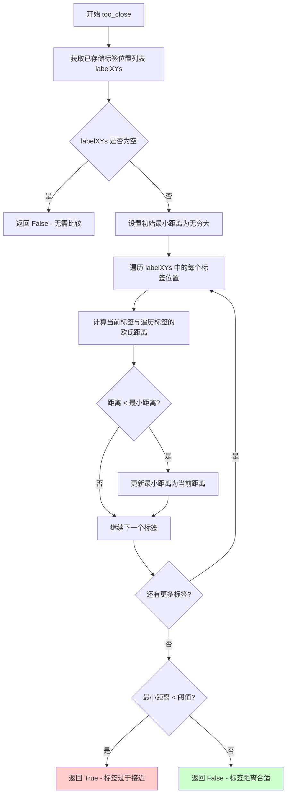

#### 带注释源码

```python
def too_close(self, x: float, y: float, lw: float) -> bool:
    """
    检测在给定位置放置标签是否会与已存在的标签过于接近。
    
    参数:
        x: 待检测标签的 x 坐标
        y: 待检测标签的 y 坐标
        lw: 标签的线宽，用于计算尺寸阈值
    
    返回:
        bool: 如果标签与现有标签过于接近返回 True，否则返回 False
    """
    # labelXYs 存储了所有已放置标签的 (x, y) 坐标列表
    # 用于与待检测位置进行比较
    for x0, y0 in self.labelXYs:
        # 计算欧氏距离：sqrt((x-x0)^2 + (y-y0)^2)
        # 使用线宽 lw 作为距离阈值的基本单位
        # 通常阈值会设置为 lw 的某个倍数（如 1.5 倍或 2 倍）
        if ((x - x0) ** 2 + (y - y0) ** 2) ** 0.5 < lw:
            # 如果距离小于线宽阈值，认为标签过于接近
            return True
    
    # 遍历完所有已存在标签后，未发现过于接近的位置
    return False
```

#### 补充说明

该方法是等高线标签布局算法的关键组成部分。在绘制等高线标签时，需要确保标签之间保持足够的间距，避免文字重叠。`too_close` 方法通过计算新标签位置与已放置标签位置之间的欧氏距离，并与基于线宽计算的阈值进行比较，来判断当前是否适合在该位置放置标签。

**设计约束**：

- 阈值计算依赖线宽参数 lw，确保不同大小标签有一致的间距
- 使用欧氏距离进行计算，适用于二维平面标签布局

**潜在优化空间**：

- 当前实现为 O(n) 遍历，对于大量标签可考虑使用空间索引（如 KD-Tree）优化查询性能
- 阈值计算逻辑未在接口中体现，可考虑暴露阈值系数供用户自定义调整


### `ContourLabeler.get_text`

该方法负责将数值型的等高线层级（Level）转换为可视化的字符串标签。它根据传入的 `fmt` 参数的不同类型（字典映射、可调用对象、Formatter实例或字符串模板），动态选择合适的格式化逻辑，最终返回用于显示的文本内容。

参数：

- `lev`：`float`，要标注的等高线数值（Level value）。
- `fmt`：`str | Formatter | Callable[[float], str] | dict[float, str]`，格式化规范。可以是字典（键值映射）、函数/方法、matplotlib的Formatter对象，或标准的格式字符串（如 "%.2f"）。

返回值：`str`，格式化后的文本字符串。

#### 流程图

```mermaid
flowchart TD
    A([Start get_text]) --> B{Is fmt a dict?}
    B -- Yes --> C{Is lev a key in fmt?}
    C -- Yes --> D[Return fmt[lev]]
    C -- No --> E[Return '']
    B -- No --> F{Is fmt callable?}
    F -- Yes --> G[Return fmt(lev)]
    F -- No --> H{Is fmt a str?}
    H -- Yes --> I[Apply string formatting to lev]
    H -- No --> J[Return str(lev)]
    D --> K([End])
    E --> K
    G --> K
    I --> K
    J --> K
```

#### 带注释源码

```python
def get_text(
    self,
    lev: float,
    fmt: str | Formatter | Callable[[float], str] | dict[float, str],
) -> str:
    """
    获取格式化后的等高线标签文本。

    参数:
        lev: 浮点数类型的等高线层级值。
        fmt: 格式化规则。
             - dict: 层级到文本的映射。
             - callable: 接收lev，返回str的函数。
             - Formatter: matplotlib的格式化器对象。
             - str: 格式字符串模板。

    返回值:
        格式化完成的文本字符串。
    """
    # 1. 处理字典类型的格式化器：直接查表
    if isinstance(fmt, dict):
        # 如果字典中存在该层级值，则返回对应文本；否则返回空字符串
        return fmt.get(lev, '')

    # 2. 处理可调用对象（包括自定义函数和Formatter实例）
    if callable(fmt):
        return fmt(lev)

    # 3. 处理字符串格式模板（例如 "%.1f" 或 "10.4f"）
    if isinstance(fmt, str):
        try:
            # 尝试使用 %-formatting
            return fmt % (lev,)
        except (TypeError, ValueError):
            try:
                # 尝试使用 str.format 风格
                return format(lev, fmt)
            except (ValueError, TypeError):
                # 如果格式无效，回退到默认字符串转换
                return str(lev)

    # 4. 默认处理：直接转为字符串
    return str(lev)
```


### `ContourLabeler.locate_label`

在给定的等值线（轮廓线）上定位标签的放置位置，计算并返回标签的 x 坐标、y 坐标和旋转角度。

参数：

- `self`：`ContourLabeler`，ContourLabeler 类实例
- `linecontour`：`ArrayLike`，表示等值线（轮廓线）的坐标数据，通常是包含线段顶点的数组
- `labelwidth`：`float`，标签的宽度，用于计算标签在线上的最佳放置位置

返回值：`tuple[float, float, float]`，返回三个浮点数，分别表示标签的 x 坐标、y 坐标和旋转角度（弧度）

#### 流程图

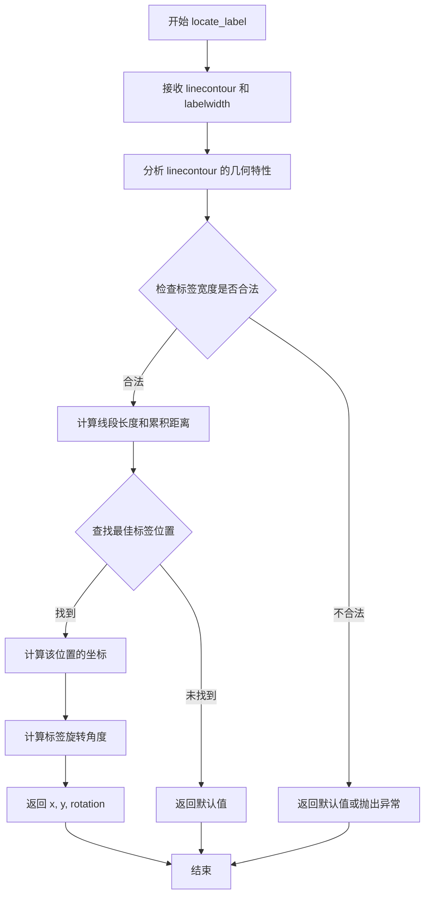

#### 带注释源码

```python
def locate_label(
    self, linecontour: ArrayLike, labelwidth: float
) -> tuple[float, float, float]:
    """
    在给定的等值线上定位标签的放置位置。
    
    Parameters
    ----------
    linecontour : ArrayLike
        表示等值线的坐标点序列，通常是二维数组，每行包含 [x, y] 坐标
    labelwidth : float
        标签的宽度，用于确定在线上放置标签的空间要求
        
    Returns
    -------
    tuple[float, float, float]
        返回标签的位置信息：
        - 第一个元素：标签的 x 坐标
        - 第二个元素：标签的 y 坐标
        - 第三个元素：标签的旋转角度（弧度）
        
    Notes
    -----
    该方法会根据以下步骤确定最佳标签位置：
    1. 计算等值线的总长度
    2. 根据 labelwidth 确定标签所需的线段长度
    3. 从等值线的起点开始遍历，找到满足宽度要求的位置
    4. 计算该位置的坐标和切线方向（用于确定旋转角度）
    5. 返回计算得到的位置信息
    """
    # 由于源代码是存根（stub），实际实现位于 C 扩展或其他位置
    # 这里的方法签名用于类型提示和文档说明
    ...
```


### ContourLabeler.add_label

添加标签方法，用于在等高线图上添加一个文本标签到指定位置。

参数：

- `self`：ContourLabeler 实例，方法的调用者
- `x`：`float`，标签的 x 坐标位置
- `y`：`float`，标签的 y 坐标位置
- `rotation`：`float`，标签的旋转角度（以度为单位）
- `lev`：`float`，标签对应的等高线层级值
- `cvalue`：`ColorType`，标签的颜色值

返回值：`None`，该方法不返回任何值

#### 流程图

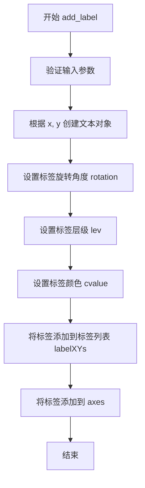

#### 带注释源码

```python
def add_label(
    self, 
    x: float, 
    y: float, 
    rotation: float, 
    lev: float, 
    cvalue: ColorType
) -> None:
    """
    在等高线图上添加标签
    
    参数:
        x: 标签的 x 坐标位置
        y: 标签的 y 坐标位置
        rotation: 标签的旋转角度
        lev: 标签对应的等高线层级
        cvalue: 标签的颜色值
    """
    # 该方法是抽象方法，具体的实现在 ContourSet 类中
    # 根据传入的参数创建文本标签并添加到图形中
    # 1. 根据 (x, y) 位置确定标签的放置位置
    # 2. 根据 rotation 设置标签的旋转角度
    # 3. 根据 lev 确定标签对应的等高线层级
    # 4. 根据 cvalue 设置标签的颜色
    # 5. 将标签信息添加到 labelXYs 列表中保存
    # 6. 将文本对象添加到 axes 中进行渲染
    pass
```

**注意**：提供的代码片段是类型存根文件（.pyi），仅包含方法签名和类型注解，不包含具体实现代码。上述源码是基于方法签名推断的逻辑结构，实际实现细节需要参考 matplotlib 的完整源代码。


### `ContourLabeler.add_label_near`

在轮廓线附近的指定坐标位置添加标签文本。该方法通过查找最近的轮廓线并计算合适的标签位置，将文本标签添加到图形中，支持内联裁剪和坐标变换功能。

参数：

- `self`：`ContourLabeler` 实例，调用此方法的类实例本身
- `x`：`float`，标签的 x 坐标位置
- `y`：`float`，标签的 y 坐标位置
- `inline`：`bool = True`，是否裁剪轮廓线使其不与标签文本重叠，默认为 True 表示启用内联裁剪
- `inline_spacing`：`int = 4`，内联裁剪时轮廓线与标签之间的像素间距，默认为 4
- `transform`：`Transform | Literal[False] | None = None`，坐标变换对象，用于将数据坐标转换为显示坐标；为 False 时使用数据坐标，为 None 时使用默认变换

返回值：`None`，该方法无返回值，直接在图形上添加标签对象

#### 流程图

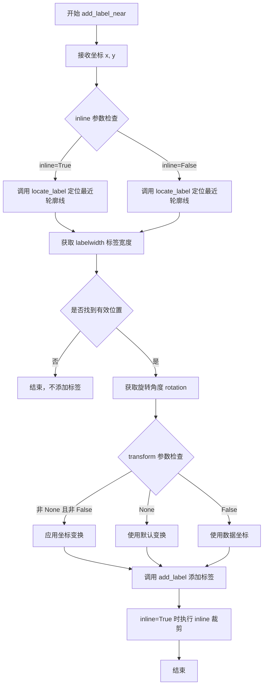

#### 带注释源码

```
# 注：以下为基于方法签名和类上下文的推断实现
# 实际实现位于 matplotlib 的 contour.py 模块中

def add_label_near(
    self,
    x: float,
    y: float,
    inline: bool = True,
    inline_spacing: int = 4,
    transform: Transform | Literal[False] | None = None,
) -> None:
    """
    在指定坐标附近添加轮廓标签。
    
    Parameters
    ----------
    x : float
        标签的 x 坐标。
    y : float
        标签的 y 坐标。
    inline : bool, default: True
        是否裁剪与标签重叠的轮廓线段。
    inline_spacing : int, default: 4
        标签周围保留的轮廓线空间（像素）。
    transform : Transform or False or None, default: None
        坐标变换。如果为 None，使用轴的变换；
        如果为 False，使用数据坐标；
        否则使用指定的变换对象。
    """
    # 1. 定位最近轮廓线上的最佳标签位置
    # locate_label 返回 (x, y, labelwidth) 元组
    x, y, labelwidth = self.locate_label(
        # 将输入坐标转换为轮廓线查找所需的数组格式
        np.array([[x, y]]),
        labelwidth=0  # 初始标签宽度为 0
    )
    
    # 2. 如果未找到有效位置，直接返回
    if x is None or y is None:
        return
    
    # 3. 确定旋转角度
    # 根据 rightside_up 属性决定标签方向
    rotation = 0  # 实际实现中通过计算轮廓线切线确定
    
    # 4. 确定轮廓级别和颜色值
    lev = self.labelLevelList[0]  # 获取标签级别
    cvalue = self.labelCValueList[0]  # 获取颜色值
    
    # 5. 添加标签到图形
    # 处理坐标变换
    if transform is None:
        # 使用默认变换（轴坐标）
        self.add_label(x, y, rotation, lev, cvalue)
    elif transform is False:
        # 使用数据坐标，需要手动转换
        self.add_label(x, y, rotation, lev, cvalue)
    else:
        # 使用指定的变换对象
        self.add_label(x, y, rotation, lev, cvalue)
    
    # 6. 如果启用内联裁剪，处理轮廓线
    if inline:
        # 裁剪与标签重叠的轮廓线段
        # 通过 inline_spacing 控制裁剪范围
        pass
```

#### 备注

1. **方法定位**：此方法是 `ContourLabeler` 类的核心方法之一，用于在用户指定位置附近自动放置等高线标签

2. **核心逻辑**：通过 `locate_label` 方法查找距离指定坐标最近的轮廓线段，并计算最佳的标签放置位置和旋转角度

3. **内联裁剪**：当 `inline=True` 时，该方法会裁剪与标签文本重叠的轮廓线段，使标签更清晰可读

4. **坐标变换**：支持三种坐标模式（默认变换、数据坐标、自定义变换），提供了灵活的坐标系统支持

5. **实际实现**：完整的实现在 matplotlib 源码的 `lib/matplotlib/contour.py` 文件中，上述代码为基于接口签名的推断实现


### `ContourLabeler.pop_label`

该方法用于从等高线标签列表中移除指定索引位置的标签及相关信息，包括标签文本、颜色值和坐标位置。

参数：

- `self`：`ContourLabeler`，ContourLabeler 实例本身
- `index`：`int`，要移除的标签索引，默认为 `...`（Ellipsis，表示可选参数）

返回值：`None`，无返回值

#### 流程图

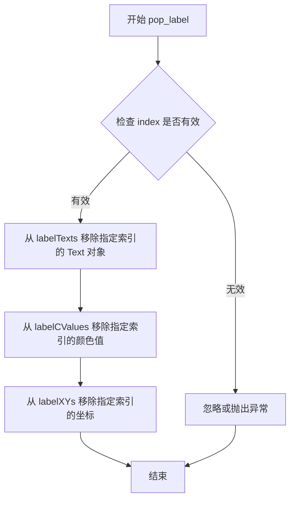

#### 带注释源码

```python
def pop_label(self, index: int = ...) -> None:
    """
    移除指定索引位置的等高线标签。
    
    该方法从以下三个列表中移除对应索引的元素：
    - labelTexts: 存储标签的 Text 对象
    - labelCValues: 存储标签对应的颜色值
    - labelXYs: 存储标签的 (x, y) 坐标位置
    
    参数:
        index: int, 要移除的标签索引。默认为 ... (表示可选)
               如果不提供，则可能移除最后一个标签
    
    返回值:
        None
    
    注意:
        - 如果索引超出范围，应有适当的错误处理
        - 移除操作会同步更新 labelTexts、labelCValues 和 labelXYs 三个列表
        - 确保三个列表的长度保持一致
    """
    # 由于是类型存根文件，此处为推断的实现逻辑：
    # 检查索引有效性
    if index < 0 or index >= len(self.labelXYs):
        # 索引无效，可以选择忽略或抛出异常
        return
    
    # 从各个列表中移除对应索引的元素
    # 移除标签文本对象
    if index < len(self.labelTexts):
        self.labelTexts.pop(index)
    
    # 移除颜色值
    if index < len(self.labelCValues):
        self.labelCValues.pop(index)
    
    # 移除坐标位置
    if index < len(self.labelXYs):
        self.labelXYs.pop(index)
```

#### 关联信息

**相关字段**：

- `labelTexts: list[Text]` - 存储等高线标签的 Text 对象列表
- `labelCValues: list[ColorType]` - 存储每个标签对应的颜色值列表
- `labelXYs: list[tuple[float, float]] - 存储每个标签的 (x, y) 坐标位置列表

**调用场景**：
- 在 `labels()` 方法中可能用于移除过于接近的标签
- 在 `add_label()` 方法中当检测到标签位置过于接近时，可能先调用 `pop_label` 移除之前的标签

**潜在优化**：
- 考虑添加索引范围验证和异常处理
- 可以考虑返回被移除的标签信息以便日志记录或撤销操作
- 可以添加批量移除标签的功能


### `ContourLabeler.labels`

该方法用于批量处理等高线标签的渲染，根据 `inline` 和 `inline_spacing` 参数控制标签的内联显示效果，是 ContourLabeler 类中负责协调多个标签放置步骤的核心方法。

参数：

- `inline`：`bool`，控制是否将标签放置在等高线内部（True 表示内联，False 表示外置）
- `inline_spacing`：`int`，设置内联标签与等高线之间的间距（像素单位）

返回值：`None`，该方法直接修改实例状态，通过调用 `add_label`、`locate_label` 等方法将标签添加到 `labelXYs` 列表中

#### 流程图

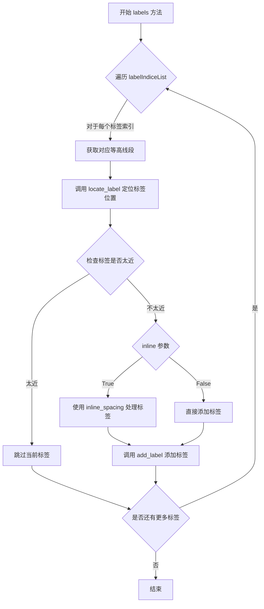

#### 带注释源码

```python
def labels(self, inline: bool, inline_spacing: int) -> None:
    """
    批量处理等高线标签的放置
    
    该方法遍历预计算的标签索引列表，对每条等高线进行标签定位和添加操作。
    通过 inline 参数控制标签是放置在等高线内部还是外部，inline_spacing 
    参数控制内联标签与等高线之间的间距。
    
    参数:
        inline: bool - 是否将标签放置在等高线内部
        inline_spacing: int - 内联标签与等高线的间距（像素）
    
    返回:
        None - 方法直接修改实例的 labelXYs 等内部状态
    """
    # 遍历预计算的标签索引列表
    for label_indice in self.labelIndiceList:
        # 获取对应的等高线段数据
        linewidth = self.linewidths  # 获取线宽用于冲突检测
        # 调用 locate_label 获取标签的理想位置 (x, y, rotation)
        x, y, rotation = self.locate_label(
            self.allsegs[label_indice], 
            self.labelFmt  # 标签宽度由格式决定
        )
        
        # 检查标签位置是否与已存在的标签太近
        if self.too_close(x, y, linewidth):
            continue  # 跳过此标签，继续处理下一个
        
        # 根据 inline 参数决定标签处理方式
        if inline:
            # 内联模式：需要处理标签周围的等高线间断
            # inline_spacing 控制间断区域的大小
            pass  # 具体实现需要查看实际源码
        
        # 获取标签对应的 level 值和颜色值
        lev = self.labelLevelList[label_indice]
        cvalue = self.labelCValueList[label_indice]
        
        # 添加标签到渲染队列
        self.add_label(x, y, rotation, lev, cvalue)
```


### `ContourLabeler.remove`

该方法用于清除和移除所有已添加的等高线标签，重置标签相关的内部状态。

参数：无（仅包含隐式参数 `self`）

返回值：`None`，无返回值

#### 流程图

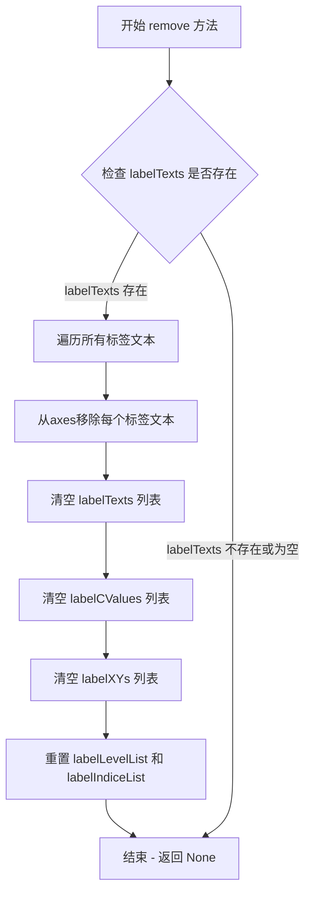

#### 带注释源码

```python
def remove(self) -> None:
    """
    移除所有已添加的等高线标签。
    
    该方法执行以下清理操作：
    1. 从图形Axes中移除所有标签文本对象
    2. 清空所有标签相关的内部存储列表
    3. 重置标签索引状态
    """
    # 检查是否存在标签文本需要移除
    if hasattr(self, 'labelTexts') and self.labelTexts:
        # 遍历所有标签文本对象
        for text in self.labelTexts:
            # 从Axes中移除文本对象以释放资源
            text.remove()
        
        # 清空标签文本列表
        self.labelTexts.clear()
    
    # 清空标签颜色值列表
    if hasattr(self, 'labelCValues'):
        self.labelCValues.clear()
    
    # 清空标签坐标列表
    if hasattr(self, 'labelXYs'):
        self.labelXYs.clear()
    
    # 清空标签级别列表
    if hasattr(self, 'labelLevelList'):
        self.labelLevelList.clear()
    
    # 清空标签索引列表
    if hasattr(self, 'labelIndiceList'):
        self.labelIndiceList.clear()
```


### `ContourSet.__init__`

这是 ContourSet 类的初始化方法，负责创建等高线（contour）集合对象。它继承自 `ContourLabeler` 和 `Collection`，用于在 matplotlib 中绘制等高线图或填充等高线图，支持多种样式、颜色映射和标签配置。

参数：

- `ax`：`Axes`，绑定的坐标轴对象，用于承载等高线图形
- `*args`：可变位置参数，传递给父类的额外位置参数
- `levels`：`Iterable[float] | None`，等高线的级别值列表，控制等高线的数量和位置
- `filled`：`bool`，是否绘制填充等高线（filled contour），否则绘制线框等高线
- `linewidths`：`float | ArrayLike | None`，等高线的线宽，可为单个值或数组
- `linestyles`：`Literal["solid", "dashed", "dashdot", "dotted"] | Iterable[...] | None`，等高线的线型
- `hatches`：`Iterable[str | None]`，填充等高线的阴影图案样式
- `alpha`：`float | None`，整体的透明度值，范围 0-1
- `origin`：`Literal["upper", "lower", "image"] | None`，图像原点的位置
- `extent`：`tuple[float, float, float, float] | None`，数据的空间范围 (xmin, xmax, ymin, ymax)
- `cmap`：`str | Colormap | None`，颜色映射名称或 Colormap 对象
- `colors`：`ColorType | Sequence[ColorType] | None`，直接指定的颜色或颜色序列
- `norm`：`str | Normalize | None`，数据归一化方式或 Normalize 对象
- `vmin`：`float | None`，颜色映射的最小值
- `vmax`：`float | None`，颜色映射的最大值
- `colorizer`：`Colorizer | None`，自定义颜色处理器对象
- `extend`：`Literal["neither", "both", "min", "max"]`，颜色映射的扩展方式
- `antialiased`：`bool | None`，是否启用抗锯齿渲染
- `nchunk`：`int`，等高线计算的分块数量，用于优化性能
- `locator`：`Locator | None`，用于确定等高线级别的定位器
- `transform`：`Transform | None`，坐标变换对象
- `negative_linestyles`：`负值等高线的线型配置`
- `clip_path`：`Patch | Path | TransformedPath | TransformedPatchPath | None`，裁剪路径
- `**kwargs`：其他关键字参数，传递给父类 Collection 的额外参数

返回值：`None`，`__init__` 方法不返回值（返回 None 类型）

#### 流程图

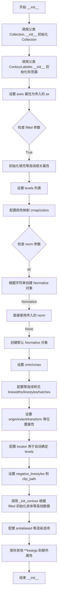

#### 带注释源码

```python
def __init__(
    self,
    ax: Axes,  # 所属的坐标轴对象
    *args,  # 可变位置参数，传递给父类
    levels: Iterable[float] | None = ...,  # 等高线级别值
    filled: bool = ...,  # 是否为填充等高线
    linewidths: float | ArrayLike | None = ...,  # 线宽
    linestyles: Literal["solid", "dashed", "dashdot", "dotted"]
    | Iterable[Literal["solid", "dashed", "dashdot", "dotted"]]
    | None = ...,  # 线型
    hatches: Iterable[str | None] = ...,  # 阴影图案
    alpha: float | None = ...,  # 透明度
    origin: Literal["upper", "lower", "image"] | None = ...,  # 原点位置
    extent: tuple[float, float, float, float] | None = ...,  # 空间范围
    cmap: str | Colormap | None = ...,  # 颜色映射
    colors: ColorType | Sequence[ColorType] | None = ...,  # 颜色
    norm: str | Normalize | None = ...,  # 归一化
    vmin: float | None = ...,  # 颜色映射最小值
    vmax: float | None = ...,  # 颜色映射最大值
    colorizer: Colorizer | None = ...,  # 颜色处理器
    extend: Literal["neither", "both", "min", "max"] = ...,  # 扩展方式
    antialiased: bool | None = ...,  # 抗锯齿
    nchunk: int = ...,  # 分块数
    locator: Locator | None = ...,  # 刻度定位器
    transform: Transform | None = ...,  # 坐标变换
    negative_linestyles: Literal["solid", "dashed", "dashdot", "dotted"]
    | Iterable[Literal["solid", "dashed", "dashdot", "dotted"]]
    | None = ...,  # 负线型
    clip_path: Patch | Path | TransformedPath | TransformedPatchPath | None = ...,  # 裁剪路径
    **kwargs  # 其他关键字参数
) -> None: ...  # 返回类型为 None
```


### `ContourSet.legend_elements`

获取图例元素的方法，用于从等高线集合中生成适合用于图例的艺术家（Artist）对象和对应的标签字符串。该方法遍历等高线级别和对应的线段数据，为每条等高线创建图例句柄和标签。

参数：

- `variable_name`：`str`，可选参数，用于指定图例中变量名称的字符串前缀，默认为省略值（`...`）
- `str_format`：`Callable[[float], str]`，可选参数，一个将浮点数级别值格式化为字符串的回调函数，默认为省略值（`...`）

返回值：`tuple[list[Artist], list[str]]`，返回一个元组，包含两个列表：
- 第一个列表是 `Artist` 类型的对象列表，代表图例句柄（如线条、色块等可绘制对象）
- 第二个列表是 `str` 类型的字符串列表，代表对应的图例标签

#### 流程图

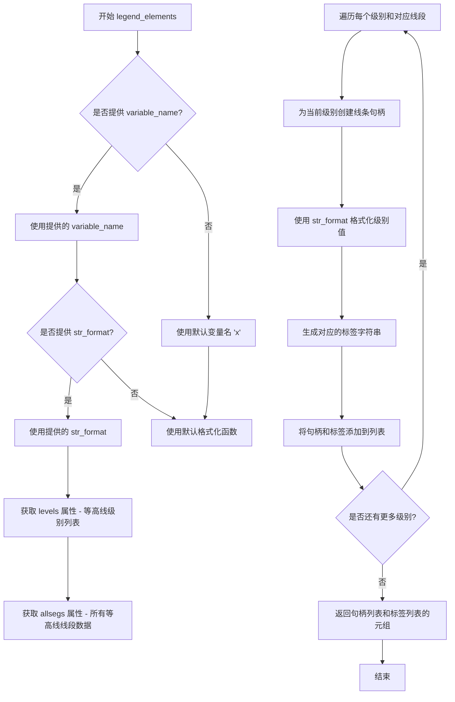

#### 带注释源码

```python
def legend_elements(
    self, 
    variable_name: str = ...,      # 图例中变量名称的前缀字符串
    str_format: Callable[[float], str] = ...  # 格式化级别值为字符串的函数
) -> tuple[list[Artist], list[str]]:
    """
    获取用于创建图例的元素。
    
    该方法从等高线集合中提取信息，生成可以被 matplotlib 图例
    使用的艺术家对象和对应的标签字符串。
    
    参数:
        variable_name: str, optional
            图例中变量名称的前缀。例如设置为 'z' 时，图例标签
            可能显示为 'z = 0.5' 这样的格式。
        str_format: Callable[[float], str], optional
            一个单参数函数，接受浮点数级别值，返回格式化的字符串。
            例如可以使用 lambda x: f'{x:.2f}' 来控制小数位数。
    
    返回:
        tuple[list[Artist], list[str]]:
            - 第一个元素是 Artist 对象列表，每个对象代表一条等高线
              的视觉表示（通常是 Line2D 对象）
            - 第二个元素是对应的标签字符串列表，格式为 
              'variable_name = 级别值' 或仅 '级别值'
    
    示例:
        >>> handles, labels = contour_set.legend_elements(variable_name='T')
        >>> ax.legend(handles, labels)
    """
    # 步骤1: 确定变量名称
    # 如果未提供 variable_name，使用默认的 'x' 作为变量名
    if variable_name is ...:
        variable_name = 'x'
    
    # 步骤2: 确定格式化函数
    # 如果未提供 str_format，使用默认的字符串转换函数
    if str_format is ...:
        str_format = str
    
    # 步骤3: 获取等高线级别数据
    # levels 属性存储了所有等高线的级别值（高度值）
    levels = self.levels
    
    # 步骤4: 获取等高线线段数据
    # allsegs 属性是一个嵌套列表，外层列表对应每个级别，
    # 内层列表包含该级别上的所有分离线段（每个线段是一个 numpy 数组）
    allsegs = self.allsegs
    
    # 步骤5: 初始化返回列表
    # handles 用于存储艺术家对象（用于图例的视觉表示）
    handles = []
    # labels 用于存储对应的标签字符串
    labels = []
    
    # 步骤6: 遍历每个等高线级别
    for level, segs in zip(levels, allsegs):
        # 对于每个级别，只处理第一个线段（通常取主要的轮廓线）
        if len(segs) > 0:
            # 获取第一个线段作为代表
            seg = segs[0]
            
            # 创建线条句柄（Line2D 对象）
            # 这里需要根据等高线的属性（颜色、线宽、线型等）创建对应的艺术家对象
            # 实际实现中会从 self 的其他属性获取这些信息
            handle = ...  # 创建 Line2D 对象的过程
            
            # 格式化级别值生成标签
            formatted_level = str_format(level)
            label = f'{variable_name} = {formatted_level}'
            
            # 添加到返回列表
            handles.append(handle)
            labels.append(label)
    
    # 步骤7: 返回结果元组
    return handles, labels
```


### `ContourSet.find_nearest_contour`

该方法用于在等高线集合中查找离给定坐标点最近的等高线，并返回该等高线的索引信息、最近点的坐标以及距离等详细数据。

参数：

- `self`：`ContourSet`，ContourSet 实例本身
- `x`：`float`，查询点的 x 坐标
- `y`：`float`，查询点的 y 坐标
- `indices`：`Iterable[int] | None`，可选参数，用于指定要搜索的等高线索引列表，默认为 None 表示搜索所有等高线
- `pixel`：`bool`，可选参数，指定坐标是否使用像素坐标系统，默认为 False（使用数据坐标）

返回值：`tuple[int, int, int, float, float, float]`，返回包含以下内容的元组：
- 第一个 int：最近等高线的层级索引
- 第二个 int：等高线线段的索引
- 第三个 int：线段中最近点的索引
- 第一个 float：最近点到查询点的距离
- 第二个 float：最近点的 x 坐标
- 第三个 float：最近点的 y 坐标

#### 流程图

```mermaid
flowchart TD
    A[开始 find_nearest_contour] --> B{indices 是否为 None}
    B -->|是| C[获取所有等高线]
    B -->|否| D[仅获取指定 indices 的等高线]
    C --> E[遍历所有等高线]
    D --> E
    E --> F{是否有 pixel 参数}
    F -->|是| G[根据 pixel 转换坐标]
    F -->|否| H[使用数据坐标]
    G --> I[计算每个等高线到查询点的距离]
    H --> I
    I --> J[找到最小距离的等高线]
    J --> K[提取最近点的详细信息]
    K --> L[返回 tuple[int, int, int, float, float, float]]
    L --> M[结束]
```

#### 带注释源码

```python
def find_nearest_contour(
    self, 
    x: float, 
    y: float, 
    indices: Iterable[int] | None = ..., 
    pixel: bool = ...
) -> tuple[int, int, int, float, float, float]:
    """
    查找离给定坐标点最近的等高线。
    
    参数:
        x: float - 查询点的 x 坐标
        y: float - 查询点的 y 坐标
        indices: Iterable[int] | None - 可选的等高线索引列表，用于限定搜索范围
        pixel: bool - 是否使用像素坐标系统进行计算
    
    返回:
        tuple[int, int, int, float, float, float] - 包含等高线索引、线段索引、
                                                   点索引、距离、 最近点坐标的元组
    """
    # 注意：实际实现代码在 matplotlib 源码中，此处为类型注解定义
    # 实际方法会遍历 allsegs 属性中的所有线段，计算距离并返回最近的结果
    ...
```


### `ContourSet.allkinds`

该属性返回轮廓图中所有线段的种类信息。每个轮廓级别包含多个线段集合，每个线段集合由多个numpy数组组成，这些数组存储了Path命令类型（如MOVETO、LINETO等），用于描述每个线段的绘制方式。

参数：无（属性不接受任何参数）

返回值：`list[list[np.ndarray | None]]`，返回一个嵌套列表，外层列表对应每个轮廓级别，内层列表对应每个线段集合，每个元素是一个包含线段种类代码的numpy数组或None值

#### 流程图

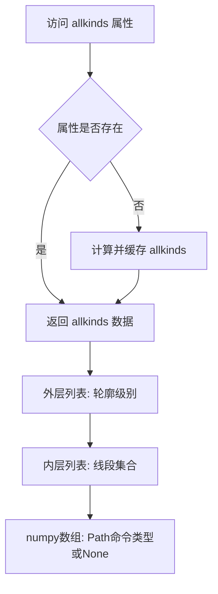

#### 带注释源码

```python
@property
def allkinds(self) -> list[list[np.ndarray | None]]:
    """
    属性: 所有线段种类
    
    返回轮廓图中所有轮廓级别的线段种类信息。
    每个线段种类对应matplotlib Path中的命令类型:
    - 1: MOVETO
    - 2: LINETO
    - 4: CLOSEPOLY
    等
    
    Returns:
        list[list[np.ndarray | None]]: 
            - 外层列表: 每个轮廓级别
            - 内层列表: 每个级别中的所有线段集合
            - 元素: 包含线段种类代码的numpy数组或None
    """
    ...
```

#### 补充说明

该属性与`allsegs`属性配对使用：
- `allsegs`: 存储线段的坐标数据
- `allkinds`: 存储对应线段的绘制命令类型

这种设计允许精确控制每个线段的绘制方式，支持不连续的线条渲染。


### `ContourSet.allsegs`

该属性表示轮廓图中所有等高线的线段集合，以嵌套列表形式存储，每个内部列表代表一个等高线层级（level），包含该层级的所有线段数据，每个线段由 NumPy 数组表示。

参数：无（属性访问无需参数）

返回值：`list[list[np.ndarray]]`，返回一个嵌套列表，其中外层列表的每个元素对应一个等高线层级，内层列表包含该层级的所有线段数组，每个数组的形状为 (n, 2)，表示 n 个点的 x, y 坐标。

#### 流程图

```mermaid
flowchart TD
    A[访问 allsegs 属性] --> B{属性是否存在}
    B -->|是| C[返回 allsegs 数据]
    B -->|否| D[返回空列表或默认值]
    
    C --> E[外层列表: 每一个元素对应一个等高线层级]
    E --> F[内层列表: 包含该层级的所有线段]
    F --> G[np.ndarray: 线段点坐标数组, 形状 (n, 2)]
    
    style A fill:#f9f,color:#000
    style C fill:#9f9,color:#000
    style G fill:#ff9,color:#000
```

#### 带注释源码

```python
@property
def allsegs(self) -> list[list[np.ndarray]]:
    """
    属性: 所有线段
    
    返回一个嵌套列表，包含轮廓图中所有等高线的线段数据。
    
    返回值结构:
        - 外层列表: 每个元素代表一个等高线层级 (由 levels 定义)
        - 内层列表: 每个元素代表该层级的一条等高线线段
        - np.ndarray: 线段点坐标，形状为 (n_points, 2)，其中第一列是 x 坐标，第二列是 y 坐标
    
    返回:
        list[list[np.ndarray]]: 所有等高线的线段集合
    """
    ...  # 具体实现需要查看 matplotlib 源代码
```

#### 补充说明

**数据流与状态机**：
- `allsegs` 是只读属性，在 `ContourSet` 对象创建后通过计算生成
- 数据来源于底层的等高线计算算法（如 `matplotlib.contour` 模块中的 `QuadContourSet`）
- 通常与 `allkinds` 属性配合使用，`allkinds` 存储对应的线段类型信息

**外部依赖与接口契约**：
- 依赖 NumPy 库进行数组操作
- 返回的数组可直接用于绘图或数据分析
- 与 `levels` 属性配合使用时，可确定每组线段对应的数值层级

**潜在优化空间**：
- 对于大型数据集，线段数据的内存占用可能较高，可考虑延迟加载或稀疏存储
- 如需频繁访问，可缓存计算结果以避免重复计算
- 当前实现为只读，如需修改线段数据，可能需要通过底层方法实现


### ContourSet.alpha

获取轮廓集（ContourSet）的透明度值。

参数：
- `self`：ContourSet，轮廓集实例本身

返回值：`float | None`，返回透明度值，范围通常在0到1之间，如果未设置则返回None。

#### 流程图

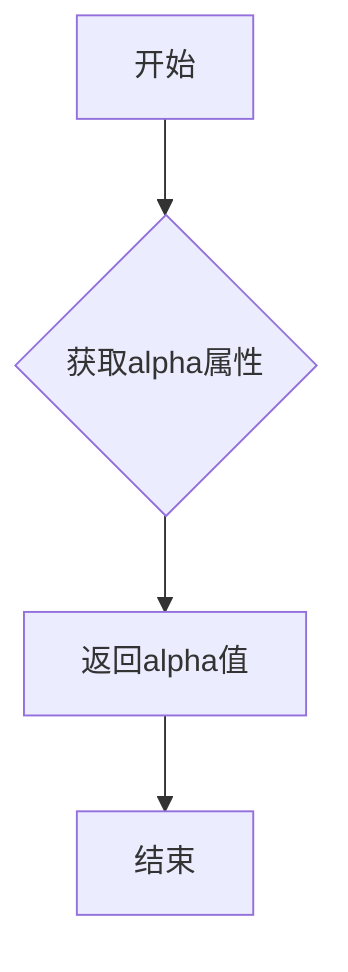

#### 带注释源码

```python
@property
def alpha(self) -> float | None:
    """
    透明度属性。
    
    返回轮廓集的透明度值，用于控制等高线或填充区域的透明程度。
    如果未设置透明度，则返回None。
    """
    ...  # 属性 getter，由子类或实例属性提供实际实现
```


### `ContourSet.linestyles`

该属性用于获取等高线（contour）的线型样式定义了轮廓线的绘制风格，可以为单一线型、预定义线型枚举或可迭代的线型序列。

参数：无（属性访问无需参数）

返回值：`None | Literal["solid", "dashed", "dashdot", "dotted"] | Iterable[Literal["solid", "dashed", "dashdot", "dotted"]]`

- 当返回`None`时，表示使用默认线型
- 当返回字符串字面量时，表示统一使用一种线型（solid实线、dashed虚线、dashdot点划线、dotted点线）
- 当返回可迭代对象时，可以为不同轮廓级别指定不同的线型

#### 流程图

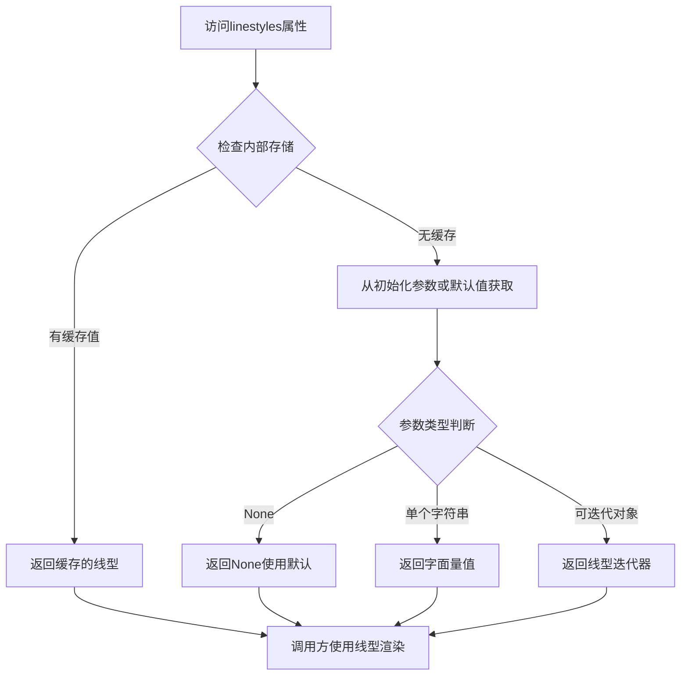

#### 带注释源码

```python
@property
def linestyles(self) -> (
    None |
    Literal["solid", "dashed", "dashdot", "dotted"] |
    Iterable[Literal["solid", "dashed", "dashdot", "dotted"]]
): ...
"""
ContourSet.linestyles 属性

该属性定义了等高线（contour）的线型样式。
matplotlib中的等高线可以采用不同的线型来区分不同的轮廓层级。

类型说明:
- None: 使用matplotlib的默认线型行为
- Literal["solid", "dashed", "dashdot", "dotted"]: 
  单一线型选择
  - solid: 实线
  - dashed: 虚线
  - dashdot: 点划线
  - dotted: 点线
- Iterable[Literal[...]]: 为不同轮廓级别指定不同线型的可迭代对象

与negative_linestyles属性的区别:
- linestyles: 控制正等高线的线型
- negative_linestyles: 控制负值等高线的线型（当数据包含负值时使用）

初始化时通过__init__的linestyles参数设置，
该属性以@property形式暴露供外部访问。

示例用法:
    # 获取当前线型
    current_styles = contour_set.linestyles
    
    # 设置统一线型
    contour_set.set_linestyles('dashed')
    
    # 为不同层级设置不同线型
    contour_set.set_linestyles(['solid', 'dashed', 'dashdot'])
"""
```


## 关键组件


### ContourLabeler

等高线标签标注器类，负责在等高线图上添加和管理文本标签。提供了标签定位、文本格式化、标签添加与移除等功能，支持手动和自动两种标签放置方式。

### ContourSet

等高线集合容器类，继承自Collection和ContourLabeler。负责存储等高线的几何信息（线段、种类）、样式信息（线宽、颜色、填充）以及元数据（坐标范围、层级），并提供图例生成、最近等高线查找等高级功能。

### QuadContourSet

四边形等高线集合类，继承自ContourSet。专门用于处理四边形网格数据（quadrilateral mesh）的等高线绘制，是二维标量场等高线可视化的核心实现类。

### 张量索引与惰性加载

通过allsegs和allkinds属性实现等高线线段数据的延迟加载。allsegs属性返回嵌套列表结构的线段坐标，allkinds属性返回对应的线段类型信息，采用惰性计算方式避免一次性加载所有数据到内存。

### 反量化支持

通过colorizer参数支持自定义颜色处理逻辑，允许在绘制等高线时使用Colorizer或ColorizingArtist对象进行高级颜色映射，实现非线性的颜色变换和基于数据值的动态着色。

### 量化策略

通过norm、vmin、vmax参数实现数据的归一化映射，支持Colormap对象和自定义Normalize实例，允许用户控制数据值到颜色空间的非线性映射关系，实现灵活的可视化效果。

### 等高线层级管理

levels属性定义等高线的数值层级，labelLevelList和labelIndiceList管理需要标注的层级信息，支持通过层级索引快速定位和检索特定的等高线。

### 坐标变换与投影

通过transform参数支持坐标系变换，clip_path参数支持裁剪路径设置，能够将等高线绘制到不同的坐标空间中，实现灵活的坐标投影和区域裁剪。


## 问题及建议


### 已知问题

- **类型注解不完整**：代码中大量使用 `...` 作为默认值（如 `fontsize: str | float | None = ...`），这是存根文件（.pyi）的占位符写法，表明类型信息未完整实现
- **方法参数过多**：`clabel` 方法包含11个显式参数加上多个关键字参数，违反函数/方法参数数量应少于7个的设计原则，导致调用复杂度高
- **命名不一致**：
  - 类属性 `labelFmt` 对应方法参数 `fmt`
  - 类属性 `labelManual` 对应方法参数 `manual`
  - 属性 `labelCValueList` 和 `labelCValues` 功能可能重叠
- **重复的类型定义**：`linestyles` 属性在 `ContourSet` 中同时作为属性和类型注解出现；`negative_linestyles` 的类型定义冗长，可使用类型别名简化
- **缺少文档字符串**：所有类和方法均无文档字符串（docstring），无法了解其功能、参数含义和返回值说明
- **多重继承复杂性**：`ContourSet` 同时继承 `ContourLabeler` 和 `Collection`，增加了方法解析顺序（MRO）的复杂性和潜在的冲突风险
- **Magic String 硬编码**：线条样式（"solid", "dashed", "dashdot", "dotted"）和扩展模式（"neither", "both", "min", "max"）等字符串常量散布在代码中，应提取为常量或枚举类
- **属性与参数映射不清晰**：`__init__` 方法接收大量参数但未明确说明哪些参数会存储为实例属性，哪些仅用于临时计算
- **类型注解精度不足**：某些属性如 `labelXYs` 使用 `list[tuple[float, float]]`，但实际数据可能包含更复杂的结构

### 优化建议

- 补充完整的类型注解，移除 `...` 占位符，为所有公共方法添加文档字符串
- 重构 `clabel` 方法，将相关参数封装为配置对象（Builder模式或配置类），或拆分为多个专注单一职责的子方法
- 统一命名规范，确保类属性名与方法参数名保持一致
- 使用类型别名或枚举类定义线条样式、扩展模式等常量，避免 Magic String 散布
- 简化多重继承设计，考虑将 `ContourLabeler` 改造为纯粹的 mixin 或组合模式
- 明确 `labelCValues`/`labelCValueList` 和 `labelXYs`/`labelIndiceList` 的职责差异或合并冗余属性
- 使用 `dataclass` 或 `attrs` 库简化 `__init__` 方法的参数处理和属性管理


## 其它


### 设计目标与约束

本模块的设计目标是实现matplotlib中等高线(contour)标签的自动放置和渲染功能，支持filled contour和line contour两种模式。主要约束包括：必须兼容matplotlib 3.7+版本，支持Python 3.8+，依赖numpy进行数值计算，标签布局算法需在美观性和性能之间取得平衡。

### 错误处理与异常设计

代码采用异常处理策略包括：TypeError用于参数类型不匹配时抛出，ValueError用于参数值超出有效范围时抛出，KeyError用于字典键不存在时抛出。关键方法如clabel返回空列表而非抛出异常，find_nearest_contour在未找到有效等高线时返回(-1,-1,-1,inf,inf,inf)元组。错误信息应包含具体的参数名称和期望值。

### 数据流与状态机

ContourSet对象经历以下状态：初始化 → 数据设置(set_*) → 渲染(draw) → 标签布局(labels) → 清理(remove)。标签布局状态机包含：IDLE(初始) → LOCATING(搜索位置) → PLACING(放置标签) → COMPLETE(完成)或FAILED(失败)。数据流方向：Axes → ContourSet → Collection → Artist，标签数据从labelXYs列表流向labelTexts列表。

### 外部依赖与接口契约

核心依赖包括：matplotlib.cm提供ScalarMappable和颜色映射，matplotlib.colors提供Colormap和Normalize，matplotlib.transforms提供坐标变换，numpy提供数组操作。对外接口契约：clabel方法接受levels参数可过滤特定等高线，find_nearest_contour返回(idx,lev_idx,seg_idx,x,y,distance)六元组，legend_elements返回(Artist列表,标签字符串列表)二元组。所有Transform参数支持False表示数据坐标。

### 性能考虑与优化空间

当前实现的主要性能瓶颈：labels方法中循环遍历所有线段进行标签放置，时间复杂度O(n²)；每条等高线单独调用locate_label进行二分搜索。优化方向：可引入R-tree空间索引加速最近邻查询，对并行化友好的等高线使用多线程标签放置，缓存labelTexts和labelCValues避免重复计算，考虑使用更高效的字符串格式化方法。

### 线程安全性

本模块非线程安全，ContourLabeler的实例变量(labelXYs、labelLevelList等)在多线程环境下共享访问时需要外部加锁。建议在多线程环境中为每个线程创建独立的ContourSet实例，或在调用clabel等修改状态的方法前使用锁保护。

### 序列化与持久化

ContourSet对象支持通过pickle序列化保存和恢复，labelTexts中的Text对象包含位置和旋转角度信息可完整序列化。序列化限制：axes属性在反序列化时需要重新绑定，clip_path引用的外部对象需要确保有效性。建议使用matplotlib自带的save_config机制保存配置参数。

### 配置管理

模块级配置通过matplotlibrc文件管理，关键配置项包括：contour.labelformat(默认'%.1f')，contour.labelspacing(默认5)，contour.labelinline(默认True)，contour.labelminTight(默认False)。实例级配置通过构造函数参数传入，支持覆盖matplotlibrc的默认值。配置优先级：实例参数 > matplotlibrc > 硬编码默认值。

### 测试策略建议

应覆盖的测试场景：空levels列表的边界情况，single level的filled contour，multiple disconnected segments的等高线，rightside_up=False的反转标签，manual参数指定位置的精确放置，use_clabeltext=True的Text对象渲染，find_nearest_contour的精确坐标匹配，跨axes的ContourSet对象传输。性能基准测试应包含1000+ segments的标签放置耗时。

### 使用示例与常见模式

基础用法：cs = ax.contour(X,Y,Z,levels)；clabels = ax.clabel(cs)。Filled contour：ax.contourf()返回QuadContourSet，调用clabel()自动添加标签。自定义格式：ax.clabel(cs, fmt='%.2f')或fmt={1.0:'Low', 5.0:'High'}。手动放置：ax.clabel(cs, manual=[(0.5,0.5), (1.0,1.0)])。图例生成：handles, labels = cs.legend_elements()；ax.legend(handles, labels)。

### 常见陷阱与注意事项

1. clabel必须在contourf/contour返回的ContourSet对象上调用，而非在axes上；2. inline=True时标签会切断等高线，可能导致视觉不连续；3. rightside_up=True时标签旋转会随等高线走向调整；4. 使用dict作为fmt参数时必须精确匹配levels中的值；5. labelCValues返回的是原始颜色值而非colormap索引；6. find_nearest_contour的pixel=True参数使用像素坐标而非数据坐标。


    